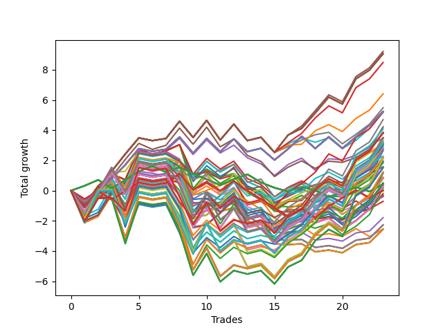

# Long HLT 104_1y 
- Symbol: TSLA
- Date Range: 05/15/2023 - 05/17/2024
- Trading Period: 8:30-12:30
- Number of Trades: 23



| Id. | Name | Win Percent | Profit | Avg Profit / Trade | Avg Time / Trade | Std |      | Name | Win Percent | Profit | Avg Profit / Trade | Avg Time / Trade | Std |
| --- | ---- | ----------- | ------ | ------------------ | ---------------- | --- | ---- | ---- | ----------- | ------ | ------------------ | ---------------- | --- |
| | Sorted By <br> Profit | | | | | | | Sorted By <br> Win Percentage |||||
|0| TP-1 105m | 69.57 | 9.21 | 0.40 | 39:33 | 0.93 |     | TP-1 105m | 69.57 | 9.21 | 0.40 | 39:33 | 0.93 |
|1| TP-1 180m | 69.57 | 9.06 | 0.39 | 40:13 | 0.93 |     | TP-1 180m | 69.57 | 9.06 | 0.39 | 40:13 | 0.93 |
|2| TP-1 165m | 69.57 | 9.06 | 0.39 | 40:13 | 0.93 |     | TP-1 165m | 69.57 | 9.06 | 0.39 | 40:13 | 0.93 |
|3| TP-1 150m | 69.57 | 9.06 | 0.39 | 40:13 | 0.93 |     | TP-1 150m | 69.57 | 9.06 | 0.39 | 40:13 | 0.93 |
|4| TP-1 135m | 69.57 | 9.06 | 0.39 | 40:13 | 0.93 |     | TP-1 135m | 69.57 | 9.06 | 0.39 | 40:13 | 0.93 |
|5| TP-1 120m | 69.57 | 9.06 | 0.39 | 40:13 | 0.93 |     | TP-1 120m | 69.57 | 9.06 | 0.39 | 40:13 | 0.93 |
|6| TP-1 90m | 69.57 | 8.48 | 0.37 | 38:07 | 0.91 |     | TP-1 90m | 69.57 | 8.48 | 0.37 | 38:07 | 0.91 |
|7| TP-1 75m | 69.57 | 6.41 | 0.28 | 35:54 | 0.87 |     | TP-1 75m | 69.57 | 6.41 | 0.28 | 35:54 | 0.87 |
|8| TP-1 45m | 69.57 | 5.48 | 0.24 | 27:10 | 0.86 |     | TP-1 45m | 69.57 | 5.48 | 0.24 | 27:10 | 0.86 |
|9| TP-0.75 180m | 65.22 | 5.23 | 0.23 | 20:18 | 0.76 |     | TP-0.75 180m | 65.22 | 5.23 | 0.23 | 20:18 | 0.76 |
|10| TP-0.75 165m | 65.22 | 5.23 | 0.23 | 20:18 | 0.76 |     | TP-0.75 165m | 65.22 | 5.23 | 0.23 | 20:18 | 0.76 |
|11| TP-0.75 150m | 65.22 | 5.23 | 0.23 | 20:18 | 0.76 |     | TP-0.75 150m | 65.22 | 5.23 | 0.23 | 20:18 | 0.76 |
|12| TP-0.75 135m | 65.22 | 5.23 | 0.23 | 20:18 | 0.76 |     | TP-0.75 135m | 65.22 | 5.23 | 0.23 | 20:18 | 0.76 |
|13| TP-0.75 120m | 65.22 | 5.23 | 0.23 | 20:18 | 0.76 |     | TP-0.75 120m | 65.22 | 5.23 | 0.23 | 20:18 | 0.76 |
|14| TP-0.75 105m | 65.22 | 5.23 | 0.23 | 20:18 | 0.76 |     | TP-0.75 105m | 65.22 | 5.23 | 0.23 | 20:18 | 0.76 |
|15| TP-0.75 90m | 65.22 | 5.23 | 0.23 | 20:18 | 0.76 |     | TP-0.75 90m | 65.22 | 5.23 | 0.23 | 20:18 | 0.76 |
|16| TP-0.75 75m | 65.22 | 5.23 | 0.23 | 20:18 | 0.76 |     | TP-0.75 75m | 65.22 | 5.23 | 0.23 | 20:18 | 0.76 |
|17| TP-0.75 60m | 65.22 | 5.23 | 0.23 | 20:18 | 0.76 |     | TP-0.75 60m | 65.22 | 5.23 | 0.23 | 20:18 | 0.76 |
|18| TP-0.75 45m | 65.22 | 5.23 | 0.23 | 20:18 | 0.76 |     | TP-0.75 45m | 65.22 | 5.23 | 0.23 | 20:18 | 0.76 |
|19| TP-3 105m | 56.52 | 5.20 | 0.23 | 87:23 | 1.17 |     | TP-1 60m | 65.22 | 5.19 | 0.23 | 31:44 | 0.87 |
|20| TP-1 60m | 65.22 | 5.19 | 0.23 | 31:44 | 0.87 |     | TP-3 75m | 65.22 | 3.30 | 0.14 | 66:23 | 1.14 |
|21| TP-1.5 105m | 60.87 | 4.70 | 0.20 | 66:00 | 1.25 |     | TP-1.5 75m | 65.22 | 3.08 | 0.13 | 55:39 | 1.12 |
|22| TP-1.5 90m | 60.87 | 4.22 | 0.18 | 61:26 | 1.21 |     | TP-2.25 75m | 65.22 | 2.82 | 0.12 | 62:18 | 1.11 |
|23| TP-2 105m | 56.52 | 4.07 | 0.18 | 76:05 | 1.31 |     | TP-2.5 75m | 65.22 | 2.81 | 0.12 | 62:28 | 1.20 |
|24| TP-3 180m | 60.87 | 3.85 | 0.17 | 96:46 | 1.28 |     | TP-2.75 75m | 65.22 | 2.79 | 0.12 | 62:33 | 1.20 |
|25| TP-3 165m | 60.87 | 3.85 | 0.17 | 96:46 | 1.28 |     | TP-1.25 45m | 65.22 | 2.18 | 0.09 | 33:41 | 1.00 |
|26| TP-3 150m | 60.87 | 3.85 | 0.17 | 96:46 | 1.28 |     | TP-2 75m | 65.22 | 2.15 | 0.09 | 61:05 | 1.15 |
|27| TP-3 135m | 60.87 | 3.85 | 0.17 | 96:46 | 1.28 |     | TP-1.75 75m | 65.22 | 1.95 | 0.08 | 57:54 | 1.19 |
|28| TP-3 120m | 60.87 | 3.85 | 0.17 | 96:46 | 1.28 |     | TP-3 45m | 65.22 | 1.58 | 0.07 | 42:00 | 0.94 |
|29| TP-1 30m | 60.87 | 3.79 | 0.16 | 21:52 | 0.84 |     | TP-1.5 45m | 65.22 | 1.20 | 0.05 | 38:49 | 0.99 |
|30| TP-0.75 30m | 60.87 | 3.78 | 0.16 | 18:33 | 0.72 |     | TP-1.75 45m | 65.22 | 1.16 | 0.05 | 39:13 | 1.02 |
|31| TP-1.5 180m | 60.87 | 3.50 | 0.15 | 69:23 | 1.32 |     | TP-2.25 45m | 65.22 | -0.36 | -0.02 | 40:31 | 1.02 |
|32| TP-1.5 165m | 60.87 | 3.50 | 0.15 | 69:23 | 1.32 |     | TP-2.5 45m | 65.22 | -0.37 | -0.02 | 40:41 | 1.12 |
|33| TP-1.5 150m | 60.87 | 3.50 | 0.15 | 69:23 | 1.32 |     | TP-2.75 45m | 65.22 | -0.39 | -0.02 | 40:46 | 1.12 |
|34| TP-1.5 135m | 60.87 | 3.50 | 0.15 | 69:23 | 1.32 |     | TP-2 45m | 65.22 | -0.40 | -0.02 | 39:54 | 0.98 |
|35| TP-1.5 120m | 60.87 | 3.50 | 0.15 | 69:23 | 1.32 |     | TP-1.5 105m | 60.87 | 4.70 | 0.20 | 66:00 | 1.25 |
|36| TP-2 90m | 60.87 | 3.48 | 0.15 | 68:54 | 1.25 |     | TP-1.5 90m | 60.87 | 4.22 | 0.18 | 61:26 | 1.21 |
|37| TP-1.75 90m | 60.87 | 3.48 | 0.15 | 64:26 | 1.31 |     | TP-3 180m | 60.87 | 3.85 | 0.17 | 96:46 | 1.28 |
|38| TP-1.75 105m | 56.52 | 3.40 | 0.15 | 70:18 | 1.36 |     | TP-3 165m | 60.87 | 3.85 | 0.17 | 96:46 | 1.28 |
|39| TP-3 75m | 65.22 | 3.30 | 0.14 | 66:23 | 1.14 |     | TP-3 150m | 60.87 | 3.85 | 0.17 | 96:46 | 1.28 |
|40| TP-1.25 180m | 60.87 | 3.19 | 0.14 | 52:07 | 1.17 |     | TP-3 135m | 60.87 | 3.85 | 0.17 | 96:46 | 1.28 |
|41| TP-1.25 165m | 60.87 | 3.19 | 0.14 | 52:07 | 1.17 |     | TP-3 120m | 60.87 | 3.85 | 0.17 | 96:46 | 1.28 |
|42| TP-1.25 150m | 60.87 | 3.19 | 0.14 | 52:07 | 1.17 |     | TP-1 30m | 60.87 | 3.79 | 0.16 | 21:52 | 0.84 |
|43| TP-1.25 135m | 60.87 | 3.19 | 0.14 | 52:07 | 1.17 |     | TP-0.75 30m | 60.87 | 3.78 | 0.16 | 18:33 | 0.72 |
|44| TP-1.25 120m | 60.87 | 3.19 | 0.14 | 52:07 | 1.17 |     | TP-1.5 180m | 60.87 | 3.50 | 0.15 | 69:23 | 1.32 |
|45| TP-2 180m | 60.87 | 3.17 | 0.14 | 82:18 | 1.42 |     | TP-1.5 165m | 60.87 | 3.50 | 0.15 | 69:23 | 1.32 |
|46| TP-2 165m | 60.87 | 3.17 | 0.14 | 82:18 | 1.42 |     | TP-1.5 150m | 60.87 | 3.50 | 0.15 | 69:23 | 1.32 |
|47| TP-2 150m | 60.87 | 3.17 | 0.14 | 82:18 | 1.42 |     | TP-1.5 135m | 60.87 | 3.50 | 0.15 | 69:23 | 1.32 |
|48| TP-2 135m | 60.87 | 3.17 | 0.14 | 82:18 | 1.42 |     | TP-1.5 120m | 60.87 | 3.50 | 0.15 | 69:23 | 1.32 |
|49| TP-2 120m | 60.87 | 3.17 | 0.14 | 82:18 | 1.42 |     | TP-2 90m | 60.87 | 3.48 | 0.15 | 68:54 | 1.25 |
|50| TP-3 30m | 56.52 | 3.14 | 0.14 | 29:00 | 0.93 |     | TP-1.75 90m | 60.87 | 3.48 | 0.15 | 64:26 | 1.31 |
|51| TP-1.25 105m | 60.87 | 3.09 | 0.13 | 50:07 | 1.17 |     | TP-1.25 180m | 60.87 | 3.19 | 0.14 | 52:07 | 1.17 |
|52| TP-1.5 75m | 65.22 | 3.08 | 0.13 | 55:39 | 1.12 |     | TP-1.25 165m | 60.87 | 3.19 | 0.14 | 52:07 | 1.17 |
|53| TP-3 90m | 60.87 | 3.07 | 0.13 | 77:20 | 1.24 |     | TP-1.25 150m | 60.87 | 3.19 | 0.14 | 52:07 | 1.17 |
|54| TP-2.25 105m | 56.52 | 3.03 | 0.13 | 78:46 | 1.34 |     | TP-1.25 135m | 60.87 | 3.19 | 0.14 | 52:07 | 1.17 |
|55| TP-2.25 90m | 60.87 | 3.00 | 0.13 | 70:57 | 1.32 |     | TP-1.25 120m | 60.87 | 3.19 | 0.14 | 52:07 | 1.17 |
|56| TP-2 30m | 56.52 | 2.94 | 0.13 | 28:18 | 0.95 |     | TP-2 180m | 60.87 | 3.17 | 0.14 | 82:18 | 1.42 |
|57| TP-1.75 30m | 56.52 | 2.94 | 0.13 | 28:18 | 0.95 |     | TP-2 165m | 60.87 | 3.17 | 0.14 | 82:18 | 1.42 |
|58| TP-2.25 75m | 65.22 | 2.82 | 0.12 | 62:18 | 1.11 |     | TP-2 150m | 60.87 | 3.17 | 0.14 | 82:18 | 1.42 |
|59| TP-2.5 75m | 65.22 | 2.81 | 0.12 | 62:28 | 1.20 |     | TP-2 135m | 60.87 | 3.17 | 0.14 | 82:18 | 1.42 |
|60| TP-2.75 75m | 65.22 | 2.79 | 0.12 | 62:33 | 1.20 |     | TP-2 120m | 60.87 | 3.17 | 0.14 | 82:18 | 1.42 |
|61| TP-1.25 90m | 60.87 | 2.76 | 0.12 | 47:31 | 1.16 |     | TP-1.25 105m | 60.87 | 3.09 | 0.13 | 50:07 | 1.17 |
|62| TP-3 60m | 60.87 | 2.67 | 0.12 | 54:23 | 1.05 |     | TP-3 90m | 60.87 | 3.07 | 0.13 | 77:20 | 1.24 |
|63| TP-1.5 30m | 56.52 | 2.66 | 0.12 | 28:10 | 0.93 |     | TP-2.25 90m | 60.87 | 3.00 | 0.13 | 70:57 | 1.32 |
|64| TP-2.25 30m | 56.52 | 2.65 | 0.12 | 28:20 | 0.98 |     | TP-1.25 90m | 60.87 | 2.76 | 0.12 | 47:31 | 1.16 |
|65| TP-2.5 90m | 60.87 | 2.28 | 0.10 | 71:39 | 1.35 |     | TP-3 60m | 60.87 | 2.67 | 0.12 | 54:23 | 1.05 |
|66| TP-2.5 105m | 56.52 | 2.20 | 0.10 | 80:07 | 1.37 |     | TP-2.5 90m | 60.87 | 2.28 | 0.10 | 71:39 | 1.35 |
|67| TP-1.25 45m | 65.22 | 2.18 | 0.09 | 33:41 | 1.00 |     | TP-1.75 180m | 60.87 | 2.15 | 0.09 | 74:28 | 1.44 |
|68| TP-2.75 30m | 56.52 | 2.18 | 0.09 | 28:28 | 1.04 |     | TP-1.75 165m | 60.87 | 2.15 | 0.09 | 74:28 | 1.44 |
|69| TP-2.5 30m | 56.52 | 2.18 | 0.09 | 28:28 | 1.04 |     | TP-1.75 150m | 60.87 | 2.15 | 0.09 | 74:28 | 1.44 |
|70| TP-2 75m | 65.22 | 2.15 | 0.09 | 61:05 | 1.15 |     | TP-1.75 135m | 60.87 | 2.15 | 0.09 | 74:28 | 1.44 |
|71| TP-1.75 180m | 60.87 | 2.15 | 0.09 | 74:28 | 1.44 |     | TP-1.75 120m | 60.87 | 2.15 | 0.09 | 74:28 | 1.44 |
|72| TP-1.75 165m | 60.87 | 2.15 | 0.09 | 74:28 | 1.44 |     | TP-2.75 90m | 60.87 | 1.92 | 0.08 | 72:05 | 1.38 |
|73| TP-1.75 150m | 60.87 | 2.15 | 0.09 | 74:28 | 1.44 |     | TP-2.25 180m | 60.87 | 1.52 | 0.07 | 86:13 | 1.42 |
|74| TP-1.75 135m | 60.87 | 2.15 | 0.09 | 74:28 | 1.44 |     | TP-2.25 165m | 60.87 | 1.52 | 0.07 | 86:13 | 1.42 |
|75| TP-1.75 120m | 60.87 | 2.15 | 0.09 | 74:28 | 1.44 |     | TP-2.25 150m | 60.87 | 1.52 | 0.07 | 86:13 | 1.42 |
|76| TP-1.75 75m | 65.22 | 1.95 | 0.08 | 57:54 | 1.19 |     | TP-2.25 135m | 60.87 | 1.52 | 0.07 | 86:13 | 1.42 |
|77| TP-2.75 90m | 60.87 | 1.92 | 0.08 | 72:05 | 1.38 |     | TP-2.25 120m | 60.87 | 1.52 | 0.07 | 86:13 | 1.42 |
|78| TP-2.75 105m | 56.52 | 1.84 | 0.08 | 80:33 | 1.40 |     | TP-1.5 60m | 60.87 | 1.25 | 0.05 | 48:05 | 1.08 |
|79| TP-3 45m | 65.22 | 1.58 | 0.07 | 42:00 | 0.94 |     | TP-1.25 75m | 60.87 | 0.87 | 0.04 | 44:44 | 1.08 |
|80| TP-2.25 180m | 60.87 | 1.52 | 0.07 | 86:13 | 1.42 |     | TP-2.5 180m | 60.87 | 0.86 | 0.04 | 88:13 | 1.45 |
|81| TP-2.25 165m | 60.87 | 1.52 | 0.07 | 86:13 | 1.42 |     | TP-2.5 165m | 60.87 | 0.86 | 0.04 | 88:13 | 1.45 |
|82| TP-2.25 150m | 60.87 | 1.52 | 0.07 | 86:13 | 1.42 |     | TP-2.5 150m | 60.87 | 0.86 | 0.04 | 88:13 | 1.45 |
|83| TP-2.25 135m | 60.87 | 1.52 | 0.07 | 86:13 | 1.42 |     | TP-2.5 135m | 60.87 | 0.86 | 0.04 | 88:13 | 1.45 |
|84| TP-2.25 120m | 60.87 | 1.52 | 0.07 | 86:13 | 1.42 |     | TP-2.5 120m | 60.87 | 0.86 | 0.04 | 88:13 | 1.45 |
|85| TP-1.5 60m | 60.87 | 1.25 | 0.05 | 48:05 | 1.08 |     | TP-2.75 180m | 60.87 | 0.50 | 0.02 | 88:39 | 1.48 |
|86| TP-1.5 45m | 65.22 | 1.20 | 0.05 | 38:49 | 0.99 |     | TP-2.75 165m | 60.87 | 0.50 | 0.02 | 88:39 | 1.48 |
|87| TP-1.75 45m | 65.22 | 1.16 | 0.05 | 39:13 | 1.02 |     | TP-2.75 150m | 60.87 | 0.50 | 0.02 | 88:39 | 1.48 |
|88| TP-1.25 75m | 60.87 | 0.87 | 0.04 | 44:44 | 1.08 |     | TP-2.75 135m | 60.87 | 0.50 | 0.02 | 88:39 | 1.48 |
|89| TP-2.5 180m | 60.87 | 0.86 | 0.04 | 88:13 | 1.45 |     | TP-2.75 120m | 60.87 | 0.50 | 0.02 | 88:39 | 1.48 |
|90| TP-2.5 165m | 60.87 | 0.86 | 0.04 | 88:13 | 1.45 |     | TP-2.25 60m | 60.87 | 0.32 | 0.01 | 51:36 | 1.10 |
|91| TP-2.5 150m | 60.87 | 0.86 | 0.04 | 88:13 | 1.45 |     | TP-2.5 60m | 60.87 | 0.31 | 0.01 | 51:46 | 1.19 |
|92| TP-2.5 135m | 60.87 | 0.86 | 0.04 | 88:13 | 1.45 |     | TP-2.75 60m | 60.87 | 0.29 | 0.01 | 51:52 | 1.19 |
|93| TP-2.5 120m | 60.87 | 0.86 | 0.04 | 88:13 | 1.45 |     | TP-2 60m | 60.87 | 0.28 | 0.01 | 51:00 | 1.06 |
|94| TP-1.25 30m | 56.52 | 0.80 | 0.03 | 25:54 | 0.93 |     | TP-1.75 60m | 60.87 | 0.18 | 0.01 | 49:10 | 1.09 |
|95| TP-2.75 180m | 60.87 | 0.50 | 0.02 | 88:39 | 1.48 |     | TP-3 105m | 56.52 | 5.20 | 0.23 | 87:23 | 1.17 |
|96| TP-2.75 165m | 60.87 | 0.50 | 0.02 | 88:39 | 1.48 |     | TP-2 105m | 56.52 | 4.07 | 0.18 | 76:05 | 1.31 |
|97| TP-2.75 150m | 60.87 | 0.50 | 0.02 | 88:39 | 1.48 |     | TP-1.75 105m | 56.52 | 3.40 | 0.15 | 70:18 | 1.36 |
|98| TP-2.75 135m | 60.87 | 0.50 | 0.02 | 88:39 | 1.48 |     | TP-3 30m | 56.52 | 3.14 | 0.14 | 29:00 | 0.93 |
|99| TP-2.75 120m | 60.87 | 0.50 | 0.02 | 88:39 | 1.48 |     | TP-2.25 105m | 56.52 | 3.03 | 0.13 | 78:46 | 1.34 |
|100| TP-0.25 180m | 52.17 | 0.44 | 0.02 | 04:23 | 0.40 |     | TP-2 30m | 56.52 | 2.94 | 0.13 | 28:18 | 0.95 |
|101| TP-0.25 165m | 52.17 | 0.44 | 0.02 | 04:23 | 0.40 |     | TP-1.75 30m | 56.52 | 2.94 | 0.13 | 28:18 | 0.95 |
|102| TP-0.25 150m | 52.17 | 0.44 | 0.02 | 04:23 | 0.40 |     | TP-1.5 30m | 56.52 | 2.66 | 0.12 | 28:10 | 0.93 |
|103| TP-0.25 135m | 52.17 | 0.44 | 0.02 | 04:23 | 0.40 |     | TP-2.25 30m | 56.52 | 2.65 | 0.12 | 28:20 | 0.98 |
|104| TP-0.25 120m | 52.17 | 0.44 | 0.02 | 04:23 | 0.40 |     | TP-2.5 105m | 56.52 | 2.20 | 0.10 | 80:07 | 1.37 |
|105| TP-0.25 105m | 52.17 | 0.44 | 0.02 | 04:23 | 0.40 |     | TP-2.75 30m | 56.52 | 2.18 | 0.09 | 28:28 | 1.04 |
|106| TP-0.25 90m | 52.17 | 0.44 | 0.02 | 04:23 | 0.40 |     | TP-2.5 30m | 56.52 | 2.18 | 0.09 | 28:28 | 1.04 |
|107| TP-0.25 75m | 52.17 | 0.44 | 0.02 | 04:23 | 0.40 |     | TP-2.75 105m | 56.52 | 1.84 | 0.08 | 80:33 | 1.40 |
|108| TP-0.25 60m | 52.17 | 0.44 | 0.02 | 04:23 | 0.40 |     | TP-1.25 30m | 56.52 | 0.80 | 0.03 | 25:54 | 0.93 |
|109| TP-0.25 45m | 52.17 | 0.44 | 0.02 | 04:23 | 0.40 |     | TP-1.25 60m | 56.52 | 0.35 | 0.02 | 39:54 | 1.06 |
|110| TP-0.25 30m | 52.17 | 0.44 | 0.02 | 04:23 | 0.40 |     | TP-0.25 180m | 52.17 | 0.44 | 0.02 | 04:23 | 0.40 |
|111| TP-0.25 15m | 52.17 | 0.44 | 0.02 | 04:23 | 0.40 |     | TP-0.25 165m | 52.17 | 0.44 | 0.02 | 04:23 | 0.40 |
|112| TP-1.25 60m | 56.52 | 0.35 | 0.02 | 39:54 | 1.06 |     | TP-0.25 150m | 52.17 | 0.44 | 0.02 | 04:23 | 0.40 |
|113| TP-2.25 60m | 60.87 | 0.32 | 0.01 | 51:36 | 1.10 |     | TP-0.25 135m | 52.17 | 0.44 | 0.02 | 04:23 | 0.40 |
|114| TP-2.5 60m | 60.87 | 0.31 | 0.01 | 51:46 | 1.19 |     | TP-0.25 120m | 52.17 | 0.44 | 0.02 | 04:23 | 0.40 |
|115| TP-2.75 60m | 60.87 | 0.29 | 0.01 | 51:52 | 1.19 |     | TP-0.25 105m | 52.17 | 0.44 | 0.02 | 04:23 | 0.40 |
|116| TP-2 60m | 60.87 | 0.28 | 0.01 | 51:00 | 1.06 |     | TP-0.25 90m | 52.17 | 0.44 | 0.02 | 04:23 | 0.40 |
|117| TP-1.75 60m | 60.87 | 0.18 | 0.01 | 49:10 | 1.09 |     | TP-0.25 75m | 52.17 | 0.44 | 0.02 | 04:23 | 0.40 |
|118| TP-0.5 180m | 52.17 | 0.01 | 0.00 | 12:41 | 0.59 |     | TP-0.25 60m | 52.17 | 0.44 | 0.02 | 04:23 | 0.40 |
|119| TP-0.5 165m | 52.17 | 0.01 | 0.00 | 12:41 | 0.59 |     | TP-0.25 45m | 52.17 | 0.44 | 0.02 | 04:23 | 0.40 |
|120| TP-0.5 150m | 52.17 | 0.01 | 0.00 | 12:41 | 0.59 |     | TP-0.25 30m | 52.17 | 0.44 | 0.02 | 04:23 | 0.40 |
|121| TP-0.5 135m | 52.17 | 0.01 | 0.00 | 12:41 | 0.59 |     | TP-0.25 15m | 52.17 | 0.44 | 0.02 | 04:23 | 0.40 |
|122| TP-0.5 120m | 52.17 | 0.01 | 0.00 | 12:41 | 0.59 |     | TP-0.5 180m | 52.17 | 0.01 | 0.00 | 12:41 | 0.59 |
|123| TP-0.5 105m | 52.17 | 0.01 | 0.00 | 12:41 | 0.59 |     | TP-0.5 165m | 52.17 | 0.01 | 0.00 | 12:41 | 0.59 |
|124| TP-0.5 90m | 52.17 | 0.01 | 0.00 | 12:41 | 0.59 |     | TP-0.5 150m | 52.17 | 0.01 | 0.00 | 12:41 | 0.59 |
|125| TP-0.5 75m | 52.17 | 0.01 | 0.00 | 12:41 | 0.59 |     | TP-0.5 135m | 52.17 | 0.01 | 0.00 | 12:41 | 0.59 |
|126| TP-0.5 60m | 52.17 | 0.01 | 0.00 | 12:41 | 0.59 |     | TP-0.5 120m | 52.17 | 0.01 | 0.00 | 12:41 | 0.59 |
|127| TP-0.5 45m | 52.17 | 0.01 | 0.00 | 12:41 | 0.59 |     | TP-0.5 105m | 52.17 | 0.01 | 0.00 | 12:41 | 0.59 |
|128| TP-1 15m | 47.83 | -0.20 | -0.01 | 12:54 | 0.67 |     | TP-0.5 90m | 52.17 | 0.01 | 0.00 | 12:41 | 0.59 |
|129| TP-0.75 15m | 47.83 | -0.31 | -0.01 | 12:05 | 0.62 |     | TP-0.5 75m | 52.17 | 0.01 | 0.00 | 12:41 | 0.59 |
|130| TP-2.25 45m | 65.22 | -0.36 | -0.02 | 40:31 | 1.02 |     | TP-0.5 60m | 52.17 | 0.01 | 0.00 | 12:41 | 0.59 |
|131| TP-2.5 45m | 65.22 | -0.37 | -0.02 | 40:41 | 1.12 |     | TP-0.5 45m | 52.17 | 0.01 | 0.00 | 12:41 | 0.59 |
|132| TP-2.75 45m | 65.22 | -0.39 | -0.02 | 40:46 | 1.12 |     | TP-1 15m | 47.83 | -0.20 | -0.01 | 12:54 | 0.67 |
|133| TP-2 45m | 65.22 | -0.40 | -0.02 | 39:54 | 0.98 |     | TP-0.75 15m | 47.83 | -0.31 | -0.01 | 12:05 | 0.62 |
|134| TP-0.5 30m | 47.83 | -0.71 | -0.03 | 12:18 | 0.58 |     | TP-0.5 30m | 47.83 | -0.71 | -0.03 | 12:18 | 0.58 |
|135| TP-1.25 15m | 47.83 | -1.79 | -0.08 | 13:49 | 0.72 |     | TP-1.25 15m | 47.83 | -1.79 | -0.08 | 13:49 | 0.72 |
|136| TP-2 15m | 47.83 | -2.27 | -0.10 | 13:57 | 0.69 |     | TP-2 15m | 47.83 | -2.27 | -0.10 | 13:57 | 0.69 |
|137| TP-1.75 15m | 47.83 | -2.27 | -0.10 | 13:57 | 0.69 |     | TP-1.75 15m | 47.83 | -2.27 | -0.10 | 13:57 | 0.69 |
|138| TP-1.5 15m | 47.83 | -2.27 | -0.10 | 13:57 | 0.69 |     | TP-1.5 15m | 47.83 | -2.27 | -0.10 | 13:57 | 0.69 |
|139| TP-0.5 15m | 43.48 | -2.54 | -0.11 | 09:26 | 0.52 |     | TP-3 15m | 47.83 | -2.56 | -0.11 | 14:00 | 0.72 |
|140| TP-3 15m | 47.83 | -2.56 | -0.11 | 14:00 | 0.72 |     | TP-2.75 15m | 47.83 | -2.56 | -0.11 | 14:00 | 0.72 |
|141| TP-2.75 15m | 47.83 | -2.56 | -0.11 | 14:00 | 0.72 |     | TP-2.5 15m | 47.83 | -2.56 | -0.11 | 14:00 | 0.72 |
|142| TP-2.5 15m | 47.83 | -2.56 | -0.11 | 14:00 | 0.72 |     | TP-2.25 15m | 47.83 | -2.56 | -0.11 | 14:00 | 0.72 |
|143| TP-2.25 15m | 47.83 | -2.56 | -0.11 | 14:00 | 0.72 |     | TP-0.5 15m | 43.48 | -2.54 | -0.11 | 09:26 | 0.52 |

### Test TP-0.25 15m
* Take Profit of 0.25 Point
* 0.25 Stoploss
* Results:
```
Total Trades: 23
Percent Up: 52.17
Percent Down: 47.83
Total Points Moved Up: 0.44
Potential Profit: 220.00
Total Points Ups: 4.68 Count Ups: 12
Total Points Downs: -4.24 Count Downs: 11
```

<details><summary>Trades</summary>

<code>In: 2023-07-27 12:15:00		Out: 2023-07-27 12:20:00		Total Position Time: 05:00		Total Move Up: 0.32		Total to Date: 0.32</code> <br />
<code>In: 2023-08-08 09:05:00		Out: 2023-08-08 09:07:00		Total Position Time: 02:00		Total Move Up: 0.39		Total to Date: 0.71</code> <br />
<code>In: 2023-08-14 09:10:00		Out: 2023-08-14 09:16:00		Total Position Time: 06:00		Total Move Up: -0.56		Total to Date: 0.15</code> <br />
<code>In: 2023-09-12 08:35:00		Out: 2023-09-12 08:37:00		Total Position Time: 02:00		Total Move Up: 0.56		Total to Date: 0.71</code> <br />
<code>In: 2023-09-29 11:15:00		Out: 2023-09-29 11:21:00		Total Position Time: 06:00		Total Move Up: 0.57		Total to Date: 1.28</code> <br />
<code>In: 2023-10-18 12:20:00		Out: 2023-10-18 12:23:00		Total Position Time: 03:00		Total Move Up: 0.35		Total to Date: 1.63</code> <br />
<code>In: 2023-10-24 12:20:00		Out: 2023-10-24 12:24:00		Total Position Time: 04:00		Total Move Up: -0.41		Total to Date: 1.22</code> <br />
<code>In: 2023-10-25 11:00:00		Out: 2023-10-25 11:03:00		Total Position Time: 03:00		Total Move Up: 0.32		Total to Date: 1.54</code> <br />
<code>In: 2023-11-09 09:50:00		Out: 2023-11-09 09:56:00		Total Position Time: 06:00		Total Move Up: -0.42		Total to Date: 1.12</code> <br />
<code>In: 2023-11-22 08:45:00		Out: 2023-11-22 08:48:00		Total Position Time: 03:00		Total Move Up: -0.37		Total to Date: 0.75</code> <br />
<code>In: 2023-11-30 08:45:00		Out: 2023-11-30 08:47:00		Total Position Time: 02:00		Total Move Up: -0.39		Total to Date: 0.36</code> <br />
<code>In: 2023-12-01 11:25:00		Out: 2023-12-01 11:29:00		Total Position Time: 04:00		Total Move Up: 0.40		Total to Date: 0.76</code> <br />
<code>In: 2023-12-20 08:45:00		Out: 2023-12-20 08:51:00		Total Position Time: 06:00		Total Move Up: 0.32		Total to Date: 1.08</code> <br />
<code>In: 2024-01-05 12:15:00		Out: 2024-01-05 12:28:00		Total Position Time: 13:00		Total Move Up: -0.54		Total to Date: 0.54</code> <br />
<code>In: 2024-01-26 10:30:00		Out: 2024-01-26 10:33:00		Total Position Time: 03:00		Total Move Up: -0.35		Total to Date: 0.19</code> <br />
<code>In: 2024-02-06 09:10:00		Out: 2024-02-06 09:12:00		Total Position Time: 02:00		Total Move Up: -0.25		Total to Date: -0.06</code> <br />
<code>In: 2024-02-08 10:35:00		Out: 2024-02-08 10:37:00		Total Position Time: 02:00		Total Move Up: 0.31		Total to Date: 0.25</code> <br />
<code>In: 2024-02-20 09:35:00		Out: 2024-02-20 09:37:00		Total Position Time: 02:00		Total Move Up: -0.22		Total to Date: 0.03</code> <br />
<code>In: 2024-03-11 08:55:00		Out: 2024-03-11 09:02:00		Total Position Time: 07:00		Total Move Up: -0.44		Total to Date: -0.41</code> <br />
<code>In: 2024-03-13 11:45:00		Out: 2024-03-13 11:53:00		Total Position Time: 08:00		Total Move Up: 0.30		Total to Date: -0.11</code> <br />
<code>In: 2024-03-20 09:45:00		Out: 2024-03-20 09:51:00		Total Position Time: 06:00		Total Move Up: 0.34		Total to Date: 0.23</code> <br />
<code>In: 2024-03-21 11:35:00		Out: 2024-03-21 11:38:00		Total Position Time: 03:00		Total Move Up: -0.29		Total to Date: -0.06</code> <br />
<code>In: 2024-04-30 09:00:00		Out: 2024-04-30 09:03:00		Total Position Time: 03:00		Total Move Up: 0.50		Total to Date: 0.44</code> <br />


</details>

### Test TP-0.5 15m
* Take Profit of 0.5 Point
* 0.5 Stoploss
* Results:
```
Total Trades: 23
Percent Up: 43.48
Percent Down: 56.52
Total Points Moved Up: -2.54
Potential Profit: -1270.00
Total Points Ups: 4.25 Count Ups: 10
Total Points Downs: -6.79 Count Downs: 13
```

<details><summary>Trades</summary>

<code>In: 2023-07-27 12:15:00		Out: 2023-07-27 12:24:00		Total Position Time: 09:00		Total Move Up: -0.56		Total to Date: -0.56</code> <br />
<code>In: 2023-08-08 09:05:00		Out: 2023-08-08 09:16:00		Total Position Time: 11:00		Total Move Up: 0.53		Total to Date: -0.03</code> <br />
<code>In: 2023-08-14 09:10:00		Out: 2023-08-14 09:16:00		Total Position Time: 06:00		Total Move Up: -0.56		Total to Date: -0.59</code> <br />
<code>In: 2023-09-12 08:35:00		Out: 2023-09-12 08:37:00		Total Position Time: 02:00		Total Move Up: 0.56		Total to Date: -0.03</code> <br />
<code>In: 2023-09-29 11:15:00		Out: 2023-09-29 11:21:00		Total Position Time: 06:00		Total Move Up: 0.57		Total to Date: 0.54</code> <br />
<code>In: 2023-10-18 12:20:00		Out: 2023-10-18 12:34:00		Total Position Time: 14:00		Total Move Up: -0.15		Total to Date: 0.39</code> <br />
<code>In: 2023-10-24 12:20:00		Out: 2023-10-24 12:34:00		Total Position Time: 14:00		Total Move Up: -0.17		Total to Date: 0.22</code> <br />
<code>In: 2023-10-25 11:00:00		Out: 2023-10-25 11:14:00		Total Position Time: 14:00		Total Move Up: 0.63		Total to Date: 0.85</code> <br />
<code>In: 2023-11-09 09:50:00		Out: 2023-11-09 10:02:00		Total Position Time: 12:00		Total Move Up: -1.07		Total to Date: -0.22</code> <br />
<code>In: 2023-11-22 08:45:00		Out: 2023-11-22 08:52:00		Total Position Time: 07:00		Total Move Up: 0.53		Total to Date: 0.31</code> <br />
<code>In: 2023-11-30 08:45:00		Out: 2023-11-30 08:57:00		Total Position Time: 12:00		Total Move Up: -0.60		Total to Date: -0.29</code> <br />
<code>In: 2023-12-01 11:25:00		Out: 2023-12-01 11:39:00		Total Position Time: 14:00		Total Move Up: 0.25		Total to Date: -0.04</code> <br />
<code>In: 2023-12-20 08:45:00		Out: 2023-12-20 08:58:00		Total Position Time: 13:00		Total Move Up: -0.65		Total to Date: -0.69</code> <br />
<code>In: 2024-01-05 12:15:00		Out: 2024-01-05 12:28:00		Total Position Time: 13:00		Total Move Up: -0.54		Total to Date: -1.23</code> <br />
<code>In: 2024-01-26 10:30:00		Out: 2024-01-26 10:36:00		Total Position Time: 06:00		Total Move Up: -0.58		Total to Date: -1.81</code> <br />
<code>In: 2024-02-06 09:10:00		Out: 2024-02-06 09:13:00		Total Position Time: 03:00		Total Move Up: -0.59		Total to Date: -2.40</code> <br />
<code>In: 2024-02-08 10:35:00		Out: 2024-02-08 10:49:00		Total Position Time: 14:00		Total Move Up: 0.05		Total to Date: -2.35</code> <br />
<code>In: 2024-02-20 09:35:00		Out: 2024-02-20 09:38:00		Total Position Time: 03:00		Total Move Up: -0.62		Total to Date: -2.97</code> <br />
<code>In: 2024-03-11 08:55:00		Out: 2024-03-11 09:09:00		Total Position Time: 14:00		Total Move Up: 0.12		Total to Date: -2.85</code> <br />
<code>In: 2024-03-13 11:45:00		Out: 2024-03-13 11:59:00		Total Position Time: 14:00		Total Move Up: -0.18		Total to Date: -3.03</code> <br />
<code>In: 2024-03-20 09:45:00		Out: 2024-03-20 09:54:00		Total Position Time: 09:00		Total Move Up: 0.51		Total to Date: -2.52</code> <br />
<code>In: 2024-03-21 11:35:00		Out: 2024-03-21 11:39:00		Total Position Time: 04:00		Total Move Up: -0.52		Total to Date: -3.04</code> <br />
<code>In: 2024-04-30 09:00:00		Out: 2024-04-30 09:03:00		Total Position Time: 03:00		Total Move Up: 0.50		Total to Date: -2.54</code> <br />


</details>

### Test TP-0.75 15m
* Take Profit of 0.75 Point
* 0.75 Stoploss
* Results:
```
Total Trades: 23
Percent Up: 47.83
Percent Down: 52.17
Total Points Moved Up: -0.31
Potential Profit: -155.00
Total Points Ups: 5.91 Count Ups: 11
Total Points Downs: -6.22 Count Downs: 12
```

<details><summary>Trades</summary>

<code>In: 2023-07-27 12:15:00		Out: 2023-07-27 12:25:00		Total Position Time: 10:00		Total Move Up: -0.78		Total to Date: -0.78</code> <br />
<code>In: 2023-08-08 09:05:00		Out: 2023-08-08 09:19:00		Total Position Time: 14:00		Total Move Up: 0.82		Total to Date: 0.04</code> <br />
<code>In: 2023-08-14 09:10:00		Out: 2023-08-14 09:24:00		Total Position Time: 14:00		Total Move Up: -0.31		Total to Date: -0.27</code> <br />
<code>In: 2023-09-12 08:35:00		Out: 2023-09-12 08:38:00		Total Position Time: 03:00		Total Move Up: 0.91		Total to Date: 0.64</code> <br />
<code>In: 2023-09-29 11:15:00		Out: 2023-09-29 11:24:00		Total Position Time: 09:00		Total Move Up: 1.07		Total to Date: 1.71</code> <br />
<code>In: 2023-10-18 12:20:00		Out: 2023-10-18 12:34:00		Total Position Time: 14:00		Total Move Up: -0.15		Total to Date: 1.56</code> <br />
<code>In: 2023-10-24 12:20:00		Out: 2023-10-24 12:34:00		Total Position Time: 14:00		Total Move Up: -0.17		Total to Date: 1.39</code> <br />
<code>In: 2023-10-25 11:00:00		Out: 2023-10-25 11:14:00		Total Position Time: 14:00		Total Move Up: 0.63		Total to Date: 2.02</code> <br />
<code>In: 2023-11-09 09:50:00		Out: 2023-11-09 10:02:00		Total Position Time: 12:00		Total Move Up: -1.07		Total to Date: 0.95</code> <br />
<code>In: 2023-11-22 08:45:00		Out: 2023-11-22 08:59:00		Total Position Time: 14:00		Total Move Up: 0.48		Total to Date: 1.43</code> <br />
<code>In: 2023-11-30 08:45:00		Out: 2023-11-30 08:59:00		Total Position Time: 14:00		Total Move Up: -0.54		Total to Date: 0.89</code> <br />
<code>In: 2023-12-01 11:25:00		Out: 2023-12-01 11:39:00		Total Position Time: 14:00		Total Move Up: 0.25		Total to Date: 1.14</code> <br />
<code>In: 2023-12-20 08:45:00		Out: 2023-12-20 08:59:00		Total Position Time: 14:00		Total Move Up: -0.84		Total to Date: 0.30</code> <br />
<code>In: 2024-01-05 12:15:00		Out: 2024-01-05 12:29:00		Total Position Time: 14:00		Total Move Up: -0.55		Total to Date: -0.25</code> <br />
<code>In: 2024-01-26 10:30:00		Out: 2024-01-26 10:41:00		Total Position Time: 11:00		Total Move Up: -0.77		Total to Date: -1.02</code> <br />
<code>In: 2024-02-06 09:10:00		Out: 2024-02-06 09:24:00		Total Position Time: 14:00		Total Move Up: -0.05		Total to Date: -1.07</code> <br />
<code>In: 2024-02-08 10:35:00		Out: 2024-02-08 10:49:00		Total Position Time: 14:00		Total Move Up: 0.05		Total to Date: -1.02</code> <br />
<code>In: 2024-02-20 09:35:00		Out: 2024-02-20 09:39:00		Total Position Time: 04:00		Total Move Up: -0.81		Total to Date: -1.83</code> <br />
<code>In: 2024-03-11 08:55:00		Out: 2024-03-11 09:09:00		Total Position Time: 14:00		Total Move Up: 0.12		Total to Date: -1.71</code> <br />
<code>In: 2024-03-13 11:45:00		Out: 2024-03-13 11:59:00		Total Position Time: 14:00		Total Move Up: -0.18		Total to Date: -1.89</code> <br />
<code>In: 2024-03-20 09:45:00		Out: 2024-03-20 09:59:00		Total Position Time: 14:00		Total Move Up: 0.54		Total to Date: -1.35</code> <br />
<code>In: 2024-03-21 11:35:00		Out: 2024-03-21 11:49:00		Total Position Time: 14:00		Total Move Up: 0.13		Total to Date: -1.22</code> <br />
<code>In: 2024-04-30 09:00:00		Out: 2024-04-30 09:05:00		Total Position Time: 05:00		Total Move Up: 0.91		Total to Date: -0.31</code> <br />


</details>

### Test TP-1 15m
* Take Profit of 1 Point
* 1 Stoploss
* Results:
```
Total Trades: 23
Percent Up: 47.83
Percent Down: 52.17
Total Points Moved Up: -0.20
Potential Profit: -100.00
Total Points Ups: 6.31 Count Ups: 11
Total Points Downs: -6.51 Count Downs: 12
```

<details><summary>Trades</summary>

<code>In: 2023-07-27 12:15:00		Out: 2023-07-27 12:27:00		Total Position Time: 12:00		Total Move Up: -1.12		Total to Date: -1.12</code> <br />
<code>In: 2023-08-08 09:05:00		Out: 2023-08-08 09:19:00		Total Position Time: 14:00		Total Move Up: 0.82		Total to Date: -0.30</code> <br />
<code>In: 2023-08-14 09:10:00		Out: 2023-08-14 09:24:00		Total Position Time: 14:00		Total Move Up: -0.31		Total to Date: -0.61</code> <br />
<code>In: 2023-09-12 08:35:00		Out: 2023-09-12 08:41:00		Total Position Time: 06:00		Total Move Up: 1.14		Total to Date: 0.53</code> <br />
<code>In: 2023-09-29 11:15:00		Out: 2023-09-29 11:24:00		Total Position Time: 09:00		Total Move Up: 1.07		Total to Date: 1.60</code> <br />
<code>In: 2023-10-18 12:20:00		Out: 2023-10-18 12:34:00		Total Position Time: 14:00		Total Move Up: -0.15		Total to Date: 1.45</code> <br />
<code>In: 2023-10-24 12:20:00		Out: 2023-10-24 12:34:00		Total Position Time: 14:00		Total Move Up: -0.17		Total to Date: 1.28</code> <br />
<code>In: 2023-10-25 11:00:00		Out: 2023-10-25 11:14:00		Total Position Time: 14:00		Total Move Up: 0.63		Total to Date: 1.91</code> <br />
<code>In: 2023-11-09 09:50:00		Out: 2023-11-09 10:02:00		Total Position Time: 12:00		Total Move Up: -1.07		Total to Date: 0.84</code> <br />
<code>In: 2023-11-22 08:45:00		Out: 2023-11-22 08:59:00		Total Position Time: 14:00		Total Move Up: 0.48		Total to Date: 1.32</code> <br />
<code>In: 2023-11-30 08:45:00		Out: 2023-11-30 08:59:00		Total Position Time: 14:00		Total Move Up: -0.54		Total to Date: 0.78</code> <br />
<code>In: 2023-12-01 11:25:00		Out: 2023-12-01 11:39:00		Total Position Time: 14:00		Total Move Up: 0.25		Total to Date: 1.03</code> <br />
<code>In: 2023-12-20 08:45:00		Out: 2023-12-20 08:59:00		Total Position Time: 14:00		Total Move Up: -0.84		Total to Date: 0.19</code> <br />
<code>In: 2024-01-05 12:15:00		Out: 2024-01-05 12:29:00		Total Position Time: 14:00		Total Move Up: -0.55		Total to Date: -0.36</code> <br />
<code>In: 2024-01-26 10:30:00		Out: 2024-01-26 10:44:00		Total Position Time: 14:00		Total Move Up: -1.00		Total to Date: -1.36</code> <br />
<code>In: 2024-02-06 09:10:00		Out: 2024-02-06 09:24:00		Total Position Time: 14:00		Total Move Up: -0.05		Total to Date: -1.41</code> <br />
<code>In: 2024-02-08 10:35:00		Out: 2024-02-08 10:49:00		Total Position Time: 14:00		Total Move Up: 0.05		Total to Date: -1.36</code> <br />
<code>In: 2024-02-20 09:35:00		Out: 2024-02-20 09:49:00		Total Position Time: 14:00		Total Move Up: -0.53		Total to Date: -1.89</code> <br />
<code>In: 2024-03-11 08:55:00		Out: 2024-03-11 09:09:00		Total Position Time: 14:00		Total Move Up: 0.12		Total to Date: -1.77</code> <br />
<code>In: 2024-03-13 11:45:00		Out: 2024-03-13 11:59:00		Total Position Time: 14:00		Total Move Up: -0.18		Total to Date: -1.95</code> <br />
<code>In: 2024-03-20 09:45:00		Out: 2024-03-20 09:59:00		Total Position Time: 14:00		Total Move Up: 0.54		Total to Date: -1.41</code> <br />
<code>In: 2024-03-21 11:35:00		Out: 2024-03-21 11:49:00		Total Position Time: 14:00		Total Move Up: 0.13		Total to Date: -1.28</code> <br />
<code>In: 2024-04-30 09:00:00		Out: 2024-04-30 09:06:00		Total Position Time: 06:00		Total Move Up: 1.08		Total to Date: -0.20</code> <br />


</details>

### Test TP-1.25 15m
* Take Profit of 1.25 Point
* 1.25 Stoploss
* Results:
```
Total Trades: 23
Percent Up: 47.83
Percent Down: 52.17
Total Points Moved Up: -1.79
Potential Profit: -895.00
Total Points Ups: 5.36 Count Ups: 11
Total Points Downs: -7.15 Count Downs: 12
```

<details><summary>Trades</summary>

<code>In: 2023-07-27 12:15:00		Out: 2023-07-27 12:29:00		Total Position Time: 14:00		Total Move Up: -0.68		Total to Date: -0.68</code> <br />
<code>In: 2023-08-08 09:05:00		Out: 2023-08-08 09:19:00		Total Position Time: 14:00		Total Move Up: 0.82		Total to Date: 0.14</code> <br />
<code>In: 2023-08-14 09:10:00		Out: 2023-08-14 09:24:00		Total Position Time: 14:00		Total Move Up: -0.31		Total to Date: -0.17</code> <br />
<code>In: 2023-09-12 08:35:00		Out: 2023-09-12 08:49:00		Total Position Time: 14:00		Total Move Up: 0.14		Total to Date: -0.03</code> <br />
<code>In: 2023-09-29 11:15:00		Out: 2023-09-29 11:26:00		Total Position Time: 11:00		Total Move Up: 1.32		Total to Date: 1.29</code> <br />
<code>In: 2023-10-18 12:20:00		Out: 2023-10-18 12:34:00		Total Position Time: 14:00		Total Move Up: -0.15		Total to Date: 1.14</code> <br />
<code>In: 2023-10-24 12:20:00		Out: 2023-10-24 12:34:00		Total Position Time: 14:00		Total Move Up: -0.17		Total to Date: 0.97</code> <br />
<code>In: 2023-10-25 11:00:00		Out: 2023-10-25 11:14:00		Total Position Time: 14:00		Total Move Up: 0.63		Total to Date: 1.60</code> <br />
<code>In: 2023-11-09 09:50:00		Out: 2023-11-09 10:03:00		Total Position Time: 13:00		Total Move Up: -2.15		Total to Date: -0.55</code> <br />
<code>In: 2023-11-22 08:45:00		Out: 2023-11-22 08:59:00		Total Position Time: 14:00		Total Move Up: 0.48		Total to Date: -0.07</code> <br />
<code>In: 2023-11-30 08:45:00		Out: 2023-11-30 08:59:00		Total Position Time: 14:00		Total Move Up: -0.54		Total to Date: -0.61</code> <br />
<code>In: 2023-12-01 11:25:00		Out: 2023-12-01 11:39:00		Total Position Time: 14:00		Total Move Up: 0.25		Total to Date: -0.36</code> <br />
<code>In: 2023-12-20 08:45:00		Out: 2023-12-20 08:59:00		Total Position Time: 14:00		Total Move Up: -0.84		Total to Date: -1.20</code> <br />
<code>In: 2024-01-05 12:15:00		Out: 2024-01-05 12:29:00		Total Position Time: 14:00		Total Move Up: -0.55		Total to Date: -1.75</code> <br />
<code>In: 2024-01-26 10:30:00		Out: 2024-01-26 10:44:00		Total Position Time: 14:00		Total Move Up: -1.00		Total to Date: -2.75</code> <br />
<code>In: 2024-02-06 09:10:00		Out: 2024-02-06 09:24:00		Total Position Time: 14:00		Total Move Up: -0.05		Total to Date: -2.80</code> <br />
<code>In: 2024-02-08 10:35:00		Out: 2024-02-08 10:49:00		Total Position Time: 14:00		Total Move Up: 0.05		Total to Date: -2.75</code> <br />
<code>In: 2024-02-20 09:35:00		Out: 2024-02-20 09:49:00		Total Position Time: 14:00		Total Move Up: -0.53		Total to Date: -3.28</code> <br />
<code>In: 2024-03-11 08:55:00		Out: 2024-03-11 09:09:00		Total Position Time: 14:00		Total Move Up: 0.12		Total to Date: -3.16</code> <br />
<code>In: 2024-03-13 11:45:00		Out: 2024-03-13 11:59:00		Total Position Time: 14:00		Total Move Up: -0.18		Total to Date: -3.34</code> <br />
<code>In: 2024-03-20 09:45:00		Out: 2024-03-20 09:59:00		Total Position Time: 14:00		Total Move Up: 0.54		Total to Date: -2.80</code> <br />
<code>In: 2024-03-21 11:35:00		Out: 2024-03-21 11:49:00		Total Position Time: 14:00		Total Move Up: 0.13		Total to Date: -2.67</code> <br />
<code>In: 2024-04-30 09:00:00		Out: 2024-04-30 09:14:00		Total Position Time: 14:00		Total Move Up: 0.88		Total to Date: -1.79</code> <br />


</details>

### Test TP-1.5 15m
* Take Profit of 1.5 Point
* 1.5 Stoploss
* Results:
```
Total Trades: 23
Percent Up: 47.83
Percent Down: 52.17
Total Points Moved Up: -2.27
Potential Profit: -1135.00
Total Points Ups: 4.88 Count Ups: 11
Total Points Downs: -7.15 Count Downs: 12
```

<details><summary>Trades</summary>

<code>In: 2023-07-27 12:15:00		Out: 2023-07-27 12:29:00		Total Position Time: 14:00		Total Move Up: -0.68		Total to Date: -0.68</code> <br />
<code>In: 2023-08-08 09:05:00		Out: 2023-08-08 09:19:00		Total Position Time: 14:00		Total Move Up: 0.82		Total to Date: 0.14</code> <br />
<code>In: 2023-08-14 09:10:00		Out: 2023-08-14 09:24:00		Total Position Time: 14:00		Total Move Up: -0.31		Total to Date: -0.17</code> <br />
<code>In: 2023-09-12 08:35:00		Out: 2023-09-12 08:49:00		Total Position Time: 14:00		Total Move Up: 0.14		Total to Date: -0.03</code> <br />
<code>In: 2023-09-29 11:15:00		Out: 2023-09-29 11:29:00		Total Position Time: 14:00		Total Move Up: 0.84		Total to Date: 0.81</code> <br />
<code>In: 2023-10-18 12:20:00		Out: 2023-10-18 12:34:00		Total Position Time: 14:00		Total Move Up: -0.15		Total to Date: 0.66</code> <br />
<code>In: 2023-10-24 12:20:00		Out: 2023-10-24 12:34:00		Total Position Time: 14:00		Total Move Up: -0.17		Total to Date: 0.49</code> <br />
<code>In: 2023-10-25 11:00:00		Out: 2023-10-25 11:14:00		Total Position Time: 14:00		Total Move Up: 0.63		Total to Date: 1.12</code> <br />
<code>In: 2023-11-09 09:50:00		Out: 2023-11-09 10:03:00		Total Position Time: 13:00		Total Move Up: -2.15		Total to Date: -1.03</code> <br />
<code>In: 2023-11-22 08:45:00		Out: 2023-11-22 08:59:00		Total Position Time: 14:00		Total Move Up: 0.48		Total to Date: -0.55</code> <br />
<code>In: 2023-11-30 08:45:00		Out: 2023-11-30 08:59:00		Total Position Time: 14:00		Total Move Up: -0.54		Total to Date: -1.09</code> <br />
<code>In: 2023-12-01 11:25:00		Out: 2023-12-01 11:39:00		Total Position Time: 14:00		Total Move Up: 0.25		Total to Date: -0.84</code> <br />
<code>In: 2023-12-20 08:45:00		Out: 2023-12-20 08:59:00		Total Position Time: 14:00		Total Move Up: -0.84		Total to Date: -1.68</code> <br />
<code>In: 2024-01-05 12:15:00		Out: 2024-01-05 12:29:00		Total Position Time: 14:00		Total Move Up: -0.55		Total to Date: -2.23</code> <br />
<code>In: 2024-01-26 10:30:00		Out: 2024-01-26 10:44:00		Total Position Time: 14:00		Total Move Up: -1.00		Total to Date: -3.23</code> <br />
<code>In: 2024-02-06 09:10:00		Out: 2024-02-06 09:24:00		Total Position Time: 14:00		Total Move Up: -0.05		Total to Date: -3.28</code> <br />
<code>In: 2024-02-08 10:35:00		Out: 2024-02-08 10:49:00		Total Position Time: 14:00		Total Move Up: 0.05		Total to Date: -3.23</code> <br />
<code>In: 2024-02-20 09:35:00		Out: 2024-02-20 09:49:00		Total Position Time: 14:00		Total Move Up: -0.53		Total to Date: -3.76</code> <br />
<code>In: 2024-03-11 08:55:00		Out: 2024-03-11 09:09:00		Total Position Time: 14:00		Total Move Up: 0.12		Total to Date: -3.64</code> <br />
<code>In: 2024-03-13 11:45:00		Out: 2024-03-13 11:59:00		Total Position Time: 14:00		Total Move Up: -0.18		Total to Date: -3.82</code> <br />
<code>In: 2024-03-20 09:45:00		Out: 2024-03-20 09:59:00		Total Position Time: 14:00		Total Move Up: 0.54		Total to Date: -3.28</code> <br />
<code>In: 2024-03-21 11:35:00		Out: 2024-03-21 11:49:00		Total Position Time: 14:00		Total Move Up: 0.13		Total to Date: -3.15</code> <br />
<code>In: 2024-04-30 09:00:00		Out: 2024-04-30 09:14:00		Total Position Time: 14:00		Total Move Up: 0.88		Total to Date: -2.27</code> <br />


</details>

### Test TP-1.75 15m
* Take Profit of 1.75 Point
* 1.75 Stoploss
* Results:
```
Total Trades: 23
Percent Up: 47.83
Percent Down: 52.17
Total Points Moved Up: -2.27
Potential Profit: -1135.00
Total Points Ups: 4.88 Count Ups: 11
Total Points Downs: -7.15 Count Downs: 12
```

<details><summary>Trades</summary>

<code>In: 2023-07-27 12:15:00		Out: 2023-07-27 12:29:00		Total Position Time: 14:00		Total Move Up: -0.68		Total to Date: -0.68</code> <br />
<code>In: 2023-08-08 09:05:00		Out: 2023-08-08 09:19:00		Total Position Time: 14:00		Total Move Up: 0.82		Total to Date: 0.14</code> <br />
<code>In: 2023-08-14 09:10:00		Out: 2023-08-14 09:24:00		Total Position Time: 14:00		Total Move Up: -0.31		Total to Date: -0.17</code> <br />
<code>In: 2023-09-12 08:35:00		Out: 2023-09-12 08:49:00		Total Position Time: 14:00		Total Move Up: 0.14		Total to Date: -0.03</code> <br />
<code>In: 2023-09-29 11:15:00		Out: 2023-09-29 11:29:00		Total Position Time: 14:00		Total Move Up: 0.84		Total to Date: 0.81</code> <br />
<code>In: 2023-10-18 12:20:00		Out: 2023-10-18 12:34:00		Total Position Time: 14:00		Total Move Up: -0.15		Total to Date: 0.66</code> <br />
<code>In: 2023-10-24 12:20:00		Out: 2023-10-24 12:34:00		Total Position Time: 14:00		Total Move Up: -0.17		Total to Date: 0.49</code> <br />
<code>In: 2023-10-25 11:00:00		Out: 2023-10-25 11:14:00		Total Position Time: 14:00		Total Move Up: 0.63		Total to Date: 1.12</code> <br />
<code>In: 2023-11-09 09:50:00		Out: 2023-11-09 10:03:00		Total Position Time: 13:00		Total Move Up: -2.15		Total to Date: -1.03</code> <br />
<code>In: 2023-11-22 08:45:00		Out: 2023-11-22 08:59:00		Total Position Time: 14:00		Total Move Up: 0.48		Total to Date: -0.55</code> <br />
<code>In: 2023-11-30 08:45:00		Out: 2023-11-30 08:59:00		Total Position Time: 14:00		Total Move Up: -0.54		Total to Date: -1.09</code> <br />
<code>In: 2023-12-01 11:25:00		Out: 2023-12-01 11:39:00		Total Position Time: 14:00		Total Move Up: 0.25		Total to Date: -0.84</code> <br />
<code>In: 2023-12-20 08:45:00		Out: 2023-12-20 08:59:00		Total Position Time: 14:00		Total Move Up: -0.84		Total to Date: -1.68</code> <br />
<code>In: 2024-01-05 12:15:00		Out: 2024-01-05 12:29:00		Total Position Time: 14:00		Total Move Up: -0.55		Total to Date: -2.23</code> <br />
<code>In: 2024-01-26 10:30:00		Out: 2024-01-26 10:44:00		Total Position Time: 14:00		Total Move Up: -1.00		Total to Date: -3.23</code> <br />
<code>In: 2024-02-06 09:10:00		Out: 2024-02-06 09:24:00		Total Position Time: 14:00		Total Move Up: -0.05		Total to Date: -3.28</code> <br />
<code>In: 2024-02-08 10:35:00		Out: 2024-02-08 10:49:00		Total Position Time: 14:00		Total Move Up: 0.05		Total to Date: -3.23</code> <br />
<code>In: 2024-02-20 09:35:00		Out: 2024-02-20 09:49:00		Total Position Time: 14:00		Total Move Up: -0.53		Total to Date: -3.76</code> <br />
<code>In: 2024-03-11 08:55:00		Out: 2024-03-11 09:09:00		Total Position Time: 14:00		Total Move Up: 0.12		Total to Date: -3.64</code> <br />
<code>In: 2024-03-13 11:45:00		Out: 2024-03-13 11:59:00		Total Position Time: 14:00		Total Move Up: -0.18		Total to Date: -3.82</code> <br />
<code>In: 2024-03-20 09:45:00		Out: 2024-03-20 09:59:00		Total Position Time: 14:00		Total Move Up: 0.54		Total to Date: -3.28</code> <br />
<code>In: 2024-03-21 11:35:00		Out: 2024-03-21 11:49:00		Total Position Time: 14:00		Total Move Up: 0.13		Total to Date: -3.15</code> <br />
<code>In: 2024-04-30 09:00:00		Out: 2024-04-30 09:14:00		Total Position Time: 14:00		Total Move Up: 0.88		Total to Date: -2.27</code> <br />


</details>

### Test TP-2 15m
* Take Profit of 2 Point
* 2 Stoploss
* Results:
```
Total Trades: 23
Percent Up: 47.83
Percent Down: 52.17
Total Points Moved Up: -2.27
Potential Profit: -1135.00
Total Points Ups: 4.88 Count Ups: 11
Total Points Downs: -7.15 Count Downs: 12
```

<details><summary>Trades</summary>

<code>In: 2023-07-27 12:15:00		Out: 2023-07-27 12:29:00		Total Position Time: 14:00		Total Move Up: -0.68		Total to Date: -0.68</code> <br />
<code>In: 2023-08-08 09:05:00		Out: 2023-08-08 09:19:00		Total Position Time: 14:00		Total Move Up: 0.82		Total to Date: 0.14</code> <br />
<code>In: 2023-08-14 09:10:00		Out: 2023-08-14 09:24:00		Total Position Time: 14:00		Total Move Up: -0.31		Total to Date: -0.17</code> <br />
<code>In: 2023-09-12 08:35:00		Out: 2023-09-12 08:49:00		Total Position Time: 14:00		Total Move Up: 0.14		Total to Date: -0.03</code> <br />
<code>In: 2023-09-29 11:15:00		Out: 2023-09-29 11:29:00		Total Position Time: 14:00		Total Move Up: 0.84		Total to Date: 0.81</code> <br />
<code>In: 2023-10-18 12:20:00		Out: 2023-10-18 12:34:00		Total Position Time: 14:00		Total Move Up: -0.15		Total to Date: 0.66</code> <br />
<code>In: 2023-10-24 12:20:00		Out: 2023-10-24 12:34:00		Total Position Time: 14:00		Total Move Up: -0.17		Total to Date: 0.49</code> <br />
<code>In: 2023-10-25 11:00:00		Out: 2023-10-25 11:14:00		Total Position Time: 14:00		Total Move Up: 0.63		Total to Date: 1.12</code> <br />
<code>In: 2023-11-09 09:50:00		Out: 2023-11-09 10:03:00		Total Position Time: 13:00		Total Move Up: -2.15		Total to Date: -1.03</code> <br />
<code>In: 2023-11-22 08:45:00		Out: 2023-11-22 08:59:00		Total Position Time: 14:00		Total Move Up: 0.48		Total to Date: -0.55</code> <br />
<code>In: 2023-11-30 08:45:00		Out: 2023-11-30 08:59:00		Total Position Time: 14:00		Total Move Up: -0.54		Total to Date: -1.09</code> <br />
<code>In: 2023-12-01 11:25:00		Out: 2023-12-01 11:39:00		Total Position Time: 14:00		Total Move Up: 0.25		Total to Date: -0.84</code> <br />
<code>In: 2023-12-20 08:45:00		Out: 2023-12-20 08:59:00		Total Position Time: 14:00		Total Move Up: -0.84		Total to Date: -1.68</code> <br />
<code>In: 2024-01-05 12:15:00		Out: 2024-01-05 12:29:00		Total Position Time: 14:00		Total Move Up: -0.55		Total to Date: -2.23</code> <br />
<code>In: 2024-01-26 10:30:00		Out: 2024-01-26 10:44:00		Total Position Time: 14:00		Total Move Up: -1.00		Total to Date: -3.23</code> <br />
<code>In: 2024-02-06 09:10:00		Out: 2024-02-06 09:24:00		Total Position Time: 14:00		Total Move Up: -0.05		Total to Date: -3.28</code> <br />
<code>In: 2024-02-08 10:35:00		Out: 2024-02-08 10:49:00		Total Position Time: 14:00		Total Move Up: 0.05		Total to Date: -3.23</code> <br />
<code>In: 2024-02-20 09:35:00		Out: 2024-02-20 09:49:00		Total Position Time: 14:00		Total Move Up: -0.53		Total to Date: -3.76</code> <br />
<code>In: 2024-03-11 08:55:00		Out: 2024-03-11 09:09:00		Total Position Time: 14:00		Total Move Up: 0.12		Total to Date: -3.64</code> <br />
<code>In: 2024-03-13 11:45:00		Out: 2024-03-13 11:59:00		Total Position Time: 14:00		Total Move Up: -0.18		Total to Date: -3.82</code> <br />
<code>In: 2024-03-20 09:45:00		Out: 2024-03-20 09:59:00		Total Position Time: 14:00		Total Move Up: 0.54		Total to Date: -3.28</code> <br />
<code>In: 2024-03-21 11:35:00		Out: 2024-03-21 11:49:00		Total Position Time: 14:00		Total Move Up: 0.13		Total to Date: -3.15</code> <br />
<code>In: 2024-04-30 09:00:00		Out: 2024-04-30 09:14:00		Total Position Time: 14:00		Total Move Up: 0.88		Total to Date: -2.27</code> <br />


</details>

### Test TP-2.25 15m
* Take Profit of 2.25 Point
* 2.25 Stoploss
* Results:
```
Total Trades: 23
Percent Up: 47.83
Percent Down: 52.17
Total Points Moved Up: -2.56
Potential Profit: -1280.00
Total Points Ups: 4.88 Count Ups: 11
Total Points Downs: -7.44 Count Downs: 12
```

<details><summary>Trades</summary>

<code>In: 2023-07-27 12:15:00		Out: 2023-07-27 12:29:00		Total Position Time: 14:00		Total Move Up: -0.68		Total to Date: -0.68</code> <br />
<code>In: 2023-08-08 09:05:00		Out: 2023-08-08 09:19:00		Total Position Time: 14:00		Total Move Up: 0.82		Total to Date: 0.14</code> <br />
<code>In: 2023-08-14 09:10:00		Out: 2023-08-14 09:24:00		Total Position Time: 14:00		Total Move Up: -0.31		Total to Date: -0.17</code> <br />
<code>In: 2023-09-12 08:35:00		Out: 2023-09-12 08:49:00		Total Position Time: 14:00		Total Move Up: 0.14		Total to Date: -0.03</code> <br />
<code>In: 2023-09-29 11:15:00		Out: 2023-09-29 11:29:00		Total Position Time: 14:00		Total Move Up: 0.84		Total to Date: 0.81</code> <br />
<code>In: 2023-10-18 12:20:00		Out: 2023-10-18 12:34:00		Total Position Time: 14:00		Total Move Up: -0.15		Total to Date: 0.66</code> <br />
<code>In: 2023-10-24 12:20:00		Out: 2023-10-24 12:34:00		Total Position Time: 14:00		Total Move Up: -0.17		Total to Date: 0.49</code> <br />
<code>In: 2023-10-25 11:00:00		Out: 2023-10-25 11:14:00		Total Position Time: 14:00		Total Move Up: 0.63		Total to Date: 1.12</code> <br />
<code>In: 2023-11-09 09:50:00		Out: 2023-11-09 10:04:00		Total Position Time: 14:00		Total Move Up: -2.44		Total to Date: -1.32</code> <br />
<code>In: 2023-11-22 08:45:00		Out: 2023-11-22 08:59:00		Total Position Time: 14:00		Total Move Up: 0.48		Total to Date: -0.84</code> <br />
<code>In: 2023-11-30 08:45:00		Out: 2023-11-30 08:59:00		Total Position Time: 14:00		Total Move Up: -0.54		Total to Date: -1.38</code> <br />
<code>In: 2023-12-01 11:25:00		Out: 2023-12-01 11:39:00		Total Position Time: 14:00		Total Move Up: 0.25		Total to Date: -1.13</code> <br />
<code>In: 2023-12-20 08:45:00		Out: 2023-12-20 08:59:00		Total Position Time: 14:00		Total Move Up: -0.84		Total to Date: -1.97</code> <br />
<code>In: 2024-01-05 12:15:00		Out: 2024-01-05 12:29:00		Total Position Time: 14:00		Total Move Up: -0.55		Total to Date: -2.52</code> <br />
<code>In: 2024-01-26 10:30:00		Out: 2024-01-26 10:44:00		Total Position Time: 14:00		Total Move Up: -1.00		Total to Date: -3.52</code> <br />
<code>In: 2024-02-06 09:10:00		Out: 2024-02-06 09:24:00		Total Position Time: 14:00		Total Move Up: -0.05		Total to Date: -3.57</code> <br />
<code>In: 2024-02-08 10:35:00		Out: 2024-02-08 10:49:00		Total Position Time: 14:00		Total Move Up: 0.05		Total to Date: -3.52</code> <br />
<code>In: 2024-02-20 09:35:00		Out: 2024-02-20 09:49:00		Total Position Time: 14:00		Total Move Up: -0.53		Total to Date: -4.05</code> <br />
<code>In: 2024-03-11 08:55:00		Out: 2024-03-11 09:09:00		Total Position Time: 14:00		Total Move Up: 0.12		Total to Date: -3.93</code> <br />
<code>In: 2024-03-13 11:45:00		Out: 2024-03-13 11:59:00		Total Position Time: 14:00		Total Move Up: -0.18		Total to Date: -4.11</code> <br />
<code>In: 2024-03-20 09:45:00		Out: 2024-03-20 09:59:00		Total Position Time: 14:00		Total Move Up: 0.54		Total to Date: -3.57</code> <br />
<code>In: 2024-03-21 11:35:00		Out: 2024-03-21 11:49:00		Total Position Time: 14:00		Total Move Up: 0.13		Total to Date: -3.44</code> <br />
<code>In: 2024-04-30 09:00:00		Out: 2024-04-30 09:14:00		Total Position Time: 14:00		Total Move Up: 0.88		Total to Date: -2.56</code> <br />


</details>

### Test TP-2.5 15m
* Take Profit of 2.5 Point
* 2.5 Stoploss
* Results:
```
Total Trades: 23
Percent Up: 47.83
Percent Down: 52.17
Total Points Moved Up: -2.56
Potential Profit: -1280.00
Total Points Ups: 4.88 Count Ups: 11
Total Points Downs: -7.44 Count Downs: 12
```

<details><summary>Trades</summary>

<code>In: 2023-07-27 12:15:00		Out: 2023-07-27 12:29:00		Total Position Time: 14:00		Total Move Up: -0.68		Total to Date: -0.68</code> <br />
<code>In: 2023-08-08 09:05:00		Out: 2023-08-08 09:19:00		Total Position Time: 14:00		Total Move Up: 0.82		Total to Date: 0.14</code> <br />
<code>In: 2023-08-14 09:10:00		Out: 2023-08-14 09:24:00		Total Position Time: 14:00		Total Move Up: -0.31		Total to Date: -0.17</code> <br />
<code>In: 2023-09-12 08:35:00		Out: 2023-09-12 08:49:00		Total Position Time: 14:00		Total Move Up: 0.14		Total to Date: -0.03</code> <br />
<code>In: 2023-09-29 11:15:00		Out: 2023-09-29 11:29:00		Total Position Time: 14:00		Total Move Up: 0.84		Total to Date: 0.81</code> <br />
<code>In: 2023-10-18 12:20:00		Out: 2023-10-18 12:34:00		Total Position Time: 14:00		Total Move Up: -0.15		Total to Date: 0.66</code> <br />
<code>In: 2023-10-24 12:20:00		Out: 2023-10-24 12:34:00		Total Position Time: 14:00		Total Move Up: -0.17		Total to Date: 0.49</code> <br />
<code>In: 2023-10-25 11:00:00		Out: 2023-10-25 11:14:00		Total Position Time: 14:00		Total Move Up: 0.63		Total to Date: 1.12</code> <br />
<code>In: 2023-11-09 09:50:00		Out: 2023-11-09 10:04:00		Total Position Time: 14:00		Total Move Up: -2.44		Total to Date: -1.32</code> <br />
<code>In: 2023-11-22 08:45:00		Out: 2023-11-22 08:59:00		Total Position Time: 14:00		Total Move Up: 0.48		Total to Date: -0.84</code> <br />
<code>In: 2023-11-30 08:45:00		Out: 2023-11-30 08:59:00		Total Position Time: 14:00		Total Move Up: -0.54		Total to Date: -1.38</code> <br />
<code>In: 2023-12-01 11:25:00		Out: 2023-12-01 11:39:00		Total Position Time: 14:00		Total Move Up: 0.25		Total to Date: -1.13</code> <br />
<code>In: 2023-12-20 08:45:00		Out: 2023-12-20 08:59:00		Total Position Time: 14:00		Total Move Up: -0.84		Total to Date: -1.97</code> <br />
<code>In: 2024-01-05 12:15:00		Out: 2024-01-05 12:29:00		Total Position Time: 14:00		Total Move Up: -0.55		Total to Date: -2.52</code> <br />
<code>In: 2024-01-26 10:30:00		Out: 2024-01-26 10:44:00		Total Position Time: 14:00		Total Move Up: -1.00		Total to Date: -3.52</code> <br />
<code>In: 2024-02-06 09:10:00		Out: 2024-02-06 09:24:00		Total Position Time: 14:00		Total Move Up: -0.05		Total to Date: -3.57</code> <br />
<code>In: 2024-02-08 10:35:00		Out: 2024-02-08 10:49:00		Total Position Time: 14:00		Total Move Up: 0.05		Total to Date: -3.52</code> <br />
<code>In: 2024-02-20 09:35:00		Out: 2024-02-20 09:49:00		Total Position Time: 14:00		Total Move Up: -0.53		Total to Date: -4.05</code> <br />
<code>In: 2024-03-11 08:55:00		Out: 2024-03-11 09:09:00		Total Position Time: 14:00		Total Move Up: 0.12		Total to Date: -3.93</code> <br />
<code>In: 2024-03-13 11:45:00		Out: 2024-03-13 11:59:00		Total Position Time: 14:00		Total Move Up: -0.18		Total to Date: -4.11</code> <br />
<code>In: 2024-03-20 09:45:00		Out: 2024-03-20 09:59:00		Total Position Time: 14:00		Total Move Up: 0.54		Total to Date: -3.57</code> <br />
<code>In: 2024-03-21 11:35:00		Out: 2024-03-21 11:49:00		Total Position Time: 14:00		Total Move Up: 0.13		Total to Date: -3.44</code> <br />
<code>In: 2024-04-30 09:00:00		Out: 2024-04-30 09:14:00		Total Position Time: 14:00		Total Move Up: 0.88		Total to Date: -2.56</code> <br />


</details>

### Test TP-2.75 15m
* Take Profit of 2.75 Point
* 2.75 Stoploss
* Results:
```
Total Trades: 23
Percent Up: 47.83
Percent Down: 52.17
Total Points Moved Up: -2.56
Potential Profit: -1280.00
Total Points Ups: 4.88 Count Ups: 11
Total Points Downs: -7.44 Count Downs: 12
```

<details><summary>Trades</summary>

<code>In: 2023-07-27 12:15:00		Out: 2023-07-27 12:29:00		Total Position Time: 14:00		Total Move Up: -0.68		Total to Date: -0.68</code> <br />
<code>In: 2023-08-08 09:05:00		Out: 2023-08-08 09:19:00		Total Position Time: 14:00		Total Move Up: 0.82		Total to Date: 0.14</code> <br />
<code>In: 2023-08-14 09:10:00		Out: 2023-08-14 09:24:00		Total Position Time: 14:00		Total Move Up: -0.31		Total to Date: -0.17</code> <br />
<code>In: 2023-09-12 08:35:00		Out: 2023-09-12 08:49:00		Total Position Time: 14:00		Total Move Up: 0.14		Total to Date: -0.03</code> <br />
<code>In: 2023-09-29 11:15:00		Out: 2023-09-29 11:29:00		Total Position Time: 14:00		Total Move Up: 0.84		Total to Date: 0.81</code> <br />
<code>In: 2023-10-18 12:20:00		Out: 2023-10-18 12:34:00		Total Position Time: 14:00		Total Move Up: -0.15		Total to Date: 0.66</code> <br />
<code>In: 2023-10-24 12:20:00		Out: 2023-10-24 12:34:00		Total Position Time: 14:00		Total Move Up: -0.17		Total to Date: 0.49</code> <br />
<code>In: 2023-10-25 11:00:00		Out: 2023-10-25 11:14:00		Total Position Time: 14:00		Total Move Up: 0.63		Total to Date: 1.12</code> <br />
<code>In: 2023-11-09 09:50:00		Out: 2023-11-09 10:04:00		Total Position Time: 14:00		Total Move Up: -2.44		Total to Date: -1.32</code> <br />
<code>In: 2023-11-22 08:45:00		Out: 2023-11-22 08:59:00		Total Position Time: 14:00		Total Move Up: 0.48		Total to Date: -0.84</code> <br />
<code>In: 2023-11-30 08:45:00		Out: 2023-11-30 08:59:00		Total Position Time: 14:00		Total Move Up: -0.54		Total to Date: -1.38</code> <br />
<code>In: 2023-12-01 11:25:00		Out: 2023-12-01 11:39:00		Total Position Time: 14:00		Total Move Up: 0.25		Total to Date: -1.13</code> <br />
<code>In: 2023-12-20 08:45:00		Out: 2023-12-20 08:59:00		Total Position Time: 14:00		Total Move Up: -0.84		Total to Date: -1.97</code> <br />
<code>In: 2024-01-05 12:15:00		Out: 2024-01-05 12:29:00		Total Position Time: 14:00		Total Move Up: -0.55		Total to Date: -2.52</code> <br />
<code>In: 2024-01-26 10:30:00		Out: 2024-01-26 10:44:00		Total Position Time: 14:00		Total Move Up: -1.00		Total to Date: -3.52</code> <br />
<code>In: 2024-02-06 09:10:00		Out: 2024-02-06 09:24:00		Total Position Time: 14:00		Total Move Up: -0.05		Total to Date: -3.57</code> <br />
<code>In: 2024-02-08 10:35:00		Out: 2024-02-08 10:49:00		Total Position Time: 14:00		Total Move Up: 0.05		Total to Date: -3.52</code> <br />
<code>In: 2024-02-20 09:35:00		Out: 2024-02-20 09:49:00		Total Position Time: 14:00		Total Move Up: -0.53		Total to Date: -4.05</code> <br />
<code>In: 2024-03-11 08:55:00		Out: 2024-03-11 09:09:00		Total Position Time: 14:00		Total Move Up: 0.12		Total to Date: -3.93</code> <br />
<code>In: 2024-03-13 11:45:00		Out: 2024-03-13 11:59:00		Total Position Time: 14:00		Total Move Up: -0.18		Total to Date: -4.11</code> <br />
<code>In: 2024-03-20 09:45:00		Out: 2024-03-20 09:59:00		Total Position Time: 14:00		Total Move Up: 0.54		Total to Date: -3.57</code> <br />
<code>In: 2024-03-21 11:35:00		Out: 2024-03-21 11:49:00		Total Position Time: 14:00		Total Move Up: 0.13		Total to Date: -3.44</code> <br />
<code>In: 2024-04-30 09:00:00		Out: 2024-04-30 09:14:00		Total Position Time: 14:00		Total Move Up: 0.88		Total to Date: -2.56</code> <br />


</details>

### Test TP-3 15m
* Take Profit of 3 Point
* 3 Stoploss
* Results:
```
Total Trades: 23
Percent Up: 47.83
Percent Down: 52.17
Total Points Moved Up: -2.56
Potential Profit: -1280.00
Total Points Ups: 4.88 Count Ups: 11
Total Points Downs: -7.44 Count Downs: 12
```

<details><summary>Trades</summary>

<code>In: 2023-07-27 12:15:00		Out: 2023-07-27 12:29:00		Total Position Time: 14:00		Total Move Up: -0.68		Total to Date: -0.68</code> <br />
<code>In: 2023-08-08 09:05:00		Out: 2023-08-08 09:19:00		Total Position Time: 14:00		Total Move Up: 0.82		Total to Date: 0.14</code> <br />
<code>In: 2023-08-14 09:10:00		Out: 2023-08-14 09:24:00		Total Position Time: 14:00		Total Move Up: -0.31		Total to Date: -0.17</code> <br />
<code>In: 2023-09-12 08:35:00		Out: 2023-09-12 08:49:00		Total Position Time: 14:00		Total Move Up: 0.14		Total to Date: -0.03</code> <br />
<code>In: 2023-09-29 11:15:00		Out: 2023-09-29 11:29:00		Total Position Time: 14:00		Total Move Up: 0.84		Total to Date: 0.81</code> <br />
<code>In: 2023-10-18 12:20:00		Out: 2023-10-18 12:34:00		Total Position Time: 14:00		Total Move Up: -0.15		Total to Date: 0.66</code> <br />
<code>In: 2023-10-24 12:20:00		Out: 2023-10-24 12:34:00		Total Position Time: 14:00		Total Move Up: -0.17		Total to Date: 0.49</code> <br />
<code>In: 2023-10-25 11:00:00		Out: 2023-10-25 11:14:00		Total Position Time: 14:00		Total Move Up: 0.63		Total to Date: 1.12</code> <br />
<code>In: 2023-11-09 09:50:00		Out: 2023-11-09 10:04:00		Total Position Time: 14:00		Total Move Up: -2.44		Total to Date: -1.32</code> <br />
<code>In: 2023-11-22 08:45:00		Out: 2023-11-22 08:59:00		Total Position Time: 14:00		Total Move Up: 0.48		Total to Date: -0.84</code> <br />
<code>In: 2023-11-30 08:45:00		Out: 2023-11-30 08:59:00		Total Position Time: 14:00		Total Move Up: -0.54		Total to Date: -1.38</code> <br />
<code>In: 2023-12-01 11:25:00		Out: 2023-12-01 11:39:00		Total Position Time: 14:00		Total Move Up: 0.25		Total to Date: -1.13</code> <br />
<code>In: 2023-12-20 08:45:00		Out: 2023-12-20 08:59:00		Total Position Time: 14:00		Total Move Up: -0.84		Total to Date: -1.97</code> <br />
<code>In: 2024-01-05 12:15:00		Out: 2024-01-05 12:29:00		Total Position Time: 14:00		Total Move Up: -0.55		Total to Date: -2.52</code> <br />
<code>In: 2024-01-26 10:30:00		Out: 2024-01-26 10:44:00		Total Position Time: 14:00		Total Move Up: -1.00		Total to Date: -3.52</code> <br />
<code>In: 2024-02-06 09:10:00		Out: 2024-02-06 09:24:00		Total Position Time: 14:00		Total Move Up: -0.05		Total to Date: -3.57</code> <br />
<code>In: 2024-02-08 10:35:00		Out: 2024-02-08 10:49:00		Total Position Time: 14:00		Total Move Up: 0.05		Total to Date: -3.52</code> <br />
<code>In: 2024-02-20 09:35:00		Out: 2024-02-20 09:49:00		Total Position Time: 14:00		Total Move Up: -0.53		Total to Date: -4.05</code> <br />
<code>In: 2024-03-11 08:55:00		Out: 2024-03-11 09:09:00		Total Position Time: 14:00		Total Move Up: 0.12		Total to Date: -3.93</code> <br />
<code>In: 2024-03-13 11:45:00		Out: 2024-03-13 11:59:00		Total Position Time: 14:00		Total Move Up: -0.18		Total to Date: -4.11</code> <br />
<code>In: 2024-03-20 09:45:00		Out: 2024-03-20 09:59:00		Total Position Time: 14:00		Total Move Up: 0.54		Total to Date: -3.57</code> <br />
<code>In: 2024-03-21 11:35:00		Out: 2024-03-21 11:49:00		Total Position Time: 14:00		Total Move Up: 0.13		Total to Date: -3.44</code> <br />
<code>In: 2024-04-30 09:00:00		Out: 2024-04-30 09:14:00		Total Position Time: 14:00		Total Move Up: 0.88		Total to Date: -2.56</code> <br />


</details>

### Test TP-0.25 30m
* Take Profit of 0.25 Point
* 0.25 Stoploss
* Results:
```
Total Trades: 23
Percent Up: 52.17
Percent Down: 47.83
Total Points Moved Up: 0.44
Potential Profit: 220.00
Total Points Ups: 4.68 Count Ups: 12
Total Points Downs: -4.24 Count Downs: 11
```

<details><summary>Trades</summary>

<code>In: 2023-07-27 12:15:00		Out: 2023-07-27 12:20:00		Total Position Time: 05:00		Total Move Up: 0.32		Total to Date: 0.32</code> <br />
<code>In: 2023-08-08 09:05:00		Out: 2023-08-08 09:07:00		Total Position Time: 02:00		Total Move Up: 0.39		Total to Date: 0.71</code> <br />
<code>In: 2023-08-14 09:10:00		Out: 2023-08-14 09:16:00		Total Position Time: 06:00		Total Move Up: -0.56		Total to Date: 0.15</code> <br />
<code>In: 2023-09-12 08:35:00		Out: 2023-09-12 08:37:00		Total Position Time: 02:00		Total Move Up: 0.56		Total to Date: 0.71</code> <br />
<code>In: 2023-09-29 11:15:00		Out: 2023-09-29 11:21:00		Total Position Time: 06:00		Total Move Up: 0.57		Total to Date: 1.28</code> <br />
<code>In: 2023-10-18 12:20:00		Out: 2023-10-18 12:23:00		Total Position Time: 03:00		Total Move Up: 0.35		Total to Date: 1.63</code> <br />
<code>In: 2023-10-24 12:20:00		Out: 2023-10-24 12:24:00		Total Position Time: 04:00		Total Move Up: -0.41		Total to Date: 1.22</code> <br />
<code>In: 2023-10-25 11:00:00		Out: 2023-10-25 11:03:00		Total Position Time: 03:00		Total Move Up: 0.32		Total to Date: 1.54</code> <br />
<code>In: 2023-11-09 09:50:00		Out: 2023-11-09 09:56:00		Total Position Time: 06:00		Total Move Up: -0.42		Total to Date: 1.12</code> <br />
<code>In: 2023-11-22 08:45:00		Out: 2023-11-22 08:48:00		Total Position Time: 03:00		Total Move Up: -0.37		Total to Date: 0.75</code> <br />
<code>In: 2023-11-30 08:45:00		Out: 2023-11-30 08:47:00		Total Position Time: 02:00		Total Move Up: -0.39		Total to Date: 0.36</code> <br />
<code>In: 2023-12-01 11:25:00		Out: 2023-12-01 11:29:00		Total Position Time: 04:00		Total Move Up: 0.40		Total to Date: 0.76</code> <br />
<code>In: 2023-12-20 08:45:00		Out: 2023-12-20 08:51:00		Total Position Time: 06:00		Total Move Up: 0.32		Total to Date: 1.08</code> <br />
<code>In: 2024-01-05 12:15:00		Out: 2024-01-05 12:28:00		Total Position Time: 13:00		Total Move Up: -0.54		Total to Date: 0.54</code> <br />
<code>In: 2024-01-26 10:30:00		Out: 2024-01-26 10:33:00		Total Position Time: 03:00		Total Move Up: -0.35		Total to Date: 0.19</code> <br />
<code>In: 2024-02-06 09:10:00		Out: 2024-02-06 09:12:00		Total Position Time: 02:00		Total Move Up: -0.25		Total to Date: -0.06</code> <br />
<code>In: 2024-02-08 10:35:00		Out: 2024-02-08 10:37:00		Total Position Time: 02:00		Total Move Up: 0.31		Total to Date: 0.25</code> <br />
<code>In: 2024-02-20 09:35:00		Out: 2024-02-20 09:37:00		Total Position Time: 02:00		Total Move Up: -0.22		Total to Date: 0.03</code> <br />
<code>In: 2024-03-11 08:55:00		Out: 2024-03-11 09:02:00		Total Position Time: 07:00		Total Move Up: -0.44		Total to Date: -0.41</code> <br />
<code>In: 2024-03-13 11:45:00		Out: 2024-03-13 11:53:00		Total Position Time: 08:00		Total Move Up: 0.30		Total to Date: -0.11</code> <br />
<code>In: 2024-03-20 09:45:00		Out: 2024-03-20 09:51:00		Total Position Time: 06:00		Total Move Up: 0.34		Total to Date: 0.23</code> <br />
<code>In: 2024-03-21 11:35:00		Out: 2024-03-21 11:38:00		Total Position Time: 03:00		Total Move Up: -0.29		Total to Date: -0.06</code> <br />
<code>In: 2024-04-30 09:00:00		Out: 2024-04-30 09:03:00		Total Position Time: 03:00		Total Move Up: 0.50		Total to Date: 0.44</code> <br />


</details>

### Test TP-0.5 30m
* Take Profit of 0.5 Point
* 0.5 Stoploss
* Results:
```
Total Trades: 23
Percent Up: 47.83
Percent Down: 52.17
Total Points Moved Up: -0.71
Potential Profit: -355.00
Total Points Ups: 6.06 Count Ups: 11
Total Points Downs: -6.77 Count Downs: 12
```

<details><summary>Trades</summary>

<code>In: 2023-07-27 12:15:00		Out: 2023-07-27 12:24:00		Total Position Time: 09:00		Total Move Up: -0.56		Total to Date: -0.56</code> <br />
<code>In: 2023-08-08 09:05:00		Out: 2023-08-08 09:16:00		Total Position Time: 11:00		Total Move Up: 0.53		Total to Date: -0.03</code> <br />
<code>In: 2023-08-14 09:10:00		Out: 2023-08-14 09:16:00		Total Position Time: 06:00		Total Move Up: -0.56		Total to Date: -0.59</code> <br />
<code>In: 2023-09-12 08:35:00		Out: 2023-09-12 08:37:00		Total Position Time: 02:00		Total Move Up: 0.56		Total to Date: -0.03</code> <br />
<code>In: 2023-09-29 11:15:00		Out: 2023-09-29 11:21:00		Total Position Time: 06:00		Total Move Up: 0.57		Total to Date: 0.54</code> <br />
<code>In: 2023-10-18 12:20:00		Out: 2023-10-18 12:49:00		Total Position Time: 29:00		Total Move Up: -0.40		Total to Date: 0.14</code> <br />
<code>In: 2023-10-24 12:20:00		Out: 2023-10-24 12:49:00		Total Position Time: 29:00		Total Move Up: 0.27		Total to Date: 0.41</code> <br />
<code>In: 2023-10-25 11:00:00		Out: 2023-10-25 11:14:00		Total Position Time: 14:00		Total Move Up: 0.63		Total to Date: 1.04</code> <br />
<code>In: 2023-11-09 09:50:00		Out: 2023-11-09 10:02:00		Total Position Time: 12:00		Total Move Up: -1.07		Total to Date: -0.03</code> <br />
<code>In: 2023-11-22 08:45:00		Out: 2023-11-22 08:52:00		Total Position Time: 07:00		Total Move Up: 0.53		Total to Date: 0.50</code> <br />
<code>In: 2023-11-30 08:45:00		Out: 2023-11-30 08:57:00		Total Position Time: 12:00		Total Move Up: -0.60		Total to Date: -0.10</code> <br />
<code>In: 2023-12-01 11:25:00		Out: 2023-12-01 11:41:00		Total Position Time: 16:00		Total Move Up: 0.65		Total to Date: 0.55</code> <br />
<code>In: 2023-12-20 08:45:00		Out: 2023-12-20 08:58:00		Total Position Time: 13:00		Total Move Up: -0.65		Total to Date: -0.10</code> <br />
<code>In: 2024-01-05 12:15:00		Out: 2024-01-05 12:28:00		Total Position Time: 13:00		Total Move Up: -0.54		Total to Date: -0.64</code> <br />
<code>In: 2024-01-26 10:30:00		Out: 2024-01-26 10:36:00		Total Position Time: 06:00		Total Move Up: -0.58		Total to Date: -1.22</code> <br />
<code>In: 2024-02-06 09:10:00		Out: 2024-02-06 09:13:00		Total Position Time: 03:00		Total Move Up: -0.59		Total to Date: -1.81</code> <br />
<code>In: 2024-02-08 10:35:00		Out: 2024-02-08 10:59:00		Total Position Time: 24:00		Total Move Up: 0.54		Total to Date: -1.27</code> <br />
<code>In: 2024-02-20 09:35:00		Out: 2024-02-20 09:38:00		Total Position Time: 03:00		Total Move Up: -0.62		Total to Date: -1.89</code> <br />
<code>In: 2024-03-11 08:55:00		Out: 2024-03-11 09:18:00		Total Position Time: 23:00		Total Move Up: 0.77		Total to Date: -1.12</code> <br />
<code>In: 2024-03-13 11:45:00		Out: 2024-03-13 12:14:00		Total Position Time: 29:00		Total Move Up: -0.08		Total to Date: -1.20</code> <br />
<code>In: 2024-03-20 09:45:00		Out: 2024-03-20 09:54:00		Total Position Time: 09:00		Total Move Up: 0.51		Total to Date: -0.69</code> <br />
<code>In: 2024-03-21 11:35:00		Out: 2024-03-21 11:39:00		Total Position Time: 04:00		Total Move Up: -0.52		Total to Date: -1.21</code> <br />
<code>In: 2024-04-30 09:00:00		Out: 2024-04-30 09:03:00		Total Position Time: 03:00		Total Move Up: 0.50		Total to Date: -0.71</code> <br />


</details>

### Test TP-0.75 30m
* Take Profit of 0.75 Point
* 0.75 Stoploss
* Results:
```
Total Trades: 23
Percent Up: 60.87
Percent Down: 39.13
Total Points Moved Up: 3.78
Potential Profit: 1890.00
Total Points Ups: 9.80 Count Ups: 14
Total Points Downs: -6.02 Count Downs: 9
```

<details><summary>Trades</summary>

<code>In: 2023-07-27 12:15:00		Out: 2023-07-27 12:25:00		Total Position Time: 10:00		Total Move Up: -0.78		Total to Date: -0.78</code> <br />
<code>In: 2023-08-08 09:05:00		Out: 2023-08-08 09:19:00		Total Position Time: 14:00		Total Move Up: 0.82		Total to Date: 0.04</code> <br />
<code>In: 2023-08-14 09:10:00		Out: 2023-08-14 09:33:00		Total Position Time: 23:00		Total Move Up: 0.76		Total to Date: 0.80</code> <br />
<code>In: 2023-09-12 08:35:00		Out: 2023-09-12 08:38:00		Total Position Time: 03:00		Total Move Up: 0.91		Total to Date: 1.71</code> <br />
<code>In: 2023-09-29 11:15:00		Out: 2023-09-29 11:24:00		Total Position Time: 09:00		Total Move Up: 1.07		Total to Date: 2.78</code> <br />
<code>In: 2023-10-18 12:20:00		Out: 2023-10-18 12:49:00		Total Position Time: 29:00		Total Move Up: -0.40		Total to Date: 2.38</code> <br />
<code>In: 2023-10-24 12:20:00		Out: 2023-10-24 12:49:00		Total Position Time: 29:00		Total Move Up: 0.27		Total to Date: 2.65</code> <br />
<code>In: 2023-10-25 11:00:00		Out: 2023-10-25 11:16:00		Total Position Time: 16:00		Total Move Up: 0.81		Total to Date: 3.46</code> <br />
<code>In: 2023-11-09 09:50:00		Out: 2023-11-09 10:02:00		Total Position Time: 12:00		Total Move Up: -1.07		Total to Date: 2.39</code> <br />
<code>In: 2023-11-22 08:45:00		Out: 2023-11-22 09:02:00		Total Position Time: 17:00		Total Move Up: 0.97		Total to Date: 3.36</code> <br />
<code>In: 2023-11-30 08:45:00		Out: 2023-11-30 09:00:00		Total Position Time: 15:00		Total Move Up: -0.87		Total to Date: 2.49</code> <br />
<code>In: 2023-12-01 11:25:00		Out: 2023-12-01 11:54:00		Total Position Time: 29:00		Total Move Up: 0.52		Total to Date: 3.01</code> <br />
<code>In: 2023-12-20 08:45:00		Out: 2023-12-20 08:59:00		Total Position Time: 14:00		Total Move Up: -0.84		Total to Date: 2.17</code> <br />
<code>In: 2024-01-05 12:15:00		Out: 2024-01-05 12:44:00		Total Position Time: 29:00		Total Move Up: -0.40		Total to Date: 1.77</code> <br />
<code>In: 2024-01-26 10:30:00		Out: 2024-01-26 10:41:00		Total Position Time: 11:00		Total Move Up: -0.77		Total to Date: 1.00</code> <br />
<code>In: 2024-02-06 09:10:00		Out: 2024-02-06 09:29:00		Total Position Time: 19:00		Total Move Up: 0.73		Total to Date: 1.73</code> <br />
<code>In: 2024-02-08 10:35:00		Out: 2024-02-08 11:04:00		Total Position Time: 29:00		Total Move Up: 0.42		Total to Date: 2.15</code> <br />
<code>In: 2024-02-20 09:35:00		Out: 2024-02-20 09:39:00		Total Position Time: 04:00		Total Move Up: -0.81		Total to Date: 1.34</code> <br />
<code>In: 2024-03-11 08:55:00		Out: 2024-03-11 09:18:00		Total Position Time: 23:00		Total Move Up: 0.77		Total to Date: 2.11</code> <br />
<code>In: 2024-03-13 11:45:00		Out: 2024-03-13 12:14:00		Total Position Time: 29:00		Total Move Up: -0.08		Total to Date: 2.03</code> <br />
<code>In: 2024-03-20 09:45:00		Out: 2024-03-20 10:14:00		Total Position Time: 29:00		Total Move Up: 0.32		Total to Date: 2.35</code> <br />
<code>In: 2024-03-21 11:35:00		Out: 2024-03-21 12:04:00		Total Position Time: 29:00		Total Move Up: 0.52		Total to Date: 2.87</code> <br />
<code>In: 2024-04-30 09:00:00		Out: 2024-04-30 09:05:00		Total Position Time: 05:00		Total Move Up: 0.91		Total to Date: 3.78</code> <br />


</details>

### Test TP-1 30m
* Take Profit of 1 Point
* 1 Stoploss
* Results:
```
Total Trades: 23
Percent Up: 60.87
Percent Down: 39.13
Total Points Moved Up: 3.79
Potential Profit: 1895.00
Total Points Ups: 10.75 Count Ups: 14
Total Points Downs: -6.96 Count Downs: 9
```

<details><summary>Trades</summary>

<code>In: 2023-07-27 12:15:00		Out: 2023-07-27 12:27:00		Total Position Time: 12:00		Total Move Up: -1.12		Total to Date: -1.12</code> <br />
<code>In: 2023-08-08 09:05:00		Out: 2023-08-08 09:20:00		Total Position Time: 15:00		Total Move Up: 1.24		Total to Date: 0.12</code> <br />
<code>In: 2023-08-14 09:10:00		Out: 2023-08-14 09:39:00		Total Position Time: 29:00		Total Move Up: 0.80		Total to Date: 0.92</code> <br />
<code>In: 2023-09-12 08:35:00		Out: 2023-09-12 08:41:00		Total Position Time: 06:00		Total Move Up: 1.14		Total to Date: 2.06</code> <br />
<code>In: 2023-09-29 11:15:00		Out: 2023-09-29 11:24:00		Total Position Time: 09:00		Total Move Up: 1.07		Total to Date: 3.13</code> <br />
<code>In: 2023-10-18 12:20:00		Out: 2023-10-18 12:49:00		Total Position Time: 29:00		Total Move Up: -0.40		Total to Date: 2.73</code> <br />
<code>In: 2023-10-24 12:20:00		Out: 2023-10-24 12:49:00		Total Position Time: 29:00		Total Move Up: 0.27		Total to Date: 3.00</code> <br />
<code>In: 2023-10-25 11:00:00		Out: 2023-10-25 11:18:00		Total Position Time: 18:00		Total Move Up: 1.14		Total to Date: 4.14</code> <br />
<code>In: 2023-11-09 09:50:00		Out: 2023-11-09 10:02:00		Total Position Time: 12:00		Total Move Up: -1.07		Total to Date: 3.07</code> <br />
<code>In: 2023-11-22 08:45:00		Out: 2023-11-22 09:08:00		Total Position Time: 23:00		Total Move Up: 1.13		Total to Date: 4.20</code> <br />
<code>In: 2023-11-30 08:45:00		Out: 2023-11-30 09:01:00		Total Position Time: 16:00		Total Move Up: -1.30		Total to Date: 2.90</code> <br />
<code>In: 2023-12-01 11:25:00		Out: 2023-12-01 11:54:00		Total Position Time: 29:00		Total Move Up: 0.52		Total to Date: 3.42</code> <br />
<code>In: 2023-12-20 08:45:00		Out: 2023-12-20 09:09:00		Total Position Time: 24:00		Total Move Up: -1.09		Total to Date: 2.33</code> <br />
<code>In: 2024-01-05 12:15:00		Out: 2024-01-05 12:44:00		Total Position Time: 29:00		Total Move Up: -0.40		Total to Date: 1.93</code> <br />
<code>In: 2024-01-26 10:30:00		Out: 2024-01-26 10:44:00		Total Position Time: 14:00		Total Move Up: -1.00		Total to Date: 0.93</code> <br />
<code>In: 2024-02-06 09:10:00		Out: 2024-02-06 09:39:00		Total Position Time: 29:00		Total Move Up: 0.62		Total to Date: 1.55</code> <br />
<code>In: 2024-02-08 10:35:00		Out: 2024-02-08 11:04:00		Total Position Time: 29:00		Total Move Up: 0.42		Total to Date: 1.97</code> <br />
<code>In: 2024-02-20 09:35:00		Out: 2024-02-20 10:04:00		Total Position Time: 29:00		Total Move Up: -0.50		Total to Date: 1.47</code> <br />
<code>In: 2024-03-11 08:55:00		Out: 2024-03-11 09:24:00		Total Position Time: 29:00		Total Move Up: 0.48		Total to Date: 1.95</code> <br />
<code>In: 2024-03-13 11:45:00		Out: 2024-03-13 12:14:00		Total Position Time: 29:00		Total Move Up: -0.08		Total to Date: 1.87</code> <br />
<code>In: 2024-03-20 09:45:00		Out: 2024-03-20 10:14:00		Total Position Time: 29:00		Total Move Up: 0.32		Total to Date: 2.19</code> <br />
<code>In: 2024-03-21 11:35:00		Out: 2024-03-21 12:04:00		Total Position Time: 29:00		Total Move Up: 0.52		Total to Date: 2.71</code> <br />
<code>In: 2024-04-30 09:00:00		Out: 2024-04-30 09:06:00		Total Position Time: 06:00		Total Move Up: 1.08		Total to Date: 3.79</code> <br />


</details>

### Test TP-1.25 30m
* Take Profit of 1.25 Point
* 1.25 Stoploss
* Results:
```
Total Trades: 23
Percent Up: 56.52
Percent Down: 43.48
Total Points Moved Up: 0.80
Potential Profit: 400.00
Total Points Ups: 9.46 Count Ups: 13
Total Points Downs: -8.66 Count Downs: 10
```

<details><summary>Trades</summary>

<code>In: 2023-07-27 12:15:00		Out: 2023-07-27 12:36:00		Total Position Time: 21:00		Total Move Up: -1.37		Total to Date: -1.37</code> <br />
<code>In: 2023-08-08 09:05:00		Out: 2023-08-08 09:34:00		Total Position Time: 29:00		Total Move Up: 1.26		Total to Date: -0.11</code> <br />
<code>In: 2023-08-14 09:10:00		Out: 2023-08-14 09:39:00		Total Position Time: 29:00		Total Move Up: 0.80		Total to Date: 0.69</code> <br />
<code>In: 2023-09-12 08:35:00		Out: 2023-09-12 09:04:00		Total Position Time: 29:00		Total Move Up: -0.38		Total to Date: 0.31</code> <br />
<code>In: 2023-09-29 11:15:00		Out: 2023-09-29 11:26:00		Total Position Time: 11:00		Total Move Up: 1.32		Total to Date: 1.63</code> <br />
<code>In: 2023-10-18 12:20:00		Out: 2023-10-18 12:49:00		Total Position Time: 29:00		Total Move Up: -0.40		Total to Date: 1.23</code> <br />
<code>In: 2023-10-24 12:20:00		Out: 2023-10-24 12:49:00		Total Position Time: 29:00		Total Move Up: 0.27		Total to Date: 1.50</code> <br />
<code>In: 2023-10-25 11:00:00		Out: 2023-10-25 11:29:00		Total Position Time: 29:00		Total Move Up: 0.40		Total to Date: 1.90</code> <br />
<code>In: 2023-11-09 09:50:00		Out: 2023-11-09 10:03:00		Total Position Time: 13:00		Total Move Up: -2.15		Total to Date: -0.25</code> <br />
<code>In: 2023-11-22 08:45:00		Out: 2023-11-22 09:09:00		Total Position Time: 24:00		Total Move Up: 1.25		Total to Date: 1.00</code> <br />
<code>In: 2023-11-30 08:45:00		Out: 2023-11-30 09:01:00		Total Position Time: 16:00		Total Move Up: -1.30		Total to Date: -0.30</code> <br />
<code>In: 2023-12-01 11:25:00		Out: 2023-12-01 11:54:00		Total Position Time: 29:00		Total Move Up: 0.52		Total to Date: 0.22</code> <br />
<code>In: 2023-12-20 08:45:00		Out: 2023-12-20 09:10:00		Total Position Time: 25:00		Total Move Up: -1.28		Total to Date: -1.06</code> <br />
<code>In: 2024-01-05 12:15:00		Out: 2024-01-05 12:44:00		Total Position Time: 29:00		Total Move Up: -0.40		Total to Date: -1.46</code> <br />
<code>In: 2024-01-26 10:30:00		Out: 2024-01-26 10:59:00		Total Position Time: 29:00		Total Move Up: -0.80		Total to Date: -2.26</code> <br />
<code>In: 2024-02-06 09:10:00		Out: 2024-02-06 09:39:00		Total Position Time: 29:00		Total Move Up: 0.62		Total to Date: -1.64</code> <br />
<code>In: 2024-02-08 10:35:00		Out: 2024-02-08 11:04:00		Total Position Time: 29:00		Total Move Up: 0.42		Total to Date: -1.22</code> <br />
<code>In: 2024-02-20 09:35:00		Out: 2024-02-20 10:04:00		Total Position Time: 29:00		Total Move Up: -0.50		Total to Date: -1.72</code> <br />
<code>In: 2024-03-11 08:55:00		Out: 2024-03-11 09:24:00		Total Position Time: 29:00		Total Move Up: 0.48		Total to Date: -1.24</code> <br />
<code>In: 2024-03-13 11:45:00		Out: 2024-03-13 12:14:00		Total Position Time: 29:00		Total Move Up: -0.08		Total to Date: -1.32</code> <br />
<code>In: 2024-03-20 09:45:00		Out: 2024-03-20 10:14:00		Total Position Time: 29:00		Total Move Up: 0.32		Total to Date: -1.00</code> <br />
<code>In: 2024-03-21 11:35:00		Out: 2024-03-21 12:04:00		Total Position Time: 29:00		Total Move Up: 0.52		Total to Date: -0.48</code> <br />
<code>In: 2024-04-30 09:00:00		Out: 2024-04-30 09:22:00		Total Position Time: 22:00		Total Move Up: 1.28		Total to Date: 0.80</code> <br />


</details>

### Test TP-1.5 30m
* Take Profit of 1.5 Point
* 1.5 Stoploss
* Results:
```
Total Trades: 23
Percent Up: 56.52
Percent Down: 43.48
Total Points Moved Up: 2.66
Potential Profit: 1330.00
Total Points Ups: 10.19 Count Ups: 13
Total Points Downs: -7.53 Count Downs: 10
```

<details><summary>Trades</summary>

<code>In: 2023-07-27 12:15:00		Out: 2023-07-27 12:44:00		Total Position Time: 29:00		Total Move Up: -0.96		Total to Date: -0.96</code> <br />
<code>In: 2023-08-08 09:05:00		Out: 2023-08-08 09:34:00		Total Position Time: 29:00		Total Move Up: 1.26		Total to Date: 0.30</code> <br />
<code>In: 2023-08-14 09:10:00		Out: 2023-08-14 09:39:00		Total Position Time: 29:00		Total Move Up: 0.80		Total to Date: 1.10</code> <br />
<code>In: 2023-09-12 08:35:00		Out: 2023-09-12 09:04:00		Total Position Time: 29:00		Total Move Up: -0.38		Total to Date: 0.72</code> <br />
<code>In: 2023-09-29 11:15:00		Out: 2023-09-29 11:44:00		Total Position Time: 29:00		Total Move Up: 2.05		Total to Date: 2.77</code> <br />
<code>In: 2023-10-18 12:20:00		Out: 2023-10-18 12:49:00		Total Position Time: 29:00		Total Move Up: -0.40		Total to Date: 2.37</code> <br />
<code>In: 2023-10-24 12:20:00		Out: 2023-10-24 12:49:00		Total Position Time: 29:00		Total Move Up: 0.27		Total to Date: 2.64</code> <br />
<code>In: 2023-10-25 11:00:00		Out: 2023-10-25 11:29:00		Total Position Time: 29:00		Total Move Up: 0.40		Total to Date: 3.04</code> <br />
<code>In: 2023-11-09 09:50:00		Out: 2023-11-09 10:03:00		Total Position Time: 13:00		Total Move Up: -2.15		Total to Date: 0.89</code> <br />
<code>In: 2023-11-22 08:45:00		Out: 2023-11-22 09:14:00		Total Position Time: 29:00		Total Move Up: 1.05		Total to Date: 1.94</code> <br />
<code>In: 2023-11-30 08:45:00		Out: 2023-11-30 09:14:00		Total Position Time: 29:00		Total Move Up: -0.71		Total to Date: 1.23</code> <br />
<code>In: 2023-12-01 11:25:00		Out: 2023-12-01 11:54:00		Total Position Time: 29:00		Total Move Up: 0.52		Total to Date: 1.75</code> <br />
<code>In: 2023-12-20 08:45:00		Out: 2023-12-20 09:14:00		Total Position Time: 29:00		Total Move Up: -1.15		Total to Date: 0.60</code> <br />
<code>In: 2024-01-05 12:15:00		Out: 2024-01-05 12:44:00		Total Position Time: 29:00		Total Move Up: -0.40		Total to Date: 0.20</code> <br />
<code>In: 2024-01-26 10:30:00		Out: 2024-01-26 10:59:00		Total Position Time: 29:00		Total Move Up: -0.80		Total to Date: -0.60</code> <br />
<code>In: 2024-02-06 09:10:00		Out: 2024-02-06 09:39:00		Total Position Time: 29:00		Total Move Up: 0.62		Total to Date: 0.02</code> <br />
<code>In: 2024-02-08 10:35:00		Out: 2024-02-08 11:04:00		Total Position Time: 29:00		Total Move Up: 0.42		Total to Date: 0.44</code> <br />
<code>In: 2024-02-20 09:35:00		Out: 2024-02-20 10:04:00		Total Position Time: 29:00		Total Move Up: -0.50		Total to Date: -0.06</code> <br />
<code>In: 2024-03-11 08:55:00		Out: 2024-03-11 09:24:00		Total Position Time: 29:00		Total Move Up: 0.48		Total to Date: 0.42</code> <br />
<code>In: 2024-03-13 11:45:00		Out: 2024-03-13 12:14:00		Total Position Time: 29:00		Total Move Up: -0.08		Total to Date: 0.34</code> <br />
<code>In: 2024-03-20 09:45:00		Out: 2024-03-20 10:14:00		Total Position Time: 29:00		Total Move Up: 0.32		Total to Date: 0.66</code> <br />
<code>In: 2024-03-21 11:35:00		Out: 2024-03-21 12:04:00		Total Position Time: 29:00		Total Move Up: 0.52		Total to Date: 1.18</code> <br />
<code>In: 2024-04-30 09:00:00		Out: 2024-04-30 09:26:00		Total Position Time: 26:00		Total Move Up: 1.48		Total to Date: 2.66</code> <br />


</details>

### Test TP-1.75 30m
* Take Profit of 1.75 Point
* 1.75 Stoploss
* Results:
```
Total Trades: 23
Percent Up: 56.52
Percent Down: 43.48
Total Points Moved Up: 2.94
Potential Profit: 1470.00
Total Points Ups: 10.47 Count Ups: 13
Total Points Downs: -7.53 Count Downs: 10
```

<details><summary>Trades</summary>

<code>In: 2023-07-27 12:15:00		Out: 2023-07-27 12:44:00		Total Position Time: 29:00		Total Move Up: -0.96		Total to Date: -0.96</code> <br />
<code>In: 2023-08-08 09:05:00		Out: 2023-08-08 09:34:00		Total Position Time: 29:00		Total Move Up: 1.26		Total to Date: 0.30</code> <br />
<code>In: 2023-08-14 09:10:00		Out: 2023-08-14 09:39:00		Total Position Time: 29:00		Total Move Up: 0.80		Total to Date: 1.10</code> <br />
<code>In: 2023-09-12 08:35:00		Out: 2023-09-12 09:04:00		Total Position Time: 29:00		Total Move Up: -0.38		Total to Date: 0.72</code> <br />
<code>In: 2023-09-29 11:15:00		Out: 2023-09-29 11:44:00		Total Position Time: 29:00		Total Move Up: 2.05		Total to Date: 2.77</code> <br />
<code>In: 2023-10-18 12:20:00		Out: 2023-10-18 12:49:00		Total Position Time: 29:00		Total Move Up: -0.40		Total to Date: 2.37</code> <br />
<code>In: 2023-10-24 12:20:00		Out: 2023-10-24 12:49:00		Total Position Time: 29:00		Total Move Up: 0.27		Total to Date: 2.64</code> <br />
<code>In: 2023-10-25 11:00:00		Out: 2023-10-25 11:29:00		Total Position Time: 29:00		Total Move Up: 0.40		Total to Date: 3.04</code> <br />
<code>In: 2023-11-09 09:50:00		Out: 2023-11-09 10:03:00		Total Position Time: 13:00		Total Move Up: -2.15		Total to Date: 0.89</code> <br />
<code>In: 2023-11-22 08:45:00		Out: 2023-11-22 09:14:00		Total Position Time: 29:00		Total Move Up: 1.05		Total to Date: 1.94</code> <br />
<code>In: 2023-11-30 08:45:00		Out: 2023-11-30 09:14:00		Total Position Time: 29:00		Total Move Up: -0.71		Total to Date: 1.23</code> <br />
<code>In: 2023-12-01 11:25:00		Out: 2023-12-01 11:54:00		Total Position Time: 29:00		Total Move Up: 0.52		Total to Date: 1.75</code> <br />
<code>In: 2023-12-20 08:45:00		Out: 2023-12-20 09:14:00		Total Position Time: 29:00		Total Move Up: -1.15		Total to Date: 0.60</code> <br />
<code>In: 2024-01-05 12:15:00		Out: 2024-01-05 12:44:00		Total Position Time: 29:00		Total Move Up: -0.40		Total to Date: 0.20</code> <br />
<code>In: 2024-01-26 10:30:00		Out: 2024-01-26 10:59:00		Total Position Time: 29:00		Total Move Up: -0.80		Total to Date: -0.60</code> <br />
<code>In: 2024-02-06 09:10:00		Out: 2024-02-06 09:39:00		Total Position Time: 29:00		Total Move Up: 0.62		Total to Date: 0.02</code> <br />
<code>In: 2024-02-08 10:35:00		Out: 2024-02-08 11:04:00		Total Position Time: 29:00		Total Move Up: 0.42		Total to Date: 0.44</code> <br />
<code>In: 2024-02-20 09:35:00		Out: 2024-02-20 10:04:00		Total Position Time: 29:00		Total Move Up: -0.50		Total to Date: -0.06</code> <br />
<code>In: 2024-03-11 08:55:00		Out: 2024-03-11 09:24:00		Total Position Time: 29:00		Total Move Up: 0.48		Total to Date: 0.42</code> <br />
<code>In: 2024-03-13 11:45:00		Out: 2024-03-13 12:14:00		Total Position Time: 29:00		Total Move Up: -0.08		Total to Date: 0.34</code> <br />
<code>In: 2024-03-20 09:45:00		Out: 2024-03-20 10:14:00		Total Position Time: 29:00		Total Move Up: 0.32		Total to Date: 0.66</code> <br />
<code>In: 2024-03-21 11:35:00		Out: 2024-03-21 12:04:00		Total Position Time: 29:00		Total Move Up: 0.52		Total to Date: 1.18</code> <br />
<code>In: 2024-04-30 09:00:00		Out: 2024-04-30 09:29:00		Total Position Time: 29:00		Total Move Up: 1.76		Total to Date: 2.94</code> <br />


</details>

### Test TP-2 30m
* Take Profit of 2 Point
* 2 Stoploss
* Results:
```
Total Trades: 23
Percent Up: 56.52
Percent Down: 43.48
Total Points Moved Up: 2.94
Potential Profit: 1470.00
Total Points Ups: 10.47 Count Ups: 13
Total Points Downs: -7.53 Count Downs: 10
```

<details><summary>Trades</summary>

<code>In: 2023-07-27 12:15:00		Out: 2023-07-27 12:44:00		Total Position Time: 29:00		Total Move Up: -0.96		Total to Date: -0.96</code> <br />
<code>In: 2023-08-08 09:05:00		Out: 2023-08-08 09:34:00		Total Position Time: 29:00		Total Move Up: 1.26		Total to Date: 0.30</code> <br />
<code>In: 2023-08-14 09:10:00		Out: 2023-08-14 09:39:00		Total Position Time: 29:00		Total Move Up: 0.80		Total to Date: 1.10</code> <br />
<code>In: 2023-09-12 08:35:00		Out: 2023-09-12 09:04:00		Total Position Time: 29:00		Total Move Up: -0.38		Total to Date: 0.72</code> <br />
<code>In: 2023-09-29 11:15:00		Out: 2023-09-29 11:44:00		Total Position Time: 29:00		Total Move Up: 2.05		Total to Date: 2.77</code> <br />
<code>In: 2023-10-18 12:20:00		Out: 2023-10-18 12:49:00		Total Position Time: 29:00		Total Move Up: -0.40		Total to Date: 2.37</code> <br />
<code>In: 2023-10-24 12:20:00		Out: 2023-10-24 12:49:00		Total Position Time: 29:00		Total Move Up: 0.27		Total to Date: 2.64</code> <br />
<code>In: 2023-10-25 11:00:00		Out: 2023-10-25 11:29:00		Total Position Time: 29:00		Total Move Up: 0.40		Total to Date: 3.04</code> <br />
<code>In: 2023-11-09 09:50:00		Out: 2023-11-09 10:03:00		Total Position Time: 13:00		Total Move Up: -2.15		Total to Date: 0.89</code> <br />
<code>In: 2023-11-22 08:45:00		Out: 2023-11-22 09:14:00		Total Position Time: 29:00		Total Move Up: 1.05		Total to Date: 1.94</code> <br />
<code>In: 2023-11-30 08:45:00		Out: 2023-11-30 09:14:00		Total Position Time: 29:00		Total Move Up: -0.71		Total to Date: 1.23</code> <br />
<code>In: 2023-12-01 11:25:00		Out: 2023-12-01 11:54:00		Total Position Time: 29:00		Total Move Up: 0.52		Total to Date: 1.75</code> <br />
<code>In: 2023-12-20 08:45:00		Out: 2023-12-20 09:14:00		Total Position Time: 29:00		Total Move Up: -1.15		Total to Date: 0.60</code> <br />
<code>In: 2024-01-05 12:15:00		Out: 2024-01-05 12:44:00		Total Position Time: 29:00		Total Move Up: -0.40		Total to Date: 0.20</code> <br />
<code>In: 2024-01-26 10:30:00		Out: 2024-01-26 10:59:00		Total Position Time: 29:00		Total Move Up: -0.80		Total to Date: -0.60</code> <br />
<code>In: 2024-02-06 09:10:00		Out: 2024-02-06 09:39:00		Total Position Time: 29:00		Total Move Up: 0.62		Total to Date: 0.02</code> <br />
<code>In: 2024-02-08 10:35:00		Out: 2024-02-08 11:04:00		Total Position Time: 29:00		Total Move Up: 0.42		Total to Date: 0.44</code> <br />
<code>In: 2024-02-20 09:35:00		Out: 2024-02-20 10:04:00		Total Position Time: 29:00		Total Move Up: -0.50		Total to Date: -0.06</code> <br />
<code>In: 2024-03-11 08:55:00		Out: 2024-03-11 09:24:00		Total Position Time: 29:00		Total Move Up: 0.48		Total to Date: 0.42</code> <br />
<code>In: 2024-03-13 11:45:00		Out: 2024-03-13 12:14:00		Total Position Time: 29:00		Total Move Up: -0.08		Total to Date: 0.34</code> <br />
<code>In: 2024-03-20 09:45:00		Out: 2024-03-20 10:14:00		Total Position Time: 29:00		Total Move Up: 0.32		Total to Date: 0.66</code> <br />
<code>In: 2024-03-21 11:35:00		Out: 2024-03-21 12:04:00		Total Position Time: 29:00		Total Move Up: 0.52		Total to Date: 1.18</code> <br />
<code>In: 2024-04-30 09:00:00		Out: 2024-04-30 09:29:00		Total Position Time: 29:00		Total Move Up: 1.76		Total to Date: 2.94</code> <br />


</details>

### Test TP-2.25 30m
* Take Profit of 2.25 Point
* 2.25 Stoploss
* Results:
```
Total Trades: 23
Percent Up: 56.52
Percent Down: 43.48
Total Points Moved Up: 2.65
Potential Profit: 1325.00
Total Points Ups: 10.47 Count Ups: 13
Total Points Downs: -7.82 Count Downs: 10
```

<details><summary>Trades</summary>

<code>In: 2023-07-27 12:15:00		Out: 2023-07-27 12:44:00		Total Position Time: 29:00		Total Move Up: -0.96		Total to Date: -0.96</code> <br />
<code>In: 2023-08-08 09:05:00		Out: 2023-08-08 09:34:00		Total Position Time: 29:00		Total Move Up: 1.26		Total to Date: 0.30</code> <br />
<code>In: 2023-08-14 09:10:00		Out: 2023-08-14 09:39:00		Total Position Time: 29:00		Total Move Up: 0.80		Total to Date: 1.10</code> <br />
<code>In: 2023-09-12 08:35:00		Out: 2023-09-12 09:04:00		Total Position Time: 29:00		Total Move Up: -0.38		Total to Date: 0.72</code> <br />
<code>In: 2023-09-29 11:15:00		Out: 2023-09-29 11:44:00		Total Position Time: 29:00		Total Move Up: 2.05		Total to Date: 2.77</code> <br />
<code>In: 2023-10-18 12:20:00		Out: 2023-10-18 12:49:00		Total Position Time: 29:00		Total Move Up: -0.40		Total to Date: 2.37</code> <br />
<code>In: 2023-10-24 12:20:00		Out: 2023-10-24 12:49:00		Total Position Time: 29:00		Total Move Up: 0.27		Total to Date: 2.64</code> <br />
<code>In: 2023-10-25 11:00:00		Out: 2023-10-25 11:29:00		Total Position Time: 29:00		Total Move Up: 0.40		Total to Date: 3.04</code> <br />
<code>In: 2023-11-09 09:50:00		Out: 2023-11-09 10:04:00		Total Position Time: 14:00		Total Move Up: -2.44		Total to Date: 0.60</code> <br />
<code>In: 2023-11-22 08:45:00		Out: 2023-11-22 09:14:00		Total Position Time: 29:00		Total Move Up: 1.05		Total to Date: 1.65</code> <br />
<code>In: 2023-11-30 08:45:00		Out: 2023-11-30 09:14:00		Total Position Time: 29:00		Total Move Up: -0.71		Total to Date: 0.94</code> <br />
<code>In: 2023-12-01 11:25:00		Out: 2023-12-01 11:54:00		Total Position Time: 29:00		Total Move Up: 0.52		Total to Date: 1.46</code> <br />
<code>In: 2023-12-20 08:45:00		Out: 2023-12-20 09:14:00		Total Position Time: 29:00		Total Move Up: -1.15		Total to Date: 0.31</code> <br />
<code>In: 2024-01-05 12:15:00		Out: 2024-01-05 12:44:00		Total Position Time: 29:00		Total Move Up: -0.40		Total to Date: -0.09</code> <br />
<code>In: 2024-01-26 10:30:00		Out: 2024-01-26 10:59:00		Total Position Time: 29:00		Total Move Up: -0.80		Total to Date: -0.89</code> <br />
<code>In: 2024-02-06 09:10:00		Out: 2024-02-06 09:39:00		Total Position Time: 29:00		Total Move Up: 0.62		Total to Date: -0.27</code> <br />
<code>In: 2024-02-08 10:35:00		Out: 2024-02-08 11:04:00		Total Position Time: 29:00		Total Move Up: 0.42		Total to Date: 0.15</code> <br />
<code>In: 2024-02-20 09:35:00		Out: 2024-02-20 10:04:00		Total Position Time: 29:00		Total Move Up: -0.50		Total to Date: -0.35</code> <br />
<code>In: 2024-03-11 08:55:00		Out: 2024-03-11 09:24:00		Total Position Time: 29:00		Total Move Up: 0.48		Total to Date: 0.13</code> <br />
<code>In: 2024-03-13 11:45:00		Out: 2024-03-13 12:14:00		Total Position Time: 29:00		Total Move Up: -0.08		Total to Date: 0.05</code> <br />
<code>In: 2024-03-20 09:45:00		Out: 2024-03-20 10:14:00		Total Position Time: 29:00		Total Move Up: 0.32		Total to Date: 0.37</code> <br />
<code>In: 2024-03-21 11:35:00		Out: 2024-03-21 12:04:00		Total Position Time: 29:00		Total Move Up: 0.52		Total to Date: 0.89</code> <br />
<code>In: 2024-04-30 09:00:00		Out: 2024-04-30 09:29:00		Total Position Time: 29:00		Total Move Up: 1.76		Total to Date: 2.65</code> <br />


</details>

### Test TP-2.5 30m
* Take Profit of 2.5 Point
* 2.5 Stoploss
* Results:
```
Total Trades: 23
Percent Up: 56.52
Percent Down: 43.48
Total Points Moved Up: 2.18
Potential Profit: 1090.00
Total Points Ups: 10.47 Count Ups: 13
Total Points Downs: -8.29 Count Downs: 10
```

<details><summary>Trades</summary>

<code>In: 2023-07-27 12:15:00		Out: 2023-07-27 12:44:00		Total Position Time: 29:00		Total Move Up: -0.96		Total to Date: -0.96</code> <br />
<code>In: 2023-08-08 09:05:00		Out: 2023-08-08 09:34:00		Total Position Time: 29:00		Total Move Up: 1.26		Total to Date: 0.30</code> <br />
<code>In: 2023-08-14 09:10:00		Out: 2023-08-14 09:39:00		Total Position Time: 29:00		Total Move Up: 0.80		Total to Date: 1.10</code> <br />
<code>In: 2023-09-12 08:35:00		Out: 2023-09-12 09:04:00		Total Position Time: 29:00		Total Move Up: -0.38		Total to Date: 0.72</code> <br />
<code>In: 2023-09-29 11:15:00		Out: 2023-09-29 11:44:00		Total Position Time: 29:00		Total Move Up: 2.05		Total to Date: 2.77</code> <br />
<code>In: 2023-10-18 12:20:00		Out: 2023-10-18 12:49:00		Total Position Time: 29:00		Total Move Up: -0.40		Total to Date: 2.37</code> <br />
<code>In: 2023-10-24 12:20:00		Out: 2023-10-24 12:49:00		Total Position Time: 29:00		Total Move Up: 0.27		Total to Date: 2.64</code> <br />
<code>In: 2023-10-25 11:00:00		Out: 2023-10-25 11:29:00		Total Position Time: 29:00		Total Move Up: 0.40		Total to Date: 3.04</code> <br />
<code>In: 2023-11-09 09:50:00		Out: 2023-11-09 10:07:00		Total Position Time: 17:00		Total Move Up: -2.91		Total to Date: 0.13</code> <br />
<code>In: 2023-11-22 08:45:00		Out: 2023-11-22 09:14:00		Total Position Time: 29:00		Total Move Up: 1.05		Total to Date: 1.18</code> <br />
<code>In: 2023-11-30 08:45:00		Out: 2023-11-30 09:14:00		Total Position Time: 29:00		Total Move Up: -0.71		Total to Date: 0.47</code> <br />
<code>In: 2023-12-01 11:25:00		Out: 2023-12-01 11:54:00		Total Position Time: 29:00		Total Move Up: 0.52		Total to Date: 0.99</code> <br />
<code>In: 2023-12-20 08:45:00		Out: 2023-12-20 09:14:00		Total Position Time: 29:00		Total Move Up: -1.15		Total to Date: -0.16</code> <br />
<code>In: 2024-01-05 12:15:00		Out: 2024-01-05 12:44:00		Total Position Time: 29:00		Total Move Up: -0.40		Total to Date: -0.56</code> <br />
<code>In: 2024-01-26 10:30:00		Out: 2024-01-26 10:59:00		Total Position Time: 29:00		Total Move Up: -0.80		Total to Date: -1.36</code> <br />
<code>In: 2024-02-06 09:10:00		Out: 2024-02-06 09:39:00		Total Position Time: 29:00		Total Move Up: 0.62		Total to Date: -0.74</code> <br />
<code>In: 2024-02-08 10:35:00		Out: 2024-02-08 11:04:00		Total Position Time: 29:00		Total Move Up: 0.42		Total to Date: -0.32</code> <br />
<code>In: 2024-02-20 09:35:00		Out: 2024-02-20 10:04:00		Total Position Time: 29:00		Total Move Up: -0.50		Total to Date: -0.82</code> <br />
<code>In: 2024-03-11 08:55:00		Out: 2024-03-11 09:24:00		Total Position Time: 29:00		Total Move Up: 0.48		Total to Date: -0.34</code> <br />
<code>In: 2024-03-13 11:45:00		Out: 2024-03-13 12:14:00		Total Position Time: 29:00		Total Move Up: -0.08		Total to Date: -0.42</code> <br />
<code>In: 2024-03-20 09:45:00		Out: 2024-03-20 10:14:00		Total Position Time: 29:00		Total Move Up: 0.32		Total to Date: -0.10</code> <br />
<code>In: 2024-03-21 11:35:00		Out: 2024-03-21 12:04:00		Total Position Time: 29:00		Total Move Up: 0.52		Total to Date: 0.42</code> <br />
<code>In: 2024-04-30 09:00:00		Out: 2024-04-30 09:29:00		Total Position Time: 29:00		Total Move Up: 1.76		Total to Date: 2.18</code> <br />


</details>

### Test TP-2.75 30m
* Take Profit of 2.75 Point
* 2.75 Stoploss
* Results:
```
Total Trades: 23
Percent Up: 56.52
Percent Down: 43.48
Total Points Moved Up: 2.18
Potential Profit: 1090.00
Total Points Ups: 10.47 Count Ups: 13
Total Points Downs: -8.29 Count Downs: 10
```

<details><summary>Trades</summary>

<code>In: 2023-07-27 12:15:00		Out: 2023-07-27 12:44:00		Total Position Time: 29:00		Total Move Up: -0.96		Total to Date: -0.96</code> <br />
<code>In: 2023-08-08 09:05:00		Out: 2023-08-08 09:34:00		Total Position Time: 29:00		Total Move Up: 1.26		Total to Date: 0.30</code> <br />
<code>In: 2023-08-14 09:10:00		Out: 2023-08-14 09:39:00		Total Position Time: 29:00		Total Move Up: 0.80		Total to Date: 1.10</code> <br />
<code>In: 2023-09-12 08:35:00		Out: 2023-09-12 09:04:00		Total Position Time: 29:00		Total Move Up: -0.38		Total to Date: 0.72</code> <br />
<code>In: 2023-09-29 11:15:00		Out: 2023-09-29 11:44:00		Total Position Time: 29:00		Total Move Up: 2.05		Total to Date: 2.77</code> <br />
<code>In: 2023-10-18 12:20:00		Out: 2023-10-18 12:49:00		Total Position Time: 29:00		Total Move Up: -0.40		Total to Date: 2.37</code> <br />
<code>In: 2023-10-24 12:20:00		Out: 2023-10-24 12:49:00		Total Position Time: 29:00		Total Move Up: 0.27		Total to Date: 2.64</code> <br />
<code>In: 2023-10-25 11:00:00		Out: 2023-10-25 11:29:00		Total Position Time: 29:00		Total Move Up: 0.40		Total to Date: 3.04</code> <br />
<code>In: 2023-11-09 09:50:00		Out: 2023-11-09 10:07:00		Total Position Time: 17:00		Total Move Up: -2.91		Total to Date: 0.13</code> <br />
<code>In: 2023-11-22 08:45:00		Out: 2023-11-22 09:14:00		Total Position Time: 29:00		Total Move Up: 1.05		Total to Date: 1.18</code> <br />
<code>In: 2023-11-30 08:45:00		Out: 2023-11-30 09:14:00		Total Position Time: 29:00		Total Move Up: -0.71		Total to Date: 0.47</code> <br />
<code>In: 2023-12-01 11:25:00		Out: 2023-12-01 11:54:00		Total Position Time: 29:00		Total Move Up: 0.52		Total to Date: 0.99</code> <br />
<code>In: 2023-12-20 08:45:00		Out: 2023-12-20 09:14:00		Total Position Time: 29:00		Total Move Up: -1.15		Total to Date: -0.16</code> <br />
<code>In: 2024-01-05 12:15:00		Out: 2024-01-05 12:44:00		Total Position Time: 29:00		Total Move Up: -0.40		Total to Date: -0.56</code> <br />
<code>In: 2024-01-26 10:30:00		Out: 2024-01-26 10:59:00		Total Position Time: 29:00		Total Move Up: -0.80		Total to Date: -1.36</code> <br />
<code>In: 2024-02-06 09:10:00		Out: 2024-02-06 09:39:00		Total Position Time: 29:00		Total Move Up: 0.62		Total to Date: -0.74</code> <br />
<code>In: 2024-02-08 10:35:00		Out: 2024-02-08 11:04:00		Total Position Time: 29:00		Total Move Up: 0.42		Total to Date: -0.32</code> <br />
<code>In: 2024-02-20 09:35:00		Out: 2024-02-20 10:04:00		Total Position Time: 29:00		Total Move Up: -0.50		Total to Date: -0.82</code> <br />
<code>In: 2024-03-11 08:55:00		Out: 2024-03-11 09:24:00		Total Position Time: 29:00		Total Move Up: 0.48		Total to Date: -0.34</code> <br />
<code>In: 2024-03-13 11:45:00		Out: 2024-03-13 12:14:00		Total Position Time: 29:00		Total Move Up: -0.08		Total to Date: -0.42</code> <br />
<code>In: 2024-03-20 09:45:00		Out: 2024-03-20 10:14:00		Total Position Time: 29:00		Total Move Up: 0.32		Total to Date: -0.10</code> <br />
<code>In: 2024-03-21 11:35:00		Out: 2024-03-21 12:04:00		Total Position Time: 29:00		Total Move Up: 0.52		Total to Date: 0.42</code> <br />
<code>In: 2024-04-30 09:00:00		Out: 2024-04-30 09:29:00		Total Position Time: 29:00		Total Move Up: 1.76		Total to Date: 2.18</code> <br />


</details>

### Test TP-3 30m
* Take Profit of 3 Point
* 3 Stoploss
* Results:
```
Total Trades: 23
Percent Up: 56.52
Percent Down: 43.48
Total Points Moved Up: 3.14
Potential Profit: 1570.00
Total Points Ups: 10.47 Count Ups: 13
Total Points Downs: -7.33 Count Downs: 10
```

<details><summary>Trades</summary>

<code>In: 2023-07-27 12:15:00		Out: 2023-07-27 12:44:00		Total Position Time: 29:00		Total Move Up: -0.96		Total to Date: -0.96</code> <br />
<code>In: 2023-08-08 09:05:00		Out: 2023-08-08 09:34:00		Total Position Time: 29:00		Total Move Up: 1.26		Total to Date: 0.30</code> <br />
<code>In: 2023-08-14 09:10:00		Out: 2023-08-14 09:39:00		Total Position Time: 29:00		Total Move Up: 0.80		Total to Date: 1.10</code> <br />
<code>In: 2023-09-12 08:35:00		Out: 2023-09-12 09:04:00		Total Position Time: 29:00		Total Move Up: -0.38		Total to Date: 0.72</code> <br />
<code>In: 2023-09-29 11:15:00		Out: 2023-09-29 11:44:00		Total Position Time: 29:00		Total Move Up: 2.05		Total to Date: 2.77</code> <br />
<code>In: 2023-10-18 12:20:00		Out: 2023-10-18 12:49:00		Total Position Time: 29:00		Total Move Up: -0.40		Total to Date: 2.37</code> <br />
<code>In: 2023-10-24 12:20:00		Out: 2023-10-24 12:49:00		Total Position Time: 29:00		Total Move Up: 0.27		Total to Date: 2.64</code> <br />
<code>In: 2023-10-25 11:00:00		Out: 2023-10-25 11:29:00		Total Position Time: 29:00		Total Move Up: 0.40		Total to Date: 3.04</code> <br />
<code>In: 2023-11-09 09:50:00		Out: 2023-11-09 10:19:00		Total Position Time: 29:00		Total Move Up: -1.95		Total to Date: 1.09</code> <br />
<code>In: 2023-11-22 08:45:00		Out: 2023-11-22 09:14:00		Total Position Time: 29:00		Total Move Up: 1.05		Total to Date: 2.14</code> <br />
<code>In: 2023-11-30 08:45:00		Out: 2023-11-30 09:14:00		Total Position Time: 29:00		Total Move Up: -0.71		Total to Date: 1.43</code> <br />
<code>In: 2023-12-01 11:25:00		Out: 2023-12-01 11:54:00		Total Position Time: 29:00		Total Move Up: 0.52		Total to Date: 1.95</code> <br />
<code>In: 2023-12-20 08:45:00		Out: 2023-12-20 09:14:00		Total Position Time: 29:00		Total Move Up: -1.15		Total to Date: 0.80</code> <br />
<code>In: 2024-01-05 12:15:00		Out: 2024-01-05 12:44:00		Total Position Time: 29:00		Total Move Up: -0.40		Total to Date: 0.40</code> <br />
<code>In: 2024-01-26 10:30:00		Out: 2024-01-26 10:59:00		Total Position Time: 29:00		Total Move Up: -0.80		Total to Date: -0.40</code> <br />
<code>In: 2024-02-06 09:10:00		Out: 2024-02-06 09:39:00		Total Position Time: 29:00		Total Move Up: 0.62		Total to Date: 0.22</code> <br />
<code>In: 2024-02-08 10:35:00		Out: 2024-02-08 11:04:00		Total Position Time: 29:00		Total Move Up: 0.42		Total to Date: 0.64</code> <br />
<code>In: 2024-02-20 09:35:00		Out: 2024-02-20 10:04:00		Total Position Time: 29:00		Total Move Up: -0.50		Total to Date: 0.14</code> <br />
<code>In: 2024-03-11 08:55:00		Out: 2024-03-11 09:24:00		Total Position Time: 29:00		Total Move Up: 0.48		Total to Date: 0.62</code> <br />
<code>In: 2024-03-13 11:45:00		Out: 2024-03-13 12:14:00		Total Position Time: 29:00		Total Move Up: -0.08		Total to Date: 0.54</code> <br />
<code>In: 2024-03-20 09:45:00		Out: 2024-03-20 10:14:00		Total Position Time: 29:00		Total Move Up: 0.32		Total to Date: 0.86</code> <br />
<code>In: 2024-03-21 11:35:00		Out: 2024-03-21 12:04:00		Total Position Time: 29:00		Total Move Up: 0.52		Total to Date: 1.38</code> <br />
<code>In: 2024-04-30 09:00:00		Out: 2024-04-30 09:29:00		Total Position Time: 29:00		Total Move Up: 1.76		Total to Date: 3.14</code> <br />


</details>

### Test TP-0.25 45m
* Take Profit of 0.25 Point
* 0.25 Stoploss
* Results:
```
Total Trades: 23
Percent Up: 52.17
Percent Down: 47.83
Total Points Moved Up: 0.44
Potential Profit: 220.00
Total Points Ups: 4.68 Count Ups: 12
Total Points Downs: -4.24 Count Downs: 11
```

<details><summary>Trades</summary>

<code>In: 2023-07-27 12:15:00		Out: 2023-07-27 12:20:00		Total Position Time: 05:00		Total Move Up: 0.32		Total to Date: 0.32</code> <br />
<code>In: 2023-08-08 09:05:00		Out: 2023-08-08 09:07:00		Total Position Time: 02:00		Total Move Up: 0.39		Total to Date: 0.71</code> <br />
<code>In: 2023-08-14 09:10:00		Out: 2023-08-14 09:16:00		Total Position Time: 06:00		Total Move Up: -0.56		Total to Date: 0.15</code> <br />
<code>In: 2023-09-12 08:35:00		Out: 2023-09-12 08:37:00		Total Position Time: 02:00		Total Move Up: 0.56		Total to Date: 0.71</code> <br />
<code>In: 2023-09-29 11:15:00		Out: 2023-09-29 11:21:00		Total Position Time: 06:00		Total Move Up: 0.57		Total to Date: 1.28</code> <br />
<code>In: 2023-10-18 12:20:00		Out: 2023-10-18 12:23:00		Total Position Time: 03:00		Total Move Up: 0.35		Total to Date: 1.63</code> <br />
<code>In: 2023-10-24 12:20:00		Out: 2023-10-24 12:24:00		Total Position Time: 04:00		Total Move Up: -0.41		Total to Date: 1.22</code> <br />
<code>In: 2023-10-25 11:00:00		Out: 2023-10-25 11:03:00		Total Position Time: 03:00		Total Move Up: 0.32		Total to Date: 1.54</code> <br />
<code>In: 2023-11-09 09:50:00		Out: 2023-11-09 09:56:00		Total Position Time: 06:00		Total Move Up: -0.42		Total to Date: 1.12</code> <br />
<code>In: 2023-11-22 08:45:00		Out: 2023-11-22 08:48:00		Total Position Time: 03:00		Total Move Up: -0.37		Total to Date: 0.75</code> <br />
<code>In: 2023-11-30 08:45:00		Out: 2023-11-30 08:47:00		Total Position Time: 02:00		Total Move Up: -0.39		Total to Date: 0.36</code> <br />
<code>In: 2023-12-01 11:25:00		Out: 2023-12-01 11:29:00		Total Position Time: 04:00		Total Move Up: 0.40		Total to Date: 0.76</code> <br />
<code>In: 2023-12-20 08:45:00		Out: 2023-12-20 08:51:00		Total Position Time: 06:00		Total Move Up: 0.32		Total to Date: 1.08</code> <br />
<code>In: 2024-01-05 12:15:00		Out: 2024-01-05 12:28:00		Total Position Time: 13:00		Total Move Up: -0.54		Total to Date: 0.54</code> <br />
<code>In: 2024-01-26 10:30:00		Out: 2024-01-26 10:33:00		Total Position Time: 03:00		Total Move Up: -0.35		Total to Date: 0.19</code> <br />
<code>In: 2024-02-06 09:10:00		Out: 2024-02-06 09:12:00		Total Position Time: 02:00		Total Move Up: -0.25		Total to Date: -0.06</code> <br />
<code>In: 2024-02-08 10:35:00		Out: 2024-02-08 10:37:00		Total Position Time: 02:00		Total Move Up: 0.31		Total to Date: 0.25</code> <br />
<code>In: 2024-02-20 09:35:00		Out: 2024-02-20 09:37:00		Total Position Time: 02:00		Total Move Up: -0.22		Total to Date: 0.03</code> <br />
<code>In: 2024-03-11 08:55:00		Out: 2024-03-11 09:02:00		Total Position Time: 07:00		Total Move Up: -0.44		Total to Date: -0.41</code> <br />
<code>In: 2024-03-13 11:45:00		Out: 2024-03-13 11:53:00		Total Position Time: 08:00		Total Move Up: 0.30		Total to Date: -0.11</code> <br />
<code>In: 2024-03-20 09:45:00		Out: 2024-03-20 09:51:00		Total Position Time: 06:00		Total Move Up: 0.34		Total to Date: 0.23</code> <br />
<code>In: 2024-03-21 11:35:00		Out: 2024-03-21 11:38:00		Total Position Time: 03:00		Total Move Up: -0.29		Total to Date: -0.06</code> <br />
<code>In: 2024-04-30 09:00:00		Out: 2024-04-30 09:03:00		Total Position Time: 03:00		Total Move Up: 0.50		Total to Date: 0.44</code> <br />


</details>

### Test TP-0.5 45m
* Take Profit of 0.5 Point
* 0.5 Stoploss
* Results:
```
Total Trades: 23
Percent Up: 52.17
Percent Down: 47.83
Total Points Moved Up: 0.01
Potential Profit: 5.00
Total Points Ups: 6.48 Count Ups: 12
Total Points Downs: -6.47 Count Downs: 11
```

<details><summary>Trades</summary>

<code>In: 2023-07-27 12:15:00		Out: 2023-07-27 12:24:00		Total Position Time: 09:00		Total Move Up: -0.56		Total to Date: -0.56</code> <br />
<code>In: 2023-08-08 09:05:00		Out: 2023-08-08 09:16:00		Total Position Time: 11:00		Total Move Up: 0.53		Total to Date: -0.03</code> <br />
<code>In: 2023-08-14 09:10:00		Out: 2023-08-14 09:16:00		Total Position Time: 06:00		Total Move Up: -0.56		Total to Date: -0.59</code> <br />
<code>In: 2023-09-12 08:35:00		Out: 2023-09-12 08:37:00		Total Position Time: 02:00		Total Move Up: 0.56		Total to Date: -0.03</code> <br />
<code>In: 2023-09-29 11:15:00		Out: 2023-09-29 11:21:00		Total Position Time: 06:00		Total Move Up: 0.57		Total to Date: 0.54</code> <br />
<code>In: 2023-10-18 12:20:00		Out: 2023-10-18 12:50:00		Total Position Time: 30:00		Total Move Up: -0.18		Total to Date: 0.36</code> <br />
<code>In: 2023-10-24 12:20:00		Out: 2023-10-24 12:50:00		Total Position Time: 30:00		Total Move Up: 0.14		Total to Date: 0.50</code> <br />
<code>In: 2023-10-25 11:00:00		Out: 2023-10-25 11:14:00		Total Position Time: 14:00		Total Move Up: 0.63		Total to Date: 1.13</code> <br />
<code>In: 2023-11-09 09:50:00		Out: 2023-11-09 10:02:00		Total Position Time: 12:00		Total Move Up: -1.07		Total to Date: 0.06</code> <br />
<code>In: 2023-11-22 08:45:00		Out: 2023-11-22 08:52:00		Total Position Time: 07:00		Total Move Up: 0.53		Total to Date: 0.59</code> <br />
<code>In: 2023-11-30 08:45:00		Out: 2023-11-30 08:57:00		Total Position Time: 12:00		Total Move Up: -0.60		Total to Date: -0.01</code> <br />
<code>In: 2023-12-01 11:25:00		Out: 2023-12-01 11:41:00		Total Position Time: 16:00		Total Move Up: 0.65		Total to Date: 0.64</code> <br />
<code>In: 2023-12-20 08:45:00		Out: 2023-12-20 08:58:00		Total Position Time: 13:00		Total Move Up: -0.65		Total to Date: -0.01</code> <br />
<code>In: 2024-01-05 12:15:00		Out: 2024-01-05 12:28:00		Total Position Time: 13:00		Total Move Up: -0.54		Total to Date: -0.55</code> <br />
<code>In: 2024-01-26 10:30:00		Out: 2024-01-26 10:36:00		Total Position Time: 06:00		Total Move Up: -0.58		Total to Date: -1.13</code> <br />
<code>In: 2024-02-06 09:10:00		Out: 2024-02-06 09:13:00		Total Position Time: 03:00		Total Move Up: -0.59		Total to Date: -1.72</code> <br />
<code>In: 2024-02-08 10:35:00		Out: 2024-02-08 10:59:00		Total Position Time: 24:00		Total Move Up: 0.54		Total to Date: -1.18</code> <br />
<code>In: 2024-02-20 09:35:00		Out: 2024-02-20 09:38:00		Total Position Time: 03:00		Total Move Up: -0.62		Total to Date: -1.80</code> <br />
<code>In: 2024-03-11 08:55:00		Out: 2024-03-11 09:18:00		Total Position Time: 23:00		Total Move Up: 0.77		Total to Date: -1.03</code> <br />
<code>In: 2024-03-13 11:45:00		Out: 2024-03-13 12:21:00		Total Position Time: 36:00		Total Move Up: 0.55		Total to Date: -0.48</code> <br />
<code>In: 2024-03-20 09:45:00		Out: 2024-03-20 09:54:00		Total Position Time: 09:00		Total Move Up: 0.51		Total to Date: 0.03</code> <br />
<code>In: 2024-03-21 11:35:00		Out: 2024-03-21 11:39:00		Total Position Time: 04:00		Total Move Up: -0.52		Total to Date: -0.49</code> <br />
<code>In: 2024-04-30 09:00:00		Out: 2024-04-30 09:03:00		Total Position Time: 03:00		Total Move Up: 0.50		Total to Date: 0.01</code> <br />


</details>

### Test TP-0.75 45m
* Take Profit of 0.75 Point
* 0.75 Stoploss
* Results:
```
Total Trades: 23
Percent Up: 65.22
Percent Down: 34.78
Total Points Moved Up: 5.23
Potential Profit: 2615.00
Total Points Ups: 11.31 Count Ups: 15
Total Points Downs: -6.08 Count Downs: 8
```

<details><summary>Trades</summary>

<code>In: 2023-07-27 12:15:00		Out: 2023-07-27 12:25:00		Total Position Time: 10:00		Total Move Up: -0.78		Total to Date: -0.78</code> <br />
<code>In: 2023-08-08 09:05:00		Out: 2023-08-08 09:19:00		Total Position Time: 14:00		Total Move Up: 0.82		Total to Date: 0.04</code> <br />
<code>In: 2023-08-14 09:10:00		Out: 2023-08-14 09:33:00		Total Position Time: 23:00		Total Move Up: 0.76		Total to Date: 0.80</code> <br />
<code>In: 2023-09-12 08:35:00		Out: 2023-09-12 08:38:00		Total Position Time: 03:00		Total Move Up: 0.91		Total to Date: 1.71</code> <br />
<code>In: 2023-09-29 11:15:00		Out: 2023-09-29 11:24:00		Total Position Time: 09:00		Total Move Up: 1.07		Total to Date: 2.78</code> <br />
<code>In: 2023-10-18 12:20:00		Out: 2023-10-18 12:50:00		Total Position Time: 30:00		Total Move Up: -0.18		Total to Date: 2.60</code> <br />
<code>In: 2023-10-24 12:20:00		Out: 2023-10-24 12:50:00		Total Position Time: 30:00		Total Move Up: 0.14		Total to Date: 2.74</code> <br />
<code>In: 2023-10-25 11:00:00		Out: 2023-10-25 11:16:00		Total Position Time: 16:00		Total Move Up: 0.81		Total to Date: 3.55</code> <br />
<code>In: 2023-11-09 09:50:00		Out: 2023-11-09 10:02:00		Total Position Time: 12:00		Total Move Up: -1.07		Total to Date: 2.48</code> <br />
<code>In: 2023-11-22 08:45:00		Out: 2023-11-22 09:02:00		Total Position Time: 17:00		Total Move Up: 0.97		Total to Date: 3.45</code> <br />
<code>In: 2023-11-30 08:45:00		Out: 2023-11-30 09:00:00		Total Position Time: 15:00		Total Move Up: -0.87		Total to Date: 2.58</code> <br />
<code>In: 2023-12-01 11:25:00		Out: 2023-12-01 11:55:00		Total Position Time: 30:00		Total Move Up: 0.84		Total to Date: 3.42</code> <br />
<code>In: 2023-12-20 08:45:00		Out: 2023-12-20 08:59:00		Total Position Time: 14:00		Total Move Up: -0.84		Total to Date: 2.58</code> <br />
<code>In: 2024-01-05 12:15:00		Out: 2024-01-05 12:50:00		Total Position Time: 35:00		Total Move Up: 0.22		Total to Date: 2.80</code> <br />
<code>In: 2024-01-26 10:30:00		Out: 2024-01-26 10:41:00		Total Position Time: 11:00		Total Move Up: -0.77		Total to Date: 2.03</code> <br />
<code>In: 2024-02-06 09:10:00		Out: 2024-02-06 09:29:00		Total Position Time: 19:00		Total Move Up: 0.73		Total to Date: 2.76</code> <br />
<code>In: 2024-02-08 10:35:00		Out: 2024-02-08 11:12:00		Total Position Time: 37:00		Total Move Up: 0.84		Total to Date: 3.60</code> <br />
<code>In: 2024-02-20 09:35:00		Out: 2024-02-20 09:39:00		Total Position Time: 04:00		Total Move Up: -0.81		Total to Date: 2.79</code> <br />
<code>In: 2024-03-11 08:55:00		Out: 2024-03-11 09:18:00		Total Position Time: 23:00		Total Move Up: 0.77		Total to Date: 3.56</code> <br />
<code>In: 2024-03-13 11:45:00		Out: 2024-03-13 12:29:00		Total Position Time: 44:00		Total Move Up: -0.76		Total to Date: 2.80</code> <br />
<code>In: 2024-03-20 09:45:00		Out: 2024-03-20 10:19:00		Total Position Time: 34:00		Total Move Up: 0.76		Total to Date: 3.56</code> <br />
<code>In: 2024-03-21 11:35:00		Out: 2024-03-21 12:07:00		Total Position Time: 32:00		Total Move Up: 0.76		Total to Date: 4.32</code> <br />
<code>In: 2024-04-30 09:00:00		Out: 2024-04-30 09:05:00		Total Position Time: 05:00		Total Move Up: 0.91		Total to Date: 5.23</code> <br />


</details>

### Test TP-1 45m
* Take Profit of 1 Point
* 1 Stoploss
* Results:
```
Total Trades: 23
Percent Up: 69.57
Percent Down: 30.43
Total Points Moved Up: 5.48
Potential Profit: 2740.00
Total Points Ups: 12.00 Count Ups: 16
Total Points Downs: -6.52 Count Downs: 7
```

<details><summary>Trades</summary>

<code>In: 2023-07-27 12:15:00		Out: 2023-07-27 12:27:00		Total Position Time: 12:00		Total Move Up: -1.12		Total to Date: -1.12</code> <br />
<code>In: 2023-08-08 09:05:00		Out: 2023-08-08 09:20:00		Total Position Time: 15:00		Total Move Up: 1.24		Total to Date: 0.12</code> <br />
<code>In: 2023-08-14 09:10:00		Out: 2023-08-14 09:44:00		Total Position Time: 34:00		Total Move Up: 1.16		Total to Date: 1.28</code> <br />
<code>In: 2023-09-12 08:35:00		Out: 2023-09-12 08:41:00		Total Position Time: 06:00		Total Move Up: 1.14		Total to Date: 2.42</code> <br />
<code>In: 2023-09-29 11:15:00		Out: 2023-09-29 11:24:00		Total Position Time: 09:00		Total Move Up: 1.07		Total to Date: 3.49</code> <br />
<code>In: 2023-10-18 12:20:00		Out: 2023-10-18 12:50:00		Total Position Time: 30:00		Total Move Up: -0.18		Total to Date: 3.31</code> <br />
<code>In: 2023-10-24 12:20:00		Out: 2023-10-24 12:50:00		Total Position Time: 30:00		Total Move Up: 0.14		Total to Date: 3.45</code> <br />
<code>In: 2023-10-25 11:00:00		Out: 2023-10-25 11:18:00		Total Position Time: 18:00		Total Move Up: 1.14		Total to Date: 4.59</code> <br />
<code>In: 2023-11-09 09:50:00		Out: 2023-11-09 10:02:00		Total Position Time: 12:00		Total Move Up: -1.07		Total to Date: 3.52</code> <br />
<code>In: 2023-11-22 08:45:00		Out: 2023-11-22 09:08:00		Total Position Time: 23:00		Total Move Up: 1.13		Total to Date: 4.65</code> <br />
<code>In: 2023-11-30 08:45:00		Out: 2023-11-30 09:01:00		Total Position Time: 16:00		Total Move Up: -1.30		Total to Date: 3.35</code> <br />
<code>In: 2023-12-01 11:25:00		Out: 2023-12-01 11:58:00		Total Position Time: 33:00		Total Move Up: 1.05		Total to Date: 4.40</code> <br />
<code>In: 2023-12-20 08:45:00		Out: 2023-12-20 09:09:00		Total Position Time: 24:00		Total Move Up: -1.09		Total to Date: 3.31</code> <br />
<code>In: 2024-01-05 12:15:00		Out: 2024-01-05 12:50:00		Total Position Time: 35:00		Total Move Up: 0.22		Total to Date: 3.53</code> <br />
<code>In: 2024-01-26 10:30:00		Out: 2024-01-26 10:44:00		Total Position Time: 14:00		Total Move Up: -1.00		Total to Date: 2.53</code> <br />
<code>In: 2024-02-06 09:10:00		Out: 2024-02-06 09:54:00		Total Position Time: 44:00		Total Move Up: 0.38		Total to Date: 2.91</code> <br />
<code>In: 2024-02-08 10:35:00		Out: 2024-02-08 11:19:00		Total Position Time: 44:00		Total Move Up: 0.44		Total to Date: 3.35</code> <br />
<code>In: 2024-02-20 09:35:00		Out: 2024-02-20 10:19:00		Total Position Time: 44:00		Total Move Up: 0.35		Total to Date: 3.70</code> <br />
<code>In: 2024-03-11 08:55:00		Out: 2024-03-11 09:39:00		Total Position Time: 44:00		Total Move Up: 0.16		Total to Date: 3.86</code> <br />
<code>In: 2024-03-13 11:45:00		Out: 2024-03-13 12:29:00		Total Position Time: 44:00		Total Move Up: -0.76		Total to Date: 3.10</code> <br />
<code>In: 2024-03-20 09:45:00		Out: 2024-03-20 10:29:00		Total Position Time: 44:00		Total Move Up: 0.63		Total to Date: 3.73</code> <br />
<code>In: 2024-03-21 11:35:00		Out: 2024-03-21 12:19:00		Total Position Time: 44:00		Total Move Up: 0.67		Total to Date: 4.40</code> <br />
<code>In: 2024-04-30 09:00:00		Out: 2024-04-30 09:06:00		Total Position Time: 06:00		Total Move Up: 1.08		Total to Date: 5.48</code> <br />


</details>

### Test TP-1.25 45m
* Take Profit of 1.25 Point
* 1.25 Stoploss
* Results:
```
Total Trades: 23
Percent Up: 65.22
Percent Down: 34.78
Total Points Moved Up: 2.18
Potential Profit: 1090.00
Total Points Ups: 10.78 Count Ups: 15
Total Points Downs: -8.60 Count Downs: 8
```

<details><summary>Trades</summary>

<code>In: 2023-07-27 12:15:00		Out: 2023-07-27 12:36:00		Total Position Time: 21:00		Total Move Up: -1.37		Total to Date: -1.37</code> <br />
<code>In: 2023-08-08 09:05:00		Out: 2023-08-08 09:34:00		Total Position Time: 29:00		Total Move Up: 1.26		Total to Date: -0.11</code> <br />
<code>In: 2023-08-14 09:10:00		Out: 2023-08-14 09:48:00		Total Position Time: 38:00		Total Move Up: 1.31		Total to Date: 1.20</code> <br />
<code>In: 2023-09-12 08:35:00		Out: 2023-09-12 09:19:00		Total Position Time: 44:00		Total Move Up: 0.08		Total to Date: 1.28</code> <br />
<code>In: 2023-09-29 11:15:00		Out: 2023-09-29 11:26:00		Total Position Time: 11:00		Total Move Up: 1.32		Total to Date: 2.60</code> <br />
<code>In: 2023-10-18 12:20:00		Out: 2023-10-18 12:50:00		Total Position Time: 30:00		Total Move Up: -0.18		Total to Date: 2.42</code> <br />
<code>In: 2023-10-24 12:20:00		Out: 2023-10-24 12:50:00		Total Position Time: 30:00		Total Move Up: 0.14		Total to Date: 2.56</code> <br />
<code>In: 2023-10-25 11:00:00		Out: 2023-10-25 11:44:00		Total Position Time: 44:00		Total Move Up: -0.51		Total to Date: 2.05</code> <br />
<code>In: 2023-11-09 09:50:00		Out: 2023-11-09 10:03:00		Total Position Time: 13:00		Total Move Up: -2.15		Total to Date: -0.10</code> <br />
<code>In: 2023-11-22 08:45:00		Out: 2023-11-22 09:09:00		Total Position Time: 24:00		Total Move Up: 1.25		Total to Date: 1.15</code> <br />
<code>In: 2023-11-30 08:45:00		Out: 2023-11-30 09:01:00		Total Position Time: 16:00		Total Move Up: -1.30		Total to Date: -0.15</code> <br />
<code>In: 2023-12-01 11:25:00		Out: 2023-12-01 12:06:00		Total Position Time: 41:00		Total Move Up: 1.29		Total to Date: 1.14</code> <br />
<code>In: 2023-12-20 08:45:00		Out: 2023-12-20 09:10:00		Total Position Time: 25:00		Total Move Up: -1.28		Total to Date: -0.14</code> <br />
<code>In: 2024-01-05 12:15:00		Out: 2024-01-05 12:50:00		Total Position Time: 35:00		Total Move Up: 0.22		Total to Date: 0.08</code> <br />
<code>In: 2024-01-26 10:30:00		Out: 2024-01-26 11:14:00		Total Position Time: 44:00		Total Move Up: -1.05		Total to Date: -0.97</code> <br />
<code>In: 2024-02-06 09:10:00		Out: 2024-02-06 09:54:00		Total Position Time: 44:00		Total Move Up: 0.38		Total to Date: -0.59</code> <br />
<code>In: 2024-02-08 10:35:00		Out: 2024-02-08 11:19:00		Total Position Time: 44:00		Total Move Up: 0.44		Total to Date: -0.15</code> <br />
<code>In: 2024-02-20 09:35:00		Out: 2024-02-20 10:19:00		Total Position Time: 44:00		Total Move Up: 0.35		Total to Date: 0.20</code> <br />
<code>In: 2024-03-11 08:55:00		Out: 2024-03-11 09:39:00		Total Position Time: 44:00		Total Move Up: 0.16		Total to Date: 0.36</code> <br />
<code>In: 2024-03-13 11:45:00		Out: 2024-03-13 12:29:00		Total Position Time: 44:00		Total Move Up: -0.76		Total to Date: -0.40</code> <br />
<code>In: 2024-03-20 09:45:00		Out: 2024-03-20 10:29:00		Total Position Time: 44:00		Total Move Up: 0.63		Total to Date: 0.23</code> <br />
<code>In: 2024-03-21 11:35:00		Out: 2024-03-21 12:19:00		Total Position Time: 44:00		Total Move Up: 0.67		Total to Date: 0.90</code> <br />
<code>In: 2024-04-30 09:00:00		Out: 2024-04-30 09:22:00		Total Position Time: 22:00		Total Move Up: 1.28		Total to Date: 2.18</code> <br />


</details>

### Test TP-1.5 45m
* Take Profit of 1.5 Point
* 1.5 Stoploss
* Results:
```
Total Trades: 23
Percent Up: 65.22
Percent Down: 34.78
Total Points Moved Up: 1.20
Potential Profit: 600.00
Total Points Ups: 9.41 Count Ups: 15
Total Points Downs: -8.21 Count Downs: 8
```

<details><summary>Trades</summary>

<code>In: 2023-07-27 12:15:00		Out: 2023-07-27 12:46:00		Total Position Time: 31:00		Total Move Up: -1.65		Total to Date: -1.65</code> <br />
<code>In: 2023-08-08 09:05:00		Out: 2023-08-08 09:49:00		Total Position Time: 44:00		Total Move Up: 0.41		Total to Date: -1.24</code> <br />
<code>In: 2023-08-14 09:10:00		Out: 2023-08-14 09:49:00		Total Position Time: 39:00		Total Move Up: 1.55		Total to Date: 0.31</code> <br />
<code>In: 2023-09-12 08:35:00		Out: 2023-09-12 09:19:00		Total Position Time: 44:00		Total Move Up: 0.08		Total to Date: 0.39</code> <br />
<code>In: 2023-09-29 11:15:00		Out: 2023-09-29 11:44:00		Total Position Time: 29:00		Total Move Up: 2.05		Total to Date: 2.44</code> <br />
<code>In: 2023-10-18 12:20:00		Out: 2023-10-18 12:50:00		Total Position Time: 30:00		Total Move Up: -0.18		Total to Date: 2.26</code> <br />
<code>In: 2023-10-24 12:20:00		Out: 2023-10-24 12:50:00		Total Position Time: 30:00		Total Move Up: 0.14		Total to Date: 2.40</code> <br />
<code>In: 2023-10-25 11:00:00		Out: 2023-10-25 11:44:00		Total Position Time: 44:00		Total Move Up: -0.51		Total to Date: 1.89</code> <br />
<code>In: 2023-11-09 09:50:00		Out: 2023-11-09 10:03:00		Total Position Time: 13:00		Total Move Up: -2.15		Total to Date: -0.26</code> <br />
<code>In: 2023-11-22 08:45:00		Out: 2023-11-22 09:29:00		Total Position Time: 44:00		Total Move Up: 0.08		Total to Date: -0.18</code> <br />
<code>In: 2023-11-30 08:45:00		Out: 2023-11-30 09:29:00		Total Position Time: 44:00		Total Move Up: -0.42		Total to Date: -0.60</code> <br />
<code>In: 2023-12-01 11:25:00		Out: 2023-12-01 12:09:00		Total Position Time: 44:00		Total Move Up: 0.77		Total to Date: 0.17</code> <br />
<code>In: 2023-12-20 08:45:00		Out: 2023-12-20 09:29:00		Total Position Time: 44:00		Total Move Up: -1.49		Total to Date: -1.32</code> <br />
<code>In: 2024-01-05 12:15:00		Out: 2024-01-05 12:50:00		Total Position Time: 35:00		Total Move Up: 0.22		Total to Date: -1.10</code> <br />
<code>In: 2024-01-26 10:30:00		Out: 2024-01-26 11:14:00		Total Position Time: 44:00		Total Move Up: -1.05		Total to Date: -2.15</code> <br />
<code>In: 2024-02-06 09:10:00		Out: 2024-02-06 09:54:00		Total Position Time: 44:00		Total Move Up: 0.38		Total to Date: -1.77</code> <br />
<code>In: 2024-02-08 10:35:00		Out: 2024-02-08 11:19:00		Total Position Time: 44:00		Total Move Up: 0.44		Total to Date: -1.33</code> <br />
<code>In: 2024-02-20 09:35:00		Out: 2024-02-20 10:19:00		Total Position Time: 44:00		Total Move Up: 0.35		Total to Date: -0.98</code> <br />
<code>In: 2024-03-11 08:55:00		Out: 2024-03-11 09:39:00		Total Position Time: 44:00		Total Move Up: 0.16		Total to Date: -0.82</code> <br />
<code>In: 2024-03-13 11:45:00		Out: 2024-03-13 12:29:00		Total Position Time: 44:00		Total Move Up: -0.76		Total to Date: -1.58</code> <br />
<code>In: 2024-03-20 09:45:00		Out: 2024-03-20 10:29:00		Total Position Time: 44:00		Total Move Up: 0.63		Total to Date: -0.95</code> <br />
<code>In: 2024-03-21 11:35:00		Out: 2024-03-21 12:19:00		Total Position Time: 44:00		Total Move Up: 0.67		Total to Date: -0.28</code> <br />
<code>In: 2024-04-30 09:00:00		Out: 2024-04-30 09:26:00		Total Position Time: 26:00		Total Move Up: 1.48		Total to Date: 1.20</code> <br />


</details>

### Test TP-1.75 45m
* Take Profit of 1.75 Point
* 1.75 Stoploss
* Results:
```
Total Trades: 23
Percent Up: 65.22
Percent Down: 34.78
Total Points Moved Up: 1.16
Potential Profit: 580.00
Total Points Ups: 9.57 Count Ups: 15
Total Points Downs: -8.41 Count Downs: 8
```

<details><summary>Trades</summary>

<code>In: 2023-07-27 12:15:00		Out: 2023-07-27 12:47:00		Total Position Time: 32:00		Total Move Up: -1.85		Total to Date: -1.85</code> <br />
<code>In: 2023-08-08 09:05:00		Out: 2023-08-08 09:49:00		Total Position Time: 44:00		Total Move Up: 0.41		Total to Date: -1.44</code> <br />
<code>In: 2023-08-14 09:10:00		Out: 2023-08-14 09:54:00		Total Position Time: 44:00		Total Move Up: 1.43		Total to Date: -0.01</code> <br />
<code>In: 2023-09-12 08:35:00		Out: 2023-09-12 09:19:00		Total Position Time: 44:00		Total Move Up: 0.08		Total to Date: 0.07</code> <br />
<code>In: 2023-09-29 11:15:00		Out: 2023-09-29 11:44:00		Total Position Time: 29:00		Total Move Up: 2.05		Total to Date: 2.12</code> <br />
<code>In: 2023-10-18 12:20:00		Out: 2023-10-18 12:50:00		Total Position Time: 30:00		Total Move Up: -0.18		Total to Date: 1.94</code> <br />
<code>In: 2023-10-24 12:20:00		Out: 2023-10-24 12:50:00		Total Position Time: 30:00		Total Move Up: 0.14		Total to Date: 2.08</code> <br />
<code>In: 2023-10-25 11:00:00		Out: 2023-10-25 11:44:00		Total Position Time: 44:00		Total Move Up: -0.51		Total to Date: 1.57</code> <br />
<code>In: 2023-11-09 09:50:00		Out: 2023-11-09 10:03:00		Total Position Time: 13:00		Total Move Up: -2.15		Total to Date: -0.58</code> <br />
<code>In: 2023-11-22 08:45:00		Out: 2023-11-22 09:29:00		Total Position Time: 44:00		Total Move Up: 0.08		Total to Date: -0.50</code> <br />
<code>In: 2023-11-30 08:45:00		Out: 2023-11-30 09:29:00		Total Position Time: 44:00		Total Move Up: -0.42		Total to Date: -0.92</code> <br />
<code>In: 2023-12-01 11:25:00		Out: 2023-12-01 12:09:00		Total Position Time: 44:00		Total Move Up: 0.77		Total to Date: -0.15</code> <br />
<code>In: 2023-12-20 08:45:00		Out: 2023-12-20 09:29:00		Total Position Time: 44:00		Total Move Up: -1.49		Total to Date: -1.64</code> <br />
<code>In: 2024-01-05 12:15:00		Out: 2024-01-05 12:50:00		Total Position Time: 35:00		Total Move Up: 0.22		Total to Date: -1.42</code> <br />
<code>In: 2024-01-26 10:30:00		Out: 2024-01-26 11:14:00		Total Position Time: 44:00		Total Move Up: -1.05		Total to Date: -2.47</code> <br />
<code>In: 2024-02-06 09:10:00		Out: 2024-02-06 09:54:00		Total Position Time: 44:00		Total Move Up: 0.38		Total to Date: -2.09</code> <br />
<code>In: 2024-02-08 10:35:00		Out: 2024-02-08 11:19:00		Total Position Time: 44:00		Total Move Up: 0.44		Total to Date: -1.65</code> <br />
<code>In: 2024-02-20 09:35:00		Out: 2024-02-20 10:19:00		Total Position Time: 44:00		Total Move Up: 0.35		Total to Date: -1.30</code> <br />
<code>In: 2024-03-11 08:55:00		Out: 2024-03-11 09:39:00		Total Position Time: 44:00		Total Move Up: 0.16		Total to Date: -1.14</code> <br />
<code>In: 2024-03-13 11:45:00		Out: 2024-03-13 12:29:00		Total Position Time: 44:00		Total Move Up: -0.76		Total to Date: -1.90</code> <br />
<code>In: 2024-03-20 09:45:00		Out: 2024-03-20 10:29:00		Total Position Time: 44:00		Total Move Up: 0.63		Total to Date: -1.27</code> <br />
<code>In: 2024-03-21 11:35:00		Out: 2024-03-21 12:19:00		Total Position Time: 44:00		Total Move Up: 0.67		Total to Date: -0.60</code> <br />
<code>In: 2024-04-30 09:00:00		Out: 2024-04-30 09:29:00		Total Position Time: 29:00		Total Move Up: 1.76		Total to Date: 1.16</code> <br />


</details>

### Test TP-2 45m
* Take Profit of 2 Point
* 2 Stoploss
* Results:
```
Total Trades: 23
Percent Up: 65.22
Percent Down: 34.78
Total Points Moved Up: -0.40
Potential Profit: -200.00
Total Points Ups: 8.29 Count Ups: 15
Total Points Downs: -8.69 Count Downs: 8
```

<details><summary>Trades</summary>

<code>In: 2023-07-27 12:15:00		Out: 2023-07-27 12:48:00		Total Position Time: 33:00		Total Move Up: -2.13		Total to Date: -2.13</code> <br />
<code>In: 2023-08-08 09:05:00		Out: 2023-08-08 09:49:00		Total Position Time: 44:00		Total Move Up: 0.41		Total to Date: -1.72</code> <br />
<code>In: 2023-08-14 09:10:00		Out: 2023-08-14 09:54:00		Total Position Time: 44:00		Total Move Up: 1.43		Total to Date: -0.29</code> <br />
<code>In: 2023-09-12 08:35:00		Out: 2023-09-12 09:19:00		Total Position Time: 44:00		Total Move Up: 0.08		Total to Date: -0.21</code> <br />
<code>In: 2023-09-29 11:15:00		Out: 2023-09-29 11:44:00		Total Position Time: 29:00		Total Move Up: 2.05		Total to Date: 1.84</code> <br />
<code>In: 2023-10-18 12:20:00		Out: 2023-10-18 12:50:00		Total Position Time: 30:00		Total Move Up: -0.18		Total to Date: 1.66</code> <br />
<code>In: 2023-10-24 12:20:00		Out: 2023-10-24 12:50:00		Total Position Time: 30:00		Total Move Up: 0.14		Total to Date: 1.80</code> <br />
<code>In: 2023-10-25 11:00:00		Out: 2023-10-25 11:44:00		Total Position Time: 44:00		Total Move Up: -0.51		Total to Date: 1.29</code> <br />
<code>In: 2023-11-09 09:50:00		Out: 2023-11-09 10:03:00		Total Position Time: 13:00		Total Move Up: -2.15		Total to Date: -0.86</code> <br />
<code>In: 2023-11-22 08:45:00		Out: 2023-11-22 09:29:00		Total Position Time: 44:00		Total Move Up: 0.08		Total to Date: -0.78</code> <br />
<code>In: 2023-11-30 08:45:00		Out: 2023-11-30 09:29:00		Total Position Time: 44:00		Total Move Up: -0.42		Total to Date: -1.20</code> <br />
<code>In: 2023-12-01 11:25:00		Out: 2023-12-01 12:09:00		Total Position Time: 44:00		Total Move Up: 0.77		Total to Date: -0.43</code> <br />
<code>In: 2023-12-20 08:45:00		Out: 2023-12-20 09:29:00		Total Position Time: 44:00		Total Move Up: -1.49		Total to Date: -1.92</code> <br />
<code>In: 2024-01-05 12:15:00		Out: 2024-01-05 12:50:00		Total Position Time: 35:00		Total Move Up: 0.22		Total to Date: -1.70</code> <br />
<code>In: 2024-01-26 10:30:00		Out: 2024-01-26 11:14:00		Total Position Time: 44:00		Total Move Up: -1.05		Total to Date: -2.75</code> <br />
<code>In: 2024-02-06 09:10:00		Out: 2024-02-06 09:54:00		Total Position Time: 44:00		Total Move Up: 0.38		Total to Date: -2.37</code> <br />
<code>In: 2024-02-08 10:35:00		Out: 2024-02-08 11:19:00		Total Position Time: 44:00		Total Move Up: 0.44		Total to Date: -1.93</code> <br />
<code>In: 2024-02-20 09:35:00		Out: 2024-02-20 10:19:00		Total Position Time: 44:00		Total Move Up: 0.35		Total to Date: -1.58</code> <br />
<code>In: 2024-03-11 08:55:00		Out: 2024-03-11 09:39:00		Total Position Time: 44:00		Total Move Up: 0.16		Total to Date: -1.42</code> <br />
<code>In: 2024-03-13 11:45:00		Out: 2024-03-13 12:29:00		Total Position Time: 44:00		Total Move Up: -0.76		Total to Date: -2.18</code> <br />
<code>In: 2024-03-20 09:45:00		Out: 2024-03-20 10:29:00		Total Position Time: 44:00		Total Move Up: 0.63		Total to Date: -1.55</code> <br />
<code>In: 2024-03-21 11:35:00		Out: 2024-03-21 12:19:00		Total Position Time: 44:00		Total Move Up: 0.67		Total to Date: -0.88</code> <br />
<code>In: 2024-04-30 09:00:00		Out: 2024-04-30 09:44:00		Total Position Time: 44:00		Total Move Up: 0.48		Total to Date: -0.40</code> <br />


</details>

### Test TP-2.25 45m
* Take Profit of 2.25 Point
* 2.25 Stoploss
* Results:
```
Total Trades: 23
Percent Up: 65.22
Percent Down: 34.78
Total Points Moved Up: -0.36
Potential Profit: -180.00
Total Points Ups: 8.51 Count Ups: 15
Total Points Downs: -8.87 Count Downs: 8
```

<details><summary>Trades</summary>

<code>In: 2023-07-27 12:15:00		Out: 2023-07-27 12:50:00		Total Position Time: 35:00		Total Move Up: -2.02		Total to Date: -2.02</code> <br />
<code>In: 2023-08-08 09:05:00		Out: 2023-08-08 09:49:00		Total Position Time: 44:00		Total Move Up: 0.41		Total to Date: -1.61</code> <br />
<code>In: 2023-08-14 09:10:00		Out: 2023-08-14 09:54:00		Total Position Time: 44:00		Total Move Up: 1.43		Total to Date: -0.18</code> <br />
<code>In: 2023-09-12 08:35:00		Out: 2023-09-12 09:19:00		Total Position Time: 44:00		Total Move Up: 0.08		Total to Date: -0.10</code> <br />
<code>In: 2023-09-29 11:15:00		Out: 2023-09-29 11:55:00		Total Position Time: 40:00		Total Move Up: 2.27		Total to Date: 2.17</code> <br />
<code>In: 2023-10-18 12:20:00		Out: 2023-10-18 12:50:00		Total Position Time: 30:00		Total Move Up: -0.18		Total to Date: 1.99</code> <br />
<code>In: 2023-10-24 12:20:00		Out: 2023-10-24 12:50:00		Total Position Time: 30:00		Total Move Up: 0.14		Total to Date: 2.13</code> <br />
<code>In: 2023-10-25 11:00:00		Out: 2023-10-25 11:44:00		Total Position Time: 44:00		Total Move Up: -0.51		Total to Date: 1.62</code> <br />
<code>In: 2023-11-09 09:50:00		Out: 2023-11-09 10:04:00		Total Position Time: 14:00		Total Move Up: -2.44		Total to Date: -0.82</code> <br />
<code>In: 2023-11-22 08:45:00		Out: 2023-11-22 09:29:00		Total Position Time: 44:00		Total Move Up: 0.08		Total to Date: -0.74</code> <br />
<code>In: 2023-11-30 08:45:00		Out: 2023-11-30 09:29:00		Total Position Time: 44:00		Total Move Up: -0.42		Total to Date: -1.16</code> <br />
<code>In: 2023-12-01 11:25:00		Out: 2023-12-01 12:09:00		Total Position Time: 44:00		Total Move Up: 0.77		Total to Date: -0.39</code> <br />
<code>In: 2023-12-20 08:45:00		Out: 2023-12-20 09:29:00		Total Position Time: 44:00		Total Move Up: -1.49		Total to Date: -1.88</code> <br />
<code>In: 2024-01-05 12:15:00		Out: 2024-01-05 12:50:00		Total Position Time: 35:00		Total Move Up: 0.22		Total to Date: -1.66</code> <br />
<code>In: 2024-01-26 10:30:00		Out: 2024-01-26 11:14:00		Total Position Time: 44:00		Total Move Up: -1.05		Total to Date: -2.71</code> <br />
<code>In: 2024-02-06 09:10:00		Out: 2024-02-06 09:54:00		Total Position Time: 44:00		Total Move Up: 0.38		Total to Date: -2.33</code> <br />
<code>In: 2024-02-08 10:35:00		Out: 2024-02-08 11:19:00		Total Position Time: 44:00		Total Move Up: 0.44		Total to Date: -1.89</code> <br />
<code>In: 2024-02-20 09:35:00		Out: 2024-02-20 10:19:00		Total Position Time: 44:00		Total Move Up: 0.35		Total to Date: -1.54</code> <br />
<code>In: 2024-03-11 08:55:00		Out: 2024-03-11 09:39:00		Total Position Time: 44:00		Total Move Up: 0.16		Total to Date: -1.38</code> <br />
<code>In: 2024-03-13 11:45:00		Out: 2024-03-13 12:29:00		Total Position Time: 44:00		Total Move Up: -0.76		Total to Date: -2.14</code> <br />
<code>In: 2024-03-20 09:45:00		Out: 2024-03-20 10:29:00		Total Position Time: 44:00		Total Move Up: 0.63		Total to Date: -1.51</code> <br />
<code>In: 2024-03-21 11:35:00		Out: 2024-03-21 12:19:00		Total Position Time: 44:00		Total Move Up: 0.67		Total to Date: -0.84</code> <br />
<code>In: 2024-04-30 09:00:00		Out: 2024-04-30 09:44:00		Total Position Time: 44:00		Total Move Up: 0.48		Total to Date: -0.36</code> <br />


</details>

### Test TP-2.5 45m
* Take Profit of 2.5 Point
* 2.5 Stoploss
* Results:
```
Total Trades: 23
Percent Up: 65.22
Percent Down: 34.78
Total Points Moved Up: -0.37
Potential Profit: -185.00
Total Points Ups: 8.97 Count Ups: 15
Total Points Downs: -9.34 Count Downs: 8
```

<details><summary>Trades</summary>

<code>In: 2023-07-27 12:15:00		Out: 2023-07-27 12:50:00		Total Position Time: 35:00		Total Move Up: -2.02		Total to Date: -2.02</code> <br />
<code>In: 2023-08-08 09:05:00		Out: 2023-08-08 09:49:00		Total Position Time: 44:00		Total Move Up: 0.41		Total to Date: -1.61</code> <br />
<code>In: 2023-08-14 09:10:00		Out: 2023-08-14 09:54:00		Total Position Time: 44:00		Total Move Up: 1.43		Total to Date: -0.18</code> <br />
<code>In: 2023-09-12 08:35:00		Out: 2023-09-12 09:19:00		Total Position Time: 44:00		Total Move Up: 0.08		Total to Date: -0.10</code> <br />
<code>In: 2023-09-29 11:15:00		Out: 2023-09-29 11:56:00		Total Position Time: 41:00		Total Move Up: 2.73		Total to Date: 2.63</code> <br />
<code>In: 2023-10-18 12:20:00		Out: 2023-10-18 12:50:00		Total Position Time: 30:00		Total Move Up: -0.18		Total to Date: 2.45</code> <br />
<code>In: 2023-10-24 12:20:00		Out: 2023-10-24 12:50:00		Total Position Time: 30:00		Total Move Up: 0.14		Total to Date: 2.59</code> <br />
<code>In: 2023-10-25 11:00:00		Out: 2023-10-25 11:44:00		Total Position Time: 44:00		Total Move Up: -0.51		Total to Date: 2.08</code> <br />
<code>In: 2023-11-09 09:50:00		Out: 2023-11-09 10:07:00		Total Position Time: 17:00		Total Move Up: -2.91		Total to Date: -0.83</code> <br />
<code>In: 2023-11-22 08:45:00		Out: 2023-11-22 09:29:00		Total Position Time: 44:00		Total Move Up: 0.08		Total to Date: -0.75</code> <br />
<code>In: 2023-11-30 08:45:00		Out: 2023-11-30 09:29:00		Total Position Time: 44:00		Total Move Up: -0.42		Total to Date: -1.17</code> <br />
<code>In: 2023-12-01 11:25:00		Out: 2023-12-01 12:09:00		Total Position Time: 44:00		Total Move Up: 0.77		Total to Date: -0.40</code> <br />
<code>In: 2023-12-20 08:45:00		Out: 2023-12-20 09:29:00		Total Position Time: 44:00		Total Move Up: -1.49		Total to Date: -1.89</code> <br />
<code>In: 2024-01-05 12:15:00		Out: 2024-01-05 12:50:00		Total Position Time: 35:00		Total Move Up: 0.22		Total to Date: -1.67</code> <br />
<code>In: 2024-01-26 10:30:00		Out: 2024-01-26 11:14:00		Total Position Time: 44:00		Total Move Up: -1.05		Total to Date: -2.72</code> <br />
<code>In: 2024-02-06 09:10:00		Out: 2024-02-06 09:54:00		Total Position Time: 44:00		Total Move Up: 0.38		Total to Date: -2.34</code> <br />
<code>In: 2024-02-08 10:35:00		Out: 2024-02-08 11:19:00		Total Position Time: 44:00		Total Move Up: 0.44		Total to Date: -1.90</code> <br />
<code>In: 2024-02-20 09:35:00		Out: 2024-02-20 10:19:00		Total Position Time: 44:00		Total Move Up: 0.35		Total to Date: -1.55</code> <br />
<code>In: 2024-03-11 08:55:00		Out: 2024-03-11 09:39:00		Total Position Time: 44:00		Total Move Up: 0.16		Total to Date: -1.39</code> <br />
<code>In: 2024-03-13 11:45:00		Out: 2024-03-13 12:29:00		Total Position Time: 44:00		Total Move Up: -0.76		Total to Date: -2.15</code> <br />
<code>In: 2024-03-20 09:45:00		Out: 2024-03-20 10:29:00		Total Position Time: 44:00		Total Move Up: 0.63		Total to Date: -1.52</code> <br />
<code>In: 2024-03-21 11:35:00		Out: 2024-03-21 12:19:00		Total Position Time: 44:00		Total Move Up: 0.67		Total to Date: -0.85</code> <br />
<code>In: 2024-04-30 09:00:00		Out: 2024-04-30 09:44:00		Total Position Time: 44:00		Total Move Up: 0.48		Total to Date: -0.37</code> <br />


</details>

### Test TP-2.75 45m
* Take Profit of 2.75 Point
* 2.75 Stoploss
* Results:
```
Total Trades: 23
Percent Up: 65.22
Percent Down: 34.78
Total Points Moved Up: -0.39
Potential Profit: -195.00
Total Points Ups: 8.95 Count Ups: 15
Total Points Downs: -9.34 Count Downs: 8
```

<details><summary>Trades</summary>

<code>In: 2023-07-27 12:15:00		Out: 2023-07-27 12:50:00		Total Position Time: 35:00		Total Move Up: -2.02		Total to Date: -2.02</code> <br />
<code>In: 2023-08-08 09:05:00		Out: 2023-08-08 09:49:00		Total Position Time: 44:00		Total Move Up: 0.41		Total to Date: -1.61</code> <br />
<code>In: 2023-08-14 09:10:00		Out: 2023-08-14 09:54:00		Total Position Time: 44:00		Total Move Up: 1.43		Total to Date: -0.18</code> <br />
<code>In: 2023-09-12 08:35:00		Out: 2023-09-12 09:19:00		Total Position Time: 44:00		Total Move Up: 0.08		Total to Date: -0.10</code> <br />
<code>In: 2023-09-29 11:15:00		Out: 2023-09-29 11:58:00		Total Position Time: 43:00		Total Move Up: 2.71		Total to Date: 2.61</code> <br />
<code>In: 2023-10-18 12:20:00		Out: 2023-10-18 12:50:00		Total Position Time: 30:00		Total Move Up: -0.18		Total to Date: 2.43</code> <br />
<code>In: 2023-10-24 12:20:00		Out: 2023-10-24 12:50:00		Total Position Time: 30:00		Total Move Up: 0.14		Total to Date: 2.57</code> <br />
<code>In: 2023-10-25 11:00:00		Out: 2023-10-25 11:44:00		Total Position Time: 44:00		Total Move Up: -0.51		Total to Date: 2.06</code> <br />
<code>In: 2023-11-09 09:50:00		Out: 2023-11-09 10:07:00		Total Position Time: 17:00		Total Move Up: -2.91		Total to Date: -0.85</code> <br />
<code>In: 2023-11-22 08:45:00		Out: 2023-11-22 09:29:00		Total Position Time: 44:00		Total Move Up: 0.08		Total to Date: -0.77</code> <br />
<code>In: 2023-11-30 08:45:00		Out: 2023-11-30 09:29:00		Total Position Time: 44:00		Total Move Up: -0.42		Total to Date: -1.19</code> <br />
<code>In: 2023-12-01 11:25:00		Out: 2023-12-01 12:09:00		Total Position Time: 44:00		Total Move Up: 0.77		Total to Date: -0.42</code> <br />
<code>In: 2023-12-20 08:45:00		Out: 2023-12-20 09:29:00		Total Position Time: 44:00		Total Move Up: -1.49		Total to Date: -1.91</code> <br />
<code>In: 2024-01-05 12:15:00		Out: 2024-01-05 12:50:00		Total Position Time: 35:00		Total Move Up: 0.22		Total to Date: -1.69</code> <br />
<code>In: 2024-01-26 10:30:00		Out: 2024-01-26 11:14:00		Total Position Time: 44:00		Total Move Up: -1.05		Total to Date: -2.74</code> <br />
<code>In: 2024-02-06 09:10:00		Out: 2024-02-06 09:54:00		Total Position Time: 44:00		Total Move Up: 0.38		Total to Date: -2.36</code> <br />
<code>In: 2024-02-08 10:35:00		Out: 2024-02-08 11:19:00		Total Position Time: 44:00		Total Move Up: 0.44		Total to Date: -1.92</code> <br />
<code>In: 2024-02-20 09:35:00		Out: 2024-02-20 10:19:00		Total Position Time: 44:00		Total Move Up: 0.35		Total to Date: -1.57</code> <br />
<code>In: 2024-03-11 08:55:00		Out: 2024-03-11 09:39:00		Total Position Time: 44:00		Total Move Up: 0.16		Total to Date: -1.41</code> <br />
<code>In: 2024-03-13 11:45:00		Out: 2024-03-13 12:29:00		Total Position Time: 44:00		Total Move Up: -0.76		Total to Date: -2.17</code> <br />
<code>In: 2024-03-20 09:45:00		Out: 2024-03-20 10:29:00		Total Position Time: 44:00		Total Move Up: 0.63		Total to Date: -1.54</code> <br />
<code>In: 2024-03-21 11:35:00		Out: 2024-03-21 12:19:00		Total Position Time: 44:00		Total Move Up: 0.67		Total to Date: -0.87</code> <br />
<code>In: 2024-04-30 09:00:00		Out: 2024-04-30 09:44:00		Total Position Time: 44:00		Total Move Up: 0.48		Total to Date: -0.39</code> <br />


</details>

### Test TP-3 45m
* Take Profit of 3 Point
* 3 Stoploss
* Results:
```
Total Trades: 23
Percent Up: 65.22
Percent Down: 34.78
Total Points Moved Up: 1.58
Potential Profit: 790.00
Total Points Ups: 8.84 Count Ups: 15
Total Points Downs: -7.26 Count Downs: 8
```

<details><summary>Trades</summary>

<code>In: 2023-07-27 12:15:00		Out: 2023-07-27 12:50:00		Total Position Time: 35:00		Total Move Up: -2.02		Total to Date: -2.02</code> <br />
<code>In: 2023-08-08 09:05:00		Out: 2023-08-08 09:49:00		Total Position Time: 44:00		Total Move Up: 0.41		Total to Date: -1.61</code> <br />
<code>In: 2023-08-14 09:10:00		Out: 2023-08-14 09:54:00		Total Position Time: 44:00		Total Move Up: 1.43		Total to Date: -0.18</code> <br />
<code>In: 2023-09-12 08:35:00		Out: 2023-09-12 09:19:00		Total Position Time: 44:00		Total Move Up: 0.08		Total to Date: -0.10</code> <br />
<code>In: 2023-09-29 11:15:00		Out: 2023-09-29 11:59:00		Total Position Time: 44:00		Total Move Up: 2.60		Total to Date: 2.50</code> <br />
<code>In: 2023-10-18 12:20:00		Out: 2023-10-18 12:50:00		Total Position Time: 30:00		Total Move Up: -0.18		Total to Date: 2.32</code> <br />
<code>In: 2023-10-24 12:20:00		Out: 2023-10-24 12:50:00		Total Position Time: 30:00		Total Move Up: 0.14		Total to Date: 2.46</code> <br />
<code>In: 2023-10-25 11:00:00		Out: 2023-10-25 11:44:00		Total Position Time: 44:00		Total Move Up: -0.51		Total to Date: 1.95</code> <br />
<code>In: 2023-11-09 09:50:00		Out: 2023-11-09 10:34:00		Total Position Time: 44:00		Total Move Up: -0.83		Total to Date: 1.12</code> <br />
<code>In: 2023-11-22 08:45:00		Out: 2023-11-22 09:29:00		Total Position Time: 44:00		Total Move Up: 0.08		Total to Date: 1.20</code> <br />
<code>In: 2023-11-30 08:45:00		Out: 2023-11-30 09:29:00		Total Position Time: 44:00		Total Move Up: -0.42		Total to Date: 0.78</code> <br />
<code>In: 2023-12-01 11:25:00		Out: 2023-12-01 12:09:00		Total Position Time: 44:00		Total Move Up: 0.77		Total to Date: 1.55</code> <br />
<code>In: 2023-12-20 08:45:00		Out: 2023-12-20 09:29:00		Total Position Time: 44:00		Total Move Up: -1.49		Total to Date: 0.06</code> <br />
<code>In: 2024-01-05 12:15:00		Out: 2024-01-05 12:50:00		Total Position Time: 35:00		Total Move Up: 0.22		Total to Date: 0.28</code> <br />
<code>In: 2024-01-26 10:30:00		Out: 2024-01-26 11:14:00		Total Position Time: 44:00		Total Move Up: -1.05		Total to Date: -0.77</code> <br />
<code>In: 2024-02-06 09:10:00		Out: 2024-02-06 09:54:00		Total Position Time: 44:00		Total Move Up: 0.38		Total to Date: -0.39</code> <br />
<code>In: 2024-02-08 10:35:00		Out: 2024-02-08 11:19:00		Total Position Time: 44:00		Total Move Up: 0.44		Total to Date: 0.05</code> <br />
<code>In: 2024-02-20 09:35:00		Out: 2024-02-20 10:19:00		Total Position Time: 44:00		Total Move Up: 0.35		Total to Date: 0.40</code> <br />
<code>In: 2024-03-11 08:55:00		Out: 2024-03-11 09:39:00		Total Position Time: 44:00		Total Move Up: 0.16		Total to Date: 0.56</code> <br />
<code>In: 2024-03-13 11:45:00		Out: 2024-03-13 12:29:00		Total Position Time: 44:00		Total Move Up: -0.76		Total to Date: -0.20</code> <br />
<code>In: 2024-03-20 09:45:00		Out: 2024-03-20 10:29:00		Total Position Time: 44:00		Total Move Up: 0.63		Total to Date: 0.43</code> <br />
<code>In: 2024-03-21 11:35:00		Out: 2024-03-21 12:19:00		Total Position Time: 44:00		Total Move Up: 0.67		Total to Date: 1.10</code> <br />
<code>In: 2024-04-30 09:00:00		Out: 2024-04-30 09:44:00		Total Position Time: 44:00		Total Move Up: 0.48		Total to Date: 1.58</code> <br />


</details>

### Test TP-0.25 60m
* Take Profit of 0.25 Point
* 0.25 Stoploss
* Results:
```
Total Trades: 23
Percent Up: 52.17
Percent Down: 47.83
Total Points Moved Up: 0.44
Potential Profit: 220.00
Total Points Ups: 4.68 Count Ups: 12
Total Points Downs: -4.24 Count Downs: 11
```

<details><summary>Trades</summary>

<code>In: 2023-07-27 12:15:00		Out: 2023-07-27 12:20:00		Total Position Time: 05:00		Total Move Up: 0.32		Total to Date: 0.32</code> <br />
<code>In: 2023-08-08 09:05:00		Out: 2023-08-08 09:07:00		Total Position Time: 02:00		Total Move Up: 0.39		Total to Date: 0.71</code> <br />
<code>In: 2023-08-14 09:10:00		Out: 2023-08-14 09:16:00		Total Position Time: 06:00		Total Move Up: -0.56		Total to Date: 0.15</code> <br />
<code>In: 2023-09-12 08:35:00		Out: 2023-09-12 08:37:00		Total Position Time: 02:00		Total Move Up: 0.56		Total to Date: 0.71</code> <br />
<code>In: 2023-09-29 11:15:00		Out: 2023-09-29 11:21:00		Total Position Time: 06:00		Total Move Up: 0.57		Total to Date: 1.28</code> <br />
<code>In: 2023-10-18 12:20:00		Out: 2023-10-18 12:23:00		Total Position Time: 03:00		Total Move Up: 0.35		Total to Date: 1.63</code> <br />
<code>In: 2023-10-24 12:20:00		Out: 2023-10-24 12:24:00		Total Position Time: 04:00		Total Move Up: -0.41		Total to Date: 1.22</code> <br />
<code>In: 2023-10-25 11:00:00		Out: 2023-10-25 11:03:00		Total Position Time: 03:00		Total Move Up: 0.32		Total to Date: 1.54</code> <br />
<code>In: 2023-11-09 09:50:00		Out: 2023-11-09 09:56:00		Total Position Time: 06:00		Total Move Up: -0.42		Total to Date: 1.12</code> <br />
<code>In: 2023-11-22 08:45:00		Out: 2023-11-22 08:48:00		Total Position Time: 03:00		Total Move Up: -0.37		Total to Date: 0.75</code> <br />
<code>In: 2023-11-30 08:45:00		Out: 2023-11-30 08:47:00		Total Position Time: 02:00		Total Move Up: -0.39		Total to Date: 0.36</code> <br />
<code>In: 2023-12-01 11:25:00		Out: 2023-12-01 11:29:00		Total Position Time: 04:00		Total Move Up: 0.40		Total to Date: 0.76</code> <br />
<code>In: 2023-12-20 08:45:00		Out: 2023-12-20 08:51:00		Total Position Time: 06:00		Total Move Up: 0.32		Total to Date: 1.08</code> <br />
<code>In: 2024-01-05 12:15:00		Out: 2024-01-05 12:28:00		Total Position Time: 13:00		Total Move Up: -0.54		Total to Date: 0.54</code> <br />
<code>In: 2024-01-26 10:30:00		Out: 2024-01-26 10:33:00		Total Position Time: 03:00		Total Move Up: -0.35		Total to Date: 0.19</code> <br />
<code>In: 2024-02-06 09:10:00		Out: 2024-02-06 09:12:00		Total Position Time: 02:00		Total Move Up: -0.25		Total to Date: -0.06</code> <br />
<code>In: 2024-02-08 10:35:00		Out: 2024-02-08 10:37:00		Total Position Time: 02:00		Total Move Up: 0.31		Total to Date: 0.25</code> <br />
<code>In: 2024-02-20 09:35:00		Out: 2024-02-20 09:37:00		Total Position Time: 02:00		Total Move Up: -0.22		Total to Date: 0.03</code> <br />
<code>In: 2024-03-11 08:55:00		Out: 2024-03-11 09:02:00		Total Position Time: 07:00		Total Move Up: -0.44		Total to Date: -0.41</code> <br />
<code>In: 2024-03-13 11:45:00		Out: 2024-03-13 11:53:00		Total Position Time: 08:00		Total Move Up: 0.30		Total to Date: -0.11</code> <br />
<code>In: 2024-03-20 09:45:00		Out: 2024-03-20 09:51:00		Total Position Time: 06:00		Total Move Up: 0.34		Total to Date: 0.23</code> <br />
<code>In: 2024-03-21 11:35:00		Out: 2024-03-21 11:38:00		Total Position Time: 03:00		Total Move Up: -0.29		Total to Date: -0.06</code> <br />
<code>In: 2024-04-30 09:00:00		Out: 2024-04-30 09:03:00		Total Position Time: 03:00		Total Move Up: 0.50		Total to Date: 0.44</code> <br />


</details>

### Test TP-0.5 60m
* Take Profit of 0.5 Point
* 0.5 Stoploss
* Results:
```
Total Trades: 23
Percent Up: 52.17
Percent Down: 47.83
Total Points Moved Up: 0.01
Potential Profit: 5.00
Total Points Ups: 6.48 Count Ups: 12
Total Points Downs: -6.47 Count Downs: 11
```

<details><summary>Trades</summary>

<code>In: 2023-07-27 12:15:00		Out: 2023-07-27 12:24:00		Total Position Time: 09:00		Total Move Up: -0.56		Total to Date: -0.56</code> <br />
<code>In: 2023-08-08 09:05:00		Out: 2023-08-08 09:16:00		Total Position Time: 11:00		Total Move Up: 0.53		Total to Date: -0.03</code> <br />
<code>In: 2023-08-14 09:10:00		Out: 2023-08-14 09:16:00		Total Position Time: 06:00		Total Move Up: -0.56		Total to Date: -0.59</code> <br />
<code>In: 2023-09-12 08:35:00		Out: 2023-09-12 08:37:00		Total Position Time: 02:00		Total Move Up: 0.56		Total to Date: -0.03</code> <br />
<code>In: 2023-09-29 11:15:00		Out: 2023-09-29 11:21:00		Total Position Time: 06:00		Total Move Up: 0.57		Total to Date: 0.54</code> <br />
<code>In: 2023-10-18 12:20:00		Out: 2023-10-18 12:50:00		Total Position Time: 30:00		Total Move Up: -0.18		Total to Date: 0.36</code> <br />
<code>In: 2023-10-24 12:20:00		Out: 2023-10-24 12:50:00		Total Position Time: 30:00		Total Move Up: 0.14		Total to Date: 0.50</code> <br />
<code>In: 2023-10-25 11:00:00		Out: 2023-10-25 11:14:00		Total Position Time: 14:00		Total Move Up: 0.63		Total to Date: 1.13</code> <br />
<code>In: 2023-11-09 09:50:00		Out: 2023-11-09 10:02:00		Total Position Time: 12:00		Total Move Up: -1.07		Total to Date: 0.06</code> <br />
<code>In: 2023-11-22 08:45:00		Out: 2023-11-22 08:52:00		Total Position Time: 07:00		Total Move Up: 0.53		Total to Date: 0.59</code> <br />
<code>In: 2023-11-30 08:45:00		Out: 2023-11-30 08:57:00		Total Position Time: 12:00		Total Move Up: -0.60		Total to Date: -0.01</code> <br />
<code>In: 2023-12-01 11:25:00		Out: 2023-12-01 11:41:00		Total Position Time: 16:00		Total Move Up: 0.65		Total to Date: 0.64</code> <br />
<code>In: 2023-12-20 08:45:00		Out: 2023-12-20 08:58:00		Total Position Time: 13:00		Total Move Up: -0.65		Total to Date: -0.01</code> <br />
<code>In: 2024-01-05 12:15:00		Out: 2024-01-05 12:28:00		Total Position Time: 13:00		Total Move Up: -0.54		Total to Date: -0.55</code> <br />
<code>In: 2024-01-26 10:30:00		Out: 2024-01-26 10:36:00		Total Position Time: 06:00		Total Move Up: -0.58		Total to Date: -1.13</code> <br />
<code>In: 2024-02-06 09:10:00		Out: 2024-02-06 09:13:00		Total Position Time: 03:00		Total Move Up: -0.59		Total to Date: -1.72</code> <br />
<code>In: 2024-02-08 10:35:00		Out: 2024-02-08 10:59:00		Total Position Time: 24:00		Total Move Up: 0.54		Total to Date: -1.18</code> <br />
<code>In: 2024-02-20 09:35:00		Out: 2024-02-20 09:38:00		Total Position Time: 03:00		Total Move Up: -0.62		Total to Date: -1.80</code> <br />
<code>In: 2024-03-11 08:55:00		Out: 2024-03-11 09:18:00		Total Position Time: 23:00		Total Move Up: 0.77		Total to Date: -1.03</code> <br />
<code>In: 2024-03-13 11:45:00		Out: 2024-03-13 12:21:00		Total Position Time: 36:00		Total Move Up: 0.55		Total to Date: -0.48</code> <br />
<code>In: 2024-03-20 09:45:00		Out: 2024-03-20 09:54:00		Total Position Time: 09:00		Total Move Up: 0.51		Total to Date: 0.03</code> <br />
<code>In: 2024-03-21 11:35:00		Out: 2024-03-21 11:39:00		Total Position Time: 04:00		Total Move Up: -0.52		Total to Date: -0.49</code> <br />
<code>In: 2024-04-30 09:00:00		Out: 2024-04-30 09:03:00		Total Position Time: 03:00		Total Move Up: 0.50		Total to Date: 0.01</code> <br />


</details>

### Test TP-0.75 60m
* Take Profit of 0.75 Point
* 0.75 Stoploss
* Results:
```
Total Trades: 23
Percent Up: 65.22
Percent Down: 34.78
Total Points Moved Up: 5.23
Potential Profit: 2615.00
Total Points Ups: 11.31 Count Ups: 15
Total Points Downs: -6.08 Count Downs: 8
```

<details><summary>Trades</summary>

<code>In: 2023-07-27 12:15:00		Out: 2023-07-27 12:25:00		Total Position Time: 10:00		Total Move Up: -0.78		Total to Date: -0.78</code> <br />
<code>In: 2023-08-08 09:05:00		Out: 2023-08-08 09:19:00		Total Position Time: 14:00		Total Move Up: 0.82		Total to Date: 0.04</code> <br />
<code>In: 2023-08-14 09:10:00		Out: 2023-08-14 09:33:00		Total Position Time: 23:00		Total Move Up: 0.76		Total to Date: 0.80</code> <br />
<code>In: 2023-09-12 08:35:00		Out: 2023-09-12 08:38:00		Total Position Time: 03:00		Total Move Up: 0.91		Total to Date: 1.71</code> <br />
<code>In: 2023-09-29 11:15:00		Out: 2023-09-29 11:24:00		Total Position Time: 09:00		Total Move Up: 1.07		Total to Date: 2.78</code> <br />
<code>In: 2023-10-18 12:20:00		Out: 2023-10-18 12:50:00		Total Position Time: 30:00		Total Move Up: -0.18		Total to Date: 2.60</code> <br />
<code>In: 2023-10-24 12:20:00		Out: 2023-10-24 12:50:00		Total Position Time: 30:00		Total Move Up: 0.14		Total to Date: 2.74</code> <br />
<code>In: 2023-10-25 11:00:00		Out: 2023-10-25 11:16:00		Total Position Time: 16:00		Total Move Up: 0.81		Total to Date: 3.55</code> <br />
<code>In: 2023-11-09 09:50:00		Out: 2023-11-09 10:02:00		Total Position Time: 12:00		Total Move Up: -1.07		Total to Date: 2.48</code> <br />
<code>In: 2023-11-22 08:45:00		Out: 2023-11-22 09:02:00		Total Position Time: 17:00		Total Move Up: 0.97		Total to Date: 3.45</code> <br />
<code>In: 2023-11-30 08:45:00		Out: 2023-11-30 09:00:00		Total Position Time: 15:00		Total Move Up: -0.87		Total to Date: 2.58</code> <br />
<code>In: 2023-12-01 11:25:00		Out: 2023-12-01 11:55:00		Total Position Time: 30:00		Total Move Up: 0.84		Total to Date: 3.42</code> <br />
<code>In: 2023-12-20 08:45:00		Out: 2023-12-20 08:59:00		Total Position Time: 14:00		Total Move Up: -0.84		Total to Date: 2.58</code> <br />
<code>In: 2024-01-05 12:15:00		Out: 2024-01-05 12:50:00		Total Position Time: 35:00		Total Move Up: 0.22		Total to Date: 2.80</code> <br />
<code>In: 2024-01-26 10:30:00		Out: 2024-01-26 10:41:00		Total Position Time: 11:00		Total Move Up: -0.77		Total to Date: 2.03</code> <br />
<code>In: 2024-02-06 09:10:00		Out: 2024-02-06 09:29:00		Total Position Time: 19:00		Total Move Up: 0.73		Total to Date: 2.76</code> <br />
<code>In: 2024-02-08 10:35:00		Out: 2024-02-08 11:12:00		Total Position Time: 37:00		Total Move Up: 0.84		Total to Date: 3.60</code> <br />
<code>In: 2024-02-20 09:35:00		Out: 2024-02-20 09:39:00		Total Position Time: 04:00		Total Move Up: -0.81		Total to Date: 2.79</code> <br />
<code>In: 2024-03-11 08:55:00		Out: 2024-03-11 09:18:00		Total Position Time: 23:00		Total Move Up: 0.77		Total to Date: 3.56</code> <br />
<code>In: 2024-03-13 11:45:00		Out: 2024-03-13 12:29:00		Total Position Time: 44:00		Total Move Up: -0.76		Total to Date: 2.80</code> <br />
<code>In: 2024-03-20 09:45:00		Out: 2024-03-20 10:19:00		Total Position Time: 34:00		Total Move Up: 0.76		Total to Date: 3.56</code> <br />
<code>In: 2024-03-21 11:35:00		Out: 2024-03-21 12:07:00		Total Position Time: 32:00		Total Move Up: 0.76		Total to Date: 4.32</code> <br />
<code>In: 2024-04-30 09:00:00		Out: 2024-04-30 09:05:00		Total Position Time: 05:00		Total Move Up: 0.91		Total to Date: 5.23</code> <br />


</details>

### Test TP-1 60m
* Take Profit of 1 Point
* 1 Stoploss
* Results:
```
Total Trades: 23
Percent Up: 65.22
Percent Down: 34.78
Total Points Moved Up: 5.19
Potential Profit: 2595.00
Total Points Ups: 11.96 Count Ups: 15
Total Points Downs: -6.77 Count Downs: 8
```

<details><summary>Trades</summary>

<code>In: 2023-07-27 12:15:00		Out: 2023-07-27 12:27:00		Total Position Time: 12:00		Total Move Up: -1.12		Total to Date: -1.12</code> <br />
<code>In: 2023-08-08 09:05:00		Out: 2023-08-08 09:20:00		Total Position Time: 15:00		Total Move Up: 1.24		Total to Date: 0.12</code> <br />
<code>In: 2023-08-14 09:10:00		Out: 2023-08-14 09:44:00		Total Position Time: 34:00		Total Move Up: 1.16		Total to Date: 1.28</code> <br />
<code>In: 2023-09-12 08:35:00		Out: 2023-09-12 08:41:00		Total Position Time: 06:00		Total Move Up: 1.14		Total to Date: 2.42</code> <br />
<code>In: 2023-09-29 11:15:00		Out: 2023-09-29 11:24:00		Total Position Time: 09:00		Total Move Up: 1.07		Total to Date: 3.49</code> <br />
<code>In: 2023-10-18 12:20:00		Out: 2023-10-18 12:50:00		Total Position Time: 30:00		Total Move Up: -0.18		Total to Date: 3.31</code> <br />
<code>In: 2023-10-24 12:20:00		Out: 2023-10-24 12:50:00		Total Position Time: 30:00		Total Move Up: 0.14		Total to Date: 3.45</code> <br />
<code>In: 2023-10-25 11:00:00		Out: 2023-10-25 11:18:00		Total Position Time: 18:00		Total Move Up: 1.14		Total to Date: 4.59</code> <br />
<code>In: 2023-11-09 09:50:00		Out: 2023-11-09 10:02:00		Total Position Time: 12:00		Total Move Up: -1.07		Total to Date: 3.52</code> <br />
<code>In: 2023-11-22 08:45:00		Out: 2023-11-22 09:08:00		Total Position Time: 23:00		Total Move Up: 1.13		Total to Date: 4.65</code> <br />
<code>In: 2023-11-30 08:45:00		Out: 2023-11-30 09:01:00		Total Position Time: 16:00		Total Move Up: -1.30		Total to Date: 3.35</code> <br />
<code>In: 2023-12-01 11:25:00		Out: 2023-12-01 11:58:00		Total Position Time: 33:00		Total Move Up: 1.05		Total to Date: 4.40</code> <br />
<code>In: 2023-12-20 08:45:00		Out: 2023-12-20 09:09:00		Total Position Time: 24:00		Total Move Up: -1.09		Total to Date: 3.31</code> <br />
<code>In: 2024-01-05 12:15:00		Out: 2024-01-05 12:50:00		Total Position Time: 35:00		Total Move Up: 0.22		Total to Date: 3.53</code> <br />
<code>In: 2024-01-26 10:30:00		Out: 2024-01-26 10:44:00		Total Position Time: 14:00		Total Move Up: -1.00		Total to Date: 2.53</code> <br />
<code>In: 2024-02-06 09:10:00		Out: 2024-02-06 10:09:00		Total Position Time: 59:00		Total Move Up: 0.58		Total to Date: 3.11</code> <br />
<code>In: 2024-02-08 10:35:00		Out: 2024-02-08 11:34:00		Total Position Time: 59:00		Total Move Up: 0.38		Total to Date: 3.49</code> <br />
<code>In: 2024-02-20 09:35:00		Out: 2024-02-20 10:34:00		Total Position Time: 59:00		Total Move Up: -0.29		Total to Date: 3.20</code> <br />
<code>In: 2024-03-11 08:55:00		Out: 2024-03-11 09:54:00		Total Position Time: 59:00		Total Move Up: 0.30		Total to Date: 3.50</code> <br />
<code>In: 2024-03-13 11:45:00		Out: 2024-03-13 12:44:00		Total Position Time: 59:00		Total Move Up: -0.72		Total to Date: 2.78</code> <br />
<code>In: 2024-03-20 09:45:00		Out: 2024-03-20 10:44:00		Total Position Time: 59:00		Total Move Up: 0.55		Total to Date: 3.33</code> <br />
<code>In: 2024-03-21 11:35:00		Out: 2024-03-21 12:34:00		Total Position Time: 59:00		Total Move Up: 0.78		Total to Date: 4.11</code> <br />
<code>In: 2024-04-30 09:00:00		Out: 2024-04-30 09:06:00		Total Position Time: 06:00		Total Move Up: 1.08		Total to Date: 5.19</code> <br />


</details>

### Test TP-1.25 60m
* Take Profit of 1.25 Point
* 1.25 Stoploss
* Results:
```
Total Trades: 23
Percent Up: 56.52
Percent Down: 43.48
Total Points Moved Up: 0.35
Potential Profit: 175.00
Total Points Ups: 10.66 Count Ups: 13
Total Points Downs: -10.31 Count Downs: 10
```

<details><summary>Trades</summary>

<code>In: 2023-07-27 12:15:00		Out: 2023-07-27 12:36:00		Total Position Time: 21:00		Total Move Up: -1.37		Total to Date: -1.37</code> <br />
<code>In: 2023-08-08 09:05:00		Out: 2023-08-08 09:34:00		Total Position Time: 29:00		Total Move Up: 1.26		Total to Date: -0.11</code> <br />
<code>In: 2023-08-14 09:10:00		Out: 2023-08-14 09:48:00		Total Position Time: 38:00		Total Move Up: 1.31		Total to Date: 1.20</code> <br />
<code>In: 2023-09-12 08:35:00		Out: 2023-09-12 09:32:00		Total Position Time: 57:00		Total Move Up: -1.45		Total to Date: -0.25</code> <br />
<code>In: 2023-09-29 11:15:00		Out: 2023-09-29 11:26:00		Total Position Time: 11:00		Total Move Up: 1.32		Total to Date: 1.07</code> <br />
<code>In: 2023-10-18 12:20:00		Out: 2023-10-18 12:50:00		Total Position Time: 30:00		Total Move Up: -0.18		Total to Date: 0.89</code> <br />
<code>In: 2023-10-24 12:20:00		Out: 2023-10-24 12:50:00		Total Position Time: 30:00		Total Move Up: 0.14		Total to Date: 1.03</code> <br />
<code>In: 2023-10-25 11:00:00		Out: 2023-10-25 11:59:00		Total Position Time: 59:00		Total Move Up: -0.32		Total to Date: 0.71</code> <br />
<code>In: 2023-11-09 09:50:00		Out: 2023-11-09 10:03:00		Total Position Time: 13:00		Total Move Up: -2.15		Total to Date: -1.44</code> <br />
<code>In: 2023-11-22 08:45:00		Out: 2023-11-22 09:09:00		Total Position Time: 24:00		Total Move Up: 1.25		Total to Date: -0.19</code> <br />
<code>In: 2023-11-30 08:45:00		Out: 2023-11-30 09:01:00		Total Position Time: 16:00		Total Move Up: -1.30		Total to Date: -1.49</code> <br />
<code>In: 2023-12-01 11:25:00		Out: 2023-12-01 12:06:00		Total Position Time: 41:00		Total Move Up: 1.29		Total to Date: -0.20</code> <br />
<code>In: 2023-12-20 08:45:00		Out: 2023-12-20 09:10:00		Total Position Time: 25:00		Total Move Up: -1.28		Total to Date: -1.48</code> <br />
<code>In: 2024-01-05 12:15:00		Out: 2024-01-05 12:50:00		Total Position Time: 35:00		Total Move Up: 0.22		Total to Date: -1.26</code> <br />
<code>In: 2024-01-26 10:30:00		Out: 2024-01-26 11:24:00		Total Position Time: 54:00		Total Move Up: -1.25		Total to Date: -2.51</code> <br />
<code>In: 2024-02-06 09:10:00		Out: 2024-02-06 10:09:00		Total Position Time: 59:00		Total Move Up: 0.58		Total to Date: -1.93</code> <br />
<code>In: 2024-02-08 10:35:00		Out: 2024-02-08 11:34:00		Total Position Time: 59:00		Total Move Up: 0.38		Total to Date: -1.55</code> <br />
<code>In: 2024-02-20 09:35:00		Out: 2024-02-20 10:34:00		Total Position Time: 59:00		Total Move Up: -0.29		Total to Date: -1.84</code> <br />
<code>In: 2024-03-11 08:55:00		Out: 2024-03-11 09:54:00		Total Position Time: 59:00		Total Move Up: 0.30		Total to Date: -1.54</code> <br />
<code>In: 2024-03-13 11:45:00		Out: 2024-03-13 12:44:00		Total Position Time: 59:00		Total Move Up: -0.72		Total to Date: -2.26</code> <br />
<code>In: 2024-03-20 09:45:00		Out: 2024-03-20 10:44:00		Total Position Time: 59:00		Total Move Up: 0.55		Total to Date: -1.71</code> <br />
<code>In: 2024-03-21 11:35:00		Out: 2024-03-21 12:34:00		Total Position Time: 59:00		Total Move Up: 0.78		Total to Date: -0.93</code> <br />
<code>In: 2024-04-30 09:00:00		Out: 2024-04-30 09:22:00		Total Position Time: 22:00		Total Move Up: 1.28		Total to Date: 0.35</code> <br />


</details>

### Test TP-1.5 60m
* Take Profit of 1.5 Point
* 1.5 Stoploss
* Results:
```
Total Trades: 23
Percent Up: 60.87
Percent Down: 39.13
Total Points Moved Up: 1.25
Potential Profit: 625.00
Total Points Ups: 10.64 Count Ups: 14
Total Points Downs: -9.39 Count Downs: 9
```

<details><summary>Trades</summary>

<code>In: 2023-07-27 12:15:00		Out: 2023-07-27 12:46:00		Total Position Time: 31:00		Total Move Up: -1.65		Total to Date: -1.65</code> <br />
<code>In: 2023-08-08 09:05:00		Out: 2023-08-08 10:04:00		Total Position Time: 59:00		Total Move Up: 1.62		Total to Date: -0.03</code> <br />
<code>In: 2023-08-14 09:10:00		Out: 2023-08-14 09:49:00		Total Position Time: 39:00		Total Move Up: 1.55		Total to Date: 1.52</code> <br />
<code>In: 2023-09-12 08:35:00		Out: 2023-09-12 09:34:00		Total Position Time: 59:00		Total Move Up: -1.36		Total to Date: 0.16</code> <br />
<code>In: 2023-09-29 11:15:00		Out: 2023-09-29 11:44:00		Total Position Time: 29:00		Total Move Up: 2.05		Total to Date: 2.21</code> <br />
<code>In: 2023-10-18 12:20:00		Out: 2023-10-18 12:50:00		Total Position Time: 30:00		Total Move Up: -0.18		Total to Date: 2.03</code> <br />
<code>In: 2023-10-24 12:20:00		Out: 2023-10-24 12:50:00		Total Position Time: 30:00		Total Move Up: 0.14		Total to Date: 2.17</code> <br />
<code>In: 2023-10-25 11:00:00		Out: 2023-10-25 11:59:00		Total Position Time: 59:00		Total Move Up: -0.32		Total to Date: 1.85</code> <br />
<code>In: 2023-11-09 09:50:00		Out: 2023-11-09 10:03:00		Total Position Time: 13:00		Total Move Up: -2.15		Total to Date: -0.30</code> <br />
<code>In: 2023-11-22 08:45:00		Out: 2023-11-22 09:44:00		Total Position Time: 59:00		Total Move Up: 0.32		Total to Date: 0.02</code> <br />
<code>In: 2023-11-30 08:45:00		Out: 2023-11-30 09:44:00		Total Position Time: 59:00		Total Move Up: 0.31		Total to Date: 0.33</code> <br />
<code>In: 2023-12-01 11:25:00		Out: 2023-12-01 12:24:00		Total Position Time: 59:00		Total Move Up: 0.36		Total to Date: 0.69</code> <br />
<code>In: 2023-12-20 08:45:00		Out: 2023-12-20 09:32:00		Total Position Time: 47:00		Total Move Up: -1.53		Total to Date: -0.84</code> <br />
<code>In: 2024-01-05 12:15:00		Out: 2024-01-05 12:50:00		Total Position Time: 35:00		Total Move Up: 0.22		Total to Date: -0.62</code> <br />
<code>In: 2024-01-26 10:30:00		Out: 2024-01-26 11:29:00		Total Position Time: 59:00		Total Move Up: -1.19		Total to Date: -1.81</code> <br />
<code>In: 2024-02-06 09:10:00		Out: 2024-02-06 10:09:00		Total Position Time: 59:00		Total Move Up: 0.58		Total to Date: -1.23</code> <br />
<code>In: 2024-02-08 10:35:00		Out: 2024-02-08 11:34:00		Total Position Time: 59:00		Total Move Up: 0.38		Total to Date: -0.85</code> <br />
<code>In: 2024-02-20 09:35:00		Out: 2024-02-20 10:34:00		Total Position Time: 59:00		Total Move Up: -0.29		Total to Date: -1.14</code> <br />
<code>In: 2024-03-11 08:55:00		Out: 2024-03-11 09:54:00		Total Position Time: 59:00		Total Move Up: 0.30		Total to Date: -0.84</code> <br />
<code>In: 2024-03-13 11:45:00		Out: 2024-03-13 12:44:00		Total Position Time: 59:00		Total Move Up: -0.72		Total to Date: -1.56</code> <br />
<code>In: 2024-03-20 09:45:00		Out: 2024-03-20 10:44:00		Total Position Time: 59:00		Total Move Up: 0.55		Total to Date: -1.01</code> <br />
<code>In: 2024-03-21 11:35:00		Out: 2024-03-21 12:34:00		Total Position Time: 59:00		Total Move Up: 0.78		Total to Date: -0.23</code> <br />
<code>In: 2024-04-30 09:00:00		Out: 2024-04-30 09:26:00		Total Position Time: 26:00		Total Move Up: 1.48		Total to Date: 1.25</code> <br />


</details>

### Test TP-1.75 60m
* Take Profit of 1.75 Point
* 1.75 Stoploss
* Results:
```
Total Trades: 23
Percent Up: 60.87
Percent Down: 39.13
Total Points Moved Up: 0.18
Potential Profit: 90.00
Total Points Ups: 10.04 Count Ups: 14
Total Points Downs: -9.86 Count Downs: 9
```

<details><summary>Trades</summary>

<code>In: 2023-07-27 12:15:00		Out: 2023-07-27 12:47:00		Total Position Time: 32:00		Total Move Up: -1.85		Total to Date: -1.85</code> <br />
<code>In: 2023-08-08 09:05:00		Out: 2023-08-08 10:04:00		Total Position Time: 59:00		Total Move Up: 1.62		Total to Date: -0.23</code> <br />
<code>In: 2023-08-14 09:10:00		Out: 2023-08-14 10:09:00		Total Position Time: 59:00		Total Move Up: 0.67		Total to Date: 0.44</code> <br />
<code>In: 2023-09-12 08:35:00		Out: 2023-09-12 09:34:00		Total Position Time: 59:00		Total Move Up: -1.36		Total to Date: -0.92</code> <br />
<code>In: 2023-09-29 11:15:00		Out: 2023-09-29 11:44:00		Total Position Time: 29:00		Total Move Up: 2.05		Total to Date: 1.13</code> <br />
<code>In: 2023-10-18 12:20:00		Out: 2023-10-18 12:50:00		Total Position Time: 30:00		Total Move Up: -0.18		Total to Date: 0.95</code> <br />
<code>In: 2023-10-24 12:20:00		Out: 2023-10-24 12:50:00		Total Position Time: 30:00		Total Move Up: 0.14		Total to Date: 1.09</code> <br />
<code>In: 2023-10-25 11:00:00		Out: 2023-10-25 11:59:00		Total Position Time: 59:00		Total Move Up: -0.32		Total to Date: 0.77</code> <br />
<code>In: 2023-11-09 09:50:00		Out: 2023-11-09 10:03:00		Total Position Time: 13:00		Total Move Up: -2.15		Total to Date: -1.38</code> <br />
<code>In: 2023-11-22 08:45:00		Out: 2023-11-22 09:44:00		Total Position Time: 59:00		Total Move Up: 0.32		Total to Date: -1.06</code> <br />
<code>In: 2023-11-30 08:45:00		Out: 2023-11-30 09:44:00		Total Position Time: 59:00		Total Move Up: 0.31		Total to Date: -0.75</code> <br />
<code>In: 2023-12-01 11:25:00		Out: 2023-12-01 12:24:00		Total Position Time: 59:00		Total Move Up: 0.36		Total to Date: -0.39</code> <br />
<code>In: 2023-12-20 08:45:00		Out: 2023-12-20 09:33:00		Total Position Time: 48:00		Total Move Up: -1.80		Total to Date: -2.19</code> <br />
<code>In: 2024-01-05 12:15:00		Out: 2024-01-05 12:50:00		Total Position Time: 35:00		Total Move Up: 0.22		Total to Date: -1.97</code> <br />
<code>In: 2024-01-26 10:30:00		Out: 2024-01-26 11:29:00		Total Position Time: 59:00		Total Move Up: -1.19		Total to Date: -3.16</code> <br />
<code>In: 2024-02-06 09:10:00		Out: 2024-02-06 10:09:00		Total Position Time: 59:00		Total Move Up: 0.58		Total to Date: -2.58</code> <br />
<code>In: 2024-02-08 10:35:00		Out: 2024-02-08 11:34:00		Total Position Time: 59:00		Total Move Up: 0.38		Total to Date: -2.20</code> <br />
<code>In: 2024-02-20 09:35:00		Out: 2024-02-20 10:34:00		Total Position Time: 59:00		Total Move Up: -0.29		Total to Date: -2.49</code> <br />
<code>In: 2024-03-11 08:55:00		Out: 2024-03-11 09:54:00		Total Position Time: 59:00		Total Move Up: 0.30		Total to Date: -2.19</code> <br />
<code>In: 2024-03-13 11:45:00		Out: 2024-03-13 12:44:00		Total Position Time: 59:00		Total Move Up: -0.72		Total to Date: -2.91</code> <br />
<code>In: 2024-03-20 09:45:00		Out: 2024-03-20 10:44:00		Total Position Time: 59:00		Total Move Up: 0.55		Total to Date: -2.36</code> <br />
<code>In: 2024-03-21 11:35:00		Out: 2024-03-21 12:34:00		Total Position Time: 59:00		Total Move Up: 0.78		Total to Date: -1.58</code> <br />
<code>In: 2024-04-30 09:00:00		Out: 2024-04-30 09:29:00		Total Position Time: 29:00		Total Move Up: 1.76		Total to Date: 0.18</code> <br />


</details>

### Test TP-2 60m
* Take Profit of 2 Point
* 2 Stoploss
* Results:
```
Total Trades: 23
Percent Up: 60.87
Percent Down: 39.13
Total Points Moved Up: 0.28
Potential Profit: 140.00
Total Points Ups: 9.79 Count Ups: 14
Total Points Downs: -9.51 Count Downs: 9
```

<details><summary>Trades</summary>

<code>In: 2023-07-27 12:15:00		Out: 2023-07-27 12:48:00		Total Position Time: 33:00		Total Move Up: -2.13		Total to Date: -2.13</code> <br />
<code>In: 2023-08-08 09:05:00		Out: 2023-08-08 10:04:00		Total Position Time: 59:00		Total Move Up: 1.62		Total to Date: -0.51</code> <br />
<code>In: 2023-08-14 09:10:00		Out: 2023-08-14 10:09:00		Total Position Time: 59:00		Total Move Up: 0.67		Total to Date: 0.16</code> <br />
<code>In: 2023-09-12 08:35:00		Out: 2023-09-12 09:34:00		Total Position Time: 59:00		Total Move Up: -1.36		Total to Date: -1.20</code> <br />
<code>In: 2023-09-29 11:15:00		Out: 2023-09-29 11:44:00		Total Position Time: 29:00		Total Move Up: 2.05		Total to Date: 0.85</code> <br />
<code>In: 2023-10-18 12:20:00		Out: 2023-10-18 12:50:00		Total Position Time: 30:00		Total Move Up: -0.18		Total to Date: 0.67</code> <br />
<code>In: 2023-10-24 12:20:00		Out: 2023-10-24 12:50:00		Total Position Time: 30:00		Total Move Up: 0.14		Total to Date: 0.81</code> <br />
<code>In: 2023-10-25 11:00:00		Out: 2023-10-25 11:59:00		Total Position Time: 59:00		Total Move Up: -0.32		Total to Date: 0.49</code> <br />
<code>In: 2023-11-09 09:50:00		Out: 2023-11-09 10:03:00		Total Position Time: 13:00		Total Move Up: -2.15		Total to Date: -1.66</code> <br />
<code>In: 2023-11-22 08:45:00		Out: 2023-11-22 09:44:00		Total Position Time: 59:00		Total Move Up: 0.32		Total to Date: -1.34</code> <br />
<code>In: 2023-11-30 08:45:00		Out: 2023-11-30 09:44:00		Total Position Time: 59:00		Total Move Up: 0.31		Total to Date: -1.03</code> <br />
<code>In: 2023-12-01 11:25:00		Out: 2023-12-01 12:24:00		Total Position Time: 59:00		Total Move Up: 0.36		Total to Date: -0.67</code> <br />
<code>In: 2023-12-20 08:45:00		Out: 2023-12-20 09:44:00		Total Position Time: 59:00		Total Move Up: -1.17		Total to Date: -1.84</code> <br />
<code>In: 2024-01-05 12:15:00		Out: 2024-01-05 12:50:00		Total Position Time: 35:00		Total Move Up: 0.22		Total to Date: -1.62</code> <br />
<code>In: 2024-01-26 10:30:00		Out: 2024-01-26 11:29:00		Total Position Time: 59:00		Total Move Up: -1.19		Total to Date: -2.81</code> <br />
<code>In: 2024-02-06 09:10:00		Out: 2024-02-06 10:09:00		Total Position Time: 59:00		Total Move Up: 0.58		Total to Date: -2.23</code> <br />
<code>In: 2024-02-08 10:35:00		Out: 2024-02-08 11:34:00		Total Position Time: 59:00		Total Move Up: 0.38		Total to Date: -1.85</code> <br />
<code>In: 2024-02-20 09:35:00		Out: 2024-02-20 10:34:00		Total Position Time: 59:00		Total Move Up: -0.29		Total to Date: -2.14</code> <br />
<code>In: 2024-03-11 08:55:00		Out: 2024-03-11 09:54:00		Total Position Time: 59:00		Total Move Up: 0.30		Total to Date: -1.84</code> <br />
<code>In: 2024-03-13 11:45:00		Out: 2024-03-13 12:44:00		Total Position Time: 59:00		Total Move Up: -0.72		Total to Date: -2.56</code> <br />
<code>In: 2024-03-20 09:45:00		Out: 2024-03-20 10:44:00		Total Position Time: 59:00		Total Move Up: 0.55		Total to Date: -2.01</code> <br />
<code>In: 2024-03-21 11:35:00		Out: 2024-03-21 12:34:00		Total Position Time: 59:00		Total Move Up: 0.78		Total to Date: -1.23</code> <br />
<code>In: 2024-04-30 09:00:00		Out: 2024-04-30 09:59:00		Total Position Time: 59:00		Total Move Up: 1.51		Total to Date: 0.28</code> <br />


</details>

### Test TP-2.25 60m
* Take Profit of 2.25 Point
* 2.25 Stoploss
* Results:
```
Total Trades: 23
Percent Up: 60.87
Percent Down: 39.13
Total Points Moved Up: 0.32
Potential Profit: 160.00
Total Points Ups: 10.01 Count Ups: 14
Total Points Downs: -9.69 Count Downs: 9
```

<details><summary>Trades</summary>

<code>In: 2023-07-27 12:15:00		Out: 2023-07-27 12:50:00		Total Position Time: 35:00		Total Move Up: -2.02		Total to Date: -2.02</code> <br />
<code>In: 2023-08-08 09:05:00		Out: 2023-08-08 10:04:00		Total Position Time: 59:00		Total Move Up: 1.62		Total to Date: -0.40</code> <br />
<code>In: 2023-08-14 09:10:00		Out: 2023-08-14 10:09:00		Total Position Time: 59:00		Total Move Up: 0.67		Total to Date: 0.27</code> <br />
<code>In: 2023-09-12 08:35:00		Out: 2023-09-12 09:34:00		Total Position Time: 59:00		Total Move Up: -1.36		Total to Date: -1.09</code> <br />
<code>In: 2023-09-29 11:15:00		Out: 2023-09-29 11:55:00		Total Position Time: 40:00		Total Move Up: 2.27		Total to Date: 1.18</code> <br />
<code>In: 2023-10-18 12:20:00		Out: 2023-10-18 12:50:00		Total Position Time: 30:00		Total Move Up: -0.18		Total to Date: 1.00</code> <br />
<code>In: 2023-10-24 12:20:00		Out: 2023-10-24 12:50:00		Total Position Time: 30:00		Total Move Up: 0.14		Total to Date: 1.14</code> <br />
<code>In: 2023-10-25 11:00:00		Out: 2023-10-25 11:59:00		Total Position Time: 59:00		Total Move Up: -0.32		Total to Date: 0.82</code> <br />
<code>In: 2023-11-09 09:50:00		Out: 2023-11-09 10:04:00		Total Position Time: 14:00		Total Move Up: -2.44		Total to Date: -1.62</code> <br />
<code>In: 2023-11-22 08:45:00		Out: 2023-11-22 09:44:00		Total Position Time: 59:00		Total Move Up: 0.32		Total to Date: -1.30</code> <br />
<code>In: 2023-11-30 08:45:00		Out: 2023-11-30 09:44:00		Total Position Time: 59:00		Total Move Up: 0.31		Total to Date: -0.99</code> <br />
<code>In: 2023-12-01 11:25:00		Out: 2023-12-01 12:24:00		Total Position Time: 59:00		Total Move Up: 0.36		Total to Date: -0.63</code> <br />
<code>In: 2023-12-20 08:45:00		Out: 2023-12-20 09:44:00		Total Position Time: 59:00		Total Move Up: -1.17		Total to Date: -1.80</code> <br />
<code>In: 2024-01-05 12:15:00		Out: 2024-01-05 12:50:00		Total Position Time: 35:00		Total Move Up: 0.22		Total to Date: -1.58</code> <br />
<code>In: 2024-01-26 10:30:00		Out: 2024-01-26 11:29:00		Total Position Time: 59:00		Total Move Up: -1.19		Total to Date: -2.77</code> <br />
<code>In: 2024-02-06 09:10:00		Out: 2024-02-06 10:09:00		Total Position Time: 59:00		Total Move Up: 0.58		Total to Date: -2.19</code> <br />
<code>In: 2024-02-08 10:35:00		Out: 2024-02-08 11:34:00		Total Position Time: 59:00		Total Move Up: 0.38		Total to Date: -1.81</code> <br />
<code>In: 2024-02-20 09:35:00		Out: 2024-02-20 10:34:00		Total Position Time: 59:00		Total Move Up: -0.29		Total to Date: -2.10</code> <br />
<code>In: 2024-03-11 08:55:00		Out: 2024-03-11 09:54:00		Total Position Time: 59:00		Total Move Up: 0.30		Total to Date: -1.80</code> <br />
<code>In: 2024-03-13 11:45:00		Out: 2024-03-13 12:44:00		Total Position Time: 59:00		Total Move Up: -0.72		Total to Date: -2.52</code> <br />
<code>In: 2024-03-20 09:45:00		Out: 2024-03-20 10:44:00		Total Position Time: 59:00		Total Move Up: 0.55		Total to Date: -1.97</code> <br />
<code>In: 2024-03-21 11:35:00		Out: 2024-03-21 12:34:00		Total Position Time: 59:00		Total Move Up: 0.78		Total to Date: -1.19</code> <br />
<code>In: 2024-04-30 09:00:00		Out: 2024-04-30 09:59:00		Total Position Time: 59:00		Total Move Up: 1.51		Total to Date: 0.32</code> <br />


</details>

### Test TP-2.5 60m
* Take Profit of 2.5 Point
* 2.5 Stoploss
* Results:
```
Total Trades: 23
Percent Up: 60.87
Percent Down: 39.13
Total Points Moved Up: 0.31
Potential Profit: 155.00
Total Points Ups: 10.47 Count Ups: 14
Total Points Downs: -10.16 Count Downs: 9
```

<details><summary>Trades</summary>

<code>In: 2023-07-27 12:15:00		Out: 2023-07-27 12:50:00		Total Position Time: 35:00		Total Move Up: -2.02		Total to Date: -2.02</code> <br />
<code>In: 2023-08-08 09:05:00		Out: 2023-08-08 10:04:00		Total Position Time: 59:00		Total Move Up: 1.62		Total to Date: -0.40</code> <br />
<code>In: 2023-08-14 09:10:00		Out: 2023-08-14 10:09:00		Total Position Time: 59:00		Total Move Up: 0.67		Total to Date: 0.27</code> <br />
<code>In: 2023-09-12 08:35:00		Out: 2023-09-12 09:34:00		Total Position Time: 59:00		Total Move Up: -1.36		Total to Date: -1.09</code> <br />
<code>In: 2023-09-29 11:15:00		Out: 2023-09-29 11:56:00		Total Position Time: 41:00		Total Move Up: 2.73		Total to Date: 1.64</code> <br />
<code>In: 2023-10-18 12:20:00		Out: 2023-10-18 12:50:00		Total Position Time: 30:00		Total Move Up: -0.18		Total to Date: 1.46</code> <br />
<code>In: 2023-10-24 12:20:00		Out: 2023-10-24 12:50:00		Total Position Time: 30:00		Total Move Up: 0.14		Total to Date: 1.60</code> <br />
<code>In: 2023-10-25 11:00:00		Out: 2023-10-25 11:59:00		Total Position Time: 59:00		Total Move Up: -0.32		Total to Date: 1.28</code> <br />
<code>In: 2023-11-09 09:50:00		Out: 2023-11-09 10:07:00		Total Position Time: 17:00		Total Move Up: -2.91		Total to Date: -1.63</code> <br />
<code>In: 2023-11-22 08:45:00		Out: 2023-11-22 09:44:00		Total Position Time: 59:00		Total Move Up: 0.32		Total to Date: -1.31</code> <br />
<code>In: 2023-11-30 08:45:00		Out: 2023-11-30 09:44:00		Total Position Time: 59:00		Total Move Up: 0.31		Total to Date: -1.00</code> <br />
<code>In: 2023-12-01 11:25:00		Out: 2023-12-01 12:24:00		Total Position Time: 59:00		Total Move Up: 0.36		Total to Date: -0.64</code> <br />
<code>In: 2023-12-20 08:45:00		Out: 2023-12-20 09:44:00		Total Position Time: 59:00		Total Move Up: -1.17		Total to Date: -1.81</code> <br />
<code>In: 2024-01-05 12:15:00		Out: 2024-01-05 12:50:00		Total Position Time: 35:00		Total Move Up: 0.22		Total to Date: -1.59</code> <br />
<code>In: 2024-01-26 10:30:00		Out: 2024-01-26 11:29:00		Total Position Time: 59:00		Total Move Up: -1.19		Total to Date: -2.78</code> <br />
<code>In: 2024-02-06 09:10:00		Out: 2024-02-06 10:09:00		Total Position Time: 59:00		Total Move Up: 0.58		Total to Date: -2.20</code> <br />
<code>In: 2024-02-08 10:35:00		Out: 2024-02-08 11:34:00		Total Position Time: 59:00		Total Move Up: 0.38		Total to Date: -1.82</code> <br />
<code>In: 2024-02-20 09:35:00		Out: 2024-02-20 10:34:00		Total Position Time: 59:00		Total Move Up: -0.29		Total to Date: -2.11</code> <br />
<code>In: 2024-03-11 08:55:00		Out: 2024-03-11 09:54:00		Total Position Time: 59:00		Total Move Up: 0.30		Total to Date: -1.81</code> <br />
<code>In: 2024-03-13 11:45:00		Out: 2024-03-13 12:44:00		Total Position Time: 59:00		Total Move Up: -0.72		Total to Date: -2.53</code> <br />
<code>In: 2024-03-20 09:45:00		Out: 2024-03-20 10:44:00		Total Position Time: 59:00		Total Move Up: 0.55		Total to Date: -1.98</code> <br />
<code>In: 2024-03-21 11:35:00		Out: 2024-03-21 12:34:00		Total Position Time: 59:00		Total Move Up: 0.78		Total to Date: -1.20</code> <br />
<code>In: 2024-04-30 09:00:00		Out: 2024-04-30 09:59:00		Total Position Time: 59:00		Total Move Up: 1.51		Total to Date: 0.31</code> <br />


</details>

### Test TP-2.75 60m
* Take Profit of 2.75 Point
* 2.75 Stoploss
* Results:
```
Total Trades: 23
Percent Up: 60.87
Percent Down: 39.13
Total Points Moved Up: 0.29
Potential Profit: 145.00
Total Points Ups: 10.45 Count Ups: 14
Total Points Downs: -10.16 Count Downs: 9
```

<details><summary>Trades</summary>

<code>In: 2023-07-27 12:15:00		Out: 2023-07-27 12:50:00		Total Position Time: 35:00		Total Move Up: -2.02		Total to Date: -2.02</code> <br />
<code>In: 2023-08-08 09:05:00		Out: 2023-08-08 10:04:00		Total Position Time: 59:00		Total Move Up: 1.62		Total to Date: -0.40</code> <br />
<code>In: 2023-08-14 09:10:00		Out: 2023-08-14 10:09:00		Total Position Time: 59:00		Total Move Up: 0.67		Total to Date: 0.27</code> <br />
<code>In: 2023-09-12 08:35:00		Out: 2023-09-12 09:34:00		Total Position Time: 59:00		Total Move Up: -1.36		Total to Date: -1.09</code> <br />
<code>In: 2023-09-29 11:15:00		Out: 2023-09-29 11:58:00		Total Position Time: 43:00		Total Move Up: 2.71		Total to Date: 1.62</code> <br />
<code>In: 2023-10-18 12:20:00		Out: 2023-10-18 12:50:00		Total Position Time: 30:00		Total Move Up: -0.18		Total to Date: 1.44</code> <br />
<code>In: 2023-10-24 12:20:00		Out: 2023-10-24 12:50:00		Total Position Time: 30:00		Total Move Up: 0.14		Total to Date: 1.58</code> <br />
<code>In: 2023-10-25 11:00:00		Out: 2023-10-25 11:59:00		Total Position Time: 59:00		Total Move Up: -0.32		Total to Date: 1.26</code> <br />
<code>In: 2023-11-09 09:50:00		Out: 2023-11-09 10:07:00		Total Position Time: 17:00		Total Move Up: -2.91		Total to Date: -1.65</code> <br />
<code>In: 2023-11-22 08:45:00		Out: 2023-11-22 09:44:00		Total Position Time: 59:00		Total Move Up: 0.32		Total to Date: -1.33</code> <br />
<code>In: 2023-11-30 08:45:00		Out: 2023-11-30 09:44:00		Total Position Time: 59:00		Total Move Up: 0.31		Total to Date: -1.02</code> <br />
<code>In: 2023-12-01 11:25:00		Out: 2023-12-01 12:24:00		Total Position Time: 59:00		Total Move Up: 0.36		Total to Date: -0.66</code> <br />
<code>In: 2023-12-20 08:45:00		Out: 2023-12-20 09:44:00		Total Position Time: 59:00		Total Move Up: -1.17		Total to Date: -1.83</code> <br />
<code>In: 2024-01-05 12:15:00		Out: 2024-01-05 12:50:00		Total Position Time: 35:00		Total Move Up: 0.22		Total to Date: -1.61</code> <br />
<code>In: 2024-01-26 10:30:00		Out: 2024-01-26 11:29:00		Total Position Time: 59:00		Total Move Up: -1.19		Total to Date: -2.80</code> <br />
<code>In: 2024-02-06 09:10:00		Out: 2024-02-06 10:09:00		Total Position Time: 59:00		Total Move Up: 0.58		Total to Date: -2.22</code> <br />
<code>In: 2024-02-08 10:35:00		Out: 2024-02-08 11:34:00		Total Position Time: 59:00		Total Move Up: 0.38		Total to Date: -1.84</code> <br />
<code>In: 2024-02-20 09:35:00		Out: 2024-02-20 10:34:00		Total Position Time: 59:00		Total Move Up: -0.29		Total to Date: -2.13</code> <br />
<code>In: 2024-03-11 08:55:00		Out: 2024-03-11 09:54:00		Total Position Time: 59:00		Total Move Up: 0.30		Total to Date: -1.83</code> <br />
<code>In: 2024-03-13 11:45:00		Out: 2024-03-13 12:44:00		Total Position Time: 59:00		Total Move Up: -0.72		Total to Date: -2.55</code> <br />
<code>In: 2024-03-20 09:45:00		Out: 2024-03-20 10:44:00		Total Position Time: 59:00		Total Move Up: 0.55		Total to Date: -2.00</code> <br />
<code>In: 2024-03-21 11:35:00		Out: 2024-03-21 12:34:00		Total Position Time: 59:00		Total Move Up: 0.78		Total to Date: -1.22</code> <br />
<code>In: 2024-04-30 09:00:00		Out: 2024-04-30 09:59:00		Total Position Time: 59:00		Total Move Up: 1.51		Total to Date: 0.29</code> <br />


</details>

### Test TP-3 60m
* Take Profit of 3 Point
* 3 Stoploss
* Results:
```
Total Trades: 23
Percent Up: 60.87
Percent Down: 39.13
Total Points Moved Up: 2.67
Potential Profit: 1335.00
Total Points Ups: 10.66 Count Ups: 14
Total Points Downs: -7.99 Count Downs: 9
```

<details><summary>Trades</summary>

<code>In: 2023-07-27 12:15:00		Out: 2023-07-27 12:50:00		Total Position Time: 35:00		Total Move Up: -2.02		Total to Date: -2.02</code> <br />
<code>In: 2023-08-08 09:05:00		Out: 2023-08-08 10:04:00		Total Position Time: 59:00		Total Move Up: 1.62		Total to Date: -0.40</code> <br />
<code>In: 2023-08-14 09:10:00		Out: 2023-08-14 10:09:00		Total Position Time: 59:00		Total Move Up: 0.67		Total to Date: 0.27</code> <br />
<code>In: 2023-09-12 08:35:00		Out: 2023-09-12 09:34:00		Total Position Time: 59:00		Total Move Up: -1.36		Total to Date: -1.09</code> <br />
<code>In: 2023-09-29 11:15:00		Out: 2023-09-29 12:14:00		Total Position Time: 59:00		Total Move Up: 2.92		Total to Date: 1.83</code> <br />
<code>In: 2023-10-18 12:20:00		Out: 2023-10-18 12:50:00		Total Position Time: 30:00		Total Move Up: -0.18		Total to Date: 1.65</code> <br />
<code>In: 2023-10-24 12:20:00		Out: 2023-10-24 12:50:00		Total Position Time: 30:00		Total Move Up: 0.14		Total to Date: 1.79</code> <br />
<code>In: 2023-10-25 11:00:00		Out: 2023-10-25 11:59:00		Total Position Time: 59:00		Total Move Up: -0.32		Total to Date: 1.47</code> <br />
<code>In: 2023-11-09 09:50:00		Out: 2023-11-09 10:49:00		Total Position Time: 59:00		Total Move Up: -0.74		Total to Date: 0.73</code> <br />
<code>In: 2023-11-22 08:45:00		Out: 2023-11-22 09:44:00		Total Position Time: 59:00		Total Move Up: 0.32		Total to Date: 1.05</code> <br />
<code>In: 2023-11-30 08:45:00		Out: 2023-11-30 09:44:00		Total Position Time: 59:00		Total Move Up: 0.31		Total to Date: 1.36</code> <br />
<code>In: 2023-12-01 11:25:00		Out: 2023-12-01 12:24:00		Total Position Time: 59:00		Total Move Up: 0.36		Total to Date: 1.72</code> <br />
<code>In: 2023-12-20 08:45:00		Out: 2023-12-20 09:44:00		Total Position Time: 59:00		Total Move Up: -1.17		Total to Date: 0.55</code> <br />
<code>In: 2024-01-05 12:15:00		Out: 2024-01-05 12:50:00		Total Position Time: 35:00		Total Move Up: 0.22		Total to Date: 0.77</code> <br />
<code>In: 2024-01-26 10:30:00		Out: 2024-01-26 11:29:00		Total Position Time: 59:00		Total Move Up: -1.19		Total to Date: -0.42</code> <br />
<code>In: 2024-02-06 09:10:00		Out: 2024-02-06 10:09:00		Total Position Time: 59:00		Total Move Up: 0.58		Total to Date: 0.16</code> <br />
<code>In: 2024-02-08 10:35:00		Out: 2024-02-08 11:34:00		Total Position Time: 59:00		Total Move Up: 0.38		Total to Date: 0.54</code> <br />
<code>In: 2024-02-20 09:35:00		Out: 2024-02-20 10:34:00		Total Position Time: 59:00		Total Move Up: -0.29		Total to Date: 0.25</code> <br />
<code>In: 2024-03-11 08:55:00		Out: 2024-03-11 09:54:00		Total Position Time: 59:00		Total Move Up: 0.30		Total to Date: 0.55</code> <br />
<code>In: 2024-03-13 11:45:00		Out: 2024-03-13 12:44:00		Total Position Time: 59:00		Total Move Up: -0.72		Total to Date: -0.17</code> <br />
<code>In: 2024-03-20 09:45:00		Out: 2024-03-20 10:44:00		Total Position Time: 59:00		Total Move Up: 0.55		Total to Date: 0.38</code> <br />
<code>In: 2024-03-21 11:35:00		Out: 2024-03-21 12:34:00		Total Position Time: 59:00		Total Move Up: 0.78		Total to Date: 1.16</code> <br />
<code>In: 2024-04-30 09:00:00		Out: 2024-04-30 09:59:00		Total Position Time: 59:00		Total Move Up: 1.51		Total to Date: 2.67</code> <br />


</details>

### Test TP-0.25 75m
* Take Profit of 0.25 Point
* 0.25 Stoploss
* Results:
```
Total Trades: 23
Percent Up: 52.17
Percent Down: 47.83
Total Points Moved Up: 0.44
Potential Profit: 220.00
Total Points Ups: 4.68 Count Ups: 12
Total Points Downs: -4.24 Count Downs: 11
```

<details><summary>Trades</summary>

<code>In: 2023-07-27 12:15:00		Out: 2023-07-27 12:20:00		Total Position Time: 05:00		Total Move Up: 0.32		Total to Date: 0.32</code> <br />
<code>In: 2023-08-08 09:05:00		Out: 2023-08-08 09:07:00		Total Position Time: 02:00		Total Move Up: 0.39		Total to Date: 0.71</code> <br />
<code>In: 2023-08-14 09:10:00		Out: 2023-08-14 09:16:00		Total Position Time: 06:00		Total Move Up: -0.56		Total to Date: 0.15</code> <br />
<code>In: 2023-09-12 08:35:00		Out: 2023-09-12 08:37:00		Total Position Time: 02:00		Total Move Up: 0.56		Total to Date: 0.71</code> <br />
<code>In: 2023-09-29 11:15:00		Out: 2023-09-29 11:21:00		Total Position Time: 06:00		Total Move Up: 0.57		Total to Date: 1.28</code> <br />
<code>In: 2023-10-18 12:20:00		Out: 2023-10-18 12:23:00		Total Position Time: 03:00		Total Move Up: 0.35		Total to Date: 1.63</code> <br />
<code>In: 2023-10-24 12:20:00		Out: 2023-10-24 12:24:00		Total Position Time: 04:00		Total Move Up: -0.41		Total to Date: 1.22</code> <br />
<code>In: 2023-10-25 11:00:00		Out: 2023-10-25 11:03:00		Total Position Time: 03:00		Total Move Up: 0.32		Total to Date: 1.54</code> <br />
<code>In: 2023-11-09 09:50:00		Out: 2023-11-09 09:56:00		Total Position Time: 06:00		Total Move Up: -0.42		Total to Date: 1.12</code> <br />
<code>In: 2023-11-22 08:45:00		Out: 2023-11-22 08:48:00		Total Position Time: 03:00		Total Move Up: -0.37		Total to Date: 0.75</code> <br />
<code>In: 2023-11-30 08:45:00		Out: 2023-11-30 08:47:00		Total Position Time: 02:00		Total Move Up: -0.39		Total to Date: 0.36</code> <br />
<code>In: 2023-12-01 11:25:00		Out: 2023-12-01 11:29:00		Total Position Time: 04:00		Total Move Up: 0.40		Total to Date: 0.76</code> <br />
<code>In: 2023-12-20 08:45:00		Out: 2023-12-20 08:51:00		Total Position Time: 06:00		Total Move Up: 0.32		Total to Date: 1.08</code> <br />
<code>In: 2024-01-05 12:15:00		Out: 2024-01-05 12:28:00		Total Position Time: 13:00		Total Move Up: -0.54		Total to Date: 0.54</code> <br />
<code>In: 2024-01-26 10:30:00		Out: 2024-01-26 10:33:00		Total Position Time: 03:00		Total Move Up: -0.35		Total to Date: 0.19</code> <br />
<code>In: 2024-02-06 09:10:00		Out: 2024-02-06 09:12:00		Total Position Time: 02:00		Total Move Up: -0.25		Total to Date: -0.06</code> <br />
<code>In: 2024-02-08 10:35:00		Out: 2024-02-08 10:37:00		Total Position Time: 02:00		Total Move Up: 0.31		Total to Date: 0.25</code> <br />
<code>In: 2024-02-20 09:35:00		Out: 2024-02-20 09:37:00		Total Position Time: 02:00		Total Move Up: -0.22		Total to Date: 0.03</code> <br />
<code>In: 2024-03-11 08:55:00		Out: 2024-03-11 09:02:00		Total Position Time: 07:00		Total Move Up: -0.44		Total to Date: -0.41</code> <br />
<code>In: 2024-03-13 11:45:00		Out: 2024-03-13 11:53:00		Total Position Time: 08:00		Total Move Up: 0.30		Total to Date: -0.11</code> <br />
<code>In: 2024-03-20 09:45:00		Out: 2024-03-20 09:51:00		Total Position Time: 06:00		Total Move Up: 0.34		Total to Date: 0.23</code> <br />
<code>In: 2024-03-21 11:35:00		Out: 2024-03-21 11:38:00		Total Position Time: 03:00		Total Move Up: -0.29		Total to Date: -0.06</code> <br />
<code>In: 2024-04-30 09:00:00		Out: 2024-04-30 09:03:00		Total Position Time: 03:00		Total Move Up: 0.50		Total to Date: 0.44</code> <br />


</details>

### Test TP-0.5 75m
* Take Profit of 0.5 Point
* 0.5 Stoploss
* Results:
```
Total Trades: 23
Percent Up: 52.17
Percent Down: 47.83
Total Points Moved Up: 0.01
Potential Profit: 5.00
Total Points Ups: 6.48 Count Ups: 12
Total Points Downs: -6.47 Count Downs: 11
```

<details><summary>Trades</summary>

<code>In: 2023-07-27 12:15:00		Out: 2023-07-27 12:24:00		Total Position Time: 09:00		Total Move Up: -0.56		Total to Date: -0.56</code> <br />
<code>In: 2023-08-08 09:05:00		Out: 2023-08-08 09:16:00		Total Position Time: 11:00		Total Move Up: 0.53		Total to Date: -0.03</code> <br />
<code>In: 2023-08-14 09:10:00		Out: 2023-08-14 09:16:00		Total Position Time: 06:00		Total Move Up: -0.56		Total to Date: -0.59</code> <br />
<code>In: 2023-09-12 08:35:00		Out: 2023-09-12 08:37:00		Total Position Time: 02:00		Total Move Up: 0.56		Total to Date: -0.03</code> <br />
<code>In: 2023-09-29 11:15:00		Out: 2023-09-29 11:21:00		Total Position Time: 06:00		Total Move Up: 0.57		Total to Date: 0.54</code> <br />
<code>In: 2023-10-18 12:20:00		Out: 2023-10-18 12:50:00		Total Position Time: 30:00		Total Move Up: -0.18		Total to Date: 0.36</code> <br />
<code>In: 2023-10-24 12:20:00		Out: 2023-10-24 12:50:00		Total Position Time: 30:00		Total Move Up: 0.14		Total to Date: 0.50</code> <br />
<code>In: 2023-10-25 11:00:00		Out: 2023-10-25 11:14:00		Total Position Time: 14:00		Total Move Up: 0.63		Total to Date: 1.13</code> <br />
<code>In: 2023-11-09 09:50:00		Out: 2023-11-09 10:02:00		Total Position Time: 12:00		Total Move Up: -1.07		Total to Date: 0.06</code> <br />
<code>In: 2023-11-22 08:45:00		Out: 2023-11-22 08:52:00		Total Position Time: 07:00		Total Move Up: 0.53		Total to Date: 0.59</code> <br />
<code>In: 2023-11-30 08:45:00		Out: 2023-11-30 08:57:00		Total Position Time: 12:00		Total Move Up: -0.60		Total to Date: -0.01</code> <br />
<code>In: 2023-12-01 11:25:00		Out: 2023-12-01 11:41:00		Total Position Time: 16:00		Total Move Up: 0.65		Total to Date: 0.64</code> <br />
<code>In: 2023-12-20 08:45:00		Out: 2023-12-20 08:58:00		Total Position Time: 13:00		Total Move Up: -0.65		Total to Date: -0.01</code> <br />
<code>In: 2024-01-05 12:15:00		Out: 2024-01-05 12:28:00		Total Position Time: 13:00		Total Move Up: -0.54		Total to Date: -0.55</code> <br />
<code>In: 2024-01-26 10:30:00		Out: 2024-01-26 10:36:00		Total Position Time: 06:00		Total Move Up: -0.58		Total to Date: -1.13</code> <br />
<code>In: 2024-02-06 09:10:00		Out: 2024-02-06 09:13:00		Total Position Time: 03:00		Total Move Up: -0.59		Total to Date: -1.72</code> <br />
<code>In: 2024-02-08 10:35:00		Out: 2024-02-08 10:59:00		Total Position Time: 24:00		Total Move Up: 0.54		Total to Date: -1.18</code> <br />
<code>In: 2024-02-20 09:35:00		Out: 2024-02-20 09:38:00		Total Position Time: 03:00		Total Move Up: -0.62		Total to Date: -1.80</code> <br />
<code>In: 2024-03-11 08:55:00		Out: 2024-03-11 09:18:00		Total Position Time: 23:00		Total Move Up: 0.77		Total to Date: -1.03</code> <br />
<code>In: 2024-03-13 11:45:00		Out: 2024-03-13 12:21:00		Total Position Time: 36:00		Total Move Up: 0.55		Total to Date: -0.48</code> <br />
<code>In: 2024-03-20 09:45:00		Out: 2024-03-20 09:54:00		Total Position Time: 09:00		Total Move Up: 0.51		Total to Date: 0.03</code> <br />
<code>In: 2024-03-21 11:35:00		Out: 2024-03-21 11:39:00		Total Position Time: 04:00		Total Move Up: -0.52		Total to Date: -0.49</code> <br />
<code>In: 2024-04-30 09:00:00		Out: 2024-04-30 09:03:00		Total Position Time: 03:00		Total Move Up: 0.50		Total to Date: 0.01</code> <br />


</details>

### Test TP-0.75 75m
* Take Profit of 0.75 Point
* 0.75 Stoploss
* Results:
```
Total Trades: 23
Percent Up: 65.22
Percent Down: 34.78
Total Points Moved Up: 5.23
Potential Profit: 2615.00
Total Points Ups: 11.31 Count Ups: 15
Total Points Downs: -6.08 Count Downs: 8
```

<details><summary>Trades</summary>

<code>In: 2023-07-27 12:15:00		Out: 2023-07-27 12:25:00		Total Position Time: 10:00		Total Move Up: -0.78		Total to Date: -0.78</code> <br />
<code>In: 2023-08-08 09:05:00		Out: 2023-08-08 09:19:00		Total Position Time: 14:00		Total Move Up: 0.82		Total to Date: 0.04</code> <br />
<code>In: 2023-08-14 09:10:00		Out: 2023-08-14 09:33:00		Total Position Time: 23:00		Total Move Up: 0.76		Total to Date: 0.80</code> <br />
<code>In: 2023-09-12 08:35:00		Out: 2023-09-12 08:38:00		Total Position Time: 03:00		Total Move Up: 0.91		Total to Date: 1.71</code> <br />
<code>In: 2023-09-29 11:15:00		Out: 2023-09-29 11:24:00		Total Position Time: 09:00		Total Move Up: 1.07		Total to Date: 2.78</code> <br />
<code>In: 2023-10-18 12:20:00		Out: 2023-10-18 12:50:00		Total Position Time: 30:00		Total Move Up: -0.18		Total to Date: 2.60</code> <br />
<code>In: 2023-10-24 12:20:00		Out: 2023-10-24 12:50:00		Total Position Time: 30:00		Total Move Up: 0.14		Total to Date: 2.74</code> <br />
<code>In: 2023-10-25 11:00:00		Out: 2023-10-25 11:16:00		Total Position Time: 16:00		Total Move Up: 0.81		Total to Date: 3.55</code> <br />
<code>In: 2023-11-09 09:50:00		Out: 2023-11-09 10:02:00		Total Position Time: 12:00		Total Move Up: -1.07		Total to Date: 2.48</code> <br />
<code>In: 2023-11-22 08:45:00		Out: 2023-11-22 09:02:00		Total Position Time: 17:00		Total Move Up: 0.97		Total to Date: 3.45</code> <br />
<code>In: 2023-11-30 08:45:00		Out: 2023-11-30 09:00:00		Total Position Time: 15:00		Total Move Up: -0.87		Total to Date: 2.58</code> <br />
<code>In: 2023-12-01 11:25:00		Out: 2023-12-01 11:55:00		Total Position Time: 30:00		Total Move Up: 0.84		Total to Date: 3.42</code> <br />
<code>In: 2023-12-20 08:45:00		Out: 2023-12-20 08:59:00		Total Position Time: 14:00		Total Move Up: -0.84		Total to Date: 2.58</code> <br />
<code>In: 2024-01-05 12:15:00		Out: 2024-01-05 12:50:00		Total Position Time: 35:00		Total Move Up: 0.22		Total to Date: 2.80</code> <br />
<code>In: 2024-01-26 10:30:00		Out: 2024-01-26 10:41:00		Total Position Time: 11:00		Total Move Up: -0.77		Total to Date: 2.03</code> <br />
<code>In: 2024-02-06 09:10:00		Out: 2024-02-06 09:29:00		Total Position Time: 19:00		Total Move Up: 0.73		Total to Date: 2.76</code> <br />
<code>In: 2024-02-08 10:35:00		Out: 2024-02-08 11:12:00		Total Position Time: 37:00		Total Move Up: 0.84		Total to Date: 3.60</code> <br />
<code>In: 2024-02-20 09:35:00		Out: 2024-02-20 09:39:00		Total Position Time: 04:00		Total Move Up: -0.81		Total to Date: 2.79</code> <br />
<code>In: 2024-03-11 08:55:00		Out: 2024-03-11 09:18:00		Total Position Time: 23:00		Total Move Up: 0.77		Total to Date: 3.56</code> <br />
<code>In: 2024-03-13 11:45:00		Out: 2024-03-13 12:29:00		Total Position Time: 44:00		Total Move Up: -0.76		Total to Date: 2.80</code> <br />
<code>In: 2024-03-20 09:45:00		Out: 2024-03-20 10:19:00		Total Position Time: 34:00		Total Move Up: 0.76		Total to Date: 3.56</code> <br />
<code>In: 2024-03-21 11:35:00		Out: 2024-03-21 12:07:00		Total Position Time: 32:00		Total Move Up: 0.76		Total to Date: 4.32</code> <br />
<code>In: 2024-04-30 09:00:00		Out: 2024-04-30 09:05:00		Total Position Time: 05:00		Total Move Up: 0.91		Total to Date: 5.23</code> <br />


</details>

### Test TP-1 75m
* Take Profit of 1 Point
* 1 Stoploss
* Results:
```
Total Trades: 23
Percent Up: 69.57
Percent Down: 30.43
Total Points Moved Up: 6.41
Potential Profit: 3205.00
Total Points Ups: 12.63 Count Ups: 16
Total Points Downs: -6.22 Count Downs: 7
```

<details><summary>Trades</summary>

<code>In: 2023-07-27 12:15:00		Out: 2023-07-27 12:27:00		Total Position Time: 12:00		Total Move Up: -1.12		Total to Date: -1.12</code> <br />
<code>In: 2023-08-08 09:05:00		Out: 2023-08-08 09:20:00		Total Position Time: 15:00		Total Move Up: 1.24		Total to Date: 0.12</code> <br />
<code>In: 2023-08-14 09:10:00		Out: 2023-08-14 09:44:00		Total Position Time: 34:00		Total Move Up: 1.16		Total to Date: 1.28</code> <br />
<code>In: 2023-09-12 08:35:00		Out: 2023-09-12 08:41:00		Total Position Time: 06:00		Total Move Up: 1.14		Total to Date: 2.42</code> <br />
<code>In: 2023-09-29 11:15:00		Out: 2023-09-29 11:24:00		Total Position Time: 09:00		Total Move Up: 1.07		Total to Date: 3.49</code> <br />
<code>In: 2023-10-18 12:20:00		Out: 2023-10-18 12:50:00		Total Position Time: 30:00		Total Move Up: -0.18		Total to Date: 3.31</code> <br />
<code>In: 2023-10-24 12:20:00		Out: 2023-10-24 12:50:00		Total Position Time: 30:00		Total Move Up: 0.14		Total to Date: 3.45</code> <br />
<code>In: 2023-10-25 11:00:00		Out: 2023-10-25 11:18:00		Total Position Time: 18:00		Total Move Up: 1.14		Total to Date: 4.59</code> <br />
<code>In: 2023-11-09 09:50:00		Out: 2023-11-09 10:02:00		Total Position Time: 12:00		Total Move Up: -1.07		Total to Date: 3.52</code> <br />
<code>In: 2023-11-22 08:45:00		Out: 2023-11-22 09:08:00		Total Position Time: 23:00		Total Move Up: 1.13		Total to Date: 4.65</code> <br />
<code>In: 2023-11-30 08:45:00		Out: 2023-11-30 09:01:00		Total Position Time: 16:00		Total Move Up: -1.30		Total to Date: 3.35</code> <br />
<code>In: 2023-12-01 11:25:00		Out: 2023-12-01 11:58:00		Total Position Time: 33:00		Total Move Up: 1.05		Total to Date: 4.40</code> <br />
<code>In: 2023-12-20 08:45:00		Out: 2023-12-20 09:09:00		Total Position Time: 24:00		Total Move Up: -1.09		Total to Date: 3.31</code> <br />
<code>In: 2024-01-05 12:15:00		Out: 2024-01-05 12:50:00		Total Position Time: 35:00		Total Move Up: 0.22		Total to Date: 3.53</code> <br />
<code>In: 2024-01-26 10:30:00		Out: 2024-01-26 10:44:00		Total Position Time: 14:00		Total Move Up: -1.00		Total to Date: 2.53</code> <br />
<code>In: 2024-02-06 09:10:00		Out: 2024-02-06 10:24:00		Total Position Time: 74:00		Total Move Up: 0.48		Total to Date: 3.01</code> <br />
<code>In: 2024-02-08 10:35:00		Out: 2024-02-08 11:49:00		Total Position Time: 74:00		Total Move Up: 0.06		Total to Date: 3.07</code> <br />
<code>In: 2024-02-20 09:35:00		Out: 2024-02-20 10:49:00		Total Position Time: 74:00		Total Move Up: 0.89		Total to Date: 3.96</code> <br />
<code>In: 2024-03-11 08:55:00		Out: 2024-03-11 10:09:00		Total Position Time: 74:00		Total Move Up: 0.41		Total to Date: 4.37</code> <br />
<code>In: 2024-03-13 11:45:00		Out: 2024-03-13 12:50:00		Total Position Time: 65:00		Total Move Up: -0.46		Total to Date: 3.91</code> <br />
<code>In: 2024-03-20 09:45:00		Out: 2024-03-20 10:59:00		Total Position Time: 74:00		Total Move Up: 0.87		Total to Date: 4.78</code> <br />
<code>In: 2024-03-21 11:35:00		Out: 2024-03-21 12:49:00		Total Position Time: 74:00		Total Move Up: 0.55		Total to Date: 5.33</code> <br />
<code>In: 2024-04-30 09:00:00		Out: 2024-04-30 09:06:00		Total Position Time: 06:00		Total Move Up: 1.08		Total to Date: 6.41</code> <br />


</details>

### Test TP-1.25 75m
* Take Profit of 1.25 Point
* 1.25 Stoploss
* Results:
```
Total Trades: 23
Percent Up: 60.87
Percent Down: 39.13
Total Points Moved Up: 0.87
Potential Profit: 435.00
Total Points Ups: 11.33 Count Ups: 14
Total Points Downs: -10.46 Count Downs: 9
```

<details><summary>Trades</summary>

<code>In: 2023-07-27 12:15:00		Out: 2023-07-27 12:36:00		Total Position Time: 21:00		Total Move Up: -1.37		Total to Date: -1.37</code> <br />
<code>In: 2023-08-08 09:05:00		Out: 2023-08-08 09:34:00		Total Position Time: 29:00		Total Move Up: 1.26		Total to Date: -0.11</code> <br />
<code>In: 2023-08-14 09:10:00		Out: 2023-08-14 09:48:00		Total Position Time: 38:00		Total Move Up: 1.31		Total to Date: 1.20</code> <br />
<code>In: 2023-09-12 08:35:00		Out: 2023-09-12 09:32:00		Total Position Time: 57:00		Total Move Up: -1.45		Total to Date: -0.25</code> <br />
<code>In: 2023-09-29 11:15:00		Out: 2023-09-29 11:26:00		Total Position Time: 11:00		Total Move Up: 1.32		Total to Date: 1.07</code> <br />
<code>In: 2023-10-18 12:20:00		Out: 2023-10-18 12:50:00		Total Position Time: 30:00		Total Move Up: -0.18		Total to Date: 0.89</code> <br />
<code>In: 2023-10-24 12:20:00		Out: 2023-10-24 12:50:00		Total Position Time: 30:00		Total Move Up: 0.14		Total to Date: 1.03</code> <br />
<code>In: 2023-10-25 11:00:00		Out: 2023-10-25 12:14:00		Total Position Time: 74:00		Total Move Up: -1.02		Total to Date: 0.01</code> <br />
<code>In: 2023-11-09 09:50:00		Out: 2023-11-09 10:03:00		Total Position Time: 13:00		Total Move Up: -2.15		Total to Date: -2.14</code> <br />
<code>In: 2023-11-22 08:45:00		Out: 2023-11-22 09:09:00		Total Position Time: 24:00		Total Move Up: 1.25		Total to Date: -0.89</code> <br />
<code>In: 2023-11-30 08:45:00		Out: 2023-11-30 09:01:00		Total Position Time: 16:00		Total Move Up: -1.30		Total to Date: -2.19</code> <br />
<code>In: 2023-12-01 11:25:00		Out: 2023-12-01 12:06:00		Total Position Time: 41:00		Total Move Up: 1.29		Total to Date: -0.90</code> <br />
<code>In: 2023-12-20 08:45:00		Out: 2023-12-20 09:10:00		Total Position Time: 25:00		Total Move Up: -1.28		Total to Date: -2.18</code> <br />
<code>In: 2024-01-05 12:15:00		Out: 2024-01-05 12:50:00		Total Position Time: 35:00		Total Move Up: 0.22		Total to Date: -1.96</code> <br />
<code>In: 2024-01-26 10:30:00		Out: 2024-01-26 11:24:00		Total Position Time: 54:00		Total Move Up: -1.25		Total to Date: -3.21</code> <br />
<code>In: 2024-02-06 09:10:00		Out: 2024-02-06 10:24:00		Total Position Time: 74:00		Total Move Up: 0.48		Total to Date: -2.73</code> <br />
<code>In: 2024-02-08 10:35:00		Out: 2024-02-08 11:49:00		Total Position Time: 74:00		Total Move Up: 0.06		Total to Date: -2.67</code> <br />
<code>In: 2024-02-20 09:35:00		Out: 2024-02-20 10:49:00		Total Position Time: 74:00		Total Move Up: 0.89		Total to Date: -1.78</code> <br />
<code>In: 2024-03-11 08:55:00		Out: 2024-03-11 10:09:00		Total Position Time: 74:00		Total Move Up: 0.41		Total to Date: -1.37</code> <br />
<code>In: 2024-03-13 11:45:00		Out: 2024-03-13 12:50:00		Total Position Time: 65:00		Total Move Up: -0.46		Total to Date: -1.83</code> <br />
<code>In: 2024-03-20 09:45:00		Out: 2024-03-20 10:59:00		Total Position Time: 74:00		Total Move Up: 0.87		Total to Date: -0.96</code> <br />
<code>In: 2024-03-21 11:35:00		Out: 2024-03-21 12:49:00		Total Position Time: 74:00		Total Move Up: 0.55		Total to Date: -0.41</code> <br />
<code>In: 2024-04-30 09:00:00		Out: 2024-04-30 09:22:00		Total Position Time: 22:00		Total Move Up: 1.28		Total to Date: 0.87</code> <br />


</details>

### Test TP-1.5 75m
* Take Profit of 1.5 Point
* 1.5 Stoploss
* Results:
```
Total Trades: 23
Percent Up: 65.22
Percent Down: 34.78
Total Points Moved Up: 3.08
Potential Profit: 1540.00
Total Points Ups: 12.19 Count Ups: 15
Total Points Downs: -9.11 Count Downs: 8
```

<details><summary>Trades</summary>

<code>In: 2023-07-27 12:15:00		Out: 2023-07-27 12:46:00		Total Position Time: 31:00		Total Move Up: -1.65		Total to Date: -1.65</code> <br />
<code>In: 2023-08-08 09:05:00		Out: 2023-08-08 10:04:00		Total Position Time: 59:00		Total Move Up: 1.62		Total to Date: -0.03</code> <br />
<code>In: 2023-08-14 09:10:00		Out: 2023-08-14 09:49:00		Total Position Time: 39:00		Total Move Up: 1.55		Total to Date: 1.52</code> <br />
<code>In: 2023-09-12 08:35:00		Out: 2023-09-12 09:37:00		Total Position Time: 62:00		Total Move Up: -1.63		Total to Date: -0.11</code> <br />
<code>In: 2023-09-29 11:15:00		Out: 2023-09-29 11:44:00		Total Position Time: 29:00		Total Move Up: 2.05		Total to Date: 1.94</code> <br />
<code>In: 2023-10-18 12:20:00		Out: 2023-10-18 12:50:00		Total Position Time: 30:00		Total Move Up: -0.18		Total to Date: 1.76</code> <br />
<code>In: 2023-10-24 12:20:00		Out: 2023-10-24 12:50:00		Total Position Time: 30:00		Total Move Up: 0.14		Total to Date: 1.90</code> <br />
<code>In: 2023-10-25 11:00:00		Out: 2023-10-25 12:14:00		Total Position Time: 74:00		Total Move Up: -1.02		Total to Date: 0.88</code> <br />
<code>In: 2023-11-09 09:50:00		Out: 2023-11-09 10:03:00		Total Position Time: 13:00		Total Move Up: -2.15		Total to Date: -1.27</code> <br />
<code>In: 2023-11-22 08:45:00		Out: 2023-11-22 09:59:00		Total Position Time: 74:00		Total Move Up: 0.19		Total to Date: -1.08</code> <br />
<code>In: 2023-11-30 08:45:00		Out: 2023-11-30 09:59:00		Total Position Time: 74:00		Total Move Up: 0.77		Total to Date: -0.31</code> <br />
<code>In: 2023-12-01 11:25:00		Out: 2023-12-01 12:39:00		Total Position Time: 74:00		Total Move Up: 0.91		Total to Date: 0.60</code> <br />
<code>In: 2023-12-20 08:45:00		Out: 2023-12-20 09:32:00		Total Position Time: 47:00		Total Move Up: -1.53		Total to Date: -0.93</code> <br />
<code>In: 2024-01-05 12:15:00		Out: 2024-01-05 12:50:00		Total Position Time: 35:00		Total Move Up: 0.22		Total to Date: -0.71</code> <br />
<code>In: 2024-01-26 10:30:00		Out: 2024-01-26 11:44:00		Total Position Time: 74:00		Total Move Up: -0.49		Total to Date: -1.20</code> <br />
<code>In: 2024-02-06 09:10:00		Out: 2024-02-06 10:24:00		Total Position Time: 74:00		Total Move Up: 0.48		Total to Date: -0.72</code> <br />
<code>In: 2024-02-08 10:35:00		Out: 2024-02-08 11:49:00		Total Position Time: 74:00		Total Move Up: 0.06		Total to Date: -0.66</code> <br />
<code>In: 2024-02-20 09:35:00		Out: 2024-02-20 10:49:00		Total Position Time: 74:00		Total Move Up: 0.89		Total to Date: 0.23</code> <br />
<code>In: 2024-03-11 08:55:00		Out: 2024-03-11 10:09:00		Total Position Time: 74:00		Total Move Up: 0.41		Total to Date: 0.64</code> <br />
<code>In: 2024-03-13 11:45:00		Out: 2024-03-13 12:50:00		Total Position Time: 65:00		Total Move Up: -0.46		Total to Date: 0.18</code> <br />
<code>In: 2024-03-20 09:45:00		Out: 2024-03-20 10:59:00		Total Position Time: 74:00		Total Move Up: 0.87		Total to Date: 1.05</code> <br />
<code>In: 2024-03-21 11:35:00		Out: 2024-03-21 12:49:00		Total Position Time: 74:00		Total Move Up: 0.55		Total to Date: 1.60</code> <br />
<code>In: 2024-04-30 09:00:00		Out: 2024-04-30 09:26:00		Total Position Time: 26:00		Total Move Up: 1.48		Total to Date: 3.08</code> <br />


</details>

### Test TP-1.75 75m
* Take Profit of 1.75 Point
* 1.75 Stoploss
* Results:
```
Total Trades: 23
Percent Up: 65.22
Percent Down: 34.78
Total Points Moved Up: 1.95
Potential Profit: 975.00
Total Points Ups: 12.07 Count Ups: 15
Total Points Downs: -10.12 Count Downs: 8
```

<details><summary>Trades</summary>

<code>In: 2023-07-27 12:15:00		Out: 2023-07-27 12:47:00		Total Position Time: 32:00		Total Move Up: -1.85		Total to Date: -1.85</code> <br />
<code>In: 2023-08-08 09:05:00		Out: 2023-08-08 10:15:00		Total Position Time: 70:00		Total Move Up: 1.90		Total to Date: 0.05</code> <br />
<code>In: 2023-08-14 09:10:00		Out: 2023-08-14 10:24:00		Total Position Time: 74:00		Total Move Up: 0.87		Total to Date: 0.92</code> <br />
<code>In: 2023-09-12 08:35:00		Out: 2023-09-12 09:38:00		Total Position Time: 63:00		Total Move Up: -2.17		Total to Date: -1.25</code> <br />
<code>In: 2023-09-29 11:15:00		Out: 2023-09-29 11:44:00		Total Position Time: 29:00		Total Move Up: 2.05		Total to Date: 0.80</code> <br />
<code>In: 2023-10-18 12:20:00		Out: 2023-10-18 12:50:00		Total Position Time: 30:00		Total Move Up: -0.18		Total to Date: 0.62</code> <br />
<code>In: 2023-10-24 12:20:00		Out: 2023-10-24 12:50:00		Total Position Time: 30:00		Total Move Up: 0.14		Total to Date: 0.76</code> <br />
<code>In: 2023-10-25 11:00:00		Out: 2023-10-25 12:14:00		Total Position Time: 74:00		Total Move Up: -1.02		Total to Date: -0.26</code> <br />
<code>In: 2023-11-09 09:50:00		Out: 2023-11-09 10:03:00		Total Position Time: 13:00		Total Move Up: -2.15		Total to Date: -2.41</code> <br />
<code>In: 2023-11-22 08:45:00		Out: 2023-11-22 09:59:00		Total Position Time: 74:00		Total Move Up: 0.19		Total to Date: -2.22</code> <br />
<code>In: 2023-11-30 08:45:00		Out: 2023-11-30 09:59:00		Total Position Time: 74:00		Total Move Up: 0.77		Total to Date: -1.45</code> <br />
<code>In: 2023-12-01 11:25:00		Out: 2023-12-01 12:39:00		Total Position Time: 74:00		Total Move Up: 0.91		Total to Date: -0.54</code> <br />
<code>In: 2023-12-20 08:45:00		Out: 2023-12-20 09:33:00		Total Position Time: 48:00		Total Move Up: -1.80		Total to Date: -2.34</code> <br />
<code>In: 2024-01-05 12:15:00		Out: 2024-01-05 12:50:00		Total Position Time: 35:00		Total Move Up: 0.22		Total to Date: -2.12</code> <br />
<code>In: 2024-01-26 10:30:00		Out: 2024-01-26 11:44:00		Total Position Time: 74:00		Total Move Up: -0.49		Total to Date: -2.61</code> <br />
<code>In: 2024-02-06 09:10:00		Out: 2024-02-06 10:24:00		Total Position Time: 74:00		Total Move Up: 0.48		Total to Date: -2.13</code> <br />
<code>In: 2024-02-08 10:35:00		Out: 2024-02-08 11:49:00		Total Position Time: 74:00		Total Move Up: 0.06		Total to Date: -2.07</code> <br />
<code>In: 2024-02-20 09:35:00		Out: 2024-02-20 10:49:00		Total Position Time: 74:00		Total Move Up: 0.89		Total to Date: -1.18</code> <br />
<code>In: 2024-03-11 08:55:00		Out: 2024-03-11 10:09:00		Total Position Time: 74:00		Total Move Up: 0.41		Total to Date: -0.77</code> <br />
<code>In: 2024-03-13 11:45:00		Out: 2024-03-13 12:50:00		Total Position Time: 65:00		Total Move Up: -0.46		Total to Date: -1.23</code> <br />
<code>In: 2024-03-20 09:45:00		Out: 2024-03-20 10:59:00		Total Position Time: 74:00		Total Move Up: 0.87		Total to Date: -0.36</code> <br />
<code>In: 2024-03-21 11:35:00		Out: 2024-03-21 12:49:00		Total Position Time: 74:00		Total Move Up: 0.55		Total to Date: 0.19</code> <br />
<code>In: 2024-04-30 09:00:00		Out: 2024-04-30 09:29:00		Total Position Time: 29:00		Total Move Up: 1.76		Total to Date: 1.95</code> <br />


</details>

### Test TP-2 75m
* Take Profit of 2 Point
* 2 Stoploss
* Results:
```
Total Trades: 23
Percent Up: 65.22
Percent Down: 34.78
Total Points Moved Up: 2.15
Potential Profit: 1075.00
Total Points Ups: 11.66 Count Ups: 15
Total Points Downs: -9.51 Count Downs: 8
```

<details><summary>Trades</summary>

<code>In: 2023-07-27 12:15:00		Out: 2023-07-27 12:48:00		Total Position Time: 33:00		Total Move Up: -2.13		Total to Date: -2.13</code> <br />
<code>In: 2023-08-08 09:05:00		Out: 2023-08-08 10:16:00		Total Position Time: 71:00		Total Move Up: 2.13		Total to Date: 0.00</code> <br />
<code>In: 2023-08-14 09:10:00		Out: 2023-08-14 10:24:00		Total Position Time: 74:00		Total Move Up: 0.87		Total to Date: 0.87</code> <br />
<code>In: 2023-09-12 08:35:00		Out: 2023-09-12 09:38:00		Total Position Time: 63:00		Total Move Up: -2.17		Total to Date: -1.30</code> <br />
<code>In: 2023-09-29 11:15:00		Out: 2023-09-29 11:44:00		Total Position Time: 29:00		Total Move Up: 2.05		Total to Date: 0.75</code> <br />
<code>In: 2023-10-18 12:20:00		Out: 2023-10-18 12:50:00		Total Position Time: 30:00		Total Move Up: -0.18		Total to Date: 0.57</code> <br />
<code>In: 2023-10-24 12:20:00		Out: 2023-10-24 12:50:00		Total Position Time: 30:00		Total Move Up: 0.14		Total to Date: 0.71</code> <br />
<code>In: 2023-10-25 11:00:00		Out: 2023-10-25 12:14:00		Total Position Time: 74:00		Total Move Up: -1.02		Total to Date: -0.31</code> <br />
<code>In: 2023-11-09 09:50:00		Out: 2023-11-09 10:03:00		Total Position Time: 13:00		Total Move Up: -2.15		Total to Date: -2.46</code> <br />
<code>In: 2023-11-22 08:45:00		Out: 2023-11-22 09:59:00		Total Position Time: 74:00		Total Move Up: 0.19		Total to Date: -2.27</code> <br />
<code>In: 2023-11-30 08:45:00		Out: 2023-11-30 09:59:00		Total Position Time: 74:00		Total Move Up: 0.77		Total to Date: -1.50</code> <br />
<code>In: 2023-12-01 11:25:00		Out: 2023-12-01 12:39:00		Total Position Time: 74:00		Total Move Up: 0.91		Total to Date: -0.59</code> <br />
<code>In: 2023-12-20 08:45:00		Out: 2023-12-20 09:59:00		Total Position Time: 74:00		Total Move Up: -0.91		Total to Date: -1.50</code> <br />
<code>In: 2024-01-05 12:15:00		Out: 2024-01-05 12:50:00		Total Position Time: 35:00		Total Move Up: 0.22		Total to Date: -1.28</code> <br />
<code>In: 2024-01-26 10:30:00		Out: 2024-01-26 11:44:00		Total Position Time: 74:00		Total Move Up: -0.49		Total to Date: -1.77</code> <br />
<code>In: 2024-02-06 09:10:00		Out: 2024-02-06 10:24:00		Total Position Time: 74:00		Total Move Up: 0.48		Total to Date: -1.29</code> <br />
<code>In: 2024-02-08 10:35:00		Out: 2024-02-08 11:49:00		Total Position Time: 74:00		Total Move Up: 0.06		Total to Date: -1.23</code> <br />
<code>In: 2024-02-20 09:35:00		Out: 2024-02-20 10:49:00		Total Position Time: 74:00		Total Move Up: 0.89		Total to Date: -0.34</code> <br />
<code>In: 2024-03-11 08:55:00		Out: 2024-03-11 10:09:00		Total Position Time: 74:00		Total Move Up: 0.41		Total to Date: 0.07</code> <br />
<code>In: 2024-03-13 11:45:00		Out: 2024-03-13 12:50:00		Total Position Time: 65:00		Total Move Up: -0.46		Total to Date: -0.39</code> <br />
<code>In: 2024-03-20 09:45:00		Out: 2024-03-20 10:59:00		Total Position Time: 74:00		Total Move Up: 0.87		Total to Date: 0.48</code> <br />
<code>In: 2024-03-21 11:35:00		Out: 2024-03-21 12:49:00		Total Position Time: 74:00		Total Move Up: 0.55		Total to Date: 1.03</code> <br />
<code>In: 2024-04-30 09:00:00		Out: 2024-04-30 10:14:00		Total Position Time: 74:00		Total Move Up: 1.12		Total to Date: 2.15</code> <br />


</details>

### Test TP-2.25 75m
* Take Profit of 2.25 Point
* 2.25 Stoploss
* Results:
```
Total Trades: 23
Percent Up: 65.22
Percent Down: 34.78
Total Points Moved Up: 2.82
Potential Profit: 1410.00
Total Points Ups: 11.68 Count Ups: 15
Total Points Downs: -8.86 Count Downs: 8
```

<details><summary>Trades</summary>

<code>In: 2023-07-27 12:15:00		Out: 2023-07-27 12:50:00		Total Position Time: 35:00		Total Move Up: -2.02		Total to Date: -2.02</code> <br />
<code>In: 2023-08-08 09:05:00		Out: 2023-08-08 10:19:00		Total Position Time: 74:00		Total Move Up: 1.93		Total to Date: -0.09</code> <br />
<code>In: 2023-08-14 09:10:00		Out: 2023-08-14 10:24:00		Total Position Time: 74:00		Total Move Up: 0.87		Total to Date: 0.78</code> <br />
<code>In: 2023-09-12 08:35:00		Out: 2023-09-12 09:49:00		Total Position Time: 74:00		Total Move Up: -1.34		Total to Date: -0.56</code> <br />
<code>In: 2023-09-29 11:15:00		Out: 2023-09-29 11:55:00		Total Position Time: 40:00		Total Move Up: 2.27		Total to Date: 1.71</code> <br />
<code>In: 2023-10-18 12:20:00		Out: 2023-10-18 12:50:00		Total Position Time: 30:00		Total Move Up: -0.18		Total to Date: 1.53</code> <br />
<code>In: 2023-10-24 12:20:00		Out: 2023-10-24 12:50:00		Total Position Time: 30:00		Total Move Up: 0.14		Total to Date: 1.67</code> <br />
<code>In: 2023-10-25 11:00:00		Out: 2023-10-25 12:14:00		Total Position Time: 74:00		Total Move Up: -1.02		Total to Date: 0.65</code> <br />
<code>In: 2023-11-09 09:50:00		Out: 2023-11-09 10:04:00		Total Position Time: 14:00		Total Move Up: -2.44		Total to Date: -1.79</code> <br />
<code>In: 2023-11-22 08:45:00		Out: 2023-11-22 09:59:00		Total Position Time: 74:00		Total Move Up: 0.19		Total to Date: -1.60</code> <br />
<code>In: 2023-11-30 08:45:00		Out: 2023-11-30 09:59:00		Total Position Time: 74:00		Total Move Up: 0.77		Total to Date: -0.83</code> <br />
<code>In: 2023-12-01 11:25:00		Out: 2023-12-01 12:39:00		Total Position Time: 74:00		Total Move Up: 0.91		Total to Date: 0.08</code> <br />
<code>In: 2023-12-20 08:45:00		Out: 2023-12-20 09:59:00		Total Position Time: 74:00		Total Move Up: -0.91		Total to Date: -0.83</code> <br />
<code>In: 2024-01-05 12:15:00		Out: 2024-01-05 12:50:00		Total Position Time: 35:00		Total Move Up: 0.22		Total to Date: -0.61</code> <br />
<code>In: 2024-01-26 10:30:00		Out: 2024-01-26 11:44:00		Total Position Time: 74:00		Total Move Up: -0.49		Total to Date: -1.10</code> <br />
<code>In: 2024-02-06 09:10:00		Out: 2024-02-06 10:24:00		Total Position Time: 74:00		Total Move Up: 0.48		Total to Date: -0.62</code> <br />
<code>In: 2024-02-08 10:35:00		Out: 2024-02-08 11:49:00		Total Position Time: 74:00		Total Move Up: 0.06		Total to Date: -0.56</code> <br />
<code>In: 2024-02-20 09:35:00		Out: 2024-02-20 10:49:00		Total Position Time: 74:00		Total Move Up: 0.89		Total to Date: 0.33</code> <br />
<code>In: 2024-03-11 08:55:00		Out: 2024-03-11 10:09:00		Total Position Time: 74:00		Total Move Up: 0.41		Total to Date: 0.74</code> <br />
<code>In: 2024-03-13 11:45:00		Out: 2024-03-13 12:50:00		Total Position Time: 65:00		Total Move Up: -0.46		Total to Date: 0.28</code> <br />
<code>In: 2024-03-20 09:45:00		Out: 2024-03-20 10:59:00		Total Position Time: 74:00		Total Move Up: 0.87		Total to Date: 1.15</code> <br />
<code>In: 2024-03-21 11:35:00		Out: 2024-03-21 12:49:00		Total Position Time: 74:00		Total Move Up: 0.55		Total to Date: 1.70</code> <br />
<code>In: 2024-04-30 09:00:00		Out: 2024-04-30 10:14:00		Total Position Time: 74:00		Total Move Up: 1.12		Total to Date: 2.82</code> <br />


</details>

### Test TP-2.5 75m
* Take Profit of 2.5 Point
* 2.5 Stoploss
* Results:
```
Total Trades: 23
Percent Up: 65.22
Percent Down: 34.78
Total Points Moved Up: 2.81
Potential Profit: 1405.00
Total Points Ups: 12.14 Count Ups: 15
Total Points Downs: -9.33 Count Downs: 8
```

<details><summary>Trades</summary>

<code>In: 2023-07-27 12:15:00		Out: 2023-07-27 12:50:00		Total Position Time: 35:00		Total Move Up: -2.02		Total to Date: -2.02</code> <br />
<code>In: 2023-08-08 09:05:00		Out: 2023-08-08 10:19:00		Total Position Time: 74:00		Total Move Up: 1.93		Total to Date: -0.09</code> <br />
<code>In: 2023-08-14 09:10:00		Out: 2023-08-14 10:24:00		Total Position Time: 74:00		Total Move Up: 0.87		Total to Date: 0.78</code> <br />
<code>In: 2023-09-12 08:35:00		Out: 2023-09-12 09:49:00		Total Position Time: 74:00		Total Move Up: -1.34		Total to Date: -0.56</code> <br />
<code>In: 2023-09-29 11:15:00		Out: 2023-09-29 11:56:00		Total Position Time: 41:00		Total Move Up: 2.73		Total to Date: 2.17</code> <br />
<code>In: 2023-10-18 12:20:00		Out: 2023-10-18 12:50:00		Total Position Time: 30:00		Total Move Up: -0.18		Total to Date: 1.99</code> <br />
<code>In: 2023-10-24 12:20:00		Out: 2023-10-24 12:50:00		Total Position Time: 30:00		Total Move Up: 0.14		Total to Date: 2.13</code> <br />
<code>In: 2023-10-25 11:00:00		Out: 2023-10-25 12:14:00		Total Position Time: 74:00		Total Move Up: -1.02		Total to Date: 1.11</code> <br />
<code>In: 2023-11-09 09:50:00		Out: 2023-11-09 10:07:00		Total Position Time: 17:00		Total Move Up: -2.91		Total to Date: -1.80</code> <br />
<code>In: 2023-11-22 08:45:00		Out: 2023-11-22 09:59:00		Total Position Time: 74:00		Total Move Up: 0.19		Total to Date: -1.61</code> <br />
<code>In: 2023-11-30 08:45:00		Out: 2023-11-30 09:59:00		Total Position Time: 74:00		Total Move Up: 0.77		Total to Date: -0.84</code> <br />
<code>In: 2023-12-01 11:25:00		Out: 2023-12-01 12:39:00		Total Position Time: 74:00		Total Move Up: 0.91		Total to Date: 0.07</code> <br />
<code>In: 2023-12-20 08:45:00		Out: 2023-12-20 09:59:00		Total Position Time: 74:00		Total Move Up: -0.91		Total to Date: -0.84</code> <br />
<code>In: 2024-01-05 12:15:00		Out: 2024-01-05 12:50:00		Total Position Time: 35:00		Total Move Up: 0.22		Total to Date: -0.62</code> <br />
<code>In: 2024-01-26 10:30:00		Out: 2024-01-26 11:44:00		Total Position Time: 74:00		Total Move Up: -0.49		Total to Date: -1.11</code> <br />
<code>In: 2024-02-06 09:10:00		Out: 2024-02-06 10:24:00		Total Position Time: 74:00		Total Move Up: 0.48		Total to Date: -0.63</code> <br />
<code>In: 2024-02-08 10:35:00		Out: 2024-02-08 11:49:00		Total Position Time: 74:00		Total Move Up: 0.06		Total to Date: -0.57</code> <br />
<code>In: 2024-02-20 09:35:00		Out: 2024-02-20 10:49:00		Total Position Time: 74:00		Total Move Up: 0.89		Total to Date: 0.32</code> <br />
<code>In: 2024-03-11 08:55:00		Out: 2024-03-11 10:09:00		Total Position Time: 74:00		Total Move Up: 0.41		Total to Date: 0.73</code> <br />
<code>In: 2024-03-13 11:45:00		Out: 2024-03-13 12:50:00		Total Position Time: 65:00		Total Move Up: -0.46		Total to Date: 0.27</code> <br />
<code>In: 2024-03-20 09:45:00		Out: 2024-03-20 10:59:00		Total Position Time: 74:00		Total Move Up: 0.87		Total to Date: 1.14</code> <br />
<code>In: 2024-03-21 11:35:00		Out: 2024-03-21 12:49:00		Total Position Time: 74:00		Total Move Up: 0.55		Total to Date: 1.69</code> <br />
<code>In: 2024-04-30 09:00:00		Out: 2024-04-30 10:14:00		Total Position Time: 74:00		Total Move Up: 1.12		Total to Date: 2.81</code> <br />


</details>

### Test TP-2.75 75m
* Take Profit of 2.75 Point
* 2.75 Stoploss
* Results:
```
Total Trades: 23
Percent Up: 65.22
Percent Down: 34.78
Total Points Moved Up: 2.79
Potential Profit: 1395.00
Total Points Ups: 12.12 Count Ups: 15
Total Points Downs: -9.33 Count Downs: 8
```

<details><summary>Trades</summary>

<code>In: 2023-07-27 12:15:00		Out: 2023-07-27 12:50:00		Total Position Time: 35:00		Total Move Up: -2.02		Total to Date: -2.02</code> <br />
<code>In: 2023-08-08 09:05:00		Out: 2023-08-08 10:19:00		Total Position Time: 74:00		Total Move Up: 1.93		Total to Date: -0.09</code> <br />
<code>In: 2023-08-14 09:10:00		Out: 2023-08-14 10:24:00		Total Position Time: 74:00		Total Move Up: 0.87		Total to Date: 0.78</code> <br />
<code>In: 2023-09-12 08:35:00		Out: 2023-09-12 09:49:00		Total Position Time: 74:00		Total Move Up: -1.34		Total to Date: -0.56</code> <br />
<code>In: 2023-09-29 11:15:00		Out: 2023-09-29 11:58:00		Total Position Time: 43:00		Total Move Up: 2.71		Total to Date: 2.15</code> <br />
<code>In: 2023-10-18 12:20:00		Out: 2023-10-18 12:50:00		Total Position Time: 30:00		Total Move Up: -0.18		Total to Date: 1.97</code> <br />
<code>In: 2023-10-24 12:20:00		Out: 2023-10-24 12:50:00		Total Position Time: 30:00		Total Move Up: 0.14		Total to Date: 2.11</code> <br />
<code>In: 2023-10-25 11:00:00		Out: 2023-10-25 12:14:00		Total Position Time: 74:00		Total Move Up: -1.02		Total to Date: 1.09</code> <br />
<code>In: 2023-11-09 09:50:00		Out: 2023-11-09 10:07:00		Total Position Time: 17:00		Total Move Up: -2.91		Total to Date: -1.82</code> <br />
<code>In: 2023-11-22 08:45:00		Out: 2023-11-22 09:59:00		Total Position Time: 74:00		Total Move Up: 0.19		Total to Date: -1.63</code> <br />
<code>In: 2023-11-30 08:45:00		Out: 2023-11-30 09:59:00		Total Position Time: 74:00		Total Move Up: 0.77		Total to Date: -0.86</code> <br />
<code>In: 2023-12-01 11:25:00		Out: 2023-12-01 12:39:00		Total Position Time: 74:00		Total Move Up: 0.91		Total to Date: 0.05</code> <br />
<code>In: 2023-12-20 08:45:00		Out: 2023-12-20 09:59:00		Total Position Time: 74:00		Total Move Up: -0.91		Total to Date: -0.86</code> <br />
<code>In: 2024-01-05 12:15:00		Out: 2024-01-05 12:50:00		Total Position Time: 35:00		Total Move Up: 0.22		Total to Date: -0.64</code> <br />
<code>In: 2024-01-26 10:30:00		Out: 2024-01-26 11:44:00		Total Position Time: 74:00		Total Move Up: -0.49		Total to Date: -1.13</code> <br />
<code>In: 2024-02-06 09:10:00		Out: 2024-02-06 10:24:00		Total Position Time: 74:00		Total Move Up: 0.48		Total to Date: -0.65</code> <br />
<code>In: 2024-02-08 10:35:00		Out: 2024-02-08 11:49:00		Total Position Time: 74:00		Total Move Up: 0.06		Total to Date: -0.59</code> <br />
<code>In: 2024-02-20 09:35:00		Out: 2024-02-20 10:49:00		Total Position Time: 74:00		Total Move Up: 0.89		Total to Date: 0.30</code> <br />
<code>In: 2024-03-11 08:55:00		Out: 2024-03-11 10:09:00		Total Position Time: 74:00		Total Move Up: 0.41		Total to Date: 0.71</code> <br />
<code>In: 2024-03-13 11:45:00		Out: 2024-03-13 12:50:00		Total Position Time: 65:00		Total Move Up: -0.46		Total to Date: 0.25</code> <br />
<code>In: 2024-03-20 09:45:00		Out: 2024-03-20 10:59:00		Total Position Time: 74:00		Total Move Up: 0.87		Total to Date: 1.12</code> <br />
<code>In: 2024-03-21 11:35:00		Out: 2024-03-21 12:49:00		Total Position Time: 74:00		Total Move Up: 0.55		Total to Date: 1.67</code> <br />
<code>In: 2024-04-30 09:00:00		Out: 2024-04-30 10:14:00		Total Position Time: 74:00		Total Move Up: 1.12		Total to Date: 2.79</code> <br />


</details>

### Test TP-3 75m
* Take Profit of 3 Point
* 3 Stoploss
* Results:
```
Total Trades: 23
Percent Up: 65.22
Percent Down: 34.78
Total Points Moved Up: 3.30
Potential Profit: 1650.00
Total Points Ups: 12.08 Count Ups: 15
Total Points Downs: -8.78 Count Downs: 8
```

<details><summary>Trades</summary>

<code>In: 2023-07-27 12:15:00		Out: 2023-07-27 12:50:00		Total Position Time: 35:00		Total Move Up: -2.02		Total to Date: -2.02</code> <br />
<code>In: 2023-08-08 09:05:00		Out: 2023-08-08 10:19:00		Total Position Time: 74:00		Total Move Up: 1.93		Total to Date: -0.09</code> <br />
<code>In: 2023-08-14 09:10:00		Out: 2023-08-14 10:24:00		Total Position Time: 74:00		Total Move Up: 0.87		Total to Date: 0.78</code> <br />
<code>In: 2023-09-12 08:35:00		Out: 2023-09-12 09:49:00		Total Position Time: 74:00		Total Move Up: -1.34		Total to Date: -0.56</code> <br />
<code>In: 2023-09-29 11:15:00		Out: 2023-09-29 12:29:00		Total Position Time: 74:00		Total Move Up: 2.67		Total to Date: 2.11</code> <br />
<code>In: 2023-10-18 12:20:00		Out: 2023-10-18 12:50:00		Total Position Time: 30:00		Total Move Up: -0.18		Total to Date: 1.93</code> <br />
<code>In: 2023-10-24 12:20:00		Out: 2023-10-24 12:50:00		Total Position Time: 30:00		Total Move Up: 0.14		Total to Date: 2.07</code> <br />
<code>In: 2023-10-25 11:00:00		Out: 2023-10-25 12:14:00		Total Position Time: 74:00		Total Move Up: -1.02		Total to Date: 1.05</code> <br />
<code>In: 2023-11-09 09:50:00		Out: 2023-11-09 11:04:00		Total Position Time: 74:00		Total Move Up: -2.36		Total to Date: -1.31</code> <br />
<code>In: 2023-11-22 08:45:00		Out: 2023-11-22 09:59:00		Total Position Time: 74:00		Total Move Up: 0.19		Total to Date: -1.12</code> <br />
<code>In: 2023-11-30 08:45:00		Out: 2023-11-30 09:59:00		Total Position Time: 74:00		Total Move Up: 0.77		Total to Date: -0.35</code> <br />
<code>In: 2023-12-01 11:25:00		Out: 2023-12-01 12:39:00		Total Position Time: 74:00		Total Move Up: 0.91		Total to Date: 0.56</code> <br />
<code>In: 2023-12-20 08:45:00		Out: 2023-12-20 09:59:00		Total Position Time: 74:00		Total Move Up: -0.91		Total to Date: -0.35</code> <br />
<code>In: 2024-01-05 12:15:00		Out: 2024-01-05 12:50:00		Total Position Time: 35:00		Total Move Up: 0.22		Total to Date: -0.13</code> <br />
<code>In: 2024-01-26 10:30:00		Out: 2024-01-26 11:44:00		Total Position Time: 74:00		Total Move Up: -0.49		Total to Date: -0.62</code> <br />
<code>In: 2024-02-06 09:10:00		Out: 2024-02-06 10:24:00		Total Position Time: 74:00		Total Move Up: 0.48		Total to Date: -0.14</code> <br />
<code>In: 2024-02-08 10:35:00		Out: 2024-02-08 11:49:00		Total Position Time: 74:00		Total Move Up: 0.06		Total to Date: -0.08</code> <br />
<code>In: 2024-02-20 09:35:00		Out: 2024-02-20 10:49:00		Total Position Time: 74:00		Total Move Up: 0.89		Total to Date: 0.81</code> <br />
<code>In: 2024-03-11 08:55:00		Out: 2024-03-11 10:09:00		Total Position Time: 74:00		Total Move Up: 0.41		Total to Date: 1.22</code> <br />
<code>In: 2024-03-13 11:45:00		Out: 2024-03-13 12:50:00		Total Position Time: 65:00		Total Move Up: -0.46		Total to Date: 0.76</code> <br />
<code>In: 2024-03-20 09:45:00		Out: 2024-03-20 10:59:00		Total Position Time: 74:00		Total Move Up: 0.87		Total to Date: 1.63</code> <br />
<code>In: 2024-03-21 11:35:00		Out: 2024-03-21 12:49:00		Total Position Time: 74:00		Total Move Up: 0.55		Total to Date: 2.18</code> <br />
<code>In: 2024-04-30 09:00:00		Out: 2024-04-30 10:14:00		Total Position Time: 74:00		Total Move Up: 1.12		Total to Date: 3.30</code> <br />


</details>

### Test TP-0.25 90m
* Take Profit of 0.25 Point
* 0.25 Stoploss
* Results:
```
Total Trades: 23
Percent Up: 52.17
Percent Down: 47.83
Total Points Moved Up: 0.44
Potential Profit: 220.00
Total Points Ups: 4.68 Count Ups: 12
Total Points Downs: -4.24 Count Downs: 11
```

<details><summary>Trades</summary>

<code>In: 2023-07-27 12:15:00		Out: 2023-07-27 12:20:00		Total Position Time: 05:00		Total Move Up: 0.32		Total to Date: 0.32</code> <br />
<code>In: 2023-08-08 09:05:00		Out: 2023-08-08 09:07:00		Total Position Time: 02:00		Total Move Up: 0.39		Total to Date: 0.71</code> <br />
<code>In: 2023-08-14 09:10:00		Out: 2023-08-14 09:16:00		Total Position Time: 06:00		Total Move Up: -0.56		Total to Date: 0.15</code> <br />
<code>In: 2023-09-12 08:35:00		Out: 2023-09-12 08:37:00		Total Position Time: 02:00		Total Move Up: 0.56		Total to Date: 0.71</code> <br />
<code>In: 2023-09-29 11:15:00		Out: 2023-09-29 11:21:00		Total Position Time: 06:00		Total Move Up: 0.57		Total to Date: 1.28</code> <br />
<code>In: 2023-10-18 12:20:00		Out: 2023-10-18 12:23:00		Total Position Time: 03:00		Total Move Up: 0.35		Total to Date: 1.63</code> <br />
<code>In: 2023-10-24 12:20:00		Out: 2023-10-24 12:24:00		Total Position Time: 04:00		Total Move Up: -0.41		Total to Date: 1.22</code> <br />
<code>In: 2023-10-25 11:00:00		Out: 2023-10-25 11:03:00		Total Position Time: 03:00		Total Move Up: 0.32		Total to Date: 1.54</code> <br />
<code>In: 2023-11-09 09:50:00		Out: 2023-11-09 09:56:00		Total Position Time: 06:00		Total Move Up: -0.42		Total to Date: 1.12</code> <br />
<code>In: 2023-11-22 08:45:00		Out: 2023-11-22 08:48:00		Total Position Time: 03:00		Total Move Up: -0.37		Total to Date: 0.75</code> <br />
<code>In: 2023-11-30 08:45:00		Out: 2023-11-30 08:47:00		Total Position Time: 02:00		Total Move Up: -0.39		Total to Date: 0.36</code> <br />
<code>In: 2023-12-01 11:25:00		Out: 2023-12-01 11:29:00		Total Position Time: 04:00		Total Move Up: 0.40		Total to Date: 0.76</code> <br />
<code>In: 2023-12-20 08:45:00		Out: 2023-12-20 08:51:00		Total Position Time: 06:00		Total Move Up: 0.32		Total to Date: 1.08</code> <br />
<code>In: 2024-01-05 12:15:00		Out: 2024-01-05 12:28:00		Total Position Time: 13:00		Total Move Up: -0.54		Total to Date: 0.54</code> <br />
<code>In: 2024-01-26 10:30:00		Out: 2024-01-26 10:33:00		Total Position Time: 03:00		Total Move Up: -0.35		Total to Date: 0.19</code> <br />
<code>In: 2024-02-06 09:10:00		Out: 2024-02-06 09:12:00		Total Position Time: 02:00		Total Move Up: -0.25		Total to Date: -0.06</code> <br />
<code>In: 2024-02-08 10:35:00		Out: 2024-02-08 10:37:00		Total Position Time: 02:00		Total Move Up: 0.31		Total to Date: 0.25</code> <br />
<code>In: 2024-02-20 09:35:00		Out: 2024-02-20 09:37:00		Total Position Time: 02:00		Total Move Up: -0.22		Total to Date: 0.03</code> <br />
<code>In: 2024-03-11 08:55:00		Out: 2024-03-11 09:02:00		Total Position Time: 07:00		Total Move Up: -0.44		Total to Date: -0.41</code> <br />
<code>In: 2024-03-13 11:45:00		Out: 2024-03-13 11:53:00		Total Position Time: 08:00		Total Move Up: 0.30		Total to Date: -0.11</code> <br />
<code>In: 2024-03-20 09:45:00		Out: 2024-03-20 09:51:00		Total Position Time: 06:00		Total Move Up: 0.34		Total to Date: 0.23</code> <br />
<code>In: 2024-03-21 11:35:00		Out: 2024-03-21 11:38:00		Total Position Time: 03:00		Total Move Up: -0.29		Total to Date: -0.06</code> <br />
<code>In: 2024-04-30 09:00:00		Out: 2024-04-30 09:03:00		Total Position Time: 03:00		Total Move Up: 0.50		Total to Date: 0.44</code> <br />


</details>

### Test TP-0.5 90m
* Take Profit of 0.5 Point
* 0.5 Stoploss
* Results:
```
Total Trades: 23
Percent Up: 52.17
Percent Down: 47.83
Total Points Moved Up: 0.01
Potential Profit: 5.00
Total Points Ups: 6.48 Count Ups: 12
Total Points Downs: -6.47 Count Downs: 11
```

<details><summary>Trades</summary>

<code>In: 2023-07-27 12:15:00		Out: 2023-07-27 12:24:00		Total Position Time: 09:00		Total Move Up: -0.56		Total to Date: -0.56</code> <br />
<code>In: 2023-08-08 09:05:00		Out: 2023-08-08 09:16:00		Total Position Time: 11:00		Total Move Up: 0.53		Total to Date: -0.03</code> <br />
<code>In: 2023-08-14 09:10:00		Out: 2023-08-14 09:16:00		Total Position Time: 06:00		Total Move Up: -0.56		Total to Date: -0.59</code> <br />
<code>In: 2023-09-12 08:35:00		Out: 2023-09-12 08:37:00		Total Position Time: 02:00		Total Move Up: 0.56		Total to Date: -0.03</code> <br />
<code>In: 2023-09-29 11:15:00		Out: 2023-09-29 11:21:00		Total Position Time: 06:00		Total Move Up: 0.57		Total to Date: 0.54</code> <br />
<code>In: 2023-10-18 12:20:00		Out: 2023-10-18 12:50:00		Total Position Time: 30:00		Total Move Up: -0.18		Total to Date: 0.36</code> <br />
<code>In: 2023-10-24 12:20:00		Out: 2023-10-24 12:50:00		Total Position Time: 30:00		Total Move Up: 0.14		Total to Date: 0.50</code> <br />
<code>In: 2023-10-25 11:00:00		Out: 2023-10-25 11:14:00		Total Position Time: 14:00		Total Move Up: 0.63		Total to Date: 1.13</code> <br />
<code>In: 2023-11-09 09:50:00		Out: 2023-11-09 10:02:00		Total Position Time: 12:00		Total Move Up: -1.07		Total to Date: 0.06</code> <br />
<code>In: 2023-11-22 08:45:00		Out: 2023-11-22 08:52:00		Total Position Time: 07:00		Total Move Up: 0.53		Total to Date: 0.59</code> <br />
<code>In: 2023-11-30 08:45:00		Out: 2023-11-30 08:57:00		Total Position Time: 12:00		Total Move Up: -0.60		Total to Date: -0.01</code> <br />
<code>In: 2023-12-01 11:25:00		Out: 2023-12-01 11:41:00		Total Position Time: 16:00		Total Move Up: 0.65		Total to Date: 0.64</code> <br />
<code>In: 2023-12-20 08:45:00		Out: 2023-12-20 08:58:00		Total Position Time: 13:00		Total Move Up: -0.65		Total to Date: -0.01</code> <br />
<code>In: 2024-01-05 12:15:00		Out: 2024-01-05 12:28:00		Total Position Time: 13:00		Total Move Up: -0.54		Total to Date: -0.55</code> <br />
<code>In: 2024-01-26 10:30:00		Out: 2024-01-26 10:36:00		Total Position Time: 06:00		Total Move Up: -0.58		Total to Date: -1.13</code> <br />
<code>In: 2024-02-06 09:10:00		Out: 2024-02-06 09:13:00		Total Position Time: 03:00		Total Move Up: -0.59		Total to Date: -1.72</code> <br />
<code>In: 2024-02-08 10:35:00		Out: 2024-02-08 10:59:00		Total Position Time: 24:00		Total Move Up: 0.54		Total to Date: -1.18</code> <br />
<code>In: 2024-02-20 09:35:00		Out: 2024-02-20 09:38:00		Total Position Time: 03:00		Total Move Up: -0.62		Total to Date: -1.80</code> <br />
<code>In: 2024-03-11 08:55:00		Out: 2024-03-11 09:18:00		Total Position Time: 23:00		Total Move Up: 0.77		Total to Date: -1.03</code> <br />
<code>In: 2024-03-13 11:45:00		Out: 2024-03-13 12:21:00		Total Position Time: 36:00		Total Move Up: 0.55		Total to Date: -0.48</code> <br />
<code>In: 2024-03-20 09:45:00		Out: 2024-03-20 09:54:00		Total Position Time: 09:00		Total Move Up: 0.51		Total to Date: 0.03</code> <br />
<code>In: 2024-03-21 11:35:00		Out: 2024-03-21 11:39:00		Total Position Time: 04:00		Total Move Up: -0.52		Total to Date: -0.49</code> <br />
<code>In: 2024-04-30 09:00:00		Out: 2024-04-30 09:03:00		Total Position Time: 03:00		Total Move Up: 0.50		Total to Date: 0.01</code> <br />


</details>

### Test TP-0.75 90m
* Take Profit of 0.75 Point
* 0.75 Stoploss
* Results:
```
Total Trades: 23
Percent Up: 65.22
Percent Down: 34.78
Total Points Moved Up: 5.23
Potential Profit: 2615.00
Total Points Ups: 11.31 Count Ups: 15
Total Points Downs: -6.08 Count Downs: 8
```

<details><summary>Trades</summary>

<code>In: 2023-07-27 12:15:00		Out: 2023-07-27 12:25:00		Total Position Time: 10:00		Total Move Up: -0.78		Total to Date: -0.78</code> <br />
<code>In: 2023-08-08 09:05:00		Out: 2023-08-08 09:19:00		Total Position Time: 14:00		Total Move Up: 0.82		Total to Date: 0.04</code> <br />
<code>In: 2023-08-14 09:10:00		Out: 2023-08-14 09:33:00		Total Position Time: 23:00		Total Move Up: 0.76		Total to Date: 0.80</code> <br />
<code>In: 2023-09-12 08:35:00		Out: 2023-09-12 08:38:00		Total Position Time: 03:00		Total Move Up: 0.91		Total to Date: 1.71</code> <br />
<code>In: 2023-09-29 11:15:00		Out: 2023-09-29 11:24:00		Total Position Time: 09:00		Total Move Up: 1.07		Total to Date: 2.78</code> <br />
<code>In: 2023-10-18 12:20:00		Out: 2023-10-18 12:50:00		Total Position Time: 30:00		Total Move Up: -0.18		Total to Date: 2.60</code> <br />
<code>In: 2023-10-24 12:20:00		Out: 2023-10-24 12:50:00		Total Position Time: 30:00		Total Move Up: 0.14		Total to Date: 2.74</code> <br />
<code>In: 2023-10-25 11:00:00		Out: 2023-10-25 11:16:00		Total Position Time: 16:00		Total Move Up: 0.81		Total to Date: 3.55</code> <br />
<code>In: 2023-11-09 09:50:00		Out: 2023-11-09 10:02:00		Total Position Time: 12:00		Total Move Up: -1.07		Total to Date: 2.48</code> <br />
<code>In: 2023-11-22 08:45:00		Out: 2023-11-22 09:02:00		Total Position Time: 17:00		Total Move Up: 0.97		Total to Date: 3.45</code> <br />
<code>In: 2023-11-30 08:45:00		Out: 2023-11-30 09:00:00		Total Position Time: 15:00		Total Move Up: -0.87		Total to Date: 2.58</code> <br />
<code>In: 2023-12-01 11:25:00		Out: 2023-12-01 11:55:00		Total Position Time: 30:00		Total Move Up: 0.84		Total to Date: 3.42</code> <br />
<code>In: 2023-12-20 08:45:00		Out: 2023-12-20 08:59:00		Total Position Time: 14:00		Total Move Up: -0.84		Total to Date: 2.58</code> <br />
<code>In: 2024-01-05 12:15:00		Out: 2024-01-05 12:50:00		Total Position Time: 35:00		Total Move Up: 0.22		Total to Date: 2.80</code> <br />
<code>In: 2024-01-26 10:30:00		Out: 2024-01-26 10:41:00		Total Position Time: 11:00		Total Move Up: -0.77		Total to Date: 2.03</code> <br />
<code>In: 2024-02-06 09:10:00		Out: 2024-02-06 09:29:00		Total Position Time: 19:00		Total Move Up: 0.73		Total to Date: 2.76</code> <br />
<code>In: 2024-02-08 10:35:00		Out: 2024-02-08 11:12:00		Total Position Time: 37:00		Total Move Up: 0.84		Total to Date: 3.60</code> <br />
<code>In: 2024-02-20 09:35:00		Out: 2024-02-20 09:39:00		Total Position Time: 04:00		Total Move Up: -0.81		Total to Date: 2.79</code> <br />
<code>In: 2024-03-11 08:55:00		Out: 2024-03-11 09:18:00		Total Position Time: 23:00		Total Move Up: 0.77		Total to Date: 3.56</code> <br />
<code>In: 2024-03-13 11:45:00		Out: 2024-03-13 12:29:00		Total Position Time: 44:00		Total Move Up: -0.76		Total to Date: 2.80</code> <br />
<code>In: 2024-03-20 09:45:00		Out: 2024-03-20 10:19:00		Total Position Time: 34:00		Total Move Up: 0.76		Total to Date: 3.56</code> <br />
<code>In: 2024-03-21 11:35:00		Out: 2024-03-21 12:07:00		Total Position Time: 32:00		Total Move Up: 0.76		Total to Date: 4.32</code> <br />
<code>In: 2024-04-30 09:00:00		Out: 2024-04-30 09:05:00		Total Position Time: 05:00		Total Move Up: 0.91		Total to Date: 5.23</code> <br />


</details>

### Test TP-1 90m
* Take Profit of 1 Point
* 1 Stoploss
* Results:
```
Total Trades: 23
Percent Up: 69.57
Percent Down: 30.43
Total Points Moved Up: 8.48
Potential Profit: 4240.00
Total Points Ups: 14.70 Count Ups: 16
Total Points Downs: -6.22 Count Downs: 7
```

<details><summary>Trades</summary>

<code>In: 2023-07-27 12:15:00		Out: 2023-07-27 12:27:00		Total Position Time: 12:00		Total Move Up: -1.12		Total to Date: -1.12</code> <br />
<code>In: 2023-08-08 09:05:00		Out: 2023-08-08 09:20:00		Total Position Time: 15:00		Total Move Up: 1.24		Total to Date: 0.12</code> <br />
<code>In: 2023-08-14 09:10:00		Out: 2023-08-14 09:44:00		Total Position Time: 34:00		Total Move Up: 1.16		Total to Date: 1.28</code> <br />
<code>In: 2023-09-12 08:35:00		Out: 2023-09-12 08:41:00		Total Position Time: 06:00		Total Move Up: 1.14		Total to Date: 2.42</code> <br />
<code>In: 2023-09-29 11:15:00		Out: 2023-09-29 11:24:00		Total Position Time: 09:00		Total Move Up: 1.07		Total to Date: 3.49</code> <br />
<code>In: 2023-10-18 12:20:00		Out: 2023-10-18 12:50:00		Total Position Time: 30:00		Total Move Up: -0.18		Total to Date: 3.31</code> <br />
<code>In: 2023-10-24 12:20:00		Out: 2023-10-24 12:50:00		Total Position Time: 30:00		Total Move Up: 0.14		Total to Date: 3.45</code> <br />
<code>In: 2023-10-25 11:00:00		Out: 2023-10-25 11:18:00		Total Position Time: 18:00		Total Move Up: 1.14		Total to Date: 4.59</code> <br />
<code>In: 2023-11-09 09:50:00		Out: 2023-11-09 10:02:00		Total Position Time: 12:00		Total Move Up: -1.07		Total to Date: 3.52</code> <br />
<code>In: 2023-11-22 08:45:00		Out: 2023-11-22 09:08:00		Total Position Time: 23:00		Total Move Up: 1.13		Total to Date: 4.65</code> <br />
<code>In: 2023-11-30 08:45:00		Out: 2023-11-30 09:01:00		Total Position Time: 16:00		Total Move Up: -1.30		Total to Date: 3.35</code> <br />
<code>In: 2023-12-01 11:25:00		Out: 2023-12-01 11:58:00		Total Position Time: 33:00		Total Move Up: 1.05		Total to Date: 4.40</code> <br />
<code>In: 2023-12-20 08:45:00		Out: 2023-12-20 09:09:00		Total Position Time: 24:00		Total Move Up: -1.09		Total to Date: 3.31</code> <br />
<code>In: 2024-01-05 12:15:00		Out: 2024-01-05 12:50:00		Total Position Time: 35:00		Total Move Up: 0.22		Total to Date: 3.53</code> <br />
<code>In: 2024-01-26 10:30:00		Out: 2024-01-26 10:44:00		Total Position Time: 14:00		Total Move Up: -1.00		Total to Date: 2.53</code> <br />
<code>In: 2024-02-06 09:10:00		Out: 2024-02-06 10:39:00		Total Position Time: 89:00		Total Move Up: 0.64		Total to Date: 3.17</code> <br />
<code>In: 2024-02-08 10:35:00		Out: 2024-02-08 12:04:00		Total Position Time: 89:00		Total Move Up: 0.62		Total to Date: 3.79</code> <br />
<code>In: 2024-02-20 09:35:00		Out: 2024-02-20 10:52:00		Total Position Time: 77:00		Total Move Up: 1.02		Total to Date: 4.81</code> <br />
<code>In: 2024-03-11 08:55:00		Out: 2024-03-11 10:24:00		Total Position Time: 89:00		Total Move Up: 0.80		Total to Date: 5.61</code> <br />
<code>In: 2024-03-13 11:45:00		Out: 2024-03-13 12:50:00		Total Position Time: 65:00		Total Move Up: -0.46		Total to Date: 5.15</code> <br />
<code>In: 2024-03-20 09:45:00		Out: 2024-03-20 11:01:00		Total Position Time: 76:00		Total Move Up: 1.67		Total to Date: 6.82</code> <br />
<code>In: 2024-03-21 11:35:00		Out: 2024-03-21 12:50:00		Total Position Time: 75:00		Total Move Up: 0.58		Total to Date: 7.40</code> <br />
<code>In: 2024-04-30 09:00:00		Out: 2024-04-30 09:06:00		Total Position Time: 06:00		Total Move Up: 1.08		Total to Date: 8.48</code> <br />


</details>

### Test TP-1.25 90m
* Take Profit of 1.25 Point
* 1.25 Stoploss
* Results:
```
Total Trades: 23
Percent Up: 60.87
Percent Down: 39.13
Total Points Moved Up: 2.76
Potential Profit: 1380.00
Total Points Ups: 13.49 Count Ups: 14
Total Points Downs: -10.73 Count Downs: 9
```

<details><summary>Trades</summary>

<code>In: 2023-07-27 12:15:00		Out: 2023-07-27 12:36:00		Total Position Time: 21:00		Total Move Up: -1.37		Total to Date: -1.37</code> <br />
<code>In: 2023-08-08 09:05:00		Out: 2023-08-08 09:34:00		Total Position Time: 29:00		Total Move Up: 1.26		Total to Date: -0.11</code> <br />
<code>In: 2023-08-14 09:10:00		Out: 2023-08-14 09:48:00		Total Position Time: 38:00		Total Move Up: 1.31		Total to Date: 1.20</code> <br />
<code>In: 2023-09-12 08:35:00		Out: 2023-09-12 09:32:00		Total Position Time: 57:00		Total Move Up: -1.45		Total to Date: -0.25</code> <br />
<code>In: 2023-09-29 11:15:00		Out: 2023-09-29 11:26:00		Total Position Time: 11:00		Total Move Up: 1.32		Total to Date: 1.07</code> <br />
<code>In: 2023-10-18 12:20:00		Out: 2023-10-18 12:50:00		Total Position Time: 30:00		Total Move Up: -0.18		Total to Date: 0.89</code> <br />
<code>In: 2023-10-24 12:20:00		Out: 2023-10-24 12:50:00		Total Position Time: 30:00		Total Move Up: 0.14		Total to Date: 1.03</code> <br />
<code>In: 2023-10-25 11:00:00		Out: 2023-10-25 12:15:00		Total Position Time: 75:00		Total Move Up: -1.29		Total to Date: -0.26</code> <br />
<code>In: 2023-11-09 09:50:00		Out: 2023-11-09 10:03:00		Total Position Time: 13:00		Total Move Up: -2.15		Total to Date: -2.41</code> <br />
<code>In: 2023-11-22 08:45:00		Out: 2023-11-22 09:09:00		Total Position Time: 24:00		Total Move Up: 1.25		Total to Date: -1.16</code> <br />
<code>In: 2023-11-30 08:45:00		Out: 2023-11-30 09:01:00		Total Position Time: 16:00		Total Move Up: -1.30		Total to Date: -2.46</code> <br />
<code>In: 2023-12-01 11:25:00		Out: 2023-12-01 12:06:00		Total Position Time: 41:00		Total Move Up: 1.29		Total to Date: -1.17</code> <br />
<code>In: 2023-12-20 08:45:00		Out: 2023-12-20 09:10:00		Total Position Time: 25:00		Total Move Up: -1.28		Total to Date: -2.45</code> <br />
<code>In: 2024-01-05 12:15:00		Out: 2024-01-05 12:50:00		Total Position Time: 35:00		Total Move Up: 0.22		Total to Date: -2.23</code> <br />
<code>In: 2024-01-26 10:30:00		Out: 2024-01-26 11:24:00		Total Position Time: 54:00		Total Move Up: -1.25		Total to Date: -3.48</code> <br />
<code>In: 2024-02-06 09:10:00		Out: 2024-02-06 10:39:00		Total Position Time: 89:00		Total Move Up: 0.64		Total to Date: -2.84</code> <br />
<code>In: 2024-02-08 10:35:00		Out: 2024-02-08 12:04:00		Total Position Time: 89:00		Total Move Up: 0.62		Total to Date: -2.22</code> <br />
<code>In: 2024-02-20 09:35:00		Out: 2024-02-20 11:04:00		Total Position Time: 89:00		Total Move Up: 1.11		Total to Date: -1.11</code> <br />
<code>In: 2024-03-11 08:55:00		Out: 2024-03-11 10:24:00		Total Position Time: 89:00		Total Move Up: 0.80		Total to Date: -0.31</code> <br />
<code>In: 2024-03-13 11:45:00		Out: 2024-03-13 12:50:00		Total Position Time: 65:00		Total Move Up: -0.46		Total to Date: -0.77</code> <br />
<code>In: 2024-03-20 09:45:00		Out: 2024-03-20 11:01:00		Total Position Time: 76:00		Total Move Up: 1.67		Total to Date: 0.90</code> <br />
<code>In: 2024-03-21 11:35:00		Out: 2024-03-21 12:50:00		Total Position Time: 75:00		Total Move Up: 0.58		Total to Date: 1.48</code> <br />
<code>In: 2024-04-30 09:00:00		Out: 2024-04-30 09:22:00		Total Position Time: 22:00		Total Move Up: 1.28		Total to Date: 2.76</code> <br />


</details>

### Test TP-1.5 90m
* Take Profit of 1.5 Point
* 1.5 Stoploss
* Results:
```
Total Trades: 23
Percent Up: 60.87
Percent Down: 39.13
Total Points Moved Up: 4.22
Potential Profit: 2110.00
Total Points Ups: 14.23 Count Ups: 14
Total Points Downs: -10.01 Count Downs: 9
```

<details><summary>Trades</summary>

<code>In: 2023-07-27 12:15:00		Out: 2023-07-27 12:46:00		Total Position Time: 31:00		Total Move Up: -1.65		Total to Date: -1.65</code> <br />
<code>In: 2023-08-08 09:05:00		Out: 2023-08-08 10:04:00		Total Position Time: 59:00		Total Move Up: 1.62		Total to Date: -0.03</code> <br />
<code>In: 2023-08-14 09:10:00		Out: 2023-08-14 09:49:00		Total Position Time: 39:00		Total Move Up: 1.55		Total to Date: 1.52</code> <br />
<code>In: 2023-09-12 08:35:00		Out: 2023-09-12 09:37:00		Total Position Time: 62:00		Total Move Up: -1.63		Total to Date: -0.11</code> <br />
<code>In: 2023-09-29 11:15:00		Out: 2023-09-29 11:44:00		Total Position Time: 29:00		Total Move Up: 2.05		Total to Date: 1.94</code> <br />
<code>In: 2023-10-18 12:20:00		Out: 2023-10-18 12:50:00		Total Position Time: 30:00		Total Move Up: -0.18		Total to Date: 1.76</code> <br />
<code>In: 2023-10-24 12:20:00		Out: 2023-10-24 12:50:00		Total Position Time: 30:00		Total Move Up: 0.14		Total to Date: 1.90</code> <br />
<code>In: 2023-10-25 11:00:00		Out: 2023-10-25 12:28:00		Total Position Time: 88:00		Total Move Up: -1.53		Total to Date: 0.37</code> <br />
<code>In: 2023-11-09 09:50:00		Out: 2023-11-09 10:03:00		Total Position Time: 13:00		Total Move Up: -2.15		Total to Date: -1.78</code> <br />
<code>In: 2023-11-22 08:45:00		Out: 2023-11-22 10:14:00		Total Position Time: 89:00		Total Move Up: 1.01		Total to Date: -0.77</code> <br />
<code>In: 2023-11-30 08:45:00		Out: 2023-11-30 10:14:00		Total Position Time: 89:00		Total Move Up: -0.66		Total to Date: -1.43</code> <br />
<code>In: 2023-12-01 11:25:00		Out: 2023-12-01 12:50:00		Total Position Time: 85:00		Total Move Up: 0.74		Total to Date: -0.69</code> <br />
<code>In: 2023-12-20 08:45:00		Out: 2023-12-20 09:32:00		Total Position Time: 47:00		Total Move Up: -1.53		Total to Date: -2.22</code> <br />
<code>In: 2024-01-05 12:15:00		Out: 2024-01-05 12:50:00		Total Position Time: 35:00		Total Move Up: 0.22		Total to Date: -2.00</code> <br />
<code>In: 2024-01-26 10:30:00		Out: 2024-01-26 11:59:00		Total Position Time: 89:00		Total Move Up: -0.22		Total to Date: -2.22</code> <br />
<code>In: 2024-02-06 09:10:00		Out: 2024-02-06 10:39:00		Total Position Time: 89:00		Total Move Up: 0.64		Total to Date: -1.58</code> <br />
<code>In: 2024-02-08 10:35:00		Out: 2024-02-08 12:04:00		Total Position Time: 89:00		Total Move Up: 0.62		Total to Date: -0.96</code> <br />
<code>In: 2024-02-20 09:35:00		Out: 2024-02-20 11:04:00		Total Position Time: 89:00		Total Move Up: 1.11		Total to Date: 0.15</code> <br />
<code>In: 2024-03-11 08:55:00		Out: 2024-03-11 10:24:00		Total Position Time: 89:00		Total Move Up: 0.80		Total to Date: 0.95</code> <br />
<code>In: 2024-03-13 11:45:00		Out: 2024-03-13 12:50:00		Total Position Time: 65:00		Total Move Up: -0.46		Total to Date: 0.49</code> <br />
<code>In: 2024-03-20 09:45:00		Out: 2024-03-20 11:01:00		Total Position Time: 76:00		Total Move Up: 1.67		Total to Date: 2.16</code> <br />
<code>In: 2024-03-21 11:35:00		Out: 2024-03-21 12:50:00		Total Position Time: 75:00		Total Move Up: 0.58		Total to Date: 2.74</code> <br />
<code>In: 2024-04-30 09:00:00		Out: 2024-04-30 09:26:00		Total Position Time: 26:00		Total Move Up: 1.48		Total to Date: 4.22</code> <br />


</details>

### Test TP-1.75 90m
* Take Profit of 1.75 Point
* 1.75 Stoploss
* Results:
```
Total Trades: 23
Percent Up: 60.87
Percent Down: 39.13
Total Points Moved Up: 3.48
Potential Profit: 1740.00
Total Points Ups: 14.43 Count Ups: 14
Total Points Downs: -10.95 Count Downs: 9
```

<details><summary>Trades</summary>

<code>In: 2023-07-27 12:15:00		Out: 2023-07-27 12:47:00		Total Position Time: 32:00		Total Move Up: -1.85		Total to Date: -1.85</code> <br />
<code>In: 2023-08-08 09:05:00		Out: 2023-08-08 10:15:00		Total Position Time: 70:00		Total Move Up: 1.90		Total to Date: 0.05</code> <br />
<code>In: 2023-08-14 09:10:00		Out: 2023-08-14 10:39:00		Total Position Time: 89:00		Total Move Up: 0.50		Total to Date: 0.55</code> <br />
<code>In: 2023-09-12 08:35:00		Out: 2023-09-12 09:38:00		Total Position Time: 63:00		Total Move Up: -2.17		Total to Date: -1.62</code> <br />
<code>In: 2023-09-29 11:15:00		Out: 2023-09-29 11:44:00		Total Position Time: 29:00		Total Move Up: 2.05		Total to Date: 0.43</code> <br />
<code>In: 2023-10-18 12:20:00		Out: 2023-10-18 12:50:00		Total Position Time: 30:00		Total Move Up: -0.18		Total to Date: 0.25</code> <br />
<code>In: 2023-10-24 12:20:00		Out: 2023-10-24 12:50:00		Total Position Time: 30:00		Total Move Up: 0.14		Total to Date: 0.39</code> <br />
<code>In: 2023-10-25 11:00:00		Out: 2023-10-25 12:29:00		Total Position Time: 89:00		Total Move Up: -1.46		Total to Date: -1.07</code> <br />
<code>In: 2023-11-09 09:50:00		Out: 2023-11-09 10:03:00		Total Position Time: 13:00		Total Move Up: -2.15		Total to Date: -3.22</code> <br />
<code>In: 2023-11-22 08:45:00		Out: 2023-11-22 10:14:00		Total Position Time: 89:00		Total Move Up: 1.01		Total to Date: -2.21</code> <br />
<code>In: 2023-11-30 08:45:00		Out: 2023-11-30 10:14:00		Total Position Time: 89:00		Total Move Up: -0.66		Total to Date: -2.87</code> <br />
<code>In: 2023-12-01 11:25:00		Out: 2023-12-01 12:50:00		Total Position Time: 85:00		Total Move Up: 0.74		Total to Date: -2.13</code> <br />
<code>In: 2023-12-20 08:45:00		Out: 2023-12-20 09:33:00		Total Position Time: 48:00		Total Move Up: -1.80		Total to Date: -3.93</code> <br />
<code>In: 2024-01-05 12:15:00		Out: 2024-01-05 12:50:00		Total Position Time: 35:00		Total Move Up: 0.22		Total to Date: -3.71</code> <br />
<code>In: 2024-01-26 10:30:00		Out: 2024-01-26 11:59:00		Total Position Time: 89:00		Total Move Up: -0.22		Total to Date: -3.93</code> <br />
<code>In: 2024-02-06 09:10:00		Out: 2024-02-06 10:39:00		Total Position Time: 89:00		Total Move Up: 0.64		Total to Date: -3.29</code> <br />
<code>In: 2024-02-08 10:35:00		Out: 2024-02-08 12:04:00		Total Position Time: 89:00		Total Move Up: 0.62		Total to Date: -2.67</code> <br />
<code>In: 2024-02-20 09:35:00		Out: 2024-02-20 11:04:00		Total Position Time: 89:00		Total Move Up: 1.11		Total to Date: -1.56</code> <br />
<code>In: 2024-03-11 08:55:00		Out: 2024-03-11 10:24:00		Total Position Time: 89:00		Total Move Up: 0.80		Total to Date: -0.76</code> <br />
<code>In: 2024-03-13 11:45:00		Out: 2024-03-13 12:50:00		Total Position Time: 65:00		Total Move Up: -0.46		Total to Date: -1.22</code> <br />
<code>In: 2024-03-20 09:45:00		Out: 2024-03-20 11:02:00		Total Position Time: 77:00		Total Move Up: 2.36		Total to Date: 1.14</code> <br />
<code>In: 2024-03-21 11:35:00		Out: 2024-03-21 12:50:00		Total Position Time: 75:00		Total Move Up: 0.58		Total to Date: 1.72</code> <br />
<code>In: 2024-04-30 09:00:00		Out: 2024-04-30 09:29:00		Total Position Time: 29:00		Total Move Up: 1.76		Total to Date: 3.48</code> <br />


</details>

### Test TP-2 90m
* Take Profit of 2 Point
* 2 Stoploss
* Results:
```
Total Trades: 23
Percent Up: 60.87
Percent Down: 39.13
Total Points Moved Up: 3.48
Potential Profit: 1740.00
Total Points Ups: 13.42 Count Ups: 14
Total Points Downs: -9.94 Count Downs: 9
```

<details><summary>Trades</summary>

<code>In: 2023-07-27 12:15:00		Out: 2023-07-27 12:48:00		Total Position Time: 33:00		Total Move Up: -2.13		Total to Date: -2.13</code> <br />
<code>In: 2023-08-08 09:05:00		Out: 2023-08-08 10:16:00		Total Position Time: 71:00		Total Move Up: 2.13		Total to Date: 0.00</code> <br />
<code>In: 2023-08-14 09:10:00		Out: 2023-08-14 10:39:00		Total Position Time: 89:00		Total Move Up: 0.50		Total to Date: 0.50</code> <br />
<code>In: 2023-09-12 08:35:00		Out: 2023-09-12 09:38:00		Total Position Time: 63:00		Total Move Up: -2.17		Total to Date: -1.67</code> <br />
<code>In: 2023-09-29 11:15:00		Out: 2023-09-29 11:44:00		Total Position Time: 29:00		Total Move Up: 2.05		Total to Date: 0.38</code> <br />
<code>In: 2023-10-18 12:20:00		Out: 2023-10-18 12:50:00		Total Position Time: 30:00		Total Move Up: -0.18		Total to Date: 0.20</code> <br />
<code>In: 2023-10-24 12:20:00		Out: 2023-10-24 12:50:00		Total Position Time: 30:00		Total Move Up: 0.14		Total to Date: 0.34</code> <br />
<code>In: 2023-10-25 11:00:00		Out: 2023-10-25 12:29:00		Total Position Time: 89:00		Total Move Up: -1.46		Total to Date: -1.12</code> <br />
<code>In: 2023-11-09 09:50:00		Out: 2023-11-09 10:03:00		Total Position Time: 13:00		Total Move Up: -2.15		Total to Date: -3.27</code> <br />
<code>In: 2023-11-22 08:45:00		Out: 2023-11-22 10:14:00		Total Position Time: 89:00		Total Move Up: 1.01		Total to Date: -2.26</code> <br />
<code>In: 2023-11-30 08:45:00		Out: 2023-11-30 10:14:00		Total Position Time: 89:00		Total Move Up: -0.66		Total to Date: -2.92</code> <br />
<code>In: 2023-12-01 11:25:00		Out: 2023-12-01 12:50:00		Total Position Time: 85:00		Total Move Up: 0.74		Total to Date: -2.18</code> <br />
<code>In: 2023-12-20 08:45:00		Out: 2023-12-20 10:14:00		Total Position Time: 89:00		Total Move Up: -0.51		Total to Date: -2.69</code> <br />
<code>In: 2024-01-05 12:15:00		Out: 2024-01-05 12:50:00		Total Position Time: 35:00		Total Move Up: 0.22		Total to Date: -2.47</code> <br />
<code>In: 2024-01-26 10:30:00		Out: 2024-01-26 11:59:00		Total Position Time: 89:00		Total Move Up: -0.22		Total to Date: -2.69</code> <br />
<code>In: 2024-02-06 09:10:00		Out: 2024-02-06 10:39:00		Total Position Time: 89:00		Total Move Up: 0.64		Total to Date: -2.05</code> <br />
<code>In: 2024-02-08 10:35:00		Out: 2024-02-08 12:04:00		Total Position Time: 89:00		Total Move Up: 0.62		Total to Date: -1.43</code> <br />
<code>In: 2024-02-20 09:35:00		Out: 2024-02-20 11:04:00		Total Position Time: 89:00		Total Move Up: 1.11		Total to Date: -0.32</code> <br />
<code>In: 2024-03-11 08:55:00		Out: 2024-03-11 10:24:00		Total Position Time: 89:00		Total Move Up: 0.80		Total to Date: 0.48</code> <br />
<code>In: 2024-03-13 11:45:00		Out: 2024-03-13 12:50:00		Total Position Time: 65:00		Total Move Up: -0.46		Total to Date: 0.02</code> <br />
<code>In: 2024-03-20 09:45:00		Out: 2024-03-20 11:02:00		Total Position Time: 77:00		Total Move Up: 2.36		Total to Date: 2.38</code> <br />
<code>In: 2024-03-21 11:35:00		Out: 2024-03-21 12:50:00		Total Position Time: 75:00		Total Move Up: 0.58		Total to Date: 2.96</code> <br />
<code>In: 2024-04-30 09:00:00		Out: 2024-04-30 10:29:00		Total Position Time: 89:00		Total Move Up: 0.52		Total to Date: 3.48</code> <br />


</details>

### Test TP-2.25 90m
* Take Profit of 2.25 Point
* 2.25 Stoploss
* Results:
```
Total Trades: 23
Percent Up: 60.87
Percent Down: 39.13
Total Points Moved Up: 3.00
Potential Profit: 1500.00
Total Points Ups: 13.59 Count Ups: 14
Total Points Downs: -10.59 Count Downs: 9
```

<details><summary>Trades</summary>

<code>In: 2023-07-27 12:15:00		Out: 2023-07-27 12:50:00		Total Position Time: 35:00		Total Move Up: -2.02		Total to Date: -2.02</code> <br />
<code>In: 2023-08-08 09:05:00		Out: 2023-08-08 10:34:00		Total Position Time: 89:00		Total Move Up: 2.08		Total to Date: 0.06</code> <br />
<code>In: 2023-08-14 09:10:00		Out: 2023-08-14 10:39:00		Total Position Time: 89:00		Total Move Up: 0.50		Total to Date: 0.56</code> <br />
<code>In: 2023-09-12 08:35:00		Out: 2023-09-12 09:53:00		Total Position Time: 78:00		Total Move Up: -2.64		Total to Date: -2.08</code> <br />
<code>In: 2023-09-29 11:15:00		Out: 2023-09-29 11:55:00		Total Position Time: 40:00		Total Move Up: 2.27		Total to Date: 0.19</code> <br />
<code>In: 2023-10-18 12:20:00		Out: 2023-10-18 12:50:00		Total Position Time: 30:00		Total Move Up: -0.18		Total to Date: 0.01</code> <br />
<code>In: 2023-10-24 12:20:00		Out: 2023-10-24 12:50:00		Total Position Time: 30:00		Total Move Up: 0.14		Total to Date: 0.15</code> <br />
<code>In: 2023-10-25 11:00:00		Out: 2023-10-25 12:29:00		Total Position Time: 89:00		Total Move Up: -1.46		Total to Date: -1.31</code> <br />
<code>In: 2023-11-09 09:50:00		Out: 2023-11-09 10:04:00		Total Position Time: 14:00		Total Move Up: -2.44		Total to Date: -3.75</code> <br />
<code>In: 2023-11-22 08:45:00		Out: 2023-11-22 10:14:00		Total Position Time: 89:00		Total Move Up: 1.01		Total to Date: -2.74</code> <br />
<code>In: 2023-11-30 08:45:00		Out: 2023-11-30 10:14:00		Total Position Time: 89:00		Total Move Up: -0.66		Total to Date: -3.40</code> <br />
<code>In: 2023-12-01 11:25:00		Out: 2023-12-01 12:50:00		Total Position Time: 85:00		Total Move Up: 0.74		Total to Date: -2.66</code> <br />
<code>In: 2023-12-20 08:45:00		Out: 2023-12-20 10:14:00		Total Position Time: 89:00		Total Move Up: -0.51		Total to Date: -3.17</code> <br />
<code>In: 2024-01-05 12:15:00		Out: 2024-01-05 12:50:00		Total Position Time: 35:00		Total Move Up: 0.22		Total to Date: -2.95</code> <br />
<code>In: 2024-01-26 10:30:00		Out: 2024-01-26 11:59:00		Total Position Time: 89:00		Total Move Up: -0.22		Total to Date: -3.17</code> <br />
<code>In: 2024-02-06 09:10:00		Out: 2024-02-06 10:39:00		Total Position Time: 89:00		Total Move Up: 0.64		Total to Date: -2.53</code> <br />
<code>In: 2024-02-08 10:35:00		Out: 2024-02-08 12:04:00		Total Position Time: 89:00		Total Move Up: 0.62		Total to Date: -1.91</code> <br />
<code>In: 2024-02-20 09:35:00		Out: 2024-02-20 11:04:00		Total Position Time: 89:00		Total Move Up: 1.11		Total to Date: -0.80</code> <br />
<code>In: 2024-03-11 08:55:00		Out: 2024-03-11 10:24:00		Total Position Time: 89:00		Total Move Up: 0.80		Total to Date: -0.00</code> <br />
<code>In: 2024-03-13 11:45:00		Out: 2024-03-13 12:50:00		Total Position Time: 65:00		Total Move Up: -0.46		Total to Date: -0.46</code> <br />
<code>In: 2024-03-20 09:45:00		Out: 2024-03-20 11:02:00		Total Position Time: 77:00		Total Move Up: 2.36		Total to Date: 1.90</code> <br />
<code>In: 2024-03-21 11:35:00		Out: 2024-03-21 12:50:00		Total Position Time: 75:00		Total Move Up: 0.58		Total to Date: 2.48</code> <br />
<code>In: 2024-04-30 09:00:00		Out: 2024-04-30 10:29:00		Total Position Time: 89:00		Total Move Up: 0.52		Total to Date: 3.00</code> <br />


</details>

### Test TP-2.5 90m
* Take Profit of 2.5 Point
* 2.5 Stoploss
* Results:
```
Total Trades: 23
Percent Up: 60.87
Percent Down: 39.13
Total Points Moved Up: 2.28
Potential Profit: 1140.00
Total Points Ups: 13.34 Count Ups: 14
Total Points Downs: -11.06 Count Downs: 9
```

<details><summary>Trades</summary>

<code>In: 2023-07-27 12:15:00		Out: 2023-07-27 12:50:00		Total Position Time: 35:00		Total Move Up: -2.02		Total to Date: -2.02</code> <br />
<code>In: 2023-08-08 09:05:00		Out: 2023-08-08 10:34:00		Total Position Time: 89:00		Total Move Up: 2.08		Total to Date: 0.06</code> <br />
<code>In: 2023-08-14 09:10:00		Out: 2023-08-14 10:39:00		Total Position Time: 89:00		Total Move Up: 0.50		Total to Date: 0.56</code> <br />
<code>In: 2023-09-12 08:35:00		Out: 2023-09-12 09:53:00		Total Position Time: 78:00		Total Move Up: -2.64		Total to Date: -2.08</code> <br />
<code>In: 2023-09-29 11:15:00		Out: 2023-09-29 11:56:00		Total Position Time: 41:00		Total Move Up: 2.73		Total to Date: 0.65</code> <br />
<code>In: 2023-10-18 12:20:00		Out: 2023-10-18 12:50:00		Total Position Time: 30:00		Total Move Up: -0.18		Total to Date: 0.47</code> <br />
<code>In: 2023-10-24 12:20:00		Out: 2023-10-24 12:50:00		Total Position Time: 30:00		Total Move Up: 0.14		Total to Date: 0.61</code> <br />
<code>In: 2023-10-25 11:00:00		Out: 2023-10-25 12:29:00		Total Position Time: 89:00		Total Move Up: -1.46		Total to Date: -0.85</code> <br />
<code>In: 2023-11-09 09:50:00		Out: 2023-11-09 10:07:00		Total Position Time: 17:00		Total Move Up: -2.91		Total to Date: -3.76</code> <br />
<code>In: 2023-11-22 08:45:00		Out: 2023-11-22 10:14:00		Total Position Time: 89:00		Total Move Up: 1.01		Total to Date: -2.75</code> <br />
<code>In: 2023-11-30 08:45:00		Out: 2023-11-30 10:14:00		Total Position Time: 89:00		Total Move Up: -0.66		Total to Date: -3.41</code> <br />
<code>In: 2023-12-01 11:25:00		Out: 2023-12-01 12:50:00		Total Position Time: 85:00		Total Move Up: 0.74		Total to Date: -2.67</code> <br />
<code>In: 2023-12-20 08:45:00		Out: 2023-12-20 10:14:00		Total Position Time: 89:00		Total Move Up: -0.51		Total to Date: -3.18</code> <br />
<code>In: 2024-01-05 12:15:00		Out: 2024-01-05 12:50:00		Total Position Time: 35:00		Total Move Up: 0.22		Total to Date: -2.96</code> <br />
<code>In: 2024-01-26 10:30:00		Out: 2024-01-26 11:59:00		Total Position Time: 89:00		Total Move Up: -0.22		Total to Date: -3.18</code> <br />
<code>In: 2024-02-06 09:10:00		Out: 2024-02-06 10:39:00		Total Position Time: 89:00		Total Move Up: 0.64		Total to Date: -2.54</code> <br />
<code>In: 2024-02-08 10:35:00		Out: 2024-02-08 12:04:00		Total Position Time: 89:00		Total Move Up: 0.62		Total to Date: -1.92</code> <br />
<code>In: 2024-02-20 09:35:00		Out: 2024-02-20 11:04:00		Total Position Time: 89:00		Total Move Up: 1.11		Total to Date: -0.81</code> <br />
<code>In: 2024-03-11 08:55:00		Out: 2024-03-11 10:24:00		Total Position Time: 89:00		Total Move Up: 0.80		Total to Date: -0.01</code> <br />
<code>In: 2024-03-13 11:45:00		Out: 2024-03-13 12:50:00		Total Position Time: 65:00		Total Move Up: -0.46		Total to Date: -0.47</code> <br />
<code>In: 2024-03-20 09:45:00		Out: 2024-03-20 11:14:00		Total Position Time: 89:00		Total Move Up: 1.65		Total to Date: 1.18</code> <br />
<code>In: 2024-03-21 11:35:00		Out: 2024-03-21 12:50:00		Total Position Time: 75:00		Total Move Up: 0.58		Total to Date: 1.76</code> <br />
<code>In: 2024-04-30 09:00:00		Out: 2024-04-30 10:29:00		Total Position Time: 89:00		Total Move Up: 0.52		Total to Date: 2.28</code> <br />


</details>

### Test TP-2.75 90m
* Take Profit of 2.75 Point
* 2.75 Stoploss
* Results:
```
Total Trades: 23
Percent Up: 60.87
Percent Down: 39.13
Total Points Moved Up: 1.92
Potential Profit: 960.00
Total Points Ups: 13.32 Count Ups: 14
Total Points Downs: -11.40 Count Downs: 9
```

<details><summary>Trades</summary>

<code>In: 2023-07-27 12:15:00		Out: 2023-07-27 12:50:00		Total Position Time: 35:00		Total Move Up: -2.02		Total to Date: -2.02</code> <br />
<code>In: 2023-08-08 09:05:00		Out: 2023-08-08 10:34:00		Total Position Time: 89:00		Total Move Up: 2.08		Total to Date: 0.06</code> <br />
<code>In: 2023-08-14 09:10:00		Out: 2023-08-14 10:39:00		Total Position Time: 89:00		Total Move Up: 0.50		Total to Date: 0.56</code> <br />
<code>In: 2023-09-12 08:35:00		Out: 2023-09-12 10:01:00		Total Position Time: 86:00		Total Move Up: -2.98		Total to Date: -2.42</code> <br />
<code>In: 2023-09-29 11:15:00		Out: 2023-09-29 11:58:00		Total Position Time: 43:00		Total Move Up: 2.71		Total to Date: 0.29</code> <br />
<code>In: 2023-10-18 12:20:00		Out: 2023-10-18 12:50:00		Total Position Time: 30:00		Total Move Up: -0.18		Total to Date: 0.11</code> <br />
<code>In: 2023-10-24 12:20:00		Out: 2023-10-24 12:50:00		Total Position Time: 30:00		Total Move Up: 0.14		Total to Date: 0.25</code> <br />
<code>In: 2023-10-25 11:00:00		Out: 2023-10-25 12:29:00		Total Position Time: 89:00		Total Move Up: -1.46		Total to Date: -1.21</code> <br />
<code>In: 2023-11-09 09:50:00		Out: 2023-11-09 10:07:00		Total Position Time: 17:00		Total Move Up: -2.91		Total to Date: -4.12</code> <br />
<code>In: 2023-11-22 08:45:00		Out: 2023-11-22 10:14:00		Total Position Time: 89:00		Total Move Up: 1.01		Total to Date: -3.11</code> <br />
<code>In: 2023-11-30 08:45:00		Out: 2023-11-30 10:14:00		Total Position Time: 89:00		Total Move Up: -0.66		Total to Date: -3.77</code> <br />
<code>In: 2023-12-01 11:25:00		Out: 2023-12-01 12:50:00		Total Position Time: 85:00		Total Move Up: 0.74		Total to Date: -3.03</code> <br />
<code>In: 2023-12-20 08:45:00		Out: 2023-12-20 10:14:00		Total Position Time: 89:00		Total Move Up: -0.51		Total to Date: -3.54</code> <br />
<code>In: 2024-01-05 12:15:00		Out: 2024-01-05 12:50:00		Total Position Time: 35:00		Total Move Up: 0.22		Total to Date: -3.32</code> <br />
<code>In: 2024-01-26 10:30:00		Out: 2024-01-26 11:59:00		Total Position Time: 89:00		Total Move Up: -0.22		Total to Date: -3.54</code> <br />
<code>In: 2024-02-06 09:10:00		Out: 2024-02-06 10:39:00		Total Position Time: 89:00		Total Move Up: 0.64		Total to Date: -2.90</code> <br />
<code>In: 2024-02-08 10:35:00		Out: 2024-02-08 12:04:00		Total Position Time: 89:00		Total Move Up: 0.62		Total to Date: -2.28</code> <br />
<code>In: 2024-02-20 09:35:00		Out: 2024-02-20 11:04:00		Total Position Time: 89:00		Total Move Up: 1.11		Total to Date: -1.17</code> <br />
<code>In: 2024-03-11 08:55:00		Out: 2024-03-11 10:24:00		Total Position Time: 89:00		Total Move Up: 0.80		Total to Date: -0.37</code> <br />
<code>In: 2024-03-13 11:45:00		Out: 2024-03-13 12:50:00		Total Position Time: 65:00		Total Move Up: -0.46		Total to Date: -0.83</code> <br />
<code>In: 2024-03-20 09:45:00		Out: 2024-03-20 11:14:00		Total Position Time: 89:00		Total Move Up: 1.65		Total to Date: 0.82</code> <br />
<code>In: 2024-03-21 11:35:00		Out: 2024-03-21 12:50:00		Total Position Time: 75:00		Total Move Up: 0.58		Total to Date: 1.40</code> <br />
<code>In: 2024-04-30 09:00:00		Out: 2024-04-30 10:29:00		Total Position Time: 89:00		Total Move Up: 0.52		Total to Date: 1.92</code> <br />


</details>

### Test TP-3 90m
* Take Profit of 3 Point
* 3 Stoploss
* Results:
```
Total Trades: 23
Percent Up: 60.87
Percent Down: 39.13
Total Points Moved Up: 3.07
Potential Profit: 1535.00
Total Points Ups: 13.12 Count Ups: 14
Total Points Downs: -10.05 Count Downs: 9
```

<details><summary>Trades</summary>

<code>In: 2023-07-27 12:15:00		Out: 2023-07-27 12:50:00		Total Position Time: 35:00		Total Move Up: -2.02		Total to Date: -2.02</code> <br />
<code>In: 2023-08-08 09:05:00		Out: 2023-08-08 10:34:00		Total Position Time: 89:00		Total Move Up: 2.08		Total to Date: 0.06</code> <br />
<code>In: 2023-08-14 09:10:00		Out: 2023-08-14 10:39:00		Total Position Time: 89:00		Total Move Up: 0.50		Total to Date: 0.56</code> <br />
<code>In: 2023-09-12 08:35:00		Out: 2023-09-12 10:04:00		Total Position Time: 89:00		Total Move Up: -2.33		Total to Date: -1.77</code> <br />
<code>In: 2023-09-29 11:15:00		Out: 2023-09-29 12:44:00		Total Position Time: 89:00		Total Move Up: 2.51		Total to Date: 0.74</code> <br />
<code>In: 2023-10-18 12:20:00		Out: 2023-10-18 12:50:00		Total Position Time: 30:00		Total Move Up: -0.18		Total to Date: 0.56</code> <br />
<code>In: 2023-10-24 12:20:00		Out: 2023-10-24 12:50:00		Total Position Time: 30:00		Total Move Up: 0.14		Total to Date: 0.70</code> <br />
<code>In: 2023-10-25 11:00:00		Out: 2023-10-25 12:29:00		Total Position Time: 89:00		Total Move Up: -1.46		Total to Date: -0.76</code> <br />
<code>In: 2023-11-09 09:50:00		Out: 2023-11-09 11:19:00		Total Position Time: 89:00		Total Move Up: -2.21		Total to Date: -2.97</code> <br />
<code>In: 2023-11-22 08:45:00		Out: 2023-11-22 10:14:00		Total Position Time: 89:00		Total Move Up: 1.01		Total to Date: -1.96</code> <br />
<code>In: 2023-11-30 08:45:00		Out: 2023-11-30 10:14:00		Total Position Time: 89:00		Total Move Up: -0.66		Total to Date: -2.62</code> <br />
<code>In: 2023-12-01 11:25:00		Out: 2023-12-01 12:50:00		Total Position Time: 85:00		Total Move Up: 0.74		Total to Date: -1.88</code> <br />
<code>In: 2023-12-20 08:45:00		Out: 2023-12-20 10:14:00		Total Position Time: 89:00		Total Move Up: -0.51		Total to Date: -2.39</code> <br />
<code>In: 2024-01-05 12:15:00		Out: 2024-01-05 12:50:00		Total Position Time: 35:00		Total Move Up: 0.22		Total to Date: -2.17</code> <br />
<code>In: 2024-01-26 10:30:00		Out: 2024-01-26 11:59:00		Total Position Time: 89:00		Total Move Up: -0.22		Total to Date: -2.39</code> <br />
<code>In: 2024-02-06 09:10:00		Out: 2024-02-06 10:39:00		Total Position Time: 89:00		Total Move Up: 0.64		Total to Date: -1.75</code> <br />
<code>In: 2024-02-08 10:35:00		Out: 2024-02-08 12:04:00		Total Position Time: 89:00		Total Move Up: 0.62		Total to Date: -1.13</code> <br />
<code>In: 2024-02-20 09:35:00		Out: 2024-02-20 11:04:00		Total Position Time: 89:00		Total Move Up: 1.11		Total to Date: -0.02</code> <br />
<code>In: 2024-03-11 08:55:00		Out: 2024-03-11 10:24:00		Total Position Time: 89:00		Total Move Up: 0.80		Total to Date: 0.78</code> <br />
<code>In: 2024-03-13 11:45:00		Out: 2024-03-13 12:50:00		Total Position Time: 65:00		Total Move Up: -0.46		Total to Date: 0.32</code> <br />
<code>In: 2024-03-20 09:45:00		Out: 2024-03-20 11:14:00		Total Position Time: 89:00		Total Move Up: 1.65		Total to Date: 1.97</code> <br />
<code>In: 2024-03-21 11:35:00		Out: 2024-03-21 12:50:00		Total Position Time: 75:00		Total Move Up: 0.58		Total to Date: 2.55</code> <br />
<code>In: 2024-04-30 09:00:00		Out: 2024-04-30 10:29:00		Total Position Time: 89:00		Total Move Up: 0.52		Total to Date: 3.07</code> <br />


</details>

### Test TP-0.25 105m
* Take Profit of 0.25 Point
* 0.25 Stoploss
* Results:
```
Total Trades: 23
Percent Up: 52.17
Percent Down: 47.83
Total Points Moved Up: 0.44
Potential Profit: 220.00
Total Points Ups: 4.68 Count Ups: 12
Total Points Downs: -4.24 Count Downs: 11
```

<details><summary>Trades</summary>

<code>In: 2023-07-27 12:15:00		Out: 2023-07-27 12:20:00		Total Position Time: 05:00		Total Move Up: 0.32		Total to Date: 0.32</code> <br />
<code>In: 2023-08-08 09:05:00		Out: 2023-08-08 09:07:00		Total Position Time: 02:00		Total Move Up: 0.39		Total to Date: 0.71</code> <br />
<code>In: 2023-08-14 09:10:00		Out: 2023-08-14 09:16:00		Total Position Time: 06:00		Total Move Up: -0.56		Total to Date: 0.15</code> <br />
<code>In: 2023-09-12 08:35:00		Out: 2023-09-12 08:37:00		Total Position Time: 02:00		Total Move Up: 0.56		Total to Date: 0.71</code> <br />
<code>In: 2023-09-29 11:15:00		Out: 2023-09-29 11:21:00		Total Position Time: 06:00		Total Move Up: 0.57		Total to Date: 1.28</code> <br />
<code>In: 2023-10-18 12:20:00		Out: 2023-10-18 12:23:00		Total Position Time: 03:00		Total Move Up: 0.35		Total to Date: 1.63</code> <br />
<code>In: 2023-10-24 12:20:00		Out: 2023-10-24 12:24:00		Total Position Time: 04:00		Total Move Up: -0.41		Total to Date: 1.22</code> <br />
<code>In: 2023-10-25 11:00:00		Out: 2023-10-25 11:03:00		Total Position Time: 03:00		Total Move Up: 0.32		Total to Date: 1.54</code> <br />
<code>In: 2023-11-09 09:50:00		Out: 2023-11-09 09:56:00		Total Position Time: 06:00		Total Move Up: -0.42		Total to Date: 1.12</code> <br />
<code>In: 2023-11-22 08:45:00		Out: 2023-11-22 08:48:00		Total Position Time: 03:00		Total Move Up: -0.37		Total to Date: 0.75</code> <br />
<code>In: 2023-11-30 08:45:00		Out: 2023-11-30 08:47:00		Total Position Time: 02:00		Total Move Up: -0.39		Total to Date: 0.36</code> <br />
<code>In: 2023-12-01 11:25:00		Out: 2023-12-01 11:29:00		Total Position Time: 04:00		Total Move Up: 0.40		Total to Date: 0.76</code> <br />
<code>In: 2023-12-20 08:45:00		Out: 2023-12-20 08:51:00		Total Position Time: 06:00		Total Move Up: 0.32		Total to Date: 1.08</code> <br />
<code>In: 2024-01-05 12:15:00		Out: 2024-01-05 12:28:00		Total Position Time: 13:00		Total Move Up: -0.54		Total to Date: 0.54</code> <br />
<code>In: 2024-01-26 10:30:00		Out: 2024-01-26 10:33:00		Total Position Time: 03:00		Total Move Up: -0.35		Total to Date: 0.19</code> <br />
<code>In: 2024-02-06 09:10:00		Out: 2024-02-06 09:12:00		Total Position Time: 02:00		Total Move Up: -0.25		Total to Date: -0.06</code> <br />
<code>In: 2024-02-08 10:35:00		Out: 2024-02-08 10:37:00		Total Position Time: 02:00		Total Move Up: 0.31		Total to Date: 0.25</code> <br />
<code>In: 2024-02-20 09:35:00		Out: 2024-02-20 09:37:00		Total Position Time: 02:00		Total Move Up: -0.22		Total to Date: 0.03</code> <br />
<code>In: 2024-03-11 08:55:00		Out: 2024-03-11 09:02:00		Total Position Time: 07:00		Total Move Up: -0.44		Total to Date: -0.41</code> <br />
<code>In: 2024-03-13 11:45:00		Out: 2024-03-13 11:53:00		Total Position Time: 08:00		Total Move Up: 0.30		Total to Date: -0.11</code> <br />
<code>In: 2024-03-20 09:45:00		Out: 2024-03-20 09:51:00		Total Position Time: 06:00		Total Move Up: 0.34		Total to Date: 0.23</code> <br />
<code>In: 2024-03-21 11:35:00		Out: 2024-03-21 11:38:00		Total Position Time: 03:00		Total Move Up: -0.29		Total to Date: -0.06</code> <br />
<code>In: 2024-04-30 09:00:00		Out: 2024-04-30 09:03:00		Total Position Time: 03:00		Total Move Up: 0.50		Total to Date: 0.44</code> <br />


</details>

### Test TP-0.5 105m
* Take Profit of 0.5 Point
* 0.5 Stoploss
* Results:
```
Total Trades: 23
Percent Up: 52.17
Percent Down: 47.83
Total Points Moved Up: 0.01
Potential Profit: 5.00
Total Points Ups: 6.48 Count Ups: 12
Total Points Downs: -6.47 Count Downs: 11
```

<details><summary>Trades</summary>

<code>In: 2023-07-27 12:15:00		Out: 2023-07-27 12:24:00		Total Position Time: 09:00		Total Move Up: -0.56		Total to Date: -0.56</code> <br />
<code>In: 2023-08-08 09:05:00		Out: 2023-08-08 09:16:00		Total Position Time: 11:00		Total Move Up: 0.53		Total to Date: -0.03</code> <br />
<code>In: 2023-08-14 09:10:00		Out: 2023-08-14 09:16:00		Total Position Time: 06:00		Total Move Up: -0.56		Total to Date: -0.59</code> <br />
<code>In: 2023-09-12 08:35:00		Out: 2023-09-12 08:37:00		Total Position Time: 02:00		Total Move Up: 0.56		Total to Date: -0.03</code> <br />
<code>In: 2023-09-29 11:15:00		Out: 2023-09-29 11:21:00		Total Position Time: 06:00		Total Move Up: 0.57		Total to Date: 0.54</code> <br />
<code>In: 2023-10-18 12:20:00		Out: 2023-10-18 12:50:00		Total Position Time: 30:00		Total Move Up: -0.18		Total to Date: 0.36</code> <br />
<code>In: 2023-10-24 12:20:00		Out: 2023-10-24 12:50:00		Total Position Time: 30:00		Total Move Up: 0.14		Total to Date: 0.50</code> <br />
<code>In: 2023-10-25 11:00:00		Out: 2023-10-25 11:14:00		Total Position Time: 14:00		Total Move Up: 0.63		Total to Date: 1.13</code> <br />
<code>In: 2023-11-09 09:50:00		Out: 2023-11-09 10:02:00		Total Position Time: 12:00		Total Move Up: -1.07		Total to Date: 0.06</code> <br />
<code>In: 2023-11-22 08:45:00		Out: 2023-11-22 08:52:00		Total Position Time: 07:00		Total Move Up: 0.53		Total to Date: 0.59</code> <br />
<code>In: 2023-11-30 08:45:00		Out: 2023-11-30 08:57:00		Total Position Time: 12:00		Total Move Up: -0.60		Total to Date: -0.01</code> <br />
<code>In: 2023-12-01 11:25:00		Out: 2023-12-01 11:41:00		Total Position Time: 16:00		Total Move Up: 0.65		Total to Date: 0.64</code> <br />
<code>In: 2023-12-20 08:45:00		Out: 2023-12-20 08:58:00		Total Position Time: 13:00		Total Move Up: -0.65		Total to Date: -0.01</code> <br />
<code>In: 2024-01-05 12:15:00		Out: 2024-01-05 12:28:00		Total Position Time: 13:00		Total Move Up: -0.54		Total to Date: -0.55</code> <br />
<code>In: 2024-01-26 10:30:00		Out: 2024-01-26 10:36:00		Total Position Time: 06:00		Total Move Up: -0.58		Total to Date: -1.13</code> <br />
<code>In: 2024-02-06 09:10:00		Out: 2024-02-06 09:13:00		Total Position Time: 03:00		Total Move Up: -0.59		Total to Date: -1.72</code> <br />
<code>In: 2024-02-08 10:35:00		Out: 2024-02-08 10:59:00		Total Position Time: 24:00		Total Move Up: 0.54		Total to Date: -1.18</code> <br />
<code>In: 2024-02-20 09:35:00		Out: 2024-02-20 09:38:00		Total Position Time: 03:00		Total Move Up: -0.62		Total to Date: -1.80</code> <br />
<code>In: 2024-03-11 08:55:00		Out: 2024-03-11 09:18:00		Total Position Time: 23:00		Total Move Up: 0.77		Total to Date: -1.03</code> <br />
<code>In: 2024-03-13 11:45:00		Out: 2024-03-13 12:21:00		Total Position Time: 36:00		Total Move Up: 0.55		Total to Date: -0.48</code> <br />
<code>In: 2024-03-20 09:45:00		Out: 2024-03-20 09:54:00		Total Position Time: 09:00		Total Move Up: 0.51		Total to Date: 0.03</code> <br />
<code>In: 2024-03-21 11:35:00		Out: 2024-03-21 11:39:00		Total Position Time: 04:00		Total Move Up: -0.52		Total to Date: -0.49</code> <br />
<code>In: 2024-04-30 09:00:00		Out: 2024-04-30 09:03:00		Total Position Time: 03:00		Total Move Up: 0.50		Total to Date: 0.01</code> <br />


</details>

### Test TP-0.75 105m
* Take Profit of 0.75 Point
* 0.75 Stoploss
* Results:
```
Total Trades: 23
Percent Up: 65.22
Percent Down: 34.78
Total Points Moved Up: 5.23
Potential Profit: 2615.00
Total Points Ups: 11.31 Count Ups: 15
Total Points Downs: -6.08 Count Downs: 8
```

<details><summary>Trades</summary>

<code>In: 2023-07-27 12:15:00		Out: 2023-07-27 12:25:00		Total Position Time: 10:00		Total Move Up: -0.78		Total to Date: -0.78</code> <br />
<code>In: 2023-08-08 09:05:00		Out: 2023-08-08 09:19:00		Total Position Time: 14:00		Total Move Up: 0.82		Total to Date: 0.04</code> <br />
<code>In: 2023-08-14 09:10:00		Out: 2023-08-14 09:33:00		Total Position Time: 23:00		Total Move Up: 0.76		Total to Date: 0.80</code> <br />
<code>In: 2023-09-12 08:35:00		Out: 2023-09-12 08:38:00		Total Position Time: 03:00		Total Move Up: 0.91		Total to Date: 1.71</code> <br />
<code>In: 2023-09-29 11:15:00		Out: 2023-09-29 11:24:00		Total Position Time: 09:00		Total Move Up: 1.07		Total to Date: 2.78</code> <br />
<code>In: 2023-10-18 12:20:00		Out: 2023-10-18 12:50:00		Total Position Time: 30:00		Total Move Up: -0.18		Total to Date: 2.60</code> <br />
<code>In: 2023-10-24 12:20:00		Out: 2023-10-24 12:50:00		Total Position Time: 30:00		Total Move Up: 0.14		Total to Date: 2.74</code> <br />
<code>In: 2023-10-25 11:00:00		Out: 2023-10-25 11:16:00		Total Position Time: 16:00		Total Move Up: 0.81		Total to Date: 3.55</code> <br />
<code>In: 2023-11-09 09:50:00		Out: 2023-11-09 10:02:00		Total Position Time: 12:00		Total Move Up: -1.07		Total to Date: 2.48</code> <br />
<code>In: 2023-11-22 08:45:00		Out: 2023-11-22 09:02:00		Total Position Time: 17:00		Total Move Up: 0.97		Total to Date: 3.45</code> <br />
<code>In: 2023-11-30 08:45:00		Out: 2023-11-30 09:00:00		Total Position Time: 15:00		Total Move Up: -0.87		Total to Date: 2.58</code> <br />
<code>In: 2023-12-01 11:25:00		Out: 2023-12-01 11:55:00		Total Position Time: 30:00		Total Move Up: 0.84		Total to Date: 3.42</code> <br />
<code>In: 2023-12-20 08:45:00		Out: 2023-12-20 08:59:00		Total Position Time: 14:00		Total Move Up: -0.84		Total to Date: 2.58</code> <br />
<code>In: 2024-01-05 12:15:00		Out: 2024-01-05 12:50:00		Total Position Time: 35:00		Total Move Up: 0.22		Total to Date: 2.80</code> <br />
<code>In: 2024-01-26 10:30:00		Out: 2024-01-26 10:41:00		Total Position Time: 11:00		Total Move Up: -0.77		Total to Date: 2.03</code> <br />
<code>In: 2024-02-06 09:10:00		Out: 2024-02-06 09:29:00		Total Position Time: 19:00		Total Move Up: 0.73		Total to Date: 2.76</code> <br />
<code>In: 2024-02-08 10:35:00		Out: 2024-02-08 11:12:00		Total Position Time: 37:00		Total Move Up: 0.84		Total to Date: 3.60</code> <br />
<code>In: 2024-02-20 09:35:00		Out: 2024-02-20 09:39:00		Total Position Time: 04:00		Total Move Up: -0.81		Total to Date: 2.79</code> <br />
<code>In: 2024-03-11 08:55:00		Out: 2024-03-11 09:18:00		Total Position Time: 23:00		Total Move Up: 0.77		Total to Date: 3.56</code> <br />
<code>In: 2024-03-13 11:45:00		Out: 2024-03-13 12:29:00		Total Position Time: 44:00		Total Move Up: -0.76		Total to Date: 2.80</code> <br />
<code>In: 2024-03-20 09:45:00		Out: 2024-03-20 10:19:00		Total Position Time: 34:00		Total Move Up: 0.76		Total to Date: 3.56</code> <br />
<code>In: 2024-03-21 11:35:00		Out: 2024-03-21 12:07:00		Total Position Time: 32:00		Total Move Up: 0.76		Total to Date: 4.32</code> <br />
<code>In: 2024-04-30 09:00:00		Out: 2024-04-30 09:05:00		Total Position Time: 05:00		Total Move Up: 0.91		Total to Date: 5.23</code> <br />


</details>

### Test TP-1 105m
* Take Profit of 1 Point
* 1 Stoploss
* Results:
```
Total Trades: 23
Percent Up: 69.57
Percent Down: 30.43
Total Points Moved Up: 9.21
Potential Profit: 4605.00
Total Points Ups: 15.43 Count Ups: 16
Total Points Downs: -6.22 Count Downs: 7
```

<details><summary>Trades</summary>

<code>In: 2023-07-27 12:15:00		Out: 2023-07-27 12:27:00		Total Position Time: 12:00		Total Move Up: -1.12		Total to Date: -1.12</code> <br />
<code>In: 2023-08-08 09:05:00		Out: 2023-08-08 09:20:00		Total Position Time: 15:00		Total Move Up: 1.24		Total to Date: 0.12</code> <br />
<code>In: 2023-08-14 09:10:00		Out: 2023-08-14 09:44:00		Total Position Time: 34:00		Total Move Up: 1.16		Total to Date: 1.28</code> <br />
<code>In: 2023-09-12 08:35:00		Out: 2023-09-12 08:41:00		Total Position Time: 06:00		Total Move Up: 1.14		Total to Date: 2.42</code> <br />
<code>In: 2023-09-29 11:15:00		Out: 2023-09-29 11:24:00		Total Position Time: 09:00		Total Move Up: 1.07		Total to Date: 3.49</code> <br />
<code>In: 2023-10-18 12:20:00		Out: 2023-10-18 12:50:00		Total Position Time: 30:00		Total Move Up: -0.18		Total to Date: 3.31</code> <br />
<code>In: 2023-10-24 12:20:00		Out: 2023-10-24 12:50:00		Total Position Time: 30:00		Total Move Up: 0.14		Total to Date: 3.45</code> <br />
<code>In: 2023-10-25 11:00:00		Out: 2023-10-25 11:18:00		Total Position Time: 18:00		Total Move Up: 1.14		Total to Date: 4.59</code> <br />
<code>In: 2023-11-09 09:50:00		Out: 2023-11-09 10:02:00		Total Position Time: 12:00		Total Move Up: -1.07		Total to Date: 3.52</code> <br />
<code>In: 2023-11-22 08:45:00		Out: 2023-11-22 09:08:00		Total Position Time: 23:00		Total Move Up: 1.13		Total to Date: 4.65</code> <br />
<code>In: 2023-11-30 08:45:00		Out: 2023-11-30 09:01:00		Total Position Time: 16:00		Total Move Up: -1.30		Total to Date: 3.35</code> <br />
<code>In: 2023-12-01 11:25:00		Out: 2023-12-01 11:58:00		Total Position Time: 33:00		Total Move Up: 1.05		Total to Date: 4.40</code> <br />
<code>In: 2023-12-20 08:45:00		Out: 2023-12-20 09:09:00		Total Position Time: 24:00		Total Move Up: -1.09		Total to Date: 3.31</code> <br />
<code>In: 2024-01-05 12:15:00		Out: 2024-01-05 12:50:00		Total Position Time: 35:00		Total Move Up: 0.22		Total to Date: 3.53</code> <br />
<code>In: 2024-01-26 10:30:00		Out: 2024-01-26 10:44:00		Total Position Time: 14:00		Total Move Up: -1.00		Total to Date: 2.53</code> <br />
<code>In: 2024-02-06 09:10:00		Out: 2024-02-06 10:50:00		Total Position Time: 100:00		Total Move Up: 1.15		Total to Date: 3.68</code> <br />
<code>In: 2024-02-08 10:35:00		Out: 2024-02-08 12:19:00		Total Position Time: 104:00		Total Move Up: 0.59		Total to Date: 4.27</code> <br />
<code>In: 2024-02-20 09:35:00		Out: 2024-02-20 10:52:00		Total Position Time: 77:00		Total Move Up: 1.02		Total to Date: 5.29</code> <br />
<code>In: 2024-03-11 08:55:00		Out: 2024-03-11 10:31:00		Total Position Time: 96:00		Total Move Up: 1.05		Total to Date: 6.34</code> <br />
<code>In: 2024-03-13 11:45:00		Out: 2024-03-13 12:50:00		Total Position Time: 65:00		Total Move Up: -0.46		Total to Date: 5.88</code> <br />
<code>In: 2024-03-20 09:45:00		Out: 2024-03-20 11:01:00		Total Position Time: 76:00		Total Move Up: 1.67		Total to Date: 7.55</code> <br />
<code>In: 2024-03-21 11:35:00		Out: 2024-03-21 12:50:00		Total Position Time: 75:00		Total Move Up: 0.58		Total to Date: 8.13</code> <br />
<code>In: 2024-04-30 09:00:00		Out: 2024-04-30 09:06:00		Total Position Time: 06:00		Total Move Up: 1.08		Total to Date: 9.21</code> <br />


</details>

### Test TP-1.25 105m
* Take Profit of 1.25 Point
* 1.25 Stoploss
* Results:
```
Total Trades: 23
Percent Up: 60.87
Percent Down: 39.13
Total Points Moved Up: 3.09
Potential Profit: 1545.00
Total Points Ups: 13.82 Count Ups: 14
Total Points Downs: -10.73 Count Downs: 9
```

<details><summary>Trades</summary>

<code>In: 2023-07-27 12:15:00		Out: 2023-07-27 12:36:00		Total Position Time: 21:00		Total Move Up: -1.37		Total to Date: -1.37</code> <br />
<code>In: 2023-08-08 09:05:00		Out: 2023-08-08 09:34:00		Total Position Time: 29:00		Total Move Up: 1.26		Total to Date: -0.11</code> <br />
<code>In: 2023-08-14 09:10:00		Out: 2023-08-14 09:48:00		Total Position Time: 38:00		Total Move Up: 1.31		Total to Date: 1.20</code> <br />
<code>In: 2023-09-12 08:35:00		Out: 2023-09-12 09:32:00		Total Position Time: 57:00		Total Move Up: -1.45		Total to Date: -0.25</code> <br />
<code>In: 2023-09-29 11:15:00		Out: 2023-09-29 11:26:00		Total Position Time: 11:00		Total Move Up: 1.32		Total to Date: 1.07</code> <br />
<code>In: 2023-10-18 12:20:00		Out: 2023-10-18 12:50:00		Total Position Time: 30:00		Total Move Up: -0.18		Total to Date: 0.89</code> <br />
<code>In: 2023-10-24 12:20:00		Out: 2023-10-24 12:50:00		Total Position Time: 30:00		Total Move Up: 0.14		Total to Date: 1.03</code> <br />
<code>In: 2023-10-25 11:00:00		Out: 2023-10-25 12:15:00		Total Position Time: 75:00		Total Move Up: -1.29		Total to Date: -0.26</code> <br />
<code>In: 2023-11-09 09:50:00		Out: 2023-11-09 10:03:00		Total Position Time: 13:00		Total Move Up: -2.15		Total to Date: -2.41</code> <br />
<code>In: 2023-11-22 08:45:00		Out: 2023-11-22 09:09:00		Total Position Time: 24:00		Total Move Up: 1.25		Total to Date: -1.16</code> <br />
<code>In: 2023-11-30 08:45:00		Out: 2023-11-30 09:01:00		Total Position Time: 16:00		Total Move Up: -1.30		Total to Date: -2.46</code> <br />
<code>In: 2023-12-01 11:25:00		Out: 2023-12-01 12:06:00		Total Position Time: 41:00		Total Move Up: 1.29		Total to Date: -1.17</code> <br />
<code>In: 2023-12-20 08:45:00		Out: 2023-12-20 09:10:00		Total Position Time: 25:00		Total Move Up: -1.28		Total to Date: -2.45</code> <br />
<code>In: 2024-01-05 12:15:00		Out: 2024-01-05 12:50:00		Total Position Time: 35:00		Total Move Up: 0.22		Total to Date: -2.23</code> <br />
<code>In: 2024-01-26 10:30:00		Out: 2024-01-26 11:24:00		Total Position Time: 54:00		Total Move Up: -1.25		Total to Date: -3.48</code> <br />
<code>In: 2024-02-06 09:10:00		Out: 2024-02-06 10:54:00		Total Position Time: 104:00		Total Move Up: 0.95		Total to Date: -2.53</code> <br />
<code>In: 2024-02-08 10:35:00		Out: 2024-02-08 12:19:00		Total Position Time: 104:00		Total Move Up: 0.59		Total to Date: -1.94</code> <br />
<code>In: 2024-02-20 09:35:00		Out: 2024-02-20 11:19:00		Total Position Time: 104:00		Total Move Up: 0.75		Total to Date: -1.19</code> <br />
<code>In: 2024-03-11 08:55:00		Out: 2024-03-11 10:39:00		Total Position Time: 104:00		Total Move Up: 1.21		Total to Date: 0.02</code> <br />
<code>In: 2024-03-13 11:45:00		Out: 2024-03-13 12:50:00		Total Position Time: 65:00		Total Move Up: -0.46		Total to Date: -0.44</code> <br />
<code>In: 2024-03-20 09:45:00		Out: 2024-03-20 11:01:00		Total Position Time: 76:00		Total Move Up: 1.67		Total to Date: 1.23</code> <br />
<code>In: 2024-03-21 11:35:00		Out: 2024-03-21 12:50:00		Total Position Time: 75:00		Total Move Up: 0.58		Total to Date: 1.81</code> <br />
<code>In: 2024-04-30 09:00:00		Out: 2024-04-30 09:22:00		Total Position Time: 22:00		Total Move Up: 1.28		Total to Date: 3.09</code> <br />


</details>

### Test TP-1.5 105m
* Take Profit of 1.5 Point
* 1.5 Stoploss
* Results:
```
Total Trades: 23
Percent Up: 60.87
Percent Down: 39.13
Total Points Moved Up: 4.70
Potential Profit: 2350.00
Total Points Ups: 15.20 Count Ups: 14
Total Points Downs: -10.50 Count Downs: 9
```

<details><summary>Trades</summary>

<code>In: 2023-07-27 12:15:00		Out: 2023-07-27 12:46:00		Total Position Time: 31:00		Total Move Up: -1.65		Total to Date: -1.65</code> <br />
<code>In: 2023-08-08 09:05:00		Out: 2023-08-08 10:04:00		Total Position Time: 59:00		Total Move Up: 1.62		Total to Date: -0.03</code> <br />
<code>In: 2023-08-14 09:10:00		Out: 2023-08-14 09:49:00		Total Position Time: 39:00		Total Move Up: 1.55		Total to Date: 1.52</code> <br />
<code>In: 2023-09-12 08:35:00		Out: 2023-09-12 09:37:00		Total Position Time: 62:00		Total Move Up: -1.63		Total to Date: -0.11</code> <br />
<code>In: 2023-09-29 11:15:00		Out: 2023-09-29 11:44:00		Total Position Time: 29:00		Total Move Up: 2.05		Total to Date: 1.94</code> <br />
<code>In: 2023-10-18 12:20:00		Out: 2023-10-18 12:50:00		Total Position Time: 30:00		Total Move Up: -0.18		Total to Date: 1.76</code> <br />
<code>In: 2023-10-24 12:20:00		Out: 2023-10-24 12:50:00		Total Position Time: 30:00		Total Move Up: 0.14		Total to Date: 1.90</code> <br />
<code>In: 2023-10-25 11:00:00		Out: 2023-10-25 12:28:00		Total Position Time: 88:00		Total Move Up: -1.53		Total to Date: 0.37</code> <br />
<code>In: 2023-11-09 09:50:00		Out: 2023-11-09 10:03:00		Total Position Time: 13:00		Total Move Up: -2.15		Total to Date: -1.78</code> <br />
<code>In: 2023-11-22 08:45:00		Out: 2023-11-22 10:29:00		Total Position Time: 104:00		Total Move Up: 1.65		Total to Date: -0.13</code> <br />
<code>In: 2023-11-30 08:45:00		Out: 2023-11-30 10:29:00		Total Position Time: 104:00		Total Move Up: -0.90		Total to Date: -1.03</code> <br />
<code>In: 2023-12-01 11:25:00		Out: 2023-12-01 12:50:00		Total Position Time: 85:00		Total Move Up: 0.74		Total to Date: -0.29</code> <br />
<code>In: 2023-12-20 08:45:00		Out: 2023-12-20 09:32:00		Total Position Time: 47:00		Total Move Up: -1.53		Total to Date: -1.82</code> <br />
<code>In: 2024-01-05 12:15:00		Out: 2024-01-05 12:50:00		Total Position Time: 35:00		Total Move Up: 0.22		Total to Date: -1.60</code> <br />
<code>In: 2024-01-26 10:30:00		Out: 2024-01-26 12:14:00		Total Position Time: 104:00		Total Move Up: -0.47		Total to Date: -2.07</code> <br />
<code>In: 2024-02-06 09:10:00		Out: 2024-02-06 10:54:00		Total Position Time: 104:00		Total Move Up: 0.95		Total to Date: -1.12</code> <br />
<code>In: 2024-02-08 10:35:00		Out: 2024-02-08 12:19:00		Total Position Time: 104:00		Total Move Up: 0.59		Total to Date: -0.53</code> <br />
<code>In: 2024-02-20 09:35:00		Out: 2024-02-20 11:19:00		Total Position Time: 104:00		Total Move Up: 0.75		Total to Date: 0.22</code> <br />
<code>In: 2024-03-11 08:55:00		Out: 2024-03-11 10:39:00		Total Position Time: 104:00		Total Move Up: 1.21		Total to Date: 1.43</code> <br />
<code>In: 2024-03-13 11:45:00		Out: 2024-03-13 12:50:00		Total Position Time: 65:00		Total Move Up: -0.46		Total to Date: 0.97</code> <br />
<code>In: 2024-03-20 09:45:00		Out: 2024-03-20 11:01:00		Total Position Time: 76:00		Total Move Up: 1.67		Total to Date: 2.64</code> <br />
<code>In: 2024-03-21 11:35:00		Out: 2024-03-21 12:50:00		Total Position Time: 75:00		Total Move Up: 0.58		Total to Date: 3.22</code> <br />
<code>In: 2024-04-30 09:00:00		Out: 2024-04-30 09:26:00		Total Position Time: 26:00		Total Move Up: 1.48		Total to Date: 4.70</code> <br />


</details>

### Test TP-1.75 105m
* Take Profit of 1.75 Point
* 1.75 Stoploss
* Results:
```
Total Trades: 23
Percent Up: 56.52
Percent Down: 43.48
Total Points Moved Up: 3.40
Potential Profit: 1700.00
Total Points Ups: 14.90 Count Ups: 13
Total Points Downs: -11.50 Count Downs: 10
```

<details><summary>Trades</summary>

<code>In: 2023-07-27 12:15:00		Out: 2023-07-27 12:47:00		Total Position Time: 32:00		Total Move Up: -1.85		Total to Date: -1.85</code> <br />
<code>In: 2023-08-08 09:05:00		Out: 2023-08-08 10:15:00		Total Position Time: 70:00		Total Move Up: 1.90		Total to Date: 0.05</code> <br />
<code>In: 2023-08-14 09:10:00		Out: 2023-08-14 10:54:00		Total Position Time: 104:00		Total Move Up: -0.04		Total to Date: 0.01</code> <br />
<code>In: 2023-09-12 08:35:00		Out: 2023-09-12 09:38:00		Total Position Time: 63:00		Total Move Up: -2.17		Total to Date: -2.16</code> <br />
<code>In: 2023-09-29 11:15:00		Out: 2023-09-29 11:44:00		Total Position Time: 29:00		Total Move Up: 2.05		Total to Date: -0.11</code> <br />
<code>In: 2023-10-18 12:20:00		Out: 2023-10-18 12:50:00		Total Position Time: 30:00		Total Move Up: -0.18		Total to Date: -0.29</code> <br />
<code>In: 2023-10-24 12:20:00		Out: 2023-10-24 12:50:00		Total Position Time: 30:00		Total Move Up: 0.14		Total to Date: -0.15</code> <br />
<code>In: 2023-10-25 11:00:00		Out: 2023-10-25 12:44:00		Total Position Time: 104:00		Total Move Up: -1.48		Total to Date: -1.63</code> <br />
<code>In: 2023-11-09 09:50:00		Out: 2023-11-09 10:03:00		Total Position Time: 13:00		Total Move Up: -2.15		Total to Date: -3.78</code> <br />
<code>In: 2023-11-22 08:45:00		Out: 2023-11-22 10:29:00		Total Position Time: 104:00		Total Move Up: 1.65		Total to Date: -2.13</code> <br />
<code>In: 2023-11-30 08:45:00		Out: 2023-11-30 10:29:00		Total Position Time: 104:00		Total Move Up: -0.90		Total to Date: -3.03</code> <br />
<code>In: 2023-12-01 11:25:00		Out: 2023-12-01 12:50:00		Total Position Time: 85:00		Total Move Up: 0.74		Total to Date: -2.29</code> <br />
<code>In: 2023-12-20 08:45:00		Out: 2023-12-20 09:33:00		Total Position Time: 48:00		Total Move Up: -1.80		Total to Date: -4.09</code> <br />
<code>In: 2024-01-05 12:15:00		Out: 2024-01-05 12:50:00		Total Position Time: 35:00		Total Move Up: 0.22		Total to Date: -3.87</code> <br />
<code>In: 2024-01-26 10:30:00		Out: 2024-01-26 12:14:00		Total Position Time: 104:00		Total Move Up: -0.47		Total to Date: -4.34</code> <br />
<code>In: 2024-02-06 09:10:00		Out: 2024-02-06 10:54:00		Total Position Time: 104:00		Total Move Up: 0.95		Total to Date: -3.39</code> <br />
<code>In: 2024-02-08 10:35:00		Out: 2024-02-08 12:19:00		Total Position Time: 104:00		Total Move Up: 0.59		Total to Date: -2.80</code> <br />
<code>In: 2024-02-20 09:35:00		Out: 2024-02-20 11:19:00		Total Position Time: 104:00		Total Move Up: 0.75		Total to Date: -2.05</code> <br />
<code>In: 2024-03-11 08:55:00		Out: 2024-03-11 10:39:00		Total Position Time: 104:00		Total Move Up: 1.21		Total to Date: -0.84</code> <br />
<code>In: 2024-03-13 11:45:00		Out: 2024-03-13 12:50:00		Total Position Time: 65:00		Total Move Up: -0.46		Total to Date: -1.30</code> <br />
<code>In: 2024-03-20 09:45:00		Out: 2024-03-20 11:02:00		Total Position Time: 77:00		Total Move Up: 2.36		Total to Date: 1.06</code> <br />
<code>In: 2024-03-21 11:35:00		Out: 2024-03-21 12:50:00		Total Position Time: 75:00		Total Move Up: 0.58		Total to Date: 1.64</code> <br />
<code>In: 2024-04-30 09:00:00		Out: 2024-04-30 09:29:00		Total Position Time: 29:00		Total Move Up: 1.76		Total to Date: 3.40</code> <br />


</details>

### Test TP-2 105m
* Take Profit of 2 Point
* 2 Stoploss
* Results:
```
Total Trades: 23
Percent Up: 56.52
Percent Down: 43.48
Total Points Moved Up: 4.07
Potential Profit: 2035.00
Total Points Ups: 14.48 Count Ups: 13
Total Points Downs: -10.41 Count Downs: 10
```

<details><summary>Trades</summary>

<code>In: 2023-07-27 12:15:00		Out: 2023-07-27 12:48:00		Total Position Time: 33:00		Total Move Up: -2.13		Total to Date: -2.13</code> <br />
<code>In: 2023-08-08 09:05:00		Out: 2023-08-08 10:16:00		Total Position Time: 71:00		Total Move Up: 2.13		Total to Date: 0.00</code> <br />
<code>In: 2023-08-14 09:10:00		Out: 2023-08-14 10:54:00		Total Position Time: 104:00		Total Move Up: -0.04		Total to Date: -0.04</code> <br />
<code>In: 2023-09-12 08:35:00		Out: 2023-09-12 09:38:00		Total Position Time: 63:00		Total Move Up: -2.17		Total to Date: -2.21</code> <br />
<code>In: 2023-09-29 11:15:00		Out: 2023-09-29 11:44:00		Total Position Time: 29:00		Total Move Up: 2.05		Total to Date: -0.16</code> <br />
<code>In: 2023-10-18 12:20:00		Out: 2023-10-18 12:50:00		Total Position Time: 30:00		Total Move Up: -0.18		Total to Date: -0.34</code> <br />
<code>In: 2023-10-24 12:20:00		Out: 2023-10-24 12:50:00		Total Position Time: 30:00		Total Move Up: 0.14		Total to Date: -0.20</code> <br />
<code>In: 2023-10-25 11:00:00		Out: 2023-10-25 12:44:00		Total Position Time: 104:00		Total Move Up: -1.48		Total to Date: -1.68</code> <br />
<code>In: 2023-11-09 09:50:00		Out: 2023-11-09 10:03:00		Total Position Time: 13:00		Total Move Up: -2.15		Total to Date: -3.83</code> <br />
<code>In: 2023-11-22 08:45:00		Out: 2023-11-22 10:29:00		Total Position Time: 104:00		Total Move Up: 1.65		Total to Date: -2.18</code> <br />
<code>In: 2023-11-30 08:45:00		Out: 2023-11-30 10:29:00		Total Position Time: 104:00		Total Move Up: -0.90		Total to Date: -3.08</code> <br />
<code>In: 2023-12-01 11:25:00		Out: 2023-12-01 12:50:00		Total Position Time: 85:00		Total Move Up: 0.74		Total to Date: -2.34</code> <br />
<code>In: 2023-12-20 08:45:00		Out: 2023-12-20 10:29:00		Total Position Time: 104:00		Total Move Up: -0.43		Total to Date: -2.77</code> <br />
<code>In: 2024-01-05 12:15:00		Out: 2024-01-05 12:50:00		Total Position Time: 35:00		Total Move Up: 0.22		Total to Date: -2.55</code> <br />
<code>In: 2024-01-26 10:30:00		Out: 2024-01-26 12:14:00		Total Position Time: 104:00		Total Move Up: -0.47		Total to Date: -3.02</code> <br />
<code>In: 2024-02-06 09:10:00		Out: 2024-02-06 10:54:00		Total Position Time: 104:00		Total Move Up: 0.95		Total to Date: -2.07</code> <br />
<code>In: 2024-02-08 10:35:00		Out: 2024-02-08 12:19:00		Total Position Time: 104:00		Total Move Up: 0.59		Total to Date: -1.48</code> <br />
<code>In: 2024-02-20 09:35:00		Out: 2024-02-20 11:19:00		Total Position Time: 104:00		Total Move Up: 0.75		Total to Date: -0.73</code> <br />
<code>In: 2024-03-11 08:55:00		Out: 2024-03-11 10:39:00		Total Position Time: 104:00		Total Move Up: 1.21		Total to Date: 0.48</code> <br />
<code>In: 2024-03-13 11:45:00		Out: 2024-03-13 12:50:00		Total Position Time: 65:00		Total Move Up: -0.46		Total to Date: 0.02</code> <br />
<code>In: 2024-03-20 09:45:00		Out: 2024-03-20 11:02:00		Total Position Time: 77:00		Total Move Up: 2.36		Total to Date: 2.38</code> <br />
<code>In: 2024-03-21 11:35:00		Out: 2024-03-21 12:50:00		Total Position Time: 75:00		Total Move Up: 0.58		Total to Date: 2.96</code> <br />
<code>In: 2024-04-30 09:00:00		Out: 2024-04-30 10:44:00		Total Position Time: 104:00		Total Move Up: 1.11		Total to Date: 4.07</code> <br />


</details>

### Test TP-2.25 105m
* Take Profit of 2.25 Point
* 2.25 Stoploss
* Results:
```
Total Trades: 23
Percent Up: 56.52
Percent Down: 43.48
Total Points Moved Up: 3.03
Potential Profit: 1515.00
Total Points Ups: 14.09 Count Ups: 13
Total Points Downs: -11.06 Count Downs: 10
```

<details><summary>Trades</summary>

<code>In: 2023-07-27 12:15:00		Out: 2023-07-27 12:50:00		Total Position Time: 35:00		Total Move Up: -2.02		Total to Date: -2.02</code> <br />
<code>In: 2023-08-08 09:05:00		Out: 2023-08-08 10:49:00		Total Position Time: 104:00		Total Move Up: 1.52		Total to Date: -0.50</code> <br />
<code>In: 2023-08-14 09:10:00		Out: 2023-08-14 10:54:00		Total Position Time: 104:00		Total Move Up: -0.04		Total to Date: -0.54</code> <br />
<code>In: 2023-09-12 08:35:00		Out: 2023-09-12 09:53:00		Total Position Time: 78:00		Total Move Up: -2.64		Total to Date: -3.18</code> <br />
<code>In: 2023-09-29 11:15:00		Out: 2023-09-29 11:55:00		Total Position Time: 40:00		Total Move Up: 2.27		Total to Date: -0.91</code> <br />
<code>In: 2023-10-18 12:20:00		Out: 2023-10-18 12:50:00		Total Position Time: 30:00		Total Move Up: -0.18		Total to Date: -1.09</code> <br />
<code>In: 2023-10-24 12:20:00		Out: 2023-10-24 12:50:00		Total Position Time: 30:00		Total Move Up: 0.14		Total to Date: -0.95</code> <br />
<code>In: 2023-10-25 11:00:00		Out: 2023-10-25 12:44:00		Total Position Time: 104:00		Total Move Up: -1.48		Total to Date: -2.43</code> <br />
<code>In: 2023-11-09 09:50:00		Out: 2023-11-09 10:04:00		Total Position Time: 14:00		Total Move Up: -2.44		Total to Date: -4.87</code> <br />
<code>In: 2023-11-22 08:45:00		Out: 2023-11-22 10:29:00		Total Position Time: 104:00		Total Move Up: 1.65		Total to Date: -3.22</code> <br />
<code>In: 2023-11-30 08:45:00		Out: 2023-11-30 10:29:00		Total Position Time: 104:00		Total Move Up: -0.90		Total to Date: -4.12</code> <br />
<code>In: 2023-12-01 11:25:00		Out: 2023-12-01 12:50:00		Total Position Time: 85:00		Total Move Up: 0.74		Total to Date: -3.38</code> <br />
<code>In: 2023-12-20 08:45:00		Out: 2023-12-20 10:29:00		Total Position Time: 104:00		Total Move Up: -0.43		Total to Date: -3.81</code> <br />
<code>In: 2024-01-05 12:15:00		Out: 2024-01-05 12:50:00		Total Position Time: 35:00		Total Move Up: 0.22		Total to Date: -3.59</code> <br />
<code>In: 2024-01-26 10:30:00		Out: 2024-01-26 12:14:00		Total Position Time: 104:00		Total Move Up: -0.47		Total to Date: -4.06</code> <br />
<code>In: 2024-02-06 09:10:00		Out: 2024-02-06 10:54:00		Total Position Time: 104:00		Total Move Up: 0.95		Total to Date: -3.11</code> <br />
<code>In: 2024-02-08 10:35:00		Out: 2024-02-08 12:19:00		Total Position Time: 104:00		Total Move Up: 0.59		Total to Date: -2.52</code> <br />
<code>In: 2024-02-20 09:35:00		Out: 2024-02-20 11:19:00		Total Position Time: 104:00		Total Move Up: 0.75		Total to Date: -1.77</code> <br />
<code>In: 2024-03-11 08:55:00		Out: 2024-03-11 10:39:00		Total Position Time: 104:00		Total Move Up: 1.21		Total to Date: -0.56</code> <br />
<code>In: 2024-03-13 11:45:00		Out: 2024-03-13 12:50:00		Total Position Time: 65:00		Total Move Up: -0.46		Total to Date: -1.02</code> <br />
<code>In: 2024-03-20 09:45:00		Out: 2024-03-20 11:02:00		Total Position Time: 77:00		Total Move Up: 2.36		Total to Date: 1.34</code> <br />
<code>In: 2024-03-21 11:35:00		Out: 2024-03-21 12:50:00		Total Position Time: 75:00		Total Move Up: 0.58		Total to Date: 1.92</code> <br />
<code>In: 2024-04-30 09:00:00		Out: 2024-04-30 10:44:00		Total Position Time: 104:00		Total Move Up: 1.11		Total to Date: 3.03</code> <br />


</details>

### Test TP-2.5 105m
* Take Profit of 2.5 Point
* 2.5 Stoploss
* Results:
```
Total Trades: 23
Percent Up: 56.52
Percent Down: 43.48
Total Points Moved Up: 2.20
Potential Profit: 1100.00
Total Points Ups: 13.73 Count Ups: 13
Total Points Downs: -11.53 Count Downs: 10
```

<details><summary>Trades</summary>

<code>In: 2023-07-27 12:15:00		Out: 2023-07-27 12:50:00		Total Position Time: 35:00		Total Move Up: -2.02		Total to Date: -2.02</code> <br />
<code>In: 2023-08-08 09:05:00		Out: 2023-08-08 10:49:00		Total Position Time: 104:00		Total Move Up: 1.52		Total to Date: -0.50</code> <br />
<code>In: 2023-08-14 09:10:00		Out: 2023-08-14 10:54:00		Total Position Time: 104:00		Total Move Up: -0.04		Total to Date: -0.54</code> <br />
<code>In: 2023-09-12 08:35:00		Out: 2023-09-12 09:53:00		Total Position Time: 78:00		Total Move Up: -2.64		Total to Date: -3.18</code> <br />
<code>In: 2023-09-29 11:15:00		Out: 2023-09-29 11:56:00		Total Position Time: 41:00		Total Move Up: 2.73		Total to Date: -0.45</code> <br />
<code>In: 2023-10-18 12:20:00		Out: 2023-10-18 12:50:00		Total Position Time: 30:00		Total Move Up: -0.18		Total to Date: -0.63</code> <br />
<code>In: 2023-10-24 12:20:00		Out: 2023-10-24 12:50:00		Total Position Time: 30:00		Total Move Up: 0.14		Total to Date: -0.49</code> <br />
<code>In: 2023-10-25 11:00:00		Out: 2023-10-25 12:44:00		Total Position Time: 104:00		Total Move Up: -1.48		Total to Date: -1.97</code> <br />
<code>In: 2023-11-09 09:50:00		Out: 2023-11-09 10:07:00		Total Position Time: 17:00		Total Move Up: -2.91		Total to Date: -4.88</code> <br />
<code>In: 2023-11-22 08:45:00		Out: 2023-11-22 10:29:00		Total Position Time: 104:00		Total Move Up: 1.65		Total to Date: -3.23</code> <br />
<code>In: 2023-11-30 08:45:00		Out: 2023-11-30 10:29:00		Total Position Time: 104:00		Total Move Up: -0.90		Total to Date: -4.13</code> <br />
<code>In: 2023-12-01 11:25:00		Out: 2023-12-01 12:50:00		Total Position Time: 85:00		Total Move Up: 0.74		Total to Date: -3.39</code> <br />
<code>In: 2023-12-20 08:45:00		Out: 2023-12-20 10:29:00		Total Position Time: 104:00		Total Move Up: -0.43		Total to Date: -3.82</code> <br />
<code>In: 2024-01-05 12:15:00		Out: 2024-01-05 12:50:00		Total Position Time: 35:00		Total Move Up: 0.22		Total to Date: -3.60</code> <br />
<code>In: 2024-01-26 10:30:00		Out: 2024-01-26 12:14:00		Total Position Time: 104:00		Total Move Up: -0.47		Total to Date: -4.07</code> <br />
<code>In: 2024-02-06 09:10:00		Out: 2024-02-06 10:54:00		Total Position Time: 104:00		Total Move Up: 0.95		Total to Date: -3.12</code> <br />
<code>In: 2024-02-08 10:35:00		Out: 2024-02-08 12:19:00		Total Position Time: 104:00		Total Move Up: 0.59		Total to Date: -2.53</code> <br />
<code>In: 2024-02-20 09:35:00		Out: 2024-02-20 11:19:00		Total Position Time: 104:00		Total Move Up: 0.75		Total to Date: -1.78</code> <br />
<code>In: 2024-03-11 08:55:00		Out: 2024-03-11 10:39:00		Total Position Time: 104:00		Total Move Up: 1.21		Total to Date: -0.57</code> <br />
<code>In: 2024-03-13 11:45:00		Out: 2024-03-13 12:50:00		Total Position Time: 65:00		Total Move Up: -0.46		Total to Date: -1.03</code> <br />
<code>In: 2024-03-20 09:45:00		Out: 2024-03-20 11:29:00		Total Position Time: 104:00		Total Move Up: 1.54		Total to Date: 0.51</code> <br />
<code>In: 2024-03-21 11:35:00		Out: 2024-03-21 12:50:00		Total Position Time: 75:00		Total Move Up: 0.58		Total to Date: 1.09</code> <br />
<code>In: 2024-04-30 09:00:00		Out: 2024-04-30 10:44:00		Total Position Time: 104:00		Total Move Up: 1.11		Total to Date: 2.20</code> <br />


</details>

### Test TP-2.75 105m
* Take Profit of 2.75 Point
* 2.75 Stoploss
* Results:
```
Total Trades: 23
Percent Up: 56.52
Percent Down: 43.48
Total Points Moved Up: 1.84
Potential Profit: 920.00
Total Points Ups: 13.71 Count Ups: 13
Total Points Downs: -11.87 Count Downs: 10
```

<details><summary>Trades</summary>

<code>In: 2023-07-27 12:15:00		Out: 2023-07-27 12:50:00		Total Position Time: 35:00		Total Move Up: -2.02		Total to Date: -2.02</code> <br />
<code>In: 2023-08-08 09:05:00		Out: 2023-08-08 10:49:00		Total Position Time: 104:00		Total Move Up: 1.52		Total to Date: -0.50</code> <br />
<code>In: 2023-08-14 09:10:00		Out: 2023-08-14 10:54:00		Total Position Time: 104:00		Total Move Up: -0.04		Total to Date: -0.54</code> <br />
<code>In: 2023-09-12 08:35:00		Out: 2023-09-12 10:01:00		Total Position Time: 86:00		Total Move Up: -2.98		Total to Date: -3.52</code> <br />
<code>In: 2023-09-29 11:15:00		Out: 2023-09-29 11:58:00		Total Position Time: 43:00		Total Move Up: 2.71		Total to Date: -0.81</code> <br />
<code>In: 2023-10-18 12:20:00		Out: 2023-10-18 12:50:00		Total Position Time: 30:00		Total Move Up: -0.18		Total to Date: -0.99</code> <br />
<code>In: 2023-10-24 12:20:00		Out: 2023-10-24 12:50:00		Total Position Time: 30:00		Total Move Up: 0.14		Total to Date: -0.85</code> <br />
<code>In: 2023-10-25 11:00:00		Out: 2023-10-25 12:44:00		Total Position Time: 104:00		Total Move Up: -1.48		Total to Date: -2.33</code> <br />
<code>In: 2023-11-09 09:50:00		Out: 2023-11-09 10:07:00		Total Position Time: 17:00		Total Move Up: -2.91		Total to Date: -5.24</code> <br />
<code>In: 2023-11-22 08:45:00		Out: 2023-11-22 10:29:00		Total Position Time: 104:00		Total Move Up: 1.65		Total to Date: -3.59</code> <br />
<code>In: 2023-11-30 08:45:00		Out: 2023-11-30 10:29:00		Total Position Time: 104:00		Total Move Up: -0.90		Total to Date: -4.49</code> <br />
<code>In: 2023-12-01 11:25:00		Out: 2023-12-01 12:50:00		Total Position Time: 85:00		Total Move Up: 0.74		Total to Date: -3.75</code> <br />
<code>In: 2023-12-20 08:45:00		Out: 2023-12-20 10:29:00		Total Position Time: 104:00		Total Move Up: -0.43		Total to Date: -4.18</code> <br />
<code>In: 2024-01-05 12:15:00		Out: 2024-01-05 12:50:00		Total Position Time: 35:00		Total Move Up: 0.22		Total to Date: -3.96</code> <br />
<code>In: 2024-01-26 10:30:00		Out: 2024-01-26 12:14:00		Total Position Time: 104:00		Total Move Up: -0.47		Total to Date: -4.43</code> <br />
<code>In: 2024-02-06 09:10:00		Out: 2024-02-06 10:54:00		Total Position Time: 104:00		Total Move Up: 0.95		Total to Date: -3.48</code> <br />
<code>In: 2024-02-08 10:35:00		Out: 2024-02-08 12:19:00		Total Position Time: 104:00		Total Move Up: 0.59		Total to Date: -2.89</code> <br />
<code>In: 2024-02-20 09:35:00		Out: 2024-02-20 11:19:00		Total Position Time: 104:00		Total Move Up: 0.75		Total to Date: -2.14</code> <br />
<code>In: 2024-03-11 08:55:00		Out: 2024-03-11 10:39:00		Total Position Time: 104:00		Total Move Up: 1.21		Total to Date: -0.93</code> <br />
<code>In: 2024-03-13 11:45:00		Out: 2024-03-13 12:50:00		Total Position Time: 65:00		Total Move Up: -0.46		Total to Date: -1.39</code> <br />
<code>In: 2024-03-20 09:45:00		Out: 2024-03-20 11:29:00		Total Position Time: 104:00		Total Move Up: 1.54		Total to Date: 0.15</code> <br />
<code>In: 2024-03-21 11:35:00		Out: 2024-03-21 12:50:00		Total Position Time: 75:00		Total Move Up: 0.58		Total to Date: 0.73</code> <br />
<code>In: 2024-04-30 09:00:00		Out: 2024-04-30 10:44:00		Total Position Time: 104:00		Total Move Up: 1.11		Total to Date: 1.84</code> <br />


</details>

### Test TP-3 105m
* Take Profit of 3 Point
* 3 Stoploss
* Results:
```
Total Trades: 23
Percent Up: 56.52
Percent Down: 43.48
Total Points Moved Up: 5.20
Potential Profit: 2600.00
Total Points Ups: 13.87 Count Ups: 13
Total Points Downs: -8.67 Count Downs: 10
```

<details><summary>Trades</summary>

<code>In: 2023-07-27 12:15:00		Out: 2023-07-27 12:50:00		Total Position Time: 35:00		Total Move Up: -2.02		Total to Date: -2.02</code> <br />
<code>In: 2023-08-08 09:05:00		Out: 2023-08-08 10:49:00		Total Position Time: 104:00		Total Move Up: 1.52		Total to Date: -0.50</code> <br />
<code>In: 2023-08-14 09:10:00		Out: 2023-08-14 10:54:00		Total Position Time: 104:00		Total Move Up: -0.04		Total to Date: -0.54</code> <br />
<code>In: 2023-09-12 08:35:00		Out: 2023-09-12 10:19:00		Total Position Time: 104:00		Total Move Up: -1.56		Total to Date: -2.10</code> <br />
<code>In: 2023-09-29 11:15:00		Out: 2023-09-29 12:50:00		Total Position Time: 95:00		Total Move Up: 2.87		Total to Date: 0.77</code> <br />
<code>In: 2023-10-18 12:20:00		Out: 2023-10-18 12:50:00		Total Position Time: 30:00		Total Move Up: -0.18		Total to Date: 0.59</code> <br />
<code>In: 2023-10-24 12:20:00		Out: 2023-10-24 12:50:00		Total Position Time: 30:00		Total Move Up: 0.14		Total to Date: 0.73</code> <br />
<code>In: 2023-10-25 11:00:00		Out: 2023-10-25 12:44:00		Total Position Time: 104:00		Total Move Up: -1.48		Total to Date: -0.75</code> <br />
<code>In: 2023-11-09 09:50:00		Out: 2023-11-09 11:34:00		Total Position Time: 104:00		Total Move Up: -1.13		Total to Date: -1.88</code> <br />
<code>In: 2023-11-22 08:45:00		Out: 2023-11-22 10:29:00		Total Position Time: 104:00		Total Move Up: 1.65		Total to Date: -0.23</code> <br />
<code>In: 2023-11-30 08:45:00		Out: 2023-11-30 10:29:00		Total Position Time: 104:00		Total Move Up: -0.90		Total to Date: -1.13</code> <br />
<code>In: 2023-12-01 11:25:00		Out: 2023-12-01 12:50:00		Total Position Time: 85:00		Total Move Up: 0.74		Total to Date: -0.39</code> <br />
<code>In: 2023-12-20 08:45:00		Out: 2023-12-20 10:29:00		Total Position Time: 104:00		Total Move Up: -0.43		Total to Date: -0.82</code> <br />
<code>In: 2024-01-05 12:15:00		Out: 2024-01-05 12:50:00		Total Position Time: 35:00		Total Move Up: 0.22		Total to Date: -0.60</code> <br />
<code>In: 2024-01-26 10:30:00		Out: 2024-01-26 12:14:00		Total Position Time: 104:00		Total Move Up: -0.47		Total to Date: -1.07</code> <br />
<code>In: 2024-02-06 09:10:00		Out: 2024-02-06 10:54:00		Total Position Time: 104:00		Total Move Up: 0.95		Total to Date: -0.12</code> <br />
<code>In: 2024-02-08 10:35:00		Out: 2024-02-08 12:19:00		Total Position Time: 104:00		Total Move Up: 0.59		Total to Date: 0.47</code> <br />
<code>In: 2024-02-20 09:35:00		Out: 2024-02-20 11:19:00		Total Position Time: 104:00		Total Move Up: 0.75		Total to Date: 1.22</code> <br />
<code>In: 2024-03-11 08:55:00		Out: 2024-03-11 10:39:00		Total Position Time: 104:00		Total Move Up: 1.21		Total to Date: 2.43</code> <br />
<code>In: 2024-03-13 11:45:00		Out: 2024-03-13 12:50:00		Total Position Time: 65:00		Total Move Up: -0.46		Total to Date: 1.97</code> <br />
<code>In: 2024-03-20 09:45:00		Out: 2024-03-20 11:29:00		Total Position Time: 104:00		Total Move Up: 1.54		Total to Date: 3.51</code> <br />
<code>In: 2024-03-21 11:35:00		Out: 2024-03-21 12:50:00		Total Position Time: 75:00		Total Move Up: 0.58		Total to Date: 4.09</code> <br />
<code>In: 2024-04-30 09:00:00		Out: 2024-04-30 10:44:00		Total Position Time: 104:00		Total Move Up: 1.11		Total to Date: 5.20</code> <br />


</details>

### Test TP-0.25 120m
* Take Profit of 0.25 Point
* 0.25 Stoploss
* Results:
```
Total Trades: 23
Percent Up: 52.17
Percent Down: 47.83
Total Points Moved Up: 0.44
Potential Profit: 220.00
Total Points Ups: 4.68 Count Ups: 12
Total Points Downs: -4.24 Count Downs: 11
```

<details><summary>Trades</summary>

<code>In: 2023-07-27 12:15:00		Out: 2023-07-27 12:20:00		Total Position Time: 05:00		Total Move Up: 0.32		Total to Date: 0.32</code> <br />
<code>In: 2023-08-08 09:05:00		Out: 2023-08-08 09:07:00		Total Position Time: 02:00		Total Move Up: 0.39		Total to Date: 0.71</code> <br />
<code>In: 2023-08-14 09:10:00		Out: 2023-08-14 09:16:00		Total Position Time: 06:00		Total Move Up: -0.56		Total to Date: 0.15</code> <br />
<code>In: 2023-09-12 08:35:00		Out: 2023-09-12 08:37:00		Total Position Time: 02:00		Total Move Up: 0.56		Total to Date: 0.71</code> <br />
<code>In: 2023-09-29 11:15:00		Out: 2023-09-29 11:21:00		Total Position Time: 06:00		Total Move Up: 0.57		Total to Date: 1.28</code> <br />
<code>In: 2023-10-18 12:20:00		Out: 2023-10-18 12:23:00		Total Position Time: 03:00		Total Move Up: 0.35		Total to Date: 1.63</code> <br />
<code>In: 2023-10-24 12:20:00		Out: 2023-10-24 12:24:00		Total Position Time: 04:00		Total Move Up: -0.41		Total to Date: 1.22</code> <br />
<code>In: 2023-10-25 11:00:00		Out: 2023-10-25 11:03:00		Total Position Time: 03:00		Total Move Up: 0.32		Total to Date: 1.54</code> <br />
<code>In: 2023-11-09 09:50:00		Out: 2023-11-09 09:56:00		Total Position Time: 06:00		Total Move Up: -0.42		Total to Date: 1.12</code> <br />
<code>In: 2023-11-22 08:45:00		Out: 2023-11-22 08:48:00		Total Position Time: 03:00		Total Move Up: -0.37		Total to Date: 0.75</code> <br />
<code>In: 2023-11-30 08:45:00		Out: 2023-11-30 08:47:00		Total Position Time: 02:00		Total Move Up: -0.39		Total to Date: 0.36</code> <br />
<code>In: 2023-12-01 11:25:00		Out: 2023-12-01 11:29:00		Total Position Time: 04:00		Total Move Up: 0.40		Total to Date: 0.76</code> <br />
<code>In: 2023-12-20 08:45:00		Out: 2023-12-20 08:51:00		Total Position Time: 06:00		Total Move Up: 0.32		Total to Date: 1.08</code> <br />
<code>In: 2024-01-05 12:15:00		Out: 2024-01-05 12:28:00		Total Position Time: 13:00		Total Move Up: -0.54		Total to Date: 0.54</code> <br />
<code>In: 2024-01-26 10:30:00		Out: 2024-01-26 10:33:00		Total Position Time: 03:00		Total Move Up: -0.35		Total to Date: 0.19</code> <br />
<code>In: 2024-02-06 09:10:00		Out: 2024-02-06 09:12:00		Total Position Time: 02:00		Total Move Up: -0.25		Total to Date: -0.06</code> <br />
<code>In: 2024-02-08 10:35:00		Out: 2024-02-08 10:37:00		Total Position Time: 02:00		Total Move Up: 0.31		Total to Date: 0.25</code> <br />
<code>In: 2024-02-20 09:35:00		Out: 2024-02-20 09:37:00		Total Position Time: 02:00		Total Move Up: -0.22		Total to Date: 0.03</code> <br />
<code>In: 2024-03-11 08:55:00		Out: 2024-03-11 09:02:00		Total Position Time: 07:00		Total Move Up: -0.44		Total to Date: -0.41</code> <br />
<code>In: 2024-03-13 11:45:00		Out: 2024-03-13 11:53:00		Total Position Time: 08:00		Total Move Up: 0.30		Total to Date: -0.11</code> <br />
<code>In: 2024-03-20 09:45:00		Out: 2024-03-20 09:51:00		Total Position Time: 06:00		Total Move Up: 0.34		Total to Date: 0.23</code> <br />
<code>In: 2024-03-21 11:35:00		Out: 2024-03-21 11:38:00		Total Position Time: 03:00		Total Move Up: -0.29		Total to Date: -0.06</code> <br />
<code>In: 2024-04-30 09:00:00		Out: 2024-04-30 09:03:00		Total Position Time: 03:00		Total Move Up: 0.50		Total to Date: 0.44</code> <br />


</details>

### Test TP-0.5 120m
* Take Profit of 0.5 Point
* 0.5 Stoploss
* Results:
```
Total Trades: 23
Percent Up: 52.17
Percent Down: 47.83
Total Points Moved Up: 0.01
Potential Profit: 5.00
Total Points Ups: 6.48 Count Ups: 12
Total Points Downs: -6.47 Count Downs: 11
```

<details><summary>Trades</summary>

<code>In: 2023-07-27 12:15:00		Out: 2023-07-27 12:24:00		Total Position Time: 09:00		Total Move Up: -0.56		Total to Date: -0.56</code> <br />
<code>In: 2023-08-08 09:05:00		Out: 2023-08-08 09:16:00		Total Position Time: 11:00		Total Move Up: 0.53		Total to Date: -0.03</code> <br />
<code>In: 2023-08-14 09:10:00		Out: 2023-08-14 09:16:00		Total Position Time: 06:00		Total Move Up: -0.56		Total to Date: -0.59</code> <br />
<code>In: 2023-09-12 08:35:00		Out: 2023-09-12 08:37:00		Total Position Time: 02:00		Total Move Up: 0.56		Total to Date: -0.03</code> <br />
<code>In: 2023-09-29 11:15:00		Out: 2023-09-29 11:21:00		Total Position Time: 06:00		Total Move Up: 0.57		Total to Date: 0.54</code> <br />
<code>In: 2023-10-18 12:20:00		Out: 2023-10-18 12:50:00		Total Position Time: 30:00		Total Move Up: -0.18		Total to Date: 0.36</code> <br />
<code>In: 2023-10-24 12:20:00		Out: 2023-10-24 12:50:00		Total Position Time: 30:00		Total Move Up: 0.14		Total to Date: 0.50</code> <br />
<code>In: 2023-10-25 11:00:00		Out: 2023-10-25 11:14:00		Total Position Time: 14:00		Total Move Up: 0.63		Total to Date: 1.13</code> <br />
<code>In: 2023-11-09 09:50:00		Out: 2023-11-09 10:02:00		Total Position Time: 12:00		Total Move Up: -1.07		Total to Date: 0.06</code> <br />
<code>In: 2023-11-22 08:45:00		Out: 2023-11-22 08:52:00		Total Position Time: 07:00		Total Move Up: 0.53		Total to Date: 0.59</code> <br />
<code>In: 2023-11-30 08:45:00		Out: 2023-11-30 08:57:00		Total Position Time: 12:00		Total Move Up: -0.60		Total to Date: -0.01</code> <br />
<code>In: 2023-12-01 11:25:00		Out: 2023-12-01 11:41:00		Total Position Time: 16:00		Total Move Up: 0.65		Total to Date: 0.64</code> <br />
<code>In: 2023-12-20 08:45:00		Out: 2023-12-20 08:58:00		Total Position Time: 13:00		Total Move Up: -0.65		Total to Date: -0.01</code> <br />
<code>In: 2024-01-05 12:15:00		Out: 2024-01-05 12:28:00		Total Position Time: 13:00		Total Move Up: -0.54		Total to Date: -0.55</code> <br />
<code>In: 2024-01-26 10:30:00		Out: 2024-01-26 10:36:00		Total Position Time: 06:00		Total Move Up: -0.58		Total to Date: -1.13</code> <br />
<code>In: 2024-02-06 09:10:00		Out: 2024-02-06 09:13:00		Total Position Time: 03:00		Total Move Up: -0.59		Total to Date: -1.72</code> <br />
<code>In: 2024-02-08 10:35:00		Out: 2024-02-08 10:59:00		Total Position Time: 24:00		Total Move Up: 0.54		Total to Date: -1.18</code> <br />
<code>In: 2024-02-20 09:35:00		Out: 2024-02-20 09:38:00		Total Position Time: 03:00		Total Move Up: -0.62		Total to Date: -1.80</code> <br />
<code>In: 2024-03-11 08:55:00		Out: 2024-03-11 09:18:00		Total Position Time: 23:00		Total Move Up: 0.77		Total to Date: -1.03</code> <br />
<code>In: 2024-03-13 11:45:00		Out: 2024-03-13 12:21:00		Total Position Time: 36:00		Total Move Up: 0.55		Total to Date: -0.48</code> <br />
<code>In: 2024-03-20 09:45:00		Out: 2024-03-20 09:54:00		Total Position Time: 09:00		Total Move Up: 0.51		Total to Date: 0.03</code> <br />
<code>In: 2024-03-21 11:35:00		Out: 2024-03-21 11:39:00		Total Position Time: 04:00		Total Move Up: -0.52		Total to Date: -0.49</code> <br />
<code>In: 2024-04-30 09:00:00		Out: 2024-04-30 09:03:00		Total Position Time: 03:00		Total Move Up: 0.50		Total to Date: 0.01</code> <br />


</details>

### Test TP-0.75 120m
* Take Profit of 0.75 Point
* 0.75 Stoploss
* Results:
```
Total Trades: 23
Percent Up: 65.22
Percent Down: 34.78
Total Points Moved Up: 5.23
Potential Profit: 2615.00
Total Points Ups: 11.31 Count Ups: 15
Total Points Downs: -6.08 Count Downs: 8
```

<details><summary>Trades</summary>

<code>In: 2023-07-27 12:15:00		Out: 2023-07-27 12:25:00		Total Position Time: 10:00		Total Move Up: -0.78		Total to Date: -0.78</code> <br />
<code>In: 2023-08-08 09:05:00		Out: 2023-08-08 09:19:00		Total Position Time: 14:00		Total Move Up: 0.82		Total to Date: 0.04</code> <br />
<code>In: 2023-08-14 09:10:00		Out: 2023-08-14 09:33:00		Total Position Time: 23:00		Total Move Up: 0.76		Total to Date: 0.80</code> <br />
<code>In: 2023-09-12 08:35:00		Out: 2023-09-12 08:38:00		Total Position Time: 03:00		Total Move Up: 0.91		Total to Date: 1.71</code> <br />
<code>In: 2023-09-29 11:15:00		Out: 2023-09-29 11:24:00		Total Position Time: 09:00		Total Move Up: 1.07		Total to Date: 2.78</code> <br />
<code>In: 2023-10-18 12:20:00		Out: 2023-10-18 12:50:00		Total Position Time: 30:00		Total Move Up: -0.18		Total to Date: 2.60</code> <br />
<code>In: 2023-10-24 12:20:00		Out: 2023-10-24 12:50:00		Total Position Time: 30:00		Total Move Up: 0.14		Total to Date: 2.74</code> <br />
<code>In: 2023-10-25 11:00:00		Out: 2023-10-25 11:16:00		Total Position Time: 16:00		Total Move Up: 0.81		Total to Date: 3.55</code> <br />
<code>In: 2023-11-09 09:50:00		Out: 2023-11-09 10:02:00		Total Position Time: 12:00		Total Move Up: -1.07		Total to Date: 2.48</code> <br />
<code>In: 2023-11-22 08:45:00		Out: 2023-11-22 09:02:00		Total Position Time: 17:00		Total Move Up: 0.97		Total to Date: 3.45</code> <br />
<code>In: 2023-11-30 08:45:00		Out: 2023-11-30 09:00:00		Total Position Time: 15:00		Total Move Up: -0.87		Total to Date: 2.58</code> <br />
<code>In: 2023-12-01 11:25:00		Out: 2023-12-01 11:55:00		Total Position Time: 30:00		Total Move Up: 0.84		Total to Date: 3.42</code> <br />
<code>In: 2023-12-20 08:45:00		Out: 2023-12-20 08:59:00		Total Position Time: 14:00		Total Move Up: -0.84		Total to Date: 2.58</code> <br />
<code>In: 2024-01-05 12:15:00		Out: 2024-01-05 12:50:00		Total Position Time: 35:00		Total Move Up: 0.22		Total to Date: 2.80</code> <br />
<code>In: 2024-01-26 10:30:00		Out: 2024-01-26 10:41:00		Total Position Time: 11:00		Total Move Up: -0.77		Total to Date: 2.03</code> <br />
<code>In: 2024-02-06 09:10:00		Out: 2024-02-06 09:29:00		Total Position Time: 19:00		Total Move Up: 0.73		Total to Date: 2.76</code> <br />
<code>In: 2024-02-08 10:35:00		Out: 2024-02-08 11:12:00		Total Position Time: 37:00		Total Move Up: 0.84		Total to Date: 3.60</code> <br />
<code>In: 2024-02-20 09:35:00		Out: 2024-02-20 09:39:00		Total Position Time: 04:00		Total Move Up: -0.81		Total to Date: 2.79</code> <br />
<code>In: 2024-03-11 08:55:00		Out: 2024-03-11 09:18:00		Total Position Time: 23:00		Total Move Up: 0.77		Total to Date: 3.56</code> <br />
<code>In: 2024-03-13 11:45:00		Out: 2024-03-13 12:29:00		Total Position Time: 44:00		Total Move Up: -0.76		Total to Date: 2.80</code> <br />
<code>In: 2024-03-20 09:45:00		Out: 2024-03-20 10:19:00		Total Position Time: 34:00		Total Move Up: 0.76		Total to Date: 3.56</code> <br />
<code>In: 2024-03-21 11:35:00		Out: 2024-03-21 12:07:00		Total Position Time: 32:00		Total Move Up: 0.76		Total to Date: 4.32</code> <br />
<code>In: 2024-04-30 09:00:00		Out: 2024-04-30 09:05:00		Total Position Time: 05:00		Total Move Up: 0.91		Total to Date: 5.23</code> <br />


</details>

### Test TP-1 120m
* Take Profit of 1 Point
* 1 Stoploss
* Results:
```
Total Trades: 23
Percent Up: 69.57
Percent Down: 30.43
Total Points Moved Up: 9.06
Potential Profit: 4530.00
Total Points Ups: 15.28 Count Ups: 16
Total Points Downs: -6.22 Count Downs: 7
```

<details><summary>Trades</summary>

<code>In: 2023-07-27 12:15:00		Out: 2023-07-27 12:27:00		Total Position Time: 12:00		Total Move Up: -1.12		Total to Date: -1.12</code> <br />
<code>In: 2023-08-08 09:05:00		Out: 2023-08-08 09:20:00		Total Position Time: 15:00		Total Move Up: 1.24		Total to Date: 0.12</code> <br />
<code>In: 2023-08-14 09:10:00		Out: 2023-08-14 09:44:00		Total Position Time: 34:00		Total Move Up: 1.16		Total to Date: 1.28</code> <br />
<code>In: 2023-09-12 08:35:00		Out: 2023-09-12 08:41:00		Total Position Time: 06:00		Total Move Up: 1.14		Total to Date: 2.42</code> <br />
<code>In: 2023-09-29 11:15:00		Out: 2023-09-29 11:24:00		Total Position Time: 09:00		Total Move Up: 1.07		Total to Date: 3.49</code> <br />
<code>In: 2023-10-18 12:20:00		Out: 2023-10-18 12:50:00		Total Position Time: 30:00		Total Move Up: -0.18		Total to Date: 3.31</code> <br />
<code>In: 2023-10-24 12:20:00		Out: 2023-10-24 12:50:00		Total Position Time: 30:00		Total Move Up: 0.14		Total to Date: 3.45</code> <br />
<code>In: 2023-10-25 11:00:00		Out: 2023-10-25 11:18:00		Total Position Time: 18:00		Total Move Up: 1.14		Total to Date: 4.59</code> <br />
<code>In: 2023-11-09 09:50:00		Out: 2023-11-09 10:02:00		Total Position Time: 12:00		Total Move Up: -1.07		Total to Date: 3.52</code> <br />
<code>In: 2023-11-22 08:45:00		Out: 2023-11-22 09:08:00		Total Position Time: 23:00		Total Move Up: 1.13		Total to Date: 4.65</code> <br />
<code>In: 2023-11-30 08:45:00		Out: 2023-11-30 09:01:00		Total Position Time: 16:00		Total Move Up: -1.30		Total to Date: 3.35</code> <br />
<code>In: 2023-12-01 11:25:00		Out: 2023-12-01 11:58:00		Total Position Time: 33:00		Total Move Up: 1.05		Total to Date: 4.40</code> <br />
<code>In: 2023-12-20 08:45:00		Out: 2023-12-20 09:09:00		Total Position Time: 24:00		Total Move Up: -1.09		Total to Date: 3.31</code> <br />
<code>In: 2024-01-05 12:15:00		Out: 2024-01-05 12:50:00		Total Position Time: 35:00		Total Move Up: 0.22		Total to Date: 3.53</code> <br />
<code>In: 2024-01-26 10:30:00		Out: 2024-01-26 10:44:00		Total Position Time: 14:00		Total Move Up: -1.00		Total to Date: 2.53</code> <br />
<code>In: 2024-02-06 09:10:00		Out: 2024-02-06 10:50:00		Total Position Time: 100:00		Total Move Up: 1.15		Total to Date: 3.68</code> <br />
<code>In: 2024-02-08 10:35:00		Out: 2024-02-08 12:34:00		Total Position Time: 119:00		Total Move Up: 0.44		Total to Date: 4.12</code> <br />
<code>In: 2024-02-20 09:35:00		Out: 2024-02-20 10:52:00		Total Position Time: 77:00		Total Move Up: 1.02		Total to Date: 5.14</code> <br />
<code>In: 2024-03-11 08:55:00		Out: 2024-03-11 10:31:00		Total Position Time: 96:00		Total Move Up: 1.05		Total to Date: 6.19</code> <br />
<code>In: 2024-03-13 11:45:00		Out: 2024-03-13 12:50:00		Total Position Time: 65:00		Total Move Up: -0.46		Total to Date: 5.73</code> <br />
<code>In: 2024-03-20 09:45:00		Out: 2024-03-20 11:01:00		Total Position Time: 76:00		Total Move Up: 1.67		Total to Date: 7.40</code> <br />
<code>In: 2024-03-21 11:35:00		Out: 2024-03-21 12:50:00		Total Position Time: 75:00		Total Move Up: 0.58		Total to Date: 7.98</code> <br />
<code>In: 2024-04-30 09:00:00		Out: 2024-04-30 09:06:00		Total Position Time: 06:00		Total Move Up: 1.08		Total to Date: 9.06</code> <br />


</details>

### Test TP-1.25 120m
* Take Profit of 1.25 Point
* 1.25 Stoploss
* Results:
```
Total Trades: 23
Percent Up: 60.87
Percent Down: 39.13
Total Points Moved Up: 3.19
Potential Profit: 1595.00
Total Points Ups: 13.92 Count Ups: 14
Total Points Downs: -10.73 Count Downs: 9
```

<details><summary>Trades</summary>

<code>In: 2023-07-27 12:15:00		Out: 2023-07-27 12:36:00		Total Position Time: 21:00		Total Move Up: -1.37		Total to Date: -1.37</code> <br />
<code>In: 2023-08-08 09:05:00		Out: 2023-08-08 09:34:00		Total Position Time: 29:00		Total Move Up: 1.26		Total to Date: -0.11</code> <br />
<code>In: 2023-08-14 09:10:00		Out: 2023-08-14 09:48:00		Total Position Time: 38:00		Total Move Up: 1.31		Total to Date: 1.20</code> <br />
<code>In: 2023-09-12 08:35:00		Out: 2023-09-12 09:32:00		Total Position Time: 57:00		Total Move Up: -1.45		Total to Date: -0.25</code> <br />
<code>In: 2023-09-29 11:15:00		Out: 2023-09-29 11:26:00		Total Position Time: 11:00		Total Move Up: 1.32		Total to Date: 1.07</code> <br />
<code>In: 2023-10-18 12:20:00		Out: 2023-10-18 12:50:00		Total Position Time: 30:00		Total Move Up: -0.18		Total to Date: 0.89</code> <br />
<code>In: 2023-10-24 12:20:00		Out: 2023-10-24 12:50:00		Total Position Time: 30:00		Total Move Up: 0.14		Total to Date: 1.03</code> <br />
<code>In: 2023-10-25 11:00:00		Out: 2023-10-25 12:15:00		Total Position Time: 75:00		Total Move Up: -1.29		Total to Date: -0.26</code> <br />
<code>In: 2023-11-09 09:50:00		Out: 2023-11-09 10:03:00		Total Position Time: 13:00		Total Move Up: -2.15		Total to Date: -2.41</code> <br />
<code>In: 2023-11-22 08:45:00		Out: 2023-11-22 09:09:00		Total Position Time: 24:00		Total Move Up: 1.25		Total to Date: -1.16</code> <br />
<code>In: 2023-11-30 08:45:00		Out: 2023-11-30 09:01:00		Total Position Time: 16:00		Total Move Up: -1.30		Total to Date: -2.46</code> <br />
<code>In: 2023-12-01 11:25:00		Out: 2023-12-01 12:06:00		Total Position Time: 41:00		Total Move Up: 1.29		Total to Date: -1.17</code> <br />
<code>In: 2023-12-20 08:45:00		Out: 2023-12-20 09:10:00		Total Position Time: 25:00		Total Move Up: -1.28		Total to Date: -2.45</code> <br />
<code>In: 2024-01-05 12:15:00		Out: 2024-01-05 12:50:00		Total Position Time: 35:00		Total Move Up: 0.22		Total to Date: -2.23</code> <br />
<code>In: 2024-01-26 10:30:00		Out: 2024-01-26 11:24:00		Total Position Time: 54:00		Total Move Up: -1.25		Total to Date: -3.48</code> <br />
<code>In: 2024-02-06 09:10:00		Out: 2024-02-06 11:09:00		Total Position Time: 119:00		Total Move Up: 1.12		Total to Date: -2.36</code> <br />
<code>In: 2024-02-08 10:35:00		Out: 2024-02-08 12:34:00		Total Position Time: 119:00		Total Move Up: 0.44		Total to Date: -1.92</code> <br />
<code>In: 2024-02-20 09:35:00		Out: 2024-02-20 11:20:00		Total Position Time: 105:00		Total Move Up: 1.30		Total to Date: -0.62</code> <br />
<code>In: 2024-03-11 08:55:00		Out: 2024-03-11 10:54:00		Total Position Time: 119:00		Total Move Up: 0.74		Total to Date: 0.12</code> <br />
<code>In: 2024-03-13 11:45:00		Out: 2024-03-13 12:50:00		Total Position Time: 65:00		Total Move Up: -0.46		Total to Date: -0.34</code> <br />
<code>In: 2024-03-20 09:45:00		Out: 2024-03-20 11:01:00		Total Position Time: 76:00		Total Move Up: 1.67		Total to Date: 1.33</code> <br />
<code>In: 2024-03-21 11:35:00		Out: 2024-03-21 12:50:00		Total Position Time: 75:00		Total Move Up: 0.58		Total to Date: 1.91</code> <br />
<code>In: 2024-04-30 09:00:00		Out: 2024-04-30 09:22:00		Total Position Time: 22:00		Total Move Up: 1.28		Total to Date: 3.19</code> <br />


</details>

### Test TP-1.5 120m
* Take Profit of 1.5 Point
* 1.5 Stoploss
* Results:
```
Total Trades: 23
Percent Up: 60.87
Percent Down: 39.13
Total Points Moved Up: 3.50
Potential Profit: 1750.00
Total Points Ups: 15.30 Count Ups: 14
Total Points Downs: -11.80 Count Downs: 9
```

<details><summary>Trades</summary>

<code>In: 2023-07-27 12:15:00		Out: 2023-07-27 12:46:00		Total Position Time: 31:00		Total Move Up: -1.65		Total to Date: -1.65</code> <br />
<code>In: 2023-08-08 09:05:00		Out: 2023-08-08 10:04:00		Total Position Time: 59:00		Total Move Up: 1.62		Total to Date: -0.03</code> <br />
<code>In: 2023-08-14 09:10:00		Out: 2023-08-14 09:49:00		Total Position Time: 39:00		Total Move Up: 1.55		Total to Date: 1.52</code> <br />
<code>In: 2023-09-12 08:35:00		Out: 2023-09-12 09:37:00		Total Position Time: 62:00		Total Move Up: -1.63		Total to Date: -0.11</code> <br />
<code>In: 2023-09-29 11:15:00		Out: 2023-09-29 11:44:00		Total Position Time: 29:00		Total Move Up: 2.05		Total to Date: 1.94</code> <br />
<code>In: 2023-10-18 12:20:00		Out: 2023-10-18 12:50:00		Total Position Time: 30:00		Total Move Up: -0.18		Total to Date: 1.76</code> <br />
<code>In: 2023-10-24 12:20:00		Out: 2023-10-24 12:50:00		Total Position Time: 30:00		Total Move Up: 0.14		Total to Date: 1.90</code> <br />
<code>In: 2023-10-25 11:00:00		Out: 2023-10-25 12:28:00		Total Position Time: 88:00		Total Move Up: -1.53		Total to Date: 0.37</code> <br />
<code>In: 2023-11-09 09:50:00		Out: 2023-11-09 10:03:00		Total Position Time: 13:00		Total Move Up: -2.15		Total to Date: -1.78</code> <br />
<code>In: 2023-11-22 08:45:00		Out: 2023-11-22 10:29:00		Total Position Time: 104:00		Total Move Up: 1.65		Total to Date: -0.13</code> <br />
<code>In: 2023-11-30 08:45:00		Out: 2023-11-30 10:32:00		Total Position Time: 107:00		Total Move Up: -1.80		Total to Date: -1.93</code> <br />
<code>In: 2023-12-01 11:25:00		Out: 2023-12-01 12:50:00		Total Position Time: 85:00		Total Move Up: 0.74		Total to Date: -1.19</code> <br />
<code>In: 2023-12-20 08:45:00		Out: 2023-12-20 09:32:00		Total Position Time: 47:00		Total Move Up: -1.53		Total to Date: -2.72</code> <br />
<code>In: 2024-01-05 12:15:00		Out: 2024-01-05 12:50:00		Total Position Time: 35:00		Total Move Up: 0.22		Total to Date: -2.50</code> <br />
<code>In: 2024-01-26 10:30:00		Out: 2024-01-26 12:29:00		Total Position Time: 119:00		Total Move Up: -0.87		Total to Date: -3.37</code> <br />
<code>In: 2024-02-06 09:10:00		Out: 2024-02-06 11:09:00		Total Position Time: 119:00		Total Move Up: 1.12		Total to Date: -2.25</code> <br />
<code>In: 2024-02-08 10:35:00		Out: 2024-02-08 12:34:00		Total Position Time: 119:00		Total Move Up: 0.44		Total to Date: -1.81</code> <br />
<code>In: 2024-02-20 09:35:00		Out: 2024-02-20 11:34:00		Total Position Time: 119:00		Total Move Up: 1.30		Total to Date: -0.51</code> <br />
<code>In: 2024-03-11 08:55:00		Out: 2024-03-11 10:54:00		Total Position Time: 119:00		Total Move Up: 0.74		Total to Date: 0.23</code> <br />
<code>In: 2024-03-13 11:45:00		Out: 2024-03-13 12:50:00		Total Position Time: 65:00		Total Move Up: -0.46		Total to Date: -0.23</code> <br />
<code>In: 2024-03-20 09:45:00		Out: 2024-03-20 11:01:00		Total Position Time: 76:00		Total Move Up: 1.67		Total to Date: 1.44</code> <br />
<code>In: 2024-03-21 11:35:00		Out: 2024-03-21 12:50:00		Total Position Time: 75:00		Total Move Up: 0.58		Total to Date: 2.02</code> <br />
<code>In: 2024-04-30 09:00:00		Out: 2024-04-30 09:26:00		Total Position Time: 26:00		Total Move Up: 1.48		Total to Date: 3.50</code> <br />


</details>

### Test TP-1.75 120m
* Take Profit of 1.75 Point
* 1.75 Stoploss
* Results:
```
Total Trades: 23
Percent Up: 60.87
Percent Down: 39.13
Total Points Moved Up: 2.15
Potential Profit: 1075.00
Total Points Ups: 15.19 Count Ups: 14
Total Points Downs: -13.04 Count Downs: 9
```

<details><summary>Trades</summary>

<code>In: 2023-07-27 12:15:00		Out: 2023-07-27 12:47:00		Total Position Time: 32:00		Total Move Up: -1.85		Total to Date: -1.85</code> <br />
<code>In: 2023-08-08 09:05:00		Out: 2023-08-08 10:15:00		Total Position Time: 70:00		Total Move Up: 1.90		Total to Date: 0.05</code> <br />
<code>In: 2023-08-14 09:10:00		Out: 2023-08-14 11:09:00		Total Position Time: 119:00		Total Move Up: 0.02		Total to Date: 0.07</code> <br />
<code>In: 2023-09-12 08:35:00		Out: 2023-09-12 09:38:00		Total Position Time: 63:00		Total Move Up: -2.17		Total to Date: -2.10</code> <br />
<code>In: 2023-09-29 11:15:00		Out: 2023-09-29 11:44:00		Total Position Time: 29:00		Total Move Up: 2.05		Total to Date: -0.05</code> <br />
<code>In: 2023-10-18 12:20:00		Out: 2023-10-18 12:50:00		Total Position Time: 30:00		Total Move Up: -0.18		Total to Date: -0.23</code> <br />
<code>In: 2023-10-24 12:20:00		Out: 2023-10-24 12:50:00		Total Position Time: 30:00		Total Move Up: 0.14		Total to Date: -0.09</code> <br />
<code>In: 2023-10-25 11:00:00		Out: 2023-10-25 12:46:00		Total Position Time: 106:00		Total Move Up: -1.76		Total to Date: -1.85</code> <br />
<code>In: 2023-11-09 09:50:00		Out: 2023-11-09 10:03:00		Total Position Time: 13:00		Total Move Up: -2.15		Total to Date: -4.00</code> <br />
<code>In: 2023-11-22 08:45:00		Out: 2023-11-22 10:30:00		Total Position Time: 105:00		Total Move Up: 1.82		Total to Date: -2.18</code> <br />
<code>In: 2023-11-30 08:45:00		Out: 2023-11-30 10:32:00		Total Position Time: 107:00		Total Move Up: -1.80		Total to Date: -3.98</code> <br />
<code>In: 2023-12-01 11:25:00		Out: 2023-12-01 12:50:00		Total Position Time: 85:00		Total Move Up: 0.74		Total to Date: -3.24</code> <br />
<code>In: 2023-12-20 08:45:00		Out: 2023-12-20 09:33:00		Total Position Time: 48:00		Total Move Up: -1.80		Total to Date: -5.04</code> <br />
<code>In: 2024-01-05 12:15:00		Out: 2024-01-05 12:50:00		Total Position Time: 35:00		Total Move Up: 0.22		Total to Date: -4.82</code> <br />
<code>In: 2024-01-26 10:30:00		Out: 2024-01-26 12:29:00		Total Position Time: 119:00		Total Move Up: -0.87		Total to Date: -5.69</code> <br />
<code>In: 2024-02-06 09:10:00		Out: 2024-02-06 11:09:00		Total Position Time: 119:00		Total Move Up: 1.12		Total to Date: -4.57</code> <br />
<code>In: 2024-02-08 10:35:00		Out: 2024-02-08 12:34:00		Total Position Time: 119:00		Total Move Up: 0.44		Total to Date: -4.13</code> <br />
<code>In: 2024-02-20 09:35:00		Out: 2024-02-20 11:34:00		Total Position Time: 119:00		Total Move Up: 1.30		Total to Date: -2.83</code> <br />
<code>In: 2024-03-11 08:55:00		Out: 2024-03-11 10:54:00		Total Position Time: 119:00		Total Move Up: 0.74		Total to Date: -2.09</code> <br />
<code>In: 2024-03-13 11:45:00		Out: 2024-03-13 12:50:00		Total Position Time: 65:00		Total Move Up: -0.46		Total to Date: -2.55</code> <br />
<code>In: 2024-03-20 09:45:00		Out: 2024-03-20 11:02:00		Total Position Time: 77:00		Total Move Up: 2.36		Total to Date: -0.19</code> <br />
<code>In: 2024-03-21 11:35:00		Out: 2024-03-21 12:50:00		Total Position Time: 75:00		Total Move Up: 0.58		Total to Date: 0.39</code> <br />
<code>In: 2024-04-30 09:00:00		Out: 2024-04-30 09:29:00		Total Position Time: 29:00		Total Move Up: 1.76		Total to Date: 2.15</code> <br />


</details>

### Test TP-2 120m
* Take Profit of 2 Point
* 2 Stoploss
* Results:
```
Total Trades: 23
Percent Up: 60.87
Percent Down: 39.13
Total Points Moved Up: 3.17
Potential Profit: 1585.00
Total Points Ups: 15.13 Count Ups: 14
Total Points Downs: -11.96 Count Downs: 9
```

<details><summary>Trades</summary>

<code>In: 2023-07-27 12:15:00		Out: 2023-07-27 12:48:00		Total Position Time: 33:00		Total Move Up: -2.13		Total to Date: -2.13</code> <br />
<code>In: 2023-08-08 09:05:00		Out: 2023-08-08 10:16:00		Total Position Time: 71:00		Total Move Up: 2.13		Total to Date: 0.00</code> <br />
<code>In: 2023-08-14 09:10:00		Out: 2023-08-14 11:09:00		Total Position Time: 119:00		Total Move Up: 0.02		Total to Date: 0.02</code> <br />
<code>In: 2023-09-12 08:35:00		Out: 2023-09-12 09:38:00		Total Position Time: 63:00		Total Move Up: -2.17		Total to Date: -2.15</code> <br />
<code>In: 2023-09-29 11:15:00		Out: 2023-09-29 11:44:00		Total Position Time: 29:00		Total Move Up: 2.05		Total to Date: -0.10</code> <br />
<code>In: 2023-10-18 12:20:00		Out: 2023-10-18 12:50:00		Total Position Time: 30:00		Total Move Up: -0.18		Total to Date: -0.28</code> <br />
<code>In: 2023-10-24 12:20:00		Out: 2023-10-24 12:50:00		Total Position Time: 30:00		Total Move Up: 0.14		Total to Date: -0.14</code> <br />
<code>In: 2023-10-25 11:00:00		Out: 2023-10-25 12:50:00		Total Position Time: 110:00		Total Move Up: -1.90		Total to Date: -2.04</code> <br />
<code>In: 2023-11-09 09:50:00		Out: 2023-11-09 10:03:00		Total Position Time: 13:00		Total Move Up: -2.15		Total to Date: -4.19</code> <br />
<code>In: 2023-11-22 08:45:00		Out: 2023-11-22 10:31:00		Total Position Time: 106:00		Total Move Up: 2.05		Total to Date: -2.14</code> <br />
<code>In: 2023-11-30 08:45:00		Out: 2023-11-30 10:44:00		Total Position Time: 119:00		Total Move Up: -1.87		Total to Date: -4.01</code> <br />
<code>In: 2023-12-01 11:25:00		Out: 2023-12-01 12:50:00		Total Position Time: 85:00		Total Move Up: 0.74		Total to Date: -3.27</code> <br />
<code>In: 2023-12-20 08:45:00		Out: 2023-12-20 10:44:00		Total Position Time: 119:00		Total Move Up: -0.23		Total to Date: -3.50</code> <br />
<code>In: 2024-01-05 12:15:00		Out: 2024-01-05 12:50:00		Total Position Time: 35:00		Total Move Up: 0.22		Total to Date: -3.28</code> <br />
<code>In: 2024-01-26 10:30:00		Out: 2024-01-26 12:29:00		Total Position Time: 119:00		Total Move Up: -0.87		Total to Date: -4.15</code> <br />
<code>In: 2024-02-06 09:10:00		Out: 2024-02-06 11:09:00		Total Position Time: 119:00		Total Move Up: 1.12		Total to Date: -3.03</code> <br />
<code>In: 2024-02-08 10:35:00		Out: 2024-02-08 12:34:00		Total Position Time: 119:00		Total Move Up: 0.44		Total to Date: -2.59</code> <br />
<code>In: 2024-02-20 09:35:00		Out: 2024-02-20 11:34:00		Total Position Time: 119:00		Total Move Up: 1.30		Total to Date: -1.29</code> <br />
<code>In: 2024-03-11 08:55:00		Out: 2024-03-11 10:54:00		Total Position Time: 119:00		Total Move Up: 0.74		Total to Date: -0.55</code> <br />
<code>In: 2024-03-13 11:45:00		Out: 2024-03-13 12:50:00		Total Position Time: 65:00		Total Move Up: -0.46		Total to Date: -1.01</code> <br />
<code>In: 2024-03-20 09:45:00		Out: 2024-03-20 11:02:00		Total Position Time: 77:00		Total Move Up: 2.36		Total to Date: 1.35</code> <br />
<code>In: 2024-03-21 11:35:00		Out: 2024-03-21 12:50:00		Total Position Time: 75:00		Total Move Up: 0.58		Total to Date: 1.93</code> <br />
<code>In: 2024-04-30 09:00:00		Out: 2024-04-30 10:59:00		Total Position Time: 119:00		Total Move Up: 1.24		Total to Date: 3.17</code> <br />


</details>

### Test TP-2.25 120m
* Take Profit of 2.25 Point
* 2.25 Stoploss
* Results:
```
Total Trades: 23
Percent Up: 60.87
Percent Down: 39.13
Total Points Moved Up: 1.52
Potential Profit: 760.00
Total Points Ups: 14.13 Count Ups: 14
Total Points Downs: -12.61 Count Downs: 9
```

<details><summary>Trades</summary>

<code>In: 2023-07-27 12:15:00		Out: 2023-07-27 12:50:00		Total Position Time: 35:00		Total Move Up: -2.02		Total to Date: -2.02</code> <br />
<code>In: 2023-08-08 09:05:00		Out: 2023-08-08 11:04:00		Total Position Time: 119:00		Total Move Up: 1.52		Total to Date: -0.50</code> <br />
<code>In: 2023-08-14 09:10:00		Out: 2023-08-14 11:09:00		Total Position Time: 119:00		Total Move Up: 0.02		Total to Date: -0.48</code> <br />
<code>In: 2023-09-12 08:35:00		Out: 2023-09-12 09:53:00		Total Position Time: 78:00		Total Move Up: -2.64		Total to Date: -3.12</code> <br />
<code>In: 2023-09-29 11:15:00		Out: 2023-09-29 11:55:00		Total Position Time: 40:00		Total Move Up: 2.27		Total to Date: -0.85</code> <br />
<code>In: 2023-10-18 12:20:00		Out: 2023-10-18 12:50:00		Total Position Time: 30:00		Total Move Up: -0.18		Total to Date: -1.03</code> <br />
<code>In: 2023-10-24 12:20:00		Out: 2023-10-24 12:50:00		Total Position Time: 30:00		Total Move Up: 0.14		Total to Date: -0.89</code> <br />
<code>In: 2023-10-25 11:00:00		Out: 2023-10-25 12:50:00		Total Position Time: 110:00		Total Move Up: -1.90		Total to Date: -2.79</code> <br />
<code>In: 2023-11-09 09:50:00		Out: 2023-11-09 10:04:00		Total Position Time: 14:00		Total Move Up: -2.44		Total to Date: -5.23</code> <br />
<code>In: 2023-11-22 08:45:00		Out: 2023-11-22 10:44:00		Total Position Time: 119:00		Total Move Up: 1.44		Total to Date: -3.79</code> <br />
<code>In: 2023-11-30 08:45:00		Out: 2023-11-30 10:44:00		Total Position Time: 119:00		Total Move Up: -1.87		Total to Date: -5.66</code> <br />
<code>In: 2023-12-01 11:25:00		Out: 2023-12-01 12:50:00		Total Position Time: 85:00		Total Move Up: 0.74		Total to Date: -4.92</code> <br />
<code>In: 2023-12-20 08:45:00		Out: 2023-12-20 10:44:00		Total Position Time: 119:00		Total Move Up: -0.23		Total to Date: -5.15</code> <br />
<code>In: 2024-01-05 12:15:00		Out: 2024-01-05 12:50:00		Total Position Time: 35:00		Total Move Up: 0.22		Total to Date: -4.93</code> <br />
<code>In: 2024-01-26 10:30:00		Out: 2024-01-26 12:29:00		Total Position Time: 119:00		Total Move Up: -0.87		Total to Date: -5.80</code> <br />
<code>In: 2024-02-06 09:10:00		Out: 2024-02-06 11:09:00		Total Position Time: 119:00		Total Move Up: 1.12		Total to Date: -4.68</code> <br />
<code>In: 2024-02-08 10:35:00		Out: 2024-02-08 12:34:00		Total Position Time: 119:00		Total Move Up: 0.44		Total to Date: -4.24</code> <br />
<code>In: 2024-02-20 09:35:00		Out: 2024-02-20 11:34:00		Total Position Time: 119:00		Total Move Up: 1.30		Total to Date: -2.94</code> <br />
<code>In: 2024-03-11 08:55:00		Out: 2024-03-11 10:54:00		Total Position Time: 119:00		Total Move Up: 0.74		Total to Date: -2.20</code> <br />
<code>In: 2024-03-13 11:45:00		Out: 2024-03-13 12:50:00		Total Position Time: 65:00		Total Move Up: -0.46		Total to Date: -2.66</code> <br />
<code>In: 2024-03-20 09:45:00		Out: 2024-03-20 11:02:00		Total Position Time: 77:00		Total Move Up: 2.36		Total to Date: -0.30</code> <br />
<code>In: 2024-03-21 11:35:00		Out: 2024-03-21 12:50:00		Total Position Time: 75:00		Total Move Up: 0.58		Total to Date: 0.28</code> <br />
<code>In: 2024-04-30 09:00:00		Out: 2024-04-30 10:59:00		Total Position Time: 119:00		Total Move Up: 1.24		Total to Date: 1.52</code> <br />


</details>

### Test TP-2.5 120m
* Take Profit of 2.5 Point
* 2.5 Stoploss
* Results:
```
Total Trades: 23
Percent Up: 60.87
Percent Down: 39.13
Total Points Moved Up: 0.86
Potential Profit: 430.00
Total Points Ups: 13.94 Count Ups: 14
Total Points Downs: -13.08 Count Downs: 9
```

<details><summary>Trades</summary>

<code>In: 2023-07-27 12:15:00		Out: 2023-07-27 12:50:00		Total Position Time: 35:00		Total Move Up: -2.02		Total to Date: -2.02</code> <br />
<code>In: 2023-08-08 09:05:00		Out: 2023-08-08 11:04:00		Total Position Time: 119:00		Total Move Up: 1.52		Total to Date: -0.50</code> <br />
<code>In: 2023-08-14 09:10:00		Out: 2023-08-14 11:09:00		Total Position Time: 119:00		Total Move Up: 0.02		Total to Date: -0.48</code> <br />
<code>In: 2023-09-12 08:35:00		Out: 2023-09-12 09:53:00		Total Position Time: 78:00		Total Move Up: -2.64		Total to Date: -3.12</code> <br />
<code>In: 2023-09-29 11:15:00		Out: 2023-09-29 11:56:00		Total Position Time: 41:00		Total Move Up: 2.73		Total to Date: -0.39</code> <br />
<code>In: 2023-10-18 12:20:00		Out: 2023-10-18 12:50:00		Total Position Time: 30:00		Total Move Up: -0.18		Total to Date: -0.57</code> <br />
<code>In: 2023-10-24 12:20:00		Out: 2023-10-24 12:50:00		Total Position Time: 30:00		Total Move Up: 0.14		Total to Date: -0.43</code> <br />
<code>In: 2023-10-25 11:00:00		Out: 2023-10-25 12:50:00		Total Position Time: 110:00		Total Move Up: -1.90		Total to Date: -2.33</code> <br />
<code>In: 2023-11-09 09:50:00		Out: 2023-11-09 10:07:00		Total Position Time: 17:00		Total Move Up: -2.91		Total to Date: -5.24</code> <br />
<code>In: 2023-11-22 08:45:00		Out: 2023-11-22 10:44:00		Total Position Time: 119:00		Total Move Up: 1.44		Total to Date: -3.80</code> <br />
<code>In: 2023-11-30 08:45:00		Out: 2023-11-30 10:44:00		Total Position Time: 119:00		Total Move Up: -1.87		Total to Date: -5.67</code> <br />
<code>In: 2023-12-01 11:25:00		Out: 2023-12-01 12:50:00		Total Position Time: 85:00		Total Move Up: 0.74		Total to Date: -4.93</code> <br />
<code>In: 2023-12-20 08:45:00		Out: 2023-12-20 10:44:00		Total Position Time: 119:00		Total Move Up: -0.23		Total to Date: -5.16</code> <br />
<code>In: 2024-01-05 12:15:00		Out: 2024-01-05 12:50:00		Total Position Time: 35:00		Total Move Up: 0.22		Total to Date: -4.94</code> <br />
<code>In: 2024-01-26 10:30:00		Out: 2024-01-26 12:29:00		Total Position Time: 119:00		Total Move Up: -0.87		Total to Date: -5.81</code> <br />
<code>In: 2024-02-06 09:10:00		Out: 2024-02-06 11:09:00		Total Position Time: 119:00		Total Move Up: 1.12		Total to Date: -4.69</code> <br />
<code>In: 2024-02-08 10:35:00		Out: 2024-02-08 12:34:00		Total Position Time: 119:00		Total Move Up: 0.44		Total to Date: -4.25</code> <br />
<code>In: 2024-02-20 09:35:00		Out: 2024-02-20 11:34:00		Total Position Time: 119:00		Total Move Up: 1.30		Total to Date: -2.95</code> <br />
<code>In: 2024-03-11 08:55:00		Out: 2024-03-11 10:54:00		Total Position Time: 119:00		Total Move Up: 0.74		Total to Date: -2.21</code> <br />
<code>In: 2024-03-13 11:45:00		Out: 2024-03-13 12:50:00		Total Position Time: 65:00		Total Move Up: -0.46		Total to Date: -2.67</code> <br />
<code>In: 2024-03-20 09:45:00		Out: 2024-03-20 11:44:00		Total Position Time: 119:00		Total Move Up: 1.71		Total to Date: -0.96</code> <br />
<code>In: 2024-03-21 11:35:00		Out: 2024-03-21 12:50:00		Total Position Time: 75:00		Total Move Up: 0.58		Total to Date: -0.38</code> <br />
<code>In: 2024-04-30 09:00:00		Out: 2024-04-30 10:59:00		Total Position Time: 119:00		Total Move Up: 1.24		Total to Date: 0.86</code> <br />


</details>

### Test TP-2.75 120m
* Take Profit of 2.75 Point
* 2.75 Stoploss
* Results:
```
Total Trades: 23
Percent Up: 60.87
Percent Down: 39.13
Total Points Moved Up: 0.50
Potential Profit: 250.00
Total Points Ups: 13.92 Count Ups: 14
Total Points Downs: -13.42 Count Downs: 9
```

<details><summary>Trades</summary>

<code>In: 2023-07-27 12:15:00		Out: 2023-07-27 12:50:00		Total Position Time: 35:00		Total Move Up: -2.02		Total to Date: -2.02</code> <br />
<code>In: 2023-08-08 09:05:00		Out: 2023-08-08 11:04:00		Total Position Time: 119:00		Total Move Up: 1.52		Total to Date: -0.50</code> <br />
<code>In: 2023-08-14 09:10:00		Out: 2023-08-14 11:09:00		Total Position Time: 119:00		Total Move Up: 0.02		Total to Date: -0.48</code> <br />
<code>In: 2023-09-12 08:35:00		Out: 2023-09-12 10:01:00		Total Position Time: 86:00		Total Move Up: -2.98		Total to Date: -3.46</code> <br />
<code>In: 2023-09-29 11:15:00		Out: 2023-09-29 11:58:00		Total Position Time: 43:00		Total Move Up: 2.71		Total to Date: -0.75</code> <br />
<code>In: 2023-10-18 12:20:00		Out: 2023-10-18 12:50:00		Total Position Time: 30:00		Total Move Up: -0.18		Total to Date: -0.93</code> <br />
<code>In: 2023-10-24 12:20:00		Out: 2023-10-24 12:50:00		Total Position Time: 30:00		Total Move Up: 0.14		Total to Date: -0.79</code> <br />
<code>In: 2023-10-25 11:00:00		Out: 2023-10-25 12:50:00		Total Position Time: 110:00		Total Move Up: -1.90		Total to Date: -2.69</code> <br />
<code>In: 2023-11-09 09:50:00		Out: 2023-11-09 10:07:00		Total Position Time: 17:00		Total Move Up: -2.91		Total to Date: -5.60</code> <br />
<code>In: 2023-11-22 08:45:00		Out: 2023-11-22 10:44:00		Total Position Time: 119:00		Total Move Up: 1.44		Total to Date: -4.16</code> <br />
<code>In: 2023-11-30 08:45:00		Out: 2023-11-30 10:44:00		Total Position Time: 119:00		Total Move Up: -1.87		Total to Date: -6.03</code> <br />
<code>In: 2023-12-01 11:25:00		Out: 2023-12-01 12:50:00		Total Position Time: 85:00		Total Move Up: 0.74		Total to Date: -5.29</code> <br />
<code>In: 2023-12-20 08:45:00		Out: 2023-12-20 10:44:00		Total Position Time: 119:00		Total Move Up: -0.23		Total to Date: -5.52</code> <br />
<code>In: 2024-01-05 12:15:00		Out: 2024-01-05 12:50:00		Total Position Time: 35:00		Total Move Up: 0.22		Total to Date: -5.30</code> <br />
<code>In: 2024-01-26 10:30:00		Out: 2024-01-26 12:29:00		Total Position Time: 119:00		Total Move Up: -0.87		Total to Date: -6.17</code> <br />
<code>In: 2024-02-06 09:10:00		Out: 2024-02-06 11:09:00		Total Position Time: 119:00		Total Move Up: 1.12		Total to Date: -5.05</code> <br />
<code>In: 2024-02-08 10:35:00		Out: 2024-02-08 12:34:00		Total Position Time: 119:00		Total Move Up: 0.44		Total to Date: -4.61</code> <br />
<code>In: 2024-02-20 09:35:00		Out: 2024-02-20 11:34:00		Total Position Time: 119:00		Total Move Up: 1.30		Total to Date: -3.31</code> <br />
<code>In: 2024-03-11 08:55:00		Out: 2024-03-11 10:54:00		Total Position Time: 119:00		Total Move Up: 0.74		Total to Date: -2.57</code> <br />
<code>In: 2024-03-13 11:45:00		Out: 2024-03-13 12:50:00		Total Position Time: 65:00		Total Move Up: -0.46		Total to Date: -3.03</code> <br />
<code>In: 2024-03-20 09:45:00		Out: 2024-03-20 11:44:00		Total Position Time: 119:00		Total Move Up: 1.71		Total to Date: -1.32</code> <br />
<code>In: 2024-03-21 11:35:00		Out: 2024-03-21 12:50:00		Total Position Time: 75:00		Total Move Up: 0.58		Total to Date: -0.74</code> <br />
<code>In: 2024-04-30 09:00:00		Out: 2024-04-30 10:59:00		Total Position Time: 119:00		Total Move Up: 1.24		Total to Date: 0.50</code> <br />


</details>

### Test TP-3 120m
* Take Profit of 3 Point
* 3 Stoploss
* Results:
```
Total Trades: 23
Percent Up: 60.87
Percent Down: 39.13
Total Points Moved Up: 3.85
Potential Profit: 1925.00
Total Points Ups: 14.08 Count Ups: 14
Total Points Downs: -10.23 Count Downs: 9
```

<details><summary>Trades</summary>

<code>In: 2023-07-27 12:15:00		Out: 2023-07-27 12:50:00		Total Position Time: 35:00		Total Move Up: -2.02		Total to Date: -2.02</code> <br />
<code>In: 2023-08-08 09:05:00		Out: 2023-08-08 11:04:00		Total Position Time: 119:00		Total Move Up: 1.52		Total to Date: -0.50</code> <br />
<code>In: 2023-08-14 09:10:00		Out: 2023-08-14 11:09:00		Total Position Time: 119:00		Total Move Up: 0.02		Total to Date: -0.48</code> <br />
<code>In: 2023-09-12 08:35:00		Out: 2023-09-12 10:34:00		Total Position Time: 119:00		Total Move Up: -0.87		Total to Date: -1.35</code> <br />
<code>In: 2023-09-29 11:15:00		Out: 2023-09-29 12:50:00		Total Position Time: 95:00		Total Move Up: 2.87		Total to Date: 1.52</code> <br />
<code>In: 2023-10-18 12:20:00		Out: 2023-10-18 12:50:00		Total Position Time: 30:00		Total Move Up: -0.18		Total to Date: 1.34</code> <br />
<code>In: 2023-10-24 12:20:00		Out: 2023-10-24 12:50:00		Total Position Time: 30:00		Total Move Up: 0.14		Total to Date: 1.48</code> <br />
<code>In: 2023-10-25 11:00:00		Out: 2023-10-25 12:50:00		Total Position Time: 110:00		Total Move Up: -1.90		Total to Date: -0.42</code> <br />
<code>In: 2023-11-09 09:50:00		Out: 2023-11-09 11:49:00		Total Position Time: 119:00		Total Move Up: -1.83		Total to Date: -2.25</code> <br />
<code>In: 2023-11-22 08:45:00		Out: 2023-11-22 10:44:00		Total Position Time: 119:00		Total Move Up: 1.44		Total to Date: -0.81</code> <br />
<code>In: 2023-11-30 08:45:00		Out: 2023-11-30 10:44:00		Total Position Time: 119:00		Total Move Up: -1.87		Total to Date: -2.68</code> <br />
<code>In: 2023-12-01 11:25:00		Out: 2023-12-01 12:50:00		Total Position Time: 85:00		Total Move Up: 0.74		Total to Date: -1.94</code> <br />
<code>In: 2023-12-20 08:45:00		Out: 2023-12-20 10:44:00		Total Position Time: 119:00		Total Move Up: -0.23		Total to Date: -2.17</code> <br />
<code>In: 2024-01-05 12:15:00		Out: 2024-01-05 12:50:00		Total Position Time: 35:00		Total Move Up: 0.22		Total to Date: -1.95</code> <br />
<code>In: 2024-01-26 10:30:00		Out: 2024-01-26 12:29:00		Total Position Time: 119:00		Total Move Up: -0.87		Total to Date: -2.82</code> <br />
<code>In: 2024-02-06 09:10:00		Out: 2024-02-06 11:09:00		Total Position Time: 119:00		Total Move Up: 1.12		Total to Date: -1.70</code> <br />
<code>In: 2024-02-08 10:35:00		Out: 2024-02-08 12:34:00		Total Position Time: 119:00		Total Move Up: 0.44		Total to Date: -1.26</code> <br />
<code>In: 2024-02-20 09:35:00		Out: 2024-02-20 11:34:00		Total Position Time: 119:00		Total Move Up: 1.30		Total to Date: 0.04</code> <br />
<code>In: 2024-03-11 08:55:00		Out: 2024-03-11 10:54:00		Total Position Time: 119:00		Total Move Up: 0.74		Total to Date: 0.78</code> <br />
<code>In: 2024-03-13 11:45:00		Out: 2024-03-13 12:50:00		Total Position Time: 65:00		Total Move Up: -0.46		Total to Date: 0.32</code> <br />
<code>In: 2024-03-20 09:45:00		Out: 2024-03-20 11:44:00		Total Position Time: 119:00		Total Move Up: 1.71		Total to Date: 2.03</code> <br />
<code>In: 2024-03-21 11:35:00		Out: 2024-03-21 12:50:00		Total Position Time: 75:00		Total Move Up: 0.58		Total to Date: 2.61</code> <br />
<code>In: 2024-04-30 09:00:00		Out: 2024-04-30 10:59:00		Total Position Time: 119:00		Total Move Up: 1.24		Total to Date: 3.85</code> <br />


</details>

### Test TP-0.25 135m
* Take Profit of 0.25 Point
* 0.25 Stoploss
* Results:
```
Total Trades: 23
Percent Up: 52.17
Percent Down: 47.83
Total Points Moved Up: 0.44
Potential Profit: 220.00
Total Points Ups: 4.68 Count Ups: 12
Total Points Downs: -4.24 Count Downs: 11
```

<details><summary>Trades</summary>

<code>In: 2023-07-27 12:15:00		Out: 2023-07-27 12:20:00		Total Position Time: 05:00		Total Move Up: 0.32		Total to Date: 0.32</code> <br />
<code>In: 2023-08-08 09:05:00		Out: 2023-08-08 09:07:00		Total Position Time: 02:00		Total Move Up: 0.39		Total to Date: 0.71</code> <br />
<code>In: 2023-08-14 09:10:00		Out: 2023-08-14 09:16:00		Total Position Time: 06:00		Total Move Up: -0.56		Total to Date: 0.15</code> <br />
<code>In: 2023-09-12 08:35:00		Out: 2023-09-12 08:37:00		Total Position Time: 02:00		Total Move Up: 0.56		Total to Date: 0.71</code> <br />
<code>In: 2023-09-29 11:15:00		Out: 2023-09-29 11:21:00		Total Position Time: 06:00		Total Move Up: 0.57		Total to Date: 1.28</code> <br />
<code>In: 2023-10-18 12:20:00		Out: 2023-10-18 12:23:00		Total Position Time: 03:00		Total Move Up: 0.35		Total to Date: 1.63</code> <br />
<code>In: 2023-10-24 12:20:00		Out: 2023-10-24 12:24:00		Total Position Time: 04:00		Total Move Up: -0.41		Total to Date: 1.22</code> <br />
<code>In: 2023-10-25 11:00:00		Out: 2023-10-25 11:03:00		Total Position Time: 03:00		Total Move Up: 0.32		Total to Date: 1.54</code> <br />
<code>In: 2023-11-09 09:50:00		Out: 2023-11-09 09:56:00		Total Position Time: 06:00		Total Move Up: -0.42		Total to Date: 1.12</code> <br />
<code>In: 2023-11-22 08:45:00		Out: 2023-11-22 08:48:00		Total Position Time: 03:00		Total Move Up: -0.37		Total to Date: 0.75</code> <br />
<code>In: 2023-11-30 08:45:00		Out: 2023-11-30 08:47:00		Total Position Time: 02:00		Total Move Up: -0.39		Total to Date: 0.36</code> <br />
<code>In: 2023-12-01 11:25:00		Out: 2023-12-01 11:29:00		Total Position Time: 04:00		Total Move Up: 0.40		Total to Date: 0.76</code> <br />
<code>In: 2023-12-20 08:45:00		Out: 2023-12-20 08:51:00		Total Position Time: 06:00		Total Move Up: 0.32		Total to Date: 1.08</code> <br />
<code>In: 2024-01-05 12:15:00		Out: 2024-01-05 12:28:00		Total Position Time: 13:00		Total Move Up: -0.54		Total to Date: 0.54</code> <br />
<code>In: 2024-01-26 10:30:00		Out: 2024-01-26 10:33:00		Total Position Time: 03:00		Total Move Up: -0.35		Total to Date: 0.19</code> <br />
<code>In: 2024-02-06 09:10:00		Out: 2024-02-06 09:12:00		Total Position Time: 02:00		Total Move Up: -0.25		Total to Date: -0.06</code> <br />
<code>In: 2024-02-08 10:35:00		Out: 2024-02-08 10:37:00		Total Position Time: 02:00		Total Move Up: 0.31		Total to Date: 0.25</code> <br />
<code>In: 2024-02-20 09:35:00		Out: 2024-02-20 09:37:00		Total Position Time: 02:00		Total Move Up: -0.22		Total to Date: 0.03</code> <br />
<code>In: 2024-03-11 08:55:00		Out: 2024-03-11 09:02:00		Total Position Time: 07:00		Total Move Up: -0.44		Total to Date: -0.41</code> <br />
<code>In: 2024-03-13 11:45:00		Out: 2024-03-13 11:53:00		Total Position Time: 08:00		Total Move Up: 0.30		Total to Date: -0.11</code> <br />
<code>In: 2024-03-20 09:45:00		Out: 2024-03-20 09:51:00		Total Position Time: 06:00		Total Move Up: 0.34		Total to Date: 0.23</code> <br />
<code>In: 2024-03-21 11:35:00		Out: 2024-03-21 11:38:00		Total Position Time: 03:00		Total Move Up: -0.29		Total to Date: -0.06</code> <br />
<code>In: 2024-04-30 09:00:00		Out: 2024-04-30 09:03:00		Total Position Time: 03:00		Total Move Up: 0.50		Total to Date: 0.44</code> <br />


</details>

### Test TP-0.5 135m
* Take Profit of 0.5 Point
* 0.5 Stoploss
* Results:
```
Total Trades: 23
Percent Up: 52.17
Percent Down: 47.83
Total Points Moved Up: 0.01
Potential Profit: 5.00
Total Points Ups: 6.48 Count Ups: 12
Total Points Downs: -6.47 Count Downs: 11
```

<details><summary>Trades</summary>

<code>In: 2023-07-27 12:15:00		Out: 2023-07-27 12:24:00		Total Position Time: 09:00		Total Move Up: -0.56		Total to Date: -0.56</code> <br />
<code>In: 2023-08-08 09:05:00		Out: 2023-08-08 09:16:00		Total Position Time: 11:00		Total Move Up: 0.53		Total to Date: -0.03</code> <br />
<code>In: 2023-08-14 09:10:00		Out: 2023-08-14 09:16:00		Total Position Time: 06:00		Total Move Up: -0.56		Total to Date: -0.59</code> <br />
<code>In: 2023-09-12 08:35:00		Out: 2023-09-12 08:37:00		Total Position Time: 02:00		Total Move Up: 0.56		Total to Date: -0.03</code> <br />
<code>In: 2023-09-29 11:15:00		Out: 2023-09-29 11:21:00		Total Position Time: 06:00		Total Move Up: 0.57		Total to Date: 0.54</code> <br />
<code>In: 2023-10-18 12:20:00		Out: 2023-10-18 12:50:00		Total Position Time: 30:00		Total Move Up: -0.18		Total to Date: 0.36</code> <br />
<code>In: 2023-10-24 12:20:00		Out: 2023-10-24 12:50:00		Total Position Time: 30:00		Total Move Up: 0.14		Total to Date: 0.50</code> <br />
<code>In: 2023-10-25 11:00:00		Out: 2023-10-25 11:14:00		Total Position Time: 14:00		Total Move Up: 0.63		Total to Date: 1.13</code> <br />
<code>In: 2023-11-09 09:50:00		Out: 2023-11-09 10:02:00		Total Position Time: 12:00		Total Move Up: -1.07		Total to Date: 0.06</code> <br />
<code>In: 2023-11-22 08:45:00		Out: 2023-11-22 08:52:00		Total Position Time: 07:00		Total Move Up: 0.53		Total to Date: 0.59</code> <br />
<code>In: 2023-11-30 08:45:00		Out: 2023-11-30 08:57:00		Total Position Time: 12:00		Total Move Up: -0.60		Total to Date: -0.01</code> <br />
<code>In: 2023-12-01 11:25:00		Out: 2023-12-01 11:41:00		Total Position Time: 16:00		Total Move Up: 0.65		Total to Date: 0.64</code> <br />
<code>In: 2023-12-20 08:45:00		Out: 2023-12-20 08:58:00		Total Position Time: 13:00		Total Move Up: -0.65		Total to Date: -0.01</code> <br />
<code>In: 2024-01-05 12:15:00		Out: 2024-01-05 12:28:00		Total Position Time: 13:00		Total Move Up: -0.54		Total to Date: -0.55</code> <br />
<code>In: 2024-01-26 10:30:00		Out: 2024-01-26 10:36:00		Total Position Time: 06:00		Total Move Up: -0.58		Total to Date: -1.13</code> <br />
<code>In: 2024-02-06 09:10:00		Out: 2024-02-06 09:13:00		Total Position Time: 03:00		Total Move Up: -0.59		Total to Date: -1.72</code> <br />
<code>In: 2024-02-08 10:35:00		Out: 2024-02-08 10:59:00		Total Position Time: 24:00		Total Move Up: 0.54		Total to Date: -1.18</code> <br />
<code>In: 2024-02-20 09:35:00		Out: 2024-02-20 09:38:00		Total Position Time: 03:00		Total Move Up: -0.62		Total to Date: -1.80</code> <br />
<code>In: 2024-03-11 08:55:00		Out: 2024-03-11 09:18:00		Total Position Time: 23:00		Total Move Up: 0.77		Total to Date: -1.03</code> <br />
<code>In: 2024-03-13 11:45:00		Out: 2024-03-13 12:21:00		Total Position Time: 36:00		Total Move Up: 0.55		Total to Date: -0.48</code> <br />
<code>In: 2024-03-20 09:45:00		Out: 2024-03-20 09:54:00		Total Position Time: 09:00		Total Move Up: 0.51		Total to Date: 0.03</code> <br />
<code>In: 2024-03-21 11:35:00		Out: 2024-03-21 11:39:00		Total Position Time: 04:00		Total Move Up: -0.52		Total to Date: -0.49</code> <br />
<code>In: 2024-04-30 09:00:00		Out: 2024-04-30 09:03:00		Total Position Time: 03:00		Total Move Up: 0.50		Total to Date: 0.01</code> <br />


</details>

### Test TP-0.75 135m
* Take Profit of 0.75 Point
* 0.75 Stoploss
* Results:
```
Total Trades: 23
Percent Up: 65.22
Percent Down: 34.78
Total Points Moved Up: 5.23
Potential Profit: 2615.00
Total Points Ups: 11.31 Count Ups: 15
Total Points Downs: -6.08 Count Downs: 8
```

<details><summary>Trades</summary>

<code>In: 2023-07-27 12:15:00		Out: 2023-07-27 12:25:00		Total Position Time: 10:00		Total Move Up: -0.78		Total to Date: -0.78</code> <br />
<code>In: 2023-08-08 09:05:00		Out: 2023-08-08 09:19:00		Total Position Time: 14:00		Total Move Up: 0.82		Total to Date: 0.04</code> <br />
<code>In: 2023-08-14 09:10:00		Out: 2023-08-14 09:33:00		Total Position Time: 23:00		Total Move Up: 0.76		Total to Date: 0.80</code> <br />
<code>In: 2023-09-12 08:35:00		Out: 2023-09-12 08:38:00		Total Position Time: 03:00		Total Move Up: 0.91		Total to Date: 1.71</code> <br />
<code>In: 2023-09-29 11:15:00		Out: 2023-09-29 11:24:00		Total Position Time: 09:00		Total Move Up: 1.07		Total to Date: 2.78</code> <br />
<code>In: 2023-10-18 12:20:00		Out: 2023-10-18 12:50:00		Total Position Time: 30:00		Total Move Up: -0.18		Total to Date: 2.60</code> <br />
<code>In: 2023-10-24 12:20:00		Out: 2023-10-24 12:50:00		Total Position Time: 30:00		Total Move Up: 0.14		Total to Date: 2.74</code> <br />
<code>In: 2023-10-25 11:00:00		Out: 2023-10-25 11:16:00		Total Position Time: 16:00		Total Move Up: 0.81		Total to Date: 3.55</code> <br />
<code>In: 2023-11-09 09:50:00		Out: 2023-11-09 10:02:00		Total Position Time: 12:00		Total Move Up: -1.07		Total to Date: 2.48</code> <br />
<code>In: 2023-11-22 08:45:00		Out: 2023-11-22 09:02:00		Total Position Time: 17:00		Total Move Up: 0.97		Total to Date: 3.45</code> <br />
<code>In: 2023-11-30 08:45:00		Out: 2023-11-30 09:00:00		Total Position Time: 15:00		Total Move Up: -0.87		Total to Date: 2.58</code> <br />
<code>In: 2023-12-01 11:25:00		Out: 2023-12-01 11:55:00		Total Position Time: 30:00		Total Move Up: 0.84		Total to Date: 3.42</code> <br />
<code>In: 2023-12-20 08:45:00		Out: 2023-12-20 08:59:00		Total Position Time: 14:00		Total Move Up: -0.84		Total to Date: 2.58</code> <br />
<code>In: 2024-01-05 12:15:00		Out: 2024-01-05 12:50:00		Total Position Time: 35:00		Total Move Up: 0.22		Total to Date: 2.80</code> <br />
<code>In: 2024-01-26 10:30:00		Out: 2024-01-26 10:41:00		Total Position Time: 11:00		Total Move Up: -0.77		Total to Date: 2.03</code> <br />
<code>In: 2024-02-06 09:10:00		Out: 2024-02-06 09:29:00		Total Position Time: 19:00		Total Move Up: 0.73		Total to Date: 2.76</code> <br />
<code>In: 2024-02-08 10:35:00		Out: 2024-02-08 11:12:00		Total Position Time: 37:00		Total Move Up: 0.84		Total to Date: 3.60</code> <br />
<code>In: 2024-02-20 09:35:00		Out: 2024-02-20 09:39:00		Total Position Time: 04:00		Total Move Up: -0.81		Total to Date: 2.79</code> <br />
<code>In: 2024-03-11 08:55:00		Out: 2024-03-11 09:18:00		Total Position Time: 23:00		Total Move Up: 0.77		Total to Date: 3.56</code> <br />
<code>In: 2024-03-13 11:45:00		Out: 2024-03-13 12:29:00		Total Position Time: 44:00		Total Move Up: -0.76		Total to Date: 2.80</code> <br />
<code>In: 2024-03-20 09:45:00		Out: 2024-03-20 10:19:00		Total Position Time: 34:00		Total Move Up: 0.76		Total to Date: 3.56</code> <br />
<code>In: 2024-03-21 11:35:00		Out: 2024-03-21 12:07:00		Total Position Time: 32:00		Total Move Up: 0.76		Total to Date: 4.32</code> <br />
<code>In: 2024-04-30 09:00:00		Out: 2024-04-30 09:05:00		Total Position Time: 05:00		Total Move Up: 0.91		Total to Date: 5.23</code> <br />


</details>

### Test TP-1 135m
* Take Profit of 1 Point
* 1 Stoploss
* Results:
```
Total Trades: 23
Percent Up: 69.57
Percent Down: 30.43
Total Points Moved Up: 9.06
Potential Profit: 4530.00
Total Points Ups: 15.28 Count Ups: 16
Total Points Downs: -6.22 Count Downs: 7
```

<details><summary>Trades</summary>

<code>In: 2023-07-27 12:15:00		Out: 2023-07-27 12:27:00		Total Position Time: 12:00		Total Move Up: -1.12		Total to Date: -1.12</code> <br />
<code>In: 2023-08-08 09:05:00		Out: 2023-08-08 09:20:00		Total Position Time: 15:00		Total Move Up: 1.24		Total to Date: 0.12</code> <br />
<code>In: 2023-08-14 09:10:00		Out: 2023-08-14 09:44:00		Total Position Time: 34:00		Total Move Up: 1.16		Total to Date: 1.28</code> <br />
<code>In: 2023-09-12 08:35:00		Out: 2023-09-12 08:41:00		Total Position Time: 06:00		Total Move Up: 1.14		Total to Date: 2.42</code> <br />
<code>In: 2023-09-29 11:15:00		Out: 2023-09-29 11:24:00		Total Position Time: 09:00		Total Move Up: 1.07		Total to Date: 3.49</code> <br />
<code>In: 2023-10-18 12:20:00		Out: 2023-10-18 12:50:00		Total Position Time: 30:00		Total Move Up: -0.18		Total to Date: 3.31</code> <br />
<code>In: 2023-10-24 12:20:00		Out: 2023-10-24 12:50:00		Total Position Time: 30:00		Total Move Up: 0.14		Total to Date: 3.45</code> <br />
<code>In: 2023-10-25 11:00:00		Out: 2023-10-25 11:18:00		Total Position Time: 18:00		Total Move Up: 1.14		Total to Date: 4.59</code> <br />
<code>In: 2023-11-09 09:50:00		Out: 2023-11-09 10:02:00		Total Position Time: 12:00		Total Move Up: -1.07		Total to Date: 3.52</code> <br />
<code>In: 2023-11-22 08:45:00		Out: 2023-11-22 09:08:00		Total Position Time: 23:00		Total Move Up: 1.13		Total to Date: 4.65</code> <br />
<code>In: 2023-11-30 08:45:00		Out: 2023-11-30 09:01:00		Total Position Time: 16:00		Total Move Up: -1.30		Total to Date: 3.35</code> <br />
<code>In: 2023-12-01 11:25:00		Out: 2023-12-01 11:58:00		Total Position Time: 33:00		Total Move Up: 1.05		Total to Date: 4.40</code> <br />
<code>In: 2023-12-20 08:45:00		Out: 2023-12-20 09:09:00		Total Position Time: 24:00		Total Move Up: -1.09		Total to Date: 3.31</code> <br />
<code>In: 2024-01-05 12:15:00		Out: 2024-01-05 12:50:00		Total Position Time: 35:00		Total Move Up: 0.22		Total to Date: 3.53</code> <br />
<code>In: 2024-01-26 10:30:00		Out: 2024-01-26 10:44:00		Total Position Time: 14:00		Total Move Up: -1.00		Total to Date: 2.53</code> <br />
<code>In: 2024-02-06 09:10:00		Out: 2024-02-06 10:50:00		Total Position Time: 100:00		Total Move Up: 1.15		Total to Date: 3.68</code> <br />
<code>In: 2024-02-08 10:35:00		Out: 2024-02-08 12:34:00		Total Position Time: 119:00		Total Move Up: 0.44		Total to Date: 4.12</code> <br />
<code>In: 2024-02-20 09:35:00		Out: 2024-02-20 10:52:00		Total Position Time: 77:00		Total Move Up: 1.02		Total to Date: 5.14</code> <br />
<code>In: 2024-03-11 08:55:00		Out: 2024-03-11 10:31:00		Total Position Time: 96:00		Total Move Up: 1.05		Total to Date: 6.19</code> <br />
<code>In: 2024-03-13 11:45:00		Out: 2024-03-13 12:50:00		Total Position Time: 65:00		Total Move Up: -0.46		Total to Date: 5.73</code> <br />
<code>In: 2024-03-20 09:45:00		Out: 2024-03-20 11:01:00		Total Position Time: 76:00		Total Move Up: 1.67		Total to Date: 7.40</code> <br />
<code>In: 2024-03-21 11:35:00		Out: 2024-03-21 12:50:00		Total Position Time: 75:00		Total Move Up: 0.58		Total to Date: 7.98</code> <br />
<code>In: 2024-04-30 09:00:00		Out: 2024-04-30 09:06:00		Total Position Time: 06:00		Total Move Up: 1.08		Total to Date: 9.06</code> <br />


</details>

### Test TP-1.25 135m
* Take Profit of 1.25 Point
* 1.25 Stoploss
* Results:
```
Total Trades: 23
Percent Up: 60.87
Percent Down: 39.13
Total Points Moved Up: 3.19
Potential Profit: 1595.00
Total Points Ups: 13.92 Count Ups: 14
Total Points Downs: -10.73 Count Downs: 9
```

<details><summary>Trades</summary>

<code>In: 2023-07-27 12:15:00		Out: 2023-07-27 12:36:00		Total Position Time: 21:00		Total Move Up: -1.37		Total to Date: -1.37</code> <br />
<code>In: 2023-08-08 09:05:00		Out: 2023-08-08 09:34:00		Total Position Time: 29:00		Total Move Up: 1.26		Total to Date: -0.11</code> <br />
<code>In: 2023-08-14 09:10:00		Out: 2023-08-14 09:48:00		Total Position Time: 38:00		Total Move Up: 1.31		Total to Date: 1.20</code> <br />
<code>In: 2023-09-12 08:35:00		Out: 2023-09-12 09:32:00		Total Position Time: 57:00		Total Move Up: -1.45		Total to Date: -0.25</code> <br />
<code>In: 2023-09-29 11:15:00		Out: 2023-09-29 11:26:00		Total Position Time: 11:00		Total Move Up: 1.32		Total to Date: 1.07</code> <br />
<code>In: 2023-10-18 12:20:00		Out: 2023-10-18 12:50:00		Total Position Time: 30:00		Total Move Up: -0.18		Total to Date: 0.89</code> <br />
<code>In: 2023-10-24 12:20:00		Out: 2023-10-24 12:50:00		Total Position Time: 30:00		Total Move Up: 0.14		Total to Date: 1.03</code> <br />
<code>In: 2023-10-25 11:00:00		Out: 2023-10-25 12:15:00		Total Position Time: 75:00		Total Move Up: -1.29		Total to Date: -0.26</code> <br />
<code>In: 2023-11-09 09:50:00		Out: 2023-11-09 10:03:00		Total Position Time: 13:00		Total Move Up: -2.15		Total to Date: -2.41</code> <br />
<code>In: 2023-11-22 08:45:00		Out: 2023-11-22 09:09:00		Total Position Time: 24:00		Total Move Up: 1.25		Total to Date: -1.16</code> <br />
<code>In: 2023-11-30 08:45:00		Out: 2023-11-30 09:01:00		Total Position Time: 16:00		Total Move Up: -1.30		Total to Date: -2.46</code> <br />
<code>In: 2023-12-01 11:25:00		Out: 2023-12-01 12:06:00		Total Position Time: 41:00		Total Move Up: 1.29		Total to Date: -1.17</code> <br />
<code>In: 2023-12-20 08:45:00		Out: 2023-12-20 09:10:00		Total Position Time: 25:00		Total Move Up: -1.28		Total to Date: -2.45</code> <br />
<code>In: 2024-01-05 12:15:00		Out: 2024-01-05 12:50:00		Total Position Time: 35:00		Total Move Up: 0.22		Total to Date: -2.23</code> <br />
<code>In: 2024-01-26 10:30:00		Out: 2024-01-26 11:24:00		Total Position Time: 54:00		Total Move Up: -1.25		Total to Date: -3.48</code> <br />
<code>In: 2024-02-06 09:10:00		Out: 2024-02-06 11:09:00		Total Position Time: 119:00		Total Move Up: 1.12		Total to Date: -2.36</code> <br />
<code>In: 2024-02-08 10:35:00		Out: 2024-02-08 12:34:00		Total Position Time: 119:00		Total Move Up: 0.44		Total to Date: -1.92</code> <br />
<code>In: 2024-02-20 09:35:00		Out: 2024-02-20 11:20:00		Total Position Time: 105:00		Total Move Up: 1.30		Total to Date: -0.62</code> <br />
<code>In: 2024-03-11 08:55:00		Out: 2024-03-11 10:54:00		Total Position Time: 119:00		Total Move Up: 0.74		Total to Date: 0.12</code> <br />
<code>In: 2024-03-13 11:45:00		Out: 2024-03-13 12:50:00		Total Position Time: 65:00		Total Move Up: -0.46		Total to Date: -0.34</code> <br />
<code>In: 2024-03-20 09:45:00		Out: 2024-03-20 11:01:00		Total Position Time: 76:00		Total Move Up: 1.67		Total to Date: 1.33</code> <br />
<code>In: 2024-03-21 11:35:00		Out: 2024-03-21 12:50:00		Total Position Time: 75:00		Total Move Up: 0.58		Total to Date: 1.91</code> <br />
<code>In: 2024-04-30 09:00:00		Out: 2024-04-30 09:22:00		Total Position Time: 22:00		Total Move Up: 1.28		Total to Date: 3.19</code> <br />


</details>

### Test TP-1.5 135m
* Take Profit of 1.5 Point
* 1.5 Stoploss
* Results:
```
Total Trades: 23
Percent Up: 60.87
Percent Down: 39.13
Total Points Moved Up: 3.50
Potential Profit: 1750.00
Total Points Ups: 15.30 Count Ups: 14
Total Points Downs: -11.80 Count Downs: 9
```

<details><summary>Trades</summary>

<code>In: 2023-07-27 12:15:00		Out: 2023-07-27 12:46:00		Total Position Time: 31:00		Total Move Up: -1.65		Total to Date: -1.65</code> <br />
<code>In: 2023-08-08 09:05:00		Out: 2023-08-08 10:04:00		Total Position Time: 59:00		Total Move Up: 1.62		Total to Date: -0.03</code> <br />
<code>In: 2023-08-14 09:10:00		Out: 2023-08-14 09:49:00		Total Position Time: 39:00		Total Move Up: 1.55		Total to Date: 1.52</code> <br />
<code>In: 2023-09-12 08:35:00		Out: 2023-09-12 09:37:00		Total Position Time: 62:00		Total Move Up: -1.63		Total to Date: -0.11</code> <br />
<code>In: 2023-09-29 11:15:00		Out: 2023-09-29 11:44:00		Total Position Time: 29:00		Total Move Up: 2.05		Total to Date: 1.94</code> <br />
<code>In: 2023-10-18 12:20:00		Out: 2023-10-18 12:50:00		Total Position Time: 30:00		Total Move Up: -0.18		Total to Date: 1.76</code> <br />
<code>In: 2023-10-24 12:20:00		Out: 2023-10-24 12:50:00		Total Position Time: 30:00		Total Move Up: 0.14		Total to Date: 1.90</code> <br />
<code>In: 2023-10-25 11:00:00		Out: 2023-10-25 12:28:00		Total Position Time: 88:00		Total Move Up: -1.53		Total to Date: 0.37</code> <br />
<code>In: 2023-11-09 09:50:00		Out: 2023-11-09 10:03:00		Total Position Time: 13:00		Total Move Up: -2.15		Total to Date: -1.78</code> <br />
<code>In: 2023-11-22 08:45:00		Out: 2023-11-22 10:29:00		Total Position Time: 104:00		Total Move Up: 1.65		Total to Date: -0.13</code> <br />
<code>In: 2023-11-30 08:45:00		Out: 2023-11-30 10:32:00		Total Position Time: 107:00		Total Move Up: -1.80		Total to Date: -1.93</code> <br />
<code>In: 2023-12-01 11:25:00		Out: 2023-12-01 12:50:00		Total Position Time: 85:00		Total Move Up: 0.74		Total to Date: -1.19</code> <br />
<code>In: 2023-12-20 08:45:00		Out: 2023-12-20 09:32:00		Total Position Time: 47:00		Total Move Up: -1.53		Total to Date: -2.72</code> <br />
<code>In: 2024-01-05 12:15:00		Out: 2024-01-05 12:50:00		Total Position Time: 35:00		Total Move Up: 0.22		Total to Date: -2.50</code> <br />
<code>In: 2024-01-26 10:30:00		Out: 2024-01-26 12:29:00		Total Position Time: 119:00		Total Move Up: -0.87		Total to Date: -3.37</code> <br />
<code>In: 2024-02-06 09:10:00		Out: 2024-02-06 11:09:00		Total Position Time: 119:00		Total Move Up: 1.12		Total to Date: -2.25</code> <br />
<code>In: 2024-02-08 10:35:00		Out: 2024-02-08 12:34:00		Total Position Time: 119:00		Total Move Up: 0.44		Total to Date: -1.81</code> <br />
<code>In: 2024-02-20 09:35:00		Out: 2024-02-20 11:34:00		Total Position Time: 119:00		Total Move Up: 1.30		Total to Date: -0.51</code> <br />
<code>In: 2024-03-11 08:55:00		Out: 2024-03-11 10:54:00		Total Position Time: 119:00		Total Move Up: 0.74		Total to Date: 0.23</code> <br />
<code>In: 2024-03-13 11:45:00		Out: 2024-03-13 12:50:00		Total Position Time: 65:00		Total Move Up: -0.46		Total to Date: -0.23</code> <br />
<code>In: 2024-03-20 09:45:00		Out: 2024-03-20 11:01:00		Total Position Time: 76:00		Total Move Up: 1.67		Total to Date: 1.44</code> <br />
<code>In: 2024-03-21 11:35:00		Out: 2024-03-21 12:50:00		Total Position Time: 75:00		Total Move Up: 0.58		Total to Date: 2.02</code> <br />
<code>In: 2024-04-30 09:00:00		Out: 2024-04-30 09:26:00		Total Position Time: 26:00		Total Move Up: 1.48		Total to Date: 3.50</code> <br />


</details>

### Test TP-1.75 135m
* Take Profit of 1.75 Point
* 1.75 Stoploss
* Results:
```
Total Trades: 23
Percent Up: 60.87
Percent Down: 39.13
Total Points Moved Up: 2.15
Potential Profit: 1075.00
Total Points Ups: 15.19 Count Ups: 14
Total Points Downs: -13.04 Count Downs: 9
```

<details><summary>Trades</summary>

<code>In: 2023-07-27 12:15:00		Out: 2023-07-27 12:47:00		Total Position Time: 32:00		Total Move Up: -1.85		Total to Date: -1.85</code> <br />
<code>In: 2023-08-08 09:05:00		Out: 2023-08-08 10:15:00		Total Position Time: 70:00		Total Move Up: 1.90		Total to Date: 0.05</code> <br />
<code>In: 2023-08-14 09:10:00		Out: 2023-08-14 11:09:00		Total Position Time: 119:00		Total Move Up: 0.02		Total to Date: 0.07</code> <br />
<code>In: 2023-09-12 08:35:00		Out: 2023-09-12 09:38:00		Total Position Time: 63:00		Total Move Up: -2.17		Total to Date: -2.10</code> <br />
<code>In: 2023-09-29 11:15:00		Out: 2023-09-29 11:44:00		Total Position Time: 29:00		Total Move Up: 2.05		Total to Date: -0.05</code> <br />
<code>In: 2023-10-18 12:20:00		Out: 2023-10-18 12:50:00		Total Position Time: 30:00		Total Move Up: -0.18		Total to Date: -0.23</code> <br />
<code>In: 2023-10-24 12:20:00		Out: 2023-10-24 12:50:00		Total Position Time: 30:00		Total Move Up: 0.14		Total to Date: -0.09</code> <br />
<code>In: 2023-10-25 11:00:00		Out: 2023-10-25 12:46:00		Total Position Time: 106:00		Total Move Up: -1.76		Total to Date: -1.85</code> <br />
<code>In: 2023-11-09 09:50:00		Out: 2023-11-09 10:03:00		Total Position Time: 13:00		Total Move Up: -2.15		Total to Date: -4.00</code> <br />
<code>In: 2023-11-22 08:45:00		Out: 2023-11-22 10:30:00		Total Position Time: 105:00		Total Move Up: 1.82		Total to Date: -2.18</code> <br />
<code>In: 2023-11-30 08:45:00		Out: 2023-11-30 10:32:00		Total Position Time: 107:00		Total Move Up: -1.80		Total to Date: -3.98</code> <br />
<code>In: 2023-12-01 11:25:00		Out: 2023-12-01 12:50:00		Total Position Time: 85:00		Total Move Up: 0.74		Total to Date: -3.24</code> <br />
<code>In: 2023-12-20 08:45:00		Out: 2023-12-20 09:33:00		Total Position Time: 48:00		Total Move Up: -1.80		Total to Date: -5.04</code> <br />
<code>In: 2024-01-05 12:15:00		Out: 2024-01-05 12:50:00		Total Position Time: 35:00		Total Move Up: 0.22		Total to Date: -4.82</code> <br />
<code>In: 2024-01-26 10:30:00		Out: 2024-01-26 12:29:00		Total Position Time: 119:00		Total Move Up: -0.87		Total to Date: -5.69</code> <br />
<code>In: 2024-02-06 09:10:00		Out: 2024-02-06 11:09:00		Total Position Time: 119:00		Total Move Up: 1.12		Total to Date: -4.57</code> <br />
<code>In: 2024-02-08 10:35:00		Out: 2024-02-08 12:34:00		Total Position Time: 119:00		Total Move Up: 0.44		Total to Date: -4.13</code> <br />
<code>In: 2024-02-20 09:35:00		Out: 2024-02-20 11:34:00		Total Position Time: 119:00		Total Move Up: 1.30		Total to Date: -2.83</code> <br />
<code>In: 2024-03-11 08:55:00		Out: 2024-03-11 10:54:00		Total Position Time: 119:00		Total Move Up: 0.74		Total to Date: -2.09</code> <br />
<code>In: 2024-03-13 11:45:00		Out: 2024-03-13 12:50:00		Total Position Time: 65:00		Total Move Up: -0.46		Total to Date: -2.55</code> <br />
<code>In: 2024-03-20 09:45:00		Out: 2024-03-20 11:02:00		Total Position Time: 77:00		Total Move Up: 2.36		Total to Date: -0.19</code> <br />
<code>In: 2024-03-21 11:35:00		Out: 2024-03-21 12:50:00		Total Position Time: 75:00		Total Move Up: 0.58		Total to Date: 0.39</code> <br />
<code>In: 2024-04-30 09:00:00		Out: 2024-04-30 09:29:00		Total Position Time: 29:00		Total Move Up: 1.76		Total to Date: 2.15</code> <br />


</details>

### Test TP-2 135m
* Take Profit of 2 Point
* 2 Stoploss
* Results:
```
Total Trades: 23
Percent Up: 60.87
Percent Down: 39.13
Total Points Moved Up: 3.17
Potential Profit: 1585.00
Total Points Ups: 15.13 Count Ups: 14
Total Points Downs: -11.96 Count Downs: 9
```

<details><summary>Trades</summary>

<code>In: 2023-07-27 12:15:00		Out: 2023-07-27 12:48:00		Total Position Time: 33:00		Total Move Up: -2.13		Total to Date: -2.13</code> <br />
<code>In: 2023-08-08 09:05:00		Out: 2023-08-08 10:16:00		Total Position Time: 71:00		Total Move Up: 2.13		Total to Date: 0.00</code> <br />
<code>In: 2023-08-14 09:10:00		Out: 2023-08-14 11:09:00		Total Position Time: 119:00		Total Move Up: 0.02		Total to Date: 0.02</code> <br />
<code>In: 2023-09-12 08:35:00		Out: 2023-09-12 09:38:00		Total Position Time: 63:00		Total Move Up: -2.17		Total to Date: -2.15</code> <br />
<code>In: 2023-09-29 11:15:00		Out: 2023-09-29 11:44:00		Total Position Time: 29:00		Total Move Up: 2.05		Total to Date: -0.10</code> <br />
<code>In: 2023-10-18 12:20:00		Out: 2023-10-18 12:50:00		Total Position Time: 30:00		Total Move Up: -0.18		Total to Date: -0.28</code> <br />
<code>In: 2023-10-24 12:20:00		Out: 2023-10-24 12:50:00		Total Position Time: 30:00		Total Move Up: 0.14		Total to Date: -0.14</code> <br />
<code>In: 2023-10-25 11:00:00		Out: 2023-10-25 12:50:00		Total Position Time: 110:00		Total Move Up: -1.90		Total to Date: -2.04</code> <br />
<code>In: 2023-11-09 09:50:00		Out: 2023-11-09 10:03:00		Total Position Time: 13:00		Total Move Up: -2.15		Total to Date: -4.19</code> <br />
<code>In: 2023-11-22 08:45:00		Out: 2023-11-22 10:31:00		Total Position Time: 106:00		Total Move Up: 2.05		Total to Date: -2.14</code> <br />
<code>In: 2023-11-30 08:45:00		Out: 2023-11-30 10:44:00		Total Position Time: 119:00		Total Move Up: -1.87		Total to Date: -4.01</code> <br />
<code>In: 2023-12-01 11:25:00		Out: 2023-12-01 12:50:00		Total Position Time: 85:00		Total Move Up: 0.74		Total to Date: -3.27</code> <br />
<code>In: 2023-12-20 08:45:00		Out: 2023-12-20 10:44:00		Total Position Time: 119:00		Total Move Up: -0.23		Total to Date: -3.50</code> <br />
<code>In: 2024-01-05 12:15:00		Out: 2024-01-05 12:50:00		Total Position Time: 35:00		Total Move Up: 0.22		Total to Date: -3.28</code> <br />
<code>In: 2024-01-26 10:30:00		Out: 2024-01-26 12:29:00		Total Position Time: 119:00		Total Move Up: -0.87		Total to Date: -4.15</code> <br />
<code>In: 2024-02-06 09:10:00		Out: 2024-02-06 11:09:00		Total Position Time: 119:00		Total Move Up: 1.12		Total to Date: -3.03</code> <br />
<code>In: 2024-02-08 10:35:00		Out: 2024-02-08 12:34:00		Total Position Time: 119:00		Total Move Up: 0.44		Total to Date: -2.59</code> <br />
<code>In: 2024-02-20 09:35:00		Out: 2024-02-20 11:34:00		Total Position Time: 119:00		Total Move Up: 1.30		Total to Date: -1.29</code> <br />
<code>In: 2024-03-11 08:55:00		Out: 2024-03-11 10:54:00		Total Position Time: 119:00		Total Move Up: 0.74		Total to Date: -0.55</code> <br />
<code>In: 2024-03-13 11:45:00		Out: 2024-03-13 12:50:00		Total Position Time: 65:00		Total Move Up: -0.46		Total to Date: -1.01</code> <br />
<code>In: 2024-03-20 09:45:00		Out: 2024-03-20 11:02:00		Total Position Time: 77:00		Total Move Up: 2.36		Total to Date: 1.35</code> <br />
<code>In: 2024-03-21 11:35:00		Out: 2024-03-21 12:50:00		Total Position Time: 75:00		Total Move Up: 0.58		Total to Date: 1.93</code> <br />
<code>In: 2024-04-30 09:00:00		Out: 2024-04-30 10:59:00		Total Position Time: 119:00		Total Move Up: 1.24		Total to Date: 3.17</code> <br />


</details>

### Test TP-2.25 135m
* Take Profit of 2.25 Point
* 2.25 Stoploss
* Results:
```
Total Trades: 23
Percent Up: 60.87
Percent Down: 39.13
Total Points Moved Up: 1.52
Potential Profit: 760.00
Total Points Ups: 14.13 Count Ups: 14
Total Points Downs: -12.61 Count Downs: 9
```

<details><summary>Trades</summary>

<code>In: 2023-07-27 12:15:00		Out: 2023-07-27 12:50:00		Total Position Time: 35:00		Total Move Up: -2.02		Total to Date: -2.02</code> <br />
<code>In: 2023-08-08 09:05:00		Out: 2023-08-08 11:04:00		Total Position Time: 119:00		Total Move Up: 1.52		Total to Date: -0.50</code> <br />
<code>In: 2023-08-14 09:10:00		Out: 2023-08-14 11:09:00		Total Position Time: 119:00		Total Move Up: 0.02		Total to Date: -0.48</code> <br />
<code>In: 2023-09-12 08:35:00		Out: 2023-09-12 09:53:00		Total Position Time: 78:00		Total Move Up: -2.64		Total to Date: -3.12</code> <br />
<code>In: 2023-09-29 11:15:00		Out: 2023-09-29 11:55:00		Total Position Time: 40:00		Total Move Up: 2.27		Total to Date: -0.85</code> <br />
<code>In: 2023-10-18 12:20:00		Out: 2023-10-18 12:50:00		Total Position Time: 30:00		Total Move Up: -0.18		Total to Date: -1.03</code> <br />
<code>In: 2023-10-24 12:20:00		Out: 2023-10-24 12:50:00		Total Position Time: 30:00		Total Move Up: 0.14		Total to Date: -0.89</code> <br />
<code>In: 2023-10-25 11:00:00		Out: 2023-10-25 12:50:00		Total Position Time: 110:00		Total Move Up: -1.90		Total to Date: -2.79</code> <br />
<code>In: 2023-11-09 09:50:00		Out: 2023-11-09 10:04:00		Total Position Time: 14:00		Total Move Up: -2.44		Total to Date: -5.23</code> <br />
<code>In: 2023-11-22 08:45:00		Out: 2023-11-22 10:44:00		Total Position Time: 119:00		Total Move Up: 1.44		Total to Date: -3.79</code> <br />
<code>In: 2023-11-30 08:45:00		Out: 2023-11-30 10:44:00		Total Position Time: 119:00		Total Move Up: -1.87		Total to Date: -5.66</code> <br />
<code>In: 2023-12-01 11:25:00		Out: 2023-12-01 12:50:00		Total Position Time: 85:00		Total Move Up: 0.74		Total to Date: -4.92</code> <br />
<code>In: 2023-12-20 08:45:00		Out: 2023-12-20 10:44:00		Total Position Time: 119:00		Total Move Up: -0.23		Total to Date: -5.15</code> <br />
<code>In: 2024-01-05 12:15:00		Out: 2024-01-05 12:50:00		Total Position Time: 35:00		Total Move Up: 0.22		Total to Date: -4.93</code> <br />
<code>In: 2024-01-26 10:30:00		Out: 2024-01-26 12:29:00		Total Position Time: 119:00		Total Move Up: -0.87		Total to Date: -5.80</code> <br />
<code>In: 2024-02-06 09:10:00		Out: 2024-02-06 11:09:00		Total Position Time: 119:00		Total Move Up: 1.12		Total to Date: -4.68</code> <br />
<code>In: 2024-02-08 10:35:00		Out: 2024-02-08 12:34:00		Total Position Time: 119:00		Total Move Up: 0.44		Total to Date: -4.24</code> <br />
<code>In: 2024-02-20 09:35:00		Out: 2024-02-20 11:34:00		Total Position Time: 119:00		Total Move Up: 1.30		Total to Date: -2.94</code> <br />
<code>In: 2024-03-11 08:55:00		Out: 2024-03-11 10:54:00		Total Position Time: 119:00		Total Move Up: 0.74		Total to Date: -2.20</code> <br />
<code>In: 2024-03-13 11:45:00		Out: 2024-03-13 12:50:00		Total Position Time: 65:00		Total Move Up: -0.46		Total to Date: -2.66</code> <br />
<code>In: 2024-03-20 09:45:00		Out: 2024-03-20 11:02:00		Total Position Time: 77:00		Total Move Up: 2.36		Total to Date: -0.30</code> <br />
<code>In: 2024-03-21 11:35:00		Out: 2024-03-21 12:50:00		Total Position Time: 75:00		Total Move Up: 0.58		Total to Date: 0.28</code> <br />
<code>In: 2024-04-30 09:00:00		Out: 2024-04-30 10:59:00		Total Position Time: 119:00		Total Move Up: 1.24		Total to Date: 1.52</code> <br />


</details>

### Test TP-2.5 135m
* Take Profit of 2.5 Point
* 2.5 Stoploss
* Results:
```
Total Trades: 23
Percent Up: 60.87
Percent Down: 39.13
Total Points Moved Up: 0.86
Potential Profit: 430.00
Total Points Ups: 13.94 Count Ups: 14
Total Points Downs: -13.08 Count Downs: 9
```

<details><summary>Trades</summary>

<code>In: 2023-07-27 12:15:00		Out: 2023-07-27 12:50:00		Total Position Time: 35:00		Total Move Up: -2.02		Total to Date: -2.02</code> <br />
<code>In: 2023-08-08 09:05:00		Out: 2023-08-08 11:04:00		Total Position Time: 119:00		Total Move Up: 1.52		Total to Date: -0.50</code> <br />
<code>In: 2023-08-14 09:10:00		Out: 2023-08-14 11:09:00		Total Position Time: 119:00		Total Move Up: 0.02		Total to Date: -0.48</code> <br />
<code>In: 2023-09-12 08:35:00		Out: 2023-09-12 09:53:00		Total Position Time: 78:00		Total Move Up: -2.64		Total to Date: -3.12</code> <br />
<code>In: 2023-09-29 11:15:00		Out: 2023-09-29 11:56:00		Total Position Time: 41:00		Total Move Up: 2.73		Total to Date: -0.39</code> <br />
<code>In: 2023-10-18 12:20:00		Out: 2023-10-18 12:50:00		Total Position Time: 30:00		Total Move Up: -0.18		Total to Date: -0.57</code> <br />
<code>In: 2023-10-24 12:20:00		Out: 2023-10-24 12:50:00		Total Position Time: 30:00		Total Move Up: 0.14		Total to Date: -0.43</code> <br />
<code>In: 2023-10-25 11:00:00		Out: 2023-10-25 12:50:00		Total Position Time: 110:00		Total Move Up: -1.90		Total to Date: -2.33</code> <br />
<code>In: 2023-11-09 09:50:00		Out: 2023-11-09 10:07:00		Total Position Time: 17:00		Total Move Up: -2.91		Total to Date: -5.24</code> <br />
<code>In: 2023-11-22 08:45:00		Out: 2023-11-22 10:44:00		Total Position Time: 119:00		Total Move Up: 1.44		Total to Date: -3.80</code> <br />
<code>In: 2023-11-30 08:45:00		Out: 2023-11-30 10:44:00		Total Position Time: 119:00		Total Move Up: -1.87		Total to Date: -5.67</code> <br />
<code>In: 2023-12-01 11:25:00		Out: 2023-12-01 12:50:00		Total Position Time: 85:00		Total Move Up: 0.74		Total to Date: -4.93</code> <br />
<code>In: 2023-12-20 08:45:00		Out: 2023-12-20 10:44:00		Total Position Time: 119:00		Total Move Up: -0.23		Total to Date: -5.16</code> <br />
<code>In: 2024-01-05 12:15:00		Out: 2024-01-05 12:50:00		Total Position Time: 35:00		Total Move Up: 0.22		Total to Date: -4.94</code> <br />
<code>In: 2024-01-26 10:30:00		Out: 2024-01-26 12:29:00		Total Position Time: 119:00		Total Move Up: -0.87		Total to Date: -5.81</code> <br />
<code>In: 2024-02-06 09:10:00		Out: 2024-02-06 11:09:00		Total Position Time: 119:00		Total Move Up: 1.12		Total to Date: -4.69</code> <br />
<code>In: 2024-02-08 10:35:00		Out: 2024-02-08 12:34:00		Total Position Time: 119:00		Total Move Up: 0.44		Total to Date: -4.25</code> <br />
<code>In: 2024-02-20 09:35:00		Out: 2024-02-20 11:34:00		Total Position Time: 119:00		Total Move Up: 1.30		Total to Date: -2.95</code> <br />
<code>In: 2024-03-11 08:55:00		Out: 2024-03-11 10:54:00		Total Position Time: 119:00		Total Move Up: 0.74		Total to Date: -2.21</code> <br />
<code>In: 2024-03-13 11:45:00		Out: 2024-03-13 12:50:00		Total Position Time: 65:00		Total Move Up: -0.46		Total to Date: -2.67</code> <br />
<code>In: 2024-03-20 09:45:00		Out: 2024-03-20 11:44:00		Total Position Time: 119:00		Total Move Up: 1.71		Total to Date: -0.96</code> <br />
<code>In: 2024-03-21 11:35:00		Out: 2024-03-21 12:50:00		Total Position Time: 75:00		Total Move Up: 0.58		Total to Date: -0.38</code> <br />
<code>In: 2024-04-30 09:00:00		Out: 2024-04-30 10:59:00		Total Position Time: 119:00		Total Move Up: 1.24		Total to Date: 0.86</code> <br />


</details>

### Test TP-2.75 135m
* Take Profit of 2.75 Point
* 2.75 Stoploss
* Results:
```
Total Trades: 23
Percent Up: 60.87
Percent Down: 39.13
Total Points Moved Up: 0.50
Potential Profit: 250.00
Total Points Ups: 13.92 Count Ups: 14
Total Points Downs: -13.42 Count Downs: 9
```

<details><summary>Trades</summary>

<code>In: 2023-07-27 12:15:00		Out: 2023-07-27 12:50:00		Total Position Time: 35:00		Total Move Up: -2.02		Total to Date: -2.02</code> <br />
<code>In: 2023-08-08 09:05:00		Out: 2023-08-08 11:04:00		Total Position Time: 119:00		Total Move Up: 1.52		Total to Date: -0.50</code> <br />
<code>In: 2023-08-14 09:10:00		Out: 2023-08-14 11:09:00		Total Position Time: 119:00		Total Move Up: 0.02		Total to Date: -0.48</code> <br />
<code>In: 2023-09-12 08:35:00		Out: 2023-09-12 10:01:00		Total Position Time: 86:00		Total Move Up: -2.98		Total to Date: -3.46</code> <br />
<code>In: 2023-09-29 11:15:00		Out: 2023-09-29 11:58:00		Total Position Time: 43:00		Total Move Up: 2.71		Total to Date: -0.75</code> <br />
<code>In: 2023-10-18 12:20:00		Out: 2023-10-18 12:50:00		Total Position Time: 30:00		Total Move Up: -0.18		Total to Date: -0.93</code> <br />
<code>In: 2023-10-24 12:20:00		Out: 2023-10-24 12:50:00		Total Position Time: 30:00		Total Move Up: 0.14		Total to Date: -0.79</code> <br />
<code>In: 2023-10-25 11:00:00		Out: 2023-10-25 12:50:00		Total Position Time: 110:00		Total Move Up: -1.90		Total to Date: -2.69</code> <br />
<code>In: 2023-11-09 09:50:00		Out: 2023-11-09 10:07:00		Total Position Time: 17:00		Total Move Up: -2.91		Total to Date: -5.60</code> <br />
<code>In: 2023-11-22 08:45:00		Out: 2023-11-22 10:44:00		Total Position Time: 119:00		Total Move Up: 1.44		Total to Date: -4.16</code> <br />
<code>In: 2023-11-30 08:45:00		Out: 2023-11-30 10:44:00		Total Position Time: 119:00		Total Move Up: -1.87		Total to Date: -6.03</code> <br />
<code>In: 2023-12-01 11:25:00		Out: 2023-12-01 12:50:00		Total Position Time: 85:00		Total Move Up: 0.74		Total to Date: -5.29</code> <br />
<code>In: 2023-12-20 08:45:00		Out: 2023-12-20 10:44:00		Total Position Time: 119:00		Total Move Up: -0.23		Total to Date: -5.52</code> <br />
<code>In: 2024-01-05 12:15:00		Out: 2024-01-05 12:50:00		Total Position Time: 35:00		Total Move Up: 0.22		Total to Date: -5.30</code> <br />
<code>In: 2024-01-26 10:30:00		Out: 2024-01-26 12:29:00		Total Position Time: 119:00		Total Move Up: -0.87		Total to Date: -6.17</code> <br />
<code>In: 2024-02-06 09:10:00		Out: 2024-02-06 11:09:00		Total Position Time: 119:00		Total Move Up: 1.12		Total to Date: -5.05</code> <br />
<code>In: 2024-02-08 10:35:00		Out: 2024-02-08 12:34:00		Total Position Time: 119:00		Total Move Up: 0.44		Total to Date: -4.61</code> <br />
<code>In: 2024-02-20 09:35:00		Out: 2024-02-20 11:34:00		Total Position Time: 119:00		Total Move Up: 1.30		Total to Date: -3.31</code> <br />
<code>In: 2024-03-11 08:55:00		Out: 2024-03-11 10:54:00		Total Position Time: 119:00		Total Move Up: 0.74		Total to Date: -2.57</code> <br />
<code>In: 2024-03-13 11:45:00		Out: 2024-03-13 12:50:00		Total Position Time: 65:00		Total Move Up: -0.46		Total to Date: -3.03</code> <br />
<code>In: 2024-03-20 09:45:00		Out: 2024-03-20 11:44:00		Total Position Time: 119:00		Total Move Up: 1.71		Total to Date: -1.32</code> <br />
<code>In: 2024-03-21 11:35:00		Out: 2024-03-21 12:50:00		Total Position Time: 75:00		Total Move Up: 0.58		Total to Date: -0.74</code> <br />
<code>In: 2024-04-30 09:00:00		Out: 2024-04-30 10:59:00		Total Position Time: 119:00		Total Move Up: 1.24		Total to Date: 0.50</code> <br />


</details>

### Test TP-3 135m
* Take Profit of 3 Point
* 3 Stoploss
* Results:
```
Total Trades: 23
Percent Up: 60.87
Percent Down: 39.13
Total Points Moved Up: 3.85
Potential Profit: 1925.00
Total Points Ups: 14.08 Count Ups: 14
Total Points Downs: -10.23 Count Downs: 9
```

<details><summary>Trades</summary>

<code>In: 2023-07-27 12:15:00		Out: 2023-07-27 12:50:00		Total Position Time: 35:00		Total Move Up: -2.02		Total to Date: -2.02</code> <br />
<code>In: 2023-08-08 09:05:00		Out: 2023-08-08 11:04:00		Total Position Time: 119:00		Total Move Up: 1.52		Total to Date: -0.50</code> <br />
<code>In: 2023-08-14 09:10:00		Out: 2023-08-14 11:09:00		Total Position Time: 119:00		Total Move Up: 0.02		Total to Date: -0.48</code> <br />
<code>In: 2023-09-12 08:35:00		Out: 2023-09-12 10:34:00		Total Position Time: 119:00		Total Move Up: -0.87		Total to Date: -1.35</code> <br />
<code>In: 2023-09-29 11:15:00		Out: 2023-09-29 12:50:00		Total Position Time: 95:00		Total Move Up: 2.87		Total to Date: 1.52</code> <br />
<code>In: 2023-10-18 12:20:00		Out: 2023-10-18 12:50:00		Total Position Time: 30:00		Total Move Up: -0.18		Total to Date: 1.34</code> <br />
<code>In: 2023-10-24 12:20:00		Out: 2023-10-24 12:50:00		Total Position Time: 30:00		Total Move Up: 0.14		Total to Date: 1.48</code> <br />
<code>In: 2023-10-25 11:00:00		Out: 2023-10-25 12:50:00		Total Position Time: 110:00		Total Move Up: -1.90		Total to Date: -0.42</code> <br />
<code>In: 2023-11-09 09:50:00		Out: 2023-11-09 11:49:00		Total Position Time: 119:00		Total Move Up: -1.83		Total to Date: -2.25</code> <br />
<code>In: 2023-11-22 08:45:00		Out: 2023-11-22 10:44:00		Total Position Time: 119:00		Total Move Up: 1.44		Total to Date: -0.81</code> <br />
<code>In: 2023-11-30 08:45:00		Out: 2023-11-30 10:44:00		Total Position Time: 119:00		Total Move Up: -1.87		Total to Date: -2.68</code> <br />
<code>In: 2023-12-01 11:25:00		Out: 2023-12-01 12:50:00		Total Position Time: 85:00		Total Move Up: 0.74		Total to Date: -1.94</code> <br />
<code>In: 2023-12-20 08:45:00		Out: 2023-12-20 10:44:00		Total Position Time: 119:00		Total Move Up: -0.23		Total to Date: -2.17</code> <br />
<code>In: 2024-01-05 12:15:00		Out: 2024-01-05 12:50:00		Total Position Time: 35:00		Total Move Up: 0.22		Total to Date: -1.95</code> <br />
<code>In: 2024-01-26 10:30:00		Out: 2024-01-26 12:29:00		Total Position Time: 119:00		Total Move Up: -0.87		Total to Date: -2.82</code> <br />
<code>In: 2024-02-06 09:10:00		Out: 2024-02-06 11:09:00		Total Position Time: 119:00		Total Move Up: 1.12		Total to Date: -1.70</code> <br />
<code>In: 2024-02-08 10:35:00		Out: 2024-02-08 12:34:00		Total Position Time: 119:00		Total Move Up: 0.44		Total to Date: -1.26</code> <br />
<code>In: 2024-02-20 09:35:00		Out: 2024-02-20 11:34:00		Total Position Time: 119:00		Total Move Up: 1.30		Total to Date: 0.04</code> <br />
<code>In: 2024-03-11 08:55:00		Out: 2024-03-11 10:54:00		Total Position Time: 119:00		Total Move Up: 0.74		Total to Date: 0.78</code> <br />
<code>In: 2024-03-13 11:45:00		Out: 2024-03-13 12:50:00		Total Position Time: 65:00		Total Move Up: -0.46		Total to Date: 0.32</code> <br />
<code>In: 2024-03-20 09:45:00		Out: 2024-03-20 11:44:00		Total Position Time: 119:00		Total Move Up: 1.71		Total to Date: 2.03</code> <br />
<code>In: 2024-03-21 11:35:00		Out: 2024-03-21 12:50:00		Total Position Time: 75:00		Total Move Up: 0.58		Total to Date: 2.61</code> <br />
<code>In: 2024-04-30 09:00:00		Out: 2024-04-30 10:59:00		Total Position Time: 119:00		Total Move Up: 1.24		Total to Date: 3.85</code> <br />


</details>

### Test TP-0.25 150m
* Take Profit of 0.25 Point
* 0.25 Stoploss
* Results:
```
Total Trades: 23
Percent Up: 52.17
Percent Down: 47.83
Total Points Moved Up: 0.44
Potential Profit: 220.00
Total Points Ups: 4.68 Count Ups: 12
Total Points Downs: -4.24 Count Downs: 11
```

<details><summary>Trades</summary>

<code>In: 2023-07-27 12:15:00		Out: 2023-07-27 12:20:00		Total Position Time: 05:00		Total Move Up: 0.32		Total to Date: 0.32</code> <br />
<code>In: 2023-08-08 09:05:00		Out: 2023-08-08 09:07:00		Total Position Time: 02:00		Total Move Up: 0.39		Total to Date: 0.71</code> <br />
<code>In: 2023-08-14 09:10:00		Out: 2023-08-14 09:16:00		Total Position Time: 06:00		Total Move Up: -0.56		Total to Date: 0.15</code> <br />
<code>In: 2023-09-12 08:35:00		Out: 2023-09-12 08:37:00		Total Position Time: 02:00		Total Move Up: 0.56		Total to Date: 0.71</code> <br />
<code>In: 2023-09-29 11:15:00		Out: 2023-09-29 11:21:00		Total Position Time: 06:00		Total Move Up: 0.57		Total to Date: 1.28</code> <br />
<code>In: 2023-10-18 12:20:00		Out: 2023-10-18 12:23:00		Total Position Time: 03:00		Total Move Up: 0.35		Total to Date: 1.63</code> <br />
<code>In: 2023-10-24 12:20:00		Out: 2023-10-24 12:24:00		Total Position Time: 04:00		Total Move Up: -0.41		Total to Date: 1.22</code> <br />
<code>In: 2023-10-25 11:00:00		Out: 2023-10-25 11:03:00		Total Position Time: 03:00		Total Move Up: 0.32		Total to Date: 1.54</code> <br />
<code>In: 2023-11-09 09:50:00		Out: 2023-11-09 09:56:00		Total Position Time: 06:00		Total Move Up: -0.42		Total to Date: 1.12</code> <br />
<code>In: 2023-11-22 08:45:00		Out: 2023-11-22 08:48:00		Total Position Time: 03:00		Total Move Up: -0.37		Total to Date: 0.75</code> <br />
<code>In: 2023-11-30 08:45:00		Out: 2023-11-30 08:47:00		Total Position Time: 02:00		Total Move Up: -0.39		Total to Date: 0.36</code> <br />
<code>In: 2023-12-01 11:25:00		Out: 2023-12-01 11:29:00		Total Position Time: 04:00		Total Move Up: 0.40		Total to Date: 0.76</code> <br />
<code>In: 2023-12-20 08:45:00		Out: 2023-12-20 08:51:00		Total Position Time: 06:00		Total Move Up: 0.32		Total to Date: 1.08</code> <br />
<code>In: 2024-01-05 12:15:00		Out: 2024-01-05 12:28:00		Total Position Time: 13:00		Total Move Up: -0.54		Total to Date: 0.54</code> <br />
<code>In: 2024-01-26 10:30:00		Out: 2024-01-26 10:33:00		Total Position Time: 03:00		Total Move Up: -0.35		Total to Date: 0.19</code> <br />
<code>In: 2024-02-06 09:10:00		Out: 2024-02-06 09:12:00		Total Position Time: 02:00		Total Move Up: -0.25		Total to Date: -0.06</code> <br />
<code>In: 2024-02-08 10:35:00		Out: 2024-02-08 10:37:00		Total Position Time: 02:00		Total Move Up: 0.31		Total to Date: 0.25</code> <br />
<code>In: 2024-02-20 09:35:00		Out: 2024-02-20 09:37:00		Total Position Time: 02:00		Total Move Up: -0.22		Total to Date: 0.03</code> <br />
<code>In: 2024-03-11 08:55:00		Out: 2024-03-11 09:02:00		Total Position Time: 07:00		Total Move Up: -0.44		Total to Date: -0.41</code> <br />
<code>In: 2024-03-13 11:45:00		Out: 2024-03-13 11:53:00		Total Position Time: 08:00		Total Move Up: 0.30		Total to Date: -0.11</code> <br />
<code>In: 2024-03-20 09:45:00		Out: 2024-03-20 09:51:00		Total Position Time: 06:00		Total Move Up: 0.34		Total to Date: 0.23</code> <br />
<code>In: 2024-03-21 11:35:00		Out: 2024-03-21 11:38:00		Total Position Time: 03:00		Total Move Up: -0.29		Total to Date: -0.06</code> <br />
<code>In: 2024-04-30 09:00:00		Out: 2024-04-30 09:03:00		Total Position Time: 03:00		Total Move Up: 0.50		Total to Date: 0.44</code> <br />


</details>

### Test TP-0.5 150m
* Take Profit of 0.5 Point
* 0.5 Stoploss
* Results:
```
Total Trades: 23
Percent Up: 52.17
Percent Down: 47.83
Total Points Moved Up: 0.01
Potential Profit: 5.00
Total Points Ups: 6.48 Count Ups: 12
Total Points Downs: -6.47 Count Downs: 11
```

<details><summary>Trades</summary>

<code>In: 2023-07-27 12:15:00		Out: 2023-07-27 12:24:00		Total Position Time: 09:00		Total Move Up: -0.56		Total to Date: -0.56</code> <br />
<code>In: 2023-08-08 09:05:00		Out: 2023-08-08 09:16:00		Total Position Time: 11:00		Total Move Up: 0.53		Total to Date: -0.03</code> <br />
<code>In: 2023-08-14 09:10:00		Out: 2023-08-14 09:16:00		Total Position Time: 06:00		Total Move Up: -0.56		Total to Date: -0.59</code> <br />
<code>In: 2023-09-12 08:35:00		Out: 2023-09-12 08:37:00		Total Position Time: 02:00		Total Move Up: 0.56		Total to Date: -0.03</code> <br />
<code>In: 2023-09-29 11:15:00		Out: 2023-09-29 11:21:00		Total Position Time: 06:00		Total Move Up: 0.57		Total to Date: 0.54</code> <br />
<code>In: 2023-10-18 12:20:00		Out: 2023-10-18 12:50:00		Total Position Time: 30:00		Total Move Up: -0.18		Total to Date: 0.36</code> <br />
<code>In: 2023-10-24 12:20:00		Out: 2023-10-24 12:50:00		Total Position Time: 30:00		Total Move Up: 0.14		Total to Date: 0.50</code> <br />
<code>In: 2023-10-25 11:00:00		Out: 2023-10-25 11:14:00		Total Position Time: 14:00		Total Move Up: 0.63		Total to Date: 1.13</code> <br />
<code>In: 2023-11-09 09:50:00		Out: 2023-11-09 10:02:00		Total Position Time: 12:00		Total Move Up: -1.07		Total to Date: 0.06</code> <br />
<code>In: 2023-11-22 08:45:00		Out: 2023-11-22 08:52:00		Total Position Time: 07:00		Total Move Up: 0.53		Total to Date: 0.59</code> <br />
<code>In: 2023-11-30 08:45:00		Out: 2023-11-30 08:57:00		Total Position Time: 12:00		Total Move Up: -0.60		Total to Date: -0.01</code> <br />
<code>In: 2023-12-01 11:25:00		Out: 2023-12-01 11:41:00		Total Position Time: 16:00		Total Move Up: 0.65		Total to Date: 0.64</code> <br />
<code>In: 2023-12-20 08:45:00		Out: 2023-12-20 08:58:00		Total Position Time: 13:00		Total Move Up: -0.65		Total to Date: -0.01</code> <br />
<code>In: 2024-01-05 12:15:00		Out: 2024-01-05 12:28:00		Total Position Time: 13:00		Total Move Up: -0.54		Total to Date: -0.55</code> <br />
<code>In: 2024-01-26 10:30:00		Out: 2024-01-26 10:36:00		Total Position Time: 06:00		Total Move Up: -0.58		Total to Date: -1.13</code> <br />
<code>In: 2024-02-06 09:10:00		Out: 2024-02-06 09:13:00		Total Position Time: 03:00		Total Move Up: -0.59		Total to Date: -1.72</code> <br />
<code>In: 2024-02-08 10:35:00		Out: 2024-02-08 10:59:00		Total Position Time: 24:00		Total Move Up: 0.54		Total to Date: -1.18</code> <br />
<code>In: 2024-02-20 09:35:00		Out: 2024-02-20 09:38:00		Total Position Time: 03:00		Total Move Up: -0.62		Total to Date: -1.80</code> <br />
<code>In: 2024-03-11 08:55:00		Out: 2024-03-11 09:18:00		Total Position Time: 23:00		Total Move Up: 0.77		Total to Date: -1.03</code> <br />
<code>In: 2024-03-13 11:45:00		Out: 2024-03-13 12:21:00		Total Position Time: 36:00		Total Move Up: 0.55		Total to Date: -0.48</code> <br />
<code>In: 2024-03-20 09:45:00		Out: 2024-03-20 09:54:00		Total Position Time: 09:00		Total Move Up: 0.51		Total to Date: 0.03</code> <br />
<code>In: 2024-03-21 11:35:00		Out: 2024-03-21 11:39:00		Total Position Time: 04:00		Total Move Up: -0.52		Total to Date: -0.49</code> <br />
<code>In: 2024-04-30 09:00:00		Out: 2024-04-30 09:03:00		Total Position Time: 03:00		Total Move Up: 0.50		Total to Date: 0.01</code> <br />


</details>

### Test TP-0.75 150m
* Take Profit of 0.75 Point
* 0.75 Stoploss
* Results:
```
Total Trades: 23
Percent Up: 65.22
Percent Down: 34.78
Total Points Moved Up: 5.23
Potential Profit: 2615.00
Total Points Ups: 11.31 Count Ups: 15
Total Points Downs: -6.08 Count Downs: 8
```

<details><summary>Trades</summary>

<code>In: 2023-07-27 12:15:00		Out: 2023-07-27 12:25:00		Total Position Time: 10:00		Total Move Up: -0.78		Total to Date: -0.78</code> <br />
<code>In: 2023-08-08 09:05:00		Out: 2023-08-08 09:19:00		Total Position Time: 14:00		Total Move Up: 0.82		Total to Date: 0.04</code> <br />
<code>In: 2023-08-14 09:10:00		Out: 2023-08-14 09:33:00		Total Position Time: 23:00		Total Move Up: 0.76		Total to Date: 0.80</code> <br />
<code>In: 2023-09-12 08:35:00		Out: 2023-09-12 08:38:00		Total Position Time: 03:00		Total Move Up: 0.91		Total to Date: 1.71</code> <br />
<code>In: 2023-09-29 11:15:00		Out: 2023-09-29 11:24:00		Total Position Time: 09:00		Total Move Up: 1.07		Total to Date: 2.78</code> <br />
<code>In: 2023-10-18 12:20:00		Out: 2023-10-18 12:50:00		Total Position Time: 30:00		Total Move Up: -0.18		Total to Date: 2.60</code> <br />
<code>In: 2023-10-24 12:20:00		Out: 2023-10-24 12:50:00		Total Position Time: 30:00		Total Move Up: 0.14		Total to Date: 2.74</code> <br />
<code>In: 2023-10-25 11:00:00		Out: 2023-10-25 11:16:00		Total Position Time: 16:00		Total Move Up: 0.81		Total to Date: 3.55</code> <br />
<code>In: 2023-11-09 09:50:00		Out: 2023-11-09 10:02:00		Total Position Time: 12:00		Total Move Up: -1.07		Total to Date: 2.48</code> <br />
<code>In: 2023-11-22 08:45:00		Out: 2023-11-22 09:02:00		Total Position Time: 17:00		Total Move Up: 0.97		Total to Date: 3.45</code> <br />
<code>In: 2023-11-30 08:45:00		Out: 2023-11-30 09:00:00		Total Position Time: 15:00		Total Move Up: -0.87		Total to Date: 2.58</code> <br />
<code>In: 2023-12-01 11:25:00		Out: 2023-12-01 11:55:00		Total Position Time: 30:00		Total Move Up: 0.84		Total to Date: 3.42</code> <br />
<code>In: 2023-12-20 08:45:00		Out: 2023-12-20 08:59:00		Total Position Time: 14:00		Total Move Up: -0.84		Total to Date: 2.58</code> <br />
<code>In: 2024-01-05 12:15:00		Out: 2024-01-05 12:50:00		Total Position Time: 35:00		Total Move Up: 0.22		Total to Date: 2.80</code> <br />
<code>In: 2024-01-26 10:30:00		Out: 2024-01-26 10:41:00		Total Position Time: 11:00		Total Move Up: -0.77		Total to Date: 2.03</code> <br />
<code>In: 2024-02-06 09:10:00		Out: 2024-02-06 09:29:00		Total Position Time: 19:00		Total Move Up: 0.73		Total to Date: 2.76</code> <br />
<code>In: 2024-02-08 10:35:00		Out: 2024-02-08 11:12:00		Total Position Time: 37:00		Total Move Up: 0.84		Total to Date: 3.60</code> <br />
<code>In: 2024-02-20 09:35:00		Out: 2024-02-20 09:39:00		Total Position Time: 04:00		Total Move Up: -0.81		Total to Date: 2.79</code> <br />
<code>In: 2024-03-11 08:55:00		Out: 2024-03-11 09:18:00		Total Position Time: 23:00		Total Move Up: 0.77		Total to Date: 3.56</code> <br />
<code>In: 2024-03-13 11:45:00		Out: 2024-03-13 12:29:00		Total Position Time: 44:00		Total Move Up: -0.76		Total to Date: 2.80</code> <br />
<code>In: 2024-03-20 09:45:00		Out: 2024-03-20 10:19:00		Total Position Time: 34:00		Total Move Up: 0.76		Total to Date: 3.56</code> <br />
<code>In: 2024-03-21 11:35:00		Out: 2024-03-21 12:07:00		Total Position Time: 32:00		Total Move Up: 0.76		Total to Date: 4.32</code> <br />
<code>In: 2024-04-30 09:00:00		Out: 2024-04-30 09:05:00		Total Position Time: 05:00		Total Move Up: 0.91		Total to Date: 5.23</code> <br />


</details>

### Test TP-1 150m
* Take Profit of 1 Point
* 1 Stoploss
* Results:
```
Total Trades: 23
Percent Up: 69.57
Percent Down: 30.43
Total Points Moved Up: 9.06
Potential Profit: 4530.00
Total Points Ups: 15.28 Count Ups: 16
Total Points Downs: -6.22 Count Downs: 7
```

<details><summary>Trades</summary>

<code>In: 2023-07-27 12:15:00		Out: 2023-07-27 12:27:00		Total Position Time: 12:00		Total Move Up: -1.12		Total to Date: -1.12</code> <br />
<code>In: 2023-08-08 09:05:00		Out: 2023-08-08 09:20:00		Total Position Time: 15:00		Total Move Up: 1.24		Total to Date: 0.12</code> <br />
<code>In: 2023-08-14 09:10:00		Out: 2023-08-14 09:44:00		Total Position Time: 34:00		Total Move Up: 1.16		Total to Date: 1.28</code> <br />
<code>In: 2023-09-12 08:35:00		Out: 2023-09-12 08:41:00		Total Position Time: 06:00		Total Move Up: 1.14		Total to Date: 2.42</code> <br />
<code>In: 2023-09-29 11:15:00		Out: 2023-09-29 11:24:00		Total Position Time: 09:00		Total Move Up: 1.07		Total to Date: 3.49</code> <br />
<code>In: 2023-10-18 12:20:00		Out: 2023-10-18 12:50:00		Total Position Time: 30:00		Total Move Up: -0.18		Total to Date: 3.31</code> <br />
<code>In: 2023-10-24 12:20:00		Out: 2023-10-24 12:50:00		Total Position Time: 30:00		Total Move Up: 0.14		Total to Date: 3.45</code> <br />
<code>In: 2023-10-25 11:00:00		Out: 2023-10-25 11:18:00		Total Position Time: 18:00		Total Move Up: 1.14		Total to Date: 4.59</code> <br />
<code>In: 2023-11-09 09:50:00		Out: 2023-11-09 10:02:00		Total Position Time: 12:00		Total Move Up: -1.07		Total to Date: 3.52</code> <br />
<code>In: 2023-11-22 08:45:00		Out: 2023-11-22 09:08:00		Total Position Time: 23:00		Total Move Up: 1.13		Total to Date: 4.65</code> <br />
<code>In: 2023-11-30 08:45:00		Out: 2023-11-30 09:01:00		Total Position Time: 16:00		Total Move Up: -1.30		Total to Date: 3.35</code> <br />
<code>In: 2023-12-01 11:25:00		Out: 2023-12-01 11:58:00		Total Position Time: 33:00		Total Move Up: 1.05		Total to Date: 4.40</code> <br />
<code>In: 2023-12-20 08:45:00		Out: 2023-12-20 09:09:00		Total Position Time: 24:00		Total Move Up: -1.09		Total to Date: 3.31</code> <br />
<code>In: 2024-01-05 12:15:00		Out: 2024-01-05 12:50:00		Total Position Time: 35:00		Total Move Up: 0.22		Total to Date: 3.53</code> <br />
<code>In: 2024-01-26 10:30:00		Out: 2024-01-26 10:44:00		Total Position Time: 14:00		Total Move Up: -1.00		Total to Date: 2.53</code> <br />
<code>In: 2024-02-06 09:10:00		Out: 2024-02-06 10:50:00		Total Position Time: 100:00		Total Move Up: 1.15		Total to Date: 3.68</code> <br />
<code>In: 2024-02-08 10:35:00		Out: 2024-02-08 12:34:00		Total Position Time: 119:00		Total Move Up: 0.44		Total to Date: 4.12</code> <br />
<code>In: 2024-02-20 09:35:00		Out: 2024-02-20 10:52:00		Total Position Time: 77:00		Total Move Up: 1.02		Total to Date: 5.14</code> <br />
<code>In: 2024-03-11 08:55:00		Out: 2024-03-11 10:31:00		Total Position Time: 96:00		Total Move Up: 1.05		Total to Date: 6.19</code> <br />
<code>In: 2024-03-13 11:45:00		Out: 2024-03-13 12:50:00		Total Position Time: 65:00		Total Move Up: -0.46		Total to Date: 5.73</code> <br />
<code>In: 2024-03-20 09:45:00		Out: 2024-03-20 11:01:00		Total Position Time: 76:00		Total Move Up: 1.67		Total to Date: 7.40</code> <br />
<code>In: 2024-03-21 11:35:00		Out: 2024-03-21 12:50:00		Total Position Time: 75:00		Total Move Up: 0.58		Total to Date: 7.98</code> <br />
<code>In: 2024-04-30 09:00:00		Out: 2024-04-30 09:06:00		Total Position Time: 06:00		Total Move Up: 1.08		Total to Date: 9.06</code> <br />


</details>

### Test TP-1.25 150m
* Take Profit of 1.25 Point
* 1.25 Stoploss
* Results:
```
Total Trades: 23
Percent Up: 60.87
Percent Down: 39.13
Total Points Moved Up: 3.19
Potential Profit: 1595.00
Total Points Ups: 13.92 Count Ups: 14
Total Points Downs: -10.73 Count Downs: 9
```

<details><summary>Trades</summary>

<code>In: 2023-07-27 12:15:00		Out: 2023-07-27 12:36:00		Total Position Time: 21:00		Total Move Up: -1.37		Total to Date: -1.37</code> <br />
<code>In: 2023-08-08 09:05:00		Out: 2023-08-08 09:34:00		Total Position Time: 29:00		Total Move Up: 1.26		Total to Date: -0.11</code> <br />
<code>In: 2023-08-14 09:10:00		Out: 2023-08-14 09:48:00		Total Position Time: 38:00		Total Move Up: 1.31		Total to Date: 1.20</code> <br />
<code>In: 2023-09-12 08:35:00		Out: 2023-09-12 09:32:00		Total Position Time: 57:00		Total Move Up: -1.45		Total to Date: -0.25</code> <br />
<code>In: 2023-09-29 11:15:00		Out: 2023-09-29 11:26:00		Total Position Time: 11:00		Total Move Up: 1.32		Total to Date: 1.07</code> <br />
<code>In: 2023-10-18 12:20:00		Out: 2023-10-18 12:50:00		Total Position Time: 30:00		Total Move Up: -0.18		Total to Date: 0.89</code> <br />
<code>In: 2023-10-24 12:20:00		Out: 2023-10-24 12:50:00		Total Position Time: 30:00		Total Move Up: 0.14		Total to Date: 1.03</code> <br />
<code>In: 2023-10-25 11:00:00		Out: 2023-10-25 12:15:00		Total Position Time: 75:00		Total Move Up: -1.29		Total to Date: -0.26</code> <br />
<code>In: 2023-11-09 09:50:00		Out: 2023-11-09 10:03:00		Total Position Time: 13:00		Total Move Up: -2.15		Total to Date: -2.41</code> <br />
<code>In: 2023-11-22 08:45:00		Out: 2023-11-22 09:09:00		Total Position Time: 24:00		Total Move Up: 1.25		Total to Date: -1.16</code> <br />
<code>In: 2023-11-30 08:45:00		Out: 2023-11-30 09:01:00		Total Position Time: 16:00		Total Move Up: -1.30		Total to Date: -2.46</code> <br />
<code>In: 2023-12-01 11:25:00		Out: 2023-12-01 12:06:00		Total Position Time: 41:00		Total Move Up: 1.29		Total to Date: -1.17</code> <br />
<code>In: 2023-12-20 08:45:00		Out: 2023-12-20 09:10:00		Total Position Time: 25:00		Total Move Up: -1.28		Total to Date: -2.45</code> <br />
<code>In: 2024-01-05 12:15:00		Out: 2024-01-05 12:50:00		Total Position Time: 35:00		Total Move Up: 0.22		Total to Date: -2.23</code> <br />
<code>In: 2024-01-26 10:30:00		Out: 2024-01-26 11:24:00		Total Position Time: 54:00		Total Move Up: -1.25		Total to Date: -3.48</code> <br />
<code>In: 2024-02-06 09:10:00		Out: 2024-02-06 11:09:00		Total Position Time: 119:00		Total Move Up: 1.12		Total to Date: -2.36</code> <br />
<code>In: 2024-02-08 10:35:00		Out: 2024-02-08 12:34:00		Total Position Time: 119:00		Total Move Up: 0.44		Total to Date: -1.92</code> <br />
<code>In: 2024-02-20 09:35:00		Out: 2024-02-20 11:20:00		Total Position Time: 105:00		Total Move Up: 1.30		Total to Date: -0.62</code> <br />
<code>In: 2024-03-11 08:55:00		Out: 2024-03-11 10:54:00		Total Position Time: 119:00		Total Move Up: 0.74		Total to Date: 0.12</code> <br />
<code>In: 2024-03-13 11:45:00		Out: 2024-03-13 12:50:00		Total Position Time: 65:00		Total Move Up: -0.46		Total to Date: -0.34</code> <br />
<code>In: 2024-03-20 09:45:00		Out: 2024-03-20 11:01:00		Total Position Time: 76:00		Total Move Up: 1.67		Total to Date: 1.33</code> <br />
<code>In: 2024-03-21 11:35:00		Out: 2024-03-21 12:50:00		Total Position Time: 75:00		Total Move Up: 0.58		Total to Date: 1.91</code> <br />
<code>In: 2024-04-30 09:00:00		Out: 2024-04-30 09:22:00		Total Position Time: 22:00		Total Move Up: 1.28		Total to Date: 3.19</code> <br />


</details>

### Test TP-1.5 150m
* Take Profit of 1.5 Point
* 1.5 Stoploss
* Results:
```
Total Trades: 23
Percent Up: 60.87
Percent Down: 39.13
Total Points Moved Up: 3.50
Potential Profit: 1750.00
Total Points Ups: 15.30 Count Ups: 14
Total Points Downs: -11.80 Count Downs: 9
```

<details><summary>Trades</summary>

<code>In: 2023-07-27 12:15:00		Out: 2023-07-27 12:46:00		Total Position Time: 31:00		Total Move Up: -1.65		Total to Date: -1.65</code> <br />
<code>In: 2023-08-08 09:05:00		Out: 2023-08-08 10:04:00		Total Position Time: 59:00		Total Move Up: 1.62		Total to Date: -0.03</code> <br />
<code>In: 2023-08-14 09:10:00		Out: 2023-08-14 09:49:00		Total Position Time: 39:00		Total Move Up: 1.55		Total to Date: 1.52</code> <br />
<code>In: 2023-09-12 08:35:00		Out: 2023-09-12 09:37:00		Total Position Time: 62:00		Total Move Up: -1.63		Total to Date: -0.11</code> <br />
<code>In: 2023-09-29 11:15:00		Out: 2023-09-29 11:44:00		Total Position Time: 29:00		Total Move Up: 2.05		Total to Date: 1.94</code> <br />
<code>In: 2023-10-18 12:20:00		Out: 2023-10-18 12:50:00		Total Position Time: 30:00		Total Move Up: -0.18		Total to Date: 1.76</code> <br />
<code>In: 2023-10-24 12:20:00		Out: 2023-10-24 12:50:00		Total Position Time: 30:00		Total Move Up: 0.14		Total to Date: 1.90</code> <br />
<code>In: 2023-10-25 11:00:00		Out: 2023-10-25 12:28:00		Total Position Time: 88:00		Total Move Up: -1.53		Total to Date: 0.37</code> <br />
<code>In: 2023-11-09 09:50:00		Out: 2023-11-09 10:03:00		Total Position Time: 13:00		Total Move Up: -2.15		Total to Date: -1.78</code> <br />
<code>In: 2023-11-22 08:45:00		Out: 2023-11-22 10:29:00		Total Position Time: 104:00		Total Move Up: 1.65		Total to Date: -0.13</code> <br />
<code>In: 2023-11-30 08:45:00		Out: 2023-11-30 10:32:00		Total Position Time: 107:00		Total Move Up: -1.80		Total to Date: -1.93</code> <br />
<code>In: 2023-12-01 11:25:00		Out: 2023-12-01 12:50:00		Total Position Time: 85:00		Total Move Up: 0.74		Total to Date: -1.19</code> <br />
<code>In: 2023-12-20 08:45:00		Out: 2023-12-20 09:32:00		Total Position Time: 47:00		Total Move Up: -1.53		Total to Date: -2.72</code> <br />
<code>In: 2024-01-05 12:15:00		Out: 2024-01-05 12:50:00		Total Position Time: 35:00		Total Move Up: 0.22		Total to Date: -2.50</code> <br />
<code>In: 2024-01-26 10:30:00		Out: 2024-01-26 12:29:00		Total Position Time: 119:00		Total Move Up: -0.87		Total to Date: -3.37</code> <br />
<code>In: 2024-02-06 09:10:00		Out: 2024-02-06 11:09:00		Total Position Time: 119:00		Total Move Up: 1.12		Total to Date: -2.25</code> <br />
<code>In: 2024-02-08 10:35:00		Out: 2024-02-08 12:34:00		Total Position Time: 119:00		Total Move Up: 0.44		Total to Date: -1.81</code> <br />
<code>In: 2024-02-20 09:35:00		Out: 2024-02-20 11:34:00		Total Position Time: 119:00		Total Move Up: 1.30		Total to Date: -0.51</code> <br />
<code>In: 2024-03-11 08:55:00		Out: 2024-03-11 10:54:00		Total Position Time: 119:00		Total Move Up: 0.74		Total to Date: 0.23</code> <br />
<code>In: 2024-03-13 11:45:00		Out: 2024-03-13 12:50:00		Total Position Time: 65:00		Total Move Up: -0.46		Total to Date: -0.23</code> <br />
<code>In: 2024-03-20 09:45:00		Out: 2024-03-20 11:01:00		Total Position Time: 76:00		Total Move Up: 1.67		Total to Date: 1.44</code> <br />
<code>In: 2024-03-21 11:35:00		Out: 2024-03-21 12:50:00		Total Position Time: 75:00		Total Move Up: 0.58		Total to Date: 2.02</code> <br />
<code>In: 2024-04-30 09:00:00		Out: 2024-04-30 09:26:00		Total Position Time: 26:00		Total Move Up: 1.48		Total to Date: 3.50</code> <br />


</details>

### Test TP-1.75 150m
* Take Profit of 1.75 Point
* 1.75 Stoploss
* Results:
```
Total Trades: 23
Percent Up: 60.87
Percent Down: 39.13
Total Points Moved Up: 2.15
Potential Profit: 1075.00
Total Points Ups: 15.19 Count Ups: 14
Total Points Downs: -13.04 Count Downs: 9
```

<details><summary>Trades</summary>

<code>In: 2023-07-27 12:15:00		Out: 2023-07-27 12:47:00		Total Position Time: 32:00		Total Move Up: -1.85		Total to Date: -1.85</code> <br />
<code>In: 2023-08-08 09:05:00		Out: 2023-08-08 10:15:00		Total Position Time: 70:00		Total Move Up: 1.90		Total to Date: 0.05</code> <br />
<code>In: 2023-08-14 09:10:00		Out: 2023-08-14 11:09:00		Total Position Time: 119:00		Total Move Up: 0.02		Total to Date: 0.07</code> <br />
<code>In: 2023-09-12 08:35:00		Out: 2023-09-12 09:38:00		Total Position Time: 63:00		Total Move Up: -2.17		Total to Date: -2.10</code> <br />
<code>In: 2023-09-29 11:15:00		Out: 2023-09-29 11:44:00		Total Position Time: 29:00		Total Move Up: 2.05		Total to Date: -0.05</code> <br />
<code>In: 2023-10-18 12:20:00		Out: 2023-10-18 12:50:00		Total Position Time: 30:00		Total Move Up: -0.18		Total to Date: -0.23</code> <br />
<code>In: 2023-10-24 12:20:00		Out: 2023-10-24 12:50:00		Total Position Time: 30:00		Total Move Up: 0.14		Total to Date: -0.09</code> <br />
<code>In: 2023-10-25 11:00:00		Out: 2023-10-25 12:46:00		Total Position Time: 106:00		Total Move Up: -1.76		Total to Date: -1.85</code> <br />
<code>In: 2023-11-09 09:50:00		Out: 2023-11-09 10:03:00		Total Position Time: 13:00		Total Move Up: -2.15		Total to Date: -4.00</code> <br />
<code>In: 2023-11-22 08:45:00		Out: 2023-11-22 10:30:00		Total Position Time: 105:00		Total Move Up: 1.82		Total to Date: -2.18</code> <br />
<code>In: 2023-11-30 08:45:00		Out: 2023-11-30 10:32:00		Total Position Time: 107:00		Total Move Up: -1.80		Total to Date: -3.98</code> <br />
<code>In: 2023-12-01 11:25:00		Out: 2023-12-01 12:50:00		Total Position Time: 85:00		Total Move Up: 0.74		Total to Date: -3.24</code> <br />
<code>In: 2023-12-20 08:45:00		Out: 2023-12-20 09:33:00		Total Position Time: 48:00		Total Move Up: -1.80		Total to Date: -5.04</code> <br />
<code>In: 2024-01-05 12:15:00		Out: 2024-01-05 12:50:00		Total Position Time: 35:00		Total Move Up: 0.22		Total to Date: -4.82</code> <br />
<code>In: 2024-01-26 10:30:00		Out: 2024-01-26 12:29:00		Total Position Time: 119:00		Total Move Up: -0.87		Total to Date: -5.69</code> <br />
<code>In: 2024-02-06 09:10:00		Out: 2024-02-06 11:09:00		Total Position Time: 119:00		Total Move Up: 1.12		Total to Date: -4.57</code> <br />
<code>In: 2024-02-08 10:35:00		Out: 2024-02-08 12:34:00		Total Position Time: 119:00		Total Move Up: 0.44		Total to Date: -4.13</code> <br />
<code>In: 2024-02-20 09:35:00		Out: 2024-02-20 11:34:00		Total Position Time: 119:00		Total Move Up: 1.30		Total to Date: -2.83</code> <br />
<code>In: 2024-03-11 08:55:00		Out: 2024-03-11 10:54:00		Total Position Time: 119:00		Total Move Up: 0.74		Total to Date: -2.09</code> <br />
<code>In: 2024-03-13 11:45:00		Out: 2024-03-13 12:50:00		Total Position Time: 65:00		Total Move Up: -0.46		Total to Date: -2.55</code> <br />
<code>In: 2024-03-20 09:45:00		Out: 2024-03-20 11:02:00		Total Position Time: 77:00		Total Move Up: 2.36		Total to Date: -0.19</code> <br />
<code>In: 2024-03-21 11:35:00		Out: 2024-03-21 12:50:00		Total Position Time: 75:00		Total Move Up: 0.58		Total to Date: 0.39</code> <br />
<code>In: 2024-04-30 09:00:00		Out: 2024-04-30 09:29:00		Total Position Time: 29:00		Total Move Up: 1.76		Total to Date: 2.15</code> <br />


</details>

### Test TP-2 150m
* Take Profit of 2 Point
* 2 Stoploss
* Results:
```
Total Trades: 23
Percent Up: 60.87
Percent Down: 39.13
Total Points Moved Up: 3.17
Potential Profit: 1585.00
Total Points Ups: 15.13 Count Ups: 14
Total Points Downs: -11.96 Count Downs: 9
```

<details><summary>Trades</summary>

<code>In: 2023-07-27 12:15:00		Out: 2023-07-27 12:48:00		Total Position Time: 33:00		Total Move Up: -2.13		Total to Date: -2.13</code> <br />
<code>In: 2023-08-08 09:05:00		Out: 2023-08-08 10:16:00		Total Position Time: 71:00		Total Move Up: 2.13		Total to Date: 0.00</code> <br />
<code>In: 2023-08-14 09:10:00		Out: 2023-08-14 11:09:00		Total Position Time: 119:00		Total Move Up: 0.02		Total to Date: 0.02</code> <br />
<code>In: 2023-09-12 08:35:00		Out: 2023-09-12 09:38:00		Total Position Time: 63:00		Total Move Up: -2.17		Total to Date: -2.15</code> <br />
<code>In: 2023-09-29 11:15:00		Out: 2023-09-29 11:44:00		Total Position Time: 29:00		Total Move Up: 2.05		Total to Date: -0.10</code> <br />
<code>In: 2023-10-18 12:20:00		Out: 2023-10-18 12:50:00		Total Position Time: 30:00		Total Move Up: -0.18		Total to Date: -0.28</code> <br />
<code>In: 2023-10-24 12:20:00		Out: 2023-10-24 12:50:00		Total Position Time: 30:00		Total Move Up: 0.14		Total to Date: -0.14</code> <br />
<code>In: 2023-10-25 11:00:00		Out: 2023-10-25 12:50:00		Total Position Time: 110:00		Total Move Up: -1.90		Total to Date: -2.04</code> <br />
<code>In: 2023-11-09 09:50:00		Out: 2023-11-09 10:03:00		Total Position Time: 13:00		Total Move Up: -2.15		Total to Date: -4.19</code> <br />
<code>In: 2023-11-22 08:45:00		Out: 2023-11-22 10:31:00		Total Position Time: 106:00		Total Move Up: 2.05		Total to Date: -2.14</code> <br />
<code>In: 2023-11-30 08:45:00		Out: 2023-11-30 10:44:00		Total Position Time: 119:00		Total Move Up: -1.87		Total to Date: -4.01</code> <br />
<code>In: 2023-12-01 11:25:00		Out: 2023-12-01 12:50:00		Total Position Time: 85:00		Total Move Up: 0.74		Total to Date: -3.27</code> <br />
<code>In: 2023-12-20 08:45:00		Out: 2023-12-20 10:44:00		Total Position Time: 119:00		Total Move Up: -0.23		Total to Date: -3.50</code> <br />
<code>In: 2024-01-05 12:15:00		Out: 2024-01-05 12:50:00		Total Position Time: 35:00		Total Move Up: 0.22		Total to Date: -3.28</code> <br />
<code>In: 2024-01-26 10:30:00		Out: 2024-01-26 12:29:00		Total Position Time: 119:00		Total Move Up: -0.87		Total to Date: -4.15</code> <br />
<code>In: 2024-02-06 09:10:00		Out: 2024-02-06 11:09:00		Total Position Time: 119:00		Total Move Up: 1.12		Total to Date: -3.03</code> <br />
<code>In: 2024-02-08 10:35:00		Out: 2024-02-08 12:34:00		Total Position Time: 119:00		Total Move Up: 0.44		Total to Date: -2.59</code> <br />
<code>In: 2024-02-20 09:35:00		Out: 2024-02-20 11:34:00		Total Position Time: 119:00		Total Move Up: 1.30		Total to Date: -1.29</code> <br />
<code>In: 2024-03-11 08:55:00		Out: 2024-03-11 10:54:00		Total Position Time: 119:00		Total Move Up: 0.74		Total to Date: -0.55</code> <br />
<code>In: 2024-03-13 11:45:00		Out: 2024-03-13 12:50:00		Total Position Time: 65:00		Total Move Up: -0.46		Total to Date: -1.01</code> <br />
<code>In: 2024-03-20 09:45:00		Out: 2024-03-20 11:02:00		Total Position Time: 77:00		Total Move Up: 2.36		Total to Date: 1.35</code> <br />
<code>In: 2024-03-21 11:35:00		Out: 2024-03-21 12:50:00		Total Position Time: 75:00		Total Move Up: 0.58		Total to Date: 1.93</code> <br />
<code>In: 2024-04-30 09:00:00		Out: 2024-04-30 10:59:00		Total Position Time: 119:00		Total Move Up: 1.24		Total to Date: 3.17</code> <br />


</details>

### Test TP-2.25 150m
* Take Profit of 2.25 Point
* 2.25 Stoploss
* Results:
```
Total Trades: 23
Percent Up: 60.87
Percent Down: 39.13
Total Points Moved Up: 1.52
Potential Profit: 760.00
Total Points Ups: 14.13 Count Ups: 14
Total Points Downs: -12.61 Count Downs: 9
```

<details><summary>Trades</summary>

<code>In: 2023-07-27 12:15:00		Out: 2023-07-27 12:50:00		Total Position Time: 35:00		Total Move Up: -2.02		Total to Date: -2.02</code> <br />
<code>In: 2023-08-08 09:05:00		Out: 2023-08-08 11:04:00		Total Position Time: 119:00		Total Move Up: 1.52		Total to Date: -0.50</code> <br />
<code>In: 2023-08-14 09:10:00		Out: 2023-08-14 11:09:00		Total Position Time: 119:00		Total Move Up: 0.02		Total to Date: -0.48</code> <br />
<code>In: 2023-09-12 08:35:00		Out: 2023-09-12 09:53:00		Total Position Time: 78:00		Total Move Up: -2.64		Total to Date: -3.12</code> <br />
<code>In: 2023-09-29 11:15:00		Out: 2023-09-29 11:55:00		Total Position Time: 40:00		Total Move Up: 2.27		Total to Date: -0.85</code> <br />
<code>In: 2023-10-18 12:20:00		Out: 2023-10-18 12:50:00		Total Position Time: 30:00		Total Move Up: -0.18		Total to Date: -1.03</code> <br />
<code>In: 2023-10-24 12:20:00		Out: 2023-10-24 12:50:00		Total Position Time: 30:00		Total Move Up: 0.14		Total to Date: -0.89</code> <br />
<code>In: 2023-10-25 11:00:00		Out: 2023-10-25 12:50:00		Total Position Time: 110:00		Total Move Up: -1.90		Total to Date: -2.79</code> <br />
<code>In: 2023-11-09 09:50:00		Out: 2023-11-09 10:04:00		Total Position Time: 14:00		Total Move Up: -2.44		Total to Date: -5.23</code> <br />
<code>In: 2023-11-22 08:45:00		Out: 2023-11-22 10:44:00		Total Position Time: 119:00		Total Move Up: 1.44		Total to Date: -3.79</code> <br />
<code>In: 2023-11-30 08:45:00		Out: 2023-11-30 10:44:00		Total Position Time: 119:00		Total Move Up: -1.87		Total to Date: -5.66</code> <br />
<code>In: 2023-12-01 11:25:00		Out: 2023-12-01 12:50:00		Total Position Time: 85:00		Total Move Up: 0.74		Total to Date: -4.92</code> <br />
<code>In: 2023-12-20 08:45:00		Out: 2023-12-20 10:44:00		Total Position Time: 119:00		Total Move Up: -0.23		Total to Date: -5.15</code> <br />
<code>In: 2024-01-05 12:15:00		Out: 2024-01-05 12:50:00		Total Position Time: 35:00		Total Move Up: 0.22		Total to Date: -4.93</code> <br />
<code>In: 2024-01-26 10:30:00		Out: 2024-01-26 12:29:00		Total Position Time: 119:00		Total Move Up: -0.87		Total to Date: -5.80</code> <br />
<code>In: 2024-02-06 09:10:00		Out: 2024-02-06 11:09:00		Total Position Time: 119:00		Total Move Up: 1.12		Total to Date: -4.68</code> <br />
<code>In: 2024-02-08 10:35:00		Out: 2024-02-08 12:34:00		Total Position Time: 119:00		Total Move Up: 0.44		Total to Date: -4.24</code> <br />
<code>In: 2024-02-20 09:35:00		Out: 2024-02-20 11:34:00		Total Position Time: 119:00		Total Move Up: 1.30		Total to Date: -2.94</code> <br />
<code>In: 2024-03-11 08:55:00		Out: 2024-03-11 10:54:00		Total Position Time: 119:00		Total Move Up: 0.74		Total to Date: -2.20</code> <br />
<code>In: 2024-03-13 11:45:00		Out: 2024-03-13 12:50:00		Total Position Time: 65:00		Total Move Up: -0.46		Total to Date: -2.66</code> <br />
<code>In: 2024-03-20 09:45:00		Out: 2024-03-20 11:02:00		Total Position Time: 77:00		Total Move Up: 2.36		Total to Date: -0.30</code> <br />
<code>In: 2024-03-21 11:35:00		Out: 2024-03-21 12:50:00		Total Position Time: 75:00		Total Move Up: 0.58		Total to Date: 0.28</code> <br />
<code>In: 2024-04-30 09:00:00		Out: 2024-04-30 10:59:00		Total Position Time: 119:00		Total Move Up: 1.24		Total to Date: 1.52</code> <br />


</details>

### Test TP-2.5 150m
* Take Profit of 2.5 Point
* 2.5 Stoploss
* Results:
```
Total Trades: 23
Percent Up: 60.87
Percent Down: 39.13
Total Points Moved Up: 0.86
Potential Profit: 430.00
Total Points Ups: 13.94 Count Ups: 14
Total Points Downs: -13.08 Count Downs: 9
```

<details><summary>Trades</summary>

<code>In: 2023-07-27 12:15:00		Out: 2023-07-27 12:50:00		Total Position Time: 35:00		Total Move Up: -2.02		Total to Date: -2.02</code> <br />
<code>In: 2023-08-08 09:05:00		Out: 2023-08-08 11:04:00		Total Position Time: 119:00		Total Move Up: 1.52		Total to Date: -0.50</code> <br />
<code>In: 2023-08-14 09:10:00		Out: 2023-08-14 11:09:00		Total Position Time: 119:00		Total Move Up: 0.02		Total to Date: -0.48</code> <br />
<code>In: 2023-09-12 08:35:00		Out: 2023-09-12 09:53:00		Total Position Time: 78:00		Total Move Up: -2.64		Total to Date: -3.12</code> <br />
<code>In: 2023-09-29 11:15:00		Out: 2023-09-29 11:56:00		Total Position Time: 41:00		Total Move Up: 2.73		Total to Date: -0.39</code> <br />
<code>In: 2023-10-18 12:20:00		Out: 2023-10-18 12:50:00		Total Position Time: 30:00		Total Move Up: -0.18		Total to Date: -0.57</code> <br />
<code>In: 2023-10-24 12:20:00		Out: 2023-10-24 12:50:00		Total Position Time: 30:00		Total Move Up: 0.14		Total to Date: -0.43</code> <br />
<code>In: 2023-10-25 11:00:00		Out: 2023-10-25 12:50:00		Total Position Time: 110:00		Total Move Up: -1.90		Total to Date: -2.33</code> <br />
<code>In: 2023-11-09 09:50:00		Out: 2023-11-09 10:07:00		Total Position Time: 17:00		Total Move Up: -2.91		Total to Date: -5.24</code> <br />
<code>In: 2023-11-22 08:45:00		Out: 2023-11-22 10:44:00		Total Position Time: 119:00		Total Move Up: 1.44		Total to Date: -3.80</code> <br />
<code>In: 2023-11-30 08:45:00		Out: 2023-11-30 10:44:00		Total Position Time: 119:00		Total Move Up: -1.87		Total to Date: -5.67</code> <br />
<code>In: 2023-12-01 11:25:00		Out: 2023-12-01 12:50:00		Total Position Time: 85:00		Total Move Up: 0.74		Total to Date: -4.93</code> <br />
<code>In: 2023-12-20 08:45:00		Out: 2023-12-20 10:44:00		Total Position Time: 119:00		Total Move Up: -0.23		Total to Date: -5.16</code> <br />
<code>In: 2024-01-05 12:15:00		Out: 2024-01-05 12:50:00		Total Position Time: 35:00		Total Move Up: 0.22		Total to Date: -4.94</code> <br />
<code>In: 2024-01-26 10:30:00		Out: 2024-01-26 12:29:00		Total Position Time: 119:00		Total Move Up: -0.87		Total to Date: -5.81</code> <br />
<code>In: 2024-02-06 09:10:00		Out: 2024-02-06 11:09:00		Total Position Time: 119:00		Total Move Up: 1.12		Total to Date: -4.69</code> <br />
<code>In: 2024-02-08 10:35:00		Out: 2024-02-08 12:34:00		Total Position Time: 119:00		Total Move Up: 0.44		Total to Date: -4.25</code> <br />
<code>In: 2024-02-20 09:35:00		Out: 2024-02-20 11:34:00		Total Position Time: 119:00		Total Move Up: 1.30		Total to Date: -2.95</code> <br />
<code>In: 2024-03-11 08:55:00		Out: 2024-03-11 10:54:00		Total Position Time: 119:00		Total Move Up: 0.74		Total to Date: -2.21</code> <br />
<code>In: 2024-03-13 11:45:00		Out: 2024-03-13 12:50:00		Total Position Time: 65:00		Total Move Up: -0.46		Total to Date: -2.67</code> <br />
<code>In: 2024-03-20 09:45:00		Out: 2024-03-20 11:44:00		Total Position Time: 119:00		Total Move Up: 1.71		Total to Date: -0.96</code> <br />
<code>In: 2024-03-21 11:35:00		Out: 2024-03-21 12:50:00		Total Position Time: 75:00		Total Move Up: 0.58		Total to Date: -0.38</code> <br />
<code>In: 2024-04-30 09:00:00		Out: 2024-04-30 10:59:00		Total Position Time: 119:00		Total Move Up: 1.24		Total to Date: 0.86</code> <br />


</details>

### Test TP-2.75 150m
* Take Profit of 2.75 Point
* 2.75 Stoploss
* Results:
```
Total Trades: 23
Percent Up: 60.87
Percent Down: 39.13
Total Points Moved Up: 0.50
Potential Profit: 250.00
Total Points Ups: 13.92 Count Ups: 14
Total Points Downs: -13.42 Count Downs: 9
```

<details><summary>Trades</summary>

<code>In: 2023-07-27 12:15:00		Out: 2023-07-27 12:50:00		Total Position Time: 35:00		Total Move Up: -2.02		Total to Date: -2.02</code> <br />
<code>In: 2023-08-08 09:05:00		Out: 2023-08-08 11:04:00		Total Position Time: 119:00		Total Move Up: 1.52		Total to Date: -0.50</code> <br />
<code>In: 2023-08-14 09:10:00		Out: 2023-08-14 11:09:00		Total Position Time: 119:00		Total Move Up: 0.02		Total to Date: -0.48</code> <br />
<code>In: 2023-09-12 08:35:00		Out: 2023-09-12 10:01:00		Total Position Time: 86:00		Total Move Up: -2.98		Total to Date: -3.46</code> <br />
<code>In: 2023-09-29 11:15:00		Out: 2023-09-29 11:58:00		Total Position Time: 43:00		Total Move Up: 2.71		Total to Date: -0.75</code> <br />
<code>In: 2023-10-18 12:20:00		Out: 2023-10-18 12:50:00		Total Position Time: 30:00		Total Move Up: -0.18		Total to Date: -0.93</code> <br />
<code>In: 2023-10-24 12:20:00		Out: 2023-10-24 12:50:00		Total Position Time: 30:00		Total Move Up: 0.14		Total to Date: -0.79</code> <br />
<code>In: 2023-10-25 11:00:00		Out: 2023-10-25 12:50:00		Total Position Time: 110:00		Total Move Up: -1.90		Total to Date: -2.69</code> <br />
<code>In: 2023-11-09 09:50:00		Out: 2023-11-09 10:07:00		Total Position Time: 17:00		Total Move Up: -2.91		Total to Date: -5.60</code> <br />
<code>In: 2023-11-22 08:45:00		Out: 2023-11-22 10:44:00		Total Position Time: 119:00		Total Move Up: 1.44		Total to Date: -4.16</code> <br />
<code>In: 2023-11-30 08:45:00		Out: 2023-11-30 10:44:00		Total Position Time: 119:00		Total Move Up: -1.87		Total to Date: -6.03</code> <br />
<code>In: 2023-12-01 11:25:00		Out: 2023-12-01 12:50:00		Total Position Time: 85:00		Total Move Up: 0.74		Total to Date: -5.29</code> <br />
<code>In: 2023-12-20 08:45:00		Out: 2023-12-20 10:44:00		Total Position Time: 119:00		Total Move Up: -0.23		Total to Date: -5.52</code> <br />
<code>In: 2024-01-05 12:15:00		Out: 2024-01-05 12:50:00		Total Position Time: 35:00		Total Move Up: 0.22		Total to Date: -5.30</code> <br />
<code>In: 2024-01-26 10:30:00		Out: 2024-01-26 12:29:00		Total Position Time: 119:00		Total Move Up: -0.87		Total to Date: -6.17</code> <br />
<code>In: 2024-02-06 09:10:00		Out: 2024-02-06 11:09:00		Total Position Time: 119:00		Total Move Up: 1.12		Total to Date: -5.05</code> <br />
<code>In: 2024-02-08 10:35:00		Out: 2024-02-08 12:34:00		Total Position Time: 119:00		Total Move Up: 0.44		Total to Date: -4.61</code> <br />
<code>In: 2024-02-20 09:35:00		Out: 2024-02-20 11:34:00		Total Position Time: 119:00		Total Move Up: 1.30		Total to Date: -3.31</code> <br />
<code>In: 2024-03-11 08:55:00		Out: 2024-03-11 10:54:00		Total Position Time: 119:00		Total Move Up: 0.74		Total to Date: -2.57</code> <br />
<code>In: 2024-03-13 11:45:00		Out: 2024-03-13 12:50:00		Total Position Time: 65:00		Total Move Up: -0.46		Total to Date: -3.03</code> <br />
<code>In: 2024-03-20 09:45:00		Out: 2024-03-20 11:44:00		Total Position Time: 119:00		Total Move Up: 1.71		Total to Date: -1.32</code> <br />
<code>In: 2024-03-21 11:35:00		Out: 2024-03-21 12:50:00		Total Position Time: 75:00		Total Move Up: 0.58		Total to Date: -0.74</code> <br />
<code>In: 2024-04-30 09:00:00		Out: 2024-04-30 10:59:00		Total Position Time: 119:00		Total Move Up: 1.24		Total to Date: 0.50</code> <br />


</details>

### Test TP-3 150m
* Take Profit of 3 Point
* 3 Stoploss
* Results:
```
Total Trades: 23
Percent Up: 60.87
Percent Down: 39.13
Total Points Moved Up: 3.85
Potential Profit: 1925.00
Total Points Ups: 14.08 Count Ups: 14
Total Points Downs: -10.23 Count Downs: 9
```

<details><summary>Trades</summary>

<code>In: 2023-07-27 12:15:00		Out: 2023-07-27 12:50:00		Total Position Time: 35:00		Total Move Up: -2.02		Total to Date: -2.02</code> <br />
<code>In: 2023-08-08 09:05:00		Out: 2023-08-08 11:04:00		Total Position Time: 119:00		Total Move Up: 1.52		Total to Date: -0.50</code> <br />
<code>In: 2023-08-14 09:10:00		Out: 2023-08-14 11:09:00		Total Position Time: 119:00		Total Move Up: 0.02		Total to Date: -0.48</code> <br />
<code>In: 2023-09-12 08:35:00		Out: 2023-09-12 10:34:00		Total Position Time: 119:00		Total Move Up: -0.87		Total to Date: -1.35</code> <br />
<code>In: 2023-09-29 11:15:00		Out: 2023-09-29 12:50:00		Total Position Time: 95:00		Total Move Up: 2.87		Total to Date: 1.52</code> <br />
<code>In: 2023-10-18 12:20:00		Out: 2023-10-18 12:50:00		Total Position Time: 30:00		Total Move Up: -0.18		Total to Date: 1.34</code> <br />
<code>In: 2023-10-24 12:20:00		Out: 2023-10-24 12:50:00		Total Position Time: 30:00		Total Move Up: 0.14		Total to Date: 1.48</code> <br />
<code>In: 2023-10-25 11:00:00		Out: 2023-10-25 12:50:00		Total Position Time: 110:00		Total Move Up: -1.90		Total to Date: -0.42</code> <br />
<code>In: 2023-11-09 09:50:00		Out: 2023-11-09 11:49:00		Total Position Time: 119:00		Total Move Up: -1.83		Total to Date: -2.25</code> <br />
<code>In: 2023-11-22 08:45:00		Out: 2023-11-22 10:44:00		Total Position Time: 119:00		Total Move Up: 1.44		Total to Date: -0.81</code> <br />
<code>In: 2023-11-30 08:45:00		Out: 2023-11-30 10:44:00		Total Position Time: 119:00		Total Move Up: -1.87		Total to Date: -2.68</code> <br />
<code>In: 2023-12-01 11:25:00		Out: 2023-12-01 12:50:00		Total Position Time: 85:00		Total Move Up: 0.74		Total to Date: -1.94</code> <br />
<code>In: 2023-12-20 08:45:00		Out: 2023-12-20 10:44:00		Total Position Time: 119:00		Total Move Up: -0.23		Total to Date: -2.17</code> <br />
<code>In: 2024-01-05 12:15:00		Out: 2024-01-05 12:50:00		Total Position Time: 35:00		Total Move Up: 0.22		Total to Date: -1.95</code> <br />
<code>In: 2024-01-26 10:30:00		Out: 2024-01-26 12:29:00		Total Position Time: 119:00		Total Move Up: -0.87		Total to Date: -2.82</code> <br />
<code>In: 2024-02-06 09:10:00		Out: 2024-02-06 11:09:00		Total Position Time: 119:00		Total Move Up: 1.12		Total to Date: -1.70</code> <br />
<code>In: 2024-02-08 10:35:00		Out: 2024-02-08 12:34:00		Total Position Time: 119:00		Total Move Up: 0.44		Total to Date: -1.26</code> <br />
<code>In: 2024-02-20 09:35:00		Out: 2024-02-20 11:34:00		Total Position Time: 119:00		Total Move Up: 1.30		Total to Date: 0.04</code> <br />
<code>In: 2024-03-11 08:55:00		Out: 2024-03-11 10:54:00		Total Position Time: 119:00		Total Move Up: 0.74		Total to Date: 0.78</code> <br />
<code>In: 2024-03-13 11:45:00		Out: 2024-03-13 12:50:00		Total Position Time: 65:00		Total Move Up: -0.46		Total to Date: 0.32</code> <br />
<code>In: 2024-03-20 09:45:00		Out: 2024-03-20 11:44:00		Total Position Time: 119:00		Total Move Up: 1.71		Total to Date: 2.03</code> <br />
<code>In: 2024-03-21 11:35:00		Out: 2024-03-21 12:50:00		Total Position Time: 75:00		Total Move Up: 0.58		Total to Date: 2.61</code> <br />
<code>In: 2024-04-30 09:00:00		Out: 2024-04-30 10:59:00		Total Position Time: 119:00		Total Move Up: 1.24		Total to Date: 3.85</code> <br />


</details>

### Test TP-0.25 165m
* Take Profit of 0.25 Point
* 0.25 Stoploss
* Results:
```
Total Trades: 23
Percent Up: 52.17
Percent Down: 47.83
Total Points Moved Up: 0.44
Potential Profit: 220.00
Total Points Ups: 4.68 Count Ups: 12
Total Points Downs: -4.24 Count Downs: 11
```

<details><summary>Trades</summary>

<code>In: 2023-07-27 12:15:00		Out: 2023-07-27 12:20:00		Total Position Time: 05:00		Total Move Up: 0.32		Total to Date: 0.32</code> <br />
<code>In: 2023-08-08 09:05:00		Out: 2023-08-08 09:07:00		Total Position Time: 02:00		Total Move Up: 0.39		Total to Date: 0.71</code> <br />
<code>In: 2023-08-14 09:10:00		Out: 2023-08-14 09:16:00		Total Position Time: 06:00		Total Move Up: -0.56		Total to Date: 0.15</code> <br />
<code>In: 2023-09-12 08:35:00		Out: 2023-09-12 08:37:00		Total Position Time: 02:00		Total Move Up: 0.56		Total to Date: 0.71</code> <br />
<code>In: 2023-09-29 11:15:00		Out: 2023-09-29 11:21:00		Total Position Time: 06:00		Total Move Up: 0.57		Total to Date: 1.28</code> <br />
<code>In: 2023-10-18 12:20:00		Out: 2023-10-18 12:23:00		Total Position Time: 03:00		Total Move Up: 0.35		Total to Date: 1.63</code> <br />
<code>In: 2023-10-24 12:20:00		Out: 2023-10-24 12:24:00		Total Position Time: 04:00		Total Move Up: -0.41		Total to Date: 1.22</code> <br />
<code>In: 2023-10-25 11:00:00		Out: 2023-10-25 11:03:00		Total Position Time: 03:00		Total Move Up: 0.32		Total to Date: 1.54</code> <br />
<code>In: 2023-11-09 09:50:00		Out: 2023-11-09 09:56:00		Total Position Time: 06:00		Total Move Up: -0.42		Total to Date: 1.12</code> <br />
<code>In: 2023-11-22 08:45:00		Out: 2023-11-22 08:48:00		Total Position Time: 03:00		Total Move Up: -0.37		Total to Date: 0.75</code> <br />
<code>In: 2023-11-30 08:45:00		Out: 2023-11-30 08:47:00		Total Position Time: 02:00		Total Move Up: -0.39		Total to Date: 0.36</code> <br />
<code>In: 2023-12-01 11:25:00		Out: 2023-12-01 11:29:00		Total Position Time: 04:00		Total Move Up: 0.40		Total to Date: 0.76</code> <br />
<code>In: 2023-12-20 08:45:00		Out: 2023-12-20 08:51:00		Total Position Time: 06:00		Total Move Up: 0.32		Total to Date: 1.08</code> <br />
<code>In: 2024-01-05 12:15:00		Out: 2024-01-05 12:28:00		Total Position Time: 13:00		Total Move Up: -0.54		Total to Date: 0.54</code> <br />
<code>In: 2024-01-26 10:30:00		Out: 2024-01-26 10:33:00		Total Position Time: 03:00		Total Move Up: -0.35		Total to Date: 0.19</code> <br />
<code>In: 2024-02-06 09:10:00		Out: 2024-02-06 09:12:00		Total Position Time: 02:00		Total Move Up: -0.25		Total to Date: -0.06</code> <br />
<code>In: 2024-02-08 10:35:00		Out: 2024-02-08 10:37:00		Total Position Time: 02:00		Total Move Up: 0.31		Total to Date: 0.25</code> <br />
<code>In: 2024-02-20 09:35:00		Out: 2024-02-20 09:37:00		Total Position Time: 02:00		Total Move Up: -0.22		Total to Date: 0.03</code> <br />
<code>In: 2024-03-11 08:55:00		Out: 2024-03-11 09:02:00		Total Position Time: 07:00		Total Move Up: -0.44		Total to Date: -0.41</code> <br />
<code>In: 2024-03-13 11:45:00		Out: 2024-03-13 11:53:00		Total Position Time: 08:00		Total Move Up: 0.30		Total to Date: -0.11</code> <br />
<code>In: 2024-03-20 09:45:00		Out: 2024-03-20 09:51:00		Total Position Time: 06:00		Total Move Up: 0.34		Total to Date: 0.23</code> <br />
<code>In: 2024-03-21 11:35:00		Out: 2024-03-21 11:38:00		Total Position Time: 03:00		Total Move Up: -0.29		Total to Date: -0.06</code> <br />
<code>In: 2024-04-30 09:00:00		Out: 2024-04-30 09:03:00		Total Position Time: 03:00		Total Move Up: 0.50		Total to Date: 0.44</code> <br />


</details>

### Test TP-0.5 165m
* Take Profit of 0.5 Point
* 0.5 Stoploss
* Results:
```
Total Trades: 23
Percent Up: 52.17
Percent Down: 47.83
Total Points Moved Up: 0.01
Potential Profit: 5.00
Total Points Ups: 6.48 Count Ups: 12
Total Points Downs: -6.47 Count Downs: 11
```

<details><summary>Trades</summary>

<code>In: 2023-07-27 12:15:00		Out: 2023-07-27 12:24:00		Total Position Time: 09:00		Total Move Up: -0.56		Total to Date: -0.56</code> <br />
<code>In: 2023-08-08 09:05:00		Out: 2023-08-08 09:16:00		Total Position Time: 11:00		Total Move Up: 0.53		Total to Date: -0.03</code> <br />
<code>In: 2023-08-14 09:10:00		Out: 2023-08-14 09:16:00		Total Position Time: 06:00		Total Move Up: -0.56		Total to Date: -0.59</code> <br />
<code>In: 2023-09-12 08:35:00		Out: 2023-09-12 08:37:00		Total Position Time: 02:00		Total Move Up: 0.56		Total to Date: -0.03</code> <br />
<code>In: 2023-09-29 11:15:00		Out: 2023-09-29 11:21:00		Total Position Time: 06:00		Total Move Up: 0.57		Total to Date: 0.54</code> <br />
<code>In: 2023-10-18 12:20:00		Out: 2023-10-18 12:50:00		Total Position Time: 30:00		Total Move Up: -0.18		Total to Date: 0.36</code> <br />
<code>In: 2023-10-24 12:20:00		Out: 2023-10-24 12:50:00		Total Position Time: 30:00		Total Move Up: 0.14		Total to Date: 0.50</code> <br />
<code>In: 2023-10-25 11:00:00		Out: 2023-10-25 11:14:00		Total Position Time: 14:00		Total Move Up: 0.63		Total to Date: 1.13</code> <br />
<code>In: 2023-11-09 09:50:00		Out: 2023-11-09 10:02:00		Total Position Time: 12:00		Total Move Up: -1.07		Total to Date: 0.06</code> <br />
<code>In: 2023-11-22 08:45:00		Out: 2023-11-22 08:52:00		Total Position Time: 07:00		Total Move Up: 0.53		Total to Date: 0.59</code> <br />
<code>In: 2023-11-30 08:45:00		Out: 2023-11-30 08:57:00		Total Position Time: 12:00		Total Move Up: -0.60		Total to Date: -0.01</code> <br />
<code>In: 2023-12-01 11:25:00		Out: 2023-12-01 11:41:00		Total Position Time: 16:00		Total Move Up: 0.65		Total to Date: 0.64</code> <br />
<code>In: 2023-12-20 08:45:00		Out: 2023-12-20 08:58:00		Total Position Time: 13:00		Total Move Up: -0.65		Total to Date: -0.01</code> <br />
<code>In: 2024-01-05 12:15:00		Out: 2024-01-05 12:28:00		Total Position Time: 13:00		Total Move Up: -0.54		Total to Date: -0.55</code> <br />
<code>In: 2024-01-26 10:30:00		Out: 2024-01-26 10:36:00		Total Position Time: 06:00		Total Move Up: -0.58		Total to Date: -1.13</code> <br />
<code>In: 2024-02-06 09:10:00		Out: 2024-02-06 09:13:00		Total Position Time: 03:00		Total Move Up: -0.59		Total to Date: -1.72</code> <br />
<code>In: 2024-02-08 10:35:00		Out: 2024-02-08 10:59:00		Total Position Time: 24:00		Total Move Up: 0.54		Total to Date: -1.18</code> <br />
<code>In: 2024-02-20 09:35:00		Out: 2024-02-20 09:38:00		Total Position Time: 03:00		Total Move Up: -0.62		Total to Date: -1.80</code> <br />
<code>In: 2024-03-11 08:55:00		Out: 2024-03-11 09:18:00		Total Position Time: 23:00		Total Move Up: 0.77		Total to Date: -1.03</code> <br />
<code>In: 2024-03-13 11:45:00		Out: 2024-03-13 12:21:00		Total Position Time: 36:00		Total Move Up: 0.55		Total to Date: -0.48</code> <br />
<code>In: 2024-03-20 09:45:00		Out: 2024-03-20 09:54:00		Total Position Time: 09:00		Total Move Up: 0.51		Total to Date: 0.03</code> <br />
<code>In: 2024-03-21 11:35:00		Out: 2024-03-21 11:39:00		Total Position Time: 04:00		Total Move Up: -0.52		Total to Date: -0.49</code> <br />
<code>In: 2024-04-30 09:00:00		Out: 2024-04-30 09:03:00		Total Position Time: 03:00		Total Move Up: 0.50		Total to Date: 0.01</code> <br />


</details>

### Test TP-0.75 165m
* Take Profit of 0.75 Point
* 0.75 Stoploss
* Results:
```
Total Trades: 23
Percent Up: 65.22
Percent Down: 34.78
Total Points Moved Up: 5.23
Potential Profit: 2615.00
Total Points Ups: 11.31 Count Ups: 15
Total Points Downs: -6.08 Count Downs: 8
```

<details><summary>Trades</summary>

<code>In: 2023-07-27 12:15:00		Out: 2023-07-27 12:25:00		Total Position Time: 10:00		Total Move Up: -0.78		Total to Date: -0.78</code> <br />
<code>In: 2023-08-08 09:05:00		Out: 2023-08-08 09:19:00		Total Position Time: 14:00		Total Move Up: 0.82		Total to Date: 0.04</code> <br />
<code>In: 2023-08-14 09:10:00		Out: 2023-08-14 09:33:00		Total Position Time: 23:00		Total Move Up: 0.76		Total to Date: 0.80</code> <br />
<code>In: 2023-09-12 08:35:00		Out: 2023-09-12 08:38:00		Total Position Time: 03:00		Total Move Up: 0.91		Total to Date: 1.71</code> <br />
<code>In: 2023-09-29 11:15:00		Out: 2023-09-29 11:24:00		Total Position Time: 09:00		Total Move Up: 1.07		Total to Date: 2.78</code> <br />
<code>In: 2023-10-18 12:20:00		Out: 2023-10-18 12:50:00		Total Position Time: 30:00		Total Move Up: -0.18		Total to Date: 2.60</code> <br />
<code>In: 2023-10-24 12:20:00		Out: 2023-10-24 12:50:00		Total Position Time: 30:00		Total Move Up: 0.14		Total to Date: 2.74</code> <br />
<code>In: 2023-10-25 11:00:00		Out: 2023-10-25 11:16:00		Total Position Time: 16:00		Total Move Up: 0.81		Total to Date: 3.55</code> <br />
<code>In: 2023-11-09 09:50:00		Out: 2023-11-09 10:02:00		Total Position Time: 12:00		Total Move Up: -1.07		Total to Date: 2.48</code> <br />
<code>In: 2023-11-22 08:45:00		Out: 2023-11-22 09:02:00		Total Position Time: 17:00		Total Move Up: 0.97		Total to Date: 3.45</code> <br />
<code>In: 2023-11-30 08:45:00		Out: 2023-11-30 09:00:00		Total Position Time: 15:00		Total Move Up: -0.87		Total to Date: 2.58</code> <br />
<code>In: 2023-12-01 11:25:00		Out: 2023-12-01 11:55:00		Total Position Time: 30:00		Total Move Up: 0.84		Total to Date: 3.42</code> <br />
<code>In: 2023-12-20 08:45:00		Out: 2023-12-20 08:59:00		Total Position Time: 14:00		Total Move Up: -0.84		Total to Date: 2.58</code> <br />
<code>In: 2024-01-05 12:15:00		Out: 2024-01-05 12:50:00		Total Position Time: 35:00		Total Move Up: 0.22		Total to Date: 2.80</code> <br />
<code>In: 2024-01-26 10:30:00		Out: 2024-01-26 10:41:00		Total Position Time: 11:00		Total Move Up: -0.77		Total to Date: 2.03</code> <br />
<code>In: 2024-02-06 09:10:00		Out: 2024-02-06 09:29:00		Total Position Time: 19:00		Total Move Up: 0.73		Total to Date: 2.76</code> <br />
<code>In: 2024-02-08 10:35:00		Out: 2024-02-08 11:12:00		Total Position Time: 37:00		Total Move Up: 0.84		Total to Date: 3.60</code> <br />
<code>In: 2024-02-20 09:35:00		Out: 2024-02-20 09:39:00		Total Position Time: 04:00		Total Move Up: -0.81		Total to Date: 2.79</code> <br />
<code>In: 2024-03-11 08:55:00		Out: 2024-03-11 09:18:00		Total Position Time: 23:00		Total Move Up: 0.77		Total to Date: 3.56</code> <br />
<code>In: 2024-03-13 11:45:00		Out: 2024-03-13 12:29:00		Total Position Time: 44:00		Total Move Up: -0.76		Total to Date: 2.80</code> <br />
<code>In: 2024-03-20 09:45:00		Out: 2024-03-20 10:19:00		Total Position Time: 34:00		Total Move Up: 0.76		Total to Date: 3.56</code> <br />
<code>In: 2024-03-21 11:35:00		Out: 2024-03-21 12:07:00		Total Position Time: 32:00		Total Move Up: 0.76		Total to Date: 4.32</code> <br />
<code>In: 2024-04-30 09:00:00		Out: 2024-04-30 09:05:00		Total Position Time: 05:00		Total Move Up: 0.91		Total to Date: 5.23</code> <br />


</details>

### Test TP-1 165m
* Take Profit of 1 Point
* 1 Stoploss
* Results:
```
Total Trades: 23
Percent Up: 69.57
Percent Down: 30.43
Total Points Moved Up: 9.06
Potential Profit: 4530.00
Total Points Ups: 15.28 Count Ups: 16
Total Points Downs: -6.22 Count Downs: 7
```

<details><summary>Trades</summary>

<code>In: 2023-07-27 12:15:00		Out: 2023-07-27 12:27:00		Total Position Time: 12:00		Total Move Up: -1.12		Total to Date: -1.12</code> <br />
<code>In: 2023-08-08 09:05:00		Out: 2023-08-08 09:20:00		Total Position Time: 15:00		Total Move Up: 1.24		Total to Date: 0.12</code> <br />
<code>In: 2023-08-14 09:10:00		Out: 2023-08-14 09:44:00		Total Position Time: 34:00		Total Move Up: 1.16		Total to Date: 1.28</code> <br />
<code>In: 2023-09-12 08:35:00		Out: 2023-09-12 08:41:00		Total Position Time: 06:00		Total Move Up: 1.14		Total to Date: 2.42</code> <br />
<code>In: 2023-09-29 11:15:00		Out: 2023-09-29 11:24:00		Total Position Time: 09:00		Total Move Up: 1.07		Total to Date: 3.49</code> <br />
<code>In: 2023-10-18 12:20:00		Out: 2023-10-18 12:50:00		Total Position Time: 30:00		Total Move Up: -0.18		Total to Date: 3.31</code> <br />
<code>In: 2023-10-24 12:20:00		Out: 2023-10-24 12:50:00		Total Position Time: 30:00		Total Move Up: 0.14		Total to Date: 3.45</code> <br />
<code>In: 2023-10-25 11:00:00		Out: 2023-10-25 11:18:00		Total Position Time: 18:00		Total Move Up: 1.14		Total to Date: 4.59</code> <br />
<code>In: 2023-11-09 09:50:00		Out: 2023-11-09 10:02:00		Total Position Time: 12:00		Total Move Up: -1.07		Total to Date: 3.52</code> <br />
<code>In: 2023-11-22 08:45:00		Out: 2023-11-22 09:08:00		Total Position Time: 23:00		Total Move Up: 1.13		Total to Date: 4.65</code> <br />
<code>In: 2023-11-30 08:45:00		Out: 2023-11-30 09:01:00		Total Position Time: 16:00		Total Move Up: -1.30		Total to Date: 3.35</code> <br />
<code>In: 2023-12-01 11:25:00		Out: 2023-12-01 11:58:00		Total Position Time: 33:00		Total Move Up: 1.05		Total to Date: 4.40</code> <br />
<code>In: 2023-12-20 08:45:00		Out: 2023-12-20 09:09:00		Total Position Time: 24:00		Total Move Up: -1.09		Total to Date: 3.31</code> <br />
<code>In: 2024-01-05 12:15:00		Out: 2024-01-05 12:50:00		Total Position Time: 35:00		Total Move Up: 0.22		Total to Date: 3.53</code> <br />
<code>In: 2024-01-26 10:30:00		Out: 2024-01-26 10:44:00		Total Position Time: 14:00		Total Move Up: -1.00		Total to Date: 2.53</code> <br />
<code>In: 2024-02-06 09:10:00		Out: 2024-02-06 10:50:00		Total Position Time: 100:00		Total Move Up: 1.15		Total to Date: 3.68</code> <br />
<code>In: 2024-02-08 10:35:00		Out: 2024-02-08 12:34:00		Total Position Time: 119:00		Total Move Up: 0.44		Total to Date: 4.12</code> <br />
<code>In: 2024-02-20 09:35:00		Out: 2024-02-20 10:52:00		Total Position Time: 77:00		Total Move Up: 1.02		Total to Date: 5.14</code> <br />
<code>In: 2024-03-11 08:55:00		Out: 2024-03-11 10:31:00		Total Position Time: 96:00		Total Move Up: 1.05		Total to Date: 6.19</code> <br />
<code>In: 2024-03-13 11:45:00		Out: 2024-03-13 12:50:00		Total Position Time: 65:00		Total Move Up: -0.46		Total to Date: 5.73</code> <br />
<code>In: 2024-03-20 09:45:00		Out: 2024-03-20 11:01:00		Total Position Time: 76:00		Total Move Up: 1.67		Total to Date: 7.40</code> <br />
<code>In: 2024-03-21 11:35:00		Out: 2024-03-21 12:50:00		Total Position Time: 75:00		Total Move Up: 0.58		Total to Date: 7.98</code> <br />
<code>In: 2024-04-30 09:00:00		Out: 2024-04-30 09:06:00		Total Position Time: 06:00		Total Move Up: 1.08		Total to Date: 9.06</code> <br />


</details>

### Test TP-1.25 165m
* Take Profit of 1.25 Point
* 1.25 Stoploss
* Results:
```
Total Trades: 23
Percent Up: 60.87
Percent Down: 39.13
Total Points Moved Up: 3.19
Potential Profit: 1595.00
Total Points Ups: 13.92 Count Ups: 14
Total Points Downs: -10.73 Count Downs: 9
```

<details><summary>Trades</summary>

<code>In: 2023-07-27 12:15:00		Out: 2023-07-27 12:36:00		Total Position Time: 21:00		Total Move Up: -1.37		Total to Date: -1.37</code> <br />
<code>In: 2023-08-08 09:05:00		Out: 2023-08-08 09:34:00		Total Position Time: 29:00		Total Move Up: 1.26		Total to Date: -0.11</code> <br />
<code>In: 2023-08-14 09:10:00		Out: 2023-08-14 09:48:00		Total Position Time: 38:00		Total Move Up: 1.31		Total to Date: 1.20</code> <br />
<code>In: 2023-09-12 08:35:00		Out: 2023-09-12 09:32:00		Total Position Time: 57:00		Total Move Up: -1.45		Total to Date: -0.25</code> <br />
<code>In: 2023-09-29 11:15:00		Out: 2023-09-29 11:26:00		Total Position Time: 11:00		Total Move Up: 1.32		Total to Date: 1.07</code> <br />
<code>In: 2023-10-18 12:20:00		Out: 2023-10-18 12:50:00		Total Position Time: 30:00		Total Move Up: -0.18		Total to Date: 0.89</code> <br />
<code>In: 2023-10-24 12:20:00		Out: 2023-10-24 12:50:00		Total Position Time: 30:00		Total Move Up: 0.14		Total to Date: 1.03</code> <br />
<code>In: 2023-10-25 11:00:00		Out: 2023-10-25 12:15:00		Total Position Time: 75:00		Total Move Up: -1.29		Total to Date: -0.26</code> <br />
<code>In: 2023-11-09 09:50:00		Out: 2023-11-09 10:03:00		Total Position Time: 13:00		Total Move Up: -2.15		Total to Date: -2.41</code> <br />
<code>In: 2023-11-22 08:45:00		Out: 2023-11-22 09:09:00		Total Position Time: 24:00		Total Move Up: 1.25		Total to Date: -1.16</code> <br />
<code>In: 2023-11-30 08:45:00		Out: 2023-11-30 09:01:00		Total Position Time: 16:00		Total Move Up: -1.30		Total to Date: -2.46</code> <br />
<code>In: 2023-12-01 11:25:00		Out: 2023-12-01 12:06:00		Total Position Time: 41:00		Total Move Up: 1.29		Total to Date: -1.17</code> <br />
<code>In: 2023-12-20 08:45:00		Out: 2023-12-20 09:10:00		Total Position Time: 25:00		Total Move Up: -1.28		Total to Date: -2.45</code> <br />
<code>In: 2024-01-05 12:15:00		Out: 2024-01-05 12:50:00		Total Position Time: 35:00		Total Move Up: 0.22		Total to Date: -2.23</code> <br />
<code>In: 2024-01-26 10:30:00		Out: 2024-01-26 11:24:00		Total Position Time: 54:00		Total Move Up: -1.25		Total to Date: -3.48</code> <br />
<code>In: 2024-02-06 09:10:00		Out: 2024-02-06 11:09:00		Total Position Time: 119:00		Total Move Up: 1.12		Total to Date: -2.36</code> <br />
<code>In: 2024-02-08 10:35:00		Out: 2024-02-08 12:34:00		Total Position Time: 119:00		Total Move Up: 0.44		Total to Date: -1.92</code> <br />
<code>In: 2024-02-20 09:35:00		Out: 2024-02-20 11:20:00		Total Position Time: 105:00		Total Move Up: 1.30		Total to Date: -0.62</code> <br />
<code>In: 2024-03-11 08:55:00		Out: 2024-03-11 10:54:00		Total Position Time: 119:00		Total Move Up: 0.74		Total to Date: 0.12</code> <br />
<code>In: 2024-03-13 11:45:00		Out: 2024-03-13 12:50:00		Total Position Time: 65:00		Total Move Up: -0.46		Total to Date: -0.34</code> <br />
<code>In: 2024-03-20 09:45:00		Out: 2024-03-20 11:01:00		Total Position Time: 76:00		Total Move Up: 1.67		Total to Date: 1.33</code> <br />
<code>In: 2024-03-21 11:35:00		Out: 2024-03-21 12:50:00		Total Position Time: 75:00		Total Move Up: 0.58		Total to Date: 1.91</code> <br />
<code>In: 2024-04-30 09:00:00		Out: 2024-04-30 09:22:00		Total Position Time: 22:00		Total Move Up: 1.28		Total to Date: 3.19</code> <br />


</details>

### Test TP-1.5 165m
* Take Profit of 1.5 Point
* 1.5 Stoploss
* Results:
```
Total Trades: 23
Percent Up: 60.87
Percent Down: 39.13
Total Points Moved Up: 3.50
Potential Profit: 1750.00
Total Points Ups: 15.30 Count Ups: 14
Total Points Downs: -11.80 Count Downs: 9
```

<details><summary>Trades</summary>

<code>In: 2023-07-27 12:15:00		Out: 2023-07-27 12:46:00		Total Position Time: 31:00		Total Move Up: -1.65		Total to Date: -1.65</code> <br />
<code>In: 2023-08-08 09:05:00		Out: 2023-08-08 10:04:00		Total Position Time: 59:00		Total Move Up: 1.62		Total to Date: -0.03</code> <br />
<code>In: 2023-08-14 09:10:00		Out: 2023-08-14 09:49:00		Total Position Time: 39:00		Total Move Up: 1.55		Total to Date: 1.52</code> <br />
<code>In: 2023-09-12 08:35:00		Out: 2023-09-12 09:37:00		Total Position Time: 62:00		Total Move Up: -1.63		Total to Date: -0.11</code> <br />
<code>In: 2023-09-29 11:15:00		Out: 2023-09-29 11:44:00		Total Position Time: 29:00		Total Move Up: 2.05		Total to Date: 1.94</code> <br />
<code>In: 2023-10-18 12:20:00		Out: 2023-10-18 12:50:00		Total Position Time: 30:00		Total Move Up: -0.18		Total to Date: 1.76</code> <br />
<code>In: 2023-10-24 12:20:00		Out: 2023-10-24 12:50:00		Total Position Time: 30:00		Total Move Up: 0.14		Total to Date: 1.90</code> <br />
<code>In: 2023-10-25 11:00:00		Out: 2023-10-25 12:28:00		Total Position Time: 88:00		Total Move Up: -1.53		Total to Date: 0.37</code> <br />
<code>In: 2023-11-09 09:50:00		Out: 2023-11-09 10:03:00		Total Position Time: 13:00		Total Move Up: -2.15		Total to Date: -1.78</code> <br />
<code>In: 2023-11-22 08:45:00		Out: 2023-11-22 10:29:00		Total Position Time: 104:00		Total Move Up: 1.65		Total to Date: -0.13</code> <br />
<code>In: 2023-11-30 08:45:00		Out: 2023-11-30 10:32:00		Total Position Time: 107:00		Total Move Up: -1.80		Total to Date: -1.93</code> <br />
<code>In: 2023-12-01 11:25:00		Out: 2023-12-01 12:50:00		Total Position Time: 85:00		Total Move Up: 0.74		Total to Date: -1.19</code> <br />
<code>In: 2023-12-20 08:45:00		Out: 2023-12-20 09:32:00		Total Position Time: 47:00		Total Move Up: -1.53		Total to Date: -2.72</code> <br />
<code>In: 2024-01-05 12:15:00		Out: 2024-01-05 12:50:00		Total Position Time: 35:00		Total Move Up: 0.22		Total to Date: -2.50</code> <br />
<code>In: 2024-01-26 10:30:00		Out: 2024-01-26 12:29:00		Total Position Time: 119:00		Total Move Up: -0.87		Total to Date: -3.37</code> <br />
<code>In: 2024-02-06 09:10:00		Out: 2024-02-06 11:09:00		Total Position Time: 119:00		Total Move Up: 1.12		Total to Date: -2.25</code> <br />
<code>In: 2024-02-08 10:35:00		Out: 2024-02-08 12:34:00		Total Position Time: 119:00		Total Move Up: 0.44		Total to Date: -1.81</code> <br />
<code>In: 2024-02-20 09:35:00		Out: 2024-02-20 11:34:00		Total Position Time: 119:00		Total Move Up: 1.30		Total to Date: -0.51</code> <br />
<code>In: 2024-03-11 08:55:00		Out: 2024-03-11 10:54:00		Total Position Time: 119:00		Total Move Up: 0.74		Total to Date: 0.23</code> <br />
<code>In: 2024-03-13 11:45:00		Out: 2024-03-13 12:50:00		Total Position Time: 65:00		Total Move Up: -0.46		Total to Date: -0.23</code> <br />
<code>In: 2024-03-20 09:45:00		Out: 2024-03-20 11:01:00		Total Position Time: 76:00		Total Move Up: 1.67		Total to Date: 1.44</code> <br />
<code>In: 2024-03-21 11:35:00		Out: 2024-03-21 12:50:00		Total Position Time: 75:00		Total Move Up: 0.58		Total to Date: 2.02</code> <br />
<code>In: 2024-04-30 09:00:00		Out: 2024-04-30 09:26:00		Total Position Time: 26:00		Total Move Up: 1.48		Total to Date: 3.50</code> <br />


</details>

### Test TP-1.75 165m
* Take Profit of 1.75 Point
* 1.75 Stoploss
* Results:
```
Total Trades: 23
Percent Up: 60.87
Percent Down: 39.13
Total Points Moved Up: 2.15
Potential Profit: 1075.00
Total Points Ups: 15.19 Count Ups: 14
Total Points Downs: -13.04 Count Downs: 9
```

<details><summary>Trades</summary>

<code>In: 2023-07-27 12:15:00		Out: 2023-07-27 12:47:00		Total Position Time: 32:00		Total Move Up: -1.85		Total to Date: -1.85</code> <br />
<code>In: 2023-08-08 09:05:00		Out: 2023-08-08 10:15:00		Total Position Time: 70:00		Total Move Up: 1.90		Total to Date: 0.05</code> <br />
<code>In: 2023-08-14 09:10:00		Out: 2023-08-14 11:09:00		Total Position Time: 119:00		Total Move Up: 0.02		Total to Date: 0.07</code> <br />
<code>In: 2023-09-12 08:35:00		Out: 2023-09-12 09:38:00		Total Position Time: 63:00		Total Move Up: -2.17		Total to Date: -2.10</code> <br />
<code>In: 2023-09-29 11:15:00		Out: 2023-09-29 11:44:00		Total Position Time: 29:00		Total Move Up: 2.05		Total to Date: -0.05</code> <br />
<code>In: 2023-10-18 12:20:00		Out: 2023-10-18 12:50:00		Total Position Time: 30:00		Total Move Up: -0.18		Total to Date: -0.23</code> <br />
<code>In: 2023-10-24 12:20:00		Out: 2023-10-24 12:50:00		Total Position Time: 30:00		Total Move Up: 0.14		Total to Date: -0.09</code> <br />
<code>In: 2023-10-25 11:00:00		Out: 2023-10-25 12:46:00		Total Position Time: 106:00		Total Move Up: -1.76		Total to Date: -1.85</code> <br />
<code>In: 2023-11-09 09:50:00		Out: 2023-11-09 10:03:00		Total Position Time: 13:00		Total Move Up: -2.15		Total to Date: -4.00</code> <br />
<code>In: 2023-11-22 08:45:00		Out: 2023-11-22 10:30:00		Total Position Time: 105:00		Total Move Up: 1.82		Total to Date: -2.18</code> <br />
<code>In: 2023-11-30 08:45:00		Out: 2023-11-30 10:32:00		Total Position Time: 107:00		Total Move Up: -1.80		Total to Date: -3.98</code> <br />
<code>In: 2023-12-01 11:25:00		Out: 2023-12-01 12:50:00		Total Position Time: 85:00		Total Move Up: 0.74		Total to Date: -3.24</code> <br />
<code>In: 2023-12-20 08:45:00		Out: 2023-12-20 09:33:00		Total Position Time: 48:00		Total Move Up: -1.80		Total to Date: -5.04</code> <br />
<code>In: 2024-01-05 12:15:00		Out: 2024-01-05 12:50:00		Total Position Time: 35:00		Total Move Up: 0.22		Total to Date: -4.82</code> <br />
<code>In: 2024-01-26 10:30:00		Out: 2024-01-26 12:29:00		Total Position Time: 119:00		Total Move Up: -0.87		Total to Date: -5.69</code> <br />
<code>In: 2024-02-06 09:10:00		Out: 2024-02-06 11:09:00		Total Position Time: 119:00		Total Move Up: 1.12		Total to Date: -4.57</code> <br />
<code>In: 2024-02-08 10:35:00		Out: 2024-02-08 12:34:00		Total Position Time: 119:00		Total Move Up: 0.44		Total to Date: -4.13</code> <br />
<code>In: 2024-02-20 09:35:00		Out: 2024-02-20 11:34:00		Total Position Time: 119:00		Total Move Up: 1.30		Total to Date: -2.83</code> <br />
<code>In: 2024-03-11 08:55:00		Out: 2024-03-11 10:54:00		Total Position Time: 119:00		Total Move Up: 0.74		Total to Date: -2.09</code> <br />
<code>In: 2024-03-13 11:45:00		Out: 2024-03-13 12:50:00		Total Position Time: 65:00		Total Move Up: -0.46		Total to Date: -2.55</code> <br />
<code>In: 2024-03-20 09:45:00		Out: 2024-03-20 11:02:00		Total Position Time: 77:00		Total Move Up: 2.36		Total to Date: -0.19</code> <br />
<code>In: 2024-03-21 11:35:00		Out: 2024-03-21 12:50:00		Total Position Time: 75:00		Total Move Up: 0.58		Total to Date: 0.39</code> <br />
<code>In: 2024-04-30 09:00:00		Out: 2024-04-30 09:29:00		Total Position Time: 29:00		Total Move Up: 1.76		Total to Date: 2.15</code> <br />


</details>

### Test TP-2 165m
* Take Profit of 2 Point
* 2 Stoploss
* Results:
```
Total Trades: 23
Percent Up: 60.87
Percent Down: 39.13
Total Points Moved Up: 3.17
Potential Profit: 1585.00
Total Points Ups: 15.13 Count Ups: 14
Total Points Downs: -11.96 Count Downs: 9
```

<details><summary>Trades</summary>

<code>In: 2023-07-27 12:15:00		Out: 2023-07-27 12:48:00		Total Position Time: 33:00		Total Move Up: -2.13		Total to Date: -2.13</code> <br />
<code>In: 2023-08-08 09:05:00		Out: 2023-08-08 10:16:00		Total Position Time: 71:00		Total Move Up: 2.13		Total to Date: 0.00</code> <br />
<code>In: 2023-08-14 09:10:00		Out: 2023-08-14 11:09:00		Total Position Time: 119:00		Total Move Up: 0.02		Total to Date: 0.02</code> <br />
<code>In: 2023-09-12 08:35:00		Out: 2023-09-12 09:38:00		Total Position Time: 63:00		Total Move Up: -2.17		Total to Date: -2.15</code> <br />
<code>In: 2023-09-29 11:15:00		Out: 2023-09-29 11:44:00		Total Position Time: 29:00		Total Move Up: 2.05		Total to Date: -0.10</code> <br />
<code>In: 2023-10-18 12:20:00		Out: 2023-10-18 12:50:00		Total Position Time: 30:00		Total Move Up: -0.18		Total to Date: -0.28</code> <br />
<code>In: 2023-10-24 12:20:00		Out: 2023-10-24 12:50:00		Total Position Time: 30:00		Total Move Up: 0.14		Total to Date: -0.14</code> <br />
<code>In: 2023-10-25 11:00:00		Out: 2023-10-25 12:50:00		Total Position Time: 110:00		Total Move Up: -1.90		Total to Date: -2.04</code> <br />
<code>In: 2023-11-09 09:50:00		Out: 2023-11-09 10:03:00		Total Position Time: 13:00		Total Move Up: -2.15		Total to Date: -4.19</code> <br />
<code>In: 2023-11-22 08:45:00		Out: 2023-11-22 10:31:00		Total Position Time: 106:00		Total Move Up: 2.05		Total to Date: -2.14</code> <br />
<code>In: 2023-11-30 08:45:00		Out: 2023-11-30 10:44:00		Total Position Time: 119:00		Total Move Up: -1.87		Total to Date: -4.01</code> <br />
<code>In: 2023-12-01 11:25:00		Out: 2023-12-01 12:50:00		Total Position Time: 85:00		Total Move Up: 0.74		Total to Date: -3.27</code> <br />
<code>In: 2023-12-20 08:45:00		Out: 2023-12-20 10:44:00		Total Position Time: 119:00		Total Move Up: -0.23		Total to Date: -3.50</code> <br />
<code>In: 2024-01-05 12:15:00		Out: 2024-01-05 12:50:00		Total Position Time: 35:00		Total Move Up: 0.22		Total to Date: -3.28</code> <br />
<code>In: 2024-01-26 10:30:00		Out: 2024-01-26 12:29:00		Total Position Time: 119:00		Total Move Up: -0.87		Total to Date: -4.15</code> <br />
<code>In: 2024-02-06 09:10:00		Out: 2024-02-06 11:09:00		Total Position Time: 119:00		Total Move Up: 1.12		Total to Date: -3.03</code> <br />
<code>In: 2024-02-08 10:35:00		Out: 2024-02-08 12:34:00		Total Position Time: 119:00		Total Move Up: 0.44		Total to Date: -2.59</code> <br />
<code>In: 2024-02-20 09:35:00		Out: 2024-02-20 11:34:00		Total Position Time: 119:00		Total Move Up: 1.30		Total to Date: -1.29</code> <br />
<code>In: 2024-03-11 08:55:00		Out: 2024-03-11 10:54:00		Total Position Time: 119:00		Total Move Up: 0.74		Total to Date: -0.55</code> <br />
<code>In: 2024-03-13 11:45:00		Out: 2024-03-13 12:50:00		Total Position Time: 65:00		Total Move Up: -0.46		Total to Date: -1.01</code> <br />
<code>In: 2024-03-20 09:45:00		Out: 2024-03-20 11:02:00		Total Position Time: 77:00		Total Move Up: 2.36		Total to Date: 1.35</code> <br />
<code>In: 2024-03-21 11:35:00		Out: 2024-03-21 12:50:00		Total Position Time: 75:00		Total Move Up: 0.58		Total to Date: 1.93</code> <br />
<code>In: 2024-04-30 09:00:00		Out: 2024-04-30 10:59:00		Total Position Time: 119:00		Total Move Up: 1.24		Total to Date: 3.17</code> <br />


</details>

### Test TP-2.25 165m
* Take Profit of 2.25 Point
* 2.25 Stoploss
* Results:
```
Total Trades: 23
Percent Up: 60.87
Percent Down: 39.13
Total Points Moved Up: 1.52
Potential Profit: 760.00
Total Points Ups: 14.13 Count Ups: 14
Total Points Downs: -12.61 Count Downs: 9
```

<details><summary>Trades</summary>

<code>In: 2023-07-27 12:15:00		Out: 2023-07-27 12:50:00		Total Position Time: 35:00		Total Move Up: -2.02		Total to Date: -2.02</code> <br />
<code>In: 2023-08-08 09:05:00		Out: 2023-08-08 11:04:00		Total Position Time: 119:00		Total Move Up: 1.52		Total to Date: -0.50</code> <br />
<code>In: 2023-08-14 09:10:00		Out: 2023-08-14 11:09:00		Total Position Time: 119:00		Total Move Up: 0.02		Total to Date: -0.48</code> <br />
<code>In: 2023-09-12 08:35:00		Out: 2023-09-12 09:53:00		Total Position Time: 78:00		Total Move Up: -2.64		Total to Date: -3.12</code> <br />
<code>In: 2023-09-29 11:15:00		Out: 2023-09-29 11:55:00		Total Position Time: 40:00		Total Move Up: 2.27		Total to Date: -0.85</code> <br />
<code>In: 2023-10-18 12:20:00		Out: 2023-10-18 12:50:00		Total Position Time: 30:00		Total Move Up: -0.18		Total to Date: -1.03</code> <br />
<code>In: 2023-10-24 12:20:00		Out: 2023-10-24 12:50:00		Total Position Time: 30:00		Total Move Up: 0.14		Total to Date: -0.89</code> <br />
<code>In: 2023-10-25 11:00:00		Out: 2023-10-25 12:50:00		Total Position Time: 110:00		Total Move Up: -1.90		Total to Date: -2.79</code> <br />
<code>In: 2023-11-09 09:50:00		Out: 2023-11-09 10:04:00		Total Position Time: 14:00		Total Move Up: -2.44		Total to Date: -5.23</code> <br />
<code>In: 2023-11-22 08:45:00		Out: 2023-11-22 10:44:00		Total Position Time: 119:00		Total Move Up: 1.44		Total to Date: -3.79</code> <br />
<code>In: 2023-11-30 08:45:00		Out: 2023-11-30 10:44:00		Total Position Time: 119:00		Total Move Up: -1.87		Total to Date: -5.66</code> <br />
<code>In: 2023-12-01 11:25:00		Out: 2023-12-01 12:50:00		Total Position Time: 85:00		Total Move Up: 0.74		Total to Date: -4.92</code> <br />
<code>In: 2023-12-20 08:45:00		Out: 2023-12-20 10:44:00		Total Position Time: 119:00		Total Move Up: -0.23		Total to Date: -5.15</code> <br />
<code>In: 2024-01-05 12:15:00		Out: 2024-01-05 12:50:00		Total Position Time: 35:00		Total Move Up: 0.22		Total to Date: -4.93</code> <br />
<code>In: 2024-01-26 10:30:00		Out: 2024-01-26 12:29:00		Total Position Time: 119:00		Total Move Up: -0.87		Total to Date: -5.80</code> <br />
<code>In: 2024-02-06 09:10:00		Out: 2024-02-06 11:09:00		Total Position Time: 119:00		Total Move Up: 1.12		Total to Date: -4.68</code> <br />
<code>In: 2024-02-08 10:35:00		Out: 2024-02-08 12:34:00		Total Position Time: 119:00		Total Move Up: 0.44		Total to Date: -4.24</code> <br />
<code>In: 2024-02-20 09:35:00		Out: 2024-02-20 11:34:00		Total Position Time: 119:00		Total Move Up: 1.30		Total to Date: -2.94</code> <br />
<code>In: 2024-03-11 08:55:00		Out: 2024-03-11 10:54:00		Total Position Time: 119:00		Total Move Up: 0.74		Total to Date: -2.20</code> <br />
<code>In: 2024-03-13 11:45:00		Out: 2024-03-13 12:50:00		Total Position Time: 65:00		Total Move Up: -0.46		Total to Date: -2.66</code> <br />
<code>In: 2024-03-20 09:45:00		Out: 2024-03-20 11:02:00		Total Position Time: 77:00		Total Move Up: 2.36		Total to Date: -0.30</code> <br />
<code>In: 2024-03-21 11:35:00		Out: 2024-03-21 12:50:00		Total Position Time: 75:00		Total Move Up: 0.58		Total to Date: 0.28</code> <br />
<code>In: 2024-04-30 09:00:00		Out: 2024-04-30 10:59:00		Total Position Time: 119:00		Total Move Up: 1.24		Total to Date: 1.52</code> <br />


</details>

### Test TP-2.5 165m
* Take Profit of 2.5 Point
* 2.5 Stoploss
* Results:
```
Total Trades: 23
Percent Up: 60.87
Percent Down: 39.13
Total Points Moved Up: 0.86
Potential Profit: 430.00
Total Points Ups: 13.94 Count Ups: 14
Total Points Downs: -13.08 Count Downs: 9
```

<details><summary>Trades</summary>

<code>In: 2023-07-27 12:15:00		Out: 2023-07-27 12:50:00		Total Position Time: 35:00		Total Move Up: -2.02		Total to Date: -2.02</code> <br />
<code>In: 2023-08-08 09:05:00		Out: 2023-08-08 11:04:00		Total Position Time: 119:00		Total Move Up: 1.52		Total to Date: -0.50</code> <br />
<code>In: 2023-08-14 09:10:00		Out: 2023-08-14 11:09:00		Total Position Time: 119:00		Total Move Up: 0.02		Total to Date: -0.48</code> <br />
<code>In: 2023-09-12 08:35:00		Out: 2023-09-12 09:53:00		Total Position Time: 78:00		Total Move Up: -2.64		Total to Date: -3.12</code> <br />
<code>In: 2023-09-29 11:15:00		Out: 2023-09-29 11:56:00		Total Position Time: 41:00		Total Move Up: 2.73		Total to Date: -0.39</code> <br />
<code>In: 2023-10-18 12:20:00		Out: 2023-10-18 12:50:00		Total Position Time: 30:00		Total Move Up: -0.18		Total to Date: -0.57</code> <br />
<code>In: 2023-10-24 12:20:00		Out: 2023-10-24 12:50:00		Total Position Time: 30:00		Total Move Up: 0.14		Total to Date: -0.43</code> <br />
<code>In: 2023-10-25 11:00:00		Out: 2023-10-25 12:50:00		Total Position Time: 110:00		Total Move Up: -1.90		Total to Date: -2.33</code> <br />
<code>In: 2023-11-09 09:50:00		Out: 2023-11-09 10:07:00		Total Position Time: 17:00		Total Move Up: -2.91		Total to Date: -5.24</code> <br />
<code>In: 2023-11-22 08:45:00		Out: 2023-11-22 10:44:00		Total Position Time: 119:00		Total Move Up: 1.44		Total to Date: -3.80</code> <br />
<code>In: 2023-11-30 08:45:00		Out: 2023-11-30 10:44:00		Total Position Time: 119:00		Total Move Up: -1.87		Total to Date: -5.67</code> <br />
<code>In: 2023-12-01 11:25:00		Out: 2023-12-01 12:50:00		Total Position Time: 85:00		Total Move Up: 0.74		Total to Date: -4.93</code> <br />
<code>In: 2023-12-20 08:45:00		Out: 2023-12-20 10:44:00		Total Position Time: 119:00		Total Move Up: -0.23		Total to Date: -5.16</code> <br />
<code>In: 2024-01-05 12:15:00		Out: 2024-01-05 12:50:00		Total Position Time: 35:00		Total Move Up: 0.22		Total to Date: -4.94</code> <br />
<code>In: 2024-01-26 10:30:00		Out: 2024-01-26 12:29:00		Total Position Time: 119:00		Total Move Up: -0.87		Total to Date: -5.81</code> <br />
<code>In: 2024-02-06 09:10:00		Out: 2024-02-06 11:09:00		Total Position Time: 119:00		Total Move Up: 1.12		Total to Date: -4.69</code> <br />
<code>In: 2024-02-08 10:35:00		Out: 2024-02-08 12:34:00		Total Position Time: 119:00		Total Move Up: 0.44		Total to Date: -4.25</code> <br />
<code>In: 2024-02-20 09:35:00		Out: 2024-02-20 11:34:00		Total Position Time: 119:00		Total Move Up: 1.30		Total to Date: -2.95</code> <br />
<code>In: 2024-03-11 08:55:00		Out: 2024-03-11 10:54:00		Total Position Time: 119:00		Total Move Up: 0.74		Total to Date: -2.21</code> <br />
<code>In: 2024-03-13 11:45:00		Out: 2024-03-13 12:50:00		Total Position Time: 65:00		Total Move Up: -0.46		Total to Date: -2.67</code> <br />
<code>In: 2024-03-20 09:45:00		Out: 2024-03-20 11:44:00		Total Position Time: 119:00		Total Move Up: 1.71		Total to Date: -0.96</code> <br />
<code>In: 2024-03-21 11:35:00		Out: 2024-03-21 12:50:00		Total Position Time: 75:00		Total Move Up: 0.58		Total to Date: -0.38</code> <br />
<code>In: 2024-04-30 09:00:00		Out: 2024-04-30 10:59:00		Total Position Time: 119:00		Total Move Up: 1.24		Total to Date: 0.86</code> <br />


</details>

### Test TP-2.75 165m
* Take Profit of 2.75 Point
* 2.75 Stoploss
* Results:
```
Total Trades: 23
Percent Up: 60.87
Percent Down: 39.13
Total Points Moved Up: 0.50
Potential Profit: 250.00
Total Points Ups: 13.92 Count Ups: 14
Total Points Downs: -13.42 Count Downs: 9
```

<details><summary>Trades</summary>

<code>In: 2023-07-27 12:15:00		Out: 2023-07-27 12:50:00		Total Position Time: 35:00		Total Move Up: -2.02		Total to Date: -2.02</code> <br />
<code>In: 2023-08-08 09:05:00		Out: 2023-08-08 11:04:00		Total Position Time: 119:00		Total Move Up: 1.52		Total to Date: -0.50</code> <br />
<code>In: 2023-08-14 09:10:00		Out: 2023-08-14 11:09:00		Total Position Time: 119:00		Total Move Up: 0.02		Total to Date: -0.48</code> <br />
<code>In: 2023-09-12 08:35:00		Out: 2023-09-12 10:01:00		Total Position Time: 86:00		Total Move Up: -2.98		Total to Date: -3.46</code> <br />
<code>In: 2023-09-29 11:15:00		Out: 2023-09-29 11:58:00		Total Position Time: 43:00		Total Move Up: 2.71		Total to Date: -0.75</code> <br />
<code>In: 2023-10-18 12:20:00		Out: 2023-10-18 12:50:00		Total Position Time: 30:00		Total Move Up: -0.18		Total to Date: -0.93</code> <br />
<code>In: 2023-10-24 12:20:00		Out: 2023-10-24 12:50:00		Total Position Time: 30:00		Total Move Up: 0.14		Total to Date: -0.79</code> <br />
<code>In: 2023-10-25 11:00:00		Out: 2023-10-25 12:50:00		Total Position Time: 110:00		Total Move Up: -1.90		Total to Date: -2.69</code> <br />
<code>In: 2023-11-09 09:50:00		Out: 2023-11-09 10:07:00		Total Position Time: 17:00		Total Move Up: -2.91		Total to Date: -5.60</code> <br />
<code>In: 2023-11-22 08:45:00		Out: 2023-11-22 10:44:00		Total Position Time: 119:00		Total Move Up: 1.44		Total to Date: -4.16</code> <br />
<code>In: 2023-11-30 08:45:00		Out: 2023-11-30 10:44:00		Total Position Time: 119:00		Total Move Up: -1.87		Total to Date: -6.03</code> <br />
<code>In: 2023-12-01 11:25:00		Out: 2023-12-01 12:50:00		Total Position Time: 85:00		Total Move Up: 0.74		Total to Date: -5.29</code> <br />
<code>In: 2023-12-20 08:45:00		Out: 2023-12-20 10:44:00		Total Position Time: 119:00		Total Move Up: -0.23		Total to Date: -5.52</code> <br />
<code>In: 2024-01-05 12:15:00		Out: 2024-01-05 12:50:00		Total Position Time: 35:00		Total Move Up: 0.22		Total to Date: -5.30</code> <br />
<code>In: 2024-01-26 10:30:00		Out: 2024-01-26 12:29:00		Total Position Time: 119:00		Total Move Up: -0.87		Total to Date: -6.17</code> <br />
<code>In: 2024-02-06 09:10:00		Out: 2024-02-06 11:09:00		Total Position Time: 119:00		Total Move Up: 1.12		Total to Date: -5.05</code> <br />
<code>In: 2024-02-08 10:35:00		Out: 2024-02-08 12:34:00		Total Position Time: 119:00		Total Move Up: 0.44		Total to Date: -4.61</code> <br />
<code>In: 2024-02-20 09:35:00		Out: 2024-02-20 11:34:00		Total Position Time: 119:00		Total Move Up: 1.30		Total to Date: -3.31</code> <br />
<code>In: 2024-03-11 08:55:00		Out: 2024-03-11 10:54:00		Total Position Time: 119:00		Total Move Up: 0.74		Total to Date: -2.57</code> <br />
<code>In: 2024-03-13 11:45:00		Out: 2024-03-13 12:50:00		Total Position Time: 65:00		Total Move Up: -0.46		Total to Date: -3.03</code> <br />
<code>In: 2024-03-20 09:45:00		Out: 2024-03-20 11:44:00		Total Position Time: 119:00		Total Move Up: 1.71		Total to Date: -1.32</code> <br />
<code>In: 2024-03-21 11:35:00		Out: 2024-03-21 12:50:00		Total Position Time: 75:00		Total Move Up: 0.58		Total to Date: -0.74</code> <br />
<code>In: 2024-04-30 09:00:00		Out: 2024-04-30 10:59:00		Total Position Time: 119:00		Total Move Up: 1.24		Total to Date: 0.50</code> <br />


</details>

### Test TP-3 165m
* Take Profit of 3 Point
* 3 Stoploss
* Results:
```
Total Trades: 23
Percent Up: 60.87
Percent Down: 39.13
Total Points Moved Up: 3.85
Potential Profit: 1925.00
Total Points Ups: 14.08 Count Ups: 14
Total Points Downs: -10.23 Count Downs: 9
```

<details><summary>Trades</summary>

<code>In: 2023-07-27 12:15:00		Out: 2023-07-27 12:50:00		Total Position Time: 35:00		Total Move Up: -2.02		Total to Date: -2.02</code> <br />
<code>In: 2023-08-08 09:05:00		Out: 2023-08-08 11:04:00		Total Position Time: 119:00		Total Move Up: 1.52		Total to Date: -0.50</code> <br />
<code>In: 2023-08-14 09:10:00		Out: 2023-08-14 11:09:00		Total Position Time: 119:00		Total Move Up: 0.02		Total to Date: -0.48</code> <br />
<code>In: 2023-09-12 08:35:00		Out: 2023-09-12 10:34:00		Total Position Time: 119:00		Total Move Up: -0.87		Total to Date: -1.35</code> <br />
<code>In: 2023-09-29 11:15:00		Out: 2023-09-29 12:50:00		Total Position Time: 95:00		Total Move Up: 2.87		Total to Date: 1.52</code> <br />
<code>In: 2023-10-18 12:20:00		Out: 2023-10-18 12:50:00		Total Position Time: 30:00		Total Move Up: -0.18		Total to Date: 1.34</code> <br />
<code>In: 2023-10-24 12:20:00		Out: 2023-10-24 12:50:00		Total Position Time: 30:00		Total Move Up: 0.14		Total to Date: 1.48</code> <br />
<code>In: 2023-10-25 11:00:00		Out: 2023-10-25 12:50:00		Total Position Time: 110:00		Total Move Up: -1.90		Total to Date: -0.42</code> <br />
<code>In: 2023-11-09 09:50:00		Out: 2023-11-09 11:49:00		Total Position Time: 119:00		Total Move Up: -1.83		Total to Date: -2.25</code> <br />
<code>In: 2023-11-22 08:45:00		Out: 2023-11-22 10:44:00		Total Position Time: 119:00		Total Move Up: 1.44		Total to Date: -0.81</code> <br />
<code>In: 2023-11-30 08:45:00		Out: 2023-11-30 10:44:00		Total Position Time: 119:00		Total Move Up: -1.87		Total to Date: -2.68</code> <br />
<code>In: 2023-12-01 11:25:00		Out: 2023-12-01 12:50:00		Total Position Time: 85:00		Total Move Up: 0.74		Total to Date: -1.94</code> <br />
<code>In: 2023-12-20 08:45:00		Out: 2023-12-20 10:44:00		Total Position Time: 119:00		Total Move Up: -0.23		Total to Date: -2.17</code> <br />
<code>In: 2024-01-05 12:15:00		Out: 2024-01-05 12:50:00		Total Position Time: 35:00		Total Move Up: 0.22		Total to Date: -1.95</code> <br />
<code>In: 2024-01-26 10:30:00		Out: 2024-01-26 12:29:00		Total Position Time: 119:00		Total Move Up: -0.87		Total to Date: -2.82</code> <br />
<code>In: 2024-02-06 09:10:00		Out: 2024-02-06 11:09:00		Total Position Time: 119:00		Total Move Up: 1.12		Total to Date: -1.70</code> <br />
<code>In: 2024-02-08 10:35:00		Out: 2024-02-08 12:34:00		Total Position Time: 119:00		Total Move Up: 0.44		Total to Date: -1.26</code> <br />
<code>In: 2024-02-20 09:35:00		Out: 2024-02-20 11:34:00		Total Position Time: 119:00		Total Move Up: 1.30		Total to Date: 0.04</code> <br />
<code>In: 2024-03-11 08:55:00		Out: 2024-03-11 10:54:00		Total Position Time: 119:00		Total Move Up: 0.74		Total to Date: 0.78</code> <br />
<code>In: 2024-03-13 11:45:00		Out: 2024-03-13 12:50:00		Total Position Time: 65:00		Total Move Up: -0.46		Total to Date: 0.32</code> <br />
<code>In: 2024-03-20 09:45:00		Out: 2024-03-20 11:44:00		Total Position Time: 119:00		Total Move Up: 1.71		Total to Date: 2.03</code> <br />
<code>In: 2024-03-21 11:35:00		Out: 2024-03-21 12:50:00		Total Position Time: 75:00		Total Move Up: 0.58		Total to Date: 2.61</code> <br />
<code>In: 2024-04-30 09:00:00		Out: 2024-04-30 10:59:00		Total Position Time: 119:00		Total Move Up: 1.24		Total to Date: 3.85</code> <br />


</details>

### Test TP-0.25 180m
* Take Profit of 0.25 Point
* 0.25 Stoploss
* Results:
```
Total Trades: 23
Percent Up: 52.17
Percent Down: 47.83
Total Points Moved Up: 0.44
Potential Profit: 220.00
Total Points Ups: 4.68 Count Ups: 12
Total Points Downs: -4.24 Count Downs: 11
```

<details><summary>Trades</summary>

<code>In: 2023-07-27 12:15:00		Out: 2023-07-27 12:20:00		Total Position Time: 05:00		Total Move Up: 0.32		Total to Date: 0.32</code> <br />
<code>In: 2023-08-08 09:05:00		Out: 2023-08-08 09:07:00		Total Position Time: 02:00		Total Move Up: 0.39		Total to Date: 0.71</code> <br />
<code>In: 2023-08-14 09:10:00		Out: 2023-08-14 09:16:00		Total Position Time: 06:00		Total Move Up: -0.56		Total to Date: 0.15</code> <br />
<code>In: 2023-09-12 08:35:00		Out: 2023-09-12 08:37:00		Total Position Time: 02:00		Total Move Up: 0.56		Total to Date: 0.71</code> <br />
<code>In: 2023-09-29 11:15:00		Out: 2023-09-29 11:21:00		Total Position Time: 06:00		Total Move Up: 0.57		Total to Date: 1.28</code> <br />
<code>In: 2023-10-18 12:20:00		Out: 2023-10-18 12:23:00		Total Position Time: 03:00		Total Move Up: 0.35		Total to Date: 1.63</code> <br />
<code>In: 2023-10-24 12:20:00		Out: 2023-10-24 12:24:00		Total Position Time: 04:00		Total Move Up: -0.41		Total to Date: 1.22</code> <br />
<code>In: 2023-10-25 11:00:00		Out: 2023-10-25 11:03:00		Total Position Time: 03:00		Total Move Up: 0.32		Total to Date: 1.54</code> <br />
<code>In: 2023-11-09 09:50:00		Out: 2023-11-09 09:56:00		Total Position Time: 06:00		Total Move Up: -0.42		Total to Date: 1.12</code> <br />
<code>In: 2023-11-22 08:45:00		Out: 2023-11-22 08:48:00		Total Position Time: 03:00		Total Move Up: -0.37		Total to Date: 0.75</code> <br />
<code>In: 2023-11-30 08:45:00		Out: 2023-11-30 08:47:00		Total Position Time: 02:00		Total Move Up: -0.39		Total to Date: 0.36</code> <br />
<code>In: 2023-12-01 11:25:00		Out: 2023-12-01 11:29:00		Total Position Time: 04:00		Total Move Up: 0.40		Total to Date: 0.76</code> <br />
<code>In: 2023-12-20 08:45:00		Out: 2023-12-20 08:51:00		Total Position Time: 06:00		Total Move Up: 0.32		Total to Date: 1.08</code> <br />
<code>In: 2024-01-05 12:15:00		Out: 2024-01-05 12:28:00		Total Position Time: 13:00		Total Move Up: -0.54		Total to Date: 0.54</code> <br />
<code>In: 2024-01-26 10:30:00		Out: 2024-01-26 10:33:00		Total Position Time: 03:00		Total Move Up: -0.35		Total to Date: 0.19</code> <br />
<code>In: 2024-02-06 09:10:00		Out: 2024-02-06 09:12:00		Total Position Time: 02:00		Total Move Up: -0.25		Total to Date: -0.06</code> <br />
<code>In: 2024-02-08 10:35:00		Out: 2024-02-08 10:37:00		Total Position Time: 02:00		Total Move Up: 0.31		Total to Date: 0.25</code> <br />
<code>In: 2024-02-20 09:35:00		Out: 2024-02-20 09:37:00		Total Position Time: 02:00		Total Move Up: -0.22		Total to Date: 0.03</code> <br />
<code>In: 2024-03-11 08:55:00		Out: 2024-03-11 09:02:00		Total Position Time: 07:00		Total Move Up: -0.44		Total to Date: -0.41</code> <br />
<code>In: 2024-03-13 11:45:00		Out: 2024-03-13 11:53:00		Total Position Time: 08:00		Total Move Up: 0.30		Total to Date: -0.11</code> <br />
<code>In: 2024-03-20 09:45:00		Out: 2024-03-20 09:51:00		Total Position Time: 06:00		Total Move Up: 0.34		Total to Date: 0.23</code> <br />
<code>In: 2024-03-21 11:35:00		Out: 2024-03-21 11:38:00		Total Position Time: 03:00		Total Move Up: -0.29		Total to Date: -0.06</code> <br />
<code>In: 2024-04-30 09:00:00		Out: 2024-04-30 09:03:00		Total Position Time: 03:00		Total Move Up: 0.50		Total to Date: 0.44</code> <br />


</details>

### Test TP-0.5 180m
* Take Profit of 0.5 Point
* 0.5 Stoploss
* Results:
```
Total Trades: 23
Percent Up: 52.17
Percent Down: 47.83
Total Points Moved Up: 0.01
Potential Profit: 5.00
Total Points Ups: 6.48 Count Ups: 12
Total Points Downs: -6.47 Count Downs: 11
```

<details><summary>Trades</summary>

<code>In: 2023-07-27 12:15:00		Out: 2023-07-27 12:24:00		Total Position Time: 09:00		Total Move Up: -0.56		Total to Date: -0.56</code> <br />
<code>In: 2023-08-08 09:05:00		Out: 2023-08-08 09:16:00		Total Position Time: 11:00		Total Move Up: 0.53		Total to Date: -0.03</code> <br />
<code>In: 2023-08-14 09:10:00		Out: 2023-08-14 09:16:00		Total Position Time: 06:00		Total Move Up: -0.56		Total to Date: -0.59</code> <br />
<code>In: 2023-09-12 08:35:00		Out: 2023-09-12 08:37:00		Total Position Time: 02:00		Total Move Up: 0.56		Total to Date: -0.03</code> <br />
<code>In: 2023-09-29 11:15:00		Out: 2023-09-29 11:21:00		Total Position Time: 06:00		Total Move Up: 0.57		Total to Date: 0.54</code> <br />
<code>In: 2023-10-18 12:20:00		Out: 2023-10-18 12:50:00		Total Position Time: 30:00		Total Move Up: -0.18		Total to Date: 0.36</code> <br />
<code>In: 2023-10-24 12:20:00		Out: 2023-10-24 12:50:00		Total Position Time: 30:00		Total Move Up: 0.14		Total to Date: 0.50</code> <br />
<code>In: 2023-10-25 11:00:00		Out: 2023-10-25 11:14:00		Total Position Time: 14:00		Total Move Up: 0.63		Total to Date: 1.13</code> <br />
<code>In: 2023-11-09 09:50:00		Out: 2023-11-09 10:02:00		Total Position Time: 12:00		Total Move Up: -1.07		Total to Date: 0.06</code> <br />
<code>In: 2023-11-22 08:45:00		Out: 2023-11-22 08:52:00		Total Position Time: 07:00		Total Move Up: 0.53		Total to Date: 0.59</code> <br />
<code>In: 2023-11-30 08:45:00		Out: 2023-11-30 08:57:00		Total Position Time: 12:00		Total Move Up: -0.60		Total to Date: -0.01</code> <br />
<code>In: 2023-12-01 11:25:00		Out: 2023-12-01 11:41:00		Total Position Time: 16:00		Total Move Up: 0.65		Total to Date: 0.64</code> <br />
<code>In: 2023-12-20 08:45:00		Out: 2023-12-20 08:58:00		Total Position Time: 13:00		Total Move Up: -0.65		Total to Date: -0.01</code> <br />
<code>In: 2024-01-05 12:15:00		Out: 2024-01-05 12:28:00		Total Position Time: 13:00		Total Move Up: -0.54		Total to Date: -0.55</code> <br />
<code>In: 2024-01-26 10:30:00		Out: 2024-01-26 10:36:00		Total Position Time: 06:00		Total Move Up: -0.58		Total to Date: -1.13</code> <br />
<code>In: 2024-02-06 09:10:00		Out: 2024-02-06 09:13:00		Total Position Time: 03:00		Total Move Up: -0.59		Total to Date: -1.72</code> <br />
<code>In: 2024-02-08 10:35:00		Out: 2024-02-08 10:59:00		Total Position Time: 24:00		Total Move Up: 0.54		Total to Date: -1.18</code> <br />
<code>In: 2024-02-20 09:35:00		Out: 2024-02-20 09:38:00		Total Position Time: 03:00		Total Move Up: -0.62		Total to Date: -1.80</code> <br />
<code>In: 2024-03-11 08:55:00		Out: 2024-03-11 09:18:00		Total Position Time: 23:00		Total Move Up: 0.77		Total to Date: -1.03</code> <br />
<code>In: 2024-03-13 11:45:00		Out: 2024-03-13 12:21:00		Total Position Time: 36:00		Total Move Up: 0.55		Total to Date: -0.48</code> <br />
<code>In: 2024-03-20 09:45:00		Out: 2024-03-20 09:54:00		Total Position Time: 09:00		Total Move Up: 0.51		Total to Date: 0.03</code> <br />
<code>In: 2024-03-21 11:35:00		Out: 2024-03-21 11:39:00		Total Position Time: 04:00		Total Move Up: -0.52		Total to Date: -0.49</code> <br />
<code>In: 2024-04-30 09:00:00		Out: 2024-04-30 09:03:00		Total Position Time: 03:00		Total Move Up: 0.50		Total to Date: 0.01</code> <br />


</details>

### Test TP-0.75 180m
* Take Profit of 0.75 Point
* 0.75 Stoploss
* Results:
```
Total Trades: 23
Percent Up: 65.22
Percent Down: 34.78
Total Points Moved Up: 5.23
Potential Profit: 2615.00
Total Points Ups: 11.31 Count Ups: 15
Total Points Downs: -6.08 Count Downs: 8
```

<details><summary>Trades</summary>

<code>In: 2023-07-27 12:15:00		Out: 2023-07-27 12:25:00		Total Position Time: 10:00		Total Move Up: -0.78		Total to Date: -0.78</code> <br />
<code>In: 2023-08-08 09:05:00		Out: 2023-08-08 09:19:00		Total Position Time: 14:00		Total Move Up: 0.82		Total to Date: 0.04</code> <br />
<code>In: 2023-08-14 09:10:00		Out: 2023-08-14 09:33:00		Total Position Time: 23:00		Total Move Up: 0.76		Total to Date: 0.80</code> <br />
<code>In: 2023-09-12 08:35:00		Out: 2023-09-12 08:38:00		Total Position Time: 03:00		Total Move Up: 0.91		Total to Date: 1.71</code> <br />
<code>In: 2023-09-29 11:15:00		Out: 2023-09-29 11:24:00		Total Position Time: 09:00		Total Move Up: 1.07		Total to Date: 2.78</code> <br />
<code>In: 2023-10-18 12:20:00		Out: 2023-10-18 12:50:00		Total Position Time: 30:00		Total Move Up: -0.18		Total to Date: 2.60</code> <br />
<code>In: 2023-10-24 12:20:00		Out: 2023-10-24 12:50:00		Total Position Time: 30:00		Total Move Up: 0.14		Total to Date: 2.74</code> <br />
<code>In: 2023-10-25 11:00:00		Out: 2023-10-25 11:16:00		Total Position Time: 16:00		Total Move Up: 0.81		Total to Date: 3.55</code> <br />
<code>In: 2023-11-09 09:50:00		Out: 2023-11-09 10:02:00		Total Position Time: 12:00		Total Move Up: -1.07		Total to Date: 2.48</code> <br />
<code>In: 2023-11-22 08:45:00		Out: 2023-11-22 09:02:00		Total Position Time: 17:00		Total Move Up: 0.97		Total to Date: 3.45</code> <br />
<code>In: 2023-11-30 08:45:00		Out: 2023-11-30 09:00:00		Total Position Time: 15:00		Total Move Up: -0.87		Total to Date: 2.58</code> <br />
<code>In: 2023-12-01 11:25:00		Out: 2023-12-01 11:55:00		Total Position Time: 30:00		Total Move Up: 0.84		Total to Date: 3.42</code> <br />
<code>In: 2023-12-20 08:45:00		Out: 2023-12-20 08:59:00		Total Position Time: 14:00		Total Move Up: -0.84		Total to Date: 2.58</code> <br />
<code>In: 2024-01-05 12:15:00		Out: 2024-01-05 12:50:00		Total Position Time: 35:00		Total Move Up: 0.22		Total to Date: 2.80</code> <br />
<code>In: 2024-01-26 10:30:00		Out: 2024-01-26 10:41:00		Total Position Time: 11:00		Total Move Up: -0.77		Total to Date: 2.03</code> <br />
<code>In: 2024-02-06 09:10:00		Out: 2024-02-06 09:29:00		Total Position Time: 19:00		Total Move Up: 0.73		Total to Date: 2.76</code> <br />
<code>In: 2024-02-08 10:35:00		Out: 2024-02-08 11:12:00		Total Position Time: 37:00		Total Move Up: 0.84		Total to Date: 3.60</code> <br />
<code>In: 2024-02-20 09:35:00		Out: 2024-02-20 09:39:00		Total Position Time: 04:00		Total Move Up: -0.81		Total to Date: 2.79</code> <br />
<code>In: 2024-03-11 08:55:00		Out: 2024-03-11 09:18:00		Total Position Time: 23:00		Total Move Up: 0.77		Total to Date: 3.56</code> <br />
<code>In: 2024-03-13 11:45:00		Out: 2024-03-13 12:29:00		Total Position Time: 44:00		Total Move Up: -0.76		Total to Date: 2.80</code> <br />
<code>In: 2024-03-20 09:45:00		Out: 2024-03-20 10:19:00		Total Position Time: 34:00		Total Move Up: 0.76		Total to Date: 3.56</code> <br />
<code>In: 2024-03-21 11:35:00		Out: 2024-03-21 12:07:00		Total Position Time: 32:00		Total Move Up: 0.76		Total to Date: 4.32</code> <br />
<code>In: 2024-04-30 09:00:00		Out: 2024-04-30 09:05:00		Total Position Time: 05:00		Total Move Up: 0.91		Total to Date: 5.23</code> <br />


</details>

### Test TP-1 180m
* Take Profit of 1 Point
* 1 Stoploss
* Results:
```
Total Trades: 23
Percent Up: 69.57
Percent Down: 30.43
Total Points Moved Up: 9.06
Potential Profit: 4530.00
Total Points Ups: 15.28 Count Ups: 16
Total Points Downs: -6.22 Count Downs: 7
```

<details><summary>Trades</summary>

<code>In: 2023-07-27 12:15:00		Out: 2023-07-27 12:27:00		Total Position Time: 12:00		Total Move Up: -1.12		Total to Date: -1.12</code> <br />
<code>In: 2023-08-08 09:05:00		Out: 2023-08-08 09:20:00		Total Position Time: 15:00		Total Move Up: 1.24		Total to Date: 0.12</code> <br />
<code>In: 2023-08-14 09:10:00		Out: 2023-08-14 09:44:00		Total Position Time: 34:00		Total Move Up: 1.16		Total to Date: 1.28</code> <br />
<code>In: 2023-09-12 08:35:00		Out: 2023-09-12 08:41:00		Total Position Time: 06:00		Total Move Up: 1.14		Total to Date: 2.42</code> <br />
<code>In: 2023-09-29 11:15:00		Out: 2023-09-29 11:24:00		Total Position Time: 09:00		Total Move Up: 1.07		Total to Date: 3.49</code> <br />
<code>In: 2023-10-18 12:20:00		Out: 2023-10-18 12:50:00		Total Position Time: 30:00		Total Move Up: -0.18		Total to Date: 3.31</code> <br />
<code>In: 2023-10-24 12:20:00		Out: 2023-10-24 12:50:00		Total Position Time: 30:00		Total Move Up: 0.14		Total to Date: 3.45</code> <br />
<code>In: 2023-10-25 11:00:00		Out: 2023-10-25 11:18:00		Total Position Time: 18:00		Total Move Up: 1.14		Total to Date: 4.59</code> <br />
<code>In: 2023-11-09 09:50:00		Out: 2023-11-09 10:02:00		Total Position Time: 12:00		Total Move Up: -1.07		Total to Date: 3.52</code> <br />
<code>In: 2023-11-22 08:45:00		Out: 2023-11-22 09:08:00		Total Position Time: 23:00		Total Move Up: 1.13		Total to Date: 4.65</code> <br />
<code>In: 2023-11-30 08:45:00		Out: 2023-11-30 09:01:00		Total Position Time: 16:00		Total Move Up: -1.30		Total to Date: 3.35</code> <br />
<code>In: 2023-12-01 11:25:00		Out: 2023-12-01 11:58:00		Total Position Time: 33:00		Total Move Up: 1.05		Total to Date: 4.40</code> <br />
<code>In: 2023-12-20 08:45:00		Out: 2023-12-20 09:09:00		Total Position Time: 24:00		Total Move Up: -1.09		Total to Date: 3.31</code> <br />
<code>In: 2024-01-05 12:15:00		Out: 2024-01-05 12:50:00		Total Position Time: 35:00		Total Move Up: 0.22		Total to Date: 3.53</code> <br />
<code>In: 2024-01-26 10:30:00		Out: 2024-01-26 10:44:00		Total Position Time: 14:00		Total Move Up: -1.00		Total to Date: 2.53</code> <br />
<code>In: 2024-02-06 09:10:00		Out: 2024-02-06 10:50:00		Total Position Time: 100:00		Total Move Up: 1.15		Total to Date: 3.68</code> <br />
<code>In: 2024-02-08 10:35:00		Out: 2024-02-08 12:34:00		Total Position Time: 119:00		Total Move Up: 0.44		Total to Date: 4.12</code> <br />
<code>In: 2024-02-20 09:35:00		Out: 2024-02-20 10:52:00		Total Position Time: 77:00		Total Move Up: 1.02		Total to Date: 5.14</code> <br />
<code>In: 2024-03-11 08:55:00		Out: 2024-03-11 10:31:00		Total Position Time: 96:00		Total Move Up: 1.05		Total to Date: 6.19</code> <br />
<code>In: 2024-03-13 11:45:00		Out: 2024-03-13 12:50:00		Total Position Time: 65:00		Total Move Up: -0.46		Total to Date: 5.73</code> <br />
<code>In: 2024-03-20 09:45:00		Out: 2024-03-20 11:01:00		Total Position Time: 76:00		Total Move Up: 1.67		Total to Date: 7.40</code> <br />
<code>In: 2024-03-21 11:35:00		Out: 2024-03-21 12:50:00		Total Position Time: 75:00		Total Move Up: 0.58		Total to Date: 7.98</code> <br />
<code>In: 2024-04-30 09:00:00		Out: 2024-04-30 09:06:00		Total Position Time: 06:00		Total Move Up: 1.08		Total to Date: 9.06</code> <br />


</details>

### Test TP-1.25 180m
* Take Profit of 1.25 Point
* 1.25 Stoploss
* Results:
```
Total Trades: 23
Percent Up: 60.87
Percent Down: 39.13
Total Points Moved Up: 3.19
Potential Profit: 1595.00
Total Points Ups: 13.92 Count Ups: 14
Total Points Downs: -10.73 Count Downs: 9
```

<details><summary>Trades</summary>

<code>In: 2023-07-27 12:15:00		Out: 2023-07-27 12:36:00		Total Position Time: 21:00		Total Move Up: -1.37		Total to Date: -1.37</code> <br />
<code>In: 2023-08-08 09:05:00		Out: 2023-08-08 09:34:00		Total Position Time: 29:00		Total Move Up: 1.26		Total to Date: -0.11</code> <br />
<code>In: 2023-08-14 09:10:00		Out: 2023-08-14 09:48:00		Total Position Time: 38:00		Total Move Up: 1.31		Total to Date: 1.20</code> <br />
<code>In: 2023-09-12 08:35:00		Out: 2023-09-12 09:32:00		Total Position Time: 57:00		Total Move Up: -1.45		Total to Date: -0.25</code> <br />
<code>In: 2023-09-29 11:15:00		Out: 2023-09-29 11:26:00		Total Position Time: 11:00		Total Move Up: 1.32		Total to Date: 1.07</code> <br />
<code>In: 2023-10-18 12:20:00		Out: 2023-10-18 12:50:00		Total Position Time: 30:00		Total Move Up: -0.18		Total to Date: 0.89</code> <br />
<code>In: 2023-10-24 12:20:00		Out: 2023-10-24 12:50:00		Total Position Time: 30:00		Total Move Up: 0.14		Total to Date: 1.03</code> <br />
<code>In: 2023-10-25 11:00:00		Out: 2023-10-25 12:15:00		Total Position Time: 75:00		Total Move Up: -1.29		Total to Date: -0.26</code> <br />
<code>In: 2023-11-09 09:50:00		Out: 2023-11-09 10:03:00		Total Position Time: 13:00		Total Move Up: -2.15		Total to Date: -2.41</code> <br />
<code>In: 2023-11-22 08:45:00		Out: 2023-11-22 09:09:00		Total Position Time: 24:00		Total Move Up: 1.25		Total to Date: -1.16</code> <br />
<code>In: 2023-11-30 08:45:00		Out: 2023-11-30 09:01:00		Total Position Time: 16:00		Total Move Up: -1.30		Total to Date: -2.46</code> <br />
<code>In: 2023-12-01 11:25:00		Out: 2023-12-01 12:06:00		Total Position Time: 41:00		Total Move Up: 1.29		Total to Date: -1.17</code> <br />
<code>In: 2023-12-20 08:45:00		Out: 2023-12-20 09:10:00		Total Position Time: 25:00		Total Move Up: -1.28		Total to Date: -2.45</code> <br />
<code>In: 2024-01-05 12:15:00		Out: 2024-01-05 12:50:00		Total Position Time: 35:00		Total Move Up: 0.22		Total to Date: -2.23</code> <br />
<code>In: 2024-01-26 10:30:00		Out: 2024-01-26 11:24:00		Total Position Time: 54:00		Total Move Up: -1.25		Total to Date: -3.48</code> <br />
<code>In: 2024-02-06 09:10:00		Out: 2024-02-06 11:09:00		Total Position Time: 119:00		Total Move Up: 1.12		Total to Date: -2.36</code> <br />
<code>In: 2024-02-08 10:35:00		Out: 2024-02-08 12:34:00		Total Position Time: 119:00		Total Move Up: 0.44		Total to Date: -1.92</code> <br />
<code>In: 2024-02-20 09:35:00		Out: 2024-02-20 11:20:00		Total Position Time: 105:00		Total Move Up: 1.30		Total to Date: -0.62</code> <br />
<code>In: 2024-03-11 08:55:00		Out: 2024-03-11 10:54:00		Total Position Time: 119:00		Total Move Up: 0.74		Total to Date: 0.12</code> <br />
<code>In: 2024-03-13 11:45:00		Out: 2024-03-13 12:50:00		Total Position Time: 65:00		Total Move Up: -0.46		Total to Date: -0.34</code> <br />
<code>In: 2024-03-20 09:45:00		Out: 2024-03-20 11:01:00		Total Position Time: 76:00		Total Move Up: 1.67		Total to Date: 1.33</code> <br />
<code>In: 2024-03-21 11:35:00		Out: 2024-03-21 12:50:00		Total Position Time: 75:00		Total Move Up: 0.58		Total to Date: 1.91</code> <br />
<code>In: 2024-04-30 09:00:00		Out: 2024-04-30 09:22:00		Total Position Time: 22:00		Total Move Up: 1.28		Total to Date: 3.19</code> <br />


</details>

### Test TP-1.5 180m
* Take Profit of 1.5 Point
* 1.5 Stoploss
* Results:
```
Total Trades: 23
Percent Up: 60.87
Percent Down: 39.13
Total Points Moved Up: 3.50
Potential Profit: 1750.00
Total Points Ups: 15.30 Count Ups: 14
Total Points Downs: -11.80 Count Downs: 9
```

<details><summary>Trades</summary>

<code>In: 2023-07-27 12:15:00		Out: 2023-07-27 12:46:00		Total Position Time: 31:00		Total Move Up: -1.65		Total to Date: -1.65</code> <br />
<code>In: 2023-08-08 09:05:00		Out: 2023-08-08 10:04:00		Total Position Time: 59:00		Total Move Up: 1.62		Total to Date: -0.03</code> <br />
<code>In: 2023-08-14 09:10:00		Out: 2023-08-14 09:49:00		Total Position Time: 39:00		Total Move Up: 1.55		Total to Date: 1.52</code> <br />
<code>In: 2023-09-12 08:35:00		Out: 2023-09-12 09:37:00		Total Position Time: 62:00		Total Move Up: -1.63		Total to Date: -0.11</code> <br />
<code>In: 2023-09-29 11:15:00		Out: 2023-09-29 11:44:00		Total Position Time: 29:00		Total Move Up: 2.05		Total to Date: 1.94</code> <br />
<code>In: 2023-10-18 12:20:00		Out: 2023-10-18 12:50:00		Total Position Time: 30:00		Total Move Up: -0.18		Total to Date: 1.76</code> <br />
<code>In: 2023-10-24 12:20:00		Out: 2023-10-24 12:50:00		Total Position Time: 30:00		Total Move Up: 0.14		Total to Date: 1.90</code> <br />
<code>In: 2023-10-25 11:00:00		Out: 2023-10-25 12:28:00		Total Position Time: 88:00		Total Move Up: -1.53		Total to Date: 0.37</code> <br />
<code>In: 2023-11-09 09:50:00		Out: 2023-11-09 10:03:00		Total Position Time: 13:00		Total Move Up: -2.15		Total to Date: -1.78</code> <br />
<code>In: 2023-11-22 08:45:00		Out: 2023-11-22 10:29:00		Total Position Time: 104:00		Total Move Up: 1.65		Total to Date: -0.13</code> <br />
<code>In: 2023-11-30 08:45:00		Out: 2023-11-30 10:32:00		Total Position Time: 107:00		Total Move Up: -1.80		Total to Date: -1.93</code> <br />
<code>In: 2023-12-01 11:25:00		Out: 2023-12-01 12:50:00		Total Position Time: 85:00		Total Move Up: 0.74		Total to Date: -1.19</code> <br />
<code>In: 2023-12-20 08:45:00		Out: 2023-12-20 09:32:00		Total Position Time: 47:00		Total Move Up: -1.53		Total to Date: -2.72</code> <br />
<code>In: 2024-01-05 12:15:00		Out: 2024-01-05 12:50:00		Total Position Time: 35:00		Total Move Up: 0.22		Total to Date: -2.50</code> <br />
<code>In: 2024-01-26 10:30:00		Out: 2024-01-26 12:29:00		Total Position Time: 119:00		Total Move Up: -0.87		Total to Date: -3.37</code> <br />
<code>In: 2024-02-06 09:10:00		Out: 2024-02-06 11:09:00		Total Position Time: 119:00		Total Move Up: 1.12		Total to Date: -2.25</code> <br />
<code>In: 2024-02-08 10:35:00		Out: 2024-02-08 12:34:00		Total Position Time: 119:00		Total Move Up: 0.44		Total to Date: -1.81</code> <br />
<code>In: 2024-02-20 09:35:00		Out: 2024-02-20 11:34:00		Total Position Time: 119:00		Total Move Up: 1.30		Total to Date: -0.51</code> <br />
<code>In: 2024-03-11 08:55:00		Out: 2024-03-11 10:54:00		Total Position Time: 119:00		Total Move Up: 0.74		Total to Date: 0.23</code> <br />
<code>In: 2024-03-13 11:45:00		Out: 2024-03-13 12:50:00		Total Position Time: 65:00		Total Move Up: -0.46		Total to Date: -0.23</code> <br />
<code>In: 2024-03-20 09:45:00		Out: 2024-03-20 11:01:00		Total Position Time: 76:00		Total Move Up: 1.67		Total to Date: 1.44</code> <br />
<code>In: 2024-03-21 11:35:00		Out: 2024-03-21 12:50:00		Total Position Time: 75:00		Total Move Up: 0.58		Total to Date: 2.02</code> <br />
<code>In: 2024-04-30 09:00:00		Out: 2024-04-30 09:26:00		Total Position Time: 26:00		Total Move Up: 1.48		Total to Date: 3.50</code> <br />


</details>

### Test TP-1.75 180m
* Take Profit of 1.75 Point
* 1.75 Stoploss
* Results:
```
Total Trades: 23
Percent Up: 60.87
Percent Down: 39.13
Total Points Moved Up: 2.15
Potential Profit: 1075.00
Total Points Ups: 15.19 Count Ups: 14
Total Points Downs: -13.04 Count Downs: 9
```

<details><summary>Trades</summary>

<code>In: 2023-07-27 12:15:00		Out: 2023-07-27 12:47:00		Total Position Time: 32:00		Total Move Up: -1.85		Total to Date: -1.85</code> <br />
<code>In: 2023-08-08 09:05:00		Out: 2023-08-08 10:15:00		Total Position Time: 70:00		Total Move Up: 1.90		Total to Date: 0.05</code> <br />
<code>In: 2023-08-14 09:10:00		Out: 2023-08-14 11:09:00		Total Position Time: 119:00		Total Move Up: 0.02		Total to Date: 0.07</code> <br />
<code>In: 2023-09-12 08:35:00		Out: 2023-09-12 09:38:00		Total Position Time: 63:00		Total Move Up: -2.17		Total to Date: -2.10</code> <br />
<code>In: 2023-09-29 11:15:00		Out: 2023-09-29 11:44:00		Total Position Time: 29:00		Total Move Up: 2.05		Total to Date: -0.05</code> <br />
<code>In: 2023-10-18 12:20:00		Out: 2023-10-18 12:50:00		Total Position Time: 30:00		Total Move Up: -0.18		Total to Date: -0.23</code> <br />
<code>In: 2023-10-24 12:20:00		Out: 2023-10-24 12:50:00		Total Position Time: 30:00		Total Move Up: 0.14		Total to Date: -0.09</code> <br />
<code>In: 2023-10-25 11:00:00		Out: 2023-10-25 12:46:00		Total Position Time: 106:00		Total Move Up: -1.76		Total to Date: -1.85</code> <br />
<code>In: 2023-11-09 09:50:00		Out: 2023-11-09 10:03:00		Total Position Time: 13:00		Total Move Up: -2.15		Total to Date: -4.00</code> <br />
<code>In: 2023-11-22 08:45:00		Out: 2023-11-22 10:30:00		Total Position Time: 105:00		Total Move Up: 1.82		Total to Date: -2.18</code> <br />
<code>In: 2023-11-30 08:45:00		Out: 2023-11-30 10:32:00		Total Position Time: 107:00		Total Move Up: -1.80		Total to Date: -3.98</code> <br />
<code>In: 2023-12-01 11:25:00		Out: 2023-12-01 12:50:00		Total Position Time: 85:00		Total Move Up: 0.74		Total to Date: -3.24</code> <br />
<code>In: 2023-12-20 08:45:00		Out: 2023-12-20 09:33:00		Total Position Time: 48:00		Total Move Up: -1.80		Total to Date: -5.04</code> <br />
<code>In: 2024-01-05 12:15:00		Out: 2024-01-05 12:50:00		Total Position Time: 35:00		Total Move Up: 0.22		Total to Date: -4.82</code> <br />
<code>In: 2024-01-26 10:30:00		Out: 2024-01-26 12:29:00		Total Position Time: 119:00		Total Move Up: -0.87		Total to Date: -5.69</code> <br />
<code>In: 2024-02-06 09:10:00		Out: 2024-02-06 11:09:00		Total Position Time: 119:00		Total Move Up: 1.12		Total to Date: -4.57</code> <br />
<code>In: 2024-02-08 10:35:00		Out: 2024-02-08 12:34:00		Total Position Time: 119:00		Total Move Up: 0.44		Total to Date: -4.13</code> <br />
<code>In: 2024-02-20 09:35:00		Out: 2024-02-20 11:34:00		Total Position Time: 119:00		Total Move Up: 1.30		Total to Date: -2.83</code> <br />
<code>In: 2024-03-11 08:55:00		Out: 2024-03-11 10:54:00		Total Position Time: 119:00		Total Move Up: 0.74		Total to Date: -2.09</code> <br />
<code>In: 2024-03-13 11:45:00		Out: 2024-03-13 12:50:00		Total Position Time: 65:00		Total Move Up: -0.46		Total to Date: -2.55</code> <br />
<code>In: 2024-03-20 09:45:00		Out: 2024-03-20 11:02:00		Total Position Time: 77:00		Total Move Up: 2.36		Total to Date: -0.19</code> <br />
<code>In: 2024-03-21 11:35:00		Out: 2024-03-21 12:50:00		Total Position Time: 75:00		Total Move Up: 0.58		Total to Date: 0.39</code> <br />
<code>In: 2024-04-30 09:00:00		Out: 2024-04-30 09:29:00		Total Position Time: 29:00		Total Move Up: 1.76		Total to Date: 2.15</code> <br />


</details>

### Test TP-2 180m
* Take Profit of 2 Point
* 2 Stoploss
* Results:
```
Total Trades: 23
Percent Up: 60.87
Percent Down: 39.13
Total Points Moved Up: 3.17
Potential Profit: 1585.00
Total Points Ups: 15.13 Count Ups: 14
Total Points Downs: -11.96 Count Downs: 9
```

<details><summary>Trades</summary>

<code>In: 2023-07-27 12:15:00		Out: 2023-07-27 12:48:00		Total Position Time: 33:00		Total Move Up: -2.13		Total to Date: -2.13</code> <br />
<code>In: 2023-08-08 09:05:00		Out: 2023-08-08 10:16:00		Total Position Time: 71:00		Total Move Up: 2.13		Total to Date: 0.00</code> <br />
<code>In: 2023-08-14 09:10:00		Out: 2023-08-14 11:09:00		Total Position Time: 119:00		Total Move Up: 0.02		Total to Date: 0.02</code> <br />
<code>In: 2023-09-12 08:35:00		Out: 2023-09-12 09:38:00		Total Position Time: 63:00		Total Move Up: -2.17		Total to Date: -2.15</code> <br />
<code>In: 2023-09-29 11:15:00		Out: 2023-09-29 11:44:00		Total Position Time: 29:00		Total Move Up: 2.05		Total to Date: -0.10</code> <br />
<code>In: 2023-10-18 12:20:00		Out: 2023-10-18 12:50:00		Total Position Time: 30:00		Total Move Up: -0.18		Total to Date: -0.28</code> <br />
<code>In: 2023-10-24 12:20:00		Out: 2023-10-24 12:50:00		Total Position Time: 30:00		Total Move Up: 0.14		Total to Date: -0.14</code> <br />
<code>In: 2023-10-25 11:00:00		Out: 2023-10-25 12:50:00		Total Position Time: 110:00		Total Move Up: -1.90		Total to Date: -2.04</code> <br />
<code>In: 2023-11-09 09:50:00		Out: 2023-11-09 10:03:00		Total Position Time: 13:00		Total Move Up: -2.15		Total to Date: -4.19</code> <br />
<code>In: 2023-11-22 08:45:00		Out: 2023-11-22 10:31:00		Total Position Time: 106:00		Total Move Up: 2.05		Total to Date: -2.14</code> <br />
<code>In: 2023-11-30 08:45:00		Out: 2023-11-30 10:44:00		Total Position Time: 119:00		Total Move Up: -1.87		Total to Date: -4.01</code> <br />
<code>In: 2023-12-01 11:25:00		Out: 2023-12-01 12:50:00		Total Position Time: 85:00		Total Move Up: 0.74		Total to Date: -3.27</code> <br />
<code>In: 2023-12-20 08:45:00		Out: 2023-12-20 10:44:00		Total Position Time: 119:00		Total Move Up: -0.23		Total to Date: -3.50</code> <br />
<code>In: 2024-01-05 12:15:00		Out: 2024-01-05 12:50:00		Total Position Time: 35:00		Total Move Up: 0.22		Total to Date: -3.28</code> <br />
<code>In: 2024-01-26 10:30:00		Out: 2024-01-26 12:29:00		Total Position Time: 119:00		Total Move Up: -0.87		Total to Date: -4.15</code> <br />
<code>In: 2024-02-06 09:10:00		Out: 2024-02-06 11:09:00		Total Position Time: 119:00		Total Move Up: 1.12		Total to Date: -3.03</code> <br />
<code>In: 2024-02-08 10:35:00		Out: 2024-02-08 12:34:00		Total Position Time: 119:00		Total Move Up: 0.44		Total to Date: -2.59</code> <br />
<code>In: 2024-02-20 09:35:00		Out: 2024-02-20 11:34:00		Total Position Time: 119:00		Total Move Up: 1.30		Total to Date: -1.29</code> <br />
<code>In: 2024-03-11 08:55:00		Out: 2024-03-11 10:54:00		Total Position Time: 119:00		Total Move Up: 0.74		Total to Date: -0.55</code> <br />
<code>In: 2024-03-13 11:45:00		Out: 2024-03-13 12:50:00		Total Position Time: 65:00		Total Move Up: -0.46		Total to Date: -1.01</code> <br />
<code>In: 2024-03-20 09:45:00		Out: 2024-03-20 11:02:00		Total Position Time: 77:00		Total Move Up: 2.36		Total to Date: 1.35</code> <br />
<code>In: 2024-03-21 11:35:00		Out: 2024-03-21 12:50:00		Total Position Time: 75:00		Total Move Up: 0.58		Total to Date: 1.93</code> <br />
<code>In: 2024-04-30 09:00:00		Out: 2024-04-30 10:59:00		Total Position Time: 119:00		Total Move Up: 1.24		Total to Date: 3.17</code> <br />


</details>

### Test TP-2.25 180m
* Take Profit of 2.25 Point
* 2.25 Stoploss
* Results:
```
Total Trades: 23
Percent Up: 60.87
Percent Down: 39.13
Total Points Moved Up: 1.52
Potential Profit: 760.00
Total Points Ups: 14.13 Count Ups: 14
Total Points Downs: -12.61 Count Downs: 9
```

<details><summary>Trades</summary>

<code>In: 2023-07-27 12:15:00		Out: 2023-07-27 12:50:00		Total Position Time: 35:00		Total Move Up: -2.02		Total to Date: -2.02</code> <br />
<code>In: 2023-08-08 09:05:00		Out: 2023-08-08 11:04:00		Total Position Time: 119:00		Total Move Up: 1.52		Total to Date: -0.50</code> <br />
<code>In: 2023-08-14 09:10:00		Out: 2023-08-14 11:09:00		Total Position Time: 119:00		Total Move Up: 0.02		Total to Date: -0.48</code> <br />
<code>In: 2023-09-12 08:35:00		Out: 2023-09-12 09:53:00		Total Position Time: 78:00		Total Move Up: -2.64		Total to Date: -3.12</code> <br />
<code>In: 2023-09-29 11:15:00		Out: 2023-09-29 11:55:00		Total Position Time: 40:00		Total Move Up: 2.27		Total to Date: -0.85</code> <br />
<code>In: 2023-10-18 12:20:00		Out: 2023-10-18 12:50:00		Total Position Time: 30:00		Total Move Up: -0.18		Total to Date: -1.03</code> <br />
<code>In: 2023-10-24 12:20:00		Out: 2023-10-24 12:50:00		Total Position Time: 30:00		Total Move Up: 0.14		Total to Date: -0.89</code> <br />
<code>In: 2023-10-25 11:00:00		Out: 2023-10-25 12:50:00		Total Position Time: 110:00		Total Move Up: -1.90		Total to Date: -2.79</code> <br />
<code>In: 2023-11-09 09:50:00		Out: 2023-11-09 10:04:00		Total Position Time: 14:00		Total Move Up: -2.44		Total to Date: -5.23</code> <br />
<code>In: 2023-11-22 08:45:00		Out: 2023-11-22 10:44:00		Total Position Time: 119:00		Total Move Up: 1.44		Total to Date: -3.79</code> <br />
<code>In: 2023-11-30 08:45:00		Out: 2023-11-30 10:44:00		Total Position Time: 119:00		Total Move Up: -1.87		Total to Date: -5.66</code> <br />
<code>In: 2023-12-01 11:25:00		Out: 2023-12-01 12:50:00		Total Position Time: 85:00		Total Move Up: 0.74		Total to Date: -4.92</code> <br />
<code>In: 2023-12-20 08:45:00		Out: 2023-12-20 10:44:00		Total Position Time: 119:00		Total Move Up: -0.23		Total to Date: -5.15</code> <br />
<code>In: 2024-01-05 12:15:00		Out: 2024-01-05 12:50:00		Total Position Time: 35:00		Total Move Up: 0.22		Total to Date: -4.93</code> <br />
<code>In: 2024-01-26 10:30:00		Out: 2024-01-26 12:29:00		Total Position Time: 119:00		Total Move Up: -0.87		Total to Date: -5.80</code> <br />
<code>In: 2024-02-06 09:10:00		Out: 2024-02-06 11:09:00		Total Position Time: 119:00		Total Move Up: 1.12		Total to Date: -4.68</code> <br />
<code>In: 2024-02-08 10:35:00		Out: 2024-02-08 12:34:00		Total Position Time: 119:00		Total Move Up: 0.44		Total to Date: -4.24</code> <br />
<code>In: 2024-02-20 09:35:00		Out: 2024-02-20 11:34:00		Total Position Time: 119:00		Total Move Up: 1.30		Total to Date: -2.94</code> <br />
<code>In: 2024-03-11 08:55:00		Out: 2024-03-11 10:54:00		Total Position Time: 119:00		Total Move Up: 0.74		Total to Date: -2.20</code> <br />
<code>In: 2024-03-13 11:45:00		Out: 2024-03-13 12:50:00		Total Position Time: 65:00		Total Move Up: -0.46		Total to Date: -2.66</code> <br />
<code>In: 2024-03-20 09:45:00		Out: 2024-03-20 11:02:00		Total Position Time: 77:00		Total Move Up: 2.36		Total to Date: -0.30</code> <br />
<code>In: 2024-03-21 11:35:00		Out: 2024-03-21 12:50:00		Total Position Time: 75:00		Total Move Up: 0.58		Total to Date: 0.28</code> <br />
<code>In: 2024-04-30 09:00:00		Out: 2024-04-30 10:59:00		Total Position Time: 119:00		Total Move Up: 1.24		Total to Date: 1.52</code> <br />


</details>

### Test TP-2.5 180m
* Take Profit of 2.5 Point
* 2.5 Stoploss
* Results:
```
Total Trades: 23
Percent Up: 60.87
Percent Down: 39.13
Total Points Moved Up: 0.86
Potential Profit: 430.00
Total Points Ups: 13.94 Count Ups: 14
Total Points Downs: -13.08 Count Downs: 9
```

<details><summary>Trades</summary>

<code>In: 2023-07-27 12:15:00		Out: 2023-07-27 12:50:00		Total Position Time: 35:00		Total Move Up: -2.02		Total to Date: -2.02</code> <br />
<code>In: 2023-08-08 09:05:00		Out: 2023-08-08 11:04:00		Total Position Time: 119:00		Total Move Up: 1.52		Total to Date: -0.50</code> <br />
<code>In: 2023-08-14 09:10:00		Out: 2023-08-14 11:09:00		Total Position Time: 119:00		Total Move Up: 0.02		Total to Date: -0.48</code> <br />
<code>In: 2023-09-12 08:35:00		Out: 2023-09-12 09:53:00		Total Position Time: 78:00		Total Move Up: -2.64		Total to Date: -3.12</code> <br />
<code>In: 2023-09-29 11:15:00		Out: 2023-09-29 11:56:00		Total Position Time: 41:00		Total Move Up: 2.73		Total to Date: -0.39</code> <br />
<code>In: 2023-10-18 12:20:00		Out: 2023-10-18 12:50:00		Total Position Time: 30:00		Total Move Up: -0.18		Total to Date: -0.57</code> <br />
<code>In: 2023-10-24 12:20:00		Out: 2023-10-24 12:50:00		Total Position Time: 30:00		Total Move Up: 0.14		Total to Date: -0.43</code> <br />
<code>In: 2023-10-25 11:00:00		Out: 2023-10-25 12:50:00		Total Position Time: 110:00		Total Move Up: -1.90		Total to Date: -2.33</code> <br />
<code>In: 2023-11-09 09:50:00		Out: 2023-11-09 10:07:00		Total Position Time: 17:00		Total Move Up: -2.91		Total to Date: -5.24</code> <br />
<code>In: 2023-11-22 08:45:00		Out: 2023-11-22 10:44:00		Total Position Time: 119:00		Total Move Up: 1.44		Total to Date: -3.80</code> <br />
<code>In: 2023-11-30 08:45:00		Out: 2023-11-30 10:44:00		Total Position Time: 119:00		Total Move Up: -1.87		Total to Date: -5.67</code> <br />
<code>In: 2023-12-01 11:25:00		Out: 2023-12-01 12:50:00		Total Position Time: 85:00		Total Move Up: 0.74		Total to Date: -4.93</code> <br />
<code>In: 2023-12-20 08:45:00		Out: 2023-12-20 10:44:00		Total Position Time: 119:00		Total Move Up: -0.23		Total to Date: -5.16</code> <br />
<code>In: 2024-01-05 12:15:00		Out: 2024-01-05 12:50:00		Total Position Time: 35:00		Total Move Up: 0.22		Total to Date: -4.94</code> <br />
<code>In: 2024-01-26 10:30:00		Out: 2024-01-26 12:29:00		Total Position Time: 119:00		Total Move Up: -0.87		Total to Date: -5.81</code> <br />
<code>In: 2024-02-06 09:10:00		Out: 2024-02-06 11:09:00		Total Position Time: 119:00		Total Move Up: 1.12		Total to Date: -4.69</code> <br />
<code>In: 2024-02-08 10:35:00		Out: 2024-02-08 12:34:00		Total Position Time: 119:00		Total Move Up: 0.44		Total to Date: -4.25</code> <br />
<code>In: 2024-02-20 09:35:00		Out: 2024-02-20 11:34:00		Total Position Time: 119:00		Total Move Up: 1.30		Total to Date: -2.95</code> <br />
<code>In: 2024-03-11 08:55:00		Out: 2024-03-11 10:54:00		Total Position Time: 119:00		Total Move Up: 0.74		Total to Date: -2.21</code> <br />
<code>In: 2024-03-13 11:45:00		Out: 2024-03-13 12:50:00		Total Position Time: 65:00		Total Move Up: -0.46		Total to Date: -2.67</code> <br />
<code>In: 2024-03-20 09:45:00		Out: 2024-03-20 11:44:00		Total Position Time: 119:00		Total Move Up: 1.71		Total to Date: -0.96</code> <br />
<code>In: 2024-03-21 11:35:00		Out: 2024-03-21 12:50:00		Total Position Time: 75:00		Total Move Up: 0.58		Total to Date: -0.38</code> <br />
<code>In: 2024-04-30 09:00:00		Out: 2024-04-30 10:59:00		Total Position Time: 119:00		Total Move Up: 1.24		Total to Date: 0.86</code> <br />


</details>

### Test TP-2.75 180m
* Take Profit of 2.75 Point
* 2.75 Stoploss
* Results:
```
Total Trades: 23
Percent Up: 60.87
Percent Down: 39.13
Total Points Moved Up: 0.50
Potential Profit: 250.00
Total Points Ups: 13.92 Count Ups: 14
Total Points Downs: -13.42 Count Downs: 9
```

<details><summary>Trades</summary>

<code>In: 2023-07-27 12:15:00		Out: 2023-07-27 12:50:00		Total Position Time: 35:00		Total Move Up: -2.02		Total to Date: -2.02</code> <br />
<code>In: 2023-08-08 09:05:00		Out: 2023-08-08 11:04:00		Total Position Time: 119:00		Total Move Up: 1.52		Total to Date: -0.50</code> <br />
<code>In: 2023-08-14 09:10:00		Out: 2023-08-14 11:09:00		Total Position Time: 119:00		Total Move Up: 0.02		Total to Date: -0.48</code> <br />
<code>In: 2023-09-12 08:35:00		Out: 2023-09-12 10:01:00		Total Position Time: 86:00		Total Move Up: -2.98		Total to Date: -3.46</code> <br />
<code>In: 2023-09-29 11:15:00		Out: 2023-09-29 11:58:00		Total Position Time: 43:00		Total Move Up: 2.71		Total to Date: -0.75</code> <br />
<code>In: 2023-10-18 12:20:00		Out: 2023-10-18 12:50:00		Total Position Time: 30:00		Total Move Up: -0.18		Total to Date: -0.93</code> <br />
<code>In: 2023-10-24 12:20:00		Out: 2023-10-24 12:50:00		Total Position Time: 30:00		Total Move Up: 0.14		Total to Date: -0.79</code> <br />
<code>In: 2023-10-25 11:00:00		Out: 2023-10-25 12:50:00		Total Position Time: 110:00		Total Move Up: -1.90		Total to Date: -2.69</code> <br />
<code>In: 2023-11-09 09:50:00		Out: 2023-11-09 10:07:00		Total Position Time: 17:00		Total Move Up: -2.91		Total to Date: -5.60</code> <br />
<code>In: 2023-11-22 08:45:00		Out: 2023-11-22 10:44:00		Total Position Time: 119:00		Total Move Up: 1.44		Total to Date: -4.16</code> <br />
<code>In: 2023-11-30 08:45:00		Out: 2023-11-30 10:44:00		Total Position Time: 119:00		Total Move Up: -1.87		Total to Date: -6.03</code> <br />
<code>In: 2023-12-01 11:25:00		Out: 2023-12-01 12:50:00		Total Position Time: 85:00		Total Move Up: 0.74		Total to Date: -5.29</code> <br />
<code>In: 2023-12-20 08:45:00		Out: 2023-12-20 10:44:00		Total Position Time: 119:00		Total Move Up: -0.23		Total to Date: -5.52</code> <br />
<code>In: 2024-01-05 12:15:00		Out: 2024-01-05 12:50:00		Total Position Time: 35:00		Total Move Up: 0.22		Total to Date: -5.30</code> <br />
<code>In: 2024-01-26 10:30:00		Out: 2024-01-26 12:29:00		Total Position Time: 119:00		Total Move Up: -0.87		Total to Date: -6.17</code> <br />
<code>In: 2024-02-06 09:10:00		Out: 2024-02-06 11:09:00		Total Position Time: 119:00		Total Move Up: 1.12		Total to Date: -5.05</code> <br />
<code>In: 2024-02-08 10:35:00		Out: 2024-02-08 12:34:00		Total Position Time: 119:00		Total Move Up: 0.44		Total to Date: -4.61</code> <br />
<code>In: 2024-02-20 09:35:00		Out: 2024-02-20 11:34:00		Total Position Time: 119:00		Total Move Up: 1.30		Total to Date: -3.31</code> <br />
<code>In: 2024-03-11 08:55:00		Out: 2024-03-11 10:54:00		Total Position Time: 119:00		Total Move Up: 0.74		Total to Date: -2.57</code> <br />
<code>In: 2024-03-13 11:45:00		Out: 2024-03-13 12:50:00		Total Position Time: 65:00		Total Move Up: -0.46		Total to Date: -3.03</code> <br />
<code>In: 2024-03-20 09:45:00		Out: 2024-03-20 11:44:00		Total Position Time: 119:00		Total Move Up: 1.71		Total to Date: -1.32</code> <br />
<code>In: 2024-03-21 11:35:00		Out: 2024-03-21 12:50:00		Total Position Time: 75:00		Total Move Up: 0.58		Total to Date: -0.74</code> <br />
<code>In: 2024-04-30 09:00:00		Out: 2024-04-30 10:59:00		Total Position Time: 119:00		Total Move Up: 1.24		Total to Date: 0.50</code> <br />


</details>

### Test TP-3 180m
* Take Profit of 3 Point
* 3 Stoploss
* Results:
```
Total Trades: 23
Percent Up: 60.87
Percent Down: 39.13
Total Points Moved Up: 3.85
Potential Profit: 1925.00
Total Points Ups: 14.08 Count Ups: 14
Total Points Downs: -10.23 Count Downs: 9
```

<details><summary>Trades</summary>

<code>In: 2023-07-27 12:15:00		Out: 2023-07-27 12:50:00		Total Position Time: 35:00		Total Move Up: -2.02		Total to Date: -2.02</code> <br />
<code>In: 2023-08-08 09:05:00		Out: 2023-08-08 11:04:00		Total Position Time: 119:00		Total Move Up: 1.52		Total to Date: -0.50</code> <br />
<code>In: 2023-08-14 09:10:00		Out: 2023-08-14 11:09:00		Total Position Time: 119:00		Total Move Up: 0.02		Total to Date: -0.48</code> <br />
<code>In: 2023-09-12 08:35:00		Out: 2023-09-12 10:34:00		Total Position Time: 119:00		Total Move Up: -0.87		Total to Date: -1.35</code> <br />
<code>In: 2023-09-29 11:15:00		Out: 2023-09-29 12:50:00		Total Position Time: 95:00		Total Move Up: 2.87		Total to Date: 1.52</code> <br />
<code>In: 2023-10-18 12:20:00		Out: 2023-10-18 12:50:00		Total Position Time: 30:00		Total Move Up: -0.18		Total to Date: 1.34</code> <br />
<code>In: 2023-10-24 12:20:00		Out: 2023-10-24 12:50:00		Total Position Time: 30:00		Total Move Up: 0.14		Total to Date: 1.48</code> <br />
<code>In: 2023-10-25 11:00:00		Out: 2023-10-25 12:50:00		Total Position Time: 110:00		Total Move Up: -1.90		Total to Date: -0.42</code> <br />
<code>In: 2023-11-09 09:50:00		Out: 2023-11-09 11:49:00		Total Position Time: 119:00		Total Move Up: -1.83		Total to Date: -2.25</code> <br />
<code>In: 2023-11-22 08:45:00		Out: 2023-11-22 10:44:00		Total Position Time: 119:00		Total Move Up: 1.44		Total to Date: -0.81</code> <br />
<code>In: 2023-11-30 08:45:00		Out: 2023-11-30 10:44:00		Total Position Time: 119:00		Total Move Up: -1.87		Total to Date: -2.68</code> <br />
<code>In: 2023-12-01 11:25:00		Out: 2023-12-01 12:50:00		Total Position Time: 85:00		Total Move Up: 0.74		Total to Date: -1.94</code> <br />
<code>In: 2023-12-20 08:45:00		Out: 2023-12-20 10:44:00		Total Position Time: 119:00		Total Move Up: -0.23		Total to Date: -2.17</code> <br />
<code>In: 2024-01-05 12:15:00		Out: 2024-01-05 12:50:00		Total Position Time: 35:00		Total Move Up: 0.22		Total to Date: -1.95</code> <br />
<code>In: 2024-01-26 10:30:00		Out: 2024-01-26 12:29:00		Total Position Time: 119:00		Total Move Up: -0.87		Total to Date: -2.82</code> <br />
<code>In: 2024-02-06 09:10:00		Out: 2024-02-06 11:09:00		Total Position Time: 119:00		Total Move Up: 1.12		Total to Date: -1.70</code> <br />
<code>In: 2024-02-08 10:35:00		Out: 2024-02-08 12:34:00		Total Position Time: 119:00		Total Move Up: 0.44		Total to Date: -1.26</code> <br />
<code>In: 2024-02-20 09:35:00		Out: 2024-02-20 11:34:00		Total Position Time: 119:00		Total Move Up: 1.30		Total to Date: 0.04</code> <br />
<code>In: 2024-03-11 08:55:00		Out: 2024-03-11 10:54:00		Total Position Time: 119:00		Total Move Up: 0.74		Total to Date: 0.78</code> <br />
<code>In: 2024-03-13 11:45:00		Out: 2024-03-13 12:50:00		Total Position Time: 65:00		Total Move Up: -0.46		Total to Date: 0.32</code> <br />
<code>In: 2024-03-20 09:45:00		Out: 2024-03-20 11:44:00		Total Position Time: 119:00		Total Move Up: 1.71		Total to Date: 2.03</code> <br />
<code>In: 2024-03-21 11:35:00		Out: 2024-03-21 12:50:00		Total Position Time: 75:00		Total Move Up: 0.58		Total to Date: 2.61</code> <br />
<code>In: 2024-04-30 09:00:00		Out: 2024-04-30 10:59:00		Total Position Time: 119:00		Total Move Up: 1.24		Total to Date: 3.85</code> <br />


</details>