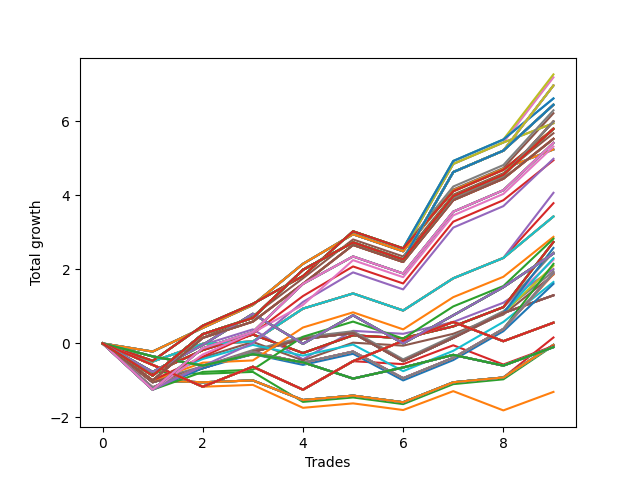

# Long HLT 104_90d 
- Symbol: TSLA
- Date Range: 01/10/2024 - 05/17/2024
- Trading Period: 8:30-12:30
- Number of Trades: 9



| Id. | Name | Win Percent | Profit | Avg Profit / Trade | Avg Time / Trade | Std |      | Name | Win Percent | Profit | Avg Profit / Trade | Avg Time / Trade | Std |
| --- | ---- | ----------- | ------ | ------------------ | ---------------- | --- | ---- | ---- | ----------- | ------ | ------------------ | ---------------- | --- |
| | Sorted By <br> Profit | | | | | | | Sorted By <br> Win Percentage |||||
|0| TP-1.75 105m | 77.78 | 7.27 | 0.81 | 85:06 | 0.87 |     | TP-1.75 105m | 77.78 | 7.27 | 0.81 | 85:06 | 0.87 |
|1| TP-1.75 90m | 77.78 | 7.19 | 0.80 | 76:46 | 0.83 |     | TP-1.75 90m | 77.78 | 7.19 | 0.80 | 76:46 | 0.83 |
|2| TP-1.75 180m | 77.78 | 6.97 | 0.77 | 93:26 | 0.96 |     | TP-1.75 180m | 77.78 | 6.97 | 0.77 | 93:26 | 0.96 |
|3| TP-1.75 165m | 77.78 | 6.97 | 0.77 | 93:26 | 0.96 |     | TP-1.75 165m | 77.78 | 6.97 | 0.77 | 93:26 | 0.96 |
|4| TP-1.75 150m | 77.78 | 6.97 | 0.77 | 93:26 | 0.96 |     | TP-1.75 150m | 77.78 | 6.97 | 0.77 | 93:26 | 0.96 |
|5| TP-1.75 135m | 77.78 | 6.97 | 0.77 | 93:26 | 0.96 |     | TP-1.75 135m | 77.78 | 6.97 | 0.77 | 93:26 | 0.96 |
|6| TP-1.75 120m | 77.78 | 6.97 | 0.77 | 93:26 | 0.96 |     | TP-1.75 120m | 77.78 | 6.97 | 0.77 | 93:26 | 0.96 |
|7| TP-2.25 105m | 77.78 | 6.62 | 0.74 | 93:26 | 0.82 |     | TP-2.25 105m | 77.78 | 6.62 | 0.74 | 93:26 | 0.82 |
|8| TP-2 105m | 77.78 | 6.62 | 0.74 | 93:26 | 0.82 |     | TP-2 105m | 77.78 | 6.62 | 0.74 | 93:26 | 0.82 |
|9| TP-2.25 180m | 77.78 | 6.45 | 0.72 | 103:26 | 0.91 |     | TP-2.25 180m | 77.78 | 6.45 | 0.72 | 103:26 | 0.91 |
|10| TP-2 180m | 77.78 | 6.45 | 0.72 | 103:26 | 0.91 |     | TP-2 180m | 77.78 | 6.45 | 0.72 | 103:26 | 0.91 |
|11| TP-2.25 165m | 77.78 | 6.45 | 0.72 | 103:26 | 0.91 |     | TP-2.25 165m | 77.78 | 6.45 | 0.72 | 103:26 | 0.91 |
|12| TP-2 165m | 77.78 | 6.45 | 0.72 | 103:26 | 0.91 |     | TP-2 165m | 77.78 | 6.45 | 0.72 | 103:26 | 0.91 |
|13| TP-2.25 150m | 77.78 | 6.45 | 0.72 | 103:26 | 0.91 |     | TP-2.25 150m | 77.78 | 6.45 | 0.72 | 103:26 | 0.91 |
|14| TP-2 150m | 77.78 | 6.45 | 0.72 | 103:26 | 0.91 |     | TP-2 150m | 77.78 | 6.45 | 0.72 | 103:26 | 0.91 |
|15| TP-2.25 135m | 77.78 | 6.45 | 0.72 | 103:26 | 0.91 |     | TP-2.25 135m | 77.78 | 6.45 | 0.72 | 103:26 | 0.91 |
|16| TP-2 135m | 77.78 | 6.45 | 0.72 | 103:26 | 0.91 |     | TP-2 135m | 77.78 | 6.45 | 0.72 | 103:26 | 0.91 |
|17| TP-2.25 120m | 77.78 | 6.45 | 0.72 | 103:26 | 0.91 |     | TP-2.25 120m | 77.78 | 6.45 | 0.72 | 103:26 | 0.91 |
|18| TP-2 120m | 77.78 | 6.45 | 0.72 | 103:26 | 0.91 |     | TP-2 120m | 77.78 | 6.45 | 0.72 | 103:26 | 0.91 |
|19| TP-1.5 105m | 77.78 | 6.30 | 0.70 | 84:40 | 0.72 |     | TP-1.5 105m | 77.78 | 6.30 | 0.70 | 84:40 | 0.72 |
|20| TP-1.5 90m | 77.78 | 6.22 | 0.69 | 76:20 | 0.66 |     | TP-1.5 90m | 77.78 | 6.22 | 0.69 | 76:20 | 0.66 |
|21| TP-1.5 180m | 77.78 | 6.00 | 0.67 | 93:00 | 0.81 |     | TP-1.5 180m | 77.78 | 6.00 | 0.67 | 93:00 | 0.81 |
|22| TP-1.5 165m | 77.78 | 6.00 | 0.67 | 93:00 | 0.81 |     | TP-1.5 165m | 77.78 | 6.00 | 0.67 | 93:00 | 0.81 |
|23| TP-1.5 150m | 77.78 | 6.00 | 0.67 | 93:00 | 0.81 |     | TP-1.5 150m | 77.78 | 6.00 | 0.67 | 93:00 | 0.81 |
|24| TP-1.5 135m | 77.78 | 6.00 | 0.67 | 93:00 | 0.81 |     | TP-1.5 135m | 77.78 | 6.00 | 0.67 | 93:00 | 0.81 |
|25| TP-1.5 120m | 77.78 | 6.00 | 0.67 | 93:00 | 0.81 |     | TP-1.5 120m | 77.78 | 6.00 | 0.67 | 93:00 | 0.81 |
|26| TP-2.25 90m | 77.78 | 5.95 | 0.66 | 83:26 | 0.76 |     | TP-2.25 90m | 77.78 | 5.95 | 0.66 | 83:26 | 0.76 |
|27| TP-2 90m | 77.78 | 5.95 | 0.66 | 83:26 | 0.76 |     | TP-2 90m | 77.78 | 5.95 | 0.66 | 83:26 | 0.76 |
|28| TP-3 180m | 77.78 | 5.80 | 0.64 | 108:06 | 0.80 |     | TP-3 180m | 77.78 | 5.80 | 0.64 | 108:06 | 0.80 |
|29| TP-2.75 180m | 77.78 | 5.80 | 0.64 | 108:06 | 0.80 |     | TP-2.75 180m | 77.78 | 5.80 | 0.64 | 108:06 | 0.80 |
|30| TP-2.5 180m | 77.78 | 5.80 | 0.64 | 108:06 | 0.80 |     | TP-2.5 180m | 77.78 | 5.80 | 0.64 | 108:06 | 0.80 |
|31| TP-3 165m | 77.78 | 5.80 | 0.64 | 108:06 | 0.80 |     | TP-3 165m | 77.78 | 5.80 | 0.64 | 108:06 | 0.80 |
|32| TP-2.75 165m | 77.78 | 5.80 | 0.64 | 108:06 | 0.80 |     | TP-2.75 165m | 77.78 | 5.80 | 0.64 | 108:06 | 0.80 |
|33| TP-2.5 165m | 77.78 | 5.80 | 0.64 | 108:06 | 0.80 |     | TP-2.5 165m | 77.78 | 5.80 | 0.64 | 108:06 | 0.80 |
|34| TP-3 150m | 77.78 | 5.80 | 0.64 | 108:06 | 0.80 |     | TP-3 150m | 77.78 | 5.80 | 0.64 | 108:06 | 0.80 |
|35| TP-2.75 150m | 77.78 | 5.80 | 0.64 | 108:06 | 0.80 |     | TP-2.75 150m | 77.78 | 5.80 | 0.64 | 108:06 | 0.80 |
|36| TP-2.5 150m | 77.78 | 5.80 | 0.64 | 108:06 | 0.80 |     | TP-2.5 150m | 77.78 | 5.80 | 0.64 | 108:06 | 0.80 |
|37| TP-3 135m | 77.78 | 5.80 | 0.64 | 108:06 | 0.80 |     | TP-3 135m | 77.78 | 5.80 | 0.64 | 108:06 | 0.80 |
|38| TP-2.75 135m | 77.78 | 5.80 | 0.64 | 108:06 | 0.80 |     | TP-2.75 135m | 77.78 | 5.80 | 0.64 | 108:06 | 0.80 |
|39| TP-2.5 135m | 77.78 | 5.80 | 0.64 | 108:06 | 0.80 |     | TP-2.5 135m | 77.78 | 5.80 | 0.64 | 108:06 | 0.80 |
|40| TP-3 120m | 77.78 | 5.80 | 0.64 | 108:06 | 0.80 |     | TP-3 120m | 77.78 | 5.80 | 0.64 | 108:06 | 0.80 |
|41| TP-2.75 120m | 77.78 | 5.80 | 0.64 | 108:06 | 0.80 |     | TP-2.75 120m | 77.78 | 5.80 | 0.64 | 108:06 | 0.80 |
|42| TP-2.5 120m | 77.78 | 5.80 | 0.64 | 108:06 | 0.80 |     | TP-2.5 120m | 77.78 | 5.80 | 0.64 | 108:06 | 0.80 |
|43| TP-3 105m | 77.78 | 5.80 | 0.64 | 96:26 | 0.66 |     | TP-3 105m | 77.78 | 5.80 | 0.64 | 96:26 | 0.66 |
|44| TP-2.75 105m | 77.78 | 5.80 | 0.64 | 96:26 | 0.66 |     | TP-2.75 105m | 77.78 | 5.80 | 0.64 | 96:26 | 0.66 |
|45| TP-2.5 105m | 77.78 | 5.80 | 0.64 | 96:26 | 0.66 |     | TP-2.5 105m | 77.78 | 5.80 | 0.64 | 96:26 | 0.66 |
|46| TP-1 105m | 77.78 | 5.68 | 0.63 | 68:06 | 0.80 |     | TP-1 105m | 77.78 | 5.68 | 0.63 | 68:06 | 0.80 |
|47| TP-1 180m | 77.78 | 5.53 | 0.61 | 69:46 | 0.80 |     | TP-1 180m | 77.78 | 5.53 | 0.61 | 69:46 | 0.80 |
|48| TP-1 165m | 77.78 | 5.53 | 0.61 | 69:46 | 0.80 |     | TP-1 165m | 77.78 | 5.53 | 0.61 | 69:46 | 0.80 |
|49| TP-1 150m | 77.78 | 5.53 | 0.61 | 69:46 | 0.80 |     | TP-1 150m | 77.78 | 5.53 | 0.61 | 69:46 | 0.80 |
|50| TP-1 135m | 77.78 | 5.53 | 0.61 | 69:46 | 0.80 |     | TP-1 135m | 77.78 | 5.53 | 0.61 | 69:46 | 0.80 |
|51| TP-1 120m | 77.78 | 5.53 | 0.61 | 69:46 | 0.80 |     | TP-1 120m | 77.78 | 5.53 | 0.61 | 69:46 | 0.80 |
|52| TP-1.25 180m | 77.78 | 5.42 | 0.60 | 83:46 | 0.88 |     | TP-1.25 180m | 77.78 | 5.42 | 0.60 | 83:46 | 0.88 |
|53| TP-1.25 165m | 77.78 | 5.42 | 0.60 | 83:46 | 0.88 |     | TP-1.25 165m | 77.78 | 5.42 | 0.60 | 83:46 | 0.88 |
|54| TP-1.25 150m | 77.78 | 5.42 | 0.60 | 83:46 | 0.88 |     | TP-1.25 150m | 77.78 | 5.42 | 0.60 | 83:46 | 0.88 |
|55| TP-1.25 135m | 77.78 | 5.42 | 0.60 | 83:46 | 0.88 |     | TP-1.25 135m | 77.78 | 5.42 | 0.60 | 83:46 | 0.88 |
|56| TP-1.25 120m | 77.78 | 5.42 | 0.60 | 83:46 | 0.88 |     | TP-1.25 120m | 77.78 | 5.42 | 0.60 | 83:46 | 0.88 |
|57| TP-1.25 105m | 77.78 | 5.32 | 0.59 | 78:40 | 0.86 |     | TP-1.25 105m | 77.78 | 5.32 | 0.59 | 78:40 | 0.86 |
|58| TP-3 90m | 77.78 | 5.24 | 0.58 | 84:46 | 0.60 |     | TP-3 90m | 77.78 | 5.24 | 0.58 | 84:46 | 0.60 |
|59| TP-2.75 90m | 77.78 | 5.24 | 0.58 | 84:46 | 0.60 |     | TP-2.75 90m | 77.78 | 5.24 | 0.58 | 84:46 | 0.60 |
|60| TP-2.5 90m | 77.78 | 5.24 | 0.58 | 84:46 | 0.60 |     | TP-2.5 90m | 77.78 | 5.24 | 0.58 | 84:46 | 0.60 |
|61| TP-1.25 90m | 77.78 | 4.99 | 0.55 | 72:00 | 0.85 |     | TP-1.25 90m | 77.78 | 4.99 | 0.55 | 72:00 | 0.85 |
|62| TP-1 90m | 77.78 | 4.95 | 0.55 | 64:26 | 0.76 |     | TP-1 90m | 77.78 | 4.95 | 0.55 | 64:26 | 0.76 |
|63| TP-1.75 75m | 77.78 | 4.07 | 0.45 | 68:00 | 0.66 |     | TP-1.75 75m | 77.78 | 4.07 | 0.45 | 68:00 | 0.66 |
|64| TP-1.5 75m | 77.78 | 3.79 | 0.42 | 67:40 | 0.61 |     | TP-1.5 75m | 77.78 | 3.79 | 0.42 | 67:40 | 0.61 |
|65| TP-3 75m | 77.78 | 3.43 | 0.38 | 73:00 | 0.54 |     | TP-3 75m | 77.78 | 3.43 | 0.38 | 73:00 | 0.54 |
|66| TP-2.75 75m | 77.78 | 3.43 | 0.38 | 73:00 | 0.54 |     | TP-2.75 75m | 77.78 | 3.43 | 0.38 | 73:00 | 0.54 |
|67| TP-2.5 75m | 77.78 | 3.43 | 0.38 | 73:00 | 0.54 |     | TP-2.5 75m | 77.78 | 3.43 | 0.38 | 73:00 | 0.54 |
|68| TP-2.25 75m | 77.78 | 3.43 | 0.38 | 73:00 | 0.54 |     | TP-2.25 75m | 77.78 | 3.43 | 0.38 | 73:00 | 0.54 |
|69| TP-2 75m | 77.78 | 3.43 | 0.38 | 73:00 | 0.54 |     | TP-2 75m | 77.78 | 3.43 | 0.38 | 73:00 | 0.54 |
|70| TP-1 75m | 77.78 | 2.88 | 0.32 | 58:46 | 0.64 |     | TP-1 75m | 77.78 | 2.88 | 0.32 | 58:46 | 0.64 |
|71| TP-1.25 75m | 77.78 | 2.83 | 0.31 | 65:00 | 0.73 |     | TP-1.25 75m | 77.78 | 2.83 | 0.31 | 65:00 | 0.73 |
|72| TP-3 30m | 66.67 | 2.74 | 0.30 | 29:00 | 0.69 |     | TP-1.75 45m | 77.78 | 2.58 | 0.29 | 42:20 | 0.77 |
|73| TP-2.75 30m | 66.67 | 2.74 | 0.30 | 29:00 | 0.69 |     | TP-1.5 45m | 77.78 | 2.30 | 0.26 | 42:00 | 0.72 |
|74| TP-2.5 30m | 66.67 | 2.74 | 0.30 | 29:00 | 0.69 |     | TP-1.25 45m | 77.78 | 2.10 | 0.23 | 41:33 | 0.68 |
|75| TP-2.25 30m | 66.67 | 2.74 | 0.30 | 29:00 | 0.69 |     | TP-1 45m | 77.78 | 1.95 | 0.22 | 36:26 | 0.64 |
|76| TP-2 30m | 66.67 | 2.74 | 0.30 | 29:00 | 0.69 |     | TP-3 45m | 77.78 | 1.30 | 0.14 | 44:00 | 0.58 |
|77| TP-1.75 30m | 66.67 | 2.74 | 0.30 | 29:00 | 0.69 |     | TP-2.75 45m | 77.78 | 1.30 | 0.14 | 44:00 | 0.58 |
|78| TP-1.75 45m | 77.78 | 2.58 | 0.29 | 42:20 | 0.77 |     | TP-2.5 45m | 77.78 | 1.30 | 0.14 | 44:00 | 0.58 |
|79| TP-1.5 30m | 66.67 | 2.46 | 0.27 | 28:40 | 0.63 |     | TP-2.25 45m | 77.78 | 1.30 | 0.14 | 44:00 | 0.58 |
|80| TP-0.75 180m | 66.67 | 2.43 | 0.27 | 23:13 | 0.74 |     | TP-2 45m | 77.78 | 1.30 | 0.14 | 44:00 | 0.58 |
|81| TP-0.75 165m | 66.67 | 2.43 | 0.27 | 23:13 | 0.74 |     | TP-3 30m | 66.67 | 2.74 | 0.30 | 29:00 | 0.69 |
|82| TP-0.75 150m | 66.67 | 2.43 | 0.27 | 23:13 | 0.74 |     | TP-2.75 30m | 66.67 | 2.74 | 0.30 | 29:00 | 0.69 |
|83| TP-0.75 135m | 66.67 | 2.43 | 0.27 | 23:13 | 0.74 |     | TP-2.5 30m | 66.67 | 2.74 | 0.30 | 29:00 | 0.69 |
|84| TP-0.75 120m | 66.67 | 2.43 | 0.27 | 23:13 | 0.74 |     | TP-2.25 30m | 66.67 | 2.74 | 0.30 | 29:00 | 0.69 |
|85| TP-0.75 105m | 66.67 | 2.43 | 0.27 | 23:13 | 0.74 |     | TP-2 30m | 66.67 | 2.74 | 0.30 | 29:00 | 0.69 |
|86| TP-0.75 90m | 66.67 | 2.43 | 0.27 | 23:13 | 0.74 |     | TP-1.75 30m | 66.67 | 2.74 | 0.30 | 29:00 | 0.69 |
|87| TP-0.75 75m | 66.67 | 2.43 | 0.27 | 23:13 | 0.74 |     | TP-1.5 30m | 66.67 | 2.46 | 0.27 | 28:40 | 0.63 |
|88| TP-0.75 60m | 66.67 | 2.43 | 0.27 | 23:13 | 0.74 |     | TP-0.75 180m | 66.67 | 2.43 | 0.27 | 23:13 | 0.74 |
|89| TP-0.75 45m | 66.67 | 2.43 | 0.27 | 23:13 | 0.74 |     | TP-0.75 165m | 66.67 | 2.43 | 0.27 | 23:13 | 0.74 |
|90| TP-1.5 45m | 77.78 | 2.30 | 0.26 | 42:00 | 0.72 |     | TP-0.75 150m | 66.67 | 2.43 | 0.27 | 23:13 | 0.74 |
|91| TP-1.25 30m | 66.67 | 2.26 | 0.25 | 28:13 | 0.59 |     | TP-0.75 135m | 66.67 | 2.43 | 0.27 | 23:13 | 0.74 |
|92| TP-1.75 60m | 66.67 | 2.15 | 0.24 | 55:40 | 0.82 |     | TP-0.75 120m | 66.67 | 2.43 | 0.27 | 23:13 | 0.74 |
|93| TP-1.25 45m | 77.78 | 2.10 | 0.23 | 41:33 | 0.68 |     | TP-0.75 105m | 66.67 | 2.43 | 0.27 | 23:13 | 0.74 |
|94| TP-0.75 30m | 66.67 | 2.01 | 0.22 | 19:46 | 0.61 |     | TP-0.75 90m | 66.67 | 2.43 | 0.27 | 23:13 | 0.74 |
|95| TP-1 45m | 77.78 | 1.95 | 0.22 | 36:26 | 0.64 |     | TP-0.75 75m | 66.67 | 2.43 | 0.27 | 23:13 | 0.74 |
|96| TP-3 60m | 66.67 | 1.90 | 0.21 | 59:00 | 0.77 |     | TP-0.75 60m | 66.67 | 2.43 | 0.27 | 23:13 | 0.74 |
|97| TP-2.75 60m | 66.67 | 1.90 | 0.21 | 59:00 | 0.77 |     | TP-0.75 45m | 66.67 | 2.43 | 0.27 | 23:13 | 0.74 |
|98| TP-2.5 60m | 66.67 | 1.90 | 0.21 | 59:00 | 0.77 |     | TP-1.25 30m | 66.67 | 2.26 | 0.25 | 28:13 | 0.59 |
|99| TP-2.25 60m | 66.67 | 1.90 | 0.21 | 59:00 | 0.77 |     | TP-1.75 60m | 66.67 | 2.15 | 0.24 | 55:40 | 0.82 |
|100| TP-2 60m | 66.67 | 1.90 | 0.21 | 59:00 | 0.77 |     | TP-0.75 30m | 66.67 | 2.01 | 0.22 | 19:46 | 0.61 |
|101| TP-1.5 60m | 66.67 | 1.87 | 0.21 | 55:20 | 0.77 |     | TP-3 60m | 66.67 | 1.90 | 0.21 | 59:00 | 0.77 |
|102| TP-1 30m | 66.67 | 1.86 | 0.21 | 24:46 | 0.60 |     | TP-2.75 60m | 66.67 | 1.90 | 0.21 | 59:00 | 0.77 |
|103| TP-1 60m | 66.67 | 1.66 | 0.18 | 48:06 | 0.66 |     | TP-2.5 60m | 66.67 | 1.90 | 0.21 | 59:00 | 0.77 |
|104| TP-1.25 60m | 66.67 | 1.61 | 0.18 | 54:20 | 0.75 |     | TP-2.25 60m | 66.67 | 1.90 | 0.21 | 59:00 | 0.77 |
|105| TP-3 45m | 77.78 | 1.30 | 0.14 | 44:00 | 0.58 |     | TP-2 60m | 66.67 | 1.90 | 0.21 | 59:00 | 0.77 |
|106| TP-2.75 45m | 77.78 | 1.30 | 0.14 | 44:00 | 0.58 |     | TP-1.5 60m | 66.67 | 1.87 | 0.21 | 55:20 | 0.77 |
|107| TP-2.5 45m | 77.78 | 1.30 | 0.14 | 44:00 | 0.58 |     | TP-1 30m | 66.67 | 1.86 | 0.21 | 24:46 | 0.60 |
|108| TP-2.25 45m | 77.78 | 1.30 | 0.14 | 44:00 | 0.58 |     | TP-1 60m | 66.67 | 1.66 | 0.18 | 48:06 | 0.66 |
|109| TP-2 45m | 77.78 | 1.30 | 0.14 | 44:00 | 0.58 |     | TP-1.25 60m | 66.67 | 1.61 | 0.18 | 54:20 | 0.75 |
|110| TP-0.5 180m | 55.56 | 0.56 | 0.06 | 12:20 | 0.58 |     | TP-0.5 180m | 55.56 | 0.56 | 0.06 | 12:20 | 0.58 |
|111| TP-0.5 165m | 55.56 | 0.56 | 0.06 | 12:20 | 0.58 |     | TP-0.5 165m | 55.56 | 0.56 | 0.06 | 12:20 | 0.58 |
|112| TP-0.5 150m | 55.56 | 0.56 | 0.06 | 12:20 | 0.58 |     | TP-0.5 150m | 55.56 | 0.56 | 0.06 | 12:20 | 0.58 |
|113| TP-0.5 135m | 55.56 | 0.56 | 0.06 | 12:20 | 0.58 |     | TP-0.5 135m | 55.56 | 0.56 | 0.06 | 12:20 | 0.58 |
|114| TP-0.5 120m | 55.56 | 0.56 | 0.06 | 12:20 | 0.58 |     | TP-0.5 120m | 55.56 | 0.56 | 0.06 | 12:20 | 0.58 |
|115| TP-0.5 105m | 55.56 | 0.56 | 0.06 | 12:20 | 0.58 |     | TP-0.5 105m | 55.56 | 0.56 | 0.06 | 12:20 | 0.58 |
|116| TP-0.5 90m | 55.56 | 0.56 | 0.06 | 12:20 | 0.58 |     | TP-0.5 90m | 55.56 | 0.56 | 0.06 | 12:20 | 0.58 |
|117| TP-0.5 75m | 55.56 | 0.56 | 0.06 | 12:20 | 0.58 |     | TP-0.5 75m | 55.56 | 0.56 | 0.06 | 12:20 | 0.58 |
|118| TP-0.5 60m | 55.56 | 0.56 | 0.06 | 12:20 | 0.58 |     | TP-0.5 60m | 55.56 | 0.56 | 0.06 | 12:20 | 0.58 |
|119| TP-0.5 45m | 55.56 | 0.56 | 0.06 | 12:20 | 0.58 |     | TP-0.5 45m | 55.56 | 0.56 | 0.06 | 12:20 | 0.58 |
|120| TP-1 15m | 55.56 | 0.16 | 0.02 | 13:06 | 0.56 |     | TP-1 15m | 55.56 | 0.16 | 0.02 | 13:06 | 0.56 |
|121| TP-3 15m | 55.56 | -0.04 | -0.00 | 14:00 | 0.52 |     | TP-3 15m | 55.56 | -0.04 | -0.00 | 14:00 | 0.52 |
|122| TP-2.75 15m | 55.56 | -0.04 | -0.00 | 14:00 | 0.52 |     | TP-2.75 15m | 55.56 | -0.04 | -0.00 | 14:00 | 0.52 |
|123| TP-2.5 15m | 55.56 | -0.04 | -0.00 | 14:00 | 0.52 |     | TP-2.5 15m | 55.56 | -0.04 | -0.00 | 14:00 | 0.52 |
|124| TP-2.25 15m | 55.56 | -0.04 | -0.00 | 14:00 | 0.52 |     | TP-2.25 15m | 55.56 | -0.04 | -0.00 | 14:00 | 0.52 |
|125| TP-2 15m | 55.56 | -0.04 | -0.00 | 14:00 | 0.52 |     | TP-2 15m | 55.56 | -0.04 | -0.00 | 14:00 | 0.52 |
|126| TP-1.75 15m | 55.56 | -0.04 | -0.00 | 14:00 | 0.52 |     | TP-1.75 15m | 55.56 | -0.04 | -0.00 | 14:00 | 0.52 |
|127| TP-1.5 15m | 55.56 | -0.04 | -0.00 | 14:00 | 0.52 |     | TP-1.5 15m | 55.56 | -0.04 | -0.00 | 14:00 | 0.52 |
|128| TP-1.25 15m | 55.56 | -0.04 | -0.00 | 14:00 | 0.52 |     | TP-1.25 15m | 55.56 | -0.04 | -0.00 | 14:00 | 0.52 |
|129| TP-0.75 15m | 55.56 | -0.06 | -0.01 | 11:33 | 0.52 |     | TP-0.75 15m | 55.56 | -0.06 | -0.01 | 11:33 | 0.52 |
|130| TP-0.5 30m | 44.44 | -0.07 | -0.01 | 11:33 | 0.55 |     | TP-0.5 30m | 44.44 | -0.07 | -0.01 | 11:33 | 0.55 |
|131| TP-0.25 180m | 44.44 | -0.10 | -0.01 | 04:00 | 0.34 |     | TP-0.25 180m | 44.44 | -0.10 | -0.01 | 04:00 | 0.34 |
|132| TP-0.25 165m | 44.44 | -0.10 | -0.01 | 04:00 | 0.34 |     | TP-0.25 165m | 44.44 | -0.10 | -0.01 | 04:00 | 0.34 |
|133| TP-0.25 150m | 44.44 | -0.10 | -0.01 | 04:00 | 0.34 |     | TP-0.25 150m | 44.44 | -0.10 | -0.01 | 04:00 | 0.34 |
|134| TP-0.25 135m | 44.44 | -0.10 | -0.01 | 04:00 | 0.34 |     | TP-0.25 135m | 44.44 | -0.10 | -0.01 | 04:00 | 0.34 |
|135| TP-0.25 120m | 44.44 | -0.10 | -0.01 | 04:00 | 0.34 |     | TP-0.25 120m | 44.44 | -0.10 | -0.01 | 04:00 | 0.34 |
|136| TP-0.25 105m | 44.44 | -0.10 | -0.01 | 04:00 | 0.34 |     | TP-0.25 105m | 44.44 | -0.10 | -0.01 | 04:00 | 0.34 |
|137| TP-0.25 90m | 44.44 | -0.10 | -0.01 | 04:00 | 0.34 |     | TP-0.25 90m | 44.44 | -0.10 | -0.01 | 04:00 | 0.34 |
|138| TP-0.25 75m | 44.44 | -0.10 | -0.01 | 04:00 | 0.34 |     | TP-0.25 75m | 44.44 | -0.10 | -0.01 | 04:00 | 0.34 |
|139| TP-0.25 60m | 44.44 | -0.10 | -0.01 | 04:00 | 0.34 |     | TP-0.25 60m | 44.44 | -0.10 | -0.01 | 04:00 | 0.34 |
|140| TP-0.25 45m | 44.44 | -0.10 | -0.01 | 04:00 | 0.34 |     | TP-0.25 45m | 44.44 | -0.10 | -0.01 | 04:00 | 0.34 |
|141| TP-0.25 30m | 44.44 | -0.10 | -0.01 | 04:00 | 0.34 |     | TP-0.25 30m | 44.44 | -0.10 | -0.01 | 04:00 | 0.34 |
|142| TP-0.25 15m | 44.44 | -0.10 | -0.01 | 04:00 | 0.34 |     | TP-0.25 15m | 44.44 | -0.10 | -0.01 | 04:00 | 0.34 |
|143| TP-0.5 15m | 44.44 | -1.31 | -0.15 | 07:46 | 0.44 |     | TP-0.5 15m | 44.44 | -1.31 | -0.15 | 07:46 | 0.44 |

### Test TP-0.25 15m
* Take Profit of 0.25 Point
* 0.25 Stoploss
* Results:
```
Total Trades: 9
Percent Up: 44.44
Percent Down: 55.56
Total Points Moved Up: -0.10
Potential Profit: -50.00
Total Points Ups: 1.45 Count Ups: 4
Total Points Downs: -1.55 Count Downs: 5
```

<details><summary>Trades</summary>

<code>In: 2024-01-26 10:30:00		Out: 2024-01-26 10:33:00		Total Position Time: 03:00		Total Move Up: -0.35		Total to Date: -0.35</code> <br />
<code>In: 2024-02-06 09:10:00		Out: 2024-02-06 09:12:00		Total Position Time: 02:00		Total Move Up: -0.25		Total to Date: -0.60</code> <br />
<code>In: 2024-02-08 10:35:00		Out: 2024-02-08 10:37:00		Total Position Time: 02:00		Total Move Up: 0.31		Total to Date: -0.29</code> <br />
<code>In: 2024-02-20 09:35:00		Out: 2024-02-20 09:37:00		Total Position Time: 02:00		Total Move Up: -0.22		Total to Date: -0.51</code> <br />
<code>In: 2024-03-11 08:55:00		Out: 2024-03-11 09:02:00		Total Position Time: 07:00		Total Move Up: -0.44		Total to Date: -0.95</code> <br />
<code>In: 2024-03-13 11:45:00		Out: 2024-03-13 11:53:00		Total Position Time: 08:00		Total Move Up: 0.30		Total to Date: -0.65</code> <br />
<code>In: 2024-03-20 09:45:00		Out: 2024-03-20 09:51:00		Total Position Time: 06:00		Total Move Up: 0.34		Total to Date: -0.31</code> <br />
<code>In: 2024-03-21 11:35:00		Out: 2024-03-21 11:38:00		Total Position Time: 03:00		Total Move Up: -0.29		Total to Date: -0.60</code> <br />
<code>In: 2024-04-30 09:00:00		Out: 2024-04-30 09:03:00		Total Position Time: 03:00		Total Move Up: 0.50		Total to Date: -0.10</code> <br />


</details>

### Test TP-0.5 15m
* Take Profit of 0.5 Point
* 0.5 Stoploss
* Results:
```
Total Trades: 9
Percent Up: 44.44
Percent Down: 55.56
Total Points Moved Up: -1.31
Potential Profit: -655.00
Total Points Ups: 1.18 Count Ups: 4
Total Points Downs: -2.49 Count Downs: 5
```

<details><summary>Trades</summary>

<code>In: 2024-01-26 10:30:00		Out: 2024-01-26 10:36:00		Total Position Time: 06:00		Total Move Up: -0.58		Total to Date: -0.58</code> <br />
<code>In: 2024-02-06 09:10:00		Out: 2024-02-06 09:13:00		Total Position Time: 03:00		Total Move Up: -0.59		Total to Date: -1.17</code> <br />
<code>In: 2024-02-08 10:35:00		Out: 2024-02-08 10:49:00		Total Position Time: 14:00		Total Move Up: 0.05		Total to Date: -1.12</code> <br />
<code>In: 2024-02-20 09:35:00		Out: 2024-02-20 09:38:00		Total Position Time: 03:00		Total Move Up: -0.62		Total to Date: -1.74</code> <br />
<code>In: 2024-03-11 08:55:00		Out: 2024-03-11 09:09:00		Total Position Time: 14:00		Total Move Up: 0.12		Total to Date: -1.62</code> <br />
<code>In: 2024-03-13 11:45:00		Out: 2024-03-13 11:59:00		Total Position Time: 14:00		Total Move Up: -0.18		Total to Date: -1.80</code> <br />
<code>In: 2024-03-20 09:45:00		Out: 2024-03-20 09:54:00		Total Position Time: 09:00		Total Move Up: 0.51		Total to Date: -1.29</code> <br />
<code>In: 2024-03-21 11:35:00		Out: 2024-03-21 11:39:00		Total Position Time: 04:00		Total Move Up: -0.52		Total to Date: -1.81</code> <br />
<code>In: 2024-04-30 09:00:00		Out: 2024-04-30 09:03:00		Total Position Time: 03:00		Total Move Up: 0.50		Total to Date: -1.31</code> <br />


</details>

### Test TP-0.75 15m
* Take Profit of 0.75 Point
* 0.75 Stoploss
* Results:
```
Total Trades: 9
Percent Up: 55.56
Percent Down: 44.44
Total Points Moved Up: -0.06
Potential Profit: -30.00
Total Points Ups: 1.75 Count Ups: 5
Total Points Downs: -1.81 Count Downs: 4
```

<details><summary>Trades</summary>

<code>In: 2024-01-26 10:30:00		Out: 2024-01-26 10:41:00		Total Position Time: 11:00		Total Move Up: -0.77		Total to Date: -0.77</code> <br />
<code>In: 2024-02-06 09:10:00		Out: 2024-02-06 09:24:00		Total Position Time: 14:00		Total Move Up: -0.05		Total to Date: -0.82</code> <br />
<code>In: 2024-02-08 10:35:00		Out: 2024-02-08 10:49:00		Total Position Time: 14:00		Total Move Up: 0.05		Total to Date: -0.77</code> <br />
<code>In: 2024-02-20 09:35:00		Out: 2024-02-20 09:39:00		Total Position Time: 04:00		Total Move Up: -0.81		Total to Date: -1.58</code> <br />
<code>In: 2024-03-11 08:55:00		Out: 2024-03-11 09:09:00		Total Position Time: 14:00		Total Move Up: 0.12		Total to Date: -1.46</code> <br />
<code>In: 2024-03-13 11:45:00		Out: 2024-03-13 11:59:00		Total Position Time: 14:00		Total Move Up: -0.18		Total to Date: -1.64</code> <br />
<code>In: 2024-03-20 09:45:00		Out: 2024-03-20 09:59:00		Total Position Time: 14:00		Total Move Up: 0.54		Total to Date: -1.10</code> <br />
<code>In: 2024-03-21 11:35:00		Out: 2024-03-21 11:49:00		Total Position Time: 14:00		Total Move Up: 0.13		Total to Date: -0.97</code> <br />
<code>In: 2024-04-30 09:00:00		Out: 2024-04-30 09:05:00		Total Position Time: 05:00		Total Move Up: 0.91		Total to Date: -0.06</code> <br />


</details>

### Test TP-1 15m
* Take Profit of 1 Point
* 1 Stoploss
* Results:
```
Total Trades: 9
Percent Up: 55.56
Percent Down: 44.44
Total Points Moved Up: 0.16
Potential Profit: 80.00
Total Points Ups: 1.92 Count Ups: 5
Total Points Downs: -1.76 Count Downs: 4
```

<details><summary>Trades</summary>

<code>In: 2024-01-26 10:30:00		Out: 2024-01-26 10:44:00		Total Position Time: 14:00		Total Move Up: -1.00		Total to Date: -1.00</code> <br />
<code>In: 2024-02-06 09:10:00		Out: 2024-02-06 09:24:00		Total Position Time: 14:00		Total Move Up: -0.05		Total to Date: -1.05</code> <br />
<code>In: 2024-02-08 10:35:00		Out: 2024-02-08 10:49:00		Total Position Time: 14:00		Total Move Up: 0.05		Total to Date: -1.00</code> <br />
<code>In: 2024-02-20 09:35:00		Out: 2024-02-20 09:49:00		Total Position Time: 14:00		Total Move Up: -0.53		Total to Date: -1.53</code> <br />
<code>In: 2024-03-11 08:55:00		Out: 2024-03-11 09:09:00		Total Position Time: 14:00		Total Move Up: 0.12		Total to Date: -1.41</code> <br />
<code>In: 2024-03-13 11:45:00		Out: 2024-03-13 11:59:00		Total Position Time: 14:00		Total Move Up: -0.18		Total to Date: -1.59</code> <br />
<code>In: 2024-03-20 09:45:00		Out: 2024-03-20 09:59:00		Total Position Time: 14:00		Total Move Up: 0.54		Total to Date: -1.05</code> <br />
<code>In: 2024-03-21 11:35:00		Out: 2024-03-21 11:49:00		Total Position Time: 14:00		Total Move Up: 0.13		Total to Date: -0.92</code> <br />
<code>In: 2024-04-30 09:00:00		Out: 2024-04-30 09:06:00		Total Position Time: 06:00		Total Move Up: 1.08		Total to Date: 0.16</code> <br />


</details>

### Test TP-1.25 15m
* Take Profit of 1.25 Point
* 1.25 Stoploss
* Results:
```
Total Trades: 9
Percent Up: 55.56
Percent Down: 44.44
Total Points Moved Up: -0.04
Potential Profit: -20.00
Total Points Ups: 1.72 Count Ups: 5
Total Points Downs: -1.76 Count Downs: 4
```

<details><summary>Trades</summary>

<code>In: 2024-01-26 10:30:00		Out: 2024-01-26 10:44:00		Total Position Time: 14:00		Total Move Up: -1.00		Total to Date: -1.00</code> <br />
<code>In: 2024-02-06 09:10:00		Out: 2024-02-06 09:24:00		Total Position Time: 14:00		Total Move Up: -0.05		Total to Date: -1.05</code> <br />
<code>In: 2024-02-08 10:35:00		Out: 2024-02-08 10:49:00		Total Position Time: 14:00		Total Move Up: 0.05		Total to Date: -1.00</code> <br />
<code>In: 2024-02-20 09:35:00		Out: 2024-02-20 09:49:00		Total Position Time: 14:00		Total Move Up: -0.53		Total to Date: -1.53</code> <br />
<code>In: 2024-03-11 08:55:00		Out: 2024-03-11 09:09:00		Total Position Time: 14:00		Total Move Up: 0.12		Total to Date: -1.41</code> <br />
<code>In: 2024-03-13 11:45:00		Out: 2024-03-13 11:59:00		Total Position Time: 14:00		Total Move Up: -0.18		Total to Date: -1.59</code> <br />
<code>In: 2024-03-20 09:45:00		Out: 2024-03-20 09:59:00		Total Position Time: 14:00		Total Move Up: 0.54		Total to Date: -1.05</code> <br />
<code>In: 2024-03-21 11:35:00		Out: 2024-03-21 11:49:00		Total Position Time: 14:00		Total Move Up: 0.13		Total to Date: -0.92</code> <br />
<code>In: 2024-04-30 09:00:00		Out: 2024-04-30 09:14:00		Total Position Time: 14:00		Total Move Up: 0.88		Total to Date: -0.04</code> <br />


</details>

### Test TP-1.5 15m
* Take Profit of 1.5 Point
* 1.5 Stoploss
* Results:
```
Total Trades: 9
Percent Up: 55.56
Percent Down: 44.44
Total Points Moved Up: -0.04
Potential Profit: -20.00
Total Points Ups: 1.72 Count Ups: 5
Total Points Downs: -1.76 Count Downs: 4
```

<details><summary>Trades</summary>

<code>In: 2024-01-26 10:30:00		Out: 2024-01-26 10:44:00		Total Position Time: 14:00		Total Move Up: -1.00		Total to Date: -1.00</code> <br />
<code>In: 2024-02-06 09:10:00		Out: 2024-02-06 09:24:00		Total Position Time: 14:00		Total Move Up: -0.05		Total to Date: -1.05</code> <br />
<code>In: 2024-02-08 10:35:00		Out: 2024-02-08 10:49:00		Total Position Time: 14:00		Total Move Up: 0.05		Total to Date: -1.00</code> <br />
<code>In: 2024-02-20 09:35:00		Out: 2024-02-20 09:49:00		Total Position Time: 14:00		Total Move Up: -0.53		Total to Date: -1.53</code> <br />
<code>In: 2024-03-11 08:55:00		Out: 2024-03-11 09:09:00		Total Position Time: 14:00		Total Move Up: 0.12		Total to Date: -1.41</code> <br />
<code>In: 2024-03-13 11:45:00		Out: 2024-03-13 11:59:00		Total Position Time: 14:00		Total Move Up: -0.18		Total to Date: -1.59</code> <br />
<code>In: 2024-03-20 09:45:00		Out: 2024-03-20 09:59:00		Total Position Time: 14:00		Total Move Up: 0.54		Total to Date: -1.05</code> <br />
<code>In: 2024-03-21 11:35:00		Out: 2024-03-21 11:49:00		Total Position Time: 14:00		Total Move Up: 0.13		Total to Date: -0.92</code> <br />
<code>In: 2024-04-30 09:00:00		Out: 2024-04-30 09:14:00		Total Position Time: 14:00		Total Move Up: 0.88		Total to Date: -0.04</code> <br />


</details>

### Test TP-1.75 15m
* Take Profit of 1.75 Point
* 1.75 Stoploss
* Results:
```
Total Trades: 9
Percent Up: 55.56
Percent Down: 44.44
Total Points Moved Up: -0.04
Potential Profit: -20.00
Total Points Ups: 1.72 Count Ups: 5
Total Points Downs: -1.76 Count Downs: 4
```

<details><summary>Trades</summary>

<code>In: 2024-01-26 10:30:00		Out: 2024-01-26 10:44:00		Total Position Time: 14:00		Total Move Up: -1.00		Total to Date: -1.00</code> <br />
<code>In: 2024-02-06 09:10:00		Out: 2024-02-06 09:24:00		Total Position Time: 14:00		Total Move Up: -0.05		Total to Date: -1.05</code> <br />
<code>In: 2024-02-08 10:35:00		Out: 2024-02-08 10:49:00		Total Position Time: 14:00		Total Move Up: 0.05		Total to Date: -1.00</code> <br />
<code>In: 2024-02-20 09:35:00		Out: 2024-02-20 09:49:00		Total Position Time: 14:00		Total Move Up: -0.53		Total to Date: -1.53</code> <br />
<code>In: 2024-03-11 08:55:00		Out: 2024-03-11 09:09:00		Total Position Time: 14:00		Total Move Up: 0.12		Total to Date: -1.41</code> <br />
<code>In: 2024-03-13 11:45:00		Out: 2024-03-13 11:59:00		Total Position Time: 14:00		Total Move Up: -0.18		Total to Date: -1.59</code> <br />
<code>In: 2024-03-20 09:45:00		Out: 2024-03-20 09:59:00		Total Position Time: 14:00		Total Move Up: 0.54		Total to Date: -1.05</code> <br />
<code>In: 2024-03-21 11:35:00		Out: 2024-03-21 11:49:00		Total Position Time: 14:00		Total Move Up: 0.13		Total to Date: -0.92</code> <br />
<code>In: 2024-04-30 09:00:00		Out: 2024-04-30 09:14:00		Total Position Time: 14:00		Total Move Up: 0.88		Total to Date: -0.04</code> <br />


</details>

### Test TP-2 15m
* Take Profit of 2 Point
* 2 Stoploss
* Results:
```
Total Trades: 9
Percent Up: 55.56
Percent Down: 44.44
Total Points Moved Up: -0.04
Potential Profit: -20.00
Total Points Ups: 1.72 Count Ups: 5
Total Points Downs: -1.76 Count Downs: 4
```

<details><summary>Trades</summary>

<code>In: 2024-01-26 10:30:00		Out: 2024-01-26 10:44:00		Total Position Time: 14:00		Total Move Up: -1.00		Total to Date: -1.00</code> <br />
<code>In: 2024-02-06 09:10:00		Out: 2024-02-06 09:24:00		Total Position Time: 14:00		Total Move Up: -0.05		Total to Date: -1.05</code> <br />
<code>In: 2024-02-08 10:35:00		Out: 2024-02-08 10:49:00		Total Position Time: 14:00		Total Move Up: 0.05		Total to Date: -1.00</code> <br />
<code>In: 2024-02-20 09:35:00		Out: 2024-02-20 09:49:00		Total Position Time: 14:00		Total Move Up: -0.53		Total to Date: -1.53</code> <br />
<code>In: 2024-03-11 08:55:00		Out: 2024-03-11 09:09:00		Total Position Time: 14:00		Total Move Up: 0.12		Total to Date: -1.41</code> <br />
<code>In: 2024-03-13 11:45:00		Out: 2024-03-13 11:59:00		Total Position Time: 14:00		Total Move Up: -0.18		Total to Date: -1.59</code> <br />
<code>In: 2024-03-20 09:45:00		Out: 2024-03-20 09:59:00		Total Position Time: 14:00		Total Move Up: 0.54		Total to Date: -1.05</code> <br />
<code>In: 2024-03-21 11:35:00		Out: 2024-03-21 11:49:00		Total Position Time: 14:00		Total Move Up: 0.13		Total to Date: -0.92</code> <br />
<code>In: 2024-04-30 09:00:00		Out: 2024-04-30 09:14:00		Total Position Time: 14:00		Total Move Up: 0.88		Total to Date: -0.04</code> <br />


</details>

### Test TP-2.25 15m
* Take Profit of 2.25 Point
* 2.25 Stoploss
* Results:
```
Total Trades: 9
Percent Up: 55.56
Percent Down: 44.44
Total Points Moved Up: -0.04
Potential Profit: -20.00
Total Points Ups: 1.72 Count Ups: 5
Total Points Downs: -1.76 Count Downs: 4
```

<details><summary>Trades</summary>

<code>In: 2024-01-26 10:30:00		Out: 2024-01-26 10:44:00		Total Position Time: 14:00		Total Move Up: -1.00		Total to Date: -1.00</code> <br />
<code>In: 2024-02-06 09:10:00		Out: 2024-02-06 09:24:00		Total Position Time: 14:00		Total Move Up: -0.05		Total to Date: -1.05</code> <br />
<code>In: 2024-02-08 10:35:00		Out: 2024-02-08 10:49:00		Total Position Time: 14:00		Total Move Up: 0.05		Total to Date: -1.00</code> <br />
<code>In: 2024-02-20 09:35:00		Out: 2024-02-20 09:49:00		Total Position Time: 14:00		Total Move Up: -0.53		Total to Date: -1.53</code> <br />
<code>In: 2024-03-11 08:55:00		Out: 2024-03-11 09:09:00		Total Position Time: 14:00		Total Move Up: 0.12		Total to Date: -1.41</code> <br />
<code>In: 2024-03-13 11:45:00		Out: 2024-03-13 11:59:00		Total Position Time: 14:00		Total Move Up: -0.18		Total to Date: -1.59</code> <br />
<code>In: 2024-03-20 09:45:00		Out: 2024-03-20 09:59:00		Total Position Time: 14:00		Total Move Up: 0.54		Total to Date: -1.05</code> <br />
<code>In: 2024-03-21 11:35:00		Out: 2024-03-21 11:49:00		Total Position Time: 14:00		Total Move Up: 0.13		Total to Date: -0.92</code> <br />
<code>In: 2024-04-30 09:00:00		Out: 2024-04-30 09:14:00		Total Position Time: 14:00		Total Move Up: 0.88		Total to Date: -0.04</code> <br />


</details>

### Test TP-2.5 15m
* Take Profit of 2.5 Point
* 2.5 Stoploss
* Results:
```
Total Trades: 9
Percent Up: 55.56
Percent Down: 44.44
Total Points Moved Up: -0.04
Potential Profit: -20.00
Total Points Ups: 1.72 Count Ups: 5
Total Points Downs: -1.76 Count Downs: 4
```

<details><summary>Trades</summary>

<code>In: 2024-01-26 10:30:00		Out: 2024-01-26 10:44:00		Total Position Time: 14:00		Total Move Up: -1.00		Total to Date: -1.00</code> <br />
<code>In: 2024-02-06 09:10:00		Out: 2024-02-06 09:24:00		Total Position Time: 14:00		Total Move Up: -0.05		Total to Date: -1.05</code> <br />
<code>In: 2024-02-08 10:35:00		Out: 2024-02-08 10:49:00		Total Position Time: 14:00		Total Move Up: 0.05		Total to Date: -1.00</code> <br />
<code>In: 2024-02-20 09:35:00		Out: 2024-02-20 09:49:00		Total Position Time: 14:00		Total Move Up: -0.53		Total to Date: -1.53</code> <br />
<code>In: 2024-03-11 08:55:00		Out: 2024-03-11 09:09:00		Total Position Time: 14:00		Total Move Up: 0.12		Total to Date: -1.41</code> <br />
<code>In: 2024-03-13 11:45:00		Out: 2024-03-13 11:59:00		Total Position Time: 14:00		Total Move Up: -0.18		Total to Date: -1.59</code> <br />
<code>In: 2024-03-20 09:45:00		Out: 2024-03-20 09:59:00		Total Position Time: 14:00		Total Move Up: 0.54		Total to Date: -1.05</code> <br />
<code>In: 2024-03-21 11:35:00		Out: 2024-03-21 11:49:00		Total Position Time: 14:00		Total Move Up: 0.13		Total to Date: -0.92</code> <br />
<code>In: 2024-04-30 09:00:00		Out: 2024-04-30 09:14:00		Total Position Time: 14:00		Total Move Up: 0.88		Total to Date: -0.04</code> <br />


</details>

### Test TP-2.75 15m
* Take Profit of 2.75 Point
* 2.75 Stoploss
* Results:
```
Total Trades: 9
Percent Up: 55.56
Percent Down: 44.44
Total Points Moved Up: -0.04
Potential Profit: -20.00
Total Points Ups: 1.72 Count Ups: 5
Total Points Downs: -1.76 Count Downs: 4
```

<details><summary>Trades</summary>

<code>In: 2024-01-26 10:30:00		Out: 2024-01-26 10:44:00		Total Position Time: 14:00		Total Move Up: -1.00		Total to Date: -1.00</code> <br />
<code>In: 2024-02-06 09:10:00		Out: 2024-02-06 09:24:00		Total Position Time: 14:00		Total Move Up: -0.05		Total to Date: -1.05</code> <br />
<code>In: 2024-02-08 10:35:00		Out: 2024-02-08 10:49:00		Total Position Time: 14:00		Total Move Up: 0.05		Total to Date: -1.00</code> <br />
<code>In: 2024-02-20 09:35:00		Out: 2024-02-20 09:49:00		Total Position Time: 14:00		Total Move Up: -0.53		Total to Date: -1.53</code> <br />
<code>In: 2024-03-11 08:55:00		Out: 2024-03-11 09:09:00		Total Position Time: 14:00		Total Move Up: 0.12		Total to Date: -1.41</code> <br />
<code>In: 2024-03-13 11:45:00		Out: 2024-03-13 11:59:00		Total Position Time: 14:00		Total Move Up: -0.18		Total to Date: -1.59</code> <br />
<code>In: 2024-03-20 09:45:00		Out: 2024-03-20 09:59:00		Total Position Time: 14:00		Total Move Up: 0.54		Total to Date: -1.05</code> <br />
<code>In: 2024-03-21 11:35:00		Out: 2024-03-21 11:49:00		Total Position Time: 14:00		Total Move Up: 0.13		Total to Date: -0.92</code> <br />
<code>In: 2024-04-30 09:00:00		Out: 2024-04-30 09:14:00		Total Position Time: 14:00		Total Move Up: 0.88		Total to Date: -0.04</code> <br />


</details>

### Test TP-3 15m
* Take Profit of 3 Point
* 3 Stoploss
* Results:
```
Total Trades: 9
Percent Up: 55.56
Percent Down: 44.44
Total Points Moved Up: -0.04
Potential Profit: -20.00
Total Points Ups: 1.72 Count Ups: 5
Total Points Downs: -1.76 Count Downs: 4
```

<details><summary>Trades</summary>

<code>In: 2024-01-26 10:30:00		Out: 2024-01-26 10:44:00		Total Position Time: 14:00		Total Move Up: -1.00		Total to Date: -1.00</code> <br />
<code>In: 2024-02-06 09:10:00		Out: 2024-02-06 09:24:00		Total Position Time: 14:00		Total Move Up: -0.05		Total to Date: -1.05</code> <br />
<code>In: 2024-02-08 10:35:00		Out: 2024-02-08 10:49:00		Total Position Time: 14:00		Total Move Up: 0.05		Total to Date: -1.00</code> <br />
<code>In: 2024-02-20 09:35:00		Out: 2024-02-20 09:49:00		Total Position Time: 14:00		Total Move Up: -0.53		Total to Date: -1.53</code> <br />
<code>In: 2024-03-11 08:55:00		Out: 2024-03-11 09:09:00		Total Position Time: 14:00		Total Move Up: 0.12		Total to Date: -1.41</code> <br />
<code>In: 2024-03-13 11:45:00		Out: 2024-03-13 11:59:00		Total Position Time: 14:00		Total Move Up: -0.18		Total to Date: -1.59</code> <br />
<code>In: 2024-03-20 09:45:00		Out: 2024-03-20 09:59:00		Total Position Time: 14:00		Total Move Up: 0.54		Total to Date: -1.05</code> <br />
<code>In: 2024-03-21 11:35:00		Out: 2024-03-21 11:49:00		Total Position Time: 14:00		Total Move Up: 0.13		Total to Date: -0.92</code> <br />
<code>In: 2024-04-30 09:00:00		Out: 2024-04-30 09:14:00		Total Position Time: 14:00		Total Move Up: 0.88		Total to Date: -0.04</code> <br />


</details>

### Test TP-0.25 30m
* Take Profit of 0.25 Point
* 0.25 Stoploss
* Results:
```
Total Trades: 9
Percent Up: 44.44
Percent Down: 55.56
Total Points Moved Up: -0.10
Potential Profit: -50.00
Total Points Ups: 1.45 Count Ups: 4
Total Points Downs: -1.55 Count Downs: 5
```

<details><summary>Trades</summary>

<code>In: 2024-01-26 10:30:00		Out: 2024-01-26 10:33:00		Total Position Time: 03:00		Total Move Up: -0.35		Total to Date: -0.35</code> <br />
<code>In: 2024-02-06 09:10:00		Out: 2024-02-06 09:12:00		Total Position Time: 02:00		Total Move Up: -0.25		Total to Date: -0.60</code> <br />
<code>In: 2024-02-08 10:35:00		Out: 2024-02-08 10:37:00		Total Position Time: 02:00		Total Move Up: 0.31		Total to Date: -0.29</code> <br />
<code>In: 2024-02-20 09:35:00		Out: 2024-02-20 09:37:00		Total Position Time: 02:00		Total Move Up: -0.22		Total to Date: -0.51</code> <br />
<code>In: 2024-03-11 08:55:00		Out: 2024-03-11 09:02:00		Total Position Time: 07:00		Total Move Up: -0.44		Total to Date: -0.95</code> <br />
<code>In: 2024-03-13 11:45:00		Out: 2024-03-13 11:53:00		Total Position Time: 08:00		Total Move Up: 0.30		Total to Date: -0.65</code> <br />
<code>In: 2024-03-20 09:45:00		Out: 2024-03-20 09:51:00		Total Position Time: 06:00		Total Move Up: 0.34		Total to Date: -0.31</code> <br />
<code>In: 2024-03-21 11:35:00		Out: 2024-03-21 11:38:00		Total Position Time: 03:00		Total Move Up: -0.29		Total to Date: -0.60</code> <br />
<code>In: 2024-04-30 09:00:00		Out: 2024-04-30 09:03:00		Total Position Time: 03:00		Total Move Up: 0.50		Total to Date: -0.10</code> <br />


</details>

### Test TP-0.5 30m
* Take Profit of 0.5 Point
* 0.5 Stoploss
* Results:
```
Total Trades: 9
Percent Up: 44.44
Percent Down: 55.56
Total Points Moved Up: -0.07
Potential Profit: -35.00
Total Points Ups: 2.32 Count Ups: 4
Total Points Downs: -2.39 Count Downs: 5
```

<details><summary>Trades</summary>

<code>In: 2024-01-26 10:30:00		Out: 2024-01-26 10:36:00		Total Position Time: 06:00		Total Move Up: -0.58		Total to Date: -0.58</code> <br />
<code>In: 2024-02-06 09:10:00		Out: 2024-02-06 09:13:00		Total Position Time: 03:00		Total Move Up: -0.59		Total to Date: -1.17</code> <br />
<code>In: 2024-02-08 10:35:00		Out: 2024-02-08 10:59:00		Total Position Time: 24:00		Total Move Up: 0.54		Total to Date: -0.63</code> <br />
<code>In: 2024-02-20 09:35:00		Out: 2024-02-20 09:38:00		Total Position Time: 03:00		Total Move Up: -0.62		Total to Date: -1.25</code> <br />
<code>In: 2024-03-11 08:55:00		Out: 2024-03-11 09:18:00		Total Position Time: 23:00		Total Move Up: 0.77		Total to Date: -0.48</code> <br />
<code>In: 2024-03-13 11:45:00		Out: 2024-03-13 12:14:00		Total Position Time: 29:00		Total Move Up: -0.08		Total to Date: -0.56</code> <br />
<code>In: 2024-03-20 09:45:00		Out: 2024-03-20 09:54:00		Total Position Time: 09:00		Total Move Up: 0.51		Total to Date: -0.05</code> <br />
<code>In: 2024-03-21 11:35:00		Out: 2024-03-21 11:39:00		Total Position Time: 04:00		Total Move Up: -0.52		Total to Date: -0.57</code> <br />
<code>In: 2024-04-30 09:00:00		Out: 2024-04-30 09:03:00		Total Position Time: 03:00		Total Move Up: 0.50		Total to Date: -0.07</code> <br />


</details>

### Test TP-0.75 30m
* Take Profit of 0.75 Point
* 0.75 Stoploss
* Results:
```
Total Trades: 9
Percent Up: 66.67
Percent Down: 33.33
Total Points Moved Up: 2.01
Potential Profit: 1005.00
Total Points Ups: 3.67 Count Ups: 6
Total Points Downs: -1.66 Count Downs: 3
```

<details><summary>Trades</summary>

<code>In: 2024-01-26 10:30:00		Out: 2024-01-26 10:41:00		Total Position Time: 11:00		Total Move Up: -0.77		Total to Date: -0.77</code> <br />
<code>In: 2024-02-06 09:10:00		Out: 2024-02-06 09:29:00		Total Position Time: 19:00		Total Move Up: 0.73		Total to Date: -0.04</code> <br />
<code>In: 2024-02-08 10:35:00		Out: 2024-02-08 11:04:00		Total Position Time: 29:00		Total Move Up: 0.42		Total to Date: 0.38</code> <br />
<code>In: 2024-02-20 09:35:00		Out: 2024-02-20 09:39:00		Total Position Time: 04:00		Total Move Up: -0.81		Total to Date: -0.43</code> <br />
<code>In: 2024-03-11 08:55:00		Out: 2024-03-11 09:18:00		Total Position Time: 23:00		Total Move Up: 0.77		Total to Date: 0.34</code> <br />
<code>In: 2024-03-13 11:45:00		Out: 2024-03-13 12:14:00		Total Position Time: 29:00		Total Move Up: -0.08		Total to Date: 0.26</code> <br />
<code>In: 2024-03-20 09:45:00		Out: 2024-03-20 10:14:00		Total Position Time: 29:00		Total Move Up: 0.32		Total to Date: 0.58</code> <br />
<code>In: 2024-03-21 11:35:00		Out: 2024-03-21 12:04:00		Total Position Time: 29:00		Total Move Up: 0.52		Total to Date: 1.10</code> <br />
<code>In: 2024-04-30 09:00:00		Out: 2024-04-30 09:05:00		Total Position Time: 05:00		Total Move Up: 0.91		Total to Date: 2.01</code> <br />


</details>

### Test TP-1 30m
* Take Profit of 1 Point
* 1 Stoploss
* Results:
```
Total Trades: 9
Percent Up: 66.67
Percent Down: 33.33
Total Points Moved Up: 1.86
Potential Profit: 930.00
Total Points Ups: 3.44 Count Ups: 6
Total Points Downs: -1.58 Count Downs: 3
```

<details><summary>Trades</summary>

<code>In: 2024-01-26 10:30:00		Out: 2024-01-26 10:44:00		Total Position Time: 14:00		Total Move Up: -1.00		Total to Date: -1.00</code> <br />
<code>In: 2024-02-06 09:10:00		Out: 2024-02-06 09:39:00		Total Position Time: 29:00		Total Move Up: 0.62		Total to Date: -0.38</code> <br />
<code>In: 2024-02-08 10:35:00		Out: 2024-02-08 11:04:00		Total Position Time: 29:00		Total Move Up: 0.42		Total to Date: 0.04</code> <br />
<code>In: 2024-02-20 09:35:00		Out: 2024-02-20 10:04:00		Total Position Time: 29:00		Total Move Up: -0.50		Total to Date: -0.46</code> <br />
<code>In: 2024-03-11 08:55:00		Out: 2024-03-11 09:24:00		Total Position Time: 29:00		Total Move Up: 0.48		Total to Date: 0.02</code> <br />
<code>In: 2024-03-13 11:45:00		Out: 2024-03-13 12:14:00		Total Position Time: 29:00		Total Move Up: -0.08		Total to Date: -0.06</code> <br />
<code>In: 2024-03-20 09:45:00		Out: 2024-03-20 10:14:00		Total Position Time: 29:00		Total Move Up: 0.32		Total to Date: 0.26</code> <br />
<code>In: 2024-03-21 11:35:00		Out: 2024-03-21 12:04:00		Total Position Time: 29:00		Total Move Up: 0.52		Total to Date: 0.78</code> <br />
<code>In: 2024-04-30 09:00:00		Out: 2024-04-30 09:06:00		Total Position Time: 06:00		Total Move Up: 1.08		Total to Date: 1.86</code> <br />


</details>

### Test TP-1.25 30m
* Take Profit of 1.25 Point
* 1.25 Stoploss
* Results:
```
Total Trades: 9
Percent Up: 66.67
Percent Down: 33.33
Total Points Moved Up: 2.26
Potential Profit: 1130.00
Total Points Ups: 3.64 Count Ups: 6
Total Points Downs: -1.38 Count Downs: 3
```

<details><summary>Trades</summary>

<code>In: 2024-01-26 10:30:00		Out: 2024-01-26 10:59:00		Total Position Time: 29:00		Total Move Up: -0.80		Total to Date: -0.80</code> <br />
<code>In: 2024-02-06 09:10:00		Out: 2024-02-06 09:39:00		Total Position Time: 29:00		Total Move Up: 0.62		Total to Date: -0.18</code> <br />
<code>In: 2024-02-08 10:35:00		Out: 2024-02-08 11:04:00		Total Position Time: 29:00		Total Move Up: 0.42		Total to Date: 0.24</code> <br />
<code>In: 2024-02-20 09:35:00		Out: 2024-02-20 10:04:00		Total Position Time: 29:00		Total Move Up: -0.50		Total to Date: -0.26</code> <br />
<code>In: 2024-03-11 08:55:00		Out: 2024-03-11 09:24:00		Total Position Time: 29:00		Total Move Up: 0.48		Total to Date: 0.22</code> <br />
<code>In: 2024-03-13 11:45:00		Out: 2024-03-13 12:14:00		Total Position Time: 29:00		Total Move Up: -0.08		Total to Date: 0.14</code> <br />
<code>In: 2024-03-20 09:45:00		Out: 2024-03-20 10:14:00		Total Position Time: 29:00		Total Move Up: 0.32		Total to Date: 0.46</code> <br />
<code>In: 2024-03-21 11:35:00		Out: 2024-03-21 12:04:00		Total Position Time: 29:00		Total Move Up: 0.52		Total to Date: 0.98</code> <br />
<code>In: 2024-04-30 09:00:00		Out: 2024-04-30 09:22:00		Total Position Time: 22:00		Total Move Up: 1.28		Total to Date: 2.26</code> <br />


</details>

### Test TP-1.5 30m
* Take Profit of 1.5 Point
* 1.5 Stoploss
* Results:
```
Total Trades: 9
Percent Up: 66.67
Percent Down: 33.33
Total Points Moved Up: 2.46
Potential Profit: 1230.00
Total Points Ups: 3.84 Count Ups: 6
Total Points Downs: -1.38 Count Downs: 3
```

<details><summary>Trades</summary>

<code>In: 2024-01-26 10:30:00		Out: 2024-01-26 10:59:00		Total Position Time: 29:00		Total Move Up: -0.80		Total to Date: -0.80</code> <br />
<code>In: 2024-02-06 09:10:00		Out: 2024-02-06 09:39:00		Total Position Time: 29:00		Total Move Up: 0.62		Total to Date: -0.18</code> <br />
<code>In: 2024-02-08 10:35:00		Out: 2024-02-08 11:04:00		Total Position Time: 29:00		Total Move Up: 0.42		Total to Date: 0.24</code> <br />
<code>In: 2024-02-20 09:35:00		Out: 2024-02-20 10:04:00		Total Position Time: 29:00		Total Move Up: -0.50		Total to Date: -0.26</code> <br />
<code>In: 2024-03-11 08:55:00		Out: 2024-03-11 09:24:00		Total Position Time: 29:00		Total Move Up: 0.48		Total to Date: 0.22</code> <br />
<code>In: 2024-03-13 11:45:00		Out: 2024-03-13 12:14:00		Total Position Time: 29:00		Total Move Up: -0.08		Total to Date: 0.14</code> <br />
<code>In: 2024-03-20 09:45:00		Out: 2024-03-20 10:14:00		Total Position Time: 29:00		Total Move Up: 0.32		Total to Date: 0.46</code> <br />
<code>In: 2024-03-21 11:35:00		Out: 2024-03-21 12:04:00		Total Position Time: 29:00		Total Move Up: 0.52		Total to Date: 0.98</code> <br />
<code>In: 2024-04-30 09:00:00		Out: 2024-04-30 09:26:00		Total Position Time: 26:00		Total Move Up: 1.48		Total to Date: 2.46</code> <br />


</details>

### Test TP-1.75 30m
* Take Profit of 1.75 Point
* 1.75 Stoploss
* Results:
```
Total Trades: 9
Percent Up: 66.67
Percent Down: 33.33
Total Points Moved Up: 2.74
Potential Profit: 1370.00
Total Points Ups: 4.12 Count Ups: 6
Total Points Downs: -1.38 Count Downs: 3
```

<details><summary>Trades</summary>

<code>In: 2024-01-26 10:30:00		Out: 2024-01-26 10:59:00		Total Position Time: 29:00		Total Move Up: -0.80		Total to Date: -0.80</code> <br />
<code>In: 2024-02-06 09:10:00		Out: 2024-02-06 09:39:00		Total Position Time: 29:00		Total Move Up: 0.62		Total to Date: -0.18</code> <br />
<code>In: 2024-02-08 10:35:00		Out: 2024-02-08 11:04:00		Total Position Time: 29:00		Total Move Up: 0.42		Total to Date: 0.24</code> <br />
<code>In: 2024-02-20 09:35:00		Out: 2024-02-20 10:04:00		Total Position Time: 29:00		Total Move Up: -0.50		Total to Date: -0.26</code> <br />
<code>In: 2024-03-11 08:55:00		Out: 2024-03-11 09:24:00		Total Position Time: 29:00		Total Move Up: 0.48		Total to Date: 0.22</code> <br />
<code>In: 2024-03-13 11:45:00		Out: 2024-03-13 12:14:00		Total Position Time: 29:00		Total Move Up: -0.08		Total to Date: 0.14</code> <br />
<code>In: 2024-03-20 09:45:00		Out: 2024-03-20 10:14:00		Total Position Time: 29:00		Total Move Up: 0.32		Total to Date: 0.46</code> <br />
<code>In: 2024-03-21 11:35:00		Out: 2024-03-21 12:04:00		Total Position Time: 29:00		Total Move Up: 0.52		Total to Date: 0.98</code> <br />
<code>In: 2024-04-30 09:00:00		Out: 2024-04-30 09:29:00		Total Position Time: 29:00		Total Move Up: 1.76		Total to Date: 2.74</code> <br />


</details>

### Test TP-2 30m
* Take Profit of 2 Point
* 2 Stoploss
* Results:
```
Total Trades: 9
Percent Up: 66.67
Percent Down: 33.33
Total Points Moved Up: 2.74
Potential Profit: 1370.00
Total Points Ups: 4.12 Count Ups: 6
Total Points Downs: -1.38 Count Downs: 3
```

<details><summary>Trades</summary>

<code>In: 2024-01-26 10:30:00		Out: 2024-01-26 10:59:00		Total Position Time: 29:00		Total Move Up: -0.80		Total to Date: -0.80</code> <br />
<code>In: 2024-02-06 09:10:00		Out: 2024-02-06 09:39:00		Total Position Time: 29:00		Total Move Up: 0.62		Total to Date: -0.18</code> <br />
<code>In: 2024-02-08 10:35:00		Out: 2024-02-08 11:04:00		Total Position Time: 29:00		Total Move Up: 0.42		Total to Date: 0.24</code> <br />
<code>In: 2024-02-20 09:35:00		Out: 2024-02-20 10:04:00		Total Position Time: 29:00		Total Move Up: -0.50		Total to Date: -0.26</code> <br />
<code>In: 2024-03-11 08:55:00		Out: 2024-03-11 09:24:00		Total Position Time: 29:00		Total Move Up: 0.48		Total to Date: 0.22</code> <br />
<code>In: 2024-03-13 11:45:00		Out: 2024-03-13 12:14:00		Total Position Time: 29:00		Total Move Up: -0.08		Total to Date: 0.14</code> <br />
<code>In: 2024-03-20 09:45:00		Out: 2024-03-20 10:14:00		Total Position Time: 29:00		Total Move Up: 0.32		Total to Date: 0.46</code> <br />
<code>In: 2024-03-21 11:35:00		Out: 2024-03-21 12:04:00		Total Position Time: 29:00		Total Move Up: 0.52		Total to Date: 0.98</code> <br />
<code>In: 2024-04-30 09:00:00		Out: 2024-04-30 09:29:00		Total Position Time: 29:00		Total Move Up: 1.76		Total to Date: 2.74</code> <br />


</details>

### Test TP-2.25 30m
* Take Profit of 2.25 Point
* 2.25 Stoploss
* Results:
```
Total Trades: 9
Percent Up: 66.67
Percent Down: 33.33
Total Points Moved Up: 2.74
Potential Profit: 1370.00
Total Points Ups: 4.12 Count Ups: 6
Total Points Downs: -1.38 Count Downs: 3
```

<details><summary>Trades</summary>

<code>In: 2024-01-26 10:30:00		Out: 2024-01-26 10:59:00		Total Position Time: 29:00		Total Move Up: -0.80		Total to Date: -0.80</code> <br />
<code>In: 2024-02-06 09:10:00		Out: 2024-02-06 09:39:00		Total Position Time: 29:00		Total Move Up: 0.62		Total to Date: -0.18</code> <br />
<code>In: 2024-02-08 10:35:00		Out: 2024-02-08 11:04:00		Total Position Time: 29:00		Total Move Up: 0.42		Total to Date: 0.24</code> <br />
<code>In: 2024-02-20 09:35:00		Out: 2024-02-20 10:04:00		Total Position Time: 29:00		Total Move Up: -0.50		Total to Date: -0.26</code> <br />
<code>In: 2024-03-11 08:55:00		Out: 2024-03-11 09:24:00		Total Position Time: 29:00		Total Move Up: 0.48		Total to Date: 0.22</code> <br />
<code>In: 2024-03-13 11:45:00		Out: 2024-03-13 12:14:00		Total Position Time: 29:00		Total Move Up: -0.08		Total to Date: 0.14</code> <br />
<code>In: 2024-03-20 09:45:00		Out: 2024-03-20 10:14:00		Total Position Time: 29:00		Total Move Up: 0.32		Total to Date: 0.46</code> <br />
<code>In: 2024-03-21 11:35:00		Out: 2024-03-21 12:04:00		Total Position Time: 29:00		Total Move Up: 0.52		Total to Date: 0.98</code> <br />
<code>In: 2024-04-30 09:00:00		Out: 2024-04-30 09:29:00		Total Position Time: 29:00		Total Move Up: 1.76		Total to Date: 2.74</code> <br />


</details>

### Test TP-2.5 30m
* Take Profit of 2.5 Point
* 2.5 Stoploss
* Results:
```
Total Trades: 9
Percent Up: 66.67
Percent Down: 33.33
Total Points Moved Up: 2.74
Potential Profit: 1370.00
Total Points Ups: 4.12 Count Ups: 6
Total Points Downs: -1.38 Count Downs: 3
```

<details><summary>Trades</summary>

<code>In: 2024-01-26 10:30:00		Out: 2024-01-26 10:59:00		Total Position Time: 29:00		Total Move Up: -0.80		Total to Date: -0.80</code> <br />
<code>In: 2024-02-06 09:10:00		Out: 2024-02-06 09:39:00		Total Position Time: 29:00		Total Move Up: 0.62		Total to Date: -0.18</code> <br />
<code>In: 2024-02-08 10:35:00		Out: 2024-02-08 11:04:00		Total Position Time: 29:00		Total Move Up: 0.42		Total to Date: 0.24</code> <br />
<code>In: 2024-02-20 09:35:00		Out: 2024-02-20 10:04:00		Total Position Time: 29:00		Total Move Up: -0.50		Total to Date: -0.26</code> <br />
<code>In: 2024-03-11 08:55:00		Out: 2024-03-11 09:24:00		Total Position Time: 29:00		Total Move Up: 0.48		Total to Date: 0.22</code> <br />
<code>In: 2024-03-13 11:45:00		Out: 2024-03-13 12:14:00		Total Position Time: 29:00		Total Move Up: -0.08		Total to Date: 0.14</code> <br />
<code>In: 2024-03-20 09:45:00		Out: 2024-03-20 10:14:00		Total Position Time: 29:00		Total Move Up: 0.32		Total to Date: 0.46</code> <br />
<code>In: 2024-03-21 11:35:00		Out: 2024-03-21 12:04:00		Total Position Time: 29:00		Total Move Up: 0.52		Total to Date: 0.98</code> <br />
<code>In: 2024-04-30 09:00:00		Out: 2024-04-30 09:29:00		Total Position Time: 29:00		Total Move Up: 1.76		Total to Date: 2.74</code> <br />


</details>

### Test TP-2.75 30m
* Take Profit of 2.75 Point
* 2.75 Stoploss
* Results:
```
Total Trades: 9
Percent Up: 66.67
Percent Down: 33.33
Total Points Moved Up: 2.74
Potential Profit: 1370.00
Total Points Ups: 4.12 Count Ups: 6
Total Points Downs: -1.38 Count Downs: 3
```

<details><summary>Trades</summary>

<code>In: 2024-01-26 10:30:00		Out: 2024-01-26 10:59:00		Total Position Time: 29:00		Total Move Up: -0.80		Total to Date: -0.80</code> <br />
<code>In: 2024-02-06 09:10:00		Out: 2024-02-06 09:39:00		Total Position Time: 29:00		Total Move Up: 0.62		Total to Date: -0.18</code> <br />
<code>In: 2024-02-08 10:35:00		Out: 2024-02-08 11:04:00		Total Position Time: 29:00		Total Move Up: 0.42		Total to Date: 0.24</code> <br />
<code>In: 2024-02-20 09:35:00		Out: 2024-02-20 10:04:00		Total Position Time: 29:00		Total Move Up: -0.50		Total to Date: -0.26</code> <br />
<code>In: 2024-03-11 08:55:00		Out: 2024-03-11 09:24:00		Total Position Time: 29:00		Total Move Up: 0.48		Total to Date: 0.22</code> <br />
<code>In: 2024-03-13 11:45:00		Out: 2024-03-13 12:14:00		Total Position Time: 29:00		Total Move Up: -0.08		Total to Date: 0.14</code> <br />
<code>In: 2024-03-20 09:45:00		Out: 2024-03-20 10:14:00		Total Position Time: 29:00		Total Move Up: 0.32		Total to Date: 0.46</code> <br />
<code>In: 2024-03-21 11:35:00		Out: 2024-03-21 12:04:00		Total Position Time: 29:00		Total Move Up: 0.52		Total to Date: 0.98</code> <br />
<code>In: 2024-04-30 09:00:00		Out: 2024-04-30 09:29:00		Total Position Time: 29:00		Total Move Up: 1.76		Total to Date: 2.74</code> <br />


</details>

### Test TP-3 30m
* Take Profit of 3 Point
* 3 Stoploss
* Results:
```
Total Trades: 9
Percent Up: 66.67
Percent Down: 33.33
Total Points Moved Up: 2.74
Potential Profit: 1370.00
Total Points Ups: 4.12 Count Ups: 6
Total Points Downs: -1.38 Count Downs: 3
```

<details><summary>Trades</summary>

<code>In: 2024-01-26 10:30:00		Out: 2024-01-26 10:59:00		Total Position Time: 29:00		Total Move Up: -0.80		Total to Date: -0.80</code> <br />
<code>In: 2024-02-06 09:10:00		Out: 2024-02-06 09:39:00		Total Position Time: 29:00		Total Move Up: 0.62		Total to Date: -0.18</code> <br />
<code>In: 2024-02-08 10:35:00		Out: 2024-02-08 11:04:00		Total Position Time: 29:00		Total Move Up: 0.42		Total to Date: 0.24</code> <br />
<code>In: 2024-02-20 09:35:00		Out: 2024-02-20 10:04:00		Total Position Time: 29:00		Total Move Up: -0.50		Total to Date: -0.26</code> <br />
<code>In: 2024-03-11 08:55:00		Out: 2024-03-11 09:24:00		Total Position Time: 29:00		Total Move Up: 0.48		Total to Date: 0.22</code> <br />
<code>In: 2024-03-13 11:45:00		Out: 2024-03-13 12:14:00		Total Position Time: 29:00		Total Move Up: -0.08		Total to Date: 0.14</code> <br />
<code>In: 2024-03-20 09:45:00		Out: 2024-03-20 10:14:00		Total Position Time: 29:00		Total Move Up: 0.32		Total to Date: 0.46</code> <br />
<code>In: 2024-03-21 11:35:00		Out: 2024-03-21 12:04:00		Total Position Time: 29:00		Total Move Up: 0.52		Total to Date: 0.98</code> <br />
<code>In: 2024-04-30 09:00:00		Out: 2024-04-30 09:29:00		Total Position Time: 29:00		Total Move Up: 1.76		Total to Date: 2.74</code> <br />


</details>

### Test TP-0.25 45m
* Take Profit of 0.25 Point
* 0.25 Stoploss
* Results:
```
Total Trades: 9
Percent Up: 44.44
Percent Down: 55.56
Total Points Moved Up: -0.10
Potential Profit: -50.00
Total Points Ups: 1.45 Count Ups: 4
Total Points Downs: -1.55 Count Downs: 5
```

<details><summary>Trades</summary>

<code>In: 2024-01-26 10:30:00		Out: 2024-01-26 10:33:00		Total Position Time: 03:00		Total Move Up: -0.35		Total to Date: -0.35</code> <br />
<code>In: 2024-02-06 09:10:00		Out: 2024-02-06 09:12:00		Total Position Time: 02:00		Total Move Up: -0.25		Total to Date: -0.60</code> <br />
<code>In: 2024-02-08 10:35:00		Out: 2024-02-08 10:37:00		Total Position Time: 02:00		Total Move Up: 0.31		Total to Date: -0.29</code> <br />
<code>In: 2024-02-20 09:35:00		Out: 2024-02-20 09:37:00		Total Position Time: 02:00		Total Move Up: -0.22		Total to Date: -0.51</code> <br />
<code>In: 2024-03-11 08:55:00		Out: 2024-03-11 09:02:00		Total Position Time: 07:00		Total Move Up: -0.44		Total to Date: -0.95</code> <br />
<code>In: 2024-03-13 11:45:00		Out: 2024-03-13 11:53:00		Total Position Time: 08:00		Total Move Up: 0.30		Total to Date: -0.65</code> <br />
<code>In: 2024-03-20 09:45:00		Out: 2024-03-20 09:51:00		Total Position Time: 06:00		Total Move Up: 0.34		Total to Date: -0.31</code> <br />
<code>In: 2024-03-21 11:35:00		Out: 2024-03-21 11:38:00		Total Position Time: 03:00		Total Move Up: -0.29		Total to Date: -0.60</code> <br />
<code>In: 2024-04-30 09:00:00		Out: 2024-04-30 09:03:00		Total Position Time: 03:00		Total Move Up: 0.50		Total to Date: -0.10</code> <br />


</details>

### Test TP-0.5 45m
* Take Profit of 0.5 Point
* 0.5 Stoploss
* Results:
```
Total Trades: 9
Percent Up: 55.56
Percent Down: 44.44
Total Points Moved Up: 0.56
Potential Profit: 280.00
Total Points Ups: 2.87 Count Ups: 5
Total Points Downs: -2.31 Count Downs: 4
```

<details><summary>Trades</summary>

<code>In: 2024-01-26 10:30:00		Out: 2024-01-26 10:36:00		Total Position Time: 06:00		Total Move Up: -0.58		Total to Date: -0.58</code> <br />
<code>In: 2024-02-06 09:10:00		Out: 2024-02-06 09:13:00		Total Position Time: 03:00		Total Move Up: -0.59		Total to Date: -1.17</code> <br />
<code>In: 2024-02-08 10:35:00		Out: 2024-02-08 10:59:00		Total Position Time: 24:00		Total Move Up: 0.54		Total to Date: -0.63</code> <br />
<code>In: 2024-02-20 09:35:00		Out: 2024-02-20 09:38:00		Total Position Time: 03:00		Total Move Up: -0.62		Total to Date: -1.25</code> <br />
<code>In: 2024-03-11 08:55:00		Out: 2024-03-11 09:18:00		Total Position Time: 23:00		Total Move Up: 0.77		Total to Date: -0.48</code> <br />
<code>In: 2024-03-13 11:45:00		Out: 2024-03-13 12:21:00		Total Position Time: 36:00		Total Move Up: 0.55		Total to Date: 0.07</code> <br />
<code>In: 2024-03-20 09:45:00		Out: 2024-03-20 09:54:00		Total Position Time: 09:00		Total Move Up: 0.51		Total to Date: 0.58</code> <br />
<code>In: 2024-03-21 11:35:00		Out: 2024-03-21 11:39:00		Total Position Time: 04:00		Total Move Up: -0.52		Total to Date: 0.06</code> <br />
<code>In: 2024-04-30 09:00:00		Out: 2024-04-30 09:03:00		Total Position Time: 03:00		Total Move Up: 0.50		Total to Date: 0.56</code> <br />


</details>

### Test TP-0.75 45m
* Take Profit of 0.75 Point
* 0.75 Stoploss
* Results:
```
Total Trades: 9
Percent Up: 66.67
Percent Down: 33.33
Total Points Moved Up: 2.43
Potential Profit: 1215.00
Total Points Ups: 4.77 Count Ups: 6
Total Points Downs: -2.34 Count Downs: 3
```

<details><summary>Trades</summary>

<code>In: 2024-01-26 10:30:00		Out: 2024-01-26 10:41:00		Total Position Time: 11:00		Total Move Up: -0.77		Total to Date: -0.77</code> <br />
<code>In: 2024-02-06 09:10:00		Out: 2024-02-06 09:29:00		Total Position Time: 19:00		Total Move Up: 0.73		Total to Date: -0.04</code> <br />
<code>In: 2024-02-08 10:35:00		Out: 2024-02-08 11:12:00		Total Position Time: 37:00		Total Move Up: 0.84		Total to Date: 0.80</code> <br />
<code>In: 2024-02-20 09:35:00		Out: 2024-02-20 09:39:00		Total Position Time: 04:00		Total Move Up: -0.81		Total to Date: -0.01</code> <br />
<code>In: 2024-03-11 08:55:00		Out: 2024-03-11 09:18:00		Total Position Time: 23:00		Total Move Up: 0.77		Total to Date: 0.76</code> <br />
<code>In: 2024-03-13 11:45:00		Out: 2024-03-13 12:29:00		Total Position Time: 44:00		Total Move Up: -0.76		Total to Date: 0.00</code> <br />
<code>In: 2024-03-20 09:45:00		Out: 2024-03-20 10:19:00		Total Position Time: 34:00		Total Move Up: 0.76		Total to Date: 0.76</code> <br />
<code>In: 2024-03-21 11:35:00		Out: 2024-03-21 12:07:00		Total Position Time: 32:00		Total Move Up: 0.76		Total to Date: 1.52</code> <br />
<code>In: 2024-04-30 09:00:00		Out: 2024-04-30 09:05:00		Total Position Time: 05:00		Total Move Up: 0.91		Total to Date: 2.43</code> <br />


</details>

### Test TP-1 45m
* Take Profit of 1 Point
* 1 Stoploss
* Results:
```
Total Trades: 9
Percent Up: 77.78
Percent Down: 22.22
Total Points Moved Up: 1.95
Potential Profit: 975.00
Total Points Ups: 3.71 Count Ups: 7
Total Points Downs: -1.76 Count Downs: 2
```

<details><summary>Trades</summary>

<code>In: 2024-01-26 10:30:00		Out: 2024-01-26 10:44:00		Total Position Time: 14:00		Total Move Up: -1.00		Total to Date: -1.00</code> <br />
<code>In: 2024-02-06 09:10:00		Out: 2024-02-06 09:54:00		Total Position Time: 44:00		Total Move Up: 0.38		Total to Date: -0.62</code> <br />
<code>In: 2024-02-08 10:35:00		Out: 2024-02-08 11:19:00		Total Position Time: 44:00		Total Move Up: 0.44		Total to Date: -0.18</code> <br />
<code>In: 2024-02-20 09:35:00		Out: 2024-02-20 10:19:00		Total Position Time: 44:00		Total Move Up: 0.35		Total to Date: 0.17</code> <br />
<code>In: 2024-03-11 08:55:00		Out: 2024-03-11 09:39:00		Total Position Time: 44:00		Total Move Up: 0.16		Total to Date: 0.33</code> <br />
<code>In: 2024-03-13 11:45:00		Out: 2024-03-13 12:29:00		Total Position Time: 44:00		Total Move Up: -0.76		Total to Date: -0.43</code> <br />
<code>In: 2024-03-20 09:45:00		Out: 2024-03-20 10:29:00		Total Position Time: 44:00		Total Move Up: 0.63		Total to Date: 0.20</code> <br />
<code>In: 2024-03-21 11:35:00		Out: 2024-03-21 12:19:00		Total Position Time: 44:00		Total Move Up: 0.67		Total to Date: 0.87</code> <br />
<code>In: 2024-04-30 09:00:00		Out: 2024-04-30 09:06:00		Total Position Time: 06:00		Total Move Up: 1.08		Total to Date: 1.95</code> <br />


</details>

### Test TP-1.25 45m
* Take Profit of 1.25 Point
* 1.25 Stoploss
* Results:
```
Total Trades: 9
Percent Up: 77.78
Percent Down: 22.22
Total Points Moved Up: 2.10
Potential Profit: 1050.00
Total Points Ups: 3.91 Count Ups: 7
Total Points Downs: -1.81 Count Downs: 2
```

<details><summary>Trades</summary>

<code>In: 2024-01-26 10:30:00		Out: 2024-01-26 11:14:00		Total Position Time: 44:00		Total Move Up: -1.05		Total to Date: -1.05</code> <br />
<code>In: 2024-02-06 09:10:00		Out: 2024-02-06 09:54:00		Total Position Time: 44:00		Total Move Up: 0.38		Total to Date: -0.67</code> <br />
<code>In: 2024-02-08 10:35:00		Out: 2024-02-08 11:19:00		Total Position Time: 44:00		Total Move Up: 0.44		Total to Date: -0.23</code> <br />
<code>In: 2024-02-20 09:35:00		Out: 2024-02-20 10:19:00		Total Position Time: 44:00		Total Move Up: 0.35		Total to Date: 0.12</code> <br />
<code>In: 2024-03-11 08:55:00		Out: 2024-03-11 09:39:00		Total Position Time: 44:00		Total Move Up: 0.16		Total to Date: 0.28</code> <br />
<code>In: 2024-03-13 11:45:00		Out: 2024-03-13 12:29:00		Total Position Time: 44:00		Total Move Up: -0.76		Total to Date: -0.48</code> <br />
<code>In: 2024-03-20 09:45:00		Out: 2024-03-20 10:29:00		Total Position Time: 44:00		Total Move Up: 0.63		Total to Date: 0.15</code> <br />
<code>In: 2024-03-21 11:35:00		Out: 2024-03-21 12:19:00		Total Position Time: 44:00		Total Move Up: 0.67		Total to Date: 0.82</code> <br />
<code>In: 2024-04-30 09:00:00		Out: 2024-04-30 09:22:00		Total Position Time: 22:00		Total Move Up: 1.28		Total to Date: 2.10</code> <br />


</details>

### Test TP-1.5 45m
* Take Profit of 1.5 Point
* 1.5 Stoploss
* Results:
```
Total Trades: 9
Percent Up: 77.78
Percent Down: 22.22
Total Points Moved Up: 2.30
Potential Profit: 1150.00
Total Points Ups: 4.11 Count Ups: 7
Total Points Downs: -1.81 Count Downs: 2
```

<details><summary>Trades</summary>

<code>In: 2024-01-26 10:30:00		Out: 2024-01-26 11:14:00		Total Position Time: 44:00		Total Move Up: -1.05		Total to Date: -1.05</code> <br />
<code>In: 2024-02-06 09:10:00		Out: 2024-02-06 09:54:00		Total Position Time: 44:00		Total Move Up: 0.38		Total to Date: -0.67</code> <br />
<code>In: 2024-02-08 10:35:00		Out: 2024-02-08 11:19:00		Total Position Time: 44:00		Total Move Up: 0.44		Total to Date: -0.23</code> <br />
<code>In: 2024-02-20 09:35:00		Out: 2024-02-20 10:19:00		Total Position Time: 44:00		Total Move Up: 0.35		Total to Date: 0.12</code> <br />
<code>In: 2024-03-11 08:55:00		Out: 2024-03-11 09:39:00		Total Position Time: 44:00		Total Move Up: 0.16		Total to Date: 0.28</code> <br />
<code>In: 2024-03-13 11:45:00		Out: 2024-03-13 12:29:00		Total Position Time: 44:00		Total Move Up: -0.76		Total to Date: -0.48</code> <br />
<code>In: 2024-03-20 09:45:00		Out: 2024-03-20 10:29:00		Total Position Time: 44:00		Total Move Up: 0.63		Total to Date: 0.15</code> <br />
<code>In: 2024-03-21 11:35:00		Out: 2024-03-21 12:19:00		Total Position Time: 44:00		Total Move Up: 0.67		Total to Date: 0.82</code> <br />
<code>In: 2024-04-30 09:00:00		Out: 2024-04-30 09:26:00		Total Position Time: 26:00		Total Move Up: 1.48		Total to Date: 2.30</code> <br />


</details>

### Test TP-1.75 45m
* Take Profit of 1.75 Point
* 1.75 Stoploss
* Results:
```
Total Trades: 9
Percent Up: 77.78
Percent Down: 22.22
Total Points Moved Up: 2.58
Potential Profit: 1290.00
Total Points Ups: 4.39 Count Ups: 7
Total Points Downs: -1.81 Count Downs: 2
```

<details><summary>Trades</summary>

<code>In: 2024-01-26 10:30:00		Out: 2024-01-26 11:14:00		Total Position Time: 44:00		Total Move Up: -1.05		Total to Date: -1.05</code> <br />
<code>In: 2024-02-06 09:10:00		Out: 2024-02-06 09:54:00		Total Position Time: 44:00		Total Move Up: 0.38		Total to Date: -0.67</code> <br />
<code>In: 2024-02-08 10:35:00		Out: 2024-02-08 11:19:00		Total Position Time: 44:00		Total Move Up: 0.44		Total to Date: -0.23</code> <br />
<code>In: 2024-02-20 09:35:00		Out: 2024-02-20 10:19:00		Total Position Time: 44:00		Total Move Up: 0.35		Total to Date: 0.12</code> <br />
<code>In: 2024-03-11 08:55:00		Out: 2024-03-11 09:39:00		Total Position Time: 44:00		Total Move Up: 0.16		Total to Date: 0.28</code> <br />
<code>In: 2024-03-13 11:45:00		Out: 2024-03-13 12:29:00		Total Position Time: 44:00		Total Move Up: -0.76		Total to Date: -0.48</code> <br />
<code>In: 2024-03-20 09:45:00		Out: 2024-03-20 10:29:00		Total Position Time: 44:00		Total Move Up: 0.63		Total to Date: 0.15</code> <br />
<code>In: 2024-03-21 11:35:00		Out: 2024-03-21 12:19:00		Total Position Time: 44:00		Total Move Up: 0.67		Total to Date: 0.82</code> <br />
<code>In: 2024-04-30 09:00:00		Out: 2024-04-30 09:29:00		Total Position Time: 29:00		Total Move Up: 1.76		Total to Date: 2.58</code> <br />


</details>

### Test TP-2 45m
* Take Profit of 2 Point
* 2 Stoploss
* Results:
```
Total Trades: 9
Percent Up: 77.78
Percent Down: 22.22
Total Points Moved Up: 1.30
Potential Profit: 650.00
Total Points Ups: 3.11 Count Ups: 7
Total Points Downs: -1.81 Count Downs: 2
```

<details><summary>Trades</summary>

<code>In: 2024-01-26 10:30:00		Out: 2024-01-26 11:14:00		Total Position Time: 44:00		Total Move Up: -1.05		Total to Date: -1.05</code> <br />
<code>In: 2024-02-06 09:10:00		Out: 2024-02-06 09:54:00		Total Position Time: 44:00		Total Move Up: 0.38		Total to Date: -0.67</code> <br />
<code>In: 2024-02-08 10:35:00		Out: 2024-02-08 11:19:00		Total Position Time: 44:00		Total Move Up: 0.44		Total to Date: -0.23</code> <br />
<code>In: 2024-02-20 09:35:00		Out: 2024-02-20 10:19:00		Total Position Time: 44:00		Total Move Up: 0.35		Total to Date: 0.12</code> <br />
<code>In: 2024-03-11 08:55:00		Out: 2024-03-11 09:39:00		Total Position Time: 44:00		Total Move Up: 0.16		Total to Date: 0.28</code> <br />
<code>In: 2024-03-13 11:45:00		Out: 2024-03-13 12:29:00		Total Position Time: 44:00		Total Move Up: -0.76		Total to Date: -0.48</code> <br />
<code>In: 2024-03-20 09:45:00		Out: 2024-03-20 10:29:00		Total Position Time: 44:00		Total Move Up: 0.63		Total to Date: 0.15</code> <br />
<code>In: 2024-03-21 11:35:00		Out: 2024-03-21 12:19:00		Total Position Time: 44:00		Total Move Up: 0.67		Total to Date: 0.82</code> <br />
<code>In: 2024-04-30 09:00:00		Out: 2024-04-30 09:44:00		Total Position Time: 44:00		Total Move Up: 0.48		Total to Date: 1.30</code> <br />


</details>

### Test TP-2.25 45m
* Take Profit of 2.25 Point
* 2.25 Stoploss
* Results:
```
Total Trades: 9
Percent Up: 77.78
Percent Down: 22.22
Total Points Moved Up: 1.30
Potential Profit: 650.00
Total Points Ups: 3.11 Count Ups: 7
Total Points Downs: -1.81 Count Downs: 2
```

<details><summary>Trades</summary>

<code>In: 2024-01-26 10:30:00		Out: 2024-01-26 11:14:00		Total Position Time: 44:00		Total Move Up: -1.05		Total to Date: -1.05</code> <br />
<code>In: 2024-02-06 09:10:00		Out: 2024-02-06 09:54:00		Total Position Time: 44:00		Total Move Up: 0.38		Total to Date: -0.67</code> <br />
<code>In: 2024-02-08 10:35:00		Out: 2024-02-08 11:19:00		Total Position Time: 44:00		Total Move Up: 0.44		Total to Date: -0.23</code> <br />
<code>In: 2024-02-20 09:35:00		Out: 2024-02-20 10:19:00		Total Position Time: 44:00		Total Move Up: 0.35		Total to Date: 0.12</code> <br />
<code>In: 2024-03-11 08:55:00		Out: 2024-03-11 09:39:00		Total Position Time: 44:00		Total Move Up: 0.16		Total to Date: 0.28</code> <br />
<code>In: 2024-03-13 11:45:00		Out: 2024-03-13 12:29:00		Total Position Time: 44:00		Total Move Up: -0.76		Total to Date: -0.48</code> <br />
<code>In: 2024-03-20 09:45:00		Out: 2024-03-20 10:29:00		Total Position Time: 44:00		Total Move Up: 0.63		Total to Date: 0.15</code> <br />
<code>In: 2024-03-21 11:35:00		Out: 2024-03-21 12:19:00		Total Position Time: 44:00		Total Move Up: 0.67		Total to Date: 0.82</code> <br />
<code>In: 2024-04-30 09:00:00		Out: 2024-04-30 09:44:00		Total Position Time: 44:00		Total Move Up: 0.48		Total to Date: 1.30</code> <br />


</details>

### Test TP-2.5 45m
* Take Profit of 2.5 Point
* 2.5 Stoploss
* Results:
```
Total Trades: 9
Percent Up: 77.78
Percent Down: 22.22
Total Points Moved Up: 1.30
Potential Profit: 650.00
Total Points Ups: 3.11 Count Ups: 7
Total Points Downs: -1.81 Count Downs: 2
```

<details><summary>Trades</summary>

<code>In: 2024-01-26 10:30:00		Out: 2024-01-26 11:14:00		Total Position Time: 44:00		Total Move Up: -1.05		Total to Date: -1.05</code> <br />
<code>In: 2024-02-06 09:10:00		Out: 2024-02-06 09:54:00		Total Position Time: 44:00		Total Move Up: 0.38		Total to Date: -0.67</code> <br />
<code>In: 2024-02-08 10:35:00		Out: 2024-02-08 11:19:00		Total Position Time: 44:00		Total Move Up: 0.44		Total to Date: -0.23</code> <br />
<code>In: 2024-02-20 09:35:00		Out: 2024-02-20 10:19:00		Total Position Time: 44:00		Total Move Up: 0.35		Total to Date: 0.12</code> <br />
<code>In: 2024-03-11 08:55:00		Out: 2024-03-11 09:39:00		Total Position Time: 44:00		Total Move Up: 0.16		Total to Date: 0.28</code> <br />
<code>In: 2024-03-13 11:45:00		Out: 2024-03-13 12:29:00		Total Position Time: 44:00		Total Move Up: -0.76		Total to Date: -0.48</code> <br />
<code>In: 2024-03-20 09:45:00		Out: 2024-03-20 10:29:00		Total Position Time: 44:00		Total Move Up: 0.63		Total to Date: 0.15</code> <br />
<code>In: 2024-03-21 11:35:00		Out: 2024-03-21 12:19:00		Total Position Time: 44:00		Total Move Up: 0.67		Total to Date: 0.82</code> <br />
<code>In: 2024-04-30 09:00:00		Out: 2024-04-30 09:44:00		Total Position Time: 44:00		Total Move Up: 0.48		Total to Date: 1.30</code> <br />


</details>

### Test TP-2.75 45m
* Take Profit of 2.75 Point
* 2.75 Stoploss
* Results:
```
Total Trades: 9
Percent Up: 77.78
Percent Down: 22.22
Total Points Moved Up: 1.30
Potential Profit: 650.00
Total Points Ups: 3.11 Count Ups: 7
Total Points Downs: -1.81 Count Downs: 2
```

<details><summary>Trades</summary>

<code>In: 2024-01-26 10:30:00		Out: 2024-01-26 11:14:00		Total Position Time: 44:00		Total Move Up: -1.05		Total to Date: -1.05</code> <br />
<code>In: 2024-02-06 09:10:00		Out: 2024-02-06 09:54:00		Total Position Time: 44:00		Total Move Up: 0.38		Total to Date: -0.67</code> <br />
<code>In: 2024-02-08 10:35:00		Out: 2024-02-08 11:19:00		Total Position Time: 44:00		Total Move Up: 0.44		Total to Date: -0.23</code> <br />
<code>In: 2024-02-20 09:35:00		Out: 2024-02-20 10:19:00		Total Position Time: 44:00		Total Move Up: 0.35		Total to Date: 0.12</code> <br />
<code>In: 2024-03-11 08:55:00		Out: 2024-03-11 09:39:00		Total Position Time: 44:00		Total Move Up: 0.16		Total to Date: 0.28</code> <br />
<code>In: 2024-03-13 11:45:00		Out: 2024-03-13 12:29:00		Total Position Time: 44:00		Total Move Up: -0.76		Total to Date: -0.48</code> <br />
<code>In: 2024-03-20 09:45:00		Out: 2024-03-20 10:29:00		Total Position Time: 44:00		Total Move Up: 0.63		Total to Date: 0.15</code> <br />
<code>In: 2024-03-21 11:35:00		Out: 2024-03-21 12:19:00		Total Position Time: 44:00		Total Move Up: 0.67		Total to Date: 0.82</code> <br />
<code>In: 2024-04-30 09:00:00		Out: 2024-04-30 09:44:00		Total Position Time: 44:00		Total Move Up: 0.48		Total to Date: 1.30</code> <br />


</details>

### Test TP-3 45m
* Take Profit of 3 Point
* 3 Stoploss
* Results:
```
Total Trades: 9
Percent Up: 77.78
Percent Down: 22.22
Total Points Moved Up: 1.30
Potential Profit: 650.00
Total Points Ups: 3.11 Count Ups: 7
Total Points Downs: -1.81 Count Downs: 2
```

<details><summary>Trades</summary>

<code>In: 2024-01-26 10:30:00		Out: 2024-01-26 11:14:00		Total Position Time: 44:00		Total Move Up: -1.05		Total to Date: -1.05</code> <br />
<code>In: 2024-02-06 09:10:00		Out: 2024-02-06 09:54:00		Total Position Time: 44:00		Total Move Up: 0.38		Total to Date: -0.67</code> <br />
<code>In: 2024-02-08 10:35:00		Out: 2024-02-08 11:19:00		Total Position Time: 44:00		Total Move Up: 0.44		Total to Date: -0.23</code> <br />
<code>In: 2024-02-20 09:35:00		Out: 2024-02-20 10:19:00		Total Position Time: 44:00		Total Move Up: 0.35		Total to Date: 0.12</code> <br />
<code>In: 2024-03-11 08:55:00		Out: 2024-03-11 09:39:00		Total Position Time: 44:00		Total Move Up: 0.16		Total to Date: 0.28</code> <br />
<code>In: 2024-03-13 11:45:00		Out: 2024-03-13 12:29:00		Total Position Time: 44:00		Total Move Up: -0.76		Total to Date: -0.48</code> <br />
<code>In: 2024-03-20 09:45:00		Out: 2024-03-20 10:29:00		Total Position Time: 44:00		Total Move Up: 0.63		Total to Date: 0.15</code> <br />
<code>In: 2024-03-21 11:35:00		Out: 2024-03-21 12:19:00		Total Position Time: 44:00		Total Move Up: 0.67		Total to Date: 0.82</code> <br />
<code>In: 2024-04-30 09:00:00		Out: 2024-04-30 09:44:00		Total Position Time: 44:00		Total Move Up: 0.48		Total to Date: 1.30</code> <br />


</details>

### Test TP-0.25 60m
* Take Profit of 0.25 Point
* 0.25 Stoploss
* Results:
```
Total Trades: 9
Percent Up: 44.44
Percent Down: 55.56
Total Points Moved Up: -0.10
Potential Profit: -50.00
Total Points Ups: 1.45 Count Ups: 4
Total Points Downs: -1.55 Count Downs: 5
```

<details><summary>Trades</summary>

<code>In: 2024-01-26 10:30:00		Out: 2024-01-26 10:33:00		Total Position Time: 03:00		Total Move Up: -0.35		Total to Date: -0.35</code> <br />
<code>In: 2024-02-06 09:10:00		Out: 2024-02-06 09:12:00		Total Position Time: 02:00		Total Move Up: -0.25		Total to Date: -0.60</code> <br />
<code>In: 2024-02-08 10:35:00		Out: 2024-02-08 10:37:00		Total Position Time: 02:00		Total Move Up: 0.31		Total to Date: -0.29</code> <br />
<code>In: 2024-02-20 09:35:00		Out: 2024-02-20 09:37:00		Total Position Time: 02:00		Total Move Up: -0.22		Total to Date: -0.51</code> <br />
<code>In: 2024-03-11 08:55:00		Out: 2024-03-11 09:02:00		Total Position Time: 07:00		Total Move Up: -0.44		Total to Date: -0.95</code> <br />
<code>In: 2024-03-13 11:45:00		Out: 2024-03-13 11:53:00		Total Position Time: 08:00		Total Move Up: 0.30		Total to Date: -0.65</code> <br />
<code>In: 2024-03-20 09:45:00		Out: 2024-03-20 09:51:00		Total Position Time: 06:00		Total Move Up: 0.34		Total to Date: -0.31</code> <br />
<code>In: 2024-03-21 11:35:00		Out: 2024-03-21 11:38:00		Total Position Time: 03:00		Total Move Up: -0.29		Total to Date: -0.60</code> <br />
<code>In: 2024-04-30 09:00:00		Out: 2024-04-30 09:03:00		Total Position Time: 03:00		Total Move Up: 0.50		Total to Date: -0.10</code> <br />


</details>

### Test TP-0.5 60m
* Take Profit of 0.5 Point
* 0.5 Stoploss
* Results:
```
Total Trades: 9
Percent Up: 55.56
Percent Down: 44.44
Total Points Moved Up: 0.56
Potential Profit: 280.00
Total Points Ups: 2.87 Count Ups: 5
Total Points Downs: -2.31 Count Downs: 4
```

<details><summary>Trades</summary>

<code>In: 2024-01-26 10:30:00		Out: 2024-01-26 10:36:00		Total Position Time: 06:00		Total Move Up: -0.58		Total to Date: -0.58</code> <br />
<code>In: 2024-02-06 09:10:00		Out: 2024-02-06 09:13:00		Total Position Time: 03:00		Total Move Up: -0.59		Total to Date: -1.17</code> <br />
<code>In: 2024-02-08 10:35:00		Out: 2024-02-08 10:59:00		Total Position Time: 24:00		Total Move Up: 0.54		Total to Date: -0.63</code> <br />
<code>In: 2024-02-20 09:35:00		Out: 2024-02-20 09:38:00		Total Position Time: 03:00		Total Move Up: -0.62		Total to Date: -1.25</code> <br />
<code>In: 2024-03-11 08:55:00		Out: 2024-03-11 09:18:00		Total Position Time: 23:00		Total Move Up: 0.77		Total to Date: -0.48</code> <br />
<code>In: 2024-03-13 11:45:00		Out: 2024-03-13 12:21:00		Total Position Time: 36:00		Total Move Up: 0.55		Total to Date: 0.07</code> <br />
<code>In: 2024-03-20 09:45:00		Out: 2024-03-20 09:54:00		Total Position Time: 09:00		Total Move Up: 0.51		Total to Date: 0.58</code> <br />
<code>In: 2024-03-21 11:35:00		Out: 2024-03-21 11:39:00		Total Position Time: 04:00		Total Move Up: -0.52		Total to Date: 0.06</code> <br />
<code>In: 2024-04-30 09:00:00		Out: 2024-04-30 09:03:00		Total Position Time: 03:00		Total Move Up: 0.50		Total to Date: 0.56</code> <br />


</details>

### Test TP-0.75 60m
* Take Profit of 0.75 Point
* 0.75 Stoploss
* Results:
```
Total Trades: 9
Percent Up: 66.67
Percent Down: 33.33
Total Points Moved Up: 2.43
Potential Profit: 1215.00
Total Points Ups: 4.77 Count Ups: 6
Total Points Downs: -2.34 Count Downs: 3
```

<details><summary>Trades</summary>

<code>In: 2024-01-26 10:30:00		Out: 2024-01-26 10:41:00		Total Position Time: 11:00		Total Move Up: -0.77		Total to Date: -0.77</code> <br />
<code>In: 2024-02-06 09:10:00		Out: 2024-02-06 09:29:00		Total Position Time: 19:00		Total Move Up: 0.73		Total to Date: -0.04</code> <br />
<code>In: 2024-02-08 10:35:00		Out: 2024-02-08 11:12:00		Total Position Time: 37:00		Total Move Up: 0.84		Total to Date: 0.80</code> <br />
<code>In: 2024-02-20 09:35:00		Out: 2024-02-20 09:39:00		Total Position Time: 04:00		Total Move Up: -0.81		Total to Date: -0.01</code> <br />
<code>In: 2024-03-11 08:55:00		Out: 2024-03-11 09:18:00		Total Position Time: 23:00		Total Move Up: 0.77		Total to Date: 0.76</code> <br />
<code>In: 2024-03-13 11:45:00		Out: 2024-03-13 12:29:00		Total Position Time: 44:00		Total Move Up: -0.76		Total to Date: 0.00</code> <br />
<code>In: 2024-03-20 09:45:00		Out: 2024-03-20 10:19:00		Total Position Time: 34:00		Total Move Up: 0.76		Total to Date: 0.76</code> <br />
<code>In: 2024-03-21 11:35:00		Out: 2024-03-21 12:07:00		Total Position Time: 32:00		Total Move Up: 0.76		Total to Date: 1.52</code> <br />
<code>In: 2024-04-30 09:00:00		Out: 2024-04-30 09:05:00		Total Position Time: 05:00		Total Move Up: 0.91		Total to Date: 2.43</code> <br />


</details>

### Test TP-1 60m
* Take Profit of 1 Point
* 1 Stoploss
* Results:
```
Total Trades: 9
Percent Up: 66.67
Percent Down: 33.33
Total Points Moved Up: 1.66
Potential Profit: 830.00
Total Points Ups: 3.67 Count Ups: 6
Total Points Downs: -2.01 Count Downs: 3
```

<details><summary>Trades</summary>

<code>In: 2024-01-26 10:30:00		Out: 2024-01-26 10:44:00		Total Position Time: 14:00		Total Move Up: -1.00		Total to Date: -1.00</code> <br />
<code>In: 2024-02-06 09:10:00		Out: 2024-02-06 10:09:00		Total Position Time: 59:00		Total Move Up: 0.58		Total to Date: -0.42</code> <br />
<code>In: 2024-02-08 10:35:00		Out: 2024-02-08 11:34:00		Total Position Time: 59:00		Total Move Up: 0.38		Total to Date: -0.04</code> <br />
<code>In: 2024-02-20 09:35:00		Out: 2024-02-20 10:34:00		Total Position Time: 59:00		Total Move Up: -0.29		Total to Date: -0.33</code> <br />
<code>In: 2024-03-11 08:55:00		Out: 2024-03-11 09:54:00		Total Position Time: 59:00		Total Move Up: 0.30		Total to Date: -0.03</code> <br />
<code>In: 2024-03-13 11:45:00		Out: 2024-03-13 12:44:00		Total Position Time: 59:00		Total Move Up: -0.72		Total to Date: -0.75</code> <br />
<code>In: 2024-03-20 09:45:00		Out: 2024-03-20 10:44:00		Total Position Time: 59:00		Total Move Up: 0.55		Total to Date: -0.20</code> <br />
<code>In: 2024-03-21 11:35:00		Out: 2024-03-21 12:34:00		Total Position Time: 59:00		Total Move Up: 0.78		Total to Date: 0.58</code> <br />
<code>In: 2024-04-30 09:00:00		Out: 2024-04-30 09:06:00		Total Position Time: 06:00		Total Move Up: 1.08		Total to Date: 1.66</code> <br />


</details>

### Test TP-1.25 60m
* Take Profit of 1.25 Point
* 1.25 Stoploss
* Results:
```
Total Trades: 9
Percent Up: 66.67
Percent Down: 33.33
Total Points Moved Up: 1.61
Potential Profit: 805.00
Total Points Ups: 3.87 Count Ups: 6
Total Points Downs: -2.26 Count Downs: 3
```

<details><summary>Trades</summary>

<code>In: 2024-01-26 10:30:00		Out: 2024-01-26 11:24:00		Total Position Time: 54:00		Total Move Up: -1.25		Total to Date: -1.25</code> <br />
<code>In: 2024-02-06 09:10:00		Out: 2024-02-06 10:09:00		Total Position Time: 59:00		Total Move Up: 0.58		Total to Date: -0.67</code> <br />
<code>In: 2024-02-08 10:35:00		Out: 2024-02-08 11:34:00		Total Position Time: 59:00		Total Move Up: 0.38		Total to Date: -0.29</code> <br />
<code>In: 2024-02-20 09:35:00		Out: 2024-02-20 10:34:00		Total Position Time: 59:00		Total Move Up: -0.29		Total to Date: -0.58</code> <br />
<code>In: 2024-03-11 08:55:00		Out: 2024-03-11 09:54:00		Total Position Time: 59:00		Total Move Up: 0.30		Total to Date: -0.28</code> <br />
<code>In: 2024-03-13 11:45:00		Out: 2024-03-13 12:44:00		Total Position Time: 59:00		Total Move Up: -0.72		Total to Date: -1.00</code> <br />
<code>In: 2024-03-20 09:45:00		Out: 2024-03-20 10:44:00		Total Position Time: 59:00		Total Move Up: 0.55		Total to Date: -0.45</code> <br />
<code>In: 2024-03-21 11:35:00		Out: 2024-03-21 12:34:00		Total Position Time: 59:00		Total Move Up: 0.78		Total to Date: 0.33</code> <br />
<code>In: 2024-04-30 09:00:00		Out: 2024-04-30 09:22:00		Total Position Time: 22:00		Total Move Up: 1.28		Total to Date: 1.61</code> <br />


</details>

### Test TP-1.5 60m
* Take Profit of 1.5 Point
* 1.5 Stoploss
* Results:
```
Total Trades: 9
Percent Up: 66.67
Percent Down: 33.33
Total Points Moved Up: 1.87
Potential Profit: 935.00
Total Points Ups: 4.07 Count Ups: 6
Total Points Downs: -2.20 Count Downs: 3
```

<details><summary>Trades</summary>

<code>In: 2024-01-26 10:30:00		Out: 2024-01-26 11:29:00		Total Position Time: 59:00		Total Move Up: -1.19		Total to Date: -1.19</code> <br />
<code>In: 2024-02-06 09:10:00		Out: 2024-02-06 10:09:00		Total Position Time: 59:00		Total Move Up: 0.58		Total to Date: -0.61</code> <br />
<code>In: 2024-02-08 10:35:00		Out: 2024-02-08 11:34:00		Total Position Time: 59:00		Total Move Up: 0.38		Total to Date: -0.23</code> <br />
<code>In: 2024-02-20 09:35:00		Out: 2024-02-20 10:34:00		Total Position Time: 59:00		Total Move Up: -0.29		Total to Date: -0.52</code> <br />
<code>In: 2024-03-11 08:55:00		Out: 2024-03-11 09:54:00		Total Position Time: 59:00		Total Move Up: 0.30		Total to Date: -0.22</code> <br />
<code>In: 2024-03-13 11:45:00		Out: 2024-03-13 12:44:00		Total Position Time: 59:00		Total Move Up: -0.72		Total to Date: -0.94</code> <br />
<code>In: 2024-03-20 09:45:00		Out: 2024-03-20 10:44:00		Total Position Time: 59:00		Total Move Up: 0.55		Total to Date: -0.39</code> <br />
<code>In: 2024-03-21 11:35:00		Out: 2024-03-21 12:34:00		Total Position Time: 59:00		Total Move Up: 0.78		Total to Date: 0.39</code> <br />
<code>In: 2024-04-30 09:00:00		Out: 2024-04-30 09:26:00		Total Position Time: 26:00		Total Move Up: 1.48		Total to Date: 1.87</code> <br />


</details>

### Test TP-1.75 60m
* Take Profit of 1.75 Point
* 1.75 Stoploss
* Results:
```
Total Trades: 9
Percent Up: 66.67
Percent Down: 33.33
Total Points Moved Up: 2.15
Potential Profit: 1075.00
Total Points Ups: 4.35 Count Ups: 6
Total Points Downs: -2.20 Count Downs: 3
```

<details><summary>Trades</summary>

<code>In: 2024-01-26 10:30:00		Out: 2024-01-26 11:29:00		Total Position Time: 59:00		Total Move Up: -1.19		Total to Date: -1.19</code> <br />
<code>In: 2024-02-06 09:10:00		Out: 2024-02-06 10:09:00		Total Position Time: 59:00		Total Move Up: 0.58		Total to Date: -0.61</code> <br />
<code>In: 2024-02-08 10:35:00		Out: 2024-02-08 11:34:00		Total Position Time: 59:00		Total Move Up: 0.38		Total to Date: -0.23</code> <br />
<code>In: 2024-02-20 09:35:00		Out: 2024-02-20 10:34:00		Total Position Time: 59:00		Total Move Up: -0.29		Total to Date: -0.52</code> <br />
<code>In: 2024-03-11 08:55:00		Out: 2024-03-11 09:54:00		Total Position Time: 59:00		Total Move Up: 0.30		Total to Date: -0.22</code> <br />
<code>In: 2024-03-13 11:45:00		Out: 2024-03-13 12:44:00		Total Position Time: 59:00		Total Move Up: -0.72		Total to Date: -0.94</code> <br />
<code>In: 2024-03-20 09:45:00		Out: 2024-03-20 10:44:00		Total Position Time: 59:00		Total Move Up: 0.55		Total to Date: -0.39</code> <br />
<code>In: 2024-03-21 11:35:00		Out: 2024-03-21 12:34:00		Total Position Time: 59:00		Total Move Up: 0.78		Total to Date: 0.39</code> <br />
<code>In: 2024-04-30 09:00:00		Out: 2024-04-30 09:29:00		Total Position Time: 29:00		Total Move Up: 1.76		Total to Date: 2.15</code> <br />


</details>

### Test TP-2 60m
* Take Profit of 2 Point
* 2 Stoploss
* Results:
```
Total Trades: 9
Percent Up: 66.67
Percent Down: 33.33
Total Points Moved Up: 1.90
Potential Profit: 950.00
Total Points Ups: 4.10 Count Ups: 6
Total Points Downs: -2.20 Count Downs: 3
```

<details><summary>Trades</summary>

<code>In: 2024-01-26 10:30:00		Out: 2024-01-26 11:29:00		Total Position Time: 59:00		Total Move Up: -1.19		Total to Date: -1.19</code> <br />
<code>In: 2024-02-06 09:10:00		Out: 2024-02-06 10:09:00		Total Position Time: 59:00		Total Move Up: 0.58		Total to Date: -0.61</code> <br />
<code>In: 2024-02-08 10:35:00		Out: 2024-02-08 11:34:00		Total Position Time: 59:00		Total Move Up: 0.38		Total to Date: -0.23</code> <br />
<code>In: 2024-02-20 09:35:00		Out: 2024-02-20 10:34:00		Total Position Time: 59:00		Total Move Up: -0.29		Total to Date: -0.52</code> <br />
<code>In: 2024-03-11 08:55:00		Out: 2024-03-11 09:54:00		Total Position Time: 59:00		Total Move Up: 0.30		Total to Date: -0.22</code> <br />
<code>In: 2024-03-13 11:45:00		Out: 2024-03-13 12:44:00		Total Position Time: 59:00		Total Move Up: -0.72		Total to Date: -0.94</code> <br />
<code>In: 2024-03-20 09:45:00		Out: 2024-03-20 10:44:00		Total Position Time: 59:00		Total Move Up: 0.55		Total to Date: -0.39</code> <br />
<code>In: 2024-03-21 11:35:00		Out: 2024-03-21 12:34:00		Total Position Time: 59:00		Total Move Up: 0.78		Total to Date: 0.39</code> <br />
<code>In: 2024-04-30 09:00:00		Out: 2024-04-30 09:59:00		Total Position Time: 59:00		Total Move Up: 1.51		Total to Date: 1.90</code> <br />


</details>

### Test TP-2.25 60m
* Take Profit of 2.25 Point
* 2.25 Stoploss
* Results:
```
Total Trades: 9
Percent Up: 66.67
Percent Down: 33.33
Total Points Moved Up: 1.90
Potential Profit: 950.00
Total Points Ups: 4.10 Count Ups: 6
Total Points Downs: -2.20 Count Downs: 3
```

<details><summary>Trades</summary>

<code>In: 2024-01-26 10:30:00		Out: 2024-01-26 11:29:00		Total Position Time: 59:00		Total Move Up: -1.19		Total to Date: -1.19</code> <br />
<code>In: 2024-02-06 09:10:00		Out: 2024-02-06 10:09:00		Total Position Time: 59:00		Total Move Up: 0.58		Total to Date: -0.61</code> <br />
<code>In: 2024-02-08 10:35:00		Out: 2024-02-08 11:34:00		Total Position Time: 59:00		Total Move Up: 0.38		Total to Date: -0.23</code> <br />
<code>In: 2024-02-20 09:35:00		Out: 2024-02-20 10:34:00		Total Position Time: 59:00		Total Move Up: -0.29		Total to Date: -0.52</code> <br />
<code>In: 2024-03-11 08:55:00		Out: 2024-03-11 09:54:00		Total Position Time: 59:00		Total Move Up: 0.30		Total to Date: -0.22</code> <br />
<code>In: 2024-03-13 11:45:00		Out: 2024-03-13 12:44:00		Total Position Time: 59:00		Total Move Up: -0.72		Total to Date: -0.94</code> <br />
<code>In: 2024-03-20 09:45:00		Out: 2024-03-20 10:44:00		Total Position Time: 59:00		Total Move Up: 0.55		Total to Date: -0.39</code> <br />
<code>In: 2024-03-21 11:35:00		Out: 2024-03-21 12:34:00		Total Position Time: 59:00		Total Move Up: 0.78		Total to Date: 0.39</code> <br />
<code>In: 2024-04-30 09:00:00		Out: 2024-04-30 09:59:00		Total Position Time: 59:00		Total Move Up: 1.51		Total to Date: 1.90</code> <br />


</details>

### Test TP-2.5 60m
* Take Profit of 2.5 Point
* 2.5 Stoploss
* Results:
```
Total Trades: 9
Percent Up: 66.67
Percent Down: 33.33
Total Points Moved Up: 1.90
Potential Profit: 950.00
Total Points Ups: 4.10 Count Ups: 6
Total Points Downs: -2.20 Count Downs: 3
```

<details><summary>Trades</summary>

<code>In: 2024-01-26 10:30:00		Out: 2024-01-26 11:29:00		Total Position Time: 59:00		Total Move Up: -1.19		Total to Date: -1.19</code> <br />
<code>In: 2024-02-06 09:10:00		Out: 2024-02-06 10:09:00		Total Position Time: 59:00		Total Move Up: 0.58		Total to Date: -0.61</code> <br />
<code>In: 2024-02-08 10:35:00		Out: 2024-02-08 11:34:00		Total Position Time: 59:00		Total Move Up: 0.38		Total to Date: -0.23</code> <br />
<code>In: 2024-02-20 09:35:00		Out: 2024-02-20 10:34:00		Total Position Time: 59:00		Total Move Up: -0.29		Total to Date: -0.52</code> <br />
<code>In: 2024-03-11 08:55:00		Out: 2024-03-11 09:54:00		Total Position Time: 59:00		Total Move Up: 0.30		Total to Date: -0.22</code> <br />
<code>In: 2024-03-13 11:45:00		Out: 2024-03-13 12:44:00		Total Position Time: 59:00		Total Move Up: -0.72		Total to Date: -0.94</code> <br />
<code>In: 2024-03-20 09:45:00		Out: 2024-03-20 10:44:00		Total Position Time: 59:00		Total Move Up: 0.55		Total to Date: -0.39</code> <br />
<code>In: 2024-03-21 11:35:00		Out: 2024-03-21 12:34:00		Total Position Time: 59:00		Total Move Up: 0.78		Total to Date: 0.39</code> <br />
<code>In: 2024-04-30 09:00:00		Out: 2024-04-30 09:59:00		Total Position Time: 59:00		Total Move Up: 1.51		Total to Date: 1.90</code> <br />


</details>

### Test TP-2.75 60m
* Take Profit of 2.75 Point
* 2.75 Stoploss
* Results:
```
Total Trades: 9
Percent Up: 66.67
Percent Down: 33.33
Total Points Moved Up: 1.90
Potential Profit: 950.00
Total Points Ups: 4.10 Count Ups: 6
Total Points Downs: -2.20 Count Downs: 3
```

<details><summary>Trades</summary>

<code>In: 2024-01-26 10:30:00		Out: 2024-01-26 11:29:00		Total Position Time: 59:00		Total Move Up: -1.19		Total to Date: -1.19</code> <br />
<code>In: 2024-02-06 09:10:00		Out: 2024-02-06 10:09:00		Total Position Time: 59:00		Total Move Up: 0.58		Total to Date: -0.61</code> <br />
<code>In: 2024-02-08 10:35:00		Out: 2024-02-08 11:34:00		Total Position Time: 59:00		Total Move Up: 0.38		Total to Date: -0.23</code> <br />
<code>In: 2024-02-20 09:35:00		Out: 2024-02-20 10:34:00		Total Position Time: 59:00		Total Move Up: -0.29		Total to Date: -0.52</code> <br />
<code>In: 2024-03-11 08:55:00		Out: 2024-03-11 09:54:00		Total Position Time: 59:00		Total Move Up: 0.30		Total to Date: -0.22</code> <br />
<code>In: 2024-03-13 11:45:00		Out: 2024-03-13 12:44:00		Total Position Time: 59:00		Total Move Up: -0.72		Total to Date: -0.94</code> <br />
<code>In: 2024-03-20 09:45:00		Out: 2024-03-20 10:44:00		Total Position Time: 59:00		Total Move Up: 0.55		Total to Date: -0.39</code> <br />
<code>In: 2024-03-21 11:35:00		Out: 2024-03-21 12:34:00		Total Position Time: 59:00		Total Move Up: 0.78		Total to Date: 0.39</code> <br />
<code>In: 2024-04-30 09:00:00		Out: 2024-04-30 09:59:00		Total Position Time: 59:00		Total Move Up: 1.51		Total to Date: 1.90</code> <br />


</details>

### Test TP-3 60m
* Take Profit of 3 Point
* 3 Stoploss
* Results:
```
Total Trades: 9
Percent Up: 66.67
Percent Down: 33.33
Total Points Moved Up: 1.90
Potential Profit: 950.00
Total Points Ups: 4.10 Count Ups: 6
Total Points Downs: -2.20 Count Downs: 3
```

<details><summary>Trades</summary>

<code>In: 2024-01-26 10:30:00		Out: 2024-01-26 11:29:00		Total Position Time: 59:00		Total Move Up: -1.19		Total to Date: -1.19</code> <br />
<code>In: 2024-02-06 09:10:00		Out: 2024-02-06 10:09:00		Total Position Time: 59:00		Total Move Up: 0.58		Total to Date: -0.61</code> <br />
<code>In: 2024-02-08 10:35:00		Out: 2024-02-08 11:34:00		Total Position Time: 59:00		Total Move Up: 0.38		Total to Date: -0.23</code> <br />
<code>In: 2024-02-20 09:35:00		Out: 2024-02-20 10:34:00		Total Position Time: 59:00		Total Move Up: -0.29		Total to Date: -0.52</code> <br />
<code>In: 2024-03-11 08:55:00		Out: 2024-03-11 09:54:00		Total Position Time: 59:00		Total Move Up: 0.30		Total to Date: -0.22</code> <br />
<code>In: 2024-03-13 11:45:00		Out: 2024-03-13 12:44:00		Total Position Time: 59:00		Total Move Up: -0.72		Total to Date: -0.94</code> <br />
<code>In: 2024-03-20 09:45:00		Out: 2024-03-20 10:44:00		Total Position Time: 59:00		Total Move Up: 0.55		Total to Date: -0.39</code> <br />
<code>In: 2024-03-21 11:35:00		Out: 2024-03-21 12:34:00		Total Position Time: 59:00		Total Move Up: 0.78		Total to Date: 0.39</code> <br />
<code>In: 2024-04-30 09:00:00		Out: 2024-04-30 09:59:00		Total Position Time: 59:00		Total Move Up: 1.51		Total to Date: 1.90</code> <br />


</details>

### Test TP-0.25 75m
* Take Profit of 0.25 Point
* 0.25 Stoploss
* Results:
```
Total Trades: 9
Percent Up: 44.44
Percent Down: 55.56
Total Points Moved Up: -0.10
Potential Profit: -50.00
Total Points Ups: 1.45 Count Ups: 4
Total Points Downs: -1.55 Count Downs: 5
```

<details><summary>Trades</summary>

<code>In: 2024-01-26 10:30:00		Out: 2024-01-26 10:33:00		Total Position Time: 03:00		Total Move Up: -0.35		Total to Date: -0.35</code> <br />
<code>In: 2024-02-06 09:10:00		Out: 2024-02-06 09:12:00		Total Position Time: 02:00		Total Move Up: -0.25		Total to Date: -0.60</code> <br />
<code>In: 2024-02-08 10:35:00		Out: 2024-02-08 10:37:00		Total Position Time: 02:00		Total Move Up: 0.31		Total to Date: -0.29</code> <br />
<code>In: 2024-02-20 09:35:00		Out: 2024-02-20 09:37:00		Total Position Time: 02:00		Total Move Up: -0.22		Total to Date: -0.51</code> <br />
<code>In: 2024-03-11 08:55:00		Out: 2024-03-11 09:02:00		Total Position Time: 07:00		Total Move Up: -0.44		Total to Date: -0.95</code> <br />
<code>In: 2024-03-13 11:45:00		Out: 2024-03-13 11:53:00		Total Position Time: 08:00		Total Move Up: 0.30		Total to Date: -0.65</code> <br />
<code>In: 2024-03-20 09:45:00		Out: 2024-03-20 09:51:00		Total Position Time: 06:00		Total Move Up: 0.34		Total to Date: -0.31</code> <br />
<code>In: 2024-03-21 11:35:00		Out: 2024-03-21 11:38:00		Total Position Time: 03:00		Total Move Up: -0.29		Total to Date: -0.60</code> <br />
<code>In: 2024-04-30 09:00:00		Out: 2024-04-30 09:03:00		Total Position Time: 03:00		Total Move Up: 0.50		Total to Date: -0.10</code> <br />


</details>

### Test TP-0.5 75m
* Take Profit of 0.5 Point
* 0.5 Stoploss
* Results:
```
Total Trades: 9
Percent Up: 55.56
Percent Down: 44.44
Total Points Moved Up: 0.56
Potential Profit: 280.00
Total Points Ups: 2.87 Count Ups: 5
Total Points Downs: -2.31 Count Downs: 4
```

<details><summary>Trades</summary>

<code>In: 2024-01-26 10:30:00		Out: 2024-01-26 10:36:00		Total Position Time: 06:00		Total Move Up: -0.58		Total to Date: -0.58</code> <br />
<code>In: 2024-02-06 09:10:00		Out: 2024-02-06 09:13:00		Total Position Time: 03:00		Total Move Up: -0.59		Total to Date: -1.17</code> <br />
<code>In: 2024-02-08 10:35:00		Out: 2024-02-08 10:59:00		Total Position Time: 24:00		Total Move Up: 0.54		Total to Date: -0.63</code> <br />
<code>In: 2024-02-20 09:35:00		Out: 2024-02-20 09:38:00		Total Position Time: 03:00		Total Move Up: -0.62		Total to Date: -1.25</code> <br />
<code>In: 2024-03-11 08:55:00		Out: 2024-03-11 09:18:00		Total Position Time: 23:00		Total Move Up: 0.77		Total to Date: -0.48</code> <br />
<code>In: 2024-03-13 11:45:00		Out: 2024-03-13 12:21:00		Total Position Time: 36:00		Total Move Up: 0.55		Total to Date: 0.07</code> <br />
<code>In: 2024-03-20 09:45:00		Out: 2024-03-20 09:54:00		Total Position Time: 09:00		Total Move Up: 0.51		Total to Date: 0.58</code> <br />
<code>In: 2024-03-21 11:35:00		Out: 2024-03-21 11:39:00		Total Position Time: 04:00		Total Move Up: -0.52		Total to Date: 0.06</code> <br />
<code>In: 2024-04-30 09:00:00		Out: 2024-04-30 09:03:00		Total Position Time: 03:00		Total Move Up: 0.50		Total to Date: 0.56</code> <br />


</details>

### Test TP-0.75 75m
* Take Profit of 0.75 Point
* 0.75 Stoploss
* Results:
```
Total Trades: 9
Percent Up: 66.67
Percent Down: 33.33
Total Points Moved Up: 2.43
Potential Profit: 1215.00
Total Points Ups: 4.77 Count Ups: 6
Total Points Downs: -2.34 Count Downs: 3
```

<details><summary>Trades</summary>

<code>In: 2024-01-26 10:30:00		Out: 2024-01-26 10:41:00		Total Position Time: 11:00		Total Move Up: -0.77		Total to Date: -0.77</code> <br />
<code>In: 2024-02-06 09:10:00		Out: 2024-02-06 09:29:00		Total Position Time: 19:00		Total Move Up: 0.73		Total to Date: -0.04</code> <br />
<code>In: 2024-02-08 10:35:00		Out: 2024-02-08 11:12:00		Total Position Time: 37:00		Total Move Up: 0.84		Total to Date: 0.80</code> <br />
<code>In: 2024-02-20 09:35:00		Out: 2024-02-20 09:39:00		Total Position Time: 04:00		Total Move Up: -0.81		Total to Date: -0.01</code> <br />
<code>In: 2024-03-11 08:55:00		Out: 2024-03-11 09:18:00		Total Position Time: 23:00		Total Move Up: 0.77		Total to Date: 0.76</code> <br />
<code>In: 2024-03-13 11:45:00		Out: 2024-03-13 12:29:00		Total Position Time: 44:00		Total Move Up: -0.76		Total to Date: 0.00</code> <br />
<code>In: 2024-03-20 09:45:00		Out: 2024-03-20 10:19:00		Total Position Time: 34:00		Total Move Up: 0.76		Total to Date: 0.76</code> <br />
<code>In: 2024-03-21 11:35:00		Out: 2024-03-21 12:07:00		Total Position Time: 32:00		Total Move Up: 0.76		Total to Date: 1.52</code> <br />
<code>In: 2024-04-30 09:00:00		Out: 2024-04-30 09:05:00		Total Position Time: 05:00		Total Move Up: 0.91		Total to Date: 2.43</code> <br />


</details>

### Test TP-1 75m
* Take Profit of 1 Point
* 1 Stoploss
* Results:
```
Total Trades: 9
Percent Up: 77.78
Percent Down: 22.22
Total Points Moved Up: 2.88
Potential Profit: 1440.00
Total Points Ups: 4.34 Count Ups: 7
Total Points Downs: -1.46 Count Downs: 2
```

<details><summary>Trades</summary>

<code>In: 2024-01-26 10:30:00		Out: 2024-01-26 10:44:00		Total Position Time: 14:00		Total Move Up: -1.00		Total to Date: -1.00</code> <br />
<code>In: 2024-02-06 09:10:00		Out: 2024-02-06 10:24:00		Total Position Time: 74:00		Total Move Up: 0.48		Total to Date: -0.52</code> <br />
<code>In: 2024-02-08 10:35:00		Out: 2024-02-08 11:49:00		Total Position Time: 74:00		Total Move Up: 0.06		Total to Date: -0.46</code> <br />
<code>In: 2024-02-20 09:35:00		Out: 2024-02-20 10:49:00		Total Position Time: 74:00		Total Move Up: 0.89		Total to Date: 0.43</code> <br />
<code>In: 2024-03-11 08:55:00		Out: 2024-03-11 10:09:00		Total Position Time: 74:00		Total Move Up: 0.41		Total to Date: 0.84</code> <br />
<code>In: 2024-03-13 11:45:00		Out: 2024-03-13 12:50:00		Total Position Time: 65:00		Total Move Up: -0.46		Total to Date: 0.38</code> <br />
<code>In: 2024-03-20 09:45:00		Out: 2024-03-20 10:59:00		Total Position Time: 74:00		Total Move Up: 0.87		Total to Date: 1.25</code> <br />
<code>In: 2024-03-21 11:35:00		Out: 2024-03-21 12:49:00		Total Position Time: 74:00		Total Move Up: 0.55		Total to Date: 1.80</code> <br />
<code>In: 2024-04-30 09:00:00		Out: 2024-04-30 09:06:00		Total Position Time: 06:00		Total Move Up: 1.08		Total to Date: 2.88</code> <br />


</details>

### Test TP-1.25 75m
* Take Profit of 1.25 Point
* 1.25 Stoploss
* Results:
```
Total Trades: 9
Percent Up: 77.78
Percent Down: 22.22
Total Points Moved Up: 2.83
Potential Profit: 1415.00
Total Points Ups: 4.54 Count Ups: 7
Total Points Downs: -1.71 Count Downs: 2
```

<details><summary>Trades</summary>

<code>In: 2024-01-26 10:30:00		Out: 2024-01-26 11:24:00		Total Position Time: 54:00		Total Move Up: -1.25		Total to Date: -1.25</code> <br />
<code>In: 2024-02-06 09:10:00		Out: 2024-02-06 10:24:00		Total Position Time: 74:00		Total Move Up: 0.48		Total to Date: -0.77</code> <br />
<code>In: 2024-02-08 10:35:00		Out: 2024-02-08 11:49:00		Total Position Time: 74:00		Total Move Up: 0.06		Total to Date: -0.71</code> <br />
<code>In: 2024-02-20 09:35:00		Out: 2024-02-20 10:49:00		Total Position Time: 74:00		Total Move Up: 0.89		Total to Date: 0.18</code> <br />
<code>In: 2024-03-11 08:55:00		Out: 2024-03-11 10:09:00		Total Position Time: 74:00		Total Move Up: 0.41		Total to Date: 0.59</code> <br />
<code>In: 2024-03-13 11:45:00		Out: 2024-03-13 12:50:00		Total Position Time: 65:00		Total Move Up: -0.46		Total to Date: 0.13</code> <br />
<code>In: 2024-03-20 09:45:00		Out: 2024-03-20 10:59:00		Total Position Time: 74:00		Total Move Up: 0.87		Total to Date: 1.00</code> <br />
<code>In: 2024-03-21 11:35:00		Out: 2024-03-21 12:49:00		Total Position Time: 74:00		Total Move Up: 0.55		Total to Date: 1.55</code> <br />
<code>In: 2024-04-30 09:00:00		Out: 2024-04-30 09:22:00		Total Position Time: 22:00		Total Move Up: 1.28		Total to Date: 2.83</code> <br />


</details>

### Test TP-1.5 75m
* Take Profit of 1.5 Point
* 1.5 Stoploss
* Results:
```
Total Trades: 9
Percent Up: 77.78
Percent Down: 22.22
Total Points Moved Up: 3.79
Potential Profit: 1895.00
Total Points Ups: 4.74 Count Ups: 7
Total Points Downs: -0.95 Count Downs: 2
```

<details><summary>Trades</summary>

<code>In: 2024-01-26 10:30:00		Out: 2024-01-26 11:44:00		Total Position Time: 74:00		Total Move Up: -0.49		Total to Date: -0.49</code> <br />
<code>In: 2024-02-06 09:10:00		Out: 2024-02-06 10:24:00		Total Position Time: 74:00		Total Move Up: 0.48		Total to Date: -0.01</code> <br />
<code>In: 2024-02-08 10:35:00		Out: 2024-02-08 11:49:00		Total Position Time: 74:00		Total Move Up: 0.06		Total to Date: 0.05</code> <br />
<code>In: 2024-02-20 09:35:00		Out: 2024-02-20 10:49:00		Total Position Time: 74:00		Total Move Up: 0.89		Total to Date: 0.94</code> <br />
<code>In: 2024-03-11 08:55:00		Out: 2024-03-11 10:09:00		Total Position Time: 74:00		Total Move Up: 0.41		Total to Date: 1.35</code> <br />
<code>In: 2024-03-13 11:45:00		Out: 2024-03-13 12:50:00		Total Position Time: 65:00		Total Move Up: -0.46		Total to Date: 0.89</code> <br />
<code>In: 2024-03-20 09:45:00		Out: 2024-03-20 10:59:00		Total Position Time: 74:00		Total Move Up: 0.87		Total to Date: 1.76</code> <br />
<code>In: 2024-03-21 11:35:00		Out: 2024-03-21 12:49:00		Total Position Time: 74:00		Total Move Up: 0.55		Total to Date: 2.31</code> <br />
<code>In: 2024-04-30 09:00:00		Out: 2024-04-30 09:26:00		Total Position Time: 26:00		Total Move Up: 1.48		Total to Date: 3.79</code> <br />


</details>

### Test TP-1.75 75m
* Take Profit of 1.75 Point
* 1.75 Stoploss
* Results:
```
Total Trades: 9
Percent Up: 77.78
Percent Down: 22.22
Total Points Moved Up: 4.07
Potential Profit: 2035.00
Total Points Ups: 5.02 Count Ups: 7
Total Points Downs: -0.95 Count Downs: 2
```

<details><summary>Trades</summary>

<code>In: 2024-01-26 10:30:00		Out: 2024-01-26 11:44:00		Total Position Time: 74:00		Total Move Up: -0.49		Total to Date: -0.49</code> <br />
<code>In: 2024-02-06 09:10:00		Out: 2024-02-06 10:24:00		Total Position Time: 74:00		Total Move Up: 0.48		Total to Date: -0.01</code> <br />
<code>In: 2024-02-08 10:35:00		Out: 2024-02-08 11:49:00		Total Position Time: 74:00		Total Move Up: 0.06		Total to Date: 0.05</code> <br />
<code>In: 2024-02-20 09:35:00		Out: 2024-02-20 10:49:00		Total Position Time: 74:00		Total Move Up: 0.89		Total to Date: 0.94</code> <br />
<code>In: 2024-03-11 08:55:00		Out: 2024-03-11 10:09:00		Total Position Time: 74:00		Total Move Up: 0.41		Total to Date: 1.35</code> <br />
<code>In: 2024-03-13 11:45:00		Out: 2024-03-13 12:50:00		Total Position Time: 65:00		Total Move Up: -0.46		Total to Date: 0.89</code> <br />
<code>In: 2024-03-20 09:45:00		Out: 2024-03-20 10:59:00		Total Position Time: 74:00		Total Move Up: 0.87		Total to Date: 1.76</code> <br />
<code>In: 2024-03-21 11:35:00		Out: 2024-03-21 12:49:00		Total Position Time: 74:00		Total Move Up: 0.55		Total to Date: 2.31</code> <br />
<code>In: 2024-04-30 09:00:00		Out: 2024-04-30 09:29:00		Total Position Time: 29:00		Total Move Up: 1.76		Total to Date: 4.07</code> <br />


</details>

### Test TP-2 75m
* Take Profit of 2 Point
* 2 Stoploss
* Results:
```
Total Trades: 9
Percent Up: 77.78
Percent Down: 22.22
Total Points Moved Up: 3.43
Potential Profit: 1715.00
Total Points Ups: 4.38 Count Ups: 7
Total Points Downs: -0.95 Count Downs: 2
```

<details><summary>Trades</summary>

<code>In: 2024-01-26 10:30:00		Out: 2024-01-26 11:44:00		Total Position Time: 74:00		Total Move Up: -0.49		Total to Date: -0.49</code> <br />
<code>In: 2024-02-06 09:10:00		Out: 2024-02-06 10:24:00		Total Position Time: 74:00		Total Move Up: 0.48		Total to Date: -0.01</code> <br />
<code>In: 2024-02-08 10:35:00		Out: 2024-02-08 11:49:00		Total Position Time: 74:00		Total Move Up: 0.06		Total to Date: 0.05</code> <br />
<code>In: 2024-02-20 09:35:00		Out: 2024-02-20 10:49:00		Total Position Time: 74:00		Total Move Up: 0.89		Total to Date: 0.94</code> <br />
<code>In: 2024-03-11 08:55:00		Out: 2024-03-11 10:09:00		Total Position Time: 74:00		Total Move Up: 0.41		Total to Date: 1.35</code> <br />
<code>In: 2024-03-13 11:45:00		Out: 2024-03-13 12:50:00		Total Position Time: 65:00		Total Move Up: -0.46		Total to Date: 0.89</code> <br />
<code>In: 2024-03-20 09:45:00		Out: 2024-03-20 10:59:00		Total Position Time: 74:00		Total Move Up: 0.87		Total to Date: 1.76</code> <br />
<code>In: 2024-03-21 11:35:00		Out: 2024-03-21 12:49:00		Total Position Time: 74:00		Total Move Up: 0.55		Total to Date: 2.31</code> <br />
<code>In: 2024-04-30 09:00:00		Out: 2024-04-30 10:14:00		Total Position Time: 74:00		Total Move Up: 1.12		Total to Date: 3.43</code> <br />


</details>

### Test TP-2.25 75m
* Take Profit of 2.25 Point
* 2.25 Stoploss
* Results:
```
Total Trades: 9
Percent Up: 77.78
Percent Down: 22.22
Total Points Moved Up: 3.43
Potential Profit: 1715.00
Total Points Ups: 4.38 Count Ups: 7
Total Points Downs: -0.95 Count Downs: 2
```

<details><summary>Trades</summary>

<code>In: 2024-01-26 10:30:00		Out: 2024-01-26 11:44:00		Total Position Time: 74:00		Total Move Up: -0.49		Total to Date: -0.49</code> <br />
<code>In: 2024-02-06 09:10:00		Out: 2024-02-06 10:24:00		Total Position Time: 74:00		Total Move Up: 0.48		Total to Date: -0.01</code> <br />
<code>In: 2024-02-08 10:35:00		Out: 2024-02-08 11:49:00		Total Position Time: 74:00		Total Move Up: 0.06		Total to Date: 0.05</code> <br />
<code>In: 2024-02-20 09:35:00		Out: 2024-02-20 10:49:00		Total Position Time: 74:00		Total Move Up: 0.89		Total to Date: 0.94</code> <br />
<code>In: 2024-03-11 08:55:00		Out: 2024-03-11 10:09:00		Total Position Time: 74:00		Total Move Up: 0.41		Total to Date: 1.35</code> <br />
<code>In: 2024-03-13 11:45:00		Out: 2024-03-13 12:50:00		Total Position Time: 65:00		Total Move Up: -0.46		Total to Date: 0.89</code> <br />
<code>In: 2024-03-20 09:45:00		Out: 2024-03-20 10:59:00		Total Position Time: 74:00		Total Move Up: 0.87		Total to Date: 1.76</code> <br />
<code>In: 2024-03-21 11:35:00		Out: 2024-03-21 12:49:00		Total Position Time: 74:00		Total Move Up: 0.55		Total to Date: 2.31</code> <br />
<code>In: 2024-04-30 09:00:00		Out: 2024-04-30 10:14:00		Total Position Time: 74:00		Total Move Up: 1.12		Total to Date: 3.43</code> <br />


</details>

### Test TP-2.5 75m
* Take Profit of 2.5 Point
* 2.5 Stoploss
* Results:
```
Total Trades: 9
Percent Up: 77.78
Percent Down: 22.22
Total Points Moved Up: 3.43
Potential Profit: 1715.00
Total Points Ups: 4.38 Count Ups: 7
Total Points Downs: -0.95 Count Downs: 2
```

<details><summary>Trades</summary>

<code>In: 2024-01-26 10:30:00		Out: 2024-01-26 11:44:00		Total Position Time: 74:00		Total Move Up: -0.49		Total to Date: -0.49</code> <br />
<code>In: 2024-02-06 09:10:00		Out: 2024-02-06 10:24:00		Total Position Time: 74:00		Total Move Up: 0.48		Total to Date: -0.01</code> <br />
<code>In: 2024-02-08 10:35:00		Out: 2024-02-08 11:49:00		Total Position Time: 74:00		Total Move Up: 0.06		Total to Date: 0.05</code> <br />
<code>In: 2024-02-20 09:35:00		Out: 2024-02-20 10:49:00		Total Position Time: 74:00		Total Move Up: 0.89		Total to Date: 0.94</code> <br />
<code>In: 2024-03-11 08:55:00		Out: 2024-03-11 10:09:00		Total Position Time: 74:00		Total Move Up: 0.41		Total to Date: 1.35</code> <br />
<code>In: 2024-03-13 11:45:00		Out: 2024-03-13 12:50:00		Total Position Time: 65:00		Total Move Up: -0.46		Total to Date: 0.89</code> <br />
<code>In: 2024-03-20 09:45:00		Out: 2024-03-20 10:59:00		Total Position Time: 74:00		Total Move Up: 0.87		Total to Date: 1.76</code> <br />
<code>In: 2024-03-21 11:35:00		Out: 2024-03-21 12:49:00		Total Position Time: 74:00		Total Move Up: 0.55		Total to Date: 2.31</code> <br />
<code>In: 2024-04-30 09:00:00		Out: 2024-04-30 10:14:00		Total Position Time: 74:00		Total Move Up: 1.12		Total to Date: 3.43</code> <br />


</details>

### Test TP-2.75 75m
* Take Profit of 2.75 Point
* 2.75 Stoploss
* Results:
```
Total Trades: 9
Percent Up: 77.78
Percent Down: 22.22
Total Points Moved Up: 3.43
Potential Profit: 1715.00
Total Points Ups: 4.38 Count Ups: 7
Total Points Downs: -0.95 Count Downs: 2
```

<details><summary>Trades</summary>

<code>In: 2024-01-26 10:30:00		Out: 2024-01-26 11:44:00		Total Position Time: 74:00		Total Move Up: -0.49		Total to Date: -0.49</code> <br />
<code>In: 2024-02-06 09:10:00		Out: 2024-02-06 10:24:00		Total Position Time: 74:00		Total Move Up: 0.48		Total to Date: -0.01</code> <br />
<code>In: 2024-02-08 10:35:00		Out: 2024-02-08 11:49:00		Total Position Time: 74:00		Total Move Up: 0.06		Total to Date: 0.05</code> <br />
<code>In: 2024-02-20 09:35:00		Out: 2024-02-20 10:49:00		Total Position Time: 74:00		Total Move Up: 0.89		Total to Date: 0.94</code> <br />
<code>In: 2024-03-11 08:55:00		Out: 2024-03-11 10:09:00		Total Position Time: 74:00		Total Move Up: 0.41		Total to Date: 1.35</code> <br />
<code>In: 2024-03-13 11:45:00		Out: 2024-03-13 12:50:00		Total Position Time: 65:00		Total Move Up: -0.46		Total to Date: 0.89</code> <br />
<code>In: 2024-03-20 09:45:00		Out: 2024-03-20 10:59:00		Total Position Time: 74:00		Total Move Up: 0.87		Total to Date: 1.76</code> <br />
<code>In: 2024-03-21 11:35:00		Out: 2024-03-21 12:49:00		Total Position Time: 74:00		Total Move Up: 0.55		Total to Date: 2.31</code> <br />
<code>In: 2024-04-30 09:00:00		Out: 2024-04-30 10:14:00		Total Position Time: 74:00		Total Move Up: 1.12		Total to Date: 3.43</code> <br />


</details>

### Test TP-3 75m
* Take Profit of 3 Point
* 3 Stoploss
* Results:
```
Total Trades: 9
Percent Up: 77.78
Percent Down: 22.22
Total Points Moved Up: 3.43
Potential Profit: 1715.00
Total Points Ups: 4.38 Count Ups: 7
Total Points Downs: -0.95 Count Downs: 2
```

<details><summary>Trades</summary>

<code>In: 2024-01-26 10:30:00		Out: 2024-01-26 11:44:00		Total Position Time: 74:00		Total Move Up: -0.49		Total to Date: -0.49</code> <br />
<code>In: 2024-02-06 09:10:00		Out: 2024-02-06 10:24:00		Total Position Time: 74:00		Total Move Up: 0.48		Total to Date: -0.01</code> <br />
<code>In: 2024-02-08 10:35:00		Out: 2024-02-08 11:49:00		Total Position Time: 74:00		Total Move Up: 0.06		Total to Date: 0.05</code> <br />
<code>In: 2024-02-20 09:35:00		Out: 2024-02-20 10:49:00		Total Position Time: 74:00		Total Move Up: 0.89		Total to Date: 0.94</code> <br />
<code>In: 2024-03-11 08:55:00		Out: 2024-03-11 10:09:00		Total Position Time: 74:00		Total Move Up: 0.41		Total to Date: 1.35</code> <br />
<code>In: 2024-03-13 11:45:00		Out: 2024-03-13 12:50:00		Total Position Time: 65:00		Total Move Up: -0.46		Total to Date: 0.89</code> <br />
<code>In: 2024-03-20 09:45:00		Out: 2024-03-20 10:59:00		Total Position Time: 74:00		Total Move Up: 0.87		Total to Date: 1.76</code> <br />
<code>In: 2024-03-21 11:35:00		Out: 2024-03-21 12:49:00		Total Position Time: 74:00		Total Move Up: 0.55		Total to Date: 2.31</code> <br />
<code>In: 2024-04-30 09:00:00		Out: 2024-04-30 10:14:00		Total Position Time: 74:00		Total Move Up: 1.12		Total to Date: 3.43</code> <br />


</details>

### Test TP-0.25 90m
* Take Profit of 0.25 Point
* 0.25 Stoploss
* Results:
```
Total Trades: 9
Percent Up: 44.44
Percent Down: 55.56
Total Points Moved Up: -0.10
Potential Profit: -50.00
Total Points Ups: 1.45 Count Ups: 4
Total Points Downs: -1.55 Count Downs: 5
```

<details><summary>Trades</summary>

<code>In: 2024-01-26 10:30:00		Out: 2024-01-26 10:33:00		Total Position Time: 03:00		Total Move Up: -0.35		Total to Date: -0.35</code> <br />
<code>In: 2024-02-06 09:10:00		Out: 2024-02-06 09:12:00		Total Position Time: 02:00		Total Move Up: -0.25		Total to Date: -0.60</code> <br />
<code>In: 2024-02-08 10:35:00		Out: 2024-02-08 10:37:00		Total Position Time: 02:00		Total Move Up: 0.31		Total to Date: -0.29</code> <br />
<code>In: 2024-02-20 09:35:00		Out: 2024-02-20 09:37:00		Total Position Time: 02:00		Total Move Up: -0.22		Total to Date: -0.51</code> <br />
<code>In: 2024-03-11 08:55:00		Out: 2024-03-11 09:02:00		Total Position Time: 07:00		Total Move Up: -0.44		Total to Date: -0.95</code> <br />
<code>In: 2024-03-13 11:45:00		Out: 2024-03-13 11:53:00		Total Position Time: 08:00		Total Move Up: 0.30		Total to Date: -0.65</code> <br />
<code>In: 2024-03-20 09:45:00		Out: 2024-03-20 09:51:00		Total Position Time: 06:00		Total Move Up: 0.34		Total to Date: -0.31</code> <br />
<code>In: 2024-03-21 11:35:00		Out: 2024-03-21 11:38:00		Total Position Time: 03:00		Total Move Up: -0.29		Total to Date: -0.60</code> <br />
<code>In: 2024-04-30 09:00:00		Out: 2024-04-30 09:03:00		Total Position Time: 03:00		Total Move Up: 0.50		Total to Date: -0.10</code> <br />


</details>

### Test TP-0.5 90m
* Take Profit of 0.5 Point
* 0.5 Stoploss
* Results:
```
Total Trades: 9
Percent Up: 55.56
Percent Down: 44.44
Total Points Moved Up: 0.56
Potential Profit: 280.00
Total Points Ups: 2.87 Count Ups: 5
Total Points Downs: -2.31 Count Downs: 4
```

<details><summary>Trades</summary>

<code>In: 2024-01-26 10:30:00		Out: 2024-01-26 10:36:00		Total Position Time: 06:00		Total Move Up: -0.58		Total to Date: -0.58</code> <br />
<code>In: 2024-02-06 09:10:00		Out: 2024-02-06 09:13:00		Total Position Time: 03:00		Total Move Up: -0.59		Total to Date: -1.17</code> <br />
<code>In: 2024-02-08 10:35:00		Out: 2024-02-08 10:59:00		Total Position Time: 24:00		Total Move Up: 0.54		Total to Date: -0.63</code> <br />
<code>In: 2024-02-20 09:35:00		Out: 2024-02-20 09:38:00		Total Position Time: 03:00		Total Move Up: -0.62		Total to Date: -1.25</code> <br />
<code>In: 2024-03-11 08:55:00		Out: 2024-03-11 09:18:00		Total Position Time: 23:00		Total Move Up: 0.77		Total to Date: -0.48</code> <br />
<code>In: 2024-03-13 11:45:00		Out: 2024-03-13 12:21:00		Total Position Time: 36:00		Total Move Up: 0.55		Total to Date: 0.07</code> <br />
<code>In: 2024-03-20 09:45:00		Out: 2024-03-20 09:54:00		Total Position Time: 09:00		Total Move Up: 0.51		Total to Date: 0.58</code> <br />
<code>In: 2024-03-21 11:35:00		Out: 2024-03-21 11:39:00		Total Position Time: 04:00		Total Move Up: -0.52		Total to Date: 0.06</code> <br />
<code>In: 2024-04-30 09:00:00		Out: 2024-04-30 09:03:00		Total Position Time: 03:00		Total Move Up: 0.50		Total to Date: 0.56</code> <br />


</details>

### Test TP-0.75 90m
* Take Profit of 0.75 Point
* 0.75 Stoploss
* Results:
```
Total Trades: 9
Percent Up: 66.67
Percent Down: 33.33
Total Points Moved Up: 2.43
Potential Profit: 1215.00
Total Points Ups: 4.77 Count Ups: 6
Total Points Downs: -2.34 Count Downs: 3
```

<details><summary>Trades</summary>

<code>In: 2024-01-26 10:30:00		Out: 2024-01-26 10:41:00		Total Position Time: 11:00		Total Move Up: -0.77		Total to Date: -0.77</code> <br />
<code>In: 2024-02-06 09:10:00		Out: 2024-02-06 09:29:00		Total Position Time: 19:00		Total Move Up: 0.73		Total to Date: -0.04</code> <br />
<code>In: 2024-02-08 10:35:00		Out: 2024-02-08 11:12:00		Total Position Time: 37:00		Total Move Up: 0.84		Total to Date: 0.80</code> <br />
<code>In: 2024-02-20 09:35:00		Out: 2024-02-20 09:39:00		Total Position Time: 04:00		Total Move Up: -0.81		Total to Date: -0.01</code> <br />
<code>In: 2024-03-11 08:55:00		Out: 2024-03-11 09:18:00		Total Position Time: 23:00		Total Move Up: 0.77		Total to Date: 0.76</code> <br />
<code>In: 2024-03-13 11:45:00		Out: 2024-03-13 12:29:00		Total Position Time: 44:00		Total Move Up: -0.76		Total to Date: 0.00</code> <br />
<code>In: 2024-03-20 09:45:00		Out: 2024-03-20 10:19:00		Total Position Time: 34:00		Total Move Up: 0.76		Total to Date: 0.76</code> <br />
<code>In: 2024-03-21 11:35:00		Out: 2024-03-21 12:07:00		Total Position Time: 32:00		Total Move Up: 0.76		Total to Date: 1.52</code> <br />
<code>In: 2024-04-30 09:00:00		Out: 2024-04-30 09:05:00		Total Position Time: 05:00		Total Move Up: 0.91		Total to Date: 2.43</code> <br />


</details>

### Test TP-1 90m
* Take Profit of 1 Point
* 1 Stoploss
* Results:
```
Total Trades: 9
Percent Up: 77.78
Percent Down: 22.22
Total Points Moved Up: 4.95
Potential Profit: 2475.00
Total Points Ups: 6.41 Count Ups: 7
Total Points Downs: -1.46 Count Downs: 2
```

<details><summary>Trades</summary>

<code>In: 2024-01-26 10:30:00		Out: 2024-01-26 10:44:00		Total Position Time: 14:00		Total Move Up: -1.00		Total to Date: -1.00</code> <br />
<code>In: 2024-02-06 09:10:00		Out: 2024-02-06 10:39:00		Total Position Time: 89:00		Total Move Up: 0.64		Total to Date: -0.36</code> <br />
<code>In: 2024-02-08 10:35:00		Out: 2024-02-08 12:04:00		Total Position Time: 89:00		Total Move Up: 0.62		Total to Date: 0.26</code> <br />
<code>In: 2024-02-20 09:35:00		Out: 2024-02-20 10:52:00		Total Position Time: 77:00		Total Move Up: 1.02		Total to Date: 1.28</code> <br />
<code>In: 2024-03-11 08:55:00		Out: 2024-03-11 10:24:00		Total Position Time: 89:00		Total Move Up: 0.80		Total to Date: 2.08</code> <br />
<code>In: 2024-03-13 11:45:00		Out: 2024-03-13 12:50:00		Total Position Time: 65:00		Total Move Up: -0.46		Total to Date: 1.62</code> <br />
<code>In: 2024-03-20 09:45:00		Out: 2024-03-20 11:01:00		Total Position Time: 76:00		Total Move Up: 1.67		Total to Date: 3.29</code> <br />
<code>In: 2024-03-21 11:35:00		Out: 2024-03-21 12:50:00		Total Position Time: 75:00		Total Move Up: 0.58		Total to Date: 3.87</code> <br />
<code>In: 2024-04-30 09:00:00		Out: 2024-04-30 09:06:00		Total Position Time: 06:00		Total Move Up: 1.08		Total to Date: 4.95</code> <br />


</details>

### Test TP-1.25 90m
* Take Profit of 1.25 Point
* 1.25 Stoploss
* Results:
```
Total Trades: 9
Percent Up: 77.78
Percent Down: 22.22
Total Points Moved Up: 4.99
Potential Profit: 2495.00
Total Points Ups: 6.70 Count Ups: 7
Total Points Downs: -1.71 Count Downs: 2
```

<details><summary>Trades</summary>

<code>In: 2024-01-26 10:30:00		Out: 2024-01-26 11:24:00		Total Position Time: 54:00		Total Move Up: -1.25		Total to Date: -1.25</code> <br />
<code>In: 2024-02-06 09:10:00		Out: 2024-02-06 10:39:00		Total Position Time: 89:00		Total Move Up: 0.64		Total to Date: -0.61</code> <br />
<code>In: 2024-02-08 10:35:00		Out: 2024-02-08 12:04:00		Total Position Time: 89:00		Total Move Up: 0.62		Total to Date: 0.01</code> <br />
<code>In: 2024-02-20 09:35:00		Out: 2024-02-20 11:04:00		Total Position Time: 89:00		Total Move Up: 1.11		Total to Date: 1.12</code> <br />
<code>In: 2024-03-11 08:55:00		Out: 2024-03-11 10:24:00		Total Position Time: 89:00		Total Move Up: 0.80		Total to Date: 1.92</code> <br />
<code>In: 2024-03-13 11:45:00		Out: 2024-03-13 12:50:00		Total Position Time: 65:00		Total Move Up: -0.46		Total to Date: 1.46</code> <br />
<code>In: 2024-03-20 09:45:00		Out: 2024-03-20 11:01:00		Total Position Time: 76:00		Total Move Up: 1.67		Total to Date: 3.13</code> <br />
<code>In: 2024-03-21 11:35:00		Out: 2024-03-21 12:50:00		Total Position Time: 75:00		Total Move Up: 0.58		Total to Date: 3.71</code> <br />
<code>In: 2024-04-30 09:00:00		Out: 2024-04-30 09:22:00		Total Position Time: 22:00		Total Move Up: 1.28		Total to Date: 4.99</code> <br />


</details>

### Test TP-1.5 90m
* Take Profit of 1.5 Point
* 1.5 Stoploss
* Results:
```
Total Trades: 9
Percent Up: 77.78
Percent Down: 22.22
Total Points Moved Up: 6.22
Potential Profit: 3110.00
Total Points Ups: 6.90 Count Ups: 7
Total Points Downs: -0.68 Count Downs: 2
```

<details><summary>Trades</summary>

<code>In: 2024-01-26 10:30:00		Out: 2024-01-26 11:59:00		Total Position Time: 89:00		Total Move Up: -0.22		Total to Date: -0.22</code> <br />
<code>In: 2024-02-06 09:10:00		Out: 2024-02-06 10:39:00		Total Position Time: 89:00		Total Move Up: 0.64		Total to Date: 0.42</code> <br />
<code>In: 2024-02-08 10:35:00		Out: 2024-02-08 12:04:00		Total Position Time: 89:00		Total Move Up: 0.62		Total to Date: 1.04</code> <br />
<code>In: 2024-02-20 09:35:00		Out: 2024-02-20 11:04:00		Total Position Time: 89:00		Total Move Up: 1.11		Total to Date: 2.15</code> <br />
<code>In: 2024-03-11 08:55:00		Out: 2024-03-11 10:24:00		Total Position Time: 89:00		Total Move Up: 0.80		Total to Date: 2.95</code> <br />
<code>In: 2024-03-13 11:45:00		Out: 2024-03-13 12:50:00		Total Position Time: 65:00		Total Move Up: -0.46		Total to Date: 2.49</code> <br />
<code>In: 2024-03-20 09:45:00		Out: 2024-03-20 11:01:00		Total Position Time: 76:00		Total Move Up: 1.67		Total to Date: 4.16</code> <br />
<code>In: 2024-03-21 11:35:00		Out: 2024-03-21 12:50:00		Total Position Time: 75:00		Total Move Up: 0.58		Total to Date: 4.74</code> <br />
<code>In: 2024-04-30 09:00:00		Out: 2024-04-30 09:26:00		Total Position Time: 26:00		Total Move Up: 1.48		Total to Date: 6.22</code> <br />


</details>

### Test TP-1.75 90m
* Take Profit of 1.75 Point
* 1.75 Stoploss
* Results:
```
Total Trades: 9
Percent Up: 77.78
Percent Down: 22.22
Total Points Moved Up: 7.19
Potential Profit: 3595.00
Total Points Ups: 7.87 Count Ups: 7
Total Points Downs: -0.68 Count Downs: 2
```

<details><summary>Trades</summary>

<code>In: 2024-01-26 10:30:00		Out: 2024-01-26 11:59:00		Total Position Time: 89:00		Total Move Up: -0.22		Total to Date: -0.22</code> <br />
<code>In: 2024-02-06 09:10:00		Out: 2024-02-06 10:39:00		Total Position Time: 89:00		Total Move Up: 0.64		Total to Date: 0.42</code> <br />
<code>In: 2024-02-08 10:35:00		Out: 2024-02-08 12:04:00		Total Position Time: 89:00		Total Move Up: 0.62		Total to Date: 1.04</code> <br />
<code>In: 2024-02-20 09:35:00		Out: 2024-02-20 11:04:00		Total Position Time: 89:00		Total Move Up: 1.11		Total to Date: 2.15</code> <br />
<code>In: 2024-03-11 08:55:00		Out: 2024-03-11 10:24:00		Total Position Time: 89:00		Total Move Up: 0.80		Total to Date: 2.95</code> <br />
<code>In: 2024-03-13 11:45:00		Out: 2024-03-13 12:50:00		Total Position Time: 65:00		Total Move Up: -0.46		Total to Date: 2.49</code> <br />
<code>In: 2024-03-20 09:45:00		Out: 2024-03-20 11:02:00		Total Position Time: 77:00		Total Move Up: 2.36		Total to Date: 4.85</code> <br />
<code>In: 2024-03-21 11:35:00		Out: 2024-03-21 12:50:00		Total Position Time: 75:00		Total Move Up: 0.58		Total to Date: 5.43</code> <br />
<code>In: 2024-04-30 09:00:00		Out: 2024-04-30 09:29:00		Total Position Time: 29:00		Total Move Up: 1.76		Total to Date: 7.19</code> <br />


</details>

### Test TP-2 90m
* Take Profit of 2 Point
* 2 Stoploss
* Results:
```
Total Trades: 9
Percent Up: 77.78
Percent Down: 22.22
Total Points Moved Up: 5.95
Potential Profit: 2975.00
Total Points Ups: 6.63 Count Ups: 7
Total Points Downs: -0.68 Count Downs: 2
```

<details><summary>Trades</summary>

<code>In: 2024-01-26 10:30:00		Out: 2024-01-26 11:59:00		Total Position Time: 89:00		Total Move Up: -0.22		Total to Date: -0.22</code> <br />
<code>In: 2024-02-06 09:10:00		Out: 2024-02-06 10:39:00		Total Position Time: 89:00		Total Move Up: 0.64		Total to Date: 0.42</code> <br />
<code>In: 2024-02-08 10:35:00		Out: 2024-02-08 12:04:00		Total Position Time: 89:00		Total Move Up: 0.62		Total to Date: 1.04</code> <br />
<code>In: 2024-02-20 09:35:00		Out: 2024-02-20 11:04:00		Total Position Time: 89:00		Total Move Up: 1.11		Total to Date: 2.15</code> <br />
<code>In: 2024-03-11 08:55:00		Out: 2024-03-11 10:24:00		Total Position Time: 89:00		Total Move Up: 0.80		Total to Date: 2.95</code> <br />
<code>In: 2024-03-13 11:45:00		Out: 2024-03-13 12:50:00		Total Position Time: 65:00		Total Move Up: -0.46		Total to Date: 2.49</code> <br />
<code>In: 2024-03-20 09:45:00		Out: 2024-03-20 11:02:00		Total Position Time: 77:00		Total Move Up: 2.36		Total to Date: 4.85</code> <br />
<code>In: 2024-03-21 11:35:00		Out: 2024-03-21 12:50:00		Total Position Time: 75:00		Total Move Up: 0.58		Total to Date: 5.43</code> <br />
<code>In: 2024-04-30 09:00:00		Out: 2024-04-30 10:29:00		Total Position Time: 89:00		Total Move Up: 0.52		Total to Date: 5.95</code> <br />


</details>

### Test TP-2.25 90m
* Take Profit of 2.25 Point
* 2.25 Stoploss
* Results:
```
Total Trades: 9
Percent Up: 77.78
Percent Down: 22.22
Total Points Moved Up: 5.95
Potential Profit: 2975.00
Total Points Ups: 6.63 Count Ups: 7
Total Points Downs: -0.68 Count Downs: 2
```

<details><summary>Trades</summary>

<code>In: 2024-01-26 10:30:00		Out: 2024-01-26 11:59:00		Total Position Time: 89:00		Total Move Up: -0.22		Total to Date: -0.22</code> <br />
<code>In: 2024-02-06 09:10:00		Out: 2024-02-06 10:39:00		Total Position Time: 89:00		Total Move Up: 0.64		Total to Date: 0.42</code> <br />
<code>In: 2024-02-08 10:35:00		Out: 2024-02-08 12:04:00		Total Position Time: 89:00		Total Move Up: 0.62		Total to Date: 1.04</code> <br />
<code>In: 2024-02-20 09:35:00		Out: 2024-02-20 11:04:00		Total Position Time: 89:00		Total Move Up: 1.11		Total to Date: 2.15</code> <br />
<code>In: 2024-03-11 08:55:00		Out: 2024-03-11 10:24:00		Total Position Time: 89:00		Total Move Up: 0.80		Total to Date: 2.95</code> <br />
<code>In: 2024-03-13 11:45:00		Out: 2024-03-13 12:50:00		Total Position Time: 65:00		Total Move Up: -0.46		Total to Date: 2.49</code> <br />
<code>In: 2024-03-20 09:45:00		Out: 2024-03-20 11:02:00		Total Position Time: 77:00		Total Move Up: 2.36		Total to Date: 4.85</code> <br />
<code>In: 2024-03-21 11:35:00		Out: 2024-03-21 12:50:00		Total Position Time: 75:00		Total Move Up: 0.58		Total to Date: 5.43</code> <br />
<code>In: 2024-04-30 09:00:00		Out: 2024-04-30 10:29:00		Total Position Time: 89:00		Total Move Up: 0.52		Total to Date: 5.95</code> <br />


</details>

### Test TP-2.5 90m
* Take Profit of 2.5 Point
* 2.5 Stoploss
* Results:
```
Total Trades: 9
Percent Up: 77.78
Percent Down: 22.22
Total Points Moved Up: 5.24
Potential Profit: 2620.00
Total Points Ups: 5.92 Count Ups: 7
Total Points Downs: -0.68 Count Downs: 2
```

<details><summary>Trades</summary>

<code>In: 2024-01-26 10:30:00		Out: 2024-01-26 11:59:00		Total Position Time: 89:00		Total Move Up: -0.22		Total to Date: -0.22</code> <br />
<code>In: 2024-02-06 09:10:00		Out: 2024-02-06 10:39:00		Total Position Time: 89:00		Total Move Up: 0.64		Total to Date: 0.42</code> <br />
<code>In: 2024-02-08 10:35:00		Out: 2024-02-08 12:04:00		Total Position Time: 89:00		Total Move Up: 0.62		Total to Date: 1.04</code> <br />
<code>In: 2024-02-20 09:35:00		Out: 2024-02-20 11:04:00		Total Position Time: 89:00		Total Move Up: 1.11		Total to Date: 2.15</code> <br />
<code>In: 2024-03-11 08:55:00		Out: 2024-03-11 10:24:00		Total Position Time: 89:00		Total Move Up: 0.80		Total to Date: 2.95</code> <br />
<code>In: 2024-03-13 11:45:00		Out: 2024-03-13 12:50:00		Total Position Time: 65:00		Total Move Up: -0.46		Total to Date: 2.49</code> <br />
<code>In: 2024-03-20 09:45:00		Out: 2024-03-20 11:14:00		Total Position Time: 89:00		Total Move Up: 1.65		Total to Date: 4.14</code> <br />
<code>In: 2024-03-21 11:35:00		Out: 2024-03-21 12:50:00		Total Position Time: 75:00		Total Move Up: 0.58		Total to Date: 4.72</code> <br />
<code>In: 2024-04-30 09:00:00		Out: 2024-04-30 10:29:00		Total Position Time: 89:00		Total Move Up: 0.52		Total to Date: 5.24</code> <br />


</details>

### Test TP-2.75 90m
* Take Profit of 2.75 Point
* 2.75 Stoploss
* Results:
```
Total Trades: 9
Percent Up: 77.78
Percent Down: 22.22
Total Points Moved Up: 5.24
Potential Profit: 2620.00
Total Points Ups: 5.92 Count Ups: 7
Total Points Downs: -0.68 Count Downs: 2
```

<details><summary>Trades</summary>

<code>In: 2024-01-26 10:30:00		Out: 2024-01-26 11:59:00		Total Position Time: 89:00		Total Move Up: -0.22		Total to Date: -0.22</code> <br />
<code>In: 2024-02-06 09:10:00		Out: 2024-02-06 10:39:00		Total Position Time: 89:00		Total Move Up: 0.64		Total to Date: 0.42</code> <br />
<code>In: 2024-02-08 10:35:00		Out: 2024-02-08 12:04:00		Total Position Time: 89:00		Total Move Up: 0.62		Total to Date: 1.04</code> <br />
<code>In: 2024-02-20 09:35:00		Out: 2024-02-20 11:04:00		Total Position Time: 89:00		Total Move Up: 1.11		Total to Date: 2.15</code> <br />
<code>In: 2024-03-11 08:55:00		Out: 2024-03-11 10:24:00		Total Position Time: 89:00		Total Move Up: 0.80		Total to Date: 2.95</code> <br />
<code>In: 2024-03-13 11:45:00		Out: 2024-03-13 12:50:00		Total Position Time: 65:00		Total Move Up: -0.46		Total to Date: 2.49</code> <br />
<code>In: 2024-03-20 09:45:00		Out: 2024-03-20 11:14:00		Total Position Time: 89:00		Total Move Up: 1.65		Total to Date: 4.14</code> <br />
<code>In: 2024-03-21 11:35:00		Out: 2024-03-21 12:50:00		Total Position Time: 75:00		Total Move Up: 0.58		Total to Date: 4.72</code> <br />
<code>In: 2024-04-30 09:00:00		Out: 2024-04-30 10:29:00		Total Position Time: 89:00		Total Move Up: 0.52		Total to Date: 5.24</code> <br />


</details>

### Test TP-3 90m
* Take Profit of 3 Point
* 3 Stoploss
* Results:
```
Total Trades: 9
Percent Up: 77.78
Percent Down: 22.22
Total Points Moved Up: 5.24
Potential Profit: 2620.00
Total Points Ups: 5.92 Count Ups: 7
Total Points Downs: -0.68 Count Downs: 2
```

<details><summary>Trades</summary>

<code>In: 2024-01-26 10:30:00		Out: 2024-01-26 11:59:00		Total Position Time: 89:00		Total Move Up: -0.22		Total to Date: -0.22</code> <br />
<code>In: 2024-02-06 09:10:00		Out: 2024-02-06 10:39:00		Total Position Time: 89:00		Total Move Up: 0.64		Total to Date: 0.42</code> <br />
<code>In: 2024-02-08 10:35:00		Out: 2024-02-08 12:04:00		Total Position Time: 89:00		Total Move Up: 0.62		Total to Date: 1.04</code> <br />
<code>In: 2024-02-20 09:35:00		Out: 2024-02-20 11:04:00		Total Position Time: 89:00		Total Move Up: 1.11		Total to Date: 2.15</code> <br />
<code>In: 2024-03-11 08:55:00		Out: 2024-03-11 10:24:00		Total Position Time: 89:00		Total Move Up: 0.80		Total to Date: 2.95</code> <br />
<code>In: 2024-03-13 11:45:00		Out: 2024-03-13 12:50:00		Total Position Time: 65:00		Total Move Up: -0.46		Total to Date: 2.49</code> <br />
<code>In: 2024-03-20 09:45:00		Out: 2024-03-20 11:14:00		Total Position Time: 89:00		Total Move Up: 1.65		Total to Date: 4.14</code> <br />
<code>In: 2024-03-21 11:35:00		Out: 2024-03-21 12:50:00		Total Position Time: 75:00		Total Move Up: 0.58		Total to Date: 4.72</code> <br />
<code>In: 2024-04-30 09:00:00		Out: 2024-04-30 10:29:00		Total Position Time: 89:00		Total Move Up: 0.52		Total to Date: 5.24</code> <br />


</details>

### Test TP-0.25 105m
* Take Profit of 0.25 Point
* 0.25 Stoploss
* Results:
```
Total Trades: 9
Percent Up: 44.44
Percent Down: 55.56
Total Points Moved Up: -0.10
Potential Profit: -50.00
Total Points Ups: 1.45 Count Ups: 4
Total Points Downs: -1.55 Count Downs: 5
```

<details><summary>Trades</summary>

<code>In: 2024-01-26 10:30:00		Out: 2024-01-26 10:33:00		Total Position Time: 03:00		Total Move Up: -0.35		Total to Date: -0.35</code> <br />
<code>In: 2024-02-06 09:10:00		Out: 2024-02-06 09:12:00		Total Position Time: 02:00		Total Move Up: -0.25		Total to Date: -0.60</code> <br />
<code>In: 2024-02-08 10:35:00		Out: 2024-02-08 10:37:00		Total Position Time: 02:00		Total Move Up: 0.31		Total to Date: -0.29</code> <br />
<code>In: 2024-02-20 09:35:00		Out: 2024-02-20 09:37:00		Total Position Time: 02:00		Total Move Up: -0.22		Total to Date: -0.51</code> <br />
<code>In: 2024-03-11 08:55:00		Out: 2024-03-11 09:02:00		Total Position Time: 07:00		Total Move Up: -0.44		Total to Date: -0.95</code> <br />
<code>In: 2024-03-13 11:45:00		Out: 2024-03-13 11:53:00		Total Position Time: 08:00		Total Move Up: 0.30		Total to Date: -0.65</code> <br />
<code>In: 2024-03-20 09:45:00		Out: 2024-03-20 09:51:00		Total Position Time: 06:00		Total Move Up: 0.34		Total to Date: -0.31</code> <br />
<code>In: 2024-03-21 11:35:00		Out: 2024-03-21 11:38:00		Total Position Time: 03:00		Total Move Up: -0.29		Total to Date: -0.60</code> <br />
<code>In: 2024-04-30 09:00:00		Out: 2024-04-30 09:03:00		Total Position Time: 03:00		Total Move Up: 0.50		Total to Date: -0.10</code> <br />


</details>

### Test TP-0.5 105m
* Take Profit of 0.5 Point
* 0.5 Stoploss
* Results:
```
Total Trades: 9
Percent Up: 55.56
Percent Down: 44.44
Total Points Moved Up: 0.56
Potential Profit: 280.00
Total Points Ups: 2.87 Count Ups: 5
Total Points Downs: -2.31 Count Downs: 4
```

<details><summary>Trades</summary>

<code>In: 2024-01-26 10:30:00		Out: 2024-01-26 10:36:00		Total Position Time: 06:00		Total Move Up: -0.58		Total to Date: -0.58</code> <br />
<code>In: 2024-02-06 09:10:00		Out: 2024-02-06 09:13:00		Total Position Time: 03:00		Total Move Up: -0.59		Total to Date: -1.17</code> <br />
<code>In: 2024-02-08 10:35:00		Out: 2024-02-08 10:59:00		Total Position Time: 24:00		Total Move Up: 0.54		Total to Date: -0.63</code> <br />
<code>In: 2024-02-20 09:35:00		Out: 2024-02-20 09:38:00		Total Position Time: 03:00		Total Move Up: -0.62		Total to Date: -1.25</code> <br />
<code>In: 2024-03-11 08:55:00		Out: 2024-03-11 09:18:00		Total Position Time: 23:00		Total Move Up: 0.77		Total to Date: -0.48</code> <br />
<code>In: 2024-03-13 11:45:00		Out: 2024-03-13 12:21:00		Total Position Time: 36:00		Total Move Up: 0.55		Total to Date: 0.07</code> <br />
<code>In: 2024-03-20 09:45:00		Out: 2024-03-20 09:54:00		Total Position Time: 09:00		Total Move Up: 0.51		Total to Date: 0.58</code> <br />
<code>In: 2024-03-21 11:35:00		Out: 2024-03-21 11:39:00		Total Position Time: 04:00		Total Move Up: -0.52		Total to Date: 0.06</code> <br />
<code>In: 2024-04-30 09:00:00		Out: 2024-04-30 09:03:00		Total Position Time: 03:00		Total Move Up: 0.50		Total to Date: 0.56</code> <br />


</details>

### Test TP-0.75 105m
* Take Profit of 0.75 Point
* 0.75 Stoploss
* Results:
```
Total Trades: 9
Percent Up: 66.67
Percent Down: 33.33
Total Points Moved Up: 2.43
Potential Profit: 1215.00
Total Points Ups: 4.77 Count Ups: 6
Total Points Downs: -2.34 Count Downs: 3
```

<details><summary>Trades</summary>

<code>In: 2024-01-26 10:30:00		Out: 2024-01-26 10:41:00		Total Position Time: 11:00		Total Move Up: -0.77		Total to Date: -0.77</code> <br />
<code>In: 2024-02-06 09:10:00		Out: 2024-02-06 09:29:00		Total Position Time: 19:00		Total Move Up: 0.73		Total to Date: -0.04</code> <br />
<code>In: 2024-02-08 10:35:00		Out: 2024-02-08 11:12:00		Total Position Time: 37:00		Total Move Up: 0.84		Total to Date: 0.80</code> <br />
<code>In: 2024-02-20 09:35:00		Out: 2024-02-20 09:39:00		Total Position Time: 04:00		Total Move Up: -0.81		Total to Date: -0.01</code> <br />
<code>In: 2024-03-11 08:55:00		Out: 2024-03-11 09:18:00		Total Position Time: 23:00		Total Move Up: 0.77		Total to Date: 0.76</code> <br />
<code>In: 2024-03-13 11:45:00		Out: 2024-03-13 12:29:00		Total Position Time: 44:00		Total Move Up: -0.76		Total to Date: 0.00</code> <br />
<code>In: 2024-03-20 09:45:00		Out: 2024-03-20 10:19:00		Total Position Time: 34:00		Total Move Up: 0.76		Total to Date: 0.76</code> <br />
<code>In: 2024-03-21 11:35:00		Out: 2024-03-21 12:07:00		Total Position Time: 32:00		Total Move Up: 0.76		Total to Date: 1.52</code> <br />
<code>In: 2024-04-30 09:00:00		Out: 2024-04-30 09:05:00		Total Position Time: 05:00		Total Move Up: 0.91		Total to Date: 2.43</code> <br />


</details>

### Test TP-1 105m
* Take Profit of 1 Point
* 1 Stoploss
* Results:
```
Total Trades: 9
Percent Up: 77.78
Percent Down: 22.22
Total Points Moved Up: 5.68
Potential Profit: 2840.00
Total Points Ups: 7.14 Count Ups: 7
Total Points Downs: -1.46 Count Downs: 2
```

<details><summary>Trades</summary>

<code>In: 2024-01-26 10:30:00		Out: 2024-01-26 10:44:00		Total Position Time: 14:00		Total Move Up: -1.00		Total to Date: -1.00</code> <br />
<code>In: 2024-02-06 09:10:00		Out: 2024-02-06 10:50:00		Total Position Time: 100:00		Total Move Up: 1.15		Total to Date: 0.15</code> <br />
<code>In: 2024-02-08 10:35:00		Out: 2024-02-08 12:19:00		Total Position Time: 104:00		Total Move Up: 0.59		Total to Date: 0.74</code> <br />
<code>In: 2024-02-20 09:35:00		Out: 2024-02-20 10:52:00		Total Position Time: 77:00		Total Move Up: 1.02		Total to Date: 1.76</code> <br />
<code>In: 2024-03-11 08:55:00		Out: 2024-03-11 10:31:00		Total Position Time: 96:00		Total Move Up: 1.05		Total to Date: 2.81</code> <br />
<code>In: 2024-03-13 11:45:00		Out: 2024-03-13 12:50:00		Total Position Time: 65:00		Total Move Up: -0.46		Total to Date: 2.35</code> <br />
<code>In: 2024-03-20 09:45:00		Out: 2024-03-20 11:01:00		Total Position Time: 76:00		Total Move Up: 1.67		Total to Date: 4.02</code> <br />
<code>In: 2024-03-21 11:35:00		Out: 2024-03-21 12:50:00		Total Position Time: 75:00		Total Move Up: 0.58		Total to Date: 4.60</code> <br />
<code>In: 2024-04-30 09:00:00		Out: 2024-04-30 09:06:00		Total Position Time: 06:00		Total Move Up: 1.08		Total to Date: 5.68</code> <br />


</details>

### Test TP-1.25 105m
* Take Profit of 1.25 Point
* 1.25 Stoploss
* Results:
```
Total Trades: 9
Percent Up: 77.78
Percent Down: 22.22
Total Points Moved Up: 5.32
Potential Profit: 2660.00
Total Points Ups: 7.03 Count Ups: 7
Total Points Downs: -1.71 Count Downs: 2
```

<details><summary>Trades</summary>

<code>In: 2024-01-26 10:30:00		Out: 2024-01-26 11:24:00		Total Position Time: 54:00		Total Move Up: -1.25		Total to Date: -1.25</code> <br />
<code>In: 2024-02-06 09:10:00		Out: 2024-02-06 10:54:00		Total Position Time: 104:00		Total Move Up: 0.95		Total to Date: -0.30</code> <br />
<code>In: 2024-02-08 10:35:00		Out: 2024-02-08 12:19:00		Total Position Time: 104:00		Total Move Up: 0.59		Total to Date: 0.29</code> <br />
<code>In: 2024-02-20 09:35:00		Out: 2024-02-20 11:19:00		Total Position Time: 104:00		Total Move Up: 0.75		Total to Date: 1.04</code> <br />
<code>In: 2024-03-11 08:55:00		Out: 2024-03-11 10:39:00		Total Position Time: 104:00		Total Move Up: 1.21		Total to Date: 2.25</code> <br />
<code>In: 2024-03-13 11:45:00		Out: 2024-03-13 12:50:00		Total Position Time: 65:00		Total Move Up: -0.46		Total to Date: 1.79</code> <br />
<code>In: 2024-03-20 09:45:00		Out: 2024-03-20 11:01:00		Total Position Time: 76:00		Total Move Up: 1.67		Total to Date: 3.46</code> <br />
<code>In: 2024-03-21 11:35:00		Out: 2024-03-21 12:50:00		Total Position Time: 75:00		Total Move Up: 0.58		Total to Date: 4.04</code> <br />
<code>In: 2024-04-30 09:00:00		Out: 2024-04-30 09:22:00		Total Position Time: 22:00		Total Move Up: 1.28		Total to Date: 5.32</code> <br />


</details>

### Test TP-1.5 105m
* Take Profit of 1.5 Point
* 1.5 Stoploss
* Results:
```
Total Trades: 9
Percent Up: 77.78
Percent Down: 22.22
Total Points Moved Up: 6.30
Potential Profit: 3150.00
Total Points Ups: 7.23 Count Ups: 7
Total Points Downs: -0.93 Count Downs: 2
```

<details><summary>Trades</summary>

<code>In: 2024-01-26 10:30:00		Out: 2024-01-26 12:14:00		Total Position Time: 104:00		Total Move Up: -0.47		Total to Date: -0.47</code> <br />
<code>In: 2024-02-06 09:10:00		Out: 2024-02-06 10:54:00		Total Position Time: 104:00		Total Move Up: 0.95		Total to Date: 0.48</code> <br />
<code>In: 2024-02-08 10:35:00		Out: 2024-02-08 12:19:00		Total Position Time: 104:00		Total Move Up: 0.59		Total to Date: 1.07</code> <br />
<code>In: 2024-02-20 09:35:00		Out: 2024-02-20 11:19:00		Total Position Time: 104:00		Total Move Up: 0.75		Total to Date: 1.82</code> <br />
<code>In: 2024-03-11 08:55:00		Out: 2024-03-11 10:39:00		Total Position Time: 104:00		Total Move Up: 1.21		Total to Date: 3.03</code> <br />
<code>In: 2024-03-13 11:45:00		Out: 2024-03-13 12:50:00		Total Position Time: 65:00		Total Move Up: -0.46		Total to Date: 2.57</code> <br />
<code>In: 2024-03-20 09:45:00		Out: 2024-03-20 11:01:00		Total Position Time: 76:00		Total Move Up: 1.67		Total to Date: 4.24</code> <br />
<code>In: 2024-03-21 11:35:00		Out: 2024-03-21 12:50:00		Total Position Time: 75:00		Total Move Up: 0.58		Total to Date: 4.82</code> <br />
<code>In: 2024-04-30 09:00:00		Out: 2024-04-30 09:26:00		Total Position Time: 26:00		Total Move Up: 1.48		Total to Date: 6.30</code> <br />


</details>

### Test TP-1.75 105m
* Take Profit of 1.75 Point
* 1.75 Stoploss
* Results:
```
Total Trades: 9
Percent Up: 77.78
Percent Down: 22.22
Total Points Moved Up: 7.27
Potential Profit: 3635.00
Total Points Ups: 8.20 Count Ups: 7
Total Points Downs: -0.93 Count Downs: 2
```

<details><summary>Trades</summary>

<code>In: 2024-01-26 10:30:00		Out: 2024-01-26 12:14:00		Total Position Time: 104:00		Total Move Up: -0.47		Total to Date: -0.47</code> <br />
<code>In: 2024-02-06 09:10:00		Out: 2024-02-06 10:54:00		Total Position Time: 104:00		Total Move Up: 0.95		Total to Date: 0.48</code> <br />
<code>In: 2024-02-08 10:35:00		Out: 2024-02-08 12:19:00		Total Position Time: 104:00		Total Move Up: 0.59		Total to Date: 1.07</code> <br />
<code>In: 2024-02-20 09:35:00		Out: 2024-02-20 11:19:00		Total Position Time: 104:00		Total Move Up: 0.75		Total to Date: 1.82</code> <br />
<code>In: 2024-03-11 08:55:00		Out: 2024-03-11 10:39:00		Total Position Time: 104:00		Total Move Up: 1.21		Total to Date: 3.03</code> <br />
<code>In: 2024-03-13 11:45:00		Out: 2024-03-13 12:50:00		Total Position Time: 65:00		Total Move Up: -0.46		Total to Date: 2.57</code> <br />
<code>In: 2024-03-20 09:45:00		Out: 2024-03-20 11:02:00		Total Position Time: 77:00		Total Move Up: 2.36		Total to Date: 4.93</code> <br />
<code>In: 2024-03-21 11:35:00		Out: 2024-03-21 12:50:00		Total Position Time: 75:00		Total Move Up: 0.58		Total to Date: 5.51</code> <br />
<code>In: 2024-04-30 09:00:00		Out: 2024-04-30 09:29:00		Total Position Time: 29:00		Total Move Up: 1.76		Total to Date: 7.27</code> <br />


</details>

### Test TP-2 105m
* Take Profit of 2 Point
* 2 Stoploss
* Results:
```
Total Trades: 9
Percent Up: 77.78
Percent Down: 22.22
Total Points Moved Up: 6.62
Potential Profit: 3310.00
Total Points Ups: 7.55 Count Ups: 7
Total Points Downs: -0.93 Count Downs: 2
```

<details><summary>Trades</summary>

<code>In: 2024-01-26 10:30:00		Out: 2024-01-26 12:14:00		Total Position Time: 104:00		Total Move Up: -0.47		Total to Date: -0.47</code> <br />
<code>In: 2024-02-06 09:10:00		Out: 2024-02-06 10:54:00		Total Position Time: 104:00		Total Move Up: 0.95		Total to Date: 0.48</code> <br />
<code>In: 2024-02-08 10:35:00		Out: 2024-02-08 12:19:00		Total Position Time: 104:00		Total Move Up: 0.59		Total to Date: 1.07</code> <br />
<code>In: 2024-02-20 09:35:00		Out: 2024-02-20 11:19:00		Total Position Time: 104:00		Total Move Up: 0.75		Total to Date: 1.82</code> <br />
<code>In: 2024-03-11 08:55:00		Out: 2024-03-11 10:39:00		Total Position Time: 104:00		Total Move Up: 1.21		Total to Date: 3.03</code> <br />
<code>In: 2024-03-13 11:45:00		Out: 2024-03-13 12:50:00		Total Position Time: 65:00		Total Move Up: -0.46		Total to Date: 2.57</code> <br />
<code>In: 2024-03-20 09:45:00		Out: 2024-03-20 11:02:00		Total Position Time: 77:00		Total Move Up: 2.36		Total to Date: 4.93</code> <br />
<code>In: 2024-03-21 11:35:00		Out: 2024-03-21 12:50:00		Total Position Time: 75:00		Total Move Up: 0.58		Total to Date: 5.51</code> <br />
<code>In: 2024-04-30 09:00:00		Out: 2024-04-30 10:44:00		Total Position Time: 104:00		Total Move Up: 1.11		Total to Date: 6.62</code> <br />


</details>

### Test TP-2.25 105m
* Take Profit of 2.25 Point
* 2.25 Stoploss
* Results:
```
Total Trades: 9
Percent Up: 77.78
Percent Down: 22.22
Total Points Moved Up: 6.62
Potential Profit: 3310.00
Total Points Ups: 7.55 Count Ups: 7
Total Points Downs: -0.93 Count Downs: 2
```

<details><summary>Trades</summary>

<code>In: 2024-01-26 10:30:00		Out: 2024-01-26 12:14:00		Total Position Time: 104:00		Total Move Up: -0.47		Total to Date: -0.47</code> <br />
<code>In: 2024-02-06 09:10:00		Out: 2024-02-06 10:54:00		Total Position Time: 104:00		Total Move Up: 0.95		Total to Date: 0.48</code> <br />
<code>In: 2024-02-08 10:35:00		Out: 2024-02-08 12:19:00		Total Position Time: 104:00		Total Move Up: 0.59		Total to Date: 1.07</code> <br />
<code>In: 2024-02-20 09:35:00		Out: 2024-02-20 11:19:00		Total Position Time: 104:00		Total Move Up: 0.75		Total to Date: 1.82</code> <br />
<code>In: 2024-03-11 08:55:00		Out: 2024-03-11 10:39:00		Total Position Time: 104:00		Total Move Up: 1.21		Total to Date: 3.03</code> <br />
<code>In: 2024-03-13 11:45:00		Out: 2024-03-13 12:50:00		Total Position Time: 65:00		Total Move Up: -0.46		Total to Date: 2.57</code> <br />
<code>In: 2024-03-20 09:45:00		Out: 2024-03-20 11:02:00		Total Position Time: 77:00		Total Move Up: 2.36		Total to Date: 4.93</code> <br />
<code>In: 2024-03-21 11:35:00		Out: 2024-03-21 12:50:00		Total Position Time: 75:00		Total Move Up: 0.58		Total to Date: 5.51</code> <br />
<code>In: 2024-04-30 09:00:00		Out: 2024-04-30 10:44:00		Total Position Time: 104:00		Total Move Up: 1.11		Total to Date: 6.62</code> <br />


</details>

### Test TP-2.5 105m
* Take Profit of 2.5 Point
* 2.5 Stoploss
* Results:
```
Total Trades: 9
Percent Up: 77.78
Percent Down: 22.22
Total Points Moved Up: 5.80
Potential Profit: 2900.00
Total Points Ups: 6.73 Count Ups: 7
Total Points Downs: -0.93 Count Downs: 2
```

<details><summary>Trades</summary>

<code>In: 2024-01-26 10:30:00		Out: 2024-01-26 12:14:00		Total Position Time: 104:00		Total Move Up: -0.47		Total to Date: -0.47</code> <br />
<code>In: 2024-02-06 09:10:00		Out: 2024-02-06 10:54:00		Total Position Time: 104:00		Total Move Up: 0.95		Total to Date: 0.48</code> <br />
<code>In: 2024-02-08 10:35:00		Out: 2024-02-08 12:19:00		Total Position Time: 104:00		Total Move Up: 0.59		Total to Date: 1.07</code> <br />
<code>In: 2024-02-20 09:35:00		Out: 2024-02-20 11:19:00		Total Position Time: 104:00		Total Move Up: 0.75		Total to Date: 1.82</code> <br />
<code>In: 2024-03-11 08:55:00		Out: 2024-03-11 10:39:00		Total Position Time: 104:00		Total Move Up: 1.21		Total to Date: 3.03</code> <br />
<code>In: 2024-03-13 11:45:00		Out: 2024-03-13 12:50:00		Total Position Time: 65:00		Total Move Up: -0.46		Total to Date: 2.57</code> <br />
<code>In: 2024-03-20 09:45:00		Out: 2024-03-20 11:29:00		Total Position Time: 104:00		Total Move Up: 1.54		Total to Date: 4.11</code> <br />
<code>In: 2024-03-21 11:35:00		Out: 2024-03-21 12:50:00		Total Position Time: 75:00		Total Move Up: 0.58		Total to Date: 4.69</code> <br />
<code>In: 2024-04-30 09:00:00		Out: 2024-04-30 10:44:00		Total Position Time: 104:00		Total Move Up: 1.11		Total to Date: 5.80</code> <br />


</details>

### Test TP-2.75 105m
* Take Profit of 2.75 Point
* 2.75 Stoploss
* Results:
```
Total Trades: 9
Percent Up: 77.78
Percent Down: 22.22
Total Points Moved Up: 5.80
Potential Profit: 2900.00
Total Points Ups: 6.73 Count Ups: 7
Total Points Downs: -0.93 Count Downs: 2
```

<details><summary>Trades</summary>

<code>In: 2024-01-26 10:30:00		Out: 2024-01-26 12:14:00		Total Position Time: 104:00		Total Move Up: -0.47		Total to Date: -0.47</code> <br />
<code>In: 2024-02-06 09:10:00		Out: 2024-02-06 10:54:00		Total Position Time: 104:00		Total Move Up: 0.95		Total to Date: 0.48</code> <br />
<code>In: 2024-02-08 10:35:00		Out: 2024-02-08 12:19:00		Total Position Time: 104:00		Total Move Up: 0.59		Total to Date: 1.07</code> <br />
<code>In: 2024-02-20 09:35:00		Out: 2024-02-20 11:19:00		Total Position Time: 104:00		Total Move Up: 0.75		Total to Date: 1.82</code> <br />
<code>In: 2024-03-11 08:55:00		Out: 2024-03-11 10:39:00		Total Position Time: 104:00		Total Move Up: 1.21		Total to Date: 3.03</code> <br />
<code>In: 2024-03-13 11:45:00		Out: 2024-03-13 12:50:00		Total Position Time: 65:00		Total Move Up: -0.46		Total to Date: 2.57</code> <br />
<code>In: 2024-03-20 09:45:00		Out: 2024-03-20 11:29:00		Total Position Time: 104:00		Total Move Up: 1.54		Total to Date: 4.11</code> <br />
<code>In: 2024-03-21 11:35:00		Out: 2024-03-21 12:50:00		Total Position Time: 75:00		Total Move Up: 0.58		Total to Date: 4.69</code> <br />
<code>In: 2024-04-30 09:00:00		Out: 2024-04-30 10:44:00		Total Position Time: 104:00		Total Move Up: 1.11		Total to Date: 5.80</code> <br />


</details>

### Test TP-3 105m
* Take Profit of 3 Point
* 3 Stoploss
* Results:
```
Total Trades: 9
Percent Up: 77.78
Percent Down: 22.22
Total Points Moved Up: 5.80
Potential Profit: 2900.00
Total Points Ups: 6.73 Count Ups: 7
Total Points Downs: -0.93 Count Downs: 2
```

<details><summary>Trades</summary>

<code>In: 2024-01-26 10:30:00		Out: 2024-01-26 12:14:00		Total Position Time: 104:00		Total Move Up: -0.47		Total to Date: -0.47</code> <br />
<code>In: 2024-02-06 09:10:00		Out: 2024-02-06 10:54:00		Total Position Time: 104:00		Total Move Up: 0.95		Total to Date: 0.48</code> <br />
<code>In: 2024-02-08 10:35:00		Out: 2024-02-08 12:19:00		Total Position Time: 104:00		Total Move Up: 0.59		Total to Date: 1.07</code> <br />
<code>In: 2024-02-20 09:35:00		Out: 2024-02-20 11:19:00		Total Position Time: 104:00		Total Move Up: 0.75		Total to Date: 1.82</code> <br />
<code>In: 2024-03-11 08:55:00		Out: 2024-03-11 10:39:00		Total Position Time: 104:00		Total Move Up: 1.21		Total to Date: 3.03</code> <br />
<code>In: 2024-03-13 11:45:00		Out: 2024-03-13 12:50:00		Total Position Time: 65:00		Total Move Up: -0.46		Total to Date: 2.57</code> <br />
<code>In: 2024-03-20 09:45:00		Out: 2024-03-20 11:29:00		Total Position Time: 104:00		Total Move Up: 1.54		Total to Date: 4.11</code> <br />
<code>In: 2024-03-21 11:35:00		Out: 2024-03-21 12:50:00		Total Position Time: 75:00		Total Move Up: 0.58		Total to Date: 4.69</code> <br />
<code>In: 2024-04-30 09:00:00		Out: 2024-04-30 10:44:00		Total Position Time: 104:00		Total Move Up: 1.11		Total to Date: 5.80</code> <br />


</details>

### Test TP-0.25 120m
* Take Profit of 0.25 Point
* 0.25 Stoploss
* Results:
```
Total Trades: 9
Percent Up: 44.44
Percent Down: 55.56
Total Points Moved Up: -0.10
Potential Profit: -50.00
Total Points Ups: 1.45 Count Ups: 4
Total Points Downs: -1.55 Count Downs: 5
```

<details><summary>Trades</summary>

<code>In: 2024-01-26 10:30:00		Out: 2024-01-26 10:33:00		Total Position Time: 03:00		Total Move Up: -0.35		Total to Date: -0.35</code> <br />
<code>In: 2024-02-06 09:10:00		Out: 2024-02-06 09:12:00		Total Position Time: 02:00		Total Move Up: -0.25		Total to Date: -0.60</code> <br />
<code>In: 2024-02-08 10:35:00		Out: 2024-02-08 10:37:00		Total Position Time: 02:00		Total Move Up: 0.31		Total to Date: -0.29</code> <br />
<code>In: 2024-02-20 09:35:00		Out: 2024-02-20 09:37:00		Total Position Time: 02:00		Total Move Up: -0.22		Total to Date: -0.51</code> <br />
<code>In: 2024-03-11 08:55:00		Out: 2024-03-11 09:02:00		Total Position Time: 07:00		Total Move Up: -0.44		Total to Date: -0.95</code> <br />
<code>In: 2024-03-13 11:45:00		Out: 2024-03-13 11:53:00		Total Position Time: 08:00		Total Move Up: 0.30		Total to Date: -0.65</code> <br />
<code>In: 2024-03-20 09:45:00		Out: 2024-03-20 09:51:00		Total Position Time: 06:00		Total Move Up: 0.34		Total to Date: -0.31</code> <br />
<code>In: 2024-03-21 11:35:00		Out: 2024-03-21 11:38:00		Total Position Time: 03:00		Total Move Up: -0.29		Total to Date: -0.60</code> <br />
<code>In: 2024-04-30 09:00:00		Out: 2024-04-30 09:03:00		Total Position Time: 03:00		Total Move Up: 0.50		Total to Date: -0.10</code> <br />


</details>

### Test TP-0.5 120m
* Take Profit of 0.5 Point
* 0.5 Stoploss
* Results:
```
Total Trades: 9
Percent Up: 55.56
Percent Down: 44.44
Total Points Moved Up: 0.56
Potential Profit: 280.00
Total Points Ups: 2.87 Count Ups: 5
Total Points Downs: -2.31 Count Downs: 4
```

<details><summary>Trades</summary>

<code>In: 2024-01-26 10:30:00		Out: 2024-01-26 10:36:00		Total Position Time: 06:00		Total Move Up: -0.58		Total to Date: -0.58</code> <br />
<code>In: 2024-02-06 09:10:00		Out: 2024-02-06 09:13:00		Total Position Time: 03:00		Total Move Up: -0.59		Total to Date: -1.17</code> <br />
<code>In: 2024-02-08 10:35:00		Out: 2024-02-08 10:59:00		Total Position Time: 24:00		Total Move Up: 0.54		Total to Date: -0.63</code> <br />
<code>In: 2024-02-20 09:35:00		Out: 2024-02-20 09:38:00		Total Position Time: 03:00		Total Move Up: -0.62		Total to Date: -1.25</code> <br />
<code>In: 2024-03-11 08:55:00		Out: 2024-03-11 09:18:00		Total Position Time: 23:00		Total Move Up: 0.77		Total to Date: -0.48</code> <br />
<code>In: 2024-03-13 11:45:00		Out: 2024-03-13 12:21:00		Total Position Time: 36:00		Total Move Up: 0.55		Total to Date: 0.07</code> <br />
<code>In: 2024-03-20 09:45:00		Out: 2024-03-20 09:54:00		Total Position Time: 09:00		Total Move Up: 0.51		Total to Date: 0.58</code> <br />
<code>In: 2024-03-21 11:35:00		Out: 2024-03-21 11:39:00		Total Position Time: 04:00		Total Move Up: -0.52		Total to Date: 0.06</code> <br />
<code>In: 2024-04-30 09:00:00		Out: 2024-04-30 09:03:00		Total Position Time: 03:00		Total Move Up: 0.50		Total to Date: 0.56</code> <br />


</details>

### Test TP-0.75 120m
* Take Profit of 0.75 Point
* 0.75 Stoploss
* Results:
```
Total Trades: 9
Percent Up: 66.67
Percent Down: 33.33
Total Points Moved Up: 2.43
Potential Profit: 1215.00
Total Points Ups: 4.77 Count Ups: 6
Total Points Downs: -2.34 Count Downs: 3
```

<details><summary>Trades</summary>

<code>In: 2024-01-26 10:30:00		Out: 2024-01-26 10:41:00		Total Position Time: 11:00		Total Move Up: -0.77		Total to Date: -0.77</code> <br />
<code>In: 2024-02-06 09:10:00		Out: 2024-02-06 09:29:00		Total Position Time: 19:00		Total Move Up: 0.73		Total to Date: -0.04</code> <br />
<code>In: 2024-02-08 10:35:00		Out: 2024-02-08 11:12:00		Total Position Time: 37:00		Total Move Up: 0.84		Total to Date: 0.80</code> <br />
<code>In: 2024-02-20 09:35:00		Out: 2024-02-20 09:39:00		Total Position Time: 04:00		Total Move Up: -0.81		Total to Date: -0.01</code> <br />
<code>In: 2024-03-11 08:55:00		Out: 2024-03-11 09:18:00		Total Position Time: 23:00		Total Move Up: 0.77		Total to Date: 0.76</code> <br />
<code>In: 2024-03-13 11:45:00		Out: 2024-03-13 12:29:00		Total Position Time: 44:00		Total Move Up: -0.76		Total to Date: 0.00</code> <br />
<code>In: 2024-03-20 09:45:00		Out: 2024-03-20 10:19:00		Total Position Time: 34:00		Total Move Up: 0.76		Total to Date: 0.76</code> <br />
<code>In: 2024-03-21 11:35:00		Out: 2024-03-21 12:07:00		Total Position Time: 32:00		Total Move Up: 0.76		Total to Date: 1.52</code> <br />
<code>In: 2024-04-30 09:00:00		Out: 2024-04-30 09:05:00		Total Position Time: 05:00		Total Move Up: 0.91		Total to Date: 2.43</code> <br />


</details>

### Test TP-1 120m
* Take Profit of 1 Point
* 1 Stoploss
* Results:
```
Total Trades: 9
Percent Up: 77.78
Percent Down: 22.22
Total Points Moved Up: 5.53
Potential Profit: 2765.00
Total Points Ups: 6.99 Count Ups: 7
Total Points Downs: -1.46 Count Downs: 2
```

<details><summary>Trades</summary>

<code>In: 2024-01-26 10:30:00		Out: 2024-01-26 10:44:00		Total Position Time: 14:00		Total Move Up: -1.00		Total to Date: -1.00</code> <br />
<code>In: 2024-02-06 09:10:00		Out: 2024-02-06 10:50:00		Total Position Time: 100:00		Total Move Up: 1.15		Total to Date: 0.15</code> <br />
<code>In: 2024-02-08 10:35:00		Out: 2024-02-08 12:34:00		Total Position Time: 119:00		Total Move Up: 0.44		Total to Date: 0.59</code> <br />
<code>In: 2024-02-20 09:35:00		Out: 2024-02-20 10:52:00		Total Position Time: 77:00		Total Move Up: 1.02		Total to Date: 1.61</code> <br />
<code>In: 2024-03-11 08:55:00		Out: 2024-03-11 10:31:00		Total Position Time: 96:00		Total Move Up: 1.05		Total to Date: 2.66</code> <br />
<code>In: 2024-03-13 11:45:00		Out: 2024-03-13 12:50:00		Total Position Time: 65:00		Total Move Up: -0.46		Total to Date: 2.20</code> <br />
<code>In: 2024-03-20 09:45:00		Out: 2024-03-20 11:01:00		Total Position Time: 76:00		Total Move Up: 1.67		Total to Date: 3.87</code> <br />
<code>In: 2024-03-21 11:35:00		Out: 2024-03-21 12:50:00		Total Position Time: 75:00		Total Move Up: 0.58		Total to Date: 4.45</code> <br />
<code>In: 2024-04-30 09:00:00		Out: 2024-04-30 09:06:00		Total Position Time: 06:00		Total Move Up: 1.08		Total to Date: 5.53</code> <br />


</details>

### Test TP-1.25 120m
* Take Profit of 1.25 Point
* 1.25 Stoploss
* Results:
```
Total Trades: 9
Percent Up: 77.78
Percent Down: 22.22
Total Points Moved Up: 5.42
Potential Profit: 2710.00
Total Points Ups: 7.13 Count Ups: 7
Total Points Downs: -1.71 Count Downs: 2
```

<details><summary>Trades</summary>

<code>In: 2024-01-26 10:30:00		Out: 2024-01-26 11:24:00		Total Position Time: 54:00		Total Move Up: -1.25		Total to Date: -1.25</code> <br />
<code>In: 2024-02-06 09:10:00		Out: 2024-02-06 11:09:00		Total Position Time: 119:00		Total Move Up: 1.12		Total to Date: -0.13</code> <br />
<code>In: 2024-02-08 10:35:00		Out: 2024-02-08 12:34:00		Total Position Time: 119:00		Total Move Up: 0.44		Total to Date: 0.31</code> <br />
<code>In: 2024-02-20 09:35:00		Out: 2024-02-20 11:20:00		Total Position Time: 105:00		Total Move Up: 1.30		Total to Date: 1.61</code> <br />
<code>In: 2024-03-11 08:55:00		Out: 2024-03-11 10:54:00		Total Position Time: 119:00		Total Move Up: 0.74		Total to Date: 2.35</code> <br />
<code>In: 2024-03-13 11:45:00		Out: 2024-03-13 12:50:00		Total Position Time: 65:00		Total Move Up: -0.46		Total to Date: 1.89</code> <br />
<code>In: 2024-03-20 09:45:00		Out: 2024-03-20 11:01:00		Total Position Time: 76:00		Total Move Up: 1.67		Total to Date: 3.56</code> <br />
<code>In: 2024-03-21 11:35:00		Out: 2024-03-21 12:50:00		Total Position Time: 75:00		Total Move Up: 0.58		Total to Date: 4.14</code> <br />
<code>In: 2024-04-30 09:00:00		Out: 2024-04-30 09:22:00		Total Position Time: 22:00		Total Move Up: 1.28		Total to Date: 5.42</code> <br />


</details>

### Test TP-1.5 120m
* Take Profit of 1.5 Point
* 1.5 Stoploss
* Results:
```
Total Trades: 9
Percent Up: 77.78
Percent Down: 22.22
Total Points Moved Up: 6.00
Potential Profit: 3000.00
Total Points Ups: 7.33 Count Ups: 7
Total Points Downs: -1.33 Count Downs: 2
```

<details><summary>Trades</summary>

<code>In: 2024-01-26 10:30:00		Out: 2024-01-26 12:29:00		Total Position Time: 119:00		Total Move Up: -0.87		Total to Date: -0.87</code> <br />
<code>In: 2024-02-06 09:10:00		Out: 2024-02-06 11:09:00		Total Position Time: 119:00		Total Move Up: 1.12		Total to Date: 0.25</code> <br />
<code>In: 2024-02-08 10:35:00		Out: 2024-02-08 12:34:00		Total Position Time: 119:00		Total Move Up: 0.44		Total to Date: 0.69</code> <br />
<code>In: 2024-02-20 09:35:00		Out: 2024-02-20 11:34:00		Total Position Time: 119:00		Total Move Up: 1.30		Total to Date: 1.99</code> <br />
<code>In: 2024-03-11 08:55:00		Out: 2024-03-11 10:54:00		Total Position Time: 119:00		Total Move Up: 0.74		Total to Date: 2.73</code> <br />
<code>In: 2024-03-13 11:45:00		Out: 2024-03-13 12:50:00		Total Position Time: 65:00		Total Move Up: -0.46		Total to Date: 2.27</code> <br />
<code>In: 2024-03-20 09:45:00		Out: 2024-03-20 11:01:00		Total Position Time: 76:00		Total Move Up: 1.67		Total to Date: 3.94</code> <br />
<code>In: 2024-03-21 11:35:00		Out: 2024-03-21 12:50:00		Total Position Time: 75:00		Total Move Up: 0.58		Total to Date: 4.52</code> <br />
<code>In: 2024-04-30 09:00:00		Out: 2024-04-30 09:26:00		Total Position Time: 26:00		Total Move Up: 1.48		Total to Date: 6.00</code> <br />


</details>

### Test TP-1.75 120m
* Take Profit of 1.75 Point
* 1.75 Stoploss
* Results:
```
Total Trades: 9
Percent Up: 77.78
Percent Down: 22.22
Total Points Moved Up: 6.97
Potential Profit: 3485.00
Total Points Ups: 8.30 Count Ups: 7
Total Points Downs: -1.33 Count Downs: 2
```

<details><summary>Trades</summary>

<code>In: 2024-01-26 10:30:00		Out: 2024-01-26 12:29:00		Total Position Time: 119:00		Total Move Up: -0.87		Total to Date: -0.87</code> <br />
<code>In: 2024-02-06 09:10:00		Out: 2024-02-06 11:09:00		Total Position Time: 119:00		Total Move Up: 1.12		Total to Date: 0.25</code> <br />
<code>In: 2024-02-08 10:35:00		Out: 2024-02-08 12:34:00		Total Position Time: 119:00		Total Move Up: 0.44		Total to Date: 0.69</code> <br />
<code>In: 2024-02-20 09:35:00		Out: 2024-02-20 11:34:00		Total Position Time: 119:00		Total Move Up: 1.30		Total to Date: 1.99</code> <br />
<code>In: 2024-03-11 08:55:00		Out: 2024-03-11 10:54:00		Total Position Time: 119:00		Total Move Up: 0.74		Total to Date: 2.73</code> <br />
<code>In: 2024-03-13 11:45:00		Out: 2024-03-13 12:50:00		Total Position Time: 65:00		Total Move Up: -0.46		Total to Date: 2.27</code> <br />
<code>In: 2024-03-20 09:45:00		Out: 2024-03-20 11:02:00		Total Position Time: 77:00		Total Move Up: 2.36		Total to Date: 4.63</code> <br />
<code>In: 2024-03-21 11:35:00		Out: 2024-03-21 12:50:00		Total Position Time: 75:00		Total Move Up: 0.58		Total to Date: 5.21</code> <br />
<code>In: 2024-04-30 09:00:00		Out: 2024-04-30 09:29:00		Total Position Time: 29:00		Total Move Up: 1.76		Total to Date: 6.97</code> <br />


</details>

### Test TP-2 120m
* Take Profit of 2 Point
* 2 Stoploss
* Results:
```
Total Trades: 9
Percent Up: 77.78
Percent Down: 22.22
Total Points Moved Up: 6.45
Potential Profit: 3225.00
Total Points Ups: 7.78 Count Ups: 7
Total Points Downs: -1.33 Count Downs: 2
```

<details><summary>Trades</summary>

<code>In: 2024-01-26 10:30:00		Out: 2024-01-26 12:29:00		Total Position Time: 119:00		Total Move Up: -0.87		Total to Date: -0.87</code> <br />
<code>In: 2024-02-06 09:10:00		Out: 2024-02-06 11:09:00		Total Position Time: 119:00		Total Move Up: 1.12		Total to Date: 0.25</code> <br />
<code>In: 2024-02-08 10:35:00		Out: 2024-02-08 12:34:00		Total Position Time: 119:00		Total Move Up: 0.44		Total to Date: 0.69</code> <br />
<code>In: 2024-02-20 09:35:00		Out: 2024-02-20 11:34:00		Total Position Time: 119:00		Total Move Up: 1.30		Total to Date: 1.99</code> <br />
<code>In: 2024-03-11 08:55:00		Out: 2024-03-11 10:54:00		Total Position Time: 119:00		Total Move Up: 0.74		Total to Date: 2.73</code> <br />
<code>In: 2024-03-13 11:45:00		Out: 2024-03-13 12:50:00		Total Position Time: 65:00		Total Move Up: -0.46		Total to Date: 2.27</code> <br />
<code>In: 2024-03-20 09:45:00		Out: 2024-03-20 11:02:00		Total Position Time: 77:00		Total Move Up: 2.36		Total to Date: 4.63</code> <br />
<code>In: 2024-03-21 11:35:00		Out: 2024-03-21 12:50:00		Total Position Time: 75:00		Total Move Up: 0.58		Total to Date: 5.21</code> <br />
<code>In: 2024-04-30 09:00:00		Out: 2024-04-30 10:59:00		Total Position Time: 119:00		Total Move Up: 1.24		Total to Date: 6.45</code> <br />


</details>

### Test TP-2.25 120m
* Take Profit of 2.25 Point
* 2.25 Stoploss
* Results:
```
Total Trades: 9
Percent Up: 77.78
Percent Down: 22.22
Total Points Moved Up: 6.45
Potential Profit: 3225.00
Total Points Ups: 7.78 Count Ups: 7
Total Points Downs: -1.33 Count Downs: 2
```

<details><summary>Trades</summary>

<code>In: 2024-01-26 10:30:00		Out: 2024-01-26 12:29:00		Total Position Time: 119:00		Total Move Up: -0.87		Total to Date: -0.87</code> <br />
<code>In: 2024-02-06 09:10:00		Out: 2024-02-06 11:09:00		Total Position Time: 119:00		Total Move Up: 1.12		Total to Date: 0.25</code> <br />
<code>In: 2024-02-08 10:35:00		Out: 2024-02-08 12:34:00		Total Position Time: 119:00		Total Move Up: 0.44		Total to Date: 0.69</code> <br />
<code>In: 2024-02-20 09:35:00		Out: 2024-02-20 11:34:00		Total Position Time: 119:00		Total Move Up: 1.30		Total to Date: 1.99</code> <br />
<code>In: 2024-03-11 08:55:00		Out: 2024-03-11 10:54:00		Total Position Time: 119:00		Total Move Up: 0.74		Total to Date: 2.73</code> <br />
<code>In: 2024-03-13 11:45:00		Out: 2024-03-13 12:50:00		Total Position Time: 65:00		Total Move Up: -0.46		Total to Date: 2.27</code> <br />
<code>In: 2024-03-20 09:45:00		Out: 2024-03-20 11:02:00		Total Position Time: 77:00		Total Move Up: 2.36		Total to Date: 4.63</code> <br />
<code>In: 2024-03-21 11:35:00		Out: 2024-03-21 12:50:00		Total Position Time: 75:00		Total Move Up: 0.58		Total to Date: 5.21</code> <br />
<code>In: 2024-04-30 09:00:00		Out: 2024-04-30 10:59:00		Total Position Time: 119:00		Total Move Up: 1.24		Total to Date: 6.45</code> <br />


</details>

### Test TP-2.5 120m
* Take Profit of 2.5 Point
* 2.5 Stoploss
* Results:
```
Total Trades: 9
Percent Up: 77.78
Percent Down: 22.22
Total Points Moved Up: 5.80
Potential Profit: 2900.00
Total Points Ups: 7.13 Count Ups: 7
Total Points Downs: -1.33 Count Downs: 2
```

<details><summary>Trades</summary>

<code>In: 2024-01-26 10:30:00		Out: 2024-01-26 12:29:00		Total Position Time: 119:00		Total Move Up: -0.87		Total to Date: -0.87</code> <br />
<code>In: 2024-02-06 09:10:00		Out: 2024-02-06 11:09:00		Total Position Time: 119:00		Total Move Up: 1.12		Total to Date: 0.25</code> <br />
<code>In: 2024-02-08 10:35:00		Out: 2024-02-08 12:34:00		Total Position Time: 119:00		Total Move Up: 0.44		Total to Date: 0.69</code> <br />
<code>In: 2024-02-20 09:35:00		Out: 2024-02-20 11:34:00		Total Position Time: 119:00		Total Move Up: 1.30		Total to Date: 1.99</code> <br />
<code>In: 2024-03-11 08:55:00		Out: 2024-03-11 10:54:00		Total Position Time: 119:00		Total Move Up: 0.74		Total to Date: 2.73</code> <br />
<code>In: 2024-03-13 11:45:00		Out: 2024-03-13 12:50:00		Total Position Time: 65:00		Total Move Up: -0.46		Total to Date: 2.27</code> <br />
<code>In: 2024-03-20 09:45:00		Out: 2024-03-20 11:44:00		Total Position Time: 119:00		Total Move Up: 1.71		Total to Date: 3.98</code> <br />
<code>In: 2024-03-21 11:35:00		Out: 2024-03-21 12:50:00		Total Position Time: 75:00		Total Move Up: 0.58		Total to Date: 4.56</code> <br />
<code>In: 2024-04-30 09:00:00		Out: 2024-04-30 10:59:00		Total Position Time: 119:00		Total Move Up: 1.24		Total to Date: 5.80</code> <br />


</details>

### Test TP-2.75 120m
* Take Profit of 2.75 Point
* 2.75 Stoploss
* Results:
```
Total Trades: 9
Percent Up: 77.78
Percent Down: 22.22
Total Points Moved Up: 5.80
Potential Profit: 2900.00
Total Points Ups: 7.13 Count Ups: 7
Total Points Downs: -1.33 Count Downs: 2
```

<details><summary>Trades</summary>

<code>In: 2024-01-26 10:30:00		Out: 2024-01-26 12:29:00		Total Position Time: 119:00		Total Move Up: -0.87		Total to Date: -0.87</code> <br />
<code>In: 2024-02-06 09:10:00		Out: 2024-02-06 11:09:00		Total Position Time: 119:00		Total Move Up: 1.12		Total to Date: 0.25</code> <br />
<code>In: 2024-02-08 10:35:00		Out: 2024-02-08 12:34:00		Total Position Time: 119:00		Total Move Up: 0.44		Total to Date: 0.69</code> <br />
<code>In: 2024-02-20 09:35:00		Out: 2024-02-20 11:34:00		Total Position Time: 119:00		Total Move Up: 1.30		Total to Date: 1.99</code> <br />
<code>In: 2024-03-11 08:55:00		Out: 2024-03-11 10:54:00		Total Position Time: 119:00		Total Move Up: 0.74		Total to Date: 2.73</code> <br />
<code>In: 2024-03-13 11:45:00		Out: 2024-03-13 12:50:00		Total Position Time: 65:00		Total Move Up: -0.46		Total to Date: 2.27</code> <br />
<code>In: 2024-03-20 09:45:00		Out: 2024-03-20 11:44:00		Total Position Time: 119:00		Total Move Up: 1.71		Total to Date: 3.98</code> <br />
<code>In: 2024-03-21 11:35:00		Out: 2024-03-21 12:50:00		Total Position Time: 75:00		Total Move Up: 0.58		Total to Date: 4.56</code> <br />
<code>In: 2024-04-30 09:00:00		Out: 2024-04-30 10:59:00		Total Position Time: 119:00		Total Move Up: 1.24		Total to Date: 5.80</code> <br />


</details>

### Test TP-3 120m
* Take Profit of 3 Point
* 3 Stoploss
* Results:
```
Total Trades: 9
Percent Up: 77.78
Percent Down: 22.22
Total Points Moved Up: 5.80
Potential Profit: 2900.00
Total Points Ups: 7.13 Count Ups: 7
Total Points Downs: -1.33 Count Downs: 2
```

<details><summary>Trades</summary>

<code>In: 2024-01-26 10:30:00		Out: 2024-01-26 12:29:00		Total Position Time: 119:00		Total Move Up: -0.87		Total to Date: -0.87</code> <br />
<code>In: 2024-02-06 09:10:00		Out: 2024-02-06 11:09:00		Total Position Time: 119:00		Total Move Up: 1.12		Total to Date: 0.25</code> <br />
<code>In: 2024-02-08 10:35:00		Out: 2024-02-08 12:34:00		Total Position Time: 119:00		Total Move Up: 0.44		Total to Date: 0.69</code> <br />
<code>In: 2024-02-20 09:35:00		Out: 2024-02-20 11:34:00		Total Position Time: 119:00		Total Move Up: 1.30		Total to Date: 1.99</code> <br />
<code>In: 2024-03-11 08:55:00		Out: 2024-03-11 10:54:00		Total Position Time: 119:00		Total Move Up: 0.74		Total to Date: 2.73</code> <br />
<code>In: 2024-03-13 11:45:00		Out: 2024-03-13 12:50:00		Total Position Time: 65:00		Total Move Up: -0.46		Total to Date: 2.27</code> <br />
<code>In: 2024-03-20 09:45:00		Out: 2024-03-20 11:44:00		Total Position Time: 119:00		Total Move Up: 1.71		Total to Date: 3.98</code> <br />
<code>In: 2024-03-21 11:35:00		Out: 2024-03-21 12:50:00		Total Position Time: 75:00		Total Move Up: 0.58		Total to Date: 4.56</code> <br />
<code>In: 2024-04-30 09:00:00		Out: 2024-04-30 10:59:00		Total Position Time: 119:00		Total Move Up: 1.24		Total to Date: 5.80</code> <br />


</details>

### Test TP-0.25 135m
* Take Profit of 0.25 Point
* 0.25 Stoploss
* Results:
```
Total Trades: 9
Percent Up: 44.44
Percent Down: 55.56
Total Points Moved Up: -0.10
Potential Profit: -50.00
Total Points Ups: 1.45 Count Ups: 4
Total Points Downs: -1.55 Count Downs: 5
```

<details><summary>Trades</summary>

<code>In: 2024-01-26 10:30:00		Out: 2024-01-26 10:33:00		Total Position Time: 03:00		Total Move Up: -0.35		Total to Date: -0.35</code> <br />
<code>In: 2024-02-06 09:10:00		Out: 2024-02-06 09:12:00		Total Position Time: 02:00		Total Move Up: -0.25		Total to Date: -0.60</code> <br />
<code>In: 2024-02-08 10:35:00		Out: 2024-02-08 10:37:00		Total Position Time: 02:00		Total Move Up: 0.31		Total to Date: -0.29</code> <br />
<code>In: 2024-02-20 09:35:00		Out: 2024-02-20 09:37:00		Total Position Time: 02:00		Total Move Up: -0.22		Total to Date: -0.51</code> <br />
<code>In: 2024-03-11 08:55:00		Out: 2024-03-11 09:02:00		Total Position Time: 07:00		Total Move Up: -0.44		Total to Date: -0.95</code> <br />
<code>In: 2024-03-13 11:45:00		Out: 2024-03-13 11:53:00		Total Position Time: 08:00		Total Move Up: 0.30		Total to Date: -0.65</code> <br />
<code>In: 2024-03-20 09:45:00		Out: 2024-03-20 09:51:00		Total Position Time: 06:00		Total Move Up: 0.34		Total to Date: -0.31</code> <br />
<code>In: 2024-03-21 11:35:00		Out: 2024-03-21 11:38:00		Total Position Time: 03:00		Total Move Up: -0.29		Total to Date: -0.60</code> <br />
<code>In: 2024-04-30 09:00:00		Out: 2024-04-30 09:03:00		Total Position Time: 03:00		Total Move Up: 0.50		Total to Date: -0.10</code> <br />


</details>

### Test TP-0.5 135m
* Take Profit of 0.5 Point
* 0.5 Stoploss
* Results:
```
Total Trades: 9
Percent Up: 55.56
Percent Down: 44.44
Total Points Moved Up: 0.56
Potential Profit: 280.00
Total Points Ups: 2.87 Count Ups: 5
Total Points Downs: -2.31 Count Downs: 4
```

<details><summary>Trades</summary>

<code>In: 2024-01-26 10:30:00		Out: 2024-01-26 10:36:00		Total Position Time: 06:00		Total Move Up: -0.58		Total to Date: -0.58</code> <br />
<code>In: 2024-02-06 09:10:00		Out: 2024-02-06 09:13:00		Total Position Time: 03:00		Total Move Up: -0.59		Total to Date: -1.17</code> <br />
<code>In: 2024-02-08 10:35:00		Out: 2024-02-08 10:59:00		Total Position Time: 24:00		Total Move Up: 0.54		Total to Date: -0.63</code> <br />
<code>In: 2024-02-20 09:35:00		Out: 2024-02-20 09:38:00		Total Position Time: 03:00		Total Move Up: -0.62		Total to Date: -1.25</code> <br />
<code>In: 2024-03-11 08:55:00		Out: 2024-03-11 09:18:00		Total Position Time: 23:00		Total Move Up: 0.77		Total to Date: -0.48</code> <br />
<code>In: 2024-03-13 11:45:00		Out: 2024-03-13 12:21:00		Total Position Time: 36:00		Total Move Up: 0.55		Total to Date: 0.07</code> <br />
<code>In: 2024-03-20 09:45:00		Out: 2024-03-20 09:54:00		Total Position Time: 09:00		Total Move Up: 0.51		Total to Date: 0.58</code> <br />
<code>In: 2024-03-21 11:35:00		Out: 2024-03-21 11:39:00		Total Position Time: 04:00		Total Move Up: -0.52		Total to Date: 0.06</code> <br />
<code>In: 2024-04-30 09:00:00		Out: 2024-04-30 09:03:00		Total Position Time: 03:00		Total Move Up: 0.50		Total to Date: 0.56</code> <br />


</details>

### Test TP-0.75 135m
* Take Profit of 0.75 Point
* 0.75 Stoploss
* Results:
```
Total Trades: 9
Percent Up: 66.67
Percent Down: 33.33
Total Points Moved Up: 2.43
Potential Profit: 1215.00
Total Points Ups: 4.77 Count Ups: 6
Total Points Downs: -2.34 Count Downs: 3
```

<details><summary>Trades</summary>

<code>In: 2024-01-26 10:30:00		Out: 2024-01-26 10:41:00		Total Position Time: 11:00		Total Move Up: -0.77		Total to Date: -0.77</code> <br />
<code>In: 2024-02-06 09:10:00		Out: 2024-02-06 09:29:00		Total Position Time: 19:00		Total Move Up: 0.73		Total to Date: -0.04</code> <br />
<code>In: 2024-02-08 10:35:00		Out: 2024-02-08 11:12:00		Total Position Time: 37:00		Total Move Up: 0.84		Total to Date: 0.80</code> <br />
<code>In: 2024-02-20 09:35:00		Out: 2024-02-20 09:39:00		Total Position Time: 04:00		Total Move Up: -0.81		Total to Date: -0.01</code> <br />
<code>In: 2024-03-11 08:55:00		Out: 2024-03-11 09:18:00		Total Position Time: 23:00		Total Move Up: 0.77		Total to Date: 0.76</code> <br />
<code>In: 2024-03-13 11:45:00		Out: 2024-03-13 12:29:00		Total Position Time: 44:00		Total Move Up: -0.76		Total to Date: 0.00</code> <br />
<code>In: 2024-03-20 09:45:00		Out: 2024-03-20 10:19:00		Total Position Time: 34:00		Total Move Up: 0.76		Total to Date: 0.76</code> <br />
<code>In: 2024-03-21 11:35:00		Out: 2024-03-21 12:07:00		Total Position Time: 32:00		Total Move Up: 0.76		Total to Date: 1.52</code> <br />
<code>In: 2024-04-30 09:00:00		Out: 2024-04-30 09:05:00		Total Position Time: 05:00		Total Move Up: 0.91		Total to Date: 2.43</code> <br />


</details>

### Test TP-1 135m
* Take Profit of 1 Point
* 1 Stoploss
* Results:
```
Total Trades: 9
Percent Up: 77.78
Percent Down: 22.22
Total Points Moved Up: 5.53
Potential Profit: 2765.00
Total Points Ups: 6.99 Count Ups: 7
Total Points Downs: -1.46 Count Downs: 2
```

<details><summary>Trades</summary>

<code>In: 2024-01-26 10:30:00		Out: 2024-01-26 10:44:00		Total Position Time: 14:00		Total Move Up: -1.00		Total to Date: -1.00</code> <br />
<code>In: 2024-02-06 09:10:00		Out: 2024-02-06 10:50:00		Total Position Time: 100:00		Total Move Up: 1.15		Total to Date: 0.15</code> <br />
<code>In: 2024-02-08 10:35:00		Out: 2024-02-08 12:34:00		Total Position Time: 119:00		Total Move Up: 0.44		Total to Date: 0.59</code> <br />
<code>In: 2024-02-20 09:35:00		Out: 2024-02-20 10:52:00		Total Position Time: 77:00		Total Move Up: 1.02		Total to Date: 1.61</code> <br />
<code>In: 2024-03-11 08:55:00		Out: 2024-03-11 10:31:00		Total Position Time: 96:00		Total Move Up: 1.05		Total to Date: 2.66</code> <br />
<code>In: 2024-03-13 11:45:00		Out: 2024-03-13 12:50:00		Total Position Time: 65:00		Total Move Up: -0.46		Total to Date: 2.20</code> <br />
<code>In: 2024-03-20 09:45:00		Out: 2024-03-20 11:01:00		Total Position Time: 76:00		Total Move Up: 1.67		Total to Date: 3.87</code> <br />
<code>In: 2024-03-21 11:35:00		Out: 2024-03-21 12:50:00		Total Position Time: 75:00		Total Move Up: 0.58		Total to Date: 4.45</code> <br />
<code>In: 2024-04-30 09:00:00		Out: 2024-04-30 09:06:00		Total Position Time: 06:00		Total Move Up: 1.08		Total to Date: 5.53</code> <br />


</details>

### Test TP-1.25 135m
* Take Profit of 1.25 Point
* 1.25 Stoploss
* Results:
```
Total Trades: 9
Percent Up: 77.78
Percent Down: 22.22
Total Points Moved Up: 5.42
Potential Profit: 2710.00
Total Points Ups: 7.13 Count Ups: 7
Total Points Downs: -1.71 Count Downs: 2
```

<details><summary>Trades</summary>

<code>In: 2024-01-26 10:30:00		Out: 2024-01-26 11:24:00		Total Position Time: 54:00		Total Move Up: -1.25		Total to Date: -1.25</code> <br />
<code>In: 2024-02-06 09:10:00		Out: 2024-02-06 11:09:00		Total Position Time: 119:00		Total Move Up: 1.12		Total to Date: -0.13</code> <br />
<code>In: 2024-02-08 10:35:00		Out: 2024-02-08 12:34:00		Total Position Time: 119:00		Total Move Up: 0.44		Total to Date: 0.31</code> <br />
<code>In: 2024-02-20 09:35:00		Out: 2024-02-20 11:20:00		Total Position Time: 105:00		Total Move Up: 1.30		Total to Date: 1.61</code> <br />
<code>In: 2024-03-11 08:55:00		Out: 2024-03-11 10:54:00		Total Position Time: 119:00		Total Move Up: 0.74		Total to Date: 2.35</code> <br />
<code>In: 2024-03-13 11:45:00		Out: 2024-03-13 12:50:00		Total Position Time: 65:00		Total Move Up: -0.46		Total to Date: 1.89</code> <br />
<code>In: 2024-03-20 09:45:00		Out: 2024-03-20 11:01:00		Total Position Time: 76:00		Total Move Up: 1.67		Total to Date: 3.56</code> <br />
<code>In: 2024-03-21 11:35:00		Out: 2024-03-21 12:50:00		Total Position Time: 75:00		Total Move Up: 0.58		Total to Date: 4.14</code> <br />
<code>In: 2024-04-30 09:00:00		Out: 2024-04-30 09:22:00		Total Position Time: 22:00		Total Move Up: 1.28		Total to Date: 5.42</code> <br />


</details>

### Test TP-1.5 135m
* Take Profit of 1.5 Point
* 1.5 Stoploss
* Results:
```
Total Trades: 9
Percent Up: 77.78
Percent Down: 22.22
Total Points Moved Up: 6.00
Potential Profit: 3000.00
Total Points Ups: 7.33 Count Ups: 7
Total Points Downs: -1.33 Count Downs: 2
```

<details><summary>Trades</summary>

<code>In: 2024-01-26 10:30:00		Out: 2024-01-26 12:29:00		Total Position Time: 119:00		Total Move Up: -0.87		Total to Date: -0.87</code> <br />
<code>In: 2024-02-06 09:10:00		Out: 2024-02-06 11:09:00		Total Position Time: 119:00		Total Move Up: 1.12		Total to Date: 0.25</code> <br />
<code>In: 2024-02-08 10:35:00		Out: 2024-02-08 12:34:00		Total Position Time: 119:00		Total Move Up: 0.44		Total to Date: 0.69</code> <br />
<code>In: 2024-02-20 09:35:00		Out: 2024-02-20 11:34:00		Total Position Time: 119:00		Total Move Up: 1.30		Total to Date: 1.99</code> <br />
<code>In: 2024-03-11 08:55:00		Out: 2024-03-11 10:54:00		Total Position Time: 119:00		Total Move Up: 0.74		Total to Date: 2.73</code> <br />
<code>In: 2024-03-13 11:45:00		Out: 2024-03-13 12:50:00		Total Position Time: 65:00		Total Move Up: -0.46		Total to Date: 2.27</code> <br />
<code>In: 2024-03-20 09:45:00		Out: 2024-03-20 11:01:00		Total Position Time: 76:00		Total Move Up: 1.67		Total to Date: 3.94</code> <br />
<code>In: 2024-03-21 11:35:00		Out: 2024-03-21 12:50:00		Total Position Time: 75:00		Total Move Up: 0.58		Total to Date: 4.52</code> <br />
<code>In: 2024-04-30 09:00:00		Out: 2024-04-30 09:26:00		Total Position Time: 26:00		Total Move Up: 1.48		Total to Date: 6.00</code> <br />


</details>

### Test TP-1.75 135m
* Take Profit of 1.75 Point
* 1.75 Stoploss
* Results:
```
Total Trades: 9
Percent Up: 77.78
Percent Down: 22.22
Total Points Moved Up: 6.97
Potential Profit: 3485.00
Total Points Ups: 8.30 Count Ups: 7
Total Points Downs: -1.33 Count Downs: 2
```

<details><summary>Trades</summary>

<code>In: 2024-01-26 10:30:00		Out: 2024-01-26 12:29:00		Total Position Time: 119:00		Total Move Up: -0.87		Total to Date: -0.87</code> <br />
<code>In: 2024-02-06 09:10:00		Out: 2024-02-06 11:09:00		Total Position Time: 119:00		Total Move Up: 1.12		Total to Date: 0.25</code> <br />
<code>In: 2024-02-08 10:35:00		Out: 2024-02-08 12:34:00		Total Position Time: 119:00		Total Move Up: 0.44		Total to Date: 0.69</code> <br />
<code>In: 2024-02-20 09:35:00		Out: 2024-02-20 11:34:00		Total Position Time: 119:00		Total Move Up: 1.30		Total to Date: 1.99</code> <br />
<code>In: 2024-03-11 08:55:00		Out: 2024-03-11 10:54:00		Total Position Time: 119:00		Total Move Up: 0.74		Total to Date: 2.73</code> <br />
<code>In: 2024-03-13 11:45:00		Out: 2024-03-13 12:50:00		Total Position Time: 65:00		Total Move Up: -0.46		Total to Date: 2.27</code> <br />
<code>In: 2024-03-20 09:45:00		Out: 2024-03-20 11:02:00		Total Position Time: 77:00		Total Move Up: 2.36		Total to Date: 4.63</code> <br />
<code>In: 2024-03-21 11:35:00		Out: 2024-03-21 12:50:00		Total Position Time: 75:00		Total Move Up: 0.58		Total to Date: 5.21</code> <br />
<code>In: 2024-04-30 09:00:00		Out: 2024-04-30 09:29:00		Total Position Time: 29:00		Total Move Up: 1.76		Total to Date: 6.97</code> <br />


</details>

### Test TP-2 135m
* Take Profit of 2 Point
* 2 Stoploss
* Results:
```
Total Trades: 9
Percent Up: 77.78
Percent Down: 22.22
Total Points Moved Up: 6.45
Potential Profit: 3225.00
Total Points Ups: 7.78 Count Ups: 7
Total Points Downs: -1.33 Count Downs: 2
```

<details><summary>Trades</summary>

<code>In: 2024-01-26 10:30:00		Out: 2024-01-26 12:29:00		Total Position Time: 119:00		Total Move Up: -0.87		Total to Date: -0.87</code> <br />
<code>In: 2024-02-06 09:10:00		Out: 2024-02-06 11:09:00		Total Position Time: 119:00		Total Move Up: 1.12		Total to Date: 0.25</code> <br />
<code>In: 2024-02-08 10:35:00		Out: 2024-02-08 12:34:00		Total Position Time: 119:00		Total Move Up: 0.44		Total to Date: 0.69</code> <br />
<code>In: 2024-02-20 09:35:00		Out: 2024-02-20 11:34:00		Total Position Time: 119:00		Total Move Up: 1.30		Total to Date: 1.99</code> <br />
<code>In: 2024-03-11 08:55:00		Out: 2024-03-11 10:54:00		Total Position Time: 119:00		Total Move Up: 0.74		Total to Date: 2.73</code> <br />
<code>In: 2024-03-13 11:45:00		Out: 2024-03-13 12:50:00		Total Position Time: 65:00		Total Move Up: -0.46		Total to Date: 2.27</code> <br />
<code>In: 2024-03-20 09:45:00		Out: 2024-03-20 11:02:00		Total Position Time: 77:00		Total Move Up: 2.36		Total to Date: 4.63</code> <br />
<code>In: 2024-03-21 11:35:00		Out: 2024-03-21 12:50:00		Total Position Time: 75:00		Total Move Up: 0.58		Total to Date: 5.21</code> <br />
<code>In: 2024-04-30 09:00:00		Out: 2024-04-30 10:59:00		Total Position Time: 119:00		Total Move Up: 1.24		Total to Date: 6.45</code> <br />


</details>

### Test TP-2.25 135m
* Take Profit of 2.25 Point
* 2.25 Stoploss
* Results:
```
Total Trades: 9
Percent Up: 77.78
Percent Down: 22.22
Total Points Moved Up: 6.45
Potential Profit: 3225.00
Total Points Ups: 7.78 Count Ups: 7
Total Points Downs: -1.33 Count Downs: 2
```

<details><summary>Trades</summary>

<code>In: 2024-01-26 10:30:00		Out: 2024-01-26 12:29:00		Total Position Time: 119:00		Total Move Up: -0.87		Total to Date: -0.87</code> <br />
<code>In: 2024-02-06 09:10:00		Out: 2024-02-06 11:09:00		Total Position Time: 119:00		Total Move Up: 1.12		Total to Date: 0.25</code> <br />
<code>In: 2024-02-08 10:35:00		Out: 2024-02-08 12:34:00		Total Position Time: 119:00		Total Move Up: 0.44		Total to Date: 0.69</code> <br />
<code>In: 2024-02-20 09:35:00		Out: 2024-02-20 11:34:00		Total Position Time: 119:00		Total Move Up: 1.30		Total to Date: 1.99</code> <br />
<code>In: 2024-03-11 08:55:00		Out: 2024-03-11 10:54:00		Total Position Time: 119:00		Total Move Up: 0.74		Total to Date: 2.73</code> <br />
<code>In: 2024-03-13 11:45:00		Out: 2024-03-13 12:50:00		Total Position Time: 65:00		Total Move Up: -0.46		Total to Date: 2.27</code> <br />
<code>In: 2024-03-20 09:45:00		Out: 2024-03-20 11:02:00		Total Position Time: 77:00		Total Move Up: 2.36		Total to Date: 4.63</code> <br />
<code>In: 2024-03-21 11:35:00		Out: 2024-03-21 12:50:00		Total Position Time: 75:00		Total Move Up: 0.58		Total to Date: 5.21</code> <br />
<code>In: 2024-04-30 09:00:00		Out: 2024-04-30 10:59:00		Total Position Time: 119:00		Total Move Up: 1.24		Total to Date: 6.45</code> <br />


</details>

### Test TP-2.5 135m
* Take Profit of 2.5 Point
* 2.5 Stoploss
* Results:
```
Total Trades: 9
Percent Up: 77.78
Percent Down: 22.22
Total Points Moved Up: 5.80
Potential Profit: 2900.00
Total Points Ups: 7.13 Count Ups: 7
Total Points Downs: -1.33 Count Downs: 2
```

<details><summary>Trades</summary>

<code>In: 2024-01-26 10:30:00		Out: 2024-01-26 12:29:00		Total Position Time: 119:00		Total Move Up: -0.87		Total to Date: -0.87</code> <br />
<code>In: 2024-02-06 09:10:00		Out: 2024-02-06 11:09:00		Total Position Time: 119:00		Total Move Up: 1.12		Total to Date: 0.25</code> <br />
<code>In: 2024-02-08 10:35:00		Out: 2024-02-08 12:34:00		Total Position Time: 119:00		Total Move Up: 0.44		Total to Date: 0.69</code> <br />
<code>In: 2024-02-20 09:35:00		Out: 2024-02-20 11:34:00		Total Position Time: 119:00		Total Move Up: 1.30		Total to Date: 1.99</code> <br />
<code>In: 2024-03-11 08:55:00		Out: 2024-03-11 10:54:00		Total Position Time: 119:00		Total Move Up: 0.74		Total to Date: 2.73</code> <br />
<code>In: 2024-03-13 11:45:00		Out: 2024-03-13 12:50:00		Total Position Time: 65:00		Total Move Up: -0.46		Total to Date: 2.27</code> <br />
<code>In: 2024-03-20 09:45:00		Out: 2024-03-20 11:44:00		Total Position Time: 119:00		Total Move Up: 1.71		Total to Date: 3.98</code> <br />
<code>In: 2024-03-21 11:35:00		Out: 2024-03-21 12:50:00		Total Position Time: 75:00		Total Move Up: 0.58		Total to Date: 4.56</code> <br />
<code>In: 2024-04-30 09:00:00		Out: 2024-04-30 10:59:00		Total Position Time: 119:00		Total Move Up: 1.24		Total to Date: 5.80</code> <br />


</details>

### Test TP-2.75 135m
* Take Profit of 2.75 Point
* 2.75 Stoploss
* Results:
```
Total Trades: 9
Percent Up: 77.78
Percent Down: 22.22
Total Points Moved Up: 5.80
Potential Profit: 2900.00
Total Points Ups: 7.13 Count Ups: 7
Total Points Downs: -1.33 Count Downs: 2
```

<details><summary>Trades</summary>

<code>In: 2024-01-26 10:30:00		Out: 2024-01-26 12:29:00		Total Position Time: 119:00		Total Move Up: -0.87		Total to Date: -0.87</code> <br />
<code>In: 2024-02-06 09:10:00		Out: 2024-02-06 11:09:00		Total Position Time: 119:00		Total Move Up: 1.12		Total to Date: 0.25</code> <br />
<code>In: 2024-02-08 10:35:00		Out: 2024-02-08 12:34:00		Total Position Time: 119:00		Total Move Up: 0.44		Total to Date: 0.69</code> <br />
<code>In: 2024-02-20 09:35:00		Out: 2024-02-20 11:34:00		Total Position Time: 119:00		Total Move Up: 1.30		Total to Date: 1.99</code> <br />
<code>In: 2024-03-11 08:55:00		Out: 2024-03-11 10:54:00		Total Position Time: 119:00		Total Move Up: 0.74		Total to Date: 2.73</code> <br />
<code>In: 2024-03-13 11:45:00		Out: 2024-03-13 12:50:00		Total Position Time: 65:00		Total Move Up: -0.46		Total to Date: 2.27</code> <br />
<code>In: 2024-03-20 09:45:00		Out: 2024-03-20 11:44:00		Total Position Time: 119:00		Total Move Up: 1.71		Total to Date: 3.98</code> <br />
<code>In: 2024-03-21 11:35:00		Out: 2024-03-21 12:50:00		Total Position Time: 75:00		Total Move Up: 0.58		Total to Date: 4.56</code> <br />
<code>In: 2024-04-30 09:00:00		Out: 2024-04-30 10:59:00		Total Position Time: 119:00		Total Move Up: 1.24		Total to Date: 5.80</code> <br />


</details>

### Test TP-3 135m
* Take Profit of 3 Point
* 3 Stoploss
* Results:
```
Total Trades: 9
Percent Up: 77.78
Percent Down: 22.22
Total Points Moved Up: 5.80
Potential Profit: 2900.00
Total Points Ups: 7.13 Count Ups: 7
Total Points Downs: -1.33 Count Downs: 2
```

<details><summary>Trades</summary>

<code>In: 2024-01-26 10:30:00		Out: 2024-01-26 12:29:00		Total Position Time: 119:00		Total Move Up: -0.87		Total to Date: -0.87</code> <br />
<code>In: 2024-02-06 09:10:00		Out: 2024-02-06 11:09:00		Total Position Time: 119:00		Total Move Up: 1.12		Total to Date: 0.25</code> <br />
<code>In: 2024-02-08 10:35:00		Out: 2024-02-08 12:34:00		Total Position Time: 119:00		Total Move Up: 0.44		Total to Date: 0.69</code> <br />
<code>In: 2024-02-20 09:35:00		Out: 2024-02-20 11:34:00		Total Position Time: 119:00		Total Move Up: 1.30		Total to Date: 1.99</code> <br />
<code>In: 2024-03-11 08:55:00		Out: 2024-03-11 10:54:00		Total Position Time: 119:00		Total Move Up: 0.74		Total to Date: 2.73</code> <br />
<code>In: 2024-03-13 11:45:00		Out: 2024-03-13 12:50:00		Total Position Time: 65:00		Total Move Up: -0.46		Total to Date: 2.27</code> <br />
<code>In: 2024-03-20 09:45:00		Out: 2024-03-20 11:44:00		Total Position Time: 119:00		Total Move Up: 1.71		Total to Date: 3.98</code> <br />
<code>In: 2024-03-21 11:35:00		Out: 2024-03-21 12:50:00		Total Position Time: 75:00		Total Move Up: 0.58		Total to Date: 4.56</code> <br />
<code>In: 2024-04-30 09:00:00		Out: 2024-04-30 10:59:00		Total Position Time: 119:00		Total Move Up: 1.24		Total to Date: 5.80</code> <br />


</details>

### Test TP-0.25 150m
* Take Profit of 0.25 Point
* 0.25 Stoploss
* Results:
```
Total Trades: 9
Percent Up: 44.44
Percent Down: 55.56
Total Points Moved Up: -0.10
Potential Profit: -50.00
Total Points Ups: 1.45 Count Ups: 4
Total Points Downs: -1.55 Count Downs: 5
```

<details><summary>Trades</summary>

<code>In: 2024-01-26 10:30:00		Out: 2024-01-26 10:33:00		Total Position Time: 03:00		Total Move Up: -0.35		Total to Date: -0.35</code> <br />
<code>In: 2024-02-06 09:10:00		Out: 2024-02-06 09:12:00		Total Position Time: 02:00		Total Move Up: -0.25		Total to Date: -0.60</code> <br />
<code>In: 2024-02-08 10:35:00		Out: 2024-02-08 10:37:00		Total Position Time: 02:00		Total Move Up: 0.31		Total to Date: -0.29</code> <br />
<code>In: 2024-02-20 09:35:00		Out: 2024-02-20 09:37:00		Total Position Time: 02:00		Total Move Up: -0.22		Total to Date: -0.51</code> <br />
<code>In: 2024-03-11 08:55:00		Out: 2024-03-11 09:02:00		Total Position Time: 07:00		Total Move Up: -0.44		Total to Date: -0.95</code> <br />
<code>In: 2024-03-13 11:45:00		Out: 2024-03-13 11:53:00		Total Position Time: 08:00		Total Move Up: 0.30		Total to Date: -0.65</code> <br />
<code>In: 2024-03-20 09:45:00		Out: 2024-03-20 09:51:00		Total Position Time: 06:00		Total Move Up: 0.34		Total to Date: -0.31</code> <br />
<code>In: 2024-03-21 11:35:00		Out: 2024-03-21 11:38:00		Total Position Time: 03:00		Total Move Up: -0.29		Total to Date: -0.60</code> <br />
<code>In: 2024-04-30 09:00:00		Out: 2024-04-30 09:03:00		Total Position Time: 03:00		Total Move Up: 0.50		Total to Date: -0.10</code> <br />


</details>

### Test TP-0.5 150m
* Take Profit of 0.5 Point
* 0.5 Stoploss
* Results:
```
Total Trades: 9
Percent Up: 55.56
Percent Down: 44.44
Total Points Moved Up: 0.56
Potential Profit: 280.00
Total Points Ups: 2.87 Count Ups: 5
Total Points Downs: -2.31 Count Downs: 4
```

<details><summary>Trades</summary>

<code>In: 2024-01-26 10:30:00		Out: 2024-01-26 10:36:00		Total Position Time: 06:00		Total Move Up: -0.58		Total to Date: -0.58</code> <br />
<code>In: 2024-02-06 09:10:00		Out: 2024-02-06 09:13:00		Total Position Time: 03:00		Total Move Up: -0.59		Total to Date: -1.17</code> <br />
<code>In: 2024-02-08 10:35:00		Out: 2024-02-08 10:59:00		Total Position Time: 24:00		Total Move Up: 0.54		Total to Date: -0.63</code> <br />
<code>In: 2024-02-20 09:35:00		Out: 2024-02-20 09:38:00		Total Position Time: 03:00		Total Move Up: -0.62		Total to Date: -1.25</code> <br />
<code>In: 2024-03-11 08:55:00		Out: 2024-03-11 09:18:00		Total Position Time: 23:00		Total Move Up: 0.77		Total to Date: -0.48</code> <br />
<code>In: 2024-03-13 11:45:00		Out: 2024-03-13 12:21:00		Total Position Time: 36:00		Total Move Up: 0.55		Total to Date: 0.07</code> <br />
<code>In: 2024-03-20 09:45:00		Out: 2024-03-20 09:54:00		Total Position Time: 09:00		Total Move Up: 0.51		Total to Date: 0.58</code> <br />
<code>In: 2024-03-21 11:35:00		Out: 2024-03-21 11:39:00		Total Position Time: 04:00		Total Move Up: -0.52		Total to Date: 0.06</code> <br />
<code>In: 2024-04-30 09:00:00		Out: 2024-04-30 09:03:00		Total Position Time: 03:00		Total Move Up: 0.50		Total to Date: 0.56</code> <br />


</details>

### Test TP-0.75 150m
* Take Profit of 0.75 Point
* 0.75 Stoploss
* Results:
```
Total Trades: 9
Percent Up: 66.67
Percent Down: 33.33
Total Points Moved Up: 2.43
Potential Profit: 1215.00
Total Points Ups: 4.77 Count Ups: 6
Total Points Downs: -2.34 Count Downs: 3
```

<details><summary>Trades</summary>

<code>In: 2024-01-26 10:30:00		Out: 2024-01-26 10:41:00		Total Position Time: 11:00		Total Move Up: -0.77		Total to Date: -0.77</code> <br />
<code>In: 2024-02-06 09:10:00		Out: 2024-02-06 09:29:00		Total Position Time: 19:00		Total Move Up: 0.73		Total to Date: -0.04</code> <br />
<code>In: 2024-02-08 10:35:00		Out: 2024-02-08 11:12:00		Total Position Time: 37:00		Total Move Up: 0.84		Total to Date: 0.80</code> <br />
<code>In: 2024-02-20 09:35:00		Out: 2024-02-20 09:39:00		Total Position Time: 04:00		Total Move Up: -0.81		Total to Date: -0.01</code> <br />
<code>In: 2024-03-11 08:55:00		Out: 2024-03-11 09:18:00		Total Position Time: 23:00		Total Move Up: 0.77		Total to Date: 0.76</code> <br />
<code>In: 2024-03-13 11:45:00		Out: 2024-03-13 12:29:00		Total Position Time: 44:00		Total Move Up: -0.76		Total to Date: 0.00</code> <br />
<code>In: 2024-03-20 09:45:00		Out: 2024-03-20 10:19:00		Total Position Time: 34:00		Total Move Up: 0.76		Total to Date: 0.76</code> <br />
<code>In: 2024-03-21 11:35:00		Out: 2024-03-21 12:07:00		Total Position Time: 32:00		Total Move Up: 0.76		Total to Date: 1.52</code> <br />
<code>In: 2024-04-30 09:00:00		Out: 2024-04-30 09:05:00		Total Position Time: 05:00		Total Move Up: 0.91		Total to Date: 2.43</code> <br />


</details>

### Test TP-1 150m
* Take Profit of 1 Point
* 1 Stoploss
* Results:
```
Total Trades: 9
Percent Up: 77.78
Percent Down: 22.22
Total Points Moved Up: 5.53
Potential Profit: 2765.00
Total Points Ups: 6.99 Count Ups: 7
Total Points Downs: -1.46 Count Downs: 2
```

<details><summary>Trades</summary>

<code>In: 2024-01-26 10:30:00		Out: 2024-01-26 10:44:00		Total Position Time: 14:00		Total Move Up: -1.00		Total to Date: -1.00</code> <br />
<code>In: 2024-02-06 09:10:00		Out: 2024-02-06 10:50:00		Total Position Time: 100:00		Total Move Up: 1.15		Total to Date: 0.15</code> <br />
<code>In: 2024-02-08 10:35:00		Out: 2024-02-08 12:34:00		Total Position Time: 119:00		Total Move Up: 0.44		Total to Date: 0.59</code> <br />
<code>In: 2024-02-20 09:35:00		Out: 2024-02-20 10:52:00		Total Position Time: 77:00		Total Move Up: 1.02		Total to Date: 1.61</code> <br />
<code>In: 2024-03-11 08:55:00		Out: 2024-03-11 10:31:00		Total Position Time: 96:00		Total Move Up: 1.05		Total to Date: 2.66</code> <br />
<code>In: 2024-03-13 11:45:00		Out: 2024-03-13 12:50:00		Total Position Time: 65:00		Total Move Up: -0.46		Total to Date: 2.20</code> <br />
<code>In: 2024-03-20 09:45:00		Out: 2024-03-20 11:01:00		Total Position Time: 76:00		Total Move Up: 1.67		Total to Date: 3.87</code> <br />
<code>In: 2024-03-21 11:35:00		Out: 2024-03-21 12:50:00		Total Position Time: 75:00		Total Move Up: 0.58		Total to Date: 4.45</code> <br />
<code>In: 2024-04-30 09:00:00		Out: 2024-04-30 09:06:00		Total Position Time: 06:00		Total Move Up: 1.08		Total to Date: 5.53</code> <br />


</details>

### Test TP-1.25 150m
* Take Profit of 1.25 Point
* 1.25 Stoploss
* Results:
```
Total Trades: 9
Percent Up: 77.78
Percent Down: 22.22
Total Points Moved Up: 5.42
Potential Profit: 2710.00
Total Points Ups: 7.13 Count Ups: 7
Total Points Downs: -1.71 Count Downs: 2
```

<details><summary>Trades</summary>

<code>In: 2024-01-26 10:30:00		Out: 2024-01-26 11:24:00		Total Position Time: 54:00		Total Move Up: -1.25		Total to Date: -1.25</code> <br />
<code>In: 2024-02-06 09:10:00		Out: 2024-02-06 11:09:00		Total Position Time: 119:00		Total Move Up: 1.12		Total to Date: -0.13</code> <br />
<code>In: 2024-02-08 10:35:00		Out: 2024-02-08 12:34:00		Total Position Time: 119:00		Total Move Up: 0.44		Total to Date: 0.31</code> <br />
<code>In: 2024-02-20 09:35:00		Out: 2024-02-20 11:20:00		Total Position Time: 105:00		Total Move Up: 1.30		Total to Date: 1.61</code> <br />
<code>In: 2024-03-11 08:55:00		Out: 2024-03-11 10:54:00		Total Position Time: 119:00		Total Move Up: 0.74		Total to Date: 2.35</code> <br />
<code>In: 2024-03-13 11:45:00		Out: 2024-03-13 12:50:00		Total Position Time: 65:00		Total Move Up: -0.46		Total to Date: 1.89</code> <br />
<code>In: 2024-03-20 09:45:00		Out: 2024-03-20 11:01:00		Total Position Time: 76:00		Total Move Up: 1.67		Total to Date: 3.56</code> <br />
<code>In: 2024-03-21 11:35:00		Out: 2024-03-21 12:50:00		Total Position Time: 75:00		Total Move Up: 0.58		Total to Date: 4.14</code> <br />
<code>In: 2024-04-30 09:00:00		Out: 2024-04-30 09:22:00		Total Position Time: 22:00		Total Move Up: 1.28		Total to Date: 5.42</code> <br />


</details>

### Test TP-1.5 150m
* Take Profit of 1.5 Point
* 1.5 Stoploss
* Results:
```
Total Trades: 9
Percent Up: 77.78
Percent Down: 22.22
Total Points Moved Up: 6.00
Potential Profit: 3000.00
Total Points Ups: 7.33 Count Ups: 7
Total Points Downs: -1.33 Count Downs: 2
```

<details><summary>Trades</summary>

<code>In: 2024-01-26 10:30:00		Out: 2024-01-26 12:29:00		Total Position Time: 119:00		Total Move Up: -0.87		Total to Date: -0.87</code> <br />
<code>In: 2024-02-06 09:10:00		Out: 2024-02-06 11:09:00		Total Position Time: 119:00		Total Move Up: 1.12		Total to Date: 0.25</code> <br />
<code>In: 2024-02-08 10:35:00		Out: 2024-02-08 12:34:00		Total Position Time: 119:00		Total Move Up: 0.44		Total to Date: 0.69</code> <br />
<code>In: 2024-02-20 09:35:00		Out: 2024-02-20 11:34:00		Total Position Time: 119:00		Total Move Up: 1.30		Total to Date: 1.99</code> <br />
<code>In: 2024-03-11 08:55:00		Out: 2024-03-11 10:54:00		Total Position Time: 119:00		Total Move Up: 0.74		Total to Date: 2.73</code> <br />
<code>In: 2024-03-13 11:45:00		Out: 2024-03-13 12:50:00		Total Position Time: 65:00		Total Move Up: -0.46		Total to Date: 2.27</code> <br />
<code>In: 2024-03-20 09:45:00		Out: 2024-03-20 11:01:00		Total Position Time: 76:00		Total Move Up: 1.67		Total to Date: 3.94</code> <br />
<code>In: 2024-03-21 11:35:00		Out: 2024-03-21 12:50:00		Total Position Time: 75:00		Total Move Up: 0.58		Total to Date: 4.52</code> <br />
<code>In: 2024-04-30 09:00:00		Out: 2024-04-30 09:26:00		Total Position Time: 26:00		Total Move Up: 1.48		Total to Date: 6.00</code> <br />


</details>

### Test TP-1.75 150m
* Take Profit of 1.75 Point
* 1.75 Stoploss
* Results:
```
Total Trades: 9
Percent Up: 77.78
Percent Down: 22.22
Total Points Moved Up: 6.97
Potential Profit: 3485.00
Total Points Ups: 8.30 Count Ups: 7
Total Points Downs: -1.33 Count Downs: 2
```

<details><summary>Trades</summary>

<code>In: 2024-01-26 10:30:00		Out: 2024-01-26 12:29:00		Total Position Time: 119:00		Total Move Up: -0.87		Total to Date: -0.87</code> <br />
<code>In: 2024-02-06 09:10:00		Out: 2024-02-06 11:09:00		Total Position Time: 119:00		Total Move Up: 1.12		Total to Date: 0.25</code> <br />
<code>In: 2024-02-08 10:35:00		Out: 2024-02-08 12:34:00		Total Position Time: 119:00		Total Move Up: 0.44		Total to Date: 0.69</code> <br />
<code>In: 2024-02-20 09:35:00		Out: 2024-02-20 11:34:00		Total Position Time: 119:00		Total Move Up: 1.30		Total to Date: 1.99</code> <br />
<code>In: 2024-03-11 08:55:00		Out: 2024-03-11 10:54:00		Total Position Time: 119:00		Total Move Up: 0.74		Total to Date: 2.73</code> <br />
<code>In: 2024-03-13 11:45:00		Out: 2024-03-13 12:50:00		Total Position Time: 65:00		Total Move Up: -0.46		Total to Date: 2.27</code> <br />
<code>In: 2024-03-20 09:45:00		Out: 2024-03-20 11:02:00		Total Position Time: 77:00		Total Move Up: 2.36		Total to Date: 4.63</code> <br />
<code>In: 2024-03-21 11:35:00		Out: 2024-03-21 12:50:00		Total Position Time: 75:00		Total Move Up: 0.58		Total to Date: 5.21</code> <br />
<code>In: 2024-04-30 09:00:00		Out: 2024-04-30 09:29:00		Total Position Time: 29:00		Total Move Up: 1.76		Total to Date: 6.97</code> <br />


</details>

### Test TP-2 150m
* Take Profit of 2 Point
* 2 Stoploss
* Results:
```
Total Trades: 9
Percent Up: 77.78
Percent Down: 22.22
Total Points Moved Up: 6.45
Potential Profit: 3225.00
Total Points Ups: 7.78 Count Ups: 7
Total Points Downs: -1.33 Count Downs: 2
```

<details><summary>Trades</summary>

<code>In: 2024-01-26 10:30:00		Out: 2024-01-26 12:29:00		Total Position Time: 119:00		Total Move Up: -0.87		Total to Date: -0.87</code> <br />
<code>In: 2024-02-06 09:10:00		Out: 2024-02-06 11:09:00		Total Position Time: 119:00		Total Move Up: 1.12		Total to Date: 0.25</code> <br />
<code>In: 2024-02-08 10:35:00		Out: 2024-02-08 12:34:00		Total Position Time: 119:00		Total Move Up: 0.44		Total to Date: 0.69</code> <br />
<code>In: 2024-02-20 09:35:00		Out: 2024-02-20 11:34:00		Total Position Time: 119:00		Total Move Up: 1.30		Total to Date: 1.99</code> <br />
<code>In: 2024-03-11 08:55:00		Out: 2024-03-11 10:54:00		Total Position Time: 119:00		Total Move Up: 0.74		Total to Date: 2.73</code> <br />
<code>In: 2024-03-13 11:45:00		Out: 2024-03-13 12:50:00		Total Position Time: 65:00		Total Move Up: -0.46		Total to Date: 2.27</code> <br />
<code>In: 2024-03-20 09:45:00		Out: 2024-03-20 11:02:00		Total Position Time: 77:00		Total Move Up: 2.36		Total to Date: 4.63</code> <br />
<code>In: 2024-03-21 11:35:00		Out: 2024-03-21 12:50:00		Total Position Time: 75:00		Total Move Up: 0.58		Total to Date: 5.21</code> <br />
<code>In: 2024-04-30 09:00:00		Out: 2024-04-30 10:59:00		Total Position Time: 119:00		Total Move Up: 1.24		Total to Date: 6.45</code> <br />


</details>

### Test TP-2.25 150m
* Take Profit of 2.25 Point
* 2.25 Stoploss
* Results:
```
Total Trades: 9
Percent Up: 77.78
Percent Down: 22.22
Total Points Moved Up: 6.45
Potential Profit: 3225.00
Total Points Ups: 7.78 Count Ups: 7
Total Points Downs: -1.33 Count Downs: 2
```

<details><summary>Trades</summary>

<code>In: 2024-01-26 10:30:00		Out: 2024-01-26 12:29:00		Total Position Time: 119:00		Total Move Up: -0.87		Total to Date: -0.87</code> <br />
<code>In: 2024-02-06 09:10:00		Out: 2024-02-06 11:09:00		Total Position Time: 119:00		Total Move Up: 1.12		Total to Date: 0.25</code> <br />
<code>In: 2024-02-08 10:35:00		Out: 2024-02-08 12:34:00		Total Position Time: 119:00		Total Move Up: 0.44		Total to Date: 0.69</code> <br />
<code>In: 2024-02-20 09:35:00		Out: 2024-02-20 11:34:00		Total Position Time: 119:00		Total Move Up: 1.30		Total to Date: 1.99</code> <br />
<code>In: 2024-03-11 08:55:00		Out: 2024-03-11 10:54:00		Total Position Time: 119:00		Total Move Up: 0.74		Total to Date: 2.73</code> <br />
<code>In: 2024-03-13 11:45:00		Out: 2024-03-13 12:50:00		Total Position Time: 65:00		Total Move Up: -0.46		Total to Date: 2.27</code> <br />
<code>In: 2024-03-20 09:45:00		Out: 2024-03-20 11:02:00		Total Position Time: 77:00		Total Move Up: 2.36		Total to Date: 4.63</code> <br />
<code>In: 2024-03-21 11:35:00		Out: 2024-03-21 12:50:00		Total Position Time: 75:00		Total Move Up: 0.58		Total to Date: 5.21</code> <br />
<code>In: 2024-04-30 09:00:00		Out: 2024-04-30 10:59:00		Total Position Time: 119:00		Total Move Up: 1.24		Total to Date: 6.45</code> <br />


</details>

### Test TP-2.5 150m
* Take Profit of 2.5 Point
* 2.5 Stoploss
* Results:
```
Total Trades: 9
Percent Up: 77.78
Percent Down: 22.22
Total Points Moved Up: 5.80
Potential Profit: 2900.00
Total Points Ups: 7.13 Count Ups: 7
Total Points Downs: -1.33 Count Downs: 2
```

<details><summary>Trades</summary>

<code>In: 2024-01-26 10:30:00		Out: 2024-01-26 12:29:00		Total Position Time: 119:00		Total Move Up: -0.87		Total to Date: -0.87</code> <br />
<code>In: 2024-02-06 09:10:00		Out: 2024-02-06 11:09:00		Total Position Time: 119:00		Total Move Up: 1.12		Total to Date: 0.25</code> <br />
<code>In: 2024-02-08 10:35:00		Out: 2024-02-08 12:34:00		Total Position Time: 119:00		Total Move Up: 0.44		Total to Date: 0.69</code> <br />
<code>In: 2024-02-20 09:35:00		Out: 2024-02-20 11:34:00		Total Position Time: 119:00		Total Move Up: 1.30		Total to Date: 1.99</code> <br />
<code>In: 2024-03-11 08:55:00		Out: 2024-03-11 10:54:00		Total Position Time: 119:00		Total Move Up: 0.74		Total to Date: 2.73</code> <br />
<code>In: 2024-03-13 11:45:00		Out: 2024-03-13 12:50:00		Total Position Time: 65:00		Total Move Up: -0.46		Total to Date: 2.27</code> <br />
<code>In: 2024-03-20 09:45:00		Out: 2024-03-20 11:44:00		Total Position Time: 119:00		Total Move Up: 1.71		Total to Date: 3.98</code> <br />
<code>In: 2024-03-21 11:35:00		Out: 2024-03-21 12:50:00		Total Position Time: 75:00		Total Move Up: 0.58		Total to Date: 4.56</code> <br />
<code>In: 2024-04-30 09:00:00		Out: 2024-04-30 10:59:00		Total Position Time: 119:00		Total Move Up: 1.24		Total to Date: 5.80</code> <br />


</details>

### Test TP-2.75 150m
* Take Profit of 2.75 Point
* 2.75 Stoploss
* Results:
```
Total Trades: 9
Percent Up: 77.78
Percent Down: 22.22
Total Points Moved Up: 5.80
Potential Profit: 2900.00
Total Points Ups: 7.13 Count Ups: 7
Total Points Downs: -1.33 Count Downs: 2
```

<details><summary>Trades</summary>

<code>In: 2024-01-26 10:30:00		Out: 2024-01-26 12:29:00		Total Position Time: 119:00		Total Move Up: -0.87		Total to Date: -0.87</code> <br />
<code>In: 2024-02-06 09:10:00		Out: 2024-02-06 11:09:00		Total Position Time: 119:00		Total Move Up: 1.12		Total to Date: 0.25</code> <br />
<code>In: 2024-02-08 10:35:00		Out: 2024-02-08 12:34:00		Total Position Time: 119:00		Total Move Up: 0.44		Total to Date: 0.69</code> <br />
<code>In: 2024-02-20 09:35:00		Out: 2024-02-20 11:34:00		Total Position Time: 119:00		Total Move Up: 1.30		Total to Date: 1.99</code> <br />
<code>In: 2024-03-11 08:55:00		Out: 2024-03-11 10:54:00		Total Position Time: 119:00		Total Move Up: 0.74		Total to Date: 2.73</code> <br />
<code>In: 2024-03-13 11:45:00		Out: 2024-03-13 12:50:00		Total Position Time: 65:00		Total Move Up: -0.46		Total to Date: 2.27</code> <br />
<code>In: 2024-03-20 09:45:00		Out: 2024-03-20 11:44:00		Total Position Time: 119:00		Total Move Up: 1.71		Total to Date: 3.98</code> <br />
<code>In: 2024-03-21 11:35:00		Out: 2024-03-21 12:50:00		Total Position Time: 75:00		Total Move Up: 0.58		Total to Date: 4.56</code> <br />
<code>In: 2024-04-30 09:00:00		Out: 2024-04-30 10:59:00		Total Position Time: 119:00		Total Move Up: 1.24		Total to Date: 5.80</code> <br />


</details>

### Test TP-3 150m
* Take Profit of 3 Point
* 3 Stoploss
* Results:
```
Total Trades: 9
Percent Up: 77.78
Percent Down: 22.22
Total Points Moved Up: 5.80
Potential Profit: 2900.00
Total Points Ups: 7.13 Count Ups: 7
Total Points Downs: -1.33 Count Downs: 2
```

<details><summary>Trades</summary>

<code>In: 2024-01-26 10:30:00		Out: 2024-01-26 12:29:00		Total Position Time: 119:00		Total Move Up: -0.87		Total to Date: -0.87</code> <br />
<code>In: 2024-02-06 09:10:00		Out: 2024-02-06 11:09:00		Total Position Time: 119:00		Total Move Up: 1.12		Total to Date: 0.25</code> <br />
<code>In: 2024-02-08 10:35:00		Out: 2024-02-08 12:34:00		Total Position Time: 119:00		Total Move Up: 0.44		Total to Date: 0.69</code> <br />
<code>In: 2024-02-20 09:35:00		Out: 2024-02-20 11:34:00		Total Position Time: 119:00		Total Move Up: 1.30		Total to Date: 1.99</code> <br />
<code>In: 2024-03-11 08:55:00		Out: 2024-03-11 10:54:00		Total Position Time: 119:00		Total Move Up: 0.74		Total to Date: 2.73</code> <br />
<code>In: 2024-03-13 11:45:00		Out: 2024-03-13 12:50:00		Total Position Time: 65:00		Total Move Up: -0.46		Total to Date: 2.27</code> <br />
<code>In: 2024-03-20 09:45:00		Out: 2024-03-20 11:44:00		Total Position Time: 119:00		Total Move Up: 1.71		Total to Date: 3.98</code> <br />
<code>In: 2024-03-21 11:35:00		Out: 2024-03-21 12:50:00		Total Position Time: 75:00		Total Move Up: 0.58		Total to Date: 4.56</code> <br />
<code>In: 2024-04-30 09:00:00		Out: 2024-04-30 10:59:00		Total Position Time: 119:00		Total Move Up: 1.24		Total to Date: 5.80</code> <br />


</details>

### Test TP-0.25 165m
* Take Profit of 0.25 Point
* 0.25 Stoploss
* Results:
```
Total Trades: 9
Percent Up: 44.44
Percent Down: 55.56
Total Points Moved Up: -0.10
Potential Profit: -50.00
Total Points Ups: 1.45 Count Ups: 4
Total Points Downs: -1.55 Count Downs: 5
```

<details><summary>Trades</summary>

<code>In: 2024-01-26 10:30:00		Out: 2024-01-26 10:33:00		Total Position Time: 03:00		Total Move Up: -0.35		Total to Date: -0.35</code> <br />
<code>In: 2024-02-06 09:10:00		Out: 2024-02-06 09:12:00		Total Position Time: 02:00		Total Move Up: -0.25		Total to Date: -0.60</code> <br />
<code>In: 2024-02-08 10:35:00		Out: 2024-02-08 10:37:00		Total Position Time: 02:00		Total Move Up: 0.31		Total to Date: -0.29</code> <br />
<code>In: 2024-02-20 09:35:00		Out: 2024-02-20 09:37:00		Total Position Time: 02:00		Total Move Up: -0.22		Total to Date: -0.51</code> <br />
<code>In: 2024-03-11 08:55:00		Out: 2024-03-11 09:02:00		Total Position Time: 07:00		Total Move Up: -0.44		Total to Date: -0.95</code> <br />
<code>In: 2024-03-13 11:45:00		Out: 2024-03-13 11:53:00		Total Position Time: 08:00		Total Move Up: 0.30		Total to Date: -0.65</code> <br />
<code>In: 2024-03-20 09:45:00		Out: 2024-03-20 09:51:00		Total Position Time: 06:00		Total Move Up: 0.34		Total to Date: -0.31</code> <br />
<code>In: 2024-03-21 11:35:00		Out: 2024-03-21 11:38:00		Total Position Time: 03:00		Total Move Up: -0.29		Total to Date: -0.60</code> <br />
<code>In: 2024-04-30 09:00:00		Out: 2024-04-30 09:03:00		Total Position Time: 03:00		Total Move Up: 0.50		Total to Date: -0.10</code> <br />


</details>

### Test TP-0.5 165m
* Take Profit of 0.5 Point
* 0.5 Stoploss
* Results:
```
Total Trades: 9
Percent Up: 55.56
Percent Down: 44.44
Total Points Moved Up: 0.56
Potential Profit: 280.00
Total Points Ups: 2.87 Count Ups: 5
Total Points Downs: -2.31 Count Downs: 4
```

<details><summary>Trades</summary>

<code>In: 2024-01-26 10:30:00		Out: 2024-01-26 10:36:00		Total Position Time: 06:00		Total Move Up: -0.58		Total to Date: -0.58</code> <br />
<code>In: 2024-02-06 09:10:00		Out: 2024-02-06 09:13:00		Total Position Time: 03:00		Total Move Up: -0.59		Total to Date: -1.17</code> <br />
<code>In: 2024-02-08 10:35:00		Out: 2024-02-08 10:59:00		Total Position Time: 24:00		Total Move Up: 0.54		Total to Date: -0.63</code> <br />
<code>In: 2024-02-20 09:35:00		Out: 2024-02-20 09:38:00		Total Position Time: 03:00		Total Move Up: -0.62		Total to Date: -1.25</code> <br />
<code>In: 2024-03-11 08:55:00		Out: 2024-03-11 09:18:00		Total Position Time: 23:00		Total Move Up: 0.77		Total to Date: -0.48</code> <br />
<code>In: 2024-03-13 11:45:00		Out: 2024-03-13 12:21:00		Total Position Time: 36:00		Total Move Up: 0.55		Total to Date: 0.07</code> <br />
<code>In: 2024-03-20 09:45:00		Out: 2024-03-20 09:54:00		Total Position Time: 09:00		Total Move Up: 0.51		Total to Date: 0.58</code> <br />
<code>In: 2024-03-21 11:35:00		Out: 2024-03-21 11:39:00		Total Position Time: 04:00		Total Move Up: -0.52		Total to Date: 0.06</code> <br />
<code>In: 2024-04-30 09:00:00		Out: 2024-04-30 09:03:00		Total Position Time: 03:00		Total Move Up: 0.50		Total to Date: 0.56</code> <br />


</details>

### Test TP-0.75 165m
* Take Profit of 0.75 Point
* 0.75 Stoploss
* Results:
```
Total Trades: 9
Percent Up: 66.67
Percent Down: 33.33
Total Points Moved Up: 2.43
Potential Profit: 1215.00
Total Points Ups: 4.77 Count Ups: 6
Total Points Downs: -2.34 Count Downs: 3
```

<details><summary>Trades</summary>

<code>In: 2024-01-26 10:30:00		Out: 2024-01-26 10:41:00		Total Position Time: 11:00		Total Move Up: -0.77		Total to Date: -0.77</code> <br />
<code>In: 2024-02-06 09:10:00		Out: 2024-02-06 09:29:00		Total Position Time: 19:00		Total Move Up: 0.73		Total to Date: -0.04</code> <br />
<code>In: 2024-02-08 10:35:00		Out: 2024-02-08 11:12:00		Total Position Time: 37:00		Total Move Up: 0.84		Total to Date: 0.80</code> <br />
<code>In: 2024-02-20 09:35:00		Out: 2024-02-20 09:39:00		Total Position Time: 04:00		Total Move Up: -0.81		Total to Date: -0.01</code> <br />
<code>In: 2024-03-11 08:55:00		Out: 2024-03-11 09:18:00		Total Position Time: 23:00		Total Move Up: 0.77		Total to Date: 0.76</code> <br />
<code>In: 2024-03-13 11:45:00		Out: 2024-03-13 12:29:00		Total Position Time: 44:00		Total Move Up: -0.76		Total to Date: 0.00</code> <br />
<code>In: 2024-03-20 09:45:00		Out: 2024-03-20 10:19:00		Total Position Time: 34:00		Total Move Up: 0.76		Total to Date: 0.76</code> <br />
<code>In: 2024-03-21 11:35:00		Out: 2024-03-21 12:07:00		Total Position Time: 32:00		Total Move Up: 0.76		Total to Date: 1.52</code> <br />
<code>In: 2024-04-30 09:00:00		Out: 2024-04-30 09:05:00		Total Position Time: 05:00		Total Move Up: 0.91		Total to Date: 2.43</code> <br />


</details>

### Test TP-1 165m
* Take Profit of 1 Point
* 1 Stoploss
* Results:
```
Total Trades: 9
Percent Up: 77.78
Percent Down: 22.22
Total Points Moved Up: 5.53
Potential Profit: 2765.00
Total Points Ups: 6.99 Count Ups: 7
Total Points Downs: -1.46 Count Downs: 2
```

<details><summary>Trades</summary>

<code>In: 2024-01-26 10:30:00		Out: 2024-01-26 10:44:00		Total Position Time: 14:00		Total Move Up: -1.00		Total to Date: -1.00</code> <br />
<code>In: 2024-02-06 09:10:00		Out: 2024-02-06 10:50:00		Total Position Time: 100:00		Total Move Up: 1.15		Total to Date: 0.15</code> <br />
<code>In: 2024-02-08 10:35:00		Out: 2024-02-08 12:34:00		Total Position Time: 119:00		Total Move Up: 0.44		Total to Date: 0.59</code> <br />
<code>In: 2024-02-20 09:35:00		Out: 2024-02-20 10:52:00		Total Position Time: 77:00		Total Move Up: 1.02		Total to Date: 1.61</code> <br />
<code>In: 2024-03-11 08:55:00		Out: 2024-03-11 10:31:00		Total Position Time: 96:00		Total Move Up: 1.05		Total to Date: 2.66</code> <br />
<code>In: 2024-03-13 11:45:00		Out: 2024-03-13 12:50:00		Total Position Time: 65:00		Total Move Up: -0.46		Total to Date: 2.20</code> <br />
<code>In: 2024-03-20 09:45:00		Out: 2024-03-20 11:01:00		Total Position Time: 76:00		Total Move Up: 1.67		Total to Date: 3.87</code> <br />
<code>In: 2024-03-21 11:35:00		Out: 2024-03-21 12:50:00		Total Position Time: 75:00		Total Move Up: 0.58		Total to Date: 4.45</code> <br />
<code>In: 2024-04-30 09:00:00		Out: 2024-04-30 09:06:00		Total Position Time: 06:00		Total Move Up: 1.08		Total to Date: 5.53</code> <br />


</details>

### Test TP-1.25 165m
* Take Profit of 1.25 Point
* 1.25 Stoploss
* Results:
```
Total Trades: 9
Percent Up: 77.78
Percent Down: 22.22
Total Points Moved Up: 5.42
Potential Profit: 2710.00
Total Points Ups: 7.13 Count Ups: 7
Total Points Downs: -1.71 Count Downs: 2
```

<details><summary>Trades</summary>

<code>In: 2024-01-26 10:30:00		Out: 2024-01-26 11:24:00		Total Position Time: 54:00		Total Move Up: -1.25		Total to Date: -1.25</code> <br />
<code>In: 2024-02-06 09:10:00		Out: 2024-02-06 11:09:00		Total Position Time: 119:00		Total Move Up: 1.12		Total to Date: -0.13</code> <br />
<code>In: 2024-02-08 10:35:00		Out: 2024-02-08 12:34:00		Total Position Time: 119:00		Total Move Up: 0.44		Total to Date: 0.31</code> <br />
<code>In: 2024-02-20 09:35:00		Out: 2024-02-20 11:20:00		Total Position Time: 105:00		Total Move Up: 1.30		Total to Date: 1.61</code> <br />
<code>In: 2024-03-11 08:55:00		Out: 2024-03-11 10:54:00		Total Position Time: 119:00		Total Move Up: 0.74		Total to Date: 2.35</code> <br />
<code>In: 2024-03-13 11:45:00		Out: 2024-03-13 12:50:00		Total Position Time: 65:00		Total Move Up: -0.46		Total to Date: 1.89</code> <br />
<code>In: 2024-03-20 09:45:00		Out: 2024-03-20 11:01:00		Total Position Time: 76:00		Total Move Up: 1.67		Total to Date: 3.56</code> <br />
<code>In: 2024-03-21 11:35:00		Out: 2024-03-21 12:50:00		Total Position Time: 75:00		Total Move Up: 0.58		Total to Date: 4.14</code> <br />
<code>In: 2024-04-30 09:00:00		Out: 2024-04-30 09:22:00		Total Position Time: 22:00		Total Move Up: 1.28		Total to Date: 5.42</code> <br />


</details>

### Test TP-1.5 165m
* Take Profit of 1.5 Point
* 1.5 Stoploss
* Results:
```
Total Trades: 9
Percent Up: 77.78
Percent Down: 22.22
Total Points Moved Up: 6.00
Potential Profit: 3000.00
Total Points Ups: 7.33 Count Ups: 7
Total Points Downs: -1.33 Count Downs: 2
```

<details><summary>Trades</summary>

<code>In: 2024-01-26 10:30:00		Out: 2024-01-26 12:29:00		Total Position Time: 119:00		Total Move Up: -0.87		Total to Date: -0.87</code> <br />
<code>In: 2024-02-06 09:10:00		Out: 2024-02-06 11:09:00		Total Position Time: 119:00		Total Move Up: 1.12		Total to Date: 0.25</code> <br />
<code>In: 2024-02-08 10:35:00		Out: 2024-02-08 12:34:00		Total Position Time: 119:00		Total Move Up: 0.44		Total to Date: 0.69</code> <br />
<code>In: 2024-02-20 09:35:00		Out: 2024-02-20 11:34:00		Total Position Time: 119:00		Total Move Up: 1.30		Total to Date: 1.99</code> <br />
<code>In: 2024-03-11 08:55:00		Out: 2024-03-11 10:54:00		Total Position Time: 119:00		Total Move Up: 0.74		Total to Date: 2.73</code> <br />
<code>In: 2024-03-13 11:45:00		Out: 2024-03-13 12:50:00		Total Position Time: 65:00		Total Move Up: -0.46		Total to Date: 2.27</code> <br />
<code>In: 2024-03-20 09:45:00		Out: 2024-03-20 11:01:00		Total Position Time: 76:00		Total Move Up: 1.67		Total to Date: 3.94</code> <br />
<code>In: 2024-03-21 11:35:00		Out: 2024-03-21 12:50:00		Total Position Time: 75:00		Total Move Up: 0.58		Total to Date: 4.52</code> <br />
<code>In: 2024-04-30 09:00:00		Out: 2024-04-30 09:26:00		Total Position Time: 26:00		Total Move Up: 1.48		Total to Date: 6.00</code> <br />


</details>

### Test TP-1.75 165m
* Take Profit of 1.75 Point
* 1.75 Stoploss
* Results:
```
Total Trades: 9
Percent Up: 77.78
Percent Down: 22.22
Total Points Moved Up: 6.97
Potential Profit: 3485.00
Total Points Ups: 8.30 Count Ups: 7
Total Points Downs: -1.33 Count Downs: 2
```

<details><summary>Trades</summary>

<code>In: 2024-01-26 10:30:00		Out: 2024-01-26 12:29:00		Total Position Time: 119:00		Total Move Up: -0.87		Total to Date: -0.87</code> <br />
<code>In: 2024-02-06 09:10:00		Out: 2024-02-06 11:09:00		Total Position Time: 119:00		Total Move Up: 1.12		Total to Date: 0.25</code> <br />
<code>In: 2024-02-08 10:35:00		Out: 2024-02-08 12:34:00		Total Position Time: 119:00		Total Move Up: 0.44		Total to Date: 0.69</code> <br />
<code>In: 2024-02-20 09:35:00		Out: 2024-02-20 11:34:00		Total Position Time: 119:00		Total Move Up: 1.30		Total to Date: 1.99</code> <br />
<code>In: 2024-03-11 08:55:00		Out: 2024-03-11 10:54:00		Total Position Time: 119:00		Total Move Up: 0.74		Total to Date: 2.73</code> <br />
<code>In: 2024-03-13 11:45:00		Out: 2024-03-13 12:50:00		Total Position Time: 65:00		Total Move Up: -0.46		Total to Date: 2.27</code> <br />
<code>In: 2024-03-20 09:45:00		Out: 2024-03-20 11:02:00		Total Position Time: 77:00		Total Move Up: 2.36		Total to Date: 4.63</code> <br />
<code>In: 2024-03-21 11:35:00		Out: 2024-03-21 12:50:00		Total Position Time: 75:00		Total Move Up: 0.58		Total to Date: 5.21</code> <br />
<code>In: 2024-04-30 09:00:00		Out: 2024-04-30 09:29:00		Total Position Time: 29:00		Total Move Up: 1.76		Total to Date: 6.97</code> <br />


</details>

### Test TP-2 165m
* Take Profit of 2 Point
* 2 Stoploss
* Results:
```
Total Trades: 9
Percent Up: 77.78
Percent Down: 22.22
Total Points Moved Up: 6.45
Potential Profit: 3225.00
Total Points Ups: 7.78 Count Ups: 7
Total Points Downs: -1.33 Count Downs: 2
```

<details><summary>Trades</summary>

<code>In: 2024-01-26 10:30:00		Out: 2024-01-26 12:29:00		Total Position Time: 119:00		Total Move Up: -0.87		Total to Date: -0.87</code> <br />
<code>In: 2024-02-06 09:10:00		Out: 2024-02-06 11:09:00		Total Position Time: 119:00		Total Move Up: 1.12		Total to Date: 0.25</code> <br />
<code>In: 2024-02-08 10:35:00		Out: 2024-02-08 12:34:00		Total Position Time: 119:00		Total Move Up: 0.44		Total to Date: 0.69</code> <br />
<code>In: 2024-02-20 09:35:00		Out: 2024-02-20 11:34:00		Total Position Time: 119:00		Total Move Up: 1.30		Total to Date: 1.99</code> <br />
<code>In: 2024-03-11 08:55:00		Out: 2024-03-11 10:54:00		Total Position Time: 119:00		Total Move Up: 0.74		Total to Date: 2.73</code> <br />
<code>In: 2024-03-13 11:45:00		Out: 2024-03-13 12:50:00		Total Position Time: 65:00		Total Move Up: -0.46		Total to Date: 2.27</code> <br />
<code>In: 2024-03-20 09:45:00		Out: 2024-03-20 11:02:00		Total Position Time: 77:00		Total Move Up: 2.36		Total to Date: 4.63</code> <br />
<code>In: 2024-03-21 11:35:00		Out: 2024-03-21 12:50:00		Total Position Time: 75:00		Total Move Up: 0.58		Total to Date: 5.21</code> <br />
<code>In: 2024-04-30 09:00:00		Out: 2024-04-30 10:59:00		Total Position Time: 119:00		Total Move Up: 1.24		Total to Date: 6.45</code> <br />


</details>

### Test TP-2.25 165m
* Take Profit of 2.25 Point
* 2.25 Stoploss
* Results:
```
Total Trades: 9
Percent Up: 77.78
Percent Down: 22.22
Total Points Moved Up: 6.45
Potential Profit: 3225.00
Total Points Ups: 7.78 Count Ups: 7
Total Points Downs: -1.33 Count Downs: 2
```

<details><summary>Trades</summary>

<code>In: 2024-01-26 10:30:00		Out: 2024-01-26 12:29:00		Total Position Time: 119:00		Total Move Up: -0.87		Total to Date: -0.87</code> <br />
<code>In: 2024-02-06 09:10:00		Out: 2024-02-06 11:09:00		Total Position Time: 119:00		Total Move Up: 1.12		Total to Date: 0.25</code> <br />
<code>In: 2024-02-08 10:35:00		Out: 2024-02-08 12:34:00		Total Position Time: 119:00		Total Move Up: 0.44		Total to Date: 0.69</code> <br />
<code>In: 2024-02-20 09:35:00		Out: 2024-02-20 11:34:00		Total Position Time: 119:00		Total Move Up: 1.30		Total to Date: 1.99</code> <br />
<code>In: 2024-03-11 08:55:00		Out: 2024-03-11 10:54:00		Total Position Time: 119:00		Total Move Up: 0.74		Total to Date: 2.73</code> <br />
<code>In: 2024-03-13 11:45:00		Out: 2024-03-13 12:50:00		Total Position Time: 65:00		Total Move Up: -0.46		Total to Date: 2.27</code> <br />
<code>In: 2024-03-20 09:45:00		Out: 2024-03-20 11:02:00		Total Position Time: 77:00		Total Move Up: 2.36		Total to Date: 4.63</code> <br />
<code>In: 2024-03-21 11:35:00		Out: 2024-03-21 12:50:00		Total Position Time: 75:00		Total Move Up: 0.58		Total to Date: 5.21</code> <br />
<code>In: 2024-04-30 09:00:00		Out: 2024-04-30 10:59:00		Total Position Time: 119:00		Total Move Up: 1.24		Total to Date: 6.45</code> <br />


</details>

### Test TP-2.5 165m
* Take Profit of 2.5 Point
* 2.5 Stoploss
* Results:
```
Total Trades: 9
Percent Up: 77.78
Percent Down: 22.22
Total Points Moved Up: 5.80
Potential Profit: 2900.00
Total Points Ups: 7.13 Count Ups: 7
Total Points Downs: -1.33 Count Downs: 2
```

<details><summary>Trades</summary>

<code>In: 2024-01-26 10:30:00		Out: 2024-01-26 12:29:00		Total Position Time: 119:00		Total Move Up: -0.87		Total to Date: -0.87</code> <br />
<code>In: 2024-02-06 09:10:00		Out: 2024-02-06 11:09:00		Total Position Time: 119:00		Total Move Up: 1.12		Total to Date: 0.25</code> <br />
<code>In: 2024-02-08 10:35:00		Out: 2024-02-08 12:34:00		Total Position Time: 119:00		Total Move Up: 0.44		Total to Date: 0.69</code> <br />
<code>In: 2024-02-20 09:35:00		Out: 2024-02-20 11:34:00		Total Position Time: 119:00		Total Move Up: 1.30		Total to Date: 1.99</code> <br />
<code>In: 2024-03-11 08:55:00		Out: 2024-03-11 10:54:00		Total Position Time: 119:00		Total Move Up: 0.74		Total to Date: 2.73</code> <br />
<code>In: 2024-03-13 11:45:00		Out: 2024-03-13 12:50:00		Total Position Time: 65:00		Total Move Up: -0.46		Total to Date: 2.27</code> <br />
<code>In: 2024-03-20 09:45:00		Out: 2024-03-20 11:44:00		Total Position Time: 119:00		Total Move Up: 1.71		Total to Date: 3.98</code> <br />
<code>In: 2024-03-21 11:35:00		Out: 2024-03-21 12:50:00		Total Position Time: 75:00		Total Move Up: 0.58		Total to Date: 4.56</code> <br />
<code>In: 2024-04-30 09:00:00		Out: 2024-04-30 10:59:00		Total Position Time: 119:00		Total Move Up: 1.24		Total to Date: 5.80</code> <br />


</details>

### Test TP-2.75 165m
* Take Profit of 2.75 Point
* 2.75 Stoploss
* Results:
```
Total Trades: 9
Percent Up: 77.78
Percent Down: 22.22
Total Points Moved Up: 5.80
Potential Profit: 2900.00
Total Points Ups: 7.13 Count Ups: 7
Total Points Downs: -1.33 Count Downs: 2
```

<details><summary>Trades</summary>

<code>In: 2024-01-26 10:30:00		Out: 2024-01-26 12:29:00		Total Position Time: 119:00		Total Move Up: -0.87		Total to Date: -0.87</code> <br />
<code>In: 2024-02-06 09:10:00		Out: 2024-02-06 11:09:00		Total Position Time: 119:00		Total Move Up: 1.12		Total to Date: 0.25</code> <br />
<code>In: 2024-02-08 10:35:00		Out: 2024-02-08 12:34:00		Total Position Time: 119:00		Total Move Up: 0.44		Total to Date: 0.69</code> <br />
<code>In: 2024-02-20 09:35:00		Out: 2024-02-20 11:34:00		Total Position Time: 119:00		Total Move Up: 1.30		Total to Date: 1.99</code> <br />
<code>In: 2024-03-11 08:55:00		Out: 2024-03-11 10:54:00		Total Position Time: 119:00		Total Move Up: 0.74		Total to Date: 2.73</code> <br />
<code>In: 2024-03-13 11:45:00		Out: 2024-03-13 12:50:00		Total Position Time: 65:00		Total Move Up: -0.46		Total to Date: 2.27</code> <br />
<code>In: 2024-03-20 09:45:00		Out: 2024-03-20 11:44:00		Total Position Time: 119:00		Total Move Up: 1.71		Total to Date: 3.98</code> <br />
<code>In: 2024-03-21 11:35:00		Out: 2024-03-21 12:50:00		Total Position Time: 75:00		Total Move Up: 0.58		Total to Date: 4.56</code> <br />
<code>In: 2024-04-30 09:00:00		Out: 2024-04-30 10:59:00		Total Position Time: 119:00		Total Move Up: 1.24		Total to Date: 5.80</code> <br />


</details>

### Test TP-3 165m
* Take Profit of 3 Point
* 3 Stoploss
* Results:
```
Total Trades: 9
Percent Up: 77.78
Percent Down: 22.22
Total Points Moved Up: 5.80
Potential Profit: 2900.00
Total Points Ups: 7.13 Count Ups: 7
Total Points Downs: -1.33 Count Downs: 2
```

<details><summary>Trades</summary>

<code>In: 2024-01-26 10:30:00		Out: 2024-01-26 12:29:00		Total Position Time: 119:00		Total Move Up: -0.87		Total to Date: -0.87</code> <br />
<code>In: 2024-02-06 09:10:00		Out: 2024-02-06 11:09:00		Total Position Time: 119:00		Total Move Up: 1.12		Total to Date: 0.25</code> <br />
<code>In: 2024-02-08 10:35:00		Out: 2024-02-08 12:34:00		Total Position Time: 119:00		Total Move Up: 0.44		Total to Date: 0.69</code> <br />
<code>In: 2024-02-20 09:35:00		Out: 2024-02-20 11:34:00		Total Position Time: 119:00		Total Move Up: 1.30		Total to Date: 1.99</code> <br />
<code>In: 2024-03-11 08:55:00		Out: 2024-03-11 10:54:00		Total Position Time: 119:00		Total Move Up: 0.74		Total to Date: 2.73</code> <br />
<code>In: 2024-03-13 11:45:00		Out: 2024-03-13 12:50:00		Total Position Time: 65:00		Total Move Up: -0.46		Total to Date: 2.27</code> <br />
<code>In: 2024-03-20 09:45:00		Out: 2024-03-20 11:44:00		Total Position Time: 119:00		Total Move Up: 1.71		Total to Date: 3.98</code> <br />
<code>In: 2024-03-21 11:35:00		Out: 2024-03-21 12:50:00		Total Position Time: 75:00		Total Move Up: 0.58		Total to Date: 4.56</code> <br />
<code>In: 2024-04-30 09:00:00		Out: 2024-04-30 10:59:00		Total Position Time: 119:00		Total Move Up: 1.24		Total to Date: 5.80</code> <br />


</details>

### Test TP-0.25 180m
* Take Profit of 0.25 Point
* 0.25 Stoploss
* Results:
```
Total Trades: 9
Percent Up: 44.44
Percent Down: 55.56
Total Points Moved Up: -0.10
Potential Profit: -50.00
Total Points Ups: 1.45 Count Ups: 4
Total Points Downs: -1.55 Count Downs: 5
```

<details><summary>Trades</summary>

<code>In: 2024-01-26 10:30:00		Out: 2024-01-26 10:33:00		Total Position Time: 03:00		Total Move Up: -0.35		Total to Date: -0.35</code> <br />
<code>In: 2024-02-06 09:10:00		Out: 2024-02-06 09:12:00		Total Position Time: 02:00		Total Move Up: -0.25		Total to Date: -0.60</code> <br />
<code>In: 2024-02-08 10:35:00		Out: 2024-02-08 10:37:00		Total Position Time: 02:00		Total Move Up: 0.31		Total to Date: -0.29</code> <br />
<code>In: 2024-02-20 09:35:00		Out: 2024-02-20 09:37:00		Total Position Time: 02:00		Total Move Up: -0.22		Total to Date: -0.51</code> <br />
<code>In: 2024-03-11 08:55:00		Out: 2024-03-11 09:02:00		Total Position Time: 07:00		Total Move Up: -0.44		Total to Date: -0.95</code> <br />
<code>In: 2024-03-13 11:45:00		Out: 2024-03-13 11:53:00		Total Position Time: 08:00		Total Move Up: 0.30		Total to Date: -0.65</code> <br />
<code>In: 2024-03-20 09:45:00		Out: 2024-03-20 09:51:00		Total Position Time: 06:00		Total Move Up: 0.34		Total to Date: -0.31</code> <br />
<code>In: 2024-03-21 11:35:00		Out: 2024-03-21 11:38:00		Total Position Time: 03:00		Total Move Up: -0.29		Total to Date: -0.60</code> <br />
<code>In: 2024-04-30 09:00:00		Out: 2024-04-30 09:03:00		Total Position Time: 03:00		Total Move Up: 0.50		Total to Date: -0.10</code> <br />


</details>

### Test TP-0.5 180m
* Take Profit of 0.5 Point
* 0.5 Stoploss
* Results:
```
Total Trades: 9
Percent Up: 55.56
Percent Down: 44.44
Total Points Moved Up: 0.56
Potential Profit: 280.00
Total Points Ups: 2.87 Count Ups: 5
Total Points Downs: -2.31 Count Downs: 4
```

<details><summary>Trades</summary>

<code>In: 2024-01-26 10:30:00		Out: 2024-01-26 10:36:00		Total Position Time: 06:00		Total Move Up: -0.58		Total to Date: -0.58</code> <br />
<code>In: 2024-02-06 09:10:00		Out: 2024-02-06 09:13:00		Total Position Time: 03:00		Total Move Up: -0.59		Total to Date: -1.17</code> <br />
<code>In: 2024-02-08 10:35:00		Out: 2024-02-08 10:59:00		Total Position Time: 24:00		Total Move Up: 0.54		Total to Date: -0.63</code> <br />
<code>In: 2024-02-20 09:35:00		Out: 2024-02-20 09:38:00		Total Position Time: 03:00		Total Move Up: -0.62		Total to Date: -1.25</code> <br />
<code>In: 2024-03-11 08:55:00		Out: 2024-03-11 09:18:00		Total Position Time: 23:00		Total Move Up: 0.77		Total to Date: -0.48</code> <br />
<code>In: 2024-03-13 11:45:00		Out: 2024-03-13 12:21:00		Total Position Time: 36:00		Total Move Up: 0.55		Total to Date: 0.07</code> <br />
<code>In: 2024-03-20 09:45:00		Out: 2024-03-20 09:54:00		Total Position Time: 09:00		Total Move Up: 0.51		Total to Date: 0.58</code> <br />
<code>In: 2024-03-21 11:35:00		Out: 2024-03-21 11:39:00		Total Position Time: 04:00		Total Move Up: -0.52		Total to Date: 0.06</code> <br />
<code>In: 2024-04-30 09:00:00		Out: 2024-04-30 09:03:00		Total Position Time: 03:00		Total Move Up: 0.50		Total to Date: 0.56</code> <br />


</details>

### Test TP-0.75 180m
* Take Profit of 0.75 Point
* 0.75 Stoploss
* Results:
```
Total Trades: 9
Percent Up: 66.67
Percent Down: 33.33
Total Points Moved Up: 2.43
Potential Profit: 1215.00
Total Points Ups: 4.77 Count Ups: 6
Total Points Downs: -2.34 Count Downs: 3
```

<details><summary>Trades</summary>

<code>In: 2024-01-26 10:30:00		Out: 2024-01-26 10:41:00		Total Position Time: 11:00		Total Move Up: -0.77		Total to Date: -0.77</code> <br />
<code>In: 2024-02-06 09:10:00		Out: 2024-02-06 09:29:00		Total Position Time: 19:00		Total Move Up: 0.73		Total to Date: -0.04</code> <br />
<code>In: 2024-02-08 10:35:00		Out: 2024-02-08 11:12:00		Total Position Time: 37:00		Total Move Up: 0.84		Total to Date: 0.80</code> <br />
<code>In: 2024-02-20 09:35:00		Out: 2024-02-20 09:39:00		Total Position Time: 04:00		Total Move Up: -0.81		Total to Date: -0.01</code> <br />
<code>In: 2024-03-11 08:55:00		Out: 2024-03-11 09:18:00		Total Position Time: 23:00		Total Move Up: 0.77		Total to Date: 0.76</code> <br />
<code>In: 2024-03-13 11:45:00		Out: 2024-03-13 12:29:00		Total Position Time: 44:00		Total Move Up: -0.76		Total to Date: 0.00</code> <br />
<code>In: 2024-03-20 09:45:00		Out: 2024-03-20 10:19:00		Total Position Time: 34:00		Total Move Up: 0.76		Total to Date: 0.76</code> <br />
<code>In: 2024-03-21 11:35:00		Out: 2024-03-21 12:07:00		Total Position Time: 32:00		Total Move Up: 0.76		Total to Date: 1.52</code> <br />
<code>In: 2024-04-30 09:00:00		Out: 2024-04-30 09:05:00		Total Position Time: 05:00		Total Move Up: 0.91		Total to Date: 2.43</code> <br />


</details>

### Test TP-1 180m
* Take Profit of 1 Point
* 1 Stoploss
* Results:
```
Total Trades: 9
Percent Up: 77.78
Percent Down: 22.22
Total Points Moved Up: 5.53
Potential Profit: 2765.00
Total Points Ups: 6.99 Count Ups: 7
Total Points Downs: -1.46 Count Downs: 2
```

<details><summary>Trades</summary>

<code>In: 2024-01-26 10:30:00		Out: 2024-01-26 10:44:00		Total Position Time: 14:00		Total Move Up: -1.00		Total to Date: -1.00</code> <br />
<code>In: 2024-02-06 09:10:00		Out: 2024-02-06 10:50:00		Total Position Time: 100:00		Total Move Up: 1.15		Total to Date: 0.15</code> <br />
<code>In: 2024-02-08 10:35:00		Out: 2024-02-08 12:34:00		Total Position Time: 119:00		Total Move Up: 0.44		Total to Date: 0.59</code> <br />
<code>In: 2024-02-20 09:35:00		Out: 2024-02-20 10:52:00		Total Position Time: 77:00		Total Move Up: 1.02		Total to Date: 1.61</code> <br />
<code>In: 2024-03-11 08:55:00		Out: 2024-03-11 10:31:00		Total Position Time: 96:00		Total Move Up: 1.05		Total to Date: 2.66</code> <br />
<code>In: 2024-03-13 11:45:00		Out: 2024-03-13 12:50:00		Total Position Time: 65:00		Total Move Up: -0.46		Total to Date: 2.20</code> <br />
<code>In: 2024-03-20 09:45:00		Out: 2024-03-20 11:01:00		Total Position Time: 76:00		Total Move Up: 1.67		Total to Date: 3.87</code> <br />
<code>In: 2024-03-21 11:35:00		Out: 2024-03-21 12:50:00		Total Position Time: 75:00		Total Move Up: 0.58		Total to Date: 4.45</code> <br />
<code>In: 2024-04-30 09:00:00		Out: 2024-04-30 09:06:00		Total Position Time: 06:00		Total Move Up: 1.08		Total to Date: 5.53</code> <br />


</details>

### Test TP-1.25 180m
* Take Profit of 1.25 Point
* 1.25 Stoploss
* Results:
```
Total Trades: 9
Percent Up: 77.78
Percent Down: 22.22
Total Points Moved Up: 5.42
Potential Profit: 2710.00
Total Points Ups: 7.13 Count Ups: 7
Total Points Downs: -1.71 Count Downs: 2
```

<details><summary>Trades</summary>

<code>In: 2024-01-26 10:30:00		Out: 2024-01-26 11:24:00		Total Position Time: 54:00		Total Move Up: -1.25		Total to Date: -1.25</code> <br />
<code>In: 2024-02-06 09:10:00		Out: 2024-02-06 11:09:00		Total Position Time: 119:00		Total Move Up: 1.12		Total to Date: -0.13</code> <br />
<code>In: 2024-02-08 10:35:00		Out: 2024-02-08 12:34:00		Total Position Time: 119:00		Total Move Up: 0.44		Total to Date: 0.31</code> <br />
<code>In: 2024-02-20 09:35:00		Out: 2024-02-20 11:20:00		Total Position Time: 105:00		Total Move Up: 1.30		Total to Date: 1.61</code> <br />
<code>In: 2024-03-11 08:55:00		Out: 2024-03-11 10:54:00		Total Position Time: 119:00		Total Move Up: 0.74		Total to Date: 2.35</code> <br />
<code>In: 2024-03-13 11:45:00		Out: 2024-03-13 12:50:00		Total Position Time: 65:00		Total Move Up: -0.46		Total to Date: 1.89</code> <br />
<code>In: 2024-03-20 09:45:00		Out: 2024-03-20 11:01:00		Total Position Time: 76:00		Total Move Up: 1.67		Total to Date: 3.56</code> <br />
<code>In: 2024-03-21 11:35:00		Out: 2024-03-21 12:50:00		Total Position Time: 75:00		Total Move Up: 0.58		Total to Date: 4.14</code> <br />
<code>In: 2024-04-30 09:00:00		Out: 2024-04-30 09:22:00		Total Position Time: 22:00		Total Move Up: 1.28		Total to Date: 5.42</code> <br />


</details>

### Test TP-1.5 180m
* Take Profit of 1.5 Point
* 1.5 Stoploss
* Results:
```
Total Trades: 9
Percent Up: 77.78
Percent Down: 22.22
Total Points Moved Up: 6.00
Potential Profit: 3000.00
Total Points Ups: 7.33 Count Ups: 7
Total Points Downs: -1.33 Count Downs: 2
```

<details><summary>Trades</summary>

<code>In: 2024-01-26 10:30:00		Out: 2024-01-26 12:29:00		Total Position Time: 119:00		Total Move Up: -0.87		Total to Date: -0.87</code> <br />
<code>In: 2024-02-06 09:10:00		Out: 2024-02-06 11:09:00		Total Position Time: 119:00		Total Move Up: 1.12		Total to Date: 0.25</code> <br />
<code>In: 2024-02-08 10:35:00		Out: 2024-02-08 12:34:00		Total Position Time: 119:00		Total Move Up: 0.44		Total to Date: 0.69</code> <br />
<code>In: 2024-02-20 09:35:00		Out: 2024-02-20 11:34:00		Total Position Time: 119:00		Total Move Up: 1.30		Total to Date: 1.99</code> <br />
<code>In: 2024-03-11 08:55:00		Out: 2024-03-11 10:54:00		Total Position Time: 119:00		Total Move Up: 0.74		Total to Date: 2.73</code> <br />
<code>In: 2024-03-13 11:45:00		Out: 2024-03-13 12:50:00		Total Position Time: 65:00		Total Move Up: -0.46		Total to Date: 2.27</code> <br />
<code>In: 2024-03-20 09:45:00		Out: 2024-03-20 11:01:00		Total Position Time: 76:00		Total Move Up: 1.67		Total to Date: 3.94</code> <br />
<code>In: 2024-03-21 11:35:00		Out: 2024-03-21 12:50:00		Total Position Time: 75:00		Total Move Up: 0.58		Total to Date: 4.52</code> <br />
<code>In: 2024-04-30 09:00:00		Out: 2024-04-30 09:26:00		Total Position Time: 26:00		Total Move Up: 1.48		Total to Date: 6.00</code> <br />


</details>

### Test TP-1.75 180m
* Take Profit of 1.75 Point
* 1.75 Stoploss
* Results:
```
Total Trades: 9
Percent Up: 77.78
Percent Down: 22.22
Total Points Moved Up: 6.97
Potential Profit: 3485.00
Total Points Ups: 8.30 Count Ups: 7
Total Points Downs: -1.33 Count Downs: 2
```

<details><summary>Trades</summary>

<code>In: 2024-01-26 10:30:00		Out: 2024-01-26 12:29:00		Total Position Time: 119:00		Total Move Up: -0.87		Total to Date: -0.87</code> <br />
<code>In: 2024-02-06 09:10:00		Out: 2024-02-06 11:09:00		Total Position Time: 119:00		Total Move Up: 1.12		Total to Date: 0.25</code> <br />
<code>In: 2024-02-08 10:35:00		Out: 2024-02-08 12:34:00		Total Position Time: 119:00		Total Move Up: 0.44		Total to Date: 0.69</code> <br />
<code>In: 2024-02-20 09:35:00		Out: 2024-02-20 11:34:00		Total Position Time: 119:00		Total Move Up: 1.30		Total to Date: 1.99</code> <br />
<code>In: 2024-03-11 08:55:00		Out: 2024-03-11 10:54:00		Total Position Time: 119:00		Total Move Up: 0.74		Total to Date: 2.73</code> <br />
<code>In: 2024-03-13 11:45:00		Out: 2024-03-13 12:50:00		Total Position Time: 65:00		Total Move Up: -0.46		Total to Date: 2.27</code> <br />
<code>In: 2024-03-20 09:45:00		Out: 2024-03-20 11:02:00		Total Position Time: 77:00		Total Move Up: 2.36		Total to Date: 4.63</code> <br />
<code>In: 2024-03-21 11:35:00		Out: 2024-03-21 12:50:00		Total Position Time: 75:00		Total Move Up: 0.58		Total to Date: 5.21</code> <br />
<code>In: 2024-04-30 09:00:00		Out: 2024-04-30 09:29:00		Total Position Time: 29:00		Total Move Up: 1.76		Total to Date: 6.97</code> <br />


</details>

### Test TP-2 180m
* Take Profit of 2 Point
* 2 Stoploss
* Results:
```
Total Trades: 9
Percent Up: 77.78
Percent Down: 22.22
Total Points Moved Up: 6.45
Potential Profit: 3225.00
Total Points Ups: 7.78 Count Ups: 7
Total Points Downs: -1.33 Count Downs: 2
```

<details><summary>Trades</summary>

<code>In: 2024-01-26 10:30:00		Out: 2024-01-26 12:29:00		Total Position Time: 119:00		Total Move Up: -0.87		Total to Date: -0.87</code> <br />
<code>In: 2024-02-06 09:10:00		Out: 2024-02-06 11:09:00		Total Position Time: 119:00		Total Move Up: 1.12		Total to Date: 0.25</code> <br />
<code>In: 2024-02-08 10:35:00		Out: 2024-02-08 12:34:00		Total Position Time: 119:00		Total Move Up: 0.44		Total to Date: 0.69</code> <br />
<code>In: 2024-02-20 09:35:00		Out: 2024-02-20 11:34:00		Total Position Time: 119:00		Total Move Up: 1.30		Total to Date: 1.99</code> <br />
<code>In: 2024-03-11 08:55:00		Out: 2024-03-11 10:54:00		Total Position Time: 119:00		Total Move Up: 0.74		Total to Date: 2.73</code> <br />
<code>In: 2024-03-13 11:45:00		Out: 2024-03-13 12:50:00		Total Position Time: 65:00		Total Move Up: -0.46		Total to Date: 2.27</code> <br />
<code>In: 2024-03-20 09:45:00		Out: 2024-03-20 11:02:00		Total Position Time: 77:00		Total Move Up: 2.36		Total to Date: 4.63</code> <br />
<code>In: 2024-03-21 11:35:00		Out: 2024-03-21 12:50:00		Total Position Time: 75:00		Total Move Up: 0.58		Total to Date: 5.21</code> <br />
<code>In: 2024-04-30 09:00:00		Out: 2024-04-30 10:59:00		Total Position Time: 119:00		Total Move Up: 1.24		Total to Date: 6.45</code> <br />


</details>

### Test TP-2.25 180m
* Take Profit of 2.25 Point
* 2.25 Stoploss
* Results:
```
Total Trades: 9
Percent Up: 77.78
Percent Down: 22.22
Total Points Moved Up: 6.45
Potential Profit: 3225.00
Total Points Ups: 7.78 Count Ups: 7
Total Points Downs: -1.33 Count Downs: 2
```

<details><summary>Trades</summary>

<code>In: 2024-01-26 10:30:00		Out: 2024-01-26 12:29:00		Total Position Time: 119:00		Total Move Up: -0.87		Total to Date: -0.87</code> <br />
<code>In: 2024-02-06 09:10:00		Out: 2024-02-06 11:09:00		Total Position Time: 119:00		Total Move Up: 1.12		Total to Date: 0.25</code> <br />
<code>In: 2024-02-08 10:35:00		Out: 2024-02-08 12:34:00		Total Position Time: 119:00		Total Move Up: 0.44		Total to Date: 0.69</code> <br />
<code>In: 2024-02-20 09:35:00		Out: 2024-02-20 11:34:00		Total Position Time: 119:00		Total Move Up: 1.30		Total to Date: 1.99</code> <br />
<code>In: 2024-03-11 08:55:00		Out: 2024-03-11 10:54:00		Total Position Time: 119:00		Total Move Up: 0.74		Total to Date: 2.73</code> <br />
<code>In: 2024-03-13 11:45:00		Out: 2024-03-13 12:50:00		Total Position Time: 65:00		Total Move Up: -0.46		Total to Date: 2.27</code> <br />
<code>In: 2024-03-20 09:45:00		Out: 2024-03-20 11:02:00		Total Position Time: 77:00		Total Move Up: 2.36		Total to Date: 4.63</code> <br />
<code>In: 2024-03-21 11:35:00		Out: 2024-03-21 12:50:00		Total Position Time: 75:00		Total Move Up: 0.58		Total to Date: 5.21</code> <br />
<code>In: 2024-04-30 09:00:00		Out: 2024-04-30 10:59:00		Total Position Time: 119:00		Total Move Up: 1.24		Total to Date: 6.45</code> <br />


</details>

### Test TP-2.5 180m
* Take Profit of 2.5 Point
* 2.5 Stoploss
* Results:
```
Total Trades: 9
Percent Up: 77.78
Percent Down: 22.22
Total Points Moved Up: 5.80
Potential Profit: 2900.00
Total Points Ups: 7.13 Count Ups: 7
Total Points Downs: -1.33 Count Downs: 2
```

<details><summary>Trades</summary>

<code>In: 2024-01-26 10:30:00		Out: 2024-01-26 12:29:00		Total Position Time: 119:00		Total Move Up: -0.87		Total to Date: -0.87</code> <br />
<code>In: 2024-02-06 09:10:00		Out: 2024-02-06 11:09:00		Total Position Time: 119:00		Total Move Up: 1.12		Total to Date: 0.25</code> <br />
<code>In: 2024-02-08 10:35:00		Out: 2024-02-08 12:34:00		Total Position Time: 119:00		Total Move Up: 0.44		Total to Date: 0.69</code> <br />
<code>In: 2024-02-20 09:35:00		Out: 2024-02-20 11:34:00		Total Position Time: 119:00		Total Move Up: 1.30		Total to Date: 1.99</code> <br />
<code>In: 2024-03-11 08:55:00		Out: 2024-03-11 10:54:00		Total Position Time: 119:00		Total Move Up: 0.74		Total to Date: 2.73</code> <br />
<code>In: 2024-03-13 11:45:00		Out: 2024-03-13 12:50:00		Total Position Time: 65:00		Total Move Up: -0.46		Total to Date: 2.27</code> <br />
<code>In: 2024-03-20 09:45:00		Out: 2024-03-20 11:44:00		Total Position Time: 119:00		Total Move Up: 1.71		Total to Date: 3.98</code> <br />
<code>In: 2024-03-21 11:35:00		Out: 2024-03-21 12:50:00		Total Position Time: 75:00		Total Move Up: 0.58		Total to Date: 4.56</code> <br />
<code>In: 2024-04-30 09:00:00		Out: 2024-04-30 10:59:00		Total Position Time: 119:00		Total Move Up: 1.24		Total to Date: 5.80</code> <br />


</details>

### Test TP-2.75 180m
* Take Profit of 2.75 Point
* 2.75 Stoploss
* Results:
```
Total Trades: 9
Percent Up: 77.78
Percent Down: 22.22
Total Points Moved Up: 5.80
Potential Profit: 2900.00
Total Points Ups: 7.13 Count Ups: 7
Total Points Downs: -1.33 Count Downs: 2
```

<details><summary>Trades</summary>

<code>In: 2024-01-26 10:30:00		Out: 2024-01-26 12:29:00		Total Position Time: 119:00		Total Move Up: -0.87		Total to Date: -0.87</code> <br />
<code>In: 2024-02-06 09:10:00		Out: 2024-02-06 11:09:00		Total Position Time: 119:00		Total Move Up: 1.12		Total to Date: 0.25</code> <br />
<code>In: 2024-02-08 10:35:00		Out: 2024-02-08 12:34:00		Total Position Time: 119:00		Total Move Up: 0.44		Total to Date: 0.69</code> <br />
<code>In: 2024-02-20 09:35:00		Out: 2024-02-20 11:34:00		Total Position Time: 119:00		Total Move Up: 1.30		Total to Date: 1.99</code> <br />
<code>In: 2024-03-11 08:55:00		Out: 2024-03-11 10:54:00		Total Position Time: 119:00		Total Move Up: 0.74		Total to Date: 2.73</code> <br />
<code>In: 2024-03-13 11:45:00		Out: 2024-03-13 12:50:00		Total Position Time: 65:00		Total Move Up: -0.46		Total to Date: 2.27</code> <br />
<code>In: 2024-03-20 09:45:00		Out: 2024-03-20 11:44:00		Total Position Time: 119:00		Total Move Up: 1.71		Total to Date: 3.98</code> <br />
<code>In: 2024-03-21 11:35:00		Out: 2024-03-21 12:50:00		Total Position Time: 75:00		Total Move Up: 0.58		Total to Date: 4.56</code> <br />
<code>In: 2024-04-30 09:00:00		Out: 2024-04-30 10:59:00		Total Position Time: 119:00		Total Move Up: 1.24		Total to Date: 5.80</code> <br />


</details>

### Test TP-3 180m
* Take Profit of 3 Point
* 3 Stoploss
* Results:
```
Total Trades: 9
Percent Up: 77.78
Percent Down: 22.22
Total Points Moved Up: 5.80
Potential Profit: 2900.00
Total Points Ups: 7.13 Count Ups: 7
Total Points Downs: -1.33 Count Downs: 2
```

<details><summary>Trades</summary>

<code>In: 2024-01-26 10:30:00		Out: 2024-01-26 12:29:00		Total Position Time: 119:00		Total Move Up: -0.87		Total to Date: -0.87</code> <br />
<code>In: 2024-02-06 09:10:00		Out: 2024-02-06 11:09:00		Total Position Time: 119:00		Total Move Up: 1.12		Total to Date: 0.25</code> <br />
<code>In: 2024-02-08 10:35:00		Out: 2024-02-08 12:34:00		Total Position Time: 119:00		Total Move Up: 0.44		Total to Date: 0.69</code> <br />
<code>In: 2024-02-20 09:35:00		Out: 2024-02-20 11:34:00		Total Position Time: 119:00		Total Move Up: 1.30		Total to Date: 1.99</code> <br />
<code>In: 2024-03-11 08:55:00		Out: 2024-03-11 10:54:00		Total Position Time: 119:00		Total Move Up: 0.74		Total to Date: 2.73</code> <br />
<code>In: 2024-03-13 11:45:00		Out: 2024-03-13 12:50:00		Total Position Time: 65:00		Total Move Up: -0.46		Total to Date: 2.27</code> <br />
<code>In: 2024-03-20 09:45:00		Out: 2024-03-20 11:44:00		Total Position Time: 119:00		Total Move Up: 1.71		Total to Date: 3.98</code> <br />
<code>In: 2024-03-21 11:35:00		Out: 2024-03-21 12:50:00		Total Position Time: 75:00		Total Move Up: 0.58		Total to Date: 4.56</code> <br />
<code>In: 2024-04-30 09:00:00		Out: 2024-04-30 10:59:00		Total Position Time: 119:00		Total Move Up: 1.24		Total to Date: 5.80</code> <br />


</details>