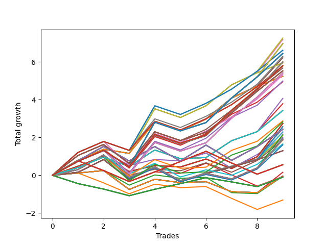

# Long HLT 104_POOLED_HITS 
- Symbol: TSLA
- Date Range: 01/10/2024 - 05/17/2024
- Trading Period: 8:30-12:30
- Number of Trades: 4



| Id. | Name | Win Percent | Profit | Avg Profit / Trade | Avg Time / Trade | Std |      | Name | Win Percent | Profit | Avg Profit / Trade | Avg Time / Trade | Std |
| --- | ---- | ----------- | ------ | ------------------ | ---------------- | --- | ---- | ---- | ----------- | ------ | ------------------ | ---------------- | --- |
| | Sorted By <br> Profit | | | | | | | Sorted By <br> Win Percentage |||||
|0| TP-0.25 180m | 25.00 | -1.24 | -0.31 | 04:00 | 0.37 |     | TP-0.25 180m | 25.00 | -1.24 | -0.31 | 04:00 | 0.37 |
|1| TP-0.25 165m | 25.00 | -1.24 | -0.31 | 04:00 | 0.37 |     | TP-0.25 165m | 25.00 | -1.24 | -0.31 | 04:00 | 0.37 |
|2| TP-0.25 150m | 25.00 | -1.24 | -0.31 | 04:00 | 0.37 |     | TP-0.25 150m | 25.00 | -1.24 | -0.31 | 04:00 | 0.37 |
|3| TP-0.25 135m | 25.00 | -1.24 | -0.31 | 04:00 | 0.37 |     | TP-0.25 135m | 25.00 | -1.24 | -0.31 | 04:00 | 0.37 |
|4| TP-0.25 120m | 25.00 | -1.24 | -0.31 | 04:00 | 0.37 |     | TP-0.25 120m | 25.00 | -1.24 | -0.31 | 04:00 | 0.37 |
|5| TP-0.25 105m | 25.00 | -1.24 | -0.31 | 04:00 | 0.37 |     | TP-0.25 105m | 25.00 | -1.24 | -0.31 | 04:00 | 0.37 |
|6| TP-0.25 90m | 25.00 | -1.24 | -0.31 | 04:00 | 0.37 |     | TP-0.25 90m | 25.00 | -1.24 | -0.31 | 04:00 | 0.37 |
|7| TP-0.25 75m | 25.00 | -1.24 | -0.31 | 04:00 | 0.37 |     | TP-0.25 75m | 25.00 | -1.24 | -0.31 | 04:00 | 0.37 |
|8| TP-0.25 60m | 25.00 | -1.24 | -0.31 | 04:00 | 0.37 |     | TP-0.25 60m | 25.00 | -1.24 | -0.31 | 04:00 | 0.37 |
|9| TP-0.25 45m | 25.00 | -1.24 | -0.31 | 04:00 | 0.37 |     | TP-0.25 45m | 25.00 | -1.24 | -0.31 | 04:00 | 0.37 |
|10| TP-0.25 30m | 25.00 | -1.24 | -0.31 | 04:00 | 0.37 |     | TP-0.25 30m | 25.00 | -1.24 | -0.31 | 04:00 | 0.37 |
|11| TP-0.25 15m | 25.00 | -1.24 | -0.31 | 04:00 | 0.37 |     | TP-0.25 15m | 25.00 | -1.24 | -0.31 | 04:00 | 0.37 |
|12| TP-3 15m | 25.00 | -1.59 | -0.40 | 14:00 | 0.38 |     | TP-3 15m | 25.00 | -1.59 | -0.40 | 14:00 | 0.38 |
|13| TP-2.75 15m | 25.00 | -1.59 | -0.40 | 14:00 | 0.38 |     | TP-2.75 15m | 25.00 | -1.59 | -0.40 | 14:00 | 0.38 |
|14| TP-2.5 15m | 25.00 | -1.59 | -0.40 | 14:00 | 0.38 |     | TP-2.5 15m | 25.00 | -1.59 | -0.40 | 14:00 | 0.38 |
|15| TP-2.25 15m | 25.00 | -1.59 | -0.40 | 14:00 | 0.38 |     | TP-2.25 15m | 25.00 | -1.59 | -0.40 | 14:00 | 0.38 |
|16| TP-2 15m | 25.00 | -1.59 | -0.40 | 14:00 | 0.38 |     | TP-2 15m | 25.00 | -1.59 | -0.40 | 14:00 | 0.38 |
|17| TP-1.75 15m | 25.00 | -1.59 | -0.40 | 14:00 | 0.38 |     | TP-1.75 15m | 25.00 | -1.59 | -0.40 | 14:00 | 0.38 |
|18| TP-1.5 15m | 25.00 | -1.59 | -0.40 | 14:00 | 0.38 |     | TP-1.5 15m | 25.00 | -1.59 | -0.40 | 14:00 | 0.38 |
|19| TP-1.25 15m | 25.00 | -1.59 | -0.40 | 14:00 | 0.38 |     | TP-1.25 15m | 25.00 | -1.59 | -0.40 | 14:00 | 0.38 |
|20| TP-0.5 15m | 25.00 | -1.60 | -0.40 | 09:15 | 0.38 |     | TP-0.5 15m | 25.00 | -1.60 | -0.40 | 09:15 | 0.38 |
|21| TP-0.5 180m | 25.00 | -1.61 | -0.40 | 13:45 | 0.46 |     | TP-0.5 180m | 25.00 | -1.61 | -0.40 | 13:45 | 0.46 |
|22| TP-0.5 165m | 25.00 | -1.61 | -0.40 | 13:45 | 0.46 |     | TP-0.5 165m | 25.00 | -1.61 | -0.40 | 13:45 | 0.46 |
|23| TP-0.5 150m | 25.00 | -1.61 | -0.40 | 13:45 | 0.46 |     | TP-0.5 150m | 25.00 | -1.61 | -0.40 | 13:45 | 0.46 |
|24| TP-0.5 135m | 25.00 | -1.61 | -0.40 | 13:45 | 0.46 |     | TP-0.5 135m | 25.00 | -1.61 | -0.40 | 13:45 | 0.46 |
|25| TP-0.5 120m | 25.00 | -1.61 | -0.40 | 13:45 | 0.46 |     | TP-0.5 120m | 25.00 | -1.61 | -0.40 | 13:45 | 0.46 |
|26| TP-0.5 105m | 25.00 | -1.61 | -0.40 | 13:45 | 0.46 |     | TP-0.5 105m | 25.00 | -1.61 | -0.40 | 13:45 | 0.46 |
|27| TP-0.5 90m | 25.00 | -1.61 | -0.40 | 13:45 | 0.46 |     | TP-0.5 90m | 25.00 | -1.61 | -0.40 | 13:45 | 0.46 |
|28| TP-0.5 75m | 25.00 | -1.61 | -0.40 | 13:45 | 0.46 |     | TP-0.5 75m | 25.00 | -1.61 | -0.40 | 13:45 | 0.46 |
|29| TP-0.5 60m | 25.00 | -1.61 | -0.40 | 13:45 | 0.46 |     | TP-0.5 60m | 25.00 | -1.61 | -0.40 | 13:45 | 0.46 |
|30| TP-0.5 45m | 25.00 | -1.61 | -0.40 | 13:45 | 0.46 |     | TP-0.5 45m | 25.00 | -1.61 | -0.40 | 13:45 | 0.46 |
|31| TP-0.75 15m | 25.00 | -1.69 | -0.42 | 09:30 | 0.40 |     | TP-0.75 15m | 25.00 | -1.69 | -0.42 | 09:30 | 0.40 |
|32| TP-0.5 30m | 25.00 | -1.75 | -0.44 | 13:30 | 0.40 |     | TP-0.5 30m | 25.00 | -1.75 | -0.44 | 13:30 | 0.40 |
|33| TP-3 60m | 25.00 | -1.89 | -0.47 | 51:45 | 0.57 |     | TP-3 60m | 25.00 | -1.89 | -0.47 | 51:45 | 0.57 |
|34| TP-2.75 60m | 25.00 | -1.89 | -0.47 | 51:45 | 0.57 |     | TP-2.75 60m | 25.00 | -1.89 | -0.47 | 51:45 | 0.57 |
|35| TP-2.5 60m | 25.00 | -1.89 | -0.47 | 51:45 | 0.57 |     | TP-2.5 60m | 25.00 | -1.89 | -0.47 | 51:45 | 0.57 |
|36| TP-0.75 180m | 25.00 | -1.97 | -0.49 | 15:00 | 0.50 |     | TP-0.75 180m | 25.00 | -1.97 | -0.49 | 15:00 | 0.50 |
|37| TP-0.75 165m | 25.00 | -1.97 | -0.49 | 15:00 | 0.50 |     | TP-0.75 165m | 25.00 | -1.97 | -0.49 | 15:00 | 0.50 |
|38| TP-0.75 150m | 25.00 | -1.97 | -0.49 | 15:00 | 0.50 |     | TP-0.75 150m | 25.00 | -1.97 | -0.49 | 15:00 | 0.50 |
|39| TP-0.75 135m | 25.00 | -1.97 | -0.49 | 15:00 | 0.50 |     | TP-0.75 135m | 25.00 | -1.97 | -0.49 | 15:00 | 0.50 |
|40| TP-0.75 120m | 25.00 | -1.97 | -0.49 | 15:00 | 0.50 |     | TP-0.75 120m | 25.00 | -1.97 | -0.49 | 15:00 | 0.50 |
|41| TP-0.75 105m | 25.00 | -1.97 | -0.49 | 15:00 | 0.50 |     | TP-0.75 105m | 25.00 | -1.97 | -0.49 | 15:00 | 0.50 |
|42| TP-0.75 90m | 25.00 | -1.97 | -0.49 | 15:00 | 0.50 |     | TP-0.75 90m | 25.00 | -1.97 | -0.49 | 15:00 | 0.50 |
|43| TP-0.75 75m | 25.00 | -1.97 | -0.49 | 15:00 | 0.50 |     | TP-0.75 75m | 25.00 | -1.97 | -0.49 | 15:00 | 0.50 |
|44| TP-0.75 60m | 25.00 | -1.97 | -0.49 | 15:00 | 0.50 |     | TP-0.75 60m | 25.00 | -1.97 | -0.49 | 15:00 | 0.50 |
|45| TP-0.75 45m | 25.00 | -1.97 | -0.49 | 15:00 | 0.50 |     | TP-0.75 45m | 25.00 | -1.97 | -0.49 | 15:00 | 0.50 |
|46| TP-1 15m | 25.00 | -2.05 | -0.51 | 11:45 | 0.49 |     | TP-1 15m | 25.00 | -2.05 | -0.51 | 11:45 | 0.49 |
|47| TP-0.75 30m | 25.00 | -2.11 | -0.53 | 14:45 | 0.44 |     | TP-0.75 30m | 25.00 | -2.11 | -0.53 | 14:45 | 0.44 |
|48| TP-1 30m | 25.00 | -2.12 | -0.53 | 22:00 | 0.58 |     | TP-1 30m | 25.00 | -2.12 | -0.53 | 22:00 | 0.58 |
|49| TP-1.5 30m | 25.00 | -2.41 | -0.60 | 28:30 | 0.69 |     | TP-1.5 30m | 25.00 | -2.41 | -0.60 | 28:30 | 0.69 |
|50| TP-1.25 30m | 25.00 | -2.41 | -0.60 | 28:30 | 0.69 |     | TP-1.25 30m | 25.00 | -2.41 | -0.60 | 28:30 | 0.69 |
|51| TP-1.25 75m | 25.00 | -2.54 | -0.63 | 43:45 | 0.81 |     | TP-1.25 75m | 25.00 | -2.54 | -0.63 | 43:45 | 0.81 |
|52| TP-1 45m | 25.00 | -2.72 | -0.68 | 26:00 | 0.62 |     | TP-1 45m | 25.00 | -2.72 | -0.68 | 26:00 | 0.62 |
|53| TP-1.5 75m | 25.00 | -2.75 | -0.69 | 48:45 | 0.85 |     | TP-1.5 75m | 25.00 | -2.75 | -0.69 | 48:45 | 0.85 |
|54| TP-1 180m | 25.00 | -2.85 | -0.71 | 26:15 | 0.63 |     | TP-1 180m | 25.00 | -2.85 | -0.71 | 26:15 | 0.63 |
|55| TP-1 165m | 25.00 | -2.85 | -0.71 | 26:15 | 0.63 |     | TP-1 165m | 25.00 | -2.85 | -0.71 | 26:15 | 0.63 |
|56| TP-1 150m | 25.00 | -2.85 | -0.71 | 26:15 | 0.63 |     | TP-1 150m | 25.00 | -2.85 | -0.71 | 26:15 | 0.63 |
|57| TP-1 135m | 25.00 | -2.85 | -0.71 | 26:15 | 0.63 |     | TP-1 135m | 25.00 | -2.85 | -0.71 | 26:15 | 0.63 |
|58| TP-1 120m | 25.00 | -2.85 | -0.71 | 26:15 | 0.63 |     | TP-1 120m | 25.00 | -2.85 | -0.71 | 26:15 | 0.63 |
|59| TP-1 105m | 25.00 | -2.85 | -0.71 | 26:15 | 0.63 |     | TP-1 105m | 25.00 | -2.85 | -0.71 | 26:15 | 0.63 |
|60| TP-1 90m | 25.00 | -2.85 | -0.71 | 26:15 | 0.63 |     | TP-1 90m | 25.00 | -2.85 | -0.71 | 26:15 | 0.63 |
|61| TP-1 75m | 25.00 | -2.85 | -0.71 | 26:15 | 0.63 |     | TP-1 75m | 25.00 | -2.85 | -0.71 | 26:15 | 0.63 |
|62| TP-1 60m | 25.00 | -2.85 | -0.71 | 26:15 | 0.63 |     | TP-1 60m | 25.00 | -2.85 | -0.71 | 26:15 | 0.63 |
|63| TP-3 45m | 25.00 | -2.97 | -0.74 | 40:30 | 0.66 |     | TP-3 45m | 25.00 | -2.97 | -0.74 | 40:30 | 0.66 |
|64| TP-2.75 45m | 25.00 | -2.97 | -0.74 | 40:30 | 0.66 |     | TP-2.75 45m | 25.00 | -2.97 | -0.74 | 40:30 | 0.66 |
|65| TP-2.5 45m | 25.00 | -2.97 | -0.74 | 40:30 | 0.66 |     | TP-2.5 45m | 25.00 | -2.97 | -0.74 | 40:30 | 0.66 |
|66| TP-3 75m | 25.00 | -3.09 | -0.77 | 63:00 | 0.95 |     | TP-3 75m | 25.00 | -3.09 | -0.77 | 63:00 | 0.95 |
|67| TP-2.75 75m | 25.00 | -3.09 | -0.77 | 63:00 | 0.95 |     | TP-2.75 75m | 25.00 | -3.09 | -0.77 | 63:00 | 0.95 |
|68| TP-2.5 75m | 25.00 | -3.09 | -0.77 | 63:00 | 0.95 |     | TP-2.5 75m | 25.00 | -3.09 | -0.77 | 63:00 | 0.95 |
|69| TP-1.5 60m | 25.00 | -3.12 | -0.78 | 43:45 | 0.72 |     | TP-1.5 60m | 25.00 | -3.12 | -0.78 | 43:45 | 0.72 |
|70| TP-3 30m | 25.00 | -3.12 | -0.78 | 29:00 | 0.95 |     | TP-3 30m | 25.00 | -3.12 | -0.78 | 29:00 | 0.95 |
|71| TP-2.75 30m | 25.00 | -3.12 | -0.78 | 29:00 | 0.95 |     | TP-2.75 30m | 25.00 | -3.12 | -0.78 | 29:00 | 0.95 |
|72| TP-2.5 30m | 25.00 | -3.12 | -0.78 | 29:00 | 0.95 |     | TP-2.5 30m | 25.00 | -3.12 | -0.78 | 29:00 | 0.95 |
|73| TP-2.25 30m | 25.00 | -3.12 | -0.78 | 29:00 | 0.95 |     | TP-2.25 30m | 25.00 | -3.12 | -0.78 | 29:00 | 0.95 |
|74| TP-2 30m | 25.00 | -3.12 | -0.78 | 29:00 | 0.95 |     | TP-2 30m | 25.00 | -3.12 | -0.78 | 29:00 | 0.95 |
|75| TP-1.75 30m | 25.00 | -3.12 | -0.78 | 29:00 | 0.95 |     | TP-1.75 30m | 25.00 | -3.12 | -0.78 | 29:00 | 0.95 |
|76| TP-1.25 60m | 25.00 | -3.31 | -0.83 | 40:00 | 0.74 |     | TP-1.25 60m | 25.00 | -3.31 | -0.83 | 40:00 | 0.74 |
|77| TP-1.5 45m | 25.00 | -3.38 | -0.84 | 36:15 | 0.74 |     | TP-1.5 45m | 25.00 | -3.38 | -0.84 | 36:15 | 0.74 |
|78| TP-1.25 45m | 25.00 | -3.38 | -0.84 | 36:15 | 0.74 |     | TP-1.25 45m | 25.00 | -3.38 | -0.84 | 36:15 | 0.74 |
|79| TP-1.25 180m | 25.00 | -3.74 | -0.93 | 47:30 | 0.77 |     | TP-1.25 180m | 25.00 | -3.74 | -0.93 | 47:30 | 0.77 |
|80| TP-1.25 165m | 25.00 | -3.74 | -0.93 | 47:30 | 0.77 |     | TP-1.25 165m | 25.00 | -3.74 | -0.93 | 47:30 | 0.77 |
|81| TP-1.25 150m | 25.00 | -3.74 | -0.93 | 47:30 | 0.77 |     | TP-1.25 150m | 25.00 | -3.74 | -0.93 | 47:30 | 0.77 |
|82| TP-1.25 135m | 25.00 | -3.74 | -0.93 | 47:30 | 0.77 |     | TP-1.25 135m | 25.00 | -3.74 | -0.93 | 47:30 | 0.77 |
|83| TP-1.25 120m | 25.00 | -3.74 | -0.93 | 47:30 | 0.77 |     | TP-1.25 120m | 25.00 | -3.74 | -0.93 | 47:30 | 0.77 |
|84| TP-1.25 105m | 25.00 | -3.74 | -0.93 | 47:30 | 0.77 |     | TP-1.25 105m | 25.00 | -3.74 | -0.93 | 47:30 | 0.77 |
|85| TP-1.25 90m | 25.00 | -3.74 | -0.93 | 47:30 | 0.77 |     | TP-1.25 90m | 25.00 | -3.74 | -0.93 | 47:30 | 0.77 |
|86| TP-2 60m | 25.00 | -3.83 | -0.96 | 44:15 | 0.94 |     | TP-2 60m | 25.00 | -3.83 | -0.96 | 44:15 | 0.94 |
|87| TP-1.75 60m | 25.00 | -3.83 | -0.96 | 44:15 | 0.94 |     | TP-1.75 60m | 25.00 | -3.83 | -0.96 | 44:15 | 0.94 |
|88| TP-2 75m | 25.00 | -3.85 | -0.96 | 51:45 | 1.13 |     | TP-2 75m | 25.00 | -3.85 | -0.96 | 51:45 | 1.13 |
|89| TP-1.75 75m | 25.00 | -3.85 | -0.96 | 50:30 | 1.13 |     | TP-1.75 75m | 25.00 | -3.85 | -0.96 | 50:30 | 1.13 |
|90| TP-2.25 60m | 25.00 | -3.89 | -0.97 | 44:30 | 0.96 |     | TP-2.25 60m | 25.00 | -3.89 | -0.97 | 44:30 | 0.96 |
|91| TP-2.25 75m | 25.00 | -3.91 | -0.98 | 52:00 | 1.15 |     | TP-2.25 75m | 25.00 | -3.91 | -0.98 | 52:00 | 1.15 |
|92| TP-1.5 90m | 25.00 | -3.95 | -0.99 | 52:30 | 0.80 |     | TP-1.5 90m | 25.00 | -3.95 | -0.99 | 52:30 | 0.80 |
|93| TP-2 45m | 25.00 | -4.09 | -1.02 | 36:45 | 0.95 |     | TP-2 45m | 25.00 | -4.09 | -1.02 | 36:45 | 0.95 |
|94| TP-1.75 45m | 25.00 | -4.09 | -1.02 | 36:45 | 0.95 |     | TP-1.75 45m | 25.00 | -4.09 | -1.02 | 36:45 | 0.95 |
|95| TP-2.25 45m | 25.00 | -4.15 | -1.04 | 37:00 | 0.97 |     | TP-2.25 45m | 25.00 | -4.15 | -1.04 | 37:00 | 0.97 |
|96| TP-1.5 180m | 25.00 | -4.40 | -1.10 | 53:15 | 0.86 |     | TP-1.5 180m | 25.00 | -4.40 | -1.10 | 53:15 | 0.86 |
|97| TP-1.5 165m | 25.00 | -4.40 | -1.10 | 53:15 | 0.86 |     | TP-1.5 165m | 25.00 | -4.40 | -1.10 | 53:15 | 0.86 |
|98| TP-1.5 150m | 25.00 | -4.40 | -1.10 | 53:15 | 0.86 |     | TP-1.5 150m | 25.00 | -4.40 | -1.10 | 53:15 | 0.86 |
|99| TP-1.5 135m | 25.00 | -4.40 | -1.10 | 53:15 | 0.86 |     | TP-1.5 135m | 25.00 | -4.40 | -1.10 | 53:15 | 0.86 |
|100| TP-1.5 120m | 25.00 | -4.40 | -1.10 | 53:15 | 0.86 |     | TP-1.5 120m | 25.00 | -4.40 | -1.10 | 53:15 | 0.86 |
|101| TP-1.5 105m | 25.00 | -4.40 | -1.10 | 53:15 | 0.86 |     | TP-1.5 105m | 25.00 | -4.40 | -1.10 | 53:15 | 0.86 |
|102| TP-1.75 180m | 25.00 | -4.70 | -1.17 | 61:45 | 1.02 |     | TP-1.75 180m | 25.00 | -4.70 | -1.17 | 61:45 | 1.02 |
|103| TP-1.75 165m | 25.00 | -4.70 | -1.17 | 61:45 | 1.02 |     | TP-1.75 165m | 25.00 | -4.70 | -1.17 | 61:45 | 1.02 |
|104| TP-1.75 150m | 25.00 | -4.70 | -1.17 | 61:45 | 1.02 |     | TP-1.75 150m | 25.00 | -4.70 | -1.17 | 61:45 | 1.02 |
|105| TP-1.75 135m | 25.00 | -4.70 | -1.17 | 61:45 | 1.02 |     | TP-1.75 135m | 25.00 | -4.70 | -1.17 | 61:45 | 1.02 |
|106| TP-1.75 120m | 25.00 | -4.70 | -1.17 | 61:45 | 1.02 |     | TP-1.75 120m | 25.00 | -4.70 | -1.17 | 61:45 | 1.02 |
|107| TP-2 180m | 25.00 | -4.88 | -1.22 | 63:30 | 1.05 |     | TP-2 180m | 25.00 | -4.88 | -1.22 | 63:30 | 1.05 |
|108| TP-2 165m | 25.00 | -4.88 | -1.22 | 63:30 | 1.05 |     | TP-2 165m | 25.00 | -4.88 | -1.22 | 63:30 | 1.05 |
|109| TP-2 150m | 25.00 | -4.88 | -1.22 | 63:30 | 1.05 |     | TP-2 150m | 25.00 | -4.88 | -1.22 | 63:30 | 1.05 |
|110| TP-2 135m | 25.00 | -4.88 | -1.22 | 63:30 | 1.05 |     | TP-2 135m | 25.00 | -4.88 | -1.22 | 63:30 | 1.05 |
|111| TP-2 120m | 25.00 | -4.88 | -1.22 | 63:30 | 1.05 |     | TP-2 120m | 25.00 | -4.88 | -1.22 | 63:30 | 1.05 |
|112| TP-1.75 90m | 25.00 | -5.05 | -1.26 | 54:15 | 1.01 |     | TP-1.75 90m | 25.00 | -5.05 | -1.26 | 54:15 | 1.01 |
|113| TP-2.25 180m | 25.00 | -5.11 | -1.28 | 67:00 | 1.10 |     | TP-2.25 180m | 25.00 | -5.11 | -1.28 | 67:00 | 1.10 |
|114| TP-2.25 165m | 25.00 | -5.11 | -1.28 | 67:00 | 1.10 |     | TP-2.25 165m | 25.00 | -5.11 | -1.28 | 67:00 | 1.10 |
|115| TP-2.25 150m | 25.00 | -5.11 | -1.28 | 67:00 | 1.10 |     | TP-2.25 150m | 25.00 | -5.11 | -1.28 | 67:00 | 1.10 |
|116| TP-2.25 135m | 25.00 | -5.11 | -1.28 | 67:00 | 1.10 |     | TP-2.25 135m | 25.00 | -5.11 | -1.28 | 67:00 | 1.10 |
|117| TP-2.25 120m | 25.00 | -5.11 | -1.28 | 67:00 | 1.10 |     | TP-2.25 120m | 25.00 | -5.11 | -1.28 | 67:00 | 1.10 |
|118| TP-2.5 180m | 25.00 | -5.15 | -1.29 | 88:30 | 1.16 |     | TP-2.5 180m | 25.00 | -5.15 | -1.29 | 88:30 | 1.16 |
|119| TP-2.5 165m | 25.00 | -5.15 | -1.29 | 88:30 | 1.16 |     | TP-2.5 165m | 25.00 | -5.15 | -1.29 | 88:30 | 1.16 |
|120| TP-2.5 150m | 25.00 | -5.15 | -1.29 | 88:30 | 1.16 |     | TP-2.5 150m | 25.00 | -5.15 | -1.29 | 88:30 | 1.16 |
|121| TP-2.5 135m | 25.00 | -5.15 | -1.29 | 88:30 | 1.16 |     | TP-2.5 135m | 25.00 | -5.15 | -1.29 | 88:30 | 1.16 |
|122| TP-2.5 120m | 25.00 | -5.15 | -1.29 | 88:30 | 1.16 |     | TP-2.5 120m | 25.00 | -5.15 | -1.29 | 88:30 | 1.16 |
|123| TP-1.75 105m | 25.00 | -5.15 | -1.29 | 58:00 | 1.01 |     | TP-1.75 105m | 25.00 | -5.15 | -1.29 | 58:00 | 1.01 |
|124| TP-2.75 180m | 25.00 | -5.17 | -1.29 | 89:00 | 1.17 |     | TP-2.75 180m | 25.00 | -5.17 | -1.29 | 89:00 | 1.17 |
|125| TP-2.75 165m | 25.00 | -5.17 | -1.29 | 89:00 | 1.17 |     | TP-2.75 165m | 25.00 | -5.17 | -1.29 | 89:00 | 1.17 |
|126| TP-2.75 150m | 25.00 | -5.17 | -1.29 | 89:00 | 1.17 |     | TP-2.75 150m | 25.00 | -5.17 | -1.29 | 89:00 | 1.17 |
|127| TP-2.75 135m | 25.00 | -5.17 | -1.29 | 89:00 | 1.17 |     | TP-2.75 135m | 25.00 | -5.17 | -1.29 | 89:00 | 1.17 |
|128| TP-2.75 120m | 25.00 | -5.17 | -1.29 | 89:00 | 1.17 |     | TP-2.75 120m | 25.00 | -5.17 | -1.29 | 89:00 | 1.17 |
|129| TP-2 90m | 25.00 | -5.23 | -1.31 | 56:00 | 1.04 |     | TP-2 90m | 25.00 | -5.23 | -1.31 | 56:00 | 1.04 |
|130| TP-2 105m | 25.00 | -5.33 | -1.33 | 59:45 | 1.04 |     | TP-2 105m | 25.00 | -5.33 | -1.33 | 59:45 | 1.04 |
|131| TP-2.25 90m | 25.00 | -5.46 | -1.37 | 59:30 | 1.09 |     | TP-2.25 90m | 25.00 | -5.46 | -1.37 | 59:30 | 1.09 |
|132| TP-2.25 105m | 25.00 | -5.56 | -1.39 | 63:15 | 1.09 |     | TP-2.25 105m | 25.00 | -5.56 | -1.39 | 63:15 | 1.09 |
|133| TP-3 180m | 25.00 | -5.62 | -1.41 | 90:00 | 1.32 |     | TP-3 180m | 25.00 | -5.62 | -1.41 | 90:00 | 1.32 |
|134| TP-3 165m | 25.00 | -5.62 | -1.41 | 90:00 | 1.32 |     | TP-3 165m | 25.00 | -5.62 | -1.41 | 90:00 | 1.32 |
|135| TP-3 150m | 25.00 | -5.62 | -1.41 | 90:00 | 1.32 |     | TP-3 150m | 25.00 | -5.62 | -1.41 | 90:00 | 1.32 |
|136| TP-3 135m | 25.00 | -5.62 | -1.41 | 90:00 | 1.32 |     | TP-3 135m | 25.00 | -5.62 | -1.41 | 90:00 | 1.32 |
|137| TP-3 120m | 25.00 | -5.62 | -1.41 | 90:00 | 1.32 |     | TP-3 120m | 25.00 | -5.62 | -1.41 | 90:00 | 1.32 |
|138| TP-2.5 90m | 25.00 | -5.90 | -1.48 | 73:30 | 1.20 |     | TP-2.5 90m | 25.00 | -5.90 | -1.48 | 73:30 | 1.20 |
|139| TP-2.75 90m | 25.00 | -5.92 | -1.48 | 74:00 | 1.20 |     | TP-2.75 90m | 25.00 | -5.92 | -1.48 | 74:00 | 1.20 |
|140| TP-3 90m | 25.00 | -5.98 | -1.50 | 74:15 | 1.22 |     | TP-3 90m | 25.00 | -5.98 | -1.50 | 74:15 | 1.22 |
|141| TP-2.5 105m | 25.00 | -6.10 | -1.52 | 81:00 | 1.21 |     | TP-2.5 105m | 25.00 | -6.10 | -1.52 | 81:00 | 1.21 |
|142| TP-2.75 105m | 25.00 | -6.12 | -1.53 | 81:30 | 1.21 |     | TP-2.75 105m | 25.00 | -6.12 | -1.53 | 81:30 | 1.21 |
|143| TP-3 105m | 25.00 | -6.57 | -1.64 | 82:30 | 1.34 |     | TP-3 105m | 25.00 | -6.57 | -1.64 | 82:30 | 1.34 |

### Test TP-0.25 15m
* Take Profit of 0.25 Point
* 0.25 Stoploss
* Results:
```
Total Trades: 4
Percent Up: 25.00
Percent Down: 75.00
Total Points Moved Up: -1.24
Potential Profit: -620.00
Total Points Ups: 0.25 Count Ups: 1
Total Points Downs: -1.49 Count Downs: 3
```

<details><summary>Trades</summary>

<code>In: 2024-01-19 12:20:00		Out: 2024-01-19 12:22:00		Total Position Time: 02:00		Total Move Up: -0.43		Total to Date: -0.43</code> <br />
<code>In: 2024-04-29 09:40:00		Out: 2024-04-29 09:42:00		Total Position Time: 02:00		Total Move Up: -0.77		Total to Date: -1.20</code> <br />
<code>In: 2024-05-17 09:45:00		Out: 2024-05-17 09:55:00		Total Position Time: 10:00		Total Move Up: -0.29		Total to Date: -1.49</code> <br />
<code>In: 2024-03-18 08:35:00		Out: 2024-03-18 08:37:00		Total Position Time: 02:00		Total Move Up: 0.25		Total to Date: -1.24</code> <br />


</details>

### Test TP-0.5 15m
* Take Profit of 0.5 Point
* 0.5 Stoploss
* Results:
```
Total Trades: 4
Percent Up: 25.00
Percent Down: 75.00
Total Points Moved Up: -1.60
Potential Profit: -800.00
Total Points Ups: 0.20 Count Ups: 1
Total Points Downs: -1.80 Count Downs: 3
```

<details><summary>Trades</summary>

<code>In: 2024-01-19 12:20:00		Out: 2024-01-19 12:34:00		Total Position Time: 14:00		Total Move Up: 0.20		Total to Date: 0.20</code> <br />
<code>In: 2024-04-29 09:40:00		Out: 2024-04-29 09:42:00		Total Position Time: 02:00		Total Move Up: -0.77		Total to Date: -0.57</code> <br />
<code>In: 2024-05-17 09:45:00		Out: 2024-05-17 09:59:00		Total Position Time: 14:00		Total Move Up: -0.34		Total to Date: -0.91</code> <br />
<code>In: 2024-03-18 08:35:00		Out: 2024-03-18 08:42:00		Total Position Time: 07:00		Total Move Up: -0.69		Total to Date: -1.60</code> <br />


</details>

### Test TP-0.75 15m
* Take Profit of 0.75 Point
* 0.75 Stoploss
* Results:
```
Total Trades: 4
Percent Up: 25.00
Percent Down: 75.00
Total Points Moved Up: -1.69
Potential Profit: -845.00
Total Points Ups: 0.20 Count Ups: 1
Total Points Downs: -1.89 Count Downs: 3
```

<details><summary>Trades</summary>

<code>In: 2024-01-19 12:20:00		Out: 2024-01-19 12:34:00		Total Position Time: 14:00		Total Move Up: 0.20		Total to Date: 0.20</code> <br />
<code>In: 2024-04-29 09:40:00		Out: 2024-04-29 09:42:00		Total Position Time: 02:00		Total Move Up: -0.77		Total to Date: -0.57</code> <br />
<code>In: 2024-05-17 09:45:00		Out: 2024-05-17 09:59:00		Total Position Time: 14:00		Total Move Up: -0.34		Total to Date: -0.91</code> <br />
<code>In: 2024-03-18 08:35:00		Out: 2024-03-18 08:43:00		Total Position Time: 08:00		Total Move Up: -0.78		Total to Date: -1.69</code> <br />


</details>

### Test TP-1 15m
* Take Profit of 1 Point
* 1 Stoploss
* Results:
```
Total Trades: 4
Percent Up: 25.00
Percent Down: 75.00
Total Points Moved Up: -2.05
Potential Profit: -1025.00
Total Points Ups: 0.20 Count Ups: 1
Total Points Downs: -2.25 Count Downs: 3
```

<details><summary>Trades</summary>

<code>In: 2024-01-19 12:20:00		Out: 2024-01-19 12:34:00		Total Position Time: 14:00		Total Move Up: 0.20		Total to Date: 0.20</code> <br />
<code>In: 2024-04-29 09:40:00		Out: 2024-04-29 09:45:00		Total Position Time: 05:00		Total Move Up: -1.11		Total to Date: -0.91</code> <br />
<code>In: 2024-05-17 09:45:00		Out: 2024-05-17 09:59:00		Total Position Time: 14:00		Total Move Up: -0.34		Total to Date: -1.25</code> <br />
<code>In: 2024-03-18 08:35:00		Out: 2024-03-18 08:49:00		Total Position Time: 14:00		Total Move Up: -0.80		Total to Date: -2.05</code> <br />


</details>

### Test TP-1.25 15m
* Take Profit of 1.25 Point
* 1.25 Stoploss
* Results:
```
Total Trades: 4
Percent Up: 25.00
Percent Down: 75.00
Total Points Moved Up: -1.59
Potential Profit: -795.00
Total Points Ups: 0.20 Count Ups: 1
Total Points Downs: -1.79 Count Downs: 3
```

<details><summary>Trades</summary>

<code>In: 2024-01-19 12:20:00		Out: 2024-01-19 12:34:00		Total Position Time: 14:00		Total Move Up: 0.20		Total to Date: 0.20</code> <br />
<code>In: 2024-04-29 09:40:00		Out: 2024-04-29 09:54:00		Total Position Time: 14:00		Total Move Up: -0.65		Total to Date: -0.45</code> <br />
<code>In: 2024-05-17 09:45:00		Out: 2024-05-17 09:59:00		Total Position Time: 14:00		Total Move Up: -0.34		Total to Date: -0.79</code> <br />
<code>In: 2024-03-18 08:35:00		Out: 2024-03-18 08:49:00		Total Position Time: 14:00		Total Move Up: -0.80		Total to Date: -1.59</code> <br />


</details>

### Test TP-1.5 15m
* Take Profit of 1.5 Point
* 1.5 Stoploss
* Results:
```
Total Trades: 4
Percent Up: 25.00
Percent Down: 75.00
Total Points Moved Up: -1.59
Potential Profit: -795.00
Total Points Ups: 0.20 Count Ups: 1
Total Points Downs: -1.79 Count Downs: 3
```

<details><summary>Trades</summary>

<code>In: 2024-01-19 12:20:00		Out: 2024-01-19 12:34:00		Total Position Time: 14:00		Total Move Up: 0.20		Total to Date: 0.20</code> <br />
<code>In: 2024-04-29 09:40:00		Out: 2024-04-29 09:54:00		Total Position Time: 14:00		Total Move Up: -0.65		Total to Date: -0.45</code> <br />
<code>In: 2024-05-17 09:45:00		Out: 2024-05-17 09:59:00		Total Position Time: 14:00		Total Move Up: -0.34		Total to Date: -0.79</code> <br />
<code>In: 2024-03-18 08:35:00		Out: 2024-03-18 08:49:00		Total Position Time: 14:00		Total Move Up: -0.80		Total to Date: -1.59</code> <br />


</details>

### Test TP-1.75 15m
* Take Profit of 1.75 Point
* 1.75 Stoploss
* Results:
```
Total Trades: 4
Percent Up: 25.00
Percent Down: 75.00
Total Points Moved Up: -1.59
Potential Profit: -795.00
Total Points Ups: 0.20 Count Ups: 1
Total Points Downs: -1.79 Count Downs: 3
```

<details><summary>Trades</summary>

<code>In: 2024-01-19 12:20:00		Out: 2024-01-19 12:34:00		Total Position Time: 14:00		Total Move Up: 0.20		Total to Date: 0.20</code> <br />
<code>In: 2024-04-29 09:40:00		Out: 2024-04-29 09:54:00		Total Position Time: 14:00		Total Move Up: -0.65		Total to Date: -0.45</code> <br />
<code>In: 2024-05-17 09:45:00		Out: 2024-05-17 09:59:00		Total Position Time: 14:00		Total Move Up: -0.34		Total to Date: -0.79</code> <br />
<code>In: 2024-03-18 08:35:00		Out: 2024-03-18 08:49:00		Total Position Time: 14:00		Total Move Up: -0.80		Total to Date: -1.59</code> <br />


</details>

### Test TP-2 15m
* Take Profit of 2 Point
* 2 Stoploss
* Results:
```
Total Trades: 4
Percent Up: 25.00
Percent Down: 75.00
Total Points Moved Up: -1.59
Potential Profit: -795.00
Total Points Ups: 0.20 Count Ups: 1
Total Points Downs: -1.79 Count Downs: 3
```

<details><summary>Trades</summary>

<code>In: 2024-01-19 12:20:00		Out: 2024-01-19 12:34:00		Total Position Time: 14:00		Total Move Up: 0.20		Total to Date: 0.20</code> <br />
<code>In: 2024-04-29 09:40:00		Out: 2024-04-29 09:54:00		Total Position Time: 14:00		Total Move Up: -0.65		Total to Date: -0.45</code> <br />
<code>In: 2024-05-17 09:45:00		Out: 2024-05-17 09:59:00		Total Position Time: 14:00		Total Move Up: -0.34		Total to Date: -0.79</code> <br />
<code>In: 2024-03-18 08:35:00		Out: 2024-03-18 08:49:00		Total Position Time: 14:00		Total Move Up: -0.80		Total to Date: -1.59</code> <br />


</details>

### Test TP-2.25 15m
* Take Profit of 2.25 Point
* 2.25 Stoploss
* Results:
```
Total Trades: 4
Percent Up: 25.00
Percent Down: 75.00
Total Points Moved Up: -1.59
Potential Profit: -795.00
Total Points Ups: 0.20 Count Ups: 1
Total Points Downs: -1.79 Count Downs: 3
```

<details><summary>Trades</summary>

<code>In: 2024-01-19 12:20:00		Out: 2024-01-19 12:34:00		Total Position Time: 14:00		Total Move Up: 0.20		Total to Date: 0.20</code> <br />
<code>In: 2024-04-29 09:40:00		Out: 2024-04-29 09:54:00		Total Position Time: 14:00		Total Move Up: -0.65		Total to Date: -0.45</code> <br />
<code>In: 2024-05-17 09:45:00		Out: 2024-05-17 09:59:00		Total Position Time: 14:00		Total Move Up: -0.34		Total to Date: -0.79</code> <br />
<code>In: 2024-03-18 08:35:00		Out: 2024-03-18 08:49:00		Total Position Time: 14:00		Total Move Up: -0.80		Total to Date: -1.59</code> <br />


</details>

### Test TP-2.5 15m
* Take Profit of 2.5 Point
* 2.5 Stoploss
* Results:
```
Total Trades: 4
Percent Up: 25.00
Percent Down: 75.00
Total Points Moved Up: -1.59
Potential Profit: -795.00
Total Points Ups: 0.20 Count Ups: 1
Total Points Downs: -1.79 Count Downs: 3
```

<details><summary>Trades</summary>

<code>In: 2024-01-19 12:20:00		Out: 2024-01-19 12:34:00		Total Position Time: 14:00		Total Move Up: 0.20		Total to Date: 0.20</code> <br />
<code>In: 2024-04-29 09:40:00		Out: 2024-04-29 09:54:00		Total Position Time: 14:00		Total Move Up: -0.65		Total to Date: -0.45</code> <br />
<code>In: 2024-05-17 09:45:00		Out: 2024-05-17 09:59:00		Total Position Time: 14:00		Total Move Up: -0.34		Total to Date: -0.79</code> <br />
<code>In: 2024-03-18 08:35:00		Out: 2024-03-18 08:49:00		Total Position Time: 14:00		Total Move Up: -0.80		Total to Date: -1.59</code> <br />


</details>

### Test TP-2.75 15m
* Take Profit of 2.75 Point
* 2.75 Stoploss
* Results:
```
Total Trades: 4
Percent Up: 25.00
Percent Down: 75.00
Total Points Moved Up: -1.59
Potential Profit: -795.00
Total Points Ups: 0.20 Count Ups: 1
Total Points Downs: -1.79 Count Downs: 3
```

<details><summary>Trades</summary>

<code>In: 2024-01-19 12:20:00		Out: 2024-01-19 12:34:00		Total Position Time: 14:00		Total Move Up: 0.20		Total to Date: 0.20</code> <br />
<code>In: 2024-04-29 09:40:00		Out: 2024-04-29 09:54:00		Total Position Time: 14:00		Total Move Up: -0.65		Total to Date: -0.45</code> <br />
<code>In: 2024-05-17 09:45:00		Out: 2024-05-17 09:59:00		Total Position Time: 14:00		Total Move Up: -0.34		Total to Date: -0.79</code> <br />
<code>In: 2024-03-18 08:35:00		Out: 2024-03-18 08:49:00		Total Position Time: 14:00		Total Move Up: -0.80		Total to Date: -1.59</code> <br />


</details>

### Test TP-3 15m
* Take Profit of 3 Point
* 3 Stoploss
* Results:
```
Total Trades: 4
Percent Up: 25.00
Percent Down: 75.00
Total Points Moved Up: -1.59
Potential Profit: -795.00
Total Points Ups: 0.20 Count Ups: 1
Total Points Downs: -1.79 Count Downs: 3
```

<details><summary>Trades</summary>

<code>In: 2024-01-19 12:20:00		Out: 2024-01-19 12:34:00		Total Position Time: 14:00		Total Move Up: 0.20		Total to Date: 0.20</code> <br />
<code>In: 2024-04-29 09:40:00		Out: 2024-04-29 09:54:00		Total Position Time: 14:00		Total Move Up: -0.65		Total to Date: -0.45</code> <br />
<code>In: 2024-05-17 09:45:00		Out: 2024-05-17 09:59:00		Total Position Time: 14:00		Total Move Up: -0.34		Total to Date: -0.79</code> <br />
<code>In: 2024-03-18 08:35:00		Out: 2024-03-18 08:49:00		Total Position Time: 14:00		Total Move Up: -0.80		Total to Date: -1.59</code> <br />


</details>

### Test TP-0.25 30m
* Take Profit of 0.25 Point
* 0.25 Stoploss
* Results:
```
Total Trades: 4
Percent Up: 25.00
Percent Down: 75.00
Total Points Moved Up: -1.24
Potential Profit: -620.00
Total Points Ups: 0.25 Count Ups: 1
Total Points Downs: -1.49 Count Downs: 3
```

<details><summary>Trades</summary>

<code>In: 2024-01-19 12:20:00		Out: 2024-01-19 12:22:00		Total Position Time: 02:00		Total Move Up: -0.43		Total to Date: -0.43</code> <br />
<code>In: 2024-04-29 09:40:00		Out: 2024-04-29 09:42:00		Total Position Time: 02:00		Total Move Up: -0.77		Total to Date: -1.20</code> <br />
<code>In: 2024-05-17 09:45:00		Out: 2024-05-17 09:55:00		Total Position Time: 10:00		Total Move Up: -0.29		Total to Date: -1.49</code> <br />
<code>In: 2024-03-18 08:35:00		Out: 2024-03-18 08:37:00		Total Position Time: 02:00		Total Move Up: 0.25		Total to Date: -1.24</code> <br />


</details>

### Test TP-0.5 30m
* Take Profit of 0.5 Point
* 0.5 Stoploss
* Results:
```
Total Trades: 4
Percent Up: 25.00
Percent Down: 75.00
Total Points Moved Up: -1.75
Potential Profit: -875.00
Total Points Ups: 0.24 Count Ups: 1
Total Points Downs: -1.99 Count Downs: 3
```

<details><summary>Trades</summary>

<code>In: 2024-01-19 12:20:00		Out: 2024-01-19 12:49:00		Total Position Time: 29:00		Total Move Up: 0.24		Total to Date: 0.24</code> <br />
<code>In: 2024-04-29 09:40:00		Out: 2024-04-29 09:42:00		Total Position Time: 02:00		Total Move Up: -0.77		Total to Date: -0.53</code> <br />
<code>In: 2024-05-17 09:45:00		Out: 2024-05-17 10:01:00		Total Position Time: 16:00		Total Move Up: -0.53		Total to Date: -1.06</code> <br />
<code>In: 2024-03-18 08:35:00		Out: 2024-03-18 08:42:00		Total Position Time: 07:00		Total Move Up: -0.69		Total to Date: -1.75</code> <br />


</details>

### Test TP-0.75 30m
* Take Profit of 0.75 Point
* 0.75 Stoploss
* Results:
```
Total Trades: 4
Percent Up: 25.00
Percent Down: 75.00
Total Points Moved Up: -2.11
Potential Profit: -1055.00
Total Points Ups: 0.24 Count Ups: 1
Total Points Downs: -2.35 Count Downs: 3
```

<details><summary>Trades</summary>

<code>In: 2024-01-19 12:20:00		Out: 2024-01-19 12:49:00		Total Position Time: 29:00		Total Move Up: 0.24		Total to Date: 0.24</code> <br />
<code>In: 2024-04-29 09:40:00		Out: 2024-04-29 09:42:00		Total Position Time: 02:00		Total Move Up: -0.77		Total to Date: -0.53</code> <br />
<code>In: 2024-05-17 09:45:00		Out: 2024-05-17 10:05:00		Total Position Time: 20:00		Total Move Up: -0.80		Total to Date: -1.33</code> <br />
<code>In: 2024-03-18 08:35:00		Out: 2024-03-18 08:43:00		Total Position Time: 08:00		Total Move Up: -0.78		Total to Date: -2.11</code> <br />


</details>

### Test TP-1 30m
* Take Profit of 1 Point
* 1 Stoploss
* Results:
```
Total Trades: 4
Percent Up: 25.00
Percent Down: 75.00
Total Points Moved Up: -2.12
Potential Profit: -1060.00
Total Points Ups: 0.24 Count Ups: 1
Total Points Downs: -2.36 Count Downs: 3
```

<details><summary>Trades</summary>

<code>In: 2024-01-19 12:20:00		Out: 2024-01-19 12:49:00		Total Position Time: 29:00		Total Move Up: 0.24		Total to Date: 0.24</code> <br />
<code>In: 2024-04-29 09:40:00		Out: 2024-04-29 09:45:00		Total Position Time: 05:00		Total Move Up: -1.11		Total to Date: -0.87</code> <br />
<code>In: 2024-05-17 09:45:00		Out: 2024-05-17 10:10:00		Total Position Time: 25:00		Total Move Up: -1.07		Total to Date: -1.94</code> <br />
<code>In: 2024-03-18 08:35:00		Out: 2024-03-18 09:04:00		Total Position Time: 29:00		Total Move Up: -0.18		Total to Date: -2.12</code> <br />


</details>

### Test TP-1.25 30m
* Take Profit of 1.25 Point
* 1.25 Stoploss
* Results:
```
Total Trades: 4
Percent Up: 25.00
Percent Down: 75.00
Total Points Moved Up: -2.41
Potential Profit: -1205.00
Total Points Ups: 0.24 Count Ups: 1
Total Points Downs: -2.65 Count Downs: 3
```

<details><summary>Trades</summary>

<code>In: 2024-01-19 12:20:00		Out: 2024-01-19 12:49:00		Total Position Time: 29:00		Total Move Up: 0.24		Total to Date: 0.24</code> <br />
<code>In: 2024-04-29 09:40:00		Out: 2024-04-29 10:07:00		Total Position Time: 27:00		Total Move Up: -1.55		Total to Date: -1.31</code> <br />
<code>In: 2024-05-17 09:45:00		Out: 2024-05-17 10:14:00		Total Position Time: 29:00		Total Move Up: -0.92		Total to Date: -2.23</code> <br />
<code>In: 2024-03-18 08:35:00		Out: 2024-03-18 09:04:00		Total Position Time: 29:00		Total Move Up: -0.18		Total to Date: -2.41</code> <br />


</details>

### Test TP-1.5 30m
* Take Profit of 1.5 Point
* 1.5 Stoploss
* Results:
```
Total Trades: 4
Percent Up: 25.00
Percent Down: 75.00
Total Points Moved Up: -2.41
Potential Profit: -1205.00
Total Points Ups: 0.24 Count Ups: 1
Total Points Downs: -2.65 Count Downs: 3
```

<details><summary>Trades</summary>

<code>In: 2024-01-19 12:20:00		Out: 2024-01-19 12:49:00		Total Position Time: 29:00		Total Move Up: 0.24		Total to Date: 0.24</code> <br />
<code>In: 2024-04-29 09:40:00		Out: 2024-04-29 10:07:00		Total Position Time: 27:00		Total Move Up: -1.55		Total to Date: -1.31</code> <br />
<code>In: 2024-05-17 09:45:00		Out: 2024-05-17 10:14:00		Total Position Time: 29:00		Total Move Up: -0.92		Total to Date: -2.23</code> <br />
<code>In: 2024-03-18 08:35:00		Out: 2024-03-18 09:04:00		Total Position Time: 29:00		Total Move Up: -0.18		Total to Date: -2.41</code> <br />


</details>

### Test TP-1.75 30m
* Take Profit of 1.75 Point
* 1.75 Stoploss
* Results:
```
Total Trades: 4
Percent Up: 25.00
Percent Down: 75.00
Total Points Moved Up: -3.12
Potential Profit: -1560.00
Total Points Ups: 0.24 Count Ups: 1
Total Points Downs: -3.36 Count Downs: 3
```

<details><summary>Trades</summary>

<code>In: 2024-01-19 12:20:00		Out: 2024-01-19 12:49:00		Total Position Time: 29:00		Total Move Up: 0.24		Total to Date: 0.24</code> <br />
<code>In: 2024-04-29 09:40:00		Out: 2024-04-29 10:09:00		Total Position Time: 29:00		Total Move Up: -2.26		Total to Date: -2.02</code> <br />
<code>In: 2024-05-17 09:45:00		Out: 2024-05-17 10:14:00		Total Position Time: 29:00		Total Move Up: -0.92		Total to Date: -2.94</code> <br />
<code>In: 2024-03-18 08:35:00		Out: 2024-03-18 09:04:00		Total Position Time: 29:00		Total Move Up: -0.18		Total to Date: -3.12</code> <br />


</details>

### Test TP-2 30m
* Take Profit of 2 Point
* 2 Stoploss
* Results:
```
Total Trades: 4
Percent Up: 25.00
Percent Down: 75.00
Total Points Moved Up: -3.12
Potential Profit: -1560.00
Total Points Ups: 0.24 Count Ups: 1
Total Points Downs: -3.36 Count Downs: 3
```

<details><summary>Trades</summary>

<code>In: 2024-01-19 12:20:00		Out: 2024-01-19 12:49:00		Total Position Time: 29:00		Total Move Up: 0.24		Total to Date: 0.24</code> <br />
<code>In: 2024-04-29 09:40:00		Out: 2024-04-29 10:09:00		Total Position Time: 29:00		Total Move Up: -2.26		Total to Date: -2.02</code> <br />
<code>In: 2024-05-17 09:45:00		Out: 2024-05-17 10:14:00		Total Position Time: 29:00		Total Move Up: -0.92		Total to Date: -2.94</code> <br />
<code>In: 2024-03-18 08:35:00		Out: 2024-03-18 09:04:00		Total Position Time: 29:00		Total Move Up: -0.18		Total to Date: -3.12</code> <br />


</details>

### Test TP-2.25 30m
* Take Profit of 2.25 Point
* 2.25 Stoploss
* Results:
```
Total Trades: 4
Percent Up: 25.00
Percent Down: 75.00
Total Points Moved Up: -3.12
Potential Profit: -1560.00
Total Points Ups: 0.24 Count Ups: 1
Total Points Downs: -3.36 Count Downs: 3
```

<details><summary>Trades</summary>

<code>In: 2024-01-19 12:20:00		Out: 2024-01-19 12:49:00		Total Position Time: 29:00		Total Move Up: 0.24		Total to Date: 0.24</code> <br />
<code>In: 2024-04-29 09:40:00		Out: 2024-04-29 10:09:00		Total Position Time: 29:00		Total Move Up: -2.26		Total to Date: -2.02</code> <br />
<code>In: 2024-05-17 09:45:00		Out: 2024-05-17 10:14:00		Total Position Time: 29:00		Total Move Up: -0.92		Total to Date: -2.94</code> <br />
<code>In: 2024-03-18 08:35:00		Out: 2024-03-18 09:04:00		Total Position Time: 29:00		Total Move Up: -0.18		Total to Date: -3.12</code> <br />


</details>

### Test TP-2.5 30m
* Take Profit of 2.5 Point
* 2.5 Stoploss
* Results:
```
Total Trades: 4
Percent Up: 25.00
Percent Down: 75.00
Total Points Moved Up: -3.12
Potential Profit: -1560.00
Total Points Ups: 0.24 Count Ups: 1
Total Points Downs: -3.36 Count Downs: 3
```

<details><summary>Trades</summary>

<code>In: 2024-01-19 12:20:00		Out: 2024-01-19 12:49:00		Total Position Time: 29:00		Total Move Up: 0.24		Total to Date: 0.24</code> <br />
<code>In: 2024-04-29 09:40:00		Out: 2024-04-29 10:09:00		Total Position Time: 29:00		Total Move Up: -2.26		Total to Date: -2.02</code> <br />
<code>In: 2024-05-17 09:45:00		Out: 2024-05-17 10:14:00		Total Position Time: 29:00		Total Move Up: -0.92		Total to Date: -2.94</code> <br />
<code>In: 2024-03-18 08:35:00		Out: 2024-03-18 09:04:00		Total Position Time: 29:00		Total Move Up: -0.18		Total to Date: -3.12</code> <br />


</details>

### Test TP-2.75 30m
* Take Profit of 2.75 Point
* 2.75 Stoploss
* Results:
```
Total Trades: 4
Percent Up: 25.00
Percent Down: 75.00
Total Points Moved Up: -3.12
Potential Profit: -1560.00
Total Points Ups: 0.24 Count Ups: 1
Total Points Downs: -3.36 Count Downs: 3
```

<details><summary>Trades</summary>

<code>In: 2024-01-19 12:20:00		Out: 2024-01-19 12:49:00		Total Position Time: 29:00		Total Move Up: 0.24		Total to Date: 0.24</code> <br />
<code>In: 2024-04-29 09:40:00		Out: 2024-04-29 10:09:00		Total Position Time: 29:00		Total Move Up: -2.26		Total to Date: -2.02</code> <br />
<code>In: 2024-05-17 09:45:00		Out: 2024-05-17 10:14:00		Total Position Time: 29:00		Total Move Up: -0.92		Total to Date: -2.94</code> <br />
<code>In: 2024-03-18 08:35:00		Out: 2024-03-18 09:04:00		Total Position Time: 29:00		Total Move Up: -0.18		Total to Date: -3.12</code> <br />


</details>

### Test TP-3 30m
* Take Profit of 3 Point
* 3 Stoploss
* Results:
```
Total Trades: 4
Percent Up: 25.00
Percent Down: 75.00
Total Points Moved Up: -3.12
Potential Profit: -1560.00
Total Points Ups: 0.24 Count Ups: 1
Total Points Downs: -3.36 Count Downs: 3
```

<details><summary>Trades</summary>

<code>In: 2024-01-19 12:20:00		Out: 2024-01-19 12:49:00		Total Position Time: 29:00		Total Move Up: 0.24		Total to Date: 0.24</code> <br />
<code>In: 2024-04-29 09:40:00		Out: 2024-04-29 10:09:00		Total Position Time: 29:00		Total Move Up: -2.26		Total to Date: -2.02</code> <br />
<code>In: 2024-05-17 09:45:00		Out: 2024-05-17 10:14:00		Total Position Time: 29:00		Total Move Up: -0.92		Total to Date: -2.94</code> <br />
<code>In: 2024-03-18 08:35:00		Out: 2024-03-18 09:04:00		Total Position Time: 29:00		Total Move Up: -0.18		Total to Date: -3.12</code> <br />


</details>

### Test TP-0.25 45m
* Take Profit of 0.25 Point
* 0.25 Stoploss
* Results:
```
Total Trades: 4
Percent Up: 25.00
Percent Down: 75.00
Total Points Moved Up: -1.24
Potential Profit: -620.00
Total Points Ups: 0.25 Count Ups: 1
Total Points Downs: -1.49 Count Downs: 3
```

<details><summary>Trades</summary>

<code>In: 2024-01-19 12:20:00		Out: 2024-01-19 12:22:00		Total Position Time: 02:00		Total Move Up: -0.43		Total to Date: -0.43</code> <br />
<code>In: 2024-04-29 09:40:00		Out: 2024-04-29 09:42:00		Total Position Time: 02:00		Total Move Up: -0.77		Total to Date: -1.20</code> <br />
<code>In: 2024-05-17 09:45:00		Out: 2024-05-17 09:55:00		Total Position Time: 10:00		Total Move Up: -0.29		Total to Date: -1.49</code> <br />
<code>In: 2024-03-18 08:35:00		Out: 2024-03-18 08:37:00		Total Position Time: 02:00		Total Move Up: 0.25		Total to Date: -1.24</code> <br />


</details>

### Test TP-0.5 45m
* Take Profit of 0.5 Point
* 0.5 Stoploss
* Results:
```
Total Trades: 4
Percent Up: 25.00
Percent Down: 75.00
Total Points Moved Up: -1.61
Potential Profit: -805.00
Total Points Ups: 0.38 Count Ups: 1
Total Points Downs: -1.99 Count Downs: 3
```

<details><summary>Trades</summary>

<code>In: 2024-01-19 12:20:00		Out: 2024-01-19 12:50:00		Total Position Time: 30:00		Total Move Up: 0.38		Total to Date: 0.38</code> <br />
<code>In: 2024-04-29 09:40:00		Out: 2024-04-29 09:42:00		Total Position Time: 02:00		Total Move Up: -0.77		Total to Date: -0.39</code> <br />
<code>In: 2024-05-17 09:45:00		Out: 2024-05-17 10:01:00		Total Position Time: 16:00		Total Move Up: -0.53		Total to Date: -0.92</code> <br />
<code>In: 2024-03-18 08:35:00		Out: 2024-03-18 08:42:00		Total Position Time: 07:00		Total Move Up: -0.69		Total to Date: -1.61</code> <br />


</details>

### Test TP-0.75 45m
* Take Profit of 0.75 Point
* 0.75 Stoploss
* Results:
```
Total Trades: 4
Percent Up: 25.00
Percent Down: 75.00
Total Points Moved Up: -1.97
Potential Profit: -985.00
Total Points Ups: 0.38 Count Ups: 1
Total Points Downs: -2.35 Count Downs: 3
```

<details><summary>Trades</summary>

<code>In: 2024-01-19 12:20:00		Out: 2024-01-19 12:50:00		Total Position Time: 30:00		Total Move Up: 0.38		Total to Date: 0.38</code> <br />
<code>In: 2024-04-29 09:40:00		Out: 2024-04-29 09:42:00		Total Position Time: 02:00		Total Move Up: -0.77		Total to Date: -0.39</code> <br />
<code>In: 2024-05-17 09:45:00		Out: 2024-05-17 10:05:00		Total Position Time: 20:00		Total Move Up: -0.80		Total to Date: -1.19</code> <br />
<code>In: 2024-03-18 08:35:00		Out: 2024-03-18 08:43:00		Total Position Time: 08:00		Total Move Up: -0.78		Total to Date: -1.97</code> <br />


</details>

### Test TP-1 45m
* Take Profit of 1 Point
* 1 Stoploss
* Results:
```
Total Trades: 4
Percent Up: 25.00
Percent Down: 75.00
Total Points Moved Up: -2.72
Potential Profit: -1360.00
Total Points Ups: 0.38 Count Ups: 1
Total Points Downs: -3.10 Count Downs: 3
```

<details><summary>Trades</summary>

<code>In: 2024-01-19 12:20:00		Out: 2024-01-19 12:50:00		Total Position Time: 30:00		Total Move Up: 0.38		Total to Date: 0.38</code> <br />
<code>In: 2024-04-29 09:40:00		Out: 2024-04-29 09:45:00		Total Position Time: 05:00		Total Move Up: -1.11		Total to Date: -0.73</code> <br />
<code>In: 2024-05-17 09:45:00		Out: 2024-05-17 10:10:00		Total Position Time: 25:00		Total Move Up: -1.07		Total to Date: -1.80</code> <br />
<code>In: 2024-03-18 08:35:00		Out: 2024-03-18 09:19:00		Total Position Time: 44:00		Total Move Up: -0.92		Total to Date: -2.72</code> <br />


</details>

### Test TP-1.25 45m
* Take Profit of 1.25 Point
* 1.25 Stoploss
* Results:
```
Total Trades: 4
Percent Up: 25.00
Percent Down: 75.00
Total Points Moved Up: -3.38
Potential Profit: -1690.00
Total Points Ups: 0.38 Count Ups: 1
Total Points Downs: -3.76 Count Downs: 3
```

<details><summary>Trades</summary>

<code>In: 2024-01-19 12:20:00		Out: 2024-01-19 12:50:00		Total Position Time: 30:00		Total Move Up: 0.38		Total to Date: 0.38</code> <br />
<code>In: 2024-04-29 09:40:00		Out: 2024-04-29 10:07:00		Total Position Time: 27:00		Total Move Up: -1.55		Total to Date: -1.17</code> <br />
<code>In: 2024-05-17 09:45:00		Out: 2024-05-17 10:29:00		Total Position Time: 44:00		Total Move Up: -1.29		Total to Date: -2.46</code> <br />
<code>In: 2024-03-18 08:35:00		Out: 2024-03-18 09:19:00		Total Position Time: 44:00		Total Move Up: -0.92		Total to Date: -3.38</code> <br />


</details>

### Test TP-1.5 45m
* Take Profit of 1.5 Point
* 1.5 Stoploss
* Results:
```
Total Trades: 4
Percent Up: 25.00
Percent Down: 75.00
Total Points Moved Up: -3.38
Potential Profit: -1690.00
Total Points Ups: 0.38 Count Ups: 1
Total Points Downs: -3.76 Count Downs: 3
```

<details><summary>Trades</summary>

<code>In: 2024-01-19 12:20:00		Out: 2024-01-19 12:50:00		Total Position Time: 30:00		Total Move Up: 0.38		Total to Date: 0.38</code> <br />
<code>In: 2024-04-29 09:40:00		Out: 2024-04-29 10:07:00		Total Position Time: 27:00		Total Move Up: -1.55		Total to Date: -1.17</code> <br />
<code>In: 2024-05-17 09:45:00		Out: 2024-05-17 10:29:00		Total Position Time: 44:00		Total Move Up: -1.29		Total to Date: -2.46</code> <br />
<code>In: 2024-03-18 08:35:00		Out: 2024-03-18 09:19:00		Total Position Time: 44:00		Total Move Up: -0.92		Total to Date: -3.38</code> <br />


</details>

### Test TP-1.75 45m
* Take Profit of 1.75 Point
* 1.75 Stoploss
* Results:
```
Total Trades: 4
Percent Up: 25.00
Percent Down: 75.00
Total Points Moved Up: -4.09
Potential Profit: -2045.00
Total Points Ups: 0.38 Count Ups: 1
Total Points Downs: -4.47 Count Downs: 3
```

<details><summary>Trades</summary>

<code>In: 2024-01-19 12:20:00		Out: 2024-01-19 12:50:00		Total Position Time: 30:00		Total Move Up: 0.38		Total to Date: 0.38</code> <br />
<code>In: 2024-04-29 09:40:00		Out: 2024-04-29 10:09:00		Total Position Time: 29:00		Total Move Up: -2.26		Total to Date: -1.88</code> <br />
<code>In: 2024-05-17 09:45:00		Out: 2024-05-17 10:29:00		Total Position Time: 44:00		Total Move Up: -1.29		Total to Date: -3.17</code> <br />
<code>In: 2024-03-18 08:35:00		Out: 2024-03-18 09:19:00		Total Position Time: 44:00		Total Move Up: -0.92		Total to Date: -4.09</code> <br />


</details>

### Test TP-2 45m
* Take Profit of 2 Point
* 2 Stoploss
* Results:
```
Total Trades: 4
Percent Up: 25.00
Percent Down: 75.00
Total Points Moved Up: -4.09
Potential Profit: -2045.00
Total Points Ups: 0.38 Count Ups: 1
Total Points Downs: -4.47 Count Downs: 3
```

<details><summary>Trades</summary>

<code>In: 2024-01-19 12:20:00		Out: 2024-01-19 12:50:00		Total Position Time: 30:00		Total Move Up: 0.38		Total to Date: 0.38</code> <br />
<code>In: 2024-04-29 09:40:00		Out: 2024-04-29 10:09:00		Total Position Time: 29:00		Total Move Up: -2.26		Total to Date: -1.88</code> <br />
<code>In: 2024-05-17 09:45:00		Out: 2024-05-17 10:29:00		Total Position Time: 44:00		Total Move Up: -1.29		Total to Date: -3.17</code> <br />
<code>In: 2024-03-18 08:35:00		Out: 2024-03-18 09:19:00		Total Position Time: 44:00		Total Move Up: -0.92		Total to Date: -4.09</code> <br />


</details>

### Test TP-2.25 45m
* Take Profit of 2.25 Point
* 2.25 Stoploss
* Results:
```
Total Trades: 4
Percent Up: 25.00
Percent Down: 75.00
Total Points Moved Up: -4.15
Potential Profit: -2075.00
Total Points Ups: 0.38 Count Ups: 1
Total Points Downs: -4.53 Count Downs: 3
```

<details><summary>Trades</summary>

<code>In: 2024-01-19 12:20:00		Out: 2024-01-19 12:50:00		Total Position Time: 30:00		Total Move Up: 0.38		Total to Date: 0.38</code> <br />
<code>In: 2024-04-29 09:40:00		Out: 2024-04-29 10:10:00		Total Position Time: 30:00		Total Move Up: -2.32		Total to Date: -1.94</code> <br />
<code>In: 2024-05-17 09:45:00		Out: 2024-05-17 10:29:00		Total Position Time: 44:00		Total Move Up: -1.29		Total to Date: -3.23</code> <br />
<code>In: 2024-03-18 08:35:00		Out: 2024-03-18 09:19:00		Total Position Time: 44:00		Total Move Up: -0.92		Total to Date: -4.15</code> <br />


</details>

### Test TP-2.5 45m
* Take Profit of 2.5 Point
* 2.5 Stoploss
* Results:
```
Total Trades: 4
Percent Up: 25.00
Percent Down: 75.00
Total Points Moved Up: -2.97
Potential Profit: -1485.00
Total Points Ups: 0.38 Count Ups: 1
Total Points Downs: -3.35 Count Downs: 3
```

<details><summary>Trades</summary>

<code>In: 2024-01-19 12:20:00		Out: 2024-01-19 12:50:00		Total Position Time: 30:00		Total Move Up: 0.38		Total to Date: 0.38</code> <br />
<code>In: 2024-04-29 09:40:00		Out: 2024-04-29 10:24:00		Total Position Time: 44:00		Total Move Up: -1.14		Total to Date: -0.76</code> <br />
<code>In: 2024-05-17 09:45:00		Out: 2024-05-17 10:29:00		Total Position Time: 44:00		Total Move Up: -1.29		Total to Date: -2.05</code> <br />
<code>In: 2024-03-18 08:35:00		Out: 2024-03-18 09:19:00		Total Position Time: 44:00		Total Move Up: -0.92		Total to Date: -2.97</code> <br />


</details>

### Test TP-2.75 45m
* Take Profit of 2.75 Point
* 2.75 Stoploss
* Results:
```
Total Trades: 4
Percent Up: 25.00
Percent Down: 75.00
Total Points Moved Up: -2.97
Potential Profit: -1485.00
Total Points Ups: 0.38 Count Ups: 1
Total Points Downs: -3.35 Count Downs: 3
```

<details><summary>Trades</summary>

<code>In: 2024-01-19 12:20:00		Out: 2024-01-19 12:50:00		Total Position Time: 30:00		Total Move Up: 0.38		Total to Date: 0.38</code> <br />
<code>In: 2024-04-29 09:40:00		Out: 2024-04-29 10:24:00		Total Position Time: 44:00		Total Move Up: -1.14		Total to Date: -0.76</code> <br />
<code>In: 2024-05-17 09:45:00		Out: 2024-05-17 10:29:00		Total Position Time: 44:00		Total Move Up: -1.29		Total to Date: -2.05</code> <br />
<code>In: 2024-03-18 08:35:00		Out: 2024-03-18 09:19:00		Total Position Time: 44:00		Total Move Up: -0.92		Total to Date: -2.97</code> <br />


</details>

### Test TP-3 45m
* Take Profit of 3 Point
* 3 Stoploss
* Results:
```
Total Trades: 4
Percent Up: 25.00
Percent Down: 75.00
Total Points Moved Up: -2.97
Potential Profit: -1485.00
Total Points Ups: 0.38 Count Ups: 1
Total Points Downs: -3.35 Count Downs: 3
```

<details><summary>Trades</summary>

<code>In: 2024-01-19 12:20:00		Out: 2024-01-19 12:50:00		Total Position Time: 30:00		Total Move Up: 0.38		Total to Date: 0.38</code> <br />
<code>In: 2024-04-29 09:40:00		Out: 2024-04-29 10:24:00		Total Position Time: 44:00		Total Move Up: -1.14		Total to Date: -0.76</code> <br />
<code>In: 2024-05-17 09:45:00		Out: 2024-05-17 10:29:00		Total Position Time: 44:00		Total Move Up: -1.29		Total to Date: -2.05</code> <br />
<code>In: 2024-03-18 08:35:00		Out: 2024-03-18 09:19:00		Total Position Time: 44:00		Total Move Up: -0.92		Total to Date: -2.97</code> <br />


</details>

### Test TP-0.25 60m
* Take Profit of 0.25 Point
* 0.25 Stoploss
* Results:
```
Total Trades: 4
Percent Up: 25.00
Percent Down: 75.00
Total Points Moved Up: -1.24
Potential Profit: -620.00
Total Points Ups: 0.25 Count Ups: 1
Total Points Downs: -1.49 Count Downs: 3
```

<details><summary>Trades</summary>

<code>In: 2024-01-19 12:20:00		Out: 2024-01-19 12:22:00		Total Position Time: 02:00		Total Move Up: -0.43		Total to Date: -0.43</code> <br />
<code>In: 2024-04-29 09:40:00		Out: 2024-04-29 09:42:00		Total Position Time: 02:00		Total Move Up: -0.77		Total to Date: -1.20</code> <br />
<code>In: 2024-05-17 09:45:00		Out: 2024-05-17 09:55:00		Total Position Time: 10:00		Total Move Up: -0.29		Total to Date: -1.49</code> <br />
<code>In: 2024-03-18 08:35:00		Out: 2024-03-18 08:37:00		Total Position Time: 02:00		Total Move Up: 0.25		Total to Date: -1.24</code> <br />


</details>

### Test TP-0.5 60m
* Take Profit of 0.5 Point
* 0.5 Stoploss
* Results:
```
Total Trades: 4
Percent Up: 25.00
Percent Down: 75.00
Total Points Moved Up: -1.61
Potential Profit: -805.00
Total Points Ups: 0.38 Count Ups: 1
Total Points Downs: -1.99 Count Downs: 3
```

<details><summary>Trades</summary>

<code>In: 2024-01-19 12:20:00		Out: 2024-01-19 12:50:00		Total Position Time: 30:00		Total Move Up: 0.38		Total to Date: 0.38</code> <br />
<code>In: 2024-04-29 09:40:00		Out: 2024-04-29 09:42:00		Total Position Time: 02:00		Total Move Up: -0.77		Total to Date: -0.39</code> <br />
<code>In: 2024-05-17 09:45:00		Out: 2024-05-17 10:01:00		Total Position Time: 16:00		Total Move Up: -0.53		Total to Date: -0.92</code> <br />
<code>In: 2024-03-18 08:35:00		Out: 2024-03-18 08:42:00		Total Position Time: 07:00		Total Move Up: -0.69		Total to Date: -1.61</code> <br />


</details>

### Test TP-0.75 60m
* Take Profit of 0.75 Point
* 0.75 Stoploss
* Results:
```
Total Trades: 4
Percent Up: 25.00
Percent Down: 75.00
Total Points Moved Up: -1.97
Potential Profit: -985.00
Total Points Ups: 0.38 Count Ups: 1
Total Points Downs: -2.35 Count Downs: 3
```

<details><summary>Trades</summary>

<code>In: 2024-01-19 12:20:00		Out: 2024-01-19 12:50:00		Total Position Time: 30:00		Total Move Up: 0.38		Total to Date: 0.38</code> <br />
<code>In: 2024-04-29 09:40:00		Out: 2024-04-29 09:42:00		Total Position Time: 02:00		Total Move Up: -0.77		Total to Date: -0.39</code> <br />
<code>In: 2024-05-17 09:45:00		Out: 2024-05-17 10:05:00		Total Position Time: 20:00		Total Move Up: -0.80		Total to Date: -1.19</code> <br />
<code>In: 2024-03-18 08:35:00		Out: 2024-03-18 08:43:00		Total Position Time: 08:00		Total Move Up: -0.78		Total to Date: -1.97</code> <br />


</details>

### Test TP-1 60m
* Take Profit of 1 Point
* 1 Stoploss
* Results:
```
Total Trades: 4
Percent Up: 25.00
Percent Down: 75.00
Total Points Moved Up: -2.85
Potential Profit: -1425.00
Total Points Ups: 0.38 Count Ups: 1
Total Points Downs: -3.23 Count Downs: 3
```

<details><summary>Trades</summary>

<code>In: 2024-01-19 12:20:00		Out: 2024-01-19 12:50:00		Total Position Time: 30:00		Total Move Up: 0.38		Total to Date: 0.38</code> <br />
<code>In: 2024-04-29 09:40:00		Out: 2024-04-29 09:45:00		Total Position Time: 05:00		Total Move Up: -1.11		Total to Date: -0.73</code> <br />
<code>In: 2024-05-17 09:45:00		Out: 2024-05-17 10:10:00		Total Position Time: 25:00		Total Move Up: -1.07		Total to Date: -1.80</code> <br />
<code>In: 2024-03-18 08:35:00		Out: 2024-03-18 09:20:00		Total Position Time: 45:00		Total Move Up: -1.05		Total to Date: -2.85</code> <br />


</details>

### Test TP-1.25 60m
* Take Profit of 1.25 Point
* 1.25 Stoploss
* Results:
```
Total Trades: 4
Percent Up: 25.00
Percent Down: 75.00
Total Points Moved Up: -3.31
Potential Profit: -1655.00
Total Points Ups: 0.38 Count Ups: 1
Total Points Downs: -3.69 Count Downs: 3
```

<details><summary>Trades</summary>

<code>In: 2024-01-19 12:20:00		Out: 2024-01-19 12:50:00		Total Position Time: 30:00		Total Move Up: 0.38		Total to Date: 0.38</code> <br />
<code>In: 2024-04-29 09:40:00		Out: 2024-04-29 10:07:00		Total Position Time: 27:00		Total Move Up: -1.55		Total to Date: -1.17</code> <br />
<code>In: 2024-05-17 09:45:00		Out: 2024-05-17 10:29:00		Total Position Time: 44:00		Total Move Up: -1.29		Total to Date: -2.46</code> <br />
<code>In: 2024-03-18 08:35:00		Out: 2024-03-18 09:34:00		Total Position Time: 59:00		Total Move Up: -0.85		Total to Date: -3.31</code> <br />


</details>

### Test TP-1.5 60m
* Take Profit of 1.5 Point
* 1.5 Stoploss
* Results:
```
Total Trades: 4
Percent Up: 25.00
Percent Down: 75.00
Total Points Moved Up: -3.12
Potential Profit: -1560.00
Total Points Ups: 0.38 Count Ups: 1
Total Points Downs: -3.50 Count Downs: 3
```

<details><summary>Trades</summary>

<code>In: 2024-01-19 12:20:00		Out: 2024-01-19 12:50:00		Total Position Time: 30:00		Total Move Up: 0.38		Total to Date: 0.38</code> <br />
<code>In: 2024-04-29 09:40:00		Out: 2024-04-29 10:07:00		Total Position Time: 27:00		Total Move Up: -1.55		Total to Date: -1.17</code> <br />
<code>In: 2024-05-17 09:45:00		Out: 2024-05-17 10:44:00		Total Position Time: 59:00		Total Move Up: -1.10		Total to Date: -2.27</code> <br />
<code>In: 2024-03-18 08:35:00		Out: 2024-03-18 09:34:00		Total Position Time: 59:00		Total Move Up: -0.85		Total to Date: -3.12</code> <br />


</details>

### Test TP-1.75 60m
* Take Profit of 1.75 Point
* 1.75 Stoploss
* Results:
```
Total Trades: 4
Percent Up: 25.00
Percent Down: 75.00
Total Points Moved Up: -3.83
Potential Profit: -1915.00
Total Points Ups: 0.38 Count Ups: 1
Total Points Downs: -4.21 Count Downs: 3
```

<details><summary>Trades</summary>

<code>In: 2024-01-19 12:20:00		Out: 2024-01-19 12:50:00		Total Position Time: 30:00		Total Move Up: 0.38		Total to Date: 0.38</code> <br />
<code>In: 2024-04-29 09:40:00		Out: 2024-04-29 10:09:00		Total Position Time: 29:00		Total Move Up: -2.26		Total to Date: -1.88</code> <br />
<code>In: 2024-05-17 09:45:00		Out: 2024-05-17 10:44:00		Total Position Time: 59:00		Total Move Up: -1.10		Total to Date: -2.98</code> <br />
<code>In: 2024-03-18 08:35:00		Out: 2024-03-18 09:34:00		Total Position Time: 59:00		Total Move Up: -0.85		Total to Date: -3.83</code> <br />


</details>

### Test TP-2 60m
* Take Profit of 2 Point
* 2 Stoploss
* Results:
```
Total Trades: 4
Percent Up: 25.00
Percent Down: 75.00
Total Points Moved Up: -3.83
Potential Profit: -1915.00
Total Points Ups: 0.38 Count Ups: 1
Total Points Downs: -4.21 Count Downs: 3
```

<details><summary>Trades</summary>

<code>In: 2024-01-19 12:20:00		Out: 2024-01-19 12:50:00		Total Position Time: 30:00		Total Move Up: 0.38		Total to Date: 0.38</code> <br />
<code>In: 2024-04-29 09:40:00		Out: 2024-04-29 10:09:00		Total Position Time: 29:00		Total Move Up: -2.26		Total to Date: -1.88</code> <br />
<code>In: 2024-05-17 09:45:00		Out: 2024-05-17 10:44:00		Total Position Time: 59:00		Total Move Up: -1.10		Total to Date: -2.98</code> <br />
<code>In: 2024-03-18 08:35:00		Out: 2024-03-18 09:34:00		Total Position Time: 59:00		Total Move Up: -0.85		Total to Date: -3.83</code> <br />


</details>

### Test TP-2.25 60m
* Take Profit of 2.25 Point
* 2.25 Stoploss
* Results:
```
Total Trades: 4
Percent Up: 25.00
Percent Down: 75.00
Total Points Moved Up: -3.89
Potential Profit: -1945.00
Total Points Ups: 0.38 Count Ups: 1
Total Points Downs: -4.27 Count Downs: 3
```

<details><summary>Trades</summary>

<code>In: 2024-01-19 12:20:00		Out: 2024-01-19 12:50:00		Total Position Time: 30:00		Total Move Up: 0.38		Total to Date: 0.38</code> <br />
<code>In: 2024-04-29 09:40:00		Out: 2024-04-29 10:10:00		Total Position Time: 30:00		Total Move Up: -2.32		Total to Date: -1.94</code> <br />
<code>In: 2024-05-17 09:45:00		Out: 2024-05-17 10:44:00		Total Position Time: 59:00		Total Move Up: -1.10		Total to Date: -3.04</code> <br />
<code>In: 2024-03-18 08:35:00		Out: 2024-03-18 09:34:00		Total Position Time: 59:00		Total Move Up: -0.85		Total to Date: -3.89</code> <br />


</details>

### Test TP-2.5 60m
* Take Profit of 2.5 Point
* 2.5 Stoploss
* Results:
```
Total Trades: 4
Percent Up: 25.00
Percent Down: 75.00
Total Points Moved Up: -1.89
Potential Profit: -945.00
Total Points Ups: 0.38 Count Ups: 1
Total Points Downs: -2.27 Count Downs: 3
```

<details><summary>Trades</summary>

<code>In: 2024-01-19 12:20:00		Out: 2024-01-19 12:50:00		Total Position Time: 30:00		Total Move Up: 0.38		Total to Date: 0.38</code> <br />
<code>In: 2024-04-29 09:40:00		Out: 2024-04-29 10:39:00		Total Position Time: 59:00		Total Move Up: -0.32		Total to Date: 0.06</code> <br />
<code>In: 2024-05-17 09:45:00		Out: 2024-05-17 10:44:00		Total Position Time: 59:00		Total Move Up: -1.10		Total to Date: -1.04</code> <br />
<code>In: 2024-03-18 08:35:00		Out: 2024-03-18 09:34:00		Total Position Time: 59:00		Total Move Up: -0.85		Total to Date: -1.89</code> <br />


</details>

### Test TP-2.75 60m
* Take Profit of 2.75 Point
* 2.75 Stoploss
* Results:
```
Total Trades: 4
Percent Up: 25.00
Percent Down: 75.00
Total Points Moved Up: -1.89
Potential Profit: -945.00
Total Points Ups: 0.38 Count Ups: 1
Total Points Downs: -2.27 Count Downs: 3
```

<details><summary>Trades</summary>

<code>In: 2024-01-19 12:20:00		Out: 2024-01-19 12:50:00		Total Position Time: 30:00		Total Move Up: 0.38		Total to Date: 0.38</code> <br />
<code>In: 2024-04-29 09:40:00		Out: 2024-04-29 10:39:00		Total Position Time: 59:00		Total Move Up: -0.32		Total to Date: 0.06</code> <br />
<code>In: 2024-05-17 09:45:00		Out: 2024-05-17 10:44:00		Total Position Time: 59:00		Total Move Up: -1.10		Total to Date: -1.04</code> <br />
<code>In: 2024-03-18 08:35:00		Out: 2024-03-18 09:34:00		Total Position Time: 59:00		Total Move Up: -0.85		Total to Date: -1.89</code> <br />


</details>

### Test TP-3 60m
* Take Profit of 3 Point
* 3 Stoploss
* Results:
```
Total Trades: 4
Percent Up: 25.00
Percent Down: 75.00
Total Points Moved Up: -1.89
Potential Profit: -945.00
Total Points Ups: 0.38 Count Ups: 1
Total Points Downs: -2.27 Count Downs: 3
```

<details><summary>Trades</summary>

<code>In: 2024-01-19 12:20:00		Out: 2024-01-19 12:50:00		Total Position Time: 30:00		Total Move Up: 0.38		Total to Date: 0.38</code> <br />
<code>In: 2024-04-29 09:40:00		Out: 2024-04-29 10:39:00		Total Position Time: 59:00		Total Move Up: -0.32		Total to Date: 0.06</code> <br />
<code>In: 2024-05-17 09:45:00		Out: 2024-05-17 10:44:00		Total Position Time: 59:00		Total Move Up: -1.10		Total to Date: -1.04</code> <br />
<code>In: 2024-03-18 08:35:00		Out: 2024-03-18 09:34:00		Total Position Time: 59:00		Total Move Up: -0.85		Total to Date: -1.89</code> <br />


</details>

### Test TP-0.25 75m
* Take Profit of 0.25 Point
* 0.25 Stoploss
* Results:
```
Total Trades: 4
Percent Up: 25.00
Percent Down: 75.00
Total Points Moved Up: -1.24
Potential Profit: -620.00
Total Points Ups: 0.25 Count Ups: 1
Total Points Downs: -1.49 Count Downs: 3
```

<details><summary>Trades</summary>

<code>In: 2024-01-19 12:20:00		Out: 2024-01-19 12:22:00		Total Position Time: 02:00		Total Move Up: -0.43		Total to Date: -0.43</code> <br />
<code>In: 2024-04-29 09:40:00		Out: 2024-04-29 09:42:00		Total Position Time: 02:00		Total Move Up: -0.77		Total to Date: -1.20</code> <br />
<code>In: 2024-05-17 09:45:00		Out: 2024-05-17 09:55:00		Total Position Time: 10:00		Total Move Up: -0.29		Total to Date: -1.49</code> <br />
<code>In: 2024-03-18 08:35:00		Out: 2024-03-18 08:37:00		Total Position Time: 02:00		Total Move Up: 0.25		Total to Date: -1.24</code> <br />


</details>

### Test TP-0.5 75m
* Take Profit of 0.5 Point
* 0.5 Stoploss
* Results:
```
Total Trades: 4
Percent Up: 25.00
Percent Down: 75.00
Total Points Moved Up: -1.61
Potential Profit: -805.00
Total Points Ups: 0.38 Count Ups: 1
Total Points Downs: -1.99 Count Downs: 3
```

<details><summary>Trades</summary>

<code>In: 2024-01-19 12:20:00		Out: 2024-01-19 12:50:00		Total Position Time: 30:00		Total Move Up: 0.38		Total to Date: 0.38</code> <br />
<code>In: 2024-04-29 09:40:00		Out: 2024-04-29 09:42:00		Total Position Time: 02:00		Total Move Up: -0.77		Total to Date: -0.39</code> <br />
<code>In: 2024-05-17 09:45:00		Out: 2024-05-17 10:01:00		Total Position Time: 16:00		Total Move Up: -0.53		Total to Date: -0.92</code> <br />
<code>In: 2024-03-18 08:35:00		Out: 2024-03-18 08:42:00		Total Position Time: 07:00		Total Move Up: -0.69		Total to Date: -1.61</code> <br />


</details>

### Test TP-0.75 75m
* Take Profit of 0.75 Point
* 0.75 Stoploss
* Results:
```
Total Trades: 4
Percent Up: 25.00
Percent Down: 75.00
Total Points Moved Up: -1.97
Potential Profit: -985.00
Total Points Ups: 0.38 Count Ups: 1
Total Points Downs: -2.35 Count Downs: 3
```

<details><summary>Trades</summary>

<code>In: 2024-01-19 12:20:00		Out: 2024-01-19 12:50:00		Total Position Time: 30:00		Total Move Up: 0.38		Total to Date: 0.38</code> <br />
<code>In: 2024-04-29 09:40:00		Out: 2024-04-29 09:42:00		Total Position Time: 02:00		Total Move Up: -0.77		Total to Date: -0.39</code> <br />
<code>In: 2024-05-17 09:45:00		Out: 2024-05-17 10:05:00		Total Position Time: 20:00		Total Move Up: -0.80		Total to Date: -1.19</code> <br />
<code>In: 2024-03-18 08:35:00		Out: 2024-03-18 08:43:00		Total Position Time: 08:00		Total Move Up: -0.78		Total to Date: -1.97</code> <br />


</details>

### Test TP-1 75m
* Take Profit of 1 Point
* 1 Stoploss
* Results:
```
Total Trades: 4
Percent Up: 25.00
Percent Down: 75.00
Total Points Moved Up: -2.85
Potential Profit: -1425.00
Total Points Ups: 0.38 Count Ups: 1
Total Points Downs: -3.23 Count Downs: 3
```

<details><summary>Trades</summary>

<code>In: 2024-01-19 12:20:00		Out: 2024-01-19 12:50:00		Total Position Time: 30:00		Total Move Up: 0.38		Total to Date: 0.38</code> <br />
<code>In: 2024-04-29 09:40:00		Out: 2024-04-29 09:45:00		Total Position Time: 05:00		Total Move Up: -1.11		Total to Date: -0.73</code> <br />
<code>In: 2024-05-17 09:45:00		Out: 2024-05-17 10:10:00		Total Position Time: 25:00		Total Move Up: -1.07		Total to Date: -1.80</code> <br />
<code>In: 2024-03-18 08:35:00		Out: 2024-03-18 09:20:00		Total Position Time: 45:00		Total Move Up: -1.05		Total to Date: -2.85</code> <br />


</details>

### Test TP-1.25 75m
* Take Profit of 1.25 Point
* 1.25 Stoploss
* Results:
```
Total Trades: 4
Percent Up: 25.00
Percent Down: 75.00
Total Points Moved Up: -2.54
Potential Profit: -1270.00
Total Points Ups: 0.38 Count Ups: 1
Total Points Downs: -2.92 Count Downs: 3
```

<details><summary>Trades</summary>

<code>In: 2024-01-19 12:20:00		Out: 2024-01-19 12:50:00		Total Position Time: 30:00		Total Move Up: 0.38		Total to Date: 0.38</code> <br />
<code>In: 2024-04-29 09:40:00		Out: 2024-04-29 10:07:00		Total Position Time: 27:00		Total Move Up: -1.55		Total to Date: -1.17</code> <br />
<code>In: 2024-05-17 09:45:00		Out: 2024-05-17 10:29:00		Total Position Time: 44:00		Total Move Up: -1.29		Total to Date: -2.46</code> <br />
<code>In: 2024-03-18 08:35:00		Out: 2024-03-18 09:49:00		Total Position Time: 74:00		Total Move Up: -0.08		Total to Date: -2.54</code> <br />


</details>

### Test TP-1.5 75m
* Take Profit of 1.5 Point
* 1.5 Stoploss
* Results:
```
Total Trades: 4
Percent Up: 25.00
Percent Down: 75.00
Total Points Moved Up: -2.75
Potential Profit: -1375.00
Total Points Ups: 0.38 Count Ups: 1
Total Points Downs: -3.13 Count Downs: 3
```

<details><summary>Trades</summary>

<code>In: 2024-01-19 12:20:00		Out: 2024-01-19 12:50:00		Total Position Time: 30:00		Total Move Up: 0.38		Total to Date: 0.38</code> <br />
<code>In: 2024-04-29 09:40:00		Out: 2024-04-29 10:07:00		Total Position Time: 27:00		Total Move Up: -1.55		Total to Date: -1.17</code> <br />
<code>In: 2024-05-17 09:45:00		Out: 2024-05-17 10:49:00		Total Position Time: 64:00		Total Move Up: -1.50		Total to Date: -2.67</code> <br />
<code>In: 2024-03-18 08:35:00		Out: 2024-03-18 09:49:00		Total Position Time: 74:00		Total Move Up: -0.08		Total to Date: -2.75</code> <br />


</details>

### Test TP-1.75 75m
* Take Profit of 1.75 Point
* 1.75 Stoploss
* Results:
```
Total Trades: 4
Percent Up: 25.00
Percent Down: 75.00
Total Points Moved Up: -3.85
Potential Profit: -1925.00
Total Points Ups: 0.38 Count Ups: 1
Total Points Downs: -4.23 Count Downs: 3
```

<details><summary>Trades</summary>

<code>In: 2024-01-19 12:20:00		Out: 2024-01-19 12:50:00		Total Position Time: 30:00		Total Move Up: 0.38		Total to Date: 0.38</code> <br />
<code>In: 2024-04-29 09:40:00		Out: 2024-04-29 10:09:00		Total Position Time: 29:00		Total Move Up: -2.26		Total to Date: -1.88</code> <br />
<code>In: 2024-05-17 09:45:00		Out: 2024-05-17 10:54:00		Total Position Time: 69:00		Total Move Up: -1.89		Total to Date: -3.77</code> <br />
<code>In: 2024-03-18 08:35:00		Out: 2024-03-18 09:49:00		Total Position Time: 74:00		Total Move Up: -0.08		Total to Date: -3.85</code> <br />


</details>

### Test TP-2 75m
* Take Profit of 2 Point
* 2 Stoploss
* Results:
```
Total Trades: 4
Percent Up: 25.00
Percent Down: 75.00
Total Points Moved Up: -3.85
Potential Profit: -1925.00
Total Points Ups: 0.38 Count Ups: 1
Total Points Downs: -4.23 Count Downs: 3
```

<details><summary>Trades</summary>

<code>In: 2024-01-19 12:20:00		Out: 2024-01-19 12:50:00		Total Position Time: 30:00		Total Move Up: 0.38		Total to Date: 0.38</code> <br />
<code>In: 2024-04-29 09:40:00		Out: 2024-04-29 10:09:00		Total Position Time: 29:00		Total Move Up: -2.26		Total to Date: -1.88</code> <br />
<code>In: 2024-05-17 09:45:00		Out: 2024-05-17 10:59:00		Total Position Time: 74:00		Total Move Up: -1.89		Total to Date: -3.77</code> <br />
<code>In: 2024-03-18 08:35:00		Out: 2024-03-18 09:49:00		Total Position Time: 74:00		Total Move Up: -0.08		Total to Date: -3.85</code> <br />


</details>

### Test TP-2.25 75m
* Take Profit of 2.25 Point
* 2.25 Stoploss
* Results:
```
Total Trades: 4
Percent Up: 25.00
Percent Down: 75.00
Total Points Moved Up: -3.91
Potential Profit: -1955.00
Total Points Ups: 0.38 Count Ups: 1
Total Points Downs: -4.29 Count Downs: 3
```

<details><summary>Trades</summary>

<code>In: 2024-01-19 12:20:00		Out: 2024-01-19 12:50:00		Total Position Time: 30:00		Total Move Up: 0.38		Total to Date: 0.38</code> <br />
<code>In: 2024-04-29 09:40:00		Out: 2024-04-29 10:10:00		Total Position Time: 30:00		Total Move Up: -2.32		Total to Date: -1.94</code> <br />
<code>In: 2024-05-17 09:45:00		Out: 2024-05-17 10:59:00		Total Position Time: 74:00		Total Move Up: -1.89		Total to Date: -3.83</code> <br />
<code>In: 2024-03-18 08:35:00		Out: 2024-03-18 09:49:00		Total Position Time: 74:00		Total Move Up: -0.08		Total to Date: -3.91</code> <br />


</details>

### Test TP-2.5 75m
* Take Profit of 2.5 Point
* 2.5 Stoploss
* Results:
```
Total Trades: 4
Percent Up: 25.00
Percent Down: 75.00
Total Points Moved Up: -3.09
Potential Profit: -1545.00
Total Points Ups: 0.38 Count Ups: 1
Total Points Downs: -3.47 Count Downs: 3
```

<details><summary>Trades</summary>

<code>In: 2024-01-19 12:20:00		Out: 2024-01-19 12:50:00		Total Position Time: 30:00		Total Move Up: 0.38		Total to Date: 0.38</code> <br />
<code>In: 2024-04-29 09:40:00		Out: 2024-04-29 10:54:00		Total Position Time: 74:00		Total Move Up: -1.50		Total to Date: -1.12</code> <br />
<code>In: 2024-05-17 09:45:00		Out: 2024-05-17 10:59:00		Total Position Time: 74:00		Total Move Up: -1.89		Total to Date: -3.01</code> <br />
<code>In: 2024-03-18 08:35:00		Out: 2024-03-18 09:49:00		Total Position Time: 74:00		Total Move Up: -0.08		Total to Date: -3.09</code> <br />


</details>

### Test TP-2.75 75m
* Take Profit of 2.75 Point
* 2.75 Stoploss
* Results:
```
Total Trades: 4
Percent Up: 25.00
Percent Down: 75.00
Total Points Moved Up: -3.09
Potential Profit: -1545.00
Total Points Ups: 0.38 Count Ups: 1
Total Points Downs: -3.47 Count Downs: 3
```

<details><summary>Trades</summary>

<code>In: 2024-01-19 12:20:00		Out: 2024-01-19 12:50:00		Total Position Time: 30:00		Total Move Up: 0.38		Total to Date: 0.38</code> <br />
<code>In: 2024-04-29 09:40:00		Out: 2024-04-29 10:54:00		Total Position Time: 74:00		Total Move Up: -1.50		Total to Date: -1.12</code> <br />
<code>In: 2024-05-17 09:45:00		Out: 2024-05-17 10:59:00		Total Position Time: 74:00		Total Move Up: -1.89		Total to Date: -3.01</code> <br />
<code>In: 2024-03-18 08:35:00		Out: 2024-03-18 09:49:00		Total Position Time: 74:00		Total Move Up: -0.08		Total to Date: -3.09</code> <br />


</details>

### Test TP-3 75m
* Take Profit of 3 Point
* 3 Stoploss
* Results:
```
Total Trades: 4
Percent Up: 25.00
Percent Down: 75.00
Total Points Moved Up: -3.09
Potential Profit: -1545.00
Total Points Ups: 0.38 Count Ups: 1
Total Points Downs: -3.47 Count Downs: 3
```

<details><summary>Trades</summary>

<code>In: 2024-01-19 12:20:00		Out: 2024-01-19 12:50:00		Total Position Time: 30:00		Total Move Up: 0.38		Total to Date: 0.38</code> <br />
<code>In: 2024-04-29 09:40:00		Out: 2024-04-29 10:54:00		Total Position Time: 74:00		Total Move Up: -1.50		Total to Date: -1.12</code> <br />
<code>In: 2024-05-17 09:45:00		Out: 2024-05-17 10:59:00		Total Position Time: 74:00		Total Move Up: -1.89		Total to Date: -3.01</code> <br />
<code>In: 2024-03-18 08:35:00		Out: 2024-03-18 09:49:00		Total Position Time: 74:00		Total Move Up: -0.08		Total to Date: -3.09</code> <br />


</details>

### Test TP-0.25 90m
* Take Profit of 0.25 Point
* 0.25 Stoploss
* Results:
```
Total Trades: 4
Percent Up: 25.00
Percent Down: 75.00
Total Points Moved Up: -1.24
Potential Profit: -620.00
Total Points Ups: 0.25 Count Ups: 1
Total Points Downs: -1.49 Count Downs: 3
```

<details><summary>Trades</summary>

<code>In: 2024-01-19 12:20:00		Out: 2024-01-19 12:22:00		Total Position Time: 02:00		Total Move Up: -0.43		Total to Date: -0.43</code> <br />
<code>In: 2024-04-29 09:40:00		Out: 2024-04-29 09:42:00		Total Position Time: 02:00		Total Move Up: -0.77		Total to Date: -1.20</code> <br />
<code>In: 2024-05-17 09:45:00		Out: 2024-05-17 09:55:00		Total Position Time: 10:00		Total Move Up: -0.29		Total to Date: -1.49</code> <br />
<code>In: 2024-03-18 08:35:00		Out: 2024-03-18 08:37:00		Total Position Time: 02:00		Total Move Up: 0.25		Total to Date: -1.24</code> <br />


</details>

### Test TP-0.5 90m
* Take Profit of 0.5 Point
* 0.5 Stoploss
* Results:
```
Total Trades: 4
Percent Up: 25.00
Percent Down: 75.00
Total Points Moved Up: -1.61
Potential Profit: -805.00
Total Points Ups: 0.38 Count Ups: 1
Total Points Downs: -1.99 Count Downs: 3
```

<details><summary>Trades</summary>

<code>In: 2024-01-19 12:20:00		Out: 2024-01-19 12:50:00		Total Position Time: 30:00		Total Move Up: 0.38		Total to Date: 0.38</code> <br />
<code>In: 2024-04-29 09:40:00		Out: 2024-04-29 09:42:00		Total Position Time: 02:00		Total Move Up: -0.77		Total to Date: -0.39</code> <br />
<code>In: 2024-05-17 09:45:00		Out: 2024-05-17 10:01:00		Total Position Time: 16:00		Total Move Up: -0.53		Total to Date: -0.92</code> <br />
<code>In: 2024-03-18 08:35:00		Out: 2024-03-18 08:42:00		Total Position Time: 07:00		Total Move Up: -0.69		Total to Date: -1.61</code> <br />


</details>

### Test TP-0.75 90m
* Take Profit of 0.75 Point
* 0.75 Stoploss
* Results:
```
Total Trades: 4
Percent Up: 25.00
Percent Down: 75.00
Total Points Moved Up: -1.97
Potential Profit: -985.00
Total Points Ups: 0.38 Count Ups: 1
Total Points Downs: -2.35 Count Downs: 3
```

<details><summary>Trades</summary>

<code>In: 2024-01-19 12:20:00		Out: 2024-01-19 12:50:00		Total Position Time: 30:00		Total Move Up: 0.38		Total to Date: 0.38</code> <br />
<code>In: 2024-04-29 09:40:00		Out: 2024-04-29 09:42:00		Total Position Time: 02:00		Total Move Up: -0.77		Total to Date: -0.39</code> <br />
<code>In: 2024-05-17 09:45:00		Out: 2024-05-17 10:05:00		Total Position Time: 20:00		Total Move Up: -0.80		Total to Date: -1.19</code> <br />
<code>In: 2024-03-18 08:35:00		Out: 2024-03-18 08:43:00		Total Position Time: 08:00		Total Move Up: -0.78		Total to Date: -1.97</code> <br />


</details>

### Test TP-1 90m
* Take Profit of 1 Point
* 1 Stoploss
* Results:
```
Total Trades: 4
Percent Up: 25.00
Percent Down: 75.00
Total Points Moved Up: -2.85
Potential Profit: -1425.00
Total Points Ups: 0.38 Count Ups: 1
Total Points Downs: -3.23 Count Downs: 3
```

<details><summary>Trades</summary>

<code>In: 2024-01-19 12:20:00		Out: 2024-01-19 12:50:00		Total Position Time: 30:00		Total Move Up: 0.38		Total to Date: 0.38</code> <br />
<code>In: 2024-04-29 09:40:00		Out: 2024-04-29 09:45:00		Total Position Time: 05:00		Total Move Up: -1.11		Total to Date: -0.73</code> <br />
<code>In: 2024-05-17 09:45:00		Out: 2024-05-17 10:10:00		Total Position Time: 25:00		Total Move Up: -1.07		Total to Date: -1.80</code> <br />
<code>In: 2024-03-18 08:35:00		Out: 2024-03-18 09:20:00		Total Position Time: 45:00		Total Move Up: -1.05		Total to Date: -2.85</code> <br />


</details>

### Test TP-1.25 90m
* Take Profit of 1.25 Point
* 1.25 Stoploss
* Results:
```
Total Trades: 4
Percent Up: 25.00
Percent Down: 75.00
Total Points Moved Up: -3.74
Potential Profit: -1870.00
Total Points Ups: 0.38 Count Ups: 1
Total Points Downs: -4.12 Count Downs: 3
```

<details><summary>Trades</summary>

<code>In: 2024-01-19 12:20:00		Out: 2024-01-19 12:50:00		Total Position Time: 30:00		Total Move Up: 0.38		Total to Date: 0.38</code> <br />
<code>In: 2024-04-29 09:40:00		Out: 2024-04-29 10:07:00		Total Position Time: 27:00		Total Move Up: -1.55		Total to Date: -1.17</code> <br />
<code>In: 2024-05-17 09:45:00		Out: 2024-05-17 10:29:00		Total Position Time: 44:00		Total Move Up: -1.29		Total to Date: -2.46</code> <br />
<code>In: 2024-03-18 08:35:00		Out: 2024-03-18 10:04:00		Total Position Time: 89:00		Total Move Up: -1.28		Total to Date: -3.74</code> <br />


</details>

### Test TP-1.5 90m
* Take Profit of 1.5 Point
* 1.5 Stoploss
* Results:
```
Total Trades: 4
Percent Up: 25.00
Percent Down: 75.00
Total Points Moved Up: -3.95
Potential Profit: -1975.00
Total Points Ups: 0.38 Count Ups: 1
Total Points Downs: -4.33 Count Downs: 3
```

<details><summary>Trades</summary>

<code>In: 2024-01-19 12:20:00		Out: 2024-01-19 12:50:00		Total Position Time: 30:00		Total Move Up: 0.38		Total to Date: 0.38</code> <br />
<code>In: 2024-04-29 09:40:00		Out: 2024-04-29 10:07:00		Total Position Time: 27:00		Total Move Up: -1.55		Total to Date: -1.17</code> <br />
<code>In: 2024-05-17 09:45:00		Out: 2024-05-17 10:49:00		Total Position Time: 64:00		Total Move Up: -1.50		Total to Date: -2.67</code> <br />
<code>In: 2024-03-18 08:35:00		Out: 2024-03-18 10:04:00		Total Position Time: 89:00		Total Move Up: -1.28		Total to Date: -3.95</code> <br />


</details>

### Test TP-1.75 90m
* Take Profit of 1.75 Point
* 1.75 Stoploss
* Results:
```
Total Trades: 4
Percent Up: 25.00
Percent Down: 75.00
Total Points Moved Up: -5.05
Potential Profit: -2525.00
Total Points Ups: 0.38 Count Ups: 1
Total Points Downs: -5.43 Count Downs: 3
```

<details><summary>Trades</summary>

<code>In: 2024-01-19 12:20:00		Out: 2024-01-19 12:50:00		Total Position Time: 30:00		Total Move Up: 0.38		Total to Date: 0.38</code> <br />
<code>In: 2024-04-29 09:40:00		Out: 2024-04-29 10:09:00		Total Position Time: 29:00		Total Move Up: -2.26		Total to Date: -1.88</code> <br />
<code>In: 2024-05-17 09:45:00		Out: 2024-05-17 10:54:00		Total Position Time: 69:00		Total Move Up: -1.89		Total to Date: -3.77</code> <br />
<code>In: 2024-03-18 08:35:00		Out: 2024-03-18 10:04:00		Total Position Time: 89:00		Total Move Up: -1.28		Total to Date: -5.05</code> <br />


</details>

### Test TP-2 90m
* Take Profit of 2 Point
* 2 Stoploss
* Results:
```
Total Trades: 4
Percent Up: 25.00
Percent Down: 75.00
Total Points Moved Up: -5.23
Potential Profit: -2615.00
Total Points Ups: 0.38 Count Ups: 1
Total Points Downs: -5.61 Count Downs: 3
```

<details><summary>Trades</summary>

<code>In: 2024-01-19 12:20:00		Out: 2024-01-19 12:50:00		Total Position Time: 30:00		Total Move Up: 0.38		Total to Date: 0.38</code> <br />
<code>In: 2024-04-29 09:40:00		Out: 2024-04-29 10:09:00		Total Position Time: 29:00		Total Move Up: -2.26		Total to Date: -1.88</code> <br />
<code>In: 2024-05-17 09:45:00		Out: 2024-05-17 11:01:00		Total Position Time: 76:00		Total Move Up: -2.07		Total to Date: -3.95</code> <br />
<code>In: 2024-03-18 08:35:00		Out: 2024-03-18 10:04:00		Total Position Time: 89:00		Total Move Up: -1.28		Total to Date: -5.23</code> <br />


</details>

### Test TP-2.25 90m
* Take Profit of 2.25 Point
* 2.25 Stoploss
* Results:
```
Total Trades: 4
Percent Up: 25.00
Percent Down: 75.00
Total Points Moved Up: -5.46
Potential Profit: -2730.00
Total Points Ups: 0.38 Count Ups: 1
Total Points Downs: -5.84 Count Downs: 3
```

<details><summary>Trades</summary>

<code>In: 2024-01-19 12:20:00		Out: 2024-01-19 12:50:00		Total Position Time: 30:00		Total Move Up: 0.38		Total to Date: 0.38</code> <br />
<code>In: 2024-04-29 09:40:00		Out: 2024-04-29 10:10:00		Total Position Time: 30:00		Total Move Up: -2.32		Total to Date: -1.94</code> <br />
<code>In: 2024-05-17 09:45:00		Out: 2024-05-17 11:14:00		Total Position Time: 89:00		Total Move Up: -2.24		Total to Date: -4.18</code> <br />
<code>In: 2024-03-18 08:35:00		Out: 2024-03-18 10:04:00		Total Position Time: 89:00		Total Move Up: -1.28		Total to Date: -5.46</code> <br />


</details>

### Test TP-2.5 90m
* Take Profit of 2.5 Point
* 2.5 Stoploss
* Results:
```
Total Trades: 4
Percent Up: 25.00
Percent Down: 75.00
Total Points Moved Up: -5.90
Potential Profit: -2950.00
Total Points Ups: 0.38 Count Ups: 1
Total Points Downs: -6.28 Count Downs: 3
```

<details><summary>Trades</summary>

<code>In: 2024-01-19 12:20:00		Out: 2024-01-19 12:50:00		Total Position Time: 30:00		Total Move Up: 0.38		Total to Date: 0.38</code> <br />
<code>In: 2024-04-29 09:40:00		Out: 2024-04-29 11:06:00		Total Position Time: 86:00		Total Move Up: -2.76		Total to Date: -2.38</code> <br />
<code>In: 2024-05-17 09:45:00		Out: 2024-05-17 11:14:00		Total Position Time: 89:00		Total Move Up: -2.24		Total to Date: -4.62</code> <br />
<code>In: 2024-03-18 08:35:00		Out: 2024-03-18 10:04:00		Total Position Time: 89:00		Total Move Up: -1.28		Total to Date: -5.90</code> <br />


</details>

### Test TP-2.75 90m
* Take Profit of 2.75 Point
* 2.75 Stoploss
* Results:
```
Total Trades: 4
Percent Up: 25.00
Percent Down: 75.00
Total Points Moved Up: -5.92
Potential Profit: -2960.00
Total Points Ups: 0.38 Count Ups: 1
Total Points Downs: -6.30 Count Downs: 3
```

<details><summary>Trades</summary>

<code>In: 2024-01-19 12:20:00		Out: 2024-01-19 12:50:00		Total Position Time: 30:00		Total Move Up: 0.38		Total to Date: 0.38</code> <br />
<code>In: 2024-04-29 09:40:00		Out: 2024-04-29 11:08:00		Total Position Time: 88:00		Total Move Up: -2.78		Total to Date: -2.40</code> <br />
<code>In: 2024-05-17 09:45:00		Out: 2024-05-17 11:14:00		Total Position Time: 89:00		Total Move Up: -2.24		Total to Date: -4.64</code> <br />
<code>In: 2024-03-18 08:35:00		Out: 2024-03-18 10:04:00		Total Position Time: 89:00		Total Move Up: -1.28		Total to Date: -5.92</code> <br />


</details>

### Test TP-3 90m
* Take Profit of 3 Point
* 3 Stoploss
* Results:
```
Total Trades: 4
Percent Up: 25.00
Percent Down: 75.00
Total Points Moved Up: -5.98
Potential Profit: -2990.00
Total Points Ups: 0.38 Count Ups: 1
Total Points Downs: -6.36 Count Downs: 3
```

<details><summary>Trades</summary>

<code>In: 2024-01-19 12:20:00		Out: 2024-01-19 12:50:00		Total Position Time: 30:00		Total Move Up: 0.38		Total to Date: 0.38</code> <br />
<code>In: 2024-04-29 09:40:00		Out: 2024-04-29 11:09:00		Total Position Time: 89:00		Total Move Up: -2.84		Total to Date: -2.46</code> <br />
<code>In: 2024-05-17 09:45:00		Out: 2024-05-17 11:14:00		Total Position Time: 89:00		Total Move Up: -2.24		Total to Date: -4.70</code> <br />
<code>In: 2024-03-18 08:35:00		Out: 2024-03-18 10:04:00		Total Position Time: 89:00		Total Move Up: -1.28		Total to Date: -5.98</code> <br />


</details>

### Test TP-0.25 105m
* Take Profit of 0.25 Point
* 0.25 Stoploss
* Results:
```
Total Trades: 4
Percent Up: 25.00
Percent Down: 75.00
Total Points Moved Up: -1.24
Potential Profit: -620.00
Total Points Ups: 0.25 Count Ups: 1
Total Points Downs: -1.49 Count Downs: 3
```

<details><summary>Trades</summary>

<code>In: 2024-01-19 12:20:00		Out: 2024-01-19 12:22:00		Total Position Time: 02:00		Total Move Up: -0.43		Total to Date: -0.43</code> <br />
<code>In: 2024-04-29 09:40:00		Out: 2024-04-29 09:42:00		Total Position Time: 02:00		Total Move Up: -0.77		Total to Date: -1.20</code> <br />
<code>In: 2024-05-17 09:45:00		Out: 2024-05-17 09:55:00		Total Position Time: 10:00		Total Move Up: -0.29		Total to Date: -1.49</code> <br />
<code>In: 2024-03-18 08:35:00		Out: 2024-03-18 08:37:00		Total Position Time: 02:00		Total Move Up: 0.25		Total to Date: -1.24</code> <br />


</details>

### Test TP-0.5 105m
* Take Profit of 0.5 Point
* 0.5 Stoploss
* Results:
```
Total Trades: 4
Percent Up: 25.00
Percent Down: 75.00
Total Points Moved Up: -1.61
Potential Profit: -805.00
Total Points Ups: 0.38 Count Ups: 1
Total Points Downs: -1.99 Count Downs: 3
```

<details><summary>Trades</summary>

<code>In: 2024-01-19 12:20:00		Out: 2024-01-19 12:50:00		Total Position Time: 30:00		Total Move Up: 0.38		Total to Date: 0.38</code> <br />
<code>In: 2024-04-29 09:40:00		Out: 2024-04-29 09:42:00		Total Position Time: 02:00		Total Move Up: -0.77		Total to Date: -0.39</code> <br />
<code>In: 2024-05-17 09:45:00		Out: 2024-05-17 10:01:00		Total Position Time: 16:00		Total Move Up: -0.53		Total to Date: -0.92</code> <br />
<code>In: 2024-03-18 08:35:00		Out: 2024-03-18 08:42:00		Total Position Time: 07:00		Total Move Up: -0.69		Total to Date: -1.61</code> <br />


</details>

### Test TP-0.75 105m
* Take Profit of 0.75 Point
* 0.75 Stoploss
* Results:
```
Total Trades: 4
Percent Up: 25.00
Percent Down: 75.00
Total Points Moved Up: -1.97
Potential Profit: -985.00
Total Points Ups: 0.38 Count Ups: 1
Total Points Downs: -2.35 Count Downs: 3
```

<details><summary>Trades</summary>

<code>In: 2024-01-19 12:20:00		Out: 2024-01-19 12:50:00		Total Position Time: 30:00		Total Move Up: 0.38		Total to Date: 0.38</code> <br />
<code>In: 2024-04-29 09:40:00		Out: 2024-04-29 09:42:00		Total Position Time: 02:00		Total Move Up: -0.77		Total to Date: -0.39</code> <br />
<code>In: 2024-05-17 09:45:00		Out: 2024-05-17 10:05:00		Total Position Time: 20:00		Total Move Up: -0.80		Total to Date: -1.19</code> <br />
<code>In: 2024-03-18 08:35:00		Out: 2024-03-18 08:43:00		Total Position Time: 08:00		Total Move Up: -0.78		Total to Date: -1.97</code> <br />


</details>

### Test TP-1 105m
* Take Profit of 1 Point
* 1 Stoploss
* Results:
```
Total Trades: 4
Percent Up: 25.00
Percent Down: 75.00
Total Points Moved Up: -2.85
Potential Profit: -1425.00
Total Points Ups: 0.38 Count Ups: 1
Total Points Downs: -3.23 Count Downs: 3
```

<details><summary>Trades</summary>

<code>In: 2024-01-19 12:20:00		Out: 2024-01-19 12:50:00		Total Position Time: 30:00		Total Move Up: 0.38		Total to Date: 0.38</code> <br />
<code>In: 2024-04-29 09:40:00		Out: 2024-04-29 09:45:00		Total Position Time: 05:00		Total Move Up: -1.11		Total to Date: -0.73</code> <br />
<code>In: 2024-05-17 09:45:00		Out: 2024-05-17 10:10:00		Total Position Time: 25:00		Total Move Up: -1.07		Total to Date: -1.80</code> <br />
<code>In: 2024-03-18 08:35:00		Out: 2024-03-18 09:20:00		Total Position Time: 45:00		Total Move Up: -1.05		Total to Date: -2.85</code> <br />


</details>

### Test TP-1.25 105m
* Take Profit of 1.25 Point
* 1.25 Stoploss
* Results:
```
Total Trades: 4
Percent Up: 25.00
Percent Down: 75.00
Total Points Moved Up: -3.74
Potential Profit: -1870.00
Total Points Ups: 0.38 Count Ups: 1
Total Points Downs: -4.12 Count Downs: 3
```

<details><summary>Trades</summary>

<code>In: 2024-01-19 12:20:00		Out: 2024-01-19 12:50:00		Total Position Time: 30:00		Total Move Up: 0.38		Total to Date: 0.38</code> <br />
<code>In: 2024-04-29 09:40:00		Out: 2024-04-29 10:07:00		Total Position Time: 27:00		Total Move Up: -1.55		Total to Date: -1.17</code> <br />
<code>In: 2024-05-17 09:45:00		Out: 2024-05-17 10:29:00		Total Position Time: 44:00		Total Move Up: -1.29		Total to Date: -2.46</code> <br />
<code>In: 2024-03-18 08:35:00		Out: 2024-03-18 10:04:00		Total Position Time: 89:00		Total Move Up: -1.28		Total to Date: -3.74</code> <br />


</details>

### Test TP-1.5 105m
* Take Profit of 1.5 Point
* 1.5 Stoploss
* Results:
```
Total Trades: 4
Percent Up: 25.00
Percent Down: 75.00
Total Points Moved Up: -4.40
Potential Profit: -2200.00
Total Points Ups: 0.38 Count Ups: 1
Total Points Downs: -4.78 Count Downs: 3
```

<details><summary>Trades</summary>

<code>In: 2024-01-19 12:20:00		Out: 2024-01-19 12:50:00		Total Position Time: 30:00		Total Move Up: 0.38		Total to Date: 0.38</code> <br />
<code>In: 2024-04-29 09:40:00		Out: 2024-04-29 10:07:00		Total Position Time: 27:00		Total Move Up: -1.55		Total to Date: -1.17</code> <br />
<code>In: 2024-05-17 09:45:00		Out: 2024-05-17 10:49:00		Total Position Time: 64:00		Total Move Up: -1.50		Total to Date: -2.67</code> <br />
<code>In: 2024-03-18 08:35:00		Out: 2024-03-18 10:07:00		Total Position Time: 92:00		Total Move Up: -1.73		Total to Date: -4.40</code> <br />


</details>

### Test TP-1.75 105m
* Take Profit of 1.75 Point
* 1.75 Stoploss
* Results:
```
Total Trades: 4
Percent Up: 25.00
Percent Down: 75.00
Total Points Moved Up: -5.15
Potential Profit: -2575.00
Total Points Ups: 0.38 Count Ups: 1
Total Points Downs: -5.53 Count Downs: 3
```

<details><summary>Trades</summary>

<code>In: 2024-01-19 12:20:00		Out: 2024-01-19 12:50:00		Total Position Time: 30:00		Total Move Up: 0.38		Total to Date: 0.38</code> <br />
<code>In: 2024-04-29 09:40:00		Out: 2024-04-29 10:09:00		Total Position Time: 29:00		Total Move Up: -2.26		Total to Date: -1.88</code> <br />
<code>In: 2024-05-17 09:45:00		Out: 2024-05-17 10:54:00		Total Position Time: 69:00		Total Move Up: -1.89		Total to Date: -3.77</code> <br />
<code>In: 2024-03-18 08:35:00		Out: 2024-03-18 10:19:00		Total Position Time: 104:00		Total Move Up: -1.38		Total to Date: -5.15</code> <br />


</details>

### Test TP-2 105m
* Take Profit of 2 Point
* 2 Stoploss
* Results:
```
Total Trades: 4
Percent Up: 25.00
Percent Down: 75.00
Total Points Moved Up: -5.33
Potential Profit: -2665.00
Total Points Ups: 0.38 Count Ups: 1
Total Points Downs: -5.71 Count Downs: 3
```

<details><summary>Trades</summary>

<code>In: 2024-01-19 12:20:00		Out: 2024-01-19 12:50:00		Total Position Time: 30:00		Total Move Up: 0.38		Total to Date: 0.38</code> <br />
<code>In: 2024-04-29 09:40:00		Out: 2024-04-29 10:09:00		Total Position Time: 29:00		Total Move Up: -2.26		Total to Date: -1.88</code> <br />
<code>In: 2024-05-17 09:45:00		Out: 2024-05-17 11:01:00		Total Position Time: 76:00		Total Move Up: -2.07		Total to Date: -3.95</code> <br />
<code>In: 2024-03-18 08:35:00		Out: 2024-03-18 10:19:00		Total Position Time: 104:00		Total Move Up: -1.38		Total to Date: -5.33</code> <br />


</details>

### Test TP-2.25 105m
* Take Profit of 2.25 Point
* 2.25 Stoploss
* Results:
```
Total Trades: 4
Percent Up: 25.00
Percent Down: 75.00
Total Points Moved Up: -5.56
Potential Profit: -2780.00
Total Points Ups: 0.38 Count Ups: 1
Total Points Downs: -5.94 Count Downs: 3
```

<details><summary>Trades</summary>

<code>In: 2024-01-19 12:20:00		Out: 2024-01-19 12:50:00		Total Position Time: 30:00		Total Move Up: 0.38		Total to Date: 0.38</code> <br />
<code>In: 2024-04-29 09:40:00		Out: 2024-04-29 10:10:00		Total Position Time: 30:00		Total Move Up: -2.32		Total to Date: -1.94</code> <br />
<code>In: 2024-05-17 09:45:00		Out: 2024-05-17 11:14:00		Total Position Time: 89:00		Total Move Up: -2.24		Total to Date: -4.18</code> <br />
<code>In: 2024-03-18 08:35:00		Out: 2024-03-18 10:19:00		Total Position Time: 104:00		Total Move Up: -1.38		Total to Date: -5.56</code> <br />


</details>

### Test TP-2.5 105m
* Take Profit of 2.5 Point
* 2.5 Stoploss
* Results:
```
Total Trades: 4
Percent Up: 25.00
Percent Down: 75.00
Total Points Moved Up: -6.10
Potential Profit: -3050.00
Total Points Ups: 0.38 Count Ups: 1
Total Points Downs: -6.48 Count Downs: 3
```

<details><summary>Trades</summary>

<code>In: 2024-01-19 12:20:00		Out: 2024-01-19 12:50:00		Total Position Time: 30:00		Total Move Up: 0.38		Total to Date: 0.38</code> <br />
<code>In: 2024-04-29 09:40:00		Out: 2024-04-29 11:06:00		Total Position Time: 86:00		Total Move Up: -2.76		Total to Date: -2.38</code> <br />
<code>In: 2024-05-17 09:45:00		Out: 2024-05-17 11:29:00		Total Position Time: 104:00		Total Move Up: -2.34		Total to Date: -4.72</code> <br />
<code>In: 2024-03-18 08:35:00		Out: 2024-03-18 10:19:00		Total Position Time: 104:00		Total Move Up: -1.38		Total to Date: -6.10</code> <br />


</details>

### Test TP-2.75 105m
* Take Profit of 2.75 Point
* 2.75 Stoploss
* Results:
```
Total Trades: 4
Percent Up: 25.00
Percent Down: 75.00
Total Points Moved Up: -6.12
Potential Profit: -3060.00
Total Points Ups: 0.38 Count Ups: 1
Total Points Downs: -6.50 Count Downs: 3
```

<details><summary>Trades</summary>

<code>In: 2024-01-19 12:20:00		Out: 2024-01-19 12:50:00		Total Position Time: 30:00		Total Move Up: 0.38		Total to Date: 0.38</code> <br />
<code>In: 2024-04-29 09:40:00		Out: 2024-04-29 11:08:00		Total Position Time: 88:00		Total Move Up: -2.78		Total to Date: -2.40</code> <br />
<code>In: 2024-05-17 09:45:00		Out: 2024-05-17 11:29:00		Total Position Time: 104:00		Total Move Up: -2.34		Total to Date: -4.74</code> <br />
<code>In: 2024-03-18 08:35:00		Out: 2024-03-18 10:19:00		Total Position Time: 104:00		Total Move Up: -1.38		Total to Date: -6.12</code> <br />


</details>

### Test TP-3 105m
* Take Profit of 3 Point
* 3 Stoploss
* Results:
```
Total Trades: 4
Percent Up: 25.00
Percent Down: 75.00
Total Points Moved Up: -6.57
Potential Profit: -3285.00
Total Points Ups: 0.38 Count Ups: 1
Total Points Downs: -6.95 Count Downs: 3
```

<details><summary>Trades</summary>

<code>In: 2024-01-19 12:20:00		Out: 2024-01-19 12:50:00		Total Position Time: 30:00		Total Move Up: 0.38		Total to Date: 0.38</code> <br />
<code>In: 2024-04-29 09:40:00		Out: 2024-04-29 11:12:00		Total Position Time: 92:00		Total Move Up: -3.23		Total to Date: -2.85</code> <br />
<code>In: 2024-05-17 09:45:00		Out: 2024-05-17 11:29:00		Total Position Time: 104:00		Total Move Up: -2.34		Total to Date: -5.19</code> <br />
<code>In: 2024-03-18 08:35:00		Out: 2024-03-18 10:19:00		Total Position Time: 104:00		Total Move Up: -1.38		Total to Date: -6.57</code> <br />


</details>

### Test TP-0.25 120m
* Take Profit of 0.25 Point
* 0.25 Stoploss
* Results:
```
Total Trades: 4
Percent Up: 25.00
Percent Down: 75.00
Total Points Moved Up: -1.24
Potential Profit: -620.00
Total Points Ups: 0.25 Count Ups: 1
Total Points Downs: -1.49 Count Downs: 3
```

<details><summary>Trades</summary>

<code>In: 2024-01-19 12:20:00		Out: 2024-01-19 12:22:00		Total Position Time: 02:00		Total Move Up: -0.43		Total to Date: -0.43</code> <br />
<code>In: 2024-04-29 09:40:00		Out: 2024-04-29 09:42:00		Total Position Time: 02:00		Total Move Up: -0.77		Total to Date: -1.20</code> <br />
<code>In: 2024-05-17 09:45:00		Out: 2024-05-17 09:55:00		Total Position Time: 10:00		Total Move Up: -0.29		Total to Date: -1.49</code> <br />
<code>In: 2024-03-18 08:35:00		Out: 2024-03-18 08:37:00		Total Position Time: 02:00		Total Move Up: 0.25		Total to Date: -1.24</code> <br />


</details>

### Test TP-0.5 120m
* Take Profit of 0.5 Point
* 0.5 Stoploss
* Results:
```
Total Trades: 4
Percent Up: 25.00
Percent Down: 75.00
Total Points Moved Up: -1.61
Potential Profit: -805.00
Total Points Ups: 0.38 Count Ups: 1
Total Points Downs: -1.99 Count Downs: 3
```

<details><summary>Trades</summary>

<code>In: 2024-01-19 12:20:00		Out: 2024-01-19 12:50:00		Total Position Time: 30:00		Total Move Up: 0.38		Total to Date: 0.38</code> <br />
<code>In: 2024-04-29 09:40:00		Out: 2024-04-29 09:42:00		Total Position Time: 02:00		Total Move Up: -0.77		Total to Date: -0.39</code> <br />
<code>In: 2024-05-17 09:45:00		Out: 2024-05-17 10:01:00		Total Position Time: 16:00		Total Move Up: -0.53		Total to Date: -0.92</code> <br />
<code>In: 2024-03-18 08:35:00		Out: 2024-03-18 08:42:00		Total Position Time: 07:00		Total Move Up: -0.69		Total to Date: -1.61</code> <br />


</details>

### Test TP-0.75 120m
* Take Profit of 0.75 Point
* 0.75 Stoploss
* Results:
```
Total Trades: 4
Percent Up: 25.00
Percent Down: 75.00
Total Points Moved Up: -1.97
Potential Profit: -985.00
Total Points Ups: 0.38 Count Ups: 1
Total Points Downs: -2.35 Count Downs: 3
```

<details><summary>Trades</summary>

<code>In: 2024-01-19 12:20:00		Out: 2024-01-19 12:50:00		Total Position Time: 30:00		Total Move Up: 0.38		Total to Date: 0.38</code> <br />
<code>In: 2024-04-29 09:40:00		Out: 2024-04-29 09:42:00		Total Position Time: 02:00		Total Move Up: -0.77		Total to Date: -0.39</code> <br />
<code>In: 2024-05-17 09:45:00		Out: 2024-05-17 10:05:00		Total Position Time: 20:00		Total Move Up: -0.80		Total to Date: -1.19</code> <br />
<code>In: 2024-03-18 08:35:00		Out: 2024-03-18 08:43:00		Total Position Time: 08:00		Total Move Up: -0.78		Total to Date: -1.97</code> <br />


</details>

### Test TP-1 120m
* Take Profit of 1 Point
* 1 Stoploss
* Results:
```
Total Trades: 4
Percent Up: 25.00
Percent Down: 75.00
Total Points Moved Up: -2.85
Potential Profit: -1425.00
Total Points Ups: 0.38 Count Ups: 1
Total Points Downs: -3.23 Count Downs: 3
```

<details><summary>Trades</summary>

<code>In: 2024-01-19 12:20:00		Out: 2024-01-19 12:50:00		Total Position Time: 30:00		Total Move Up: 0.38		Total to Date: 0.38</code> <br />
<code>In: 2024-04-29 09:40:00		Out: 2024-04-29 09:45:00		Total Position Time: 05:00		Total Move Up: -1.11		Total to Date: -0.73</code> <br />
<code>In: 2024-05-17 09:45:00		Out: 2024-05-17 10:10:00		Total Position Time: 25:00		Total Move Up: -1.07		Total to Date: -1.80</code> <br />
<code>In: 2024-03-18 08:35:00		Out: 2024-03-18 09:20:00		Total Position Time: 45:00		Total Move Up: -1.05		Total to Date: -2.85</code> <br />


</details>

### Test TP-1.25 120m
* Take Profit of 1.25 Point
* 1.25 Stoploss
* Results:
```
Total Trades: 4
Percent Up: 25.00
Percent Down: 75.00
Total Points Moved Up: -3.74
Potential Profit: -1870.00
Total Points Ups: 0.38 Count Ups: 1
Total Points Downs: -4.12 Count Downs: 3
```

<details><summary>Trades</summary>

<code>In: 2024-01-19 12:20:00		Out: 2024-01-19 12:50:00		Total Position Time: 30:00		Total Move Up: 0.38		Total to Date: 0.38</code> <br />
<code>In: 2024-04-29 09:40:00		Out: 2024-04-29 10:07:00		Total Position Time: 27:00		Total Move Up: -1.55		Total to Date: -1.17</code> <br />
<code>In: 2024-05-17 09:45:00		Out: 2024-05-17 10:29:00		Total Position Time: 44:00		Total Move Up: -1.29		Total to Date: -2.46</code> <br />
<code>In: 2024-03-18 08:35:00		Out: 2024-03-18 10:04:00		Total Position Time: 89:00		Total Move Up: -1.28		Total to Date: -3.74</code> <br />


</details>

### Test TP-1.5 120m
* Take Profit of 1.5 Point
* 1.5 Stoploss
* Results:
```
Total Trades: 4
Percent Up: 25.00
Percent Down: 75.00
Total Points Moved Up: -4.40
Potential Profit: -2200.00
Total Points Ups: 0.38 Count Ups: 1
Total Points Downs: -4.78 Count Downs: 3
```

<details><summary>Trades</summary>

<code>In: 2024-01-19 12:20:00		Out: 2024-01-19 12:50:00		Total Position Time: 30:00		Total Move Up: 0.38		Total to Date: 0.38</code> <br />
<code>In: 2024-04-29 09:40:00		Out: 2024-04-29 10:07:00		Total Position Time: 27:00		Total Move Up: -1.55		Total to Date: -1.17</code> <br />
<code>In: 2024-05-17 09:45:00		Out: 2024-05-17 10:49:00		Total Position Time: 64:00		Total Move Up: -1.50		Total to Date: -2.67</code> <br />
<code>In: 2024-03-18 08:35:00		Out: 2024-03-18 10:07:00		Total Position Time: 92:00		Total Move Up: -1.73		Total to Date: -4.40</code> <br />


</details>

### Test TP-1.75 120m
* Take Profit of 1.75 Point
* 1.75 Stoploss
* Results:
```
Total Trades: 4
Percent Up: 25.00
Percent Down: 75.00
Total Points Moved Up: -4.70
Potential Profit: -2350.00
Total Points Ups: 0.38 Count Ups: 1
Total Points Downs: -5.08 Count Downs: 3
```

<details><summary>Trades</summary>

<code>In: 2024-01-19 12:20:00		Out: 2024-01-19 12:50:00		Total Position Time: 30:00		Total Move Up: 0.38		Total to Date: 0.38</code> <br />
<code>In: 2024-04-29 09:40:00		Out: 2024-04-29 10:09:00		Total Position Time: 29:00		Total Move Up: -2.26		Total to Date: -1.88</code> <br />
<code>In: 2024-05-17 09:45:00		Out: 2024-05-17 10:54:00		Total Position Time: 69:00		Total Move Up: -1.89		Total to Date: -3.77</code> <br />
<code>In: 2024-03-18 08:35:00		Out: 2024-03-18 10:34:00		Total Position Time: 119:00		Total Move Up: -0.93		Total to Date: -4.70</code> <br />


</details>

### Test TP-2 120m
* Take Profit of 2 Point
* 2 Stoploss
* Results:
```
Total Trades: 4
Percent Up: 25.00
Percent Down: 75.00
Total Points Moved Up: -4.88
Potential Profit: -2440.00
Total Points Ups: 0.38 Count Ups: 1
Total Points Downs: -5.26 Count Downs: 3
```

<details><summary>Trades</summary>

<code>In: 2024-01-19 12:20:00		Out: 2024-01-19 12:50:00		Total Position Time: 30:00		Total Move Up: 0.38		Total to Date: 0.38</code> <br />
<code>In: 2024-04-29 09:40:00		Out: 2024-04-29 10:09:00		Total Position Time: 29:00		Total Move Up: -2.26		Total to Date: -1.88</code> <br />
<code>In: 2024-05-17 09:45:00		Out: 2024-05-17 11:01:00		Total Position Time: 76:00		Total Move Up: -2.07		Total to Date: -3.95</code> <br />
<code>In: 2024-03-18 08:35:00		Out: 2024-03-18 10:34:00		Total Position Time: 119:00		Total Move Up: -0.93		Total to Date: -4.88</code> <br />


</details>

### Test TP-2.25 120m
* Take Profit of 2.25 Point
* 2.25 Stoploss
* Results:
```
Total Trades: 4
Percent Up: 25.00
Percent Down: 75.00
Total Points Moved Up: -5.11
Potential Profit: -2555.00
Total Points Ups: 0.38 Count Ups: 1
Total Points Downs: -5.49 Count Downs: 3
```

<details><summary>Trades</summary>

<code>In: 2024-01-19 12:20:00		Out: 2024-01-19 12:50:00		Total Position Time: 30:00		Total Move Up: 0.38		Total to Date: 0.38</code> <br />
<code>In: 2024-04-29 09:40:00		Out: 2024-04-29 10:10:00		Total Position Time: 30:00		Total Move Up: -2.32		Total to Date: -1.94</code> <br />
<code>In: 2024-05-17 09:45:00		Out: 2024-05-17 11:14:00		Total Position Time: 89:00		Total Move Up: -2.24		Total to Date: -4.18</code> <br />
<code>In: 2024-03-18 08:35:00		Out: 2024-03-18 10:34:00		Total Position Time: 119:00		Total Move Up: -0.93		Total to Date: -5.11</code> <br />


</details>

### Test TP-2.5 120m
* Take Profit of 2.5 Point
* 2.5 Stoploss
* Results:
```
Total Trades: 4
Percent Up: 25.00
Percent Down: 75.00
Total Points Moved Up: -5.15
Potential Profit: -2575.00
Total Points Ups: 0.38 Count Ups: 1
Total Points Downs: -5.53 Count Downs: 3
```

<details><summary>Trades</summary>

<code>In: 2024-01-19 12:20:00		Out: 2024-01-19 12:50:00		Total Position Time: 30:00		Total Move Up: 0.38		Total to Date: 0.38</code> <br />
<code>In: 2024-04-29 09:40:00		Out: 2024-04-29 11:06:00		Total Position Time: 86:00		Total Move Up: -2.76		Total to Date: -2.38</code> <br />
<code>In: 2024-05-17 09:45:00		Out: 2024-05-17 11:44:00		Total Position Time: 119:00		Total Move Up: -1.84		Total to Date: -4.22</code> <br />
<code>In: 2024-03-18 08:35:00		Out: 2024-03-18 10:34:00		Total Position Time: 119:00		Total Move Up: -0.93		Total to Date: -5.15</code> <br />


</details>

### Test TP-2.75 120m
* Take Profit of 2.75 Point
* 2.75 Stoploss
* Results:
```
Total Trades: 4
Percent Up: 25.00
Percent Down: 75.00
Total Points Moved Up: -5.17
Potential Profit: -2585.00
Total Points Ups: 0.38 Count Ups: 1
Total Points Downs: -5.55 Count Downs: 3
```

<details><summary>Trades</summary>

<code>In: 2024-01-19 12:20:00		Out: 2024-01-19 12:50:00		Total Position Time: 30:00		Total Move Up: 0.38		Total to Date: 0.38</code> <br />
<code>In: 2024-04-29 09:40:00		Out: 2024-04-29 11:08:00		Total Position Time: 88:00		Total Move Up: -2.78		Total to Date: -2.40</code> <br />
<code>In: 2024-05-17 09:45:00		Out: 2024-05-17 11:44:00		Total Position Time: 119:00		Total Move Up: -1.84		Total to Date: -4.24</code> <br />
<code>In: 2024-03-18 08:35:00		Out: 2024-03-18 10:34:00		Total Position Time: 119:00		Total Move Up: -0.93		Total to Date: -5.17</code> <br />


</details>

### Test TP-3 120m
* Take Profit of 3 Point
* 3 Stoploss
* Results:
```
Total Trades: 4
Percent Up: 25.00
Percent Down: 75.00
Total Points Moved Up: -5.62
Potential Profit: -2810.00
Total Points Ups: 0.38 Count Ups: 1
Total Points Downs: -6.00 Count Downs: 3
```

<details><summary>Trades</summary>

<code>In: 2024-01-19 12:20:00		Out: 2024-01-19 12:50:00		Total Position Time: 30:00		Total Move Up: 0.38		Total to Date: 0.38</code> <br />
<code>In: 2024-04-29 09:40:00		Out: 2024-04-29 11:12:00		Total Position Time: 92:00		Total Move Up: -3.23		Total to Date: -2.85</code> <br />
<code>In: 2024-05-17 09:45:00		Out: 2024-05-17 11:44:00		Total Position Time: 119:00		Total Move Up: -1.84		Total to Date: -4.69</code> <br />
<code>In: 2024-03-18 08:35:00		Out: 2024-03-18 10:34:00		Total Position Time: 119:00		Total Move Up: -0.93		Total to Date: -5.62</code> <br />


</details>

### Test TP-0.25 135m
* Take Profit of 0.25 Point
* 0.25 Stoploss
* Results:
```
Total Trades: 4
Percent Up: 25.00
Percent Down: 75.00
Total Points Moved Up: -1.24
Potential Profit: -620.00
Total Points Ups: 0.25 Count Ups: 1
Total Points Downs: -1.49 Count Downs: 3
```

<details><summary>Trades</summary>

<code>In: 2024-01-19 12:20:00		Out: 2024-01-19 12:22:00		Total Position Time: 02:00		Total Move Up: -0.43		Total to Date: -0.43</code> <br />
<code>In: 2024-04-29 09:40:00		Out: 2024-04-29 09:42:00		Total Position Time: 02:00		Total Move Up: -0.77		Total to Date: -1.20</code> <br />
<code>In: 2024-05-17 09:45:00		Out: 2024-05-17 09:55:00		Total Position Time: 10:00		Total Move Up: -0.29		Total to Date: -1.49</code> <br />
<code>In: 2024-03-18 08:35:00		Out: 2024-03-18 08:37:00		Total Position Time: 02:00		Total Move Up: 0.25		Total to Date: -1.24</code> <br />


</details>

### Test TP-0.5 135m
* Take Profit of 0.5 Point
* 0.5 Stoploss
* Results:
```
Total Trades: 4
Percent Up: 25.00
Percent Down: 75.00
Total Points Moved Up: -1.61
Potential Profit: -805.00
Total Points Ups: 0.38 Count Ups: 1
Total Points Downs: -1.99 Count Downs: 3
```

<details><summary>Trades</summary>

<code>In: 2024-01-19 12:20:00		Out: 2024-01-19 12:50:00		Total Position Time: 30:00		Total Move Up: 0.38		Total to Date: 0.38</code> <br />
<code>In: 2024-04-29 09:40:00		Out: 2024-04-29 09:42:00		Total Position Time: 02:00		Total Move Up: -0.77		Total to Date: -0.39</code> <br />
<code>In: 2024-05-17 09:45:00		Out: 2024-05-17 10:01:00		Total Position Time: 16:00		Total Move Up: -0.53		Total to Date: -0.92</code> <br />
<code>In: 2024-03-18 08:35:00		Out: 2024-03-18 08:42:00		Total Position Time: 07:00		Total Move Up: -0.69		Total to Date: -1.61</code> <br />


</details>

### Test TP-0.75 135m
* Take Profit of 0.75 Point
* 0.75 Stoploss
* Results:
```
Total Trades: 4
Percent Up: 25.00
Percent Down: 75.00
Total Points Moved Up: -1.97
Potential Profit: -985.00
Total Points Ups: 0.38 Count Ups: 1
Total Points Downs: -2.35 Count Downs: 3
```

<details><summary>Trades</summary>

<code>In: 2024-01-19 12:20:00		Out: 2024-01-19 12:50:00		Total Position Time: 30:00		Total Move Up: 0.38		Total to Date: 0.38</code> <br />
<code>In: 2024-04-29 09:40:00		Out: 2024-04-29 09:42:00		Total Position Time: 02:00		Total Move Up: -0.77		Total to Date: -0.39</code> <br />
<code>In: 2024-05-17 09:45:00		Out: 2024-05-17 10:05:00		Total Position Time: 20:00		Total Move Up: -0.80		Total to Date: -1.19</code> <br />
<code>In: 2024-03-18 08:35:00		Out: 2024-03-18 08:43:00		Total Position Time: 08:00		Total Move Up: -0.78		Total to Date: -1.97</code> <br />


</details>

### Test TP-1 135m
* Take Profit of 1 Point
* 1 Stoploss
* Results:
```
Total Trades: 4
Percent Up: 25.00
Percent Down: 75.00
Total Points Moved Up: -2.85
Potential Profit: -1425.00
Total Points Ups: 0.38 Count Ups: 1
Total Points Downs: -3.23 Count Downs: 3
```

<details><summary>Trades</summary>

<code>In: 2024-01-19 12:20:00		Out: 2024-01-19 12:50:00		Total Position Time: 30:00		Total Move Up: 0.38		Total to Date: 0.38</code> <br />
<code>In: 2024-04-29 09:40:00		Out: 2024-04-29 09:45:00		Total Position Time: 05:00		Total Move Up: -1.11		Total to Date: -0.73</code> <br />
<code>In: 2024-05-17 09:45:00		Out: 2024-05-17 10:10:00		Total Position Time: 25:00		Total Move Up: -1.07		Total to Date: -1.80</code> <br />
<code>In: 2024-03-18 08:35:00		Out: 2024-03-18 09:20:00		Total Position Time: 45:00		Total Move Up: -1.05		Total to Date: -2.85</code> <br />


</details>

### Test TP-1.25 135m
* Take Profit of 1.25 Point
* 1.25 Stoploss
* Results:
```
Total Trades: 4
Percent Up: 25.00
Percent Down: 75.00
Total Points Moved Up: -3.74
Potential Profit: -1870.00
Total Points Ups: 0.38 Count Ups: 1
Total Points Downs: -4.12 Count Downs: 3
```

<details><summary>Trades</summary>

<code>In: 2024-01-19 12:20:00		Out: 2024-01-19 12:50:00		Total Position Time: 30:00		Total Move Up: 0.38		Total to Date: 0.38</code> <br />
<code>In: 2024-04-29 09:40:00		Out: 2024-04-29 10:07:00		Total Position Time: 27:00		Total Move Up: -1.55		Total to Date: -1.17</code> <br />
<code>In: 2024-05-17 09:45:00		Out: 2024-05-17 10:29:00		Total Position Time: 44:00		Total Move Up: -1.29		Total to Date: -2.46</code> <br />
<code>In: 2024-03-18 08:35:00		Out: 2024-03-18 10:04:00		Total Position Time: 89:00		Total Move Up: -1.28		Total to Date: -3.74</code> <br />


</details>

### Test TP-1.5 135m
* Take Profit of 1.5 Point
* 1.5 Stoploss
* Results:
```
Total Trades: 4
Percent Up: 25.00
Percent Down: 75.00
Total Points Moved Up: -4.40
Potential Profit: -2200.00
Total Points Ups: 0.38 Count Ups: 1
Total Points Downs: -4.78 Count Downs: 3
```

<details><summary>Trades</summary>

<code>In: 2024-01-19 12:20:00		Out: 2024-01-19 12:50:00		Total Position Time: 30:00		Total Move Up: 0.38		Total to Date: 0.38</code> <br />
<code>In: 2024-04-29 09:40:00		Out: 2024-04-29 10:07:00		Total Position Time: 27:00		Total Move Up: -1.55		Total to Date: -1.17</code> <br />
<code>In: 2024-05-17 09:45:00		Out: 2024-05-17 10:49:00		Total Position Time: 64:00		Total Move Up: -1.50		Total to Date: -2.67</code> <br />
<code>In: 2024-03-18 08:35:00		Out: 2024-03-18 10:07:00		Total Position Time: 92:00		Total Move Up: -1.73		Total to Date: -4.40</code> <br />


</details>

### Test TP-1.75 135m
* Take Profit of 1.75 Point
* 1.75 Stoploss
* Results:
```
Total Trades: 4
Percent Up: 25.00
Percent Down: 75.00
Total Points Moved Up: -4.70
Potential Profit: -2350.00
Total Points Ups: 0.38 Count Ups: 1
Total Points Downs: -5.08 Count Downs: 3
```

<details><summary>Trades</summary>

<code>In: 2024-01-19 12:20:00		Out: 2024-01-19 12:50:00		Total Position Time: 30:00		Total Move Up: 0.38		Total to Date: 0.38</code> <br />
<code>In: 2024-04-29 09:40:00		Out: 2024-04-29 10:09:00		Total Position Time: 29:00		Total Move Up: -2.26		Total to Date: -1.88</code> <br />
<code>In: 2024-05-17 09:45:00		Out: 2024-05-17 10:54:00		Total Position Time: 69:00		Total Move Up: -1.89		Total to Date: -3.77</code> <br />
<code>In: 2024-03-18 08:35:00		Out: 2024-03-18 10:34:00		Total Position Time: 119:00		Total Move Up: -0.93		Total to Date: -4.70</code> <br />


</details>

### Test TP-2 135m
* Take Profit of 2 Point
* 2 Stoploss
* Results:
```
Total Trades: 4
Percent Up: 25.00
Percent Down: 75.00
Total Points Moved Up: -4.88
Potential Profit: -2440.00
Total Points Ups: 0.38 Count Ups: 1
Total Points Downs: -5.26 Count Downs: 3
```

<details><summary>Trades</summary>

<code>In: 2024-01-19 12:20:00		Out: 2024-01-19 12:50:00		Total Position Time: 30:00		Total Move Up: 0.38		Total to Date: 0.38</code> <br />
<code>In: 2024-04-29 09:40:00		Out: 2024-04-29 10:09:00		Total Position Time: 29:00		Total Move Up: -2.26		Total to Date: -1.88</code> <br />
<code>In: 2024-05-17 09:45:00		Out: 2024-05-17 11:01:00		Total Position Time: 76:00		Total Move Up: -2.07		Total to Date: -3.95</code> <br />
<code>In: 2024-03-18 08:35:00		Out: 2024-03-18 10:34:00		Total Position Time: 119:00		Total Move Up: -0.93		Total to Date: -4.88</code> <br />


</details>

### Test TP-2.25 135m
* Take Profit of 2.25 Point
* 2.25 Stoploss
* Results:
```
Total Trades: 4
Percent Up: 25.00
Percent Down: 75.00
Total Points Moved Up: -5.11
Potential Profit: -2555.00
Total Points Ups: 0.38 Count Ups: 1
Total Points Downs: -5.49 Count Downs: 3
```

<details><summary>Trades</summary>

<code>In: 2024-01-19 12:20:00		Out: 2024-01-19 12:50:00		Total Position Time: 30:00		Total Move Up: 0.38		Total to Date: 0.38</code> <br />
<code>In: 2024-04-29 09:40:00		Out: 2024-04-29 10:10:00		Total Position Time: 30:00		Total Move Up: -2.32		Total to Date: -1.94</code> <br />
<code>In: 2024-05-17 09:45:00		Out: 2024-05-17 11:14:00		Total Position Time: 89:00		Total Move Up: -2.24		Total to Date: -4.18</code> <br />
<code>In: 2024-03-18 08:35:00		Out: 2024-03-18 10:34:00		Total Position Time: 119:00		Total Move Up: -0.93		Total to Date: -5.11</code> <br />


</details>

### Test TP-2.5 135m
* Take Profit of 2.5 Point
* 2.5 Stoploss
* Results:
```
Total Trades: 4
Percent Up: 25.00
Percent Down: 75.00
Total Points Moved Up: -5.15
Potential Profit: -2575.00
Total Points Ups: 0.38 Count Ups: 1
Total Points Downs: -5.53 Count Downs: 3
```

<details><summary>Trades</summary>

<code>In: 2024-01-19 12:20:00		Out: 2024-01-19 12:50:00		Total Position Time: 30:00		Total Move Up: 0.38		Total to Date: 0.38</code> <br />
<code>In: 2024-04-29 09:40:00		Out: 2024-04-29 11:06:00		Total Position Time: 86:00		Total Move Up: -2.76		Total to Date: -2.38</code> <br />
<code>In: 2024-05-17 09:45:00		Out: 2024-05-17 11:44:00		Total Position Time: 119:00		Total Move Up: -1.84		Total to Date: -4.22</code> <br />
<code>In: 2024-03-18 08:35:00		Out: 2024-03-18 10:34:00		Total Position Time: 119:00		Total Move Up: -0.93		Total to Date: -5.15</code> <br />


</details>

### Test TP-2.75 135m
* Take Profit of 2.75 Point
* 2.75 Stoploss
* Results:
```
Total Trades: 4
Percent Up: 25.00
Percent Down: 75.00
Total Points Moved Up: -5.17
Potential Profit: -2585.00
Total Points Ups: 0.38 Count Ups: 1
Total Points Downs: -5.55 Count Downs: 3
```

<details><summary>Trades</summary>

<code>In: 2024-01-19 12:20:00		Out: 2024-01-19 12:50:00		Total Position Time: 30:00		Total Move Up: 0.38		Total to Date: 0.38</code> <br />
<code>In: 2024-04-29 09:40:00		Out: 2024-04-29 11:08:00		Total Position Time: 88:00		Total Move Up: -2.78		Total to Date: -2.40</code> <br />
<code>In: 2024-05-17 09:45:00		Out: 2024-05-17 11:44:00		Total Position Time: 119:00		Total Move Up: -1.84		Total to Date: -4.24</code> <br />
<code>In: 2024-03-18 08:35:00		Out: 2024-03-18 10:34:00		Total Position Time: 119:00		Total Move Up: -0.93		Total to Date: -5.17</code> <br />


</details>

### Test TP-3 135m
* Take Profit of 3 Point
* 3 Stoploss
* Results:
```
Total Trades: 4
Percent Up: 25.00
Percent Down: 75.00
Total Points Moved Up: -5.62
Potential Profit: -2810.00
Total Points Ups: 0.38 Count Ups: 1
Total Points Downs: -6.00 Count Downs: 3
```

<details><summary>Trades</summary>

<code>In: 2024-01-19 12:20:00		Out: 2024-01-19 12:50:00		Total Position Time: 30:00		Total Move Up: 0.38		Total to Date: 0.38</code> <br />
<code>In: 2024-04-29 09:40:00		Out: 2024-04-29 11:12:00		Total Position Time: 92:00		Total Move Up: -3.23		Total to Date: -2.85</code> <br />
<code>In: 2024-05-17 09:45:00		Out: 2024-05-17 11:44:00		Total Position Time: 119:00		Total Move Up: -1.84		Total to Date: -4.69</code> <br />
<code>In: 2024-03-18 08:35:00		Out: 2024-03-18 10:34:00		Total Position Time: 119:00		Total Move Up: -0.93		Total to Date: -5.62</code> <br />


</details>

### Test TP-0.25 150m
* Take Profit of 0.25 Point
* 0.25 Stoploss
* Results:
```
Total Trades: 4
Percent Up: 25.00
Percent Down: 75.00
Total Points Moved Up: -1.24
Potential Profit: -620.00
Total Points Ups: 0.25 Count Ups: 1
Total Points Downs: -1.49 Count Downs: 3
```

<details><summary>Trades</summary>

<code>In: 2024-01-19 12:20:00		Out: 2024-01-19 12:22:00		Total Position Time: 02:00		Total Move Up: -0.43		Total to Date: -0.43</code> <br />
<code>In: 2024-04-29 09:40:00		Out: 2024-04-29 09:42:00		Total Position Time: 02:00		Total Move Up: -0.77		Total to Date: -1.20</code> <br />
<code>In: 2024-05-17 09:45:00		Out: 2024-05-17 09:55:00		Total Position Time: 10:00		Total Move Up: -0.29		Total to Date: -1.49</code> <br />
<code>In: 2024-03-18 08:35:00		Out: 2024-03-18 08:37:00		Total Position Time: 02:00		Total Move Up: 0.25		Total to Date: -1.24</code> <br />


</details>

### Test TP-0.5 150m
* Take Profit of 0.5 Point
* 0.5 Stoploss
* Results:
```
Total Trades: 4
Percent Up: 25.00
Percent Down: 75.00
Total Points Moved Up: -1.61
Potential Profit: -805.00
Total Points Ups: 0.38 Count Ups: 1
Total Points Downs: -1.99 Count Downs: 3
```

<details><summary>Trades</summary>

<code>In: 2024-01-19 12:20:00		Out: 2024-01-19 12:50:00		Total Position Time: 30:00		Total Move Up: 0.38		Total to Date: 0.38</code> <br />
<code>In: 2024-04-29 09:40:00		Out: 2024-04-29 09:42:00		Total Position Time: 02:00		Total Move Up: -0.77		Total to Date: -0.39</code> <br />
<code>In: 2024-05-17 09:45:00		Out: 2024-05-17 10:01:00		Total Position Time: 16:00		Total Move Up: -0.53		Total to Date: -0.92</code> <br />
<code>In: 2024-03-18 08:35:00		Out: 2024-03-18 08:42:00		Total Position Time: 07:00		Total Move Up: -0.69		Total to Date: -1.61</code> <br />


</details>

### Test TP-0.75 150m
* Take Profit of 0.75 Point
* 0.75 Stoploss
* Results:
```
Total Trades: 4
Percent Up: 25.00
Percent Down: 75.00
Total Points Moved Up: -1.97
Potential Profit: -985.00
Total Points Ups: 0.38 Count Ups: 1
Total Points Downs: -2.35 Count Downs: 3
```

<details><summary>Trades</summary>

<code>In: 2024-01-19 12:20:00		Out: 2024-01-19 12:50:00		Total Position Time: 30:00		Total Move Up: 0.38		Total to Date: 0.38</code> <br />
<code>In: 2024-04-29 09:40:00		Out: 2024-04-29 09:42:00		Total Position Time: 02:00		Total Move Up: -0.77		Total to Date: -0.39</code> <br />
<code>In: 2024-05-17 09:45:00		Out: 2024-05-17 10:05:00		Total Position Time: 20:00		Total Move Up: -0.80		Total to Date: -1.19</code> <br />
<code>In: 2024-03-18 08:35:00		Out: 2024-03-18 08:43:00		Total Position Time: 08:00		Total Move Up: -0.78		Total to Date: -1.97</code> <br />


</details>

### Test TP-1 150m
* Take Profit of 1 Point
* 1 Stoploss
* Results:
```
Total Trades: 4
Percent Up: 25.00
Percent Down: 75.00
Total Points Moved Up: -2.85
Potential Profit: -1425.00
Total Points Ups: 0.38 Count Ups: 1
Total Points Downs: -3.23 Count Downs: 3
```

<details><summary>Trades</summary>

<code>In: 2024-01-19 12:20:00		Out: 2024-01-19 12:50:00		Total Position Time: 30:00		Total Move Up: 0.38		Total to Date: 0.38</code> <br />
<code>In: 2024-04-29 09:40:00		Out: 2024-04-29 09:45:00		Total Position Time: 05:00		Total Move Up: -1.11		Total to Date: -0.73</code> <br />
<code>In: 2024-05-17 09:45:00		Out: 2024-05-17 10:10:00		Total Position Time: 25:00		Total Move Up: -1.07		Total to Date: -1.80</code> <br />
<code>In: 2024-03-18 08:35:00		Out: 2024-03-18 09:20:00		Total Position Time: 45:00		Total Move Up: -1.05		Total to Date: -2.85</code> <br />


</details>

### Test TP-1.25 150m
* Take Profit of 1.25 Point
* 1.25 Stoploss
* Results:
```
Total Trades: 4
Percent Up: 25.00
Percent Down: 75.00
Total Points Moved Up: -3.74
Potential Profit: -1870.00
Total Points Ups: 0.38 Count Ups: 1
Total Points Downs: -4.12 Count Downs: 3
```

<details><summary>Trades</summary>

<code>In: 2024-01-19 12:20:00		Out: 2024-01-19 12:50:00		Total Position Time: 30:00		Total Move Up: 0.38		Total to Date: 0.38</code> <br />
<code>In: 2024-04-29 09:40:00		Out: 2024-04-29 10:07:00		Total Position Time: 27:00		Total Move Up: -1.55		Total to Date: -1.17</code> <br />
<code>In: 2024-05-17 09:45:00		Out: 2024-05-17 10:29:00		Total Position Time: 44:00		Total Move Up: -1.29		Total to Date: -2.46</code> <br />
<code>In: 2024-03-18 08:35:00		Out: 2024-03-18 10:04:00		Total Position Time: 89:00		Total Move Up: -1.28		Total to Date: -3.74</code> <br />


</details>

### Test TP-1.5 150m
* Take Profit of 1.5 Point
* 1.5 Stoploss
* Results:
```
Total Trades: 4
Percent Up: 25.00
Percent Down: 75.00
Total Points Moved Up: -4.40
Potential Profit: -2200.00
Total Points Ups: 0.38 Count Ups: 1
Total Points Downs: -4.78 Count Downs: 3
```

<details><summary>Trades</summary>

<code>In: 2024-01-19 12:20:00		Out: 2024-01-19 12:50:00		Total Position Time: 30:00		Total Move Up: 0.38		Total to Date: 0.38</code> <br />
<code>In: 2024-04-29 09:40:00		Out: 2024-04-29 10:07:00		Total Position Time: 27:00		Total Move Up: -1.55		Total to Date: -1.17</code> <br />
<code>In: 2024-05-17 09:45:00		Out: 2024-05-17 10:49:00		Total Position Time: 64:00		Total Move Up: -1.50		Total to Date: -2.67</code> <br />
<code>In: 2024-03-18 08:35:00		Out: 2024-03-18 10:07:00		Total Position Time: 92:00		Total Move Up: -1.73		Total to Date: -4.40</code> <br />


</details>

### Test TP-1.75 150m
* Take Profit of 1.75 Point
* 1.75 Stoploss
* Results:
```
Total Trades: 4
Percent Up: 25.00
Percent Down: 75.00
Total Points Moved Up: -4.70
Potential Profit: -2350.00
Total Points Ups: 0.38 Count Ups: 1
Total Points Downs: -5.08 Count Downs: 3
```

<details><summary>Trades</summary>

<code>In: 2024-01-19 12:20:00		Out: 2024-01-19 12:50:00		Total Position Time: 30:00		Total Move Up: 0.38		Total to Date: 0.38</code> <br />
<code>In: 2024-04-29 09:40:00		Out: 2024-04-29 10:09:00		Total Position Time: 29:00		Total Move Up: -2.26		Total to Date: -1.88</code> <br />
<code>In: 2024-05-17 09:45:00		Out: 2024-05-17 10:54:00		Total Position Time: 69:00		Total Move Up: -1.89		Total to Date: -3.77</code> <br />
<code>In: 2024-03-18 08:35:00		Out: 2024-03-18 10:34:00		Total Position Time: 119:00		Total Move Up: -0.93		Total to Date: -4.70</code> <br />


</details>

### Test TP-2 150m
* Take Profit of 2 Point
* 2 Stoploss
* Results:
```
Total Trades: 4
Percent Up: 25.00
Percent Down: 75.00
Total Points Moved Up: -4.88
Potential Profit: -2440.00
Total Points Ups: 0.38 Count Ups: 1
Total Points Downs: -5.26 Count Downs: 3
```

<details><summary>Trades</summary>

<code>In: 2024-01-19 12:20:00		Out: 2024-01-19 12:50:00		Total Position Time: 30:00		Total Move Up: 0.38		Total to Date: 0.38</code> <br />
<code>In: 2024-04-29 09:40:00		Out: 2024-04-29 10:09:00		Total Position Time: 29:00		Total Move Up: -2.26		Total to Date: -1.88</code> <br />
<code>In: 2024-05-17 09:45:00		Out: 2024-05-17 11:01:00		Total Position Time: 76:00		Total Move Up: -2.07		Total to Date: -3.95</code> <br />
<code>In: 2024-03-18 08:35:00		Out: 2024-03-18 10:34:00		Total Position Time: 119:00		Total Move Up: -0.93		Total to Date: -4.88</code> <br />


</details>

### Test TP-2.25 150m
* Take Profit of 2.25 Point
* 2.25 Stoploss
* Results:
```
Total Trades: 4
Percent Up: 25.00
Percent Down: 75.00
Total Points Moved Up: -5.11
Potential Profit: -2555.00
Total Points Ups: 0.38 Count Ups: 1
Total Points Downs: -5.49 Count Downs: 3
```

<details><summary>Trades</summary>

<code>In: 2024-01-19 12:20:00		Out: 2024-01-19 12:50:00		Total Position Time: 30:00		Total Move Up: 0.38		Total to Date: 0.38</code> <br />
<code>In: 2024-04-29 09:40:00		Out: 2024-04-29 10:10:00		Total Position Time: 30:00		Total Move Up: -2.32		Total to Date: -1.94</code> <br />
<code>In: 2024-05-17 09:45:00		Out: 2024-05-17 11:14:00		Total Position Time: 89:00		Total Move Up: -2.24		Total to Date: -4.18</code> <br />
<code>In: 2024-03-18 08:35:00		Out: 2024-03-18 10:34:00		Total Position Time: 119:00		Total Move Up: -0.93		Total to Date: -5.11</code> <br />


</details>

### Test TP-2.5 150m
* Take Profit of 2.5 Point
* 2.5 Stoploss
* Results:
```
Total Trades: 4
Percent Up: 25.00
Percent Down: 75.00
Total Points Moved Up: -5.15
Potential Profit: -2575.00
Total Points Ups: 0.38 Count Ups: 1
Total Points Downs: -5.53 Count Downs: 3
```

<details><summary>Trades</summary>

<code>In: 2024-01-19 12:20:00		Out: 2024-01-19 12:50:00		Total Position Time: 30:00		Total Move Up: 0.38		Total to Date: 0.38</code> <br />
<code>In: 2024-04-29 09:40:00		Out: 2024-04-29 11:06:00		Total Position Time: 86:00		Total Move Up: -2.76		Total to Date: -2.38</code> <br />
<code>In: 2024-05-17 09:45:00		Out: 2024-05-17 11:44:00		Total Position Time: 119:00		Total Move Up: -1.84		Total to Date: -4.22</code> <br />
<code>In: 2024-03-18 08:35:00		Out: 2024-03-18 10:34:00		Total Position Time: 119:00		Total Move Up: -0.93		Total to Date: -5.15</code> <br />


</details>

### Test TP-2.75 150m
* Take Profit of 2.75 Point
* 2.75 Stoploss
* Results:
```
Total Trades: 4
Percent Up: 25.00
Percent Down: 75.00
Total Points Moved Up: -5.17
Potential Profit: -2585.00
Total Points Ups: 0.38 Count Ups: 1
Total Points Downs: -5.55 Count Downs: 3
```

<details><summary>Trades</summary>

<code>In: 2024-01-19 12:20:00		Out: 2024-01-19 12:50:00		Total Position Time: 30:00		Total Move Up: 0.38		Total to Date: 0.38</code> <br />
<code>In: 2024-04-29 09:40:00		Out: 2024-04-29 11:08:00		Total Position Time: 88:00		Total Move Up: -2.78		Total to Date: -2.40</code> <br />
<code>In: 2024-05-17 09:45:00		Out: 2024-05-17 11:44:00		Total Position Time: 119:00		Total Move Up: -1.84		Total to Date: -4.24</code> <br />
<code>In: 2024-03-18 08:35:00		Out: 2024-03-18 10:34:00		Total Position Time: 119:00		Total Move Up: -0.93		Total to Date: -5.17</code> <br />


</details>

### Test TP-3 150m
* Take Profit of 3 Point
* 3 Stoploss
* Results:
```
Total Trades: 4
Percent Up: 25.00
Percent Down: 75.00
Total Points Moved Up: -5.62
Potential Profit: -2810.00
Total Points Ups: 0.38 Count Ups: 1
Total Points Downs: -6.00 Count Downs: 3
```

<details><summary>Trades</summary>

<code>In: 2024-01-19 12:20:00		Out: 2024-01-19 12:50:00		Total Position Time: 30:00		Total Move Up: 0.38		Total to Date: 0.38</code> <br />
<code>In: 2024-04-29 09:40:00		Out: 2024-04-29 11:12:00		Total Position Time: 92:00		Total Move Up: -3.23		Total to Date: -2.85</code> <br />
<code>In: 2024-05-17 09:45:00		Out: 2024-05-17 11:44:00		Total Position Time: 119:00		Total Move Up: -1.84		Total to Date: -4.69</code> <br />
<code>In: 2024-03-18 08:35:00		Out: 2024-03-18 10:34:00		Total Position Time: 119:00		Total Move Up: -0.93		Total to Date: -5.62</code> <br />


</details>

### Test TP-0.25 165m
* Take Profit of 0.25 Point
* 0.25 Stoploss
* Results:
```
Total Trades: 4
Percent Up: 25.00
Percent Down: 75.00
Total Points Moved Up: -1.24
Potential Profit: -620.00
Total Points Ups: 0.25 Count Ups: 1
Total Points Downs: -1.49 Count Downs: 3
```

<details><summary>Trades</summary>

<code>In: 2024-01-19 12:20:00		Out: 2024-01-19 12:22:00		Total Position Time: 02:00		Total Move Up: -0.43		Total to Date: -0.43</code> <br />
<code>In: 2024-04-29 09:40:00		Out: 2024-04-29 09:42:00		Total Position Time: 02:00		Total Move Up: -0.77		Total to Date: -1.20</code> <br />
<code>In: 2024-05-17 09:45:00		Out: 2024-05-17 09:55:00		Total Position Time: 10:00		Total Move Up: -0.29		Total to Date: -1.49</code> <br />
<code>In: 2024-03-18 08:35:00		Out: 2024-03-18 08:37:00		Total Position Time: 02:00		Total Move Up: 0.25		Total to Date: -1.24</code> <br />


</details>

### Test TP-0.5 165m
* Take Profit of 0.5 Point
* 0.5 Stoploss
* Results:
```
Total Trades: 4
Percent Up: 25.00
Percent Down: 75.00
Total Points Moved Up: -1.61
Potential Profit: -805.00
Total Points Ups: 0.38 Count Ups: 1
Total Points Downs: -1.99 Count Downs: 3
```

<details><summary>Trades</summary>

<code>In: 2024-01-19 12:20:00		Out: 2024-01-19 12:50:00		Total Position Time: 30:00		Total Move Up: 0.38		Total to Date: 0.38</code> <br />
<code>In: 2024-04-29 09:40:00		Out: 2024-04-29 09:42:00		Total Position Time: 02:00		Total Move Up: -0.77		Total to Date: -0.39</code> <br />
<code>In: 2024-05-17 09:45:00		Out: 2024-05-17 10:01:00		Total Position Time: 16:00		Total Move Up: -0.53		Total to Date: -0.92</code> <br />
<code>In: 2024-03-18 08:35:00		Out: 2024-03-18 08:42:00		Total Position Time: 07:00		Total Move Up: -0.69		Total to Date: -1.61</code> <br />


</details>

### Test TP-0.75 165m
* Take Profit of 0.75 Point
* 0.75 Stoploss
* Results:
```
Total Trades: 4
Percent Up: 25.00
Percent Down: 75.00
Total Points Moved Up: -1.97
Potential Profit: -985.00
Total Points Ups: 0.38 Count Ups: 1
Total Points Downs: -2.35 Count Downs: 3
```

<details><summary>Trades</summary>

<code>In: 2024-01-19 12:20:00		Out: 2024-01-19 12:50:00		Total Position Time: 30:00		Total Move Up: 0.38		Total to Date: 0.38</code> <br />
<code>In: 2024-04-29 09:40:00		Out: 2024-04-29 09:42:00		Total Position Time: 02:00		Total Move Up: -0.77		Total to Date: -0.39</code> <br />
<code>In: 2024-05-17 09:45:00		Out: 2024-05-17 10:05:00		Total Position Time: 20:00		Total Move Up: -0.80		Total to Date: -1.19</code> <br />
<code>In: 2024-03-18 08:35:00		Out: 2024-03-18 08:43:00		Total Position Time: 08:00		Total Move Up: -0.78		Total to Date: -1.97</code> <br />


</details>

### Test TP-1 165m
* Take Profit of 1 Point
* 1 Stoploss
* Results:
```
Total Trades: 4
Percent Up: 25.00
Percent Down: 75.00
Total Points Moved Up: -2.85
Potential Profit: -1425.00
Total Points Ups: 0.38 Count Ups: 1
Total Points Downs: -3.23 Count Downs: 3
```

<details><summary>Trades</summary>

<code>In: 2024-01-19 12:20:00		Out: 2024-01-19 12:50:00		Total Position Time: 30:00		Total Move Up: 0.38		Total to Date: 0.38</code> <br />
<code>In: 2024-04-29 09:40:00		Out: 2024-04-29 09:45:00		Total Position Time: 05:00		Total Move Up: -1.11		Total to Date: -0.73</code> <br />
<code>In: 2024-05-17 09:45:00		Out: 2024-05-17 10:10:00		Total Position Time: 25:00		Total Move Up: -1.07		Total to Date: -1.80</code> <br />
<code>In: 2024-03-18 08:35:00		Out: 2024-03-18 09:20:00		Total Position Time: 45:00		Total Move Up: -1.05		Total to Date: -2.85</code> <br />


</details>

### Test TP-1.25 165m
* Take Profit of 1.25 Point
* 1.25 Stoploss
* Results:
```
Total Trades: 4
Percent Up: 25.00
Percent Down: 75.00
Total Points Moved Up: -3.74
Potential Profit: -1870.00
Total Points Ups: 0.38 Count Ups: 1
Total Points Downs: -4.12 Count Downs: 3
```

<details><summary>Trades</summary>

<code>In: 2024-01-19 12:20:00		Out: 2024-01-19 12:50:00		Total Position Time: 30:00		Total Move Up: 0.38		Total to Date: 0.38</code> <br />
<code>In: 2024-04-29 09:40:00		Out: 2024-04-29 10:07:00		Total Position Time: 27:00		Total Move Up: -1.55		Total to Date: -1.17</code> <br />
<code>In: 2024-05-17 09:45:00		Out: 2024-05-17 10:29:00		Total Position Time: 44:00		Total Move Up: -1.29		Total to Date: -2.46</code> <br />
<code>In: 2024-03-18 08:35:00		Out: 2024-03-18 10:04:00		Total Position Time: 89:00		Total Move Up: -1.28		Total to Date: -3.74</code> <br />


</details>

### Test TP-1.5 165m
* Take Profit of 1.5 Point
* 1.5 Stoploss
* Results:
```
Total Trades: 4
Percent Up: 25.00
Percent Down: 75.00
Total Points Moved Up: -4.40
Potential Profit: -2200.00
Total Points Ups: 0.38 Count Ups: 1
Total Points Downs: -4.78 Count Downs: 3
```

<details><summary>Trades</summary>

<code>In: 2024-01-19 12:20:00		Out: 2024-01-19 12:50:00		Total Position Time: 30:00		Total Move Up: 0.38		Total to Date: 0.38</code> <br />
<code>In: 2024-04-29 09:40:00		Out: 2024-04-29 10:07:00		Total Position Time: 27:00		Total Move Up: -1.55		Total to Date: -1.17</code> <br />
<code>In: 2024-05-17 09:45:00		Out: 2024-05-17 10:49:00		Total Position Time: 64:00		Total Move Up: -1.50		Total to Date: -2.67</code> <br />
<code>In: 2024-03-18 08:35:00		Out: 2024-03-18 10:07:00		Total Position Time: 92:00		Total Move Up: -1.73		Total to Date: -4.40</code> <br />


</details>

### Test TP-1.75 165m
* Take Profit of 1.75 Point
* 1.75 Stoploss
* Results:
```
Total Trades: 4
Percent Up: 25.00
Percent Down: 75.00
Total Points Moved Up: -4.70
Potential Profit: -2350.00
Total Points Ups: 0.38 Count Ups: 1
Total Points Downs: -5.08 Count Downs: 3
```

<details><summary>Trades</summary>

<code>In: 2024-01-19 12:20:00		Out: 2024-01-19 12:50:00		Total Position Time: 30:00		Total Move Up: 0.38		Total to Date: 0.38</code> <br />
<code>In: 2024-04-29 09:40:00		Out: 2024-04-29 10:09:00		Total Position Time: 29:00		Total Move Up: -2.26		Total to Date: -1.88</code> <br />
<code>In: 2024-05-17 09:45:00		Out: 2024-05-17 10:54:00		Total Position Time: 69:00		Total Move Up: -1.89		Total to Date: -3.77</code> <br />
<code>In: 2024-03-18 08:35:00		Out: 2024-03-18 10:34:00		Total Position Time: 119:00		Total Move Up: -0.93		Total to Date: -4.70</code> <br />


</details>

### Test TP-2 165m
* Take Profit of 2 Point
* 2 Stoploss
* Results:
```
Total Trades: 4
Percent Up: 25.00
Percent Down: 75.00
Total Points Moved Up: -4.88
Potential Profit: -2440.00
Total Points Ups: 0.38 Count Ups: 1
Total Points Downs: -5.26 Count Downs: 3
```

<details><summary>Trades</summary>

<code>In: 2024-01-19 12:20:00		Out: 2024-01-19 12:50:00		Total Position Time: 30:00		Total Move Up: 0.38		Total to Date: 0.38</code> <br />
<code>In: 2024-04-29 09:40:00		Out: 2024-04-29 10:09:00		Total Position Time: 29:00		Total Move Up: -2.26		Total to Date: -1.88</code> <br />
<code>In: 2024-05-17 09:45:00		Out: 2024-05-17 11:01:00		Total Position Time: 76:00		Total Move Up: -2.07		Total to Date: -3.95</code> <br />
<code>In: 2024-03-18 08:35:00		Out: 2024-03-18 10:34:00		Total Position Time: 119:00		Total Move Up: -0.93		Total to Date: -4.88</code> <br />


</details>

### Test TP-2.25 165m
* Take Profit of 2.25 Point
* 2.25 Stoploss
* Results:
```
Total Trades: 4
Percent Up: 25.00
Percent Down: 75.00
Total Points Moved Up: -5.11
Potential Profit: -2555.00
Total Points Ups: 0.38 Count Ups: 1
Total Points Downs: -5.49 Count Downs: 3
```

<details><summary>Trades</summary>

<code>In: 2024-01-19 12:20:00		Out: 2024-01-19 12:50:00		Total Position Time: 30:00		Total Move Up: 0.38		Total to Date: 0.38</code> <br />
<code>In: 2024-04-29 09:40:00		Out: 2024-04-29 10:10:00		Total Position Time: 30:00		Total Move Up: -2.32		Total to Date: -1.94</code> <br />
<code>In: 2024-05-17 09:45:00		Out: 2024-05-17 11:14:00		Total Position Time: 89:00		Total Move Up: -2.24		Total to Date: -4.18</code> <br />
<code>In: 2024-03-18 08:35:00		Out: 2024-03-18 10:34:00		Total Position Time: 119:00		Total Move Up: -0.93		Total to Date: -5.11</code> <br />


</details>

### Test TP-2.5 165m
* Take Profit of 2.5 Point
* 2.5 Stoploss
* Results:
```
Total Trades: 4
Percent Up: 25.00
Percent Down: 75.00
Total Points Moved Up: -5.15
Potential Profit: -2575.00
Total Points Ups: 0.38 Count Ups: 1
Total Points Downs: -5.53 Count Downs: 3
```

<details><summary>Trades</summary>

<code>In: 2024-01-19 12:20:00		Out: 2024-01-19 12:50:00		Total Position Time: 30:00		Total Move Up: 0.38		Total to Date: 0.38</code> <br />
<code>In: 2024-04-29 09:40:00		Out: 2024-04-29 11:06:00		Total Position Time: 86:00		Total Move Up: -2.76		Total to Date: -2.38</code> <br />
<code>In: 2024-05-17 09:45:00		Out: 2024-05-17 11:44:00		Total Position Time: 119:00		Total Move Up: -1.84		Total to Date: -4.22</code> <br />
<code>In: 2024-03-18 08:35:00		Out: 2024-03-18 10:34:00		Total Position Time: 119:00		Total Move Up: -0.93		Total to Date: -5.15</code> <br />


</details>

### Test TP-2.75 165m
* Take Profit of 2.75 Point
* 2.75 Stoploss
* Results:
```
Total Trades: 4
Percent Up: 25.00
Percent Down: 75.00
Total Points Moved Up: -5.17
Potential Profit: -2585.00
Total Points Ups: 0.38 Count Ups: 1
Total Points Downs: -5.55 Count Downs: 3
```

<details><summary>Trades</summary>

<code>In: 2024-01-19 12:20:00		Out: 2024-01-19 12:50:00		Total Position Time: 30:00		Total Move Up: 0.38		Total to Date: 0.38</code> <br />
<code>In: 2024-04-29 09:40:00		Out: 2024-04-29 11:08:00		Total Position Time: 88:00		Total Move Up: -2.78		Total to Date: -2.40</code> <br />
<code>In: 2024-05-17 09:45:00		Out: 2024-05-17 11:44:00		Total Position Time: 119:00		Total Move Up: -1.84		Total to Date: -4.24</code> <br />
<code>In: 2024-03-18 08:35:00		Out: 2024-03-18 10:34:00		Total Position Time: 119:00		Total Move Up: -0.93		Total to Date: -5.17</code> <br />


</details>

### Test TP-3 165m
* Take Profit of 3 Point
* 3 Stoploss
* Results:
```
Total Trades: 4
Percent Up: 25.00
Percent Down: 75.00
Total Points Moved Up: -5.62
Potential Profit: -2810.00
Total Points Ups: 0.38 Count Ups: 1
Total Points Downs: -6.00 Count Downs: 3
```

<details><summary>Trades</summary>

<code>In: 2024-01-19 12:20:00		Out: 2024-01-19 12:50:00		Total Position Time: 30:00		Total Move Up: 0.38		Total to Date: 0.38</code> <br />
<code>In: 2024-04-29 09:40:00		Out: 2024-04-29 11:12:00		Total Position Time: 92:00		Total Move Up: -3.23		Total to Date: -2.85</code> <br />
<code>In: 2024-05-17 09:45:00		Out: 2024-05-17 11:44:00		Total Position Time: 119:00		Total Move Up: -1.84		Total to Date: -4.69</code> <br />
<code>In: 2024-03-18 08:35:00		Out: 2024-03-18 10:34:00		Total Position Time: 119:00		Total Move Up: -0.93		Total to Date: -5.62</code> <br />


</details>

### Test TP-0.25 180m
* Take Profit of 0.25 Point
* 0.25 Stoploss
* Results:
```
Total Trades: 4
Percent Up: 25.00
Percent Down: 75.00
Total Points Moved Up: -1.24
Potential Profit: -620.00
Total Points Ups: 0.25 Count Ups: 1
Total Points Downs: -1.49 Count Downs: 3
```

<details><summary>Trades</summary>

<code>In: 2024-01-19 12:20:00		Out: 2024-01-19 12:22:00		Total Position Time: 02:00		Total Move Up: -0.43		Total to Date: -0.43</code> <br />
<code>In: 2024-04-29 09:40:00		Out: 2024-04-29 09:42:00		Total Position Time: 02:00		Total Move Up: -0.77		Total to Date: -1.20</code> <br />
<code>In: 2024-05-17 09:45:00		Out: 2024-05-17 09:55:00		Total Position Time: 10:00		Total Move Up: -0.29		Total to Date: -1.49</code> <br />
<code>In: 2024-03-18 08:35:00		Out: 2024-03-18 08:37:00		Total Position Time: 02:00		Total Move Up: 0.25		Total to Date: -1.24</code> <br />


</details>

### Test TP-0.5 180m
* Take Profit of 0.5 Point
* 0.5 Stoploss
* Results:
```
Total Trades: 4
Percent Up: 25.00
Percent Down: 75.00
Total Points Moved Up: -1.61
Potential Profit: -805.00
Total Points Ups: 0.38 Count Ups: 1
Total Points Downs: -1.99 Count Downs: 3
```

<details><summary>Trades</summary>

<code>In: 2024-01-19 12:20:00		Out: 2024-01-19 12:50:00		Total Position Time: 30:00		Total Move Up: 0.38		Total to Date: 0.38</code> <br />
<code>In: 2024-04-29 09:40:00		Out: 2024-04-29 09:42:00		Total Position Time: 02:00		Total Move Up: -0.77		Total to Date: -0.39</code> <br />
<code>In: 2024-05-17 09:45:00		Out: 2024-05-17 10:01:00		Total Position Time: 16:00		Total Move Up: -0.53		Total to Date: -0.92</code> <br />
<code>In: 2024-03-18 08:35:00		Out: 2024-03-18 08:42:00		Total Position Time: 07:00		Total Move Up: -0.69		Total to Date: -1.61</code> <br />


</details>

### Test TP-0.75 180m
* Take Profit of 0.75 Point
* 0.75 Stoploss
* Results:
```
Total Trades: 4
Percent Up: 25.00
Percent Down: 75.00
Total Points Moved Up: -1.97
Potential Profit: -985.00
Total Points Ups: 0.38 Count Ups: 1
Total Points Downs: -2.35 Count Downs: 3
```

<details><summary>Trades</summary>

<code>In: 2024-01-19 12:20:00		Out: 2024-01-19 12:50:00		Total Position Time: 30:00		Total Move Up: 0.38		Total to Date: 0.38</code> <br />
<code>In: 2024-04-29 09:40:00		Out: 2024-04-29 09:42:00		Total Position Time: 02:00		Total Move Up: -0.77		Total to Date: -0.39</code> <br />
<code>In: 2024-05-17 09:45:00		Out: 2024-05-17 10:05:00		Total Position Time: 20:00		Total Move Up: -0.80		Total to Date: -1.19</code> <br />
<code>In: 2024-03-18 08:35:00		Out: 2024-03-18 08:43:00		Total Position Time: 08:00		Total Move Up: -0.78		Total to Date: -1.97</code> <br />


</details>

### Test TP-1 180m
* Take Profit of 1 Point
* 1 Stoploss
* Results:
```
Total Trades: 4
Percent Up: 25.00
Percent Down: 75.00
Total Points Moved Up: -2.85
Potential Profit: -1425.00
Total Points Ups: 0.38 Count Ups: 1
Total Points Downs: -3.23 Count Downs: 3
```

<details><summary>Trades</summary>

<code>In: 2024-01-19 12:20:00		Out: 2024-01-19 12:50:00		Total Position Time: 30:00		Total Move Up: 0.38		Total to Date: 0.38</code> <br />
<code>In: 2024-04-29 09:40:00		Out: 2024-04-29 09:45:00		Total Position Time: 05:00		Total Move Up: -1.11		Total to Date: -0.73</code> <br />
<code>In: 2024-05-17 09:45:00		Out: 2024-05-17 10:10:00		Total Position Time: 25:00		Total Move Up: -1.07		Total to Date: -1.80</code> <br />
<code>In: 2024-03-18 08:35:00		Out: 2024-03-18 09:20:00		Total Position Time: 45:00		Total Move Up: -1.05		Total to Date: -2.85</code> <br />


</details>

### Test TP-1.25 180m
* Take Profit of 1.25 Point
* 1.25 Stoploss
* Results:
```
Total Trades: 4
Percent Up: 25.00
Percent Down: 75.00
Total Points Moved Up: -3.74
Potential Profit: -1870.00
Total Points Ups: 0.38 Count Ups: 1
Total Points Downs: -4.12 Count Downs: 3
```

<details><summary>Trades</summary>

<code>In: 2024-01-19 12:20:00		Out: 2024-01-19 12:50:00		Total Position Time: 30:00		Total Move Up: 0.38		Total to Date: 0.38</code> <br />
<code>In: 2024-04-29 09:40:00		Out: 2024-04-29 10:07:00		Total Position Time: 27:00		Total Move Up: -1.55		Total to Date: -1.17</code> <br />
<code>In: 2024-05-17 09:45:00		Out: 2024-05-17 10:29:00		Total Position Time: 44:00		Total Move Up: -1.29		Total to Date: -2.46</code> <br />
<code>In: 2024-03-18 08:35:00		Out: 2024-03-18 10:04:00		Total Position Time: 89:00		Total Move Up: -1.28		Total to Date: -3.74</code> <br />


</details>

### Test TP-1.5 180m
* Take Profit of 1.5 Point
* 1.5 Stoploss
* Results:
```
Total Trades: 4
Percent Up: 25.00
Percent Down: 75.00
Total Points Moved Up: -4.40
Potential Profit: -2200.00
Total Points Ups: 0.38 Count Ups: 1
Total Points Downs: -4.78 Count Downs: 3
```

<details><summary>Trades</summary>

<code>In: 2024-01-19 12:20:00		Out: 2024-01-19 12:50:00		Total Position Time: 30:00		Total Move Up: 0.38		Total to Date: 0.38</code> <br />
<code>In: 2024-04-29 09:40:00		Out: 2024-04-29 10:07:00		Total Position Time: 27:00		Total Move Up: -1.55		Total to Date: -1.17</code> <br />
<code>In: 2024-05-17 09:45:00		Out: 2024-05-17 10:49:00		Total Position Time: 64:00		Total Move Up: -1.50		Total to Date: -2.67</code> <br />
<code>In: 2024-03-18 08:35:00		Out: 2024-03-18 10:07:00		Total Position Time: 92:00		Total Move Up: -1.73		Total to Date: -4.40</code> <br />


</details>

### Test TP-1.75 180m
* Take Profit of 1.75 Point
* 1.75 Stoploss
* Results:
```
Total Trades: 4
Percent Up: 25.00
Percent Down: 75.00
Total Points Moved Up: -4.70
Potential Profit: -2350.00
Total Points Ups: 0.38 Count Ups: 1
Total Points Downs: -5.08 Count Downs: 3
```

<details><summary>Trades</summary>

<code>In: 2024-01-19 12:20:00		Out: 2024-01-19 12:50:00		Total Position Time: 30:00		Total Move Up: 0.38		Total to Date: 0.38</code> <br />
<code>In: 2024-04-29 09:40:00		Out: 2024-04-29 10:09:00		Total Position Time: 29:00		Total Move Up: -2.26		Total to Date: -1.88</code> <br />
<code>In: 2024-05-17 09:45:00		Out: 2024-05-17 10:54:00		Total Position Time: 69:00		Total Move Up: -1.89		Total to Date: -3.77</code> <br />
<code>In: 2024-03-18 08:35:00		Out: 2024-03-18 10:34:00		Total Position Time: 119:00		Total Move Up: -0.93		Total to Date: -4.70</code> <br />


</details>

### Test TP-2 180m
* Take Profit of 2 Point
* 2 Stoploss
* Results:
```
Total Trades: 4
Percent Up: 25.00
Percent Down: 75.00
Total Points Moved Up: -4.88
Potential Profit: -2440.00
Total Points Ups: 0.38 Count Ups: 1
Total Points Downs: -5.26 Count Downs: 3
```

<details><summary>Trades</summary>

<code>In: 2024-01-19 12:20:00		Out: 2024-01-19 12:50:00		Total Position Time: 30:00		Total Move Up: 0.38		Total to Date: 0.38</code> <br />
<code>In: 2024-04-29 09:40:00		Out: 2024-04-29 10:09:00		Total Position Time: 29:00		Total Move Up: -2.26		Total to Date: -1.88</code> <br />
<code>In: 2024-05-17 09:45:00		Out: 2024-05-17 11:01:00		Total Position Time: 76:00		Total Move Up: -2.07		Total to Date: -3.95</code> <br />
<code>In: 2024-03-18 08:35:00		Out: 2024-03-18 10:34:00		Total Position Time: 119:00		Total Move Up: -0.93		Total to Date: -4.88</code> <br />


</details>

### Test TP-2.25 180m
* Take Profit of 2.25 Point
* 2.25 Stoploss
* Results:
```
Total Trades: 4
Percent Up: 25.00
Percent Down: 75.00
Total Points Moved Up: -5.11
Potential Profit: -2555.00
Total Points Ups: 0.38 Count Ups: 1
Total Points Downs: -5.49 Count Downs: 3
```

<details><summary>Trades</summary>

<code>In: 2024-01-19 12:20:00		Out: 2024-01-19 12:50:00		Total Position Time: 30:00		Total Move Up: 0.38		Total to Date: 0.38</code> <br />
<code>In: 2024-04-29 09:40:00		Out: 2024-04-29 10:10:00		Total Position Time: 30:00		Total Move Up: -2.32		Total to Date: -1.94</code> <br />
<code>In: 2024-05-17 09:45:00		Out: 2024-05-17 11:14:00		Total Position Time: 89:00		Total Move Up: -2.24		Total to Date: -4.18</code> <br />
<code>In: 2024-03-18 08:35:00		Out: 2024-03-18 10:34:00		Total Position Time: 119:00		Total Move Up: -0.93		Total to Date: -5.11</code> <br />


</details>

### Test TP-2.5 180m
* Take Profit of 2.5 Point
* 2.5 Stoploss
* Results:
```
Total Trades: 4
Percent Up: 25.00
Percent Down: 75.00
Total Points Moved Up: -5.15
Potential Profit: -2575.00
Total Points Ups: 0.38 Count Ups: 1
Total Points Downs: -5.53 Count Downs: 3
```

<details><summary>Trades</summary>

<code>In: 2024-01-19 12:20:00		Out: 2024-01-19 12:50:00		Total Position Time: 30:00		Total Move Up: 0.38		Total to Date: 0.38</code> <br />
<code>In: 2024-04-29 09:40:00		Out: 2024-04-29 11:06:00		Total Position Time: 86:00		Total Move Up: -2.76		Total to Date: -2.38</code> <br />
<code>In: 2024-05-17 09:45:00		Out: 2024-05-17 11:44:00		Total Position Time: 119:00		Total Move Up: -1.84		Total to Date: -4.22</code> <br />
<code>In: 2024-03-18 08:35:00		Out: 2024-03-18 10:34:00		Total Position Time: 119:00		Total Move Up: -0.93		Total to Date: -5.15</code> <br />


</details>

### Test TP-2.75 180m
* Take Profit of 2.75 Point
* 2.75 Stoploss
* Results:
```
Total Trades: 4
Percent Up: 25.00
Percent Down: 75.00
Total Points Moved Up: -5.17
Potential Profit: -2585.00
Total Points Ups: 0.38 Count Ups: 1
Total Points Downs: -5.55 Count Downs: 3
```

<details><summary>Trades</summary>

<code>In: 2024-01-19 12:20:00		Out: 2024-01-19 12:50:00		Total Position Time: 30:00		Total Move Up: 0.38		Total to Date: 0.38</code> <br />
<code>In: 2024-04-29 09:40:00		Out: 2024-04-29 11:08:00		Total Position Time: 88:00		Total Move Up: -2.78		Total to Date: -2.40</code> <br />
<code>In: 2024-05-17 09:45:00		Out: 2024-05-17 11:44:00		Total Position Time: 119:00		Total Move Up: -1.84		Total to Date: -4.24</code> <br />
<code>In: 2024-03-18 08:35:00		Out: 2024-03-18 10:34:00		Total Position Time: 119:00		Total Move Up: -0.93		Total to Date: -5.17</code> <br />


</details>

### Test TP-3 180m
* Take Profit of 3 Point
* 3 Stoploss
* Results:
```
Total Trades: 4
Percent Up: 25.00
Percent Down: 75.00
Total Points Moved Up: -5.62
Potential Profit: -2810.00
Total Points Ups: 0.38 Count Ups: 1
Total Points Downs: -6.00 Count Downs: 3
```

<details><summary>Trades</summary>

<code>In: 2024-01-19 12:20:00		Out: 2024-01-19 12:50:00		Total Position Time: 30:00		Total Move Up: 0.38		Total to Date: 0.38</code> <br />
<code>In: 2024-04-29 09:40:00		Out: 2024-04-29 11:12:00		Total Position Time: 92:00		Total Move Up: -3.23		Total to Date: -2.85</code> <br />
<code>In: 2024-05-17 09:45:00		Out: 2024-05-17 11:44:00		Total Position Time: 119:00		Total Move Up: -1.84		Total to Date: -4.69</code> <br />
<code>In: 2024-03-18 08:35:00		Out: 2024-03-18 10:34:00		Total Position Time: 119:00		Total Move Up: -0.93		Total to Date: -5.62</code> <br />


</details>