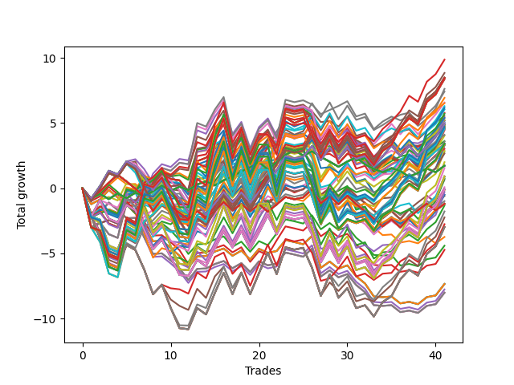

# Long HLT 104 
- Symbol: TSLA
- Date Range: 05/16/2022 - 05/17/2024
- Trading Period: 8:30-12:30
- Number of Trades: 41



| Id. | Name | Win Percent | Profit | Avg Profit / Trade | Avg Time / Trade | Std |      | Name | Win Percent | Profit | Avg Profit / Trade | Avg Time / Trade | Std |
| --- | ---- | ----------- | ------ | ------------------ | ---------------- | --- | ---- | ---- | ----------- | ------ | ------------------ | ---------------- | --- |
| | Sorted By <br> Profit | | | | | | | Sorted By <br> Win Percentage |||||
|0| TP-3 105m | 51.22 | 9.87 | 0.24 | 82:49 | 1.57 |     | TP-1 45m | 63.41 | 7.42 | 0.18 | 26:46 | 0.89 |
|1| TP-1 105m | 58.54 | 8.85 | 0.22 | 37:14 | 0.99 |     | TP-3 45m | 63.41 | 5.54 | 0.14 | 41:32 | 1.14 |
|2| TP-1 180m | 58.54 | 8.49 | 0.21 | 37:58 | 0.99 |     | TP-2.25 45m | 63.41 | 3.62 | 0.09 | 40:01 | 1.09 |
|3| TP-1 165m | 58.54 | 8.49 | 0.21 | 37:58 | 0.99 |     | TP-2 45m | 63.41 | 3.41 | 0.08 | 38:42 | 1.05 |
|4| TP-1 150m | 58.54 | 8.49 | 0.21 | 37:58 | 0.99 |     | TP-2.75 45m | 63.41 | 3.33 | 0.08 | 40:48 | 1.22 |
|5| TP-1 135m | 58.54 | 8.49 | 0.21 | 37:58 | 0.99 |     | TP-1.75 45m | 63.41 | 3.28 | 0.08 | 37:29 | 1.08 |
|6| TP-1 120m | 58.54 | 8.49 | 0.21 | 37:58 | 0.99 |     | TP-2.5 45m | 63.41 | 3.02 | 0.07 | 40:43 | 1.20 |
|7| TP-3 180m | 51.22 | 8.44 | 0.21 | 90:42 | 1.66 |     | TP-1.25 45m | 60.98 | 2.81 | 0.07 | 32:42 | 1.02 |
|8| TP-3 165m | 51.22 | 8.44 | 0.21 | 90:42 | 1.66 |     | TP-1.5 45m | 60.98 | 0.86 | 0.02 | 36:27 | 1.06 |
|9| TP-3 150m | 51.22 | 8.44 | 0.21 | 90:42 | 1.66 |     | TP-1 105m | 58.54 | 8.85 | 0.22 | 37:14 | 0.99 |
|10| TP-3 135m | 51.22 | 8.44 | 0.21 | 90:42 | 1.66 |     | TP-1 180m | 58.54 | 8.49 | 0.21 | 37:58 | 0.99 |
|11| TP-3 120m | 51.22 | 8.44 | 0.21 | 90:42 | 1.66 |     | TP-1 165m | 58.54 | 8.49 | 0.21 | 37:58 | 0.99 |
|12| TP-1 90m | 58.54 | 8.35 | 0.20 | 35:45 | 0.97 |     | TP-1 150m | 58.54 | 8.49 | 0.21 | 37:58 | 0.99 |
|13| TP-3 60m | 58.54 | 7.63 | 0.19 | 53:24 | 1.32 |     | TP-1 135m | 58.54 | 8.49 | 0.21 | 37:58 | 0.99 |
|14| TP-1 45m | 63.41 | 7.42 | 0.18 | 26:46 | 0.89 |     | TP-1 120m | 58.54 | 8.49 | 0.21 | 37:58 | 0.99 |
|15| TP-1 75m | 58.54 | 6.94 | 0.17 | 33:46 | 0.92 |     | TP-1 90m | 58.54 | 8.35 | 0.20 | 35:45 | 0.97 |
|16| TP-0.75 45m | 58.54 | 6.58 | 0.16 | 20:36 | 0.78 |     | TP-3 60m | 58.54 | 7.63 | 0.19 | 53:24 | 1.32 |
|17| TP-3 90m | 51.22 | 6.53 | 0.16 | 73:54 | 1.57 |     | TP-1 75m | 58.54 | 6.94 | 0.17 | 33:46 | 0.92 |
|18| TP-1 60m | 58.54 | 6.30 | 0.15 | 30:40 | 0.93 |     | TP-0.75 45m | 58.54 | 6.58 | 0.16 | 20:36 | 0.78 |
|19| TP-2.25 105m | 51.22 | 6.16 | 0.15 | 75:57 | 1.49 |     | TP-1 60m | 58.54 | 6.30 | 0.15 | 30:40 | 0.93 |
|20| TP-2 105m | 51.22 | 6.04 | 0.15 | 73:14 | 1.41 |     | TP-3 30m | 58.54 | 5.78 | 0.14 | 28:40 | 0.96 |
|21| TP-3 30m | 58.54 | 5.78 | 0.14 | 28:40 | 0.96 |     | TP-2.25 60m | 58.54 | 5.41 | 0.13 | 50:45 | 1.20 |
|22| TP-2.75 105m | 51.22 | 5.71 | 0.14 | 78:51 | 1.63 |     | TP-0.75 30m | 58.54 | 5.20 | 0.13 | 18:21 | 0.75 |
|23| TP-3 45m | 63.41 | 5.54 | 0.14 | 41:32 | 1.14 |     | TP-1 30m | 58.54 | 5.17 | 0.13 | 21:39 | 0.86 |
|24| TP-2.25 60m | 58.54 | 5.41 | 0.13 | 50:45 | 1.20 |     | TP-2 30m | 58.54 | 5.06 | 0.12 | 27:38 | 0.97 |
|25| TP-0.75 75m | 56.10 | 5.39 | 0.13 | 21:52 | 0.80 |     | TP-2.25 30m | 58.54 | 5.02 | 0.12 | 28:17 | 1.00 |
|26| TP-0.75 60m | 56.10 | 5.27 | 0.13 | 21:29 | 0.80 |     | TP-2.75 60m | 58.54 | 5.01 | 0.12 | 51:57 | 1.37 |
|27| TP-0.75 30m | 58.54 | 5.20 | 0.13 | 18:21 | 0.75 |     | TP-2.75 30m | 58.54 | 4.82 | 0.12 | 28:23 | 1.02 |
|28| TP-1 30m | 58.54 | 5.17 | 0.13 | 21:39 | 0.86 |     | TP-2.5 30m | 58.54 | 4.82 | 0.12 | 28:23 | 1.02 |
|29| TP-2 30m | 58.54 | 5.06 | 0.12 | 27:38 | 0.97 |     | TP-2.5 60m | 58.54 | 4.54 | 0.11 | 51:46 | 1.32 |
|30| TP-2.25 30m | 58.54 | 5.02 | 0.12 | 28:17 | 1.00 |     | TP-2 60m | 58.54 | 4.46 | 0.11 | 49:19 | 1.13 |
|31| TP-2.75 60m | 58.54 | 5.01 | 0.12 | 51:57 | 1.37 |     | TP-0.75 75m | 56.10 | 5.39 | 0.13 | 21:52 | 0.80 |
|32| TP-0.75 180m | 56.10 | 4.91 | 0.12 | 22:10 | 0.81 |     | TP-0.75 60m | 56.10 | 5.27 | 0.13 | 21:29 | 0.80 |
|33| TP-0.75 165m | 56.10 | 4.91 | 0.12 | 22:10 | 0.81 |     | TP-0.75 180m | 56.10 | 4.91 | 0.12 | 22:10 | 0.81 |
|34| TP-0.75 150m | 56.10 | 4.91 | 0.12 | 22:10 | 0.81 |     | TP-0.75 165m | 56.10 | 4.91 | 0.12 | 22:10 | 0.81 |
|35| TP-0.75 135m | 56.10 | 4.91 | 0.12 | 22:10 | 0.81 |     | TP-0.75 150m | 56.10 | 4.91 | 0.12 | 22:10 | 0.81 |
|36| TP-0.75 120m | 56.10 | 4.91 | 0.12 | 22:10 | 0.81 |     | TP-0.75 135m | 56.10 | 4.91 | 0.12 | 22:10 | 0.81 |
|37| TP-0.75 105m | 56.10 | 4.91 | 0.12 | 22:10 | 0.81 |     | TP-0.75 120m | 56.10 | 4.91 | 0.12 | 22:10 | 0.81 |
|38| TP-0.75 90m | 56.10 | 4.91 | 0.12 | 22:10 | 0.81 |     | TP-0.75 105m | 56.10 | 4.91 | 0.12 | 22:10 | 0.81 |
|39| TP-2.75 30m | 58.54 | 4.82 | 0.12 | 28:23 | 1.02 |     | TP-0.75 90m | 56.10 | 4.91 | 0.12 | 22:10 | 0.81 |
|40| TP-2.5 30m | 58.54 | 4.82 | 0.12 | 28:23 | 1.02 |     | TP-3 75m | 56.10 | 4.68 | 0.11 | 64:14 | 1.45 |
|41| TP-2.25 90m | 51.22 | 4.78 | 0.12 | 68:38 | 1.45 |     | TP-2.25 75m | 56.10 | 4.50 | 0.11 | 60:46 | 1.30 |
|42| TP-2.25 180m | 51.22 | 4.71 | 0.11 | 82:21 | 1.58 |     | TP-2.75 75m | 56.10 | 4.04 | 0.10 | 62:00 | 1.46 |
|43| TP-2.25 165m | 51.22 | 4.71 | 0.11 | 82:21 | 1.58 |     | TP-2.5 75m | 56.10 | 3.57 | 0.09 | 61:49 | 1.41 |
|44| TP-2.25 150m | 51.22 | 4.71 | 0.11 | 82:21 | 1.58 |     | TP-1.75 30m | 56.10 | 2.87 | 0.07 | 27:19 | 1.01 |
|45| TP-2.25 135m | 51.22 | 4.71 | 0.11 | 82:21 | 1.58 |     | TP-2 75m | 56.10 | 2.67 | 0.07 | 58:54 | 1.25 |
|46| TP-2.25 120m | 51.22 | 4.71 | 0.11 | 82:21 | 1.58 |     | TP-0.25 180m | 56.10 | 1.73 | 0.04 | 04:07 | 0.40 |
|47| TP-3 75m | 56.10 | 4.68 | 0.11 | 64:14 | 1.45 |     | TP-0.25 165m | 56.10 | 1.73 | 0.04 | 04:07 | 0.40 |
|48| TP-2.5 105m | 51.22 | 4.62 | 0.11 | 77:45 | 1.59 |     | TP-0.25 150m | 56.10 | 1.73 | 0.04 | 04:07 | 0.40 |
|49| TP-2.75 90m | 51.22 | 4.58 | 0.11 | 70:48 | 1.59 |     | TP-0.25 135m | 56.10 | 1.73 | 0.04 | 04:07 | 0.40 |
|50| TP-2 180m | 51.22 | 4.57 | 0.11 | 78:32 | 1.53 |     | TP-0.25 120m | 56.10 | 1.73 | 0.04 | 04:07 | 0.40 |
|51| TP-2 165m | 51.22 | 4.57 | 0.11 | 78:32 | 1.53 |     | TP-0.25 105m | 56.10 | 1.73 | 0.04 | 04:07 | 0.40 |
|52| TP-2 150m | 51.22 | 4.57 | 0.11 | 78:32 | 1.53 |     | TP-0.25 90m | 56.10 | 1.73 | 0.04 | 04:07 | 0.40 |
|53| TP-2 135m | 51.22 | 4.57 | 0.11 | 78:32 | 1.53 |     | TP-0.25 75m | 56.10 | 1.73 | 0.04 | 04:07 | 0.40 |
|54| TP-2 120m | 51.22 | 4.57 | 0.11 | 78:32 | 1.53 |     | TP-0.25 60m | 56.10 | 1.73 | 0.04 | 04:07 | 0.40 |
|55| TP-2.5 60m | 58.54 | 4.54 | 0.11 | 51:46 | 1.32 |     | TP-0.25 45m | 56.10 | 1.73 | 0.04 | 04:07 | 0.40 |
|56| TP-2.25 75m | 56.10 | 4.50 | 0.11 | 60:46 | 1.30 |     | TP-0.25 30m | 56.10 | 1.73 | 0.04 | 04:07 | 0.40 |
|57| TP-2 60m | 58.54 | 4.46 | 0.11 | 49:19 | 1.13 |     | TP-0.25 15m | 56.10 | 1.73 | 0.04 | 04:07 | 0.40 |
|58| TP-2 90m | 51.22 | 4.10 | 0.10 | 66:17 | 1.35 |     | TP-1.75 60m | 56.10 | 0.74 | 0.02 | 47:05 | 1.13 |
|59| TP-2.75 75m | 56.10 | 4.04 | 0.10 | 62:00 | 1.46 |     | TP-1.5 30m | 53.66 | 0.65 | 0.02 | 26:49 | 1.02 |
|60| TP-2.25 45m | 63.41 | 3.62 | 0.09 | 40:01 | 1.09 |     | TP-1.5 60m | 53.66 | -0.15 | -0.00 | 45:19 | 1.13 |
|61| TP-2.5 75m | 56.10 | 3.57 | 0.09 | 61:49 | 1.41 |     | TP-1.75 75m | 53.66 | -0.29 | -0.01 | 55:10 | 1.25 |
|62| TP-2.75 180m | 51.22 | 3.42 | 0.08 | 85:54 | 1.74 |     | TP-1.25 30m | 53.66 | -0.49 | -0.01 | 25:02 | 0.97 |
|63| TP-2.75 165m | 51.22 | 3.42 | 0.08 | 85:54 | 1.74 |     | TP-3 105m | 51.22 | 9.87 | 0.24 | 82:49 | 1.57 |
|64| TP-2.75 150m | 51.22 | 3.42 | 0.08 | 85:54 | 1.74 |     | TP-3 180m | 51.22 | 8.44 | 0.21 | 90:42 | 1.66 |
|65| TP-2.75 135m | 51.22 | 3.42 | 0.08 | 85:54 | 1.74 |     | TP-3 165m | 51.22 | 8.44 | 0.21 | 90:42 | 1.66 |
|66| TP-2.75 120m | 51.22 | 3.42 | 0.08 | 85:54 | 1.74 |     | TP-3 150m | 51.22 | 8.44 | 0.21 | 90:42 | 1.66 |
|67| TP-2 45m | 63.41 | 3.41 | 0.08 | 38:42 | 1.05 |     | TP-3 135m | 51.22 | 8.44 | 0.21 | 90:42 | 1.66 |
|68| TP-2.5 90m | 51.22 | 3.35 | 0.08 | 70:04 | 1.55 |     | TP-3 120m | 51.22 | 8.44 | 0.21 | 90:42 | 1.66 |
|69| TP-2.5 180m | 51.22 | 3.34 | 0.08 | 84:32 | 1.67 |     | TP-3 90m | 51.22 | 6.53 | 0.16 | 73:54 | 1.57 |
|70| TP-2.5 165m | 51.22 | 3.34 | 0.08 | 84:32 | 1.67 |     | TP-2.25 105m | 51.22 | 6.16 | 0.15 | 75:57 | 1.49 |
|71| TP-2.5 150m | 51.22 | 3.34 | 0.08 | 84:32 | 1.67 |     | TP-2 105m | 51.22 | 6.04 | 0.15 | 73:14 | 1.41 |
|72| TP-2.5 135m | 51.22 | 3.34 | 0.08 | 84:32 | 1.67 |     | TP-2.75 105m | 51.22 | 5.71 | 0.14 | 78:51 | 1.63 |
|73| TP-2.5 120m | 51.22 | 3.34 | 0.08 | 84:32 | 1.67 |     | TP-2.25 90m | 51.22 | 4.78 | 0.12 | 68:38 | 1.45 |
|74| TP-2.75 45m | 63.41 | 3.33 | 0.08 | 40:48 | 1.22 |     | TP-2.25 180m | 51.22 | 4.71 | 0.11 | 82:21 | 1.58 |
|75| TP-1.75 45m | 63.41 | 3.28 | 0.08 | 37:29 | 1.08 |     | TP-2.25 165m | 51.22 | 4.71 | 0.11 | 82:21 | 1.58 |
|76| TP-2.5 45m | 63.41 | 3.02 | 0.07 | 40:43 | 1.20 |     | TP-2.25 150m | 51.22 | 4.71 | 0.11 | 82:21 | 1.58 |
|77| TP-1.75 30m | 56.10 | 2.87 | 0.07 | 27:19 | 1.01 |     | TP-2.25 135m | 51.22 | 4.71 | 0.11 | 82:21 | 1.58 |
|78| TP-1.25 45m | 60.98 | 2.81 | 0.07 | 32:42 | 1.02 |     | TP-2.25 120m | 51.22 | 4.71 | 0.11 | 82:21 | 1.58 |
|79| TP-2 75m | 56.10 | 2.67 | 0.07 | 58:54 | 1.25 |     | TP-2.5 105m | 51.22 | 4.62 | 0.11 | 77:45 | 1.59 |
|80| TP-1.75 105m | 48.78 | 2.00 | 0.05 | 66:55 | 1.41 |     | TP-2.75 90m | 51.22 | 4.58 | 0.11 | 70:48 | 1.59 |
|81| TP-0.25 180m | 56.10 | 1.73 | 0.04 | 04:07 | 0.40 |     | TP-2 180m | 51.22 | 4.57 | 0.11 | 78:32 | 1.53 |
|82| TP-0.25 165m | 56.10 | 1.73 | 0.04 | 04:07 | 0.40 |     | TP-2 165m | 51.22 | 4.57 | 0.11 | 78:32 | 1.53 |
|83| TP-0.25 150m | 56.10 | 1.73 | 0.04 | 04:07 | 0.40 |     | TP-2 150m | 51.22 | 4.57 | 0.11 | 78:32 | 1.53 |
|84| TP-0.25 135m | 56.10 | 1.73 | 0.04 | 04:07 | 0.40 |     | TP-2 135m | 51.22 | 4.57 | 0.11 | 78:32 | 1.53 |
|85| TP-0.25 120m | 56.10 | 1.73 | 0.04 | 04:07 | 0.40 |     | TP-2 120m | 51.22 | 4.57 | 0.11 | 78:32 | 1.53 |
|86| TP-0.25 105m | 56.10 | 1.73 | 0.04 | 04:07 | 0.40 |     | TP-2 90m | 51.22 | 4.10 | 0.10 | 66:17 | 1.35 |
|87| TP-0.25 90m | 56.10 | 1.73 | 0.04 | 04:07 | 0.40 |     | TP-2.75 180m | 51.22 | 3.42 | 0.08 | 85:54 | 1.74 |
|88| TP-0.25 75m | 56.10 | 1.73 | 0.04 | 04:07 | 0.40 |     | TP-2.75 165m | 51.22 | 3.42 | 0.08 | 85:54 | 1.74 |
|89| TP-0.25 60m | 56.10 | 1.73 | 0.04 | 04:07 | 0.40 |     | TP-2.75 150m | 51.22 | 3.42 | 0.08 | 85:54 | 1.74 |
|90| TP-0.25 45m | 56.10 | 1.73 | 0.04 | 04:07 | 0.40 |     | TP-2.75 135m | 51.22 | 3.42 | 0.08 | 85:54 | 1.74 |
|91| TP-0.25 30m | 56.10 | 1.73 | 0.04 | 04:07 | 0.40 |     | TP-2.75 120m | 51.22 | 3.42 | 0.08 | 85:54 | 1.74 |
|92| TP-0.25 15m | 56.10 | 1.73 | 0.04 | 04:07 | 0.40 |     | TP-2.5 90m | 51.22 | 3.35 | 0.08 | 70:04 | 1.55 |
|93| TP-1.75 90m | 51.22 | 1.55 | 0.04 | 61:26 | 1.34 |     | TP-2.5 180m | 51.22 | 3.34 | 0.08 | 84:32 | 1.67 |
|94| TP-1.75 180m | 51.22 | 0.91 | 0.02 | 70:30 | 1.49 |     | TP-2.5 165m | 51.22 | 3.34 | 0.08 | 84:32 | 1.67 |
|95| TP-1.75 165m | 51.22 | 0.91 | 0.02 | 70:30 | 1.49 |     | TP-2.5 150m | 51.22 | 3.34 | 0.08 | 84:32 | 1.67 |
|96| TP-1.75 150m | 51.22 | 0.91 | 0.02 | 70:30 | 1.49 |     | TP-2.5 135m | 51.22 | 3.34 | 0.08 | 84:32 | 1.67 |
|97| TP-1.75 135m | 51.22 | 0.91 | 0.02 | 70:30 | 1.49 |     | TP-2.5 120m | 51.22 | 3.34 | 0.08 | 84:32 | 1.67 |
|98| TP-1.75 120m | 51.22 | 0.91 | 0.02 | 70:30 | 1.49 |     | TP-1.75 90m | 51.22 | 1.55 | 0.04 | 61:26 | 1.34 |
|99| TP-1.5 45m | 60.98 | 0.86 | 0.02 | 36:27 | 1.06 |     | TP-1.75 180m | 51.22 | 0.91 | 0.02 | 70:30 | 1.49 |
|100| TP-1.75 60m | 56.10 | 0.74 | 0.02 | 47:05 | 1.13 |     | TP-1.75 165m | 51.22 | 0.91 | 0.02 | 70:30 | 1.49 |
|101| TP-1.5 30m | 53.66 | 0.65 | 0.02 | 26:49 | 1.02 |     | TP-1.75 150m | 51.22 | 0.91 | 0.02 | 70:30 | 1.49 |
|102| TP-1.25 105m | 51.22 | 0.08 | 0.00 | 47:35 | 1.20 |     | TP-1.75 135m | 51.22 | 0.91 | 0.02 | 70:30 | 1.49 |
|103| TP-1.25 90m | 51.22 | -0.07 | -0.00 | 45:02 | 1.18 |     | TP-1.75 120m | 51.22 | 0.91 | 0.02 | 70:30 | 1.49 |
|104| TP-1.25 180m | 51.22 | -0.09 | -0.00 | 49:26 | 1.21 |     | TP-1.25 105m | 51.22 | 0.08 | 0.00 | 47:35 | 1.20 |
|105| TP-1.25 165m | 51.22 | -0.09 | -0.00 | 49:26 | 1.21 |     | TP-1.25 90m | 51.22 | -0.07 | -0.00 | 45:02 | 1.18 |
|106| TP-1.25 150m | 51.22 | -0.09 | -0.00 | 49:26 | 1.21 |     | TP-1.25 180m | 51.22 | -0.09 | -0.00 | 49:26 | 1.21 |
|107| TP-1.25 135m | 51.22 | -0.09 | -0.00 | 49:26 | 1.21 |     | TP-1.25 165m | 51.22 | -0.09 | -0.00 | 49:26 | 1.21 |
|108| TP-1.25 120m | 51.22 | -0.09 | -0.00 | 49:26 | 1.21 |     | TP-1.25 150m | 51.22 | -0.09 | -0.00 | 49:26 | 1.21 |
|109| TP-1.5 60m | 53.66 | -0.15 | -0.00 | 45:19 | 1.13 |     | TP-1.25 135m | 51.22 | -0.09 | -0.00 | 49:26 | 1.21 |
|110| TP-1.75 75m | 53.66 | -0.29 | -0.01 | 55:10 | 1.25 |     | TP-1.25 120m | 51.22 | -0.09 | -0.00 | 49:26 | 1.21 |
|111| TP-1.25 30m | 53.66 | -0.49 | -0.01 | 25:02 | 0.97 |     | TP-1.25 60m | 51.22 | -0.50 | -0.01 | 38:29 | 1.11 |
|112| TP-1.25 60m | 51.22 | -0.50 | -0.01 | 38:29 | 1.11 |     | TP-0.5 45m | 51.22 | -0.59 | -0.01 | 12:54 | 0.61 |
|113| TP-0.5 45m | 51.22 | -0.59 | -0.01 | 12:54 | 0.61 |     | TP-1.25 75m | 51.22 | -1.32 | -0.03 | 42:23 | 1.14 |
|114| TP-0.5 60m | 48.78 | -0.99 | -0.02 | 13:16 | 0.61 |     | TP-1.5 75m | 51.22 | -2.76 | -0.07 | 52:17 | 1.20 |
|115| TP-0.5 30m | 48.78 | -1.18 | -0.03 | 12:19 | 0.61 |     | TP-1.75 105m | 48.78 | 2.00 | 0.05 | 66:55 | 1.41 |
|116| TP-0.5 180m | 48.78 | -1.20 | -0.03 | 13:26 | 0.61 |     | TP-0.5 60m | 48.78 | -0.99 | -0.02 | 13:16 | 0.61 |
|117| TP-0.5 165m | 48.78 | -1.20 | -0.03 | 13:26 | 0.61 |     | TP-0.5 30m | 48.78 | -1.18 | -0.03 | 12:19 | 0.61 |
|118| TP-0.5 150m | 48.78 | -1.20 | -0.03 | 13:26 | 0.61 |     | TP-0.5 180m | 48.78 | -1.20 | -0.03 | 13:26 | 0.61 |
|119| TP-0.5 135m | 48.78 | -1.20 | -0.03 | 13:26 | 0.61 |     | TP-0.5 165m | 48.78 | -1.20 | -0.03 | 13:26 | 0.61 |
|120| TP-0.5 120m | 48.78 | -1.20 | -0.03 | 13:26 | 0.61 |     | TP-0.5 150m | 48.78 | -1.20 | -0.03 | 13:26 | 0.61 |
|121| TP-0.5 105m | 48.78 | -1.20 | -0.03 | 13:26 | 0.61 |     | TP-0.5 135m | 48.78 | -1.20 | -0.03 | 13:26 | 0.61 |
|122| TP-0.5 90m | 48.78 | -1.20 | -0.03 | 13:26 | 0.61 |     | TP-0.5 120m | 48.78 | -1.20 | -0.03 | 13:26 | 0.61 |
|123| TP-0.5 75m | 48.78 | -1.20 | -0.03 | 13:26 | 0.61 |     | TP-0.5 105m | 48.78 | -1.20 | -0.03 | 13:26 | 0.61 |
|124| TP-1.25 75m | 51.22 | -1.32 | -0.03 | 42:23 | 1.14 |     | TP-0.5 90m | 48.78 | -1.20 | -0.03 | 13:26 | 0.61 |
|125| TP-1.5 105m | 48.78 | -1.78 | -0.04 | 62:02 | 1.35 |     | TP-0.5 75m | 48.78 | -1.20 | -0.03 | 13:26 | 0.61 |
|126| TP-1.5 90m | 48.78 | -2.24 | -0.05 | 57:43 | 1.28 |     | TP-1.5 105m | 48.78 | -1.78 | -0.04 | 62:02 | 1.35 |
|127| TP-1.5 75m | 51.22 | -2.76 | -0.07 | 52:17 | 1.20 |     | TP-1.5 90m | 48.78 | -2.24 | -0.05 | 57:43 | 1.28 |
|128| TP-1.5 180m | 48.78 | -2.98 | -0.07 | 64:46 | 1.40 |     | TP-1.5 180m | 48.78 | -2.98 | -0.07 | 64:46 | 1.40 |
|129| TP-1.5 165m | 48.78 | -2.98 | -0.07 | 64:46 | 1.40 |     | TP-1.5 165m | 48.78 | -2.98 | -0.07 | 64:46 | 1.40 |
|130| TP-1.5 150m | 48.78 | -2.98 | -0.07 | 64:46 | 1.40 |     | TP-1.5 150m | 48.78 | -2.98 | -0.07 | 64:46 | 1.40 |
|131| TP-1.5 135m | 48.78 | -2.98 | -0.07 | 64:46 | 1.40 |     | TP-1.5 135m | 48.78 | -2.98 | -0.07 | 64:46 | 1.40 |
|132| TP-1.5 120m | 48.78 | -2.98 | -0.07 | 64:46 | 1.40 |     | TP-1.5 120m | 48.78 | -2.98 | -0.07 | 64:46 | 1.40 |
|133| TP-0.5 15m | 48.78 | -3.74 | -0.09 | 09:54 | 0.54 |     | TP-0.5 15m | 48.78 | -3.74 | -0.09 | 09:54 | 0.54 |
|134| TP-0.75 15m | 48.78 | -4.41 | -0.11 | 12:05 | 0.62 |     | TP-0.75 15m | 48.78 | -4.41 | -0.11 | 12:05 | 0.62 |
|135| TP-1 15m | 48.78 | -4.73 | -0.12 | 12:55 | 0.68 |     | TP-1 15m | 48.78 | -4.73 | -0.12 | 12:55 | 0.68 |
|136| TP-3 15m | 48.78 | -7.35 | -0.18 | 14:00 | 0.71 |     | TP-3 15m | 48.78 | -7.35 | -0.18 | 14:00 | 0.71 |
|137| TP-2.75 15m | 48.78 | -7.35 | -0.18 | 14:00 | 0.71 |     | TP-2.75 15m | 48.78 | -7.35 | -0.18 | 14:00 | 0.71 |
|138| TP-2.5 15m | 48.78 | -7.35 | -0.18 | 14:00 | 0.71 |     | TP-2.5 15m | 48.78 | -7.35 | -0.18 | 14:00 | 0.71 |
|139| TP-2.25 15m | 48.78 | -7.35 | -0.18 | 14:00 | 0.71 |     | TP-2.25 15m | 48.78 | -7.35 | -0.18 | 14:00 | 0.71 |
|140| TP-1.25 15m | 48.78 | -7.77 | -0.19 | 13:35 | 0.77 |     | TP-1.25 15m | 48.78 | -7.77 | -0.19 | 13:35 | 0.77 |
|141| TP-2 15m | 48.78 | -8.02 | -0.20 | 13:43 | 0.74 |     | TP-2 15m | 48.78 | -8.02 | -0.20 | 13:43 | 0.74 |
|142| TP-1.75 15m | 48.78 | -8.02 | -0.20 | 13:43 | 0.74 |     | TP-1.75 15m | 48.78 | -8.02 | -0.20 | 13:43 | 0.74 |
|143| TP-1.5 15m | 48.78 | -8.02 | -0.20 | 13:42 | 0.74 |     | TP-1.5 15m | 48.78 | -8.02 | -0.20 | 13:42 | 0.74 |

### Test TP-0.25 15m
* Take Profit of 0.25 Point
* 0.25 Stoploss
* Results:
```
Total Trades: 41
Percent Up: 56.10
Percent Down: 43.90
Total Points Moved Up: 1.73
Potential Profit: 865.00
Total Points Ups: 8.77 Count Ups: 23
Total Points Downs: -7.04 Count Downs: 18
```

<details><summary>Trades</summary>

<code>In: 2022-05-20 08:35:00		Out: 2022-05-20 08:37:00		Total Position Time: 02:00		Total Move Up: -0.80		Total to Date: -0.80</code> <br />
<code>In: 2022-06-03 11:05:00		Out: 2022-06-03 11:09:00		Total Position Time: 04:00		Total Move Up: 0.36		Total to Date: -0.44</code> <br />
<code>In: 2022-06-09 09:30:00		Out: 2022-06-09 09:33:00		Total Position Time: 03:00		Total Move Up: -0.39		Total to Date: -0.83</code> <br />
<code>In: 2022-06-30 12:30:00		Out: 2022-06-30 12:33:00		Total Position Time: 03:00		Total Move Up: 0.43		Total to Date: -0.40</code> <br />
<code>In: 2022-07-11 09:40:00		Out: 2022-07-11 09:51:00		Total Position Time: 11:00		Total Move Up: -0.36		Total to Date: -0.76</code> <br />
<code>In: 2022-07-26 11:50:00		Out: 2022-07-26 11:52:00		Total Position Time: 02:00		Total Move Up: 0.42		Total to Date: -0.34</code> <br />
<code>In: 2022-08-09 09:40:00		Out: 2022-08-09 09:43:00		Total Position Time: 03:00		Total Move Up: -0.27		Total to Date: -0.61</code> <br />
<code>In: 2022-08-11 08:35:00		Out: 2022-08-11 08:37:00		Total Position Time: 02:00		Total Move Up: 0.38		Total to Date: -0.23</code> <br />
<code>In: 2022-08-16 12:25:00		Out: 2022-08-16 12:27:00		Total Position Time: 02:00		Total Move Up: 0.43		Total to Date: 0.20</code> <br />
<code>In: 2022-09-02 11:05:00		Out: 2022-09-02 11:11:00		Total Position Time: 06:00		Total Move Up: -0.40		Total to Date: -0.20</code> <br />
<code>In: 2022-11-21 09:40:00		Out: 2022-11-21 09:44:00		Total Position Time: 04:00		Total Move Up: 0.32		Total to Date: 0.12</code> <br />
<code>In: 2022-12-16 08:40:00		Out: 2022-12-16 08:43:00		Total Position Time: 03:00		Total Move Up: -0.27		Total to Date: -0.15</code> <br />
<code>In: 2022-12-19 09:10:00		Out: 2022-12-19 09:14:00		Total Position Time: 04:00		Total Move Up: 0.44		Total to Date: 0.29</code> <br />
<code>In: 2022-12-30 09:00:00		Out: 2022-12-30 09:04:00		Total Position Time: 04:00		Total Move Up: 0.24		Total to Date: 0.53</code> <br />
<code>In: 2023-01-03 10:30:00		Out: 2023-01-03 10:32:00		Total Position Time: 02:00		Total Move Up: -0.31		Total to Date: 0.22</code> <br />
<code>In: 2023-02-24 10:20:00		Out: 2023-02-24 10:22:00		Total Position Time: 02:00		Total Move Up: 0.39		Total to Date: 0.61</code> <br />
<code>In: 2023-03-09 10:05:00		Out: 2023-03-09 10:08:00		Total Position Time: 03:00		Total Move Up: 0.32		Total to Date: 0.93</code> <br />
<code>In: 2023-04-14 09:30:00		Out: 2023-04-14 09:38:00		Total Position Time: 08:00		Total Move Up: 0.36		Total to Date: 1.29</code> <br />
<code>In: 2023-07-27 12:15:00		Out: 2023-07-27 12:20:00		Total Position Time: 05:00		Total Move Up: 0.32		Total to Date: 1.61</code> <br />
<code>In: 2023-08-08 09:05:00		Out: 2023-08-08 09:07:00		Total Position Time: 02:00		Total Move Up: 0.39		Total to Date: 2.00</code> <br />
<code>In: 2023-08-14 09:10:00		Out: 2023-08-14 09:16:00		Total Position Time: 06:00		Total Move Up: -0.56		Total to Date: 1.44</code> <br />
<code>In: 2023-09-12 08:35:00		Out: 2023-09-12 08:37:00		Total Position Time: 02:00		Total Move Up: 0.56		Total to Date: 2.00</code> <br />
<code>In: 2023-09-29 11:15:00		Out: 2023-09-29 11:21:00		Total Position Time: 06:00		Total Move Up: 0.57		Total to Date: 2.57</code> <br />
<code>In: 2023-10-18 12:20:00		Out: 2023-10-18 12:23:00		Total Position Time: 03:00		Total Move Up: 0.35		Total to Date: 2.92</code> <br />
<code>In: 2023-10-24 12:20:00		Out: 2023-10-24 12:24:00		Total Position Time: 04:00		Total Move Up: -0.41		Total to Date: 2.51</code> <br />
<code>In: 2023-10-25 11:00:00		Out: 2023-10-25 11:03:00		Total Position Time: 03:00		Total Move Up: 0.32		Total to Date: 2.83</code> <br />
<code>In: 2023-11-09 09:50:00		Out: 2023-11-09 09:56:00		Total Position Time: 06:00		Total Move Up: -0.42		Total to Date: 2.41</code> <br />
<code>In: 2023-11-22 08:45:00		Out: 2023-11-22 08:48:00		Total Position Time: 03:00		Total Move Up: -0.37		Total to Date: 2.04</code> <br />
<code>In: 2023-11-30 08:45:00		Out: 2023-11-30 08:47:00		Total Position Time: 02:00		Total Move Up: -0.39		Total to Date: 1.65</code> <br />
<code>In: 2023-12-01 11:25:00		Out: 2023-12-01 11:29:00		Total Position Time: 04:00		Total Move Up: 0.40		Total to Date: 2.05</code> <br />
<code>In: 2023-12-20 08:45:00		Out: 2023-12-20 08:51:00		Total Position Time: 06:00		Total Move Up: 0.32		Total to Date: 2.37</code> <br />
<code>In: 2024-01-05 12:15:00		Out: 2024-01-05 12:28:00		Total Position Time: 13:00		Total Move Up: -0.54		Total to Date: 1.83</code> <br />
<code>In: 2024-01-26 10:30:00		Out: 2024-01-26 10:33:00		Total Position Time: 03:00		Total Move Up: -0.35		Total to Date: 1.48</code> <br />
<code>In: 2024-02-06 09:10:00		Out: 2024-02-06 09:12:00		Total Position Time: 02:00		Total Move Up: -0.25		Total to Date: 1.23</code> <br />
<code>In: 2024-02-08 10:35:00		Out: 2024-02-08 10:37:00		Total Position Time: 02:00		Total Move Up: 0.31		Total to Date: 1.54</code> <br />
<code>In: 2024-02-20 09:35:00		Out: 2024-02-20 09:37:00		Total Position Time: 02:00		Total Move Up: -0.22		Total to Date: 1.32</code> <br />
<code>In: 2024-03-11 08:55:00		Out: 2024-03-11 09:02:00		Total Position Time: 07:00		Total Move Up: -0.44		Total to Date: 0.88</code> <br />
<code>In: 2024-03-13 11:45:00		Out: 2024-03-13 11:53:00		Total Position Time: 08:00		Total Move Up: 0.30		Total to Date: 1.18</code> <br />
<code>In: 2024-03-20 09:45:00		Out: 2024-03-20 09:51:00		Total Position Time: 06:00		Total Move Up: 0.34		Total to Date: 1.52</code> <br />
<code>In: 2024-03-21 11:35:00		Out: 2024-03-21 11:38:00		Total Position Time: 03:00		Total Move Up: -0.29		Total to Date: 1.23</code> <br />
<code>In: 2024-04-30 09:00:00		Out: 2024-04-30 09:03:00		Total Position Time: 03:00		Total Move Up: 0.50		Total to Date: 1.73</code> <br />


</details>

### Test TP-0.5 15m
* Take Profit of 0.5 Point
* 0.5 Stoploss
* Results:
```
Total Trades: 41
Percent Up: 48.78
Percent Down: 51.22
Total Points Moved Up: -3.74
Potential Profit: -1870.00
Total Points Ups: 8.28 Count Ups: 20
Total Points Downs: -12.02 Count Downs: 21
```

<details><summary>Trades</summary>

<code>In: 2022-05-20 08:35:00		Out: 2022-05-20 08:37:00		Total Position Time: 02:00		Total Move Up: -0.80		Total to Date: -0.80</code> <br />
<code>In: 2022-06-03 11:05:00		Out: 2022-06-03 11:19:00		Total Position Time: 14:00		Total Move Up: 0.36		Total to Date: -0.44</code> <br />
<code>In: 2022-06-09 09:30:00		Out: 2022-06-09 09:43:00		Total Position Time: 13:00		Total Move Up: 0.66		Total to Date: 0.22</code> <br />
<code>In: 2022-06-30 12:30:00		Out: 2022-06-30 12:37:00		Total Position Time: 07:00		Total Move Up: 0.60		Total to Date: 0.82</code> <br />
<code>In: 2022-07-11 09:40:00		Out: 2022-07-11 09:53:00		Total Position Time: 13:00		Total Move Up: -0.51		Total to Date: 0.31</code> <br />
<code>In: 2022-07-26 11:50:00		Out: 2022-07-26 12:04:00		Total Position Time: 14:00		Total Move Up: 0.02		Total to Date: 0.33</code> <br />
<code>In: 2022-08-09 09:40:00		Out: 2022-08-09 09:46:00		Total Position Time: 06:00		Total Move Up: -0.63		Total to Date: -0.30</code> <br />
<code>In: 2022-08-11 08:35:00		Out: 2022-08-11 08:46:00		Total Position Time: 11:00		Total Move Up: -1.07		Total to Date: -1.37</code> <br />
<code>In: 2022-08-16 12:25:00		Out: 2022-08-16 12:39:00		Total Position Time: 14:00		Total Move Up: 0.04		Total to Date: -1.33</code> <br />
<code>In: 2022-09-02 11:05:00		Out: 2022-09-02 11:19:00		Total Position Time: 14:00		Total Move Up: -0.54		Total to Date: -1.87</code> <br />
<code>In: 2022-11-21 09:40:00		Out: 2022-11-21 09:51:00		Total Position Time: 11:00		Total Move Up: -0.52		Total to Date: -2.39</code> <br />
<code>In: 2022-12-16 08:40:00		Out: 2022-12-16 08:48:00		Total Position Time: 08:00		Total Move Up: -0.50		Total to Date: -2.89</code> <br />
<code>In: 2022-12-19 09:10:00		Out: 2022-12-19 09:15:00		Total Position Time: 05:00		Total Move Up: 0.63		Total to Date: -2.26</code> <br />
<code>In: 2022-12-30 09:00:00		Out: 2022-12-30 09:14:00		Total Position Time: 14:00		Total Move Up: 0.03		Total to Date: -2.23</code> <br />
<code>In: 2023-01-03 10:30:00		Out: 2023-01-03 10:42:00		Total Position Time: 12:00		Total Move Up: 0.51		Total to Date: -1.72</code> <br />
<code>In: 2023-02-24 10:20:00		Out: 2023-02-24 10:28:00		Total Position Time: 08:00		Total Move Up: 0.68		Total to Date: -1.04</code> <br />
<code>In: 2023-03-09 10:05:00		Out: 2023-03-09 10:15:00		Total Position Time: 10:00		Total Move Up: -0.66		Total to Date: -1.70</code> <br />
<code>In: 2023-04-14 09:30:00		Out: 2023-04-14 09:43:00		Total Position Time: 13:00		Total Move Up: 0.50		Total to Date: -1.20</code> <br />
<code>In: 2023-07-27 12:15:00		Out: 2023-07-27 12:24:00		Total Position Time: 09:00		Total Move Up: -0.56		Total to Date: -1.76</code> <br />
<code>In: 2023-08-08 09:05:00		Out: 2023-08-08 09:16:00		Total Position Time: 11:00		Total Move Up: 0.53		Total to Date: -1.23</code> <br />
<code>In: 2023-08-14 09:10:00		Out: 2023-08-14 09:16:00		Total Position Time: 06:00		Total Move Up: -0.56		Total to Date: -1.79</code> <br />
<code>In: 2023-09-12 08:35:00		Out: 2023-09-12 08:37:00		Total Position Time: 02:00		Total Move Up: 0.56		Total to Date: -1.23</code> <br />
<code>In: 2023-09-29 11:15:00		Out: 2023-09-29 11:21:00		Total Position Time: 06:00		Total Move Up: 0.57		Total to Date: -0.66</code> <br />
<code>In: 2023-10-18 12:20:00		Out: 2023-10-18 12:34:00		Total Position Time: 14:00		Total Move Up: -0.15		Total to Date: -0.81</code> <br />
<code>In: 2023-10-24 12:20:00		Out: 2023-10-24 12:34:00		Total Position Time: 14:00		Total Move Up: -0.17		Total to Date: -0.98</code> <br />
<code>In: 2023-10-25 11:00:00		Out: 2023-10-25 11:14:00		Total Position Time: 14:00		Total Move Up: 0.63		Total to Date: -0.35</code> <br />
<code>In: 2023-11-09 09:50:00		Out: 2023-11-09 10:02:00		Total Position Time: 12:00		Total Move Up: -1.07		Total to Date: -1.42</code> <br />
<code>In: 2023-11-22 08:45:00		Out: 2023-11-22 08:52:00		Total Position Time: 07:00		Total Move Up: 0.53		Total to Date: -0.89</code> <br />
<code>In: 2023-11-30 08:45:00		Out: 2023-11-30 08:57:00		Total Position Time: 12:00		Total Move Up: -0.60		Total to Date: -1.49</code> <br />
<code>In: 2023-12-01 11:25:00		Out: 2023-12-01 11:39:00		Total Position Time: 14:00		Total Move Up: 0.25		Total to Date: -1.24</code> <br />
<code>In: 2023-12-20 08:45:00		Out: 2023-12-20 08:58:00		Total Position Time: 13:00		Total Move Up: -0.65		Total to Date: -1.89</code> <br />
<code>In: 2024-01-05 12:15:00		Out: 2024-01-05 12:28:00		Total Position Time: 13:00		Total Move Up: -0.54		Total to Date: -2.43</code> <br />
<code>In: 2024-01-26 10:30:00		Out: 2024-01-26 10:36:00		Total Position Time: 06:00		Total Move Up: -0.58		Total to Date: -3.01</code> <br />
<code>In: 2024-02-06 09:10:00		Out: 2024-02-06 09:13:00		Total Position Time: 03:00		Total Move Up: -0.59		Total to Date: -3.60</code> <br />
<code>In: 2024-02-08 10:35:00		Out: 2024-02-08 10:49:00		Total Position Time: 14:00		Total Move Up: 0.05		Total to Date: -3.55</code> <br />
<code>In: 2024-02-20 09:35:00		Out: 2024-02-20 09:38:00		Total Position Time: 03:00		Total Move Up: -0.62		Total to Date: -4.17</code> <br />
<code>In: 2024-03-11 08:55:00		Out: 2024-03-11 09:09:00		Total Position Time: 14:00		Total Move Up: 0.12		Total to Date: -4.05</code> <br />
<code>In: 2024-03-13 11:45:00		Out: 2024-03-13 11:59:00		Total Position Time: 14:00		Total Move Up: -0.18		Total to Date: -4.23</code> <br />
<code>In: 2024-03-20 09:45:00		Out: 2024-03-20 09:54:00		Total Position Time: 09:00		Total Move Up: 0.51		Total to Date: -3.72</code> <br />
<code>In: 2024-03-21 11:35:00		Out: 2024-03-21 11:39:00		Total Position Time: 04:00		Total Move Up: -0.52		Total to Date: -4.24</code> <br />
<code>In: 2024-04-30 09:00:00		Out: 2024-04-30 09:03:00		Total Position Time: 03:00		Total Move Up: 0.50		Total to Date: -3.74</code> <br />


</details>

### Test TP-0.75 15m
* Take Profit of 0.75 Point
* 0.75 Stoploss
* Results:
```
Total Trades: 41
Percent Up: 48.78
Percent Down: 51.22
Total Points Moved Up: -4.41
Potential Profit: -2205.00
Total Points Ups: 8.79 Count Ups: 20
Total Points Downs: -13.20 Count Downs: 21
```

<details><summary>Trades</summary>

<code>In: 2022-05-20 08:35:00		Out: 2022-05-20 08:37:00		Total Position Time: 02:00		Total Move Up: -0.80		Total to Date: -0.80</code> <br />
<code>In: 2022-06-03 11:05:00		Out: 2022-06-03 11:19:00		Total Position Time: 14:00		Total Move Up: 0.36		Total to Date: -0.44</code> <br />
<code>In: 2022-06-09 09:30:00		Out: 2022-06-09 09:44:00		Total Position Time: 14:00		Total Move Up: 0.72		Total to Date: 0.28</code> <br />
<code>In: 2022-06-30 12:30:00		Out: 2022-06-30 12:44:00		Total Position Time: 14:00		Total Move Up: -0.57		Total to Date: -0.29</code> <br />
<code>In: 2022-07-11 09:40:00		Out: 2022-07-11 09:54:00		Total Position Time: 14:00		Total Move Up: -0.63		Total to Date: -0.92</code> <br />
<code>In: 2022-07-26 11:50:00		Out: 2022-07-26 12:04:00		Total Position Time: 14:00		Total Move Up: 0.02		Total to Date: -0.90</code> <br />
<code>In: 2022-08-09 09:40:00		Out: 2022-08-09 09:49:00		Total Position Time: 09:00		Total Move Up: -0.76		Total to Date: -1.66</code> <br />
<code>In: 2022-08-11 08:35:00		Out: 2022-08-11 08:46:00		Total Position Time: 11:00		Total Move Up: -1.07		Total to Date: -2.73</code> <br />
<code>In: 2022-08-16 12:25:00		Out: 2022-08-16 12:39:00		Total Position Time: 14:00		Total Move Up: 0.04		Total to Date: -2.69</code> <br />
<code>In: 2022-09-02 11:05:00		Out: 2022-09-02 11:19:00		Total Position Time: 14:00		Total Move Up: -0.54		Total to Date: -3.23</code> <br />
<code>In: 2022-11-21 09:40:00		Out: 2022-11-21 09:53:00		Total Position Time: 13:00		Total Move Up: -0.75		Total to Date: -3.98</code> <br />
<code>In: 2022-12-16 08:40:00		Out: 2022-12-16 08:50:00		Total Position Time: 10:00		Total Move Up: -1.07		Total to Date: -5.05</code> <br />
<code>In: 2022-12-19 09:10:00		Out: 2022-12-19 09:18:00		Total Position Time: 08:00		Total Move Up: 0.75		Total to Date: -4.30</code> <br />
<code>In: 2022-12-30 09:00:00		Out: 2022-12-30 09:14:00		Total Position Time: 14:00		Total Move Up: 0.03		Total to Date: -4.27</code> <br />
<code>In: 2023-01-03 10:30:00		Out: 2023-01-03 10:44:00		Total Position Time: 14:00		Total Move Up: 0.34		Total to Date: -3.93</code> <br />
<code>In: 2023-02-24 10:20:00		Out: 2023-02-24 10:34:00		Total Position Time: 14:00		Total Move Up: 0.23		Total to Date: -3.70</code> <br />
<code>In: 2023-03-09 10:05:00		Out: 2023-03-09 10:16:00		Total Position Time: 11:00		Total Move Up: -0.79		Total to Date: -4.49</code> <br />
<code>In: 2023-04-14 09:30:00		Out: 2023-04-14 09:44:00		Total Position Time: 14:00		Total Move Up: 0.39		Total to Date: -4.10</code> <br />
<code>In: 2023-07-27 12:15:00		Out: 2023-07-27 12:25:00		Total Position Time: 10:00		Total Move Up: -0.78		Total to Date: -4.88</code> <br />
<code>In: 2023-08-08 09:05:00		Out: 2023-08-08 09:19:00		Total Position Time: 14:00		Total Move Up: 0.82		Total to Date: -4.06</code> <br />
<code>In: 2023-08-14 09:10:00		Out: 2023-08-14 09:24:00		Total Position Time: 14:00		Total Move Up: -0.31		Total to Date: -4.37</code> <br />
<code>In: 2023-09-12 08:35:00		Out: 2023-09-12 08:38:00		Total Position Time: 03:00		Total Move Up: 0.91		Total to Date: -3.46</code> <br />
<code>In: 2023-09-29 11:15:00		Out: 2023-09-29 11:24:00		Total Position Time: 09:00		Total Move Up: 1.07		Total to Date: -2.39</code> <br />
<code>In: 2023-10-18 12:20:00		Out: 2023-10-18 12:34:00		Total Position Time: 14:00		Total Move Up: -0.15		Total to Date: -2.54</code> <br />
<code>In: 2023-10-24 12:20:00		Out: 2023-10-24 12:34:00		Total Position Time: 14:00		Total Move Up: -0.17		Total to Date: -2.71</code> <br />
<code>In: 2023-10-25 11:00:00		Out: 2023-10-25 11:14:00		Total Position Time: 14:00		Total Move Up: 0.63		Total to Date: -2.08</code> <br />
<code>In: 2023-11-09 09:50:00		Out: 2023-11-09 10:02:00		Total Position Time: 12:00		Total Move Up: -1.07		Total to Date: -3.15</code> <br />
<code>In: 2023-11-22 08:45:00		Out: 2023-11-22 08:59:00		Total Position Time: 14:00		Total Move Up: 0.48		Total to Date: -2.67</code> <br />
<code>In: 2023-11-30 08:45:00		Out: 2023-11-30 08:59:00		Total Position Time: 14:00		Total Move Up: -0.54		Total to Date: -3.21</code> <br />
<code>In: 2023-12-01 11:25:00		Out: 2023-12-01 11:39:00		Total Position Time: 14:00		Total Move Up: 0.25		Total to Date: -2.96</code> <br />
<code>In: 2023-12-20 08:45:00		Out: 2023-12-20 08:59:00		Total Position Time: 14:00		Total Move Up: -0.84		Total to Date: -3.80</code> <br />
<code>In: 2024-01-05 12:15:00		Out: 2024-01-05 12:29:00		Total Position Time: 14:00		Total Move Up: -0.55		Total to Date: -4.35</code> <br />
<code>In: 2024-01-26 10:30:00		Out: 2024-01-26 10:41:00		Total Position Time: 11:00		Total Move Up: -0.77		Total to Date: -5.12</code> <br />
<code>In: 2024-02-06 09:10:00		Out: 2024-02-06 09:24:00		Total Position Time: 14:00		Total Move Up: -0.05		Total to Date: -5.17</code> <br />
<code>In: 2024-02-08 10:35:00		Out: 2024-02-08 10:49:00		Total Position Time: 14:00		Total Move Up: 0.05		Total to Date: -5.12</code> <br />
<code>In: 2024-02-20 09:35:00		Out: 2024-02-20 09:39:00		Total Position Time: 04:00		Total Move Up: -0.81		Total to Date: -5.93</code> <br />
<code>In: 2024-03-11 08:55:00		Out: 2024-03-11 09:09:00		Total Position Time: 14:00		Total Move Up: 0.12		Total to Date: -5.81</code> <br />
<code>In: 2024-03-13 11:45:00		Out: 2024-03-13 11:59:00		Total Position Time: 14:00		Total Move Up: -0.18		Total to Date: -5.99</code> <br />
<code>In: 2024-03-20 09:45:00		Out: 2024-03-20 09:59:00		Total Position Time: 14:00		Total Move Up: 0.54		Total to Date: -5.45</code> <br />
<code>In: 2024-03-21 11:35:00		Out: 2024-03-21 11:49:00		Total Position Time: 14:00		Total Move Up: 0.13		Total to Date: -5.32</code> <br />
<code>In: 2024-04-30 09:00:00		Out: 2024-04-30 09:05:00		Total Position Time: 05:00		Total Move Up: 0.91		Total to Date: -4.41</code> <br />


</details>

### Test TP-1 15m
* Take Profit of 1 Point
* 1 Stoploss
* Results:
```
Total Trades: 41
Percent Up: 48.78
Percent Down: 51.22
Total Points Moved Up: -4.73
Potential Profit: -2365.00
Total Points Ups: 9.29 Count Ups: 20
Total Points Downs: -14.02 Count Downs: 21
```

<details><summary>Trades</summary>

<code>In: 2022-05-20 08:35:00		Out: 2022-05-20 08:38:00		Total Position Time: 03:00		Total Move Up: -0.98		Total to Date: -0.98</code> <br />
<code>In: 2022-06-03 11:05:00		Out: 2022-06-03 11:19:00		Total Position Time: 14:00		Total Move Up: 0.36		Total to Date: -0.62</code> <br />
<code>In: 2022-06-09 09:30:00		Out: 2022-06-09 09:44:00		Total Position Time: 14:00		Total Move Up: 0.72		Total to Date: 0.10</code> <br />
<code>In: 2022-06-30 12:30:00		Out: 2022-06-30 12:44:00		Total Position Time: 14:00		Total Move Up: -0.57		Total to Date: -0.47</code> <br />
<code>In: 2022-07-11 09:40:00		Out: 2022-07-11 09:54:00		Total Position Time: 14:00		Total Move Up: -0.63		Total to Date: -1.10</code> <br />
<code>In: 2022-07-26 11:50:00		Out: 2022-07-26 12:04:00		Total Position Time: 14:00		Total Move Up: 0.02		Total to Date: -1.08</code> <br />
<code>In: 2022-08-09 09:40:00		Out: 2022-08-09 09:53:00		Total Position Time: 13:00		Total Move Up: -1.49		Total to Date: -2.57</code> <br />
<code>In: 2022-08-11 08:35:00		Out: 2022-08-11 08:46:00		Total Position Time: 11:00		Total Move Up: -1.07		Total to Date: -3.64</code> <br />
<code>In: 2022-08-16 12:25:00		Out: 2022-08-16 12:39:00		Total Position Time: 14:00		Total Move Up: 0.04		Total to Date: -3.60</code> <br />
<code>In: 2022-09-02 11:05:00		Out: 2022-09-02 11:19:00		Total Position Time: 14:00		Total Move Up: -0.54		Total to Date: -4.14</code> <br />
<code>In: 2022-11-21 09:40:00		Out: 2022-11-21 09:54:00		Total Position Time: 14:00		Total Move Up: -0.61		Total to Date: -4.75</code> <br />
<code>In: 2022-12-16 08:40:00		Out: 2022-12-16 08:50:00		Total Position Time: 10:00		Total Move Up: -1.07		Total to Date: -5.82</code> <br />
<code>In: 2022-12-19 09:10:00		Out: 2022-12-19 09:24:00		Total Position Time: 14:00		Total Move Up: 0.85		Total to Date: -4.97</code> <br />
<code>In: 2022-12-30 09:00:00		Out: 2022-12-30 09:14:00		Total Position Time: 14:00		Total Move Up: 0.03		Total to Date: -4.94</code> <br />
<code>In: 2023-01-03 10:30:00		Out: 2023-01-03 10:44:00		Total Position Time: 14:00		Total Move Up: 0.34		Total to Date: -4.60</code> <br />
<code>In: 2023-02-24 10:20:00		Out: 2023-02-24 10:34:00		Total Position Time: 14:00		Total Move Up: 0.23		Total to Date: -4.37</code> <br />
<code>In: 2023-03-09 10:05:00		Out: 2023-03-09 10:19:00		Total Position Time: 14:00		Total Move Up: -0.55		Total to Date: -4.92</code> <br />
<code>In: 2023-04-14 09:30:00		Out: 2023-04-14 09:44:00		Total Position Time: 14:00		Total Move Up: 0.39		Total to Date: -4.53</code> <br />
<code>In: 2023-07-27 12:15:00		Out: 2023-07-27 12:27:00		Total Position Time: 12:00		Total Move Up: -1.12		Total to Date: -5.65</code> <br />
<code>In: 2023-08-08 09:05:00		Out: 2023-08-08 09:19:00		Total Position Time: 14:00		Total Move Up: 0.82		Total to Date: -4.83</code> <br />
<code>In: 2023-08-14 09:10:00		Out: 2023-08-14 09:24:00		Total Position Time: 14:00		Total Move Up: -0.31		Total to Date: -5.14</code> <br />
<code>In: 2023-09-12 08:35:00		Out: 2023-09-12 08:41:00		Total Position Time: 06:00		Total Move Up: 1.14		Total to Date: -4.00</code> <br />
<code>In: 2023-09-29 11:15:00		Out: 2023-09-29 11:24:00		Total Position Time: 09:00		Total Move Up: 1.07		Total to Date: -2.93</code> <br />
<code>In: 2023-10-18 12:20:00		Out: 2023-10-18 12:34:00		Total Position Time: 14:00		Total Move Up: -0.15		Total to Date: -3.08</code> <br />
<code>In: 2023-10-24 12:20:00		Out: 2023-10-24 12:34:00		Total Position Time: 14:00		Total Move Up: -0.17		Total to Date: -3.25</code> <br />
<code>In: 2023-10-25 11:00:00		Out: 2023-10-25 11:14:00		Total Position Time: 14:00		Total Move Up: 0.63		Total to Date: -2.62</code> <br />
<code>In: 2023-11-09 09:50:00		Out: 2023-11-09 10:02:00		Total Position Time: 12:00		Total Move Up: -1.07		Total to Date: -3.69</code> <br />
<code>In: 2023-11-22 08:45:00		Out: 2023-11-22 08:59:00		Total Position Time: 14:00		Total Move Up: 0.48		Total to Date: -3.21</code> <br />
<code>In: 2023-11-30 08:45:00		Out: 2023-11-30 08:59:00		Total Position Time: 14:00		Total Move Up: -0.54		Total to Date: -3.75</code> <br />
<code>In: 2023-12-01 11:25:00		Out: 2023-12-01 11:39:00		Total Position Time: 14:00		Total Move Up: 0.25		Total to Date: -3.50</code> <br />
<code>In: 2023-12-20 08:45:00		Out: 2023-12-20 08:59:00		Total Position Time: 14:00		Total Move Up: -0.84		Total to Date: -4.34</code> <br />
<code>In: 2024-01-05 12:15:00		Out: 2024-01-05 12:29:00		Total Position Time: 14:00		Total Move Up: -0.55		Total to Date: -4.89</code> <br />
<code>In: 2024-01-26 10:30:00		Out: 2024-01-26 10:44:00		Total Position Time: 14:00		Total Move Up: -1.00		Total to Date: -5.89</code> <br />
<code>In: 2024-02-06 09:10:00		Out: 2024-02-06 09:24:00		Total Position Time: 14:00		Total Move Up: -0.05		Total to Date: -5.94</code> <br />
<code>In: 2024-02-08 10:35:00		Out: 2024-02-08 10:49:00		Total Position Time: 14:00		Total Move Up: 0.05		Total to Date: -5.89</code> <br />
<code>In: 2024-02-20 09:35:00		Out: 2024-02-20 09:49:00		Total Position Time: 14:00		Total Move Up: -0.53		Total to Date: -6.42</code> <br />
<code>In: 2024-03-11 08:55:00		Out: 2024-03-11 09:09:00		Total Position Time: 14:00		Total Move Up: 0.12		Total to Date: -6.30</code> <br />
<code>In: 2024-03-13 11:45:00		Out: 2024-03-13 11:59:00		Total Position Time: 14:00		Total Move Up: -0.18		Total to Date: -6.48</code> <br />
<code>In: 2024-03-20 09:45:00		Out: 2024-03-20 09:59:00		Total Position Time: 14:00		Total Move Up: 0.54		Total to Date: -5.94</code> <br />
<code>In: 2024-03-21 11:35:00		Out: 2024-03-21 11:49:00		Total Position Time: 14:00		Total Move Up: 0.13		Total to Date: -5.81</code> <br />
<code>In: 2024-04-30 09:00:00		Out: 2024-04-30 09:06:00		Total Position Time: 06:00		Total Move Up: 1.08		Total to Date: -4.73</code> <br />


</details>

### Test TP-1.25 15m
* Take Profit of 1.25 Point
* 1.25 Stoploss
* Results:
```
Total Trades: 41
Percent Up: 48.78
Percent Down: 51.22
Total Points Moved Up: -7.77
Potential Profit: -3885.00
Total Points Ups: 8.34 Count Ups: 20
Total Points Downs: -16.11 Count Downs: 21
```

<details><summary>Trades</summary>

<code>In: 2022-05-20 08:35:00		Out: 2022-05-20 08:39:00		Total Position Time: 04:00		Total Move Up: -2.18		Total to Date: -2.18</code> <br />
<code>In: 2022-06-03 11:05:00		Out: 2022-06-03 11:19:00		Total Position Time: 14:00		Total Move Up: 0.36		Total to Date: -1.82</code> <br />
<code>In: 2022-06-09 09:30:00		Out: 2022-06-09 09:44:00		Total Position Time: 14:00		Total Move Up: 0.72		Total to Date: -1.10</code> <br />
<code>In: 2022-06-30 12:30:00		Out: 2022-06-30 12:44:00		Total Position Time: 14:00		Total Move Up: -0.57		Total to Date: -1.67</code> <br />
<code>In: 2022-07-11 09:40:00		Out: 2022-07-11 09:54:00		Total Position Time: 14:00		Total Move Up: -0.63		Total to Date: -2.30</code> <br />
<code>In: 2022-07-26 11:50:00		Out: 2022-07-26 12:04:00		Total Position Time: 14:00		Total Move Up: 0.02		Total to Date: -2.28</code> <br />
<code>In: 2022-08-09 09:40:00		Out: 2022-08-09 09:53:00		Total Position Time: 13:00		Total Move Up: -1.49		Total to Date: -3.77</code> <br />
<code>In: 2022-08-11 08:35:00		Out: 2022-08-11 08:47:00		Total Position Time: 12:00		Total Move Up: -1.50		Total to Date: -5.27</code> <br />
<code>In: 2022-08-16 12:25:00		Out: 2022-08-16 12:39:00		Total Position Time: 14:00		Total Move Up: 0.04		Total to Date: -5.23</code> <br />
<code>In: 2022-09-02 11:05:00		Out: 2022-09-02 11:19:00		Total Position Time: 14:00		Total Move Up: -0.54		Total to Date: -5.77</code> <br />
<code>In: 2022-11-21 09:40:00		Out: 2022-11-21 09:54:00		Total Position Time: 14:00		Total Move Up: -0.61		Total to Date: -6.38</code> <br />
<code>In: 2022-12-16 08:40:00		Out: 2022-12-16 08:54:00		Total Position Time: 14:00		Total Move Up: -0.89		Total to Date: -7.27</code> <br />
<code>In: 2022-12-19 09:10:00		Out: 2022-12-19 09:24:00		Total Position Time: 14:00		Total Move Up: 0.85		Total to Date: -6.42</code> <br />
<code>In: 2022-12-30 09:00:00		Out: 2022-12-30 09:14:00		Total Position Time: 14:00		Total Move Up: 0.03		Total to Date: -6.39</code> <br />
<code>In: 2023-01-03 10:30:00		Out: 2023-01-03 10:44:00		Total Position Time: 14:00		Total Move Up: 0.34		Total to Date: -6.05</code> <br />
<code>In: 2023-02-24 10:20:00		Out: 2023-02-24 10:34:00		Total Position Time: 14:00		Total Move Up: 0.23		Total to Date: -5.82</code> <br />
<code>In: 2023-03-09 10:05:00		Out: 2023-03-09 10:19:00		Total Position Time: 14:00		Total Move Up: -0.55		Total to Date: -6.37</code> <br />
<code>In: 2023-04-14 09:30:00		Out: 2023-04-14 09:44:00		Total Position Time: 14:00		Total Move Up: 0.39		Total to Date: -5.98</code> <br />
<code>In: 2023-07-27 12:15:00		Out: 2023-07-27 12:29:00		Total Position Time: 14:00		Total Move Up: -0.68		Total to Date: -6.66</code> <br />
<code>In: 2023-08-08 09:05:00		Out: 2023-08-08 09:19:00		Total Position Time: 14:00		Total Move Up: 0.82		Total to Date: -5.84</code> <br />
<code>In: 2023-08-14 09:10:00		Out: 2023-08-14 09:24:00		Total Position Time: 14:00		Total Move Up: -0.31		Total to Date: -6.15</code> <br />
<code>In: 2023-09-12 08:35:00		Out: 2023-09-12 08:49:00		Total Position Time: 14:00		Total Move Up: 0.14		Total to Date: -6.01</code> <br />
<code>In: 2023-09-29 11:15:00		Out: 2023-09-29 11:26:00		Total Position Time: 11:00		Total Move Up: 1.32		Total to Date: -4.69</code> <br />
<code>In: 2023-10-18 12:20:00		Out: 2023-10-18 12:34:00		Total Position Time: 14:00		Total Move Up: -0.15		Total to Date: -4.84</code> <br />
<code>In: 2023-10-24 12:20:00		Out: 2023-10-24 12:34:00		Total Position Time: 14:00		Total Move Up: -0.17		Total to Date: -5.01</code> <br />
<code>In: 2023-10-25 11:00:00		Out: 2023-10-25 11:14:00		Total Position Time: 14:00		Total Move Up: 0.63		Total to Date: -4.38</code> <br />
<code>In: 2023-11-09 09:50:00		Out: 2023-11-09 10:03:00		Total Position Time: 13:00		Total Move Up: -2.15		Total to Date: -6.53</code> <br />
<code>In: 2023-11-22 08:45:00		Out: 2023-11-22 08:59:00		Total Position Time: 14:00		Total Move Up: 0.48		Total to Date: -6.05</code> <br />
<code>In: 2023-11-30 08:45:00		Out: 2023-11-30 08:59:00		Total Position Time: 14:00		Total Move Up: -0.54		Total to Date: -6.59</code> <br />
<code>In: 2023-12-01 11:25:00		Out: 2023-12-01 11:39:00		Total Position Time: 14:00		Total Move Up: 0.25		Total to Date: -6.34</code> <br />
<code>In: 2023-12-20 08:45:00		Out: 2023-12-20 08:59:00		Total Position Time: 14:00		Total Move Up: -0.84		Total to Date: -7.18</code> <br />
<code>In: 2024-01-05 12:15:00		Out: 2024-01-05 12:29:00		Total Position Time: 14:00		Total Move Up: -0.55		Total to Date: -7.73</code> <br />
<code>In: 2024-01-26 10:30:00		Out: 2024-01-26 10:44:00		Total Position Time: 14:00		Total Move Up: -1.00		Total to Date: -8.73</code> <br />
<code>In: 2024-02-06 09:10:00		Out: 2024-02-06 09:24:00		Total Position Time: 14:00		Total Move Up: -0.05		Total to Date: -8.78</code> <br />
<code>In: 2024-02-08 10:35:00		Out: 2024-02-08 10:49:00		Total Position Time: 14:00		Total Move Up: 0.05		Total to Date: -8.73</code> <br />
<code>In: 2024-02-20 09:35:00		Out: 2024-02-20 09:49:00		Total Position Time: 14:00		Total Move Up: -0.53		Total to Date: -9.26</code> <br />
<code>In: 2024-03-11 08:55:00		Out: 2024-03-11 09:09:00		Total Position Time: 14:00		Total Move Up: 0.12		Total to Date: -9.14</code> <br />
<code>In: 2024-03-13 11:45:00		Out: 2024-03-13 11:59:00		Total Position Time: 14:00		Total Move Up: -0.18		Total to Date: -9.32</code> <br />
<code>In: 2024-03-20 09:45:00		Out: 2024-03-20 09:59:00		Total Position Time: 14:00		Total Move Up: 0.54		Total to Date: -8.78</code> <br />
<code>In: 2024-03-21 11:35:00		Out: 2024-03-21 11:49:00		Total Position Time: 14:00		Total Move Up: 0.13		Total to Date: -8.65</code> <br />
<code>In: 2024-04-30 09:00:00		Out: 2024-04-30 09:14:00		Total Position Time: 14:00		Total Move Up: 0.88		Total to Date: -7.77</code> <br />


</details>

### Test TP-1.5 15m
* Take Profit of 1.5 Point
* 1.5 Stoploss
* Results:
```
Total Trades: 41
Percent Up: 48.78
Percent Down: 51.22
Total Points Moved Up: -8.02
Potential Profit: -4010.00
Total Points Ups: 7.86 Count Ups: 20
Total Points Downs: -15.88 Count Downs: 21
```

<details><summary>Trades</summary>

<code>In: 2022-05-20 08:35:00		Out: 2022-05-20 08:39:00		Total Position Time: 04:00		Total Move Up: -2.18		Total to Date: -2.18</code> <br />
<code>In: 2022-06-03 11:05:00		Out: 2022-06-03 11:19:00		Total Position Time: 14:00		Total Move Up: 0.36		Total to Date: -1.82</code> <br />
<code>In: 2022-06-09 09:30:00		Out: 2022-06-09 09:44:00		Total Position Time: 14:00		Total Move Up: 0.72		Total to Date: -1.10</code> <br />
<code>In: 2022-06-30 12:30:00		Out: 2022-06-30 12:44:00		Total Position Time: 14:00		Total Move Up: -0.57		Total to Date: -1.67</code> <br />
<code>In: 2022-07-11 09:40:00		Out: 2022-07-11 09:54:00		Total Position Time: 14:00		Total Move Up: -0.63		Total to Date: -2.30</code> <br />
<code>In: 2022-07-26 11:50:00		Out: 2022-07-26 12:04:00		Total Position Time: 14:00		Total Move Up: 0.02		Total to Date: -2.28</code> <br />
<code>In: 2022-08-09 09:40:00		Out: 2022-08-09 09:53:00		Total Position Time: 13:00		Total Move Up: -1.49		Total to Date: -3.77</code> <br />
<code>In: 2022-08-11 08:35:00		Out: 2022-08-11 08:49:00		Total Position Time: 14:00		Total Move Up: -1.27		Total to Date: -5.04</code> <br />
<code>In: 2022-08-16 12:25:00		Out: 2022-08-16 12:39:00		Total Position Time: 14:00		Total Move Up: 0.04		Total to Date: -5.00</code> <br />
<code>In: 2022-09-02 11:05:00		Out: 2022-09-02 11:19:00		Total Position Time: 14:00		Total Move Up: -0.54		Total to Date: -5.54</code> <br />
<code>In: 2022-11-21 09:40:00		Out: 2022-11-21 09:54:00		Total Position Time: 14:00		Total Move Up: -0.61		Total to Date: -6.15</code> <br />
<code>In: 2022-12-16 08:40:00		Out: 2022-12-16 08:54:00		Total Position Time: 14:00		Total Move Up: -0.89		Total to Date: -7.04</code> <br />
<code>In: 2022-12-19 09:10:00		Out: 2022-12-19 09:24:00		Total Position Time: 14:00		Total Move Up: 0.85		Total to Date: -6.19</code> <br />
<code>In: 2022-12-30 09:00:00		Out: 2022-12-30 09:14:00		Total Position Time: 14:00		Total Move Up: 0.03		Total to Date: -6.16</code> <br />
<code>In: 2023-01-03 10:30:00		Out: 2023-01-03 10:44:00		Total Position Time: 14:00		Total Move Up: 0.34		Total to Date: -5.82</code> <br />
<code>In: 2023-02-24 10:20:00		Out: 2023-02-24 10:34:00		Total Position Time: 14:00		Total Move Up: 0.23		Total to Date: -5.59</code> <br />
<code>In: 2023-03-09 10:05:00		Out: 2023-03-09 10:19:00		Total Position Time: 14:00		Total Move Up: -0.55		Total to Date: -6.14</code> <br />
<code>In: 2023-04-14 09:30:00		Out: 2023-04-14 09:44:00		Total Position Time: 14:00		Total Move Up: 0.39		Total to Date: -5.75</code> <br />
<code>In: 2023-07-27 12:15:00		Out: 2023-07-27 12:29:00		Total Position Time: 14:00		Total Move Up: -0.68		Total to Date: -6.43</code> <br />
<code>In: 2023-08-08 09:05:00		Out: 2023-08-08 09:19:00		Total Position Time: 14:00		Total Move Up: 0.82		Total to Date: -5.61</code> <br />
<code>In: 2023-08-14 09:10:00		Out: 2023-08-14 09:24:00		Total Position Time: 14:00		Total Move Up: -0.31		Total to Date: -5.92</code> <br />
<code>In: 2023-09-12 08:35:00		Out: 2023-09-12 08:49:00		Total Position Time: 14:00		Total Move Up: 0.14		Total to Date: -5.78</code> <br />
<code>In: 2023-09-29 11:15:00		Out: 2023-09-29 11:29:00		Total Position Time: 14:00		Total Move Up: 0.84		Total to Date: -4.94</code> <br />
<code>In: 2023-10-18 12:20:00		Out: 2023-10-18 12:34:00		Total Position Time: 14:00		Total Move Up: -0.15		Total to Date: -5.09</code> <br />
<code>In: 2023-10-24 12:20:00		Out: 2023-10-24 12:34:00		Total Position Time: 14:00		Total Move Up: -0.17		Total to Date: -5.26</code> <br />
<code>In: 2023-10-25 11:00:00		Out: 2023-10-25 11:14:00		Total Position Time: 14:00		Total Move Up: 0.63		Total to Date: -4.63</code> <br />
<code>In: 2023-11-09 09:50:00		Out: 2023-11-09 10:03:00		Total Position Time: 13:00		Total Move Up: -2.15		Total to Date: -6.78</code> <br />
<code>In: 2023-11-22 08:45:00		Out: 2023-11-22 08:59:00		Total Position Time: 14:00		Total Move Up: 0.48		Total to Date: -6.30</code> <br />
<code>In: 2023-11-30 08:45:00		Out: 2023-11-30 08:59:00		Total Position Time: 14:00		Total Move Up: -0.54		Total to Date: -6.84</code> <br />
<code>In: 2023-12-01 11:25:00		Out: 2023-12-01 11:39:00		Total Position Time: 14:00		Total Move Up: 0.25		Total to Date: -6.59</code> <br />
<code>In: 2023-12-20 08:45:00		Out: 2023-12-20 08:59:00		Total Position Time: 14:00		Total Move Up: -0.84		Total to Date: -7.43</code> <br />
<code>In: 2024-01-05 12:15:00		Out: 2024-01-05 12:29:00		Total Position Time: 14:00		Total Move Up: -0.55		Total to Date: -7.98</code> <br />
<code>In: 2024-01-26 10:30:00		Out: 2024-01-26 10:44:00		Total Position Time: 14:00		Total Move Up: -1.00		Total to Date: -8.98</code> <br />
<code>In: 2024-02-06 09:10:00		Out: 2024-02-06 09:24:00		Total Position Time: 14:00		Total Move Up: -0.05		Total to Date: -9.03</code> <br />
<code>In: 2024-02-08 10:35:00		Out: 2024-02-08 10:49:00		Total Position Time: 14:00		Total Move Up: 0.05		Total to Date: -8.98</code> <br />
<code>In: 2024-02-20 09:35:00		Out: 2024-02-20 09:49:00		Total Position Time: 14:00		Total Move Up: -0.53		Total to Date: -9.51</code> <br />
<code>In: 2024-03-11 08:55:00		Out: 2024-03-11 09:09:00		Total Position Time: 14:00		Total Move Up: 0.12		Total to Date: -9.39</code> <br />
<code>In: 2024-03-13 11:45:00		Out: 2024-03-13 11:59:00		Total Position Time: 14:00		Total Move Up: -0.18		Total to Date: -9.57</code> <br />
<code>In: 2024-03-20 09:45:00		Out: 2024-03-20 09:59:00		Total Position Time: 14:00		Total Move Up: 0.54		Total to Date: -9.03</code> <br />
<code>In: 2024-03-21 11:35:00		Out: 2024-03-21 11:49:00		Total Position Time: 14:00		Total Move Up: 0.13		Total to Date: -8.90</code> <br />
<code>In: 2024-04-30 09:00:00		Out: 2024-04-30 09:14:00		Total Position Time: 14:00		Total Move Up: 0.88		Total to Date: -8.02</code> <br />


</details>

### Test TP-1.75 15m
* Take Profit of 1.75 Point
* 1.75 Stoploss
* Results:
```
Total Trades: 41
Percent Up: 48.78
Percent Down: 51.22
Total Points Moved Up: -8.02
Potential Profit: -4010.00
Total Points Ups: 7.86 Count Ups: 20
Total Points Downs: -15.88 Count Downs: 21
```

<details><summary>Trades</summary>

<code>In: 2022-05-20 08:35:00		Out: 2022-05-20 08:39:00		Total Position Time: 04:00		Total Move Up: -2.18		Total to Date: -2.18</code> <br />
<code>In: 2022-06-03 11:05:00		Out: 2022-06-03 11:19:00		Total Position Time: 14:00		Total Move Up: 0.36		Total to Date: -1.82</code> <br />
<code>In: 2022-06-09 09:30:00		Out: 2022-06-09 09:44:00		Total Position Time: 14:00		Total Move Up: 0.72		Total to Date: -1.10</code> <br />
<code>In: 2022-06-30 12:30:00		Out: 2022-06-30 12:44:00		Total Position Time: 14:00		Total Move Up: -0.57		Total to Date: -1.67</code> <br />
<code>In: 2022-07-11 09:40:00		Out: 2022-07-11 09:54:00		Total Position Time: 14:00		Total Move Up: -0.63		Total to Date: -2.30</code> <br />
<code>In: 2022-07-26 11:50:00		Out: 2022-07-26 12:04:00		Total Position Time: 14:00		Total Move Up: 0.02		Total to Date: -2.28</code> <br />
<code>In: 2022-08-09 09:40:00		Out: 2022-08-09 09:54:00		Total Position Time: 14:00		Total Move Up: -1.49		Total to Date: -3.77</code> <br />
<code>In: 2022-08-11 08:35:00		Out: 2022-08-11 08:49:00		Total Position Time: 14:00		Total Move Up: -1.27		Total to Date: -5.04</code> <br />
<code>In: 2022-08-16 12:25:00		Out: 2022-08-16 12:39:00		Total Position Time: 14:00		Total Move Up: 0.04		Total to Date: -5.00</code> <br />
<code>In: 2022-09-02 11:05:00		Out: 2022-09-02 11:19:00		Total Position Time: 14:00		Total Move Up: -0.54		Total to Date: -5.54</code> <br />
<code>In: 2022-11-21 09:40:00		Out: 2022-11-21 09:54:00		Total Position Time: 14:00		Total Move Up: -0.61		Total to Date: -6.15</code> <br />
<code>In: 2022-12-16 08:40:00		Out: 2022-12-16 08:54:00		Total Position Time: 14:00		Total Move Up: -0.89		Total to Date: -7.04</code> <br />
<code>In: 2022-12-19 09:10:00		Out: 2022-12-19 09:24:00		Total Position Time: 14:00		Total Move Up: 0.85		Total to Date: -6.19</code> <br />
<code>In: 2022-12-30 09:00:00		Out: 2022-12-30 09:14:00		Total Position Time: 14:00		Total Move Up: 0.03		Total to Date: -6.16</code> <br />
<code>In: 2023-01-03 10:30:00		Out: 2023-01-03 10:44:00		Total Position Time: 14:00		Total Move Up: 0.34		Total to Date: -5.82</code> <br />
<code>In: 2023-02-24 10:20:00		Out: 2023-02-24 10:34:00		Total Position Time: 14:00		Total Move Up: 0.23		Total to Date: -5.59</code> <br />
<code>In: 2023-03-09 10:05:00		Out: 2023-03-09 10:19:00		Total Position Time: 14:00		Total Move Up: -0.55		Total to Date: -6.14</code> <br />
<code>In: 2023-04-14 09:30:00		Out: 2023-04-14 09:44:00		Total Position Time: 14:00		Total Move Up: 0.39		Total to Date: -5.75</code> <br />
<code>In: 2023-07-27 12:15:00		Out: 2023-07-27 12:29:00		Total Position Time: 14:00		Total Move Up: -0.68		Total to Date: -6.43</code> <br />
<code>In: 2023-08-08 09:05:00		Out: 2023-08-08 09:19:00		Total Position Time: 14:00		Total Move Up: 0.82		Total to Date: -5.61</code> <br />
<code>In: 2023-08-14 09:10:00		Out: 2023-08-14 09:24:00		Total Position Time: 14:00		Total Move Up: -0.31		Total to Date: -5.92</code> <br />
<code>In: 2023-09-12 08:35:00		Out: 2023-09-12 08:49:00		Total Position Time: 14:00		Total Move Up: 0.14		Total to Date: -5.78</code> <br />
<code>In: 2023-09-29 11:15:00		Out: 2023-09-29 11:29:00		Total Position Time: 14:00		Total Move Up: 0.84		Total to Date: -4.94</code> <br />
<code>In: 2023-10-18 12:20:00		Out: 2023-10-18 12:34:00		Total Position Time: 14:00		Total Move Up: -0.15		Total to Date: -5.09</code> <br />
<code>In: 2023-10-24 12:20:00		Out: 2023-10-24 12:34:00		Total Position Time: 14:00		Total Move Up: -0.17		Total to Date: -5.26</code> <br />
<code>In: 2023-10-25 11:00:00		Out: 2023-10-25 11:14:00		Total Position Time: 14:00		Total Move Up: 0.63		Total to Date: -4.63</code> <br />
<code>In: 2023-11-09 09:50:00		Out: 2023-11-09 10:03:00		Total Position Time: 13:00		Total Move Up: -2.15		Total to Date: -6.78</code> <br />
<code>In: 2023-11-22 08:45:00		Out: 2023-11-22 08:59:00		Total Position Time: 14:00		Total Move Up: 0.48		Total to Date: -6.30</code> <br />
<code>In: 2023-11-30 08:45:00		Out: 2023-11-30 08:59:00		Total Position Time: 14:00		Total Move Up: -0.54		Total to Date: -6.84</code> <br />
<code>In: 2023-12-01 11:25:00		Out: 2023-12-01 11:39:00		Total Position Time: 14:00		Total Move Up: 0.25		Total to Date: -6.59</code> <br />
<code>In: 2023-12-20 08:45:00		Out: 2023-12-20 08:59:00		Total Position Time: 14:00		Total Move Up: -0.84		Total to Date: -7.43</code> <br />
<code>In: 2024-01-05 12:15:00		Out: 2024-01-05 12:29:00		Total Position Time: 14:00		Total Move Up: -0.55		Total to Date: -7.98</code> <br />
<code>In: 2024-01-26 10:30:00		Out: 2024-01-26 10:44:00		Total Position Time: 14:00		Total Move Up: -1.00		Total to Date: -8.98</code> <br />
<code>In: 2024-02-06 09:10:00		Out: 2024-02-06 09:24:00		Total Position Time: 14:00		Total Move Up: -0.05		Total to Date: -9.03</code> <br />
<code>In: 2024-02-08 10:35:00		Out: 2024-02-08 10:49:00		Total Position Time: 14:00		Total Move Up: 0.05		Total to Date: -8.98</code> <br />
<code>In: 2024-02-20 09:35:00		Out: 2024-02-20 09:49:00		Total Position Time: 14:00		Total Move Up: -0.53		Total to Date: -9.51</code> <br />
<code>In: 2024-03-11 08:55:00		Out: 2024-03-11 09:09:00		Total Position Time: 14:00		Total Move Up: 0.12		Total to Date: -9.39</code> <br />
<code>In: 2024-03-13 11:45:00		Out: 2024-03-13 11:59:00		Total Position Time: 14:00		Total Move Up: -0.18		Total to Date: -9.57</code> <br />
<code>In: 2024-03-20 09:45:00		Out: 2024-03-20 09:59:00		Total Position Time: 14:00		Total Move Up: 0.54		Total to Date: -9.03</code> <br />
<code>In: 2024-03-21 11:35:00		Out: 2024-03-21 11:49:00		Total Position Time: 14:00		Total Move Up: 0.13		Total to Date: -8.90</code> <br />
<code>In: 2024-04-30 09:00:00		Out: 2024-04-30 09:14:00		Total Position Time: 14:00		Total Move Up: 0.88		Total to Date: -8.02</code> <br />


</details>

### Test TP-2 15m
* Take Profit of 2 Point
* 2 Stoploss
* Results:
```
Total Trades: 41
Percent Up: 48.78
Percent Down: 51.22
Total Points Moved Up: -8.02
Potential Profit: -4010.00
Total Points Ups: 7.86 Count Ups: 20
Total Points Downs: -15.88 Count Downs: 21
```

<details><summary>Trades</summary>

<code>In: 2022-05-20 08:35:00		Out: 2022-05-20 08:39:00		Total Position Time: 04:00		Total Move Up: -2.18		Total to Date: -2.18</code> <br />
<code>In: 2022-06-03 11:05:00		Out: 2022-06-03 11:19:00		Total Position Time: 14:00		Total Move Up: 0.36		Total to Date: -1.82</code> <br />
<code>In: 2022-06-09 09:30:00		Out: 2022-06-09 09:44:00		Total Position Time: 14:00		Total Move Up: 0.72		Total to Date: -1.10</code> <br />
<code>In: 2022-06-30 12:30:00		Out: 2022-06-30 12:44:00		Total Position Time: 14:00		Total Move Up: -0.57		Total to Date: -1.67</code> <br />
<code>In: 2022-07-11 09:40:00		Out: 2022-07-11 09:54:00		Total Position Time: 14:00		Total Move Up: -0.63		Total to Date: -2.30</code> <br />
<code>In: 2022-07-26 11:50:00		Out: 2022-07-26 12:04:00		Total Position Time: 14:00		Total Move Up: 0.02		Total to Date: -2.28</code> <br />
<code>In: 2022-08-09 09:40:00		Out: 2022-08-09 09:54:00		Total Position Time: 14:00		Total Move Up: -1.49		Total to Date: -3.77</code> <br />
<code>In: 2022-08-11 08:35:00		Out: 2022-08-11 08:49:00		Total Position Time: 14:00		Total Move Up: -1.27		Total to Date: -5.04</code> <br />
<code>In: 2022-08-16 12:25:00		Out: 2022-08-16 12:39:00		Total Position Time: 14:00		Total Move Up: 0.04		Total to Date: -5.00</code> <br />
<code>In: 2022-09-02 11:05:00		Out: 2022-09-02 11:19:00		Total Position Time: 14:00		Total Move Up: -0.54		Total to Date: -5.54</code> <br />
<code>In: 2022-11-21 09:40:00		Out: 2022-11-21 09:54:00		Total Position Time: 14:00		Total Move Up: -0.61		Total to Date: -6.15</code> <br />
<code>In: 2022-12-16 08:40:00		Out: 2022-12-16 08:54:00		Total Position Time: 14:00		Total Move Up: -0.89		Total to Date: -7.04</code> <br />
<code>In: 2022-12-19 09:10:00		Out: 2022-12-19 09:24:00		Total Position Time: 14:00		Total Move Up: 0.85		Total to Date: -6.19</code> <br />
<code>In: 2022-12-30 09:00:00		Out: 2022-12-30 09:14:00		Total Position Time: 14:00		Total Move Up: 0.03		Total to Date: -6.16</code> <br />
<code>In: 2023-01-03 10:30:00		Out: 2023-01-03 10:44:00		Total Position Time: 14:00		Total Move Up: 0.34		Total to Date: -5.82</code> <br />
<code>In: 2023-02-24 10:20:00		Out: 2023-02-24 10:34:00		Total Position Time: 14:00		Total Move Up: 0.23		Total to Date: -5.59</code> <br />
<code>In: 2023-03-09 10:05:00		Out: 2023-03-09 10:19:00		Total Position Time: 14:00		Total Move Up: -0.55		Total to Date: -6.14</code> <br />
<code>In: 2023-04-14 09:30:00		Out: 2023-04-14 09:44:00		Total Position Time: 14:00		Total Move Up: 0.39		Total to Date: -5.75</code> <br />
<code>In: 2023-07-27 12:15:00		Out: 2023-07-27 12:29:00		Total Position Time: 14:00		Total Move Up: -0.68		Total to Date: -6.43</code> <br />
<code>In: 2023-08-08 09:05:00		Out: 2023-08-08 09:19:00		Total Position Time: 14:00		Total Move Up: 0.82		Total to Date: -5.61</code> <br />
<code>In: 2023-08-14 09:10:00		Out: 2023-08-14 09:24:00		Total Position Time: 14:00		Total Move Up: -0.31		Total to Date: -5.92</code> <br />
<code>In: 2023-09-12 08:35:00		Out: 2023-09-12 08:49:00		Total Position Time: 14:00		Total Move Up: 0.14		Total to Date: -5.78</code> <br />
<code>In: 2023-09-29 11:15:00		Out: 2023-09-29 11:29:00		Total Position Time: 14:00		Total Move Up: 0.84		Total to Date: -4.94</code> <br />
<code>In: 2023-10-18 12:20:00		Out: 2023-10-18 12:34:00		Total Position Time: 14:00		Total Move Up: -0.15		Total to Date: -5.09</code> <br />
<code>In: 2023-10-24 12:20:00		Out: 2023-10-24 12:34:00		Total Position Time: 14:00		Total Move Up: -0.17		Total to Date: -5.26</code> <br />
<code>In: 2023-10-25 11:00:00		Out: 2023-10-25 11:14:00		Total Position Time: 14:00		Total Move Up: 0.63		Total to Date: -4.63</code> <br />
<code>In: 2023-11-09 09:50:00		Out: 2023-11-09 10:03:00		Total Position Time: 13:00		Total Move Up: -2.15		Total to Date: -6.78</code> <br />
<code>In: 2023-11-22 08:45:00		Out: 2023-11-22 08:59:00		Total Position Time: 14:00		Total Move Up: 0.48		Total to Date: -6.30</code> <br />
<code>In: 2023-11-30 08:45:00		Out: 2023-11-30 08:59:00		Total Position Time: 14:00		Total Move Up: -0.54		Total to Date: -6.84</code> <br />
<code>In: 2023-12-01 11:25:00		Out: 2023-12-01 11:39:00		Total Position Time: 14:00		Total Move Up: 0.25		Total to Date: -6.59</code> <br />
<code>In: 2023-12-20 08:45:00		Out: 2023-12-20 08:59:00		Total Position Time: 14:00		Total Move Up: -0.84		Total to Date: -7.43</code> <br />
<code>In: 2024-01-05 12:15:00		Out: 2024-01-05 12:29:00		Total Position Time: 14:00		Total Move Up: -0.55		Total to Date: -7.98</code> <br />
<code>In: 2024-01-26 10:30:00		Out: 2024-01-26 10:44:00		Total Position Time: 14:00		Total Move Up: -1.00		Total to Date: -8.98</code> <br />
<code>In: 2024-02-06 09:10:00		Out: 2024-02-06 09:24:00		Total Position Time: 14:00		Total Move Up: -0.05		Total to Date: -9.03</code> <br />
<code>In: 2024-02-08 10:35:00		Out: 2024-02-08 10:49:00		Total Position Time: 14:00		Total Move Up: 0.05		Total to Date: -8.98</code> <br />
<code>In: 2024-02-20 09:35:00		Out: 2024-02-20 09:49:00		Total Position Time: 14:00		Total Move Up: -0.53		Total to Date: -9.51</code> <br />
<code>In: 2024-03-11 08:55:00		Out: 2024-03-11 09:09:00		Total Position Time: 14:00		Total Move Up: 0.12		Total to Date: -9.39</code> <br />
<code>In: 2024-03-13 11:45:00		Out: 2024-03-13 11:59:00		Total Position Time: 14:00		Total Move Up: -0.18		Total to Date: -9.57</code> <br />
<code>In: 2024-03-20 09:45:00		Out: 2024-03-20 09:59:00		Total Position Time: 14:00		Total Move Up: 0.54		Total to Date: -9.03</code> <br />
<code>In: 2024-03-21 11:35:00		Out: 2024-03-21 11:49:00		Total Position Time: 14:00		Total Move Up: 0.13		Total to Date: -8.90</code> <br />
<code>In: 2024-04-30 09:00:00		Out: 2024-04-30 09:14:00		Total Position Time: 14:00		Total Move Up: 0.88		Total to Date: -8.02</code> <br />


</details>

### Test TP-2.25 15m
* Take Profit of 2.25 Point
* 2.25 Stoploss
* Results:
```
Total Trades: 41
Percent Up: 48.78
Percent Down: 51.22
Total Points Moved Up: -7.35
Potential Profit: -3675.00
Total Points Ups: 7.86 Count Ups: 20
Total Points Downs: -15.21 Count Downs: 21
```

<details><summary>Trades</summary>

<code>In: 2022-05-20 08:35:00		Out: 2022-05-20 08:49:00		Total Position Time: 14:00		Total Move Up: -1.22		Total to Date: -1.22</code> <br />
<code>In: 2022-06-03 11:05:00		Out: 2022-06-03 11:19:00		Total Position Time: 14:00		Total Move Up: 0.36		Total to Date: -0.86</code> <br />
<code>In: 2022-06-09 09:30:00		Out: 2022-06-09 09:44:00		Total Position Time: 14:00		Total Move Up: 0.72		Total to Date: -0.14</code> <br />
<code>In: 2022-06-30 12:30:00		Out: 2022-06-30 12:44:00		Total Position Time: 14:00		Total Move Up: -0.57		Total to Date: -0.71</code> <br />
<code>In: 2022-07-11 09:40:00		Out: 2022-07-11 09:54:00		Total Position Time: 14:00		Total Move Up: -0.63		Total to Date: -1.34</code> <br />
<code>In: 2022-07-26 11:50:00		Out: 2022-07-26 12:04:00		Total Position Time: 14:00		Total Move Up: 0.02		Total to Date: -1.32</code> <br />
<code>In: 2022-08-09 09:40:00		Out: 2022-08-09 09:54:00		Total Position Time: 14:00		Total Move Up: -1.49		Total to Date: -2.81</code> <br />
<code>In: 2022-08-11 08:35:00		Out: 2022-08-11 08:49:00		Total Position Time: 14:00		Total Move Up: -1.27		Total to Date: -4.08</code> <br />
<code>In: 2022-08-16 12:25:00		Out: 2022-08-16 12:39:00		Total Position Time: 14:00		Total Move Up: 0.04		Total to Date: -4.04</code> <br />
<code>In: 2022-09-02 11:05:00		Out: 2022-09-02 11:19:00		Total Position Time: 14:00		Total Move Up: -0.54		Total to Date: -4.58</code> <br />
<code>In: 2022-11-21 09:40:00		Out: 2022-11-21 09:54:00		Total Position Time: 14:00		Total Move Up: -0.61		Total to Date: -5.19</code> <br />
<code>In: 2022-12-16 08:40:00		Out: 2022-12-16 08:54:00		Total Position Time: 14:00		Total Move Up: -0.89		Total to Date: -6.08</code> <br />
<code>In: 2022-12-19 09:10:00		Out: 2022-12-19 09:24:00		Total Position Time: 14:00		Total Move Up: 0.85		Total to Date: -5.23</code> <br />
<code>In: 2022-12-30 09:00:00		Out: 2022-12-30 09:14:00		Total Position Time: 14:00		Total Move Up: 0.03		Total to Date: -5.20</code> <br />
<code>In: 2023-01-03 10:30:00		Out: 2023-01-03 10:44:00		Total Position Time: 14:00		Total Move Up: 0.34		Total to Date: -4.86</code> <br />
<code>In: 2023-02-24 10:20:00		Out: 2023-02-24 10:34:00		Total Position Time: 14:00		Total Move Up: 0.23		Total to Date: -4.63</code> <br />
<code>In: 2023-03-09 10:05:00		Out: 2023-03-09 10:19:00		Total Position Time: 14:00		Total Move Up: -0.55		Total to Date: -5.18</code> <br />
<code>In: 2023-04-14 09:30:00		Out: 2023-04-14 09:44:00		Total Position Time: 14:00		Total Move Up: 0.39		Total to Date: -4.79</code> <br />
<code>In: 2023-07-27 12:15:00		Out: 2023-07-27 12:29:00		Total Position Time: 14:00		Total Move Up: -0.68		Total to Date: -5.47</code> <br />
<code>In: 2023-08-08 09:05:00		Out: 2023-08-08 09:19:00		Total Position Time: 14:00		Total Move Up: 0.82		Total to Date: -4.65</code> <br />
<code>In: 2023-08-14 09:10:00		Out: 2023-08-14 09:24:00		Total Position Time: 14:00		Total Move Up: -0.31		Total to Date: -4.96</code> <br />
<code>In: 2023-09-12 08:35:00		Out: 2023-09-12 08:49:00		Total Position Time: 14:00		Total Move Up: 0.14		Total to Date: -4.82</code> <br />
<code>In: 2023-09-29 11:15:00		Out: 2023-09-29 11:29:00		Total Position Time: 14:00		Total Move Up: 0.84		Total to Date: -3.98</code> <br />
<code>In: 2023-10-18 12:20:00		Out: 2023-10-18 12:34:00		Total Position Time: 14:00		Total Move Up: -0.15		Total to Date: -4.13</code> <br />
<code>In: 2023-10-24 12:20:00		Out: 2023-10-24 12:34:00		Total Position Time: 14:00		Total Move Up: -0.17		Total to Date: -4.30</code> <br />
<code>In: 2023-10-25 11:00:00		Out: 2023-10-25 11:14:00		Total Position Time: 14:00		Total Move Up: 0.63		Total to Date: -3.67</code> <br />
<code>In: 2023-11-09 09:50:00		Out: 2023-11-09 10:04:00		Total Position Time: 14:00		Total Move Up: -2.44		Total to Date: -6.11</code> <br />
<code>In: 2023-11-22 08:45:00		Out: 2023-11-22 08:59:00		Total Position Time: 14:00		Total Move Up: 0.48		Total to Date: -5.63</code> <br />
<code>In: 2023-11-30 08:45:00		Out: 2023-11-30 08:59:00		Total Position Time: 14:00		Total Move Up: -0.54		Total to Date: -6.17</code> <br />
<code>In: 2023-12-01 11:25:00		Out: 2023-12-01 11:39:00		Total Position Time: 14:00		Total Move Up: 0.25		Total to Date: -5.92</code> <br />
<code>In: 2023-12-20 08:45:00		Out: 2023-12-20 08:59:00		Total Position Time: 14:00		Total Move Up: -0.84		Total to Date: -6.76</code> <br />
<code>In: 2024-01-05 12:15:00		Out: 2024-01-05 12:29:00		Total Position Time: 14:00		Total Move Up: -0.55		Total to Date: -7.31</code> <br />
<code>In: 2024-01-26 10:30:00		Out: 2024-01-26 10:44:00		Total Position Time: 14:00		Total Move Up: -1.00		Total to Date: -8.31</code> <br />
<code>In: 2024-02-06 09:10:00		Out: 2024-02-06 09:24:00		Total Position Time: 14:00		Total Move Up: -0.05		Total to Date: -8.36</code> <br />
<code>In: 2024-02-08 10:35:00		Out: 2024-02-08 10:49:00		Total Position Time: 14:00		Total Move Up: 0.05		Total to Date: -8.31</code> <br />
<code>In: 2024-02-20 09:35:00		Out: 2024-02-20 09:49:00		Total Position Time: 14:00		Total Move Up: -0.53		Total to Date: -8.84</code> <br />
<code>In: 2024-03-11 08:55:00		Out: 2024-03-11 09:09:00		Total Position Time: 14:00		Total Move Up: 0.12		Total to Date: -8.72</code> <br />
<code>In: 2024-03-13 11:45:00		Out: 2024-03-13 11:59:00		Total Position Time: 14:00		Total Move Up: -0.18		Total to Date: -8.90</code> <br />
<code>In: 2024-03-20 09:45:00		Out: 2024-03-20 09:59:00		Total Position Time: 14:00		Total Move Up: 0.54		Total to Date: -8.36</code> <br />
<code>In: 2024-03-21 11:35:00		Out: 2024-03-21 11:49:00		Total Position Time: 14:00		Total Move Up: 0.13		Total to Date: -8.23</code> <br />
<code>In: 2024-04-30 09:00:00		Out: 2024-04-30 09:14:00		Total Position Time: 14:00		Total Move Up: 0.88		Total to Date: -7.35</code> <br />


</details>

### Test TP-2.5 15m
* Take Profit of 2.5 Point
* 2.5 Stoploss
* Results:
```
Total Trades: 41
Percent Up: 48.78
Percent Down: 51.22
Total Points Moved Up: -7.35
Potential Profit: -3675.00
Total Points Ups: 7.86 Count Ups: 20
Total Points Downs: -15.21 Count Downs: 21
```

<details><summary>Trades</summary>

<code>In: 2022-05-20 08:35:00		Out: 2022-05-20 08:49:00		Total Position Time: 14:00		Total Move Up: -1.22		Total to Date: -1.22</code> <br />
<code>In: 2022-06-03 11:05:00		Out: 2022-06-03 11:19:00		Total Position Time: 14:00		Total Move Up: 0.36		Total to Date: -0.86</code> <br />
<code>In: 2022-06-09 09:30:00		Out: 2022-06-09 09:44:00		Total Position Time: 14:00		Total Move Up: 0.72		Total to Date: -0.14</code> <br />
<code>In: 2022-06-30 12:30:00		Out: 2022-06-30 12:44:00		Total Position Time: 14:00		Total Move Up: -0.57		Total to Date: -0.71</code> <br />
<code>In: 2022-07-11 09:40:00		Out: 2022-07-11 09:54:00		Total Position Time: 14:00		Total Move Up: -0.63		Total to Date: -1.34</code> <br />
<code>In: 2022-07-26 11:50:00		Out: 2022-07-26 12:04:00		Total Position Time: 14:00		Total Move Up: 0.02		Total to Date: -1.32</code> <br />
<code>In: 2022-08-09 09:40:00		Out: 2022-08-09 09:54:00		Total Position Time: 14:00		Total Move Up: -1.49		Total to Date: -2.81</code> <br />
<code>In: 2022-08-11 08:35:00		Out: 2022-08-11 08:49:00		Total Position Time: 14:00		Total Move Up: -1.27		Total to Date: -4.08</code> <br />
<code>In: 2022-08-16 12:25:00		Out: 2022-08-16 12:39:00		Total Position Time: 14:00		Total Move Up: 0.04		Total to Date: -4.04</code> <br />
<code>In: 2022-09-02 11:05:00		Out: 2022-09-02 11:19:00		Total Position Time: 14:00		Total Move Up: -0.54		Total to Date: -4.58</code> <br />
<code>In: 2022-11-21 09:40:00		Out: 2022-11-21 09:54:00		Total Position Time: 14:00		Total Move Up: -0.61		Total to Date: -5.19</code> <br />
<code>In: 2022-12-16 08:40:00		Out: 2022-12-16 08:54:00		Total Position Time: 14:00		Total Move Up: -0.89		Total to Date: -6.08</code> <br />
<code>In: 2022-12-19 09:10:00		Out: 2022-12-19 09:24:00		Total Position Time: 14:00		Total Move Up: 0.85		Total to Date: -5.23</code> <br />
<code>In: 2022-12-30 09:00:00		Out: 2022-12-30 09:14:00		Total Position Time: 14:00		Total Move Up: 0.03		Total to Date: -5.20</code> <br />
<code>In: 2023-01-03 10:30:00		Out: 2023-01-03 10:44:00		Total Position Time: 14:00		Total Move Up: 0.34		Total to Date: -4.86</code> <br />
<code>In: 2023-02-24 10:20:00		Out: 2023-02-24 10:34:00		Total Position Time: 14:00		Total Move Up: 0.23		Total to Date: -4.63</code> <br />
<code>In: 2023-03-09 10:05:00		Out: 2023-03-09 10:19:00		Total Position Time: 14:00		Total Move Up: -0.55		Total to Date: -5.18</code> <br />
<code>In: 2023-04-14 09:30:00		Out: 2023-04-14 09:44:00		Total Position Time: 14:00		Total Move Up: 0.39		Total to Date: -4.79</code> <br />
<code>In: 2023-07-27 12:15:00		Out: 2023-07-27 12:29:00		Total Position Time: 14:00		Total Move Up: -0.68		Total to Date: -5.47</code> <br />
<code>In: 2023-08-08 09:05:00		Out: 2023-08-08 09:19:00		Total Position Time: 14:00		Total Move Up: 0.82		Total to Date: -4.65</code> <br />
<code>In: 2023-08-14 09:10:00		Out: 2023-08-14 09:24:00		Total Position Time: 14:00		Total Move Up: -0.31		Total to Date: -4.96</code> <br />
<code>In: 2023-09-12 08:35:00		Out: 2023-09-12 08:49:00		Total Position Time: 14:00		Total Move Up: 0.14		Total to Date: -4.82</code> <br />
<code>In: 2023-09-29 11:15:00		Out: 2023-09-29 11:29:00		Total Position Time: 14:00		Total Move Up: 0.84		Total to Date: -3.98</code> <br />
<code>In: 2023-10-18 12:20:00		Out: 2023-10-18 12:34:00		Total Position Time: 14:00		Total Move Up: -0.15		Total to Date: -4.13</code> <br />
<code>In: 2023-10-24 12:20:00		Out: 2023-10-24 12:34:00		Total Position Time: 14:00		Total Move Up: -0.17		Total to Date: -4.30</code> <br />
<code>In: 2023-10-25 11:00:00		Out: 2023-10-25 11:14:00		Total Position Time: 14:00		Total Move Up: 0.63		Total to Date: -3.67</code> <br />
<code>In: 2023-11-09 09:50:00		Out: 2023-11-09 10:04:00		Total Position Time: 14:00		Total Move Up: -2.44		Total to Date: -6.11</code> <br />
<code>In: 2023-11-22 08:45:00		Out: 2023-11-22 08:59:00		Total Position Time: 14:00		Total Move Up: 0.48		Total to Date: -5.63</code> <br />
<code>In: 2023-11-30 08:45:00		Out: 2023-11-30 08:59:00		Total Position Time: 14:00		Total Move Up: -0.54		Total to Date: -6.17</code> <br />
<code>In: 2023-12-01 11:25:00		Out: 2023-12-01 11:39:00		Total Position Time: 14:00		Total Move Up: 0.25		Total to Date: -5.92</code> <br />
<code>In: 2023-12-20 08:45:00		Out: 2023-12-20 08:59:00		Total Position Time: 14:00		Total Move Up: -0.84		Total to Date: -6.76</code> <br />
<code>In: 2024-01-05 12:15:00		Out: 2024-01-05 12:29:00		Total Position Time: 14:00		Total Move Up: -0.55		Total to Date: -7.31</code> <br />
<code>In: 2024-01-26 10:30:00		Out: 2024-01-26 10:44:00		Total Position Time: 14:00		Total Move Up: -1.00		Total to Date: -8.31</code> <br />
<code>In: 2024-02-06 09:10:00		Out: 2024-02-06 09:24:00		Total Position Time: 14:00		Total Move Up: -0.05		Total to Date: -8.36</code> <br />
<code>In: 2024-02-08 10:35:00		Out: 2024-02-08 10:49:00		Total Position Time: 14:00		Total Move Up: 0.05		Total to Date: -8.31</code> <br />
<code>In: 2024-02-20 09:35:00		Out: 2024-02-20 09:49:00		Total Position Time: 14:00		Total Move Up: -0.53		Total to Date: -8.84</code> <br />
<code>In: 2024-03-11 08:55:00		Out: 2024-03-11 09:09:00		Total Position Time: 14:00		Total Move Up: 0.12		Total to Date: -8.72</code> <br />
<code>In: 2024-03-13 11:45:00		Out: 2024-03-13 11:59:00		Total Position Time: 14:00		Total Move Up: -0.18		Total to Date: -8.90</code> <br />
<code>In: 2024-03-20 09:45:00		Out: 2024-03-20 09:59:00		Total Position Time: 14:00		Total Move Up: 0.54		Total to Date: -8.36</code> <br />
<code>In: 2024-03-21 11:35:00		Out: 2024-03-21 11:49:00		Total Position Time: 14:00		Total Move Up: 0.13		Total to Date: -8.23</code> <br />
<code>In: 2024-04-30 09:00:00		Out: 2024-04-30 09:14:00		Total Position Time: 14:00		Total Move Up: 0.88		Total to Date: -7.35</code> <br />


</details>

### Test TP-2.75 15m
* Take Profit of 2.75 Point
* 2.75 Stoploss
* Results:
```
Total Trades: 41
Percent Up: 48.78
Percent Down: 51.22
Total Points Moved Up: -7.35
Potential Profit: -3675.00
Total Points Ups: 7.86 Count Ups: 20
Total Points Downs: -15.21 Count Downs: 21
```

<details><summary>Trades</summary>

<code>In: 2022-05-20 08:35:00		Out: 2022-05-20 08:49:00		Total Position Time: 14:00		Total Move Up: -1.22		Total to Date: -1.22</code> <br />
<code>In: 2022-06-03 11:05:00		Out: 2022-06-03 11:19:00		Total Position Time: 14:00		Total Move Up: 0.36		Total to Date: -0.86</code> <br />
<code>In: 2022-06-09 09:30:00		Out: 2022-06-09 09:44:00		Total Position Time: 14:00		Total Move Up: 0.72		Total to Date: -0.14</code> <br />
<code>In: 2022-06-30 12:30:00		Out: 2022-06-30 12:44:00		Total Position Time: 14:00		Total Move Up: -0.57		Total to Date: -0.71</code> <br />
<code>In: 2022-07-11 09:40:00		Out: 2022-07-11 09:54:00		Total Position Time: 14:00		Total Move Up: -0.63		Total to Date: -1.34</code> <br />
<code>In: 2022-07-26 11:50:00		Out: 2022-07-26 12:04:00		Total Position Time: 14:00		Total Move Up: 0.02		Total to Date: -1.32</code> <br />
<code>In: 2022-08-09 09:40:00		Out: 2022-08-09 09:54:00		Total Position Time: 14:00		Total Move Up: -1.49		Total to Date: -2.81</code> <br />
<code>In: 2022-08-11 08:35:00		Out: 2022-08-11 08:49:00		Total Position Time: 14:00		Total Move Up: -1.27		Total to Date: -4.08</code> <br />
<code>In: 2022-08-16 12:25:00		Out: 2022-08-16 12:39:00		Total Position Time: 14:00		Total Move Up: 0.04		Total to Date: -4.04</code> <br />
<code>In: 2022-09-02 11:05:00		Out: 2022-09-02 11:19:00		Total Position Time: 14:00		Total Move Up: -0.54		Total to Date: -4.58</code> <br />
<code>In: 2022-11-21 09:40:00		Out: 2022-11-21 09:54:00		Total Position Time: 14:00		Total Move Up: -0.61		Total to Date: -5.19</code> <br />
<code>In: 2022-12-16 08:40:00		Out: 2022-12-16 08:54:00		Total Position Time: 14:00		Total Move Up: -0.89		Total to Date: -6.08</code> <br />
<code>In: 2022-12-19 09:10:00		Out: 2022-12-19 09:24:00		Total Position Time: 14:00		Total Move Up: 0.85		Total to Date: -5.23</code> <br />
<code>In: 2022-12-30 09:00:00		Out: 2022-12-30 09:14:00		Total Position Time: 14:00		Total Move Up: 0.03		Total to Date: -5.20</code> <br />
<code>In: 2023-01-03 10:30:00		Out: 2023-01-03 10:44:00		Total Position Time: 14:00		Total Move Up: 0.34		Total to Date: -4.86</code> <br />
<code>In: 2023-02-24 10:20:00		Out: 2023-02-24 10:34:00		Total Position Time: 14:00		Total Move Up: 0.23		Total to Date: -4.63</code> <br />
<code>In: 2023-03-09 10:05:00		Out: 2023-03-09 10:19:00		Total Position Time: 14:00		Total Move Up: -0.55		Total to Date: -5.18</code> <br />
<code>In: 2023-04-14 09:30:00		Out: 2023-04-14 09:44:00		Total Position Time: 14:00		Total Move Up: 0.39		Total to Date: -4.79</code> <br />
<code>In: 2023-07-27 12:15:00		Out: 2023-07-27 12:29:00		Total Position Time: 14:00		Total Move Up: -0.68		Total to Date: -5.47</code> <br />
<code>In: 2023-08-08 09:05:00		Out: 2023-08-08 09:19:00		Total Position Time: 14:00		Total Move Up: 0.82		Total to Date: -4.65</code> <br />
<code>In: 2023-08-14 09:10:00		Out: 2023-08-14 09:24:00		Total Position Time: 14:00		Total Move Up: -0.31		Total to Date: -4.96</code> <br />
<code>In: 2023-09-12 08:35:00		Out: 2023-09-12 08:49:00		Total Position Time: 14:00		Total Move Up: 0.14		Total to Date: -4.82</code> <br />
<code>In: 2023-09-29 11:15:00		Out: 2023-09-29 11:29:00		Total Position Time: 14:00		Total Move Up: 0.84		Total to Date: -3.98</code> <br />
<code>In: 2023-10-18 12:20:00		Out: 2023-10-18 12:34:00		Total Position Time: 14:00		Total Move Up: -0.15		Total to Date: -4.13</code> <br />
<code>In: 2023-10-24 12:20:00		Out: 2023-10-24 12:34:00		Total Position Time: 14:00		Total Move Up: -0.17		Total to Date: -4.30</code> <br />
<code>In: 2023-10-25 11:00:00		Out: 2023-10-25 11:14:00		Total Position Time: 14:00		Total Move Up: 0.63		Total to Date: -3.67</code> <br />
<code>In: 2023-11-09 09:50:00		Out: 2023-11-09 10:04:00		Total Position Time: 14:00		Total Move Up: -2.44		Total to Date: -6.11</code> <br />
<code>In: 2023-11-22 08:45:00		Out: 2023-11-22 08:59:00		Total Position Time: 14:00		Total Move Up: 0.48		Total to Date: -5.63</code> <br />
<code>In: 2023-11-30 08:45:00		Out: 2023-11-30 08:59:00		Total Position Time: 14:00		Total Move Up: -0.54		Total to Date: -6.17</code> <br />
<code>In: 2023-12-01 11:25:00		Out: 2023-12-01 11:39:00		Total Position Time: 14:00		Total Move Up: 0.25		Total to Date: -5.92</code> <br />
<code>In: 2023-12-20 08:45:00		Out: 2023-12-20 08:59:00		Total Position Time: 14:00		Total Move Up: -0.84		Total to Date: -6.76</code> <br />
<code>In: 2024-01-05 12:15:00		Out: 2024-01-05 12:29:00		Total Position Time: 14:00		Total Move Up: -0.55		Total to Date: -7.31</code> <br />
<code>In: 2024-01-26 10:30:00		Out: 2024-01-26 10:44:00		Total Position Time: 14:00		Total Move Up: -1.00		Total to Date: -8.31</code> <br />
<code>In: 2024-02-06 09:10:00		Out: 2024-02-06 09:24:00		Total Position Time: 14:00		Total Move Up: -0.05		Total to Date: -8.36</code> <br />
<code>In: 2024-02-08 10:35:00		Out: 2024-02-08 10:49:00		Total Position Time: 14:00		Total Move Up: 0.05		Total to Date: -8.31</code> <br />
<code>In: 2024-02-20 09:35:00		Out: 2024-02-20 09:49:00		Total Position Time: 14:00		Total Move Up: -0.53		Total to Date: -8.84</code> <br />
<code>In: 2024-03-11 08:55:00		Out: 2024-03-11 09:09:00		Total Position Time: 14:00		Total Move Up: 0.12		Total to Date: -8.72</code> <br />
<code>In: 2024-03-13 11:45:00		Out: 2024-03-13 11:59:00		Total Position Time: 14:00		Total Move Up: -0.18		Total to Date: -8.90</code> <br />
<code>In: 2024-03-20 09:45:00		Out: 2024-03-20 09:59:00		Total Position Time: 14:00		Total Move Up: 0.54		Total to Date: -8.36</code> <br />
<code>In: 2024-03-21 11:35:00		Out: 2024-03-21 11:49:00		Total Position Time: 14:00		Total Move Up: 0.13		Total to Date: -8.23</code> <br />
<code>In: 2024-04-30 09:00:00		Out: 2024-04-30 09:14:00		Total Position Time: 14:00		Total Move Up: 0.88		Total to Date: -7.35</code> <br />


</details>

### Test TP-3 15m
* Take Profit of 3 Point
* 3 Stoploss
* Results:
```
Total Trades: 41
Percent Up: 48.78
Percent Down: 51.22
Total Points Moved Up: -7.35
Potential Profit: -3675.00
Total Points Ups: 7.86 Count Ups: 20
Total Points Downs: -15.21 Count Downs: 21
```

<details><summary>Trades</summary>

<code>In: 2022-05-20 08:35:00		Out: 2022-05-20 08:49:00		Total Position Time: 14:00		Total Move Up: -1.22		Total to Date: -1.22</code> <br />
<code>In: 2022-06-03 11:05:00		Out: 2022-06-03 11:19:00		Total Position Time: 14:00		Total Move Up: 0.36		Total to Date: -0.86</code> <br />
<code>In: 2022-06-09 09:30:00		Out: 2022-06-09 09:44:00		Total Position Time: 14:00		Total Move Up: 0.72		Total to Date: -0.14</code> <br />
<code>In: 2022-06-30 12:30:00		Out: 2022-06-30 12:44:00		Total Position Time: 14:00		Total Move Up: -0.57		Total to Date: -0.71</code> <br />
<code>In: 2022-07-11 09:40:00		Out: 2022-07-11 09:54:00		Total Position Time: 14:00		Total Move Up: -0.63		Total to Date: -1.34</code> <br />
<code>In: 2022-07-26 11:50:00		Out: 2022-07-26 12:04:00		Total Position Time: 14:00		Total Move Up: 0.02		Total to Date: -1.32</code> <br />
<code>In: 2022-08-09 09:40:00		Out: 2022-08-09 09:54:00		Total Position Time: 14:00		Total Move Up: -1.49		Total to Date: -2.81</code> <br />
<code>In: 2022-08-11 08:35:00		Out: 2022-08-11 08:49:00		Total Position Time: 14:00		Total Move Up: -1.27		Total to Date: -4.08</code> <br />
<code>In: 2022-08-16 12:25:00		Out: 2022-08-16 12:39:00		Total Position Time: 14:00		Total Move Up: 0.04		Total to Date: -4.04</code> <br />
<code>In: 2022-09-02 11:05:00		Out: 2022-09-02 11:19:00		Total Position Time: 14:00		Total Move Up: -0.54		Total to Date: -4.58</code> <br />
<code>In: 2022-11-21 09:40:00		Out: 2022-11-21 09:54:00		Total Position Time: 14:00		Total Move Up: -0.61		Total to Date: -5.19</code> <br />
<code>In: 2022-12-16 08:40:00		Out: 2022-12-16 08:54:00		Total Position Time: 14:00		Total Move Up: -0.89		Total to Date: -6.08</code> <br />
<code>In: 2022-12-19 09:10:00		Out: 2022-12-19 09:24:00		Total Position Time: 14:00		Total Move Up: 0.85		Total to Date: -5.23</code> <br />
<code>In: 2022-12-30 09:00:00		Out: 2022-12-30 09:14:00		Total Position Time: 14:00		Total Move Up: 0.03		Total to Date: -5.20</code> <br />
<code>In: 2023-01-03 10:30:00		Out: 2023-01-03 10:44:00		Total Position Time: 14:00		Total Move Up: 0.34		Total to Date: -4.86</code> <br />
<code>In: 2023-02-24 10:20:00		Out: 2023-02-24 10:34:00		Total Position Time: 14:00		Total Move Up: 0.23		Total to Date: -4.63</code> <br />
<code>In: 2023-03-09 10:05:00		Out: 2023-03-09 10:19:00		Total Position Time: 14:00		Total Move Up: -0.55		Total to Date: -5.18</code> <br />
<code>In: 2023-04-14 09:30:00		Out: 2023-04-14 09:44:00		Total Position Time: 14:00		Total Move Up: 0.39		Total to Date: -4.79</code> <br />
<code>In: 2023-07-27 12:15:00		Out: 2023-07-27 12:29:00		Total Position Time: 14:00		Total Move Up: -0.68		Total to Date: -5.47</code> <br />
<code>In: 2023-08-08 09:05:00		Out: 2023-08-08 09:19:00		Total Position Time: 14:00		Total Move Up: 0.82		Total to Date: -4.65</code> <br />
<code>In: 2023-08-14 09:10:00		Out: 2023-08-14 09:24:00		Total Position Time: 14:00		Total Move Up: -0.31		Total to Date: -4.96</code> <br />
<code>In: 2023-09-12 08:35:00		Out: 2023-09-12 08:49:00		Total Position Time: 14:00		Total Move Up: 0.14		Total to Date: -4.82</code> <br />
<code>In: 2023-09-29 11:15:00		Out: 2023-09-29 11:29:00		Total Position Time: 14:00		Total Move Up: 0.84		Total to Date: -3.98</code> <br />
<code>In: 2023-10-18 12:20:00		Out: 2023-10-18 12:34:00		Total Position Time: 14:00		Total Move Up: -0.15		Total to Date: -4.13</code> <br />
<code>In: 2023-10-24 12:20:00		Out: 2023-10-24 12:34:00		Total Position Time: 14:00		Total Move Up: -0.17		Total to Date: -4.30</code> <br />
<code>In: 2023-10-25 11:00:00		Out: 2023-10-25 11:14:00		Total Position Time: 14:00		Total Move Up: 0.63		Total to Date: -3.67</code> <br />
<code>In: 2023-11-09 09:50:00		Out: 2023-11-09 10:04:00		Total Position Time: 14:00		Total Move Up: -2.44		Total to Date: -6.11</code> <br />
<code>In: 2023-11-22 08:45:00		Out: 2023-11-22 08:59:00		Total Position Time: 14:00		Total Move Up: 0.48		Total to Date: -5.63</code> <br />
<code>In: 2023-11-30 08:45:00		Out: 2023-11-30 08:59:00		Total Position Time: 14:00		Total Move Up: -0.54		Total to Date: -6.17</code> <br />
<code>In: 2023-12-01 11:25:00		Out: 2023-12-01 11:39:00		Total Position Time: 14:00		Total Move Up: 0.25		Total to Date: -5.92</code> <br />
<code>In: 2023-12-20 08:45:00		Out: 2023-12-20 08:59:00		Total Position Time: 14:00		Total Move Up: -0.84		Total to Date: -6.76</code> <br />
<code>In: 2024-01-05 12:15:00		Out: 2024-01-05 12:29:00		Total Position Time: 14:00		Total Move Up: -0.55		Total to Date: -7.31</code> <br />
<code>In: 2024-01-26 10:30:00		Out: 2024-01-26 10:44:00		Total Position Time: 14:00		Total Move Up: -1.00		Total to Date: -8.31</code> <br />
<code>In: 2024-02-06 09:10:00		Out: 2024-02-06 09:24:00		Total Position Time: 14:00		Total Move Up: -0.05		Total to Date: -8.36</code> <br />
<code>In: 2024-02-08 10:35:00		Out: 2024-02-08 10:49:00		Total Position Time: 14:00		Total Move Up: 0.05		Total to Date: -8.31</code> <br />
<code>In: 2024-02-20 09:35:00		Out: 2024-02-20 09:49:00		Total Position Time: 14:00		Total Move Up: -0.53		Total to Date: -8.84</code> <br />
<code>In: 2024-03-11 08:55:00		Out: 2024-03-11 09:09:00		Total Position Time: 14:00		Total Move Up: 0.12		Total to Date: -8.72</code> <br />
<code>In: 2024-03-13 11:45:00		Out: 2024-03-13 11:59:00		Total Position Time: 14:00		Total Move Up: -0.18		Total to Date: -8.90</code> <br />
<code>In: 2024-03-20 09:45:00		Out: 2024-03-20 09:59:00		Total Position Time: 14:00		Total Move Up: 0.54		Total to Date: -8.36</code> <br />
<code>In: 2024-03-21 11:35:00		Out: 2024-03-21 11:49:00		Total Position Time: 14:00		Total Move Up: 0.13		Total to Date: -8.23</code> <br />
<code>In: 2024-04-30 09:00:00		Out: 2024-04-30 09:14:00		Total Position Time: 14:00		Total Move Up: 0.88		Total to Date: -7.35</code> <br />


</details>

### Test TP-0.25 30m
* Take Profit of 0.25 Point
* 0.25 Stoploss
* Results:
```
Total Trades: 41
Percent Up: 56.10
Percent Down: 43.90
Total Points Moved Up: 1.73
Potential Profit: 865.00
Total Points Ups: 8.77 Count Ups: 23
Total Points Downs: -7.04 Count Downs: 18
```

<details><summary>Trades</summary>

<code>In: 2022-05-20 08:35:00		Out: 2022-05-20 08:37:00		Total Position Time: 02:00		Total Move Up: -0.80		Total to Date: -0.80</code> <br />
<code>In: 2022-06-03 11:05:00		Out: 2022-06-03 11:09:00		Total Position Time: 04:00		Total Move Up: 0.36		Total to Date: -0.44</code> <br />
<code>In: 2022-06-09 09:30:00		Out: 2022-06-09 09:33:00		Total Position Time: 03:00		Total Move Up: -0.39		Total to Date: -0.83</code> <br />
<code>In: 2022-06-30 12:30:00		Out: 2022-06-30 12:33:00		Total Position Time: 03:00		Total Move Up: 0.43		Total to Date: -0.40</code> <br />
<code>In: 2022-07-11 09:40:00		Out: 2022-07-11 09:51:00		Total Position Time: 11:00		Total Move Up: -0.36		Total to Date: -0.76</code> <br />
<code>In: 2022-07-26 11:50:00		Out: 2022-07-26 11:52:00		Total Position Time: 02:00		Total Move Up: 0.42		Total to Date: -0.34</code> <br />
<code>In: 2022-08-09 09:40:00		Out: 2022-08-09 09:43:00		Total Position Time: 03:00		Total Move Up: -0.27		Total to Date: -0.61</code> <br />
<code>In: 2022-08-11 08:35:00		Out: 2022-08-11 08:37:00		Total Position Time: 02:00		Total Move Up: 0.38		Total to Date: -0.23</code> <br />
<code>In: 2022-08-16 12:25:00		Out: 2022-08-16 12:27:00		Total Position Time: 02:00		Total Move Up: 0.43		Total to Date: 0.20</code> <br />
<code>In: 2022-09-02 11:05:00		Out: 2022-09-02 11:11:00		Total Position Time: 06:00		Total Move Up: -0.40		Total to Date: -0.20</code> <br />
<code>In: 2022-11-21 09:40:00		Out: 2022-11-21 09:44:00		Total Position Time: 04:00		Total Move Up: 0.32		Total to Date: 0.12</code> <br />
<code>In: 2022-12-16 08:40:00		Out: 2022-12-16 08:43:00		Total Position Time: 03:00		Total Move Up: -0.27		Total to Date: -0.15</code> <br />
<code>In: 2022-12-19 09:10:00		Out: 2022-12-19 09:14:00		Total Position Time: 04:00		Total Move Up: 0.44		Total to Date: 0.29</code> <br />
<code>In: 2022-12-30 09:00:00		Out: 2022-12-30 09:04:00		Total Position Time: 04:00		Total Move Up: 0.24		Total to Date: 0.53</code> <br />
<code>In: 2023-01-03 10:30:00		Out: 2023-01-03 10:32:00		Total Position Time: 02:00		Total Move Up: -0.31		Total to Date: 0.22</code> <br />
<code>In: 2023-02-24 10:20:00		Out: 2023-02-24 10:22:00		Total Position Time: 02:00		Total Move Up: 0.39		Total to Date: 0.61</code> <br />
<code>In: 2023-03-09 10:05:00		Out: 2023-03-09 10:08:00		Total Position Time: 03:00		Total Move Up: 0.32		Total to Date: 0.93</code> <br />
<code>In: 2023-04-14 09:30:00		Out: 2023-04-14 09:38:00		Total Position Time: 08:00		Total Move Up: 0.36		Total to Date: 1.29</code> <br />
<code>In: 2023-07-27 12:15:00		Out: 2023-07-27 12:20:00		Total Position Time: 05:00		Total Move Up: 0.32		Total to Date: 1.61</code> <br />
<code>In: 2023-08-08 09:05:00		Out: 2023-08-08 09:07:00		Total Position Time: 02:00		Total Move Up: 0.39		Total to Date: 2.00</code> <br />
<code>In: 2023-08-14 09:10:00		Out: 2023-08-14 09:16:00		Total Position Time: 06:00		Total Move Up: -0.56		Total to Date: 1.44</code> <br />
<code>In: 2023-09-12 08:35:00		Out: 2023-09-12 08:37:00		Total Position Time: 02:00		Total Move Up: 0.56		Total to Date: 2.00</code> <br />
<code>In: 2023-09-29 11:15:00		Out: 2023-09-29 11:21:00		Total Position Time: 06:00		Total Move Up: 0.57		Total to Date: 2.57</code> <br />
<code>In: 2023-10-18 12:20:00		Out: 2023-10-18 12:23:00		Total Position Time: 03:00		Total Move Up: 0.35		Total to Date: 2.92</code> <br />
<code>In: 2023-10-24 12:20:00		Out: 2023-10-24 12:24:00		Total Position Time: 04:00		Total Move Up: -0.41		Total to Date: 2.51</code> <br />
<code>In: 2023-10-25 11:00:00		Out: 2023-10-25 11:03:00		Total Position Time: 03:00		Total Move Up: 0.32		Total to Date: 2.83</code> <br />
<code>In: 2023-11-09 09:50:00		Out: 2023-11-09 09:56:00		Total Position Time: 06:00		Total Move Up: -0.42		Total to Date: 2.41</code> <br />
<code>In: 2023-11-22 08:45:00		Out: 2023-11-22 08:48:00		Total Position Time: 03:00		Total Move Up: -0.37		Total to Date: 2.04</code> <br />
<code>In: 2023-11-30 08:45:00		Out: 2023-11-30 08:47:00		Total Position Time: 02:00		Total Move Up: -0.39		Total to Date: 1.65</code> <br />
<code>In: 2023-12-01 11:25:00		Out: 2023-12-01 11:29:00		Total Position Time: 04:00		Total Move Up: 0.40		Total to Date: 2.05</code> <br />
<code>In: 2023-12-20 08:45:00		Out: 2023-12-20 08:51:00		Total Position Time: 06:00		Total Move Up: 0.32		Total to Date: 2.37</code> <br />
<code>In: 2024-01-05 12:15:00		Out: 2024-01-05 12:28:00		Total Position Time: 13:00		Total Move Up: -0.54		Total to Date: 1.83</code> <br />
<code>In: 2024-01-26 10:30:00		Out: 2024-01-26 10:33:00		Total Position Time: 03:00		Total Move Up: -0.35		Total to Date: 1.48</code> <br />
<code>In: 2024-02-06 09:10:00		Out: 2024-02-06 09:12:00		Total Position Time: 02:00		Total Move Up: -0.25		Total to Date: 1.23</code> <br />
<code>In: 2024-02-08 10:35:00		Out: 2024-02-08 10:37:00		Total Position Time: 02:00		Total Move Up: 0.31		Total to Date: 1.54</code> <br />
<code>In: 2024-02-20 09:35:00		Out: 2024-02-20 09:37:00		Total Position Time: 02:00		Total Move Up: -0.22		Total to Date: 1.32</code> <br />
<code>In: 2024-03-11 08:55:00		Out: 2024-03-11 09:02:00		Total Position Time: 07:00		Total Move Up: -0.44		Total to Date: 0.88</code> <br />
<code>In: 2024-03-13 11:45:00		Out: 2024-03-13 11:53:00		Total Position Time: 08:00		Total Move Up: 0.30		Total to Date: 1.18</code> <br />
<code>In: 2024-03-20 09:45:00		Out: 2024-03-20 09:51:00		Total Position Time: 06:00		Total Move Up: 0.34		Total to Date: 1.52</code> <br />
<code>In: 2024-03-21 11:35:00		Out: 2024-03-21 11:38:00		Total Position Time: 03:00		Total Move Up: -0.29		Total to Date: 1.23</code> <br />
<code>In: 2024-04-30 09:00:00		Out: 2024-04-30 09:03:00		Total Position Time: 03:00		Total Move Up: 0.50		Total to Date: 1.73</code> <br />


</details>

### Test TP-0.5 30m
* Take Profit of 0.5 Point
* 0.5 Stoploss
* Results:
```
Total Trades: 41
Percent Up: 48.78
Percent Down: 51.22
Total Points Moved Up: -1.18
Potential Profit: -590.00
Total Points Ups: 11.37 Count Ups: 20
Total Points Downs: -12.55 Count Downs: 21
```

<details><summary>Trades</summary>

<code>In: 2022-05-20 08:35:00		Out: 2022-05-20 08:37:00		Total Position Time: 02:00		Total Move Up: -0.80		Total to Date: -0.80</code> <br />
<code>In: 2022-06-03 11:05:00		Out: 2022-06-03 11:28:00		Total Position Time: 23:00		Total Move Up: 0.57		Total to Date: -0.23</code> <br />
<code>In: 2022-06-09 09:30:00		Out: 2022-06-09 09:43:00		Total Position Time: 13:00		Total Move Up: 0.66		Total to Date: 0.43</code> <br />
<code>In: 2022-06-30 12:30:00		Out: 2022-06-30 12:37:00		Total Position Time: 07:00		Total Move Up: 0.60		Total to Date: 1.03</code> <br />
<code>In: 2022-07-11 09:40:00		Out: 2022-07-11 09:53:00		Total Position Time: 13:00		Total Move Up: -0.51		Total to Date: 0.52</code> <br />
<code>In: 2022-07-26 11:50:00		Out: 2022-07-26 12:10:00		Total Position Time: 20:00		Total Move Up: -0.55		Total to Date: -0.03</code> <br />
<code>In: 2022-08-09 09:40:00		Out: 2022-08-09 09:46:00		Total Position Time: 06:00		Total Move Up: -0.63		Total to Date: -0.66</code> <br />
<code>In: 2022-08-11 08:35:00		Out: 2022-08-11 08:46:00		Total Position Time: 11:00		Total Move Up: -1.07		Total to Date: -1.73</code> <br />
<code>In: 2022-08-16 12:25:00		Out: 2022-08-16 12:42:00		Total Position Time: 17:00		Total Move Up: 0.90		Total to Date: -0.83</code> <br />
<code>In: 2022-09-02 11:05:00		Out: 2022-09-02 11:19:00		Total Position Time: 14:00		Total Move Up: -0.54		Total to Date: -1.37</code> <br />
<code>In: 2022-11-21 09:40:00		Out: 2022-11-21 09:51:00		Total Position Time: 11:00		Total Move Up: -0.52		Total to Date: -1.89</code> <br />
<code>In: 2022-12-16 08:40:00		Out: 2022-12-16 08:48:00		Total Position Time: 08:00		Total Move Up: -0.50		Total to Date: -2.39</code> <br />
<code>In: 2022-12-19 09:10:00		Out: 2022-12-19 09:15:00		Total Position Time: 05:00		Total Move Up: 0.63		Total to Date: -1.76</code> <br />
<code>In: 2022-12-30 09:00:00		Out: 2022-12-30 09:29:00		Total Position Time: 29:00		Total Move Up: 0.26		Total to Date: -1.50</code> <br />
<code>In: 2023-01-03 10:30:00		Out: 2023-01-03 10:42:00		Total Position Time: 12:00		Total Move Up: 0.51		Total to Date: -0.99</code> <br />
<code>In: 2023-02-24 10:20:00		Out: 2023-02-24 10:28:00		Total Position Time: 08:00		Total Move Up: 0.68		Total to Date: -0.31</code> <br />
<code>In: 2023-03-09 10:05:00		Out: 2023-03-09 10:15:00		Total Position Time: 10:00		Total Move Up: -0.66		Total to Date: -0.97</code> <br />
<code>In: 2023-04-14 09:30:00		Out: 2023-04-14 09:43:00		Total Position Time: 13:00		Total Move Up: 0.50		Total to Date: -0.47</code> <br />
<code>In: 2023-07-27 12:15:00		Out: 2023-07-27 12:24:00		Total Position Time: 09:00		Total Move Up: -0.56		Total to Date: -1.03</code> <br />
<code>In: 2023-08-08 09:05:00		Out: 2023-08-08 09:16:00		Total Position Time: 11:00		Total Move Up: 0.53		Total to Date: -0.50</code> <br />
<code>In: 2023-08-14 09:10:00		Out: 2023-08-14 09:16:00		Total Position Time: 06:00		Total Move Up: -0.56		Total to Date: -1.06</code> <br />
<code>In: 2023-09-12 08:35:00		Out: 2023-09-12 08:37:00		Total Position Time: 02:00		Total Move Up: 0.56		Total to Date: -0.50</code> <br />
<code>In: 2023-09-29 11:15:00		Out: 2023-09-29 11:21:00		Total Position Time: 06:00		Total Move Up: 0.57		Total to Date: 0.07</code> <br />
<code>In: 2023-10-18 12:20:00		Out: 2023-10-18 12:49:00		Total Position Time: 29:00		Total Move Up: -0.40		Total to Date: -0.33</code> <br />
<code>In: 2023-10-24 12:20:00		Out: 2023-10-24 12:49:00		Total Position Time: 29:00		Total Move Up: 0.27		Total to Date: -0.06</code> <br />
<code>In: 2023-10-25 11:00:00		Out: 2023-10-25 11:14:00		Total Position Time: 14:00		Total Move Up: 0.63		Total to Date: 0.57</code> <br />
<code>In: 2023-11-09 09:50:00		Out: 2023-11-09 10:02:00		Total Position Time: 12:00		Total Move Up: -1.07		Total to Date: -0.50</code> <br />
<code>In: 2023-11-22 08:45:00		Out: 2023-11-22 08:52:00		Total Position Time: 07:00		Total Move Up: 0.53		Total to Date: 0.03</code> <br />
<code>In: 2023-11-30 08:45:00		Out: 2023-11-30 08:57:00		Total Position Time: 12:00		Total Move Up: -0.60		Total to Date: -0.57</code> <br />
<code>In: 2023-12-01 11:25:00		Out: 2023-12-01 11:41:00		Total Position Time: 16:00		Total Move Up: 0.65		Total to Date: 0.08</code> <br />
<code>In: 2023-12-20 08:45:00		Out: 2023-12-20 08:58:00		Total Position Time: 13:00		Total Move Up: -0.65		Total to Date: -0.57</code> <br />
<code>In: 2024-01-05 12:15:00		Out: 2024-01-05 12:28:00		Total Position Time: 13:00		Total Move Up: -0.54		Total to Date: -1.11</code> <br />
<code>In: 2024-01-26 10:30:00		Out: 2024-01-26 10:36:00		Total Position Time: 06:00		Total Move Up: -0.58		Total to Date: -1.69</code> <br />
<code>In: 2024-02-06 09:10:00		Out: 2024-02-06 09:13:00		Total Position Time: 03:00		Total Move Up: -0.59		Total to Date: -2.28</code> <br />
<code>In: 2024-02-08 10:35:00		Out: 2024-02-08 10:59:00		Total Position Time: 24:00		Total Move Up: 0.54		Total to Date: -1.74</code> <br />
<code>In: 2024-02-20 09:35:00		Out: 2024-02-20 09:38:00		Total Position Time: 03:00		Total Move Up: -0.62		Total to Date: -2.36</code> <br />
<code>In: 2024-03-11 08:55:00		Out: 2024-03-11 09:18:00		Total Position Time: 23:00		Total Move Up: 0.77		Total to Date: -1.59</code> <br />
<code>In: 2024-03-13 11:45:00		Out: 2024-03-13 12:14:00		Total Position Time: 29:00		Total Move Up: -0.08		Total to Date: -1.67</code> <br />
<code>In: 2024-03-20 09:45:00		Out: 2024-03-20 09:54:00		Total Position Time: 09:00		Total Move Up: 0.51		Total to Date: -1.16</code> <br />
<code>In: 2024-03-21 11:35:00		Out: 2024-03-21 11:39:00		Total Position Time: 04:00		Total Move Up: -0.52		Total to Date: -1.68</code> <br />
<code>In: 2024-04-30 09:00:00		Out: 2024-04-30 09:03:00		Total Position Time: 03:00		Total Move Up: 0.50		Total to Date: -1.18</code> <br />


</details>

### Test TP-0.75 30m
* Take Profit of 0.75 Point
* 0.75 Stoploss
* Results:
```
Total Trades: 41
Percent Up: 58.54
Percent Down: 41.46
Total Points Moved Up: 5.20
Potential Profit: 2600.00
Total Points Ups: 17.04 Count Ups: 24
Total Points Downs: -11.84 Count Downs: 17
```

<details><summary>Trades</summary>

<code>In: 2022-05-20 08:35:00		Out: 2022-05-20 08:37:00		Total Position Time: 02:00		Total Move Up: -0.80		Total to Date: -0.80</code> <br />
<code>In: 2022-06-03 11:05:00		Out: 2022-06-03 11:29:00		Total Position Time: 24:00		Total Move Up: 0.97		Total to Date: 0.17</code> <br />
<code>In: 2022-06-09 09:30:00		Out: 2022-06-09 09:45:00		Total Position Time: 15:00		Total Move Up: 1.17		Total to Date: 1.34</code> <br />
<code>In: 2022-06-30 12:30:00		Out: 2022-06-30 12:50:00		Total Position Time: 20:00		Total Move Up: -0.28		Total to Date: 1.06</code> <br />
<code>In: 2022-07-11 09:40:00		Out: 2022-07-11 10:07:00		Total Position Time: 27:00		Total Move Up: 1.00		Total to Date: 2.06</code> <br />
<code>In: 2022-07-26 11:50:00		Out: 2022-07-26 12:19:00		Total Position Time: 29:00		Total Move Up: 0.17		Total to Date: 2.23</code> <br />
<code>In: 2022-08-09 09:40:00		Out: 2022-08-09 09:49:00		Total Position Time: 09:00		Total Move Up: -0.76		Total to Date: 1.47</code> <br />
<code>In: 2022-08-11 08:35:00		Out: 2022-08-11 08:46:00		Total Position Time: 11:00		Total Move Up: -1.07		Total to Date: 0.40</code> <br />
<code>In: 2022-08-16 12:25:00		Out: 2022-08-16 12:42:00		Total Position Time: 17:00		Total Move Up: 0.90		Total to Date: 1.30</code> <br />
<code>In: 2022-09-02 11:05:00		Out: 2022-09-02 11:34:00		Total Position Time: 29:00		Total Move Up: -0.30		Total to Date: 1.00</code> <br />
<code>In: 2022-11-21 09:40:00		Out: 2022-11-21 09:53:00		Total Position Time: 13:00		Total Move Up: -0.75		Total to Date: 0.25</code> <br />
<code>In: 2022-12-16 08:40:00		Out: 2022-12-16 08:50:00		Total Position Time: 10:00		Total Move Up: -1.07		Total to Date: -0.82</code> <br />
<code>In: 2022-12-19 09:10:00		Out: 2022-12-19 09:18:00		Total Position Time: 08:00		Total Move Up: 0.75		Total to Date: -0.07</code> <br />
<code>In: 2022-12-30 09:00:00		Out: 2022-12-30 09:29:00		Total Position Time: 29:00		Total Move Up: 0.26		Total to Date: 0.19</code> <br />
<code>In: 2023-01-03 10:30:00		Out: 2023-01-03 10:56:00		Total Position Time: 26:00		Total Move Up: 0.86		Total to Date: 1.05</code> <br />
<code>In: 2023-02-24 10:20:00		Out: 2023-02-24 10:37:00		Total Position Time: 17:00		Total Move Up: 0.87		Total to Date: 1.92</code> <br />
<code>In: 2023-03-09 10:05:00		Out: 2023-03-09 10:16:00		Total Position Time: 11:00		Total Move Up: -0.79		Total to Date: 1.13</code> <br />
<code>In: 2023-04-14 09:30:00		Out: 2023-04-14 09:59:00		Total Position Time: 29:00		Total Move Up: 0.29		Total to Date: 1.42</code> <br />
<code>In: 2023-07-27 12:15:00		Out: 2023-07-27 12:25:00		Total Position Time: 10:00		Total Move Up: -0.78		Total to Date: 0.64</code> <br />
<code>In: 2023-08-08 09:05:00		Out: 2023-08-08 09:19:00		Total Position Time: 14:00		Total Move Up: 0.82		Total to Date: 1.46</code> <br />
<code>In: 2023-08-14 09:10:00		Out: 2023-08-14 09:33:00		Total Position Time: 23:00		Total Move Up: 0.76		Total to Date: 2.22</code> <br />
<code>In: 2023-09-12 08:35:00		Out: 2023-09-12 08:38:00		Total Position Time: 03:00		Total Move Up: 0.91		Total to Date: 3.13</code> <br />
<code>In: 2023-09-29 11:15:00		Out: 2023-09-29 11:24:00		Total Position Time: 09:00		Total Move Up: 1.07		Total to Date: 4.20</code> <br />
<code>In: 2023-10-18 12:20:00		Out: 2023-10-18 12:49:00		Total Position Time: 29:00		Total Move Up: -0.40		Total to Date: 3.80</code> <br />
<code>In: 2023-10-24 12:20:00		Out: 2023-10-24 12:49:00		Total Position Time: 29:00		Total Move Up: 0.27		Total to Date: 4.07</code> <br />
<code>In: 2023-10-25 11:00:00		Out: 2023-10-25 11:16:00		Total Position Time: 16:00		Total Move Up: 0.81		Total to Date: 4.88</code> <br />
<code>In: 2023-11-09 09:50:00		Out: 2023-11-09 10:02:00		Total Position Time: 12:00		Total Move Up: -1.07		Total to Date: 3.81</code> <br />
<code>In: 2023-11-22 08:45:00		Out: 2023-11-22 09:02:00		Total Position Time: 17:00		Total Move Up: 0.97		Total to Date: 4.78</code> <br />
<code>In: 2023-11-30 08:45:00		Out: 2023-11-30 09:00:00		Total Position Time: 15:00		Total Move Up: -0.87		Total to Date: 3.91</code> <br />
<code>In: 2023-12-01 11:25:00		Out: 2023-12-01 11:54:00		Total Position Time: 29:00		Total Move Up: 0.52		Total to Date: 4.43</code> <br />
<code>In: 2023-12-20 08:45:00		Out: 2023-12-20 08:59:00		Total Position Time: 14:00		Total Move Up: -0.84		Total to Date: 3.59</code> <br />
<code>In: 2024-01-05 12:15:00		Out: 2024-01-05 12:44:00		Total Position Time: 29:00		Total Move Up: -0.40		Total to Date: 3.19</code> <br />
<code>In: 2024-01-26 10:30:00		Out: 2024-01-26 10:41:00		Total Position Time: 11:00		Total Move Up: -0.77		Total to Date: 2.42</code> <br />
<code>In: 2024-02-06 09:10:00		Out: 2024-02-06 09:29:00		Total Position Time: 19:00		Total Move Up: 0.73		Total to Date: 3.15</code> <br />
<code>In: 2024-02-08 10:35:00		Out: 2024-02-08 11:04:00		Total Position Time: 29:00		Total Move Up: 0.42		Total to Date: 3.57</code> <br />
<code>In: 2024-02-20 09:35:00		Out: 2024-02-20 09:39:00		Total Position Time: 04:00		Total Move Up: -0.81		Total to Date: 2.76</code> <br />
<code>In: 2024-03-11 08:55:00		Out: 2024-03-11 09:18:00		Total Position Time: 23:00		Total Move Up: 0.77		Total to Date: 3.53</code> <br />
<code>In: 2024-03-13 11:45:00		Out: 2024-03-13 12:14:00		Total Position Time: 29:00		Total Move Up: -0.08		Total to Date: 3.45</code> <br />
<code>In: 2024-03-20 09:45:00		Out: 2024-03-20 10:14:00		Total Position Time: 29:00		Total Move Up: 0.32		Total to Date: 3.77</code> <br />
<code>In: 2024-03-21 11:35:00		Out: 2024-03-21 12:04:00		Total Position Time: 29:00		Total Move Up: 0.52		Total to Date: 4.29</code> <br />
<code>In: 2024-04-30 09:00:00		Out: 2024-04-30 09:05:00		Total Position Time: 05:00		Total Move Up: 0.91		Total to Date: 5.20</code> <br />


</details>

### Test TP-1 30m
* Take Profit of 1 Point
* 1 Stoploss
* Results:
```
Total Trades: 41
Percent Up: 58.54
Percent Down: 41.46
Total Points Moved Up: 5.17
Potential Profit: 2585.00
Total Points Ups: 18.50 Count Ups: 24
Total Points Downs: -13.33 Count Downs: 17
```

<details><summary>Trades</summary>

<code>In: 2022-05-20 08:35:00		Out: 2022-05-20 08:38:00		Total Position Time: 03:00		Total Move Up: -0.98		Total to Date: -0.98</code> <br />
<code>In: 2022-06-03 11:05:00		Out: 2022-06-03 11:29:00		Total Position Time: 24:00		Total Move Up: 0.97		Total to Date: -0.01</code> <br />
<code>In: 2022-06-09 09:30:00		Out: 2022-06-09 09:45:00		Total Position Time: 15:00		Total Move Up: 1.17		Total to Date: 1.16</code> <br />
<code>In: 2022-06-30 12:30:00		Out: 2022-06-30 12:50:00		Total Position Time: 20:00		Total Move Up: -0.28		Total to Date: 0.88</code> <br />
<code>In: 2022-07-11 09:40:00		Out: 2022-07-11 10:07:00		Total Position Time: 27:00		Total Move Up: 1.00		Total to Date: 1.88</code> <br />
<code>In: 2022-07-26 11:50:00		Out: 2022-07-26 12:19:00		Total Position Time: 29:00		Total Move Up: 0.17		Total to Date: 2.05</code> <br />
<code>In: 2022-08-09 09:40:00		Out: 2022-08-09 09:53:00		Total Position Time: 13:00		Total Move Up: -1.49		Total to Date: 0.56</code> <br />
<code>In: 2022-08-11 08:35:00		Out: 2022-08-11 08:46:00		Total Position Time: 11:00		Total Move Up: -1.07		Total to Date: -0.51</code> <br />
<code>In: 2022-08-16 12:25:00		Out: 2022-08-16 12:50:00		Total Position Time: 25:00		Total Move Up: 0.73		Total to Date: 0.22</code> <br />
<code>In: 2022-09-02 11:05:00		Out: 2022-09-02 11:34:00		Total Position Time: 29:00		Total Move Up: -0.30		Total to Date: -0.08</code> <br />
<code>In: 2022-11-21 09:40:00		Out: 2022-11-21 10:09:00		Total Position Time: 29:00		Total Move Up: -0.10		Total to Date: -0.18</code> <br />
<code>In: 2022-12-16 08:40:00		Out: 2022-12-16 08:50:00		Total Position Time: 10:00		Total Move Up: -1.07		Total to Date: -1.25</code> <br />
<code>In: 2022-12-19 09:10:00		Out: 2022-12-19 09:31:00		Total Position Time: 21:00		Total Move Up: 1.23		Total to Date: -0.02</code> <br />
<code>In: 2022-12-30 09:00:00		Out: 2022-12-30 09:29:00		Total Position Time: 29:00		Total Move Up: 0.26		Total to Date: 0.24</code> <br />
<code>In: 2023-01-03 10:30:00		Out: 2023-01-03 10:59:00		Total Position Time: 29:00		Total Move Up: 0.71		Total to Date: 0.95</code> <br />
<code>In: 2023-02-24 10:20:00		Out: 2023-02-24 10:41:00		Total Position Time: 21:00		Total Move Up: 1.22		Total to Date: 2.17</code> <br />
<code>In: 2023-03-09 10:05:00		Out: 2023-03-09 10:26:00		Total Position Time: 21:00		Total Move Up: -1.08		Total to Date: 1.09</code> <br />
<code>In: 2023-04-14 09:30:00		Out: 2023-04-14 09:59:00		Total Position Time: 29:00		Total Move Up: 0.29		Total to Date: 1.38</code> <br />
<code>In: 2023-07-27 12:15:00		Out: 2023-07-27 12:27:00		Total Position Time: 12:00		Total Move Up: -1.12		Total to Date: 0.26</code> <br />
<code>In: 2023-08-08 09:05:00		Out: 2023-08-08 09:20:00		Total Position Time: 15:00		Total Move Up: 1.24		Total to Date: 1.50</code> <br />
<code>In: 2023-08-14 09:10:00		Out: 2023-08-14 09:39:00		Total Position Time: 29:00		Total Move Up: 0.80		Total to Date: 2.30</code> <br />
<code>In: 2023-09-12 08:35:00		Out: 2023-09-12 08:41:00		Total Position Time: 06:00		Total Move Up: 1.14		Total to Date: 3.44</code> <br />
<code>In: 2023-09-29 11:15:00		Out: 2023-09-29 11:24:00		Total Position Time: 09:00		Total Move Up: 1.07		Total to Date: 4.51</code> <br />
<code>In: 2023-10-18 12:20:00		Out: 2023-10-18 12:49:00		Total Position Time: 29:00		Total Move Up: -0.40		Total to Date: 4.11</code> <br />
<code>In: 2023-10-24 12:20:00		Out: 2023-10-24 12:49:00		Total Position Time: 29:00		Total Move Up: 0.27		Total to Date: 4.38</code> <br />
<code>In: 2023-10-25 11:00:00		Out: 2023-10-25 11:18:00		Total Position Time: 18:00		Total Move Up: 1.14		Total to Date: 5.52</code> <br />
<code>In: 2023-11-09 09:50:00		Out: 2023-11-09 10:02:00		Total Position Time: 12:00		Total Move Up: -1.07		Total to Date: 4.45</code> <br />
<code>In: 2023-11-22 08:45:00		Out: 2023-11-22 09:08:00		Total Position Time: 23:00		Total Move Up: 1.13		Total to Date: 5.58</code> <br />
<code>In: 2023-11-30 08:45:00		Out: 2023-11-30 09:01:00		Total Position Time: 16:00		Total Move Up: -1.30		Total to Date: 4.28</code> <br />
<code>In: 2023-12-01 11:25:00		Out: 2023-12-01 11:54:00		Total Position Time: 29:00		Total Move Up: 0.52		Total to Date: 4.80</code> <br />
<code>In: 2023-12-20 08:45:00		Out: 2023-12-20 09:09:00		Total Position Time: 24:00		Total Move Up: -1.09		Total to Date: 3.71</code> <br />
<code>In: 2024-01-05 12:15:00		Out: 2024-01-05 12:44:00		Total Position Time: 29:00		Total Move Up: -0.40		Total to Date: 3.31</code> <br />
<code>In: 2024-01-26 10:30:00		Out: 2024-01-26 10:44:00		Total Position Time: 14:00		Total Move Up: -1.00		Total to Date: 2.31</code> <br />
<code>In: 2024-02-06 09:10:00		Out: 2024-02-06 09:39:00		Total Position Time: 29:00		Total Move Up: 0.62		Total to Date: 2.93</code> <br />
<code>In: 2024-02-08 10:35:00		Out: 2024-02-08 11:04:00		Total Position Time: 29:00		Total Move Up: 0.42		Total to Date: 3.35</code> <br />
<code>In: 2024-02-20 09:35:00		Out: 2024-02-20 10:04:00		Total Position Time: 29:00		Total Move Up: -0.50		Total to Date: 2.85</code> <br />
<code>In: 2024-03-11 08:55:00		Out: 2024-03-11 09:24:00		Total Position Time: 29:00		Total Move Up: 0.48		Total to Date: 3.33</code> <br />
<code>In: 2024-03-13 11:45:00		Out: 2024-03-13 12:14:00		Total Position Time: 29:00		Total Move Up: -0.08		Total to Date: 3.25</code> <br />
<code>In: 2024-03-20 09:45:00		Out: 2024-03-20 10:14:00		Total Position Time: 29:00		Total Move Up: 0.32		Total to Date: 3.57</code> <br />
<code>In: 2024-03-21 11:35:00		Out: 2024-03-21 12:04:00		Total Position Time: 29:00		Total Move Up: 0.52		Total to Date: 4.09</code> <br />
<code>In: 2024-04-30 09:00:00		Out: 2024-04-30 09:06:00		Total Position Time: 06:00		Total Move Up: 1.08		Total to Date: 5.17</code> <br />


</details>

### Test TP-1.25 30m
* Take Profit of 1.25 Point
* 1.25 Stoploss
* Results:
```
Total Trades: 41
Percent Up: 53.66
Percent Down: 46.34
Total Points Moved Up: -0.49
Potential Profit: -245.00
Total Points Ups: 16.40 Count Ups: 22
Total Points Downs: -16.89 Count Downs: 19
```

<details><summary>Trades</summary>

<code>In: 2022-05-20 08:35:00		Out: 2022-05-20 08:39:00		Total Position Time: 04:00		Total Move Up: -2.18		Total to Date: -2.18</code> <br />
<code>In: 2022-06-03 11:05:00		Out: 2022-06-03 11:30:00		Total Position Time: 25:00		Total Move Up: 1.28		Total to Date: -0.90</code> <br />
<code>In: 2022-06-09 09:30:00		Out: 2022-06-09 09:59:00		Total Position Time: 29:00		Total Move Up: -0.31		Total to Date: -1.21</code> <br />
<code>In: 2022-06-30 12:30:00		Out: 2022-06-30 12:50:00		Total Position Time: 20:00		Total Move Up: -0.28		Total to Date: -1.49</code> <br />
<code>In: 2022-07-11 09:40:00		Out: 2022-07-11 10:08:00		Total Position Time: 28:00		Total Move Up: 1.34		Total to Date: -0.15</code> <br />
<code>In: 2022-07-26 11:50:00		Out: 2022-07-26 12:19:00		Total Position Time: 29:00		Total Move Up: 0.17		Total to Date: 0.02</code> <br />
<code>In: 2022-08-09 09:40:00		Out: 2022-08-09 09:53:00		Total Position Time: 13:00		Total Move Up: -1.49		Total to Date: -1.47</code> <br />
<code>In: 2022-08-11 08:35:00		Out: 2022-08-11 08:47:00		Total Position Time: 12:00		Total Move Up: -1.50		Total to Date: -2.97</code> <br />
<code>In: 2022-08-16 12:25:00		Out: 2022-08-16 12:50:00		Total Position Time: 25:00		Total Move Up: 0.73		Total to Date: -2.24</code> <br />
<code>In: 2022-09-02 11:05:00		Out: 2022-09-02 11:34:00		Total Position Time: 29:00		Total Move Up: -0.30		Total to Date: -2.54</code> <br />
<code>In: 2022-11-21 09:40:00		Out: 2022-11-21 10:09:00		Total Position Time: 29:00		Total Move Up: -0.10		Total to Date: -2.64</code> <br />
<code>In: 2022-12-16 08:40:00		Out: 2022-12-16 09:09:00		Total Position Time: 29:00		Total Move Up: -0.84		Total to Date: -3.48</code> <br />
<code>In: 2022-12-19 09:10:00		Out: 2022-12-19 09:31:00		Total Position Time: 21:00		Total Move Up: 1.23		Total to Date: -2.25</code> <br />
<code>In: 2022-12-30 09:00:00		Out: 2022-12-30 09:29:00		Total Position Time: 29:00		Total Move Up: 0.26		Total to Date: -1.99</code> <br />
<code>In: 2023-01-03 10:30:00		Out: 2023-01-03 10:59:00		Total Position Time: 29:00		Total Move Up: 0.71		Total to Date: -1.28</code> <br />
<code>In: 2023-02-24 10:20:00		Out: 2023-02-24 10:49:00		Total Position Time: 29:00		Total Move Up: 0.93		Total to Date: -0.35</code> <br />
<code>In: 2023-03-09 10:05:00		Out: 2023-03-09 10:27:00		Total Position Time: 22:00		Total Move Up: -1.23		Total to Date: -1.58</code> <br />
<code>In: 2023-04-14 09:30:00		Out: 2023-04-14 09:59:00		Total Position Time: 29:00		Total Move Up: 0.29		Total to Date: -1.29</code> <br />
<code>In: 2023-07-27 12:15:00		Out: 2023-07-27 12:36:00		Total Position Time: 21:00		Total Move Up: -1.37		Total to Date: -2.66</code> <br />
<code>In: 2023-08-08 09:05:00		Out: 2023-08-08 09:34:00		Total Position Time: 29:00		Total Move Up: 1.26		Total to Date: -1.40</code> <br />
<code>In: 2023-08-14 09:10:00		Out: 2023-08-14 09:39:00		Total Position Time: 29:00		Total Move Up: 0.80		Total to Date: -0.60</code> <br />
<code>In: 2023-09-12 08:35:00		Out: 2023-09-12 09:04:00		Total Position Time: 29:00		Total Move Up: -0.38		Total to Date: -0.98</code> <br />
<code>In: 2023-09-29 11:15:00		Out: 2023-09-29 11:26:00		Total Position Time: 11:00		Total Move Up: 1.32		Total to Date: 0.34</code> <br />
<code>In: 2023-10-18 12:20:00		Out: 2023-10-18 12:49:00		Total Position Time: 29:00		Total Move Up: -0.40		Total to Date: -0.06</code> <br />
<code>In: 2023-10-24 12:20:00		Out: 2023-10-24 12:49:00		Total Position Time: 29:00		Total Move Up: 0.27		Total to Date: 0.21</code> <br />
<code>In: 2023-10-25 11:00:00		Out: 2023-10-25 11:29:00		Total Position Time: 29:00		Total Move Up: 0.40		Total to Date: 0.61</code> <br />
<code>In: 2023-11-09 09:50:00		Out: 2023-11-09 10:03:00		Total Position Time: 13:00		Total Move Up: -2.15		Total to Date: -1.54</code> <br />
<code>In: 2023-11-22 08:45:00		Out: 2023-11-22 09:09:00		Total Position Time: 24:00		Total Move Up: 1.25		Total to Date: -0.29</code> <br />
<code>In: 2023-11-30 08:45:00		Out: 2023-11-30 09:01:00		Total Position Time: 16:00		Total Move Up: -1.30		Total to Date: -1.59</code> <br />
<code>In: 2023-12-01 11:25:00		Out: 2023-12-01 11:54:00		Total Position Time: 29:00		Total Move Up: 0.52		Total to Date: -1.07</code> <br />
<code>In: 2023-12-20 08:45:00		Out: 2023-12-20 09:10:00		Total Position Time: 25:00		Total Move Up: -1.28		Total to Date: -2.35</code> <br />
<code>In: 2024-01-05 12:15:00		Out: 2024-01-05 12:44:00		Total Position Time: 29:00		Total Move Up: -0.40		Total to Date: -2.75</code> <br />
<code>In: 2024-01-26 10:30:00		Out: 2024-01-26 10:59:00		Total Position Time: 29:00		Total Move Up: -0.80		Total to Date: -3.55</code> <br />
<code>In: 2024-02-06 09:10:00		Out: 2024-02-06 09:39:00		Total Position Time: 29:00		Total Move Up: 0.62		Total to Date: -2.93</code> <br />
<code>In: 2024-02-08 10:35:00		Out: 2024-02-08 11:04:00		Total Position Time: 29:00		Total Move Up: 0.42		Total to Date: -2.51</code> <br />
<code>In: 2024-02-20 09:35:00		Out: 2024-02-20 10:04:00		Total Position Time: 29:00		Total Move Up: -0.50		Total to Date: -3.01</code> <br />
<code>In: 2024-03-11 08:55:00		Out: 2024-03-11 09:24:00		Total Position Time: 29:00		Total Move Up: 0.48		Total to Date: -2.53</code> <br />
<code>In: 2024-03-13 11:45:00		Out: 2024-03-13 12:14:00		Total Position Time: 29:00		Total Move Up: -0.08		Total to Date: -2.61</code> <br />
<code>In: 2024-03-20 09:45:00		Out: 2024-03-20 10:14:00		Total Position Time: 29:00		Total Move Up: 0.32		Total to Date: -2.29</code> <br />
<code>In: 2024-03-21 11:35:00		Out: 2024-03-21 12:04:00		Total Position Time: 29:00		Total Move Up: 0.52		Total to Date: -1.77</code> <br />
<code>In: 2024-04-30 09:00:00		Out: 2024-04-30 09:22:00		Total Position Time: 22:00		Total Move Up: 1.28		Total to Date: -0.49</code> <br />


</details>

### Test TP-1.5 30m
* Take Profit of 1.5 Point
* 1.5 Stoploss
* Results:
```
Total Trades: 41
Percent Up: 53.66
Percent Down: 46.34
Total Points Moved Up: 0.65
Potential Profit: 325.00
Total Points Ups: 17.21 Count Ups: 22
Total Points Downs: -16.56 Count Downs: 19
```

<details><summary>Trades</summary>

<code>In: 2022-05-20 08:35:00		Out: 2022-05-20 08:39:00		Total Position Time: 04:00		Total Move Up: -2.18		Total to Date: -2.18</code> <br />
<code>In: 2022-06-03 11:05:00		Out: 2022-06-03 11:34:00		Total Position Time: 29:00		Total Move Up: 0.57		Total to Date: -1.61</code> <br />
<code>In: 2022-06-09 09:30:00		Out: 2022-06-09 09:59:00		Total Position Time: 29:00		Total Move Up: -0.31		Total to Date: -1.92</code> <br />
<code>In: 2022-06-30 12:30:00		Out: 2022-06-30 12:50:00		Total Position Time: 20:00		Total Move Up: -0.28		Total to Date: -2.20</code> <br />
<code>In: 2022-07-11 09:40:00		Out: 2022-07-11 10:09:00		Total Position Time: 29:00		Total Move Up: 1.74		Total to Date: -0.46</code> <br />
<code>In: 2022-07-26 11:50:00		Out: 2022-07-26 12:19:00		Total Position Time: 29:00		Total Move Up: 0.17		Total to Date: -0.29</code> <br />
<code>In: 2022-08-09 09:40:00		Out: 2022-08-09 09:53:00		Total Position Time: 13:00		Total Move Up: -1.49		Total to Date: -1.78</code> <br />
<code>In: 2022-08-11 08:35:00		Out: 2022-08-11 08:52:00		Total Position Time: 17:00		Total Move Up: -1.90		Total to Date: -3.68</code> <br />
<code>In: 2022-08-16 12:25:00		Out: 2022-08-16 12:50:00		Total Position Time: 25:00		Total Move Up: 0.73		Total to Date: -2.95</code> <br />
<code>In: 2022-09-02 11:05:00		Out: 2022-09-02 11:34:00		Total Position Time: 29:00		Total Move Up: -0.30		Total to Date: -3.25</code> <br />
<code>In: 2022-11-21 09:40:00		Out: 2022-11-21 10:09:00		Total Position Time: 29:00		Total Move Up: -0.10		Total to Date: -3.35</code> <br />
<code>In: 2022-12-16 08:40:00		Out: 2022-12-16 09:09:00		Total Position Time: 29:00		Total Move Up: -0.84		Total to Date: -4.19</code> <br />
<code>In: 2022-12-19 09:10:00		Out: 2022-12-19 09:35:00		Total Position Time: 25:00		Total Move Up: 1.62		Total to Date: -2.57</code> <br />
<code>In: 2022-12-30 09:00:00		Out: 2022-12-30 09:29:00		Total Position Time: 29:00		Total Move Up: 0.26		Total to Date: -2.31</code> <br />
<code>In: 2023-01-03 10:30:00		Out: 2023-01-03 10:59:00		Total Position Time: 29:00		Total Move Up: 0.71		Total to Date: -1.60</code> <br />
<code>In: 2023-02-24 10:20:00		Out: 2023-02-24 10:49:00		Total Position Time: 29:00		Total Move Up: 0.93		Total to Date: -0.67</code> <br />
<code>In: 2023-03-09 10:05:00		Out: 2023-03-09 10:34:00		Total Position Time: 29:00		Total Move Up: -1.63		Total to Date: -2.30</code> <br />
<code>In: 2023-04-14 09:30:00		Out: 2023-04-14 09:59:00		Total Position Time: 29:00		Total Move Up: 0.29		Total to Date: -2.01</code> <br />
<code>In: 2023-07-27 12:15:00		Out: 2023-07-27 12:44:00		Total Position Time: 29:00		Total Move Up: -0.96		Total to Date: -2.97</code> <br />
<code>In: 2023-08-08 09:05:00		Out: 2023-08-08 09:34:00		Total Position Time: 29:00		Total Move Up: 1.26		Total to Date: -1.71</code> <br />
<code>In: 2023-08-14 09:10:00		Out: 2023-08-14 09:39:00		Total Position Time: 29:00		Total Move Up: 0.80		Total to Date: -0.91</code> <br />
<code>In: 2023-09-12 08:35:00		Out: 2023-09-12 09:04:00		Total Position Time: 29:00		Total Move Up: -0.38		Total to Date: -1.29</code> <br />
<code>In: 2023-09-29 11:15:00		Out: 2023-09-29 11:44:00		Total Position Time: 29:00		Total Move Up: 2.05		Total to Date: 0.76</code> <br />
<code>In: 2023-10-18 12:20:00		Out: 2023-10-18 12:49:00		Total Position Time: 29:00		Total Move Up: -0.40		Total to Date: 0.36</code> <br />
<code>In: 2023-10-24 12:20:00		Out: 2023-10-24 12:49:00		Total Position Time: 29:00		Total Move Up: 0.27		Total to Date: 0.63</code> <br />
<code>In: 2023-10-25 11:00:00		Out: 2023-10-25 11:29:00		Total Position Time: 29:00		Total Move Up: 0.40		Total to Date: 1.03</code> <br />
<code>In: 2023-11-09 09:50:00		Out: 2023-11-09 10:03:00		Total Position Time: 13:00		Total Move Up: -2.15		Total to Date: -1.12</code> <br />
<code>In: 2023-11-22 08:45:00		Out: 2023-11-22 09:14:00		Total Position Time: 29:00		Total Move Up: 1.05		Total to Date: -0.07</code> <br />
<code>In: 2023-11-30 08:45:00		Out: 2023-11-30 09:14:00		Total Position Time: 29:00		Total Move Up: -0.71		Total to Date: -0.78</code> <br />
<code>In: 2023-12-01 11:25:00		Out: 2023-12-01 11:54:00		Total Position Time: 29:00		Total Move Up: 0.52		Total to Date: -0.26</code> <br />
<code>In: 2023-12-20 08:45:00		Out: 2023-12-20 09:14:00		Total Position Time: 29:00		Total Move Up: -1.15		Total to Date: -1.41</code> <br />
<code>In: 2024-01-05 12:15:00		Out: 2024-01-05 12:44:00		Total Position Time: 29:00		Total Move Up: -0.40		Total to Date: -1.81</code> <br />
<code>In: 2024-01-26 10:30:00		Out: 2024-01-26 10:59:00		Total Position Time: 29:00		Total Move Up: -0.80		Total to Date: -2.61</code> <br />
<code>In: 2024-02-06 09:10:00		Out: 2024-02-06 09:39:00		Total Position Time: 29:00		Total Move Up: 0.62		Total to Date: -1.99</code> <br />
<code>In: 2024-02-08 10:35:00		Out: 2024-02-08 11:04:00		Total Position Time: 29:00		Total Move Up: 0.42		Total to Date: -1.57</code> <br />
<code>In: 2024-02-20 09:35:00		Out: 2024-02-20 10:04:00		Total Position Time: 29:00		Total Move Up: -0.50		Total to Date: -2.07</code> <br />
<code>In: 2024-03-11 08:55:00		Out: 2024-03-11 09:24:00		Total Position Time: 29:00		Total Move Up: 0.48		Total to Date: -1.59</code> <br />
<code>In: 2024-03-13 11:45:00		Out: 2024-03-13 12:14:00		Total Position Time: 29:00		Total Move Up: -0.08		Total to Date: -1.67</code> <br />
<code>In: 2024-03-20 09:45:00		Out: 2024-03-20 10:14:00		Total Position Time: 29:00		Total Move Up: 0.32		Total to Date: -1.35</code> <br />
<code>In: 2024-03-21 11:35:00		Out: 2024-03-21 12:04:00		Total Position Time: 29:00		Total Move Up: 0.52		Total to Date: -0.83</code> <br />
<code>In: 2024-04-30 09:00:00		Out: 2024-04-30 09:26:00		Total Position Time: 26:00		Total Move Up: 1.48		Total to Date: 0.65</code> <br />


</details>

### Test TP-1.75 30m
* Take Profit of 1.75 Point
* 1.75 Stoploss
* Results:
```
Total Trades: 41
Percent Up: 56.10
Percent Down: 43.90
Total Points Moved Up: 2.87
Potential Profit: 1435.00
Total Points Ups: 17.94 Count Ups: 23
Total Points Downs: -15.07 Count Downs: 18
```

<details><summary>Trades</summary>

<code>In: 2022-05-20 08:35:00		Out: 2022-05-20 08:39:00		Total Position Time: 04:00		Total Move Up: -2.18		Total to Date: -2.18</code> <br />
<code>In: 2022-06-03 11:05:00		Out: 2022-06-03 11:34:00		Total Position Time: 29:00		Total Move Up: 0.57		Total to Date: -1.61</code> <br />
<code>In: 2022-06-09 09:30:00		Out: 2022-06-09 09:59:00		Total Position Time: 29:00		Total Move Up: -0.31		Total to Date: -1.92</code> <br />
<code>In: 2022-06-30 12:30:00		Out: 2022-06-30 12:50:00		Total Position Time: 20:00		Total Move Up: -0.28		Total to Date: -2.20</code> <br />
<code>In: 2022-07-11 09:40:00		Out: 2022-07-11 10:09:00		Total Position Time: 29:00		Total Move Up: 1.74		Total to Date: -0.46</code> <br />
<code>In: 2022-07-26 11:50:00		Out: 2022-07-26 12:19:00		Total Position Time: 29:00		Total Move Up: 0.17		Total to Date: -0.29</code> <br />
<code>In: 2022-08-09 09:40:00		Out: 2022-08-09 10:09:00		Total Position Time: 29:00		Total Move Up: 0.29		Total to Date: -0.00</code> <br />
<code>In: 2022-08-11 08:35:00		Out: 2022-08-11 08:52:00		Total Position Time: 17:00		Total Move Up: -1.90		Total to Date: -1.90</code> <br />
<code>In: 2022-08-16 12:25:00		Out: 2022-08-16 12:50:00		Total Position Time: 25:00		Total Move Up: 0.73		Total to Date: -1.17</code> <br />
<code>In: 2022-09-02 11:05:00		Out: 2022-09-02 11:34:00		Total Position Time: 29:00		Total Move Up: -0.30		Total to Date: -1.47</code> <br />
<code>In: 2022-11-21 09:40:00		Out: 2022-11-21 10:09:00		Total Position Time: 29:00		Total Move Up: -0.10		Total to Date: -1.57</code> <br />
<code>In: 2022-12-16 08:40:00		Out: 2022-12-16 09:09:00		Total Position Time: 29:00		Total Move Up: -0.84		Total to Date: -2.41</code> <br />
<code>In: 2022-12-19 09:10:00		Out: 2022-12-19 09:36:00		Total Position Time: 26:00		Total Move Up: 1.78		Total to Date: -0.63</code> <br />
<code>In: 2022-12-30 09:00:00		Out: 2022-12-30 09:29:00		Total Position Time: 29:00		Total Move Up: 0.26		Total to Date: -0.37</code> <br />
<code>In: 2023-01-03 10:30:00		Out: 2023-01-03 10:59:00		Total Position Time: 29:00		Total Move Up: 0.71		Total to Date: 0.34</code> <br />
<code>In: 2023-02-24 10:20:00		Out: 2023-02-24 10:49:00		Total Position Time: 29:00		Total Move Up: 0.93		Total to Date: 1.27</code> <br />
<code>In: 2023-03-09 10:05:00		Out: 2023-03-09 10:34:00		Total Position Time: 29:00		Total Move Up: -1.63		Total to Date: -0.36</code> <br />
<code>In: 2023-04-14 09:30:00		Out: 2023-04-14 09:59:00		Total Position Time: 29:00		Total Move Up: 0.29		Total to Date: -0.07</code> <br />
<code>In: 2023-07-27 12:15:00		Out: 2023-07-27 12:44:00		Total Position Time: 29:00		Total Move Up: -0.96		Total to Date: -1.03</code> <br />
<code>In: 2023-08-08 09:05:00		Out: 2023-08-08 09:34:00		Total Position Time: 29:00		Total Move Up: 1.26		Total to Date: 0.23</code> <br />
<code>In: 2023-08-14 09:10:00		Out: 2023-08-14 09:39:00		Total Position Time: 29:00		Total Move Up: 0.80		Total to Date: 1.03</code> <br />
<code>In: 2023-09-12 08:35:00		Out: 2023-09-12 09:04:00		Total Position Time: 29:00		Total Move Up: -0.38		Total to Date: 0.65</code> <br />
<code>In: 2023-09-29 11:15:00		Out: 2023-09-29 11:44:00		Total Position Time: 29:00		Total Move Up: 2.05		Total to Date: 2.70</code> <br />
<code>In: 2023-10-18 12:20:00		Out: 2023-10-18 12:49:00		Total Position Time: 29:00		Total Move Up: -0.40		Total to Date: 2.30</code> <br />
<code>In: 2023-10-24 12:20:00		Out: 2023-10-24 12:49:00		Total Position Time: 29:00		Total Move Up: 0.27		Total to Date: 2.57</code> <br />
<code>In: 2023-10-25 11:00:00		Out: 2023-10-25 11:29:00		Total Position Time: 29:00		Total Move Up: 0.40		Total to Date: 2.97</code> <br />
<code>In: 2023-11-09 09:50:00		Out: 2023-11-09 10:03:00		Total Position Time: 13:00		Total Move Up: -2.15		Total to Date: 0.82</code> <br />
<code>In: 2023-11-22 08:45:00		Out: 2023-11-22 09:14:00		Total Position Time: 29:00		Total Move Up: 1.05		Total to Date: 1.87</code> <br />
<code>In: 2023-11-30 08:45:00		Out: 2023-11-30 09:14:00		Total Position Time: 29:00		Total Move Up: -0.71		Total to Date: 1.16</code> <br />
<code>In: 2023-12-01 11:25:00		Out: 2023-12-01 11:54:00		Total Position Time: 29:00		Total Move Up: 0.52		Total to Date: 1.68</code> <br />
<code>In: 2023-12-20 08:45:00		Out: 2023-12-20 09:14:00		Total Position Time: 29:00		Total Move Up: -1.15		Total to Date: 0.53</code> <br />
<code>In: 2024-01-05 12:15:00		Out: 2024-01-05 12:44:00		Total Position Time: 29:00		Total Move Up: -0.40		Total to Date: 0.13</code> <br />
<code>In: 2024-01-26 10:30:00		Out: 2024-01-26 10:59:00		Total Position Time: 29:00		Total Move Up: -0.80		Total to Date: -0.67</code> <br />
<code>In: 2024-02-06 09:10:00		Out: 2024-02-06 09:39:00		Total Position Time: 29:00		Total Move Up: 0.62		Total to Date: -0.05</code> <br />
<code>In: 2024-02-08 10:35:00		Out: 2024-02-08 11:04:00		Total Position Time: 29:00		Total Move Up: 0.42		Total to Date: 0.37</code> <br />
<code>In: 2024-02-20 09:35:00		Out: 2024-02-20 10:04:00		Total Position Time: 29:00		Total Move Up: -0.50		Total to Date: -0.13</code> <br />
<code>In: 2024-03-11 08:55:00		Out: 2024-03-11 09:24:00		Total Position Time: 29:00		Total Move Up: 0.48		Total to Date: 0.35</code> <br />
<code>In: 2024-03-13 11:45:00		Out: 2024-03-13 12:14:00		Total Position Time: 29:00		Total Move Up: -0.08		Total to Date: 0.27</code> <br />
<code>In: 2024-03-20 09:45:00		Out: 2024-03-20 10:14:00		Total Position Time: 29:00		Total Move Up: 0.32		Total to Date: 0.59</code> <br />
<code>In: 2024-03-21 11:35:00		Out: 2024-03-21 12:04:00		Total Position Time: 29:00		Total Move Up: 0.52		Total to Date: 1.11</code> <br />
<code>In: 2024-04-30 09:00:00		Out: 2024-04-30 09:29:00		Total Position Time: 29:00		Total Move Up: 1.76		Total to Date: 2.87</code> <br />


</details>

### Test TP-2 30m
* Take Profit of 2 Point
* 2 Stoploss
* Results:
```
Total Trades: 41
Percent Up: 58.54
Percent Down: 41.46
Total Points Moved Up: 5.06
Potential Profit: 2530.00
Total Points Ups: 18.23 Count Ups: 24
Total Points Downs: -13.17 Count Downs: 17
```

<details><summary>Trades</summary>

<code>In: 2022-05-20 08:35:00		Out: 2022-05-20 08:39:00		Total Position Time: 04:00		Total Move Up: -2.18		Total to Date: -2.18</code> <br />
<code>In: 2022-06-03 11:05:00		Out: 2022-06-03 11:34:00		Total Position Time: 29:00		Total Move Up: 0.57		Total to Date: -1.61</code> <br />
<code>In: 2022-06-09 09:30:00		Out: 2022-06-09 09:59:00		Total Position Time: 29:00		Total Move Up: -0.31		Total to Date: -1.92</code> <br />
<code>In: 2022-06-30 12:30:00		Out: 2022-06-30 12:50:00		Total Position Time: 20:00		Total Move Up: -0.28		Total to Date: -2.20</code> <br />
<code>In: 2022-07-11 09:40:00		Out: 2022-07-11 10:09:00		Total Position Time: 29:00		Total Move Up: 1.74		Total to Date: -0.46</code> <br />
<code>In: 2022-07-26 11:50:00		Out: 2022-07-26 12:19:00		Total Position Time: 29:00		Total Move Up: 0.17		Total to Date: -0.29</code> <br />
<code>In: 2022-08-09 09:40:00		Out: 2022-08-09 10:09:00		Total Position Time: 29:00		Total Move Up: 0.29		Total to Date: -0.00</code> <br />
<code>In: 2022-08-11 08:35:00		Out: 2022-08-11 09:04:00		Total Position Time: 29:00		Total Move Up: 0.07		Total to Date: 0.07</code> <br />
<code>In: 2022-08-16 12:25:00		Out: 2022-08-16 12:50:00		Total Position Time: 25:00		Total Move Up: 0.73		Total to Date: 0.80</code> <br />
<code>In: 2022-09-02 11:05:00		Out: 2022-09-02 11:34:00		Total Position Time: 29:00		Total Move Up: -0.30		Total to Date: 0.50</code> <br />
<code>In: 2022-11-21 09:40:00		Out: 2022-11-21 10:09:00		Total Position Time: 29:00		Total Move Up: -0.10		Total to Date: 0.40</code> <br />
<code>In: 2022-12-16 08:40:00		Out: 2022-12-16 09:09:00		Total Position Time: 29:00		Total Move Up: -0.84		Total to Date: -0.44</code> <br />
<code>In: 2022-12-19 09:10:00		Out: 2022-12-19 09:37:00		Total Position Time: 27:00		Total Move Up: 2.00		Total to Date: 1.56</code> <br />
<code>In: 2022-12-30 09:00:00		Out: 2022-12-30 09:29:00		Total Position Time: 29:00		Total Move Up: 0.26		Total to Date: 1.82</code> <br />
<code>In: 2023-01-03 10:30:00		Out: 2023-01-03 10:59:00		Total Position Time: 29:00		Total Move Up: 0.71		Total to Date: 2.53</code> <br />
<code>In: 2023-02-24 10:20:00		Out: 2023-02-24 10:49:00		Total Position Time: 29:00		Total Move Up: 0.93		Total to Date: 3.46</code> <br />
<code>In: 2023-03-09 10:05:00		Out: 2023-03-09 10:34:00		Total Position Time: 29:00		Total Move Up: -1.63		Total to Date: 1.83</code> <br />
<code>In: 2023-04-14 09:30:00		Out: 2023-04-14 09:59:00		Total Position Time: 29:00		Total Move Up: 0.29		Total to Date: 2.12</code> <br />
<code>In: 2023-07-27 12:15:00		Out: 2023-07-27 12:44:00		Total Position Time: 29:00		Total Move Up: -0.96		Total to Date: 1.16</code> <br />
<code>In: 2023-08-08 09:05:00		Out: 2023-08-08 09:34:00		Total Position Time: 29:00		Total Move Up: 1.26		Total to Date: 2.42</code> <br />
<code>In: 2023-08-14 09:10:00		Out: 2023-08-14 09:39:00		Total Position Time: 29:00		Total Move Up: 0.80		Total to Date: 3.22</code> <br />
<code>In: 2023-09-12 08:35:00		Out: 2023-09-12 09:04:00		Total Position Time: 29:00		Total Move Up: -0.38		Total to Date: 2.84</code> <br />
<code>In: 2023-09-29 11:15:00		Out: 2023-09-29 11:44:00		Total Position Time: 29:00		Total Move Up: 2.05		Total to Date: 4.89</code> <br />
<code>In: 2023-10-18 12:20:00		Out: 2023-10-18 12:49:00		Total Position Time: 29:00		Total Move Up: -0.40		Total to Date: 4.49</code> <br />
<code>In: 2023-10-24 12:20:00		Out: 2023-10-24 12:49:00		Total Position Time: 29:00		Total Move Up: 0.27		Total to Date: 4.76</code> <br />
<code>In: 2023-10-25 11:00:00		Out: 2023-10-25 11:29:00		Total Position Time: 29:00		Total Move Up: 0.40		Total to Date: 5.16</code> <br />
<code>In: 2023-11-09 09:50:00		Out: 2023-11-09 10:03:00		Total Position Time: 13:00		Total Move Up: -2.15		Total to Date: 3.01</code> <br />
<code>In: 2023-11-22 08:45:00		Out: 2023-11-22 09:14:00		Total Position Time: 29:00		Total Move Up: 1.05		Total to Date: 4.06</code> <br />
<code>In: 2023-11-30 08:45:00		Out: 2023-11-30 09:14:00		Total Position Time: 29:00		Total Move Up: -0.71		Total to Date: 3.35</code> <br />
<code>In: 2023-12-01 11:25:00		Out: 2023-12-01 11:54:00		Total Position Time: 29:00		Total Move Up: 0.52		Total to Date: 3.87</code> <br />
<code>In: 2023-12-20 08:45:00		Out: 2023-12-20 09:14:00		Total Position Time: 29:00		Total Move Up: -1.15		Total to Date: 2.72</code> <br />
<code>In: 2024-01-05 12:15:00		Out: 2024-01-05 12:44:00		Total Position Time: 29:00		Total Move Up: -0.40		Total to Date: 2.32</code> <br />
<code>In: 2024-01-26 10:30:00		Out: 2024-01-26 10:59:00		Total Position Time: 29:00		Total Move Up: -0.80		Total to Date: 1.52</code> <br />
<code>In: 2024-02-06 09:10:00		Out: 2024-02-06 09:39:00		Total Position Time: 29:00		Total Move Up: 0.62		Total to Date: 2.14</code> <br />
<code>In: 2024-02-08 10:35:00		Out: 2024-02-08 11:04:00		Total Position Time: 29:00		Total Move Up: 0.42		Total to Date: 2.56</code> <br />
<code>In: 2024-02-20 09:35:00		Out: 2024-02-20 10:04:00		Total Position Time: 29:00		Total Move Up: -0.50		Total to Date: 2.06</code> <br />
<code>In: 2024-03-11 08:55:00		Out: 2024-03-11 09:24:00		Total Position Time: 29:00		Total Move Up: 0.48		Total to Date: 2.54</code> <br />
<code>In: 2024-03-13 11:45:00		Out: 2024-03-13 12:14:00		Total Position Time: 29:00		Total Move Up: -0.08		Total to Date: 2.46</code> <br />
<code>In: 2024-03-20 09:45:00		Out: 2024-03-20 10:14:00		Total Position Time: 29:00		Total Move Up: 0.32		Total to Date: 2.78</code> <br />
<code>In: 2024-03-21 11:35:00		Out: 2024-03-21 12:04:00		Total Position Time: 29:00		Total Move Up: 0.52		Total to Date: 3.30</code> <br />
<code>In: 2024-04-30 09:00:00		Out: 2024-04-30 09:29:00		Total Position Time: 29:00		Total Move Up: 1.76		Total to Date: 5.06</code> <br />


</details>

### Test TP-2.25 30m
* Take Profit of 2.25 Point
* 2.25 Stoploss
* Results:
```
Total Trades: 41
Percent Up: 58.54
Percent Down: 41.46
Total Points Moved Up: 5.02
Potential Profit: 2510.00
Total Points Ups: 18.54 Count Ups: 24
Total Points Downs: -13.52 Count Downs: 17
```

<details><summary>Trades</summary>

<code>In: 2022-05-20 08:35:00		Out: 2022-05-20 09:03:00		Total Position Time: 28:00		Total Move Up: -2.24		Total to Date: -2.24</code> <br />
<code>In: 2022-06-03 11:05:00		Out: 2022-06-03 11:34:00		Total Position Time: 29:00		Total Move Up: 0.57		Total to Date: -1.67</code> <br />
<code>In: 2022-06-09 09:30:00		Out: 2022-06-09 09:59:00		Total Position Time: 29:00		Total Move Up: -0.31		Total to Date: -1.98</code> <br />
<code>In: 2022-06-30 12:30:00		Out: 2022-06-30 12:50:00		Total Position Time: 20:00		Total Move Up: -0.28		Total to Date: -2.26</code> <br />
<code>In: 2022-07-11 09:40:00		Out: 2022-07-11 10:09:00		Total Position Time: 29:00		Total Move Up: 1.74		Total to Date: -0.52</code> <br />
<code>In: 2022-07-26 11:50:00		Out: 2022-07-26 12:19:00		Total Position Time: 29:00		Total Move Up: 0.17		Total to Date: -0.35</code> <br />
<code>In: 2022-08-09 09:40:00		Out: 2022-08-09 10:09:00		Total Position Time: 29:00		Total Move Up: 0.29		Total to Date: -0.06</code> <br />
<code>In: 2022-08-11 08:35:00		Out: 2022-08-11 09:04:00		Total Position Time: 29:00		Total Move Up: 0.07		Total to Date: 0.01</code> <br />
<code>In: 2022-08-16 12:25:00		Out: 2022-08-16 12:50:00		Total Position Time: 25:00		Total Move Up: 0.73		Total to Date: 0.74</code> <br />
<code>In: 2022-09-02 11:05:00		Out: 2022-09-02 11:34:00		Total Position Time: 29:00		Total Move Up: -0.30		Total to Date: 0.44</code> <br />
<code>In: 2022-11-21 09:40:00		Out: 2022-11-21 10:09:00		Total Position Time: 29:00		Total Move Up: -0.10		Total to Date: 0.34</code> <br />
<code>In: 2022-12-16 08:40:00		Out: 2022-12-16 09:09:00		Total Position Time: 29:00		Total Move Up: -0.84		Total to Date: -0.50</code> <br />
<code>In: 2022-12-19 09:10:00		Out: 2022-12-19 09:39:00		Total Position Time: 29:00		Total Move Up: 2.31		Total to Date: 1.81</code> <br />
<code>In: 2022-12-30 09:00:00		Out: 2022-12-30 09:29:00		Total Position Time: 29:00		Total Move Up: 0.26		Total to Date: 2.07</code> <br />
<code>In: 2023-01-03 10:30:00		Out: 2023-01-03 10:59:00		Total Position Time: 29:00		Total Move Up: 0.71		Total to Date: 2.78</code> <br />
<code>In: 2023-02-24 10:20:00		Out: 2023-02-24 10:49:00		Total Position Time: 29:00		Total Move Up: 0.93		Total to Date: 3.71</code> <br />
<code>In: 2023-03-09 10:05:00		Out: 2023-03-09 10:34:00		Total Position Time: 29:00		Total Move Up: -1.63		Total to Date: 2.08</code> <br />
<code>In: 2023-04-14 09:30:00		Out: 2023-04-14 09:59:00		Total Position Time: 29:00		Total Move Up: 0.29		Total to Date: 2.37</code> <br />
<code>In: 2023-07-27 12:15:00		Out: 2023-07-27 12:44:00		Total Position Time: 29:00		Total Move Up: -0.96		Total to Date: 1.41</code> <br />
<code>In: 2023-08-08 09:05:00		Out: 2023-08-08 09:34:00		Total Position Time: 29:00		Total Move Up: 1.26		Total to Date: 2.67</code> <br />
<code>In: 2023-08-14 09:10:00		Out: 2023-08-14 09:39:00		Total Position Time: 29:00		Total Move Up: 0.80		Total to Date: 3.47</code> <br />
<code>In: 2023-09-12 08:35:00		Out: 2023-09-12 09:04:00		Total Position Time: 29:00		Total Move Up: -0.38		Total to Date: 3.09</code> <br />
<code>In: 2023-09-29 11:15:00		Out: 2023-09-29 11:44:00		Total Position Time: 29:00		Total Move Up: 2.05		Total to Date: 5.14</code> <br />
<code>In: 2023-10-18 12:20:00		Out: 2023-10-18 12:49:00		Total Position Time: 29:00		Total Move Up: -0.40		Total to Date: 4.74</code> <br />
<code>In: 2023-10-24 12:20:00		Out: 2023-10-24 12:49:00		Total Position Time: 29:00		Total Move Up: 0.27		Total to Date: 5.01</code> <br />
<code>In: 2023-10-25 11:00:00		Out: 2023-10-25 11:29:00		Total Position Time: 29:00		Total Move Up: 0.40		Total to Date: 5.41</code> <br />
<code>In: 2023-11-09 09:50:00		Out: 2023-11-09 10:04:00		Total Position Time: 14:00		Total Move Up: -2.44		Total to Date: 2.97</code> <br />
<code>In: 2023-11-22 08:45:00		Out: 2023-11-22 09:14:00		Total Position Time: 29:00		Total Move Up: 1.05		Total to Date: 4.02</code> <br />
<code>In: 2023-11-30 08:45:00		Out: 2023-11-30 09:14:00		Total Position Time: 29:00		Total Move Up: -0.71		Total to Date: 3.31</code> <br />
<code>In: 2023-12-01 11:25:00		Out: 2023-12-01 11:54:00		Total Position Time: 29:00		Total Move Up: 0.52		Total to Date: 3.83</code> <br />
<code>In: 2023-12-20 08:45:00		Out: 2023-12-20 09:14:00		Total Position Time: 29:00		Total Move Up: -1.15		Total to Date: 2.68</code> <br />
<code>In: 2024-01-05 12:15:00		Out: 2024-01-05 12:44:00		Total Position Time: 29:00		Total Move Up: -0.40		Total to Date: 2.28</code> <br />
<code>In: 2024-01-26 10:30:00		Out: 2024-01-26 10:59:00		Total Position Time: 29:00		Total Move Up: -0.80		Total to Date: 1.48</code> <br />
<code>In: 2024-02-06 09:10:00		Out: 2024-02-06 09:39:00		Total Position Time: 29:00		Total Move Up: 0.62		Total to Date: 2.10</code> <br />
<code>In: 2024-02-08 10:35:00		Out: 2024-02-08 11:04:00		Total Position Time: 29:00		Total Move Up: 0.42		Total to Date: 2.52</code> <br />
<code>In: 2024-02-20 09:35:00		Out: 2024-02-20 10:04:00		Total Position Time: 29:00		Total Move Up: -0.50		Total to Date: 2.02</code> <br />
<code>In: 2024-03-11 08:55:00		Out: 2024-03-11 09:24:00		Total Position Time: 29:00		Total Move Up: 0.48		Total to Date: 2.50</code> <br />
<code>In: 2024-03-13 11:45:00		Out: 2024-03-13 12:14:00		Total Position Time: 29:00		Total Move Up: -0.08		Total to Date: 2.42</code> <br />
<code>In: 2024-03-20 09:45:00		Out: 2024-03-20 10:14:00		Total Position Time: 29:00		Total Move Up: 0.32		Total to Date: 2.74</code> <br />
<code>In: 2024-03-21 11:35:00		Out: 2024-03-21 12:04:00		Total Position Time: 29:00		Total Move Up: 0.52		Total to Date: 3.26</code> <br />
<code>In: 2024-04-30 09:00:00		Out: 2024-04-30 09:29:00		Total Position Time: 29:00		Total Move Up: 1.76		Total to Date: 5.02</code> <br />


</details>

### Test TP-2.5 30m
* Take Profit of 2.5 Point
* 2.5 Stoploss
* Results:
```
Total Trades: 41
Percent Up: 58.54
Percent Down: 41.46
Total Points Moved Up: 4.82
Potential Profit: 2410.00
Total Points Ups: 18.54 Count Ups: 24
Total Points Downs: -13.72 Count Downs: 17
```

<details><summary>Trades</summary>

<code>In: 2022-05-20 08:35:00		Out: 2022-05-20 09:04:00		Total Position Time: 29:00		Total Move Up: -1.97		Total to Date: -1.97</code> <br />
<code>In: 2022-06-03 11:05:00		Out: 2022-06-03 11:34:00		Total Position Time: 29:00		Total Move Up: 0.57		Total to Date: -1.40</code> <br />
<code>In: 2022-06-09 09:30:00		Out: 2022-06-09 09:59:00		Total Position Time: 29:00		Total Move Up: -0.31		Total to Date: -1.71</code> <br />
<code>In: 2022-06-30 12:30:00		Out: 2022-06-30 12:50:00		Total Position Time: 20:00		Total Move Up: -0.28		Total to Date: -1.99</code> <br />
<code>In: 2022-07-11 09:40:00		Out: 2022-07-11 10:09:00		Total Position Time: 29:00		Total Move Up: 1.74		Total to Date: -0.25</code> <br />
<code>In: 2022-07-26 11:50:00		Out: 2022-07-26 12:19:00		Total Position Time: 29:00		Total Move Up: 0.17		Total to Date: -0.08</code> <br />
<code>In: 2022-08-09 09:40:00		Out: 2022-08-09 10:09:00		Total Position Time: 29:00		Total Move Up: 0.29		Total to Date: 0.21</code> <br />
<code>In: 2022-08-11 08:35:00		Out: 2022-08-11 09:04:00		Total Position Time: 29:00		Total Move Up: 0.07		Total to Date: 0.28</code> <br />
<code>In: 2022-08-16 12:25:00		Out: 2022-08-16 12:50:00		Total Position Time: 25:00		Total Move Up: 0.73		Total to Date: 1.01</code> <br />
<code>In: 2022-09-02 11:05:00		Out: 2022-09-02 11:34:00		Total Position Time: 29:00		Total Move Up: -0.30		Total to Date: 0.71</code> <br />
<code>In: 2022-11-21 09:40:00		Out: 2022-11-21 10:09:00		Total Position Time: 29:00		Total Move Up: -0.10		Total to Date: 0.61</code> <br />
<code>In: 2022-12-16 08:40:00		Out: 2022-12-16 09:09:00		Total Position Time: 29:00		Total Move Up: -0.84		Total to Date: -0.23</code> <br />
<code>In: 2022-12-19 09:10:00		Out: 2022-12-19 09:39:00		Total Position Time: 29:00		Total Move Up: 2.31		Total to Date: 2.08</code> <br />
<code>In: 2022-12-30 09:00:00		Out: 2022-12-30 09:29:00		Total Position Time: 29:00		Total Move Up: 0.26		Total to Date: 2.34</code> <br />
<code>In: 2023-01-03 10:30:00		Out: 2023-01-03 10:59:00		Total Position Time: 29:00		Total Move Up: 0.71		Total to Date: 3.05</code> <br />
<code>In: 2023-02-24 10:20:00		Out: 2023-02-24 10:49:00		Total Position Time: 29:00		Total Move Up: 0.93		Total to Date: 3.98</code> <br />
<code>In: 2023-03-09 10:05:00		Out: 2023-03-09 10:34:00		Total Position Time: 29:00		Total Move Up: -1.63		Total to Date: 2.35</code> <br />
<code>In: 2023-04-14 09:30:00		Out: 2023-04-14 09:59:00		Total Position Time: 29:00		Total Move Up: 0.29		Total to Date: 2.64</code> <br />
<code>In: 2023-07-27 12:15:00		Out: 2023-07-27 12:44:00		Total Position Time: 29:00		Total Move Up: -0.96		Total to Date: 1.68</code> <br />
<code>In: 2023-08-08 09:05:00		Out: 2023-08-08 09:34:00		Total Position Time: 29:00		Total Move Up: 1.26		Total to Date: 2.94</code> <br />
<code>In: 2023-08-14 09:10:00		Out: 2023-08-14 09:39:00		Total Position Time: 29:00		Total Move Up: 0.80		Total to Date: 3.74</code> <br />
<code>In: 2023-09-12 08:35:00		Out: 2023-09-12 09:04:00		Total Position Time: 29:00		Total Move Up: -0.38		Total to Date: 3.36</code> <br />
<code>In: 2023-09-29 11:15:00		Out: 2023-09-29 11:44:00		Total Position Time: 29:00		Total Move Up: 2.05		Total to Date: 5.41</code> <br />
<code>In: 2023-10-18 12:20:00		Out: 2023-10-18 12:49:00		Total Position Time: 29:00		Total Move Up: -0.40		Total to Date: 5.01</code> <br />
<code>In: 2023-10-24 12:20:00		Out: 2023-10-24 12:49:00		Total Position Time: 29:00		Total Move Up: 0.27		Total to Date: 5.28</code> <br />
<code>In: 2023-10-25 11:00:00		Out: 2023-10-25 11:29:00		Total Position Time: 29:00		Total Move Up: 0.40		Total to Date: 5.68</code> <br />
<code>In: 2023-11-09 09:50:00		Out: 2023-11-09 10:07:00		Total Position Time: 17:00		Total Move Up: -2.91		Total to Date: 2.77</code> <br />
<code>In: 2023-11-22 08:45:00		Out: 2023-11-22 09:14:00		Total Position Time: 29:00		Total Move Up: 1.05		Total to Date: 3.82</code> <br />
<code>In: 2023-11-30 08:45:00		Out: 2023-11-30 09:14:00		Total Position Time: 29:00		Total Move Up: -0.71		Total to Date: 3.11</code> <br />
<code>In: 2023-12-01 11:25:00		Out: 2023-12-01 11:54:00		Total Position Time: 29:00		Total Move Up: 0.52		Total to Date: 3.63</code> <br />
<code>In: 2023-12-20 08:45:00		Out: 2023-12-20 09:14:00		Total Position Time: 29:00		Total Move Up: -1.15		Total to Date: 2.48</code> <br />
<code>In: 2024-01-05 12:15:00		Out: 2024-01-05 12:44:00		Total Position Time: 29:00		Total Move Up: -0.40		Total to Date: 2.08</code> <br />
<code>In: 2024-01-26 10:30:00		Out: 2024-01-26 10:59:00		Total Position Time: 29:00		Total Move Up: -0.80		Total to Date: 1.28</code> <br />
<code>In: 2024-02-06 09:10:00		Out: 2024-02-06 09:39:00		Total Position Time: 29:00		Total Move Up: 0.62		Total to Date: 1.90</code> <br />
<code>In: 2024-02-08 10:35:00		Out: 2024-02-08 11:04:00		Total Position Time: 29:00		Total Move Up: 0.42		Total to Date: 2.32</code> <br />
<code>In: 2024-02-20 09:35:00		Out: 2024-02-20 10:04:00		Total Position Time: 29:00		Total Move Up: -0.50		Total to Date: 1.82</code> <br />
<code>In: 2024-03-11 08:55:00		Out: 2024-03-11 09:24:00		Total Position Time: 29:00		Total Move Up: 0.48		Total to Date: 2.30</code> <br />
<code>In: 2024-03-13 11:45:00		Out: 2024-03-13 12:14:00		Total Position Time: 29:00		Total Move Up: -0.08		Total to Date: 2.22</code> <br />
<code>In: 2024-03-20 09:45:00		Out: 2024-03-20 10:14:00		Total Position Time: 29:00		Total Move Up: 0.32		Total to Date: 2.54</code> <br />
<code>In: 2024-03-21 11:35:00		Out: 2024-03-21 12:04:00		Total Position Time: 29:00		Total Move Up: 0.52		Total to Date: 3.06</code> <br />
<code>In: 2024-04-30 09:00:00		Out: 2024-04-30 09:29:00		Total Position Time: 29:00		Total Move Up: 1.76		Total to Date: 4.82</code> <br />


</details>

### Test TP-2.75 30m
* Take Profit of 2.75 Point
* 2.75 Stoploss
* Results:
```
Total Trades: 41
Percent Up: 58.54
Percent Down: 41.46
Total Points Moved Up: 4.82
Potential Profit: 2410.00
Total Points Ups: 18.54 Count Ups: 24
Total Points Downs: -13.72 Count Downs: 17
```

<details><summary>Trades</summary>

<code>In: 2022-05-20 08:35:00		Out: 2022-05-20 09:04:00		Total Position Time: 29:00		Total Move Up: -1.97		Total to Date: -1.97</code> <br />
<code>In: 2022-06-03 11:05:00		Out: 2022-06-03 11:34:00		Total Position Time: 29:00		Total Move Up: 0.57		Total to Date: -1.40</code> <br />
<code>In: 2022-06-09 09:30:00		Out: 2022-06-09 09:59:00		Total Position Time: 29:00		Total Move Up: -0.31		Total to Date: -1.71</code> <br />
<code>In: 2022-06-30 12:30:00		Out: 2022-06-30 12:50:00		Total Position Time: 20:00		Total Move Up: -0.28		Total to Date: -1.99</code> <br />
<code>In: 2022-07-11 09:40:00		Out: 2022-07-11 10:09:00		Total Position Time: 29:00		Total Move Up: 1.74		Total to Date: -0.25</code> <br />
<code>In: 2022-07-26 11:50:00		Out: 2022-07-26 12:19:00		Total Position Time: 29:00		Total Move Up: 0.17		Total to Date: -0.08</code> <br />
<code>In: 2022-08-09 09:40:00		Out: 2022-08-09 10:09:00		Total Position Time: 29:00		Total Move Up: 0.29		Total to Date: 0.21</code> <br />
<code>In: 2022-08-11 08:35:00		Out: 2022-08-11 09:04:00		Total Position Time: 29:00		Total Move Up: 0.07		Total to Date: 0.28</code> <br />
<code>In: 2022-08-16 12:25:00		Out: 2022-08-16 12:50:00		Total Position Time: 25:00		Total Move Up: 0.73		Total to Date: 1.01</code> <br />
<code>In: 2022-09-02 11:05:00		Out: 2022-09-02 11:34:00		Total Position Time: 29:00		Total Move Up: -0.30		Total to Date: 0.71</code> <br />
<code>In: 2022-11-21 09:40:00		Out: 2022-11-21 10:09:00		Total Position Time: 29:00		Total Move Up: -0.10		Total to Date: 0.61</code> <br />
<code>In: 2022-12-16 08:40:00		Out: 2022-12-16 09:09:00		Total Position Time: 29:00		Total Move Up: -0.84		Total to Date: -0.23</code> <br />
<code>In: 2022-12-19 09:10:00		Out: 2022-12-19 09:39:00		Total Position Time: 29:00		Total Move Up: 2.31		Total to Date: 2.08</code> <br />
<code>In: 2022-12-30 09:00:00		Out: 2022-12-30 09:29:00		Total Position Time: 29:00		Total Move Up: 0.26		Total to Date: 2.34</code> <br />
<code>In: 2023-01-03 10:30:00		Out: 2023-01-03 10:59:00		Total Position Time: 29:00		Total Move Up: 0.71		Total to Date: 3.05</code> <br />
<code>In: 2023-02-24 10:20:00		Out: 2023-02-24 10:49:00		Total Position Time: 29:00		Total Move Up: 0.93		Total to Date: 3.98</code> <br />
<code>In: 2023-03-09 10:05:00		Out: 2023-03-09 10:34:00		Total Position Time: 29:00		Total Move Up: -1.63		Total to Date: 2.35</code> <br />
<code>In: 2023-04-14 09:30:00		Out: 2023-04-14 09:59:00		Total Position Time: 29:00		Total Move Up: 0.29		Total to Date: 2.64</code> <br />
<code>In: 2023-07-27 12:15:00		Out: 2023-07-27 12:44:00		Total Position Time: 29:00		Total Move Up: -0.96		Total to Date: 1.68</code> <br />
<code>In: 2023-08-08 09:05:00		Out: 2023-08-08 09:34:00		Total Position Time: 29:00		Total Move Up: 1.26		Total to Date: 2.94</code> <br />
<code>In: 2023-08-14 09:10:00		Out: 2023-08-14 09:39:00		Total Position Time: 29:00		Total Move Up: 0.80		Total to Date: 3.74</code> <br />
<code>In: 2023-09-12 08:35:00		Out: 2023-09-12 09:04:00		Total Position Time: 29:00		Total Move Up: -0.38		Total to Date: 3.36</code> <br />
<code>In: 2023-09-29 11:15:00		Out: 2023-09-29 11:44:00		Total Position Time: 29:00		Total Move Up: 2.05		Total to Date: 5.41</code> <br />
<code>In: 2023-10-18 12:20:00		Out: 2023-10-18 12:49:00		Total Position Time: 29:00		Total Move Up: -0.40		Total to Date: 5.01</code> <br />
<code>In: 2023-10-24 12:20:00		Out: 2023-10-24 12:49:00		Total Position Time: 29:00		Total Move Up: 0.27		Total to Date: 5.28</code> <br />
<code>In: 2023-10-25 11:00:00		Out: 2023-10-25 11:29:00		Total Position Time: 29:00		Total Move Up: 0.40		Total to Date: 5.68</code> <br />
<code>In: 2023-11-09 09:50:00		Out: 2023-11-09 10:07:00		Total Position Time: 17:00		Total Move Up: -2.91		Total to Date: 2.77</code> <br />
<code>In: 2023-11-22 08:45:00		Out: 2023-11-22 09:14:00		Total Position Time: 29:00		Total Move Up: 1.05		Total to Date: 3.82</code> <br />
<code>In: 2023-11-30 08:45:00		Out: 2023-11-30 09:14:00		Total Position Time: 29:00		Total Move Up: -0.71		Total to Date: 3.11</code> <br />
<code>In: 2023-12-01 11:25:00		Out: 2023-12-01 11:54:00		Total Position Time: 29:00		Total Move Up: 0.52		Total to Date: 3.63</code> <br />
<code>In: 2023-12-20 08:45:00		Out: 2023-12-20 09:14:00		Total Position Time: 29:00		Total Move Up: -1.15		Total to Date: 2.48</code> <br />
<code>In: 2024-01-05 12:15:00		Out: 2024-01-05 12:44:00		Total Position Time: 29:00		Total Move Up: -0.40		Total to Date: 2.08</code> <br />
<code>In: 2024-01-26 10:30:00		Out: 2024-01-26 10:59:00		Total Position Time: 29:00		Total Move Up: -0.80		Total to Date: 1.28</code> <br />
<code>In: 2024-02-06 09:10:00		Out: 2024-02-06 09:39:00		Total Position Time: 29:00		Total Move Up: 0.62		Total to Date: 1.90</code> <br />
<code>In: 2024-02-08 10:35:00		Out: 2024-02-08 11:04:00		Total Position Time: 29:00		Total Move Up: 0.42		Total to Date: 2.32</code> <br />
<code>In: 2024-02-20 09:35:00		Out: 2024-02-20 10:04:00		Total Position Time: 29:00		Total Move Up: -0.50		Total to Date: 1.82</code> <br />
<code>In: 2024-03-11 08:55:00		Out: 2024-03-11 09:24:00		Total Position Time: 29:00		Total Move Up: 0.48		Total to Date: 2.30</code> <br />
<code>In: 2024-03-13 11:45:00		Out: 2024-03-13 12:14:00		Total Position Time: 29:00		Total Move Up: -0.08		Total to Date: 2.22</code> <br />
<code>In: 2024-03-20 09:45:00		Out: 2024-03-20 10:14:00		Total Position Time: 29:00		Total Move Up: 0.32		Total to Date: 2.54</code> <br />
<code>In: 2024-03-21 11:35:00		Out: 2024-03-21 12:04:00		Total Position Time: 29:00		Total Move Up: 0.52		Total to Date: 3.06</code> <br />
<code>In: 2024-04-30 09:00:00		Out: 2024-04-30 09:29:00		Total Position Time: 29:00		Total Move Up: 1.76		Total to Date: 4.82</code> <br />


</details>

### Test TP-3 30m
* Take Profit of 3 Point
* 3 Stoploss
* Results:
```
Total Trades: 41
Percent Up: 58.54
Percent Down: 41.46
Total Points Moved Up: 5.78
Potential Profit: 2890.00
Total Points Ups: 18.54 Count Ups: 24
Total Points Downs: -12.76 Count Downs: 17
```

<details><summary>Trades</summary>

<code>In: 2022-05-20 08:35:00		Out: 2022-05-20 09:04:00		Total Position Time: 29:00		Total Move Up: -1.97		Total to Date: -1.97</code> <br />
<code>In: 2022-06-03 11:05:00		Out: 2022-06-03 11:34:00		Total Position Time: 29:00		Total Move Up: 0.57		Total to Date: -1.40</code> <br />
<code>In: 2022-06-09 09:30:00		Out: 2022-06-09 09:59:00		Total Position Time: 29:00		Total Move Up: -0.31		Total to Date: -1.71</code> <br />
<code>In: 2022-06-30 12:30:00		Out: 2022-06-30 12:50:00		Total Position Time: 20:00		Total Move Up: -0.28		Total to Date: -1.99</code> <br />
<code>In: 2022-07-11 09:40:00		Out: 2022-07-11 10:09:00		Total Position Time: 29:00		Total Move Up: 1.74		Total to Date: -0.25</code> <br />
<code>In: 2022-07-26 11:50:00		Out: 2022-07-26 12:19:00		Total Position Time: 29:00		Total Move Up: 0.17		Total to Date: -0.08</code> <br />
<code>In: 2022-08-09 09:40:00		Out: 2022-08-09 10:09:00		Total Position Time: 29:00		Total Move Up: 0.29		Total to Date: 0.21</code> <br />
<code>In: 2022-08-11 08:35:00		Out: 2022-08-11 09:04:00		Total Position Time: 29:00		Total Move Up: 0.07		Total to Date: 0.28</code> <br />
<code>In: 2022-08-16 12:25:00		Out: 2022-08-16 12:50:00		Total Position Time: 25:00		Total Move Up: 0.73		Total to Date: 1.01</code> <br />
<code>In: 2022-09-02 11:05:00		Out: 2022-09-02 11:34:00		Total Position Time: 29:00		Total Move Up: -0.30		Total to Date: 0.71</code> <br />
<code>In: 2022-11-21 09:40:00		Out: 2022-11-21 10:09:00		Total Position Time: 29:00		Total Move Up: -0.10		Total to Date: 0.61</code> <br />
<code>In: 2022-12-16 08:40:00		Out: 2022-12-16 09:09:00		Total Position Time: 29:00		Total Move Up: -0.84		Total to Date: -0.23</code> <br />
<code>In: 2022-12-19 09:10:00		Out: 2022-12-19 09:39:00		Total Position Time: 29:00		Total Move Up: 2.31		Total to Date: 2.08</code> <br />
<code>In: 2022-12-30 09:00:00		Out: 2022-12-30 09:29:00		Total Position Time: 29:00		Total Move Up: 0.26		Total to Date: 2.34</code> <br />
<code>In: 2023-01-03 10:30:00		Out: 2023-01-03 10:59:00		Total Position Time: 29:00		Total Move Up: 0.71		Total to Date: 3.05</code> <br />
<code>In: 2023-02-24 10:20:00		Out: 2023-02-24 10:49:00		Total Position Time: 29:00		Total Move Up: 0.93		Total to Date: 3.98</code> <br />
<code>In: 2023-03-09 10:05:00		Out: 2023-03-09 10:34:00		Total Position Time: 29:00		Total Move Up: -1.63		Total to Date: 2.35</code> <br />
<code>In: 2023-04-14 09:30:00		Out: 2023-04-14 09:59:00		Total Position Time: 29:00		Total Move Up: 0.29		Total to Date: 2.64</code> <br />
<code>In: 2023-07-27 12:15:00		Out: 2023-07-27 12:44:00		Total Position Time: 29:00		Total Move Up: -0.96		Total to Date: 1.68</code> <br />
<code>In: 2023-08-08 09:05:00		Out: 2023-08-08 09:34:00		Total Position Time: 29:00		Total Move Up: 1.26		Total to Date: 2.94</code> <br />
<code>In: 2023-08-14 09:10:00		Out: 2023-08-14 09:39:00		Total Position Time: 29:00		Total Move Up: 0.80		Total to Date: 3.74</code> <br />
<code>In: 2023-09-12 08:35:00		Out: 2023-09-12 09:04:00		Total Position Time: 29:00		Total Move Up: -0.38		Total to Date: 3.36</code> <br />
<code>In: 2023-09-29 11:15:00		Out: 2023-09-29 11:44:00		Total Position Time: 29:00		Total Move Up: 2.05		Total to Date: 5.41</code> <br />
<code>In: 2023-10-18 12:20:00		Out: 2023-10-18 12:49:00		Total Position Time: 29:00		Total Move Up: -0.40		Total to Date: 5.01</code> <br />
<code>In: 2023-10-24 12:20:00		Out: 2023-10-24 12:49:00		Total Position Time: 29:00		Total Move Up: 0.27		Total to Date: 5.28</code> <br />
<code>In: 2023-10-25 11:00:00		Out: 2023-10-25 11:29:00		Total Position Time: 29:00		Total Move Up: 0.40		Total to Date: 5.68</code> <br />
<code>In: 2023-11-09 09:50:00		Out: 2023-11-09 10:19:00		Total Position Time: 29:00		Total Move Up: -1.95		Total to Date: 3.73</code> <br />
<code>In: 2023-11-22 08:45:00		Out: 2023-11-22 09:14:00		Total Position Time: 29:00		Total Move Up: 1.05		Total to Date: 4.78</code> <br />
<code>In: 2023-11-30 08:45:00		Out: 2023-11-30 09:14:00		Total Position Time: 29:00		Total Move Up: -0.71		Total to Date: 4.07</code> <br />
<code>In: 2023-12-01 11:25:00		Out: 2023-12-01 11:54:00		Total Position Time: 29:00		Total Move Up: 0.52		Total to Date: 4.59</code> <br />
<code>In: 2023-12-20 08:45:00		Out: 2023-12-20 09:14:00		Total Position Time: 29:00		Total Move Up: -1.15		Total to Date: 3.44</code> <br />
<code>In: 2024-01-05 12:15:00		Out: 2024-01-05 12:44:00		Total Position Time: 29:00		Total Move Up: -0.40		Total to Date: 3.04</code> <br />
<code>In: 2024-01-26 10:30:00		Out: 2024-01-26 10:59:00		Total Position Time: 29:00		Total Move Up: -0.80		Total to Date: 2.24</code> <br />
<code>In: 2024-02-06 09:10:00		Out: 2024-02-06 09:39:00		Total Position Time: 29:00		Total Move Up: 0.62		Total to Date: 2.86</code> <br />
<code>In: 2024-02-08 10:35:00		Out: 2024-02-08 11:04:00		Total Position Time: 29:00		Total Move Up: 0.42		Total to Date: 3.28</code> <br />
<code>In: 2024-02-20 09:35:00		Out: 2024-02-20 10:04:00		Total Position Time: 29:00		Total Move Up: -0.50		Total to Date: 2.78</code> <br />
<code>In: 2024-03-11 08:55:00		Out: 2024-03-11 09:24:00		Total Position Time: 29:00		Total Move Up: 0.48		Total to Date: 3.26</code> <br />
<code>In: 2024-03-13 11:45:00		Out: 2024-03-13 12:14:00		Total Position Time: 29:00		Total Move Up: -0.08		Total to Date: 3.18</code> <br />
<code>In: 2024-03-20 09:45:00		Out: 2024-03-20 10:14:00		Total Position Time: 29:00		Total Move Up: 0.32		Total to Date: 3.50</code> <br />
<code>In: 2024-03-21 11:35:00		Out: 2024-03-21 12:04:00		Total Position Time: 29:00		Total Move Up: 0.52		Total to Date: 4.02</code> <br />
<code>In: 2024-04-30 09:00:00		Out: 2024-04-30 09:29:00		Total Position Time: 29:00		Total Move Up: 1.76		Total to Date: 5.78</code> <br />


</details>

### Test TP-0.25 45m
* Take Profit of 0.25 Point
* 0.25 Stoploss
* Results:
```
Total Trades: 41
Percent Up: 56.10
Percent Down: 43.90
Total Points Moved Up: 1.73
Potential Profit: 865.00
Total Points Ups: 8.77 Count Ups: 23
Total Points Downs: -7.04 Count Downs: 18
```

<details><summary>Trades</summary>

<code>In: 2022-05-20 08:35:00		Out: 2022-05-20 08:37:00		Total Position Time: 02:00		Total Move Up: -0.80		Total to Date: -0.80</code> <br />
<code>In: 2022-06-03 11:05:00		Out: 2022-06-03 11:09:00		Total Position Time: 04:00		Total Move Up: 0.36		Total to Date: -0.44</code> <br />
<code>In: 2022-06-09 09:30:00		Out: 2022-06-09 09:33:00		Total Position Time: 03:00		Total Move Up: -0.39		Total to Date: -0.83</code> <br />
<code>In: 2022-06-30 12:30:00		Out: 2022-06-30 12:33:00		Total Position Time: 03:00		Total Move Up: 0.43		Total to Date: -0.40</code> <br />
<code>In: 2022-07-11 09:40:00		Out: 2022-07-11 09:51:00		Total Position Time: 11:00		Total Move Up: -0.36		Total to Date: -0.76</code> <br />
<code>In: 2022-07-26 11:50:00		Out: 2022-07-26 11:52:00		Total Position Time: 02:00		Total Move Up: 0.42		Total to Date: -0.34</code> <br />
<code>In: 2022-08-09 09:40:00		Out: 2022-08-09 09:43:00		Total Position Time: 03:00		Total Move Up: -0.27		Total to Date: -0.61</code> <br />
<code>In: 2022-08-11 08:35:00		Out: 2022-08-11 08:37:00		Total Position Time: 02:00		Total Move Up: 0.38		Total to Date: -0.23</code> <br />
<code>In: 2022-08-16 12:25:00		Out: 2022-08-16 12:27:00		Total Position Time: 02:00		Total Move Up: 0.43		Total to Date: 0.20</code> <br />
<code>In: 2022-09-02 11:05:00		Out: 2022-09-02 11:11:00		Total Position Time: 06:00		Total Move Up: -0.40		Total to Date: -0.20</code> <br />
<code>In: 2022-11-21 09:40:00		Out: 2022-11-21 09:44:00		Total Position Time: 04:00		Total Move Up: 0.32		Total to Date: 0.12</code> <br />
<code>In: 2022-12-16 08:40:00		Out: 2022-12-16 08:43:00		Total Position Time: 03:00		Total Move Up: -0.27		Total to Date: -0.15</code> <br />
<code>In: 2022-12-19 09:10:00		Out: 2022-12-19 09:14:00		Total Position Time: 04:00		Total Move Up: 0.44		Total to Date: 0.29</code> <br />
<code>In: 2022-12-30 09:00:00		Out: 2022-12-30 09:04:00		Total Position Time: 04:00		Total Move Up: 0.24		Total to Date: 0.53</code> <br />
<code>In: 2023-01-03 10:30:00		Out: 2023-01-03 10:32:00		Total Position Time: 02:00		Total Move Up: -0.31		Total to Date: 0.22</code> <br />
<code>In: 2023-02-24 10:20:00		Out: 2023-02-24 10:22:00		Total Position Time: 02:00		Total Move Up: 0.39		Total to Date: 0.61</code> <br />
<code>In: 2023-03-09 10:05:00		Out: 2023-03-09 10:08:00		Total Position Time: 03:00		Total Move Up: 0.32		Total to Date: 0.93</code> <br />
<code>In: 2023-04-14 09:30:00		Out: 2023-04-14 09:38:00		Total Position Time: 08:00		Total Move Up: 0.36		Total to Date: 1.29</code> <br />
<code>In: 2023-07-27 12:15:00		Out: 2023-07-27 12:20:00		Total Position Time: 05:00		Total Move Up: 0.32		Total to Date: 1.61</code> <br />
<code>In: 2023-08-08 09:05:00		Out: 2023-08-08 09:07:00		Total Position Time: 02:00		Total Move Up: 0.39		Total to Date: 2.00</code> <br />
<code>In: 2023-08-14 09:10:00		Out: 2023-08-14 09:16:00		Total Position Time: 06:00		Total Move Up: -0.56		Total to Date: 1.44</code> <br />
<code>In: 2023-09-12 08:35:00		Out: 2023-09-12 08:37:00		Total Position Time: 02:00		Total Move Up: 0.56		Total to Date: 2.00</code> <br />
<code>In: 2023-09-29 11:15:00		Out: 2023-09-29 11:21:00		Total Position Time: 06:00		Total Move Up: 0.57		Total to Date: 2.57</code> <br />
<code>In: 2023-10-18 12:20:00		Out: 2023-10-18 12:23:00		Total Position Time: 03:00		Total Move Up: 0.35		Total to Date: 2.92</code> <br />
<code>In: 2023-10-24 12:20:00		Out: 2023-10-24 12:24:00		Total Position Time: 04:00		Total Move Up: -0.41		Total to Date: 2.51</code> <br />
<code>In: 2023-10-25 11:00:00		Out: 2023-10-25 11:03:00		Total Position Time: 03:00		Total Move Up: 0.32		Total to Date: 2.83</code> <br />
<code>In: 2023-11-09 09:50:00		Out: 2023-11-09 09:56:00		Total Position Time: 06:00		Total Move Up: -0.42		Total to Date: 2.41</code> <br />
<code>In: 2023-11-22 08:45:00		Out: 2023-11-22 08:48:00		Total Position Time: 03:00		Total Move Up: -0.37		Total to Date: 2.04</code> <br />
<code>In: 2023-11-30 08:45:00		Out: 2023-11-30 08:47:00		Total Position Time: 02:00		Total Move Up: -0.39		Total to Date: 1.65</code> <br />
<code>In: 2023-12-01 11:25:00		Out: 2023-12-01 11:29:00		Total Position Time: 04:00		Total Move Up: 0.40		Total to Date: 2.05</code> <br />
<code>In: 2023-12-20 08:45:00		Out: 2023-12-20 08:51:00		Total Position Time: 06:00		Total Move Up: 0.32		Total to Date: 2.37</code> <br />
<code>In: 2024-01-05 12:15:00		Out: 2024-01-05 12:28:00		Total Position Time: 13:00		Total Move Up: -0.54		Total to Date: 1.83</code> <br />
<code>In: 2024-01-26 10:30:00		Out: 2024-01-26 10:33:00		Total Position Time: 03:00		Total Move Up: -0.35		Total to Date: 1.48</code> <br />
<code>In: 2024-02-06 09:10:00		Out: 2024-02-06 09:12:00		Total Position Time: 02:00		Total Move Up: -0.25		Total to Date: 1.23</code> <br />
<code>In: 2024-02-08 10:35:00		Out: 2024-02-08 10:37:00		Total Position Time: 02:00		Total Move Up: 0.31		Total to Date: 1.54</code> <br />
<code>In: 2024-02-20 09:35:00		Out: 2024-02-20 09:37:00		Total Position Time: 02:00		Total Move Up: -0.22		Total to Date: 1.32</code> <br />
<code>In: 2024-03-11 08:55:00		Out: 2024-03-11 09:02:00		Total Position Time: 07:00		Total Move Up: -0.44		Total to Date: 0.88</code> <br />
<code>In: 2024-03-13 11:45:00		Out: 2024-03-13 11:53:00		Total Position Time: 08:00		Total Move Up: 0.30		Total to Date: 1.18</code> <br />
<code>In: 2024-03-20 09:45:00		Out: 2024-03-20 09:51:00		Total Position Time: 06:00		Total Move Up: 0.34		Total to Date: 1.52</code> <br />
<code>In: 2024-03-21 11:35:00		Out: 2024-03-21 11:38:00		Total Position Time: 03:00		Total Move Up: -0.29		Total to Date: 1.23</code> <br />
<code>In: 2024-04-30 09:00:00		Out: 2024-04-30 09:03:00		Total Position Time: 03:00		Total Move Up: 0.50		Total to Date: 1.73</code> <br />


</details>

### Test TP-0.5 45m
* Take Profit of 0.5 Point
* 0.5 Stoploss
* Results:
```
Total Trades: 41
Percent Up: 51.22
Percent Down: 48.78
Total Points Moved Up: -0.59
Potential Profit: -295.00
Total Points Ups: 11.66 Count Ups: 21
Total Points Downs: -12.25 Count Downs: 20
```

<details><summary>Trades</summary>

<code>In: 2022-05-20 08:35:00		Out: 2022-05-20 08:37:00		Total Position Time: 02:00		Total Move Up: -0.80		Total to Date: -0.80</code> <br />
<code>In: 2022-06-03 11:05:00		Out: 2022-06-03 11:28:00		Total Position Time: 23:00		Total Move Up: 0.57		Total to Date: -0.23</code> <br />
<code>In: 2022-06-09 09:30:00		Out: 2022-06-09 09:43:00		Total Position Time: 13:00		Total Move Up: 0.66		Total to Date: 0.43</code> <br />
<code>In: 2022-06-30 12:30:00		Out: 2022-06-30 12:37:00		Total Position Time: 07:00		Total Move Up: 0.60		Total to Date: 1.03</code> <br />
<code>In: 2022-07-11 09:40:00		Out: 2022-07-11 09:53:00		Total Position Time: 13:00		Total Move Up: -0.51		Total to Date: 0.52</code> <br />
<code>In: 2022-07-26 11:50:00		Out: 2022-07-26 12:10:00		Total Position Time: 20:00		Total Move Up: -0.55		Total to Date: -0.03</code> <br />
<code>In: 2022-08-09 09:40:00		Out: 2022-08-09 09:46:00		Total Position Time: 06:00		Total Move Up: -0.63		Total to Date: -0.66</code> <br />
<code>In: 2022-08-11 08:35:00		Out: 2022-08-11 08:46:00		Total Position Time: 11:00		Total Move Up: -1.07		Total to Date: -1.73</code> <br />
<code>In: 2022-08-16 12:25:00		Out: 2022-08-16 12:42:00		Total Position Time: 17:00		Total Move Up: 0.90		Total to Date: -0.83</code> <br />
<code>In: 2022-09-02 11:05:00		Out: 2022-09-02 11:19:00		Total Position Time: 14:00		Total Move Up: -0.54		Total to Date: -1.37</code> <br />
<code>In: 2022-11-21 09:40:00		Out: 2022-11-21 09:51:00		Total Position Time: 11:00		Total Move Up: -0.52		Total to Date: -1.89</code> <br />
<code>In: 2022-12-16 08:40:00		Out: 2022-12-16 08:48:00		Total Position Time: 08:00		Total Move Up: -0.50		Total to Date: -2.39</code> <br />
<code>In: 2022-12-19 09:10:00		Out: 2022-12-19 09:15:00		Total Position Time: 05:00		Total Move Up: 0.63		Total to Date: -1.76</code> <br />
<code>In: 2022-12-30 09:00:00		Out: 2022-12-30 09:44:00		Total Position Time: 44:00		Total Move Up: 0.13		Total to Date: -1.63</code> <br />
<code>In: 2023-01-03 10:30:00		Out: 2023-01-03 10:42:00		Total Position Time: 12:00		Total Move Up: 0.51		Total to Date: -1.12</code> <br />
<code>In: 2023-02-24 10:20:00		Out: 2023-02-24 10:28:00		Total Position Time: 08:00		Total Move Up: 0.68		Total to Date: -0.44</code> <br />
<code>In: 2023-03-09 10:05:00		Out: 2023-03-09 10:15:00		Total Position Time: 10:00		Total Move Up: -0.66		Total to Date: -1.10</code> <br />
<code>In: 2023-04-14 09:30:00		Out: 2023-04-14 09:43:00		Total Position Time: 13:00		Total Move Up: 0.50		Total to Date: -0.60</code> <br />
<code>In: 2023-07-27 12:15:00		Out: 2023-07-27 12:24:00		Total Position Time: 09:00		Total Move Up: -0.56		Total to Date: -1.16</code> <br />
<code>In: 2023-08-08 09:05:00		Out: 2023-08-08 09:16:00		Total Position Time: 11:00		Total Move Up: 0.53		Total to Date: -0.63</code> <br />
<code>In: 2023-08-14 09:10:00		Out: 2023-08-14 09:16:00		Total Position Time: 06:00		Total Move Up: -0.56		Total to Date: -1.19</code> <br />
<code>In: 2023-09-12 08:35:00		Out: 2023-09-12 08:37:00		Total Position Time: 02:00		Total Move Up: 0.56		Total to Date: -0.63</code> <br />
<code>In: 2023-09-29 11:15:00		Out: 2023-09-29 11:21:00		Total Position Time: 06:00		Total Move Up: 0.57		Total to Date: -0.06</code> <br />
<code>In: 2023-10-18 12:20:00		Out: 2023-10-18 12:50:00		Total Position Time: 30:00		Total Move Up: -0.18		Total to Date: -0.24</code> <br />
<code>In: 2023-10-24 12:20:00		Out: 2023-10-24 12:50:00		Total Position Time: 30:00		Total Move Up: 0.14		Total to Date: -0.10</code> <br />
<code>In: 2023-10-25 11:00:00		Out: 2023-10-25 11:14:00		Total Position Time: 14:00		Total Move Up: 0.63		Total to Date: 0.53</code> <br />
<code>In: 2023-11-09 09:50:00		Out: 2023-11-09 10:02:00		Total Position Time: 12:00		Total Move Up: -1.07		Total to Date: -0.54</code> <br />
<code>In: 2023-11-22 08:45:00		Out: 2023-11-22 08:52:00		Total Position Time: 07:00		Total Move Up: 0.53		Total to Date: -0.01</code> <br />
<code>In: 2023-11-30 08:45:00		Out: 2023-11-30 08:57:00		Total Position Time: 12:00		Total Move Up: -0.60		Total to Date: -0.61</code> <br />
<code>In: 2023-12-01 11:25:00		Out: 2023-12-01 11:41:00		Total Position Time: 16:00		Total Move Up: 0.65		Total to Date: 0.04</code> <br />
<code>In: 2023-12-20 08:45:00		Out: 2023-12-20 08:58:00		Total Position Time: 13:00		Total Move Up: -0.65		Total to Date: -0.61</code> <br />
<code>In: 2024-01-05 12:15:00		Out: 2024-01-05 12:28:00		Total Position Time: 13:00		Total Move Up: -0.54		Total to Date: -1.15</code> <br />
<code>In: 2024-01-26 10:30:00		Out: 2024-01-26 10:36:00		Total Position Time: 06:00		Total Move Up: -0.58		Total to Date: -1.73</code> <br />
<code>In: 2024-02-06 09:10:00		Out: 2024-02-06 09:13:00		Total Position Time: 03:00		Total Move Up: -0.59		Total to Date: -2.32</code> <br />
<code>In: 2024-02-08 10:35:00		Out: 2024-02-08 10:59:00		Total Position Time: 24:00		Total Move Up: 0.54		Total to Date: -1.78</code> <br />
<code>In: 2024-02-20 09:35:00		Out: 2024-02-20 09:38:00		Total Position Time: 03:00		Total Move Up: -0.62		Total to Date: -2.40</code> <br />
<code>In: 2024-03-11 08:55:00		Out: 2024-03-11 09:18:00		Total Position Time: 23:00		Total Move Up: 0.77		Total to Date: -1.63</code> <br />
<code>In: 2024-03-13 11:45:00		Out: 2024-03-13 12:21:00		Total Position Time: 36:00		Total Move Up: 0.55		Total to Date: -1.08</code> <br />
<code>In: 2024-03-20 09:45:00		Out: 2024-03-20 09:54:00		Total Position Time: 09:00		Total Move Up: 0.51		Total to Date: -0.57</code> <br />
<code>In: 2024-03-21 11:35:00		Out: 2024-03-21 11:39:00		Total Position Time: 04:00		Total Move Up: -0.52		Total to Date: -1.09</code> <br />
<code>In: 2024-04-30 09:00:00		Out: 2024-04-30 09:03:00		Total Position Time: 03:00		Total Move Up: 0.50		Total to Date: -0.59</code> <br />


</details>

### Test TP-0.75 45m
* Take Profit of 0.75 Point
* 0.75 Stoploss
* Results:
```
Total Trades: 41
Percent Up: 58.54
Percent Down: 41.46
Total Points Moved Up: 6.58
Potential Profit: 3290.00
Total Points Ups: 18.73 Count Ups: 24
Total Points Downs: -12.15 Count Downs: 17
```

<details><summary>Trades</summary>

<code>In: 2022-05-20 08:35:00		Out: 2022-05-20 08:37:00		Total Position Time: 02:00		Total Move Up: -0.80		Total to Date: -0.80</code> <br />
<code>In: 2022-06-03 11:05:00		Out: 2022-06-03 11:29:00		Total Position Time: 24:00		Total Move Up: 0.97		Total to Date: 0.17</code> <br />
<code>In: 2022-06-09 09:30:00		Out: 2022-06-09 09:45:00		Total Position Time: 15:00		Total Move Up: 1.17		Total to Date: 1.34</code> <br />
<code>In: 2022-06-30 12:30:00		Out: 2022-06-30 12:50:00		Total Position Time: 20:00		Total Move Up: -0.28		Total to Date: 1.06</code> <br />
<code>In: 2022-07-11 09:40:00		Out: 2022-07-11 10:07:00		Total Position Time: 27:00		Total Move Up: 1.00		Total to Date: 2.06</code> <br />
<code>In: 2022-07-26 11:50:00		Out: 2022-07-26 12:34:00		Total Position Time: 44:00		Total Move Up: -0.18		Total to Date: 1.88</code> <br />
<code>In: 2022-08-09 09:40:00		Out: 2022-08-09 09:49:00		Total Position Time: 09:00		Total Move Up: -0.76		Total to Date: 1.12</code> <br />
<code>In: 2022-08-11 08:35:00		Out: 2022-08-11 08:46:00		Total Position Time: 11:00		Total Move Up: -1.07		Total to Date: 0.05</code> <br />
<code>In: 2022-08-16 12:25:00		Out: 2022-08-16 12:42:00		Total Position Time: 17:00		Total Move Up: 0.90		Total to Date: 0.95</code> <br />
<code>In: 2022-09-02 11:05:00		Out: 2022-09-02 11:49:00		Total Position Time: 44:00		Total Move Up: -0.37		Total to Date: 0.58</code> <br />
<code>In: 2022-11-21 09:40:00		Out: 2022-11-21 09:53:00		Total Position Time: 13:00		Total Move Up: -0.75		Total to Date: -0.17</code> <br />
<code>In: 2022-12-16 08:40:00		Out: 2022-12-16 08:50:00		Total Position Time: 10:00		Total Move Up: -1.07		Total to Date: -1.24</code> <br />
<code>In: 2022-12-19 09:10:00		Out: 2022-12-19 09:18:00		Total Position Time: 08:00		Total Move Up: 0.75		Total to Date: -0.49</code> <br />
<code>In: 2022-12-30 09:00:00		Out: 2022-12-30 09:44:00		Total Position Time: 44:00		Total Move Up: 0.13		Total to Date: -0.36</code> <br />
<code>In: 2023-01-03 10:30:00		Out: 2023-01-03 10:56:00		Total Position Time: 26:00		Total Move Up: 0.86		Total to Date: 0.50</code> <br />
<code>In: 2023-02-24 10:20:00		Out: 2023-02-24 10:37:00		Total Position Time: 17:00		Total Move Up: 0.87		Total to Date: 1.37</code> <br />
<code>In: 2023-03-09 10:05:00		Out: 2023-03-09 10:16:00		Total Position Time: 11:00		Total Move Up: -0.79		Total to Date: 0.58</code> <br />
<code>In: 2023-04-14 09:30:00		Out: 2023-04-14 10:06:00		Total Position Time: 36:00		Total Move Up: 0.77		Total to Date: 1.35</code> <br />
<code>In: 2023-07-27 12:15:00		Out: 2023-07-27 12:25:00		Total Position Time: 10:00		Total Move Up: -0.78		Total to Date: 0.57</code> <br />
<code>In: 2023-08-08 09:05:00		Out: 2023-08-08 09:19:00		Total Position Time: 14:00		Total Move Up: 0.82		Total to Date: 1.39</code> <br />
<code>In: 2023-08-14 09:10:00		Out: 2023-08-14 09:33:00		Total Position Time: 23:00		Total Move Up: 0.76		Total to Date: 2.15</code> <br />
<code>In: 2023-09-12 08:35:00		Out: 2023-09-12 08:38:00		Total Position Time: 03:00		Total Move Up: 0.91		Total to Date: 3.06</code> <br />
<code>In: 2023-09-29 11:15:00		Out: 2023-09-29 11:24:00		Total Position Time: 09:00		Total Move Up: 1.07		Total to Date: 4.13</code> <br />
<code>In: 2023-10-18 12:20:00		Out: 2023-10-18 12:50:00		Total Position Time: 30:00		Total Move Up: -0.18		Total to Date: 3.95</code> <br />
<code>In: 2023-10-24 12:20:00		Out: 2023-10-24 12:50:00		Total Position Time: 30:00		Total Move Up: 0.14		Total to Date: 4.09</code> <br />
<code>In: 2023-10-25 11:00:00		Out: 2023-10-25 11:16:00		Total Position Time: 16:00		Total Move Up: 0.81		Total to Date: 4.90</code> <br />
<code>In: 2023-11-09 09:50:00		Out: 2023-11-09 10:02:00		Total Position Time: 12:00		Total Move Up: -1.07		Total to Date: 3.83</code> <br />
<code>In: 2023-11-22 08:45:00		Out: 2023-11-22 09:02:00		Total Position Time: 17:00		Total Move Up: 0.97		Total to Date: 4.80</code> <br />
<code>In: 2023-11-30 08:45:00		Out: 2023-11-30 09:00:00		Total Position Time: 15:00		Total Move Up: -0.87		Total to Date: 3.93</code> <br />
<code>In: 2023-12-01 11:25:00		Out: 2023-12-01 11:55:00		Total Position Time: 30:00		Total Move Up: 0.84		Total to Date: 4.77</code> <br />
<code>In: 2023-12-20 08:45:00		Out: 2023-12-20 08:59:00		Total Position Time: 14:00		Total Move Up: -0.84		Total to Date: 3.93</code> <br />
<code>In: 2024-01-05 12:15:00		Out: 2024-01-05 12:50:00		Total Position Time: 35:00		Total Move Up: 0.22		Total to Date: 4.15</code> <br />
<code>In: 2024-01-26 10:30:00		Out: 2024-01-26 10:41:00		Total Position Time: 11:00		Total Move Up: -0.77		Total to Date: 3.38</code> <br />
<code>In: 2024-02-06 09:10:00		Out: 2024-02-06 09:29:00		Total Position Time: 19:00		Total Move Up: 0.73		Total to Date: 4.11</code> <br />
<code>In: 2024-02-08 10:35:00		Out: 2024-02-08 11:12:00		Total Position Time: 37:00		Total Move Up: 0.84		Total to Date: 4.95</code> <br />
<code>In: 2024-02-20 09:35:00		Out: 2024-02-20 09:39:00		Total Position Time: 04:00		Total Move Up: -0.81		Total to Date: 4.14</code> <br />
<code>In: 2024-03-11 08:55:00		Out: 2024-03-11 09:18:00		Total Position Time: 23:00		Total Move Up: 0.77		Total to Date: 4.91</code> <br />
<code>In: 2024-03-13 11:45:00		Out: 2024-03-13 12:29:00		Total Position Time: 44:00		Total Move Up: -0.76		Total to Date: 4.15</code> <br />
<code>In: 2024-03-20 09:45:00		Out: 2024-03-20 10:19:00		Total Position Time: 34:00		Total Move Up: 0.76		Total to Date: 4.91</code> <br />
<code>In: 2024-03-21 11:35:00		Out: 2024-03-21 12:07:00		Total Position Time: 32:00		Total Move Up: 0.76		Total to Date: 5.67</code> <br />
<code>In: 2024-04-30 09:00:00		Out: 2024-04-30 09:05:00		Total Position Time: 05:00		Total Move Up: 0.91		Total to Date: 6.58</code> <br />


</details>

### Test TP-1 45m
* Take Profit of 1 Point
* 1 Stoploss
* Results:
```
Total Trades: 41
Percent Up: 63.41
Percent Down: 36.59
Total Points Moved Up: 7.42
Potential Profit: 3710.00
Total Points Ups: 20.46 Count Ups: 26
Total Points Downs: -13.04 Count Downs: 15
```

<details><summary>Trades</summary>

<code>In: 2022-05-20 08:35:00		Out: 2022-05-20 08:38:00		Total Position Time: 03:00		Total Move Up: -0.98		Total to Date: -0.98</code> <br />
<code>In: 2022-06-03 11:05:00		Out: 2022-06-03 11:29:00		Total Position Time: 24:00		Total Move Up: 0.97		Total to Date: -0.01</code> <br />
<code>In: 2022-06-09 09:30:00		Out: 2022-06-09 09:45:00		Total Position Time: 15:00		Total Move Up: 1.17		Total to Date: 1.16</code> <br />
<code>In: 2022-06-30 12:30:00		Out: 2022-06-30 12:50:00		Total Position Time: 20:00		Total Move Up: -0.28		Total to Date: 0.88</code> <br />
<code>In: 2022-07-11 09:40:00		Out: 2022-07-11 10:07:00		Total Position Time: 27:00		Total Move Up: 1.00		Total to Date: 1.88</code> <br />
<code>In: 2022-07-26 11:50:00		Out: 2022-07-26 12:34:00		Total Position Time: 44:00		Total Move Up: -0.18		Total to Date: 1.70</code> <br />
<code>In: 2022-08-09 09:40:00		Out: 2022-08-09 09:53:00		Total Position Time: 13:00		Total Move Up: -1.49		Total to Date: 0.21</code> <br />
<code>In: 2022-08-11 08:35:00		Out: 2022-08-11 08:46:00		Total Position Time: 11:00		Total Move Up: -1.07		Total to Date: -0.86</code> <br />
<code>In: 2022-08-16 12:25:00		Out: 2022-08-16 12:50:00		Total Position Time: 25:00		Total Move Up: 0.73		Total to Date: -0.13</code> <br />
<code>In: 2022-09-02 11:05:00		Out: 2022-09-02 11:49:00		Total Position Time: 44:00		Total Move Up: -0.37		Total to Date: -0.50</code> <br />
<code>In: 2022-11-21 09:40:00		Out: 2022-11-21 10:24:00		Total Position Time: 44:00		Total Move Up: 0.10		Total to Date: -0.40</code> <br />
<code>In: 2022-12-16 08:40:00		Out: 2022-12-16 08:50:00		Total Position Time: 10:00		Total Move Up: -1.07		Total to Date: -1.47</code> <br />
<code>In: 2022-12-19 09:10:00		Out: 2022-12-19 09:31:00		Total Position Time: 21:00		Total Move Up: 1.23		Total to Date: -0.24</code> <br />
<code>In: 2022-12-30 09:00:00		Out: 2022-12-30 09:44:00		Total Position Time: 44:00		Total Move Up: 0.13		Total to Date: -0.11</code> <br />
<code>In: 2023-01-03 10:30:00		Out: 2023-01-03 11:12:00		Total Position Time: 42:00		Total Move Up: 1.03		Total to Date: 0.92</code> <br />
<code>In: 2023-02-24 10:20:00		Out: 2023-02-24 10:41:00		Total Position Time: 21:00		Total Move Up: 1.22		Total to Date: 2.14</code> <br />
<code>In: 2023-03-09 10:05:00		Out: 2023-03-09 10:26:00		Total Position Time: 21:00		Total Move Up: -1.08		Total to Date: 1.06</code> <br />
<code>In: 2023-04-14 09:30:00		Out: 2023-04-14 10:14:00		Total Position Time: 44:00		Total Move Up: 0.88		Total to Date: 1.94</code> <br />
<code>In: 2023-07-27 12:15:00		Out: 2023-07-27 12:27:00		Total Position Time: 12:00		Total Move Up: -1.12		Total to Date: 0.82</code> <br />
<code>In: 2023-08-08 09:05:00		Out: 2023-08-08 09:20:00		Total Position Time: 15:00		Total Move Up: 1.24		Total to Date: 2.06</code> <br />
<code>In: 2023-08-14 09:10:00		Out: 2023-08-14 09:44:00		Total Position Time: 34:00		Total Move Up: 1.16		Total to Date: 3.22</code> <br />
<code>In: 2023-09-12 08:35:00		Out: 2023-09-12 08:41:00		Total Position Time: 06:00		Total Move Up: 1.14		Total to Date: 4.36</code> <br />
<code>In: 2023-09-29 11:15:00		Out: 2023-09-29 11:24:00		Total Position Time: 09:00		Total Move Up: 1.07		Total to Date: 5.43</code> <br />
<code>In: 2023-10-18 12:20:00		Out: 2023-10-18 12:50:00		Total Position Time: 30:00		Total Move Up: -0.18		Total to Date: 5.25</code> <br />
<code>In: 2023-10-24 12:20:00		Out: 2023-10-24 12:50:00		Total Position Time: 30:00		Total Move Up: 0.14		Total to Date: 5.39</code> <br />
<code>In: 2023-10-25 11:00:00		Out: 2023-10-25 11:18:00		Total Position Time: 18:00		Total Move Up: 1.14		Total to Date: 6.53</code> <br />
<code>In: 2023-11-09 09:50:00		Out: 2023-11-09 10:02:00		Total Position Time: 12:00		Total Move Up: -1.07		Total to Date: 5.46</code> <br />
<code>In: 2023-11-22 08:45:00		Out: 2023-11-22 09:08:00		Total Position Time: 23:00		Total Move Up: 1.13		Total to Date: 6.59</code> <br />
<code>In: 2023-11-30 08:45:00		Out: 2023-11-30 09:01:00		Total Position Time: 16:00		Total Move Up: -1.30		Total to Date: 5.29</code> <br />
<code>In: 2023-12-01 11:25:00		Out: 2023-12-01 11:58:00		Total Position Time: 33:00		Total Move Up: 1.05		Total to Date: 6.34</code> <br />
<code>In: 2023-12-20 08:45:00		Out: 2023-12-20 09:09:00		Total Position Time: 24:00		Total Move Up: -1.09		Total to Date: 5.25</code> <br />
<code>In: 2024-01-05 12:15:00		Out: 2024-01-05 12:50:00		Total Position Time: 35:00		Total Move Up: 0.22		Total to Date: 5.47</code> <br />
<code>In: 2024-01-26 10:30:00		Out: 2024-01-26 10:44:00		Total Position Time: 14:00		Total Move Up: -1.00		Total to Date: 4.47</code> <br />
<code>In: 2024-02-06 09:10:00		Out: 2024-02-06 09:54:00		Total Position Time: 44:00		Total Move Up: 0.38		Total to Date: 4.85</code> <br />
<code>In: 2024-02-08 10:35:00		Out: 2024-02-08 11:19:00		Total Position Time: 44:00		Total Move Up: 0.44		Total to Date: 5.29</code> <br />
<code>In: 2024-02-20 09:35:00		Out: 2024-02-20 10:19:00		Total Position Time: 44:00		Total Move Up: 0.35		Total to Date: 5.64</code> <br />
<code>In: 2024-03-11 08:55:00		Out: 2024-03-11 09:39:00		Total Position Time: 44:00		Total Move Up: 0.16		Total to Date: 5.80</code> <br />
<code>In: 2024-03-13 11:45:00		Out: 2024-03-13 12:29:00		Total Position Time: 44:00		Total Move Up: -0.76		Total to Date: 5.04</code> <br />
<code>In: 2024-03-20 09:45:00		Out: 2024-03-20 10:29:00		Total Position Time: 44:00		Total Move Up: 0.63		Total to Date: 5.67</code> <br />
<code>In: 2024-03-21 11:35:00		Out: 2024-03-21 12:19:00		Total Position Time: 44:00		Total Move Up: 0.67		Total to Date: 6.34</code> <br />
<code>In: 2024-04-30 09:00:00		Out: 2024-04-30 09:06:00		Total Position Time: 06:00		Total Move Up: 1.08		Total to Date: 7.42</code> <br />


</details>

### Test TP-1.25 45m
* Take Profit of 1.25 Point
* 1.25 Stoploss
* Results:
```
Total Trades: 41
Percent Up: 60.98
Percent Down: 39.02
Total Points Moved Up: 2.81
Potential Profit: 1405.00
Total Points Ups: 19.01 Count Ups: 25
Total Points Downs: -16.20 Count Downs: 16
```

<details><summary>Trades</summary>

<code>In: 2022-05-20 08:35:00		Out: 2022-05-20 08:39:00		Total Position Time: 04:00		Total Move Up: -2.18		Total to Date: -2.18</code> <br />
<code>In: 2022-06-03 11:05:00		Out: 2022-06-03 11:30:00		Total Position Time: 25:00		Total Move Up: 1.28		Total to Date: -0.90</code> <br />
<code>In: 2022-06-09 09:30:00		Out: 2022-06-09 10:14:00		Total Position Time: 44:00		Total Move Up: 0.24		Total to Date: -0.66</code> <br />
<code>In: 2022-06-30 12:30:00		Out: 2022-06-30 12:50:00		Total Position Time: 20:00		Total Move Up: -0.28		Total to Date: -0.94</code> <br />
<code>In: 2022-07-11 09:40:00		Out: 2022-07-11 10:08:00		Total Position Time: 28:00		Total Move Up: 1.34		Total to Date: 0.40</code> <br />
<code>In: 2022-07-26 11:50:00		Out: 2022-07-26 12:34:00		Total Position Time: 44:00		Total Move Up: -0.18		Total to Date: 0.22</code> <br />
<code>In: 2022-08-09 09:40:00		Out: 2022-08-09 09:53:00		Total Position Time: 13:00		Total Move Up: -1.49		Total to Date: -1.27</code> <br />
<code>In: 2022-08-11 08:35:00		Out: 2022-08-11 08:47:00		Total Position Time: 12:00		Total Move Up: -1.50		Total to Date: -2.77</code> <br />
<code>In: 2022-08-16 12:25:00		Out: 2022-08-16 12:50:00		Total Position Time: 25:00		Total Move Up: 0.73		Total to Date: -2.04</code> <br />
<code>In: 2022-09-02 11:05:00		Out: 2022-09-02 11:49:00		Total Position Time: 44:00		Total Move Up: -0.37		Total to Date: -2.41</code> <br />
<code>In: 2022-11-21 09:40:00		Out: 2022-11-21 10:24:00		Total Position Time: 44:00		Total Move Up: 0.10		Total to Date: -2.31</code> <br />
<code>In: 2022-12-16 08:40:00		Out: 2022-12-16 09:24:00		Total Position Time: 44:00		Total Move Up: -0.37		Total to Date: -2.68</code> <br />
<code>In: 2022-12-19 09:10:00		Out: 2022-12-19 09:31:00		Total Position Time: 21:00		Total Move Up: 1.23		Total to Date: -1.45</code> <br />
<code>In: 2022-12-30 09:00:00		Out: 2022-12-30 09:44:00		Total Position Time: 44:00		Total Move Up: 0.13		Total to Date: -1.32</code> <br />
<code>In: 2023-01-03 10:30:00		Out: 2023-01-03 11:14:00		Total Position Time: 44:00		Total Move Up: 1.17		Total to Date: -0.15</code> <br />
<code>In: 2023-02-24 10:20:00		Out: 2023-02-24 11:04:00		Total Position Time: 44:00		Total Move Up: 1.13		Total to Date: 0.98</code> <br />
<code>In: 2023-03-09 10:05:00		Out: 2023-03-09 10:27:00		Total Position Time: 22:00		Total Move Up: -1.23		Total to Date: -0.25</code> <br />
<code>In: 2023-04-14 09:30:00		Out: 2023-04-14 10:14:00		Total Position Time: 44:00		Total Move Up: 0.88		Total to Date: 0.63</code> <br />
<code>In: 2023-07-27 12:15:00		Out: 2023-07-27 12:36:00		Total Position Time: 21:00		Total Move Up: -1.37		Total to Date: -0.74</code> <br />
<code>In: 2023-08-08 09:05:00		Out: 2023-08-08 09:34:00		Total Position Time: 29:00		Total Move Up: 1.26		Total to Date: 0.52</code> <br />
<code>In: 2023-08-14 09:10:00		Out: 2023-08-14 09:48:00		Total Position Time: 38:00		Total Move Up: 1.31		Total to Date: 1.83</code> <br />
<code>In: 2023-09-12 08:35:00		Out: 2023-09-12 09:19:00		Total Position Time: 44:00		Total Move Up: 0.08		Total to Date: 1.91</code> <br />
<code>In: 2023-09-29 11:15:00		Out: 2023-09-29 11:26:00		Total Position Time: 11:00		Total Move Up: 1.32		Total to Date: 3.23</code> <br />
<code>In: 2023-10-18 12:20:00		Out: 2023-10-18 12:50:00		Total Position Time: 30:00		Total Move Up: -0.18		Total to Date: 3.05</code> <br />
<code>In: 2023-10-24 12:20:00		Out: 2023-10-24 12:50:00		Total Position Time: 30:00		Total Move Up: 0.14		Total to Date: 3.19</code> <br />
<code>In: 2023-10-25 11:00:00		Out: 2023-10-25 11:44:00		Total Position Time: 44:00		Total Move Up: -0.51		Total to Date: 2.68</code> <br />
<code>In: 2023-11-09 09:50:00		Out: 2023-11-09 10:03:00		Total Position Time: 13:00		Total Move Up: -2.15		Total to Date: 0.53</code> <br />
<code>In: 2023-11-22 08:45:00		Out: 2023-11-22 09:09:00		Total Position Time: 24:00		Total Move Up: 1.25		Total to Date: 1.78</code> <br />
<code>In: 2023-11-30 08:45:00		Out: 2023-11-30 09:01:00		Total Position Time: 16:00		Total Move Up: -1.30		Total to Date: 0.48</code> <br />
<code>In: 2023-12-01 11:25:00		Out: 2023-12-01 12:06:00		Total Position Time: 41:00		Total Move Up: 1.29		Total to Date: 1.77</code> <br />
<code>In: 2023-12-20 08:45:00		Out: 2023-12-20 09:10:00		Total Position Time: 25:00		Total Move Up: -1.28		Total to Date: 0.49</code> <br />
<code>In: 2024-01-05 12:15:00		Out: 2024-01-05 12:50:00		Total Position Time: 35:00		Total Move Up: 0.22		Total to Date: 0.71</code> <br />
<code>In: 2024-01-26 10:30:00		Out: 2024-01-26 11:14:00		Total Position Time: 44:00		Total Move Up: -1.05		Total to Date: -0.34</code> <br />
<code>In: 2024-02-06 09:10:00		Out: 2024-02-06 09:54:00		Total Position Time: 44:00		Total Move Up: 0.38		Total to Date: 0.04</code> <br />
<code>In: 2024-02-08 10:35:00		Out: 2024-02-08 11:19:00		Total Position Time: 44:00		Total Move Up: 0.44		Total to Date: 0.48</code> <br />
<code>In: 2024-02-20 09:35:00		Out: 2024-02-20 10:19:00		Total Position Time: 44:00		Total Move Up: 0.35		Total to Date: 0.83</code> <br />
<code>In: 2024-03-11 08:55:00		Out: 2024-03-11 09:39:00		Total Position Time: 44:00		Total Move Up: 0.16		Total to Date: 0.99</code> <br />
<code>In: 2024-03-13 11:45:00		Out: 2024-03-13 12:29:00		Total Position Time: 44:00		Total Move Up: -0.76		Total to Date: 0.23</code> <br />
<code>In: 2024-03-20 09:45:00		Out: 2024-03-20 10:29:00		Total Position Time: 44:00		Total Move Up: 0.63		Total to Date: 0.86</code> <br />
<code>In: 2024-03-21 11:35:00		Out: 2024-03-21 12:19:00		Total Position Time: 44:00		Total Move Up: 0.67		Total to Date: 1.53</code> <br />
<code>In: 2024-04-30 09:00:00		Out: 2024-04-30 09:22:00		Total Position Time: 22:00		Total Move Up: 1.28		Total to Date: 2.81</code> <br />


</details>

### Test TP-1.5 45m
* Take Profit of 1.5 Point
* 1.5 Stoploss
* Results:
```
Total Trades: 41
Percent Up: 60.98
Percent Down: 39.02
Total Points Moved Up: 0.86
Potential Profit: 430.00
Total Points Ups: 17.47 Count Ups: 25
Total Points Downs: -16.61 Count Downs: 16
```

<details><summary>Trades</summary>

<code>In: 2022-05-20 08:35:00		Out: 2022-05-20 08:39:00		Total Position Time: 04:00		Total Move Up: -2.18		Total to Date: -2.18</code> <br />
<code>In: 2022-06-03 11:05:00		Out: 2022-06-03 11:49:00		Total Position Time: 44:00		Total Move Up: 0.32		Total to Date: -1.86</code> <br />
<code>In: 2022-06-09 09:30:00		Out: 2022-06-09 10:14:00		Total Position Time: 44:00		Total Move Up: 0.24		Total to Date: -1.62</code> <br />
<code>In: 2022-06-30 12:30:00		Out: 2022-06-30 12:50:00		Total Position Time: 20:00		Total Move Up: -0.28		Total to Date: -1.90</code> <br />
<code>In: 2022-07-11 09:40:00		Out: 2022-07-11 10:09:00		Total Position Time: 29:00		Total Move Up: 1.74		Total to Date: -0.16</code> <br />
<code>In: 2022-07-26 11:50:00		Out: 2022-07-26 12:34:00		Total Position Time: 44:00		Total Move Up: -0.18		Total to Date: -0.34</code> <br />
<code>In: 2022-08-09 09:40:00		Out: 2022-08-09 09:53:00		Total Position Time: 13:00		Total Move Up: -1.49		Total to Date: -1.83</code> <br />
<code>In: 2022-08-11 08:35:00		Out: 2022-08-11 08:52:00		Total Position Time: 17:00		Total Move Up: -1.90		Total to Date: -3.73</code> <br />
<code>In: 2022-08-16 12:25:00		Out: 2022-08-16 12:50:00		Total Position Time: 25:00		Total Move Up: 0.73		Total to Date: -3.00</code> <br />
<code>In: 2022-09-02 11:05:00		Out: 2022-09-02 11:49:00		Total Position Time: 44:00		Total Move Up: -0.37		Total to Date: -3.37</code> <br />
<code>In: 2022-11-21 09:40:00		Out: 2022-11-21 10:24:00		Total Position Time: 44:00		Total Move Up: 0.10		Total to Date: -3.27</code> <br />
<code>In: 2022-12-16 08:40:00		Out: 2022-12-16 09:24:00		Total Position Time: 44:00		Total Move Up: -0.37		Total to Date: -3.64</code> <br />
<code>In: 2022-12-19 09:10:00		Out: 2022-12-19 09:35:00		Total Position Time: 25:00		Total Move Up: 1.62		Total to Date: -2.02</code> <br />
<code>In: 2022-12-30 09:00:00		Out: 2022-12-30 09:44:00		Total Position Time: 44:00		Total Move Up: 0.13		Total to Date: -1.89</code> <br />
<code>In: 2023-01-03 10:30:00		Out: 2023-01-03 11:14:00		Total Position Time: 44:00		Total Move Up: 1.17		Total to Date: -0.72</code> <br />
<code>In: 2023-02-24 10:20:00		Out: 2023-02-24 11:04:00		Total Position Time: 44:00		Total Move Up: 1.13		Total to Date: 0.41</code> <br />
<code>In: 2023-03-09 10:05:00		Out: 2023-03-09 10:34:00		Total Position Time: 29:00		Total Move Up: -1.63		Total to Date: -1.22</code> <br />
<code>In: 2023-04-14 09:30:00		Out: 2023-04-14 10:14:00		Total Position Time: 44:00		Total Move Up: 0.88		Total to Date: -0.34</code> <br />
<code>In: 2023-07-27 12:15:00		Out: 2023-07-27 12:46:00		Total Position Time: 31:00		Total Move Up: -1.65		Total to Date: -1.99</code> <br />
<code>In: 2023-08-08 09:05:00		Out: 2023-08-08 09:49:00		Total Position Time: 44:00		Total Move Up: 0.41		Total to Date: -1.58</code> <br />
<code>In: 2023-08-14 09:10:00		Out: 2023-08-14 09:49:00		Total Position Time: 39:00		Total Move Up: 1.55		Total to Date: -0.03</code> <br />
<code>In: 2023-09-12 08:35:00		Out: 2023-09-12 09:19:00		Total Position Time: 44:00		Total Move Up: 0.08		Total to Date: 0.05</code> <br />
<code>In: 2023-09-29 11:15:00		Out: 2023-09-29 11:44:00		Total Position Time: 29:00		Total Move Up: 2.05		Total to Date: 2.10</code> <br />
<code>In: 2023-10-18 12:20:00		Out: 2023-10-18 12:50:00		Total Position Time: 30:00		Total Move Up: -0.18		Total to Date: 1.92</code> <br />
<code>In: 2023-10-24 12:20:00		Out: 2023-10-24 12:50:00		Total Position Time: 30:00		Total Move Up: 0.14		Total to Date: 2.06</code> <br />
<code>In: 2023-10-25 11:00:00		Out: 2023-10-25 11:44:00		Total Position Time: 44:00		Total Move Up: -0.51		Total to Date: 1.55</code> <br />
<code>In: 2023-11-09 09:50:00		Out: 2023-11-09 10:03:00		Total Position Time: 13:00		Total Move Up: -2.15		Total to Date: -0.60</code> <br />
<code>In: 2023-11-22 08:45:00		Out: 2023-11-22 09:29:00		Total Position Time: 44:00		Total Move Up: 0.08		Total to Date: -0.52</code> <br />
<code>In: 2023-11-30 08:45:00		Out: 2023-11-30 09:29:00		Total Position Time: 44:00		Total Move Up: -0.42		Total to Date: -0.94</code> <br />
<code>In: 2023-12-01 11:25:00		Out: 2023-12-01 12:09:00		Total Position Time: 44:00		Total Move Up: 0.77		Total to Date: -0.17</code> <br />
<code>In: 2023-12-20 08:45:00		Out: 2023-12-20 09:29:00		Total Position Time: 44:00		Total Move Up: -1.49		Total to Date: -1.66</code> <br />
<code>In: 2024-01-05 12:15:00		Out: 2024-01-05 12:50:00		Total Position Time: 35:00		Total Move Up: 0.22		Total to Date: -1.44</code> <br />
<code>In: 2024-01-26 10:30:00		Out: 2024-01-26 11:14:00		Total Position Time: 44:00		Total Move Up: -1.05		Total to Date: -2.49</code> <br />
<code>In: 2024-02-06 09:10:00		Out: 2024-02-06 09:54:00		Total Position Time: 44:00		Total Move Up: 0.38		Total to Date: -2.11</code> <br />
<code>In: 2024-02-08 10:35:00		Out: 2024-02-08 11:19:00		Total Position Time: 44:00		Total Move Up: 0.44		Total to Date: -1.67</code> <br />
<code>In: 2024-02-20 09:35:00		Out: 2024-02-20 10:19:00		Total Position Time: 44:00		Total Move Up: 0.35		Total to Date: -1.32</code> <br />
<code>In: 2024-03-11 08:55:00		Out: 2024-03-11 09:39:00		Total Position Time: 44:00		Total Move Up: 0.16		Total to Date: -1.16</code> <br />
<code>In: 2024-03-13 11:45:00		Out: 2024-03-13 12:29:00		Total Position Time: 44:00		Total Move Up: -0.76		Total to Date: -1.92</code> <br />
<code>In: 2024-03-20 09:45:00		Out: 2024-03-20 10:29:00		Total Position Time: 44:00		Total Move Up: 0.63		Total to Date: -1.29</code> <br />
<code>In: 2024-03-21 11:35:00		Out: 2024-03-21 12:19:00		Total Position Time: 44:00		Total Move Up: 0.67		Total to Date: -0.62</code> <br />
<code>In: 2024-04-30 09:00:00		Out: 2024-04-30 09:26:00		Total Position Time: 26:00		Total Move Up: 1.48		Total to Date: 0.86</code> <br />


</details>

### Test TP-1.75 45m
* Take Profit of 1.75 Point
* 1.75 Stoploss
* Results:
```
Total Trades: 41
Percent Up: 63.41
Percent Down: 36.59
Total Points Moved Up: 3.28
Potential Profit: 1640.00
Total Points Ups: 18.85 Count Ups: 26
Total Points Downs: -15.57 Count Downs: 15
```

<details><summary>Trades</summary>

<code>In: 2022-05-20 08:35:00		Out: 2022-05-20 08:39:00		Total Position Time: 04:00		Total Move Up: -2.18		Total to Date: -2.18</code> <br />
<code>In: 2022-06-03 11:05:00		Out: 2022-06-03 11:49:00		Total Position Time: 44:00		Total Move Up: 0.32		Total to Date: -1.86</code> <br />
<code>In: 2022-06-09 09:30:00		Out: 2022-06-09 10:14:00		Total Position Time: 44:00		Total Move Up: 0.24		Total to Date: -1.62</code> <br />
<code>In: 2022-06-30 12:30:00		Out: 2022-06-30 12:50:00		Total Position Time: 20:00		Total Move Up: -0.28		Total to Date: -1.90</code> <br />
<code>In: 2022-07-11 09:40:00		Out: 2022-07-11 10:09:00		Total Position Time: 29:00		Total Move Up: 1.74		Total to Date: -0.16</code> <br />
<code>In: 2022-07-26 11:50:00		Out: 2022-07-26 12:34:00		Total Position Time: 44:00		Total Move Up: -0.18		Total to Date: -0.34</code> <br />
<code>In: 2022-08-09 09:40:00		Out: 2022-08-09 10:24:00		Total Position Time: 44:00		Total Move Up: 1.06		Total to Date: 0.72</code> <br />
<code>In: 2022-08-11 08:35:00		Out: 2022-08-11 08:52:00		Total Position Time: 17:00		Total Move Up: -1.90		Total to Date: -1.18</code> <br />
<code>In: 2022-08-16 12:25:00		Out: 2022-08-16 12:50:00		Total Position Time: 25:00		Total Move Up: 0.73		Total to Date: -0.45</code> <br />
<code>In: 2022-09-02 11:05:00		Out: 2022-09-02 11:49:00		Total Position Time: 44:00		Total Move Up: -0.37		Total to Date: -0.82</code> <br />
<code>In: 2022-11-21 09:40:00		Out: 2022-11-21 10:24:00		Total Position Time: 44:00		Total Move Up: 0.10		Total to Date: -0.72</code> <br />
<code>In: 2022-12-16 08:40:00		Out: 2022-12-16 09:24:00		Total Position Time: 44:00		Total Move Up: -0.37		Total to Date: -1.09</code> <br />
<code>In: 2022-12-19 09:10:00		Out: 2022-12-19 09:36:00		Total Position Time: 26:00		Total Move Up: 1.78		Total to Date: 0.69</code> <br />
<code>In: 2022-12-30 09:00:00		Out: 2022-12-30 09:44:00		Total Position Time: 44:00		Total Move Up: 0.13		Total to Date: 0.82</code> <br />
<code>In: 2023-01-03 10:30:00		Out: 2023-01-03 11:14:00		Total Position Time: 44:00		Total Move Up: 1.17		Total to Date: 1.99</code> <br />
<code>In: 2023-02-24 10:20:00		Out: 2023-02-24 11:04:00		Total Position Time: 44:00		Total Move Up: 1.13		Total to Date: 3.12</code> <br />
<code>In: 2023-03-09 10:05:00		Out: 2023-03-09 10:35:00		Total Position Time: 30:00		Total Move Up: -1.88		Total to Date: 1.24</code> <br />
<code>In: 2023-04-14 09:30:00		Out: 2023-04-14 10:14:00		Total Position Time: 44:00		Total Move Up: 0.88		Total to Date: 2.12</code> <br />
<code>In: 2023-07-27 12:15:00		Out: 2023-07-27 12:47:00		Total Position Time: 32:00		Total Move Up: -1.85		Total to Date: 0.27</code> <br />
<code>In: 2023-08-08 09:05:00		Out: 2023-08-08 09:49:00		Total Position Time: 44:00		Total Move Up: 0.41		Total to Date: 0.68</code> <br />
<code>In: 2023-08-14 09:10:00		Out: 2023-08-14 09:54:00		Total Position Time: 44:00		Total Move Up: 1.43		Total to Date: 2.11</code> <br />
<code>In: 2023-09-12 08:35:00		Out: 2023-09-12 09:19:00		Total Position Time: 44:00		Total Move Up: 0.08		Total to Date: 2.19</code> <br />
<code>In: 2023-09-29 11:15:00		Out: 2023-09-29 11:44:00		Total Position Time: 29:00		Total Move Up: 2.05		Total to Date: 4.24</code> <br />
<code>In: 2023-10-18 12:20:00		Out: 2023-10-18 12:50:00		Total Position Time: 30:00		Total Move Up: -0.18		Total to Date: 4.06</code> <br />
<code>In: 2023-10-24 12:20:00		Out: 2023-10-24 12:50:00		Total Position Time: 30:00		Total Move Up: 0.14		Total to Date: 4.20</code> <br />
<code>In: 2023-10-25 11:00:00		Out: 2023-10-25 11:44:00		Total Position Time: 44:00		Total Move Up: -0.51		Total to Date: 3.69</code> <br />
<code>In: 2023-11-09 09:50:00		Out: 2023-11-09 10:03:00		Total Position Time: 13:00		Total Move Up: -2.15		Total to Date: 1.54</code> <br />
<code>In: 2023-11-22 08:45:00		Out: 2023-11-22 09:29:00		Total Position Time: 44:00		Total Move Up: 0.08		Total to Date: 1.62</code> <br />
<code>In: 2023-11-30 08:45:00		Out: 2023-11-30 09:29:00		Total Position Time: 44:00		Total Move Up: -0.42		Total to Date: 1.20</code> <br />
<code>In: 2023-12-01 11:25:00		Out: 2023-12-01 12:09:00		Total Position Time: 44:00		Total Move Up: 0.77		Total to Date: 1.97</code> <br />
<code>In: 2023-12-20 08:45:00		Out: 2023-12-20 09:29:00		Total Position Time: 44:00		Total Move Up: -1.49		Total to Date: 0.48</code> <br />
<code>In: 2024-01-05 12:15:00		Out: 2024-01-05 12:50:00		Total Position Time: 35:00		Total Move Up: 0.22		Total to Date: 0.70</code> <br />
<code>In: 2024-01-26 10:30:00		Out: 2024-01-26 11:14:00		Total Position Time: 44:00		Total Move Up: -1.05		Total to Date: -0.35</code> <br />
<code>In: 2024-02-06 09:10:00		Out: 2024-02-06 09:54:00		Total Position Time: 44:00		Total Move Up: 0.38		Total to Date: 0.03</code> <br />
<code>In: 2024-02-08 10:35:00		Out: 2024-02-08 11:19:00		Total Position Time: 44:00		Total Move Up: 0.44		Total to Date: 0.47</code> <br />
<code>In: 2024-02-20 09:35:00		Out: 2024-02-20 10:19:00		Total Position Time: 44:00		Total Move Up: 0.35		Total to Date: 0.82</code> <br />
<code>In: 2024-03-11 08:55:00		Out: 2024-03-11 09:39:00		Total Position Time: 44:00		Total Move Up: 0.16		Total to Date: 0.98</code> <br />
<code>In: 2024-03-13 11:45:00		Out: 2024-03-13 12:29:00		Total Position Time: 44:00		Total Move Up: -0.76		Total to Date: 0.22</code> <br />
<code>In: 2024-03-20 09:45:00		Out: 2024-03-20 10:29:00		Total Position Time: 44:00		Total Move Up: 0.63		Total to Date: 0.85</code> <br />
<code>In: 2024-03-21 11:35:00		Out: 2024-03-21 12:19:00		Total Position Time: 44:00		Total Move Up: 0.67		Total to Date: 1.52</code> <br />
<code>In: 2024-04-30 09:00:00		Out: 2024-04-30 09:29:00		Total Position Time: 29:00		Total Move Up: 1.76		Total to Date: 3.28</code> <br />


</details>

### Test TP-2 45m
* Take Profit of 2 Point
* 2 Stoploss
* Results:
```
Total Trades: 41
Percent Up: 63.41
Percent Down: 36.59
Total Points Moved Up: 3.41
Potential Profit: 1705.00
Total Points Ups: 18.02 Count Ups: 26
Total Points Downs: -14.61 Count Downs: 15
```

<details><summary>Trades</summary>

<code>In: 2022-05-20 08:35:00		Out: 2022-05-20 08:39:00		Total Position Time: 04:00		Total Move Up: -2.18		Total to Date: -2.18</code> <br />
<code>In: 2022-06-03 11:05:00		Out: 2022-06-03 11:49:00		Total Position Time: 44:00		Total Move Up: 0.32		Total to Date: -1.86</code> <br />
<code>In: 2022-06-09 09:30:00		Out: 2022-06-09 10:14:00		Total Position Time: 44:00		Total Move Up: 0.24		Total to Date: -1.62</code> <br />
<code>In: 2022-06-30 12:30:00		Out: 2022-06-30 12:50:00		Total Position Time: 20:00		Total Move Up: -0.28		Total to Date: -1.90</code> <br />
<code>In: 2022-07-11 09:40:00		Out: 2022-07-11 10:10:00		Total Position Time: 30:00		Total Move Up: 1.97		Total to Date: 0.07</code> <br />
<code>In: 2022-07-26 11:50:00		Out: 2022-07-26 12:34:00		Total Position Time: 44:00		Total Move Up: -0.18		Total to Date: -0.11</code> <br />
<code>In: 2022-08-09 09:40:00		Out: 2022-08-09 10:24:00		Total Position Time: 44:00		Total Move Up: 1.06		Total to Date: 0.95</code> <br />
<code>In: 2022-08-11 08:35:00		Out: 2022-08-11 09:19:00		Total Position Time: 44:00		Total Move Up: -0.26		Total to Date: 0.69</code> <br />
<code>In: 2022-08-16 12:25:00		Out: 2022-08-16 12:50:00		Total Position Time: 25:00		Total Move Up: 0.73		Total to Date: 1.42</code> <br />
<code>In: 2022-09-02 11:05:00		Out: 2022-09-02 11:49:00		Total Position Time: 44:00		Total Move Up: -0.37		Total to Date: 1.05</code> <br />
<code>In: 2022-11-21 09:40:00		Out: 2022-11-21 10:24:00		Total Position Time: 44:00		Total Move Up: 0.10		Total to Date: 1.15</code> <br />
<code>In: 2022-12-16 08:40:00		Out: 2022-12-16 09:24:00		Total Position Time: 44:00		Total Move Up: -0.37		Total to Date: 0.78</code> <br />
<code>In: 2022-12-19 09:10:00		Out: 2022-12-19 09:37:00		Total Position Time: 27:00		Total Move Up: 2.00		Total to Date: 2.78</code> <br />
<code>In: 2022-12-30 09:00:00		Out: 2022-12-30 09:44:00		Total Position Time: 44:00		Total Move Up: 0.13		Total to Date: 2.91</code> <br />
<code>In: 2023-01-03 10:30:00		Out: 2023-01-03 11:14:00		Total Position Time: 44:00		Total Move Up: 1.17		Total to Date: 4.08</code> <br />
<code>In: 2023-02-24 10:20:00		Out: 2023-02-24 11:04:00		Total Position Time: 44:00		Total Move Up: 1.13		Total to Date: 5.21</code> <br />
<code>In: 2023-03-09 10:05:00		Out: 2023-03-09 10:40:00		Total Position Time: 35:00		Total Move Up: -2.28		Total to Date: 2.93</code> <br />
<code>In: 2023-04-14 09:30:00		Out: 2023-04-14 10:14:00		Total Position Time: 44:00		Total Move Up: 0.88		Total to Date: 3.81</code> <br />
<code>In: 2023-07-27 12:15:00		Out: 2023-07-27 12:48:00		Total Position Time: 33:00		Total Move Up: -2.13		Total to Date: 1.68</code> <br />
<code>In: 2023-08-08 09:05:00		Out: 2023-08-08 09:49:00		Total Position Time: 44:00		Total Move Up: 0.41		Total to Date: 2.09</code> <br />
<code>In: 2023-08-14 09:10:00		Out: 2023-08-14 09:54:00		Total Position Time: 44:00		Total Move Up: 1.43		Total to Date: 3.52</code> <br />
<code>In: 2023-09-12 08:35:00		Out: 2023-09-12 09:19:00		Total Position Time: 44:00		Total Move Up: 0.08		Total to Date: 3.60</code> <br />
<code>In: 2023-09-29 11:15:00		Out: 2023-09-29 11:44:00		Total Position Time: 29:00		Total Move Up: 2.05		Total to Date: 5.65</code> <br />
<code>In: 2023-10-18 12:20:00		Out: 2023-10-18 12:50:00		Total Position Time: 30:00		Total Move Up: -0.18		Total to Date: 5.47</code> <br />
<code>In: 2023-10-24 12:20:00		Out: 2023-10-24 12:50:00		Total Position Time: 30:00		Total Move Up: 0.14		Total to Date: 5.61</code> <br />
<code>In: 2023-10-25 11:00:00		Out: 2023-10-25 11:44:00		Total Position Time: 44:00		Total Move Up: -0.51		Total to Date: 5.10</code> <br />
<code>In: 2023-11-09 09:50:00		Out: 2023-11-09 10:03:00		Total Position Time: 13:00		Total Move Up: -2.15		Total to Date: 2.95</code> <br />
<code>In: 2023-11-22 08:45:00		Out: 2023-11-22 09:29:00		Total Position Time: 44:00		Total Move Up: 0.08		Total to Date: 3.03</code> <br />
<code>In: 2023-11-30 08:45:00		Out: 2023-11-30 09:29:00		Total Position Time: 44:00		Total Move Up: -0.42		Total to Date: 2.61</code> <br />
<code>In: 2023-12-01 11:25:00		Out: 2023-12-01 12:09:00		Total Position Time: 44:00		Total Move Up: 0.77		Total to Date: 3.38</code> <br />
<code>In: 2023-12-20 08:45:00		Out: 2023-12-20 09:29:00		Total Position Time: 44:00		Total Move Up: -1.49		Total to Date: 1.89</code> <br />
<code>In: 2024-01-05 12:15:00		Out: 2024-01-05 12:50:00		Total Position Time: 35:00		Total Move Up: 0.22		Total to Date: 2.11</code> <br />
<code>In: 2024-01-26 10:30:00		Out: 2024-01-26 11:14:00		Total Position Time: 44:00		Total Move Up: -1.05		Total to Date: 1.06</code> <br />
<code>In: 2024-02-06 09:10:00		Out: 2024-02-06 09:54:00		Total Position Time: 44:00		Total Move Up: 0.38		Total to Date: 1.44</code> <br />
<code>In: 2024-02-08 10:35:00		Out: 2024-02-08 11:19:00		Total Position Time: 44:00		Total Move Up: 0.44		Total to Date: 1.88</code> <br />
<code>In: 2024-02-20 09:35:00		Out: 2024-02-20 10:19:00		Total Position Time: 44:00		Total Move Up: 0.35		Total to Date: 2.23</code> <br />
<code>In: 2024-03-11 08:55:00		Out: 2024-03-11 09:39:00		Total Position Time: 44:00		Total Move Up: 0.16		Total to Date: 2.39</code> <br />
<code>In: 2024-03-13 11:45:00		Out: 2024-03-13 12:29:00		Total Position Time: 44:00		Total Move Up: -0.76		Total to Date: 1.63</code> <br />
<code>In: 2024-03-20 09:45:00		Out: 2024-03-20 10:29:00		Total Position Time: 44:00		Total Move Up: 0.63		Total to Date: 2.26</code> <br />
<code>In: 2024-03-21 11:35:00		Out: 2024-03-21 12:19:00		Total Position Time: 44:00		Total Move Up: 0.67		Total to Date: 2.93</code> <br />
<code>In: 2024-04-30 09:00:00		Out: 2024-04-30 09:44:00		Total Position Time: 44:00		Total Move Up: 0.48		Total to Date: 3.41</code> <br />


</details>

### Test TP-2.25 45m
* Take Profit of 2.25 Point
* 2.25 Stoploss
* Results:
```
Total Trades: 41
Percent Up: 63.41
Percent Down: 36.59
Total Points Moved Up: 3.62
Potential Profit: 1810.00
Total Points Ups: 18.47 Count Ups: 26
Total Points Downs: -14.85 Count Downs: 15
```

<details><summary>Trades</summary>

<code>In: 2022-05-20 08:35:00		Out: 2022-05-20 09:03:00		Total Position Time: 28:00		Total Move Up: -2.24		Total to Date: -2.24</code> <br />
<code>In: 2022-06-03 11:05:00		Out: 2022-06-03 11:49:00		Total Position Time: 44:00		Total Move Up: 0.32		Total to Date: -1.92</code> <br />
<code>In: 2022-06-09 09:30:00		Out: 2022-06-09 10:14:00		Total Position Time: 44:00		Total Move Up: 0.24		Total to Date: -1.68</code> <br />
<code>In: 2022-06-30 12:30:00		Out: 2022-06-30 12:50:00		Total Position Time: 20:00		Total Move Up: -0.28		Total to Date: -1.96</code> <br />
<code>In: 2022-07-11 09:40:00		Out: 2022-07-11 10:24:00		Total Position Time: 44:00		Total Move Up: 1.89		Total to Date: -0.07</code> <br />
<code>In: 2022-07-26 11:50:00		Out: 2022-07-26 12:34:00		Total Position Time: 44:00		Total Move Up: -0.18		Total to Date: -0.25</code> <br />
<code>In: 2022-08-09 09:40:00		Out: 2022-08-09 10:24:00		Total Position Time: 44:00		Total Move Up: 1.06		Total to Date: 0.81</code> <br />
<code>In: 2022-08-11 08:35:00		Out: 2022-08-11 09:19:00		Total Position Time: 44:00		Total Move Up: -0.26		Total to Date: 0.55</code> <br />
<code>In: 2022-08-16 12:25:00		Out: 2022-08-16 12:50:00		Total Position Time: 25:00		Total Move Up: 0.73		Total to Date: 1.28</code> <br />
<code>In: 2022-09-02 11:05:00		Out: 2022-09-02 11:49:00		Total Position Time: 44:00		Total Move Up: -0.37		Total to Date: 0.91</code> <br />
<code>In: 2022-11-21 09:40:00		Out: 2022-11-21 10:24:00		Total Position Time: 44:00		Total Move Up: 0.10		Total to Date: 1.01</code> <br />
<code>In: 2022-12-16 08:40:00		Out: 2022-12-16 09:24:00		Total Position Time: 44:00		Total Move Up: -0.37		Total to Date: 0.64</code> <br />
<code>In: 2022-12-19 09:10:00		Out: 2022-12-19 09:39:00		Total Position Time: 29:00		Total Move Up: 2.31		Total to Date: 2.95</code> <br />
<code>In: 2022-12-30 09:00:00		Out: 2022-12-30 09:44:00		Total Position Time: 44:00		Total Move Up: 0.13		Total to Date: 3.08</code> <br />
<code>In: 2023-01-03 10:30:00		Out: 2023-01-03 11:14:00		Total Position Time: 44:00		Total Move Up: 1.17		Total to Date: 4.25</code> <br />
<code>In: 2023-02-24 10:20:00		Out: 2023-02-24 11:04:00		Total Position Time: 44:00		Total Move Up: 1.13		Total to Date: 5.38</code> <br />
<code>In: 2023-03-09 10:05:00		Out: 2023-03-09 10:40:00		Total Position Time: 35:00		Total Move Up: -2.28		Total to Date: 3.10</code> <br />
<code>In: 2023-04-14 09:30:00		Out: 2023-04-14 10:14:00		Total Position Time: 44:00		Total Move Up: 0.88		Total to Date: 3.98</code> <br />
<code>In: 2023-07-27 12:15:00		Out: 2023-07-27 12:50:00		Total Position Time: 35:00		Total Move Up: -2.02		Total to Date: 1.96</code> <br />
<code>In: 2023-08-08 09:05:00		Out: 2023-08-08 09:49:00		Total Position Time: 44:00		Total Move Up: 0.41		Total to Date: 2.37</code> <br />
<code>In: 2023-08-14 09:10:00		Out: 2023-08-14 09:54:00		Total Position Time: 44:00		Total Move Up: 1.43		Total to Date: 3.80</code> <br />
<code>In: 2023-09-12 08:35:00		Out: 2023-09-12 09:19:00		Total Position Time: 44:00		Total Move Up: 0.08		Total to Date: 3.88</code> <br />
<code>In: 2023-09-29 11:15:00		Out: 2023-09-29 11:55:00		Total Position Time: 40:00		Total Move Up: 2.27		Total to Date: 6.15</code> <br />
<code>In: 2023-10-18 12:20:00		Out: 2023-10-18 12:50:00		Total Position Time: 30:00		Total Move Up: -0.18		Total to Date: 5.97</code> <br />
<code>In: 2023-10-24 12:20:00		Out: 2023-10-24 12:50:00		Total Position Time: 30:00		Total Move Up: 0.14		Total to Date: 6.11</code> <br />
<code>In: 2023-10-25 11:00:00		Out: 2023-10-25 11:44:00		Total Position Time: 44:00		Total Move Up: -0.51		Total to Date: 5.60</code> <br />
<code>In: 2023-11-09 09:50:00		Out: 2023-11-09 10:04:00		Total Position Time: 14:00		Total Move Up: -2.44		Total to Date: 3.16</code> <br />
<code>In: 2023-11-22 08:45:00		Out: 2023-11-22 09:29:00		Total Position Time: 44:00		Total Move Up: 0.08		Total to Date: 3.24</code> <br />
<code>In: 2023-11-30 08:45:00		Out: 2023-11-30 09:29:00		Total Position Time: 44:00		Total Move Up: -0.42		Total to Date: 2.82</code> <br />
<code>In: 2023-12-01 11:25:00		Out: 2023-12-01 12:09:00		Total Position Time: 44:00		Total Move Up: 0.77		Total to Date: 3.59</code> <br />
<code>In: 2023-12-20 08:45:00		Out: 2023-12-20 09:29:00		Total Position Time: 44:00		Total Move Up: -1.49		Total to Date: 2.10</code> <br />
<code>In: 2024-01-05 12:15:00		Out: 2024-01-05 12:50:00		Total Position Time: 35:00		Total Move Up: 0.22		Total to Date: 2.32</code> <br />
<code>In: 2024-01-26 10:30:00		Out: 2024-01-26 11:14:00		Total Position Time: 44:00		Total Move Up: -1.05		Total to Date: 1.27</code> <br />
<code>In: 2024-02-06 09:10:00		Out: 2024-02-06 09:54:00		Total Position Time: 44:00		Total Move Up: 0.38		Total to Date: 1.65</code> <br />
<code>In: 2024-02-08 10:35:00		Out: 2024-02-08 11:19:00		Total Position Time: 44:00		Total Move Up: 0.44		Total to Date: 2.09</code> <br />
<code>In: 2024-02-20 09:35:00		Out: 2024-02-20 10:19:00		Total Position Time: 44:00		Total Move Up: 0.35		Total to Date: 2.44</code> <br />
<code>In: 2024-03-11 08:55:00		Out: 2024-03-11 09:39:00		Total Position Time: 44:00		Total Move Up: 0.16		Total to Date: 2.60</code> <br />
<code>In: 2024-03-13 11:45:00		Out: 2024-03-13 12:29:00		Total Position Time: 44:00		Total Move Up: -0.76		Total to Date: 1.84</code> <br />
<code>In: 2024-03-20 09:45:00		Out: 2024-03-20 10:29:00		Total Position Time: 44:00		Total Move Up: 0.63		Total to Date: 2.47</code> <br />
<code>In: 2024-03-21 11:35:00		Out: 2024-03-21 12:19:00		Total Position Time: 44:00		Total Move Up: 0.67		Total to Date: 3.14</code> <br />
<code>In: 2024-04-30 09:00:00		Out: 2024-04-30 09:44:00		Total Position Time: 44:00		Total Move Up: 0.48		Total to Date: 3.62</code> <br />


</details>

### Test TP-2.5 45m
* Take Profit of 2.5 Point
* 2.5 Stoploss
* Results:
```
Total Trades: 41
Percent Up: 63.41
Percent Down: 36.59
Total Points Moved Up: 3.02
Potential Profit: 1510.00
Total Points Ups: 19.21 Count Ups: 26
Total Points Downs: -16.19 Count Downs: 15
```

<details><summary>Trades</summary>

<code>In: 2022-05-20 08:35:00		Out: 2022-05-20 09:08:00		Total Position Time: 33:00		Total Move Up: -3.00		Total to Date: -3.00</code> <br />
<code>In: 2022-06-03 11:05:00		Out: 2022-06-03 11:49:00		Total Position Time: 44:00		Total Move Up: 0.32		Total to Date: -2.68</code> <br />
<code>In: 2022-06-09 09:30:00		Out: 2022-06-09 10:14:00		Total Position Time: 44:00		Total Move Up: 0.24		Total to Date: -2.44</code> <br />
<code>In: 2022-06-30 12:30:00		Out: 2022-06-30 12:50:00		Total Position Time: 20:00		Total Move Up: -0.28		Total to Date: -2.72</code> <br />
<code>In: 2022-07-11 09:40:00		Out: 2022-07-11 10:24:00		Total Position Time: 44:00		Total Move Up: 1.89		Total to Date: -0.83</code> <br />
<code>In: 2022-07-26 11:50:00		Out: 2022-07-26 12:34:00		Total Position Time: 44:00		Total Move Up: -0.18		Total to Date: -1.01</code> <br />
<code>In: 2022-08-09 09:40:00		Out: 2022-08-09 10:24:00		Total Position Time: 44:00		Total Move Up: 1.06		Total to Date: 0.05</code> <br />
<code>In: 2022-08-11 08:35:00		Out: 2022-08-11 09:19:00		Total Position Time: 44:00		Total Move Up: -0.26		Total to Date: -0.21</code> <br />
<code>In: 2022-08-16 12:25:00		Out: 2022-08-16 12:50:00		Total Position Time: 25:00		Total Move Up: 0.73		Total to Date: 0.52</code> <br />
<code>In: 2022-09-02 11:05:00		Out: 2022-09-02 11:49:00		Total Position Time: 44:00		Total Move Up: -0.37		Total to Date: 0.15</code> <br />
<code>In: 2022-11-21 09:40:00		Out: 2022-11-21 10:24:00		Total Position Time: 44:00		Total Move Up: 0.10		Total to Date: 0.25</code> <br />
<code>In: 2022-12-16 08:40:00		Out: 2022-12-16 09:24:00		Total Position Time: 44:00		Total Move Up: -0.37		Total to Date: -0.12</code> <br />
<code>In: 2022-12-19 09:10:00		Out: 2022-12-19 09:50:00		Total Position Time: 40:00		Total Move Up: 2.59		Total to Date: 2.47</code> <br />
<code>In: 2022-12-30 09:00:00		Out: 2022-12-30 09:44:00		Total Position Time: 44:00		Total Move Up: 0.13		Total to Date: 2.60</code> <br />
<code>In: 2023-01-03 10:30:00		Out: 2023-01-03 11:14:00		Total Position Time: 44:00		Total Move Up: 1.17		Total to Date: 3.77</code> <br />
<code>In: 2023-02-24 10:20:00		Out: 2023-02-24 11:04:00		Total Position Time: 44:00		Total Move Up: 1.13		Total to Date: 4.90</code> <br />
<code>In: 2023-03-09 10:05:00		Out: 2023-03-09 10:49:00		Total Position Time: 44:00		Total Move Up: -2.39		Total to Date: 2.51</code> <br />
<code>In: 2023-04-14 09:30:00		Out: 2023-04-14 10:14:00		Total Position Time: 44:00		Total Move Up: 0.88		Total to Date: 3.39</code> <br />
<code>In: 2023-07-27 12:15:00		Out: 2023-07-27 12:50:00		Total Position Time: 35:00		Total Move Up: -2.02		Total to Date: 1.37</code> <br />
<code>In: 2023-08-08 09:05:00		Out: 2023-08-08 09:49:00		Total Position Time: 44:00		Total Move Up: 0.41		Total to Date: 1.78</code> <br />
<code>In: 2023-08-14 09:10:00		Out: 2023-08-14 09:54:00		Total Position Time: 44:00		Total Move Up: 1.43		Total to Date: 3.21</code> <br />
<code>In: 2023-09-12 08:35:00		Out: 2023-09-12 09:19:00		Total Position Time: 44:00		Total Move Up: 0.08		Total to Date: 3.29</code> <br />
<code>In: 2023-09-29 11:15:00		Out: 2023-09-29 11:56:00		Total Position Time: 41:00		Total Move Up: 2.73		Total to Date: 6.02</code> <br />
<code>In: 2023-10-18 12:20:00		Out: 2023-10-18 12:50:00		Total Position Time: 30:00		Total Move Up: -0.18		Total to Date: 5.84</code> <br />
<code>In: 2023-10-24 12:20:00		Out: 2023-10-24 12:50:00		Total Position Time: 30:00		Total Move Up: 0.14		Total to Date: 5.98</code> <br />
<code>In: 2023-10-25 11:00:00		Out: 2023-10-25 11:44:00		Total Position Time: 44:00		Total Move Up: -0.51		Total to Date: 5.47</code> <br />
<code>In: 2023-11-09 09:50:00		Out: 2023-11-09 10:07:00		Total Position Time: 17:00		Total Move Up: -2.91		Total to Date: 2.56</code> <br />
<code>In: 2023-11-22 08:45:00		Out: 2023-11-22 09:29:00		Total Position Time: 44:00		Total Move Up: 0.08		Total to Date: 2.64</code> <br />
<code>In: 2023-11-30 08:45:00		Out: 2023-11-30 09:29:00		Total Position Time: 44:00		Total Move Up: -0.42		Total to Date: 2.22</code> <br />
<code>In: 2023-12-01 11:25:00		Out: 2023-12-01 12:09:00		Total Position Time: 44:00		Total Move Up: 0.77		Total to Date: 2.99</code> <br />
<code>In: 2023-12-20 08:45:00		Out: 2023-12-20 09:29:00		Total Position Time: 44:00		Total Move Up: -1.49		Total to Date: 1.50</code> <br />
<code>In: 2024-01-05 12:15:00		Out: 2024-01-05 12:50:00		Total Position Time: 35:00		Total Move Up: 0.22		Total to Date: 1.72</code> <br />
<code>In: 2024-01-26 10:30:00		Out: 2024-01-26 11:14:00		Total Position Time: 44:00		Total Move Up: -1.05		Total to Date: 0.67</code> <br />
<code>In: 2024-02-06 09:10:00		Out: 2024-02-06 09:54:00		Total Position Time: 44:00		Total Move Up: 0.38		Total to Date: 1.05</code> <br />
<code>In: 2024-02-08 10:35:00		Out: 2024-02-08 11:19:00		Total Position Time: 44:00		Total Move Up: 0.44		Total to Date: 1.49</code> <br />
<code>In: 2024-02-20 09:35:00		Out: 2024-02-20 10:19:00		Total Position Time: 44:00		Total Move Up: 0.35		Total to Date: 1.84</code> <br />
<code>In: 2024-03-11 08:55:00		Out: 2024-03-11 09:39:00		Total Position Time: 44:00		Total Move Up: 0.16		Total to Date: 2.00</code> <br />
<code>In: 2024-03-13 11:45:00		Out: 2024-03-13 12:29:00		Total Position Time: 44:00		Total Move Up: -0.76		Total to Date: 1.24</code> <br />
<code>In: 2024-03-20 09:45:00		Out: 2024-03-20 10:29:00		Total Position Time: 44:00		Total Move Up: 0.63		Total to Date: 1.87</code> <br />
<code>In: 2024-03-21 11:35:00		Out: 2024-03-21 12:19:00		Total Position Time: 44:00		Total Move Up: 0.67		Total to Date: 2.54</code> <br />
<code>In: 2024-04-30 09:00:00		Out: 2024-04-30 09:44:00		Total Position Time: 44:00		Total Move Up: 0.48		Total to Date: 3.02</code> <br />


</details>

### Test TP-2.75 45m
* Take Profit of 2.75 Point
* 2.75 Stoploss
* Results:
```
Total Trades: 41
Percent Up: 63.41
Percent Down: 36.59
Total Points Moved Up: 3.33
Potential Profit: 1665.00
Total Points Ups: 19.52 Count Ups: 26
Total Points Downs: -16.19 Count Downs: 15
```

<details><summary>Trades</summary>

<code>In: 2022-05-20 08:35:00		Out: 2022-05-20 09:08:00		Total Position Time: 33:00		Total Move Up: -3.00		Total to Date: -3.00</code> <br />
<code>In: 2022-06-03 11:05:00		Out: 2022-06-03 11:49:00		Total Position Time: 44:00		Total Move Up: 0.32		Total to Date: -2.68</code> <br />
<code>In: 2022-06-09 09:30:00		Out: 2022-06-09 10:14:00		Total Position Time: 44:00		Total Move Up: 0.24		Total to Date: -2.44</code> <br />
<code>In: 2022-06-30 12:30:00		Out: 2022-06-30 12:50:00		Total Position Time: 20:00		Total Move Up: -0.28		Total to Date: -2.72</code> <br />
<code>In: 2022-07-11 09:40:00		Out: 2022-07-11 10:24:00		Total Position Time: 44:00		Total Move Up: 1.89		Total to Date: -0.83</code> <br />
<code>In: 2022-07-26 11:50:00		Out: 2022-07-26 12:34:00		Total Position Time: 44:00		Total Move Up: -0.18		Total to Date: -1.01</code> <br />
<code>In: 2022-08-09 09:40:00		Out: 2022-08-09 10:24:00		Total Position Time: 44:00		Total Move Up: 1.06		Total to Date: 0.05</code> <br />
<code>In: 2022-08-11 08:35:00		Out: 2022-08-11 09:19:00		Total Position Time: 44:00		Total Move Up: -0.26		Total to Date: -0.21</code> <br />
<code>In: 2022-08-16 12:25:00		Out: 2022-08-16 12:50:00		Total Position Time: 25:00		Total Move Up: 0.73		Total to Date: 0.52</code> <br />
<code>In: 2022-09-02 11:05:00		Out: 2022-09-02 11:49:00		Total Position Time: 44:00		Total Move Up: -0.37		Total to Date: 0.15</code> <br />
<code>In: 2022-11-21 09:40:00		Out: 2022-11-21 10:24:00		Total Position Time: 44:00		Total Move Up: 0.10		Total to Date: 0.25</code> <br />
<code>In: 2022-12-16 08:40:00		Out: 2022-12-16 09:24:00		Total Position Time: 44:00		Total Move Up: -0.37		Total to Date: -0.12</code> <br />
<code>In: 2022-12-19 09:10:00		Out: 2022-12-19 09:51:00		Total Position Time: 41:00		Total Move Up: 2.92		Total to Date: 2.80</code> <br />
<code>In: 2022-12-30 09:00:00		Out: 2022-12-30 09:44:00		Total Position Time: 44:00		Total Move Up: 0.13		Total to Date: 2.93</code> <br />
<code>In: 2023-01-03 10:30:00		Out: 2023-01-03 11:14:00		Total Position Time: 44:00		Total Move Up: 1.17		Total to Date: 4.10</code> <br />
<code>In: 2023-02-24 10:20:00		Out: 2023-02-24 11:04:00		Total Position Time: 44:00		Total Move Up: 1.13		Total to Date: 5.23</code> <br />
<code>In: 2023-03-09 10:05:00		Out: 2023-03-09 10:49:00		Total Position Time: 44:00		Total Move Up: -2.39		Total to Date: 2.84</code> <br />
<code>In: 2023-04-14 09:30:00		Out: 2023-04-14 10:14:00		Total Position Time: 44:00		Total Move Up: 0.88		Total to Date: 3.72</code> <br />
<code>In: 2023-07-27 12:15:00		Out: 2023-07-27 12:50:00		Total Position Time: 35:00		Total Move Up: -2.02		Total to Date: 1.70</code> <br />
<code>In: 2023-08-08 09:05:00		Out: 2023-08-08 09:49:00		Total Position Time: 44:00		Total Move Up: 0.41		Total to Date: 2.11</code> <br />
<code>In: 2023-08-14 09:10:00		Out: 2023-08-14 09:54:00		Total Position Time: 44:00		Total Move Up: 1.43		Total to Date: 3.54</code> <br />
<code>In: 2023-09-12 08:35:00		Out: 2023-09-12 09:19:00		Total Position Time: 44:00		Total Move Up: 0.08		Total to Date: 3.62</code> <br />
<code>In: 2023-09-29 11:15:00		Out: 2023-09-29 11:58:00		Total Position Time: 43:00		Total Move Up: 2.71		Total to Date: 6.33</code> <br />
<code>In: 2023-10-18 12:20:00		Out: 2023-10-18 12:50:00		Total Position Time: 30:00		Total Move Up: -0.18		Total to Date: 6.15</code> <br />
<code>In: 2023-10-24 12:20:00		Out: 2023-10-24 12:50:00		Total Position Time: 30:00		Total Move Up: 0.14		Total to Date: 6.29</code> <br />
<code>In: 2023-10-25 11:00:00		Out: 2023-10-25 11:44:00		Total Position Time: 44:00		Total Move Up: -0.51		Total to Date: 5.78</code> <br />
<code>In: 2023-11-09 09:50:00		Out: 2023-11-09 10:07:00		Total Position Time: 17:00		Total Move Up: -2.91		Total to Date: 2.87</code> <br />
<code>In: 2023-11-22 08:45:00		Out: 2023-11-22 09:29:00		Total Position Time: 44:00		Total Move Up: 0.08		Total to Date: 2.95</code> <br />
<code>In: 2023-11-30 08:45:00		Out: 2023-11-30 09:29:00		Total Position Time: 44:00		Total Move Up: -0.42		Total to Date: 2.53</code> <br />
<code>In: 2023-12-01 11:25:00		Out: 2023-12-01 12:09:00		Total Position Time: 44:00		Total Move Up: 0.77		Total to Date: 3.30</code> <br />
<code>In: 2023-12-20 08:45:00		Out: 2023-12-20 09:29:00		Total Position Time: 44:00		Total Move Up: -1.49		Total to Date: 1.81</code> <br />
<code>In: 2024-01-05 12:15:00		Out: 2024-01-05 12:50:00		Total Position Time: 35:00		Total Move Up: 0.22		Total to Date: 2.03</code> <br />
<code>In: 2024-01-26 10:30:00		Out: 2024-01-26 11:14:00		Total Position Time: 44:00		Total Move Up: -1.05		Total to Date: 0.98</code> <br />
<code>In: 2024-02-06 09:10:00		Out: 2024-02-06 09:54:00		Total Position Time: 44:00		Total Move Up: 0.38		Total to Date: 1.36</code> <br />
<code>In: 2024-02-08 10:35:00		Out: 2024-02-08 11:19:00		Total Position Time: 44:00		Total Move Up: 0.44		Total to Date: 1.80</code> <br />
<code>In: 2024-02-20 09:35:00		Out: 2024-02-20 10:19:00		Total Position Time: 44:00		Total Move Up: 0.35		Total to Date: 2.15</code> <br />
<code>In: 2024-03-11 08:55:00		Out: 2024-03-11 09:39:00		Total Position Time: 44:00		Total Move Up: 0.16		Total to Date: 2.31</code> <br />
<code>In: 2024-03-13 11:45:00		Out: 2024-03-13 12:29:00		Total Position Time: 44:00		Total Move Up: -0.76		Total to Date: 1.55</code> <br />
<code>In: 2024-03-20 09:45:00		Out: 2024-03-20 10:29:00		Total Position Time: 44:00		Total Move Up: 0.63		Total to Date: 2.18</code> <br />
<code>In: 2024-03-21 11:35:00		Out: 2024-03-21 12:19:00		Total Position Time: 44:00		Total Move Up: 0.67		Total to Date: 2.85</code> <br />
<code>In: 2024-04-30 09:00:00		Out: 2024-04-30 09:44:00		Total Position Time: 44:00		Total Move Up: 0.48		Total to Date: 3.33</code> <br />


</details>

### Test TP-3 45m
* Take Profit of 3 Point
* 3 Stoploss
* Results:
```
Total Trades: 41
Percent Up: 63.41
Percent Down: 36.59
Total Points Moved Up: 5.54
Potential Profit: 2770.00
Total Points Ups: 19.65 Count Ups: 26
Total Points Downs: -14.11 Count Downs: 15
```

<details><summary>Trades</summary>

<code>In: 2022-05-20 08:35:00		Out: 2022-05-20 09:08:00		Total Position Time: 33:00		Total Move Up: -3.00		Total to Date: -3.00</code> <br />
<code>In: 2022-06-03 11:05:00		Out: 2022-06-03 11:49:00		Total Position Time: 44:00		Total Move Up: 0.32		Total to Date: -2.68</code> <br />
<code>In: 2022-06-09 09:30:00		Out: 2022-06-09 10:14:00		Total Position Time: 44:00		Total Move Up: 0.24		Total to Date: -2.44</code> <br />
<code>In: 2022-06-30 12:30:00		Out: 2022-06-30 12:50:00		Total Position Time: 20:00		Total Move Up: -0.28		Total to Date: -2.72</code> <br />
<code>In: 2022-07-11 09:40:00		Out: 2022-07-11 10:24:00		Total Position Time: 44:00		Total Move Up: 1.89		Total to Date: -0.83</code> <br />
<code>In: 2022-07-26 11:50:00		Out: 2022-07-26 12:34:00		Total Position Time: 44:00		Total Move Up: -0.18		Total to Date: -1.01</code> <br />
<code>In: 2022-08-09 09:40:00		Out: 2022-08-09 10:24:00		Total Position Time: 44:00		Total Move Up: 1.06		Total to Date: 0.05</code> <br />
<code>In: 2022-08-11 08:35:00		Out: 2022-08-11 09:19:00		Total Position Time: 44:00		Total Move Up: -0.26		Total to Date: -0.21</code> <br />
<code>In: 2022-08-16 12:25:00		Out: 2022-08-16 12:50:00		Total Position Time: 25:00		Total Move Up: 0.73		Total to Date: 0.52</code> <br />
<code>In: 2022-09-02 11:05:00		Out: 2022-09-02 11:49:00		Total Position Time: 44:00		Total Move Up: -0.37		Total to Date: 0.15</code> <br />
<code>In: 2022-11-21 09:40:00		Out: 2022-11-21 10:24:00		Total Position Time: 44:00		Total Move Up: 0.10		Total to Date: 0.25</code> <br />
<code>In: 2022-12-16 08:40:00		Out: 2022-12-16 09:24:00		Total Position Time: 44:00		Total Move Up: -0.37		Total to Date: -0.12</code> <br />
<code>In: 2022-12-19 09:10:00		Out: 2022-12-19 09:53:00		Total Position Time: 43:00		Total Move Up: 3.16		Total to Date: 3.04</code> <br />
<code>In: 2022-12-30 09:00:00		Out: 2022-12-30 09:44:00		Total Position Time: 44:00		Total Move Up: 0.13		Total to Date: 3.17</code> <br />
<code>In: 2023-01-03 10:30:00		Out: 2023-01-03 11:14:00		Total Position Time: 44:00		Total Move Up: 1.17		Total to Date: 4.34</code> <br />
<code>In: 2023-02-24 10:20:00		Out: 2023-02-24 11:04:00		Total Position Time: 44:00		Total Move Up: 1.13		Total to Date: 5.47</code> <br />
<code>In: 2023-03-09 10:05:00		Out: 2023-03-09 10:49:00		Total Position Time: 44:00		Total Move Up: -2.39		Total to Date: 3.08</code> <br />
<code>In: 2023-04-14 09:30:00		Out: 2023-04-14 10:14:00		Total Position Time: 44:00		Total Move Up: 0.88		Total to Date: 3.96</code> <br />
<code>In: 2023-07-27 12:15:00		Out: 2023-07-27 12:50:00		Total Position Time: 35:00		Total Move Up: -2.02		Total to Date: 1.94</code> <br />
<code>In: 2023-08-08 09:05:00		Out: 2023-08-08 09:49:00		Total Position Time: 44:00		Total Move Up: 0.41		Total to Date: 2.35</code> <br />
<code>In: 2023-08-14 09:10:00		Out: 2023-08-14 09:54:00		Total Position Time: 44:00		Total Move Up: 1.43		Total to Date: 3.78</code> <br />
<code>In: 2023-09-12 08:35:00		Out: 2023-09-12 09:19:00		Total Position Time: 44:00		Total Move Up: 0.08		Total to Date: 3.86</code> <br />
<code>In: 2023-09-29 11:15:00		Out: 2023-09-29 11:59:00		Total Position Time: 44:00		Total Move Up: 2.60		Total to Date: 6.46</code> <br />
<code>In: 2023-10-18 12:20:00		Out: 2023-10-18 12:50:00		Total Position Time: 30:00		Total Move Up: -0.18		Total to Date: 6.28</code> <br />
<code>In: 2023-10-24 12:20:00		Out: 2023-10-24 12:50:00		Total Position Time: 30:00		Total Move Up: 0.14		Total to Date: 6.42</code> <br />
<code>In: 2023-10-25 11:00:00		Out: 2023-10-25 11:44:00		Total Position Time: 44:00		Total Move Up: -0.51		Total to Date: 5.91</code> <br />
<code>In: 2023-11-09 09:50:00		Out: 2023-11-09 10:34:00		Total Position Time: 44:00		Total Move Up: -0.83		Total to Date: 5.08</code> <br />
<code>In: 2023-11-22 08:45:00		Out: 2023-11-22 09:29:00		Total Position Time: 44:00		Total Move Up: 0.08		Total to Date: 5.16</code> <br />
<code>In: 2023-11-30 08:45:00		Out: 2023-11-30 09:29:00		Total Position Time: 44:00		Total Move Up: -0.42		Total to Date: 4.74</code> <br />
<code>In: 2023-12-01 11:25:00		Out: 2023-12-01 12:09:00		Total Position Time: 44:00		Total Move Up: 0.77		Total to Date: 5.51</code> <br />
<code>In: 2023-12-20 08:45:00		Out: 2023-12-20 09:29:00		Total Position Time: 44:00		Total Move Up: -1.49		Total to Date: 4.02</code> <br />
<code>In: 2024-01-05 12:15:00		Out: 2024-01-05 12:50:00		Total Position Time: 35:00		Total Move Up: 0.22		Total to Date: 4.24</code> <br />
<code>In: 2024-01-26 10:30:00		Out: 2024-01-26 11:14:00		Total Position Time: 44:00		Total Move Up: -1.05		Total to Date: 3.19</code> <br />
<code>In: 2024-02-06 09:10:00		Out: 2024-02-06 09:54:00		Total Position Time: 44:00		Total Move Up: 0.38		Total to Date: 3.57</code> <br />
<code>In: 2024-02-08 10:35:00		Out: 2024-02-08 11:19:00		Total Position Time: 44:00		Total Move Up: 0.44		Total to Date: 4.01</code> <br />
<code>In: 2024-02-20 09:35:00		Out: 2024-02-20 10:19:00		Total Position Time: 44:00		Total Move Up: 0.35		Total to Date: 4.36</code> <br />
<code>In: 2024-03-11 08:55:00		Out: 2024-03-11 09:39:00		Total Position Time: 44:00		Total Move Up: 0.16		Total to Date: 4.52</code> <br />
<code>In: 2024-03-13 11:45:00		Out: 2024-03-13 12:29:00		Total Position Time: 44:00		Total Move Up: -0.76		Total to Date: 3.76</code> <br />
<code>In: 2024-03-20 09:45:00		Out: 2024-03-20 10:29:00		Total Position Time: 44:00		Total Move Up: 0.63		Total to Date: 4.39</code> <br />
<code>In: 2024-03-21 11:35:00		Out: 2024-03-21 12:19:00		Total Position Time: 44:00		Total Move Up: 0.67		Total to Date: 5.06</code> <br />
<code>In: 2024-04-30 09:00:00		Out: 2024-04-30 09:44:00		Total Position Time: 44:00		Total Move Up: 0.48		Total to Date: 5.54</code> <br />


</details>

### Test TP-0.25 60m
* Take Profit of 0.25 Point
* 0.25 Stoploss
* Results:
```
Total Trades: 41
Percent Up: 56.10
Percent Down: 43.90
Total Points Moved Up: 1.73
Potential Profit: 865.00
Total Points Ups: 8.77 Count Ups: 23
Total Points Downs: -7.04 Count Downs: 18
```

<details><summary>Trades</summary>

<code>In: 2022-05-20 08:35:00		Out: 2022-05-20 08:37:00		Total Position Time: 02:00		Total Move Up: -0.80		Total to Date: -0.80</code> <br />
<code>In: 2022-06-03 11:05:00		Out: 2022-06-03 11:09:00		Total Position Time: 04:00		Total Move Up: 0.36		Total to Date: -0.44</code> <br />
<code>In: 2022-06-09 09:30:00		Out: 2022-06-09 09:33:00		Total Position Time: 03:00		Total Move Up: -0.39		Total to Date: -0.83</code> <br />
<code>In: 2022-06-30 12:30:00		Out: 2022-06-30 12:33:00		Total Position Time: 03:00		Total Move Up: 0.43		Total to Date: -0.40</code> <br />
<code>In: 2022-07-11 09:40:00		Out: 2022-07-11 09:51:00		Total Position Time: 11:00		Total Move Up: -0.36		Total to Date: -0.76</code> <br />
<code>In: 2022-07-26 11:50:00		Out: 2022-07-26 11:52:00		Total Position Time: 02:00		Total Move Up: 0.42		Total to Date: -0.34</code> <br />
<code>In: 2022-08-09 09:40:00		Out: 2022-08-09 09:43:00		Total Position Time: 03:00		Total Move Up: -0.27		Total to Date: -0.61</code> <br />
<code>In: 2022-08-11 08:35:00		Out: 2022-08-11 08:37:00		Total Position Time: 02:00		Total Move Up: 0.38		Total to Date: -0.23</code> <br />
<code>In: 2022-08-16 12:25:00		Out: 2022-08-16 12:27:00		Total Position Time: 02:00		Total Move Up: 0.43		Total to Date: 0.20</code> <br />
<code>In: 2022-09-02 11:05:00		Out: 2022-09-02 11:11:00		Total Position Time: 06:00		Total Move Up: -0.40		Total to Date: -0.20</code> <br />
<code>In: 2022-11-21 09:40:00		Out: 2022-11-21 09:44:00		Total Position Time: 04:00		Total Move Up: 0.32		Total to Date: 0.12</code> <br />
<code>In: 2022-12-16 08:40:00		Out: 2022-12-16 08:43:00		Total Position Time: 03:00		Total Move Up: -0.27		Total to Date: -0.15</code> <br />
<code>In: 2022-12-19 09:10:00		Out: 2022-12-19 09:14:00		Total Position Time: 04:00		Total Move Up: 0.44		Total to Date: 0.29</code> <br />
<code>In: 2022-12-30 09:00:00		Out: 2022-12-30 09:04:00		Total Position Time: 04:00		Total Move Up: 0.24		Total to Date: 0.53</code> <br />
<code>In: 2023-01-03 10:30:00		Out: 2023-01-03 10:32:00		Total Position Time: 02:00		Total Move Up: -0.31		Total to Date: 0.22</code> <br />
<code>In: 2023-02-24 10:20:00		Out: 2023-02-24 10:22:00		Total Position Time: 02:00		Total Move Up: 0.39		Total to Date: 0.61</code> <br />
<code>In: 2023-03-09 10:05:00		Out: 2023-03-09 10:08:00		Total Position Time: 03:00		Total Move Up: 0.32		Total to Date: 0.93</code> <br />
<code>In: 2023-04-14 09:30:00		Out: 2023-04-14 09:38:00		Total Position Time: 08:00		Total Move Up: 0.36		Total to Date: 1.29</code> <br />
<code>In: 2023-07-27 12:15:00		Out: 2023-07-27 12:20:00		Total Position Time: 05:00		Total Move Up: 0.32		Total to Date: 1.61</code> <br />
<code>In: 2023-08-08 09:05:00		Out: 2023-08-08 09:07:00		Total Position Time: 02:00		Total Move Up: 0.39		Total to Date: 2.00</code> <br />
<code>In: 2023-08-14 09:10:00		Out: 2023-08-14 09:16:00		Total Position Time: 06:00		Total Move Up: -0.56		Total to Date: 1.44</code> <br />
<code>In: 2023-09-12 08:35:00		Out: 2023-09-12 08:37:00		Total Position Time: 02:00		Total Move Up: 0.56		Total to Date: 2.00</code> <br />
<code>In: 2023-09-29 11:15:00		Out: 2023-09-29 11:21:00		Total Position Time: 06:00		Total Move Up: 0.57		Total to Date: 2.57</code> <br />
<code>In: 2023-10-18 12:20:00		Out: 2023-10-18 12:23:00		Total Position Time: 03:00		Total Move Up: 0.35		Total to Date: 2.92</code> <br />
<code>In: 2023-10-24 12:20:00		Out: 2023-10-24 12:24:00		Total Position Time: 04:00		Total Move Up: -0.41		Total to Date: 2.51</code> <br />
<code>In: 2023-10-25 11:00:00		Out: 2023-10-25 11:03:00		Total Position Time: 03:00		Total Move Up: 0.32		Total to Date: 2.83</code> <br />
<code>In: 2023-11-09 09:50:00		Out: 2023-11-09 09:56:00		Total Position Time: 06:00		Total Move Up: -0.42		Total to Date: 2.41</code> <br />
<code>In: 2023-11-22 08:45:00		Out: 2023-11-22 08:48:00		Total Position Time: 03:00		Total Move Up: -0.37		Total to Date: 2.04</code> <br />
<code>In: 2023-11-30 08:45:00		Out: 2023-11-30 08:47:00		Total Position Time: 02:00		Total Move Up: -0.39		Total to Date: 1.65</code> <br />
<code>In: 2023-12-01 11:25:00		Out: 2023-12-01 11:29:00		Total Position Time: 04:00		Total Move Up: 0.40		Total to Date: 2.05</code> <br />
<code>In: 2023-12-20 08:45:00		Out: 2023-12-20 08:51:00		Total Position Time: 06:00		Total Move Up: 0.32		Total to Date: 2.37</code> <br />
<code>In: 2024-01-05 12:15:00		Out: 2024-01-05 12:28:00		Total Position Time: 13:00		Total Move Up: -0.54		Total to Date: 1.83</code> <br />
<code>In: 2024-01-26 10:30:00		Out: 2024-01-26 10:33:00		Total Position Time: 03:00		Total Move Up: -0.35		Total to Date: 1.48</code> <br />
<code>In: 2024-02-06 09:10:00		Out: 2024-02-06 09:12:00		Total Position Time: 02:00		Total Move Up: -0.25		Total to Date: 1.23</code> <br />
<code>In: 2024-02-08 10:35:00		Out: 2024-02-08 10:37:00		Total Position Time: 02:00		Total Move Up: 0.31		Total to Date: 1.54</code> <br />
<code>In: 2024-02-20 09:35:00		Out: 2024-02-20 09:37:00		Total Position Time: 02:00		Total Move Up: -0.22		Total to Date: 1.32</code> <br />
<code>In: 2024-03-11 08:55:00		Out: 2024-03-11 09:02:00		Total Position Time: 07:00		Total Move Up: -0.44		Total to Date: 0.88</code> <br />
<code>In: 2024-03-13 11:45:00		Out: 2024-03-13 11:53:00		Total Position Time: 08:00		Total Move Up: 0.30		Total to Date: 1.18</code> <br />
<code>In: 2024-03-20 09:45:00		Out: 2024-03-20 09:51:00		Total Position Time: 06:00		Total Move Up: 0.34		Total to Date: 1.52</code> <br />
<code>In: 2024-03-21 11:35:00		Out: 2024-03-21 11:38:00		Total Position Time: 03:00		Total Move Up: -0.29		Total to Date: 1.23</code> <br />
<code>In: 2024-04-30 09:00:00		Out: 2024-04-30 09:03:00		Total Position Time: 03:00		Total Move Up: 0.50		Total to Date: 1.73</code> <br />


</details>

### Test TP-0.5 60m
* Take Profit of 0.5 Point
* 0.5 Stoploss
* Results:
```
Total Trades: 41
Percent Up: 48.78
Percent Down: 51.22
Total Points Moved Up: -0.99
Potential Profit: -495.00
Total Points Ups: 11.53 Count Ups: 20
Total Points Downs: -12.52 Count Downs: 21
```

<details><summary>Trades</summary>

<code>In: 2022-05-20 08:35:00		Out: 2022-05-20 08:37:00		Total Position Time: 02:00		Total Move Up: -0.80		Total to Date: -0.80</code> <br />
<code>In: 2022-06-03 11:05:00		Out: 2022-06-03 11:28:00		Total Position Time: 23:00		Total Move Up: 0.57		Total to Date: -0.23</code> <br />
<code>In: 2022-06-09 09:30:00		Out: 2022-06-09 09:43:00		Total Position Time: 13:00		Total Move Up: 0.66		Total to Date: 0.43</code> <br />
<code>In: 2022-06-30 12:30:00		Out: 2022-06-30 12:37:00		Total Position Time: 07:00		Total Move Up: 0.60		Total to Date: 1.03</code> <br />
<code>In: 2022-07-11 09:40:00		Out: 2022-07-11 09:53:00		Total Position Time: 13:00		Total Move Up: -0.51		Total to Date: 0.52</code> <br />
<code>In: 2022-07-26 11:50:00		Out: 2022-07-26 12:10:00		Total Position Time: 20:00		Total Move Up: -0.55		Total to Date: -0.03</code> <br />
<code>In: 2022-08-09 09:40:00		Out: 2022-08-09 09:46:00		Total Position Time: 06:00		Total Move Up: -0.63		Total to Date: -0.66</code> <br />
<code>In: 2022-08-11 08:35:00		Out: 2022-08-11 08:46:00		Total Position Time: 11:00		Total Move Up: -1.07		Total to Date: -1.73</code> <br />
<code>In: 2022-08-16 12:25:00		Out: 2022-08-16 12:42:00		Total Position Time: 17:00		Total Move Up: 0.90		Total to Date: -0.83</code> <br />
<code>In: 2022-09-02 11:05:00		Out: 2022-09-02 11:19:00		Total Position Time: 14:00		Total Move Up: -0.54		Total to Date: -1.37</code> <br />
<code>In: 2022-11-21 09:40:00		Out: 2022-11-21 09:51:00		Total Position Time: 11:00		Total Move Up: -0.52		Total to Date: -1.89</code> <br />
<code>In: 2022-12-16 08:40:00		Out: 2022-12-16 08:48:00		Total Position Time: 08:00		Total Move Up: -0.50		Total to Date: -2.39</code> <br />
<code>In: 2022-12-19 09:10:00		Out: 2022-12-19 09:15:00		Total Position Time: 05:00		Total Move Up: 0.63		Total to Date: -1.76</code> <br />
<code>In: 2022-12-30 09:00:00		Out: 2022-12-30 09:59:00		Total Position Time: 59:00		Total Move Up: -0.27		Total to Date: -2.03</code> <br />
<code>In: 2023-01-03 10:30:00		Out: 2023-01-03 10:42:00		Total Position Time: 12:00		Total Move Up: 0.51		Total to Date: -1.52</code> <br />
<code>In: 2023-02-24 10:20:00		Out: 2023-02-24 10:28:00		Total Position Time: 08:00		Total Move Up: 0.68		Total to Date: -0.84</code> <br />
<code>In: 2023-03-09 10:05:00		Out: 2023-03-09 10:15:00		Total Position Time: 10:00		Total Move Up: -0.66		Total to Date: -1.50</code> <br />
<code>In: 2023-04-14 09:30:00		Out: 2023-04-14 09:43:00		Total Position Time: 13:00		Total Move Up: 0.50		Total to Date: -1.00</code> <br />
<code>In: 2023-07-27 12:15:00		Out: 2023-07-27 12:24:00		Total Position Time: 09:00		Total Move Up: -0.56		Total to Date: -1.56</code> <br />
<code>In: 2023-08-08 09:05:00		Out: 2023-08-08 09:16:00		Total Position Time: 11:00		Total Move Up: 0.53		Total to Date: -1.03</code> <br />
<code>In: 2023-08-14 09:10:00		Out: 2023-08-14 09:16:00		Total Position Time: 06:00		Total Move Up: -0.56		Total to Date: -1.59</code> <br />
<code>In: 2023-09-12 08:35:00		Out: 2023-09-12 08:37:00		Total Position Time: 02:00		Total Move Up: 0.56		Total to Date: -1.03</code> <br />
<code>In: 2023-09-29 11:15:00		Out: 2023-09-29 11:21:00		Total Position Time: 06:00		Total Move Up: 0.57		Total to Date: -0.46</code> <br />
<code>In: 2023-10-18 12:20:00		Out: 2023-10-18 12:50:00		Total Position Time: 30:00		Total Move Up: -0.18		Total to Date: -0.64</code> <br />
<code>In: 2023-10-24 12:20:00		Out: 2023-10-24 12:50:00		Total Position Time: 30:00		Total Move Up: 0.14		Total to Date: -0.50</code> <br />
<code>In: 2023-10-25 11:00:00		Out: 2023-10-25 11:14:00		Total Position Time: 14:00		Total Move Up: 0.63		Total to Date: 0.13</code> <br />
<code>In: 2023-11-09 09:50:00		Out: 2023-11-09 10:02:00		Total Position Time: 12:00		Total Move Up: -1.07		Total to Date: -0.94</code> <br />
<code>In: 2023-11-22 08:45:00		Out: 2023-11-22 08:52:00		Total Position Time: 07:00		Total Move Up: 0.53		Total to Date: -0.41</code> <br />
<code>In: 2023-11-30 08:45:00		Out: 2023-11-30 08:57:00		Total Position Time: 12:00		Total Move Up: -0.60		Total to Date: -1.01</code> <br />
<code>In: 2023-12-01 11:25:00		Out: 2023-12-01 11:41:00		Total Position Time: 16:00		Total Move Up: 0.65		Total to Date: -0.36</code> <br />
<code>In: 2023-12-20 08:45:00		Out: 2023-12-20 08:58:00		Total Position Time: 13:00		Total Move Up: -0.65		Total to Date: -1.01</code> <br />
<code>In: 2024-01-05 12:15:00		Out: 2024-01-05 12:28:00		Total Position Time: 13:00		Total Move Up: -0.54		Total to Date: -1.55</code> <br />
<code>In: 2024-01-26 10:30:00		Out: 2024-01-26 10:36:00		Total Position Time: 06:00		Total Move Up: -0.58		Total to Date: -2.13</code> <br />
<code>In: 2024-02-06 09:10:00		Out: 2024-02-06 09:13:00		Total Position Time: 03:00		Total Move Up: -0.59		Total to Date: -2.72</code> <br />
<code>In: 2024-02-08 10:35:00		Out: 2024-02-08 10:59:00		Total Position Time: 24:00		Total Move Up: 0.54		Total to Date: -2.18</code> <br />
<code>In: 2024-02-20 09:35:00		Out: 2024-02-20 09:38:00		Total Position Time: 03:00		Total Move Up: -0.62		Total to Date: -2.80</code> <br />
<code>In: 2024-03-11 08:55:00		Out: 2024-03-11 09:18:00		Total Position Time: 23:00		Total Move Up: 0.77		Total to Date: -2.03</code> <br />
<code>In: 2024-03-13 11:45:00		Out: 2024-03-13 12:21:00		Total Position Time: 36:00		Total Move Up: 0.55		Total to Date: -1.48</code> <br />
<code>In: 2024-03-20 09:45:00		Out: 2024-03-20 09:54:00		Total Position Time: 09:00		Total Move Up: 0.51		Total to Date: -0.97</code> <br />
<code>In: 2024-03-21 11:35:00		Out: 2024-03-21 11:39:00		Total Position Time: 04:00		Total Move Up: -0.52		Total to Date: -1.49</code> <br />
<code>In: 2024-04-30 09:00:00		Out: 2024-04-30 09:03:00		Total Position Time: 03:00		Total Move Up: 0.50		Total to Date: -0.99</code> <br />


</details>

### Test TP-0.75 60m
* Take Profit of 0.75 Point
* 0.75 Stoploss
* Results:
```
Total Trades: 41
Percent Up: 56.10
Percent Down: 43.90
Total Points Moved Up: 5.27
Potential Profit: 2635.00
Total Points Ups: 18.60 Count Ups: 23
Total Points Downs: -13.33 Count Downs: 18
```

<details><summary>Trades</summary>

<code>In: 2022-05-20 08:35:00		Out: 2022-05-20 08:37:00		Total Position Time: 02:00		Total Move Up: -0.80		Total to Date: -0.80</code> <br />
<code>In: 2022-06-03 11:05:00		Out: 2022-06-03 11:29:00		Total Position Time: 24:00		Total Move Up: 0.97		Total to Date: 0.17</code> <br />
<code>In: 2022-06-09 09:30:00		Out: 2022-06-09 09:45:00		Total Position Time: 15:00		Total Move Up: 1.17		Total to Date: 1.34</code> <br />
<code>In: 2022-06-30 12:30:00		Out: 2022-06-30 12:50:00		Total Position Time: 20:00		Total Move Up: -0.28		Total to Date: 1.06</code> <br />
<code>In: 2022-07-11 09:40:00		Out: 2022-07-11 10:07:00		Total Position Time: 27:00		Total Move Up: 1.00		Total to Date: 2.06</code> <br />
<code>In: 2022-07-26 11:50:00		Out: 2022-07-26 12:49:00		Total Position Time: 59:00		Total Move Up: -0.69		Total to Date: 1.37</code> <br />
<code>In: 2022-08-09 09:40:00		Out: 2022-08-09 09:49:00		Total Position Time: 09:00		Total Move Up: -0.76		Total to Date: 0.61</code> <br />
<code>In: 2022-08-11 08:35:00		Out: 2022-08-11 08:46:00		Total Position Time: 11:00		Total Move Up: -1.07		Total to Date: -0.46</code> <br />
<code>In: 2022-08-16 12:25:00		Out: 2022-08-16 12:42:00		Total Position Time: 17:00		Total Move Up: 0.90		Total to Date: 0.44</code> <br />
<code>In: 2022-09-02 11:05:00		Out: 2022-09-02 11:55:00		Total Position Time: 50:00		Total Move Up: -0.77		Total to Date: -0.33</code> <br />
<code>In: 2022-11-21 09:40:00		Out: 2022-11-21 09:53:00		Total Position Time: 13:00		Total Move Up: -0.75		Total to Date: -1.08</code> <br />
<code>In: 2022-12-16 08:40:00		Out: 2022-12-16 08:50:00		Total Position Time: 10:00		Total Move Up: -1.07		Total to Date: -2.15</code> <br />
<code>In: 2022-12-19 09:10:00		Out: 2022-12-19 09:18:00		Total Position Time: 08:00		Total Move Up: 0.75		Total to Date: -1.40</code> <br />
<code>In: 2022-12-30 09:00:00		Out: 2022-12-30 09:59:00		Total Position Time: 59:00		Total Move Up: -0.27		Total to Date: -1.67</code> <br />
<code>In: 2023-01-03 10:30:00		Out: 2023-01-03 10:56:00		Total Position Time: 26:00		Total Move Up: 0.86		Total to Date: -0.81</code> <br />
<code>In: 2023-02-24 10:20:00		Out: 2023-02-24 10:37:00		Total Position Time: 17:00		Total Move Up: 0.87		Total to Date: 0.06</code> <br />
<code>In: 2023-03-09 10:05:00		Out: 2023-03-09 10:16:00		Total Position Time: 11:00		Total Move Up: -0.79		Total to Date: -0.73</code> <br />
<code>In: 2023-04-14 09:30:00		Out: 2023-04-14 10:06:00		Total Position Time: 36:00		Total Move Up: 0.77		Total to Date: 0.04</code> <br />
<code>In: 2023-07-27 12:15:00		Out: 2023-07-27 12:25:00		Total Position Time: 10:00		Total Move Up: -0.78		Total to Date: -0.74</code> <br />
<code>In: 2023-08-08 09:05:00		Out: 2023-08-08 09:19:00		Total Position Time: 14:00		Total Move Up: 0.82		Total to Date: 0.08</code> <br />
<code>In: 2023-08-14 09:10:00		Out: 2023-08-14 09:33:00		Total Position Time: 23:00		Total Move Up: 0.76		Total to Date: 0.84</code> <br />
<code>In: 2023-09-12 08:35:00		Out: 2023-09-12 08:38:00		Total Position Time: 03:00		Total Move Up: 0.91		Total to Date: 1.75</code> <br />
<code>In: 2023-09-29 11:15:00		Out: 2023-09-29 11:24:00		Total Position Time: 09:00		Total Move Up: 1.07		Total to Date: 2.82</code> <br />
<code>In: 2023-10-18 12:20:00		Out: 2023-10-18 12:50:00		Total Position Time: 30:00		Total Move Up: -0.18		Total to Date: 2.64</code> <br />
<code>In: 2023-10-24 12:20:00		Out: 2023-10-24 12:50:00		Total Position Time: 30:00		Total Move Up: 0.14		Total to Date: 2.78</code> <br />
<code>In: 2023-10-25 11:00:00		Out: 2023-10-25 11:16:00		Total Position Time: 16:00		Total Move Up: 0.81		Total to Date: 3.59</code> <br />
<code>In: 2023-11-09 09:50:00		Out: 2023-11-09 10:02:00		Total Position Time: 12:00		Total Move Up: -1.07		Total to Date: 2.52</code> <br />
<code>In: 2023-11-22 08:45:00		Out: 2023-11-22 09:02:00		Total Position Time: 17:00		Total Move Up: 0.97		Total to Date: 3.49</code> <br />
<code>In: 2023-11-30 08:45:00		Out: 2023-11-30 09:00:00		Total Position Time: 15:00		Total Move Up: -0.87		Total to Date: 2.62</code> <br />
<code>In: 2023-12-01 11:25:00		Out: 2023-12-01 11:55:00		Total Position Time: 30:00		Total Move Up: 0.84		Total to Date: 3.46</code> <br />
<code>In: 2023-12-20 08:45:00		Out: 2023-12-20 08:59:00		Total Position Time: 14:00		Total Move Up: -0.84		Total to Date: 2.62</code> <br />
<code>In: 2024-01-05 12:15:00		Out: 2024-01-05 12:50:00		Total Position Time: 35:00		Total Move Up: 0.22		Total to Date: 2.84</code> <br />
<code>In: 2024-01-26 10:30:00		Out: 2024-01-26 10:41:00		Total Position Time: 11:00		Total Move Up: -0.77		Total to Date: 2.07</code> <br />
<code>In: 2024-02-06 09:10:00		Out: 2024-02-06 09:29:00		Total Position Time: 19:00		Total Move Up: 0.73		Total to Date: 2.80</code> <br />
<code>In: 2024-02-08 10:35:00		Out: 2024-02-08 11:12:00		Total Position Time: 37:00		Total Move Up: 0.84		Total to Date: 3.64</code> <br />
<code>In: 2024-02-20 09:35:00		Out: 2024-02-20 09:39:00		Total Position Time: 04:00		Total Move Up: -0.81		Total to Date: 2.83</code> <br />
<code>In: 2024-03-11 08:55:00		Out: 2024-03-11 09:18:00		Total Position Time: 23:00		Total Move Up: 0.77		Total to Date: 3.60</code> <br />
<code>In: 2024-03-13 11:45:00		Out: 2024-03-13 12:29:00		Total Position Time: 44:00		Total Move Up: -0.76		Total to Date: 2.84</code> <br />
<code>In: 2024-03-20 09:45:00		Out: 2024-03-20 10:19:00		Total Position Time: 34:00		Total Move Up: 0.76		Total to Date: 3.60</code> <br />
<code>In: 2024-03-21 11:35:00		Out: 2024-03-21 12:07:00		Total Position Time: 32:00		Total Move Up: 0.76		Total to Date: 4.36</code> <br />
<code>In: 2024-04-30 09:00:00		Out: 2024-04-30 09:05:00		Total Position Time: 05:00		Total Move Up: 0.91		Total to Date: 5.27</code> <br />


</details>

### Test TP-1 60m
* Take Profit of 1 Point
* 1 Stoploss
* Results:
```
Total Trades: 41
Percent Up: 58.54
Percent Down: 41.46
Total Points Moved Up: 6.30
Potential Profit: 3150.00
Total Points Ups: 21.01 Count Ups: 24
Total Points Downs: -14.71 Count Downs: 17
```

<details><summary>Trades</summary>

<code>In: 2022-05-20 08:35:00		Out: 2022-05-20 08:38:00		Total Position Time: 03:00		Total Move Up: -0.98		Total to Date: -0.98</code> <br />
<code>In: 2022-06-03 11:05:00		Out: 2022-06-03 11:29:00		Total Position Time: 24:00		Total Move Up: 0.97		Total to Date: -0.01</code> <br />
<code>In: 2022-06-09 09:30:00		Out: 2022-06-09 09:45:00		Total Position Time: 15:00		Total Move Up: 1.17		Total to Date: 1.16</code> <br />
<code>In: 2022-06-30 12:30:00		Out: 2022-06-30 12:50:00		Total Position Time: 20:00		Total Move Up: -0.28		Total to Date: 0.88</code> <br />
<code>In: 2022-07-11 09:40:00		Out: 2022-07-11 10:07:00		Total Position Time: 27:00		Total Move Up: 1.00		Total to Date: 1.88</code> <br />
<code>In: 2022-07-26 11:50:00		Out: 2022-07-26 12:49:00		Total Position Time: 59:00		Total Move Up: -0.69		Total to Date: 1.19</code> <br />
<code>In: 2022-08-09 09:40:00		Out: 2022-08-09 09:53:00		Total Position Time: 13:00		Total Move Up: -1.49		Total to Date: -0.30</code> <br />
<code>In: 2022-08-11 08:35:00		Out: 2022-08-11 08:46:00		Total Position Time: 11:00		Total Move Up: -1.07		Total to Date: -1.37</code> <br />
<code>In: 2022-08-16 12:25:00		Out: 2022-08-16 12:50:00		Total Position Time: 25:00		Total Move Up: 0.73		Total to Date: -0.64</code> <br />
<code>In: 2022-09-02 11:05:00		Out: 2022-09-02 11:56:00		Total Position Time: 51:00		Total Move Up: -1.01		Total to Date: -1.65</code> <br />
<code>In: 2022-11-21 09:40:00		Out: 2022-11-21 10:39:00		Total Position Time: 59:00		Total Move Up: 0.62		Total to Date: -1.03</code> <br />
<code>In: 2022-12-16 08:40:00		Out: 2022-12-16 08:50:00		Total Position Time: 10:00		Total Move Up: -1.07		Total to Date: -2.10</code> <br />
<code>In: 2022-12-19 09:10:00		Out: 2022-12-19 09:31:00		Total Position Time: 21:00		Total Move Up: 1.23		Total to Date: -0.87</code> <br />
<code>In: 2022-12-30 09:00:00		Out: 2022-12-30 09:59:00		Total Position Time: 59:00		Total Move Up: -0.27		Total to Date: -1.14</code> <br />
<code>In: 2023-01-03 10:30:00		Out: 2023-01-03 11:12:00		Total Position Time: 42:00		Total Move Up: 1.03		Total to Date: -0.11</code> <br />
<code>In: 2023-02-24 10:20:00		Out: 2023-02-24 10:41:00		Total Position Time: 21:00		Total Move Up: 1.22		Total to Date: 1.11</code> <br />
<code>In: 2023-03-09 10:05:00		Out: 2023-03-09 10:26:00		Total Position Time: 21:00		Total Move Up: -1.08		Total to Date: 0.03</code> <br />
<code>In: 2023-04-14 09:30:00		Out: 2023-04-14 10:17:00		Total Position Time: 47:00		Total Move Up: 1.08		Total to Date: 1.11</code> <br />
<code>In: 2023-07-27 12:15:00		Out: 2023-07-27 12:27:00		Total Position Time: 12:00		Total Move Up: -1.12		Total to Date: -0.01</code> <br />
<code>In: 2023-08-08 09:05:00		Out: 2023-08-08 09:20:00		Total Position Time: 15:00		Total Move Up: 1.24		Total to Date: 1.23</code> <br />
<code>In: 2023-08-14 09:10:00		Out: 2023-08-14 09:44:00		Total Position Time: 34:00		Total Move Up: 1.16		Total to Date: 2.39</code> <br />
<code>In: 2023-09-12 08:35:00		Out: 2023-09-12 08:41:00		Total Position Time: 06:00		Total Move Up: 1.14		Total to Date: 3.53</code> <br />
<code>In: 2023-09-29 11:15:00		Out: 2023-09-29 11:24:00		Total Position Time: 09:00		Total Move Up: 1.07		Total to Date: 4.60</code> <br />
<code>In: 2023-10-18 12:20:00		Out: 2023-10-18 12:50:00		Total Position Time: 30:00		Total Move Up: -0.18		Total to Date: 4.42</code> <br />
<code>In: 2023-10-24 12:20:00		Out: 2023-10-24 12:50:00		Total Position Time: 30:00		Total Move Up: 0.14		Total to Date: 4.56</code> <br />
<code>In: 2023-10-25 11:00:00		Out: 2023-10-25 11:18:00		Total Position Time: 18:00		Total Move Up: 1.14		Total to Date: 5.70</code> <br />
<code>In: 2023-11-09 09:50:00		Out: 2023-11-09 10:02:00		Total Position Time: 12:00		Total Move Up: -1.07		Total to Date: 4.63</code> <br />
<code>In: 2023-11-22 08:45:00		Out: 2023-11-22 09:08:00		Total Position Time: 23:00		Total Move Up: 1.13		Total to Date: 5.76</code> <br />
<code>In: 2023-11-30 08:45:00		Out: 2023-11-30 09:01:00		Total Position Time: 16:00		Total Move Up: -1.30		Total to Date: 4.46</code> <br />
<code>In: 2023-12-01 11:25:00		Out: 2023-12-01 11:58:00		Total Position Time: 33:00		Total Move Up: 1.05		Total to Date: 5.51</code> <br />
<code>In: 2023-12-20 08:45:00		Out: 2023-12-20 09:09:00		Total Position Time: 24:00		Total Move Up: -1.09		Total to Date: 4.42</code> <br />
<code>In: 2024-01-05 12:15:00		Out: 2024-01-05 12:50:00		Total Position Time: 35:00		Total Move Up: 0.22		Total to Date: 4.64</code> <br />
<code>In: 2024-01-26 10:30:00		Out: 2024-01-26 10:44:00		Total Position Time: 14:00		Total Move Up: -1.00		Total to Date: 3.64</code> <br />
<code>In: 2024-02-06 09:10:00		Out: 2024-02-06 10:09:00		Total Position Time: 59:00		Total Move Up: 0.58		Total to Date: 4.22</code> <br />
<code>In: 2024-02-08 10:35:00		Out: 2024-02-08 11:34:00		Total Position Time: 59:00		Total Move Up: 0.38		Total to Date: 4.60</code> <br />
<code>In: 2024-02-20 09:35:00		Out: 2024-02-20 10:34:00		Total Position Time: 59:00		Total Move Up: -0.29		Total to Date: 4.31</code> <br />
<code>In: 2024-03-11 08:55:00		Out: 2024-03-11 09:54:00		Total Position Time: 59:00		Total Move Up: 0.30		Total to Date: 4.61</code> <br />
<code>In: 2024-03-13 11:45:00		Out: 2024-03-13 12:44:00		Total Position Time: 59:00		Total Move Up: -0.72		Total to Date: 3.89</code> <br />
<code>In: 2024-03-20 09:45:00		Out: 2024-03-20 10:44:00		Total Position Time: 59:00		Total Move Up: 0.55		Total to Date: 4.44</code> <br />
<code>In: 2024-03-21 11:35:00		Out: 2024-03-21 12:34:00		Total Position Time: 59:00		Total Move Up: 0.78		Total to Date: 5.22</code> <br />
<code>In: 2024-04-30 09:00:00		Out: 2024-04-30 09:06:00		Total Position Time: 06:00		Total Move Up: 1.08		Total to Date: 6.30</code> <br />


</details>

### Test TP-1.25 60m
* Take Profit of 1.25 Point
* 1.25 Stoploss
* Results:
```
Total Trades: 41
Percent Up: 51.22
Percent Down: 48.78
Total Points Moved Up: -0.50
Potential Profit: -250.00
Total Points Ups: 19.81 Count Ups: 21
Total Points Downs: -20.31 Count Downs: 20
```

<details><summary>Trades</summary>

<code>In: 2022-05-20 08:35:00		Out: 2022-05-20 08:39:00		Total Position Time: 04:00		Total Move Up: -2.18		Total to Date: -2.18</code> <br />
<code>In: 2022-06-03 11:05:00		Out: 2022-06-03 11:30:00		Total Position Time: 25:00		Total Move Up: 1.28		Total to Date: -0.90</code> <br />
<code>In: 2022-06-09 09:30:00		Out: 2022-06-09 10:29:00		Total Position Time: 59:00		Total Move Up: -0.91		Total to Date: -1.81</code> <br />
<code>In: 2022-06-30 12:30:00		Out: 2022-06-30 12:50:00		Total Position Time: 20:00		Total Move Up: -0.28		Total to Date: -2.09</code> <br />
<code>In: 2022-07-11 09:40:00		Out: 2022-07-11 10:08:00		Total Position Time: 28:00		Total Move Up: 1.34		Total to Date: -0.75</code> <br />
<code>In: 2022-07-26 11:50:00		Out: 2022-07-26 12:49:00		Total Position Time: 59:00		Total Move Up: -0.69		Total to Date: -1.44</code> <br />
<code>In: 2022-08-09 09:40:00		Out: 2022-08-09 09:53:00		Total Position Time: 13:00		Total Move Up: -1.49		Total to Date: -2.93</code> <br />
<code>In: 2022-08-11 08:35:00		Out: 2022-08-11 08:47:00		Total Position Time: 12:00		Total Move Up: -1.50		Total to Date: -4.43</code> <br />
<code>In: 2022-08-16 12:25:00		Out: 2022-08-16 12:50:00		Total Position Time: 25:00		Total Move Up: 0.73		Total to Date: -3.70</code> <br />
<code>In: 2022-09-02 11:05:00		Out: 2022-09-02 11:58:00		Total Position Time: 53:00		Total Move Up: -1.34		Total to Date: -5.04</code> <br />
<code>In: 2022-11-21 09:40:00		Out: 2022-11-21 10:39:00		Total Position Time: 59:00		Total Move Up: 0.62		Total to Date: -4.42</code> <br />
<code>In: 2022-12-16 08:40:00		Out: 2022-12-16 09:39:00		Total Position Time: 59:00		Total Move Up: -0.11		Total to Date: -4.53</code> <br />
<code>In: 2022-12-19 09:10:00		Out: 2022-12-19 09:31:00		Total Position Time: 21:00		Total Move Up: 1.23		Total to Date: -3.30</code> <br />
<code>In: 2022-12-30 09:00:00		Out: 2022-12-30 09:59:00		Total Position Time: 59:00		Total Move Up: -0.27		Total to Date: -3.57</code> <br />
<code>In: 2023-01-03 10:30:00		Out: 2023-01-03 11:17:00		Total Position Time: 47:00		Total Move Up: 1.38		Total to Date: -2.19</code> <br />
<code>In: 2023-02-24 10:20:00		Out: 2023-02-24 11:07:00		Total Position Time: 47:00		Total Move Up: 1.30		Total to Date: -0.89</code> <br />
<code>In: 2023-03-09 10:05:00		Out: 2023-03-09 10:27:00		Total Position Time: 22:00		Total Move Up: -1.23		Total to Date: -2.12</code> <br />
<code>In: 2023-04-14 09:30:00		Out: 2023-04-14 10:18:00		Total Position Time: 48:00		Total Move Up: 1.27		Total to Date: -0.85</code> <br />
<code>In: 2023-07-27 12:15:00		Out: 2023-07-27 12:36:00		Total Position Time: 21:00		Total Move Up: -1.37		Total to Date: -2.22</code> <br />
<code>In: 2023-08-08 09:05:00		Out: 2023-08-08 09:34:00		Total Position Time: 29:00		Total Move Up: 1.26		Total to Date: -0.96</code> <br />
<code>In: 2023-08-14 09:10:00		Out: 2023-08-14 09:48:00		Total Position Time: 38:00		Total Move Up: 1.31		Total to Date: 0.35</code> <br />
<code>In: 2023-09-12 08:35:00		Out: 2023-09-12 09:32:00		Total Position Time: 57:00		Total Move Up: -1.45		Total to Date: -1.10</code> <br />
<code>In: 2023-09-29 11:15:00		Out: 2023-09-29 11:26:00		Total Position Time: 11:00		Total Move Up: 1.32		Total to Date: 0.22</code> <br />
<code>In: 2023-10-18 12:20:00		Out: 2023-10-18 12:50:00		Total Position Time: 30:00		Total Move Up: -0.18		Total to Date: 0.04</code> <br />
<code>In: 2023-10-24 12:20:00		Out: 2023-10-24 12:50:00		Total Position Time: 30:00		Total Move Up: 0.14		Total to Date: 0.18</code> <br />
<code>In: 2023-10-25 11:00:00		Out: 2023-10-25 11:59:00		Total Position Time: 59:00		Total Move Up: -0.32		Total to Date: -0.14</code> <br />
<code>In: 2023-11-09 09:50:00		Out: 2023-11-09 10:03:00		Total Position Time: 13:00		Total Move Up: -2.15		Total to Date: -2.29</code> <br />
<code>In: 2023-11-22 08:45:00		Out: 2023-11-22 09:09:00		Total Position Time: 24:00		Total Move Up: 1.25		Total to Date: -1.04</code> <br />
<code>In: 2023-11-30 08:45:00		Out: 2023-11-30 09:01:00		Total Position Time: 16:00		Total Move Up: -1.30		Total to Date: -2.34</code> <br />
<code>In: 2023-12-01 11:25:00		Out: 2023-12-01 12:06:00		Total Position Time: 41:00		Total Move Up: 1.29		Total to Date: -1.05</code> <br />
<code>In: 2023-12-20 08:45:00		Out: 2023-12-20 09:10:00		Total Position Time: 25:00		Total Move Up: -1.28		Total to Date: -2.33</code> <br />
<code>In: 2024-01-05 12:15:00		Out: 2024-01-05 12:50:00		Total Position Time: 35:00		Total Move Up: 0.22		Total to Date: -2.11</code> <br />
<code>In: 2024-01-26 10:30:00		Out: 2024-01-26 11:24:00		Total Position Time: 54:00		Total Move Up: -1.25		Total to Date: -3.36</code> <br />
<code>In: 2024-02-06 09:10:00		Out: 2024-02-06 10:09:00		Total Position Time: 59:00		Total Move Up: 0.58		Total to Date: -2.78</code> <br />
<code>In: 2024-02-08 10:35:00		Out: 2024-02-08 11:34:00		Total Position Time: 59:00		Total Move Up: 0.38		Total to Date: -2.40</code> <br />
<code>In: 2024-02-20 09:35:00		Out: 2024-02-20 10:34:00		Total Position Time: 59:00		Total Move Up: -0.29		Total to Date: -2.69</code> <br />
<code>In: 2024-03-11 08:55:00		Out: 2024-03-11 09:54:00		Total Position Time: 59:00		Total Move Up: 0.30		Total to Date: -2.39</code> <br />
<code>In: 2024-03-13 11:45:00		Out: 2024-03-13 12:44:00		Total Position Time: 59:00		Total Move Up: -0.72		Total to Date: -3.11</code> <br />
<code>In: 2024-03-20 09:45:00		Out: 2024-03-20 10:44:00		Total Position Time: 59:00		Total Move Up: 0.55		Total to Date: -2.56</code> <br />
<code>In: 2024-03-21 11:35:00		Out: 2024-03-21 12:34:00		Total Position Time: 59:00		Total Move Up: 0.78		Total to Date: -1.78</code> <br />
<code>In: 2024-04-30 09:00:00		Out: 2024-04-30 09:22:00		Total Position Time: 22:00		Total Move Up: 1.28		Total to Date: -0.50</code> <br />


</details>

### Test TP-1.5 60m
* Take Profit of 1.5 Point
* 1.5 Stoploss
* Results:
```
Total Trades: 41
Percent Up: 53.66
Percent Down: 46.34
Total Points Moved Up: -0.15
Potential Profit: -75.00
Total Points Ups: 18.92 Count Ups: 22
Total Points Downs: -19.07 Count Downs: 19
```

<details><summary>Trades</summary>

<code>In: 2022-05-20 08:35:00		Out: 2022-05-20 08:39:00		Total Position Time: 04:00		Total Move Up: -2.18		Total to Date: -2.18</code> <br />
<code>In: 2022-06-03 11:05:00		Out: 2022-06-03 12:04:00		Total Position Time: 59:00		Total Move Up: 0.38		Total to Date: -1.80</code> <br />
<code>In: 2022-06-09 09:30:00		Out: 2022-06-09 10:29:00		Total Position Time: 59:00		Total Move Up: -0.91		Total to Date: -2.71</code> <br />
<code>In: 2022-06-30 12:30:00		Out: 2022-06-30 12:50:00		Total Position Time: 20:00		Total Move Up: -0.28		Total to Date: -2.99</code> <br />
<code>In: 2022-07-11 09:40:00		Out: 2022-07-11 10:09:00		Total Position Time: 29:00		Total Move Up: 1.74		Total to Date: -1.25</code> <br />
<code>In: 2022-07-26 11:50:00		Out: 2022-07-26 12:49:00		Total Position Time: 59:00		Total Move Up: -0.69		Total to Date: -1.94</code> <br />
<code>In: 2022-08-09 09:40:00		Out: 2022-08-09 09:53:00		Total Position Time: 13:00		Total Move Up: -1.49		Total to Date: -3.43</code> <br />
<code>In: 2022-08-11 08:35:00		Out: 2022-08-11 08:52:00		Total Position Time: 17:00		Total Move Up: -1.90		Total to Date: -5.33</code> <br />
<code>In: 2022-08-16 12:25:00		Out: 2022-08-16 12:50:00		Total Position Time: 25:00		Total Move Up: 0.73		Total to Date: -4.60</code> <br />
<code>In: 2022-09-02 11:05:00		Out: 2022-09-02 12:04:00		Total Position Time: 59:00		Total Move Up: -0.22		Total to Date: -4.82</code> <br />
<code>In: 2022-11-21 09:40:00		Out: 2022-11-21 10:39:00		Total Position Time: 59:00		Total Move Up: 0.62		Total to Date: -4.20</code> <br />
<code>In: 2022-12-16 08:40:00		Out: 2022-12-16 09:39:00		Total Position Time: 59:00		Total Move Up: -0.11		Total to Date: -4.31</code> <br />
<code>In: 2022-12-19 09:10:00		Out: 2022-12-19 09:35:00		Total Position Time: 25:00		Total Move Up: 1.62		Total to Date: -2.69</code> <br />
<code>In: 2022-12-30 09:00:00		Out: 2022-12-30 09:59:00		Total Position Time: 59:00		Total Move Up: -0.27		Total to Date: -2.96</code> <br />
<code>In: 2023-01-03 10:30:00		Out: 2023-01-03 11:29:00		Total Position Time: 59:00		Total Move Up: 1.30		Total to Date: -1.66</code> <br />
<code>In: 2023-02-24 10:20:00		Out: 2023-02-24 11:19:00		Total Position Time: 59:00		Total Move Up: 0.96		Total to Date: -0.70</code> <br />
<code>In: 2023-03-09 10:05:00		Out: 2023-03-09 10:34:00		Total Position Time: 29:00		Total Move Up: -1.63		Total to Date: -2.33</code> <br />
<code>In: 2023-04-14 09:30:00		Out: 2023-04-14 10:29:00		Total Position Time: 59:00		Total Move Up: 0.93		Total to Date: -1.40</code> <br />
<code>In: 2023-07-27 12:15:00		Out: 2023-07-27 12:46:00		Total Position Time: 31:00		Total Move Up: -1.65		Total to Date: -3.05</code> <br />
<code>In: 2023-08-08 09:05:00		Out: 2023-08-08 10:04:00		Total Position Time: 59:00		Total Move Up: 1.62		Total to Date: -1.43</code> <br />
<code>In: 2023-08-14 09:10:00		Out: 2023-08-14 09:49:00		Total Position Time: 39:00		Total Move Up: 1.55		Total to Date: 0.12</code> <br />
<code>In: 2023-09-12 08:35:00		Out: 2023-09-12 09:34:00		Total Position Time: 59:00		Total Move Up: -1.36		Total to Date: -1.24</code> <br />
<code>In: 2023-09-29 11:15:00		Out: 2023-09-29 11:44:00		Total Position Time: 29:00		Total Move Up: 2.05		Total to Date: 0.81</code> <br />
<code>In: 2023-10-18 12:20:00		Out: 2023-10-18 12:50:00		Total Position Time: 30:00		Total Move Up: -0.18		Total to Date: 0.63</code> <br />
<code>In: 2023-10-24 12:20:00		Out: 2023-10-24 12:50:00		Total Position Time: 30:00		Total Move Up: 0.14		Total to Date: 0.77</code> <br />
<code>In: 2023-10-25 11:00:00		Out: 2023-10-25 11:59:00		Total Position Time: 59:00		Total Move Up: -0.32		Total to Date: 0.45</code> <br />
<code>In: 2023-11-09 09:50:00		Out: 2023-11-09 10:03:00		Total Position Time: 13:00		Total Move Up: -2.15		Total to Date: -1.70</code> <br />
<code>In: 2023-11-22 08:45:00		Out: 2023-11-22 09:44:00		Total Position Time: 59:00		Total Move Up: 0.32		Total to Date: -1.38</code> <br />
<code>In: 2023-11-30 08:45:00		Out: 2023-11-30 09:44:00		Total Position Time: 59:00		Total Move Up: 0.31		Total to Date: -1.07</code> <br />
<code>In: 2023-12-01 11:25:00		Out: 2023-12-01 12:24:00		Total Position Time: 59:00		Total Move Up: 0.36		Total to Date: -0.71</code> <br />
<code>In: 2023-12-20 08:45:00		Out: 2023-12-20 09:32:00		Total Position Time: 47:00		Total Move Up: -1.53		Total to Date: -2.24</code> <br />
<code>In: 2024-01-05 12:15:00		Out: 2024-01-05 12:50:00		Total Position Time: 35:00		Total Move Up: 0.22		Total to Date: -2.02</code> <br />
<code>In: 2024-01-26 10:30:00		Out: 2024-01-26 11:29:00		Total Position Time: 59:00		Total Move Up: -1.19		Total to Date: -3.21</code> <br />
<code>In: 2024-02-06 09:10:00		Out: 2024-02-06 10:09:00		Total Position Time: 59:00		Total Move Up: 0.58		Total to Date: -2.63</code> <br />
<code>In: 2024-02-08 10:35:00		Out: 2024-02-08 11:34:00		Total Position Time: 59:00		Total Move Up: 0.38		Total to Date: -2.25</code> <br />
<code>In: 2024-02-20 09:35:00		Out: 2024-02-20 10:34:00		Total Position Time: 59:00		Total Move Up: -0.29		Total to Date: -2.54</code> <br />
<code>In: 2024-03-11 08:55:00		Out: 2024-03-11 09:54:00		Total Position Time: 59:00		Total Move Up: 0.30		Total to Date: -2.24</code> <br />
<code>In: 2024-03-13 11:45:00		Out: 2024-03-13 12:44:00		Total Position Time: 59:00		Total Move Up: -0.72		Total to Date: -2.96</code> <br />
<code>In: 2024-03-20 09:45:00		Out: 2024-03-20 10:44:00		Total Position Time: 59:00		Total Move Up: 0.55		Total to Date: -2.41</code> <br />
<code>In: 2024-03-21 11:35:00		Out: 2024-03-21 12:34:00		Total Position Time: 59:00		Total Move Up: 0.78		Total to Date: -1.63</code> <br />
<code>In: 2024-04-30 09:00:00		Out: 2024-04-30 09:26:00		Total Position Time: 26:00		Total Move Up: 1.48		Total to Date: -0.15</code> <br />


</details>

### Test TP-1.75 60m
* Take Profit of 1.75 Point
* 1.75 Stoploss
* Results:
```
Total Trades: 41
Percent Up: 56.10
Percent Down: 43.90
Total Points Moved Up: 0.74
Potential Profit: 370.00
Total Points Ups: 19.04 Count Ups: 23
Total Points Downs: -18.30 Count Downs: 18
```

<details><summary>Trades</summary>

<code>In: 2022-05-20 08:35:00		Out: 2022-05-20 08:39:00		Total Position Time: 04:00		Total Move Up: -2.18		Total to Date: -2.18</code> <br />
<code>In: 2022-06-03 11:05:00		Out: 2022-06-03 12:04:00		Total Position Time: 59:00		Total Move Up: 0.38		Total to Date: -1.80</code> <br />
<code>In: 2022-06-09 09:30:00		Out: 2022-06-09 10:29:00		Total Position Time: 59:00		Total Move Up: -0.91		Total to Date: -2.71</code> <br />
<code>In: 2022-06-30 12:30:00		Out: 2022-06-30 12:50:00		Total Position Time: 20:00		Total Move Up: -0.28		Total to Date: -2.99</code> <br />
<code>In: 2022-07-11 09:40:00		Out: 2022-07-11 10:09:00		Total Position Time: 29:00		Total Move Up: 1.74		Total to Date: -1.25</code> <br />
<code>In: 2022-07-26 11:50:00		Out: 2022-07-26 12:49:00		Total Position Time: 59:00		Total Move Up: -0.69		Total to Date: -1.94</code> <br />
<code>In: 2022-08-09 09:40:00		Out: 2022-08-09 10:39:00		Total Position Time: 59:00		Total Move Up: 0.56		Total to Date: -1.38</code> <br />
<code>In: 2022-08-11 08:35:00		Out: 2022-08-11 08:52:00		Total Position Time: 17:00		Total Move Up: -1.90		Total to Date: -3.28</code> <br />
<code>In: 2022-08-16 12:25:00		Out: 2022-08-16 12:50:00		Total Position Time: 25:00		Total Move Up: 0.73		Total to Date: -2.55</code> <br />
<code>In: 2022-09-02 11:05:00		Out: 2022-09-02 12:04:00		Total Position Time: 59:00		Total Move Up: -0.22		Total to Date: -2.77</code> <br />
<code>In: 2022-11-21 09:40:00		Out: 2022-11-21 10:39:00		Total Position Time: 59:00		Total Move Up: 0.62		Total to Date: -2.15</code> <br />
<code>In: 2022-12-16 08:40:00		Out: 2022-12-16 09:39:00		Total Position Time: 59:00		Total Move Up: -0.11		Total to Date: -2.26</code> <br />
<code>In: 2022-12-19 09:10:00		Out: 2022-12-19 09:36:00		Total Position Time: 26:00		Total Move Up: 1.78		Total to Date: -0.48</code> <br />
<code>In: 2022-12-30 09:00:00		Out: 2022-12-30 09:59:00		Total Position Time: 59:00		Total Move Up: -0.27		Total to Date: -0.75</code> <br />
<code>In: 2023-01-03 10:30:00		Out: 2023-01-03 11:29:00		Total Position Time: 59:00		Total Move Up: 1.30		Total to Date: 0.55</code> <br />
<code>In: 2023-02-24 10:20:00		Out: 2023-02-24 11:19:00		Total Position Time: 59:00		Total Move Up: 0.96		Total to Date: 1.51</code> <br />
<code>In: 2023-03-09 10:05:00		Out: 2023-03-09 10:35:00		Total Position Time: 30:00		Total Move Up: -1.88		Total to Date: -0.37</code> <br />
<code>In: 2023-04-14 09:30:00		Out: 2023-04-14 10:29:00		Total Position Time: 59:00		Total Move Up: 0.93		Total to Date: 0.56</code> <br />
<code>In: 2023-07-27 12:15:00		Out: 2023-07-27 12:47:00		Total Position Time: 32:00		Total Move Up: -1.85		Total to Date: -1.29</code> <br />
<code>In: 2023-08-08 09:05:00		Out: 2023-08-08 10:04:00		Total Position Time: 59:00		Total Move Up: 1.62		Total to Date: 0.33</code> <br />
<code>In: 2023-08-14 09:10:00		Out: 2023-08-14 10:09:00		Total Position Time: 59:00		Total Move Up: 0.67		Total to Date: 1.00</code> <br />
<code>In: 2023-09-12 08:35:00		Out: 2023-09-12 09:34:00		Total Position Time: 59:00		Total Move Up: -1.36		Total to Date: -0.36</code> <br />
<code>In: 2023-09-29 11:15:00		Out: 2023-09-29 11:44:00		Total Position Time: 29:00		Total Move Up: 2.05		Total to Date: 1.69</code> <br />
<code>In: 2023-10-18 12:20:00		Out: 2023-10-18 12:50:00		Total Position Time: 30:00		Total Move Up: -0.18		Total to Date: 1.51</code> <br />
<code>In: 2023-10-24 12:20:00		Out: 2023-10-24 12:50:00		Total Position Time: 30:00		Total Move Up: 0.14		Total to Date: 1.65</code> <br />
<code>In: 2023-10-25 11:00:00		Out: 2023-10-25 11:59:00		Total Position Time: 59:00		Total Move Up: -0.32		Total to Date: 1.33</code> <br />
<code>In: 2023-11-09 09:50:00		Out: 2023-11-09 10:03:00		Total Position Time: 13:00		Total Move Up: -2.15		Total to Date: -0.82</code> <br />
<code>In: 2023-11-22 08:45:00		Out: 2023-11-22 09:44:00		Total Position Time: 59:00		Total Move Up: 0.32		Total to Date: -0.50</code> <br />
<code>In: 2023-11-30 08:45:00		Out: 2023-11-30 09:44:00		Total Position Time: 59:00		Total Move Up: 0.31		Total to Date: -0.19</code> <br />
<code>In: 2023-12-01 11:25:00		Out: 2023-12-01 12:24:00		Total Position Time: 59:00		Total Move Up: 0.36		Total to Date: 0.17</code> <br />
<code>In: 2023-12-20 08:45:00		Out: 2023-12-20 09:33:00		Total Position Time: 48:00		Total Move Up: -1.80		Total to Date: -1.63</code> <br />
<code>In: 2024-01-05 12:15:00		Out: 2024-01-05 12:50:00		Total Position Time: 35:00		Total Move Up: 0.22		Total to Date: -1.41</code> <br />
<code>In: 2024-01-26 10:30:00		Out: 2024-01-26 11:29:00		Total Position Time: 59:00		Total Move Up: -1.19		Total to Date: -2.60</code> <br />
<code>In: 2024-02-06 09:10:00		Out: 2024-02-06 10:09:00		Total Position Time: 59:00		Total Move Up: 0.58		Total to Date: -2.02</code> <br />
<code>In: 2024-02-08 10:35:00		Out: 2024-02-08 11:34:00		Total Position Time: 59:00		Total Move Up: 0.38		Total to Date: -1.64</code> <br />
<code>In: 2024-02-20 09:35:00		Out: 2024-02-20 10:34:00		Total Position Time: 59:00		Total Move Up: -0.29		Total to Date: -1.93</code> <br />
<code>In: 2024-03-11 08:55:00		Out: 2024-03-11 09:54:00		Total Position Time: 59:00		Total Move Up: 0.30		Total to Date: -1.63</code> <br />
<code>In: 2024-03-13 11:45:00		Out: 2024-03-13 12:44:00		Total Position Time: 59:00		Total Move Up: -0.72		Total to Date: -2.35</code> <br />
<code>In: 2024-03-20 09:45:00		Out: 2024-03-20 10:44:00		Total Position Time: 59:00		Total Move Up: 0.55		Total to Date: -1.80</code> <br />
<code>In: 2024-03-21 11:35:00		Out: 2024-03-21 12:34:00		Total Position Time: 59:00		Total Move Up: 0.78		Total to Date: -1.02</code> <br />
<code>In: 2024-04-30 09:00:00		Out: 2024-04-30 09:29:00		Total Position Time: 29:00		Total Move Up: 1.76		Total to Date: 0.74</code> <br />


</details>

### Test TP-2 60m
* Take Profit of 2 Point
* 2 Stoploss
* Results:
```
Total Trades: 41
Percent Up: 58.54
Percent Down: 41.46
Total Points Moved Up: 4.46
Potential Profit: 2230.00
Total Points Ups: 20.91 Count Ups: 24
Total Points Downs: -16.45 Count Downs: 17
```

<details><summary>Trades</summary>

<code>In: 2022-05-20 08:35:00		Out: 2022-05-20 08:39:00		Total Position Time: 04:00		Total Move Up: -2.18		Total to Date: -2.18</code> <br />
<code>In: 2022-06-03 11:05:00		Out: 2022-06-03 12:04:00		Total Position Time: 59:00		Total Move Up: 0.38		Total to Date: -1.80</code> <br />
<code>In: 2022-06-09 09:30:00		Out: 2022-06-09 10:29:00		Total Position Time: 59:00		Total Move Up: -0.91		Total to Date: -2.71</code> <br />
<code>In: 2022-06-30 12:30:00		Out: 2022-06-30 12:50:00		Total Position Time: 20:00		Total Move Up: -0.28		Total to Date: -2.99</code> <br />
<code>In: 2022-07-11 09:40:00		Out: 2022-07-11 10:10:00		Total Position Time: 30:00		Total Move Up: 1.97		Total to Date: -1.02</code> <br />
<code>In: 2022-07-26 11:50:00		Out: 2022-07-26 12:49:00		Total Position Time: 59:00		Total Move Up: -0.69		Total to Date: -1.71</code> <br />
<code>In: 2022-08-09 09:40:00		Out: 2022-08-09 10:39:00		Total Position Time: 59:00		Total Move Up: 0.56		Total to Date: -1.15</code> <br />
<code>In: 2022-08-11 08:35:00		Out: 2022-08-11 09:34:00		Total Position Time: 59:00		Total Move Up: 1.67		Total to Date: 0.52</code> <br />
<code>In: 2022-08-16 12:25:00		Out: 2022-08-16 12:50:00		Total Position Time: 25:00		Total Move Up: 0.73		Total to Date: 1.25</code> <br />
<code>In: 2022-09-02 11:05:00		Out: 2022-09-02 12:04:00		Total Position Time: 59:00		Total Move Up: -0.22		Total to Date: 1.03</code> <br />
<code>In: 2022-11-21 09:40:00		Out: 2022-11-21 10:39:00		Total Position Time: 59:00		Total Move Up: 0.62		Total to Date: 1.65</code> <br />
<code>In: 2022-12-16 08:40:00		Out: 2022-12-16 09:39:00		Total Position Time: 59:00		Total Move Up: -0.11		Total to Date: 1.54</code> <br />
<code>In: 2022-12-19 09:10:00		Out: 2022-12-19 09:37:00		Total Position Time: 27:00		Total Move Up: 2.00		Total to Date: 3.54</code> <br />
<code>In: 2022-12-30 09:00:00		Out: 2022-12-30 09:59:00		Total Position Time: 59:00		Total Move Up: -0.27		Total to Date: 3.27</code> <br />
<code>In: 2023-01-03 10:30:00		Out: 2023-01-03 11:29:00		Total Position Time: 59:00		Total Move Up: 1.30		Total to Date: 4.57</code> <br />
<code>In: 2023-02-24 10:20:00		Out: 2023-02-24 11:19:00		Total Position Time: 59:00		Total Move Up: 0.96		Total to Date: 5.53</code> <br />
<code>In: 2023-03-09 10:05:00		Out: 2023-03-09 10:40:00		Total Position Time: 35:00		Total Move Up: -2.28		Total to Date: 3.25</code> <br />
<code>In: 2023-04-14 09:30:00		Out: 2023-04-14 10:29:00		Total Position Time: 59:00		Total Move Up: 0.93		Total to Date: 4.18</code> <br />
<code>In: 2023-07-27 12:15:00		Out: 2023-07-27 12:48:00		Total Position Time: 33:00		Total Move Up: -2.13		Total to Date: 2.05</code> <br />
<code>In: 2023-08-08 09:05:00		Out: 2023-08-08 10:04:00		Total Position Time: 59:00		Total Move Up: 1.62		Total to Date: 3.67</code> <br />
<code>In: 2023-08-14 09:10:00		Out: 2023-08-14 10:09:00		Total Position Time: 59:00		Total Move Up: 0.67		Total to Date: 4.34</code> <br />
<code>In: 2023-09-12 08:35:00		Out: 2023-09-12 09:34:00		Total Position Time: 59:00		Total Move Up: -1.36		Total to Date: 2.98</code> <br />
<code>In: 2023-09-29 11:15:00		Out: 2023-09-29 11:44:00		Total Position Time: 29:00		Total Move Up: 2.05		Total to Date: 5.03</code> <br />
<code>In: 2023-10-18 12:20:00		Out: 2023-10-18 12:50:00		Total Position Time: 30:00		Total Move Up: -0.18		Total to Date: 4.85</code> <br />
<code>In: 2023-10-24 12:20:00		Out: 2023-10-24 12:50:00		Total Position Time: 30:00		Total Move Up: 0.14		Total to Date: 4.99</code> <br />
<code>In: 2023-10-25 11:00:00		Out: 2023-10-25 11:59:00		Total Position Time: 59:00		Total Move Up: -0.32		Total to Date: 4.67</code> <br />
<code>In: 2023-11-09 09:50:00		Out: 2023-11-09 10:03:00		Total Position Time: 13:00		Total Move Up: -2.15		Total to Date: 2.52</code> <br />
<code>In: 2023-11-22 08:45:00		Out: 2023-11-22 09:44:00		Total Position Time: 59:00		Total Move Up: 0.32		Total to Date: 2.84</code> <br />
<code>In: 2023-11-30 08:45:00		Out: 2023-11-30 09:44:00		Total Position Time: 59:00		Total Move Up: 0.31		Total to Date: 3.15</code> <br />
<code>In: 2023-12-01 11:25:00		Out: 2023-12-01 12:24:00		Total Position Time: 59:00		Total Move Up: 0.36		Total to Date: 3.51</code> <br />
<code>In: 2023-12-20 08:45:00		Out: 2023-12-20 09:44:00		Total Position Time: 59:00		Total Move Up: -1.17		Total to Date: 2.34</code> <br />
<code>In: 2024-01-05 12:15:00		Out: 2024-01-05 12:50:00		Total Position Time: 35:00		Total Move Up: 0.22		Total to Date: 2.56</code> <br />
<code>In: 2024-01-26 10:30:00		Out: 2024-01-26 11:29:00		Total Position Time: 59:00		Total Move Up: -1.19		Total to Date: 1.37</code> <br />
<code>In: 2024-02-06 09:10:00		Out: 2024-02-06 10:09:00		Total Position Time: 59:00		Total Move Up: 0.58		Total to Date: 1.95</code> <br />
<code>In: 2024-02-08 10:35:00		Out: 2024-02-08 11:34:00		Total Position Time: 59:00		Total Move Up: 0.38		Total to Date: 2.33</code> <br />
<code>In: 2024-02-20 09:35:00		Out: 2024-02-20 10:34:00		Total Position Time: 59:00		Total Move Up: -0.29		Total to Date: 2.04</code> <br />
<code>In: 2024-03-11 08:55:00		Out: 2024-03-11 09:54:00		Total Position Time: 59:00		Total Move Up: 0.30		Total to Date: 2.34</code> <br />
<code>In: 2024-03-13 11:45:00		Out: 2024-03-13 12:44:00		Total Position Time: 59:00		Total Move Up: -0.72		Total to Date: 1.62</code> <br />
<code>In: 2024-03-20 09:45:00		Out: 2024-03-20 10:44:00		Total Position Time: 59:00		Total Move Up: 0.55		Total to Date: 2.17</code> <br />
<code>In: 2024-03-21 11:35:00		Out: 2024-03-21 12:34:00		Total Position Time: 59:00		Total Move Up: 0.78		Total to Date: 2.95</code> <br />
<code>In: 2024-04-30 09:00:00		Out: 2024-04-30 09:59:00		Total Position Time: 59:00		Total Move Up: 1.51		Total to Date: 4.46</code> <br />


</details>

### Test TP-2.25 60m
* Take Profit of 2.25 Point
* 2.25 Stoploss
* Results:
```
Total Trades: 41
Percent Up: 58.54
Percent Down: 41.46
Total Points Moved Up: 5.41
Potential Profit: 2705.00
Total Points Ups: 22.10 Count Ups: 24
Total Points Downs: -16.69 Count Downs: 17
```

<details><summary>Trades</summary>

<code>In: 2022-05-20 08:35:00		Out: 2022-05-20 09:03:00		Total Position Time: 28:00		Total Move Up: -2.24		Total to Date: -2.24</code> <br />
<code>In: 2022-06-03 11:05:00		Out: 2022-06-03 12:04:00		Total Position Time: 59:00		Total Move Up: 0.38		Total to Date: -1.86</code> <br />
<code>In: 2022-06-09 09:30:00		Out: 2022-06-09 10:29:00		Total Position Time: 59:00		Total Move Up: -0.91		Total to Date: -2.77</code> <br />
<code>In: 2022-06-30 12:30:00		Out: 2022-06-30 12:50:00		Total Position Time: 20:00		Total Move Up: -0.28		Total to Date: -3.05</code> <br />
<code>In: 2022-07-11 09:40:00		Out: 2022-07-11 10:29:00		Total Position Time: 49:00		Total Move Up: 2.63		Total to Date: -0.42</code> <br />
<code>In: 2022-07-26 11:50:00		Out: 2022-07-26 12:49:00		Total Position Time: 59:00		Total Move Up: -0.69		Total to Date: -1.11</code> <br />
<code>In: 2022-08-09 09:40:00		Out: 2022-08-09 10:39:00		Total Position Time: 59:00		Total Move Up: 0.56		Total to Date: -0.55</code> <br />
<code>In: 2022-08-11 08:35:00		Out: 2022-08-11 09:34:00		Total Position Time: 59:00		Total Move Up: 1.67		Total to Date: 1.12</code> <br />
<code>In: 2022-08-16 12:25:00		Out: 2022-08-16 12:50:00		Total Position Time: 25:00		Total Move Up: 0.73		Total to Date: 1.85</code> <br />
<code>In: 2022-09-02 11:05:00		Out: 2022-09-02 12:04:00		Total Position Time: 59:00		Total Move Up: -0.22		Total to Date: 1.63</code> <br />
<code>In: 2022-11-21 09:40:00		Out: 2022-11-21 10:39:00		Total Position Time: 59:00		Total Move Up: 0.62		Total to Date: 2.25</code> <br />
<code>In: 2022-12-16 08:40:00		Out: 2022-12-16 09:39:00		Total Position Time: 59:00		Total Move Up: -0.11		Total to Date: 2.14</code> <br />
<code>In: 2022-12-19 09:10:00		Out: 2022-12-19 09:39:00		Total Position Time: 29:00		Total Move Up: 2.31		Total to Date: 4.45</code> <br />
<code>In: 2022-12-30 09:00:00		Out: 2022-12-30 09:59:00		Total Position Time: 59:00		Total Move Up: -0.27		Total to Date: 4.18</code> <br />
<code>In: 2023-01-03 10:30:00		Out: 2023-01-03 11:29:00		Total Position Time: 59:00		Total Move Up: 1.30		Total to Date: 5.48</code> <br />
<code>In: 2023-02-24 10:20:00		Out: 2023-02-24 11:19:00		Total Position Time: 59:00		Total Move Up: 0.96		Total to Date: 6.44</code> <br />
<code>In: 2023-03-09 10:05:00		Out: 2023-03-09 10:40:00		Total Position Time: 35:00		Total Move Up: -2.28		Total to Date: 4.16</code> <br />
<code>In: 2023-04-14 09:30:00		Out: 2023-04-14 10:29:00		Total Position Time: 59:00		Total Move Up: 0.93		Total to Date: 5.09</code> <br />
<code>In: 2023-07-27 12:15:00		Out: 2023-07-27 12:50:00		Total Position Time: 35:00		Total Move Up: -2.02		Total to Date: 3.07</code> <br />
<code>In: 2023-08-08 09:05:00		Out: 2023-08-08 10:04:00		Total Position Time: 59:00		Total Move Up: 1.62		Total to Date: 4.69</code> <br />
<code>In: 2023-08-14 09:10:00		Out: 2023-08-14 10:09:00		Total Position Time: 59:00		Total Move Up: 0.67		Total to Date: 5.36</code> <br />
<code>In: 2023-09-12 08:35:00		Out: 2023-09-12 09:34:00		Total Position Time: 59:00		Total Move Up: -1.36		Total to Date: 4.00</code> <br />
<code>In: 2023-09-29 11:15:00		Out: 2023-09-29 11:55:00		Total Position Time: 40:00		Total Move Up: 2.27		Total to Date: 6.27</code> <br />
<code>In: 2023-10-18 12:20:00		Out: 2023-10-18 12:50:00		Total Position Time: 30:00		Total Move Up: -0.18		Total to Date: 6.09</code> <br />
<code>In: 2023-10-24 12:20:00		Out: 2023-10-24 12:50:00		Total Position Time: 30:00		Total Move Up: 0.14		Total to Date: 6.23</code> <br />
<code>In: 2023-10-25 11:00:00		Out: 2023-10-25 11:59:00		Total Position Time: 59:00		Total Move Up: -0.32		Total to Date: 5.91</code> <br />
<code>In: 2023-11-09 09:50:00		Out: 2023-11-09 10:04:00		Total Position Time: 14:00		Total Move Up: -2.44		Total to Date: 3.47</code> <br />
<code>In: 2023-11-22 08:45:00		Out: 2023-11-22 09:44:00		Total Position Time: 59:00		Total Move Up: 0.32		Total to Date: 3.79</code> <br />
<code>In: 2023-11-30 08:45:00		Out: 2023-11-30 09:44:00		Total Position Time: 59:00		Total Move Up: 0.31		Total to Date: 4.10</code> <br />
<code>In: 2023-12-01 11:25:00		Out: 2023-12-01 12:24:00		Total Position Time: 59:00		Total Move Up: 0.36		Total to Date: 4.46</code> <br />
<code>In: 2023-12-20 08:45:00		Out: 2023-12-20 09:44:00		Total Position Time: 59:00		Total Move Up: -1.17		Total to Date: 3.29</code> <br />
<code>In: 2024-01-05 12:15:00		Out: 2024-01-05 12:50:00		Total Position Time: 35:00		Total Move Up: 0.22		Total to Date: 3.51</code> <br />
<code>In: 2024-01-26 10:30:00		Out: 2024-01-26 11:29:00		Total Position Time: 59:00		Total Move Up: -1.19		Total to Date: 2.32</code> <br />
<code>In: 2024-02-06 09:10:00		Out: 2024-02-06 10:09:00		Total Position Time: 59:00		Total Move Up: 0.58		Total to Date: 2.90</code> <br />
<code>In: 2024-02-08 10:35:00		Out: 2024-02-08 11:34:00		Total Position Time: 59:00		Total Move Up: 0.38		Total to Date: 3.28</code> <br />
<code>In: 2024-02-20 09:35:00		Out: 2024-02-20 10:34:00		Total Position Time: 59:00		Total Move Up: -0.29		Total to Date: 2.99</code> <br />
<code>In: 2024-03-11 08:55:00		Out: 2024-03-11 09:54:00		Total Position Time: 59:00		Total Move Up: 0.30		Total to Date: 3.29</code> <br />
<code>In: 2024-03-13 11:45:00		Out: 2024-03-13 12:44:00		Total Position Time: 59:00		Total Move Up: -0.72		Total to Date: 2.57</code> <br />
<code>In: 2024-03-20 09:45:00		Out: 2024-03-20 10:44:00		Total Position Time: 59:00		Total Move Up: 0.55		Total to Date: 3.12</code> <br />
<code>In: 2024-03-21 11:35:00		Out: 2024-03-21 12:34:00		Total Position Time: 59:00		Total Move Up: 0.78		Total to Date: 3.90</code> <br />
<code>In: 2024-04-30 09:00:00		Out: 2024-04-30 09:59:00		Total Position Time: 59:00		Total Move Up: 1.51		Total to Date: 5.41</code> <br />


</details>

### Test TP-2.5 60m
* Take Profit of 2.5 Point
* 2.5 Stoploss
* Results:
```
Total Trades: 41
Percent Up: 58.54
Percent Down: 41.46
Total Points Moved Up: 4.54
Potential Profit: 2270.00
Total Points Ups: 22.84 Count Ups: 24
Total Points Downs: -18.30 Count Downs: 17
```

<details><summary>Trades</summary>

<code>In: 2022-05-20 08:35:00		Out: 2022-05-20 09:08:00		Total Position Time: 33:00		Total Move Up: -3.00		Total to Date: -3.00</code> <br />
<code>In: 2022-06-03 11:05:00		Out: 2022-06-03 12:04:00		Total Position Time: 59:00		Total Move Up: 0.38		Total to Date: -2.62</code> <br />
<code>In: 2022-06-09 09:30:00		Out: 2022-06-09 10:29:00		Total Position Time: 59:00		Total Move Up: -0.91		Total to Date: -3.53</code> <br />
<code>In: 2022-06-30 12:30:00		Out: 2022-06-30 12:50:00		Total Position Time: 20:00		Total Move Up: -0.28		Total to Date: -3.81</code> <br />
<code>In: 2022-07-11 09:40:00		Out: 2022-07-11 10:29:00		Total Position Time: 49:00		Total Move Up: 2.63		Total to Date: -1.18</code> <br />
<code>In: 2022-07-26 11:50:00		Out: 2022-07-26 12:49:00		Total Position Time: 59:00		Total Move Up: -0.69		Total to Date: -1.87</code> <br />
<code>In: 2022-08-09 09:40:00		Out: 2022-08-09 10:39:00		Total Position Time: 59:00		Total Move Up: 0.56		Total to Date: -1.31</code> <br />
<code>In: 2022-08-11 08:35:00		Out: 2022-08-11 09:34:00		Total Position Time: 59:00		Total Move Up: 1.67		Total to Date: 0.36</code> <br />
<code>In: 2022-08-16 12:25:00		Out: 2022-08-16 12:50:00		Total Position Time: 25:00		Total Move Up: 0.73		Total to Date: 1.09</code> <br />
<code>In: 2022-09-02 11:05:00		Out: 2022-09-02 12:04:00		Total Position Time: 59:00		Total Move Up: -0.22		Total to Date: 0.87</code> <br />
<code>In: 2022-11-21 09:40:00		Out: 2022-11-21 10:39:00		Total Position Time: 59:00		Total Move Up: 0.62		Total to Date: 1.49</code> <br />
<code>In: 2022-12-16 08:40:00		Out: 2022-12-16 09:39:00		Total Position Time: 59:00		Total Move Up: -0.11		Total to Date: 1.38</code> <br />
<code>In: 2022-12-19 09:10:00		Out: 2022-12-19 09:50:00		Total Position Time: 40:00		Total Move Up: 2.59		Total to Date: 3.97</code> <br />
<code>In: 2022-12-30 09:00:00		Out: 2022-12-30 09:59:00		Total Position Time: 59:00		Total Move Up: -0.27		Total to Date: 3.70</code> <br />
<code>In: 2023-01-03 10:30:00		Out: 2023-01-03 11:29:00		Total Position Time: 59:00		Total Move Up: 1.30		Total to Date: 5.00</code> <br />
<code>In: 2023-02-24 10:20:00		Out: 2023-02-24 11:19:00		Total Position Time: 59:00		Total Move Up: 0.96		Total to Date: 5.96</code> <br />
<code>In: 2023-03-09 10:05:00		Out: 2023-03-09 11:02:00		Total Position Time: 57:00		Total Move Up: -2.66		Total to Date: 3.30</code> <br />
<code>In: 2023-04-14 09:30:00		Out: 2023-04-14 10:29:00		Total Position Time: 59:00		Total Move Up: 0.93		Total to Date: 4.23</code> <br />
<code>In: 2023-07-27 12:15:00		Out: 2023-07-27 12:50:00		Total Position Time: 35:00		Total Move Up: -2.02		Total to Date: 2.21</code> <br />
<code>In: 2023-08-08 09:05:00		Out: 2023-08-08 10:04:00		Total Position Time: 59:00		Total Move Up: 1.62		Total to Date: 3.83</code> <br />
<code>In: 2023-08-14 09:10:00		Out: 2023-08-14 10:09:00		Total Position Time: 59:00		Total Move Up: 0.67		Total to Date: 4.50</code> <br />
<code>In: 2023-09-12 08:35:00		Out: 2023-09-12 09:34:00		Total Position Time: 59:00		Total Move Up: -1.36		Total to Date: 3.14</code> <br />
<code>In: 2023-09-29 11:15:00		Out: 2023-09-29 11:56:00		Total Position Time: 41:00		Total Move Up: 2.73		Total to Date: 5.87</code> <br />
<code>In: 2023-10-18 12:20:00		Out: 2023-10-18 12:50:00		Total Position Time: 30:00		Total Move Up: -0.18		Total to Date: 5.69</code> <br />
<code>In: 2023-10-24 12:20:00		Out: 2023-10-24 12:50:00		Total Position Time: 30:00		Total Move Up: 0.14		Total to Date: 5.83</code> <br />
<code>In: 2023-10-25 11:00:00		Out: 2023-10-25 11:59:00		Total Position Time: 59:00		Total Move Up: -0.32		Total to Date: 5.51</code> <br />
<code>In: 2023-11-09 09:50:00		Out: 2023-11-09 10:07:00		Total Position Time: 17:00		Total Move Up: -2.91		Total to Date: 2.60</code> <br />
<code>In: 2023-11-22 08:45:00		Out: 2023-11-22 09:44:00		Total Position Time: 59:00		Total Move Up: 0.32		Total to Date: 2.92</code> <br />
<code>In: 2023-11-30 08:45:00		Out: 2023-11-30 09:44:00		Total Position Time: 59:00		Total Move Up: 0.31		Total to Date: 3.23</code> <br />
<code>In: 2023-12-01 11:25:00		Out: 2023-12-01 12:24:00		Total Position Time: 59:00		Total Move Up: 0.36		Total to Date: 3.59</code> <br />
<code>In: 2023-12-20 08:45:00		Out: 2023-12-20 09:44:00		Total Position Time: 59:00		Total Move Up: -1.17		Total to Date: 2.42</code> <br />
<code>In: 2024-01-05 12:15:00		Out: 2024-01-05 12:50:00		Total Position Time: 35:00		Total Move Up: 0.22		Total to Date: 2.64</code> <br />
<code>In: 2024-01-26 10:30:00		Out: 2024-01-26 11:29:00		Total Position Time: 59:00		Total Move Up: -1.19		Total to Date: 1.45</code> <br />
<code>In: 2024-02-06 09:10:00		Out: 2024-02-06 10:09:00		Total Position Time: 59:00		Total Move Up: 0.58		Total to Date: 2.03</code> <br />
<code>In: 2024-02-08 10:35:00		Out: 2024-02-08 11:34:00		Total Position Time: 59:00		Total Move Up: 0.38		Total to Date: 2.41</code> <br />
<code>In: 2024-02-20 09:35:00		Out: 2024-02-20 10:34:00		Total Position Time: 59:00		Total Move Up: -0.29		Total to Date: 2.12</code> <br />
<code>In: 2024-03-11 08:55:00		Out: 2024-03-11 09:54:00		Total Position Time: 59:00		Total Move Up: 0.30		Total to Date: 2.42</code> <br />
<code>In: 2024-03-13 11:45:00		Out: 2024-03-13 12:44:00		Total Position Time: 59:00		Total Move Up: -0.72		Total to Date: 1.70</code> <br />
<code>In: 2024-03-20 09:45:00		Out: 2024-03-20 10:44:00		Total Position Time: 59:00		Total Move Up: 0.55		Total to Date: 2.25</code> <br />
<code>In: 2024-03-21 11:35:00		Out: 2024-03-21 12:34:00		Total Position Time: 59:00		Total Move Up: 0.78		Total to Date: 3.03</code> <br />
<code>In: 2024-04-30 09:00:00		Out: 2024-04-30 09:59:00		Total Position Time: 59:00		Total Move Up: 1.51		Total to Date: 4.54</code> <br />


</details>

### Test TP-2.75 60m
* Take Profit of 2.75 Point
* 2.75 Stoploss
* Results:
```
Total Trades: 41
Percent Up: 58.54
Percent Down: 41.46
Total Points Moved Up: 5.01
Potential Profit: 2505.00
Total Points Ups: 23.62 Count Ups: 24
Total Points Downs: -18.61 Count Downs: 17
```

<details><summary>Trades</summary>

<code>In: 2022-05-20 08:35:00		Out: 2022-05-20 09:08:00		Total Position Time: 33:00		Total Move Up: -3.00		Total to Date: -3.00</code> <br />
<code>In: 2022-06-03 11:05:00		Out: 2022-06-03 12:04:00		Total Position Time: 59:00		Total Move Up: 0.38		Total to Date: -2.62</code> <br />
<code>In: 2022-06-09 09:30:00		Out: 2022-06-09 10:29:00		Total Position Time: 59:00		Total Move Up: -0.91		Total to Date: -3.53</code> <br />
<code>In: 2022-06-30 12:30:00		Out: 2022-06-30 12:50:00		Total Position Time: 20:00		Total Move Up: -0.28		Total to Date: -3.81</code> <br />
<code>In: 2022-07-11 09:40:00		Out: 2022-07-11 10:31:00		Total Position Time: 51:00		Total Move Up: 3.10		Total to Date: -0.71</code> <br />
<code>In: 2022-07-26 11:50:00		Out: 2022-07-26 12:49:00		Total Position Time: 59:00		Total Move Up: -0.69		Total to Date: -1.40</code> <br />
<code>In: 2022-08-09 09:40:00		Out: 2022-08-09 10:39:00		Total Position Time: 59:00		Total Move Up: 0.56		Total to Date: -0.84</code> <br />
<code>In: 2022-08-11 08:35:00		Out: 2022-08-11 09:34:00		Total Position Time: 59:00		Total Move Up: 1.67		Total to Date: 0.83</code> <br />
<code>In: 2022-08-16 12:25:00		Out: 2022-08-16 12:50:00		Total Position Time: 25:00		Total Move Up: 0.73		Total to Date: 1.56</code> <br />
<code>In: 2022-09-02 11:05:00		Out: 2022-09-02 12:04:00		Total Position Time: 59:00		Total Move Up: -0.22		Total to Date: 1.34</code> <br />
<code>In: 2022-11-21 09:40:00		Out: 2022-11-21 10:39:00		Total Position Time: 59:00		Total Move Up: 0.62		Total to Date: 1.96</code> <br />
<code>In: 2022-12-16 08:40:00		Out: 2022-12-16 09:39:00		Total Position Time: 59:00		Total Move Up: -0.11		Total to Date: 1.85</code> <br />
<code>In: 2022-12-19 09:10:00		Out: 2022-12-19 09:51:00		Total Position Time: 41:00		Total Move Up: 2.92		Total to Date: 4.77</code> <br />
<code>In: 2022-12-30 09:00:00		Out: 2022-12-30 09:59:00		Total Position Time: 59:00		Total Move Up: -0.27		Total to Date: 4.50</code> <br />
<code>In: 2023-01-03 10:30:00		Out: 2023-01-03 11:29:00		Total Position Time: 59:00		Total Move Up: 1.30		Total to Date: 5.80</code> <br />
<code>In: 2023-02-24 10:20:00		Out: 2023-02-24 11:19:00		Total Position Time: 59:00		Total Move Up: 0.96		Total to Date: 6.76</code> <br />
<code>In: 2023-03-09 10:05:00		Out: 2023-03-09 11:04:00		Total Position Time: 59:00		Total Move Up: -2.97		Total to Date: 3.79</code> <br />
<code>In: 2023-04-14 09:30:00		Out: 2023-04-14 10:29:00		Total Position Time: 59:00		Total Move Up: 0.93		Total to Date: 4.72</code> <br />
<code>In: 2023-07-27 12:15:00		Out: 2023-07-27 12:50:00		Total Position Time: 35:00		Total Move Up: -2.02		Total to Date: 2.70</code> <br />
<code>In: 2023-08-08 09:05:00		Out: 2023-08-08 10:04:00		Total Position Time: 59:00		Total Move Up: 1.62		Total to Date: 4.32</code> <br />
<code>In: 2023-08-14 09:10:00		Out: 2023-08-14 10:09:00		Total Position Time: 59:00		Total Move Up: 0.67		Total to Date: 4.99</code> <br />
<code>In: 2023-09-12 08:35:00		Out: 2023-09-12 09:34:00		Total Position Time: 59:00		Total Move Up: -1.36		Total to Date: 3.63</code> <br />
<code>In: 2023-09-29 11:15:00		Out: 2023-09-29 11:58:00		Total Position Time: 43:00		Total Move Up: 2.71		Total to Date: 6.34</code> <br />
<code>In: 2023-10-18 12:20:00		Out: 2023-10-18 12:50:00		Total Position Time: 30:00		Total Move Up: -0.18		Total to Date: 6.16</code> <br />
<code>In: 2023-10-24 12:20:00		Out: 2023-10-24 12:50:00		Total Position Time: 30:00		Total Move Up: 0.14		Total to Date: 6.30</code> <br />
<code>In: 2023-10-25 11:00:00		Out: 2023-10-25 11:59:00		Total Position Time: 59:00		Total Move Up: -0.32		Total to Date: 5.98</code> <br />
<code>In: 2023-11-09 09:50:00		Out: 2023-11-09 10:07:00		Total Position Time: 17:00		Total Move Up: -2.91		Total to Date: 3.07</code> <br />
<code>In: 2023-11-22 08:45:00		Out: 2023-11-22 09:44:00		Total Position Time: 59:00		Total Move Up: 0.32		Total to Date: 3.39</code> <br />
<code>In: 2023-11-30 08:45:00		Out: 2023-11-30 09:44:00		Total Position Time: 59:00		Total Move Up: 0.31		Total to Date: 3.70</code> <br />
<code>In: 2023-12-01 11:25:00		Out: 2023-12-01 12:24:00		Total Position Time: 59:00		Total Move Up: 0.36		Total to Date: 4.06</code> <br />
<code>In: 2023-12-20 08:45:00		Out: 2023-12-20 09:44:00		Total Position Time: 59:00		Total Move Up: -1.17		Total to Date: 2.89</code> <br />
<code>In: 2024-01-05 12:15:00		Out: 2024-01-05 12:50:00		Total Position Time: 35:00		Total Move Up: 0.22		Total to Date: 3.11</code> <br />
<code>In: 2024-01-26 10:30:00		Out: 2024-01-26 11:29:00		Total Position Time: 59:00		Total Move Up: -1.19		Total to Date: 1.92</code> <br />
<code>In: 2024-02-06 09:10:00		Out: 2024-02-06 10:09:00		Total Position Time: 59:00		Total Move Up: 0.58		Total to Date: 2.50</code> <br />
<code>In: 2024-02-08 10:35:00		Out: 2024-02-08 11:34:00		Total Position Time: 59:00		Total Move Up: 0.38		Total to Date: 2.88</code> <br />
<code>In: 2024-02-20 09:35:00		Out: 2024-02-20 10:34:00		Total Position Time: 59:00		Total Move Up: -0.29		Total to Date: 2.59</code> <br />
<code>In: 2024-03-11 08:55:00		Out: 2024-03-11 09:54:00		Total Position Time: 59:00		Total Move Up: 0.30		Total to Date: 2.89</code> <br />
<code>In: 2024-03-13 11:45:00		Out: 2024-03-13 12:44:00		Total Position Time: 59:00		Total Move Up: -0.72		Total to Date: 2.17</code> <br />
<code>In: 2024-03-20 09:45:00		Out: 2024-03-20 10:44:00		Total Position Time: 59:00		Total Move Up: 0.55		Total to Date: 2.72</code> <br />
<code>In: 2024-03-21 11:35:00		Out: 2024-03-21 12:34:00		Total Position Time: 59:00		Total Move Up: 0.78		Total to Date: 3.50</code> <br />
<code>In: 2024-04-30 09:00:00		Out: 2024-04-30 09:59:00		Total Position Time: 59:00		Total Move Up: 1.51		Total to Date: 5.01</code> <br />


</details>

### Test TP-3 60m
* Take Profit of 3 Point
* 3 Stoploss
* Results:
```
Total Trades: 41
Percent Up: 58.54
Percent Down: 41.46
Total Points Moved Up: 7.63
Potential Profit: 3815.00
Total Points Ups: 24.07 Count Ups: 24
Total Points Downs: -16.44 Count Downs: 17
```

<details><summary>Trades</summary>

<code>In: 2022-05-20 08:35:00		Out: 2022-05-20 09:08:00		Total Position Time: 33:00		Total Move Up: -3.00		Total to Date: -3.00</code> <br />
<code>In: 2022-06-03 11:05:00		Out: 2022-06-03 12:04:00		Total Position Time: 59:00		Total Move Up: 0.38		Total to Date: -2.62</code> <br />
<code>In: 2022-06-09 09:30:00		Out: 2022-06-09 10:29:00		Total Position Time: 59:00		Total Move Up: -0.91		Total to Date: -3.53</code> <br />
<code>In: 2022-06-30 12:30:00		Out: 2022-06-30 12:50:00		Total Position Time: 20:00		Total Move Up: -0.28		Total to Date: -3.81</code> <br />
<code>In: 2022-07-11 09:40:00		Out: 2022-07-11 10:31:00		Total Position Time: 51:00		Total Move Up: 3.10		Total to Date: -0.71</code> <br />
<code>In: 2022-07-26 11:50:00		Out: 2022-07-26 12:49:00		Total Position Time: 59:00		Total Move Up: -0.69		Total to Date: -1.40</code> <br />
<code>In: 2022-08-09 09:40:00		Out: 2022-08-09 10:39:00		Total Position Time: 59:00		Total Move Up: 0.56		Total to Date: -0.84</code> <br />
<code>In: 2022-08-11 08:35:00		Out: 2022-08-11 09:34:00		Total Position Time: 59:00		Total Move Up: 1.67		Total to Date: 0.83</code> <br />
<code>In: 2022-08-16 12:25:00		Out: 2022-08-16 12:50:00		Total Position Time: 25:00		Total Move Up: 0.73		Total to Date: 1.56</code> <br />
<code>In: 2022-09-02 11:05:00		Out: 2022-09-02 12:04:00		Total Position Time: 59:00		Total Move Up: -0.22		Total to Date: 1.34</code> <br />
<code>In: 2022-11-21 09:40:00		Out: 2022-11-21 10:39:00		Total Position Time: 59:00		Total Move Up: 0.62		Total to Date: 1.96</code> <br />
<code>In: 2022-12-16 08:40:00		Out: 2022-12-16 09:39:00		Total Position Time: 59:00		Total Move Up: -0.11		Total to Date: 1.85</code> <br />
<code>In: 2022-12-19 09:10:00		Out: 2022-12-19 09:53:00		Total Position Time: 43:00		Total Move Up: 3.16		Total to Date: 5.01</code> <br />
<code>In: 2022-12-30 09:00:00		Out: 2022-12-30 09:59:00		Total Position Time: 59:00		Total Move Up: -0.27		Total to Date: 4.74</code> <br />
<code>In: 2023-01-03 10:30:00		Out: 2023-01-03 11:29:00		Total Position Time: 59:00		Total Move Up: 1.30		Total to Date: 6.04</code> <br />
<code>In: 2023-02-24 10:20:00		Out: 2023-02-24 11:19:00		Total Position Time: 59:00		Total Move Up: 0.96		Total to Date: 7.00</code> <br />
<code>In: 2023-03-09 10:05:00		Out: 2023-03-09 11:04:00		Total Position Time: 59:00		Total Move Up: -2.97		Total to Date: 4.03</code> <br />
<code>In: 2023-04-14 09:30:00		Out: 2023-04-14 10:29:00		Total Position Time: 59:00		Total Move Up: 0.93		Total to Date: 4.96</code> <br />
<code>In: 2023-07-27 12:15:00		Out: 2023-07-27 12:50:00		Total Position Time: 35:00		Total Move Up: -2.02		Total to Date: 2.94</code> <br />
<code>In: 2023-08-08 09:05:00		Out: 2023-08-08 10:04:00		Total Position Time: 59:00		Total Move Up: 1.62		Total to Date: 4.56</code> <br />
<code>In: 2023-08-14 09:10:00		Out: 2023-08-14 10:09:00		Total Position Time: 59:00		Total Move Up: 0.67		Total to Date: 5.23</code> <br />
<code>In: 2023-09-12 08:35:00		Out: 2023-09-12 09:34:00		Total Position Time: 59:00		Total Move Up: -1.36		Total to Date: 3.87</code> <br />
<code>In: 2023-09-29 11:15:00		Out: 2023-09-29 12:14:00		Total Position Time: 59:00		Total Move Up: 2.92		Total to Date: 6.79</code> <br />
<code>In: 2023-10-18 12:20:00		Out: 2023-10-18 12:50:00		Total Position Time: 30:00		Total Move Up: -0.18		Total to Date: 6.61</code> <br />
<code>In: 2023-10-24 12:20:00		Out: 2023-10-24 12:50:00		Total Position Time: 30:00		Total Move Up: 0.14		Total to Date: 6.75</code> <br />
<code>In: 2023-10-25 11:00:00		Out: 2023-10-25 11:59:00		Total Position Time: 59:00		Total Move Up: -0.32		Total to Date: 6.43</code> <br />
<code>In: 2023-11-09 09:50:00		Out: 2023-11-09 10:49:00		Total Position Time: 59:00		Total Move Up: -0.74		Total to Date: 5.69</code> <br />
<code>In: 2023-11-22 08:45:00		Out: 2023-11-22 09:44:00		Total Position Time: 59:00		Total Move Up: 0.32		Total to Date: 6.01</code> <br />
<code>In: 2023-11-30 08:45:00		Out: 2023-11-30 09:44:00		Total Position Time: 59:00		Total Move Up: 0.31		Total to Date: 6.32</code> <br />
<code>In: 2023-12-01 11:25:00		Out: 2023-12-01 12:24:00		Total Position Time: 59:00		Total Move Up: 0.36		Total to Date: 6.68</code> <br />
<code>In: 2023-12-20 08:45:00		Out: 2023-12-20 09:44:00		Total Position Time: 59:00		Total Move Up: -1.17		Total to Date: 5.51</code> <br />
<code>In: 2024-01-05 12:15:00		Out: 2024-01-05 12:50:00		Total Position Time: 35:00		Total Move Up: 0.22		Total to Date: 5.73</code> <br />
<code>In: 2024-01-26 10:30:00		Out: 2024-01-26 11:29:00		Total Position Time: 59:00		Total Move Up: -1.19		Total to Date: 4.54</code> <br />
<code>In: 2024-02-06 09:10:00		Out: 2024-02-06 10:09:00		Total Position Time: 59:00		Total Move Up: 0.58		Total to Date: 5.12</code> <br />
<code>In: 2024-02-08 10:35:00		Out: 2024-02-08 11:34:00		Total Position Time: 59:00		Total Move Up: 0.38		Total to Date: 5.50</code> <br />
<code>In: 2024-02-20 09:35:00		Out: 2024-02-20 10:34:00		Total Position Time: 59:00		Total Move Up: -0.29		Total to Date: 5.21</code> <br />
<code>In: 2024-03-11 08:55:00		Out: 2024-03-11 09:54:00		Total Position Time: 59:00		Total Move Up: 0.30		Total to Date: 5.51</code> <br />
<code>In: 2024-03-13 11:45:00		Out: 2024-03-13 12:44:00		Total Position Time: 59:00		Total Move Up: -0.72		Total to Date: 4.79</code> <br />
<code>In: 2024-03-20 09:45:00		Out: 2024-03-20 10:44:00		Total Position Time: 59:00		Total Move Up: 0.55		Total to Date: 5.34</code> <br />
<code>In: 2024-03-21 11:35:00		Out: 2024-03-21 12:34:00		Total Position Time: 59:00		Total Move Up: 0.78		Total to Date: 6.12</code> <br />
<code>In: 2024-04-30 09:00:00		Out: 2024-04-30 09:59:00		Total Position Time: 59:00		Total Move Up: 1.51		Total to Date: 7.63</code> <br />


</details>

### Test TP-0.25 75m
* Take Profit of 0.25 Point
* 0.25 Stoploss
* Results:
```
Total Trades: 41
Percent Up: 56.10
Percent Down: 43.90
Total Points Moved Up: 1.73
Potential Profit: 865.00
Total Points Ups: 8.77 Count Ups: 23
Total Points Downs: -7.04 Count Downs: 18
```

<details><summary>Trades</summary>

<code>In: 2022-05-20 08:35:00		Out: 2022-05-20 08:37:00		Total Position Time: 02:00		Total Move Up: -0.80		Total to Date: -0.80</code> <br />
<code>In: 2022-06-03 11:05:00		Out: 2022-06-03 11:09:00		Total Position Time: 04:00		Total Move Up: 0.36		Total to Date: -0.44</code> <br />
<code>In: 2022-06-09 09:30:00		Out: 2022-06-09 09:33:00		Total Position Time: 03:00		Total Move Up: -0.39		Total to Date: -0.83</code> <br />
<code>In: 2022-06-30 12:30:00		Out: 2022-06-30 12:33:00		Total Position Time: 03:00		Total Move Up: 0.43		Total to Date: -0.40</code> <br />
<code>In: 2022-07-11 09:40:00		Out: 2022-07-11 09:51:00		Total Position Time: 11:00		Total Move Up: -0.36		Total to Date: -0.76</code> <br />
<code>In: 2022-07-26 11:50:00		Out: 2022-07-26 11:52:00		Total Position Time: 02:00		Total Move Up: 0.42		Total to Date: -0.34</code> <br />
<code>In: 2022-08-09 09:40:00		Out: 2022-08-09 09:43:00		Total Position Time: 03:00		Total Move Up: -0.27		Total to Date: -0.61</code> <br />
<code>In: 2022-08-11 08:35:00		Out: 2022-08-11 08:37:00		Total Position Time: 02:00		Total Move Up: 0.38		Total to Date: -0.23</code> <br />
<code>In: 2022-08-16 12:25:00		Out: 2022-08-16 12:27:00		Total Position Time: 02:00		Total Move Up: 0.43		Total to Date: 0.20</code> <br />
<code>In: 2022-09-02 11:05:00		Out: 2022-09-02 11:11:00		Total Position Time: 06:00		Total Move Up: -0.40		Total to Date: -0.20</code> <br />
<code>In: 2022-11-21 09:40:00		Out: 2022-11-21 09:44:00		Total Position Time: 04:00		Total Move Up: 0.32		Total to Date: 0.12</code> <br />
<code>In: 2022-12-16 08:40:00		Out: 2022-12-16 08:43:00		Total Position Time: 03:00		Total Move Up: -0.27		Total to Date: -0.15</code> <br />
<code>In: 2022-12-19 09:10:00		Out: 2022-12-19 09:14:00		Total Position Time: 04:00		Total Move Up: 0.44		Total to Date: 0.29</code> <br />
<code>In: 2022-12-30 09:00:00		Out: 2022-12-30 09:04:00		Total Position Time: 04:00		Total Move Up: 0.24		Total to Date: 0.53</code> <br />
<code>In: 2023-01-03 10:30:00		Out: 2023-01-03 10:32:00		Total Position Time: 02:00		Total Move Up: -0.31		Total to Date: 0.22</code> <br />
<code>In: 2023-02-24 10:20:00		Out: 2023-02-24 10:22:00		Total Position Time: 02:00		Total Move Up: 0.39		Total to Date: 0.61</code> <br />
<code>In: 2023-03-09 10:05:00		Out: 2023-03-09 10:08:00		Total Position Time: 03:00		Total Move Up: 0.32		Total to Date: 0.93</code> <br />
<code>In: 2023-04-14 09:30:00		Out: 2023-04-14 09:38:00		Total Position Time: 08:00		Total Move Up: 0.36		Total to Date: 1.29</code> <br />
<code>In: 2023-07-27 12:15:00		Out: 2023-07-27 12:20:00		Total Position Time: 05:00		Total Move Up: 0.32		Total to Date: 1.61</code> <br />
<code>In: 2023-08-08 09:05:00		Out: 2023-08-08 09:07:00		Total Position Time: 02:00		Total Move Up: 0.39		Total to Date: 2.00</code> <br />
<code>In: 2023-08-14 09:10:00		Out: 2023-08-14 09:16:00		Total Position Time: 06:00		Total Move Up: -0.56		Total to Date: 1.44</code> <br />
<code>In: 2023-09-12 08:35:00		Out: 2023-09-12 08:37:00		Total Position Time: 02:00		Total Move Up: 0.56		Total to Date: 2.00</code> <br />
<code>In: 2023-09-29 11:15:00		Out: 2023-09-29 11:21:00		Total Position Time: 06:00		Total Move Up: 0.57		Total to Date: 2.57</code> <br />
<code>In: 2023-10-18 12:20:00		Out: 2023-10-18 12:23:00		Total Position Time: 03:00		Total Move Up: 0.35		Total to Date: 2.92</code> <br />
<code>In: 2023-10-24 12:20:00		Out: 2023-10-24 12:24:00		Total Position Time: 04:00		Total Move Up: -0.41		Total to Date: 2.51</code> <br />
<code>In: 2023-10-25 11:00:00		Out: 2023-10-25 11:03:00		Total Position Time: 03:00		Total Move Up: 0.32		Total to Date: 2.83</code> <br />
<code>In: 2023-11-09 09:50:00		Out: 2023-11-09 09:56:00		Total Position Time: 06:00		Total Move Up: -0.42		Total to Date: 2.41</code> <br />
<code>In: 2023-11-22 08:45:00		Out: 2023-11-22 08:48:00		Total Position Time: 03:00		Total Move Up: -0.37		Total to Date: 2.04</code> <br />
<code>In: 2023-11-30 08:45:00		Out: 2023-11-30 08:47:00		Total Position Time: 02:00		Total Move Up: -0.39		Total to Date: 1.65</code> <br />
<code>In: 2023-12-01 11:25:00		Out: 2023-12-01 11:29:00		Total Position Time: 04:00		Total Move Up: 0.40		Total to Date: 2.05</code> <br />
<code>In: 2023-12-20 08:45:00		Out: 2023-12-20 08:51:00		Total Position Time: 06:00		Total Move Up: 0.32		Total to Date: 2.37</code> <br />
<code>In: 2024-01-05 12:15:00		Out: 2024-01-05 12:28:00		Total Position Time: 13:00		Total Move Up: -0.54		Total to Date: 1.83</code> <br />
<code>In: 2024-01-26 10:30:00		Out: 2024-01-26 10:33:00		Total Position Time: 03:00		Total Move Up: -0.35		Total to Date: 1.48</code> <br />
<code>In: 2024-02-06 09:10:00		Out: 2024-02-06 09:12:00		Total Position Time: 02:00		Total Move Up: -0.25		Total to Date: 1.23</code> <br />
<code>In: 2024-02-08 10:35:00		Out: 2024-02-08 10:37:00		Total Position Time: 02:00		Total Move Up: 0.31		Total to Date: 1.54</code> <br />
<code>In: 2024-02-20 09:35:00		Out: 2024-02-20 09:37:00		Total Position Time: 02:00		Total Move Up: -0.22		Total to Date: 1.32</code> <br />
<code>In: 2024-03-11 08:55:00		Out: 2024-03-11 09:02:00		Total Position Time: 07:00		Total Move Up: -0.44		Total to Date: 0.88</code> <br />
<code>In: 2024-03-13 11:45:00		Out: 2024-03-13 11:53:00		Total Position Time: 08:00		Total Move Up: 0.30		Total to Date: 1.18</code> <br />
<code>In: 2024-03-20 09:45:00		Out: 2024-03-20 09:51:00		Total Position Time: 06:00		Total Move Up: 0.34		Total to Date: 1.52</code> <br />
<code>In: 2024-03-21 11:35:00		Out: 2024-03-21 11:38:00		Total Position Time: 03:00		Total Move Up: -0.29		Total to Date: 1.23</code> <br />
<code>In: 2024-04-30 09:00:00		Out: 2024-04-30 09:03:00		Total Position Time: 03:00		Total Move Up: 0.50		Total to Date: 1.73</code> <br />


</details>

### Test TP-0.5 75m
* Take Profit of 0.5 Point
* 0.5 Stoploss
* Results:
```
Total Trades: 41
Percent Up: 48.78
Percent Down: 51.22
Total Points Moved Up: -1.20
Potential Profit: -600.00
Total Points Ups: 11.53 Count Ups: 20
Total Points Downs: -12.73 Count Downs: 21
```

<details><summary>Trades</summary>

<code>In: 2022-05-20 08:35:00		Out: 2022-05-20 08:37:00		Total Position Time: 02:00		Total Move Up: -0.80		Total to Date: -0.80</code> <br />
<code>In: 2022-06-03 11:05:00		Out: 2022-06-03 11:28:00		Total Position Time: 23:00		Total Move Up: 0.57		Total to Date: -0.23</code> <br />
<code>In: 2022-06-09 09:30:00		Out: 2022-06-09 09:43:00		Total Position Time: 13:00		Total Move Up: 0.66		Total to Date: 0.43</code> <br />
<code>In: 2022-06-30 12:30:00		Out: 2022-06-30 12:37:00		Total Position Time: 07:00		Total Move Up: 0.60		Total to Date: 1.03</code> <br />
<code>In: 2022-07-11 09:40:00		Out: 2022-07-11 09:53:00		Total Position Time: 13:00		Total Move Up: -0.51		Total to Date: 0.52</code> <br />
<code>In: 2022-07-26 11:50:00		Out: 2022-07-26 12:10:00		Total Position Time: 20:00		Total Move Up: -0.55		Total to Date: -0.03</code> <br />
<code>In: 2022-08-09 09:40:00		Out: 2022-08-09 09:46:00		Total Position Time: 06:00		Total Move Up: -0.63		Total to Date: -0.66</code> <br />
<code>In: 2022-08-11 08:35:00		Out: 2022-08-11 08:46:00		Total Position Time: 11:00		Total Move Up: -1.07		Total to Date: -1.73</code> <br />
<code>In: 2022-08-16 12:25:00		Out: 2022-08-16 12:42:00		Total Position Time: 17:00		Total Move Up: 0.90		Total to Date: -0.83</code> <br />
<code>In: 2022-09-02 11:05:00		Out: 2022-09-02 11:19:00		Total Position Time: 14:00		Total Move Up: -0.54		Total to Date: -1.37</code> <br />
<code>In: 2022-11-21 09:40:00		Out: 2022-11-21 09:51:00		Total Position Time: 11:00		Total Move Up: -0.52		Total to Date: -1.89</code> <br />
<code>In: 2022-12-16 08:40:00		Out: 2022-12-16 08:48:00		Total Position Time: 08:00		Total Move Up: -0.50		Total to Date: -2.39</code> <br />
<code>In: 2022-12-19 09:10:00		Out: 2022-12-19 09:15:00		Total Position Time: 05:00		Total Move Up: 0.63		Total to Date: -1.76</code> <br />
<code>In: 2022-12-30 09:00:00		Out: 2022-12-30 10:06:00		Total Position Time: 66:00		Total Move Up: -0.48		Total to Date: -2.24</code> <br />
<code>In: 2023-01-03 10:30:00		Out: 2023-01-03 10:42:00		Total Position Time: 12:00		Total Move Up: 0.51		Total to Date: -1.73</code> <br />
<code>In: 2023-02-24 10:20:00		Out: 2023-02-24 10:28:00		Total Position Time: 08:00		Total Move Up: 0.68		Total to Date: -1.05</code> <br />
<code>In: 2023-03-09 10:05:00		Out: 2023-03-09 10:15:00		Total Position Time: 10:00		Total Move Up: -0.66		Total to Date: -1.71</code> <br />
<code>In: 2023-04-14 09:30:00		Out: 2023-04-14 09:43:00		Total Position Time: 13:00		Total Move Up: 0.50		Total to Date: -1.21</code> <br />
<code>In: 2023-07-27 12:15:00		Out: 2023-07-27 12:24:00		Total Position Time: 09:00		Total Move Up: -0.56		Total to Date: -1.77</code> <br />
<code>In: 2023-08-08 09:05:00		Out: 2023-08-08 09:16:00		Total Position Time: 11:00		Total Move Up: 0.53		Total to Date: -1.24</code> <br />
<code>In: 2023-08-14 09:10:00		Out: 2023-08-14 09:16:00		Total Position Time: 06:00		Total Move Up: -0.56		Total to Date: -1.80</code> <br />
<code>In: 2023-09-12 08:35:00		Out: 2023-09-12 08:37:00		Total Position Time: 02:00		Total Move Up: 0.56		Total to Date: -1.24</code> <br />
<code>In: 2023-09-29 11:15:00		Out: 2023-09-29 11:21:00		Total Position Time: 06:00		Total Move Up: 0.57		Total to Date: -0.67</code> <br />
<code>In: 2023-10-18 12:20:00		Out: 2023-10-18 12:50:00		Total Position Time: 30:00		Total Move Up: -0.18		Total to Date: -0.85</code> <br />
<code>In: 2023-10-24 12:20:00		Out: 2023-10-24 12:50:00		Total Position Time: 30:00		Total Move Up: 0.14		Total to Date: -0.71</code> <br />
<code>In: 2023-10-25 11:00:00		Out: 2023-10-25 11:14:00		Total Position Time: 14:00		Total Move Up: 0.63		Total to Date: -0.08</code> <br />
<code>In: 2023-11-09 09:50:00		Out: 2023-11-09 10:02:00		Total Position Time: 12:00		Total Move Up: -1.07		Total to Date: -1.15</code> <br />
<code>In: 2023-11-22 08:45:00		Out: 2023-11-22 08:52:00		Total Position Time: 07:00		Total Move Up: 0.53		Total to Date: -0.62</code> <br />
<code>In: 2023-11-30 08:45:00		Out: 2023-11-30 08:57:00		Total Position Time: 12:00		Total Move Up: -0.60		Total to Date: -1.22</code> <br />
<code>In: 2023-12-01 11:25:00		Out: 2023-12-01 11:41:00		Total Position Time: 16:00		Total Move Up: 0.65		Total to Date: -0.57</code> <br />
<code>In: 2023-12-20 08:45:00		Out: 2023-12-20 08:58:00		Total Position Time: 13:00		Total Move Up: -0.65		Total to Date: -1.22</code> <br />
<code>In: 2024-01-05 12:15:00		Out: 2024-01-05 12:28:00		Total Position Time: 13:00		Total Move Up: -0.54		Total to Date: -1.76</code> <br />
<code>In: 2024-01-26 10:30:00		Out: 2024-01-26 10:36:00		Total Position Time: 06:00		Total Move Up: -0.58		Total to Date: -2.34</code> <br />
<code>In: 2024-02-06 09:10:00		Out: 2024-02-06 09:13:00		Total Position Time: 03:00		Total Move Up: -0.59		Total to Date: -2.93</code> <br />
<code>In: 2024-02-08 10:35:00		Out: 2024-02-08 10:59:00		Total Position Time: 24:00		Total Move Up: 0.54		Total to Date: -2.39</code> <br />
<code>In: 2024-02-20 09:35:00		Out: 2024-02-20 09:38:00		Total Position Time: 03:00		Total Move Up: -0.62		Total to Date: -3.01</code> <br />
<code>In: 2024-03-11 08:55:00		Out: 2024-03-11 09:18:00		Total Position Time: 23:00		Total Move Up: 0.77		Total to Date: -2.24</code> <br />
<code>In: 2024-03-13 11:45:00		Out: 2024-03-13 12:21:00		Total Position Time: 36:00		Total Move Up: 0.55		Total to Date: -1.69</code> <br />
<code>In: 2024-03-20 09:45:00		Out: 2024-03-20 09:54:00		Total Position Time: 09:00		Total Move Up: 0.51		Total to Date: -1.18</code> <br />
<code>In: 2024-03-21 11:35:00		Out: 2024-03-21 11:39:00		Total Position Time: 04:00		Total Move Up: -0.52		Total to Date: -1.70</code> <br />
<code>In: 2024-04-30 09:00:00		Out: 2024-04-30 09:03:00		Total Position Time: 03:00		Total Move Up: 0.50		Total to Date: -1.20</code> <br />


</details>

### Test TP-0.75 75m
* Take Profit of 0.75 Point
* 0.75 Stoploss
* Results:
```
Total Trades: 41
Percent Up: 56.10
Percent Down: 43.90
Total Points Moved Up: 5.39
Potential Profit: 2695.00
Total Points Ups: 18.60 Count Ups: 23
Total Points Downs: -13.21 Count Downs: 18
```

<details><summary>Trades</summary>

<code>In: 2022-05-20 08:35:00		Out: 2022-05-20 08:37:00		Total Position Time: 02:00		Total Move Up: -0.80		Total to Date: -0.80</code> <br />
<code>In: 2022-06-03 11:05:00		Out: 2022-06-03 11:29:00		Total Position Time: 24:00		Total Move Up: 0.97		Total to Date: 0.17</code> <br />
<code>In: 2022-06-09 09:30:00		Out: 2022-06-09 09:45:00		Total Position Time: 15:00		Total Move Up: 1.17		Total to Date: 1.34</code> <br />
<code>In: 2022-06-30 12:30:00		Out: 2022-06-30 12:50:00		Total Position Time: 20:00		Total Move Up: -0.28		Total to Date: 1.06</code> <br />
<code>In: 2022-07-11 09:40:00		Out: 2022-07-11 10:07:00		Total Position Time: 27:00		Total Move Up: 1.00		Total to Date: 2.06</code> <br />
<code>In: 2022-07-26 11:50:00		Out: 2022-07-26 12:50:00		Total Position Time: 60:00		Total Move Up: -0.39		Total to Date: 1.67</code> <br />
<code>In: 2022-08-09 09:40:00		Out: 2022-08-09 09:49:00		Total Position Time: 09:00		Total Move Up: -0.76		Total to Date: 0.91</code> <br />
<code>In: 2022-08-11 08:35:00		Out: 2022-08-11 08:46:00		Total Position Time: 11:00		Total Move Up: -1.07		Total to Date: -0.16</code> <br />
<code>In: 2022-08-16 12:25:00		Out: 2022-08-16 12:42:00		Total Position Time: 17:00		Total Move Up: 0.90		Total to Date: 0.74</code> <br />
<code>In: 2022-09-02 11:05:00		Out: 2022-09-02 11:55:00		Total Position Time: 50:00		Total Move Up: -0.77		Total to Date: -0.03</code> <br />
<code>In: 2022-11-21 09:40:00		Out: 2022-11-21 09:53:00		Total Position Time: 13:00		Total Move Up: -0.75		Total to Date: -0.78</code> <br />
<code>In: 2022-12-16 08:40:00		Out: 2022-12-16 08:50:00		Total Position Time: 10:00		Total Move Up: -1.07		Total to Date: -1.85</code> <br />
<code>In: 2022-12-19 09:10:00		Out: 2022-12-19 09:18:00		Total Position Time: 08:00		Total Move Up: 0.75		Total to Date: -1.10</code> <br />
<code>In: 2022-12-30 09:00:00		Out: 2022-12-30 10:14:00		Total Position Time: 74:00		Total Move Up: -0.45		Total to Date: -1.55</code> <br />
<code>In: 2023-01-03 10:30:00		Out: 2023-01-03 10:56:00		Total Position Time: 26:00		Total Move Up: 0.86		Total to Date: -0.69</code> <br />
<code>In: 2023-02-24 10:20:00		Out: 2023-02-24 10:37:00		Total Position Time: 17:00		Total Move Up: 0.87		Total to Date: 0.18</code> <br />
<code>In: 2023-03-09 10:05:00		Out: 2023-03-09 10:16:00		Total Position Time: 11:00		Total Move Up: -0.79		Total to Date: -0.61</code> <br />
<code>In: 2023-04-14 09:30:00		Out: 2023-04-14 10:06:00		Total Position Time: 36:00		Total Move Up: 0.77		Total to Date: 0.16</code> <br />
<code>In: 2023-07-27 12:15:00		Out: 2023-07-27 12:25:00		Total Position Time: 10:00		Total Move Up: -0.78		Total to Date: -0.62</code> <br />
<code>In: 2023-08-08 09:05:00		Out: 2023-08-08 09:19:00		Total Position Time: 14:00		Total Move Up: 0.82		Total to Date: 0.20</code> <br />
<code>In: 2023-08-14 09:10:00		Out: 2023-08-14 09:33:00		Total Position Time: 23:00		Total Move Up: 0.76		Total to Date: 0.96</code> <br />
<code>In: 2023-09-12 08:35:00		Out: 2023-09-12 08:38:00		Total Position Time: 03:00		Total Move Up: 0.91		Total to Date: 1.87</code> <br />
<code>In: 2023-09-29 11:15:00		Out: 2023-09-29 11:24:00		Total Position Time: 09:00		Total Move Up: 1.07		Total to Date: 2.94</code> <br />
<code>In: 2023-10-18 12:20:00		Out: 2023-10-18 12:50:00		Total Position Time: 30:00		Total Move Up: -0.18		Total to Date: 2.76</code> <br />
<code>In: 2023-10-24 12:20:00		Out: 2023-10-24 12:50:00		Total Position Time: 30:00		Total Move Up: 0.14		Total to Date: 2.90</code> <br />
<code>In: 2023-10-25 11:00:00		Out: 2023-10-25 11:16:00		Total Position Time: 16:00		Total Move Up: 0.81		Total to Date: 3.71</code> <br />
<code>In: 2023-11-09 09:50:00		Out: 2023-11-09 10:02:00		Total Position Time: 12:00		Total Move Up: -1.07		Total to Date: 2.64</code> <br />
<code>In: 2023-11-22 08:45:00		Out: 2023-11-22 09:02:00		Total Position Time: 17:00		Total Move Up: 0.97		Total to Date: 3.61</code> <br />
<code>In: 2023-11-30 08:45:00		Out: 2023-11-30 09:00:00		Total Position Time: 15:00		Total Move Up: -0.87		Total to Date: 2.74</code> <br />
<code>In: 2023-12-01 11:25:00		Out: 2023-12-01 11:55:00		Total Position Time: 30:00		Total Move Up: 0.84		Total to Date: 3.58</code> <br />
<code>In: 2023-12-20 08:45:00		Out: 2023-12-20 08:59:00		Total Position Time: 14:00		Total Move Up: -0.84		Total to Date: 2.74</code> <br />
<code>In: 2024-01-05 12:15:00		Out: 2024-01-05 12:50:00		Total Position Time: 35:00		Total Move Up: 0.22		Total to Date: 2.96</code> <br />
<code>In: 2024-01-26 10:30:00		Out: 2024-01-26 10:41:00		Total Position Time: 11:00		Total Move Up: -0.77		Total to Date: 2.19</code> <br />
<code>In: 2024-02-06 09:10:00		Out: 2024-02-06 09:29:00		Total Position Time: 19:00		Total Move Up: 0.73		Total to Date: 2.92</code> <br />
<code>In: 2024-02-08 10:35:00		Out: 2024-02-08 11:12:00		Total Position Time: 37:00		Total Move Up: 0.84		Total to Date: 3.76</code> <br />
<code>In: 2024-02-20 09:35:00		Out: 2024-02-20 09:39:00		Total Position Time: 04:00		Total Move Up: -0.81		Total to Date: 2.95</code> <br />
<code>In: 2024-03-11 08:55:00		Out: 2024-03-11 09:18:00		Total Position Time: 23:00		Total Move Up: 0.77		Total to Date: 3.72</code> <br />
<code>In: 2024-03-13 11:45:00		Out: 2024-03-13 12:29:00		Total Position Time: 44:00		Total Move Up: -0.76		Total to Date: 2.96</code> <br />
<code>In: 2024-03-20 09:45:00		Out: 2024-03-20 10:19:00		Total Position Time: 34:00		Total Move Up: 0.76		Total to Date: 3.72</code> <br />
<code>In: 2024-03-21 11:35:00		Out: 2024-03-21 12:07:00		Total Position Time: 32:00		Total Move Up: 0.76		Total to Date: 4.48</code> <br />
<code>In: 2024-04-30 09:00:00		Out: 2024-04-30 09:05:00		Total Position Time: 05:00		Total Move Up: 0.91		Total to Date: 5.39</code> <br />


</details>

### Test TP-1 75m
* Take Profit of 1 Point
* 1 Stoploss
* Results:
```
Total Trades: 41
Percent Up: 58.54
Percent Down: 41.46
Total Points Moved Up: 6.94
Potential Profit: 3470.00
Total Points Ups: 21.06 Count Ups: 24
Total Points Downs: -14.12 Count Downs: 17
```

<details><summary>Trades</summary>

<code>In: 2022-05-20 08:35:00		Out: 2022-05-20 08:38:00		Total Position Time: 03:00		Total Move Up: -0.98		Total to Date: -0.98</code> <br />
<code>In: 2022-06-03 11:05:00		Out: 2022-06-03 11:29:00		Total Position Time: 24:00		Total Move Up: 0.97		Total to Date: -0.01</code> <br />
<code>In: 2022-06-09 09:30:00		Out: 2022-06-09 09:45:00		Total Position Time: 15:00		Total Move Up: 1.17		Total to Date: 1.16</code> <br />
<code>In: 2022-06-30 12:30:00		Out: 2022-06-30 12:50:00		Total Position Time: 20:00		Total Move Up: -0.28		Total to Date: 0.88</code> <br />
<code>In: 2022-07-11 09:40:00		Out: 2022-07-11 10:07:00		Total Position Time: 27:00		Total Move Up: 1.00		Total to Date: 1.88</code> <br />
<code>In: 2022-07-26 11:50:00		Out: 2022-07-26 12:50:00		Total Position Time: 60:00		Total Move Up: -0.39		Total to Date: 1.49</code> <br />
<code>In: 2022-08-09 09:40:00		Out: 2022-08-09 09:53:00		Total Position Time: 13:00		Total Move Up: -1.49		Total to Date: 0.00</code> <br />
<code>In: 2022-08-11 08:35:00		Out: 2022-08-11 08:46:00		Total Position Time: 11:00		Total Move Up: -1.07		Total to Date: -1.07</code> <br />
<code>In: 2022-08-16 12:25:00		Out: 2022-08-16 12:50:00		Total Position Time: 25:00		Total Move Up: 0.73		Total to Date: -0.34</code> <br />
<code>In: 2022-09-02 11:05:00		Out: 2022-09-02 11:56:00		Total Position Time: 51:00		Total Move Up: -1.01		Total to Date: -1.35</code> <br />
<code>In: 2022-11-21 09:40:00		Out: 2022-11-21 10:54:00		Total Position Time: 74:00		Total Move Up: -0.08		Total to Date: -1.43</code> <br />
<code>In: 2022-12-16 08:40:00		Out: 2022-12-16 08:50:00		Total Position Time: 10:00		Total Move Up: -1.07		Total to Date: -2.50</code> <br />
<code>In: 2022-12-19 09:10:00		Out: 2022-12-19 09:31:00		Total Position Time: 21:00		Total Move Up: 1.23		Total to Date: -1.27</code> <br />
<code>In: 2022-12-30 09:00:00		Out: 2022-12-30 10:14:00		Total Position Time: 74:00		Total Move Up: -0.45		Total to Date: -1.72</code> <br />
<code>In: 2023-01-03 10:30:00		Out: 2023-01-03 11:12:00		Total Position Time: 42:00		Total Move Up: 1.03		Total to Date: -0.69</code> <br />
<code>In: 2023-02-24 10:20:00		Out: 2023-02-24 10:41:00		Total Position Time: 21:00		Total Move Up: 1.22		Total to Date: 0.53</code> <br />
<code>In: 2023-03-09 10:05:00		Out: 2023-03-09 10:26:00		Total Position Time: 21:00		Total Move Up: -1.08		Total to Date: -0.55</code> <br />
<code>In: 2023-04-14 09:30:00		Out: 2023-04-14 10:17:00		Total Position Time: 47:00		Total Move Up: 1.08		Total to Date: 0.53</code> <br />
<code>In: 2023-07-27 12:15:00		Out: 2023-07-27 12:27:00		Total Position Time: 12:00		Total Move Up: -1.12		Total to Date: -0.59</code> <br />
<code>In: 2023-08-08 09:05:00		Out: 2023-08-08 09:20:00		Total Position Time: 15:00		Total Move Up: 1.24		Total to Date: 0.65</code> <br />
<code>In: 2023-08-14 09:10:00		Out: 2023-08-14 09:44:00		Total Position Time: 34:00		Total Move Up: 1.16		Total to Date: 1.81</code> <br />
<code>In: 2023-09-12 08:35:00		Out: 2023-09-12 08:41:00		Total Position Time: 06:00		Total Move Up: 1.14		Total to Date: 2.95</code> <br />
<code>In: 2023-09-29 11:15:00		Out: 2023-09-29 11:24:00		Total Position Time: 09:00		Total Move Up: 1.07		Total to Date: 4.02</code> <br />
<code>In: 2023-10-18 12:20:00		Out: 2023-10-18 12:50:00		Total Position Time: 30:00		Total Move Up: -0.18		Total to Date: 3.84</code> <br />
<code>In: 2023-10-24 12:20:00		Out: 2023-10-24 12:50:00		Total Position Time: 30:00		Total Move Up: 0.14		Total to Date: 3.98</code> <br />
<code>In: 2023-10-25 11:00:00		Out: 2023-10-25 11:18:00		Total Position Time: 18:00		Total Move Up: 1.14		Total to Date: 5.12</code> <br />
<code>In: 2023-11-09 09:50:00		Out: 2023-11-09 10:02:00		Total Position Time: 12:00		Total Move Up: -1.07		Total to Date: 4.05</code> <br />
<code>In: 2023-11-22 08:45:00		Out: 2023-11-22 09:08:00		Total Position Time: 23:00		Total Move Up: 1.13		Total to Date: 5.18</code> <br />
<code>In: 2023-11-30 08:45:00		Out: 2023-11-30 09:01:00		Total Position Time: 16:00		Total Move Up: -1.30		Total to Date: 3.88</code> <br />
<code>In: 2023-12-01 11:25:00		Out: 2023-12-01 11:58:00		Total Position Time: 33:00		Total Move Up: 1.05		Total to Date: 4.93</code> <br />
<code>In: 2023-12-20 08:45:00		Out: 2023-12-20 09:09:00		Total Position Time: 24:00		Total Move Up: -1.09		Total to Date: 3.84</code> <br />
<code>In: 2024-01-05 12:15:00		Out: 2024-01-05 12:50:00		Total Position Time: 35:00		Total Move Up: 0.22		Total to Date: 4.06</code> <br />
<code>In: 2024-01-26 10:30:00		Out: 2024-01-26 10:44:00		Total Position Time: 14:00		Total Move Up: -1.00		Total to Date: 3.06</code> <br />
<code>In: 2024-02-06 09:10:00		Out: 2024-02-06 10:24:00		Total Position Time: 74:00		Total Move Up: 0.48		Total to Date: 3.54</code> <br />
<code>In: 2024-02-08 10:35:00		Out: 2024-02-08 11:49:00		Total Position Time: 74:00		Total Move Up: 0.06		Total to Date: 3.60</code> <br />
<code>In: 2024-02-20 09:35:00		Out: 2024-02-20 10:49:00		Total Position Time: 74:00		Total Move Up: 0.89		Total to Date: 4.49</code> <br />
<code>In: 2024-03-11 08:55:00		Out: 2024-03-11 10:09:00		Total Position Time: 74:00		Total Move Up: 0.41		Total to Date: 4.90</code> <br />
<code>In: 2024-03-13 11:45:00		Out: 2024-03-13 12:50:00		Total Position Time: 65:00		Total Move Up: -0.46		Total to Date: 4.44</code> <br />
<code>In: 2024-03-20 09:45:00		Out: 2024-03-20 10:59:00		Total Position Time: 74:00		Total Move Up: 0.87		Total to Date: 5.31</code> <br />
<code>In: 2024-03-21 11:35:00		Out: 2024-03-21 12:49:00		Total Position Time: 74:00		Total Move Up: 0.55		Total to Date: 5.86</code> <br />
<code>In: 2024-04-30 09:00:00		Out: 2024-04-30 09:06:00		Total Position Time: 06:00		Total Move Up: 1.08		Total to Date: 6.94</code> <br />


</details>

### Test TP-1.25 75m
* Take Profit of 1.25 Point
* 1.25 Stoploss
* Results:
```
Total Trades: 41
Percent Up: 51.22
Percent Down: 48.78
Total Points Moved Up: -1.32
Potential Profit: -660.00
Total Points Ups: 19.86 Count Ups: 21
Total Points Downs: -21.18 Count Downs: 20
```

<details><summary>Trades</summary>

<code>In: 2022-05-20 08:35:00		Out: 2022-05-20 08:39:00		Total Position Time: 04:00		Total Move Up: -2.18		Total to Date: -2.18</code> <br />
<code>In: 2022-06-03 11:05:00		Out: 2022-06-03 11:30:00		Total Position Time: 25:00		Total Move Up: 1.28		Total to Date: -0.90</code> <br />
<code>In: 2022-06-09 09:30:00		Out: 2022-06-09 10:32:00		Total Position Time: 62:00		Total Move Up: -1.45		Total to Date: -2.35</code> <br />
<code>In: 2022-06-30 12:30:00		Out: 2022-06-30 12:50:00		Total Position Time: 20:00		Total Move Up: -0.28		Total to Date: -2.63</code> <br />
<code>In: 2022-07-11 09:40:00		Out: 2022-07-11 10:08:00		Total Position Time: 28:00		Total Move Up: 1.34		Total to Date: -1.29</code> <br />
<code>In: 2022-07-26 11:50:00		Out: 2022-07-26 12:50:00		Total Position Time: 60:00		Total Move Up: -0.39		Total to Date: -1.68</code> <br />
<code>In: 2022-08-09 09:40:00		Out: 2022-08-09 09:53:00		Total Position Time: 13:00		Total Move Up: -1.49		Total to Date: -3.17</code> <br />
<code>In: 2022-08-11 08:35:00		Out: 2022-08-11 08:47:00		Total Position Time: 12:00		Total Move Up: -1.50		Total to Date: -4.67</code> <br />
<code>In: 2022-08-16 12:25:00		Out: 2022-08-16 12:50:00		Total Position Time: 25:00		Total Move Up: 0.73		Total to Date: -3.94</code> <br />
<code>In: 2022-09-02 11:05:00		Out: 2022-09-02 11:58:00		Total Position Time: 53:00		Total Move Up: -1.34		Total to Date: -5.28</code> <br />
<code>In: 2022-11-21 09:40:00		Out: 2022-11-21 10:54:00		Total Position Time: 74:00		Total Move Up: -0.08		Total to Date: -5.36</code> <br />
<code>In: 2022-12-16 08:40:00		Out: 2022-12-16 09:54:00		Total Position Time: 74:00		Total Move Up: -0.33		Total to Date: -5.69</code> <br />
<code>In: 2022-12-19 09:10:00		Out: 2022-12-19 09:31:00		Total Position Time: 21:00		Total Move Up: 1.23		Total to Date: -4.46</code> <br />
<code>In: 2022-12-30 09:00:00		Out: 2022-12-30 10:14:00		Total Position Time: 74:00		Total Move Up: -0.45		Total to Date: -4.91</code> <br />
<code>In: 2023-01-03 10:30:00		Out: 2023-01-03 11:17:00		Total Position Time: 47:00		Total Move Up: 1.38		Total to Date: -3.53</code> <br />
<code>In: 2023-02-24 10:20:00		Out: 2023-02-24 11:07:00		Total Position Time: 47:00		Total Move Up: 1.30		Total to Date: -2.23</code> <br />
<code>In: 2023-03-09 10:05:00		Out: 2023-03-09 10:27:00		Total Position Time: 22:00		Total Move Up: -1.23		Total to Date: -3.46</code> <br />
<code>In: 2023-04-14 09:30:00		Out: 2023-04-14 10:18:00		Total Position Time: 48:00		Total Move Up: 1.27		Total to Date: -2.19</code> <br />
<code>In: 2023-07-27 12:15:00		Out: 2023-07-27 12:36:00		Total Position Time: 21:00		Total Move Up: -1.37		Total to Date: -3.56</code> <br />
<code>In: 2023-08-08 09:05:00		Out: 2023-08-08 09:34:00		Total Position Time: 29:00		Total Move Up: 1.26		Total to Date: -2.30</code> <br />
<code>In: 2023-08-14 09:10:00		Out: 2023-08-14 09:48:00		Total Position Time: 38:00		Total Move Up: 1.31		Total to Date: -0.99</code> <br />
<code>In: 2023-09-12 08:35:00		Out: 2023-09-12 09:32:00		Total Position Time: 57:00		Total Move Up: -1.45		Total to Date: -2.44</code> <br />
<code>In: 2023-09-29 11:15:00		Out: 2023-09-29 11:26:00		Total Position Time: 11:00		Total Move Up: 1.32		Total to Date: -1.12</code> <br />
<code>In: 2023-10-18 12:20:00		Out: 2023-10-18 12:50:00		Total Position Time: 30:00		Total Move Up: -0.18		Total to Date: -1.30</code> <br />
<code>In: 2023-10-24 12:20:00		Out: 2023-10-24 12:50:00		Total Position Time: 30:00		Total Move Up: 0.14		Total to Date: -1.16</code> <br />
<code>In: 2023-10-25 11:00:00		Out: 2023-10-25 12:14:00		Total Position Time: 74:00		Total Move Up: -1.02		Total to Date: -2.18</code> <br />
<code>In: 2023-11-09 09:50:00		Out: 2023-11-09 10:03:00		Total Position Time: 13:00		Total Move Up: -2.15		Total to Date: -4.33</code> <br />
<code>In: 2023-11-22 08:45:00		Out: 2023-11-22 09:09:00		Total Position Time: 24:00		Total Move Up: 1.25		Total to Date: -3.08</code> <br />
<code>In: 2023-11-30 08:45:00		Out: 2023-11-30 09:01:00		Total Position Time: 16:00		Total Move Up: -1.30		Total to Date: -4.38</code> <br />
<code>In: 2023-12-01 11:25:00		Out: 2023-12-01 12:06:00		Total Position Time: 41:00		Total Move Up: 1.29		Total to Date: -3.09</code> <br />
<code>In: 2023-12-20 08:45:00		Out: 2023-12-20 09:10:00		Total Position Time: 25:00		Total Move Up: -1.28		Total to Date: -4.37</code> <br />
<code>In: 2024-01-05 12:15:00		Out: 2024-01-05 12:50:00		Total Position Time: 35:00		Total Move Up: 0.22		Total to Date: -4.15</code> <br />
<code>In: 2024-01-26 10:30:00		Out: 2024-01-26 11:24:00		Total Position Time: 54:00		Total Move Up: -1.25		Total to Date: -5.40</code> <br />
<code>In: 2024-02-06 09:10:00		Out: 2024-02-06 10:24:00		Total Position Time: 74:00		Total Move Up: 0.48		Total to Date: -4.92</code> <br />
<code>In: 2024-02-08 10:35:00		Out: 2024-02-08 11:49:00		Total Position Time: 74:00		Total Move Up: 0.06		Total to Date: -4.86</code> <br />
<code>In: 2024-02-20 09:35:00		Out: 2024-02-20 10:49:00		Total Position Time: 74:00		Total Move Up: 0.89		Total to Date: -3.97</code> <br />
<code>In: 2024-03-11 08:55:00		Out: 2024-03-11 10:09:00		Total Position Time: 74:00		Total Move Up: 0.41		Total to Date: -3.56</code> <br />
<code>In: 2024-03-13 11:45:00		Out: 2024-03-13 12:50:00		Total Position Time: 65:00		Total Move Up: -0.46		Total to Date: -4.02</code> <br />
<code>In: 2024-03-20 09:45:00		Out: 2024-03-20 10:59:00		Total Position Time: 74:00		Total Move Up: 0.87		Total to Date: -3.15</code> <br />
<code>In: 2024-03-21 11:35:00		Out: 2024-03-21 12:49:00		Total Position Time: 74:00		Total Move Up: 0.55		Total to Date: -2.60</code> <br />
<code>In: 2024-04-30 09:00:00		Out: 2024-04-30 09:22:00		Total Position Time: 22:00		Total Move Up: 1.28		Total to Date: -1.32</code> <br />


</details>

### Test TP-1.5 75m
* Take Profit of 1.5 Point
* 1.5 Stoploss
* Results:
```
Total Trades: 41
Percent Up: 51.22
Percent Down: 48.78
Total Points Moved Up: -2.76
Potential Profit: -1380.00
Total Points Ups: 18.99 Count Ups: 21
Total Points Downs: -21.75 Count Downs: 20
```

<details><summary>Trades</summary>

<code>In: 2022-05-20 08:35:00		Out: 2022-05-20 08:39:00		Total Position Time: 04:00		Total Move Up: -2.18		Total to Date: -2.18</code> <br />
<code>In: 2022-06-03 11:05:00		Out: 2022-06-03 12:17:00		Total Position Time: 72:00		Total Move Up: -1.65		Total to Date: -3.83</code> <br />
<code>In: 2022-06-09 09:30:00		Out: 2022-06-09 10:36:00		Total Position Time: 66:00		Total Move Up: -1.98		Total to Date: -5.81</code> <br />
<code>In: 2022-06-30 12:30:00		Out: 2022-06-30 12:50:00		Total Position Time: 20:00		Total Move Up: -0.28		Total to Date: -6.09</code> <br />
<code>In: 2022-07-11 09:40:00		Out: 2022-07-11 10:09:00		Total Position Time: 29:00		Total Move Up: 1.74		Total to Date: -4.35</code> <br />
<code>In: 2022-07-26 11:50:00		Out: 2022-07-26 12:50:00		Total Position Time: 60:00		Total Move Up: -0.39		Total to Date: -4.74</code> <br />
<code>In: 2022-08-09 09:40:00		Out: 2022-08-09 09:53:00		Total Position Time: 13:00		Total Move Up: -1.49		Total to Date: -6.23</code> <br />
<code>In: 2022-08-11 08:35:00		Out: 2022-08-11 08:52:00		Total Position Time: 17:00		Total Move Up: -1.90		Total to Date: -8.13</code> <br />
<code>In: 2022-08-16 12:25:00		Out: 2022-08-16 12:50:00		Total Position Time: 25:00		Total Move Up: 0.73		Total to Date: -7.40</code> <br />
<code>In: 2022-09-02 11:05:00		Out: 2022-09-02 12:19:00		Total Position Time: 74:00		Total Move Up: -0.28		Total to Date: -7.68</code> <br />
<code>In: 2022-11-21 09:40:00		Out: 2022-11-21 10:54:00		Total Position Time: 74:00		Total Move Up: -0.08		Total to Date: -7.76</code> <br />
<code>In: 2022-12-16 08:40:00		Out: 2022-12-16 09:54:00		Total Position Time: 74:00		Total Move Up: -0.33		Total to Date: -8.09</code> <br />
<code>In: 2022-12-19 09:10:00		Out: 2022-12-19 09:35:00		Total Position Time: 25:00		Total Move Up: 1.62		Total to Date: -6.47</code> <br />
<code>In: 2022-12-30 09:00:00		Out: 2022-12-30 10:14:00		Total Position Time: 74:00		Total Move Up: -0.45		Total to Date: -6.92</code> <br />
<code>In: 2023-01-03 10:30:00		Out: 2023-01-03 11:30:00		Total Position Time: 60:00		Total Move Up: 1.65		Total to Date: -5.27</code> <br />
<code>In: 2023-02-24 10:20:00		Out: 2023-02-24 11:34:00		Total Position Time: 74:00		Total Move Up: 0.33		Total to Date: -4.94</code> <br />
<code>In: 2023-03-09 10:05:00		Out: 2023-03-09 10:34:00		Total Position Time: 29:00		Total Move Up: -1.63		Total to Date: -6.57</code> <br />
<code>In: 2023-04-14 09:30:00		Out: 2023-04-14 10:44:00		Total Position Time: 74:00		Total Move Up: 0.73		Total to Date: -5.84</code> <br />
<code>In: 2023-07-27 12:15:00		Out: 2023-07-27 12:46:00		Total Position Time: 31:00		Total Move Up: -1.65		Total to Date: -7.49</code> <br />
<code>In: 2023-08-08 09:05:00		Out: 2023-08-08 10:04:00		Total Position Time: 59:00		Total Move Up: 1.62		Total to Date: -5.87</code> <br />
<code>In: 2023-08-14 09:10:00		Out: 2023-08-14 09:49:00		Total Position Time: 39:00		Total Move Up: 1.55		Total to Date: -4.32</code> <br />
<code>In: 2023-09-12 08:35:00		Out: 2023-09-12 09:37:00		Total Position Time: 62:00		Total Move Up: -1.63		Total to Date: -5.95</code> <br />
<code>In: 2023-09-29 11:15:00		Out: 2023-09-29 11:44:00		Total Position Time: 29:00		Total Move Up: 2.05		Total to Date: -3.90</code> <br />
<code>In: 2023-10-18 12:20:00		Out: 2023-10-18 12:50:00		Total Position Time: 30:00		Total Move Up: -0.18		Total to Date: -4.08</code> <br />
<code>In: 2023-10-24 12:20:00		Out: 2023-10-24 12:50:00		Total Position Time: 30:00		Total Move Up: 0.14		Total to Date: -3.94</code> <br />
<code>In: 2023-10-25 11:00:00		Out: 2023-10-25 12:14:00		Total Position Time: 74:00		Total Move Up: -1.02		Total to Date: -4.96</code> <br />
<code>In: 2023-11-09 09:50:00		Out: 2023-11-09 10:03:00		Total Position Time: 13:00		Total Move Up: -2.15		Total to Date: -7.11</code> <br />
<code>In: 2023-11-22 08:45:00		Out: 2023-11-22 09:59:00		Total Position Time: 74:00		Total Move Up: 0.19		Total to Date: -6.92</code> <br />
<code>In: 2023-11-30 08:45:00		Out: 2023-11-30 09:59:00		Total Position Time: 74:00		Total Move Up: 0.77		Total to Date: -6.15</code> <br />
<code>In: 2023-12-01 11:25:00		Out: 2023-12-01 12:39:00		Total Position Time: 74:00		Total Move Up: 0.91		Total to Date: -5.24</code> <br />
<code>In: 2023-12-20 08:45:00		Out: 2023-12-20 09:32:00		Total Position Time: 47:00		Total Move Up: -1.53		Total to Date: -6.77</code> <br />
<code>In: 2024-01-05 12:15:00		Out: 2024-01-05 12:50:00		Total Position Time: 35:00		Total Move Up: 0.22		Total to Date: -6.55</code> <br />
<code>In: 2024-01-26 10:30:00		Out: 2024-01-26 11:44:00		Total Position Time: 74:00		Total Move Up: -0.49		Total to Date: -7.04</code> <br />
<code>In: 2024-02-06 09:10:00		Out: 2024-02-06 10:24:00		Total Position Time: 74:00		Total Move Up: 0.48		Total to Date: -6.56</code> <br />
<code>In: 2024-02-08 10:35:00		Out: 2024-02-08 11:49:00		Total Position Time: 74:00		Total Move Up: 0.06		Total to Date: -6.50</code> <br />
<code>In: 2024-02-20 09:35:00		Out: 2024-02-20 10:49:00		Total Position Time: 74:00		Total Move Up: 0.89		Total to Date: -5.61</code> <br />
<code>In: 2024-03-11 08:55:00		Out: 2024-03-11 10:09:00		Total Position Time: 74:00		Total Move Up: 0.41		Total to Date: -5.20</code> <br />
<code>In: 2024-03-13 11:45:00		Out: 2024-03-13 12:50:00		Total Position Time: 65:00		Total Move Up: -0.46		Total to Date: -5.66</code> <br />
<code>In: 2024-03-20 09:45:00		Out: 2024-03-20 10:59:00		Total Position Time: 74:00		Total Move Up: 0.87		Total to Date: -4.79</code> <br />
<code>In: 2024-03-21 11:35:00		Out: 2024-03-21 12:49:00		Total Position Time: 74:00		Total Move Up: 0.55		Total to Date: -4.24</code> <br />
<code>In: 2024-04-30 09:00:00		Out: 2024-04-30 09:26:00		Total Position Time: 26:00		Total Move Up: 1.48		Total to Date: -2.76</code> <br />


</details>

### Test TP-1.75 75m
* Take Profit of 1.75 Point
* 1.75 Stoploss
* Results:
```
Total Trades: 41
Percent Up: 53.66
Percent Down: 46.34
Total Points Moved Up: -0.29
Potential Profit: -145.00
Total Points Ups: 20.71 Count Ups: 22
Total Points Downs: -21.00 Count Downs: 19
```

<details><summary>Trades</summary>

<code>In: 2022-05-20 08:35:00		Out: 2022-05-20 08:39:00		Total Position Time: 04:00		Total Move Up: -2.18		Total to Date: -2.18</code> <br />
<code>In: 2022-06-03 11:05:00		Out: 2022-06-03 12:19:00		Total Position Time: 74:00		Total Move Up: -1.13		Total to Date: -3.31</code> <br />
<code>In: 2022-06-09 09:30:00		Out: 2022-06-09 10:36:00		Total Position Time: 66:00		Total Move Up: -1.98		Total to Date: -5.29</code> <br />
<code>In: 2022-06-30 12:30:00		Out: 2022-06-30 12:50:00		Total Position Time: 20:00		Total Move Up: -0.28		Total to Date: -5.57</code> <br />
<code>In: 2022-07-11 09:40:00		Out: 2022-07-11 10:09:00		Total Position Time: 29:00		Total Move Up: 1.74		Total to Date: -3.83</code> <br />
<code>In: 2022-07-26 11:50:00		Out: 2022-07-26 12:50:00		Total Position Time: 60:00		Total Move Up: -0.39		Total to Date: -4.22</code> <br />
<code>In: 2022-08-09 09:40:00		Out: 2022-08-09 10:54:00		Total Position Time: 74:00		Total Move Up: 1.59		Total to Date: -2.63</code> <br />
<code>In: 2022-08-11 08:35:00		Out: 2022-08-11 08:52:00		Total Position Time: 17:00		Total Move Up: -1.90		Total to Date: -4.53</code> <br />
<code>In: 2022-08-16 12:25:00		Out: 2022-08-16 12:50:00		Total Position Time: 25:00		Total Move Up: 0.73		Total to Date: -3.80</code> <br />
<code>In: 2022-09-02 11:05:00		Out: 2022-09-02 12:19:00		Total Position Time: 74:00		Total Move Up: -0.28		Total to Date: -4.08</code> <br />
<code>In: 2022-11-21 09:40:00		Out: 2022-11-21 10:54:00		Total Position Time: 74:00		Total Move Up: -0.08		Total to Date: -4.16</code> <br />
<code>In: 2022-12-16 08:40:00		Out: 2022-12-16 09:54:00		Total Position Time: 74:00		Total Move Up: -0.33		Total to Date: -4.49</code> <br />
<code>In: 2022-12-19 09:10:00		Out: 2022-12-19 09:36:00		Total Position Time: 26:00		Total Move Up: 1.78		Total to Date: -2.71</code> <br />
<code>In: 2022-12-30 09:00:00		Out: 2022-12-30 10:14:00		Total Position Time: 74:00		Total Move Up: -0.45		Total to Date: -3.16</code> <br />
<code>In: 2023-01-03 10:30:00		Out: 2023-01-03 11:31:00		Total Position Time: 61:00		Total Move Up: 1.74		Total to Date: -1.42</code> <br />
<code>In: 2023-02-24 10:20:00		Out: 2023-02-24 11:34:00		Total Position Time: 74:00		Total Move Up: 0.33		Total to Date: -1.09</code> <br />
<code>In: 2023-03-09 10:05:00		Out: 2023-03-09 10:35:00		Total Position Time: 30:00		Total Move Up: -1.88		Total to Date: -2.97</code> <br />
<code>In: 2023-04-14 09:30:00		Out: 2023-04-14 10:44:00		Total Position Time: 74:00		Total Move Up: 0.73		Total to Date: -2.24</code> <br />
<code>In: 2023-07-27 12:15:00		Out: 2023-07-27 12:47:00		Total Position Time: 32:00		Total Move Up: -1.85		Total to Date: -4.09</code> <br />
<code>In: 2023-08-08 09:05:00		Out: 2023-08-08 10:15:00		Total Position Time: 70:00		Total Move Up: 1.90		Total to Date: -2.19</code> <br />
<code>In: 2023-08-14 09:10:00		Out: 2023-08-14 10:24:00		Total Position Time: 74:00		Total Move Up: 0.87		Total to Date: -1.32</code> <br />
<code>In: 2023-09-12 08:35:00		Out: 2023-09-12 09:38:00		Total Position Time: 63:00		Total Move Up: -2.17		Total to Date: -3.49</code> <br />
<code>In: 2023-09-29 11:15:00		Out: 2023-09-29 11:44:00		Total Position Time: 29:00		Total Move Up: 2.05		Total to Date: -1.44</code> <br />
<code>In: 2023-10-18 12:20:00		Out: 2023-10-18 12:50:00		Total Position Time: 30:00		Total Move Up: -0.18		Total to Date: -1.62</code> <br />
<code>In: 2023-10-24 12:20:00		Out: 2023-10-24 12:50:00		Total Position Time: 30:00		Total Move Up: 0.14		Total to Date: -1.48</code> <br />
<code>In: 2023-10-25 11:00:00		Out: 2023-10-25 12:14:00		Total Position Time: 74:00		Total Move Up: -1.02		Total to Date: -2.50</code> <br />
<code>In: 2023-11-09 09:50:00		Out: 2023-11-09 10:03:00		Total Position Time: 13:00		Total Move Up: -2.15		Total to Date: -4.65</code> <br />
<code>In: 2023-11-22 08:45:00		Out: 2023-11-22 09:59:00		Total Position Time: 74:00		Total Move Up: 0.19		Total to Date: -4.46</code> <br />
<code>In: 2023-11-30 08:45:00		Out: 2023-11-30 09:59:00		Total Position Time: 74:00		Total Move Up: 0.77		Total to Date: -3.69</code> <br />
<code>In: 2023-12-01 11:25:00		Out: 2023-12-01 12:39:00		Total Position Time: 74:00		Total Move Up: 0.91		Total to Date: -2.78</code> <br />
<code>In: 2023-12-20 08:45:00		Out: 2023-12-20 09:33:00		Total Position Time: 48:00		Total Move Up: -1.80		Total to Date: -4.58</code> <br />
<code>In: 2024-01-05 12:15:00		Out: 2024-01-05 12:50:00		Total Position Time: 35:00		Total Move Up: 0.22		Total to Date: -4.36</code> <br />
<code>In: 2024-01-26 10:30:00		Out: 2024-01-26 11:44:00		Total Position Time: 74:00		Total Move Up: -0.49		Total to Date: -4.85</code> <br />
<code>In: 2024-02-06 09:10:00		Out: 2024-02-06 10:24:00		Total Position Time: 74:00		Total Move Up: 0.48		Total to Date: -4.37</code> <br />
<code>In: 2024-02-08 10:35:00		Out: 2024-02-08 11:49:00		Total Position Time: 74:00		Total Move Up: 0.06		Total to Date: -4.31</code> <br />
<code>In: 2024-02-20 09:35:00		Out: 2024-02-20 10:49:00		Total Position Time: 74:00		Total Move Up: 0.89		Total to Date: -3.42</code> <br />
<code>In: 2024-03-11 08:55:00		Out: 2024-03-11 10:09:00		Total Position Time: 74:00		Total Move Up: 0.41		Total to Date: -3.01</code> <br />
<code>In: 2024-03-13 11:45:00		Out: 2024-03-13 12:50:00		Total Position Time: 65:00		Total Move Up: -0.46		Total to Date: -3.47</code> <br />
<code>In: 2024-03-20 09:45:00		Out: 2024-03-20 10:59:00		Total Position Time: 74:00		Total Move Up: 0.87		Total to Date: -2.60</code> <br />
<code>In: 2024-03-21 11:35:00		Out: 2024-03-21 12:49:00		Total Position Time: 74:00		Total Move Up: 0.55		Total to Date: -2.05</code> <br />
<code>In: 2024-04-30 09:00:00		Out: 2024-04-30 09:29:00		Total Position Time: 29:00		Total Move Up: 1.76		Total to Date: -0.29</code> <br />


</details>

### Test TP-2 75m
* Take Profit of 2 Point
* 2 Stoploss
* Results:
```
Total Trades: 41
Percent Up: 56.10
Percent Down: 43.90
Total Points Moved Up: 2.67
Potential Profit: 1335.00
Total Points Ups: 21.77 Count Ups: 23
Total Points Downs: -19.10 Count Downs: 18
```

<details><summary>Trades</summary>

<code>In: 2022-05-20 08:35:00		Out: 2022-05-20 08:39:00		Total Position Time: 04:00		Total Move Up: -2.18		Total to Date: -2.18</code> <br />
<code>In: 2022-06-03 11:05:00		Out: 2022-06-03 12:19:00		Total Position Time: 74:00		Total Move Up: -1.13		Total to Date: -3.31</code> <br />
<code>In: 2022-06-09 09:30:00		Out: 2022-06-09 10:41:00		Total Position Time: 71:00		Total Move Up: -2.19		Total to Date: -5.50</code> <br />
<code>In: 2022-06-30 12:30:00		Out: 2022-06-30 12:50:00		Total Position Time: 20:00		Total Move Up: -0.28		Total to Date: -5.78</code> <br />
<code>In: 2022-07-11 09:40:00		Out: 2022-07-11 10:10:00		Total Position Time: 30:00		Total Move Up: 1.97		Total to Date: -3.81</code> <br />
<code>In: 2022-07-26 11:50:00		Out: 2022-07-26 12:50:00		Total Position Time: 60:00		Total Move Up: -0.39		Total to Date: -4.20</code> <br />
<code>In: 2022-08-09 09:40:00		Out: 2022-08-09 10:54:00		Total Position Time: 74:00		Total Move Up: 1.59		Total to Date: -2.61</code> <br />
<code>In: 2022-08-11 08:35:00		Out: 2022-08-11 09:49:00		Total Position Time: 74:00		Total Move Up: 0.54		Total to Date: -2.07</code> <br />
<code>In: 2022-08-16 12:25:00		Out: 2022-08-16 12:50:00		Total Position Time: 25:00		Total Move Up: 0.73		Total to Date: -1.34</code> <br />
<code>In: 2022-09-02 11:05:00		Out: 2022-09-02 12:19:00		Total Position Time: 74:00		Total Move Up: -0.28		Total to Date: -1.62</code> <br />
<code>In: 2022-11-21 09:40:00		Out: 2022-11-21 10:54:00		Total Position Time: 74:00		Total Move Up: -0.08		Total to Date: -1.70</code> <br />
<code>In: 2022-12-16 08:40:00		Out: 2022-12-16 09:54:00		Total Position Time: 74:00		Total Move Up: -0.33		Total to Date: -2.03</code> <br />
<code>In: 2022-12-19 09:10:00		Out: 2022-12-19 09:37:00		Total Position Time: 27:00		Total Move Up: 2.00		Total to Date: -0.03</code> <br />
<code>In: 2022-12-30 09:00:00		Out: 2022-12-30 10:14:00		Total Position Time: 74:00		Total Move Up: -0.45		Total to Date: -0.48</code> <br />
<code>In: 2023-01-03 10:30:00		Out: 2023-01-03 11:42:00		Total Position Time: 72:00		Total Move Up: 2.22		Total to Date: 1.74</code> <br />
<code>In: 2023-02-24 10:20:00		Out: 2023-02-24 11:34:00		Total Position Time: 74:00		Total Move Up: 0.33		Total to Date: 2.07</code> <br />
<code>In: 2023-03-09 10:05:00		Out: 2023-03-09 10:40:00		Total Position Time: 35:00		Total Move Up: -2.28		Total to Date: -0.21</code> <br />
<code>In: 2023-04-14 09:30:00		Out: 2023-04-14 10:44:00		Total Position Time: 74:00		Total Move Up: 0.73		Total to Date: 0.52</code> <br />
<code>In: 2023-07-27 12:15:00		Out: 2023-07-27 12:48:00		Total Position Time: 33:00		Total Move Up: -2.13		Total to Date: -1.61</code> <br />
<code>In: 2023-08-08 09:05:00		Out: 2023-08-08 10:16:00		Total Position Time: 71:00		Total Move Up: 2.13		Total to Date: 0.52</code> <br />
<code>In: 2023-08-14 09:10:00		Out: 2023-08-14 10:24:00		Total Position Time: 74:00		Total Move Up: 0.87		Total to Date: 1.39</code> <br />
<code>In: 2023-09-12 08:35:00		Out: 2023-09-12 09:38:00		Total Position Time: 63:00		Total Move Up: -2.17		Total to Date: -0.78</code> <br />
<code>In: 2023-09-29 11:15:00		Out: 2023-09-29 11:44:00		Total Position Time: 29:00		Total Move Up: 2.05		Total to Date: 1.27</code> <br />
<code>In: 2023-10-18 12:20:00		Out: 2023-10-18 12:50:00		Total Position Time: 30:00		Total Move Up: -0.18		Total to Date: 1.09</code> <br />
<code>In: 2023-10-24 12:20:00		Out: 2023-10-24 12:50:00		Total Position Time: 30:00		Total Move Up: 0.14		Total to Date: 1.23</code> <br />
<code>In: 2023-10-25 11:00:00		Out: 2023-10-25 12:14:00		Total Position Time: 74:00		Total Move Up: -1.02		Total to Date: 0.21</code> <br />
<code>In: 2023-11-09 09:50:00		Out: 2023-11-09 10:03:00		Total Position Time: 13:00		Total Move Up: -2.15		Total to Date: -1.94</code> <br />
<code>In: 2023-11-22 08:45:00		Out: 2023-11-22 09:59:00		Total Position Time: 74:00		Total Move Up: 0.19		Total to Date: -1.75</code> <br />
<code>In: 2023-11-30 08:45:00		Out: 2023-11-30 09:59:00		Total Position Time: 74:00		Total Move Up: 0.77		Total to Date: -0.98</code> <br />
<code>In: 2023-12-01 11:25:00		Out: 2023-12-01 12:39:00		Total Position Time: 74:00		Total Move Up: 0.91		Total to Date: -0.07</code> <br />
<code>In: 2023-12-20 08:45:00		Out: 2023-12-20 09:59:00		Total Position Time: 74:00		Total Move Up: -0.91		Total to Date: -0.98</code> <br />
<code>In: 2024-01-05 12:15:00		Out: 2024-01-05 12:50:00		Total Position Time: 35:00		Total Move Up: 0.22		Total to Date: -0.76</code> <br />
<code>In: 2024-01-26 10:30:00		Out: 2024-01-26 11:44:00		Total Position Time: 74:00		Total Move Up: -0.49		Total to Date: -1.25</code> <br />
<code>In: 2024-02-06 09:10:00		Out: 2024-02-06 10:24:00		Total Position Time: 74:00		Total Move Up: 0.48		Total to Date: -0.77</code> <br />
<code>In: 2024-02-08 10:35:00		Out: 2024-02-08 11:49:00		Total Position Time: 74:00		Total Move Up: 0.06		Total to Date: -0.71</code> <br />
<code>In: 2024-02-20 09:35:00		Out: 2024-02-20 10:49:00		Total Position Time: 74:00		Total Move Up: 0.89		Total to Date: 0.18</code> <br />
<code>In: 2024-03-11 08:55:00		Out: 2024-03-11 10:09:00		Total Position Time: 74:00		Total Move Up: 0.41		Total to Date: 0.59</code> <br />
<code>In: 2024-03-13 11:45:00		Out: 2024-03-13 12:50:00		Total Position Time: 65:00		Total Move Up: -0.46		Total to Date: 0.13</code> <br />
<code>In: 2024-03-20 09:45:00		Out: 2024-03-20 10:59:00		Total Position Time: 74:00		Total Move Up: 0.87		Total to Date: 1.00</code> <br />
<code>In: 2024-03-21 11:35:00		Out: 2024-03-21 12:49:00		Total Position Time: 74:00		Total Move Up: 0.55		Total to Date: 1.55</code> <br />
<code>In: 2024-04-30 09:00:00		Out: 2024-04-30 10:14:00		Total Position Time: 74:00		Total Move Up: 1.12		Total to Date: 2.67</code> <br />


</details>

### Test TP-2.25 75m
* Take Profit of 2.25 Point
* 2.25 Stoploss
* Results:
```
Total Trades: 41
Percent Up: 56.10
Percent Down: 43.90
Total Points Moved Up: 4.50
Potential Profit: 2250.00
Total Points Ups: 23.18 Count Ups: 23
Total Points Downs: -18.68 Count Downs: 18
```

<details><summary>Trades</summary>

<code>In: 2022-05-20 08:35:00		Out: 2022-05-20 09:03:00		Total Position Time: 28:00		Total Move Up: -2.24		Total to Date: -2.24</code> <br />
<code>In: 2022-06-03 11:05:00		Out: 2022-06-03 12:19:00		Total Position Time: 74:00		Total Move Up: -1.13		Total to Date: -3.37</code> <br />
<code>In: 2022-06-09 09:30:00		Out: 2022-06-09 10:43:00		Total Position Time: 73:00		Total Move Up: -2.36		Total to Date: -5.73</code> <br />
<code>In: 2022-06-30 12:30:00		Out: 2022-06-30 12:50:00		Total Position Time: 20:00		Total Move Up: -0.28		Total to Date: -6.01</code> <br />
<code>In: 2022-07-11 09:40:00		Out: 2022-07-11 10:29:00		Total Position Time: 49:00		Total Move Up: 2.63		Total to Date: -3.38</code> <br />
<code>In: 2022-07-26 11:50:00		Out: 2022-07-26 12:50:00		Total Position Time: 60:00		Total Move Up: -0.39		Total to Date: -3.77</code> <br />
<code>In: 2022-08-09 09:40:00		Out: 2022-08-09 10:54:00		Total Position Time: 74:00		Total Move Up: 1.59		Total to Date: -2.18</code> <br />
<code>In: 2022-08-11 08:35:00		Out: 2022-08-11 09:49:00		Total Position Time: 74:00		Total Move Up: 0.54		Total to Date: -1.64</code> <br />
<code>In: 2022-08-16 12:25:00		Out: 2022-08-16 12:50:00		Total Position Time: 25:00		Total Move Up: 0.73		Total to Date: -0.91</code> <br />
<code>In: 2022-09-02 11:05:00		Out: 2022-09-02 12:19:00		Total Position Time: 74:00		Total Move Up: -0.28		Total to Date: -1.19</code> <br />
<code>In: 2022-11-21 09:40:00		Out: 2022-11-21 10:54:00		Total Position Time: 74:00		Total Move Up: -0.08		Total to Date: -1.27</code> <br />
<code>In: 2022-12-16 08:40:00		Out: 2022-12-16 09:54:00		Total Position Time: 74:00		Total Move Up: -0.33		Total to Date: -1.60</code> <br />
<code>In: 2022-12-19 09:10:00		Out: 2022-12-19 09:39:00		Total Position Time: 29:00		Total Move Up: 2.31		Total to Date: 0.71</code> <br />
<code>In: 2022-12-30 09:00:00		Out: 2022-12-30 10:14:00		Total Position Time: 74:00		Total Move Up: -0.45		Total to Date: 0.26</code> <br />
<code>In: 2023-01-03 10:30:00		Out: 2023-01-03 11:44:00		Total Position Time: 74:00		Total Move Up: 2.64		Total to Date: 2.90</code> <br />
<code>In: 2023-02-24 10:20:00		Out: 2023-02-24 11:34:00		Total Position Time: 74:00		Total Move Up: 0.33		Total to Date: 3.23</code> <br />
<code>In: 2023-03-09 10:05:00		Out: 2023-03-09 10:40:00		Total Position Time: 35:00		Total Move Up: -2.28		Total to Date: 0.95</code> <br />
<code>In: 2023-04-14 09:30:00		Out: 2023-04-14 10:44:00		Total Position Time: 74:00		Total Move Up: 0.73		Total to Date: 1.68</code> <br />
<code>In: 2023-07-27 12:15:00		Out: 2023-07-27 12:50:00		Total Position Time: 35:00		Total Move Up: -2.02		Total to Date: -0.34</code> <br />
<code>In: 2023-08-08 09:05:00		Out: 2023-08-08 10:19:00		Total Position Time: 74:00		Total Move Up: 1.93		Total to Date: 1.59</code> <br />
<code>In: 2023-08-14 09:10:00		Out: 2023-08-14 10:24:00		Total Position Time: 74:00		Total Move Up: 0.87		Total to Date: 2.46</code> <br />
<code>In: 2023-09-12 08:35:00		Out: 2023-09-12 09:49:00		Total Position Time: 74:00		Total Move Up: -1.34		Total to Date: 1.12</code> <br />
<code>In: 2023-09-29 11:15:00		Out: 2023-09-29 11:55:00		Total Position Time: 40:00		Total Move Up: 2.27		Total to Date: 3.39</code> <br />
<code>In: 2023-10-18 12:20:00		Out: 2023-10-18 12:50:00		Total Position Time: 30:00		Total Move Up: -0.18		Total to Date: 3.21</code> <br />
<code>In: 2023-10-24 12:20:00		Out: 2023-10-24 12:50:00		Total Position Time: 30:00		Total Move Up: 0.14		Total to Date: 3.35</code> <br />
<code>In: 2023-10-25 11:00:00		Out: 2023-10-25 12:14:00		Total Position Time: 74:00		Total Move Up: -1.02		Total to Date: 2.33</code> <br />
<code>In: 2023-11-09 09:50:00		Out: 2023-11-09 10:04:00		Total Position Time: 14:00		Total Move Up: -2.44		Total to Date: -0.11</code> <br />
<code>In: 2023-11-22 08:45:00		Out: 2023-11-22 09:59:00		Total Position Time: 74:00		Total Move Up: 0.19		Total to Date: 0.08</code> <br />
<code>In: 2023-11-30 08:45:00		Out: 2023-11-30 09:59:00		Total Position Time: 74:00		Total Move Up: 0.77		Total to Date: 0.85</code> <br />
<code>In: 2023-12-01 11:25:00		Out: 2023-12-01 12:39:00		Total Position Time: 74:00		Total Move Up: 0.91		Total to Date: 1.76</code> <br />
<code>In: 2023-12-20 08:45:00		Out: 2023-12-20 09:59:00		Total Position Time: 74:00		Total Move Up: -0.91		Total to Date: 0.85</code> <br />
<code>In: 2024-01-05 12:15:00		Out: 2024-01-05 12:50:00		Total Position Time: 35:00		Total Move Up: 0.22		Total to Date: 1.07</code> <br />
<code>In: 2024-01-26 10:30:00		Out: 2024-01-26 11:44:00		Total Position Time: 74:00		Total Move Up: -0.49		Total to Date: 0.58</code> <br />
<code>In: 2024-02-06 09:10:00		Out: 2024-02-06 10:24:00		Total Position Time: 74:00		Total Move Up: 0.48		Total to Date: 1.06</code> <br />
<code>In: 2024-02-08 10:35:00		Out: 2024-02-08 11:49:00		Total Position Time: 74:00		Total Move Up: 0.06		Total to Date: 1.12</code> <br />
<code>In: 2024-02-20 09:35:00		Out: 2024-02-20 10:49:00		Total Position Time: 74:00		Total Move Up: 0.89		Total to Date: 2.01</code> <br />
<code>In: 2024-03-11 08:55:00		Out: 2024-03-11 10:09:00		Total Position Time: 74:00		Total Move Up: 0.41		Total to Date: 2.42</code> <br />
<code>In: 2024-03-13 11:45:00		Out: 2024-03-13 12:50:00		Total Position Time: 65:00		Total Move Up: -0.46		Total to Date: 1.96</code> <br />
<code>In: 2024-03-20 09:45:00		Out: 2024-03-20 10:59:00		Total Position Time: 74:00		Total Move Up: 0.87		Total to Date: 2.83</code> <br />
<code>In: 2024-03-21 11:35:00		Out: 2024-03-21 12:49:00		Total Position Time: 74:00		Total Move Up: 0.55		Total to Date: 3.38</code> <br />
<code>In: 2024-04-30 09:00:00		Out: 2024-04-30 10:14:00		Total Position Time: 74:00		Total Move Up: 1.12		Total to Date: 4.50</code> <br />


</details>

### Test TP-2.5 75m
* Take Profit of 2.5 Point
* 2.5 Stoploss
* Results:
```
Total Trades: 41
Percent Up: 56.10
Percent Down: 43.90
Total Points Moved Up: 3.57
Potential Profit: 1785.00
Total Points Ups: 23.92 Count Ups: 23
Total Points Downs: -20.35 Count Downs: 18
```

<details><summary>Trades</summary>

<code>In: 2022-05-20 08:35:00		Out: 2022-05-20 09:08:00		Total Position Time: 33:00		Total Move Up: -3.00		Total to Date: -3.00</code> <br />
<code>In: 2022-06-03 11:05:00		Out: 2022-06-03 12:19:00		Total Position Time: 74:00		Total Move Up: -1.13		Total to Date: -4.13</code> <br />
<code>In: 2022-06-09 09:30:00		Out: 2022-06-09 10:44:00		Total Position Time: 74:00		Total Move Up: -2.42		Total to Date: -6.55</code> <br />
<code>In: 2022-06-30 12:30:00		Out: 2022-06-30 12:50:00		Total Position Time: 20:00		Total Move Up: -0.28		Total to Date: -6.83</code> <br />
<code>In: 2022-07-11 09:40:00		Out: 2022-07-11 10:29:00		Total Position Time: 49:00		Total Move Up: 2.63		Total to Date: -4.20</code> <br />
<code>In: 2022-07-26 11:50:00		Out: 2022-07-26 12:50:00		Total Position Time: 60:00		Total Move Up: -0.39		Total to Date: -4.59</code> <br />
<code>In: 2022-08-09 09:40:00		Out: 2022-08-09 10:54:00		Total Position Time: 74:00		Total Move Up: 1.59		Total to Date: -3.00</code> <br />
<code>In: 2022-08-11 08:35:00		Out: 2022-08-11 09:49:00		Total Position Time: 74:00		Total Move Up: 0.54		Total to Date: -2.46</code> <br />
<code>In: 2022-08-16 12:25:00		Out: 2022-08-16 12:50:00		Total Position Time: 25:00		Total Move Up: 0.73		Total to Date: -1.73</code> <br />
<code>In: 2022-09-02 11:05:00		Out: 2022-09-02 12:19:00		Total Position Time: 74:00		Total Move Up: -0.28		Total to Date: -2.01</code> <br />
<code>In: 2022-11-21 09:40:00		Out: 2022-11-21 10:54:00		Total Position Time: 74:00		Total Move Up: -0.08		Total to Date: -2.09</code> <br />
<code>In: 2022-12-16 08:40:00		Out: 2022-12-16 09:54:00		Total Position Time: 74:00		Total Move Up: -0.33		Total to Date: -2.42</code> <br />
<code>In: 2022-12-19 09:10:00		Out: 2022-12-19 09:50:00		Total Position Time: 40:00		Total Move Up: 2.59		Total to Date: 0.17</code> <br />
<code>In: 2022-12-30 09:00:00		Out: 2022-12-30 10:14:00		Total Position Time: 74:00		Total Move Up: -0.45		Total to Date: -0.28</code> <br />
<code>In: 2023-01-03 10:30:00		Out: 2023-01-03 11:44:00		Total Position Time: 74:00		Total Move Up: 2.64		Total to Date: 2.36</code> <br />
<code>In: 2023-02-24 10:20:00		Out: 2023-02-24 11:34:00		Total Position Time: 74:00		Total Move Up: 0.33		Total to Date: 2.69</code> <br />
<code>In: 2023-03-09 10:05:00		Out: 2023-03-09 11:02:00		Total Position Time: 57:00		Total Move Up: -2.66		Total to Date: 0.03</code> <br />
<code>In: 2023-04-14 09:30:00		Out: 2023-04-14 10:44:00		Total Position Time: 74:00		Total Move Up: 0.73		Total to Date: 0.76</code> <br />
<code>In: 2023-07-27 12:15:00		Out: 2023-07-27 12:50:00		Total Position Time: 35:00		Total Move Up: -2.02		Total to Date: -1.26</code> <br />
<code>In: 2023-08-08 09:05:00		Out: 2023-08-08 10:19:00		Total Position Time: 74:00		Total Move Up: 1.93		Total to Date: 0.67</code> <br />
<code>In: 2023-08-14 09:10:00		Out: 2023-08-14 10:24:00		Total Position Time: 74:00		Total Move Up: 0.87		Total to Date: 1.54</code> <br />
<code>In: 2023-09-12 08:35:00		Out: 2023-09-12 09:49:00		Total Position Time: 74:00		Total Move Up: -1.34		Total to Date: 0.20</code> <br />
<code>In: 2023-09-29 11:15:00		Out: 2023-09-29 11:56:00		Total Position Time: 41:00		Total Move Up: 2.73		Total to Date: 2.93</code> <br />
<code>In: 2023-10-18 12:20:00		Out: 2023-10-18 12:50:00		Total Position Time: 30:00		Total Move Up: -0.18		Total to Date: 2.75</code> <br />
<code>In: 2023-10-24 12:20:00		Out: 2023-10-24 12:50:00		Total Position Time: 30:00		Total Move Up: 0.14		Total to Date: 2.89</code> <br />
<code>In: 2023-10-25 11:00:00		Out: 2023-10-25 12:14:00		Total Position Time: 74:00		Total Move Up: -1.02		Total to Date: 1.87</code> <br />
<code>In: 2023-11-09 09:50:00		Out: 2023-11-09 10:07:00		Total Position Time: 17:00		Total Move Up: -2.91		Total to Date: -1.04</code> <br />
<code>In: 2023-11-22 08:45:00		Out: 2023-11-22 09:59:00		Total Position Time: 74:00		Total Move Up: 0.19		Total to Date: -0.85</code> <br />
<code>In: 2023-11-30 08:45:00		Out: 2023-11-30 09:59:00		Total Position Time: 74:00		Total Move Up: 0.77		Total to Date: -0.08</code> <br />
<code>In: 2023-12-01 11:25:00		Out: 2023-12-01 12:39:00		Total Position Time: 74:00		Total Move Up: 0.91		Total to Date: 0.83</code> <br />
<code>In: 2023-12-20 08:45:00		Out: 2023-12-20 09:59:00		Total Position Time: 74:00		Total Move Up: -0.91		Total to Date: -0.08</code> <br />
<code>In: 2024-01-05 12:15:00		Out: 2024-01-05 12:50:00		Total Position Time: 35:00		Total Move Up: 0.22		Total to Date: 0.14</code> <br />
<code>In: 2024-01-26 10:30:00		Out: 2024-01-26 11:44:00		Total Position Time: 74:00		Total Move Up: -0.49		Total to Date: -0.35</code> <br />
<code>In: 2024-02-06 09:10:00		Out: 2024-02-06 10:24:00		Total Position Time: 74:00		Total Move Up: 0.48		Total to Date: 0.13</code> <br />
<code>In: 2024-02-08 10:35:00		Out: 2024-02-08 11:49:00		Total Position Time: 74:00		Total Move Up: 0.06		Total to Date: 0.19</code> <br />
<code>In: 2024-02-20 09:35:00		Out: 2024-02-20 10:49:00		Total Position Time: 74:00		Total Move Up: 0.89		Total to Date: 1.08</code> <br />
<code>In: 2024-03-11 08:55:00		Out: 2024-03-11 10:09:00		Total Position Time: 74:00		Total Move Up: 0.41		Total to Date: 1.49</code> <br />
<code>In: 2024-03-13 11:45:00		Out: 2024-03-13 12:50:00		Total Position Time: 65:00		Total Move Up: -0.46		Total to Date: 1.03</code> <br />
<code>In: 2024-03-20 09:45:00		Out: 2024-03-20 10:59:00		Total Position Time: 74:00		Total Move Up: 0.87		Total to Date: 1.90</code> <br />
<code>In: 2024-03-21 11:35:00		Out: 2024-03-21 12:49:00		Total Position Time: 74:00		Total Move Up: 0.55		Total to Date: 2.45</code> <br />
<code>In: 2024-04-30 09:00:00		Out: 2024-04-30 10:14:00		Total Position Time: 74:00		Total Move Up: 1.12		Total to Date: 3.57</code> <br />


</details>

### Test TP-2.75 75m
* Take Profit of 2.75 Point
* 2.75 Stoploss
* Results:
```
Total Trades: 41
Percent Up: 56.10
Percent Down: 43.90
Total Points Moved Up: 4.04
Potential Profit: 2020.00
Total Points Ups: 24.70 Count Ups: 23
Total Points Downs: -20.66 Count Downs: 18
```

<details><summary>Trades</summary>

<code>In: 2022-05-20 08:35:00		Out: 2022-05-20 09:08:00		Total Position Time: 33:00		Total Move Up: -3.00		Total to Date: -3.00</code> <br />
<code>In: 2022-06-03 11:05:00		Out: 2022-06-03 12:19:00		Total Position Time: 74:00		Total Move Up: -1.13		Total to Date: -4.13</code> <br />
<code>In: 2022-06-09 09:30:00		Out: 2022-06-09 10:44:00		Total Position Time: 74:00		Total Move Up: -2.42		Total to Date: -6.55</code> <br />
<code>In: 2022-06-30 12:30:00		Out: 2022-06-30 12:50:00		Total Position Time: 20:00		Total Move Up: -0.28		Total to Date: -6.83</code> <br />
<code>In: 2022-07-11 09:40:00		Out: 2022-07-11 10:31:00		Total Position Time: 51:00		Total Move Up: 3.10		Total to Date: -3.73</code> <br />
<code>In: 2022-07-26 11:50:00		Out: 2022-07-26 12:50:00		Total Position Time: 60:00		Total Move Up: -0.39		Total to Date: -4.12</code> <br />
<code>In: 2022-08-09 09:40:00		Out: 2022-08-09 10:54:00		Total Position Time: 74:00		Total Move Up: 1.59		Total to Date: -2.53</code> <br />
<code>In: 2022-08-11 08:35:00		Out: 2022-08-11 09:49:00		Total Position Time: 74:00		Total Move Up: 0.54		Total to Date: -1.99</code> <br />
<code>In: 2022-08-16 12:25:00		Out: 2022-08-16 12:50:00		Total Position Time: 25:00		Total Move Up: 0.73		Total to Date: -1.26</code> <br />
<code>In: 2022-09-02 11:05:00		Out: 2022-09-02 12:19:00		Total Position Time: 74:00		Total Move Up: -0.28		Total to Date: -1.54</code> <br />
<code>In: 2022-11-21 09:40:00		Out: 2022-11-21 10:54:00		Total Position Time: 74:00		Total Move Up: -0.08		Total to Date: -1.62</code> <br />
<code>In: 2022-12-16 08:40:00		Out: 2022-12-16 09:54:00		Total Position Time: 74:00		Total Move Up: -0.33		Total to Date: -1.95</code> <br />
<code>In: 2022-12-19 09:10:00		Out: 2022-12-19 09:51:00		Total Position Time: 41:00		Total Move Up: 2.92		Total to Date: 0.97</code> <br />
<code>In: 2022-12-30 09:00:00		Out: 2022-12-30 10:14:00		Total Position Time: 74:00		Total Move Up: -0.45		Total to Date: 0.52</code> <br />
<code>In: 2023-01-03 10:30:00		Out: 2023-01-03 11:44:00		Total Position Time: 74:00		Total Move Up: 2.64		Total to Date: 3.16</code> <br />
<code>In: 2023-02-24 10:20:00		Out: 2023-02-24 11:34:00		Total Position Time: 74:00		Total Move Up: 0.33		Total to Date: 3.49</code> <br />
<code>In: 2023-03-09 10:05:00		Out: 2023-03-09 11:04:00		Total Position Time: 59:00		Total Move Up: -2.97		Total to Date: 0.52</code> <br />
<code>In: 2023-04-14 09:30:00		Out: 2023-04-14 10:44:00		Total Position Time: 74:00		Total Move Up: 0.73		Total to Date: 1.25</code> <br />
<code>In: 2023-07-27 12:15:00		Out: 2023-07-27 12:50:00		Total Position Time: 35:00		Total Move Up: -2.02		Total to Date: -0.77</code> <br />
<code>In: 2023-08-08 09:05:00		Out: 2023-08-08 10:19:00		Total Position Time: 74:00		Total Move Up: 1.93		Total to Date: 1.16</code> <br />
<code>In: 2023-08-14 09:10:00		Out: 2023-08-14 10:24:00		Total Position Time: 74:00		Total Move Up: 0.87		Total to Date: 2.03</code> <br />
<code>In: 2023-09-12 08:35:00		Out: 2023-09-12 09:49:00		Total Position Time: 74:00		Total Move Up: -1.34		Total to Date: 0.69</code> <br />
<code>In: 2023-09-29 11:15:00		Out: 2023-09-29 11:58:00		Total Position Time: 43:00		Total Move Up: 2.71		Total to Date: 3.40</code> <br />
<code>In: 2023-10-18 12:20:00		Out: 2023-10-18 12:50:00		Total Position Time: 30:00		Total Move Up: -0.18		Total to Date: 3.22</code> <br />
<code>In: 2023-10-24 12:20:00		Out: 2023-10-24 12:50:00		Total Position Time: 30:00		Total Move Up: 0.14		Total to Date: 3.36</code> <br />
<code>In: 2023-10-25 11:00:00		Out: 2023-10-25 12:14:00		Total Position Time: 74:00		Total Move Up: -1.02		Total to Date: 2.34</code> <br />
<code>In: 2023-11-09 09:50:00		Out: 2023-11-09 10:07:00		Total Position Time: 17:00		Total Move Up: -2.91		Total to Date: -0.57</code> <br />
<code>In: 2023-11-22 08:45:00		Out: 2023-11-22 09:59:00		Total Position Time: 74:00		Total Move Up: 0.19		Total to Date: -0.38</code> <br />
<code>In: 2023-11-30 08:45:00		Out: 2023-11-30 09:59:00		Total Position Time: 74:00		Total Move Up: 0.77		Total to Date: 0.39</code> <br />
<code>In: 2023-12-01 11:25:00		Out: 2023-12-01 12:39:00		Total Position Time: 74:00		Total Move Up: 0.91		Total to Date: 1.30</code> <br />
<code>In: 2023-12-20 08:45:00		Out: 2023-12-20 09:59:00		Total Position Time: 74:00		Total Move Up: -0.91		Total to Date: 0.39</code> <br />
<code>In: 2024-01-05 12:15:00		Out: 2024-01-05 12:50:00		Total Position Time: 35:00		Total Move Up: 0.22		Total to Date: 0.61</code> <br />
<code>In: 2024-01-26 10:30:00		Out: 2024-01-26 11:44:00		Total Position Time: 74:00		Total Move Up: -0.49		Total to Date: 0.12</code> <br />
<code>In: 2024-02-06 09:10:00		Out: 2024-02-06 10:24:00		Total Position Time: 74:00		Total Move Up: 0.48		Total to Date: 0.60</code> <br />
<code>In: 2024-02-08 10:35:00		Out: 2024-02-08 11:49:00		Total Position Time: 74:00		Total Move Up: 0.06		Total to Date: 0.66</code> <br />
<code>In: 2024-02-20 09:35:00		Out: 2024-02-20 10:49:00		Total Position Time: 74:00		Total Move Up: 0.89		Total to Date: 1.55</code> <br />
<code>In: 2024-03-11 08:55:00		Out: 2024-03-11 10:09:00		Total Position Time: 74:00		Total Move Up: 0.41		Total to Date: 1.96</code> <br />
<code>In: 2024-03-13 11:45:00		Out: 2024-03-13 12:50:00		Total Position Time: 65:00		Total Move Up: -0.46		Total to Date: 1.50</code> <br />
<code>In: 2024-03-20 09:45:00		Out: 2024-03-20 10:59:00		Total Position Time: 74:00		Total Move Up: 0.87		Total to Date: 2.37</code> <br />
<code>In: 2024-03-21 11:35:00		Out: 2024-03-21 12:49:00		Total Position Time: 74:00		Total Move Up: 0.55		Total to Date: 2.92</code> <br />
<code>In: 2024-04-30 09:00:00		Out: 2024-04-30 10:14:00		Total Position Time: 74:00		Total Move Up: 1.12		Total to Date: 4.04</code> <br />


</details>

### Test TP-3 75m
* Take Profit of 3 Point
* 3 Stoploss
* Results:
```
Total Trades: 41
Percent Up: 56.10
Percent Down: 43.90
Total Points Moved Up: 4.68
Potential Profit: 2340.00
Total Points Ups: 24.90 Count Ups: 23
Total Points Downs: -20.22 Count Downs: 18
```

<details><summary>Trades</summary>

<code>In: 2022-05-20 08:35:00		Out: 2022-05-20 09:08:00		Total Position Time: 33:00		Total Move Up: -3.00		Total to Date: -3.00</code> <br />
<code>In: 2022-06-03 11:05:00		Out: 2022-06-03 12:19:00		Total Position Time: 74:00		Total Move Up: -1.13		Total to Date: -4.13</code> <br />
<code>In: 2022-06-09 09:30:00		Out: 2022-06-09 10:44:00		Total Position Time: 74:00		Total Move Up: -2.42		Total to Date: -6.55</code> <br />
<code>In: 2022-06-30 12:30:00		Out: 2022-06-30 12:50:00		Total Position Time: 20:00		Total Move Up: -0.28		Total to Date: -6.83</code> <br />
<code>In: 2022-07-11 09:40:00		Out: 2022-07-11 10:31:00		Total Position Time: 51:00		Total Move Up: 3.10		Total to Date: -3.73</code> <br />
<code>In: 2022-07-26 11:50:00		Out: 2022-07-26 12:50:00		Total Position Time: 60:00		Total Move Up: -0.39		Total to Date: -4.12</code> <br />
<code>In: 2022-08-09 09:40:00		Out: 2022-08-09 10:54:00		Total Position Time: 74:00		Total Move Up: 1.59		Total to Date: -2.53</code> <br />
<code>In: 2022-08-11 08:35:00		Out: 2022-08-11 09:49:00		Total Position Time: 74:00		Total Move Up: 0.54		Total to Date: -1.99</code> <br />
<code>In: 2022-08-16 12:25:00		Out: 2022-08-16 12:50:00		Total Position Time: 25:00		Total Move Up: 0.73		Total to Date: -1.26</code> <br />
<code>In: 2022-09-02 11:05:00		Out: 2022-09-02 12:19:00		Total Position Time: 74:00		Total Move Up: -0.28		Total to Date: -1.54</code> <br />
<code>In: 2022-11-21 09:40:00		Out: 2022-11-21 10:54:00		Total Position Time: 74:00		Total Move Up: -0.08		Total to Date: -1.62</code> <br />
<code>In: 2022-12-16 08:40:00		Out: 2022-12-16 09:54:00		Total Position Time: 74:00		Total Move Up: -0.33		Total to Date: -1.95</code> <br />
<code>In: 2022-12-19 09:10:00		Out: 2022-12-19 09:53:00		Total Position Time: 43:00		Total Move Up: 3.16		Total to Date: 1.21</code> <br />
<code>In: 2022-12-30 09:00:00		Out: 2022-12-30 10:14:00		Total Position Time: 74:00		Total Move Up: -0.45		Total to Date: 0.76</code> <br />
<code>In: 2023-01-03 10:30:00		Out: 2023-01-03 11:44:00		Total Position Time: 74:00		Total Move Up: 2.64		Total to Date: 3.40</code> <br />
<code>In: 2023-02-24 10:20:00		Out: 2023-02-24 11:34:00		Total Position Time: 74:00		Total Move Up: 0.33		Total to Date: 3.73</code> <br />
<code>In: 2023-03-09 10:05:00		Out: 2023-03-09 11:06:00		Total Position Time: 61:00		Total Move Up: -3.08		Total to Date: 0.65</code> <br />
<code>In: 2023-04-14 09:30:00		Out: 2023-04-14 10:44:00		Total Position Time: 74:00		Total Move Up: 0.73		Total to Date: 1.38</code> <br />
<code>In: 2023-07-27 12:15:00		Out: 2023-07-27 12:50:00		Total Position Time: 35:00		Total Move Up: -2.02		Total to Date: -0.64</code> <br />
<code>In: 2023-08-08 09:05:00		Out: 2023-08-08 10:19:00		Total Position Time: 74:00		Total Move Up: 1.93		Total to Date: 1.29</code> <br />
<code>In: 2023-08-14 09:10:00		Out: 2023-08-14 10:24:00		Total Position Time: 74:00		Total Move Up: 0.87		Total to Date: 2.16</code> <br />
<code>In: 2023-09-12 08:35:00		Out: 2023-09-12 09:49:00		Total Position Time: 74:00		Total Move Up: -1.34		Total to Date: 0.82</code> <br />
<code>In: 2023-09-29 11:15:00		Out: 2023-09-29 12:29:00		Total Position Time: 74:00		Total Move Up: 2.67		Total to Date: 3.49</code> <br />
<code>In: 2023-10-18 12:20:00		Out: 2023-10-18 12:50:00		Total Position Time: 30:00		Total Move Up: -0.18		Total to Date: 3.31</code> <br />
<code>In: 2023-10-24 12:20:00		Out: 2023-10-24 12:50:00		Total Position Time: 30:00		Total Move Up: 0.14		Total to Date: 3.45</code> <br />
<code>In: 2023-10-25 11:00:00		Out: 2023-10-25 12:14:00		Total Position Time: 74:00		Total Move Up: -1.02		Total to Date: 2.43</code> <br />
<code>In: 2023-11-09 09:50:00		Out: 2023-11-09 11:04:00		Total Position Time: 74:00		Total Move Up: -2.36		Total to Date: 0.07</code> <br />
<code>In: 2023-11-22 08:45:00		Out: 2023-11-22 09:59:00		Total Position Time: 74:00		Total Move Up: 0.19		Total to Date: 0.26</code> <br />
<code>In: 2023-11-30 08:45:00		Out: 2023-11-30 09:59:00		Total Position Time: 74:00		Total Move Up: 0.77		Total to Date: 1.03</code> <br />
<code>In: 2023-12-01 11:25:00		Out: 2023-12-01 12:39:00		Total Position Time: 74:00		Total Move Up: 0.91		Total to Date: 1.94</code> <br />
<code>In: 2023-12-20 08:45:00		Out: 2023-12-20 09:59:00		Total Position Time: 74:00		Total Move Up: -0.91		Total to Date: 1.03</code> <br />
<code>In: 2024-01-05 12:15:00		Out: 2024-01-05 12:50:00		Total Position Time: 35:00		Total Move Up: 0.22		Total to Date: 1.25</code> <br />
<code>In: 2024-01-26 10:30:00		Out: 2024-01-26 11:44:00		Total Position Time: 74:00		Total Move Up: -0.49		Total to Date: 0.76</code> <br />
<code>In: 2024-02-06 09:10:00		Out: 2024-02-06 10:24:00		Total Position Time: 74:00		Total Move Up: 0.48		Total to Date: 1.24</code> <br />
<code>In: 2024-02-08 10:35:00		Out: 2024-02-08 11:49:00		Total Position Time: 74:00		Total Move Up: 0.06		Total to Date: 1.30</code> <br />
<code>In: 2024-02-20 09:35:00		Out: 2024-02-20 10:49:00		Total Position Time: 74:00		Total Move Up: 0.89		Total to Date: 2.19</code> <br />
<code>In: 2024-03-11 08:55:00		Out: 2024-03-11 10:09:00		Total Position Time: 74:00		Total Move Up: 0.41		Total to Date: 2.60</code> <br />
<code>In: 2024-03-13 11:45:00		Out: 2024-03-13 12:50:00		Total Position Time: 65:00		Total Move Up: -0.46		Total to Date: 2.14</code> <br />
<code>In: 2024-03-20 09:45:00		Out: 2024-03-20 10:59:00		Total Position Time: 74:00		Total Move Up: 0.87		Total to Date: 3.01</code> <br />
<code>In: 2024-03-21 11:35:00		Out: 2024-03-21 12:49:00		Total Position Time: 74:00		Total Move Up: 0.55		Total to Date: 3.56</code> <br />
<code>In: 2024-04-30 09:00:00		Out: 2024-04-30 10:14:00		Total Position Time: 74:00		Total Move Up: 1.12		Total to Date: 4.68</code> <br />


</details>

### Test TP-0.25 90m
* Take Profit of 0.25 Point
* 0.25 Stoploss
* Results:
```
Total Trades: 41
Percent Up: 56.10
Percent Down: 43.90
Total Points Moved Up: 1.73
Potential Profit: 865.00
Total Points Ups: 8.77 Count Ups: 23
Total Points Downs: -7.04 Count Downs: 18
```

<details><summary>Trades</summary>

<code>In: 2022-05-20 08:35:00		Out: 2022-05-20 08:37:00		Total Position Time: 02:00		Total Move Up: -0.80		Total to Date: -0.80</code> <br />
<code>In: 2022-06-03 11:05:00		Out: 2022-06-03 11:09:00		Total Position Time: 04:00		Total Move Up: 0.36		Total to Date: -0.44</code> <br />
<code>In: 2022-06-09 09:30:00		Out: 2022-06-09 09:33:00		Total Position Time: 03:00		Total Move Up: -0.39		Total to Date: -0.83</code> <br />
<code>In: 2022-06-30 12:30:00		Out: 2022-06-30 12:33:00		Total Position Time: 03:00		Total Move Up: 0.43		Total to Date: -0.40</code> <br />
<code>In: 2022-07-11 09:40:00		Out: 2022-07-11 09:51:00		Total Position Time: 11:00		Total Move Up: -0.36		Total to Date: -0.76</code> <br />
<code>In: 2022-07-26 11:50:00		Out: 2022-07-26 11:52:00		Total Position Time: 02:00		Total Move Up: 0.42		Total to Date: -0.34</code> <br />
<code>In: 2022-08-09 09:40:00		Out: 2022-08-09 09:43:00		Total Position Time: 03:00		Total Move Up: -0.27		Total to Date: -0.61</code> <br />
<code>In: 2022-08-11 08:35:00		Out: 2022-08-11 08:37:00		Total Position Time: 02:00		Total Move Up: 0.38		Total to Date: -0.23</code> <br />
<code>In: 2022-08-16 12:25:00		Out: 2022-08-16 12:27:00		Total Position Time: 02:00		Total Move Up: 0.43		Total to Date: 0.20</code> <br />
<code>In: 2022-09-02 11:05:00		Out: 2022-09-02 11:11:00		Total Position Time: 06:00		Total Move Up: -0.40		Total to Date: -0.20</code> <br />
<code>In: 2022-11-21 09:40:00		Out: 2022-11-21 09:44:00		Total Position Time: 04:00		Total Move Up: 0.32		Total to Date: 0.12</code> <br />
<code>In: 2022-12-16 08:40:00		Out: 2022-12-16 08:43:00		Total Position Time: 03:00		Total Move Up: -0.27		Total to Date: -0.15</code> <br />
<code>In: 2022-12-19 09:10:00		Out: 2022-12-19 09:14:00		Total Position Time: 04:00		Total Move Up: 0.44		Total to Date: 0.29</code> <br />
<code>In: 2022-12-30 09:00:00		Out: 2022-12-30 09:04:00		Total Position Time: 04:00		Total Move Up: 0.24		Total to Date: 0.53</code> <br />
<code>In: 2023-01-03 10:30:00		Out: 2023-01-03 10:32:00		Total Position Time: 02:00		Total Move Up: -0.31		Total to Date: 0.22</code> <br />
<code>In: 2023-02-24 10:20:00		Out: 2023-02-24 10:22:00		Total Position Time: 02:00		Total Move Up: 0.39		Total to Date: 0.61</code> <br />
<code>In: 2023-03-09 10:05:00		Out: 2023-03-09 10:08:00		Total Position Time: 03:00		Total Move Up: 0.32		Total to Date: 0.93</code> <br />
<code>In: 2023-04-14 09:30:00		Out: 2023-04-14 09:38:00		Total Position Time: 08:00		Total Move Up: 0.36		Total to Date: 1.29</code> <br />
<code>In: 2023-07-27 12:15:00		Out: 2023-07-27 12:20:00		Total Position Time: 05:00		Total Move Up: 0.32		Total to Date: 1.61</code> <br />
<code>In: 2023-08-08 09:05:00		Out: 2023-08-08 09:07:00		Total Position Time: 02:00		Total Move Up: 0.39		Total to Date: 2.00</code> <br />
<code>In: 2023-08-14 09:10:00		Out: 2023-08-14 09:16:00		Total Position Time: 06:00		Total Move Up: -0.56		Total to Date: 1.44</code> <br />
<code>In: 2023-09-12 08:35:00		Out: 2023-09-12 08:37:00		Total Position Time: 02:00		Total Move Up: 0.56		Total to Date: 2.00</code> <br />
<code>In: 2023-09-29 11:15:00		Out: 2023-09-29 11:21:00		Total Position Time: 06:00		Total Move Up: 0.57		Total to Date: 2.57</code> <br />
<code>In: 2023-10-18 12:20:00		Out: 2023-10-18 12:23:00		Total Position Time: 03:00		Total Move Up: 0.35		Total to Date: 2.92</code> <br />
<code>In: 2023-10-24 12:20:00		Out: 2023-10-24 12:24:00		Total Position Time: 04:00		Total Move Up: -0.41		Total to Date: 2.51</code> <br />
<code>In: 2023-10-25 11:00:00		Out: 2023-10-25 11:03:00		Total Position Time: 03:00		Total Move Up: 0.32		Total to Date: 2.83</code> <br />
<code>In: 2023-11-09 09:50:00		Out: 2023-11-09 09:56:00		Total Position Time: 06:00		Total Move Up: -0.42		Total to Date: 2.41</code> <br />
<code>In: 2023-11-22 08:45:00		Out: 2023-11-22 08:48:00		Total Position Time: 03:00		Total Move Up: -0.37		Total to Date: 2.04</code> <br />
<code>In: 2023-11-30 08:45:00		Out: 2023-11-30 08:47:00		Total Position Time: 02:00		Total Move Up: -0.39		Total to Date: 1.65</code> <br />
<code>In: 2023-12-01 11:25:00		Out: 2023-12-01 11:29:00		Total Position Time: 04:00		Total Move Up: 0.40		Total to Date: 2.05</code> <br />
<code>In: 2023-12-20 08:45:00		Out: 2023-12-20 08:51:00		Total Position Time: 06:00		Total Move Up: 0.32		Total to Date: 2.37</code> <br />
<code>In: 2024-01-05 12:15:00		Out: 2024-01-05 12:28:00		Total Position Time: 13:00		Total Move Up: -0.54		Total to Date: 1.83</code> <br />
<code>In: 2024-01-26 10:30:00		Out: 2024-01-26 10:33:00		Total Position Time: 03:00		Total Move Up: -0.35		Total to Date: 1.48</code> <br />
<code>In: 2024-02-06 09:10:00		Out: 2024-02-06 09:12:00		Total Position Time: 02:00		Total Move Up: -0.25		Total to Date: 1.23</code> <br />
<code>In: 2024-02-08 10:35:00		Out: 2024-02-08 10:37:00		Total Position Time: 02:00		Total Move Up: 0.31		Total to Date: 1.54</code> <br />
<code>In: 2024-02-20 09:35:00		Out: 2024-02-20 09:37:00		Total Position Time: 02:00		Total Move Up: -0.22		Total to Date: 1.32</code> <br />
<code>In: 2024-03-11 08:55:00		Out: 2024-03-11 09:02:00		Total Position Time: 07:00		Total Move Up: -0.44		Total to Date: 0.88</code> <br />
<code>In: 2024-03-13 11:45:00		Out: 2024-03-13 11:53:00		Total Position Time: 08:00		Total Move Up: 0.30		Total to Date: 1.18</code> <br />
<code>In: 2024-03-20 09:45:00		Out: 2024-03-20 09:51:00		Total Position Time: 06:00		Total Move Up: 0.34		Total to Date: 1.52</code> <br />
<code>In: 2024-03-21 11:35:00		Out: 2024-03-21 11:38:00		Total Position Time: 03:00		Total Move Up: -0.29		Total to Date: 1.23</code> <br />
<code>In: 2024-04-30 09:00:00		Out: 2024-04-30 09:03:00		Total Position Time: 03:00		Total Move Up: 0.50		Total to Date: 1.73</code> <br />


</details>

### Test TP-0.5 90m
* Take Profit of 0.5 Point
* 0.5 Stoploss
* Results:
```
Total Trades: 41
Percent Up: 48.78
Percent Down: 51.22
Total Points Moved Up: -1.20
Potential Profit: -600.00
Total Points Ups: 11.53 Count Ups: 20
Total Points Downs: -12.73 Count Downs: 21
```

<details><summary>Trades</summary>

<code>In: 2022-05-20 08:35:00		Out: 2022-05-20 08:37:00		Total Position Time: 02:00		Total Move Up: -0.80		Total to Date: -0.80</code> <br />
<code>In: 2022-06-03 11:05:00		Out: 2022-06-03 11:28:00		Total Position Time: 23:00		Total Move Up: 0.57		Total to Date: -0.23</code> <br />
<code>In: 2022-06-09 09:30:00		Out: 2022-06-09 09:43:00		Total Position Time: 13:00		Total Move Up: 0.66		Total to Date: 0.43</code> <br />
<code>In: 2022-06-30 12:30:00		Out: 2022-06-30 12:37:00		Total Position Time: 07:00		Total Move Up: 0.60		Total to Date: 1.03</code> <br />
<code>In: 2022-07-11 09:40:00		Out: 2022-07-11 09:53:00		Total Position Time: 13:00		Total Move Up: -0.51		Total to Date: 0.52</code> <br />
<code>In: 2022-07-26 11:50:00		Out: 2022-07-26 12:10:00		Total Position Time: 20:00		Total Move Up: -0.55		Total to Date: -0.03</code> <br />
<code>In: 2022-08-09 09:40:00		Out: 2022-08-09 09:46:00		Total Position Time: 06:00		Total Move Up: -0.63		Total to Date: -0.66</code> <br />
<code>In: 2022-08-11 08:35:00		Out: 2022-08-11 08:46:00		Total Position Time: 11:00		Total Move Up: -1.07		Total to Date: -1.73</code> <br />
<code>In: 2022-08-16 12:25:00		Out: 2022-08-16 12:42:00		Total Position Time: 17:00		Total Move Up: 0.90		Total to Date: -0.83</code> <br />
<code>In: 2022-09-02 11:05:00		Out: 2022-09-02 11:19:00		Total Position Time: 14:00		Total Move Up: -0.54		Total to Date: -1.37</code> <br />
<code>In: 2022-11-21 09:40:00		Out: 2022-11-21 09:51:00		Total Position Time: 11:00		Total Move Up: -0.52		Total to Date: -1.89</code> <br />
<code>In: 2022-12-16 08:40:00		Out: 2022-12-16 08:48:00		Total Position Time: 08:00		Total Move Up: -0.50		Total to Date: -2.39</code> <br />
<code>In: 2022-12-19 09:10:00		Out: 2022-12-19 09:15:00		Total Position Time: 05:00		Total Move Up: 0.63		Total to Date: -1.76</code> <br />
<code>In: 2022-12-30 09:00:00		Out: 2022-12-30 10:06:00		Total Position Time: 66:00		Total Move Up: -0.48		Total to Date: -2.24</code> <br />
<code>In: 2023-01-03 10:30:00		Out: 2023-01-03 10:42:00		Total Position Time: 12:00		Total Move Up: 0.51		Total to Date: -1.73</code> <br />
<code>In: 2023-02-24 10:20:00		Out: 2023-02-24 10:28:00		Total Position Time: 08:00		Total Move Up: 0.68		Total to Date: -1.05</code> <br />
<code>In: 2023-03-09 10:05:00		Out: 2023-03-09 10:15:00		Total Position Time: 10:00		Total Move Up: -0.66		Total to Date: -1.71</code> <br />
<code>In: 2023-04-14 09:30:00		Out: 2023-04-14 09:43:00		Total Position Time: 13:00		Total Move Up: 0.50		Total to Date: -1.21</code> <br />
<code>In: 2023-07-27 12:15:00		Out: 2023-07-27 12:24:00		Total Position Time: 09:00		Total Move Up: -0.56		Total to Date: -1.77</code> <br />
<code>In: 2023-08-08 09:05:00		Out: 2023-08-08 09:16:00		Total Position Time: 11:00		Total Move Up: 0.53		Total to Date: -1.24</code> <br />
<code>In: 2023-08-14 09:10:00		Out: 2023-08-14 09:16:00		Total Position Time: 06:00		Total Move Up: -0.56		Total to Date: -1.80</code> <br />
<code>In: 2023-09-12 08:35:00		Out: 2023-09-12 08:37:00		Total Position Time: 02:00		Total Move Up: 0.56		Total to Date: -1.24</code> <br />
<code>In: 2023-09-29 11:15:00		Out: 2023-09-29 11:21:00		Total Position Time: 06:00		Total Move Up: 0.57		Total to Date: -0.67</code> <br />
<code>In: 2023-10-18 12:20:00		Out: 2023-10-18 12:50:00		Total Position Time: 30:00		Total Move Up: -0.18		Total to Date: -0.85</code> <br />
<code>In: 2023-10-24 12:20:00		Out: 2023-10-24 12:50:00		Total Position Time: 30:00		Total Move Up: 0.14		Total to Date: -0.71</code> <br />
<code>In: 2023-10-25 11:00:00		Out: 2023-10-25 11:14:00		Total Position Time: 14:00		Total Move Up: 0.63		Total to Date: -0.08</code> <br />
<code>In: 2023-11-09 09:50:00		Out: 2023-11-09 10:02:00		Total Position Time: 12:00		Total Move Up: -1.07		Total to Date: -1.15</code> <br />
<code>In: 2023-11-22 08:45:00		Out: 2023-11-22 08:52:00		Total Position Time: 07:00		Total Move Up: 0.53		Total to Date: -0.62</code> <br />
<code>In: 2023-11-30 08:45:00		Out: 2023-11-30 08:57:00		Total Position Time: 12:00		Total Move Up: -0.60		Total to Date: -1.22</code> <br />
<code>In: 2023-12-01 11:25:00		Out: 2023-12-01 11:41:00		Total Position Time: 16:00		Total Move Up: 0.65		Total to Date: -0.57</code> <br />
<code>In: 2023-12-20 08:45:00		Out: 2023-12-20 08:58:00		Total Position Time: 13:00		Total Move Up: -0.65		Total to Date: -1.22</code> <br />
<code>In: 2024-01-05 12:15:00		Out: 2024-01-05 12:28:00		Total Position Time: 13:00		Total Move Up: -0.54		Total to Date: -1.76</code> <br />
<code>In: 2024-01-26 10:30:00		Out: 2024-01-26 10:36:00		Total Position Time: 06:00		Total Move Up: -0.58		Total to Date: -2.34</code> <br />
<code>In: 2024-02-06 09:10:00		Out: 2024-02-06 09:13:00		Total Position Time: 03:00		Total Move Up: -0.59		Total to Date: -2.93</code> <br />
<code>In: 2024-02-08 10:35:00		Out: 2024-02-08 10:59:00		Total Position Time: 24:00		Total Move Up: 0.54		Total to Date: -2.39</code> <br />
<code>In: 2024-02-20 09:35:00		Out: 2024-02-20 09:38:00		Total Position Time: 03:00		Total Move Up: -0.62		Total to Date: -3.01</code> <br />
<code>In: 2024-03-11 08:55:00		Out: 2024-03-11 09:18:00		Total Position Time: 23:00		Total Move Up: 0.77		Total to Date: -2.24</code> <br />
<code>In: 2024-03-13 11:45:00		Out: 2024-03-13 12:21:00		Total Position Time: 36:00		Total Move Up: 0.55		Total to Date: -1.69</code> <br />
<code>In: 2024-03-20 09:45:00		Out: 2024-03-20 09:54:00		Total Position Time: 09:00		Total Move Up: 0.51		Total to Date: -1.18</code> <br />
<code>In: 2024-03-21 11:35:00		Out: 2024-03-21 11:39:00		Total Position Time: 04:00		Total Move Up: -0.52		Total to Date: -1.70</code> <br />
<code>In: 2024-04-30 09:00:00		Out: 2024-04-30 09:03:00		Total Position Time: 03:00		Total Move Up: 0.50		Total to Date: -1.20</code> <br />


</details>

### Test TP-0.75 90m
* Take Profit of 0.75 Point
* 0.75 Stoploss
* Results:
```
Total Trades: 41
Percent Up: 56.10
Percent Down: 43.90
Total Points Moved Up: 4.91
Potential Profit: 2455.00
Total Points Ups: 18.60 Count Ups: 23
Total Points Downs: -13.69 Count Downs: 18
```

<details><summary>Trades</summary>

<code>In: 2022-05-20 08:35:00		Out: 2022-05-20 08:37:00		Total Position Time: 02:00		Total Move Up: -0.80		Total to Date: -0.80</code> <br />
<code>In: 2022-06-03 11:05:00		Out: 2022-06-03 11:29:00		Total Position Time: 24:00		Total Move Up: 0.97		Total to Date: 0.17</code> <br />
<code>In: 2022-06-09 09:30:00		Out: 2022-06-09 09:45:00		Total Position Time: 15:00		Total Move Up: 1.17		Total to Date: 1.34</code> <br />
<code>In: 2022-06-30 12:30:00		Out: 2022-06-30 12:50:00		Total Position Time: 20:00		Total Move Up: -0.28		Total to Date: 1.06</code> <br />
<code>In: 2022-07-11 09:40:00		Out: 2022-07-11 10:07:00		Total Position Time: 27:00		Total Move Up: 1.00		Total to Date: 2.06</code> <br />
<code>In: 2022-07-26 11:50:00		Out: 2022-07-26 12:50:00		Total Position Time: 60:00		Total Move Up: -0.39		Total to Date: 1.67</code> <br />
<code>In: 2022-08-09 09:40:00		Out: 2022-08-09 09:49:00		Total Position Time: 09:00		Total Move Up: -0.76		Total to Date: 0.91</code> <br />
<code>In: 2022-08-11 08:35:00		Out: 2022-08-11 08:46:00		Total Position Time: 11:00		Total Move Up: -1.07		Total to Date: -0.16</code> <br />
<code>In: 2022-08-16 12:25:00		Out: 2022-08-16 12:42:00		Total Position Time: 17:00		Total Move Up: 0.90		Total to Date: 0.74</code> <br />
<code>In: 2022-09-02 11:05:00		Out: 2022-09-02 11:55:00		Total Position Time: 50:00		Total Move Up: -0.77		Total to Date: -0.03</code> <br />
<code>In: 2022-11-21 09:40:00		Out: 2022-11-21 09:53:00		Total Position Time: 13:00		Total Move Up: -0.75		Total to Date: -0.78</code> <br />
<code>In: 2022-12-16 08:40:00		Out: 2022-12-16 08:50:00		Total Position Time: 10:00		Total Move Up: -1.07		Total to Date: -1.85</code> <br />
<code>In: 2022-12-19 09:10:00		Out: 2022-12-19 09:18:00		Total Position Time: 08:00		Total Move Up: 0.75		Total to Date: -1.10</code> <br />
<code>In: 2022-12-30 09:00:00		Out: 2022-12-30 10:26:00		Total Position Time: 86:00		Total Move Up: -0.93		Total to Date: -2.03</code> <br />
<code>In: 2023-01-03 10:30:00		Out: 2023-01-03 10:56:00		Total Position Time: 26:00		Total Move Up: 0.86		Total to Date: -1.17</code> <br />
<code>In: 2023-02-24 10:20:00		Out: 2023-02-24 10:37:00		Total Position Time: 17:00		Total Move Up: 0.87		Total to Date: -0.30</code> <br />
<code>In: 2023-03-09 10:05:00		Out: 2023-03-09 10:16:00		Total Position Time: 11:00		Total Move Up: -0.79		Total to Date: -1.09</code> <br />
<code>In: 2023-04-14 09:30:00		Out: 2023-04-14 10:06:00		Total Position Time: 36:00		Total Move Up: 0.77		Total to Date: -0.32</code> <br />
<code>In: 2023-07-27 12:15:00		Out: 2023-07-27 12:25:00		Total Position Time: 10:00		Total Move Up: -0.78		Total to Date: -1.10</code> <br />
<code>In: 2023-08-08 09:05:00		Out: 2023-08-08 09:19:00		Total Position Time: 14:00		Total Move Up: 0.82		Total to Date: -0.28</code> <br />
<code>In: 2023-08-14 09:10:00		Out: 2023-08-14 09:33:00		Total Position Time: 23:00		Total Move Up: 0.76		Total to Date: 0.48</code> <br />
<code>In: 2023-09-12 08:35:00		Out: 2023-09-12 08:38:00		Total Position Time: 03:00		Total Move Up: 0.91		Total to Date: 1.39</code> <br />
<code>In: 2023-09-29 11:15:00		Out: 2023-09-29 11:24:00		Total Position Time: 09:00		Total Move Up: 1.07		Total to Date: 2.46</code> <br />
<code>In: 2023-10-18 12:20:00		Out: 2023-10-18 12:50:00		Total Position Time: 30:00		Total Move Up: -0.18		Total to Date: 2.28</code> <br />
<code>In: 2023-10-24 12:20:00		Out: 2023-10-24 12:50:00		Total Position Time: 30:00		Total Move Up: 0.14		Total to Date: 2.42</code> <br />
<code>In: 2023-10-25 11:00:00		Out: 2023-10-25 11:16:00		Total Position Time: 16:00		Total Move Up: 0.81		Total to Date: 3.23</code> <br />
<code>In: 2023-11-09 09:50:00		Out: 2023-11-09 10:02:00		Total Position Time: 12:00		Total Move Up: -1.07		Total to Date: 2.16</code> <br />
<code>In: 2023-11-22 08:45:00		Out: 2023-11-22 09:02:00		Total Position Time: 17:00		Total Move Up: 0.97		Total to Date: 3.13</code> <br />
<code>In: 2023-11-30 08:45:00		Out: 2023-11-30 09:00:00		Total Position Time: 15:00		Total Move Up: -0.87		Total to Date: 2.26</code> <br />
<code>In: 2023-12-01 11:25:00		Out: 2023-12-01 11:55:00		Total Position Time: 30:00		Total Move Up: 0.84		Total to Date: 3.10</code> <br />
<code>In: 2023-12-20 08:45:00		Out: 2023-12-20 08:59:00		Total Position Time: 14:00		Total Move Up: -0.84		Total to Date: 2.26</code> <br />
<code>In: 2024-01-05 12:15:00		Out: 2024-01-05 12:50:00		Total Position Time: 35:00		Total Move Up: 0.22		Total to Date: 2.48</code> <br />
<code>In: 2024-01-26 10:30:00		Out: 2024-01-26 10:41:00		Total Position Time: 11:00		Total Move Up: -0.77		Total to Date: 1.71</code> <br />
<code>In: 2024-02-06 09:10:00		Out: 2024-02-06 09:29:00		Total Position Time: 19:00		Total Move Up: 0.73		Total to Date: 2.44</code> <br />
<code>In: 2024-02-08 10:35:00		Out: 2024-02-08 11:12:00		Total Position Time: 37:00		Total Move Up: 0.84		Total to Date: 3.28</code> <br />
<code>In: 2024-02-20 09:35:00		Out: 2024-02-20 09:39:00		Total Position Time: 04:00		Total Move Up: -0.81		Total to Date: 2.47</code> <br />
<code>In: 2024-03-11 08:55:00		Out: 2024-03-11 09:18:00		Total Position Time: 23:00		Total Move Up: 0.77		Total to Date: 3.24</code> <br />
<code>In: 2024-03-13 11:45:00		Out: 2024-03-13 12:29:00		Total Position Time: 44:00		Total Move Up: -0.76		Total to Date: 2.48</code> <br />
<code>In: 2024-03-20 09:45:00		Out: 2024-03-20 10:19:00		Total Position Time: 34:00		Total Move Up: 0.76		Total to Date: 3.24</code> <br />
<code>In: 2024-03-21 11:35:00		Out: 2024-03-21 12:07:00		Total Position Time: 32:00		Total Move Up: 0.76		Total to Date: 4.00</code> <br />
<code>In: 2024-04-30 09:00:00		Out: 2024-04-30 09:05:00		Total Position Time: 05:00		Total Move Up: 0.91		Total to Date: 4.91</code> <br />


</details>

### Test TP-1 90m
* Take Profit of 1 Point
* 1 Stoploss
* Results:
```
Total Trades: 41
Percent Up: 58.54
Percent Down: 41.46
Total Points Moved Up: 8.35
Potential Profit: 4175.00
Total Points Ups: 23.13 Count Ups: 24
Total Points Downs: -14.78 Count Downs: 17
```

<details><summary>Trades</summary>

<code>In: 2022-05-20 08:35:00		Out: 2022-05-20 08:38:00		Total Position Time: 03:00		Total Move Up: -0.98		Total to Date: -0.98</code> <br />
<code>In: 2022-06-03 11:05:00		Out: 2022-06-03 11:29:00		Total Position Time: 24:00		Total Move Up: 0.97		Total to Date: -0.01</code> <br />
<code>In: 2022-06-09 09:30:00		Out: 2022-06-09 09:45:00		Total Position Time: 15:00		Total Move Up: 1.17		Total to Date: 1.16</code> <br />
<code>In: 2022-06-30 12:30:00		Out: 2022-06-30 12:50:00		Total Position Time: 20:00		Total Move Up: -0.28		Total to Date: 0.88</code> <br />
<code>In: 2022-07-11 09:40:00		Out: 2022-07-11 10:07:00		Total Position Time: 27:00		Total Move Up: 1.00		Total to Date: 1.88</code> <br />
<code>In: 2022-07-26 11:50:00		Out: 2022-07-26 12:50:00		Total Position Time: 60:00		Total Move Up: -0.39		Total to Date: 1.49</code> <br />
<code>In: 2022-08-09 09:40:00		Out: 2022-08-09 09:53:00		Total Position Time: 13:00		Total Move Up: -1.49		Total to Date: 0.00</code> <br />
<code>In: 2022-08-11 08:35:00		Out: 2022-08-11 08:46:00		Total Position Time: 11:00		Total Move Up: -1.07		Total to Date: -1.07</code> <br />
<code>In: 2022-08-16 12:25:00		Out: 2022-08-16 12:50:00		Total Position Time: 25:00		Total Move Up: 0.73		Total to Date: -0.34</code> <br />
<code>In: 2022-09-02 11:05:00		Out: 2022-09-02 11:56:00		Total Position Time: 51:00		Total Move Up: -1.01		Total to Date: -1.35</code> <br />
<code>In: 2022-11-21 09:40:00		Out: 2022-11-21 11:09:00		Total Position Time: 89:00		Total Move Up: -0.49		Total to Date: -1.84</code> <br />
<code>In: 2022-12-16 08:40:00		Out: 2022-12-16 08:50:00		Total Position Time: 10:00		Total Move Up: -1.07		Total to Date: -2.91</code> <br />
<code>In: 2022-12-19 09:10:00		Out: 2022-12-19 09:31:00		Total Position Time: 21:00		Total Move Up: 1.23		Total to Date: -1.68</code> <br />
<code>In: 2022-12-30 09:00:00		Out: 2022-12-30 10:29:00		Total Position Time: 89:00		Total Move Up: -0.70		Total to Date: -2.38</code> <br />
<code>In: 2023-01-03 10:30:00		Out: 2023-01-03 11:12:00		Total Position Time: 42:00		Total Move Up: 1.03		Total to Date: -1.35</code> <br />
<code>In: 2023-02-24 10:20:00		Out: 2023-02-24 10:41:00		Total Position Time: 21:00		Total Move Up: 1.22		Total to Date: -0.13</code> <br />
<code>In: 2023-03-09 10:05:00		Out: 2023-03-09 10:26:00		Total Position Time: 21:00		Total Move Up: -1.08		Total to Date: -1.21</code> <br />
<code>In: 2023-04-14 09:30:00		Out: 2023-04-14 10:17:00		Total Position Time: 47:00		Total Move Up: 1.08		Total to Date: -0.13</code> <br />
<code>In: 2023-07-27 12:15:00		Out: 2023-07-27 12:27:00		Total Position Time: 12:00		Total Move Up: -1.12		Total to Date: -1.25</code> <br />
<code>In: 2023-08-08 09:05:00		Out: 2023-08-08 09:20:00		Total Position Time: 15:00		Total Move Up: 1.24		Total to Date: -0.01</code> <br />
<code>In: 2023-08-14 09:10:00		Out: 2023-08-14 09:44:00		Total Position Time: 34:00		Total Move Up: 1.16		Total to Date: 1.15</code> <br />
<code>In: 2023-09-12 08:35:00		Out: 2023-09-12 08:41:00		Total Position Time: 06:00		Total Move Up: 1.14		Total to Date: 2.29</code> <br />
<code>In: 2023-09-29 11:15:00		Out: 2023-09-29 11:24:00		Total Position Time: 09:00		Total Move Up: 1.07		Total to Date: 3.36</code> <br />
<code>In: 2023-10-18 12:20:00		Out: 2023-10-18 12:50:00		Total Position Time: 30:00		Total Move Up: -0.18		Total to Date: 3.18</code> <br />
<code>In: 2023-10-24 12:20:00		Out: 2023-10-24 12:50:00		Total Position Time: 30:00		Total Move Up: 0.14		Total to Date: 3.32</code> <br />
<code>In: 2023-10-25 11:00:00		Out: 2023-10-25 11:18:00		Total Position Time: 18:00		Total Move Up: 1.14		Total to Date: 4.46</code> <br />
<code>In: 2023-11-09 09:50:00		Out: 2023-11-09 10:02:00		Total Position Time: 12:00		Total Move Up: -1.07		Total to Date: 3.39</code> <br />
<code>In: 2023-11-22 08:45:00		Out: 2023-11-22 09:08:00		Total Position Time: 23:00		Total Move Up: 1.13		Total to Date: 4.52</code> <br />
<code>In: 2023-11-30 08:45:00		Out: 2023-11-30 09:01:00		Total Position Time: 16:00		Total Move Up: -1.30		Total to Date: 3.22</code> <br />
<code>In: 2023-12-01 11:25:00		Out: 2023-12-01 11:58:00		Total Position Time: 33:00		Total Move Up: 1.05		Total to Date: 4.27</code> <br />
<code>In: 2023-12-20 08:45:00		Out: 2023-12-20 09:09:00		Total Position Time: 24:00		Total Move Up: -1.09		Total to Date: 3.18</code> <br />
<code>In: 2024-01-05 12:15:00		Out: 2024-01-05 12:50:00		Total Position Time: 35:00		Total Move Up: 0.22		Total to Date: 3.40</code> <br />
<code>In: 2024-01-26 10:30:00		Out: 2024-01-26 10:44:00		Total Position Time: 14:00		Total Move Up: -1.00		Total to Date: 2.40</code> <br />
<code>In: 2024-02-06 09:10:00		Out: 2024-02-06 10:39:00		Total Position Time: 89:00		Total Move Up: 0.64		Total to Date: 3.04</code> <br />
<code>In: 2024-02-08 10:35:00		Out: 2024-02-08 12:04:00		Total Position Time: 89:00		Total Move Up: 0.62		Total to Date: 3.66</code> <br />
<code>In: 2024-02-20 09:35:00		Out: 2024-02-20 10:52:00		Total Position Time: 77:00		Total Move Up: 1.02		Total to Date: 4.68</code> <br />
<code>In: 2024-03-11 08:55:00		Out: 2024-03-11 10:24:00		Total Position Time: 89:00		Total Move Up: 0.80		Total to Date: 5.48</code> <br />
<code>In: 2024-03-13 11:45:00		Out: 2024-03-13 12:50:00		Total Position Time: 65:00		Total Move Up: -0.46		Total to Date: 5.02</code> <br />
<code>In: 2024-03-20 09:45:00		Out: 2024-03-20 11:01:00		Total Position Time: 76:00		Total Move Up: 1.67		Total to Date: 6.69</code> <br />
<code>In: 2024-03-21 11:35:00		Out: 2024-03-21 12:50:00		Total Position Time: 75:00		Total Move Up: 0.58		Total to Date: 7.27</code> <br />
<code>In: 2024-04-30 09:00:00		Out: 2024-04-30 09:06:00		Total Position Time: 06:00		Total Move Up: 1.08		Total to Date: 8.35</code> <br />


</details>

### Test TP-1.25 90m
* Take Profit of 1.25 Point
* 1.25 Stoploss
* Results:
```
Total Trades: 41
Percent Up: 51.22
Percent Down: 48.78
Total Points Moved Up: -0.07
Potential Profit: -35.00
Total Points Ups: 22.02 Count Ups: 21
Total Points Downs: -22.09 Count Downs: 20
```

<details><summary>Trades</summary>

<code>In: 2022-05-20 08:35:00		Out: 2022-05-20 08:39:00		Total Position Time: 04:00		Total Move Up: -2.18		Total to Date: -2.18</code> <br />
<code>In: 2022-06-03 11:05:00		Out: 2022-06-03 11:30:00		Total Position Time: 25:00		Total Move Up: 1.28		Total to Date: -0.90</code> <br />
<code>In: 2022-06-09 09:30:00		Out: 2022-06-09 10:32:00		Total Position Time: 62:00		Total Move Up: -1.45		Total to Date: -2.35</code> <br />
<code>In: 2022-06-30 12:30:00		Out: 2022-06-30 12:50:00		Total Position Time: 20:00		Total Move Up: -0.28		Total to Date: -2.63</code> <br />
<code>In: 2022-07-11 09:40:00		Out: 2022-07-11 10:08:00		Total Position Time: 28:00		Total Move Up: 1.34		Total to Date: -1.29</code> <br />
<code>In: 2022-07-26 11:50:00		Out: 2022-07-26 12:50:00		Total Position Time: 60:00		Total Move Up: -0.39		Total to Date: -1.68</code> <br />
<code>In: 2022-08-09 09:40:00		Out: 2022-08-09 09:53:00		Total Position Time: 13:00		Total Move Up: -1.49		Total to Date: -3.17</code> <br />
<code>In: 2022-08-11 08:35:00		Out: 2022-08-11 08:47:00		Total Position Time: 12:00		Total Move Up: -1.50		Total to Date: -4.67</code> <br />
<code>In: 2022-08-16 12:25:00		Out: 2022-08-16 12:50:00		Total Position Time: 25:00		Total Move Up: 0.73		Total to Date: -3.94</code> <br />
<code>In: 2022-09-02 11:05:00		Out: 2022-09-02 11:58:00		Total Position Time: 53:00		Total Move Up: -1.34		Total to Date: -5.28</code> <br />
<code>In: 2022-11-21 09:40:00		Out: 2022-11-21 11:09:00		Total Position Time: 89:00		Total Move Up: -0.49		Total to Date: -5.77</code> <br />
<code>In: 2022-12-16 08:40:00		Out: 2022-12-16 10:09:00		Total Position Time: 89:00		Total Move Up: -0.31		Total to Date: -6.08</code> <br />
<code>In: 2022-12-19 09:10:00		Out: 2022-12-19 09:31:00		Total Position Time: 21:00		Total Move Up: 1.23		Total to Date: -4.85</code> <br />
<code>In: 2022-12-30 09:00:00		Out: 2022-12-30 10:29:00		Total Position Time: 89:00		Total Move Up: -0.70		Total to Date: -5.55</code> <br />
<code>In: 2023-01-03 10:30:00		Out: 2023-01-03 11:17:00		Total Position Time: 47:00		Total Move Up: 1.38		Total to Date: -4.17</code> <br />
<code>In: 2023-02-24 10:20:00		Out: 2023-02-24 11:07:00		Total Position Time: 47:00		Total Move Up: 1.30		Total to Date: -2.87</code> <br />
<code>In: 2023-03-09 10:05:00		Out: 2023-03-09 10:27:00		Total Position Time: 22:00		Total Move Up: -1.23		Total to Date: -4.10</code> <br />
<code>In: 2023-04-14 09:30:00		Out: 2023-04-14 10:18:00		Total Position Time: 48:00		Total Move Up: 1.27		Total to Date: -2.83</code> <br />
<code>In: 2023-07-27 12:15:00		Out: 2023-07-27 12:36:00		Total Position Time: 21:00		Total Move Up: -1.37		Total to Date: -4.20</code> <br />
<code>In: 2023-08-08 09:05:00		Out: 2023-08-08 09:34:00		Total Position Time: 29:00		Total Move Up: 1.26		Total to Date: -2.94</code> <br />
<code>In: 2023-08-14 09:10:00		Out: 2023-08-14 09:48:00		Total Position Time: 38:00		Total Move Up: 1.31		Total to Date: -1.63</code> <br />
<code>In: 2023-09-12 08:35:00		Out: 2023-09-12 09:32:00		Total Position Time: 57:00		Total Move Up: -1.45		Total to Date: -3.08</code> <br />
<code>In: 2023-09-29 11:15:00		Out: 2023-09-29 11:26:00		Total Position Time: 11:00		Total Move Up: 1.32		Total to Date: -1.76</code> <br />
<code>In: 2023-10-18 12:20:00		Out: 2023-10-18 12:50:00		Total Position Time: 30:00		Total Move Up: -0.18		Total to Date: -1.94</code> <br />
<code>In: 2023-10-24 12:20:00		Out: 2023-10-24 12:50:00		Total Position Time: 30:00		Total Move Up: 0.14		Total to Date: -1.80</code> <br />
<code>In: 2023-10-25 11:00:00		Out: 2023-10-25 12:15:00		Total Position Time: 75:00		Total Move Up: -1.29		Total to Date: -3.09</code> <br />
<code>In: 2023-11-09 09:50:00		Out: 2023-11-09 10:03:00		Total Position Time: 13:00		Total Move Up: -2.15		Total to Date: -5.24</code> <br />
<code>In: 2023-11-22 08:45:00		Out: 2023-11-22 09:09:00		Total Position Time: 24:00		Total Move Up: 1.25		Total to Date: -3.99</code> <br />
<code>In: 2023-11-30 08:45:00		Out: 2023-11-30 09:01:00		Total Position Time: 16:00		Total Move Up: -1.30		Total to Date: -5.29</code> <br />
<code>In: 2023-12-01 11:25:00		Out: 2023-12-01 12:06:00		Total Position Time: 41:00		Total Move Up: 1.29		Total to Date: -4.00</code> <br />
<code>In: 2023-12-20 08:45:00		Out: 2023-12-20 09:10:00		Total Position Time: 25:00		Total Move Up: -1.28		Total to Date: -5.28</code> <br />
<code>In: 2024-01-05 12:15:00		Out: 2024-01-05 12:50:00		Total Position Time: 35:00		Total Move Up: 0.22		Total to Date: -5.06</code> <br />
<code>In: 2024-01-26 10:30:00		Out: 2024-01-26 11:24:00		Total Position Time: 54:00		Total Move Up: -1.25		Total to Date: -6.31</code> <br />
<code>In: 2024-02-06 09:10:00		Out: 2024-02-06 10:39:00		Total Position Time: 89:00		Total Move Up: 0.64		Total to Date: -5.67</code> <br />
<code>In: 2024-02-08 10:35:00		Out: 2024-02-08 12:04:00		Total Position Time: 89:00		Total Move Up: 0.62		Total to Date: -5.05</code> <br />
<code>In: 2024-02-20 09:35:00		Out: 2024-02-20 11:04:00		Total Position Time: 89:00		Total Move Up: 1.11		Total to Date: -3.94</code> <br />
<code>In: 2024-03-11 08:55:00		Out: 2024-03-11 10:24:00		Total Position Time: 89:00		Total Move Up: 0.80		Total to Date: -3.14</code> <br />
<code>In: 2024-03-13 11:45:00		Out: 2024-03-13 12:50:00		Total Position Time: 65:00		Total Move Up: -0.46		Total to Date: -3.60</code> <br />
<code>In: 2024-03-20 09:45:00		Out: 2024-03-20 11:01:00		Total Position Time: 76:00		Total Move Up: 1.67		Total to Date: -1.93</code> <br />
<code>In: 2024-03-21 11:35:00		Out: 2024-03-21 12:50:00		Total Position Time: 75:00		Total Move Up: 0.58		Total to Date: -1.35</code> <br />
<code>In: 2024-04-30 09:00:00		Out: 2024-04-30 09:22:00		Total Position Time: 22:00		Total Move Up: 1.28		Total to Date: -0.07</code> <br />


</details>

### Test TP-1.5 90m
* Take Profit of 1.5 Point
* 1.5 Stoploss
* Results:
```
Total Trades: 41
Percent Up: 48.78
Percent Down: 51.22
Total Points Moved Up: -2.24
Potential Profit: -1120.00
Total Points Ups: 21.91 Count Ups: 20
Total Points Downs: -24.15 Count Downs: 21
```

<details><summary>Trades</summary>

<code>In: 2022-05-20 08:35:00		Out: 2022-05-20 08:39:00		Total Position Time: 04:00		Total Move Up: -2.18		Total to Date: -2.18</code> <br />
<code>In: 2022-06-03 11:05:00		Out: 2022-06-03 12:17:00		Total Position Time: 72:00		Total Move Up: -1.65		Total to Date: -3.83</code> <br />
<code>In: 2022-06-09 09:30:00		Out: 2022-06-09 10:36:00		Total Position Time: 66:00		Total Move Up: -1.98		Total to Date: -5.81</code> <br />
<code>In: 2022-06-30 12:30:00		Out: 2022-06-30 12:50:00		Total Position Time: 20:00		Total Move Up: -0.28		Total to Date: -6.09</code> <br />
<code>In: 2022-07-11 09:40:00		Out: 2022-07-11 10:09:00		Total Position Time: 29:00		Total Move Up: 1.74		Total to Date: -4.35</code> <br />
<code>In: 2022-07-26 11:50:00		Out: 2022-07-26 12:50:00		Total Position Time: 60:00		Total Move Up: -0.39		Total to Date: -4.74</code> <br />
<code>In: 2022-08-09 09:40:00		Out: 2022-08-09 09:53:00		Total Position Time: 13:00		Total Move Up: -1.49		Total to Date: -6.23</code> <br />
<code>In: 2022-08-11 08:35:00		Out: 2022-08-11 08:52:00		Total Position Time: 17:00		Total Move Up: -1.90		Total to Date: -8.13</code> <br />
<code>In: 2022-08-16 12:25:00		Out: 2022-08-16 12:50:00		Total Position Time: 25:00		Total Move Up: 0.73		Total to Date: -7.40</code> <br />
<code>In: 2022-09-02 11:05:00		Out: 2022-09-02 12:34:00		Total Position Time: 89:00		Total Move Up: -1.14		Total to Date: -8.54</code> <br />
<code>In: 2022-11-21 09:40:00		Out: 2022-11-21 11:09:00		Total Position Time: 89:00		Total Move Up: -0.49		Total to Date: -9.03</code> <br />
<code>In: 2022-12-16 08:40:00		Out: 2022-12-16 10:09:00		Total Position Time: 89:00		Total Move Up: -0.31		Total to Date: -9.34</code> <br />
<code>In: 2022-12-19 09:10:00		Out: 2022-12-19 09:35:00		Total Position Time: 25:00		Total Move Up: 1.62		Total to Date: -7.72</code> <br />
<code>In: 2022-12-30 09:00:00		Out: 2022-12-30 10:29:00		Total Position Time: 89:00		Total Move Up: -0.70		Total to Date: -8.42</code> <br />
<code>In: 2023-01-03 10:30:00		Out: 2023-01-03 11:30:00		Total Position Time: 60:00		Total Move Up: 1.65		Total to Date: -6.77</code> <br />
<code>In: 2023-02-24 10:20:00		Out: 2023-02-24 11:49:00		Total Position Time: 89:00		Total Move Up: 0.75		Total to Date: -6.02</code> <br />
<code>In: 2023-03-09 10:05:00		Out: 2023-03-09 10:34:00		Total Position Time: 29:00		Total Move Up: -1.63		Total to Date: -7.65</code> <br />
<code>In: 2023-04-14 09:30:00		Out: 2023-04-14 10:59:00		Total Position Time: 89:00		Total Move Up: 1.19		Total to Date: -6.46</code> <br />
<code>In: 2023-07-27 12:15:00		Out: 2023-07-27 12:46:00		Total Position Time: 31:00		Total Move Up: -1.65		Total to Date: -8.11</code> <br />
<code>In: 2023-08-08 09:05:00		Out: 2023-08-08 10:04:00		Total Position Time: 59:00		Total Move Up: 1.62		Total to Date: -6.49</code> <br />
<code>In: 2023-08-14 09:10:00		Out: 2023-08-14 09:49:00		Total Position Time: 39:00		Total Move Up: 1.55		Total to Date: -4.94</code> <br />
<code>In: 2023-09-12 08:35:00		Out: 2023-09-12 09:37:00		Total Position Time: 62:00		Total Move Up: -1.63		Total to Date: -6.57</code> <br />
<code>In: 2023-09-29 11:15:00		Out: 2023-09-29 11:44:00		Total Position Time: 29:00		Total Move Up: 2.05		Total to Date: -4.52</code> <br />
<code>In: 2023-10-18 12:20:00		Out: 2023-10-18 12:50:00		Total Position Time: 30:00		Total Move Up: -0.18		Total to Date: -4.70</code> <br />
<code>In: 2023-10-24 12:20:00		Out: 2023-10-24 12:50:00		Total Position Time: 30:00		Total Move Up: 0.14		Total to Date: -4.56</code> <br />
<code>In: 2023-10-25 11:00:00		Out: 2023-10-25 12:28:00		Total Position Time: 88:00		Total Move Up: -1.53		Total to Date: -6.09</code> <br />
<code>In: 2023-11-09 09:50:00		Out: 2023-11-09 10:03:00		Total Position Time: 13:00		Total Move Up: -2.15		Total to Date: -8.24</code> <br />
<code>In: 2023-11-22 08:45:00		Out: 2023-11-22 10:14:00		Total Position Time: 89:00		Total Move Up: 1.01		Total to Date: -7.23</code> <br />
<code>In: 2023-11-30 08:45:00		Out: 2023-11-30 10:14:00		Total Position Time: 89:00		Total Move Up: -0.66		Total to Date: -7.89</code> <br />
<code>In: 2023-12-01 11:25:00		Out: 2023-12-01 12:50:00		Total Position Time: 85:00		Total Move Up: 0.74		Total to Date: -7.15</code> <br />
<code>In: 2023-12-20 08:45:00		Out: 2023-12-20 09:32:00		Total Position Time: 47:00		Total Move Up: -1.53		Total to Date: -8.68</code> <br />
<code>In: 2024-01-05 12:15:00		Out: 2024-01-05 12:50:00		Total Position Time: 35:00		Total Move Up: 0.22		Total to Date: -8.46</code> <br />
<code>In: 2024-01-26 10:30:00		Out: 2024-01-26 11:59:00		Total Position Time: 89:00		Total Move Up: -0.22		Total to Date: -8.68</code> <br />
<code>In: 2024-02-06 09:10:00		Out: 2024-02-06 10:39:00		Total Position Time: 89:00		Total Move Up: 0.64		Total to Date: -8.04</code> <br />
<code>In: 2024-02-08 10:35:00		Out: 2024-02-08 12:04:00		Total Position Time: 89:00		Total Move Up: 0.62		Total to Date: -7.42</code> <br />
<code>In: 2024-02-20 09:35:00		Out: 2024-02-20 11:04:00		Total Position Time: 89:00		Total Move Up: 1.11		Total to Date: -6.31</code> <br />
<code>In: 2024-03-11 08:55:00		Out: 2024-03-11 10:24:00		Total Position Time: 89:00		Total Move Up: 0.80		Total to Date: -5.51</code> <br />
<code>In: 2024-03-13 11:45:00		Out: 2024-03-13 12:50:00		Total Position Time: 65:00		Total Move Up: -0.46		Total to Date: -5.97</code> <br />
<code>In: 2024-03-20 09:45:00		Out: 2024-03-20 11:01:00		Total Position Time: 76:00		Total Move Up: 1.67		Total to Date: -4.30</code> <br />
<code>In: 2024-03-21 11:35:00		Out: 2024-03-21 12:50:00		Total Position Time: 75:00		Total Move Up: 0.58		Total to Date: -3.72</code> <br />
<code>In: 2024-04-30 09:00:00		Out: 2024-04-30 09:26:00		Total Position Time: 26:00		Total Move Up: 1.48		Total to Date: -2.24</code> <br />


</details>

### Test TP-1.75 90m
* Take Profit of 1.75 Point
* 1.75 Stoploss
* Results:
```
Total Trades: 41
Percent Up: 51.22
Percent Down: 48.78
Total Points Moved Up: 1.55
Potential Profit: 775.00
Total Points Ups: 24.19 Count Ups: 21
Total Points Downs: -22.64 Count Downs: 20
```

<details><summary>Trades</summary>

<code>In: 2022-05-20 08:35:00		Out: 2022-05-20 08:39:00		Total Position Time: 04:00		Total Move Up: -2.18		Total to Date: -2.18</code> <br />
<code>In: 2022-06-03 11:05:00		Out: 2022-06-03 12:34:00		Total Position Time: 89:00		Total Move Up: -0.44		Total to Date: -2.62</code> <br />
<code>In: 2022-06-09 09:30:00		Out: 2022-06-09 10:36:00		Total Position Time: 66:00		Total Move Up: -1.98		Total to Date: -4.60</code> <br />
<code>In: 2022-06-30 12:30:00		Out: 2022-06-30 12:50:00		Total Position Time: 20:00		Total Move Up: -0.28		Total to Date: -4.88</code> <br />
<code>In: 2022-07-11 09:40:00		Out: 2022-07-11 10:09:00		Total Position Time: 29:00		Total Move Up: 1.74		Total to Date: -3.14</code> <br />
<code>In: 2022-07-26 11:50:00		Out: 2022-07-26 12:50:00		Total Position Time: 60:00		Total Move Up: -0.39		Total to Date: -3.53</code> <br />
<code>In: 2022-08-09 09:40:00		Out: 2022-08-09 10:56:00		Total Position Time: 76:00		Total Move Up: 1.83		Total to Date: -1.70</code> <br />
<code>In: 2022-08-11 08:35:00		Out: 2022-08-11 08:52:00		Total Position Time: 17:00		Total Move Up: -1.90		Total to Date: -3.60</code> <br />
<code>In: 2022-08-16 12:25:00		Out: 2022-08-16 12:50:00		Total Position Time: 25:00		Total Move Up: 0.73		Total to Date: -2.87</code> <br />
<code>In: 2022-09-02 11:05:00		Out: 2022-09-02 12:34:00		Total Position Time: 89:00		Total Move Up: -1.14		Total to Date: -4.01</code> <br />
<code>In: 2022-11-21 09:40:00		Out: 2022-11-21 11:09:00		Total Position Time: 89:00		Total Move Up: -0.49		Total to Date: -4.50</code> <br />
<code>In: 2022-12-16 08:40:00		Out: 2022-12-16 10:09:00		Total Position Time: 89:00		Total Move Up: -0.31		Total to Date: -4.81</code> <br />
<code>In: 2022-12-19 09:10:00		Out: 2022-12-19 09:36:00		Total Position Time: 26:00		Total Move Up: 1.78		Total to Date: -3.03</code> <br />
<code>In: 2022-12-30 09:00:00		Out: 2022-12-30 10:29:00		Total Position Time: 89:00		Total Move Up: -0.70		Total to Date: -3.73</code> <br />
<code>In: 2023-01-03 10:30:00		Out: 2023-01-03 11:31:00		Total Position Time: 61:00		Total Move Up: 1.74		Total to Date: -1.99</code> <br />
<code>In: 2023-02-24 10:20:00		Out: 2023-02-24 11:49:00		Total Position Time: 89:00		Total Move Up: 0.75		Total to Date: -1.24</code> <br />
<code>In: 2023-03-09 10:05:00		Out: 2023-03-09 10:35:00		Total Position Time: 30:00		Total Move Up: -1.88		Total to Date: -3.12</code> <br />
<code>In: 2023-04-14 09:30:00		Out: 2023-04-14 10:59:00		Total Position Time: 89:00		Total Move Up: 1.19		Total to Date: -1.93</code> <br />
<code>In: 2023-07-27 12:15:00		Out: 2023-07-27 12:47:00		Total Position Time: 32:00		Total Move Up: -1.85		Total to Date: -3.78</code> <br />
<code>In: 2023-08-08 09:05:00		Out: 2023-08-08 10:15:00		Total Position Time: 70:00		Total Move Up: 1.90		Total to Date: -1.88</code> <br />
<code>In: 2023-08-14 09:10:00		Out: 2023-08-14 10:39:00		Total Position Time: 89:00		Total Move Up: 0.50		Total to Date: -1.38</code> <br />
<code>In: 2023-09-12 08:35:00		Out: 2023-09-12 09:38:00		Total Position Time: 63:00		Total Move Up: -2.17		Total to Date: -3.55</code> <br />
<code>In: 2023-09-29 11:15:00		Out: 2023-09-29 11:44:00		Total Position Time: 29:00		Total Move Up: 2.05		Total to Date: -1.50</code> <br />
<code>In: 2023-10-18 12:20:00		Out: 2023-10-18 12:50:00		Total Position Time: 30:00		Total Move Up: -0.18		Total to Date: -1.68</code> <br />
<code>In: 2023-10-24 12:20:00		Out: 2023-10-24 12:50:00		Total Position Time: 30:00		Total Move Up: 0.14		Total to Date: -1.54</code> <br />
<code>In: 2023-10-25 11:00:00		Out: 2023-10-25 12:29:00		Total Position Time: 89:00		Total Move Up: -1.46		Total to Date: -3.00</code> <br />
<code>In: 2023-11-09 09:50:00		Out: 2023-11-09 10:03:00		Total Position Time: 13:00		Total Move Up: -2.15		Total to Date: -5.15</code> <br />
<code>In: 2023-11-22 08:45:00		Out: 2023-11-22 10:14:00		Total Position Time: 89:00		Total Move Up: 1.01		Total to Date: -4.14</code> <br />
<code>In: 2023-11-30 08:45:00		Out: 2023-11-30 10:14:00		Total Position Time: 89:00		Total Move Up: -0.66		Total to Date: -4.80</code> <br />
<code>In: 2023-12-01 11:25:00		Out: 2023-12-01 12:50:00		Total Position Time: 85:00		Total Move Up: 0.74		Total to Date: -4.06</code> <br />
<code>In: 2023-12-20 08:45:00		Out: 2023-12-20 09:33:00		Total Position Time: 48:00		Total Move Up: -1.80		Total to Date: -5.86</code> <br />
<code>In: 2024-01-05 12:15:00		Out: 2024-01-05 12:50:00		Total Position Time: 35:00		Total Move Up: 0.22		Total to Date: -5.64</code> <br />
<code>In: 2024-01-26 10:30:00		Out: 2024-01-26 11:59:00		Total Position Time: 89:00		Total Move Up: -0.22		Total to Date: -5.86</code> <br />
<code>In: 2024-02-06 09:10:00		Out: 2024-02-06 10:39:00		Total Position Time: 89:00		Total Move Up: 0.64		Total to Date: -5.22</code> <br />
<code>In: 2024-02-08 10:35:00		Out: 2024-02-08 12:04:00		Total Position Time: 89:00		Total Move Up: 0.62		Total to Date: -4.60</code> <br />
<code>In: 2024-02-20 09:35:00		Out: 2024-02-20 11:04:00		Total Position Time: 89:00		Total Move Up: 1.11		Total to Date: -3.49</code> <br />
<code>In: 2024-03-11 08:55:00		Out: 2024-03-11 10:24:00		Total Position Time: 89:00		Total Move Up: 0.80		Total to Date: -2.69</code> <br />
<code>In: 2024-03-13 11:45:00		Out: 2024-03-13 12:50:00		Total Position Time: 65:00		Total Move Up: -0.46		Total to Date: -3.15</code> <br />
<code>In: 2024-03-20 09:45:00		Out: 2024-03-20 11:02:00		Total Position Time: 77:00		Total Move Up: 2.36		Total to Date: -0.79</code> <br />
<code>In: 2024-03-21 11:35:00		Out: 2024-03-21 12:50:00		Total Position Time: 75:00		Total Move Up: 0.58		Total to Date: -0.21</code> <br />
<code>In: 2024-04-30 09:00:00		Out: 2024-04-30 09:29:00		Total Position Time: 29:00		Total Move Up: 1.76		Total to Date: 1.55</code> <br />


</details>

### Test TP-2 90m
* Take Profit of 2 Point
* 2 Stoploss
* Results:
```
Total Trades: 41
Percent Up: 51.22
Percent Down: 48.78
Total Points Moved Up: 4.10
Potential Profit: 2050.00
Total Points Ups: 24.72 Count Ups: 21
Total Points Downs: -20.62 Count Downs: 20
```

<details><summary>Trades</summary>

<code>In: 2022-05-20 08:35:00		Out: 2022-05-20 08:39:00		Total Position Time: 04:00		Total Move Up: -2.18		Total to Date: -2.18</code> <br />
<code>In: 2022-06-03 11:05:00		Out: 2022-06-03 12:34:00		Total Position Time: 89:00		Total Move Up: -0.44		Total to Date: -2.62</code> <br />
<code>In: 2022-06-09 09:30:00		Out: 2022-06-09 10:41:00		Total Position Time: 71:00		Total Move Up: -2.19		Total to Date: -4.81</code> <br />
<code>In: 2022-06-30 12:30:00		Out: 2022-06-30 12:50:00		Total Position Time: 20:00		Total Move Up: -0.28		Total to Date: -5.09</code> <br />
<code>In: 2022-07-11 09:40:00		Out: 2022-07-11 10:10:00		Total Position Time: 30:00		Total Move Up: 1.97		Total to Date: -3.12</code> <br />
<code>In: 2022-07-26 11:50:00		Out: 2022-07-26 12:50:00		Total Position Time: 60:00		Total Move Up: -0.39		Total to Date: -3.51</code> <br />
<code>In: 2022-08-09 09:40:00		Out: 2022-08-09 10:57:00		Total Position Time: 77:00		Total Move Up: 2.44		Total to Date: -1.07</code> <br />
<code>In: 2022-08-11 08:35:00		Out: 2022-08-11 10:04:00		Total Position Time: 89:00		Total Move Up: -0.28		Total to Date: -1.35</code> <br />
<code>In: 2022-08-16 12:25:00		Out: 2022-08-16 12:50:00		Total Position Time: 25:00		Total Move Up: 0.73		Total to Date: -0.62</code> <br />
<code>In: 2022-09-02 11:05:00		Out: 2022-09-02 12:34:00		Total Position Time: 89:00		Total Move Up: -1.14		Total to Date: -1.76</code> <br />
<code>In: 2022-11-21 09:40:00		Out: 2022-11-21 11:09:00		Total Position Time: 89:00		Total Move Up: -0.49		Total to Date: -2.25</code> <br />
<code>In: 2022-12-16 08:40:00		Out: 2022-12-16 10:09:00		Total Position Time: 89:00		Total Move Up: -0.31		Total to Date: -2.56</code> <br />
<code>In: 2022-12-19 09:10:00		Out: 2022-12-19 09:37:00		Total Position Time: 27:00		Total Move Up: 2.00		Total to Date: -0.56</code> <br />
<code>In: 2022-12-30 09:00:00		Out: 2022-12-30 10:29:00		Total Position Time: 89:00		Total Move Up: -0.70		Total to Date: -1.26</code> <br />
<code>In: 2023-01-03 10:30:00		Out: 2023-01-03 11:42:00		Total Position Time: 72:00		Total Move Up: 2.22		Total to Date: 0.96</code> <br />
<code>In: 2023-02-24 10:20:00		Out: 2023-02-24 11:49:00		Total Position Time: 89:00		Total Move Up: 0.75		Total to Date: 1.71</code> <br />
<code>In: 2023-03-09 10:05:00		Out: 2023-03-09 10:40:00		Total Position Time: 35:00		Total Move Up: -2.28		Total to Date: -0.57</code> <br />
<code>In: 2023-04-14 09:30:00		Out: 2023-04-14 10:59:00		Total Position Time: 89:00		Total Move Up: 1.19		Total to Date: 0.62</code> <br />
<code>In: 2023-07-27 12:15:00		Out: 2023-07-27 12:48:00		Total Position Time: 33:00		Total Move Up: -2.13		Total to Date: -1.51</code> <br />
<code>In: 2023-08-08 09:05:00		Out: 2023-08-08 10:16:00		Total Position Time: 71:00		Total Move Up: 2.13		Total to Date: 0.62</code> <br />
<code>In: 2023-08-14 09:10:00		Out: 2023-08-14 10:39:00		Total Position Time: 89:00		Total Move Up: 0.50		Total to Date: 1.12</code> <br />
<code>In: 2023-09-12 08:35:00		Out: 2023-09-12 09:38:00		Total Position Time: 63:00		Total Move Up: -2.17		Total to Date: -1.05</code> <br />
<code>In: 2023-09-29 11:15:00		Out: 2023-09-29 11:44:00		Total Position Time: 29:00		Total Move Up: 2.05		Total to Date: 1.00</code> <br />
<code>In: 2023-10-18 12:20:00		Out: 2023-10-18 12:50:00		Total Position Time: 30:00		Total Move Up: -0.18		Total to Date: 0.82</code> <br />
<code>In: 2023-10-24 12:20:00		Out: 2023-10-24 12:50:00		Total Position Time: 30:00		Total Move Up: 0.14		Total to Date: 0.96</code> <br />
<code>In: 2023-10-25 11:00:00		Out: 2023-10-25 12:29:00		Total Position Time: 89:00		Total Move Up: -1.46		Total to Date: -0.50</code> <br />
<code>In: 2023-11-09 09:50:00		Out: 2023-11-09 10:03:00		Total Position Time: 13:00		Total Move Up: -2.15		Total to Date: -2.65</code> <br />
<code>In: 2023-11-22 08:45:00		Out: 2023-11-22 10:14:00		Total Position Time: 89:00		Total Move Up: 1.01		Total to Date: -1.64</code> <br />
<code>In: 2023-11-30 08:45:00		Out: 2023-11-30 10:14:00		Total Position Time: 89:00		Total Move Up: -0.66		Total to Date: -2.30</code> <br />
<code>In: 2023-12-01 11:25:00		Out: 2023-12-01 12:50:00		Total Position Time: 85:00		Total Move Up: 0.74		Total to Date: -1.56</code> <br />
<code>In: 2023-12-20 08:45:00		Out: 2023-12-20 10:14:00		Total Position Time: 89:00		Total Move Up: -0.51		Total to Date: -2.07</code> <br />
<code>In: 2024-01-05 12:15:00		Out: 2024-01-05 12:50:00		Total Position Time: 35:00		Total Move Up: 0.22		Total to Date: -1.85</code> <br />
<code>In: 2024-01-26 10:30:00		Out: 2024-01-26 11:59:00		Total Position Time: 89:00		Total Move Up: -0.22		Total to Date: -2.07</code> <br />
<code>In: 2024-02-06 09:10:00		Out: 2024-02-06 10:39:00		Total Position Time: 89:00		Total Move Up: 0.64		Total to Date: -1.43</code> <br />
<code>In: 2024-02-08 10:35:00		Out: 2024-02-08 12:04:00		Total Position Time: 89:00		Total Move Up: 0.62		Total to Date: -0.81</code> <br />
<code>In: 2024-02-20 09:35:00		Out: 2024-02-20 11:04:00		Total Position Time: 89:00		Total Move Up: 1.11		Total to Date: 0.30</code> <br />
<code>In: 2024-03-11 08:55:00		Out: 2024-03-11 10:24:00		Total Position Time: 89:00		Total Move Up: 0.80		Total to Date: 1.10</code> <br />
<code>In: 2024-03-13 11:45:00		Out: 2024-03-13 12:50:00		Total Position Time: 65:00		Total Move Up: -0.46		Total to Date: 0.64</code> <br />
<code>In: 2024-03-20 09:45:00		Out: 2024-03-20 11:02:00		Total Position Time: 77:00		Total Move Up: 2.36		Total to Date: 3.00</code> <br />
<code>In: 2024-03-21 11:35:00		Out: 2024-03-21 12:50:00		Total Position Time: 75:00		Total Move Up: 0.58		Total to Date: 3.58</code> <br />
<code>In: 2024-04-30 09:00:00		Out: 2024-04-30 10:29:00		Total Position Time: 89:00		Total Move Up: 0.52		Total to Date: 4.10</code> <br />


</details>

### Test TP-2.25 90m
* Take Profit of 2.25 Point
* 2.25 Stoploss
* Results:
```
Total Trades: 41
Percent Up: 51.22
Percent Down: 48.78
Total Points Moved Up: 4.78
Potential Profit: 2390.00
Total Points Ups: 26.28 Count Ups: 21
Total Points Downs: -21.50 Count Downs: 20
```

<details><summary>Trades</summary>

<code>In: 2022-05-20 08:35:00		Out: 2022-05-20 09:03:00		Total Position Time: 28:00		Total Move Up: -2.24		Total to Date: -2.24</code> <br />
<code>In: 2022-06-03 11:05:00		Out: 2022-06-03 12:34:00		Total Position Time: 89:00		Total Move Up: -0.44		Total to Date: -2.68</code> <br />
<code>In: 2022-06-09 09:30:00		Out: 2022-06-09 10:43:00		Total Position Time: 73:00		Total Move Up: -2.36		Total to Date: -5.04</code> <br />
<code>In: 2022-06-30 12:30:00		Out: 2022-06-30 12:50:00		Total Position Time: 20:00		Total Move Up: -0.28		Total to Date: -5.32</code> <br />
<code>In: 2022-07-11 09:40:00		Out: 2022-07-11 10:29:00		Total Position Time: 49:00		Total Move Up: 2.63		Total to Date: -2.69</code> <br />
<code>In: 2022-07-26 11:50:00		Out: 2022-07-26 12:50:00		Total Position Time: 60:00		Total Move Up: -0.39		Total to Date: -3.08</code> <br />
<code>In: 2022-08-09 09:40:00		Out: 2022-08-09 10:57:00		Total Position Time: 77:00		Total Move Up: 2.44		Total to Date: -0.64</code> <br />
<code>In: 2022-08-11 08:35:00		Out: 2022-08-11 10:04:00		Total Position Time: 89:00		Total Move Up: -0.28		Total to Date: -0.92</code> <br />
<code>In: 2022-08-16 12:25:00		Out: 2022-08-16 12:50:00		Total Position Time: 25:00		Total Move Up: 0.73		Total to Date: -0.19</code> <br />
<code>In: 2022-09-02 11:05:00		Out: 2022-09-02 12:34:00		Total Position Time: 89:00		Total Move Up: -1.14		Total to Date: -1.33</code> <br />
<code>In: 2022-11-21 09:40:00		Out: 2022-11-21 11:09:00		Total Position Time: 89:00		Total Move Up: -0.49		Total to Date: -1.82</code> <br />
<code>In: 2022-12-16 08:40:00		Out: 2022-12-16 10:09:00		Total Position Time: 89:00		Total Move Up: -0.31		Total to Date: -2.13</code> <br />
<code>In: 2022-12-19 09:10:00		Out: 2022-12-19 09:39:00		Total Position Time: 29:00		Total Move Up: 2.31		Total to Date: 0.18</code> <br />
<code>In: 2022-12-30 09:00:00		Out: 2022-12-30 10:29:00		Total Position Time: 89:00		Total Move Up: -0.70		Total to Date: -0.52</code> <br />
<code>In: 2023-01-03 10:30:00		Out: 2023-01-03 11:44:00		Total Position Time: 74:00		Total Move Up: 2.64		Total to Date: 2.12</code> <br />
<code>In: 2023-02-24 10:20:00		Out: 2023-02-24 11:49:00		Total Position Time: 89:00		Total Move Up: 0.75		Total to Date: 2.87</code> <br />
<code>In: 2023-03-09 10:05:00		Out: 2023-03-09 10:40:00		Total Position Time: 35:00		Total Move Up: -2.28		Total to Date: 0.59</code> <br />
<code>In: 2023-04-14 09:30:00		Out: 2023-04-14 10:59:00		Total Position Time: 89:00		Total Move Up: 1.19		Total to Date: 1.78</code> <br />
<code>In: 2023-07-27 12:15:00		Out: 2023-07-27 12:50:00		Total Position Time: 35:00		Total Move Up: -2.02		Total to Date: -0.24</code> <br />
<code>In: 2023-08-08 09:05:00		Out: 2023-08-08 10:34:00		Total Position Time: 89:00		Total Move Up: 2.08		Total to Date: 1.84</code> <br />
<code>In: 2023-08-14 09:10:00		Out: 2023-08-14 10:39:00		Total Position Time: 89:00		Total Move Up: 0.50		Total to Date: 2.34</code> <br />
<code>In: 2023-09-12 08:35:00		Out: 2023-09-12 09:53:00		Total Position Time: 78:00		Total Move Up: -2.64		Total to Date: -0.30</code> <br />
<code>In: 2023-09-29 11:15:00		Out: 2023-09-29 11:55:00		Total Position Time: 40:00		Total Move Up: 2.27		Total to Date: 1.97</code> <br />
<code>In: 2023-10-18 12:20:00		Out: 2023-10-18 12:50:00		Total Position Time: 30:00		Total Move Up: -0.18		Total to Date: 1.79</code> <br />
<code>In: 2023-10-24 12:20:00		Out: 2023-10-24 12:50:00		Total Position Time: 30:00		Total Move Up: 0.14		Total to Date: 1.93</code> <br />
<code>In: 2023-10-25 11:00:00		Out: 2023-10-25 12:29:00		Total Position Time: 89:00		Total Move Up: -1.46		Total to Date: 0.47</code> <br />
<code>In: 2023-11-09 09:50:00		Out: 2023-11-09 10:04:00		Total Position Time: 14:00		Total Move Up: -2.44		Total to Date: -1.97</code> <br />
<code>In: 2023-11-22 08:45:00		Out: 2023-11-22 10:14:00		Total Position Time: 89:00		Total Move Up: 1.01		Total to Date: -0.96</code> <br />
<code>In: 2023-11-30 08:45:00		Out: 2023-11-30 10:14:00		Total Position Time: 89:00		Total Move Up: -0.66		Total to Date: -1.62</code> <br />
<code>In: 2023-12-01 11:25:00		Out: 2023-12-01 12:50:00		Total Position Time: 85:00		Total Move Up: 0.74		Total to Date: -0.88</code> <br />
<code>In: 2023-12-20 08:45:00		Out: 2023-12-20 10:14:00		Total Position Time: 89:00		Total Move Up: -0.51		Total to Date: -1.39</code> <br />
<code>In: 2024-01-05 12:15:00		Out: 2024-01-05 12:50:00		Total Position Time: 35:00		Total Move Up: 0.22		Total to Date: -1.17</code> <br />
<code>In: 2024-01-26 10:30:00		Out: 2024-01-26 11:59:00		Total Position Time: 89:00		Total Move Up: -0.22		Total to Date: -1.39</code> <br />
<code>In: 2024-02-06 09:10:00		Out: 2024-02-06 10:39:00		Total Position Time: 89:00		Total Move Up: 0.64		Total to Date: -0.75</code> <br />
<code>In: 2024-02-08 10:35:00		Out: 2024-02-08 12:04:00		Total Position Time: 89:00		Total Move Up: 0.62		Total to Date: -0.13</code> <br />
<code>In: 2024-02-20 09:35:00		Out: 2024-02-20 11:04:00		Total Position Time: 89:00		Total Move Up: 1.11		Total to Date: 0.98</code> <br />
<code>In: 2024-03-11 08:55:00		Out: 2024-03-11 10:24:00		Total Position Time: 89:00		Total Move Up: 0.80		Total to Date: 1.78</code> <br />
<code>In: 2024-03-13 11:45:00		Out: 2024-03-13 12:50:00		Total Position Time: 65:00		Total Move Up: -0.46		Total to Date: 1.32</code> <br />
<code>In: 2024-03-20 09:45:00		Out: 2024-03-20 11:02:00		Total Position Time: 77:00		Total Move Up: 2.36		Total to Date: 3.68</code> <br />
<code>In: 2024-03-21 11:35:00		Out: 2024-03-21 12:50:00		Total Position Time: 75:00		Total Move Up: 0.58		Total to Date: 4.26</code> <br />
<code>In: 2024-04-30 09:00:00		Out: 2024-04-30 10:29:00		Total Position Time: 89:00		Total Move Up: 0.52		Total to Date: 4.78</code> <br />


</details>

### Test TP-2.5 90m
* Take Profit of 2.5 Point
* 2.5 Stoploss
* Results:
```
Total Trades: 41
Percent Up: 51.22
Percent Down: 48.78
Total Points Moved Up: 3.35
Potential Profit: 1675.00
Total Points Ups: 26.69 Count Ups: 21
Total Points Downs: -23.34 Count Downs: 20
```

<details><summary>Trades</summary>

<code>In: 2022-05-20 08:35:00		Out: 2022-05-20 09:08:00		Total Position Time: 33:00		Total Move Up: -3.00		Total to Date: -3.00</code> <br />
<code>In: 2022-06-03 11:05:00		Out: 2022-06-03 12:34:00		Total Position Time: 89:00		Total Move Up: -0.44		Total to Date: -3.44</code> <br />
<code>In: 2022-06-09 09:30:00		Out: 2022-06-09 10:45:00		Total Position Time: 75:00		Total Move Up: -2.59		Total to Date: -6.03</code> <br />
<code>In: 2022-06-30 12:30:00		Out: 2022-06-30 12:50:00		Total Position Time: 20:00		Total Move Up: -0.28		Total to Date: -6.31</code> <br />
<code>In: 2022-07-11 09:40:00		Out: 2022-07-11 10:29:00		Total Position Time: 49:00		Total Move Up: 2.63		Total to Date: -3.68</code> <br />
<code>In: 2022-07-26 11:50:00		Out: 2022-07-26 12:50:00		Total Position Time: 60:00		Total Move Up: -0.39		Total to Date: -4.07</code> <br />
<code>In: 2022-08-09 09:40:00		Out: 2022-08-09 11:00:00		Total Position Time: 80:00		Total Move Up: 2.82		Total to Date: -1.25</code> <br />
<code>In: 2022-08-11 08:35:00		Out: 2022-08-11 10:04:00		Total Position Time: 89:00		Total Move Up: -0.28		Total to Date: -1.53</code> <br />
<code>In: 2022-08-16 12:25:00		Out: 2022-08-16 12:50:00		Total Position Time: 25:00		Total Move Up: 0.73		Total to Date: -0.80</code> <br />
<code>In: 2022-09-02 11:05:00		Out: 2022-09-02 12:34:00		Total Position Time: 89:00		Total Move Up: -1.14		Total to Date: -1.94</code> <br />
<code>In: 2022-11-21 09:40:00		Out: 2022-11-21 11:09:00		Total Position Time: 89:00		Total Move Up: -0.49		Total to Date: -2.43</code> <br />
<code>In: 2022-12-16 08:40:00		Out: 2022-12-16 10:09:00		Total Position Time: 89:00		Total Move Up: -0.31		Total to Date: -2.74</code> <br />
<code>In: 2022-12-19 09:10:00		Out: 2022-12-19 09:50:00		Total Position Time: 40:00		Total Move Up: 2.59		Total to Date: -0.15</code> <br />
<code>In: 2022-12-30 09:00:00		Out: 2022-12-30 10:29:00		Total Position Time: 89:00		Total Move Up: -0.70		Total to Date: -0.85</code> <br />
<code>In: 2023-01-03 10:30:00		Out: 2023-01-03 11:44:00		Total Position Time: 74:00		Total Move Up: 2.64		Total to Date: 1.79</code> <br />
<code>In: 2023-02-24 10:20:00		Out: 2023-02-24 11:49:00		Total Position Time: 89:00		Total Move Up: 0.75		Total to Date: 2.54</code> <br />
<code>In: 2023-03-09 10:05:00		Out: 2023-03-09 11:02:00		Total Position Time: 57:00		Total Move Up: -2.66		Total to Date: -0.12</code> <br />
<code>In: 2023-04-14 09:30:00		Out: 2023-04-14 10:59:00		Total Position Time: 89:00		Total Move Up: 1.19		Total to Date: 1.07</code> <br />
<code>In: 2023-07-27 12:15:00		Out: 2023-07-27 12:50:00		Total Position Time: 35:00		Total Move Up: -2.02		Total to Date: -0.95</code> <br />
<code>In: 2023-08-08 09:05:00		Out: 2023-08-08 10:34:00		Total Position Time: 89:00		Total Move Up: 2.08		Total to Date: 1.13</code> <br />
<code>In: 2023-08-14 09:10:00		Out: 2023-08-14 10:39:00		Total Position Time: 89:00		Total Move Up: 0.50		Total to Date: 1.63</code> <br />
<code>In: 2023-09-12 08:35:00		Out: 2023-09-12 09:53:00		Total Position Time: 78:00		Total Move Up: -2.64		Total to Date: -1.01</code> <br />
<code>In: 2023-09-29 11:15:00		Out: 2023-09-29 11:56:00		Total Position Time: 41:00		Total Move Up: 2.73		Total to Date: 1.72</code> <br />
<code>In: 2023-10-18 12:20:00		Out: 2023-10-18 12:50:00		Total Position Time: 30:00		Total Move Up: -0.18		Total to Date: 1.54</code> <br />
<code>In: 2023-10-24 12:20:00		Out: 2023-10-24 12:50:00		Total Position Time: 30:00		Total Move Up: 0.14		Total to Date: 1.68</code> <br />
<code>In: 2023-10-25 11:00:00		Out: 2023-10-25 12:29:00		Total Position Time: 89:00		Total Move Up: -1.46		Total to Date: 0.22</code> <br />
<code>In: 2023-11-09 09:50:00		Out: 2023-11-09 10:07:00		Total Position Time: 17:00		Total Move Up: -2.91		Total to Date: -2.69</code> <br />
<code>In: 2023-11-22 08:45:00		Out: 2023-11-22 10:14:00		Total Position Time: 89:00		Total Move Up: 1.01		Total to Date: -1.68</code> <br />
<code>In: 2023-11-30 08:45:00		Out: 2023-11-30 10:14:00		Total Position Time: 89:00		Total Move Up: -0.66		Total to Date: -2.34</code> <br />
<code>In: 2023-12-01 11:25:00		Out: 2023-12-01 12:50:00		Total Position Time: 85:00		Total Move Up: 0.74		Total to Date: -1.60</code> <br />
<code>In: 2023-12-20 08:45:00		Out: 2023-12-20 10:14:00		Total Position Time: 89:00		Total Move Up: -0.51		Total to Date: -2.11</code> <br />
<code>In: 2024-01-05 12:15:00		Out: 2024-01-05 12:50:00		Total Position Time: 35:00		Total Move Up: 0.22		Total to Date: -1.89</code> <br />
<code>In: 2024-01-26 10:30:00		Out: 2024-01-26 11:59:00		Total Position Time: 89:00		Total Move Up: -0.22		Total to Date: -2.11</code> <br />
<code>In: 2024-02-06 09:10:00		Out: 2024-02-06 10:39:00		Total Position Time: 89:00		Total Move Up: 0.64		Total to Date: -1.47</code> <br />
<code>In: 2024-02-08 10:35:00		Out: 2024-02-08 12:04:00		Total Position Time: 89:00		Total Move Up: 0.62		Total to Date: -0.85</code> <br />
<code>In: 2024-02-20 09:35:00		Out: 2024-02-20 11:04:00		Total Position Time: 89:00		Total Move Up: 1.11		Total to Date: 0.26</code> <br />
<code>In: 2024-03-11 08:55:00		Out: 2024-03-11 10:24:00		Total Position Time: 89:00		Total Move Up: 0.80		Total to Date: 1.06</code> <br />
<code>In: 2024-03-13 11:45:00		Out: 2024-03-13 12:50:00		Total Position Time: 65:00		Total Move Up: -0.46		Total to Date: 0.60</code> <br />
<code>In: 2024-03-20 09:45:00		Out: 2024-03-20 11:14:00		Total Position Time: 89:00		Total Move Up: 1.65		Total to Date: 2.25</code> <br />
<code>In: 2024-03-21 11:35:00		Out: 2024-03-21 12:50:00		Total Position Time: 75:00		Total Move Up: 0.58		Total to Date: 2.83</code> <br />
<code>In: 2024-04-30 09:00:00		Out: 2024-04-30 10:29:00		Total Position Time: 89:00		Total Move Up: 0.52		Total to Date: 3.35</code> <br />


</details>

### Test TP-2.75 90m
* Take Profit of 2.75 Point
* 2.75 Stoploss
* Results:
```
Total Trades: 41
Percent Up: 51.22
Percent Down: 48.78
Total Points Moved Up: 4.58
Potential Profit: 2290.00
Total Points Ups: 27.63 Count Ups: 21
Total Points Downs: -23.05 Count Downs: 20
```

<details><summary>Trades</summary>

<code>In: 2022-05-20 08:35:00		Out: 2022-05-20 09:08:00		Total Position Time: 33:00		Total Move Up: -3.00		Total to Date: -3.00</code> <br />
<code>In: 2022-06-03 11:05:00		Out: 2022-06-03 12:34:00		Total Position Time: 89:00		Total Move Up: -0.44		Total to Date: -3.44</code> <br />
<code>In: 2022-06-09 09:30:00		Out: 2022-06-09 10:59:00		Total Position Time: 89:00		Total Move Up: -1.65		Total to Date: -5.09</code> <br />
<code>In: 2022-06-30 12:30:00		Out: 2022-06-30 12:50:00		Total Position Time: 20:00		Total Move Up: -0.28		Total to Date: -5.37</code> <br />
<code>In: 2022-07-11 09:40:00		Out: 2022-07-11 10:31:00		Total Position Time: 51:00		Total Move Up: 3.10		Total to Date: -2.27</code> <br />
<code>In: 2022-07-26 11:50:00		Out: 2022-07-26 12:50:00		Total Position Time: 60:00		Total Move Up: -0.39		Total to Date: -2.66</code> <br />
<code>In: 2022-08-09 09:40:00		Out: 2022-08-09 11:00:00		Total Position Time: 80:00		Total Move Up: 2.82		Total to Date: 0.16</code> <br />
<code>In: 2022-08-11 08:35:00		Out: 2022-08-11 10:04:00		Total Position Time: 89:00		Total Move Up: -0.28		Total to Date: -0.12</code> <br />
<code>In: 2022-08-16 12:25:00		Out: 2022-08-16 12:50:00		Total Position Time: 25:00		Total Move Up: 0.73		Total to Date: 0.61</code> <br />
<code>In: 2022-09-02 11:05:00		Out: 2022-09-02 12:34:00		Total Position Time: 89:00		Total Move Up: -1.14		Total to Date: -0.53</code> <br />
<code>In: 2022-11-21 09:40:00		Out: 2022-11-21 11:09:00		Total Position Time: 89:00		Total Move Up: -0.49		Total to Date: -1.02</code> <br />
<code>In: 2022-12-16 08:40:00		Out: 2022-12-16 10:09:00		Total Position Time: 89:00		Total Move Up: -0.31		Total to Date: -1.33</code> <br />
<code>In: 2022-12-19 09:10:00		Out: 2022-12-19 09:51:00		Total Position Time: 41:00		Total Move Up: 2.92		Total to Date: 1.59</code> <br />
<code>In: 2022-12-30 09:00:00		Out: 2022-12-30 10:29:00		Total Position Time: 89:00		Total Move Up: -0.70		Total to Date: 0.89</code> <br />
<code>In: 2023-01-03 10:30:00		Out: 2023-01-03 11:45:00		Total Position Time: 75:00		Total Move Up: 2.80		Total to Date: 3.69</code> <br />
<code>In: 2023-02-24 10:20:00		Out: 2023-02-24 11:49:00		Total Position Time: 89:00		Total Move Up: 0.75		Total to Date: 4.44</code> <br />
<code>In: 2023-03-09 10:05:00		Out: 2023-03-09 11:04:00		Total Position Time: 59:00		Total Move Up: -2.97		Total to Date: 1.47</code> <br />
<code>In: 2023-04-14 09:30:00		Out: 2023-04-14 10:59:00		Total Position Time: 89:00		Total Move Up: 1.19		Total to Date: 2.66</code> <br />
<code>In: 2023-07-27 12:15:00		Out: 2023-07-27 12:50:00		Total Position Time: 35:00		Total Move Up: -2.02		Total to Date: 0.64</code> <br />
<code>In: 2023-08-08 09:05:00		Out: 2023-08-08 10:34:00		Total Position Time: 89:00		Total Move Up: 2.08		Total to Date: 2.72</code> <br />
<code>In: 2023-08-14 09:10:00		Out: 2023-08-14 10:39:00		Total Position Time: 89:00		Total Move Up: 0.50		Total to Date: 3.22</code> <br />
<code>In: 2023-09-12 08:35:00		Out: 2023-09-12 10:01:00		Total Position Time: 86:00		Total Move Up: -2.98		Total to Date: 0.24</code> <br />
<code>In: 2023-09-29 11:15:00		Out: 2023-09-29 11:58:00		Total Position Time: 43:00		Total Move Up: 2.71		Total to Date: 2.95</code> <br />
<code>In: 2023-10-18 12:20:00		Out: 2023-10-18 12:50:00		Total Position Time: 30:00		Total Move Up: -0.18		Total to Date: 2.77</code> <br />
<code>In: 2023-10-24 12:20:00		Out: 2023-10-24 12:50:00		Total Position Time: 30:00		Total Move Up: 0.14		Total to Date: 2.91</code> <br />
<code>In: 2023-10-25 11:00:00		Out: 2023-10-25 12:29:00		Total Position Time: 89:00		Total Move Up: -1.46		Total to Date: 1.45</code> <br />
<code>In: 2023-11-09 09:50:00		Out: 2023-11-09 10:07:00		Total Position Time: 17:00		Total Move Up: -2.91		Total to Date: -1.46</code> <br />
<code>In: 2023-11-22 08:45:00		Out: 2023-11-22 10:14:00		Total Position Time: 89:00		Total Move Up: 1.01		Total to Date: -0.45</code> <br />
<code>In: 2023-11-30 08:45:00		Out: 2023-11-30 10:14:00		Total Position Time: 89:00		Total Move Up: -0.66		Total to Date: -1.11</code> <br />
<code>In: 2023-12-01 11:25:00		Out: 2023-12-01 12:50:00		Total Position Time: 85:00		Total Move Up: 0.74		Total to Date: -0.37</code> <br />
<code>In: 2023-12-20 08:45:00		Out: 2023-12-20 10:14:00		Total Position Time: 89:00		Total Move Up: -0.51		Total to Date: -0.88</code> <br />
<code>In: 2024-01-05 12:15:00		Out: 2024-01-05 12:50:00		Total Position Time: 35:00		Total Move Up: 0.22		Total to Date: -0.66</code> <br />
<code>In: 2024-01-26 10:30:00		Out: 2024-01-26 11:59:00		Total Position Time: 89:00		Total Move Up: -0.22		Total to Date: -0.88</code> <br />
<code>In: 2024-02-06 09:10:00		Out: 2024-02-06 10:39:00		Total Position Time: 89:00		Total Move Up: 0.64		Total to Date: -0.24</code> <br />
<code>In: 2024-02-08 10:35:00		Out: 2024-02-08 12:04:00		Total Position Time: 89:00		Total Move Up: 0.62		Total to Date: 0.38</code> <br />
<code>In: 2024-02-20 09:35:00		Out: 2024-02-20 11:04:00		Total Position Time: 89:00		Total Move Up: 1.11		Total to Date: 1.49</code> <br />
<code>In: 2024-03-11 08:55:00		Out: 2024-03-11 10:24:00		Total Position Time: 89:00		Total Move Up: 0.80		Total to Date: 2.29</code> <br />
<code>In: 2024-03-13 11:45:00		Out: 2024-03-13 12:50:00		Total Position Time: 65:00		Total Move Up: -0.46		Total to Date: 1.83</code> <br />
<code>In: 2024-03-20 09:45:00		Out: 2024-03-20 11:14:00		Total Position Time: 89:00		Total Move Up: 1.65		Total to Date: 3.48</code> <br />
<code>In: 2024-03-21 11:35:00		Out: 2024-03-21 12:50:00		Total Position Time: 75:00		Total Move Up: 0.58		Total to Date: 4.06</code> <br />
<code>In: 2024-04-30 09:00:00		Out: 2024-04-30 10:29:00		Total Position Time: 89:00		Total Move Up: 0.52		Total to Date: 4.58</code> <br />


</details>

### Test TP-3 90m
* Take Profit of 3 Point
* 3 Stoploss
* Results:
```
Total Trades: 41
Percent Up: 51.22
Percent Down: 48.78
Total Points Moved Up: 6.53
Potential Profit: 3265.00
Total Points Ups: 28.34 Count Ups: 21
Total Points Downs: -21.81 Count Downs: 20
```

<details><summary>Trades</summary>

<code>In: 2022-05-20 08:35:00		Out: 2022-05-20 09:08:00		Total Position Time: 33:00		Total Move Up: -3.00		Total to Date: -3.00</code> <br />
<code>In: 2022-06-03 11:05:00		Out: 2022-06-03 12:34:00		Total Position Time: 89:00		Total Move Up: -0.44		Total to Date: -3.44</code> <br />
<code>In: 2022-06-09 09:30:00		Out: 2022-06-09 10:59:00		Total Position Time: 89:00		Total Move Up: -1.65		Total to Date: -5.09</code> <br />
<code>In: 2022-06-30 12:30:00		Out: 2022-06-30 12:50:00		Total Position Time: 20:00		Total Move Up: -0.28		Total to Date: -5.37</code> <br />
<code>In: 2022-07-11 09:40:00		Out: 2022-07-11 10:31:00		Total Position Time: 51:00		Total Move Up: 3.10		Total to Date: -2.27</code> <br />
<code>In: 2022-07-26 11:50:00		Out: 2022-07-26 12:50:00		Total Position Time: 60:00		Total Move Up: -0.39		Total to Date: -2.66</code> <br />
<code>In: 2022-08-09 09:40:00		Out: 2022-08-09 11:01:00		Total Position Time: 81:00		Total Move Up: 3.04		Total to Date: 0.38</code> <br />
<code>In: 2022-08-11 08:35:00		Out: 2022-08-11 10:04:00		Total Position Time: 89:00		Total Move Up: -0.28		Total to Date: 0.10</code> <br />
<code>In: 2022-08-16 12:25:00		Out: 2022-08-16 12:50:00		Total Position Time: 25:00		Total Move Up: 0.73		Total to Date: 0.83</code> <br />
<code>In: 2022-09-02 11:05:00		Out: 2022-09-02 12:34:00		Total Position Time: 89:00		Total Move Up: -1.14		Total to Date: -0.31</code> <br />
<code>In: 2022-11-21 09:40:00		Out: 2022-11-21 11:09:00		Total Position Time: 89:00		Total Move Up: -0.49		Total to Date: -0.80</code> <br />
<code>In: 2022-12-16 08:40:00		Out: 2022-12-16 10:09:00		Total Position Time: 89:00		Total Move Up: -0.31		Total to Date: -1.11</code> <br />
<code>In: 2022-12-19 09:10:00		Out: 2022-12-19 09:53:00		Total Position Time: 43:00		Total Move Up: 3.16		Total to Date: 2.05</code> <br />
<code>In: 2022-12-30 09:00:00		Out: 2022-12-30 10:29:00		Total Position Time: 89:00		Total Move Up: -0.70		Total to Date: 1.35</code> <br />
<code>In: 2023-01-03 10:30:00		Out: 2023-01-03 11:46:00		Total Position Time: 76:00		Total Move Up: 3.25		Total to Date: 4.60</code> <br />
<code>In: 2023-02-24 10:20:00		Out: 2023-02-24 11:49:00		Total Position Time: 89:00		Total Move Up: 0.75		Total to Date: 5.35</code> <br />
<code>In: 2023-03-09 10:05:00		Out: 2023-03-09 11:06:00		Total Position Time: 61:00		Total Move Up: -3.08		Total to Date: 2.27</code> <br />
<code>In: 2023-04-14 09:30:00		Out: 2023-04-14 10:59:00		Total Position Time: 89:00		Total Move Up: 1.19		Total to Date: 3.46</code> <br />
<code>In: 2023-07-27 12:15:00		Out: 2023-07-27 12:50:00		Total Position Time: 35:00		Total Move Up: -2.02		Total to Date: 1.44</code> <br />
<code>In: 2023-08-08 09:05:00		Out: 2023-08-08 10:34:00		Total Position Time: 89:00		Total Move Up: 2.08		Total to Date: 3.52</code> <br />
<code>In: 2023-08-14 09:10:00		Out: 2023-08-14 10:39:00		Total Position Time: 89:00		Total Move Up: 0.50		Total to Date: 4.02</code> <br />
<code>In: 2023-09-12 08:35:00		Out: 2023-09-12 10:04:00		Total Position Time: 89:00		Total Move Up: -2.33		Total to Date: 1.69</code> <br />
<code>In: 2023-09-29 11:15:00		Out: 2023-09-29 12:44:00		Total Position Time: 89:00		Total Move Up: 2.51		Total to Date: 4.20</code> <br />
<code>In: 2023-10-18 12:20:00		Out: 2023-10-18 12:50:00		Total Position Time: 30:00		Total Move Up: -0.18		Total to Date: 4.02</code> <br />
<code>In: 2023-10-24 12:20:00		Out: 2023-10-24 12:50:00		Total Position Time: 30:00		Total Move Up: 0.14		Total to Date: 4.16</code> <br />
<code>In: 2023-10-25 11:00:00		Out: 2023-10-25 12:29:00		Total Position Time: 89:00		Total Move Up: -1.46		Total to Date: 2.70</code> <br />
<code>In: 2023-11-09 09:50:00		Out: 2023-11-09 11:19:00		Total Position Time: 89:00		Total Move Up: -2.21		Total to Date: 0.49</code> <br />
<code>In: 2023-11-22 08:45:00		Out: 2023-11-22 10:14:00		Total Position Time: 89:00		Total Move Up: 1.01		Total to Date: 1.50</code> <br />
<code>In: 2023-11-30 08:45:00		Out: 2023-11-30 10:14:00		Total Position Time: 89:00		Total Move Up: -0.66		Total to Date: 0.84</code> <br />
<code>In: 2023-12-01 11:25:00		Out: 2023-12-01 12:50:00		Total Position Time: 85:00		Total Move Up: 0.74		Total to Date: 1.58</code> <br />
<code>In: 2023-12-20 08:45:00		Out: 2023-12-20 10:14:00		Total Position Time: 89:00		Total Move Up: -0.51		Total to Date: 1.07</code> <br />
<code>In: 2024-01-05 12:15:00		Out: 2024-01-05 12:50:00		Total Position Time: 35:00		Total Move Up: 0.22		Total to Date: 1.29</code> <br />
<code>In: 2024-01-26 10:30:00		Out: 2024-01-26 11:59:00		Total Position Time: 89:00		Total Move Up: -0.22		Total to Date: 1.07</code> <br />
<code>In: 2024-02-06 09:10:00		Out: 2024-02-06 10:39:00		Total Position Time: 89:00		Total Move Up: 0.64		Total to Date: 1.71</code> <br />
<code>In: 2024-02-08 10:35:00		Out: 2024-02-08 12:04:00		Total Position Time: 89:00		Total Move Up: 0.62		Total to Date: 2.33</code> <br />
<code>In: 2024-02-20 09:35:00		Out: 2024-02-20 11:04:00		Total Position Time: 89:00		Total Move Up: 1.11		Total to Date: 3.44</code> <br />
<code>In: 2024-03-11 08:55:00		Out: 2024-03-11 10:24:00		Total Position Time: 89:00		Total Move Up: 0.80		Total to Date: 4.24</code> <br />
<code>In: 2024-03-13 11:45:00		Out: 2024-03-13 12:50:00		Total Position Time: 65:00		Total Move Up: -0.46		Total to Date: 3.78</code> <br />
<code>In: 2024-03-20 09:45:00		Out: 2024-03-20 11:14:00		Total Position Time: 89:00		Total Move Up: 1.65		Total to Date: 5.43</code> <br />
<code>In: 2024-03-21 11:35:00		Out: 2024-03-21 12:50:00		Total Position Time: 75:00		Total Move Up: 0.58		Total to Date: 6.01</code> <br />
<code>In: 2024-04-30 09:00:00		Out: 2024-04-30 10:29:00		Total Position Time: 89:00		Total Move Up: 0.52		Total to Date: 6.53</code> <br />


</details>

### Test TP-0.25 105m
* Take Profit of 0.25 Point
* 0.25 Stoploss
* Results:
```
Total Trades: 41
Percent Up: 56.10
Percent Down: 43.90
Total Points Moved Up: 1.73
Potential Profit: 865.00
Total Points Ups: 8.77 Count Ups: 23
Total Points Downs: -7.04 Count Downs: 18
```

<details><summary>Trades</summary>

<code>In: 2022-05-20 08:35:00		Out: 2022-05-20 08:37:00		Total Position Time: 02:00		Total Move Up: -0.80		Total to Date: -0.80</code> <br />
<code>In: 2022-06-03 11:05:00		Out: 2022-06-03 11:09:00		Total Position Time: 04:00		Total Move Up: 0.36		Total to Date: -0.44</code> <br />
<code>In: 2022-06-09 09:30:00		Out: 2022-06-09 09:33:00		Total Position Time: 03:00		Total Move Up: -0.39		Total to Date: -0.83</code> <br />
<code>In: 2022-06-30 12:30:00		Out: 2022-06-30 12:33:00		Total Position Time: 03:00		Total Move Up: 0.43		Total to Date: -0.40</code> <br />
<code>In: 2022-07-11 09:40:00		Out: 2022-07-11 09:51:00		Total Position Time: 11:00		Total Move Up: -0.36		Total to Date: -0.76</code> <br />
<code>In: 2022-07-26 11:50:00		Out: 2022-07-26 11:52:00		Total Position Time: 02:00		Total Move Up: 0.42		Total to Date: -0.34</code> <br />
<code>In: 2022-08-09 09:40:00		Out: 2022-08-09 09:43:00		Total Position Time: 03:00		Total Move Up: -0.27		Total to Date: -0.61</code> <br />
<code>In: 2022-08-11 08:35:00		Out: 2022-08-11 08:37:00		Total Position Time: 02:00		Total Move Up: 0.38		Total to Date: -0.23</code> <br />
<code>In: 2022-08-16 12:25:00		Out: 2022-08-16 12:27:00		Total Position Time: 02:00		Total Move Up: 0.43		Total to Date: 0.20</code> <br />
<code>In: 2022-09-02 11:05:00		Out: 2022-09-02 11:11:00		Total Position Time: 06:00		Total Move Up: -0.40		Total to Date: -0.20</code> <br />
<code>In: 2022-11-21 09:40:00		Out: 2022-11-21 09:44:00		Total Position Time: 04:00		Total Move Up: 0.32		Total to Date: 0.12</code> <br />
<code>In: 2022-12-16 08:40:00		Out: 2022-12-16 08:43:00		Total Position Time: 03:00		Total Move Up: -0.27		Total to Date: -0.15</code> <br />
<code>In: 2022-12-19 09:10:00		Out: 2022-12-19 09:14:00		Total Position Time: 04:00		Total Move Up: 0.44		Total to Date: 0.29</code> <br />
<code>In: 2022-12-30 09:00:00		Out: 2022-12-30 09:04:00		Total Position Time: 04:00		Total Move Up: 0.24		Total to Date: 0.53</code> <br />
<code>In: 2023-01-03 10:30:00		Out: 2023-01-03 10:32:00		Total Position Time: 02:00		Total Move Up: -0.31		Total to Date: 0.22</code> <br />
<code>In: 2023-02-24 10:20:00		Out: 2023-02-24 10:22:00		Total Position Time: 02:00		Total Move Up: 0.39		Total to Date: 0.61</code> <br />
<code>In: 2023-03-09 10:05:00		Out: 2023-03-09 10:08:00		Total Position Time: 03:00		Total Move Up: 0.32		Total to Date: 0.93</code> <br />
<code>In: 2023-04-14 09:30:00		Out: 2023-04-14 09:38:00		Total Position Time: 08:00		Total Move Up: 0.36		Total to Date: 1.29</code> <br />
<code>In: 2023-07-27 12:15:00		Out: 2023-07-27 12:20:00		Total Position Time: 05:00		Total Move Up: 0.32		Total to Date: 1.61</code> <br />
<code>In: 2023-08-08 09:05:00		Out: 2023-08-08 09:07:00		Total Position Time: 02:00		Total Move Up: 0.39		Total to Date: 2.00</code> <br />
<code>In: 2023-08-14 09:10:00		Out: 2023-08-14 09:16:00		Total Position Time: 06:00		Total Move Up: -0.56		Total to Date: 1.44</code> <br />
<code>In: 2023-09-12 08:35:00		Out: 2023-09-12 08:37:00		Total Position Time: 02:00		Total Move Up: 0.56		Total to Date: 2.00</code> <br />
<code>In: 2023-09-29 11:15:00		Out: 2023-09-29 11:21:00		Total Position Time: 06:00		Total Move Up: 0.57		Total to Date: 2.57</code> <br />
<code>In: 2023-10-18 12:20:00		Out: 2023-10-18 12:23:00		Total Position Time: 03:00		Total Move Up: 0.35		Total to Date: 2.92</code> <br />
<code>In: 2023-10-24 12:20:00		Out: 2023-10-24 12:24:00		Total Position Time: 04:00		Total Move Up: -0.41		Total to Date: 2.51</code> <br />
<code>In: 2023-10-25 11:00:00		Out: 2023-10-25 11:03:00		Total Position Time: 03:00		Total Move Up: 0.32		Total to Date: 2.83</code> <br />
<code>In: 2023-11-09 09:50:00		Out: 2023-11-09 09:56:00		Total Position Time: 06:00		Total Move Up: -0.42		Total to Date: 2.41</code> <br />
<code>In: 2023-11-22 08:45:00		Out: 2023-11-22 08:48:00		Total Position Time: 03:00		Total Move Up: -0.37		Total to Date: 2.04</code> <br />
<code>In: 2023-11-30 08:45:00		Out: 2023-11-30 08:47:00		Total Position Time: 02:00		Total Move Up: -0.39		Total to Date: 1.65</code> <br />
<code>In: 2023-12-01 11:25:00		Out: 2023-12-01 11:29:00		Total Position Time: 04:00		Total Move Up: 0.40		Total to Date: 2.05</code> <br />
<code>In: 2023-12-20 08:45:00		Out: 2023-12-20 08:51:00		Total Position Time: 06:00		Total Move Up: 0.32		Total to Date: 2.37</code> <br />
<code>In: 2024-01-05 12:15:00		Out: 2024-01-05 12:28:00		Total Position Time: 13:00		Total Move Up: -0.54		Total to Date: 1.83</code> <br />
<code>In: 2024-01-26 10:30:00		Out: 2024-01-26 10:33:00		Total Position Time: 03:00		Total Move Up: -0.35		Total to Date: 1.48</code> <br />
<code>In: 2024-02-06 09:10:00		Out: 2024-02-06 09:12:00		Total Position Time: 02:00		Total Move Up: -0.25		Total to Date: 1.23</code> <br />
<code>In: 2024-02-08 10:35:00		Out: 2024-02-08 10:37:00		Total Position Time: 02:00		Total Move Up: 0.31		Total to Date: 1.54</code> <br />
<code>In: 2024-02-20 09:35:00		Out: 2024-02-20 09:37:00		Total Position Time: 02:00		Total Move Up: -0.22		Total to Date: 1.32</code> <br />
<code>In: 2024-03-11 08:55:00		Out: 2024-03-11 09:02:00		Total Position Time: 07:00		Total Move Up: -0.44		Total to Date: 0.88</code> <br />
<code>In: 2024-03-13 11:45:00		Out: 2024-03-13 11:53:00		Total Position Time: 08:00		Total Move Up: 0.30		Total to Date: 1.18</code> <br />
<code>In: 2024-03-20 09:45:00		Out: 2024-03-20 09:51:00		Total Position Time: 06:00		Total Move Up: 0.34		Total to Date: 1.52</code> <br />
<code>In: 2024-03-21 11:35:00		Out: 2024-03-21 11:38:00		Total Position Time: 03:00		Total Move Up: -0.29		Total to Date: 1.23</code> <br />
<code>In: 2024-04-30 09:00:00		Out: 2024-04-30 09:03:00		Total Position Time: 03:00		Total Move Up: 0.50		Total to Date: 1.73</code> <br />


</details>

### Test TP-0.5 105m
* Take Profit of 0.5 Point
* 0.5 Stoploss
* Results:
```
Total Trades: 41
Percent Up: 48.78
Percent Down: 51.22
Total Points Moved Up: -1.20
Potential Profit: -600.00
Total Points Ups: 11.53 Count Ups: 20
Total Points Downs: -12.73 Count Downs: 21
```

<details><summary>Trades</summary>

<code>In: 2022-05-20 08:35:00		Out: 2022-05-20 08:37:00		Total Position Time: 02:00		Total Move Up: -0.80		Total to Date: -0.80</code> <br />
<code>In: 2022-06-03 11:05:00		Out: 2022-06-03 11:28:00		Total Position Time: 23:00		Total Move Up: 0.57		Total to Date: -0.23</code> <br />
<code>In: 2022-06-09 09:30:00		Out: 2022-06-09 09:43:00		Total Position Time: 13:00		Total Move Up: 0.66		Total to Date: 0.43</code> <br />
<code>In: 2022-06-30 12:30:00		Out: 2022-06-30 12:37:00		Total Position Time: 07:00		Total Move Up: 0.60		Total to Date: 1.03</code> <br />
<code>In: 2022-07-11 09:40:00		Out: 2022-07-11 09:53:00		Total Position Time: 13:00		Total Move Up: -0.51		Total to Date: 0.52</code> <br />
<code>In: 2022-07-26 11:50:00		Out: 2022-07-26 12:10:00		Total Position Time: 20:00		Total Move Up: -0.55		Total to Date: -0.03</code> <br />
<code>In: 2022-08-09 09:40:00		Out: 2022-08-09 09:46:00		Total Position Time: 06:00		Total Move Up: -0.63		Total to Date: -0.66</code> <br />
<code>In: 2022-08-11 08:35:00		Out: 2022-08-11 08:46:00		Total Position Time: 11:00		Total Move Up: -1.07		Total to Date: -1.73</code> <br />
<code>In: 2022-08-16 12:25:00		Out: 2022-08-16 12:42:00		Total Position Time: 17:00		Total Move Up: 0.90		Total to Date: -0.83</code> <br />
<code>In: 2022-09-02 11:05:00		Out: 2022-09-02 11:19:00		Total Position Time: 14:00		Total Move Up: -0.54		Total to Date: -1.37</code> <br />
<code>In: 2022-11-21 09:40:00		Out: 2022-11-21 09:51:00		Total Position Time: 11:00		Total Move Up: -0.52		Total to Date: -1.89</code> <br />
<code>In: 2022-12-16 08:40:00		Out: 2022-12-16 08:48:00		Total Position Time: 08:00		Total Move Up: -0.50		Total to Date: -2.39</code> <br />
<code>In: 2022-12-19 09:10:00		Out: 2022-12-19 09:15:00		Total Position Time: 05:00		Total Move Up: 0.63		Total to Date: -1.76</code> <br />
<code>In: 2022-12-30 09:00:00		Out: 2022-12-30 10:06:00		Total Position Time: 66:00		Total Move Up: -0.48		Total to Date: -2.24</code> <br />
<code>In: 2023-01-03 10:30:00		Out: 2023-01-03 10:42:00		Total Position Time: 12:00		Total Move Up: 0.51		Total to Date: -1.73</code> <br />
<code>In: 2023-02-24 10:20:00		Out: 2023-02-24 10:28:00		Total Position Time: 08:00		Total Move Up: 0.68		Total to Date: -1.05</code> <br />
<code>In: 2023-03-09 10:05:00		Out: 2023-03-09 10:15:00		Total Position Time: 10:00		Total Move Up: -0.66		Total to Date: -1.71</code> <br />
<code>In: 2023-04-14 09:30:00		Out: 2023-04-14 09:43:00		Total Position Time: 13:00		Total Move Up: 0.50		Total to Date: -1.21</code> <br />
<code>In: 2023-07-27 12:15:00		Out: 2023-07-27 12:24:00		Total Position Time: 09:00		Total Move Up: -0.56		Total to Date: -1.77</code> <br />
<code>In: 2023-08-08 09:05:00		Out: 2023-08-08 09:16:00		Total Position Time: 11:00		Total Move Up: 0.53		Total to Date: -1.24</code> <br />
<code>In: 2023-08-14 09:10:00		Out: 2023-08-14 09:16:00		Total Position Time: 06:00		Total Move Up: -0.56		Total to Date: -1.80</code> <br />
<code>In: 2023-09-12 08:35:00		Out: 2023-09-12 08:37:00		Total Position Time: 02:00		Total Move Up: 0.56		Total to Date: -1.24</code> <br />
<code>In: 2023-09-29 11:15:00		Out: 2023-09-29 11:21:00		Total Position Time: 06:00		Total Move Up: 0.57		Total to Date: -0.67</code> <br />
<code>In: 2023-10-18 12:20:00		Out: 2023-10-18 12:50:00		Total Position Time: 30:00		Total Move Up: -0.18		Total to Date: -0.85</code> <br />
<code>In: 2023-10-24 12:20:00		Out: 2023-10-24 12:50:00		Total Position Time: 30:00		Total Move Up: 0.14		Total to Date: -0.71</code> <br />
<code>In: 2023-10-25 11:00:00		Out: 2023-10-25 11:14:00		Total Position Time: 14:00		Total Move Up: 0.63		Total to Date: -0.08</code> <br />
<code>In: 2023-11-09 09:50:00		Out: 2023-11-09 10:02:00		Total Position Time: 12:00		Total Move Up: -1.07		Total to Date: -1.15</code> <br />
<code>In: 2023-11-22 08:45:00		Out: 2023-11-22 08:52:00		Total Position Time: 07:00		Total Move Up: 0.53		Total to Date: -0.62</code> <br />
<code>In: 2023-11-30 08:45:00		Out: 2023-11-30 08:57:00		Total Position Time: 12:00		Total Move Up: -0.60		Total to Date: -1.22</code> <br />
<code>In: 2023-12-01 11:25:00		Out: 2023-12-01 11:41:00		Total Position Time: 16:00		Total Move Up: 0.65		Total to Date: -0.57</code> <br />
<code>In: 2023-12-20 08:45:00		Out: 2023-12-20 08:58:00		Total Position Time: 13:00		Total Move Up: -0.65		Total to Date: -1.22</code> <br />
<code>In: 2024-01-05 12:15:00		Out: 2024-01-05 12:28:00		Total Position Time: 13:00		Total Move Up: -0.54		Total to Date: -1.76</code> <br />
<code>In: 2024-01-26 10:30:00		Out: 2024-01-26 10:36:00		Total Position Time: 06:00		Total Move Up: -0.58		Total to Date: -2.34</code> <br />
<code>In: 2024-02-06 09:10:00		Out: 2024-02-06 09:13:00		Total Position Time: 03:00		Total Move Up: -0.59		Total to Date: -2.93</code> <br />
<code>In: 2024-02-08 10:35:00		Out: 2024-02-08 10:59:00		Total Position Time: 24:00		Total Move Up: 0.54		Total to Date: -2.39</code> <br />
<code>In: 2024-02-20 09:35:00		Out: 2024-02-20 09:38:00		Total Position Time: 03:00		Total Move Up: -0.62		Total to Date: -3.01</code> <br />
<code>In: 2024-03-11 08:55:00		Out: 2024-03-11 09:18:00		Total Position Time: 23:00		Total Move Up: 0.77		Total to Date: -2.24</code> <br />
<code>In: 2024-03-13 11:45:00		Out: 2024-03-13 12:21:00		Total Position Time: 36:00		Total Move Up: 0.55		Total to Date: -1.69</code> <br />
<code>In: 2024-03-20 09:45:00		Out: 2024-03-20 09:54:00		Total Position Time: 09:00		Total Move Up: 0.51		Total to Date: -1.18</code> <br />
<code>In: 2024-03-21 11:35:00		Out: 2024-03-21 11:39:00		Total Position Time: 04:00		Total Move Up: -0.52		Total to Date: -1.70</code> <br />
<code>In: 2024-04-30 09:00:00		Out: 2024-04-30 09:03:00		Total Position Time: 03:00		Total Move Up: 0.50		Total to Date: -1.20</code> <br />


</details>

### Test TP-0.75 105m
* Take Profit of 0.75 Point
* 0.75 Stoploss
* Results:
```
Total Trades: 41
Percent Up: 56.10
Percent Down: 43.90
Total Points Moved Up: 4.91
Potential Profit: 2455.00
Total Points Ups: 18.60 Count Ups: 23
Total Points Downs: -13.69 Count Downs: 18
```

<details><summary>Trades</summary>

<code>In: 2022-05-20 08:35:00		Out: 2022-05-20 08:37:00		Total Position Time: 02:00		Total Move Up: -0.80		Total to Date: -0.80</code> <br />
<code>In: 2022-06-03 11:05:00		Out: 2022-06-03 11:29:00		Total Position Time: 24:00		Total Move Up: 0.97		Total to Date: 0.17</code> <br />
<code>In: 2022-06-09 09:30:00		Out: 2022-06-09 09:45:00		Total Position Time: 15:00		Total Move Up: 1.17		Total to Date: 1.34</code> <br />
<code>In: 2022-06-30 12:30:00		Out: 2022-06-30 12:50:00		Total Position Time: 20:00		Total Move Up: -0.28		Total to Date: 1.06</code> <br />
<code>In: 2022-07-11 09:40:00		Out: 2022-07-11 10:07:00		Total Position Time: 27:00		Total Move Up: 1.00		Total to Date: 2.06</code> <br />
<code>In: 2022-07-26 11:50:00		Out: 2022-07-26 12:50:00		Total Position Time: 60:00		Total Move Up: -0.39		Total to Date: 1.67</code> <br />
<code>In: 2022-08-09 09:40:00		Out: 2022-08-09 09:49:00		Total Position Time: 09:00		Total Move Up: -0.76		Total to Date: 0.91</code> <br />
<code>In: 2022-08-11 08:35:00		Out: 2022-08-11 08:46:00		Total Position Time: 11:00		Total Move Up: -1.07		Total to Date: -0.16</code> <br />
<code>In: 2022-08-16 12:25:00		Out: 2022-08-16 12:42:00		Total Position Time: 17:00		Total Move Up: 0.90		Total to Date: 0.74</code> <br />
<code>In: 2022-09-02 11:05:00		Out: 2022-09-02 11:55:00		Total Position Time: 50:00		Total Move Up: -0.77		Total to Date: -0.03</code> <br />
<code>In: 2022-11-21 09:40:00		Out: 2022-11-21 09:53:00		Total Position Time: 13:00		Total Move Up: -0.75		Total to Date: -0.78</code> <br />
<code>In: 2022-12-16 08:40:00		Out: 2022-12-16 08:50:00		Total Position Time: 10:00		Total Move Up: -1.07		Total to Date: -1.85</code> <br />
<code>In: 2022-12-19 09:10:00		Out: 2022-12-19 09:18:00		Total Position Time: 08:00		Total Move Up: 0.75		Total to Date: -1.10</code> <br />
<code>In: 2022-12-30 09:00:00		Out: 2022-12-30 10:26:00		Total Position Time: 86:00		Total Move Up: -0.93		Total to Date: -2.03</code> <br />
<code>In: 2023-01-03 10:30:00		Out: 2023-01-03 10:56:00		Total Position Time: 26:00		Total Move Up: 0.86		Total to Date: -1.17</code> <br />
<code>In: 2023-02-24 10:20:00		Out: 2023-02-24 10:37:00		Total Position Time: 17:00		Total Move Up: 0.87		Total to Date: -0.30</code> <br />
<code>In: 2023-03-09 10:05:00		Out: 2023-03-09 10:16:00		Total Position Time: 11:00		Total Move Up: -0.79		Total to Date: -1.09</code> <br />
<code>In: 2023-04-14 09:30:00		Out: 2023-04-14 10:06:00		Total Position Time: 36:00		Total Move Up: 0.77		Total to Date: -0.32</code> <br />
<code>In: 2023-07-27 12:15:00		Out: 2023-07-27 12:25:00		Total Position Time: 10:00		Total Move Up: -0.78		Total to Date: -1.10</code> <br />
<code>In: 2023-08-08 09:05:00		Out: 2023-08-08 09:19:00		Total Position Time: 14:00		Total Move Up: 0.82		Total to Date: -0.28</code> <br />
<code>In: 2023-08-14 09:10:00		Out: 2023-08-14 09:33:00		Total Position Time: 23:00		Total Move Up: 0.76		Total to Date: 0.48</code> <br />
<code>In: 2023-09-12 08:35:00		Out: 2023-09-12 08:38:00		Total Position Time: 03:00		Total Move Up: 0.91		Total to Date: 1.39</code> <br />
<code>In: 2023-09-29 11:15:00		Out: 2023-09-29 11:24:00		Total Position Time: 09:00		Total Move Up: 1.07		Total to Date: 2.46</code> <br />
<code>In: 2023-10-18 12:20:00		Out: 2023-10-18 12:50:00		Total Position Time: 30:00		Total Move Up: -0.18		Total to Date: 2.28</code> <br />
<code>In: 2023-10-24 12:20:00		Out: 2023-10-24 12:50:00		Total Position Time: 30:00		Total Move Up: 0.14		Total to Date: 2.42</code> <br />
<code>In: 2023-10-25 11:00:00		Out: 2023-10-25 11:16:00		Total Position Time: 16:00		Total Move Up: 0.81		Total to Date: 3.23</code> <br />
<code>In: 2023-11-09 09:50:00		Out: 2023-11-09 10:02:00		Total Position Time: 12:00		Total Move Up: -1.07		Total to Date: 2.16</code> <br />
<code>In: 2023-11-22 08:45:00		Out: 2023-11-22 09:02:00		Total Position Time: 17:00		Total Move Up: 0.97		Total to Date: 3.13</code> <br />
<code>In: 2023-11-30 08:45:00		Out: 2023-11-30 09:00:00		Total Position Time: 15:00		Total Move Up: -0.87		Total to Date: 2.26</code> <br />
<code>In: 2023-12-01 11:25:00		Out: 2023-12-01 11:55:00		Total Position Time: 30:00		Total Move Up: 0.84		Total to Date: 3.10</code> <br />
<code>In: 2023-12-20 08:45:00		Out: 2023-12-20 08:59:00		Total Position Time: 14:00		Total Move Up: -0.84		Total to Date: 2.26</code> <br />
<code>In: 2024-01-05 12:15:00		Out: 2024-01-05 12:50:00		Total Position Time: 35:00		Total Move Up: 0.22		Total to Date: 2.48</code> <br />
<code>In: 2024-01-26 10:30:00		Out: 2024-01-26 10:41:00		Total Position Time: 11:00		Total Move Up: -0.77		Total to Date: 1.71</code> <br />
<code>In: 2024-02-06 09:10:00		Out: 2024-02-06 09:29:00		Total Position Time: 19:00		Total Move Up: 0.73		Total to Date: 2.44</code> <br />
<code>In: 2024-02-08 10:35:00		Out: 2024-02-08 11:12:00		Total Position Time: 37:00		Total Move Up: 0.84		Total to Date: 3.28</code> <br />
<code>In: 2024-02-20 09:35:00		Out: 2024-02-20 09:39:00		Total Position Time: 04:00		Total Move Up: -0.81		Total to Date: 2.47</code> <br />
<code>In: 2024-03-11 08:55:00		Out: 2024-03-11 09:18:00		Total Position Time: 23:00		Total Move Up: 0.77		Total to Date: 3.24</code> <br />
<code>In: 2024-03-13 11:45:00		Out: 2024-03-13 12:29:00		Total Position Time: 44:00		Total Move Up: -0.76		Total to Date: 2.48</code> <br />
<code>In: 2024-03-20 09:45:00		Out: 2024-03-20 10:19:00		Total Position Time: 34:00		Total Move Up: 0.76		Total to Date: 3.24</code> <br />
<code>In: 2024-03-21 11:35:00		Out: 2024-03-21 12:07:00		Total Position Time: 32:00		Total Move Up: 0.76		Total to Date: 4.00</code> <br />
<code>In: 2024-04-30 09:00:00		Out: 2024-04-30 09:05:00		Total Position Time: 05:00		Total Move Up: 0.91		Total to Date: 4.91</code> <br />


</details>

### Test TP-1 105m
* Take Profit of 1 Point
* 1 Stoploss
* Results:
```
Total Trades: 41
Percent Up: 58.54
Percent Down: 41.46
Total Points Moved Up: 8.85
Potential Profit: 4425.00
Total Points Ups: 23.86 Count Ups: 24
Total Points Downs: -15.01 Count Downs: 17
```

<details><summary>Trades</summary>

<code>In: 2022-05-20 08:35:00		Out: 2022-05-20 08:38:00		Total Position Time: 03:00		Total Move Up: -0.98		Total to Date: -0.98</code> <br />
<code>In: 2022-06-03 11:05:00		Out: 2022-06-03 11:29:00		Total Position Time: 24:00		Total Move Up: 0.97		Total to Date: -0.01</code> <br />
<code>In: 2022-06-09 09:30:00		Out: 2022-06-09 09:45:00		Total Position Time: 15:00		Total Move Up: 1.17		Total to Date: 1.16</code> <br />
<code>In: 2022-06-30 12:30:00		Out: 2022-06-30 12:50:00		Total Position Time: 20:00		Total Move Up: -0.28		Total to Date: 0.88</code> <br />
<code>In: 2022-07-11 09:40:00		Out: 2022-07-11 10:07:00		Total Position Time: 27:00		Total Move Up: 1.00		Total to Date: 1.88</code> <br />
<code>In: 2022-07-26 11:50:00		Out: 2022-07-26 12:50:00		Total Position Time: 60:00		Total Move Up: -0.39		Total to Date: 1.49</code> <br />
<code>In: 2022-08-09 09:40:00		Out: 2022-08-09 09:53:00		Total Position Time: 13:00		Total Move Up: -1.49		Total to Date: 0.00</code> <br />
<code>In: 2022-08-11 08:35:00		Out: 2022-08-11 08:46:00		Total Position Time: 11:00		Total Move Up: -1.07		Total to Date: -1.07</code> <br />
<code>In: 2022-08-16 12:25:00		Out: 2022-08-16 12:50:00		Total Position Time: 25:00		Total Move Up: 0.73		Total to Date: -0.34</code> <br />
<code>In: 2022-09-02 11:05:00		Out: 2022-09-02 11:56:00		Total Position Time: 51:00		Total Move Up: -1.01		Total to Date: -1.35</code> <br />
<code>In: 2022-11-21 09:40:00		Out: 2022-11-21 11:22:00		Total Position Time: 102:00		Total Move Up: -1.14		Total to Date: -2.49</code> <br />
<code>In: 2022-12-16 08:40:00		Out: 2022-12-16 08:50:00		Total Position Time: 10:00		Total Move Up: -1.07		Total to Date: -3.56</code> <br />
<code>In: 2022-12-19 09:10:00		Out: 2022-12-19 09:31:00		Total Position Time: 21:00		Total Move Up: 1.23		Total to Date: -2.33</code> <br />
<code>In: 2022-12-30 09:00:00		Out: 2022-12-30 10:44:00		Total Position Time: 104:00		Total Move Up: -0.28		Total to Date: -2.61</code> <br />
<code>In: 2023-01-03 10:30:00		Out: 2023-01-03 11:12:00		Total Position Time: 42:00		Total Move Up: 1.03		Total to Date: -1.58</code> <br />
<code>In: 2023-02-24 10:20:00		Out: 2023-02-24 10:41:00		Total Position Time: 21:00		Total Move Up: 1.22		Total to Date: -0.36</code> <br />
<code>In: 2023-03-09 10:05:00		Out: 2023-03-09 10:26:00		Total Position Time: 21:00		Total Move Up: -1.08		Total to Date: -1.44</code> <br />
<code>In: 2023-04-14 09:30:00		Out: 2023-04-14 10:17:00		Total Position Time: 47:00		Total Move Up: 1.08		Total to Date: -0.36</code> <br />
<code>In: 2023-07-27 12:15:00		Out: 2023-07-27 12:27:00		Total Position Time: 12:00		Total Move Up: -1.12		Total to Date: -1.48</code> <br />
<code>In: 2023-08-08 09:05:00		Out: 2023-08-08 09:20:00		Total Position Time: 15:00		Total Move Up: 1.24		Total to Date: -0.24</code> <br />
<code>In: 2023-08-14 09:10:00		Out: 2023-08-14 09:44:00		Total Position Time: 34:00		Total Move Up: 1.16		Total to Date: 0.92</code> <br />
<code>In: 2023-09-12 08:35:00		Out: 2023-09-12 08:41:00		Total Position Time: 06:00		Total Move Up: 1.14		Total to Date: 2.06</code> <br />
<code>In: 2023-09-29 11:15:00		Out: 2023-09-29 11:24:00		Total Position Time: 09:00		Total Move Up: 1.07		Total to Date: 3.13</code> <br />
<code>In: 2023-10-18 12:20:00		Out: 2023-10-18 12:50:00		Total Position Time: 30:00		Total Move Up: -0.18		Total to Date: 2.95</code> <br />
<code>In: 2023-10-24 12:20:00		Out: 2023-10-24 12:50:00		Total Position Time: 30:00		Total Move Up: 0.14		Total to Date: 3.09</code> <br />
<code>In: 2023-10-25 11:00:00		Out: 2023-10-25 11:18:00		Total Position Time: 18:00		Total Move Up: 1.14		Total to Date: 4.23</code> <br />
<code>In: 2023-11-09 09:50:00		Out: 2023-11-09 10:02:00		Total Position Time: 12:00		Total Move Up: -1.07		Total to Date: 3.16</code> <br />
<code>In: 2023-11-22 08:45:00		Out: 2023-11-22 09:08:00		Total Position Time: 23:00		Total Move Up: 1.13		Total to Date: 4.29</code> <br />
<code>In: 2023-11-30 08:45:00		Out: 2023-11-30 09:01:00		Total Position Time: 16:00		Total Move Up: -1.30		Total to Date: 2.99</code> <br />
<code>In: 2023-12-01 11:25:00		Out: 2023-12-01 11:58:00		Total Position Time: 33:00		Total Move Up: 1.05		Total to Date: 4.04</code> <br />
<code>In: 2023-12-20 08:45:00		Out: 2023-12-20 09:09:00		Total Position Time: 24:00		Total Move Up: -1.09		Total to Date: 2.95</code> <br />
<code>In: 2024-01-05 12:15:00		Out: 2024-01-05 12:50:00		Total Position Time: 35:00		Total Move Up: 0.22		Total to Date: 3.17</code> <br />
<code>In: 2024-01-26 10:30:00		Out: 2024-01-26 10:44:00		Total Position Time: 14:00		Total Move Up: -1.00		Total to Date: 2.17</code> <br />
<code>In: 2024-02-06 09:10:00		Out: 2024-02-06 10:50:00		Total Position Time: 100:00		Total Move Up: 1.15		Total to Date: 3.32</code> <br />
<code>In: 2024-02-08 10:35:00		Out: 2024-02-08 12:19:00		Total Position Time: 104:00		Total Move Up: 0.59		Total to Date: 3.91</code> <br />
<code>In: 2024-02-20 09:35:00		Out: 2024-02-20 10:52:00		Total Position Time: 77:00		Total Move Up: 1.02		Total to Date: 4.93</code> <br />
<code>In: 2024-03-11 08:55:00		Out: 2024-03-11 10:31:00		Total Position Time: 96:00		Total Move Up: 1.05		Total to Date: 5.98</code> <br />
<code>In: 2024-03-13 11:45:00		Out: 2024-03-13 12:50:00		Total Position Time: 65:00		Total Move Up: -0.46		Total to Date: 5.52</code> <br />
<code>In: 2024-03-20 09:45:00		Out: 2024-03-20 11:01:00		Total Position Time: 76:00		Total Move Up: 1.67		Total to Date: 7.19</code> <br />
<code>In: 2024-03-21 11:35:00		Out: 2024-03-21 12:50:00		Total Position Time: 75:00		Total Move Up: 0.58		Total to Date: 7.77</code> <br />
<code>In: 2024-04-30 09:00:00		Out: 2024-04-30 09:06:00		Total Position Time: 06:00		Total Move Up: 1.08		Total to Date: 8.85</code> <br />


</details>

### Test TP-1.25 105m
* Take Profit of 1.25 Point
* 1.25 Stoploss
* Results:
```
Total Trades: 41
Percent Up: 51.22
Percent Down: 48.78
Total Points Moved Up: 0.08
Potential Profit: 40.00
Total Points Ups: 22.35 Count Ups: 21
Total Points Downs: -22.27 Count Downs: 20
```

<details><summary>Trades</summary>

<code>In: 2022-05-20 08:35:00		Out: 2022-05-20 08:39:00		Total Position Time: 04:00		Total Move Up: -2.18		Total to Date: -2.18</code> <br />
<code>In: 2022-06-03 11:05:00		Out: 2022-06-03 11:30:00		Total Position Time: 25:00		Total Move Up: 1.28		Total to Date: -0.90</code> <br />
<code>In: 2022-06-09 09:30:00		Out: 2022-06-09 10:32:00		Total Position Time: 62:00		Total Move Up: -1.45		Total to Date: -2.35</code> <br />
<code>In: 2022-06-30 12:30:00		Out: 2022-06-30 12:50:00		Total Position Time: 20:00		Total Move Up: -0.28		Total to Date: -2.63</code> <br />
<code>In: 2022-07-11 09:40:00		Out: 2022-07-11 10:08:00		Total Position Time: 28:00		Total Move Up: 1.34		Total to Date: -1.29</code> <br />
<code>In: 2022-07-26 11:50:00		Out: 2022-07-26 12:50:00		Total Position Time: 60:00		Total Move Up: -0.39		Total to Date: -1.68</code> <br />
<code>In: 2022-08-09 09:40:00		Out: 2022-08-09 09:53:00		Total Position Time: 13:00		Total Move Up: -1.49		Total to Date: -3.17</code> <br />
<code>In: 2022-08-11 08:35:00		Out: 2022-08-11 08:47:00		Total Position Time: 12:00		Total Move Up: -1.50		Total to Date: -4.67</code> <br />
<code>In: 2022-08-16 12:25:00		Out: 2022-08-16 12:50:00		Total Position Time: 25:00		Total Move Up: 0.73		Total to Date: -3.94</code> <br />
<code>In: 2022-09-02 11:05:00		Out: 2022-09-02 11:58:00		Total Position Time: 53:00		Total Move Up: -1.34		Total to Date: -5.28</code> <br />
<code>In: 2022-11-21 09:40:00		Out: 2022-11-21 11:23:00		Total Position Time: 103:00		Total Move Up: -1.38		Total to Date: -6.66</code> <br />
<code>In: 2022-12-16 08:40:00		Out: 2022-12-16 10:24:00		Total Position Time: 104:00		Total Move Up: -0.02		Total to Date: -6.68</code> <br />
<code>In: 2022-12-19 09:10:00		Out: 2022-12-19 09:31:00		Total Position Time: 21:00		Total Move Up: 1.23		Total to Date: -5.45</code> <br />
<code>In: 2022-12-30 09:00:00		Out: 2022-12-30 10:44:00		Total Position Time: 104:00		Total Move Up: -0.28		Total to Date: -5.73</code> <br />
<code>In: 2023-01-03 10:30:00		Out: 2023-01-03 11:17:00		Total Position Time: 47:00		Total Move Up: 1.38		Total to Date: -4.35</code> <br />
<code>In: 2023-02-24 10:20:00		Out: 2023-02-24 11:07:00		Total Position Time: 47:00		Total Move Up: 1.30		Total to Date: -3.05</code> <br />
<code>In: 2023-03-09 10:05:00		Out: 2023-03-09 10:27:00		Total Position Time: 22:00		Total Move Up: -1.23		Total to Date: -4.28</code> <br />
<code>In: 2023-04-14 09:30:00		Out: 2023-04-14 10:18:00		Total Position Time: 48:00		Total Move Up: 1.27		Total to Date: -3.01</code> <br />
<code>In: 2023-07-27 12:15:00		Out: 2023-07-27 12:36:00		Total Position Time: 21:00		Total Move Up: -1.37		Total to Date: -4.38</code> <br />
<code>In: 2023-08-08 09:05:00		Out: 2023-08-08 09:34:00		Total Position Time: 29:00		Total Move Up: 1.26		Total to Date: -3.12</code> <br />
<code>In: 2023-08-14 09:10:00		Out: 2023-08-14 09:48:00		Total Position Time: 38:00		Total Move Up: 1.31		Total to Date: -1.81</code> <br />
<code>In: 2023-09-12 08:35:00		Out: 2023-09-12 09:32:00		Total Position Time: 57:00		Total Move Up: -1.45		Total to Date: -3.26</code> <br />
<code>In: 2023-09-29 11:15:00		Out: 2023-09-29 11:26:00		Total Position Time: 11:00		Total Move Up: 1.32		Total to Date: -1.94</code> <br />
<code>In: 2023-10-18 12:20:00		Out: 2023-10-18 12:50:00		Total Position Time: 30:00		Total Move Up: -0.18		Total to Date: -2.12</code> <br />
<code>In: 2023-10-24 12:20:00		Out: 2023-10-24 12:50:00		Total Position Time: 30:00		Total Move Up: 0.14		Total to Date: -1.98</code> <br />
<code>In: 2023-10-25 11:00:00		Out: 2023-10-25 12:15:00		Total Position Time: 75:00		Total Move Up: -1.29		Total to Date: -3.27</code> <br />
<code>In: 2023-11-09 09:50:00		Out: 2023-11-09 10:03:00		Total Position Time: 13:00		Total Move Up: -2.15		Total to Date: -5.42</code> <br />
<code>In: 2023-11-22 08:45:00		Out: 2023-11-22 09:09:00		Total Position Time: 24:00		Total Move Up: 1.25		Total to Date: -4.17</code> <br />
<code>In: 2023-11-30 08:45:00		Out: 2023-11-30 09:01:00		Total Position Time: 16:00		Total Move Up: -1.30		Total to Date: -5.47</code> <br />
<code>In: 2023-12-01 11:25:00		Out: 2023-12-01 12:06:00		Total Position Time: 41:00		Total Move Up: 1.29		Total to Date: -4.18</code> <br />
<code>In: 2023-12-20 08:45:00		Out: 2023-12-20 09:10:00		Total Position Time: 25:00		Total Move Up: -1.28		Total to Date: -5.46</code> <br />
<code>In: 2024-01-05 12:15:00		Out: 2024-01-05 12:50:00		Total Position Time: 35:00		Total Move Up: 0.22		Total to Date: -5.24</code> <br />
<code>In: 2024-01-26 10:30:00		Out: 2024-01-26 11:24:00		Total Position Time: 54:00		Total Move Up: -1.25		Total to Date: -6.49</code> <br />
<code>In: 2024-02-06 09:10:00		Out: 2024-02-06 10:54:00		Total Position Time: 104:00		Total Move Up: 0.95		Total to Date: -5.54</code> <br />
<code>In: 2024-02-08 10:35:00		Out: 2024-02-08 12:19:00		Total Position Time: 104:00		Total Move Up: 0.59		Total to Date: -4.95</code> <br />
<code>In: 2024-02-20 09:35:00		Out: 2024-02-20 11:19:00		Total Position Time: 104:00		Total Move Up: 0.75		Total to Date: -4.20</code> <br />
<code>In: 2024-03-11 08:55:00		Out: 2024-03-11 10:39:00		Total Position Time: 104:00		Total Move Up: 1.21		Total to Date: -2.99</code> <br />
<code>In: 2024-03-13 11:45:00		Out: 2024-03-13 12:50:00		Total Position Time: 65:00		Total Move Up: -0.46		Total to Date: -3.45</code> <br />
<code>In: 2024-03-20 09:45:00		Out: 2024-03-20 11:01:00		Total Position Time: 76:00		Total Move Up: 1.67		Total to Date: -1.78</code> <br />
<code>In: 2024-03-21 11:35:00		Out: 2024-03-21 12:50:00		Total Position Time: 75:00		Total Move Up: 0.58		Total to Date: -1.20</code> <br />
<code>In: 2024-04-30 09:00:00		Out: 2024-04-30 09:22:00		Total Position Time: 22:00		Total Move Up: 1.28		Total to Date: 0.08</code> <br />


</details>

### Test TP-1.5 105m
* Take Profit of 1.5 Point
* 1.5 Stoploss
* Results:
```
Total Trades: 41
Percent Up: 48.78
Percent Down: 51.22
Total Points Moved Up: -1.78
Potential Profit: -890.00
Total Points Ups: 23.64 Count Ups: 20
Total Points Downs: -25.42 Count Downs: 21
```

<details><summary>Trades</summary>

<code>In: 2022-05-20 08:35:00		Out: 2022-05-20 08:39:00		Total Position Time: 04:00		Total Move Up: -2.18		Total to Date: -2.18</code> <br />
<code>In: 2022-06-03 11:05:00		Out: 2022-06-03 12:17:00		Total Position Time: 72:00		Total Move Up: -1.65		Total to Date: -3.83</code> <br />
<code>In: 2022-06-09 09:30:00		Out: 2022-06-09 10:36:00		Total Position Time: 66:00		Total Move Up: -1.98		Total to Date: -5.81</code> <br />
<code>In: 2022-06-30 12:30:00		Out: 2022-06-30 12:50:00		Total Position Time: 20:00		Total Move Up: -0.28		Total to Date: -6.09</code> <br />
<code>In: 2022-07-11 09:40:00		Out: 2022-07-11 10:09:00		Total Position Time: 29:00		Total Move Up: 1.74		Total to Date: -4.35</code> <br />
<code>In: 2022-07-26 11:50:00		Out: 2022-07-26 12:50:00		Total Position Time: 60:00		Total Move Up: -0.39		Total to Date: -4.74</code> <br />
<code>In: 2022-08-09 09:40:00		Out: 2022-08-09 09:53:00		Total Position Time: 13:00		Total Move Up: -1.49		Total to Date: -6.23</code> <br />
<code>In: 2022-08-11 08:35:00		Out: 2022-08-11 08:52:00		Total Position Time: 17:00		Total Move Up: -1.90		Total to Date: -8.13</code> <br />
<code>In: 2022-08-16 12:25:00		Out: 2022-08-16 12:50:00		Total Position Time: 25:00		Total Move Up: 0.73		Total to Date: -7.40</code> <br />
<code>In: 2022-09-02 11:05:00		Out: 2022-09-02 12:37:00		Total Position Time: 92:00		Total Move Up: -1.78		Total to Date: -9.18</code> <br />
<code>In: 2022-11-21 09:40:00		Out: 2022-11-21 11:24:00		Total Position Time: 104:00		Total Move Up: -1.34		Total to Date: -10.52</code> <br />
<code>In: 2022-12-16 08:40:00		Out: 2022-12-16 10:24:00		Total Position Time: 104:00		Total Move Up: -0.02		Total to Date: -10.54</code> <br />
<code>In: 2022-12-19 09:10:00		Out: 2022-12-19 09:35:00		Total Position Time: 25:00		Total Move Up: 1.62		Total to Date: -8.92</code> <br />
<code>In: 2022-12-30 09:00:00		Out: 2022-12-30 10:44:00		Total Position Time: 104:00		Total Move Up: -0.28		Total to Date: -9.20</code> <br />
<code>In: 2023-01-03 10:30:00		Out: 2023-01-03 11:30:00		Total Position Time: 60:00		Total Move Up: 1.65		Total to Date: -7.55</code> <br />
<code>In: 2023-02-24 10:20:00		Out: 2023-02-24 11:58:00		Total Position Time: 98:00		Total Move Up: 1.54		Total to Date: -6.01</code> <br />
<code>In: 2023-03-09 10:05:00		Out: 2023-03-09 10:34:00		Total Position Time: 29:00		Total Move Up: -1.63		Total to Date: -7.64</code> <br />
<code>In: 2023-04-14 09:30:00		Out: 2023-04-14 11:14:00		Total Position Time: 104:00		Total Move Up: 1.16		Total to Date: -6.48</code> <br />
<code>In: 2023-07-27 12:15:00		Out: 2023-07-27 12:46:00		Total Position Time: 31:00		Total Move Up: -1.65		Total to Date: -8.13</code> <br />
<code>In: 2023-08-08 09:05:00		Out: 2023-08-08 10:04:00		Total Position Time: 59:00		Total Move Up: 1.62		Total to Date: -6.51</code> <br />
<code>In: 2023-08-14 09:10:00		Out: 2023-08-14 09:49:00		Total Position Time: 39:00		Total Move Up: 1.55		Total to Date: -4.96</code> <br />
<code>In: 2023-09-12 08:35:00		Out: 2023-09-12 09:37:00		Total Position Time: 62:00		Total Move Up: -1.63		Total to Date: -6.59</code> <br />
<code>In: 2023-09-29 11:15:00		Out: 2023-09-29 11:44:00		Total Position Time: 29:00		Total Move Up: 2.05		Total to Date: -4.54</code> <br />
<code>In: 2023-10-18 12:20:00		Out: 2023-10-18 12:50:00		Total Position Time: 30:00		Total Move Up: -0.18		Total to Date: -4.72</code> <br />
<code>In: 2023-10-24 12:20:00		Out: 2023-10-24 12:50:00		Total Position Time: 30:00		Total Move Up: 0.14		Total to Date: -4.58</code> <br />
<code>In: 2023-10-25 11:00:00		Out: 2023-10-25 12:28:00		Total Position Time: 88:00		Total Move Up: -1.53		Total to Date: -6.11</code> <br />
<code>In: 2023-11-09 09:50:00		Out: 2023-11-09 10:03:00		Total Position Time: 13:00		Total Move Up: -2.15		Total to Date: -8.26</code> <br />
<code>In: 2023-11-22 08:45:00		Out: 2023-11-22 10:29:00		Total Position Time: 104:00		Total Move Up: 1.65		Total to Date: -6.61</code> <br />
<code>In: 2023-11-30 08:45:00		Out: 2023-11-30 10:29:00		Total Position Time: 104:00		Total Move Up: -0.90		Total to Date: -7.51</code> <br />
<code>In: 2023-12-01 11:25:00		Out: 2023-12-01 12:50:00		Total Position Time: 85:00		Total Move Up: 0.74		Total to Date: -6.77</code> <br />
<code>In: 2023-12-20 08:45:00		Out: 2023-12-20 09:32:00		Total Position Time: 47:00		Total Move Up: -1.53		Total to Date: -8.30</code> <br />
<code>In: 2024-01-05 12:15:00		Out: 2024-01-05 12:50:00		Total Position Time: 35:00		Total Move Up: 0.22		Total to Date: -8.08</code> <br />
<code>In: 2024-01-26 10:30:00		Out: 2024-01-26 12:14:00		Total Position Time: 104:00		Total Move Up: -0.47		Total to Date: -8.55</code> <br />
<code>In: 2024-02-06 09:10:00		Out: 2024-02-06 10:54:00		Total Position Time: 104:00		Total Move Up: 0.95		Total to Date: -7.60</code> <br />
<code>In: 2024-02-08 10:35:00		Out: 2024-02-08 12:19:00		Total Position Time: 104:00		Total Move Up: 0.59		Total to Date: -7.01</code> <br />
<code>In: 2024-02-20 09:35:00		Out: 2024-02-20 11:19:00		Total Position Time: 104:00		Total Move Up: 0.75		Total to Date: -6.26</code> <br />
<code>In: 2024-03-11 08:55:00		Out: 2024-03-11 10:39:00		Total Position Time: 104:00		Total Move Up: 1.21		Total to Date: -5.05</code> <br />
<code>In: 2024-03-13 11:45:00		Out: 2024-03-13 12:50:00		Total Position Time: 65:00		Total Move Up: -0.46		Total to Date: -5.51</code> <br />
<code>In: 2024-03-20 09:45:00		Out: 2024-03-20 11:01:00		Total Position Time: 76:00		Total Move Up: 1.67		Total to Date: -3.84</code> <br />
<code>In: 2024-03-21 11:35:00		Out: 2024-03-21 12:50:00		Total Position Time: 75:00		Total Move Up: 0.58		Total to Date: -3.26</code> <br />
<code>In: 2024-04-30 09:00:00		Out: 2024-04-30 09:26:00		Total Position Time: 26:00		Total Move Up: 1.48		Total to Date: -1.78</code> <br />


</details>

### Test TP-1.75 105m
* Take Profit of 1.75 Point
* 1.75 Stoploss
* Results:
```
Total Trades: 41
Percent Up: 48.78
Percent Down: 51.22
Total Points Moved Up: 2.00
Potential Profit: 1000.00
Total Points Ups: 25.79 Count Ups: 20
Total Points Downs: -23.79 Count Downs: 21
```

<details><summary>Trades</summary>

<code>In: 2022-05-20 08:35:00		Out: 2022-05-20 08:39:00		Total Position Time: 04:00		Total Move Up: -2.18		Total to Date: -2.18</code> <br />
<code>In: 2022-06-03 11:05:00		Out: 2022-06-03 12:49:00		Total Position Time: 104:00		Total Move Up: -0.26		Total to Date: -2.44</code> <br />
<code>In: 2022-06-09 09:30:00		Out: 2022-06-09 10:36:00		Total Position Time: 66:00		Total Move Up: -1.98		Total to Date: -4.42</code> <br />
<code>In: 2022-06-30 12:30:00		Out: 2022-06-30 12:50:00		Total Position Time: 20:00		Total Move Up: -0.28		Total to Date: -4.70</code> <br />
<code>In: 2022-07-11 09:40:00		Out: 2022-07-11 10:09:00		Total Position Time: 29:00		Total Move Up: 1.74		Total to Date: -2.96</code> <br />
<code>In: 2022-07-26 11:50:00		Out: 2022-07-26 12:50:00		Total Position Time: 60:00		Total Move Up: -0.39		Total to Date: -3.35</code> <br />
<code>In: 2022-08-09 09:40:00		Out: 2022-08-09 10:56:00		Total Position Time: 76:00		Total Move Up: 1.83		Total to Date: -1.52</code> <br />
<code>In: 2022-08-11 08:35:00		Out: 2022-08-11 08:52:00		Total Position Time: 17:00		Total Move Up: -1.90		Total to Date: -3.42</code> <br />
<code>In: 2022-08-16 12:25:00		Out: 2022-08-16 12:50:00		Total Position Time: 25:00		Total Move Up: 0.73		Total to Date: -2.69</code> <br />
<code>In: 2022-09-02 11:05:00		Out: 2022-09-02 12:37:00		Total Position Time: 92:00		Total Move Up: -1.78		Total to Date: -4.47</code> <br />
<code>In: 2022-11-21 09:40:00		Out: 2022-11-21 11:24:00		Total Position Time: 104:00		Total Move Up: -1.34		Total to Date: -5.81</code> <br />
<code>In: 2022-12-16 08:40:00		Out: 2022-12-16 10:24:00		Total Position Time: 104:00		Total Move Up: -0.02		Total to Date: -5.83</code> <br />
<code>In: 2022-12-19 09:10:00		Out: 2022-12-19 09:36:00		Total Position Time: 26:00		Total Move Up: 1.78		Total to Date: -4.05</code> <br />
<code>In: 2022-12-30 09:00:00		Out: 2022-12-30 10:44:00		Total Position Time: 104:00		Total Move Up: -0.28		Total to Date: -4.33</code> <br />
<code>In: 2023-01-03 10:30:00		Out: 2023-01-03 11:31:00		Total Position Time: 61:00		Total Move Up: 1.74		Total to Date: -2.59</code> <br />
<code>In: 2023-02-24 10:20:00		Out: 2023-02-24 12:01:00		Total Position Time: 101:00		Total Move Up: 1.91		Total to Date: -0.68</code> <br />
<code>In: 2023-03-09 10:05:00		Out: 2023-03-09 10:35:00		Total Position Time: 30:00		Total Move Up: -1.88		Total to Date: -2.56</code> <br />
<code>In: 2023-04-14 09:30:00		Out: 2023-04-14 11:14:00		Total Position Time: 104:00		Total Move Up: 1.16		Total to Date: -1.40</code> <br />
<code>In: 2023-07-27 12:15:00		Out: 2023-07-27 12:47:00		Total Position Time: 32:00		Total Move Up: -1.85		Total to Date: -3.25</code> <br />
<code>In: 2023-08-08 09:05:00		Out: 2023-08-08 10:15:00		Total Position Time: 70:00		Total Move Up: 1.90		Total to Date: -1.35</code> <br />
<code>In: 2023-08-14 09:10:00		Out: 2023-08-14 10:54:00		Total Position Time: 104:00		Total Move Up: -0.04		Total to Date: -1.39</code> <br />
<code>In: 2023-09-12 08:35:00		Out: 2023-09-12 09:38:00		Total Position Time: 63:00		Total Move Up: -2.17		Total to Date: -3.56</code> <br />
<code>In: 2023-09-29 11:15:00		Out: 2023-09-29 11:44:00		Total Position Time: 29:00		Total Move Up: 2.05		Total to Date: -1.51</code> <br />
<code>In: 2023-10-18 12:20:00		Out: 2023-10-18 12:50:00		Total Position Time: 30:00		Total Move Up: -0.18		Total to Date: -1.69</code> <br />
<code>In: 2023-10-24 12:20:00		Out: 2023-10-24 12:50:00		Total Position Time: 30:00		Total Move Up: 0.14		Total to Date: -1.55</code> <br />
<code>In: 2023-10-25 11:00:00		Out: 2023-10-25 12:44:00		Total Position Time: 104:00		Total Move Up: -1.48		Total to Date: -3.03</code> <br />
<code>In: 2023-11-09 09:50:00		Out: 2023-11-09 10:03:00		Total Position Time: 13:00		Total Move Up: -2.15		Total to Date: -5.18</code> <br />
<code>In: 2023-11-22 08:45:00		Out: 2023-11-22 10:29:00		Total Position Time: 104:00		Total Move Up: 1.65		Total to Date: -3.53</code> <br />
<code>In: 2023-11-30 08:45:00		Out: 2023-11-30 10:29:00		Total Position Time: 104:00		Total Move Up: -0.90		Total to Date: -4.43</code> <br />
<code>In: 2023-12-01 11:25:00		Out: 2023-12-01 12:50:00		Total Position Time: 85:00		Total Move Up: 0.74		Total to Date: -3.69</code> <br />
<code>In: 2023-12-20 08:45:00		Out: 2023-12-20 09:33:00		Total Position Time: 48:00		Total Move Up: -1.80		Total to Date: -5.49</code> <br />
<code>In: 2024-01-05 12:15:00		Out: 2024-01-05 12:50:00		Total Position Time: 35:00		Total Move Up: 0.22		Total to Date: -5.27</code> <br />
<code>In: 2024-01-26 10:30:00		Out: 2024-01-26 12:14:00		Total Position Time: 104:00		Total Move Up: -0.47		Total to Date: -5.74</code> <br />
<code>In: 2024-02-06 09:10:00		Out: 2024-02-06 10:54:00		Total Position Time: 104:00		Total Move Up: 0.95		Total to Date: -4.79</code> <br />
<code>In: 2024-02-08 10:35:00		Out: 2024-02-08 12:19:00		Total Position Time: 104:00		Total Move Up: 0.59		Total to Date: -4.20</code> <br />
<code>In: 2024-02-20 09:35:00		Out: 2024-02-20 11:19:00		Total Position Time: 104:00		Total Move Up: 0.75		Total to Date: -3.45</code> <br />
<code>In: 2024-03-11 08:55:00		Out: 2024-03-11 10:39:00		Total Position Time: 104:00		Total Move Up: 1.21		Total to Date: -2.24</code> <br />
<code>In: 2024-03-13 11:45:00		Out: 2024-03-13 12:50:00		Total Position Time: 65:00		Total Move Up: -0.46		Total to Date: -2.70</code> <br />
<code>In: 2024-03-20 09:45:00		Out: 2024-03-20 11:02:00		Total Position Time: 77:00		Total Move Up: 2.36		Total to Date: -0.34</code> <br />
<code>In: 2024-03-21 11:35:00		Out: 2024-03-21 12:50:00		Total Position Time: 75:00		Total Move Up: 0.58		Total to Date: 0.24</code> <br />
<code>In: 2024-04-30 09:00:00		Out: 2024-04-30 09:29:00		Total Position Time: 29:00		Total Move Up: 1.76		Total to Date: 2.00</code> <br />


</details>

### Test TP-2 105m
* Take Profit of 2 Point
* 2 Stoploss
* Results:
```
Total Trades: 41
Percent Up: 51.22
Percent Down: 48.78
Total Points Moved Up: 6.04
Potential Profit: 3020.00
Total Points Ups: 27.13 Count Ups: 21
Total Points Downs: -21.09 Count Downs: 20
```

<details><summary>Trades</summary>

<code>In: 2022-05-20 08:35:00		Out: 2022-05-20 08:39:00		Total Position Time: 04:00		Total Move Up: -2.18		Total to Date: -2.18</code> <br />
<code>In: 2022-06-03 11:05:00		Out: 2022-06-03 12:49:00		Total Position Time: 104:00		Total Move Up: -0.26		Total to Date: -2.44</code> <br />
<code>In: 2022-06-09 09:30:00		Out: 2022-06-09 10:41:00		Total Position Time: 71:00		Total Move Up: -2.19		Total to Date: -4.63</code> <br />
<code>In: 2022-06-30 12:30:00		Out: 2022-06-30 12:50:00		Total Position Time: 20:00		Total Move Up: -0.28		Total to Date: -4.91</code> <br />
<code>In: 2022-07-11 09:40:00		Out: 2022-07-11 10:10:00		Total Position Time: 30:00		Total Move Up: 1.97		Total to Date: -2.94</code> <br />
<code>In: 2022-07-26 11:50:00		Out: 2022-07-26 12:50:00		Total Position Time: 60:00		Total Move Up: -0.39		Total to Date: -3.33</code> <br />
<code>In: 2022-08-09 09:40:00		Out: 2022-08-09 10:57:00		Total Position Time: 77:00		Total Move Up: 2.44		Total to Date: -0.89</code> <br />
<code>In: 2022-08-11 08:35:00		Out: 2022-08-11 10:19:00		Total Position Time: 104:00		Total Move Up: 0.42		Total to Date: -0.47</code> <br />
<code>In: 2022-08-16 12:25:00		Out: 2022-08-16 12:50:00		Total Position Time: 25:00		Total Move Up: 0.73		Total to Date: 0.26</code> <br />
<code>In: 2022-09-02 11:05:00		Out: 2022-09-02 12:49:00		Total Position Time: 104:00		Total Move Up: -1.46		Total to Date: -1.20</code> <br />
<code>In: 2022-11-21 09:40:00		Out: 2022-11-21 11:24:00		Total Position Time: 104:00		Total Move Up: -1.34		Total to Date: -2.54</code> <br />
<code>In: 2022-12-16 08:40:00		Out: 2022-12-16 10:24:00		Total Position Time: 104:00		Total Move Up: -0.02		Total to Date: -2.56</code> <br />
<code>In: 2022-12-19 09:10:00		Out: 2022-12-19 09:37:00		Total Position Time: 27:00		Total Move Up: 2.00		Total to Date: -0.56</code> <br />
<code>In: 2022-12-30 09:00:00		Out: 2022-12-30 10:44:00		Total Position Time: 104:00		Total Move Up: -0.28		Total to Date: -0.84</code> <br />
<code>In: 2023-01-03 10:30:00		Out: 2023-01-03 11:42:00		Total Position Time: 72:00		Total Move Up: 2.22		Total to Date: 1.38</code> <br />
<code>In: 2023-02-24 10:20:00		Out: 2023-02-24 12:04:00		Total Position Time: 104:00		Total Move Up: 1.71		Total to Date: 3.09</code> <br />
<code>In: 2023-03-09 10:05:00		Out: 2023-03-09 10:40:00		Total Position Time: 35:00		Total Move Up: -2.28		Total to Date: 0.81</code> <br />
<code>In: 2023-04-14 09:30:00		Out: 2023-04-14 11:14:00		Total Position Time: 104:00		Total Move Up: 1.16		Total to Date: 1.97</code> <br />
<code>In: 2023-07-27 12:15:00		Out: 2023-07-27 12:48:00		Total Position Time: 33:00		Total Move Up: -2.13		Total to Date: -0.16</code> <br />
<code>In: 2023-08-08 09:05:00		Out: 2023-08-08 10:16:00		Total Position Time: 71:00		Total Move Up: 2.13		Total to Date: 1.97</code> <br />
<code>In: 2023-08-14 09:10:00		Out: 2023-08-14 10:54:00		Total Position Time: 104:00		Total Move Up: -0.04		Total to Date: 1.93</code> <br />
<code>In: 2023-09-12 08:35:00		Out: 2023-09-12 09:38:00		Total Position Time: 63:00		Total Move Up: -2.17		Total to Date: -0.24</code> <br />
<code>In: 2023-09-29 11:15:00		Out: 2023-09-29 11:44:00		Total Position Time: 29:00		Total Move Up: 2.05		Total to Date: 1.81</code> <br />
<code>In: 2023-10-18 12:20:00		Out: 2023-10-18 12:50:00		Total Position Time: 30:00		Total Move Up: -0.18		Total to Date: 1.63</code> <br />
<code>In: 2023-10-24 12:20:00		Out: 2023-10-24 12:50:00		Total Position Time: 30:00		Total Move Up: 0.14		Total to Date: 1.77</code> <br />
<code>In: 2023-10-25 11:00:00		Out: 2023-10-25 12:44:00		Total Position Time: 104:00		Total Move Up: -1.48		Total to Date: 0.29</code> <br />
<code>In: 2023-11-09 09:50:00		Out: 2023-11-09 10:03:00		Total Position Time: 13:00		Total Move Up: -2.15		Total to Date: -1.86</code> <br />
<code>In: 2023-11-22 08:45:00		Out: 2023-11-22 10:29:00		Total Position Time: 104:00		Total Move Up: 1.65		Total to Date: -0.21</code> <br />
<code>In: 2023-11-30 08:45:00		Out: 2023-11-30 10:29:00		Total Position Time: 104:00		Total Move Up: -0.90		Total to Date: -1.11</code> <br />
<code>In: 2023-12-01 11:25:00		Out: 2023-12-01 12:50:00		Total Position Time: 85:00		Total Move Up: 0.74		Total to Date: -0.37</code> <br />
<code>In: 2023-12-20 08:45:00		Out: 2023-12-20 10:29:00		Total Position Time: 104:00		Total Move Up: -0.43		Total to Date: -0.80</code> <br />
<code>In: 2024-01-05 12:15:00		Out: 2024-01-05 12:50:00		Total Position Time: 35:00		Total Move Up: 0.22		Total to Date: -0.58</code> <br />
<code>In: 2024-01-26 10:30:00		Out: 2024-01-26 12:14:00		Total Position Time: 104:00		Total Move Up: -0.47		Total to Date: -1.05</code> <br />
<code>In: 2024-02-06 09:10:00		Out: 2024-02-06 10:54:00		Total Position Time: 104:00		Total Move Up: 0.95		Total to Date: -0.10</code> <br />
<code>In: 2024-02-08 10:35:00		Out: 2024-02-08 12:19:00		Total Position Time: 104:00		Total Move Up: 0.59		Total to Date: 0.49</code> <br />
<code>In: 2024-02-20 09:35:00		Out: 2024-02-20 11:19:00		Total Position Time: 104:00		Total Move Up: 0.75		Total to Date: 1.24</code> <br />
<code>In: 2024-03-11 08:55:00		Out: 2024-03-11 10:39:00		Total Position Time: 104:00		Total Move Up: 1.21		Total to Date: 2.45</code> <br />
<code>In: 2024-03-13 11:45:00		Out: 2024-03-13 12:50:00		Total Position Time: 65:00		Total Move Up: -0.46		Total to Date: 1.99</code> <br />
<code>In: 2024-03-20 09:45:00		Out: 2024-03-20 11:02:00		Total Position Time: 77:00		Total Move Up: 2.36		Total to Date: 4.35</code> <br />
<code>In: 2024-03-21 11:35:00		Out: 2024-03-21 12:50:00		Total Position Time: 75:00		Total Move Up: 0.58		Total to Date: 4.93</code> <br />
<code>In: 2024-04-30 09:00:00		Out: 2024-04-30 10:44:00		Total Position Time: 104:00		Total Move Up: 1.11		Total to Date: 6.04</code> <br />


</details>

### Test TP-2.25 105m
* Take Profit of 2.25 Point
* 2.25 Stoploss
* Results:
```
Total Trades: 41
Percent Up: 51.22
Percent Down: 48.78
Total Points Moved Up: 6.16
Potential Profit: 3080.00
Total Points Ups: 28.13 Count Ups: 21
Total Points Downs: -21.97 Count Downs: 20
```

<details><summary>Trades</summary>

<code>In: 2022-05-20 08:35:00		Out: 2022-05-20 09:03:00		Total Position Time: 28:00		Total Move Up: -2.24		Total to Date: -2.24</code> <br />
<code>In: 2022-06-03 11:05:00		Out: 2022-06-03 12:49:00		Total Position Time: 104:00		Total Move Up: -0.26		Total to Date: -2.50</code> <br />
<code>In: 2022-06-09 09:30:00		Out: 2022-06-09 10:43:00		Total Position Time: 73:00		Total Move Up: -2.36		Total to Date: -4.86</code> <br />
<code>In: 2022-06-30 12:30:00		Out: 2022-06-30 12:50:00		Total Position Time: 20:00		Total Move Up: -0.28		Total to Date: -5.14</code> <br />
<code>In: 2022-07-11 09:40:00		Out: 2022-07-11 10:29:00		Total Position Time: 49:00		Total Move Up: 2.63		Total to Date: -2.51</code> <br />
<code>In: 2022-07-26 11:50:00		Out: 2022-07-26 12:50:00		Total Position Time: 60:00		Total Move Up: -0.39		Total to Date: -2.90</code> <br />
<code>In: 2022-08-09 09:40:00		Out: 2022-08-09 10:57:00		Total Position Time: 77:00		Total Move Up: 2.44		Total to Date: -0.46</code> <br />
<code>In: 2022-08-11 08:35:00		Out: 2022-08-11 10:19:00		Total Position Time: 104:00		Total Move Up: 0.42		Total to Date: -0.04</code> <br />
<code>In: 2022-08-16 12:25:00		Out: 2022-08-16 12:50:00		Total Position Time: 25:00		Total Move Up: 0.73		Total to Date: 0.69</code> <br />
<code>In: 2022-09-02 11:05:00		Out: 2022-09-02 12:49:00		Total Position Time: 104:00		Total Move Up: -1.46		Total to Date: -0.77</code> <br />
<code>In: 2022-11-21 09:40:00		Out: 2022-11-21 11:24:00		Total Position Time: 104:00		Total Move Up: -1.34		Total to Date: -2.11</code> <br />
<code>In: 2022-12-16 08:40:00		Out: 2022-12-16 10:24:00		Total Position Time: 104:00		Total Move Up: -0.02		Total to Date: -2.13</code> <br />
<code>In: 2022-12-19 09:10:00		Out: 2022-12-19 09:39:00		Total Position Time: 29:00		Total Move Up: 2.31		Total to Date: 0.18</code> <br />
<code>In: 2022-12-30 09:00:00		Out: 2022-12-30 10:44:00		Total Position Time: 104:00		Total Move Up: -0.28		Total to Date: -0.10</code> <br />
<code>In: 2023-01-03 10:30:00		Out: 2023-01-03 11:44:00		Total Position Time: 74:00		Total Move Up: 2.64		Total to Date: 2.54</code> <br />
<code>In: 2023-02-24 10:20:00		Out: 2023-02-24 12:04:00		Total Position Time: 104:00		Total Move Up: 1.71		Total to Date: 4.25</code> <br />
<code>In: 2023-03-09 10:05:00		Out: 2023-03-09 10:40:00		Total Position Time: 35:00		Total Move Up: -2.28		Total to Date: 1.97</code> <br />
<code>In: 2023-04-14 09:30:00		Out: 2023-04-14 11:14:00		Total Position Time: 104:00		Total Move Up: 1.16		Total to Date: 3.13</code> <br />
<code>In: 2023-07-27 12:15:00		Out: 2023-07-27 12:50:00		Total Position Time: 35:00		Total Move Up: -2.02		Total to Date: 1.11</code> <br />
<code>In: 2023-08-08 09:05:00		Out: 2023-08-08 10:49:00		Total Position Time: 104:00		Total Move Up: 1.52		Total to Date: 2.63</code> <br />
<code>In: 2023-08-14 09:10:00		Out: 2023-08-14 10:54:00		Total Position Time: 104:00		Total Move Up: -0.04		Total to Date: 2.59</code> <br />
<code>In: 2023-09-12 08:35:00		Out: 2023-09-12 09:53:00		Total Position Time: 78:00		Total Move Up: -2.64		Total to Date: -0.05</code> <br />
<code>In: 2023-09-29 11:15:00		Out: 2023-09-29 11:55:00		Total Position Time: 40:00		Total Move Up: 2.27		Total to Date: 2.22</code> <br />
<code>In: 2023-10-18 12:20:00		Out: 2023-10-18 12:50:00		Total Position Time: 30:00		Total Move Up: -0.18		Total to Date: 2.04</code> <br />
<code>In: 2023-10-24 12:20:00		Out: 2023-10-24 12:50:00		Total Position Time: 30:00		Total Move Up: 0.14		Total to Date: 2.18</code> <br />
<code>In: 2023-10-25 11:00:00		Out: 2023-10-25 12:44:00		Total Position Time: 104:00		Total Move Up: -1.48		Total to Date: 0.70</code> <br />
<code>In: 2023-11-09 09:50:00		Out: 2023-11-09 10:04:00		Total Position Time: 14:00		Total Move Up: -2.44		Total to Date: -1.74</code> <br />
<code>In: 2023-11-22 08:45:00		Out: 2023-11-22 10:29:00		Total Position Time: 104:00		Total Move Up: 1.65		Total to Date: -0.09</code> <br />
<code>In: 2023-11-30 08:45:00		Out: 2023-11-30 10:29:00		Total Position Time: 104:00		Total Move Up: -0.90		Total to Date: -0.99</code> <br />
<code>In: 2023-12-01 11:25:00		Out: 2023-12-01 12:50:00		Total Position Time: 85:00		Total Move Up: 0.74		Total to Date: -0.25</code> <br />
<code>In: 2023-12-20 08:45:00		Out: 2023-12-20 10:29:00		Total Position Time: 104:00		Total Move Up: -0.43		Total to Date: -0.68</code> <br />
<code>In: 2024-01-05 12:15:00		Out: 2024-01-05 12:50:00		Total Position Time: 35:00		Total Move Up: 0.22		Total to Date: -0.46</code> <br />
<code>In: 2024-01-26 10:30:00		Out: 2024-01-26 12:14:00		Total Position Time: 104:00		Total Move Up: -0.47		Total to Date: -0.93</code> <br />
<code>In: 2024-02-06 09:10:00		Out: 2024-02-06 10:54:00		Total Position Time: 104:00		Total Move Up: 0.95		Total to Date: 0.02</code> <br />
<code>In: 2024-02-08 10:35:00		Out: 2024-02-08 12:19:00		Total Position Time: 104:00		Total Move Up: 0.59		Total to Date: 0.61</code> <br />
<code>In: 2024-02-20 09:35:00		Out: 2024-02-20 11:19:00		Total Position Time: 104:00		Total Move Up: 0.75		Total to Date: 1.36</code> <br />
<code>In: 2024-03-11 08:55:00		Out: 2024-03-11 10:39:00		Total Position Time: 104:00		Total Move Up: 1.21		Total to Date: 2.57</code> <br />
<code>In: 2024-03-13 11:45:00		Out: 2024-03-13 12:50:00		Total Position Time: 65:00		Total Move Up: -0.46		Total to Date: 2.11</code> <br />
<code>In: 2024-03-20 09:45:00		Out: 2024-03-20 11:02:00		Total Position Time: 77:00		Total Move Up: 2.36		Total to Date: 4.47</code> <br />
<code>In: 2024-03-21 11:35:00		Out: 2024-03-21 12:50:00		Total Position Time: 75:00		Total Move Up: 0.58		Total to Date: 5.05</code> <br />
<code>In: 2024-04-30 09:00:00		Out: 2024-04-30 10:44:00		Total Position Time: 104:00		Total Move Up: 1.11		Total to Date: 6.16</code> <br />


</details>

### Test TP-2.5 105m
* Take Profit of 2.5 Point
* 2.5 Stoploss
* Results:
```
Total Trades: 41
Percent Up: 51.22
Percent Down: 48.78
Total Points Moved Up: 4.62
Potential Profit: 2310.00
Total Points Ups: 28.43 Count Ups: 21
Total Points Downs: -23.81 Count Downs: 20
```

<details><summary>Trades</summary>

<code>In: 2022-05-20 08:35:00		Out: 2022-05-20 09:08:00		Total Position Time: 33:00		Total Move Up: -3.00		Total to Date: -3.00</code> <br />
<code>In: 2022-06-03 11:05:00		Out: 2022-06-03 12:49:00		Total Position Time: 104:00		Total Move Up: -0.26		Total to Date: -3.26</code> <br />
<code>In: 2022-06-09 09:30:00		Out: 2022-06-09 10:45:00		Total Position Time: 75:00		Total Move Up: -2.59		Total to Date: -5.85</code> <br />
<code>In: 2022-06-30 12:30:00		Out: 2022-06-30 12:50:00		Total Position Time: 20:00		Total Move Up: -0.28		Total to Date: -6.13</code> <br />
<code>In: 2022-07-11 09:40:00		Out: 2022-07-11 10:29:00		Total Position Time: 49:00		Total Move Up: 2.63		Total to Date: -3.50</code> <br />
<code>In: 2022-07-26 11:50:00		Out: 2022-07-26 12:50:00		Total Position Time: 60:00		Total Move Up: -0.39		Total to Date: -3.89</code> <br />
<code>In: 2022-08-09 09:40:00		Out: 2022-08-09 11:00:00		Total Position Time: 80:00		Total Move Up: 2.82		Total to Date: -1.07</code> <br />
<code>In: 2022-08-11 08:35:00		Out: 2022-08-11 10:19:00		Total Position Time: 104:00		Total Move Up: 0.42		Total to Date: -0.65</code> <br />
<code>In: 2022-08-16 12:25:00		Out: 2022-08-16 12:50:00		Total Position Time: 25:00		Total Move Up: 0.73		Total to Date: 0.08</code> <br />
<code>In: 2022-09-02 11:05:00		Out: 2022-09-02 12:49:00		Total Position Time: 104:00		Total Move Up: -1.46		Total to Date: -1.38</code> <br />
<code>In: 2022-11-21 09:40:00		Out: 2022-11-21 11:24:00		Total Position Time: 104:00		Total Move Up: -1.34		Total to Date: -2.72</code> <br />
<code>In: 2022-12-16 08:40:00		Out: 2022-12-16 10:24:00		Total Position Time: 104:00		Total Move Up: -0.02		Total to Date: -2.74</code> <br />
<code>In: 2022-12-19 09:10:00		Out: 2022-12-19 09:50:00		Total Position Time: 40:00		Total Move Up: 2.59		Total to Date: -0.15</code> <br />
<code>In: 2022-12-30 09:00:00		Out: 2022-12-30 10:44:00		Total Position Time: 104:00		Total Move Up: -0.28		Total to Date: -0.43</code> <br />
<code>In: 2023-01-03 10:30:00		Out: 2023-01-03 11:44:00		Total Position Time: 74:00		Total Move Up: 2.64		Total to Date: 2.21</code> <br />
<code>In: 2023-02-24 10:20:00		Out: 2023-02-24 12:04:00		Total Position Time: 104:00		Total Move Up: 1.71		Total to Date: 3.92</code> <br />
<code>In: 2023-03-09 10:05:00		Out: 2023-03-09 11:02:00		Total Position Time: 57:00		Total Move Up: -2.66		Total to Date: 1.26</code> <br />
<code>In: 2023-04-14 09:30:00		Out: 2023-04-14 11:14:00		Total Position Time: 104:00		Total Move Up: 1.16		Total to Date: 2.42</code> <br />
<code>In: 2023-07-27 12:15:00		Out: 2023-07-27 12:50:00		Total Position Time: 35:00		Total Move Up: -2.02		Total to Date: 0.40</code> <br />
<code>In: 2023-08-08 09:05:00		Out: 2023-08-08 10:49:00		Total Position Time: 104:00		Total Move Up: 1.52		Total to Date: 1.92</code> <br />
<code>In: 2023-08-14 09:10:00		Out: 2023-08-14 10:54:00		Total Position Time: 104:00		Total Move Up: -0.04		Total to Date: 1.88</code> <br />
<code>In: 2023-09-12 08:35:00		Out: 2023-09-12 09:53:00		Total Position Time: 78:00		Total Move Up: -2.64		Total to Date: -0.76</code> <br />
<code>In: 2023-09-29 11:15:00		Out: 2023-09-29 11:56:00		Total Position Time: 41:00		Total Move Up: 2.73		Total to Date: 1.97</code> <br />
<code>In: 2023-10-18 12:20:00		Out: 2023-10-18 12:50:00		Total Position Time: 30:00		Total Move Up: -0.18		Total to Date: 1.79</code> <br />
<code>In: 2023-10-24 12:20:00		Out: 2023-10-24 12:50:00		Total Position Time: 30:00		Total Move Up: 0.14		Total to Date: 1.93</code> <br />
<code>In: 2023-10-25 11:00:00		Out: 2023-10-25 12:44:00		Total Position Time: 104:00		Total Move Up: -1.48		Total to Date: 0.45</code> <br />
<code>In: 2023-11-09 09:50:00		Out: 2023-11-09 10:07:00		Total Position Time: 17:00		Total Move Up: -2.91		Total to Date: -2.46</code> <br />
<code>In: 2023-11-22 08:45:00		Out: 2023-11-22 10:29:00		Total Position Time: 104:00		Total Move Up: 1.65		Total to Date: -0.81</code> <br />
<code>In: 2023-11-30 08:45:00		Out: 2023-11-30 10:29:00		Total Position Time: 104:00		Total Move Up: -0.90		Total to Date: -1.71</code> <br />
<code>In: 2023-12-01 11:25:00		Out: 2023-12-01 12:50:00		Total Position Time: 85:00		Total Move Up: 0.74		Total to Date: -0.97</code> <br />
<code>In: 2023-12-20 08:45:00		Out: 2023-12-20 10:29:00		Total Position Time: 104:00		Total Move Up: -0.43		Total to Date: -1.40</code> <br />
<code>In: 2024-01-05 12:15:00		Out: 2024-01-05 12:50:00		Total Position Time: 35:00		Total Move Up: 0.22		Total to Date: -1.18</code> <br />
<code>In: 2024-01-26 10:30:00		Out: 2024-01-26 12:14:00		Total Position Time: 104:00		Total Move Up: -0.47		Total to Date: -1.65</code> <br />
<code>In: 2024-02-06 09:10:00		Out: 2024-02-06 10:54:00		Total Position Time: 104:00		Total Move Up: 0.95		Total to Date: -0.70</code> <br />
<code>In: 2024-02-08 10:35:00		Out: 2024-02-08 12:19:00		Total Position Time: 104:00		Total Move Up: 0.59		Total to Date: -0.11</code> <br />
<code>In: 2024-02-20 09:35:00		Out: 2024-02-20 11:19:00		Total Position Time: 104:00		Total Move Up: 0.75		Total to Date: 0.64</code> <br />
<code>In: 2024-03-11 08:55:00		Out: 2024-03-11 10:39:00		Total Position Time: 104:00		Total Move Up: 1.21		Total to Date: 1.85</code> <br />
<code>In: 2024-03-13 11:45:00		Out: 2024-03-13 12:50:00		Total Position Time: 65:00		Total Move Up: -0.46		Total to Date: 1.39</code> <br />
<code>In: 2024-03-20 09:45:00		Out: 2024-03-20 11:29:00		Total Position Time: 104:00		Total Move Up: 1.54		Total to Date: 2.93</code> <br />
<code>In: 2024-03-21 11:35:00		Out: 2024-03-21 12:50:00		Total Position Time: 75:00		Total Move Up: 0.58		Total to Date: 3.51</code> <br />
<code>In: 2024-04-30 09:00:00		Out: 2024-04-30 10:44:00		Total Position Time: 104:00		Total Move Up: 1.11		Total to Date: 4.62</code> <br />


</details>

### Test TP-2.75 105m
* Take Profit of 2.75 Point
* 2.75 Stoploss
* Results:
```
Total Trades: 41
Percent Up: 51.22
Percent Down: 48.78
Total Points Moved Up: 5.71
Potential Profit: 2855.00
Total Points Ups: 29.37 Count Ups: 21
Total Points Downs: -23.66 Count Downs: 20
```

<details><summary>Trades</summary>

<code>In: 2022-05-20 08:35:00		Out: 2022-05-20 09:08:00		Total Position Time: 33:00		Total Move Up: -3.00		Total to Date: -3.00</code> <br />
<code>In: 2022-06-03 11:05:00		Out: 2022-06-03 12:49:00		Total Position Time: 104:00		Total Move Up: -0.26		Total to Date: -3.26</code> <br />
<code>In: 2022-06-09 09:30:00		Out: 2022-06-09 11:14:00		Total Position Time: 104:00		Total Move Up: -1.79		Total to Date: -5.05</code> <br />
<code>In: 2022-06-30 12:30:00		Out: 2022-06-30 12:50:00		Total Position Time: 20:00		Total Move Up: -0.28		Total to Date: -5.33</code> <br />
<code>In: 2022-07-11 09:40:00		Out: 2022-07-11 10:31:00		Total Position Time: 51:00		Total Move Up: 3.10		Total to Date: -2.23</code> <br />
<code>In: 2022-07-26 11:50:00		Out: 2022-07-26 12:50:00		Total Position Time: 60:00		Total Move Up: -0.39		Total to Date: -2.62</code> <br />
<code>In: 2022-08-09 09:40:00		Out: 2022-08-09 11:00:00		Total Position Time: 80:00		Total Move Up: 2.82		Total to Date: 0.20</code> <br />
<code>In: 2022-08-11 08:35:00		Out: 2022-08-11 10:19:00		Total Position Time: 104:00		Total Move Up: 0.42		Total to Date: 0.62</code> <br />
<code>In: 2022-08-16 12:25:00		Out: 2022-08-16 12:50:00		Total Position Time: 25:00		Total Move Up: 0.73		Total to Date: 1.35</code> <br />
<code>In: 2022-09-02 11:05:00		Out: 2022-09-02 12:49:00		Total Position Time: 104:00		Total Move Up: -1.46		Total to Date: -0.11</code> <br />
<code>In: 2022-11-21 09:40:00		Out: 2022-11-21 11:24:00		Total Position Time: 104:00		Total Move Up: -1.34		Total to Date: -1.45</code> <br />
<code>In: 2022-12-16 08:40:00		Out: 2022-12-16 10:24:00		Total Position Time: 104:00		Total Move Up: -0.02		Total to Date: -1.47</code> <br />
<code>In: 2022-12-19 09:10:00		Out: 2022-12-19 09:51:00		Total Position Time: 41:00		Total Move Up: 2.92		Total to Date: 1.45</code> <br />
<code>In: 2022-12-30 09:00:00		Out: 2022-12-30 10:44:00		Total Position Time: 104:00		Total Move Up: -0.28		Total to Date: 1.17</code> <br />
<code>In: 2023-01-03 10:30:00		Out: 2023-01-03 11:45:00		Total Position Time: 75:00		Total Move Up: 2.80		Total to Date: 3.97</code> <br />
<code>In: 2023-02-24 10:20:00		Out: 2023-02-24 12:04:00		Total Position Time: 104:00		Total Move Up: 1.71		Total to Date: 5.68</code> <br />
<code>In: 2023-03-09 10:05:00		Out: 2023-03-09 11:04:00		Total Position Time: 59:00		Total Move Up: -2.97		Total to Date: 2.71</code> <br />
<code>In: 2023-04-14 09:30:00		Out: 2023-04-14 11:14:00		Total Position Time: 104:00		Total Move Up: 1.16		Total to Date: 3.87</code> <br />
<code>In: 2023-07-27 12:15:00		Out: 2023-07-27 12:50:00		Total Position Time: 35:00		Total Move Up: -2.02		Total to Date: 1.85</code> <br />
<code>In: 2023-08-08 09:05:00		Out: 2023-08-08 10:49:00		Total Position Time: 104:00		Total Move Up: 1.52		Total to Date: 3.37</code> <br />
<code>In: 2023-08-14 09:10:00		Out: 2023-08-14 10:54:00		Total Position Time: 104:00		Total Move Up: -0.04		Total to Date: 3.33</code> <br />
<code>In: 2023-09-12 08:35:00		Out: 2023-09-12 10:01:00		Total Position Time: 86:00		Total Move Up: -2.98		Total to Date: 0.35</code> <br />
<code>In: 2023-09-29 11:15:00		Out: 2023-09-29 11:58:00		Total Position Time: 43:00		Total Move Up: 2.71		Total to Date: 3.06</code> <br />
<code>In: 2023-10-18 12:20:00		Out: 2023-10-18 12:50:00		Total Position Time: 30:00		Total Move Up: -0.18		Total to Date: 2.88</code> <br />
<code>In: 2023-10-24 12:20:00		Out: 2023-10-24 12:50:00		Total Position Time: 30:00		Total Move Up: 0.14		Total to Date: 3.02</code> <br />
<code>In: 2023-10-25 11:00:00		Out: 2023-10-25 12:44:00		Total Position Time: 104:00		Total Move Up: -1.48		Total to Date: 1.54</code> <br />
<code>In: 2023-11-09 09:50:00		Out: 2023-11-09 10:07:00		Total Position Time: 17:00		Total Move Up: -2.91		Total to Date: -1.37</code> <br />
<code>In: 2023-11-22 08:45:00		Out: 2023-11-22 10:29:00		Total Position Time: 104:00		Total Move Up: 1.65		Total to Date: 0.28</code> <br />
<code>In: 2023-11-30 08:45:00		Out: 2023-11-30 10:29:00		Total Position Time: 104:00		Total Move Up: -0.90		Total to Date: -0.62</code> <br />
<code>In: 2023-12-01 11:25:00		Out: 2023-12-01 12:50:00		Total Position Time: 85:00		Total Move Up: 0.74		Total to Date: 0.12</code> <br />
<code>In: 2023-12-20 08:45:00		Out: 2023-12-20 10:29:00		Total Position Time: 104:00		Total Move Up: -0.43		Total to Date: -0.31</code> <br />
<code>In: 2024-01-05 12:15:00		Out: 2024-01-05 12:50:00		Total Position Time: 35:00		Total Move Up: 0.22		Total to Date: -0.09</code> <br />
<code>In: 2024-01-26 10:30:00		Out: 2024-01-26 12:14:00		Total Position Time: 104:00		Total Move Up: -0.47		Total to Date: -0.56</code> <br />
<code>In: 2024-02-06 09:10:00		Out: 2024-02-06 10:54:00		Total Position Time: 104:00		Total Move Up: 0.95		Total to Date: 0.39</code> <br />
<code>In: 2024-02-08 10:35:00		Out: 2024-02-08 12:19:00		Total Position Time: 104:00		Total Move Up: 0.59		Total to Date: 0.98</code> <br />
<code>In: 2024-02-20 09:35:00		Out: 2024-02-20 11:19:00		Total Position Time: 104:00		Total Move Up: 0.75		Total to Date: 1.73</code> <br />
<code>In: 2024-03-11 08:55:00		Out: 2024-03-11 10:39:00		Total Position Time: 104:00		Total Move Up: 1.21		Total to Date: 2.94</code> <br />
<code>In: 2024-03-13 11:45:00		Out: 2024-03-13 12:50:00		Total Position Time: 65:00		Total Move Up: -0.46		Total to Date: 2.48</code> <br />
<code>In: 2024-03-20 09:45:00		Out: 2024-03-20 11:29:00		Total Position Time: 104:00		Total Move Up: 1.54		Total to Date: 4.02</code> <br />
<code>In: 2024-03-21 11:35:00		Out: 2024-03-21 12:50:00		Total Position Time: 75:00		Total Move Up: 0.58		Total to Date: 4.60</code> <br />
<code>In: 2024-04-30 09:00:00		Out: 2024-04-30 10:44:00		Total Position Time: 104:00		Total Move Up: 1.11		Total to Date: 5.71</code> <br />


</details>

### Test TP-3 105m
* Take Profit of 3 Point
* 3 Stoploss
* Results:
```
Total Trades: 41
Percent Up: 51.22
Percent Down: 48.78
Total Points Moved Up: 9.87
Potential Profit: 4935.00
Total Points Ups: 30.44 Count Ups: 21
Total Points Downs: -20.57 Count Downs: 20
```

<details><summary>Trades</summary>

<code>In: 2022-05-20 08:35:00		Out: 2022-05-20 09:08:00		Total Position Time: 33:00		Total Move Up: -3.00		Total to Date: -3.00</code> <br />
<code>In: 2022-06-03 11:05:00		Out: 2022-06-03 12:49:00		Total Position Time: 104:00		Total Move Up: -0.26		Total to Date: -3.26</code> <br />
<code>In: 2022-06-09 09:30:00		Out: 2022-06-09 11:14:00		Total Position Time: 104:00		Total Move Up: -1.79		Total to Date: -5.05</code> <br />
<code>In: 2022-06-30 12:30:00		Out: 2022-06-30 12:50:00		Total Position Time: 20:00		Total Move Up: -0.28		Total to Date: -5.33</code> <br />
<code>In: 2022-07-11 09:40:00		Out: 2022-07-11 10:31:00		Total Position Time: 51:00		Total Move Up: 3.10		Total to Date: -2.23</code> <br />
<code>In: 2022-07-26 11:50:00		Out: 2022-07-26 12:50:00		Total Position Time: 60:00		Total Move Up: -0.39		Total to Date: -2.62</code> <br />
<code>In: 2022-08-09 09:40:00		Out: 2022-08-09 11:01:00		Total Position Time: 81:00		Total Move Up: 3.04		Total to Date: 0.42</code> <br />
<code>In: 2022-08-11 08:35:00		Out: 2022-08-11 10:19:00		Total Position Time: 104:00		Total Move Up: 0.42		Total to Date: 0.84</code> <br />
<code>In: 2022-08-16 12:25:00		Out: 2022-08-16 12:50:00		Total Position Time: 25:00		Total Move Up: 0.73		Total to Date: 1.57</code> <br />
<code>In: 2022-09-02 11:05:00		Out: 2022-09-02 12:49:00		Total Position Time: 104:00		Total Move Up: -1.46		Total to Date: 0.11</code> <br />
<code>In: 2022-11-21 09:40:00		Out: 2022-11-21 11:24:00		Total Position Time: 104:00		Total Move Up: -1.34		Total to Date: -1.23</code> <br />
<code>In: 2022-12-16 08:40:00		Out: 2022-12-16 10:24:00		Total Position Time: 104:00		Total Move Up: -0.02		Total to Date: -1.25</code> <br />
<code>In: 2022-12-19 09:10:00		Out: 2022-12-19 09:53:00		Total Position Time: 43:00		Total Move Up: 3.16		Total to Date: 1.91</code> <br />
<code>In: 2022-12-30 09:00:00		Out: 2022-12-30 10:44:00		Total Position Time: 104:00		Total Move Up: -0.28		Total to Date: 1.63</code> <br />
<code>In: 2023-01-03 10:30:00		Out: 2023-01-03 11:46:00		Total Position Time: 76:00		Total Move Up: 3.25		Total to Date: 4.88</code> <br />
<code>In: 2023-02-24 10:20:00		Out: 2023-02-24 12:04:00		Total Position Time: 104:00		Total Move Up: 1.71		Total to Date: 6.59</code> <br />
<code>In: 2023-03-09 10:05:00		Out: 2023-03-09 11:06:00		Total Position Time: 61:00		Total Move Up: -3.08		Total to Date: 3.51</code> <br />
<code>In: 2023-04-14 09:30:00		Out: 2023-04-14 11:14:00		Total Position Time: 104:00		Total Move Up: 1.16		Total to Date: 4.67</code> <br />
<code>In: 2023-07-27 12:15:00		Out: 2023-07-27 12:50:00		Total Position Time: 35:00		Total Move Up: -2.02		Total to Date: 2.65</code> <br />
<code>In: 2023-08-08 09:05:00		Out: 2023-08-08 10:49:00		Total Position Time: 104:00		Total Move Up: 1.52		Total to Date: 4.17</code> <br />
<code>In: 2023-08-14 09:10:00		Out: 2023-08-14 10:54:00		Total Position Time: 104:00		Total Move Up: -0.04		Total to Date: 4.13</code> <br />
<code>In: 2023-09-12 08:35:00		Out: 2023-09-12 10:19:00		Total Position Time: 104:00		Total Move Up: -1.56		Total to Date: 2.57</code> <br />
<code>In: 2023-09-29 11:15:00		Out: 2023-09-29 12:50:00		Total Position Time: 95:00		Total Move Up: 2.87		Total to Date: 5.44</code> <br />
<code>In: 2023-10-18 12:20:00		Out: 2023-10-18 12:50:00		Total Position Time: 30:00		Total Move Up: -0.18		Total to Date: 5.26</code> <br />
<code>In: 2023-10-24 12:20:00		Out: 2023-10-24 12:50:00		Total Position Time: 30:00		Total Move Up: 0.14		Total to Date: 5.40</code> <br />
<code>In: 2023-10-25 11:00:00		Out: 2023-10-25 12:44:00		Total Position Time: 104:00		Total Move Up: -1.48		Total to Date: 3.92</code> <br />
<code>In: 2023-11-09 09:50:00		Out: 2023-11-09 11:34:00		Total Position Time: 104:00		Total Move Up: -1.13		Total to Date: 2.79</code> <br />
<code>In: 2023-11-22 08:45:00		Out: 2023-11-22 10:29:00		Total Position Time: 104:00		Total Move Up: 1.65		Total to Date: 4.44</code> <br />
<code>In: 2023-11-30 08:45:00		Out: 2023-11-30 10:29:00		Total Position Time: 104:00		Total Move Up: -0.90		Total to Date: 3.54</code> <br />
<code>In: 2023-12-01 11:25:00		Out: 2023-12-01 12:50:00		Total Position Time: 85:00		Total Move Up: 0.74		Total to Date: 4.28</code> <br />
<code>In: 2023-12-20 08:45:00		Out: 2023-12-20 10:29:00		Total Position Time: 104:00		Total Move Up: -0.43		Total to Date: 3.85</code> <br />
<code>In: 2024-01-05 12:15:00		Out: 2024-01-05 12:50:00		Total Position Time: 35:00		Total Move Up: 0.22		Total to Date: 4.07</code> <br />
<code>In: 2024-01-26 10:30:00		Out: 2024-01-26 12:14:00		Total Position Time: 104:00		Total Move Up: -0.47		Total to Date: 3.60</code> <br />
<code>In: 2024-02-06 09:10:00		Out: 2024-02-06 10:54:00		Total Position Time: 104:00		Total Move Up: 0.95		Total to Date: 4.55</code> <br />
<code>In: 2024-02-08 10:35:00		Out: 2024-02-08 12:19:00		Total Position Time: 104:00		Total Move Up: 0.59		Total to Date: 5.14</code> <br />
<code>In: 2024-02-20 09:35:00		Out: 2024-02-20 11:19:00		Total Position Time: 104:00		Total Move Up: 0.75		Total to Date: 5.89</code> <br />
<code>In: 2024-03-11 08:55:00		Out: 2024-03-11 10:39:00		Total Position Time: 104:00		Total Move Up: 1.21		Total to Date: 7.10</code> <br />
<code>In: 2024-03-13 11:45:00		Out: 2024-03-13 12:50:00		Total Position Time: 65:00		Total Move Up: -0.46		Total to Date: 6.64</code> <br />
<code>In: 2024-03-20 09:45:00		Out: 2024-03-20 11:29:00		Total Position Time: 104:00		Total Move Up: 1.54		Total to Date: 8.18</code> <br />
<code>In: 2024-03-21 11:35:00		Out: 2024-03-21 12:50:00		Total Position Time: 75:00		Total Move Up: 0.58		Total to Date: 8.76</code> <br />
<code>In: 2024-04-30 09:00:00		Out: 2024-04-30 10:44:00		Total Position Time: 104:00		Total Move Up: 1.11		Total to Date: 9.87</code> <br />


</details>

### Test TP-0.25 120m
* Take Profit of 0.25 Point
* 0.25 Stoploss
* Results:
```
Total Trades: 41
Percent Up: 56.10
Percent Down: 43.90
Total Points Moved Up: 1.73
Potential Profit: 865.00
Total Points Ups: 8.77 Count Ups: 23
Total Points Downs: -7.04 Count Downs: 18
```

<details><summary>Trades</summary>

<code>In: 2022-05-20 08:35:00		Out: 2022-05-20 08:37:00		Total Position Time: 02:00		Total Move Up: -0.80		Total to Date: -0.80</code> <br />
<code>In: 2022-06-03 11:05:00		Out: 2022-06-03 11:09:00		Total Position Time: 04:00		Total Move Up: 0.36		Total to Date: -0.44</code> <br />
<code>In: 2022-06-09 09:30:00		Out: 2022-06-09 09:33:00		Total Position Time: 03:00		Total Move Up: -0.39		Total to Date: -0.83</code> <br />
<code>In: 2022-06-30 12:30:00		Out: 2022-06-30 12:33:00		Total Position Time: 03:00		Total Move Up: 0.43		Total to Date: -0.40</code> <br />
<code>In: 2022-07-11 09:40:00		Out: 2022-07-11 09:51:00		Total Position Time: 11:00		Total Move Up: -0.36		Total to Date: -0.76</code> <br />
<code>In: 2022-07-26 11:50:00		Out: 2022-07-26 11:52:00		Total Position Time: 02:00		Total Move Up: 0.42		Total to Date: -0.34</code> <br />
<code>In: 2022-08-09 09:40:00		Out: 2022-08-09 09:43:00		Total Position Time: 03:00		Total Move Up: -0.27		Total to Date: -0.61</code> <br />
<code>In: 2022-08-11 08:35:00		Out: 2022-08-11 08:37:00		Total Position Time: 02:00		Total Move Up: 0.38		Total to Date: -0.23</code> <br />
<code>In: 2022-08-16 12:25:00		Out: 2022-08-16 12:27:00		Total Position Time: 02:00		Total Move Up: 0.43		Total to Date: 0.20</code> <br />
<code>In: 2022-09-02 11:05:00		Out: 2022-09-02 11:11:00		Total Position Time: 06:00		Total Move Up: -0.40		Total to Date: -0.20</code> <br />
<code>In: 2022-11-21 09:40:00		Out: 2022-11-21 09:44:00		Total Position Time: 04:00		Total Move Up: 0.32		Total to Date: 0.12</code> <br />
<code>In: 2022-12-16 08:40:00		Out: 2022-12-16 08:43:00		Total Position Time: 03:00		Total Move Up: -0.27		Total to Date: -0.15</code> <br />
<code>In: 2022-12-19 09:10:00		Out: 2022-12-19 09:14:00		Total Position Time: 04:00		Total Move Up: 0.44		Total to Date: 0.29</code> <br />
<code>In: 2022-12-30 09:00:00		Out: 2022-12-30 09:04:00		Total Position Time: 04:00		Total Move Up: 0.24		Total to Date: 0.53</code> <br />
<code>In: 2023-01-03 10:30:00		Out: 2023-01-03 10:32:00		Total Position Time: 02:00		Total Move Up: -0.31		Total to Date: 0.22</code> <br />
<code>In: 2023-02-24 10:20:00		Out: 2023-02-24 10:22:00		Total Position Time: 02:00		Total Move Up: 0.39		Total to Date: 0.61</code> <br />
<code>In: 2023-03-09 10:05:00		Out: 2023-03-09 10:08:00		Total Position Time: 03:00		Total Move Up: 0.32		Total to Date: 0.93</code> <br />
<code>In: 2023-04-14 09:30:00		Out: 2023-04-14 09:38:00		Total Position Time: 08:00		Total Move Up: 0.36		Total to Date: 1.29</code> <br />
<code>In: 2023-07-27 12:15:00		Out: 2023-07-27 12:20:00		Total Position Time: 05:00		Total Move Up: 0.32		Total to Date: 1.61</code> <br />
<code>In: 2023-08-08 09:05:00		Out: 2023-08-08 09:07:00		Total Position Time: 02:00		Total Move Up: 0.39		Total to Date: 2.00</code> <br />
<code>In: 2023-08-14 09:10:00		Out: 2023-08-14 09:16:00		Total Position Time: 06:00		Total Move Up: -0.56		Total to Date: 1.44</code> <br />
<code>In: 2023-09-12 08:35:00		Out: 2023-09-12 08:37:00		Total Position Time: 02:00		Total Move Up: 0.56		Total to Date: 2.00</code> <br />
<code>In: 2023-09-29 11:15:00		Out: 2023-09-29 11:21:00		Total Position Time: 06:00		Total Move Up: 0.57		Total to Date: 2.57</code> <br />
<code>In: 2023-10-18 12:20:00		Out: 2023-10-18 12:23:00		Total Position Time: 03:00		Total Move Up: 0.35		Total to Date: 2.92</code> <br />
<code>In: 2023-10-24 12:20:00		Out: 2023-10-24 12:24:00		Total Position Time: 04:00		Total Move Up: -0.41		Total to Date: 2.51</code> <br />
<code>In: 2023-10-25 11:00:00		Out: 2023-10-25 11:03:00		Total Position Time: 03:00		Total Move Up: 0.32		Total to Date: 2.83</code> <br />
<code>In: 2023-11-09 09:50:00		Out: 2023-11-09 09:56:00		Total Position Time: 06:00		Total Move Up: -0.42		Total to Date: 2.41</code> <br />
<code>In: 2023-11-22 08:45:00		Out: 2023-11-22 08:48:00		Total Position Time: 03:00		Total Move Up: -0.37		Total to Date: 2.04</code> <br />
<code>In: 2023-11-30 08:45:00		Out: 2023-11-30 08:47:00		Total Position Time: 02:00		Total Move Up: -0.39		Total to Date: 1.65</code> <br />
<code>In: 2023-12-01 11:25:00		Out: 2023-12-01 11:29:00		Total Position Time: 04:00		Total Move Up: 0.40		Total to Date: 2.05</code> <br />
<code>In: 2023-12-20 08:45:00		Out: 2023-12-20 08:51:00		Total Position Time: 06:00		Total Move Up: 0.32		Total to Date: 2.37</code> <br />
<code>In: 2024-01-05 12:15:00		Out: 2024-01-05 12:28:00		Total Position Time: 13:00		Total Move Up: -0.54		Total to Date: 1.83</code> <br />
<code>In: 2024-01-26 10:30:00		Out: 2024-01-26 10:33:00		Total Position Time: 03:00		Total Move Up: -0.35		Total to Date: 1.48</code> <br />
<code>In: 2024-02-06 09:10:00		Out: 2024-02-06 09:12:00		Total Position Time: 02:00		Total Move Up: -0.25		Total to Date: 1.23</code> <br />
<code>In: 2024-02-08 10:35:00		Out: 2024-02-08 10:37:00		Total Position Time: 02:00		Total Move Up: 0.31		Total to Date: 1.54</code> <br />
<code>In: 2024-02-20 09:35:00		Out: 2024-02-20 09:37:00		Total Position Time: 02:00		Total Move Up: -0.22		Total to Date: 1.32</code> <br />
<code>In: 2024-03-11 08:55:00		Out: 2024-03-11 09:02:00		Total Position Time: 07:00		Total Move Up: -0.44		Total to Date: 0.88</code> <br />
<code>In: 2024-03-13 11:45:00		Out: 2024-03-13 11:53:00		Total Position Time: 08:00		Total Move Up: 0.30		Total to Date: 1.18</code> <br />
<code>In: 2024-03-20 09:45:00		Out: 2024-03-20 09:51:00		Total Position Time: 06:00		Total Move Up: 0.34		Total to Date: 1.52</code> <br />
<code>In: 2024-03-21 11:35:00		Out: 2024-03-21 11:38:00		Total Position Time: 03:00		Total Move Up: -0.29		Total to Date: 1.23</code> <br />
<code>In: 2024-04-30 09:00:00		Out: 2024-04-30 09:03:00		Total Position Time: 03:00		Total Move Up: 0.50		Total to Date: 1.73</code> <br />


</details>

### Test TP-0.5 120m
* Take Profit of 0.5 Point
* 0.5 Stoploss
* Results:
```
Total Trades: 41
Percent Up: 48.78
Percent Down: 51.22
Total Points Moved Up: -1.20
Potential Profit: -600.00
Total Points Ups: 11.53 Count Ups: 20
Total Points Downs: -12.73 Count Downs: 21
```

<details><summary>Trades</summary>

<code>In: 2022-05-20 08:35:00		Out: 2022-05-20 08:37:00		Total Position Time: 02:00		Total Move Up: -0.80		Total to Date: -0.80</code> <br />
<code>In: 2022-06-03 11:05:00		Out: 2022-06-03 11:28:00		Total Position Time: 23:00		Total Move Up: 0.57		Total to Date: -0.23</code> <br />
<code>In: 2022-06-09 09:30:00		Out: 2022-06-09 09:43:00		Total Position Time: 13:00		Total Move Up: 0.66		Total to Date: 0.43</code> <br />
<code>In: 2022-06-30 12:30:00		Out: 2022-06-30 12:37:00		Total Position Time: 07:00		Total Move Up: 0.60		Total to Date: 1.03</code> <br />
<code>In: 2022-07-11 09:40:00		Out: 2022-07-11 09:53:00		Total Position Time: 13:00		Total Move Up: -0.51		Total to Date: 0.52</code> <br />
<code>In: 2022-07-26 11:50:00		Out: 2022-07-26 12:10:00		Total Position Time: 20:00		Total Move Up: -0.55		Total to Date: -0.03</code> <br />
<code>In: 2022-08-09 09:40:00		Out: 2022-08-09 09:46:00		Total Position Time: 06:00		Total Move Up: -0.63		Total to Date: -0.66</code> <br />
<code>In: 2022-08-11 08:35:00		Out: 2022-08-11 08:46:00		Total Position Time: 11:00		Total Move Up: -1.07		Total to Date: -1.73</code> <br />
<code>In: 2022-08-16 12:25:00		Out: 2022-08-16 12:42:00		Total Position Time: 17:00		Total Move Up: 0.90		Total to Date: -0.83</code> <br />
<code>In: 2022-09-02 11:05:00		Out: 2022-09-02 11:19:00		Total Position Time: 14:00		Total Move Up: -0.54		Total to Date: -1.37</code> <br />
<code>In: 2022-11-21 09:40:00		Out: 2022-11-21 09:51:00		Total Position Time: 11:00		Total Move Up: -0.52		Total to Date: -1.89</code> <br />
<code>In: 2022-12-16 08:40:00		Out: 2022-12-16 08:48:00		Total Position Time: 08:00		Total Move Up: -0.50		Total to Date: -2.39</code> <br />
<code>In: 2022-12-19 09:10:00		Out: 2022-12-19 09:15:00		Total Position Time: 05:00		Total Move Up: 0.63		Total to Date: -1.76</code> <br />
<code>In: 2022-12-30 09:00:00		Out: 2022-12-30 10:06:00		Total Position Time: 66:00		Total Move Up: -0.48		Total to Date: -2.24</code> <br />
<code>In: 2023-01-03 10:30:00		Out: 2023-01-03 10:42:00		Total Position Time: 12:00		Total Move Up: 0.51		Total to Date: -1.73</code> <br />
<code>In: 2023-02-24 10:20:00		Out: 2023-02-24 10:28:00		Total Position Time: 08:00		Total Move Up: 0.68		Total to Date: -1.05</code> <br />
<code>In: 2023-03-09 10:05:00		Out: 2023-03-09 10:15:00		Total Position Time: 10:00		Total Move Up: -0.66		Total to Date: -1.71</code> <br />
<code>In: 2023-04-14 09:30:00		Out: 2023-04-14 09:43:00		Total Position Time: 13:00		Total Move Up: 0.50		Total to Date: -1.21</code> <br />
<code>In: 2023-07-27 12:15:00		Out: 2023-07-27 12:24:00		Total Position Time: 09:00		Total Move Up: -0.56		Total to Date: -1.77</code> <br />
<code>In: 2023-08-08 09:05:00		Out: 2023-08-08 09:16:00		Total Position Time: 11:00		Total Move Up: 0.53		Total to Date: -1.24</code> <br />
<code>In: 2023-08-14 09:10:00		Out: 2023-08-14 09:16:00		Total Position Time: 06:00		Total Move Up: -0.56		Total to Date: -1.80</code> <br />
<code>In: 2023-09-12 08:35:00		Out: 2023-09-12 08:37:00		Total Position Time: 02:00		Total Move Up: 0.56		Total to Date: -1.24</code> <br />
<code>In: 2023-09-29 11:15:00		Out: 2023-09-29 11:21:00		Total Position Time: 06:00		Total Move Up: 0.57		Total to Date: -0.67</code> <br />
<code>In: 2023-10-18 12:20:00		Out: 2023-10-18 12:50:00		Total Position Time: 30:00		Total Move Up: -0.18		Total to Date: -0.85</code> <br />
<code>In: 2023-10-24 12:20:00		Out: 2023-10-24 12:50:00		Total Position Time: 30:00		Total Move Up: 0.14		Total to Date: -0.71</code> <br />
<code>In: 2023-10-25 11:00:00		Out: 2023-10-25 11:14:00		Total Position Time: 14:00		Total Move Up: 0.63		Total to Date: -0.08</code> <br />
<code>In: 2023-11-09 09:50:00		Out: 2023-11-09 10:02:00		Total Position Time: 12:00		Total Move Up: -1.07		Total to Date: -1.15</code> <br />
<code>In: 2023-11-22 08:45:00		Out: 2023-11-22 08:52:00		Total Position Time: 07:00		Total Move Up: 0.53		Total to Date: -0.62</code> <br />
<code>In: 2023-11-30 08:45:00		Out: 2023-11-30 08:57:00		Total Position Time: 12:00		Total Move Up: -0.60		Total to Date: -1.22</code> <br />
<code>In: 2023-12-01 11:25:00		Out: 2023-12-01 11:41:00		Total Position Time: 16:00		Total Move Up: 0.65		Total to Date: -0.57</code> <br />
<code>In: 2023-12-20 08:45:00		Out: 2023-12-20 08:58:00		Total Position Time: 13:00		Total Move Up: -0.65		Total to Date: -1.22</code> <br />
<code>In: 2024-01-05 12:15:00		Out: 2024-01-05 12:28:00		Total Position Time: 13:00		Total Move Up: -0.54		Total to Date: -1.76</code> <br />
<code>In: 2024-01-26 10:30:00		Out: 2024-01-26 10:36:00		Total Position Time: 06:00		Total Move Up: -0.58		Total to Date: -2.34</code> <br />
<code>In: 2024-02-06 09:10:00		Out: 2024-02-06 09:13:00		Total Position Time: 03:00		Total Move Up: -0.59		Total to Date: -2.93</code> <br />
<code>In: 2024-02-08 10:35:00		Out: 2024-02-08 10:59:00		Total Position Time: 24:00		Total Move Up: 0.54		Total to Date: -2.39</code> <br />
<code>In: 2024-02-20 09:35:00		Out: 2024-02-20 09:38:00		Total Position Time: 03:00		Total Move Up: -0.62		Total to Date: -3.01</code> <br />
<code>In: 2024-03-11 08:55:00		Out: 2024-03-11 09:18:00		Total Position Time: 23:00		Total Move Up: 0.77		Total to Date: -2.24</code> <br />
<code>In: 2024-03-13 11:45:00		Out: 2024-03-13 12:21:00		Total Position Time: 36:00		Total Move Up: 0.55		Total to Date: -1.69</code> <br />
<code>In: 2024-03-20 09:45:00		Out: 2024-03-20 09:54:00		Total Position Time: 09:00		Total Move Up: 0.51		Total to Date: -1.18</code> <br />
<code>In: 2024-03-21 11:35:00		Out: 2024-03-21 11:39:00		Total Position Time: 04:00		Total Move Up: -0.52		Total to Date: -1.70</code> <br />
<code>In: 2024-04-30 09:00:00		Out: 2024-04-30 09:03:00		Total Position Time: 03:00		Total Move Up: 0.50		Total to Date: -1.20</code> <br />


</details>

### Test TP-0.75 120m
* Take Profit of 0.75 Point
* 0.75 Stoploss
* Results:
```
Total Trades: 41
Percent Up: 56.10
Percent Down: 43.90
Total Points Moved Up: 4.91
Potential Profit: 2455.00
Total Points Ups: 18.60 Count Ups: 23
Total Points Downs: -13.69 Count Downs: 18
```

<details><summary>Trades</summary>

<code>In: 2022-05-20 08:35:00		Out: 2022-05-20 08:37:00		Total Position Time: 02:00		Total Move Up: -0.80		Total to Date: -0.80</code> <br />
<code>In: 2022-06-03 11:05:00		Out: 2022-06-03 11:29:00		Total Position Time: 24:00		Total Move Up: 0.97		Total to Date: 0.17</code> <br />
<code>In: 2022-06-09 09:30:00		Out: 2022-06-09 09:45:00		Total Position Time: 15:00		Total Move Up: 1.17		Total to Date: 1.34</code> <br />
<code>In: 2022-06-30 12:30:00		Out: 2022-06-30 12:50:00		Total Position Time: 20:00		Total Move Up: -0.28		Total to Date: 1.06</code> <br />
<code>In: 2022-07-11 09:40:00		Out: 2022-07-11 10:07:00		Total Position Time: 27:00		Total Move Up: 1.00		Total to Date: 2.06</code> <br />
<code>In: 2022-07-26 11:50:00		Out: 2022-07-26 12:50:00		Total Position Time: 60:00		Total Move Up: -0.39		Total to Date: 1.67</code> <br />
<code>In: 2022-08-09 09:40:00		Out: 2022-08-09 09:49:00		Total Position Time: 09:00		Total Move Up: -0.76		Total to Date: 0.91</code> <br />
<code>In: 2022-08-11 08:35:00		Out: 2022-08-11 08:46:00		Total Position Time: 11:00		Total Move Up: -1.07		Total to Date: -0.16</code> <br />
<code>In: 2022-08-16 12:25:00		Out: 2022-08-16 12:42:00		Total Position Time: 17:00		Total Move Up: 0.90		Total to Date: 0.74</code> <br />
<code>In: 2022-09-02 11:05:00		Out: 2022-09-02 11:55:00		Total Position Time: 50:00		Total Move Up: -0.77		Total to Date: -0.03</code> <br />
<code>In: 2022-11-21 09:40:00		Out: 2022-11-21 09:53:00		Total Position Time: 13:00		Total Move Up: -0.75		Total to Date: -0.78</code> <br />
<code>In: 2022-12-16 08:40:00		Out: 2022-12-16 08:50:00		Total Position Time: 10:00		Total Move Up: -1.07		Total to Date: -1.85</code> <br />
<code>In: 2022-12-19 09:10:00		Out: 2022-12-19 09:18:00		Total Position Time: 08:00		Total Move Up: 0.75		Total to Date: -1.10</code> <br />
<code>In: 2022-12-30 09:00:00		Out: 2022-12-30 10:26:00		Total Position Time: 86:00		Total Move Up: -0.93		Total to Date: -2.03</code> <br />
<code>In: 2023-01-03 10:30:00		Out: 2023-01-03 10:56:00		Total Position Time: 26:00		Total Move Up: 0.86		Total to Date: -1.17</code> <br />
<code>In: 2023-02-24 10:20:00		Out: 2023-02-24 10:37:00		Total Position Time: 17:00		Total Move Up: 0.87		Total to Date: -0.30</code> <br />
<code>In: 2023-03-09 10:05:00		Out: 2023-03-09 10:16:00		Total Position Time: 11:00		Total Move Up: -0.79		Total to Date: -1.09</code> <br />
<code>In: 2023-04-14 09:30:00		Out: 2023-04-14 10:06:00		Total Position Time: 36:00		Total Move Up: 0.77		Total to Date: -0.32</code> <br />
<code>In: 2023-07-27 12:15:00		Out: 2023-07-27 12:25:00		Total Position Time: 10:00		Total Move Up: -0.78		Total to Date: -1.10</code> <br />
<code>In: 2023-08-08 09:05:00		Out: 2023-08-08 09:19:00		Total Position Time: 14:00		Total Move Up: 0.82		Total to Date: -0.28</code> <br />
<code>In: 2023-08-14 09:10:00		Out: 2023-08-14 09:33:00		Total Position Time: 23:00		Total Move Up: 0.76		Total to Date: 0.48</code> <br />
<code>In: 2023-09-12 08:35:00		Out: 2023-09-12 08:38:00		Total Position Time: 03:00		Total Move Up: 0.91		Total to Date: 1.39</code> <br />
<code>In: 2023-09-29 11:15:00		Out: 2023-09-29 11:24:00		Total Position Time: 09:00		Total Move Up: 1.07		Total to Date: 2.46</code> <br />
<code>In: 2023-10-18 12:20:00		Out: 2023-10-18 12:50:00		Total Position Time: 30:00		Total Move Up: -0.18		Total to Date: 2.28</code> <br />
<code>In: 2023-10-24 12:20:00		Out: 2023-10-24 12:50:00		Total Position Time: 30:00		Total Move Up: 0.14		Total to Date: 2.42</code> <br />
<code>In: 2023-10-25 11:00:00		Out: 2023-10-25 11:16:00		Total Position Time: 16:00		Total Move Up: 0.81		Total to Date: 3.23</code> <br />
<code>In: 2023-11-09 09:50:00		Out: 2023-11-09 10:02:00		Total Position Time: 12:00		Total Move Up: -1.07		Total to Date: 2.16</code> <br />
<code>In: 2023-11-22 08:45:00		Out: 2023-11-22 09:02:00		Total Position Time: 17:00		Total Move Up: 0.97		Total to Date: 3.13</code> <br />
<code>In: 2023-11-30 08:45:00		Out: 2023-11-30 09:00:00		Total Position Time: 15:00		Total Move Up: -0.87		Total to Date: 2.26</code> <br />
<code>In: 2023-12-01 11:25:00		Out: 2023-12-01 11:55:00		Total Position Time: 30:00		Total Move Up: 0.84		Total to Date: 3.10</code> <br />
<code>In: 2023-12-20 08:45:00		Out: 2023-12-20 08:59:00		Total Position Time: 14:00		Total Move Up: -0.84		Total to Date: 2.26</code> <br />
<code>In: 2024-01-05 12:15:00		Out: 2024-01-05 12:50:00		Total Position Time: 35:00		Total Move Up: 0.22		Total to Date: 2.48</code> <br />
<code>In: 2024-01-26 10:30:00		Out: 2024-01-26 10:41:00		Total Position Time: 11:00		Total Move Up: -0.77		Total to Date: 1.71</code> <br />
<code>In: 2024-02-06 09:10:00		Out: 2024-02-06 09:29:00		Total Position Time: 19:00		Total Move Up: 0.73		Total to Date: 2.44</code> <br />
<code>In: 2024-02-08 10:35:00		Out: 2024-02-08 11:12:00		Total Position Time: 37:00		Total Move Up: 0.84		Total to Date: 3.28</code> <br />
<code>In: 2024-02-20 09:35:00		Out: 2024-02-20 09:39:00		Total Position Time: 04:00		Total Move Up: -0.81		Total to Date: 2.47</code> <br />
<code>In: 2024-03-11 08:55:00		Out: 2024-03-11 09:18:00		Total Position Time: 23:00		Total Move Up: 0.77		Total to Date: 3.24</code> <br />
<code>In: 2024-03-13 11:45:00		Out: 2024-03-13 12:29:00		Total Position Time: 44:00		Total Move Up: -0.76		Total to Date: 2.48</code> <br />
<code>In: 2024-03-20 09:45:00		Out: 2024-03-20 10:19:00		Total Position Time: 34:00		Total Move Up: 0.76		Total to Date: 3.24</code> <br />
<code>In: 2024-03-21 11:35:00		Out: 2024-03-21 12:07:00		Total Position Time: 32:00		Total Move Up: 0.76		Total to Date: 4.00</code> <br />
<code>In: 2024-04-30 09:00:00		Out: 2024-04-30 09:05:00		Total Position Time: 05:00		Total Move Up: 0.91		Total to Date: 4.91</code> <br />


</details>

### Test TP-1 120m
* Take Profit of 1 Point
* 1 Stoploss
* Results:
```
Total Trades: 41
Percent Up: 58.54
Percent Down: 41.46
Total Points Moved Up: 8.49
Potential Profit: 4245.00
Total Points Ups: 23.71 Count Ups: 24
Total Points Downs: -15.22 Count Downs: 17
```

<details><summary>Trades</summary>

<code>In: 2022-05-20 08:35:00		Out: 2022-05-20 08:38:00		Total Position Time: 03:00		Total Move Up: -0.98		Total to Date: -0.98</code> <br />
<code>In: 2022-06-03 11:05:00		Out: 2022-06-03 11:29:00		Total Position Time: 24:00		Total Move Up: 0.97		Total to Date: -0.01</code> <br />
<code>In: 2022-06-09 09:30:00		Out: 2022-06-09 09:45:00		Total Position Time: 15:00		Total Move Up: 1.17		Total to Date: 1.16</code> <br />
<code>In: 2022-06-30 12:30:00		Out: 2022-06-30 12:50:00		Total Position Time: 20:00		Total Move Up: -0.28		Total to Date: 0.88</code> <br />
<code>In: 2022-07-11 09:40:00		Out: 2022-07-11 10:07:00		Total Position Time: 27:00		Total Move Up: 1.00		Total to Date: 1.88</code> <br />
<code>In: 2022-07-26 11:50:00		Out: 2022-07-26 12:50:00		Total Position Time: 60:00		Total Move Up: -0.39		Total to Date: 1.49</code> <br />
<code>In: 2022-08-09 09:40:00		Out: 2022-08-09 09:53:00		Total Position Time: 13:00		Total Move Up: -1.49		Total to Date: 0.00</code> <br />
<code>In: 2022-08-11 08:35:00		Out: 2022-08-11 08:46:00		Total Position Time: 11:00		Total Move Up: -1.07		Total to Date: -1.07</code> <br />
<code>In: 2022-08-16 12:25:00		Out: 2022-08-16 12:50:00		Total Position Time: 25:00		Total Move Up: 0.73		Total to Date: -0.34</code> <br />
<code>In: 2022-09-02 11:05:00		Out: 2022-09-02 11:56:00		Total Position Time: 51:00		Total Move Up: -1.01		Total to Date: -1.35</code> <br />
<code>In: 2022-11-21 09:40:00		Out: 2022-11-21 11:22:00		Total Position Time: 102:00		Total Move Up: -1.14		Total to Date: -2.49</code> <br />
<code>In: 2022-12-16 08:40:00		Out: 2022-12-16 08:50:00		Total Position Time: 10:00		Total Move Up: -1.07		Total to Date: -3.56</code> <br />
<code>In: 2022-12-19 09:10:00		Out: 2022-12-19 09:31:00		Total Position Time: 21:00		Total Move Up: 1.23		Total to Date: -2.33</code> <br />
<code>In: 2022-12-30 09:00:00		Out: 2022-12-30 10:59:00		Total Position Time: 119:00		Total Move Up: -0.49		Total to Date: -2.82</code> <br />
<code>In: 2023-01-03 10:30:00		Out: 2023-01-03 11:12:00		Total Position Time: 42:00		Total Move Up: 1.03		Total to Date: -1.79</code> <br />
<code>In: 2023-02-24 10:20:00		Out: 2023-02-24 10:41:00		Total Position Time: 21:00		Total Move Up: 1.22		Total to Date: -0.57</code> <br />
<code>In: 2023-03-09 10:05:00		Out: 2023-03-09 10:26:00		Total Position Time: 21:00		Total Move Up: -1.08		Total to Date: -1.65</code> <br />
<code>In: 2023-04-14 09:30:00		Out: 2023-04-14 10:17:00		Total Position Time: 47:00		Total Move Up: 1.08		Total to Date: -0.57</code> <br />
<code>In: 2023-07-27 12:15:00		Out: 2023-07-27 12:27:00		Total Position Time: 12:00		Total Move Up: -1.12		Total to Date: -1.69</code> <br />
<code>In: 2023-08-08 09:05:00		Out: 2023-08-08 09:20:00		Total Position Time: 15:00		Total Move Up: 1.24		Total to Date: -0.45</code> <br />
<code>In: 2023-08-14 09:10:00		Out: 2023-08-14 09:44:00		Total Position Time: 34:00		Total Move Up: 1.16		Total to Date: 0.71</code> <br />
<code>In: 2023-09-12 08:35:00		Out: 2023-09-12 08:41:00		Total Position Time: 06:00		Total Move Up: 1.14		Total to Date: 1.85</code> <br />
<code>In: 2023-09-29 11:15:00		Out: 2023-09-29 11:24:00		Total Position Time: 09:00		Total Move Up: 1.07		Total to Date: 2.92</code> <br />
<code>In: 2023-10-18 12:20:00		Out: 2023-10-18 12:50:00		Total Position Time: 30:00		Total Move Up: -0.18		Total to Date: 2.74</code> <br />
<code>In: 2023-10-24 12:20:00		Out: 2023-10-24 12:50:00		Total Position Time: 30:00		Total Move Up: 0.14		Total to Date: 2.88</code> <br />
<code>In: 2023-10-25 11:00:00		Out: 2023-10-25 11:18:00		Total Position Time: 18:00		Total Move Up: 1.14		Total to Date: 4.02</code> <br />
<code>In: 2023-11-09 09:50:00		Out: 2023-11-09 10:02:00		Total Position Time: 12:00		Total Move Up: -1.07		Total to Date: 2.95</code> <br />
<code>In: 2023-11-22 08:45:00		Out: 2023-11-22 09:08:00		Total Position Time: 23:00		Total Move Up: 1.13		Total to Date: 4.08</code> <br />
<code>In: 2023-11-30 08:45:00		Out: 2023-11-30 09:01:00		Total Position Time: 16:00		Total Move Up: -1.30		Total to Date: 2.78</code> <br />
<code>In: 2023-12-01 11:25:00		Out: 2023-12-01 11:58:00		Total Position Time: 33:00		Total Move Up: 1.05		Total to Date: 3.83</code> <br />
<code>In: 2023-12-20 08:45:00		Out: 2023-12-20 09:09:00		Total Position Time: 24:00		Total Move Up: -1.09		Total to Date: 2.74</code> <br />
<code>In: 2024-01-05 12:15:00		Out: 2024-01-05 12:50:00		Total Position Time: 35:00		Total Move Up: 0.22		Total to Date: 2.96</code> <br />
<code>In: 2024-01-26 10:30:00		Out: 2024-01-26 10:44:00		Total Position Time: 14:00		Total Move Up: -1.00		Total to Date: 1.96</code> <br />
<code>In: 2024-02-06 09:10:00		Out: 2024-02-06 10:50:00		Total Position Time: 100:00		Total Move Up: 1.15		Total to Date: 3.11</code> <br />
<code>In: 2024-02-08 10:35:00		Out: 2024-02-08 12:34:00		Total Position Time: 119:00		Total Move Up: 0.44		Total to Date: 3.55</code> <br />
<code>In: 2024-02-20 09:35:00		Out: 2024-02-20 10:52:00		Total Position Time: 77:00		Total Move Up: 1.02		Total to Date: 4.57</code> <br />
<code>In: 2024-03-11 08:55:00		Out: 2024-03-11 10:31:00		Total Position Time: 96:00		Total Move Up: 1.05		Total to Date: 5.62</code> <br />
<code>In: 2024-03-13 11:45:00		Out: 2024-03-13 12:50:00		Total Position Time: 65:00		Total Move Up: -0.46		Total to Date: 5.16</code> <br />
<code>In: 2024-03-20 09:45:00		Out: 2024-03-20 11:01:00		Total Position Time: 76:00		Total Move Up: 1.67		Total to Date: 6.83</code> <br />
<code>In: 2024-03-21 11:35:00		Out: 2024-03-21 12:50:00		Total Position Time: 75:00		Total Move Up: 0.58		Total to Date: 7.41</code> <br />
<code>In: 2024-04-30 09:00:00		Out: 2024-04-30 09:06:00		Total Position Time: 06:00		Total Move Up: 1.08		Total to Date: 8.49</code> <br />


</details>

### Test TP-1.25 120m
* Take Profit of 1.25 Point
* 1.25 Stoploss
* Results:
```
Total Trades: 41
Percent Up: 51.22
Percent Down: 48.78
Total Points Moved Up: -0.09
Potential Profit: -45.00
Total Points Ups: 22.45 Count Ups: 21
Total Points Downs: -22.54 Count Downs: 20
```

<details><summary>Trades</summary>

<code>In: 2022-05-20 08:35:00		Out: 2022-05-20 08:39:00		Total Position Time: 04:00		Total Move Up: -2.18		Total to Date: -2.18</code> <br />
<code>In: 2022-06-03 11:05:00		Out: 2022-06-03 11:30:00		Total Position Time: 25:00		Total Move Up: 1.28		Total to Date: -0.90</code> <br />
<code>In: 2022-06-09 09:30:00		Out: 2022-06-09 10:32:00		Total Position Time: 62:00		Total Move Up: -1.45		Total to Date: -2.35</code> <br />
<code>In: 2022-06-30 12:30:00		Out: 2022-06-30 12:50:00		Total Position Time: 20:00		Total Move Up: -0.28		Total to Date: -2.63</code> <br />
<code>In: 2022-07-11 09:40:00		Out: 2022-07-11 10:08:00		Total Position Time: 28:00		Total Move Up: 1.34		Total to Date: -1.29</code> <br />
<code>In: 2022-07-26 11:50:00		Out: 2022-07-26 12:50:00		Total Position Time: 60:00		Total Move Up: -0.39		Total to Date: -1.68</code> <br />
<code>In: 2022-08-09 09:40:00		Out: 2022-08-09 09:53:00		Total Position Time: 13:00		Total Move Up: -1.49		Total to Date: -3.17</code> <br />
<code>In: 2022-08-11 08:35:00		Out: 2022-08-11 08:47:00		Total Position Time: 12:00		Total Move Up: -1.50		Total to Date: -4.67</code> <br />
<code>In: 2022-08-16 12:25:00		Out: 2022-08-16 12:50:00		Total Position Time: 25:00		Total Move Up: 0.73		Total to Date: -3.94</code> <br />
<code>In: 2022-09-02 11:05:00		Out: 2022-09-02 11:58:00		Total Position Time: 53:00		Total Move Up: -1.34		Total to Date: -5.28</code> <br />
<code>In: 2022-11-21 09:40:00		Out: 2022-11-21 11:23:00		Total Position Time: 103:00		Total Move Up: -1.38		Total to Date: -6.66</code> <br />
<code>In: 2022-12-16 08:40:00		Out: 2022-12-16 10:39:00		Total Position Time: 119:00		Total Move Up: -0.08		Total to Date: -6.74</code> <br />
<code>In: 2022-12-19 09:10:00		Out: 2022-12-19 09:31:00		Total Position Time: 21:00		Total Move Up: 1.23		Total to Date: -5.51</code> <br />
<code>In: 2022-12-30 09:00:00		Out: 2022-12-30 10:59:00		Total Position Time: 119:00		Total Move Up: -0.49		Total to Date: -6.00</code> <br />
<code>In: 2023-01-03 10:30:00		Out: 2023-01-03 11:17:00		Total Position Time: 47:00		Total Move Up: 1.38		Total to Date: -4.62</code> <br />
<code>In: 2023-02-24 10:20:00		Out: 2023-02-24 11:07:00		Total Position Time: 47:00		Total Move Up: 1.30		Total to Date: -3.32</code> <br />
<code>In: 2023-03-09 10:05:00		Out: 2023-03-09 10:27:00		Total Position Time: 22:00		Total Move Up: -1.23		Total to Date: -4.55</code> <br />
<code>In: 2023-04-14 09:30:00		Out: 2023-04-14 10:18:00		Total Position Time: 48:00		Total Move Up: 1.27		Total to Date: -3.28</code> <br />
<code>In: 2023-07-27 12:15:00		Out: 2023-07-27 12:36:00		Total Position Time: 21:00		Total Move Up: -1.37		Total to Date: -4.65</code> <br />
<code>In: 2023-08-08 09:05:00		Out: 2023-08-08 09:34:00		Total Position Time: 29:00		Total Move Up: 1.26		Total to Date: -3.39</code> <br />
<code>In: 2023-08-14 09:10:00		Out: 2023-08-14 09:48:00		Total Position Time: 38:00		Total Move Up: 1.31		Total to Date: -2.08</code> <br />
<code>In: 2023-09-12 08:35:00		Out: 2023-09-12 09:32:00		Total Position Time: 57:00		Total Move Up: -1.45		Total to Date: -3.53</code> <br />
<code>In: 2023-09-29 11:15:00		Out: 2023-09-29 11:26:00		Total Position Time: 11:00		Total Move Up: 1.32		Total to Date: -2.21</code> <br />
<code>In: 2023-10-18 12:20:00		Out: 2023-10-18 12:50:00		Total Position Time: 30:00		Total Move Up: -0.18		Total to Date: -2.39</code> <br />
<code>In: 2023-10-24 12:20:00		Out: 2023-10-24 12:50:00		Total Position Time: 30:00		Total Move Up: 0.14		Total to Date: -2.25</code> <br />
<code>In: 2023-10-25 11:00:00		Out: 2023-10-25 12:15:00		Total Position Time: 75:00		Total Move Up: -1.29		Total to Date: -3.54</code> <br />
<code>In: 2023-11-09 09:50:00		Out: 2023-11-09 10:03:00		Total Position Time: 13:00		Total Move Up: -2.15		Total to Date: -5.69</code> <br />
<code>In: 2023-11-22 08:45:00		Out: 2023-11-22 09:09:00		Total Position Time: 24:00		Total Move Up: 1.25		Total to Date: -4.44</code> <br />
<code>In: 2023-11-30 08:45:00		Out: 2023-11-30 09:01:00		Total Position Time: 16:00		Total Move Up: -1.30		Total to Date: -5.74</code> <br />
<code>In: 2023-12-01 11:25:00		Out: 2023-12-01 12:06:00		Total Position Time: 41:00		Total Move Up: 1.29		Total to Date: -4.45</code> <br />
<code>In: 2023-12-20 08:45:00		Out: 2023-12-20 09:10:00		Total Position Time: 25:00		Total Move Up: -1.28		Total to Date: -5.73</code> <br />
<code>In: 2024-01-05 12:15:00		Out: 2024-01-05 12:50:00		Total Position Time: 35:00		Total Move Up: 0.22		Total to Date: -5.51</code> <br />
<code>In: 2024-01-26 10:30:00		Out: 2024-01-26 11:24:00		Total Position Time: 54:00		Total Move Up: -1.25		Total to Date: -6.76</code> <br />
<code>In: 2024-02-06 09:10:00		Out: 2024-02-06 11:09:00		Total Position Time: 119:00		Total Move Up: 1.12		Total to Date: -5.64</code> <br />
<code>In: 2024-02-08 10:35:00		Out: 2024-02-08 12:34:00		Total Position Time: 119:00		Total Move Up: 0.44		Total to Date: -5.20</code> <br />
<code>In: 2024-02-20 09:35:00		Out: 2024-02-20 11:20:00		Total Position Time: 105:00		Total Move Up: 1.30		Total to Date: -3.90</code> <br />
<code>In: 2024-03-11 08:55:00		Out: 2024-03-11 10:54:00		Total Position Time: 119:00		Total Move Up: 0.74		Total to Date: -3.16</code> <br />
<code>In: 2024-03-13 11:45:00		Out: 2024-03-13 12:50:00		Total Position Time: 65:00		Total Move Up: -0.46		Total to Date: -3.62</code> <br />
<code>In: 2024-03-20 09:45:00		Out: 2024-03-20 11:01:00		Total Position Time: 76:00		Total Move Up: 1.67		Total to Date: -1.95</code> <br />
<code>In: 2024-03-21 11:35:00		Out: 2024-03-21 12:50:00		Total Position Time: 75:00		Total Move Up: 0.58		Total to Date: -1.37</code> <br />
<code>In: 2024-04-30 09:00:00		Out: 2024-04-30 09:22:00		Total Position Time: 22:00		Total Move Up: 1.28		Total to Date: -0.09</code> <br />


</details>

### Test TP-1.5 120m
* Take Profit of 1.5 Point
* 1.5 Stoploss
* Results:
```
Total Trades: 41
Percent Up: 48.78
Percent Down: 51.22
Total Points Moved Up: -2.98
Potential Profit: -1490.00
Total Points Ups: 24.23 Count Ups: 20
Total Points Downs: -27.21 Count Downs: 21
```

<details><summary>Trades</summary>

<code>In: 2022-05-20 08:35:00		Out: 2022-05-20 08:39:00		Total Position Time: 04:00		Total Move Up: -2.18		Total to Date: -2.18</code> <br />
<code>In: 2022-06-03 11:05:00		Out: 2022-06-03 12:17:00		Total Position Time: 72:00		Total Move Up: -1.65		Total to Date: -3.83</code> <br />
<code>In: 2022-06-09 09:30:00		Out: 2022-06-09 10:36:00		Total Position Time: 66:00		Total Move Up: -1.98		Total to Date: -5.81</code> <br />
<code>In: 2022-06-30 12:30:00		Out: 2022-06-30 12:50:00		Total Position Time: 20:00		Total Move Up: -0.28		Total to Date: -6.09</code> <br />
<code>In: 2022-07-11 09:40:00		Out: 2022-07-11 10:09:00		Total Position Time: 29:00		Total Move Up: 1.74		Total to Date: -4.35</code> <br />
<code>In: 2022-07-26 11:50:00		Out: 2022-07-26 12:50:00		Total Position Time: 60:00		Total Move Up: -0.39		Total to Date: -4.74</code> <br />
<code>In: 2022-08-09 09:40:00		Out: 2022-08-09 09:53:00		Total Position Time: 13:00		Total Move Up: -1.49		Total to Date: -6.23</code> <br />
<code>In: 2022-08-11 08:35:00		Out: 2022-08-11 08:52:00		Total Position Time: 17:00		Total Move Up: -1.90		Total to Date: -8.13</code> <br />
<code>In: 2022-08-16 12:25:00		Out: 2022-08-16 12:50:00		Total Position Time: 25:00		Total Move Up: 0.73		Total to Date: -7.40</code> <br />
<code>In: 2022-09-02 11:05:00		Out: 2022-09-02 12:37:00		Total Position Time: 92:00		Total Move Up: -1.78		Total to Date: -9.18</code> <br />
<code>In: 2022-11-21 09:40:00		Out: 2022-11-21 11:25:00		Total Position Time: 105:00		Total Move Up: -1.56		Total to Date: -10.74</code> <br />
<code>In: 2022-12-16 08:40:00		Out: 2022-12-16 10:39:00		Total Position Time: 119:00		Total Move Up: -0.08		Total to Date: -10.82</code> <br />
<code>In: 2022-12-19 09:10:00		Out: 2022-12-19 09:35:00		Total Position Time: 25:00		Total Move Up: 1.62		Total to Date: -9.20</code> <br />
<code>In: 2022-12-30 09:00:00		Out: 2022-12-30 10:59:00		Total Position Time: 119:00		Total Move Up: -0.49		Total to Date: -9.69</code> <br />
<code>In: 2023-01-03 10:30:00		Out: 2023-01-03 11:30:00		Total Position Time: 60:00		Total Move Up: 1.65		Total to Date: -8.04</code> <br />
<code>In: 2023-02-24 10:20:00		Out: 2023-02-24 11:58:00		Total Position Time: 98:00		Total Move Up: 1.54		Total to Date: -6.50</code> <br />
<code>In: 2023-03-09 10:05:00		Out: 2023-03-09 10:34:00		Total Position Time: 29:00		Total Move Up: -1.63		Total to Date: -8.13</code> <br />
<code>In: 2023-04-14 09:30:00		Out: 2023-04-14 11:17:00		Total Position Time: 107:00		Total Move Up: 1.65		Total to Date: -6.48</code> <br />
<code>In: 2023-07-27 12:15:00		Out: 2023-07-27 12:46:00		Total Position Time: 31:00		Total Move Up: -1.65		Total to Date: -8.13</code> <br />
<code>In: 2023-08-08 09:05:00		Out: 2023-08-08 10:04:00		Total Position Time: 59:00		Total Move Up: 1.62		Total to Date: -6.51</code> <br />
<code>In: 2023-08-14 09:10:00		Out: 2023-08-14 09:49:00		Total Position Time: 39:00		Total Move Up: 1.55		Total to Date: -4.96</code> <br />
<code>In: 2023-09-12 08:35:00		Out: 2023-09-12 09:37:00		Total Position Time: 62:00		Total Move Up: -1.63		Total to Date: -6.59</code> <br />
<code>In: 2023-09-29 11:15:00		Out: 2023-09-29 11:44:00		Total Position Time: 29:00		Total Move Up: 2.05		Total to Date: -4.54</code> <br />
<code>In: 2023-10-18 12:20:00		Out: 2023-10-18 12:50:00		Total Position Time: 30:00		Total Move Up: -0.18		Total to Date: -4.72</code> <br />
<code>In: 2023-10-24 12:20:00		Out: 2023-10-24 12:50:00		Total Position Time: 30:00		Total Move Up: 0.14		Total to Date: -4.58</code> <br />
<code>In: 2023-10-25 11:00:00		Out: 2023-10-25 12:28:00		Total Position Time: 88:00		Total Move Up: -1.53		Total to Date: -6.11</code> <br />
<code>In: 2023-11-09 09:50:00		Out: 2023-11-09 10:03:00		Total Position Time: 13:00		Total Move Up: -2.15		Total to Date: -8.26</code> <br />
<code>In: 2023-11-22 08:45:00		Out: 2023-11-22 10:29:00		Total Position Time: 104:00		Total Move Up: 1.65		Total to Date: -6.61</code> <br />
<code>In: 2023-11-30 08:45:00		Out: 2023-11-30 10:32:00		Total Position Time: 107:00		Total Move Up: -1.80		Total to Date: -8.41</code> <br />
<code>In: 2023-12-01 11:25:00		Out: 2023-12-01 12:50:00		Total Position Time: 85:00		Total Move Up: 0.74		Total to Date: -7.67</code> <br />
<code>In: 2023-12-20 08:45:00		Out: 2023-12-20 09:32:00		Total Position Time: 47:00		Total Move Up: -1.53		Total to Date: -9.20</code> <br />
<code>In: 2024-01-05 12:15:00		Out: 2024-01-05 12:50:00		Total Position Time: 35:00		Total Move Up: 0.22		Total to Date: -8.98</code> <br />
<code>In: 2024-01-26 10:30:00		Out: 2024-01-26 12:29:00		Total Position Time: 119:00		Total Move Up: -0.87		Total to Date: -9.85</code> <br />
<code>In: 2024-02-06 09:10:00		Out: 2024-02-06 11:09:00		Total Position Time: 119:00		Total Move Up: 1.12		Total to Date: -8.73</code> <br />
<code>In: 2024-02-08 10:35:00		Out: 2024-02-08 12:34:00		Total Position Time: 119:00		Total Move Up: 0.44		Total to Date: -8.29</code> <br />
<code>In: 2024-02-20 09:35:00		Out: 2024-02-20 11:34:00		Total Position Time: 119:00		Total Move Up: 1.30		Total to Date: -6.99</code> <br />
<code>In: 2024-03-11 08:55:00		Out: 2024-03-11 10:54:00		Total Position Time: 119:00		Total Move Up: 0.74		Total to Date: -6.25</code> <br />
<code>In: 2024-03-13 11:45:00		Out: 2024-03-13 12:50:00		Total Position Time: 65:00		Total Move Up: -0.46		Total to Date: -6.71</code> <br />
<code>In: 2024-03-20 09:45:00		Out: 2024-03-20 11:01:00		Total Position Time: 76:00		Total Move Up: 1.67		Total to Date: -5.04</code> <br />
<code>In: 2024-03-21 11:35:00		Out: 2024-03-21 12:50:00		Total Position Time: 75:00		Total Move Up: 0.58		Total to Date: -4.46</code> <br />
<code>In: 2024-04-30 09:00:00		Out: 2024-04-30 09:26:00		Total Position Time: 26:00		Total Move Up: 1.48		Total to Date: -2.98</code> <br />


</details>

### Test TP-1.75 120m
* Take Profit of 1.75 Point
* 1.75 Stoploss
* Results:
```
Total Trades: 41
Percent Up: 51.22
Percent Down: 48.78
Total Points Moved Up: 0.91
Potential Profit: 455.00
Total Points Ups: 26.92 Count Ups: 21
Total Points Downs: -26.01 Count Downs: 20
```

<details><summary>Trades</summary>

<code>In: 2022-05-20 08:35:00		Out: 2022-05-20 08:39:00		Total Position Time: 04:00		Total Move Up: -2.18		Total to Date: -2.18</code> <br />
<code>In: 2022-06-03 11:05:00		Out: 2022-06-03 12:50:00		Total Position Time: 105:00		Total Move Up: -0.24		Total to Date: -2.42</code> <br />
<code>In: 2022-06-09 09:30:00		Out: 2022-06-09 10:36:00		Total Position Time: 66:00		Total Move Up: -1.98		Total to Date: -4.40</code> <br />
<code>In: 2022-06-30 12:30:00		Out: 2022-06-30 12:50:00		Total Position Time: 20:00		Total Move Up: -0.28		Total to Date: -4.68</code> <br />
<code>In: 2022-07-11 09:40:00		Out: 2022-07-11 10:09:00		Total Position Time: 29:00		Total Move Up: 1.74		Total to Date: -2.94</code> <br />
<code>In: 2022-07-26 11:50:00		Out: 2022-07-26 12:50:00		Total Position Time: 60:00		Total Move Up: -0.39		Total to Date: -3.33</code> <br />
<code>In: 2022-08-09 09:40:00		Out: 2022-08-09 10:56:00		Total Position Time: 76:00		Total Move Up: 1.83		Total to Date: -1.50</code> <br />
<code>In: 2022-08-11 08:35:00		Out: 2022-08-11 08:52:00		Total Position Time: 17:00		Total Move Up: -1.90		Total to Date: -3.40</code> <br />
<code>In: 2022-08-16 12:25:00		Out: 2022-08-16 12:50:00		Total Position Time: 25:00		Total Move Up: 0.73		Total to Date: -2.67</code> <br />
<code>In: 2022-09-02 11:05:00		Out: 2022-09-02 12:37:00		Total Position Time: 92:00		Total Move Up: -1.78		Total to Date: -4.45</code> <br />
<code>In: 2022-11-21 09:40:00		Out: 2022-11-21 11:35:00		Total Position Time: 115:00		Total Move Up: -1.77		Total to Date: -6.22</code> <br />
<code>In: 2022-12-16 08:40:00		Out: 2022-12-16 10:39:00		Total Position Time: 119:00		Total Move Up: -0.08		Total to Date: -6.30</code> <br />
<code>In: 2022-12-19 09:10:00		Out: 2022-12-19 09:36:00		Total Position Time: 26:00		Total Move Up: 1.78		Total to Date: -4.52</code> <br />
<code>In: 2022-12-30 09:00:00		Out: 2022-12-30 10:59:00		Total Position Time: 119:00		Total Move Up: -0.49		Total to Date: -5.01</code> <br />
<code>In: 2023-01-03 10:30:00		Out: 2023-01-03 11:31:00		Total Position Time: 61:00		Total Move Up: 1.74		Total to Date: -3.27</code> <br />
<code>In: 2023-02-24 10:20:00		Out: 2023-02-24 12:01:00		Total Position Time: 101:00		Total Move Up: 1.91		Total to Date: -1.36</code> <br />
<code>In: 2023-03-09 10:05:00		Out: 2023-03-09 10:35:00		Total Position Time: 30:00		Total Move Up: -1.88		Total to Date: -3.24</code> <br />
<code>In: 2023-04-14 09:30:00		Out: 2023-04-14 11:23:00		Total Position Time: 113:00		Total Move Up: 2.00		Total to Date: -1.24</code> <br />
<code>In: 2023-07-27 12:15:00		Out: 2023-07-27 12:47:00		Total Position Time: 32:00		Total Move Up: -1.85		Total to Date: -3.09</code> <br />
<code>In: 2023-08-08 09:05:00		Out: 2023-08-08 10:15:00		Total Position Time: 70:00		Total Move Up: 1.90		Total to Date: -1.19</code> <br />
<code>In: 2023-08-14 09:10:00		Out: 2023-08-14 11:09:00		Total Position Time: 119:00		Total Move Up: 0.02		Total to Date: -1.17</code> <br />
<code>In: 2023-09-12 08:35:00		Out: 2023-09-12 09:38:00		Total Position Time: 63:00		Total Move Up: -2.17		Total to Date: -3.34</code> <br />
<code>In: 2023-09-29 11:15:00		Out: 2023-09-29 11:44:00		Total Position Time: 29:00		Total Move Up: 2.05		Total to Date: -1.29</code> <br />
<code>In: 2023-10-18 12:20:00		Out: 2023-10-18 12:50:00		Total Position Time: 30:00		Total Move Up: -0.18		Total to Date: -1.47</code> <br />
<code>In: 2023-10-24 12:20:00		Out: 2023-10-24 12:50:00		Total Position Time: 30:00		Total Move Up: 0.14		Total to Date: -1.33</code> <br />
<code>In: 2023-10-25 11:00:00		Out: 2023-10-25 12:46:00		Total Position Time: 106:00		Total Move Up: -1.76		Total to Date: -3.09</code> <br />
<code>In: 2023-11-09 09:50:00		Out: 2023-11-09 10:03:00		Total Position Time: 13:00		Total Move Up: -2.15		Total to Date: -5.24</code> <br />
<code>In: 2023-11-22 08:45:00		Out: 2023-11-22 10:30:00		Total Position Time: 105:00		Total Move Up: 1.82		Total to Date: -3.42</code> <br />
<code>In: 2023-11-30 08:45:00		Out: 2023-11-30 10:32:00		Total Position Time: 107:00		Total Move Up: -1.80		Total to Date: -5.22</code> <br />
<code>In: 2023-12-01 11:25:00		Out: 2023-12-01 12:50:00		Total Position Time: 85:00		Total Move Up: 0.74		Total to Date: -4.48</code> <br />
<code>In: 2023-12-20 08:45:00		Out: 2023-12-20 09:33:00		Total Position Time: 48:00		Total Move Up: -1.80		Total to Date: -6.28</code> <br />
<code>In: 2024-01-05 12:15:00		Out: 2024-01-05 12:50:00		Total Position Time: 35:00		Total Move Up: 0.22		Total to Date: -6.06</code> <br />
<code>In: 2024-01-26 10:30:00		Out: 2024-01-26 12:29:00		Total Position Time: 119:00		Total Move Up: -0.87		Total to Date: -6.93</code> <br />
<code>In: 2024-02-06 09:10:00		Out: 2024-02-06 11:09:00		Total Position Time: 119:00		Total Move Up: 1.12		Total to Date: -5.81</code> <br />
<code>In: 2024-02-08 10:35:00		Out: 2024-02-08 12:34:00		Total Position Time: 119:00		Total Move Up: 0.44		Total to Date: -5.37</code> <br />
<code>In: 2024-02-20 09:35:00		Out: 2024-02-20 11:34:00		Total Position Time: 119:00		Total Move Up: 1.30		Total to Date: -4.07</code> <br />
<code>In: 2024-03-11 08:55:00		Out: 2024-03-11 10:54:00		Total Position Time: 119:00		Total Move Up: 0.74		Total to Date: -3.33</code> <br />
<code>In: 2024-03-13 11:45:00		Out: 2024-03-13 12:50:00		Total Position Time: 65:00		Total Move Up: -0.46		Total to Date: -3.79</code> <br />
<code>In: 2024-03-20 09:45:00		Out: 2024-03-20 11:02:00		Total Position Time: 77:00		Total Move Up: 2.36		Total to Date: -1.43</code> <br />
<code>In: 2024-03-21 11:35:00		Out: 2024-03-21 12:50:00		Total Position Time: 75:00		Total Move Up: 0.58		Total to Date: -0.85</code> <br />
<code>In: 2024-04-30 09:00:00		Out: 2024-04-30 09:29:00		Total Position Time: 29:00		Total Move Up: 1.76		Total to Date: 0.91</code> <br />


</details>

### Test TP-2 120m
* Take Profit of 2 Point
* 2 Stoploss
* Results:
```
Total Trades: 41
Percent Up: 51.22
Percent Down: 48.78
Total Points Moved Up: 4.57
Potential Profit: 2285.00
Total Points Ups: 28.55 Count Ups: 21
Total Points Downs: -23.98 Count Downs: 20
```

<details><summary>Trades</summary>

<code>In: 2022-05-20 08:35:00		Out: 2022-05-20 08:39:00		Total Position Time: 04:00		Total Move Up: -2.18		Total to Date: -2.18</code> <br />
<code>In: 2022-06-03 11:05:00		Out: 2022-06-03 12:50:00		Total Position Time: 105:00		Total Move Up: -0.24		Total to Date: -2.42</code> <br />
<code>In: 2022-06-09 09:30:00		Out: 2022-06-09 10:41:00		Total Position Time: 71:00		Total Move Up: -2.19		Total to Date: -4.61</code> <br />
<code>In: 2022-06-30 12:30:00		Out: 2022-06-30 12:50:00		Total Position Time: 20:00		Total Move Up: -0.28		Total to Date: -4.89</code> <br />
<code>In: 2022-07-11 09:40:00		Out: 2022-07-11 10:10:00		Total Position Time: 30:00		Total Move Up: 1.97		Total to Date: -2.92</code> <br />
<code>In: 2022-07-26 11:50:00		Out: 2022-07-26 12:50:00		Total Position Time: 60:00		Total Move Up: -0.39		Total to Date: -3.31</code> <br />
<code>In: 2022-08-09 09:40:00		Out: 2022-08-09 10:57:00		Total Position Time: 77:00		Total Move Up: 2.44		Total to Date: -0.87</code> <br />
<code>In: 2022-08-11 08:35:00		Out: 2022-08-11 10:34:00		Total Position Time: 119:00		Total Move Up: -0.21		Total to Date: -1.08</code> <br />
<code>In: 2022-08-16 12:25:00		Out: 2022-08-16 12:50:00		Total Position Time: 25:00		Total Move Up: 0.73		Total to Date: -0.35</code> <br />
<code>In: 2022-09-02 11:05:00		Out: 2022-09-02 12:50:00		Total Position Time: 105:00		Total Move Up: -1.57		Total to Date: -1.92</code> <br />
<code>In: 2022-11-21 09:40:00		Out: 2022-11-21 11:36:00		Total Position Time: 116:00		Total Move Up: -2.11		Total to Date: -4.03</code> <br />
<code>In: 2022-12-16 08:40:00		Out: 2022-12-16 10:39:00		Total Position Time: 119:00		Total Move Up: -0.08		Total to Date: -4.11</code> <br />
<code>In: 2022-12-19 09:10:00		Out: 2022-12-19 09:37:00		Total Position Time: 27:00		Total Move Up: 2.00		Total to Date: -2.11</code> <br />
<code>In: 2022-12-30 09:00:00		Out: 2022-12-30 10:59:00		Total Position Time: 119:00		Total Move Up: -0.49		Total to Date: -2.60</code> <br />
<code>In: 2023-01-03 10:30:00		Out: 2023-01-03 11:42:00		Total Position Time: 72:00		Total Move Up: 2.22		Total to Date: -0.38</code> <br />
<code>In: 2023-02-24 10:20:00		Out: 2023-02-24 12:10:00		Total Position Time: 110:00		Total Move Up: 2.06		Total to Date: 1.68</code> <br />
<code>In: 2023-03-09 10:05:00		Out: 2023-03-09 10:40:00		Total Position Time: 35:00		Total Move Up: -2.28		Total to Date: -0.60</code> <br />
<code>In: 2023-04-14 09:30:00		Out: 2023-04-14 11:23:00		Total Position Time: 113:00		Total Move Up: 2.00		Total to Date: 1.40</code> <br />
<code>In: 2023-07-27 12:15:00		Out: 2023-07-27 12:48:00		Total Position Time: 33:00		Total Move Up: -2.13		Total to Date: -0.73</code> <br />
<code>In: 2023-08-08 09:05:00		Out: 2023-08-08 10:16:00		Total Position Time: 71:00		Total Move Up: 2.13		Total to Date: 1.40</code> <br />
<code>In: 2023-08-14 09:10:00		Out: 2023-08-14 11:09:00		Total Position Time: 119:00		Total Move Up: 0.02		Total to Date: 1.42</code> <br />
<code>In: 2023-09-12 08:35:00		Out: 2023-09-12 09:38:00		Total Position Time: 63:00		Total Move Up: -2.17		Total to Date: -0.75</code> <br />
<code>In: 2023-09-29 11:15:00		Out: 2023-09-29 11:44:00		Total Position Time: 29:00		Total Move Up: 2.05		Total to Date: 1.30</code> <br />
<code>In: 2023-10-18 12:20:00		Out: 2023-10-18 12:50:00		Total Position Time: 30:00		Total Move Up: -0.18		Total to Date: 1.12</code> <br />
<code>In: 2023-10-24 12:20:00		Out: 2023-10-24 12:50:00		Total Position Time: 30:00		Total Move Up: 0.14		Total to Date: 1.26</code> <br />
<code>In: 2023-10-25 11:00:00		Out: 2023-10-25 12:50:00		Total Position Time: 110:00		Total Move Up: -1.90		Total to Date: -0.64</code> <br />
<code>In: 2023-11-09 09:50:00		Out: 2023-11-09 10:03:00		Total Position Time: 13:00		Total Move Up: -2.15		Total to Date: -2.79</code> <br />
<code>In: 2023-11-22 08:45:00		Out: 2023-11-22 10:31:00		Total Position Time: 106:00		Total Move Up: 2.05		Total to Date: -0.74</code> <br />
<code>In: 2023-11-30 08:45:00		Out: 2023-11-30 10:44:00		Total Position Time: 119:00		Total Move Up: -1.87		Total to Date: -2.61</code> <br />
<code>In: 2023-12-01 11:25:00		Out: 2023-12-01 12:50:00		Total Position Time: 85:00		Total Move Up: 0.74		Total to Date: -1.87</code> <br />
<code>In: 2023-12-20 08:45:00		Out: 2023-12-20 10:44:00		Total Position Time: 119:00		Total Move Up: -0.23		Total to Date: -2.10</code> <br />
<code>In: 2024-01-05 12:15:00		Out: 2024-01-05 12:50:00		Total Position Time: 35:00		Total Move Up: 0.22		Total to Date: -1.88</code> <br />
<code>In: 2024-01-26 10:30:00		Out: 2024-01-26 12:29:00		Total Position Time: 119:00		Total Move Up: -0.87		Total to Date: -2.75</code> <br />
<code>In: 2024-02-06 09:10:00		Out: 2024-02-06 11:09:00		Total Position Time: 119:00		Total Move Up: 1.12		Total to Date: -1.63</code> <br />
<code>In: 2024-02-08 10:35:00		Out: 2024-02-08 12:34:00		Total Position Time: 119:00		Total Move Up: 0.44		Total to Date: -1.19</code> <br />
<code>In: 2024-02-20 09:35:00		Out: 2024-02-20 11:34:00		Total Position Time: 119:00		Total Move Up: 1.30		Total to Date: 0.11</code> <br />
<code>In: 2024-03-11 08:55:00		Out: 2024-03-11 10:54:00		Total Position Time: 119:00		Total Move Up: 0.74		Total to Date: 0.85</code> <br />
<code>In: 2024-03-13 11:45:00		Out: 2024-03-13 12:50:00		Total Position Time: 65:00		Total Move Up: -0.46		Total to Date: 0.39</code> <br />
<code>In: 2024-03-20 09:45:00		Out: 2024-03-20 11:02:00		Total Position Time: 77:00		Total Move Up: 2.36		Total to Date: 2.75</code> <br />
<code>In: 2024-03-21 11:35:00		Out: 2024-03-21 12:50:00		Total Position Time: 75:00		Total Move Up: 0.58		Total to Date: 3.33</code> <br />
<code>In: 2024-04-30 09:00:00		Out: 2024-04-30 10:59:00		Total Position Time: 119:00		Total Move Up: 1.24		Total to Date: 4.57</code> <br />


</details>

### Test TP-2.25 120m
* Take Profit of 2.25 Point
* 2.25 Stoploss
* Results:
```
Total Trades: 41
Percent Up: 51.22
Percent Down: 48.78
Total Points Moved Up: 4.71
Potential Profit: 2355.00
Total Points Ups: 29.08 Count Ups: 21
Total Points Downs: -24.37 Count Downs: 20
```

<details><summary>Trades</summary>

<code>In: 2022-05-20 08:35:00		Out: 2022-05-20 09:03:00		Total Position Time: 28:00		Total Move Up: -2.24		Total to Date: -2.24</code> <br />
<code>In: 2022-06-03 11:05:00		Out: 2022-06-03 12:50:00		Total Position Time: 105:00		Total Move Up: -0.24		Total to Date: -2.48</code> <br />
<code>In: 2022-06-09 09:30:00		Out: 2022-06-09 10:43:00		Total Position Time: 73:00		Total Move Up: -2.36		Total to Date: -4.84</code> <br />
<code>In: 2022-06-30 12:30:00		Out: 2022-06-30 12:50:00		Total Position Time: 20:00		Total Move Up: -0.28		Total to Date: -5.12</code> <br />
<code>In: 2022-07-11 09:40:00		Out: 2022-07-11 10:29:00		Total Position Time: 49:00		Total Move Up: 2.63		Total to Date: -2.49</code> <br />
<code>In: 2022-07-26 11:50:00		Out: 2022-07-26 12:50:00		Total Position Time: 60:00		Total Move Up: -0.39		Total to Date: -2.88</code> <br />
<code>In: 2022-08-09 09:40:00		Out: 2022-08-09 10:57:00		Total Position Time: 77:00		Total Move Up: 2.44		Total to Date: -0.44</code> <br />
<code>In: 2022-08-11 08:35:00		Out: 2022-08-11 10:34:00		Total Position Time: 119:00		Total Move Up: -0.21		Total to Date: -0.65</code> <br />
<code>In: 2022-08-16 12:25:00		Out: 2022-08-16 12:50:00		Total Position Time: 25:00		Total Move Up: 0.73		Total to Date: 0.08</code> <br />
<code>In: 2022-09-02 11:05:00		Out: 2022-09-02 12:50:00		Total Position Time: 105:00		Total Move Up: -1.57		Total to Date: -1.49</code> <br />
<code>In: 2022-11-21 09:40:00		Out: 2022-11-21 11:39:00		Total Position Time: 119:00		Total Move Up: -1.62		Total to Date: -3.11</code> <br />
<code>In: 2022-12-16 08:40:00		Out: 2022-12-16 10:39:00		Total Position Time: 119:00		Total Move Up: -0.08		Total to Date: -3.19</code> <br />
<code>In: 2022-12-19 09:10:00		Out: 2022-12-19 09:39:00		Total Position Time: 29:00		Total Move Up: 2.31		Total to Date: -0.88</code> <br />
<code>In: 2022-12-30 09:00:00		Out: 2022-12-30 10:59:00		Total Position Time: 119:00		Total Move Up: -0.49		Total to Date: -1.37</code> <br />
<code>In: 2023-01-03 10:30:00		Out: 2023-01-03 11:44:00		Total Position Time: 74:00		Total Move Up: 2.64		Total to Date: 1.27</code> <br />
<code>In: 2023-02-24 10:20:00		Out: 2023-02-24 12:19:00		Total Position Time: 119:00		Total Move Up: 1.90		Total to Date: 3.17</code> <br />
<code>In: 2023-03-09 10:05:00		Out: 2023-03-09 10:40:00		Total Position Time: 35:00		Total Move Up: -2.28		Total to Date: 0.89</code> <br />
<code>In: 2023-04-14 09:30:00		Out: 2023-04-14 11:29:00		Total Position Time: 119:00		Total Move Up: 2.30		Total to Date: 3.19</code> <br />
<code>In: 2023-07-27 12:15:00		Out: 2023-07-27 12:50:00		Total Position Time: 35:00		Total Move Up: -2.02		Total to Date: 1.17</code> <br />
<code>In: 2023-08-08 09:05:00		Out: 2023-08-08 11:04:00		Total Position Time: 119:00		Total Move Up: 1.52		Total to Date: 2.69</code> <br />
<code>In: 2023-08-14 09:10:00		Out: 2023-08-14 11:09:00		Total Position Time: 119:00		Total Move Up: 0.02		Total to Date: 2.71</code> <br />
<code>In: 2023-09-12 08:35:00		Out: 2023-09-12 09:53:00		Total Position Time: 78:00		Total Move Up: -2.64		Total to Date: 0.07</code> <br />
<code>In: 2023-09-29 11:15:00		Out: 2023-09-29 11:55:00		Total Position Time: 40:00		Total Move Up: 2.27		Total to Date: 2.34</code> <br />
<code>In: 2023-10-18 12:20:00		Out: 2023-10-18 12:50:00		Total Position Time: 30:00		Total Move Up: -0.18		Total to Date: 2.16</code> <br />
<code>In: 2023-10-24 12:20:00		Out: 2023-10-24 12:50:00		Total Position Time: 30:00		Total Move Up: 0.14		Total to Date: 2.30</code> <br />
<code>In: 2023-10-25 11:00:00		Out: 2023-10-25 12:50:00		Total Position Time: 110:00		Total Move Up: -1.90		Total to Date: 0.40</code> <br />
<code>In: 2023-11-09 09:50:00		Out: 2023-11-09 10:04:00		Total Position Time: 14:00		Total Move Up: -2.44		Total to Date: -2.04</code> <br />
<code>In: 2023-11-22 08:45:00		Out: 2023-11-22 10:44:00		Total Position Time: 119:00		Total Move Up: 1.44		Total to Date: -0.60</code> <br />
<code>In: 2023-11-30 08:45:00		Out: 2023-11-30 10:44:00		Total Position Time: 119:00		Total Move Up: -1.87		Total to Date: -2.47</code> <br />
<code>In: 2023-12-01 11:25:00		Out: 2023-12-01 12:50:00		Total Position Time: 85:00		Total Move Up: 0.74		Total to Date: -1.73</code> <br />
<code>In: 2023-12-20 08:45:00		Out: 2023-12-20 10:44:00		Total Position Time: 119:00		Total Move Up: -0.23		Total to Date: -1.96</code> <br />
<code>In: 2024-01-05 12:15:00		Out: 2024-01-05 12:50:00		Total Position Time: 35:00		Total Move Up: 0.22		Total to Date: -1.74</code> <br />
<code>In: 2024-01-26 10:30:00		Out: 2024-01-26 12:29:00		Total Position Time: 119:00		Total Move Up: -0.87		Total to Date: -2.61</code> <br />
<code>In: 2024-02-06 09:10:00		Out: 2024-02-06 11:09:00		Total Position Time: 119:00		Total Move Up: 1.12		Total to Date: -1.49</code> <br />
<code>In: 2024-02-08 10:35:00		Out: 2024-02-08 12:34:00		Total Position Time: 119:00		Total Move Up: 0.44		Total to Date: -1.05</code> <br />
<code>In: 2024-02-20 09:35:00		Out: 2024-02-20 11:34:00		Total Position Time: 119:00		Total Move Up: 1.30		Total to Date: 0.25</code> <br />
<code>In: 2024-03-11 08:55:00		Out: 2024-03-11 10:54:00		Total Position Time: 119:00		Total Move Up: 0.74		Total to Date: 0.99</code> <br />
<code>In: 2024-03-13 11:45:00		Out: 2024-03-13 12:50:00		Total Position Time: 65:00		Total Move Up: -0.46		Total to Date: 0.53</code> <br />
<code>In: 2024-03-20 09:45:00		Out: 2024-03-20 11:02:00		Total Position Time: 77:00		Total Move Up: 2.36		Total to Date: 2.89</code> <br />
<code>In: 2024-03-21 11:35:00		Out: 2024-03-21 12:50:00		Total Position Time: 75:00		Total Move Up: 0.58		Total to Date: 3.47</code> <br />
<code>In: 2024-04-30 09:00:00		Out: 2024-04-30 10:59:00		Total Position Time: 119:00		Total Move Up: 1.24		Total to Date: 4.71</code> <br />


</details>

### Test TP-2.5 120m
* Take Profit of 2.5 Point
* 2.5 Stoploss
* Results:
```
Total Trades: 41
Percent Up: 51.22
Percent Down: 48.78
Total Points Moved Up: 3.34
Potential Profit: 1670.00
Total Points Ups: 29.55 Count Ups: 21
Total Points Downs: -26.21 Count Downs: 20
```

<details><summary>Trades</summary>

<code>In: 2022-05-20 08:35:00		Out: 2022-05-20 09:08:00		Total Position Time: 33:00		Total Move Up: -3.00		Total to Date: -3.00</code> <br />
<code>In: 2022-06-03 11:05:00		Out: 2022-06-03 12:50:00		Total Position Time: 105:00		Total Move Up: -0.24		Total to Date: -3.24</code> <br />
<code>In: 2022-06-09 09:30:00		Out: 2022-06-09 10:45:00		Total Position Time: 75:00		Total Move Up: -2.59		Total to Date: -5.83</code> <br />
<code>In: 2022-06-30 12:30:00		Out: 2022-06-30 12:50:00		Total Position Time: 20:00		Total Move Up: -0.28		Total to Date: -6.11</code> <br />
<code>In: 2022-07-11 09:40:00		Out: 2022-07-11 10:29:00		Total Position Time: 49:00		Total Move Up: 2.63		Total to Date: -3.48</code> <br />
<code>In: 2022-07-26 11:50:00		Out: 2022-07-26 12:50:00		Total Position Time: 60:00		Total Move Up: -0.39		Total to Date: -3.87</code> <br />
<code>In: 2022-08-09 09:40:00		Out: 2022-08-09 11:00:00		Total Position Time: 80:00		Total Move Up: 2.82		Total to Date: -1.05</code> <br />
<code>In: 2022-08-11 08:35:00		Out: 2022-08-11 10:34:00		Total Position Time: 119:00		Total Move Up: -0.21		Total to Date: -1.26</code> <br />
<code>In: 2022-08-16 12:25:00		Out: 2022-08-16 12:50:00		Total Position Time: 25:00		Total Move Up: 0.73		Total to Date: -0.53</code> <br />
<code>In: 2022-09-02 11:05:00		Out: 2022-09-02 12:50:00		Total Position Time: 105:00		Total Move Up: -1.57		Total to Date: -2.10</code> <br />
<code>In: 2022-11-21 09:40:00		Out: 2022-11-21 11:39:00		Total Position Time: 119:00		Total Move Up: -1.62		Total to Date: -3.72</code> <br />
<code>In: 2022-12-16 08:40:00		Out: 2022-12-16 10:39:00		Total Position Time: 119:00		Total Move Up: -0.08		Total to Date: -3.80</code> <br />
<code>In: 2022-12-19 09:10:00		Out: 2022-12-19 09:50:00		Total Position Time: 40:00		Total Move Up: 2.59		Total to Date: -1.21</code> <br />
<code>In: 2022-12-30 09:00:00		Out: 2022-12-30 10:59:00		Total Position Time: 119:00		Total Move Up: -0.49		Total to Date: -1.70</code> <br />
<code>In: 2023-01-03 10:30:00		Out: 2023-01-03 11:44:00		Total Position Time: 74:00		Total Move Up: 2.64		Total to Date: 0.94</code> <br />
<code>In: 2023-02-24 10:20:00		Out: 2023-02-24 12:19:00		Total Position Time: 119:00		Total Move Up: 1.90		Total to Date: 2.84</code> <br />
<code>In: 2023-03-09 10:05:00		Out: 2023-03-09 11:02:00		Total Position Time: 57:00		Total Move Up: -2.66		Total to Date: 0.18</code> <br />
<code>In: 2023-04-14 09:30:00		Out: 2023-04-14 11:29:00		Total Position Time: 119:00		Total Move Up: 2.30		Total to Date: 2.48</code> <br />
<code>In: 2023-07-27 12:15:00		Out: 2023-07-27 12:50:00		Total Position Time: 35:00		Total Move Up: -2.02		Total to Date: 0.46</code> <br />
<code>In: 2023-08-08 09:05:00		Out: 2023-08-08 11:04:00		Total Position Time: 119:00		Total Move Up: 1.52		Total to Date: 1.98</code> <br />
<code>In: 2023-08-14 09:10:00		Out: 2023-08-14 11:09:00		Total Position Time: 119:00		Total Move Up: 0.02		Total to Date: 2.00</code> <br />
<code>In: 2023-09-12 08:35:00		Out: 2023-09-12 09:53:00		Total Position Time: 78:00		Total Move Up: -2.64		Total to Date: -0.64</code> <br />
<code>In: 2023-09-29 11:15:00		Out: 2023-09-29 11:56:00		Total Position Time: 41:00		Total Move Up: 2.73		Total to Date: 2.09</code> <br />
<code>In: 2023-10-18 12:20:00		Out: 2023-10-18 12:50:00		Total Position Time: 30:00		Total Move Up: -0.18		Total to Date: 1.91</code> <br />
<code>In: 2023-10-24 12:20:00		Out: 2023-10-24 12:50:00		Total Position Time: 30:00		Total Move Up: 0.14		Total to Date: 2.05</code> <br />
<code>In: 2023-10-25 11:00:00		Out: 2023-10-25 12:50:00		Total Position Time: 110:00		Total Move Up: -1.90		Total to Date: 0.15</code> <br />
<code>In: 2023-11-09 09:50:00		Out: 2023-11-09 10:07:00		Total Position Time: 17:00		Total Move Up: -2.91		Total to Date: -2.76</code> <br />
<code>In: 2023-11-22 08:45:00		Out: 2023-11-22 10:44:00		Total Position Time: 119:00		Total Move Up: 1.44		Total to Date: -1.32</code> <br />
<code>In: 2023-11-30 08:45:00		Out: 2023-11-30 10:44:00		Total Position Time: 119:00		Total Move Up: -1.87		Total to Date: -3.19</code> <br />
<code>In: 2023-12-01 11:25:00		Out: 2023-12-01 12:50:00		Total Position Time: 85:00		Total Move Up: 0.74		Total to Date: -2.45</code> <br />
<code>In: 2023-12-20 08:45:00		Out: 2023-12-20 10:44:00		Total Position Time: 119:00		Total Move Up: -0.23		Total to Date: -2.68</code> <br />
<code>In: 2024-01-05 12:15:00		Out: 2024-01-05 12:50:00		Total Position Time: 35:00		Total Move Up: 0.22		Total to Date: -2.46</code> <br />
<code>In: 2024-01-26 10:30:00		Out: 2024-01-26 12:29:00		Total Position Time: 119:00		Total Move Up: -0.87		Total to Date: -3.33</code> <br />
<code>In: 2024-02-06 09:10:00		Out: 2024-02-06 11:09:00		Total Position Time: 119:00		Total Move Up: 1.12		Total to Date: -2.21</code> <br />
<code>In: 2024-02-08 10:35:00		Out: 2024-02-08 12:34:00		Total Position Time: 119:00		Total Move Up: 0.44		Total to Date: -1.77</code> <br />
<code>In: 2024-02-20 09:35:00		Out: 2024-02-20 11:34:00		Total Position Time: 119:00		Total Move Up: 1.30		Total to Date: -0.47</code> <br />
<code>In: 2024-03-11 08:55:00		Out: 2024-03-11 10:54:00		Total Position Time: 119:00		Total Move Up: 0.74		Total to Date: 0.27</code> <br />
<code>In: 2024-03-13 11:45:00		Out: 2024-03-13 12:50:00		Total Position Time: 65:00		Total Move Up: -0.46		Total to Date: -0.19</code> <br />
<code>In: 2024-03-20 09:45:00		Out: 2024-03-20 11:44:00		Total Position Time: 119:00		Total Move Up: 1.71		Total to Date: 1.52</code> <br />
<code>In: 2024-03-21 11:35:00		Out: 2024-03-21 12:50:00		Total Position Time: 75:00		Total Move Up: 0.58		Total to Date: 2.10</code> <br />
<code>In: 2024-04-30 09:00:00		Out: 2024-04-30 10:59:00		Total Position Time: 119:00		Total Move Up: 1.24		Total to Date: 3.34</code> <br />


</details>

### Test TP-2.75 120m
* Take Profit of 2.75 Point
* 2.75 Stoploss
* Results:
```
Total Trades: 41
Percent Up: 51.22
Percent Down: 48.78
Total Points Moved Up: 3.42
Potential Profit: 1710.00
Total Points Ups: 30.49 Count Ups: 21
Total Points Downs: -27.07 Count Downs: 20
```

<details><summary>Trades</summary>

<code>In: 2022-05-20 08:35:00		Out: 2022-05-20 09:08:00		Total Position Time: 33:00		Total Move Up: -3.00		Total to Date: -3.00</code> <br />
<code>In: 2022-06-03 11:05:00		Out: 2022-06-03 12:50:00		Total Position Time: 105:00		Total Move Up: -0.24		Total to Date: -3.24</code> <br />
<code>In: 2022-06-09 09:30:00		Out: 2022-06-09 11:25:00		Total Position Time: 115:00		Total Move Up: -2.80		Total to Date: -6.04</code> <br />
<code>In: 2022-06-30 12:30:00		Out: 2022-06-30 12:50:00		Total Position Time: 20:00		Total Move Up: -0.28		Total to Date: -6.32</code> <br />
<code>In: 2022-07-11 09:40:00		Out: 2022-07-11 10:31:00		Total Position Time: 51:00		Total Move Up: 3.10		Total to Date: -3.22</code> <br />
<code>In: 2022-07-26 11:50:00		Out: 2022-07-26 12:50:00		Total Position Time: 60:00		Total Move Up: -0.39		Total to Date: -3.61</code> <br />
<code>In: 2022-08-09 09:40:00		Out: 2022-08-09 11:00:00		Total Position Time: 80:00		Total Move Up: 2.82		Total to Date: -0.79</code> <br />
<code>In: 2022-08-11 08:35:00		Out: 2022-08-11 10:34:00		Total Position Time: 119:00		Total Move Up: -0.21		Total to Date: -1.00</code> <br />
<code>In: 2022-08-16 12:25:00		Out: 2022-08-16 12:50:00		Total Position Time: 25:00		Total Move Up: 0.73		Total to Date: -0.27</code> <br />
<code>In: 2022-09-02 11:05:00		Out: 2022-09-02 12:50:00		Total Position Time: 105:00		Total Move Up: -1.57		Total to Date: -1.84</code> <br />
<code>In: 2022-11-21 09:40:00		Out: 2022-11-21 11:39:00		Total Position Time: 119:00		Total Move Up: -1.62		Total to Date: -3.46</code> <br />
<code>In: 2022-12-16 08:40:00		Out: 2022-12-16 10:39:00		Total Position Time: 119:00		Total Move Up: -0.08		Total to Date: -3.54</code> <br />
<code>In: 2022-12-19 09:10:00		Out: 2022-12-19 09:51:00		Total Position Time: 41:00		Total Move Up: 2.92		Total to Date: -0.62</code> <br />
<code>In: 2022-12-30 09:00:00		Out: 2022-12-30 10:59:00		Total Position Time: 119:00		Total Move Up: -0.49		Total to Date: -1.11</code> <br />
<code>In: 2023-01-03 10:30:00		Out: 2023-01-03 11:45:00		Total Position Time: 75:00		Total Move Up: 2.80		Total to Date: 1.69</code> <br />
<code>In: 2023-02-24 10:20:00		Out: 2023-02-24 12:19:00		Total Position Time: 119:00		Total Move Up: 1.90		Total to Date: 3.59</code> <br />
<code>In: 2023-03-09 10:05:00		Out: 2023-03-09 11:04:00		Total Position Time: 59:00		Total Move Up: -2.97		Total to Date: 0.62</code> <br />
<code>In: 2023-04-14 09:30:00		Out: 2023-04-14 11:29:00		Total Position Time: 119:00		Total Move Up: 2.30		Total to Date: 2.92</code> <br />
<code>In: 2023-07-27 12:15:00		Out: 2023-07-27 12:50:00		Total Position Time: 35:00		Total Move Up: -2.02		Total to Date: 0.90</code> <br />
<code>In: 2023-08-08 09:05:00		Out: 2023-08-08 11:04:00		Total Position Time: 119:00		Total Move Up: 1.52		Total to Date: 2.42</code> <br />
<code>In: 2023-08-14 09:10:00		Out: 2023-08-14 11:09:00		Total Position Time: 119:00		Total Move Up: 0.02		Total to Date: 2.44</code> <br />
<code>In: 2023-09-12 08:35:00		Out: 2023-09-12 10:01:00		Total Position Time: 86:00		Total Move Up: -2.98		Total to Date: -0.54</code> <br />
<code>In: 2023-09-29 11:15:00		Out: 2023-09-29 11:58:00		Total Position Time: 43:00		Total Move Up: 2.71		Total to Date: 2.17</code> <br />
<code>In: 2023-10-18 12:20:00		Out: 2023-10-18 12:50:00		Total Position Time: 30:00		Total Move Up: -0.18		Total to Date: 1.99</code> <br />
<code>In: 2023-10-24 12:20:00		Out: 2023-10-24 12:50:00		Total Position Time: 30:00		Total Move Up: 0.14		Total to Date: 2.13</code> <br />
<code>In: 2023-10-25 11:00:00		Out: 2023-10-25 12:50:00		Total Position Time: 110:00		Total Move Up: -1.90		Total to Date: 0.23</code> <br />
<code>In: 2023-11-09 09:50:00		Out: 2023-11-09 10:07:00		Total Position Time: 17:00		Total Move Up: -2.91		Total to Date: -2.68</code> <br />
<code>In: 2023-11-22 08:45:00		Out: 2023-11-22 10:44:00		Total Position Time: 119:00		Total Move Up: 1.44		Total to Date: -1.24</code> <br />
<code>In: 2023-11-30 08:45:00		Out: 2023-11-30 10:44:00		Total Position Time: 119:00		Total Move Up: -1.87		Total to Date: -3.11</code> <br />
<code>In: 2023-12-01 11:25:00		Out: 2023-12-01 12:50:00		Total Position Time: 85:00		Total Move Up: 0.74		Total to Date: -2.37</code> <br />
<code>In: 2023-12-20 08:45:00		Out: 2023-12-20 10:44:00		Total Position Time: 119:00		Total Move Up: -0.23		Total to Date: -2.60</code> <br />
<code>In: 2024-01-05 12:15:00		Out: 2024-01-05 12:50:00		Total Position Time: 35:00		Total Move Up: 0.22		Total to Date: -2.38</code> <br />
<code>In: 2024-01-26 10:30:00		Out: 2024-01-26 12:29:00		Total Position Time: 119:00		Total Move Up: -0.87		Total to Date: -3.25</code> <br />
<code>In: 2024-02-06 09:10:00		Out: 2024-02-06 11:09:00		Total Position Time: 119:00		Total Move Up: 1.12		Total to Date: -2.13</code> <br />
<code>In: 2024-02-08 10:35:00		Out: 2024-02-08 12:34:00		Total Position Time: 119:00		Total Move Up: 0.44		Total to Date: -1.69</code> <br />
<code>In: 2024-02-20 09:35:00		Out: 2024-02-20 11:34:00		Total Position Time: 119:00		Total Move Up: 1.30		Total to Date: -0.39</code> <br />
<code>In: 2024-03-11 08:55:00		Out: 2024-03-11 10:54:00		Total Position Time: 119:00		Total Move Up: 0.74		Total to Date: 0.35</code> <br />
<code>In: 2024-03-13 11:45:00		Out: 2024-03-13 12:50:00		Total Position Time: 65:00		Total Move Up: -0.46		Total to Date: -0.11</code> <br />
<code>In: 2024-03-20 09:45:00		Out: 2024-03-20 11:44:00		Total Position Time: 119:00		Total Move Up: 1.71		Total to Date: 1.60</code> <br />
<code>In: 2024-03-21 11:35:00		Out: 2024-03-21 12:50:00		Total Position Time: 75:00		Total Move Up: 0.58		Total to Date: 2.18</code> <br />
<code>In: 2024-04-30 09:00:00		Out: 2024-04-30 10:59:00		Total Position Time: 119:00		Total Move Up: 1.24		Total to Date: 3.42</code> <br />


</details>

### Test TP-3 120m
* Take Profit of 3 Point
* 3 Stoploss
* Results:
```
Total Trades: 41
Percent Up: 51.22
Percent Down: 48.78
Total Points Moved Up: 8.44
Potential Profit: 4220.00
Total Points Ups: 31.56 Count Ups: 21
Total Points Downs: -23.12 Count Downs: 20
```

<details><summary>Trades</summary>

<code>In: 2022-05-20 08:35:00		Out: 2022-05-20 09:08:00		Total Position Time: 33:00		Total Move Up: -3.00		Total to Date: -3.00</code> <br />
<code>In: 2022-06-03 11:05:00		Out: 2022-06-03 12:50:00		Total Position Time: 105:00		Total Move Up: -0.24		Total to Date: -3.24</code> <br />
<code>In: 2022-06-09 09:30:00		Out: 2022-06-09 11:29:00		Total Position Time: 119:00		Total Move Up: -1.93		Total to Date: -5.17</code> <br />
<code>In: 2022-06-30 12:30:00		Out: 2022-06-30 12:50:00		Total Position Time: 20:00		Total Move Up: -0.28		Total to Date: -5.45</code> <br />
<code>In: 2022-07-11 09:40:00		Out: 2022-07-11 10:31:00		Total Position Time: 51:00		Total Move Up: 3.10		Total to Date: -2.35</code> <br />
<code>In: 2022-07-26 11:50:00		Out: 2022-07-26 12:50:00		Total Position Time: 60:00		Total Move Up: -0.39		Total to Date: -2.74</code> <br />
<code>In: 2022-08-09 09:40:00		Out: 2022-08-09 11:01:00		Total Position Time: 81:00		Total Move Up: 3.04		Total to Date: 0.30</code> <br />
<code>In: 2022-08-11 08:35:00		Out: 2022-08-11 10:34:00		Total Position Time: 119:00		Total Move Up: -0.21		Total to Date: 0.09</code> <br />
<code>In: 2022-08-16 12:25:00		Out: 2022-08-16 12:50:00		Total Position Time: 25:00		Total Move Up: 0.73		Total to Date: 0.82</code> <br />
<code>In: 2022-09-02 11:05:00		Out: 2022-09-02 12:50:00		Total Position Time: 105:00		Total Move Up: -1.57		Total to Date: -0.75</code> <br />
<code>In: 2022-11-21 09:40:00		Out: 2022-11-21 11:39:00		Total Position Time: 119:00		Total Move Up: -1.62		Total to Date: -2.37</code> <br />
<code>In: 2022-12-16 08:40:00		Out: 2022-12-16 10:39:00		Total Position Time: 119:00		Total Move Up: -0.08		Total to Date: -2.45</code> <br />
<code>In: 2022-12-19 09:10:00		Out: 2022-12-19 09:53:00		Total Position Time: 43:00		Total Move Up: 3.16		Total to Date: 0.71</code> <br />
<code>In: 2022-12-30 09:00:00		Out: 2022-12-30 10:59:00		Total Position Time: 119:00		Total Move Up: -0.49		Total to Date: 0.22</code> <br />
<code>In: 2023-01-03 10:30:00		Out: 2023-01-03 11:46:00		Total Position Time: 76:00		Total Move Up: 3.25		Total to Date: 3.47</code> <br />
<code>In: 2023-02-24 10:20:00		Out: 2023-02-24 12:19:00		Total Position Time: 119:00		Total Move Up: 1.90		Total to Date: 5.37</code> <br />
<code>In: 2023-03-09 10:05:00		Out: 2023-03-09 11:06:00		Total Position Time: 61:00		Total Move Up: -3.08		Total to Date: 2.29</code> <br />
<code>In: 2023-04-14 09:30:00		Out: 2023-04-14 11:29:00		Total Position Time: 119:00		Total Move Up: 2.30		Total to Date: 4.59</code> <br />
<code>In: 2023-07-27 12:15:00		Out: 2023-07-27 12:50:00		Total Position Time: 35:00		Total Move Up: -2.02		Total to Date: 2.57</code> <br />
<code>In: 2023-08-08 09:05:00		Out: 2023-08-08 11:04:00		Total Position Time: 119:00		Total Move Up: 1.52		Total to Date: 4.09</code> <br />
<code>In: 2023-08-14 09:10:00		Out: 2023-08-14 11:09:00		Total Position Time: 119:00		Total Move Up: 0.02		Total to Date: 4.11</code> <br />
<code>In: 2023-09-12 08:35:00		Out: 2023-09-12 10:34:00		Total Position Time: 119:00		Total Move Up: -0.87		Total to Date: 3.24</code> <br />
<code>In: 2023-09-29 11:15:00		Out: 2023-09-29 12:50:00		Total Position Time: 95:00		Total Move Up: 2.87		Total to Date: 6.11</code> <br />
<code>In: 2023-10-18 12:20:00		Out: 2023-10-18 12:50:00		Total Position Time: 30:00		Total Move Up: -0.18		Total to Date: 5.93</code> <br />
<code>In: 2023-10-24 12:20:00		Out: 2023-10-24 12:50:00		Total Position Time: 30:00		Total Move Up: 0.14		Total to Date: 6.07</code> <br />
<code>In: 2023-10-25 11:00:00		Out: 2023-10-25 12:50:00		Total Position Time: 110:00		Total Move Up: -1.90		Total to Date: 4.17</code> <br />
<code>In: 2023-11-09 09:50:00		Out: 2023-11-09 11:49:00		Total Position Time: 119:00		Total Move Up: -1.83		Total to Date: 2.34</code> <br />
<code>In: 2023-11-22 08:45:00		Out: 2023-11-22 10:44:00		Total Position Time: 119:00		Total Move Up: 1.44		Total to Date: 3.78</code> <br />
<code>In: 2023-11-30 08:45:00		Out: 2023-11-30 10:44:00		Total Position Time: 119:00		Total Move Up: -1.87		Total to Date: 1.91</code> <br />
<code>In: 2023-12-01 11:25:00		Out: 2023-12-01 12:50:00		Total Position Time: 85:00		Total Move Up: 0.74		Total to Date: 2.65</code> <br />
<code>In: 2023-12-20 08:45:00		Out: 2023-12-20 10:44:00		Total Position Time: 119:00		Total Move Up: -0.23		Total to Date: 2.42</code> <br />
<code>In: 2024-01-05 12:15:00		Out: 2024-01-05 12:50:00		Total Position Time: 35:00		Total Move Up: 0.22		Total to Date: 2.64</code> <br />
<code>In: 2024-01-26 10:30:00		Out: 2024-01-26 12:29:00		Total Position Time: 119:00		Total Move Up: -0.87		Total to Date: 1.77</code> <br />
<code>In: 2024-02-06 09:10:00		Out: 2024-02-06 11:09:00		Total Position Time: 119:00		Total Move Up: 1.12		Total to Date: 2.89</code> <br />
<code>In: 2024-02-08 10:35:00		Out: 2024-02-08 12:34:00		Total Position Time: 119:00		Total Move Up: 0.44		Total to Date: 3.33</code> <br />
<code>In: 2024-02-20 09:35:00		Out: 2024-02-20 11:34:00		Total Position Time: 119:00		Total Move Up: 1.30		Total to Date: 4.63</code> <br />
<code>In: 2024-03-11 08:55:00		Out: 2024-03-11 10:54:00		Total Position Time: 119:00		Total Move Up: 0.74		Total to Date: 5.37</code> <br />
<code>In: 2024-03-13 11:45:00		Out: 2024-03-13 12:50:00		Total Position Time: 65:00		Total Move Up: -0.46		Total to Date: 4.91</code> <br />
<code>In: 2024-03-20 09:45:00		Out: 2024-03-20 11:44:00		Total Position Time: 119:00		Total Move Up: 1.71		Total to Date: 6.62</code> <br />
<code>In: 2024-03-21 11:35:00		Out: 2024-03-21 12:50:00		Total Position Time: 75:00		Total Move Up: 0.58		Total to Date: 7.20</code> <br />
<code>In: 2024-04-30 09:00:00		Out: 2024-04-30 10:59:00		Total Position Time: 119:00		Total Move Up: 1.24		Total to Date: 8.44</code> <br />


</details>

### Test TP-0.25 135m
* Take Profit of 0.25 Point
* 0.25 Stoploss
* Results:
```
Total Trades: 41
Percent Up: 56.10
Percent Down: 43.90
Total Points Moved Up: 1.73
Potential Profit: 865.00
Total Points Ups: 8.77 Count Ups: 23
Total Points Downs: -7.04 Count Downs: 18
```

<details><summary>Trades</summary>

<code>In: 2022-05-20 08:35:00		Out: 2022-05-20 08:37:00		Total Position Time: 02:00		Total Move Up: -0.80		Total to Date: -0.80</code> <br />
<code>In: 2022-06-03 11:05:00		Out: 2022-06-03 11:09:00		Total Position Time: 04:00		Total Move Up: 0.36		Total to Date: -0.44</code> <br />
<code>In: 2022-06-09 09:30:00		Out: 2022-06-09 09:33:00		Total Position Time: 03:00		Total Move Up: -0.39		Total to Date: -0.83</code> <br />
<code>In: 2022-06-30 12:30:00		Out: 2022-06-30 12:33:00		Total Position Time: 03:00		Total Move Up: 0.43		Total to Date: -0.40</code> <br />
<code>In: 2022-07-11 09:40:00		Out: 2022-07-11 09:51:00		Total Position Time: 11:00		Total Move Up: -0.36		Total to Date: -0.76</code> <br />
<code>In: 2022-07-26 11:50:00		Out: 2022-07-26 11:52:00		Total Position Time: 02:00		Total Move Up: 0.42		Total to Date: -0.34</code> <br />
<code>In: 2022-08-09 09:40:00		Out: 2022-08-09 09:43:00		Total Position Time: 03:00		Total Move Up: -0.27		Total to Date: -0.61</code> <br />
<code>In: 2022-08-11 08:35:00		Out: 2022-08-11 08:37:00		Total Position Time: 02:00		Total Move Up: 0.38		Total to Date: -0.23</code> <br />
<code>In: 2022-08-16 12:25:00		Out: 2022-08-16 12:27:00		Total Position Time: 02:00		Total Move Up: 0.43		Total to Date: 0.20</code> <br />
<code>In: 2022-09-02 11:05:00		Out: 2022-09-02 11:11:00		Total Position Time: 06:00		Total Move Up: -0.40		Total to Date: -0.20</code> <br />
<code>In: 2022-11-21 09:40:00		Out: 2022-11-21 09:44:00		Total Position Time: 04:00		Total Move Up: 0.32		Total to Date: 0.12</code> <br />
<code>In: 2022-12-16 08:40:00		Out: 2022-12-16 08:43:00		Total Position Time: 03:00		Total Move Up: -0.27		Total to Date: -0.15</code> <br />
<code>In: 2022-12-19 09:10:00		Out: 2022-12-19 09:14:00		Total Position Time: 04:00		Total Move Up: 0.44		Total to Date: 0.29</code> <br />
<code>In: 2022-12-30 09:00:00		Out: 2022-12-30 09:04:00		Total Position Time: 04:00		Total Move Up: 0.24		Total to Date: 0.53</code> <br />
<code>In: 2023-01-03 10:30:00		Out: 2023-01-03 10:32:00		Total Position Time: 02:00		Total Move Up: -0.31		Total to Date: 0.22</code> <br />
<code>In: 2023-02-24 10:20:00		Out: 2023-02-24 10:22:00		Total Position Time: 02:00		Total Move Up: 0.39		Total to Date: 0.61</code> <br />
<code>In: 2023-03-09 10:05:00		Out: 2023-03-09 10:08:00		Total Position Time: 03:00		Total Move Up: 0.32		Total to Date: 0.93</code> <br />
<code>In: 2023-04-14 09:30:00		Out: 2023-04-14 09:38:00		Total Position Time: 08:00		Total Move Up: 0.36		Total to Date: 1.29</code> <br />
<code>In: 2023-07-27 12:15:00		Out: 2023-07-27 12:20:00		Total Position Time: 05:00		Total Move Up: 0.32		Total to Date: 1.61</code> <br />
<code>In: 2023-08-08 09:05:00		Out: 2023-08-08 09:07:00		Total Position Time: 02:00		Total Move Up: 0.39		Total to Date: 2.00</code> <br />
<code>In: 2023-08-14 09:10:00		Out: 2023-08-14 09:16:00		Total Position Time: 06:00		Total Move Up: -0.56		Total to Date: 1.44</code> <br />
<code>In: 2023-09-12 08:35:00		Out: 2023-09-12 08:37:00		Total Position Time: 02:00		Total Move Up: 0.56		Total to Date: 2.00</code> <br />
<code>In: 2023-09-29 11:15:00		Out: 2023-09-29 11:21:00		Total Position Time: 06:00		Total Move Up: 0.57		Total to Date: 2.57</code> <br />
<code>In: 2023-10-18 12:20:00		Out: 2023-10-18 12:23:00		Total Position Time: 03:00		Total Move Up: 0.35		Total to Date: 2.92</code> <br />
<code>In: 2023-10-24 12:20:00		Out: 2023-10-24 12:24:00		Total Position Time: 04:00		Total Move Up: -0.41		Total to Date: 2.51</code> <br />
<code>In: 2023-10-25 11:00:00		Out: 2023-10-25 11:03:00		Total Position Time: 03:00		Total Move Up: 0.32		Total to Date: 2.83</code> <br />
<code>In: 2023-11-09 09:50:00		Out: 2023-11-09 09:56:00		Total Position Time: 06:00		Total Move Up: -0.42		Total to Date: 2.41</code> <br />
<code>In: 2023-11-22 08:45:00		Out: 2023-11-22 08:48:00		Total Position Time: 03:00		Total Move Up: -0.37		Total to Date: 2.04</code> <br />
<code>In: 2023-11-30 08:45:00		Out: 2023-11-30 08:47:00		Total Position Time: 02:00		Total Move Up: -0.39		Total to Date: 1.65</code> <br />
<code>In: 2023-12-01 11:25:00		Out: 2023-12-01 11:29:00		Total Position Time: 04:00		Total Move Up: 0.40		Total to Date: 2.05</code> <br />
<code>In: 2023-12-20 08:45:00		Out: 2023-12-20 08:51:00		Total Position Time: 06:00		Total Move Up: 0.32		Total to Date: 2.37</code> <br />
<code>In: 2024-01-05 12:15:00		Out: 2024-01-05 12:28:00		Total Position Time: 13:00		Total Move Up: -0.54		Total to Date: 1.83</code> <br />
<code>In: 2024-01-26 10:30:00		Out: 2024-01-26 10:33:00		Total Position Time: 03:00		Total Move Up: -0.35		Total to Date: 1.48</code> <br />
<code>In: 2024-02-06 09:10:00		Out: 2024-02-06 09:12:00		Total Position Time: 02:00		Total Move Up: -0.25		Total to Date: 1.23</code> <br />
<code>In: 2024-02-08 10:35:00		Out: 2024-02-08 10:37:00		Total Position Time: 02:00		Total Move Up: 0.31		Total to Date: 1.54</code> <br />
<code>In: 2024-02-20 09:35:00		Out: 2024-02-20 09:37:00		Total Position Time: 02:00		Total Move Up: -0.22		Total to Date: 1.32</code> <br />
<code>In: 2024-03-11 08:55:00		Out: 2024-03-11 09:02:00		Total Position Time: 07:00		Total Move Up: -0.44		Total to Date: 0.88</code> <br />
<code>In: 2024-03-13 11:45:00		Out: 2024-03-13 11:53:00		Total Position Time: 08:00		Total Move Up: 0.30		Total to Date: 1.18</code> <br />
<code>In: 2024-03-20 09:45:00		Out: 2024-03-20 09:51:00		Total Position Time: 06:00		Total Move Up: 0.34		Total to Date: 1.52</code> <br />
<code>In: 2024-03-21 11:35:00		Out: 2024-03-21 11:38:00		Total Position Time: 03:00		Total Move Up: -0.29		Total to Date: 1.23</code> <br />
<code>In: 2024-04-30 09:00:00		Out: 2024-04-30 09:03:00		Total Position Time: 03:00		Total Move Up: 0.50		Total to Date: 1.73</code> <br />


</details>

### Test TP-0.5 135m
* Take Profit of 0.5 Point
* 0.5 Stoploss
* Results:
```
Total Trades: 41
Percent Up: 48.78
Percent Down: 51.22
Total Points Moved Up: -1.20
Potential Profit: -600.00
Total Points Ups: 11.53 Count Ups: 20
Total Points Downs: -12.73 Count Downs: 21
```

<details><summary>Trades</summary>

<code>In: 2022-05-20 08:35:00		Out: 2022-05-20 08:37:00		Total Position Time: 02:00		Total Move Up: -0.80		Total to Date: -0.80</code> <br />
<code>In: 2022-06-03 11:05:00		Out: 2022-06-03 11:28:00		Total Position Time: 23:00		Total Move Up: 0.57		Total to Date: -0.23</code> <br />
<code>In: 2022-06-09 09:30:00		Out: 2022-06-09 09:43:00		Total Position Time: 13:00		Total Move Up: 0.66		Total to Date: 0.43</code> <br />
<code>In: 2022-06-30 12:30:00		Out: 2022-06-30 12:37:00		Total Position Time: 07:00		Total Move Up: 0.60		Total to Date: 1.03</code> <br />
<code>In: 2022-07-11 09:40:00		Out: 2022-07-11 09:53:00		Total Position Time: 13:00		Total Move Up: -0.51		Total to Date: 0.52</code> <br />
<code>In: 2022-07-26 11:50:00		Out: 2022-07-26 12:10:00		Total Position Time: 20:00		Total Move Up: -0.55		Total to Date: -0.03</code> <br />
<code>In: 2022-08-09 09:40:00		Out: 2022-08-09 09:46:00		Total Position Time: 06:00		Total Move Up: -0.63		Total to Date: -0.66</code> <br />
<code>In: 2022-08-11 08:35:00		Out: 2022-08-11 08:46:00		Total Position Time: 11:00		Total Move Up: -1.07		Total to Date: -1.73</code> <br />
<code>In: 2022-08-16 12:25:00		Out: 2022-08-16 12:42:00		Total Position Time: 17:00		Total Move Up: 0.90		Total to Date: -0.83</code> <br />
<code>In: 2022-09-02 11:05:00		Out: 2022-09-02 11:19:00		Total Position Time: 14:00		Total Move Up: -0.54		Total to Date: -1.37</code> <br />
<code>In: 2022-11-21 09:40:00		Out: 2022-11-21 09:51:00		Total Position Time: 11:00		Total Move Up: -0.52		Total to Date: -1.89</code> <br />
<code>In: 2022-12-16 08:40:00		Out: 2022-12-16 08:48:00		Total Position Time: 08:00		Total Move Up: -0.50		Total to Date: -2.39</code> <br />
<code>In: 2022-12-19 09:10:00		Out: 2022-12-19 09:15:00		Total Position Time: 05:00		Total Move Up: 0.63		Total to Date: -1.76</code> <br />
<code>In: 2022-12-30 09:00:00		Out: 2022-12-30 10:06:00		Total Position Time: 66:00		Total Move Up: -0.48		Total to Date: -2.24</code> <br />
<code>In: 2023-01-03 10:30:00		Out: 2023-01-03 10:42:00		Total Position Time: 12:00		Total Move Up: 0.51		Total to Date: -1.73</code> <br />
<code>In: 2023-02-24 10:20:00		Out: 2023-02-24 10:28:00		Total Position Time: 08:00		Total Move Up: 0.68		Total to Date: -1.05</code> <br />
<code>In: 2023-03-09 10:05:00		Out: 2023-03-09 10:15:00		Total Position Time: 10:00		Total Move Up: -0.66		Total to Date: -1.71</code> <br />
<code>In: 2023-04-14 09:30:00		Out: 2023-04-14 09:43:00		Total Position Time: 13:00		Total Move Up: 0.50		Total to Date: -1.21</code> <br />
<code>In: 2023-07-27 12:15:00		Out: 2023-07-27 12:24:00		Total Position Time: 09:00		Total Move Up: -0.56		Total to Date: -1.77</code> <br />
<code>In: 2023-08-08 09:05:00		Out: 2023-08-08 09:16:00		Total Position Time: 11:00		Total Move Up: 0.53		Total to Date: -1.24</code> <br />
<code>In: 2023-08-14 09:10:00		Out: 2023-08-14 09:16:00		Total Position Time: 06:00		Total Move Up: -0.56		Total to Date: -1.80</code> <br />
<code>In: 2023-09-12 08:35:00		Out: 2023-09-12 08:37:00		Total Position Time: 02:00		Total Move Up: 0.56		Total to Date: -1.24</code> <br />
<code>In: 2023-09-29 11:15:00		Out: 2023-09-29 11:21:00		Total Position Time: 06:00		Total Move Up: 0.57		Total to Date: -0.67</code> <br />
<code>In: 2023-10-18 12:20:00		Out: 2023-10-18 12:50:00		Total Position Time: 30:00		Total Move Up: -0.18		Total to Date: -0.85</code> <br />
<code>In: 2023-10-24 12:20:00		Out: 2023-10-24 12:50:00		Total Position Time: 30:00		Total Move Up: 0.14		Total to Date: -0.71</code> <br />
<code>In: 2023-10-25 11:00:00		Out: 2023-10-25 11:14:00		Total Position Time: 14:00		Total Move Up: 0.63		Total to Date: -0.08</code> <br />
<code>In: 2023-11-09 09:50:00		Out: 2023-11-09 10:02:00		Total Position Time: 12:00		Total Move Up: -1.07		Total to Date: -1.15</code> <br />
<code>In: 2023-11-22 08:45:00		Out: 2023-11-22 08:52:00		Total Position Time: 07:00		Total Move Up: 0.53		Total to Date: -0.62</code> <br />
<code>In: 2023-11-30 08:45:00		Out: 2023-11-30 08:57:00		Total Position Time: 12:00		Total Move Up: -0.60		Total to Date: -1.22</code> <br />
<code>In: 2023-12-01 11:25:00		Out: 2023-12-01 11:41:00		Total Position Time: 16:00		Total Move Up: 0.65		Total to Date: -0.57</code> <br />
<code>In: 2023-12-20 08:45:00		Out: 2023-12-20 08:58:00		Total Position Time: 13:00		Total Move Up: -0.65		Total to Date: -1.22</code> <br />
<code>In: 2024-01-05 12:15:00		Out: 2024-01-05 12:28:00		Total Position Time: 13:00		Total Move Up: -0.54		Total to Date: -1.76</code> <br />
<code>In: 2024-01-26 10:30:00		Out: 2024-01-26 10:36:00		Total Position Time: 06:00		Total Move Up: -0.58		Total to Date: -2.34</code> <br />
<code>In: 2024-02-06 09:10:00		Out: 2024-02-06 09:13:00		Total Position Time: 03:00		Total Move Up: -0.59		Total to Date: -2.93</code> <br />
<code>In: 2024-02-08 10:35:00		Out: 2024-02-08 10:59:00		Total Position Time: 24:00		Total Move Up: 0.54		Total to Date: -2.39</code> <br />
<code>In: 2024-02-20 09:35:00		Out: 2024-02-20 09:38:00		Total Position Time: 03:00		Total Move Up: -0.62		Total to Date: -3.01</code> <br />
<code>In: 2024-03-11 08:55:00		Out: 2024-03-11 09:18:00		Total Position Time: 23:00		Total Move Up: 0.77		Total to Date: -2.24</code> <br />
<code>In: 2024-03-13 11:45:00		Out: 2024-03-13 12:21:00		Total Position Time: 36:00		Total Move Up: 0.55		Total to Date: -1.69</code> <br />
<code>In: 2024-03-20 09:45:00		Out: 2024-03-20 09:54:00		Total Position Time: 09:00		Total Move Up: 0.51		Total to Date: -1.18</code> <br />
<code>In: 2024-03-21 11:35:00		Out: 2024-03-21 11:39:00		Total Position Time: 04:00		Total Move Up: -0.52		Total to Date: -1.70</code> <br />
<code>In: 2024-04-30 09:00:00		Out: 2024-04-30 09:03:00		Total Position Time: 03:00		Total Move Up: 0.50		Total to Date: -1.20</code> <br />


</details>

### Test TP-0.75 135m
* Take Profit of 0.75 Point
* 0.75 Stoploss
* Results:
```
Total Trades: 41
Percent Up: 56.10
Percent Down: 43.90
Total Points Moved Up: 4.91
Potential Profit: 2455.00
Total Points Ups: 18.60 Count Ups: 23
Total Points Downs: -13.69 Count Downs: 18
```

<details><summary>Trades</summary>

<code>In: 2022-05-20 08:35:00		Out: 2022-05-20 08:37:00		Total Position Time: 02:00		Total Move Up: -0.80		Total to Date: -0.80</code> <br />
<code>In: 2022-06-03 11:05:00		Out: 2022-06-03 11:29:00		Total Position Time: 24:00		Total Move Up: 0.97		Total to Date: 0.17</code> <br />
<code>In: 2022-06-09 09:30:00		Out: 2022-06-09 09:45:00		Total Position Time: 15:00		Total Move Up: 1.17		Total to Date: 1.34</code> <br />
<code>In: 2022-06-30 12:30:00		Out: 2022-06-30 12:50:00		Total Position Time: 20:00		Total Move Up: -0.28		Total to Date: 1.06</code> <br />
<code>In: 2022-07-11 09:40:00		Out: 2022-07-11 10:07:00		Total Position Time: 27:00		Total Move Up: 1.00		Total to Date: 2.06</code> <br />
<code>In: 2022-07-26 11:50:00		Out: 2022-07-26 12:50:00		Total Position Time: 60:00		Total Move Up: -0.39		Total to Date: 1.67</code> <br />
<code>In: 2022-08-09 09:40:00		Out: 2022-08-09 09:49:00		Total Position Time: 09:00		Total Move Up: -0.76		Total to Date: 0.91</code> <br />
<code>In: 2022-08-11 08:35:00		Out: 2022-08-11 08:46:00		Total Position Time: 11:00		Total Move Up: -1.07		Total to Date: -0.16</code> <br />
<code>In: 2022-08-16 12:25:00		Out: 2022-08-16 12:42:00		Total Position Time: 17:00		Total Move Up: 0.90		Total to Date: 0.74</code> <br />
<code>In: 2022-09-02 11:05:00		Out: 2022-09-02 11:55:00		Total Position Time: 50:00		Total Move Up: -0.77		Total to Date: -0.03</code> <br />
<code>In: 2022-11-21 09:40:00		Out: 2022-11-21 09:53:00		Total Position Time: 13:00		Total Move Up: -0.75		Total to Date: -0.78</code> <br />
<code>In: 2022-12-16 08:40:00		Out: 2022-12-16 08:50:00		Total Position Time: 10:00		Total Move Up: -1.07		Total to Date: -1.85</code> <br />
<code>In: 2022-12-19 09:10:00		Out: 2022-12-19 09:18:00		Total Position Time: 08:00		Total Move Up: 0.75		Total to Date: -1.10</code> <br />
<code>In: 2022-12-30 09:00:00		Out: 2022-12-30 10:26:00		Total Position Time: 86:00		Total Move Up: -0.93		Total to Date: -2.03</code> <br />
<code>In: 2023-01-03 10:30:00		Out: 2023-01-03 10:56:00		Total Position Time: 26:00		Total Move Up: 0.86		Total to Date: -1.17</code> <br />
<code>In: 2023-02-24 10:20:00		Out: 2023-02-24 10:37:00		Total Position Time: 17:00		Total Move Up: 0.87		Total to Date: -0.30</code> <br />
<code>In: 2023-03-09 10:05:00		Out: 2023-03-09 10:16:00		Total Position Time: 11:00		Total Move Up: -0.79		Total to Date: -1.09</code> <br />
<code>In: 2023-04-14 09:30:00		Out: 2023-04-14 10:06:00		Total Position Time: 36:00		Total Move Up: 0.77		Total to Date: -0.32</code> <br />
<code>In: 2023-07-27 12:15:00		Out: 2023-07-27 12:25:00		Total Position Time: 10:00		Total Move Up: -0.78		Total to Date: -1.10</code> <br />
<code>In: 2023-08-08 09:05:00		Out: 2023-08-08 09:19:00		Total Position Time: 14:00		Total Move Up: 0.82		Total to Date: -0.28</code> <br />
<code>In: 2023-08-14 09:10:00		Out: 2023-08-14 09:33:00		Total Position Time: 23:00		Total Move Up: 0.76		Total to Date: 0.48</code> <br />
<code>In: 2023-09-12 08:35:00		Out: 2023-09-12 08:38:00		Total Position Time: 03:00		Total Move Up: 0.91		Total to Date: 1.39</code> <br />
<code>In: 2023-09-29 11:15:00		Out: 2023-09-29 11:24:00		Total Position Time: 09:00		Total Move Up: 1.07		Total to Date: 2.46</code> <br />
<code>In: 2023-10-18 12:20:00		Out: 2023-10-18 12:50:00		Total Position Time: 30:00		Total Move Up: -0.18		Total to Date: 2.28</code> <br />
<code>In: 2023-10-24 12:20:00		Out: 2023-10-24 12:50:00		Total Position Time: 30:00		Total Move Up: 0.14		Total to Date: 2.42</code> <br />
<code>In: 2023-10-25 11:00:00		Out: 2023-10-25 11:16:00		Total Position Time: 16:00		Total Move Up: 0.81		Total to Date: 3.23</code> <br />
<code>In: 2023-11-09 09:50:00		Out: 2023-11-09 10:02:00		Total Position Time: 12:00		Total Move Up: -1.07		Total to Date: 2.16</code> <br />
<code>In: 2023-11-22 08:45:00		Out: 2023-11-22 09:02:00		Total Position Time: 17:00		Total Move Up: 0.97		Total to Date: 3.13</code> <br />
<code>In: 2023-11-30 08:45:00		Out: 2023-11-30 09:00:00		Total Position Time: 15:00		Total Move Up: -0.87		Total to Date: 2.26</code> <br />
<code>In: 2023-12-01 11:25:00		Out: 2023-12-01 11:55:00		Total Position Time: 30:00		Total Move Up: 0.84		Total to Date: 3.10</code> <br />
<code>In: 2023-12-20 08:45:00		Out: 2023-12-20 08:59:00		Total Position Time: 14:00		Total Move Up: -0.84		Total to Date: 2.26</code> <br />
<code>In: 2024-01-05 12:15:00		Out: 2024-01-05 12:50:00		Total Position Time: 35:00		Total Move Up: 0.22		Total to Date: 2.48</code> <br />
<code>In: 2024-01-26 10:30:00		Out: 2024-01-26 10:41:00		Total Position Time: 11:00		Total Move Up: -0.77		Total to Date: 1.71</code> <br />
<code>In: 2024-02-06 09:10:00		Out: 2024-02-06 09:29:00		Total Position Time: 19:00		Total Move Up: 0.73		Total to Date: 2.44</code> <br />
<code>In: 2024-02-08 10:35:00		Out: 2024-02-08 11:12:00		Total Position Time: 37:00		Total Move Up: 0.84		Total to Date: 3.28</code> <br />
<code>In: 2024-02-20 09:35:00		Out: 2024-02-20 09:39:00		Total Position Time: 04:00		Total Move Up: -0.81		Total to Date: 2.47</code> <br />
<code>In: 2024-03-11 08:55:00		Out: 2024-03-11 09:18:00		Total Position Time: 23:00		Total Move Up: 0.77		Total to Date: 3.24</code> <br />
<code>In: 2024-03-13 11:45:00		Out: 2024-03-13 12:29:00		Total Position Time: 44:00		Total Move Up: -0.76		Total to Date: 2.48</code> <br />
<code>In: 2024-03-20 09:45:00		Out: 2024-03-20 10:19:00		Total Position Time: 34:00		Total Move Up: 0.76		Total to Date: 3.24</code> <br />
<code>In: 2024-03-21 11:35:00		Out: 2024-03-21 12:07:00		Total Position Time: 32:00		Total Move Up: 0.76		Total to Date: 4.00</code> <br />
<code>In: 2024-04-30 09:00:00		Out: 2024-04-30 09:05:00		Total Position Time: 05:00		Total Move Up: 0.91		Total to Date: 4.91</code> <br />


</details>

### Test TP-1 135m
* Take Profit of 1 Point
* 1 Stoploss
* Results:
```
Total Trades: 41
Percent Up: 58.54
Percent Down: 41.46
Total Points Moved Up: 8.49
Potential Profit: 4245.00
Total Points Ups: 23.71 Count Ups: 24
Total Points Downs: -15.22 Count Downs: 17
```

<details><summary>Trades</summary>

<code>In: 2022-05-20 08:35:00		Out: 2022-05-20 08:38:00		Total Position Time: 03:00		Total Move Up: -0.98		Total to Date: -0.98</code> <br />
<code>In: 2022-06-03 11:05:00		Out: 2022-06-03 11:29:00		Total Position Time: 24:00		Total Move Up: 0.97		Total to Date: -0.01</code> <br />
<code>In: 2022-06-09 09:30:00		Out: 2022-06-09 09:45:00		Total Position Time: 15:00		Total Move Up: 1.17		Total to Date: 1.16</code> <br />
<code>In: 2022-06-30 12:30:00		Out: 2022-06-30 12:50:00		Total Position Time: 20:00		Total Move Up: -0.28		Total to Date: 0.88</code> <br />
<code>In: 2022-07-11 09:40:00		Out: 2022-07-11 10:07:00		Total Position Time: 27:00		Total Move Up: 1.00		Total to Date: 1.88</code> <br />
<code>In: 2022-07-26 11:50:00		Out: 2022-07-26 12:50:00		Total Position Time: 60:00		Total Move Up: -0.39		Total to Date: 1.49</code> <br />
<code>In: 2022-08-09 09:40:00		Out: 2022-08-09 09:53:00		Total Position Time: 13:00		Total Move Up: -1.49		Total to Date: 0.00</code> <br />
<code>In: 2022-08-11 08:35:00		Out: 2022-08-11 08:46:00		Total Position Time: 11:00		Total Move Up: -1.07		Total to Date: -1.07</code> <br />
<code>In: 2022-08-16 12:25:00		Out: 2022-08-16 12:50:00		Total Position Time: 25:00		Total Move Up: 0.73		Total to Date: -0.34</code> <br />
<code>In: 2022-09-02 11:05:00		Out: 2022-09-02 11:56:00		Total Position Time: 51:00		Total Move Up: -1.01		Total to Date: -1.35</code> <br />
<code>In: 2022-11-21 09:40:00		Out: 2022-11-21 11:22:00		Total Position Time: 102:00		Total Move Up: -1.14		Total to Date: -2.49</code> <br />
<code>In: 2022-12-16 08:40:00		Out: 2022-12-16 08:50:00		Total Position Time: 10:00		Total Move Up: -1.07		Total to Date: -3.56</code> <br />
<code>In: 2022-12-19 09:10:00		Out: 2022-12-19 09:31:00		Total Position Time: 21:00		Total Move Up: 1.23		Total to Date: -2.33</code> <br />
<code>In: 2022-12-30 09:00:00		Out: 2022-12-30 10:59:00		Total Position Time: 119:00		Total Move Up: -0.49		Total to Date: -2.82</code> <br />
<code>In: 2023-01-03 10:30:00		Out: 2023-01-03 11:12:00		Total Position Time: 42:00		Total Move Up: 1.03		Total to Date: -1.79</code> <br />
<code>In: 2023-02-24 10:20:00		Out: 2023-02-24 10:41:00		Total Position Time: 21:00		Total Move Up: 1.22		Total to Date: -0.57</code> <br />
<code>In: 2023-03-09 10:05:00		Out: 2023-03-09 10:26:00		Total Position Time: 21:00		Total Move Up: -1.08		Total to Date: -1.65</code> <br />
<code>In: 2023-04-14 09:30:00		Out: 2023-04-14 10:17:00		Total Position Time: 47:00		Total Move Up: 1.08		Total to Date: -0.57</code> <br />
<code>In: 2023-07-27 12:15:00		Out: 2023-07-27 12:27:00		Total Position Time: 12:00		Total Move Up: -1.12		Total to Date: -1.69</code> <br />
<code>In: 2023-08-08 09:05:00		Out: 2023-08-08 09:20:00		Total Position Time: 15:00		Total Move Up: 1.24		Total to Date: -0.45</code> <br />
<code>In: 2023-08-14 09:10:00		Out: 2023-08-14 09:44:00		Total Position Time: 34:00		Total Move Up: 1.16		Total to Date: 0.71</code> <br />
<code>In: 2023-09-12 08:35:00		Out: 2023-09-12 08:41:00		Total Position Time: 06:00		Total Move Up: 1.14		Total to Date: 1.85</code> <br />
<code>In: 2023-09-29 11:15:00		Out: 2023-09-29 11:24:00		Total Position Time: 09:00		Total Move Up: 1.07		Total to Date: 2.92</code> <br />
<code>In: 2023-10-18 12:20:00		Out: 2023-10-18 12:50:00		Total Position Time: 30:00		Total Move Up: -0.18		Total to Date: 2.74</code> <br />
<code>In: 2023-10-24 12:20:00		Out: 2023-10-24 12:50:00		Total Position Time: 30:00		Total Move Up: 0.14		Total to Date: 2.88</code> <br />
<code>In: 2023-10-25 11:00:00		Out: 2023-10-25 11:18:00		Total Position Time: 18:00		Total Move Up: 1.14		Total to Date: 4.02</code> <br />
<code>In: 2023-11-09 09:50:00		Out: 2023-11-09 10:02:00		Total Position Time: 12:00		Total Move Up: -1.07		Total to Date: 2.95</code> <br />
<code>In: 2023-11-22 08:45:00		Out: 2023-11-22 09:08:00		Total Position Time: 23:00		Total Move Up: 1.13		Total to Date: 4.08</code> <br />
<code>In: 2023-11-30 08:45:00		Out: 2023-11-30 09:01:00		Total Position Time: 16:00		Total Move Up: -1.30		Total to Date: 2.78</code> <br />
<code>In: 2023-12-01 11:25:00		Out: 2023-12-01 11:58:00		Total Position Time: 33:00		Total Move Up: 1.05		Total to Date: 3.83</code> <br />
<code>In: 2023-12-20 08:45:00		Out: 2023-12-20 09:09:00		Total Position Time: 24:00		Total Move Up: -1.09		Total to Date: 2.74</code> <br />
<code>In: 2024-01-05 12:15:00		Out: 2024-01-05 12:50:00		Total Position Time: 35:00		Total Move Up: 0.22		Total to Date: 2.96</code> <br />
<code>In: 2024-01-26 10:30:00		Out: 2024-01-26 10:44:00		Total Position Time: 14:00		Total Move Up: -1.00		Total to Date: 1.96</code> <br />
<code>In: 2024-02-06 09:10:00		Out: 2024-02-06 10:50:00		Total Position Time: 100:00		Total Move Up: 1.15		Total to Date: 3.11</code> <br />
<code>In: 2024-02-08 10:35:00		Out: 2024-02-08 12:34:00		Total Position Time: 119:00		Total Move Up: 0.44		Total to Date: 3.55</code> <br />
<code>In: 2024-02-20 09:35:00		Out: 2024-02-20 10:52:00		Total Position Time: 77:00		Total Move Up: 1.02		Total to Date: 4.57</code> <br />
<code>In: 2024-03-11 08:55:00		Out: 2024-03-11 10:31:00		Total Position Time: 96:00		Total Move Up: 1.05		Total to Date: 5.62</code> <br />
<code>In: 2024-03-13 11:45:00		Out: 2024-03-13 12:50:00		Total Position Time: 65:00		Total Move Up: -0.46		Total to Date: 5.16</code> <br />
<code>In: 2024-03-20 09:45:00		Out: 2024-03-20 11:01:00		Total Position Time: 76:00		Total Move Up: 1.67		Total to Date: 6.83</code> <br />
<code>In: 2024-03-21 11:35:00		Out: 2024-03-21 12:50:00		Total Position Time: 75:00		Total Move Up: 0.58		Total to Date: 7.41</code> <br />
<code>In: 2024-04-30 09:00:00		Out: 2024-04-30 09:06:00		Total Position Time: 06:00		Total Move Up: 1.08		Total to Date: 8.49</code> <br />


</details>

### Test TP-1.25 135m
* Take Profit of 1.25 Point
* 1.25 Stoploss
* Results:
```
Total Trades: 41
Percent Up: 51.22
Percent Down: 48.78
Total Points Moved Up: -0.09
Potential Profit: -45.00
Total Points Ups: 22.45 Count Ups: 21
Total Points Downs: -22.54 Count Downs: 20
```

<details><summary>Trades</summary>

<code>In: 2022-05-20 08:35:00		Out: 2022-05-20 08:39:00		Total Position Time: 04:00		Total Move Up: -2.18		Total to Date: -2.18</code> <br />
<code>In: 2022-06-03 11:05:00		Out: 2022-06-03 11:30:00		Total Position Time: 25:00		Total Move Up: 1.28		Total to Date: -0.90</code> <br />
<code>In: 2022-06-09 09:30:00		Out: 2022-06-09 10:32:00		Total Position Time: 62:00		Total Move Up: -1.45		Total to Date: -2.35</code> <br />
<code>In: 2022-06-30 12:30:00		Out: 2022-06-30 12:50:00		Total Position Time: 20:00		Total Move Up: -0.28		Total to Date: -2.63</code> <br />
<code>In: 2022-07-11 09:40:00		Out: 2022-07-11 10:08:00		Total Position Time: 28:00		Total Move Up: 1.34		Total to Date: -1.29</code> <br />
<code>In: 2022-07-26 11:50:00		Out: 2022-07-26 12:50:00		Total Position Time: 60:00		Total Move Up: -0.39		Total to Date: -1.68</code> <br />
<code>In: 2022-08-09 09:40:00		Out: 2022-08-09 09:53:00		Total Position Time: 13:00		Total Move Up: -1.49		Total to Date: -3.17</code> <br />
<code>In: 2022-08-11 08:35:00		Out: 2022-08-11 08:47:00		Total Position Time: 12:00		Total Move Up: -1.50		Total to Date: -4.67</code> <br />
<code>In: 2022-08-16 12:25:00		Out: 2022-08-16 12:50:00		Total Position Time: 25:00		Total Move Up: 0.73		Total to Date: -3.94</code> <br />
<code>In: 2022-09-02 11:05:00		Out: 2022-09-02 11:58:00		Total Position Time: 53:00		Total Move Up: -1.34		Total to Date: -5.28</code> <br />
<code>In: 2022-11-21 09:40:00		Out: 2022-11-21 11:23:00		Total Position Time: 103:00		Total Move Up: -1.38		Total to Date: -6.66</code> <br />
<code>In: 2022-12-16 08:40:00		Out: 2022-12-16 10:39:00		Total Position Time: 119:00		Total Move Up: -0.08		Total to Date: -6.74</code> <br />
<code>In: 2022-12-19 09:10:00		Out: 2022-12-19 09:31:00		Total Position Time: 21:00		Total Move Up: 1.23		Total to Date: -5.51</code> <br />
<code>In: 2022-12-30 09:00:00		Out: 2022-12-30 10:59:00		Total Position Time: 119:00		Total Move Up: -0.49		Total to Date: -6.00</code> <br />
<code>In: 2023-01-03 10:30:00		Out: 2023-01-03 11:17:00		Total Position Time: 47:00		Total Move Up: 1.38		Total to Date: -4.62</code> <br />
<code>In: 2023-02-24 10:20:00		Out: 2023-02-24 11:07:00		Total Position Time: 47:00		Total Move Up: 1.30		Total to Date: -3.32</code> <br />
<code>In: 2023-03-09 10:05:00		Out: 2023-03-09 10:27:00		Total Position Time: 22:00		Total Move Up: -1.23		Total to Date: -4.55</code> <br />
<code>In: 2023-04-14 09:30:00		Out: 2023-04-14 10:18:00		Total Position Time: 48:00		Total Move Up: 1.27		Total to Date: -3.28</code> <br />
<code>In: 2023-07-27 12:15:00		Out: 2023-07-27 12:36:00		Total Position Time: 21:00		Total Move Up: -1.37		Total to Date: -4.65</code> <br />
<code>In: 2023-08-08 09:05:00		Out: 2023-08-08 09:34:00		Total Position Time: 29:00		Total Move Up: 1.26		Total to Date: -3.39</code> <br />
<code>In: 2023-08-14 09:10:00		Out: 2023-08-14 09:48:00		Total Position Time: 38:00		Total Move Up: 1.31		Total to Date: -2.08</code> <br />
<code>In: 2023-09-12 08:35:00		Out: 2023-09-12 09:32:00		Total Position Time: 57:00		Total Move Up: -1.45		Total to Date: -3.53</code> <br />
<code>In: 2023-09-29 11:15:00		Out: 2023-09-29 11:26:00		Total Position Time: 11:00		Total Move Up: 1.32		Total to Date: -2.21</code> <br />
<code>In: 2023-10-18 12:20:00		Out: 2023-10-18 12:50:00		Total Position Time: 30:00		Total Move Up: -0.18		Total to Date: -2.39</code> <br />
<code>In: 2023-10-24 12:20:00		Out: 2023-10-24 12:50:00		Total Position Time: 30:00		Total Move Up: 0.14		Total to Date: -2.25</code> <br />
<code>In: 2023-10-25 11:00:00		Out: 2023-10-25 12:15:00		Total Position Time: 75:00		Total Move Up: -1.29		Total to Date: -3.54</code> <br />
<code>In: 2023-11-09 09:50:00		Out: 2023-11-09 10:03:00		Total Position Time: 13:00		Total Move Up: -2.15		Total to Date: -5.69</code> <br />
<code>In: 2023-11-22 08:45:00		Out: 2023-11-22 09:09:00		Total Position Time: 24:00		Total Move Up: 1.25		Total to Date: -4.44</code> <br />
<code>In: 2023-11-30 08:45:00		Out: 2023-11-30 09:01:00		Total Position Time: 16:00		Total Move Up: -1.30		Total to Date: -5.74</code> <br />
<code>In: 2023-12-01 11:25:00		Out: 2023-12-01 12:06:00		Total Position Time: 41:00		Total Move Up: 1.29		Total to Date: -4.45</code> <br />
<code>In: 2023-12-20 08:45:00		Out: 2023-12-20 09:10:00		Total Position Time: 25:00		Total Move Up: -1.28		Total to Date: -5.73</code> <br />
<code>In: 2024-01-05 12:15:00		Out: 2024-01-05 12:50:00		Total Position Time: 35:00		Total Move Up: 0.22		Total to Date: -5.51</code> <br />
<code>In: 2024-01-26 10:30:00		Out: 2024-01-26 11:24:00		Total Position Time: 54:00		Total Move Up: -1.25		Total to Date: -6.76</code> <br />
<code>In: 2024-02-06 09:10:00		Out: 2024-02-06 11:09:00		Total Position Time: 119:00		Total Move Up: 1.12		Total to Date: -5.64</code> <br />
<code>In: 2024-02-08 10:35:00		Out: 2024-02-08 12:34:00		Total Position Time: 119:00		Total Move Up: 0.44		Total to Date: -5.20</code> <br />
<code>In: 2024-02-20 09:35:00		Out: 2024-02-20 11:20:00		Total Position Time: 105:00		Total Move Up: 1.30		Total to Date: -3.90</code> <br />
<code>In: 2024-03-11 08:55:00		Out: 2024-03-11 10:54:00		Total Position Time: 119:00		Total Move Up: 0.74		Total to Date: -3.16</code> <br />
<code>In: 2024-03-13 11:45:00		Out: 2024-03-13 12:50:00		Total Position Time: 65:00		Total Move Up: -0.46		Total to Date: -3.62</code> <br />
<code>In: 2024-03-20 09:45:00		Out: 2024-03-20 11:01:00		Total Position Time: 76:00		Total Move Up: 1.67		Total to Date: -1.95</code> <br />
<code>In: 2024-03-21 11:35:00		Out: 2024-03-21 12:50:00		Total Position Time: 75:00		Total Move Up: 0.58		Total to Date: -1.37</code> <br />
<code>In: 2024-04-30 09:00:00		Out: 2024-04-30 09:22:00		Total Position Time: 22:00		Total Move Up: 1.28		Total to Date: -0.09</code> <br />


</details>

### Test TP-1.5 135m
* Take Profit of 1.5 Point
* 1.5 Stoploss
* Results:
```
Total Trades: 41
Percent Up: 48.78
Percent Down: 51.22
Total Points Moved Up: -2.98
Potential Profit: -1490.00
Total Points Ups: 24.23 Count Ups: 20
Total Points Downs: -27.21 Count Downs: 21
```

<details><summary>Trades</summary>

<code>In: 2022-05-20 08:35:00		Out: 2022-05-20 08:39:00		Total Position Time: 04:00		Total Move Up: -2.18		Total to Date: -2.18</code> <br />
<code>In: 2022-06-03 11:05:00		Out: 2022-06-03 12:17:00		Total Position Time: 72:00		Total Move Up: -1.65		Total to Date: -3.83</code> <br />
<code>In: 2022-06-09 09:30:00		Out: 2022-06-09 10:36:00		Total Position Time: 66:00		Total Move Up: -1.98		Total to Date: -5.81</code> <br />
<code>In: 2022-06-30 12:30:00		Out: 2022-06-30 12:50:00		Total Position Time: 20:00		Total Move Up: -0.28		Total to Date: -6.09</code> <br />
<code>In: 2022-07-11 09:40:00		Out: 2022-07-11 10:09:00		Total Position Time: 29:00		Total Move Up: 1.74		Total to Date: -4.35</code> <br />
<code>In: 2022-07-26 11:50:00		Out: 2022-07-26 12:50:00		Total Position Time: 60:00		Total Move Up: -0.39		Total to Date: -4.74</code> <br />
<code>In: 2022-08-09 09:40:00		Out: 2022-08-09 09:53:00		Total Position Time: 13:00		Total Move Up: -1.49		Total to Date: -6.23</code> <br />
<code>In: 2022-08-11 08:35:00		Out: 2022-08-11 08:52:00		Total Position Time: 17:00		Total Move Up: -1.90		Total to Date: -8.13</code> <br />
<code>In: 2022-08-16 12:25:00		Out: 2022-08-16 12:50:00		Total Position Time: 25:00		Total Move Up: 0.73		Total to Date: -7.40</code> <br />
<code>In: 2022-09-02 11:05:00		Out: 2022-09-02 12:37:00		Total Position Time: 92:00		Total Move Up: -1.78		Total to Date: -9.18</code> <br />
<code>In: 2022-11-21 09:40:00		Out: 2022-11-21 11:25:00		Total Position Time: 105:00		Total Move Up: -1.56		Total to Date: -10.74</code> <br />
<code>In: 2022-12-16 08:40:00		Out: 2022-12-16 10:39:00		Total Position Time: 119:00		Total Move Up: -0.08		Total to Date: -10.82</code> <br />
<code>In: 2022-12-19 09:10:00		Out: 2022-12-19 09:35:00		Total Position Time: 25:00		Total Move Up: 1.62		Total to Date: -9.20</code> <br />
<code>In: 2022-12-30 09:00:00		Out: 2022-12-30 10:59:00		Total Position Time: 119:00		Total Move Up: -0.49		Total to Date: -9.69</code> <br />
<code>In: 2023-01-03 10:30:00		Out: 2023-01-03 11:30:00		Total Position Time: 60:00		Total Move Up: 1.65		Total to Date: -8.04</code> <br />
<code>In: 2023-02-24 10:20:00		Out: 2023-02-24 11:58:00		Total Position Time: 98:00		Total Move Up: 1.54		Total to Date: -6.50</code> <br />
<code>In: 2023-03-09 10:05:00		Out: 2023-03-09 10:34:00		Total Position Time: 29:00		Total Move Up: -1.63		Total to Date: -8.13</code> <br />
<code>In: 2023-04-14 09:30:00		Out: 2023-04-14 11:17:00		Total Position Time: 107:00		Total Move Up: 1.65		Total to Date: -6.48</code> <br />
<code>In: 2023-07-27 12:15:00		Out: 2023-07-27 12:46:00		Total Position Time: 31:00		Total Move Up: -1.65		Total to Date: -8.13</code> <br />
<code>In: 2023-08-08 09:05:00		Out: 2023-08-08 10:04:00		Total Position Time: 59:00		Total Move Up: 1.62		Total to Date: -6.51</code> <br />
<code>In: 2023-08-14 09:10:00		Out: 2023-08-14 09:49:00		Total Position Time: 39:00		Total Move Up: 1.55		Total to Date: -4.96</code> <br />
<code>In: 2023-09-12 08:35:00		Out: 2023-09-12 09:37:00		Total Position Time: 62:00		Total Move Up: -1.63		Total to Date: -6.59</code> <br />
<code>In: 2023-09-29 11:15:00		Out: 2023-09-29 11:44:00		Total Position Time: 29:00		Total Move Up: 2.05		Total to Date: -4.54</code> <br />
<code>In: 2023-10-18 12:20:00		Out: 2023-10-18 12:50:00		Total Position Time: 30:00		Total Move Up: -0.18		Total to Date: -4.72</code> <br />
<code>In: 2023-10-24 12:20:00		Out: 2023-10-24 12:50:00		Total Position Time: 30:00		Total Move Up: 0.14		Total to Date: -4.58</code> <br />
<code>In: 2023-10-25 11:00:00		Out: 2023-10-25 12:28:00		Total Position Time: 88:00		Total Move Up: -1.53		Total to Date: -6.11</code> <br />
<code>In: 2023-11-09 09:50:00		Out: 2023-11-09 10:03:00		Total Position Time: 13:00		Total Move Up: -2.15		Total to Date: -8.26</code> <br />
<code>In: 2023-11-22 08:45:00		Out: 2023-11-22 10:29:00		Total Position Time: 104:00		Total Move Up: 1.65		Total to Date: -6.61</code> <br />
<code>In: 2023-11-30 08:45:00		Out: 2023-11-30 10:32:00		Total Position Time: 107:00		Total Move Up: -1.80		Total to Date: -8.41</code> <br />
<code>In: 2023-12-01 11:25:00		Out: 2023-12-01 12:50:00		Total Position Time: 85:00		Total Move Up: 0.74		Total to Date: -7.67</code> <br />
<code>In: 2023-12-20 08:45:00		Out: 2023-12-20 09:32:00		Total Position Time: 47:00		Total Move Up: -1.53		Total to Date: -9.20</code> <br />
<code>In: 2024-01-05 12:15:00		Out: 2024-01-05 12:50:00		Total Position Time: 35:00		Total Move Up: 0.22		Total to Date: -8.98</code> <br />
<code>In: 2024-01-26 10:30:00		Out: 2024-01-26 12:29:00		Total Position Time: 119:00		Total Move Up: -0.87		Total to Date: -9.85</code> <br />
<code>In: 2024-02-06 09:10:00		Out: 2024-02-06 11:09:00		Total Position Time: 119:00		Total Move Up: 1.12		Total to Date: -8.73</code> <br />
<code>In: 2024-02-08 10:35:00		Out: 2024-02-08 12:34:00		Total Position Time: 119:00		Total Move Up: 0.44		Total to Date: -8.29</code> <br />
<code>In: 2024-02-20 09:35:00		Out: 2024-02-20 11:34:00		Total Position Time: 119:00		Total Move Up: 1.30		Total to Date: -6.99</code> <br />
<code>In: 2024-03-11 08:55:00		Out: 2024-03-11 10:54:00		Total Position Time: 119:00		Total Move Up: 0.74		Total to Date: -6.25</code> <br />
<code>In: 2024-03-13 11:45:00		Out: 2024-03-13 12:50:00		Total Position Time: 65:00		Total Move Up: -0.46		Total to Date: -6.71</code> <br />
<code>In: 2024-03-20 09:45:00		Out: 2024-03-20 11:01:00		Total Position Time: 76:00		Total Move Up: 1.67		Total to Date: -5.04</code> <br />
<code>In: 2024-03-21 11:35:00		Out: 2024-03-21 12:50:00		Total Position Time: 75:00		Total Move Up: 0.58		Total to Date: -4.46</code> <br />
<code>In: 2024-04-30 09:00:00		Out: 2024-04-30 09:26:00		Total Position Time: 26:00		Total Move Up: 1.48		Total to Date: -2.98</code> <br />


</details>

### Test TP-1.75 135m
* Take Profit of 1.75 Point
* 1.75 Stoploss
* Results:
```
Total Trades: 41
Percent Up: 51.22
Percent Down: 48.78
Total Points Moved Up: 0.91
Potential Profit: 455.00
Total Points Ups: 26.92 Count Ups: 21
Total Points Downs: -26.01 Count Downs: 20
```

<details><summary>Trades</summary>

<code>In: 2022-05-20 08:35:00		Out: 2022-05-20 08:39:00		Total Position Time: 04:00		Total Move Up: -2.18		Total to Date: -2.18</code> <br />
<code>In: 2022-06-03 11:05:00		Out: 2022-06-03 12:50:00		Total Position Time: 105:00		Total Move Up: -0.24		Total to Date: -2.42</code> <br />
<code>In: 2022-06-09 09:30:00		Out: 2022-06-09 10:36:00		Total Position Time: 66:00		Total Move Up: -1.98		Total to Date: -4.40</code> <br />
<code>In: 2022-06-30 12:30:00		Out: 2022-06-30 12:50:00		Total Position Time: 20:00		Total Move Up: -0.28		Total to Date: -4.68</code> <br />
<code>In: 2022-07-11 09:40:00		Out: 2022-07-11 10:09:00		Total Position Time: 29:00		Total Move Up: 1.74		Total to Date: -2.94</code> <br />
<code>In: 2022-07-26 11:50:00		Out: 2022-07-26 12:50:00		Total Position Time: 60:00		Total Move Up: -0.39		Total to Date: -3.33</code> <br />
<code>In: 2022-08-09 09:40:00		Out: 2022-08-09 10:56:00		Total Position Time: 76:00		Total Move Up: 1.83		Total to Date: -1.50</code> <br />
<code>In: 2022-08-11 08:35:00		Out: 2022-08-11 08:52:00		Total Position Time: 17:00		Total Move Up: -1.90		Total to Date: -3.40</code> <br />
<code>In: 2022-08-16 12:25:00		Out: 2022-08-16 12:50:00		Total Position Time: 25:00		Total Move Up: 0.73		Total to Date: -2.67</code> <br />
<code>In: 2022-09-02 11:05:00		Out: 2022-09-02 12:37:00		Total Position Time: 92:00		Total Move Up: -1.78		Total to Date: -4.45</code> <br />
<code>In: 2022-11-21 09:40:00		Out: 2022-11-21 11:35:00		Total Position Time: 115:00		Total Move Up: -1.77		Total to Date: -6.22</code> <br />
<code>In: 2022-12-16 08:40:00		Out: 2022-12-16 10:39:00		Total Position Time: 119:00		Total Move Up: -0.08		Total to Date: -6.30</code> <br />
<code>In: 2022-12-19 09:10:00		Out: 2022-12-19 09:36:00		Total Position Time: 26:00		Total Move Up: 1.78		Total to Date: -4.52</code> <br />
<code>In: 2022-12-30 09:00:00		Out: 2022-12-30 10:59:00		Total Position Time: 119:00		Total Move Up: -0.49		Total to Date: -5.01</code> <br />
<code>In: 2023-01-03 10:30:00		Out: 2023-01-03 11:31:00		Total Position Time: 61:00		Total Move Up: 1.74		Total to Date: -3.27</code> <br />
<code>In: 2023-02-24 10:20:00		Out: 2023-02-24 12:01:00		Total Position Time: 101:00		Total Move Up: 1.91		Total to Date: -1.36</code> <br />
<code>In: 2023-03-09 10:05:00		Out: 2023-03-09 10:35:00		Total Position Time: 30:00		Total Move Up: -1.88		Total to Date: -3.24</code> <br />
<code>In: 2023-04-14 09:30:00		Out: 2023-04-14 11:23:00		Total Position Time: 113:00		Total Move Up: 2.00		Total to Date: -1.24</code> <br />
<code>In: 2023-07-27 12:15:00		Out: 2023-07-27 12:47:00		Total Position Time: 32:00		Total Move Up: -1.85		Total to Date: -3.09</code> <br />
<code>In: 2023-08-08 09:05:00		Out: 2023-08-08 10:15:00		Total Position Time: 70:00		Total Move Up: 1.90		Total to Date: -1.19</code> <br />
<code>In: 2023-08-14 09:10:00		Out: 2023-08-14 11:09:00		Total Position Time: 119:00		Total Move Up: 0.02		Total to Date: -1.17</code> <br />
<code>In: 2023-09-12 08:35:00		Out: 2023-09-12 09:38:00		Total Position Time: 63:00		Total Move Up: -2.17		Total to Date: -3.34</code> <br />
<code>In: 2023-09-29 11:15:00		Out: 2023-09-29 11:44:00		Total Position Time: 29:00		Total Move Up: 2.05		Total to Date: -1.29</code> <br />
<code>In: 2023-10-18 12:20:00		Out: 2023-10-18 12:50:00		Total Position Time: 30:00		Total Move Up: -0.18		Total to Date: -1.47</code> <br />
<code>In: 2023-10-24 12:20:00		Out: 2023-10-24 12:50:00		Total Position Time: 30:00		Total Move Up: 0.14		Total to Date: -1.33</code> <br />
<code>In: 2023-10-25 11:00:00		Out: 2023-10-25 12:46:00		Total Position Time: 106:00		Total Move Up: -1.76		Total to Date: -3.09</code> <br />
<code>In: 2023-11-09 09:50:00		Out: 2023-11-09 10:03:00		Total Position Time: 13:00		Total Move Up: -2.15		Total to Date: -5.24</code> <br />
<code>In: 2023-11-22 08:45:00		Out: 2023-11-22 10:30:00		Total Position Time: 105:00		Total Move Up: 1.82		Total to Date: -3.42</code> <br />
<code>In: 2023-11-30 08:45:00		Out: 2023-11-30 10:32:00		Total Position Time: 107:00		Total Move Up: -1.80		Total to Date: -5.22</code> <br />
<code>In: 2023-12-01 11:25:00		Out: 2023-12-01 12:50:00		Total Position Time: 85:00		Total Move Up: 0.74		Total to Date: -4.48</code> <br />
<code>In: 2023-12-20 08:45:00		Out: 2023-12-20 09:33:00		Total Position Time: 48:00		Total Move Up: -1.80		Total to Date: -6.28</code> <br />
<code>In: 2024-01-05 12:15:00		Out: 2024-01-05 12:50:00		Total Position Time: 35:00		Total Move Up: 0.22		Total to Date: -6.06</code> <br />
<code>In: 2024-01-26 10:30:00		Out: 2024-01-26 12:29:00		Total Position Time: 119:00		Total Move Up: -0.87		Total to Date: -6.93</code> <br />
<code>In: 2024-02-06 09:10:00		Out: 2024-02-06 11:09:00		Total Position Time: 119:00		Total Move Up: 1.12		Total to Date: -5.81</code> <br />
<code>In: 2024-02-08 10:35:00		Out: 2024-02-08 12:34:00		Total Position Time: 119:00		Total Move Up: 0.44		Total to Date: -5.37</code> <br />
<code>In: 2024-02-20 09:35:00		Out: 2024-02-20 11:34:00		Total Position Time: 119:00		Total Move Up: 1.30		Total to Date: -4.07</code> <br />
<code>In: 2024-03-11 08:55:00		Out: 2024-03-11 10:54:00		Total Position Time: 119:00		Total Move Up: 0.74		Total to Date: -3.33</code> <br />
<code>In: 2024-03-13 11:45:00		Out: 2024-03-13 12:50:00		Total Position Time: 65:00		Total Move Up: -0.46		Total to Date: -3.79</code> <br />
<code>In: 2024-03-20 09:45:00		Out: 2024-03-20 11:02:00		Total Position Time: 77:00		Total Move Up: 2.36		Total to Date: -1.43</code> <br />
<code>In: 2024-03-21 11:35:00		Out: 2024-03-21 12:50:00		Total Position Time: 75:00		Total Move Up: 0.58		Total to Date: -0.85</code> <br />
<code>In: 2024-04-30 09:00:00		Out: 2024-04-30 09:29:00		Total Position Time: 29:00		Total Move Up: 1.76		Total to Date: 0.91</code> <br />


</details>

### Test TP-2 135m
* Take Profit of 2 Point
* 2 Stoploss
* Results:
```
Total Trades: 41
Percent Up: 51.22
Percent Down: 48.78
Total Points Moved Up: 4.57
Potential Profit: 2285.00
Total Points Ups: 28.55 Count Ups: 21
Total Points Downs: -23.98 Count Downs: 20
```

<details><summary>Trades</summary>

<code>In: 2022-05-20 08:35:00		Out: 2022-05-20 08:39:00		Total Position Time: 04:00		Total Move Up: -2.18		Total to Date: -2.18</code> <br />
<code>In: 2022-06-03 11:05:00		Out: 2022-06-03 12:50:00		Total Position Time: 105:00		Total Move Up: -0.24		Total to Date: -2.42</code> <br />
<code>In: 2022-06-09 09:30:00		Out: 2022-06-09 10:41:00		Total Position Time: 71:00		Total Move Up: -2.19		Total to Date: -4.61</code> <br />
<code>In: 2022-06-30 12:30:00		Out: 2022-06-30 12:50:00		Total Position Time: 20:00		Total Move Up: -0.28		Total to Date: -4.89</code> <br />
<code>In: 2022-07-11 09:40:00		Out: 2022-07-11 10:10:00		Total Position Time: 30:00		Total Move Up: 1.97		Total to Date: -2.92</code> <br />
<code>In: 2022-07-26 11:50:00		Out: 2022-07-26 12:50:00		Total Position Time: 60:00		Total Move Up: -0.39		Total to Date: -3.31</code> <br />
<code>In: 2022-08-09 09:40:00		Out: 2022-08-09 10:57:00		Total Position Time: 77:00		Total Move Up: 2.44		Total to Date: -0.87</code> <br />
<code>In: 2022-08-11 08:35:00		Out: 2022-08-11 10:34:00		Total Position Time: 119:00		Total Move Up: -0.21		Total to Date: -1.08</code> <br />
<code>In: 2022-08-16 12:25:00		Out: 2022-08-16 12:50:00		Total Position Time: 25:00		Total Move Up: 0.73		Total to Date: -0.35</code> <br />
<code>In: 2022-09-02 11:05:00		Out: 2022-09-02 12:50:00		Total Position Time: 105:00		Total Move Up: -1.57		Total to Date: -1.92</code> <br />
<code>In: 2022-11-21 09:40:00		Out: 2022-11-21 11:36:00		Total Position Time: 116:00		Total Move Up: -2.11		Total to Date: -4.03</code> <br />
<code>In: 2022-12-16 08:40:00		Out: 2022-12-16 10:39:00		Total Position Time: 119:00		Total Move Up: -0.08		Total to Date: -4.11</code> <br />
<code>In: 2022-12-19 09:10:00		Out: 2022-12-19 09:37:00		Total Position Time: 27:00		Total Move Up: 2.00		Total to Date: -2.11</code> <br />
<code>In: 2022-12-30 09:00:00		Out: 2022-12-30 10:59:00		Total Position Time: 119:00		Total Move Up: -0.49		Total to Date: -2.60</code> <br />
<code>In: 2023-01-03 10:30:00		Out: 2023-01-03 11:42:00		Total Position Time: 72:00		Total Move Up: 2.22		Total to Date: -0.38</code> <br />
<code>In: 2023-02-24 10:20:00		Out: 2023-02-24 12:10:00		Total Position Time: 110:00		Total Move Up: 2.06		Total to Date: 1.68</code> <br />
<code>In: 2023-03-09 10:05:00		Out: 2023-03-09 10:40:00		Total Position Time: 35:00		Total Move Up: -2.28		Total to Date: -0.60</code> <br />
<code>In: 2023-04-14 09:30:00		Out: 2023-04-14 11:23:00		Total Position Time: 113:00		Total Move Up: 2.00		Total to Date: 1.40</code> <br />
<code>In: 2023-07-27 12:15:00		Out: 2023-07-27 12:48:00		Total Position Time: 33:00		Total Move Up: -2.13		Total to Date: -0.73</code> <br />
<code>In: 2023-08-08 09:05:00		Out: 2023-08-08 10:16:00		Total Position Time: 71:00		Total Move Up: 2.13		Total to Date: 1.40</code> <br />
<code>In: 2023-08-14 09:10:00		Out: 2023-08-14 11:09:00		Total Position Time: 119:00		Total Move Up: 0.02		Total to Date: 1.42</code> <br />
<code>In: 2023-09-12 08:35:00		Out: 2023-09-12 09:38:00		Total Position Time: 63:00		Total Move Up: -2.17		Total to Date: -0.75</code> <br />
<code>In: 2023-09-29 11:15:00		Out: 2023-09-29 11:44:00		Total Position Time: 29:00		Total Move Up: 2.05		Total to Date: 1.30</code> <br />
<code>In: 2023-10-18 12:20:00		Out: 2023-10-18 12:50:00		Total Position Time: 30:00		Total Move Up: -0.18		Total to Date: 1.12</code> <br />
<code>In: 2023-10-24 12:20:00		Out: 2023-10-24 12:50:00		Total Position Time: 30:00		Total Move Up: 0.14		Total to Date: 1.26</code> <br />
<code>In: 2023-10-25 11:00:00		Out: 2023-10-25 12:50:00		Total Position Time: 110:00		Total Move Up: -1.90		Total to Date: -0.64</code> <br />
<code>In: 2023-11-09 09:50:00		Out: 2023-11-09 10:03:00		Total Position Time: 13:00		Total Move Up: -2.15		Total to Date: -2.79</code> <br />
<code>In: 2023-11-22 08:45:00		Out: 2023-11-22 10:31:00		Total Position Time: 106:00		Total Move Up: 2.05		Total to Date: -0.74</code> <br />
<code>In: 2023-11-30 08:45:00		Out: 2023-11-30 10:44:00		Total Position Time: 119:00		Total Move Up: -1.87		Total to Date: -2.61</code> <br />
<code>In: 2023-12-01 11:25:00		Out: 2023-12-01 12:50:00		Total Position Time: 85:00		Total Move Up: 0.74		Total to Date: -1.87</code> <br />
<code>In: 2023-12-20 08:45:00		Out: 2023-12-20 10:44:00		Total Position Time: 119:00		Total Move Up: -0.23		Total to Date: -2.10</code> <br />
<code>In: 2024-01-05 12:15:00		Out: 2024-01-05 12:50:00		Total Position Time: 35:00		Total Move Up: 0.22		Total to Date: -1.88</code> <br />
<code>In: 2024-01-26 10:30:00		Out: 2024-01-26 12:29:00		Total Position Time: 119:00		Total Move Up: -0.87		Total to Date: -2.75</code> <br />
<code>In: 2024-02-06 09:10:00		Out: 2024-02-06 11:09:00		Total Position Time: 119:00		Total Move Up: 1.12		Total to Date: -1.63</code> <br />
<code>In: 2024-02-08 10:35:00		Out: 2024-02-08 12:34:00		Total Position Time: 119:00		Total Move Up: 0.44		Total to Date: -1.19</code> <br />
<code>In: 2024-02-20 09:35:00		Out: 2024-02-20 11:34:00		Total Position Time: 119:00		Total Move Up: 1.30		Total to Date: 0.11</code> <br />
<code>In: 2024-03-11 08:55:00		Out: 2024-03-11 10:54:00		Total Position Time: 119:00		Total Move Up: 0.74		Total to Date: 0.85</code> <br />
<code>In: 2024-03-13 11:45:00		Out: 2024-03-13 12:50:00		Total Position Time: 65:00		Total Move Up: -0.46		Total to Date: 0.39</code> <br />
<code>In: 2024-03-20 09:45:00		Out: 2024-03-20 11:02:00		Total Position Time: 77:00		Total Move Up: 2.36		Total to Date: 2.75</code> <br />
<code>In: 2024-03-21 11:35:00		Out: 2024-03-21 12:50:00		Total Position Time: 75:00		Total Move Up: 0.58		Total to Date: 3.33</code> <br />
<code>In: 2024-04-30 09:00:00		Out: 2024-04-30 10:59:00		Total Position Time: 119:00		Total Move Up: 1.24		Total to Date: 4.57</code> <br />


</details>

### Test TP-2.25 135m
* Take Profit of 2.25 Point
* 2.25 Stoploss
* Results:
```
Total Trades: 41
Percent Up: 51.22
Percent Down: 48.78
Total Points Moved Up: 4.71
Potential Profit: 2355.00
Total Points Ups: 29.08 Count Ups: 21
Total Points Downs: -24.37 Count Downs: 20
```

<details><summary>Trades</summary>

<code>In: 2022-05-20 08:35:00		Out: 2022-05-20 09:03:00		Total Position Time: 28:00		Total Move Up: -2.24		Total to Date: -2.24</code> <br />
<code>In: 2022-06-03 11:05:00		Out: 2022-06-03 12:50:00		Total Position Time: 105:00		Total Move Up: -0.24		Total to Date: -2.48</code> <br />
<code>In: 2022-06-09 09:30:00		Out: 2022-06-09 10:43:00		Total Position Time: 73:00		Total Move Up: -2.36		Total to Date: -4.84</code> <br />
<code>In: 2022-06-30 12:30:00		Out: 2022-06-30 12:50:00		Total Position Time: 20:00		Total Move Up: -0.28		Total to Date: -5.12</code> <br />
<code>In: 2022-07-11 09:40:00		Out: 2022-07-11 10:29:00		Total Position Time: 49:00		Total Move Up: 2.63		Total to Date: -2.49</code> <br />
<code>In: 2022-07-26 11:50:00		Out: 2022-07-26 12:50:00		Total Position Time: 60:00		Total Move Up: -0.39		Total to Date: -2.88</code> <br />
<code>In: 2022-08-09 09:40:00		Out: 2022-08-09 10:57:00		Total Position Time: 77:00		Total Move Up: 2.44		Total to Date: -0.44</code> <br />
<code>In: 2022-08-11 08:35:00		Out: 2022-08-11 10:34:00		Total Position Time: 119:00		Total Move Up: -0.21		Total to Date: -0.65</code> <br />
<code>In: 2022-08-16 12:25:00		Out: 2022-08-16 12:50:00		Total Position Time: 25:00		Total Move Up: 0.73		Total to Date: 0.08</code> <br />
<code>In: 2022-09-02 11:05:00		Out: 2022-09-02 12:50:00		Total Position Time: 105:00		Total Move Up: -1.57		Total to Date: -1.49</code> <br />
<code>In: 2022-11-21 09:40:00		Out: 2022-11-21 11:39:00		Total Position Time: 119:00		Total Move Up: -1.62		Total to Date: -3.11</code> <br />
<code>In: 2022-12-16 08:40:00		Out: 2022-12-16 10:39:00		Total Position Time: 119:00		Total Move Up: -0.08		Total to Date: -3.19</code> <br />
<code>In: 2022-12-19 09:10:00		Out: 2022-12-19 09:39:00		Total Position Time: 29:00		Total Move Up: 2.31		Total to Date: -0.88</code> <br />
<code>In: 2022-12-30 09:00:00		Out: 2022-12-30 10:59:00		Total Position Time: 119:00		Total Move Up: -0.49		Total to Date: -1.37</code> <br />
<code>In: 2023-01-03 10:30:00		Out: 2023-01-03 11:44:00		Total Position Time: 74:00		Total Move Up: 2.64		Total to Date: 1.27</code> <br />
<code>In: 2023-02-24 10:20:00		Out: 2023-02-24 12:19:00		Total Position Time: 119:00		Total Move Up: 1.90		Total to Date: 3.17</code> <br />
<code>In: 2023-03-09 10:05:00		Out: 2023-03-09 10:40:00		Total Position Time: 35:00		Total Move Up: -2.28		Total to Date: 0.89</code> <br />
<code>In: 2023-04-14 09:30:00		Out: 2023-04-14 11:29:00		Total Position Time: 119:00		Total Move Up: 2.30		Total to Date: 3.19</code> <br />
<code>In: 2023-07-27 12:15:00		Out: 2023-07-27 12:50:00		Total Position Time: 35:00		Total Move Up: -2.02		Total to Date: 1.17</code> <br />
<code>In: 2023-08-08 09:05:00		Out: 2023-08-08 11:04:00		Total Position Time: 119:00		Total Move Up: 1.52		Total to Date: 2.69</code> <br />
<code>In: 2023-08-14 09:10:00		Out: 2023-08-14 11:09:00		Total Position Time: 119:00		Total Move Up: 0.02		Total to Date: 2.71</code> <br />
<code>In: 2023-09-12 08:35:00		Out: 2023-09-12 09:53:00		Total Position Time: 78:00		Total Move Up: -2.64		Total to Date: 0.07</code> <br />
<code>In: 2023-09-29 11:15:00		Out: 2023-09-29 11:55:00		Total Position Time: 40:00		Total Move Up: 2.27		Total to Date: 2.34</code> <br />
<code>In: 2023-10-18 12:20:00		Out: 2023-10-18 12:50:00		Total Position Time: 30:00		Total Move Up: -0.18		Total to Date: 2.16</code> <br />
<code>In: 2023-10-24 12:20:00		Out: 2023-10-24 12:50:00		Total Position Time: 30:00		Total Move Up: 0.14		Total to Date: 2.30</code> <br />
<code>In: 2023-10-25 11:00:00		Out: 2023-10-25 12:50:00		Total Position Time: 110:00		Total Move Up: -1.90		Total to Date: 0.40</code> <br />
<code>In: 2023-11-09 09:50:00		Out: 2023-11-09 10:04:00		Total Position Time: 14:00		Total Move Up: -2.44		Total to Date: -2.04</code> <br />
<code>In: 2023-11-22 08:45:00		Out: 2023-11-22 10:44:00		Total Position Time: 119:00		Total Move Up: 1.44		Total to Date: -0.60</code> <br />
<code>In: 2023-11-30 08:45:00		Out: 2023-11-30 10:44:00		Total Position Time: 119:00		Total Move Up: -1.87		Total to Date: -2.47</code> <br />
<code>In: 2023-12-01 11:25:00		Out: 2023-12-01 12:50:00		Total Position Time: 85:00		Total Move Up: 0.74		Total to Date: -1.73</code> <br />
<code>In: 2023-12-20 08:45:00		Out: 2023-12-20 10:44:00		Total Position Time: 119:00		Total Move Up: -0.23		Total to Date: -1.96</code> <br />
<code>In: 2024-01-05 12:15:00		Out: 2024-01-05 12:50:00		Total Position Time: 35:00		Total Move Up: 0.22		Total to Date: -1.74</code> <br />
<code>In: 2024-01-26 10:30:00		Out: 2024-01-26 12:29:00		Total Position Time: 119:00		Total Move Up: -0.87		Total to Date: -2.61</code> <br />
<code>In: 2024-02-06 09:10:00		Out: 2024-02-06 11:09:00		Total Position Time: 119:00		Total Move Up: 1.12		Total to Date: -1.49</code> <br />
<code>In: 2024-02-08 10:35:00		Out: 2024-02-08 12:34:00		Total Position Time: 119:00		Total Move Up: 0.44		Total to Date: -1.05</code> <br />
<code>In: 2024-02-20 09:35:00		Out: 2024-02-20 11:34:00		Total Position Time: 119:00		Total Move Up: 1.30		Total to Date: 0.25</code> <br />
<code>In: 2024-03-11 08:55:00		Out: 2024-03-11 10:54:00		Total Position Time: 119:00		Total Move Up: 0.74		Total to Date: 0.99</code> <br />
<code>In: 2024-03-13 11:45:00		Out: 2024-03-13 12:50:00		Total Position Time: 65:00		Total Move Up: -0.46		Total to Date: 0.53</code> <br />
<code>In: 2024-03-20 09:45:00		Out: 2024-03-20 11:02:00		Total Position Time: 77:00		Total Move Up: 2.36		Total to Date: 2.89</code> <br />
<code>In: 2024-03-21 11:35:00		Out: 2024-03-21 12:50:00		Total Position Time: 75:00		Total Move Up: 0.58		Total to Date: 3.47</code> <br />
<code>In: 2024-04-30 09:00:00		Out: 2024-04-30 10:59:00		Total Position Time: 119:00		Total Move Up: 1.24		Total to Date: 4.71</code> <br />


</details>

### Test TP-2.5 135m
* Take Profit of 2.5 Point
* 2.5 Stoploss
* Results:
```
Total Trades: 41
Percent Up: 51.22
Percent Down: 48.78
Total Points Moved Up: 3.34
Potential Profit: 1670.00
Total Points Ups: 29.55 Count Ups: 21
Total Points Downs: -26.21 Count Downs: 20
```

<details><summary>Trades</summary>

<code>In: 2022-05-20 08:35:00		Out: 2022-05-20 09:08:00		Total Position Time: 33:00		Total Move Up: -3.00		Total to Date: -3.00</code> <br />
<code>In: 2022-06-03 11:05:00		Out: 2022-06-03 12:50:00		Total Position Time: 105:00		Total Move Up: -0.24		Total to Date: -3.24</code> <br />
<code>In: 2022-06-09 09:30:00		Out: 2022-06-09 10:45:00		Total Position Time: 75:00		Total Move Up: -2.59		Total to Date: -5.83</code> <br />
<code>In: 2022-06-30 12:30:00		Out: 2022-06-30 12:50:00		Total Position Time: 20:00		Total Move Up: -0.28		Total to Date: -6.11</code> <br />
<code>In: 2022-07-11 09:40:00		Out: 2022-07-11 10:29:00		Total Position Time: 49:00		Total Move Up: 2.63		Total to Date: -3.48</code> <br />
<code>In: 2022-07-26 11:50:00		Out: 2022-07-26 12:50:00		Total Position Time: 60:00		Total Move Up: -0.39		Total to Date: -3.87</code> <br />
<code>In: 2022-08-09 09:40:00		Out: 2022-08-09 11:00:00		Total Position Time: 80:00		Total Move Up: 2.82		Total to Date: -1.05</code> <br />
<code>In: 2022-08-11 08:35:00		Out: 2022-08-11 10:34:00		Total Position Time: 119:00		Total Move Up: -0.21		Total to Date: -1.26</code> <br />
<code>In: 2022-08-16 12:25:00		Out: 2022-08-16 12:50:00		Total Position Time: 25:00		Total Move Up: 0.73		Total to Date: -0.53</code> <br />
<code>In: 2022-09-02 11:05:00		Out: 2022-09-02 12:50:00		Total Position Time: 105:00		Total Move Up: -1.57		Total to Date: -2.10</code> <br />
<code>In: 2022-11-21 09:40:00		Out: 2022-11-21 11:39:00		Total Position Time: 119:00		Total Move Up: -1.62		Total to Date: -3.72</code> <br />
<code>In: 2022-12-16 08:40:00		Out: 2022-12-16 10:39:00		Total Position Time: 119:00		Total Move Up: -0.08		Total to Date: -3.80</code> <br />
<code>In: 2022-12-19 09:10:00		Out: 2022-12-19 09:50:00		Total Position Time: 40:00		Total Move Up: 2.59		Total to Date: -1.21</code> <br />
<code>In: 2022-12-30 09:00:00		Out: 2022-12-30 10:59:00		Total Position Time: 119:00		Total Move Up: -0.49		Total to Date: -1.70</code> <br />
<code>In: 2023-01-03 10:30:00		Out: 2023-01-03 11:44:00		Total Position Time: 74:00		Total Move Up: 2.64		Total to Date: 0.94</code> <br />
<code>In: 2023-02-24 10:20:00		Out: 2023-02-24 12:19:00		Total Position Time: 119:00		Total Move Up: 1.90		Total to Date: 2.84</code> <br />
<code>In: 2023-03-09 10:05:00		Out: 2023-03-09 11:02:00		Total Position Time: 57:00		Total Move Up: -2.66		Total to Date: 0.18</code> <br />
<code>In: 2023-04-14 09:30:00		Out: 2023-04-14 11:29:00		Total Position Time: 119:00		Total Move Up: 2.30		Total to Date: 2.48</code> <br />
<code>In: 2023-07-27 12:15:00		Out: 2023-07-27 12:50:00		Total Position Time: 35:00		Total Move Up: -2.02		Total to Date: 0.46</code> <br />
<code>In: 2023-08-08 09:05:00		Out: 2023-08-08 11:04:00		Total Position Time: 119:00		Total Move Up: 1.52		Total to Date: 1.98</code> <br />
<code>In: 2023-08-14 09:10:00		Out: 2023-08-14 11:09:00		Total Position Time: 119:00		Total Move Up: 0.02		Total to Date: 2.00</code> <br />
<code>In: 2023-09-12 08:35:00		Out: 2023-09-12 09:53:00		Total Position Time: 78:00		Total Move Up: -2.64		Total to Date: -0.64</code> <br />
<code>In: 2023-09-29 11:15:00		Out: 2023-09-29 11:56:00		Total Position Time: 41:00		Total Move Up: 2.73		Total to Date: 2.09</code> <br />
<code>In: 2023-10-18 12:20:00		Out: 2023-10-18 12:50:00		Total Position Time: 30:00		Total Move Up: -0.18		Total to Date: 1.91</code> <br />
<code>In: 2023-10-24 12:20:00		Out: 2023-10-24 12:50:00		Total Position Time: 30:00		Total Move Up: 0.14		Total to Date: 2.05</code> <br />
<code>In: 2023-10-25 11:00:00		Out: 2023-10-25 12:50:00		Total Position Time: 110:00		Total Move Up: -1.90		Total to Date: 0.15</code> <br />
<code>In: 2023-11-09 09:50:00		Out: 2023-11-09 10:07:00		Total Position Time: 17:00		Total Move Up: -2.91		Total to Date: -2.76</code> <br />
<code>In: 2023-11-22 08:45:00		Out: 2023-11-22 10:44:00		Total Position Time: 119:00		Total Move Up: 1.44		Total to Date: -1.32</code> <br />
<code>In: 2023-11-30 08:45:00		Out: 2023-11-30 10:44:00		Total Position Time: 119:00		Total Move Up: -1.87		Total to Date: -3.19</code> <br />
<code>In: 2023-12-01 11:25:00		Out: 2023-12-01 12:50:00		Total Position Time: 85:00		Total Move Up: 0.74		Total to Date: -2.45</code> <br />
<code>In: 2023-12-20 08:45:00		Out: 2023-12-20 10:44:00		Total Position Time: 119:00		Total Move Up: -0.23		Total to Date: -2.68</code> <br />
<code>In: 2024-01-05 12:15:00		Out: 2024-01-05 12:50:00		Total Position Time: 35:00		Total Move Up: 0.22		Total to Date: -2.46</code> <br />
<code>In: 2024-01-26 10:30:00		Out: 2024-01-26 12:29:00		Total Position Time: 119:00		Total Move Up: -0.87		Total to Date: -3.33</code> <br />
<code>In: 2024-02-06 09:10:00		Out: 2024-02-06 11:09:00		Total Position Time: 119:00		Total Move Up: 1.12		Total to Date: -2.21</code> <br />
<code>In: 2024-02-08 10:35:00		Out: 2024-02-08 12:34:00		Total Position Time: 119:00		Total Move Up: 0.44		Total to Date: -1.77</code> <br />
<code>In: 2024-02-20 09:35:00		Out: 2024-02-20 11:34:00		Total Position Time: 119:00		Total Move Up: 1.30		Total to Date: -0.47</code> <br />
<code>In: 2024-03-11 08:55:00		Out: 2024-03-11 10:54:00		Total Position Time: 119:00		Total Move Up: 0.74		Total to Date: 0.27</code> <br />
<code>In: 2024-03-13 11:45:00		Out: 2024-03-13 12:50:00		Total Position Time: 65:00		Total Move Up: -0.46		Total to Date: -0.19</code> <br />
<code>In: 2024-03-20 09:45:00		Out: 2024-03-20 11:44:00		Total Position Time: 119:00		Total Move Up: 1.71		Total to Date: 1.52</code> <br />
<code>In: 2024-03-21 11:35:00		Out: 2024-03-21 12:50:00		Total Position Time: 75:00		Total Move Up: 0.58		Total to Date: 2.10</code> <br />
<code>In: 2024-04-30 09:00:00		Out: 2024-04-30 10:59:00		Total Position Time: 119:00		Total Move Up: 1.24		Total to Date: 3.34</code> <br />


</details>

### Test TP-2.75 135m
* Take Profit of 2.75 Point
* 2.75 Stoploss
* Results:
```
Total Trades: 41
Percent Up: 51.22
Percent Down: 48.78
Total Points Moved Up: 3.42
Potential Profit: 1710.00
Total Points Ups: 30.49 Count Ups: 21
Total Points Downs: -27.07 Count Downs: 20
```

<details><summary>Trades</summary>

<code>In: 2022-05-20 08:35:00		Out: 2022-05-20 09:08:00		Total Position Time: 33:00		Total Move Up: -3.00		Total to Date: -3.00</code> <br />
<code>In: 2022-06-03 11:05:00		Out: 2022-06-03 12:50:00		Total Position Time: 105:00		Total Move Up: -0.24		Total to Date: -3.24</code> <br />
<code>In: 2022-06-09 09:30:00		Out: 2022-06-09 11:25:00		Total Position Time: 115:00		Total Move Up: -2.80		Total to Date: -6.04</code> <br />
<code>In: 2022-06-30 12:30:00		Out: 2022-06-30 12:50:00		Total Position Time: 20:00		Total Move Up: -0.28		Total to Date: -6.32</code> <br />
<code>In: 2022-07-11 09:40:00		Out: 2022-07-11 10:31:00		Total Position Time: 51:00		Total Move Up: 3.10		Total to Date: -3.22</code> <br />
<code>In: 2022-07-26 11:50:00		Out: 2022-07-26 12:50:00		Total Position Time: 60:00		Total Move Up: -0.39		Total to Date: -3.61</code> <br />
<code>In: 2022-08-09 09:40:00		Out: 2022-08-09 11:00:00		Total Position Time: 80:00		Total Move Up: 2.82		Total to Date: -0.79</code> <br />
<code>In: 2022-08-11 08:35:00		Out: 2022-08-11 10:34:00		Total Position Time: 119:00		Total Move Up: -0.21		Total to Date: -1.00</code> <br />
<code>In: 2022-08-16 12:25:00		Out: 2022-08-16 12:50:00		Total Position Time: 25:00		Total Move Up: 0.73		Total to Date: -0.27</code> <br />
<code>In: 2022-09-02 11:05:00		Out: 2022-09-02 12:50:00		Total Position Time: 105:00		Total Move Up: -1.57		Total to Date: -1.84</code> <br />
<code>In: 2022-11-21 09:40:00		Out: 2022-11-21 11:39:00		Total Position Time: 119:00		Total Move Up: -1.62		Total to Date: -3.46</code> <br />
<code>In: 2022-12-16 08:40:00		Out: 2022-12-16 10:39:00		Total Position Time: 119:00		Total Move Up: -0.08		Total to Date: -3.54</code> <br />
<code>In: 2022-12-19 09:10:00		Out: 2022-12-19 09:51:00		Total Position Time: 41:00		Total Move Up: 2.92		Total to Date: -0.62</code> <br />
<code>In: 2022-12-30 09:00:00		Out: 2022-12-30 10:59:00		Total Position Time: 119:00		Total Move Up: -0.49		Total to Date: -1.11</code> <br />
<code>In: 2023-01-03 10:30:00		Out: 2023-01-03 11:45:00		Total Position Time: 75:00		Total Move Up: 2.80		Total to Date: 1.69</code> <br />
<code>In: 2023-02-24 10:20:00		Out: 2023-02-24 12:19:00		Total Position Time: 119:00		Total Move Up: 1.90		Total to Date: 3.59</code> <br />
<code>In: 2023-03-09 10:05:00		Out: 2023-03-09 11:04:00		Total Position Time: 59:00		Total Move Up: -2.97		Total to Date: 0.62</code> <br />
<code>In: 2023-04-14 09:30:00		Out: 2023-04-14 11:29:00		Total Position Time: 119:00		Total Move Up: 2.30		Total to Date: 2.92</code> <br />
<code>In: 2023-07-27 12:15:00		Out: 2023-07-27 12:50:00		Total Position Time: 35:00		Total Move Up: -2.02		Total to Date: 0.90</code> <br />
<code>In: 2023-08-08 09:05:00		Out: 2023-08-08 11:04:00		Total Position Time: 119:00		Total Move Up: 1.52		Total to Date: 2.42</code> <br />
<code>In: 2023-08-14 09:10:00		Out: 2023-08-14 11:09:00		Total Position Time: 119:00		Total Move Up: 0.02		Total to Date: 2.44</code> <br />
<code>In: 2023-09-12 08:35:00		Out: 2023-09-12 10:01:00		Total Position Time: 86:00		Total Move Up: -2.98		Total to Date: -0.54</code> <br />
<code>In: 2023-09-29 11:15:00		Out: 2023-09-29 11:58:00		Total Position Time: 43:00		Total Move Up: 2.71		Total to Date: 2.17</code> <br />
<code>In: 2023-10-18 12:20:00		Out: 2023-10-18 12:50:00		Total Position Time: 30:00		Total Move Up: -0.18		Total to Date: 1.99</code> <br />
<code>In: 2023-10-24 12:20:00		Out: 2023-10-24 12:50:00		Total Position Time: 30:00		Total Move Up: 0.14		Total to Date: 2.13</code> <br />
<code>In: 2023-10-25 11:00:00		Out: 2023-10-25 12:50:00		Total Position Time: 110:00		Total Move Up: -1.90		Total to Date: 0.23</code> <br />
<code>In: 2023-11-09 09:50:00		Out: 2023-11-09 10:07:00		Total Position Time: 17:00		Total Move Up: -2.91		Total to Date: -2.68</code> <br />
<code>In: 2023-11-22 08:45:00		Out: 2023-11-22 10:44:00		Total Position Time: 119:00		Total Move Up: 1.44		Total to Date: -1.24</code> <br />
<code>In: 2023-11-30 08:45:00		Out: 2023-11-30 10:44:00		Total Position Time: 119:00		Total Move Up: -1.87		Total to Date: -3.11</code> <br />
<code>In: 2023-12-01 11:25:00		Out: 2023-12-01 12:50:00		Total Position Time: 85:00		Total Move Up: 0.74		Total to Date: -2.37</code> <br />
<code>In: 2023-12-20 08:45:00		Out: 2023-12-20 10:44:00		Total Position Time: 119:00		Total Move Up: -0.23		Total to Date: -2.60</code> <br />
<code>In: 2024-01-05 12:15:00		Out: 2024-01-05 12:50:00		Total Position Time: 35:00		Total Move Up: 0.22		Total to Date: -2.38</code> <br />
<code>In: 2024-01-26 10:30:00		Out: 2024-01-26 12:29:00		Total Position Time: 119:00		Total Move Up: -0.87		Total to Date: -3.25</code> <br />
<code>In: 2024-02-06 09:10:00		Out: 2024-02-06 11:09:00		Total Position Time: 119:00		Total Move Up: 1.12		Total to Date: -2.13</code> <br />
<code>In: 2024-02-08 10:35:00		Out: 2024-02-08 12:34:00		Total Position Time: 119:00		Total Move Up: 0.44		Total to Date: -1.69</code> <br />
<code>In: 2024-02-20 09:35:00		Out: 2024-02-20 11:34:00		Total Position Time: 119:00		Total Move Up: 1.30		Total to Date: -0.39</code> <br />
<code>In: 2024-03-11 08:55:00		Out: 2024-03-11 10:54:00		Total Position Time: 119:00		Total Move Up: 0.74		Total to Date: 0.35</code> <br />
<code>In: 2024-03-13 11:45:00		Out: 2024-03-13 12:50:00		Total Position Time: 65:00		Total Move Up: -0.46		Total to Date: -0.11</code> <br />
<code>In: 2024-03-20 09:45:00		Out: 2024-03-20 11:44:00		Total Position Time: 119:00		Total Move Up: 1.71		Total to Date: 1.60</code> <br />
<code>In: 2024-03-21 11:35:00		Out: 2024-03-21 12:50:00		Total Position Time: 75:00		Total Move Up: 0.58		Total to Date: 2.18</code> <br />
<code>In: 2024-04-30 09:00:00		Out: 2024-04-30 10:59:00		Total Position Time: 119:00		Total Move Up: 1.24		Total to Date: 3.42</code> <br />


</details>

### Test TP-3 135m
* Take Profit of 3 Point
* 3 Stoploss
* Results:
```
Total Trades: 41
Percent Up: 51.22
Percent Down: 48.78
Total Points Moved Up: 8.44
Potential Profit: 4220.00
Total Points Ups: 31.56 Count Ups: 21
Total Points Downs: -23.12 Count Downs: 20
```

<details><summary>Trades</summary>

<code>In: 2022-05-20 08:35:00		Out: 2022-05-20 09:08:00		Total Position Time: 33:00		Total Move Up: -3.00		Total to Date: -3.00</code> <br />
<code>In: 2022-06-03 11:05:00		Out: 2022-06-03 12:50:00		Total Position Time: 105:00		Total Move Up: -0.24		Total to Date: -3.24</code> <br />
<code>In: 2022-06-09 09:30:00		Out: 2022-06-09 11:29:00		Total Position Time: 119:00		Total Move Up: -1.93		Total to Date: -5.17</code> <br />
<code>In: 2022-06-30 12:30:00		Out: 2022-06-30 12:50:00		Total Position Time: 20:00		Total Move Up: -0.28		Total to Date: -5.45</code> <br />
<code>In: 2022-07-11 09:40:00		Out: 2022-07-11 10:31:00		Total Position Time: 51:00		Total Move Up: 3.10		Total to Date: -2.35</code> <br />
<code>In: 2022-07-26 11:50:00		Out: 2022-07-26 12:50:00		Total Position Time: 60:00		Total Move Up: -0.39		Total to Date: -2.74</code> <br />
<code>In: 2022-08-09 09:40:00		Out: 2022-08-09 11:01:00		Total Position Time: 81:00		Total Move Up: 3.04		Total to Date: 0.30</code> <br />
<code>In: 2022-08-11 08:35:00		Out: 2022-08-11 10:34:00		Total Position Time: 119:00		Total Move Up: -0.21		Total to Date: 0.09</code> <br />
<code>In: 2022-08-16 12:25:00		Out: 2022-08-16 12:50:00		Total Position Time: 25:00		Total Move Up: 0.73		Total to Date: 0.82</code> <br />
<code>In: 2022-09-02 11:05:00		Out: 2022-09-02 12:50:00		Total Position Time: 105:00		Total Move Up: -1.57		Total to Date: -0.75</code> <br />
<code>In: 2022-11-21 09:40:00		Out: 2022-11-21 11:39:00		Total Position Time: 119:00		Total Move Up: -1.62		Total to Date: -2.37</code> <br />
<code>In: 2022-12-16 08:40:00		Out: 2022-12-16 10:39:00		Total Position Time: 119:00		Total Move Up: -0.08		Total to Date: -2.45</code> <br />
<code>In: 2022-12-19 09:10:00		Out: 2022-12-19 09:53:00		Total Position Time: 43:00		Total Move Up: 3.16		Total to Date: 0.71</code> <br />
<code>In: 2022-12-30 09:00:00		Out: 2022-12-30 10:59:00		Total Position Time: 119:00		Total Move Up: -0.49		Total to Date: 0.22</code> <br />
<code>In: 2023-01-03 10:30:00		Out: 2023-01-03 11:46:00		Total Position Time: 76:00		Total Move Up: 3.25		Total to Date: 3.47</code> <br />
<code>In: 2023-02-24 10:20:00		Out: 2023-02-24 12:19:00		Total Position Time: 119:00		Total Move Up: 1.90		Total to Date: 5.37</code> <br />
<code>In: 2023-03-09 10:05:00		Out: 2023-03-09 11:06:00		Total Position Time: 61:00		Total Move Up: -3.08		Total to Date: 2.29</code> <br />
<code>In: 2023-04-14 09:30:00		Out: 2023-04-14 11:29:00		Total Position Time: 119:00		Total Move Up: 2.30		Total to Date: 4.59</code> <br />
<code>In: 2023-07-27 12:15:00		Out: 2023-07-27 12:50:00		Total Position Time: 35:00		Total Move Up: -2.02		Total to Date: 2.57</code> <br />
<code>In: 2023-08-08 09:05:00		Out: 2023-08-08 11:04:00		Total Position Time: 119:00		Total Move Up: 1.52		Total to Date: 4.09</code> <br />
<code>In: 2023-08-14 09:10:00		Out: 2023-08-14 11:09:00		Total Position Time: 119:00		Total Move Up: 0.02		Total to Date: 4.11</code> <br />
<code>In: 2023-09-12 08:35:00		Out: 2023-09-12 10:34:00		Total Position Time: 119:00		Total Move Up: -0.87		Total to Date: 3.24</code> <br />
<code>In: 2023-09-29 11:15:00		Out: 2023-09-29 12:50:00		Total Position Time: 95:00		Total Move Up: 2.87		Total to Date: 6.11</code> <br />
<code>In: 2023-10-18 12:20:00		Out: 2023-10-18 12:50:00		Total Position Time: 30:00		Total Move Up: -0.18		Total to Date: 5.93</code> <br />
<code>In: 2023-10-24 12:20:00		Out: 2023-10-24 12:50:00		Total Position Time: 30:00		Total Move Up: 0.14		Total to Date: 6.07</code> <br />
<code>In: 2023-10-25 11:00:00		Out: 2023-10-25 12:50:00		Total Position Time: 110:00		Total Move Up: -1.90		Total to Date: 4.17</code> <br />
<code>In: 2023-11-09 09:50:00		Out: 2023-11-09 11:49:00		Total Position Time: 119:00		Total Move Up: -1.83		Total to Date: 2.34</code> <br />
<code>In: 2023-11-22 08:45:00		Out: 2023-11-22 10:44:00		Total Position Time: 119:00		Total Move Up: 1.44		Total to Date: 3.78</code> <br />
<code>In: 2023-11-30 08:45:00		Out: 2023-11-30 10:44:00		Total Position Time: 119:00		Total Move Up: -1.87		Total to Date: 1.91</code> <br />
<code>In: 2023-12-01 11:25:00		Out: 2023-12-01 12:50:00		Total Position Time: 85:00		Total Move Up: 0.74		Total to Date: 2.65</code> <br />
<code>In: 2023-12-20 08:45:00		Out: 2023-12-20 10:44:00		Total Position Time: 119:00		Total Move Up: -0.23		Total to Date: 2.42</code> <br />
<code>In: 2024-01-05 12:15:00		Out: 2024-01-05 12:50:00		Total Position Time: 35:00		Total Move Up: 0.22		Total to Date: 2.64</code> <br />
<code>In: 2024-01-26 10:30:00		Out: 2024-01-26 12:29:00		Total Position Time: 119:00		Total Move Up: -0.87		Total to Date: 1.77</code> <br />
<code>In: 2024-02-06 09:10:00		Out: 2024-02-06 11:09:00		Total Position Time: 119:00		Total Move Up: 1.12		Total to Date: 2.89</code> <br />
<code>In: 2024-02-08 10:35:00		Out: 2024-02-08 12:34:00		Total Position Time: 119:00		Total Move Up: 0.44		Total to Date: 3.33</code> <br />
<code>In: 2024-02-20 09:35:00		Out: 2024-02-20 11:34:00		Total Position Time: 119:00		Total Move Up: 1.30		Total to Date: 4.63</code> <br />
<code>In: 2024-03-11 08:55:00		Out: 2024-03-11 10:54:00		Total Position Time: 119:00		Total Move Up: 0.74		Total to Date: 5.37</code> <br />
<code>In: 2024-03-13 11:45:00		Out: 2024-03-13 12:50:00		Total Position Time: 65:00		Total Move Up: -0.46		Total to Date: 4.91</code> <br />
<code>In: 2024-03-20 09:45:00		Out: 2024-03-20 11:44:00		Total Position Time: 119:00		Total Move Up: 1.71		Total to Date: 6.62</code> <br />
<code>In: 2024-03-21 11:35:00		Out: 2024-03-21 12:50:00		Total Position Time: 75:00		Total Move Up: 0.58		Total to Date: 7.20</code> <br />
<code>In: 2024-04-30 09:00:00		Out: 2024-04-30 10:59:00		Total Position Time: 119:00		Total Move Up: 1.24		Total to Date: 8.44</code> <br />


</details>

### Test TP-0.25 150m
* Take Profit of 0.25 Point
* 0.25 Stoploss
* Results:
```
Total Trades: 41
Percent Up: 56.10
Percent Down: 43.90
Total Points Moved Up: 1.73
Potential Profit: 865.00
Total Points Ups: 8.77 Count Ups: 23
Total Points Downs: -7.04 Count Downs: 18
```

<details><summary>Trades</summary>

<code>In: 2022-05-20 08:35:00		Out: 2022-05-20 08:37:00		Total Position Time: 02:00		Total Move Up: -0.80		Total to Date: -0.80</code> <br />
<code>In: 2022-06-03 11:05:00		Out: 2022-06-03 11:09:00		Total Position Time: 04:00		Total Move Up: 0.36		Total to Date: -0.44</code> <br />
<code>In: 2022-06-09 09:30:00		Out: 2022-06-09 09:33:00		Total Position Time: 03:00		Total Move Up: -0.39		Total to Date: -0.83</code> <br />
<code>In: 2022-06-30 12:30:00		Out: 2022-06-30 12:33:00		Total Position Time: 03:00		Total Move Up: 0.43		Total to Date: -0.40</code> <br />
<code>In: 2022-07-11 09:40:00		Out: 2022-07-11 09:51:00		Total Position Time: 11:00		Total Move Up: -0.36		Total to Date: -0.76</code> <br />
<code>In: 2022-07-26 11:50:00		Out: 2022-07-26 11:52:00		Total Position Time: 02:00		Total Move Up: 0.42		Total to Date: -0.34</code> <br />
<code>In: 2022-08-09 09:40:00		Out: 2022-08-09 09:43:00		Total Position Time: 03:00		Total Move Up: -0.27		Total to Date: -0.61</code> <br />
<code>In: 2022-08-11 08:35:00		Out: 2022-08-11 08:37:00		Total Position Time: 02:00		Total Move Up: 0.38		Total to Date: -0.23</code> <br />
<code>In: 2022-08-16 12:25:00		Out: 2022-08-16 12:27:00		Total Position Time: 02:00		Total Move Up: 0.43		Total to Date: 0.20</code> <br />
<code>In: 2022-09-02 11:05:00		Out: 2022-09-02 11:11:00		Total Position Time: 06:00		Total Move Up: -0.40		Total to Date: -0.20</code> <br />
<code>In: 2022-11-21 09:40:00		Out: 2022-11-21 09:44:00		Total Position Time: 04:00		Total Move Up: 0.32		Total to Date: 0.12</code> <br />
<code>In: 2022-12-16 08:40:00		Out: 2022-12-16 08:43:00		Total Position Time: 03:00		Total Move Up: -0.27		Total to Date: -0.15</code> <br />
<code>In: 2022-12-19 09:10:00		Out: 2022-12-19 09:14:00		Total Position Time: 04:00		Total Move Up: 0.44		Total to Date: 0.29</code> <br />
<code>In: 2022-12-30 09:00:00		Out: 2022-12-30 09:04:00		Total Position Time: 04:00		Total Move Up: 0.24		Total to Date: 0.53</code> <br />
<code>In: 2023-01-03 10:30:00		Out: 2023-01-03 10:32:00		Total Position Time: 02:00		Total Move Up: -0.31		Total to Date: 0.22</code> <br />
<code>In: 2023-02-24 10:20:00		Out: 2023-02-24 10:22:00		Total Position Time: 02:00		Total Move Up: 0.39		Total to Date: 0.61</code> <br />
<code>In: 2023-03-09 10:05:00		Out: 2023-03-09 10:08:00		Total Position Time: 03:00		Total Move Up: 0.32		Total to Date: 0.93</code> <br />
<code>In: 2023-04-14 09:30:00		Out: 2023-04-14 09:38:00		Total Position Time: 08:00		Total Move Up: 0.36		Total to Date: 1.29</code> <br />
<code>In: 2023-07-27 12:15:00		Out: 2023-07-27 12:20:00		Total Position Time: 05:00		Total Move Up: 0.32		Total to Date: 1.61</code> <br />
<code>In: 2023-08-08 09:05:00		Out: 2023-08-08 09:07:00		Total Position Time: 02:00		Total Move Up: 0.39		Total to Date: 2.00</code> <br />
<code>In: 2023-08-14 09:10:00		Out: 2023-08-14 09:16:00		Total Position Time: 06:00		Total Move Up: -0.56		Total to Date: 1.44</code> <br />
<code>In: 2023-09-12 08:35:00		Out: 2023-09-12 08:37:00		Total Position Time: 02:00		Total Move Up: 0.56		Total to Date: 2.00</code> <br />
<code>In: 2023-09-29 11:15:00		Out: 2023-09-29 11:21:00		Total Position Time: 06:00		Total Move Up: 0.57		Total to Date: 2.57</code> <br />
<code>In: 2023-10-18 12:20:00		Out: 2023-10-18 12:23:00		Total Position Time: 03:00		Total Move Up: 0.35		Total to Date: 2.92</code> <br />
<code>In: 2023-10-24 12:20:00		Out: 2023-10-24 12:24:00		Total Position Time: 04:00		Total Move Up: -0.41		Total to Date: 2.51</code> <br />
<code>In: 2023-10-25 11:00:00		Out: 2023-10-25 11:03:00		Total Position Time: 03:00		Total Move Up: 0.32		Total to Date: 2.83</code> <br />
<code>In: 2023-11-09 09:50:00		Out: 2023-11-09 09:56:00		Total Position Time: 06:00		Total Move Up: -0.42		Total to Date: 2.41</code> <br />
<code>In: 2023-11-22 08:45:00		Out: 2023-11-22 08:48:00		Total Position Time: 03:00		Total Move Up: -0.37		Total to Date: 2.04</code> <br />
<code>In: 2023-11-30 08:45:00		Out: 2023-11-30 08:47:00		Total Position Time: 02:00		Total Move Up: -0.39		Total to Date: 1.65</code> <br />
<code>In: 2023-12-01 11:25:00		Out: 2023-12-01 11:29:00		Total Position Time: 04:00		Total Move Up: 0.40		Total to Date: 2.05</code> <br />
<code>In: 2023-12-20 08:45:00		Out: 2023-12-20 08:51:00		Total Position Time: 06:00		Total Move Up: 0.32		Total to Date: 2.37</code> <br />
<code>In: 2024-01-05 12:15:00		Out: 2024-01-05 12:28:00		Total Position Time: 13:00		Total Move Up: -0.54		Total to Date: 1.83</code> <br />
<code>In: 2024-01-26 10:30:00		Out: 2024-01-26 10:33:00		Total Position Time: 03:00		Total Move Up: -0.35		Total to Date: 1.48</code> <br />
<code>In: 2024-02-06 09:10:00		Out: 2024-02-06 09:12:00		Total Position Time: 02:00		Total Move Up: -0.25		Total to Date: 1.23</code> <br />
<code>In: 2024-02-08 10:35:00		Out: 2024-02-08 10:37:00		Total Position Time: 02:00		Total Move Up: 0.31		Total to Date: 1.54</code> <br />
<code>In: 2024-02-20 09:35:00		Out: 2024-02-20 09:37:00		Total Position Time: 02:00		Total Move Up: -0.22		Total to Date: 1.32</code> <br />
<code>In: 2024-03-11 08:55:00		Out: 2024-03-11 09:02:00		Total Position Time: 07:00		Total Move Up: -0.44		Total to Date: 0.88</code> <br />
<code>In: 2024-03-13 11:45:00		Out: 2024-03-13 11:53:00		Total Position Time: 08:00		Total Move Up: 0.30		Total to Date: 1.18</code> <br />
<code>In: 2024-03-20 09:45:00		Out: 2024-03-20 09:51:00		Total Position Time: 06:00		Total Move Up: 0.34		Total to Date: 1.52</code> <br />
<code>In: 2024-03-21 11:35:00		Out: 2024-03-21 11:38:00		Total Position Time: 03:00		Total Move Up: -0.29		Total to Date: 1.23</code> <br />
<code>In: 2024-04-30 09:00:00		Out: 2024-04-30 09:03:00		Total Position Time: 03:00		Total Move Up: 0.50		Total to Date: 1.73</code> <br />


</details>

### Test TP-0.5 150m
* Take Profit of 0.5 Point
* 0.5 Stoploss
* Results:
```
Total Trades: 41
Percent Up: 48.78
Percent Down: 51.22
Total Points Moved Up: -1.20
Potential Profit: -600.00
Total Points Ups: 11.53 Count Ups: 20
Total Points Downs: -12.73 Count Downs: 21
```

<details><summary>Trades</summary>

<code>In: 2022-05-20 08:35:00		Out: 2022-05-20 08:37:00		Total Position Time: 02:00		Total Move Up: -0.80		Total to Date: -0.80</code> <br />
<code>In: 2022-06-03 11:05:00		Out: 2022-06-03 11:28:00		Total Position Time: 23:00		Total Move Up: 0.57		Total to Date: -0.23</code> <br />
<code>In: 2022-06-09 09:30:00		Out: 2022-06-09 09:43:00		Total Position Time: 13:00		Total Move Up: 0.66		Total to Date: 0.43</code> <br />
<code>In: 2022-06-30 12:30:00		Out: 2022-06-30 12:37:00		Total Position Time: 07:00		Total Move Up: 0.60		Total to Date: 1.03</code> <br />
<code>In: 2022-07-11 09:40:00		Out: 2022-07-11 09:53:00		Total Position Time: 13:00		Total Move Up: -0.51		Total to Date: 0.52</code> <br />
<code>In: 2022-07-26 11:50:00		Out: 2022-07-26 12:10:00		Total Position Time: 20:00		Total Move Up: -0.55		Total to Date: -0.03</code> <br />
<code>In: 2022-08-09 09:40:00		Out: 2022-08-09 09:46:00		Total Position Time: 06:00		Total Move Up: -0.63		Total to Date: -0.66</code> <br />
<code>In: 2022-08-11 08:35:00		Out: 2022-08-11 08:46:00		Total Position Time: 11:00		Total Move Up: -1.07		Total to Date: -1.73</code> <br />
<code>In: 2022-08-16 12:25:00		Out: 2022-08-16 12:42:00		Total Position Time: 17:00		Total Move Up: 0.90		Total to Date: -0.83</code> <br />
<code>In: 2022-09-02 11:05:00		Out: 2022-09-02 11:19:00		Total Position Time: 14:00		Total Move Up: -0.54		Total to Date: -1.37</code> <br />
<code>In: 2022-11-21 09:40:00		Out: 2022-11-21 09:51:00		Total Position Time: 11:00		Total Move Up: -0.52		Total to Date: -1.89</code> <br />
<code>In: 2022-12-16 08:40:00		Out: 2022-12-16 08:48:00		Total Position Time: 08:00		Total Move Up: -0.50		Total to Date: -2.39</code> <br />
<code>In: 2022-12-19 09:10:00		Out: 2022-12-19 09:15:00		Total Position Time: 05:00		Total Move Up: 0.63		Total to Date: -1.76</code> <br />
<code>In: 2022-12-30 09:00:00		Out: 2022-12-30 10:06:00		Total Position Time: 66:00		Total Move Up: -0.48		Total to Date: -2.24</code> <br />
<code>In: 2023-01-03 10:30:00		Out: 2023-01-03 10:42:00		Total Position Time: 12:00		Total Move Up: 0.51		Total to Date: -1.73</code> <br />
<code>In: 2023-02-24 10:20:00		Out: 2023-02-24 10:28:00		Total Position Time: 08:00		Total Move Up: 0.68		Total to Date: -1.05</code> <br />
<code>In: 2023-03-09 10:05:00		Out: 2023-03-09 10:15:00		Total Position Time: 10:00		Total Move Up: -0.66		Total to Date: -1.71</code> <br />
<code>In: 2023-04-14 09:30:00		Out: 2023-04-14 09:43:00		Total Position Time: 13:00		Total Move Up: 0.50		Total to Date: -1.21</code> <br />
<code>In: 2023-07-27 12:15:00		Out: 2023-07-27 12:24:00		Total Position Time: 09:00		Total Move Up: -0.56		Total to Date: -1.77</code> <br />
<code>In: 2023-08-08 09:05:00		Out: 2023-08-08 09:16:00		Total Position Time: 11:00		Total Move Up: 0.53		Total to Date: -1.24</code> <br />
<code>In: 2023-08-14 09:10:00		Out: 2023-08-14 09:16:00		Total Position Time: 06:00		Total Move Up: -0.56		Total to Date: -1.80</code> <br />
<code>In: 2023-09-12 08:35:00		Out: 2023-09-12 08:37:00		Total Position Time: 02:00		Total Move Up: 0.56		Total to Date: -1.24</code> <br />
<code>In: 2023-09-29 11:15:00		Out: 2023-09-29 11:21:00		Total Position Time: 06:00		Total Move Up: 0.57		Total to Date: -0.67</code> <br />
<code>In: 2023-10-18 12:20:00		Out: 2023-10-18 12:50:00		Total Position Time: 30:00		Total Move Up: -0.18		Total to Date: -0.85</code> <br />
<code>In: 2023-10-24 12:20:00		Out: 2023-10-24 12:50:00		Total Position Time: 30:00		Total Move Up: 0.14		Total to Date: -0.71</code> <br />
<code>In: 2023-10-25 11:00:00		Out: 2023-10-25 11:14:00		Total Position Time: 14:00		Total Move Up: 0.63		Total to Date: -0.08</code> <br />
<code>In: 2023-11-09 09:50:00		Out: 2023-11-09 10:02:00		Total Position Time: 12:00		Total Move Up: -1.07		Total to Date: -1.15</code> <br />
<code>In: 2023-11-22 08:45:00		Out: 2023-11-22 08:52:00		Total Position Time: 07:00		Total Move Up: 0.53		Total to Date: -0.62</code> <br />
<code>In: 2023-11-30 08:45:00		Out: 2023-11-30 08:57:00		Total Position Time: 12:00		Total Move Up: -0.60		Total to Date: -1.22</code> <br />
<code>In: 2023-12-01 11:25:00		Out: 2023-12-01 11:41:00		Total Position Time: 16:00		Total Move Up: 0.65		Total to Date: -0.57</code> <br />
<code>In: 2023-12-20 08:45:00		Out: 2023-12-20 08:58:00		Total Position Time: 13:00		Total Move Up: -0.65		Total to Date: -1.22</code> <br />
<code>In: 2024-01-05 12:15:00		Out: 2024-01-05 12:28:00		Total Position Time: 13:00		Total Move Up: -0.54		Total to Date: -1.76</code> <br />
<code>In: 2024-01-26 10:30:00		Out: 2024-01-26 10:36:00		Total Position Time: 06:00		Total Move Up: -0.58		Total to Date: -2.34</code> <br />
<code>In: 2024-02-06 09:10:00		Out: 2024-02-06 09:13:00		Total Position Time: 03:00		Total Move Up: -0.59		Total to Date: -2.93</code> <br />
<code>In: 2024-02-08 10:35:00		Out: 2024-02-08 10:59:00		Total Position Time: 24:00		Total Move Up: 0.54		Total to Date: -2.39</code> <br />
<code>In: 2024-02-20 09:35:00		Out: 2024-02-20 09:38:00		Total Position Time: 03:00		Total Move Up: -0.62		Total to Date: -3.01</code> <br />
<code>In: 2024-03-11 08:55:00		Out: 2024-03-11 09:18:00		Total Position Time: 23:00		Total Move Up: 0.77		Total to Date: -2.24</code> <br />
<code>In: 2024-03-13 11:45:00		Out: 2024-03-13 12:21:00		Total Position Time: 36:00		Total Move Up: 0.55		Total to Date: -1.69</code> <br />
<code>In: 2024-03-20 09:45:00		Out: 2024-03-20 09:54:00		Total Position Time: 09:00		Total Move Up: 0.51		Total to Date: -1.18</code> <br />
<code>In: 2024-03-21 11:35:00		Out: 2024-03-21 11:39:00		Total Position Time: 04:00		Total Move Up: -0.52		Total to Date: -1.70</code> <br />
<code>In: 2024-04-30 09:00:00		Out: 2024-04-30 09:03:00		Total Position Time: 03:00		Total Move Up: 0.50		Total to Date: -1.20</code> <br />


</details>

### Test TP-0.75 150m
* Take Profit of 0.75 Point
* 0.75 Stoploss
* Results:
```
Total Trades: 41
Percent Up: 56.10
Percent Down: 43.90
Total Points Moved Up: 4.91
Potential Profit: 2455.00
Total Points Ups: 18.60 Count Ups: 23
Total Points Downs: -13.69 Count Downs: 18
```

<details><summary>Trades</summary>

<code>In: 2022-05-20 08:35:00		Out: 2022-05-20 08:37:00		Total Position Time: 02:00		Total Move Up: -0.80		Total to Date: -0.80</code> <br />
<code>In: 2022-06-03 11:05:00		Out: 2022-06-03 11:29:00		Total Position Time: 24:00		Total Move Up: 0.97		Total to Date: 0.17</code> <br />
<code>In: 2022-06-09 09:30:00		Out: 2022-06-09 09:45:00		Total Position Time: 15:00		Total Move Up: 1.17		Total to Date: 1.34</code> <br />
<code>In: 2022-06-30 12:30:00		Out: 2022-06-30 12:50:00		Total Position Time: 20:00		Total Move Up: -0.28		Total to Date: 1.06</code> <br />
<code>In: 2022-07-11 09:40:00		Out: 2022-07-11 10:07:00		Total Position Time: 27:00		Total Move Up: 1.00		Total to Date: 2.06</code> <br />
<code>In: 2022-07-26 11:50:00		Out: 2022-07-26 12:50:00		Total Position Time: 60:00		Total Move Up: -0.39		Total to Date: 1.67</code> <br />
<code>In: 2022-08-09 09:40:00		Out: 2022-08-09 09:49:00		Total Position Time: 09:00		Total Move Up: -0.76		Total to Date: 0.91</code> <br />
<code>In: 2022-08-11 08:35:00		Out: 2022-08-11 08:46:00		Total Position Time: 11:00		Total Move Up: -1.07		Total to Date: -0.16</code> <br />
<code>In: 2022-08-16 12:25:00		Out: 2022-08-16 12:42:00		Total Position Time: 17:00		Total Move Up: 0.90		Total to Date: 0.74</code> <br />
<code>In: 2022-09-02 11:05:00		Out: 2022-09-02 11:55:00		Total Position Time: 50:00		Total Move Up: -0.77		Total to Date: -0.03</code> <br />
<code>In: 2022-11-21 09:40:00		Out: 2022-11-21 09:53:00		Total Position Time: 13:00		Total Move Up: -0.75		Total to Date: -0.78</code> <br />
<code>In: 2022-12-16 08:40:00		Out: 2022-12-16 08:50:00		Total Position Time: 10:00		Total Move Up: -1.07		Total to Date: -1.85</code> <br />
<code>In: 2022-12-19 09:10:00		Out: 2022-12-19 09:18:00		Total Position Time: 08:00		Total Move Up: 0.75		Total to Date: -1.10</code> <br />
<code>In: 2022-12-30 09:00:00		Out: 2022-12-30 10:26:00		Total Position Time: 86:00		Total Move Up: -0.93		Total to Date: -2.03</code> <br />
<code>In: 2023-01-03 10:30:00		Out: 2023-01-03 10:56:00		Total Position Time: 26:00		Total Move Up: 0.86		Total to Date: -1.17</code> <br />
<code>In: 2023-02-24 10:20:00		Out: 2023-02-24 10:37:00		Total Position Time: 17:00		Total Move Up: 0.87		Total to Date: -0.30</code> <br />
<code>In: 2023-03-09 10:05:00		Out: 2023-03-09 10:16:00		Total Position Time: 11:00		Total Move Up: -0.79		Total to Date: -1.09</code> <br />
<code>In: 2023-04-14 09:30:00		Out: 2023-04-14 10:06:00		Total Position Time: 36:00		Total Move Up: 0.77		Total to Date: -0.32</code> <br />
<code>In: 2023-07-27 12:15:00		Out: 2023-07-27 12:25:00		Total Position Time: 10:00		Total Move Up: -0.78		Total to Date: -1.10</code> <br />
<code>In: 2023-08-08 09:05:00		Out: 2023-08-08 09:19:00		Total Position Time: 14:00		Total Move Up: 0.82		Total to Date: -0.28</code> <br />
<code>In: 2023-08-14 09:10:00		Out: 2023-08-14 09:33:00		Total Position Time: 23:00		Total Move Up: 0.76		Total to Date: 0.48</code> <br />
<code>In: 2023-09-12 08:35:00		Out: 2023-09-12 08:38:00		Total Position Time: 03:00		Total Move Up: 0.91		Total to Date: 1.39</code> <br />
<code>In: 2023-09-29 11:15:00		Out: 2023-09-29 11:24:00		Total Position Time: 09:00		Total Move Up: 1.07		Total to Date: 2.46</code> <br />
<code>In: 2023-10-18 12:20:00		Out: 2023-10-18 12:50:00		Total Position Time: 30:00		Total Move Up: -0.18		Total to Date: 2.28</code> <br />
<code>In: 2023-10-24 12:20:00		Out: 2023-10-24 12:50:00		Total Position Time: 30:00		Total Move Up: 0.14		Total to Date: 2.42</code> <br />
<code>In: 2023-10-25 11:00:00		Out: 2023-10-25 11:16:00		Total Position Time: 16:00		Total Move Up: 0.81		Total to Date: 3.23</code> <br />
<code>In: 2023-11-09 09:50:00		Out: 2023-11-09 10:02:00		Total Position Time: 12:00		Total Move Up: -1.07		Total to Date: 2.16</code> <br />
<code>In: 2023-11-22 08:45:00		Out: 2023-11-22 09:02:00		Total Position Time: 17:00		Total Move Up: 0.97		Total to Date: 3.13</code> <br />
<code>In: 2023-11-30 08:45:00		Out: 2023-11-30 09:00:00		Total Position Time: 15:00		Total Move Up: -0.87		Total to Date: 2.26</code> <br />
<code>In: 2023-12-01 11:25:00		Out: 2023-12-01 11:55:00		Total Position Time: 30:00		Total Move Up: 0.84		Total to Date: 3.10</code> <br />
<code>In: 2023-12-20 08:45:00		Out: 2023-12-20 08:59:00		Total Position Time: 14:00		Total Move Up: -0.84		Total to Date: 2.26</code> <br />
<code>In: 2024-01-05 12:15:00		Out: 2024-01-05 12:50:00		Total Position Time: 35:00		Total Move Up: 0.22		Total to Date: 2.48</code> <br />
<code>In: 2024-01-26 10:30:00		Out: 2024-01-26 10:41:00		Total Position Time: 11:00		Total Move Up: -0.77		Total to Date: 1.71</code> <br />
<code>In: 2024-02-06 09:10:00		Out: 2024-02-06 09:29:00		Total Position Time: 19:00		Total Move Up: 0.73		Total to Date: 2.44</code> <br />
<code>In: 2024-02-08 10:35:00		Out: 2024-02-08 11:12:00		Total Position Time: 37:00		Total Move Up: 0.84		Total to Date: 3.28</code> <br />
<code>In: 2024-02-20 09:35:00		Out: 2024-02-20 09:39:00		Total Position Time: 04:00		Total Move Up: -0.81		Total to Date: 2.47</code> <br />
<code>In: 2024-03-11 08:55:00		Out: 2024-03-11 09:18:00		Total Position Time: 23:00		Total Move Up: 0.77		Total to Date: 3.24</code> <br />
<code>In: 2024-03-13 11:45:00		Out: 2024-03-13 12:29:00		Total Position Time: 44:00		Total Move Up: -0.76		Total to Date: 2.48</code> <br />
<code>In: 2024-03-20 09:45:00		Out: 2024-03-20 10:19:00		Total Position Time: 34:00		Total Move Up: 0.76		Total to Date: 3.24</code> <br />
<code>In: 2024-03-21 11:35:00		Out: 2024-03-21 12:07:00		Total Position Time: 32:00		Total Move Up: 0.76		Total to Date: 4.00</code> <br />
<code>In: 2024-04-30 09:00:00		Out: 2024-04-30 09:05:00		Total Position Time: 05:00		Total Move Up: 0.91		Total to Date: 4.91</code> <br />


</details>

### Test TP-1 150m
* Take Profit of 1 Point
* 1 Stoploss
* Results:
```
Total Trades: 41
Percent Up: 58.54
Percent Down: 41.46
Total Points Moved Up: 8.49
Potential Profit: 4245.00
Total Points Ups: 23.71 Count Ups: 24
Total Points Downs: -15.22 Count Downs: 17
```

<details><summary>Trades</summary>

<code>In: 2022-05-20 08:35:00		Out: 2022-05-20 08:38:00		Total Position Time: 03:00		Total Move Up: -0.98		Total to Date: -0.98</code> <br />
<code>In: 2022-06-03 11:05:00		Out: 2022-06-03 11:29:00		Total Position Time: 24:00		Total Move Up: 0.97		Total to Date: -0.01</code> <br />
<code>In: 2022-06-09 09:30:00		Out: 2022-06-09 09:45:00		Total Position Time: 15:00		Total Move Up: 1.17		Total to Date: 1.16</code> <br />
<code>In: 2022-06-30 12:30:00		Out: 2022-06-30 12:50:00		Total Position Time: 20:00		Total Move Up: -0.28		Total to Date: 0.88</code> <br />
<code>In: 2022-07-11 09:40:00		Out: 2022-07-11 10:07:00		Total Position Time: 27:00		Total Move Up: 1.00		Total to Date: 1.88</code> <br />
<code>In: 2022-07-26 11:50:00		Out: 2022-07-26 12:50:00		Total Position Time: 60:00		Total Move Up: -0.39		Total to Date: 1.49</code> <br />
<code>In: 2022-08-09 09:40:00		Out: 2022-08-09 09:53:00		Total Position Time: 13:00		Total Move Up: -1.49		Total to Date: 0.00</code> <br />
<code>In: 2022-08-11 08:35:00		Out: 2022-08-11 08:46:00		Total Position Time: 11:00		Total Move Up: -1.07		Total to Date: -1.07</code> <br />
<code>In: 2022-08-16 12:25:00		Out: 2022-08-16 12:50:00		Total Position Time: 25:00		Total Move Up: 0.73		Total to Date: -0.34</code> <br />
<code>In: 2022-09-02 11:05:00		Out: 2022-09-02 11:56:00		Total Position Time: 51:00		Total Move Up: -1.01		Total to Date: -1.35</code> <br />
<code>In: 2022-11-21 09:40:00		Out: 2022-11-21 11:22:00		Total Position Time: 102:00		Total Move Up: -1.14		Total to Date: -2.49</code> <br />
<code>In: 2022-12-16 08:40:00		Out: 2022-12-16 08:50:00		Total Position Time: 10:00		Total Move Up: -1.07		Total to Date: -3.56</code> <br />
<code>In: 2022-12-19 09:10:00		Out: 2022-12-19 09:31:00		Total Position Time: 21:00		Total Move Up: 1.23		Total to Date: -2.33</code> <br />
<code>In: 2022-12-30 09:00:00		Out: 2022-12-30 10:59:00		Total Position Time: 119:00		Total Move Up: -0.49		Total to Date: -2.82</code> <br />
<code>In: 2023-01-03 10:30:00		Out: 2023-01-03 11:12:00		Total Position Time: 42:00		Total Move Up: 1.03		Total to Date: -1.79</code> <br />
<code>In: 2023-02-24 10:20:00		Out: 2023-02-24 10:41:00		Total Position Time: 21:00		Total Move Up: 1.22		Total to Date: -0.57</code> <br />
<code>In: 2023-03-09 10:05:00		Out: 2023-03-09 10:26:00		Total Position Time: 21:00		Total Move Up: -1.08		Total to Date: -1.65</code> <br />
<code>In: 2023-04-14 09:30:00		Out: 2023-04-14 10:17:00		Total Position Time: 47:00		Total Move Up: 1.08		Total to Date: -0.57</code> <br />
<code>In: 2023-07-27 12:15:00		Out: 2023-07-27 12:27:00		Total Position Time: 12:00		Total Move Up: -1.12		Total to Date: -1.69</code> <br />
<code>In: 2023-08-08 09:05:00		Out: 2023-08-08 09:20:00		Total Position Time: 15:00		Total Move Up: 1.24		Total to Date: -0.45</code> <br />
<code>In: 2023-08-14 09:10:00		Out: 2023-08-14 09:44:00		Total Position Time: 34:00		Total Move Up: 1.16		Total to Date: 0.71</code> <br />
<code>In: 2023-09-12 08:35:00		Out: 2023-09-12 08:41:00		Total Position Time: 06:00		Total Move Up: 1.14		Total to Date: 1.85</code> <br />
<code>In: 2023-09-29 11:15:00		Out: 2023-09-29 11:24:00		Total Position Time: 09:00		Total Move Up: 1.07		Total to Date: 2.92</code> <br />
<code>In: 2023-10-18 12:20:00		Out: 2023-10-18 12:50:00		Total Position Time: 30:00		Total Move Up: -0.18		Total to Date: 2.74</code> <br />
<code>In: 2023-10-24 12:20:00		Out: 2023-10-24 12:50:00		Total Position Time: 30:00		Total Move Up: 0.14		Total to Date: 2.88</code> <br />
<code>In: 2023-10-25 11:00:00		Out: 2023-10-25 11:18:00		Total Position Time: 18:00		Total Move Up: 1.14		Total to Date: 4.02</code> <br />
<code>In: 2023-11-09 09:50:00		Out: 2023-11-09 10:02:00		Total Position Time: 12:00		Total Move Up: -1.07		Total to Date: 2.95</code> <br />
<code>In: 2023-11-22 08:45:00		Out: 2023-11-22 09:08:00		Total Position Time: 23:00		Total Move Up: 1.13		Total to Date: 4.08</code> <br />
<code>In: 2023-11-30 08:45:00		Out: 2023-11-30 09:01:00		Total Position Time: 16:00		Total Move Up: -1.30		Total to Date: 2.78</code> <br />
<code>In: 2023-12-01 11:25:00		Out: 2023-12-01 11:58:00		Total Position Time: 33:00		Total Move Up: 1.05		Total to Date: 3.83</code> <br />
<code>In: 2023-12-20 08:45:00		Out: 2023-12-20 09:09:00		Total Position Time: 24:00		Total Move Up: -1.09		Total to Date: 2.74</code> <br />
<code>In: 2024-01-05 12:15:00		Out: 2024-01-05 12:50:00		Total Position Time: 35:00		Total Move Up: 0.22		Total to Date: 2.96</code> <br />
<code>In: 2024-01-26 10:30:00		Out: 2024-01-26 10:44:00		Total Position Time: 14:00		Total Move Up: -1.00		Total to Date: 1.96</code> <br />
<code>In: 2024-02-06 09:10:00		Out: 2024-02-06 10:50:00		Total Position Time: 100:00		Total Move Up: 1.15		Total to Date: 3.11</code> <br />
<code>In: 2024-02-08 10:35:00		Out: 2024-02-08 12:34:00		Total Position Time: 119:00		Total Move Up: 0.44		Total to Date: 3.55</code> <br />
<code>In: 2024-02-20 09:35:00		Out: 2024-02-20 10:52:00		Total Position Time: 77:00		Total Move Up: 1.02		Total to Date: 4.57</code> <br />
<code>In: 2024-03-11 08:55:00		Out: 2024-03-11 10:31:00		Total Position Time: 96:00		Total Move Up: 1.05		Total to Date: 5.62</code> <br />
<code>In: 2024-03-13 11:45:00		Out: 2024-03-13 12:50:00		Total Position Time: 65:00		Total Move Up: -0.46		Total to Date: 5.16</code> <br />
<code>In: 2024-03-20 09:45:00		Out: 2024-03-20 11:01:00		Total Position Time: 76:00		Total Move Up: 1.67		Total to Date: 6.83</code> <br />
<code>In: 2024-03-21 11:35:00		Out: 2024-03-21 12:50:00		Total Position Time: 75:00		Total Move Up: 0.58		Total to Date: 7.41</code> <br />
<code>In: 2024-04-30 09:00:00		Out: 2024-04-30 09:06:00		Total Position Time: 06:00		Total Move Up: 1.08		Total to Date: 8.49</code> <br />


</details>

### Test TP-1.25 150m
* Take Profit of 1.25 Point
* 1.25 Stoploss
* Results:
```
Total Trades: 41
Percent Up: 51.22
Percent Down: 48.78
Total Points Moved Up: -0.09
Potential Profit: -45.00
Total Points Ups: 22.45 Count Ups: 21
Total Points Downs: -22.54 Count Downs: 20
```

<details><summary>Trades</summary>

<code>In: 2022-05-20 08:35:00		Out: 2022-05-20 08:39:00		Total Position Time: 04:00		Total Move Up: -2.18		Total to Date: -2.18</code> <br />
<code>In: 2022-06-03 11:05:00		Out: 2022-06-03 11:30:00		Total Position Time: 25:00		Total Move Up: 1.28		Total to Date: -0.90</code> <br />
<code>In: 2022-06-09 09:30:00		Out: 2022-06-09 10:32:00		Total Position Time: 62:00		Total Move Up: -1.45		Total to Date: -2.35</code> <br />
<code>In: 2022-06-30 12:30:00		Out: 2022-06-30 12:50:00		Total Position Time: 20:00		Total Move Up: -0.28		Total to Date: -2.63</code> <br />
<code>In: 2022-07-11 09:40:00		Out: 2022-07-11 10:08:00		Total Position Time: 28:00		Total Move Up: 1.34		Total to Date: -1.29</code> <br />
<code>In: 2022-07-26 11:50:00		Out: 2022-07-26 12:50:00		Total Position Time: 60:00		Total Move Up: -0.39		Total to Date: -1.68</code> <br />
<code>In: 2022-08-09 09:40:00		Out: 2022-08-09 09:53:00		Total Position Time: 13:00		Total Move Up: -1.49		Total to Date: -3.17</code> <br />
<code>In: 2022-08-11 08:35:00		Out: 2022-08-11 08:47:00		Total Position Time: 12:00		Total Move Up: -1.50		Total to Date: -4.67</code> <br />
<code>In: 2022-08-16 12:25:00		Out: 2022-08-16 12:50:00		Total Position Time: 25:00		Total Move Up: 0.73		Total to Date: -3.94</code> <br />
<code>In: 2022-09-02 11:05:00		Out: 2022-09-02 11:58:00		Total Position Time: 53:00		Total Move Up: -1.34		Total to Date: -5.28</code> <br />
<code>In: 2022-11-21 09:40:00		Out: 2022-11-21 11:23:00		Total Position Time: 103:00		Total Move Up: -1.38		Total to Date: -6.66</code> <br />
<code>In: 2022-12-16 08:40:00		Out: 2022-12-16 10:39:00		Total Position Time: 119:00		Total Move Up: -0.08		Total to Date: -6.74</code> <br />
<code>In: 2022-12-19 09:10:00		Out: 2022-12-19 09:31:00		Total Position Time: 21:00		Total Move Up: 1.23		Total to Date: -5.51</code> <br />
<code>In: 2022-12-30 09:00:00		Out: 2022-12-30 10:59:00		Total Position Time: 119:00		Total Move Up: -0.49		Total to Date: -6.00</code> <br />
<code>In: 2023-01-03 10:30:00		Out: 2023-01-03 11:17:00		Total Position Time: 47:00		Total Move Up: 1.38		Total to Date: -4.62</code> <br />
<code>In: 2023-02-24 10:20:00		Out: 2023-02-24 11:07:00		Total Position Time: 47:00		Total Move Up: 1.30		Total to Date: -3.32</code> <br />
<code>In: 2023-03-09 10:05:00		Out: 2023-03-09 10:27:00		Total Position Time: 22:00		Total Move Up: -1.23		Total to Date: -4.55</code> <br />
<code>In: 2023-04-14 09:30:00		Out: 2023-04-14 10:18:00		Total Position Time: 48:00		Total Move Up: 1.27		Total to Date: -3.28</code> <br />
<code>In: 2023-07-27 12:15:00		Out: 2023-07-27 12:36:00		Total Position Time: 21:00		Total Move Up: -1.37		Total to Date: -4.65</code> <br />
<code>In: 2023-08-08 09:05:00		Out: 2023-08-08 09:34:00		Total Position Time: 29:00		Total Move Up: 1.26		Total to Date: -3.39</code> <br />
<code>In: 2023-08-14 09:10:00		Out: 2023-08-14 09:48:00		Total Position Time: 38:00		Total Move Up: 1.31		Total to Date: -2.08</code> <br />
<code>In: 2023-09-12 08:35:00		Out: 2023-09-12 09:32:00		Total Position Time: 57:00		Total Move Up: -1.45		Total to Date: -3.53</code> <br />
<code>In: 2023-09-29 11:15:00		Out: 2023-09-29 11:26:00		Total Position Time: 11:00		Total Move Up: 1.32		Total to Date: -2.21</code> <br />
<code>In: 2023-10-18 12:20:00		Out: 2023-10-18 12:50:00		Total Position Time: 30:00		Total Move Up: -0.18		Total to Date: -2.39</code> <br />
<code>In: 2023-10-24 12:20:00		Out: 2023-10-24 12:50:00		Total Position Time: 30:00		Total Move Up: 0.14		Total to Date: -2.25</code> <br />
<code>In: 2023-10-25 11:00:00		Out: 2023-10-25 12:15:00		Total Position Time: 75:00		Total Move Up: -1.29		Total to Date: -3.54</code> <br />
<code>In: 2023-11-09 09:50:00		Out: 2023-11-09 10:03:00		Total Position Time: 13:00		Total Move Up: -2.15		Total to Date: -5.69</code> <br />
<code>In: 2023-11-22 08:45:00		Out: 2023-11-22 09:09:00		Total Position Time: 24:00		Total Move Up: 1.25		Total to Date: -4.44</code> <br />
<code>In: 2023-11-30 08:45:00		Out: 2023-11-30 09:01:00		Total Position Time: 16:00		Total Move Up: -1.30		Total to Date: -5.74</code> <br />
<code>In: 2023-12-01 11:25:00		Out: 2023-12-01 12:06:00		Total Position Time: 41:00		Total Move Up: 1.29		Total to Date: -4.45</code> <br />
<code>In: 2023-12-20 08:45:00		Out: 2023-12-20 09:10:00		Total Position Time: 25:00		Total Move Up: -1.28		Total to Date: -5.73</code> <br />
<code>In: 2024-01-05 12:15:00		Out: 2024-01-05 12:50:00		Total Position Time: 35:00		Total Move Up: 0.22		Total to Date: -5.51</code> <br />
<code>In: 2024-01-26 10:30:00		Out: 2024-01-26 11:24:00		Total Position Time: 54:00		Total Move Up: -1.25		Total to Date: -6.76</code> <br />
<code>In: 2024-02-06 09:10:00		Out: 2024-02-06 11:09:00		Total Position Time: 119:00		Total Move Up: 1.12		Total to Date: -5.64</code> <br />
<code>In: 2024-02-08 10:35:00		Out: 2024-02-08 12:34:00		Total Position Time: 119:00		Total Move Up: 0.44		Total to Date: -5.20</code> <br />
<code>In: 2024-02-20 09:35:00		Out: 2024-02-20 11:20:00		Total Position Time: 105:00		Total Move Up: 1.30		Total to Date: -3.90</code> <br />
<code>In: 2024-03-11 08:55:00		Out: 2024-03-11 10:54:00		Total Position Time: 119:00		Total Move Up: 0.74		Total to Date: -3.16</code> <br />
<code>In: 2024-03-13 11:45:00		Out: 2024-03-13 12:50:00		Total Position Time: 65:00		Total Move Up: -0.46		Total to Date: -3.62</code> <br />
<code>In: 2024-03-20 09:45:00		Out: 2024-03-20 11:01:00		Total Position Time: 76:00		Total Move Up: 1.67		Total to Date: -1.95</code> <br />
<code>In: 2024-03-21 11:35:00		Out: 2024-03-21 12:50:00		Total Position Time: 75:00		Total Move Up: 0.58		Total to Date: -1.37</code> <br />
<code>In: 2024-04-30 09:00:00		Out: 2024-04-30 09:22:00		Total Position Time: 22:00		Total Move Up: 1.28		Total to Date: -0.09</code> <br />


</details>

### Test TP-1.5 150m
* Take Profit of 1.5 Point
* 1.5 Stoploss
* Results:
```
Total Trades: 41
Percent Up: 48.78
Percent Down: 51.22
Total Points Moved Up: -2.98
Potential Profit: -1490.00
Total Points Ups: 24.23 Count Ups: 20
Total Points Downs: -27.21 Count Downs: 21
```

<details><summary>Trades</summary>

<code>In: 2022-05-20 08:35:00		Out: 2022-05-20 08:39:00		Total Position Time: 04:00		Total Move Up: -2.18		Total to Date: -2.18</code> <br />
<code>In: 2022-06-03 11:05:00		Out: 2022-06-03 12:17:00		Total Position Time: 72:00		Total Move Up: -1.65		Total to Date: -3.83</code> <br />
<code>In: 2022-06-09 09:30:00		Out: 2022-06-09 10:36:00		Total Position Time: 66:00		Total Move Up: -1.98		Total to Date: -5.81</code> <br />
<code>In: 2022-06-30 12:30:00		Out: 2022-06-30 12:50:00		Total Position Time: 20:00		Total Move Up: -0.28		Total to Date: -6.09</code> <br />
<code>In: 2022-07-11 09:40:00		Out: 2022-07-11 10:09:00		Total Position Time: 29:00		Total Move Up: 1.74		Total to Date: -4.35</code> <br />
<code>In: 2022-07-26 11:50:00		Out: 2022-07-26 12:50:00		Total Position Time: 60:00		Total Move Up: -0.39		Total to Date: -4.74</code> <br />
<code>In: 2022-08-09 09:40:00		Out: 2022-08-09 09:53:00		Total Position Time: 13:00		Total Move Up: -1.49		Total to Date: -6.23</code> <br />
<code>In: 2022-08-11 08:35:00		Out: 2022-08-11 08:52:00		Total Position Time: 17:00		Total Move Up: -1.90		Total to Date: -8.13</code> <br />
<code>In: 2022-08-16 12:25:00		Out: 2022-08-16 12:50:00		Total Position Time: 25:00		Total Move Up: 0.73		Total to Date: -7.40</code> <br />
<code>In: 2022-09-02 11:05:00		Out: 2022-09-02 12:37:00		Total Position Time: 92:00		Total Move Up: -1.78		Total to Date: -9.18</code> <br />
<code>In: 2022-11-21 09:40:00		Out: 2022-11-21 11:25:00		Total Position Time: 105:00		Total Move Up: -1.56		Total to Date: -10.74</code> <br />
<code>In: 2022-12-16 08:40:00		Out: 2022-12-16 10:39:00		Total Position Time: 119:00		Total Move Up: -0.08		Total to Date: -10.82</code> <br />
<code>In: 2022-12-19 09:10:00		Out: 2022-12-19 09:35:00		Total Position Time: 25:00		Total Move Up: 1.62		Total to Date: -9.20</code> <br />
<code>In: 2022-12-30 09:00:00		Out: 2022-12-30 10:59:00		Total Position Time: 119:00		Total Move Up: -0.49		Total to Date: -9.69</code> <br />
<code>In: 2023-01-03 10:30:00		Out: 2023-01-03 11:30:00		Total Position Time: 60:00		Total Move Up: 1.65		Total to Date: -8.04</code> <br />
<code>In: 2023-02-24 10:20:00		Out: 2023-02-24 11:58:00		Total Position Time: 98:00		Total Move Up: 1.54		Total to Date: -6.50</code> <br />
<code>In: 2023-03-09 10:05:00		Out: 2023-03-09 10:34:00		Total Position Time: 29:00		Total Move Up: -1.63		Total to Date: -8.13</code> <br />
<code>In: 2023-04-14 09:30:00		Out: 2023-04-14 11:17:00		Total Position Time: 107:00		Total Move Up: 1.65		Total to Date: -6.48</code> <br />
<code>In: 2023-07-27 12:15:00		Out: 2023-07-27 12:46:00		Total Position Time: 31:00		Total Move Up: -1.65		Total to Date: -8.13</code> <br />
<code>In: 2023-08-08 09:05:00		Out: 2023-08-08 10:04:00		Total Position Time: 59:00		Total Move Up: 1.62		Total to Date: -6.51</code> <br />
<code>In: 2023-08-14 09:10:00		Out: 2023-08-14 09:49:00		Total Position Time: 39:00		Total Move Up: 1.55		Total to Date: -4.96</code> <br />
<code>In: 2023-09-12 08:35:00		Out: 2023-09-12 09:37:00		Total Position Time: 62:00		Total Move Up: -1.63		Total to Date: -6.59</code> <br />
<code>In: 2023-09-29 11:15:00		Out: 2023-09-29 11:44:00		Total Position Time: 29:00		Total Move Up: 2.05		Total to Date: -4.54</code> <br />
<code>In: 2023-10-18 12:20:00		Out: 2023-10-18 12:50:00		Total Position Time: 30:00		Total Move Up: -0.18		Total to Date: -4.72</code> <br />
<code>In: 2023-10-24 12:20:00		Out: 2023-10-24 12:50:00		Total Position Time: 30:00		Total Move Up: 0.14		Total to Date: -4.58</code> <br />
<code>In: 2023-10-25 11:00:00		Out: 2023-10-25 12:28:00		Total Position Time: 88:00		Total Move Up: -1.53		Total to Date: -6.11</code> <br />
<code>In: 2023-11-09 09:50:00		Out: 2023-11-09 10:03:00		Total Position Time: 13:00		Total Move Up: -2.15		Total to Date: -8.26</code> <br />
<code>In: 2023-11-22 08:45:00		Out: 2023-11-22 10:29:00		Total Position Time: 104:00		Total Move Up: 1.65		Total to Date: -6.61</code> <br />
<code>In: 2023-11-30 08:45:00		Out: 2023-11-30 10:32:00		Total Position Time: 107:00		Total Move Up: -1.80		Total to Date: -8.41</code> <br />
<code>In: 2023-12-01 11:25:00		Out: 2023-12-01 12:50:00		Total Position Time: 85:00		Total Move Up: 0.74		Total to Date: -7.67</code> <br />
<code>In: 2023-12-20 08:45:00		Out: 2023-12-20 09:32:00		Total Position Time: 47:00		Total Move Up: -1.53		Total to Date: -9.20</code> <br />
<code>In: 2024-01-05 12:15:00		Out: 2024-01-05 12:50:00		Total Position Time: 35:00		Total Move Up: 0.22		Total to Date: -8.98</code> <br />
<code>In: 2024-01-26 10:30:00		Out: 2024-01-26 12:29:00		Total Position Time: 119:00		Total Move Up: -0.87		Total to Date: -9.85</code> <br />
<code>In: 2024-02-06 09:10:00		Out: 2024-02-06 11:09:00		Total Position Time: 119:00		Total Move Up: 1.12		Total to Date: -8.73</code> <br />
<code>In: 2024-02-08 10:35:00		Out: 2024-02-08 12:34:00		Total Position Time: 119:00		Total Move Up: 0.44		Total to Date: -8.29</code> <br />
<code>In: 2024-02-20 09:35:00		Out: 2024-02-20 11:34:00		Total Position Time: 119:00		Total Move Up: 1.30		Total to Date: -6.99</code> <br />
<code>In: 2024-03-11 08:55:00		Out: 2024-03-11 10:54:00		Total Position Time: 119:00		Total Move Up: 0.74		Total to Date: -6.25</code> <br />
<code>In: 2024-03-13 11:45:00		Out: 2024-03-13 12:50:00		Total Position Time: 65:00		Total Move Up: -0.46		Total to Date: -6.71</code> <br />
<code>In: 2024-03-20 09:45:00		Out: 2024-03-20 11:01:00		Total Position Time: 76:00		Total Move Up: 1.67		Total to Date: -5.04</code> <br />
<code>In: 2024-03-21 11:35:00		Out: 2024-03-21 12:50:00		Total Position Time: 75:00		Total Move Up: 0.58		Total to Date: -4.46</code> <br />
<code>In: 2024-04-30 09:00:00		Out: 2024-04-30 09:26:00		Total Position Time: 26:00		Total Move Up: 1.48		Total to Date: -2.98</code> <br />


</details>

### Test TP-1.75 150m
* Take Profit of 1.75 Point
* 1.75 Stoploss
* Results:
```
Total Trades: 41
Percent Up: 51.22
Percent Down: 48.78
Total Points Moved Up: 0.91
Potential Profit: 455.00
Total Points Ups: 26.92 Count Ups: 21
Total Points Downs: -26.01 Count Downs: 20
```

<details><summary>Trades</summary>

<code>In: 2022-05-20 08:35:00		Out: 2022-05-20 08:39:00		Total Position Time: 04:00		Total Move Up: -2.18		Total to Date: -2.18</code> <br />
<code>In: 2022-06-03 11:05:00		Out: 2022-06-03 12:50:00		Total Position Time: 105:00		Total Move Up: -0.24		Total to Date: -2.42</code> <br />
<code>In: 2022-06-09 09:30:00		Out: 2022-06-09 10:36:00		Total Position Time: 66:00		Total Move Up: -1.98		Total to Date: -4.40</code> <br />
<code>In: 2022-06-30 12:30:00		Out: 2022-06-30 12:50:00		Total Position Time: 20:00		Total Move Up: -0.28		Total to Date: -4.68</code> <br />
<code>In: 2022-07-11 09:40:00		Out: 2022-07-11 10:09:00		Total Position Time: 29:00		Total Move Up: 1.74		Total to Date: -2.94</code> <br />
<code>In: 2022-07-26 11:50:00		Out: 2022-07-26 12:50:00		Total Position Time: 60:00		Total Move Up: -0.39		Total to Date: -3.33</code> <br />
<code>In: 2022-08-09 09:40:00		Out: 2022-08-09 10:56:00		Total Position Time: 76:00		Total Move Up: 1.83		Total to Date: -1.50</code> <br />
<code>In: 2022-08-11 08:35:00		Out: 2022-08-11 08:52:00		Total Position Time: 17:00		Total Move Up: -1.90		Total to Date: -3.40</code> <br />
<code>In: 2022-08-16 12:25:00		Out: 2022-08-16 12:50:00		Total Position Time: 25:00		Total Move Up: 0.73		Total to Date: -2.67</code> <br />
<code>In: 2022-09-02 11:05:00		Out: 2022-09-02 12:37:00		Total Position Time: 92:00		Total Move Up: -1.78		Total to Date: -4.45</code> <br />
<code>In: 2022-11-21 09:40:00		Out: 2022-11-21 11:35:00		Total Position Time: 115:00		Total Move Up: -1.77		Total to Date: -6.22</code> <br />
<code>In: 2022-12-16 08:40:00		Out: 2022-12-16 10:39:00		Total Position Time: 119:00		Total Move Up: -0.08		Total to Date: -6.30</code> <br />
<code>In: 2022-12-19 09:10:00		Out: 2022-12-19 09:36:00		Total Position Time: 26:00		Total Move Up: 1.78		Total to Date: -4.52</code> <br />
<code>In: 2022-12-30 09:00:00		Out: 2022-12-30 10:59:00		Total Position Time: 119:00		Total Move Up: -0.49		Total to Date: -5.01</code> <br />
<code>In: 2023-01-03 10:30:00		Out: 2023-01-03 11:31:00		Total Position Time: 61:00		Total Move Up: 1.74		Total to Date: -3.27</code> <br />
<code>In: 2023-02-24 10:20:00		Out: 2023-02-24 12:01:00		Total Position Time: 101:00		Total Move Up: 1.91		Total to Date: -1.36</code> <br />
<code>In: 2023-03-09 10:05:00		Out: 2023-03-09 10:35:00		Total Position Time: 30:00		Total Move Up: -1.88		Total to Date: -3.24</code> <br />
<code>In: 2023-04-14 09:30:00		Out: 2023-04-14 11:23:00		Total Position Time: 113:00		Total Move Up: 2.00		Total to Date: -1.24</code> <br />
<code>In: 2023-07-27 12:15:00		Out: 2023-07-27 12:47:00		Total Position Time: 32:00		Total Move Up: -1.85		Total to Date: -3.09</code> <br />
<code>In: 2023-08-08 09:05:00		Out: 2023-08-08 10:15:00		Total Position Time: 70:00		Total Move Up: 1.90		Total to Date: -1.19</code> <br />
<code>In: 2023-08-14 09:10:00		Out: 2023-08-14 11:09:00		Total Position Time: 119:00		Total Move Up: 0.02		Total to Date: -1.17</code> <br />
<code>In: 2023-09-12 08:35:00		Out: 2023-09-12 09:38:00		Total Position Time: 63:00		Total Move Up: -2.17		Total to Date: -3.34</code> <br />
<code>In: 2023-09-29 11:15:00		Out: 2023-09-29 11:44:00		Total Position Time: 29:00		Total Move Up: 2.05		Total to Date: -1.29</code> <br />
<code>In: 2023-10-18 12:20:00		Out: 2023-10-18 12:50:00		Total Position Time: 30:00		Total Move Up: -0.18		Total to Date: -1.47</code> <br />
<code>In: 2023-10-24 12:20:00		Out: 2023-10-24 12:50:00		Total Position Time: 30:00		Total Move Up: 0.14		Total to Date: -1.33</code> <br />
<code>In: 2023-10-25 11:00:00		Out: 2023-10-25 12:46:00		Total Position Time: 106:00		Total Move Up: -1.76		Total to Date: -3.09</code> <br />
<code>In: 2023-11-09 09:50:00		Out: 2023-11-09 10:03:00		Total Position Time: 13:00		Total Move Up: -2.15		Total to Date: -5.24</code> <br />
<code>In: 2023-11-22 08:45:00		Out: 2023-11-22 10:30:00		Total Position Time: 105:00		Total Move Up: 1.82		Total to Date: -3.42</code> <br />
<code>In: 2023-11-30 08:45:00		Out: 2023-11-30 10:32:00		Total Position Time: 107:00		Total Move Up: -1.80		Total to Date: -5.22</code> <br />
<code>In: 2023-12-01 11:25:00		Out: 2023-12-01 12:50:00		Total Position Time: 85:00		Total Move Up: 0.74		Total to Date: -4.48</code> <br />
<code>In: 2023-12-20 08:45:00		Out: 2023-12-20 09:33:00		Total Position Time: 48:00		Total Move Up: -1.80		Total to Date: -6.28</code> <br />
<code>In: 2024-01-05 12:15:00		Out: 2024-01-05 12:50:00		Total Position Time: 35:00		Total Move Up: 0.22		Total to Date: -6.06</code> <br />
<code>In: 2024-01-26 10:30:00		Out: 2024-01-26 12:29:00		Total Position Time: 119:00		Total Move Up: -0.87		Total to Date: -6.93</code> <br />
<code>In: 2024-02-06 09:10:00		Out: 2024-02-06 11:09:00		Total Position Time: 119:00		Total Move Up: 1.12		Total to Date: -5.81</code> <br />
<code>In: 2024-02-08 10:35:00		Out: 2024-02-08 12:34:00		Total Position Time: 119:00		Total Move Up: 0.44		Total to Date: -5.37</code> <br />
<code>In: 2024-02-20 09:35:00		Out: 2024-02-20 11:34:00		Total Position Time: 119:00		Total Move Up: 1.30		Total to Date: -4.07</code> <br />
<code>In: 2024-03-11 08:55:00		Out: 2024-03-11 10:54:00		Total Position Time: 119:00		Total Move Up: 0.74		Total to Date: -3.33</code> <br />
<code>In: 2024-03-13 11:45:00		Out: 2024-03-13 12:50:00		Total Position Time: 65:00		Total Move Up: -0.46		Total to Date: -3.79</code> <br />
<code>In: 2024-03-20 09:45:00		Out: 2024-03-20 11:02:00		Total Position Time: 77:00		Total Move Up: 2.36		Total to Date: -1.43</code> <br />
<code>In: 2024-03-21 11:35:00		Out: 2024-03-21 12:50:00		Total Position Time: 75:00		Total Move Up: 0.58		Total to Date: -0.85</code> <br />
<code>In: 2024-04-30 09:00:00		Out: 2024-04-30 09:29:00		Total Position Time: 29:00		Total Move Up: 1.76		Total to Date: 0.91</code> <br />


</details>

### Test TP-2 150m
* Take Profit of 2 Point
* 2 Stoploss
* Results:
```
Total Trades: 41
Percent Up: 51.22
Percent Down: 48.78
Total Points Moved Up: 4.57
Potential Profit: 2285.00
Total Points Ups: 28.55 Count Ups: 21
Total Points Downs: -23.98 Count Downs: 20
```

<details><summary>Trades</summary>

<code>In: 2022-05-20 08:35:00		Out: 2022-05-20 08:39:00		Total Position Time: 04:00		Total Move Up: -2.18		Total to Date: -2.18</code> <br />
<code>In: 2022-06-03 11:05:00		Out: 2022-06-03 12:50:00		Total Position Time: 105:00		Total Move Up: -0.24		Total to Date: -2.42</code> <br />
<code>In: 2022-06-09 09:30:00		Out: 2022-06-09 10:41:00		Total Position Time: 71:00		Total Move Up: -2.19		Total to Date: -4.61</code> <br />
<code>In: 2022-06-30 12:30:00		Out: 2022-06-30 12:50:00		Total Position Time: 20:00		Total Move Up: -0.28		Total to Date: -4.89</code> <br />
<code>In: 2022-07-11 09:40:00		Out: 2022-07-11 10:10:00		Total Position Time: 30:00		Total Move Up: 1.97		Total to Date: -2.92</code> <br />
<code>In: 2022-07-26 11:50:00		Out: 2022-07-26 12:50:00		Total Position Time: 60:00		Total Move Up: -0.39		Total to Date: -3.31</code> <br />
<code>In: 2022-08-09 09:40:00		Out: 2022-08-09 10:57:00		Total Position Time: 77:00		Total Move Up: 2.44		Total to Date: -0.87</code> <br />
<code>In: 2022-08-11 08:35:00		Out: 2022-08-11 10:34:00		Total Position Time: 119:00		Total Move Up: -0.21		Total to Date: -1.08</code> <br />
<code>In: 2022-08-16 12:25:00		Out: 2022-08-16 12:50:00		Total Position Time: 25:00		Total Move Up: 0.73		Total to Date: -0.35</code> <br />
<code>In: 2022-09-02 11:05:00		Out: 2022-09-02 12:50:00		Total Position Time: 105:00		Total Move Up: -1.57		Total to Date: -1.92</code> <br />
<code>In: 2022-11-21 09:40:00		Out: 2022-11-21 11:36:00		Total Position Time: 116:00		Total Move Up: -2.11		Total to Date: -4.03</code> <br />
<code>In: 2022-12-16 08:40:00		Out: 2022-12-16 10:39:00		Total Position Time: 119:00		Total Move Up: -0.08		Total to Date: -4.11</code> <br />
<code>In: 2022-12-19 09:10:00		Out: 2022-12-19 09:37:00		Total Position Time: 27:00		Total Move Up: 2.00		Total to Date: -2.11</code> <br />
<code>In: 2022-12-30 09:00:00		Out: 2022-12-30 10:59:00		Total Position Time: 119:00		Total Move Up: -0.49		Total to Date: -2.60</code> <br />
<code>In: 2023-01-03 10:30:00		Out: 2023-01-03 11:42:00		Total Position Time: 72:00		Total Move Up: 2.22		Total to Date: -0.38</code> <br />
<code>In: 2023-02-24 10:20:00		Out: 2023-02-24 12:10:00		Total Position Time: 110:00		Total Move Up: 2.06		Total to Date: 1.68</code> <br />
<code>In: 2023-03-09 10:05:00		Out: 2023-03-09 10:40:00		Total Position Time: 35:00		Total Move Up: -2.28		Total to Date: -0.60</code> <br />
<code>In: 2023-04-14 09:30:00		Out: 2023-04-14 11:23:00		Total Position Time: 113:00		Total Move Up: 2.00		Total to Date: 1.40</code> <br />
<code>In: 2023-07-27 12:15:00		Out: 2023-07-27 12:48:00		Total Position Time: 33:00		Total Move Up: -2.13		Total to Date: -0.73</code> <br />
<code>In: 2023-08-08 09:05:00		Out: 2023-08-08 10:16:00		Total Position Time: 71:00		Total Move Up: 2.13		Total to Date: 1.40</code> <br />
<code>In: 2023-08-14 09:10:00		Out: 2023-08-14 11:09:00		Total Position Time: 119:00		Total Move Up: 0.02		Total to Date: 1.42</code> <br />
<code>In: 2023-09-12 08:35:00		Out: 2023-09-12 09:38:00		Total Position Time: 63:00		Total Move Up: -2.17		Total to Date: -0.75</code> <br />
<code>In: 2023-09-29 11:15:00		Out: 2023-09-29 11:44:00		Total Position Time: 29:00		Total Move Up: 2.05		Total to Date: 1.30</code> <br />
<code>In: 2023-10-18 12:20:00		Out: 2023-10-18 12:50:00		Total Position Time: 30:00		Total Move Up: -0.18		Total to Date: 1.12</code> <br />
<code>In: 2023-10-24 12:20:00		Out: 2023-10-24 12:50:00		Total Position Time: 30:00		Total Move Up: 0.14		Total to Date: 1.26</code> <br />
<code>In: 2023-10-25 11:00:00		Out: 2023-10-25 12:50:00		Total Position Time: 110:00		Total Move Up: -1.90		Total to Date: -0.64</code> <br />
<code>In: 2023-11-09 09:50:00		Out: 2023-11-09 10:03:00		Total Position Time: 13:00		Total Move Up: -2.15		Total to Date: -2.79</code> <br />
<code>In: 2023-11-22 08:45:00		Out: 2023-11-22 10:31:00		Total Position Time: 106:00		Total Move Up: 2.05		Total to Date: -0.74</code> <br />
<code>In: 2023-11-30 08:45:00		Out: 2023-11-30 10:44:00		Total Position Time: 119:00		Total Move Up: -1.87		Total to Date: -2.61</code> <br />
<code>In: 2023-12-01 11:25:00		Out: 2023-12-01 12:50:00		Total Position Time: 85:00		Total Move Up: 0.74		Total to Date: -1.87</code> <br />
<code>In: 2023-12-20 08:45:00		Out: 2023-12-20 10:44:00		Total Position Time: 119:00		Total Move Up: -0.23		Total to Date: -2.10</code> <br />
<code>In: 2024-01-05 12:15:00		Out: 2024-01-05 12:50:00		Total Position Time: 35:00		Total Move Up: 0.22		Total to Date: -1.88</code> <br />
<code>In: 2024-01-26 10:30:00		Out: 2024-01-26 12:29:00		Total Position Time: 119:00		Total Move Up: -0.87		Total to Date: -2.75</code> <br />
<code>In: 2024-02-06 09:10:00		Out: 2024-02-06 11:09:00		Total Position Time: 119:00		Total Move Up: 1.12		Total to Date: -1.63</code> <br />
<code>In: 2024-02-08 10:35:00		Out: 2024-02-08 12:34:00		Total Position Time: 119:00		Total Move Up: 0.44		Total to Date: -1.19</code> <br />
<code>In: 2024-02-20 09:35:00		Out: 2024-02-20 11:34:00		Total Position Time: 119:00		Total Move Up: 1.30		Total to Date: 0.11</code> <br />
<code>In: 2024-03-11 08:55:00		Out: 2024-03-11 10:54:00		Total Position Time: 119:00		Total Move Up: 0.74		Total to Date: 0.85</code> <br />
<code>In: 2024-03-13 11:45:00		Out: 2024-03-13 12:50:00		Total Position Time: 65:00		Total Move Up: -0.46		Total to Date: 0.39</code> <br />
<code>In: 2024-03-20 09:45:00		Out: 2024-03-20 11:02:00		Total Position Time: 77:00		Total Move Up: 2.36		Total to Date: 2.75</code> <br />
<code>In: 2024-03-21 11:35:00		Out: 2024-03-21 12:50:00		Total Position Time: 75:00		Total Move Up: 0.58		Total to Date: 3.33</code> <br />
<code>In: 2024-04-30 09:00:00		Out: 2024-04-30 10:59:00		Total Position Time: 119:00		Total Move Up: 1.24		Total to Date: 4.57</code> <br />


</details>

### Test TP-2.25 150m
* Take Profit of 2.25 Point
* 2.25 Stoploss
* Results:
```
Total Trades: 41
Percent Up: 51.22
Percent Down: 48.78
Total Points Moved Up: 4.71
Potential Profit: 2355.00
Total Points Ups: 29.08 Count Ups: 21
Total Points Downs: -24.37 Count Downs: 20
```

<details><summary>Trades</summary>

<code>In: 2022-05-20 08:35:00		Out: 2022-05-20 09:03:00		Total Position Time: 28:00		Total Move Up: -2.24		Total to Date: -2.24</code> <br />
<code>In: 2022-06-03 11:05:00		Out: 2022-06-03 12:50:00		Total Position Time: 105:00		Total Move Up: -0.24		Total to Date: -2.48</code> <br />
<code>In: 2022-06-09 09:30:00		Out: 2022-06-09 10:43:00		Total Position Time: 73:00		Total Move Up: -2.36		Total to Date: -4.84</code> <br />
<code>In: 2022-06-30 12:30:00		Out: 2022-06-30 12:50:00		Total Position Time: 20:00		Total Move Up: -0.28		Total to Date: -5.12</code> <br />
<code>In: 2022-07-11 09:40:00		Out: 2022-07-11 10:29:00		Total Position Time: 49:00		Total Move Up: 2.63		Total to Date: -2.49</code> <br />
<code>In: 2022-07-26 11:50:00		Out: 2022-07-26 12:50:00		Total Position Time: 60:00		Total Move Up: -0.39		Total to Date: -2.88</code> <br />
<code>In: 2022-08-09 09:40:00		Out: 2022-08-09 10:57:00		Total Position Time: 77:00		Total Move Up: 2.44		Total to Date: -0.44</code> <br />
<code>In: 2022-08-11 08:35:00		Out: 2022-08-11 10:34:00		Total Position Time: 119:00		Total Move Up: -0.21		Total to Date: -0.65</code> <br />
<code>In: 2022-08-16 12:25:00		Out: 2022-08-16 12:50:00		Total Position Time: 25:00		Total Move Up: 0.73		Total to Date: 0.08</code> <br />
<code>In: 2022-09-02 11:05:00		Out: 2022-09-02 12:50:00		Total Position Time: 105:00		Total Move Up: -1.57		Total to Date: -1.49</code> <br />
<code>In: 2022-11-21 09:40:00		Out: 2022-11-21 11:39:00		Total Position Time: 119:00		Total Move Up: -1.62		Total to Date: -3.11</code> <br />
<code>In: 2022-12-16 08:40:00		Out: 2022-12-16 10:39:00		Total Position Time: 119:00		Total Move Up: -0.08		Total to Date: -3.19</code> <br />
<code>In: 2022-12-19 09:10:00		Out: 2022-12-19 09:39:00		Total Position Time: 29:00		Total Move Up: 2.31		Total to Date: -0.88</code> <br />
<code>In: 2022-12-30 09:00:00		Out: 2022-12-30 10:59:00		Total Position Time: 119:00		Total Move Up: -0.49		Total to Date: -1.37</code> <br />
<code>In: 2023-01-03 10:30:00		Out: 2023-01-03 11:44:00		Total Position Time: 74:00		Total Move Up: 2.64		Total to Date: 1.27</code> <br />
<code>In: 2023-02-24 10:20:00		Out: 2023-02-24 12:19:00		Total Position Time: 119:00		Total Move Up: 1.90		Total to Date: 3.17</code> <br />
<code>In: 2023-03-09 10:05:00		Out: 2023-03-09 10:40:00		Total Position Time: 35:00		Total Move Up: -2.28		Total to Date: 0.89</code> <br />
<code>In: 2023-04-14 09:30:00		Out: 2023-04-14 11:29:00		Total Position Time: 119:00		Total Move Up: 2.30		Total to Date: 3.19</code> <br />
<code>In: 2023-07-27 12:15:00		Out: 2023-07-27 12:50:00		Total Position Time: 35:00		Total Move Up: -2.02		Total to Date: 1.17</code> <br />
<code>In: 2023-08-08 09:05:00		Out: 2023-08-08 11:04:00		Total Position Time: 119:00		Total Move Up: 1.52		Total to Date: 2.69</code> <br />
<code>In: 2023-08-14 09:10:00		Out: 2023-08-14 11:09:00		Total Position Time: 119:00		Total Move Up: 0.02		Total to Date: 2.71</code> <br />
<code>In: 2023-09-12 08:35:00		Out: 2023-09-12 09:53:00		Total Position Time: 78:00		Total Move Up: -2.64		Total to Date: 0.07</code> <br />
<code>In: 2023-09-29 11:15:00		Out: 2023-09-29 11:55:00		Total Position Time: 40:00		Total Move Up: 2.27		Total to Date: 2.34</code> <br />
<code>In: 2023-10-18 12:20:00		Out: 2023-10-18 12:50:00		Total Position Time: 30:00		Total Move Up: -0.18		Total to Date: 2.16</code> <br />
<code>In: 2023-10-24 12:20:00		Out: 2023-10-24 12:50:00		Total Position Time: 30:00		Total Move Up: 0.14		Total to Date: 2.30</code> <br />
<code>In: 2023-10-25 11:00:00		Out: 2023-10-25 12:50:00		Total Position Time: 110:00		Total Move Up: -1.90		Total to Date: 0.40</code> <br />
<code>In: 2023-11-09 09:50:00		Out: 2023-11-09 10:04:00		Total Position Time: 14:00		Total Move Up: -2.44		Total to Date: -2.04</code> <br />
<code>In: 2023-11-22 08:45:00		Out: 2023-11-22 10:44:00		Total Position Time: 119:00		Total Move Up: 1.44		Total to Date: -0.60</code> <br />
<code>In: 2023-11-30 08:45:00		Out: 2023-11-30 10:44:00		Total Position Time: 119:00		Total Move Up: -1.87		Total to Date: -2.47</code> <br />
<code>In: 2023-12-01 11:25:00		Out: 2023-12-01 12:50:00		Total Position Time: 85:00		Total Move Up: 0.74		Total to Date: -1.73</code> <br />
<code>In: 2023-12-20 08:45:00		Out: 2023-12-20 10:44:00		Total Position Time: 119:00		Total Move Up: -0.23		Total to Date: -1.96</code> <br />
<code>In: 2024-01-05 12:15:00		Out: 2024-01-05 12:50:00		Total Position Time: 35:00		Total Move Up: 0.22		Total to Date: -1.74</code> <br />
<code>In: 2024-01-26 10:30:00		Out: 2024-01-26 12:29:00		Total Position Time: 119:00		Total Move Up: -0.87		Total to Date: -2.61</code> <br />
<code>In: 2024-02-06 09:10:00		Out: 2024-02-06 11:09:00		Total Position Time: 119:00		Total Move Up: 1.12		Total to Date: -1.49</code> <br />
<code>In: 2024-02-08 10:35:00		Out: 2024-02-08 12:34:00		Total Position Time: 119:00		Total Move Up: 0.44		Total to Date: -1.05</code> <br />
<code>In: 2024-02-20 09:35:00		Out: 2024-02-20 11:34:00		Total Position Time: 119:00		Total Move Up: 1.30		Total to Date: 0.25</code> <br />
<code>In: 2024-03-11 08:55:00		Out: 2024-03-11 10:54:00		Total Position Time: 119:00		Total Move Up: 0.74		Total to Date: 0.99</code> <br />
<code>In: 2024-03-13 11:45:00		Out: 2024-03-13 12:50:00		Total Position Time: 65:00		Total Move Up: -0.46		Total to Date: 0.53</code> <br />
<code>In: 2024-03-20 09:45:00		Out: 2024-03-20 11:02:00		Total Position Time: 77:00		Total Move Up: 2.36		Total to Date: 2.89</code> <br />
<code>In: 2024-03-21 11:35:00		Out: 2024-03-21 12:50:00		Total Position Time: 75:00		Total Move Up: 0.58		Total to Date: 3.47</code> <br />
<code>In: 2024-04-30 09:00:00		Out: 2024-04-30 10:59:00		Total Position Time: 119:00		Total Move Up: 1.24		Total to Date: 4.71</code> <br />


</details>

### Test TP-2.5 150m
* Take Profit of 2.5 Point
* 2.5 Stoploss
* Results:
```
Total Trades: 41
Percent Up: 51.22
Percent Down: 48.78
Total Points Moved Up: 3.34
Potential Profit: 1670.00
Total Points Ups: 29.55 Count Ups: 21
Total Points Downs: -26.21 Count Downs: 20
```

<details><summary>Trades</summary>

<code>In: 2022-05-20 08:35:00		Out: 2022-05-20 09:08:00		Total Position Time: 33:00		Total Move Up: -3.00		Total to Date: -3.00</code> <br />
<code>In: 2022-06-03 11:05:00		Out: 2022-06-03 12:50:00		Total Position Time: 105:00		Total Move Up: -0.24		Total to Date: -3.24</code> <br />
<code>In: 2022-06-09 09:30:00		Out: 2022-06-09 10:45:00		Total Position Time: 75:00		Total Move Up: -2.59		Total to Date: -5.83</code> <br />
<code>In: 2022-06-30 12:30:00		Out: 2022-06-30 12:50:00		Total Position Time: 20:00		Total Move Up: -0.28		Total to Date: -6.11</code> <br />
<code>In: 2022-07-11 09:40:00		Out: 2022-07-11 10:29:00		Total Position Time: 49:00		Total Move Up: 2.63		Total to Date: -3.48</code> <br />
<code>In: 2022-07-26 11:50:00		Out: 2022-07-26 12:50:00		Total Position Time: 60:00		Total Move Up: -0.39		Total to Date: -3.87</code> <br />
<code>In: 2022-08-09 09:40:00		Out: 2022-08-09 11:00:00		Total Position Time: 80:00		Total Move Up: 2.82		Total to Date: -1.05</code> <br />
<code>In: 2022-08-11 08:35:00		Out: 2022-08-11 10:34:00		Total Position Time: 119:00		Total Move Up: -0.21		Total to Date: -1.26</code> <br />
<code>In: 2022-08-16 12:25:00		Out: 2022-08-16 12:50:00		Total Position Time: 25:00		Total Move Up: 0.73		Total to Date: -0.53</code> <br />
<code>In: 2022-09-02 11:05:00		Out: 2022-09-02 12:50:00		Total Position Time: 105:00		Total Move Up: -1.57		Total to Date: -2.10</code> <br />
<code>In: 2022-11-21 09:40:00		Out: 2022-11-21 11:39:00		Total Position Time: 119:00		Total Move Up: -1.62		Total to Date: -3.72</code> <br />
<code>In: 2022-12-16 08:40:00		Out: 2022-12-16 10:39:00		Total Position Time: 119:00		Total Move Up: -0.08		Total to Date: -3.80</code> <br />
<code>In: 2022-12-19 09:10:00		Out: 2022-12-19 09:50:00		Total Position Time: 40:00		Total Move Up: 2.59		Total to Date: -1.21</code> <br />
<code>In: 2022-12-30 09:00:00		Out: 2022-12-30 10:59:00		Total Position Time: 119:00		Total Move Up: -0.49		Total to Date: -1.70</code> <br />
<code>In: 2023-01-03 10:30:00		Out: 2023-01-03 11:44:00		Total Position Time: 74:00		Total Move Up: 2.64		Total to Date: 0.94</code> <br />
<code>In: 2023-02-24 10:20:00		Out: 2023-02-24 12:19:00		Total Position Time: 119:00		Total Move Up: 1.90		Total to Date: 2.84</code> <br />
<code>In: 2023-03-09 10:05:00		Out: 2023-03-09 11:02:00		Total Position Time: 57:00		Total Move Up: -2.66		Total to Date: 0.18</code> <br />
<code>In: 2023-04-14 09:30:00		Out: 2023-04-14 11:29:00		Total Position Time: 119:00		Total Move Up: 2.30		Total to Date: 2.48</code> <br />
<code>In: 2023-07-27 12:15:00		Out: 2023-07-27 12:50:00		Total Position Time: 35:00		Total Move Up: -2.02		Total to Date: 0.46</code> <br />
<code>In: 2023-08-08 09:05:00		Out: 2023-08-08 11:04:00		Total Position Time: 119:00		Total Move Up: 1.52		Total to Date: 1.98</code> <br />
<code>In: 2023-08-14 09:10:00		Out: 2023-08-14 11:09:00		Total Position Time: 119:00		Total Move Up: 0.02		Total to Date: 2.00</code> <br />
<code>In: 2023-09-12 08:35:00		Out: 2023-09-12 09:53:00		Total Position Time: 78:00		Total Move Up: -2.64		Total to Date: -0.64</code> <br />
<code>In: 2023-09-29 11:15:00		Out: 2023-09-29 11:56:00		Total Position Time: 41:00		Total Move Up: 2.73		Total to Date: 2.09</code> <br />
<code>In: 2023-10-18 12:20:00		Out: 2023-10-18 12:50:00		Total Position Time: 30:00		Total Move Up: -0.18		Total to Date: 1.91</code> <br />
<code>In: 2023-10-24 12:20:00		Out: 2023-10-24 12:50:00		Total Position Time: 30:00		Total Move Up: 0.14		Total to Date: 2.05</code> <br />
<code>In: 2023-10-25 11:00:00		Out: 2023-10-25 12:50:00		Total Position Time: 110:00		Total Move Up: -1.90		Total to Date: 0.15</code> <br />
<code>In: 2023-11-09 09:50:00		Out: 2023-11-09 10:07:00		Total Position Time: 17:00		Total Move Up: -2.91		Total to Date: -2.76</code> <br />
<code>In: 2023-11-22 08:45:00		Out: 2023-11-22 10:44:00		Total Position Time: 119:00		Total Move Up: 1.44		Total to Date: -1.32</code> <br />
<code>In: 2023-11-30 08:45:00		Out: 2023-11-30 10:44:00		Total Position Time: 119:00		Total Move Up: -1.87		Total to Date: -3.19</code> <br />
<code>In: 2023-12-01 11:25:00		Out: 2023-12-01 12:50:00		Total Position Time: 85:00		Total Move Up: 0.74		Total to Date: -2.45</code> <br />
<code>In: 2023-12-20 08:45:00		Out: 2023-12-20 10:44:00		Total Position Time: 119:00		Total Move Up: -0.23		Total to Date: -2.68</code> <br />
<code>In: 2024-01-05 12:15:00		Out: 2024-01-05 12:50:00		Total Position Time: 35:00		Total Move Up: 0.22		Total to Date: -2.46</code> <br />
<code>In: 2024-01-26 10:30:00		Out: 2024-01-26 12:29:00		Total Position Time: 119:00		Total Move Up: -0.87		Total to Date: -3.33</code> <br />
<code>In: 2024-02-06 09:10:00		Out: 2024-02-06 11:09:00		Total Position Time: 119:00		Total Move Up: 1.12		Total to Date: -2.21</code> <br />
<code>In: 2024-02-08 10:35:00		Out: 2024-02-08 12:34:00		Total Position Time: 119:00		Total Move Up: 0.44		Total to Date: -1.77</code> <br />
<code>In: 2024-02-20 09:35:00		Out: 2024-02-20 11:34:00		Total Position Time: 119:00		Total Move Up: 1.30		Total to Date: -0.47</code> <br />
<code>In: 2024-03-11 08:55:00		Out: 2024-03-11 10:54:00		Total Position Time: 119:00		Total Move Up: 0.74		Total to Date: 0.27</code> <br />
<code>In: 2024-03-13 11:45:00		Out: 2024-03-13 12:50:00		Total Position Time: 65:00		Total Move Up: -0.46		Total to Date: -0.19</code> <br />
<code>In: 2024-03-20 09:45:00		Out: 2024-03-20 11:44:00		Total Position Time: 119:00		Total Move Up: 1.71		Total to Date: 1.52</code> <br />
<code>In: 2024-03-21 11:35:00		Out: 2024-03-21 12:50:00		Total Position Time: 75:00		Total Move Up: 0.58		Total to Date: 2.10</code> <br />
<code>In: 2024-04-30 09:00:00		Out: 2024-04-30 10:59:00		Total Position Time: 119:00		Total Move Up: 1.24		Total to Date: 3.34</code> <br />


</details>

### Test TP-2.75 150m
* Take Profit of 2.75 Point
* 2.75 Stoploss
* Results:
```
Total Trades: 41
Percent Up: 51.22
Percent Down: 48.78
Total Points Moved Up: 3.42
Potential Profit: 1710.00
Total Points Ups: 30.49 Count Ups: 21
Total Points Downs: -27.07 Count Downs: 20
```

<details><summary>Trades</summary>

<code>In: 2022-05-20 08:35:00		Out: 2022-05-20 09:08:00		Total Position Time: 33:00		Total Move Up: -3.00		Total to Date: -3.00</code> <br />
<code>In: 2022-06-03 11:05:00		Out: 2022-06-03 12:50:00		Total Position Time: 105:00		Total Move Up: -0.24		Total to Date: -3.24</code> <br />
<code>In: 2022-06-09 09:30:00		Out: 2022-06-09 11:25:00		Total Position Time: 115:00		Total Move Up: -2.80		Total to Date: -6.04</code> <br />
<code>In: 2022-06-30 12:30:00		Out: 2022-06-30 12:50:00		Total Position Time: 20:00		Total Move Up: -0.28		Total to Date: -6.32</code> <br />
<code>In: 2022-07-11 09:40:00		Out: 2022-07-11 10:31:00		Total Position Time: 51:00		Total Move Up: 3.10		Total to Date: -3.22</code> <br />
<code>In: 2022-07-26 11:50:00		Out: 2022-07-26 12:50:00		Total Position Time: 60:00		Total Move Up: -0.39		Total to Date: -3.61</code> <br />
<code>In: 2022-08-09 09:40:00		Out: 2022-08-09 11:00:00		Total Position Time: 80:00		Total Move Up: 2.82		Total to Date: -0.79</code> <br />
<code>In: 2022-08-11 08:35:00		Out: 2022-08-11 10:34:00		Total Position Time: 119:00		Total Move Up: -0.21		Total to Date: -1.00</code> <br />
<code>In: 2022-08-16 12:25:00		Out: 2022-08-16 12:50:00		Total Position Time: 25:00		Total Move Up: 0.73		Total to Date: -0.27</code> <br />
<code>In: 2022-09-02 11:05:00		Out: 2022-09-02 12:50:00		Total Position Time: 105:00		Total Move Up: -1.57		Total to Date: -1.84</code> <br />
<code>In: 2022-11-21 09:40:00		Out: 2022-11-21 11:39:00		Total Position Time: 119:00		Total Move Up: -1.62		Total to Date: -3.46</code> <br />
<code>In: 2022-12-16 08:40:00		Out: 2022-12-16 10:39:00		Total Position Time: 119:00		Total Move Up: -0.08		Total to Date: -3.54</code> <br />
<code>In: 2022-12-19 09:10:00		Out: 2022-12-19 09:51:00		Total Position Time: 41:00		Total Move Up: 2.92		Total to Date: -0.62</code> <br />
<code>In: 2022-12-30 09:00:00		Out: 2022-12-30 10:59:00		Total Position Time: 119:00		Total Move Up: -0.49		Total to Date: -1.11</code> <br />
<code>In: 2023-01-03 10:30:00		Out: 2023-01-03 11:45:00		Total Position Time: 75:00		Total Move Up: 2.80		Total to Date: 1.69</code> <br />
<code>In: 2023-02-24 10:20:00		Out: 2023-02-24 12:19:00		Total Position Time: 119:00		Total Move Up: 1.90		Total to Date: 3.59</code> <br />
<code>In: 2023-03-09 10:05:00		Out: 2023-03-09 11:04:00		Total Position Time: 59:00		Total Move Up: -2.97		Total to Date: 0.62</code> <br />
<code>In: 2023-04-14 09:30:00		Out: 2023-04-14 11:29:00		Total Position Time: 119:00		Total Move Up: 2.30		Total to Date: 2.92</code> <br />
<code>In: 2023-07-27 12:15:00		Out: 2023-07-27 12:50:00		Total Position Time: 35:00		Total Move Up: -2.02		Total to Date: 0.90</code> <br />
<code>In: 2023-08-08 09:05:00		Out: 2023-08-08 11:04:00		Total Position Time: 119:00		Total Move Up: 1.52		Total to Date: 2.42</code> <br />
<code>In: 2023-08-14 09:10:00		Out: 2023-08-14 11:09:00		Total Position Time: 119:00		Total Move Up: 0.02		Total to Date: 2.44</code> <br />
<code>In: 2023-09-12 08:35:00		Out: 2023-09-12 10:01:00		Total Position Time: 86:00		Total Move Up: -2.98		Total to Date: -0.54</code> <br />
<code>In: 2023-09-29 11:15:00		Out: 2023-09-29 11:58:00		Total Position Time: 43:00		Total Move Up: 2.71		Total to Date: 2.17</code> <br />
<code>In: 2023-10-18 12:20:00		Out: 2023-10-18 12:50:00		Total Position Time: 30:00		Total Move Up: -0.18		Total to Date: 1.99</code> <br />
<code>In: 2023-10-24 12:20:00		Out: 2023-10-24 12:50:00		Total Position Time: 30:00		Total Move Up: 0.14		Total to Date: 2.13</code> <br />
<code>In: 2023-10-25 11:00:00		Out: 2023-10-25 12:50:00		Total Position Time: 110:00		Total Move Up: -1.90		Total to Date: 0.23</code> <br />
<code>In: 2023-11-09 09:50:00		Out: 2023-11-09 10:07:00		Total Position Time: 17:00		Total Move Up: -2.91		Total to Date: -2.68</code> <br />
<code>In: 2023-11-22 08:45:00		Out: 2023-11-22 10:44:00		Total Position Time: 119:00		Total Move Up: 1.44		Total to Date: -1.24</code> <br />
<code>In: 2023-11-30 08:45:00		Out: 2023-11-30 10:44:00		Total Position Time: 119:00		Total Move Up: -1.87		Total to Date: -3.11</code> <br />
<code>In: 2023-12-01 11:25:00		Out: 2023-12-01 12:50:00		Total Position Time: 85:00		Total Move Up: 0.74		Total to Date: -2.37</code> <br />
<code>In: 2023-12-20 08:45:00		Out: 2023-12-20 10:44:00		Total Position Time: 119:00		Total Move Up: -0.23		Total to Date: -2.60</code> <br />
<code>In: 2024-01-05 12:15:00		Out: 2024-01-05 12:50:00		Total Position Time: 35:00		Total Move Up: 0.22		Total to Date: -2.38</code> <br />
<code>In: 2024-01-26 10:30:00		Out: 2024-01-26 12:29:00		Total Position Time: 119:00		Total Move Up: -0.87		Total to Date: -3.25</code> <br />
<code>In: 2024-02-06 09:10:00		Out: 2024-02-06 11:09:00		Total Position Time: 119:00		Total Move Up: 1.12		Total to Date: -2.13</code> <br />
<code>In: 2024-02-08 10:35:00		Out: 2024-02-08 12:34:00		Total Position Time: 119:00		Total Move Up: 0.44		Total to Date: -1.69</code> <br />
<code>In: 2024-02-20 09:35:00		Out: 2024-02-20 11:34:00		Total Position Time: 119:00		Total Move Up: 1.30		Total to Date: -0.39</code> <br />
<code>In: 2024-03-11 08:55:00		Out: 2024-03-11 10:54:00		Total Position Time: 119:00		Total Move Up: 0.74		Total to Date: 0.35</code> <br />
<code>In: 2024-03-13 11:45:00		Out: 2024-03-13 12:50:00		Total Position Time: 65:00		Total Move Up: -0.46		Total to Date: -0.11</code> <br />
<code>In: 2024-03-20 09:45:00		Out: 2024-03-20 11:44:00		Total Position Time: 119:00		Total Move Up: 1.71		Total to Date: 1.60</code> <br />
<code>In: 2024-03-21 11:35:00		Out: 2024-03-21 12:50:00		Total Position Time: 75:00		Total Move Up: 0.58		Total to Date: 2.18</code> <br />
<code>In: 2024-04-30 09:00:00		Out: 2024-04-30 10:59:00		Total Position Time: 119:00		Total Move Up: 1.24		Total to Date: 3.42</code> <br />


</details>

### Test TP-3 150m
* Take Profit of 3 Point
* 3 Stoploss
* Results:
```
Total Trades: 41
Percent Up: 51.22
Percent Down: 48.78
Total Points Moved Up: 8.44
Potential Profit: 4220.00
Total Points Ups: 31.56 Count Ups: 21
Total Points Downs: -23.12 Count Downs: 20
```

<details><summary>Trades</summary>

<code>In: 2022-05-20 08:35:00		Out: 2022-05-20 09:08:00		Total Position Time: 33:00		Total Move Up: -3.00		Total to Date: -3.00</code> <br />
<code>In: 2022-06-03 11:05:00		Out: 2022-06-03 12:50:00		Total Position Time: 105:00		Total Move Up: -0.24		Total to Date: -3.24</code> <br />
<code>In: 2022-06-09 09:30:00		Out: 2022-06-09 11:29:00		Total Position Time: 119:00		Total Move Up: -1.93		Total to Date: -5.17</code> <br />
<code>In: 2022-06-30 12:30:00		Out: 2022-06-30 12:50:00		Total Position Time: 20:00		Total Move Up: -0.28		Total to Date: -5.45</code> <br />
<code>In: 2022-07-11 09:40:00		Out: 2022-07-11 10:31:00		Total Position Time: 51:00		Total Move Up: 3.10		Total to Date: -2.35</code> <br />
<code>In: 2022-07-26 11:50:00		Out: 2022-07-26 12:50:00		Total Position Time: 60:00		Total Move Up: -0.39		Total to Date: -2.74</code> <br />
<code>In: 2022-08-09 09:40:00		Out: 2022-08-09 11:01:00		Total Position Time: 81:00		Total Move Up: 3.04		Total to Date: 0.30</code> <br />
<code>In: 2022-08-11 08:35:00		Out: 2022-08-11 10:34:00		Total Position Time: 119:00		Total Move Up: -0.21		Total to Date: 0.09</code> <br />
<code>In: 2022-08-16 12:25:00		Out: 2022-08-16 12:50:00		Total Position Time: 25:00		Total Move Up: 0.73		Total to Date: 0.82</code> <br />
<code>In: 2022-09-02 11:05:00		Out: 2022-09-02 12:50:00		Total Position Time: 105:00		Total Move Up: -1.57		Total to Date: -0.75</code> <br />
<code>In: 2022-11-21 09:40:00		Out: 2022-11-21 11:39:00		Total Position Time: 119:00		Total Move Up: -1.62		Total to Date: -2.37</code> <br />
<code>In: 2022-12-16 08:40:00		Out: 2022-12-16 10:39:00		Total Position Time: 119:00		Total Move Up: -0.08		Total to Date: -2.45</code> <br />
<code>In: 2022-12-19 09:10:00		Out: 2022-12-19 09:53:00		Total Position Time: 43:00		Total Move Up: 3.16		Total to Date: 0.71</code> <br />
<code>In: 2022-12-30 09:00:00		Out: 2022-12-30 10:59:00		Total Position Time: 119:00		Total Move Up: -0.49		Total to Date: 0.22</code> <br />
<code>In: 2023-01-03 10:30:00		Out: 2023-01-03 11:46:00		Total Position Time: 76:00		Total Move Up: 3.25		Total to Date: 3.47</code> <br />
<code>In: 2023-02-24 10:20:00		Out: 2023-02-24 12:19:00		Total Position Time: 119:00		Total Move Up: 1.90		Total to Date: 5.37</code> <br />
<code>In: 2023-03-09 10:05:00		Out: 2023-03-09 11:06:00		Total Position Time: 61:00		Total Move Up: -3.08		Total to Date: 2.29</code> <br />
<code>In: 2023-04-14 09:30:00		Out: 2023-04-14 11:29:00		Total Position Time: 119:00		Total Move Up: 2.30		Total to Date: 4.59</code> <br />
<code>In: 2023-07-27 12:15:00		Out: 2023-07-27 12:50:00		Total Position Time: 35:00		Total Move Up: -2.02		Total to Date: 2.57</code> <br />
<code>In: 2023-08-08 09:05:00		Out: 2023-08-08 11:04:00		Total Position Time: 119:00		Total Move Up: 1.52		Total to Date: 4.09</code> <br />
<code>In: 2023-08-14 09:10:00		Out: 2023-08-14 11:09:00		Total Position Time: 119:00		Total Move Up: 0.02		Total to Date: 4.11</code> <br />
<code>In: 2023-09-12 08:35:00		Out: 2023-09-12 10:34:00		Total Position Time: 119:00		Total Move Up: -0.87		Total to Date: 3.24</code> <br />
<code>In: 2023-09-29 11:15:00		Out: 2023-09-29 12:50:00		Total Position Time: 95:00		Total Move Up: 2.87		Total to Date: 6.11</code> <br />
<code>In: 2023-10-18 12:20:00		Out: 2023-10-18 12:50:00		Total Position Time: 30:00		Total Move Up: -0.18		Total to Date: 5.93</code> <br />
<code>In: 2023-10-24 12:20:00		Out: 2023-10-24 12:50:00		Total Position Time: 30:00		Total Move Up: 0.14		Total to Date: 6.07</code> <br />
<code>In: 2023-10-25 11:00:00		Out: 2023-10-25 12:50:00		Total Position Time: 110:00		Total Move Up: -1.90		Total to Date: 4.17</code> <br />
<code>In: 2023-11-09 09:50:00		Out: 2023-11-09 11:49:00		Total Position Time: 119:00		Total Move Up: -1.83		Total to Date: 2.34</code> <br />
<code>In: 2023-11-22 08:45:00		Out: 2023-11-22 10:44:00		Total Position Time: 119:00		Total Move Up: 1.44		Total to Date: 3.78</code> <br />
<code>In: 2023-11-30 08:45:00		Out: 2023-11-30 10:44:00		Total Position Time: 119:00		Total Move Up: -1.87		Total to Date: 1.91</code> <br />
<code>In: 2023-12-01 11:25:00		Out: 2023-12-01 12:50:00		Total Position Time: 85:00		Total Move Up: 0.74		Total to Date: 2.65</code> <br />
<code>In: 2023-12-20 08:45:00		Out: 2023-12-20 10:44:00		Total Position Time: 119:00		Total Move Up: -0.23		Total to Date: 2.42</code> <br />
<code>In: 2024-01-05 12:15:00		Out: 2024-01-05 12:50:00		Total Position Time: 35:00		Total Move Up: 0.22		Total to Date: 2.64</code> <br />
<code>In: 2024-01-26 10:30:00		Out: 2024-01-26 12:29:00		Total Position Time: 119:00		Total Move Up: -0.87		Total to Date: 1.77</code> <br />
<code>In: 2024-02-06 09:10:00		Out: 2024-02-06 11:09:00		Total Position Time: 119:00		Total Move Up: 1.12		Total to Date: 2.89</code> <br />
<code>In: 2024-02-08 10:35:00		Out: 2024-02-08 12:34:00		Total Position Time: 119:00		Total Move Up: 0.44		Total to Date: 3.33</code> <br />
<code>In: 2024-02-20 09:35:00		Out: 2024-02-20 11:34:00		Total Position Time: 119:00		Total Move Up: 1.30		Total to Date: 4.63</code> <br />
<code>In: 2024-03-11 08:55:00		Out: 2024-03-11 10:54:00		Total Position Time: 119:00		Total Move Up: 0.74		Total to Date: 5.37</code> <br />
<code>In: 2024-03-13 11:45:00		Out: 2024-03-13 12:50:00		Total Position Time: 65:00		Total Move Up: -0.46		Total to Date: 4.91</code> <br />
<code>In: 2024-03-20 09:45:00		Out: 2024-03-20 11:44:00		Total Position Time: 119:00		Total Move Up: 1.71		Total to Date: 6.62</code> <br />
<code>In: 2024-03-21 11:35:00		Out: 2024-03-21 12:50:00		Total Position Time: 75:00		Total Move Up: 0.58		Total to Date: 7.20</code> <br />
<code>In: 2024-04-30 09:00:00		Out: 2024-04-30 10:59:00		Total Position Time: 119:00		Total Move Up: 1.24		Total to Date: 8.44</code> <br />


</details>

### Test TP-0.25 165m
* Take Profit of 0.25 Point
* 0.25 Stoploss
* Results:
```
Total Trades: 41
Percent Up: 56.10
Percent Down: 43.90
Total Points Moved Up: 1.73
Potential Profit: 865.00
Total Points Ups: 8.77 Count Ups: 23
Total Points Downs: -7.04 Count Downs: 18
```

<details><summary>Trades</summary>

<code>In: 2022-05-20 08:35:00		Out: 2022-05-20 08:37:00		Total Position Time: 02:00		Total Move Up: -0.80		Total to Date: -0.80</code> <br />
<code>In: 2022-06-03 11:05:00		Out: 2022-06-03 11:09:00		Total Position Time: 04:00		Total Move Up: 0.36		Total to Date: -0.44</code> <br />
<code>In: 2022-06-09 09:30:00		Out: 2022-06-09 09:33:00		Total Position Time: 03:00		Total Move Up: -0.39		Total to Date: -0.83</code> <br />
<code>In: 2022-06-30 12:30:00		Out: 2022-06-30 12:33:00		Total Position Time: 03:00		Total Move Up: 0.43		Total to Date: -0.40</code> <br />
<code>In: 2022-07-11 09:40:00		Out: 2022-07-11 09:51:00		Total Position Time: 11:00		Total Move Up: -0.36		Total to Date: -0.76</code> <br />
<code>In: 2022-07-26 11:50:00		Out: 2022-07-26 11:52:00		Total Position Time: 02:00		Total Move Up: 0.42		Total to Date: -0.34</code> <br />
<code>In: 2022-08-09 09:40:00		Out: 2022-08-09 09:43:00		Total Position Time: 03:00		Total Move Up: -0.27		Total to Date: -0.61</code> <br />
<code>In: 2022-08-11 08:35:00		Out: 2022-08-11 08:37:00		Total Position Time: 02:00		Total Move Up: 0.38		Total to Date: -0.23</code> <br />
<code>In: 2022-08-16 12:25:00		Out: 2022-08-16 12:27:00		Total Position Time: 02:00		Total Move Up: 0.43		Total to Date: 0.20</code> <br />
<code>In: 2022-09-02 11:05:00		Out: 2022-09-02 11:11:00		Total Position Time: 06:00		Total Move Up: -0.40		Total to Date: -0.20</code> <br />
<code>In: 2022-11-21 09:40:00		Out: 2022-11-21 09:44:00		Total Position Time: 04:00		Total Move Up: 0.32		Total to Date: 0.12</code> <br />
<code>In: 2022-12-16 08:40:00		Out: 2022-12-16 08:43:00		Total Position Time: 03:00		Total Move Up: -0.27		Total to Date: -0.15</code> <br />
<code>In: 2022-12-19 09:10:00		Out: 2022-12-19 09:14:00		Total Position Time: 04:00		Total Move Up: 0.44		Total to Date: 0.29</code> <br />
<code>In: 2022-12-30 09:00:00		Out: 2022-12-30 09:04:00		Total Position Time: 04:00		Total Move Up: 0.24		Total to Date: 0.53</code> <br />
<code>In: 2023-01-03 10:30:00		Out: 2023-01-03 10:32:00		Total Position Time: 02:00		Total Move Up: -0.31		Total to Date: 0.22</code> <br />
<code>In: 2023-02-24 10:20:00		Out: 2023-02-24 10:22:00		Total Position Time: 02:00		Total Move Up: 0.39		Total to Date: 0.61</code> <br />
<code>In: 2023-03-09 10:05:00		Out: 2023-03-09 10:08:00		Total Position Time: 03:00		Total Move Up: 0.32		Total to Date: 0.93</code> <br />
<code>In: 2023-04-14 09:30:00		Out: 2023-04-14 09:38:00		Total Position Time: 08:00		Total Move Up: 0.36		Total to Date: 1.29</code> <br />
<code>In: 2023-07-27 12:15:00		Out: 2023-07-27 12:20:00		Total Position Time: 05:00		Total Move Up: 0.32		Total to Date: 1.61</code> <br />
<code>In: 2023-08-08 09:05:00		Out: 2023-08-08 09:07:00		Total Position Time: 02:00		Total Move Up: 0.39		Total to Date: 2.00</code> <br />
<code>In: 2023-08-14 09:10:00		Out: 2023-08-14 09:16:00		Total Position Time: 06:00		Total Move Up: -0.56		Total to Date: 1.44</code> <br />
<code>In: 2023-09-12 08:35:00		Out: 2023-09-12 08:37:00		Total Position Time: 02:00		Total Move Up: 0.56		Total to Date: 2.00</code> <br />
<code>In: 2023-09-29 11:15:00		Out: 2023-09-29 11:21:00		Total Position Time: 06:00		Total Move Up: 0.57		Total to Date: 2.57</code> <br />
<code>In: 2023-10-18 12:20:00		Out: 2023-10-18 12:23:00		Total Position Time: 03:00		Total Move Up: 0.35		Total to Date: 2.92</code> <br />
<code>In: 2023-10-24 12:20:00		Out: 2023-10-24 12:24:00		Total Position Time: 04:00		Total Move Up: -0.41		Total to Date: 2.51</code> <br />
<code>In: 2023-10-25 11:00:00		Out: 2023-10-25 11:03:00		Total Position Time: 03:00		Total Move Up: 0.32		Total to Date: 2.83</code> <br />
<code>In: 2023-11-09 09:50:00		Out: 2023-11-09 09:56:00		Total Position Time: 06:00		Total Move Up: -0.42		Total to Date: 2.41</code> <br />
<code>In: 2023-11-22 08:45:00		Out: 2023-11-22 08:48:00		Total Position Time: 03:00		Total Move Up: -0.37		Total to Date: 2.04</code> <br />
<code>In: 2023-11-30 08:45:00		Out: 2023-11-30 08:47:00		Total Position Time: 02:00		Total Move Up: -0.39		Total to Date: 1.65</code> <br />
<code>In: 2023-12-01 11:25:00		Out: 2023-12-01 11:29:00		Total Position Time: 04:00		Total Move Up: 0.40		Total to Date: 2.05</code> <br />
<code>In: 2023-12-20 08:45:00		Out: 2023-12-20 08:51:00		Total Position Time: 06:00		Total Move Up: 0.32		Total to Date: 2.37</code> <br />
<code>In: 2024-01-05 12:15:00		Out: 2024-01-05 12:28:00		Total Position Time: 13:00		Total Move Up: -0.54		Total to Date: 1.83</code> <br />
<code>In: 2024-01-26 10:30:00		Out: 2024-01-26 10:33:00		Total Position Time: 03:00		Total Move Up: -0.35		Total to Date: 1.48</code> <br />
<code>In: 2024-02-06 09:10:00		Out: 2024-02-06 09:12:00		Total Position Time: 02:00		Total Move Up: -0.25		Total to Date: 1.23</code> <br />
<code>In: 2024-02-08 10:35:00		Out: 2024-02-08 10:37:00		Total Position Time: 02:00		Total Move Up: 0.31		Total to Date: 1.54</code> <br />
<code>In: 2024-02-20 09:35:00		Out: 2024-02-20 09:37:00		Total Position Time: 02:00		Total Move Up: -0.22		Total to Date: 1.32</code> <br />
<code>In: 2024-03-11 08:55:00		Out: 2024-03-11 09:02:00		Total Position Time: 07:00		Total Move Up: -0.44		Total to Date: 0.88</code> <br />
<code>In: 2024-03-13 11:45:00		Out: 2024-03-13 11:53:00		Total Position Time: 08:00		Total Move Up: 0.30		Total to Date: 1.18</code> <br />
<code>In: 2024-03-20 09:45:00		Out: 2024-03-20 09:51:00		Total Position Time: 06:00		Total Move Up: 0.34		Total to Date: 1.52</code> <br />
<code>In: 2024-03-21 11:35:00		Out: 2024-03-21 11:38:00		Total Position Time: 03:00		Total Move Up: -0.29		Total to Date: 1.23</code> <br />
<code>In: 2024-04-30 09:00:00		Out: 2024-04-30 09:03:00		Total Position Time: 03:00		Total Move Up: 0.50		Total to Date: 1.73</code> <br />


</details>

### Test TP-0.5 165m
* Take Profit of 0.5 Point
* 0.5 Stoploss
* Results:
```
Total Trades: 41
Percent Up: 48.78
Percent Down: 51.22
Total Points Moved Up: -1.20
Potential Profit: -600.00
Total Points Ups: 11.53 Count Ups: 20
Total Points Downs: -12.73 Count Downs: 21
```

<details><summary>Trades</summary>

<code>In: 2022-05-20 08:35:00		Out: 2022-05-20 08:37:00		Total Position Time: 02:00		Total Move Up: -0.80		Total to Date: -0.80</code> <br />
<code>In: 2022-06-03 11:05:00		Out: 2022-06-03 11:28:00		Total Position Time: 23:00		Total Move Up: 0.57		Total to Date: -0.23</code> <br />
<code>In: 2022-06-09 09:30:00		Out: 2022-06-09 09:43:00		Total Position Time: 13:00		Total Move Up: 0.66		Total to Date: 0.43</code> <br />
<code>In: 2022-06-30 12:30:00		Out: 2022-06-30 12:37:00		Total Position Time: 07:00		Total Move Up: 0.60		Total to Date: 1.03</code> <br />
<code>In: 2022-07-11 09:40:00		Out: 2022-07-11 09:53:00		Total Position Time: 13:00		Total Move Up: -0.51		Total to Date: 0.52</code> <br />
<code>In: 2022-07-26 11:50:00		Out: 2022-07-26 12:10:00		Total Position Time: 20:00		Total Move Up: -0.55		Total to Date: -0.03</code> <br />
<code>In: 2022-08-09 09:40:00		Out: 2022-08-09 09:46:00		Total Position Time: 06:00		Total Move Up: -0.63		Total to Date: -0.66</code> <br />
<code>In: 2022-08-11 08:35:00		Out: 2022-08-11 08:46:00		Total Position Time: 11:00		Total Move Up: -1.07		Total to Date: -1.73</code> <br />
<code>In: 2022-08-16 12:25:00		Out: 2022-08-16 12:42:00		Total Position Time: 17:00		Total Move Up: 0.90		Total to Date: -0.83</code> <br />
<code>In: 2022-09-02 11:05:00		Out: 2022-09-02 11:19:00		Total Position Time: 14:00		Total Move Up: -0.54		Total to Date: -1.37</code> <br />
<code>In: 2022-11-21 09:40:00		Out: 2022-11-21 09:51:00		Total Position Time: 11:00		Total Move Up: -0.52		Total to Date: -1.89</code> <br />
<code>In: 2022-12-16 08:40:00		Out: 2022-12-16 08:48:00		Total Position Time: 08:00		Total Move Up: -0.50		Total to Date: -2.39</code> <br />
<code>In: 2022-12-19 09:10:00		Out: 2022-12-19 09:15:00		Total Position Time: 05:00		Total Move Up: 0.63		Total to Date: -1.76</code> <br />
<code>In: 2022-12-30 09:00:00		Out: 2022-12-30 10:06:00		Total Position Time: 66:00		Total Move Up: -0.48		Total to Date: -2.24</code> <br />
<code>In: 2023-01-03 10:30:00		Out: 2023-01-03 10:42:00		Total Position Time: 12:00		Total Move Up: 0.51		Total to Date: -1.73</code> <br />
<code>In: 2023-02-24 10:20:00		Out: 2023-02-24 10:28:00		Total Position Time: 08:00		Total Move Up: 0.68		Total to Date: -1.05</code> <br />
<code>In: 2023-03-09 10:05:00		Out: 2023-03-09 10:15:00		Total Position Time: 10:00		Total Move Up: -0.66		Total to Date: -1.71</code> <br />
<code>In: 2023-04-14 09:30:00		Out: 2023-04-14 09:43:00		Total Position Time: 13:00		Total Move Up: 0.50		Total to Date: -1.21</code> <br />
<code>In: 2023-07-27 12:15:00		Out: 2023-07-27 12:24:00		Total Position Time: 09:00		Total Move Up: -0.56		Total to Date: -1.77</code> <br />
<code>In: 2023-08-08 09:05:00		Out: 2023-08-08 09:16:00		Total Position Time: 11:00		Total Move Up: 0.53		Total to Date: -1.24</code> <br />
<code>In: 2023-08-14 09:10:00		Out: 2023-08-14 09:16:00		Total Position Time: 06:00		Total Move Up: -0.56		Total to Date: -1.80</code> <br />
<code>In: 2023-09-12 08:35:00		Out: 2023-09-12 08:37:00		Total Position Time: 02:00		Total Move Up: 0.56		Total to Date: -1.24</code> <br />
<code>In: 2023-09-29 11:15:00		Out: 2023-09-29 11:21:00		Total Position Time: 06:00		Total Move Up: 0.57		Total to Date: -0.67</code> <br />
<code>In: 2023-10-18 12:20:00		Out: 2023-10-18 12:50:00		Total Position Time: 30:00		Total Move Up: -0.18		Total to Date: -0.85</code> <br />
<code>In: 2023-10-24 12:20:00		Out: 2023-10-24 12:50:00		Total Position Time: 30:00		Total Move Up: 0.14		Total to Date: -0.71</code> <br />
<code>In: 2023-10-25 11:00:00		Out: 2023-10-25 11:14:00		Total Position Time: 14:00		Total Move Up: 0.63		Total to Date: -0.08</code> <br />
<code>In: 2023-11-09 09:50:00		Out: 2023-11-09 10:02:00		Total Position Time: 12:00		Total Move Up: -1.07		Total to Date: -1.15</code> <br />
<code>In: 2023-11-22 08:45:00		Out: 2023-11-22 08:52:00		Total Position Time: 07:00		Total Move Up: 0.53		Total to Date: -0.62</code> <br />
<code>In: 2023-11-30 08:45:00		Out: 2023-11-30 08:57:00		Total Position Time: 12:00		Total Move Up: -0.60		Total to Date: -1.22</code> <br />
<code>In: 2023-12-01 11:25:00		Out: 2023-12-01 11:41:00		Total Position Time: 16:00		Total Move Up: 0.65		Total to Date: -0.57</code> <br />
<code>In: 2023-12-20 08:45:00		Out: 2023-12-20 08:58:00		Total Position Time: 13:00		Total Move Up: -0.65		Total to Date: -1.22</code> <br />
<code>In: 2024-01-05 12:15:00		Out: 2024-01-05 12:28:00		Total Position Time: 13:00		Total Move Up: -0.54		Total to Date: -1.76</code> <br />
<code>In: 2024-01-26 10:30:00		Out: 2024-01-26 10:36:00		Total Position Time: 06:00		Total Move Up: -0.58		Total to Date: -2.34</code> <br />
<code>In: 2024-02-06 09:10:00		Out: 2024-02-06 09:13:00		Total Position Time: 03:00		Total Move Up: -0.59		Total to Date: -2.93</code> <br />
<code>In: 2024-02-08 10:35:00		Out: 2024-02-08 10:59:00		Total Position Time: 24:00		Total Move Up: 0.54		Total to Date: -2.39</code> <br />
<code>In: 2024-02-20 09:35:00		Out: 2024-02-20 09:38:00		Total Position Time: 03:00		Total Move Up: -0.62		Total to Date: -3.01</code> <br />
<code>In: 2024-03-11 08:55:00		Out: 2024-03-11 09:18:00		Total Position Time: 23:00		Total Move Up: 0.77		Total to Date: -2.24</code> <br />
<code>In: 2024-03-13 11:45:00		Out: 2024-03-13 12:21:00		Total Position Time: 36:00		Total Move Up: 0.55		Total to Date: -1.69</code> <br />
<code>In: 2024-03-20 09:45:00		Out: 2024-03-20 09:54:00		Total Position Time: 09:00		Total Move Up: 0.51		Total to Date: -1.18</code> <br />
<code>In: 2024-03-21 11:35:00		Out: 2024-03-21 11:39:00		Total Position Time: 04:00		Total Move Up: -0.52		Total to Date: -1.70</code> <br />
<code>In: 2024-04-30 09:00:00		Out: 2024-04-30 09:03:00		Total Position Time: 03:00		Total Move Up: 0.50		Total to Date: -1.20</code> <br />


</details>

### Test TP-0.75 165m
* Take Profit of 0.75 Point
* 0.75 Stoploss
* Results:
```
Total Trades: 41
Percent Up: 56.10
Percent Down: 43.90
Total Points Moved Up: 4.91
Potential Profit: 2455.00
Total Points Ups: 18.60 Count Ups: 23
Total Points Downs: -13.69 Count Downs: 18
```

<details><summary>Trades</summary>

<code>In: 2022-05-20 08:35:00		Out: 2022-05-20 08:37:00		Total Position Time: 02:00		Total Move Up: -0.80		Total to Date: -0.80</code> <br />
<code>In: 2022-06-03 11:05:00		Out: 2022-06-03 11:29:00		Total Position Time: 24:00		Total Move Up: 0.97		Total to Date: 0.17</code> <br />
<code>In: 2022-06-09 09:30:00		Out: 2022-06-09 09:45:00		Total Position Time: 15:00		Total Move Up: 1.17		Total to Date: 1.34</code> <br />
<code>In: 2022-06-30 12:30:00		Out: 2022-06-30 12:50:00		Total Position Time: 20:00		Total Move Up: -0.28		Total to Date: 1.06</code> <br />
<code>In: 2022-07-11 09:40:00		Out: 2022-07-11 10:07:00		Total Position Time: 27:00		Total Move Up: 1.00		Total to Date: 2.06</code> <br />
<code>In: 2022-07-26 11:50:00		Out: 2022-07-26 12:50:00		Total Position Time: 60:00		Total Move Up: -0.39		Total to Date: 1.67</code> <br />
<code>In: 2022-08-09 09:40:00		Out: 2022-08-09 09:49:00		Total Position Time: 09:00		Total Move Up: -0.76		Total to Date: 0.91</code> <br />
<code>In: 2022-08-11 08:35:00		Out: 2022-08-11 08:46:00		Total Position Time: 11:00		Total Move Up: -1.07		Total to Date: -0.16</code> <br />
<code>In: 2022-08-16 12:25:00		Out: 2022-08-16 12:42:00		Total Position Time: 17:00		Total Move Up: 0.90		Total to Date: 0.74</code> <br />
<code>In: 2022-09-02 11:05:00		Out: 2022-09-02 11:55:00		Total Position Time: 50:00		Total Move Up: -0.77		Total to Date: -0.03</code> <br />
<code>In: 2022-11-21 09:40:00		Out: 2022-11-21 09:53:00		Total Position Time: 13:00		Total Move Up: -0.75		Total to Date: -0.78</code> <br />
<code>In: 2022-12-16 08:40:00		Out: 2022-12-16 08:50:00		Total Position Time: 10:00		Total Move Up: -1.07		Total to Date: -1.85</code> <br />
<code>In: 2022-12-19 09:10:00		Out: 2022-12-19 09:18:00		Total Position Time: 08:00		Total Move Up: 0.75		Total to Date: -1.10</code> <br />
<code>In: 2022-12-30 09:00:00		Out: 2022-12-30 10:26:00		Total Position Time: 86:00		Total Move Up: -0.93		Total to Date: -2.03</code> <br />
<code>In: 2023-01-03 10:30:00		Out: 2023-01-03 10:56:00		Total Position Time: 26:00		Total Move Up: 0.86		Total to Date: -1.17</code> <br />
<code>In: 2023-02-24 10:20:00		Out: 2023-02-24 10:37:00		Total Position Time: 17:00		Total Move Up: 0.87		Total to Date: -0.30</code> <br />
<code>In: 2023-03-09 10:05:00		Out: 2023-03-09 10:16:00		Total Position Time: 11:00		Total Move Up: -0.79		Total to Date: -1.09</code> <br />
<code>In: 2023-04-14 09:30:00		Out: 2023-04-14 10:06:00		Total Position Time: 36:00		Total Move Up: 0.77		Total to Date: -0.32</code> <br />
<code>In: 2023-07-27 12:15:00		Out: 2023-07-27 12:25:00		Total Position Time: 10:00		Total Move Up: -0.78		Total to Date: -1.10</code> <br />
<code>In: 2023-08-08 09:05:00		Out: 2023-08-08 09:19:00		Total Position Time: 14:00		Total Move Up: 0.82		Total to Date: -0.28</code> <br />
<code>In: 2023-08-14 09:10:00		Out: 2023-08-14 09:33:00		Total Position Time: 23:00		Total Move Up: 0.76		Total to Date: 0.48</code> <br />
<code>In: 2023-09-12 08:35:00		Out: 2023-09-12 08:38:00		Total Position Time: 03:00		Total Move Up: 0.91		Total to Date: 1.39</code> <br />
<code>In: 2023-09-29 11:15:00		Out: 2023-09-29 11:24:00		Total Position Time: 09:00		Total Move Up: 1.07		Total to Date: 2.46</code> <br />
<code>In: 2023-10-18 12:20:00		Out: 2023-10-18 12:50:00		Total Position Time: 30:00		Total Move Up: -0.18		Total to Date: 2.28</code> <br />
<code>In: 2023-10-24 12:20:00		Out: 2023-10-24 12:50:00		Total Position Time: 30:00		Total Move Up: 0.14		Total to Date: 2.42</code> <br />
<code>In: 2023-10-25 11:00:00		Out: 2023-10-25 11:16:00		Total Position Time: 16:00		Total Move Up: 0.81		Total to Date: 3.23</code> <br />
<code>In: 2023-11-09 09:50:00		Out: 2023-11-09 10:02:00		Total Position Time: 12:00		Total Move Up: -1.07		Total to Date: 2.16</code> <br />
<code>In: 2023-11-22 08:45:00		Out: 2023-11-22 09:02:00		Total Position Time: 17:00		Total Move Up: 0.97		Total to Date: 3.13</code> <br />
<code>In: 2023-11-30 08:45:00		Out: 2023-11-30 09:00:00		Total Position Time: 15:00		Total Move Up: -0.87		Total to Date: 2.26</code> <br />
<code>In: 2023-12-01 11:25:00		Out: 2023-12-01 11:55:00		Total Position Time: 30:00		Total Move Up: 0.84		Total to Date: 3.10</code> <br />
<code>In: 2023-12-20 08:45:00		Out: 2023-12-20 08:59:00		Total Position Time: 14:00		Total Move Up: -0.84		Total to Date: 2.26</code> <br />
<code>In: 2024-01-05 12:15:00		Out: 2024-01-05 12:50:00		Total Position Time: 35:00		Total Move Up: 0.22		Total to Date: 2.48</code> <br />
<code>In: 2024-01-26 10:30:00		Out: 2024-01-26 10:41:00		Total Position Time: 11:00		Total Move Up: -0.77		Total to Date: 1.71</code> <br />
<code>In: 2024-02-06 09:10:00		Out: 2024-02-06 09:29:00		Total Position Time: 19:00		Total Move Up: 0.73		Total to Date: 2.44</code> <br />
<code>In: 2024-02-08 10:35:00		Out: 2024-02-08 11:12:00		Total Position Time: 37:00		Total Move Up: 0.84		Total to Date: 3.28</code> <br />
<code>In: 2024-02-20 09:35:00		Out: 2024-02-20 09:39:00		Total Position Time: 04:00		Total Move Up: -0.81		Total to Date: 2.47</code> <br />
<code>In: 2024-03-11 08:55:00		Out: 2024-03-11 09:18:00		Total Position Time: 23:00		Total Move Up: 0.77		Total to Date: 3.24</code> <br />
<code>In: 2024-03-13 11:45:00		Out: 2024-03-13 12:29:00		Total Position Time: 44:00		Total Move Up: -0.76		Total to Date: 2.48</code> <br />
<code>In: 2024-03-20 09:45:00		Out: 2024-03-20 10:19:00		Total Position Time: 34:00		Total Move Up: 0.76		Total to Date: 3.24</code> <br />
<code>In: 2024-03-21 11:35:00		Out: 2024-03-21 12:07:00		Total Position Time: 32:00		Total Move Up: 0.76		Total to Date: 4.00</code> <br />
<code>In: 2024-04-30 09:00:00		Out: 2024-04-30 09:05:00		Total Position Time: 05:00		Total Move Up: 0.91		Total to Date: 4.91</code> <br />


</details>

### Test TP-1 165m
* Take Profit of 1 Point
* 1 Stoploss
* Results:
```
Total Trades: 41
Percent Up: 58.54
Percent Down: 41.46
Total Points Moved Up: 8.49
Potential Profit: 4245.00
Total Points Ups: 23.71 Count Ups: 24
Total Points Downs: -15.22 Count Downs: 17
```

<details><summary>Trades</summary>

<code>In: 2022-05-20 08:35:00		Out: 2022-05-20 08:38:00		Total Position Time: 03:00		Total Move Up: -0.98		Total to Date: -0.98</code> <br />
<code>In: 2022-06-03 11:05:00		Out: 2022-06-03 11:29:00		Total Position Time: 24:00		Total Move Up: 0.97		Total to Date: -0.01</code> <br />
<code>In: 2022-06-09 09:30:00		Out: 2022-06-09 09:45:00		Total Position Time: 15:00		Total Move Up: 1.17		Total to Date: 1.16</code> <br />
<code>In: 2022-06-30 12:30:00		Out: 2022-06-30 12:50:00		Total Position Time: 20:00		Total Move Up: -0.28		Total to Date: 0.88</code> <br />
<code>In: 2022-07-11 09:40:00		Out: 2022-07-11 10:07:00		Total Position Time: 27:00		Total Move Up: 1.00		Total to Date: 1.88</code> <br />
<code>In: 2022-07-26 11:50:00		Out: 2022-07-26 12:50:00		Total Position Time: 60:00		Total Move Up: -0.39		Total to Date: 1.49</code> <br />
<code>In: 2022-08-09 09:40:00		Out: 2022-08-09 09:53:00		Total Position Time: 13:00		Total Move Up: -1.49		Total to Date: 0.00</code> <br />
<code>In: 2022-08-11 08:35:00		Out: 2022-08-11 08:46:00		Total Position Time: 11:00		Total Move Up: -1.07		Total to Date: -1.07</code> <br />
<code>In: 2022-08-16 12:25:00		Out: 2022-08-16 12:50:00		Total Position Time: 25:00		Total Move Up: 0.73		Total to Date: -0.34</code> <br />
<code>In: 2022-09-02 11:05:00		Out: 2022-09-02 11:56:00		Total Position Time: 51:00		Total Move Up: -1.01		Total to Date: -1.35</code> <br />
<code>In: 2022-11-21 09:40:00		Out: 2022-11-21 11:22:00		Total Position Time: 102:00		Total Move Up: -1.14		Total to Date: -2.49</code> <br />
<code>In: 2022-12-16 08:40:00		Out: 2022-12-16 08:50:00		Total Position Time: 10:00		Total Move Up: -1.07		Total to Date: -3.56</code> <br />
<code>In: 2022-12-19 09:10:00		Out: 2022-12-19 09:31:00		Total Position Time: 21:00		Total Move Up: 1.23		Total to Date: -2.33</code> <br />
<code>In: 2022-12-30 09:00:00		Out: 2022-12-30 10:59:00		Total Position Time: 119:00		Total Move Up: -0.49		Total to Date: -2.82</code> <br />
<code>In: 2023-01-03 10:30:00		Out: 2023-01-03 11:12:00		Total Position Time: 42:00		Total Move Up: 1.03		Total to Date: -1.79</code> <br />
<code>In: 2023-02-24 10:20:00		Out: 2023-02-24 10:41:00		Total Position Time: 21:00		Total Move Up: 1.22		Total to Date: -0.57</code> <br />
<code>In: 2023-03-09 10:05:00		Out: 2023-03-09 10:26:00		Total Position Time: 21:00		Total Move Up: -1.08		Total to Date: -1.65</code> <br />
<code>In: 2023-04-14 09:30:00		Out: 2023-04-14 10:17:00		Total Position Time: 47:00		Total Move Up: 1.08		Total to Date: -0.57</code> <br />
<code>In: 2023-07-27 12:15:00		Out: 2023-07-27 12:27:00		Total Position Time: 12:00		Total Move Up: -1.12		Total to Date: -1.69</code> <br />
<code>In: 2023-08-08 09:05:00		Out: 2023-08-08 09:20:00		Total Position Time: 15:00		Total Move Up: 1.24		Total to Date: -0.45</code> <br />
<code>In: 2023-08-14 09:10:00		Out: 2023-08-14 09:44:00		Total Position Time: 34:00		Total Move Up: 1.16		Total to Date: 0.71</code> <br />
<code>In: 2023-09-12 08:35:00		Out: 2023-09-12 08:41:00		Total Position Time: 06:00		Total Move Up: 1.14		Total to Date: 1.85</code> <br />
<code>In: 2023-09-29 11:15:00		Out: 2023-09-29 11:24:00		Total Position Time: 09:00		Total Move Up: 1.07		Total to Date: 2.92</code> <br />
<code>In: 2023-10-18 12:20:00		Out: 2023-10-18 12:50:00		Total Position Time: 30:00		Total Move Up: -0.18		Total to Date: 2.74</code> <br />
<code>In: 2023-10-24 12:20:00		Out: 2023-10-24 12:50:00		Total Position Time: 30:00		Total Move Up: 0.14		Total to Date: 2.88</code> <br />
<code>In: 2023-10-25 11:00:00		Out: 2023-10-25 11:18:00		Total Position Time: 18:00		Total Move Up: 1.14		Total to Date: 4.02</code> <br />
<code>In: 2023-11-09 09:50:00		Out: 2023-11-09 10:02:00		Total Position Time: 12:00		Total Move Up: -1.07		Total to Date: 2.95</code> <br />
<code>In: 2023-11-22 08:45:00		Out: 2023-11-22 09:08:00		Total Position Time: 23:00		Total Move Up: 1.13		Total to Date: 4.08</code> <br />
<code>In: 2023-11-30 08:45:00		Out: 2023-11-30 09:01:00		Total Position Time: 16:00		Total Move Up: -1.30		Total to Date: 2.78</code> <br />
<code>In: 2023-12-01 11:25:00		Out: 2023-12-01 11:58:00		Total Position Time: 33:00		Total Move Up: 1.05		Total to Date: 3.83</code> <br />
<code>In: 2023-12-20 08:45:00		Out: 2023-12-20 09:09:00		Total Position Time: 24:00		Total Move Up: -1.09		Total to Date: 2.74</code> <br />
<code>In: 2024-01-05 12:15:00		Out: 2024-01-05 12:50:00		Total Position Time: 35:00		Total Move Up: 0.22		Total to Date: 2.96</code> <br />
<code>In: 2024-01-26 10:30:00		Out: 2024-01-26 10:44:00		Total Position Time: 14:00		Total Move Up: -1.00		Total to Date: 1.96</code> <br />
<code>In: 2024-02-06 09:10:00		Out: 2024-02-06 10:50:00		Total Position Time: 100:00		Total Move Up: 1.15		Total to Date: 3.11</code> <br />
<code>In: 2024-02-08 10:35:00		Out: 2024-02-08 12:34:00		Total Position Time: 119:00		Total Move Up: 0.44		Total to Date: 3.55</code> <br />
<code>In: 2024-02-20 09:35:00		Out: 2024-02-20 10:52:00		Total Position Time: 77:00		Total Move Up: 1.02		Total to Date: 4.57</code> <br />
<code>In: 2024-03-11 08:55:00		Out: 2024-03-11 10:31:00		Total Position Time: 96:00		Total Move Up: 1.05		Total to Date: 5.62</code> <br />
<code>In: 2024-03-13 11:45:00		Out: 2024-03-13 12:50:00		Total Position Time: 65:00		Total Move Up: -0.46		Total to Date: 5.16</code> <br />
<code>In: 2024-03-20 09:45:00		Out: 2024-03-20 11:01:00		Total Position Time: 76:00		Total Move Up: 1.67		Total to Date: 6.83</code> <br />
<code>In: 2024-03-21 11:35:00		Out: 2024-03-21 12:50:00		Total Position Time: 75:00		Total Move Up: 0.58		Total to Date: 7.41</code> <br />
<code>In: 2024-04-30 09:00:00		Out: 2024-04-30 09:06:00		Total Position Time: 06:00		Total Move Up: 1.08		Total to Date: 8.49</code> <br />


</details>

### Test TP-1.25 165m
* Take Profit of 1.25 Point
* 1.25 Stoploss
* Results:
```
Total Trades: 41
Percent Up: 51.22
Percent Down: 48.78
Total Points Moved Up: -0.09
Potential Profit: -45.00
Total Points Ups: 22.45 Count Ups: 21
Total Points Downs: -22.54 Count Downs: 20
```

<details><summary>Trades</summary>

<code>In: 2022-05-20 08:35:00		Out: 2022-05-20 08:39:00		Total Position Time: 04:00		Total Move Up: -2.18		Total to Date: -2.18</code> <br />
<code>In: 2022-06-03 11:05:00		Out: 2022-06-03 11:30:00		Total Position Time: 25:00		Total Move Up: 1.28		Total to Date: -0.90</code> <br />
<code>In: 2022-06-09 09:30:00		Out: 2022-06-09 10:32:00		Total Position Time: 62:00		Total Move Up: -1.45		Total to Date: -2.35</code> <br />
<code>In: 2022-06-30 12:30:00		Out: 2022-06-30 12:50:00		Total Position Time: 20:00		Total Move Up: -0.28		Total to Date: -2.63</code> <br />
<code>In: 2022-07-11 09:40:00		Out: 2022-07-11 10:08:00		Total Position Time: 28:00		Total Move Up: 1.34		Total to Date: -1.29</code> <br />
<code>In: 2022-07-26 11:50:00		Out: 2022-07-26 12:50:00		Total Position Time: 60:00		Total Move Up: -0.39		Total to Date: -1.68</code> <br />
<code>In: 2022-08-09 09:40:00		Out: 2022-08-09 09:53:00		Total Position Time: 13:00		Total Move Up: -1.49		Total to Date: -3.17</code> <br />
<code>In: 2022-08-11 08:35:00		Out: 2022-08-11 08:47:00		Total Position Time: 12:00		Total Move Up: -1.50		Total to Date: -4.67</code> <br />
<code>In: 2022-08-16 12:25:00		Out: 2022-08-16 12:50:00		Total Position Time: 25:00		Total Move Up: 0.73		Total to Date: -3.94</code> <br />
<code>In: 2022-09-02 11:05:00		Out: 2022-09-02 11:58:00		Total Position Time: 53:00		Total Move Up: -1.34		Total to Date: -5.28</code> <br />
<code>In: 2022-11-21 09:40:00		Out: 2022-11-21 11:23:00		Total Position Time: 103:00		Total Move Up: -1.38		Total to Date: -6.66</code> <br />
<code>In: 2022-12-16 08:40:00		Out: 2022-12-16 10:39:00		Total Position Time: 119:00		Total Move Up: -0.08		Total to Date: -6.74</code> <br />
<code>In: 2022-12-19 09:10:00		Out: 2022-12-19 09:31:00		Total Position Time: 21:00		Total Move Up: 1.23		Total to Date: -5.51</code> <br />
<code>In: 2022-12-30 09:00:00		Out: 2022-12-30 10:59:00		Total Position Time: 119:00		Total Move Up: -0.49		Total to Date: -6.00</code> <br />
<code>In: 2023-01-03 10:30:00		Out: 2023-01-03 11:17:00		Total Position Time: 47:00		Total Move Up: 1.38		Total to Date: -4.62</code> <br />
<code>In: 2023-02-24 10:20:00		Out: 2023-02-24 11:07:00		Total Position Time: 47:00		Total Move Up: 1.30		Total to Date: -3.32</code> <br />
<code>In: 2023-03-09 10:05:00		Out: 2023-03-09 10:27:00		Total Position Time: 22:00		Total Move Up: -1.23		Total to Date: -4.55</code> <br />
<code>In: 2023-04-14 09:30:00		Out: 2023-04-14 10:18:00		Total Position Time: 48:00		Total Move Up: 1.27		Total to Date: -3.28</code> <br />
<code>In: 2023-07-27 12:15:00		Out: 2023-07-27 12:36:00		Total Position Time: 21:00		Total Move Up: -1.37		Total to Date: -4.65</code> <br />
<code>In: 2023-08-08 09:05:00		Out: 2023-08-08 09:34:00		Total Position Time: 29:00		Total Move Up: 1.26		Total to Date: -3.39</code> <br />
<code>In: 2023-08-14 09:10:00		Out: 2023-08-14 09:48:00		Total Position Time: 38:00		Total Move Up: 1.31		Total to Date: -2.08</code> <br />
<code>In: 2023-09-12 08:35:00		Out: 2023-09-12 09:32:00		Total Position Time: 57:00		Total Move Up: -1.45		Total to Date: -3.53</code> <br />
<code>In: 2023-09-29 11:15:00		Out: 2023-09-29 11:26:00		Total Position Time: 11:00		Total Move Up: 1.32		Total to Date: -2.21</code> <br />
<code>In: 2023-10-18 12:20:00		Out: 2023-10-18 12:50:00		Total Position Time: 30:00		Total Move Up: -0.18		Total to Date: -2.39</code> <br />
<code>In: 2023-10-24 12:20:00		Out: 2023-10-24 12:50:00		Total Position Time: 30:00		Total Move Up: 0.14		Total to Date: -2.25</code> <br />
<code>In: 2023-10-25 11:00:00		Out: 2023-10-25 12:15:00		Total Position Time: 75:00		Total Move Up: -1.29		Total to Date: -3.54</code> <br />
<code>In: 2023-11-09 09:50:00		Out: 2023-11-09 10:03:00		Total Position Time: 13:00		Total Move Up: -2.15		Total to Date: -5.69</code> <br />
<code>In: 2023-11-22 08:45:00		Out: 2023-11-22 09:09:00		Total Position Time: 24:00		Total Move Up: 1.25		Total to Date: -4.44</code> <br />
<code>In: 2023-11-30 08:45:00		Out: 2023-11-30 09:01:00		Total Position Time: 16:00		Total Move Up: -1.30		Total to Date: -5.74</code> <br />
<code>In: 2023-12-01 11:25:00		Out: 2023-12-01 12:06:00		Total Position Time: 41:00		Total Move Up: 1.29		Total to Date: -4.45</code> <br />
<code>In: 2023-12-20 08:45:00		Out: 2023-12-20 09:10:00		Total Position Time: 25:00		Total Move Up: -1.28		Total to Date: -5.73</code> <br />
<code>In: 2024-01-05 12:15:00		Out: 2024-01-05 12:50:00		Total Position Time: 35:00		Total Move Up: 0.22		Total to Date: -5.51</code> <br />
<code>In: 2024-01-26 10:30:00		Out: 2024-01-26 11:24:00		Total Position Time: 54:00		Total Move Up: -1.25		Total to Date: -6.76</code> <br />
<code>In: 2024-02-06 09:10:00		Out: 2024-02-06 11:09:00		Total Position Time: 119:00		Total Move Up: 1.12		Total to Date: -5.64</code> <br />
<code>In: 2024-02-08 10:35:00		Out: 2024-02-08 12:34:00		Total Position Time: 119:00		Total Move Up: 0.44		Total to Date: -5.20</code> <br />
<code>In: 2024-02-20 09:35:00		Out: 2024-02-20 11:20:00		Total Position Time: 105:00		Total Move Up: 1.30		Total to Date: -3.90</code> <br />
<code>In: 2024-03-11 08:55:00		Out: 2024-03-11 10:54:00		Total Position Time: 119:00		Total Move Up: 0.74		Total to Date: -3.16</code> <br />
<code>In: 2024-03-13 11:45:00		Out: 2024-03-13 12:50:00		Total Position Time: 65:00		Total Move Up: -0.46		Total to Date: -3.62</code> <br />
<code>In: 2024-03-20 09:45:00		Out: 2024-03-20 11:01:00		Total Position Time: 76:00		Total Move Up: 1.67		Total to Date: -1.95</code> <br />
<code>In: 2024-03-21 11:35:00		Out: 2024-03-21 12:50:00		Total Position Time: 75:00		Total Move Up: 0.58		Total to Date: -1.37</code> <br />
<code>In: 2024-04-30 09:00:00		Out: 2024-04-30 09:22:00		Total Position Time: 22:00		Total Move Up: 1.28		Total to Date: -0.09</code> <br />


</details>

### Test TP-1.5 165m
* Take Profit of 1.5 Point
* 1.5 Stoploss
* Results:
```
Total Trades: 41
Percent Up: 48.78
Percent Down: 51.22
Total Points Moved Up: -2.98
Potential Profit: -1490.00
Total Points Ups: 24.23 Count Ups: 20
Total Points Downs: -27.21 Count Downs: 21
```

<details><summary>Trades</summary>

<code>In: 2022-05-20 08:35:00		Out: 2022-05-20 08:39:00		Total Position Time: 04:00		Total Move Up: -2.18		Total to Date: -2.18</code> <br />
<code>In: 2022-06-03 11:05:00		Out: 2022-06-03 12:17:00		Total Position Time: 72:00		Total Move Up: -1.65		Total to Date: -3.83</code> <br />
<code>In: 2022-06-09 09:30:00		Out: 2022-06-09 10:36:00		Total Position Time: 66:00		Total Move Up: -1.98		Total to Date: -5.81</code> <br />
<code>In: 2022-06-30 12:30:00		Out: 2022-06-30 12:50:00		Total Position Time: 20:00		Total Move Up: -0.28		Total to Date: -6.09</code> <br />
<code>In: 2022-07-11 09:40:00		Out: 2022-07-11 10:09:00		Total Position Time: 29:00		Total Move Up: 1.74		Total to Date: -4.35</code> <br />
<code>In: 2022-07-26 11:50:00		Out: 2022-07-26 12:50:00		Total Position Time: 60:00		Total Move Up: -0.39		Total to Date: -4.74</code> <br />
<code>In: 2022-08-09 09:40:00		Out: 2022-08-09 09:53:00		Total Position Time: 13:00		Total Move Up: -1.49		Total to Date: -6.23</code> <br />
<code>In: 2022-08-11 08:35:00		Out: 2022-08-11 08:52:00		Total Position Time: 17:00		Total Move Up: -1.90		Total to Date: -8.13</code> <br />
<code>In: 2022-08-16 12:25:00		Out: 2022-08-16 12:50:00		Total Position Time: 25:00		Total Move Up: 0.73		Total to Date: -7.40</code> <br />
<code>In: 2022-09-02 11:05:00		Out: 2022-09-02 12:37:00		Total Position Time: 92:00		Total Move Up: -1.78		Total to Date: -9.18</code> <br />
<code>In: 2022-11-21 09:40:00		Out: 2022-11-21 11:25:00		Total Position Time: 105:00		Total Move Up: -1.56		Total to Date: -10.74</code> <br />
<code>In: 2022-12-16 08:40:00		Out: 2022-12-16 10:39:00		Total Position Time: 119:00		Total Move Up: -0.08		Total to Date: -10.82</code> <br />
<code>In: 2022-12-19 09:10:00		Out: 2022-12-19 09:35:00		Total Position Time: 25:00		Total Move Up: 1.62		Total to Date: -9.20</code> <br />
<code>In: 2022-12-30 09:00:00		Out: 2022-12-30 10:59:00		Total Position Time: 119:00		Total Move Up: -0.49		Total to Date: -9.69</code> <br />
<code>In: 2023-01-03 10:30:00		Out: 2023-01-03 11:30:00		Total Position Time: 60:00		Total Move Up: 1.65		Total to Date: -8.04</code> <br />
<code>In: 2023-02-24 10:20:00		Out: 2023-02-24 11:58:00		Total Position Time: 98:00		Total Move Up: 1.54		Total to Date: -6.50</code> <br />
<code>In: 2023-03-09 10:05:00		Out: 2023-03-09 10:34:00		Total Position Time: 29:00		Total Move Up: -1.63		Total to Date: -8.13</code> <br />
<code>In: 2023-04-14 09:30:00		Out: 2023-04-14 11:17:00		Total Position Time: 107:00		Total Move Up: 1.65		Total to Date: -6.48</code> <br />
<code>In: 2023-07-27 12:15:00		Out: 2023-07-27 12:46:00		Total Position Time: 31:00		Total Move Up: -1.65		Total to Date: -8.13</code> <br />
<code>In: 2023-08-08 09:05:00		Out: 2023-08-08 10:04:00		Total Position Time: 59:00		Total Move Up: 1.62		Total to Date: -6.51</code> <br />
<code>In: 2023-08-14 09:10:00		Out: 2023-08-14 09:49:00		Total Position Time: 39:00		Total Move Up: 1.55		Total to Date: -4.96</code> <br />
<code>In: 2023-09-12 08:35:00		Out: 2023-09-12 09:37:00		Total Position Time: 62:00		Total Move Up: -1.63		Total to Date: -6.59</code> <br />
<code>In: 2023-09-29 11:15:00		Out: 2023-09-29 11:44:00		Total Position Time: 29:00		Total Move Up: 2.05		Total to Date: -4.54</code> <br />
<code>In: 2023-10-18 12:20:00		Out: 2023-10-18 12:50:00		Total Position Time: 30:00		Total Move Up: -0.18		Total to Date: -4.72</code> <br />
<code>In: 2023-10-24 12:20:00		Out: 2023-10-24 12:50:00		Total Position Time: 30:00		Total Move Up: 0.14		Total to Date: -4.58</code> <br />
<code>In: 2023-10-25 11:00:00		Out: 2023-10-25 12:28:00		Total Position Time: 88:00		Total Move Up: -1.53		Total to Date: -6.11</code> <br />
<code>In: 2023-11-09 09:50:00		Out: 2023-11-09 10:03:00		Total Position Time: 13:00		Total Move Up: -2.15		Total to Date: -8.26</code> <br />
<code>In: 2023-11-22 08:45:00		Out: 2023-11-22 10:29:00		Total Position Time: 104:00		Total Move Up: 1.65		Total to Date: -6.61</code> <br />
<code>In: 2023-11-30 08:45:00		Out: 2023-11-30 10:32:00		Total Position Time: 107:00		Total Move Up: -1.80		Total to Date: -8.41</code> <br />
<code>In: 2023-12-01 11:25:00		Out: 2023-12-01 12:50:00		Total Position Time: 85:00		Total Move Up: 0.74		Total to Date: -7.67</code> <br />
<code>In: 2023-12-20 08:45:00		Out: 2023-12-20 09:32:00		Total Position Time: 47:00		Total Move Up: -1.53		Total to Date: -9.20</code> <br />
<code>In: 2024-01-05 12:15:00		Out: 2024-01-05 12:50:00		Total Position Time: 35:00		Total Move Up: 0.22		Total to Date: -8.98</code> <br />
<code>In: 2024-01-26 10:30:00		Out: 2024-01-26 12:29:00		Total Position Time: 119:00		Total Move Up: -0.87		Total to Date: -9.85</code> <br />
<code>In: 2024-02-06 09:10:00		Out: 2024-02-06 11:09:00		Total Position Time: 119:00		Total Move Up: 1.12		Total to Date: -8.73</code> <br />
<code>In: 2024-02-08 10:35:00		Out: 2024-02-08 12:34:00		Total Position Time: 119:00		Total Move Up: 0.44		Total to Date: -8.29</code> <br />
<code>In: 2024-02-20 09:35:00		Out: 2024-02-20 11:34:00		Total Position Time: 119:00		Total Move Up: 1.30		Total to Date: -6.99</code> <br />
<code>In: 2024-03-11 08:55:00		Out: 2024-03-11 10:54:00		Total Position Time: 119:00		Total Move Up: 0.74		Total to Date: -6.25</code> <br />
<code>In: 2024-03-13 11:45:00		Out: 2024-03-13 12:50:00		Total Position Time: 65:00		Total Move Up: -0.46		Total to Date: -6.71</code> <br />
<code>In: 2024-03-20 09:45:00		Out: 2024-03-20 11:01:00		Total Position Time: 76:00		Total Move Up: 1.67		Total to Date: -5.04</code> <br />
<code>In: 2024-03-21 11:35:00		Out: 2024-03-21 12:50:00		Total Position Time: 75:00		Total Move Up: 0.58		Total to Date: -4.46</code> <br />
<code>In: 2024-04-30 09:00:00		Out: 2024-04-30 09:26:00		Total Position Time: 26:00		Total Move Up: 1.48		Total to Date: -2.98</code> <br />


</details>

### Test TP-1.75 165m
* Take Profit of 1.75 Point
* 1.75 Stoploss
* Results:
```
Total Trades: 41
Percent Up: 51.22
Percent Down: 48.78
Total Points Moved Up: 0.91
Potential Profit: 455.00
Total Points Ups: 26.92 Count Ups: 21
Total Points Downs: -26.01 Count Downs: 20
```

<details><summary>Trades</summary>

<code>In: 2022-05-20 08:35:00		Out: 2022-05-20 08:39:00		Total Position Time: 04:00		Total Move Up: -2.18		Total to Date: -2.18</code> <br />
<code>In: 2022-06-03 11:05:00		Out: 2022-06-03 12:50:00		Total Position Time: 105:00		Total Move Up: -0.24		Total to Date: -2.42</code> <br />
<code>In: 2022-06-09 09:30:00		Out: 2022-06-09 10:36:00		Total Position Time: 66:00		Total Move Up: -1.98		Total to Date: -4.40</code> <br />
<code>In: 2022-06-30 12:30:00		Out: 2022-06-30 12:50:00		Total Position Time: 20:00		Total Move Up: -0.28		Total to Date: -4.68</code> <br />
<code>In: 2022-07-11 09:40:00		Out: 2022-07-11 10:09:00		Total Position Time: 29:00		Total Move Up: 1.74		Total to Date: -2.94</code> <br />
<code>In: 2022-07-26 11:50:00		Out: 2022-07-26 12:50:00		Total Position Time: 60:00		Total Move Up: -0.39		Total to Date: -3.33</code> <br />
<code>In: 2022-08-09 09:40:00		Out: 2022-08-09 10:56:00		Total Position Time: 76:00		Total Move Up: 1.83		Total to Date: -1.50</code> <br />
<code>In: 2022-08-11 08:35:00		Out: 2022-08-11 08:52:00		Total Position Time: 17:00		Total Move Up: -1.90		Total to Date: -3.40</code> <br />
<code>In: 2022-08-16 12:25:00		Out: 2022-08-16 12:50:00		Total Position Time: 25:00		Total Move Up: 0.73		Total to Date: -2.67</code> <br />
<code>In: 2022-09-02 11:05:00		Out: 2022-09-02 12:37:00		Total Position Time: 92:00		Total Move Up: -1.78		Total to Date: -4.45</code> <br />
<code>In: 2022-11-21 09:40:00		Out: 2022-11-21 11:35:00		Total Position Time: 115:00		Total Move Up: -1.77		Total to Date: -6.22</code> <br />
<code>In: 2022-12-16 08:40:00		Out: 2022-12-16 10:39:00		Total Position Time: 119:00		Total Move Up: -0.08		Total to Date: -6.30</code> <br />
<code>In: 2022-12-19 09:10:00		Out: 2022-12-19 09:36:00		Total Position Time: 26:00		Total Move Up: 1.78		Total to Date: -4.52</code> <br />
<code>In: 2022-12-30 09:00:00		Out: 2022-12-30 10:59:00		Total Position Time: 119:00		Total Move Up: -0.49		Total to Date: -5.01</code> <br />
<code>In: 2023-01-03 10:30:00		Out: 2023-01-03 11:31:00		Total Position Time: 61:00		Total Move Up: 1.74		Total to Date: -3.27</code> <br />
<code>In: 2023-02-24 10:20:00		Out: 2023-02-24 12:01:00		Total Position Time: 101:00		Total Move Up: 1.91		Total to Date: -1.36</code> <br />
<code>In: 2023-03-09 10:05:00		Out: 2023-03-09 10:35:00		Total Position Time: 30:00		Total Move Up: -1.88		Total to Date: -3.24</code> <br />
<code>In: 2023-04-14 09:30:00		Out: 2023-04-14 11:23:00		Total Position Time: 113:00		Total Move Up: 2.00		Total to Date: -1.24</code> <br />
<code>In: 2023-07-27 12:15:00		Out: 2023-07-27 12:47:00		Total Position Time: 32:00		Total Move Up: -1.85		Total to Date: -3.09</code> <br />
<code>In: 2023-08-08 09:05:00		Out: 2023-08-08 10:15:00		Total Position Time: 70:00		Total Move Up: 1.90		Total to Date: -1.19</code> <br />
<code>In: 2023-08-14 09:10:00		Out: 2023-08-14 11:09:00		Total Position Time: 119:00		Total Move Up: 0.02		Total to Date: -1.17</code> <br />
<code>In: 2023-09-12 08:35:00		Out: 2023-09-12 09:38:00		Total Position Time: 63:00		Total Move Up: -2.17		Total to Date: -3.34</code> <br />
<code>In: 2023-09-29 11:15:00		Out: 2023-09-29 11:44:00		Total Position Time: 29:00		Total Move Up: 2.05		Total to Date: -1.29</code> <br />
<code>In: 2023-10-18 12:20:00		Out: 2023-10-18 12:50:00		Total Position Time: 30:00		Total Move Up: -0.18		Total to Date: -1.47</code> <br />
<code>In: 2023-10-24 12:20:00		Out: 2023-10-24 12:50:00		Total Position Time: 30:00		Total Move Up: 0.14		Total to Date: -1.33</code> <br />
<code>In: 2023-10-25 11:00:00		Out: 2023-10-25 12:46:00		Total Position Time: 106:00		Total Move Up: -1.76		Total to Date: -3.09</code> <br />
<code>In: 2023-11-09 09:50:00		Out: 2023-11-09 10:03:00		Total Position Time: 13:00		Total Move Up: -2.15		Total to Date: -5.24</code> <br />
<code>In: 2023-11-22 08:45:00		Out: 2023-11-22 10:30:00		Total Position Time: 105:00		Total Move Up: 1.82		Total to Date: -3.42</code> <br />
<code>In: 2023-11-30 08:45:00		Out: 2023-11-30 10:32:00		Total Position Time: 107:00		Total Move Up: -1.80		Total to Date: -5.22</code> <br />
<code>In: 2023-12-01 11:25:00		Out: 2023-12-01 12:50:00		Total Position Time: 85:00		Total Move Up: 0.74		Total to Date: -4.48</code> <br />
<code>In: 2023-12-20 08:45:00		Out: 2023-12-20 09:33:00		Total Position Time: 48:00		Total Move Up: -1.80		Total to Date: -6.28</code> <br />
<code>In: 2024-01-05 12:15:00		Out: 2024-01-05 12:50:00		Total Position Time: 35:00		Total Move Up: 0.22		Total to Date: -6.06</code> <br />
<code>In: 2024-01-26 10:30:00		Out: 2024-01-26 12:29:00		Total Position Time: 119:00		Total Move Up: -0.87		Total to Date: -6.93</code> <br />
<code>In: 2024-02-06 09:10:00		Out: 2024-02-06 11:09:00		Total Position Time: 119:00		Total Move Up: 1.12		Total to Date: -5.81</code> <br />
<code>In: 2024-02-08 10:35:00		Out: 2024-02-08 12:34:00		Total Position Time: 119:00		Total Move Up: 0.44		Total to Date: -5.37</code> <br />
<code>In: 2024-02-20 09:35:00		Out: 2024-02-20 11:34:00		Total Position Time: 119:00		Total Move Up: 1.30		Total to Date: -4.07</code> <br />
<code>In: 2024-03-11 08:55:00		Out: 2024-03-11 10:54:00		Total Position Time: 119:00		Total Move Up: 0.74		Total to Date: -3.33</code> <br />
<code>In: 2024-03-13 11:45:00		Out: 2024-03-13 12:50:00		Total Position Time: 65:00		Total Move Up: -0.46		Total to Date: -3.79</code> <br />
<code>In: 2024-03-20 09:45:00		Out: 2024-03-20 11:02:00		Total Position Time: 77:00		Total Move Up: 2.36		Total to Date: -1.43</code> <br />
<code>In: 2024-03-21 11:35:00		Out: 2024-03-21 12:50:00		Total Position Time: 75:00		Total Move Up: 0.58		Total to Date: -0.85</code> <br />
<code>In: 2024-04-30 09:00:00		Out: 2024-04-30 09:29:00		Total Position Time: 29:00		Total Move Up: 1.76		Total to Date: 0.91</code> <br />


</details>

### Test TP-2 165m
* Take Profit of 2 Point
* 2 Stoploss
* Results:
```
Total Trades: 41
Percent Up: 51.22
Percent Down: 48.78
Total Points Moved Up: 4.57
Potential Profit: 2285.00
Total Points Ups: 28.55 Count Ups: 21
Total Points Downs: -23.98 Count Downs: 20
```

<details><summary>Trades</summary>

<code>In: 2022-05-20 08:35:00		Out: 2022-05-20 08:39:00		Total Position Time: 04:00		Total Move Up: -2.18		Total to Date: -2.18</code> <br />
<code>In: 2022-06-03 11:05:00		Out: 2022-06-03 12:50:00		Total Position Time: 105:00		Total Move Up: -0.24		Total to Date: -2.42</code> <br />
<code>In: 2022-06-09 09:30:00		Out: 2022-06-09 10:41:00		Total Position Time: 71:00		Total Move Up: -2.19		Total to Date: -4.61</code> <br />
<code>In: 2022-06-30 12:30:00		Out: 2022-06-30 12:50:00		Total Position Time: 20:00		Total Move Up: -0.28		Total to Date: -4.89</code> <br />
<code>In: 2022-07-11 09:40:00		Out: 2022-07-11 10:10:00		Total Position Time: 30:00		Total Move Up: 1.97		Total to Date: -2.92</code> <br />
<code>In: 2022-07-26 11:50:00		Out: 2022-07-26 12:50:00		Total Position Time: 60:00		Total Move Up: -0.39		Total to Date: -3.31</code> <br />
<code>In: 2022-08-09 09:40:00		Out: 2022-08-09 10:57:00		Total Position Time: 77:00		Total Move Up: 2.44		Total to Date: -0.87</code> <br />
<code>In: 2022-08-11 08:35:00		Out: 2022-08-11 10:34:00		Total Position Time: 119:00		Total Move Up: -0.21		Total to Date: -1.08</code> <br />
<code>In: 2022-08-16 12:25:00		Out: 2022-08-16 12:50:00		Total Position Time: 25:00		Total Move Up: 0.73		Total to Date: -0.35</code> <br />
<code>In: 2022-09-02 11:05:00		Out: 2022-09-02 12:50:00		Total Position Time: 105:00		Total Move Up: -1.57		Total to Date: -1.92</code> <br />
<code>In: 2022-11-21 09:40:00		Out: 2022-11-21 11:36:00		Total Position Time: 116:00		Total Move Up: -2.11		Total to Date: -4.03</code> <br />
<code>In: 2022-12-16 08:40:00		Out: 2022-12-16 10:39:00		Total Position Time: 119:00		Total Move Up: -0.08		Total to Date: -4.11</code> <br />
<code>In: 2022-12-19 09:10:00		Out: 2022-12-19 09:37:00		Total Position Time: 27:00		Total Move Up: 2.00		Total to Date: -2.11</code> <br />
<code>In: 2022-12-30 09:00:00		Out: 2022-12-30 10:59:00		Total Position Time: 119:00		Total Move Up: -0.49		Total to Date: -2.60</code> <br />
<code>In: 2023-01-03 10:30:00		Out: 2023-01-03 11:42:00		Total Position Time: 72:00		Total Move Up: 2.22		Total to Date: -0.38</code> <br />
<code>In: 2023-02-24 10:20:00		Out: 2023-02-24 12:10:00		Total Position Time: 110:00		Total Move Up: 2.06		Total to Date: 1.68</code> <br />
<code>In: 2023-03-09 10:05:00		Out: 2023-03-09 10:40:00		Total Position Time: 35:00		Total Move Up: -2.28		Total to Date: -0.60</code> <br />
<code>In: 2023-04-14 09:30:00		Out: 2023-04-14 11:23:00		Total Position Time: 113:00		Total Move Up: 2.00		Total to Date: 1.40</code> <br />
<code>In: 2023-07-27 12:15:00		Out: 2023-07-27 12:48:00		Total Position Time: 33:00		Total Move Up: -2.13		Total to Date: -0.73</code> <br />
<code>In: 2023-08-08 09:05:00		Out: 2023-08-08 10:16:00		Total Position Time: 71:00		Total Move Up: 2.13		Total to Date: 1.40</code> <br />
<code>In: 2023-08-14 09:10:00		Out: 2023-08-14 11:09:00		Total Position Time: 119:00		Total Move Up: 0.02		Total to Date: 1.42</code> <br />
<code>In: 2023-09-12 08:35:00		Out: 2023-09-12 09:38:00		Total Position Time: 63:00		Total Move Up: -2.17		Total to Date: -0.75</code> <br />
<code>In: 2023-09-29 11:15:00		Out: 2023-09-29 11:44:00		Total Position Time: 29:00		Total Move Up: 2.05		Total to Date: 1.30</code> <br />
<code>In: 2023-10-18 12:20:00		Out: 2023-10-18 12:50:00		Total Position Time: 30:00		Total Move Up: -0.18		Total to Date: 1.12</code> <br />
<code>In: 2023-10-24 12:20:00		Out: 2023-10-24 12:50:00		Total Position Time: 30:00		Total Move Up: 0.14		Total to Date: 1.26</code> <br />
<code>In: 2023-10-25 11:00:00		Out: 2023-10-25 12:50:00		Total Position Time: 110:00		Total Move Up: -1.90		Total to Date: -0.64</code> <br />
<code>In: 2023-11-09 09:50:00		Out: 2023-11-09 10:03:00		Total Position Time: 13:00		Total Move Up: -2.15		Total to Date: -2.79</code> <br />
<code>In: 2023-11-22 08:45:00		Out: 2023-11-22 10:31:00		Total Position Time: 106:00		Total Move Up: 2.05		Total to Date: -0.74</code> <br />
<code>In: 2023-11-30 08:45:00		Out: 2023-11-30 10:44:00		Total Position Time: 119:00		Total Move Up: -1.87		Total to Date: -2.61</code> <br />
<code>In: 2023-12-01 11:25:00		Out: 2023-12-01 12:50:00		Total Position Time: 85:00		Total Move Up: 0.74		Total to Date: -1.87</code> <br />
<code>In: 2023-12-20 08:45:00		Out: 2023-12-20 10:44:00		Total Position Time: 119:00		Total Move Up: -0.23		Total to Date: -2.10</code> <br />
<code>In: 2024-01-05 12:15:00		Out: 2024-01-05 12:50:00		Total Position Time: 35:00		Total Move Up: 0.22		Total to Date: -1.88</code> <br />
<code>In: 2024-01-26 10:30:00		Out: 2024-01-26 12:29:00		Total Position Time: 119:00		Total Move Up: -0.87		Total to Date: -2.75</code> <br />
<code>In: 2024-02-06 09:10:00		Out: 2024-02-06 11:09:00		Total Position Time: 119:00		Total Move Up: 1.12		Total to Date: -1.63</code> <br />
<code>In: 2024-02-08 10:35:00		Out: 2024-02-08 12:34:00		Total Position Time: 119:00		Total Move Up: 0.44		Total to Date: -1.19</code> <br />
<code>In: 2024-02-20 09:35:00		Out: 2024-02-20 11:34:00		Total Position Time: 119:00		Total Move Up: 1.30		Total to Date: 0.11</code> <br />
<code>In: 2024-03-11 08:55:00		Out: 2024-03-11 10:54:00		Total Position Time: 119:00		Total Move Up: 0.74		Total to Date: 0.85</code> <br />
<code>In: 2024-03-13 11:45:00		Out: 2024-03-13 12:50:00		Total Position Time: 65:00		Total Move Up: -0.46		Total to Date: 0.39</code> <br />
<code>In: 2024-03-20 09:45:00		Out: 2024-03-20 11:02:00		Total Position Time: 77:00		Total Move Up: 2.36		Total to Date: 2.75</code> <br />
<code>In: 2024-03-21 11:35:00		Out: 2024-03-21 12:50:00		Total Position Time: 75:00		Total Move Up: 0.58		Total to Date: 3.33</code> <br />
<code>In: 2024-04-30 09:00:00		Out: 2024-04-30 10:59:00		Total Position Time: 119:00		Total Move Up: 1.24		Total to Date: 4.57</code> <br />


</details>

### Test TP-2.25 165m
* Take Profit of 2.25 Point
* 2.25 Stoploss
* Results:
```
Total Trades: 41
Percent Up: 51.22
Percent Down: 48.78
Total Points Moved Up: 4.71
Potential Profit: 2355.00
Total Points Ups: 29.08 Count Ups: 21
Total Points Downs: -24.37 Count Downs: 20
```

<details><summary>Trades</summary>

<code>In: 2022-05-20 08:35:00		Out: 2022-05-20 09:03:00		Total Position Time: 28:00		Total Move Up: -2.24		Total to Date: -2.24</code> <br />
<code>In: 2022-06-03 11:05:00		Out: 2022-06-03 12:50:00		Total Position Time: 105:00		Total Move Up: -0.24		Total to Date: -2.48</code> <br />
<code>In: 2022-06-09 09:30:00		Out: 2022-06-09 10:43:00		Total Position Time: 73:00		Total Move Up: -2.36		Total to Date: -4.84</code> <br />
<code>In: 2022-06-30 12:30:00		Out: 2022-06-30 12:50:00		Total Position Time: 20:00		Total Move Up: -0.28		Total to Date: -5.12</code> <br />
<code>In: 2022-07-11 09:40:00		Out: 2022-07-11 10:29:00		Total Position Time: 49:00		Total Move Up: 2.63		Total to Date: -2.49</code> <br />
<code>In: 2022-07-26 11:50:00		Out: 2022-07-26 12:50:00		Total Position Time: 60:00		Total Move Up: -0.39		Total to Date: -2.88</code> <br />
<code>In: 2022-08-09 09:40:00		Out: 2022-08-09 10:57:00		Total Position Time: 77:00		Total Move Up: 2.44		Total to Date: -0.44</code> <br />
<code>In: 2022-08-11 08:35:00		Out: 2022-08-11 10:34:00		Total Position Time: 119:00		Total Move Up: -0.21		Total to Date: -0.65</code> <br />
<code>In: 2022-08-16 12:25:00		Out: 2022-08-16 12:50:00		Total Position Time: 25:00		Total Move Up: 0.73		Total to Date: 0.08</code> <br />
<code>In: 2022-09-02 11:05:00		Out: 2022-09-02 12:50:00		Total Position Time: 105:00		Total Move Up: -1.57		Total to Date: -1.49</code> <br />
<code>In: 2022-11-21 09:40:00		Out: 2022-11-21 11:39:00		Total Position Time: 119:00		Total Move Up: -1.62		Total to Date: -3.11</code> <br />
<code>In: 2022-12-16 08:40:00		Out: 2022-12-16 10:39:00		Total Position Time: 119:00		Total Move Up: -0.08		Total to Date: -3.19</code> <br />
<code>In: 2022-12-19 09:10:00		Out: 2022-12-19 09:39:00		Total Position Time: 29:00		Total Move Up: 2.31		Total to Date: -0.88</code> <br />
<code>In: 2022-12-30 09:00:00		Out: 2022-12-30 10:59:00		Total Position Time: 119:00		Total Move Up: -0.49		Total to Date: -1.37</code> <br />
<code>In: 2023-01-03 10:30:00		Out: 2023-01-03 11:44:00		Total Position Time: 74:00		Total Move Up: 2.64		Total to Date: 1.27</code> <br />
<code>In: 2023-02-24 10:20:00		Out: 2023-02-24 12:19:00		Total Position Time: 119:00		Total Move Up: 1.90		Total to Date: 3.17</code> <br />
<code>In: 2023-03-09 10:05:00		Out: 2023-03-09 10:40:00		Total Position Time: 35:00		Total Move Up: -2.28		Total to Date: 0.89</code> <br />
<code>In: 2023-04-14 09:30:00		Out: 2023-04-14 11:29:00		Total Position Time: 119:00		Total Move Up: 2.30		Total to Date: 3.19</code> <br />
<code>In: 2023-07-27 12:15:00		Out: 2023-07-27 12:50:00		Total Position Time: 35:00		Total Move Up: -2.02		Total to Date: 1.17</code> <br />
<code>In: 2023-08-08 09:05:00		Out: 2023-08-08 11:04:00		Total Position Time: 119:00		Total Move Up: 1.52		Total to Date: 2.69</code> <br />
<code>In: 2023-08-14 09:10:00		Out: 2023-08-14 11:09:00		Total Position Time: 119:00		Total Move Up: 0.02		Total to Date: 2.71</code> <br />
<code>In: 2023-09-12 08:35:00		Out: 2023-09-12 09:53:00		Total Position Time: 78:00		Total Move Up: -2.64		Total to Date: 0.07</code> <br />
<code>In: 2023-09-29 11:15:00		Out: 2023-09-29 11:55:00		Total Position Time: 40:00		Total Move Up: 2.27		Total to Date: 2.34</code> <br />
<code>In: 2023-10-18 12:20:00		Out: 2023-10-18 12:50:00		Total Position Time: 30:00		Total Move Up: -0.18		Total to Date: 2.16</code> <br />
<code>In: 2023-10-24 12:20:00		Out: 2023-10-24 12:50:00		Total Position Time: 30:00		Total Move Up: 0.14		Total to Date: 2.30</code> <br />
<code>In: 2023-10-25 11:00:00		Out: 2023-10-25 12:50:00		Total Position Time: 110:00		Total Move Up: -1.90		Total to Date: 0.40</code> <br />
<code>In: 2023-11-09 09:50:00		Out: 2023-11-09 10:04:00		Total Position Time: 14:00		Total Move Up: -2.44		Total to Date: -2.04</code> <br />
<code>In: 2023-11-22 08:45:00		Out: 2023-11-22 10:44:00		Total Position Time: 119:00		Total Move Up: 1.44		Total to Date: -0.60</code> <br />
<code>In: 2023-11-30 08:45:00		Out: 2023-11-30 10:44:00		Total Position Time: 119:00		Total Move Up: -1.87		Total to Date: -2.47</code> <br />
<code>In: 2023-12-01 11:25:00		Out: 2023-12-01 12:50:00		Total Position Time: 85:00		Total Move Up: 0.74		Total to Date: -1.73</code> <br />
<code>In: 2023-12-20 08:45:00		Out: 2023-12-20 10:44:00		Total Position Time: 119:00		Total Move Up: -0.23		Total to Date: -1.96</code> <br />
<code>In: 2024-01-05 12:15:00		Out: 2024-01-05 12:50:00		Total Position Time: 35:00		Total Move Up: 0.22		Total to Date: -1.74</code> <br />
<code>In: 2024-01-26 10:30:00		Out: 2024-01-26 12:29:00		Total Position Time: 119:00		Total Move Up: -0.87		Total to Date: -2.61</code> <br />
<code>In: 2024-02-06 09:10:00		Out: 2024-02-06 11:09:00		Total Position Time: 119:00		Total Move Up: 1.12		Total to Date: -1.49</code> <br />
<code>In: 2024-02-08 10:35:00		Out: 2024-02-08 12:34:00		Total Position Time: 119:00		Total Move Up: 0.44		Total to Date: -1.05</code> <br />
<code>In: 2024-02-20 09:35:00		Out: 2024-02-20 11:34:00		Total Position Time: 119:00		Total Move Up: 1.30		Total to Date: 0.25</code> <br />
<code>In: 2024-03-11 08:55:00		Out: 2024-03-11 10:54:00		Total Position Time: 119:00		Total Move Up: 0.74		Total to Date: 0.99</code> <br />
<code>In: 2024-03-13 11:45:00		Out: 2024-03-13 12:50:00		Total Position Time: 65:00		Total Move Up: -0.46		Total to Date: 0.53</code> <br />
<code>In: 2024-03-20 09:45:00		Out: 2024-03-20 11:02:00		Total Position Time: 77:00		Total Move Up: 2.36		Total to Date: 2.89</code> <br />
<code>In: 2024-03-21 11:35:00		Out: 2024-03-21 12:50:00		Total Position Time: 75:00		Total Move Up: 0.58		Total to Date: 3.47</code> <br />
<code>In: 2024-04-30 09:00:00		Out: 2024-04-30 10:59:00		Total Position Time: 119:00		Total Move Up: 1.24		Total to Date: 4.71</code> <br />


</details>

### Test TP-2.5 165m
* Take Profit of 2.5 Point
* 2.5 Stoploss
* Results:
```
Total Trades: 41
Percent Up: 51.22
Percent Down: 48.78
Total Points Moved Up: 3.34
Potential Profit: 1670.00
Total Points Ups: 29.55 Count Ups: 21
Total Points Downs: -26.21 Count Downs: 20
```

<details><summary>Trades</summary>

<code>In: 2022-05-20 08:35:00		Out: 2022-05-20 09:08:00		Total Position Time: 33:00		Total Move Up: -3.00		Total to Date: -3.00</code> <br />
<code>In: 2022-06-03 11:05:00		Out: 2022-06-03 12:50:00		Total Position Time: 105:00		Total Move Up: -0.24		Total to Date: -3.24</code> <br />
<code>In: 2022-06-09 09:30:00		Out: 2022-06-09 10:45:00		Total Position Time: 75:00		Total Move Up: -2.59		Total to Date: -5.83</code> <br />
<code>In: 2022-06-30 12:30:00		Out: 2022-06-30 12:50:00		Total Position Time: 20:00		Total Move Up: -0.28		Total to Date: -6.11</code> <br />
<code>In: 2022-07-11 09:40:00		Out: 2022-07-11 10:29:00		Total Position Time: 49:00		Total Move Up: 2.63		Total to Date: -3.48</code> <br />
<code>In: 2022-07-26 11:50:00		Out: 2022-07-26 12:50:00		Total Position Time: 60:00		Total Move Up: -0.39		Total to Date: -3.87</code> <br />
<code>In: 2022-08-09 09:40:00		Out: 2022-08-09 11:00:00		Total Position Time: 80:00		Total Move Up: 2.82		Total to Date: -1.05</code> <br />
<code>In: 2022-08-11 08:35:00		Out: 2022-08-11 10:34:00		Total Position Time: 119:00		Total Move Up: -0.21		Total to Date: -1.26</code> <br />
<code>In: 2022-08-16 12:25:00		Out: 2022-08-16 12:50:00		Total Position Time: 25:00		Total Move Up: 0.73		Total to Date: -0.53</code> <br />
<code>In: 2022-09-02 11:05:00		Out: 2022-09-02 12:50:00		Total Position Time: 105:00		Total Move Up: -1.57		Total to Date: -2.10</code> <br />
<code>In: 2022-11-21 09:40:00		Out: 2022-11-21 11:39:00		Total Position Time: 119:00		Total Move Up: -1.62		Total to Date: -3.72</code> <br />
<code>In: 2022-12-16 08:40:00		Out: 2022-12-16 10:39:00		Total Position Time: 119:00		Total Move Up: -0.08		Total to Date: -3.80</code> <br />
<code>In: 2022-12-19 09:10:00		Out: 2022-12-19 09:50:00		Total Position Time: 40:00		Total Move Up: 2.59		Total to Date: -1.21</code> <br />
<code>In: 2022-12-30 09:00:00		Out: 2022-12-30 10:59:00		Total Position Time: 119:00		Total Move Up: -0.49		Total to Date: -1.70</code> <br />
<code>In: 2023-01-03 10:30:00		Out: 2023-01-03 11:44:00		Total Position Time: 74:00		Total Move Up: 2.64		Total to Date: 0.94</code> <br />
<code>In: 2023-02-24 10:20:00		Out: 2023-02-24 12:19:00		Total Position Time: 119:00		Total Move Up: 1.90		Total to Date: 2.84</code> <br />
<code>In: 2023-03-09 10:05:00		Out: 2023-03-09 11:02:00		Total Position Time: 57:00		Total Move Up: -2.66		Total to Date: 0.18</code> <br />
<code>In: 2023-04-14 09:30:00		Out: 2023-04-14 11:29:00		Total Position Time: 119:00		Total Move Up: 2.30		Total to Date: 2.48</code> <br />
<code>In: 2023-07-27 12:15:00		Out: 2023-07-27 12:50:00		Total Position Time: 35:00		Total Move Up: -2.02		Total to Date: 0.46</code> <br />
<code>In: 2023-08-08 09:05:00		Out: 2023-08-08 11:04:00		Total Position Time: 119:00		Total Move Up: 1.52		Total to Date: 1.98</code> <br />
<code>In: 2023-08-14 09:10:00		Out: 2023-08-14 11:09:00		Total Position Time: 119:00		Total Move Up: 0.02		Total to Date: 2.00</code> <br />
<code>In: 2023-09-12 08:35:00		Out: 2023-09-12 09:53:00		Total Position Time: 78:00		Total Move Up: -2.64		Total to Date: -0.64</code> <br />
<code>In: 2023-09-29 11:15:00		Out: 2023-09-29 11:56:00		Total Position Time: 41:00		Total Move Up: 2.73		Total to Date: 2.09</code> <br />
<code>In: 2023-10-18 12:20:00		Out: 2023-10-18 12:50:00		Total Position Time: 30:00		Total Move Up: -0.18		Total to Date: 1.91</code> <br />
<code>In: 2023-10-24 12:20:00		Out: 2023-10-24 12:50:00		Total Position Time: 30:00		Total Move Up: 0.14		Total to Date: 2.05</code> <br />
<code>In: 2023-10-25 11:00:00		Out: 2023-10-25 12:50:00		Total Position Time: 110:00		Total Move Up: -1.90		Total to Date: 0.15</code> <br />
<code>In: 2023-11-09 09:50:00		Out: 2023-11-09 10:07:00		Total Position Time: 17:00		Total Move Up: -2.91		Total to Date: -2.76</code> <br />
<code>In: 2023-11-22 08:45:00		Out: 2023-11-22 10:44:00		Total Position Time: 119:00		Total Move Up: 1.44		Total to Date: -1.32</code> <br />
<code>In: 2023-11-30 08:45:00		Out: 2023-11-30 10:44:00		Total Position Time: 119:00		Total Move Up: -1.87		Total to Date: -3.19</code> <br />
<code>In: 2023-12-01 11:25:00		Out: 2023-12-01 12:50:00		Total Position Time: 85:00		Total Move Up: 0.74		Total to Date: -2.45</code> <br />
<code>In: 2023-12-20 08:45:00		Out: 2023-12-20 10:44:00		Total Position Time: 119:00		Total Move Up: -0.23		Total to Date: -2.68</code> <br />
<code>In: 2024-01-05 12:15:00		Out: 2024-01-05 12:50:00		Total Position Time: 35:00		Total Move Up: 0.22		Total to Date: -2.46</code> <br />
<code>In: 2024-01-26 10:30:00		Out: 2024-01-26 12:29:00		Total Position Time: 119:00		Total Move Up: -0.87		Total to Date: -3.33</code> <br />
<code>In: 2024-02-06 09:10:00		Out: 2024-02-06 11:09:00		Total Position Time: 119:00		Total Move Up: 1.12		Total to Date: -2.21</code> <br />
<code>In: 2024-02-08 10:35:00		Out: 2024-02-08 12:34:00		Total Position Time: 119:00		Total Move Up: 0.44		Total to Date: -1.77</code> <br />
<code>In: 2024-02-20 09:35:00		Out: 2024-02-20 11:34:00		Total Position Time: 119:00		Total Move Up: 1.30		Total to Date: -0.47</code> <br />
<code>In: 2024-03-11 08:55:00		Out: 2024-03-11 10:54:00		Total Position Time: 119:00		Total Move Up: 0.74		Total to Date: 0.27</code> <br />
<code>In: 2024-03-13 11:45:00		Out: 2024-03-13 12:50:00		Total Position Time: 65:00		Total Move Up: -0.46		Total to Date: -0.19</code> <br />
<code>In: 2024-03-20 09:45:00		Out: 2024-03-20 11:44:00		Total Position Time: 119:00		Total Move Up: 1.71		Total to Date: 1.52</code> <br />
<code>In: 2024-03-21 11:35:00		Out: 2024-03-21 12:50:00		Total Position Time: 75:00		Total Move Up: 0.58		Total to Date: 2.10</code> <br />
<code>In: 2024-04-30 09:00:00		Out: 2024-04-30 10:59:00		Total Position Time: 119:00		Total Move Up: 1.24		Total to Date: 3.34</code> <br />


</details>

### Test TP-2.75 165m
* Take Profit of 2.75 Point
* 2.75 Stoploss
* Results:
```
Total Trades: 41
Percent Up: 51.22
Percent Down: 48.78
Total Points Moved Up: 3.42
Potential Profit: 1710.00
Total Points Ups: 30.49 Count Ups: 21
Total Points Downs: -27.07 Count Downs: 20
```

<details><summary>Trades</summary>

<code>In: 2022-05-20 08:35:00		Out: 2022-05-20 09:08:00		Total Position Time: 33:00		Total Move Up: -3.00		Total to Date: -3.00</code> <br />
<code>In: 2022-06-03 11:05:00		Out: 2022-06-03 12:50:00		Total Position Time: 105:00		Total Move Up: -0.24		Total to Date: -3.24</code> <br />
<code>In: 2022-06-09 09:30:00		Out: 2022-06-09 11:25:00		Total Position Time: 115:00		Total Move Up: -2.80		Total to Date: -6.04</code> <br />
<code>In: 2022-06-30 12:30:00		Out: 2022-06-30 12:50:00		Total Position Time: 20:00		Total Move Up: -0.28		Total to Date: -6.32</code> <br />
<code>In: 2022-07-11 09:40:00		Out: 2022-07-11 10:31:00		Total Position Time: 51:00		Total Move Up: 3.10		Total to Date: -3.22</code> <br />
<code>In: 2022-07-26 11:50:00		Out: 2022-07-26 12:50:00		Total Position Time: 60:00		Total Move Up: -0.39		Total to Date: -3.61</code> <br />
<code>In: 2022-08-09 09:40:00		Out: 2022-08-09 11:00:00		Total Position Time: 80:00		Total Move Up: 2.82		Total to Date: -0.79</code> <br />
<code>In: 2022-08-11 08:35:00		Out: 2022-08-11 10:34:00		Total Position Time: 119:00		Total Move Up: -0.21		Total to Date: -1.00</code> <br />
<code>In: 2022-08-16 12:25:00		Out: 2022-08-16 12:50:00		Total Position Time: 25:00		Total Move Up: 0.73		Total to Date: -0.27</code> <br />
<code>In: 2022-09-02 11:05:00		Out: 2022-09-02 12:50:00		Total Position Time: 105:00		Total Move Up: -1.57		Total to Date: -1.84</code> <br />
<code>In: 2022-11-21 09:40:00		Out: 2022-11-21 11:39:00		Total Position Time: 119:00		Total Move Up: -1.62		Total to Date: -3.46</code> <br />
<code>In: 2022-12-16 08:40:00		Out: 2022-12-16 10:39:00		Total Position Time: 119:00		Total Move Up: -0.08		Total to Date: -3.54</code> <br />
<code>In: 2022-12-19 09:10:00		Out: 2022-12-19 09:51:00		Total Position Time: 41:00		Total Move Up: 2.92		Total to Date: -0.62</code> <br />
<code>In: 2022-12-30 09:00:00		Out: 2022-12-30 10:59:00		Total Position Time: 119:00		Total Move Up: -0.49		Total to Date: -1.11</code> <br />
<code>In: 2023-01-03 10:30:00		Out: 2023-01-03 11:45:00		Total Position Time: 75:00		Total Move Up: 2.80		Total to Date: 1.69</code> <br />
<code>In: 2023-02-24 10:20:00		Out: 2023-02-24 12:19:00		Total Position Time: 119:00		Total Move Up: 1.90		Total to Date: 3.59</code> <br />
<code>In: 2023-03-09 10:05:00		Out: 2023-03-09 11:04:00		Total Position Time: 59:00		Total Move Up: -2.97		Total to Date: 0.62</code> <br />
<code>In: 2023-04-14 09:30:00		Out: 2023-04-14 11:29:00		Total Position Time: 119:00		Total Move Up: 2.30		Total to Date: 2.92</code> <br />
<code>In: 2023-07-27 12:15:00		Out: 2023-07-27 12:50:00		Total Position Time: 35:00		Total Move Up: -2.02		Total to Date: 0.90</code> <br />
<code>In: 2023-08-08 09:05:00		Out: 2023-08-08 11:04:00		Total Position Time: 119:00		Total Move Up: 1.52		Total to Date: 2.42</code> <br />
<code>In: 2023-08-14 09:10:00		Out: 2023-08-14 11:09:00		Total Position Time: 119:00		Total Move Up: 0.02		Total to Date: 2.44</code> <br />
<code>In: 2023-09-12 08:35:00		Out: 2023-09-12 10:01:00		Total Position Time: 86:00		Total Move Up: -2.98		Total to Date: -0.54</code> <br />
<code>In: 2023-09-29 11:15:00		Out: 2023-09-29 11:58:00		Total Position Time: 43:00		Total Move Up: 2.71		Total to Date: 2.17</code> <br />
<code>In: 2023-10-18 12:20:00		Out: 2023-10-18 12:50:00		Total Position Time: 30:00		Total Move Up: -0.18		Total to Date: 1.99</code> <br />
<code>In: 2023-10-24 12:20:00		Out: 2023-10-24 12:50:00		Total Position Time: 30:00		Total Move Up: 0.14		Total to Date: 2.13</code> <br />
<code>In: 2023-10-25 11:00:00		Out: 2023-10-25 12:50:00		Total Position Time: 110:00		Total Move Up: -1.90		Total to Date: 0.23</code> <br />
<code>In: 2023-11-09 09:50:00		Out: 2023-11-09 10:07:00		Total Position Time: 17:00		Total Move Up: -2.91		Total to Date: -2.68</code> <br />
<code>In: 2023-11-22 08:45:00		Out: 2023-11-22 10:44:00		Total Position Time: 119:00		Total Move Up: 1.44		Total to Date: -1.24</code> <br />
<code>In: 2023-11-30 08:45:00		Out: 2023-11-30 10:44:00		Total Position Time: 119:00		Total Move Up: -1.87		Total to Date: -3.11</code> <br />
<code>In: 2023-12-01 11:25:00		Out: 2023-12-01 12:50:00		Total Position Time: 85:00		Total Move Up: 0.74		Total to Date: -2.37</code> <br />
<code>In: 2023-12-20 08:45:00		Out: 2023-12-20 10:44:00		Total Position Time: 119:00		Total Move Up: -0.23		Total to Date: -2.60</code> <br />
<code>In: 2024-01-05 12:15:00		Out: 2024-01-05 12:50:00		Total Position Time: 35:00		Total Move Up: 0.22		Total to Date: -2.38</code> <br />
<code>In: 2024-01-26 10:30:00		Out: 2024-01-26 12:29:00		Total Position Time: 119:00		Total Move Up: -0.87		Total to Date: -3.25</code> <br />
<code>In: 2024-02-06 09:10:00		Out: 2024-02-06 11:09:00		Total Position Time: 119:00		Total Move Up: 1.12		Total to Date: -2.13</code> <br />
<code>In: 2024-02-08 10:35:00		Out: 2024-02-08 12:34:00		Total Position Time: 119:00		Total Move Up: 0.44		Total to Date: -1.69</code> <br />
<code>In: 2024-02-20 09:35:00		Out: 2024-02-20 11:34:00		Total Position Time: 119:00		Total Move Up: 1.30		Total to Date: -0.39</code> <br />
<code>In: 2024-03-11 08:55:00		Out: 2024-03-11 10:54:00		Total Position Time: 119:00		Total Move Up: 0.74		Total to Date: 0.35</code> <br />
<code>In: 2024-03-13 11:45:00		Out: 2024-03-13 12:50:00		Total Position Time: 65:00		Total Move Up: -0.46		Total to Date: -0.11</code> <br />
<code>In: 2024-03-20 09:45:00		Out: 2024-03-20 11:44:00		Total Position Time: 119:00		Total Move Up: 1.71		Total to Date: 1.60</code> <br />
<code>In: 2024-03-21 11:35:00		Out: 2024-03-21 12:50:00		Total Position Time: 75:00		Total Move Up: 0.58		Total to Date: 2.18</code> <br />
<code>In: 2024-04-30 09:00:00		Out: 2024-04-30 10:59:00		Total Position Time: 119:00		Total Move Up: 1.24		Total to Date: 3.42</code> <br />


</details>

### Test TP-3 165m
* Take Profit of 3 Point
* 3 Stoploss
* Results:
```
Total Trades: 41
Percent Up: 51.22
Percent Down: 48.78
Total Points Moved Up: 8.44
Potential Profit: 4220.00
Total Points Ups: 31.56 Count Ups: 21
Total Points Downs: -23.12 Count Downs: 20
```

<details><summary>Trades</summary>

<code>In: 2022-05-20 08:35:00		Out: 2022-05-20 09:08:00		Total Position Time: 33:00		Total Move Up: -3.00		Total to Date: -3.00</code> <br />
<code>In: 2022-06-03 11:05:00		Out: 2022-06-03 12:50:00		Total Position Time: 105:00		Total Move Up: -0.24		Total to Date: -3.24</code> <br />
<code>In: 2022-06-09 09:30:00		Out: 2022-06-09 11:29:00		Total Position Time: 119:00		Total Move Up: -1.93		Total to Date: -5.17</code> <br />
<code>In: 2022-06-30 12:30:00		Out: 2022-06-30 12:50:00		Total Position Time: 20:00		Total Move Up: -0.28		Total to Date: -5.45</code> <br />
<code>In: 2022-07-11 09:40:00		Out: 2022-07-11 10:31:00		Total Position Time: 51:00		Total Move Up: 3.10		Total to Date: -2.35</code> <br />
<code>In: 2022-07-26 11:50:00		Out: 2022-07-26 12:50:00		Total Position Time: 60:00		Total Move Up: -0.39		Total to Date: -2.74</code> <br />
<code>In: 2022-08-09 09:40:00		Out: 2022-08-09 11:01:00		Total Position Time: 81:00		Total Move Up: 3.04		Total to Date: 0.30</code> <br />
<code>In: 2022-08-11 08:35:00		Out: 2022-08-11 10:34:00		Total Position Time: 119:00		Total Move Up: -0.21		Total to Date: 0.09</code> <br />
<code>In: 2022-08-16 12:25:00		Out: 2022-08-16 12:50:00		Total Position Time: 25:00		Total Move Up: 0.73		Total to Date: 0.82</code> <br />
<code>In: 2022-09-02 11:05:00		Out: 2022-09-02 12:50:00		Total Position Time: 105:00		Total Move Up: -1.57		Total to Date: -0.75</code> <br />
<code>In: 2022-11-21 09:40:00		Out: 2022-11-21 11:39:00		Total Position Time: 119:00		Total Move Up: -1.62		Total to Date: -2.37</code> <br />
<code>In: 2022-12-16 08:40:00		Out: 2022-12-16 10:39:00		Total Position Time: 119:00		Total Move Up: -0.08		Total to Date: -2.45</code> <br />
<code>In: 2022-12-19 09:10:00		Out: 2022-12-19 09:53:00		Total Position Time: 43:00		Total Move Up: 3.16		Total to Date: 0.71</code> <br />
<code>In: 2022-12-30 09:00:00		Out: 2022-12-30 10:59:00		Total Position Time: 119:00		Total Move Up: -0.49		Total to Date: 0.22</code> <br />
<code>In: 2023-01-03 10:30:00		Out: 2023-01-03 11:46:00		Total Position Time: 76:00		Total Move Up: 3.25		Total to Date: 3.47</code> <br />
<code>In: 2023-02-24 10:20:00		Out: 2023-02-24 12:19:00		Total Position Time: 119:00		Total Move Up: 1.90		Total to Date: 5.37</code> <br />
<code>In: 2023-03-09 10:05:00		Out: 2023-03-09 11:06:00		Total Position Time: 61:00		Total Move Up: -3.08		Total to Date: 2.29</code> <br />
<code>In: 2023-04-14 09:30:00		Out: 2023-04-14 11:29:00		Total Position Time: 119:00		Total Move Up: 2.30		Total to Date: 4.59</code> <br />
<code>In: 2023-07-27 12:15:00		Out: 2023-07-27 12:50:00		Total Position Time: 35:00		Total Move Up: -2.02		Total to Date: 2.57</code> <br />
<code>In: 2023-08-08 09:05:00		Out: 2023-08-08 11:04:00		Total Position Time: 119:00		Total Move Up: 1.52		Total to Date: 4.09</code> <br />
<code>In: 2023-08-14 09:10:00		Out: 2023-08-14 11:09:00		Total Position Time: 119:00		Total Move Up: 0.02		Total to Date: 4.11</code> <br />
<code>In: 2023-09-12 08:35:00		Out: 2023-09-12 10:34:00		Total Position Time: 119:00		Total Move Up: -0.87		Total to Date: 3.24</code> <br />
<code>In: 2023-09-29 11:15:00		Out: 2023-09-29 12:50:00		Total Position Time: 95:00		Total Move Up: 2.87		Total to Date: 6.11</code> <br />
<code>In: 2023-10-18 12:20:00		Out: 2023-10-18 12:50:00		Total Position Time: 30:00		Total Move Up: -0.18		Total to Date: 5.93</code> <br />
<code>In: 2023-10-24 12:20:00		Out: 2023-10-24 12:50:00		Total Position Time: 30:00		Total Move Up: 0.14		Total to Date: 6.07</code> <br />
<code>In: 2023-10-25 11:00:00		Out: 2023-10-25 12:50:00		Total Position Time: 110:00		Total Move Up: -1.90		Total to Date: 4.17</code> <br />
<code>In: 2023-11-09 09:50:00		Out: 2023-11-09 11:49:00		Total Position Time: 119:00		Total Move Up: -1.83		Total to Date: 2.34</code> <br />
<code>In: 2023-11-22 08:45:00		Out: 2023-11-22 10:44:00		Total Position Time: 119:00		Total Move Up: 1.44		Total to Date: 3.78</code> <br />
<code>In: 2023-11-30 08:45:00		Out: 2023-11-30 10:44:00		Total Position Time: 119:00		Total Move Up: -1.87		Total to Date: 1.91</code> <br />
<code>In: 2023-12-01 11:25:00		Out: 2023-12-01 12:50:00		Total Position Time: 85:00		Total Move Up: 0.74		Total to Date: 2.65</code> <br />
<code>In: 2023-12-20 08:45:00		Out: 2023-12-20 10:44:00		Total Position Time: 119:00		Total Move Up: -0.23		Total to Date: 2.42</code> <br />
<code>In: 2024-01-05 12:15:00		Out: 2024-01-05 12:50:00		Total Position Time: 35:00		Total Move Up: 0.22		Total to Date: 2.64</code> <br />
<code>In: 2024-01-26 10:30:00		Out: 2024-01-26 12:29:00		Total Position Time: 119:00		Total Move Up: -0.87		Total to Date: 1.77</code> <br />
<code>In: 2024-02-06 09:10:00		Out: 2024-02-06 11:09:00		Total Position Time: 119:00		Total Move Up: 1.12		Total to Date: 2.89</code> <br />
<code>In: 2024-02-08 10:35:00		Out: 2024-02-08 12:34:00		Total Position Time: 119:00		Total Move Up: 0.44		Total to Date: 3.33</code> <br />
<code>In: 2024-02-20 09:35:00		Out: 2024-02-20 11:34:00		Total Position Time: 119:00		Total Move Up: 1.30		Total to Date: 4.63</code> <br />
<code>In: 2024-03-11 08:55:00		Out: 2024-03-11 10:54:00		Total Position Time: 119:00		Total Move Up: 0.74		Total to Date: 5.37</code> <br />
<code>In: 2024-03-13 11:45:00		Out: 2024-03-13 12:50:00		Total Position Time: 65:00		Total Move Up: -0.46		Total to Date: 4.91</code> <br />
<code>In: 2024-03-20 09:45:00		Out: 2024-03-20 11:44:00		Total Position Time: 119:00		Total Move Up: 1.71		Total to Date: 6.62</code> <br />
<code>In: 2024-03-21 11:35:00		Out: 2024-03-21 12:50:00		Total Position Time: 75:00		Total Move Up: 0.58		Total to Date: 7.20</code> <br />
<code>In: 2024-04-30 09:00:00		Out: 2024-04-30 10:59:00		Total Position Time: 119:00		Total Move Up: 1.24		Total to Date: 8.44</code> <br />


</details>

### Test TP-0.25 180m
* Take Profit of 0.25 Point
* 0.25 Stoploss
* Results:
```
Total Trades: 41
Percent Up: 56.10
Percent Down: 43.90
Total Points Moved Up: 1.73
Potential Profit: 865.00
Total Points Ups: 8.77 Count Ups: 23
Total Points Downs: -7.04 Count Downs: 18
```

<details><summary>Trades</summary>

<code>In: 2022-05-20 08:35:00		Out: 2022-05-20 08:37:00		Total Position Time: 02:00		Total Move Up: -0.80		Total to Date: -0.80</code> <br />
<code>In: 2022-06-03 11:05:00		Out: 2022-06-03 11:09:00		Total Position Time: 04:00		Total Move Up: 0.36		Total to Date: -0.44</code> <br />
<code>In: 2022-06-09 09:30:00		Out: 2022-06-09 09:33:00		Total Position Time: 03:00		Total Move Up: -0.39		Total to Date: -0.83</code> <br />
<code>In: 2022-06-30 12:30:00		Out: 2022-06-30 12:33:00		Total Position Time: 03:00		Total Move Up: 0.43		Total to Date: -0.40</code> <br />
<code>In: 2022-07-11 09:40:00		Out: 2022-07-11 09:51:00		Total Position Time: 11:00		Total Move Up: -0.36		Total to Date: -0.76</code> <br />
<code>In: 2022-07-26 11:50:00		Out: 2022-07-26 11:52:00		Total Position Time: 02:00		Total Move Up: 0.42		Total to Date: -0.34</code> <br />
<code>In: 2022-08-09 09:40:00		Out: 2022-08-09 09:43:00		Total Position Time: 03:00		Total Move Up: -0.27		Total to Date: -0.61</code> <br />
<code>In: 2022-08-11 08:35:00		Out: 2022-08-11 08:37:00		Total Position Time: 02:00		Total Move Up: 0.38		Total to Date: -0.23</code> <br />
<code>In: 2022-08-16 12:25:00		Out: 2022-08-16 12:27:00		Total Position Time: 02:00		Total Move Up: 0.43		Total to Date: 0.20</code> <br />
<code>In: 2022-09-02 11:05:00		Out: 2022-09-02 11:11:00		Total Position Time: 06:00		Total Move Up: -0.40		Total to Date: -0.20</code> <br />
<code>In: 2022-11-21 09:40:00		Out: 2022-11-21 09:44:00		Total Position Time: 04:00		Total Move Up: 0.32		Total to Date: 0.12</code> <br />
<code>In: 2022-12-16 08:40:00		Out: 2022-12-16 08:43:00		Total Position Time: 03:00		Total Move Up: -0.27		Total to Date: -0.15</code> <br />
<code>In: 2022-12-19 09:10:00		Out: 2022-12-19 09:14:00		Total Position Time: 04:00		Total Move Up: 0.44		Total to Date: 0.29</code> <br />
<code>In: 2022-12-30 09:00:00		Out: 2022-12-30 09:04:00		Total Position Time: 04:00		Total Move Up: 0.24		Total to Date: 0.53</code> <br />
<code>In: 2023-01-03 10:30:00		Out: 2023-01-03 10:32:00		Total Position Time: 02:00		Total Move Up: -0.31		Total to Date: 0.22</code> <br />
<code>In: 2023-02-24 10:20:00		Out: 2023-02-24 10:22:00		Total Position Time: 02:00		Total Move Up: 0.39		Total to Date: 0.61</code> <br />
<code>In: 2023-03-09 10:05:00		Out: 2023-03-09 10:08:00		Total Position Time: 03:00		Total Move Up: 0.32		Total to Date: 0.93</code> <br />
<code>In: 2023-04-14 09:30:00		Out: 2023-04-14 09:38:00		Total Position Time: 08:00		Total Move Up: 0.36		Total to Date: 1.29</code> <br />
<code>In: 2023-07-27 12:15:00		Out: 2023-07-27 12:20:00		Total Position Time: 05:00		Total Move Up: 0.32		Total to Date: 1.61</code> <br />
<code>In: 2023-08-08 09:05:00		Out: 2023-08-08 09:07:00		Total Position Time: 02:00		Total Move Up: 0.39		Total to Date: 2.00</code> <br />
<code>In: 2023-08-14 09:10:00		Out: 2023-08-14 09:16:00		Total Position Time: 06:00		Total Move Up: -0.56		Total to Date: 1.44</code> <br />
<code>In: 2023-09-12 08:35:00		Out: 2023-09-12 08:37:00		Total Position Time: 02:00		Total Move Up: 0.56		Total to Date: 2.00</code> <br />
<code>In: 2023-09-29 11:15:00		Out: 2023-09-29 11:21:00		Total Position Time: 06:00		Total Move Up: 0.57		Total to Date: 2.57</code> <br />
<code>In: 2023-10-18 12:20:00		Out: 2023-10-18 12:23:00		Total Position Time: 03:00		Total Move Up: 0.35		Total to Date: 2.92</code> <br />
<code>In: 2023-10-24 12:20:00		Out: 2023-10-24 12:24:00		Total Position Time: 04:00		Total Move Up: -0.41		Total to Date: 2.51</code> <br />
<code>In: 2023-10-25 11:00:00		Out: 2023-10-25 11:03:00		Total Position Time: 03:00		Total Move Up: 0.32		Total to Date: 2.83</code> <br />
<code>In: 2023-11-09 09:50:00		Out: 2023-11-09 09:56:00		Total Position Time: 06:00		Total Move Up: -0.42		Total to Date: 2.41</code> <br />
<code>In: 2023-11-22 08:45:00		Out: 2023-11-22 08:48:00		Total Position Time: 03:00		Total Move Up: -0.37		Total to Date: 2.04</code> <br />
<code>In: 2023-11-30 08:45:00		Out: 2023-11-30 08:47:00		Total Position Time: 02:00		Total Move Up: -0.39		Total to Date: 1.65</code> <br />
<code>In: 2023-12-01 11:25:00		Out: 2023-12-01 11:29:00		Total Position Time: 04:00		Total Move Up: 0.40		Total to Date: 2.05</code> <br />
<code>In: 2023-12-20 08:45:00		Out: 2023-12-20 08:51:00		Total Position Time: 06:00		Total Move Up: 0.32		Total to Date: 2.37</code> <br />
<code>In: 2024-01-05 12:15:00		Out: 2024-01-05 12:28:00		Total Position Time: 13:00		Total Move Up: -0.54		Total to Date: 1.83</code> <br />
<code>In: 2024-01-26 10:30:00		Out: 2024-01-26 10:33:00		Total Position Time: 03:00		Total Move Up: -0.35		Total to Date: 1.48</code> <br />
<code>In: 2024-02-06 09:10:00		Out: 2024-02-06 09:12:00		Total Position Time: 02:00		Total Move Up: -0.25		Total to Date: 1.23</code> <br />
<code>In: 2024-02-08 10:35:00		Out: 2024-02-08 10:37:00		Total Position Time: 02:00		Total Move Up: 0.31		Total to Date: 1.54</code> <br />
<code>In: 2024-02-20 09:35:00		Out: 2024-02-20 09:37:00		Total Position Time: 02:00		Total Move Up: -0.22		Total to Date: 1.32</code> <br />
<code>In: 2024-03-11 08:55:00		Out: 2024-03-11 09:02:00		Total Position Time: 07:00		Total Move Up: -0.44		Total to Date: 0.88</code> <br />
<code>In: 2024-03-13 11:45:00		Out: 2024-03-13 11:53:00		Total Position Time: 08:00		Total Move Up: 0.30		Total to Date: 1.18</code> <br />
<code>In: 2024-03-20 09:45:00		Out: 2024-03-20 09:51:00		Total Position Time: 06:00		Total Move Up: 0.34		Total to Date: 1.52</code> <br />
<code>In: 2024-03-21 11:35:00		Out: 2024-03-21 11:38:00		Total Position Time: 03:00		Total Move Up: -0.29		Total to Date: 1.23</code> <br />
<code>In: 2024-04-30 09:00:00		Out: 2024-04-30 09:03:00		Total Position Time: 03:00		Total Move Up: 0.50		Total to Date: 1.73</code> <br />


</details>

### Test TP-0.5 180m
* Take Profit of 0.5 Point
* 0.5 Stoploss
* Results:
```
Total Trades: 41
Percent Up: 48.78
Percent Down: 51.22
Total Points Moved Up: -1.20
Potential Profit: -600.00
Total Points Ups: 11.53 Count Ups: 20
Total Points Downs: -12.73 Count Downs: 21
```

<details><summary>Trades</summary>

<code>In: 2022-05-20 08:35:00		Out: 2022-05-20 08:37:00		Total Position Time: 02:00		Total Move Up: -0.80		Total to Date: -0.80</code> <br />
<code>In: 2022-06-03 11:05:00		Out: 2022-06-03 11:28:00		Total Position Time: 23:00		Total Move Up: 0.57		Total to Date: -0.23</code> <br />
<code>In: 2022-06-09 09:30:00		Out: 2022-06-09 09:43:00		Total Position Time: 13:00		Total Move Up: 0.66		Total to Date: 0.43</code> <br />
<code>In: 2022-06-30 12:30:00		Out: 2022-06-30 12:37:00		Total Position Time: 07:00		Total Move Up: 0.60		Total to Date: 1.03</code> <br />
<code>In: 2022-07-11 09:40:00		Out: 2022-07-11 09:53:00		Total Position Time: 13:00		Total Move Up: -0.51		Total to Date: 0.52</code> <br />
<code>In: 2022-07-26 11:50:00		Out: 2022-07-26 12:10:00		Total Position Time: 20:00		Total Move Up: -0.55		Total to Date: -0.03</code> <br />
<code>In: 2022-08-09 09:40:00		Out: 2022-08-09 09:46:00		Total Position Time: 06:00		Total Move Up: -0.63		Total to Date: -0.66</code> <br />
<code>In: 2022-08-11 08:35:00		Out: 2022-08-11 08:46:00		Total Position Time: 11:00		Total Move Up: -1.07		Total to Date: -1.73</code> <br />
<code>In: 2022-08-16 12:25:00		Out: 2022-08-16 12:42:00		Total Position Time: 17:00		Total Move Up: 0.90		Total to Date: -0.83</code> <br />
<code>In: 2022-09-02 11:05:00		Out: 2022-09-02 11:19:00		Total Position Time: 14:00		Total Move Up: -0.54		Total to Date: -1.37</code> <br />
<code>In: 2022-11-21 09:40:00		Out: 2022-11-21 09:51:00		Total Position Time: 11:00		Total Move Up: -0.52		Total to Date: -1.89</code> <br />
<code>In: 2022-12-16 08:40:00		Out: 2022-12-16 08:48:00		Total Position Time: 08:00		Total Move Up: -0.50		Total to Date: -2.39</code> <br />
<code>In: 2022-12-19 09:10:00		Out: 2022-12-19 09:15:00		Total Position Time: 05:00		Total Move Up: 0.63		Total to Date: -1.76</code> <br />
<code>In: 2022-12-30 09:00:00		Out: 2022-12-30 10:06:00		Total Position Time: 66:00		Total Move Up: -0.48		Total to Date: -2.24</code> <br />
<code>In: 2023-01-03 10:30:00		Out: 2023-01-03 10:42:00		Total Position Time: 12:00		Total Move Up: 0.51		Total to Date: -1.73</code> <br />
<code>In: 2023-02-24 10:20:00		Out: 2023-02-24 10:28:00		Total Position Time: 08:00		Total Move Up: 0.68		Total to Date: -1.05</code> <br />
<code>In: 2023-03-09 10:05:00		Out: 2023-03-09 10:15:00		Total Position Time: 10:00		Total Move Up: -0.66		Total to Date: -1.71</code> <br />
<code>In: 2023-04-14 09:30:00		Out: 2023-04-14 09:43:00		Total Position Time: 13:00		Total Move Up: 0.50		Total to Date: -1.21</code> <br />
<code>In: 2023-07-27 12:15:00		Out: 2023-07-27 12:24:00		Total Position Time: 09:00		Total Move Up: -0.56		Total to Date: -1.77</code> <br />
<code>In: 2023-08-08 09:05:00		Out: 2023-08-08 09:16:00		Total Position Time: 11:00		Total Move Up: 0.53		Total to Date: -1.24</code> <br />
<code>In: 2023-08-14 09:10:00		Out: 2023-08-14 09:16:00		Total Position Time: 06:00		Total Move Up: -0.56		Total to Date: -1.80</code> <br />
<code>In: 2023-09-12 08:35:00		Out: 2023-09-12 08:37:00		Total Position Time: 02:00		Total Move Up: 0.56		Total to Date: -1.24</code> <br />
<code>In: 2023-09-29 11:15:00		Out: 2023-09-29 11:21:00		Total Position Time: 06:00		Total Move Up: 0.57		Total to Date: -0.67</code> <br />
<code>In: 2023-10-18 12:20:00		Out: 2023-10-18 12:50:00		Total Position Time: 30:00		Total Move Up: -0.18		Total to Date: -0.85</code> <br />
<code>In: 2023-10-24 12:20:00		Out: 2023-10-24 12:50:00		Total Position Time: 30:00		Total Move Up: 0.14		Total to Date: -0.71</code> <br />
<code>In: 2023-10-25 11:00:00		Out: 2023-10-25 11:14:00		Total Position Time: 14:00		Total Move Up: 0.63		Total to Date: -0.08</code> <br />
<code>In: 2023-11-09 09:50:00		Out: 2023-11-09 10:02:00		Total Position Time: 12:00		Total Move Up: -1.07		Total to Date: -1.15</code> <br />
<code>In: 2023-11-22 08:45:00		Out: 2023-11-22 08:52:00		Total Position Time: 07:00		Total Move Up: 0.53		Total to Date: -0.62</code> <br />
<code>In: 2023-11-30 08:45:00		Out: 2023-11-30 08:57:00		Total Position Time: 12:00		Total Move Up: -0.60		Total to Date: -1.22</code> <br />
<code>In: 2023-12-01 11:25:00		Out: 2023-12-01 11:41:00		Total Position Time: 16:00		Total Move Up: 0.65		Total to Date: -0.57</code> <br />
<code>In: 2023-12-20 08:45:00		Out: 2023-12-20 08:58:00		Total Position Time: 13:00		Total Move Up: -0.65		Total to Date: -1.22</code> <br />
<code>In: 2024-01-05 12:15:00		Out: 2024-01-05 12:28:00		Total Position Time: 13:00		Total Move Up: -0.54		Total to Date: -1.76</code> <br />
<code>In: 2024-01-26 10:30:00		Out: 2024-01-26 10:36:00		Total Position Time: 06:00		Total Move Up: -0.58		Total to Date: -2.34</code> <br />
<code>In: 2024-02-06 09:10:00		Out: 2024-02-06 09:13:00		Total Position Time: 03:00		Total Move Up: -0.59		Total to Date: -2.93</code> <br />
<code>In: 2024-02-08 10:35:00		Out: 2024-02-08 10:59:00		Total Position Time: 24:00		Total Move Up: 0.54		Total to Date: -2.39</code> <br />
<code>In: 2024-02-20 09:35:00		Out: 2024-02-20 09:38:00		Total Position Time: 03:00		Total Move Up: -0.62		Total to Date: -3.01</code> <br />
<code>In: 2024-03-11 08:55:00		Out: 2024-03-11 09:18:00		Total Position Time: 23:00		Total Move Up: 0.77		Total to Date: -2.24</code> <br />
<code>In: 2024-03-13 11:45:00		Out: 2024-03-13 12:21:00		Total Position Time: 36:00		Total Move Up: 0.55		Total to Date: -1.69</code> <br />
<code>In: 2024-03-20 09:45:00		Out: 2024-03-20 09:54:00		Total Position Time: 09:00		Total Move Up: 0.51		Total to Date: -1.18</code> <br />
<code>In: 2024-03-21 11:35:00		Out: 2024-03-21 11:39:00		Total Position Time: 04:00		Total Move Up: -0.52		Total to Date: -1.70</code> <br />
<code>In: 2024-04-30 09:00:00		Out: 2024-04-30 09:03:00		Total Position Time: 03:00		Total Move Up: 0.50		Total to Date: -1.20</code> <br />


</details>

### Test TP-0.75 180m
* Take Profit of 0.75 Point
* 0.75 Stoploss
* Results:
```
Total Trades: 41
Percent Up: 56.10
Percent Down: 43.90
Total Points Moved Up: 4.91
Potential Profit: 2455.00
Total Points Ups: 18.60 Count Ups: 23
Total Points Downs: -13.69 Count Downs: 18
```

<details><summary>Trades</summary>

<code>In: 2022-05-20 08:35:00		Out: 2022-05-20 08:37:00		Total Position Time: 02:00		Total Move Up: -0.80		Total to Date: -0.80</code> <br />
<code>In: 2022-06-03 11:05:00		Out: 2022-06-03 11:29:00		Total Position Time: 24:00		Total Move Up: 0.97		Total to Date: 0.17</code> <br />
<code>In: 2022-06-09 09:30:00		Out: 2022-06-09 09:45:00		Total Position Time: 15:00		Total Move Up: 1.17		Total to Date: 1.34</code> <br />
<code>In: 2022-06-30 12:30:00		Out: 2022-06-30 12:50:00		Total Position Time: 20:00		Total Move Up: -0.28		Total to Date: 1.06</code> <br />
<code>In: 2022-07-11 09:40:00		Out: 2022-07-11 10:07:00		Total Position Time: 27:00		Total Move Up: 1.00		Total to Date: 2.06</code> <br />
<code>In: 2022-07-26 11:50:00		Out: 2022-07-26 12:50:00		Total Position Time: 60:00		Total Move Up: -0.39		Total to Date: 1.67</code> <br />
<code>In: 2022-08-09 09:40:00		Out: 2022-08-09 09:49:00		Total Position Time: 09:00		Total Move Up: -0.76		Total to Date: 0.91</code> <br />
<code>In: 2022-08-11 08:35:00		Out: 2022-08-11 08:46:00		Total Position Time: 11:00		Total Move Up: -1.07		Total to Date: -0.16</code> <br />
<code>In: 2022-08-16 12:25:00		Out: 2022-08-16 12:42:00		Total Position Time: 17:00		Total Move Up: 0.90		Total to Date: 0.74</code> <br />
<code>In: 2022-09-02 11:05:00		Out: 2022-09-02 11:55:00		Total Position Time: 50:00		Total Move Up: -0.77		Total to Date: -0.03</code> <br />
<code>In: 2022-11-21 09:40:00		Out: 2022-11-21 09:53:00		Total Position Time: 13:00		Total Move Up: -0.75		Total to Date: -0.78</code> <br />
<code>In: 2022-12-16 08:40:00		Out: 2022-12-16 08:50:00		Total Position Time: 10:00		Total Move Up: -1.07		Total to Date: -1.85</code> <br />
<code>In: 2022-12-19 09:10:00		Out: 2022-12-19 09:18:00		Total Position Time: 08:00		Total Move Up: 0.75		Total to Date: -1.10</code> <br />
<code>In: 2022-12-30 09:00:00		Out: 2022-12-30 10:26:00		Total Position Time: 86:00		Total Move Up: -0.93		Total to Date: -2.03</code> <br />
<code>In: 2023-01-03 10:30:00		Out: 2023-01-03 10:56:00		Total Position Time: 26:00		Total Move Up: 0.86		Total to Date: -1.17</code> <br />
<code>In: 2023-02-24 10:20:00		Out: 2023-02-24 10:37:00		Total Position Time: 17:00		Total Move Up: 0.87		Total to Date: -0.30</code> <br />
<code>In: 2023-03-09 10:05:00		Out: 2023-03-09 10:16:00		Total Position Time: 11:00		Total Move Up: -0.79		Total to Date: -1.09</code> <br />
<code>In: 2023-04-14 09:30:00		Out: 2023-04-14 10:06:00		Total Position Time: 36:00		Total Move Up: 0.77		Total to Date: -0.32</code> <br />
<code>In: 2023-07-27 12:15:00		Out: 2023-07-27 12:25:00		Total Position Time: 10:00		Total Move Up: -0.78		Total to Date: -1.10</code> <br />
<code>In: 2023-08-08 09:05:00		Out: 2023-08-08 09:19:00		Total Position Time: 14:00		Total Move Up: 0.82		Total to Date: -0.28</code> <br />
<code>In: 2023-08-14 09:10:00		Out: 2023-08-14 09:33:00		Total Position Time: 23:00		Total Move Up: 0.76		Total to Date: 0.48</code> <br />
<code>In: 2023-09-12 08:35:00		Out: 2023-09-12 08:38:00		Total Position Time: 03:00		Total Move Up: 0.91		Total to Date: 1.39</code> <br />
<code>In: 2023-09-29 11:15:00		Out: 2023-09-29 11:24:00		Total Position Time: 09:00		Total Move Up: 1.07		Total to Date: 2.46</code> <br />
<code>In: 2023-10-18 12:20:00		Out: 2023-10-18 12:50:00		Total Position Time: 30:00		Total Move Up: -0.18		Total to Date: 2.28</code> <br />
<code>In: 2023-10-24 12:20:00		Out: 2023-10-24 12:50:00		Total Position Time: 30:00		Total Move Up: 0.14		Total to Date: 2.42</code> <br />
<code>In: 2023-10-25 11:00:00		Out: 2023-10-25 11:16:00		Total Position Time: 16:00		Total Move Up: 0.81		Total to Date: 3.23</code> <br />
<code>In: 2023-11-09 09:50:00		Out: 2023-11-09 10:02:00		Total Position Time: 12:00		Total Move Up: -1.07		Total to Date: 2.16</code> <br />
<code>In: 2023-11-22 08:45:00		Out: 2023-11-22 09:02:00		Total Position Time: 17:00		Total Move Up: 0.97		Total to Date: 3.13</code> <br />
<code>In: 2023-11-30 08:45:00		Out: 2023-11-30 09:00:00		Total Position Time: 15:00		Total Move Up: -0.87		Total to Date: 2.26</code> <br />
<code>In: 2023-12-01 11:25:00		Out: 2023-12-01 11:55:00		Total Position Time: 30:00		Total Move Up: 0.84		Total to Date: 3.10</code> <br />
<code>In: 2023-12-20 08:45:00		Out: 2023-12-20 08:59:00		Total Position Time: 14:00		Total Move Up: -0.84		Total to Date: 2.26</code> <br />
<code>In: 2024-01-05 12:15:00		Out: 2024-01-05 12:50:00		Total Position Time: 35:00		Total Move Up: 0.22		Total to Date: 2.48</code> <br />
<code>In: 2024-01-26 10:30:00		Out: 2024-01-26 10:41:00		Total Position Time: 11:00		Total Move Up: -0.77		Total to Date: 1.71</code> <br />
<code>In: 2024-02-06 09:10:00		Out: 2024-02-06 09:29:00		Total Position Time: 19:00		Total Move Up: 0.73		Total to Date: 2.44</code> <br />
<code>In: 2024-02-08 10:35:00		Out: 2024-02-08 11:12:00		Total Position Time: 37:00		Total Move Up: 0.84		Total to Date: 3.28</code> <br />
<code>In: 2024-02-20 09:35:00		Out: 2024-02-20 09:39:00		Total Position Time: 04:00		Total Move Up: -0.81		Total to Date: 2.47</code> <br />
<code>In: 2024-03-11 08:55:00		Out: 2024-03-11 09:18:00		Total Position Time: 23:00		Total Move Up: 0.77		Total to Date: 3.24</code> <br />
<code>In: 2024-03-13 11:45:00		Out: 2024-03-13 12:29:00		Total Position Time: 44:00		Total Move Up: -0.76		Total to Date: 2.48</code> <br />
<code>In: 2024-03-20 09:45:00		Out: 2024-03-20 10:19:00		Total Position Time: 34:00		Total Move Up: 0.76		Total to Date: 3.24</code> <br />
<code>In: 2024-03-21 11:35:00		Out: 2024-03-21 12:07:00		Total Position Time: 32:00		Total Move Up: 0.76		Total to Date: 4.00</code> <br />
<code>In: 2024-04-30 09:00:00		Out: 2024-04-30 09:05:00		Total Position Time: 05:00		Total Move Up: 0.91		Total to Date: 4.91</code> <br />


</details>

### Test TP-1 180m
* Take Profit of 1 Point
* 1 Stoploss
* Results:
```
Total Trades: 41
Percent Up: 58.54
Percent Down: 41.46
Total Points Moved Up: 8.49
Potential Profit: 4245.00
Total Points Ups: 23.71 Count Ups: 24
Total Points Downs: -15.22 Count Downs: 17
```

<details><summary>Trades</summary>

<code>In: 2022-05-20 08:35:00		Out: 2022-05-20 08:38:00		Total Position Time: 03:00		Total Move Up: -0.98		Total to Date: -0.98</code> <br />
<code>In: 2022-06-03 11:05:00		Out: 2022-06-03 11:29:00		Total Position Time: 24:00		Total Move Up: 0.97		Total to Date: -0.01</code> <br />
<code>In: 2022-06-09 09:30:00		Out: 2022-06-09 09:45:00		Total Position Time: 15:00		Total Move Up: 1.17		Total to Date: 1.16</code> <br />
<code>In: 2022-06-30 12:30:00		Out: 2022-06-30 12:50:00		Total Position Time: 20:00		Total Move Up: -0.28		Total to Date: 0.88</code> <br />
<code>In: 2022-07-11 09:40:00		Out: 2022-07-11 10:07:00		Total Position Time: 27:00		Total Move Up: 1.00		Total to Date: 1.88</code> <br />
<code>In: 2022-07-26 11:50:00		Out: 2022-07-26 12:50:00		Total Position Time: 60:00		Total Move Up: -0.39		Total to Date: 1.49</code> <br />
<code>In: 2022-08-09 09:40:00		Out: 2022-08-09 09:53:00		Total Position Time: 13:00		Total Move Up: -1.49		Total to Date: 0.00</code> <br />
<code>In: 2022-08-11 08:35:00		Out: 2022-08-11 08:46:00		Total Position Time: 11:00		Total Move Up: -1.07		Total to Date: -1.07</code> <br />
<code>In: 2022-08-16 12:25:00		Out: 2022-08-16 12:50:00		Total Position Time: 25:00		Total Move Up: 0.73		Total to Date: -0.34</code> <br />
<code>In: 2022-09-02 11:05:00		Out: 2022-09-02 11:56:00		Total Position Time: 51:00		Total Move Up: -1.01		Total to Date: -1.35</code> <br />
<code>In: 2022-11-21 09:40:00		Out: 2022-11-21 11:22:00		Total Position Time: 102:00		Total Move Up: -1.14		Total to Date: -2.49</code> <br />
<code>In: 2022-12-16 08:40:00		Out: 2022-12-16 08:50:00		Total Position Time: 10:00		Total Move Up: -1.07		Total to Date: -3.56</code> <br />
<code>In: 2022-12-19 09:10:00		Out: 2022-12-19 09:31:00		Total Position Time: 21:00		Total Move Up: 1.23		Total to Date: -2.33</code> <br />
<code>In: 2022-12-30 09:00:00		Out: 2022-12-30 10:59:00		Total Position Time: 119:00		Total Move Up: -0.49		Total to Date: -2.82</code> <br />
<code>In: 2023-01-03 10:30:00		Out: 2023-01-03 11:12:00		Total Position Time: 42:00		Total Move Up: 1.03		Total to Date: -1.79</code> <br />
<code>In: 2023-02-24 10:20:00		Out: 2023-02-24 10:41:00		Total Position Time: 21:00		Total Move Up: 1.22		Total to Date: -0.57</code> <br />
<code>In: 2023-03-09 10:05:00		Out: 2023-03-09 10:26:00		Total Position Time: 21:00		Total Move Up: -1.08		Total to Date: -1.65</code> <br />
<code>In: 2023-04-14 09:30:00		Out: 2023-04-14 10:17:00		Total Position Time: 47:00		Total Move Up: 1.08		Total to Date: -0.57</code> <br />
<code>In: 2023-07-27 12:15:00		Out: 2023-07-27 12:27:00		Total Position Time: 12:00		Total Move Up: -1.12		Total to Date: -1.69</code> <br />
<code>In: 2023-08-08 09:05:00		Out: 2023-08-08 09:20:00		Total Position Time: 15:00		Total Move Up: 1.24		Total to Date: -0.45</code> <br />
<code>In: 2023-08-14 09:10:00		Out: 2023-08-14 09:44:00		Total Position Time: 34:00		Total Move Up: 1.16		Total to Date: 0.71</code> <br />
<code>In: 2023-09-12 08:35:00		Out: 2023-09-12 08:41:00		Total Position Time: 06:00		Total Move Up: 1.14		Total to Date: 1.85</code> <br />
<code>In: 2023-09-29 11:15:00		Out: 2023-09-29 11:24:00		Total Position Time: 09:00		Total Move Up: 1.07		Total to Date: 2.92</code> <br />
<code>In: 2023-10-18 12:20:00		Out: 2023-10-18 12:50:00		Total Position Time: 30:00		Total Move Up: -0.18		Total to Date: 2.74</code> <br />
<code>In: 2023-10-24 12:20:00		Out: 2023-10-24 12:50:00		Total Position Time: 30:00		Total Move Up: 0.14		Total to Date: 2.88</code> <br />
<code>In: 2023-10-25 11:00:00		Out: 2023-10-25 11:18:00		Total Position Time: 18:00		Total Move Up: 1.14		Total to Date: 4.02</code> <br />
<code>In: 2023-11-09 09:50:00		Out: 2023-11-09 10:02:00		Total Position Time: 12:00		Total Move Up: -1.07		Total to Date: 2.95</code> <br />
<code>In: 2023-11-22 08:45:00		Out: 2023-11-22 09:08:00		Total Position Time: 23:00		Total Move Up: 1.13		Total to Date: 4.08</code> <br />
<code>In: 2023-11-30 08:45:00		Out: 2023-11-30 09:01:00		Total Position Time: 16:00		Total Move Up: -1.30		Total to Date: 2.78</code> <br />
<code>In: 2023-12-01 11:25:00		Out: 2023-12-01 11:58:00		Total Position Time: 33:00		Total Move Up: 1.05		Total to Date: 3.83</code> <br />
<code>In: 2023-12-20 08:45:00		Out: 2023-12-20 09:09:00		Total Position Time: 24:00		Total Move Up: -1.09		Total to Date: 2.74</code> <br />
<code>In: 2024-01-05 12:15:00		Out: 2024-01-05 12:50:00		Total Position Time: 35:00		Total Move Up: 0.22		Total to Date: 2.96</code> <br />
<code>In: 2024-01-26 10:30:00		Out: 2024-01-26 10:44:00		Total Position Time: 14:00		Total Move Up: -1.00		Total to Date: 1.96</code> <br />
<code>In: 2024-02-06 09:10:00		Out: 2024-02-06 10:50:00		Total Position Time: 100:00		Total Move Up: 1.15		Total to Date: 3.11</code> <br />
<code>In: 2024-02-08 10:35:00		Out: 2024-02-08 12:34:00		Total Position Time: 119:00		Total Move Up: 0.44		Total to Date: 3.55</code> <br />
<code>In: 2024-02-20 09:35:00		Out: 2024-02-20 10:52:00		Total Position Time: 77:00		Total Move Up: 1.02		Total to Date: 4.57</code> <br />
<code>In: 2024-03-11 08:55:00		Out: 2024-03-11 10:31:00		Total Position Time: 96:00		Total Move Up: 1.05		Total to Date: 5.62</code> <br />
<code>In: 2024-03-13 11:45:00		Out: 2024-03-13 12:50:00		Total Position Time: 65:00		Total Move Up: -0.46		Total to Date: 5.16</code> <br />
<code>In: 2024-03-20 09:45:00		Out: 2024-03-20 11:01:00		Total Position Time: 76:00		Total Move Up: 1.67		Total to Date: 6.83</code> <br />
<code>In: 2024-03-21 11:35:00		Out: 2024-03-21 12:50:00		Total Position Time: 75:00		Total Move Up: 0.58		Total to Date: 7.41</code> <br />
<code>In: 2024-04-30 09:00:00		Out: 2024-04-30 09:06:00		Total Position Time: 06:00		Total Move Up: 1.08		Total to Date: 8.49</code> <br />


</details>

### Test TP-1.25 180m
* Take Profit of 1.25 Point
* 1.25 Stoploss
* Results:
```
Total Trades: 41
Percent Up: 51.22
Percent Down: 48.78
Total Points Moved Up: -0.09
Potential Profit: -45.00
Total Points Ups: 22.45 Count Ups: 21
Total Points Downs: -22.54 Count Downs: 20
```

<details><summary>Trades</summary>

<code>In: 2022-05-20 08:35:00		Out: 2022-05-20 08:39:00		Total Position Time: 04:00		Total Move Up: -2.18		Total to Date: -2.18</code> <br />
<code>In: 2022-06-03 11:05:00		Out: 2022-06-03 11:30:00		Total Position Time: 25:00		Total Move Up: 1.28		Total to Date: -0.90</code> <br />
<code>In: 2022-06-09 09:30:00		Out: 2022-06-09 10:32:00		Total Position Time: 62:00		Total Move Up: -1.45		Total to Date: -2.35</code> <br />
<code>In: 2022-06-30 12:30:00		Out: 2022-06-30 12:50:00		Total Position Time: 20:00		Total Move Up: -0.28		Total to Date: -2.63</code> <br />
<code>In: 2022-07-11 09:40:00		Out: 2022-07-11 10:08:00		Total Position Time: 28:00		Total Move Up: 1.34		Total to Date: -1.29</code> <br />
<code>In: 2022-07-26 11:50:00		Out: 2022-07-26 12:50:00		Total Position Time: 60:00		Total Move Up: -0.39		Total to Date: -1.68</code> <br />
<code>In: 2022-08-09 09:40:00		Out: 2022-08-09 09:53:00		Total Position Time: 13:00		Total Move Up: -1.49		Total to Date: -3.17</code> <br />
<code>In: 2022-08-11 08:35:00		Out: 2022-08-11 08:47:00		Total Position Time: 12:00		Total Move Up: -1.50		Total to Date: -4.67</code> <br />
<code>In: 2022-08-16 12:25:00		Out: 2022-08-16 12:50:00		Total Position Time: 25:00		Total Move Up: 0.73		Total to Date: -3.94</code> <br />
<code>In: 2022-09-02 11:05:00		Out: 2022-09-02 11:58:00		Total Position Time: 53:00		Total Move Up: -1.34		Total to Date: -5.28</code> <br />
<code>In: 2022-11-21 09:40:00		Out: 2022-11-21 11:23:00		Total Position Time: 103:00		Total Move Up: -1.38		Total to Date: -6.66</code> <br />
<code>In: 2022-12-16 08:40:00		Out: 2022-12-16 10:39:00		Total Position Time: 119:00		Total Move Up: -0.08		Total to Date: -6.74</code> <br />
<code>In: 2022-12-19 09:10:00		Out: 2022-12-19 09:31:00		Total Position Time: 21:00		Total Move Up: 1.23		Total to Date: -5.51</code> <br />
<code>In: 2022-12-30 09:00:00		Out: 2022-12-30 10:59:00		Total Position Time: 119:00		Total Move Up: -0.49		Total to Date: -6.00</code> <br />
<code>In: 2023-01-03 10:30:00		Out: 2023-01-03 11:17:00		Total Position Time: 47:00		Total Move Up: 1.38		Total to Date: -4.62</code> <br />
<code>In: 2023-02-24 10:20:00		Out: 2023-02-24 11:07:00		Total Position Time: 47:00		Total Move Up: 1.30		Total to Date: -3.32</code> <br />
<code>In: 2023-03-09 10:05:00		Out: 2023-03-09 10:27:00		Total Position Time: 22:00		Total Move Up: -1.23		Total to Date: -4.55</code> <br />
<code>In: 2023-04-14 09:30:00		Out: 2023-04-14 10:18:00		Total Position Time: 48:00		Total Move Up: 1.27		Total to Date: -3.28</code> <br />
<code>In: 2023-07-27 12:15:00		Out: 2023-07-27 12:36:00		Total Position Time: 21:00		Total Move Up: -1.37		Total to Date: -4.65</code> <br />
<code>In: 2023-08-08 09:05:00		Out: 2023-08-08 09:34:00		Total Position Time: 29:00		Total Move Up: 1.26		Total to Date: -3.39</code> <br />
<code>In: 2023-08-14 09:10:00		Out: 2023-08-14 09:48:00		Total Position Time: 38:00		Total Move Up: 1.31		Total to Date: -2.08</code> <br />
<code>In: 2023-09-12 08:35:00		Out: 2023-09-12 09:32:00		Total Position Time: 57:00		Total Move Up: -1.45		Total to Date: -3.53</code> <br />
<code>In: 2023-09-29 11:15:00		Out: 2023-09-29 11:26:00		Total Position Time: 11:00		Total Move Up: 1.32		Total to Date: -2.21</code> <br />
<code>In: 2023-10-18 12:20:00		Out: 2023-10-18 12:50:00		Total Position Time: 30:00		Total Move Up: -0.18		Total to Date: -2.39</code> <br />
<code>In: 2023-10-24 12:20:00		Out: 2023-10-24 12:50:00		Total Position Time: 30:00		Total Move Up: 0.14		Total to Date: -2.25</code> <br />
<code>In: 2023-10-25 11:00:00		Out: 2023-10-25 12:15:00		Total Position Time: 75:00		Total Move Up: -1.29		Total to Date: -3.54</code> <br />
<code>In: 2023-11-09 09:50:00		Out: 2023-11-09 10:03:00		Total Position Time: 13:00		Total Move Up: -2.15		Total to Date: -5.69</code> <br />
<code>In: 2023-11-22 08:45:00		Out: 2023-11-22 09:09:00		Total Position Time: 24:00		Total Move Up: 1.25		Total to Date: -4.44</code> <br />
<code>In: 2023-11-30 08:45:00		Out: 2023-11-30 09:01:00		Total Position Time: 16:00		Total Move Up: -1.30		Total to Date: -5.74</code> <br />
<code>In: 2023-12-01 11:25:00		Out: 2023-12-01 12:06:00		Total Position Time: 41:00		Total Move Up: 1.29		Total to Date: -4.45</code> <br />
<code>In: 2023-12-20 08:45:00		Out: 2023-12-20 09:10:00		Total Position Time: 25:00		Total Move Up: -1.28		Total to Date: -5.73</code> <br />
<code>In: 2024-01-05 12:15:00		Out: 2024-01-05 12:50:00		Total Position Time: 35:00		Total Move Up: 0.22		Total to Date: -5.51</code> <br />
<code>In: 2024-01-26 10:30:00		Out: 2024-01-26 11:24:00		Total Position Time: 54:00		Total Move Up: -1.25		Total to Date: -6.76</code> <br />
<code>In: 2024-02-06 09:10:00		Out: 2024-02-06 11:09:00		Total Position Time: 119:00		Total Move Up: 1.12		Total to Date: -5.64</code> <br />
<code>In: 2024-02-08 10:35:00		Out: 2024-02-08 12:34:00		Total Position Time: 119:00		Total Move Up: 0.44		Total to Date: -5.20</code> <br />
<code>In: 2024-02-20 09:35:00		Out: 2024-02-20 11:20:00		Total Position Time: 105:00		Total Move Up: 1.30		Total to Date: -3.90</code> <br />
<code>In: 2024-03-11 08:55:00		Out: 2024-03-11 10:54:00		Total Position Time: 119:00		Total Move Up: 0.74		Total to Date: -3.16</code> <br />
<code>In: 2024-03-13 11:45:00		Out: 2024-03-13 12:50:00		Total Position Time: 65:00		Total Move Up: -0.46		Total to Date: -3.62</code> <br />
<code>In: 2024-03-20 09:45:00		Out: 2024-03-20 11:01:00		Total Position Time: 76:00		Total Move Up: 1.67		Total to Date: -1.95</code> <br />
<code>In: 2024-03-21 11:35:00		Out: 2024-03-21 12:50:00		Total Position Time: 75:00		Total Move Up: 0.58		Total to Date: -1.37</code> <br />
<code>In: 2024-04-30 09:00:00		Out: 2024-04-30 09:22:00		Total Position Time: 22:00		Total Move Up: 1.28		Total to Date: -0.09</code> <br />


</details>

### Test TP-1.5 180m
* Take Profit of 1.5 Point
* 1.5 Stoploss
* Results:
```
Total Trades: 41
Percent Up: 48.78
Percent Down: 51.22
Total Points Moved Up: -2.98
Potential Profit: -1490.00
Total Points Ups: 24.23 Count Ups: 20
Total Points Downs: -27.21 Count Downs: 21
```

<details><summary>Trades</summary>

<code>In: 2022-05-20 08:35:00		Out: 2022-05-20 08:39:00		Total Position Time: 04:00		Total Move Up: -2.18		Total to Date: -2.18</code> <br />
<code>In: 2022-06-03 11:05:00		Out: 2022-06-03 12:17:00		Total Position Time: 72:00		Total Move Up: -1.65		Total to Date: -3.83</code> <br />
<code>In: 2022-06-09 09:30:00		Out: 2022-06-09 10:36:00		Total Position Time: 66:00		Total Move Up: -1.98		Total to Date: -5.81</code> <br />
<code>In: 2022-06-30 12:30:00		Out: 2022-06-30 12:50:00		Total Position Time: 20:00		Total Move Up: -0.28		Total to Date: -6.09</code> <br />
<code>In: 2022-07-11 09:40:00		Out: 2022-07-11 10:09:00		Total Position Time: 29:00		Total Move Up: 1.74		Total to Date: -4.35</code> <br />
<code>In: 2022-07-26 11:50:00		Out: 2022-07-26 12:50:00		Total Position Time: 60:00		Total Move Up: -0.39		Total to Date: -4.74</code> <br />
<code>In: 2022-08-09 09:40:00		Out: 2022-08-09 09:53:00		Total Position Time: 13:00		Total Move Up: -1.49		Total to Date: -6.23</code> <br />
<code>In: 2022-08-11 08:35:00		Out: 2022-08-11 08:52:00		Total Position Time: 17:00		Total Move Up: -1.90		Total to Date: -8.13</code> <br />
<code>In: 2022-08-16 12:25:00		Out: 2022-08-16 12:50:00		Total Position Time: 25:00		Total Move Up: 0.73		Total to Date: -7.40</code> <br />
<code>In: 2022-09-02 11:05:00		Out: 2022-09-02 12:37:00		Total Position Time: 92:00		Total Move Up: -1.78		Total to Date: -9.18</code> <br />
<code>In: 2022-11-21 09:40:00		Out: 2022-11-21 11:25:00		Total Position Time: 105:00		Total Move Up: -1.56		Total to Date: -10.74</code> <br />
<code>In: 2022-12-16 08:40:00		Out: 2022-12-16 10:39:00		Total Position Time: 119:00		Total Move Up: -0.08		Total to Date: -10.82</code> <br />
<code>In: 2022-12-19 09:10:00		Out: 2022-12-19 09:35:00		Total Position Time: 25:00		Total Move Up: 1.62		Total to Date: -9.20</code> <br />
<code>In: 2022-12-30 09:00:00		Out: 2022-12-30 10:59:00		Total Position Time: 119:00		Total Move Up: -0.49		Total to Date: -9.69</code> <br />
<code>In: 2023-01-03 10:30:00		Out: 2023-01-03 11:30:00		Total Position Time: 60:00		Total Move Up: 1.65		Total to Date: -8.04</code> <br />
<code>In: 2023-02-24 10:20:00		Out: 2023-02-24 11:58:00		Total Position Time: 98:00		Total Move Up: 1.54		Total to Date: -6.50</code> <br />
<code>In: 2023-03-09 10:05:00		Out: 2023-03-09 10:34:00		Total Position Time: 29:00		Total Move Up: -1.63		Total to Date: -8.13</code> <br />
<code>In: 2023-04-14 09:30:00		Out: 2023-04-14 11:17:00		Total Position Time: 107:00		Total Move Up: 1.65		Total to Date: -6.48</code> <br />
<code>In: 2023-07-27 12:15:00		Out: 2023-07-27 12:46:00		Total Position Time: 31:00		Total Move Up: -1.65		Total to Date: -8.13</code> <br />
<code>In: 2023-08-08 09:05:00		Out: 2023-08-08 10:04:00		Total Position Time: 59:00		Total Move Up: 1.62		Total to Date: -6.51</code> <br />
<code>In: 2023-08-14 09:10:00		Out: 2023-08-14 09:49:00		Total Position Time: 39:00		Total Move Up: 1.55		Total to Date: -4.96</code> <br />
<code>In: 2023-09-12 08:35:00		Out: 2023-09-12 09:37:00		Total Position Time: 62:00		Total Move Up: -1.63		Total to Date: -6.59</code> <br />
<code>In: 2023-09-29 11:15:00		Out: 2023-09-29 11:44:00		Total Position Time: 29:00		Total Move Up: 2.05		Total to Date: -4.54</code> <br />
<code>In: 2023-10-18 12:20:00		Out: 2023-10-18 12:50:00		Total Position Time: 30:00		Total Move Up: -0.18		Total to Date: -4.72</code> <br />
<code>In: 2023-10-24 12:20:00		Out: 2023-10-24 12:50:00		Total Position Time: 30:00		Total Move Up: 0.14		Total to Date: -4.58</code> <br />
<code>In: 2023-10-25 11:00:00		Out: 2023-10-25 12:28:00		Total Position Time: 88:00		Total Move Up: -1.53		Total to Date: -6.11</code> <br />
<code>In: 2023-11-09 09:50:00		Out: 2023-11-09 10:03:00		Total Position Time: 13:00		Total Move Up: -2.15		Total to Date: -8.26</code> <br />
<code>In: 2023-11-22 08:45:00		Out: 2023-11-22 10:29:00		Total Position Time: 104:00		Total Move Up: 1.65		Total to Date: -6.61</code> <br />
<code>In: 2023-11-30 08:45:00		Out: 2023-11-30 10:32:00		Total Position Time: 107:00		Total Move Up: -1.80		Total to Date: -8.41</code> <br />
<code>In: 2023-12-01 11:25:00		Out: 2023-12-01 12:50:00		Total Position Time: 85:00		Total Move Up: 0.74		Total to Date: -7.67</code> <br />
<code>In: 2023-12-20 08:45:00		Out: 2023-12-20 09:32:00		Total Position Time: 47:00		Total Move Up: -1.53		Total to Date: -9.20</code> <br />
<code>In: 2024-01-05 12:15:00		Out: 2024-01-05 12:50:00		Total Position Time: 35:00		Total Move Up: 0.22		Total to Date: -8.98</code> <br />
<code>In: 2024-01-26 10:30:00		Out: 2024-01-26 12:29:00		Total Position Time: 119:00		Total Move Up: -0.87		Total to Date: -9.85</code> <br />
<code>In: 2024-02-06 09:10:00		Out: 2024-02-06 11:09:00		Total Position Time: 119:00		Total Move Up: 1.12		Total to Date: -8.73</code> <br />
<code>In: 2024-02-08 10:35:00		Out: 2024-02-08 12:34:00		Total Position Time: 119:00		Total Move Up: 0.44		Total to Date: -8.29</code> <br />
<code>In: 2024-02-20 09:35:00		Out: 2024-02-20 11:34:00		Total Position Time: 119:00		Total Move Up: 1.30		Total to Date: -6.99</code> <br />
<code>In: 2024-03-11 08:55:00		Out: 2024-03-11 10:54:00		Total Position Time: 119:00		Total Move Up: 0.74		Total to Date: -6.25</code> <br />
<code>In: 2024-03-13 11:45:00		Out: 2024-03-13 12:50:00		Total Position Time: 65:00		Total Move Up: -0.46		Total to Date: -6.71</code> <br />
<code>In: 2024-03-20 09:45:00		Out: 2024-03-20 11:01:00		Total Position Time: 76:00		Total Move Up: 1.67		Total to Date: -5.04</code> <br />
<code>In: 2024-03-21 11:35:00		Out: 2024-03-21 12:50:00		Total Position Time: 75:00		Total Move Up: 0.58		Total to Date: -4.46</code> <br />
<code>In: 2024-04-30 09:00:00		Out: 2024-04-30 09:26:00		Total Position Time: 26:00		Total Move Up: 1.48		Total to Date: -2.98</code> <br />


</details>

### Test TP-1.75 180m
* Take Profit of 1.75 Point
* 1.75 Stoploss
* Results:
```
Total Trades: 41
Percent Up: 51.22
Percent Down: 48.78
Total Points Moved Up: 0.91
Potential Profit: 455.00
Total Points Ups: 26.92 Count Ups: 21
Total Points Downs: -26.01 Count Downs: 20
```

<details><summary>Trades</summary>

<code>In: 2022-05-20 08:35:00		Out: 2022-05-20 08:39:00		Total Position Time: 04:00		Total Move Up: -2.18		Total to Date: -2.18</code> <br />
<code>In: 2022-06-03 11:05:00		Out: 2022-06-03 12:50:00		Total Position Time: 105:00		Total Move Up: -0.24		Total to Date: -2.42</code> <br />
<code>In: 2022-06-09 09:30:00		Out: 2022-06-09 10:36:00		Total Position Time: 66:00		Total Move Up: -1.98		Total to Date: -4.40</code> <br />
<code>In: 2022-06-30 12:30:00		Out: 2022-06-30 12:50:00		Total Position Time: 20:00		Total Move Up: -0.28		Total to Date: -4.68</code> <br />
<code>In: 2022-07-11 09:40:00		Out: 2022-07-11 10:09:00		Total Position Time: 29:00		Total Move Up: 1.74		Total to Date: -2.94</code> <br />
<code>In: 2022-07-26 11:50:00		Out: 2022-07-26 12:50:00		Total Position Time: 60:00		Total Move Up: -0.39		Total to Date: -3.33</code> <br />
<code>In: 2022-08-09 09:40:00		Out: 2022-08-09 10:56:00		Total Position Time: 76:00		Total Move Up: 1.83		Total to Date: -1.50</code> <br />
<code>In: 2022-08-11 08:35:00		Out: 2022-08-11 08:52:00		Total Position Time: 17:00		Total Move Up: -1.90		Total to Date: -3.40</code> <br />
<code>In: 2022-08-16 12:25:00		Out: 2022-08-16 12:50:00		Total Position Time: 25:00		Total Move Up: 0.73		Total to Date: -2.67</code> <br />
<code>In: 2022-09-02 11:05:00		Out: 2022-09-02 12:37:00		Total Position Time: 92:00		Total Move Up: -1.78		Total to Date: -4.45</code> <br />
<code>In: 2022-11-21 09:40:00		Out: 2022-11-21 11:35:00		Total Position Time: 115:00		Total Move Up: -1.77		Total to Date: -6.22</code> <br />
<code>In: 2022-12-16 08:40:00		Out: 2022-12-16 10:39:00		Total Position Time: 119:00		Total Move Up: -0.08		Total to Date: -6.30</code> <br />
<code>In: 2022-12-19 09:10:00		Out: 2022-12-19 09:36:00		Total Position Time: 26:00		Total Move Up: 1.78		Total to Date: -4.52</code> <br />
<code>In: 2022-12-30 09:00:00		Out: 2022-12-30 10:59:00		Total Position Time: 119:00		Total Move Up: -0.49		Total to Date: -5.01</code> <br />
<code>In: 2023-01-03 10:30:00		Out: 2023-01-03 11:31:00		Total Position Time: 61:00		Total Move Up: 1.74		Total to Date: -3.27</code> <br />
<code>In: 2023-02-24 10:20:00		Out: 2023-02-24 12:01:00		Total Position Time: 101:00		Total Move Up: 1.91		Total to Date: -1.36</code> <br />
<code>In: 2023-03-09 10:05:00		Out: 2023-03-09 10:35:00		Total Position Time: 30:00		Total Move Up: -1.88		Total to Date: -3.24</code> <br />
<code>In: 2023-04-14 09:30:00		Out: 2023-04-14 11:23:00		Total Position Time: 113:00		Total Move Up: 2.00		Total to Date: -1.24</code> <br />
<code>In: 2023-07-27 12:15:00		Out: 2023-07-27 12:47:00		Total Position Time: 32:00		Total Move Up: -1.85		Total to Date: -3.09</code> <br />
<code>In: 2023-08-08 09:05:00		Out: 2023-08-08 10:15:00		Total Position Time: 70:00		Total Move Up: 1.90		Total to Date: -1.19</code> <br />
<code>In: 2023-08-14 09:10:00		Out: 2023-08-14 11:09:00		Total Position Time: 119:00		Total Move Up: 0.02		Total to Date: -1.17</code> <br />
<code>In: 2023-09-12 08:35:00		Out: 2023-09-12 09:38:00		Total Position Time: 63:00		Total Move Up: -2.17		Total to Date: -3.34</code> <br />
<code>In: 2023-09-29 11:15:00		Out: 2023-09-29 11:44:00		Total Position Time: 29:00		Total Move Up: 2.05		Total to Date: -1.29</code> <br />
<code>In: 2023-10-18 12:20:00		Out: 2023-10-18 12:50:00		Total Position Time: 30:00		Total Move Up: -0.18		Total to Date: -1.47</code> <br />
<code>In: 2023-10-24 12:20:00		Out: 2023-10-24 12:50:00		Total Position Time: 30:00		Total Move Up: 0.14		Total to Date: -1.33</code> <br />
<code>In: 2023-10-25 11:00:00		Out: 2023-10-25 12:46:00		Total Position Time: 106:00		Total Move Up: -1.76		Total to Date: -3.09</code> <br />
<code>In: 2023-11-09 09:50:00		Out: 2023-11-09 10:03:00		Total Position Time: 13:00		Total Move Up: -2.15		Total to Date: -5.24</code> <br />
<code>In: 2023-11-22 08:45:00		Out: 2023-11-22 10:30:00		Total Position Time: 105:00		Total Move Up: 1.82		Total to Date: -3.42</code> <br />
<code>In: 2023-11-30 08:45:00		Out: 2023-11-30 10:32:00		Total Position Time: 107:00		Total Move Up: -1.80		Total to Date: -5.22</code> <br />
<code>In: 2023-12-01 11:25:00		Out: 2023-12-01 12:50:00		Total Position Time: 85:00		Total Move Up: 0.74		Total to Date: -4.48</code> <br />
<code>In: 2023-12-20 08:45:00		Out: 2023-12-20 09:33:00		Total Position Time: 48:00		Total Move Up: -1.80		Total to Date: -6.28</code> <br />
<code>In: 2024-01-05 12:15:00		Out: 2024-01-05 12:50:00		Total Position Time: 35:00		Total Move Up: 0.22		Total to Date: -6.06</code> <br />
<code>In: 2024-01-26 10:30:00		Out: 2024-01-26 12:29:00		Total Position Time: 119:00		Total Move Up: -0.87		Total to Date: -6.93</code> <br />
<code>In: 2024-02-06 09:10:00		Out: 2024-02-06 11:09:00		Total Position Time: 119:00		Total Move Up: 1.12		Total to Date: -5.81</code> <br />
<code>In: 2024-02-08 10:35:00		Out: 2024-02-08 12:34:00		Total Position Time: 119:00		Total Move Up: 0.44		Total to Date: -5.37</code> <br />
<code>In: 2024-02-20 09:35:00		Out: 2024-02-20 11:34:00		Total Position Time: 119:00		Total Move Up: 1.30		Total to Date: -4.07</code> <br />
<code>In: 2024-03-11 08:55:00		Out: 2024-03-11 10:54:00		Total Position Time: 119:00		Total Move Up: 0.74		Total to Date: -3.33</code> <br />
<code>In: 2024-03-13 11:45:00		Out: 2024-03-13 12:50:00		Total Position Time: 65:00		Total Move Up: -0.46		Total to Date: -3.79</code> <br />
<code>In: 2024-03-20 09:45:00		Out: 2024-03-20 11:02:00		Total Position Time: 77:00		Total Move Up: 2.36		Total to Date: -1.43</code> <br />
<code>In: 2024-03-21 11:35:00		Out: 2024-03-21 12:50:00		Total Position Time: 75:00		Total Move Up: 0.58		Total to Date: -0.85</code> <br />
<code>In: 2024-04-30 09:00:00		Out: 2024-04-30 09:29:00		Total Position Time: 29:00		Total Move Up: 1.76		Total to Date: 0.91</code> <br />


</details>

### Test TP-2 180m
* Take Profit of 2 Point
* 2 Stoploss
* Results:
```
Total Trades: 41
Percent Up: 51.22
Percent Down: 48.78
Total Points Moved Up: 4.57
Potential Profit: 2285.00
Total Points Ups: 28.55 Count Ups: 21
Total Points Downs: -23.98 Count Downs: 20
```

<details><summary>Trades</summary>

<code>In: 2022-05-20 08:35:00		Out: 2022-05-20 08:39:00		Total Position Time: 04:00		Total Move Up: -2.18		Total to Date: -2.18</code> <br />
<code>In: 2022-06-03 11:05:00		Out: 2022-06-03 12:50:00		Total Position Time: 105:00		Total Move Up: -0.24		Total to Date: -2.42</code> <br />
<code>In: 2022-06-09 09:30:00		Out: 2022-06-09 10:41:00		Total Position Time: 71:00		Total Move Up: -2.19		Total to Date: -4.61</code> <br />
<code>In: 2022-06-30 12:30:00		Out: 2022-06-30 12:50:00		Total Position Time: 20:00		Total Move Up: -0.28		Total to Date: -4.89</code> <br />
<code>In: 2022-07-11 09:40:00		Out: 2022-07-11 10:10:00		Total Position Time: 30:00		Total Move Up: 1.97		Total to Date: -2.92</code> <br />
<code>In: 2022-07-26 11:50:00		Out: 2022-07-26 12:50:00		Total Position Time: 60:00		Total Move Up: -0.39		Total to Date: -3.31</code> <br />
<code>In: 2022-08-09 09:40:00		Out: 2022-08-09 10:57:00		Total Position Time: 77:00		Total Move Up: 2.44		Total to Date: -0.87</code> <br />
<code>In: 2022-08-11 08:35:00		Out: 2022-08-11 10:34:00		Total Position Time: 119:00		Total Move Up: -0.21		Total to Date: -1.08</code> <br />
<code>In: 2022-08-16 12:25:00		Out: 2022-08-16 12:50:00		Total Position Time: 25:00		Total Move Up: 0.73		Total to Date: -0.35</code> <br />
<code>In: 2022-09-02 11:05:00		Out: 2022-09-02 12:50:00		Total Position Time: 105:00		Total Move Up: -1.57		Total to Date: -1.92</code> <br />
<code>In: 2022-11-21 09:40:00		Out: 2022-11-21 11:36:00		Total Position Time: 116:00		Total Move Up: -2.11		Total to Date: -4.03</code> <br />
<code>In: 2022-12-16 08:40:00		Out: 2022-12-16 10:39:00		Total Position Time: 119:00		Total Move Up: -0.08		Total to Date: -4.11</code> <br />
<code>In: 2022-12-19 09:10:00		Out: 2022-12-19 09:37:00		Total Position Time: 27:00		Total Move Up: 2.00		Total to Date: -2.11</code> <br />
<code>In: 2022-12-30 09:00:00		Out: 2022-12-30 10:59:00		Total Position Time: 119:00		Total Move Up: -0.49		Total to Date: -2.60</code> <br />
<code>In: 2023-01-03 10:30:00		Out: 2023-01-03 11:42:00		Total Position Time: 72:00		Total Move Up: 2.22		Total to Date: -0.38</code> <br />
<code>In: 2023-02-24 10:20:00		Out: 2023-02-24 12:10:00		Total Position Time: 110:00		Total Move Up: 2.06		Total to Date: 1.68</code> <br />
<code>In: 2023-03-09 10:05:00		Out: 2023-03-09 10:40:00		Total Position Time: 35:00		Total Move Up: -2.28		Total to Date: -0.60</code> <br />
<code>In: 2023-04-14 09:30:00		Out: 2023-04-14 11:23:00		Total Position Time: 113:00		Total Move Up: 2.00		Total to Date: 1.40</code> <br />
<code>In: 2023-07-27 12:15:00		Out: 2023-07-27 12:48:00		Total Position Time: 33:00		Total Move Up: -2.13		Total to Date: -0.73</code> <br />
<code>In: 2023-08-08 09:05:00		Out: 2023-08-08 10:16:00		Total Position Time: 71:00		Total Move Up: 2.13		Total to Date: 1.40</code> <br />
<code>In: 2023-08-14 09:10:00		Out: 2023-08-14 11:09:00		Total Position Time: 119:00		Total Move Up: 0.02		Total to Date: 1.42</code> <br />
<code>In: 2023-09-12 08:35:00		Out: 2023-09-12 09:38:00		Total Position Time: 63:00		Total Move Up: -2.17		Total to Date: -0.75</code> <br />
<code>In: 2023-09-29 11:15:00		Out: 2023-09-29 11:44:00		Total Position Time: 29:00		Total Move Up: 2.05		Total to Date: 1.30</code> <br />
<code>In: 2023-10-18 12:20:00		Out: 2023-10-18 12:50:00		Total Position Time: 30:00		Total Move Up: -0.18		Total to Date: 1.12</code> <br />
<code>In: 2023-10-24 12:20:00		Out: 2023-10-24 12:50:00		Total Position Time: 30:00		Total Move Up: 0.14		Total to Date: 1.26</code> <br />
<code>In: 2023-10-25 11:00:00		Out: 2023-10-25 12:50:00		Total Position Time: 110:00		Total Move Up: -1.90		Total to Date: -0.64</code> <br />
<code>In: 2023-11-09 09:50:00		Out: 2023-11-09 10:03:00		Total Position Time: 13:00		Total Move Up: -2.15		Total to Date: -2.79</code> <br />
<code>In: 2023-11-22 08:45:00		Out: 2023-11-22 10:31:00		Total Position Time: 106:00		Total Move Up: 2.05		Total to Date: -0.74</code> <br />
<code>In: 2023-11-30 08:45:00		Out: 2023-11-30 10:44:00		Total Position Time: 119:00		Total Move Up: -1.87		Total to Date: -2.61</code> <br />
<code>In: 2023-12-01 11:25:00		Out: 2023-12-01 12:50:00		Total Position Time: 85:00		Total Move Up: 0.74		Total to Date: -1.87</code> <br />
<code>In: 2023-12-20 08:45:00		Out: 2023-12-20 10:44:00		Total Position Time: 119:00		Total Move Up: -0.23		Total to Date: -2.10</code> <br />
<code>In: 2024-01-05 12:15:00		Out: 2024-01-05 12:50:00		Total Position Time: 35:00		Total Move Up: 0.22		Total to Date: -1.88</code> <br />
<code>In: 2024-01-26 10:30:00		Out: 2024-01-26 12:29:00		Total Position Time: 119:00		Total Move Up: -0.87		Total to Date: -2.75</code> <br />
<code>In: 2024-02-06 09:10:00		Out: 2024-02-06 11:09:00		Total Position Time: 119:00		Total Move Up: 1.12		Total to Date: -1.63</code> <br />
<code>In: 2024-02-08 10:35:00		Out: 2024-02-08 12:34:00		Total Position Time: 119:00		Total Move Up: 0.44		Total to Date: -1.19</code> <br />
<code>In: 2024-02-20 09:35:00		Out: 2024-02-20 11:34:00		Total Position Time: 119:00		Total Move Up: 1.30		Total to Date: 0.11</code> <br />
<code>In: 2024-03-11 08:55:00		Out: 2024-03-11 10:54:00		Total Position Time: 119:00		Total Move Up: 0.74		Total to Date: 0.85</code> <br />
<code>In: 2024-03-13 11:45:00		Out: 2024-03-13 12:50:00		Total Position Time: 65:00		Total Move Up: -0.46		Total to Date: 0.39</code> <br />
<code>In: 2024-03-20 09:45:00		Out: 2024-03-20 11:02:00		Total Position Time: 77:00		Total Move Up: 2.36		Total to Date: 2.75</code> <br />
<code>In: 2024-03-21 11:35:00		Out: 2024-03-21 12:50:00		Total Position Time: 75:00		Total Move Up: 0.58		Total to Date: 3.33</code> <br />
<code>In: 2024-04-30 09:00:00		Out: 2024-04-30 10:59:00		Total Position Time: 119:00		Total Move Up: 1.24		Total to Date: 4.57</code> <br />


</details>

### Test TP-2.25 180m
* Take Profit of 2.25 Point
* 2.25 Stoploss
* Results:
```
Total Trades: 41
Percent Up: 51.22
Percent Down: 48.78
Total Points Moved Up: 4.71
Potential Profit: 2355.00
Total Points Ups: 29.08 Count Ups: 21
Total Points Downs: -24.37 Count Downs: 20
```

<details><summary>Trades</summary>

<code>In: 2022-05-20 08:35:00		Out: 2022-05-20 09:03:00		Total Position Time: 28:00		Total Move Up: -2.24		Total to Date: -2.24</code> <br />
<code>In: 2022-06-03 11:05:00		Out: 2022-06-03 12:50:00		Total Position Time: 105:00		Total Move Up: -0.24		Total to Date: -2.48</code> <br />
<code>In: 2022-06-09 09:30:00		Out: 2022-06-09 10:43:00		Total Position Time: 73:00		Total Move Up: -2.36		Total to Date: -4.84</code> <br />
<code>In: 2022-06-30 12:30:00		Out: 2022-06-30 12:50:00		Total Position Time: 20:00		Total Move Up: -0.28		Total to Date: -5.12</code> <br />
<code>In: 2022-07-11 09:40:00		Out: 2022-07-11 10:29:00		Total Position Time: 49:00		Total Move Up: 2.63		Total to Date: -2.49</code> <br />
<code>In: 2022-07-26 11:50:00		Out: 2022-07-26 12:50:00		Total Position Time: 60:00		Total Move Up: -0.39		Total to Date: -2.88</code> <br />
<code>In: 2022-08-09 09:40:00		Out: 2022-08-09 10:57:00		Total Position Time: 77:00		Total Move Up: 2.44		Total to Date: -0.44</code> <br />
<code>In: 2022-08-11 08:35:00		Out: 2022-08-11 10:34:00		Total Position Time: 119:00		Total Move Up: -0.21		Total to Date: -0.65</code> <br />
<code>In: 2022-08-16 12:25:00		Out: 2022-08-16 12:50:00		Total Position Time: 25:00		Total Move Up: 0.73		Total to Date: 0.08</code> <br />
<code>In: 2022-09-02 11:05:00		Out: 2022-09-02 12:50:00		Total Position Time: 105:00		Total Move Up: -1.57		Total to Date: -1.49</code> <br />
<code>In: 2022-11-21 09:40:00		Out: 2022-11-21 11:39:00		Total Position Time: 119:00		Total Move Up: -1.62		Total to Date: -3.11</code> <br />
<code>In: 2022-12-16 08:40:00		Out: 2022-12-16 10:39:00		Total Position Time: 119:00		Total Move Up: -0.08		Total to Date: -3.19</code> <br />
<code>In: 2022-12-19 09:10:00		Out: 2022-12-19 09:39:00		Total Position Time: 29:00		Total Move Up: 2.31		Total to Date: -0.88</code> <br />
<code>In: 2022-12-30 09:00:00		Out: 2022-12-30 10:59:00		Total Position Time: 119:00		Total Move Up: -0.49		Total to Date: -1.37</code> <br />
<code>In: 2023-01-03 10:30:00		Out: 2023-01-03 11:44:00		Total Position Time: 74:00		Total Move Up: 2.64		Total to Date: 1.27</code> <br />
<code>In: 2023-02-24 10:20:00		Out: 2023-02-24 12:19:00		Total Position Time: 119:00		Total Move Up: 1.90		Total to Date: 3.17</code> <br />
<code>In: 2023-03-09 10:05:00		Out: 2023-03-09 10:40:00		Total Position Time: 35:00		Total Move Up: -2.28		Total to Date: 0.89</code> <br />
<code>In: 2023-04-14 09:30:00		Out: 2023-04-14 11:29:00		Total Position Time: 119:00		Total Move Up: 2.30		Total to Date: 3.19</code> <br />
<code>In: 2023-07-27 12:15:00		Out: 2023-07-27 12:50:00		Total Position Time: 35:00		Total Move Up: -2.02		Total to Date: 1.17</code> <br />
<code>In: 2023-08-08 09:05:00		Out: 2023-08-08 11:04:00		Total Position Time: 119:00		Total Move Up: 1.52		Total to Date: 2.69</code> <br />
<code>In: 2023-08-14 09:10:00		Out: 2023-08-14 11:09:00		Total Position Time: 119:00		Total Move Up: 0.02		Total to Date: 2.71</code> <br />
<code>In: 2023-09-12 08:35:00		Out: 2023-09-12 09:53:00		Total Position Time: 78:00		Total Move Up: -2.64		Total to Date: 0.07</code> <br />
<code>In: 2023-09-29 11:15:00		Out: 2023-09-29 11:55:00		Total Position Time: 40:00		Total Move Up: 2.27		Total to Date: 2.34</code> <br />
<code>In: 2023-10-18 12:20:00		Out: 2023-10-18 12:50:00		Total Position Time: 30:00		Total Move Up: -0.18		Total to Date: 2.16</code> <br />
<code>In: 2023-10-24 12:20:00		Out: 2023-10-24 12:50:00		Total Position Time: 30:00		Total Move Up: 0.14		Total to Date: 2.30</code> <br />
<code>In: 2023-10-25 11:00:00		Out: 2023-10-25 12:50:00		Total Position Time: 110:00		Total Move Up: -1.90		Total to Date: 0.40</code> <br />
<code>In: 2023-11-09 09:50:00		Out: 2023-11-09 10:04:00		Total Position Time: 14:00		Total Move Up: -2.44		Total to Date: -2.04</code> <br />
<code>In: 2023-11-22 08:45:00		Out: 2023-11-22 10:44:00		Total Position Time: 119:00		Total Move Up: 1.44		Total to Date: -0.60</code> <br />
<code>In: 2023-11-30 08:45:00		Out: 2023-11-30 10:44:00		Total Position Time: 119:00		Total Move Up: -1.87		Total to Date: -2.47</code> <br />
<code>In: 2023-12-01 11:25:00		Out: 2023-12-01 12:50:00		Total Position Time: 85:00		Total Move Up: 0.74		Total to Date: -1.73</code> <br />
<code>In: 2023-12-20 08:45:00		Out: 2023-12-20 10:44:00		Total Position Time: 119:00		Total Move Up: -0.23		Total to Date: -1.96</code> <br />
<code>In: 2024-01-05 12:15:00		Out: 2024-01-05 12:50:00		Total Position Time: 35:00		Total Move Up: 0.22		Total to Date: -1.74</code> <br />
<code>In: 2024-01-26 10:30:00		Out: 2024-01-26 12:29:00		Total Position Time: 119:00		Total Move Up: -0.87		Total to Date: -2.61</code> <br />
<code>In: 2024-02-06 09:10:00		Out: 2024-02-06 11:09:00		Total Position Time: 119:00		Total Move Up: 1.12		Total to Date: -1.49</code> <br />
<code>In: 2024-02-08 10:35:00		Out: 2024-02-08 12:34:00		Total Position Time: 119:00		Total Move Up: 0.44		Total to Date: -1.05</code> <br />
<code>In: 2024-02-20 09:35:00		Out: 2024-02-20 11:34:00		Total Position Time: 119:00		Total Move Up: 1.30		Total to Date: 0.25</code> <br />
<code>In: 2024-03-11 08:55:00		Out: 2024-03-11 10:54:00		Total Position Time: 119:00		Total Move Up: 0.74		Total to Date: 0.99</code> <br />
<code>In: 2024-03-13 11:45:00		Out: 2024-03-13 12:50:00		Total Position Time: 65:00		Total Move Up: -0.46		Total to Date: 0.53</code> <br />
<code>In: 2024-03-20 09:45:00		Out: 2024-03-20 11:02:00		Total Position Time: 77:00		Total Move Up: 2.36		Total to Date: 2.89</code> <br />
<code>In: 2024-03-21 11:35:00		Out: 2024-03-21 12:50:00		Total Position Time: 75:00		Total Move Up: 0.58		Total to Date: 3.47</code> <br />
<code>In: 2024-04-30 09:00:00		Out: 2024-04-30 10:59:00		Total Position Time: 119:00		Total Move Up: 1.24		Total to Date: 4.71</code> <br />


</details>

### Test TP-2.5 180m
* Take Profit of 2.5 Point
* 2.5 Stoploss
* Results:
```
Total Trades: 41
Percent Up: 51.22
Percent Down: 48.78
Total Points Moved Up: 3.34
Potential Profit: 1670.00
Total Points Ups: 29.55 Count Ups: 21
Total Points Downs: -26.21 Count Downs: 20
```

<details><summary>Trades</summary>

<code>In: 2022-05-20 08:35:00		Out: 2022-05-20 09:08:00		Total Position Time: 33:00		Total Move Up: -3.00		Total to Date: -3.00</code> <br />
<code>In: 2022-06-03 11:05:00		Out: 2022-06-03 12:50:00		Total Position Time: 105:00		Total Move Up: -0.24		Total to Date: -3.24</code> <br />
<code>In: 2022-06-09 09:30:00		Out: 2022-06-09 10:45:00		Total Position Time: 75:00		Total Move Up: -2.59		Total to Date: -5.83</code> <br />
<code>In: 2022-06-30 12:30:00		Out: 2022-06-30 12:50:00		Total Position Time: 20:00		Total Move Up: -0.28		Total to Date: -6.11</code> <br />
<code>In: 2022-07-11 09:40:00		Out: 2022-07-11 10:29:00		Total Position Time: 49:00		Total Move Up: 2.63		Total to Date: -3.48</code> <br />
<code>In: 2022-07-26 11:50:00		Out: 2022-07-26 12:50:00		Total Position Time: 60:00		Total Move Up: -0.39		Total to Date: -3.87</code> <br />
<code>In: 2022-08-09 09:40:00		Out: 2022-08-09 11:00:00		Total Position Time: 80:00		Total Move Up: 2.82		Total to Date: -1.05</code> <br />
<code>In: 2022-08-11 08:35:00		Out: 2022-08-11 10:34:00		Total Position Time: 119:00		Total Move Up: -0.21		Total to Date: -1.26</code> <br />
<code>In: 2022-08-16 12:25:00		Out: 2022-08-16 12:50:00		Total Position Time: 25:00		Total Move Up: 0.73		Total to Date: -0.53</code> <br />
<code>In: 2022-09-02 11:05:00		Out: 2022-09-02 12:50:00		Total Position Time: 105:00		Total Move Up: -1.57		Total to Date: -2.10</code> <br />
<code>In: 2022-11-21 09:40:00		Out: 2022-11-21 11:39:00		Total Position Time: 119:00		Total Move Up: -1.62		Total to Date: -3.72</code> <br />
<code>In: 2022-12-16 08:40:00		Out: 2022-12-16 10:39:00		Total Position Time: 119:00		Total Move Up: -0.08		Total to Date: -3.80</code> <br />
<code>In: 2022-12-19 09:10:00		Out: 2022-12-19 09:50:00		Total Position Time: 40:00		Total Move Up: 2.59		Total to Date: -1.21</code> <br />
<code>In: 2022-12-30 09:00:00		Out: 2022-12-30 10:59:00		Total Position Time: 119:00		Total Move Up: -0.49		Total to Date: -1.70</code> <br />
<code>In: 2023-01-03 10:30:00		Out: 2023-01-03 11:44:00		Total Position Time: 74:00		Total Move Up: 2.64		Total to Date: 0.94</code> <br />
<code>In: 2023-02-24 10:20:00		Out: 2023-02-24 12:19:00		Total Position Time: 119:00		Total Move Up: 1.90		Total to Date: 2.84</code> <br />
<code>In: 2023-03-09 10:05:00		Out: 2023-03-09 11:02:00		Total Position Time: 57:00		Total Move Up: -2.66		Total to Date: 0.18</code> <br />
<code>In: 2023-04-14 09:30:00		Out: 2023-04-14 11:29:00		Total Position Time: 119:00		Total Move Up: 2.30		Total to Date: 2.48</code> <br />
<code>In: 2023-07-27 12:15:00		Out: 2023-07-27 12:50:00		Total Position Time: 35:00		Total Move Up: -2.02		Total to Date: 0.46</code> <br />
<code>In: 2023-08-08 09:05:00		Out: 2023-08-08 11:04:00		Total Position Time: 119:00		Total Move Up: 1.52		Total to Date: 1.98</code> <br />
<code>In: 2023-08-14 09:10:00		Out: 2023-08-14 11:09:00		Total Position Time: 119:00		Total Move Up: 0.02		Total to Date: 2.00</code> <br />
<code>In: 2023-09-12 08:35:00		Out: 2023-09-12 09:53:00		Total Position Time: 78:00		Total Move Up: -2.64		Total to Date: -0.64</code> <br />
<code>In: 2023-09-29 11:15:00		Out: 2023-09-29 11:56:00		Total Position Time: 41:00		Total Move Up: 2.73		Total to Date: 2.09</code> <br />
<code>In: 2023-10-18 12:20:00		Out: 2023-10-18 12:50:00		Total Position Time: 30:00		Total Move Up: -0.18		Total to Date: 1.91</code> <br />
<code>In: 2023-10-24 12:20:00		Out: 2023-10-24 12:50:00		Total Position Time: 30:00		Total Move Up: 0.14		Total to Date: 2.05</code> <br />
<code>In: 2023-10-25 11:00:00		Out: 2023-10-25 12:50:00		Total Position Time: 110:00		Total Move Up: -1.90		Total to Date: 0.15</code> <br />
<code>In: 2023-11-09 09:50:00		Out: 2023-11-09 10:07:00		Total Position Time: 17:00		Total Move Up: -2.91		Total to Date: -2.76</code> <br />
<code>In: 2023-11-22 08:45:00		Out: 2023-11-22 10:44:00		Total Position Time: 119:00		Total Move Up: 1.44		Total to Date: -1.32</code> <br />
<code>In: 2023-11-30 08:45:00		Out: 2023-11-30 10:44:00		Total Position Time: 119:00		Total Move Up: -1.87		Total to Date: -3.19</code> <br />
<code>In: 2023-12-01 11:25:00		Out: 2023-12-01 12:50:00		Total Position Time: 85:00		Total Move Up: 0.74		Total to Date: -2.45</code> <br />
<code>In: 2023-12-20 08:45:00		Out: 2023-12-20 10:44:00		Total Position Time: 119:00		Total Move Up: -0.23		Total to Date: -2.68</code> <br />
<code>In: 2024-01-05 12:15:00		Out: 2024-01-05 12:50:00		Total Position Time: 35:00		Total Move Up: 0.22		Total to Date: -2.46</code> <br />
<code>In: 2024-01-26 10:30:00		Out: 2024-01-26 12:29:00		Total Position Time: 119:00		Total Move Up: -0.87		Total to Date: -3.33</code> <br />
<code>In: 2024-02-06 09:10:00		Out: 2024-02-06 11:09:00		Total Position Time: 119:00		Total Move Up: 1.12		Total to Date: -2.21</code> <br />
<code>In: 2024-02-08 10:35:00		Out: 2024-02-08 12:34:00		Total Position Time: 119:00		Total Move Up: 0.44		Total to Date: -1.77</code> <br />
<code>In: 2024-02-20 09:35:00		Out: 2024-02-20 11:34:00		Total Position Time: 119:00		Total Move Up: 1.30		Total to Date: -0.47</code> <br />
<code>In: 2024-03-11 08:55:00		Out: 2024-03-11 10:54:00		Total Position Time: 119:00		Total Move Up: 0.74		Total to Date: 0.27</code> <br />
<code>In: 2024-03-13 11:45:00		Out: 2024-03-13 12:50:00		Total Position Time: 65:00		Total Move Up: -0.46		Total to Date: -0.19</code> <br />
<code>In: 2024-03-20 09:45:00		Out: 2024-03-20 11:44:00		Total Position Time: 119:00		Total Move Up: 1.71		Total to Date: 1.52</code> <br />
<code>In: 2024-03-21 11:35:00		Out: 2024-03-21 12:50:00		Total Position Time: 75:00		Total Move Up: 0.58		Total to Date: 2.10</code> <br />
<code>In: 2024-04-30 09:00:00		Out: 2024-04-30 10:59:00		Total Position Time: 119:00		Total Move Up: 1.24		Total to Date: 3.34</code> <br />


</details>

### Test TP-2.75 180m
* Take Profit of 2.75 Point
* 2.75 Stoploss
* Results:
```
Total Trades: 41
Percent Up: 51.22
Percent Down: 48.78
Total Points Moved Up: 3.42
Potential Profit: 1710.00
Total Points Ups: 30.49 Count Ups: 21
Total Points Downs: -27.07 Count Downs: 20
```

<details><summary>Trades</summary>

<code>In: 2022-05-20 08:35:00		Out: 2022-05-20 09:08:00		Total Position Time: 33:00		Total Move Up: -3.00		Total to Date: -3.00</code> <br />
<code>In: 2022-06-03 11:05:00		Out: 2022-06-03 12:50:00		Total Position Time: 105:00		Total Move Up: -0.24		Total to Date: -3.24</code> <br />
<code>In: 2022-06-09 09:30:00		Out: 2022-06-09 11:25:00		Total Position Time: 115:00		Total Move Up: -2.80		Total to Date: -6.04</code> <br />
<code>In: 2022-06-30 12:30:00		Out: 2022-06-30 12:50:00		Total Position Time: 20:00		Total Move Up: -0.28		Total to Date: -6.32</code> <br />
<code>In: 2022-07-11 09:40:00		Out: 2022-07-11 10:31:00		Total Position Time: 51:00		Total Move Up: 3.10		Total to Date: -3.22</code> <br />
<code>In: 2022-07-26 11:50:00		Out: 2022-07-26 12:50:00		Total Position Time: 60:00		Total Move Up: -0.39		Total to Date: -3.61</code> <br />
<code>In: 2022-08-09 09:40:00		Out: 2022-08-09 11:00:00		Total Position Time: 80:00		Total Move Up: 2.82		Total to Date: -0.79</code> <br />
<code>In: 2022-08-11 08:35:00		Out: 2022-08-11 10:34:00		Total Position Time: 119:00		Total Move Up: -0.21		Total to Date: -1.00</code> <br />
<code>In: 2022-08-16 12:25:00		Out: 2022-08-16 12:50:00		Total Position Time: 25:00		Total Move Up: 0.73		Total to Date: -0.27</code> <br />
<code>In: 2022-09-02 11:05:00		Out: 2022-09-02 12:50:00		Total Position Time: 105:00		Total Move Up: -1.57		Total to Date: -1.84</code> <br />
<code>In: 2022-11-21 09:40:00		Out: 2022-11-21 11:39:00		Total Position Time: 119:00		Total Move Up: -1.62		Total to Date: -3.46</code> <br />
<code>In: 2022-12-16 08:40:00		Out: 2022-12-16 10:39:00		Total Position Time: 119:00		Total Move Up: -0.08		Total to Date: -3.54</code> <br />
<code>In: 2022-12-19 09:10:00		Out: 2022-12-19 09:51:00		Total Position Time: 41:00		Total Move Up: 2.92		Total to Date: -0.62</code> <br />
<code>In: 2022-12-30 09:00:00		Out: 2022-12-30 10:59:00		Total Position Time: 119:00		Total Move Up: -0.49		Total to Date: -1.11</code> <br />
<code>In: 2023-01-03 10:30:00		Out: 2023-01-03 11:45:00		Total Position Time: 75:00		Total Move Up: 2.80		Total to Date: 1.69</code> <br />
<code>In: 2023-02-24 10:20:00		Out: 2023-02-24 12:19:00		Total Position Time: 119:00		Total Move Up: 1.90		Total to Date: 3.59</code> <br />
<code>In: 2023-03-09 10:05:00		Out: 2023-03-09 11:04:00		Total Position Time: 59:00		Total Move Up: -2.97		Total to Date: 0.62</code> <br />
<code>In: 2023-04-14 09:30:00		Out: 2023-04-14 11:29:00		Total Position Time: 119:00		Total Move Up: 2.30		Total to Date: 2.92</code> <br />
<code>In: 2023-07-27 12:15:00		Out: 2023-07-27 12:50:00		Total Position Time: 35:00		Total Move Up: -2.02		Total to Date: 0.90</code> <br />
<code>In: 2023-08-08 09:05:00		Out: 2023-08-08 11:04:00		Total Position Time: 119:00		Total Move Up: 1.52		Total to Date: 2.42</code> <br />
<code>In: 2023-08-14 09:10:00		Out: 2023-08-14 11:09:00		Total Position Time: 119:00		Total Move Up: 0.02		Total to Date: 2.44</code> <br />
<code>In: 2023-09-12 08:35:00		Out: 2023-09-12 10:01:00		Total Position Time: 86:00		Total Move Up: -2.98		Total to Date: -0.54</code> <br />
<code>In: 2023-09-29 11:15:00		Out: 2023-09-29 11:58:00		Total Position Time: 43:00		Total Move Up: 2.71		Total to Date: 2.17</code> <br />
<code>In: 2023-10-18 12:20:00		Out: 2023-10-18 12:50:00		Total Position Time: 30:00		Total Move Up: -0.18		Total to Date: 1.99</code> <br />
<code>In: 2023-10-24 12:20:00		Out: 2023-10-24 12:50:00		Total Position Time: 30:00		Total Move Up: 0.14		Total to Date: 2.13</code> <br />
<code>In: 2023-10-25 11:00:00		Out: 2023-10-25 12:50:00		Total Position Time: 110:00		Total Move Up: -1.90		Total to Date: 0.23</code> <br />
<code>In: 2023-11-09 09:50:00		Out: 2023-11-09 10:07:00		Total Position Time: 17:00		Total Move Up: -2.91		Total to Date: -2.68</code> <br />
<code>In: 2023-11-22 08:45:00		Out: 2023-11-22 10:44:00		Total Position Time: 119:00		Total Move Up: 1.44		Total to Date: -1.24</code> <br />
<code>In: 2023-11-30 08:45:00		Out: 2023-11-30 10:44:00		Total Position Time: 119:00		Total Move Up: -1.87		Total to Date: -3.11</code> <br />
<code>In: 2023-12-01 11:25:00		Out: 2023-12-01 12:50:00		Total Position Time: 85:00		Total Move Up: 0.74		Total to Date: -2.37</code> <br />
<code>In: 2023-12-20 08:45:00		Out: 2023-12-20 10:44:00		Total Position Time: 119:00		Total Move Up: -0.23		Total to Date: -2.60</code> <br />
<code>In: 2024-01-05 12:15:00		Out: 2024-01-05 12:50:00		Total Position Time: 35:00		Total Move Up: 0.22		Total to Date: -2.38</code> <br />
<code>In: 2024-01-26 10:30:00		Out: 2024-01-26 12:29:00		Total Position Time: 119:00		Total Move Up: -0.87		Total to Date: -3.25</code> <br />
<code>In: 2024-02-06 09:10:00		Out: 2024-02-06 11:09:00		Total Position Time: 119:00		Total Move Up: 1.12		Total to Date: -2.13</code> <br />
<code>In: 2024-02-08 10:35:00		Out: 2024-02-08 12:34:00		Total Position Time: 119:00		Total Move Up: 0.44		Total to Date: -1.69</code> <br />
<code>In: 2024-02-20 09:35:00		Out: 2024-02-20 11:34:00		Total Position Time: 119:00		Total Move Up: 1.30		Total to Date: -0.39</code> <br />
<code>In: 2024-03-11 08:55:00		Out: 2024-03-11 10:54:00		Total Position Time: 119:00		Total Move Up: 0.74		Total to Date: 0.35</code> <br />
<code>In: 2024-03-13 11:45:00		Out: 2024-03-13 12:50:00		Total Position Time: 65:00		Total Move Up: -0.46		Total to Date: -0.11</code> <br />
<code>In: 2024-03-20 09:45:00		Out: 2024-03-20 11:44:00		Total Position Time: 119:00		Total Move Up: 1.71		Total to Date: 1.60</code> <br />
<code>In: 2024-03-21 11:35:00		Out: 2024-03-21 12:50:00		Total Position Time: 75:00		Total Move Up: 0.58		Total to Date: 2.18</code> <br />
<code>In: 2024-04-30 09:00:00		Out: 2024-04-30 10:59:00		Total Position Time: 119:00		Total Move Up: 1.24		Total to Date: 3.42</code> <br />


</details>

### Test TP-3 180m
* Take Profit of 3 Point
* 3 Stoploss
* Results:
```
Total Trades: 41
Percent Up: 51.22
Percent Down: 48.78
Total Points Moved Up: 8.44
Potential Profit: 4220.00
Total Points Ups: 31.56 Count Ups: 21
Total Points Downs: -23.12 Count Downs: 20
```

<details><summary>Trades</summary>

<code>In: 2022-05-20 08:35:00		Out: 2022-05-20 09:08:00		Total Position Time: 33:00		Total Move Up: -3.00		Total to Date: -3.00</code> <br />
<code>In: 2022-06-03 11:05:00		Out: 2022-06-03 12:50:00		Total Position Time: 105:00		Total Move Up: -0.24		Total to Date: -3.24</code> <br />
<code>In: 2022-06-09 09:30:00		Out: 2022-06-09 11:29:00		Total Position Time: 119:00		Total Move Up: -1.93		Total to Date: -5.17</code> <br />
<code>In: 2022-06-30 12:30:00		Out: 2022-06-30 12:50:00		Total Position Time: 20:00		Total Move Up: -0.28		Total to Date: -5.45</code> <br />
<code>In: 2022-07-11 09:40:00		Out: 2022-07-11 10:31:00		Total Position Time: 51:00		Total Move Up: 3.10		Total to Date: -2.35</code> <br />
<code>In: 2022-07-26 11:50:00		Out: 2022-07-26 12:50:00		Total Position Time: 60:00		Total Move Up: -0.39		Total to Date: -2.74</code> <br />
<code>In: 2022-08-09 09:40:00		Out: 2022-08-09 11:01:00		Total Position Time: 81:00		Total Move Up: 3.04		Total to Date: 0.30</code> <br />
<code>In: 2022-08-11 08:35:00		Out: 2022-08-11 10:34:00		Total Position Time: 119:00		Total Move Up: -0.21		Total to Date: 0.09</code> <br />
<code>In: 2022-08-16 12:25:00		Out: 2022-08-16 12:50:00		Total Position Time: 25:00		Total Move Up: 0.73		Total to Date: 0.82</code> <br />
<code>In: 2022-09-02 11:05:00		Out: 2022-09-02 12:50:00		Total Position Time: 105:00		Total Move Up: -1.57		Total to Date: -0.75</code> <br />
<code>In: 2022-11-21 09:40:00		Out: 2022-11-21 11:39:00		Total Position Time: 119:00		Total Move Up: -1.62		Total to Date: -2.37</code> <br />
<code>In: 2022-12-16 08:40:00		Out: 2022-12-16 10:39:00		Total Position Time: 119:00		Total Move Up: -0.08		Total to Date: -2.45</code> <br />
<code>In: 2022-12-19 09:10:00		Out: 2022-12-19 09:53:00		Total Position Time: 43:00		Total Move Up: 3.16		Total to Date: 0.71</code> <br />
<code>In: 2022-12-30 09:00:00		Out: 2022-12-30 10:59:00		Total Position Time: 119:00		Total Move Up: -0.49		Total to Date: 0.22</code> <br />
<code>In: 2023-01-03 10:30:00		Out: 2023-01-03 11:46:00		Total Position Time: 76:00		Total Move Up: 3.25		Total to Date: 3.47</code> <br />
<code>In: 2023-02-24 10:20:00		Out: 2023-02-24 12:19:00		Total Position Time: 119:00		Total Move Up: 1.90		Total to Date: 5.37</code> <br />
<code>In: 2023-03-09 10:05:00		Out: 2023-03-09 11:06:00		Total Position Time: 61:00		Total Move Up: -3.08		Total to Date: 2.29</code> <br />
<code>In: 2023-04-14 09:30:00		Out: 2023-04-14 11:29:00		Total Position Time: 119:00		Total Move Up: 2.30		Total to Date: 4.59</code> <br />
<code>In: 2023-07-27 12:15:00		Out: 2023-07-27 12:50:00		Total Position Time: 35:00		Total Move Up: -2.02		Total to Date: 2.57</code> <br />
<code>In: 2023-08-08 09:05:00		Out: 2023-08-08 11:04:00		Total Position Time: 119:00		Total Move Up: 1.52		Total to Date: 4.09</code> <br />
<code>In: 2023-08-14 09:10:00		Out: 2023-08-14 11:09:00		Total Position Time: 119:00		Total Move Up: 0.02		Total to Date: 4.11</code> <br />
<code>In: 2023-09-12 08:35:00		Out: 2023-09-12 10:34:00		Total Position Time: 119:00		Total Move Up: -0.87		Total to Date: 3.24</code> <br />
<code>In: 2023-09-29 11:15:00		Out: 2023-09-29 12:50:00		Total Position Time: 95:00		Total Move Up: 2.87		Total to Date: 6.11</code> <br />
<code>In: 2023-10-18 12:20:00		Out: 2023-10-18 12:50:00		Total Position Time: 30:00		Total Move Up: -0.18		Total to Date: 5.93</code> <br />
<code>In: 2023-10-24 12:20:00		Out: 2023-10-24 12:50:00		Total Position Time: 30:00		Total Move Up: 0.14		Total to Date: 6.07</code> <br />
<code>In: 2023-10-25 11:00:00		Out: 2023-10-25 12:50:00		Total Position Time: 110:00		Total Move Up: -1.90		Total to Date: 4.17</code> <br />
<code>In: 2023-11-09 09:50:00		Out: 2023-11-09 11:49:00		Total Position Time: 119:00		Total Move Up: -1.83		Total to Date: 2.34</code> <br />
<code>In: 2023-11-22 08:45:00		Out: 2023-11-22 10:44:00		Total Position Time: 119:00		Total Move Up: 1.44		Total to Date: 3.78</code> <br />
<code>In: 2023-11-30 08:45:00		Out: 2023-11-30 10:44:00		Total Position Time: 119:00		Total Move Up: -1.87		Total to Date: 1.91</code> <br />
<code>In: 2023-12-01 11:25:00		Out: 2023-12-01 12:50:00		Total Position Time: 85:00		Total Move Up: 0.74		Total to Date: 2.65</code> <br />
<code>In: 2023-12-20 08:45:00		Out: 2023-12-20 10:44:00		Total Position Time: 119:00		Total Move Up: -0.23		Total to Date: 2.42</code> <br />
<code>In: 2024-01-05 12:15:00		Out: 2024-01-05 12:50:00		Total Position Time: 35:00		Total Move Up: 0.22		Total to Date: 2.64</code> <br />
<code>In: 2024-01-26 10:30:00		Out: 2024-01-26 12:29:00		Total Position Time: 119:00		Total Move Up: -0.87		Total to Date: 1.77</code> <br />
<code>In: 2024-02-06 09:10:00		Out: 2024-02-06 11:09:00		Total Position Time: 119:00		Total Move Up: 1.12		Total to Date: 2.89</code> <br />
<code>In: 2024-02-08 10:35:00		Out: 2024-02-08 12:34:00		Total Position Time: 119:00		Total Move Up: 0.44		Total to Date: 3.33</code> <br />
<code>In: 2024-02-20 09:35:00		Out: 2024-02-20 11:34:00		Total Position Time: 119:00		Total Move Up: 1.30		Total to Date: 4.63</code> <br />
<code>In: 2024-03-11 08:55:00		Out: 2024-03-11 10:54:00		Total Position Time: 119:00		Total Move Up: 0.74		Total to Date: 5.37</code> <br />
<code>In: 2024-03-13 11:45:00		Out: 2024-03-13 12:50:00		Total Position Time: 65:00		Total Move Up: -0.46		Total to Date: 4.91</code> <br />
<code>In: 2024-03-20 09:45:00		Out: 2024-03-20 11:44:00		Total Position Time: 119:00		Total Move Up: 1.71		Total to Date: 6.62</code> <br />
<code>In: 2024-03-21 11:35:00		Out: 2024-03-21 12:50:00		Total Position Time: 75:00		Total Move Up: 0.58		Total to Date: 7.20</code> <br />
<code>In: 2024-04-30 09:00:00		Out: 2024-04-30 10:59:00		Total Position Time: 119:00		Total Move Up: 1.24		Total to Date: 8.44</code> <br />


</details>