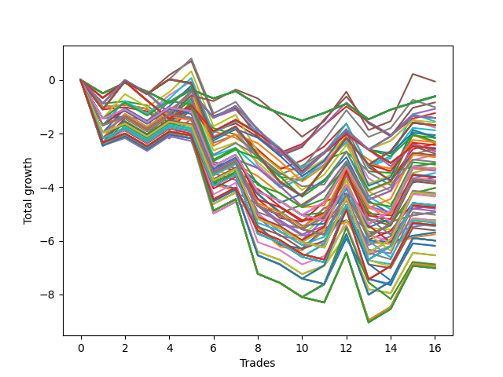

# Long HLT 105_1y 
- Symbol: TSLA
- Date Range: 05/15/2023 - 05/17/2024
- Trading Period: 8:30-12:30
- Number of Trades: 16



| Id. | Name | Win Percent | Profit | Avg Profit / Trade | Avg Time / Trade | Std |      | Name | Win Percent | Profit | Avg Profit / Trade | Avg Time / Trade | Std |
| --- | ---- | ----------- | ------ | ------------------ | ---------------- | --- | ---- | ---- | ----------- | ------ | ------------------ | ---------------- | --- |
| | Sorted By <br> Profit | | | | | | | Sorted By <br> Win Percentage |||||
|0| TP-3 45m | 50.00 | -0.06 | -0.00 | 40:48 | 0.99 |     | TP-1 30m | 56.25 | -0.84 | -0.05 | 23:11 | 0.92 |
|1| TP-0.25 180m | 50.00 | -0.61 | -0.04 | 06:03 | 0.38 |     | TP-3 30m | 56.25 | -2.38 | -0.15 | 28:45 | 0.96 |
|2| TP-0.25 165m | 50.00 | -0.61 | -0.04 | 06:03 | 0.38 |     | TP-1.5 30m | 56.25 | -2.57 | -0.16 | 26:03 | 0.95 |
|3| TP-0.25 150m | 50.00 | -0.61 | -0.04 | 06:03 | 0.38 |     | TP-1.25 30m | 56.25 | -2.79 | -0.17 | 24:30 | 0.95 |
|4| TP-0.25 135m | 50.00 | -0.61 | -0.04 | 06:03 | 0.38 |     | TP-1.75 30m | 56.25 | -3.27 | -0.20 | 26:45 | 1.03 |
|5| TP-0.25 120m | 50.00 | -0.61 | -0.04 | 06:03 | 0.38 |     | TP-2 30m | 56.25 | -3.47 | -0.22 | 26:48 | 1.05 |
|6| TP-0.25 105m | 50.00 | -0.61 | -0.04 | 06:03 | 0.38 |     | TP-2.25 30m | 56.25 | -3.63 | -0.23 | 27:26 | 1.08 |
|7| TP-0.25 90m | 50.00 | -0.61 | -0.04 | 06:03 | 0.38 |     | TP-2.75 30m | 56.25 | -4.03 | -0.25 | 27:41 | 1.13 |
|8| TP-0.25 75m | 50.00 | -0.61 | -0.04 | 06:03 | 0.38 |     | TP-2.5 30m | 56.25 | -4.03 | -0.25 | 27:41 | 1.13 |
|9| TP-0.25 60m | 50.00 | -0.61 | -0.04 | 06:03 | 0.38 |     | TP-3 45m | 50.00 | -0.06 | -0.00 | 40:48 | 0.99 |
|10| TP-0.25 45m | 50.00 | -0.61 | -0.04 | 06:03 | 0.38 |     | TP-0.25 180m | 50.00 | -0.61 | -0.04 | 06:03 | 0.38 |
|11| TP-0.25 30m | 50.00 | -0.61 | -0.04 | 06:03 | 0.38 |     | TP-0.25 165m | 50.00 | -0.61 | -0.04 | 06:03 | 0.38 |
|12| TP-0.25 15m | 50.00 | -0.63 | -0.04 | 05:56 | 0.38 |     | TP-0.25 150m | 50.00 | -0.61 | -0.04 | 06:03 | 0.38 |
|13| TP-1 30m | 56.25 | -0.84 | -0.05 | 23:11 | 0.92 |     | TP-0.25 135m | 50.00 | -0.61 | -0.04 | 06:03 | 0.38 |
|14| TP-1 45m | 50.00 | -1.02 | -0.06 | 28:52 | 0.95 |     | TP-0.25 120m | 50.00 | -0.61 | -0.04 | 06:03 | 0.38 |
|15| TP-0.75 30m | 50.00 | -1.08 | -0.07 | 18:03 | 0.71 |     | TP-0.25 105m | 50.00 | -0.61 | -0.04 | 06:03 | 0.38 |
|16| TP-0.5 30m | 50.00 | -1.24 | -0.08 | 13:18 | 0.60 |     | TP-0.25 90m | 50.00 | -0.61 | -0.04 | 06:03 | 0.38 |
|17| TP-0.75 180m | 43.75 | -1.42 | -0.09 | 25:41 | 0.74 |     | TP-0.25 75m | 50.00 | -0.61 | -0.04 | 06:03 | 0.38 |
|18| TP-0.75 165m | 43.75 | -1.42 | -0.09 | 25:41 | 0.74 |     | TP-0.25 60m | 50.00 | -0.61 | -0.04 | 06:03 | 0.38 |
|19| TP-0.75 150m | 43.75 | -1.42 | -0.09 | 25:41 | 0.74 |     | TP-0.25 45m | 50.00 | -0.61 | -0.04 | 06:03 | 0.38 |
|20| TP-0.75 135m | 43.75 | -1.42 | -0.09 | 25:41 | 0.74 |     | TP-0.25 30m | 50.00 | -0.61 | -0.04 | 06:03 | 0.38 |
|21| TP-0.75 120m | 43.75 | -1.42 | -0.09 | 25:41 | 0.74 |     | TP-0.25 15m | 50.00 | -0.63 | -0.04 | 05:56 | 0.38 |
|22| TP-1.5 45m | 50.00 | -1.55 | -0.10 | 36:07 | 1.04 |     | TP-1 45m | 50.00 | -1.02 | -0.06 | 28:52 | 0.95 |
|23| TP-0.75 60m | 43.75 | -1.59 | -0.10 | 21:56 | 0.73 |     | TP-0.75 30m | 50.00 | -1.08 | -0.07 | 18:03 | 0.71 |
|24| TP-1 180m | 43.75 | -1.69 | -0.11 | 36:22 | 0.94 |     | TP-0.5 30m | 50.00 | -1.24 | -0.08 | 13:18 | 0.60 |
|25| TP-1 165m | 43.75 | -1.69 | -0.11 | 36:22 | 0.94 |     | TP-1.5 45m | 50.00 | -1.55 | -0.10 | 36:07 | 1.04 |
|26| TP-1 150m | 43.75 | -1.69 | -0.11 | 36:22 | 0.94 |     | TP-1.75 45m | 50.00 | -2.14 | -0.13 | 36:52 | 1.12 |
|27| TP-1 135m | 43.75 | -1.69 | -0.11 | 36:22 | 0.94 |     | TP-1.25 45m | 50.00 | -2.18 | -0.14 | 33:37 | 1.05 |
|28| TP-1 120m | 43.75 | -1.69 | -0.11 | 36:22 | 0.94 |     | TP-2.25 45m | 50.00 | -2.30 | -0.14 | 38:30 | 1.15 |
|29| TP-0.75 45m | 43.75 | -1.78 | -0.11 | 20:37 | 0.73 |     | TP-2 45m | 50.00 | -2.34 | -0.15 | 36:56 | 1.14 |
|30| TP-1 60m | 43.75 | -1.88 | -0.12 | 32:30 | 0.94 |     | TP-2.75 45m | 50.00 | -2.66 | -0.17 | 38:48 | 1.20 |
|31| TP-0.75 75m | 37.50 | -2.06 | -0.13 | 22:52 | 0.72 |     | TP-2.5 45m | 50.00 | -2.66 | -0.17 | 38:48 | 1.20 |
|32| TP-1.75 45m | 50.00 | -2.14 | -0.13 | 36:52 | 1.12 |     | TP-0.75 180m | 43.75 | -1.42 | -0.09 | 25:41 | 0.74 |
|33| TP-0.75 90m | 37.50 | -2.16 | -0.13 | 23:48 | 0.72 |     | TP-0.75 165m | 43.75 | -1.42 | -0.09 | 25:41 | 0.74 |
|34| TP-1.25 45m | 50.00 | -2.18 | -0.14 | 33:37 | 1.05 |     | TP-0.75 150m | 43.75 | -1.42 | -0.09 | 25:41 | 0.74 |
|35| TP-2.25 45m | 50.00 | -2.30 | -0.14 | 38:30 | 1.15 |     | TP-0.75 135m | 43.75 | -1.42 | -0.09 | 25:41 | 0.74 |
|36| TP-1 75m | 37.50 | -2.33 | -0.15 | 33:33 | 0.93 |     | TP-0.75 120m | 43.75 | -1.42 | -0.09 | 25:41 | 0.74 |
|37| TP-2 45m | 50.00 | -2.34 | -0.15 | 36:56 | 1.14 |     | TP-0.75 60m | 43.75 | -1.59 | -0.10 | 21:56 | 0.73 |
|38| TP-3 30m | 56.25 | -2.38 | -0.15 | 28:45 | 0.96 |     | TP-1 180m | 43.75 | -1.69 | -0.11 | 36:22 | 0.94 |
|39| TP-1 90m | 37.50 | -2.43 | -0.15 | 34:30 | 0.93 |     | TP-1 165m | 43.75 | -1.69 | -0.11 | 36:22 | 0.94 |
|40| TP-0.75 105m | 37.50 | -2.54 | -0.16 | 24:45 | 0.73 |     | TP-1 150m | 43.75 | -1.69 | -0.11 | 36:22 | 0.94 |
|41| TP-0.5 180m | 37.50 | -2.56 | -0.16 | 15:18 | 0.61 |     | TP-1 135m | 43.75 | -1.69 | -0.11 | 36:22 | 0.94 |
|42| TP-0.5 165m | 37.50 | -2.56 | -0.16 | 15:18 | 0.61 |     | TP-1 120m | 43.75 | -1.69 | -0.11 | 36:22 | 0.94 |
|43| TP-0.5 150m | 37.50 | -2.56 | -0.16 | 15:18 | 0.61 |     | TP-0.75 45m | 43.75 | -1.78 | -0.11 | 20:37 | 0.73 |
|44| TP-0.5 135m | 37.50 | -2.56 | -0.16 | 15:18 | 0.61 |     | TP-1 60m | 43.75 | -1.88 | -0.12 | 32:30 | 0.94 |
|45| TP-0.5 120m | 37.50 | -2.56 | -0.16 | 15:18 | 0.61 |     | TP-1.5 60m | 43.75 | -2.88 | -0.18 | 43:11 | 1.00 |
|46| TP-0.5 105m | 37.50 | -2.56 | -0.16 | 15:18 | 0.61 |     | TP-3 60m | 43.75 | -3.06 | -0.19 | 51:30 | 0.88 |
|47| TP-0.5 90m | 37.50 | -2.56 | -0.16 | 15:18 | 0.61 |     | TP-1.25 60m | 43.75 | -3.61 | -0.23 | 39:41 | 0.99 |
|48| TP-0.5 75m | 37.50 | -2.56 | -0.16 | 15:18 | 0.61 |     | TP-1.75 60m | 43.75 | -3.76 | -0.23 | 44:45 | 1.06 |
|49| TP-0.5 60m | 37.50 | -2.56 | -0.16 | 15:18 | 0.61 |     | TP-2 60m | 43.75 | -4.69 | -0.29 | 45:45 | 1.00 |
|50| TP-1.5 30m | 56.25 | -2.57 | -0.16 | 26:03 | 0.95 |     | TP-2.25 60m | 43.75 | -4.89 | -0.31 | 48:15 | 1.04 |
|51| TP-2.75 45m | 50.00 | -2.66 | -0.17 | 38:48 | 1.20 |     | TP-2.75 60m | 43.75 | -5.25 | -0.33 | 48:33 | 1.09 |
|52| TP-2.5 45m | 50.00 | -2.66 | -0.17 | 38:48 | 1.20 |     | TP-2.5 60m | 43.75 | -5.25 | -0.33 | 48:33 | 1.09 |
|53| TP-0.5 45m | 37.50 | -2.75 | -0.17 | 14:56 | 0.61 |     | TP-0.75 75m | 37.50 | -2.06 | -0.13 | 22:52 | 0.72 |
|54| TP-1.25 30m | 56.25 | -2.79 | -0.17 | 24:30 | 0.95 |     | TP-0.75 90m | 37.50 | -2.16 | -0.13 | 23:48 | 0.72 |
|55| TP-1 105m | 37.50 | -2.81 | -0.18 | 35:26 | 0.94 |     | TP-1 75m | 37.50 | -2.33 | -0.15 | 33:33 | 0.93 |
|56| TP-1.5 60m | 43.75 | -2.88 | -0.18 | 43:11 | 1.00 |     | TP-1 90m | 37.50 | -2.43 | -0.15 | 34:30 | 0.93 |
|57| TP-3 60m | 43.75 | -3.06 | -0.19 | 51:30 | 0.88 |     | TP-0.75 105m | 37.50 | -2.54 | -0.16 | 24:45 | 0.73 |
|58| TP-0.75 15m | 37.50 | -3.11 | -0.19 | 11:41 | 0.55 |     | TP-0.5 180m | 37.50 | -2.56 | -0.16 | 15:18 | 0.61 |
|59| TP-0.5 15m | 37.50 | -3.11 | -0.19 | 09:30 | 0.52 |     | TP-0.5 165m | 37.50 | -2.56 | -0.16 | 15:18 | 0.61 |
|60| TP-1.25 75m | 37.50 | -3.16 | -0.20 | 43:33 | 0.99 |     | TP-0.5 150m | 37.50 | -2.56 | -0.16 | 15:18 | 0.61 |
|61| TP-1.75 30m | 56.25 | -3.27 | -0.20 | 26:45 | 1.03 |     | TP-0.5 135m | 37.50 | -2.56 | -0.16 | 15:18 | 0.61 |
|62| TP-1.25 180m | 37.50 | -3.32 | -0.21 | 49:37 | 0.99 |     | TP-0.5 120m | 37.50 | -2.56 | -0.16 | 15:18 | 0.61 |
|63| TP-1.25 165m | 37.50 | -3.32 | -0.21 | 49:37 | 0.99 |     | TP-0.5 105m | 37.50 | -2.56 | -0.16 | 15:18 | 0.61 |
|64| TP-1.25 150m | 37.50 | -3.32 | -0.21 | 49:37 | 0.99 |     | TP-0.5 90m | 37.50 | -2.56 | -0.16 | 15:18 | 0.61 |
|65| TP-1.25 135m | 37.50 | -3.32 | -0.21 | 49:37 | 0.99 |     | TP-0.5 75m | 37.50 | -2.56 | -0.16 | 15:18 | 0.61 |
|66| TP-1.25 120m | 37.50 | -3.32 | -0.21 | 49:37 | 0.99 |     | TP-0.5 60m | 37.50 | -2.56 | -0.16 | 15:18 | 0.61 |
|67| TP-3 90m | 37.50 | -3.36 | -0.21 | 67:03 | 1.09 |     | TP-0.5 45m | 37.50 | -2.75 | -0.17 | 14:56 | 0.61 |
|68| TP-1.25 90m | 37.50 | -3.39 | -0.21 | 45:52 | 0.99 |     | TP-1 105m | 37.50 | -2.81 | -0.18 | 35:26 | 0.94 |
|69| TP-2 30m | 56.25 | -3.47 | -0.22 | 26:48 | 1.05 |     | TP-0.75 15m | 37.50 | -3.11 | -0.19 | 11:41 | 0.55 |
|70| TP-1.25 60m | 43.75 | -3.61 | -0.23 | 39:41 | 0.99 |     | TP-0.5 15m | 37.50 | -3.11 | -0.19 | 09:30 | 0.52 |
|71| TP-2.25 30m | 56.25 | -3.63 | -0.23 | 27:26 | 1.08 |     | TP-1.25 75m | 37.50 | -3.16 | -0.20 | 43:33 | 0.99 |
|72| TP-1.5 75m | 37.50 | -3.64 | -0.23 | 47:33 | 1.07 |     | TP-1.25 180m | 37.50 | -3.32 | -0.21 | 49:37 | 0.99 |
|73| TP-1.25 105m | 37.50 | -3.74 | -0.23 | 47:45 | 0.99 |     | TP-1.25 165m | 37.50 | -3.32 | -0.21 | 49:37 | 0.99 |
|74| TP-1.75 60m | 43.75 | -3.76 | -0.23 | 44:45 | 1.06 |     | TP-1.25 150m | 37.50 | -3.32 | -0.21 | 49:37 | 0.99 |
|75| TP-1.5 180m | 37.50 | -3.80 | -0.24 | 53:37 | 1.06 |     | TP-1.25 135m | 37.50 | -3.32 | -0.21 | 49:37 | 0.99 |
|76| TP-1.5 165m | 37.50 | -3.80 | -0.24 | 53:37 | 1.06 |     | TP-1.25 120m | 37.50 | -3.32 | -0.21 | 49:37 | 0.99 |
|77| TP-1.5 150m | 37.50 | -3.80 | -0.24 | 53:37 | 1.06 |     | TP-3 90m | 37.50 | -3.36 | -0.21 | 67:03 | 1.09 |
|78| TP-1.5 135m | 37.50 | -3.80 | -0.24 | 53:37 | 1.06 |     | TP-1.25 90m | 37.50 | -3.39 | -0.21 | 45:52 | 0.99 |
|79| TP-1.5 120m | 37.50 | -3.80 | -0.24 | 53:37 | 1.06 |     | TP-1.5 75m | 37.50 | -3.64 | -0.23 | 47:33 | 1.07 |
|80| TP-1.5 90m | 37.50 | -3.87 | -0.24 | 49:52 | 1.06 |     | TP-1.25 105m | 37.50 | -3.74 | -0.23 | 47:45 | 0.99 |
|81| TP-2.75 30m | 56.25 | -4.03 | -0.25 | 27:41 | 1.13 |     | TP-1.5 180m | 37.50 | -3.80 | -0.24 | 53:37 | 1.06 |
|82| TP-2.5 30m | 56.25 | -4.03 | -0.25 | 27:41 | 1.13 |     | TP-1.5 165m | 37.50 | -3.80 | -0.24 | 53:37 | 1.06 |
|83| TP-1.5 105m | 37.50 | -4.22 | -0.26 | 51:45 | 1.07 |     | TP-1.5 150m | 37.50 | -3.80 | -0.24 | 53:37 | 1.06 |
|84| TP-1.75 180m | 37.50 | -4.28 | -0.27 | 57:07 | 1.19 |     | TP-1.5 135m | 37.50 | -3.80 | -0.24 | 53:37 | 1.06 |
|85| TP-1.75 165m | 37.50 | -4.28 | -0.27 | 57:07 | 1.19 |     | TP-1.5 120m | 37.50 | -3.80 | -0.24 | 53:37 | 1.06 |
|86| TP-1.75 150m | 37.50 | -4.28 | -0.27 | 57:07 | 1.19 |     | TP-1.5 90m | 37.50 | -3.87 | -0.24 | 49:52 | 1.06 |
|87| TP-1.75 135m | 37.50 | -4.28 | -0.27 | 57:07 | 1.19 |     | TP-1.5 105m | 37.50 | -4.22 | -0.26 | 51:45 | 1.07 |
|88| TP-1.75 120m | 37.50 | -4.28 | -0.27 | 57:07 | 1.19 |     | TP-1.75 180m | 37.50 | -4.28 | -0.27 | 57:07 | 1.19 |
|89| TP-1.75 90m | 37.50 | -4.35 | -0.27 | 53:22 | 1.19 |     | TP-1.75 165m | 37.50 | -4.28 | -0.27 | 57:07 | 1.19 |
|90| TP-2 180m | 37.50 | -4.68 | -0.29 | 62:30 | 1.26 |     | TP-1.75 150m | 37.50 | -4.28 | -0.27 | 57:07 | 1.19 |
|91| TP-2 165m | 37.50 | -4.68 | -0.29 | 62:30 | 1.26 |     | TP-1.75 135m | 37.50 | -4.28 | -0.27 | 57:07 | 1.19 |
|92| TP-2 150m | 37.50 | -4.68 | -0.29 | 62:30 | 1.26 |     | TP-1.75 120m | 37.50 | -4.28 | -0.27 | 57:07 | 1.19 |
|93| TP-2 135m | 37.50 | -4.68 | -0.29 | 62:30 | 1.26 |     | TP-1.75 90m | 37.50 | -4.35 | -0.27 | 53:22 | 1.19 |
|94| TP-2 120m | 37.50 | -4.68 | -0.29 | 62:30 | 1.26 |     | TP-2 180m | 37.50 | -4.68 | -0.29 | 62:30 | 1.26 |
|95| TP-2 60m | 43.75 | -4.69 | -0.29 | 45:45 | 1.00 |     | TP-2 165m | 37.50 | -4.68 | -0.29 | 62:30 | 1.26 |
|96| TP-1 15m | 37.50 | -4.69 | -0.29 | 12:56 | 0.71 |     | TP-2 150m | 37.50 | -4.68 | -0.29 | 62:30 | 1.26 |
|97| TP-1.75 105m | 37.50 | -4.70 | -0.29 | 55:15 | 1.19 |     | TP-2 135m | 37.50 | -4.68 | -0.29 | 62:30 | 1.26 |
|98| TP-3 105m | 37.50 | -4.76 | -0.30 | 73:22 | 1.19 |     | TP-2 120m | 37.50 | -4.68 | -0.29 | 62:30 | 1.26 |
|99| TP-1.75 75m | 37.50 | -4.80 | -0.30 | 50:11 | 1.13 |     | TP-1 15m | 37.50 | -4.69 | -0.29 | 12:56 | 0.71 |
|100| TP-2.25 60m | 43.75 | -4.89 | -0.31 | 48:15 | 1.04 |     | TP-1.75 105m | 37.50 | -4.70 | -0.29 | 55:15 | 1.19 |
|101| TP-2 15m | 37.50 | -4.93 | -0.31 | 13:37 | 0.73 |     | TP-3 105m | 37.50 | -4.76 | -0.30 | 73:22 | 1.19 |
|102| TP-1.75 15m | 37.50 | -4.93 | -0.31 | 13:37 | 0.73 |     | TP-1.75 75m | 37.50 | -4.80 | -0.30 | 50:11 | 1.13 |
|103| TP-1.5 15m | 37.50 | -4.93 | -0.31 | 13:37 | 0.73 |     | TP-2 15m | 37.50 | -4.93 | -0.31 | 13:37 | 0.73 |
|104| TP-2 90m | 37.50 | -5.03 | -0.31 | 56:37 | 1.22 |     | TP-1.75 15m | 37.50 | -4.93 | -0.31 | 13:37 | 0.73 |
|105| TP-2.25 15m | 37.50 | -5.22 | -0.33 | 13:41 | 0.78 |     | TP-1.5 15m | 37.50 | -4.93 | -0.31 | 13:37 | 0.73 |
|106| TP-2.75 60m | 43.75 | -5.25 | -0.33 | 48:33 | 1.09 |     | TP-2 90m | 37.50 | -5.03 | -0.31 | 56:37 | 1.22 |
|107| TP-2.5 60m | 43.75 | -5.25 | -0.33 | 48:33 | 1.09 |     | TP-2.25 15m | 37.50 | -5.22 | -0.33 | 13:41 | 0.78 |
|108| TP-2.25 90m | 37.50 | -5.30 | -0.33 | 61:11 | 1.26 |     | TP-2.25 90m | 37.50 | -5.30 | -0.33 | 61:11 | 1.26 |
|109| TP-2 105m | 37.50 | -5.33 | -0.33 | 59:41 | 1.24 |     | TP-2 105m | 37.50 | -5.33 | -0.33 | 59:41 | 1.24 |
|110| TP-1.25 15m | 37.50 | -5.36 | -0.33 | 13:11 | 0.76 |     | TP-1.25 15m | 37.50 | -5.36 | -0.33 | 13:11 | 0.76 |
|111| TP-3 180m | 37.50 | -5.42 | -0.34 | 79:00 | 1.28 |     | TP-3 180m | 37.50 | -5.42 | -0.34 | 79:00 | 1.28 |
|112| TP-3 165m | 37.50 | -5.42 | -0.34 | 79:00 | 1.28 |     | TP-3 165m | 37.50 | -5.42 | -0.34 | 79:00 | 1.28 |
|113| TP-3 150m | 37.50 | -5.42 | -0.34 | 79:00 | 1.28 |     | TP-3 150m | 37.50 | -5.42 | -0.34 | 79:00 | 1.28 |
|114| TP-3 135m | 37.50 | -5.42 | -0.34 | 79:00 | 1.28 |     | TP-3 135m | 37.50 | -5.42 | -0.34 | 79:00 | 1.28 |
|115| TP-3 120m | 37.50 | -5.42 | -0.34 | 79:00 | 1.28 |     | TP-3 120m | 37.50 | -5.42 | -0.34 | 79:00 | 1.28 |
|116| TP-3 75m | 37.50 | -5.46 | -0.34 | 60:03 | 1.14 |     | TP-3 75m | 37.50 | -5.46 | -0.34 | 60:03 | 1.14 |
|117| TP-2 75m | 37.50 | -5.61 | -0.35 | 52:26 | 1.15 |     | TP-2 75m | 37.50 | -5.61 | -0.35 | 52:26 | 1.15 |
|118| TP-2.75 15m | 37.50 | -5.69 | -0.36 | 13:52 | 0.86 |     | TP-2.75 15m | 37.50 | -5.69 | -0.36 | 13:52 | 0.86 |
|119| TP-2.5 15m | 37.50 | -5.69 | -0.36 | 13:52 | 0.86 |     | TP-2.5 15m | 37.50 | -5.69 | -0.36 | 13:52 | 0.86 |
|120| TP-3 15m | 37.50 | -5.76 | -0.36 | 14:00 | 0.87 |     | TP-3 15m | 37.50 | -5.76 | -0.36 | 14:00 | 0.87 |
|121| TP-2.25 180m | 37.50 | -5.99 | -0.37 | 70:07 | 1.32 |     | TP-2.25 180m | 37.50 | -5.99 | -0.37 | 70:07 | 1.32 |
|122| TP-2.25 165m | 37.50 | -5.99 | -0.37 | 70:07 | 1.32 |     | TP-2.25 165m | 37.50 | -5.99 | -0.37 | 70:07 | 1.32 |
|123| TP-2.25 150m | 37.50 | -5.99 | -0.37 | 70:07 | 1.32 |     | TP-2.25 150m | 37.50 | -5.99 | -0.37 | 70:07 | 1.32 |
|124| TP-2.25 135m | 37.50 | -5.99 | -0.37 | 70:07 | 1.32 |     | TP-2.25 135m | 37.50 | -5.99 | -0.37 | 70:07 | 1.32 |
|125| TP-2.25 120m | 37.50 | -5.99 | -0.37 | 70:07 | 1.32 |     | TP-2.25 120m | 37.50 | -5.99 | -0.37 | 70:07 | 1.32 |
|126| TP-2.75 90m | 37.50 | -5.99 | -0.37 | 61:45 | 1.34 |     | TP-2.75 90m | 37.50 | -5.99 | -0.37 | 61:45 | 1.34 |
|127| TP-2.5 90m | 37.50 | -5.99 | -0.37 | 61:45 | 1.34 |     | TP-2.5 90m | 37.50 | -5.99 | -0.37 | 61:45 | 1.34 |
|128| TP-2.25 75m | 37.50 | -6.18 | -0.39 | 55:52 | 1.21 |     | TP-2.25 75m | 37.50 | -6.18 | -0.39 | 55:52 | 1.21 |
|129| TP-2.25 105m | 37.50 | -6.19 | -0.39 | 65:52 | 1.31 |     | TP-2.25 105m | 37.50 | -6.19 | -0.39 | 65:52 | 1.31 |
|130| TP-2.75 75m | 37.50 | -6.54 | -0.41 | 56:11 | 1.25 |     | TP-2.75 75m | 37.50 | -6.54 | -0.41 | 56:11 | 1.25 |
|131| TP-2.5 75m | 37.50 | -6.54 | -0.41 | 56:11 | 1.25 |     | TP-2.5 75m | 37.50 | -6.54 | -0.41 | 56:11 | 1.25 |
|132| TP-2.75 105m | 37.50 | -6.88 | -0.43 | 66:26 | 1.38 |     | TP-2.75 105m | 37.50 | -6.88 | -0.43 | 66:26 | 1.38 |
|133| TP-2.5 105m | 37.50 | -6.88 | -0.43 | 66:26 | 1.38 |     | TP-2.5 105m | 37.50 | -6.88 | -0.43 | 66:26 | 1.38 |
|134| TP-2.5 180m | 37.50 | -6.95 | -0.43 | 71:00 | 1.42 |     | TP-2.5 180m | 37.50 | -6.95 | -0.43 | 71:00 | 1.42 |
|135| TP-2.5 165m | 37.50 | -6.95 | -0.43 | 71:00 | 1.42 |     | TP-2.5 165m | 37.50 | -6.95 | -0.43 | 71:00 | 1.42 |
|136| TP-2.5 150m | 37.50 | -6.95 | -0.43 | 71:00 | 1.42 |     | TP-2.5 150m | 37.50 | -6.95 | -0.43 | 71:00 | 1.42 |
|137| TP-2.5 135m | 37.50 | -6.95 | -0.43 | 71:00 | 1.42 |     | TP-2.5 135m | 37.50 | -6.95 | -0.43 | 71:00 | 1.42 |
|138| TP-2.5 120m | 37.50 | -6.95 | -0.43 | 71:00 | 1.42 |     | TP-2.5 120m | 37.50 | -6.95 | -0.43 | 71:00 | 1.42 |
|139| TP-2.75 180m | 37.50 | -7.02 | -0.44 | 71:07 | 1.42 |     | TP-2.75 180m | 37.50 | -7.02 | -0.44 | 71:07 | 1.42 |
|140| TP-2.75 165m | 37.50 | -7.02 | -0.44 | 71:07 | 1.42 |     | TP-2.75 165m | 37.50 | -7.02 | -0.44 | 71:07 | 1.42 |
|141| TP-2.75 150m | 37.50 | -7.02 | -0.44 | 71:07 | 1.42 |     | TP-2.75 150m | 37.50 | -7.02 | -0.44 | 71:07 | 1.42 |
|142| TP-2.75 135m | 37.50 | -7.02 | -0.44 | 71:07 | 1.42 |     | TP-2.75 135m | 37.50 | -7.02 | -0.44 | 71:07 | 1.42 |
|143| TP-2.75 120m | 37.50 | -7.02 | -0.44 | 71:07 | 1.42 |     | TP-2.75 120m | 37.50 | -7.02 | -0.44 | 71:07 | 1.42 |

### Test TP-0.25 15m
* Take Profit of 0.25 Point
* 0.25 Stoploss
* Results:
```
Total Trades: 16
Percent Up: 50.00
Percent Down: 50.00
Total Points Moved Up: -0.63
Potential Profit: -315.00
Total Points Ups: 2.63 Count Ups: 8
Total Points Downs: -3.26 Count Downs: 8
```

<details><summary>Trades</summary>

<code>In: 2023-07-27 12:20:00		Out: 2023-07-27 12:22:00		Total Position Time: 02:00		Total Move Up: -0.50		Total to Date: -0.50</code> <br />
<code>In: 2023-09-26 11:30:00		Out: 2023-09-26 11:32:00		Total Position Time: 02:00		Total Move Up: 0.39		Total to Date: -0.11</code> <br />
<code>In: 2023-10-18 12:25:00		Out: 2023-10-18 12:28:00		Total Position Time: 03:00		Total Move Up: -0.32		Total to Date: -0.43</code> <br />
<code>In: 2023-10-19 12:10:00		Out: 2023-10-19 12:14:00		Total Position Time: 04:00		Total Move Up: -0.43		Total to Date: -0.86</code> <br />
<code>In: 2023-10-20 11:50:00		Out: 2023-10-20 11:52:00		Total Position Time: 02:00		Total Move Up: 0.50		Total to Date: -0.36</code> <br />
<code>In: 2023-11-09 09:55:00		Out: 2023-11-09 09:57:00		Total Position Time: 02:00		Total Move Up: -0.33		Total to Date: -0.69</code> <br />
<code>In: 2024-01-05 12:20:00		Out: 2024-01-05 12:23:00		Total Position Time: 03:00		Total Move Up: 0.27		Total to Date: -0.42</code> <br />
<code>In: 2024-01-24 11:10:00		Out: 2024-01-24 11:12:00		Total Position Time: 02:00		Total Move Up: -0.51		Total to Date: -0.93</code> <br />
<code>In: 2024-02-13 11:35:00		Out: 2024-02-13 11:46:00		Total Position Time: 11:00		Total Move Up: -0.31		Total to Date: -1.24</code> <br />
<code>In: 2024-03-13 11:50:00		Out: 2024-03-13 11:58:00		Total Position Time: 08:00		Total Move Up: -0.28		Total to Date: -1.52</code> <br />
<code>In: 2024-03-14 09:25:00		Out: 2024-03-14 09:34:00		Total Position Time: 09:00		Total Move Up: 0.29		Total to Date: -1.23</code> <br />
<code>In: 2024-03-15 10:10:00		Out: 2024-03-15 10:21:00		Total Position Time: 11:00		Total Move Up: 0.34		Total to Date: -0.89</code> <br />
<code>In: 2024-04-15 10:10:00		Out: 2024-04-15 10:19:00		Total Position Time: 09:00		Total Move Up: -0.58		Total to Date: -1.47</code> <br />
<code>In: 2024-04-18 09:25:00		Out: 2024-04-18 09:30:00		Total Position Time: 05:00		Total Move Up: 0.36		Total to Date: -1.11</code> <br />
<code>In: 2024-04-22 08:35:00		Out: 2024-04-22 08:49:00		Total Position Time: 14:00		Total Move Up: 0.24		Total to Date: -0.87</code> <br />
<code>In: 2024-05-07 12:00:00		Out: 2024-05-07 12:08:00		Total Position Time: 08:00		Total Move Up: 0.24		Total to Date: -0.63</code> <br />


</details>

### Test TP-0.5 15m
* Take Profit of 0.5 Point
* 0.5 Stoploss
* Results:
```
Total Trades: 16
Percent Up: 37.50
Percent Down: 62.50
Total Points Moved Up: -3.11
Potential Profit: -1555.00
Total Points Ups: 2.48 Count Ups: 6
Total Points Downs: -5.59 Count Downs: 10
```

<details><summary>Trades</summary>

<code>In: 2023-07-27 12:20:00		Out: 2023-07-27 12:23:00		Total Position Time: 03:00		Total Move Up: -0.67		Total to Date: -0.67</code> <br />
<code>In: 2023-09-26 11:30:00		Out: 2023-09-26 11:37:00		Total Position Time: 07:00		Total Move Up: 0.61		Total to Date: -0.06</code> <br />
<code>In: 2023-10-18 12:25:00		Out: 2023-10-18 12:29:00		Total Position Time: 04:00		Total Move Up: -0.71		Total to Date: -0.77</code> <br />
<code>In: 2023-10-19 12:10:00		Out: 2023-10-19 12:24:00		Total Position Time: 14:00		Total Move Up: -0.68		Total to Date: -1.45</code> <br />
<code>In: 2023-10-20 11:50:00		Out: 2023-10-20 11:52:00		Total Position Time: 02:00		Total Move Up: 0.50		Total to Date: -0.95</code> <br />
<code>In: 2023-11-09 09:55:00		Out: 2023-11-09 10:02:00		Total Position Time: 07:00		Total Move Up: -0.97		Total to Date: -1.92</code> <br />
<code>In: 2024-01-05 12:20:00		Out: 2024-01-05 12:34:00		Total Position Time: 14:00		Total Move Up: -0.24		Total to Date: -2.16</code> <br />
<code>In: 2024-01-24 11:10:00		Out: 2024-01-24 11:12:00		Total Position Time: 02:00		Total Move Up: -0.51		Total to Date: -2.67</code> <br />
<code>In: 2024-02-13 11:35:00		Out: 2024-02-13 11:48:00		Total Position Time: 13:00		Total Move Up: -0.59		Total to Date: -3.26</code> <br />
<code>In: 2024-03-13 11:50:00		Out: 2024-03-13 12:04:00		Total Position Time: 14:00		Total Move Up: -0.14		Total to Date: -3.40</code> <br />
<code>In: 2024-03-14 09:25:00		Out: 2024-03-14 09:36:00		Total Position Time: 11:00		Total Move Up: 0.70		Total to Date: -2.70</code> <br />
<code>In: 2024-03-15 10:10:00		Out: 2024-03-15 10:24:00		Total Position Time: 14:00		Total Move Up: 0.31		Total to Date: -2.39</code> <br />
<code>In: 2024-04-15 10:10:00		Out: 2024-04-15 10:19:00		Total Position Time: 09:00		Total Move Up: -0.58		Total to Date: -2.97</code> <br />
<code>In: 2024-04-18 09:25:00		Out: 2024-04-18 09:35:00		Total Position Time: 10:00		Total Move Up: -0.50		Total to Date: -3.47</code> <br />
<code>In: 2024-04-22 08:35:00		Out: 2024-04-22 08:49:00		Total Position Time: 14:00		Total Move Up: 0.24		Total to Date: -3.23</code> <br />
<code>In: 2024-05-07 12:00:00		Out: 2024-05-07 12:14:00		Total Position Time: 14:00		Total Move Up: 0.12		Total to Date: -3.11</code> <br />


</details>

### Test TP-0.75 15m
* Take Profit of 0.75 Point
* 0.75 Stoploss
* Results:
```
Total Trades: 16
Percent Up: 37.50
Percent Down: 62.50
Total Points Moved Up: -3.11
Potential Profit: -1555.00
Total Points Ups: 2.31 Count Ups: 6
Total Points Downs: -5.42 Count Downs: 10
```

<details><summary>Trades</summary>

<code>In: 2023-07-27 12:20:00		Out: 2023-07-27 12:24:00		Total Position Time: 04:00		Total Move Up: -0.88		Total to Date: -0.88</code> <br />
<code>In: 2023-09-26 11:30:00		Out: 2023-09-26 11:44:00		Total Position Time: 14:00		Total Move Up: 0.08		Total to Date: -0.80</code> <br />
<code>In: 2023-10-18 12:25:00		Out: 2023-10-18 12:39:00		Total Position Time: 14:00		Total Move Up: -0.15		Total to Date: -0.95</code> <br />
<code>In: 2023-10-19 12:10:00		Out: 2023-10-19 12:24:00		Total Position Time: 14:00		Total Move Up: -0.68		Total to Date: -1.63</code> <br />
<code>In: 2023-10-20 11:50:00		Out: 2023-10-20 11:55:00		Total Position Time: 05:00		Total Move Up: 0.80		Total to Date: -0.83</code> <br />
<code>In: 2023-11-09 09:55:00		Out: 2023-11-09 10:02:00		Total Position Time: 07:00		Total Move Up: -0.97		Total to Date: -1.80</code> <br />
<code>In: 2024-01-05 12:20:00		Out: 2024-01-05 12:34:00		Total Position Time: 14:00		Total Move Up: -0.24		Total to Date: -2.04</code> <br />
<code>In: 2024-01-24 11:10:00		Out: 2024-01-24 11:18:00		Total Position Time: 08:00		Total Move Up: -0.86		Total to Date: -2.90</code> <br />
<code>In: 2024-02-13 11:35:00		Out: 2024-02-13 11:49:00		Total Position Time: 14:00		Total Move Up: -0.71		Total to Date: -3.61</code> <br />
<code>In: 2024-03-13 11:50:00		Out: 2024-03-13 12:04:00		Total Position Time: 14:00		Total Move Up: -0.14		Total to Date: -3.75</code> <br />
<code>In: 2024-03-14 09:25:00		Out: 2024-03-14 09:37:00		Total Position Time: 12:00		Total Move Up: 0.76		Total to Date: -2.99</code> <br />
<code>In: 2024-03-15 10:10:00		Out: 2024-03-15 10:24:00		Total Position Time: 14:00		Total Move Up: 0.31		Total to Date: -2.68</code> <br />
<code>In: 2024-04-15 10:10:00		Out: 2024-04-15 10:21:00		Total Position Time: 11:00		Total Move Up: -0.73		Total to Date: -3.41</code> <br />
<code>In: 2024-04-18 09:25:00		Out: 2024-04-18 09:39:00		Total Position Time: 14:00		Total Move Up: -0.06		Total to Date: -3.47</code> <br />
<code>In: 2024-04-22 08:35:00		Out: 2024-04-22 08:49:00		Total Position Time: 14:00		Total Move Up: 0.24		Total to Date: -3.23</code> <br />
<code>In: 2024-05-07 12:00:00		Out: 2024-05-07 12:14:00		Total Position Time: 14:00		Total Move Up: 0.12		Total to Date: -3.11</code> <br />


</details>

### Test TP-1 15m
* Take Profit of 1 Point
* 1 Stoploss
* Results:
```
Total Trades: 16
Percent Up: 37.50
Percent Down: 62.50
Total Points Moved Up: -4.69
Potential Profit: -2345.00
Total Points Ups: 2.25 Count Ups: 6
Total Points Downs: -6.94 Count Downs: 10
```

<details><summary>Trades</summary>

<code>In: 2023-07-27 12:20:00		Out: 2023-07-27 12:25:00		Total Position Time: 05:00		Total Move Up: -1.10		Total to Date: -1.10</code> <br />
<code>In: 2023-09-26 11:30:00		Out: 2023-09-26 11:44:00		Total Position Time: 14:00		Total Move Up: 0.08		Total to Date: -1.02</code> <br />
<code>In: 2023-10-18 12:25:00		Out: 2023-10-18 12:39:00		Total Position Time: 14:00		Total Move Up: -0.15		Total to Date: -1.17</code> <br />
<code>In: 2023-10-19 12:10:00		Out: 2023-10-19 12:24:00		Total Position Time: 14:00		Total Move Up: -0.68		Total to Date: -1.85</code> <br />
<code>In: 2023-10-20 11:50:00		Out: 2023-10-20 12:04:00		Total Position Time: 14:00		Total Move Up: 0.75		Total to Date: -1.10</code> <br />
<code>In: 2023-11-09 09:55:00		Out: 2023-11-09 10:03:00		Total Position Time: 08:00		Total Move Up: -2.05		Total to Date: -3.15</code> <br />
<code>In: 2024-01-05 12:20:00		Out: 2024-01-05 12:34:00		Total Position Time: 14:00		Total Move Up: -0.24		Total to Date: -3.39</code> <br />
<code>In: 2024-01-24 11:10:00		Out: 2024-01-24 11:22:00		Total Position Time: 12:00		Total Move Up: -1.05		Total to Date: -4.44</code> <br />
<code>In: 2024-02-13 11:35:00		Out: 2024-02-13 11:49:00		Total Position Time: 14:00		Total Move Up: -0.71		Total to Date: -5.15</code> <br />
<code>In: 2024-03-13 11:50:00		Out: 2024-03-13 12:04:00		Total Position Time: 14:00		Total Move Up: -0.14		Total to Date: -5.29</code> <br />
<code>In: 2024-03-14 09:25:00		Out: 2024-03-14 09:39:00		Total Position Time: 14:00		Total Move Up: 0.75		Total to Date: -4.54</code> <br />
<code>In: 2024-03-15 10:10:00		Out: 2024-03-15 10:24:00		Total Position Time: 14:00		Total Move Up: 0.31		Total to Date: -4.23</code> <br />
<code>In: 2024-04-15 10:10:00		Out: 2024-04-15 10:24:00		Total Position Time: 14:00		Total Move Up: -0.76		Total to Date: -4.99</code> <br />
<code>In: 2024-04-18 09:25:00		Out: 2024-04-18 09:39:00		Total Position Time: 14:00		Total Move Up: -0.06		Total to Date: -5.05</code> <br />
<code>In: 2024-04-22 08:35:00		Out: 2024-04-22 08:49:00		Total Position Time: 14:00		Total Move Up: 0.24		Total to Date: -4.81</code> <br />
<code>In: 2024-05-07 12:00:00		Out: 2024-05-07 12:14:00		Total Position Time: 14:00		Total Move Up: 0.12		Total to Date: -4.69</code> <br />


</details>

### Test TP-1.25 15m
* Take Profit of 1.25 Point
* 1.25 Stoploss
* Results:
```
Total Trades: 16
Percent Up: 37.50
Percent Down: 62.50
Total Points Moved Up: -5.36
Potential Profit: -2680.00
Total Points Ups: 2.25 Count Ups: 6
Total Points Downs: -7.61 Count Downs: 10
```

<details><summary>Trades</summary>

<code>In: 2023-07-27 12:20:00		Out: 2023-07-27 12:27:00		Total Position Time: 07:00		Total Move Up: -1.44		Total to Date: -1.44</code> <br />
<code>In: 2023-09-26 11:30:00		Out: 2023-09-26 11:44:00		Total Position Time: 14:00		Total Move Up: 0.08		Total to Date: -1.36</code> <br />
<code>In: 2023-10-18 12:25:00		Out: 2023-10-18 12:39:00		Total Position Time: 14:00		Total Move Up: -0.15		Total to Date: -1.51</code> <br />
<code>In: 2023-10-19 12:10:00		Out: 2023-10-19 12:24:00		Total Position Time: 14:00		Total Move Up: -0.68		Total to Date: -2.19</code> <br />
<code>In: 2023-10-20 11:50:00		Out: 2023-10-20 12:04:00		Total Position Time: 14:00		Total Move Up: 0.75		Total to Date: -1.44</code> <br />
<code>In: 2023-11-09 09:55:00		Out: 2023-11-09 10:03:00		Total Position Time: 08:00		Total Move Up: -2.05		Total to Date: -3.49</code> <br />
<code>In: 2024-01-05 12:20:00		Out: 2024-01-05 12:34:00		Total Position Time: 14:00		Total Move Up: -0.24		Total to Date: -3.73</code> <br />
<code>In: 2024-01-24 11:10:00		Out: 2024-01-24 11:24:00		Total Position Time: 14:00		Total Move Up: -1.38		Total to Date: -5.11</code> <br />
<code>In: 2024-02-13 11:35:00		Out: 2024-02-13 11:49:00		Total Position Time: 14:00		Total Move Up: -0.71		Total to Date: -5.82</code> <br />
<code>In: 2024-03-13 11:50:00		Out: 2024-03-13 12:04:00		Total Position Time: 14:00		Total Move Up: -0.14		Total to Date: -5.96</code> <br />
<code>In: 2024-03-14 09:25:00		Out: 2024-03-14 09:39:00		Total Position Time: 14:00		Total Move Up: 0.75		Total to Date: -5.21</code> <br />
<code>In: 2024-03-15 10:10:00		Out: 2024-03-15 10:24:00		Total Position Time: 14:00		Total Move Up: 0.31		Total to Date: -4.90</code> <br />
<code>In: 2024-04-15 10:10:00		Out: 2024-04-15 10:24:00		Total Position Time: 14:00		Total Move Up: -0.76		Total to Date: -5.66</code> <br />
<code>In: 2024-04-18 09:25:00		Out: 2024-04-18 09:39:00		Total Position Time: 14:00		Total Move Up: -0.06		Total to Date: -5.72</code> <br />
<code>In: 2024-04-22 08:35:00		Out: 2024-04-22 08:49:00		Total Position Time: 14:00		Total Move Up: 0.24		Total to Date: -5.48</code> <br />
<code>In: 2024-05-07 12:00:00		Out: 2024-05-07 12:14:00		Total Position Time: 14:00		Total Move Up: 0.12		Total to Date: -5.36</code> <br />


</details>

### Test TP-1.5 15m
* Take Profit of 1.5 Point
* 1.5 Stoploss
* Results:
```
Total Trades: 16
Percent Up: 37.50
Percent Down: 62.50
Total Points Moved Up: -4.93
Potential Profit: -2465.00
Total Points Ups: 2.25 Count Ups: 6
Total Points Downs: -7.18 Count Downs: 10
```

<details><summary>Trades</summary>

<code>In: 2023-07-27 12:20:00		Out: 2023-07-27 12:34:00		Total Position Time: 14:00		Total Move Up: -1.01		Total to Date: -1.01</code> <br />
<code>In: 2023-09-26 11:30:00		Out: 2023-09-26 11:44:00		Total Position Time: 14:00		Total Move Up: 0.08		Total to Date: -0.93</code> <br />
<code>In: 2023-10-18 12:25:00		Out: 2023-10-18 12:39:00		Total Position Time: 14:00		Total Move Up: -0.15		Total to Date: -1.08</code> <br />
<code>In: 2023-10-19 12:10:00		Out: 2023-10-19 12:24:00		Total Position Time: 14:00		Total Move Up: -0.68		Total to Date: -1.76</code> <br />
<code>In: 2023-10-20 11:50:00		Out: 2023-10-20 12:04:00		Total Position Time: 14:00		Total Move Up: 0.75		Total to Date: -1.01</code> <br />
<code>In: 2023-11-09 09:55:00		Out: 2023-11-09 10:03:00		Total Position Time: 08:00		Total Move Up: -2.05		Total to Date: -3.06</code> <br />
<code>In: 2024-01-05 12:20:00		Out: 2024-01-05 12:34:00		Total Position Time: 14:00		Total Move Up: -0.24		Total to Date: -3.30</code> <br />
<code>In: 2024-01-24 11:10:00		Out: 2024-01-24 11:24:00		Total Position Time: 14:00		Total Move Up: -1.38		Total to Date: -4.68</code> <br />
<code>In: 2024-02-13 11:35:00		Out: 2024-02-13 11:49:00		Total Position Time: 14:00		Total Move Up: -0.71		Total to Date: -5.39</code> <br />
<code>In: 2024-03-13 11:50:00		Out: 2024-03-13 12:04:00		Total Position Time: 14:00		Total Move Up: -0.14		Total to Date: -5.53</code> <br />
<code>In: 2024-03-14 09:25:00		Out: 2024-03-14 09:39:00		Total Position Time: 14:00		Total Move Up: 0.75		Total to Date: -4.78</code> <br />
<code>In: 2024-03-15 10:10:00		Out: 2024-03-15 10:24:00		Total Position Time: 14:00		Total Move Up: 0.31		Total to Date: -4.47</code> <br />
<code>In: 2024-04-15 10:10:00		Out: 2024-04-15 10:24:00		Total Position Time: 14:00		Total Move Up: -0.76		Total to Date: -5.23</code> <br />
<code>In: 2024-04-18 09:25:00		Out: 2024-04-18 09:39:00		Total Position Time: 14:00		Total Move Up: -0.06		Total to Date: -5.29</code> <br />
<code>In: 2024-04-22 08:35:00		Out: 2024-04-22 08:49:00		Total Position Time: 14:00		Total Move Up: 0.24		Total to Date: -5.05</code> <br />
<code>In: 2024-05-07 12:00:00		Out: 2024-05-07 12:14:00		Total Position Time: 14:00		Total Move Up: 0.12		Total to Date: -4.93</code> <br />


</details>

### Test TP-1.75 15m
* Take Profit of 1.75 Point
* 1.75 Stoploss
* Results:
```
Total Trades: 16
Percent Up: 37.50
Percent Down: 62.50
Total Points Moved Up: -4.93
Potential Profit: -2465.00
Total Points Ups: 2.25 Count Ups: 6
Total Points Downs: -7.18 Count Downs: 10
```

<details><summary>Trades</summary>

<code>In: 2023-07-27 12:20:00		Out: 2023-07-27 12:34:00		Total Position Time: 14:00		Total Move Up: -1.01		Total to Date: -1.01</code> <br />
<code>In: 2023-09-26 11:30:00		Out: 2023-09-26 11:44:00		Total Position Time: 14:00		Total Move Up: 0.08		Total to Date: -0.93</code> <br />
<code>In: 2023-10-18 12:25:00		Out: 2023-10-18 12:39:00		Total Position Time: 14:00		Total Move Up: -0.15		Total to Date: -1.08</code> <br />
<code>In: 2023-10-19 12:10:00		Out: 2023-10-19 12:24:00		Total Position Time: 14:00		Total Move Up: -0.68		Total to Date: -1.76</code> <br />
<code>In: 2023-10-20 11:50:00		Out: 2023-10-20 12:04:00		Total Position Time: 14:00		Total Move Up: 0.75		Total to Date: -1.01</code> <br />
<code>In: 2023-11-09 09:55:00		Out: 2023-11-09 10:03:00		Total Position Time: 08:00		Total Move Up: -2.05		Total to Date: -3.06</code> <br />
<code>In: 2024-01-05 12:20:00		Out: 2024-01-05 12:34:00		Total Position Time: 14:00		Total Move Up: -0.24		Total to Date: -3.30</code> <br />
<code>In: 2024-01-24 11:10:00		Out: 2024-01-24 11:24:00		Total Position Time: 14:00		Total Move Up: -1.38		Total to Date: -4.68</code> <br />
<code>In: 2024-02-13 11:35:00		Out: 2024-02-13 11:49:00		Total Position Time: 14:00		Total Move Up: -0.71		Total to Date: -5.39</code> <br />
<code>In: 2024-03-13 11:50:00		Out: 2024-03-13 12:04:00		Total Position Time: 14:00		Total Move Up: -0.14		Total to Date: -5.53</code> <br />
<code>In: 2024-03-14 09:25:00		Out: 2024-03-14 09:39:00		Total Position Time: 14:00		Total Move Up: 0.75		Total to Date: -4.78</code> <br />
<code>In: 2024-03-15 10:10:00		Out: 2024-03-15 10:24:00		Total Position Time: 14:00		Total Move Up: 0.31		Total to Date: -4.47</code> <br />
<code>In: 2024-04-15 10:10:00		Out: 2024-04-15 10:24:00		Total Position Time: 14:00		Total Move Up: -0.76		Total to Date: -5.23</code> <br />
<code>In: 2024-04-18 09:25:00		Out: 2024-04-18 09:39:00		Total Position Time: 14:00		Total Move Up: -0.06		Total to Date: -5.29</code> <br />
<code>In: 2024-04-22 08:35:00		Out: 2024-04-22 08:49:00		Total Position Time: 14:00		Total Move Up: 0.24		Total to Date: -5.05</code> <br />
<code>In: 2024-05-07 12:00:00		Out: 2024-05-07 12:14:00		Total Position Time: 14:00		Total Move Up: 0.12		Total to Date: -4.93</code> <br />


</details>

### Test TP-2 15m
* Take Profit of 2 Point
* 2 Stoploss
* Results:
```
Total Trades: 16
Percent Up: 37.50
Percent Down: 62.50
Total Points Moved Up: -4.93
Potential Profit: -2465.00
Total Points Ups: 2.25 Count Ups: 6
Total Points Downs: -7.18 Count Downs: 10
```

<details><summary>Trades</summary>

<code>In: 2023-07-27 12:20:00		Out: 2023-07-27 12:34:00		Total Position Time: 14:00		Total Move Up: -1.01		Total to Date: -1.01</code> <br />
<code>In: 2023-09-26 11:30:00		Out: 2023-09-26 11:44:00		Total Position Time: 14:00		Total Move Up: 0.08		Total to Date: -0.93</code> <br />
<code>In: 2023-10-18 12:25:00		Out: 2023-10-18 12:39:00		Total Position Time: 14:00		Total Move Up: -0.15		Total to Date: -1.08</code> <br />
<code>In: 2023-10-19 12:10:00		Out: 2023-10-19 12:24:00		Total Position Time: 14:00		Total Move Up: -0.68		Total to Date: -1.76</code> <br />
<code>In: 2023-10-20 11:50:00		Out: 2023-10-20 12:04:00		Total Position Time: 14:00		Total Move Up: 0.75		Total to Date: -1.01</code> <br />
<code>In: 2023-11-09 09:55:00		Out: 2023-11-09 10:03:00		Total Position Time: 08:00		Total Move Up: -2.05		Total to Date: -3.06</code> <br />
<code>In: 2024-01-05 12:20:00		Out: 2024-01-05 12:34:00		Total Position Time: 14:00		Total Move Up: -0.24		Total to Date: -3.30</code> <br />
<code>In: 2024-01-24 11:10:00		Out: 2024-01-24 11:24:00		Total Position Time: 14:00		Total Move Up: -1.38		Total to Date: -4.68</code> <br />
<code>In: 2024-02-13 11:35:00		Out: 2024-02-13 11:49:00		Total Position Time: 14:00		Total Move Up: -0.71		Total to Date: -5.39</code> <br />
<code>In: 2024-03-13 11:50:00		Out: 2024-03-13 12:04:00		Total Position Time: 14:00		Total Move Up: -0.14		Total to Date: -5.53</code> <br />
<code>In: 2024-03-14 09:25:00		Out: 2024-03-14 09:39:00		Total Position Time: 14:00		Total Move Up: 0.75		Total to Date: -4.78</code> <br />
<code>In: 2024-03-15 10:10:00		Out: 2024-03-15 10:24:00		Total Position Time: 14:00		Total Move Up: 0.31		Total to Date: -4.47</code> <br />
<code>In: 2024-04-15 10:10:00		Out: 2024-04-15 10:24:00		Total Position Time: 14:00		Total Move Up: -0.76		Total to Date: -5.23</code> <br />
<code>In: 2024-04-18 09:25:00		Out: 2024-04-18 09:39:00		Total Position Time: 14:00		Total Move Up: -0.06		Total to Date: -5.29</code> <br />
<code>In: 2024-04-22 08:35:00		Out: 2024-04-22 08:49:00		Total Position Time: 14:00		Total Move Up: 0.24		Total to Date: -5.05</code> <br />
<code>In: 2024-05-07 12:00:00		Out: 2024-05-07 12:14:00		Total Position Time: 14:00		Total Move Up: 0.12		Total to Date: -4.93</code> <br />


</details>

### Test TP-2.25 15m
* Take Profit of 2.25 Point
* 2.25 Stoploss
* Results:
```
Total Trades: 16
Percent Up: 37.50
Percent Down: 62.50
Total Points Moved Up: -5.22
Potential Profit: -2610.00
Total Points Ups: 2.25 Count Ups: 6
Total Points Downs: -7.47 Count Downs: 10
```

<details><summary>Trades</summary>

<code>In: 2023-07-27 12:20:00		Out: 2023-07-27 12:34:00		Total Position Time: 14:00		Total Move Up: -1.01		Total to Date: -1.01</code> <br />
<code>In: 2023-09-26 11:30:00		Out: 2023-09-26 11:44:00		Total Position Time: 14:00		Total Move Up: 0.08		Total to Date: -0.93</code> <br />
<code>In: 2023-10-18 12:25:00		Out: 2023-10-18 12:39:00		Total Position Time: 14:00		Total Move Up: -0.15		Total to Date: -1.08</code> <br />
<code>In: 2023-10-19 12:10:00		Out: 2023-10-19 12:24:00		Total Position Time: 14:00		Total Move Up: -0.68		Total to Date: -1.76</code> <br />
<code>In: 2023-10-20 11:50:00		Out: 2023-10-20 12:04:00		Total Position Time: 14:00		Total Move Up: 0.75		Total to Date: -1.01</code> <br />
<code>In: 2023-11-09 09:55:00		Out: 2023-11-09 10:04:00		Total Position Time: 09:00		Total Move Up: -2.34		Total to Date: -3.35</code> <br />
<code>In: 2024-01-05 12:20:00		Out: 2024-01-05 12:34:00		Total Position Time: 14:00		Total Move Up: -0.24		Total to Date: -3.59</code> <br />
<code>In: 2024-01-24 11:10:00		Out: 2024-01-24 11:24:00		Total Position Time: 14:00		Total Move Up: -1.38		Total to Date: -4.97</code> <br />
<code>In: 2024-02-13 11:35:00		Out: 2024-02-13 11:49:00		Total Position Time: 14:00		Total Move Up: -0.71		Total to Date: -5.68</code> <br />
<code>In: 2024-03-13 11:50:00		Out: 2024-03-13 12:04:00		Total Position Time: 14:00		Total Move Up: -0.14		Total to Date: -5.82</code> <br />
<code>In: 2024-03-14 09:25:00		Out: 2024-03-14 09:39:00		Total Position Time: 14:00		Total Move Up: 0.75		Total to Date: -5.07</code> <br />
<code>In: 2024-03-15 10:10:00		Out: 2024-03-15 10:24:00		Total Position Time: 14:00		Total Move Up: 0.31		Total to Date: -4.76</code> <br />
<code>In: 2024-04-15 10:10:00		Out: 2024-04-15 10:24:00		Total Position Time: 14:00		Total Move Up: -0.76		Total to Date: -5.52</code> <br />
<code>In: 2024-04-18 09:25:00		Out: 2024-04-18 09:39:00		Total Position Time: 14:00		Total Move Up: -0.06		Total to Date: -5.58</code> <br />
<code>In: 2024-04-22 08:35:00		Out: 2024-04-22 08:49:00		Total Position Time: 14:00		Total Move Up: 0.24		Total to Date: -5.34</code> <br />
<code>In: 2024-05-07 12:00:00		Out: 2024-05-07 12:14:00		Total Position Time: 14:00		Total Move Up: 0.12		Total to Date: -5.22</code> <br />


</details>

### Test TP-2.5 15m
* Take Profit of 2.5 Point
* 2.5 Stoploss
* Results:
```
Total Trades: 16
Percent Up: 37.50
Percent Down: 62.50
Total Points Moved Up: -5.69
Potential Profit: -2845.00
Total Points Ups: 2.25 Count Ups: 6
Total Points Downs: -7.94 Count Downs: 10
```

<details><summary>Trades</summary>

<code>In: 2023-07-27 12:20:00		Out: 2023-07-27 12:34:00		Total Position Time: 14:00		Total Move Up: -1.01		Total to Date: -1.01</code> <br />
<code>In: 2023-09-26 11:30:00		Out: 2023-09-26 11:44:00		Total Position Time: 14:00		Total Move Up: 0.08		Total to Date: -0.93</code> <br />
<code>In: 2023-10-18 12:25:00		Out: 2023-10-18 12:39:00		Total Position Time: 14:00		Total Move Up: -0.15		Total to Date: -1.08</code> <br />
<code>In: 2023-10-19 12:10:00		Out: 2023-10-19 12:24:00		Total Position Time: 14:00		Total Move Up: -0.68		Total to Date: -1.76</code> <br />
<code>In: 2023-10-20 11:50:00		Out: 2023-10-20 12:04:00		Total Position Time: 14:00		Total Move Up: 0.75		Total to Date: -1.01</code> <br />
<code>In: 2023-11-09 09:55:00		Out: 2023-11-09 10:07:00		Total Position Time: 12:00		Total Move Up: -2.81		Total to Date: -3.82</code> <br />
<code>In: 2024-01-05 12:20:00		Out: 2024-01-05 12:34:00		Total Position Time: 14:00		Total Move Up: -0.24		Total to Date: -4.06</code> <br />
<code>In: 2024-01-24 11:10:00		Out: 2024-01-24 11:24:00		Total Position Time: 14:00		Total Move Up: -1.38		Total to Date: -5.44</code> <br />
<code>In: 2024-02-13 11:35:00		Out: 2024-02-13 11:49:00		Total Position Time: 14:00		Total Move Up: -0.71		Total to Date: -6.15</code> <br />
<code>In: 2024-03-13 11:50:00		Out: 2024-03-13 12:04:00		Total Position Time: 14:00		Total Move Up: -0.14		Total to Date: -6.29</code> <br />
<code>In: 2024-03-14 09:25:00		Out: 2024-03-14 09:39:00		Total Position Time: 14:00		Total Move Up: 0.75		Total to Date: -5.54</code> <br />
<code>In: 2024-03-15 10:10:00		Out: 2024-03-15 10:24:00		Total Position Time: 14:00		Total Move Up: 0.31		Total to Date: -5.23</code> <br />
<code>In: 2024-04-15 10:10:00		Out: 2024-04-15 10:24:00		Total Position Time: 14:00		Total Move Up: -0.76		Total to Date: -5.99</code> <br />
<code>In: 2024-04-18 09:25:00		Out: 2024-04-18 09:39:00		Total Position Time: 14:00		Total Move Up: -0.06		Total to Date: -6.05</code> <br />
<code>In: 2024-04-22 08:35:00		Out: 2024-04-22 08:49:00		Total Position Time: 14:00		Total Move Up: 0.24		Total to Date: -5.81</code> <br />
<code>In: 2024-05-07 12:00:00		Out: 2024-05-07 12:14:00		Total Position Time: 14:00		Total Move Up: 0.12		Total to Date: -5.69</code> <br />


</details>

### Test TP-2.75 15m
* Take Profit of 2.75 Point
* 2.75 Stoploss
* Results:
```
Total Trades: 16
Percent Up: 37.50
Percent Down: 62.50
Total Points Moved Up: -5.69
Potential Profit: -2845.00
Total Points Ups: 2.25 Count Ups: 6
Total Points Downs: -7.94 Count Downs: 10
```

<details><summary>Trades</summary>

<code>In: 2023-07-27 12:20:00		Out: 2023-07-27 12:34:00		Total Position Time: 14:00		Total Move Up: -1.01		Total to Date: -1.01</code> <br />
<code>In: 2023-09-26 11:30:00		Out: 2023-09-26 11:44:00		Total Position Time: 14:00		Total Move Up: 0.08		Total to Date: -0.93</code> <br />
<code>In: 2023-10-18 12:25:00		Out: 2023-10-18 12:39:00		Total Position Time: 14:00		Total Move Up: -0.15		Total to Date: -1.08</code> <br />
<code>In: 2023-10-19 12:10:00		Out: 2023-10-19 12:24:00		Total Position Time: 14:00		Total Move Up: -0.68		Total to Date: -1.76</code> <br />
<code>In: 2023-10-20 11:50:00		Out: 2023-10-20 12:04:00		Total Position Time: 14:00		Total Move Up: 0.75		Total to Date: -1.01</code> <br />
<code>In: 2023-11-09 09:55:00		Out: 2023-11-09 10:07:00		Total Position Time: 12:00		Total Move Up: -2.81		Total to Date: -3.82</code> <br />
<code>In: 2024-01-05 12:20:00		Out: 2024-01-05 12:34:00		Total Position Time: 14:00		Total Move Up: -0.24		Total to Date: -4.06</code> <br />
<code>In: 2024-01-24 11:10:00		Out: 2024-01-24 11:24:00		Total Position Time: 14:00		Total Move Up: -1.38		Total to Date: -5.44</code> <br />
<code>In: 2024-02-13 11:35:00		Out: 2024-02-13 11:49:00		Total Position Time: 14:00		Total Move Up: -0.71		Total to Date: -6.15</code> <br />
<code>In: 2024-03-13 11:50:00		Out: 2024-03-13 12:04:00		Total Position Time: 14:00		Total Move Up: -0.14		Total to Date: -6.29</code> <br />
<code>In: 2024-03-14 09:25:00		Out: 2024-03-14 09:39:00		Total Position Time: 14:00		Total Move Up: 0.75		Total to Date: -5.54</code> <br />
<code>In: 2024-03-15 10:10:00		Out: 2024-03-15 10:24:00		Total Position Time: 14:00		Total Move Up: 0.31		Total to Date: -5.23</code> <br />
<code>In: 2024-04-15 10:10:00		Out: 2024-04-15 10:24:00		Total Position Time: 14:00		Total Move Up: -0.76		Total to Date: -5.99</code> <br />
<code>In: 2024-04-18 09:25:00		Out: 2024-04-18 09:39:00		Total Position Time: 14:00		Total Move Up: -0.06		Total to Date: -6.05</code> <br />
<code>In: 2024-04-22 08:35:00		Out: 2024-04-22 08:49:00		Total Position Time: 14:00		Total Move Up: 0.24		Total to Date: -5.81</code> <br />
<code>In: 2024-05-07 12:00:00		Out: 2024-05-07 12:14:00		Total Position Time: 14:00		Total Move Up: 0.12		Total to Date: -5.69</code> <br />


</details>

### Test TP-3 15m
* Take Profit of 3 Point
* 3 Stoploss
* Results:
```
Total Trades: 16
Percent Up: 37.50
Percent Down: 62.50
Total Points Moved Up: -5.76
Potential Profit: -2880.00
Total Points Ups: 2.25 Count Ups: 6
Total Points Downs: -8.01 Count Downs: 10
```

<details><summary>Trades</summary>

<code>In: 2023-07-27 12:20:00		Out: 2023-07-27 12:34:00		Total Position Time: 14:00		Total Move Up: -1.01		Total to Date: -1.01</code> <br />
<code>In: 2023-09-26 11:30:00		Out: 2023-09-26 11:44:00		Total Position Time: 14:00		Total Move Up: 0.08		Total to Date: -0.93</code> <br />
<code>In: 2023-10-18 12:25:00		Out: 2023-10-18 12:39:00		Total Position Time: 14:00		Total Move Up: -0.15		Total to Date: -1.08</code> <br />
<code>In: 2023-10-19 12:10:00		Out: 2023-10-19 12:24:00		Total Position Time: 14:00		Total Move Up: -0.68		Total to Date: -1.76</code> <br />
<code>In: 2023-10-20 11:50:00		Out: 2023-10-20 12:04:00		Total Position Time: 14:00		Total Move Up: 0.75		Total to Date: -1.01</code> <br />
<code>In: 2023-11-09 09:55:00		Out: 2023-11-09 10:09:00		Total Position Time: 14:00		Total Move Up: -2.88		Total to Date: -3.89</code> <br />
<code>In: 2024-01-05 12:20:00		Out: 2024-01-05 12:34:00		Total Position Time: 14:00		Total Move Up: -0.24		Total to Date: -4.13</code> <br />
<code>In: 2024-01-24 11:10:00		Out: 2024-01-24 11:24:00		Total Position Time: 14:00		Total Move Up: -1.38		Total to Date: -5.51</code> <br />
<code>In: 2024-02-13 11:35:00		Out: 2024-02-13 11:49:00		Total Position Time: 14:00		Total Move Up: -0.71		Total to Date: -6.22</code> <br />
<code>In: 2024-03-13 11:50:00		Out: 2024-03-13 12:04:00		Total Position Time: 14:00		Total Move Up: -0.14		Total to Date: -6.36</code> <br />
<code>In: 2024-03-14 09:25:00		Out: 2024-03-14 09:39:00		Total Position Time: 14:00		Total Move Up: 0.75		Total to Date: -5.61</code> <br />
<code>In: 2024-03-15 10:10:00		Out: 2024-03-15 10:24:00		Total Position Time: 14:00		Total Move Up: 0.31		Total to Date: -5.30</code> <br />
<code>In: 2024-04-15 10:10:00		Out: 2024-04-15 10:24:00		Total Position Time: 14:00		Total Move Up: -0.76		Total to Date: -6.06</code> <br />
<code>In: 2024-04-18 09:25:00		Out: 2024-04-18 09:39:00		Total Position Time: 14:00		Total Move Up: -0.06		Total to Date: -6.12</code> <br />
<code>In: 2024-04-22 08:35:00		Out: 2024-04-22 08:49:00		Total Position Time: 14:00		Total Move Up: 0.24		Total to Date: -5.88</code> <br />
<code>In: 2024-05-07 12:00:00		Out: 2024-05-07 12:14:00		Total Position Time: 14:00		Total Move Up: 0.12		Total to Date: -5.76</code> <br />


</details>

### Test TP-0.25 30m
* Take Profit of 0.25 Point
* 0.25 Stoploss
* Results:
```
Total Trades: 16
Percent Up: 50.00
Percent Down: 50.00
Total Points Moved Up: -0.61
Potential Profit: -305.00
Total Points Ups: 2.65 Count Ups: 8
Total Points Downs: -3.26 Count Downs: 8
```

<details><summary>Trades</summary>

<code>In: 2023-07-27 12:20:00		Out: 2023-07-27 12:22:00		Total Position Time: 02:00		Total Move Up: -0.50		Total to Date: -0.50</code> <br />
<code>In: 2023-09-26 11:30:00		Out: 2023-09-26 11:32:00		Total Position Time: 02:00		Total Move Up: 0.39		Total to Date: -0.11</code> <br />
<code>In: 2023-10-18 12:25:00		Out: 2023-10-18 12:28:00		Total Position Time: 03:00		Total Move Up: -0.32		Total to Date: -0.43</code> <br />
<code>In: 2023-10-19 12:10:00		Out: 2023-10-19 12:14:00		Total Position Time: 04:00		Total Move Up: -0.43		Total to Date: -0.86</code> <br />
<code>In: 2023-10-20 11:50:00		Out: 2023-10-20 11:52:00		Total Position Time: 02:00		Total Move Up: 0.50		Total to Date: -0.36</code> <br />
<code>In: 2023-11-09 09:55:00		Out: 2023-11-09 09:57:00		Total Position Time: 02:00		Total Move Up: -0.33		Total to Date: -0.69</code> <br />
<code>In: 2024-01-05 12:20:00		Out: 2024-01-05 12:23:00		Total Position Time: 03:00		Total Move Up: 0.27		Total to Date: -0.42</code> <br />
<code>In: 2024-01-24 11:10:00		Out: 2024-01-24 11:12:00		Total Position Time: 02:00		Total Move Up: -0.51		Total to Date: -0.93</code> <br />
<code>In: 2024-02-13 11:35:00		Out: 2024-02-13 11:46:00		Total Position Time: 11:00		Total Move Up: -0.31		Total to Date: -1.24</code> <br />
<code>In: 2024-03-13 11:50:00		Out: 2024-03-13 11:58:00		Total Position Time: 08:00		Total Move Up: -0.28		Total to Date: -1.52</code> <br />
<code>In: 2024-03-14 09:25:00		Out: 2024-03-14 09:34:00		Total Position Time: 09:00		Total Move Up: 0.29		Total to Date: -1.23</code> <br />
<code>In: 2024-03-15 10:10:00		Out: 2024-03-15 10:21:00		Total Position Time: 11:00		Total Move Up: 0.34		Total to Date: -0.89</code> <br />
<code>In: 2024-04-15 10:10:00		Out: 2024-04-15 10:19:00		Total Position Time: 09:00		Total Move Up: -0.58		Total to Date: -1.47</code> <br />
<code>In: 2024-04-18 09:25:00		Out: 2024-04-18 09:30:00		Total Position Time: 05:00		Total Move Up: 0.36		Total to Date: -1.11</code> <br />
<code>In: 2024-04-22 08:35:00		Out: 2024-04-22 08:51:00		Total Position Time: 16:00		Total Move Up: 0.26		Total to Date: -0.85</code> <br />
<code>In: 2024-05-07 12:00:00		Out: 2024-05-07 12:08:00		Total Position Time: 08:00		Total Move Up: 0.24		Total to Date: -0.61</code> <br />


</details>

### Test TP-0.5 30m
* Take Profit of 0.5 Point
* 0.5 Stoploss
* Results:
```
Total Trades: 16
Percent Up: 50.00
Percent Down: 50.00
Total Points Moved Up: -1.24
Potential Profit: -620.00
Total Points Ups: 3.97 Count Ups: 8
Total Points Downs: -5.21 Count Downs: 8
```

<details><summary>Trades</summary>

<code>In: 2023-07-27 12:20:00		Out: 2023-07-27 12:23:00		Total Position Time: 03:00		Total Move Up: -0.67		Total to Date: -0.67</code> <br />
<code>In: 2023-09-26 11:30:00		Out: 2023-09-26 11:37:00		Total Position Time: 07:00		Total Move Up: 0.61		Total to Date: -0.06</code> <br />
<code>In: 2023-10-18 12:25:00		Out: 2023-10-18 12:29:00		Total Position Time: 04:00		Total Move Up: -0.71		Total to Date: -0.77</code> <br />
<code>In: 2023-10-19 12:10:00		Out: 2023-10-19 12:24:00		Total Position Time: 14:00		Total Move Up: -0.68		Total to Date: -1.45</code> <br />
<code>In: 2023-10-20 11:50:00		Out: 2023-10-20 11:52:00		Total Position Time: 02:00		Total Move Up: 0.50		Total to Date: -0.95</code> <br />
<code>In: 2023-11-09 09:55:00		Out: 2023-11-09 10:02:00		Total Position Time: 07:00		Total Move Up: -0.97		Total to Date: -1.92</code> <br />
<code>In: 2024-01-05 12:20:00		Out: 2024-01-05 12:49:00		Total Position Time: 29:00		Total Move Up: 0.30		Total to Date: -1.62</code> <br />
<code>In: 2024-01-24 11:10:00		Out: 2024-01-24 11:12:00		Total Position Time: 02:00		Total Move Up: -0.51		Total to Date: -2.13</code> <br />
<code>In: 2024-02-13 11:35:00		Out: 2024-02-13 11:48:00		Total Position Time: 13:00		Total Move Up: -0.59		Total to Date: -2.72</code> <br />
<code>In: 2024-03-13 11:50:00		Out: 2024-03-13 12:19:00		Total Position Time: 29:00		Total Move Up: 0.33		Total to Date: -2.39</code> <br />
<code>In: 2024-03-14 09:25:00		Out: 2024-03-14 09:36:00		Total Position Time: 11:00		Total Move Up: 0.70		Total to Date: -1.69</code> <br />
<code>In: 2024-03-15 10:10:00		Out: 2024-03-15 10:36:00		Total Position Time: 26:00		Total Move Up: 0.70		Total to Date: -0.99</code> <br />
<code>In: 2024-04-15 10:10:00		Out: 2024-04-15 10:19:00		Total Position Time: 09:00		Total Move Up: -0.58		Total to Date: -1.57</code> <br />
<code>In: 2024-04-18 09:25:00		Out: 2024-04-18 09:35:00		Total Position Time: 10:00		Total Move Up: -0.50		Total to Date: -2.07</code> <br />
<code>In: 2024-04-22 08:35:00		Out: 2024-04-22 08:53:00		Total Position Time: 18:00		Total Move Up: 0.63		Total to Date: -1.44</code> <br />
<code>In: 2024-05-07 12:00:00		Out: 2024-05-07 12:29:00		Total Position Time: 29:00		Total Move Up: 0.20		Total to Date: -1.24</code> <br />


</details>

### Test TP-0.75 30m
* Take Profit of 0.75 Point
* 0.75 Stoploss
* Results:
```
Total Trades: 16
Percent Up: 50.00
Percent Down: 50.00
Total Points Moved Up: -1.08
Potential Profit: -540.00
Total Points Ups: 4.88 Count Ups: 8
Total Points Downs: -5.96 Count Downs: 8
```

<details><summary>Trades</summary>

<code>In: 2023-07-27 12:20:00		Out: 2023-07-27 12:24:00		Total Position Time: 04:00		Total Move Up: -0.88		Total to Date: -0.88</code> <br />
<code>In: 2023-09-26 11:30:00		Out: 2023-09-26 11:51:00		Total Position Time: 21:00		Total Move Up: 0.87		Total to Date: -0.01</code> <br />
<code>In: 2023-10-18 12:25:00		Out: 2023-10-18 12:50:00		Total Position Time: 25:00		Total Move Up: -0.48		Total to Date: -0.49</code> <br />
<code>In: 2023-10-19 12:10:00		Out: 2023-10-19 12:25:00		Total Position Time: 15:00		Total Move Up: -0.75		Total to Date: -1.24</code> <br />
<code>In: 2023-10-20 11:50:00		Out: 2023-10-20 11:55:00		Total Position Time: 05:00		Total Move Up: 0.80		Total to Date: -0.44</code> <br />
<code>In: 2023-11-09 09:55:00		Out: 2023-11-09 10:02:00		Total Position Time: 07:00		Total Move Up: -0.97		Total to Date: -1.41</code> <br />
<code>In: 2024-01-05 12:20:00		Out: 2024-01-05 12:49:00		Total Position Time: 29:00		Total Move Up: 0.30		Total to Date: -1.11</code> <br />
<code>In: 2024-01-24 11:10:00		Out: 2024-01-24 11:18:00		Total Position Time: 08:00		Total Move Up: -0.86		Total to Date: -1.97</code> <br />
<code>In: 2024-02-13 11:35:00		Out: 2024-02-13 11:51:00		Total Position Time: 16:00		Total Move Up: -0.81		Total to Date: -2.78</code> <br />
<code>In: 2024-03-13 11:50:00		Out: 2024-03-13 12:19:00		Total Position Time: 29:00		Total Move Up: 0.33		Total to Date: -2.45</code> <br />
<code>In: 2024-03-14 09:25:00		Out: 2024-03-14 09:37:00		Total Position Time: 12:00		Total Move Up: 0.76		Total to Date: -1.69</code> <br />
<code>In: 2024-03-15 10:10:00		Out: 2024-03-15 10:37:00		Total Position Time: 27:00		Total Move Up: 0.85		Total to Date: -0.84</code> <br />
<code>In: 2024-04-15 10:10:00		Out: 2024-04-15 10:21:00		Total Position Time: 11:00		Total Move Up: -0.73		Total to Date: -1.57</code> <br />
<code>In: 2024-04-18 09:25:00		Out: 2024-04-18 09:54:00		Total Position Time: 29:00		Total Move Up: -0.48		Total to Date: -2.05</code> <br />
<code>In: 2024-04-22 08:35:00		Out: 2024-04-22 08:57:00		Total Position Time: 22:00		Total Move Up: 0.77		Total to Date: -1.28</code> <br />
<code>In: 2024-05-07 12:00:00		Out: 2024-05-07 12:29:00		Total Position Time: 29:00		Total Move Up: 0.20		Total to Date: -1.08</code> <br />


</details>

### Test TP-1 30m
* Take Profit of 1 Point
* 1 Stoploss
* Results:
```
Total Trades: 16
Percent Up: 56.25
Percent Down: 43.75
Total Points Moved Up: -0.84
Potential Profit: -420.00
Total Points Ups: 6.06 Count Ups: 9
Total Points Downs: -6.90 Count Downs: 7
```

<details><summary>Trades</summary>

<code>In: 2023-07-27 12:20:00		Out: 2023-07-27 12:25:00		Total Position Time: 05:00		Total Move Up: -1.10		Total to Date: -1.10</code> <br />
<code>In: 2023-09-26 11:30:00		Out: 2023-09-26 11:53:00		Total Position Time: 23:00		Total Move Up: 1.05		Total to Date: -0.05</code> <br />
<code>In: 2023-10-18 12:25:00		Out: 2023-10-18 12:50:00		Total Position Time: 25:00		Total Move Up: -0.48		Total to Date: -0.53</code> <br />
<code>In: 2023-10-19 12:10:00		Out: 2023-10-19 12:39:00		Total Position Time: 29:00		Total Move Up: 0.71		Total to Date: 0.18</code> <br />
<code>In: 2023-10-20 11:50:00		Out: 2023-10-20 12:19:00		Total Position Time: 29:00		Total Move Up: 0.52		Total to Date: 0.70</code> <br />
<code>In: 2023-11-09 09:55:00		Out: 2023-11-09 10:03:00		Total Position Time: 08:00		Total Move Up: -2.05		Total to Date: -1.35</code> <br />
<code>In: 2024-01-05 12:20:00		Out: 2024-01-05 12:49:00		Total Position Time: 29:00		Total Move Up: 0.30		Total to Date: -1.05</code> <br />
<code>In: 2024-01-24 11:10:00		Out: 2024-01-24 11:22:00		Total Position Time: 12:00		Total Move Up: -1.05		Total to Date: -2.10</code> <br />
<code>In: 2024-02-13 11:35:00		Out: 2024-02-13 12:04:00		Total Position Time: 29:00		Total Move Up: -0.74		Total to Date: -2.84</code> <br />
<code>In: 2024-03-13 11:50:00		Out: 2024-03-13 12:19:00		Total Position Time: 29:00		Total Move Up: 0.33		Total to Date: -2.51</code> <br />
<code>In: 2024-03-14 09:25:00		Out: 2024-03-14 09:46:00		Total Position Time: 21:00		Total Move Up: 1.04		Total to Date: -1.47</code> <br />
<code>In: 2024-03-15 10:10:00		Out: 2024-03-15 10:39:00		Total Position Time: 29:00		Total Move Up: 0.85		Total to Date: -0.62</code> <br />
<code>In: 2024-04-15 10:10:00		Out: 2024-04-15 10:27:00		Total Position Time: 17:00		Total Move Up: -1.00		Total to Date: -1.62</code> <br />
<code>In: 2024-04-18 09:25:00		Out: 2024-04-18 09:54:00		Total Position Time: 29:00		Total Move Up: -0.48		Total to Date: -2.10</code> <br />
<code>In: 2024-04-22 08:35:00		Out: 2024-04-22 09:03:00		Total Position Time: 28:00		Total Move Up: 1.06		Total to Date: -1.04</code> <br />
<code>In: 2024-05-07 12:00:00		Out: 2024-05-07 12:29:00		Total Position Time: 29:00		Total Move Up: 0.20		Total to Date: -0.84</code> <br />


</details>

### Test TP-1.25 30m
* Take Profit of 1.25 Point
* 1.25 Stoploss
* Results:
```
Total Trades: 16
Percent Up: 56.25
Percent Down: 43.75
Total Points Moved Up: -2.79
Potential Profit: -1395.00
Total Points Ups: 5.23 Count Ups: 9
Total Points Downs: -8.02 Count Downs: 7
```

<details><summary>Trades</summary>

<code>In: 2023-07-27 12:20:00		Out: 2023-07-27 12:27:00		Total Position Time: 07:00		Total Move Up: -1.44		Total to Date: -1.44</code> <br />
<code>In: 2023-09-26 11:30:00		Out: 2023-09-26 11:59:00		Total Position Time: 29:00		Total Move Up: 0.64		Total to Date: -0.80</code> <br />
<code>In: 2023-10-18 12:25:00		Out: 2023-10-18 12:50:00		Total Position Time: 25:00		Total Move Up: -0.48		Total to Date: -1.28</code> <br />
<code>In: 2023-10-19 12:10:00		Out: 2023-10-19 12:39:00		Total Position Time: 29:00		Total Move Up: 0.71		Total to Date: -0.57</code> <br />
<code>In: 2023-10-20 11:50:00		Out: 2023-10-20 12:19:00		Total Position Time: 29:00		Total Move Up: 0.52		Total to Date: -0.05</code> <br />
<code>In: 2023-11-09 09:55:00		Out: 2023-11-09 10:03:00		Total Position Time: 08:00		Total Move Up: -2.05		Total to Date: -2.10</code> <br />
<code>In: 2024-01-05 12:20:00		Out: 2024-01-05 12:49:00		Total Position Time: 29:00		Total Move Up: 0.30		Total to Date: -1.80</code> <br />
<code>In: 2024-01-24 11:10:00		Out: 2024-01-24 11:24:00		Total Position Time: 14:00		Total Move Up: -1.38		Total to Date: -3.18</code> <br />
<code>In: 2024-02-13 11:35:00		Out: 2024-02-13 12:04:00		Total Position Time: 29:00		Total Move Up: -0.74		Total to Date: -3.92</code> <br />
<code>In: 2024-03-13 11:50:00		Out: 2024-03-13 12:19:00		Total Position Time: 29:00		Total Move Up: 0.33		Total to Date: -3.59</code> <br />
<code>In: 2024-03-14 09:25:00		Out: 2024-03-14 09:54:00		Total Position Time: 29:00		Total Move Up: 0.52		Total to Date: -3.07</code> <br />
<code>In: 2024-03-15 10:10:00		Out: 2024-03-15 10:39:00		Total Position Time: 29:00		Total Move Up: 0.85		Total to Date: -2.22</code> <br />
<code>In: 2024-04-15 10:10:00		Out: 2024-04-15 10:29:00		Total Position Time: 19:00		Total Move Up: -1.45		Total to Date: -3.67</code> <br />
<code>In: 2024-04-18 09:25:00		Out: 2024-04-18 09:54:00		Total Position Time: 29:00		Total Move Up: -0.48		Total to Date: -4.15</code> <br />
<code>In: 2024-04-22 08:35:00		Out: 2024-04-22 09:04:00		Total Position Time: 29:00		Total Move Up: 1.16		Total to Date: -2.99</code> <br />
<code>In: 2024-05-07 12:00:00		Out: 2024-05-07 12:29:00		Total Position Time: 29:00		Total Move Up: 0.20		Total to Date: -2.79</code> <br />


</details>

### Test TP-1.5 30m
* Take Profit of 1.5 Point
* 1.5 Stoploss
* Results:
```
Total Trades: 16
Percent Up: 56.25
Percent Down: 43.75
Total Points Moved Up: -2.57
Potential Profit: -1285.00
Total Points Ups: 5.23 Count Ups: 9
Total Points Downs: -7.80 Count Downs: 7
```

<details><summary>Trades</summary>

<code>In: 2023-07-27 12:20:00		Out: 2023-07-27 12:36:00		Total Position Time: 16:00		Total Move Up: -1.69		Total to Date: -1.69</code> <br />
<code>In: 2023-09-26 11:30:00		Out: 2023-09-26 11:59:00		Total Position Time: 29:00		Total Move Up: 0.64		Total to Date: -1.05</code> <br />
<code>In: 2023-10-18 12:25:00		Out: 2023-10-18 12:50:00		Total Position Time: 25:00		Total Move Up: -0.48		Total to Date: -1.53</code> <br />
<code>In: 2023-10-19 12:10:00		Out: 2023-10-19 12:39:00		Total Position Time: 29:00		Total Move Up: 0.71		Total to Date: -0.82</code> <br />
<code>In: 2023-10-20 11:50:00		Out: 2023-10-20 12:19:00		Total Position Time: 29:00		Total Move Up: 0.52		Total to Date: -0.30</code> <br />
<code>In: 2023-11-09 09:55:00		Out: 2023-11-09 10:03:00		Total Position Time: 08:00		Total Move Up: -2.05		Total to Date: -2.35</code> <br />
<code>In: 2024-01-05 12:20:00		Out: 2024-01-05 12:49:00		Total Position Time: 29:00		Total Move Up: 0.30		Total to Date: -2.05</code> <br />
<code>In: 2024-01-24 11:10:00		Out: 2024-01-24 11:39:00		Total Position Time: 29:00		Total Move Up: -0.74		Total to Date: -2.79</code> <br />
<code>In: 2024-02-13 11:35:00		Out: 2024-02-13 12:04:00		Total Position Time: 29:00		Total Move Up: -0.74		Total to Date: -3.53</code> <br />
<code>In: 2024-03-13 11:50:00		Out: 2024-03-13 12:19:00		Total Position Time: 29:00		Total Move Up: 0.33		Total to Date: -3.20</code> <br />
<code>In: 2024-03-14 09:25:00		Out: 2024-03-14 09:54:00		Total Position Time: 29:00		Total Move Up: 0.52		Total to Date: -2.68</code> <br />
<code>In: 2024-03-15 10:10:00		Out: 2024-03-15 10:39:00		Total Position Time: 29:00		Total Move Up: 0.85		Total to Date: -1.83</code> <br />
<code>In: 2024-04-15 10:10:00		Out: 2024-04-15 10:30:00		Total Position Time: 20:00		Total Move Up: -1.62		Total to Date: -3.45</code> <br />
<code>In: 2024-04-18 09:25:00		Out: 2024-04-18 09:54:00		Total Position Time: 29:00		Total Move Up: -0.48		Total to Date: -3.93</code> <br />
<code>In: 2024-04-22 08:35:00		Out: 2024-04-22 09:04:00		Total Position Time: 29:00		Total Move Up: 1.16		Total to Date: -2.77</code> <br />
<code>In: 2024-05-07 12:00:00		Out: 2024-05-07 12:29:00		Total Position Time: 29:00		Total Move Up: 0.20		Total to Date: -2.57</code> <br />


</details>

### Test TP-1.75 30m
* Take Profit of 1.75 Point
* 1.75 Stoploss
* Results:
```
Total Trades: 16
Percent Up: 56.25
Percent Down: 43.75
Total Points Moved Up: -3.27
Potential Profit: -1635.00
Total Points Ups: 5.23 Count Ups: 9
Total Points Downs: -8.50 Count Downs: 7
```

<details><summary>Trades</summary>

<code>In: 2023-07-27 12:20:00		Out: 2023-07-27 12:46:00		Total Position Time: 26:00		Total Move Up: -1.97		Total to Date: -1.97</code> <br />
<code>In: 2023-09-26 11:30:00		Out: 2023-09-26 11:59:00		Total Position Time: 29:00		Total Move Up: 0.64		Total to Date: -1.33</code> <br />
<code>In: 2023-10-18 12:25:00		Out: 2023-10-18 12:50:00		Total Position Time: 25:00		Total Move Up: -0.48		Total to Date: -1.81</code> <br />
<code>In: 2023-10-19 12:10:00		Out: 2023-10-19 12:39:00		Total Position Time: 29:00		Total Move Up: 0.71		Total to Date: -1.10</code> <br />
<code>In: 2023-10-20 11:50:00		Out: 2023-10-20 12:19:00		Total Position Time: 29:00		Total Move Up: 0.52		Total to Date: -0.58</code> <br />
<code>In: 2023-11-09 09:55:00		Out: 2023-11-09 10:03:00		Total Position Time: 08:00		Total Move Up: -2.05		Total to Date: -2.63</code> <br />
<code>In: 2024-01-05 12:20:00		Out: 2024-01-05 12:49:00		Total Position Time: 29:00		Total Move Up: 0.30		Total to Date: -2.33</code> <br />
<code>In: 2024-01-24 11:10:00		Out: 2024-01-24 11:39:00		Total Position Time: 29:00		Total Move Up: -0.74		Total to Date: -3.07</code> <br />
<code>In: 2024-02-13 11:35:00		Out: 2024-02-13 12:04:00		Total Position Time: 29:00		Total Move Up: -0.74		Total to Date: -3.81</code> <br />
<code>In: 2024-03-13 11:50:00		Out: 2024-03-13 12:19:00		Total Position Time: 29:00		Total Move Up: 0.33		Total to Date: -3.48</code> <br />
<code>In: 2024-03-14 09:25:00		Out: 2024-03-14 09:54:00		Total Position Time: 29:00		Total Move Up: 0.52		Total to Date: -2.96</code> <br />
<code>In: 2024-03-15 10:10:00		Out: 2024-03-15 10:39:00		Total Position Time: 29:00		Total Move Up: 0.85		Total to Date: -2.11</code> <br />
<code>In: 2024-04-15 10:10:00		Out: 2024-04-15 10:31:00		Total Position Time: 21:00		Total Move Up: -2.04		Total to Date: -4.15</code> <br />
<code>In: 2024-04-18 09:25:00		Out: 2024-04-18 09:54:00		Total Position Time: 29:00		Total Move Up: -0.48		Total to Date: -4.63</code> <br />
<code>In: 2024-04-22 08:35:00		Out: 2024-04-22 09:04:00		Total Position Time: 29:00		Total Move Up: 1.16		Total to Date: -3.47</code> <br />
<code>In: 2024-05-07 12:00:00		Out: 2024-05-07 12:29:00		Total Position Time: 29:00		Total Move Up: 0.20		Total to Date: -3.27</code> <br />


</details>

### Test TP-2 30m
* Take Profit of 2 Point
* 2 Stoploss
* Results:
```
Total Trades: 16
Percent Up: 56.25
Percent Down: 43.75
Total Points Moved Up: -3.47
Potential Profit: -1735.00
Total Points Ups: 5.23 Count Ups: 9
Total Points Downs: -8.70 Count Downs: 7
```

<details><summary>Trades</summary>

<code>In: 2023-07-27 12:20:00		Out: 2023-07-27 12:47:00		Total Position Time: 27:00		Total Move Up: -2.17		Total to Date: -2.17</code> <br />
<code>In: 2023-09-26 11:30:00		Out: 2023-09-26 11:59:00		Total Position Time: 29:00		Total Move Up: 0.64		Total to Date: -1.53</code> <br />
<code>In: 2023-10-18 12:25:00		Out: 2023-10-18 12:50:00		Total Position Time: 25:00		Total Move Up: -0.48		Total to Date: -2.01</code> <br />
<code>In: 2023-10-19 12:10:00		Out: 2023-10-19 12:39:00		Total Position Time: 29:00		Total Move Up: 0.71		Total to Date: -1.30</code> <br />
<code>In: 2023-10-20 11:50:00		Out: 2023-10-20 12:19:00		Total Position Time: 29:00		Total Move Up: 0.52		Total to Date: -0.78</code> <br />
<code>In: 2023-11-09 09:55:00		Out: 2023-11-09 10:03:00		Total Position Time: 08:00		Total Move Up: -2.05		Total to Date: -2.83</code> <br />
<code>In: 2024-01-05 12:20:00		Out: 2024-01-05 12:49:00		Total Position Time: 29:00		Total Move Up: 0.30		Total to Date: -2.53</code> <br />
<code>In: 2024-01-24 11:10:00		Out: 2024-01-24 11:39:00		Total Position Time: 29:00		Total Move Up: -0.74		Total to Date: -3.27</code> <br />
<code>In: 2024-02-13 11:35:00		Out: 2024-02-13 12:04:00		Total Position Time: 29:00		Total Move Up: -0.74		Total to Date: -4.01</code> <br />
<code>In: 2024-03-13 11:50:00		Out: 2024-03-13 12:19:00		Total Position Time: 29:00		Total Move Up: 0.33		Total to Date: -3.68</code> <br />
<code>In: 2024-03-14 09:25:00		Out: 2024-03-14 09:54:00		Total Position Time: 29:00		Total Move Up: 0.52		Total to Date: -3.16</code> <br />
<code>In: 2024-03-15 10:10:00		Out: 2024-03-15 10:39:00		Total Position Time: 29:00		Total Move Up: 0.85		Total to Date: -2.31</code> <br />
<code>In: 2024-04-15 10:10:00		Out: 2024-04-15 10:31:00		Total Position Time: 21:00		Total Move Up: -2.04		Total to Date: -4.35</code> <br />
<code>In: 2024-04-18 09:25:00		Out: 2024-04-18 09:54:00		Total Position Time: 29:00		Total Move Up: -0.48		Total to Date: -4.83</code> <br />
<code>In: 2024-04-22 08:35:00		Out: 2024-04-22 09:04:00		Total Position Time: 29:00		Total Move Up: 1.16		Total to Date: -3.67</code> <br />
<code>In: 2024-05-07 12:00:00		Out: 2024-05-07 12:29:00		Total Position Time: 29:00		Total Move Up: 0.20		Total to Date: -3.47</code> <br />


</details>

### Test TP-2.25 30m
* Take Profit of 2.25 Point
* 2.25 Stoploss
* Results:
```
Total Trades: 16
Percent Up: 56.25
Percent Down: 43.75
Total Points Moved Up: -3.63
Potential Profit: -1815.00
Total Points Ups: 5.23 Count Ups: 9
Total Points Downs: -8.86 Count Downs: 7
```

<details><summary>Trades</summary>

<code>In: 2023-07-27 12:20:00		Out: 2023-07-27 12:48:00		Total Position Time: 28:00		Total Move Up: -2.45		Total to Date: -2.45</code> <br />
<code>In: 2023-09-26 11:30:00		Out: 2023-09-26 11:59:00		Total Position Time: 29:00		Total Move Up: 0.64		Total to Date: -1.81</code> <br />
<code>In: 2023-10-18 12:25:00		Out: 2023-10-18 12:50:00		Total Position Time: 25:00		Total Move Up: -0.48		Total to Date: -2.29</code> <br />
<code>In: 2023-10-19 12:10:00		Out: 2023-10-19 12:39:00		Total Position Time: 29:00		Total Move Up: 0.71		Total to Date: -1.58</code> <br />
<code>In: 2023-10-20 11:50:00		Out: 2023-10-20 12:19:00		Total Position Time: 29:00		Total Move Up: 0.52		Total to Date: -1.06</code> <br />
<code>In: 2023-11-09 09:55:00		Out: 2023-11-09 10:04:00		Total Position Time: 09:00		Total Move Up: -2.34		Total to Date: -3.40</code> <br />
<code>In: 2024-01-05 12:20:00		Out: 2024-01-05 12:49:00		Total Position Time: 29:00		Total Move Up: 0.30		Total to Date: -3.10</code> <br />
<code>In: 2024-01-24 11:10:00		Out: 2024-01-24 11:39:00		Total Position Time: 29:00		Total Move Up: -0.74		Total to Date: -3.84</code> <br />
<code>In: 2024-02-13 11:35:00		Out: 2024-02-13 12:04:00		Total Position Time: 29:00		Total Move Up: -0.74		Total to Date: -4.58</code> <br />
<code>In: 2024-03-13 11:50:00		Out: 2024-03-13 12:19:00		Total Position Time: 29:00		Total Move Up: 0.33		Total to Date: -4.25</code> <br />
<code>In: 2024-03-14 09:25:00		Out: 2024-03-14 09:54:00		Total Position Time: 29:00		Total Move Up: 0.52		Total to Date: -3.73</code> <br />
<code>In: 2024-03-15 10:10:00		Out: 2024-03-15 10:39:00		Total Position Time: 29:00		Total Move Up: 0.85		Total to Date: -2.88</code> <br />
<code>In: 2024-04-15 10:10:00		Out: 2024-04-15 10:39:00		Total Position Time: 29:00		Total Move Up: -1.63		Total to Date: -4.51</code> <br />
<code>In: 2024-04-18 09:25:00		Out: 2024-04-18 09:54:00		Total Position Time: 29:00		Total Move Up: -0.48		Total to Date: -4.99</code> <br />
<code>In: 2024-04-22 08:35:00		Out: 2024-04-22 09:04:00		Total Position Time: 29:00		Total Move Up: 1.16		Total to Date: -3.83</code> <br />
<code>In: 2024-05-07 12:00:00		Out: 2024-05-07 12:29:00		Total Position Time: 29:00		Total Move Up: 0.20		Total to Date: -3.63</code> <br />


</details>

### Test TP-2.5 30m
* Take Profit of 2.5 Point
* 2.5 Stoploss
* Results:
```
Total Trades: 16
Percent Up: 56.25
Percent Down: 43.75
Total Points Moved Up: -4.03
Potential Profit: -2015.00
Total Points Ups: 5.23 Count Ups: 9
Total Points Downs: -9.26 Count Downs: 7
```

<details><summary>Trades</summary>

<code>In: 2023-07-27 12:20:00		Out: 2023-07-27 12:49:00		Total Position Time: 29:00		Total Move Up: -2.38		Total to Date: -2.38</code> <br />
<code>In: 2023-09-26 11:30:00		Out: 2023-09-26 11:59:00		Total Position Time: 29:00		Total Move Up: 0.64		Total to Date: -1.74</code> <br />
<code>In: 2023-10-18 12:25:00		Out: 2023-10-18 12:50:00		Total Position Time: 25:00		Total Move Up: -0.48		Total to Date: -2.22</code> <br />
<code>In: 2023-10-19 12:10:00		Out: 2023-10-19 12:39:00		Total Position Time: 29:00		Total Move Up: 0.71		Total to Date: -1.51</code> <br />
<code>In: 2023-10-20 11:50:00		Out: 2023-10-20 12:19:00		Total Position Time: 29:00		Total Move Up: 0.52		Total to Date: -0.99</code> <br />
<code>In: 2023-11-09 09:55:00		Out: 2023-11-09 10:07:00		Total Position Time: 12:00		Total Move Up: -2.81		Total to Date: -3.80</code> <br />
<code>In: 2024-01-05 12:20:00		Out: 2024-01-05 12:49:00		Total Position Time: 29:00		Total Move Up: 0.30		Total to Date: -3.50</code> <br />
<code>In: 2024-01-24 11:10:00		Out: 2024-01-24 11:39:00		Total Position Time: 29:00		Total Move Up: -0.74		Total to Date: -4.24</code> <br />
<code>In: 2024-02-13 11:35:00		Out: 2024-02-13 12:04:00		Total Position Time: 29:00		Total Move Up: -0.74		Total to Date: -4.98</code> <br />
<code>In: 2024-03-13 11:50:00		Out: 2024-03-13 12:19:00		Total Position Time: 29:00		Total Move Up: 0.33		Total to Date: -4.65</code> <br />
<code>In: 2024-03-14 09:25:00		Out: 2024-03-14 09:54:00		Total Position Time: 29:00		Total Move Up: 0.52		Total to Date: -4.13</code> <br />
<code>In: 2024-03-15 10:10:00		Out: 2024-03-15 10:39:00		Total Position Time: 29:00		Total Move Up: 0.85		Total to Date: -3.28</code> <br />
<code>In: 2024-04-15 10:10:00		Out: 2024-04-15 10:39:00		Total Position Time: 29:00		Total Move Up: -1.63		Total to Date: -4.91</code> <br />
<code>In: 2024-04-18 09:25:00		Out: 2024-04-18 09:54:00		Total Position Time: 29:00		Total Move Up: -0.48		Total to Date: -5.39</code> <br />
<code>In: 2024-04-22 08:35:00		Out: 2024-04-22 09:04:00		Total Position Time: 29:00		Total Move Up: 1.16		Total to Date: -4.23</code> <br />
<code>In: 2024-05-07 12:00:00		Out: 2024-05-07 12:29:00		Total Position Time: 29:00		Total Move Up: 0.20		Total to Date: -4.03</code> <br />


</details>

### Test TP-2.75 30m
* Take Profit of 2.75 Point
* 2.75 Stoploss
* Results:
```
Total Trades: 16
Percent Up: 56.25
Percent Down: 43.75
Total Points Moved Up: -4.03
Potential Profit: -2015.00
Total Points Ups: 5.23 Count Ups: 9
Total Points Downs: -9.26 Count Downs: 7
```

<details><summary>Trades</summary>

<code>In: 2023-07-27 12:20:00		Out: 2023-07-27 12:49:00		Total Position Time: 29:00		Total Move Up: -2.38		Total to Date: -2.38</code> <br />
<code>In: 2023-09-26 11:30:00		Out: 2023-09-26 11:59:00		Total Position Time: 29:00		Total Move Up: 0.64		Total to Date: -1.74</code> <br />
<code>In: 2023-10-18 12:25:00		Out: 2023-10-18 12:50:00		Total Position Time: 25:00		Total Move Up: -0.48		Total to Date: -2.22</code> <br />
<code>In: 2023-10-19 12:10:00		Out: 2023-10-19 12:39:00		Total Position Time: 29:00		Total Move Up: 0.71		Total to Date: -1.51</code> <br />
<code>In: 2023-10-20 11:50:00		Out: 2023-10-20 12:19:00		Total Position Time: 29:00		Total Move Up: 0.52		Total to Date: -0.99</code> <br />
<code>In: 2023-11-09 09:55:00		Out: 2023-11-09 10:07:00		Total Position Time: 12:00		Total Move Up: -2.81		Total to Date: -3.80</code> <br />
<code>In: 2024-01-05 12:20:00		Out: 2024-01-05 12:49:00		Total Position Time: 29:00		Total Move Up: 0.30		Total to Date: -3.50</code> <br />
<code>In: 2024-01-24 11:10:00		Out: 2024-01-24 11:39:00		Total Position Time: 29:00		Total Move Up: -0.74		Total to Date: -4.24</code> <br />
<code>In: 2024-02-13 11:35:00		Out: 2024-02-13 12:04:00		Total Position Time: 29:00		Total Move Up: -0.74		Total to Date: -4.98</code> <br />
<code>In: 2024-03-13 11:50:00		Out: 2024-03-13 12:19:00		Total Position Time: 29:00		Total Move Up: 0.33		Total to Date: -4.65</code> <br />
<code>In: 2024-03-14 09:25:00		Out: 2024-03-14 09:54:00		Total Position Time: 29:00		Total Move Up: 0.52		Total to Date: -4.13</code> <br />
<code>In: 2024-03-15 10:10:00		Out: 2024-03-15 10:39:00		Total Position Time: 29:00		Total Move Up: 0.85		Total to Date: -3.28</code> <br />
<code>In: 2024-04-15 10:10:00		Out: 2024-04-15 10:39:00		Total Position Time: 29:00		Total Move Up: -1.63		Total to Date: -4.91</code> <br />
<code>In: 2024-04-18 09:25:00		Out: 2024-04-18 09:54:00		Total Position Time: 29:00		Total Move Up: -0.48		Total to Date: -5.39</code> <br />
<code>In: 2024-04-22 08:35:00		Out: 2024-04-22 09:04:00		Total Position Time: 29:00		Total Move Up: 1.16		Total to Date: -4.23</code> <br />
<code>In: 2024-05-07 12:00:00		Out: 2024-05-07 12:29:00		Total Position Time: 29:00		Total Move Up: 0.20		Total to Date: -4.03</code> <br />


</details>

### Test TP-3 30m
* Take Profit of 3 Point
* 3 Stoploss
* Results:
```
Total Trades: 16
Percent Up: 56.25
Percent Down: 43.75
Total Points Moved Up: -2.38
Potential Profit: -1190.00
Total Points Ups: 5.23 Count Ups: 9
Total Points Downs: -7.61 Count Downs: 7
```

<details><summary>Trades</summary>

<code>In: 2023-07-27 12:20:00		Out: 2023-07-27 12:49:00		Total Position Time: 29:00		Total Move Up: -2.38		Total to Date: -2.38</code> <br />
<code>In: 2023-09-26 11:30:00		Out: 2023-09-26 11:59:00		Total Position Time: 29:00		Total Move Up: 0.64		Total to Date: -1.74</code> <br />
<code>In: 2023-10-18 12:25:00		Out: 2023-10-18 12:50:00		Total Position Time: 25:00		Total Move Up: -0.48		Total to Date: -2.22</code> <br />
<code>In: 2023-10-19 12:10:00		Out: 2023-10-19 12:39:00		Total Position Time: 29:00		Total Move Up: 0.71		Total to Date: -1.51</code> <br />
<code>In: 2023-10-20 11:50:00		Out: 2023-10-20 12:19:00		Total Position Time: 29:00		Total Move Up: 0.52		Total to Date: -0.99</code> <br />
<code>In: 2023-11-09 09:55:00		Out: 2023-11-09 10:24:00		Total Position Time: 29:00		Total Move Up: -1.16		Total to Date: -2.15</code> <br />
<code>In: 2024-01-05 12:20:00		Out: 2024-01-05 12:49:00		Total Position Time: 29:00		Total Move Up: 0.30		Total to Date: -1.85</code> <br />
<code>In: 2024-01-24 11:10:00		Out: 2024-01-24 11:39:00		Total Position Time: 29:00		Total Move Up: -0.74		Total to Date: -2.59</code> <br />
<code>In: 2024-02-13 11:35:00		Out: 2024-02-13 12:04:00		Total Position Time: 29:00		Total Move Up: -0.74		Total to Date: -3.33</code> <br />
<code>In: 2024-03-13 11:50:00		Out: 2024-03-13 12:19:00		Total Position Time: 29:00		Total Move Up: 0.33		Total to Date: -3.00</code> <br />
<code>In: 2024-03-14 09:25:00		Out: 2024-03-14 09:54:00		Total Position Time: 29:00		Total Move Up: 0.52		Total to Date: -2.48</code> <br />
<code>In: 2024-03-15 10:10:00		Out: 2024-03-15 10:39:00		Total Position Time: 29:00		Total Move Up: 0.85		Total to Date: -1.63</code> <br />
<code>In: 2024-04-15 10:10:00		Out: 2024-04-15 10:39:00		Total Position Time: 29:00		Total Move Up: -1.63		Total to Date: -3.26</code> <br />
<code>In: 2024-04-18 09:25:00		Out: 2024-04-18 09:54:00		Total Position Time: 29:00		Total Move Up: -0.48		Total to Date: -3.74</code> <br />
<code>In: 2024-04-22 08:35:00		Out: 2024-04-22 09:04:00		Total Position Time: 29:00		Total Move Up: 1.16		Total to Date: -2.58</code> <br />
<code>In: 2024-05-07 12:00:00		Out: 2024-05-07 12:29:00		Total Position Time: 29:00		Total Move Up: 0.20		Total to Date: -2.38</code> <br />


</details>

### Test TP-0.25 45m
* Take Profit of 0.25 Point
* 0.25 Stoploss
* Results:
```
Total Trades: 16
Percent Up: 50.00
Percent Down: 50.00
Total Points Moved Up: -0.61
Potential Profit: -305.00
Total Points Ups: 2.65 Count Ups: 8
Total Points Downs: -3.26 Count Downs: 8
```

<details><summary>Trades</summary>

<code>In: 2023-07-27 12:20:00		Out: 2023-07-27 12:22:00		Total Position Time: 02:00		Total Move Up: -0.50		Total to Date: -0.50</code> <br />
<code>In: 2023-09-26 11:30:00		Out: 2023-09-26 11:32:00		Total Position Time: 02:00		Total Move Up: 0.39		Total to Date: -0.11</code> <br />
<code>In: 2023-10-18 12:25:00		Out: 2023-10-18 12:28:00		Total Position Time: 03:00		Total Move Up: -0.32		Total to Date: -0.43</code> <br />
<code>In: 2023-10-19 12:10:00		Out: 2023-10-19 12:14:00		Total Position Time: 04:00		Total Move Up: -0.43		Total to Date: -0.86</code> <br />
<code>In: 2023-10-20 11:50:00		Out: 2023-10-20 11:52:00		Total Position Time: 02:00		Total Move Up: 0.50		Total to Date: -0.36</code> <br />
<code>In: 2023-11-09 09:55:00		Out: 2023-11-09 09:57:00		Total Position Time: 02:00		Total Move Up: -0.33		Total to Date: -0.69</code> <br />
<code>In: 2024-01-05 12:20:00		Out: 2024-01-05 12:23:00		Total Position Time: 03:00		Total Move Up: 0.27		Total to Date: -0.42</code> <br />
<code>In: 2024-01-24 11:10:00		Out: 2024-01-24 11:12:00		Total Position Time: 02:00		Total Move Up: -0.51		Total to Date: -0.93</code> <br />
<code>In: 2024-02-13 11:35:00		Out: 2024-02-13 11:46:00		Total Position Time: 11:00		Total Move Up: -0.31		Total to Date: -1.24</code> <br />
<code>In: 2024-03-13 11:50:00		Out: 2024-03-13 11:58:00		Total Position Time: 08:00		Total Move Up: -0.28		Total to Date: -1.52</code> <br />
<code>In: 2024-03-14 09:25:00		Out: 2024-03-14 09:34:00		Total Position Time: 09:00		Total Move Up: 0.29		Total to Date: -1.23</code> <br />
<code>In: 2024-03-15 10:10:00		Out: 2024-03-15 10:21:00		Total Position Time: 11:00		Total Move Up: 0.34		Total to Date: -0.89</code> <br />
<code>In: 2024-04-15 10:10:00		Out: 2024-04-15 10:19:00		Total Position Time: 09:00		Total Move Up: -0.58		Total to Date: -1.47</code> <br />
<code>In: 2024-04-18 09:25:00		Out: 2024-04-18 09:30:00		Total Position Time: 05:00		Total Move Up: 0.36		Total to Date: -1.11</code> <br />
<code>In: 2024-04-22 08:35:00		Out: 2024-04-22 08:51:00		Total Position Time: 16:00		Total Move Up: 0.26		Total to Date: -0.85</code> <br />
<code>In: 2024-05-07 12:00:00		Out: 2024-05-07 12:08:00		Total Position Time: 08:00		Total Move Up: 0.24		Total to Date: -0.61</code> <br />


</details>

### Test TP-0.5 45m
* Take Profit of 0.5 Point
* 0.5 Stoploss
* Results:
```
Total Trades: 16
Percent Up: 37.50
Percent Down: 62.50
Total Points Moved Up: -2.75
Potential Profit: -1375.00
Total Points Ups: 3.57 Count Ups: 6
Total Points Downs: -6.32 Count Downs: 10
```

<details><summary>Trades</summary>

<code>In: 2023-07-27 12:20:00		Out: 2023-07-27 12:23:00		Total Position Time: 03:00		Total Move Up: -0.67		Total to Date: -0.67</code> <br />
<code>In: 2023-09-26 11:30:00		Out: 2023-09-26 11:37:00		Total Position Time: 07:00		Total Move Up: 0.61		Total to Date: -0.06</code> <br />
<code>In: 2023-10-18 12:25:00		Out: 2023-10-18 12:29:00		Total Position Time: 04:00		Total Move Up: -0.71		Total to Date: -0.77</code> <br />
<code>In: 2023-10-19 12:10:00		Out: 2023-10-19 12:24:00		Total Position Time: 14:00		Total Move Up: -0.68		Total to Date: -1.45</code> <br />
<code>In: 2023-10-20 11:50:00		Out: 2023-10-20 11:52:00		Total Position Time: 02:00		Total Move Up: 0.50		Total to Date: -0.95</code> <br />
<code>In: 2023-11-09 09:55:00		Out: 2023-11-09 10:02:00		Total Position Time: 07:00		Total Move Up: -0.97		Total to Date: -1.92</code> <br />
<code>In: 2024-01-05 12:20:00		Out: 2024-01-05 12:50:00		Total Position Time: 30:00		Total Move Up: 0.43		Total to Date: -1.49</code> <br />
<code>In: 2024-01-24 11:10:00		Out: 2024-01-24 11:12:00		Total Position Time: 02:00		Total Move Up: -0.51		Total to Date: -2.00</code> <br />
<code>In: 2024-02-13 11:35:00		Out: 2024-02-13 11:48:00		Total Position Time: 13:00		Total Move Up: -0.59		Total to Date: -2.59</code> <br />
<code>In: 2024-03-13 11:50:00		Out: 2024-03-13 12:29:00		Total Position Time: 39:00		Total Move Up: -0.83		Total to Date: -3.42</code> <br />
<code>In: 2024-03-14 09:25:00		Out: 2024-03-14 09:36:00		Total Position Time: 11:00		Total Move Up: 0.70		Total to Date: -2.72</code> <br />
<code>In: 2024-03-15 10:10:00		Out: 2024-03-15 10:36:00		Total Position Time: 26:00		Total Move Up: 0.70		Total to Date: -2.02</code> <br />
<code>In: 2024-04-15 10:10:00		Out: 2024-04-15 10:19:00		Total Position Time: 09:00		Total Move Up: -0.58		Total to Date: -2.60</code> <br />
<code>In: 2024-04-18 09:25:00		Out: 2024-04-18 09:35:00		Total Position Time: 10:00		Total Move Up: -0.50		Total to Date: -3.10</code> <br />
<code>In: 2024-04-22 08:35:00		Out: 2024-04-22 08:53:00		Total Position Time: 18:00		Total Move Up: 0.63		Total to Date: -2.47</code> <br />
<code>In: 2024-05-07 12:00:00		Out: 2024-05-07 12:44:00		Total Position Time: 44:00		Total Move Up: -0.28		Total to Date: -2.75</code> <br />


</details>

### Test TP-0.75 45m
* Take Profit of 0.75 Point
* 0.75 Stoploss
* Results:
```
Total Trades: 16
Percent Up: 43.75
Percent Down: 56.25
Total Points Moved Up: -1.78
Potential Profit: -890.00
Total Points Ups: 4.81 Count Ups: 7
Total Points Downs: -6.59 Count Downs: 9
```

<details><summary>Trades</summary>

<code>In: 2023-07-27 12:20:00		Out: 2023-07-27 12:24:00		Total Position Time: 04:00		Total Move Up: -0.88		Total to Date: -0.88</code> <br />
<code>In: 2023-09-26 11:30:00		Out: 2023-09-26 11:51:00		Total Position Time: 21:00		Total Move Up: 0.87		Total to Date: -0.01</code> <br />
<code>In: 2023-10-18 12:25:00		Out: 2023-10-18 12:50:00		Total Position Time: 25:00		Total Move Up: -0.48		Total to Date: -0.49</code> <br />
<code>In: 2023-10-19 12:10:00		Out: 2023-10-19 12:25:00		Total Position Time: 15:00		Total Move Up: -0.75		Total to Date: -1.24</code> <br />
<code>In: 2023-10-20 11:50:00		Out: 2023-10-20 11:55:00		Total Position Time: 05:00		Total Move Up: 0.80		Total to Date: -0.44</code> <br />
<code>In: 2023-11-09 09:55:00		Out: 2023-11-09 10:02:00		Total Position Time: 07:00		Total Move Up: -0.97		Total to Date: -1.41</code> <br />
<code>In: 2024-01-05 12:20:00		Out: 2024-01-05 12:50:00		Total Position Time: 30:00		Total Move Up: 0.43		Total to Date: -0.98</code> <br />
<code>In: 2024-01-24 11:10:00		Out: 2024-01-24 11:18:00		Total Position Time: 08:00		Total Move Up: -0.86		Total to Date: -1.84</code> <br />
<code>In: 2024-02-13 11:35:00		Out: 2024-02-13 11:51:00		Total Position Time: 16:00		Total Move Up: -0.81		Total to Date: -2.65</code> <br />
<code>In: 2024-03-13 11:50:00		Out: 2024-03-13 12:29:00		Total Position Time: 39:00		Total Move Up: -0.83		Total to Date: -3.48</code> <br />
<code>In: 2024-03-14 09:25:00		Out: 2024-03-14 09:37:00		Total Position Time: 12:00		Total Move Up: 0.76		Total to Date: -2.72</code> <br />
<code>In: 2024-03-15 10:10:00		Out: 2024-03-15 10:37:00		Total Position Time: 27:00		Total Move Up: 0.85		Total to Date: -1.87</code> <br />
<code>In: 2024-04-15 10:10:00		Out: 2024-04-15 10:21:00		Total Position Time: 11:00		Total Move Up: -0.73		Total to Date: -2.60</code> <br />
<code>In: 2024-04-18 09:25:00		Out: 2024-04-18 10:09:00		Total Position Time: 44:00		Total Move Up: 0.33		Total to Date: -2.27</code> <br />
<code>In: 2024-04-22 08:35:00		Out: 2024-04-22 08:57:00		Total Position Time: 22:00		Total Move Up: 0.77		Total to Date: -1.50</code> <br />
<code>In: 2024-05-07 12:00:00		Out: 2024-05-07 12:44:00		Total Position Time: 44:00		Total Move Up: -0.28		Total to Date: -1.78</code> <br />


</details>

### Test TP-1 45m
* Take Profit of 1 Point
* 1 Stoploss
* Results:
```
Total Trades: 16
Percent Up: 50.00
Percent Down: 50.00
Total Points Moved Up: -1.02
Potential Profit: -510.00
Total Points Ups: 6.37 Count Ups: 8
Total Points Downs: -7.39 Count Downs: 8
```

<details><summary>Trades</summary>

<code>In: 2023-07-27 12:20:00		Out: 2023-07-27 12:25:00		Total Position Time: 05:00		Total Move Up: -1.10		Total to Date: -1.10</code> <br />
<code>In: 2023-09-26 11:30:00		Out: 2023-09-26 11:53:00		Total Position Time: 23:00		Total Move Up: 1.05		Total to Date: -0.05</code> <br />
<code>In: 2023-10-18 12:25:00		Out: 2023-10-18 12:50:00		Total Position Time: 25:00		Total Move Up: -0.48		Total to Date: -0.53</code> <br />
<code>In: 2023-10-19 12:10:00		Out: 2023-10-19 12:50:00		Total Position Time: 40:00		Total Move Up: 0.55		Total to Date: 0.02</code> <br />
<code>In: 2023-10-20 11:50:00		Out: 2023-10-20 12:34:00		Total Position Time: 44:00		Total Move Up: 0.78		Total to Date: 0.80</code> <br />
<code>In: 2023-11-09 09:55:00		Out: 2023-11-09 10:03:00		Total Position Time: 08:00		Total Move Up: -2.05		Total to Date: -1.25</code> <br />
<code>In: 2024-01-05 12:20:00		Out: 2024-01-05 12:50:00		Total Position Time: 30:00		Total Move Up: 0.43		Total to Date: -0.82</code> <br />
<code>In: 2024-01-24 11:10:00		Out: 2024-01-24 11:22:00		Total Position Time: 12:00		Total Move Up: -1.05		Total to Date: -1.87</code> <br />
<code>In: 2024-02-13 11:35:00		Out: 2024-02-13 12:19:00		Total Position Time: 44:00		Total Move Up: -0.67		Total to Date: -2.54</code> <br />
<code>In: 2024-03-13 11:50:00		Out: 2024-03-13 12:34:00		Total Position Time: 44:00		Total Move Up: -0.76		Total to Date: -3.30</code> <br />
<code>In: 2024-03-14 09:25:00		Out: 2024-03-14 09:46:00		Total Position Time: 21:00		Total Move Up: 1.04		Total to Date: -2.26</code> <br />
<code>In: 2024-03-15 10:10:00		Out: 2024-03-15 10:43:00		Total Position Time: 33:00		Total Move Up: 1.13		Total to Date: -1.13</code> <br />
<code>In: 2024-04-15 10:10:00		Out: 2024-04-15 10:27:00		Total Position Time: 17:00		Total Move Up: -1.00		Total to Date: -2.13</code> <br />
<code>In: 2024-04-18 09:25:00		Out: 2024-04-18 10:09:00		Total Position Time: 44:00		Total Move Up: 0.33		Total to Date: -1.80</code> <br />
<code>In: 2024-04-22 08:35:00		Out: 2024-04-22 09:03:00		Total Position Time: 28:00		Total Move Up: 1.06		Total to Date: -0.74</code> <br />
<code>In: 2024-05-07 12:00:00		Out: 2024-05-07 12:44:00		Total Position Time: 44:00		Total Move Up: -0.28		Total to Date: -1.02</code> <br />


</details>

### Test TP-1.25 45m
* Take Profit of 1.25 Point
* 1.25 Stoploss
* Results:
```
Total Trades: 16
Percent Up: 50.00
Percent Down: 50.00
Total Points Moved Up: -2.18
Potential Profit: -1090.00
Total Points Ups: 6.33 Count Ups: 8
Total Points Downs: -8.51 Count Downs: 8
```

<details><summary>Trades</summary>

<code>In: 2023-07-27 12:20:00		Out: 2023-07-27 12:27:00		Total Position Time: 07:00		Total Move Up: -1.44		Total to Date: -1.44</code> <br />
<code>In: 2023-09-26 11:30:00		Out: 2023-09-26 12:14:00		Total Position Time: 44:00		Total Move Up: 0.91		Total to Date: -0.53</code> <br />
<code>In: 2023-10-18 12:25:00		Out: 2023-10-18 12:50:00		Total Position Time: 25:00		Total Move Up: -0.48		Total to Date: -1.01</code> <br />
<code>In: 2023-10-19 12:10:00		Out: 2023-10-19 12:50:00		Total Position Time: 40:00		Total Move Up: 0.55		Total to Date: -0.46</code> <br />
<code>In: 2023-10-20 11:50:00		Out: 2023-10-20 12:34:00		Total Position Time: 44:00		Total Move Up: 0.78		Total to Date: 0.32</code> <br />
<code>In: 2023-11-09 09:55:00		Out: 2023-11-09 10:03:00		Total Position Time: 08:00		Total Move Up: -2.05		Total to Date: -1.73</code> <br />
<code>In: 2024-01-05 12:20:00		Out: 2024-01-05 12:50:00		Total Position Time: 30:00		Total Move Up: 0.43		Total to Date: -1.30</code> <br />
<code>In: 2024-01-24 11:10:00		Out: 2024-01-24 11:24:00		Total Position Time: 14:00		Total Move Up: -1.38		Total to Date: -2.68</code> <br />
<code>In: 2024-02-13 11:35:00		Out: 2024-02-13 12:19:00		Total Position Time: 44:00		Total Move Up: -0.67		Total to Date: -3.35</code> <br />
<code>In: 2024-03-13 11:50:00		Out: 2024-03-13 12:34:00		Total Position Time: 44:00		Total Move Up: -0.76		Total to Date: -4.11</code> <br />
<code>In: 2024-03-14 09:25:00		Out: 2024-03-14 10:09:00		Total Position Time: 44:00		Total Move Up: 0.58		Total to Date: -3.53</code> <br />
<code>In: 2024-03-15 10:10:00		Out: 2024-03-15 10:54:00		Total Position Time: 44:00		Total Move Up: 1.10		Total to Date: -2.43</code> <br />
<code>In: 2024-04-15 10:10:00		Out: 2024-04-15 10:29:00		Total Position Time: 19:00		Total Move Up: -1.45		Total to Date: -3.88</code> <br />
<code>In: 2024-04-18 09:25:00		Out: 2024-04-18 10:09:00		Total Position Time: 44:00		Total Move Up: 0.33		Total to Date: -3.55</code> <br />
<code>In: 2024-04-22 08:35:00		Out: 2024-04-22 09:18:00		Total Position Time: 43:00		Total Move Up: 1.65		Total to Date: -1.90</code> <br />
<code>In: 2024-05-07 12:00:00		Out: 2024-05-07 12:44:00		Total Position Time: 44:00		Total Move Up: -0.28		Total to Date: -2.18</code> <br />


</details>

### Test TP-1.5 45m
* Take Profit of 1.5 Point
* 1.5 Stoploss
* Results:
```
Total Trades: 16
Percent Up: 50.00
Percent Down: 50.00
Total Points Moved Up: -1.55
Potential Profit: -775.00
Total Points Ups: 6.33 Count Ups: 8
Total Points Downs: -7.88 Count Downs: 8
```

<details><summary>Trades</summary>

<code>In: 2023-07-27 12:20:00		Out: 2023-07-27 12:36:00		Total Position Time: 16:00		Total Move Up: -1.69		Total to Date: -1.69</code> <br />
<code>In: 2023-09-26 11:30:00		Out: 2023-09-26 12:14:00		Total Position Time: 44:00		Total Move Up: 0.91		Total to Date: -0.78</code> <br />
<code>In: 2023-10-18 12:25:00		Out: 2023-10-18 12:50:00		Total Position Time: 25:00		Total Move Up: -0.48		Total to Date: -1.26</code> <br />
<code>In: 2023-10-19 12:10:00		Out: 2023-10-19 12:50:00		Total Position Time: 40:00		Total Move Up: 0.55		Total to Date: -0.71</code> <br />
<code>In: 2023-10-20 11:50:00		Out: 2023-10-20 12:34:00		Total Position Time: 44:00		Total Move Up: 0.78		Total to Date: 0.07</code> <br />
<code>In: 2023-11-09 09:55:00		Out: 2023-11-09 10:03:00		Total Position Time: 08:00		Total Move Up: -2.05		Total to Date: -1.98</code> <br />
<code>In: 2024-01-05 12:20:00		Out: 2024-01-05 12:50:00		Total Position Time: 30:00		Total Move Up: 0.43		Total to Date: -1.55</code> <br />
<code>In: 2024-01-24 11:10:00		Out: 2024-01-24 11:54:00		Total Position Time: 44:00		Total Move Up: -0.33		Total to Date: -1.88</code> <br />
<code>In: 2024-02-13 11:35:00		Out: 2024-02-13 12:19:00		Total Position Time: 44:00		Total Move Up: -0.67		Total to Date: -2.55</code> <br />
<code>In: 2024-03-13 11:50:00		Out: 2024-03-13 12:34:00		Total Position Time: 44:00		Total Move Up: -0.76		Total to Date: -3.31</code> <br />
<code>In: 2024-03-14 09:25:00		Out: 2024-03-14 10:09:00		Total Position Time: 44:00		Total Move Up: 0.58		Total to Date: -2.73</code> <br />
<code>In: 2024-03-15 10:10:00		Out: 2024-03-15 10:54:00		Total Position Time: 44:00		Total Move Up: 1.10		Total to Date: -1.63</code> <br />
<code>In: 2024-04-15 10:10:00		Out: 2024-04-15 10:30:00		Total Position Time: 20:00		Total Move Up: -1.62		Total to Date: -3.25</code> <br />
<code>In: 2024-04-18 09:25:00		Out: 2024-04-18 10:09:00		Total Position Time: 44:00		Total Move Up: 0.33		Total to Date: -2.92</code> <br />
<code>In: 2024-04-22 08:35:00		Out: 2024-04-22 09:18:00		Total Position Time: 43:00		Total Move Up: 1.65		Total to Date: -1.27</code> <br />
<code>In: 2024-05-07 12:00:00		Out: 2024-05-07 12:44:00		Total Position Time: 44:00		Total Move Up: -0.28		Total to Date: -1.55</code> <br />


</details>

### Test TP-1.75 45m
* Take Profit of 1.75 Point
* 1.75 Stoploss
* Results:
```
Total Trades: 16
Percent Up: 50.00
Percent Down: 50.00
Total Points Moved Up: -2.14
Potential Profit: -1070.00
Total Points Ups: 6.44 Count Ups: 8
Total Points Downs: -8.58 Count Downs: 8
```

<details><summary>Trades</summary>

<code>In: 2023-07-27 12:20:00		Out: 2023-07-27 12:46:00		Total Position Time: 26:00		Total Move Up: -1.97		Total to Date: -1.97</code> <br />
<code>In: 2023-09-26 11:30:00		Out: 2023-09-26 12:14:00		Total Position Time: 44:00		Total Move Up: 0.91		Total to Date: -1.06</code> <br />
<code>In: 2023-10-18 12:25:00		Out: 2023-10-18 12:50:00		Total Position Time: 25:00		Total Move Up: -0.48		Total to Date: -1.54</code> <br />
<code>In: 2023-10-19 12:10:00		Out: 2023-10-19 12:50:00		Total Position Time: 40:00		Total Move Up: 0.55		Total to Date: -0.99</code> <br />
<code>In: 2023-10-20 11:50:00		Out: 2023-10-20 12:34:00		Total Position Time: 44:00		Total Move Up: 0.78		Total to Date: -0.21</code> <br />
<code>In: 2023-11-09 09:55:00		Out: 2023-11-09 10:03:00		Total Position Time: 08:00		Total Move Up: -2.05		Total to Date: -2.26</code> <br />
<code>In: 2024-01-05 12:20:00		Out: 2024-01-05 12:50:00		Total Position Time: 30:00		Total Move Up: 0.43		Total to Date: -1.83</code> <br />
<code>In: 2024-01-24 11:10:00		Out: 2024-01-24 11:54:00		Total Position Time: 44:00		Total Move Up: -0.33		Total to Date: -2.16</code> <br />
<code>In: 2024-02-13 11:35:00		Out: 2024-02-13 12:19:00		Total Position Time: 44:00		Total Move Up: -0.67		Total to Date: -2.83</code> <br />
<code>In: 2024-03-13 11:50:00		Out: 2024-03-13 12:34:00		Total Position Time: 44:00		Total Move Up: -0.76		Total to Date: -3.59</code> <br />
<code>In: 2024-03-14 09:25:00		Out: 2024-03-14 10:09:00		Total Position Time: 44:00		Total Move Up: 0.58		Total to Date: -3.01</code> <br />
<code>In: 2024-03-15 10:10:00		Out: 2024-03-15 10:54:00		Total Position Time: 44:00		Total Move Up: 1.10		Total to Date: -1.91</code> <br />
<code>In: 2024-04-15 10:10:00		Out: 2024-04-15 10:31:00		Total Position Time: 21:00		Total Move Up: -2.04		Total to Date: -3.95</code> <br />
<code>In: 2024-04-18 09:25:00		Out: 2024-04-18 10:09:00		Total Position Time: 44:00		Total Move Up: 0.33		Total to Date: -3.62</code> <br />
<code>In: 2024-04-22 08:35:00		Out: 2024-04-22 09:19:00		Total Position Time: 44:00		Total Move Up: 1.76		Total to Date: -1.86</code> <br />
<code>In: 2024-05-07 12:00:00		Out: 2024-05-07 12:44:00		Total Position Time: 44:00		Total Move Up: -0.28		Total to Date: -2.14</code> <br />


</details>

### Test TP-2 45m
* Take Profit of 2 Point
* 2 Stoploss
* Results:
```
Total Trades: 16
Percent Up: 50.00
Percent Down: 50.00
Total Points Moved Up: -2.34
Potential Profit: -1170.00
Total Points Ups: 6.44 Count Ups: 8
Total Points Downs: -8.78 Count Downs: 8
```

<details><summary>Trades</summary>

<code>In: 2023-07-27 12:20:00		Out: 2023-07-27 12:47:00		Total Position Time: 27:00		Total Move Up: -2.17		Total to Date: -2.17</code> <br />
<code>In: 2023-09-26 11:30:00		Out: 2023-09-26 12:14:00		Total Position Time: 44:00		Total Move Up: 0.91		Total to Date: -1.26</code> <br />
<code>In: 2023-10-18 12:25:00		Out: 2023-10-18 12:50:00		Total Position Time: 25:00		Total Move Up: -0.48		Total to Date: -1.74</code> <br />
<code>In: 2023-10-19 12:10:00		Out: 2023-10-19 12:50:00		Total Position Time: 40:00		Total Move Up: 0.55		Total to Date: -1.19</code> <br />
<code>In: 2023-10-20 11:50:00		Out: 2023-10-20 12:34:00		Total Position Time: 44:00		Total Move Up: 0.78		Total to Date: -0.41</code> <br />
<code>In: 2023-11-09 09:55:00		Out: 2023-11-09 10:03:00		Total Position Time: 08:00		Total Move Up: -2.05		Total to Date: -2.46</code> <br />
<code>In: 2024-01-05 12:20:00		Out: 2024-01-05 12:50:00		Total Position Time: 30:00		Total Move Up: 0.43		Total to Date: -2.03</code> <br />
<code>In: 2024-01-24 11:10:00		Out: 2024-01-24 11:54:00		Total Position Time: 44:00		Total Move Up: -0.33		Total to Date: -2.36</code> <br />
<code>In: 2024-02-13 11:35:00		Out: 2024-02-13 12:19:00		Total Position Time: 44:00		Total Move Up: -0.67		Total to Date: -3.03</code> <br />
<code>In: 2024-03-13 11:50:00		Out: 2024-03-13 12:34:00		Total Position Time: 44:00		Total Move Up: -0.76		Total to Date: -3.79</code> <br />
<code>In: 2024-03-14 09:25:00		Out: 2024-03-14 10:09:00		Total Position Time: 44:00		Total Move Up: 0.58		Total to Date: -3.21</code> <br />
<code>In: 2024-03-15 10:10:00		Out: 2024-03-15 10:54:00		Total Position Time: 44:00		Total Move Up: 1.10		Total to Date: -2.11</code> <br />
<code>In: 2024-04-15 10:10:00		Out: 2024-04-15 10:31:00		Total Position Time: 21:00		Total Move Up: -2.04		Total to Date: -4.15</code> <br />
<code>In: 2024-04-18 09:25:00		Out: 2024-04-18 10:09:00		Total Position Time: 44:00		Total Move Up: 0.33		Total to Date: -3.82</code> <br />
<code>In: 2024-04-22 08:35:00		Out: 2024-04-22 09:19:00		Total Position Time: 44:00		Total Move Up: 1.76		Total to Date: -2.06</code> <br />
<code>In: 2024-05-07 12:00:00		Out: 2024-05-07 12:44:00		Total Position Time: 44:00		Total Move Up: -0.28		Total to Date: -2.34</code> <br />


</details>

### Test TP-2.25 45m
* Take Profit of 2.25 Point
* 2.25 Stoploss
* Results:
```
Total Trades: 16
Percent Up: 50.00
Percent Down: 50.00
Total Points Moved Up: -2.30
Potential Profit: -1150.00
Total Points Ups: 6.44 Count Ups: 8
Total Points Downs: -8.74 Count Downs: 8
```

<details><summary>Trades</summary>

<code>In: 2023-07-27 12:20:00		Out: 2023-07-27 12:48:00		Total Position Time: 28:00		Total Move Up: -2.45		Total to Date: -2.45</code> <br />
<code>In: 2023-09-26 11:30:00		Out: 2023-09-26 12:14:00		Total Position Time: 44:00		Total Move Up: 0.91		Total to Date: -1.54</code> <br />
<code>In: 2023-10-18 12:25:00		Out: 2023-10-18 12:50:00		Total Position Time: 25:00		Total Move Up: -0.48		Total to Date: -2.02</code> <br />
<code>In: 2023-10-19 12:10:00		Out: 2023-10-19 12:50:00		Total Position Time: 40:00		Total Move Up: 0.55		Total to Date: -1.47</code> <br />
<code>In: 2023-10-20 11:50:00		Out: 2023-10-20 12:34:00		Total Position Time: 44:00		Total Move Up: 0.78		Total to Date: -0.69</code> <br />
<code>In: 2023-11-09 09:55:00		Out: 2023-11-09 10:04:00		Total Position Time: 09:00		Total Move Up: -2.34		Total to Date: -3.03</code> <br />
<code>In: 2024-01-05 12:20:00		Out: 2024-01-05 12:50:00		Total Position Time: 30:00		Total Move Up: 0.43		Total to Date: -2.60</code> <br />
<code>In: 2024-01-24 11:10:00		Out: 2024-01-24 11:54:00		Total Position Time: 44:00		Total Move Up: -0.33		Total to Date: -2.93</code> <br />
<code>In: 2024-02-13 11:35:00		Out: 2024-02-13 12:19:00		Total Position Time: 44:00		Total Move Up: -0.67		Total to Date: -3.60</code> <br />
<code>In: 2024-03-13 11:50:00		Out: 2024-03-13 12:34:00		Total Position Time: 44:00		Total Move Up: -0.76		Total to Date: -4.36</code> <br />
<code>In: 2024-03-14 09:25:00		Out: 2024-03-14 10:09:00		Total Position Time: 44:00		Total Move Up: 0.58		Total to Date: -3.78</code> <br />
<code>In: 2024-03-15 10:10:00		Out: 2024-03-15 10:54:00		Total Position Time: 44:00		Total Move Up: 1.10		Total to Date: -2.68</code> <br />
<code>In: 2024-04-15 10:10:00		Out: 2024-04-15 10:54:00		Total Position Time: 44:00		Total Move Up: -1.43		Total to Date: -4.11</code> <br />
<code>In: 2024-04-18 09:25:00		Out: 2024-04-18 10:09:00		Total Position Time: 44:00		Total Move Up: 0.33		Total to Date: -3.78</code> <br />
<code>In: 2024-04-22 08:35:00		Out: 2024-04-22 09:19:00		Total Position Time: 44:00		Total Move Up: 1.76		Total to Date: -2.02</code> <br />
<code>In: 2024-05-07 12:00:00		Out: 2024-05-07 12:44:00		Total Position Time: 44:00		Total Move Up: -0.28		Total to Date: -2.30</code> <br />


</details>

### Test TP-2.5 45m
* Take Profit of 2.5 Point
* 2.5 Stoploss
* Results:
```
Total Trades: 16
Percent Up: 50.00
Percent Down: 50.00
Total Points Moved Up: -2.66
Potential Profit: -1330.00
Total Points Ups: 6.44 Count Ups: 8
Total Points Downs: -9.10 Count Downs: 8
```

<details><summary>Trades</summary>

<code>In: 2023-07-27 12:20:00		Out: 2023-07-27 12:50:00		Total Position Time: 30:00		Total Move Up: -2.34		Total to Date: -2.34</code> <br />
<code>In: 2023-09-26 11:30:00		Out: 2023-09-26 12:14:00		Total Position Time: 44:00		Total Move Up: 0.91		Total to Date: -1.43</code> <br />
<code>In: 2023-10-18 12:25:00		Out: 2023-10-18 12:50:00		Total Position Time: 25:00		Total Move Up: -0.48		Total to Date: -1.91</code> <br />
<code>In: 2023-10-19 12:10:00		Out: 2023-10-19 12:50:00		Total Position Time: 40:00		Total Move Up: 0.55		Total to Date: -1.36</code> <br />
<code>In: 2023-10-20 11:50:00		Out: 2023-10-20 12:34:00		Total Position Time: 44:00		Total Move Up: 0.78		Total to Date: -0.58</code> <br />
<code>In: 2023-11-09 09:55:00		Out: 2023-11-09 10:07:00		Total Position Time: 12:00		Total Move Up: -2.81		Total to Date: -3.39</code> <br />
<code>In: 2024-01-05 12:20:00		Out: 2024-01-05 12:50:00		Total Position Time: 30:00		Total Move Up: 0.43		Total to Date: -2.96</code> <br />
<code>In: 2024-01-24 11:10:00		Out: 2024-01-24 11:54:00		Total Position Time: 44:00		Total Move Up: -0.33		Total to Date: -3.29</code> <br />
<code>In: 2024-02-13 11:35:00		Out: 2024-02-13 12:19:00		Total Position Time: 44:00		Total Move Up: -0.67		Total to Date: -3.96</code> <br />
<code>In: 2024-03-13 11:50:00		Out: 2024-03-13 12:34:00		Total Position Time: 44:00		Total Move Up: -0.76		Total to Date: -4.72</code> <br />
<code>In: 2024-03-14 09:25:00		Out: 2024-03-14 10:09:00		Total Position Time: 44:00		Total Move Up: 0.58		Total to Date: -4.14</code> <br />
<code>In: 2024-03-15 10:10:00		Out: 2024-03-15 10:54:00		Total Position Time: 44:00		Total Move Up: 1.10		Total to Date: -3.04</code> <br />
<code>In: 2024-04-15 10:10:00		Out: 2024-04-15 10:54:00		Total Position Time: 44:00		Total Move Up: -1.43		Total to Date: -4.47</code> <br />
<code>In: 2024-04-18 09:25:00		Out: 2024-04-18 10:09:00		Total Position Time: 44:00		Total Move Up: 0.33		Total to Date: -4.14</code> <br />
<code>In: 2024-04-22 08:35:00		Out: 2024-04-22 09:19:00		Total Position Time: 44:00		Total Move Up: 1.76		Total to Date: -2.38</code> <br />
<code>In: 2024-05-07 12:00:00		Out: 2024-05-07 12:44:00		Total Position Time: 44:00		Total Move Up: -0.28		Total to Date: -2.66</code> <br />


</details>

### Test TP-2.75 45m
* Take Profit of 2.75 Point
* 2.75 Stoploss
* Results:
```
Total Trades: 16
Percent Up: 50.00
Percent Down: 50.00
Total Points Moved Up: -2.66
Potential Profit: -1330.00
Total Points Ups: 6.44 Count Ups: 8
Total Points Downs: -9.10 Count Downs: 8
```

<details><summary>Trades</summary>

<code>In: 2023-07-27 12:20:00		Out: 2023-07-27 12:50:00		Total Position Time: 30:00		Total Move Up: -2.34		Total to Date: -2.34</code> <br />
<code>In: 2023-09-26 11:30:00		Out: 2023-09-26 12:14:00		Total Position Time: 44:00		Total Move Up: 0.91		Total to Date: -1.43</code> <br />
<code>In: 2023-10-18 12:25:00		Out: 2023-10-18 12:50:00		Total Position Time: 25:00		Total Move Up: -0.48		Total to Date: -1.91</code> <br />
<code>In: 2023-10-19 12:10:00		Out: 2023-10-19 12:50:00		Total Position Time: 40:00		Total Move Up: 0.55		Total to Date: -1.36</code> <br />
<code>In: 2023-10-20 11:50:00		Out: 2023-10-20 12:34:00		Total Position Time: 44:00		Total Move Up: 0.78		Total to Date: -0.58</code> <br />
<code>In: 2023-11-09 09:55:00		Out: 2023-11-09 10:07:00		Total Position Time: 12:00		Total Move Up: -2.81		Total to Date: -3.39</code> <br />
<code>In: 2024-01-05 12:20:00		Out: 2024-01-05 12:50:00		Total Position Time: 30:00		Total Move Up: 0.43		Total to Date: -2.96</code> <br />
<code>In: 2024-01-24 11:10:00		Out: 2024-01-24 11:54:00		Total Position Time: 44:00		Total Move Up: -0.33		Total to Date: -3.29</code> <br />
<code>In: 2024-02-13 11:35:00		Out: 2024-02-13 12:19:00		Total Position Time: 44:00		Total Move Up: -0.67		Total to Date: -3.96</code> <br />
<code>In: 2024-03-13 11:50:00		Out: 2024-03-13 12:34:00		Total Position Time: 44:00		Total Move Up: -0.76		Total to Date: -4.72</code> <br />
<code>In: 2024-03-14 09:25:00		Out: 2024-03-14 10:09:00		Total Position Time: 44:00		Total Move Up: 0.58		Total to Date: -4.14</code> <br />
<code>In: 2024-03-15 10:10:00		Out: 2024-03-15 10:54:00		Total Position Time: 44:00		Total Move Up: 1.10		Total to Date: -3.04</code> <br />
<code>In: 2024-04-15 10:10:00		Out: 2024-04-15 10:54:00		Total Position Time: 44:00		Total Move Up: -1.43		Total to Date: -4.47</code> <br />
<code>In: 2024-04-18 09:25:00		Out: 2024-04-18 10:09:00		Total Position Time: 44:00		Total Move Up: 0.33		Total to Date: -4.14</code> <br />
<code>In: 2024-04-22 08:35:00		Out: 2024-04-22 09:19:00		Total Position Time: 44:00		Total Move Up: 1.76		Total to Date: -2.38</code> <br />
<code>In: 2024-05-07 12:00:00		Out: 2024-05-07 12:44:00		Total Position Time: 44:00		Total Move Up: -0.28		Total to Date: -2.66</code> <br />


</details>

### Test TP-3 45m
* Take Profit of 3 Point
* 3 Stoploss
* Results:
```
Total Trades: 16
Percent Up: 50.00
Percent Down: 50.00
Total Points Moved Up: -0.06
Potential Profit: -30.00
Total Points Ups: 6.44 Count Ups: 8
Total Points Downs: -6.50 Count Downs: 8
```

<details><summary>Trades</summary>

<code>In: 2023-07-27 12:20:00		Out: 2023-07-27 12:50:00		Total Position Time: 30:00		Total Move Up: -2.34		Total to Date: -2.34</code> <br />
<code>In: 2023-09-26 11:30:00		Out: 2023-09-26 12:14:00		Total Position Time: 44:00		Total Move Up: 0.91		Total to Date: -1.43</code> <br />
<code>In: 2023-10-18 12:25:00		Out: 2023-10-18 12:50:00		Total Position Time: 25:00		Total Move Up: -0.48		Total to Date: -1.91</code> <br />
<code>In: 2023-10-19 12:10:00		Out: 2023-10-19 12:50:00		Total Position Time: 40:00		Total Move Up: 0.55		Total to Date: -1.36</code> <br />
<code>In: 2023-10-20 11:50:00		Out: 2023-10-20 12:34:00		Total Position Time: 44:00		Total Move Up: 0.78		Total to Date: -0.58</code> <br />
<code>In: 2023-11-09 09:55:00		Out: 2023-11-09 10:39:00		Total Position Time: 44:00		Total Move Up: -0.21		Total to Date: -0.79</code> <br />
<code>In: 2024-01-05 12:20:00		Out: 2024-01-05 12:50:00		Total Position Time: 30:00		Total Move Up: 0.43		Total to Date: -0.36</code> <br />
<code>In: 2024-01-24 11:10:00		Out: 2024-01-24 11:54:00		Total Position Time: 44:00		Total Move Up: -0.33		Total to Date: -0.69</code> <br />
<code>In: 2024-02-13 11:35:00		Out: 2024-02-13 12:19:00		Total Position Time: 44:00		Total Move Up: -0.67		Total to Date: -1.36</code> <br />
<code>In: 2024-03-13 11:50:00		Out: 2024-03-13 12:34:00		Total Position Time: 44:00		Total Move Up: -0.76		Total to Date: -2.12</code> <br />
<code>In: 2024-03-14 09:25:00		Out: 2024-03-14 10:09:00		Total Position Time: 44:00		Total Move Up: 0.58		Total to Date: -1.54</code> <br />
<code>In: 2024-03-15 10:10:00		Out: 2024-03-15 10:54:00		Total Position Time: 44:00		Total Move Up: 1.10		Total to Date: -0.44</code> <br />
<code>In: 2024-04-15 10:10:00		Out: 2024-04-15 10:54:00		Total Position Time: 44:00		Total Move Up: -1.43		Total to Date: -1.87</code> <br />
<code>In: 2024-04-18 09:25:00		Out: 2024-04-18 10:09:00		Total Position Time: 44:00		Total Move Up: 0.33		Total to Date: -1.54</code> <br />
<code>In: 2024-04-22 08:35:00		Out: 2024-04-22 09:19:00		Total Position Time: 44:00		Total Move Up: 1.76		Total to Date: 0.22</code> <br />
<code>In: 2024-05-07 12:00:00		Out: 2024-05-07 12:44:00		Total Position Time: 44:00		Total Move Up: -0.28		Total to Date: -0.06</code> <br />


</details>

### Test TP-0.25 60m
* Take Profit of 0.25 Point
* 0.25 Stoploss
* Results:
```
Total Trades: 16
Percent Up: 50.00
Percent Down: 50.00
Total Points Moved Up: -0.61
Potential Profit: -305.00
Total Points Ups: 2.65 Count Ups: 8
Total Points Downs: -3.26 Count Downs: 8
```

<details><summary>Trades</summary>

<code>In: 2023-07-27 12:20:00		Out: 2023-07-27 12:22:00		Total Position Time: 02:00		Total Move Up: -0.50		Total to Date: -0.50</code> <br />
<code>In: 2023-09-26 11:30:00		Out: 2023-09-26 11:32:00		Total Position Time: 02:00		Total Move Up: 0.39		Total to Date: -0.11</code> <br />
<code>In: 2023-10-18 12:25:00		Out: 2023-10-18 12:28:00		Total Position Time: 03:00		Total Move Up: -0.32		Total to Date: -0.43</code> <br />
<code>In: 2023-10-19 12:10:00		Out: 2023-10-19 12:14:00		Total Position Time: 04:00		Total Move Up: -0.43		Total to Date: -0.86</code> <br />
<code>In: 2023-10-20 11:50:00		Out: 2023-10-20 11:52:00		Total Position Time: 02:00		Total Move Up: 0.50		Total to Date: -0.36</code> <br />
<code>In: 2023-11-09 09:55:00		Out: 2023-11-09 09:57:00		Total Position Time: 02:00		Total Move Up: -0.33		Total to Date: -0.69</code> <br />
<code>In: 2024-01-05 12:20:00		Out: 2024-01-05 12:23:00		Total Position Time: 03:00		Total Move Up: 0.27		Total to Date: -0.42</code> <br />
<code>In: 2024-01-24 11:10:00		Out: 2024-01-24 11:12:00		Total Position Time: 02:00		Total Move Up: -0.51		Total to Date: -0.93</code> <br />
<code>In: 2024-02-13 11:35:00		Out: 2024-02-13 11:46:00		Total Position Time: 11:00		Total Move Up: -0.31		Total to Date: -1.24</code> <br />
<code>In: 2024-03-13 11:50:00		Out: 2024-03-13 11:58:00		Total Position Time: 08:00		Total Move Up: -0.28		Total to Date: -1.52</code> <br />
<code>In: 2024-03-14 09:25:00		Out: 2024-03-14 09:34:00		Total Position Time: 09:00		Total Move Up: 0.29		Total to Date: -1.23</code> <br />
<code>In: 2024-03-15 10:10:00		Out: 2024-03-15 10:21:00		Total Position Time: 11:00		Total Move Up: 0.34		Total to Date: -0.89</code> <br />
<code>In: 2024-04-15 10:10:00		Out: 2024-04-15 10:19:00		Total Position Time: 09:00		Total Move Up: -0.58		Total to Date: -1.47</code> <br />
<code>In: 2024-04-18 09:25:00		Out: 2024-04-18 09:30:00		Total Position Time: 05:00		Total Move Up: 0.36		Total to Date: -1.11</code> <br />
<code>In: 2024-04-22 08:35:00		Out: 2024-04-22 08:51:00		Total Position Time: 16:00		Total Move Up: 0.26		Total to Date: -0.85</code> <br />
<code>In: 2024-05-07 12:00:00		Out: 2024-05-07 12:08:00		Total Position Time: 08:00		Total Move Up: 0.24		Total to Date: -0.61</code> <br />


</details>

### Test TP-0.5 60m
* Take Profit of 0.5 Point
* 0.5 Stoploss
* Results:
```
Total Trades: 16
Percent Up: 37.50
Percent Down: 62.50
Total Points Moved Up: -2.56
Potential Profit: -1280.00
Total Points Ups: 3.57 Count Ups: 6
Total Points Downs: -6.13 Count Downs: 10
```

<details><summary>Trades</summary>

<code>In: 2023-07-27 12:20:00		Out: 2023-07-27 12:23:00		Total Position Time: 03:00		Total Move Up: -0.67		Total to Date: -0.67</code> <br />
<code>In: 2023-09-26 11:30:00		Out: 2023-09-26 11:37:00		Total Position Time: 07:00		Total Move Up: 0.61		Total to Date: -0.06</code> <br />
<code>In: 2023-10-18 12:25:00		Out: 2023-10-18 12:29:00		Total Position Time: 04:00		Total Move Up: -0.71		Total to Date: -0.77</code> <br />
<code>In: 2023-10-19 12:10:00		Out: 2023-10-19 12:24:00		Total Position Time: 14:00		Total Move Up: -0.68		Total to Date: -1.45</code> <br />
<code>In: 2023-10-20 11:50:00		Out: 2023-10-20 11:52:00		Total Position Time: 02:00		Total Move Up: 0.50		Total to Date: -0.95</code> <br />
<code>In: 2023-11-09 09:55:00		Out: 2023-11-09 10:02:00		Total Position Time: 07:00		Total Move Up: -0.97		Total to Date: -1.92</code> <br />
<code>In: 2024-01-05 12:20:00		Out: 2024-01-05 12:50:00		Total Position Time: 30:00		Total Move Up: 0.43		Total to Date: -1.49</code> <br />
<code>In: 2024-01-24 11:10:00		Out: 2024-01-24 11:12:00		Total Position Time: 02:00		Total Move Up: -0.51		Total to Date: -2.00</code> <br />
<code>In: 2024-02-13 11:35:00		Out: 2024-02-13 11:48:00		Total Position Time: 13:00		Total Move Up: -0.59		Total to Date: -2.59</code> <br />
<code>In: 2024-03-13 11:50:00		Out: 2024-03-13 12:29:00		Total Position Time: 39:00		Total Move Up: -0.83		Total to Date: -3.42</code> <br />
<code>In: 2024-03-14 09:25:00		Out: 2024-03-14 09:36:00		Total Position Time: 11:00		Total Move Up: 0.70		Total to Date: -2.72</code> <br />
<code>In: 2024-03-15 10:10:00		Out: 2024-03-15 10:36:00		Total Position Time: 26:00		Total Move Up: 0.70		Total to Date: -2.02</code> <br />
<code>In: 2024-04-15 10:10:00		Out: 2024-04-15 10:19:00		Total Position Time: 09:00		Total Move Up: -0.58		Total to Date: -2.60</code> <br />
<code>In: 2024-04-18 09:25:00		Out: 2024-04-18 09:35:00		Total Position Time: 10:00		Total Move Up: -0.50		Total to Date: -3.10</code> <br />
<code>In: 2024-04-22 08:35:00		Out: 2024-04-22 08:53:00		Total Position Time: 18:00		Total Move Up: 0.63		Total to Date: -2.47</code> <br />
<code>In: 2024-05-07 12:00:00		Out: 2024-05-07 12:50:00		Total Position Time: 50:00		Total Move Up: -0.09		Total to Date: -2.56</code> <br />


</details>

### Test TP-0.75 60m
* Take Profit of 0.75 Point
* 0.75 Stoploss
* Results:
```
Total Trades: 16
Percent Up: 43.75
Percent Down: 56.25
Total Points Moved Up: -1.59
Potential Profit: -795.00
Total Points Ups: 4.81 Count Ups: 7
Total Points Downs: -6.40 Count Downs: 9
```

<details><summary>Trades</summary>

<code>In: 2023-07-27 12:20:00		Out: 2023-07-27 12:24:00		Total Position Time: 04:00		Total Move Up: -0.88		Total to Date: -0.88</code> <br />
<code>In: 2023-09-26 11:30:00		Out: 2023-09-26 11:51:00		Total Position Time: 21:00		Total Move Up: 0.87		Total to Date: -0.01</code> <br />
<code>In: 2023-10-18 12:25:00		Out: 2023-10-18 12:50:00		Total Position Time: 25:00		Total Move Up: -0.48		Total to Date: -0.49</code> <br />
<code>In: 2023-10-19 12:10:00		Out: 2023-10-19 12:25:00		Total Position Time: 15:00		Total Move Up: -0.75		Total to Date: -1.24</code> <br />
<code>In: 2023-10-20 11:50:00		Out: 2023-10-20 11:55:00		Total Position Time: 05:00		Total Move Up: 0.80		Total to Date: -0.44</code> <br />
<code>In: 2023-11-09 09:55:00		Out: 2023-11-09 10:02:00		Total Position Time: 07:00		Total Move Up: -0.97		Total to Date: -1.41</code> <br />
<code>In: 2024-01-05 12:20:00		Out: 2024-01-05 12:50:00		Total Position Time: 30:00		Total Move Up: 0.43		Total to Date: -0.98</code> <br />
<code>In: 2024-01-24 11:10:00		Out: 2024-01-24 11:18:00		Total Position Time: 08:00		Total Move Up: -0.86		Total to Date: -1.84</code> <br />
<code>In: 2024-02-13 11:35:00		Out: 2024-02-13 11:51:00		Total Position Time: 16:00		Total Move Up: -0.81		Total to Date: -2.65</code> <br />
<code>In: 2024-03-13 11:50:00		Out: 2024-03-13 12:29:00		Total Position Time: 39:00		Total Move Up: -0.83		Total to Date: -3.48</code> <br />
<code>In: 2024-03-14 09:25:00		Out: 2024-03-14 09:37:00		Total Position Time: 12:00		Total Move Up: 0.76		Total to Date: -2.72</code> <br />
<code>In: 2024-03-15 10:10:00		Out: 2024-03-15 10:37:00		Total Position Time: 27:00		Total Move Up: 0.85		Total to Date: -1.87</code> <br />
<code>In: 2024-04-15 10:10:00		Out: 2024-04-15 10:21:00		Total Position Time: 11:00		Total Move Up: -0.73		Total to Date: -2.60</code> <br />
<code>In: 2024-04-18 09:25:00		Out: 2024-04-18 10:24:00		Total Position Time: 59:00		Total Move Up: 0.33		Total to Date: -2.27</code> <br />
<code>In: 2024-04-22 08:35:00		Out: 2024-04-22 08:57:00		Total Position Time: 22:00		Total Move Up: 0.77		Total to Date: -1.50</code> <br />
<code>In: 2024-05-07 12:00:00		Out: 2024-05-07 12:50:00		Total Position Time: 50:00		Total Move Up: -0.09		Total to Date: -1.59</code> <br />


</details>

### Test TP-1 60m
* Take Profit of 1 Point
* 1 Stoploss
* Results:
```
Total Trades: 16
Percent Up: 43.75
Percent Down: 56.25
Total Points Moved Up: -1.88
Potential Profit: -940.00
Total Points Ups: 5.59 Count Ups: 7
Total Points Downs: -7.47 Count Downs: 9
```

<details><summary>Trades</summary>

<code>In: 2023-07-27 12:20:00		Out: 2023-07-27 12:25:00		Total Position Time: 05:00		Total Move Up: -1.10		Total to Date: -1.10</code> <br />
<code>In: 2023-09-26 11:30:00		Out: 2023-09-26 11:53:00		Total Position Time: 23:00		Total Move Up: 1.05		Total to Date: -0.05</code> <br />
<code>In: 2023-10-18 12:25:00		Out: 2023-10-18 12:50:00		Total Position Time: 25:00		Total Move Up: -0.48		Total to Date: -0.53</code> <br />
<code>In: 2023-10-19 12:10:00		Out: 2023-10-19 12:50:00		Total Position Time: 40:00		Total Move Up: 0.55		Total to Date: 0.02</code> <br />
<code>In: 2023-10-20 11:50:00		Out: 2023-10-20 12:49:00		Total Position Time: 59:00		Total Move Up: -0.18		Total to Date: -0.16</code> <br />
<code>In: 2023-11-09 09:55:00		Out: 2023-11-09 10:03:00		Total Position Time: 08:00		Total Move Up: -2.05		Total to Date: -2.21</code> <br />
<code>In: 2024-01-05 12:20:00		Out: 2024-01-05 12:50:00		Total Position Time: 30:00		Total Move Up: 0.43		Total to Date: -1.78</code> <br />
<code>In: 2024-01-24 11:10:00		Out: 2024-01-24 11:22:00		Total Position Time: 12:00		Total Move Up: -1.05		Total to Date: -2.83</code> <br />
<code>In: 2024-02-13 11:35:00		Out: 2024-02-13 12:26:00		Total Position Time: 51:00		Total Move Up: -1.01		Total to Date: -3.84</code> <br />
<code>In: 2024-03-13 11:50:00		Out: 2024-03-13 12:49:00		Total Position Time: 59:00		Total Move Up: -0.51		Total to Date: -4.35</code> <br />
<code>In: 2024-03-14 09:25:00		Out: 2024-03-14 09:46:00		Total Position Time: 21:00		Total Move Up: 1.04		Total to Date: -3.31</code> <br />
<code>In: 2024-03-15 10:10:00		Out: 2024-03-15 10:43:00		Total Position Time: 33:00		Total Move Up: 1.13		Total to Date: -2.18</code> <br />
<code>In: 2024-04-15 10:10:00		Out: 2024-04-15 10:27:00		Total Position Time: 17:00		Total Move Up: -1.00		Total to Date: -3.18</code> <br />
<code>In: 2024-04-18 09:25:00		Out: 2024-04-18 10:24:00		Total Position Time: 59:00		Total Move Up: 0.33		Total to Date: -2.85</code> <br />
<code>In: 2024-04-22 08:35:00		Out: 2024-04-22 09:03:00		Total Position Time: 28:00		Total Move Up: 1.06		Total to Date: -1.79</code> <br />
<code>In: 2024-05-07 12:00:00		Out: 2024-05-07 12:50:00		Total Position Time: 50:00		Total Move Up: -0.09		Total to Date: -1.88</code> <br />


</details>

### Test TP-1.25 60m
* Take Profit of 1.25 Point
* 1.25 Stoploss
* Results:
```
Total Trades: 16
Percent Up: 43.75
Percent Down: 56.25
Total Points Moved Up: -3.61
Potential Profit: -1805.00
Total Points Ups: 4.62 Count Ups: 7
Total Points Downs: -8.23 Count Downs: 9
```

<details><summary>Trades</summary>

<code>In: 2023-07-27 12:20:00		Out: 2023-07-27 12:27:00		Total Position Time: 07:00		Total Move Up: -1.44		Total to Date: -1.44</code> <br />
<code>In: 2023-09-26 11:30:00		Out: 2023-09-26 12:29:00		Total Position Time: 59:00		Total Move Up: 0.28		Total to Date: -1.16</code> <br />
<code>In: 2023-10-18 12:25:00		Out: 2023-10-18 12:50:00		Total Position Time: 25:00		Total Move Up: -0.48		Total to Date: -1.64</code> <br />
<code>In: 2023-10-19 12:10:00		Out: 2023-10-19 12:50:00		Total Position Time: 40:00		Total Move Up: 0.55		Total to Date: -1.09</code> <br />
<code>In: 2023-10-20 11:50:00		Out: 2023-10-20 12:49:00		Total Position Time: 59:00		Total Move Up: -0.18		Total to Date: -1.27</code> <br />
<code>In: 2023-11-09 09:55:00		Out: 2023-11-09 10:03:00		Total Position Time: 08:00		Total Move Up: -2.05		Total to Date: -3.32</code> <br />
<code>In: 2024-01-05 12:20:00		Out: 2024-01-05 12:50:00		Total Position Time: 30:00		Total Move Up: 0.43		Total to Date: -2.89</code> <br />
<code>In: 2024-01-24 11:10:00		Out: 2024-01-24 11:24:00		Total Position Time: 14:00		Total Move Up: -1.38		Total to Date: -4.27</code> <br />
<code>In: 2024-02-13 11:35:00		Out: 2024-02-13 12:34:00		Total Position Time: 59:00		Total Move Up: -0.65		Total to Date: -4.92</code> <br />
<code>In: 2024-03-13 11:50:00		Out: 2024-03-13 12:49:00		Total Position Time: 59:00		Total Move Up: -0.51		Total to Date: -5.43</code> <br />
<code>In: 2024-03-14 09:25:00		Out: 2024-03-14 10:24:00		Total Position Time: 59:00		Total Move Up: 0.07		Total to Date: -5.36</code> <br />
<code>In: 2024-03-15 10:10:00		Out: 2024-03-15 10:55:00		Total Position Time: 45:00		Total Move Up: 1.31		Total to Date: -4.05</code> <br />
<code>In: 2024-04-15 10:10:00		Out: 2024-04-15 10:29:00		Total Position Time: 19:00		Total Move Up: -1.45		Total to Date: -5.50</code> <br />
<code>In: 2024-04-18 09:25:00		Out: 2024-04-18 10:24:00		Total Position Time: 59:00		Total Move Up: 0.33		Total to Date: -5.17</code> <br />
<code>In: 2024-04-22 08:35:00		Out: 2024-04-22 09:18:00		Total Position Time: 43:00		Total Move Up: 1.65		Total to Date: -3.52</code> <br />
<code>In: 2024-05-07 12:00:00		Out: 2024-05-07 12:50:00		Total Position Time: 50:00		Total Move Up: -0.09		Total to Date: -3.61</code> <br />


</details>

### Test TP-1.5 60m
* Take Profit of 1.5 Point
* 1.5 Stoploss
* Results:
```
Total Trades: 16
Percent Up: 43.75
Percent Down: 56.25
Total Points Moved Up: -2.88
Potential Profit: -1440.00
Total Points Ups: 4.84 Count Ups: 7
Total Points Downs: -7.72 Count Downs: 9
```

<details><summary>Trades</summary>

<code>In: 2023-07-27 12:20:00		Out: 2023-07-27 12:36:00		Total Position Time: 16:00		Total Move Up: -1.69		Total to Date: -1.69</code> <br />
<code>In: 2023-09-26 11:30:00		Out: 2023-09-26 12:29:00		Total Position Time: 59:00		Total Move Up: 0.28		Total to Date: -1.41</code> <br />
<code>In: 2023-10-18 12:25:00		Out: 2023-10-18 12:50:00		Total Position Time: 25:00		Total Move Up: -0.48		Total to Date: -1.89</code> <br />
<code>In: 2023-10-19 12:10:00		Out: 2023-10-19 12:50:00		Total Position Time: 40:00		Total Move Up: 0.55		Total to Date: -1.34</code> <br />
<code>In: 2023-10-20 11:50:00		Out: 2023-10-20 12:49:00		Total Position Time: 59:00		Total Move Up: -0.18		Total to Date: -1.52</code> <br />
<code>In: 2023-11-09 09:55:00		Out: 2023-11-09 10:03:00		Total Position Time: 08:00		Total Move Up: -2.05		Total to Date: -3.57</code> <br />
<code>In: 2024-01-05 12:20:00		Out: 2024-01-05 12:50:00		Total Position Time: 30:00		Total Move Up: 0.43		Total to Date: -3.14</code> <br />
<code>In: 2024-01-24 11:10:00		Out: 2024-01-24 12:09:00		Total Position Time: 59:00		Total Move Up: -0.45		Total to Date: -3.59</code> <br />
<code>In: 2024-02-13 11:35:00		Out: 2024-02-13 12:34:00		Total Position Time: 59:00		Total Move Up: -0.65		Total to Date: -4.24</code> <br />
<code>In: 2024-03-13 11:50:00		Out: 2024-03-13 12:49:00		Total Position Time: 59:00		Total Move Up: -0.51		Total to Date: -4.75</code> <br />
<code>In: 2024-03-14 09:25:00		Out: 2024-03-14 10:24:00		Total Position Time: 59:00		Total Move Up: 0.07		Total to Date: -4.68</code> <br />
<code>In: 2024-03-15 10:10:00		Out: 2024-03-15 10:56:00		Total Position Time: 46:00		Total Move Up: 1.53		Total to Date: -3.15</code> <br />
<code>In: 2024-04-15 10:10:00		Out: 2024-04-15 10:30:00		Total Position Time: 20:00		Total Move Up: -1.62		Total to Date: -4.77</code> <br />
<code>In: 2024-04-18 09:25:00		Out: 2024-04-18 10:24:00		Total Position Time: 59:00		Total Move Up: 0.33		Total to Date: -4.44</code> <br />
<code>In: 2024-04-22 08:35:00		Out: 2024-04-22 09:18:00		Total Position Time: 43:00		Total Move Up: 1.65		Total to Date: -2.79</code> <br />
<code>In: 2024-05-07 12:00:00		Out: 2024-05-07 12:50:00		Total Position Time: 50:00		Total Move Up: -0.09		Total to Date: -2.88</code> <br />


</details>

### Test TP-1.75 60m
* Take Profit of 1.75 Point
* 1.75 Stoploss
* Results:
```
Total Trades: 16
Percent Up: 43.75
Percent Down: 56.25
Total Points Moved Up: -3.76
Potential Profit: -1880.00
Total Points Ups: 4.66 Count Ups: 7
Total Points Downs: -8.42 Count Downs: 9
```

<details><summary>Trades</summary>

<code>In: 2023-07-27 12:20:00		Out: 2023-07-27 12:46:00		Total Position Time: 26:00		Total Move Up: -1.97		Total to Date: -1.97</code> <br />
<code>In: 2023-09-26 11:30:00		Out: 2023-09-26 12:29:00		Total Position Time: 59:00		Total Move Up: 0.28		Total to Date: -1.69</code> <br />
<code>In: 2023-10-18 12:25:00		Out: 2023-10-18 12:50:00		Total Position Time: 25:00		Total Move Up: -0.48		Total to Date: -2.17</code> <br />
<code>In: 2023-10-19 12:10:00		Out: 2023-10-19 12:50:00		Total Position Time: 40:00		Total Move Up: 0.55		Total to Date: -1.62</code> <br />
<code>In: 2023-10-20 11:50:00		Out: 2023-10-20 12:49:00		Total Position Time: 59:00		Total Move Up: -0.18		Total to Date: -1.80</code> <br />
<code>In: 2023-11-09 09:55:00		Out: 2023-11-09 10:03:00		Total Position Time: 08:00		Total Move Up: -2.05		Total to Date: -3.85</code> <br />
<code>In: 2024-01-05 12:20:00		Out: 2024-01-05 12:50:00		Total Position Time: 30:00		Total Move Up: 0.43		Total to Date: -3.42</code> <br />
<code>In: 2024-01-24 11:10:00		Out: 2024-01-24 12:09:00		Total Position Time: 59:00		Total Move Up: -0.45		Total to Date: -3.87</code> <br />
<code>In: 2024-02-13 11:35:00		Out: 2024-02-13 12:34:00		Total Position Time: 59:00		Total Move Up: -0.65		Total to Date: -4.52</code> <br />
<code>In: 2024-03-13 11:50:00		Out: 2024-03-13 12:49:00		Total Position Time: 59:00		Total Move Up: -0.51		Total to Date: -5.03</code> <br />
<code>In: 2024-03-14 09:25:00		Out: 2024-03-14 10:24:00		Total Position Time: 59:00		Total Move Up: 0.07		Total to Date: -4.96</code> <br />
<code>In: 2024-03-15 10:10:00		Out: 2024-03-15 11:09:00		Total Position Time: 59:00		Total Move Up: 1.24		Total to Date: -3.72</code> <br />
<code>In: 2024-04-15 10:10:00		Out: 2024-04-15 10:31:00		Total Position Time: 21:00		Total Move Up: -2.04		Total to Date: -5.76</code> <br />
<code>In: 2024-04-18 09:25:00		Out: 2024-04-18 10:24:00		Total Position Time: 59:00		Total Move Up: 0.33		Total to Date: -5.43</code> <br />
<code>In: 2024-04-22 08:35:00		Out: 2024-04-22 09:19:00		Total Position Time: 44:00		Total Move Up: 1.76		Total to Date: -3.67</code> <br />
<code>In: 2024-05-07 12:00:00		Out: 2024-05-07 12:50:00		Total Position Time: 50:00		Total Move Up: -0.09		Total to Date: -3.76</code> <br />


</details>

### Test TP-2 60m
* Take Profit of 2 Point
* 2 Stoploss
* Results:
```
Total Trades: 16
Percent Up: 43.75
Percent Down: 56.25
Total Points Moved Up: -4.69
Potential Profit: -2345.00
Total Points Ups: 3.93 Count Ups: 7
Total Points Downs: -8.62 Count Downs: 9
```

<details><summary>Trades</summary>

<code>In: 2023-07-27 12:20:00		Out: 2023-07-27 12:47:00		Total Position Time: 27:00		Total Move Up: -2.17		Total to Date: -2.17</code> <br />
<code>In: 2023-09-26 11:30:00		Out: 2023-09-26 12:29:00		Total Position Time: 59:00		Total Move Up: 0.28		Total to Date: -1.89</code> <br />
<code>In: 2023-10-18 12:25:00		Out: 2023-10-18 12:50:00		Total Position Time: 25:00		Total Move Up: -0.48		Total to Date: -2.37</code> <br />
<code>In: 2023-10-19 12:10:00		Out: 2023-10-19 12:50:00		Total Position Time: 40:00		Total Move Up: 0.55		Total to Date: -1.82</code> <br />
<code>In: 2023-10-20 11:50:00		Out: 2023-10-20 12:49:00		Total Position Time: 59:00		Total Move Up: -0.18		Total to Date: -2.00</code> <br />
<code>In: 2023-11-09 09:55:00		Out: 2023-11-09 10:03:00		Total Position Time: 08:00		Total Move Up: -2.05		Total to Date: -4.05</code> <br />
<code>In: 2024-01-05 12:20:00		Out: 2024-01-05 12:50:00		Total Position Time: 30:00		Total Move Up: 0.43		Total to Date: -3.62</code> <br />
<code>In: 2024-01-24 11:10:00		Out: 2024-01-24 12:09:00		Total Position Time: 59:00		Total Move Up: -0.45		Total to Date: -4.07</code> <br />
<code>In: 2024-02-13 11:35:00		Out: 2024-02-13 12:34:00		Total Position Time: 59:00		Total Move Up: -0.65		Total to Date: -4.72</code> <br />
<code>In: 2024-03-13 11:50:00		Out: 2024-03-13 12:49:00		Total Position Time: 59:00		Total Move Up: -0.51		Total to Date: -5.23</code> <br />
<code>In: 2024-03-14 09:25:00		Out: 2024-03-14 10:24:00		Total Position Time: 59:00		Total Move Up: 0.07		Total to Date: -5.16</code> <br />
<code>In: 2024-03-15 10:10:00		Out: 2024-03-15 11:09:00		Total Position Time: 59:00		Total Move Up: 1.24		Total to Date: -3.92</code> <br />
<code>In: 2024-04-15 10:10:00		Out: 2024-04-15 10:31:00		Total Position Time: 21:00		Total Move Up: -2.04		Total to Date: -5.96</code> <br />
<code>In: 2024-04-18 09:25:00		Out: 2024-04-18 10:24:00		Total Position Time: 59:00		Total Move Up: 0.33		Total to Date: -5.63</code> <br />
<code>In: 2024-04-22 08:35:00		Out: 2024-04-22 09:34:00		Total Position Time: 59:00		Total Move Up: 1.03		Total to Date: -4.60</code> <br />
<code>In: 2024-05-07 12:00:00		Out: 2024-05-07 12:50:00		Total Position Time: 50:00		Total Move Up: -0.09		Total to Date: -4.69</code> <br />


</details>

### Test TP-2.25 60m
* Take Profit of 2.25 Point
* 2.25 Stoploss
* Results:
```
Total Trades: 16
Percent Up: 43.75
Percent Down: 56.25
Total Points Moved Up: -4.89
Potential Profit: -2445.00
Total Points Ups: 3.93 Count Ups: 7
Total Points Downs: -8.82 Count Downs: 9
```

<details><summary>Trades</summary>

<code>In: 2023-07-27 12:20:00		Out: 2023-07-27 12:48:00		Total Position Time: 28:00		Total Move Up: -2.45		Total to Date: -2.45</code> <br />
<code>In: 2023-09-26 11:30:00		Out: 2023-09-26 12:29:00		Total Position Time: 59:00		Total Move Up: 0.28		Total to Date: -2.17</code> <br />
<code>In: 2023-10-18 12:25:00		Out: 2023-10-18 12:50:00		Total Position Time: 25:00		Total Move Up: -0.48		Total to Date: -2.65</code> <br />
<code>In: 2023-10-19 12:10:00		Out: 2023-10-19 12:50:00		Total Position Time: 40:00		Total Move Up: 0.55		Total to Date: -2.10</code> <br />
<code>In: 2023-10-20 11:50:00		Out: 2023-10-20 12:49:00		Total Position Time: 59:00		Total Move Up: -0.18		Total to Date: -2.28</code> <br />
<code>In: 2023-11-09 09:55:00		Out: 2023-11-09 10:04:00		Total Position Time: 09:00		Total Move Up: -2.34		Total to Date: -4.62</code> <br />
<code>In: 2024-01-05 12:20:00		Out: 2024-01-05 12:50:00		Total Position Time: 30:00		Total Move Up: 0.43		Total to Date: -4.19</code> <br />
<code>In: 2024-01-24 11:10:00		Out: 2024-01-24 12:09:00		Total Position Time: 59:00		Total Move Up: -0.45		Total to Date: -4.64</code> <br />
<code>In: 2024-02-13 11:35:00		Out: 2024-02-13 12:34:00		Total Position Time: 59:00		Total Move Up: -0.65		Total to Date: -5.29</code> <br />
<code>In: 2024-03-13 11:50:00		Out: 2024-03-13 12:49:00		Total Position Time: 59:00		Total Move Up: -0.51		Total to Date: -5.80</code> <br />
<code>In: 2024-03-14 09:25:00		Out: 2024-03-14 10:24:00		Total Position Time: 59:00		Total Move Up: 0.07		Total to Date: -5.73</code> <br />
<code>In: 2024-03-15 10:10:00		Out: 2024-03-15 11:09:00		Total Position Time: 59:00		Total Move Up: 1.24		Total to Date: -4.49</code> <br />
<code>In: 2024-04-15 10:10:00		Out: 2024-04-15 11:09:00		Total Position Time: 59:00		Total Move Up: -1.67		Total to Date: -6.16</code> <br />
<code>In: 2024-04-18 09:25:00		Out: 2024-04-18 10:24:00		Total Position Time: 59:00		Total Move Up: 0.33		Total to Date: -5.83</code> <br />
<code>In: 2024-04-22 08:35:00		Out: 2024-04-22 09:34:00		Total Position Time: 59:00		Total Move Up: 1.03		Total to Date: -4.80</code> <br />
<code>In: 2024-05-07 12:00:00		Out: 2024-05-07 12:50:00		Total Position Time: 50:00		Total Move Up: -0.09		Total to Date: -4.89</code> <br />


</details>

### Test TP-2.5 60m
* Take Profit of 2.5 Point
* 2.5 Stoploss
* Results:
```
Total Trades: 16
Percent Up: 43.75
Percent Down: 56.25
Total Points Moved Up: -5.25
Potential Profit: -2625.00
Total Points Ups: 3.93 Count Ups: 7
Total Points Downs: -9.18 Count Downs: 9
```

<details><summary>Trades</summary>

<code>In: 2023-07-27 12:20:00		Out: 2023-07-27 12:50:00		Total Position Time: 30:00		Total Move Up: -2.34		Total to Date: -2.34</code> <br />
<code>In: 2023-09-26 11:30:00		Out: 2023-09-26 12:29:00		Total Position Time: 59:00		Total Move Up: 0.28		Total to Date: -2.06</code> <br />
<code>In: 2023-10-18 12:25:00		Out: 2023-10-18 12:50:00		Total Position Time: 25:00		Total Move Up: -0.48		Total to Date: -2.54</code> <br />
<code>In: 2023-10-19 12:10:00		Out: 2023-10-19 12:50:00		Total Position Time: 40:00		Total Move Up: 0.55		Total to Date: -1.99</code> <br />
<code>In: 2023-10-20 11:50:00		Out: 2023-10-20 12:49:00		Total Position Time: 59:00		Total Move Up: -0.18		Total to Date: -2.17</code> <br />
<code>In: 2023-11-09 09:55:00		Out: 2023-11-09 10:07:00		Total Position Time: 12:00		Total Move Up: -2.81		Total to Date: -4.98</code> <br />
<code>In: 2024-01-05 12:20:00		Out: 2024-01-05 12:50:00		Total Position Time: 30:00		Total Move Up: 0.43		Total to Date: -4.55</code> <br />
<code>In: 2024-01-24 11:10:00		Out: 2024-01-24 12:09:00		Total Position Time: 59:00		Total Move Up: -0.45		Total to Date: -5.00</code> <br />
<code>In: 2024-02-13 11:35:00		Out: 2024-02-13 12:34:00		Total Position Time: 59:00		Total Move Up: -0.65		Total to Date: -5.65</code> <br />
<code>In: 2024-03-13 11:50:00		Out: 2024-03-13 12:49:00		Total Position Time: 59:00		Total Move Up: -0.51		Total to Date: -6.16</code> <br />
<code>In: 2024-03-14 09:25:00		Out: 2024-03-14 10:24:00		Total Position Time: 59:00		Total Move Up: 0.07		Total to Date: -6.09</code> <br />
<code>In: 2024-03-15 10:10:00		Out: 2024-03-15 11:09:00		Total Position Time: 59:00		Total Move Up: 1.24		Total to Date: -4.85</code> <br />
<code>In: 2024-04-15 10:10:00		Out: 2024-04-15 11:09:00		Total Position Time: 59:00		Total Move Up: -1.67		Total to Date: -6.52</code> <br />
<code>In: 2024-04-18 09:25:00		Out: 2024-04-18 10:24:00		Total Position Time: 59:00		Total Move Up: 0.33		Total to Date: -6.19</code> <br />
<code>In: 2024-04-22 08:35:00		Out: 2024-04-22 09:34:00		Total Position Time: 59:00		Total Move Up: 1.03		Total to Date: -5.16</code> <br />
<code>In: 2024-05-07 12:00:00		Out: 2024-05-07 12:50:00		Total Position Time: 50:00		Total Move Up: -0.09		Total to Date: -5.25</code> <br />


</details>

### Test TP-2.75 60m
* Take Profit of 2.75 Point
* 2.75 Stoploss
* Results:
```
Total Trades: 16
Percent Up: 43.75
Percent Down: 56.25
Total Points Moved Up: -5.25
Potential Profit: -2625.00
Total Points Ups: 3.93 Count Ups: 7
Total Points Downs: -9.18 Count Downs: 9
```

<details><summary>Trades</summary>

<code>In: 2023-07-27 12:20:00		Out: 2023-07-27 12:50:00		Total Position Time: 30:00		Total Move Up: -2.34		Total to Date: -2.34</code> <br />
<code>In: 2023-09-26 11:30:00		Out: 2023-09-26 12:29:00		Total Position Time: 59:00		Total Move Up: 0.28		Total to Date: -2.06</code> <br />
<code>In: 2023-10-18 12:25:00		Out: 2023-10-18 12:50:00		Total Position Time: 25:00		Total Move Up: -0.48		Total to Date: -2.54</code> <br />
<code>In: 2023-10-19 12:10:00		Out: 2023-10-19 12:50:00		Total Position Time: 40:00		Total Move Up: 0.55		Total to Date: -1.99</code> <br />
<code>In: 2023-10-20 11:50:00		Out: 2023-10-20 12:49:00		Total Position Time: 59:00		Total Move Up: -0.18		Total to Date: -2.17</code> <br />
<code>In: 2023-11-09 09:55:00		Out: 2023-11-09 10:07:00		Total Position Time: 12:00		Total Move Up: -2.81		Total to Date: -4.98</code> <br />
<code>In: 2024-01-05 12:20:00		Out: 2024-01-05 12:50:00		Total Position Time: 30:00		Total Move Up: 0.43		Total to Date: -4.55</code> <br />
<code>In: 2024-01-24 11:10:00		Out: 2024-01-24 12:09:00		Total Position Time: 59:00		Total Move Up: -0.45		Total to Date: -5.00</code> <br />
<code>In: 2024-02-13 11:35:00		Out: 2024-02-13 12:34:00		Total Position Time: 59:00		Total Move Up: -0.65		Total to Date: -5.65</code> <br />
<code>In: 2024-03-13 11:50:00		Out: 2024-03-13 12:49:00		Total Position Time: 59:00		Total Move Up: -0.51		Total to Date: -6.16</code> <br />
<code>In: 2024-03-14 09:25:00		Out: 2024-03-14 10:24:00		Total Position Time: 59:00		Total Move Up: 0.07		Total to Date: -6.09</code> <br />
<code>In: 2024-03-15 10:10:00		Out: 2024-03-15 11:09:00		Total Position Time: 59:00		Total Move Up: 1.24		Total to Date: -4.85</code> <br />
<code>In: 2024-04-15 10:10:00		Out: 2024-04-15 11:09:00		Total Position Time: 59:00		Total Move Up: -1.67		Total to Date: -6.52</code> <br />
<code>In: 2024-04-18 09:25:00		Out: 2024-04-18 10:24:00		Total Position Time: 59:00		Total Move Up: 0.33		Total to Date: -6.19</code> <br />
<code>In: 2024-04-22 08:35:00		Out: 2024-04-22 09:34:00		Total Position Time: 59:00		Total Move Up: 1.03		Total to Date: -5.16</code> <br />
<code>In: 2024-05-07 12:00:00		Out: 2024-05-07 12:50:00		Total Position Time: 50:00		Total Move Up: -0.09		Total to Date: -5.25</code> <br />


</details>

### Test TP-3 60m
* Take Profit of 3 Point
* 3 Stoploss
* Results:
```
Total Trades: 16
Percent Up: 43.75
Percent Down: 56.25
Total Points Moved Up: -3.06
Potential Profit: -1530.00
Total Points Ups: 3.93 Count Ups: 7
Total Points Downs: -6.99 Count Downs: 9
```

<details><summary>Trades</summary>

<code>In: 2023-07-27 12:20:00		Out: 2023-07-27 12:50:00		Total Position Time: 30:00		Total Move Up: -2.34		Total to Date: -2.34</code> <br />
<code>In: 2023-09-26 11:30:00		Out: 2023-09-26 12:29:00		Total Position Time: 59:00		Total Move Up: 0.28		Total to Date: -2.06</code> <br />
<code>In: 2023-10-18 12:25:00		Out: 2023-10-18 12:50:00		Total Position Time: 25:00		Total Move Up: -0.48		Total to Date: -2.54</code> <br />
<code>In: 2023-10-19 12:10:00		Out: 2023-10-19 12:50:00		Total Position Time: 40:00		Total Move Up: 0.55		Total to Date: -1.99</code> <br />
<code>In: 2023-10-20 11:50:00		Out: 2023-10-20 12:49:00		Total Position Time: 59:00		Total Move Up: -0.18		Total to Date: -2.17</code> <br />
<code>In: 2023-11-09 09:55:00		Out: 2023-11-09 10:54:00		Total Position Time: 59:00		Total Move Up: -0.62		Total to Date: -2.79</code> <br />
<code>In: 2024-01-05 12:20:00		Out: 2024-01-05 12:50:00		Total Position Time: 30:00		Total Move Up: 0.43		Total to Date: -2.36</code> <br />
<code>In: 2024-01-24 11:10:00		Out: 2024-01-24 12:09:00		Total Position Time: 59:00		Total Move Up: -0.45		Total to Date: -2.81</code> <br />
<code>In: 2024-02-13 11:35:00		Out: 2024-02-13 12:34:00		Total Position Time: 59:00		Total Move Up: -0.65		Total to Date: -3.46</code> <br />
<code>In: 2024-03-13 11:50:00		Out: 2024-03-13 12:49:00		Total Position Time: 59:00		Total Move Up: -0.51		Total to Date: -3.97</code> <br />
<code>In: 2024-03-14 09:25:00		Out: 2024-03-14 10:24:00		Total Position Time: 59:00		Total Move Up: 0.07		Total to Date: -3.90</code> <br />
<code>In: 2024-03-15 10:10:00		Out: 2024-03-15 11:09:00		Total Position Time: 59:00		Total Move Up: 1.24		Total to Date: -2.66</code> <br />
<code>In: 2024-04-15 10:10:00		Out: 2024-04-15 11:09:00		Total Position Time: 59:00		Total Move Up: -1.67		Total to Date: -4.33</code> <br />
<code>In: 2024-04-18 09:25:00		Out: 2024-04-18 10:24:00		Total Position Time: 59:00		Total Move Up: 0.33		Total to Date: -4.00</code> <br />
<code>In: 2024-04-22 08:35:00		Out: 2024-04-22 09:34:00		Total Position Time: 59:00		Total Move Up: 1.03		Total to Date: -2.97</code> <br />
<code>In: 2024-05-07 12:00:00		Out: 2024-05-07 12:50:00		Total Position Time: 50:00		Total Move Up: -0.09		Total to Date: -3.06</code> <br />


</details>

### Test TP-0.25 75m
* Take Profit of 0.25 Point
* 0.25 Stoploss
* Results:
```
Total Trades: 16
Percent Up: 50.00
Percent Down: 50.00
Total Points Moved Up: -0.61
Potential Profit: -305.00
Total Points Ups: 2.65 Count Ups: 8
Total Points Downs: -3.26 Count Downs: 8
```

<details><summary>Trades</summary>

<code>In: 2023-07-27 12:20:00		Out: 2023-07-27 12:22:00		Total Position Time: 02:00		Total Move Up: -0.50		Total to Date: -0.50</code> <br />
<code>In: 2023-09-26 11:30:00		Out: 2023-09-26 11:32:00		Total Position Time: 02:00		Total Move Up: 0.39		Total to Date: -0.11</code> <br />
<code>In: 2023-10-18 12:25:00		Out: 2023-10-18 12:28:00		Total Position Time: 03:00		Total Move Up: -0.32		Total to Date: -0.43</code> <br />
<code>In: 2023-10-19 12:10:00		Out: 2023-10-19 12:14:00		Total Position Time: 04:00		Total Move Up: -0.43		Total to Date: -0.86</code> <br />
<code>In: 2023-10-20 11:50:00		Out: 2023-10-20 11:52:00		Total Position Time: 02:00		Total Move Up: 0.50		Total to Date: -0.36</code> <br />
<code>In: 2023-11-09 09:55:00		Out: 2023-11-09 09:57:00		Total Position Time: 02:00		Total Move Up: -0.33		Total to Date: -0.69</code> <br />
<code>In: 2024-01-05 12:20:00		Out: 2024-01-05 12:23:00		Total Position Time: 03:00		Total Move Up: 0.27		Total to Date: -0.42</code> <br />
<code>In: 2024-01-24 11:10:00		Out: 2024-01-24 11:12:00		Total Position Time: 02:00		Total Move Up: -0.51		Total to Date: -0.93</code> <br />
<code>In: 2024-02-13 11:35:00		Out: 2024-02-13 11:46:00		Total Position Time: 11:00		Total Move Up: -0.31		Total to Date: -1.24</code> <br />
<code>In: 2024-03-13 11:50:00		Out: 2024-03-13 11:58:00		Total Position Time: 08:00		Total Move Up: -0.28		Total to Date: -1.52</code> <br />
<code>In: 2024-03-14 09:25:00		Out: 2024-03-14 09:34:00		Total Position Time: 09:00		Total Move Up: 0.29		Total to Date: -1.23</code> <br />
<code>In: 2024-03-15 10:10:00		Out: 2024-03-15 10:21:00		Total Position Time: 11:00		Total Move Up: 0.34		Total to Date: -0.89</code> <br />
<code>In: 2024-04-15 10:10:00		Out: 2024-04-15 10:19:00		Total Position Time: 09:00		Total Move Up: -0.58		Total to Date: -1.47</code> <br />
<code>In: 2024-04-18 09:25:00		Out: 2024-04-18 09:30:00		Total Position Time: 05:00		Total Move Up: 0.36		Total to Date: -1.11</code> <br />
<code>In: 2024-04-22 08:35:00		Out: 2024-04-22 08:51:00		Total Position Time: 16:00		Total Move Up: 0.26		Total to Date: -0.85</code> <br />
<code>In: 2024-05-07 12:00:00		Out: 2024-05-07 12:08:00		Total Position Time: 08:00		Total Move Up: 0.24		Total to Date: -0.61</code> <br />


</details>

### Test TP-0.5 75m
* Take Profit of 0.5 Point
* 0.5 Stoploss
* Results:
```
Total Trades: 16
Percent Up: 37.50
Percent Down: 62.50
Total Points Moved Up: -2.56
Potential Profit: -1280.00
Total Points Ups: 3.57 Count Ups: 6
Total Points Downs: -6.13 Count Downs: 10
```

<details><summary>Trades</summary>

<code>In: 2023-07-27 12:20:00		Out: 2023-07-27 12:23:00		Total Position Time: 03:00		Total Move Up: -0.67		Total to Date: -0.67</code> <br />
<code>In: 2023-09-26 11:30:00		Out: 2023-09-26 11:37:00		Total Position Time: 07:00		Total Move Up: 0.61		Total to Date: -0.06</code> <br />
<code>In: 2023-10-18 12:25:00		Out: 2023-10-18 12:29:00		Total Position Time: 04:00		Total Move Up: -0.71		Total to Date: -0.77</code> <br />
<code>In: 2023-10-19 12:10:00		Out: 2023-10-19 12:24:00		Total Position Time: 14:00		Total Move Up: -0.68		Total to Date: -1.45</code> <br />
<code>In: 2023-10-20 11:50:00		Out: 2023-10-20 11:52:00		Total Position Time: 02:00		Total Move Up: 0.50		Total to Date: -0.95</code> <br />
<code>In: 2023-11-09 09:55:00		Out: 2023-11-09 10:02:00		Total Position Time: 07:00		Total Move Up: -0.97		Total to Date: -1.92</code> <br />
<code>In: 2024-01-05 12:20:00		Out: 2024-01-05 12:50:00		Total Position Time: 30:00		Total Move Up: 0.43		Total to Date: -1.49</code> <br />
<code>In: 2024-01-24 11:10:00		Out: 2024-01-24 11:12:00		Total Position Time: 02:00		Total Move Up: -0.51		Total to Date: -2.00</code> <br />
<code>In: 2024-02-13 11:35:00		Out: 2024-02-13 11:48:00		Total Position Time: 13:00		Total Move Up: -0.59		Total to Date: -2.59</code> <br />
<code>In: 2024-03-13 11:50:00		Out: 2024-03-13 12:29:00		Total Position Time: 39:00		Total Move Up: -0.83		Total to Date: -3.42</code> <br />
<code>In: 2024-03-14 09:25:00		Out: 2024-03-14 09:36:00		Total Position Time: 11:00		Total Move Up: 0.70		Total to Date: -2.72</code> <br />
<code>In: 2024-03-15 10:10:00		Out: 2024-03-15 10:36:00		Total Position Time: 26:00		Total Move Up: 0.70		Total to Date: -2.02</code> <br />
<code>In: 2024-04-15 10:10:00		Out: 2024-04-15 10:19:00		Total Position Time: 09:00		Total Move Up: -0.58		Total to Date: -2.60</code> <br />
<code>In: 2024-04-18 09:25:00		Out: 2024-04-18 09:35:00		Total Position Time: 10:00		Total Move Up: -0.50		Total to Date: -3.10</code> <br />
<code>In: 2024-04-22 08:35:00		Out: 2024-04-22 08:53:00		Total Position Time: 18:00		Total Move Up: 0.63		Total to Date: -2.47</code> <br />
<code>In: 2024-05-07 12:00:00		Out: 2024-05-07 12:50:00		Total Position Time: 50:00		Total Move Up: -0.09		Total to Date: -2.56</code> <br />


</details>

### Test TP-0.75 75m
* Take Profit of 0.75 Point
* 0.75 Stoploss
* Results:
```
Total Trades: 16
Percent Up: 37.50
Percent Down: 62.50
Total Points Moved Up: -2.06
Potential Profit: -1030.00
Total Points Ups: 4.48 Count Ups: 6
Total Points Downs: -6.54 Count Downs: 10
```

<details><summary>Trades</summary>

<code>In: 2023-07-27 12:20:00		Out: 2023-07-27 12:24:00		Total Position Time: 04:00		Total Move Up: -0.88		Total to Date: -0.88</code> <br />
<code>In: 2023-09-26 11:30:00		Out: 2023-09-26 11:51:00		Total Position Time: 21:00		Total Move Up: 0.87		Total to Date: -0.01</code> <br />
<code>In: 2023-10-18 12:25:00		Out: 2023-10-18 12:50:00		Total Position Time: 25:00		Total Move Up: -0.48		Total to Date: -0.49</code> <br />
<code>In: 2023-10-19 12:10:00		Out: 2023-10-19 12:25:00		Total Position Time: 15:00		Total Move Up: -0.75		Total to Date: -1.24</code> <br />
<code>In: 2023-10-20 11:50:00		Out: 2023-10-20 11:55:00		Total Position Time: 05:00		Total Move Up: 0.80		Total to Date: -0.44</code> <br />
<code>In: 2023-11-09 09:55:00		Out: 2023-11-09 10:02:00		Total Position Time: 07:00		Total Move Up: -0.97		Total to Date: -1.41</code> <br />
<code>In: 2024-01-05 12:20:00		Out: 2024-01-05 12:50:00		Total Position Time: 30:00		Total Move Up: 0.43		Total to Date: -0.98</code> <br />
<code>In: 2024-01-24 11:10:00		Out: 2024-01-24 11:18:00		Total Position Time: 08:00		Total Move Up: -0.86		Total to Date: -1.84</code> <br />
<code>In: 2024-02-13 11:35:00		Out: 2024-02-13 11:51:00		Total Position Time: 16:00		Total Move Up: -0.81		Total to Date: -2.65</code> <br />
<code>In: 2024-03-13 11:50:00		Out: 2024-03-13 12:29:00		Total Position Time: 39:00		Total Move Up: -0.83		Total to Date: -3.48</code> <br />
<code>In: 2024-03-14 09:25:00		Out: 2024-03-14 09:37:00		Total Position Time: 12:00		Total Move Up: 0.76		Total to Date: -2.72</code> <br />
<code>In: 2024-03-15 10:10:00		Out: 2024-03-15 10:37:00		Total Position Time: 27:00		Total Move Up: 0.85		Total to Date: -1.87</code> <br />
<code>In: 2024-04-15 10:10:00		Out: 2024-04-15 10:21:00		Total Position Time: 11:00		Total Move Up: -0.73		Total to Date: -2.60</code> <br />
<code>In: 2024-04-18 09:25:00		Out: 2024-04-18 10:39:00		Total Position Time: 74:00		Total Move Up: -0.14		Total to Date: -2.74</code> <br />
<code>In: 2024-04-22 08:35:00		Out: 2024-04-22 08:57:00		Total Position Time: 22:00		Total Move Up: 0.77		Total to Date: -1.97</code> <br />
<code>In: 2024-05-07 12:00:00		Out: 2024-05-07 12:50:00		Total Position Time: 50:00		Total Move Up: -0.09		Total to Date: -2.06</code> <br />


</details>

### Test TP-1 75m
* Take Profit of 1 Point
* 1 Stoploss
* Results:
```
Total Trades: 16
Percent Up: 37.50
Percent Down: 62.50
Total Points Moved Up: -2.33
Potential Profit: -1165.00
Total Points Ups: 5.26 Count Ups: 6
Total Points Downs: -7.59 Count Downs: 10
```

<details><summary>Trades</summary>

<code>In: 2023-07-27 12:20:00		Out: 2023-07-27 12:25:00		Total Position Time: 05:00		Total Move Up: -1.10		Total to Date: -1.10</code> <br />
<code>In: 2023-09-26 11:30:00		Out: 2023-09-26 11:53:00		Total Position Time: 23:00		Total Move Up: 1.05		Total to Date: -0.05</code> <br />
<code>In: 2023-10-18 12:25:00		Out: 2023-10-18 12:50:00		Total Position Time: 25:00		Total Move Up: -0.48		Total to Date: -0.53</code> <br />
<code>In: 2023-10-19 12:10:00		Out: 2023-10-19 12:50:00		Total Position Time: 40:00		Total Move Up: 0.55		Total to Date: 0.02</code> <br />
<code>In: 2023-10-20 11:50:00		Out: 2023-10-20 12:50:00		Total Position Time: 60:00		Total Move Up: -0.14		Total to Date: -0.12</code> <br />
<code>In: 2023-11-09 09:55:00		Out: 2023-11-09 10:03:00		Total Position Time: 08:00		Total Move Up: -2.05		Total to Date: -2.17</code> <br />
<code>In: 2024-01-05 12:20:00		Out: 2024-01-05 12:50:00		Total Position Time: 30:00		Total Move Up: 0.43		Total to Date: -1.74</code> <br />
<code>In: 2024-01-24 11:10:00		Out: 2024-01-24 11:22:00		Total Position Time: 12:00		Total Move Up: -1.05		Total to Date: -2.79</code> <br />
<code>In: 2024-02-13 11:35:00		Out: 2024-02-13 12:26:00		Total Position Time: 51:00		Total Move Up: -1.01		Total to Date: -3.80</code> <br />
<code>In: 2024-03-13 11:50:00		Out: 2024-03-13 12:50:00		Total Position Time: 60:00		Total Move Up: -0.53		Total to Date: -4.33</code> <br />
<code>In: 2024-03-14 09:25:00		Out: 2024-03-14 09:46:00		Total Position Time: 21:00		Total Move Up: 1.04		Total to Date: -3.29</code> <br />
<code>In: 2024-03-15 10:10:00		Out: 2024-03-15 10:43:00		Total Position Time: 33:00		Total Move Up: 1.13		Total to Date: -2.16</code> <br />
<code>In: 2024-04-15 10:10:00		Out: 2024-04-15 10:27:00		Total Position Time: 17:00		Total Move Up: -1.00		Total to Date: -3.16</code> <br />
<code>In: 2024-04-18 09:25:00		Out: 2024-04-18 10:39:00		Total Position Time: 74:00		Total Move Up: -0.14		Total to Date: -3.30</code> <br />
<code>In: 2024-04-22 08:35:00		Out: 2024-04-22 09:03:00		Total Position Time: 28:00		Total Move Up: 1.06		Total to Date: -2.24</code> <br />
<code>In: 2024-05-07 12:00:00		Out: 2024-05-07 12:50:00		Total Position Time: 50:00		Total Move Up: -0.09		Total to Date: -2.33</code> <br />


</details>

### Test TP-1.25 75m
* Take Profit of 1.25 Point
* 1.25 Stoploss
* Results:
```
Total Trades: 16
Percent Up: 37.50
Percent Down: 62.50
Total Points Moved Up: -3.16
Potential Profit: -1580.00
Total Points Ups: 4.84 Count Ups: 6
Total Points Downs: -8.00 Count Downs: 10
```

<details><summary>Trades</summary>

<code>In: 2023-07-27 12:20:00		Out: 2023-07-27 12:27:00		Total Position Time: 07:00		Total Move Up: -1.44		Total to Date: -1.44</code> <br />
<code>In: 2023-09-26 11:30:00		Out: 2023-09-26 12:44:00		Total Position Time: 74:00		Total Move Up: 0.59		Total to Date: -0.85</code> <br />
<code>In: 2023-10-18 12:25:00		Out: 2023-10-18 12:50:00		Total Position Time: 25:00		Total Move Up: -0.48		Total to Date: -1.33</code> <br />
<code>In: 2023-10-19 12:10:00		Out: 2023-10-19 12:50:00		Total Position Time: 40:00		Total Move Up: 0.55		Total to Date: -0.78</code> <br />
<code>In: 2023-10-20 11:50:00		Out: 2023-10-20 12:50:00		Total Position Time: 60:00		Total Move Up: -0.14		Total to Date: -0.92</code> <br />
<code>In: 2023-11-09 09:55:00		Out: 2023-11-09 10:03:00		Total Position Time: 08:00		Total Move Up: -2.05		Total to Date: -2.97</code> <br />
<code>In: 2024-01-05 12:20:00		Out: 2024-01-05 12:50:00		Total Position Time: 30:00		Total Move Up: 0.43		Total to Date: -2.54</code> <br />
<code>In: 2024-01-24 11:10:00		Out: 2024-01-24 11:24:00		Total Position Time: 14:00		Total Move Up: -1.38		Total to Date: -3.92</code> <br />
<code>In: 2024-02-13 11:35:00		Out: 2024-02-13 12:49:00		Total Position Time: 74:00		Total Move Up: -0.30		Total to Date: -4.22</code> <br />
<code>In: 2024-03-13 11:50:00		Out: 2024-03-13 12:50:00		Total Position Time: 60:00		Total Move Up: -0.53		Total to Date: -4.75</code> <br />
<code>In: 2024-03-14 09:25:00		Out: 2024-03-14 10:39:00		Total Position Time: 74:00		Total Move Up: 0.31		Total to Date: -4.44</code> <br />
<code>In: 2024-03-15 10:10:00		Out: 2024-03-15 10:55:00		Total Position Time: 45:00		Total Move Up: 1.31		Total to Date: -3.13</code> <br />
<code>In: 2024-04-15 10:10:00		Out: 2024-04-15 10:29:00		Total Position Time: 19:00		Total Move Up: -1.45		Total to Date: -4.58</code> <br />
<code>In: 2024-04-18 09:25:00		Out: 2024-04-18 10:39:00		Total Position Time: 74:00		Total Move Up: -0.14		Total to Date: -4.72</code> <br />
<code>In: 2024-04-22 08:35:00		Out: 2024-04-22 09:18:00		Total Position Time: 43:00		Total Move Up: 1.65		Total to Date: -3.07</code> <br />
<code>In: 2024-05-07 12:00:00		Out: 2024-05-07 12:50:00		Total Position Time: 50:00		Total Move Up: -0.09		Total to Date: -3.16</code> <br />


</details>

### Test TP-1.5 75m
* Take Profit of 1.5 Point
* 1.5 Stoploss
* Results:
```
Total Trades: 16
Percent Up: 37.50
Percent Down: 62.50
Total Points Moved Up: -3.64
Potential Profit: -1820.00
Total Points Ups: 5.06 Count Ups: 6
Total Points Downs: -8.70 Count Downs: 10
```

<details><summary>Trades</summary>

<code>In: 2023-07-27 12:20:00		Out: 2023-07-27 12:36:00		Total Position Time: 16:00		Total Move Up: -1.69		Total to Date: -1.69</code> <br />
<code>In: 2023-09-26 11:30:00		Out: 2023-09-26 12:44:00		Total Position Time: 74:00		Total Move Up: 0.59		Total to Date: -1.10</code> <br />
<code>In: 2023-10-18 12:25:00		Out: 2023-10-18 12:50:00		Total Position Time: 25:00		Total Move Up: -0.48		Total to Date: -1.58</code> <br />
<code>In: 2023-10-19 12:10:00		Out: 2023-10-19 12:50:00		Total Position Time: 40:00		Total Move Up: 0.55		Total to Date: -1.03</code> <br />
<code>In: 2023-10-20 11:50:00		Out: 2023-10-20 12:50:00		Total Position Time: 60:00		Total Move Up: -0.14		Total to Date: -1.17</code> <br />
<code>In: 2023-11-09 09:55:00		Out: 2023-11-09 10:03:00		Total Position Time: 08:00		Total Move Up: -2.05		Total to Date: -3.22</code> <br />
<code>In: 2024-01-05 12:20:00		Out: 2024-01-05 12:50:00		Total Position Time: 30:00		Total Move Up: 0.43		Total to Date: -2.79</code> <br />
<code>In: 2024-01-24 11:10:00		Out: 2024-01-24 12:17:00		Total Position Time: 67:00		Total Move Up: -1.66		Total to Date: -4.45</code> <br />
<code>In: 2024-02-13 11:35:00		Out: 2024-02-13 12:49:00		Total Position Time: 74:00		Total Move Up: -0.30		Total to Date: -4.75</code> <br />
<code>In: 2024-03-13 11:50:00		Out: 2024-03-13 12:50:00		Total Position Time: 60:00		Total Move Up: -0.53		Total to Date: -5.28</code> <br />
<code>In: 2024-03-14 09:25:00		Out: 2024-03-14 10:39:00		Total Position Time: 74:00		Total Move Up: 0.31		Total to Date: -4.97</code> <br />
<code>In: 2024-03-15 10:10:00		Out: 2024-03-15 10:56:00		Total Position Time: 46:00		Total Move Up: 1.53		Total to Date: -3.44</code> <br />
<code>In: 2024-04-15 10:10:00		Out: 2024-04-15 10:30:00		Total Position Time: 20:00		Total Move Up: -1.62		Total to Date: -5.06</code> <br />
<code>In: 2024-04-18 09:25:00		Out: 2024-04-18 10:39:00		Total Position Time: 74:00		Total Move Up: -0.14		Total to Date: -5.20</code> <br />
<code>In: 2024-04-22 08:35:00		Out: 2024-04-22 09:18:00		Total Position Time: 43:00		Total Move Up: 1.65		Total to Date: -3.55</code> <br />
<code>In: 2024-05-07 12:00:00		Out: 2024-05-07 12:50:00		Total Position Time: 50:00		Total Move Up: -0.09		Total to Date: -3.64</code> <br />


</details>

### Test TP-1.75 75m
* Take Profit of 1.75 Point
* 1.75 Stoploss
* Results:
```
Total Trades: 16
Percent Up: 37.50
Percent Down: 62.50
Total Points Moved Up: -4.80
Potential Profit: -2400.00
Total Points Ups: 4.80 Count Ups: 6
Total Points Downs: -9.60 Count Downs: 10
```

<details><summary>Trades</summary>

<code>In: 2023-07-27 12:20:00		Out: 2023-07-27 12:46:00		Total Position Time: 26:00		Total Move Up: -1.97		Total to Date: -1.97</code> <br />
<code>In: 2023-09-26 11:30:00		Out: 2023-09-26 12:44:00		Total Position Time: 74:00		Total Move Up: 0.59		Total to Date: -1.38</code> <br />
<code>In: 2023-10-18 12:25:00		Out: 2023-10-18 12:50:00		Total Position Time: 25:00		Total Move Up: -0.48		Total to Date: -1.86</code> <br />
<code>In: 2023-10-19 12:10:00		Out: 2023-10-19 12:50:00		Total Position Time: 40:00		Total Move Up: 0.55		Total to Date: -1.31</code> <br />
<code>In: 2023-10-20 11:50:00		Out: 2023-10-20 12:50:00		Total Position Time: 60:00		Total Move Up: -0.14		Total to Date: -1.45</code> <br />
<code>In: 2023-11-09 09:55:00		Out: 2023-11-09 10:03:00		Total Position Time: 08:00		Total Move Up: -2.05		Total to Date: -3.50</code> <br />
<code>In: 2024-01-05 12:20:00		Out: 2024-01-05 12:50:00		Total Position Time: 30:00		Total Move Up: 0.43		Total to Date: -3.07</code> <br />
<code>In: 2024-01-24 11:10:00		Out: 2024-01-24 12:19:00		Total Position Time: 69:00		Total Move Up: -1.86		Total to Date: -4.93</code> <br />
<code>In: 2024-02-13 11:35:00		Out: 2024-02-13 12:49:00		Total Position Time: 74:00		Total Move Up: -0.30		Total to Date: -5.23</code> <br />
<code>In: 2024-03-13 11:50:00		Out: 2024-03-13 12:50:00		Total Position Time: 60:00		Total Move Up: -0.53		Total to Date: -5.76</code> <br />
<code>In: 2024-03-14 09:25:00		Out: 2024-03-14 10:39:00		Total Position Time: 74:00		Total Move Up: 0.31		Total to Date: -5.45</code> <br />
<code>In: 2024-03-15 10:10:00		Out: 2024-03-15 11:24:00		Total Position Time: 74:00		Total Move Up: 1.16		Total to Date: -4.29</code> <br />
<code>In: 2024-04-15 10:10:00		Out: 2024-04-15 10:31:00		Total Position Time: 21:00		Total Move Up: -2.04		Total to Date: -6.33</code> <br />
<code>In: 2024-04-18 09:25:00		Out: 2024-04-18 10:39:00		Total Position Time: 74:00		Total Move Up: -0.14		Total to Date: -6.47</code> <br />
<code>In: 2024-04-22 08:35:00		Out: 2024-04-22 09:19:00		Total Position Time: 44:00		Total Move Up: 1.76		Total to Date: -4.71</code> <br />
<code>In: 2024-05-07 12:00:00		Out: 2024-05-07 12:50:00		Total Position Time: 50:00		Total Move Up: -0.09		Total to Date: -4.80</code> <br />


</details>

### Test TP-2 75m
* Take Profit of 2 Point
* 2 Stoploss
* Results:
```
Total Trades: 16
Percent Up: 37.50
Percent Down: 62.50
Total Points Moved Up: -5.61
Potential Profit: -2805.00
Total Points Ups: 4.54 Count Ups: 6
Total Points Downs: -10.15 Count Downs: 10
```

<details><summary>Trades</summary>

<code>In: 2023-07-27 12:20:00		Out: 2023-07-27 12:47:00		Total Position Time: 27:00		Total Move Up: -2.17		Total to Date: -2.17</code> <br />
<code>In: 2023-09-26 11:30:00		Out: 2023-09-26 12:44:00		Total Position Time: 74:00		Total Move Up: 0.59		Total to Date: -1.58</code> <br />
<code>In: 2023-10-18 12:25:00		Out: 2023-10-18 12:50:00		Total Position Time: 25:00		Total Move Up: -0.48		Total to Date: -2.06</code> <br />
<code>In: 2023-10-19 12:10:00		Out: 2023-10-19 12:50:00		Total Position Time: 40:00		Total Move Up: 0.55		Total to Date: -1.51</code> <br />
<code>In: 2023-10-20 11:50:00		Out: 2023-10-20 12:50:00		Total Position Time: 60:00		Total Move Up: -0.14		Total to Date: -1.65</code> <br />
<code>In: 2023-11-09 09:55:00		Out: 2023-11-09 10:03:00		Total Position Time: 08:00		Total Move Up: -2.05		Total to Date: -3.70</code> <br />
<code>In: 2024-01-05 12:20:00		Out: 2024-01-05 12:50:00		Total Position Time: 30:00		Total Move Up: 0.43		Total to Date: -3.27</code> <br />
<code>In: 2024-01-24 11:10:00		Out: 2024-01-24 12:24:00		Total Position Time: 74:00		Total Move Up: -2.21		Total to Date: -5.48</code> <br />
<code>In: 2024-02-13 11:35:00		Out: 2024-02-13 12:49:00		Total Position Time: 74:00		Total Move Up: -0.30		Total to Date: -5.78</code> <br />
<code>In: 2024-03-13 11:50:00		Out: 2024-03-13 12:50:00		Total Position Time: 60:00		Total Move Up: -0.53		Total to Date: -6.31</code> <br />
<code>In: 2024-03-14 09:25:00		Out: 2024-03-14 10:39:00		Total Position Time: 74:00		Total Move Up: 0.31		Total to Date: -6.00</code> <br />
<code>In: 2024-03-15 10:10:00		Out: 2024-03-15 11:24:00		Total Position Time: 74:00		Total Move Up: 1.16		Total to Date: -4.84</code> <br />
<code>In: 2024-04-15 10:10:00		Out: 2024-04-15 10:31:00		Total Position Time: 21:00		Total Move Up: -2.04		Total to Date: -6.88</code> <br />
<code>In: 2024-04-18 09:25:00		Out: 2024-04-18 10:39:00		Total Position Time: 74:00		Total Move Up: -0.14		Total to Date: -7.02</code> <br />
<code>In: 2024-04-22 08:35:00		Out: 2024-04-22 09:49:00		Total Position Time: 74:00		Total Move Up: 1.50		Total to Date: -5.52</code> <br />
<code>In: 2024-05-07 12:00:00		Out: 2024-05-07 12:50:00		Total Position Time: 50:00		Total Move Up: -0.09		Total to Date: -5.61</code> <br />


</details>

### Test TP-2.25 75m
* Take Profit of 2.25 Point
* 2.25 Stoploss
* Results:
```
Total Trades: 16
Percent Up: 37.50
Percent Down: 62.50
Total Points Moved Up: -6.18
Potential Profit: -3090.00
Total Points Ups: 4.54 Count Ups: 6
Total Points Downs: -10.72 Count Downs: 10
```

<details><summary>Trades</summary>

<code>In: 2023-07-27 12:20:00		Out: 2023-07-27 12:48:00		Total Position Time: 28:00		Total Move Up: -2.45		Total to Date: -2.45</code> <br />
<code>In: 2023-09-26 11:30:00		Out: 2023-09-26 12:44:00		Total Position Time: 74:00		Total Move Up: 0.59		Total to Date: -1.86</code> <br />
<code>In: 2023-10-18 12:25:00		Out: 2023-10-18 12:50:00		Total Position Time: 25:00		Total Move Up: -0.48		Total to Date: -2.34</code> <br />
<code>In: 2023-10-19 12:10:00		Out: 2023-10-19 12:50:00		Total Position Time: 40:00		Total Move Up: 0.55		Total to Date: -1.79</code> <br />
<code>In: 2023-10-20 11:50:00		Out: 2023-10-20 12:50:00		Total Position Time: 60:00		Total Move Up: -0.14		Total to Date: -1.93</code> <br />
<code>In: 2023-11-09 09:55:00		Out: 2023-11-09 10:04:00		Total Position Time: 09:00		Total Move Up: -2.34		Total to Date: -4.27</code> <br />
<code>In: 2024-01-05 12:20:00		Out: 2024-01-05 12:50:00		Total Position Time: 30:00		Total Move Up: 0.43		Total to Date: -3.84</code> <br />
<code>In: 2024-01-24 11:10:00		Out: 2024-01-24 12:24:00		Total Position Time: 74:00		Total Move Up: -2.21		Total to Date: -6.05</code> <br />
<code>In: 2024-02-13 11:35:00		Out: 2024-02-13 12:49:00		Total Position Time: 74:00		Total Move Up: -0.30		Total to Date: -6.35</code> <br />
<code>In: 2024-03-13 11:50:00		Out: 2024-03-13 12:50:00		Total Position Time: 60:00		Total Move Up: -0.53		Total to Date: -6.88</code> <br />
<code>In: 2024-03-14 09:25:00		Out: 2024-03-14 10:39:00		Total Position Time: 74:00		Total Move Up: 0.31		Total to Date: -6.57</code> <br />
<code>In: 2024-03-15 10:10:00		Out: 2024-03-15 11:24:00		Total Position Time: 74:00		Total Move Up: 1.16		Total to Date: -5.41</code> <br />
<code>In: 2024-04-15 10:10:00		Out: 2024-04-15 11:24:00		Total Position Time: 74:00		Total Move Up: -2.04		Total to Date: -7.45</code> <br />
<code>In: 2024-04-18 09:25:00		Out: 2024-04-18 10:39:00		Total Position Time: 74:00		Total Move Up: -0.14		Total to Date: -7.59</code> <br />
<code>In: 2024-04-22 08:35:00		Out: 2024-04-22 09:49:00		Total Position Time: 74:00		Total Move Up: 1.50		Total to Date: -6.09</code> <br />
<code>In: 2024-05-07 12:00:00		Out: 2024-05-07 12:50:00		Total Position Time: 50:00		Total Move Up: -0.09		Total to Date: -6.18</code> <br />


</details>

### Test TP-2.5 75m
* Take Profit of 2.5 Point
* 2.5 Stoploss
* Results:
```
Total Trades: 16
Percent Up: 37.50
Percent Down: 62.50
Total Points Moved Up: -6.54
Potential Profit: -3270.00
Total Points Ups: 4.54 Count Ups: 6
Total Points Downs: -11.08 Count Downs: 10
```

<details><summary>Trades</summary>

<code>In: 2023-07-27 12:20:00		Out: 2023-07-27 12:50:00		Total Position Time: 30:00		Total Move Up: -2.34		Total to Date: -2.34</code> <br />
<code>In: 2023-09-26 11:30:00		Out: 2023-09-26 12:44:00		Total Position Time: 74:00		Total Move Up: 0.59		Total to Date: -1.75</code> <br />
<code>In: 2023-10-18 12:25:00		Out: 2023-10-18 12:50:00		Total Position Time: 25:00		Total Move Up: -0.48		Total to Date: -2.23</code> <br />
<code>In: 2023-10-19 12:10:00		Out: 2023-10-19 12:50:00		Total Position Time: 40:00		Total Move Up: 0.55		Total to Date: -1.68</code> <br />
<code>In: 2023-10-20 11:50:00		Out: 2023-10-20 12:50:00		Total Position Time: 60:00		Total Move Up: -0.14		Total to Date: -1.82</code> <br />
<code>In: 2023-11-09 09:55:00		Out: 2023-11-09 10:07:00		Total Position Time: 12:00		Total Move Up: -2.81		Total to Date: -4.63</code> <br />
<code>In: 2024-01-05 12:20:00		Out: 2024-01-05 12:50:00		Total Position Time: 30:00		Total Move Up: 0.43		Total to Date: -4.20</code> <br />
<code>In: 2024-01-24 11:10:00		Out: 2024-01-24 12:24:00		Total Position Time: 74:00		Total Move Up: -2.21		Total to Date: -6.41</code> <br />
<code>In: 2024-02-13 11:35:00		Out: 2024-02-13 12:49:00		Total Position Time: 74:00		Total Move Up: -0.30		Total to Date: -6.71</code> <br />
<code>In: 2024-03-13 11:50:00		Out: 2024-03-13 12:50:00		Total Position Time: 60:00		Total Move Up: -0.53		Total to Date: -7.24</code> <br />
<code>In: 2024-03-14 09:25:00		Out: 2024-03-14 10:39:00		Total Position Time: 74:00		Total Move Up: 0.31		Total to Date: -6.93</code> <br />
<code>In: 2024-03-15 10:10:00		Out: 2024-03-15 11:24:00		Total Position Time: 74:00		Total Move Up: 1.16		Total to Date: -5.77</code> <br />
<code>In: 2024-04-15 10:10:00		Out: 2024-04-15 11:24:00		Total Position Time: 74:00		Total Move Up: -2.04		Total to Date: -7.81</code> <br />
<code>In: 2024-04-18 09:25:00		Out: 2024-04-18 10:39:00		Total Position Time: 74:00		Total Move Up: -0.14		Total to Date: -7.95</code> <br />
<code>In: 2024-04-22 08:35:00		Out: 2024-04-22 09:49:00		Total Position Time: 74:00		Total Move Up: 1.50		Total to Date: -6.45</code> <br />
<code>In: 2024-05-07 12:00:00		Out: 2024-05-07 12:50:00		Total Position Time: 50:00		Total Move Up: -0.09		Total to Date: -6.54</code> <br />


</details>

### Test TP-2.75 75m
* Take Profit of 2.75 Point
* 2.75 Stoploss
* Results:
```
Total Trades: 16
Percent Up: 37.50
Percent Down: 62.50
Total Points Moved Up: -6.54
Potential Profit: -3270.00
Total Points Ups: 4.54 Count Ups: 6
Total Points Downs: -11.08 Count Downs: 10
```

<details><summary>Trades</summary>

<code>In: 2023-07-27 12:20:00		Out: 2023-07-27 12:50:00		Total Position Time: 30:00		Total Move Up: -2.34		Total to Date: -2.34</code> <br />
<code>In: 2023-09-26 11:30:00		Out: 2023-09-26 12:44:00		Total Position Time: 74:00		Total Move Up: 0.59		Total to Date: -1.75</code> <br />
<code>In: 2023-10-18 12:25:00		Out: 2023-10-18 12:50:00		Total Position Time: 25:00		Total Move Up: -0.48		Total to Date: -2.23</code> <br />
<code>In: 2023-10-19 12:10:00		Out: 2023-10-19 12:50:00		Total Position Time: 40:00		Total Move Up: 0.55		Total to Date: -1.68</code> <br />
<code>In: 2023-10-20 11:50:00		Out: 2023-10-20 12:50:00		Total Position Time: 60:00		Total Move Up: -0.14		Total to Date: -1.82</code> <br />
<code>In: 2023-11-09 09:55:00		Out: 2023-11-09 10:07:00		Total Position Time: 12:00		Total Move Up: -2.81		Total to Date: -4.63</code> <br />
<code>In: 2024-01-05 12:20:00		Out: 2024-01-05 12:50:00		Total Position Time: 30:00		Total Move Up: 0.43		Total to Date: -4.20</code> <br />
<code>In: 2024-01-24 11:10:00		Out: 2024-01-24 12:24:00		Total Position Time: 74:00		Total Move Up: -2.21		Total to Date: -6.41</code> <br />
<code>In: 2024-02-13 11:35:00		Out: 2024-02-13 12:49:00		Total Position Time: 74:00		Total Move Up: -0.30		Total to Date: -6.71</code> <br />
<code>In: 2024-03-13 11:50:00		Out: 2024-03-13 12:50:00		Total Position Time: 60:00		Total Move Up: -0.53		Total to Date: -7.24</code> <br />
<code>In: 2024-03-14 09:25:00		Out: 2024-03-14 10:39:00		Total Position Time: 74:00		Total Move Up: 0.31		Total to Date: -6.93</code> <br />
<code>In: 2024-03-15 10:10:00		Out: 2024-03-15 11:24:00		Total Position Time: 74:00		Total Move Up: 1.16		Total to Date: -5.77</code> <br />
<code>In: 2024-04-15 10:10:00		Out: 2024-04-15 11:24:00		Total Position Time: 74:00		Total Move Up: -2.04		Total to Date: -7.81</code> <br />
<code>In: 2024-04-18 09:25:00		Out: 2024-04-18 10:39:00		Total Position Time: 74:00		Total Move Up: -0.14		Total to Date: -7.95</code> <br />
<code>In: 2024-04-22 08:35:00		Out: 2024-04-22 09:49:00		Total Position Time: 74:00		Total Move Up: 1.50		Total to Date: -6.45</code> <br />
<code>In: 2024-05-07 12:00:00		Out: 2024-05-07 12:50:00		Total Position Time: 50:00		Total Move Up: -0.09		Total to Date: -6.54</code> <br />


</details>

### Test TP-3 75m
* Take Profit of 3 Point
* 3 Stoploss
* Results:
```
Total Trades: 16
Percent Up: 37.50
Percent Down: 62.50
Total Points Moved Up: -5.46
Potential Profit: -2730.00
Total Points Ups: 4.54 Count Ups: 6
Total Points Downs: -10.00 Count Downs: 10
```

<details><summary>Trades</summary>

<code>In: 2023-07-27 12:20:00		Out: 2023-07-27 12:50:00		Total Position Time: 30:00		Total Move Up: -2.34		Total to Date: -2.34</code> <br />
<code>In: 2023-09-26 11:30:00		Out: 2023-09-26 12:44:00		Total Position Time: 74:00		Total Move Up: 0.59		Total to Date: -1.75</code> <br />
<code>In: 2023-10-18 12:25:00		Out: 2023-10-18 12:50:00		Total Position Time: 25:00		Total Move Up: -0.48		Total to Date: -2.23</code> <br />
<code>In: 2023-10-19 12:10:00		Out: 2023-10-19 12:50:00		Total Position Time: 40:00		Total Move Up: 0.55		Total to Date: -1.68</code> <br />
<code>In: 2023-10-20 11:50:00		Out: 2023-10-20 12:50:00		Total Position Time: 60:00		Total Move Up: -0.14		Total to Date: -1.82</code> <br />
<code>In: 2023-11-09 09:55:00		Out: 2023-11-09 11:09:00		Total Position Time: 74:00		Total Move Up: -1.73		Total to Date: -3.55</code> <br />
<code>In: 2024-01-05 12:20:00		Out: 2024-01-05 12:50:00		Total Position Time: 30:00		Total Move Up: 0.43		Total to Date: -3.12</code> <br />
<code>In: 2024-01-24 11:10:00		Out: 2024-01-24 12:24:00		Total Position Time: 74:00		Total Move Up: -2.21		Total to Date: -5.33</code> <br />
<code>In: 2024-02-13 11:35:00		Out: 2024-02-13 12:49:00		Total Position Time: 74:00		Total Move Up: -0.30		Total to Date: -5.63</code> <br />
<code>In: 2024-03-13 11:50:00		Out: 2024-03-13 12:50:00		Total Position Time: 60:00		Total Move Up: -0.53		Total to Date: -6.16</code> <br />
<code>In: 2024-03-14 09:25:00		Out: 2024-03-14 10:39:00		Total Position Time: 74:00		Total Move Up: 0.31		Total to Date: -5.85</code> <br />
<code>In: 2024-03-15 10:10:00		Out: 2024-03-15 11:24:00		Total Position Time: 74:00		Total Move Up: 1.16		Total to Date: -4.69</code> <br />
<code>In: 2024-04-15 10:10:00		Out: 2024-04-15 11:24:00		Total Position Time: 74:00		Total Move Up: -2.04		Total to Date: -6.73</code> <br />
<code>In: 2024-04-18 09:25:00		Out: 2024-04-18 10:39:00		Total Position Time: 74:00		Total Move Up: -0.14		Total to Date: -6.87</code> <br />
<code>In: 2024-04-22 08:35:00		Out: 2024-04-22 09:49:00		Total Position Time: 74:00		Total Move Up: 1.50		Total to Date: -5.37</code> <br />
<code>In: 2024-05-07 12:00:00		Out: 2024-05-07 12:50:00		Total Position Time: 50:00		Total Move Up: -0.09		Total to Date: -5.46</code> <br />


</details>

### Test TP-0.25 90m
* Take Profit of 0.25 Point
* 0.25 Stoploss
* Results:
```
Total Trades: 16
Percent Up: 50.00
Percent Down: 50.00
Total Points Moved Up: -0.61
Potential Profit: -305.00
Total Points Ups: 2.65 Count Ups: 8
Total Points Downs: -3.26 Count Downs: 8
```

<details><summary>Trades</summary>

<code>In: 2023-07-27 12:20:00		Out: 2023-07-27 12:22:00		Total Position Time: 02:00		Total Move Up: -0.50		Total to Date: -0.50</code> <br />
<code>In: 2023-09-26 11:30:00		Out: 2023-09-26 11:32:00		Total Position Time: 02:00		Total Move Up: 0.39		Total to Date: -0.11</code> <br />
<code>In: 2023-10-18 12:25:00		Out: 2023-10-18 12:28:00		Total Position Time: 03:00		Total Move Up: -0.32		Total to Date: -0.43</code> <br />
<code>In: 2023-10-19 12:10:00		Out: 2023-10-19 12:14:00		Total Position Time: 04:00		Total Move Up: -0.43		Total to Date: -0.86</code> <br />
<code>In: 2023-10-20 11:50:00		Out: 2023-10-20 11:52:00		Total Position Time: 02:00		Total Move Up: 0.50		Total to Date: -0.36</code> <br />
<code>In: 2023-11-09 09:55:00		Out: 2023-11-09 09:57:00		Total Position Time: 02:00		Total Move Up: -0.33		Total to Date: -0.69</code> <br />
<code>In: 2024-01-05 12:20:00		Out: 2024-01-05 12:23:00		Total Position Time: 03:00		Total Move Up: 0.27		Total to Date: -0.42</code> <br />
<code>In: 2024-01-24 11:10:00		Out: 2024-01-24 11:12:00		Total Position Time: 02:00		Total Move Up: -0.51		Total to Date: -0.93</code> <br />
<code>In: 2024-02-13 11:35:00		Out: 2024-02-13 11:46:00		Total Position Time: 11:00		Total Move Up: -0.31		Total to Date: -1.24</code> <br />
<code>In: 2024-03-13 11:50:00		Out: 2024-03-13 11:58:00		Total Position Time: 08:00		Total Move Up: -0.28		Total to Date: -1.52</code> <br />
<code>In: 2024-03-14 09:25:00		Out: 2024-03-14 09:34:00		Total Position Time: 09:00		Total Move Up: 0.29		Total to Date: -1.23</code> <br />
<code>In: 2024-03-15 10:10:00		Out: 2024-03-15 10:21:00		Total Position Time: 11:00		Total Move Up: 0.34		Total to Date: -0.89</code> <br />
<code>In: 2024-04-15 10:10:00		Out: 2024-04-15 10:19:00		Total Position Time: 09:00		Total Move Up: -0.58		Total to Date: -1.47</code> <br />
<code>In: 2024-04-18 09:25:00		Out: 2024-04-18 09:30:00		Total Position Time: 05:00		Total Move Up: 0.36		Total to Date: -1.11</code> <br />
<code>In: 2024-04-22 08:35:00		Out: 2024-04-22 08:51:00		Total Position Time: 16:00		Total Move Up: 0.26		Total to Date: -0.85</code> <br />
<code>In: 2024-05-07 12:00:00		Out: 2024-05-07 12:08:00		Total Position Time: 08:00		Total Move Up: 0.24		Total to Date: -0.61</code> <br />


</details>

### Test TP-0.5 90m
* Take Profit of 0.5 Point
* 0.5 Stoploss
* Results:
```
Total Trades: 16
Percent Up: 37.50
Percent Down: 62.50
Total Points Moved Up: -2.56
Potential Profit: -1280.00
Total Points Ups: 3.57 Count Ups: 6
Total Points Downs: -6.13 Count Downs: 10
```

<details><summary>Trades</summary>

<code>In: 2023-07-27 12:20:00		Out: 2023-07-27 12:23:00		Total Position Time: 03:00		Total Move Up: -0.67		Total to Date: -0.67</code> <br />
<code>In: 2023-09-26 11:30:00		Out: 2023-09-26 11:37:00		Total Position Time: 07:00		Total Move Up: 0.61		Total to Date: -0.06</code> <br />
<code>In: 2023-10-18 12:25:00		Out: 2023-10-18 12:29:00		Total Position Time: 04:00		Total Move Up: -0.71		Total to Date: -0.77</code> <br />
<code>In: 2023-10-19 12:10:00		Out: 2023-10-19 12:24:00		Total Position Time: 14:00		Total Move Up: -0.68		Total to Date: -1.45</code> <br />
<code>In: 2023-10-20 11:50:00		Out: 2023-10-20 11:52:00		Total Position Time: 02:00		Total Move Up: 0.50		Total to Date: -0.95</code> <br />
<code>In: 2023-11-09 09:55:00		Out: 2023-11-09 10:02:00		Total Position Time: 07:00		Total Move Up: -0.97		Total to Date: -1.92</code> <br />
<code>In: 2024-01-05 12:20:00		Out: 2024-01-05 12:50:00		Total Position Time: 30:00		Total Move Up: 0.43		Total to Date: -1.49</code> <br />
<code>In: 2024-01-24 11:10:00		Out: 2024-01-24 11:12:00		Total Position Time: 02:00		Total Move Up: -0.51		Total to Date: -2.00</code> <br />
<code>In: 2024-02-13 11:35:00		Out: 2024-02-13 11:48:00		Total Position Time: 13:00		Total Move Up: -0.59		Total to Date: -2.59</code> <br />
<code>In: 2024-03-13 11:50:00		Out: 2024-03-13 12:29:00		Total Position Time: 39:00		Total Move Up: -0.83		Total to Date: -3.42</code> <br />
<code>In: 2024-03-14 09:25:00		Out: 2024-03-14 09:36:00		Total Position Time: 11:00		Total Move Up: 0.70		Total to Date: -2.72</code> <br />
<code>In: 2024-03-15 10:10:00		Out: 2024-03-15 10:36:00		Total Position Time: 26:00		Total Move Up: 0.70		Total to Date: -2.02</code> <br />
<code>In: 2024-04-15 10:10:00		Out: 2024-04-15 10:19:00		Total Position Time: 09:00		Total Move Up: -0.58		Total to Date: -2.60</code> <br />
<code>In: 2024-04-18 09:25:00		Out: 2024-04-18 09:35:00		Total Position Time: 10:00		Total Move Up: -0.50		Total to Date: -3.10</code> <br />
<code>In: 2024-04-22 08:35:00		Out: 2024-04-22 08:53:00		Total Position Time: 18:00		Total Move Up: 0.63		Total to Date: -2.47</code> <br />
<code>In: 2024-05-07 12:00:00		Out: 2024-05-07 12:50:00		Total Position Time: 50:00		Total Move Up: -0.09		Total to Date: -2.56</code> <br />


</details>

### Test TP-0.75 90m
* Take Profit of 0.75 Point
* 0.75 Stoploss
* Results:
```
Total Trades: 16
Percent Up: 37.50
Percent Down: 62.50
Total Points Moved Up: -2.16
Potential Profit: -1080.00
Total Points Ups: 4.48 Count Ups: 6
Total Points Downs: -6.64 Count Downs: 10
```

<details><summary>Trades</summary>

<code>In: 2023-07-27 12:20:00		Out: 2023-07-27 12:24:00		Total Position Time: 04:00		Total Move Up: -0.88		Total to Date: -0.88</code> <br />
<code>In: 2023-09-26 11:30:00		Out: 2023-09-26 11:51:00		Total Position Time: 21:00		Total Move Up: 0.87		Total to Date: -0.01</code> <br />
<code>In: 2023-10-18 12:25:00		Out: 2023-10-18 12:50:00		Total Position Time: 25:00		Total Move Up: -0.48		Total to Date: -0.49</code> <br />
<code>In: 2023-10-19 12:10:00		Out: 2023-10-19 12:25:00		Total Position Time: 15:00		Total Move Up: -0.75		Total to Date: -1.24</code> <br />
<code>In: 2023-10-20 11:50:00		Out: 2023-10-20 11:55:00		Total Position Time: 05:00		Total Move Up: 0.80		Total to Date: -0.44</code> <br />
<code>In: 2023-11-09 09:55:00		Out: 2023-11-09 10:02:00		Total Position Time: 07:00		Total Move Up: -0.97		Total to Date: -1.41</code> <br />
<code>In: 2024-01-05 12:20:00		Out: 2024-01-05 12:50:00		Total Position Time: 30:00		Total Move Up: 0.43		Total to Date: -0.98</code> <br />
<code>In: 2024-01-24 11:10:00		Out: 2024-01-24 11:18:00		Total Position Time: 08:00		Total Move Up: -0.86		Total to Date: -1.84</code> <br />
<code>In: 2024-02-13 11:35:00		Out: 2024-02-13 11:51:00		Total Position Time: 16:00		Total Move Up: -0.81		Total to Date: -2.65</code> <br />
<code>In: 2024-03-13 11:50:00		Out: 2024-03-13 12:29:00		Total Position Time: 39:00		Total Move Up: -0.83		Total to Date: -3.48</code> <br />
<code>In: 2024-03-14 09:25:00		Out: 2024-03-14 09:37:00		Total Position Time: 12:00		Total Move Up: 0.76		Total to Date: -2.72</code> <br />
<code>In: 2024-03-15 10:10:00		Out: 2024-03-15 10:37:00		Total Position Time: 27:00		Total Move Up: 0.85		Total to Date: -1.87</code> <br />
<code>In: 2024-04-15 10:10:00		Out: 2024-04-15 10:21:00		Total Position Time: 11:00		Total Move Up: -0.73		Total to Date: -2.60</code> <br />
<code>In: 2024-04-18 09:25:00		Out: 2024-04-18 10:54:00		Total Position Time: 89:00		Total Move Up: -0.24		Total to Date: -2.84</code> <br />
<code>In: 2024-04-22 08:35:00		Out: 2024-04-22 08:57:00		Total Position Time: 22:00		Total Move Up: 0.77		Total to Date: -2.07</code> <br />
<code>In: 2024-05-07 12:00:00		Out: 2024-05-07 12:50:00		Total Position Time: 50:00		Total Move Up: -0.09		Total to Date: -2.16</code> <br />


</details>

### Test TP-1 90m
* Take Profit of 1 Point
* 1 Stoploss
* Results:
```
Total Trades: 16
Percent Up: 37.50
Percent Down: 62.50
Total Points Moved Up: -2.43
Potential Profit: -1215.00
Total Points Ups: 5.26 Count Ups: 6
Total Points Downs: -7.69 Count Downs: 10
```

<details><summary>Trades</summary>

<code>In: 2023-07-27 12:20:00		Out: 2023-07-27 12:25:00		Total Position Time: 05:00		Total Move Up: -1.10		Total to Date: -1.10</code> <br />
<code>In: 2023-09-26 11:30:00		Out: 2023-09-26 11:53:00		Total Position Time: 23:00		Total Move Up: 1.05		Total to Date: -0.05</code> <br />
<code>In: 2023-10-18 12:25:00		Out: 2023-10-18 12:50:00		Total Position Time: 25:00		Total Move Up: -0.48		Total to Date: -0.53</code> <br />
<code>In: 2023-10-19 12:10:00		Out: 2023-10-19 12:50:00		Total Position Time: 40:00		Total Move Up: 0.55		Total to Date: 0.02</code> <br />
<code>In: 2023-10-20 11:50:00		Out: 2023-10-20 12:50:00		Total Position Time: 60:00		Total Move Up: -0.14		Total to Date: -0.12</code> <br />
<code>In: 2023-11-09 09:55:00		Out: 2023-11-09 10:03:00		Total Position Time: 08:00		Total Move Up: -2.05		Total to Date: -2.17</code> <br />
<code>In: 2024-01-05 12:20:00		Out: 2024-01-05 12:50:00		Total Position Time: 30:00		Total Move Up: 0.43		Total to Date: -1.74</code> <br />
<code>In: 2024-01-24 11:10:00		Out: 2024-01-24 11:22:00		Total Position Time: 12:00		Total Move Up: -1.05		Total to Date: -2.79</code> <br />
<code>In: 2024-02-13 11:35:00		Out: 2024-02-13 12:26:00		Total Position Time: 51:00		Total Move Up: -1.01		Total to Date: -3.80</code> <br />
<code>In: 2024-03-13 11:50:00		Out: 2024-03-13 12:50:00		Total Position Time: 60:00		Total Move Up: -0.53		Total to Date: -4.33</code> <br />
<code>In: 2024-03-14 09:25:00		Out: 2024-03-14 09:46:00		Total Position Time: 21:00		Total Move Up: 1.04		Total to Date: -3.29</code> <br />
<code>In: 2024-03-15 10:10:00		Out: 2024-03-15 10:43:00		Total Position Time: 33:00		Total Move Up: 1.13		Total to Date: -2.16</code> <br />
<code>In: 2024-04-15 10:10:00		Out: 2024-04-15 10:27:00		Total Position Time: 17:00		Total Move Up: -1.00		Total to Date: -3.16</code> <br />
<code>In: 2024-04-18 09:25:00		Out: 2024-04-18 10:54:00		Total Position Time: 89:00		Total Move Up: -0.24		Total to Date: -3.40</code> <br />
<code>In: 2024-04-22 08:35:00		Out: 2024-04-22 09:03:00		Total Position Time: 28:00		Total Move Up: 1.06		Total to Date: -2.34</code> <br />
<code>In: 2024-05-07 12:00:00		Out: 2024-05-07 12:50:00		Total Position Time: 50:00		Total Move Up: -0.09		Total to Date: -2.43</code> <br />


</details>

### Test TP-1.25 90m
* Take Profit of 1.25 Point
* 1.25 Stoploss
* Results:
```
Total Trades: 16
Percent Up: 37.50
Percent Down: 62.50
Total Points Moved Up: -3.39
Potential Profit: -1695.00
Total Points Ups: 4.75 Count Ups: 6
Total Points Downs: -8.14 Count Downs: 10
```

<details><summary>Trades</summary>

<code>In: 2023-07-27 12:20:00		Out: 2023-07-27 12:27:00		Total Position Time: 07:00		Total Move Up: -1.44		Total to Date: -1.44</code> <br />
<code>In: 2023-09-26 11:30:00		Out: 2023-09-26 12:50:00		Total Position Time: 80:00		Total Move Up: 0.34		Total to Date: -1.10</code> <br />
<code>In: 2023-10-18 12:25:00		Out: 2023-10-18 12:50:00		Total Position Time: 25:00		Total Move Up: -0.48		Total to Date: -1.58</code> <br />
<code>In: 2023-10-19 12:10:00		Out: 2023-10-19 12:50:00		Total Position Time: 40:00		Total Move Up: 0.55		Total to Date: -1.03</code> <br />
<code>In: 2023-10-20 11:50:00		Out: 2023-10-20 12:50:00		Total Position Time: 60:00		Total Move Up: -0.14		Total to Date: -1.17</code> <br />
<code>In: 2023-11-09 09:55:00		Out: 2023-11-09 10:03:00		Total Position Time: 08:00		Total Move Up: -2.05		Total to Date: -3.22</code> <br />
<code>In: 2024-01-05 12:20:00		Out: 2024-01-05 12:50:00		Total Position Time: 30:00		Total Move Up: 0.43		Total to Date: -2.79</code> <br />
<code>In: 2024-01-24 11:10:00		Out: 2024-01-24 11:24:00		Total Position Time: 14:00		Total Move Up: -1.38		Total to Date: -4.17</code> <br />
<code>In: 2024-02-13 11:35:00		Out: 2024-02-13 12:50:00		Total Position Time: 75:00		Total Move Up: -0.34		Total to Date: -4.51</code> <br />
<code>In: 2024-03-13 11:50:00		Out: 2024-03-13 12:50:00		Total Position Time: 60:00		Total Move Up: -0.53		Total to Date: -5.04</code> <br />
<code>In: 2024-03-14 09:25:00		Out: 2024-03-14 10:54:00		Total Position Time: 89:00		Total Move Up: 0.47		Total to Date: -4.57</code> <br />
<code>In: 2024-03-15 10:10:00		Out: 2024-03-15 10:55:00		Total Position Time: 45:00		Total Move Up: 1.31		Total to Date: -3.26</code> <br />
<code>In: 2024-04-15 10:10:00		Out: 2024-04-15 10:29:00		Total Position Time: 19:00		Total Move Up: -1.45		Total to Date: -4.71</code> <br />
<code>In: 2024-04-18 09:25:00		Out: 2024-04-18 10:54:00		Total Position Time: 89:00		Total Move Up: -0.24		Total to Date: -4.95</code> <br />
<code>In: 2024-04-22 08:35:00		Out: 2024-04-22 09:18:00		Total Position Time: 43:00		Total Move Up: 1.65		Total to Date: -3.30</code> <br />
<code>In: 2024-05-07 12:00:00		Out: 2024-05-07 12:50:00		Total Position Time: 50:00		Total Move Up: -0.09		Total to Date: -3.39</code> <br />


</details>

### Test TP-1.5 90m
* Take Profit of 1.5 Point
* 1.5 Stoploss
* Results:
```
Total Trades: 16
Percent Up: 37.50
Percent Down: 62.50
Total Points Moved Up: -3.87
Potential Profit: -1935.00
Total Points Ups: 4.97 Count Ups: 6
Total Points Downs: -8.84 Count Downs: 10
```

<details><summary>Trades</summary>

<code>In: 2023-07-27 12:20:00		Out: 2023-07-27 12:36:00		Total Position Time: 16:00		Total Move Up: -1.69		Total to Date: -1.69</code> <br />
<code>In: 2023-09-26 11:30:00		Out: 2023-09-26 12:50:00		Total Position Time: 80:00		Total Move Up: 0.34		Total to Date: -1.35</code> <br />
<code>In: 2023-10-18 12:25:00		Out: 2023-10-18 12:50:00		Total Position Time: 25:00		Total Move Up: -0.48		Total to Date: -1.83</code> <br />
<code>In: 2023-10-19 12:10:00		Out: 2023-10-19 12:50:00		Total Position Time: 40:00		Total Move Up: 0.55		Total to Date: -1.28</code> <br />
<code>In: 2023-10-20 11:50:00		Out: 2023-10-20 12:50:00		Total Position Time: 60:00		Total Move Up: -0.14		Total to Date: -1.42</code> <br />
<code>In: 2023-11-09 09:55:00		Out: 2023-11-09 10:03:00		Total Position Time: 08:00		Total Move Up: -2.05		Total to Date: -3.47</code> <br />
<code>In: 2024-01-05 12:20:00		Out: 2024-01-05 12:50:00		Total Position Time: 30:00		Total Move Up: 0.43		Total to Date: -3.04</code> <br />
<code>In: 2024-01-24 11:10:00		Out: 2024-01-24 12:17:00		Total Position Time: 67:00		Total Move Up: -1.66		Total to Date: -4.70</code> <br />
<code>In: 2024-02-13 11:35:00		Out: 2024-02-13 12:50:00		Total Position Time: 75:00		Total Move Up: -0.34		Total to Date: -5.04</code> <br />
<code>In: 2024-03-13 11:50:00		Out: 2024-03-13 12:50:00		Total Position Time: 60:00		Total Move Up: -0.53		Total to Date: -5.57</code> <br />
<code>In: 2024-03-14 09:25:00		Out: 2024-03-14 10:54:00		Total Position Time: 89:00		Total Move Up: 0.47		Total to Date: -5.10</code> <br />
<code>In: 2024-03-15 10:10:00		Out: 2024-03-15 10:56:00		Total Position Time: 46:00		Total Move Up: 1.53		Total to Date: -3.57</code> <br />
<code>In: 2024-04-15 10:10:00		Out: 2024-04-15 10:30:00		Total Position Time: 20:00		Total Move Up: -1.62		Total to Date: -5.19</code> <br />
<code>In: 2024-04-18 09:25:00		Out: 2024-04-18 10:54:00		Total Position Time: 89:00		Total Move Up: -0.24		Total to Date: -5.43</code> <br />
<code>In: 2024-04-22 08:35:00		Out: 2024-04-22 09:18:00		Total Position Time: 43:00		Total Move Up: 1.65		Total to Date: -3.78</code> <br />
<code>In: 2024-05-07 12:00:00		Out: 2024-05-07 12:50:00		Total Position Time: 50:00		Total Move Up: -0.09		Total to Date: -3.87</code> <br />


</details>

### Test TP-1.75 90m
* Take Profit of 1.75 Point
* 1.75 Stoploss
* Results:
```
Total Trades: 16
Percent Up: 37.50
Percent Down: 62.50
Total Points Moved Up: -4.35
Potential Profit: -2175.00
Total Points Ups: 5.39 Count Ups: 6
Total Points Downs: -9.74 Count Downs: 10
```

<details><summary>Trades</summary>

<code>In: 2023-07-27 12:20:00		Out: 2023-07-27 12:46:00		Total Position Time: 26:00		Total Move Up: -1.97		Total to Date: -1.97</code> <br />
<code>In: 2023-09-26 11:30:00		Out: 2023-09-26 12:50:00		Total Position Time: 80:00		Total Move Up: 0.34		Total to Date: -1.63</code> <br />
<code>In: 2023-10-18 12:25:00		Out: 2023-10-18 12:50:00		Total Position Time: 25:00		Total Move Up: -0.48		Total to Date: -2.11</code> <br />
<code>In: 2023-10-19 12:10:00		Out: 2023-10-19 12:50:00		Total Position Time: 40:00		Total Move Up: 0.55		Total to Date: -1.56</code> <br />
<code>In: 2023-10-20 11:50:00		Out: 2023-10-20 12:50:00		Total Position Time: 60:00		Total Move Up: -0.14		Total to Date: -1.70</code> <br />
<code>In: 2023-11-09 09:55:00		Out: 2023-11-09 10:03:00		Total Position Time: 08:00		Total Move Up: -2.05		Total to Date: -3.75</code> <br />
<code>In: 2024-01-05 12:20:00		Out: 2024-01-05 12:50:00		Total Position Time: 30:00		Total Move Up: 0.43		Total to Date: -3.32</code> <br />
<code>In: 2024-01-24 11:10:00		Out: 2024-01-24 12:19:00		Total Position Time: 69:00		Total Move Up: -1.86		Total to Date: -5.18</code> <br />
<code>In: 2024-02-13 11:35:00		Out: 2024-02-13 12:50:00		Total Position Time: 75:00		Total Move Up: -0.34		Total to Date: -5.52</code> <br />
<code>In: 2024-03-13 11:50:00		Out: 2024-03-13 12:50:00		Total Position Time: 60:00		Total Move Up: -0.53		Total to Date: -6.05</code> <br />
<code>In: 2024-03-14 09:25:00		Out: 2024-03-14 10:54:00		Total Position Time: 89:00		Total Move Up: 0.47		Total to Date: -5.58</code> <br />
<code>In: 2024-03-15 10:10:00		Out: 2024-03-15 11:38:00		Total Position Time: 88:00		Total Move Up: 1.84		Total to Date: -3.74</code> <br />
<code>In: 2024-04-15 10:10:00		Out: 2024-04-15 10:31:00		Total Position Time: 21:00		Total Move Up: -2.04		Total to Date: -5.78</code> <br />
<code>In: 2024-04-18 09:25:00		Out: 2024-04-18 10:54:00		Total Position Time: 89:00		Total Move Up: -0.24		Total to Date: -6.02</code> <br />
<code>In: 2024-04-22 08:35:00		Out: 2024-04-22 09:19:00		Total Position Time: 44:00		Total Move Up: 1.76		Total to Date: -4.26</code> <br />
<code>In: 2024-05-07 12:00:00		Out: 2024-05-07 12:50:00		Total Position Time: 50:00		Total Move Up: -0.09		Total to Date: -4.35</code> <br />


</details>

### Test TP-2 90m
* Take Profit of 2 Point
* 2 Stoploss
* Results:
```
Total Trades: 16
Percent Up: 37.50
Percent Down: 62.50
Total Points Moved Up: -5.03
Potential Profit: -2515.00
Total Points Ups: 5.26 Count Ups: 6
Total Points Downs: -10.29 Count Downs: 10
```

<details><summary>Trades</summary>

<code>In: 2023-07-27 12:20:00		Out: 2023-07-27 12:47:00		Total Position Time: 27:00		Total Move Up: -2.17		Total to Date: -2.17</code> <br />
<code>In: 2023-09-26 11:30:00		Out: 2023-09-26 12:50:00		Total Position Time: 80:00		Total Move Up: 0.34		Total to Date: -1.83</code> <br />
<code>In: 2023-10-18 12:25:00		Out: 2023-10-18 12:50:00		Total Position Time: 25:00		Total Move Up: -0.48		Total to Date: -2.31</code> <br />
<code>In: 2023-10-19 12:10:00		Out: 2023-10-19 12:50:00		Total Position Time: 40:00		Total Move Up: 0.55		Total to Date: -1.76</code> <br />
<code>In: 2023-10-20 11:50:00		Out: 2023-10-20 12:50:00		Total Position Time: 60:00		Total Move Up: -0.14		Total to Date: -1.90</code> <br />
<code>In: 2023-11-09 09:55:00		Out: 2023-11-09 10:03:00		Total Position Time: 08:00		Total Move Up: -2.05		Total to Date: -3.95</code> <br />
<code>In: 2024-01-05 12:20:00		Out: 2024-01-05 12:50:00		Total Position Time: 30:00		Total Move Up: 0.43		Total to Date: -3.52</code> <br />
<code>In: 2024-01-24 11:10:00		Out: 2024-01-24 12:24:00		Total Position Time: 74:00		Total Move Up: -2.21		Total to Date: -5.73</code> <br />
<code>In: 2024-02-13 11:35:00		Out: 2024-02-13 12:50:00		Total Position Time: 75:00		Total Move Up: -0.34		Total to Date: -6.07</code> <br />
<code>In: 2024-03-13 11:50:00		Out: 2024-03-13 12:50:00		Total Position Time: 60:00		Total Move Up: -0.53		Total to Date: -6.60</code> <br />
<code>In: 2024-03-14 09:25:00		Out: 2024-03-14 10:54:00		Total Position Time: 89:00		Total Move Up: 0.47		Total to Date: -6.13</code> <br />
<code>In: 2024-03-15 10:10:00		Out: 2024-03-15 11:39:00		Total Position Time: 89:00		Total Move Up: 1.72		Total to Date: -4.41</code> <br />
<code>In: 2024-04-15 10:10:00		Out: 2024-04-15 10:31:00		Total Position Time: 21:00		Total Move Up: -2.04		Total to Date: -6.45</code> <br />
<code>In: 2024-04-18 09:25:00		Out: 2024-04-18 10:54:00		Total Position Time: 89:00		Total Move Up: -0.24		Total to Date: -6.69</code> <br />
<code>In: 2024-04-22 08:35:00		Out: 2024-04-22 10:04:00		Total Position Time: 89:00		Total Move Up: 1.75		Total to Date: -4.94</code> <br />
<code>In: 2024-05-07 12:00:00		Out: 2024-05-07 12:50:00		Total Position Time: 50:00		Total Move Up: -0.09		Total to Date: -5.03</code> <br />


</details>

### Test TP-2.25 90m
* Take Profit of 2.25 Point
* 2.25 Stoploss
* Results:
```
Total Trades: 16
Percent Up: 37.50
Percent Down: 62.50
Total Points Moved Up: -5.30
Potential Profit: -2650.00
Total Points Ups: 5.26 Count Ups: 6
Total Points Downs: -10.56 Count Downs: 10
```

<details><summary>Trades</summary>

<code>In: 2023-07-27 12:20:00		Out: 2023-07-27 12:48:00		Total Position Time: 28:00		Total Move Up: -2.45		Total to Date: -2.45</code> <br />
<code>In: 2023-09-26 11:30:00		Out: 2023-09-26 12:50:00		Total Position Time: 80:00		Total Move Up: 0.34		Total to Date: -2.11</code> <br />
<code>In: 2023-10-18 12:25:00		Out: 2023-10-18 12:50:00		Total Position Time: 25:00		Total Move Up: -0.48		Total to Date: -2.59</code> <br />
<code>In: 2023-10-19 12:10:00		Out: 2023-10-19 12:50:00		Total Position Time: 40:00		Total Move Up: 0.55		Total to Date: -2.04</code> <br />
<code>In: 2023-10-20 11:50:00		Out: 2023-10-20 12:50:00		Total Position Time: 60:00		Total Move Up: -0.14		Total to Date: -2.18</code> <br />
<code>In: 2023-11-09 09:55:00		Out: 2023-11-09 10:04:00		Total Position Time: 09:00		Total Move Up: -2.34		Total to Date: -4.52</code> <br />
<code>In: 2024-01-05 12:20:00		Out: 2024-01-05 12:50:00		Total Position Time: 30:00		Total Move Up: 0.43		Total to Date: -4.09</code> <br />
<code>In: 2024-01-24 11:10:00		Out: 2024-01-24 12:27:00		Total Position Time: 77:00		Total Move Up: -2.45		Total to Date: -6.54</code> <br />
<code>In: 2024-02-13 11:35:00		Out: 2024-02-13 12:50:00		Total Position Time: 75:00		Total Move Up: -0.34		Total to Date: -6.88</code> <br />
<code>In: 2024-03-13 11:50:00		Out: 2024-03-13 12:50:00		Total Position Time: 60:00		Total Move Up: -0.53		Total to Date: -7.41</code> <br />
<code>In: 2024-03-14 09:25:00		Out: 2024-03-14 10:54:00		Total Position Time: 89:00		Total Move Up: 0.47		Total to Date: -6.94</code> <br />
<code>In: 2024-03-15 10:10:00		Out: 2024-03-15 11:39:00		Total Position Time: 89:00		Total Move Up: 1.72		Total to Date: -5.22</code> <br />
<code>In: 2024-04-15 10:10:00		Out: 2024-04-15 11:39:00		Total Position Time: 89:00		Total Move Up: -1.50		Total to Date: -6.72</code> <br />
<code>In: 2024-04-18 09:25:00		Out: 2024-04-18 10:54:00		Total Position Time: 89:00		Total Move Up: -0.24		Total to Date: -6.96</code> <br />
<code>In: 2024-04-22 08:35:00		Out: 2024-04-22 10:04:00		Total Position Time: 89:00		Total Move Up: 1.75		Total to Date: -5.21</code> <br />
<code>In: 2024-05-07 12:00:00		Out: 2024-05-07 12:50:00		Total Position Time: 50:00		Total Move Up: -0.09		Total to Date: -5.30</code> <br />


</details>

### Test TP-2.5 90m
* Take Profit of 2.5 Point
* 2.5 Stoploss
* Results:
```
Total Trades: 16
Percent Up: 37.50
Percent Down: 62.50
Total Points Moved Up: -5.99
Potential Profit: -2995.00
Total Points Ups: 5.26 Count Ups: 6
Total Points Downs: -11.25 Count Downs: 10
```

<details><summary>Trades</summary>

<code>In: 2023-07-27 12:20:00		Out: 2023-07-27 12:50:00		Total Position Time: 30:00		Total Move Up: -2.34		Total to Date: -2.34</code> <br />
<code>In: 2023-09-26 11:30:00		Out: 2023-09-26 12:50:00		Total Position Time: 80:00		Total Move Up: 0.34		Total to Date: -2.00</code> <br />
<code>In: 2023-10-18 12:25:00		Out: 2023-10-18 12:50:00		Total Position Time: 25:00		Total Move Up: -0.48		Total to Date: -2.48</code> <br />
<code>In: 2023-10-19 12:10:00		Out: 2023-10-19 12:50:00		Total Position Time: 40:00		Total Move Up: 0.55		Total to Date: -1.93</code> <br />
<code>In: 2023-10-20 11:50:00		Out: 2023-10-20 12:50:00		Total Position Time: 60:00		Total Move Up: -0.14		Total to Date: -2.07</code> <br />
<code>In: 2023-11-09 09:55:00		Out: 2023-11-09 10:07:00		Total Position Time: 12:00		Total Move Up: -2.81		Total to Date: -4.88</code> <br />
<code>In: 2024-01-05 12:20:00		Out: 2024-01-05 12:50:00		Total Position Time: 30:00		Total Move Up: 0.43		Total to Date: -4.45</code> <br />
<code>In: 2024-01-24 11:10:00		Out: 2024-01-24 12:31:00		Total Position Time: 81:00		Total Move Up: -2.78		Total to Date: -7.23</code> <br />
<code>In: 2024-02-13 11:35:00		Out: 2024-02-13 12:50:00		Total Position Time: 75:00		Total Move Up: -0.34		Total to Date: -7.57</code> <br />
<code>In: 2024-03-13 11:50:00		Out: 2024-03-13 12:50:00		Total Position Time: 60:00		Total Move Up: -0.53		Total to Date: -8.10</code> <br />
<code>In: 2024-03-14 09:25:00		Out: 2024-03-14 10:54:00		Total Position Time: 89:00		Total Move Up: 0.47		Total to Date: -7.63</code> <br />
<code>In: 2024-03-15 10:10:00		Out: 2024-03-15 11:39:00		Total Position Time: 89:00		Total Move Up: 1.72		Total to Date: -5.91</code> <br />
<code>In: 2024-04-15 10:10:00		Out: 2024-04-15 11:39:00		Total Position Time: 89:00		Total Move Up: -1.50		Total to Date: -7.41</code> <br />
<code>In: 2024-04-18 09:25:00		Out: 2024-04-18 10:54:00		Total Position Time: 89:00		Total Move Up: -0.24		Total to Date: -7.65</code> <br />
<code>In: 2024-04-22 08:35:00		Out: 2024-04-22 10:04:00		Total Position Time: 89:00		Total Move Up: 1.75		Total to Date: -5.90</code> <br />
<code>In: 2024-05-07 12:00:00		Out: 2024-05-07 12:50:00		Total Position Time: 50:00		Total Move Up: -0.09		Total to Date: -5.99</code> <br />


</details>

### Test TP-2.75 90m
* Take Profit of 2.75 Point
* 2.75 Stoploss
* Results:
```
Total Trades: 16
Percent Up: 37.50
Percent Down: 62.50
Total Points Moved Up: -5.99
Potential Profit: -2995.00
Total Points Ups: 5.26 Count Ups: 6
Total Points Downs: -11.25 Count Downs: 10
```

<details><summary>Trades</summary>

<code>In: 2023-07-27 12:20:00		Out: 2023-07-27 12:50:00		Total Position Time: 30:00		Total Move Up: -2.34		Total to Date: -2.34</code> <br />
<code>In: 2023-09-26 11:30:00		Out: 2023-09-26 12:50:00		Total Position Time: 80:00		Total Move Up: 0.34		Total to Date: -2.00</code> <br />
<code>In: 2023-10-18 12:25:00		Out: 2023-10-18 12:50:00		Total Position Time: 25:00		Total Move Up: -0.48		Total to Date: -2.48</code> <br />
<code>In: 2023-10-19 12:10:00		Out: 2023-10-19 12:50:00		Total Position Time: 40:00		Total Move Up: 0.55		Total to Date: -1.93</code> <br />
<code>In: 2023-10-20 11:50:00		Out: 2023-10-20 12:50:00		Total Position Time: 60:00		Total Move Up: -0.14		Total to Date: -2.07</code> <br />
<code>In: 2023-11-09 09:55:00		Out: 2023-11-09 10:07:00		Total Position Time: 12:00		Total Move Up: -2.81		Total to Date: -4.88</code> <br />
<code>In: 2024-01-05 12:20:00		Out: 2024-01-05 12:50:00		Total Position Time: 30:00		Total Move Up: 0.43		Total to Date: -4.45</code> <br />
<code>In: 2024-01-24 11:10:00		Out: 2024-01-24 12:31:00		Total Position Time: 81:00		Total Move Up: -2.78		Total to Date: -7.23</code> <br />
<code>In: 2024-02-13 11:35:00		Out: 2024-02-13 12:50:00		Total Position Time: 75:00		Total Move Up: -0.34		Total to Date: -7.57</code> <br />
<code>In: 2024-03-13 11:50:00		Out: 2024-03-13 12:50:00		Total Position Time: 60:00		Total Move Up: -0.53		Total to Date: -8.10</code> <br />
<code>In: 2024-03-14 09:25:00		Out: 2024-03-14 10:54:00		Total Position Time: 89:00		Total Move Up: 0.47		Total to Date: -7.63</code> <br />
<code>In: 2024-03-15 10:10:00		Out: 2024-03-15 11:39:00		Total Position Time: 89:00		Total Move Up: 1.72		Total to Date: -5.91</code> <br />
<code>In: 2024-04-15 10:10:00		Out: 2024-04-15 11:39:00		Total Position Time: 89:00		Total Move Up: -1.50		Total to Date: -7.41</code> <br />
<code>In: 2024-04-18 09:25:00		Out: 2024-04-18 10:54:00		Total Position Time: 89:00		Total Move Up: -0.24		Total to Date: -7.65</code> <br />
<code>In: 2024-04-22 08:35:00		Out: 2024-04-22 10:04:00		Total Position Time: 89:00		Total Move Up: 1.75		Total to Date: -5.90</code> <br />
<code>In: 2024-05-07 12:00:00		Out: 2024-05-07 12:50:00		Total Position Time: 50:00		Total Move Up: -0.09		Total to Date: -5.99</code> <br />


</details>

### Test TP-3 90m
* Take Profit of 3 Point
* 3 Stoploss
* Results:
```
Total Trades: 16
Percent Up: 37.50
Percent Down: 62.50
Total Points Moved Up: -3.36
Potential Profit: -1680.00
Total Points Ups: 5.26 Count Ups: 6
Total Points Downs: -8.62 Count Downs: 10
```

<details><summary>Trades</summary>

<code>In: 2023-07-27 12:20:00		Out: 2023-07-27 12:50:00		Total Position Time: 30:00		Total Move Up: -2.34		Total to Date: -2.34</code> <br />
<code>In: 2023-09-26 11:30:00		Out: 2023-09-26 12:50:00		Total Position Time: 80:00		Total Move Up: 0.34		Total to Date: -2.00</code> <br />
<code>In: 2023-10-18 12:25:00		Out: 2023-10-18 12:50:00		Total Position Time: 25:00		Total Move Up: -0.48		Total to Date: -2.48</code> <br />
<code>In: 2023-10-19 12:10:00		Out: 2023-10-19 12:50:00		Total Position Time: 40:00		Total Move Up: 0.55		Total to Date: -1.93</code> <br />
<code>In: 2023-10-20 11:50:00		Out: 2023-10-20 12:50:00		Total Position Time: 60:00		Total Move Up: -0.14		Total to Date: -2.07</code> <br />
<code>In: 2023-11-09 09:55:00		Out: 2023-11-09 11:24:00		Total Position Time: 89:00		Total Move Up: -1.38		Total to Date: -3.45</code> <br />
<code>In: 2024-01-05 12:20:00		Out: 2024-01-05 12:50:00		Total Position Time: 30:00		Total Move Up: 0.43		Total to Date: -3.02</code> <br />
<code>In: 2024-01-24 11:10:00		Out: 2024-01-24 12:39:00		Total Position Time: 89:00		Total Move Up: -1.58		Total to Date: -4.60</code> <br />
<code>In: 2024-02-13 11:35:00		Out: 2024-02-13 12:50:00		Total Position Time: 75:00		Total Move Up: -0.34		Total to Date: -4.94</code> <br />
<code>In: 2024-03-13 11:50:00		Out: 2024-03-13 12:50:00		Total Position Time: 60:00		Total Move Up: -0.53		Total to Date: -5.47</code> <br />
<code>In: 2024-03-14 09:25:00		Out: 2024-03-14 10:54:00		Total Position Time: 89:00		Total Move Up: 0.47		Total to Date: -5.00</code> <br />
<code>In: 2024-03-15 10:10:00		Out: 2024-03-15 11:39:00		Total Position Time: 89:00		Total Move Up: 1.72		Total to Date: -3.28</code> <br />
<code>In: 2024-04-15 10:10:00		Out: 2024-04-15 11:39:00		Total Position Time: 89:00		Total Move Up: -1.50		Total to Date: -4.78</code> <br />
<code>In: 2024-04-18 09:25:00		Out: 2024-04-18 10:54:00		Total Position Time: 89:00		Total Move Up: -0.24		Total to Date: -5.02</code> <br />
<code>In: 2024-04-22 08:35:00		Out: 2024-04-22 10:04:00		Total Position Time: 89:00		Total Move Up: 1.75		Total to Date: -3.27</code> <br />
<code>In: 2024-05-07 12:00:00		Out: 2024-05-07 12:50:00		Total Position Time: 50:00		Total Move Up: -0.09		Total to Date: -3.36</code> <br />


</details>

### Test TP-0.25 105m
* Take Profit of 0.25 Point
* 0.25 Stoploss
* Results:
```
Total Trades: 16
Percent Up: 50.00
Percent Down: 50.00
Total Points Moved Up: -0.61
Potential Profit: -305.00
Total Points Ups: 2.65 Count Ups: 8
Total Points Downs: -3.26 Count Downs: 8
```

<details><summary>Trades</summary>

<code>In: 2023-07-27 12:20:00		Out: 2023-07-27 12:22:00		Total Position Time: 02:00		Total Move Up: -0.50		Total to Date: -0.50</code> <br />
<code>In: 2023-09-26 11:30:00		Out: 2023-09-26 11:32:00		Total Position Time: 02:00		Total Move Up: 0.39		Total to Date: -0.11</code> <br />
<code>In: 2023-10-18 12:25:00		Out: 2023-10-18 12:28:00		Total Position Time: 03:00		Total Move Up: -0.32		Total to Date: -0.43</code> <br />
<code>In: 2023-10-19 12:10:00		Out: 2023-10-19 12:14:00		Total Position Time: 04:00		Total Move Up: -0.43		Total to Date: -0.86</code> <br />
<code>In: 2023-10-20 11:50:00		Out: 2023-10-20 11:52:00		Total Position Time: 02:00		Total Move Up: 0.50		Total to Date: -0.36</code> <br />
<code>In: 2023-11-09 09:55:00		Out: 2023-11-09 09:57:00		Total Position Time: 02:00		Total Move Up: -0.33		Total to Date: -0.69</code> <br />
<code>In: 2024-01-05 12:20:00		Out: 2024-01-05 12:23:00		Total Position Time: 03:00		Total Move Up: 0.27		Total to Date: -0.42</code> <br />
<code>In: 2024-01-24 11:10:00		Out: 2024-01-24 11:12:00		Total Position Time: 02:00		Total Move Up: -0.51		Total to Date: -0.93</code> <br />
<code>In: 2024-02-13 11:35:00		Out: 2024-02-13 11:46:00		Total Position Time: 11:00		Total Move Up: -0.31		Total to Date: -1.24</code> <br />
<code>In: 2024-03-13 11:50:00		Out: 2024-03-13 11:58:00		Total Position Time: 08:00		Total Move Up: -0.28		Total to Date: -1.52</code> <br />
<code>In: 2024-03-14 09:25:00		Out: 2024-03-14 09:34:00		Total Position Time: 09:00		Total Move Up: 0.29		Total to Date: -1.23</code> <br />
<code>In: 2024-03-15 10:10:00		Out: 2024-03-15 10:21:00		Total Position Time: 11:00		Total Move Up: 0.34		Total to Date: -0.89</code> <br />
<code>In: 2024-04-15 10:10:00		Out: 2024-04-15 10:19:00		Total Position Time: 09:00		Total Move Up: -0.58		Total to Date: -1.47</code> <br />
<code>In: 2024-04-18 09:25:00		Out: 2024-04-18 09:30:00		Total Position Time: 05:00		Total Move Up: 0.36		Total to Date: -1.11</code> <br />
<code>In: 2024-04-22 08:35:00		Out: 2024-04-22 08:51:00		Total Position Time: 16:00		Total Move Up: 0.26		Total to Date: -0.85</code> <br />
<code>In: 2024-05-07 12:00:00		Out: 2024-05-07 12:08:00		Total Position Time: 08:00		Total Move Up: 0.24		Total to Date: -0.61</code> <br />


</details>

### Test TP-0.5 105m
* Take Profit of 0.5 Point
* 0.5 Stoploss
* Results:
```
Total Trades: 16
Percent Up: 37.50
Percent Down: 62.50
Total Points Moved Up: -2.56
Potential Profit: -1280.00
Total Points Ups: 3.57 Count Ups: 6
Total Points Downs: -6.13 Count Downs: 10
```

<details><summary>Trades</summary>

<code>In: 2023-07-27 12:20:00		Out: 2023-07-27 12:23:00		Total Position Time: 03:00		Total Move Up: -0.67		Total to Date: -0.67</code> <br />
<code>In: 2023-09-26 11:30:00		Out: 2023-09-26 11:37:00		Total Position Time: 07:00		Total Move Up: 0.61		Total to Date: -0.06</code> <br />
<code>In: 2023-10-18 12:25:00		Out: 2023-10-18 12:29:00		Total Position Time: 04:00		Total Move Up: -0.71		Total to Date: -0.77</code> <br />
<code>In: 2023-10-19 12:10:00		Out: 2023-10-19 12:24:00		Total Position Time: 14:00		Total Move Up: -0.68		Total to Date: -1.45</code> <br />
<code>In: 2023-10-20 11:50:00		Out: 2023-10-20 11:52:00		Total Position Time: 02:00		Total Move Up: 0.50		Total to Date: -0.95</code> <br />
<code>In: 2023-11-09 09:55:00		Out: 2023-11-09 10:02:00		Total Position Time: 07:00		Total Move Up: -0.97		Total to Date: -1.92</code> <br />
<code>In: 2024-01-05 12:20:00		Out: 2024-01-05 12:50:00		Total Position Time: 30:00		Total Move Up: 0.43		Total to Date: -1.49</code> <br />
<code>In: 2024-01-24 11:10:00		Out: 2024-01-24 11:12:00		Total Position Time: 02:00		Total Move Up: -0.51		Total to Date: -2.00</code> <br />
<code>In: 2024-02-13 11:35:00		Out: 2024-02-13 11:48:00		Total Position Time: 13:00		Total Move Up: -0.59		Total to Date: -2.59</code> <br />
<code>In: 2024-03-13 11:50:00		Out: 2024-03-13 12:29:00		Total Position Time: 39:00		Total Move Up: -0.83		Total to Date: -3.42</code> <br />
<code>In: 2024-03-14 09:25:00		Out: 2024-03-14 09:36:00		Total Position Time: 11:00		Total Move Up: 0.70		Total to Date: -2.72</code> <br />
<code>In: 2024-03-15 10:10:00		Out: 2024-03-15 10:36:00		Total Position Time: 26:00		Total Move Up: 0.70		Total to Date: -2.02</code> <br />
<code>In: 2024-04-15 10:10:00		Out: 2024-04-15 10:19:00		Total Position Time: 09:00		Total Move Up: -0.58		Total to Date: -2.60</code> <br />
<code>In: 2024-04-18 09:25:00		Out: 2024-04-18 09:35:00		Total Position Time: 10:00		Total Move Up: -0.50		Total to Date: -3.10</code> <br />
<code>In: 2024-04-22 08:35:00		Out: 2024-04-22 08:53:00		Total Position Time: 18:00		Total Move Up: 0.63		Total to Date: -2.47</code> <br />
<code>In: 2024-05-07 12:00:00		Out: 2024-05-07 12:50:00		Total Position Time: 50:00		Total Move Up: -0.09		Total to Date: -2.56</code> <br />


</details>

### Test TP-0.75 105m
* Take Profit of 0.75 Point
* 0.75 Stoploss
* Results:
```
Total Trades: 16
Percent Up: 37.50
Percent Down: 62.50
Total Points Moved Up: -2.54
Potential Profit: -1270.00
Total Points Ups: 4.48 Count Ups: 6
Total Points Downs: -7.02 Count Downs: 10
```

<details><summary>Trades</summary>

<code>In: 2023-07-27 12:20:00		Out: 2023-07-27 12:24:00		Total Position Time: 04:00		Total Move Up: -0.88		Total to Date: -0.88</code> <br />
<code>In: 2023-09-26 11:30:00		Out: 2023-09-26 11:51:00		Total Position Time: 21:00		Total Move Up: 0.87		Total to Date: -0.01</code> <br />
<code>In: 2023-10-18 12:25:00		Out: 2023-10-18 12:50:00		Total Position Time: 25:00		Total Move Up: -0.48		Total to Date: -0.49</code> <br />
<code>In: 2023-10-19 12:10:00		Out: 2023-10-19 12:25:00		Total Position Time: 15:00		Total Move Up: -0.75		Total to Date: -1.24</code> <br />
<code>In: 2023-10-20 11:50:00		Out: 2023-10-20 11:55:00		Total Position Time: 05:00		Total Move Up: 0.80		Total to Date: -0.44</code> <br />
<code>In: 2023-11-09 09:55:00		Out: 2023-11-09 10:02:00		Total Position Time: 07:00		Total Move Up: -0.97		Total to Date: -1.41</code> <br />
<code>In: 2024-01-05 12:20:00		Out: 2024-01-05 12:50:00		Total Position Time: 30:00		Total Move Up: 0.43		Total to Date: -0.98</code> <br />
<code>In: 2024-01-24 11:10:00		Out: 2024-01-24 11:18:00		Total Position Time: 08:00		Total Move Up: -0.86		Total to Date: -1.84</code> <br />
<code>In: 2024-02-13 11:35:00		Out: 2024-02-13 11:51:00		Total Position Time: 16:00		Total Move Up: -0.81		Total to Date: -2.65</code> <br />
<code>In: 2024-03-13 11:50:00		Out: 2024-03-13 12:29:00		Total Position Time: 39:00		Total Move Up: -0.83		Total to Date: -3.48</code> <br />
<code>In: 2024-03-14 09:25:00		Out: 2024-03-14 09:37:00		Total Position Time: 12:00		Total Move Up: 0.76		Total to Date: -2.72</code> <br />
<code>In: 2024-03-15 10:10:00		Out: 2024-03-15 10:37:00		Total Position Time: 27:00		Total Move Up: 0.85		Total to Date: -1.87</code> <br />
<code>In: 2024-04-15 10:10:00		Out: 2024-04-15 10:21:00		Total Position Time: 11:00		Total Move Up: -0.73		Total to Date: -2.60</code> <br />
<code>In: 2024-04-18 09:25:00		Out: 2024-04-18 11:09:00		Total Position Time: 104:00		Total Move Up: -0.62		Total to Date: -3.22</code> <br />
<code>In: 2024-04-22 08:35:00		Out: 2024-04-22 08:57:00		Total Position Time: 22:00		Total Move Up: 0.77		Total to Date: -2.45</code> <br />
<code>In: 2024-05-07 12:00:00		Out: 2024-05-07 12:50:00		Total Position Time: 50:00		Total Move Up: -0.09		Total to Date: -2.54</code> <br />


</details>

### Test TP-1 105m
* Take Profit of 1 Point
* 1 Stoploss
* Results:
```
Total Trades: 16
Percent Up: 37.50
Percent Down: 62.50
Total Points Moved Up: -2.81
Potential Profit: -1405.00
Total Points Ups: 5.26 Count Ups: 6
Total Points Downs: -8.07 Count Downs: 10
```

<details><summary>Trades</summary>

<code>In: 2023-07-27 12:20:00		Out: 2023-07-27 12:25:00		Total Position Time: 05:00		Total Move Up: -1.10		Total to Date: -1.10</code> <br />
<code>In: 2023-09-26 11:30:00		Out: 2023-09-26 11:53:00		Total Position Time: 23:00		Total Move Up: 1.05		Total to Date: -0.05</code> <br />
<code>In: 2023-10-18 12:25:00		Out: 2023-10-18 12:50:00		Total Position Time: 25:00		Total Move Up: -0.48		Total to Date: -0.53</code> <br />
<code>In: 2023-10-19 12:10:00		Out: 2023-10-19 12:50:00		Total Position Time: 40:00		Total Move Up: 0.55		Total to Date: 0.02</code> <br />
<code>In: 2023-10-20 11:50:00		Out: 2023-10-20 12:50:00		Total Position Time: 60:00		Total Move Up: -0.14		Total to Date: -0.12</code> <br />
<code>In: 2023-11-09 09:55:00		Out: 2023-11-09 10:03:00		Total Position Time: 08:00		Total Move Up: -2.05		Total to Date: -2.17</code> <br />
<code>In: 2024-01-05 12:20:00		Out: 2024-01-05 12:50:00		Total Position Time: 30:00		Total Move Up: 0.43		Total to Date: -1.74</code> <br />
<code>In: 2024-01-24 11:10:00		Out: 2024-01-24 11:22:00		Total Position Time: 12:00		Total Move Up: -1.05		Total to Date: -2.79</code> <br />
<code>In: 2024-02-13 11:35:00		Out: 2024-02-13 12:26:00		Total Position Time: 51:00		Total Move Up: -1.01		Total to Date: -3.80</code> <br />
<code>In: 2024-03-13 11:50:00		Out: 2024-03-13 12:50:00		Total Position Time: 60:00		Total Move Up: -0.53		Total to Date: -4.33</code> <br />
<code>In: 2024-03-14 09:25:00		Out: 2024-03-14 09:46:00		Total Position Time: 21:00		Total Move Up: 1.04		Total to Date: -3.29</code> <br />
<code>In: 2024-03-15 10:10:00		Out: 2024-03-15 10:43:00		Total Position Time: 33:00		Total Move Up: 1.13		Total to Date: -2.16</code> <br />
<code>In: 2024-04-15 10:10:00		Out: 2024-04-15 10:27:00		Total Position Time: 17:00		Total Move Up: -1.00		Total to Date: -3.16</code> <br />
<code>In: 2024-04-18 09:25:00		Out: 2024-04-18 11:09:00		Total Position Time: 104:00		Total Move Up: -0.62		Total to Date: -3.78</code> <br />
<code>In: 2024-04-22 08:35:00		Out: 2024-04-22 09:03:00		Total Position Time: 28:00		Total Move Up: 1.06		Total to Date: -2.72</code> <br />
<code>In: 2024-05-07 12:00:00		Out: 2024-05-07 12:50:00		Total Position Time: 50:00		Total Move Up: -0.09		Total to Date: -2.81</code> <br />


</details>

### Test TP-1.25 105m
* Take Profit of 1.25 Point
* 1.25 Stoploss
* Results:
```
Total Trades: 16
Percent Up: 37.50
Percent Down: 62.50
Total Points Moved Up: -3.74
Potential Profit: -1870.00
Total Points Ups: 4.78 Count Ups: 6
Total Points Downs: -8.52 Count Downs: 10
```

<details><summary>Trades</summary>

<code>In: 2023-07-27 12:20:00		Out: 2023-07-27 12:27:00		Total Position Time: 07:00		Total Move Up: -1.44		Total to Date: -1.44</code> <br />
<code>In: 2023-09-26 11:30:00		Out: 2023-09-26 12:50:00		Total Position Time: 80:00		Total Move Up: 0.34		Total to Date: -1.10</code> <br />
<code>In: 2023-10-18 12:25:00		Out: 2023-10-18 12:50:00		Total Position Time: 25:00		Total Move Up: -0.48		Total to Date: -1.58</code> <br />
<code>In: 2023-10-19 12:10:00		Out: 2023-10-19 12:50:00		Total Position Time: 40:00		Total Move Up: 0.55		Total to Date: -1.03</code> <br />
<code>In: 2023-10-20 11:50:00		Out: 2023-10-20 12:50:00		Total Position Time: 60:00		Total Move Up: -0.14		Total to Date: -1.17</code> <br />
<code>In: 2023-11-09 09:55:00		Out: 2023-11-09 10:03:00		Total Position Time: 08:00		Total Move Up: -2.05		Total to Date: -3.22</code> <br />
<code>In: 2024-01-05 12:20:00		Out: 2024-01-05 12:50:00		Total Position Time: 30:00		Total Move Up: 0.43		Total to Date: -2.79</code> <br />
<code>In: 2024-01-24 11:10:00		Out: 2024-01-24 11:24:00		Total Position Time: 14:00		Total Move Up: -1.38		Total to Date: -4.17</code> <br />
<code>In: 2024-02-13 11:35:00		Out: 2024-02-13 12:50:00		Total Position Time: 75:00		Total Move Up: -0.34		Total to Date: -4.51</code> <br />
<code>In: 2024-03-13 11:50:00		Out: 2024-03-13 12:50:00		Total Position Time: 60:00		Total Move Up: -0.53		Total to Date: -5.04</code> <br />
<code>In: 2024-03-14 09:25:00		Out: 2024-03-14 11:09:00		Total Position Time: 104:00		Total Move Up: 0.50		Total to Date: -4.54</code> <br />
<code>In: 2024-03-15 10:10:00		Out: 2024-03-15 10:55:00		Total Position Time: 45:00		Total Move Up: 1.31		Total to Date: -3.23</code> <br />
<code>In: 2024-04-15 10:10:00		Out: 2024-04-15 10:29:00		Total Position Time: 19:00		Total Move Up: -1.45		Total to Date: -4.68</code> <br />
<code>In: 2024-04-18 09:25:00		Out: 2024-04-18 11:09:00		Total Position Time: 104:00		Total Move Up: -0.62		Total to Date: -5.30</code> <br />
<code>In: 2024-04-22 08:35:00		Out: 2024-04-22 09:18:00		Total Position Time: 43:00		Total Move Up: 1.65		Total to Date: -3.65</code> <br />
<code>In: 2024-05-07 12:00:00		Out: 2024-05-07 12:50:00		Total Position Time: 50:00		Total Move Up: -0.09		Total to Date: -3.74</code> <br />


</details>

### Test TP-1.5 105m
* Take Profit of 1.5 Point
* 1.5 Stoploss
* Results:
```
Total Trades: 16
Percent Up: 37.50
Percent Down: 62.50
Total Points Moved Up: -4.22
Potential Profit: -2110.00
Total Points Ups: 5.00 Count Ups: 6
Total Points Downs: -9.22 Count Downs: 10
```

<details><summary>Trades</summary>

<code>In: 2023-07-27 12:20:00		Out: 2023-07-27 12:36:00		Total Position Time: 16:00		Total Move Up: -1.69		Total to Date: -1.69</code> <br />
<code>In: 2023-09-26 11:30:00		Out: 2023-09-26 12:50:00		Total Position Time: 80:00		Total Move Up: 0.34		Total to Date: -1.35</code> <br />
<code>In: 2023-10-18 12:25:00		Out: 2023-10-18 12:50:00		Total Position Time: 25:00		Total Move Up: -0.48		Total to Date: -1.83</code> <br />
<code>In: 2023-10-19 12:10:00		Out: 2023-10-19 12:50:00		Total Position Time: 40:00		Total Move Up: 0.55		Total to Date: -1.28</code> <br />
<code>In: 2023-10-20 11:50:00		Out: 2023-10-20 12:50:00		Total Position Time: 60:00		Total Move Up: -0.14		Total to Date: -1.42</code> <br />
<code>In: 2023-11-09 09:55:00		Out: 2023-11-09 10:03:00		Total Position Time: 08:00		Total Move Up: -2.05		Total to Date: -3.47</code> <br />
<code>In: 2024-01-05 12:20:00		Out: 2024-01-05 12:50:00		Total Position Time: 30:00		Total Move Up: 0.43		Total to Date: -3.04</code> <br />
<code>In: 2024-01-24 11:10:00		Out: 2024-01-24 12:17:00		Total Position Time: 67:00		Total Move Up: -1.66		Total to Date: -4.70</code> <br />
<code>In: 2024-02-13 11:35:00		Out: 2024-02-13 12:50:00		Total Position Time: 75:00		Total Move Up: -0.34		Total to Date: -5.04</code> <br />
<code>In: 2024-03-13 11:50:00		Out: 2024-03-13 12:50:00		Total Position Time: 60:00		Total Move Up: -0.53		Total to Date: -5.57</code> <br />
<code>In: 2024-03-14 09:25:00		Out: 2024-03-14 11:09:00		Total Position Time: 104:00		Total Move Up: 0.50		Total to Date: -5.07</code> <br />
<code>In: 2024-03-15 10:10:00		Out: 2024-03-15 10:56:00		Total Position Time: 46:00		Total Move Up: 1.53		Total to Date: -3.54</code> <br />
<code>In: 2024-04-15 10:10:00		Out: 2024-04-15 10:30:00		Total Position Time: 20:00		Total Move Up: -1.62		Total to Date: -5.16</code> <br />
<code>In: 2024-04-18 09:25:00		Out: 2024-04-18 11:09:00		Total Position Time: 104:00		Total Move Up: -0.62		Total to Date: -5.78</code> <br />
<code>In: 2024-04-22 08:35:00		Out: 2024-04-22 09:18:00		Total Position Time: 43:00		Total Move Up: 1.65		Total to Date: -4.13</code> <br />
<code>In: 2024-05-07 12:00:00		Out: 2024-05-07 12:50:00		Total Position Time: 50:00		Total Move Up: -0.09		Total to Date: -4.22</code> <br />


</details>

### Test TP-1.75 105m
* Take Profit of 1.75 Point
* 1.75 Stoploss
* Results:
```
Total Trades: 16
Percent Up: 37.50
Percent Down: 62.50
Total Points Moved Up: -4.70
Potential Profit: -2350.00
Total Points Ups: 5.42 Count Ups: 6
Total Points Downs: -10.12 Count Downs: 10
```

<details><summary>Trades</summary>

<code>In: 2023-07-27 12:20:00		Out: 2023-07-27 12:46:00		Total Position Time: 26:00		Total Move Up: -1.97		Total to Date: -1.97</code> <br />
<code>In: 2023-09-26 11:30:00		Out: 2023-09-26 12:50:00		Total Position Time: 80:00		Total Move Up: 0.34		Total to Date: -1.63</code> <br />
<code>In: 2023-10-18 12:25:00		Out: 2023-10-18 12:50:00		Total Position Time: 25:00		Total Move Up: -0.48		Total to Date: -2.11</code> <br />
<code>In: 2023-10-19 12:10:00		Out: 2023-10-19 12:50:00		Total Position Time: 40:00		Total Move Up: 0.55		Total to Date: -1.56</code> <br />
<code>In: 2023-10-20 11:50:00		Out: 2023-10-20 12:50:00		Total Position Time: 60:00		Total Move Up: -0.14		Total to Date: -1.70</code> <br />
<code>In: 2023-11-09 09:55:00		Out: 2023-11-09 10:03:00		Total Position Time: 08:00		Total Move Up: -2.05		Total to Date: -3.75</code> <br />
<code>In: 2024-01-05 12:20:00		Out: 2024-01-05 12:50:00		Total Position Time: 30:00		Total Move Up: 0.43		Total to Date: -3.32</code> <br />
<code>In: 2024-01-24 11:10:00		Out: 2024-01-24 12:19:00		Total Position Time: 69:00		Total Move Up: -1.86		Total to Date: -5.18</code> <br />
<code>In: 2024-02-13 11:35:00		Out: 2024-02-13 12:50:00		Total Position Time: 75:00		Total Move Up: -0.34		Total to Date: -5.52</code> <br />
<code>In: 2024-03-13 11:50:00		Out: 2024-03-13 12:50:00		Total Position Time: 60:00		Total Move Up: -0.53		Total to Date: -6.05</code> <br />
<code>In: 2024-03-14 09:25:00		Out: 2024-03-14 11:09:00		Total Position Time: 104:00		Total Move Up: 0.50		Total to Date: -5.55</code> <br />
<code>In: 2024-03-15 10:10:00		Out: 2024-03-15 11:38:00		Total Position Time: 88:00		Total Move Up: 1.84		Total to Date: -3.71</code> <br />
<code>In: 2024-04-15 10:10:00		Out: 2024-04-15 10:31:00		Total Position Time: 21:00		Total Move Up: -2.04		Total to Date: -5.75</code> <br />
<code>In: 2024-04-18 09:25:00		Out: 2024-04-18 11:09:00		Total Position Time: 104:00		Total Move Up: -0.62		Total to Date: -6.37</code> <br />
<code>In: 2024-04-22 08:35:00		Out: 2024-04-22 09:19:00		Total Position Time: 44:00		Total Move Up: 1.76		Total to Date: -4.61</code> <br />
<code>In: 2024-05-07 12:00:00		Out: 2024-05-07 12:50:00		Total Position Time: 50:00		Total Move Up: -0.09		Total to Date: -4.70</code> <br />


</details>

### Test TP-2 105m
* Take Profit of 2 Point
* 2 Stoploss
* Results:
```
Total Trades: 16
Percent Up: 37.50
Percent Down: 62.50
Total Points Moved Up: -5.33
Potential Profit: -2665.00
Total Points Ups: 5.34 Count Ups: 6
Total Points Downs: -10.67 Count Downs: 10
```

<details><summary>Trades</summary>

<code>In: 2023-07-27 12:20:00		Out: 2023-07-27 12:47:00		Total Position Time: 27:00		Total Move Up: -2.17		Total to Date: -2.17</code> <br />
<code>In: 2023-09-26 11:30:00		Out: 2023-09-26 12:50:00		Total Position Time: 80:00		Total Move Up: 0.34		Total to Date: -1.83</code> <br />
<code>In: 2023-10-18 12:25:00		Out: 2023-10-18 12:50:00		Total Position Time: 25:00		Total Move Up: -0.48		Total to Date: -2.31</code> <br />
<code>In: 2023-10-19 12:10:00		Out: 2023-10-19 12:50:00		Total Position Time: 40:00		Total Move Up: 0.55		Total to Date: -1.76</code> <br />
<code>In: 2023-10-20 11:50:00		Out: 2023-10-20 12:50:00		Total Position Time: 60:00		Total Move Up: -0.14		Total to Date: -1.90</code> <br />
<code>In: 2023-11-09 09:55:00		Out: 2023-11-09 10:03:00		Total Position Time: 08:00		Total Move Up: -2.05		Total to Date: -3.95</code> <br />
<code>In: 2024-01-05 12:20:00		Out: 2024-01-05 12:50:00		Total Position Time: 30:00		Total Move Up: 0.43		Total to Date: -3.52</code> <br />
<code>In: 2024-01-24 11:10:00		Out: 2024-01-24 12:24:00		Total Position Time: 74:00		Total Move Up: -2.21		Total to Date: -5.73</code> <br />
<code>In: 2024-02-13 11:35:00		Out: 2024-02-13 12:50:00		Total Position Time: 75:00		Total Move Up: -0.34		Total to Date: -6.07</code> <br />
<code>In: 2024-03-13 11:50:00		Out: 2024-03-13 12:50:00		Total Position Time: 60:00		Total Move Up: -0.53		Total to Date: -6.60</code> <br />
<code>In: 2024-03-14 09:25:00		Out: 2024-03-14 11:09:00		Total Position Time: 104:00		Total Move Up: 0.50		Total to Date: -6.10</code> <br />
<code>In: 2024-03-15 10:10:00		Out: 2024-03-15 11:43:00		Total Position Time: 93:00		Total Move Up: 2.14		Total to Date: -3.96</code> <br />
<code>In: 2024-04-15 10:10:00		Out: 2024-04-15 10:31:00		Total Position Time: 21:00		Total Move Up: -2.04		Total to Date: -6.00</code> <br />
<code>In: 2024-04-18 09:25:00		Out: 2024-04-18 11:09:00		Total Position Time: 104:00		Total Move Up: -0.62		Total to Date: -6.62</code> <br />
<code>In: 2024-04-22 08:35:00		Out: 2024-04-22 10:19:00		Total Position Time: 104:00		Total Move Up: 1.38		Total to Date: -5.24</code> <br />
<code>In: 2024-05-07 12:00:00		Out: 2024-05-07 12:50:00		Total Position Time: 50:00		Total Move Up: -0.09		Total to Date: -5.33</code> <br />


</details>

### Test TP-2.25 105m
* Take Profit of 2.25 Point
* 2.25 Stoploss
* Results:
```
Total Trades: 16
Percent Up: 37.50
Percent Down: 62.50
Total Points Moved Up: -6.19
Potential Profit: -3095.00
Total Points Ups: 5.30 Count Ups: 6
Total Points Downs: -11.49 Count Downs: 10
```

<details><summary>Trades</summary>

<code>In: 2023-07-27 12:20:00		Out: 2023-07-27 12:48:00		Total Position Time: 28:00		Total Move Up: -2.45		Total to Date: -2.45</code> <br />
<code>In: 2023-09-26 11:30:00		Out: 2023-09-26 12:50:00		Total Position Time: 80:00		Total Move Up: 0.34		Total to Date: -2.11</code> <br />
<code>In: 2023-10-18 12:25:00		Out: 2023-10-18 12:50:00		Total Position Time: 25:00		Total Move Up: -0.48		Total to Date: -2.59</code> <br />
<code>In: 2023-10-19 12:10:00		Out: 2023-10-19 12:50:00		Total Position Time: 40:00		Total Move Up: 0.55		Total to Date: -2.04</code> <br />
<code>In: 2023-10-20 11:50:00		Out: 2023-10-20 12:50:00		Total Position Time: 60:00		Total Move Up: -0.14		Total to Date: -2.18</code> <br />
<code>In: 2023-11-09 09:55:00		Out: 2023-11-09 10:04:00		Total Position Time: 09:00		Total Move Up: -2.34		Total to Date: -4.52</code> <br />
<code>In: 2024-01-05 12:20:00		Out: 2024-01-05 12:50:00		Total Position Time: 30:00		Total Move Up: 0.43		Total to Date: -4.09</code> <br />
<code>In: 2024-01-24 11:10:00		Out: 2024-01-24 12:27:00		Total Position Time: 77:00		Total Move Up: -2.45		Total to Date: -6.54</code> <br />
<code>In: 2024-02-13 11:35:00		Out: 2024-02-13 12:50:00		Total Position Time: 75:00		Total Move Up: -0.34		Total to Date: -6.88</code> <br />
<code>In: 2024-03-13 11:50:00		Out: 2024-03-13 12:50:00		Total Position Time: 60:00		Total Move Up: -0.53		Total to Date: -7.41</code> <br />
<code>In: 2024-03-14 09:25:00		Out: 2024-03-14 11:09:00		Total Position Time: 104:00		Total Move Up: 0.50		Total to Date: -6.91</code> <br />
<code>In: 2024-03-15 10:10:00		Out: 2024-03-15 11:54:00		Total Position Time: 104:00		Total Move Up: 2.10		Total to Date: -4.81</code> <br />
<code>In: 2024-04-15 10:10:00		Out: 2024-04-15 11:54:00		Total Position Time: 104:00		Total Move Up: -2.05		Total to Date: -6.86</code> <br />
<code>In: 2024-04-18 09:25:00		Out: 2024-04-18 11:09:00		Total Position Time: 104:00		Total Move Up: -0.62		Total to Date: -7.48</code> <br />
<code>In: 2024-04-22 08:35:00		Out: 2024-04-22 10:19:00		Total Position Time: 104:00		Total Move Up: 1.38		Total to Date: -6.10</code> <br />
<code>In: 2024-05-07 12:00:00		Out: 2024-05-07 12:50:00		Total Position Time: 50:00		Total Move Up: -0.09		Total to Date: -6.19</code> <br />


</details>

### Test TP-2.5 105m
* Take Profit of 2.5 Point
* 2.5 Stoploss
* Results:
```
Total Trades: 16
Percent Up: 37.50
Percent Down: 62.50
Total Points Moved Up: -6.88
Potential Profit: -3440.00
Total Points Ups: 5.30 Count Ups: 6
Total Points Downs: -12.18 Count Downs: 10
```

<details><summary>Trades</summary>

<code>In: 2023-07-27 12:20:00		Out: 2023-07-27 12:50:00		Total Position Time: 30:00		Total Move Up: -2.34		Total to Date: -2.34</code> <br />
<code>In: 2023-09-26 11:30:00		Out: 2023-09-26 12:50:00		Total Position Time: 80:00		Total Move Up: 0.34		Total to Date: -2.00</code> <br />
<code>In: 2023-10-18 12:25:00		Out: 2023-10-18 12:50:00		Total Position Time: 25:00		Total Move Up: -0.48		Total to Date: -2.48</code> <br />
<code>In: 2023-10-19 12:10:00		Out: 2023-10-19 12:50:00		Total Position Time: 40:00		Total Move Up: 0.55		Total to Date: -1.93</code> <br />
<code>In: 2023-10-20 11:50:00		Out: 2023-10-20 12:50:00		Total Position Time: 60:00		Total Move Up: -0.14		Total to Date: -2.07</code> <br />
<code>In: 2023-11-09 09:55:00		Out: 2023-11-09 10:07:00		Total Position Time: 12:00		Total Move Up: -2.81		Total to Date: -4.88</code> <br />
<code>In: 2024-01-05 12:20:00		Out: 2024-01-05 12:50:00		Total Position Time: 30:00		Total Move Up: 0.43		Total to Date: -4.45</code> <br />
<code>In: 2024-01-24 11:10:00		Out: 2024-01-24 12:31:00		Total Position Time: 81:00		Total Move Up: -2.78		Total to Date: -7.23</code> <br />
<code>In: 2024-02-13 11:35:00		Out: 2024-02-13 12:50:00		Total Position Time: 75:00		Total Move Up: -0.34		Total to Date: -7.57</code> <br />
<code>In: 2024-03-13 11:50:00		Out: 2024-03-13 12:50:00		Total Position Time: 60:00		Total Move Up: -0.53		Total to Date: -8.10</code> <br />
<code>In: 2024-03-14 09:25:00		Out: 2024-03-14 11:09:00		Total Position Time: 104:00		Total Move Up: 0.50		Total to Date: -7.60</code> <br />
<code>In: 2024-03-15 10:10:00		Out: 2024-03-15 11:54:00		Total Position Time: 104:00		Total Move Up: 2.10		Total to Date: -5.50</code> <br />
<code>In: 2024-04-15 10:10:00		Out: 2024-04-15 11:54:00		Total Position Time: 104:00		Total Move Up: -2.05		Total to Date: -7.55</code> <br />
<code>In: 2024-04-18 09:25:00		Out: 2024-04-18 11:09:00		Total Position Time: 104:00		Total Move Up: -0.62		Total to Date: -8.17</code> <br />
<code>In: 2024-04-22 08:35:00		Out: 2024-04-22 10:19:00		Total Position Time: 104:00		Total Move Up: 1.38		Total to Date: -6.79</code> <br />
<code>In: 2024-05-07 12:00:00		Out: 2024-05-07 12:50:00		Total Position Time: 50:00		Total Move Up: -0.09		Total to Date: -6.88</code> <br />


</details>

### Test TP-2.75 105m
* Take Profit of 2.75 Point
* 2.75 Stoploss
* Results:
```
Total Trades: 16
Percent Up: 37.50
Percent Down: 62.50
Total Points Moved Up: -6.88
Potential Profit: -3440.00
Total Points Ups: 5.30 Count Ups: 6
Total Points Downs: -12.18 Count Downs: 10
```

<details><summary>Trades</summary>

<code>In: 2023-07-27 12:20:00		Out: 2023-07-27 12:50:00		Total Position Time: 30:00		Total Move Up: -2.34		Total to Date: -2.34</code> <br />
<code>In: 2023-09-26 11:30:00		Out: 2023-09-26 12:50:00		Total Position Time: 80:00		Total Move Up: 0.34		Total to Date: -2.00</code> <br />
<code>In: 2023-10-18 12:25:00		Out: 2023-10-18 12:50:00		Total Position Time: 25:00		Total Move Up: -0.48		Total to Date: -2.48</code> <br />
<code>In: 2023-10-19 12:10:00		Out: 2023-10-19 12:50:00		Total Position Time: 40:00		Total Move Up: 0.55		Total to Date: -1.93</code> <br />
<code>In: 2023-10-20 11:50:00		Out: 2023-10-20 12:50:00		Total Position Time: 60:00		Total Move Up: -0.14		Total to Date: -2.07</code> <br />
<code>In: 2023-11-09 09:55:00		Out: 2023-11-09 10:07:00		Total Position Time: 12:00		Total Move Up: -2.81		Total to Date: -4.88</code> <br />
<code>In: 2024-01-05 12:20:00		Out: 2024-01-05 12:50:00		Total Position Time: 30:00		Total Move Up: 0.43		Total to Date: -4.45</code> <br />
<code>In: 2024-01-24 11:10:00		Out: 2024-01-24 12:31:00		Total Position Time: 81:00		Total Move Up: -2.78		Total to Date: -7.23</code> <br />
<code>In: 2024-02-13 11:35:00		Out: 2024-02-13 12:50:00		Total Position Time: 75:00		Total Move Up: -0.34		Total to Date: -7.57</code> <br />
<code>In: 2024-03-13 11:50:00		Out: 2024-03-13 12:50:00		Total Position Time: 60:00		Total Move Up: -0.53		Total to Date: -8.10</code> <br />
<code>In: 2024-03-14 09:25:00		Out: 2024-03-14 11:09:00		Total Position Time: 104:00		Total Move Up: 0.50		Total to Date: -7.60</code> <br />
<code>In: 2024-03-15 10:10:00		Out: 2024-03-15 11:54:00		Total Position Time: 104:00		Total Move Up: 2.10		Total to Date: -5.50</code> <br />
<code>In: 2024-04-15 10:10:00		Out: 2024-04-15 11:54:00		Total Position Time: 104:00		Total Move Up: -2.05		Total to Date: -7.55</code> <br />
<code>In: 2024-04-18 09:25:00		Out: 2024-04-18 11:09:00		Total Position Time: 104:00		Total Move Up: -0.62		Total to Date: -8.17</code> <br />
<code>In: 2024-04-22 08:35:00		Out: 2024-04-22 10:19:00		Total Position Time: 104:00		Total Move Up: 1.38		Total to Date: -6.79</code> <br />
<code>In: 2024-05-07 12:00:00		Out: 2024-05-07 12:50:00		Total Position Time: 50:00		Total Move Up: -0.09		Total to Date: -6.88</code> <br />


</details>

### Test TP-3 105m
* Take Profit of 3 Point
* 3 Stoploss
* Results:
```
Total Trades: 16
Percent Up: 37.50
Percent Down: 62.50
Total Points Moved Up: -4.76
Potential Profit: -2380.00
Total Points Ups: 5.30 Count Ups: 6
Total Points Downs: -10.06 Count Downs: 10
```

<details><summary>Trades</summary>

<code>In: 2023-07-27 12:20:00		Out: 2023-07-27 12:50:00		Total Position Time: 30:00		Total Move Up: -2.34		Total to Date: -2.34</code> <br />
<code>In: 2023-09-26 11:30:00		Out: 2023-09-26 12:50:00		Total Position Time: 80:00		Total Move Up: 0.34		Total to Date: -2.00</code> <br />
<code>In: 2023-10-18 12:25:00		Out: 2023-10-18 12:50:00		Total Position Time: 25:00		Total Move Up: -0.48		Total to Date: -2.48</code> <br />
<code>In: 2023-10-19 12:10:00		Out: 2023-10-19 12:50:00		Total Position Time: 40:00		Total Move Up: 0.55		Total to Date: -1.93</code> <br />
<code>In: 2023-10-20 11:50:00		Out: 2023-10-20 12:50:00		Total Position Time: 60:00		Total Move Up: -0.14		Total to Date: -2.07</code> <br />
<code>In: 2023-11-09 09:55:00		Out: 2023-11-09 11:39:00		Total Position Time: 104:00		Total Move Up: -1.86		Total to Date: -3.93</code> <br />
<code>In: 2024-01-05 12:20:00		Out: 2024-01-05 12:50:00		Total Position Time: 30:00		Total Move Up: 0.43		Total to Date: -3.50</code> <br />
<code>In: 2024-01-24 11:10:00		Out: 2024-01-24 12:50:00		Total Position Time: 100:00		Total Move Up: -1.61		Total to Date: -5.11</code> <br />
<code>In: 2024-02-13 11:35:00		Out: 2024-02-13 12:50:00		Total Position Time: 75:00		Total Move Up: -0.34		Total to Date: -5.45</code> <br />
<code>In: 2024-03-13 11:50:00		Out: 2024-03-13 12:50:00		Total Position Time: 60:00		Total Move Up: -0.53		Total to Date: -5.98</code> <br />
<code>In: 2024-03-14 09:25:00		Out: 2024-03-14 11:09:00		Total Position Time: 104:00		Total Move Up: 0.50		Total to Date: -5.48</code> <br />
<code>In: 2024-03-15 10:10:00		Out: 2024-03-15 11:54:00		Total Position Time: 104:00		Total Move Up: 2.10		Total to Date: -3.38</code> <br />
<code>In: 2024-04-15 10:10:00		Out: 2024-04-15 11:54:00		Total Position Time: 104:00		Total Move Up: -2.05		Total to Date: -5.43</code> <br />
<code>In: 2024-04-18 09:25:00		Out: 2024-04-18 11:09:00		Total Position Time: 104:00		Total Move Up: -0.62		Total to Date: -6.05</code> <br />
<code>In: 2024-04-22 08:35:00		Out: 2024-04-22 10:19:00		Total Position Time: 104:00		Total Move Up: 1.38		Total to Date: -4.67</code> <br />
<code>In: 2024-05-07 12:00:00		Out: 2024-05-07 12:50:00		Total Position Time: 50:00		Total Move Up: -0.09		Total to Date: -4.76</code> <br />


</details>

### Test TP-0.25 120m
* Take Profit of 0.25 Point
* 0.25 Stoploss
* Results:
```
Total Trades: 16
Percent Up: 50.00
Percent Down: 50.00
Total Points Moved Up: -0.61
Potential Profit: -305.00
Total Points Ups: 2.65 Count Ups: 8
Total Points Downs: -3.26 Count Downs: 8
```

<details><summary>Trades</summary>

<code>In: 2023-07-27 12:20:00		Out: 2023-07-27 12:22:00		Total Position Time: 02:00		Total Move Up: -0.50		Total to Date: -0.50</code> <br />
<code>In: 2023-09-26 11:30:00		Out: 2023-09-26 11:32:00		Total Position Time: 02:00		Total Move Up: 0.39		Total to Date: -0.11</code> <br />
<code>In: 2023-10-18 12:25:00		Out: 2023-10-18 12:28:00		Total Position Time: 03:00		Total Move Up: -0.32		Total to Date: -0.43</code> <br />
<code>In: 2023-10-19 12:10:00		Out: 2023-10-19 12:14:00		Total Position Time: 04:00		Total Move Up: -0.43		Total to Date: -0.86</code> <br />
<code>In: 2023-10-20 11:50:00		Out: 2023-10-20 11:52:00		Total Position Time: 02:00		Total Move Up: 0.50		Total to Date: -0.36</code> <br />
<code>In: 2023-11-09 09:55:00		Out: 2023-11-09 09:57:00		Total Position Time: 02:00		Total Move Up: -0.33		Total to Date: -0.69</code> <br />
<code>In: 2024-01-05 12:20:00		Out: 2024-01-05 12:23:00		Total Position Time: 03:00		Total Move Up: 0.27		Total to Date: -0.42</code> <br />
<code>In: 2024-01-24 11:10:00		Out: 2024-01-24 11:12:00		Total Position Time: 02:00		Total Move Up: -0.51		Total to Date: -0.93</code> <br />
<code>In: 2024-02-13 11:35:00		Out: 2024-02-13 11:46:00		Total Position Time: 11:00		Total Move Up: -0.31		Total to Date: -1.24</code> <br />
<code>In: 2024-03-13 11:50:00		Out: 2024-03-13 11:58:00		Total Position Time: 08:00		Total Move Up: -0.28		Total to Date: -1.52</code> <br />
<code>In: 2024-03-14 09:25:00		Out: 2024-03-14 09:34:00		Total Position Time: 09:00		Total Move Up: 0.29		Total to Date: -1.23</code> <br />
<code>In: 2024-03-15 10:10:00		Out: 2024-03-15 10:21:00		Total Position Time: 11:00		Total Move Up: 0.34		Total to Date: -0.89</code> <br />
<code>In: 2024-04-15 10:10:00		Out: 2024-04-15 10:19:00		Total Position Time: 09:00		Total Move Up: -0.58		Total to Date: -1.47</code> <br />
<code>In: 2024-04-18 09:25:00		Out: 2024-04-18 09:30:00		Total Position Time: 05:00		Total Move Up: 0.36		Total to Date: -1.11</code> <br />
<code>In: 2024-04-22 08:35:00		Out: 2024-04-22 08:51:00		Total Position Time: 16:00		Total Move Up: 0.26		Total to Date: -0.85</code> <br />
<code>In: 2024-05-07 12:00:00		Out: 2024-05-07 12:08:00		Total Position Time: 08:00		Total Move Up: 0.24		Total to Date: -0.61</code> <br />


</details>

### Test TP-0.5 120m
* Take Profit of 0.5 Point
* 0.5 Stoploss
* Results:
```
Total Trades: 16
Percent Up: 37.50
Percent Down: 62.50
Total Points Moved Up: -2.56
Potential Profit: -1280.00
Total Points Ups: 3.57 Count Ups: 6
Total Points Downs: -6.13 Count Downs: 10
```

<details><summary>Trades</summary>

<code>In: 2023-07-27 12:20:00		Out: 2023-07-27 12:23:00		Total Position Time: 03:00		Total Move Up: -0.67		Total to Date: -0.67</code> <br />
<code>In: 2023-09-26 11:30:00		Out: 2023-09-26 11:37:00		Total Position Time: 07:00		Total Move Up: 0.61		Total to Date: -0.06</code> <br />
<code>In: 2023-10-18 12:25:00		Out: 2023-10-18 12:29:00		Total Position Time: 04:00		Total Move Up: -0.71		Total to Date: -0.77</code> <br />
<code>In: 2023-10-19 12:10:00		Out: 2023-10-19 12:24:00		Total Position Time: 14:00		Total Move Up: -0.68		Total to Date: -1.45</code> <br />
<code>In: 2023-10-20 11:50:00		Out: 2023-10-20 11:52:00		Total Position Time: 02:00		Total Move Up: 0.50		Total to Date: -0.95</code> <br />
<code>In: 2023-11-09 09:55:00		Out: 2023-11-09 10:02:00		Total Position Time: 07:00		Total Move Up: -0.97		Total to Date: -1.92</code> <br />
<code>In: 2024-01-05 12:20:00		Out: 2024-01-05 12:50:00		Total Position Time: 30:00		Total Move Up: 0.43		Total to Date: -1.49</code> <br />
<code>In: 2024-01-24 11:10:00		Out: 2024-01-24 11:12:00		Total Position Time: 02:00		Total Move Up: -0.51		Total to Date: -2.00</code> <br />
<code>In: 2024-02-13 11:35:00		Out: 2024-02-13 11:48:00		Total Position Time: 13:00		Total Move Up: -0.59		Total to Date: -2.59</code> <br />
<code>In: 2024-03-13 11:50:00		Out: 2024-03-13 12:29:00		Total Position Time: 39:00		Total Move Up: -0.83		Total to Date: -3.42</code> <br />
<code>In: 2024-03-14 09:25:00		Out: 2024-03-14 09:36:00		Total Position Time: 11:00		Total Move Up: 0.70		Total to Date: -2.72</code> <br />
<code>In: 2024-03-15 10:10:00		Out: 2024-03-15 10:36:00		Total Position Time: 26:00		Total Move Up: 0.70		Total to Date: -2.02</code> <br />
<code>In: 2024-04-15 10:10:00		Out: 2024-04-15 10:19:00		Total Position Time: 09:00		Total Move Up: -0.58		Total to Date: -2.60</code> <br />
<code>In: 2024-04-18 09:25:00		Out: 2024-04-18 09:35:00		Total Position Time: 10:00		Total Move Up: -0.50		Total to Date: -3.10</code> <br />
<code>In: 2024-04-22 08:35:00		Out: 2024-04-22 08:53:00		Total Position Time: 18:00		Total Move Up: 0.63		Total to Date: -2.47</code> <br />
<code>In: 2024-05-07 12:00:00		Out: 2024-05-07 12:50:00		Total Position Time: 50:00		Total Move Up: -0.09		Total to Date: -2.56</code> <br />


</details>

### Test TP-0.75 120m
* Take Profit of 0.75 Point
* 0.75 Stoploss
* Results:
```
Total Trades: 16
Percent Up: 43.75
Percent Down: 56.25
Total Points Moved Up: -1.42
Potential Profit: -710.00
Total Points Ups: 4.98 Count Ups: 7
Total Points Downs: -6.40 Count Downs: 9
```

<details><summary>Trades</summary>

<code>In: 2023-07-27 12:20:00		Out: 2023-07-27 12:24:00		Total Position Time: 04:00		Total Move Up: -0.88		Total to Date: -0.88</code> <br />
<code>In: 2023-09-26 11:30:00		Out: 2023-09-26 11:51:00		Total Position Time: 21:00		Total Move Up: 0.87		Total to Date: -0.01</code> <br />
<code>In: 2023-10-18 12:25:00		Out: 2023-10-18 12:50:00		Total Position Time: 25:00		Total Move Up: -0.48		Total to Date: -0.49</code> <br />
<code>In: 2023-10-19 12:10:00		Out: 2023-10-19 12:25:00		Total Position Time: 15:00		Total Move Up: -0.75		Total to Date: -1.24</code> <br />
<code>In: 2023-10-20 11:50:00		Out: 2023-10-20 11:55:00		Total Position Time: 05:00		Total Move Up: 0.80		Total to Date: -0.44</code> <br />
<code>In: 2023-11-09 09:55:00		Out: 2023-11-09 10:02:00		Total Position Time: 07:00		Total Move Up: -0.97		Total to Date: -1.41</code> <br />
<code>In: 2024-01-05 12:20:00		Out: 2024-01-05 12:50:00		Total Position Time: 30:00		Total Move Up: 0.43		Total to Date: -0.98</code> <br />
<code>In: 2024-01-24 11:10:00		Out: 2024-01-24 11:18:00		Total Position Time: 08:00		Total Move Up: -0.86		Total to Date: -1.84</code> <br />
<code>In: 2024-02-13 11:35:00		Out: 2024-02-13 11:51:00		Total Position Time: 16:00		Total Move Up: -0.81		Total to Date: -2.65</code> <br />
<code>In: 2024-03-13 11:50:00		Out: 2024-03-13 12:29:00		Total Position Time: 39:00		Total Move Up: -0.83		Total to Date: -3.48</code> <br />
<code>In: 2024-03-14 09:25:00		Out: 2024-03-14 09:37:00		Total Position Time: 12:00		Total Move Up: 0.76		Total to Date: -2.72</code> <br />
<code>In: 2024-03-15 10:10:00		Out: 2024-03-15 10:37:00		Total Position Time: 27:00		Total Move Up: 0.85		Total to Date: -1.87</code> <br />
<code>In: 2024-04-15 10:10:00		Out: 2024-04-15 10:21:00		Total Position Time: 11:00		Total Move Up: -0.73		Total to Date: -2.60</code> <br />
<code>In: 2024-04-18 09:25:00		Out: 2024-04-18 11:24:00		Total Position Time: 119:00		Total Move Up: 0.50		Total to Date: -2.10</code> <br />
<code>In: 2024-04-22 08:35:00		Out: 2024-04-22 08:57:00		Total Position Time: 22:00		Total Move Up: 0.77		Total to Date: -1.33</code> <br />
<code>In: 2024-05-07 12:00:00		Out: 2024-05-07 12:50:00		Total Position Time: 50:00		Total Move Up: -0.09		Total to Date: -1.42</code> <br />


</details>

### Test TP-1 120m
* Take Profit of 1 Point
* 1 Stoploss
* Results:
```
Total Trades: 16
Percent Up: 43.75
Percent Down: 56.25
Total Points Moved Up: -1.69
Potential Profit: -845.00
Total Points Ups: 5.76 Count Ups: 7
Total Points Downs: -7.45 Count Downs: 9
```

<details><summary>Trades</summary>

<code>In: 2023-07-27 12:20:00		Out: 2023-07-27 12:25:00		Total Position Time: 05:00		Total Move Up: -1.10		Total to Date: -1.10</code> <br />
<code>In: 2023-09-26 11:30:00		Out: 2023-09-26 11:53:00		Total Position Time: 23:00		Total Move Up: 1.05		Total to Date: -0.05</code> <br />
<code>In: 2023-10-18 12:25:00		Out: 2023-10-18 12:50:00		Total Position Time: 25:00		Total Move Up: -0.48		Total to Date: -0.53</code> <br />
<code>In: 2023-10-19 12:10:00		Out: 2023-10-19 12:50:00		Total Position Time: 40:00		Total Move Up: 0.55		Total to Date: 0.02</code> <br />
<code>In: 2023-10-20 11:50:00		Out: 2023-10-20 12:50:00		Total Position Time: 60:00		Total Move Up: -0.14		Total to Date: -0.12</code> <br />
<code>In: 2023-11-09 09:55:00		Out: 2023-11-09 10:03:00		Total Position Time: 08:00		Total Move Up: -2.05		Total to Date: -2.17</code> <br />
<code>In: 2024-01-05 12:20:00		Out: 2024-01-05 12:50:00		Total Position Time: 30:00		Total Move Up: 0.43		Total to Date: -1.74</code> <br />
<code>In: 2024-01-24 11:10:00		Out: 2024-01-24 11:22:00		Total Position Time: 12:00		Total Move Up: -1.05		Total to Date: -2.79</code> <br />
<code>In: 2024-02-13 11:35:00		Out: 2024-02-13 12:26:00		Total Position Time: 51:00		Total Move Up: -1.01		Total to Date: -3.80</code> <br />
<code>In: 2024-03-13 11:50:00		Out: 2024-03-13 12:50:00		Total Position Time: 60:00		Total Move Up: -0.53		Total to Date: -4.33</code> <br />
<code>In: 2024-03-14 09:25:00		Out: 2024-03-14 09:46:00		Total Position Time: 21:00		Total Move Up: 1.04		Total to Date: -3.29</code> <br />
<code>In: 2024-03-15 10:10:00		Out: 2024-03-15 10:43:00		Total Position Time: 33:00		Total Move Up: 1.13		Total to Date: -2.16</code> <br />
<code>In: 2024-04-15 10:10:00		Out: 2024-04-15 10:27:00		Total Position Time: 17:00		Total Move Up: -1.00		Total to Date: -3.16</code> <br />
<code>In: 2024-04-18 09:25:00		Out: 2024-04-18 11:24:00		Total Position Time: 119:00		Total Move Up: 0.50		Total to Date: -2.66</code> <br />
<code>In: 2024-04-22 08:35:00		Out: 2024-04-22 09:03:00		Total Position Time: 28:00		Total Move Up: 1.06		Total to Date: -1.60</code> <br />
<code>In: 2024-05-07 12:00:00		Out: 2024-05-07 12:50:00		Total Position Time: 50:00		Total Move Up: -0.09		Total to Date: -1.69</code> <br />


</details>

### Test TP-1.25 120m
* Take Profit of 1.25 Point
* 1.25 Stoploss
* Results:
```
Total Trades: 16
Percent Up: 37.50
Percent Down: 62.50
Total Points Moved Up: -3.32
Potential Profit: -1660.00
Total Points Ups: 4.78 Count Ups: 6
Total Points Downs: -8.10 Count Downs: 10
```

<details><summary>Trades</summary>

<code>In: 2023-07-27 12:20:00		Out: 2023-07-27 12:27:00		Total Position Time: 07:00		Total Move Up: -1.44		Total to Date: -1.44</code> <br />
<code>In: 2023-09-26 11:30:00		Out: 2023-09-26 12:50:00		Total Position Time: 80:00		Total Move Up: 0.34		Total to Date: -1.10</code> <br />
<code>In: 2023-10-18 12:25:00		Out: 2023-10-18 12:50:00		Total Position Time: 25:00		Total Move Up: -0.48		Total to Date: -1.58</code> <br />
<code>In: 2023-10-19 12:10:00		Out: 2023-10-19 12:50:00		Total Position Time: 40:00		Total Move Up: 0.55		Total to Date: -1.03</code> <br />
<code>In: 2023-10-20 11:50:00		Out: 2023-10-20 12:50:00		Total Position Time: 60:00		Total Move Up: -0.14		Total to Date: -1.17</code> <br />
<code>In: 2023-11-09 09:55:00		Out: 2023-11-09 10:03:00		Total Position Time: 08:00		Total Move Up: -2.05		Total to Date: -3.22</code> <br />
<code>In: 2024-01-05 12:20:00		Out: 2024-01-05 12:50:00		Total Position Time: 30:00		Total Move Up: 0.43		Total to Date: -2.79</code> <br />
<code>In: 2024-01-24 11:10:00		Out: 2024-01-24 11:24:00		Total Position Time: 14:00		Total Move Up: -1.38		Total to Date: -4.17</code> <br />
<code>In: 2024-02-13 11:35:00		Out: 2024-02-13 12:50:00		Total Position Time: 75:00		Total Move Up: -0.34		Total to Date: -4.51</code> <br />
<code>In: 2024-03-13 11:50:00		Out: 2024-03-13 12:50:00		Total Position Time: 60:00		Total Move Up: -0.53		Total to Date: -5.04</code> <br />
<code>In: 2024-03-14 09:25:00		Out: 2024-03-14 11:24:00		Total Position Time: 119:00		Total Move Up: -0.20		Total to Date: -5.24</code> <br />
<code>In: 2024-03-15 10:10:00		Out: 2024-03-15 10:55:00		Total Position Time: 45:00		Total Move Up: 1.31		Total to Date: -3.93</code> <br />
<code>In: 2024-04-15 10:10:00		Out: 2024-04-15 10:29:00		Total Position Time: 19:00		Total Move Up: -1.45		Total to Date: -5.38</code> <br />
<code>In: 2024-04-18 09:25:00		Out: 2024-04-18 11:24:00		Total Position Time: 119:00		Total Move Up: 0.50		Total to Date: -4.88</code> <br />
<code>In: 2024-04-22 08:35:00		Out: 2024-04-22 09:18:00		Total Position Time: 43:00		Total Move Up: 1.65		Total to Date: -3.23</code> <br />
<code>In: 2024-05-07 12:00:00		Out: 2024-05-07 12:50:00		Total Position Time: 50:00		Total Move Up: -0.09		Total to Date: -3.32</code> <br />


</details>

### Test TP-1.5 120m
* Take Profit of 1.5 Point
* 1.5 Stoploss
* Results:
```
Total Trades: 16
Percent Up: 37.50
Percent Down: 62.50
Total Points Moved Up: -3.80
Potential Profit: -1900.00
Total Points Ups: 5.00 Count Ups: 6
Total Points Downs: -8.80 Count Downs: 10
```

<details><summary>Trades</summary>

<code>In: 2023-07-27 12:20:00		Out: 2023-07-27 12:36:00		Total Position Time: 16:00		Total Move Up: -1.69		Total to Date: -1.69</code> <br />
<code>In: 2023-09-26 11:30:00		Out: 2023-09-26 12:50:00		Total Position Time: 80:00		Total Move Up: 0.34		Total to Date: -1.35</code> <br />
<code>In: 2023-10-18 12:25:00		Out: 2023-10-18 12:50:00		Total Position Time: 25:00		Total Move Up: -0.48		Total to Date: -1.83</code> <br />
<code>In: 2023-10-19 12:10:00		Out: 2023-10-19 12:50:00		Total Position Time: 40:00		Total Move Up: 0.55		Total to Date: -1.28</code> <br />
<code>In: 2023-10-20 11:50:00		Out: 2023-10-20 12:50:00		Total Position Time: 60:00		Total Move Up: -0.14		Total to Date: -1.42</code> <br />
<code>In: 2023-11-09 09:55:00		Out: 2023-11-09 10:03:00		Total Position Time: 08:00		Total Move Up: -2.05		Total to Date: -3.47</code> <br />
<code>In: 2024-01-05 12:20:00		Out: 2024-01-05 12:50:00		Total Position Time: 30:00		Total Move Up: 0.43		Total to Date: -3.04</code> <br />
<code>In: 2024-01-24 11:10:00		Out: 2024-01-24 12:17:00		Total Position Time: 67:00		Total Move Up: -1.66		Total to Date: -4.70</code> <br />
<code>In: 2024-02-13 11:35:00		Out: 2024-02-13 12:50:00		Total Position Time: 75:00		Total Move Up: -0.34		Total to Date: -5.04</code> <br />
<code>In: 2024-03-13 11:50:00		Out: 2024-03-13 12:50:00		Total Position Time: 60:00		Total Move Up: -0.53		Total to Date: -5.57</code> <br />
<code>In: 2024-03-14 09:25:00		Out: 2024-03-14 11:24:00		Total Position Time: 119:00		Total Move Up: -0.20		Total to Date: -5.77</code> <br />
<code>In: 2024-03-15 10:10:00		Out: 2024-03-15 10:56:00		Total Position Time: 46:00		Total Move Up: 1.53		Total to Date: -4.24</code> <br />
<code>In: 2024-04-15 10:10:00		Out: 2024-04-15 10:30:00		Total Position Time: 20:00		Total Move Up: -1.62		Total to Date: -5.86</code> <br />
<code>In: 2024-04-18 09:25:00		Out: 2024-04-18 11:24:00		Total Position Time: 119:00		Total Move Up: 0.50		Total to Date: -5.36</code> <br />
<code>In: 2024-04-22 08:35:00		Out: 2024-04-22 09:18:00		Total Position Time: 43:00		Total Move Up: 1.65		Total to Date: -3.71</code> <br />
<code>In: 2024-05-07 12:00:00		Out: 2024-05-07 12:50:00		Total Position Time: 50:00		Total Move Up: -0.09		Total to Date: -3.80</code> <br />


</details>

### Test TP-1.75 120m
* Take Profit of 1.75 Point
* 1.75 Stoploss
* Results:
```
Total Trades: 16
Percent Up: 37.50
Percent Down: 62.50
Total Points Moved Up: -4.28
Potential Profit: -2140.00
Total Points Ups: 5.42 Count Ups: 6
Total Points Downs: -9.70 Count Downs: 10
```

<details><summary>Trades</summary>

<code>In: 2023-07-27 12:20:00		Out: 2023-07-27 12:46:00		Total Position Time: 26:00		Total Move Up: -1.97		Total to Date: -1.97</code> <br />
<code>In: 2023-09-26 11:30:00		Out: 2023-09-26 12:50:00		Total Position Time: 80:00		Total Move Up: 0.34		Total to Date: -1.63</code> <br />
<code>In: 2023-10-18 12:25:00		Out: 2023-10-18 12:50:00		Total Position Time: 25:00		Total Move Up: -0.48		Total to Date: -2.11</code> <br />
<code>In: 2023-10-19 12:10:00		Out: 2023-10-19 12:50:00		Total Position Time: 40:00		Total Move Up: 0.55		Total to Date: -1.56</code> <br />
<code>In: 2023-10-20 11:50:00		Out: 2023-10-20 12:50:00		Total Position Time: 60:00		Total Move Up: -0.14		Total to Date: -1.70</code> <br />
<code>In: 2023-11-09 09:55:00		Out: 2023-11-09 10:03:00		Total Position Time: 08:00		Total Move Up: -2.05		Total to Date: -3.75</code> <br />
<code>In: 2024-01-05 12:20:00		Out: 2024-01-05 12:50:00		Total Position Time: 30:00		Total Move Up: 0.43		Total to Date: -3.32</code> <br />
<code>In: 2024-01-24 11:10:00		Out: 2024-01-24 12:19:00		Total Position Time: 69:00		Total Move Up: -1.86		Total to Date: -5.18</code> <br />
<code>In: 2024-02-13 11:35:00		Out: 2024-02-13 12:50:00		Total Position Time: 75:00		Total Move Up: -0.34		Total to Date: -5.52</code> <br />
<code>In: 2024-03-13 11:50:00		Out: 2024-03-13 12:50:00		Total Position Time: 60:00		Total Move Up: -0.53		Total to Date: -6.05</code> <br />
<code>In: 2024-03-14 09:25:00		Out: 2024-03-14 11:24:00		Total Position Time: 119:00		Total Move Up: -0.20		Total to Date: -6.25</code> <br />
<code>In: 2024-03-15 10:10:00		Out: 2024-03-15 11:38:00		Total Position Time: 88:00		Total Move Up: 1.84		Total to Date: -4.41</code> <br />
<code>In: 2024-04-15 10:10:00		Out: 2024-04-15 10:31:00		Total Position Time: 21:00		Total Move Up: -2.04		Total to Date: -6.45</code> <br />
<code>In: 2024-04-18 09:25:00		Out: 2024-04-18 11:24:00		Total Position Time: 119:00		Total Move Up: 0.50		Total to Date: -5.95</code> <br />
<code>In: 2024-04-22 08:35:00		Out: 2024-04-22 09:19:00		Total Position Time: 44:00		Total Move Up: 1.76		Total to Date: -4.19</code> <br />
<code>In: 2024-05-07 12:00:00		Out: 2024-05-07 12:50:00		Total Position Time: 50:00		Total Move Up: -0.09		Total to Date: -4.28</code> <br />


</details>

### Test TP-2 120m
* Take Profit of 2 Point
* 2 Stoploss
* Results:
```
Total Trades: 16
Percent Up: 37.50
Percent Down: 62.50
Total Points Moved Up: -4.68
Potential Profit: -2340.00
Total Points Ups: 5.57 Count Ups: 6
Total Points Downs: -10.25 Count Downs: 10
```

<details><summary>Trades</summary>

<code>In: 2023-07-27 12:20:00		Out: 2023-07-27 12:47:00		Total Position Time: 27:00		Total Move Up: -2.17		Total to Date: -2.17</code> <br />
<code>In: 2023-09-26 11:30:00		Out: 2023-09-26 12:50:00		Total Position Time: 80:00		Total Move Up: 0.34		Total to Date: -1.83</code> <br />
<code>In: 2023-10-18 12:25:00		Out: 2023-10-18 12:50:00		Total Position Time: 25:00		Total Move Up: -0.48		Total to Date: -2.31</code> <br />
<code>In: 2023-10-19 12:10:00		Out: 2023-10-19 12:50:00		Total Position Time: 40:00		Total Move Up: 0.55		Total to Date: -1.76</code> <br />
<code>In: 2023-10-20 11:50:00		Out: 2023-10-20 12:50:00		Total Position Time: 60:00		Total Move Up: -0.14		Total to Date: -1.90</code> <br />
<code>In: 2023-11-09 09:55:00		Out: 2023-11-09 10:03:00		Total Position Time: 08:00		Total Move Up: -2.05		Total to Date: -3.95</code> <br />
<code>In: 2024-01-05 12:20:00		Out: 2024-01-05 12:50:00		Total Position Time: 30:00		Total Move Up: 0.43		Total to Date: -3.52</code> <br />
<code>In: 2024-01-24 11:10:00		Out: 2024-01-24 12:24:00		Total Position Time: 74:00		Total Move Up: -2.21		Total to Date: -5.73</code> <br />
<code>In: 2024-02-13 11:35:00		Out: 2024-02-13 12:50:00		Total Position Time: 75:00		Total Move Up: -0.34		Total to Date: -6.07</code> <br />
<code>In: 2024-03-13 11:50:00		Out: 2024-03-13 12:50:00		Total Position Time: 60:00		Total Move Up: -0.53		Total to Date: -6.60</code> <br />
<code>In: 2024-03-14 09:25:00		Out: 2024-03-14 11:24:00		Total Position Time: 119:00		Total Move Up: -0.20		Total to Date: -6.80</code> <br />
<code>In: 2024-03-15 10:10:00		Out: 2024-03-15 11:43:00		Total Position Time: 93:00		Total Move Up: 2.14		Total to Date: -4.66</code> <br />
<code>In: 2024-04-15 10:10:00		Out: 2024-04-15 10:31:00		Total Position Time: 21:00		Total Move Up: -2.04		Total to Date: -6.70</code> <br />
<code>In: 2024-04-18 09:25:00		Out: 2024-04-18 11:24:00		Total Position Time: 119:00		Total Move Up: 0.50		Total to Date: -6.20</code> <br />
<code>In: 2024-04-22 08:35:00		Out: 2024-04-22 10:34:00		Total Position Time: 119:00		Total Move Up: 1.61		Total to Date: -4.59</code> <br />
<code>In: 2024-05-07 12:00:00		Out: 2024-05-07 12:50:00		Total Position Time: 50:00		Total Move Up: -0.09		Total to Date: -4.68</code> <br />


</details>

### Test TP-2.25 120m
* Take Profit of 2.25 Point
* 2.25 Stoploss
* Results:
```
Total Trades: 16
Percent Up: 37.50
Percent Down: 62.50
Total Points Moved Up: -5.99
Potential Profit: -2995.00
Total Points Ups: 5.29 Count Ups: 6
Total Points Downs: -11.28 Count Downs: 10
```

<details><summary>Trades</summary>

<code>In: 2023-07-27 12:20:00		Out: 2023-07-27 12:48:00		Total Position Time: 28:00		Total Move Up: -2.45		Total to Date: -2.45</code> <br />
<code>In: 2023-09-26 11:30:00		Out: 2023-09-26 12:50:00		Total Position Time: 80:00		Total Move Up: 0.34		Total to Date: -2.11</code> <br />
<code>In: 2023-10-18 12:25:00		Out: 2023-10-18 12:50:00		Total Position Time: 25:00		Total Move Up: -0.48		Total to Date: -2.59</code> <br />
<code>In: 2023-10-19 12:10:00		Out: 2023-10-19 12:50:00		Total Position Time: 40:00		Total Move Up: 0.55		Total to Date: -2.04</code> <br />
<code>In: 2023-10-20 11:50:00		Out: 2023-10-20 12:50:00		Total Position Time: 60:00		Total Move Up: -0.14		Total to Date: -2.18</code> <br />
<code>In: 2023-11-09 09:55:00		Out: 2023-11-09 10:04:00		Total Position Time: 09:00		Total Move Up: -2.34		Total to Date: -4.52</code> <br />
<code>In: 2024-01-05 12:20:00		Out: 2024-01-05 12:50:00		Total Position Time: 30:00		Total Move Up: 0.43		Total to Date: -4.09</code> <br />
<code>In: 2024-01-24 11:10:00		Out: 2024-01-24 12:27:00		Total Position Time: 77:00		Total Move Up: -2.45		Total to Date: -6.54</code> <br />
<code>In: 2024-02-13 11:35:00		Out: 2024-02-13 12:50:00		Total Position Time: 75:00		Total Move Up: -0.34		Total to Date: -6.88</code> <br />
<code>In: 2024-03-13 11:50:00		Out: 2024-03-13 12:50:00		Total Position Time: 60:00		Total Move Up: -0.53		Total to Date: -7.41</code> <br />
<code>In: 2024-03-14 09:25:00		Out: 2024-03-14 11:24:00		Total Position Time: 119:00		Total Move Up: -0.20		Total to Date: -7.61</code> <br />
<code>In: 2024-03-15 10:10:00		Out: 2024-03-15 12:09:00		Total Position Time: 119:00		Total Move Up: 1.86		Total to Date: -5.75</code> <br />
<code>In: 2024-04-15 10:10:00		Out: 2024-04-15 12:02:00		Total Position Time: 112:00		Total Move Up: -2.26		Total to Date: -8.01</code> <br />
<code>In: 2024-04-18 09:25:00		Out: 2024-04-18 11:24:00		Total Position Time: 119:00		Total Move Up: 0.50		Total to Date: -7.51</code> <br />
<code>In: 2024-04-22 08:35:00		Out: 2024-04-22 10:34:00		Total Position Time: 119:00		Total Move Up: 1.61		Total to Date: -5.90</code> <br />
<code>In: 2024-05-07 12:00:00		Out: 2024-05-07 12:50:00		Total Position Time: 50:00		Total Move Up: -0.09		Total to Date: -5.99</code> <br />


</details>

### Test TP-2.5 120m
* Take Profit of 2.5 Point
* 2.5 Stoploss
* Results:
```
Total Trades: 16
Percent Up: 37.50
Percent Down: 62.50
Total Points Moved Up: -6.95
Potential Profit: -3475.00
Total Points Ups: 5.29 Count Ups: 6
Total Points Downs: -12.24 Count Downs: 10
```

<details><summary>Trades</summary>

<code>In: 2023-07-27 12:20:00		Out: 2023-07-27 12:50:00		Total Position Time: 30:00		Total Move Up: -2.34		Total to Date: -2.34</code> <br />
<code>In: 2023-09-26 11:30:00		Out: 2023-09-26 12:50:00		Total Position Time: 80:00		Total Move Up: 0.34		Total to Date: -2.00</code> <br />
<code>In: 2023-10-18 12:25:00		Out: 2023-10-18 12:50:00		Total Position Time: 25:00		Total Move Up: -0.48		Total to Date: -2.48</code> <br />
<code>In: 2023-10-19 12:10:00		Out: 2023-10-19 12:50:00		Total Position Time: 40:00		Total Move Up: 0.55		Total to Date: -1.93</code> <br />
<code>In: 2023-10-20 11:50:00		Out: 2023-10-20 12:50:00		Total Position Time: 60:00		Total Move Up: -0.14		Total to Date: -2.07</code> <br />
<code>In: 2023-11-09 09:55:00		Out: 2023-11-09 10:07:00		Total Position Time: 12:00		Total Move Up: -2.81		Total to Date: -4.88</code> <br />
<code>In: 2024-01-05 12:20:00		Out: 2024-01-05 12:50:00		Total Position Time: 30:00		Total Move Up: 0.43		Total to Date: -4.45</code> <br />
<code>In: 2024-01-24 11:10:00		Out: 2024-01-24 12:31:00		Total Position Time: 81:00		Total Move Up: -2.78		Total to Date: -7.23</code> <br />
<code>In: 2024-02-13 11:35:00		Out: 2024-02-13 12:50:00		Total Position Time: 75:00		Total Move Up: -0.34		Total to Date: -7.57</code> <br />
<code>In: 2024-03-13 11:50:00		Out: 2024-03-13 12:50:00		Total Position Time: 60:00		Total Move Up: -0.53		Total to Date: -8.10</code> <br />
<code>In: 2024-03-14 09:25:00		Out: 2024-03-14 11:24:00		Total Position Time: 119:00		Total Move Up: -0.20		Total to Date: -8.30</code> <br />
<code>In: 2024-03-15 10:10:00		Out: 2024-03-15 12:09:00		Total Position Time: 119:00		Total Move Up: 1.86		Total to Date: -6.44</code> <br />
<code>In: 2024-04-15 10:10:00		Out: 2024-04-15 12:07:00		Total Position Time: 117:00		Total Move Up: -2.53		Total to Date: -8.97</code> <br />
<code>In: 2024-04-18 09:25:00		Out: 2024-04-18 11:24:00		Total Position Time: 119:00		Total Move Up: 0.50		Total to Date: -8.47</code> <br />
<code>In: 2024-04-22 08:35:00		Out: 2024-04-22 10:34:00		Total Position Time: 119:00		Total Move Up: 1.61		Total to Date: -6.86</code> <br />
<code>In: 2024-05-07 12:00:00		Out: 2024-05-07 12:50:00		Total Position Time: 50:00		Total Move Up: -0.09		Total to Date: -6.95</code> <br />


</details>

### Test TP-2.75 120m
* Take Profit of 2.75 Point
* 2.75 Stoploss
* Results:
```
Total Trades: 16
Percent Up: 37.50
Percent Down: 62.50
Total Points Moved Up: -7.02
Potential Profit: -3510.00
Total Points Ups: 5.29 Count Ups: 6
Total Points Downs: -12.31 Count Downs: 10
```

<details><summary>Trades</summary>

<code>In: 2023-07-27 12:20:00		Out: 2023-07-27 12:50:00		Total Position Time: 30:00		Total Move Up: -2.34		Total to Date: -2.34</code> <br />
<code>In: 2023-09-26 11:30:00		Out: 2023-09-26 12:50:00		Total Position Time: 80:00		Total Move Up: 0.34		Total to Date: -2.00</code> <br />
<code>In: 2023-10-18 12:25:00		Out: 2023-10-18 12:50:00		Total Position Time: 25:00		Total Move Up: -0.48		Total to Date: -2.48</code> <br />
<code>In: 2023-10-19 12:10:00		Out: 2023-10-19 12:50:00		Total Position Time: 40:00		Total Move Up: 0.55		Total to Date: -1.93</code> <br />
<code>In: 2023-10-20 11:50:00		Out: 2023-10-20 12:50:00		Total Position Time: 60:00		Total Move Up: -0.14		Total to Date: -2.07</code> <br />
<code>In: 2023-11-09 09:55:00		Out: 2023-11-09 10:07:00		Total Position Time: 12:00		Total Move Up: -2.81		Total to Date: -4.88</code> <br />
<code>In: 2024-01-05 12:20:00		Out: 2024-01-05 12:50:00		Total Position Time: 30:00		Total Move Up: 0.43		Total to Date: -4.45</code> <br />
<code>In: 2024-01-24 11:10:00		Out: 2024-01-24 12:31:00		Total Position Time: 81:00		Total Move Up: -2.78		Total to Date: -7.23</code> <br />
<code>In: 2024-02-13 11:35:00		Out: 2024-02-13 12:50:00		Total Position Time: 75:00		Total Move Up: -0.34		Total to Date: -7.57</code> <br />
<code>In: 2024-03-13 11:50:00		Out: 2024-03-13 12:50:00		Total Position Time: 60:00		Total Move Up: -0.53		Total to Date: -8.10</code> <br />
<code>In: 2024-03-14 09:25:00		Out: 2024-03-14 11:24:00		Total Position Time: 119:00		Total Move Up: -0.20		Total to Date: -8.30</code> <br />
<code>In: 2024-03-15 10:10:00		Out: 2024-03-15 12:09:00		Total Position Time: 119:00		Total Move Up: 1.86		Total to Date: -6.44</code> <br />
<code>In: 2024-04-15 10:10:00		Out: 2024-04-15 12:09:00		Total Position Time: 119:00		Total Move Up: -2.60		Total to Date: -9.04</code> <br />
<code>In: 2024-04-18 09:25:00		Out: 2024-04-18 11:24:00		Total Position Time: 119:00		Total Move Up: 0.50		Total to Date: -8.54</code> <br />
<code>In: 2024-04-22 08:35:00		Out: 2024-04-22 10:34:00		Total Position Time: 119:00		Total Move Up: 1.61		Total to Date: -6.93</code> <br />
<code>In: 2024-05-07 12:00:00		Out: 2024-05-07 12:50:00		Total Position Time: 50:00		Total Move Up: -0.09		Total to Date: -7.02</code> <br />


</details>

### Test TP-3 120m
* Take Profit of 3 Point
* 3 Stoploss
* Results:
```
Total Trades: 16
Percent Up: 37.50
Percent Down: 62.50
Total Points Moved Up: -5.42
Potential Profit: -2710.00
Total Points Ups: 5.29 Count Ups: 6
Total Points Downs: -10.71 Count Downs: 10
```

<details><summary>Trades</summary>

<code>In: 2023-07-27 12:20:00		Out: 2023-07-27 12:50:00		Total Position Time: 30:00		Total Move Up: -2.34		Total to Date: -2.34</code> <br />
<code>In: 2023-09-26 11:30:00		Out: 2023-09-26 12:50:00		Total Position Time: 80:00		Total Move Up: 0.34		Total to Date: -2.00</code> <br />
<code>In: 2023-10-18 12:25:00		Out: 2023-10-18 12:50:00		Total Position Time: 25:00		Total Move Up: -0.48		Total to Date: -2.48</code> <br />
<code>In: 2023-10-19 12:10:00		Out: 2023-10-19 12:50:00		Total Position Time: 40:00		Total Move Up: 0.55		Total to Date: -1.93</code> <br />
<code>In: 2023-10-20 11:50:00		Out: 2023-10-20 12:50:00		Total Position Time: 60:00		Total Move Up: -0.14		Total to Date: -2.07</code> <br />
<code>In: 2023-11-09 09:55:00		Out: 2023-11-09 11:54:00		Total Position Time: 119:00		Total Move Up: -2.38		Total to Date: -4.45</code> <br />
<code>In: 2024-01-05 12:20:00		Out: 2024-01-05 12:50:00		Total Position Time: 30:00		Total Move Up: 0.43		Total to Date: -4.02</code> <br />
<code>In: 2024-01-24 11:10:00		Out: 2024-01-24 12:50:00		Total Position Time: 100:00		Total Move Up: -1.61		Total to Date: -5.63</code> <br />
<code>In: 2024-02-13 11:35:00		Out: 2024-02-13 12:50:00		Total Position Time: 75:00		Total Move Up: -0.34		Total to Date: -5.97</code> <br />
<code>In: 2024-03-13 11:50:00		Out: 2024-03-13 12:50:00		Total Position Time: 60:00		Total Move Up: -0.53		Total to Date: -6.50</code> <br />
<code>In: 2024-03-14 09:25:00		Out: 2024-03-14 11:24:00		Total Position Time: 119:00		Total Move Up: -0.20		Total to Date: -6.70</code> <br />
<code>In: 2024-03-15 10:10:00		Out: 2024-03-15 12:09:00		Total Position Time: 119:00		Total Move Up: 1.86		Total to Date: -4.84</code> <br />
<code>In: 2024-04-15 10:10:00		Out: 2024-04-15 12:09:00		Total Position Time: 119:00		Total Move Up: -2.60		Total to Date: -7.44</code> <br />
<code>In: 2024-04-18 09:25:00		Out: 2024-04-18 11:24:00		Total Position Time: 119:00		Total Move Up: 0.50		Total to Date: -6.94</code> <br />
<code>In: 2024-04-22 08:35:00		Out: 2024-04-22 10:34:00		Total Position Time: 119:00		Total Move Up: 1.61		Total to Date: -5.33</code> <br />
<code>In: 2024-05-07 12:00:00		Out: 2024-05-07 12:50:00		Total Position Time: 50:00		Total Move Up: -0.09		Total to Date: -5.42</code> <br />


</details>

### Test TP-0.25 135m
* Take Profit of 0.25 Point
* 0.25 Stoploss
* Results:
```
Total Trades: 16
Percent Up: 50.00
Percent Down: 50.00
Total Points Moved Up: -0.61
Potential Profit: -305.00
Total Points Ups: 2.65 Count Ups: 8
Total Points Downs: -3.26 Count Downs: 8
```

<details><summary>Trades</summary>

<code>In: 2023-07-27 12:20:00		Out: 2023-07-27 12:22:00		Total Position Time: 02:00		Total Move Up: -0.50		Total to Date: -0.50</code> <br />
<code>In: 2023-09-26 11:30:00		Out: 2023-09-26 11:32:00		Total Position Time: 02:00		Total Move Up: 0.39		Total to Date: -0.11</code> <br />
<code>In: 2023-10-18 12:25:00		Out: 2023-10-18 12:28:00		Total Position Time: 03:00		Total Move Up: -0.32		Total to Date: -0.43</code> <br />
<code>In: 2023-10-19 12:10:00		Out: 2023-10-19 12:14:00		Total Position Time: 04:00		Total Move Up: -0.43		Total to Date: -0.86</code> <br />
<code>In: 2023-10-20 11:50:00		Out: 2023-10-20 11:52:00		Total Position Time: 02:00		Total Move Up: 0.50		Total to Date: -0.36</code> <br />
<code>In: 2023-11-09 09:55:00		Out: 2023-11-09 09:57:00		Total Position Time: 02:00		Total Move Up: -0.33		Total to Date: -0.69</code> <br />
<code>In: 2024-01-05 12:20:00		Out: 2024-01-05 12:23:00		Total Position Time: 03:00		Total Move Up: 0.27		Total to Date: -0.42</code> <br />
<code>In: 2024-01-24 11:10:00		Out: 2024-01-24 11:12:00		Total Position Time: 02:00		Total Move Up: -0.51		Total to Date: -0.93</code> <br />
<code>In: 2024-02-13 11:35:00		Out: 2024-02-13 11:46:00		Total Position Time: 11:00		Total Move Up: -0.31		Total to Date: -1.24</code> <br />
<code>In: 2024-03-13 11:50:00		Out: 2024-03-13 11:58:00		Total Position Time: 08:00		Total Move Up: -0.28		Total to Date: -1.52</code> <br />
<code>In: 2024-03-14 09:25:00		Out: 2024-03-14 09:34:00		Total Position Time: 09:00		Total Move Up: 0.29		Total to Date: -1.23</code> <br />
<code>In: 2024-03-15 10:10:00		Out: 2024-03-15 10:21:00		Total Position Time: 11:00		Total Move Up: 0.34		Total to Date: -0.89</code> <br />
<code>In: 2024-04-15 10:10:00		Out: 2024-04-15 10:19:00		Total Position Time: 09:00		Total Move Up: -0.58		Total to Date: -1.47</code> <br />
<code>In: 2024-04-18 09:25:00		Out: 2024-04-18 09:30:00		Total Position Time: 05:00		Total Move Up: 0.36		Total to Date: -1.11</code> <br />
<code>In: 2024-04-22 08:35:00		Out: 2024-04-22 08:51:00		Total Position Time: 16:00		Total Move Up: 0.26		Total to Date: -0.85</code> <br />
<code>In: 2024-05-07 12:00:00		Out: 2024-05-07 12:08:00		Total Position Time: 08:00		Total Move Up: 0.24		Total to Date: -0.61</code> <br />


</details>

### Test TP-0.5 135m
* Take Profit of 0.5 Point
* 0.5 Stoploss
* Results:
```
Total Trades: 16
Percent Up: 37.50
Percent Down: 62.50
Total Points Moved Up: -2.56
Potential Profit: -1280.00
Total Points Ups: 3.57 Count Ups: 6
Total Points Downs: -6.13 Count Downs: 10
```

<details><summary>Trades</summary>

<code>In: 2023-07-27 12:20:00		Out: 2023-07-27 12:23:00		Total Position Time: 03:00		Total Move Up: -0.67		Total to Date: -0.67</code> <br />
<code>In: 2023-09-26 11:30:00		Out: 2023-09-26 11:37:00		Total Position Time: 07:00		Total Move Up: 0.61		Total to Date: -0.06</code> <br />
<code>In: 2023-10-18 12:25:00		Out: 2023-10-18 12:29:00		Total Position Time: 04:00		Total Move Up: -0.71		Total to Date: -0.77</code> <br />
<code>In: 2023-10-19 12:10:00		Out: 2023-10-19 12:24:00		Total Position Time: 14:00		Total Move Up: -0.68		Total to Date: -1.45</code> <br />
<code>In: 2023-10-20 11:50:00		Out: 2023-10-20 11:52:00		Total Position Time: 02:00		Total Move Up: 0.50		Total to Date: -0.95</code> <br />
<code>In: 2023-11-09 09:55:00		Out: 2023-11-09 10:02:00		Total Position Time: 07:00		Total Move Up: -0.97		Total to Date: -1.92</code> <br />
<code>In: 2024-01-05 12:20:00		Out: 2024-01-05 12:50:00		Total Position Time: 30:00		Total Move Up: 0.43		Total to Date: -1.49</code> <br />
<code>In: 2024-01-24 11:10:00		Out: 2024-01-24 11:12:00		Total Position Time: 02:00		Total Move Up: -0.51		Total to Date: -2.00</code> <br />
<code>In: 2024-02-13 11:35:00		Out: 2024-02-13 11:48:00		Total Position Time: 13:00		Total Move Up: -0.59		Total to Date: -2.59</code> <br />
<code>In: 2024-03-13 11:50:00		Out: 2024-03-13 12:29:00		Total Position Time: 39:00		Total Move Up: -0.83		Total to Date: -3.42</code> <br />
<code>In: 2024-03-14 09:25:00		Out: 2024-03-14 09:36:00		Total Position Time: 11:00		Total Move Up: 0.70		Total to Date: -2.72</code> <br />
<code>In: 2024-03-15 10:10:00		Out: 2024-03-15 10:36:00		Total Position Time: 26:00		Total Move Up: 0.70		Total to Date: -2.02</code> <br />
<code>In: 2024-04-15 10:10:00		Out: 2024-04-15 10:19:00		Total Position Time: 09:00		Total Move Up: -0.58		Total to Date: -2.60</code> <br />
<code>In: 2024-04-18 09:25:00		Out: 2024-04-18 09:35:00		Total Position Time: 10:00		Total Move Up: -0.50		Total to Date: -3.10</code> <br />
<code>In: 2024-04-22 08:35:00		Out: 2024-04-22 08:53:00		Total Position Time: 18:00		Total Move Up: 0.63		Total to Date: -2.47</code> <br />
<code>In: 2024-05-07 12:00:00		Out: 2024-05-07 12:50:00		Total Position Time: 50:00		Total Move Up: -0.09		Total to Date: -2.56</code> <br />


</details>

### Test TP-0.75 135m
* Take Profit of 0.75 Point
* 0.75 Stoploss
* Results:
```
Total Trades: 16
Percent Up: 43.75
Percent Down: 56.25
Total Points Moved Up: -1.42
Potential Profit: -710.00
Total Points Ups: 4.98 Count Ups: 7
Total Points Downs: -6.40 Count Downs: 9
```

<details><summary>Trades</summary>

<code>In: 2023-07-27 12:20:00		Out: 2023-07-27 12:24:00		Total Position Time: 04:00		Total Move Up: -0.88		Total to Date: -0.88</code> <br />
<code>In: 2023-09-26 11:30:00		Out: 2023-09-26 11:51:00		Total Position Time: 21:00		Total Move Up: 0.87		Total to Date: -0.01</code> <br />
<code>In: 2023-10-18 12:25:00		Out: 2023-10-18 12:50:00		Total Position Time: 25:00		Total Move Up: -0.48		Total to Date: -0.49</code> <br />
<code>In: 2023-10-19 12:10:00		Out: 2023-10-19 12:25:00		Total Position Time: 15:00		Total Move Up: -0.75		Total to Date: -1.24</code> <br />
<code>In: 2023-10-20 11:50:00		Out: 2023-10-20 11:55:00		Total Position Time: 05:00		Total Move Up: 0.80		Total to Date: -0.44</code> <br />
<code>In: 2023-11-09 09:55:00		Out: 2023-11-09 10:02:00		Total Position Time: 07:00		Total Move Up: -0.97		Total to Date: -1.41</code> <br />
<code>In: 2024-01-05 12:20:00		Out: 2024-01-05 12:50:00		Total Position Time: 30:00		Total Move Up: 0.43		Total to Date: -0.98</code> <br />
<code>In: 2024-01-24 11:10:00		Out: 2024-01-24 11:18:00		Total Position Time: 08:00		Total Move Up: -0.86		Total to Date: -1.84</code> <br />
<code>In: 2024-02-13 11:35:00		Out: 2024-02-13 11:51:00		Total Position Time: 16:00		Total Move Up: -0.81		Total to Date: -2.65</code> <br />
<code>In: 2024-03-13 11:50:00		Out: 2024-03-13 12:29:00		Total Position Time: 39:00		Total Move Up: -0.83		Total to Date: -3.48</code> <br />
<code>In: 2024-03-14 09:25:00		Out: 2024-03-14 09:37:00		Total Position Time: 12:00		Total Move Up: 0.76		Total to Date: -2.72</code> <br />
<code>In: 2024-03-15 10:10:00		Out: 2024-03-15 10:37:00		Total Position Time: 27:00		Total Move Up: 0.85		Total to Date: -1.87</code> <br />
<code>In: 2024-04-15 10:10:00		Out: 2024-04-15 10:21:00		Total Position Time: 11:00		Total Move Up: -0.73		Total to Date: -2.60</code> <br />
<code>In: 2024-04-18 09:25:00		Out: 2024-04-18 11:24:00		Total Position Time: 119:00		Total Move Up: 0.50		Total to Date: -2.10</code> <br />
<code>In: 2024-04-22 08:35:00		Out: 2024-04-22 08:57:00		Total Position Time: 22:00		Total Move Up: 0.77		Total to Date: -1.33</code> <br />
<code>In: 2024-05-07 12:00:00		Out: 2024-05-07 12:50:00		Total Position Time: 50:00		Total Move Up: -0.09		Total to Date: -1.42</code> <br />


</details>

### Test TP-1 135m
* Take Profit of 1 Point
* 1 Stoploss
* Results:
```
Total Trades: 16
Percent Up: 43.75
Percent Down: 56.25
Total Points Moved Up: -1.69
Potential Profit: -845.00
Total Points Ups: 5.76 Count Ups: 7
Total Points Downs: -7.45 Count Downs: 9
```

<details><summary>Trades</summary>

<code>In: 2023-07-27 12:20:00		Out: 2023-07-27 12:25:00		Total Position Time: 05:00		Total Move Up: -1.10		Total to Date: -1.10</code> <br />
<code>In: 2023-09-26 11:30:00		Out: 2023-09-26 11:53:00		Total Position Time: 23:00		Total Move Up: 1.05		Total to Date: -0.05</code> <br />
<code>In: 2023-10-18 12:25:00		Out: 2023-10-18 12:50:00		Total Position Time: 25:00		Total Move Up: -0.48		Total to Date: -0.53</code> <br />
<code>In: 2023-10-19 12:10:00		Out: 2023-10-19 12:50:00		Total Position Time: 40:00		Total Move Up: 0.55		Total to Date: 0.02</code> <br />
<code>In: 2023-10-20 11:50:00		Out: 2023-10-20 12:50:00		Total Position Time: 60:00		Total Move Up: -0.14		Total to Date: -0.12</code> <br />
<code>In: 2023-11-09 09:55:00		Out: 2023-11-09 10:03:00		Total Position Time: 08:00		Total Move Up: -2.05		Total to Date: -2.17</code> <br />
<code>In: 2024-01-05 12:20:00		Out: 2024-01-05 12:50:00		Total Position Time: 30:00		Total Move Up: 0.43		Total to Date: -1.74</code> <br />
<code>In: 2024-01-24 11:10:00		Out: 2024-01-24 11:22:00		Total Position Time: 12:00		Total Move Up: -1.05		Total to Date: -2.79</code> <br />
<code>In: 2024-02-13 11:35:00		Out: 2024-02-13 12:26:00		Total Position Time: 51:00		Total Move Up: -1.01		Total to Date: -3.80</code> <br />
<code>In: 2024-03-13 11:50:00		Out: 2024-03-13 12:50:00		Total Position Time: 60:00		Total Move Up: -0.53		Total to Date: -4.33</code> <br />
<code>In: 2024-03-14 09:25:00		Out: 2024-03-14 09:46:00		Total Position Time: 21:00		Total Move Up: 1.04		Total to Date: -3.29</code> <br />
<code>In: 2024-03-15 10:10:00		Out: 2024-03-15 10:43:00		Total Position Time: 33:00		Total Move Up: 1.13		Total to Date: -2.16</code> <br />
<code>In: 2024-04-15 10:10:00		Out: 2024-04-15 10:27:00		Total Position Time: 17:00		Total Move Up: -1.00		Total to Date: -3.16</code> <br />
<code>In: 2024-04-18 09:25:00		Out: 2024-04-18 11:24:00		Total Position Time: 119:00		Total Move Up: 0.50		Total to Date: -2.66</code> <br />
<code>In: 2024-04-22 08:35:00		Out: 2024-04-22 09:03:00		Total Position Time: 28:00		Total Move Up: 1.06		Total to Date: -1.60</code> <br />
<code>In: 2024-05-07 12:00:00		Out: 2024-05-07 12:50:00		Total Position Time: 50:00		Total Move Up: -0.09		Total to Date: -1.69</code> <br />


</details>

### Test TP-1.25 135m
* Take Profit of 1.25 Point
* 1.25 Stoploss
* Results:
```
Total Trades: 16
Percent Up: 37.50
Percent Down: 62.50
Total Points Moved Up: -3.32
Potential Profit: -1660.00
Total Points Ups: 4.78 Count Ups: 6
Total Points Downs: -8.10 Count Downs: 10
```

<details><summary>Trades</summary>

<code>In: 2023-07-27 12:20:00		Out: 2023-07-27 12:27:00		Total Position Time: 07:00		Total Move Up: -1.44		Total to Date: -1.44</code> <br />
<code>In: 2023-09-26 11:30:00		Out: 2023-09-26 12:50:00		Total Position Time: 80:00		Total Move Up: 0.34		Total to Date: -1.10</code> <br />
<code>In: 2023-10-18 12:25:00		Out: 2023-10-18 12:50:00		Total Position Time: 25:00		Total Move Up: -0.48		Total to Date: -1.58</code> <br />
<code>In: 2023-10-19 12:10:00		Out: 2023-10-19 12:50:00		Total Position Time: 40:00		Total Move Up: 0.55		Total to Date: -1.03</code> <br />
<code>In: 2023-10-20 11:50:00		Out: 2023-10-20 12:50:00		Total Position Time: 60:00		Total Move Up: -0.14		Total to Date: -1.17</code> <br />
<code>In: 2023-11-09 09:55:00		Out: 2023-11-09 10:03:00		Total Position Time: 08:00		Total Move Up: -2.05		Total to Date: -3.22</code> <br />
<code>In: 2024-01-05 12:20:00		Out: 2024-01-05 12:50:00		Total Position Time: 30:00		Total Move Up: 0.43		Total to Date: -2.79</code> <br />
<code>In: 2024-01-24 11:10:00		Out: 2024-01-24 11:24:00		Total Position Time: 14:00		Total Move Up: -1.38		Total to Date: -4.17</code> <br />
<code>In: 2024-02-13 11:35:00		Out: 2024-02-13 12:50:00		Total Position Time: 75:00		Total Move Up: -0.34		Total to Date: -4.51</code> <br />
<code>In: 2024-03-13 11:50:00		Out: 2024-03-13 12:50:00		Total Position Time: 60:00		Total Move Up: -0.53		Total to Date: -5.04</code> <br />
<code>In: 2024-03-14 09:25:00		Out: 2024-03-14 11:24:00		Total Position Time: 119:00		Total Move Up: -0.20		Total to Date: -5.24</code> <br />
<code>In: 2024-03-15 10:10:00		Out: 2024-03-15 10:55:00		Total Position Time: 45:00		Total Move Up: 1.31		Total to Date: -3.93</code> <br />
<code>In: 2024-04-15 10:10:00		Out: 2024-04-15 10:29:00		Total Position Time: 19:00		Total Move Up: -1.45		Total to Date: -5.38</code> <br />
<code>In: 2024-04-18 09:25:00		Out: 2024-04-18 11:24:00		Total Position Time: 119:00		Total Move Up: 0.50		Total to Date: -4.88</code> <br />
<code>In: 2024-04-22 08:35:00		Out: 2024-04-22 09:18:00		Total Position Time: 43:00		Total Move Up: 1.65		Total to Date: -3.23</code> <br />
<code>In: 2024-05-07 12:00:00		Out: 2024-05-07 12:50:00		Total Position Time: 50:00		Total Move Up: -0.09		Total to Date: -3.32</code> <br />


</details>

### Test TP-1.5 135m
* Take Profit of 1.5 Point
* 1.5 Stoploss
* Results:
```
Total Trades: 16
Percent Up: 37.50
Percent Down: 62.50
Total Points Moved Up: -3.80
Potential Profit: -1900.00
Total Points Ups: 5.00 Count Ups: 6
Total Points Downs: -8.80 Count Downs: 10
```

<details><summary>Trades</summary>

<code>In: 2023-07-27 12:20:00		Out: 2023-07-27 12:36:00		Total Position Time: 16:00		Total Move Up: -1.69		Total to Date: -1.69</code> <br />
<code>In: 2023-09-26 11:30:00		Out: 2023-09-26 12:50:00		Total Position Time: 80:00		Total Move Up: 0.34		Total to Date: -1.35</code> <br />
<code>In: 2023-10-18 12:25:00		Out: 2023-10-18 12:50:00		Total Position Time: 25:00		Total Move Up: -0.48		Total to Date: -1.83</code> <br />
<code>In: 2023-10-19 12:10:00		Out: 2023-10-19 12:50:00		Total Position Time: 40:00		Total Move Up: 0.55		Total to Date: -1.28</code> <br />
<code>In: 2023-10-20 11:50:00		Out: 2023-10-20 12:50:00		Total Position Time: 60:00		Total Move Up: -0.14		Total to Date: -1.42</code> <br />
<code>In: 2023-11-09 09:55:00		Out: 2023-11-09 10:03:00		Total Position Time: 08:00		Total Move Up: -2.05		Total to Date: -3.47</code> <br />
<code>In: 2024-01-05 12:20:00		Out: 2024-01-05 12:50:00		Total Position Time: 30:00		Total Move Up: 0.43		Total to Date: -3.04</code> <br />
<code>In: 2024-01-24 11:10:00		Out: 2024-01-24 12:17:00		Total Position Time: 67:00		Total Move Up: -1.66		Total to Date: -4.70</code> <br />
<code>In: 2024-02-13 11:35:00		Out: 2024-02-13 12:50:00		Total Position Time: 75:00		Total Move Up: -0.34		Total to Date: -5.04</code> <br />
<code>In: 2024-03-13 11:50:00		Out: 2024-03-13 12:50:00		Total Position Time: 60:00		Total Move Up: -0.53		Total to Date: -5.57</code> <br />
<code>In: 2024-03-14 09:25:00		Out: 2024-03-14 11:24:00		Total Position Time: 119:00		Total Move Up: -0.20		Total to Date: -5.77</code> <br />
<code>In: 2024-03-15 10:10:00		Out: 2024-03-15 10:56:00		Total Position Time: 46:00		Total Move Up: 1.53		Total to Date: -4.24</code> <br />
<code>In: 2024-04-15 10:10:00		Out: 2024-04-15 10:30:00		Total Position Time: 20:00		Total Move Up: -1.62		Total to Date: -5.86</code> <br />
<code>In: 2024-04-18 09:25:00		Out: 2024-04-18 11:24:00		Total Position Time: 119:00		Total Move Up: 0.50		Total to Date: -5.36</code> <br />
<code>In: 2024-04-22 08:35:00		Out: 2024-04-22 09:18:00		Total Position Time: 43:00		Total Move Up: 1.65		Total to Date: -3.71</code> <br />
<code>In: 2024-05-07 12:00:00		Out: 2024-05-07 12:50:00		Total Position Time: 50:00		Total Move Up: -0.09		Total to Date: -3.80</code> <br />


</details>

### Test TP-1.75 135m
* Take Profit of 1.75 Point
* 1.75 Stoploss
* Results:
```
Total Trades: 16
Percent Up: 37.50
Percent Down: 62.50
Total Points Moved Up: -4.28
Potential Profit: -2140.00
Total Points Ups: 5.42 Count Ups: 6
Total Points Downs: -9.70 Count Downs: 10
```

<details><summary>Trades</summary>

<code>In: 2023-07-27 12:20:00		Out: 2023-07-27 12:46:00		Total Position Time: 26:00		Total Move Up: -1.97		Total to Date: -1.97</code> <br />
<code>In: 2023-09-26 11:30:00		Out: 2023-09-26 12:50:00		Total Position Time: 80:00		Total Move Up: 0.34		Total to Date: -1.63</code> <br />
<code>In: 2023-10-18 12:25:00		Out: 2023-10-18 12:50:00		Total Position Time: 25:00		Total Move Up: -0.48		Total to Date: -2.11</code> <br />
<code>In: 2023-10-19 12:10:00		Out: 2023-10-19 12:50:00		Total Position Time: 40:00		Total Move Up: 0.55		Total to Date: -1.56</code> <br />
<code>In: 2023-10-20 11:50:00		Out: 2023-10-20 12:50:00		Total Position Time: 60:00		Total Move Up: -0.14		Total to Date: -1.70</code> <br />
<code>In: 2023-11-09 09:55:00		Out: 2023-11-09 10:03:00		Total Position Time: 08:00		Total Move Up: -2.05		Total to Date: -3.75</code> <br />
<code>In: 2024-01-05 12:20:00		Out: 2024-01-05 12:50:00		Total Position Time: 30:00		Total Move Up: 0.43		Total to Date: -3.32</code> <br />
<code>In: 2024-01-24 11:10:00		Out: 2024-01-24 12:19:00		Total Position Time: 69:00		Total Move Up: -1.86		Total to Date: -5.18</code> <br />
<code>In: 2024-02-13 11:35:00		Out: 2024-02-13 12:50:00		Total Position Time: 75:00		Total Move Up: -0.34		Total to Date: -5.52</code> <br />
<code>In: 2024-03-13 11:50:00		Out: 2024-03-13 12:50:00		Total Position Time: 60:00		Total Move Up: -0.53		Total to Date: -6.05</code> <br />
<code>In: 2024-03-14 09:25:00		Out: 2024-03-14 11:24:00		Total Position Time: 119:00		Total Move Up: -0.20		Total to Date: -6.25</code> <br />
<code>In: 2024-03-15 10:10:00		Out: 2024-03-15 11:38:00		Total Position Time: 88:00		Total Move Up: 1.84		Total to Date: -4.41</code> <br />
<code>In: 2024-04-15 10:10:00		Out: 2024-04-15 10:31:00		Total Position Time: 21:00		Total Move Up: -2.04		Total to Date: -6.45</code> <br />
<code>In: 2024-04-18 09:25:00		Out: 2024-04-18 11:24:00		Total Position Time: 119:00		Total Move Up: 0.50		Total to Date: -5.95</code> <br />
<code>In: 2024-04-22 08:35:00		Out: 2024-04-22 09:19:00		Total Position Time: 44:00		Total Move Up: 1.76		Total to Date: -4.19</code> <br />
<code>In: 2024-05-07 12:00:00		Out: 2024-05-07 12:50:00		Total Position Time: 50:00		Total Move Up: -0.09		Total to Date: -4.28</code> <br />


</details>

### Test TP-2 135m
* Take Profit of 2 Point
* 2 Stoploss
* Results:
```
Total Trades: 16
Percent Up: 37.50
Percent Down: 62.50
Total Points Moved Up: -4.68
Potential Profit: -2340.00
Total Points Ups: 5.57 Count Ups: 6
Total Points Downs: -10.25 Count Downs: 10
```

<details><summary>Trades</summary>

<code>In: 2023-07-27 12:20:00		Out: 2023-07-27 12:47:00		Total Position Time: 27:00		Total Move Up: -2.17		Total to Date: -2.17</code> <br />
<code>In: 2023-09-26 11:30:00		Out: 2023-09-26 12:50:00		Total Position Time: 80:00		Total Move Up: 0.34		Total to Date: -1.83</code> <br />
<code>In: 2023-10-18 12:25:00		Out: 2023-10-18 12:50:00		Total Position Time: 25:00		Total Move Up: -0.48		Total to Date: -2.31</code> <br />
<code>In: 2023-10-19 12:10:00		Out: 2023-10-19 12:50:00		Total Position Time: 40:00		Total Move Up: 0.55		Total to Date: -1.76</code> <br />
<code>In: 2023-10-20 11:50:00		Out: 2023-10-20 12:50:00		Total Position Time: 60:00		Total Move Up: -0.14		Total to Date: -1.90</code> <br />
<code>In: 2023-11-09 09:55:00		Out: 2023-11-09 10:03:00		Total Position Time: 08:00		Total Move Up: -2.05		Total to Date: -3.95</code> <br />
<code>In: 2024-01-05 12:20:00		Out: 2024-01-05 12:50:00		Total Position Time: 30:00		Total Move Up: 0.43		Total to Date: -3.52</code> <br />
<code>In: 2024-01-24 11:10:00		Out: 2024-01-24 12:24:00		Total Position Time: 74:00		Total Move Up: -2.21		Total to Date: -5.73</code> <br />
<code>In: 2024-02-13 11:35:00		Out: 2024-02-13 12:50:00		Total Position Time: 75:00		Total Move Up: -0.34		Total to Date: -6.07</code> <br />
<code>In: 2024-03-13 11:50:00		Out: 2024-03-13 12:50:00		Total Position Time: 60:00		Total Move Up: -0.53		Total to Date: -6.60</code> <br />
<code>In: 2024-03-14 09:25:00		Out: 2024-03-14 11:24:00		Total Position Time: 119:00		Total Move Up: -0.20		Total to Date: -6.80</code> <br />
<code>In: 2024-03-15 10:10:00		Out: 2024-03-15 11:43:00		Total Position Time: 93:00		Total Move Up: 2.14		Total to Date: -4.66</code> <br />
<code>In: 2024-04-15 10:10:00		Out: 2024-04-15 10:31:00		Total Position Time: 21:00		Total Move Up: -2.04		Total to Date: -6.70</code> <br />
<code>In: 2024-04-18 09:25:00		Out: 2024-04-18 11:24:00		Total Position Time: 119:00		Total Move Up: 0.50		Total to Date: -6.20</code> <br />
<code>In: 2024-04-22 08:35:00		Out: 2024-04-22 10:34:00		Total Position Time: 119:00		Total Move Up: 1.61		Total to Date: -4.59</code> <br />
<code>In: 2024-05-07 12:00:00		Out: 2024-05-07 12:50:00		Total Position Time: 50:00		Total Move Up: -0.09		Total to Date: -4.68</code> <br />


</details>

### Test TP-2.25 135m
* Take Profit of 2.25 Point
* 2.25 Stoploss
* Results:
```
Total Trades: 16
Percent Up: 37.50
Percent Down: 62.50
Total Points Moved Up: -5.99
Potential Profit: -2995.00
Total Points Ups: 5.29 Count Ups: 6
Total Points Downs: -11.28 Count Downs: 10
```

<details><summary>Trades</summary>

<code>In: 2023-07-27 12:20:00		Out: 2023-07-27 12:48:00		Total Position Time: 28:00		Total Move Up: -2.45		Total to Date: -2.45</code> <br />
<code>In: 2023-09-26 11:30:00		Out: 2023-09-26 12:50:00		Total Position Time: 80:00		Total Move Up: 0.34		Total to Date: -2.11</code> <br />
<code>In: 2023-10-18 12:25:00		Out: 2023-10-18 12:50:00		Total Position Time: 25:00		Total Move Up: -0.48		Total to Date: -2.59</code> <br />
<code>In: 2023-10-19 12:10:00		Out: 2023-10-19 12:50:00		Total Position Time: 40:00		Total Move Up: 0.55		Total to Date: -2.04</code> <br />
<code>In: 2023-10-20 11:50:00		Out: 2023-10-20 12:50:00		Total Position Time: 60:00		Total Move Up: -0.14		Total to Date: -2.18</code> <br />
<code>In: 2023-11-09 09:55:00		Out: 2023-11-09 10:04:00		Total Position Time: 09:00		Total Move Up: -2.34		Total to Date: -4.52</code> <br />
<code>In: 2024-01-05 12:20:00		Out: 2024-01-05 12:50:00		Total Position Time: 30:00		Total Move Up: 0.43		Total to Date: -4.09</code> <br />
<code>In: 2024-01-24 11:10:00		Out: 2024-01-24 12:27:00		Total Position Time: 77:00		Total Move Up: -2.45		Total to Date: -6.54</code> <br />
<code>In: 2024-02-13 11:35:00		Out: 2024-02-13 12:50:00		Total Position Time: 75:00		Total Move Up: -0.34		Total to Date: -6.88</code> <br />
<code>In: 2024-03-13 11:50:00		Out: 2024-03-13 12:50:00		Total Position Time: 60:00		Total Move Up: -0.53		Total to Date: -7.41</code> <br />
<code>In: 2024-03-14 09:25:00		Out: 2024-03-14 11:24:00		Total Position Time: 119:00		Total Move Up: -0.20		Total to Date: -7.61</code> <br />
<code>In: 2024-03-15 10:10:00		Out: 2024-03-15 12:09:00		Total Position Time: 119:00		Total Move Up: 1.86		Total to Date: -5.75</code> <br />
<code>In: 2024-04-15 10:10:00		Out: 2024-04-15 12:02:00		Total Position Time: 112:00		Total Move Up: -2.26		Total to Date: -8.01</code> <br />
<code>In: 2024-04-18 09:25:00		Out: 2024-04-18 11:24:00		Total Position Time: 119:00		Total Move Up: 0.50		Total to Date: -7.51</code> <br />
<code>In: 2024-04-22 08:35:00		Out: 2024-04-22 10:34:00		Total Position Time: 119:00		Total Move Up: 1.61		Total to Date: -5.90</code> <br />
<code>In: 2024-05-07 12:00:00		Out: 2024-05-07 12:50:00		Total Position Time: 50:00		Total Move Up: -0.09		Total to Date: -5.99</code> <br />


</details>

### Test TP-2.5 135m
* Take Profit of 2.5 Point
* 2.5 Stoploss
* Results:
```
Total Trades: 16
Percent Up: 37.50
Percent Down: 62.50
Total Points Moved Up: -6.95
Potential Profit: -3475.00
Total Points Ups: 5.29 Count Ups: 6
Total Points Downs: -12.24 Count Downs: 10
```

<details><summary>Trades</summary>

<code>In: 2023-07-27 12:20:00		Out: 2023-07-27 12:50:00		Total Position Time: 30:00		Total Move Up: -2.34		Total to Date: -2.34</code> <br />
<code>In: 2023-09-26 11:30:00		Out: 2023-09-26 12:50:00		Total Position Time: 80:00		Total Move Up: 0.34		Total to Date: -2.00</code> <br />
<code>In: 2023-10-18 12:25:00		Out: 2023-10-18 12:50:00		Total Position Time: 25:00		Total Move Up: -0.48		Total to Date: -2.48</code> <br />
<code>In: 2023-10-19 12:10:00		Out: 2023-10-19 12:50:00		Total Position Time: 40:00		Total Move Up: 0.55		Total to Date: -1.93</code> <br />
<code>In: 2023-10-20 11:50:00		Out: 2023-10-20 12:50:00		Total Position Time: 60:00		Total Move Up: -0.14		Total to Date: -2.07</code> <br />
<code>In: 2023-11-09 09:55:00		Out: 2023-11-09 10:07:00		Total Position Time: 12:00		Total Move Up: -2.81		Total to Date: -4.88</code> <br />
<code>In: 2024-01-05 12:20:00		Out: 2024-01-05 12:50:00		Total Position Time: 30:00		Total Move Up: 0.43		Total to Date: -4.45</code> <br />
<code>In: 2024-01-24 11:10:00		Out: 2024-01-24 12:31:00		Total Position Time: 81:00		Total Move Up: -2.78		Total to Date: -7.23</code> <br />
<code>In: 2024-02-13 11:35:00		Out: 2024-02-13 12:50:00		Total Position Time: 75:00		Total Move Up: -0.34		Total to Date: -7.57</code> <br />
<code>In: 2024-03-13 11:50:00		Out: 2024-03-13 12:50:00		Total Position Time: 60:00		Total Move Up: -0.53		Total to Date: -8.10</code> <br />
<code>In: 2024-03-14 09:25:00		Out: 2024-03-14 11:24:00		Total Position Time: 119:00		Total Move Up: -0.20		Total to Date: -8.30</code> <br />
<code>In: 2024-03-15 10:10:00		Out: 2024-03-15 12:09:00		Total Position Time: 119:00		Total Move Up: 1.86		Total to Date: -6.44</code> <br />
<code>In: 2024-04-15 10:10:00		Out: 2024-04-15 12:07:00		Total Position Time: 117:00		Total Move Up: -2.53		Total to Date: -8.97</code> <br />
<code>In: 2024-04-18 09:25:00		Out: 2024-04-18 11:24:00		Total Position Time: 119:00		Total Move Up: 0.50		Total to Date: -8.47</code> <br />
<code>In: 2024-04-22 08:35:00		Out: 2024-04-22 10:34:00		Total Position Time: 119:00		Total Move Up: 1.61		Total to Date: -6.86</code> <br />
<code>In: 2024-05-07 12:00:00		Out: 2024-05-07 12:50:00		Total Position Time: 50:00		Total Move Up: -0.09		Total to Date: -6.95</code> <br />


</details>

### Test TP-2.75 135m
* Take Profit of 2.75 Point
* 2.75 Stoploss
* Results:
```
Total Trades: 16
Percent Up: 37.50
Percent Down: 62.50
Total Points Moved Up: -7.02
Potential Profit: -3510.00
Total Points Ups: 5.29 Count Ups: 6
Total Points Downs: -12.31 Count Downs: 10
```

<details><summary>Trades</summary>

<code>In: 2023-07-27 12:20:00		Out: 2023-07-27 12:50:00		Total Position Time: 30:00		Total Move Up: -2.34		Total to Date: -2.34</code> <br />
<code>In: 2023-09-26 11:30:00		Out: 2023-09-26 12:50:00		Total Position Time: 80:00		Total Move Up: 0.34		Total to Date: -2.00</code> <br />
<code>In: 2023-10-18 12:25:00		Out: 2023-10-18 12:50:00		Total Position Time: 25:00		Total Move Up: -0.48		Total to Date: -2.48</code> <br />
<code>In: 2023-10-19 12:10:00		Out: 2023-10-19 12:50:00		Total Position Time: 40:00		Total Move Up: 0.55		Total to Date: -1.93</code> <br />
<code>In: 2023-10-20 11:50:00		Out: 2023-10-20 12:50:00		Total Position Time: 60:00		Total Move Up: -0.14		Total to Date: -2.07</code> <br />
<code>In: 2023-11-09 09:55:00		Out: 2023-11-09 10:07:00		Total Position Time: 12:00		Total Move Up: -2.81		Total to Date: -4.88</code> <br />
<code>In: 2024-01-05 12:20:00		Out: 2024-01-05 12:50:00		Total Position Time: 30:00		Total Move Up: 0.43		Total to Date: -4.45</code> <br />
<code>In: 2024-01-24 11:10:00		Out: 2024-01-24 12:31:00		Total Position Time: 81:00		Total Move Up: -2.78		Total to Date: -7.23</code> <br />
<code>In: 2024-02-13 11:35:00		Out: 2024-02-13 12:50:00		Total Position Time: 75:00		Total Move Up: -0.34		Total to Date: -7.57</code> <br />
<code>In: 2024-03-13 11:50:00		Out: 2024-03-13 12:50:00		Total Position Time: 60:00		Total Move Up: -0.53		Total to Date: -8.10</code> <br />
<code>In: 2024-03-14 09:25:00		Out: 2024-03-14 11:24:00		Total Position Time: 119:00		Total Move Up: -0.20		Total to Date: -8.30</code> <br />
<code>In: 2024-03-15 10:10:00		Out: 2024-03-15 12:09:00		Total Position Time: 119:00		Total Move Up: 1.86		Total to Date: -6.44</code> <br />
<code>In: 2024-04-15 10:10:00		Out: 2024-04-15 12:09:00		Total Position Time: 119:00		Total Move Up: -2.60		Total to Date: -9.04</code> <br />
<code>In: 2024-04-18 09:25:00		Out: 2024-04-18 11:24:00		Total Position Time: 119:00		Total Move Up: 0.50		Total to Date: -8.54</code> <br />
<code>In: 2024-04-22 08:35:00		Out: 2024-04-22 10:34:00		Total Position Time: 119:00		Total Move Up: 1.61		Total to Date: -6.93</code> <br />
<code>In: 2024-05-07 12:00:00		Out: 2024-05-07 12:50:00		Total Position Time: 50:00		Total Move Up: -0.09		Total to Date: -7.02</code> <br />


</details>

### Test TP-3 135m
* Take Profit of 3 Point
* 3 Stoploss
* Results:
```
Total Trades: 16
Percent Up: 37.50
Percent Down: 62.50
Total Points Moved Up: -5.42
Potential Profit: -2710.00
Total Points Ups: 5.29 Count Ups: 6
Total Points Downs: -10.71 Count Downs: 10
```

<details><summary>Trades</summary>

<code>In: 2023-07-27 12:20:00		Out: 2023-07-27 12:50:00		Total Position Time: 30:00		Total Move Up: -2.34		Total to Date: -2.34</code> <br />
<code>In: 2023-09-26 11:30:00		Out: 2023-09-26 12:50:00		Total Position Time: 80:00		Total Move Up: 0.34		Total to Date: -2.00</code> <br />
<code>In: 2023-10-18 12:25:00		Out: 2023-10-18 12:50:00		Total Position Time: 25:00		Total Move Up: -0.48		Total to Date: -2.48</code> <br />
<code>In: 2023-10-19 12:10:00		Out: 2023-10-19 12:50:00		Total Position Time: 40:00		Total Move Up: 0.55		Total to Date: -1.93</code> <br />
<code>In: 2023-10-20 11:50:00		Out: 2023-10-20 12:50:00		Total Position Time: 60:00		Total Move Up: -0.14		Total to Date: -2.07</code> <br />
<code>In: 2023-11-09 09:55:00		Out: 2023-11-09 11:54:00		Total Position Time: 119:00		Total Move Up: -2.38		Total to Date: -4.45</code> <br />
<code>In: 2024-01-05 12:20:00		Out: 2024-01-05 12:50:00		Total Position Time: 30:00		Total Move Up: 0.43		Total to Date: -4.02</code> <br />
<code>In: 2024-01-24 11:10:00		Out: 2024-01-24 12:50:00		Total Position Time: 100:00		Total Move Up: -1.61		Total to Date: -5.63</code> <br />
<code>In: 2024-02-13 11:35:00		Out: 2024-02-13 12:50:00		Total Position Time: 75:00		Total Move Up: -0.34		Total to Date: -5.97</code> <br />
<code>In: 2024-03-13 11:50:00		Out: 2024-03-13 12:50:00		Total Position Time: 60:00		Total Move Up: -0.53		Total to Date: -6.50</code> <br />
<code>In: 2024-03-14 09:25:00		Out: 2024-03-14 11:24:00		Total Position Time: 119:00		Total Move Up: -0.20		Total to Date: -6.70</code> <br />
<code>In: 2024-03-15 10:10:00		Out: 2024-03-15 12:09:00		Total Position Time: 119:00		Total Move Up: 1.86		Total to Date: -4.84</code> <br />
<code>In: 2024-04-15 10:10:00		Out: 2024-04-15 12:09:00		Total Position Time: 119:00		Total Move Up: -2.60		Total to Date: -7.44</code> <br />
<code>In: 2024-04-18 09:25:00		Out: 2024-04-18 11:24:00		Total Position Time: 119:00		Total Move Up: 0.50		Total to Date: -6.94</code> <br />
<code>In: 2024-04-22 08:35:00		Out: 2024-04-22 10:34:00		Total Position Time: 119:00		Total Move Up: 1.61		Total to Date: -5.33</code> <br />
<code>In: 2024-05-07 12:00:00		Out: 2024-05-07 12:50:00		Total Position Time: 50:00		Total Move Up: -0.09		Total to Date: -5.42</code> <br />


</details>

### Test TP-0.25 150m
* Take Profit of 0.25 Point
* 0.25 Stoploss
* Results:
```
Total Trades: 16
Percent Up: 50.00
Percent Down: 50.00
Total Points Moved Up: -0.61
Potential Profit: -305.00
Total Points Ups: 2.65 Count Ups: 8
Total Points Downs: -3.26 Count Downs: 8
```

<details><summary>Trades</summary>

<code>In: 2023-07-27 12:20:00		Out: 2023-07-27 12:22:00		Total Position Time: 02:00		Total Move Up: -0.50		Total to Date: -0.50</code> <br />
<code>In: 2023-09-26 11:30:00		Out: 2023-09-26 11:32:00		Total Position Time: 02:00		Total Move Up: 0.39		Total to Date: -0.11</code> <br />
<code>In: 2023-10-18 12:25:00		Out: 2023-10-18 12:28:00		Total Position Time: 03:00		Total Move Up: -0.32		Total to Date: -0.43</code> <br />
<code>In: 2023-10-19 12:10:00		Out: 2023-10-19 12:14:00		Total Position Time: 04:00		Total Move Up: -0.43		Total to Date: -0.86</code> <br />
<code>In: 2023-10-20 11:50:00		Out: 2023-10-20 11:52:00		Total Position Time: 02:00		Total Move Up: 0.50		Total to Date: -0.36</code> <br />
<code>In: 2023-11-09 09:55:00		Out: 2023-11-09 09:57:00		Total Position Time: 02:00		Total Move Up: -0.33		Total to Date: -0.69</code> <br />
<code>In: 2024-01-05 12:20:00		Out: 2024-01-05 12:23:00		Total Position Time: 03:00		Total Move Up: 0.27		Total to Date: -0.42</code> <br />
<code>In: 2024-01-24 11:10:00		Out: 2024-01-24 11:12:00		Total Position Time: 02:00		Total Move Up: -0.51		Total to Date: -0.93</code> <br />
<code>In: 2024-02-13 11:35:00		Out: 2024-02-13 11:46:00		Total Position Time: 11:00		Total Move Up: -0.31		Total to Date: -1.24</code> <br />
<code>In: 2024-03-13 11:50:00		Out: 2024-03-13 11:58:00		Total Position Time: 08:00		Total Move Up: -0.28		Total to Date: -1.52</code> <br />
<code>In: 2024-03-14 09:25:00		Out: 2024-03-14 09:34:00		Total Position Time: 09:00		Total Move Up: 0.29		Total to Date: -1.23</code> <br />
<code>In: 2024-03-15 10:10:00		Out: 2024-03-15 10:21:00		Total Position Time: 11:00		Total Move Up: 0.34		Total to Date: -0.89</code> <br />
<code>In: 2024-04-15 10:10:00		Out: 2024-04-15 10:19:00		Total Position Time: 09:00		Total Move Up: -0.58		Total to Date: -1.47</code> <br />
<code>In: 2024-04-18 09:25:00		Out: 2024-04-18 09:30:00		Total Position Time: 05:00		Total Move Up: 0.36		Total to Date: -1.11</code> <br />
<code>In: 2024-04-22 08:35:00		Out: 2024-04-22 08:51:00		Total Position Time: 16:00		Total Move Up: 0.26		Total to Date: -0.85</code> <br />
<code>In: 2024-05-07 12:00:00		Out: 2024-05-07 12:08:00		Total Position Time: 08:00		Total Move Up: 0.24		Total to Date: -0.61</code> <br />


</details>

### Test TP-0.5 150m
* Take Profit of 0.5 Point
* 0.5 Stoploss
* Results:
```
Total Trades: 16
Percent Up: 37.50
Percent Down: 62.50
Total Points Moved Up: -2.56
Potential Profit: -1280.00
Total Points Ups: 3.57 Count Ups: 6
Total Points Downs: -6.13 Count Downs: 10
```

<details><summary>Trades</summary>

<code>In: 2023-07-27 12:20:00		Out: 2023-07-27 12:23:00		Total Position Time: 03:00		Total Move Up: -0.67		Total to Date: -0.67</code> <br />
<code>In: 2023-09-26 11:30:00		Out: 2023-09-26 11:37:00		Total Position Time: 07:00		Total Move Up: 0.61		Total to Date: -0.06</code> <br />
<code>In: 2023-10-18 12:25:00		Out: 2023-10-18 12:29:00		Total Position Time: 04:00		Total Move Up: -0.71		Total to Date: -0.77</code> <br />
<code>In: 2023-10-19 12:10:00		Out: 2023-10-19 12:24:00		Total Position Time: 14:00		Total Move Up: -0.68		Total to Date: -1.45</code> <br />
<code>In: 2023-10-20 11:50:00		Out: 2023-10-20 11:52:00		Total Position Time: 02:00		Total Move Up: 0.50		Total to Date: -0.95</code> <br />
<code>In: 2023-11-09 09:55:00		Out: 2023-11-09 10:02:00		Total Position Time: 07:00		Total Move Up: -0.97		Total to Date: -1.92</code> <br />
<code>In: 2024-01-05 12:20:00		Out: 2024-01-05 12:50:00		Total Position Time: 30:00		Total Move Up: 0.43		Total to Date: -1.49</code> <br />
<code>In: 2024-01-24 11:10:00		Out: 2024-01-24 11:12:00		Total Position Time: 02:00		Total Move Up: -0.51		Total to Date: -2.00</code> <br />
<code>In: 2024-02-13 11:35:00		Out: 2024-02-13 11:48:00		Total Position Time: 13:00		Total Move Up: -0.59		Total to Date: -2.59</code> <br />
<code>In: 2024-03-13 11:50:00		Out: 2024-03-13 12:29:00		Total Position Time: 39:00		Total Move Up: -0.83		Total to Date: -3.42</code> <br />
<code>In: 2024-03-14 09:25:00		Out: 2024-03-14 09:36:00		Total Position Time: 11:00		Total Move Up: 0.70		Total to Date: -2.72</code> <br />
<code>In: 2024-03-15 10:10:00		Out: 2024-03-15 10:36:00		Total Position Time: 26:00		Total Move Up: 0.70		Total to Date: -2.02</code> <br />
<code>In: 2024-04-15 10:10:00		Out: 2024-04-15 10:19:00		Total Position Time: 09:00		Total Move Up: -0.58		Total to Date: -2.60</code> <br />
<code>In: 2024-04-18 09:25:00		Out: 2024-04-18 09:35:00		Total Position Time: 10:00		Total Move Up: -0.50		Total to Date: -3.10</code> <br />
<code>In: 2024-04-22 08:35:00		Out: 2024-04-22 08:53:00		Total Position Time: 18:00		Total Move Up: 0.63		Total to Date: -2.47</code> <br />
<code>In: 2024-05-07 12:00:00		Out: 2024-05-07 12:50:00		Total Position Time: 50:00		Total Move Up: -0.09		Total to Date: -2.56</code> <br />


</details>

### Test TP-0.75 150m
* Take Profit of 0.75 Point
* 0.75 Stoploss
* Results:
```
Total Trades: 16
Percent Up: 43.75
Percent Down: 56.25
Total Points Moved Up: -1.42
Potential Profit: -710.00
Total Points Ups: 4.98 Count Ups: 7
Total Points Downs: -6.40 Count Downs: 9
```

<details><summary>Trades</summary>

<code>In: 2023-07-27 12:20:00		Out: 2023-07-27 12:24:00		Total Position Time: 04:00		Total Move Up: -0.88		Total to Date: -0.88</code> <br />
<code>In: 2023-09-26 11:30:00		Out: 2023-09-26 11:51:00		Total Position Time: 21:00		Total Move Up: 0.87		Total to Date: -0.01</code> <br />
<code>In: 2023-10-18 12:25:00		Out: 2023-10-18 12:50:00		Total Position Time: 25:00		Total Move Up: -0.48		Total to Date: -0.49</code> <br />
<code>In: 2023-10-19 12:10:00		Out: 2023-10-19 12:25:00		Total Position Time: 15:00		Total Move Up: -0.75		Total to Date: -1.24</code> <br />
<code>In: 2023-10-20 11:50:00		Out: 2023-10-20 11:55:00		Total Position Time: 05:00		Total Move Up: 0.80		Total to Date: -0.44</code> <br />
<code>In: 2023-11-09 09:55:00		Out: 2023-11-09 10:02:00		Total Position Time: 07:00		Total Move Up: -0.97		Total to Date: -1.41</code> <br />
<code>In: 2024-01-05 12:20:00		Out: 2024-01-05 12:50:00		Total Position Time: 30:00		Total Move Up: 0.43		Total to Date: -0.98</code> <br />
<code>In: 2024-01-24 11:10:00		Out: 2024-01-24 11:18:00		Total Position Time: 08:00		Total Move Up: -0.86		Total to Date: -1.84</code> <br />
<code>In: 2024-02-13 11:35:00		Out: 2024-02-13 11:51:00		Total Position Time: 16:00		Total Move Up: -0.81		Total to Date: -2.65</code> <br />
<code>In: 2024-03-13 11:50:00		Out: 2024-03-13 12:29:00		Total Position Time: 39:00		Total Move Up: -0.83		Total to Date: -3.48</code> <br />
<code>In: 2024-03-14 09:25:00		Out: 2024-03-14 09:37:00		Total Position Time: 12:00		Total Move Up: 0.76		Total to Date: -2.72</code> <br />
<code>In: 2024-03-15 10:10:00		Out: 2024-03-15 10:37:00		Total Position Time: 27:00		Total Move Up: 0.85		Total to Date: -1.87</code> <br />
<code>In: 2024-04-15 10:10:00		Out: 2024-04-15 10:21:00		Total Position Time: 11:00		Total Move Up: -0.73		Total to Date: -2.60</code> <br />
<code>In: 2024-04-18 09:25:00		Out: 2024-04-18 11:24:00		Total Position Time: 119:00		Total Move Up: 0.50		Total to Date: -2.10</code> <br />
<code>In: 2024-04-22 08:35:00		Out: 2024-04-22 08:57:00		Total Position Time: 22:00		Total Move Up: 0.77		Total to Date: -1.33</code> <br />
<code>In: 2024-05-07 12:00:00		Out: 2024-05-07 12:50:00		Total Position Time: 50:00		Total Move Up: -0.09		Total to Date: -1.42</code> <br />


</details>

### Test TP-1 150m
* Take Profit of 1 Point
* 1 Stoploss
* Results:
```
Total Trades: 16
Percent Up: 43.75
Percent Down: 56.25
Total Points Moved Up: -1.69
Potential Profit: -845.00
Total Points Ups: 5.76 Count Ups: 7
Total Points Downs: -7.45 Count Downs: 9
```

<details><summary>Trades</summary>

<code>In: 2023-07-27 12:20:00		Out: 2023-07-27 12:25:00		Total Position Time: 05:00		Total Move Up: -1.10		Total to Date: -1.10</code> <br />
<code>In: 2023-09-26 11:30:00		Out: 2023-09-26 11:53:00		Total Position Time: 23:00		Total Move Up: 1.05		Total to Date: -0.05</code> <br />
<code>In: 2023-10-18 12:25:00		Out: 2023-10-18 12:50:00		Total Position Time: 25:00		Total Move Up: -0.48		Total to Date: -0.53</code> <br />
<code>In: 2023-10-19 12:10:00		Out: 2023-10-19 12:50:00		Total Position Time: 40:00		Total Move Up: 0.55		Total to Date: 0.02</code> <br />
<code>In: 2023-10-20 11:50:00		Out: 2023-10-20 12:50:00		Total Position Time: 60:00		Total Move Up: -0.14		Total to Date: -0.12</code> <br />
<code>In: 2023-11-09 09:55:00		Out: 2023-11-09 10:03:00		Total Position Time: 08:00		Total Move Up: -2.05		Total to Date: -2.17</code> <br />
<code>In: 2024-01-05 12:20:00		Out: 2024-01-05 12:50:00		Total Position Time: 30:00		Total Move Up: 0.43		Total to Date: -1.74</code> <br />
<code>In: 2024-01-24 11:10:00		Out: 2024-01-24 11:22:00		Total Position Time: 12:00		Total Move Up: -1.05		Total to Date: -2.79</code> <br />
<code>In: 2024-02-13 11:35:00		Out: 2024-02-13 12:26:00		Total Position Time: 51:00		Total Move Up: -1.01		Total to Date: -3.80</code> <br />
<code>In: 2024-03-13 11:50:00		Out: 2024-03-13 12:50:00		Total Position Time: 60:00		Total Move Up: -0.53		Total to Date: -4.33</code> <br />
<code>In: 2024-03-14 09:25:00		Out: 2024-03-14 09:46:00		Total Position Time: 21:00		Total Move Up: 1.04		Total to Date: -3.29</code> <br />
<code>In: 2024-03-15 10:10:00		Out: 2024-03-15 10:43:00		Total Position Time: 33:00		Total Move Up: 1.13		Total to Date: -2.16</code> <br />
<code>In: 2024-04-15 10:10:00		Out: 2024-04-15 10:27:00		Total Position Time: 17:00		Total Move Up: -1.00		Total to Date: -3.16</code> <br />
<code>In: 2024-04-18 09:25:00		Out: 2024-04-18 11:24:00		Total Position Time: 119:00		Total Move Up: 0.50		Total to Date: -2.66</code> <br />
<code>In: 2024-04-22 08:35:00		Out: 2024-04-22 09:03:00		Total Position Time: 28:00		Total Move Up: 1.06		Total to Date: -1.60</code> <br />
<code>In: 2024-05-07 12:00:00		Out: 2024-05-07 12:50:00		Total Position Time: 50:00		Total Move Up: -0.09		Total to Date: -1.69</code> <br />


</details>

### Test TP-1.25 150m
* Take Profit of 1.25 Point
* 1.25 Stoploss
* Results:
```
Total Trades: 16
Percent Up: 37.50
Percent Down: 62.50
Total Points Moved Up: -3.32
Potential Profit: -1660.00
Total Points Ups: 4.78 Count Ups: 6
Total Points Downs: -8.10 Count Downs: 10
```

<details><summary>Trades</summary>

<code>In: 2023-07-27 12:20:00		Out: 2023-07-27 12:27:00		Total Position Time: 07:00		Total Move Up: -1.44		Total to Date: -1.44</code> <br />
<code>In: 2023-09-26 11:30:00		Out: 2023-09-26 12:50:00		Total Position Time: 80:00		Total Move Up: 0.34		Total to Date: -1.10</code> <br />
<code>In: 2023-10-18 12:25:00		Out: 2023-10-18 12:50:00		Total Position Time: 25:00		Total Move Up: -0.48		Total to Date: -1.58</code> <br />
<code>In: 2023-10-19 12:10:00		Out: 2023-10-19 12:50:00		Total Position Time: 40:00		Total Move Up: 0.55		Total to Date: -1.03</code> <br />
<code>In: 2023-10-20 11:50:00		Out: 2023-10-20 12:50:00		Total Position Time: 60:00		Total Move Up: -0.14		Total to Date: -1.17</code> <br />
<code>In: 2023-11-09 09:55:00		Out: 2023-11-09 10:03:00		Total Position Time: 08:00		Total Move Up: -2.05		Total to Date: -3.22</code> <br />
<code>In: 2024-01-05 12:20:00		Out: 2024-01-05 12:50:00		Total Position Time: 30:00		Total Move Up: 0.43		Total to Date: -2.79</code> <br />
<code>In: 2024-01-24 11:10:00		Out: 2024-01-24 11:24:00		Total Position Time: 14:00		Total Move Up: -1.38		Total to Date: -4.17</code> <br />
<code>In: 2024-02-13 11:35:00		Out: 2024-02-13 12:50:00		Total Position Time: 75:00		Total Move Up: -0.34		Total to Date: -4.51</code> <br />
<code>In: 2024-03-13 11:50:00		Out: 2024-03-13 12:50:00		Total Position Time: 60:00		Total Move Up: -0.53		Total to Date: -5.04</code> <br />
<code>In: 2024-03-14 09:25:00		Out: 2024-03-14 11:24:00		Total Position Time: 119:00		Total Move Up: -0.20		Total to Date: -5.24</code> <br />
<code>In: 2024-03-15 10:10:00		Out: 2024-03-15 10:55:00		Total Position Time: 45:00		Total Move Up: 1.31		Total to Date: -3.93</code> <br />
<code>In: 2024-04-15 10:10:00		Out: 2024-04-15 10:29:00		Total Position Time: 19:00		Total Move Up: -1.45		Total to Date: -5.38</code> <br />
<code>In: 2024-04-18 09:25:00		Out: 2024-04-18 11:24:00		Total Position Time: 119:00		Total Move Up: 0.50		Total to Date: -4.88</code> <br />
<code>In: 2024-04-22 08:35:00		Out: 2024-04-22 09:18:00		Total Position Time: 43:00		Total Move Up: 1.65		Total to Date: -3.23</code> <br />
<code>In: 2024-05-07 12:00:00		Out: 2024-05-07 12:50:00		Total Position Time: 50:00		Total Move Up: -0.09		Total to Date: -3.32</code> <br />


</details>

### Test TP-1.5 150m
* Take Profit of 1.5 Point
* 1.5 Stoploss
* Results:
```
Total Trades: 16
Percent Up: 37.50
Percent Down: 62.50
Total Points Moved Up: -3.80
Potential Profit: -1900.00
Total Points Ups: 5.00 Count Ups: 6
Total Points Downs: -8.80 Count Downs: 10
```

<details><summary>Trades</summary>

<code>In: 2023-07-27 12:20:00		Out: 2023-07-27 12:36:00		Total Position Time: 16:00		Total Move Up: -1.69		Total to Date: -1.69</code> <br />
<code>In: 2023-09-26 11:30:00		Out: 2023-09-26 12:50:00		Total Position Time: 80:00		Total Move Up: 0.34		Total to Date: -1.35</code> <br />
<code>In: 2023-10-18 12:25:00		Out: 2023-10-18 12:50:00		Total Position Time: 25:00		Total Move Up: -0.48		Total to Date: -1.83</code> <br />
<code>In: 2023-10-19 12:10:00		Out: 2023-10-19 12:50:00		Total Position Time: 40:00		Total Move Up: 0.55		Total to Date: -1.28</code> <br />
<code>In: 2023-10-20 11:50:00		Out: 2023-10-20 12:50:00		Total Position Time: 60:00		Total Move Up: -0.14		Total to Date: -1.42</code> <br />
<code>In: 2023-11-09 09:55:00		Out: 2023-11-09 10:03:00		Total Position Time: 08:00		Total Move Up: -2.05		Total to Date: -3.47</code> <br />
<code>In: 2024-01-05 12:20:00		Out: 2024-01-05 12:50:00		Total Position Time: 30:00		Total Move Up: 0.43		Total to Date: -3.04</code> <br />
<code>In: 2024-01-24 11:10:00		Out: 2024-01-24 12:17:00		Total Position Time: 67:00		Total Move Up: -1.66		Total to Date: -4.70</code> <br />
<code>In: 2024-02-13 11:35:00		Out: 2024-02-13 12:50:00		Total Position Time: 75:00		Total Move Up: -0.34		Total to Date: -5.04</code> <br />
<code>In: 2024-03-13 11:50:00		Out: 2024-03-13 12:50:00		Total Position Time: 60:00		Total Move Up: -0.53		Total to Date: -5.57</code> <br />
<code>In: 2024-03-14 09:25:00		Out: 2024-03-14 11:24:00		Total Position Time: 119:00		Total Move Up: -0.20		Total to Date: -5.77</code> <br />
<code>In: 2024-03-15 10:10:00		Out: 2024-03-15 10:56:00		Total Position Time: 46:00		Total Move Up: 1.53		Total to Date: -4.24</code> <br />
<code>In: 2024-04-15 10:10:00		Out: 2024-04-15 10:30:00		Total Position Time: 20:00		Total Move Up: -1.62		Total to Date: -5.86</code> <br />
<code>In: 2024-04-18 09:25:00		Out: 2024-04-18 11:24:00		Total Position Time: 119:00		Total Move Up: 0.50		Total to Date: -5.36</code> <br />
<code>In: 2024-04-22 08:35:00		Out: 2024-04-22 09:18:00		Total Position Time: 43:00		Total Move Up: 1.65		Total to Date: -3.71</code> <br />
<code>In: 2024-05-07 12:00:00		Out: 2024-05-07 12:50:00		Total Position Time: 50:00		Total Move Up: -0.09		Total to Date: -3.80</code> <br />


</details>

### Test TP-1.75 150m
* Take Profit of 1.75 Point
* 1.75 Stoploss
* Results:
```
Total Trades: 16
Percent Up: 37.50
Percent Down: 62.50
Total Points Moved Up: -4.28
Potential Profit: -2140.00
Total Points Ups: 5.42 Count Ups: 6
Total Points Downs: -9.70 Count Downs: 10
```

<details><summary>Trades</summary>

<code>In: 2023-07-27 12:20:00		Out: 2023-07-27 12:46:00		Total Position Time: 26:00		Total Move Up: -1.97		Total to Date: -1.97</code> <br />
<code>In: 2023-09-26 11:30:00		Out: 2023-09-26 12:50:00		Total Position Time: 80:00		Total Move Up: 0.34		Total to Date: -1.63</code> <br />
<code>In: 2023-10-18 12:25:00		Out: 2023-10-18 12:50:00		Total Position Time: 25:00		Total Move Up: -0.48		Total to Date: -2.11</code> <br />
<code>In: 2023-10-19 12:10:00		Out: 2023-10-19 12:50:00		Total Position Time: 40:00		Total Move Up: 0.55		Total to Date: -1.56</code> <br />
<code>In: 2023-10-20 11:50:00		Out: 2023-10-20 12:50:00		Total Position Time: 60:00		Total Move Up: -0.14		Total to Date: -1.70</code> <br />
<code>In: 2023-11-09 09:55:00		Out: 2023-11-09 10:03:00		Total Position Time: 08:00		Total Move Up: -2.05		Total to Date: -3.75</code> <br />
<code>In: 2024-01-05 12:20:00		Out: 2024-01-05 12:50:00		Total Position Time: 30:00		Total Move Up: 0.43		Total to Date: -3.32</code> <br />
<code>In: 2024-01-24 11:10:00		Out: 2024-01-24 12:19:00		Total Position Time: 69:00		Total Move Up: -1.86		Total to Date: -5.18</code> <br />
<code>In: 2024-02-13 11:35:00		Out: 2024-02-13 12:50:00		Total Position Time: 75:00		Total Move Up: -0.34		Total to Date: -5.52</code> <br />
<code>In: 2024-03-13 11:50:00		Out: 2024-03-13 12:50:00		Total Position Time: 60:00		Total Move Up: -0.53		Total to Date: -6.05</code> <br />
<code>In: 2024-03-14 09:25:00		Out: 2024-03-14 11:24:00		Total Position Time: 119:00		Total Move Up: -0.20		Total to Date: -6.25</code> <br />
<code>In: 2024-03-15 10:10:00		Out: 2024-03-15 11:38:00		Total Position Time: 88:00		Total Move Up: 1.84		Total to Date: -4.41</code> <br />
<code>In: 2024-04-15 10:10:00		Out: 2024-04-15 10:31:00		Total Position Time: 21:00		Total Move Up: -2.04		Total to Date: -6.45</code> <br />
<code>In: 2024-04-18 09:25:00		Out: 2024-04-18 11:24:00		Total Position Time: 119:00		Total Move Up: 0.50		Total to Date: -5.95</code> <br />
<code>In: 2024-04-22 08:35:00		Out: 2024-04-22 09:19:00		Total Position Time: 44:00		Total Move Up: 1.76		Total to Date: -4.19</code> <br />
<code>In: 2024-05-07 12:00:00		Out: 2024-05-07 12:50:00		Total Position Time: 50:00		Total Move Up: -0.09		Total to Date: -4.28</code> <br />


</details>

### Test TP-2 150m
* Take Profit of 2 Point
* 2 Stoploss
* Results:
```
Total Trades: 16
Percent Up: 37.50
Percent Down: 62.50
Total Points Moved Up: -4.68
Potential Profit: -2340.00
Total Points Ups: 5.57 Count Ups: 6
Total Points Downs: -10.25 Count Downs: 10
```

<details><summary>Trades</summary>

<code>In: 2023-07-27 12:20:00		Out: 2023-07-27 12:47:00		Total Position Time: 27:00		Total Move Up: -2.17		Total to Date: -2.17</code> <br />
<code>In: 2023-09-26 11:30:00		Out: 2023-09-26 12:50:00		Total Position Time: 80:00		Total Move Up: 0.34		Total to Date: -1.83</code> <br />
<code>In: 2023-10-18 12:25:00		Out: 2023-10-18 12:50:00		Total Position Time: 25:00		Total Move Up: -0.48		Total to Date: -2.31</code> <br />
<code>In: 2023-10-19 12:10:00		Out: 2023-10-19 12:50:00		Total Position Time: 40:00		Total Move Up: 0.55		Total to Date: -1.76</code> <br />
<code>In: 2023-10-20 11:50:00		Out: 2023-10-20 12:50:00		Total Position Time: 60:00		Total Move Up: -0.14		Total to Date: -1.90</code> <br />
<code>In: 2023-11-09 09:55:00		Out: 2023-11-09 10:03:00		Total Position Time: 08:00		Total Move Up: -2.05		Total to Date: -3.95</code> <br />
<code>In: 2024-01-05 12:20:00		Out: 2024-01-05 12:50:00		Total Position Time: 30:00		Total Move Up: 0.43		Total to Date: -3.52</code> <br />
<code>In: 2024-01-24 11:10:00		Out: 2024-01-24 12:24:00		Total Position Time: 74:00		Total Move Up: -2.21		Total to Date: -5.73</code> <br />
<code>In: 2024-02-13 11:35:00		Out: 2024-02-13 12:50:00		Total Position Time: 75:00		Total Move Up: -0.34		Total to Date: -6.07</code> <br />
<code>In: 2024-03-13 11:50:00		Out: 2024-03-13 12:50:00		Total Position Time: 60:00		Total Move Up: -0.53		Total to Date: -6.60</code> <br />
<code>In: 2024-03-14 09:25:00		Out: 2024-03-14 11:24:00		Total Position Time: 119:00		Total Move Up: -0.20		Total to Date: -6.80</code> <br />
<code>In: 2024-03-15 10:10:00		Out: 2024-03-15 11:43:00		Total Position Time: 93:00		Total Move Up: 2.14		Total to Date: -4.66</code> <br />
<code>In: 2024-04-15 10:10:00		Out: 2024-04-15 10:31:00		Total Position Time: 21:00		Total Move Up: -2.04		Total to Date: -6.70</code> <br />
<code>In: 2024-04-18 09:25:00		Out: 2024-04-18 11:24:00		Total Position Time: 119:00		Total Move Up: 0.50		Total to Date: -6.20</code> <br />
<code>In: 2024-04-22 08:35:00		Out: 2024-04-22 10:34:00		Total Position Time: 119:00		Total Move Up: 1.61		Total to Date: -4.59</code> <br />
<code>In: 2024-05-07 12:00:00		Out: 2024-05-07 12:50:00		Total Position Time: 50:00		Total Move Up: -0.09		Total to Date: -4.68</code> <br />


</details>

### Test TP-2.25 150m
* Take Profit of 2.25 Point
* 2.25 Stoploss
* Results:
```
Total Trades: 16
Percent Up: 37.50
Percent Down: 62.50
Total Points Moved Up: -5.99
Potential Profit: -2995.00
Total Points Ups: 5.29 Count Ups: 6
Total Points Downs: -11.28 Count Downs: 10
```

<details><summary>Trades</summary>

<code>In: 2023-07-27 12:20:00		Out: 2023-07-27 12:48:00		Total Position Time: 28:00		Total Move Up: -2.45		Total to Date: -2.45</code> <br />
<code>In: 2023-09-26 11:30:00		Out: 2023-09-26 12:50:00		Total Position Time: 80:00		Total Move Up: 0.34		Total to Date: -2.11</code> <br />
<code>In: 2023-10-18 12:25:00		Out: 2023-10-18 12:50:00		Total Position Time: 25:00		Total Move Up: -0.48		Total to Date: -2.59</code> <br />
<code>In: 2023-10-19 12:10:00		Out: 2023-10-19 12:50:00		Total Position Time: 40:00		Total Move Up: 0.55		Total to Date: -2.04</code> <br />
<code>In: 2023-10-20 11:50:00		Out: 2023-10-20 12:50:00		Total Position Time: 60:00		Total Move Up: -0.14		Total to Date: -2.18</code> <br />
<code>In: 2023-11-09 09:55:00		Out: 2023-11-09 10:04:00		Total Position Time: 09:00		Total Move Up: -2.34		Total to Date: -4.52</code> <br />
<code>In: 2024-01-05 12:20:00		Out: 2024-01-05 12:50:00		Total Position Time: 30:00		Total Move Up: 0.43		Total to Date: -4.09</code> <br />
<code>In: 2024-01-24 11:10:00		Out: 2024-01-24 12:27:00		Total Position Time: 77:00		Total Move Up: -2.45		Total to Date: -6.54</code> <br />
<code>In: 2024-02-13 11:35:00		Out: 2024-02-13 12:50:00		Total Position Time: 75:00		Total Move Up: -0.34		Total to Date: -6.88</code> <br />
<code>In: 2024-03-13 11:50:00		Out: 2024-03-13 12:50:00		Total Position Time: 60:00		Total Move Up: -0.53		Total to Date: -7.41</code> <br />
<code>In: 2024-03-14 09:25:00		Out: 2024-03-14 11:24:00		Total Position Time: 119:00		Total Move Up: -0.20		Total to Date: -7.61</code> <br />
<code>In: 2024-03-15 10:10:00		Out: 2024-03-15 12:09:00		Total Position Time: 119:00		Total Move Up: 1.86		Total to Date: -5.75</code> <br />
<code>In: 2024-04-15 10:10:00		Out: 2024-04-15 12:02:00		Total Position Time: 112:00		Total Move Up: -2.26		Total to Date: -8.01</code> <br />
<code>In: 2024-04-18 09:25:00		Out: 2024-04-18 11:24:00		Total Position Time: 119:00		Total Move Up: 0.50		Total to Date: -7.51</code> <br />
<code>In: 2024-04-22 08:35:00		Out: 2024-04-22 10:34:00		Total Position Time: 119:00		Total Move Up: 1.61		Total to Date: -5.90</code> <br />
<code>In: 2024-05-07 12:00:00		Out: 2024-05-07 12:50:00		Total Position Time: 50:00		Total Move Up: -0.09		Total to Date: -5.99</code> <br />


</details>

### Test TP-2.5 150m
* Take Profit of 2.5 Point
* 2.5 Stoploss
* Results:
```
Total Trades: 16
Percent Up: 37.50
Percent Down: 62.50
Total Points Moved Up: -6.95
Potential Profit: -3475.00
Total Points Ups: 5.29 Count Ups: 6
Total Points Downs: -12.24 Count Downs: 10
```

<details><summary>Trades</summary>

<code>In: 2023-07-27 12:20:00		Out: 2023-07-27 12:50:00		Total Position Time: 30:00		Total Move Up: -2.34		Total to Date: -2.34</code> <br />
<code>In: 2023-09-26 11:30:00		Out: 2023-09-26 12:50:00		Total Position Time: 80:00		Total Move Up: 0.34		Total to Date: -2.00</code> <br />
<code>In: 2023-10-18 12:25:00		Out: 2023-10-18 12:50:00		Total Position Time: 25:00		Total Move Up: -0.48		Total to Date: -2.48</code> <br />
<code>In: 2023-10-19 12:10:00		Out: 2023-10-19 12:50:00		Total Position Time: 40:00		Total Move Up: 0.55		Total to Date: -1.93</code> <br />
<code>In: 2023-10-20 11:50:00		Out: 2023-10-20 12:50:00		Total Position Time: 60:00		Total Move Up: -0.14		Total to Date: -2.07</code> <br />
<code>In: 2023-11-09 09:55:00		Out: 2023-11-09 10:07:00		Total Position Time: 12:00		Total Move Up: -2.81		Total to Date: -4.88</code> <br />
<code>In: 2024-01-05 12:20:00		Out: 2024-01-05 12:50:00		Total Position Time: 30:00		Total Move Up: 0.43		Total to Date: -4.45</code> <br />
<code>In: 2024-01-24 11:10:00		Out: 2024-01-24 12:31:00		Total Position Time: 81:00		Total Move Up: -2.78		Total to Date: -7.23</code> <br />
<code>In: 2024-02-13 11:35:00		Out: 2024-02-13 12:50:00		Total Position Time: 75:00		Total Move Up: -0.34		Total to Date: -7.57</code> <br />
<code>In: 2024-03-13 11:50:00		Out: 2024-03-13 12:50:00		Total Position Time: 60:00		Total Move Up: -0.53		Total to Date: -8.10</code> <br />
<code>In: 2024-03-14 09:25:00		Out: 2024-03-14 11:24:00		Total Position Time: 119:00		Total Move Up: -0.20		Total to Date: -8.30</code> <br />
<code>In: 2024-03-15 10:10:00		Out: 2024-03-15 12:09:00		Total Position Time: 119:00		Total Move Up: 1.86		Total to Date: -6.44</code> <br />
<code>In: 2024-04-15 10:10:00		Out: 2024-04-15 12:07:00		Total Position Time: 117:00		Total Move Up: -2.53		Total to Date: -8.97</code> <br />
<code>In: 2024-04-18 09:25:00		Out: 2024-04-18 11:24:00		Total Position Time: 119:00		Total Move Up: 0.50		Total to Date: -8.47</code> <br />
<code>In: 2024-04-22 08:35:00		Out: 2024-04-22 10:34:00		Total Position Time: 119:00		Total Move Up: 1.61		Total to Date: -6.86</code> <br />
<code>In: 2024-05-07 12:00:00		Out: 2024-05-07 12:50:00		Total Position Time: 50:00		Total Move Up: -0.09		Total to Date: -6.95</code> <br />


</details>

### Test TP-2.75 150m
* Take Profit of 2.75 Point
* 2.75 Stoploss
* Results:
```
Total Trades: 16
Percent Up: 37.50
Percent Down: 62.50
Total Points Moved Up: -7.02
Potential Profit: -3510.00
Total Points Ups: 5.29 Count Ups: 6
Total Points Downs: -12.31 Count Downs: 10
```

<details><summary>Trades</summary>

<code>In: 2023-07-27 12:20:00		Out: 2023-07-27 12:50:00		Total Position Time: 30:00		Total Move Up: -2.34		Total to Date: -2.34</code> <br />
<code>In: 2023-09-26 11:30:00		Out: 2023-09-26 12:50:00		Total Position Time: 80:00		Total Move Up: 0.34		Total to Date: -2.00</code> <br />
<code>In: 2023-10-18 12:25:00		Out: 2023-10-18 12:50:00		Total Position Time: 25:00		Total Move Up: -0.48		Total to Date: -2.48</code> <br />
<code>In: 2023-10-19 12:10:00		Out: 2023-10-19 12:50:00		Total Position Time: 40:00		Total Move Up: 0.55		Total to Date: -1.93</code> <br />
<code>In: 2023-10-20 11:50:00		Out: 2023-10-20 12:50:00		Total Position Time: 60:00		Total Move Up: -0.14		Total to Date: -2.07</code> <br />
<code>In: 2023-11-09 09:55:00		Out: 2023-11-09 10:07:00		Total Position Time: 12:00		Total Move Up: -2.81		Total to Date: -4.88</code> <br />
<code>In: 2024-01-05 12:20:00		Out: 2024-01-05 12:50:00		Total Position Time: 30:00		Total Move Up: 0.43		Total to Date: -4.45</code> <br />
<code>In: 2024-01-24 11:10:00		Out: 2024-01-24 12:31:00		Total Position Time: 81:00		Total Move Up: -2.78		Total to Date: -7.23</code> <br />
<code>In: 2024-02-13 11:35:00		Out: 2024-02-13 12:50:00		Total Position Time: 75:00		Total Move Up: -0.34		Total to Date: -7.57</code> <br />
<code>In: 2024-03-13 11:50:00		Out: 2024-03-13 12:50:00		Total Position Time: 60:00		Total Move Up: -0.53		Total to Date: -8.10</code> <br />
<code>In: 2024-03-14 09:25:00		Out: 2024-03-14 11:24:00		Total Position Time: 119:00		Total Move Up: -0.20		Total to Date: -8.30</code> <br />
<code>In: 2024-03-15 10:10:00		Out: 2024-03-15 12:09:00		Total Position Time: 119:00		Total Move Up: 1.86		Total to Date: -6.44</code> <br />
<code>In: 2024-04-15 10:10:00		Out: 2024-04-15 12:09:00		Total Position Time: 119:00		Total Move Up: -2.60		Total to Date: -9.04</code> <br />
<code>In: 2024-04-18 09:25:00		Out: 2024-04-18 11:24:00		Total Position Time: 119:00		Total Move Up: 0.50		Total to Date: -8.54</code> <br />
<code>In: 2024-04-22 08:35:00		Out: 2024-04-22 10:34:00		Total Position Time: 119:00		Total Move Up: 1.61		Total to Date: -6.93</code> <br />
<code>In: 2024-05-07 12:00:00		Out: 2024-05-07 12:50:00		Total Position Time: 50:00		Total Move Up: -0.09		Total to Date: -7.02</code> <br />


</details>

### Test TP-3 150m
* Take Profit of 3 Point
* 3 Stoploss
* Results:
```
Total Trades: 16
Percent Up: 37.50
Percent Down: 62.50
Total Points Moved Up: -5.42
Potential Profit: -2710.00
Total Points Ups: 5.29 Count Ups: 6
Total Points Downs: -10.71 Count Downs: 10
```

<details><summary>Trades</summary>

<code>In: 2023-07-27 12:20:00		Out: 2023-07-27 12:50:00		Total Position Time: 30:00		Total Move Up: -2.34		Total to Date: -2.34</code> <br />
<code>In: 2023-09-26 11:30:00		Out: 2023-09-26 12:50:00		Total Position Time: 80:00		Total Move Up: 0.34		Total to Date: -2.00</code> <br />
<code>In: 2023-10-18 12:25:00		Out: 2023-10-18 12:50:00		Total Position Time: 25:00		Total Move Up: -0.48		Total to Date: -2.48</code> <br />
<code>In: 2023-10-19 12:10:00		Out: 2023-10-19 12:50:00		Total Position Time: 40:00		Total Move Up: 0.55		Total to Date: -1.93</code> <br />
<code>In: 2023-10-20 11:50:00		Out: 2023-10-20 12:50:00		Total Position Time: 60:00		Total Move Up: -0.14		Total to Date: -2.07</code> <br />
<code>In: 2023-11-09 09:55:00		Out: 2023-11-09 11:54:00		Total Position Time: 119:00		Total Move Up: -2.38		Total to Date: -4.45</code> <br />
<code>In: 2024-01-05 12:20:00		Out: 2024-01-05 12:50:00		Total Position Time: 30:00		Total Move Up: 0.43		Total to Date: -4.02</code> <br />
<code>In: 2024-01-24 11:10:00		Out: 2024-01-24 12:50:00		Total Position Time: 100:00		Total Move Up: -1.61		Total to Date: -5.63</code> <br />
<code>In: 2024-02-13 11:35:00		Out: 2024-02-13 12:50:00		Total Position Time: 75:00		Total Move Up: -0.34		Total to Date: -5.97</code> <br />
<code>In: 2024-03-13 11:50:00		Out: 2024-03-13 12:50:00		Total Position Time: 60:00		Total Move Up: -0.53		Total to Date: -6.50</code> <br />
<code>In: 2024-03-14 09:25:00		Out: 2024-03-14 11:24:00		Total Position Time: 119:00		Total Move Up: -0.20		Total to Date: -6.70</code> <br />
<code>In: 2024-03-15 10:10:00		Out: 2024-03-15 12:09:00		Total Position Time: 119:00		Total Move Up: 1.86		Total to Date: -4.84</code> <br />
<code>In: 2024-04-15 10:10:00		Out: 2024-04-15 12:09:00		Total Position Time: 119:00		Total Move Up: -2.60		Total to Date: -7.44</code> <br />
<code>In: 2024-04-18 09:25:00		Out: 2024-04-18 11:24:00		Total Position Time: 119:00		Total Move Up: 0.50		Total to Date: -6.94</code> <br />
<code>In: 2024-04-22 08:35:00		Out: 2024-04-22 10:34:00		Total Position Time: 119:00		Total Move Up: 1.61		Total to Date: -5.33</code> <br />
<code>In: 2024-05-07 12:00:00		Out: 2024-05-07 12:50:00		Total Position Time: 50:00		Total Move Up: -0.09		Total to Date: -5.42</code> <br />


</details>

### Test TP-0.25 165m
* Take Profit of 0.25 Point
* 0.25 Stoploss
* Results:
```
Total Trades: 16
Percent Up: 50.00
Percent Down: 50.00
Total Points Moved Up: -0.61
Potential Profit: -305.00
Total Points Ups: 2.65 Count Ups: 8
Total Points Downs: -3.26 Count Downs: 8
```

<details><summary>Trades</summary>

<code>In: 2023-07-27 12:20:00		Out: 2023-07-27 12:22:00		Total Position Time: 02:00		Total Move Up: -0.50		Total to Date: -0.50</code> <br />
<code>In: 2023-09-26 11:30:00		Out: 2023-09-26 11:32:00		Total Position Time: 02:00		Total Move Up: 0.39		Total to Date: -0.11</code> <br />
<code>In: 2023-10-18 12:25:00		Out: 2023-10-18 12:28:00		Total Position Time: 03:00		Total Move Up: -0.32		Total to Date: -0.43</code> <br />
<code>In: 2023-10-19 12:10:00		Out: 2023-10-19 12:14:00		Total Position Time: 04:00		Total Move Up: -0.43		Total to Date: -0.86</code> <br />
<code>In: 2023-10-20 11:50:00		Out: 2023-10-20 11:52:00		Total Position Time: 02:00		Total Move Up: 0.50		Total to Date: -0.36</code> <br />
<code>In: 2023-11-09 09:55:00		Out: 2023-11-09 09:57:00		Total Position Time: 02:00		Total Move Up: -0.33		Total to Date: -0.69</code> <br />
<code>In: 2024-01-05 12:20:00		Out: 2024-01-05 12:23:00		Total Position Time: 03:00		Total Move Up: 0.27		Total to Date: -0.42</code> <br />
<code>In: 2024-01-24 11:10:00		Out: 2024-01-24 11:12:00		Total Position Time: 02:00		Total Move Up: -0.51		Total to Date: -0.93</code> <br />
<code>In: 2024-02-13 11:35:00		Out: 2024-02-13 11:46:00		Total Position Time: 11:00		Total Move Up: -0.31		Total to Date: -1.24</code> <br />
<code>In: 2024-03-13 11:50:00		Out: 2024-03-13 11:58:00		Total Position Time: 08:00		Total Move Up: -0.28		Total to Date: -1.52</code> <br />
<code>In: 2024-03-14 09:25:00		Out: 2024-03-14 09:34:00		Total Position Time: 09:00		Total Move Up: 0.29		Total to Date: -1.23</code> <br />
<code>In: 2024-03-15 10:10:00		Out: 2024-03-15 10:21:00		Total Position Time: 11:00		Total Move Up: 0.34		Total to Date: -0.89</code> <br />
<code>In: 2024-04-15 10:10:00		Out: 2024-04-15 10:19:00		Total Position Time: 09:00		Total Move Up: -0.58		Total to Date: -1.47</code> <br />
<code>In: 2024-04-18 09:25:00		Out: 2024-04-18 09:30:00		Total Position Time: 05:00		Total Move Up: 0.36		Total to Date: -1.11</code> <br />
<code>In: 2024-04-22 08:35:00		Out: 2024-04-22 08:51:00		Total Position Time: 16:00		Total Move Up: 0.26		Total to Date: -0.85</code> <br />
<code>In: 2024-05-07 12:00:00		Out: 2024-05-07 12:08:00		Total Position Time: 08:00		Total Move Up: 0.24		Total to Date: -0.61</code> <br />


</details>

### Test TP-0.5 165m
* Take Profit of 0.5 Point
* 0.5 Stoploss
* Results:
```
Total Trades: 16
Percent Up: 37.50
Percent Down: 62.50
Total Points Moved Up: -2.56
Potential Profit: -1280.00
Total Points Ups: 3.57 Count Ups: 6
Total Points Downs: -6.13 Count Downs: 10
```

<details><summary>Trades</summary>

<code>In: 2023-07-27 12:20:00		Out: 2023-07-27 12:23:00		Total Position Time: 03:00		Total Move Up: -0.67		Total to Date: -0.67</code> <br />
<code>In: 2023-09-26 11:30:00		Out: 2023-09-26 11:37:00		Total Position Time: 07:00		Total Move Up: 0.61		Total to Date: -0.06</code> <br />
<code>In: 2023-10-18 12:25:00		Out: 2023-10-18 12:29:00		Total Position Time: 04:00		Total Move Up: -0.71		Total to Date: -0.77</code> <br />
<code>In: 2023-10-19 12:10:00		Out: 2023-10-19 12:24:00		Total Position Time: 14:00		Total Move Up: -0.68		Total to Date: -1.45</code> <br />
<code>In: 2023-10-20 11:50:00		Out: 2023-10-20 11:52:00		Total Position Time: 02:00		Total Move Up: 0.50		Total to Date: -0.95</code> <br />
<code>In: 2023-11-09 09:55:00		Out: 2023-11-09 10:02:00		Total Position Time: 07:00		Total Move Up: -0.97		Total to Date: -1.92</code> <br />
<code>In: 2024-01-05 12:20:00		Out: 2024-01-05 12:50:00		Total Position Time: 30:00		Total Move Up: 0.43		Total to Date: -1.49</code> <br />
<code>In: 2024-01-24 11:10:00		Out: 2024-01-24 11:12:00		Total Position Time: 02:00		Total Move Up: -0.51		Total to Date: -2.00</code> <br />
<code>In: 2024-02-13 11:35:00		Out: 2024-02-13 11:48:00		Total Position Time: 13:00		Total Move Up: -0.59		Total to Date: -2.59</code> <br />
<code>In: 2024-03-13 11:50:00		Out: 2024-03-13 12:29:00		Total Position Time: 39:00		Total Move Up: -0.83		Total to Date: -3.42</code> <br />
<code>In: 2024-03-14 09:25:00		Out: 2024-03-14 09:36:00		Total Position Time: 11:00		Total Move Up: 0.70		Total to Date: -2.72</code> <br />
<code>In: 2024-03-15 10:10:00		Out: 2024-03-15 10:36:00		Total Position Time: 26:00		Total Move Up: 0.70		Total to Date: -2.02</code> <br />
<code>In: 2024-04-15 10:10:00		Out: 2024-04-15 10:19:00		Total Position Time: 09:00		Total Move Up: -0.58		Total to Date: -2.60</code> <br />
<code>In: 2024-04-18 09:25:00		Out: 2024-04-18 09:35:00		Total Position Time: 10:00		Total Move Up: -0.50		Total to Date: -3.10</code> <br />
<code>In: 2024-04-22 08:35:00		Out: 2024-04-22 08:53:00		Total Position Time: 18:00		Total Move Up: 0.63		Total to Date: -2.47</code> <br />
<code>In: 2024-05-07 12:00:00		Out: 2024-05-07 12:50:00		Total Position Time: 50:00		Total Move Up: -0.09		Total to Date: -2.56</code> <br />


</details>

### Test TP-0.75 165m
* Take Profit of 0.75 Point
* 0.75 Stoploss
* Results:
```
Total Trades: 16
Percent Up: 43.75
Percent Down: 56.25
Total Points Moved Up: -1.42
Potential Profit: -710.00
Total Points Ups: 4.98 Count Ups: 7
Total Points Downs: -6.40 Count Downs: 9
```

<details><summary>Trades</summary>

<code>In: 2023-07-27 12:20:00		Out: 2023-07-27 12:24:00		Total Position Time: 04:00		Total Move Up: -0.88		Total to Date: -0.88</code> <br />
<code>In: 2023-09-26 11:30:00		Out: 2023-09-26 11:51:00		Total Position Time: 21:00		Total Move Up: 0.87		Total to Date: -0.01</code> <br />
<code>In: 2023-10-18 12:25:00		Out: 2023-10-18 12:50:00		Total Position Time: 25:00		Total Move Up: -0.48		Total to Date: -0.49</code> <br />
<code>In: 2023-10-19 12:10:00		Out: 2023-10-19 12:25:00		Total Position Time: 15:00		Total Move Up: -0.75		Total to Date: -1.24</code> <br />
<code>In: 2023-10-20 11:50:00		Out: 2023-10-20 11:55:00		Total Position Time: 05:00		Total Move Up: 0.80		Total to Date: -0.44</code> <br />
<code>In: 2023-11-09 09:55:00		Out: 2023-11-09 10:02:00		Total Position Time: 07:00		Total Move Up: -0.97		Total to Date: -1.41</code> <br />
<code>In: 2024-01-05 12:20:00		Out: 2024-01-05 12:50:00		Total Position Time: 30:00		Total Move Up: 0.43		Total to Date: -0.98</code> <br />
<code>In: 2024-01-24 11:10:00		Out: 2024-01-24 11:18:00		Total Position Time: 08:00		Total Move Up: -0.86		Total to Date: -1.84</code> <br />
<code>In: 2024-02-13 11:35:00		Out: 2024-02-13 11:51:00		Total Position Time: 16:00		Total Move Up: -0.81		Total to Date: -2.65</code> <br />
<code>In: 2024-03-13 11:50:00		Out: 2024-03-13 12:29:00		Total Position Time: 39:00		Total Move Up: -0.83		Total to Date: -3.48</code> <br />
<code>In: 2024-03-14 09:25:00		Out: 2024-03-14 09:37:00		Total Position Time: 12:00		Total Move Up: 0.76		Total to Date: -2.72</code> <br />
<code>In: 2024-03-15 10:10:00		Out: 2024-03-15 10:37:00		Total Position Time: 27:00		Total Move Up: 0.85		Total to Date: -1.87</code> <br />
<code>In: 2024-04-15 10:10:00		Out: 2024-04-15 10:21:00		Total Position Time: 11:00		Total Move Up: -0.73		Total to Date: -2.60</code> <br />
<code>In: 2024-04-18 09:25:00		Out: 2024-04-18 11:24:00		Total Position Time: 119:00		Total Move Up: 0.50		Total to Date: -2.10</code> <br />
<code>In: 2024-04-22 08:35:00		Out: 2024-04-22 08:57:00		Total Position Time: 22:00		Total Move Up: 0.77		Total to Date: -1.33</code> <br />
<code>In: 2024-05-07 12:00:00		Out: 2024-05-07 12:50:00		Total Position Time: 50:00		Total Move Up: -0.09		Total to Date: -1.42</code> <br />


</details>

### Test TP-1 165m
* Take Profit of 1 Point
* 1 Stoploss
* Results:
```
Total Trades: 16
Percent Up: 43.75
Percent Down: 56.25
Total Points Moved Up: -1.69
Potential Profit: -845.00
Total Points Ups: 5.76 Count Ups: 7
Total Points Downs: -7.45 Count Downs: 9
```

<details><summary>Trades</summary>

<code>In: 2023-07-27 12:20:00		Out: 2023-07-27 12:25:00		Total Position Time: 05:00		Total Move Up: -1.10		Total to Date: -1.10</code> <br />
<code>In: 2023-09-26 11:30:00		Out: 2023-09-26 11:53:00		Total Position Time: 23:00		Total Move Up: 1.05		Total to Date: -0.05</code> <br />
<code>In: 2023-10-18 12:25:00		Out: 2023-10-18 12:50:00		Total Position Time: 25:00		Total Move Up: -0.48		Total to Date: -0.53</code> <br />
<code>In: 2023-10-19 12:10:00		Out: 2023-10-19 12:50:00		Total Position Time: 40:00		Total Move Up: 0.55		Total to Date: 0.02</code> <br />
<code>In: 2023-10-20 11:50:00		Out: 2023-10-20 12:50:00		Total Position Time: 60:00		Total Move Up: -0.14		Total to Date: -0.12</code> <br />
<code>In: 2023-11-09 09:55:00		Out: 2023-11-09 10:03:00		Total Position Time: 08:00		Total Move Up: -2.05		Total to Date: -2.17</code> <br />
<code>In: 2024-01-05 12:20:00		Out: 2024-01-05 12:50:00		Total Position Time: 30:00		Total Move Up: 0.43		Total to Date: -1.74</code> <br />
<code>In: 2024-01-24 11:10:00		Out: 2024-01-24 11:22:00		Total Position Time: 12:00		Total Move Up: -1.05		Total to Date: -2.79</code> <br />
<code>In: 2024-02-13 11:35:00		Out: 2024-02-13 12:26:00		Total Position Time: 51:00		Total Move Up: -1.01		Total to Date: -3.80</code> <br />
<code>In: 2024-03-13 11:50:00		Out: 2024-03-13 12:50:00		Total Position Time: 60:00		Total Move Up: -0.53		Total to Date: -4.33</code> <br />
<code>In: 2024-03-14 09:25:00		Out: 2024-03-14 09:46:00		Total Position Time: 21:00		Total Move Up: 1.04		Total to Date: -3.29</code> <br />
<code>In: 2024-03-15 10:10:00		Out: 2024-03-15 10:43:00		Total Position Time: 33:00		Total Move Up: 1.13		Total to Date: -2.16</code> <br />
<code>In: 2024-04-15 10:10:00		Out: 2024-04-15 10:27:00		Total Position Time: 17:00		Total Move Up: -1.00		Total to Date: -3.16</code> <br />
<code>In: 2024-04-18 09:25:00		Out: 2024-04-18 11:24:00		Total Position Time: 119:00		Total Move Up: 0.50		Total to Date: -2.66</code> <br />
<code>In: 2024-04-22 08:35:00		Out: 2024-04-22 09:03:00		Total Position Time: 28:00		Total Move Up: 1.06		Total to Date: -1.60</code> <br />
<code>In: 2024-05-07 12:00:00		Out: 2024-05-07 12:50:00		Total Position Time: 50:00		Total Move Up: -0.09		Total to Date: -1.69</code> <br />


</details>

### Test TP-1.25 165m
* Take Profit of 1.25 Point
* 1.25 Stoploss
* Results:
```
Total Trades: 16
Percent Up: 37.50
Percent Down: 62.50
Total Points Moved Up: -3.32
Potential Profit: -1660.00
Total Points Ups: 4.78 Count Ups: 6
Total Points Downs: -8.10 Count Downs: 10
```

<details><summary>Trades</summary>

<code>In: 2023-07-27 12:20:00		Out: 2023-07-27 12:27:00		Total Position Time: 07:00		Total Move Up: -1.44		Total to Date: -1.44</code> <br />
<code>In: 2023-09-26 11:30:00		Out: 2023-09-26 12:50:00		Total Position Time: 80:00		Total Move Up: 0.34		Total to Date: -1.10</code> <br />
<code>In: 2023-10-18 12:25:00		Out: 2023-10-18 12:50:00		Total Position Time: 25:00		Total Move Up: -0.48		Total to Date: -1.58</code> <br />
<code>In: 2023-10-19 12:10:00		Out: 2023-10-19 12:50:00		Total Position Time: 40:00		Total Move Up: 0.55		Total to Date: -1.03</code> <br />
<code>In: 2023-10-20 11:50:00		Out: 2023-10-20 12:50:00		Total Position Time: 60:00		Total Move Up: -0.14		Total to Date: -1.17</code> <br />
<code>In: 2023-11-09 09:55:00		Out: 2023-11-09 10:03:00		Total Position Time: 08:00		Total Move Up: -2.05		Total to Date: -3.22</code> <br />
<code>In: 2024-01-05 12:20:00		Out: 2024-01-05 12:50:00		Total Position Time: 30:00		Total Move Up: 0.43		Total to Date: -2.79</code> <br />
<code>In: 2024-01-24 11:10:00		Out: 2024-01-24 11:24:00		Total Position Time: 14:00		Total Move Up: -1.38		Total to Date: -4.17</code> <br />
<code>In: 2024-02-13 11:35:00		Out: 2024-02-13 12:50:00		Total Position Time: 75:00		Total Move Up: -0.34		Total to Date: -4.51</code> <br />
<code>In: 2024-03-13 11:50:00		Out: 2024-03-13 12:50:00		Total Position Time: 60:00		Total Move Up: -0.53		Total to Date: -5.04</code> <br />
<code>In: 2024-03-14 09:25:00		Out: 2024-03-14 11:24:00		Total Position Time: 119:00		Total Move Up: -0.20		Total to Date: -5.24</code> <br />
<code>In: 2024-03-15 10:10:00		Out: 2024-03-15 10:55:00		Total Position Time: 45:00		Total Move Up: 1.31		Total to Date: -3.93</code> <br />
<code>In: 2024-04-15 10:10:00		Out: 2024-04-15 10:29:00		Total Position Time: 19:00		Total Move Up: -1.45		Total to Date: -5.38</code> <br />
<code>In: 2024-04-18 09:25:00		Out: 2024-04-18 11:24:00		Total Position Time: 119:00		Total Move Up: 0.50		Total to Date: -4.88</code> <br />
<code>In: 2024-04-22 08:35:00		Out: 2024-04-22 09:18:00		Total Position Time: 43:00		Total Move Up: 1.65		Total to Date: -3.23</code> <br />
<code>In: 2024-05-07 12:00:00		Out: 2024-05-07 12:50:00		Total Position Time: 50:00		Total Move Up: -0.09		Total to Date: -3.32</code> <br />


</details>

### Test TP-1.5 165m
* Take Profit of 1.5 Point
* 1.5 Stoploss
* Results:
```
Total Trades: 16
Percent Up: 37.50
Percent Down: 62.50
Total Points Moved Up: -3.80
Potential Profit: -1900.00
Total Points Ups: 5.00 Count Ups: 6
Total Points Downs: -8.80 Count Downs: 10
```

<details><summary>Trades</summary>

<code>In: 2023-07-27 12:20:00		Out: 2023-07-27 12:36:00		Total Position Time: 16:00		Total Move Up: -1.69		Total to Date: -1.69</code> <br />
<code>In: 2023-09-26 11:30:00		Out: 2023-09-26 12:50:00		Total Position Time: 80:00		Total Move Up: 0.34		Total to Date: -1.35</code> <br />
<code>In: 2023-10-18 12:25:00		Out: 2023-10-18 12:50:00		Total Position Time: 25:00		Total Move Up: -0.48		Total to Date: -1.83</code> <br />
<code>In: 2023-10-19 12:10:00		Out: 2023-10-19 12:50:00		Total Position Time: 40:00		Total Move Up: 0.55		Total to Date: -1.28</code> <br />
<code>In: 2023-10-20 11:50:00		Out: 2023-10-20 12:50:00		Total Position Time: 60:00		Total Move Up: -0.14		Total to Date: -1.42</code> <br />
<code>In: 2023-11-09 09:55:00		Out: 2023-11-09 10:03:00		Total Position Time: 08:00		Total Move Up: -2.05		Total to Date: -3.47</code> <br />
<code>In: 2024-01-05 12:20:00		Out: 2024-01-05 12:50:00		Total Position Time: 30:00		Total Move Up: 0.43		Total to Date: -3.04</code> <br />
<code>In: 2024-01-24 11:10:00		Out: 2024-01-24 12:17:00		Total Position Time: 67:00		Total Move Up: -1.66		Total to Date: -4.70</code> <br />
<code>In: 2024-02-13 11:35:00		Out: 2024-02-13 12:50:00		Total Position Time: 75:00		Total Move Up: -0.34		Total to Date: -5.04</code> <br />
<code>In: 2024-03-13 11:50:00		Out: 2024-03-13 12:50:00		Total Position Time: 60:00		Total Move Up: -0.53		Total to Date: -5.57</code> <br />
<code>In: 2024-03-14 09:25:00		Out: 2024-03-14 11:24:00		Total Position Time: 119:00		Total Move Up: -0.20		Total to Date: -5.77</code> <br />
<code>In: 2024-03-15 10:10:00		Out: 2024-03-15 10:56:00		Total Position Time: 46:00		Total Move Up: 1.53		Total to Date: -4.24</code> <br />
<code>In: 2024-04-15 10:10:00		Out: 2024-04-15 10:30:00		Total Position Time: 20:00		Total Move Up: -1.62		Total to Date: -5.86</code> <br />
<code>In: 2024-04-18 09:25:00		Out: 2024-04-18 11:24:00		Total Position Time: 119:00		Total Move Up: 0.50		Total to Date: -5.36</code> <br />
<code>In: 2024-04-22 08:35:00		Out: 2024-04-22 09:18:00		Total Position Time: 43:00		Total Move Up: 1.65		Total to Date: -3.71</code> <br />
<code>In: 2024-05-07 12:00:00		Out: 2024-05-07 12:50:00		Total Position Time: 50:00		Total Move Up: -0.09		Total to Date: -3.80</code> <br />


</details>

### Test TP-1.75 165m
* Take Profit of 1.75 Point
* 1.75 Stoploss
* Results:
```
Total Trades: 16
Percent Up: 37.50
Percent Down: 62.50
Total Points Moved Up: -4.28
Potential Profit: -2140.00
Total Points Ups: 5.42 Count Ups: 6
Total Points Downs: -9.70 Count Downs: 10
```

<details><summary>Trades</summary>

<code>In: 2023-07-27 12:20:00		Out: 2023-07-27 12:46:00		Total Position Time: 26:00		Total Move Up: -1.97		Total to Date: -1.97</code> <br />
<code>In: 2023-09-26 11:30:00		Out: 2023-09-26 12:50:00		Total Position Time: 80:00		Total Move Up: 0.34		Total to Date: -1.63</code> <br />
<code>In: 2023-10-18 12:25:00		Out: 2023-10-18 12:50:00		Total Position Time: 25:00		Total Move Up: -0.48		Total to Date: -2.11</code> <br />
<code>In: 2023-10-19 12:10:00		Out: 2023-10-19 12:50:00		Total Position Time: 40:00		Total Move Up: 0.55		Total to Date: -1.56</code> <br />
<code>In: 2023-10-20 11:50:00		Out: 2023-10-20 12:50:00		Total Position Time: 60:00		Total Move Up: -0.14		Total to Date: -1.70</code> <br />
<code>In: 2023-11-09 09:55:00		Out: 2023-11-09 10:03:00		Total Position Time: 08:00		Total Move Up: -2.05		Total to Date: -3.75</code> <br />
<code>In: 2024-01-05 12:20:00		Out: 2024-01-05 12:50:00		Total Position Time: 30:00		Total Move Up: 0.43		Total to Date: -3.32</code> <br />
<code>In: 2024-01-24 11:10:00		Out: 2024-01-24 12:19:00		Total Position Time: 69:00		Total Move Up: -1.86		Total to Date: -5.18</code> <br />
<code>In: 2024-02-13 11:35:00		Out: 2024-02-13 12:50:00		Total Position Time: 75:00		Total Move Up: -0.34		Total to Date: -5.52</code> <br />
<code>In: 2024-03-13 11:50:00		Out: 2024-03-13 12:50:00		Total Position Time: 60:00		Total Move Up: -0.53		Total to Date: -6.05</code> <br />
<code>In: 2024-03-14 09:25:00		Out: 2024-03-14 11:24:00		Total Position Time: 119:00		Total Move Up: -0.20		Total to Date: -6.25</code> <br />
<code>In: 2024-03-15 10:10:00		Out: 2024-03-15 11:38:00		Total Position Time: 88:00		Total Move Up: 1.84		Total to Date: -4.41</code> <br />
<code>In: 2024-04-15 10:10:00		Out: 2024-04-15 10:31:00		Total Position Time: 21:00		Total Move Up: -2.04		Total to Date: -6.45</code> <br />
<code>In: 2024-04-18 09:25:00		Out: 2024-04-18 11:24:00		Total Position Time: 119:00		Total Move Up: 0.50		Total to Date: -5.95</code> <br />
<code>In: 2024-04-22 08:35:00		Out: 2024-04-22 09:19:00		Total Position Time: 44:00		Total Move Up: 1.76		Total to Date: -4.19</code> <br />
<code>In: 2024-05-07 12:00:00		Out: 2024-05-07 12:50:00		Total Position Time: 50:00		Total Move Up: -0.09		Total to Date: -4.28</code> <br />


</details>

### Test TP-2 165m
* Take Profit of 2 Point
* 2 Stoploss
* Results:
```
Total Trades: 16
Percent Up: 37.50
Percent Down: 62.50
Total Points Moved Up: -4.68
Potential Profit: -2340.00
Total Points Ups: 5.57 Count Ups: 6
Total Points Downs: -10.25 Count Downs: 10
```

<details><summary>Trades</summary>

<code>In: 2023-07-27 12:20:00		Out: 2023-07-27 12:47:00		Total Position Time: 27:00		Total Move Up: -2.17		Total to Date: -2.17</code> <br />
<code>In: 2023-09-26 11:30:00		Out: 2023-09-26 12:50:00		Total Position Time: 80:00		Total Move Up: 0.34		Total to Date: -1.83</code> <br />
<code>In: 2023-10-18 12:25:00		Out: 2023-10-18 12:50:00		Total Position Time: 25:00		Total Move Up: -0.48		Total to Date: -2.31</code> <br />
<code>In: 2023-10-19 12:10:00		Out: 2023-10-19 12:50:00		Total Position Time: 40:00		Total Move Up: 0.55		Total to Date: -1.76</code> <br />
<code>In: 2023-10-20 11:50:00		Out: 2023-10-20 12:50:00		Total Position Time: 60:00		Total Move Up: -0.14		Total to Date: -1.90</code> <br />
<code>In: 2023-11-09 09:55:00		Out: 2023-11-09 10:03:00		Total Position Time: 08:00		Total Move Up: -2.05		Total to Date: -3.95</code> <br />
<code>In: 2024-01-05 12:20:00		Out: 2024-01-05 12:50:00		Total Position Time: 30:00		Total Move Up: 0.43		Total to Date: -3.52</code> <br />
<code>In: 2024-01-24 11:10:00		Out: 2024-01-24 12:24:00		Total Position Time: 74:00		Total Move Up: -2.21		Total to Date: -5.73</code> <br />
<code>In: 2024-02-13 11:35:00		Out: 2024-02-13 12:50:00		Total Position Time: 75:00		Total Move Up: -0.34		Total to Date: -6.07</code> <br />
<code>In: 2024-03-13 11:50:00		Out: 2024-03-13 12:50:00		Total Position Time: 60:00		Total Move Up: -0.53		Total to Date: -6.60</code> <br />
<code>In: 2024-03-14 09:25:00		Out: 2024-03-14 11:24:00		Total Position Time: 119:00		Total Move Up: -0.20		Total to Date: -6.80</code> <br />
<code>In: 2024-03-15 10:10:00		Out: 2024-03-15 11:43:00		Total Position Time: 93:00		Total Move Up: 2.14		Total to Date: -4.66</code> <br />
<code>In: 2024-04-15 10:10:00		Out: 2024-04-15 10:31:00		Total Position Time: 21:00		Total Move Up: -2.04		Total to Date: -6.70</code> <br />
<code>In: 2024-04-18 09:25:00		Out: 2024-04-18 11:24:00		Total Position Time: 119:00		Total Move Up: 0.50		Total to Date: -6.20</code> <br />
<code>In: 2024-04-22 08:35:00		Out: 2024-04-22 10:34:00		Total Position Time: 119:00		Total Move Up: 1.61		Total to Date: -4.59</code> <br />
<code>In: 2024-05-07 12:00:00		Out: 2024-05-07 12:50:00		Total Position Time: 50:00		Total Move Up: -0.09		Total to Date: -4.68</code> <br />


</details>

### Test TP-2.25 165m
* Take Profit of 2.25 Point
* 2.25 Stoploss
* Results:
```
Total Trades: 16
Percent Up: 37.50
Percent Down: 62.50
Total Points Moved Up: -5.99
Potential Profit: -2995.00
Total Points Ups: 5.29 Count Ups: 6
Total Points Downs: -11.28 Count Downs: 10
```

<details><summary>Trades</summary>

<code>In: 2023-07-27 12:20:00		Out: 2023-07-27 12:48:00		Total Position Time: 28:00		Total Move Up: -2.45		Total to Date: -2.45</code> <br />
<code>In: 2023-09-26 11:30:00		Out: 2023-09-26 12:50:00		Total Position Time: 80:00		Total Move Up: 0.34		Total to Date: -2.11</code> <br />
<code>In: 2023-10-18 12:25:00		Out: 2023-10-18 12:50:00		Total Position Time: 25:00		Total Move Up: -0.48		Total to Date: -2.59</code> <br />
<code>In: 2023-10-19 12:10:00		Out: 2023-10-19 12:50:00		Total Position Time: 40:00		Total Move Up: 0.55		Total to Date: -2.04</code> <br />
<code>In: 2023-10-20 11:50:00		Out: 2023-10-20 12:50:00		Total Position Time: 60:00		Total Move Up: -0.14		Total to Date: -2.18</code> <br />
<code>In: 2023-11-09 09:55:00		Out: 2023-11-09 10:04:00		Total Position Time: 09:00		Total Move Up: -2.34		Total to Date: -4.52</code> <br />
<code>In: 2024-01-05 12:20:00		Out: 2024-01-05 12:50:00		Total Position Time: 30:00		Total Move Up: 0.43		Total to Date: -4.09</code> <br />
<code>In: 2024-01-24 11:10:00		Out: 2024-01-24 12:27:00		Total Position Time: 77:00		Total Move Up: -2.45		Total to Date: -6.54</code> <br />
<code>In: 2024-02-13 11:35:00		Out: 2024-02-13 12:50:00		Total Position Time: 75:00		Total Move Up: -0.34		Total to Date: -6.88</code> <br />
<code>In: 2024-03-13 11:50:00		Out: 2024-03-13 12:50:00		Total Position Time: 60:00		Total Move Up: -0.53		Total to Date: -7.41</code> <br />
<code>In: 2024-03-14 09:25:00		Out: 2024-03-14 11:24:00		Total Position Time: 119:00		Total Move Up: -0.20		Total to Date: -7.61</code> <br />
<code>In: 2024-03-15 10:10:00		Out: 2024-03-15 12:09:00		Total Position Time: 119:00		Total Move Up: 1.86		Total to Date: -5.75</code> <br />
<code>In: 2024-04-15 10:10:00		Out: 2024-04-15 12:02:00		Total Position Time: 112:00		Total Move Up: -2.26		Total to Date: -8.01</code> <br />
<code>In: 2024-04-18 09:25:00		Out: 2024-04-18 11:24:00		Total Position Time: 119:00		Total Move Up: 0.50		Total to Date: -7.51</code> <br />
<code>In: 2024-04-22 08:35:00		Out: 2024-04-22 10:34:00		Total Position Time: 119:00		Total Move Up: 1.61		Total to Date: -5.90</code> <br />
<code>In: 2024-05-07 12:00:00		Out: 2024-05-07 12:50:00		Total Position Time: 50:00		Total Move Up: -0.09		Total to Date: -5.99</code> <br />


</details>

### Test TP-2.5 165m
* Take Profit of 2.5 Point
* 2.5 Stoploss
* Results:
```
Total Trades: 16
Percent Up: 37.50
Percent Down: 62.50
Total Points Moved Up: -6.95
Potential Profit: -3475.00
Total Points Ups: 5.29 Count Ups: 6
Total Points Downs: -12.24 Count Downs: 10
```

<details><summary>Trades</summary>

<code>In: 2023-07-27 12:20:00		Out: 2023-07-27 12:50:00		Total Position Time: 30:00		Total Move Up: -2.34		Total to Date: -2.34</code> <br />
<code>In: 2023-09-26 11:30:00		Out: 2023-09-26 12:50:00		Total Position Time: 80:00		Total Move Up: 0.34		Total to Date: -2.00</code> <br />
<code>In: 2023-10-18 12:25:00		Out: 2023-10-18 12:50:00		Total Position Time: 25:00		Total Move Up: -0.48		Total to Date: -2.48</code> <br />
<code>In: 2023-10-19 12:10:00		Out: 2023-10-19 12:50:00		Total Position Time: 40:00		Total Move Up: 0.55		Total to Date: -1.93</code> <br />
<code>In: 2023-10-20 11:50:00		Out: 2023-10-20 12:50:00		Total Position Time: 60:00		Total Move Up: -0.14		Total to Date: -2.07</code> <br />
<code>In: 2023-11-09 09:55:00		Out: 2023-11-09 10:07:00		Total Position Time: 12:00		Total Move Up: -2.81		Total to Date: -4.88</code> <br />
<code>In: 2024-01-05 12:20:00		Out: 2024-01-05 12:50:00		Total Position Time: 30:00		Total Move Up: 0.43		Total to Date: -4.45</code> <br />
<code>In: 2024-01-24 11:10:00		Out: 2024-01-24 12:31:00		Total Position Time: 81:00		Total Move Up: -2.78		Total to Date: -7.23</code> <br />
<code>In: 2024-02-13 11:35:00		Out: 2024-02-13 12:50:00		Total Position Time: 75:00		Total Move Up: -0.34		Total to Date: -7.57</code> <br />
<code>In: 2024-03-13 11:50:00		Out: 2024-03-13 12:50:00		Total Position Time: 60:00		Total Move Up: -0.53		Total to Date: -8.10</code> <br />
<code>In: 2024-03-14 09:25:00		Out: 2024-03-14 11:24:00		Total Position Time: 119:00		Total Move Up: -0.20		Total to Date: -8.30</code> <br />
<code>In: 2024-03-15 10:10:00		Out: 2024-03-15 12:09:00		Total Position Time: 119:00		Total Move Up: 1.86		Total to Date: -6.44</code> <br />
<code>In: 2024-04-15 10:10:00		Out: 2024-04-15 12:07:00		Total Position Time: 117:00		Total Move Up: -2.53		Total to Date: -8.97</code> <br />
<code>In: 2024-04-18 09:25:00		Out: 2024-04-18 11:24:00		Total Position Time: 119:00		Total Move Up: 0.50		Total to Date: -8.47</code> <br />
<code>In: 2024-04-22 08:35:00		Out: 2024-04-22 10:34:00		Total Position Time: 119:00		Total Move Up: 1.61		Total to Date: -6.86</code> <br />
<code>In: 2024-05-07 12:00:00		Out: 2024-05-07 12:50:00		Total Position Time: 50:00		Total Move Up: -0.09		Total to Date: -6.95</code> <br />


</details>

### Test TP-2.75 165m
* Take Profit of 2.75 Point
* 2.75 Stoploss
* Results:
```
Total Trades: 16
Percent Up: 37.50
Percent Down: 62.50
Total Points Moved Up: -7.02
Potential Profit: -3510.00
Total Points Ups: 5.29 Count Ups: 6
Total Points Downs: -12.31 Count Downs: 10
```

<details><summary>Trades</summary>

<code>In: 2023-07-27 12:20:00		Out: 2023-07-27 12:50:00		Total Position Time: 30:00		Total Move Up: -2.34		Total to Date: -2.34</code> <br />
<code>In: 2023-09-26 11:30:00		Out: 2023-09-26 12:50:00		Total Position Time: 80:00		Total Move Up: 0.34		Total to Date: -2.00</code> <br />
<code>In: 2023-10-18 12:25:00		Out: 2023-10-18 12:50:00		Total Position Time: 25:00		Total Move Up: -0.48		Total to Date: -2.48</code> <br />
<code>In: 2023-10-19 12:10:00		Out: 2023-10-19 12:50:00		Total Position Time: 40:00		Total Move Up: 0.55		Total to Date: -1.93</code> <br />
<code>In: 2023-10-20 11:50:00		Out: 2023-10-20 12:50:00		Total Position Time: 60:00		Total Move Up: -0.14		Total to Date: -2.07</code> <br />
<code>In: 2023-11-09 09:55:00		Out: 2023-11-09 10:07:00		Total Position Time: 12:00		Total Move Up: -2.81		Total to Date: -4.88</code> <br />
<code>In: 2024-01-05 12:20:00		Out: 2024-01-05 12:50:00		Total Position Time: 30:00		Total Move Up: 0.43		Total to Date: -4.45</code> <br />
<code>In: 2024-01-24 11:10:00		Out: 2024-01-24 12:31:00		Total Position Time: 81:00		Total Move Up: -2.78		Total to Date: -7.23</code> <br />
<code>In: 2024-02-13 11:35:00		Out: 2024-02-13 12:50:00		Total Position Time: 75:00		Total Move Up: -0.34		Total to Date: -7.57</code> <br />
<code>In: 2024-03-13 11:50:00		Out: 2024-03-13 12:50:00		Total Position Time: 60:00		Total Move Up: -0.53		Total to Date: -8.10</code> <br />
<code>In: 2024-03-14 09:25:00		Out: 2024-03-14 11:24:00		Total Position Time: 119:00		Total Move Up: -0.20		Total to Date: -8.30</code> <br />
<code>In: 2024-03-15 10:10:00		Out: 2024-03-15 12:09:00		Total Position Time: 119:00		Total Move Up: 1.86		Total to Date: -6.44</code> <br />
<code>In: 2024-04-15 10:10:00		Out: 2024-04-15 12:09:00		Total Position Time: 119:00		Total Move Up: -2.60		Total to Date: -9.04</code> <br />
<code>In: 2024-04-18 09:25:00		Out: 2024-04-18 11:24:00		Total Position Time: 119:00		Total Move Up: 0.50		Total to Date: -8.54</code> <br />
<code>In: 2024-04-22 08:35:00		Out: 2024-04-22 10:34:00		Total Position Time: 119:00		Total Move Up: 1.61		Total to Date: -6.93</code> <br />
<code>In: 2024-05-07 12:00:00		Out: 2024-05-07 12:50:00		Total Position Time: 50:00		Total Move Up: -0.09		Total to Date: -7.02</code> <br />


</details>

### Test TP-3 165m
* Take Profit of 3 Point
* 3 Stoploss
* Results:
```
Total Trades: 16
Percent Up: 37.50
Percent Down: 62.50
Total Points Moved Up: -5.42
Potential Profit: -2710.00
Total Points Ups: 5.29 Count Ups: 6
Total Points Downs: -10.71 Count Downs: 10
```

<details><summary>Trades</summary>

<code>In: 2023-07-27 12:20:00		Out: 2023-07-27 12:50:00		Total Position Time: 30:00		Total Move Up: -2.34		Total to Date: -2.34</code> <br />
<code>In: 2023-09-26 11:30:00		Out: 2023-09-26 12:50:00		Total Position Time: 80:00		Total Move Up: 0.34		Total to Date: -2.00</code> <br />
<code>In: 2023-10-18 12:25:00		Out: 2023-10-18 12:50:00		Total Position Time: 25:00		Total Move Up: -0.48		Total to Date: -2.48</code> <br />
<code>In: 2023-10-19 12:10:00		Out: 2023-10-19 12:50:00		Total Position Time: 40:00		Total Move Up: 0.55		Total to Date: -1.93</code> <br />
<code>In: 2023-10-20 11:50:00		Out: 2023-10-20 12:50:00		Total Position Time: 60:00		Total Move Up: -0.14		Total to Date: -2.07</code> <br />
<code>In: 2023-11-09 09:55:00		Out: 2023-11-09 11:54:00		Total Position Time: 119:00		Total Move Up: -2.38		Total to Date: -4.45</code> <br />
<code>In: 2024-01-05 12:20:00		Out: 2024-01-05 12:50:00		Total Position Time: 30:00		Total Move Up: 0.43		Total to Date: -4.02</code> <br />
<code>In: 2024-01-24 11:10:00		Out: 2024-01-24 12:50:00		Total Position Time: 100:00		Total Move Up: -1.61		Total to Date: -5.63</code> <br />
<code>In: 2024-02-13 11:35:00		Out: 2024-02-13 12:50:00		Total Position Time: 75:00		Total Move Up: -0.34		Total to Date: -5.97</code> <br />
<code>In: 2024-03-13 11:50:00		Out: 2024-03-13 12:50:00		Total Position Time: 60:00		Total Move Up: -0.53		Total to Date: -6.50</code> <br />
<code>In: 2024-03-14 09:25:00		Out: 2024-03-14 11:24:00		Total Position Time: 119:00		Total Move Up: -0.20		Total to Date: -6.70</code> <br />
<code>In: 2024-03-15 10:10:00		Out: 2024-03-15 12:09:00		Total Position Time: 119:00		Total Move Up: 1.86		Total to Date: -4.84</code> <br />
<code>In: 2024-04-15 10:10:00		Out: 2024-04-15 12:09:00		Total Position Time: 119:00		Total Move Up: -2.60		Total to Date: -7.44</code> <br />
<code>In: 2024-04-18 09:25:00		Out: 2024-04-18 11:24:00		Total Position Time: 119:00		Total Move Up: 0.50		Total to Date: -6.94</code> <br />
<code>In: 2024-04-22 08:35:00		Out: 2024-04-22 10:34:00		Total Position Time: 119:00		Total Move Up: 1.61		Total to Date: -5.33</code> <br />
<code>In: 2024-05-07 12:00:00		Out: 2024-05-07 12:50:00		Total Position Time: 50:00		Total Move Up: -0.09		Total to Date: -5.42</code> <br />


</details>

### Test TP-0.25 180m
* Take Profit of 0.25 Point
* 0.25 Stoploss
* Results:
```
Total Trades: 16
Percent Up: 50.00
Percent Down: 50.00
Total Points Moved Up: -0.61
Potential Profit: -305.00
Total Points Ups: 2.65 Count Ups: 8
Total Points Downs: -3.26 Count Downs: 8
```

<details><summary>Trades</summary>

<code>In: 2023-07-27 12:20:00		Out: 2023-07-27 12:22:00		Total Position Time: 02:00		Total Move Up: -0.50		Total to Date: -0.50</code> <br />
<code>In: 2023-09-26 11:30:00		Out: 2023-09-26 11:32:00		Total Position Time: 02:00		Total Move Up: 0.39		Total to Date: -0.11</code> <br />
<code>In: 2023-10-18 12:25:00		Out: 2023-10-18 12:28:00		Total Position Time: 03:00		Total Move Up: -0.32		Total to Date: -0.43</code> <br />
<code>In: 2023-10-19 12:10:00		Out: 2023-10-19 12:14:00		Total Position Time: 04:00		Total Move Up: -0.43		Total to Date: -0.86</code> <br />
<code>In: 2023-10-20 11:50:00		Out: 2023-10-20 11:52:00		Total Position Time: 02:00		Total Move Up: 0.50		Total to Date: -0.36</code> <br />
<code>In: 2023-11-09 09:55:00		Out: 2023-11-09 09:57:00		Total Position Time: 02:00		Total Move Up: -0.33		Total to Date: -0.69</code> <br />
<code>In: 2024-01-05 12:20:00		Out: 2024-01-05 12:23:00		Total Position Time: 03:00		Total Move Up: 0.27		Total to Date: -0.42</code> <br />
<code>In: 2024-01-24 11:10:00		Out: 2024-01-24 11:12:00		Total Position Time: 02:00		Total Move Up: -0.51		Total to Date: -0.93</code> <br />
<code>In: 2024-02-13 11:35:00		Out: 2024-02-13 11:46:00		Total Position Time: 11:00		Total Move Up: -0.31		Total to Date: -1.24</code> <br />
<code>In: 2024-03-13 11:50:00		Out: 2024-03-13 11:58:00		Total Position Time: 08:00		Total Move Up: -0.28		Total to Date: -1.52</code> <br />
<code>In: 2024-03-14 09:25:00		Out: 2024-03-14 09:34:00		Total Position Time: 09:00		Total Move Up: 0.29		Total to Date: -1.23</code> <br />
<code>In: 2024-03-15 10:10:00		Out: 2024-03-15 10:21:00		Total Position Time: 11:00		Total Move Up: 0.34		Total to Date: -0.89</code> <br />
<code>In: 2024-04-15 10:10:00		Out: 2024-04-15 10:19:00		Total Position Time: 09:00		Total Move Up: -0.58		Total to Date: -1.47</code> <br />
<code>In: 2024-04-18 09:25:00		Out: 2024-04-18 09:30:00		Total Position Time: 05:00		Total Move Up: 0.36		Total to Date: -1.11</code> <br />
<code>In: 2024-04-22 08:35:00		Out: 2024-04-22 08:51:00		Total Position Time: 16:00		Total Move Up: 0.26		Total to Date: -0.85</code> <br />
<code>In: 2024-05-07 12:00:00		Out: 2024-05-07 12:08:00		Total Position Time: 08:00		Total Move Up: 0.24		Total to Date: -0.61</code> <br />


</details>

### Test TP-0.5 180m
* Take Profit of 0.5 Point
* 0.5 Stoploss
* Results:
```
Total Trades: 16
Percent Up: 37.50
Percent Down: 62.50
Total Points Moved Up: -2.56
Potential Profit: -1280.00
Total Points Ups: 3.57 Count Ups: 6
Total Points Downs: -6.13 Count Downs: 10
```

<details><summary>Trades</summary>

<code>In: 2023-07-27 12:20:00		Out: 2023-07-27 12:23:00		Total Position Time: 03:00		Total Move Up: -0.67		Total to Date: -0.67</code> <br />
<code>In: 2023-09-26 11:30:00		Out: 2023-09-26 11:37:00		Total Position Time: 07:00		Total Move Up: 0.61		Total to Date: -0.06</code> <br />
<code>In: 2023-10-18 12:25:00		Out: 2023-10-18 12:29:00		Total Position Time: 04:00		Total Move Up: -0.71		Total to Date: -0.77</code> <br />
<code>In: 2023-10-19 12:10:00		Out: 2023-10-19 12:24:00		Total Position Time: 14:00		Total Move Up: -0.68		Total to Date: -1.45</code> <br />
<code>In: 2023-10-20 11:50:00		Out: 2023-10-20 11:52:00		Total Position Time: 02:00		Total Move Up: 0.50		Total to Date: -0.95</code> <br />
<code>In: 2023-11-09 09:55:00		Out: 2023-11-09 10:02:00		Total Position Time: 07:00		Total Move Up: -0.97		Total to Date: -1.92</code> <br />
<code>In: 2024-01-05 12:20:00		Out: 2024-01-05 12:50:00		Total Position Time: 30:00		Total Move Up: 0.43		Total to Date: -1.49</code> <br />
<code>In: 2024-01-24 11:10:00		Out: 2024-01-24 11:12:00		Total Position Time: 02:00		Total Move Up: -0.51		Total to Date: -2.00</code> <br />
<code>In: 2024-02-13 11:35:00		Out: 2024-02-13 11:48:00		Total Position Time: 13:00		Total Move Up: -0.59		Total to Date: -2.59</code> <br />
<code>In: 2024-03-13 11:50:00		Out: 2024-03-13 12:29:00		Total Position Time: 39:00		Total Move Up: -0.83		Total to Date: -3.42</code> <br />
<code>In: 2024-03-14 09:25:00		Out: 2024-03-14 09:36:00		Total Position Time: 11:00		Total Move Up: 0.70		Total to Date: -2.72</code> <br />
<code>In: 2024-03-15 10:10:00		Out: 2024-03-15 10:36:00		Total Position Time: 26:00		Total Move Up: 0.70		Total to Date: -2.02</code> <br />
<code>In: 2024-04-15 10:10:00		Out: 2024-04-15 10:19:00		Total Position Time: 09:00		Total Move Up: -0.58		Total to Date: -2.60</code> <br />
<code>In: 2024-04-18 09:25:00		Out: 2024-04-18 09:35:00		Total Position Time: 10:00		Total Move Up: -0.50		Total to Date: -3.10</code> <br />
<code>In: 2024-04-22 08:35:00		Out: 2024-04-22 08:53:00		Total Position Time: 18:00		Total Move Up: 0.63		Total to Date: -2.47</code> <br />
<code>In: 2024-05-07 12:00:00		Out: 2024-05-07 12:50:00		Total Position Time: 50:00		Total Move Up: -0.09		Total to Date: -2.56</code> <br />


</details>

### Test TP-0.75 180m
* Take Profit of 0.75 Point
* 0.75 Stoploss
* Results:
```
Total Trades: 16
Percent Up: 43.75
Percent Down: 56.25
Total Points Moved Up: -1.42
Potential Profit: -710.00
Total Points Ups: 4.98 Count Ups: 7
Total Points Downs: -6.40 Count Downs: 9
```

<details><summary>Trades</summary>

<code>In: 2023-07-27 12:20:00		Out: 2023-07-27 12:24:00		Total Position Time: 04:00		Total Move Up: -0.88		Total to Date: -0.88</code> <br />
<code>In: 2023-09-26 11:30:00		Out: 2023-09-26 11:51:00		Total Position Time: 21:00		Total Move Up: 0.87		Total to Date: -0.01</code> <br />
<code>In: 2023-10-18 12:25:00		Out: 2023-10-18 12:50:00		Total Position Time: 25:00		Total Move Up: -0.48		Total to Date: -0.49</code> <br />
<code>In: 2023-10-19 12:10:00		Out: 2023-10-19 12:25:00		Total Position Time: 15:00		Total Move Up: -0.75		Total to Date: -1.24</code> <br />
<code>In: 2023-10-20 11:50:00		Out: 2023-10-20 11:55:00		Total Position Time: 05:00		Total Move Up: 0.80		Total to Date: -0.44</code> <br />
<code>In: 2023-11-09 09:55:00		Out: 2023-11-09 10:02:00		Total Position Time: 07:00		Total Move Up: -0.97		Total to Date: -1.41</code> <br />
<code>In: 2024-01-05 12:20:00		Out: 2024-01-05 12:50:00		Total Position Time: 30:00		Total Move Up: 0.43		Total to Date: -0.98</code> <br />
<code>In: 2024-01-24 11:10:00		Out: 2024-01-24 11:18:00		Total Position Time: 08:00		Total Move Up: -0.86		Total to Date: -1.84</code> <br />
<code>In: 2024-02-13 11:35:00		Out: 2024-02-13 11:51:00		Total Position Time: 16:00		Total Move Up: -0.81		Total to Date: -2.65</code> <br />
<code>In: 2024-03-13 11:50:00		Out: 2024-03-13 12:29:00		Total Position Time: 39:00		Total Move Up: -0.83		Total to Date: -3.48</code> <br />
<code>In: 2024-03-14 09:25:00		Out: 2024-03-14 09:37:00		Total Position Time: 12:00		Total Move Up: 0.76		Total to Date: -2.72</code> <br />
<code>In: 2024-03-15 10:10:00		Out: 2024-03-15 10:37:00		Total Position Time: 27:00		Total Move Up: 0.85		Total to Date: -1.87</code> <br />
<code>In: 2024-04-15 10:10:00		Out: 2024-04-15 10:21:00		Total Position Time: 11:00		Total Move Up: -0.73		Total to Date: -2.60</code> <br />
<code>In: 2024-04-18 09:25:00		Out: 2024-04-18 11:24:00		Total Position Time: 119:00		Total Move Up: 0.50		Total to Date: -2.10</code> <br />
<code>In: 2024-04-22 08:35:00		Out: 2024-04-22 08:57:00		Total Position Time: 22:00		Total Move Up: 0.77		Total to Date: -1.33</code> <br />
<code>In: 2024-05-07 12:00:00		Out: 2024-05-07 12:50:00		Total Position Time: 50:00		Total Move Up: -0.09		Total to Date: -1.42</code> <br />


</details>

### Test TP-1 180m
* Take Profit of 1 Point
* 1 Stoploss
* Results:
```
Total Trades: 16
Percent Up: 43.75
Percent Down: 56.25
Total Points Moved Up: -1.69
Potential Profit: -845.00
Total Points Ups: 5.76 Count Ups: 7
Total Points Downs: -7.45 Count Downs: 9
```

<details><summary>Trades</summary>

<code>In: 2023-07-27 12:20:00		Out: 2023-07-27 12:25:00		Total Position Time: 05:00		Total Move Up: -1.10		Total to Date: -1.10</code> <br />
<code>In: 2023-09-26 11:30:00		Out: 2023-09-26 11:53:00		Total Position Time: 23:00		Total Move Up: 1.05		Total to Date: -0.05</code> <br />
<code>In: 2023-10-18 12:25:00		Out: 2023-10-18 12:50:00		Total Position Time: 25:00		Total Move Up: -0.48		Total to Date: -0.53</code> <br />
<code>In: 2023-10-19 12:10:00		Out: 2023-10-19 12:50:00		Total Position Time: 40:00		Total Move Up: 0.55		Total to Date: 0.02</code> <br />
<code>In: 2023-10-20 11:50:00		Out: 2023-10-20 12:50:00		Total Position Time: 60:00		Total Move Up: -0.14		Total to Date: -0.12</code> <br />
<code>In: 2023-11-09 09:55:00		Out: 2023-11-09 10:03:00		Total Position Time: 08:00		Total Move Up: -2.05		Total to Date: -2.17</code> <br />
<code>In: 2024-01-05 12:20:00		Out: 2024-01-05 12:50:00		Total Position Time: 30:00		Total Move Up: 0.43		Total to Date: -1.74</code> <br />
<code>In: 2024-01-24 11:10:00		Out: 2024-01-24 11:22:00		Total Position Time: 12:00		Total Move Up: -1.05		Total to Date: -2.79</code> <br />
<code>In: 2024-02-13 11:35:00		Out: 2024-02-13 12:26:00		Total Position Time: 51:00		Total Move Up: -1.01		Total to Date: -3.80</code> <br />
<code>In: 2024-03-13 11:50:00		Out: 2024-03-13 12:50:00		Total Position Time: 60:00		Total Move Up: -0.53		Total to Date: -4.33</code> <br />
<code>In: 2024-03-14 09:25:00		Out: 2024-03-14 09:46:00		Total Position Time: 21:00		Total Move Up: 1.04		Total to Date: -3.29</code> <br />
<code>In: 2024-03-15 10:10:00		Out: 2024-03-15 10:43:00		Total Position Time: 33:00		Total Move Up: 1.13		Total to Date: -2.16</code> <br />
<code>In: 2024-04-15 10:10:00		Out: 2024-04-15 10:27:00		Total Position Time: 17:00		Total Move Up: -1.00		Total to Date: -3.16</code> <br />
<code>In: 2024-04-18 09:25:00		Out: 2024-04-18 11:24:00		Total Position Time: 119:00		Total Move Up: 0.50		Total to Date: -2.66</code> <br />
<code>In: 2024-04-22 08:35:00		Out: 2024-04-22 09:03:00		Total Position Time: 28:00		Total Move Up: 1.06		Total to Date: -1.60</code> <br />
<code>In: 2024-05-07 12:00:00		Out: 2024-05-07 12:50:00		Total Position Time: 50:00		Total Move Up: -0.09		Total to Date: -1.69</code> <br />


</details>

### Test TP-1.25 180m
* Take Profit of 1.25 Point
* 1.25 Stoploss
* Results:
```
Total Trades: 16
Percent Up: 37.50
Percent Down: 62.50
Total Points Moved Up: -3.32
Potential Profit: -1660.00
Total Points Ups: 4.78 Count Ups: 6
Total Points Downs: -8.10 Count Downs: 10
```

<details><summary>Trades</summary>

<code>In: 2023-07-27 12:20:00		Out: 2023-07-27 12:27:00		Total Position Time: 07:00		Total Move Up: -1.44		Total to Date: -1.44</code> <br />
<code>In: 2023-09-26 11:30:00		Out: 2023-09-26 12:50:00		Total Position Time: 80:00		Total Move Up: 0.34		Total to Date: -1.10</code> <br />
<code>In: 2023-10-18 12:25:00		Out: 2023-10-18 12:50:00		Total Position Time: 25:00		Total Move Up: -0.48		Total to Date: -1.58</code> <br />
<code>In: 2023-10-19 12:10:00		Out: 2023-10-19 12:50:00		Total Position Time: 40:00		Total Move Up: 0.55		Total to Date: -1.03</code> <br />
<code>In: 2023-10-20 11:50:00		Out: 2023-10-20 12:50:00		Total Position Time: 60:00		Total Move Up: -0.14		Total to Date: -1.17</code> <br />
<code>In: 2023-11-09 09:55:00		Out: 2023-11-09 10:03:00		Total Position Time: 08:00		Total Move Up: -2.05		Total to Date: -3.22</code> <br />
<code>In: 2024-01-05 12:20:00		Out: 2024-01-05 12:50:00		Total Position Time: 30:00		Total Move Up: 0.43		Total to Date: -2.79</code> <br />
<code>In: 2024-01-24 11:10:00		Out: 2024-01-24 11:24:00		Total Position Time: 14:00		Total Move Up: -1.38		Total to Date: -4.17</code> <br />
<code>In: 2024-02-13 11:35:00		Out: 2024-02-13 12:50:00		Total Position Time: 75:00		Total Move Up: -0.34		Total to Date: -4.51</code> <br />
<code>In: 2024-03-13 11:50:00		Out: 2024-03-13 12:50:00		Total Position Time: 60:00		Total Move Up: -0.53		Total to Date: -5.04</code> <br />
<code>In: 2024-03-14 09:25:00		Out: 2024-03-14 11:24:00		Total Position Time: 119:00		Total Move Up: -0.20		Total to Date: -5.24</code> <br />
<code>In: 2024-03-15 10:10:00		Out: 2024-03-15 10:55:00		Total Position Time: 45:00		Total Move Up: 1.31		Total to Date: -3.93</code> <br />
<code>In: 2024-04-15 10:10:00		Out: 2024-04-15 10:29:00		Total Position Time: 19:00		Total Move Up: -1.45		Total to Date: -5.38</code> <br />
<code>In: 2024-04-18 09:25:00		Out: 2024-04-18 11:24:00		Total Position Time: 119:00		Total Move Up: 0.50		Total to Date: -4.88</code> <br />
<code>In: 2024-04-22 08:35:00		Out: 2024-04-22 09:18:00		Total Position Time: 43:00		Total Move Up: 1.65		Total to Date: -3.23</code> <br />
<code>In: 2024-05-07 12:00:00		Out: 2024-05-07 12:50:00		Total Position Time: 50:00		Total Move Up: -0.09		Total to Date: -3.32</code> <br />


</details>

### Test TP-1.5 180m
* Take Profit of 1.5 Point
* 1.5 Stoploss
* Results:
```
Total Trades: 16
Percent Up: 37.50
Percent Down: 62.50
Total Points Moved Up: -3.80
Potential Profit: -1900.00
Total Points Ups: 5.00 Count Ups: 6
Total Points Downs: -8.80 Count Downs: 10
```

<details><summary>Trades</summary>

<code>In: 2023-07-27 12:20:00		Out: 2023-07-27 12:36:00		Total Position Time: 16:00		Total Move Up: -1.69		Total to Date: -1.69</code> <br />
<code>In: 2023-09-26 11:30:00		Out: 2023-09-26 12:50:00		Total Position Time: 80:00		Total Move Up: 0.34		Total to Date: -1.35</code> <br />
<code>In: 2023-10-18 12:25:00		Out: 2023-10-18 12:50:00		Total Position Time: 25:00		Total Move Up: -0.48		Total to Date: -1.83</code> <br />
<code>In: 2023-10-19 12:10:00		Out: 2023-10-19 12:50:00		Total Position Time: 40:00		Total Move Up: 0.55		Total to Date: -1.28</code> <br />
<code>In: 2023-10-20 11:50:00		Out: 2023-10-20 12:50:00		Total Position Time: 60:00		Total Move Up: -0.14		Total to Date: -1.42</code> <br />
<code>In: 2023-11-09 09:55:00		Out: 2023-11-09 10:03:00		Total Position Time: 08:00		Total Move Up: -2.05		Total to Date: -3.47</code> <br />
<code>In: 2024-01-05 12:20:00		Out: 2024-01-05 12:50:00		Total Position Time: 30:00		Total Move Up: 0.43		Total to Date: -3.04</code> <br />
<code>In: 2024-01-24 11:10:00		Out: 2024-01-24 12:17:00		Total Position Time: 67:00		Total Move Up: -1.66		Total to Date: -4.70</code> <br />
<code>In: 2024-02-13 11:35:00		Out: 2024-02-13 12:50:00		Total Position Time: 75:00		Total Move Up: -0.34		Total to Date: -5.04</code> <br />
<code>In: 2024-03-13 11:50:00		Out: 2024-03-13 12:50:00		Total Position Time: 60:00		Total Move Up: -0.53		Total to Date: -5.57</code> <br />
<code>In: 2024-03-14 09:25:00		Out: 2024-03-14 11:24:00		Total Position Time: 119:00		Total Move Up: -0.20		Total to Date: -5.77</code> <br />
<code>In: 2024-03-15 10:10:00		Out: 2024-03-15 10:56:00		Total Position Time: 46:00		Total Move Up: 1.53		Total to Date: -4.24</code> <br />
<code>In: 2024-04-15 10:10:00		Out: 2024-04-15 10:30:00		Total Position Time: 20:00		Total Move Up: -1.62		Total to Date: -5.86</code> <br />
<code>In: 2024-04-18 09:25:00		Out: 2024-04-18 11:24:00		Total Position Time: 119:00		Total Move Up: 0.50		Total to Date: -5.36</code> <br />
<code>In: 2024-04-22 08:35:00		Out: 2024-04-22 09:18:00		Total Position Time: 43:00		Total Move Up: 1.65		Total to Date: -3.71</code> <br />
<code>In: 2024-05-07 12:00:00		Out: 2024-05-07 12:50:00		Total Position Time: 50:00		Total Move Up: -0.09		Total to Date: -3.80</code> <br />


</details>

### Test TP-1.75 180m
* Take Profit of 1.75 Point
* 1.75 Stoploss
* Results:
```
Total Trades: 16
Percent Up: 37.50
Percent Down: 62.50
Total Points Moved Up: -4.28
Potential Profit: -2140.00
Total Points Ups: 5.42 Count Ups: 6
Total Points Downs: -9.70 Count Downs: 10
```

<details><summary>Trades</summary>

<code>In: 2023-07-27 12:20:00		Out: 2023-07-27 12:46:00		Total Position Time: 26:00		Total Move Up: -1.97		Total to Date: -1.97</code> <br />
<code>In: 2023-09-26 11:30:00		Out: 2023-09-26 12:50:00		Total Position Time: 80:00		Total Move Up: 0.34		Total to Date: -1.63</code> <br />
<code>In: 2023-10-18 12:25:00		Out: 2023-10-18 12:50:00		Total Position Time: 25:00		Total Move Up: -0.48		Total to Date: -2.11</code> <br />
<code>In: 2023-10-19 12:10:00		Out: 2023-10-19 12:50:00		Total Position Time: 40:00		Total Move Up: 0.55		Total to Date: -1.56</code> <br />
<code>In: 2023-10-20 11:50:00		Out: 2023-10-20 12:50:00		Total Position Time: 60:00		Total Move Up: -0.14		Total to Date: -1.70</code> <br />
<code>In: 2023-11-09 09:55:00		Out: 2023-11-09 10:03:00		Total Position Time: 08:00		Total Move Up: -2.05		Total to Date: -3.75</code> <br />
<code>In: 2024-01-05 12:20:00		Out: 2024-01-05 12:50:00		Total Position Time: 30:00		Total Move Up: 0.43		Total to Date: -3.32</code> <br />
<code>In: 2024-01-24 11:10:00		Out: 2024-01-24 12:19:00		Total Position Time: 69:00		Total Move Up: -1.86		Total to Date: -5.18</code> <br />
<code>In: 2024-02-13 11:35:00		Out: 2024-02-13 12:50:00		Total Position Time: 75:00		Total Move Up: -0.34		Total to Date: -5.52</code> <br />
<code>In: 2024-03-13 11:50:00		Out: 2024-03-13 12:50:00		Total Position Time: 60:00		Total Move Up: -0.53		Total to Date: -6.05</code> <br />
<code>In: 2024-03-14 09:25:00		Out: 2024-03-14 11:24:00		Total Position Time: 119:00		Total Move Up: -0.20		Total to Date: -6.25</code> <br />
<code>In: 2024-03-15 10:10:00		Out: 2024-03-15 11:38:00		Total Position Time: 88:00		Total Move Up: 1.84		Total to Date: -4.41</code> <br />
<code>In: 2024-04-15 10:10:00		Out: 2024-04-15 10:31:00		Total Position Time: 21:00		Total Move Up: -2.04		Total to Date: -6.45</code> <br />
<code>In: 2024-04-18 09:25:00		Out: 2024-04-18 11:24:00		Total Position Time: 119:00		Total Move Up: 0.50		Total to Date: -5.95</code> <br />
<code>In: 2024-04-22 08:35:00		Out: 2024-04-22 09:19:00		Total Position Time: 44:00		Total Move Up: 1.76		Total to Date: -4.19</code> <br />
<code>In: 2024-05-07 12:00:00		Out: 2024-05-07 12:50:00		Total Position Time: 50:00		Total Move Up: -0.09		Total to Date: -4.28</code> <br />


</details>

### Test TP-2 180m
* Take Profit of 2 Point
* 2 Stoploss
* Results:
```
Total Trades: 16
Percent Up: 37.50
Percent Down: 62.50
Total Points Moved Up: -4.68
Potential Profit: -2340.00
Total Points Ups: 5.57 Count Ups: 6
Total Points Downs: -10.25 Count Downs: 10
```

<details><summary>Trades</summary>

<code>In: 2023-07-27 12:20:00		Out: 2023-07-27 12:47:00		Total Position Time: 27:00		Total Move Up: -2.17		Total to Date: -2.17</code> <br />
<code>In: 2023-09-26 11:30:00		Out: 2023-09-26 12:50:00		Total Position Time: 80:00		Total Move Up: 0.34		Total to Date: -1.83</code> <br />
<code>In: 2023-10-18 12:25:00		Out: 2023-10-18 12:50:00		Total Position Time: 25:00		Total Move Up: -0.48		Total to Date: -2.31</code> <br />
<code>In: 2023-10-19 12:10:00		Out: 2023-10-19 12:50:00		Total Position Time: 40:00		Total Move Up: 0.55		Total to Date: -1.76</code> <br />
<code>In: 2023-10-20 11:50:00		Out: 2023-10-20 12:50:00		Total Position Time: 60:00		Total Move Up: -0.14		Total to Date: -1.90</code> <br />
<code>In: 2023-11-09 09:55:00		Out: 2023-11-09 10:03:00		Total Position Time: 08:00		Total Move Up: -2.05		Total to Date: -3.95</code> <br />
<code>In: 2024-01-05 12:20:00		Out: 2024-01-05 12:50:00		Total Position Time: 30:00		Total Move Up: 0.43		Total to Date: -3.52</code> <br />
<code>In: 2024-01-24 11:10:00		Out: 2024-01-24 12:24:00		Total Position Time: 74:00		Total Move Up: -2.21		Total to Date: -5.73</code> <br />
<code>In: 2024-02-13 11:35:00		Out: 2024-02-13 12:50:00		Total Position Time: 75:00		Total Move Up: -0.34		Total to Date: -6.07</code> <br />
<code>In: 2024-03-13 11:50:00		Out: 2024-03-13 12:50:00		Total Position Time: 60:00		Total Move Up: -0.53		Total to Date: -6.60</code> <br />
<code>In: 2024-03-14 09:25:00		Out: 2024-03-14 11:24:00		Total Position Time: 119:00		Total Move Up: -0.20		Total to Date: -6.80</code> <br />
<code>In: 2024-03-15 10:10:00		Out: 2024-03-15 11:43:00		Total Position Time: 93:00		Total Move Up: 2.14		Total to Date: -4.66</code> <br />
<code>In: 2024-04-15 10:10:00		Out: 2024-04-15 10:31:00		Total Position Time: 21:00		Total Move Up: -2.04		Total to Date: -6.70</code> <br />
<code>In: 2024-04-18 09:25:00		Out: 2024-04-18 11:24:00		Total Position Time: 119:00		Total Move Up: 0.50		Total to Date: -6.20</code> <br />
<code>In: 2024-04-22 08:35:00		Out: 2024-04-22 10:34:00		Total Position Time: 119:00		Total Move Up: 1.61		Total to Date: -4.59</code> <br />
<code>In: 2024-05-07 12:00:00		Out: 2024-05-07 12:50:00		Total Position Time: 50:00		Total Move Up: -0.09		Total to Date: -4.68</code> <br />


</details>

### Test TP-2.25 180m
* Take Profit of 2.25 Point
* 2.25 Stoploss
* Results:
```
Total Trades: 16
Percent Up: 37.50
Percent Down: 62.50
Total Points Moved Up: -5.99
Potential Profit: -2995.00
Total Points Ups: 5.29 Count Ups: 6
Total Points Downs: -11.28 Count Downs: 10
```

<details><summary>Trades</summary>

<code>In: 2023-07-27 12:20:00		Out: 2023-07-27 12:48:00		Total Position Time: 28:00		Total Move Up: -2.45		Total to Date: -2.45</code> <br />
<code>In: 2023-09-26 11:30:00		Out: 2023-09-26 12:50:00		Total Position Time: 80:00		Total Move Up: 0.34		Total to Date: -2.11</code> <br />
<code>In: 2023-10-18 12:25:00		Out: 2023-10-18 12:50:00		Total Position Time: 25:00		Total Move Up: -0.48		Total to Date: -2.59</code> <br />
<code>In: 2023-10-19 12:10:00		Out: 2023-10-19 12:50:00		Total Position Time: 40:00		Total Move Up: 0.55		Total to Date: -2.04</code> <br />
<code>In: 2023-10-20 11:50:00		Out: 2023-10-20 12:50:00		Total Position Time: 60:00		Total Move Up: -0.14		Total to Date: -2.18</code> <br />
<code>In: 2023-11-09 09:55:00		Out: 2023-11-09 10:04:00		Total Position Time: 09:00		Total Move Up: -2.34		Total to Date: -4.52</code> <br />
<code>In: 2024-01-05 12:20:00		Out: 2024-01-05 12:50:00		Total Position Time: 30:00		Total Move Up: 0.43		Total to Date: -4.09</code> <br />
<code>In: 2024-01-24 11:10:00		Out: 2024-01-24 12:27:00		Total Position Time: 77:00		Total Move Up: -2.45		Total to Date: -6.54</code> <br />
<code>In: 2024-02-13 11:35:00		Out: 2024-02-13 12:50:00		Total Position Time: 75:00		Total Move Up: -0.34		Total to Date: -6.88</code> <br />
<code>In: 2024-03-13 11:50:00		Out: 2024-03-13 12:50:00		Total Position Time: 60:00		Total Move Up: -0.53		Total to Date: -7.41</code> <br />
<code>In: 2024-03-14 09:25:00		Out: 2024-03-14 11:24:00		Total Position Time: 119:00		Total Move Up: -0.20		Total to Date: -7.61</code> <br />
<code>In: 2024-03-15 10:10:00		Out: 2024-03-15 12:09:00		Total Position Time: 119:00		Total Move Up: 1.86		Total to Date: -5.75</code> <br />
<code>In: 2024-04-15 10:10:00		Out: 2024-04-15 12:02:00		Total Position Time: 112:00		Total Move Up: -2.26		Total to Date: -8.01</code> <br />
<code>In: 2024-04-18 09:25:00		Out: 2024-04-18 11:24:00		Total Position Time: 119:00		Total Move Up: 0.50		Total to Date: -7.51</code> <br />
<code>In: 2024-04-22 08:35:00		Out: 2024-04-22 10:34:00		Total Position Time: 119:00		Total Move Up: 1.61		Total to Date: -5.90</code> <br />
<code>In: 2024-05-07 12:00:00		Out: 2024-05-07 12:50:00		Total Position Time: 50:00		Total Move Up: -0.09		Total to Date: -5.99</code> <br />


</details>

### Test TP-2.5 180m
* Take Profit of 2.5 Point
* 2.5 Stoploss
* Results:
```
Total Trades: 16
Percent Up: 37.50
Percent Down: 62.50
Total Points Moved Up: -6.95
Potential Profit: -3475.00
Total Points Ups: 5.29 Count Ups: 6
Total Points Downs: -12.24 Count Downs: 10
```

<details><summary>Trades</summary>

<code>In: 2023-07-27 12:20:00		Out: 2023-07-27 12:50:00		Total Position Time: 30:00		Total Move Up: -2.34		Total to Date: -2.34</code> <br />
<code>In: 2023-09-26 11:30:00		Out: 2023-09-26 12:50:00		Total Position Time: 80:00		Total Move Up: 0.34		Total to Date: -2.00</code> <br />
<code>In: 2023-10-18 12:25:00		Out: 2023-10-18 12:50:00		Total Position Time: 25:00		Total Move Up: -0.48		Total to Date: -2.48</code> <br />
<code>In: 2023-10-19 12:10:00		Out: 2023-10-19 12:50:00		Total Position Time: 40:00		Total Move Up: 0.55		Total to Date: -1.93</code> <br />
<code>In: 2023-10-20 11:50:00		Out: 2023-10-20 12:50:00		Total Position Time: 60:00		Total Move Up: -0.14		Total to Date: -2.07</code> <br />
<code>In: 2023-11-09 09:55:00		Out: 2023-11-09 10:07:00		Total Position Time: 12:00		Total Move Up: -2.81		Total to Date: -4.88</code> <br />
<code>In: 2024-01-05 12:20:00		Out: 2024-01-05 12:50:00		Total Position Time: 30:00		Total Move Up: 0.43		Total to Date: -4.45</code> <br />
<code>In: 2024-01-24 11:10:00		Out: 2024-01-24 12:31:00		Total Position Time: 81:00		Total Move Up: -2.78		Total to Date: -7.23</code> <br />
<code>In: 2024-02-13 11:35:00		Out: 2024-02-13 12:50:00		Total Position Time: 75:00		Total Move Up: -0.34		Total to Date: -7.57</code> <br />
<code>In: 2024-03-13 11:50:00		Out: 2024-03-13 12:50:00		Total Position Time: 60:00		Total Move Up: -0.53		Total to Date: -8.10</code> <br />
<code>In: 2024-03-14 09:25:00		Out: 2024-03-14 11:24:00		Total Position Time: 119:00		Total Move Up: -0.20		Total to Date: -8.30</code> <br />
<code>In: 2024-03-15 10:10:00		Out: 2024-03-15 12:09:00		Total Position Time: 119:00		Total Move Up: 1.86		Total to Date: -6.44</code> <br />
<code>In: 2024-04-15 10:10:00		Out: 2024-04-15 12:07:00		Total Position Time: 117:00		Total Move Up: -2.53		Total to Date: -8.97</code> <br />
<code>In: 2024-04-18 09:25:00		Out: 2024-04-18 11:24:00		Total Position Time: 119:00		Total Move Up: 0.50		Total to Date: -8.47</code> <br />
<code>In: 2024-04-22 08:35:00		Out: 2024-04-22 10:34:00		Total Position Time: 119:00		Total Move Up: 1.61		Total to Date: -6.86</code> <br />
<code>In: 2024-05-07 12:00:00		Out: 2024-05-07 12:50:00		Total Position Time: 50:00		Total Move Up: -0.09		Total to Date: -6.95</code> <br />


</details>

### Test TP-2.75 180m
* Take Profit of 2.75 Point
* 2.75 Stoploss
* Results:
```
Total Trades: 16
Percent Up: 37.50
Percent Down: 62.50
Total Points Moved Up: -7.02
Potential Profit: -3510.00
Total Points Ups: 5.29 Count Ups: 6
Total Points Downs: -12.31 Count Downs: 10
```

<details><summary>Trades</summary>

<code>In: 2023-07-27 12:20:00		Out: 2023-07-27 12:50:00		Total Position Time: 30:00		Total Move Up: -2.34		Total to Date: -2.34</code> <br />
<code>In: 2023-09-26 11:30:00		Out: 2023-09-26 12:50:00		Total Position Time: 80:00		Total Move Up: 0.34		Total to Date: -2.00</code> <br />
<code>In: 2023-10-18 12:25:00		Out: 2023-10-18 12:50:00		Total Position Time: 25:00		Total Move Up: -0.48		Total to Date: -2.48</code> <br />
<code>In: 2023-10-19 12:10:00		Out: 2023-10-19 12:50:00		Total Position Time: 40:00		Total Move Up: 0.55		Total to Date: -1.93</code> <br />
<code>In: 2023-10-20 11:50:00		Out: 2023-10-20 12:50:00		Total Position Time: 60:00		Total Move Up: -0.14		Total to Date: -2.07</code> <br />
<code>In: 2023-11-09 09:55:00		Out: 2023-11-09 10:07:00		Total Position Time: 12:00		Total Move Up: -2.81		Total to Date: -4.88</code> <br />
<code>In: 2024-01-05 12:20:00		Out: 2024-01-05 12:50:00		Total Position Time: 30:00		Total Move Up: 0.43		Total to Date: -4.45</code> <br />
<code>In: 2024-01-24 11:10:00		Out: 2024-01-24 12:31:00		Total Position Time: 81:00		Total Move Up: -2.78		Total to Date: -7.23</code> <br />
<code>In: 2024-02-13 11:35:00		Out: 2024-02-13 12:50:00		Total Position Time: 75:00		Total Move Up: -0.34		Total to Date: -7.57</code> <br />
<code>In: 2024-03-13 11:50:00		Out: 2024-03-13 12:50:00		Total Position Time: 60:00		Total Move Up: -0.53		Total to Date: -8.10</code> <br />
<code>In: 2024-03-14 09:25:00		Out: 2024-03-14 11:24:00		Total Position Time: 119:00		Total Move Up: -0.20		Total to Date: -8.30</code> <br />
<code>In: 2024-03-15 10:10:00		Out: 2024-03-15 12:09:00		Total Position Time: 119:00		Total Move Up: 1.86		Total to Date: -6.44</code> <br />
<code>In: 2024-04-15 10:10:00		Out: 2024-04-15 12:09:00		Total Position Time: 119:00		Total Move Up: -2.60		Total to Date: -9.04</code> <br />
<code>In: 2024-04-18 09:25:00		Out: 2024-04-18 11:24:00		Total Position Time: 119:00		Total Move Up: 0.50		Total to Date: -8.54</code> <br />
<code>In: 2024-04-22 08:35:00		Out: 2024-04-22 10:34:00		Total Position Time: 119:00		Total Move Up: 1.61		Total to Date: -6.93</code> <br />
<code>In: 2024-05-07 12:00:00		Out: 2024-05-07 12:50:00		Total Position Time: 50:00		Total Move Up: -0.09		Total to Date: -7.02</code> <br />


</details>

### Test TP-3 180m
* Take Profit of 3 Point
* 3 Stoploss
* Results:
```
Total Trades: 16
Percent Up: 37.50
Percent Down: 62.50
Total Points Moved Up: -5.42
Potential Profit: -2710.00
Total Points Ups: 5.29 Count Ups: 6
Total Points Downs: -10.71 Count Downs: 10
```

<details><summary>Trades</summary>

<code>In: 2023-07-27 12:20:00		Out: 2023-07-27 12:50:00		Total Position Time: 30:00		Total Move Up: -2.34		Total to Date: -2.34</code> <br />
<code>In: 2023-09-26 11:30:00		Out: 2023-09-26 12:50:00		Total Position Time: 80:00		Total Move Up: 0.34		Total to Date: -2.00</code> <br />
<code>In: 2023-10-18 12:25:00		Out: 2023-10-18 12:50:00		Total Position Time: 25:00		Total Move Up: -0.48		Total to Date: -2.48</code> <br />
<code>In: 2023-10-19 12:10:00		Out: 2023-10-19 12:50:00		Total Position Time: 40:00		Total Move Up: 0.55		Total to Date: -1.93</code> <br />
<code>In: 2023-10-20 11:50:00		Out: 2023-10-20 12:50:00		Total Position Time: 60:00		Total Move Up: -0.14		Total to Date: -2.07</code> <br />
<code>In: 2023-11-09 09:55:00		Out: 2023-11-09 11:54:00		Total Position Time: 119:00		Total Move Up: -2.38		Total to Date: -4.45</code> <br />
<code>In: 2024-01-05 12:20:00		Out: 2024-01-05 12:50:00		Total Position Time: 30:00		Total Move Up: 0.43		Total to Date: -4.02</code> <br />
<code>In: 2024-01-24 11:10:00		Out: 2024-01-24 12:50:00		Total Position Time: 100:00		Total Move Up: -1.61		Total to Date: -5.63</code> <br />
<code>In: 2024-02-13 11:35:00		Out: 2024-02-13 12:50:00		Total Position Time: 75:00		Total Move Up: -0.34		Total to Date: -5.97</code> <br />
<code>In: 2024-03-13 11:50:00		Out: 2024-03-13 12:50:00		Total Position Time: 60:00		Total Move Up: -0.53		Total to Date: -6.50</code> <br />
<code>In: 2024-03-14 09:25:00		Out: 2024-03-14 11:24:00		Total Position Time: 119:00		Total Move Up: -0.20		Total to Date: -6.70</code> <br />
<code>In: 2024-03-15 10:10:00		Out: 2024-03-15 12:09:00		Total Position Time: 119:00		Total Move Up: 1.86		Total to Date: -4.84</code> <br />
<code>In: 2024-04-15 10:10:00		Out: 2024-04-15 12:09:00		Total Position Time: 119:00		Total Move Up: -2.60		Total to Date: -7.44</code> <br />
<code>In: 2024-04-18 09:25:00		Out: 2024-04-18 11:24:00		Total Position Time: 119:00		Total Move Up: 0.50		Total to Date: -6.94</code> <br />
<code>In: 2024-04-22 08:35:00		Out: 2024-04-22 10:34:00		Total Position Time: 119:00		Total Move Up: 1.61		Total to Date: -5.33</code> <br />
<code>In: 2024-05-07 12:00:00		Out: 2024-05-07 12:50:00		Total Position Time: 50:00		Total Move Up: -0.09		Total to Date: -5.42</code> <br />


</details>