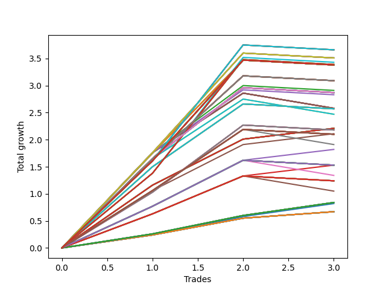

# Long HLT 105_POOLED_HITS 
- Symbol: TSLA
- Date Range: 01/10/2024 - 05/17/2024
- Trading Period: 8:30-12:30
- Number of Trades: 3



| Id. | Name | Win Percent | Profit | Avg Profit / Trade | Avg Time / Trade | Std |      | Name | Win Percent | Profit | Avg Profit / Trade | Avg Time / Trade | Std |
| --- | ---- | ----------- | ------ | ------------------ | ---------------- | --- | ---- | ---- | ----------- | ------ | ------------------ | ---------------- | --- |
| | Sorted By <br> Profit | | | | | | | Sorted By <br> Win Percentage |||||
|0| TP-2 180m | 66.67 | 3.66 | 1.22 | 87:20 | 0.95 |     | TP-3 30m | 100.00 | 2.21 | 0.74 | 29:00 | 0.40 |
|1| TP-2 165m | 66.67 | 3.66 | 1.22 | 87:20 | 0.95 |     | TP-2.75 30m | 100.00 | 2.21 | 0.74 | 29:00 | 0.40 |
|2| TP-2 150m | 66.67 | 3.66 | 1.22 | 87:20 | 0.95 |     | TP-2.5 30m | 100.00 | 2.21 | 0.74 | 29:00 | 0.40 |
|3| TP-2 135m | 66.67 | 3.66 | 1.22 | 87:20 | 0.95 |     | TP-2.25 30m | 100.00 | 2.21 | 0.74 | 29:00 | 0.40 |
|4| TP-2 120m | 66.67 | 3.66 | 1.22 | 87:20 | 0.95 |     | TP-2 30m | 100.00 | 2.21 | 0.74 | 29:00 | 0.40 |
|5| TP-1.75 180m | 66.67 | 3.51 | 1.17 | 60:40 | 0.89 |     | TP-1.75 30m | 100.00 | 2.21 | 0.74 | 29:00 | 0.40 |
|6| TP-1.75 165m | 66.67 | 3.51 | 1.17 | 60:40 | 0.89 |     | TP-1.5 30m | 100.00 | 2.21 | 0.74 | 29:00 | 0.40 |
|7| TP-1.75 150m | 66.67 | 3.51 | 1.17 | 60:40 | 0.89 |     | TP-1.25 30m | 100.00 | 2.21 | 0.74 | 29:00 | 0.40 |
|8| TP-1.75 135m | 66.67 | 3.51 | 1.17 | 60:40 | 0.89 |     | TP-1 30m | 100.00 | 2.11 | 0.70 | 28:40 | 0.37 |
|9| TP-1.75 120m | 66.67 | 3.51 | 1.17 | 60:40 | 0.89 |     | TP-0.75 30m | 100.00 | 1.82 | 0.61 | 26:00 | 0.29 |
|10| TP-1.75 105m | 66.67 | 3.51 | 1.17 | 60:40 | 0.89 |     | TP-0.5 30m | 100.00 | 1.53 | 0.51 | 24:20 | 0.22 |
|11| TP-1.75 90m | 66.67 | 3.51 | 1.17 | 60:40 | 0.89 |     | TP-0.25 180m | 100.00 | 0.84 | 0.28 | 11:40 | 0.04 |
|12| TP-2 105m | 66.67 | 3.43 | 1.14 | 82:20 | 0.93 |     | TP-0.25 165m | 100.00 | 0.84 | 0.28 | 11:40 | 0.04 |
|13| TP-3 105m | 66.67 | 3.39 | 1.13 | 86:00 | 0.91 |     | TP-0.25 150m | 100.00 | 0.84 | 0.28 | 11:40 | 0.04 |
|14| TP-2.75 105m | 66.67 | 3.39 | 1.13 | 86:00 | 0.91 |     | TP-0.25 135m | 100.00 | 0.84 | 0.28 | 11:40 | 0.04 |
|15| TP-2.5 105m | 66.67 | 3.39 | 1.13 | 86:00 | 0.91 |     | TP-0.25 120m | 100.00 | 0.84 | 0.28 | 11:40 | 0.04 |
|16| TP-2.25 105m | 66.67 | 3.39 | 1.13 | 86:00 | 0.91 |     | TP-0.25 105m | 100.00 | 0.84 | 0.28 | 11:40 | 0.04 |
|17| TP-3 180m | 66.67 | 3.38 | 1.13 | 96:00 | 0.87 |     | TP-0.25 90m | 100.00 | 0.84 | 0.28 | 11:40 | 0.04 |
|18| TP-2.75 180m | 66.67 | 3.38 | 1.13 | 96:00 | 0.87 |     | TP-0.25 75m | 100.00 | 0.84 | 0.28 | 11:40 | 0.04 |
|19| TP-2.5 180m | 66.67 | 3.38 | 1.13 | 96:00 | 0.87 |     | TP-0.25 60m | 100.00 | 0.84 | 0.28 | 11:40 | 0.04 |
|20| TP-2.25 180m | 66.67 | 3.38 | 1.13 | 96:00 | 0.87 |     | TP-0.25 45m | 100.00 | 0.84 | 0.28 | 11:40 | 0.04 |
|21| TP-3 165m | 66.67 | 3.38 | 1.13 | 96:00 | 0.87 |     | TP-0.25 30m | 100.00 | 0.84 | 0.28 | 11:40 | 0.04 |
|22| TP-2.75 165m | 66.67 | 3.38 | 1.13 | 96:00 | 0.87 |     | TP-0.25 15m | 100.00 | 0.82 | 0.27 | 11:00 | 0.05 |
|23| TP-2.5 165m | 66.67 | 3.38 | 1.13 | 96:00 | 0.87 |     | TP-3 15m | 100.00 | 0.67 | 0.22 | 14:00 | 0.08 |
|24| TP-2.25 165m | 66.67 | 3.38 | 1.13 | 96:00 | 0.87 |     | TP-2.75 15m | 100.00 | 0.67 | 0.22 | 14:00 | 0.08 |
|25| TP-3 150m | 66.67 | 3.38 | 1.13 | 96:00 | 0.87 |     | TP-2.5 15m | 100.00 | 0.67 | 0.22 | 14:00 | 0.08 |
|26| TP-2.75 150m | 66.67 | 3.38 | 1.13 | 96:00 | 0.87 |     | TP-2.25 15m | 100.00 | 0.67 | 0.22 | 14:00 | 0.08 |
|27| TP-2.5 150m | 66.67 | 3.38 | 1.13 | 96:00 | 0.87 |     | TP-2 15m | 100.00 | 0.67 | 0.22 | 14:00 | 0.08 |
|28| TP-2.25 150m | 66.67 | 3.38 | 1.13 | 96:00 | 0.87 |     | TP-1.75 15m | 100.00 | 0.67 | 0.22 | 14:00 | 0.08 |
|29| TP-3 135m | 66.67 | 3.38 | 1.13 | 96:00 | 0.87 |     | TP-1.5 15m | 100.00 | 0.67 | 0.22 | 14:00 | 0.08 |
|30| TP-2.75 135m | 66.67 | 3.38 | 1.13 | 96:00 | 0.87 |     | TP-1.25 15m | 100.00 | 0.67 | 0.22 | 14:00 | 0.08 |
|31| TP-2.5 135m | 66.67 | 3.38 | 1.13 | 96:00 | 0.87 |     | TP-1 15m | 100.00 | 0.67 | 0.22 | 14:00 | 0.08 |
|32| TP-2.25 135m | 66.67 | 3.38 | 1.13 | 96:00 | 0.87 |     | TP-0.75 15m | 100.00 | 0.67 | 0.22 | 14:00 | 0.08 |
|33| TP-3 120m | 66.67 | 3.38 | 1.13 | 96:00 | 0.87 |     | TP-0.5 15m | 100.00 | 0.67 | 0.22 | 14:00 | 0.08 |
|34| TP-2.75 120m | 66.67 | 3.38 | 1.13 | 96:00 | 0.87 |     | TP-2 180m | 66.67 | 3.66 | 1.22 | 87:20 | 0.95 |
|35| TP-2.5 120m | 66.67 | 3.38 | 1.13 | 96:00 | 0.87 |     | TP-2 165m | 66.67 | 3.66 | 1.22 | 87:20 | 0.95 |
|36| TP-2.25 120m | 66.67 | 3.38 | 1.13 | 96:00 | 0.87 |     | TP-2 150m | 66.67 | 3.66 | 1.22 | 87:20 | 0.95 |
|37| TP-3 90m | 66.67 | 3.38 | 1.13 | 76:00 | 0.86 |     | TP-2 135m | 66.67 | 3.66 | 1.22 | 87:20 | 0.95 |
|38| TP-2.75 90m | 66.67 | 3.38 | 1.13 | 76:00 | 0.86 |     | TP-2 120m | 66.67 | 3.66 | 1.22 | 87:20 | 0.95 |
|39| TP-2.5 90m | 66.67 | 3.38 | 1.13 | 76:00 | 0.86 |     | TP-1.75 180m | 66.67 | 3.51 | 1.17 | 60:40 | 0.89 |
|40| TP-2.25 90m | 66.67 | 3.38 | 1.13 | 76:00 | 0.86 |     | TP-1.75 165m | 66.67 | 3.51 | 1.17 | 60:40 | 0.89 |
|41| TP-2 90m | 66.67 | 3.38 | 1.13 | 76:00 | 0.86 |     | TP-1.75 150m | 66.67 | 3.51 | 1.17 | 60:40 | 0.89 |
|42| TP-1.5 180m | 66.67 | 3.09 | 1.03 | 46:20 | 0.79 |     | TP-1.75 135m | 66.67 | 3.51 | 1.17 | 60:40 | 0.89 |
|43| TP-1.5 165m | 66.67 | 3.09 | 1.03 | 46:20 | 0.79 |     | TP-1.75 120m | 66.67 | 3.51 | 1.17 | 60:40 | 0.89 |
|44| TP-1.5 150m | 66.67 | 3.09 | 1.03 | 46:20 | 0.79 |     | TP-1.75 105m | 66.67 | 3.51 | 1.17 | 60:40 | 0.89 |
|45| TP-1.5 135m | 66.67 | 3.09 | 1.03 | 46:20 | 0.79 |     | TP-1.75 90m | 66.67 | 3.51 | 1.17 | 60:40 | 0.89 |
|46| TP-1.5 120m | 66.67 | 3.09 | 1.03 | 46:20 | 0.79 |     | TP-2 105m | 66.67 | 3.43 | 1.14 | 82:20 | 0.93 |
|47| TP-1.5 105m | 66.67 | 3.09 | 1.03 | 46:20 | 0.79 |     | TP-3 105m | 66.67 | 3.39 | 1.13 | 86:00 | 0.91 |
|48| TP-1.5 90m | 66.67 | 3.09 | 1.03 | 46:20 | 0.79 |     | TP-2.75 105m | 66.67 | 3.39 | 1.13 | 86:00 | 0.91 |
|49| TP-1.5 75m | 66.67 | 3.09 | 1.03 | 46:20 | 0.79 |     | TP-2.5 105m | 66.67 | 3.39 | 1.13 | 86:00 | 0.91 |
|50| TP-1.5 60m | 66.67 | 3.09 | 1.03 | 46:20 | 0.79 |     | TP-2.25 105m | 66.67 | 3.39 | 1.13 | 86:00 | 0.91 |
|51| TP-1.75 60m | 66.67 | 2.91 | 0.97 | 51:00 | 0.78 |     | TP-3 180m | 66.67 | 3.38 | 1.13 | 96:00 | 0.87 |
|52| TP-1.25 180m | 66.67 | 2.87 | 0.96 | 46:00 | 0.75 |     | TP-2.75 180m | 66.67 | 3.38 | 1.13 | 96:00 | 0.87 |
|53| TP-1.25 165m | 66.67 | 2.87 | 0.96 | 46:00 | 0.75 |     | TP-2.5 180m | 66.67 | 3.38 | 1.13 | 96:00 | 0.87 |
|54| TP-1.25 150m | 66.67 | 2.87 | 0.96 | 46:00 | 0.75 |     | TP-2.25 180m | 66.67 | 3.38 | 1.13 | 96:00 | 0.87 |
|55| TP-1.25 135m | 66.67 | 2.87 | 0.96 | 46:00 | 0.75 |     | TP-3 165m | 66.67 | 3.38 | 1.13 | 96:00 | 0.87 |
|56| TP-1.25 120m | 66.67 | 2.87 | 0.96 | 46:00 | 0.75 |     | TP-2.75 165m | 66.67 | 3.38 | 1.13 | 96:00 | 0.87 |
|57| TP-1.25 105m | 66.67 | 2.87 | 0.96 | 46:00 | 0.75 |     | TP-2.5 165m | 66.67 | 3.38 | 1.13 | 96:00 | 0.87 |
|58| TP-1.25 90m | 66.67 | 2.87 | 0.96 | 46:00 | 0.75 |     | TP-2.25 165m | 66.67 | 3.38 | 1.13 | 96:00 | 0.87 |
|59| TP-1.25 75m | 66.67 | 2.87 | 0.96 | 46:00 | 0.75 |     | TP-3 150m | 66.67 | 3.38 | 1.13 | 96:00 | 0.87 |
|60| TP-1.25 60m | 66.67 | 2.87 | 0.96 | 46:00 | 0.75 |     | TP-2.75 150m | 66.67 | 3.38 | 1.13 | 96:00 | 0.87 |
|61| TP-1.75 75m | 66.67 | 2.83 | 0.94 | 56:00 | 0.77 |     | TP-2.5 150m | 66.67 | 3.38 | 1.13 | 96:00 | 0.87 |
|62| TP-3 45m | 66.67 | 2.58 | 0.86 | 44:00 | 0.85 |     | TP-2.25 150m | 66.67 | 3.38 | 1.13 | 96:00 | 0.87 |
|63| TP-2.75 45m | 66.67 | 2.58 | 0.86 | 44:00 | 0.85 |     | TP-3 135m | 66.67 | 3.38 | 1.13 | 96:00 | 0.87 |
|64| TP-2.5 45m | 66.67 | 2.58 | 0.86 | 44:00 | 0.85 |     | TP-2.75 135m | 66.67 | 3.38 | 1.13 | 96:00 | 0.87 |
|65| TP-2.25 45m | 66.67 | 2.58 | 0.86 | 44:00 | 0.85 |     | TP-2.5 135m | 66.67 | 3.38 | 1.13 | 96:00 | 0.87 |
|66| TP-2 45m | 66.67 | 2.58 | 0.86 | 44:00 | 0.85 |     | TP-2.25 135m | 66.67 | 3.38 | 1.13 | 96:00 | 0.87 |
|67| TP-1.75 45m | 66.67 | 2.58 | 0.86 | 44:00 | 0.85 |     | TP-3 120m | 66.67 | 3.38 | 1.13 | 96:00 | 0.87 |
|68| TP-3 75m | 66.67 | 2.57 | 0.86 | 66:00 | 0.68 |     | TP-2.75 120m | 66.67 | 3.38 | 1.13 | 96:00 | 0.87 |
|69| TP-2.75 75m | 66.67 | 2.57 | 0.86 | 66:00 | 0.68 |     | TP-2.5 120m | 66.67 | 3.38 | 1.13 | 96:00 | 0.87 |
|70| TP-2.5 75m | 66.67 | 2.57 | 0.86 | 66:00 | 0.68 |     | TP-2.25 120m | 66.67 | 3.38 | 1.13 | 96:00 | 0.87 |
|71| TP-2.25 75m | 66.67 | 2.57 | 0.86 | 66:00 | 0.68 |     | TP-3 90m | 66.67 | 3.38 | 1.13 | 76:00 | 0.86 |
|72| TP-2 75m | 66.67 | 2.57 | 0.86 | 66:00 | 0.68 |     | TP-2.75 90m | 66.67 | 3.38 | 1.13 | 76:00 | 0.86 |
|73| TP-1.5 45m | 66.67 | 2.47 | 0.82 | 43:40 | 0.81 |     | TP-2.5 90m | 66.67 | 3.38 | 1.13 | 76:00 | 0.86 |
|74| TP-1.25 45m | 66.67 | 2.47 | 0.82 | 43:40 | 0.81 |     | TP-2.25 90m | 66.67 | 3.38 | 1.13 | 76:00 | 0.86 |
|75| TP-3 30m | 100.00 | 2.21 | 0.74 | 29:00 | 0.40 |     | TP-2 90m | 66.67 | 3.38 | 1.13 | 76:00 | 0.86 |
|76| TP-2.75 30m | 100.00 | 2.21 | 0.74 | 29:00 | 0.40 |     | TP-1.5 180m | 66.67 | 3.09 | 1.03 | 46:20 | 0.79 |
|77| TP-2.5 30m | 100.00 | 2.21 | 0.74 | 29:00 | 0.40 |     | TP-1.5 165m | 66.67 | 3.09 | 1.03 | 46:20 | 0.79 |
|78| TP-2.25 30m | 100.00 | 2.21 | 0.74 | 29:00 | 0.40 |     | TP-1.5 150m | 66.67 | 3.09 | 1.03 | 46:20 | 0.79 |
|79| TP-2 30m | 100.00 | 2.21 | 0.74 | 29:00 | 0.40 |     | TP-1.5 135m | 66.67 | 3.09 | 1.03 | 46:20 | 0.79 |
|80| TP-1.75 30m | 100.00 | 2.21 | 0.74 | 29:00 | 0.40 |     | TP-1.5 120m | 66.67 | 3.09 | 1.03 | 46:20 | 0.79 |
|81| TP-1.5 30m | 100.00 | 2.21 | 0.74 | 29:00 | 0.40 |     | TP-1.5 105m | 66.67 | 3.09 | 1.03 | 46:20 | 0.79 |
|82| TP-1.25 30m | 100.00 | 2.21 | 0.74 | 29:00 | 0.40 |     | TP-1.5 90m | 66.67 | 3.09 | 1.03 | 46:20 | 0.79 |
|83| TP-3 60m | 66.67 | 2.18 | 0.73 | 56:00 | 0.58 |     | TP-1.5 75m | 66.67 | 3.09 | 1.03 | 46:20 | 0.79 |
|84| TP-2.75 60m | 66.67 | 2.18 | 0.73 | 56:00 | 0.58 |     | TP-1.5 60m | 66.67 | 3.09 | 1.03 | 46:20 | 0.79 |
|85| TP-2.5 60m | 66.67 | 2.18 | 0.73 | 56:00 | 0.58 |     | TP-1.75 60m | 66.67 | 2.91 | 0.97 | 51:00 | 0.78 |
|86| TP-2.25 60m | 66.67 | 2.18 | 0.73 | 56:00 | 0.58 |     | TP-1.25 180m | 66.67 | 2.87 | 0.96 | 46:00 | 0.75 |
|87| TP-2 60m | 66.67 | 2.18 | 0.73 | 56:00 | 0.58 |     | TP-1.25 165m | 66.67 | 2.87 | 0.96 | 46:00 | 0.75 |
|88| TP-1 30m | 100.00 | 2.11 | 0.70 | 28:40 | 0.37 |     | TP-1.25 150m | 66.67 | 2.87 | 0.96 | 46:00 | 0.75 |
|89| TP-1 180m | 66.67 | 2.10 | 0.70 | 37:00 | 0.56 |     | TP-1.25 135m | 66.67 | 2.87 | 0.96 | 46:00 | 0.75 |
|90| TP-1 165m | 66.67 | 2.10 | 0.70 | 37:00 | 0.56 |     | TP-1.25 120m | 66.67 | 2.87 | 0.96 | 46:00 | 0.75 |
|91| TP-1 150m | 66.67 | 2.10 | 0.70 | 37:00 | 0.56 |     | TP-1.25 105m | 66.67 | 2.87 | 0.96 | 46:00 | 0.75 |
|92| TP-1 135m | 66.67 | 2.10 | 0.70 | 37:00 | 0.56 |     | TP-1.25 90m | 66.67 | 2.87 | 0.96 | 46:00 | 0.75 |
|93| TP-1 120m | 66.67 | 2.10 | 0.70 | 37:00 | 0.56 |     | TP-1.25 75m | 66.67 | 2.87 | 0.96 | 46:00 | 0.75 |
|94| TP-1 105m | 66.67 | 2.10 | 0.70 | 37:00 | 0.56 |     | TP-1.25 60m | 66.67 | 2.87 | 0.96 | 46:00 | 0.75 |
|95| TP-1 90m | 66.67 | 2.10 | 0.70 | 37:00 | 0.56 |     | TP-1.75 75m | 66.67 | 2.83 | 0.94 | 56:00 | 0.77 |
|96| TP-1 75m | 66.67 | 2.10 | 0.70 | 37:00 | 0.56 |     | TP-3 45m | 66.67 | 2.58 | 0.86 | 44:00 | 0.85 |
|97| TP-1 60m | 66.67 | 2.10 | 0.70 | 37:00 | 0.56 |     | TP-2.75 45m | 66.67 | 2.58 | 0.86 | 44:00 | 0.85 |
|98| TP-1 45m | 66.67 | 1.91 | 0.64 | 35:00 | 0.65 |     | TP-2.5 45m | 66.67 | 2.58 | 0.86 | 44:00 | 0.85 |
|99| TP-0.75 30m | 100.00 | 1.82 | 0.61 | 26:00 | 0.29 |     | TP-2.25 45m | 66.67 | 2.58 | 0.86 | 44:00 | 0.85 |
|100| TP-0.5 30m | 100.00 | 1.53 | 0.51 | 24:20 | 0.22 |     | TP-2 45m | 66.67 | 2.58 | 0.86 | 44:00 | 0.85 |
|101| TP-0.75 180m | 66.67 | 1.53 | 0.51 | 33:00 | 0.43 |     | TP-1.75 45m | 66.67 | 2.58 | 0.86 | 44:00 | 0.85 |
|102| TP-0.75 165m | 66.67 | 1.53 | 0.51 | 33:00 | 0.43 |     | TP-3 75m | 66.67 | 2.57 | 0.86 | 66:00 | 0.68 |
|103| TP-0.75 150m | 66.67 | 1.53 | 0.51 | 33:00 | 0.43 |     | TP-2.75 75m | 66.67 | 2.57 | 0.86 | 66:00 | 0.68 |
|104| TP-0.75 135m | 66.67 | 1.53 | 0.51 | 33:00 | 0.43 |     | TP-2.5 75m | 66.67 | 2.57 | 0.86 | 66:00 | 0.68 |
|105| TP-0.75 120m | 66.67 | 1.53 | 0.51 | 33:00 | 0.43 |     | TP-2.25 75m | 66.67 | 2.57 | 0.86 | 66:00 | 0.68 |
|106| TP-0.75 105m | 66.67 | 1.53 | 0.51 | 33:00 | 0.43 |     | TP-2 75m | 66.67 | 2.57 | 0.86 | 66:00 | 0.68 |
|107| TP-0.75 90m | 66.67 | 1.53 | 0.51 | 33:00 | 0.43 |     | TP-1.5 45m | 66.67 | 2.47 | 0.82 | 43:40 | 0.81 |
|108| TP-0.75 75m | 66.67 | 1.53 | 0.51 | 33:00 | 0.43 |     | TP-1.25 45m | 66.67 | 2.47 | 0.82 | 43:40 | 0.81 |
|109| TP-0.75 60m | 66.67 | 1.53 | 0.51 | 33:00 | 0.43 |     | TP-3 60m | 66.67 | 2.18 | 0.73 | 56:00 | 0.58 |
|110| TP-0.75 45m | 66.67 | 1.34 | 0.45 | 31:00 | 0.51 |     | TP-2.75 60m | 66.67 | 2.18 | 0.73 | 56:00 | 0.58 |
|111| TP-0.5 180m | 66.67 | 1.24 | 0.41 | 31:20 | 0.36 |     | TP-2.5 60m | 66.67 | 2.18 | 0.73 | 56:00 | 0.58 |
|112| TP-0.5 165m | 66.67 | 1.24 | 0.41 | 31:20 | 0.36 |     | TP-2.25 60m | 66.67 | 2.18 | 0.73 | 56:00 | 0.58 |
|113| TP-0.5 150m | 66.67 | 1.24 | 0.41 | 31:20 | 0.36 |     | TP-2 60m | 66.67 | 2.18 | 0.73 | 56:00 | 0.58 |
|114| TP-0.5 135m | 66.67 | 1.24 | 0.41 | 31:20 | 0.36 |     | TP-1 180m | 66.67 | 2.10 | 0.70 | 37:00 | 0.56 |
|115| TP-0.5 120m | 66.67 | 1.24 | 0.41 | 31:20 | 0.36 |     | TP-1 165m | 66.67 | 2.10 | 0.70 | 37:00 | 0.56 |
|116| TP-0.5 105m | 66.67 | 1.24 | 0.41 | 31:20 | 0.36 |     | TP-1 150m | 66.67 | 2.10 | 0.70 | 37:00 | 0.56 |
|117| TP-0.5 90m | 66.67 | 1.24 | 0.41 | 31:20 | 0.36 |     | TP-1 135m | 66.67 | 2.10 | 0.70 | 37:00 | 0.56 |
|118| TP-0.5 75m | 66.67 | 1.24 | 0.41 | 31:20 | 0.36 |     | TP-1 120m | 66.67 | 2.10 | 0.70 | 37:00 | 0.56 |
|119| TP-0.5 60m | 66.67 | 1.24 | 0.41 | 31:20 | 0.36 |     | TP-1 105m | 66.67 | 2.10 | 0.70 | 37:00 | 0.56 |
|120| TP-0.5 45m | 66.67 | 1.05 | 0.35 | 29:20 | 0.45 |     | TP-1 90m | 66.67 | 2.10 | 0.70 | 37:00 | 0.56 |
|121| TP-0.25 180m | 100.00 | 0.84 | 0.28 | 11:40 | 0.04 |     | TP-1 75m | 66.67 | 2.10 | 0.70 | 37:00 | 0.56 |
|122| TP-0.25 165m | 100.00 | 0.84 | 0.28 | 11:40 | 0.04 |     | TP-1 60m | 66.67 | 2.10 | 0.70 | 37:00 | 0.56 |
|123| TP-0.25 150m | 100.00 | 0.84 | 0.28 | 11:40 | 0.04 |     | TP-1 45m | 66.67 | 1.91 | 0.64 | 35:00 | 0.65 |
|124| TP-0.25 135m | 100.00 | 0.84 | 0.28 | 11:40 | 0.04 |     | TP-0.75 180m | 66.67 | 1.53 | 0.51 | 33:00 | 0.43 |
|125| TP-0.25 120m | 100.00 | 0.84 | 0.28 | 11:40 | 0.04 |     | TP-0.75 165m | 66.67 | 1.53 | 0.51 | 33:00 | 0.43 |
|126| TP-0.25 105m | 100.00 | 0.84 | 0.28 | 11:40 | 0.04 |     | TP-0.75 150m | 66.67 | 1.53 | 0.51 | 33:00 | 0.43 |
|127| TP-0.25 90m | 100.00 | 0.84 | 0.28 | 11:40 | 0.04 |     | TP-0.75 135m | 66.67 | 1.53 | 0.51 | 33:00 | 0.43 |
|128| TP-0.25 75m | 100.00 | 0.84 | 0.28 | 11:40 | 0.04 |     | TP-0.75 120m | 66.67 | 1.53 | 0.51 | 33:00 | 0.43 |
|129| TP-0.25 60m | 100.00 | 0.84 | 0.28 | 11:40 | 0.04 |     | TP-0.75 105m | 66.67 | 1.53 | 0.51 | 33:00 | 0.43 |
|130| TP-0.25 45m | 100.00 | 0.84 | 0.28 | 11:40 | 0.04 |     | TP-0.75 90m | 66.67 | 1.53 | 0.51 | 33:00 | 0.43 |
|131| TP-0.25 30m | 100.00 | 0.84 | 0.28 | 11:40 | 0.04 |     | TP-0.75 75m | 66.67 | 1.53 | 0.51 | 33:00 | 0.43 |
|132| TP-0.25 15m | 100.00 | 0.82 | 0.27 | 11:00 | 0.05 |     | TP-0.75 60m | 66.67 | 1.53 | 0.51 | 33:00 | 0.43 |
|133| TP-3 15m | 100.00 | 0.67 | 0.22 | 14:00 | 0.08 |     | TP-0.75 45m | 66.67 | 1.34 | 0.45 | 31:00 | 0.51 |
|134| TP-2.75 15m | 100.00 | 0.67 | 0.22 | 14:00 | 0.08 |     | TP-0.5 180m | 66.67 | 1.24 | 0.41 | 31:20 | 0.36 |
|135| TP-2.5 15m | 100.00 | 0.67 | 0.22 | 14:00 | 0.08 |     | TP-0.5 165m | 66.67 | 1.24 | 0.41 | 31:20 | 0.36 |
|136| TP-2.25 15m | 100.00 | 0.67 | 0.22 | 14:00 | 0.08 |     | TP-0.5 150m | 66.67 | 1.24 | 0.41 | 31:20 | 0.36 |
|137| TP-2 15m | 100.00 | 0.67 | 0.22 | 14:00 | 0.08 |     | TP-0.5 135m | 66.67 | 1.24 | 0.41 | 31:20 | 0.36 |
|138| TP-1.75 15m | 100.00 | 0.67 | 0.22 | 14:00 | 0.08 |     | TP-0.5 120m | 66.67 | 1.24 | 0.41 | 31:20 | 0.36 |
|139| TP-1.5 15m | 100.00 | 0.67 | 0.22 | 14:00 | 0.08 |     | TP-0.5 105m | 66.67 | 1.24 | 0.41 | 31:20 | 0.36 |
|140| TP-1.25 15m | 100.00 | 0.67 | 0.22 | 14:00 | 0.08 |     | TP-0.5 90m | 66.67 | 1.24 | 0.41 | 31:20 | 0.36 |
|141| TP-1 15m | 100.00 | 0.67 | 0.22 | 14:00 | 0.08 |     | TP-0.5 75m | 66.67 | 1.24 | 0.41 | 31:20 | 0.36 |
|142| TP-0.75 15m | 100.00 | 0.67 | 0.22 | 14:00 | 0.08 |     | TP-0.5 60m | 66.67 | 1.24 | 0.41 | 31:20 | 0.36 |
|143| TP-0.5 15m | 100.00 | 0.67 | 0.22 | 14:00 | 0.08 |     | TP-0.5 45m | 66.67 | 1.05 | 0.35 | 29:20 | 0.45 |

### Test TP-0.25 15m
* Take Profit of 0.25 Point
* 0.25 Stoploss
* Results:
```
Total Trades: 3
Percent Up: 100.00
Percent Down: 0.00
Total Points Moved Up: 0.82
Potential Profit: 410.00
Total Points Ups: 0.82 Count Ups: 3
Total Points Downs: 0.00 Count Downs: 0
```

<details><summary>Trades</summary>

<code>In: 2024-04-22 08:35:00		Out: 2024-04-22 08:49:00		Total Position Time: 14:00		Total Move Up: 0.24		Total to Date: 0.24</code> <br />
<code>In: 2024-03-15 10:10:00		Out: 2024-03-15 10:21:00		Total Position Time: 11:00		Total Move Up: 0.34		Total to Date: 0.58</code> <br />
<code>In: 2024-05-07 12:00:00		Out: 2024-05-07 12:08:00		Total Position Time: 08:00		Total Move Up: 0.24		Total to Date: 0.82</code> <br />


</details>

### Test TP-0.5 15m
* Take Profit of 0.5 Point
* 0.5 Stoploss
* Results:
```
Total Trades: 3
Percent Up: 100.00
Percent Down: 0.00
Total Points Moved Up: 0.67
Potential Profit: 335.00
Total Points Ups: 0.67 Count Ups: 3
Total Points Downs: 0.00 Count Downs: 0
```

<details><summary>Trades</summary>

<code>In: 2024-04-22 08:35:00		Out: 2024-04-22 08:49:00		Total Position Time: 14:00		Total Move Up: 0.24		Total to Date: 0.24</code> <br />
<code>In: 2024-03-15 10:10:00		Out: 2024-03-15 10:24:00		Total Position Time: 14:00		Total Move Up: 0.31		Total to Date: 0.55</code> <br />
<code>In: 2024-05-07 12:00:00		Out: 2024-05-07 12:14:00		Total Position Time: 14:00		Total Move Up: 0.12		Total to Date: 0.67</code> <br />


</details>

### Test TP-0.75 15m
* Take Profit of 0.75 Point
* 0.75 Stoploss
* Results:
```
Total Trades: 3
Percent Up: 100.00
Percent Down: 0.00
Total Points Moved Up: 0.67
Potential Profit: 335.00
Total Points Ups: 0.67 Count Ups: 3
Total Points Downs: 0.00 Count Downs: 0
```

<details><summary>Trades</summary>

<code>In: 2024-04-22 08:35:00		Out: 2024-04-22 08:49:00		Total Position Time: 14:00		Total Move Up: 0.24		Total to Date: 0.24</code> <br />
<code>In: 2024-03-15 10:10:00		Out: 2024-03-15 10:24:00		Total Position Time: 14:00		Total Move Up: 0.31		Total to Date: 0.55</code> <br />
<code>In: 2024-05-07 12:00:00		Out: 2024-05-07 12:14:00		Total Position Time: 14:00		Total Move Up: 0.12		Total to Date: 0.67</code> <br />


</details>

### Test TP-1 15m
* Take Profit of 1 Point
* 1 Stoploss
* Results:
```
Total Trades: 3
Percent Up: 100.00
Percent Down: 0.00
Total Points Moved Up: 0.67
Potential Profit: 335.00
Total Points Ups: 0.67 Count Ups: 3
Total Points Downs: 0.00 Count Downs: 0
```

<details><summary>Trades</summary>

<code>In: 2024-04-22 08:35:00		Out: 2024-04-22 08:49:00		Total Position Time: 14:00		Total Move Up: 0.24		Total to Date: 0.24</code> <br />
<code>In: 2024-03-15 10:10:00		Out: 2024-03-15 10:24:00		Total Position Time: 14:00		Total Move Up: 0.31		Total to Date: 0.55</code> <br />
<code>In: 2024-05-07 12:00:00		Out: 2024-05-07 12:14:00		Total Position Time: 14:00		Total Move Up: 0.12		Total to Date: 0.67</code> <br />


</details>

### Test TP-1.25 15m
* Take Profit of 1.25 Point
* 1.25 Stoploss
* Results:
```
Total Trades: 3
Percent Up: 100.00
Percent Down: 0.00
Total Points Moved Up: 0.67
Potential Profit: 335.00
Total Points Ups: 0.67 Count Ups: 3
Total Points Downs: 0.00 Count Downs: 0
```

<details><summary>Trades</summary>

<code>In: 2024-04-22 08:35:00		Out: 2024-04-22 08:49:00		Total Position Time: 14:00		Total Move Up: 0.24		Total to Date: 0.24</code> <br />
<code>In: 2024-03-15 10:10:00		Out: 2024-03-15 10:24:00		Total Position Time: 14:00		Total Move Up: 0.31		Total to Date: 0.55</code> <br />
<code>In: 2024-05-07 12:00:00		Out: 2024-05-07 12:14:00		Total Position Time: 14:00		Total Move Up: 0.12		Total to Date: 0.67</code> <br />


</details>

### Test TP-1.5 15m
* Take Profit of 1.5 Point
* 1.5 Stoploss
* Results:
```
Total Trades: 3
Percent Up: 100.00
Percent Down: 0.00
Total Points Moved Up: 0.67
Potential Profit: 335.00
Total Points Ups: 0.67 Count Ups: 3
Total Points Downs: 0.00 Count Downs: 0
```

<details><summary>Trades</summary>

<code>In: 2024-04-22 08:35:00		Out: 2024-04-22 08:49:00		Total Position Time: 14:00		Total Move Up: 0.24		Total to Date: 0.24</code> <br />
<code>In: 2024-03-15 10:10:00		Out: 2024-03-15 10:24:00		Total Position Time: 14:00		Total Move Up: 0.31		Total to Date: 0.55</code> <br />
<code>In: 2024-05-07 12:00:00		Out: 2024-05-07 12:14:00		Total Position Time: 14:00		Total Move Up: 0.12		Total to Date: 0.67</code> <br />


</details>

### Test TP-1.75 15m
* Take Profit of 1.75 Point
* 1.75 Stoploss
* Results:
```
Total Trades: 3
Percent Up: 100.00
Percent Down: 0.00
Total Points Moved Up: 0.67
Potential Profit: 335.00
Total Points Ups: 0.67 Count Ups: 3
Total Points Downs: 0.00 Count Downs: 0
```

<details><summary>Trades</summary>

<code>In: 2024-04-22 08:35:00		Out: 2024-04-22 08:49:00		Total Position Time: 14:00		Total Move Up: 0.24		Total to Date: 0.24</code> <br />
<code>In: 2024-03-15 10:10:00		Out: 2024-03-15 10:24:00		Total Position Time: 14:00		Total Move Up: 0.31		Total to Date: 0.55</code> <br />
<code>In: 2024-05-07 12:00:00		Out: 2024-05-07 12:14:00		Total Position Time: 14:00		Total Move Up: 0.12		Total to Date: 0.67</code> <br />


</details>

### Test TP-2 15m
* Take Profit of 2 Point
* 2 Stoploss
* Results:
```
Total Trades: 3
Percent Up: 100.00
Percent Down: 0.00
Total Points Moved Up: 0.67
Potential Profit: 335.00
Total Points Ups: 0.67 Count Ups: 3
Total Points Downs: 0.00 Count Downs: 0
```

<details><summary>Trades</summary>

<code>In: 2024-04-22 08:35:00		Out: 2024-04-22 08:49:00		Total Position Time: 14:00		Total Move Up: 0.24		Total to Date: 0.24</code> <br />
<code>In: 2024-03-15 10:10:00		Out: 2024-03-15 10:24:00		Total Position Time: 14:00		Total Move Up: 0.31		Total to Date: 0.55</code> <br />
<code>In: 2024-05-07 12:00:00		Out: 2024-05-07 12:14:00		Total Position Time: 14:00		Total Move Up: 0.12		Total to Date: 0.67</code> <br />


</details>

### Test TP-2.25 15m
* Take Profit of 2.25 Point
* 2.25 Stoploss
* Results:
```
Total Trades: 3
Percent Up: 100.00
Percent Down: 0.00
Total Points Moved Up: 0.67
Potential Profit: 335.00
Total Points Ups: 0.67 Count Ups: 3
Total Points Downs: 0.00 Count Downs: 0
```

<details><summary>Trades</summary>

<code>In: 2024-04-22 08:35:00		Out: 2024-04-22 08:49:00		Total Position Time: 14:00		Total Move Up: 0.24		Total to Date: 0.24</code> <br />
<code>In: 2024-03-15 10:10:00		Out: 2024-03-15 10:24:00		Total Position Time: 14:00		Total Move Up: 0.31		Total to Date: 0.55</code> <br />
<code>In: 2024-05-07 12:00:00		Out: 2024-05-07 12:14:00		Total Position Time: 14:00		Total Move Up: 0.12		Total to Date: 0.67</code> <br />


</details>

### Test TP-2.5 15m
* Take Profit of 2.5 Point
* 2.5 Stoploss
* Results:
```
Total Trades: 3
Percent Up: 100.00
Percent Down: 0.00
Total Points Moved Up: 0.67
Potential Profit: 335.00
Total Points Ups: 0.67 Count Ups: 3
Total Points Downs: 0.00 Count Downs: 0
```

<details><summary>Trades</summary>

<code>In: 2024-04-22 08:35:00		Out: 2024-04-22 08:49:00		Total Position Time: 14:00		Total Move Up: 0.24		Total to Date: 0.24</code> <br />
<code>In: 2024-03-15 10:10:00		Out: 2024-03-15 10:24:00		Total Position Time: 14:00		Total Move Up: 0.31		Total to Date: 0.55</code> <br />
<code>In: 2024-05-07 12:00:00		Out: 2024-05-07 12:14:00		Total Position Time: 14:00		Total Move Up: 0.12		Total to Date: 0.67</code> <br />


</details>

### Test TP-2.75 15m
* Take Profit of 2.75 Point
* 2.75 Stoploss
* Results:
```
Total Trades: 3
Percent Up: 100.00
Percent Down: 0.00
Total Points Moved Up: 0.67
Potential Profit: 335.00
Total Points Ups: 0.67 Count Ups: 3
Total Points Downs: 0.00 Count Downs: 0
```

<details><summary>Trades</summary>

<code>In: 2024-04-22 08:35:00		Out: 2024-04-22 08:49:00		Total Position Time: 14:00		Total Move Up: 0.24		Total to Date: 0.24</code> <br />
<code>In: 2024-03-15 10:10:00		Out: 2024-03-15 10:24:00		Total Position Time: 14:00		Total Move Up: 0.31		Total to Date: 0.55</code> <br />
<code>In: 2024-05-07 12:00:00		Out: 2024-05-07 12:14:00		Total Position Time: 14:00		Total Move Up: 0.12		Total to Date: 0.67</code> <br />


</details>

### Test TP-3 15m
* Take Profit of 3 Point
* 3 Stoploss
* Results:
```
Total Trades: 3
Percent Up: 100.00
Percent Down: 0.00
Total Points Moved Up: 0.67
Potential Profit: 335.00
Total Points Ups: 0.67 Count Ups: 3
Total Points Downs: 0.00 Count Downs: 0
```

<details><summary>Trades</summary>

<code>In: 2024-04-22 08:35:00		Out: 2024-04-22 08:49:00		Total Position Time: 14:00		Total Move Up: 0.24		Total to Date: 0.24</code> <br />
<code>In: 2024-03-15 10:10:00		Out: 2024-03-15 10:24:00		Total Position Time: 14:00		Total Move Up: 0.31		Total to Date: 0.55</code> <br />
<code>In: 2024-05-07 12:00:00		Out: 2024-05-07 12:14:00		Total Position Time: 14:00		Total Move Up: 0.12		Total to Date: 0.67</code> <br />


</details>

### Test TP-0.25 30m
* Take Profit of 0.25 Point
* 0.25 Stoploss
* Results:
```
Total Trades: 3
Percent Up: 100.00
Percent Down: 0.00
Total Points Moved Up: 0.84
Potential Profit: 420.00
Total Points Ups: 0.84 Count Ups: 3
Total Points Downs: 0.00 Count Downs: 0
```

<details><summary>Trades</summary>

<code>In: 2024-04-22 08:35:00		Out: 2024-04-22 08:51:00		Total Position Time: 16:00		Total Move Up: 0.26		Total to Date: 0.26</code> <br />
<code>In: 2024-03-15 10:10:00		Out: 2024-03-15 10:21:00		Total Position Time: 11:00		Total Move Up: 0.34		Total to Date: 0.60</code> <br />
<code>In: 2024-05-07 12:00:00		Out: 2024-05-07 12:08:00		Total Position Time: 08:00		Total Move Up: 0.24		Total to Date: 0.84</code> <br />


</details>

### Test TP-0.5 30m
* Take Profit of 0.5 Point
* 0.5 Stoploss
* Results:
```
Total Trades: 3
Percent Up: 100.00
Percent Down: 0.00
Total Points Moved Up: 1.53
Potential Profit: 765.00
Total Points Ups: 1.53 Count Ups: 3
Total Points Downs: 0.00 Count Downs: 0
```

<details><summary>Trades</summary>

<code>In: 2024-04-22 08:35:00		Out: 2024-04-22 08:53:00		Total Position Time: 18:00		Total Move Up: 0.63		Total to Date: 0.63</code> <br />
<code>In: 2024-03-15 10:10:00		Out: 2024-03-15 10:36:00		Total Position Time: 26:00		Total Move Up: 0.70		Total to Date: 1.33</code> <br />
<code>In: 2024-05-07 12:00:00		Out: 2024-05-07 12:29:00		Total Position Time: 29:00		Total Move Up: 0.20		Total to Date: 1.53</code> <br />


</details>

### Test TP-0.75 30m
* Take Profit of 0.75 Point
* 0.75 Stoploss
* Results:
```
Total Trades: 3
Percent Up: 100.00
Percent Down: 0.00
Total Points Moved Up: 1.82
Potential Profit: 910.00
Total Points Ups: 1.82 Count Ups: 3
Total Points Downs: 0.00 Count Downs: 0
```

<details><summary>Trades</summary>

<code>In: 2024-04-22 08:35:00		Out: 2024-04-22 08:57:00		Total Position Time: 22:00		Total Move Up: 0.77		Total to Date: 0.77</code> <br />
<code>In: 2024-03-15 10:10:00		Out: 2024-03-15 10:37:00		Total Position Time: 27:00		Total Move Up: 0.85		Total to Date: 1.62</code> <br />
<code>In: 2024-05-07 12:00:00		Out: 2024-05-07 12:29:00		Total Position Time: 29:00		Total Move Up: 0.20		Total to Date: 1.82</code> <br />


</details>

### Test TP-1 30m
* Take Profit of 1 Point
* 1 Stoploss
* Results:
```
Total Trades: 3
Percent Up: 100.00
Percent Down: 0.00
Total Points Moved Up: 2.11
Potential Profit: 1055.00
Total Points Ups: 2.11 Count Ups: 3
Total Points Downs: 0.00 Count Downs: 0
```

<details><summary>Trades</summary>

<code>In: 2024-04-22 08:35:00		Out: 2024-04-22 09:03:00		Total Position Time: 28:00		Total Move Up: 1.06		Total to Date: 1.06</code> <br />
<code>In: 2024-03-15 10:10:00		Out: 2024-03-15 10:39:00		Total Position Time: 29:00		Total Move Up: 0.85		Total to Date: 1.91</code> <br />
<code>In: 2024-05-07 12:00:00		Out: 2024-05-07 12:29:00		Total Position Time: 29:00		Total Move Up: 0.20		Total to Date: 2.11</code> <br />


</details>

### Test TP-1.25 30m
* Take Profit of 1.25 Point
* 1.25 Stoploss
* Results:
```
Total Trades: 3
Percent Up: 100.00
Percent Down: 0.00
Total Points Moved Up: 2.21
Potential Profit: 1105.00
Total Points Ups: 2.21 Count Ups: 3
Total Points Downs: 0.00 Count Downs: 0
```

<details><summary>Trades</summary>

<code>In: 2024-04-22 08:35:00		Out: 2024-04-22 09:04:00		Total Position Time: 29:00		Total Move Up: 1.16		Total to Date: 1.16</code> <br />
<code>In: 2024-03-15 10:10:00		Out: 2024-03-15 10:39:00		Total Position Time: 29:00		Total Move Up: 0.85		Total to Date: 2.01</code> <br />
<code>In: 2024-05-07 12:00:00		Out: 2024-05-07 12:29:00		Total Position Time: 29:00		Total Move Up: 0.20		Total to Date: 2.21</code> <br />


</details>

### Test TP-1.5 30m
* Take Profit of 1.5 Point
* 1.5 Stoploss
* Results:
```
Total Trades: 3
Percent Up: 100.00
Percent Down: 0.00
Total Points Moved Up: 2.21
Potential Profit: 1105.00
Total Points Ups: 2.21 Count Ups: 3
Total Points Downs: 0.00 Count Downs: 0
```

<details><summary>Trades</summary>

<code>In: 2024-04-22 08:35:00		Out: 2024-04-22 09:04:00		Total Position Time: 29:00		Total Move Up: 1.16		Total to Date: 1.16</code> <br />
<code>In: 2024-03-15 10:10:00		Out: 2024-03-15 10:39:00		Total Position Time: 29:00		Total Move Up: 0.85		Total to Date: 2.01</code> <br />
<code>In: 2024-05-07 12:00:00		Out: 2024-05-07 12:29:00		Total Position Time: 29:00		Total Move Up: 0.20		Total to Date: 2.21</code> <br />


</details>

### Test TP-1.75 30m
* Take Profit of 1.75 Point
* 1.75 Stoploss
* Results:
```
Total Trades: 3
Percent Up: 100.00
Percent Down: 0.00
Total Points Moved Up: 2.21
Potential Profit: 1105.00
Total Points Ups: 2.21 Count Ups: 3
Total Points Downs: 0.00 Count Downs: 0
```

<details><summary>Trades</summary>

<code>In: 2024-04-22 08:35:00		Out: 2024-04-22 09:04:00		Total Position Time: 29:00		Total Move Up: 1.16		Total to Date: 1.16</code> <br />
<code>In: 2024-03-15 10:10:00		Out: 2024-03-15 10:39:00		Total Position Time: 29:00		Total Move Up: 0.85		Total to Date: 2.01</code> <br />
<code>In: 2024-05-07 12:00:00		Out: 2024-05-07 12:29:00		Total Position Time: 29:00		Total Move Up: 0.20		Total to Date: 2.21</code> <br />


</details>

### Test TP-2 30m
* Take Profit of 2 Point
* 2 Stoploss
* Results:
```
Total Trades: 3
Percent Up: 100.00
Percent Down: 0.00
Total Points Moved Up: 2.21
Potential Profit: 1105.00
Total Points Ups: 2.21 Count Ups: 3
Total Points Downs: 0.00 Count Downs: 0
```

<details><summary>Trades</summary>

<code>In: 2024-04-22 08:35:00		Out: 2024-04-22 09:04:00		Total Position Time: 29:00		Total Move Up: 1.16		Total to Date: 1.16</code> <br />
<code>In: 2024-03-15 10:10:00		Out: 2024-03-15 10:39:00		Total Position Time: 29:00		Total Move Up: 0.85		Total to Date: 2.01</code> <br />
<code>In: 2024-05-07 12:00:00		Out: 2024-05-07 12:29:00		Total Position Time: 29:00		Total Move Up: 0.20		Total to Date: 2.21</code> <br />


</details>

### Test TP-2.25 30m
* Take Profit of 2.25 Point
* 2.25 Stoploss
* Results:
```
Total Trades: 3
Percent Up: 100.00
Percent Down: 0.00
Total Points Moved Up: 2.21
Potential Profit: 1105.00
Total Points Ups: 2.21 Count Ups: 3
Total Points Downs: 0.00 Count Downs: 0
```

<details><summary>Trades</summary>

<code>In: 2024-04-22 08:35:00		Out: 2024-04-22 09:04:00		Total Position Time: 29:00		Total Move Up: 1.16		Total to Date: 1.16</code> <br />
<code>In: 2024-03-15 10:10:00		Out: 2024-03-15 10:39:00		Total Position Time: 29:00		Total Move Up: 0.85		Total to Date: 2.01</code> <br />
<code>In: 2024-05-07 12:00:00		Out: 2024-05-07 12:29:00		Total Position Time: 29:00		Total Move Up: 0.20		Total to Date: 2.21</code> <br />


</details>

### Test TP-2.5 30m
* Take Profit of 2.5 Point
* 2.5 Stoploss
* Results:
```
Total Trades: 3
Percent Up: 100.00
Percent Down: 0.00
Total Points Moved Up: 2.21
Potential Profit: 1105.00
Total Points Ups: 2.21 Count Ups: 3
Total Points Downs: 0.00 Count Downs: 0
```

<details><summary>Trades</summary>

<code>In: 2024-04-22 08:35:00		Out: 2024-04-22 09:04:00		Total Position Time: 29:00		Total Move Up: 1.16		Total to Date: 1.16</code> <br />
<code>In: 2024-03-15 10:10:00		Out: 2024-03-15 10:39:00		Total Position Time: 29:00		Total Move Up: 0.85		Total to Date: 2.01</code> <br />
<code>In: 2024-05-07 12:00:00		Out: 2024-05-07 12:29:00		Total Position Time: 29:00		Total Move Up: 0.20		Total to Date: 2.21</code> <br />


</details>

### Test TP-2.75 30m
* Take Profit of 2.75 Point
* 2.75 Stoploss
* Results:
```
Total Trades: 3
Percent Up: 100.00
Percent Down: 0.00
Total Points Moved Up: 2.21
Potential Profit: 1105.00
Total Points Ups: 2.21 Count Ups: 3
Total Points Downs: 0.00 Count Downs: 0
```

<details><summary>Trades</summary>

<code>In: 2024-04-22 08:35:00		Out: 2024-04-22 09:04:00		Total Position Time: 29:00		Total Move Up: 1.16		Total to Date: 1.16</code> <br />
<code>In: 2024-03-15 10:10:00		Out: 2024-03-15 10:39:00		Total Position Time: 29:00		Total Move Up: 0.85		Total to Date: 2.01</code> <br />
<code>In: 2024-05-07 12:00:00		Out: 2024-05-07 12:29:00		Total Position Time: 29:00		Total Move Up: 0.20		Total to Date: 2.21</code> <br />


</details>

### Test TP-3 30m
* Take Profit of 3 Point
* 3 Stoploss
* Results:
```
Total Trades: 3
Percent Up: 100.00
Percent Down: 0.00
Total Points Moved Up: 2.21
Potential Profit: 1105.00
Total Points Ups: 2.21 Count Ups: 3
Total Points Downs: 0.00 Count Downs: 0
```

<details><summary>Trades</summary>

<code>In: 2024-04-22 08:35:00		Out: 2024-04-22 09:04:00		Total Position Time: 29:00		Total Move Up: 1.16		Total to Date: 1.16</code> <br />
<code>In: 2024-03-15 10:10:00		Out: 2024-03-15 10:39:00		Total Position Time: 29:00		Total Move Up: 0.85		Total to Date: 2.01</code> <br />
<code>In: 2024-05-07 12:00:00		Out: 2024-05-07 12:29:00		Total Position Time: 29:00		Total Move Up: 0.20		Total to Date: 2.21</code> <br />


</details>

### Test TP-0.25 45m
* Take Profit of 0.25 Point
* 0.25 Stoploss
* Results:
```
Total Trades: 3
Percent Up: 100.00
Percent Down: 0.00
Total Points Moved Up: 0.84
Potential Profit: 420.00
Total Points Ups: 0.84 Count Ups: 3
Total Points Downs: 0.00 Count Downs: 0
```

<details><summary>Trades</summary>

<code>In: 2024-04-22 08:35:00		Out: 2024-04-22 08:51:00		Total Position Time: 16:00		Total Move Up: 0.26		Total to Date: 0.26</code> <br />
<code>In: 2024-03-15 10:10:00		Out: 2024-03-15 10:21:00		Total Position Time: 11:00		Total Move Up: 0.34		Total to Date: 0.60</code> <br />
<code>In: 2024-05-07 12:00:00		Out: 2024-05-07 12:08:00		Total Position Time: 08:00		Total Move Up: 0.24		Total to Date: 0.84</code> <br />


</details>

### Test TP-0.5 45m
* Take Profit of 0.5 Point
* 0.5 Stoploss
* Results:
```
Total Trades: 3
Percent Up: 66.67
Percent Down: 33.33
Total Points Moved Up: 1.05
Potential Profit: 525.00
Total Points Ups: 1.33 Count Ups: 2
Total Points Downs: -0.28 Count Downs: 1
```

<details><summary>Trades</summary>

<code>In: 2024-04-22 08:35:00		Out: 2024-04-22 08:53:00		Total Position Time: 18:00		Total Move Up: 0.63		Total to Date: 0.63</code> <br />
<code>In: 2024-03-15 10:10:00		Out: 2024-03-15 10:36:00		Total Position Time: 26:00		Total Move Up: 0.70		Total to Date: 1.33</code> <br />
<code>In: 2024-05-07 12:00:00		Out: 2024-05-07 12:44:00		Total Position Time: 44:00		Total Move Up: -0.28		Total to Date: 1.05</code> <br />


</details>

### Test TP-0.75 45m
* Take Profit of 0.75 Point
* 0.75 Stoploss
* Results:
```
Total Trades: 3
Percent Up: 66.67
Percent Down: 33.33
Total Points Moved Up: 1.34
Potential Profit: 670.00
Total Points Ups: 1.62 Count Ups: 2
Total Points Downs: -0.28 Count Downs: 1
```

<details><summary>Trades</summary>

<code>In: 2024-04-22 08:35:00		Out: 2024-04-22 08:57:00		Total Position Time: 22:00		Total Move Up: 0.77		Total to Date: 0.77</code> <br />
<code>In: 2024-03-15 10:10:00		Out: 2024-03-15 10:37:00		Total Position Time: 27:00		Total Move Up: 0.85		Total to Date: 1.62</code> <br />
<code>In: 2024-05-07 12:00:00		Out: 2024-05-07 12:44:00		Total Position Time: 44:00		Total Move Up: -0.28		Total to Date: 1.34</code> <br />


</details>

### Test TP-1 45m
* Take Profit of 1 Point
* 1 Stoploss
* Results:
```
Total Trades: 3
Percent Up: 66.67
Percent Down: 33.33
Total Points Moved Up: 1.91
Potential Profit: 955.00
Total Points Ups: 2.19 Count Ups: 2
Total Points Downs: -0.28 Count Downs: 1
```

<details><summary>Trades</summary>

<code>In: 2024-04-22 08:35:00		Out: 2024-04-22 09:03:00		Total Position Time: 28:00		Total Move Up: 1.06		Total to Date: 1.06</code> <br />
<code>In: 2024-03-15 10:10:00		Out: 2024-03-15 10:43:00		Total Position Time: 33:00		Total Move Up: 1.13		Total to Date: 2.19</code> <br />
<code>In: 2024-05-07 12:00:00		Out: 2024-05-07 12:44:00		Total Position Time: 44:00		Total Move Up: -0.28		Total to Date: 1.91</code> <br />


</details>

### Test TP-1.25 45m
* Take Profit of 1.25 Point
* 1.25 Stoploss
* Results:
```
Total Trades: 3
Percent Up: 66.67
Percent Down: 33.33
Total Points Moved Up: 2.47
Potential Profit: 1235.00
Total Points Ups: 2.75 Count Ups: 2
Total Points Downs: -0.28 Count Downs: 1
```

<details><summary>Trades</summary>

<code>In: 2024-04-22 08:35:00		Out: 2024-04-22 09:18:00		Total Position Time: 43:00		Total Move Up: 1.65		Total to Date: 1.65</code> <br />
<code>In: 2024-03-15 10:10:00		Out: 2024-03-15 10:54:00		Total Position Time: 44:00		Total Move Up: 1.10		Total to Date: 2.75</code> <br />
<code>In: 2024-05-07 12:00:00		Out: 2024-05-07 12:44:00		Total Position Time: 44:00		Total Move Up: -0.28		Total to Date: 2.47</code> <br />


</details>

### Test TP-1.5 45m
* Take Profit of 1.5 Point
* 1.5 Stoploss
* Results:
```
Total Trades: 3
Percent Up: 66.67
Percent Down: 33.33
Total Points Moved Up: 2.47
Potential Profit: 1235.00
Total Points Ups: 2.75 Count Ups: 2
Total Points Downs: -0.28 Count Downs: 1
```

<details><summary>Trades</summary>

<code>In: 2024-04-22 08:35:00		Out: 2024-04-22 09:18:00		Total Position Time: 43:00		Total Move Up: 1.65		Total to Date: 1.65</code> <br />
<code>In: 2024-03-15 10:10:00		Out: 2024-03-15 10:54:00		Total Position Time: 44:00		Total Move Up: 1.10		Total to Date: 2.75</code> <br />
<code>In: 2024-05-07 12:00:00		Out: 2024-05-07 12:44:00		Total Position Time: 44:00		Total Move Up: -0.28		Total to Date: 2.47</code> <br />


</details>

### Test TP-1.75 45m
* Take Profit of 1.75 Point
* 1.75 Stoploss
* Results:
```
Total Trades: 3
Percent Up: 66.67
Percent Down: 33.33
Total Points Moved Up: 2.58
Potential Profit: 1290.00
Total Points Ups: 2.86 Count Ups: 2
Total Points Downs: -0.28 Count Downs: 1
```

<details><summary>Trades</summary>

<code>In: 2024-04-22 08:35:00		Out: 2024-04-22 09:19:00		Total Position Time: 44:00		Total Move Up: 1.76		Total to Date: 1.76</code> <br />
<code>In: 2024-03-15 10:10:00		Out: 2024-03-15 10:54:00		Total Position Time: 44:00		Total Move Up: 1.10		Total to Date: 2.86</code> <br />
<code>In: 2024-05-07 12:00:00		Out: 2024-05-07 12:44:00		Total Position Time: 44:00		Total Move Up: -0.28		Total to Date: 2.58</code> <br />


</details>

### Test TP-2 45m
* Take Profit of 2 Point
* 2 Stoploss
* Results:
```
Total Trades: 3
Percent Up: 66.67
Percent Down: 33.33
Total Points Moved Up: 2.58
Potential Profit: 1290.00
Total Points Ups: 2.86 Count Ups: 2
Total Points Downs: -0.28 Count Downs: 1
```

<details><summary>Trades</summary>

<code>In: 2024-04-22 08:35:00		Out: 2024-04-22 09:19:00		Total Position Time: 44:00		Total Move Up: 1.76		Total to Date: 1.76</code> <br />
<code>In: 2024-03-15 10:10:00		Out: 2024-03-15 10:54:00		Total Position Time: 44:00		Total Move Up: 1.10		Total to Date: 2.86</code> <br />
<code>In: 2024-05-07 12:00:00		Out: 2024-05-07 12:44:00		Total Position Time: 44:00		Total Move Up: -0.28		Total to Date: 2.58</code> <br />


</details>

### Test TP-2.25 45m
* Take Profit of 2.25 Point
* 2.25 Stoploss
* Results:
```
Total Trades: 3
Percent Up: 66.67
Percent Down: 33.33
Total Points Moved Up: 2.58
Potential Profit: 1290.00
Total Points Ups: 2.86 Count Ups: 2
Total Points Downs: -0.28 Count Downs: 1
```

<details><summary>Trades</summary>

<code>In: 2024-04-22 08:35:00		Out: 2024-04-22 09:19:00		Total Position Time: 44:00		Total Move Up: 1.76		Total to Date: 1.76</code> <br />
<code>In: 2024-03-15 10:10:00		Out: 2024-03-15 10:54:00		Total Position Time: 44:00		Total Move Up: 1.10		Total to Date: 2.86</code> <br />
<code>In: 2024-05-07 12:00:00		Out: 2024-05-07 12:44:00		Total Position Time: 44:00		Total Move Up: -0.28		Total to Date: 2.58</code> <br />


</details>

### Test TP-2.5 45m
* Take Profit of 2.5 Point
* 2.5 Stoploss
* Results:
```
Total Trades: 3
Percent Up: 66.67
Percent Down: 33.33
Total Points Moved Up: 2.58
Potential Profit: 1290.00
Total Points Ups: 2.86 Count Ups: 2
Total Points Downs: -0.28 Count Downs: 1
```

<details><summary>Trades</summary>

<code>In: 2024-04-22 08:35:00		Out: 2024-04-22 09:19:00		Total Position Time: 44:00		Total Move Up: 1.76		Total to Date: 1.76</code> <br />
<code>In: 2024-03-15 10:10:00		Out: 2024-03-15 10:54:00		Total Position Time: 44:00		Total Move Up: 1.10		Total to Date: 2.86</code> <br />
<code>In: 2024-05-07 12:00:00		Out: 2024-05-07 12:44:00		Total Position Time: 44:00		Total Move Up: -0.28		Total to Date: 2.58</code> <br />


</details>

### Test TP-2.75 45m
* Take Profit of 2.75 Point
* 2.75 Stoploss
* Results:
```
Total Trades: 3
Percent Up: 66.67
Percent Down: 33.33
Total Points Moved Up: 2.58
Potential Profit: 1290.00
Total Points Ups: 2.86 Count Ups: 2
Total Points Downs: -0.28 Count Downs: 1
```

<details><summary>Trades</summary>

<code>In: 2024-04-22 08:35:00		Out: 2024-04-22 09:19:00		Total Position Time: 44:00		Total Move Up: 1.76		Total to Date: 1.76</code> <br />
<code>In: 2024-03-15 10:10:00		Out: 2024-03-15 10:54:00		Total Position Time: 44:00		Total Move Up: 1.10		Total to Date: 2.86</code> <br />
<code>In: 2024-05-07 12:00:00		Out: 2024-05-07 12:44:00		Total Position Time: 44:00		Total Move Up: -0.28		Total to Date: 2.58</code> <br />


</details>

### Test TP-3 45m
* Take Profit of 3 Point
* 3 Stoploss
* Results:
```
Total Trades: 3
Percent Up: 66.67
Percent Down: 33.33
Total Points Moved Up: 2.58
Potential Profit: 1290.00
Total Points Ups: 2.86 Count Ups: 2
Total Points Downs: -0.28 Count Downs: 1
```

<details><summary>Trades</summary>

<code>In: 2024-04-22 08:35:00		Out: 2024-04-22 09:19:00		Total Position Time: 44:00		Total Move Up: 1.76		Total to Date: 1.76</code> <br />
<code>In: 2024-03-15 10:10:00		Out: 2024-03-15 10:54:00		Total Position Time: 44:00		Total Move Up: 1.10		Total to Date: 2.86</code> <br />
<code>In: 2024-05-07 12:00:00		Out: 2024-05-07 12:44:00		Total Position Time: 44:00		Total Move Up: -0.28		Total to Date: 2.58</code> <br />


</details>

### Test TP-0.25 60m
* Take Profit of 0.25 Point
* 0.25 Stoploss
* Results:
```
Total Trades: 3
Percent Up: 100.00
Percent Down: 0.00
Total Points Moved Up: 0.84
Potential Profit: 420.00
Total Points Ups: 0.84 Count Ups: 3
Total Points Downs: 0.00 Count Downs: 0
```

<details><summary>Trades</summary>

<code>In: 2024-04-22 08:35:00		Out: 2024-04-22 08:51:00		Total Position Time: 16:00		Total Move Up: 0.26		Total to Date: 0.26</code> <br />
<code>In: 2024-03-15 10:10:00		Out: 2024-03-15 10:21:00		Total Position Time: 11:00		Total Move Up: 0.34		Total to Date: 0.60</code> <br />
<code>In: 2024-05-07 12:00:00		Out: 2024-05-07 12:08:00		Total Position Time: 08:00		Total Move Up: 0.24		Total to Date: 0.84</code> <br />


</details>

### Test TP-0.5 60m
* Take Profit of 0.5 Point
* 0.5 Stoploss
* Results:
```
Total Trades: 3
Percent Up: 66.67
Percent Down: 33.33
Total Points Moved Up: 1.24
Potential Profit: 620.00
Total Points Ups: 1.33 Count Ups: 2
Total Points Downs: -0.09 Count Downs: 1
```

<details><summary>Trades</summary>

<code>In: 2024-04-22 08:35:00		Out: 2024-04-22 08:53:00		Total Position Time: 18:00		Total Move Up: 0.63		Total to Date: 0.63</code> <br />
<code>In: 2024-03-15 10:10:00		Out: 2024-03-15 10:36:00		Total Position Time: 26:00		Total Move Up: 0.70		Total to Date: 1.33</code> <br />
<code>In: 2024-05-07 12:00:00		Out: 2024-05-07 12:50:00		Total Position Time: 50:00		Total Move Up: -0.09		Total to Date: 1.24</code> <br />


</details>

### Test TP-0.75 60m
* Take Profit of 0.75 Point
* 0.75 Stoploss
* Results:
```
Total Trades: 3
Percent Up: 66.67
Percent Down: 33.33
Total Points Moved Up: 1.53
Potential Profit: 765.00
Total Points Ups: 1.62 Count Ups: 2
Total Points Downs: -0.09 Count Downs: 1
```

<details><summary>Trades</summary>

<code>In: 2024-04-22 08:35:00		Out: 2024-04-22 08:57:00		Total Position Time: 22:00		Total Move Up: 0.77		Total to Date: 0.77</code> <br />
<code>In: 2024-03-15 10:10:00		Out: 2024-03-15 10:37:00		Total Position Time: 27:00		Total Move Up: 0.85		Total to Date: 1.62</code> <br />
<code>In: 2024-05-07 12:00:00		Out: 2024-05-07 12:50:00		Total Position Time: 50:00		Total Move Up: -0.09		Total to Date: 1.53</code> <br />


</details>

### Test TP-1 60m
* Take Profit of 1 Point
* 1 Stoploss
* Results:
```
Total Trades: 3
Percent Up: 66.67
Percent Down: 33.33
Total Points Moved Up: 2.10
Potential Profit: 1050.00
Total Points Ups: 2.19 Count Ups: 2
Total Points Downs: -0.09 Count Downs: 1
```

<details><summary>Trades</summary>

<code>In: 2024-04-22 08:35:00		Out: 2024-04-22 09:03:00		Total Position Time: 28:00		Total Move Up: 1.06		Total to Date: 1.06</code> <br />
<code>In: 2024-03-15 10:10:00		Out: 2024-03-15 10:43:00		Total Position Time: 33:00		Total Move Up: 1.13		Total to Date: 2.19</code> <br />
<code>In: 2024-05-07 12:00:00		Out: 2024-05-07 12:50:00		Total Position Time: 50:00		Total Move Up: -0.09		Total to Date: 2.10</code> <br />


</details>

### Test TP-1.25 60m
* Take Profit of 1.25 Point
* 1.25 Stoploss
* Results:
```
Total Trades: 3
Percent Up: 66.67
Percent Down: 33.33
Total Points Moved Up: 2.87
Potential Profit: 1435.00
Total Points Ups: 2.96 Count Ups: 2
Total Points Downs: -0.09 Count Downs: 1
```

<details><summary>Trades</summary>

<code>In: 2024-04-22 08:35:00		Out: 2024-04-22 09:18:00		Total Position Time: 43:00		Total Move Up: 1.65		Total to Date: 1.65</code> <br />
<code>In: 2024-03-15 10:10:00		Out: 2024-03-15 10:55:00		Total Position Time: 45:00		Total Move Up: 1.31		Total to Date: 2.96</code> <br />
<code>In: 2024-05-07 12:00:00		Out: 2024-05-07 12:50:00		Total Position Time: 50:00		Total Move Up: -0.09		Total to Date: 2.87</code> <br />


</details>

### Test TP-1.5 60m
* Take Profit of 1.5 Point
* 1.5 Stoploss
* Results:
```
Total Trades: 3
Percent Up: 66.67
Percent Down: 33.33
Total Points Moved Up: 3.09
Potential Profit: 1545.00
Total Points Ups: 3.18 Count Ups: 2
Total Points Downs: -0.09 Count Downs: 1
```

<details><summary>Trades</summary>

<code>In: 2024-04-22 08:35:00		Out: 2024-04-22 09:18:00		Total Position Time: 43:00		Total Move Up: 1.65		Total to Date: 1.65</code> <br />
<code>In: 2024-03-15 10:10:00		Out: 2024-03-15 10:56:00		Total Position Time: 46:00		Total Move Up: 1.53		Total to Date: 3.18</code> <br />
<code>In: 2024-05-07 12:00:00		Out: 2024-05-07 12:50:00		Total Position Time: 50:00		Total Move Up: -0.09		Total to Date: 3.09</code> <br />


</details>

### Test TP-1.75 60m
* Take Profit of 1.75 Point
* 1.75 Stoploss
* Results:
```
Total Trades: 3
Percent Up: 66.67
Percent Down: 33.33
Total Points Moved Up: 2.91
Potential Profit: 1455.00
Total Points Ups: 3.00 Count Ups: 2
Total Points Downs: -0.09 Count Downs: 1
```

<details><summary>Trades</summary>

<code>In: 2024-04-22 08:35:00		Out: 2024-04-22 09:19:00		Total Position Time: 44:00		Total Move Up: 1.76		Total to Date: 1.76</code> <br />
<code>In: 2024-03-15 10:10:00		Out: 2024-03-15 11:09:00		Total Position Time: 59:00		Total Move Up: 1.24		Total to Date: 3.00</code> <br />
<code>In: 2024-05-07 12:00:00		Out: 2024-05-07 12:50:00		Total Position Time: 50:00		Total Move Up: -0.09		Total to Date: 2.91</code> <br />


</details>

### Test TP-2 60m
* Take Profit of 2 Point
* 2 Stoploss
* Results:
```
Total Trades: 3
Percent Up: 66.67
Percent Down: 33.33
Total Points Moved Up: 2.18
Potential Profit: 1090.00
Total Points Ups: 2.27 Count Ups: 2
Total Points Downs: -0.09 Count Downs: 1
```

<details><summary>Trades</summary>

<code>In: 2024-04-22 08:35:00		Out: 2024-04-22 09:34:00		Total Position Time: 59:00		Total Move Up: 1.03		Total to Date: 1.03</code> <br />
<code>In: 2024-03-15 10:10:00		Out: 2024-03-15 11:09:00		Total Position Time: 59:00		Total Move Up: 1.24		Total to Date: 2.27</code> <br />
<code>In: 2024-05-07 12:00:00		Out: 2024-05-07 12:50:00		Total Position Time: 50:00		Total Move Up: -0.09		Total to Date: 2.18</code> <br />


</details>

### Test TP-2.25 60m
* Take Profit of 2.25 Point
* 2.25 Stoploss
* Results:
```
Total Trades: 3
Percent Up: 66.67
Percent Down: 33.33
Total Points Moved Up: 2.18
Potential Profit: 1090.00
Total Points Ups: 2.27 Count Ups: 2
Total Points Downs: -0.09 Count Downs: 1
```

<details><summary>Trades</summary>

<code>In: 2024-04-22 08:35:00		Out: 2024-04-22 09:34:00		Total Position Time: 59:00		Total Move Up: 1.03		Total to Date: 1.03</code> <br />
<code>In: 2024-03-15 10:10:00		Out: 2024-03-15 11:09:00		Total Position Time: 59:00		Total Move Up: 1.24		Total to Date: 2.27</code> <br />
<code>In: 2024-05-07 12:00:00		Out: 2024-05-07 12:50:00		Total Position Time: 50:00		Total Move Up: -0.09		Total to Date: 2.18</code> <br />


</details>

### Test TP-2.5 60m
* Take Profit of 2.5 Point
* 2.5 Stoploss
* Results:
```
Total Trades: 3
Percent Up: 66.67
Percent Down: 33.33
Total Points Moved Up: 2.18
Potential Profit: 1090.00
Total Points Ups: 2.27 Count Ups: 2
Total Points Downs: -0.09 Count Downs: 1
```

<details><summary>Trades</summary>

<code>In: 2024-04-22 08:35:00		Out: 2024-04-22 09:34:00		Total Position Time: 59:00		Total Move Up: 1.03		Total to Date: 1.03</code> <br />
<code>In: 2024-03-15 10:10:00		Out: 2024-03-15 11:09:00		Total Position Time: 59:00		Total Move Up: 1.24		Total to Date: 2.27</code> <br />
<code>In: 2024-05-07 12:00:00		Out: 2024-05-07 12:50:00		Total Position Time: 50:00		Total Move Up: -0.09		Total to Date: 2.18</code> <br />


</details>

### Test TP-2.75 60m
* Take Profit of 2.75 Point
* 2.75 Stoploss
* Results:
```
Total Trades: 3
Percent Up: 66.67
Percent Down: 33.33
Total Points Moved Up: 2.18
Potential Profit: 1090.00
Total Points Ups: 2.27 Count Ups: 2
Total Points Downs: -0.09 Count Downs: 1
```

<details><summary>Trades</summary>

<code>In: 2024-04-22 08:35:00		Out: 2024-04-22 09:34:00		Total Position Time: 59:00		Total Move Up: 1.03		Total to Date: 1.03</code> <br />
<code>In: 2024-03-15 10:10:00		Out: 2024-03-15 11:09:00		Total Position Time: 59:00		Total Move Up: 1.24		Total to Date: 2.27</code> <br />
<code>In: 2024-05-07 12:00:00		Out: 2024-05-07 12:50:00		Total Position Time: 50:00		Total Move Up: -0.09		Total to Date: 2.18</code> <br />


</details>

### Test TP-3 60m
* Take Profit of 3 Point
* 3 Stoploss
* Results:
```
Total Trades: 3
Percent Up: 66.67
Percent Down: 33.33
Total Points Moved Up: 2.18
Potential Profit: 1090.00
Total Points Ups: 2.27 Count Ups: 2
Total Points Downs: -0.09 Count Downs: 1
```

<details><summary>Trades</summary>

<code>In: 2024-04-22 08:35:00		Out: 2024-04-22 09:34:00		Total Position Time: 59:00		Total Move Up: 1.03		Total to Date: 1.03</code> <br />
<code>In: 2024-03-15 10:10:00		Out: 2024-03-15 11:09:00		Total Position Time: 59:00		Total Move Up: 1.24		Total to Date: 2.27</code> <br />
<code>In: 2024-05-07 12:00:00		Out: 2024-05-07 12:50:00		Total Position Time: 50:00		Total Move Up: -0.09		Total to Date: 2.18</code> <br />


</details>

### Test TP-0.25 75m
* Take Profit of 0.25 Point
* 0.25 Stoploss
* Results:
```
Total Trades: 3
Percent Up: 100.00
Percent Down: 0.00
Total Points Moved Up: 0.84
Potential Profit: 420.00
Total Points Ups: 0.84 Count Ups: 3
Total Points Downs: 0.00 Count Downs: 0
```

<details><summary>Trades</summary>

<code>In: 2024-04-22 08:35:00		Out: 2024-04-22 08:51:00		Total Position Time: 16:00		Total Move Up: 0.26		Total to Date: 0.26</code> <br />
<code>In: 2024-03-15 10:10:00		Out: 2024-03-15 10:21:00		Total Position Time: 11:00		Total Move Up: 0.34		Total to Date: 0.60</code> <br />
<code>In: 2024-05-07 12:00:00		Out: 2024-05-07 12:08:00		Total Position Time: 08:00		Total Move Up: 0.24		Total to Date: 0.84</code> <br />


</details>

### Test TP-0.5 75m
* Take Profit of 0.5 Point
* 0.5 Stoploss
* Results:
```
Total Trades: 3
Percent Up: 66.67
Percent Down: 33.33
Total Points Moved Up: 1.24
Potential Profit: 620.00
Total Points Ups: 1.33 Count Ups: 2
Total Points Downs: -0.09 Count Downs: 1
```

<details><summary>Trades</summary>

<code>In: 2024-04-22 08:35:00		Out: 2024-04-22 08:53:00		Total Position Time: 18:00		Total Move Up: 0.63		Total to Date: 0.63</code> <br />
<code>In: 2024-03-15 10:10:00		Out: 2024-03-15 10:36:00		Total Position Time: 26:00		Total Move Up: 0.70		Total to Date: 1.33</code> <br />
<code>In: 2024-05-07 12:00:00		Out: 2024-05-07 12:50:00		Total Position Time: 50:00		Total Move Up: -0.09		Total to Date: 1.24</code> <br />


</details>

### Test TP-0.75 75m
* Take Profit of 0.75 Point
* 0.75 Stoploss
* Results:
```
Total Trades: 3
Percent Up: 66.67
Percent Down: 33.33
Total Points Moved Up: 1.53
Potential Profit: 765.00
Total Points Ups: 1.62 Count Ups: 2
Total Points Downs: -0.09 Count Downs: 1
```

<details><summary>Trades</summary>

<code>In: 2024-04-22 08:35:00		Out: 2024-04-22 08:57:00		Total Position Time: 22:00		Total Move Up: 0.77		Total to Date: 0.77</code> <br />
<code>In: 2024-03-15 10:10:00		Out: 2024-03-15 10:37:00		Total Position Time: 27:00		Total Move Up: 0.85		Total to Date: 1.62</code> <br />
<code>In: 2024-05-07 12:00:00		Out: 2024-05-07 12:50:00		Total Position Time: 50:00		Total Move Up: -0.09		Total to Date: 1.53</code> <br />


</details>

### Test TP-1 75m
* Take Profit of 1 Point
* 1 Stoploss
* Results:
```
Total Trades: 3
Percent Up: 66.67
Percent Down: 33.33
Total Points Moved Up: 2.10
Potential Profit: 1050.00
Total Points Ups: 2.19 Count Ups: 2
Total Points Downs: -0.09 Count Downs: 1
```

<details><summary>Trades</summary>

<code>In: 2024-04-22 08:35:00		Out: 2024-04-22 09:03:00		Total Position Time: 28:00		Total Move Up: 1.06		Total to Date: 1.06</code> <br />
<code>In: 2024-03-15 10:10:00		Out: 2024-03-15 10:43:00		Total Position Time: 33:00		Total Move Up: 1.13		Total to Date: 2.19</code> <br />
<code>In: 2024-05-07 12:00:00		Out: 2024-05-07 12:50:00		Total Position Time: 50:00		Total Move Up: -0.09		Total to Date: 2.10</code> <br />


</details>

### Test TP-1.25 75m
* Take Profit of 1.25 Point
* 1.25 Stoploss
* Results:
```
Total Trades: 3
Percent Up: 66.67
Percent Down: 33.33
Total Points Moved Up: 2.87
Potential Profit: 1435.00
Total Points Ups: 2.96 Count Ups: 2
Total Points Downs: -0.09 Count Downs: 1
```

<details><summary>Trades</summary>

<code>In: 2024-04-22 08:35:00		Out: 2024-04-22 09:18:00		Total Position Time: 43:00		Total Move Up: 1.65		Total to Date: 1.65</code> <br />
<code>In: 2024-03-15 10:10:00		Out: 2024-03-15 10:55:00		Total Position Time: 45:00		Total Move Up: 1.31		Total to Date: 2.96</code> <br />
<code>In: 2024-05-07 12:00:00		Out: 2024-05-07 12:50:00		Total Position Time: 50:00		Total Move Up: -0.09		Total to Date: 2.87</code> <br />


</details>

### Test TP-1.5 75m
* Take Profit of 1.5 Point
* 1.5 Stoploss
* Results:
```
Total Trades: 3
Percent Up: 66.67
Percent Down: 33.33
Total Points Moved Up: 3.09
Potential Profit: 1545.00
Total Points Ups: 3.18 Count Ups: 2
Total Points Downs: -0.09 Count Downs: 1
```

<details><summary>Trades</summary>

<code>In: 2024-04-22 08:35:00		Out: 2024-04-22 09:18:00		Total Position Time: 43:00		Total Move Up: 1.65		Total to Date: 1.65</code> <br />
<code>In: 2024-03-15 10:10:00		Out: 2024-03-15 10:56:00		Total Position Time: 46:00		Total Move Up: 1.53		Total to Date: 3.18</code> <br />
<code>In: 2024-05-07 12:00:00		Out: 2024-05-07 12:50:00		Total Position Time: 50:00		Total Move Up: -0.09		Total to Date: 3.09</code> <br />


</details>

### Test TP-1.75 75m
* Take Profit of 1.75 Point
* 1.75 Stoploss
* Results:
```
Total Trades: 3
Percent Up: 66.67
Percent Down: 33.33
Total Points Moved Up: 2.83
Potential Profit: 1415.00
Total Points Ups: 2.92 Count Ups: 2
Total Points Downs: -0.09 Count Downs: 1
```

<details><summary>Trades</summary>

<code>In: 2024-04-22 08:35:00		Out: 2024-04-22 09:19:00		Total Position Time: 44:00		Total Move Up: 1.76		Total to Date: 1.76</code> <br />
<code>In: 2024-03-15 10:10:00		Out: 2024-03-15 11:24:00		Total Position Time: 74:00		Total Move Up: 1.16		Total to Date: 2.92</code> <br />
<code>In: 2024-05-07 12:00:00		Out: 2024-05-07 12:50:00		Total Position Time: 50:00		Total Move Up: -0.09		Total to Date: 2.83</code> <br />


</details>

### Test TP-2 75m
* Take Profit of 2 Point
* 2 Stoploss
* Results:
```
Total Trades: 3
Percent Up: 66.67
Percent Down: 33.33
Total Points Moved Up: 2.57
Potential Profit: 1285.00
Total Points Ups: 2.66 Count Ups: 2
Total Points Downs: -0.09 Count Downs: 1
```

<details><summary>Trades</summary>

<code>In: 2024-04-22 08:35:00		Out: 2024-04-22 09:49:00		Total Position Time: 74:00		Total Move Up: 1.50		Total to Date: 1.50</code> <br />
<code>In: 2024-03-15 10:10:00		Out: 2024-03-15 11:24:00		Total Position Time: 74:00		Total Move Up: 1.16		Total to Date: 2.66</code> <br />
<code>In: 2024-05-07 12:00:00		Out: 2024-05-07 12:50:00		Total Position Time: 50:00		Total Move Up: -0.09		Total to Date: 2.57</code> <br />


</details>

### Test TP-2.25 75m
* Take Profit of 2.25 Point
* 2.25 Stoploss
* Results:
```
Total Trades: 3
Percent Up: 66.67
Percent Down: 33.33
Total Points Moved Up: 2.57
Potential Profit: 1285.00
Total Points Ups: 2.66 Count Ups: 2
Total Points Downs: -0.09 Count Downs: 1
```

<details><summary>Trades</summary>

<code>In: 2024-04-22 08:35:00		Out: 2024-04-22 09:49:00		Total Position Time: 74:00		Total Move Up: 1.50		Total to Date: 1.50</code> <br />
<code>In: 2024-03-15 10:10:00		Out: 2024-03-15 11:24:00		Total Position Time: 74:00		Total Move Up: 1.16		Total to Date: 2.66</code> <br />
<code>In: 2024-05-07 12:00:00		Out: 2024-05-07 12:50:00		Total Position Time: 50:00		Total Move Up: -0.09		Total to Date: 2.57</code> <br />


</details>

### Test TP-2.5 75m
* Take Profit of 2.5 Point
* 2.5 Stoploss
* Results:
```
Total Trades: 3
Percent Up: 66.67
Percent Down: 33.33
Total Points Moved Up: 2.57
Potential Profit: 1285.00
Total Points Ups: 2.66 Count Ups: 2
Total Points Downs: -0.09 Count Downs: 1
```

<details><summary>Trades</summary>

<code>In: 2024-04-22 08:35:00		Out: 2024-04-22 09:49:00		Total Position Time: 74:00		Total Move Up: 1.50		Total to Date: 1.50</code> <br />
<code>In: 2024-03-15 10:10:00		Out: 2024-03-15 11:24:00		Total Position Time: 74:00		Total Move Up: 1.16		Total to Date: 2.66</code> <br />
<code>In: 2024-05-07 12:00:00		Out: 2024-05-07 12:50:00		Total Position Time: 50:00		Total Move Up: -0.09		Total to Date: 2.57</code> <br />


</details>

### Test TP-2.75 75m
* Take Profit of 2.75 Point
* 2.75 Stoploss
* Results:
```
Total Trades: 3
Percent Up: 66.67
Percent Down: 33.33
Total Points Moved Up: 2.57
Potential Profit: 1285.00
Total Points Ups: 2.66 Count Ups: 2
Total Points Downs: -0.09 Count Downs: 1
```

<details><summary>Trades</summary>

<code>In: 2024-04-22 08:35:00		Out: 2024-04-22 09:49:00		Total Position Time: 74:00		Total Move Up: 1.50		Total to Date: 1.50</code> <br />
<code>In: 2024-03-15 10:10:00		Out: 2024-03-15 11:24:00		Total Position Time: 74:00		Total Move Up: 1.16		Total to Date: 2.66</code> <br />
<code>In: 2024-05-07 12:00:00		Out: 2024-05-07 12:50:00		Total Position Time: 50:00		Total Move Up: -0.09		Total to Date: 2.57</code> <br />


</details>

### Test TP-3 75m
* Take Profit of 3 Point
* 3 Stoploss
* Results:
```
Total Trades: 3
Percent Up: 66.67
Percent Down: 33.33
Total Points Moved Up: 2.57
Potential Profit: 1285.00
Total Points Ups: 2.66 Count Ups: 2
Total Points Downs: -0.09 Count Downs: 1
```

<details><summary>Trades</summary>

<code>In: 2024-04-22 08:35:00		Out: 2024-04-22 09:49:00		Total Position Time: 74:00		Total Move Up: 1.50		Total to Date: 1.50</code> <br />
<code>In: 2024-03-15 10:10:00		Out: 2024-03-15 11:24:00		Total Position Time: 74:00		Total Move Up: 1.16		Total to Date: 2.66</code> <br />
<code>In: 2024-05-07 12:00:00		Out: 2024-05-07 12:50:00		Total Position Time: 50:00		Total Move Up: -0.09		Total to Date: 2.57</code> <br />


</details>

### Test TP-0.25 90m
* Take Profit of 0.25 Point
* 0.25 Stoploss
* Results:
```
Total Trades: 3
Percent Up: 100.00
Percent Down: 0.00
Total Points Moved Up: 0.84
Potential Profit: 420.00
Total Points Ups: 0.84 Count Ups: 3
Total Points Downs: 0.00 Count Downs: 0
```

<details><summary>Trades</summary>

<code>In: 2024-04-22 08:35:00		Out: 2024-04-22 08:51:00		Total Position Time: 16:00		Total Move Up: 0.26		Total to Date: 0.26</code> <br />
<code>In: 2024-03-15 10:10:00		Out: 2024-03-15 10:21:00		Total Position Time: 11:00		Total Move Up: 0.34		Total to Date: 0.60</code> <br />
<code>In: 2024-05-07 12:00:00		Out: 2024-05-07 12:08:00		Total Position Time: 08:00		Total Move Up: 0.24		Total to Date: 0.84</code> <br />


</details>

### Test TP-0.5 90m
* Take Profit of 0.5 Point
* 0.5 Stoploss
* Results:
```
Total Trades: 3
Percent Up: 66.67
Percent Down: 33.33
Total Points Moved Up: 1.24
Potential Profit: 620.00
Total Points Ups: 1.33 Count Ups: 2
Total Points Downs: -0.09 Count Downs: 1
```

<details><summary>Trades</summary>

<code>In: 2024-04-22 08:35:00		Out: 2024-04-22 08:53:00		Total Position Time: 18:00		Total Move Up: 0.63		Total to Date: 0.63</code> <br />
<code>In: 2024-03-15 10:10:00		Out: 2024-03-15 10:36:00		Total Position Time: 26:00		Total Move Up: 0.70		Total to Date: 1.33</code> <br />
<code>In: 2024-05-07 12:00:00		Out: 2024-05-07 12:50:00		Total Position Time: 50:00		Total Move Up: -0.09		Total to Date: 1.24</code> <br />


</details>

### Test TP-0.75 90m
* Take Profit of 0.75 Point
* 0.75 Stoploss
* Results:
```
Total Trades: 3
Percent Up: 66.67
Percent Down: 33.33
Total Points Moved Up: 1.53
Potential Profit: 765.00
Total Points Ups: 1.62 Count Ups: 2
Total Points Downs: -0.09 Count Downs: 1
```

<details><summary>Trades</summary>

<code>In: 2024-04-22 08:35:00		Out: 2024-04-22 08:57:00		Total Position Time: 22:00		Total Move Up: 0.77		Total to Date: 0.77</code> <br />
<code>In: 2024-03-15 10:10:00		Out: 2024-03-15 10:37:00		Total Position Time: 27:00		Total Move Up: 0.85		Total to Date: 1.62</code> <br />
<code>In: 2024-05-07 12:00:00		Out: 2024-05-07 12:50:00		Total Position Time: 50:00		Total Move Up: -0.09		Total to Date: 1.53</code> <br />


</details>

### Test TP-1 90m
* Take Profit of 1 Point
* 1 Stoploss
* Results:
```
Total Trades: 3
Percent Up: 66.67
Percent Down: 33.33
Total Points Moved Up: 2.10
Potential Profit: 1050.00
Total Points Ups: 2.19 Count Ups: 2
Total Points Downs: -0.09 Count Downs: 1
```

<details><summary>Trades</summary>

<code>In: 2024-04-22 08:35:00		Out: 2024-04-22 09:03:00		Total Position Time: 28:00		Total Move Up: 1.06		Total to Date: 1.06</code> <br />
<code>In: 2024-03-15 10:10:00		Out: 2024-03-15 10:43:00		Total Position Time: 33:00		Total Move Up: 1.13		Total to Date: 2.19</code> <br />
<code>In: 2024-05-07 12:00:00		Out: 2024-05-07 12:50:00		Total Position Time: 50:00		Total Move Up: -0.09		Total to Date: 2.10</code> <br />


</details>

### Test TP-1.25 90m
* Take Profit of 1.25 Point
* 1.25 Stoploss
* Results:
```
Total Trades: 3
Percent Up: 66.67
Percent Down: 33.33
Total Points Moved Up: 2.87
Potential Profit: 1435.00
Total Points Ups: 2.96 Count Ups: 2
Total Points Downs: -0.09 Count Downs: 1
```

<details><summary>Trades</summary>

<code>In: 2024-04-22 08:35:00		Out: 2024-04-22 09:18:00		Total Position Time: 43:00		Total Move Up: 1.65		Total to Date: 1.65</code> <br />
<code>In: 2024-03-15 10:10:00		Out: 2024-03-15 10:55:00		Total Position Time: 45:00		Total Move Up: 1.31		Total to Date: 2.96</code> <br />
<code>In: 2024-05-07 12:00:00		Out: 2024-05-07 12:50:00		Total Position Time: 50:00		Total Move Up: -0.09		Total to Date: 2.87</code> <br />


</details>

### Test TP-1.5 90m
* Take Profit of 1.5 Point
* 1.5 Stoploss
* Results:
```
Total Trades: 3
Percent Up: 66.67
Percent Down: 33.33
Total Points Moved Up: 3.09
Potential Profit: 1545.00
Total Points Ups: 3.18 Count Ups: 2
Total Points Downs: -0.09 Count Downs: 1
```

<details><summary>Trades</summary>

<code>In: 2024-04-22 08:35:00		Out: 2024-04-22 09:18:00		Total Position Time: 43:00		Total Move Up: 1.65		Total to Date: 1.65</code> <br />
<code>In: 2024-03-15 10:10:00		Out: 2024-03-15 10:56:00		Total Position Time: 46:00		Total Move Up: 1.53		Total to Date: 3.18</code> <br />
<code>In: 2024-05-07 12:00:00		Out: 2024-05-07 12:50:00		Total Position Time: 50:00		Total Move Up: -0.09		Total to Date: 3.09</code> <br />


</details>

### Test TP-1.75 90m
* Take Profit of 1.75 Point
* 1.75 Stoploss
* Results:
```
Total Trades: 3
Percent Up: 66.67
Percent Down: 33.33
Total Points Moved Up: 3.51
Potential Profit: 1755.00
Total Points Ups: 3.60 Count Ups: 2
Total Points Downs: -0.09 Count Downs: 1
```

<details><summary>Trades</summary>

<code>In: 2024-04-22 08:35:00		Out: 2024-04-22 09:19:00		Total Position Time: 44:00		Total Move Up: 1.76		Total to Date: 1.76</code> <br />
<code>In: 2024-03-15 10:10:00		Out: 2024-03-15 11:38:00		Total Position Time: 88:00		Total Move Up: 1.84		Total to Date: 3.60</code> <br />
<code>In: 2024-05-07 12:00:00		Out: 2024-05-07 12:50:00		Total Position Time: 50:00		Total Move Up: -0.09		Total to Date: 3.51</code> <br />


</details>

### Test TP-2 90m
* Take Profit of 2 Point
* 2 Stoploss
* Results:
```
Total Trades: 3
Percent Up: 66.67
Percent Down: 33.33
Total Points Moved Up: 3.38
Potential Profit: 1690.00
Total Points Ups: 3.47 Count Ups: 2
Total Points Downs: -0.09 Count Downs: 1
```

<details><summary>Trades</summary>

<code>In: 2024-04-22 08:35:00		Out: 2024-04-22 10:04:00		Total Position Time: 89:00		Total Move Up: 1.75		Total to Date: 1.75</code> <br />
<code>In: 2024-03-15 10:10:00		Out: 2024-03-15 11:39:00		Total Position Time: 89:00		Total Move Up: 1.72		Total to Date: 3.47</code> <br />
<code>In: 2024-05-07 12:00:00		Out: 2024-05-07 12:50:00		Total Position Time: 50:00		Total Move Up: -0.09		Total to Date: 3.38</code> <br />


</details>

### Test TP-2.25 90m
* Take Profit of 2.25 Point
* 2.25 Stoploss
* Results:
```
Total Trades: 3
Percent Up: 66.67
Percent Down: 33.33
Total Points Moved Up: 3.38
Potential Profit: 1690.00
Total Points Ups: 3.47 Count Ups: 2
Total Points Downs: -0.09 Count Downs: 1
```

<details><summary>Trades</summary>

<code>In: 2024-04-22 08:35:00		Out: 2024-04-22 10:04:00		Total Position Time: 89:00		Total Move Up: 1.75		Total to Date: 1.75</code> <br />
<code>In: 2024-03-15 10:10:00		Out: 2024-03-15 11:39:00		Total Position Time: 89:00		Total Move Up: 1.72		Total to Date: 3.47</code> <br />
<code>In: 2024-05-07 12:00:00		Out: 2024-05-07 12:50:00		Total Position Time: 50:00		Total Move Up: -0.09		Total to Date: 3.38</code> <br />


</details>

### Test TP-2.5 90m
* Take Profit of 2.5 Point
* 2.5 Stoploss
* Results:
```
Total Trades: 3
Percent Up: 66.67
Percent Down: 33.33
Total Points Moved Up: 3.38
Potential Profit: 1690.00
Total Points Ups: 3.47 Count Ups: 2
Total Points Downs: -0.09 Count Downs: 1
```

<details><summary>Trades</summary>

<code>In: 2024-04-22 08:35:00		Out: 2024-04-22 10:04:00		Total Position Time: 89:00		Total Move Up: 1.75		Total to Date: 1.75</code> <br />
<code>In: 2024-03-15 10:10:00		Out: 2024-03-15 11:39:00		Total Position Time: 89:00		Total Move Up: 1.72		Total to Date: 3.47</code> <br />
<code>In: 2024-05-07 12:00:00		Out: 2024-05-07 12:50:00		Total Position Time: 50:00		Total Move Up: -0.09		Total to Date: 3.38</code> <br />


</details>

### Test TP-2.75 90m
* Take Profit of 2.75 Point
* 2.75 Stoploss
* Results:
```
Total Trades: 3
Percent Up: 66.67
Percent Down: 33.33
Total Points Moved Up: 3.38
Potential Profit: 1690.00
Total Points Ups: 3.47 Count Ups: 2
Total Points Downs: -0.09 Count Downs: 1
```

<details><summary>Trades</summary>

<code>In: 2024-04-22 08:35:00		Out: 2024-04-22 10:04:00		Total Position Time: 89:00		Total Move Up: 1.75		Total to Date: 1.75</code> <br />
<code>In: 2024-03-15 10:10:00		Out: 2024-03-15 11:39:00		Total Position Time: 89:00		Total Move Up: 1.72		Total to Date: 3.47</code> <br />
<code>In: 2024-05-07 12:00:00		Out: 2024-05-07 12:50:00		Total Position Time: 50:00		Total Move Up: -0.09		Total to Date: 3.38</code> <br />


</details>

### Test TP-3 90m
* Take Profit of 3 Point
* 3 Stoploss
* Results:
```
Total Trades: 3
Percent Up: 66.67
Percent Down: 33.33
Total Points Moved Up: 3.38
Potential Profit: 1690.00
Total Points Ups: 3.47 Count Ups: 2
Total Points Downs: -0.09 Count Downs: 1
```

<details><summary>Trades</summary>

<code>In: 2024-04-22 08:35:00		Out: 2024-04-22 10:04:00		Total Position Time: 89:00		Total Move Up: 1.75		Total to Date: 1.75</code> <br />
<code>In: 2024-03-15 10:10:00		Out: 2024-03-15 11:39:00		Total Position Time: 89:00		Total Move Up: 1.72		Total to Date: 3.47</code> <br />
<code>In: 2024-05-07 12:00:00		Out: 2024-05-07 12:50:00		Total Position Time: 50:00		Total Move Up: -0.09		Total to Date: 3.38</code> <br />


</details>

### Test TP-0.25 105m
* Take Profit of 0.25 Point
* 0.25 Stoploss
* Results:
```
Total Trades: 3
Percent Up: 100.00
Percent Down: 0.00
Total Points Moved Up: 0.84
Potential Profit: 420.00
Total Points Ups: 0.84 Count Ups: 3
Total Points Downs: 0.00 Count Downs: 0
```

<details><summary>Trades</summary>

<code>In: 2024-04-22 08:35:00		Out: 2024-04-22 08:51:00		Total Position Time: 16:00		Total Move Up: 0.26		Total to Date: 0.26</code> <br />
<code>In: 2024-03-15 10:10:00		Out: 2024-03-15 10:21:00		Total Position Time: 11:00		Total Move Up: 0.34		Total to Date: 0.60</code> <br />
<code>In: 2024-05-07 12:00:00		Out: 2024-05-07 12:08:00		Total Position Time: 08:00		Total Move Up: 0.24		Total to Date: 0.84</code> <br />


</details>

### Test TP-0.5 105m
* Take Profit of 0.5 Point
* 0.5 Stoploss
* Results:
```
Total Trades: 3
Percent Up: 66.67
Percent Down: 33.33
Total Points Moved Up: 1.24
Potential Profit: 620.00
Total Points Ups: 1.33 Count Ups: 2
Total Points Downs: -0.09 Count Downs: 1
```

<details><summary>Trades</summary>

<code>In: 2024-04-22 08:35:00		Out: 2024-04-22 08:53:00		Total Position Time: 18:00		Total Move Up: 0.63		Total to Date: 0.63</code> <br />
<code>In: 2024-03-15 10:10:00		Out: 2024-03-15 10:36:00		Total Position Time: 26:00		Total Move Up: 0.70		Total to Date: 1.33</code> <br />
<code>In: 2024-05-07 12:00:00		Out: 2024-05-07 12:50:00		Total Position Time: 50:00		Total Move Up: -0.09		Total to Date: 1.24</code> <br />


</details>

### Test TP-0.75 105m
* Take Profit of 0.75 Point
* 0.75 Stoploss
* Results:
```
Total Trades: 3
Percent Up: 66.67
Percent Down: 33.33
Total Points Moved Up: 1.53
Potential Profit: 765.00
Total Points Ups: 1.62 Count Ups: 2
Total Points Downs: -0.09 Count Downs: 1
```

<details><summary>Trades</summary>

<code>In: 2024-04-22 08:35:00		Out: 2024-04-22 08:57:00		Total Position Time: 22:00		Total Move Up: 0.77		Total to Date: 0.77</code> <br />
<code>In: 2024-03-15 10:10:00		Out: 2024-03-15 10:37:00		Total Position Time: 27:00		Total Move Up: 0.85		Total to Date: 1.62</code> <br />
<code>In: 2024-05-07 12:00:00		Out: 2024-05-07 12:50:00		Total Position Time: 50:00		Total Move Up: -0.09		Total to Date: 1.53</code> <br />


</details>

### Test TP-1 105m
* Take Profit of 1 Point
* 1 Stoploss
* Results:
```
Total Trades: 3
Percent Up: 66.67
Percent Down: 33.33
Total Points Moved Up: 2.10
Potential Profit: 1050.00
Total Points Ups: 2.19 Count Ups: 2
Total Points Downs: -0.09 Count Downs: 1
```

<details><summary>Trades</summary>

<code>In: 2024-04-22 08:35:00		Out: 2024-04-22 09:03:00		Total Position Time: 28:00		Total Move Up: 1.06		Total to Date: 1.06</code> <br />
<code>In: 2024-03-15 10:10:00		Out: 2024-03-15 10:43:00		Total Position Time: 33:00		Total Move Up: 1.13		Total to Date: 2.19</code> <br />
<code>In: 2024-05-07 12:00:00		Out: 2024-05-07 12:50:00		Total Position Time: 50:00		Total Move Up: -0.09		Total to Date: 2.10</code> <br />


</details>

### Test TP-1.25 105m
* Take Profit of 1.25 Point
* 1.25 Stoploss
* Results:
```
Total Trades: 3
Percent Up: 66.67
Percent Down: 33.33
Total Points Moved Up: 2.87
Potential Profit: 1435.00
Total Points Ups: 2.96 Count Ups: 2
Total Points Downs: -0.09 Count Downs: 1
```

<details><summary>Trades</summary>

<code>In: 2024-04-22 08:35:00		Out: 2024-04-22 09:18:00		Total Position Time: 43:00		Total Move Up: 1.65		Total to Date: 1.65</code> <br />
<code>In: 2024-03-15 10:10:00		Out: 2024-03-15 10:55:00		Total Position Time: 45:00		Total Move Up: 1.31		Total to Date: 2.96</code> <br />
<code>In: 2024-05-07 12:00:00		Out: 2024-05-07 12:50:00		Total Position Time: 50:00		Total Move Up: -0.09		Total to Date: 2.87</code> <br />


</details>

### Test TP-1.5 105m
* Take Profit of 1.5 Point
* 1.5 Stoploss
* Results:
```
Total Trades: 3
Percent Up: 66.67
Percent Down: 33.33
Total Points Moved Up: 3.09
Potential Profit: 1545.00
Total Points Ups: 3.18 Count Ups: 2
Total Points Downs: -0.09 Count Downs: 1
```

<details><summary>Trades</summary>

<code>In: 2024-04-22 08:35:00		Out: 2024-04-22 09:18:00		Total Position Time: 43:00		Total Move Up: 1.65		Total to Date: 1.65</code> <br />
<code>In: 2024-03-15 10:10:00		Out: 2024-03-15 10:56:00		Total Position Time: 46:00		Total Move Up: 1.53		Total to Date: 3.18</code> <br />
<code>In: 2024-05-07 12:00:00		Out: 2024-05-07 12:50:00		Total Position Time: 50:00		Total Move Up: -0.09		Total to Date: 3.09</code> <br />


</details>

### Test TP-1.75 105m
* Take Profit of 1.75 Point
* 1.75 Stoploss
* Results:
```
Total Trades: 3
Percent Up: 66.67
Percent Down: 33.33
Total Points Moved Up: 3.51
Potential Profit: 1755.00
Total Points Ups: 3.60 Count Ups: 2
Total Points Downs: -0.09 Count Downs: 1
```

<details><summary>Trades</summary>

<code>In: 2024-04-22 08:35:00		Out: 2024-04-22 09:19:00		Total Position Time: 44:00		Total Move Up: 1.76		Total to Date: 1.76</code> <br />
<code>In: 2024-03-15 10:10:00		Out: 2024-03-15 11:38:00		Total Position Time: 88:00		Total Move Up: 1.84		Total to Date: 3.60</code> <br />
<code>In: 2024-05-07 12:00:00		Out: 2024-05-07 12:50:00		Total Position Time: 50:00		Total Move Up: -0.09		Total to Date: 3.51</code> <br />


</details>

### Test TP-2 105m
* Take Profit of 2 Point
* 2 Stoploss
* Results:
```
Total Trades: 3
Percent Up: 66.67
Percent Down: 33.33
Total Points Moved Up: 3.43
Potential Profit: 1715.00
Total Points Ups: 3.52 Count Ups: 2
Total Points Downs: -0.09 Count Downs: 1
```

<details><summary>Trades</summary>

<code>In: 2024-04-22 08:35:00		Out: 2024-04-22 10:19:00		Total Position Time: 104:00		Total Move Up: 1.38		Total to Date: 1.38</code> <br />
<code>In: 2024-03-15 10:10:00		Out: 2024-03-15 11:43:00		Total Position Time: 93:00		Total Move Up: 2.14		Total to Date: 3.52</code> <br />
<code>In: 2024-05-07 12:00:00		Out: 2024-05-07 12:50:00		Total Position Time: 50:00		Total Move Up: -0.09		Total to Date: 3.43</code> <br />


</details>

### Test TP-2.25 105m
* Take Profit of 2.25 Point
* 2.25 Stoploss
* Results:
```
Total Trades: 3
Percent Up: 66.67
Percent Down: 33.33
Total Points Moved Up: 3.39
Potential Profit: 1695.00
Total Points Ups: 3.48 Count Ups: 2
Total Points Downs: -0.09 Count Downs: 1
```

<details><summary>Trades</summary>

<code>In: 2024-04-22 08:35:00		Out: 2024-04-22 10:19:00		Total Position Time: 104:00		Total Move Up: 1.38		Total to Date: 1.38</code> <br />
<code>In: 2024-03-15 10:10:00		Out: 2024-03-15 11:54:00		Total Position Time: 104:00		Total Move Up: 2.10		Total to Date: 3.48</code> <br />
<code>In: 2024-05-07 12:00:00		Out: 2024-05-07 12:50:00		Total Position Time: 50:00		Total Move Up: -0.09		Total to Date: 3.39</code> <br />


</details>

### Test TP-2.5 105m
* Take Profit of 2.5 Point
* 2.5 Stoploss
* Results:
```
Total Trades: 3
Percent Up: 66.67
Percent Down: 33.33
Total Points Moved Up: 3.39
Potential Profit: 1695.00
Total Points Ups: 3.48 Count Ups: 2
Total Points Downs: -0.09 Count Downs: 1
```

<details><summary>Trades</summary>

<code>In: 2024-04-22 08:35:00		Out: 2024-04-22 10:19:00		Total Position Time: 104:00		Total Move Up: 1.38		Total to Date: 1.38</code> <br />
<code>In: 2024-03-15 10:10:00		Out: 2024-03-15 11:54:00		Total Position Time: 104:00		Total Move Up: 2.10		Total to Date: 3.48</code> <br />
<code>In: 2024-05-07 12:00:00		Out: 2024-05-07 12:50:00		Total Position Time: 50:00		Total Move Up: -0.09		Total to Date: 3.39</code> <br />


</details>

### Test TP-2.75 105m
* Take Profit of 2.75 Point
* 2.75 Stoploss
* Results:
```
Total Trades: 3
Percent Up: 66.67
Percent Down: 33.33
Total Points Moved Up: 3.39
Potential Profit: 1695.00
Total Points Ups: 3.48 Count Ups: 2
Total Points Downs: -0.09 Count Downs: 1
```

<details><summary>Trades</summary>

<code>In: 2024-04-22 08:35:00		Out: 2024-04-22 10:19:00		Total Position Time: 104:00		Total Move Up: 1.38		Total to Date: 1.38</code> <br />
<code>In: 2024-03-15 10:10:00		Out: 2024-03-15 11:54:00		Total Position Time: 104:00		Total Move Up: 2.10		Total to Date: 3.48</code> <br />
<code>In: 2024-05-07 12:00:00		Out: 2024-05-07 12:50:00		Total Position Time: 50:00		Total Move Up: -0.09		Total to Date: 3.39</code> <br />


</details>

### Test TP-3 105m
* Take Profit of 3 Point
* 3 Stoploss
* Results:
```
Total Trades: 3
Percent Up: 66.67
Percent Down: 33.33
Total Points Moved Up: 3.39
Potential Profit: 1695.00
Total Points Ups: 3.48 Count Ups: 2
Total Points Downs: -0.09 Count Downs: 1
```

<details><summary>Trades</summary>

<code>In: 2024-04-22 08:35:00		Out: 2024-04-22 10:19:00		Total Position Time: 104:00		Total Move Up: 1.38		Total to Date: 1.38</code> <br />
<code>In: 2024-03-15 10:10:00		Out: 2024-03-15 11:54:00		Total Position Time: 104:00		Total Move Up: 2.10		Total to Date: 3.48</code> <br />
<code>In: 2024-05-07 12:00:00		Out: 2024-05-07 12:50:00		Total Position Time: 50:00		Total Move Up: -0.09		Total to Date: 3.39</code> <br />


</details>

### Test TP-0.25 120m
* Take Profit of 0.25 Point
* 0.25 Stoploss
* Results:
```
Total Trades: 3
Percent Up: 100.00
Percent Down: 0.00
Total Points Moved Up: 0.84
Potential Profit: 420.00
Total Points Ups: 0.84 Count Ups: 3
Total Points Downs: 0.00 Count Downs: 0
```

<details><summary>Trades</summary>

<code>In: 2024-04-22 08:35:00		Out: 2024-04-22 08:51:00		Total Position Time: 16:00		Total Move Up: 0.26		Total to Date: 0.26</code> <br />
<code>In: 2024-03-15 10:10:00		Out: 2024-03-15 10:21:00		Total Position Time: 11:00		Total Move Up: 0.34		Total to Date: 0.60</code> <br />
<code>In: 2024-05-07 12:00:00		Out: 2024-05-07 12:08:00		Total Position Time: 08:00		Total Move Up: 0.24		Total to Date: 0.84</code> <br />


</details>

### Test TP-0.5 120m
* Take Profit of 0.5 Point
* 0.5 Stoploss
* Results:
```
Total Trades: 3
Percent Up: 66.67
Percent Down: 33.33
Total Points Moved Up: 1.24
Potential Profit: 620.00
Total Points Ups: 1.33 Count Ups: 2
Total Points Downs: -0.09 Count Downs: 1
```

<details><summary>Trades</summary>

<code>In: 2024-04-22 08:35:00		Out: 2024-04-22 08:53:00		Total Position Time: 18:00		Total Move Up: 0.63		Total to Date: 0.63</code> <br />
<code>In: 2024-03-15 10:10:00		Out: 2024-03-15 10:36:00		Total Position Time: 26:00		Total Move Up: 0.70		Total to Date: 1.33</code> <br />
<code>In: 2024-05-07 12:00:00		Out: 2024-05-07 12:50:00		Total Position Time: 50:00		Total Move Up: -0.09		Total to Date: 1.24</code> <br />


</details>

### Test TP-0.75 120m
* Take Profit of 0.75 Point
* 0.75 Stoploss
* Results:
```
Total Trades: 3
Percent Up: 66.67
Percent Down: 33.33
Total Points Moved Up: 1.53
Potential Profit: 765.00
Total Points Ups: 1.62 Count Ups: 2
Total Points Downs: -0.09 Count Downs: 1
```

<details><summary>Trades</summary>

<code>In: 2024-04-22 08:35:00		Out: 2024-04-22 08:57:00		Total Position Time: 22:00		Total Move Up: 0.77		Total to Date: 0.77</code> <br />
<code>In: 2024-03-15 10:10:00		Out: 2024-03-15 10:37:00		Total Position Time: 27:00		Total Move Up: 0.85		Total to Date: 1.62</code> <br />
<code>In: 2024-05-07 12:00:00		Out: 2024-05-07 12:50:00		Total Position Time: 50:00		Total Move Up: -0.09		Total to Date: 1.53</code> <br />


</details>

### Test TP-1 120m
* Take Profit of 1 Point
* 1 Stoploss
* Results:
```
Total Trades: 3
Percent Up: 66.67
Percent Down: 33.33
Total Points Moved Up: 2.10
Potential Profit: 1050.00
Total Points Ups: 2.19 Count Ups: 2
Total Points Downs: -0.09 Count Downs: 1
```

<details><summary>Trades</summary>

<code>In: 2024-04-22 08:35:00		Out: 2024-04-22 09:03:00		Total Position Time: 28:00		Total Move Up: 1.06		Total to Date: 1.06</code> <br />
<code>In: 2024-03-15 10:10:00		Out: 2024-03-15 10:43:00		Total Position Time: 33:00		Total Move Up: 1.13		Total to Date: 2.19</code> <br />
<code>In: 2024-05-07 12:00:00		Out: 2024-05-07 12:50:00		Total Position Time: 50:00		Total Move Up: -0.09		Total to Date: 2.10</code> <br />


</details>

### Test TP-1.25 120m
* Take Profit of 1.25 Point
* 1.25 Stoploss
* Results:
```
Total Trades: 3
Percent Up: 66.67
Percent Down: 33.33
Total Points Moved Up: 2.87
Potential Profit: 1435.00
Total Points Ups: 2.96 Count Ups: 2
Total Points Downs: -0.09 Count Downs: 1
```

<details><summary>Trades</summary>

<code>In: 2024-04-22 08:35:00		Out: 2024-04-22 09:18:00		Total Position Time: 43:00		Total Move Up: 1.65		Total to Date: 1.65</code> <br />
<code>In: 2024-03-15 10:10:00		Out: 2024-03-15 10:55:00		Total Position Time: 45:00		Total Move Up: 1.31		Total to Date: 2.96</code> <br />
<code>In: 2024-05-07 12:00:00		Out: 2024-05-07 12:50:00		Total Position Time: 50:00		Total Move Up: -0.09		Total to Date: 2.87</code> <br />


</details>

### Test TP-1.5 120m
* Take Profit of 1.5 Point
* 1.5 Stoploss
* Results:
```
Total Trades: 3
Percent Up: 66.67
Percent Down: 33.33
Total Points Moved Up: 3.09
Potential Profit: 1545.00
Total Points Ups: 3.18 Count Ups: 2
Total Points Downs: -0.09 Count Downs: 1
```

<details><summary>Trades</summary>

<code>In: 2024-04-22 08:35:00		Out: 2024-04-22 09:18:00		Total Position Time: 43:00		Total Move Up: 1.65		Total to Date: 1.65</code> <br />
<code>In: 2024-03-15 10:10:00		Out: 2024-03-15 10:56:00		Total Position Time: 46:00		Total Move Up: 1.53		Total to Date: 3.18</code> <br />
<code>In: 2024-05-07 12:00:00		Out: 2024-05-07 12:50:00		Total Position Time: 50:00		Total Move Up: -0.09		Total to Date: 3.09</code> <br />


</details>

### Test TP-1.75 120m
* Take Profit of 1.75 Point
* 1.75 Stoploss
* Results:
```
Total Trades: 3
Percent Up: 66.67
Percent Down: 33.33
Total Points Moved Up: 3.51
Potential Profit: 1755.00
Total Points Ups: 3.60 Count Ups: 2
Total Points Downs: -0.09 Count Downs: 1
```

<details><summary>Trades</summary>

<code>In: 2024-04-22 08:35:00		Out: 2024-04-22 09:19:00		Total Position Time: 44:00		Total Move Up: 1.76		Total to Date: 1.76</code> <br />
<code>In: 2024-03-15 10:10:00		Out: 2024-03-15 11:38:00		Total Position Time: 88:00		Total Move Up: 1.84		Total to Date: 3.60</code> <br />
<code>In: 2024-05-07 12:00:00		Out: 2024-05-07 12:50:00		Total Position Time: 50:00		Total Move Up: -0.09		Total to Date: 3.51</code> <br />


</details>

### Test TP-2 120m
* Take Profit of 2 Point
* 2 Stoploss
* Results:
```
Total Trades: 3
Percent Up: 66.67
Percent Down: 33.33
Total Points Moved Up: 3.66
Potential Profit: 1830.00
Total Points Ups: 3.75 Count Ups: 2
Total Points Downs: -0.09 Count Downs: 1
```

<details><summary>Trades</summary>

<code>In: 2024-04-22 08:35:00		Out: 2024-04-22 10:34:00		Total Position Time: 119:00		Total Move Up: 1.61		Total to Date: 1.61</code> <br />
<code>In: 2024-03-15 10:10:00		Out: 2024-03-15 11:43:00		Total Position Time: 93:00		Total Move Up: 2.14		Total to Date: 3.75</code> <br />
<code>In: 2024-05-07 12:00:00		Out: 2024-05-07 12:50:00		Total Position Time: 50:00		Total Move Up: -0.09		Total to Date: 3.66</code> <br />


</details>

### Test TP-2.25 120m
* Take Profit of 2.25 Point
* 2.25 Stoploss
* Results:
```
Total Trades: 3
Percent Up: 66.67
Percent Down: 33.33
Total Points Moved Up: 3.38
Potential Profit: 1690.00
Total Points Ups: 3.47 Count Ups: 2
Total Points Downs: -0.09 Count Downs: 1
```

<details><summary>Trades</summary>

<code>In: 2024-04-22 08:35:00		Out: 2024-04-22 10:34:00		Total Position Time: 119:00		Total Move Up: 1.61		Total to Date: 1.61</code> <br />
<code>In: 2024-03-15 10:10:00		Out: 2024-03-15 12:09:00		Total Position Time: 119:00		Total Move Up: 1.86		Total to Date: 3.47</code> <br />
<code>In: 2024-05-07 12:00:00		Out: 2024-05-07 12:50:00		Total Position Time: 50:00		Total Move Up: -0.09		Total to Date: 3.38</code> <br />


</details>

### Test TP-2.5 120m
* Take Profit of 2.5 Point
* 2.5 Stoploss
* Results:
```
Total Trades: 3
Percent Up: 66.67
Percent Down: 33.33
Total Points Moved Up: 3.38
Potential Profit: 1690.00
Total Points Ups: 3.47 Count Ups: 2
Total Points Downs: -0.09 Count Downs: 1
```

<details><summary>Trades</summary>

<code>In: 2024-04-22 08:35:00		Out: 2024-04-22 10:34:00		Total Position Time: 119:00		Total Move Up: 1.61		Total to Date: 1.61</code> <br />
<code>In: 2024-03-15 10:10:00		Out: 2024-03-15 12:09:00		Total Position Time: 119:00		Total Move Up: 1.86		Total to Date: 3.47</code> <br />
<code>In: 2024-05-07 12:00:00		Out: 2024-05-07 12:50:00		Total Position Time: 50:00		Total Move Up: -0.09		Total to Date: 3.38</code> <br />


</details>

### Test TP-2.75 120m
* Take Profit of 2.75 Point
* 2.75 Stoploss
* Results:
```
Total Trades: 3
Percent Up: 66.67
Percent Down: 33.33
Total Points Moved Up: 3.38
Potential Profit: 1690.00
Total Points Ups: 3.47 Count Ups: 2
Total Points Downs: -0.09 Count Downs: 1
```

<details><summary>Trades</summary>

<code>In: 2024-04-22 08:35:00		Out: 2024-04-22 10:34:00		Total Position Time: 119:00		Total Move Up: 1.61		Total to Date: 1.61</code> <br />
<code>In: 2024-03-15 10:10:00		Out: 2024-03-15 12:09:00		Total Position Time: 119:00		Total Move Up: 1.86		Total to Date: 3.47</code> <br />
<code>In: 2024-05-07 12:00:00		Out: 2024-05-07 12:50:00		Total Position Time: 50:00		Total Move Up: -0.09		Total to Date: 3.38</code> <br />


</details>

### Test TP-3 120m
* Take Profit of 3 Point
* 3 Stoploss
* Results:
```
Total Trades: 3
Percent Up: 66.67
Percent Down: 33.33
Total Points Moved Up: 3.38
Potential Profit: 1690.00
Total Points Ups: 3.47 Count Ups: 2
Total Points Downs: -0.09 Count Downs: 1
```

<details><summary>Trades</summary>

<code>In: 2024-04-22 08:35:00		Out: 2024-04-22 10:34:00		Total Position Time: 119:00		Total Move Up: 1.61		Total to Date: 1.61</code> <br />
<code>In: 2024-03-15 10:10:00		Out: 2024-03-15 12:09:00		Total Position Time: 119:00		Total Move Up: 1.86		Total to Date: 3.47</code> <br />
<code>In: 2024-05-07 12:00:00		Out: 2024-05-07 12:50:00		Total Position Time: 50:00		Total Move Up: -0.09		Total to Date: 3.38</code> <br />


</details>

### Test TP-0.25 135m
* Take Profit of 0.25 Point
* 0.25 Stoploss
* Results:
```
Total Trades: 3
Percent Up: 100.00
Percent Down: 0.00
Total Points Moved Up: 0.84
Potential Profit: 420.00
Total Points Ups: 0.84 Count Ups: 3
Total Points Downs: 0.00 Count Downs: 0
```

<details><summary>Trades</summary>

<code>In: 2024-04-22 08:35:00		Out: 2024-04-22 08:51:00		Total Position Time: 16:00		Total Move Up: 0.26		Total to Date: 0.26</code> <br />
<code>In: 2024-03-15 10:10:00		Out: 2024-03-15 10:21:00		Total Position Time: 11:00		Total Move Up: 0.34		Total to Date: 0.60</code> <br />
<code>In: 2024-05-07 12:00:00		Out: 2024-05-07 12:08:00		Total Position Time: 08:00		Total Move Up: 0.24		Total to Date: 0.84</code> <br />


</details>

### Test TP-0.5 135m
* Take Profit of 0.5 Point
* 0.5 Stoploss
* Results:
```
Total Trades: 3
Percent Up: 66.67
Percent Down: 33.33
Total Points Moved Up: 1.24
Potential Profit: 620.00
Total Points Ups: 1.33 Count Ups: 2
Total Points Downs: -0.09 Count Downs: 1
```

<details><summary>Trades</summary>

<code>In: 2024-04-22 08:35:00		Out: 2024-04-22 08:53:00		Total Position Time: 18:00		Total Move Up: 0.63		Total to Date: 0.63</code> <br />
<code>In: 2024-03-15 10:10:00		Out: 2024-03-15 10:36:00		Total Position Time: 26:00		Total Move Up: 0.70		Total to Date: 1.33</code> <br />
<code>In: 2024-05-07 12:00:00		Out: 2024-05-07 12:50:00		Total Position Time: 50:00		Total Move Up: -0.09		Total to Date: 1.24</code> <br />


</details>

### Test TP-0.75 135m
* Take Profit of 0.75 Point
* 0.75 Stoploss
* Results:
```
Total Trades: 3
Percent Up: 66.67
Percent Down: 33.33
Total Points Moved Up: 1.53
Potential Profit: 765.00
Total Points Ups: 1.62 Count Ups: 2
Total Points Downs: -0.09 Count Downs: 1
```

<details><summary>Trades</summary>

<code>In: 2024-04-22 08:35:00		Out: 2024-04-22 08:57:00		Total Position Time: 22:00		Total Move Up: 0.77		Total to Date: 0.77</code> <br />
<code>In: 2024-03-15 10:10:00		Out: 2024-03-15 10:37:00		Total Position Time: 27:00		Total Move Up: 0.85		Total to Date: 1.62</code> <br />
<code>In: 2024-05-07 12:00:00		Out: 2024-05-07 12:50:00		Total Position Time: 50:00		Total Move Up: -0.09		Total to Date: 1.53</code> <br />


</details>

### Test TP-1 135m
* Take Profit of 1 Point
* 1 Stoploss
* Results:
```
Total Trades: 3
Percent Up: 66.67
Percent Down: 33.33
Total Points Moved Up: 2.10
Potential Profit: 1050.00
Total Points Ups: 2.19 Count Ups: 2
Total Points Downs: -0.09 Count Downs: 1
```

<details><summary>Trades</summary>

<code>In: 2024-04-22 08:35:00		Out: 2024-04-22 09:03:00		Total Position Time: 28:00		Total Move Up: 1.06		Total to Date: 1.06</code> <br />
<code>In: 2024-03-15 10:10:00		Out: 2024-03-15 10:43:00		Total Position Time: 33:00		Total Move Up: 1.13		Total to Date: 2.19</code> <br />
<code>In: 2024-05-07 12:00:00		Out: 2024-05-07 12:50:00		Total Position Time: 50:00		Total Move Up: -0.09		Total to Date: 2.10</code> <br />


</details>

### Test TP-1.25 135m
* Take Profit of 1.25 Point
* 1.25 Stoploss
* Results:
```
Total Trades: 3
Percent Up: 66.67
Percent Down: 33.33
Total Points Moved Up: 2.87
Potential Profit: 1435.00
Total Points Ups: 2.96 Count Ups: 2
Total Points Downs: -0.09 Count Downs: 1
```

<details><summary>Trades</summary>

<code>In: 2024-04-22 08:35:00		Out: 2024-04-22 09:18:00		Total Position Time: 43:00		Total Move Up: 1.65		Total to Date: 1.65</code> <br />
<code>In: 2024-03-15 10:10:00		Out: 2024-03-15 10:55:00		Total Position Time: 45:00		Total Move Up: 1.31		Total to Date: 2.96</code> <br />
<code>In: 2024-05-07 12:00:00		Out: 2024-05-07 12:50:00		Total Position Time: 50:00		Total Move Up: -0.09		Total to Date: 2.87</code> <br />


</details>

### Test TP-1.5 135m
* Take Profit of 1.5 Point
* 1.5 Stoploss
* Results:
```
Total Trades: 3
Percent Up: 66.67
Percent Down: 33.33
Total Points Moved Up: 3.09
Potential Profit: 1545.00
Total Points Ups: 3.18 Count Ups: 2
Total Points Downs: -0.09 Count Downs: 1
```

<details><summary>Trades</summary>

<code>In: 2024-04-22 08:35:00		Out: 2024-04-22 09:18:00		Total Position Time: 43:00		Total Move Up: 1.65		Total to Date: 1.65</code> <br />
<code>In: 2024-03-15 10:10:00		Out: 2024-03-15 10:56:00		Total Position Time: 46:00		Total Move Up: 1.53		Total to Date: 3.18</code> <br />
<code>In: 2024-05-07 12:00:00		Out: 2024-05-07 12:50:00		Total Position Time: 50:00		Total Move Up: -0.09		Total to Date: 3.09</code> <br />


</details>

### Test TP-1.75 135m
* Take Profit of 1.75 Point
* 1.75 Stoploss
* Results:
```
Total Trades: 3
Percent Up: 66.67
Percent Down: 33.33
Total Points Moved Up: 3.51
Potential Profit: 1755.00
Total Points Ups: 3.60 Count Ups: 2
Total Points Downs: -0.09 Count Downs: 1
```

<details><summary>Trades</summary>

<code>In: 2024-04-22 08:35:00		Out: 2024-04-22 09:19:00		Total Position Time: 44:00		Total Move Up: 1.76		Total to Date: 1.76</code> <br />
<code>In: 2024-03-15 10:10:00		Out: 2024-03-15 11:38:00		Total Position Time: 88:00		Total Move Up: 1.84		Total to Date: 3.60</code> <br />
<code>In: 2024-05-07 12:00:00		Out: 2024-05-07 12:50:00		Total Position Time: 50:00		Total Move Up: -0.09		Total to Date: 3.51</code> <br />


</details>

### Test TP-2 135m
* Take Profit of 2 Point
* 2 Stoploss
* Results:
```
Total Trades: 3
Percent Up: 66.67
Percent Down: 33.33
Total Points Moved Up: 3.66
Potential Profit: 1830.00
Total Points Ups: 3.75 Count Ups: 2
Total Points Downs: -0.09 Count Downs: 1
```

<details><summary>Trades</summary>

<code>In: 2024-04-22 08:35:00		Out: 2024-04-22 10:34:00		Total Position Time: 119:00		Total Move Up: 1.61		Total to Date: 1.61</code> <br />
<code>In: 2024-03-15 10:10:00		Out: 2024-03-15 11:43:00		Total Position Time: 93:00		Total Move Up: 2.14		Total to Date: 3.75</code> <br />
<code>In: 2024-05-07 12:00:00		Out: 2024-05-07 12:50:00		Total Position Time: 50:00		Total Move Up: -0.09		Total to Date: 3.66</code> <br />


</details>

### Test TP-2.25 135m
* Take Profit of 2.25 Point
* 2.25 Stoploss
* Results:
```
Total Trades: 3
Percent Up: 66.67
Percent Down: 33.33
Total Points Moved Up: 3.38
Potential Profit: 1690.00
Total Points Ups: 3.47 Count Ups: 2
Total Points Downs: -0.09 Count Downs: 1
```

<details><summary>Trades</summary>

<code>In: 2024-04-22 08:35:00		Out: 2024-04-22 10:34:00		Total Position Time: 119:00		Total Move Up: 1.61		Total to Date: 1.61</code> <br />
<code>In: 2024-03-15 10:10:00		Out: 2024-03-15 12:09:00		Total Position Time: 119:00		Total Move Up: 1.86		Total to Date: 3.47</code> <br />
<code>In: 2024-05-07 12:00:00		Out: 2024-05-07 12:50:00		Total Position Time: 50:00		Total Move Up: -0.09		Total to Date: 3.38</code> <br />


</details>

### Test TP-2.5 135m
* Take Profit of 2.5 Point
* 2.5 Stoploss
* Results:
```
Total Trades: 3
Percent Up: 66.67
Percent Down: 33.33
Total Points Moved Up: 3.38
Potential Profit: 1690.00
Total Points Ups: 3.47 Count Ups: 2
Total Points Downs: -0.09 Count Downs: 1
```

<details><summary>Trades</summary>

<code>In: 2024-04-22 08:35:00		Out: 2024-04-22 10:34:00		Total Position Time: 119:00		Total Move Up: 1.61		Total to Date: 1.61</code> <br />
<code>In: 2024-03-15 10:10:00		Out: 2024-03-15 12:09:00		Total Position Time: 119:00		Total Move Up: 1.86		Total to Date: 3.47</code> <br />
<code>In: 2024-05-07 12:00:00		Out: 2024-05-07 12:50:00		Total Position Time: 50:00		Total Move Up: -0.09		Total to Date: 3.38</code> <br />


</details>

### Test TP-2.75 135m
* Take Profit of 2.75 Point
* 2.75 Stoploss
* Results:
```
Total Trades: 3
Percent Up: 66.67
Percent Down: 33.33
Total Points Moved Up: 3.38
Potential Profit: 1690.00
Total Points Ups: 3.47 Count Ups: 2
Total Points Downs: -0.09 Count Downs: 1
```

<details><summary>Trades</summary>

<code>In: 2024-04-22 08:35:00		Out: 2024-04-22 10:34:00		Total Position Time: 119:00		Total Move Up: 1.61		Total to Date: 1.61</code> <br />
<code>In: 2024-03-15 10:10:00		Out: 2024-03-15 12:09:00		Total Position Time: 119:00		Total Move Up: 1.86		Total to Date: 3.47</code> <br />
<code>In: 2024-05-07 12:00:00		Out: 2024-05-07 12:50:00		Total Position Time: 50:00		Total Move Up: -0.09		Total to Date: 3.38</code> <br />


</details>

### Test TP-3 135m
* Take Profit of 3 Point
* 3 Stoploss
* Results:
```
Total Trades: 3
Percent Up: 66.67
Percent Down: 33.33
Total Points Moved Up: 3.38
Potential Profit: 1690.00
Total Points Ups: 3.47 Count Ups: 2
Total Points Downs: -0.09 Count Downs: 1
```

<details><summary>Trades</summary>

<code>In: 2024-04-22 08:35:00		Out: 2024-04-22 10:34:00		Total Position Time: 119:00		Total Move Up: 1.61		Total to Date: 1.61</code> <br />
<code>In: 2024-03-15 10:10:00		Out: 2024-03-15 12:09:00		Total Position Time: 119:00		Total Move Up: 1.86		Total to Date: 3.47</code> <br />
<code>In: 2024-05-07 12:00:00		Out: 2024-05-07 12:50:00		Total Position Time: 50:00		Total Move Up: -0.09		Total to Date: 3.38</code> <br />


</details>

### Test TP-0.25 150m
* Take Profit of 0.25 Point
* 0.25 Stoploss
* Results:
```
Total Trades: 3
Percent Up: 100.00
Percent Down: 0.00
Total Points Moved Up: 0.84
Potential Profit: 420.00
Total Points Ups: 0.84 Count Ups: 3
Total Points Downs: 0.00 Count Downs: 0
```

<details><summary>Trades</summary>

<code>In: 2024-04-22 08:35:00		Out: 2024-04-22 08:51:00		Total Position Time: 16:00		Total Move Up: 0.26		Total to Date: 0.26</code> <br />
<code>In: 2024-03-15 10:10:00		Out: 2024-03-15 10:21:00		Total Position Time: 11:00		Total Move Up: 0.34		Total to Date: 0.60</code> <br />
<code>In: 2024-05-07 12:00:00		Out: 2024-05-07 12:08:00		Total Position Time: 08:00		Total Move Up: 0.24		Total to Date: 0.84</code> <br />


</details>

### Test TP-0.5 150m
* Take Profit of 0.5 Point
* 0.5 Stoploss
* Results:
```
Total Trades: 3
Percent Up: 66.67
Percent Down: 33.33
Total Points Moved Up: 1.24
Potential Profit: 620.00
Total Points Ups: 1.33 Count Ups: 2
Total Points Downs: -0.09 Count Downs: 1
```

<details><summary>Trades</summary>

<code>In: 2024-04-22 08:35:00		Out: 2024-04-22 08:53:00		Total Position Time: 18:00		Total Move Up: 0.63		Total to Date: 0.63</code> <br />
<code>In: 2024-03-15 10:10:00		Out: 2024-03-15 10:36:00		Total Position Time: 26:00		Total Move Up: 0.70		Total to Date: 1.33</code> <br />
<code>In: 2024-05-07 12:00:00		Out: 2024-05-07 12:50:00		Total Position Time: 50:00		Total Move Up: -0.09		Total to Date: 1.24</code> <br />


</details>

### Test TP-0.75 150m
* Take Profit of 0.75 Point
* 0.75 Stoploss
* Results:
```
Total Trades: 3
Percent Up: 66.67
Percent Down: 33.33
Total Points Moved Up: 1.53
Potential Profit: 765.00
Total Points Ups: 1.62 Count Ups: 2
Total Points Downs: -0.09 Count Downs: 1
```

<details><summary>Trades</summary>

<code>In: 2024-04-22 08:35:00		Out: 2024-04-22 08:57:00		Total Position Time: 22:00		Total Move Up: 0.77		Total to Date: 0.77</code> <br />
<code>In: 2024-03-15 10:10:00		Out: 2024-03-15 10:37:00		Total Position Time: 27:00		Total Move Up: 0.85		Total to Date: 1.62</code> <br />
<code>In: 2024-05-07 12:00:00		Out: 2024-05-07 12:50:00		Total Position Time: 50:00		Total Move Up: -0.09		Total to Date: 1.53</code> <br />


</details>

### Test TP-1 150m
* Take Profit of 1 Point
* 1 Stoploss
* Results:
```
Total Trades: 3
Percent Up: 66.67
Percent Down: 33.33
Total Points Moved Up: 2.10
Potential Profit: 1050.00
Total Points Ups: 2.19 Count Ups: 2
Total Points Downs: -0.09 Count Downs: 1
```

<details><summary>Trades</summary>

<code>In: 2024-04-22 08:35:00		Out: 2024-04-22 09:03:00		Total Position Time: 28:00		Total Move Up: 1.06		Total to Date: 1.06</code> <br />
<code>In: 2024-03-15 10:10:00		Out: 2024-03-15 10:43:00		Total Position Time: 33:00		Total Move Up: 1.13		Total to Date: 2.19</code> <br />
<code>In: 2024-05-07 12:00:00		Out: 2024-05-07 12:50:00		Total Position Time: 50:00		Total Move Up: -0.09		Total to Date: 2.10</code> <br />


</details>

### Test TP-1.25 150m
* Take Profit of 1.25 Point
* 1.25 Stoploss
* Results:
```
Total Trades: 3
Percent Up: 66.67
Percent Down: 33.33
Total Points Moved Up: 2.87
Potential Profit: 1435.00
Total Points Ups: 2.96 Count Ups: 2
Total Points Downs: -0.09 Count Downs: 1
```

<details><summary>Trades</summary>

<code>In: 2024-04-22 08:35:00		Out: 2024-04-22 09:18:00		Total Position Time: 43:00		Total Move Up: 1.65		Total to Date: 1.65</code> <br />
<code>In: 2024-03-15 10:10:00		Out: 2024-03-15 10:55:00		Total Position Time: 45:00		Total Move Up: 1.31		Total to Date: 2.96</code> <br />
<code>In: 2024-05-07 12:00:00		Out: 2024-05-07 12:50:00		Total Position Time: 50:00		Total Move Up: -0.09		Total to Date: 2.87</code> <br />


</details>

### Test TP-1.5 150m
* Take Profit of 1.5 Point
* 1.5 Stoploss
* Results:
```
Total Trades: 3
Percent Up: 66.67
Percent Down: 33.33
Total Points Moved Up: 3.09
Potential Profit: 1545.00
Total Points Ups: 3.18 Count Ups: 2
Total Points Downs: -0.09 Count Downs: 1
```

<details><summary>Trades</summary>

<code>In: 2024-04-22 08:35:00		Out: 2024-04-22 09:18:00		Total Position Time: 43:00		Total Move Up: 1.65		Total to Date: 1.65</code> <br />
<code>In: 2024-03-15 10:10:00		Out: 2024-03-15 10:56:00		Total Position Time: 46:00		Total Move Up: 1.53		Total to Date: 3.18</code> <br />
<code>In: 2024-05-07 12:00:00		Out: 2024-05-07 12:50:00		Total Position Time: 50:00		Total Move Up: -0.09		Total to Date: 3.09</code> <br />


</details>

### Test TP-1.75 150m
* Take Profit of 1.75 Point
* 1.75 Stoploss
* Results:
```
Total Trades: 3
Percent Up: 66.67
Percent Down: 33.33
Total Points Moved Up: 3.51
Potential Profit: 1755.00
Total Points Ups: 3.60 Count Ups: 2
Total Points Downs: -0.09 Count Downs: 1
```

<details><summary>Trades</summary>

<code>In: 2024-04-22 08:35:00		Out: 2024-04-22 09:19:00		Total Position Time: 44:00		Total Move Up: 1.76		Total to Date: 1.76</code> <br />
<code>In: 2024-03-15 10:10:00		Out: 2024-03-15 11:38:00		Total Position Time: 88:00		Total Move Up: 1.84		Total to Date: 3.60</code> <br />
<code>In: 2024-05-07 12:00:00		Out: 2024-05-07 12:50:00		Total Position Time: 50:00		Total Move Up: -0.09		Total to Date: 3.51</code> <br />


</details>

### Test TP-2 150m
* Take Profit of 2 Point
* 2 Stoploss
* Results:
```
Total Trades: 3
Percent Up: 66.67
Percent Down: 33.33
Total Points Moved Up: 3.66
Potential Profit: 1830.00
Total Points Ups: 3.75 Count Ups: 2
Total Points Downs: -0.09 Count Downs: 1
```

<details><summary>Trades</summary>

<code>In: 2024-04-22 08:35:00		Out: 2024-04-22 10:34:00		Total Position Time: 119:00		Total Move Up: 1.61		Total to Date: 1.61</code> <br />
<code>In: 2024-03-15 10:10:00		Out: 2024-03-15 11:43:00		Total Position Time: 93:00		Total Move Up: 2.14		Total to Date: 3.75</code> <br />
<code>In: 2024-05-07 12:00:00		Out: 2024-05-07 12:50:00		Total Position Time: 50:00		Total Move Up: -0.09		Total to Date: 3.66</code> <br />


</details>

### Test TP-2.25 150m
* Take Profit of 2.25 Point
* 2.25 Stoploss
* Results:
```
Total Trades: 3
Percent Up: 66.67
Percent Down: 33.33
Total Points Moved Up: 3.38
Potential Profit: 1690.00
Total Points Ups: 3.47 Count Ups: 2
Total Points Downs: -0.09 Count Downs: 1
```

<details><summary>Trades</summary>

<code>In: 2024-04-22 08:35:00		Out: 2024-04-22 10:34:00		Total Position Time: 119:00		Total Move Up: 1.61		Total to Date: 1.61</code> <br />
<code>In: 2024-03-15 10:10:00		Out: 2024-03-15 12:09:00		Total Position Time: 119:00		Total Move Up: 1.86		Total to Date: 3.47</code> <br />
<code>In: 2024-05-07 12:00:00		Out: 2024-05-07 12:50:00		Total Position Time: 50:00		Total Move Up: -0.09		Total to Date: 3.38</code> <br />


</details>

### Test TP-2.5 150m
* Take Profit of 2.5 Point
* 2.5 Stoploss
* Results:
```
Total Trades: 3
Percent Up: 66.67
Percent Down: 33.33
Total Points Moved Up: 3.38
Potential Profit: 1690.00
Total Points Ups: 3.47 Count Ups: 2
Total Points Downs: -0.09 Count Downs: 1
```

<details><summary>Trades</summary>

<code>In: 2024-04-22 08:35:00		Out: 2024-04-22 10:34:00		Total Position Time: 119:00		Total Move Up: 1.61		Total to Date: 1.61</code> <br />
<code>In: 2024-03-15 10:10:00		Out: 2024-03-15 12:09:00		Total Position Time: 119:00		Total Move Up: 1.86		Total to Date: 3.47</code> <br />
<code>In: 2024-05-07 12:00:00		Out: 2024-05-07 12:50:00		Total Position Time: 50:00		Total Move Up: -0.09		Total to Date: 3.38</code> <br />


</details>

### Test TP-2.75 150m
* Take Profit of 2.75 Point
* 2.75 Stoploss
* Results:
```
Total Trades: 3
Percent Up: 66.67
Percent Down: 33.33
Total Points Moved Up: 3.38
Potential Profit: 1690.00
Total Points Ups: 3.47 Count Ups: 2
Total Points Downs: -0.09 Count Downs: 1
```

<details><summary>Trades</summary>

<code>In: 2024-04-22 08:35:00		Out: 2024-04-22 10:34:00		Total Position Time: 119:00		Total Move Up: 1.61		Total to Date: 1.61</code> <br />
<code>In: 2024-03-15 10:10:00		Out: 2024-03-15 12:09:00		Total Position Time: 119:00		Total Move Up: 1.86		Total to Date: 3.47</code> <br />
<code>In: 2024-05-07 12:00:00		Out: 2024-05-07 12:50:00		Total Position Time: 50:00		Total Move Up: -0.09		Total to Date: 3.38</code> <br />


</details>

### Test TP-3 150m
* Take Profit of 3 Point
* 3 Stoploss
* Results:
```
Total Trades: 3
Percent Up: 66.67
Percent Down: 33.33
Total Points Moved Up: 3.38
Potential Profit: 1690.00
Total Points Ups: 3.47 Count Ups: 2
Total Points Downs: -0.09 Count Downs: 1
```

<details><summary>Trades</summary>

<code>In: 2024-04-22 08:35:00		Out: 2024-04-22 10:34:00		Total Position Time: 119:00		Total Move Up: 1.61		Total to Date: 1.61</code> <br />
<code>In: 2024-03-15 10:10:00		Out: 2024-03-15 12:09:00		Total Position Time: 119:00		Total Move Up: 1.86		Total to Date: 3.47</code> <br />
<code>In: 2024-05-07 12:00:00		Out: 2024-05-07 12:50:00		Total Position Time: 50:00		Total Move Up: -0.09		Total to Date: 3.38</code> <br />


</details>

### Test TP-0.25 165m
* Take Profit of 0.25 Point
* 0.25 Stoploss
* Results:
```
Total Trades: 3
Percent Up: 100.00
Percent Down: 0.00
Total Points Moved Up: 0.84
Potential Profit: 420.00
Total Points Ups: 0.84 Count Ups: 3
Total Points Downs: 0.00 Count Downs: 0
```

<details><summary>Trades</summary>

<code>In: 2024-04-22 08:35:00		Out: 2024-04-22 08:51:00		Total Position Time: 16:00		Total Move Up: 0.26		Total to Date: 0.26</code> <br />
<code>In: 2024-03-15 10:10:00		Out: 2024-03-15 10:21:00		Total Position Time: 11:00		Total Move Up: 0.34		Total to Date: 0.60</code> <br />
<code>In: 2024-05-07 12:00:00		Out: 2024-05-07 12:08:00		Total Position Time: 08:00		Total Move Up: 0.24		Total to Date: 0.84</code> <br />


</details>

### Test TP-0.5 165m
* Take Profit of 0.5 Point
* 0.5 Stoploss
* Results:
```
Total Trades: 3
Percent Up: 66.67
Percent Down: 33.33
Total Points Moved Up: 1.24
Potential Profit: 620.00
Total Points Ups: 1.33 Count Ups: 2
Total Points Downs: -0.09 Count Downs: 1
```

<details><summary>Trades</summary>

<code>In: 2024-04-22 08:35:00		Out: 2024-04-22 08:53:00		Total Position Time: 18:00		Total Move Up: 0.63		Total to Date: 0.63</code> <br />
<code>In: 2024-03-15 10:10:00		Out: 2024-03-15 10:36:00		Total Position Time: 26:00		Total Move Up: 0.70		Total to Date: 1.33</code> <br />
<code>In: 2024-05-07 12:00:00		Out: 2024-05-07 12:50:00		Total Position Time: 50:00		Total Move Up: -0.09		Total to Date: 1.24</code> <br />


</details>

### Test TP-0.75 165m
* Take Profit of 0.75 Point
* 0.75 Stoploss
* Results:
```
Total Trades: 3
Percent Up: 66.67
Percent Down: 33.33
Total Points Moved Up: 1.53
Potential Profit: 765.00
Total Points Ups: 1.62 Count Ups: 2
Total Points Downs: -0.09 Count Downs: 1
```

<details><summary>Trades</summary>

<code>In: 2024-04-22 08:35:00		Out: 2024-04-22 08:57:00		Total Position Time: 22:00		Total Move Up: 0.77		Total to Date: 0.77</code> <br />
<code>In: 2024-03-15 10:10:00		Out: 2024-03-15 10:37:00		Total Position Time: 27:00		Total Move Up: 0.85		Total to Date: 1.62</code> <br />
<code>In: 2024-05-07 12:00:00		Out: 2024-05-07 12:50:00		Total Position Time: 50:00		Total Move Up: -0.09		Total to Date: 1.53</code> <br />


</details>

### Test TP-1 165m
* Take Profit of 1 Point
* 1 Stoploss
* Results:
```
Total Trades: 3
Percent Up: 66.67
Percent Down: 33.33
Total Points Moved Up: 2.10
Potential Profit: 1050.00
Total Points Ups: 2.19 Count Ups: 2
Total Points Downs: -0.09 Count Downs: 1
```

<details><summary>Trades</summary>

<code>In: 2024-04-22 08:35:00		Out: 2024-04-22 09:03:00		Total Position Time: 28:00		Total Move Up: 1.06		Total to Date: 1.06</code> <br />
<code>In: 2024-03-15 10:10:00		Out: 2024-03-15 10:43:00		Total Position Time: 33:00		Total Move Up: 1.13		Total to Date: 2.19</code> <br />
<code>In: 2024-05-07 12:00:00		Out: 2024-05-07 12:50:00		Total Position Time: 50:00		Total Move Up: -0.09		Total to Date: 2.10</code> <br />


</details>

### Test TP-1.25 165m
* Take Profit of 1.25 Point
* 1.25 Stoploss
* Results:
```
Total Trades: 3
Percent Up: 66.67
Percent Down: 33.33
Total Points Moved Up: 2.87
Potential Profit: 1435.00
Total Points Ups: 2.96 Count Ups: 2
Total Points Downs: -0.09 Count Downs: 1
```

<details><summary>Trades</summary>

<code>In: 2024-04-22 08:35:00		Out: 2024-04-22 09:18:00		Total Position Time: 43:00		Total Move Up: 1.65		Total to Date: 1.65</code> <br />
<code>In: 2024-03-15 10:10:00		Out: 2024-03-15 10:55:00		Total Position Time: 45:00		Total Move Up: 1.31		Total to Date: 2.96</code> <br />
<code>In: 2024-05-07 12:00:00		Out: 2024-05-07 12:50:00		Total Position Time: 50:00		Total Move Up: -0.09		Total to Date: 2.87</code> <br />


</details>

### Test TP-1.5 165m
* Take Profit of 1.5 Point
* 1.5 Stoploss
* Results:
```
Total Trades: 3
Percent Up: 66.67
Percent Down: 33.33
Total Points Moved Up: 3.09
Potential Profit: 1545.00
Total Points Ups: 3.18 Count Ups: 2
Total Points Downs: -0.09 Count Downs: 1
```

<details><summary>Trades</summary>

<code>In: 2024-04-22 08:35:00		Out: 2024-04-22 09:18:00		Total Position Time: 43:00		Total Move Up: 1.65		Total to Date: 1.65</code> <br />
<code>In: 2024-03-15 10:10:00		Out: 2024-03-15 10:56:00		Total Position Time: 46:00		Total Move Up: 1.53		Total to Date: 3.18</code> <br />
<code>In: 2024-05-07 12:00:00		Out: 2024-05-07 12:50:00		Total Position Time: 50:00		Total Move Up: -0.09		Total to Date: 3.09</code> <br />


</details>

### Test TP-1.75 165m
* Take Profit of 1.75 Point
* 1.75 Stoploss
* Results:
```
Total Trades: 3
Percent Up: 66.67
Percent Down: 33.33
Total Points Moved Up: 3.51
Potential Profit: 1755.00
Total Points Ups: 3.60 Count Ups: 2
Total Points Downs: -0.09 Count Downs: 1
```

<details><summary>Trades</summary>

<code>In: 2024-04-22 08:35:00		Out: 2024-04-22 09:19:00		Total Position Time: 44:00		Total Move Up: 1.76		Total to Date: 1.76</code> <br />
<code>In: 2024-03-15 10:10:00		Out: 2024-03-15 11:38:00		Total Position Time: 88:00		Total Move Up: 1.84		Total to Date: 3.60</code> <br />
<code>In: 2024-05-07 12:00:00		Out: 2024-05-07 12:50:00		Total Position Time: 50:00		Total Move Up: -0.09		Total to Date: 3.51</code> <br />


</details>

### Test TP-2 165m
* Take Profit of 2 Point
* 2 Stoploss
* Results:
```
Total Trades: 3
Percent Up: 66.67
Percent Down: 33.33
Total Points Moved Up: 3.66
Potential Profit: 1830.00
Total Points Ups: 3.75 Count Ups: 2
Total Points Downs: -0.09 Count Downs: 1
```

<details><summary>Trades</summary>

<code>In: 2024-04-22 08:35:00		Out: 2024-04-22 10:34:00		Total Position Time: 119:00		Total Move Up: 1.61		Total to Date: 1.61</code> <br />
<code>In: 2024-03-15 10:10:00		Out: 2024-03-15 11:43:00		Total Position Time: 93:00		Total Move Up: 2.14		Total to Date: 3.75</code> <br />
<code>In: 2024-05-07 12:00:00		Out: 2024-05-07 12:50:00		Total Position Time: 50:00		Total Move Up: -0.09		Total to Date: 3.66</code> <br />


</details>

### Test TP-2.25 165m
* Take Profit of 2.25 Point
* 2.25 Stoploss
* Results:
```
Total Trades: 3
Percent Up: 66.67
Percent Down: 33.33
Total Points Moved Up: 3.38
Potential Profit: 1690.00
Total Points Ups: 3.47 Count Ups: 2
Total Points Downs: -0.09 Count Downs: 1
```

<details><summary>Trades</summary>

<code>In: 2024-04-22 08:35:00		Out: 2024-04-22 10:34:00		Total Position Time: 119:00		Total Move Up: 1.61		Total to Date: 1.61</code> <br />
<code>In: 2024-03-15 10:10:00		Out: 2024-03-15 12:09:00		Total Position Time: 119:00		Total Move Up: 1.86		Total to Date: 3.47</code> <br />
<code>In: 2024-05-07 12:00:00		Out: 2024-05-07 12:50:00		Total Position Time: 50:00		Total Move Up: -0.09		Total to Date: 3.38</code> <br />


</details>

### Test TP-2.5 165m
* Take Profit of 2.5 Point
* 2.5 Stoploss
* Results:
```
Total Trades: 3
Percent Up: 66.67
Percent Down: 33.33
Total Points Moved Up: 3.38
Potential Profit: 1690.00
Total Points Ups: 3.47 Count Ups: 2
Total Points Downs: -0.09 Count Downs: 1
```

<details><summary>Trades</summary>

<code>In: 2024-04-22 08:35:00		Out: 2024-04-22 10:34:00		Total Position Time: 119:00		Total Move Up: 1.61		Total to Date: 1.61</code> <br />
<code>In: 2024-03-15 10:10:00		Out: 2024-03-15 12:09:00		Total Position Time: 119:00		Total Move Up: 1.86		Total to Date: 3.47</code> <br />
<code>In: 2024-05-07 12:00:00		Out: 2024-05-07 12:50:00		Total Position Time: 50:00		Total Move Up: -0.09		Total to Date: 3.38</code> <br />


</details>

### Test TP-2.75 165m
* Take Profit of 2.75 Point
* 2.75 Stoploss
* Results:
```
Total Trades: 3
Percent Up: 66.67
Percent Down: 33.33
Total Points Moved Up: 3.38
Potential Profit: 1690.00
Total Points Ups: 3.47 Count Ups: 2
Total Points Downs: -0.09 Count Downs: 1
```

<details><summary>Trades</summary>

<code>In: 2024-04-22 08:35:00		Out: 2024-04-22 10:34:00		Total Position Time: 119:00		Total Move Up: 1.61		Total to Date: 1.61</code> <br />
<code>In: 2024-03-15 10:10:00		Out: 2024-03-15 12:09:00		Total Position Time: 119:00		Total Move Up: 1.86		Total to Date: 3.47</code> <br />
<code>In: 2024-05-07 12:00:00		Out: 2024-05-07 12:50:00		Total Position Time: 50:00		Total Move Up: -0.09		Total to Date: 3.38</code> <br />


</details>

### Test TP-3 165m
* Take Profit of 3 Point
* 3 Stoploss
* Results:
```
Total Trades: 3
Percent Up: 66.67
Percent Down: 33.33
Total Points Moved Up: 3.38
Potential Profit: 1690.00
Total Points Ups: 3.47 Count Ups: 2
Total Points Downs: -0.09 Count Downs: 1
```

<details><summary>Trades</summary>

<code>In: 2024-04-22 08:35:00		Out: 2024-04-22 10:34:00		Total Position Time: 119:00		Total Move Up: 1.61		Total to Date: 1.61</code> <br />
<code>In: 2024-03-15 10:10:00		Out: 2024-03-15 12:09:00		Total Position Time: 119:00		Total Move Up: 1.86		Total to Date: 3.47</code> <br />
<code>In: 2024-05-07 12:00:00		Out: 2024-05-07 12:50:00		Total Position Time: 50:00		Total Move Up: -0.09		Total to Date: 3.38</code> <br />


</details>

### Test TP-0.25 180m
* Take Profit of 0.25 Point
* 0.25 Stoploss
* Results:
```
Total Trades: 3
Percent Up: 100.00
Percent Down: 0.00
Total Points Moved Up: 0.84
Potential Profit: 420.00
Total Points Ups: 0.84 Count Ups: 3
Total Points Downs: 0.00 Count Downs: 0
```

<details><summary>Trades</summary>

<code>In: 2024-04-22 08:35:00		Out: 2024-04-22 08:51:00		Total Position Time: 16:00		Total Move Up: 0.26		Total to Date: 0.26</code> <br />
<code>In: 2024-03-15 10:10:00		Out: 2024-03-15 10:21:00		Total Position Time: 11:00		Total Move Up: 0.34		Total to Date: 0.60</code> <br />
<code>In: 2024-05-07 12:00:00		Out: 2024-05-07 12:08:00		Total Position Time: 08:00		Total Move Up: 0.24		Total to Date: 0.84</code> <br />


</details>

### Test TP-0.5 180m
* Take Profit of 0.5 Point
* 0.5 Stoploss
* Results:
```
Total Trades: 3
Percent Up: 66.67
Percent Down: 33.33
Total Points Moved Up: 1.24
Potential Profit: 620.00
Total Points Ups: 1.33 Count Ups: 2
Total Points Downs: -0.09 Count Downs: 1
```

<details><summary>Trades</summary>

<code>In: 2024-04-22 08:35:00		Out: 2024-04-22 08:53:00		Total Position Time: 18:00		Total Move Up: 0.63		Total to Date: 0.63</code> <br />
<code>In: 2024-03-15 10:10:00		Out: 2024-03-15 10:36:00		Total Position Time: 26:00		Total Move Up: 0.70		Total to Date: 1.33</code> <br />
<code>In: 2024-05-07 12:00:00		Out: 2024-05-07 12:50:00		Total Position Time: 50:00		Total Move Up: -0.09		Total to Date: 1.24</code> <br />


</details>

### Test TP-0.75 180m
* Take Profit of 0.75 Point
* 0.75 Stoploss
* Results:
```
Total Trades: 3
Percent Up: 66.67
Percent Down: 33.33
Total Points Moved Up: 1.53
Potential Profit: 765.00
Total Points Ups: 1.62 Count Ups: 2
Total Points Downs: -0.09 Count Downs: 1
```

<details><summary>Trades</summary>

<code>In: 2024-04-22 08:35:00		Out: 2024-04-22 08:57:00		Total Position Time: 22:00		Total Move Up: 0.77		Total to Date: 0.77</code> <br />
<code>In: 2024-03-15 10:10:00		Out: 2024-03-15 10:37:00		Total Position Time: 27:00		Total Move Up: 0.85		Total to Date: 1.62</code> <br />
<code>In: 2024-05-07 12:00:00		Out: 2024-05-07 12:50:00		Total Position Time: 50:00		Total Move Up: -0.09		Total to Date: 1.53</code> <br />


</details>

### Test TP-1 180m
* Take Profit of 1 Point
* 1 Stoploss
* Results:
```
Total Trades: 3
Percent Up: 66.67
Percent Down: 33.33
Total Points Moved Up: 2.10
Potential Profit: 1050.00
Total Points Ups: 2.19 Count Ups: 2
Total Points Downs: -0.09 Count Downs: 1
```

<details><summary>Trades</summary>

<code>In: 2024-04-22 08:35:00		Out: 2024-04-22 09:03:00		Total Position Time: 28:00		Total Move Up: 1.06		Total to Date: 1.06</code> <br />
<code>In: 2024-03-15 10:10:00		Out: 2024-03-15 10:43:00		Total Position Time: 33:00		Total Move Up: 1.13		Total to Date: 2.19</code> <br />
<code>In: 2024-05-07 12:00:00		Out: 2024-05-07 12:50:00		Total Position Time: 50:00		Total Move Up: -0.09		Total to Date: 2.10</code> <br />


</details>

### Test TP-1.25 180m
* Take Profit of 1.25 Point
* 1.25 Stoploss
* Results:
```
Total Trades: 3
Percent Up: 66.67
Percent Down: 33.33
Total Points Moved Up: 2.87
Potential Profit: 1435.00
Total Points Ups: 2.96 Count Ups: 2
Total Points Downs: -0.09 Count Downs: 1
```

<details><summary>Trades</summary>

<code>In: 2024-04-22 08:35:00		Out: 2024-04-22 09:18:00		Total Position Time: 43:00		Total Move Up: 1.65		Total to Date: 1.65</code> <br />
<code>In: 2024-03-15 10:10:00		Out: 2024-03-15 10:55:00		Total Position Time: 45:00		Total Move Up: 1.31		Total to Date: 2.96</code> <br />
<code>In: 2024-05-07 12:00:00		Out: 2024-05-07 12:50:00		Total Position Time: 50:00		Total Move Up: -0.09		Total to Date: 2.87</code> <br />


</details>

### Test TP-1.5 180m
* Take Profit of 1.5 Point
* 1.5 Stoploss
* Results:
```
Total Trades: 3
Percent Up: 66.67
Percent Down: 33.33
Total Points Moved Up: 3.09
Potential Profit: 1545.00
Total Points Ups: 3.18 Count Ups: 2
Total Points Downs: -0.09 Count Downs: 1
```

<details><summary>Trades</summary>

<code>In: 2024-04-22 08:35:00		Out: 2024-04-22 09:18:00		Total Position Time: 43:00		Total Move Up: 1.65		Total to Date: 1.65</code> <br />
<code>In: 2024-03-15 10:10:00		Out: 2024-03-15 10:56:00		Total Position Time: 46:00		Total Move Up: 1.53		Total to Date: 3.18</code> <br />
<code>In: 2024-05-07 12:00:00		Out: 2024-05-07 12:50:00		Total Position Time: 50:00		Total Move Up: -0.09		Total to Date: 3.09</code> <br />


</details>

### Test TP-1.75 180m
* Take Profit of 1.75 Point
* 1.75 Stoploss
* Results:
```
Total Trades: 3
Percent Up: 66.67
Percent Down: 33.33
Total Points Moved Up: 3.51
Potential Profit: 1755.00
Total Points Ups: 3.60 Count Ups: 2
Total Points Downs: -0.09 Count Downs: 1
```

<details><summary>Trades</summary>

<code>In: 2024-04-22 08:35:00		Out: 2024-04-22 09:19:00		Total Position Time: 44:00		Total Move Up: 1.76		Total to Date: 1.76</code> <br />
<code>In: 2024-03-15 10:10:00		Out: 2024-03-15 11:38:00		Total Position Time: 88:00		Total Move Up: 1.84		Total to Date: 3.60</code> <br />
<code>In: 2024-05-07 12:00:00		Out: 2024-05-07 12:50:00		Total Position Time: 50:00		Total Move Up: -0.09		Total to Date: 3.51</code> <br />


</details>

### Test TP-2 180m
* Take Profit of 2 Point
* 2 Stoploss
* Results:
```
Total Trades: 3
Percent Up: 66.67
Percent Down: 33.33
Total Points Moved Up: 3.66
Potential Profit: 1830.00
Total Points Ups: 3.75 Count Ups: 2
Total Points Downs: -0.09 Count Downs: 1
```

<details><summary>Trades</summary>

<code>In: 2024-04-22 08:35:00		Out: 2024-04-22 10:34:00		Total Position Time: 119:00		Total Move Up: 1.61		Total to Date: 1.61</code> <br />
<code>In: 2024-03-15 10:10:00		Out: 2024-03-15 11:43:00		Total Position Time: 93:00		Total Move Up: 2.14		Total to Date: 3.75</code> <br />
<code>In: 2024-05-07 12:00:00		Out: 2024-05-07 12:50:00		Total Position Time: 50:00		Total Move Up: -0.09		Total to Date: 3.66</code> <br />


</details>

### Test TP-2.25 180m
* Take Profit of 2.25 Point
* 2.25 Stoploss
* Results:
```
Total Trades: 3
Percent Up: 66.67
Percent Down: 33.33
Total Points Moved Up: 3.38
Potential Profit: 1690.00
Total Points Ups: 3.47 Count Ups: 2
Total Points Downs: -0.09 Count Downs: 1
```

<details><summary>Trades</summary>

<code>In: 2024-04-22 08:35:00		Out: 2024-04-22 10:34:00		Total Position Time: 119:00		Total Move Up: 1.61		Total to Date: 1.61</code> <br />
<code>In: 2024-03-15 10:10:00		Out: 2024-03-15 12:09:00		Total Position Time: 119:00		Total Move Up: 1.86		Total to Date: 3.47</code> <br />
<code>In: 2024-05-07 12:00:00		Out: 2024-05-07 12:50:00		Total Position Time: 50:00		Total Move Up: -0.09		Total to Date: 3.38</code> <br />


</details>

### Test TP-2.5 180m
* Take Profit of 2.5 Point
* 2.5 Stoploss
* Results:
```
Total Trades: 3
Percent Up: 66.67
Percent Down: 33.33
Total Points Moved Up: 3.38
Potential Profit: 1690.00
Total Points Ups: 3.47 Count Ups: 2
Total Points Downs: -0.09 Count Downs: 1
```

<details><summary>Trades</summary>

<code>In: 2024-04-22 08:35:00		Out: 2024-04-22 10:34:00		Total Position Time: 119:00		Total Move Up: 1.61		Total to Date: 1.61</code> <br />
<code>In: 2024-03-15 10:10:00		Out: 2024-03-15 12:09:00		Total Position Time: 119:00		Total Move Up: 1.86		Total to Date: 3.47</code> <br />
<code>In: 2024-05-07 12:00:00		Out: 2024-05-07 12:50:00		Total Position Time: 50:00		Total Move Up: -0.09		Total to Date: 3.38</code> <br />


</details>

### Test TP-2.75 180m
* Take Profit of 2.75 Point
* 2.75 Stoploss
* Results:
```
Total Trades: 3
Percent Up: 66.67
Percent Down: 33.33
Total Points Moved Up: 3.38
Potential Profit: 1690.00
Total Points Ups: 3.47 Count Ups: 2
Total Points Downs: -0.09 Count Downs: 1
```

<details><summary>Trades</summary>

<code>In: 2024-04-22 08:35:00		Out: 2024-04-22 10:34:00		Total Position Time: 119:00		Total Move Up: 1.61		Total to Date: 1.61</code> <br />
<code>In: 2024-03-15 10:10:00		Out: 2024-03-15 12:09:00		Total Position Time: 119:00		Total Move Up: 1.86		Total to Date: 3.47</code> <br />
<code>In: 2024-05-07 12:00:00		Out: 2024-05-07 12:50:00		Total Position Time: 50:00		Total Move Up: -0.09		Total to Date: 3.38</code> <br />


</details>

### Test TP-3 180m
* Take Profit of 3 Point
* 3 Stoploss
* Results:
```
Total Trades: 3
Percent Up: 66.67
Percent Down: 33.33
Total Points Moved Up: 3.38
Potential Profit: 1690.00
Total Points Ups: 3.47 Count Ups: 2
Total Points Downs: -0.09 Count Downs: 1
```

<details><summary>Trades</summary>

<code>In: 2024-04-22 08:35:00		Out: 2024-04-22 10:34:00		Total Position Time: 119:00		Total Move Up: 1.61		Total to Date: 1.61</code> <br />
<code>In: 2024-03-15 10:10:00		Out: 2024-03-15 12:09:00		Total Position Time: 119:00		Total Move Up: 1.86		Total to Date: 3.47</code> <br />
<code>In: 2024-05-07 12:00:00		Out: 2024-05-07 12:50:00		Total Position Time: 50:00		Total Move Up: -0.09		Total to Date: 3.38</code> <br />


</details>