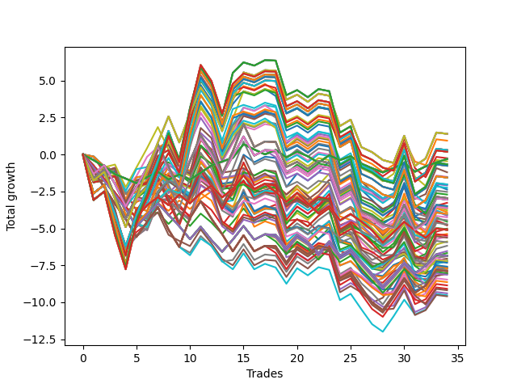

# Long HLT 105 
- Symbol: TSLA
- Date Range: 01/10/2024 - 05/17/2024
- Trading Period: 8:30-12:30
- Number of Trades: 9



| Id. | Name | Win Percent | Profit | Avg Profit / Trade | Avg Time / Trade | Std |      | Name | Win Percent | Profit | Avg Profit / Trade | Avg Time / Trade | Std |
| --- | ---- | ----------- | ------ | ------------------ | ---------------- | --- | ---- | ---- | ----------- | ------ | ------------------ | ---------------- | --- |
| | Sorted By <br> Profit | | | | | | | Sorted By <br> Win Percentage |||||
|0| TP-0.5 30m | 55.56 | 0.38 | 0.04 | 16:20 | 0.55 |     | TP-0.5 30m | 55.56 | 0.38 | 0.04 | 16:20 | 0.55 |
|1| TP-3 45m | 44.44 | 0.30 | 0.03 | 44:00 | 0.94 |     | TP-1 30m | 55.56 | 0.21 | 0.02 | 24:46 | 0.81 |
|2| TP-2.75 45m | 44.44 | 0.30 | 0.03 | 44:00 | 0.94 |     | TP-0.75 30m | 55.56 | 0.03 | 0.00 | 20:20 | 0.68 |
|3| TP-2.5 45m | 44.44 | 0.30 | 0.03 | 44:00 | 0.94 |     | TP-0.25 180m | 55.56 | -0.19 | -0.02 | 08:46 | 0.37 |
|4| TP-2.25 45m | 44.44 | 0.30 | 0.03 | 44:00 | 0.94 |     | TP-0.25 165m | 55.56 | -0.19 | -0.02 | 08:46 | 0.37 |
|5| TP-1.5 60m | 44.44 | 0.26 | 0.03 | 50:26 | 0.98 |     | TP-0.25 150m | 55.56 | -0.19 | -0.02 | 08:46 | 0.37 |
|6| TP-1 30m | 55.56 | 0.21 | 0.02 | 24:46 | 0.81 |     | TP-0.25 135m | 55.56 | -0.19 | -0.02 | 08:46 | 0.37 |
|7| TP-1 180m | 44.44 | 0.05 | 0.01 | 43:26 | 0.89 |     | TP-0.25 120m | 55.56 | -0.19 | -0.02 | 08:46 | 0.37 |
|8| TP-1 165m | 44.44 | 0.05 | 0.01 | 43:26 | 0.89 |     | TP-0.25 105m | 55.56 | -0.19 | -0.02 | 08:46 | 0.37 |
|9| TP-1 150m | 44.44 | 0.05 | 0.01 | 43:26 | 0.89 |     | TP-0.25 90m | 55.56 | -0.19 | -0.02 | 08:46 | 0.37 |
|10| TP-1 135m | 44.44 | 0.05 | 0.01 | 43:26 | 0.89 |     | TP-0.25 75m | 55.56 | -0.19 | -0.02 | 08:46 | 0.37 |
|11| TP-1 120m | 44.44 | 0.05 | 0.01 | 43:26 | 0.89 |     | TP-0.25 60m | 55.56 | -0.19 | -0.02 | 08:46 | 0.37 |
|12| TP-0.75 30m | 55.56 | 0.03 | 0.00 | 20:20 | 0.68 |     | TP-0.25 45m | 55.56 | -0.19 | -0.02 | 08:46 | 0.37 |
|13| TP-1.5 45m | 44.44 | 0.00 | 0.00 | 41:13 | 0.96 |     | TP-0.25 30m | 55.56 | -0.19 | -0.02 | 08:46 | 0.37 |
|14| TP-1 60m | 44.44 | -0.10 | -0.01 | 36:40 | 0.88 |     | TP-0.25 15m | 55.56 | -0.21 | -0.02 | 08:33 | 0.37 |
|15| TP-0.25 180m | 55.56 | -0.19 | -0.02 | 08:46 | 0.37 |     | TP-1.5 30m | 55.56 | -0.52 | -0.06 | 28:00 | 0.84 |
|16| TP-0.25 165m | 55.56 | -0.19 | -0.02 | 08:46 | 0.37 |     | TP-3 30m | 55.56 | -0.53 | -0.06 | 29:00 | 0.85 |
|17| TP-0.25 150m | 55.56 | -0.19 | -0.02 | 08:46 | 0.37 |     | TP-2.75 30m | 55.56 | -0.53 | -0.06 | 29:00 | 0.85 |
|18| TP-0.25 135m | 55.56 | -0.19 | -0.02 | 08:46 | 0.37 |     | TP-2.5 30m | 55.56 | -0.53 | -0.06 | 29:00 | 0.85 |
|19| TP-0.25 120m | 55.56 | -0.19 | -0.02 | 08:46 | 0.37 |     | TP-2.25 30m | 55.56 | -0.53 | -0.06 | 29:00 | 0.85 |
|20| TP-0.25 105m | 55.56 | -0.19 | -0.02 | 08:46 | 0.37 |     | TP-2 30m | 55.56 | -0.94 | -0.10 | 28:06 | 0.94 |
|21| TP-0.25 90m | 55.56 | -0.19 | -0.02 | 08:46 | 0.37 |     | TP-1.75 30m | 55.56 | -0.94 | -0.10 | 28:06 | 0.94 |
|22| TP-0.25 75m | 55.56 | -0.19 | -0.02 | 08:46 | 0.37 |     | TP-1.25 30m | 55.56 | -0.99 | -0.11 | 26:13 | 0.89 |
|23| TP-0.25 60m | 55.56 | -0.19 | -0.02 | 08:46 | 0.37 |     | TP-3 45m | 44.44 | 0.30 | 0.03 | 44:00 | 0.94 |
|24| TP-0.25 45m | 55.56 | -0.19 | -0.02 | 08:46 | 0.37 |     | TP-2.75 45m | 44.44 | 0.30 | 0.03 | 44:00 | 0.94 |
|25| TP-0.25 30m | 55.56 | -0.19 | -0.02 | 08:46 | 0.37 |     | TP-2.5 45m | 44.44 | 0.30 | 0.03 | 44:00 | 0.94 |
|26| TP-1 45m | 44.44 | -0.20 | -0.02 | 31:53 | 0.87 |     | TP-2.25 45m | 44.44 | 0.30 | 0.03 | 44:00 | 0.94 |
|27| TP-0.25 15m | 55.56 | -0.21 | -0.02 | 08:33 | 0.37 |     | TP-1.5 60m | 44.44 | 0.26 | 0.03 | 50:26 | 0.98 |
|28| TP-2 45m | 44.44 | -0.31 | -0.03 | 41:26 | 1.06 |     | TP-1 180m | 44.44 | 0.05 | 0.01 | 43:26 | 0.89 |
|29| TP-1.75 45m | 44.44 | -0.31 | -0.03 | 41:26 | 1.06 |     | TP-1 165m | 44.44 | 0.05 | 0.01 | 43:26 | 0.89 |
|30| TP-1.75 60m | 44.44 | -0.34 | -0.04 | 52:06 | 1.04 |     | TP-1 150m | 44.44 | 0.05 | 0.01 | 43:26 | 0.89 |
|31| TP-3 90m | 33.33 | -0.34 | -0.04 | 79:53 | 1.13 |     | TP-1 135m | 44.44 | 0.05 | 0.01 | 43:26 | 0.89 |
|32| TP-0.75 180m | 44.44 | -0.44 | -0.05 | 33:46 | 0.73 |     | TP-1 120m | 44.44 | 0.05 | 0.01 | 43:26 | 0.89 |
|33| TP-0.75 165m | 44.44 | -0.44 | -0.05 | 33:46 | 0.73 |     | TP-1.5 45m | 44.44 | 0.00 | 0.00 | 41:13 | 0.96 |
|34| TP-0.75 150m | 44.44 | -0.44 | -0.05 | 33:46 | 0.73 |     | TP-1 60m | 44.44 | -0.10 | -0.01 | 36:40 | 0.88 |
|35| TP-0.75 135m | 44.44 | -0.44 | -0.05 | 33:46 | 0.73 |     | TP-1 45m | 44.44 | -0.20 | -0.02 | 31:53 | 0.87 |
|36| TP-0.75 120m | 44.44 | -0.44 | -0.05 | 33:46 | 0.73 |     | TP-2 45m | 44.44 | -0.31 | -0.03 | 41:26 | 1.06 |
|37| TP-1.5 30m | 55.56 | -0.52 | -0.06 | 28:00 | 0.84 |     | TP-1.75 45m | 44.44 | -0.31 | -0.03 | 41:26 | 1.06 |
|38| TP-3 30m | 55.56 | -0.53 | -0.06 | 29:00 | 0.85 |     | TP-1.75 60m | 44.44 | -0.34 | -0.04 | 52:06 | 1.04 |
|39| TP-2.75 30m | 55.56 | -0.53 | -0.06 | 29:00 | 0.85 |     | TP-0.75 180m | 44.44 | -0.44 | -0.05 | 33:46 | 0.73 |
|40| TP-2.5 30m | 55.56 | -0.53 | -0.06 | 29:00 | 0.85 |     | TP-0.75 165m | 44.44 | -0.44 | -0.05 | 33:46 | 0.73 |
|41| TP-2.25 30m | 55.56 | -0.53 | -0.06 | 29:00 | 0.85 |     | TP-0.75 150m | 44.44 | -0.44 | -0.05 | 33:46 | 0.73 |
|42| TP-1.25 180m | 33.33 | -0.53 | -0.06 | 60:26 | 1.01 |     | TP-0.75 135m | 44.44 | -0.44 | -0.05 | 33:46 | 0.73 |
|43| TP-1.25 165m | 33.33 | -0.53 | -0.06 | 60:26 | 1.01 |     | TP-0.75 120m | 44.44 | -0.44 | -0.05 | 33:46 | 0.73 |
|44| TP-1.25 150m | 33.33 | -0.53 | -0.06 | 60:26 | 1.01 |     | TP-0.75 60m | 44.44 | -0.61 | -0.07 | 27:06 | 0.71 |
|45| TP-1.25 135m | 33.33 | -0.53 | -0.06 | 60:26 | 1.01 |     | TP-3 60m | 44.44 | -0.70 | -0.08 | 58:00 | 0.84 |
|46| TP-1.25 120m | 33.33 | -0.53 | -0.06 | 60:26 | 1.01 |     | TP-2.75 60m | 44.44 | -0.70 | -0.08 | 58:00 | 0.84 |
|47| TP-1 75m | 33.33 | -0.59 | -0.07 | 38:26 | 0.87 |     | TP-2.5 60m | 44.44 | -0.70 | -0.08 | 58:00 | 0.84 |
|48| TP-1.25 90m | 33.33 | -0.60 | -0.07 | 53:46 | 1.00 |     | TP-2.25 60m | 44.44 | -0.70 | -0.08 | 58:00 | 0.84 |
|49| TP-0.75 60m | 44.44 | -0.61 | -0.07 | 27:06 | 0.71 |     | TP-1.25 60m | 44.44 | -0.72 | -0.08 | 45:13 | 1.01 |
|50| TP-1.25 75m | 33.33 | -0.62 | -0.07 | 50:20 | 0.99 |     | TP-0.75 45m | 44.44 | -0.80 | -0.09 | 24:46 | 0.72 |
|51| TP-1 90m | 33.33 | -0.69 | -0.08 | 40:06 | 0.88 |     | TP-1.25 45m | 44.44 | -0.88 | -0.10 | 37:46 | 1.02 |
|52| TP-3 60m | 44.44 | -0.70 | -0.08 | 58:00 | 0.84 |     | TP-0.5 15m | 44.44 | -0.95 | -0.11 | 11:13 | 0.44 |
|53| TP-2.75 60m | 44.44 | -0.70 | -0.08 | 58:00 | 0.84 |     | TP-2 60m | 44.44 | -1.07 | -0.12 | 53:46 | 0.92 |
|54| TP-2.5 60m | 44.44 | -0.70 | -0.08 | 58:00 | 0.84 |     | TP-0.75 15m | 44.44 | -1.07 | -0.12 | 12:46 | 0.52 |
|55| TP-2.25 60m | 44.44 | -0.70 | -0.08 | 58:00 | 0.84 |     | TP-1 15m | 44.44 | -1.30 | -0.14 | 13:46 | 0.55 |
|56| TP-1.25 60m | 44.44 | -0.72 | -0.08 | 45:13 | 1.01 |     | TP-3 15m | 44.44 | -1.63 | -0.18 | 14:00 | 0.62 |
|57| TP-1.5 180m | 33.33 | -0.76 | -0.08 | 66:33 | 1.11 |     | TP-2.75 15m | 44.44 | -1.63 | -0.18 | 14:00 | 0.62 |
|58| TP-1.5 165m | 33.33 | -0.76 | -0.08 | 66:33 | 1.11 |     | TP-2.5 15m | 44.44 | -1.63 | -0.18 | 14:00 | 0.62 |
|59| TP-1.5 150m | 33.33 | -0.76 | -0.08 | 66:33 | 1.11 |     | TP-2.25 15m | 44.44 | -1.63 | -0.18 | 14:00 | 0.62 |
|60| TP-1.5 135m | 33.33 | -0.76 | -0.08 | 66:33 | 1.11 |     | TP-2 15m | 44.44 | -1.63 | -0.18 | 14:00 | 0.62 |
|61| TP-1.5 120m | 33.33 | -0.76 | -0.08 | 66:33 | 1.11 |     | TP-1.75 15m | 44.44 | -1.63 | -0.18 | 14:00 | 0.62 |
|62| TP-0.75 45m | 44.44 | -0.80 | -0.09 | 24:46 | 0.72 |     | TP-1.5 15m | 44.44 | -1.63 | -0.18 | 14:00 | 0.62 |
|63| TP-1.5 90m | 33.33 | -0.83 | -0.09 | 59:53 | 1.11 |     | TP-1.25 15m | 44.44 | -1.63 | -0.18 | 14:00 | 0.62 |
|64| TP-1.5 75m | 33.33 | -0.85 | -0.09 | 56:26 | 1.10 |     | TP-3 90m | 33.33 | -0.34 | -0.04 | 79:53 | 1.13 |
|65| TP-1.25 45m | 44.44 | -0.88 | -0.10 | 37:46 | 1.02 |     | TP-1.25 180m | 33.33 | -0.53 | -0.06 | 60:26 | 1.01 |
|66| TP-2 30m | 55.56 | -0.94 | -0.10 | 28:06 | 0.94 |     | TP-1.25 165m | 33.33 | -0.53 | -0.06 | 60:26 | 1.01 |
|67| TP-1.75 30m | 55.56 | -0.94 | -0.10 | 28:06 | 0.94 |     | TP-1.25 150m | 33.33 | -0.53 | -0.06 | 60:26 | 1.01 |
|68| TP-0.5 15m | 44.44 | -0.95 | -0.11 | 11:13 | 0.44 |     | TP-1.25 135m | 33.33 | -0.53 | -0.06 | 60:26 | 1.01 |
|69| TP-1.25 105m | 33.33 | -0.95 | -0.11 | 57:06 | 1.02 |     | TP-1.25 120m | 33.33 | -0.53 | -0.06 | 60:26 | 1.01 |
|70| TP-1.75 180m | 33.33 | -0.96 | -0.11 | 71:40 | 1.28 |     | TP-1 75m | 33.33 | -0.59 | -0.07 | 38:26 | 0.87 |
|71| TP-1.75 165m | 33.33 | -0.96 | -0.11 | 71:40 | 1.28 |     | TP-1.25 90m | 33.33 | -0.60 | -0.07 | 53:46 | 1.00 |
|72| TP-1.75 150m | 33.33 | -0.96 | -0.11 | 71:40 | 1.28 |     | TP-1.25 75m | 33.33 | -0.62 | -0.07 | 50:20 | 0.99 |
|73| TP-1.75 135m | 33.33 | -0.96 | -0.11 | 71:40 | 1.28 |     | TP-1 90m | 33.33 | -0.69 | -0.08 | 40:06 | 0.88 |
|74| TP-1.75 120m | 33.33 | -0.96 | -0.11 | 71:40 | 1.28 |     | TP-1.5 180m | 33.33 | -0.76 | -0.08 | 66:33 | 1.11 |
|75| TP-1.25 30m | 55.56 | -0.99 | -0.11 | 26:13 | 0.89 |     | TP-1.5 165m | 33.33 | -0.76 | -0.08 | 66:33 | 1.11 |
|76| TP-1.75 90m | 33.33 | -1.03 | -0.11 | 65:00 | 1.28 |     | TP-1.5 150m | 33.33 | -0.76 | -0.08 | 66:33 | 1.11 |
|77| TP-2 60m | 44.44 | -1.07 | -0.12 | 53:46 | 0.92 |     | TP-1.5 135m | 33.33 | -0.76 | -0.08 | 66:33 | 1.11 |
|78| TP-0.75 15m | 44.44 | -1.07 | -0.12 | 12:46 | 0.52 |     | TP-1.5 120m | 33.33 | -0.76 | -0.08 | 66:33 | 1.11 |
|79| TP-0.5 180m | 33.33 | -1.07 | -0.12 | 19:46 | 0.59 |     | TP-1.5 90m | 33.33 | -0.83 | -0.09 | 59:53 | 1.11 |
|80| TP-0.5 165m | 33.33 | -1.07 | -0.12 | 19:46 | 0.59 |     | TP-1.5 75m | 33.33 | -0.85 | -0.09 | 56:26 | 1.10 |
|81| TP-0.5 150m | 33.33 | -1.07 | -0.12 | 19:46 | 0.59 |     | TP-1.25 105m | 33.33 | -0.95 | -0.11 | 57:06 | 1.02 |
|82| TP-0.5 135m | 33.33 | -1.07 | -0.12 | 19:46 | 0.59 |     | TP-1.75 180m | 33.33 | -0.96 | -0.11 | 71:40 | 1.28 |
|83| TP-0.5 120m | 33.33 | -1.07 | -0.12 | 19:46 | 0.59 |     | TP-1.75 165m | 33.33 | -0.96 | -0.11 | 71:40 | 1.28 |
|84| TP-1 105m | 33.33 | -1.07 | -0.12 | 41:46 | 0.89 |     | TP-1.75 150m | 33.33 | -0.96 | -0.11 | 71:40 | 1.28 |
|85| TP-0.5 105m | 33.33 | -1.07 | -0.12 | 19:46 | 0.59 |     | TP-1.75 135m | 33.33 | -0.96 | -0.11 | 71:40 | 1.28 |
|86| TP-0.5 90m | 33.33 | -1.07 | -0.12 | 19:46 | 0.59 |     | TP-1.75 120m | 33.33 | -0.96 | -0.11 | 71:40 | 1.28 |
|87| TP-0.5 75m | 33.33 | -1.07 | -0.12 | 19:46 | 0.59 |     | TP-1.75 90m | 33.33 | -1.03 | -0.11 | 65:00 | 1.28 |
|88| TP-0.5 60m | 33.33 | -1.07 | -0.12 | 19:46 | 0.59 |     | TP-0.5 180m | 33.33 | -1.07 | -0.12 | 19:46 | 0.59 |
|89| TP-0.75 75m | 33.33 | -1.08 | -0.12 | 28:46 | 0.70 |     | TP-0.5 165m | 33.33 | -1.07 | -0.12 | 19:46 | 0.59 |
|90| TP-2 180m | 33.33 | -1.16 | -0.13 | 81:06 | 1.36 |     | TP-0.5 150m | 33.33 | -1.07 | -0.12 | 19:46 | 0.59 |
|91| TP-2 165m | 33.33 | -1.16 | -0.13 | 81:06 | 1.36 |     | TP-0.5 135m | 33.33 | -1.07 | -0.12 | 19:46 | 0.59 |
|92| TP-2 150m | 33.33 | -1.16 | -0.13 | 81:06 | 1.36 |     | TP-0.5 120m | 33.33 | -1.07 | -0.12 | 19:46 | 0.59 |
|93| TP-2 135m | 33.33 | -1.16 | -0.13 | 81:06 | 1.36 |     | TP-1 105m | 33.33 | -1.07 | -0.12 | 41:46 | 0.89 |
|94| TP-2 120m | 33.33 | -1.16 | -0.13 | 81:06 | 1.36 |     | TP-0.5 105m | 33.33 | -1.07 | -0.12 | 19:46 | 0.59 |
|95| TP-1.5 105m | 33.33 | -1.18 | -0.13 | 63:13 | 1.12 |     | TP-0.5 90m | 33.33 | -1.07 | -0.12 | 19:46 | 0.59 |
|96| TP-0.75 90m | 33.33 | -1.18 | -0.13 | 30:26 | 0.70 |     | TP-0.5 75m | 33.33 | -1.07 | -0.12 | 19:46 | 0.59 |
|97| TP-2.25 90m | 33.33 | -1.21 | -0.13 | 78:33 | 1.28 |     | TP-0.5 60m | 33.33 | -1.07 | -0.12 | 19:46 | 0.59 |
|98| TP-3 105m | 33.33 | -1.26 | -0.14 | 89:26 | 1.25 |     | TP-0.75 75m | 33.33 | -1.08 | -0.12 | 28:46 | 0.70 |
|99| TP-0.5 45m | 33.33 | -1.26 | -0.14 | 19:06 | 0.59 |     | TP-2 180m | 33.33 | -1.16 | -0.13 | 81:06 | 1.36 |
|100| TP-1 15m | 44.44 | -1.30 | -0.14 | 13:46 | 0.55 |     | TP-2 165m | 33.33 | -1.16 | -0.13 | 81:06 | 1.36 |
|101| TP-1.75 105m | 33.33 | -1.38 | -0.15 | 68:20 | 1.29 |     | TP-2 150m | 33.33 | -1.16 | -0.13 | 81:06 | 1.36 |
|102| TP-3 180m | 33.33 | -1.40 | -0.16 | 97:46 | 1.33 |     | TP-2 135m | 33.33 | -1.16 | -0.13 | 81:06 | 1.36 |
|103| TP-3 165m | 33.33 | -1.40 | -0.16 | 97:46 | 1.33 |     | TP-2 120m | 33.33 | -1.16 | -0.13 | 81:06 | 1.36 |
|104| TP-3 150m | 33.33 | -1.40 | -0.16 | 97:46 | 1.33 |     | TP-1.5 105m | 33.33 | -1.18 | -0.13 | 63:13 | 1.12 |
|105| TP-3 135m | 33.33 | -1.40 | -0.16 | 97:46 | 1.33 |     | TP-0.75 90m | 33.33 | -1.18 | -0.13 | 30:26 | 0.70 |
|106| TP-3 120m | 33.33 | -1.40 | -0.16 | 97:46 | 1.33 |     | TP-2.25 90m | 33.33 | -1.21 | -0.13 | 78:33 | 1.28 |
|107| TP-2 90m | 33.33 | -1.51 | -0.17 | 70:40 | 1.31 |     | TP-3 105m | 33.33 | -1.26 | -0.14 | 89:26 | 1.25 |
|108| TP-2.75 90m | 33.33 | -1.54 | -0.17 | 79:00 | 1.35 |     | TP-0.5 45m | 33.33 | -1.26 | -0.14 | 19:06 | 0.59 |
|109| TP-2.5 90m | 33.33 | -1.54 | -0.17 | 79:00 | 1.35 |     | TP-1.75 105m | 33.33 | -1.38 | -0.15 | 68:20 | 1.29 |
|110| TP-0.75 105m | 33.33 | -1.56 | -0.17 | 32:06 | 0.72 |     | TP-3 180m | 33.33 | -1.40 | -0.16 | 97:46 | 1.33 |
|111| TP-3 15m | 44.44 | -1.63 | -0.18 | 14:00 | 0.62 |     | TP-3 165m | 33.33 | -1.40 | -0.16 | 97:46 | 1.33 |
|112| TP-2.75 15m | 44.44 | -1.63 | -0.18 | 14:00 | 0.62 |     | TP-3 150m | 33.33 | -1.40 | -0.16 | 97:46 | 1.33 |
|113| TP-2.5 15m | 44.44 | -1.63 | -0.18 | 14:00 | 0.62 |     | TP-3 135m | 33.33 | -1.40 | -0.16 | 97:46 | 1.33 |
|114| TP-2.25 15m | 44.44 | -1.63 | -0.18 | 14:00 | 0.62 |     | TP-3 120m | 33.33 | -1.40 | -0.16 | 97:46 | 1.33 |
|115| TP-2 15m | 44.44 | -1.63 | -0.18 | 14:00 | 0.62 |     | TP-2 90m | 33.33 | -1.51 | -0.17 | 70:40 | 1.31 |
|116| TP-1.75 15m | 44.44 | -1.63 | -0.18 | 14:00 | 0.62 |     | TP-2.75 90m | 33.33 | -1.54 | -0.17 | 79:00 | 1.35 |
|117| TP-1.5 15m | 44.44 | -1.63 | -0.18 | 14:00 | 0.62 |     | TP-2.5 90m | 33.33 | -1.54 | -0.17 | 79:00 | 1.35 |
|118| TP-1.25 15m | 44.44 | -1.63 | -0.18 | 14:00 | 0.62 |     | TP-0.75 105m | 33.33 | -1.56 | -0.17 | 32:06 | 0.72 |
|119| TP-1.75 75m | 33.33 | -1.73 | -0.19 | 60:00 | 1.17 |     | TP-1.75 75m | 33.33 | -1.73 | -0.19 | 60:00 | 1.17 |
|120| TP-2 105m | 33.33 | -1.81 | -0.20 | 76:06 | 1.34 |     | TP-2 105m | 33.33 | -1.81 | -0.20 | 76:06 | 1.34 |
|121| TP-2.25 180m | 33.33 | -1.90 | -0.21 | 94:26 | 1.39 |     | TP-2.25 180m | 33.33 | -1.90 | -0.21 | 94:26 | 1.39 |
|122| TP-2.25 165m | 33.33 | -1.90 | -0.21 | 94:26 | 1.39 |     | TP-2.25 165m | 33.33 | -1.90 | -0.21 | 94:26 | 1.39 |
|123| TP-2.25 150m | 33.33 | -1.90 | -0.21 | 94:26 | 1.39 |     | TP-2.25 150m | 33.33 | -1.90 | -0.21 | 94:26 | 1.39 |
|124| TP-2.25 135m | 33.33 | -1.90 | -0.21 | 94:26 | 1.39 |     | TP-2.25 135m | 33.33 | -1.90 | -0.21 | 94:26 | 1.39 |
|125| TP-2.25 120m | 33.33 | -1.90 | -0.21 | 94:26 | 1.39 |     | TP-2.25 120m | 33.33 | -1.90 | -0.21 | 94:26 | 1.39 |
|126| TP-2.25 105m | 33.33 | -2.10 | -0.23 | 86:53 | 1.38 |     | TP-2.25 105m | 33.33 | -2.10 | -0.23 | 86:53 | 1.38 |
|127| TP-3 75m | 33.33 | -2.34 | -0.26 | 69:46 | 1.18 |     | TP-3 75m | 33.33 | -2.34 | -0.26 | 69:46 | 1.18 |
|128| TP-2.75 75m | 33.33 | -2.34 | -0.26 | 69:46 | 1.18 |     | TP-2.75 75m | 33.33 | -2.34 | -0.26 | 69:46 | 1.18 |
|129| TP-2.5 75m | 33.33 | -2.34 | -0.26 | 69:46 | 1.18 |     | TP-2.5 75m | 33.33 | -2.34 | -0.26 | 69:46 | 1.18 |
|130| TP-2.25 75m | 33.33 | -2.34 | -0.26 | 69:46 | 1.18 |     | TP-2.25 75m | 33.33 | -2.34 | -0.26 | 69:46 | 1.18 |
|131| TP-2 75m | 33.33 | -2.34 | -0.26 | 63:53 | 1.18 |     | TP-2 75m | 33.33 | -2.34 | -0.26 | 63:53 | 1.18 |
|132| TP-2.75 105m | 33.33 | -2.43 | -0.27 | 87:20 | 1.44 |     | TP-2.75 105m | 33.33 | -2.43 | -0.27 | 87:20 | 1.44 |
|133| TP-2.5 105m | 33.33 | -2.43 | -0.27 | 87:20 | 1.44 |     | TP-2.5 105m | 33.33 | -2.43 | -0.27 | 87:20 | 1.44 |
|134| TP-2.5 180m | 33.33 | -2.50 | -0.28 | 95:26 | 1.50 |     | TP-2.5 180m | 33.33 | -2.50 | -0.28 | 95:26 | 1.50 |
|135| TP-2.5 165m | 33.33 | -2.50 | -0.28 | 95:26 | 1.50 |     | TP-2.5 165m | 33.33 | -2.50 | -0.28 | 95:26 | 1.50 |
|136| TP-2.5 150m | 33.33 | -2.50 | -0.28 | 95:26 | 1.50 |     | TP-2.5 150m | 33.33 | -2.50 | -0.28 | 95:26 | 1.50 |
|137| TP-2.5 135m | 33.33 | -2.50 | -0.28 | 95:26 | 1.50 |     | TP-2.5 135m | 33.33 | -2.50 | -0.28 | 95:26 | 1.50 |
|138| TP-2.5 120m | 33.33 | -2.50 | -0.28 | 95:26 | 1.50 |     | TP-2.5 120m | 33.33 | -2.50 | -0.28 | 95:26 | 1.50 |
|139| TP-2.75 180m | 33.33 | -2.57 | -0.29 | 95:40 | 1.51 |     | TP-2.75 180m | 33.33 | -2.57 | -0.29 | 95:40 | 1.51 |
|140| TP-2.75 165m | 33.33 | -2.57 | -0.29 | 95:40 | 1.51 |     | TP-2.75 165m | 33.33 | -2.57 | -0.29 | 95:40 | 1.51 |
|141| TP-2.75 150m | 33.33 | -2.57 | -0.29 | 95:40 | 1.51 |     | TP-2.75 150m | 33.33 | -2.57 | -0.29 | 95:40 | 1.51 |
|142| TP-2.75 135m | 33.33 | -2.57 | -0.29 | 95:40 | 1.51 |     | TP-2.75 135m | 33.33 | -2.57 | -0.29 | 95:40 | 1.51 |
|143| TP-2.75 120m | 33.33 | -2.57 | -0.29 | 95:40 | 1.51 |     | TP-2.75 120m | 33.33 | -2.57 | -0.29 | 95:40 | 1.51 |

### Test TP-0.25 15m
* Take Profit of 0.25 Point
* 0.25 Stoploss
* Results:
```
Total Trades: 9
Percent Up: 55.56
Percent Down: 44.44
Total Points Moved Up: -0.21
Potential Profit: -105.00
Total Points Ups: 1.47 Count Ups: 5
Total Points Downs: -1.68 Count Downs: 4
```

<details><summary>Trades</summary>

<code>In: 2024-01-24 11:10:00		Out: 2024-01-24 11:12:00		Total Position Time: 02:00		Total Move Up: -0.51		Total to Date: -0.51</code> <br />
<code>In: 2024-02-13 11:35:00		Out: 2024-02-13 11:46:00		Total Position Time: 11:00		Total Move Up: -0.31		Total to Date: -0.82</code> <br />
<code>In: 2024-03-13 11:50:00		Out: 2024-03-13 11:58:00		Total Position Time: 08:00		Total Move Up: -0.28		Total to Date: -1.10</code> <br />
<code>In: 2024-03-14 09:25:00		Out: 2024-03-14 09:34:00		Total Position Time: 09:00		Total Move Up: 0.29		Total to Date: -0.81</code> <br />
<code>In: 2024-03-15 10:10:00		Out: 2024-03-15 10:21:00		Total Position Time: 11:00		Total Move Up: 0.34		Total to Date: -0.47</code> <br />
<code>In: 2024-04-15 10:10:00		Out: 2024-04-15 10:19:00		Total Position Time: 09:00		Total Move Up: -0.58		Total to Date: -1.05</code> <br />
<code>In: 2024-04-18 09:25:00		Out: 2024-04-18 09:30:00		Total Position Time: 05:00		Total Move Up: 0.36		Total to Date: -0.69</code> <br />
<code>In: 2024-04-22 08:35:00		Out: 2024-04-22 08:49:00		Total Position Time: 14:00		Total Move Up: 0.24		Total to Date: -0.45</code> <br />
<code>In: 2024-05-07 12:00:00		Out: 2024-05-07 12:08:00		Total Position Time: 08:00		Total Move Up: 0.24		Total to Date: -0.21</code> <br />


</details>

### Test TP-0.5 15m
* Take Profit of 0.5 Point
* 0.5 Stoploss
* Results:
```
Total Trades: 9
Percent Up: 44.44
Percent Down: 55.56
Total Points Moved Up: -0.95
Potential Profit: -475.00
Total Points Ups: 1.37 Count Ups: 4
Total Points Downs: -2.32 Count Downs: 5
```

<details><summary>Trades</summary>

<code>In: 2024-01-24 11:10:00		Out: 2024-01-24 11:12:00		Total Position Time: 02:00		Total Move Up: -0.51		Total to Date: -0.51</code> <br />
<code>In: 2024-02-13 11:35:00		Out: 2024-02-13 11:48:00		Total Position Time: 13:00		Total Move Up: -0.59		Total to Date: -1.10</code> <br />
<code>In: 2024-03-13 11:50:00		Out: 2024-03-13 12:04:00		Total Position Time: 14:00		Total Move Up: -0.14		Total to Date: -1.24</code> <br />
<code>In: 2024-03-14 09:25:00		Out: 2024-03-14 09:36:00		Total Position Time: 11:00		Total Move Up: 0.70		Total to Date: -0.54</code> <br />
<code>In: 2024-03-15 10:10:00		Out: 2024-03-15 10:24:00		Total Position Time: 14:00		Total Move Up: 0.31		Total to Date: -0.23</code> <br />
<code>In: 2024-04-15 10:10:00		Out: 2024-04-15 10:19:00		Total Position Time: 09:00		Total Move Up: -0.58		Total to Date: -0.81</code> <br />
<code>In: 2024-04-18 09:25:00		Out: 2024-04-18 09:35:00		Total Position Time: 10:00		Total Move Up: -0.50		Total to Date: -1.31</code> <br />
<code>In: 2024-04-22 08:35:00		Out: 2024-04-22 08:49:00		Total Position Time: 14:00		Total Move Up: 0.24		Total to Date: -1.07</code> <br />
<code>In: 2024-05-07 12:00:00		Out: 2024-05-07 12:14:00		Total Position Time: 14:00		Total Move Up: 0.12		Total to Date: -0.95</code> <br />


</details>

### Test TP-0.75 15m
* Take Profit of 0.75 Point
* 0.75 Stoploss
* Results:
```
Total Trades: 9
Percent Up: 44.44
Percent Down: 55.56
Total Points Moved Up: -1.07
Potential Profit: -535.00
Total Points Ups: 1.43 Count Ups: 4
Total Points Downs: -2.50 Count Downs: 5
```

<details><summary>Trades</summary>

<code>In: 2024-01-24 11:10:00		Out: 2024-01-24 11:18:00		Total Position Time: 08:00		Total Move Up: -0.86		Total to Date: -0.86</code> <br />
<code>In: 2024-02-13 11:35:00		Out: 2024-02-13 11:49:00		Total Position Time: 14:00		Total Move Up: -0.71		Total to Date: -1.57</code> <br />
<code>In: 2024-03-13 11:50:00		Out: 2024-03-13 12:04:00		Total Position Time: 14:00		Total Move Up: -0.14		Total to Date: -1.71</code> <br />
<code>In: 2024-03-14 09:25:00		Out: 2024-03-14 09:37:00		Total Position Time: 12:00		Total Move Up: 0.76		Total to Date: -0.95</code> <br />
<code>In: 2024-03-15 10:10:00		Out: 2024-03-15 10:24:00		Total Position Time: 14:00		Total Move Up: 0.31		Total to Date: -0.64</code> <br />
<code>In: 2024-04-15 10:10:00		Out: 2024-04-15 10:21:00		Total Position Time: 11:00		Total Move Up: -0.73		Total to Date: -1.37</code> <br />
<code>In: 2024-04-18 09:25:00		Out: 2024-04-18 09:39:00		Total Position Time: 14:00		Total Move Up: -0.06		Total to Date: -1.43</code> <br />
<code>In: 2024-04-22 08:35:00		Out: 2024-04-22 08:49:00		Total Position Time: 14:00		Total Move Up: 0.24		Total to Date: -1.19</code> <br />
<code>In: 2024-05-07 12:00:00		Out: 2024-05-07 12:14:00		Total Position Time: 14:00		Total Move Up: 0.12		Total to Date: -1.07</code> <br />


</details>

### Test TP-1 15m
* Take Profit of 1 Point
* 1 Stoploss
* Results:
```
Total Trades: 9
Percent Up: 44.44
Percent Down: 55.56
Total Points Moved Up: -1.30
Potential Profit: -650.00
Total Points Ups: 1.42 Count Ups: 4
Total Points Downs: -2.72 Count Downs: 5
```

<details><summary>Trades</summary>

<code>In: 2024-01-24 11:10:00		Out: 2024-01-24 11:22:00		Total Position Time: 12:00		Total Move Up: -1.05		Total to Date: -1.05</code> <br />
<code>In: 2024-02-13 11:35:00		Out: 2024-02-13 11:49:00		Total Position Time: 14:00		Total Move Up: -0.71		Total to Date: -1.76</code> <br />
<code>In: 2024-03-13 11:50:00		Out: 2024-03-13 12:04:00		Total Position Time: 14:00		Total Move Up: -0.14		Total to Date: -1.90</code> <br />
<code>In: 2024-03-14 09:25:00		Out: 2024-03-14 09:39:00		Total Position Time: 14:00		Total Move Up: 0.75		Total to Date: -1.15</code> <br />
<code>In: 2024-03-15 10:10:00		Out: 2024-03-15 10:24:00		Total Position Time: 14:00		Total Move Up: 0.31		Total to Date: -0.84</code> <br />
<code>In: 2024-04-15 10:10:00		Out: 2024-04-15 10:24:00		Total Position Time: 14:00		Total Move Up: -0.76		Total to Date: -1.60</code> <br />
<code>In: 2024-04-18 09:25:00		Out: 2024-04-18 09:39:00		Total Position Time: 14:00		Total Move Up: -0.06		Total to Date: -1.66</code> <br />
<code>In: 2024-04-22 08:35:00		Out: 2024-04-22 08:49:00		Total Position Time: 14:00		Total Move Up: 0.24		Total to Date: -1.42</code> <br />
<code>In: 2024-05-07 12:00:00		Out: 2024-05-07 12:14:00		Total Position Time: 14:00		Total Move Up: 0.12		Total to Date: -1.30</code> <br />


</details>

### Test TP-1.25 15m
* Take Profit of 1.25 Point
* 1.25 Stoploss
* Results:
```
Total Trades: 9
Percent Up: 44.44
Percent Down: 55.56
Total Points Moved Up: -1.63
Potential Profit: -815.00
Total Points Ups: 1.42 Count Ups: 4
Total Points Downs: -3.05 Count Downs: 5
```

<details><summary>Trades</summary>

<code>In: 2024-01-24 11:10:00		Out: 2024-01-24 11:24:00		Total Position Time: 14:00		Total Move Up: -1.38		Total to Date: -1.38</code> <br />
<code>In: 2024-02-13 11:35:00		Out: 2024-02-13 11:49:00		Total Position Time: 14:00		Total Move Up: -0.71		Total to Date: -2.09</code> <br />
<code>In: 2024-03-13 11:50:00		Out: 2024-03-13 12:04:00		Total Position Time: 14:00		Total Move Up: -0.14		Total to Date: -2.23</code> <br />
<code>In: 2024-03-14 09:25:00		Out: 2024-03-14 09:39:00		Total Position Time: 14:00		Total Move Up: 0.75		Total to Date: -1.48</code> <br />
<code>In: 2024-03-15 10:10:00		Out: 2024-03-15 10:24:00		Total Position Time: 14:00		Total Move Up: 0.31		Total to Date: -1.17</code> <br />
<code>In: 2024-04-15 10:10:00		Out: 2024-04-15 10:24:00		Total Position Time: 14:00		Total Move Up: -0.76		Total to Date: -1.93</code> <br />
<code>In: 2024-04-18 09:25:00		Out: 2024-04-18 09:39:00		Total Position Time: 14:00		Total Move Up: -0.06		Total to Date: -1.99</code> <br />
<code>In: 2024-04-22 08:35:00		Out: 2024-04-22 08:49:00		Total Position Time: 14:00		Total Move Up: 0.24		Total to Date: -1.75</code> <br />
<code>In: 2024-05-07 12:00:00		Out: 2024-05-07 12:14:00		Total Position Time: 14:00		Total Move Up: 0.12		Total to Date: -1.63</code> <br />


</details>

### Test TP-1.5 15m
* Take Profit of 1.5 Point
* 1.5 Stoploss
* Results:
```
Total Trades: 9
Percent Up: 44.44
Percent Down: 55.56
Total Points Moved Up: -1.63
Potential Profit: -815.00
Total Points Ups: 1.42 Count Ups: 4
Total Points Downs: -3.05 Count Downs: 5
```

<details><summary>Trades</summary>

<code>In: 2024-01-24 11:10:00		Out: 2024-01-24 11:24:00		Total Position Time: 14:00		Total Move Up: -1.38		Total to Date: -1.38</code> <br />
<code>In: 2024-02-13 11:35:00		Out: 2024-02-13 11:49:00		Total Position Time: 14:00		Total Move Up: -0.71		Total to Date: -2.09</code> <br />
<code>In: 2024-03-13 11:50:00		Out: 2024-03-13 12:04:00		Total Position Time: 14:00		Total Move Up: -0.14		Total to Date: -2.23</code> <br />
<code>In: 2024-03-14 09:25:00		Out: 2024-03-14 09:39:00		Total Position Time: 14:00		Total Move Up: 0.75		Total to Date: -1.48</code> <br />
<code>In: 2024-03-15 10:10:00		Out: 2024-03-15 10:24:00		Total Position Time: 14:00		Total Move Up: 0.31		Total to Date: -1.17</code> <br />
<code>In: 2024-04-15 10:10:00		Out: 2024-04-15 10:24:00		Total Position Time: 14:00		Total Move Up: -0.76		Total to Date: -1.93</code> <br />
<code>In: 2024-04-18 09:25:00		Out: 2024-04-18 09:39:00		Total Position Time: 14:00		Total Move Up: -0.06		Total to Date: -1.99</code> <br />
<code>In: 2024-04-22 08:35:00		Out: 2024-04-22 08:49:00		Total Position Time: 14:00		Total Move Up: 0.24		Total to Date: -1.75</code> <br />
<code>In: 2024-05-07 12:00:00		Out: 2024-05-07 12:14:00		Total Position Time: 14:00		Total Move Up: 0.12		Total to Date: -1.63</code> <br />


</details>

### Test TP-1.75 15m
* Take Profit of 1.75 Point
* 1.75 Stoploss
* Results:
```
Total Trades: 9
Percent Up: 44.44
Percent Down: 55.56
Total Points Moved Up: -1.63
Potential Profit: -815.00
Total Points Ups: 1.42 Count Ups: 4
Total Points Downs: -3.05 Count Downs: 5
```

<details><summary>Trades</summary>

<code>In: 2024-01-24 11:10:00		Out: 2024-01-24 11:24:00		Total Position Time: 14:00		Total Move Up: -1.38		Total to Date: -1.38</code> <br />
<code>In: 2024-02-13 11:35:00		Out: 2024-02-13 11:49:00		Total Position Time: 14:00		Total Move Up: -0.71		Total to Date: -2.09</code> <br />
<code>In: 2024-03-13 11:50:00		Out: 2024-03-13 12:04:00		Total Position Time: 14:00		Total Move Up: -0.14		Total to Date: -2.23</code> <br />
<code>In: 2024-03-14 09:25:00		Out: 2024-03-14 09:39:00		Total Position Time: 14:00		Total Move Up: 0.75		Total to Date: -1.48</code> <br />
<code>In: 2024-03-15 10:10:00		Out: 2024-03-15 10:24:00		Total Position Time: 14:00		Total Move Up: 0.31		Total to Date: -1.17</code> <br />
<code>In: 2024-04-15 10:10:00		Out: 2024-04-15 10:24:00		Total Position Time: 14:00		Total Move Up: -0.76		Total to Date: -1.93</code> <br />
<code>In: 2024-04-18 09:25:00		Out: 2024-04-18 09:39:00		Total Position Time: 14:00		Total Move Up: -0.06		Total to Date: -1.99</code> <br />
<code>In: 2024-04-22 08:35:00		Out: 2024-04-22 08:49:00		Total Position Time: 14:00		Total Move Up: 0.24		Total to Date: -1.75</code> <br />
<code>In: 2024-05-07 12:00:00		Out: 2024-05-07 12:14:00		Total Position Time: 14:00		Total Move Up: 0.12		Total to Date: -1.63</code> <br />


</details>

### Test TP-2 15m
* Take Profit of 2 Point
* 2 Stoploss
* Results:
```
Total Trades: 9
Percent Up: 44.44
Percent Down: 55.56
Total Points Moved Up: -1.63
Potential Profit: -815.00
Total Points Ups: 1.42 Count Ups: 4
Total Points Downs: -3.05 Count Downs: 5
```

<details><summary>Trades</summary>

<code>In: 2024-01-24 11:10:00		Out: 2024-01-24 11:24:00		Total Position Time: 14:00		Total Move Up: -1.38		Total to Date: -1.38</code> <br />
<code>In: 2024-02-13 11:35:00		Out: 2024-02-13 11:49:00		Total Position Time: 14:00		Total Move Up: -0.71		Total to Date: -2.09</code> <br />
<code>In: 2024-03-13 11:50:00		Out: 2024-03-13 12:04:00		Total Position Time: 14:00		Total Move Up: -0.14		Total to Date: -2.23</code> <br />
<code>In: 2024-03-14 09:25:00		Out: 2024-03-14 09:39:00		Total Position Time: 14:00		Total Move Up: 0.75		Total to Date: -1.48</code> <br />
<code>In: 2024-03-15 10:10:00		Out: 2024-03-15 10:24:00		Total Position Time: 14:00		Total Move Up: 0.31		Total to Date: -1.17</code> <br />
<code>In: 2024-04-15 10:10:00		Out: 2024-04-15 10:24:00		Total Position Time: 14:00		Total Move Up: -0.76		Total to Date: -1.93</code> <br />
<code>In: 2024-04-18 09:25:00		Out: 2024-04-18 09:39:00		Total Position Time: 14:00		Total Move Up: -0.06		Total to Date: -1.99</code> <br />
<code>In: 2024-04-22 08:35:00		Out: 2024-04-22 08:49:00		Total Position Time: 14:00		Total Move Up: 0.24		Total to Date: -1.75</code> <br />
<code>In: 2024-05-07 12:00:00		Out: 2024-05-07 12:14:00		Total Position Time: 14:00		Total Move Up: 0.12		Total to Date: -1.63</code> <br />


</details>

### Test TP-2.25 15m
* Take Profit of 2.25 Point
* 2.25 Stoploss
* Results:
```
Total Trades: 9
Percent Up: 44.44
Percent Down: 55.56
Total Points Moved Up: -1.63
Potential Profit: -815.00
Total Points Ups: 1.42 Count Ups: 4
Total Points Downs: -3.05 Count Downs: 5
```

<details><summary>Trades</summary>

<code>In: 2024-01-24 11:10:00		Out: 2024-01-24 11:24:00		Total Position Time: 14:00		Total Move Up: -1.38		Total to Date: -1.38</code> <br />
<code>In: 2024-02-13 11:35:00		Out: 2024-02-13 11:49:00		Total Position Time: 14:00		Total Move Up: -0.71		Total to Date: -2.09</code> <br />
<code>In: 2024-03-13 11:50:00		Out: 2024-03-13 12:04:00		Total Position Time: 14:00		Total Move Up: -0.14		Total to Date: -2.23</code> <br />
<code>In: 2024-03-14 09:25:00		Out: 2024-03-14 09:39:00		Total Position Time: 14:00		Total Move Up: 0.75		Total to Date: -1.48</code> <br />
<code>In: 2024-03-15 10:10:00		Out: 2024-03-15 10:24:00		Total Position Time: 14:00		Total Move Up: 0.31		Total to Date: -1.17</code> <br />
<code>In: 2024-04-15 10:10:00		Out: 2024-04-15 10:24:00		Total Position Time: 14:00		Total Move Up: -0.76		Total to Date: -1.93</code> <br />
<code>In: 2024-04-18 09:25:00		Out: 2024-04-18 09:39:00		Total Position Time: 14:00		Total Move Up: -0.06		Total to Date: -1.99</code> <br />
<code>In: 2024-04-22 08:35:00		Out: 2024-04-22 08:49:00		Total Position Time: 14:00		Total Move Up: 0.24		Total to Date: -1.75</code> <br />
<code>In: 2024-05-07 12:00:00		Out: 2024-05-07 12:14:00		Total Position Time: 14:00		Total Move Up: 0.12		Total to Date: -1.63</code> <br />


</details>

### Test TP-2.5 15m
* Take Profit of 2.5 Point
* 2.5 Stoploss
* Results:
```
Total Trades: 9
Percent Up: 44.44
Percent Down: 55.56
Total Points Moved Up: -1.63
Potential Profit: -815.00
Total Points Ups: 1.42 Count Ups: 4
Total Points Downs: -3.05 Count Downs: 5
```

<details><summary>Trades</summary>

<code>In: 2024-01-24 11:10:00		Out: 2024-01-24 11:24:00		Total Position Time: 14:00		Total Move Up: -1.38		Total to Date: -1.38</code> <br />
<code>In: 2024-02-13 11:35:00		Out: 2024-02-13 11:49:00		Total Position Time: 14:00		Total Move Up: -0.71		Total to Date: -2.09</code> <br />
<code>In: 2024-03-13 11:50:00		Out: 2024-03-13 12:04:00		Total Position Time: 14:00		Total Move Up: -0.14		Total to Date: -2.23</code> <br />
<code>In: 2024-03-14 09:25:00		Out: 2024-03-14 09:39:00		Total Position Time: 14:00		Total Move Up: 0.75		Total to Date: -1.48</code> <br />
<code>In: 2024-03-15 10:10:00		Out: 2024-03-15 10:24:00		Total Position Time: 14:00		Total Move Up: 0.31		Total to Date: -1.17</code> <br />
<code>In: 2024-04-15 10:10:00		Out: 2024-04-15 10:24:00		Total Position Time: 14:00		Total Move Up: -0.76		Total to Date: -1.93</code> <br />
<code>In: 2024-04-18 09:25:00		Out: 2024-04-18 09:39:00		Total Position Time: 14:00		Total Move Up: -0.06		Total to Date: -1.99</code> <br />
<code>In: 2024-04-22 08:35:00		Out: 2024-04-22 08:49:00		Total Position Time: 14:00		Total Move Up: 0.24		Total to Date: -1.75</code> <br />
<code>In: 2024-05-07 12:00:00		Out: 2024-05-07 12:14:00		Total Position Time: 14:00		Total Move Up: 0.12		Total to Date: -1.63</code> <br />


</details>

### Test TP-2.75 15m
* Take Profit of 2.75 Point
* 2.75 Stoploss
* Results:
```
Total Trades: 9
Percent Up: 44.44
Percent Down: 55.56
Total Points Moved Up: -1.63
Potential Profit: -815.00
Total Points Ups: 1.42 Count Ups: 4
Total Points Downs: -3.05 Count Downs: 5
```

<details><summary>Trades</summary>

<code>In: 2024-01-24 11:10:00		Out: 2024-01-24 11:24:00		Total Position Time: 14:00		Total Move Up: -1.38		Total to Date: -1.38</code> <br />
<code>In: 2024-02-13 11:35:00		Out: 2024-02-13 11:49:00		Total Position Time: 14:00		Total Move Up: -0.71		Total to Date: -2.09</code> <br />
<code>In: 2024-03-13 11:50:00		Out: 2024-03-13 12:04:00		Total Position Time: 14:00		Total Move Up: -0.14		Total to Date: -2.23</code> <br />
<code>In: 2024-03-14 09:25:00		Out: 2024-03-14 09:39:00		Total Position Time: 14:00		Total Move Up: 0.75		Total to Date: -1.48</code> <br />
<code>In: 2024-03-15 10:10:00		Out: 2024-03-15 10:24:00		Total Position Time: 14:00		Total Move Up: 0.31		Total to Date: -1.17</code> <br />
<code>In: 2024-04-15 10:10:00		Out: 2024-04-15 10:24:00		Total Position Time: 14:00		Total Move Up: -0.76		Total to Date: -1.93</code> <br />
<code>In: 2024-04-18 09:25:00		Out: 2024-04-18 09:39:00		Total Position Time: 14:00		Total Move Up: -0.06		Total to Date: -1.99</code> <br />
<code>In: 2024-04-22 08:35:00		Out: 2024-04-22 08:49:00		Total Position Time: 14:00		Total Move Up: 0.24		Total to Date: -1.75</code> <br />
<code>In: 2024-05-07 12:00:00		Out: 2024-05-07 12:14:00		Total Position Time: 14:00		Total Move Up: 0.12		Total to Date: -1.63</code> <br />


</details>

### Test TP-3 15m
* Take Profit of 3 Point
* 3 Stoploss
* Results:
```
Total Trades: 9
Percent Up: 44.44
Percent Down: 55.56
Total Points Moved Up: -1.63
Potential Profit: -815.00
Total Points Ups: 1.42 Count Ups: 4
Total Points Downs: -3.05 Count Downs: 5
```

<details><summary>Trades</summary>

<code>In: 2024-01-24 11:10:00		Out: 2024-01-24 11:24:00		Total Position Time: 14:00		Total Move Up: -1.38		Total to Date: -1.38</code> <br />
<code>In: 2024-02-13 11:35:00		Out: 2024-02-13 11:49:00		Total Position Time: 14:00		Total Move Up: -0.71		Total to Date: -2.09</code> <br />
<code>In: 2024-03-13 11:50:00		Out: 2024-03-13 12:04:00		Total Position Time: 14:00		Total Move Up: -0.14		Total to Date: -2.23</code> <br />
<code>In: 2024-03-14 09:25:00		Out: 2024-03-14 09:39:00		Total Position Time: 14:00		Total Move Up: 0.75		Total to Date: -1.48</code> <br />
<code>In: 2024-03-15 10:10:00		Out: 2024-03-15 10:24:00		Total Position Time: 14:00		Total Move Up: 0.31		Total to Date: -1.17</code> <br />
<code>In: 2024-04-15 10:10:00		Out: 2024-04-15 10:24:00		Total Position Time: 14:00		Total Move Up: -0.76		Total to Date: -1.93</code> <br />
<code>In: 2024-04-18 09:25:00		Out: 2024-04-18 09:39:00		Total Position Time: 14:00		Total Move Up: -0.06		Total to Date: -1.99</code> <br />
<code>In: 2024-04-22 08:35:00		Out: 2024-04-22 08:49:00		Total Position Time: 14:00		Total Move Up: 0.24		Total to Date: -1.75</code> <br />
<code>In: 2024-05-07 12:00:00		Out: 2024-05-07 12:14:00		Total Position Time: 14:00		Total Move Up: 0.12		Total to Date: -1.63</code> <br />


</details>

### Test TP-0.25 30m
* Take Profit of 0.25 Point
* 0.25 Stoploss
* Results:
```
Total Trades: 9
Percent Up: 55.56
Percent Down: 44.44
Total Points Moved Up: -0.19
Potential Profit: -95.00
Total Points Ups: 1.49 Count Ups: 5
Total Points Downs: -1.68 Count Downs: 4
```

<details><summary>Trades</summary>

<code>In: 2024-01-24 11:10:00		Out: 2024-01-24 11:12:00		Total Position Time: 02:00		Total Move Up: -0.51		Total to Date: -0.51</code> <br />
<code>In: 2024-02-13 11:35:00		Out: 2024-02-13 11:46:00		Total Position Time: 11:00		Total Move Up: -0.31		Total to Date: -0.82</code> <br />
<code>In: 2024-03-13 11:50:00		Out: 2024-03-13 11:58:00		Total Position Time: 08:00		Total Move Up: -0.28		Total to Date: -1.10</code> <br />
<code>In: 2024-03-14 09:25:00		Out: 2024-03-14 09:34:00		Total Position Time: 09:00		Total Move Up: 0.29		Total to Date: -0.81</code> <br />
<code>In: 2024-03-15 10:10:00		Out: 2024-03-15 10:21:00		Total Position Time: 11:00		Total Move Up: 0.34		Total to Date: -0.47</code> <br />
<code>In: 2024-04-15 10:10:00		Out: 2024-04-15 10:19:00		Total Position Time: 09:00		Total Move Up: -0.58		Total to Date: -1.05</code> <br />
<code>In: 2024-04-18 09:25:00		Out: 2024-04-18 09:30:00		Total Position Time: 05:00		Total Move Up: 0.36		Total to Date: -0.69</code> <br />
<code>In: 2024-04-22 08:35:00		Out: 2024-04-22 08:51:00		Total Position Time: 16:00		Total Move Up: 0.26		Total to Date: -0.43</code> <br />
<code>In: 2024-05-07 12:00:00		Out: 2024-05-07 12:08:00		Total Position Time: 08:00		Total Move Up: 0.24		Total to Date: -0.19</code> <br />


</details>

### Test TP-0.5 30m
* Take Profit of 0.5 Point
* 0.5 Stoploss
* Results:
```
Total Trades: 9
Percent Up: 55.56
Percent Down: 44.44
Total Points Moved Up: 0.38
Potential Profit: 190.00
Total Points Ups: 2.56 Count Ups: 5
Total Points Downs: -2.18 Count Downs: 4
```

<details><summary>Trades</summary>

<code>In: 2024-01-24 11:10:00		Out: 2024-01-24 11:12:00		Total Position Time: 02:00		Total Move Up: -0.51		Total to Date: -0.51</code> <br />
<code>In: 2024-02-13 11:35:00		Out: 2024-02-13 11:48:00		Total Position Time: 13:00		Total Move Up: -0.59		Total to Date: -1.10</code> <br />
<code>In: 2024-03-13 11:50:00		Out: 2024-03-13 12:19:00		Total Position Time: 29:00		Total Move Up: 0.33		Total to Date: -0.77</code> <br />
<code>In: 2024-03-14 09:25:00		Out: 2024-03-14 09:36:00		Total Position Time: 11:00		Total Move Up: 0.70		Total to Date: -0.07</code> <br />
<code>In: 2024-03-15 10:10:00		Out: 2024-03-15 10:36:00		Total Position Time: 26:00		Total Move Up: 0.70		Total to Date: 0.63</code> <br />
<code>In: 2024-04-15 10:10:00		Out: 2024-04-15 10:19:00		Total Position Time: 09:00		Total Move Up: -0.58		Total to Date: 0.05</code> <br />
<code>In: 2024-04-18 09:25:00		Out: 2024-04-18 09:35:00		Total Position Time: 10:00		Total Move Up: -0.50		Total to Date: -0.45</code> <br />
<code>In: 2024-04-22 08:35:00		Out: 2024-04-22 08:53:00		Total Position Time: 18:00		Total Move Up: 0.63		Total to Date: 0.18</code> <br />
<code>In: 2024-05-07 12:00:00		Out: 2024-05-07 12:29:00		Total Position Time: 29:00		Total Move Up: 0.20		Total to Date: 0.38</code> <br />


</details>

### Test TP-0.75 30m
* Take Profit of 0.75 Point
* 0.75 Stoploss
* Results:
```
Total Trades: 9
Percent Up: 55.56
Percent Down: 44.44
Total Points Moved Up: 0.03
Potential Profit: 15.00
Total Points Ups: 2.91 Count Ups: 5
Total Points Downs: -2.88 Count Downs: 4
```

<details><summary>Trades</summary>

<code>In: 2024-01-24 11:10:00		Out: 2024-01-24 11:18:00		Total Position Time: 08:00		Total Move Up: -0.86		Total to Date: -0.86</code> <br />
<code>In: 2024-02-13 11:35:00		Out: 2024-02-13 11:51:00		Total Position Time: 16:00		Total Move Up: -0.81		Total to Date: -1.67</code> <br />
<code>In: 2024-03-13 11:50:00		Out: 2024-03-13 12:19:00		Total Position Time: 29:00		Total Move Up: 0.33		Total to Date: -1.34</code> <br />
<code>In: 2024-03-14 09:25:00		Out: 2024-03-14 09:37:00		Total Position Time: 12:00		Total Move Up: 0.76		Total to Date: -0.58</code> <br />
<code>In: 2024-03-15 10:10:00		Out: 2024-03-15 10:37:00		Total Position Time: 27:00		Total Move Up: 0.85		Total to Date: 0.27</code> <br />
<code>In: 2024-04-15 10:10:00		Out: 2024-04-15 10:21:00		Total Position Time: 11:00		Total Move Up: -0.73		Total to Date: -0.46</code> <br />
<code>In: 2024-04-18 09:25:00		Out: 2024-04-18 09:54:00		Total Position Time: 29:00		Total Move Up: -0.48		Total to Date: -0.94</code> <br />
<code>In: 2024-04-22 08:35:00		Out: 2024-04-22 08:57:00		Total Position Time: 22:00		Total Move Up: 0.77		Total to Date: -0.17</code> <br />
<code>In: 2024-05-07 12:00:00		Out: 2024-05-07 12:29:00		Total Position Time: 29:00		Total Move Up: 0.20		Total to Date: 0.03</code> <br />


</details>

### Test TP-1 30m
* Take Profit of 1 Point
* 1 Stoploss
* Results:
```
Total Trades: 9
Percent Up: 55.56
Percent Down: 44.44
Total Points Moved Up: 0.21
Potential Profit: 105.00
Total Points Ups: 3.48 Count Ups: 5
Total Points Downs: -3.27 Count Downs: 4
```

<details><summary>Trades</summary>

<code>In: 2024-01-24 11:10:00		Out: 2024-01-24 11:22:00		Total Position Time: 12:00		Total Move Up: -1.05		Total to Date: -1.05</code> <br />
<code>In: 2024-02-13 11:35:00		Out: 2024-02-13 12:04:00		Total Position Time: 29:00		Total Move Up: -0.74		Total to Date: -1.79</code> <br />
<code>In: 2024-03-13 11:50:00		Out: 2024-03-13 12:19:00		Total Position Time: 29:00		Total Move Up: 0.33		Total to Date: -1.46</code> <br />
<code>In: 2024-03-14 09:25:00		Out: 2024-03-14 09:46:00		Total Position Time: 21:00		Total Move Up: 1.04		Total to Date: -0.42</code> <br />
<code>In: 2024-03-15 10:10:00		Out: 2024-03-15 10:39:00		Total Position Time: 29:00		Total Move Up: 0.85		Total to Date: 0.43</code> <br />
<code>In: 2024-04-15 10:10:00		Out: 2024-04-15 10:27:00		Total Position Time: 17:00		Total Move Up: -1.00		Total to Date: -0.57</code> <br />
<code>In: 2024-04-18 09:25:00		Out: 2024-04-18 09:54:00		Total Position Time: 29:00		Total Move Up: -0.48		Total to Date: -1.05</code> <br />
<code>In: 2024-04-22 08:35:00		Out: 2024-04-22 09:03:00		Total Position Time: 28:00		Total Move Up: 1.06		Total to Date: 0.01</code> <br />
<code>In: 2024-05-07 12:00:00		Out: 2024-05-07 12:29:00		Total Position Time: 29:00		Total Move Up: 0.20		Total to Date: 0.21</code> <br />


</details>

### Test TP-1.25 30m
* Take Profit of 1.25 Point
* 1.25 Stoploss
* Results:
```
Total Trades: 9
Percent Up: 55.56
Percent Down: 44.44
Total Points Moved Up: -0.99
Potential Profit: -495.00
Total Points Ups: 3.06 Count Ups: 5
Total Points Downs: -4.05 Count Downs: 4
```

<details><summary>Trades</summary>

<code>In: 2024-01-24 11:10:00		Out: 2024-01-24 11:24:00		Total Position Time: 14:00		Total Move Up: -1.38		Total to Date: -1.38</code> <br />
<code>In: 2024-02-13 11:35:00		Out: 2024-02-13 12:04:00		Total Position Time: 29:00		Total Move Up: -0.74		Total to Date: -2.12</code> <br />
<code>In: 2024-03-13 11:50:00		Out: 2024-03-13 12:19:00		Total Position Time: 29:00		Total Move Up: 0.33		Total to Date: -1.79</code> <br />
<code>In: 2024-03-14 09:25:00		Out: 2024-03-14 09:54:00		Total Position Time: 29:00		Total Move Up: 0.52		Total to Date: -1.27</code> <br />
<code>In: 2024-03-15 10:10:00		Out: 2024-03-15 10:39:00		Total Position Time: 29:00		Total Move Up: 0.85		Total to Date: -0.42</code> <br />
<code>In: 2024-04-15 10:10:00		Out: 2024-04-15 10:29:00		Total Position Time: 19:00		Total Move Up: -1.45		Total to Date: -1.87</code> <br />
<code>In: 2024-04-18 09:25:00		Out: 2024-04-18 09:54:00		Total Position Time: 29:00		Total Move Up: -0.48		Total to Date: -2.35</code> <br />
<code>In: 2024-04-22 08:35:00		Out: 2024-04-22 09:04:00		Total Position Time: 29:00		Total Move Up: 1.16		Total to Date: -1.19</code> <br />
<code>In: 2024-05-07 12:00:00		Out: 2024-05-07 12:29:00		Total Position Time: 29:00		Total Move Up: 0.20		Total to Date: -0.99</code> <br />


</details>

### Test TP-1.5 30m
* Take Profit of 1.5 Point
* 1.5 Stoploss
* Results:
```
Total Trades: 9
Percent Up: 55.56
Percent Down: 44.44
Total Points Moved Up: -0.52
Potential Profit: -260.00
Total Points Ups: 3.06 Count Ups: 5
Total Points Downs: -3.58 Count Downs: 4
```

<details><summary>Trades</summary>

<code>In: 2024-01-24 11:10:00		Out: 2024-01-24 11:39:00		Total Position Time: 29:00		Total Move Up: -0.74		Total to Date: -0.74</code> <br />
<code>In: 2024-02-13 11:35:00		Out: 2024-02-13 12:04:00		Total Position Time: 29:00		Total Move Up: -0.74		Total to Date: -1.48</code> <br />
<code>In: 2024-03-13 11:50:00		Out: 2024-03-13 12:19:00		Total Position Time: 29:00		Total Move Up: 0.33		Total to Date: -1.15</code> <br />
<code>In: 2024-03-14 09:25:00		Out: 2024-03-14 09:54:00		Total Position Time: 29:00		Total Move Up: 0.52		Total to Date: -0.63</code> <br />
<code>In: 2024-03-15 10:10:00		Out: 2024-03-15 10:39:00		Total Position Time: 29:00		Total Move Up: 0.85		Total to Date: 0.22</code> <br />
<code>In: 2024-04-15 10:10:00		Out: 2024-04-15 10:30:00		Total Position Time: 20:00		Total Move Up: -1.62		Total to Date: -1.40</code> <br />
<code>In: 2024-04-18 09:25:00		Out: 2024-04-18 09:54:00		Total Position Time: 29:00		Total Move Up: -0.48		Total to Date: -1.88</code> <br />
<code>In: 2024-04-22 08:35:00		Out: 2024-04-22 09:04:00		Total Position Time: 29:00		Total Move Up: 1.16		Total to Date: -0.72</code> <br />
<code>In: 2024-05-07 12:00:00		Out: 2024-05-07 12:29:00		Total Position Time: 29:00		Total Move Up: 0.20		Total to Date: -0.52</code> <br />


</details>

### Test TP-1.75 30m
* Take Profit of 1.75 Point
* 1.75 Stoploss
* Results:
```
Total Trades: 9
Percent Up: 55.56
Percent Down: 44.44
Total Points Moved Up: -0.94
Potential Profit: -470.00
Total Points Ups: 3.06 Count Ups: 5
Total Points Downs: -4.00 Count Downs: 4
```

<details><summary>Trades</summary>

<code>In: 2024-01-24 11:10:00		Out: 2024-01-24 11:39:00		Total Position Time: 29:00		Total Move Up: -0.74		Total to Date: -0.74</code> <br />
<code>In: 2024-02-13 11:35:00		Out: 2024-02-13 12:04:00		Total Position Time: 29:00		Total Move Up: -0.74		Total to Date: -1.48</code> <br />
<code>In: 2024-03-13 11:50:00		Out: 2024-03-13 12:19:00		Total Position Time: 29:00		Total Move Up: 0.33		Total to Date: -1.15</code> <br />
<code>In: 2024-03-14 09:25:00		Out: 2024-03-14 09:54:00		Total Position Time: 29:00		Total Move Up: 0.52		Total to Date: -0.63</code> <br />
<code>In: 2024-03-15 10:10:00		Out: 2024-03-15 10:39:00		Total Position Time: 29:00		Total Move Up: 0.85		Total to Date: 0.22</code> <br />
<code>In: 2024-04-15 10:10:00		Out: 2024-04-15 10:31:00		Total Position Time: 21:00		Total Move Up: -2.04		Total to Date: -1.82</code> <br />
<code>In: 2024-04-18 09:25:00		Out: 2024-04-18 09:54:00		Total Position Time: 29:00		Total Move Up: -0.48		Total to Date: -2.30</code> <br />
<code>In: 2024-04-22 08:35:00		Out: 2024-04-22 09:04:00		Total Position Time: 29:00		Total Move Up: 1.16		Total to Date: -1.14</code> <br />
<code>In: 2024-05-07 12:00:00		Out: 2024-05-07 12:29:00		Total Position Time: 29:00		Total Move Up: 0.20		Total to Date: -0.94</code> <br />


</details>

### Test TP-2 30m
* Take Profit of 2 Point
* 2 Stoploss
* Results:
```
Total Trades: 9
Percent Up: 55.56
Percent Down: 44.44
Total Points Moved Up: -0.94
Potential Profit: -470.00
Total Points Ups: 3.06 Count Ups: 5
Total Points Downs: -4.00 Count Downs: 4
```

<details><summary>Trades</summary>

<code>In: 2024-01-24 11:10:00		Out: 2024-01-24 11:39:00		Total Position Time: 29:00		Total Move Up: -0.74		Total to Date: -0.74</code> <br />
<code>In: 2024-02-13 11:35:00		Out: 2024-02-13 12:04:00		Total Position Time: 29:00		Total Move Up: -0.74		Total to Date: -1.48</code> <br />
<code>In: 2024-03-13 11:50:00		Out: 2024-03-13 12:19:00		Total Position Time: 29:00		Total Move Up: 0.33		Total to Date: -1.15</code> <br />
<code>In: 2024-03-14 09:25:00		Out: 2024-03-14 09:54:00		Total Position Time: 29:00		Total Move Up: 0.52		Total to Date: -0.63</code> <br />
<code>In: 2024-03-15 10:10:00		Out: 2024-03-15 10:39:00		Total Position Time: 29:00		Total Move Up: 0.85		Total to Date: 0.22</code> <br />
<code>In: 2024-04-15 10:10:00		Out: 2024-04-15 10:31:00		Total Position Time: 21:00		Total Move Up: -2.04		Total to Date: -1.82</code> <br />
<code>In: 2024-04-18 09:25:00		Out: 2024-04-18 09:54:00		Total Position Time: 29:00		Total Move Up: -0.48		Total to Date: -2.30</code> <br />
<code>In: 2024-04-22 08:35:00		Out: 2024-04-22 09:04:00		Total Position Time: 29:00		Total Move Up: 1.16		Total to Date: -1.14</code> <br />
<code>In: 2024-05-07 12:00:00		Out: 2024-05-07 12:29:00		Total Position Time: 29:00		Total Move Up: 0.20		Total to Date: -0.94</code> <br />


</details>

### Test TP-2.25 30m
* Take Profit of 2.25 Point
* 2.25 Stoploss
* Results:
```
Total Trades: 9
Percent Up: 55.56
Percent Down: 44.44
Total Points Moved Up: -0.53
Potential Profit: -265.00
Total Points Ups: 3.06 Count Ups: 5
Total Points Downs: -3.59 Count Downs: 4
```

<details><summary>Trades</summary>

<code>In: 2024-01-24 11:10:00		Out: 2024-01-24 11:39:00		Total Position Time: 29:00		Total Move Up: -0.74		Total to Date: -0.74</code> <br />
<code>In: 2024-02-13 11:35:00		Out: 2024-02-13 12:04:00		Total Position Time: 29:00		Total Move Up: -0.74		Total to Date: -1.48</code> <br />
<code>In: 2024-03-13 11:50:00		Out: 2024-03-13 12:19:00		Total Position Time: 29:00		Total Move Up: 0.33		Total to Date: -1.15</code> <br />
<code>In: 2024-03-14 09:25:00		Out: 2024-03-14 09:54:00		Total Position Time: 29:00		Total Move Up: 0.52		Total to Date: -0.63</code> <br />
<code>In: 2024-03-15 10:10:00		Out: 2024-03-15 10:39:00		Total Position Time: 29:00		Total Move Up: 0.85		Total to Date: 0.22</code> <br />
<code>In: 2024-04-15 10:10:00		Out: 2024-04-15 10:39:00		Total Position Time: 29:00		Total Move Up: -1.63		Total to Date: -1.41</code> <br />
<code>In: 2024-04-18 09:25:00		Out: 2024-04-18 09:54:00		Total Position Time: 29:00		Total Move Up: -0.48		Total to Date: -1.89</code> <br />
<code>In: 2024-04-22 08:35:00		Out: 2024-04-22 09:04:00		Total Position Time: 29:00		Total Move Up: 1.16		Total to Date: -0.73</code> <br />
<code>In: 2024-05-07 12:00:00		Out: 2024-05-07 12:29:00		Total Position Time: 29:00		Total Move Up: 0.20		Total to Date: -0.53</code> <br />


</details>

### Test TP-2.5 30m
* Take Profit of 2.5 Point
* 2.5 Stoploss
* Results:
```
Total Trades: 9
Percent Up: 55.56
Percent Down: 44.44
Total Points Moved Up: -0.53
Potential Profit: -265.00
Total Points Ups: 3.06 Count Ups: 5
Total Points Downs: -3.59 Count Downs: 4
```

<details><summary>Trades</summary>

<code>In: 2024-01-24 11:10:00		Out: 2024-01-24 11:39:00		Total Position Time: 29:00		Total Move Up: -0.74		Total to Date: -0.74</code> <br />
<code>In: 2024-02-13 11:35:00		Out: 2024-02-13 12:04:00		Total Position Time: 29:00		Total Move Up: -0.74		Total to Date: -1.48</code> <br />
<code>In: 2024-03-13 11:50:00		Out: 2024-03-13 12:19:00		Total Position Time: 29:00		Total Move Up: 0.33		Total to Date: -1.15</code> <br />
<code>In: 2024-03-14 09:25:00		Out: 2024-03-14 09:54:00		Total Position Time: 29:00		Total Move Up: 0.52		Total to Date: -0.63</code> <br />
<code>In: 2024-03-15 10:10:00		Out: 2024-03-15 10:39:00		Total Position Time: 29:00		Total Move Up: 0.85		Total to Date: 0.22</code> <br />
<code>In: 2024-04-15 10:10:00		Out: 2024-04-15 10:39:00		Total Position Time: 29:00		Total Move Up: -1.63		Total to Date: -1.41</code> <br />
<code>In: 2024-04-18 09:25:00		Out: 2024-04-18 09:54:00		Total Position Time: 29:00		Total Move Up: -0.48		Total to Date: -1.89</code> <br />
<code>In: 2024-04-22 08:35:00		Out: 2024-04-22 09:04:00		Total Position Time: 29:00		Total Move Up: 1.16		Total to Date: -0.73</code> <br />
<code>In: 2024-05-07 12:00:00		Out: 2024-05-07 12:29:00		Total Position Time: 29:00		Total Move Up: 0.20		Total to Date: -0.53</code> <br />


</details>

### Test TP-2.75 30m
* Take Profit of 2.75 Point
* 2.75 Stoploss
* Results:
```
Total Trades: 9
Percent Up: 55.56
Percent Down: 44.44
Total Points Moved Up: -0.53
Potential Profit: -265.00
Total Points Ups: 3.06 Count Ups: 5
Total Points Downs: -3.59 Count Downs: 4
```

<details><summary>Trades</summary>

<code>In: 2024-01-24 11:10:00		Out: 2024-01-24 11:39:00		Total Position Time: 29:00		Total Move Up: -0.74		Total to Date: -0.74</code> <br />
<code>In: 2024-02-13 11:35:00		Out: 2024-02-13 12:04:00		Total Position Time: 29:00		Total Move Up: -0.74		Total to Date: -1.48</code> <br />
<code>In: 2024-03-13 11:50:00		Out: 2024-03-13 12:19:00		Total Position Time: 29:00		Total Move Up: 0.33		Total to Date: -1.15</code> <br />
<code>In: 2024-03-14 09:25:00		Out: 2024-03-14 09:54:00		Total Position Time: 29:00		Total Move Up: 0.52		Total to Date: -0.63</code> <br />
<code>In: 2024-03-15 10:10:00		Out: 2024-03-15 10:39:00		Total Position Time: 29:00		Total Move Up: 0.85		Total to Date: 0.22</code> <br />
<code>In: 2024-04-15 10:10:00		Out: 2024-04-15 10:39:00		Total Position Time: 29:00		Total Move Up: -1.63		Total to Date: -1.41</code> <br />
<code>In: 2024-04-18 09:25:00		Out: 2024-04-18 09:54:00		Total Position Time: 29:00		Total Move Up: -0.48		Total to Date: -1.89</code> <br />
<code>In: 2024-04-22 08:35:00		Out: 2024-04-22 09:04:00		Total Position Time: 29:00		Total Move Up: 1.16		Total to Date: -0.73</code> <br />
<code>In: 2024-05-07 12:00:00		Out: 2024-05-07 12:29:00		Total Position Time: 29:00		Total Move Up: 0.20		Total to Date: -0.53</code> <br />


</details>

### Test TP-3 30m
* Take Profit of 3 Point
* 3 Stoploss
* Results:
```
Total Trades: 9
Percent Up: 55.56
Percent Down: 44.44
Total Points Moved Up: -0.53
Potential Profit: -265.00
Total Points Ups: 3.06 Count Ups: 5
Total Points Downs: -3.59 Count Downs: 4
```

<details><summary>Trades</summary>

<code>In: 2024-01-24 11:10:00		Out: 2024-01-24 11:39:00		Total Position Time: 29:00		Total Move Up: -0.74		Total to Date: -0.74</code> <br />
<code>In: 2024-02-13 11:35:00		Out: 2024-02-13 12:04:00		Total Position Time: 29:00		Total Move Up: -0.74		Total to Date: -1.48</code> <br />
<code>In: 2024-03-13 11:50:00		Out: 2024-03-13 12:19:00		Total Position Time: 29:00		Total Move Up: 0.33		Total to Date: -1.15</code> <br />
<code>In: 2024-03-14 09:25:00		Out: 2024-03-14 09:54:00		Total Position Time: 29:00		Total Move Up: 0.52		Total to Date: -0.63</code> <br />
<code>In: 2024-03-15 10:10:00		Out: 2024-03-15 10:39:00		Total Position Time: 29:00		Total Move Up: 0.85		Total to Date: 0.22</code> <br />
<code>In: 2024-04-15 10:10:00		Out: 2024-04-15 10:39:00		Total Position Time: 29:00		Total Move Up: -1.63		Total to Date: -1.41</code> <br />
<code>In: 2024-04-18 09:25:00		Out: 2024-04-18 09:54:00		Total Position Time: 29:00		Total Move Up: -0.48		Total to Date: -1.89</code> <br />
<code>In: 2024-04-22 08:35:00		Out: 2024-04-22 09:04:00		Total Position Time: 29:00		Total Move Up: 1.16		Total to Date: -0.73</code> <br />
<code>In: 2024-05-07 12:00:00		Out: 2024-05-07 12:29:00		Total Position Time: 29:00		Total Move Up: 0.20		Total to Date: -0.53</code> <br />


</details>

### Test TP-0.25 45m
* Take Profit of 0.25 Point
* 0.25 Stoploss
* Results:
```
Total Trades: 9
Percent Up: 55.56
Percent Down: 44.44
Total Points Moved Up: -0.19
Potential Profit: -95.00
Total Points Ups: 1.49 Count Ups: 5
Total Points Downs: -1.68 Count Downs: 4
```

<details><summary>Trades</summary>

<code>In: 2024-01-24 11:10:00		Out: 2024-01-24 11:12:00		Total Position Time: 02:00		Total Move Up: -0.51		Total to Date: -0.51</code> <br />
<code>In: 2024-02-13 11:35:00		Out: 2024-02-13 11:46:00		Total Position Time: 11:00		Total Move Up: -0.31		Total to Date: -0.82</code> <br />
<code>In: 2024-03-13 11:50:00		Out: 2024-03-13 11:58:00		Total Position Time: 08:00		Total Move Up: -0.28		Total to Date: -1.10</code> <br />
<code>In: 2024-03-14 09:25:00		Out: 2024-03-14 09:34:00		Total Position Time: 09:00		Total Move Up: 0.29		Total to Date: -0.81</code> <br />
<code>In: 2024-03-15 10:10:00		Out: 2024-03-15 10:21:00		Total Position Time: 11:00		Total Move Up: 0.34		Total to Date: -0.47</code> <br />
<code>In: 2024-04-15 10:10:00		Out: 2024-04-15 10:19:00		Total Position Time: 09:00		Total Move Up: -0.58		Total to Date: -1.05</code> <br />
<code>In: 2024-04-18 09:25:00		Out: 2024-04-18 09:30:00		Total Position Time: 05:00		Total Move Up: 0.36		Total to Date: -0.69</code> <br />
<code>In: 2024-04-22 08:35:00		Out: 2024-04-22 08:51:00		Total Position Time: 16:00		Total Move Up: 0.26		Total to Date: -0.43</code> <br />
<code>In: 2024-05-07 12:00:00		Out: 2024-05-07 12:08:00		Total Position Time: 08:00		Total Move Up: 0.24		Total to Date: -0.19</code> <br />


</details>

### Test TP-0.5 45m
* Take Profit of 0.5 Point
* 0.5 Stoploss
* Results:
```
Total Trades: 9
Percent Up: 33.33
Percent Down: 66.67
Total Points Moved Up: -1.26
Potential Profit: -630.00
Total Points Ups: 2.03 Count Ups: 3
Total Points Downs: -3.29 Count Downs: 6
```

<details><summary>Trades</summary>

<code>In: 2024-01-24 11:10:00		Out: 2024-01-24 11:12:00		Total Position Time: 02:00		Total Move Up: -0.51		Total to Date: -0.51</code> <br />
<code>In: 2024-02-13 11:35:00		Out: 2024-02-13 11:48:00		Total Position Time: 13:00		Total Move Up: -0.59		Total to Date: -1.10</code> <br />
<code>In: 2024-03-13 11:50:00		Out: 2024-03-13 12:29:00		Total Position Time: 39:00		Total Move Up: -0.83		Total to Date: -1.93</code> <br />
<code>In: 2024-03-14 09:25:00		Out: 2024-03-14 09:36:00		Total Position Time: 11:00		Total Move Up: 0.70		Total to Date: -1.23</code> <br />
<code>In: 2024-03-15 10:10:00		Out: 2024-03-15 10:36:00		Total Position Time: 26:00		Total Move Up: 0.70		Total to Date: -0.53</code> <br />
<code>In: 2024-04-15 10:10:00		Out: 2024-04-15 10:19:00		Total Position Time: 09:00		Total Move Up: -0.58		Total to Date: -1.11</code> <br />
<code>In: 2024-04-18 09:25:00		Out: 2024-04-18 09:35:00		Total Position Time: 10:00		Total Move Up: -0.50		Total to Date: -1.61</code> <br />
<code>In: 2024-04-22 08:35:00		Out: 2024-04-22 08:53:00		Total Position Time: 18:00		Total Move Up: 0.63		Total to Date: -0.98</code> <br />
<code>In: 2024-05-07 12:00:00		Out: 2024-05-07 12:44:00		Total Position Time: 44:00		Total Move Up: -0.28		Total to Date: -1.26</code> <br />


</details>

### Test TP-0.75 45m
* Take Profit of 0.75 Point
* 0.75 Stoploss
* Results:
```
Total Trades: 9
Percent Up: 44.44
Percent Down: 55.56
Total Points Moved Up: -0.80
Potential Profit: -400.00
Total Points Ups: 2.71 Count Ups: 4
Total Points Downs: -3.51 Count Downs: 5
```

<details><summary>Trades</summary>

<code>In: 2024-01-24 11:10:00		Out: 2024-01-24 11:18:00		Total Position Time: 08:00		Total Move Up: -0.86		Total to Date: -0.86</code> <br />
<code>In: 2024-02-13 11:35:00		Out: 2024-02-13 11:51:00		Total Position Time: 16:00		Total Move Up: -0.81		Total to Date: -1.67</code> <br />
<code>In: 2024-03-13 11:50:00		Out: 2024-03-13 12:29:00		Total Position Time: 39:00		Total Move Up: -0.83		Total to Date: -2.50</code> <br />
<code>In: 2024-03-14 09:25:00		Out: 2024-03-14 09:37:00		Total Position Time: 12:00		Total Move Up: 0.76		Total to Date: -1.74</code> <br />
<code>In: 2024-03-15 10:10:00		Out: 2024-03-15 10:37:00		Total Position Time: 27:00		Total Move Up: 0.85		Total to Date: -0.89</code> <br />
<code>In: 2024-04-15 10:10:00		Out: 2024-04-15 10:21:00		Total Position Time: 11:00		Total Move Up: -0.73		Total to Date: -1.62</code> <br />
<code>In: 2024-04-18 09:25:00		Out: 2024-04-18 10:09:00		Total Position Time: 44:00		Total Move Up: 0.33		Total to Date: -1.29</code> <br />
<code>In: 2024-04-22 08:35:00		Out: 2024-04-22 08:57:00		Total Position Time: 22:00		Total Move Up: 0.77		Total to Date: -0.52</code> <br />
<code>In: 2024-05-07 12:00:00		Out: 2024-05-07 12:44:00		Total Position Time: 44:00		Total Move Up: -0.28		Total to Date: -0.80</code> <br />


</details>

### Test TP-1 45m
* Take Profit of 1 Point
* 1 Stoploss
* Results:
```
Total Trades: 9
Percent Up: 44.44
Percent Down: 55.56
Total Points Moved Up: -0.20
Potential Profit: -100.00
Total Points Ups: 3.56 Count Ups: 4
Total Points Downs: -3.76 Count Downs: 5
```

<details><summary>Trades</summary>

<code>In: 2024-01-24 11:10:00		Out: 2024-01-24 11:22:00		Total Position Time: 12:00		Total Move Up: -1.05		Total to Date: -1.05</code> <br />
<code>In: 2024-02-13 11:35:00		Out: 2024-02-13 12:19:00		Total Position Time: 44:00		Total Move Up: -0.67		Total to Date: -1.72</code> <br />
<code>In: 2024-03-13 11:50:00		Out: 2024-03-13 12:34:00		Total Position Time: 44:00		Total Move Up: -0.76		Total to Date: -2.48</code> <br />
<code>In: 2024-03-14 09:25:00		Out: 2024-03-14 09:46:00		Total Position Time: 21:00		Total Move Up: 1.04		Total to Date: -1.44</code> <br />
<code>In: 2024-03-15 10:10:00		Out: 2024-03-15 10:43:00		Total Position Time: 33:00		Total Move Up: 1.13		Total to Date: -0.31</code> <br />
<code>In: 2024-04-15 10:10:00		Out: 2024-04-15 10:27:00		Total Position Time: 17:00		Total Move Up: -1.00		Total to Date: -1.31</code> <br />
<code>In: 2024-04-18 09:25:00		Out: 2024-04-18 10:09:00		Total Position Time: 44:00		Total Move Up: 0.33		Total to Date: -0.98</code> <br />
<code>In: 2024-04-22 08:35:00		Out: 2024-04-22 09:03:00		Total Position Time: 28:00		Total Move Up: 1.06		Total to Date: 0.08</code> <br />
<code>In: 2024-05-07 12:00:00		Out: 2024-05-07 12:44:00		Total Position Time: 44:00		Total Move Up: -0.28		Total to Date: -0.20</code> <br />


</details>

### Test TP-1.25 45m
* Take Profit of 1.25 Point
* 1.25 Stoploss
* Results:
```
Total Trades: 9
Percent Up: 44.44
Percent Down: 55.56
Total Points Moved Up: -0.88
Potential Profit: -440.00
Total Points Ups: 3.66 Count Ups: 4
Total Points Downs: -4.54 Count Downs: 5
```

<details><summary>Trades</summary>

<code>In: 2024-01-24 11:10:00		Out: 2024-01-24 11:24:00		Total Position Time: 14:00		Total Move Up: -1.38		Total to Date: -1.38</code> <br />
<code>In: 2024-02-13 11:35:00		Out: 2024-02-13 12:19:00		Total Position Time: 44:00		Total Move Up: -0.67		Total to Date: -2.05</code> <br />
<code>In: 2024-03-13 11:50:00		Out: 2024-03-13 12:34:00		Total Position Time: 44:00		Total Move Up: -0.76		Total to Date: -2.81</code> <br />
<code>In: 2024-03-14 09:25:00		Out: 2024-03-14 10:09:00		Total Position Time: 44:00		Total Move Up: 0.58		Total to Date: -2.23</code> <br />
<code>In: 2024-03-15 10:10:00		Out: 2024-03-15 10:54:00		Total Position Time: 44:00		Total Move Up: 1.10		Total to Date: -1.13</code> <br />
<code>In: 2024-04-15 10:10:00		Out: 2024-04-15 10:29:00		Total Position Time: 19:00		Total Move Up: -1.45		Total to Date: -2.58</code> <br />
<code>In: 2024-04-18 09:25:00		Out: 2024-04-18 10:09:00		Total Position Time: 44:00		Total Move Up: 0.33		Total to Date: -2.25</code> <br />
<code>In: 2024-04-22 08:35:00		Out: 2024-04-22 09:18:00		Total Position Time: 43:00		Total Move Up: 1.65		Total to Date: -0.60</code> <br />
<code>In: 2024-05-07 12:00:00		Out: 2024-05-07 12:44:00		Total Position Time: 44:00		Total Move Up: -0.28		Total to Date: -0.88</code> <br />


</details>

### Test TP-1.5 45m
* Take Profit of 1.5 Point
* 1.5 Stoploss
* Results:
```
Total Trades: 9
Percent Up: 44.44
Percent Down: 55.56
Total Points Moved Up: 0.00
Potential Profit: 0.00
Total Points Ups: 3.66 Count Ups: 4
Total Points Downs: -3.66 Count Downs: 5
```

<details><summary>Trades</summary>

<code>In: 2024-01-24 11:10:00		Out: 2024-01-24 11:54:00		Total Position Time: 44:00		Total Move Up: -0.33		Total to Date: -0.33</code> <br />
<code>In: 2024-02-13 11:35:00		Out: 2024-02-13 12:19:00		Total Position Time: 44:00		Total Move Up: -0.67		Total to Date: -1.00</code> <br />
<code>In: 2024-03-13 11:50:00		Out: 2024-03-13 12:34:00		Total Position Time: 44:00		Total Move Up: -0.76		Total to Date: -1.76</code> <br />
<code>In: 2024-03-14 09:25:00		Out: 2024-03-14 10:09:00		Total Position Time: 44:00		Total Move Up: 0.58		Total to Date: -1.18</code> <br />
<code>In: 2024-03-15 10:10:00		Out: 2024-03-15 10:54:00		Total Position Time: 44:00		Total Move Up: 1.10		Total to Date: -0.08</code> <br />
<code>In: 2024-04-15 10:10:00		Out: 2024-04-15 10:30:00		Total Position Time: 20:00		Total Move Up: -1.62		Total to Date: -1.70</code> <br />
<code>In: 2024-04-18 09:25:00		Out: 2024-04-18 10:09:00		Total Position Time: 44:00		Total Move Up: 0.33		Total to Date: -1.37</code> <br />
<code>In: 2024-04-22 08:35:00		Out: 2024-04-22 09:18:00		Total Position Time: 43:00		Total Move Up: 1.65		Total to Date: 0.28</code> <br />
<code>In: 2024-05-07 12:00:00		Out: 2024-05-07 12:44:00		Total Position Time: 44:00		Total Move Up: -0.28		Total to Date: 0.00</code> <br />


</details>

### Test TP-1.75 45m
* Take Profit of 1.75 Point
* 1.75 Stoploss
* Results:
```
Total Trades: 9
Percent Up: 44.44
Percent Down: 55.56
Total Points Moved Up: -0.31
Potential Profit: -155.00
Total Points Ups: 3.77 Count Ups: 4
Total Points Downs: -4.08 Count Downs: 5
```

<details><summary>Trades</summary>

<code>In: 2024-01-24 11:10:00		Out: 2024-01-24 11:54:00		Total Position Time: 44:00		Total Move Up: -0.33		Total to Date: -0.33</code> <br />
<code>In: 2024-02-13 11:35:00		Out: 2024-02-13 12:19:00		Total Position Time: 44:00		Total Move Up: -0.67		Total to Date: -1.00</code> <br />
<code>In: 2024-03-13 11:50:00		Out: 2024-03-13 12:34:00		Total Position Time: 44:00		Total Move Up: -0.76		Total to Date: -1.76</code> <br />
<code>In: 2024-03-14 09:25:00		Out: 2024-03-14 10:09:00		Total Position Time: 44:00		Total Move Up: 0.58		Total to Date: -1.18</code> <br />
<code>In: 2024-03-15 10:10:00		Out: 2024-03-15 10:54:00		Total Position Time: 44:00		Total Move Up: 1.10		Total to Date: -0.08</code> <br />
<code>In: 2024-04-15 10:10:00		Out: 2024-04-15 10:31:00		Total Position Time: 21:00		Total Move Up: -2.04		Total to Date: -2.12</code> <br />
<code>In: 2024-04-18 09:25:00		Out: 2024-04-18 10:09:00		Total Position Time: 44:00		Total Move Up: 0.33		Total to Date: -1.79</code> <br />
<code>In: 2024-04-22 08:35:00		Out: 2024-04-22 09:19:00		Total Position Time: 44:00		Total Move Up: 1.76		Total to Date: -0.03</code> <br />
<code>In: 2024-05-07 12:00:00		Out: 2024-05-07 12:44:00		Total Position Time: 44:00		Total Move Up: -0.28		Total to Date: -0.31</code> <br />


</details>

### Test TP-2 45m
* Take Profit of 2 Point
* 2 Stoploss
* Results:
```
Total Trades: 9
Percent Up: 44.44
Percent Down: 55.56
Total Points Moved Up: -0.31
Potential Profit: -155.00
Total Points Ups: 3.77 Count Ups: 4
Total Points Downs: -4.08 Count Downs: 5
```

<details><summary>Trades</summary>

<code>In: 2024-01-24 11:10:00		Out: 2024-01-24 11:54:00		Total Position Time: 44:00		Total Move Up: -0.33		Total to Date: -0.33</code> <br />
<code>In: 2024-02-13 11:35:00		Out: 2024-02-13 12:19:00		Total Position Time: 44:00		Total Move Up: -0.67		Total to Date: -1.00</code> <br />
<code>In: 2024-03-13 11:50:00		Out: 2024-03-13 12:34:00		Total Position Time: 44:00		Total Move Up: -0.76		Total to Date: -1.76</code> <br />
<code>In: 2024-03-14 09:25:00		Out: 2024-03-14 10:09:00		Total Position Time: 44:00		Total Move Up: 0.58		Total to Date: -1.18</code> <br />
<code>In: 2024-03-15 10:10:00		Out: 2024-03-15 10:54:00		Total Position Time: 44:00		Total Move Up: 1.10		Total to Date: -0.08</code> <br />
<code>In: 2024-04-15 10:10:00		Out: 2024-04-15 10:31:00		Total Position Time: 21:00		Total Move Up: -2.04		Total to Date: -2.12</code> <br />
<code>In: 2024-04-18 09:25:00		Out: 2024-04-18 10:09:00		Total Position Time: 44:00		Total Move Up: 0.33		Total to Date: -1.79</code> <br />
<code>In: 2024-04-22 08:35:00		Out: 2024-04-22 09:19:00		Total Position Time: 44:00		Total Move Up: 1.76		Total to Date: -0.03</code> <br />
<code>In: 2024-05-07 12:00:00		Out: 2024-05-07 12:44:00		Total Position Time: 44:00		Total Move Up: -0.28		Total to Date: -0.31</code> <br />


</details>

### Test TP-2.25 45m
* Take Profit of 2.25 Point
* 2.25 Stoploss
* Results:
```
Total Trades: 9
Percent Up: 44.44
Percent Down: 55.56
Total Points Moved Up: 0.30
Potential Profit: 150.00
Total Points Ups: 3.77 Count Ups: 4
Total Points Downs: -3.47 Count Downs: 5
```

<details><summary>Trades</summary>

<code>In: 2024-01-24 11:10:00		Out: 2024-01-24 11:54:00		Total Position Time: 44:00		Total Move Up: -0.33		Total to Date: -0.33</code> <br />
<code>In: 2024-02-13 11:35:00		Out: 2024-02-13 12:19:00		Total Position Time: 44:00		Total Move Up: -0.67		Total to Date: -1.00</code> <br />
<code>In: 2024-03-13 11:50:00		Out: 2024-03-13 12:34:00		Total Position Time: 44:00		Total Move Up: -0.76		Total to Date: -1.76</code> <br />
<code>In: 2024-03-14 09:25:00		Out: 2024-03-14 10:09:00		Total Position Time: 44:00		Total Move Up: 0.58		Total to Date: -1.18</code> <br />
<code>In: 2024-03-15 10:10:00		Out: 2024-03-15 10:54:00		Total Position Time: 44:00		Total Move Up: 1.10		Total to Date: -0.08</code> <br />
<code>In: 2024-04-15 10:10:00		Out: 2024-04-15 10:54:00		Total Position Time: 44:00		Total Move Up: -1.43		Total to Date: -1.51</code> <br />
<code>In: 2024-04-18 09:25:00		Out: 2024-04-18 10:09:00		Total Position Time: 44:00		Total Move Up: 0.33		Total to Date: -1.18</code> <br />
<code>In: 2024-04-22 08:35:00		Out: 2024-04-22 09:19:00		Total Position Time: 44:00		Total Move Up: 1.76		Total to Date: 0.58</code> <br />
<code>In: 2024-05-07 12:00:00		Out: 2024-05-07 12:44:00		Total Position Time: 44:00		Total Move Up: -0.28		Total to Date: 0.30</code> <br />


</details>

### Test TP-2.5 45m
* Take Profit of 2.5 Point
* 2.5 Stoploss
* Results:
```
Total Trades: 9
Percent Up: 44.44
Percent Down: 55.56
Total Points Moved Up: 0.30
Potential Profit: 150.00
Total Points Ups: 3.77 Count Ups: 4
Total Points Downs: -3.47 Count Downs: 5
```

<details><summary>Trades</summary>

<code>In: 2024-01-24 11:10:00		Out: 2024-01-24 11:54:00		Total Position Time: 44:00		Total Move Up: -0.33		Total to Date: -0.33</code> <br />
<code>In: 2024-02-13 11:35:00		Out: 2024-02-13 12:19:00		Total Position Time: 44:00		Total Move Up: -0.67		Total to Date: -1.00</code> <br />
<code>In: 2024-03-13 11:50:00		Out: 2024-03-13 12:34:00		Total Position Time: 44:00		Total Move Up: -0.76		Total to Date: -1.76</code> <br />
<code>In: 2024-03-14 09:25:00		Out: 2024-03-14 10:09:00		Total Position Time: 44:00		Total Move Up: 0.58		Total to Date: -1.18</code> <br />
<code>In: 2024-03-15 10:10:00		Out: 2024-03-15 10:54:00		Total Position Time: 44:00		Total Move Up: 1.10		Total to Date: -0.08</code> <br />
<code>In: 2024-04-15 10:10:00		Out: 2024-04-15 10:54:00		Total Position Time: 44:00		Total Move Up: -1.43		Total to Date: -1.51</code> <br />
<code>In: 2024-04-18 09:25:00		Out: 2024-04-18 10:09:00		Total Position Time: 44:00		Total Move Up: 0.33		Total to Date: -1.18</code> <br />
<code>In: 2024-04-22 08:35:00		Out: 2024-04-22 09:19:00		Total Position Time: 44:00		Total Move Up: 1.76		Total to Date: 0.58</code> <br />
<code>In: 2024-05-07 12:00:00		Out: 2024-05-07 12:44:00		Total Position Time: 44:00		Total Move Up: -0.28		Total to Date: 0.30</code> <br />


</details>

### Test TP-2.75 45m
* Take Profit of 2.75 Point
* 2.75 Stoploss
* Results:
```
Total Trades: 9
Percent Up: 44.44
Percent Down: 55.56
Total Points Moved Up: 0.30
Potential Profit: 150.00
Total Points Ups: 3.77 Count Ups: 4
Total Points Downs: -3.47 Count Downs: 5
```

<details><summary>Trades</summary>

<code>In: 2024-01-24 11:10:00		Out: 2024-01-24 11:54:00		Total Position Time: 44:00		Total Move Up: -0.33		Total to Date: -0.33</code> <br />
<code>In: 2024-02-13 11:35:00		Out: 2024-02-13 12:19:00		Total Position Time: 44:00		Total Move Up: -0.67		Total to Date: -1.00</code> <br />
<code>In: 2024-03-13 11:50:00		Out: 2024-03-13 12:34:00		Total Position Time: 44:00		Total Move Up: -0.76		Total to Date: -1.76</code> <br />
<code>In: 2024-03-14 09:25:00		Out: 2024-03-14 10:09:00		Total Position Time: 44:00		Total Move Up: 0.58		Total to Date: -1.18</code> <br />
<code>In: 2024-03-15 10:10:00		Out: 2024-03-15 10:54:00		Total Position Time: 44:00		Total Move Up: 1.10		Total to Date: -0.08</code> <br />
<code>In: 2024-04-15 10:10:00		Out: 2024-04-15 10:54:00		Total Position Time: 44:00		Total Move Up: -1.43		Total to Date: -1.51</code> <br />
<code>In: 2024-04-18 09:25:00		Out: 2024-04-18 10:09:00		Total Position Time: 44:00		Total Move Up: 0.33		Total to Date: -1.18</code> <br />
<code>In: 2024-04-22 08:35:00		Out: 2024-04-22 09:19:00		Total Position Time: 44:00		Total Move Up: 1.76		Total to Date: 0.58</code> <br />
<code>In: 2024-05-07 12:00:00		Out: 2024-05-07 12:44:00		Total Position Time: 44:00		Total Move Up: -0.28		Total to Date: 0.30</code> <br />


</details>

### Test TP-3 45m
* Take Profit of 3 Point
* 3 Stoploss
* Results:
```
Total Trades: 9
Percent Up: 44.44
Percent Down: 55.56
Total Points Moved Up: 0.30
Potential Profit: 150.00
Total Points Ups: 3.77 Count Ups: 4
Total Points Downs: -3.47 Count Downs: 5
```

<details><summary>Trades</summary>

<code>In: 2024-01-24 11:10:00		Out: 2024-01-24 11:54:00		Total Position Time: 44:00		Total Move Up: -0.33		Total to Date: -0.33</code> <br />
<code>In: 2024-02-13 11:35:00		Out: 2024-02-13 12:19:00		Total Position Time: 44:00		Total Move Up: -0.67		Total to Date: -1.00</code> <br />
<code>In: 2024-03-13 11:50:00		Out: 2024-03-13 12:34:00		Total Position Time: 44:00		Total Move Up: -0.76		Total to Date: -1.76</code> <br />
<code>In: 2024-03-14 09:25:00		Out: 2024-03-14 10:09:00		Total Position Time: 44:00		Total Move Up: 0.58		Total to Date: -1.18</code> <br />
<code>In: 2024-03-15 10:10:00		Out: 2024-03-15 10:54:00		Total Position Time: 44:00		Total Move Up: 1.10		Total to Date: -0.08</code> <br />
<code>In: 2024-04-15 10:10:00		Out: 2024-04-15 10:54:00		Total Position Time: 44:00		Total Move Up: -1.43		Total to Date: -1.51</code> <br />
<code>In: 2024-04-18 09:25:00		Out: 2024-04-18 10:09:00		Total Position Time: 44:00		Total Move Up: 0.33		Total to Date: -1.18</code> <br />
<code>In: 2024-04-22 08:35:00		Out: 2024-04-22 09:19:00		Total Position Time: 44:00		Total Move Up: 1.76		Total to Date: 0.58</code> <br />
<code>In: 2024-05-07 12:00:00		Out: 2024-05-07 12:44:00		Total Position Time: 44:00		Total Move Up: -0.28		Total to Date: 0.30</code> <br />


</details>

### Test TP-0.25 60m
* Take Profit of 0.25 Point
* 0.25 Stoploss
* Results:
```
Total Trades: 9
Percent Up: 55.56
Percent Down: 44.44
Total Points Moved Up: -0.19
Potential Profit: -95.00
Total Points Ups: 1.49 Count Ups: 5
Total Points Downs: -1.68 Count Downs: 4
```

<details><summary>Trades</summary>

<code>In: 2024-01-24 11:10:00		Out: 2024-01-24 11:12:00		Total Position Time: 02:00		Total Move Up: -0.51		Total to Date: -0.51</code> <br />
<code>In: 2024-02-13 11:35:00		Out: 2024-02-13 11:46:00		Total Position Time: 11:00		Total Move Up: -0.31		Total to Date: -0.82</code> <br />
<code>In: 2024-03-13 11:50:00		Out: 2024-03-13 11:58:00		Total Position Time: 08:00		Total Move Up: -0.28		Total to Date: -1.10</code> <br />
<code>In: 2024-03-14 09:25:00		Out: 2024-03-14 09:34:00		Total Position Time: 09:00		Total Move Up: 0.29		Total to Date: -0.81</code> <br />
<code>In: 2024-03-15 10:10:00		Out: 2024-03-15 10:21:00		Total Position Time: 11:00		Total Move Up: 0.34		Total to Date: -0.47</code> <br />
<code>In: 2024-04-15 10:10:00		Out: 2024-04-15 10:19:00		Total Position Time: 09:00		Total Move Up: -0.58		Total to Date: -1.05</code> <br />
<code>In: 2024-04-18 09:25:00		Out: 2024-04-18 09:30:00		Total Position Time: 05:00		Total Move Up: 0.36		Total to Date: -0.69</code> <br />
<code>In: 2024-04-22 08:35:00		Out: 2024-04-22 08:51:00		Total Position Time: 16:00		Total Move Up: 0.26		Total to Date: -0.43</code> <br />
<code>In: 2024-05-07 12:00:00		Out: 2024-05-07 12:08:00		Total Position Time: 08:00		Total Move Up: 0.24		Total to Date: -0.19</code> <br />


</details>

### Test TP-0.5 60m
* Take Profit of 0.5 Point
* 0.5 Stoploss
* Results:
```
Total Trades: 9
Percent Up: 33.33
Percent Down: 66.67
Total Points Moved Up: -1.07
Potential Profit: -535.00
Total Points Ups: 2.03 Count Ups: 3
Total Points Downs: -3.10 Count Downs: 6
```

<details><summary>Trades</summary>

<code>In: 2024-01-24 11:10:00		Out: 2024-01-24 11:12:00		Total Position Time: 02:00		Total Move Up: -0.51		Total to Date: -0.51</code> <br />
<code>In: 2024-02-13 11:35:00		Out: 2024-02-13 11:48:00		Total Position Time: 13:00		Total Move Up: -0.59		Total to Date: -1.10</code> <br />
<code>In: 2024-03-13 11:50:00		Out: 2024-03-13 12:29:00		Total Position Time: 39:00		Total Move Up: -0.83		Total to Date: -1.93</code> <br />
<code>In: 2024-03-14 09:25:00		Out: 2024-03-14 09:36:00		Total Position Time: 11:00		Total Move Up: 0.70		Total to Date: -1.23</code> <br />
<code>In: 2024-03-15 10:10:00		Out: 2024-03-15 10:36:00		Total Position Time: 26:00		Total Move Up: 0.70		Total to Date: -0.53</code> <br />
<code>In: 2024-04-15 10:10:00		Out: 2024-04-15 10:19:00		Total Position Time: 09:00		Total Move Up: -0.58		Total to Date: -1.11</code> <br />
<code>In: 2024-04-18 09:25:00		Out: 2024-04-18 09:35:00		Total Position Time: 10:00		Total Move Up: -0.50		Total to Date: -1.61</code> <br />
<code>In: 2024-04-22 08:35:00		Out: 2024-04-22 08:53:00		Total Position Time: 18:00		Total Move Up: 0.63		Total to Date: -0.98</code> <br />
<code>In: 2024-05-07 12:00:00		Out: 2024-05-07 12:50:00		Total Position Time: 50:00		Total Move Up: -0.09		Total to Date: -1.07</code> <br />


</details>

### Test TP-0.75 60m
* Take Profit of 0.75 Point
* 0.75 Stoploss
* Results:
```
Total Trades: 9
Percent Up: 44.44
Percent Down: 55.56
Total Points Moved Up: -0.61
Potential Profit: -305.00
Total Points Ups: 2.71 Count Ups: 4
Total Points Downs: -3.32 Count Downs: 5
```

<details><summary>Trades</summary>

<code>In: 2024-01-24 11:10:00		Out: 2024-01-24 11:18:00		Total Position Time: 08:00		Total Move Up: -0.86		Total to Date: -0.86</code> <br />
<code>In: 2024-02-13 11:35:00		Out: 2024-02-13 11:51:00		Total Position Time: 16:00		Total Move Up: -0.81		Total to Date: -1.67</code> <br />
<code>In: 2024-03-13 11:50:00		Out: 2024-03-13 12:29:00		Total Position Time: 39:00		Total Move Up: -0.83		Total to Date: -2.50</code> <br />
<code>In: 2024-03-14 09:25:00		Out: 2024-03-14 09:37:00		Total Position Time: 12:00		Total Move Up: 0.76		Total to Date: -1.74</code> <br />
<code>In: 2024-03-15 10:10:00		Out: 2024-03-15 10:37:00		Total Position Time: 27:00		Total Move Up: 0.85		Total to Date: -0.89</code> <br />
<code>In: 2024-04-15 10:10:00		Out: 2024-04-15 10:21:00		Total Position Time: 11:00		Total Move Up: -0.73		Total to Date: -1.62</code> <br />
<code>In: 2024-04-18 09:25:00		Out: 2024-04-18 10:24:00		Total Position Time: 59:00		Total Move Up: 0.33		Total to Date: -1.29</code> <br />
<code>In: 2024-04-22 08:35:00		Out: 2024-04-22 08:57:00		Total Position Time: 22:00		Total Move Up: 0.77		Total to Date: -0.52</code> <br />
<code>In: 2024-05-07 12:00:00		Out: 2024-05-07 12:50:00		Total Position Time: 50:00		Total Move Up: -0.09		Total to Date: -0.61</code> <br />


</details>

### Test TP-1 60m
* Take Profit of 1 Point
* 1 Stoploss
* Results:
```
Total Trades: 9
Percent Up: 44.44
Percent Down: 55.56
Total Points Moved Up: -0.10
Potential Profit: -50.00
Total Points Ups: 3.56 Count Ups: 4
Total Points Downs: -3.66 Count Downs: 5
```

<details><summary>Trades</summary>

<code>In: 2024-01-24 11:10:00		Out: 2024-01-24 11:22:00		Total Position Time: 12:00		Total Move Up: -1.05		Total to Date: -1.05</code> <br />
<code>In: 2024-02-13 11:35:00		Out: 2024-02-13 12:26:00		Total Position Time: 51:00		Total Move Up: -1.01		Total to Date: -2.06</code> <br />
<code>In: 2024-03-13 11:50:00		Out: 2024-03-13 12:49:00		Total Position Time: 59:00		Total Move Up: -0.51		Total to Date: -2.57</code> <br />
<code>In: 2024-03-14 09:25:00		Out: 2024-03-14 09:46:00		Total Position Time: 21:00		Total Move Up: 1.04		Total to Date: -1.53</code> <br />
<code>In: 2024-03-15 10:10:00		Out: 2024-03-15 10:43:00		Total Position Time: 33:00		Total Move Up: 1.13		Total to Date: -0.40</code> <br />
<code>In: 2024-04-15 10:10:00		Out: 2024-04-15 10:27:00		Total Position Time: 17:00		Total Move Up: -1.00		Total to Date: -1.40</code> <br />
<code>In: 2024-04-18 09:25:00		Out: 2024-04-18 10:24:00		Total Position Time: 59:00		Total Move Up: 0.33		Total to Date: -1.07</code> <br />
<code>In: 2024-04-22 08:35:00		Out: 2024-04-22 09:03:00		Total Position Time: 28:00		Total Move Up: 1.06		Total to Date: -0.01</code> <br />
<code>In: 2024-05-07 12:00:00		Out: 2024-05-07 12:50:00		Total Position Time: 50:00		Total Move Up: -0.09		Total to Date: -0.10</code> <br />


</details>

### Test TP-1.25 60m
* Take Profit of 1.25 Point
* 1.25 Stoploss
* Results:
```
Total Trades: 9
Percent Up: 44.44
Percent Down: 55.56
Total Points Moved Up: -0.72
Potential Profit: -360.00
Total Points Ups: 3.36 Count Ups: 4
Total Points Downs: -4.08 Count Downs: 5
```

<details><summary>Trades</summary>

<code>In: 2024-01-24 11:10:00		Out: 2024-01-24 11:24:00		Total Position Time: 14:00		Total Move Up: -1.38		Total to Date: -1.38</code> <br />
<code>In: 2024-02-13 11:35:00		Out: 2024-02-13 12:34:00		Total Position Time: 59:00		Total Move Up: -0.65		Total to Date: -2.03</code> <br />
<code>In: 2024-03-13 11:50:00		Out: 2024-03-13 12:49:00		Total Position Time: 59:00		Total Move Up: -0.51		Total to Date: -2.54</code> <br />
<code>In: 2024-03-14 09:25:00		Out: 2024-03-14 10:24:00		Total Position Time: 59:00		Total Move Up: 0.07		Total to Date: -2.47</code> <br />
<code>In: 2024-03-15 10:10:00		Out: 2024-03-15 10:55:00		Total Position Time: 45:00		Total Move Up: 1.31		Total to Date: -1.16</code> <br />
<code>In: 2024-04-15 10:10:00		Out: 2024-04-15 10:29:00		Total Position Time: 19:00		Total Move Up: -1.45		Total to Date: -2.61</code> <br />
<code>In: 2024-04-18 09:25:00		Out: 2024-04-18 10:24:00		Total Position Time: 59:00		Total Move Up: 0.33		Total to Date: -2.28</code> <br />
<code>In: 2024-04-22 08:35:00		Out: 2024-04-22 09:18:00		Total Position Time: 43:00		Total Move Up: 1.65		Total to Date: -0.63</code> <br />
<code>In: 2024-05-07 12:00:00		Out: 2024-05-07 12:50:00		Total Position Time: 50:00		Total Move Up: -0.09		Total to Date: -0.72</code> <br />


</details>

### Test TP-1.5 60m
* Take Profit of 1.5 Point
* 1.5 Stoploss
* Results:
```
Total Trades: 9
Percent Up: 44.44
Percent Down: 55.56
Total Points Moved Up: 0.26
Potential Profit: 130.00
Total Points Ups: 3.58 Count Ups: 4
Total Points Downs: -3.32 Count Downs: 5
```

<details><summary>Trades</summary>

<code>In: 2024-01-24 11:10:00		Out: 2024-01-24 12:09:00		Total Position Time: 59:00		Total Move Up: -0.45		Total to Date: -0.45</code> <br />
<code>In: 2024-02-13 11:35:00		Out: 2024-02-13 12:34:00		Total Position Time: 59:00		Total Move Up: -0.65		Total to Date: -1.10</code> <br />
<code>In: 2024-03-13 11:50:00		Out: 2024-03-13 12:49:00		Total Position Time: 59:00		Total Move Up: -0.51		Total to Date: -1.61</code> <br />
<code>In: 2024-03-14 09:25:00		Out: 2024-03-14 10:24:00		Total Position Time: 59:00		Total Move Up: 0.07		Total to Date: -1.54</code> <br />
<code>In: 2024-03-15 10:10:00		Out: 2024-03-15 10:56:00		Total Position Time: 46:00		Total Move Up: 1.53		Total to Date: -0.01</code> <br />
<code>In: 2024-04-15 10:10:00		Out: 2024-04-15 10:30:00		Total Position Time: 20:00		Total Move Up: -1.62		Total to Date: -1.63</code> <br />
<code>In: 2024-04-18 09:25:00		Out: 2024-04-18 10:24:00		Total Position Time: 59:00		Total Move Up: 0.33		Total to Date: -1.30</code> <br />
<code>In: 2024-04-22 08:35:00		Out: 2024-04-22 09:18:00		Total Position Time: 43:00		Total Move Up: 1.65		Total to Date: 0.35</code> <br />
<code>In: 2024-05-07 12:00:00		Out: 2024-05-07 12:50:00		Total Position Time: 50:00		Total Move Up: -0.09		Total to Date: 0.26</code> <br />


</details>

### Test TP-1.75 60m
* Take Profit of 1.75 Point
* 1.75 Stoploss
* Results:
```
Total Trades: 9
Percent Up: 44.44
Percent Down: 55.56
Total Points Moved Up: -0.34
Potential Profit: -170.00
Total Points Ups: 3.40 Count Ups: 4
Total Points Downs: -3.74 Count Downs: 5
```

<details><summary>Trades</summary>

<code>In: 2024-01-24 11:10:00		Out: 2024-01-24 12:09:00		Total Position Time: 59:00		Total Move Up: -0.45		Total to Date: -0.45</code> <br />
<code>In: 2024-02-13 11:35:00		Out: 2024-02-13 12:34:00		Total Position Time: 59:00		Total Move Up: -0.65		Total to Date: -1.10</code> <br />
<code>In: 2024-03-13 11:50:00		Out: 2024-03-13 12:49:00		Total Position Time: 59:00		Total Move Up: -0.51		Total to Date: -1.61</code> <br />
<code>In: 2024-03-14 09:25:00		Out: 2024-03-14 10:24:00		Total Position Time: 59:00		Total Move Up: 0.07		Total to Date: -1.54</code> <br />
<code>In: 2024-03-15 10:10:00		Out: 2024-03-15 11:09:00		Total Position Time: 59:00		Total Move Up: 1.24		Total to Date: -0.30</code> <br />
<code>In: 2024-04-15 10:10:00		Out: 2024-04-15 10:31:00		Total Position Time: 21:00		Total Move Up: -2.04		Total to Date: -2.34</code> <br />
<code>In: 2024-04-18 09:25:00		Out: 2024-04-18 10:24:00		Total Position Time: 59:00		Total Move Up: 0.33		Total to Date: -2.01</code> <br />
<code>In: 2024-04-22 08:35:00		Out: 2024-04-22 09:19:00		Total Position Time: 44:00		Total Move Up: 1.76		Total to Date: -0.25</code> <br />
<code>In: 2024-05-07 12:00:00		Out: 2024-05-07 12:50:00		Total Position Time: 50:00		Total Move Up: -0.09		Total to Date: -0.34</code> <br />


</details>

### Test TP-2 60m
* Take Profit of 2 Point
* 2 Stoploss
* Results:
```
Total Trades: 9
Percent Up: 44.44
Percent Down: 55.56
Total Points Moved Up: -1.07
Potential Profit: -535.00
Total Points Ups: 2.67 Count Ups: 4
Total Points Downs: -3.74 Count Downs: 5
```

<details><summary>Trades</summary>

<code>In: 2024-01-24 11:10:00		Out: 2024-01-24 12:09:00		Total Position Time: 59:00		Total Move Up: -0.45		Total to Date: -0.45</code> <br />
<code>In: 2024-02-13 11:35:00		Out: 2024-02-13 12:34:00		Total Position Time: 59:00		Total Move Up: -0.65		Total to Date: -1.10</code> <br />
<code>In: 2024-03-13 11:50:00		Out: 2024-03-13 12:49:00		Total Position Time: 59:00		Total Move Up: -0.51		Total to Date: -1.61</code> <br />
<code>In: 2024-03-14 09:25:00		Out: 2024-03-14 10:24:00		Total Position Time: 59:00		Total Move Up: 0.07		Total to Date: -1.54</code> <br />
<code>In: 2024-03-15 10:10:00		Out: 2024-03-15 11:09:00		Total Position Time: 59:00		Total Move Up: 1.24		Total to Date: -0.30</code> <br />
<code>In: 2024-04-15 10:10:00		Out: 2024-04-15 10:31:00		Total Position Time: 21:00		Total Move Up: -2.04		Total to Date: -2.34</code> <br />
<code>In: 2024-04-18 09:25:00		Out: 2024-04-18 10:24:00		Total Position Time: 59:00		Total Move Up: 0.33		Total to Date: -2.01</code> <br />
<code>In: 2024-04-22 08:35:00		Out: 2024-04-22 09:34:00		Total Position Time: 59:00		Total Move Up: 1.03		Total to Date: -0.98</code> <br />
<code>In: 2024-05-07 12:00:00		Out: 2024-05-07 12:50:00		Total Position Time: 50:00		Total Move Up: -0.09		Total to Date: -1.07</code> <br />


</details>

### Test TP-2.25 60m
* Take Profit of 2.25 Point
* 2.25 Stoploss
* Results:
```
Total Trades: 9
Percent Up: 44.44
Percent Down: 55.56
Total Points Moved Up: -0.70
Potential Profit: -350.00
Total Points Ups: 2.67 Count Ups: 4
Total Points Downs: -3.37 Count Downs: 5
```

<details><summary>Trades</summary>

<code>In: 2024-01-24 11:10:00		Out: 2024-01-24 12:09:00		Total Position Time: 59:00		Total Move Up: -0.45		Total to Date: -0.45</code> <br />
<code>In: 2024-02-13 11:35:00		Out: 2024-02-13 12:34:00		Total Position Time: 59:00		Total Move Up: -0.65		Total to Date: -1.10</code> <br />
<code>In: 2024-03-13 11:50:00		Out: 2024-03-13 12:49:00		Total Position Time: 59:00		Total Move Up: -0.51		Total to Date: -1.61</code> <br />
<code>In: 2024-03-14 09:25:00		Out: 2024-03-14 10:24:00		Total Position Time: 59:00		Total Move Up: 0.07		Total to Date: -1.54</code> <br />
<code>In: 2024-03-15 10:10:00		Out: 2024-03-15 11:09:00		Total Position Time: 59:00		Total Move Up: 1.24		Total to Date: -0.30</code> <br />
<code>In: 2024-04-15 10:10:00		Out: 2024-04-15 11:09:00		Total Position Time: 59:00		Total Move Up: -1.67		Total to Date: -1.97</code> <br />
<code>In: 2024-04-18 09:25:00		Out: 2024-04-18 10:24:00		Total Position Time: 59:00		Total Move Up: 0.33		Total to Date: -1.64</code> <br />
<code>In: 2024-04-22 08:35:00		Out: 2024-04-22 09:34:00		Total Position Time: 59:00		Total Move Up: 1.03		Total to Date: -0.61</code> <br />
<code>In: 2024-05-07 12:00:00		Out: 2024-05-07 12:50:00		Total Position Time: 50:00		Total Move Up: -0.09		Total to Date: -0.70</code> <br />


</details>

### Test TP-2.5 60m
* Take Profit of 2.5 Point
* 2.5 Stoploss
* Results:
```
Total Trades: 9
Percent Up: 44.44
Percent Down: 55.56
Total Points Moved Up: -0.70
Potential Profit: -350.00
Total Points Ups: 2.67 Count Ups: 4
Total Points Downs: -3.37 Count Downs: 5
```

<details><summary>Trades</summary>

<code>In: 2024-01-24 11:10:00		Out: 2024-01-24 12:09:00		Total Position Time: 59:00		Total Move Up: -0.45		Total to Date: -0.45</code> <br />
<code>In: 2024-02-13 11:35:00		Out: 2024-02-13 12:34:00		Total Position Time: 59:00		Total Move Up: -0.65		Total to Date: -1.10</code> <br />
<code>In: 2024-03-13 11:50:00		Out: 2024-03-13 12:49:00		Total Position Time: 59:00		Total Move Up: -0.51		Total to Date: -1.61</code> <br />
<code>In: 2024-03-14 09:25:00		Out: 2024-03-14 10:24:00		Total Position Time: 59:00		Total Move Up: 0.07		Total to Date: -1.54</code> <br />
<code>In: 2024-03-15 10:10:00		Out: 2024-03-15 11:09:00		Total Position Time: 59:00		Total Move Up: 1.24		Total to Date: -0.30</code> <br />
<code>In: 2024-04-15 10:10:00		Out: 2024-04-15 11:09:00		Total Position Time: 59:00		Total Move Up: -1.67		Total to Date: -1.97</code> <br />
<code>In: 2024-04-18 09:25:00		Out: 2024-04-18 10:24:00		Total Position Time: 59:00		Total Move Up: 0.33		Total to Date: -1.64</code> <br />
<code>In: 2024-04-22 08:35:00		Out: 2024-04-22 09:34:00		Total Position Time: 59:00		Total Move Up: 1.03		Total to Date: -0.61</code> <br />
<code>In: 2024-05-07 12:00:00		Out: 2024-05-07 12:50:00		Total Position Time: 50:00		Total Move Up: -0.09		Total to Date: -0.70</code> <br />


</details>

### Test TP-2.75 60m
* Take Profit of 2.75 Point
* 2.75 Stoploss
* Results:
```
Total Trades: 9
Percent Up: 44.44
Percent Down: 55.56
Total Points Moved Up: -0.70
Potential Profit: -350.00
Total Points Ups: 2.67 Count Ups: 4
Total Points Downs: -3.37 Count Downs: 5
```

<details><summary>Trades</summary>

<code>In: 2024-01-24 11:10:00		Out: 2024-01-24 12:09:00		Total Position Time: 59:00		Total Move Up: -0.45		Total to Date: -0.45</code> <br />
<code>In: 2024-02-13 11:35:00		Out: 2024-02-13 12:34:00		Total Position Time: 59:00		Total Move Up: -0.65		Total to Date: -1.10</code> <br />
<code>In: 2024-03-13 11:50:00		Out: 2024-03-13 12:49:00		Total Position Time: 59:00		Total Move Up: -0.51		Total to Date: -1.61</code> <br />
<code>In: 2024-03-14 09:25:00		Out: 2024-03-14 10:24:00		Total Position Time: 59:00		Total Move Up: 0.07		Total to Date: -1.54</code> <br />
<code>In: 2024-03-15 10:10:00		Out: 2024-03-15 11:09:00		Total Position Time: 59:00		Total Move Up: 1.24		Total to Date: -0.30</code> <br />
<code>In: 2024-04-15 10:10:00		Out: 2024-04-15 11:09:00		Total Position Time: 59:00		Total Move Up: -1.67		Total to Date: -1.97</code> <br />
<code>In: 2024-04-18 09:25:00		Out: 2024-04-18 10:24:00		Total Position Time: 59:00		Total Move Up: 0.33		Total to Date: -1.64</code> <br />
<code>In: 2024-04-22 08:35:00		Out: 2024-04-22 09:34:00		Total Position Time: 59:00		Total Move Up: 1.03		Total to Date: -0.61</code> <br />
<code>In: 2024-05-07 12:00:00		Out: 2024-05-07 12:50:00		Total Position Time: 50:00		Total Move Up: -0.09		Total to Date: -0.70</code> <br />


</details>

### Test TP-3 60m
* Take Profit of 3 Point
* 3 Stoploss
* Results:
```
Total Trades: 9
Percent Up: 44.44
Percent Down: 55.56
Total Points Moved Up: -0.70
Potential Profit: -350.00
Total Points Ups: 2.67 Count Ups: 4
Total Points Downs: -3.37 Count Downs: 5
```

<details><summary>Trades</summary>

<code>In: 2024-01-24 11:10:00		Out: 2024-01-24 12:09:00		Total Position Time: 59:00		Total Move Up: -0.45		Total to Date: -0.45</code> <br />
<code>In: 2024-02-13 11:35:00		Out: 2024-02-13 12:34:00		Total Position Time: 59:00		Total Move Up: -0.65		Total to Date: -1.10</code> <br />
<code>In: 2024-03-13 11:50:00		Out: 2024-03-13 12:49:00		Total Position Time: 59:00		Total Move Up: -0.51		Total to Date: -1.61</code> <br />
<code>In: 2024-03-14 09:25:00		Out: 2024-03-14 10:24:00		Total Position Time: 59:00		Total Move Up: 0.07		Total to Date: -1.54</code> <br />
<code>In: 2024-03-15 10:10:00		Out: 2024-03-15 11:09:00		Total Position Time: 59:00		Total Move Up: 1.24		Total to Date: -0.30</code> <br />
<code>In: 2024-04-15 10:10:00		Out: 2024-04-15 11:09:00		Total Position Time: 59:00		Total Move Up: -1.67		Total to Date: -1.97</code> <br />
<code>In: 2024-04-18 09:25:00		Out: 2024-04-18 10:24:00		Total Position Time: 59:00		Total Move Up: 0.33		Total to Date: -1.64</code> <br />
<code>In: 2024-04-22 08:35:00		Out: 2024-04-22 09:34:00		Total Position Time: 59:00		Total Move Up: 1.03		Total to Date: -0.61</code> <br />
<code>In: 2024-05-07 12:00:00		Out: 2024-05-07 12:50:00		Total Position Time: 50:00		Total Move Up: -0.09		Total to Date: -0.70</code> <br />


</details>

### Test TP-0.25 75m
* Take Profit of 0.25 Point
* 0.25 Stoploss
* Results:
```
Total Trades: 9
Percent Up: 55.56
Percent Down: 44.44
Total Points Moved Up: -0.19
Potential Profit: -95.00
Total Points Ups: 1.49 Count Ups: 5
Total Points Downs: -1.68 Count Downs: 4
```

<details><summary>Trades</summary>

<code>In: 2024-01-24 11:10:00		Out: 2024-01-24 11:12:00		Total Position Time: 02:00		Total Move Up: -0.51		Total to Date: -0.51</code> <br />
<code>In: 2024-02-13 11:35:00		Out: 2024-02-13 11:46:00		Total Position Time: 11:00		Total Move Up: -0.31		Total to Date: -0.82</code> <br />
<code>In: 2024-03-13 11:50:00		Out: 2024-03-13 11:58:00		Total Position Time: 08:00		Total Move Up: -0.28		Total to Date: -1.10</code> <br />
<code>In: 2024-03-14 09:25:00		Out: 2024-03-14 09:34:00		Total Position Time: 09:00		Total Move Up: 0.29		Total to Date: -0.81</code> <br />
<code>In: 2024-03-15 10:10:00		Out: 2024-03-15 10:21:00		Total Position Time: 11:00		Total Move Up: 0.34		Total to Date: -0.47</code> <br />
<code>In: 2024-04-15 10:10:00		Out: 2024-04-15 10:19:00		Total Position Time: 09:00		Total Move Up: -0.58		Total to Date: -1.05</code> <br />
<code>In: 2024-04-18 09:25:00		Out: 2024-04-18 09:30:00		Total Position Time: 05:00		Total Move Up: 0.36		Total to Date: -0.69</code> <br />
<code>In: 2024-04-22 08:35:00		Out: 2024-04-22 08:51:00		Total Position Time: 16:00		Total Move Up: 0.26		Total to Date: -0.43</code> <br />
<code>In: 2024-05-07 12:00:00		Out: 2024-05-07 12:08:00		Total Position Time: 08:00		Total Move Up: 0.24		Total to Date: -0.19</code> <br />


</details>

### Test TP-0.5 75m
* Take Profit of 0.5 Point
* 0.5 Stoploss
* Results:
```
Total Trades: 9
Percent Up: 33.33
Percent Down: 66.67
Total Points Moved Up: -1.07
Potential Profit: -535.00
Total Points Ups: 2.03 Count Ups: 3
Total Points Downs: -3.10 Count Downs: 6
```

<details><summary>Trades</summary>

<code>In: 2024-01-24 11:10:00		Out: 2024-01-24 11:12:00		Total Position Time: 02:00		Total Move Up: -0.51		Total to Date: -0.51</code> <br />
<code>In: 2024-02-13 11:35:00		Out: 2024-02-13 11:48:00		Total Position Time: 13:00		Total Move Up: -0.59		Total to Date: -1.10</code> <br />
<code>In: 2024-03-13 11:50:00		Out: 2024-03-13 12:29:00		Total Position Time: 39:00		Total Move Up: -0.83		Total to Date: -1.93</code> <br />
<code>In: 2024-03-14 09:25:00		Out: 2024-03-14 09:36:00		Total Position Time: 11:00		Total Move Up: 0.70		Total to Date: -1.23</code> <br />
<code>In: 2024-03-15 10:10:00		Out: 2024-03-15 10:36:00		Total Position Time: 26:00		Total Move Up: 0.70		Total to Date: -0.53</code> <br />
<code>In: 2024-04-15 10:10:00		Out: 2024-04-15 10:19:00		Total Position Time: 09:00		Total Move Up: -0.58		Total to Date: -1.11</code> <br />
<code>In: 2024-04-18 09:25:00		Out: 2024-04-18 09:35:00		Total Position Time: 10:00		Total Move Up: -0.50		Total to Date: -1.61</code> <br />
<code>In: 2024-04-22 08:35:00		Out: 2024-04-22 08:53:00		Total Position Time: 18:00		Total Move Up: 0.63		Total to Date: -0.98</code> <br />
<code>In: 2024-05-07 12:00:00		Out: 2024-05-07 12:50:00		Total Position Time: 50:00		Total Move Up: -0.09		Total to Date: -1.07</code> <br />


</details>

### Test TP-0.75 75m
* Take Profit of 0.75 Point
* 0.75 Stoploss
* Results:
```
Total Trades: 9
Percent Up: 33.33
Percent Down: 66.67
Total Points Moved Up: -1.08
Potential Profit: -540.00
Total Points Ups: 2.38 Count Ups: 3
Total Points Downs: -3.46 Count Downs: 6
```

<details><summary>Trades</summary>

<code>In: 2024-01-24 11:10:00		Out: 2024-01-24 11:18:00		Total Position Time: 08:00		Total Move Up: -0.86		Total to Date: -0.86</code> <br />
<code>In: 2024-02-13 11:35:00		Out: 2024-02-13 11:51:00		Total Position Time: 16:00		Total Move Up: -0.81		Total to Date: -1.67</code> <br />
<code>In: 2024-03-13 11:50:00		Out: 2024-03-13 12:29:00		Total Position Time: 39:00		Total Move Up: -0.83		Total to Date: -2.50</code> <br />
<code>In: 2024-03-14 09:25:00		Out: 2024-03-14 09:37:00		Total Position Time: 12:00		Total Move Up: 0.76		Total to Date: -1.74</code> <br />
<code>In: 2024-03-15 10:10:00		Out: 2024-03-15 10:37:00		Total Position Time: 27:00		Total Move Up: 0.85		Total to Date: -0.89</code> <br />
<code>In: 2024-04-15 10:10:00		Out: 2024-04-15 10:21:00		Total Position Time: 11:00		Total Move Up: -0.73		Total to Date: -1.62</code> <br />
<code>In: 2024-04-18 09:25:00		Out: 2024-04-18 10:39:00		Total Position Time: 74:00		Total Move Up: -0.14		Total to Date: -1.76</code> <br />
<code>In: 2024-04-22 08:35:00		Out: 2024-04-22 08:57:00		Total Position Time: 22:00		Total Move Up: 0.77		Total to Date: -0.99</code> <br />
<code>In: 2024-05-07 12:00:00		Out: 2024-05-07 12:50:00		Total Position Time: 50:00		Total Move Up: -0.09		Total to Date: -1.08</code> <br />


</details>

### Test TP-1 75m
* Take Profit of 1 Point
* 1 Stoploss
* Results:
```
Total Trades: 9
Percent Up: 33.33
Percent Down: 66.67
Total Points Moved Up: -0.59
Potential Profit: -295.00
Total Points Ups: 3.23 Count Ups: 3
Total Points Downs: -3.82 Count Downs: 6
```

<details><summary>Trades</summary>

<code>In: 2024-01-24 11:10:00		Out: 2024-01-24 11:22:00		Total Position Time: 12:00		Total Move Up: -1.05		Total to Date: -1.05</code> <br />
<code>In: 2024-02-13 11:35:00		Out: 2024-02-13 12:26:00		Total Position Time: 51:00		Total Move Up: -1.01		Total to Date: -2.06</code> <br />
<code>In: 2024-03-13 11:50:00		Out: 2024-03-13 12:50:00		Total Position Time: 60:00		Total Move Up: -0.53		Total to Date: -2.59</code> <br />
<code>In: 2024-03-14 09:25:00		Out: 2024-03-14 09:46:00		Total Position Time: 21:00		Total Move Up: 1.04		Total to Date: -1.55</code> <br />
<code>In: 2024-03-15 10:10:00		Out: 2024-03-15 10:43:00		Total Position Time: 33:00		Total Move Up: 1.13		Total to Date: -0.42</code> <br />
<code>In: 2024-04-15 10:10:00		Out: 2024-04-15 10:27:00		Total Position Time: 17:00		Total Move Up: -1.00		Total to Date: -1.42</code> <br />
<code>In: 2024-04-18 09:25:00		Out: 2024-04-18 10:39:00		Total Position Time: 74:00		Total Move Up: -0.14		Total to Date: -1.56</code> <br />
<code>In: 2024-04-22 08:35:00		Out: 2024-04-22 09:03:00		Total Position Time: 28:00		Total Move Up: 1.06		Total to Date: -0.50</code> <br />
<code>In: 2024-05-07 12:00:00		Out: 2024-05-07 12:50:00		Total Position Time: 50:00		Total Move Up: -0.09		Total to Date: -0.59</code> <br />


</details>

### Test TP-1.25 75m
* Take Profit of 1.25 Point
* 1.25 Stoploss
* Results:
```
Total Trades: 9
Percent Up: 33.33
Percent Down: 66.67
Total Points Moved Up: -0.62
Potential Profit: -310.00
Total Points Ups: 3.27 Count Ups: 3
Total Points Downs: -3.89 Count Downs: 6
```

<details><summary>Trades</summary>

<code>In: 2024-01-24 11:10:00		Out: 2024-01-24 11:24:00		Total Position Time: 14:00		Total Move Up: -1.38		Total to Date: -1.38</code> <br />
<code>In: 2024-02-13 11:35:00		Out: 2024-02-13 12:49:00		Total Position Time: 74:00		Total Move Up: -0.30		Total to Date: -1.68</code> <br />
<code>In: 2024-03-13 11:50:00		Out: 2024-03-13 12:50:00		Total Position Time: 60:00		Total Move Up: -0.53		Total to Date: -2.21</code> <br />
<code>In: 2024-03-14 09:25:00		Out: 2024-03-14 10:39:00		Total Position Time: 74:00		Total Move Up: 0.31		Total to Date: -1.90</code> <br />
<code>In: 2024-03-15 10:10:00		Out: 2024-03-15 10:55:00		Total Position Time: 45:00		Total Move Up: 1.31		Total to Date: -0.59</code> <br />
<code>In: 2024-04-15 10:10:00		Out: 2024-04-15 10:29:00		Total Position Time: 19:00		Total Move Up: -1.45		Total to Date: -2.04</code> <br />
<code>In: 2024-04-18 09:25:00		Out: 2024-04-18 10:39:00		Total Position Time: 74:00		Total Move Up: -0.14		Total to Date: -2.18</code> <br />
<code>In: 2024-04-22 08:35:00		Out: 2024-04-22 09:18:00		Total Position Time: 43:00		Total Move Up: 1.65		Total to Date: -0.53</code> <br />
<code>In: 2024-05-07 12:00:00		Out: 2024-05-07 12:50:00		Total Position Time: 50:00		Total Move Up: -0.09		Total to Date: -0.62</code> <br />


</details>

### Test TP-1.5 75m
* Take Profit of 1.5 Point
* 1.5 Stoploss
* Results:
```
Total Trades: 9
Percent Up: 33.33
Percent Down: 66.67
Total Points Moved Up: -0.85
Potential Profit: -425.00
Total Points Ups: 3.49 Count Ups: 3
Total Points Downs: -4.34 Count Downs: 6
```

<details><summary>Trades</summary>

<code>In: 2024-01-24 11:10:00		Out: 2024-01-24 12:17:00		Total Position Time: 67:00		Total Move Up: -1.66		Total to Date: -1.66</code> <br />
<code>In: 2024-02-13 11:35:00		Out: 2024-02-13 12:49:00		Total Position Time: 74:00		Total Move Up: -0.30		Total to Date: -1.96</code> <br />
<code>In: 2024-03-13 11:50:00		Out: 2024-03-13 12:50:00		Total Position Time: 60:00		Total Move Up: -0.53		Total to Date: -2.49</code> <br />
<code>In: 2024-03-14 09:25:00		Out: 2024-03-14 10:39:00		Total Position Time: 74:00		Total Move Up: 0.31		Total to Date: -2.18</code> <br />
<code>In: 2024-03-15 10:10:00		Out: 2024-03-15 10:56:00		Total Position Time: 46:00		Total Move Up: 1.53		Total to Date: -0.65</code> <br />
<code>In: 2024-04-15 10:10:00		Out: 2024-04-15 10:30:00		Total Position Time: 20:00		Total Move Up: -1.62		Total to Date: -2.27</code> <br />
<code>In: 2024-04-18 09:25:00		Out: 2024-04-18 10:39:00		Total Position Time: 74:00		Total Move Up: -0.14		Total to Date: -2.41</code> <br />
<code>In: 2024-04-22 08:35:00		Out: 2024-04-22 09:18:00		Total Position Time: 43:00		Total Move Up: 1.65		Total to Date: -0.76</code> <br />
<code>In: 2024-05-07 12:00:00		Out: 2024-05-07 12:50:00		Total Position Time: 50:00		Total Move Up: -0.09		Total to Date: -0.85</code> <br />


</details>

### Test TP-1.75 75m
* Take Profit of 1.75 Point
* 1.75 Stoploss
* Results:
```
Total Trades: 9
Percent Up: 33.33
Percent Down: 66.67
Total Points Moved Up: -1.73
Potential Profit: -865.00
Total Points Ups: 3.23 Count Ups: 3
Total Points Downs: -4.96 Count Downs: 6
```

<details><summary>Trades</summary>

<code>In: 2024-01-24 11:10:00		Out: 2024-01-24 12:19:00		Total Position Time: 69:00		Total Move Up: -1.86		Total to Date: -1.86</code> <br />
<code>In: 2024-02-13 11:35:00		Out: 2024-02-13 12:49:00		Total Position Time: 74:00		Total Move Up: -0.30		Total to Date: -2.16</code> <br />
<code>In: 2024-03-13 11:50:00		Out: 2024-03-13 12:50:00		Total Position Time: 60:00		Total Move Up: -0.53		Total to Date: -2.69</code> <br />
<code>In: 2024-03-14 09:25:00		Out: 2024-03-14 10:39:00		Total Position Time: 74:00		Total Move Up: 0.31		Total to Date: -2.38</code> <br />
<code>In: 2024-03-15 10:10:00		Out: 2024-03-15 11:24:00		Total Position Time: 74:00		Total Move Up: 1.16		Total to Date: -1.22</code> <br />
<code>In: 2024-04-15 10:10:00		Out: 2024-04-15 10:31:00		Total Position Time: 21:00		Total Move Up: -2.04		Total to Date: -3.26</code> <br />
<code>In: 2024-04-18 09:25:00		Out: 2024-04-18 10:39:00		Total Position Time: 74:00		Total Move Up: -0.14		Total to Date: -3.40</code> <br />
<code>In: 2024-04-22 08:35:00		Out: 2024-04-22 09:19:00		Total Position Time: 44:00		Total Move Up: 1.76		Total to Date: -1.64</code> <br />
<code>In: 2024-05-07 12:00:00		Out: 2024-05-07 12:50:00		Total Position Time: 50:00		Total Move Up: -0.09		Total to Date: -1.73</code> <br />


</details>

### Test TP-2 75m
* Take Profit of 2 Point
* 2 Stoploss
* Results:
```
Total Trades: 9
Percent Up: 33.33
Percent Down: 66.67
Total Points Moved Up: -2.34
Potential Profit: -1170.00
Total Points Ups: 2.97 Count Ups: 3
Total Points Downs: -5.31 Count Downs: 6
```

<details><summary>Trades</summary>

<code>In: 2024-01-24 11:10:00		Out: 2024-01-24 12:24:00		Total Position Time: 74:00		Total Move Up: -2.21		Total to Date: -2.21</code> <br />
<code>In: 2024-02-13 11:35:00		Out: 2024-02-13 12:49:00		Total Position Time: 74:00		Total Move Up: -0.30		Total to Date: -2.51</code> <br />
<code>In: 2024-03-13 11:50:00		Out: 2024-03-13 12:50:00		Total Position Time: 60:00		Total Move Up: -0.53		Total to Date: -3.04</code> <br />
<code>In: 2024-03-14 09:25:00		Out: 2024-03-14 10:39:00		Total Position Time: 74:00		Total Move Up: 0.31		Total to Date: -2.73</code> <br />
<code>In: 2024-03-15 10:10:00		Out: 2024-03-15 11:24:00		Total Position Time: 74:00		Total Move Up: 1.16		Total to Date: -1.57</code> <br />
<code>In: 2024-04-15 10:10:00		Out: 2024-04-15 10:31:00		Total Position Time: 21:00		Total Move Up: -2.04		Total to Date: -3.61</code> <br />
<code>In: 2024-04-18 09:25:00		Out: 2024-04-18 10:39:00		Total Position Time: 74:00		Total Move Up: -0.14		Total to Date: -3.75</code> <br />
<code>In: 2024-04-22 08:35:00		Out: 2024-04-22 09:49:00		Total Position Time: 74:00		Total Move Up: 1.50		Total to Date: -2.25</code> <br />
<code>In: 2024-05-07 12:00:00		Out: 2024-05-07 12:50:00		Total Position Time: 50:00		Total Move Up: -0.09		Total to Date: -2.34</code> <br />


</details>

### Test TP-2.25 75m
* Take Profit of 2.25 Point
* 2.25 Stoploss
* Results:
```
Total Trades: 9
Percent Up: 33.33
Percent Down: 66.67
Total Points Moved Up: -2.34
Potential Profit: -1170.00
Total Points Ups: 2.97 Count Ups: 3
Total Points Downs: -5.31 Count Downs: 6
```

<details><summary>Trades</summary>

<code>In: 2024-01-24 11:10:00		Out: 2024-01-24 12:24:00		Total Position Time: 74:00		Total Move Up: -2.21		Total to Date: -2.21</code> <br />
<code>In: 2024-02-13 11:35:00		Out: 2024-02-13 12:49:00		Total Position Time: 74:00		Total Move Up: -0.30		Total to Date: -2.51</code> <br />
<code>In: 2024-03-13 11:50:00		Out: 2024-03-13 12:50:00		Total Position Time: 60:00		Total Move Up: -0.53		Total to Date: -3.04</code> <br />
<code>In: 2024-03-14 09:25:00		Out: 2024-03-14 10:39:00		Total Position Time: 74:00		Total Move Up: 0.31		Total to Date: -2.73</code> <br />
<code>In: 2024-03-15 10:10:00		Out: 2024-03-15 11:24:00		Total Position Time: 74:00		Total Move Up: 1.16		Total to Date: -1.57</code> <br />
<code>In: 2024-04-15 10:10:00		Out: 2024-04-15 11:24:00		Total Position Time: 74:00		Total Move Up: -2.04		Total to Date: -3.61</code> <br />
<code>In: 2024-04-18 09:25:00		Out: 2024-04-18 10:39:00		Total Position Time: 74:00		Total Move Up: -0.14		Total to Date: -3.75</code> <br />
<code>In: 2024-04-22 08:35:00		Out: 2024-04-22 09:49:00		Total Position Time: 74:00		Total Move Up: 1.50		Total to Date: -2.25</code> <br />
<code>In: 2024-05-07 12:00:00		Out: 2024-05-07 12:50:00		Total Position Time: 50:00		Total Move Up: -0.09		Total to Date: -2.34</code> <br />


</details>

### Test TP-2.5 75m
* Take Profit of 2.5 Point
* 2.5 Stoploss
* Results:
```
Total Trades: 9
Percent Up: 33.33
Percent Down: 66.67
Total Points Moved Up: -2.34
Potential Profit: -1170.00
Total Points Ups: 2.97 Count Ups: 3
Total Points Downs: -5.31 Count Downs: 6
```

<details><summary>Trades</summary>

<code>In: 2024-01-24 11:10:00		Out: 2024-01-24 12:24:00		Total Position Time: 74:00		Total Move Up: -2.21		Total to Date: -2.21</code> <br />
<code>In: 2024-02-13 11:35:00		Out: 2024-02-13 12:49:00		Total Position Time: 74:00		Total Move Up: -0.30		Total to Date: -2.51</code> <br />
<code>In: 2024-03-13 11:50:00		Out: 2024-03-13 12:50:00		Total Position Time: 60:00		Total Move Up: -0.53		Total to Date: -3.04</code> <br />
<code>In: 2024-03-14 09:25:00		Out: 2024-03-14 10:39:00		Total Position Time: 74:00		Total Move Up: 0.31		Total to Date: -2.73</code> <br />
<code>In: 2024-03-15 10:10:00		Out: 2024-03-15 11:24:00		Total Position Time: 74:00		Total Move Up: 1.16		Total to Date: -1.57</code> <br />
<code>In: 2024-04-15 10:10:00		Out: 2024-04-15 11:24:00		Total Position Time: 74:00		Total Move Up: -2.04		Total to Date: -3.61</code> <br />
<code>In: 2024-04-18 09:25:00		Out: 2024-04-18 10:39:00		Total Position Time: 74:00		Total Move Up: -0.14		Total to Date: -3.75</code> <br />
<code>In: 2024-04-22 08:35:00		Out: 2024-04-22 09:49:00		Total Position Time: 74:00		Total Move Up: 1.50		Total to Date: -2.25</code> <br />
<code>In: 2024-05-07 12:00:00		Out: 2024-05-07 12:50:00		Total Position Time: 50:00		Total Move Up: -0.09		Total to Date: -2.34</code> <br />


</details>

### Test TP-2.75 75m
* Take Profit of 2.75 Point
* 2.75 Stoploss
* Results:
```
Total Trades: 9
Percent Up: 33.33
Percent Down: 66.67
Total Points Moved Up: -2.34
Potential Profit: -1170.00
Total Points Ups: 2.97 Count Ups: 3
Total Points Downs: -5.31 Count Downs: 6
```

<details><summary>Trades</summary>

<code>In: 2024-01-24 11:10:00		Out: 2024-01-24 12:24:00		Total Position Time: 74:00		Total Move Up: -2.21		Total to Date: -2.21</code> <br />
<code>In: 2024-02-13 11:35:00		Out: 2024-02-13 12:49:00		Total Position Time: 74:00		Total Move Up: -0.30		Total to Date: -2.51</code> <br />
<code>In: 2024-03-13 11:50:00		Out: 2024-03-13 12:50:00		Total Position Time: 60:00		Total Move Up: -0.53		Total to Date: -3.04</code> <br />
<code>In: 2024-03-14 09:25:00		Out: 2024-03-14 10:39:00		Total Position Time: 74:00		Total Move Up: 0.31		Total to Date: -2.73</code> <br />
<code>In: 2024-03-15 10:10:00		Out: 2024-03-15 11:24:00		Total Position Time: 74:00		Total Move Up: 1.16		Total to Date: -1.57</code> <br />
<code>In: 2024-04-15 10:10:00		Out: 2024-04-15 11:24:00		Total Position Time: 74:00		Total Move Up: -2.04		Total to Date: -3.61</code> <br />
<code>In: 2024-04-18 09:25:00		Out: 2024-04-18 10:39:00		Total Position Time: 74:00		Total Move Up: -0.14		Total to Date: -3.75</code> <br />
<code>In: 2024-04-22 08:35:00		Out: 2024-04-22 09:49:00		Total Position Time: 74:00		Total Move Up: 1.50		Total to Date: -2.25</code> <br />
<code>In: 2024-05-07 12:00:00		Out: 2024-05-07 12:50:00		Total Position Time: 50:00		Total Move Up: -0.09		Total to Date: -2.34</code> <br />


</details>

### Test TP-3 75m
* Take Profit of 3 Point
* 3 Stoploss
* Results:
```
Total Trades: 9
Percent Up: 33.33
Percent Down: 66.67
Total Points Moved Up: -2.34
Potential Profit: -1170.00
Total Points Ups: 2.97 Count Ups: 3
Total Points Downs: -5.31 Count Downs: 6
```

<details><summary>Trades</summary>

<code>In: 2024-01-24 11:10:00		Out: 2024-01-24 12:24:00		Total Position Time: 74:00		Total Move Up: -2.21		Total to Date: -2.21</code> <br />
<code>In: 2024-02-13 11:35:00		Out: 2024-02-13 12:49:00		Total Position Time: 74:00		Total Move Up: -0.30		Total to Date: -2.51</code> <br />
<code>In: 2024-03-13 11:50:00		Out: 2024-03-13 12:50:00		Total Position Time: 60:00		Total Move Up: -0.53		Total to Date: -3.04</code> <br />
<code>In: 2024-03-14 09:25:00		Out: 2024-03-14 10:39:00		Total Position Time: 74:00		Total Move Up: 0.31		Total to Date: -2.73</code> <br />
<code>In: 2024-03-15 10:10:00		Out: 2024-03-15 11:24:00		Total Position Time: 74:00		Total Move Up: 1.16		Total to Date: -1.57</code> <br />
<code>In: 2024-04-15 10:10:00		Out: 2024-04-15 11:24:00		Total Position Time: 74:00		Total Move Up: -2.04		Total to Date: -3.61</code> <br />
<code>In: 2024-04-18 09:25:00		Out: 2024-04-18 10:39:00		Total Position Time: 74:00		Total Move Up: -0.14		Total to Date: -3.75</code> <br />
<code>In: 2024-04-22 08:35:00		Out: 2024-04-22 09:49:00		Total Position Time: 74:00		Total Move Up: 1.50		Total to Date: -2.25</code> <br />
<code>In: 2024-05-07 12:00:00		Out: 2024-05-07 12:50:00		Total Position Time: 50:00		Total Move Up: -0.09		Total to Date: -2.34</code> <br />


</details>

### Test TP-0.25 90m
* Take Profit of 0.25 Point
* 0.25 Stoploss
* Results:
```
Total Trades: 9
Percent Up: 55.56
Percent Down: 44.44
Total Points Moved Up: -0.19
Potential Profit: -95.00
Total Points Ups: 1.49 Count Ups: 5
Total Points Downs: -1.68 Count Downs: 4
```

<details><summary>Trades</summary>

<code>In: 2024-01-24 11:10:00		Out: 2024-01-24 11:12:00		Total Position Time: 02:00		Total Move Up: -0.51		Total to Date: -0.51</code> <br />
<code>In: 2024-02-13 11:35:00		Out: 2024-02-13 11:46:00		Total Position Time: 11:00		Total Move Up: -0.31		Total to Date: -0.82</code> <br />
<code>In: 2024-03-13 11:50:00		Out: 2024-03-13 11:58:00		Total Position Time: 08:00		Total Move Up: -0.28		Total to Date: -1.10</code> <br />
<code>In: 2024-03-14 09:25:00		Out: 2024-03-14 09:34:00		Total Position Time: 09:00		Total Move Up: 0.29		Total to Date: -0.81</code> <br />
<code>In: 2024-03-15 10:10:00		Out: 2024-03-15 10:21:00		Total Position Time: 11:00		Total Move Up: 0.34		Total to Date: -0.47</code> <br />
<code>In: 2024-04-15 10:10:00		Out: 2024-04-15 10:19:00		Total Position Time: 09:00		Total Move Up: -0.58		Total to Date: -1.05</code> <br />
<code>In: 2024-04-18 09:25:00		Out: 2024-04-18 09:30:00		Total Position Time: 05:00		Total Move Up: 0.36		Total to Date: -0.69</code> <br />
<code>In: 2024-04-22 08:35:00		Out: 2024-04-22 08:51:00		Total Position Time: 16:00		Total Move Up: 0.26		Total to Date: -0.43</code> <br />
<code>In: 2024-05-07 12:00:00		Out: 2024-05-07 12:08:00		Total Position Time: 08:00		Total Move Up: 0.24		Total to Date: -0.19</code> <br />


</details>

### Test TP-0.5 90m
* Take Profit of 0.5 Point
* 0.5 Stoploss
* Results:
```
Total Trades: 9
Percent Up: 33.33
Percent Down: 66.67
Total Points Moved Up: -1.07
Potential Profit: -535.00
Total Points Ups: 2.03 Count Ups: 3
Total Points Downs: -3.10 Count Downs: 6
```

<details><summary>Trades</summary>

<code>In: 2024-01-24 11:10:00		Out: 2024-01-24 11:12:00		Total Position Time: 02:00		Total Move Up: -0.51		Total to Date: -0.51</code> <br />
<code>In: 2024-02-13 11:35:00		Out: 2024-02-13 11:48:00		Total Position Time: 13:00		Total Move Up: -0.59		Total to Date: -1.10</code> <br />
<code>In: 2024-03-13 11:50:00		Out: 2024-03-13 12:29:00		Total Position Time: 39:00		Total Move Up: -0.83		Total to Date: -1.93</code> <br />
<code>In: 2024-03-14 09:25:00		Out: 2024-03-14 09:36:00		Total Position Time: 11:00		Total Move Up: 0.70		Total to Date: -1.23</code> <br />
<code>In: 2024-03-15 10:10:00		Out: 2024-03-15 10:36:00		Total Position Time: 26:00		Total Move Up: 0.70		Total to Date: -0.53</code> <br />
<code>In: 2024-04-15 10:10:00		Out: 2024-04-15 10:19:00		Total Position Time: 09:00		Total Move Up: -0.58		Total to Date: -1.11</code> <br />
<code>In: 2024-04-18 09:25:00		Out: 2024-04-18 09:35:00		Total Position Time: 10:00		Total Move Up: -0.50		Total to Date: -1.61</code> <br />
<code>In: 2024-04-22 08:35:00		Out: 2024-04-22 08:53:00		Total Position Time: 18:00		Total Move Up: 0.63		Total to Date: -0.98</code> <br />
<code>In: 2024-05-07 12:00:00		Out: 2024-05-07 12:50:00		Total Position Time: 50:00		Total Move Up: -0.09		Total to Date: -1.07</code> <br />


</details>

### Test TP-0.75 90m
* Take Profit of 0.75 Point
* 0.75 Stoploss
* Results:
```
Total Trades: 9
Percent Up: 33.33
Percent Down: 66.67
Total Points Moved Up: -1.18
Potential Profit: -590.00
Total Points Ups: 2.38 Count Ups: 3
Total Points Downs: -3.56 Count Downs: 6
```

<details><summary>Trades</summary>

<code>In: 2024-01-24 11:10:00		Out: 2024-01-24 11:18:00		Total Position Time: 08:00		Total Move Up: -0.86		Total to Date: -0.86</code> <br />
<code>In: 2024-02-13 11:35:00		Out: 2024-02-13 11:51:00		Total Position Time: 16:00		Total Move Up: -0.81		Total to Date: -1.67</code> <br />
<code>In: 2024-03-13 11:50:00		Out: 2024-03-13 12:29:00		Total Position Time: 39:00		Total Move Up: -0.83		Total to Date: -2.50</code> <br />
<code>In: 2024-03-14 09:25:00		Out: 2024-03-14 09:37:00		Total Position Time: 12:00		Total Move Up: 0.76		Total to Date: -1.74</code> <br />
<code>In: 2024-03-15 10:10:00		Out: 2024-03-15 10:37:00		Total Position Time: 27:00		Total Move Up: 0.85		Total to Date: -0.89</code> <br />
<code>In: 2024-04-15 10:10:00		Out: 2024-04-15 10:21:00		Total Position Time: 11:00		Total Move Up: -0.73		Total to Date: -1.62</code> <br />
<code>In: 2024-04-18 09:25:00		Out: 2024-04-18 10:54:00		Total Position Time: 89:00		Total Move Up: -0.24		Total to Date: -1.86</code> <br />
<code>In: 2024-04-22 08:35:00		Out: 2024-04-22 08:57:00		Total Position Time: 22:00		Total Move Up: 0.77		Total to Date: -1.09</code> <br />
<code>In: 2024-05-07 12:00:00		Out: 2024-05-07 12:50:00		Total Position Time: 50:00		Total Move Up: -0.09		Total to Date: -1.18</code> <br />


</details>

### Test TP-1 90m
* Take Profit of 1 Point
* 1 Stoploss
* Results:
```
Total Trades: 9
Percent Up: 33.33
Percent Down: 66.67
Total Points Moved Up: -0.69
Potential Profit: -345.00
Total Points Ups: 3.23 Count Ups: 3
Total Points Downs: -3.92 Count Downs: 6
```

<details><summary>Trades</summary>

<code>In: 2024-01-24 11:10:00		Out: 2024-01-24 11:22:00		Total Position Time: 12:00		Total Move Up: -1.05		Total to Date: -1.05</code> <br />
<code>In: 2024-02-13 11:35:00		Out: 2024-02-13 12:26:00		Total Position Time: 51:00		Total Move Up: -1.01		Total to Date: -2.06</code> <br />
<code>In: 2024-03-13 11:50:00		Out: 2024-03-13 12:50:00		Total Position Time: 60:00		Total Move Up: -0.53		Total to Date: -2.59</code> <br />
<code>In: 2024-03-14 09:25:00		Out: 2024-03-14 09:46:00		Total Position Time: 21:00		Total Move Up: 1.04		Total to Date: -1.55</code> <br />
<code>In: 2024-03-15 10:10:00		Out: 2024-03-15 10:43:00		Total Position Time: 33:00		Total Move Up: 1.13		Total to Date: -0.42</code> <br />
<code>In: 2024-04-15 10:10:00		Out: 2024-04-15 10:27:00		Total Position Time: 17:00		Total Move Up: -1.00		Total to Date: -1.42</code> <br />
<code>In: 2024-04-18 09:25:00		Out: 2024-04-18 10:54:00		Total Position Time: 89:00		Total Move Up: -0.24		Total to Date: -1.66</code> <br />
<code>In: 2024-04-22 08:35:00		Out: 2024-04-22 09:03:00		Total Position Time: 28:00		Total Move Up: 1.06		Total to Date: -0.60</code> <br />
<code>In: 2024-05-07 12:00:00		Out: 2024-05-07 12:50:00		Total Position Time: 50:00		Total Move Up: -0.09		Total to Date: -0.69</code> <br />


</details>

### Test TP-1.25 90m
* Take Profit of 1.25 Point
* 1.25 Stoploss
* Results:
```
Total Trades: 9
Percent Up: 33.33
Percent Down: 66.67
Total Points Moved Up: -0.60
Potential Profit: -300.00
Total Points Ups: 3.43 Count Ups: 3
Total Points Downs: -4.03 Count Downs: 6
```

<details><summary>Trades</summary>

<code>In: 2024-01-24 11:10:00		Out: 2024-01-24 11:24:00		Total Position Time: 14:00		Total Move Up: -1.38		Total to Date: -1.38</code> <br />
<code>In: 2024-02-13 11:35:00		Out: 2024-02-13 12:50:00		Total Position Time: 75:00		Total Move Up: -0.34		Total to Date: -1.72</code> <br />
<code>In: 2024-03-13 11:50:00		Out: 2024-03-13 12:50:00		Total Position Time: 60:00		Total Move Up: -0.53		Total to Date: -2.25</code> <br />
<code>In: 2024-03-14 09:25:00		Out: 2024-03-14 10:54:00		Total Position Time: 89:00		Total Move Up: 0.47		Total to Date: -1.78</code> <br />
<code>In: 2024-03-15 10:10:00		Out: 2024-03-15 10:55:00		Total Position Time: 45:00		Total Move Up: 1.31		Total to Date: -0.47</code> <br />
<code>In: 2024-04-15 10:10:00		Out: 2024-04-15 10:29:00		Total Position Time: 19:00		Total Move Up: -1.45		Total to Date: -1.92</code> <br />
<code>In: 2024-04-18 09:25:00		Out: 2024-04-18 10:54:00		Total Position Time: 89:00		Total Move Up: -0.24		Total to Date: -2.16</code> <br />
<code>In: 2024-04-22 08:35:00		Out: 2024-04-22 09:18:00		Total Position Time: 43:00		Total Move Up: 1.65		Total to Date: -0.51</code> <br />
<code>In: 2024-05-07 12:00:00		Out: 2024-05-07 12:50:00		Total Position Time: 50:00		Total Move Up: -0.09		Total to Date: -0.60</code> <br />


</details>

### Test TP-1.5 90m
* Take Profit of 1.5 Point
* 1.5 Stoploss
* Results:
```
Total Trades: 9
Percent Up: 33.33
Percent Down: 66.67
Total Points Moved Up: -0.83
Potential Profit: -415.00
Total Points Ups: 3.65 Count Ups: 3
Total Points Downs: -4.48 Count Downs: 6
```

<details><summary>Trades</summary>

<code>In: 2024-01-24 11:10:00		Out: 2024-01-24 12:17:00		Total Position Time: 67:00		Total Move Up: -1.66		Total to Date: -1.66</code> <br />
<code>In: 2024-02-13 11:35:00		Out: 2024-02-13 12:50:00		Total Position Time: 75:00		Total Move Up: -0.34		Total to Date: -2.00</code> <br />
<code>In: 2024-03-13 11:50:00		Out: 2024-03-13 12:50:00		Total Position Time: 60:00		Total Move Up: -0.53		Total to Date: -2.53</code> <br />
<code>In: 2024-03-14 09:25:00		Out: 2024-03-14 10:54:00		Total Position Time: 89:00		Total Move Up: 0.47		Total to Date: -2.06</code> <br />
<code>In: 2024-03-15 10:10:00		Out: 2024-03-15 10:56:00		Total Position Time: 46:00		Total Move Up: 1.53		Total to Date: -0.53</code> <br />
<code>In: 2024-04-15 10:10:00		Out: 2024-04-15 10:30:00		Total Position Time: 20:00		Total Move Up: -1.62		Total to Date: -2.15</code> <br />
<code>In: 2024-04-18 09:25:00		Out: 2024-04-18 10:54:00		Total Position Time: 89:00		Total Move Up: -0.24		Total to Date: -2.39</code> <br />
<code>In: 2024-04-22 08:35:00		Out: 2024-04-22 09:18:00		Total Position Time: 43:00		Total Move Up: 1.65		Total to Date: -0.74</code> <br />
<code>In: 2024-05-07 12:00:00		Out: 2024-05-07 12:50:00		Total Position Time: 50:00		Total Move Up: -0.09		Total to Date: -0.83</code> <br />


</details>

### Test TP-1.75 90m
* Take Profit of 1.75 Point
* 1.75 Stoploss
* Results:
```
Total Trades: 9
Percent Up: 33.33
Percent Down: 66.67
Total Points Moved Up: -1.03
Potential Profit: -515.00
Total Points Ups: 4.07 Count Ups: 3
Total Points Downs: -5.10 Count Downs: 6
```

<details><summary>Trades</summary>

<code>In: 2024-01-24 11:10:00		Out: 2024-01-24 12:19:00		Total Position Time: 69:00		Total Move Up: -1.86		Total to Date: -1.86</code> <br />
<code>In: 2024-02-13 11:35:00		Out: 2024-02-13 12:50:00		Total Position Time: 75:00		Total Move Up: -0.34		Total to Date: -2.20</code> <br />
<code>In: 2024-03-13 11:50:00		Out: 2024-03-13 12:50:00		Total Position Time: 60:00		Total Move Up: -0.53		Total to Date: -2.73</code> <br />
<code>In: 2024-03-14 09:25:00		Out: 2024-03-14 10:54:00		Total Position Time: 89:00		Total Move Up: 0.47		Total to Date: -2.26</code> <br />
<code>In: 2024-03-15 10:10:00		Out: 2024-03-15 11:38:00		Total Position Time: 88:00		Total Move Up: 1.84		Total to Date: -0.42</code> <br />
<code>In: 2024-04-15 10:10:00		Out: 2024-04-15 10:31:00		Total Position Time: 21:00		Total Move Up: -2.04		Total to Date: -2.46</code> <br />
<code>In: 2024-04-18 09:25:00		Out: 2024-04-18 10:54:00		Total Position Time: 89:00		Total Move Up: -0.24		Total to Date: -2.70</code> <br />
<code>In: 2024-04-22 08:35:00		Out: 2024-04-22 09:19:00		Total Position Time: 44:00		Total Move Up: 1.76		Total to Date: -0.94</code> <br />
<code>In: 2024-05-07 12:00:00		Out: 2024-05-07 12:50:00		Total Position Time: 50:00		Total Move Up: -0.09		Total to Date: -1.03</code> <br />


</details>

### Test TP-2 90m
* Take Profit of 2 Point
* 2 Stoploss
* Results:
```
Total Trades: 9
Percent Up: 33.33
Percent Down: 66.67
Total Points Moved Up: -1.51
Potential Profit: -755.00
Total Points Ups: 3.94 Count Ups: 3
Total Points Downs: -5.45 Count Downs: 6
```

<details><summary>Trades</summary>

<code>In: 2024-01-24 11:10:00		Out: 2024-01-24 12:24:00		Total Position Time: 74:00		Total Move Up: -2.21		Total to Date: -2.21</code> <br />
<code>In: 2024-02-13 11:35:00		Out: 2024-02-13 12:50:00		Total Position Time: 75:00		Total Move Up: -0.34		Total to Date: -2.55</code> <br />
<code>In: 2024-03-13 11:50:00		Out: 2024-03-13 12:50:00		Total Position Time: 60:00		Total Move Up: -0.53		Total to Date: -3.08</code> <br />
<code>In: 2024-03-14 09:25:00		Out: 2024-03-14 10:54:00		Total Position Time: 89:00		Total Move Up: 0.47		Total to Date: -2.61</code> <br />
<code>In: 2024-03-15 10:10:00		Out: 2024-03-15 11:39:00		Total Position Time: 89:00		Total Move Up: 1.72		Total to Date: -0.89</code> <br />
<code>In: 2024-04-15 10:10:00		Out: 2024-04-15 10:31:00		Total Position Time: 21:00		Total Move Up: -2.04		Total to Date: -2.93</code> <br />
<code>In: 2024-04-18 09:25:00		Out: 2024-04-18 10:54:00		Total Position Time: 89:00		Total Move Up: -0.24		Total to Date: -3.17</code> <br />
<code>In: 2024-04-22 08:35:00		Out: 2024-04-22 10:04:00		Total Position Time: 89:00		Total Move Up: 1.75		Total to Date: -1.42</code> <br />
<code>In: 2024-05-07 12:00:00		Out: 2024-05-07 12:50:00		Total Position Time: 50:00		Total Move Up: -0.09		Total to Date: -1.51</code> <br />


</details>

### Test TP-2.25 90m
* Take Profit of 2.25 Point
* 2.25 Stoploss
* Results:
```
Total Trades: 9
Percent Up: 33.33
Percent Down: 66.67
Total Points Moved Up: -1.21
Potential Profit: -605.00
Total Points Ups: 3.94 Count Ups: 3
Total Points Downs: -5.15 Count Downs: 6
```

<details><summary>Trades</summary>

<code>In: 2024-01-24 11:10:00		Out: 2024-01-24 12:27:00		Total Position Time: 77:00		Total Move Up: -2.45		Total to Date: -2.45</code> <br />
<code>In: 2024-02-13 11:35:00		Out: 2024-02-13 12:50:00		Total Position Time: 75:00		Total Move Up: -0.34		Total to Date: -2.79</code> <br />
<code>In: 2024-03-13 11:50:00		Out: 2024-03-13 12:50:00		Total Position Time: 60:00		Total Move Up: -0.53		Total to Date: -3.32</code> <br />
<code>In: 2024-03-14 09:25:00		Out: 2024-03-14 10:54:00		Total Position Time: 89:00		Total Move Up: 0.47		Total to Date: -2.85</code> <br />
<code>In: 2024-03-15 10:10:00		Out: 2024-03-15 11:39:00		Total Position Time: 89:00		Total Move Up: 1.72		Total to Date: -1.13</code> <br />
<code>In: 2024-04-15 10:10:00		Out: 2024-04-15 11:39:00		Total Position Time: 89:00		Total Move Up: -1.50		Total to Date: -2.63</code> <br />
<code>In: 2024-04-18 09:25:00		Out: 2024-04-18 10:54:00		Total Position Time: 89:00		Total Move Up: -0.24		Total to Date: -2.87</code> <br />
<code>In: 2024-04-22 08:35:00		Out: 2024-04-22 10:04:00		Total Position Time: 89:00		Total Move Up: 1.75		Total to Date: -1.12</code> <br />
<code>In: 2024-05-07 12:00:00		Out: 2024-05-07 12:50:00		Total Position Time: 50:00		Total Move Up: -0.09		Total to Date: -1.21</code> <br />


</details>

### Test TP-2.5 90m
* Take Profit of 2.5 Point
* 2.5 Stoploss
* Results:
```
Total Trades: 9
Percent Up: 33.33
Percent Down: 66.67
Total Points Moved Up: -1.54
Potential Profit: -770.00
Total Points Ups: 3.94 Count Ups: 3
Total Points Downs: -5.48 Count Downs: 6
```

<details><summary>Trades</summary>

<code>In: 2024-01-24 11:10:00		Out: 2024-01-24 12:31:00		Total Position Time: 81:00		Total Move Up: -2.78		Total to Date: -2.78</code> <br />
<code>In: 2024-02-13 11:35:00		Out: 2024-02-13 12:50:00		Total Position Time: 75:00		Total Move Up: -0.34		Total to Date: -3.12</code> <br />
<code>In: 2024-03-13 11:50:00		Out: 2024-03-13 12:50:00		Total Position Time: 60:00		Total Move Up: -0.53		Total to Date: -3.65</code> <br />
<code>In: 2024-03-14 09:25:00		Out: 2024-03-14 10:54:00		Total Position Time: 89:00		Total Move Up: 0.47		Total to Date: -3.18</code> <br />
<code>In: 2024-03-15 10:10:00		Out: 2024-03-15 11:39:00		Total Position Time: 89:00		Total Move Up: 1.72		Total to Date: -1.46</code> <br />
<code>In: 2024-04-15 10:10:00		Out: 2024-04-15 11:39:00		Total Position Time: 89:00		Total Move Up: -1.50		Total to Date: -2.96</code> <br />
<code>In: 2024-04-18 09:25:00		Out: 2024-04-18 10:54:00		Total Position Time: 89:00		Total Move Up: -0.24		Total to Date: -3.20</code> <br />
<code>In: 2024-04-22 08:35:00		Out: 2024-04-22 10:04:00		Total Position Time: 89:00		Total Move Up: 1.75		Total to Date: -1.45</code> <br />
<code>In: 2024-05-07 12:00:00		Out: 2024-05-07 12:50:00		Total Position Time: 50:00		Total Move Up: -0.09		Total to Date: -1.54</code> <br />


</details>

### Test TP-2.75 90m
* Take Profit of 2.75 Point
* 2.75 Stoploss
* Results:
```
Total Trades: 9
Percent Up: 33.33
Percent Down: 66.67
Total Points Moved Up: -1.54
Potential Profit: -770.00
Total Points Ups: 3.94 Count Ups: 3
Total Points Downs: -5.48 Count Downs: 6
```

<details><summary>Trades</summary>

<code>In: 2024-01-24 11:10:00		Out: 2024-01-24 12:31:00		Total Position Time: 81:00		Total Move Up: -2.78		Total to Date: -2.78</code> <br />
<code>In: 2024-02-13 11:35:00		Out: 2024-02-13 12:50:00		Total Position Time: 75:00		Total Move Up: -0.34		Total to Date: -3.12</code> <br />
<code>In: 2024-03-13 11:50:00		Out: 2024-03-13 12:50:00		Total Position Time: 60:00		Total Move Up: -0.53		Total to Date: -3.65</code> <br />
<code>In: 2024-03-14 09:25:00		Out: 2024-03-14 10:54:00		Total Position Time: 89:00		Total Move Up: 0.47		Total to Date: -3.18</code> <br />
<code>In: 2024-03-15 10:10:00		Out: 2024-03-15 11:39:00		Total Position Time: 89:00		Total Move Up: 1.72		Total to Date: -1.46</code> <br />
<code>In: 2024-04-15 10:10:00		Out: 2024-04-15 11:39:00		Total Position Time: 89:00		Total Move Up: -1.50		Total to Date: -2.96</code> <br />
<code>In: 2024-04-18 09:25:00		Out: 2024-04-18 10:54:00		Total Position Time: 89:00		Total Move Up: -0.24		Total to Date: -3.20</code> <br />
<code>In: 2024-04-22 08:35:00		Out: 2024-04-22 10:04:00		Total Position Time: 89:00		Total Move Up: 1.75		Total to Date: -1.45</code> <br />
<code>In: 2024-05-07 12:00:00		Out: 2024-05-07 12:50:00		Total Position Time: 50:00		Total Move Up: -0.09		Total to Date: -1.54</code> <br />


</details>

### Test TP-3 90m
* Take Profit of 3 Point
* 3 Stoploss
* Results:
```
Total Trades: 9
Percent Up: 33.33
Percent Down: 66.67
Total Points Moved Up: -0.34
Potential Profit: -170.00
Total Points Ups: 3.94 Count Ups: 3
Total Points Downs: -4.28 Count Downs: 6
```

<details><summary>Trades</summary>

<code>In: 2024-01-24 11:10:00		Out: 2024-01-24 12:39:00		Total Position Time: 89:00		Total Move Up: -1.58		Total to Date: -1.58</code> <br />
<code>In: 2024-02-13 11:35:00		Out: 2024-02-13 12:50:00		Total Position Time: 75:00		Total Move Up: -0.34		Total to Date: -1.92</code> <br />
<code>In: 2024-03-13 11:50:00		Out: 2024-03-13 12:50:00		Total Position Time: 60:00		Total Move Up: -0.53		Total to Date: -2.45</code> <br />
<code>In: 2024-03-14 09:25:00		Out: 2024-03-14 10:54:00		Total Position Time: 89:00		Total Move Up: 0.47		Total to Date: -1.98</code> <br />
<code>In: 2024-03-15 10:10:00		Out: 2024-03-15 11:39:00		Total Position Time: 89:00		Total Move Up: 1.72		Total to Date: -0.26</code> <br />
<code>In: 2024-04-15 10:10:00		Out: 2024-04-15 11:39:00		Total Position Time: 89:00		Total Move Up: -1.50		Total to Date: -1.76</code> <br />
<code>In: 2024-04-18 09:25:00		Out: 2024-04-18 10:54:00		Total Position Time: 89:00		Total Move Up: -0.24		Total to Date: -2.00</code> <br />
<code>In: 2024-04-22 08:35:00		Out: 2024-04-22 10:04:00		Total Position Time: 89:00		Total Move Up: 1.75		Total to Date: -0.25</code> <br />
<code>In: 2024-05-07 12:00:00		Out: 2024-05-07 12:50:00		Total Position Time: 50:00		Total Move Up: -0.09		Total to Date: -0.34</code> <br />


</details>

### Test TP-0.25 105m
* Take Profit of 0.25 Point
* 0.25 Stoploss
* Results:
```
Total Trades: 9
Percent Up: 55.56
Percent Down: 44.44
Total Points Moved Up: -0.19
Potential Profit: -95.00
Total Points Ups: 1.49 Count Ups: 5
Total Points Downs: -1.68 Count Downs: 4
```

<details><summary>Trades</summary>

<code>In: 2024-01-24 11:10:00		Out: 2024-01-24 11:12:00		Total Position Time: 02:00		Total Move Up: -0.51		Total to Date: -0.51</code> <br />
<code>In: 2024-02-13 11:35:00		Out: 2024-02-13 11:46:00		Total Position Time: 11:00		Total Move Up: -0.31		Total to Date: -0.82</code> <br />
<code>In: 2024-03-13 11:50:00		Out: 2024-03-13 11:58:00		Total Position Time: 08:00		Total Move Up: -0.28		Total to Date: -1.10</code> <br />
<code>In: 2024-03-14 09:25:00		Out: 2024-03-14 09:34:00		Total Position Time: 09:00		Total Move Up: 0.29		Total to Date: -0.81</code> <br />
<code>In: 2024-03-15 10:10:00		Out: 2024-03-15 10:21:00		Total Position Time: 11:00		Total Move Up: 0.34		Total to Date: -0.47</code> <br />
<code>In: 2024-04-15 10:10:00		Out: 2024-04-15 10:19:00		Total Position Time: 09:00		Total Move Up: -0.58		Total to Date: -1.05</code> <br />
<code>In: 2024-04-18 09:25:00		Out: 2024-04-18 09:30:00		Total Position Time: 05:00		Total Move Up: 0.36		Total to Date: -0.69</code> <br />
<code>In: 2024-04-22 08:35:00		Out: 2024-04-22 08:51:00		Total Position Time: 16:00		Total Move Up: 0.26		Total to Date: -0.43</code> <br />
<code>In: 2024-05-07 12:00:00		Out: 2024-05-07 12:08:00		Total Position Time: 08:00		Total Move Up: 0.24		Total to Date: -0.19</code> <br />


</details>

### Test TP-0.5 105m
* Take Profit of 0.5 Point
* 0.5 Stoploss
* Results:
```
Total Trades: 9
Percent Up: 33.33
Percent Down: 66.67
Total Points Moved Up: -1.07
Potential Profit: -535.00
Total Points Ups: 2.03 Count Ups: 3
Total Points Downs: -3.10 Count Downs: 6
```

<details><summary>Trades</summary>

<code>In: 2024-01-24 11:10:00		Out: 2024-01-24 11:12:00		Total Position Time: 02:00		Total Move Up: -0.51		Total to Date: -0.51</code> <br />
<code>In: 2024-02-13 11:35:00		Out: 2024-02-13 11:48:00		Total Position Time: 13:00		Total Move Up: -0.59		Total to Date: -1.10</code> <br />
<code>In: 2024-03-13 11:50:00		Out: 2024-03-13 12:29:00		Total Position Time: 39:00		Total Move Up: -0.83		Total to Date: -1.93</code> <br />
<code>In: 2024-03-14 09:25:00		Out: 2024-03-14 09:36:00		Total Position Time: 11:00		Total Move Up: 0.70		Total to Date: -1.23</code> <br />
<code>In: 2024-03-15 10:10:00		Out: 2024-03-15 10:36:00		Total Position Time: 26:00		Total Move Up: 0.70		Total to Date: -0.53</code> <br />
<code>In: 2024-04-15 10:10:00		Out: 2024-04-15 10:19:00		Total Position Time: 09:00		Total Move Up: -0.58		Total to Date: -1.11</code> <br />
<code>In: 2024-04-18 09:25:00		Out: 2024-04-18 09:35:00		Total Position Time: 10:00		Total Move Up: -0.50		Total to Date: -1.61</code> <br />
<code>In: 2024-04-22 08:35:00		Out: 2024-04-22 08:53:00		Total Position Time: 18:00		Total Move Up: 0.63		Total to Date: -0.98</code> <br />
<code>In: 2024-05-07 12:00:00		Out: 2024-05-07 12:50:00		Total Position Time: 50:00		Total Move Up: -0.09		Total to Date: -1.07</code> <br />


</details>

### Test TP-0.75 105m
* Take Profit of 0.75 Point
* 0.75 Stoploss
* Results:
```
Total Trades: 9
Percent Up: 33.33
Percent Down: 66.67
Total Points Moved Up: -1.56
Potential Profit: -780.00
Total Points Ups: 2.38 Count Ups: 3
Total Points Downs: -3.94 Count Downs: 6
```

<details><summary>Trades</summary>

<code>In: 2024-01-24 11:10:00		Out: 2024-01-24 11:18:00		Total Position Time: 08:00		Total Move Up: -0.86		Total to Date: -0.86</code> <br />
<code>In: 2024-02-13 11:35:00		Out: 2024-02-13 11:51:00		Total Position Time: 16:00		Total Move Up: -0.81		Total to Date: -1.67</code> <br />
<code>In: 2024-03-13 11:50:00		Out: 2024-03-13 12:29:00		Total Position Time: 39:00		Total Move Up: -0.83		Total to Date: -2.50</code> <br />
<code>In: 2024-03-14 09:25:00		Out: 2024-03-14 09:37:00		Total Position Time: 12:00		Total Move Up: 0.76		Total to Date: -1.74</code> <br />
<code>In: 2024-03-15 10:10:00		Out: 2024-03-15 10:37:00		Total Position Time: 27:00		Total Move Up: 0.85		Total to Date: -0.89</code> <br />
<code>In: 2024-04-15 10:10:00		Out: 2024-04-15 10:21:00		Total Position Time: 11:00		Total Move Up: -0.73		Total to Date: -1.62</code> <br />
<code>In: 2024-04-18 09:25:00		Out: 2024-04-18 11:09:00		Total Position Time: 104:00		Total Move Up: -0.62		Total to Date: -2.24</code> <br />
<code>In: 2024-04-22 08:35:00		Out: 2024-04-22 08:57:00		Total Position Time: 22:00		Total Move Up: 0.77		Total to Date: -1.47</code> <br />
<code>In: 2024-05-07 12:00:00		Out: 2024-05-07 12:50:00		Total Position Time: 50:00		Total Move Up: -0.09		Total to Date: -1.56</code> <br />


</details>

### Test TP-1 105m
* Take Profit of 1 Point
* 1 Stoploss
* Results:
```
Total Trades: 9
Percent Up: 33.33
Percent Down: 66.67
Total Points Moved Up: -1.07
Potential Profit: -535.00
Total Points Ups: 3.23 Count Ups: 3
Total Points Downs: -4.30 Count Downs: 6
```

<details><summary>Trades</summary>

<code>In: 2024-01-24 11:10:00		Out: 2024-01-24 11:22:00		Total Position Time: 12:00		Total Move Up: -1.05		Total to Date: -1.05</code> <br />
<code>In: 2024-02-13 11:35:00		Out: 2024-02-13 12:26:00		Total Position Time: 51:00		Total Move Up: -1.01		Total to Date: -2.06</code> <br />
<code>In: 2024-03-13 11:50:00		Out: 2024-03-13 12:50:00		Total Position Time: 60:00		Total Move Up: -0.53		Total to Date: -2.59</code> <br />
<code>In: 2024-03-14 09:25:00		Out: 2024-03-14 09:46:00		Total Position Time: 21:00		Total Move Up: 1.04		Total to Date: -1.55</code> <br />
<code>In: 2024-03-15 10:10:00		Out: 2024-03-15 10:43:00		Total Position Time: 33:00		Total Move Up: 1.13		Total to Date: -0.42</code> <br />
<code>In: 2024-04-15 10:10:00		Out: 2024-04-15 10:27:00		Total Position Time: 17:00		Total Move Up: -1.00		Total to Date: -1.42</code> <br />
<code>In: 2024-04-18 09:25:00		Out: 2024-04-18 11:09:00		Total Position Time: 104:00		Total Move Up: -0.62		Total to Date: -2.04</code> <br />
<code>In: 2024-04-22 08:35:00		Out: 2024-04-22 09:03:00		Total Position Time: 28:00		Total Move Up: 1.06		Total to Date: -0.98</code> <br />
<code>In: 2024-05-07 12:00:00		Out: 2024-05-07 12:50:00		Total Position Time: 50:00		Total Move Up: -0.09		Total to Date: -1.07</code> <br />


</details>

### Test TP-1.25 105m
* Take Profit of 1.25 Point
* 1.25 Stoploss
* Results:
```
Total Trades: 9
Percent Up: 33.33
Percent Down: 66.67
Total Points Moved Up: -0.95
Potential Profit: -475.00
Total Points Ups: 3.46 Count Ups: 3
Total Points Downs: -4.41 Count Downs: 6
```

<details><summary>Trades</summary>

<code>In: 2024-01-24 11:10:00		Out: 2024-01-24 11:24:00		Total Position Time: 14:00		Total Move Up: -1.38		Total to Date: -1.38</code> <br />
<code>In: 2024-02-13 11:35:00		Out: 2024-02-13 12:50:00		Total Position Time: 75:00		Total Move Up: -0.34		Total to Date: -1.72</code> <br />
<code>In: 2024-03-13 11:50:00		Out: 2024-03-13 12:50:00		Total Position Time: 60:00		Total Move Up: -0.53		Total to Date: -2.25</code> <br />
<code>In: 2024-03-14 09:25:00		Out: 2024-03-14 11:09:00		Total Position Time: 104:00		Total Move Up: 0.50		Total to Date: -1.75</code> <br />
<code>In: 2024-03-15 10:10:00		Out: 2024-03-15 10:55:00		Total Position Time: 45:00		Total Move Up: 1.31		Total to Date: -0.44</code> <br />
<code>In: 2024-04-15 10:10:00		Out: 2024-04-15 10:29:00		Total Position Time: 19:00		Total Move Up: -1.45		Total to Date: -1.89</code> <br />
<code>In: 2024-04-18 09:25:00		Out: 2024-04-18 11:09:00		Total Position Time: 104:00		Total Move Up: -0.62		Total to Date: -2.51</code> <br />
<code>In: 2024-04-22 08:35:00		Out: 2024-04-22 09:18:00		Total Position Time: 43:00		Total Move Up: 1.65		Total to Date: -0.86</code> <br />
<code>In: 2024-05-07 12:00:00		Out: 2024-05-07 12:50:00		Total Position Time: 50:00		Total Move Up: -0.09		Total to Date: -0.95</code> <br />


</details>

### Test TP-1.5 105m
* Take Profit of 1.5 Point
* 1.5 Stoploss
* Results:
```
Total Trades: 9
Percent Up: 33.33
Percent Down: 66.67
Total Points Moved Up: -1.18
Potential Profit: -590.00
Total Points Ups: 3.68 Count Ups: 3
Total Points Downs: -4.86 Count Downs: 6
```

<details><summary>Trades</summary>

<code>In: 2024-01-24 11:10:00		Out: 2024-01-24 12:17:00		Total Position Time: 67:00		Total Move Up: -1.66		Total to Date: -1.66</code> <br />
<code>In: 2024-02-13 11:35:00		Out: 2024-02-13 12:50:00		Total Position Time: 75:00		Total Move Up: -0.34		Total to Date: -2.00</code> <br />
<code>In: 2024-03-13 11:50:00		Out: 2024-03-13 12:50:00		Total Position Time: 60:00		Total Move Up: -0.53		Total to Date: -2.53</code> <br />
<code>In: 2024-03-14 09:25:00		Out: 2024-03-14 11:09:00		Total Position Time: 104:00		Total Move Up: 0.50		Total to Date: -2.03</code> <br />
<code>In: 2024-03-15 10:10:00		Out: 2024-03-15 10:56:00		Total Position Time: 46:00		Total Move Up: 1.53		Total to Date: -0.50</code> <br />
<code>In: 2024-04-15 10:10:00		Out: 2024-04-15 10:30:00		Total Position Time: 20:00		Total Move Up: -1.62		Total to Date: -2.12</code> <br />
<code>In: 2024-04-18 09:25:00		Out: 2024-04-18 11:09:00		Total Position Time: 104:00		Total Move Up: -0.62		Total to Date: -2.74</code> <br />
<code>In: 2024-04-22 08:35:00		Out: 2024-04-22 09:18:00		Total Position Time: 43:00		Total Move Up: 1.65		Total to Date: -1.09</code> <br />
<code>In: 2024-05-07 12:00:00		Out: 2024-05-07 12:50:00		Total Position Time: 50:00		Total Move Up: -0.09		Total to Date: -1.18</code> <br />


</details>

### Test TP-1.75 105m
* Take Profit of 1.75 Point
* 1.75 Stoploss
* Results:
```
Total Trades: 9
Percent Up: 33.33
Percent Down: 66.67
Total Points Moved Up: -1.38
Potential Profit: -690.00
Total Points Ups: 4.10 Count Ups: 3
Total Points Downs: -5.48 Count Downs: 6
```

<details><summary>Trades</summary>

<code>In: 2024-01-24 11:10:00		Out: 2024-01-24 12:19:00		Total Position Time: 69:00		Total Move Up: -1.86		Total to Date: -1.86</code> <br />
<code>In: 2024-02-13 11:35:00		Out: 2024-02-13 12:50:00		Total Position Time: 75:00		Total Move Up: -0.34		Total to Date: -2.20</code> <br />
<code>In: 2024-03-13 11:50:00		Out: 2024-03-13 12:50:00		Total Position Time: 60:00		Total Move Up: -0.53		Total to Date: -2.73</code> <br />
<code>In: 2024-03-14 09:25:00		Out: 2024-03-14 11:09:00		Total Position Time: 104:00		Total Move Up: 0.50		Total to Date: -2.23</code> <br />
<code>In: 2024-03-15 10:10:00		Out: 2024-03-15 11:38:00		Total Position Time: 88:00		Total Move Up: 1.84		Total to Date: -0.39</code> <br />
<code>In: 2024-04-15 10:10:00		Out: 2024-04-15 10:31:00		Total Position Time: 21:00		Total Move Up: -2.04		Total to Date: -2.43</code> <br />
<code>In: 2024-04-18 09:25:00		Out: 2024-04-18 11:09:00		Total Position Time: 104:00		Total Move Up: -0.62		Total to Date: -3.05</code> <br />
<code>In: 2024-04-22 08:35:00		Out: 2024-04-22 09:19:00		Total Position Time: 44:00		Total Move Up: 1.76		Total to Date: -1.29</code> <br />
<code>In: 2024-05-07 12:00:00		Out: 2024-05-07 12:50:00		Total Position Time: 50:00		Total Move Up: -0.09		Total to Date: -1.38</code> <br />


</details>

### Test TP-2 105m
* Take Profit of 2 Point
* 2 Stoploss
* Results:
```
Total Trades: 9
Percent Up: 33.33
Percent Down: 66.67
Total Points Moved Up: -1.81
Potential Profit: -905.00
Total Points Ups: 4.02 Count Ups: 3
Total Points Downs: -5.83 Count Downs: 6
```

<details><summary>Trades</summary>

<code>In: 2024-01-24 11:10:00		Out: 2024-01-24 12:24:00		Total Position Time: 74:00		Total Move Up: -2.21		Total to Date: -2.21</code> <br />
<code>In: 2024-02-13 11:35:00		Out: 2024-02-13 12:50:00		Total Position Time: 75:00		Total Move Up: -0.34		Total to Date: -2.55</code> <br />
<code>In: 2024-03-13 11:50:00		Out: 2024-03-13 12:50:00		Total Position Time: 60:00		Total Move Up: -0.53		Total to Date: -3.08</code> <br />
<code>In: 2024-03-14 09:25:00		Out: 2024-03-14 11:09:00		Total Position Time: 104:00		Total Move Up: 0.50		Total to Date: -2.58</code> <br />
<code>In: 2024-03-15 10:10:00		Out: 2024-03-15 11:43:00		Total Position Time: 93:00		Total Move Up: 2.14		Total to Date: -0.44</code> <br />
<code>In: 2024-04-15 10:10:00		Out: 2024-04-15 10:31:00		Total Position Time: 21:00		Total Move Up: -2.04		Total to Date: -2.48</code> <br />
<code>In: 2024-04-18 09:25:00		Out: 2024-04-18 11:09:00		Total Position Time: 104:00		Total Move Up: -0.62		Total to Date: -3.10</code> <br />
<code>In: 2024-04-22 08:35:00		Out: 2024-04-22 10:19:00		Total Position Time: 104:00		Total Move Up: 1.38		Total to Date: -1.72</code> <br />
<code>In: 2024-05-07 12:00:00		Out: 2024-05-07 12:50:00		Total Position Time: 50:00		Total Move Up: -0.09		Total to Date: -1.81</code> <br />


</details>

### Test TP-2.25 105m
* Take Profit of 2.25 Point
* 2.25 Stoploss
* Results:
```
Total Trades: 9
Percent Up: 33.33
Percent Down: 66.67
Total Points Moved Up: -2.10
Potential Profit: -1050.00
Total Points Ups: 3.98 Count Ups: 3
Total Points Downs: -6.08 Count Downs: 6
```

<details><summary>Trades</summary>

<code>In: 2024-01-24 11:10:00		Out: 2024-01-24 12:27:00		Total Position Time: 77:00		Total Move Up: -2.45		Total to Date: -2.45</code> <br />
<code>In: 2024-02-13 11:35:00		Out: 2024-02-13 12:50:00		Total Position Time: 75:00		Total Move Up: -0.34		Total to Date: -2.79</code> <br />
<code>In: 2024-03-13 11:50:00		Out: 2024-03-13 12:50:00		Total Position Time: 60:00		Total Move Up: -0.53		Total to Date: -3.32</code> <br />
<code>In: 2024-03-14 09:25:00		Out: 2024-03-14 11:09:00		Total Position Time: 104:00		Total Move Up: 0.50		Total to Date: -2.82</code> <br />
<code>In: 2024-03-15 10:10:00		Out: 2024-03-15 11:54:00		Total Position Time: 104:00		Total Move Up: 2.10		Total to Date: -0.72</code> <br />
<code>In: 2024-04-15 10:10:00		Out: 2024-04-15 11:54:00		Total Position Time: 104:00		Total Move Up: -2.05		Total to Date: -2.77</code> <br />
<code>In: 2024-04-18 09:25:00		Out: 2024-04-18 11:09:00		Total Position Time: 104:00		Total Move Up: -0.62		Total to Date: -3.39</code> <br />
<code>In: 2024-04-22 08:35:00		Out: 2024-04-22 10:19:00		Total Position Time: 104:00		Total Move Up: 1.38		Total to Date: -2.01</code> <br />
<code>In: 2024-05-07 12:00:00		Out: 2024-05-07 12:50:00		Total Position Time: 50:00		Total Move Up: -0.09		Total to Date: -2.10</code> <br />


</details>

### Test TP-2.5 105m
* Take Profit of 2.5 Point
* 2.5 Stoploss
* Results:
```
Total Trades: 9
Percent Up: 33.33
Percent Down: 66.67
Total Points Moved Up: -2.43
Potential Profit: -1215.00
Total Points Ups: 3.98 Count Ups: 3
Total Points Downs: -6.41 Count Downs: 6
```

<details><summary>Trades</summary>

<code>In: 2024-01-24 11:10:00		Out: 2024-01-24 12:31:00		Total Position Time: 81:00		Total Move Up: -2.78		Total to Date: -2.78</code> <br />
<code>In: 2024-02-13 11:35:00		Out: 2024-02-13 12:50:00		Total Position Time: 75:00		Total Move Up: -0.34		Total to Date: -3.12</code> <br />
<code>In: 2024-03-13 11:50:00		Out: 2024-03-13 12:50:00		Total Position Time: 60:00		Total Move Up: -0.53		Total to Date: -3.65</code> <br />
<code>In: 2024-03-14 09:25:00		Out: 2024-03-14 11:09:00		Total Position Time: 104:00		Total Move Up: 0.50		Total to Date: -3.15</code> <br />
<code>In: 2024-03-15 10:10:00		Out: 2024-03-15 11:54:00		Total Position Time: 104:00		Total Move Up: 2.10		Total to Date: -1.05</code> <br />
<code>In: 2024-04-15 10:10:00		Out: 2024-04-15 11:54:00		Total Position Time: 104:00		Total Move Up: -2.05		Total to Date: -3.10</code> <br />
<code>In: 2024-04-18 09:25:00		Out: 2024-04-18 11:09:00		Total Position Time: 104:00		Total Move Up: -0.62		Total to Date: -3.72</code> <br />
<code>In: 2024-04-22 08:35:00		Out: 2024-04-22 10:19:00		Total Position Time: 104:00		Total Move Up: 1.38		Total to Date: -2.34</code> <br />
<code>In: 2024-05-07 12:00:00		Out: 2024-05-07 12:50:00		Total Position Time: 50:00		Total Move Up: -0.09		Total to Date: -2.43</code> <br />


</details>

### Test TP-2.75 105m
* Take Profit of 2.75 Point
* 2.75 Stoploss
* Results:
```
Total Trades: 9
Percent Up: 33.33
Percent Down: 66.67
Total Points Moved Up: -2.43
Potential Profit: -1215.00
Total Points Ups: 3.98 Count Ups: 3
Total Points Downs: -6.41 Count Downs: 6
```

<details><summary>Trades</summary>

<code>In: 2024-01-24 11:10:00		Out: 2024-01-24 12:31:00		Total Position Time: 81:00		Total Move Up: -2.78		Total to Date: -2.78</code> <br />
<code>In: 2024-02-13 11:35:00		Out: 2024-02-13 12:50:00		Total Position Time: 75:00		Total Move Up: -0.34		Total to Date: -3.12</code> <br />
<code>In: 2024-03-13 11:50:00		Out: 2024-03-13 12:50:00		Total Position Time: 60:00		Total Move Up: -0.53		Total to Date: -3.65</code> <br />
<code>In: 2024-03-14 09:25:00		Out: 2024-03-14 11:09:00		Total Position Time: 104:00		Total Move Up: 0.50		Total to Date: -3.15</code> <br />
<code>In: 2024-03-15 10:10:00		Out: 2024-03-15 11:54:00		Total Position Time: 104:00		Total Move Up: 2.10		Total to Date: -1.05</code> <br />
<code>In: 2024-04-15 10:10:00		Out: 2024-04-15 11:54:00		Total Position Time: 104:00		Total Move Up: -2.05		Total to Date: -3.10</code> <br />
<code>In: 2024-04-18 09:25:00		Out: 2024-04-18 11:09:00		Total Position Time: 104:00		Total Move Up: -0.62		Total to Date: -3.72</code> <br />
<code>In: 2024-04-22 08:35:00		Out: 2024-04-22 10:19:00		Total Position Time: 104:00		Total Move Up: 1.38		Total to Date: -2.34</code> <br />
<code>In: 2024-05-07 12:00:00		Out: 2024-05-07 12:50:00		Total Position Time: 50:00		Total Move Up: -0.09		Total to Date: -2.43</code> <br />


</details>

### Test TP-3 105m
* Take Profit of 3 Point
* 3 Stoploss
* Results:
```
Total Trades: 9
Percent Up: 33.33
Percent Down: 66.67
Total Points Moved Up: -1.26
Potential Profit: -630.00
Total Points Ups: 3.98 Count Ups: 3
Total Points Downs: -5.24 Count Downs: 6
```

<details><summary>Trades</summary>

<code>In: 2024-01-24 11:10:00		Out: 2024-01-24 12:50:00		Total Position Time: 100:00		Total Move Up: -1.61		Total to Date: -1.61</code> <br />
<code>In: 2024-02-13 11:35:00		Out: 2024-02-13 12:50:00		Total Position Time: 75:00		Total Move Up: -0.34		Total to Date: -1.95</code> <br />
<code>In: 2024-03-13 11:50:00		Out: 2024-03-13 12:50:00		Total Position Time: 60:00		Total Move Up: -0.53		Total to Date: -2.48</code> <br />
<code>In: 2024-03-14 09:25:00		Out: 2024-03-14 11:09:00		Total Position Time: 104:00		Total Move Up: 0.50		Total to Date: -1.98</code> <br />
<code>In: 2024-03-15 10:10:00		Out: 2024-03-15 11:54:00		Total Position Time: 104:00		Total Move Up: 2.10		Total to Date: 0.12</code> <br />
<code>In: 2024-04-15 10:10:00		Out: 2024-04-15 11:54:00		Total Position Time: 104:00		Total Move Up: -2.05		Total to Date: -1.93</code> <br />
<code>In: 2024-04-18 09:25:00		Out: 2024-04-18 11:09:00		Total Position Time: 104:00		Total Move Up: -0.62		Total to Date: -2.55</code> <br />
<code>In: 2024-04-22 08:35:00		Out: 2024-04-22 10:19:00		Total Position Time: 104:00		Total Move Up: 1.38		Total to Date: -1.17</code> <br />
<code>In: 2024-05-07 12:00:00		Out: 2024-05-07 12:50:00		Total Position Time: 50:00		Total Move Up: -0.09		Total to Date: -1.26</code> <br />


</details>

### Test TP-0.25 120m
* Take Profit of 0.25 Point
* 0.25 Stoploss
* Results:
```
Total Trades: 9
Percent Up: 55.56
Percent Down: 44.44
Total Points Moved Up: -0.19
Potential Profit: -95.00
Total Points Ups: 1.49 Count Ups: 5
Total Points Downs: -1.68 Count Downs: 4
```

<details><summary>Trades</summary>

<code>In: 2024-01-24 11:10:00		Out: 2024-01-24 11:12:00		Total Position Time: 02:00		Total Move Up: -0.51		Total to Date: -0.51</code> <br />
<code>In: 2024-02-13 11:35:00		Out: 2024-02-13 11:46:00		Total Position Time: 11:00		Total Move Up: -0.31		Total to Date: -0.82</code> <br />
<code>In: 2024-03-13 11:50:00		Out: 2024-03-13 11:58:00		Total Position Time: 08:00		Total Move Up: -0.28		Total to Date: -1.10</code> <br />
<code>In: 2024-03-14 09:25:00		Out: 2024-03-14 09:34:00		Total Position Time: 09:00		Total Move Up: 0.29		Total to Date: -0.81</code> <br />
<code>In: 2024-03-15 10:10:00		Out: 2024-03-15 10:21:00		Total Position Time: 11:00		Total Move Up: 0.34		Total to Date: -0.47</code> <br />
<code>In: 2024-04-15 10:10:00		Out: 2024-04-15 10:19:00		Total Position Time: 09:00		Total Move Up: -0.58		Total to Date: -1.05</code> <br />
<code>In: 2024-04-18 09:25:00		Out: 2024-04-18 09:30:00		Total Position Time: 05:00		Total Move Up: 0.36		Total to Date: -0.69</code> <br />
<code>In: 2024-04-22 08:35:00		Out: 2024-04-22 08:51:00		Total Position Time: 16:00		Total Move Up: 0.26		Total to Date: -0.43</code> <br />
<code>In: 2024-05-07 12:00:00		Out: 2024-05-07 12:08:00		Total Position Time: 08:00		Total Move Up: 0.24		Total to Date: -0.19</code> <br />


</details>

### Test TP-0.5 120m
* Take Profit of 0.5 Point
* 0.5 Stoploss
* Results:
```
Total Trades: 9
Percent Up: 33.33
Percent Down: 66.67
Total Points Moved Up: -1.07
Potential Profit: -535.00
Total Points Ups: 2.03 Count Ups: 3
Total Points Downs: -3.10 Count Downs: 6
```

<details><summary>Trades</summary>

<code>In: 2024-01-24 11:10:00		Out: 2024-01-24 11:12:00		Total Position Time: 02:00		Total Move Up: -0.51		Total to Date: -0.51</code> <br />
<code>In: 2024-02-13 11:35:00		Out: 2024-02-13 11:48:00		Total Position Time: 13:00		Total Move Up: -0.59		Total to Date: -1.10</code> <br />
<code>In: 2024-03-13 11:50:00		Out: 2024-03-13 12:29:00		Total Position Time: 39:00		Total Move Up: -0.83		Total to Date: -1.93</code> <br />
<code>In: 2024-03-14 09:25:00		Out: 2024-03-14 09:36:00		Total Position Time: 11:00		Total Move Up: 0.70		Total to Date: -1.23</code> <br />
<code>In: 2024-03-15 10:10:00		Out: 2024-03-15 10:36:00		Total Position Time: 26:00		Total Move Up: 0.70		Total to Date: -0.53</code> <br />
<code>In: 2024-04-15 10:10:00		Out: 2024-04-15 10:19:00		Total Position Time: 09:00		Total Move Up: -0.58		Total to Date: -1.11</code> <br />
<code>In: 2024-04-18 09:25:00		Out: 2024-04-18 09:35:00		Total Position Time: 10:00		Total Move Up: -0.50		Total to Date: -1.61</code> <br />
<code>In: 2024-04-22 08:35:00		Out: 2024-04-22 08:53:00		Total Position Time: 18:00		Total Move Up: 0.63		Total to Date: -0.98</code> <br />
<code>In: 2024-05-07 12:00:00		Out: 2024-05-07 12:50:00		Total Position Time: 50:00		Total Move Up: -0.09		Total to Date: -1.07</code> <br />


</details>

### Test TP-0.75 120m
* Take Profit of 0.75 Point
* 0.75 Stoploss
* Results:
```
Total Trades: 9
Percent Up: 44.44
Percent Down: 55.56
Total Points Moved Up: -0.44
Potential Profit: -220.00
Total Points Ups: 2.88 Count Ups: 4
Total Points Downs: -3.32 Count Downs: 5
```

<details><summary>Trades</summary>

<code>In: 2024-01-24 11:10:00		Out: 2024-01-24 11:18:00		Total Position Time: 08:00		Total Move Up: -0.86		Total to Date: -0.86</code> <br />
<code>In: 2024-02-13 11:35:00		Out: 2024-02-13 11:51:00		Total Position Time: 16:00		Total Move Up: -0.81		Total to Date: -1.67</code> <br />
<code>In: 2024-03-13 11:50:00		Out: 2024-03-13 12:29:00		Total Position Time: 39:00		Total Move Up: -0.83		Total to Date: -2.50</code> <br />
<code>In: 2024-03-14 09:25:00		Out: 2024-03-14 09:37:00		Total Position Time: 12:00		Total Move Up: 0.76		Total to Date: -1.74</code> <br />
<code>In: 2024-03-15 10:10:00		Out: 2024-03-15 10:37:00		Total Position Time: 27:00		Total Move Up: 0.85		Total to Date: -0.89</code> <br />
<code>In: 2024-04-15 10:10:00		Out: 2024-04-15 10:21:00		Total Position Time: 11:00		Total Move Up: -0.73		Total to Date: -1.62</code> <br />
<code>In: 2024-04-18 09:25:00		Out: 2024-04-18 11:24:00		Total Position Time: 119:00		Total Move Up: 0.50		Total to Date: -1.12</code> <br />
<code>In: 2024-04-22 08:35:00		Out: 2024-04-22 08:57:00		Total Position Time: 22:00		Total Move Up: 0.77		Total to Date: -0.35</code> <br />
<code>In: 2024-05-07 12:00:00		Out: 2024-05-07 12:50:00		Total Position Time: 50:00		Total Move Up: -0.09		Total to Date: -0.44</code> <br />


</details>

### Test TP-1 120m
* Take Profit of 1 Point
* 1 Stoploss
* Results:
```
Total Trades: 9
Percent Up: 44.44
Percent Down: 55.56
Total Points Moved Up: 0.05
Potential Profit: 25.00
Total Points Ups: 3.73 Count Ups: 4
Total Points Downs: -3.68 Count Downs: 5
```

<details><summary>Trades</summary>

<code>In: 2024-01-24 11:10:00		Out: 2024-01-24 11:22:00		Total Position Time: 12:00		Total Move Up: -1.05		Total to Date: -1.05</code> <br />
<code>In: 2024-02-13 11:35:00		Out: 2024-02-13 12:26:00		Total Position Time: 51:00		Total Move Up: -1.01		Total to Date: -2.06</code> <br />
<code>In: 2024-03-13 11:50:00		Out: 2024-03-13 12:50:00		Total Position Time: 60:00		Total Move Up: -0.53		Total to Date: -2.59</code> <br />
<code>In: 2024-03-14 09:25:00		Out: 2024-03-14 09:46:00		Total Position Time: 21:00		Total Move Up: 1.04		Total to Date: -1.55</code> <br />
<code>In: 2024-03-15 10:10:00		Out: 2024-03-15 10:43:00		Total Position Time: 33:00		Total Move Up: 1.13		Total to Date: -0.42</code> <br />
<code>In: 2024-04-15 10:10:00		Out: 2024-04-15 10:27:00		Total Position Time: 17:00		Total Move Up: -1.00		Total to Date: -1.42</code> <br />
<code>In: 2024-04-18 09:25:00		Out: 2024-04-18 11:24:00		Total Position Time: 119:00		Total Move Up: 0.50		Total to Date: -0.92</code> <br />
<code>In: 2024-04-22 08:35:00		Out: 2024-04-22 09:03:00		Total Position Time: 28:00		Total Move Up: 1.06		Total to Date: 0.14</code> <br />
<code>In: 2024-05-07 12:00:00		Out: 2024-05-07 12:50:00		Total Position Time: 50:00		Total Move Up: -0.09		Total to Date: 0.05</code> <br />


</details>

### Test TP-1.25 120m
* Take Profit of 1.25 Point
* 1.25 Stoploss
* Results:
```
Total Trades: 9
Percent Up: 33.33
Percent Down: 66.67
Total Points Moved Up: -0.53
Potential Profit: -265.00
Total Points Ups: 3.46 Count Ups: 3
Total Points Downs: -3.99 Count Downs: 6
```

<details><summary>Trades</summary>

<code>In: 2024-01-24 11:10:00		Out: 2024-01-24 11:24:00		Total Position Time: 14:00		Total Move Up: -1.38		Total to Date: -1.38</code> <br />
<code>In: 2024-02-13 11:35:00		Out: 2024-02-13 12:50:00		Total Position Time: 75:00		Total Move Up: -0.34		Total to Date: -1.72</code> <br />
<code>In: 2024-03-13 11:50:00		Out: 2024-03-13 12:50:00		Total Position Time: 60:00		Total Move Up: -0.53		Total to Date: -2.25</code> <br />
<code>In: 2024-03-14 09:25:00		Out: 2024-03-14 11:24:00		Total Position Time: 119:00		Total Move Up: -0.20		Total to Date: -2.45</code> <br />
<code>In: 2024-03-15 10:10:00		Out: 2024-03-15 10:55:00		Total Position Time: 45:00		Total Move Up: 1.31		Total to Date: -1.14</code> <br />
<code>In: 2024-04-15 10:10:00		Out: 2024-04-15 10:29:00		Total Position Time: 19:00		Total Move Up: -1.45		Total to Date: -2.59</code> <br />
<code>In: 2024-04-18 09:25:00		Out: 2024-04-18 11:24:00		Total Position Time: 119:00		Total Move Up: 0.50		Total to Date: -2.09</code> <br />
<code>In: 2024-04-22 08:35:00		Out: 2024-04-22 09:18:00		Total Position Time: 43:00		Total Move Up: 1.65		Total to Date: -0.44</code> <br />
<code>In: 2024-05-07 12:00:00		Out: 2024-05-07 12:50:00		Total Position Time: 50:00		Total Move Up: -0.09		Total to Date: -0.53</code> <br />


</details>

### Test TP-1.5 120m
* Take Profit of 1.5 Point
* 1.5 Stoploss
* Results:
```
Total Trades: 9
Percent Up: 33.33
Percent Down: 66.67
Total Points Moved Up: -0.76
Potential Profit: -380.00
Total Points Ups: 3.68 Count Ups: 3
Total Points Downs: -4.44 Count Downs: 6
```

<details><summary>Trades</summary>

<code>In: 2024-01-24 11:10:00		Out: 2024-01-24 12:17:00		Total Position Time: 67:00		Total Move Up: -1.66		Total to Date: -1.66</code> <br />
<code>In: 2024-02-13 11:35:00		Out: 2024-02-13 12:50:00		Total Position Time: 75:00		Total Move Up: -0.34		Total to Date: -2.00</code> <br />
<code>In: 2024-03-13 11:50:00		Out: 2024-03-13 12:50:00		Total Position Time: 60:00		Total Move Up: -0.53		Total to Date: -2.53</code> <br />
<code>In: 2024-03-14 09:25:00		Out: 2024-03-14 11:24:00		Total Position Time: 119:00		Total Move Up: -0.20		Total to Date: -2.73</code> <br />
<code>In: 2024-03-15 10:10:00		Out: 2024-03-15 10:56:00		Total Position Time: 46:00		Total Move Up: 1.53		Total to Date: -1.20</code> <br />
<code>In: 2024-04-15 10:10:00		Out: 2024-04-15 10:30:00		Total Position Time: 20:00		Total Move Up: -1.62		Total to Date: -2.82</code> <br />
<code>In: 2024-04-18 09:25:00		Out: 2024-04-18 11:24:00		Total Position Time: 119:00		Total Move Up: 0.50		Total to Date: -2.32</code> <br />
<code>In: 2024-04-22 08:35:00		Out: 2024-04-22 09:18:00		Total Position Time: 43:00		Total Move Up: 1.65		Total to Date: -0.67</code> <br />
<code>In: 2024-05-07 12:00:00		Out: 2024-05-07 12:50:00		Total Position Time: 50:00		Total Move Up: -0.09		Total to Date: -0.76</code> <br />


</details>

### Test TP-1.75 120m
* Take Profit of 1.75 Point
* 1.75 Stoploss
* Results:
```
Total Trades: 9
Percent Up: 33.33
Percent Down: 66.67
Total Points Moved Up: -0.96
Potential Profit: -480.00
Total Points Ups: 4.10 Count Ups: 3
Total Points Downs: -5.06 Count Downs: 6
```

<details><summary>Trades</summary>

<code>In: 2024-01-24 11:10:00		Out: 2024-01-24 12:19:00		Total Position Time: 69:00		Total Move Up: -1.86		Total to Date: -1.86</code> <br />
<code>In: 2024-02-13 11:35:00		Out: 2024-02-13 12:50:00		Total Position Time: 75:00		Total Move Up: -0.34		Total to Date: -2.20</code> <br />
<code>In: 2024-03-13 11:50:00		Out: 2024-03-13 12:50:00		Total Position Time: 60:00		Total Move Up: -0.53		Total to Date: -2.73</code> <br />
<code>In: 2024-03-14 09:25:00		Out: 2024-03-14 11:24:00		Total Position Time: 119:00		Total Move Up: -0.20		Total to Date: -2.93</code> <br />
<code>In: 2024-03-15 10:10:00		Out: 2024-03-15 11:38:00		Total Position Time: 88:00		Total Move Up: 1.84		Total to Date: -1.09</code> <br />
<code>In: 2024-04-15 10:10:00		Out: 2024-04-15 10:31:00		Total Position Time: 21:00		Total Move Up: -2.04		Total to Date: -3.13</code> <br />
<code>In: 2024-04-18 09:25:00		Out: 2024-04-18 11:24:00		Total Position Time: 119:00		Total Move Up: 0.50		Total to Date: -2.63</code> <br />
<code>In: 2024-04-22 08:35:00		Out: 2024-04-22 09:19:00		Total Position Time: 44:00		Total Move Up: 1.76		Total to Date: -0.87</code> <br />
<code>In: 2024-05-07 12:00:00		Out: 2024-05-07 12:50:00		Total Position Time: 50:00		Total Move Up: -0.09		Total to Date: -0.96</code> <br />


</details>

### Test TP-2 120m
* Take Profit of 2 Point
* 2 Stoploss
* Results:
```
Total Trades: 9
Percent Up: 33.33
Percent Down: 66.67
Total Points Moved Up: -1.16
Potential Profit: -580.00
Total Points Ups: 4.25 Count Ups: 3
Total Points Downs: -5.41 Count Downs: 6
```

<details><summary>Trades</summary>

<code>In: 2024-01-24 11:10:00		Out: 2024-01-24 12:24:00		Total Position Time: 74:00		Total Move Up: -2.21		Total to Date: -2.21</code> <br />
<code>In: 2024-02-13 11:35:00		Out: 2024-02-13 12:50:00		Total Position Time: 75:00		Total Move Up: -0.34		Total to Date: -2.55</code> <br />
<code>In: 2024-03-13 11:50:00		Out: 2024-03-13 12:50:00		Total Position Time: 60:00		Total Move Up: -0.53		Total to Date: -3.08</code> <br />
<code>In: 2024-03-14 09:25:00		Out: 2024-03-14 11:24:00		Total Position Time: 119:00		Total Move Up: -0.20		Total to Date: -3.28</code> <br />
<code>In: 2024-03-15 10:10:00		Out: 2024-03-15 11:43:00		Total Position Time: 93:00		Total Move Up: 2.14		Total to Date: -1.14</code> <br />
<code>In: 2024-04-15 10:10:00		Out: 2024-04-15 10:31:00		Total Position Time: 21:00		Total Move Up: -2.04		Total to Date: -3.18</code> <br />
<code>In: 2024-04-18 09:25:00		Out: 2024-04-18 11:24:00		Total Position Time: 119:00		Total Move Up: 0.50		Total to Date: -2.68</code> <br />
<code>In: 2024-04-22 08:35:00		Out: 2024-04-22 10:34:00		Total Position Time: 119:00		Total Move Up: 1.61		Total to Date: -1.07</code> <br />
<code>In: 2024-05-07 12:00:00		Out: 2024-05-07 12:50:00		Total Position Time: 50:00		Total Move Up: -0.09		Total to Date: -1.16</code> <br />


</details>

### Test TP-2.25 120m
* Take Profit of 2.25 Point
* 2.25 Stoploss
* Results:
```
Total Trades: 9
Percent Up: 33.33
Percent Down: 66.67
Total Points Moved Up: -1.90
Potential Profit: -950.00
Total Points Ups: 3.97 Count Ups: 3
Total Points Downs: -5.87 Count Downs: 6
```

<details><summary>Trades</summary>

<code>In: 2024-01-24 11:10:00		Out: 2024-01-24 12:27:00		Total Position Time: 77:00		Total Move Up: -2.45		Total to Date: -2.45</code> <br />
<code>In: 2024-02-13 11:35:00		Out: 2024-02-13 12:50:00		Total Position Time: 75:00		Total Move Up: -0.34		Total to Date: -2.79</code> <br />
<code>In: 2024-03-13 11:50:00		Out: 2024-03-13 12:50:00		Total Position Time: 60:00		Total Move Up: -0.53		Total to Date: -3.32</code> <br />
<code>In: 2024-03-14 09:25:00		Out: 2024-03-14 11:24:00		Total Position Time: 119:00		Total Move Up: -0.20		Total to Date: -3.52</code> <br />
<code>In: 2024-03-15 10:10:00		Out: 2024-03-15 12:09:00		Total Position Time: 119:00		Total Move Up: 1.86		Total to Date: -1.66</code> <br />
<code>In: 2024-04-15 10:10:00		Out: 2024-04-15 12:02:00		Total Position Time: 112:00		Total Move Up: -2.26		Total to Date: -3.92</code> <br />
<code>In: 2024-04-18 09:25:00		Out: 2024-04-18 11:24:00		Total Position Time: 119:00		Total Move Up: 0.50		Total to Date: -3.42</code> <br />
<code>In: 2024-04-22 08:35:00		Out: 2024-04-22 10:34:00		Total Position Time: 119:00		Total Move Up: 1.61		Total to Date: -1.81</code> <br />
<code>In: 2024-05-07 12:00:00		Out: 2024-05-07 12:50:00		Total Position Time: 50:00		Total Move Up: -0.09		Total to Date: -1.90</code> <br />


</details>

### Test TP-2.5 120m
* Take Profit of 2.5 Point
* 2.5 Stoploss
* Results:
```
Total Trades: 9
Percent Up: 33.33
Percent Down: 66.67
Total Points Moved Up: -2.50
Potential Profit: -1250.00
Total Points Ups: 3.97 Count Ups: 3
Total Points Downs: -6.47 Count Downs: 6
```

<details><summary>Trades</summary>

<code>In: 2024-01-24 11:10:00		Out: 2024-01-24 12:31:00		Total Position Time: 81:00		Total Move Up: -2.78		Total to Date: -2.78</code> <br />
<code>In: 2024-02-13 11:35:00		Out: 2024-02-13 12:50:00		Total Position Time: 75:00		Total Move Up: -0.34		Total to Date: -3.12</code> <br />
<code>In: 2024-03-13 11:50:00		Out: 2024-03-13 12:50:00		Total Position Time: 60:00		Total Move Up: -0.53		Total to Date: -3.65</code> <br />
<code>In: 2024-03-14 09:25:00		Out: 2024-03-14 11:24:00		Total Position Time: 119:00		Total Move Up: -0.20		Total to Date: -3.85</code> <br />
<code>In: 2024-03-15 10:10:00		Out: 2024-03-15 12:09:00		Total Position Time: 119:00		Total Move Up: 1.86		Total to Date: -1.99</code> <br />
<code>In: 2024-04-15 10:10:00		Out: 2024-04-15 12:07:00		Total Position Time: 117:00		Total Move Up: -2.53		Total to Date: -4.52</code> <br />
<code>In: 2024-04-18 09:25:00		Out: 2024-04-18 11:24:00		Total Position Time: 119:00		Total Move Up: 0.50		Total to Date: -4.02</code> <br />
<code>In: 2024-04-22 08:35:00		Out: 2024-04-22 10:34:00		Total Position Time: 119:00		Total Move Up: 1.61		Total to Date: -2.41</code> <br />
<code>In: 2024-05-07 12:00:00		Out: 2024-05-07 12:50:00		Total Position Time: 50:00		Total Move Up: -0.09		Total to Date: -2.50</code> <br />


</details>

### Test TP-2.75 120m
* Take Profit of 2.75 Point
* 2.75 Stoploss
* Results:
```
Total Trades: 9
Percent Up: 33.33
Percent Down: 66.67
Total Points Moved Up: -2.57
Potential Profit: -1285.00
Total Points Ups: 3.97 Count Ups: 3
Total Points Downs: -6.54 Count Downs: 6
```

<details><summary>Trades</summary>

<code>In: 2024-01-24 11:10:00		Out: 2024-01-24 12:31:00		Total Position Time: 81:00		Total Move Up: -2.78		Total to Date: -2.78</code> <br />
<code>In: 2024-02-13 11:35:00		Out: 2024-02-13 12:50:00		Total Position Time: 75:00		Total Move Up: -0.34		Total to Date: -3.12</code> <br />
<code>In: 2024-03-13 11:50:00		Out: 2024-03-13 12:50:00		Total Position Time: 60:00		Total Move Up: -0.53		Total to Date: -3.65</code> <br />
<code>In: 2024-03-14 09:25:00		Out: 2024-03-14 11:24:00		Total Position Time: 119:00		Total Move Up: -0.20		Total to Date: -3.85</code> <br />
<code>In: 2024-03-15 10:10:00		Out: 2024-03-15 12:09:00		Total Position Time: 119:00		Total Move Up: 1.86		Total to Date: -1.99</code> <br />
<code>In: 2024-04-15 10:10:00		Out: 2024-04-15 12:09:00		Total Position Time: 119:00		Total Move Up: -2.60		Total to Date: -4.59</code> <br />
<code>In: 2024-04-18 09:25:00		Out: 2024-04-18 11:24:00		Total Position Time: 119:00		Total Move Up: 0.50		Total to Date: -4.09</code> <br />
<code>In: 2024-04-22 08:35:00		Out: 2024-04-22 10:34:00		Total Position Time: 119:00		Total Move Up: 1.61		Total to Date: -2.48</code> <br />
<code>In: 2024-05-07 12:00:00		Out: 2024-05-07 12:50:00		Total Position Time: 50:00		Total Move Up: -0.09		Total to Date: -2.57</code> <br />


</details>

### Test TP-3 120m
* Take Profit of 3 Point
* 3 Stoploss
* Results:
```
Total Trades: 9
Percent Up: 33.33
Percent Down: 66.67
Total Points Moved Up: -1.40
Potential Profit: -700.00
Total Points Ups: 3.97 Count Ups: 3
Total Points Downs: -5.37 Count Downs: 6
```

<details><summary>Trades</summary>

<code>In: 2024-01-24 11:10:00		Out: 2024-01-24 12:50:00		Total Position Time: 100:00		Total Move Up: -1.61		Total to Date: -1.61</code> <br />
<code>In: 2024-02-13 11:35:00		Out: 2024-02-13 12:50:00		Total Position Time: 75:00		Total Move Up: -0.34		Total to Date: -1.95</code> <br />
<code>In: 2024-03-13 11:50:00		Out: 2024-03-13 12:50:00		Total Position Time: 60:00		Total Move Up: -0.53		Total to Date: -2.48</code> <br />
<code>In: 2024-03-14 09:25:00		Out: 2024-03-14 11:24:00		Total Position Time: 119:00		Total Move Up: -0.20		Total to Date: -2.68</code> <br />
<code>In: 2024-03-15 10:10:00		Out: 2024-03-15 12:09:00		Total Position Time: 119:00		Total Move Up: 1.86		Total to Date: -0.82</code> <br />
<code>In: 2024-04-15 10:10:00		Out: 2024-04-15 12:09:00		Total Position Time: 119:00		Total Move Up: -2.60		Total to Date: -3.42</code> <br />
<code>In: 2024-04-18 09:25:00		Out: 2024-04-18 11:24:00		Total Position Time: 119:00		Total Move Up: 0.50		Total to Date: -2.92</code> <br />
<code>In: 2024-04-22 08:35:00		Out: 2024-04-22 10:34:00		Total Position Time: 119:00		Total Move Up: 1.61		Total to Date: -1.31</code> <br />
<code>In: 2024-05-07 12:00:00		Out: 2024-05-07 12:50:00		Total Position Time: 50:00		Total Move Up: -0.09		Total to Date: -1.40</code> <br />


</details>

### Test TP-0.25 135m
* Take Profit of 0.25 Point
* 0.25 Stoploss
* Results:
```
Total Trades: 9
Percent Up: 55.56
Percent Down: 44.44
Total Points Moved Up: -0.19
Potential Profit: -95.00
Total Points Ups: 1.49 Count Ups: 5
Total Points Downs: -1.68 Count Downs: 4
```

<details><summary>Trades</summary>

<code>In: 2024-01-24 11:10:00		Out: 2024-01-24 11:12:00		Total Position Time: 02:00		Total Move Up: -0.51		Total to Date: -0.51</code> <br />
<code>In: 2024-02-13 11:35:00		Out: 2024-02-13 11:46:00		Total Position Time: 11:00		Total Move Up: -0.31		Total to Date: -0.82</code> <br />
<code>In: 2024-03-13 11:50:00		Out: 2024-03-13 11:58:00		Total Position Time: 08:00		Total Move Up: -0.28		Total to Date: -1.10</code> <br />
<code>In: 2024-03-14 09:25:00		Out: 2024-03-14 09:34:00		Total Position Time: 09:00		Total Move Up: 0.29		Total to Date: -0.81</code> <br />
<code>In: 2024-03-15 10:10:00		Out: 2024-03-15 10:21:00		Total Position Time: 11:00		Total Move Up: 0.34		Total to Date: -0.47</code> <br />
<code>In: 2024-04-15 10:10:00		Out: 2024-04-15 10:19:00		Total Position Time: 09:00		Total Move Up: -0.58		Total to Date: -1.05</code> <br />
<code>In: 2024-04-18 09:25:00		Out: 2024-04-18 09:30:00		Total Position Time: 05:00		Total Move Up: 0.36		Total to Date: -0.69</code> <br />
<code>In: 2024-04-22 08:35:00		Out: 2024-04-22 08:51:00		Total Position Time: 16:00		Total Move Up: 0.26		Total to Date: -0.43</code> <br />
<code>In: 2024-05-07 12:00:00		Out: 2024-05-07 12:08:00		Total Position Time: 08:00		Total Move Up: 0.24		Total to Date: -0.19</code> <br />


</details>

### Test TP-0.5 135m
* Take Profit of 0.5 Point
* 0.5 Stoploss
* Results:
```
Total Trades: 9
Percent Up: 33.33
Percent Down: 66.67
Total Points Moved Up: -1.07
Potential Profit: -535.00
Total Points Ups: 2.03 Count Ups: 3
Total Points Downs: -3.10 Count Downs: 6
```

<details><summary>Trades</summary>

<code>In: 2024-01-24 11:10:00		Out: 2024-01-24 11:12:00		Total Position Time: 02:00		Total Move Up: -0.51		Total to Date: -0.51</code> <br />
<code>In: 2024-02-13 11:35:00		Out: 2024-02-13 11:48:00		Total Position Time: 13:00		Total Move Up: -0.59		Total to Date: -1.10</code> <br />
<code>In: 2024-03-13 11:50:00		Out: 2024-03-13 12:29:00		Total Position Time: 39:00		Total Move Up: -0.83		Total to Date: -1.93</code> <br />
<code>In: 2024-03-14 09:25:00		Out: 2024-03-14 09:36:00		Total Position Time: 11:00		Total Move Up: 0.70		Total to Date: -1.23</code> <br />
<code>In: 2024-03-15 10:10:00		Out: 2024-03-15 10:36:00		Total Position Time: 26:00		Total Move Up: 0.70		Total to Date: -0.53</code> <br />
<code>In: 2024-04-15 10:10:00		Out: 2024-04-15 10:19:00		Total Position Time: 09:00		Total Move Up: -0.58		Total to Date: -1.11</code> <br />
<code>In: 2024-04-18 09:25:00		Out: 2024-04-18 09:35:00		Total Position Time: 10:00		Total Move Up: -0.50		Total to Date: -1.61</code> <br />
<code>In: 2024-04-22 08:35:00		Out: 2024-04-22 08:53:00		Total Position Time: 18:00		Total Move Up: 0.63		Total to Date: -0.98</code> <br />
<code>In: 2024-05-07 12:00:00		Out: 2024-05-07 12:50:00		Total Position Time: 50:00		Total Move Up: -0.09		Total to Date: -1.07</code> <br />


</details>

### Test TP-0.75 135m
* Take Profit of 0.75 Point
* 0.75 Stoploss
* Results:
```
Total Trades: 9
Percent Up: 44.44
Percent Down: 55.56
Total Points Moved Up: -0.44
Potential Profit: -220.00
Total Points Ups: 2.88 Count Ups: 4
Total Points Downs: -3.32 Count Downs: 5
```

<details><summary>Trades</summary>

<code>In: 2024-01-24 11:10:00		Out: 2024-01-24 11:18:00		Total Position Time: 08:00		Total Move Up: -0.86		Total to Date: -0.86</code> <br />
<code>In: 2024-02-13 11:35:00		Out: 2024-02-13 11:51:00		Total Position Time: 16:00		Total Move Up: -0.81		Total to Date: -1.67</code> <br />
<code>In: 2024-03-13 11:50:00		Out: 2024-03-13 12:29:00		Total Position Time: 39:00		Total Move Up: -0.83		Total to Date: -2.50</code> <br />
<code>In: 2024-03-14 09:25:00		Out: 2024-03-14 09:37:00		Total Position Time: 12:00		Total Move Up: 0.76		Total to Date: -1.74</code> <br />
<code>In: 2024-03-15 10:10:00		Out: 2024-03-15 10:37:00		Total Position Time: 27:00		Total Move Up: 0.85		Total to Date: -0.89</code> <br />
<code>In: 2024-04-15 10:10:00		Out: 2024-04-15 10:21:00		Total Position Time: 11:00		Total Move Up: -0.73		Total to Date: -1.62</code> <br />
<code>In: 2024-04-18 09:25:00		Out: 2024-04-18 11:24:00		Total Position Time: 119:00		Total Move Up: 0.50		Total to Date: -1.12</code> <br />
<code>In: 2024-04-22 08:35:00		Out: 2024-04-22 08:57:00		Total Position Time: 22:00		Total Move Up: 0.77		Total to Date: -0.35</code> <br />
<code>In: 2024-05-07 12:00:00		Out: 2024-05-07 12:50:00		Total Position Time: 50:00		Total Move Up: -0.09		Total to Date: -0.44</code> <br />


</details>

### Test TP-1 135m
* Take Profit of 1 Point
* 1 Stoploss
* Results:
```
Total Trades: 9
Percent Up: 44.44
Percent Down: 55.56
Total Points Moved Up: 0.05
Potential Profit: 25.00
Total Points Ups: 3.73 Count Ups: 4
Total Points Downs: -3.68 Count Downs: 5
```

<details><summary>Trades</summary>

<code>In: 2024-01-24 11:10:00		Out: 2024-01-24 11:22:00		Total Position Time: 12:00		Total Move Up: -1.05		Total to Date: -1.05</code> <br />
<code>In: 2024-02-13 11:35:00		Out: 2024-02-13 12:26:00		Total Position Time: 51:00		Total Move Up: -1.01		Total to Date: -2.06</code> <br />
<code>In: 2024-03-13 11:50:00		Out: 2024-03-13 12:50:00		Total Position Time: 60:00		Total Move Up: -0.53		Total to Date: -2.59</code> <br />
<code>In: 2024-03-14 09:25:00		Out: 2024-03-14 09:46:00		Total Position Time: 21:00		Total Move Up: 1.04		Total to Date: -1.55</code> <br />
<code>In: 2024-03-15 10:10:00		Out: 2024-03-15 10:43:00		Total Position Time: 33:00		Total Move Up: 1.13		Total to Date: -0.42</code> <br />
<code>In: 2024-04-15 10:10:00		Out: 2024-04-15 10:27:00		Total Position Time: 17:00		Total Move Up: -1.00		Total to Date: -1.42</code> <br />
<code>In: 2024-04-18 09:25:00		Out: 2024-04-18 11:24:00		Total Position Time: 119:00		Total Move Up: 0.50		Total to Date: -0.92</code> <br />
<code>In: 2024-04-22 08:35:00		Out: 2024-04-22 09:03:00		Total Position Time: 28:00		Total Move Up: 1.06		Total to Date: 0.14</code> <br />
<code>In: 2024-05-07 12:00:00		Out: 2024-05-07 12:50:00		Total Position Time: 50:00		Total Move Up: -0.09		Total to Date: 0.05</code> <br />


</details>

### Test TP-1.25 135m
* Take Profit of 1.25 Point
* 1.25 Stoploss
* Results:
```
Total Trades: 9
Percent Up: 33.33
Percent Down: 66.67
Total Points Moved Up: -0.53
Potential Profit: -265.00
Total Points Ups: 3.46 Count Ups: 3
Total Points Downs: -3.99 Count Downs: 6
```

<details><summary>Trades</summary>

<code>In: 2024-01-24 11:10:00		Out: 2024-01-24 11:24:00		Total Position Time: 14:00		Total Move Up: -1.38		Total to Date: -1.38</code> <br />
<code>In: 2024-02-13 11:35:00		Out: 2024-02-13 12:50:00		Total Position Time: 75:00		Total Move Up: -0.34		Total to Date: -1.72</code> <br />
<code>In: 2024-03-13 11:50:00		Out: 2024-03-13 12:50:00		Total Position Time: 60:00		Total Move Up: -0.53		Total to Date: -2.25</code> <br />
<code>In: 2024-03-14 09:25:00		Out: 2024-03-14 11:24:00		Total Position Time: 119:00		Total Move Up: -0.20		Total to Date: -2.45</code> <br />
<code>In: 2024-03-15 10:10:00		Out: 2024-03-15 10:55:00		Total Position Time: 45:00		Total Move Up: 1.31		Total to Date: -1.14</code> <br />
<code>In: 2024-04-15 10:10:00		Out: 2024-04-15 10:29:00		Total Position Time: 19:00		Total Move Up: -1.45		Total to Date: -2.59</code> <br />
<code>In: 2024-04-18 09:25:00		Out: 2024-04-18 11:24:00		Total Position Time: 119:00		Total Move Up: 0.50		Total to Date: -2.09</code> <br />
<code>In: 2024-04-22 08:35:00		Out: 2024-04-22 09:18:00		Total Position Time: 43:00		Total Move Up: 1.65		Total to Date: -0.44</code> <br />
<code>In: 2024-05-07 12:00:00		Out: 2024-05-07 12:50:00		Total Position Time: 50:00		Total Move Up: -0.09		Total to Date: -0.53</code> <br />


</details>

### Test TP-1.5 135m
* Take Profit of 1.5 Point
* 1.5 Stoploss
* Results:
```
Total Trades: 9
Percent Up: 33.33
Percent Down: 66.67
Total Points Moved Up: -0.76
Potential Profit: -380.00
Total Points Ups: 3.68 Count Ups: 3
Total Points Downs: -4.44 Count Downs: 6
```

<details><summary>Trades</summary>

<code>In: 2024-01-24 11:10:00		Out: 2024-01-24 12:17:00		Total Position Time: 67:00		Total Move Up: -1.66		Total to Date: -1.66</code> <br />
<code>In: 2024-02-13 11:35:00		Out: 2024-02-13 12:50:00		Total Position Time: 75:00		Total Move Up: -0.34		Total to Date: -2.00</code> <br />
<code>In: 2024-03-13 11:50:00		Out: 2024-03-13 12:50:00		Total Position Time: 60:00		Total Move Up: -0.53		Total to Date: -2.53</code> <br />
<code>In: 2024-03-14 09:25:00		Out: 2024-03-14 11:24:00		Total Position Time: 119:00		Total Move Up: -0.20		Total to Date: -2.73</code> <br />
<code>In: 2024-03-15 10:10:00		Out: 2024-03-15 10:56:00		Total Position Time: 46:00		Total Move Up: 1.53		Total to Date: -1.20</code> <br />
<code>In: 2024-04-15 10:10:00		Out: 2024-04-15 10:30:00		Total Position Time: 20:00		Total Move Up: -1.62		Total to Date: -2.82</code> <br />
<code>In: 2024-04-18 09:25:00		Out: 2024-04-18 11:24:00		Total Position Time: 119:00		Total Move Up: 0.50		Total to Date: -2.32</code> <br />
<code>In: 2024-04-22 08:35:00		Out: 2024-04-22 09:18:00		Total Position Time: 43:00		Total Move Up: 1.65		Total to Date: -0.67</code> <br />
<code>In: 2024-05-07 12:00:00		Out: 2024-05-07 12:50:00		Total Position Time: 50:00		Total Move Up: -0.09		Total to Date: -0.76</code> <br />


</details>

### Test TP-1.75 135m
* Take Profit of 1.75 Point
* 1.75 Stoploss
* Results:
```
Total Trades: 9
Percent Up: 33.33
Percent Down: 66.67
Total Points Moved Up: -0.96
Potential Profit: -480.00
Total Points Ups: 4.10 Count Ups: 3
Total Points Downs: -5.06 Count Downs: 6
```

<details><summary>Trades</summary>

<code>In: 2024-01-24 11:10:00		Out: 2024-01-24 12:19:00		Total Position Time: 69:00		Total Move Up: -1.86		Total to Date: -1.86</code> <br />
<code>In: 2024-02-13 11:35:00		Out: 2024-02-13 12:50:00		Total Position Time: 75:00		Total Move Up: -0.34		Total to Date: -2.20</code> <br />
<code>In: 2024-03-13 11:50:00		Out: 2024-03-13 12:50:00		Total Position Time: 60:00		Total Move Up: -0.53		Total to Date: -2.73</code> <br />
<code>In: 2024-03-14 09:25:00		Out: 2024-03-14 11:24:00		Total Position Time: 119:00		Total Move Up: -0.20		Total to Date: -2.93</code> <br />
<code>In: 2024-03-15 10:10:00		Out: 2024-03-15 11:38:00		Total Position Time: 88:00		Total Move Up: 1.84		Total to Date: -1.09</code> <br />
<code>In: 2024-04-15 10:10:00		Out: 2024-04-15 10:31:00		Total Position Time: 21:00		Total Move Up: -2.04		Total to Date: -3.13</code> <br />
<code>In: 2024-04-18 09:25:00		Out: 2024-04-18 11:24:00		Total Position Time: 119:00		Total Move Up: 0.50		Total to Date: -2.63</code> <br />
<code>In: 2024-04-22 08:35:00		Out: 2024-04-22 09:19:00		Total Position Time: 44:00		Total Move Up: 1.76		Total to Date: -0.87</code> <br />
<code>In: 2024-05-07 12:00:00		Out: 2024-05-07 12:50:00		Total Position Time: 50:00		Total Move Up: -0.09		Total to Date: -0.96</code> <br />


</details>

### Test TP-2 135m
* Take Profit of 2 Point
* 2 Stoploss
* Results:
```
Total Trades: 9
Percent Up: 33.33
Percent Down: 66.67
Total Points Moved Up: -1.16
Potential Profit: -580.00
Total Points Ups: 4.25 Count Ups: 3
Total Points Downs: -5.41 Count Downs: 6
```

<details><summary>Trades</summary>

<code>In: 2024-01-24 11:10:00		Out: 2024-01-24 12:24:00		Total Position Time: 74:00		Total Move Up: -2.21		Total to Date: -2.21</code> <br />
<code>In: 2024-02-13 11:35:00		Out: 2024-02-13 12:50:00		Total Position Time: 75:00		Total Move Up: -0.34		Total to Date: -2.55</code> <br />
<code>In: 2024-03-13 11:50:00		Out: 2024-03-13 12:50:00		Total Position Time: 60:00		Total Move Up: -0.53		Total to Date: -3.08</code> <br />
<code>In: 2024-03-14 09:25:00		Out: 2024-03-14 11:24:00		Total Position Time: 119:00		Total Move Up: -0.20		Total to Date: -3.28</code> <br />
<code>In: 2024-03-15 10:10:00		Out: 2024-03-15 11:43:00		Total Position Time: 93:00		Total Move Up: 2.14		Total to Date: -1.14</code> <br />
<code>In: 2024-04-15 10:10:00		Out: 2024-04-15 10:31:00		Total Position Time: 21:00		Total Move Up: -2.04		Total to Date: -3.18</code> <br />
<code>In: 2024-04-18 09:25:00		Out: 2024-04-18 11:24:00		Total Position Time: 119:00		Total Move Up: 0.50		Total to Date: -2.68</code> <br />
<code>In: 2024-04-22 08:35:00		Out: 2024-04-22 10:34:00		Total Position Time: 119:00		Total Move Up: 1.61		Total to Date: -1.07</code> <br />
<code>In: 2024-05-07 12:00:00		Out: 2024-05-07 12:50:00		Total Position Time: 50:00		Total Move Up: -0.09		Total to Date: -1.16</code> <br />


</details>

### Test TP-2.25 135m
* Take Profit of 2.25 Point
* 2.25 Stoploss
* Results:
```
Total Trades: 9
Percent Up: 33.33
Percent Down: 66.67
Total Points Moved Up: -1.90
Potential Profit: -950.00
Total Points Ups: 3.97 Count Ups: 3
Total Points Downs: -5.87 Count Downs: 6
```

<details><summary>Trades</summary>

<code>In: 2024-01-24 11:10:00		Out: 2024-01-24 12:27:00		Total Position Time: 77:00		Total Move Up: -2.45		Total to Date: -2.45</code> <br />
<code>In: 2024-02-13 11:35:00		Out: 2024-02-13 12:50:00		Total Position Time: 75:00		Total Move Up: -0.34		Total to Date: -2.79</code> <br />
<code>In: 2024-03-13 11:50:00		Out: 2024-03-13 12:50:00		Total Position Time: 60:00		Total Move Up: -0.53		Total to Date: -3.32</code> <br />
<code>In: 2024-03-14 09:25:00		Out: 2024-03-14 11:24:00		Total Position Time: 119:00		Total Move Up: -0.20		Total to Date: -3.52</code> <br />
<code>In: 2024-03-15 10:10:00		Out: 2024-03-15 12:09:00		Total Position Time: 119:00		Total Move Up: 1.86		Total to Date: -1.66</code> <br />
<code>In: 2024-04-15 10:10:00		Out: 2024-04-15 12:02:00		Total Position Time: 112:00		Total Move Up: -2.26		Total to Date: -3.92</code> <br />
<code>In: 2024-04-18 09:25:00		Out: 2024-04-18 11:24:00		Total Position Time: 119:00		Total Move Up: 0.50		Total to Date: -3.42</code> <br />
<code>In: 2024-04-22 08:35:00		Out: 2024-04-22 10:34:00		Total Position Time: 119:00		Total Move Up: 1.61		Total to Date: -1.81</code> <br />
<code>In: 2024-05-07 12:00:00		Out: 2024-05-07 12:50:00		Total Position Time: 50:00		Total Move Up: -0.09		Total to Date: -1.90</code> <br />


</details>

### Test TP-2.5 135m
* Take Profit of 2.5 Point
* 2.5 Stoploss
* Results:
```
Total Trades: 9
Percent Up: 33.33
Percent Down: 66.67
Total Points Moved Up: -2.50
Potential Profit: -1250.00
Total Points Ups: 3.97 Count Ups: 3
Total Points Downs: -6.47 Count Downs: 6
```

<details><summary>Trades</summary>

<code>In: 2024-01-24 11:10:00		Out: 2024-01-24 12:31:00		Total Position Time: 81:00		Total Move Up: -2.78		Total to Date: -2.78</code> <br />
<code>In: 2024-02-13 11:35:00		Out: 2024-02-13 12:50:00		Total Position Time: 75:00		Total Move Up: -0.34		Total to Date: -3.12</code> <br />
<code>In: 2024-03-13 11:50:00		Out: 2024-03-13 12:50:00		Total Position Time: 60:00		Total Move Up: -0.53		Total to Date: -3.65</code> <br />
<code>In: 2024-03-14 09:25:00		Out: 2024-03-14 11:24:00		Total Position Time: 119:00		Total Move Up: -0.20		Total to Date: -3.85</code> <br />
<code>In: 2024-03-15 10:10:00		Out: 2024-03-15 12:09:00		Total Position Time: 119:00		Total Move Up: 1.86		Total to Date: -1.99</code> <br />
<code>In: 2024-04-15 10:10:00		Out: 2024-04-15 12:07:00		Total Position Time: 117:00		Total Move Up: -2.53		Total to Date: -4.52</code> <br />
<code>In: 2024-04-18 09:25:00		Out: 2024-04-18 11:24:00		Total Position Time: 119:00		Total Move Up: 0.50		Total to Date: -4.02</code> <br />
<code>In: 2024-04-22 08:35:00		Out: 2024-04-22 10:34:00		Total Position Time: 119:00		Total Move Up: 1.61		Total to Date: -2.41</code> <br />
<code>In: 2024-05-07 12:00:00		Out: 2024-05-07 12:50:00		Total Position Time: 50:00		Total Move Up: -0.09		Total to Date: -2.50</code> <br />


</details>

### Test TP-2.75 135m
* Take Profit of 2.75 Point
* 2.75 Stoploss
* Results:
```
Total Trades: 9
Percent Up: 33.33
Percent Down: 66.67
Total Points Moved Up: -2.57
Potential Profit: -1285.00
Total Points Ups: 3.97 Count Ups: 3
Total Points Downs: -6.54 Count Downs: 6
```

<details><summary>Trades</summary>

<code>In: 2024-01-24 11:10:00		Out: 2024-01-24 12:31:00		Total Position Time: 81:00		Total Move Up: -2.78		Total to Date: -2.78</code> <br />
<code>In: 2024-02-13 11:35:00		Out: 2024-02-13 12:50:00		Total Position Time: 75:00		Total Move Up: -0.34		Total to Date: -3.12</code> <br />
<code>In: 2024-03-13 11:50:00		Out: 2024-03-13 12:50:00		Total Position Time: 60:00		Total Move Up: -0.53		Total to Date: -3.65</code> <br />
<code>In: 2024-03-14 09:25:00		Out: 2024-03-14 11:24:00		Total Position Time: 119:00		Total Move Up: -0.20		Total to Date: -3.85</code> <br />
<code>In: 2024-03-15 10:10:00		Out: 2024-03-15 12:09:00		Total Position Time: 119:00		Total Move Up: 1.86		Total to Date: -1.99</code> <br />
<code>In: 2024-04-15 10:10:00		Out: 2024-04-15 12:09:00		Total Position Time: 119:00		Total Move Up: -2.60		Total to Date: -4.59</code> <br />
<code>In: 2024-04-18 09:25:00		Out: 2024-04-18 11:24:00		Total Position Time: 119:00		Total Move Up: 0.50		Total to Date: -4.09</code> <br />
<code>In: 2024-04-22 08:35:00		Out: 2024-04-22 10:34:00		Total Position Time: 119:00		Total Move Up: 1.61		Total to Date: -2.48</code> <br />
<code>In: 2024-05-07 12:00:00		Out: 2024-05-07 12:50:00		Total Position Time: 50:00		Total Move Up: -0.09		Total to Date: -2.57</code> <br />


</details>

### Test TP-3 135m
* Take Profit of 3 Point
* 3 Stoploss
* Results:
```
Total Trades: 9
Percent Up: 33.33
Percent Down: 66.67
Total Points Moved Up: -1.40
Potential Profit: -700.00
Total Points Ups: 3.97 Count Ups: 3
Total Points Downs: -5.37 Count Downs: 6
```

<details><summary>Trades</summary>

<code>In: 2024-01-24 11:10:00		Out: 2024-01-24 12:50:00		Total Position Time: 100:00		Total Move Up: -1.61		Total to Date: -1.61</code> <br />
<code>In: 2024-02-13 11:35:00		Out: 2024-02-13 12:50:00		Total Position Time: 75:00		Total Move Up: -0.34		Total to Date: -1.95</code> <br />
<code>In: 2024-03-13 11:50:00		Out: 2024-03-13 12:50:00		Total Position Time: 60:00		Total Move Up: -0.53		Total to Date: -2.48</code> <br />
<code>In: 2024-03-14 09:25:00		Out: 2024-03-14 11:24:00		Total Position Time: 119:00		Total Move Up: -0.20		Total to Date: -2.68</code> <br />
<code>In: 2024-03-15 10:10:00		Out: 2024-03-15 12:09:00		Total Position Time: 119:00		Total Move Up: 1.86		Total to Date: -0.82</code> <br />
<code>In: 2024-04-15 10:10:00		Out: 2024-04-15 12:09:00		Total Position Time: 119:00		Total Move Up: -2.60		Total to Date: -3.42</code> <br />
<code>In: 2024-04-18 09:25:00		Out: 2024-04-18 11:24:00		Total Position Time: 119:00		Total Move Up: 0.50		Total to Date: -2.92</code> <br />
<code>In: 2024-04-22 08:35:00		Out: 2024-04-22 10:34:00		Total Position Time: 119:00		Total Move Up: 1.61		Total to Date: -1.31</code> <br />
<code>In: 2024-05-07 12:00:00		Out: 2024-05-07 12:50:00		Total Position Time: 50:00		Total Move Up: -0.09		Total to Date: -1.40</code> <br />


</details>

### Test TP-0.25 150m
* Take Profit of 0.25 Point
* 0.25 Stoploss
* Results:
```
Total Trades: 9
Percent Up: 55.56
Percent Down: 44.44
Total Points Moved Up: -0.19
Potential Profit: -95.00
Total Points Ups: 1.49 Count Ups: 5
Total Points Downs: -1.68 Count Downs: 4
```

<details><summary>Trades</summary>

<code>In: 2024-01-24 11:10:00		Out: 2024-01-24 11:12:00		Total Position Time: 02:00		Total Move Up: -0.51		Total to Date: -0.51</code> <br />
<code>In: 2024-02-13 11:35:00		Out: 2024-02-13 11:46:00		Total Position Time: 11:00		Total Move Up: -0.31		Total to Date: -0.82</code> <br />
<code>In: 2024-03-13 11:50:00		Out: 2024-03-13 11:58:00		Total Position Time: 08:00		Total Move Up: -0.28		Total to Date: -1.10</code> <br />
<code>In: 2024-03-14 09:25:00		Out: 2024-03-14 09:34:00		Total Position Time: 09:00		Total Move Up: 0.29		Total to Date: -0.81</code> <br />
<code>In: 2024-03-15 10:10:00		Out: 2024-03-15 10:21:00		Total Position Time: 11:00		Total Move Up: 0.34		Total to Date: -0.47</code> <br />
<code>In: 2024-04-15 10:10:00		Out: 2024-04-15 10:19:00		Total Position Time: 09:00		Total Move Up: -0.58		Total to Date: -1.05</code> <br />
<code>In: 2024-04-18 09:25:00		Out: 2024-04-18 09:30:00		Total Position Time: 05:00		Total Move Up: 0.36		Total to Date: -0.69</code> <br />
<code>In: 2024-04-22 08:35:00		Out: 2024-04-22 08:51:00		Total Position Time: 16:00		Total Move Up: 0.26		Total to Date: -0.43</code> <br />
<code>In: 2024-05-07 12:00:00		Out: 2024-05-07 12:08:00		Total Position Time: 08:00		Total Move Up: 0.24		Total to Date: -0.19</code> <br />


</details>

### Test TP-0.5 150m
* Take Profit of 0.5 Point
* 0.5 Stoploss
* Results:
```
Total Trades: 9
Percent Up: 33.33
Percent Down: 66.67
Total Points Moved Up: -1.07
Potential Profit: -535.00
Total Points Ups: 2.03 Count Ups: 3
Total Points Downs: -3.10 Count Downs: 6
```

<details><summary>Trades</summary>

<code>In: 2024-01-24 11:10:00		Out: 2024-01-24 11:12:00		Total Position Time: 02:00		Total Move Up: -0.51		Total to Date: -0.51</code> <br />
<code>In: 2024-02-13 11:35:00		Out: 2024-02-13 11:48:00		Total Position Time: 13:00		Total Move Up: -0.59		Total to Date: -1.10</code> <br />
<code>In: 2024-03-13 11:50:00		Out: 2024-03-13 12:29:00		Total Position Time: 39:00		Total Move Up: -0.83		Total to Date: -1.93</code> <br />
<code>In: 2024-03-14 09:25:00		Out: 2024-03-14 09:36:00		Total Position Time: 11:00		Total Move Up: 0.70		Total to Date: -1.23</code> <br />
<code>In: 2024-03-15 10:10:00		Out: 2024-03-15 10:36:00		Total Position Time: 26:00		Total Move Up: 0.70		Total to Date: -0.53</code> <br />
<code>In: 2024-04-15 10:10:00		Out: 2024-04-15 10:19:00		Total Position Time: 09:00		Total Move Up: -0.58		Total to Date: -1.11</code> <br />
<code>In: 2024-04-18 09:25:00		Out: 2024-04-18 09:35:00		Total Position Time: 10:00		Total Move Up: -0.50		Total to Date: -1.61</code> <br />
<code>In: 2024-04-22 08:35:00		Out: 2024-04-22 08:53:00		Total Position Time: 18:00		Total Move Up: 0.63		Total to Date: -0.98</code> <br />
<code>In: 2024-05-07 12:00:00		Out: 2024-05-07 12:50:00		Total Position Time: 50:00		Total Move Up: -0.09		Total to Date: -1.07</code> <br />


</details>

### Test TP-0.75 150m
* Take Profit of 0.75 Point
* 0.75 Stoploss
* Results:
```
Total Trades: 9
Percent Up: 44.44
Percent Down: 55.56
Total Points Moved Up: -0.44
Potential Profit: -220.00
Total Points Ups: 2.88 Count Ups: 4
Total Points Downs: -3.32 Count Downs: 5
```

<details><summary>Trades</summary>

<code>In: 2024-01-24 11:10:00		Out: 2024-01-24 11:18:00		Total Position Time: 08:00		Total Move Up: -0.86		Total to Date: -0.86</code> <br />
<code>In: 2024-02-13 11:35:00		Out: 2024-02-13 11:51:00		Total Position Time: 16:00		Total Move Up: -0.81		Total to Date: -1.67</code> <br />
<code>In: 2024-03-13 11:50:00		Out: 2024-03-13 12:29:00		Total Position Time: 39:00		Total Move Up: -0.83		Total to Date: -2.50</code> <br />
<code>In: 2024-03-14 09:25:00		Out: 2024-03-14 09:37:00		Total Position Time: 12:00		Total Move Up: 0.76		Total to Date: -1.74</code> <br />
<code>In: 2024-03-15 10:10:00		Out: 2024-03-15 10:37:00		Total Position Time: 27:00		Total Move Up: 0.85		Total to Date: -0.89</code> <br />
<code>In: 2024-04-15 10:10:00		Out: 2024-04-15 10:21:00		Total Position Time: 11:00		Total Move Up: -0.73		Total to Date: -1.62</code> <br />
<code>In: 2024-04-18 09:25:00		Out: 2024-04-18 11:24:00		Total Position Time: 119:00		Total Move Up: 0.50		Total to Date: -1.12</code> <br />
<code>In: 2024-04-22 08:35:00		Out: 2024-04-22 08:57:00		Total Position Time: 22:00		Total Move Up: 0.77		Total to Date: -0.35</code> <br />
<code>In: 2024-05-07 12:00:00		Out: 2024-05-07 12:50:00		Total Position Time: 50:00		Total Move Up: -0.09		Total to Date: -0.44</code> <br />


</details>

### Test TP-1 150m
* Take Profit of 1 Point
* 1 Stoploss
* Results:
```
Total Trades: 9
Percent Up: 44.44
Percent Down: 55.56
Total Points Moved Up: 0.05
Potential Profit: 25.00
Total Points Ups: 3.73 Count Ups: 4
Total Points Downs: -3.68 Count Downs: 5
```

<details><summary>Trades</summary>

<code>In: 2024-01-24 11:10:00		Out: 2024-01-24 11:22:00		Total Position Time: 12:00		Total Move Up: -1.05		Total to Date: -1.05</code> <br />
<code>In: 2024-02-13 11:35:00		Out: 2024-02-13 12:26:00		Total Position Time: 51:00		Total Move Up: -1.01		Total to Date: -2.06</code> <br />
<code>In: 2024-03-13 11:50:00		Out: 2024-03-13 12:50:00		Total Position Time: 60:00		Total Move Up: -0.53		Total to Date: -2.59</code> <br />
<code>In: 2024-03-14 09:25:00		Out: 2024-03-14 09:46:00		Total Position Time: 21:00		Total Move Up: 1.04		Total to Date: -1.55</code> <br />
<code>In: 2024-03-15 10:10:00		Out: 2024-03-15 10:43:00		Total Position Time: 33:00		Total Move Up: 1.13		Total to Date: -0.42</code> <br />
<code>In: 2024-04-15 10:10:00		Out: 2024-04-15 10:27:00		Total Position Time: 17:00		Total Move Up: -1.00		Total to Date: -1.42</code> <br />
<code>In: 2024-04-18 09:25:00		Out: 2024-04-18 11:24:00		Total Position Time: 119:00		Total Move Up: 0.50		Total to Date: -0.92</code> <br />
<code>In: 2024-04-22 08:35:00		Out: 2024-04-22 09:03:00		Total Position Time: 28:00		Total Move Up: 1.06		Total to Date: 0.14</code> <br />
<code>In: 2024-05-07 12:00:00		Out: 2024-05-07 12:50:00		Total Position Time: 50:00		Total Move Up: -0.09		Total to Date: 0.05</code> <br />


</details>

### Test TP-1.25 150m
* Take Profit of 1.25 Point
* 1.25 Stoploss
* Results:
```
Total Trades: 9
Percent Up: 33.33
Percent Down: 66.67
Total Points Moved Up: -0.53
Potential Profit: -265.00
Total Points Ups: 3.46 Count Ups: 3
Total Points Downs: -3.99 Count Downs: 6
```

<details><summary>Trades</summary>

<code>In: 2024-01-24 11:10:00		Out: 2024-01-24 11:24:00		Total Position Time: 14:00		Total Move Up: -1.38		Total to Date: -1.38</code> <br />
<code>In: 2024-02-13 11:35:00		Out: 2024-02-13 12:50:00		Total Position Time: 75:00		Total Move Up: -0.34		Total to Date: -1.72</code> <br />
<code>In: 2024-03-13 11:50:00		Out: 2024-03-13 12:50:00		Total Position Time: 60:00		Total Move Up: -0.53		Total to Date: -2.25</code> <br />
<code>In: 2024-03-14 09:25:00		Out: 2024-03-14 11:24:00		Total Position Time: 119:00		Total Move Up: -0.20		Total to Date: -2.45</code> <br />
<code>In: 2024-03-15 10:10:00		Out: 2024-03-15 10:55:00		Total Position Time: 45:00		Total Move Up: 1.31		Total to Date: -1.14</code> <br />
<code>In: 2024-04-15 10:10:00		Out: 2024-04-15 10:29:00		Total Position Time: 19:00		Total Move Up: -1.45		Total to Date: -2.59</code> <br />
<code>In: 2024-04-18 09:25:00		Out: 2024-04-18 11:24:00		Total Position Time: 119:00		Total Move Up: 0.50		Total to Date: -2.09</code> <br />
<code>In: 2024-04-22 08:35:00		Out: 2024-04-22 09:18:00		Total Position Time: 43:00		Total Move Up: 1.65		Total to Date: -0.44</code> <br />
<code>In: 2024-05-07 12:00:00		Out: 2024-05-07 12:50:00		Total Position Time: 50:00		Total Move Up: -0.09		Total to Date: -0.53</code> <br />


</details>

### Test TP-1.5 150m
* Take Profit of 1.5 Point
* 1.5 Stoploss
* Results:
```
Total Trades: 9
Percent Up: 33.33
Percent Down: 66.67
Total Points Moved Up: -0.76
Potential Profit: -380.00
Total Points Ups: 3.68 Count Ups: 3
Total Points Downs: -4.44 Count Downs: 6
```

<details><summary>Trades</summary>

<code>In: 2024-01-24 11:10:00		Out: 2024-01-24 12:17:00		Total Position Time: 67:00		Total Move Up: -1.66		Total to Date: -1.66</code> <br />
<code>In: 2024-02-13 11:35:00		Out: 2024-02-13 12:50:00		Total Position Time: 75:00		Total Move Up: -0.34		Total to Date: -2.00</code> <br />
<code>In: 2024-03-13 11:50:00		Out: 2024-03-13 12:50:00		Total Position Time: 60:00		Total Move Up: -0.53		Total to Date: -2.53</code> <br />
<code>In: 2024-03-14 09:25:00		Out: 2024-03-14 11:24:00		Total Position Time: 119:00		Total Move Up: -0.20		Total to Date: -2.73</code> <br />
<code>In: 2024-03-15 10:10:00		Out: 2024-03-15 10:56:00		Total Position Time: 46:00		Total Move Up: 1.53		Total to Date: -1.20</code> <br />
<code>In: 2024-04-15 10:10:00		Out: 2024-04-15 10:30:00		Total Position Time: 20:00		Total Move Up: -1.62		Total to Date: -2.82</code> <br />
<code>In: 2024-04-18 09:25:00		Out: 2024-04-18 11:24:00		Total Position Time: 119:00		Total Move Up: 0.50		Total to Date: -2.32</code> <br />
<code>In: 2024-04-22 08:35:00		Out: 2024-04-22 09:18:00		Total Position Time: 43:00		Total Move Up: 1.65		Total to Date: -0.67</code> <br />
<code>In: 2024-05-07 12:00:00		Out: 2024-05-07 12:50:00		Total Position Time: 50:00		Total Move Up: -0.09		Total to Date: -0.76</code> <br />


</details>

### Test TP-1.75 150m
* Take Profit of 1.75 Point
* 1.75 Stoploss
* Results:
```
Total Trades: 9
Percent Up: 33.33
Percent Down: 66.67
Total Points Moved Up: -0.96
Potential Profit: -480.00
Total Points Ups: 4.10 Count Ups: 3
Total Points Downs: -5.06 Count Downs: 6
```

<details><summary>Trades</summary>

<code>In: 2024-01-24 11:10:00		Out: 2024-01-24 12:19:00		Total Position Time: 69:00		Total Move Up: -1.86		Total to Date: -1.86</code> <br />
<code>In: 2024-02-13 11:35:00		Out: 2024-02-13 12:50:00		Total Position Time: 75:00		Total Move Up: -0.34		Total to Date: -2.20</code> <br />
<code>In: 2024-03-13 11:50:00		Out: 2024-03-13 12:50:00		Total Position Time: 60:00		Total Move Up: -0.53		Total to Date: -2.73</code> <br />
<code>In: 2024-03-14 09:25:00		Out: 2024-03-14 11:24:00		Total Position Time: 119:00		Total Move Up: -0.20		Total to Date: -2.93</code> <br />
<code>In: 2024-03-15 10:10:00		Out: 2024-03-15 11:38:00		Total Position Time: 88:00		Total Move Up: 1.84		Total to Date: -1.09</code> <br />
<code>In: 2024-04-15 10:10:00		Out: 2024-04-15 10:31:00		Total Position Time: 21:00		Total Move Up: -2.04		Total to Date: -3.13</code> <br />
<code>In: 2024-04-18 09:25:00		Out: 2024-04-18 11:24:00		Total Position Time: 119:00		Total Move Up: 0.50		Total to Date: -2.63</code> <br />
<code>In: 2024-04-22 08:35:00		Out: 2024-04-22 09:19:00		Total Position Time: 44:00		Total Move Up: 1.76		Total to Date: -0.87</code> <br />
<code>In: 2024-05-07 12:00:00		Out: 2024-05-07 12:50:00		Total Position Time: 50:00		Total Move Up: -0.09		Total to Date: -0.96</code> <br />


</details>

### Test TP-2 150m
* Take Profit of 2 Point
* 2 Stoploss
* Results:
```
Total Trades: 9
Percent Up: 33.33
Percent Down: 66.67
Total Points Moved Up: -1.16
Potential Profit: -580.00
Total Points Ups: 4.25 Count Ups: 3
Total Points Downs: -5.41 Count Downs: 6
```

<details><summary>Trades</summary>

<code>In: 2024-01-24 11:10:00		Out: 2024-01-24 12:24:00		Total Position Time: 74:00		Total Move Up: -2.21		Total to Date: -2.21</code> <br />
<code>In: 2024-02-13 11:35:00		Out: 2024-02-13 12:50:00		Total Position Time: 75:00		Total Move Up: -0.34		Total to Date: -2.55</code> <br />
<code>In: 2024-03-13 11:50:00		Out: 2024-03-13 12:50:00		Total Position Time: 60:00		Total Move Up: -0.53		Total to Date: -3.08</code> <br />
<code>In: 2024-03-14 09:25:00		Out: 2024-03-14 11:24:00		Total Position Time: 119:00		Total Move Up: -0.20		Total to Date: -3.28</code> <br />
<code>In: 2024-03-15 10:10:00		Out: 2024-03-15 11:43:00		Total Position Time: 93:00		Total Move Up: 2.14		Total to Date: -1.14</code> <br />
<code>In: 2024-04-15 10:10:00		Out: 2024-04-15 10:31:00		Total Position Time: 21:00		Total Move Up: -2.04		Total to Date: -3.18</code> <br />
<code>In: 2024-04-18 09:25:00		Out: 2024-04-18 11:24:00		Total Position Time: 119:00		Total Move Up: 0.50		Total to Date: -2.68</code> <br />
<code>In: 2024-04-22 08:35:00		Out: 2024-04-22 10:34:00		Total Position Time: 119:00		Total Move Up: 1.61		Total to Date: -1.07</code> <br />
<code>In: 2024-05-07 12:00:00		Out: 2024-05-07 12:50:00		Total Position Time: 50:00		Total Move Up: -0.09		Total to Date: -1.16</code> <br />


</details>

### Test TP-2.25 150m
* Take Profit of 2.25 Point
* 2.25 Stoploss
* Results:
```
Total Trades: 9
Percent Up: 33.33
Percent Down: 66.67
Total Points Moved Up: -1.90
Potential Profit: -950.00
Total Points Ups: 3.97 Count Ups: 3
Total Points Downs: -5.87 Count Downs: 6
```

<details><summary>Trades</summary>

<code>In: 2024-01-24 11:10:00		Out: 2024-01-24 12:27:00		Total Position Time: 77:00		Total Move Up: -2.45		Total to Date: -2.45</code> <br />
<code>In: 2024-02-13 11:35:00		Out: 2024-02-13 12:50:00		Total Position Time: 75:00		Total Move Up: -0.34		Total to Date: -2.79</code> <br />
<code>In: 2024-03-13 11:50:00		Out: 2024-03-13 12:50:00		Total Position Time: 60:00		Total Move Up: -0.53		Total to Date: -3.32</code> <br />
<code>In: 2024-03-14 09:25:00		Out: 2024-03-14 11:24:00		Total Position Time: 119:00		Total Move Up: -0.20		Total to Date: -3.52</code> <br />
<code>In: 2024-03-15 10:10:00		Out: 2024-03-15 12:09:00		Total Position Time: 119:00		Total Move Up: 1.86		Total to Date: -1.66</code> <br />
<code>In: 2024-04-15 10:10:00		Out: 2024-04-15 12:02:00		Total Position Time: 112:00		Total Move Up: -2.26		Total to Date: -3.92</code> <br />
<code>In: 2024-04-18 09:25:00		Out: 2024-04-18 11:24:00		Total Position Time: 119:00		Total Move Up: 0.50		Total to Date: -3.42</code> <br />
<code>In: 2024-04-22 08:35:00		Out: 2024-04-22 10:34:00		Total Position Time: 119:00		Total Move Up: 1.61		Total to Date: -1.81</code> <br />
<code>In: 2024-05-07 12:00:00		Out: 2024-05-07 12:50:00		Total Position Time: 50:00		Total Move Up: -0.09		Total to Date: -1.90</code> <br />


</details>

### Test TP-2.5 150m
* Take Profit of 2.5 Point
* 2.5 Stoploss
* Results:
```
Total Trades: 9
Percent Up: 33.33
Percent Down: 66.67
Total Points Moved Up: -2.50
Potential Profit: -1250.00
Total Points Ups: 3.97 Count Ups: 3
Total Points Downs: -6.47 Count Downs: 6
```

<details><summary>Trades</summary>

<code>In: 2024-01-24 11:10:00		Out: 2024-01-24 12:31:00		Total Position Time: 81:00		Total Move Up: -2.78		Total to Date: -2.78</code> <br />
<code>In: 2024-02-13 11:35:00		Out: 2024-02-13 12:50:00		Total Position Time: 75:00		Total Move Up: -0.34		Total to Date: -3.12</code> <br />
<code>In: 2024-03-13 11:50:00		Out: 2024-03-13 12:50:00		Total Position Time: 60:00		Total Move Up: -0.53		Total to Date: -3.65</code> <br />
<code>In: 2024-03-14 09:25:00		Out: 2024-03-14 11:24:00		Total Position Time: 119:00		Total Move Up: -0.20		Total to Date: -3.85</code> <br />
<code>In: 2024-03-15 10:10:00		Out: 2024-03-15 12:09:00		Total Position Time: 119:00		Total Move Up: 1.86		Total to Date: -1.99</code> <br />
<code>In: 2024-04-15 10:10:00		Out: 2024-04-15 12:07:00		Total Position Time: 117:00		Total Move Up: -2.53		Total to Date: -4.52</code> <br />
<code>In: 2024-04-18 09:25:00		Out: 2024-04-18 11:24:00		Total Position Time: 119:00		Total Move Up: 0.50		Total to Date: -4.02</code> <br />
<code>In: 2024-04-22 08:35:00		Out: 2024-04-22 10:34:00		Total Position Time: 119:00		Total Move Up: 1.61		Total to Date: -2.41</code> <br />
<code>In: 2024-05-07 12:00:00		Out: 2024-05-07 12:50:00		Total Position Time: 50:00		Total Move Up: -0.09		Total to Date: -2.50</code> <br />


</details>

### Test TP-2.75 150m
* Take Profit of 2.75 Point
* 2.75 Stoploss
* Results:
```
Total Trades: 9
Percent Up: 33.33
Percent Down: 66.67
Total Points Moved Up: -2.57
Potential Profit: -1285.00
Total Points Ups: 3.97 Count Ups: 3
Total Points Downs: -6.54 Count Downs: 6
```

<details><summary>Trades</summary>

<code>In: 2024-01-24 11:10:00		Out: 2024-01-24 12:31:00		Total Position Time: 81:00		Total Move Up: -2.78		Total to Date: -2.78</code> <br />
<code>In: 2024-02-13 11:35:00		Out: 2024-02-13 12:50:00		Total Position Time: 75:00		Total Move Up: -0.34		Total to Date: -3.12</code> <br />
<code>In: 2024-03-13 11:50:00		Out: 2024-03-13 12:50:00		Total Position Time: 60:00		Total Move Up: -0.53		Total to Date: -3.65</code> <br />
<code>In: 2024-03-14 09:25:00		Out: 2024-03-14 11:24:00		Total Position Time: 119:00		Total Move Up: -0.20		Total to Date: -3.85</code> <br />
<code>In: 2024-03-15 10:10:00		Out: 2024-03-15 12:09:00		Total Position Time: 119:00		Total Move Up: 1.86		Total to Date: -1.99</code> <br />
<code>In: 2024-04-15 10:10:00		Out: 2024-04-15 12:09:00		Total Position Time: 119:00		Total Move Up: -2.60		Total to Date: -4.59</code> <br />
<code>In: 2024-04-18 09:25:00		Out: 2024-04-18 11:24:00		Total Position Time: 119:00		Total Move Up: 0.50		Total to Date: -4.09</code> <br />
<code>In: 2024-04-22 08:35:00		Out: 2024-04-22 10:34:00		Total Position Time: 119:00		Total Move Up: 1.61		Total to Date: -2.48</code> <br />
<code>In: 2024-05-07 12:00:00		Out: 2024-05-07 12:50:00		Total Position Time: 50:00		Total Move Up: -0.09		Total to Date: -2.57</code> <br />


</details>

### Test TP-3 150m
* Take Profit of 3 Point
* 3 Stoploss
* Results:
```
Total Trades: 9
Percent Up: 33.33
Percent Down: 66.67
Total Points Moved Up: -1.40
Potential Profit: -700.00
Total Points Ups: 3.97 Count Ups: 3
Total Points Downs: -5.37 Count Downs: 6
```

<details><summary>Trades</summary>

<code>In: 2024-01-24 11:10:00		Out: 2024-01-24 12:50:00		Total Position Time: 100:00		Total Move Up: -1.61		Total to Date: -1.61</code> <br />
<code>In: 2024-02-13 11:35:00		Out: 2024-02-13 12:50:00		Total Position Time: 75:00		Total Move Up: -0.34		Total to Date: -1.95</code> <br />
<code>In: 2024-03-13 11:50:00		Out: 2024-03-13 12:50:00		Total Position Time: 60:00		Total Move Up: -0.53		Total to Date: -2.48</code> <br />
<code>In: 2024-03-14 09:25:00		Out: 2024-03-14 11:24:00		Total Position Time: 119:00		Total Move Up: -0.20		Total to Date: -2.68</code> <br />
<code>In: 2024-03-15 10:10:00		Out: 2024-03-15 12:09:00		Total Position Time: 119:00		Total Move Up: 1.86		Total to Date: -0.82</code> <br />
<code>In: 2024-04-15 10:10:00		Out: 2024-04-15 12:09:00		Total Position Time: 119:00		Total Move Up: -2.60		Total to Date: -3.42</code> <br />
<code>In: 2024-04-18 09:25:00		Out: 2024-04-18 11:24:00		Total Position Time: 119:00		Total Move Up: 0.50		Total to Date: -2.92</code> <br />
<code>In: 2024-04-22 08:35:00		Out: 2024-04-22 10:34:00		Total Position Time: 119:00		Total Move Up: 1.61		Total to Date: -1.31</code> <br />
<code>In: 2024-05-07 12:00:00		Out: 2024-05-07 12:50:00		Total Position Time: 50:00		Total Move Up: -0.09		Total to Date: -1.40</code> <br />


</details>

### Test TP-0.25 165m
* Take Profit of 0.25 Point
* 0.25 Stoploss
* Results:
```
Total Trades: 9
Percent Up: 55.56
Percent Down: 44.44
Total Points Moved Up: -0.19
Potential Profit: -95.00
Total Points Ups: 1.49 Count Ups: 5
Total Points Downs: -1.68 Count Downs: 4
```

<details><summary>Trades</summary>

<code>In: 2024-01-24 11:10:00		Out: 2024-01-24 11:12:00		Total Position Time: 02:00		Total Move Up: -0.51		Total to Date: -0.51</code> <br />
<code>In: 2024-02-13 11:35:00		Out: 2024-02-13 11:46:00		Total Position Time: 11:00		Total Move Up: -0.31		Total to Date: -0.82</code> <br />
<code>In: 2024-03-13 11:50:00		Out: 2024-03-13 11:58:00		Total Position Time: 08:00		Total Move Up: -0.28		Total to Date: -1.10</code> <br />
<code>In: 2024-03-14 09:25:00		Out: 2024-03-14 09:34:00		Total Position Time: 09:00		Total Move Up: 0.29		Total to Date: -0.81</code> <br />
<code>In: 2024-03-15 10:10:00		Out: 2024-03-15 10:21:00		Total Position Time: 11:00		Total Move Up: 0.34		Total to Date: -0.47</code> <br />
<code>In: 2024-04-15 10:10:00		Out: 2024-04-15 10:19:00		Total Position Time: 09:00		Total Move Up: -0.58		Total to Date: -1.05</code> <br />
<code>In: 2024-04-18 09:25:00		Out: 2024-04-18 09:30:00		Total Position Time: 05:00		Total Move Up: 0.36		Total to Date: -0.69</code> <br />
<code>In: 2024-04-22 08:35:00		Out: 2024-04-22 08:51:00		Total Position Time: 16:00		Total Move Up: 0.26		Total to Date: -0.43</code> <br />
<code>In: 2024-05-07 12:00:00		Out: 2024-05-07 12:08:00		Total Position Time: 08:00		Total Move Up: 0.24		Total to Date: -0.19</code> <br />


</details>

### Test TP-0.5 165m
* Take Profit of 0.5 Point
* 0.5 Stoploss
* Results:
```
Total Trades: 9
Percent Up: 33.33
Percent Down: 66.67
Total Points Moved Up: -1.07
Potential Profit: -535.00
Total Points Ups: 2.03 Count Ups: 3
Total Points Downs: -3.10 Count Downs: 6
```

<details><summary>Trades</summary>

<code>In: 2024-01-24 11:10:00		Out: 2024-01-24 11:12:00		Total Position Time: 02:00		Total Move Up: -0.51		Total to Date: -0.51</code> <br />
<code>In: 2024-02-13 11:35:00		Out: 2024-02-13 11:48:00		Total Position Time: 13:00		Total Move Up: -0.59		Total to Date: -1.10</code> <br />
<code>In: 2024-03-13 11:50:00		Out: 2024-03-13 12:29:00		Total Position Time: 39:00		Total Move Up: -0.83		Total to Date: -1.93</code> <br />
<code>In: 2024-03-14 09:25:00		Out: 2024-03-14 09:36:00		Total Position Time: 11:00		Total Move Up: 0.70		Total to Date: -1.23</code> <br />
<code>In: 2024-03-15 10:10:00		Out: 2024-03-15 10:36:00		Total Position Time: 26:00		Total Move Up: 0.70		Total to Date: -0.53</code> <br />
<code>In: 2024-04-15 10:10:00		Out: 2024-04-15 10:19:00		Total Position Time: 09:00		Total Move Up: -0.58		Total to Date: -1.11</code> <br />
<code>In: 2024-04-18 09:25:00		Out: 2024-04-18 09:35:00		Total Position Time: 10:00		Total Move Up: -0.50		Total to Date: -1.61</code> <br />
<code>In: 2024-04-22 08:35:00		Out: 2024-04-22 08:53:00		Total Position Time: 18:00		Total Move Up: 0.63		Total to Date: -0.98</code> <br />
<code>In: 2024-05-07 12:00:00		Out: 2024-05-07 12:50:00		Total Position Time: 50:00		Total Move Up: -0.09		Total to Date: -1.07</code> <br />


</details>

### Test TP-0.75 165m
* Take Profit of 0.75 Point
* 0.75 Stoploss
* Results:
```
Total Trades: 9
Percent Up: 44.44
Percent Down: 55.56
Total Points Moved Up: -0.44
Potential Profit: -220.00
Total Points Ups: 2.88 Count Ups: 4
Total Points Downs: -3.32 Count Downs: 5
```

<details><summary>Trades</summary>

<code>In: 2024-01-24 11:10:00		Out: 2024-01-24 11:18:00		Total Position Time: 08:00		Total Move Up: -0.86		Total to Date: -0.86</code> <br />
<code>In: 2024-02-13 11:35:00		Out: 2024-02-13 11:51:00		Total Position Time: 16:00		Total Move Up: -0.81		Total to Date: -1.67</code> <br />
<code>In: 2024-03-13 11:50:00		Out: 2024-03-13 12:29:00		Total Position Time: 39:00		Total Move Up: -0.83		Total to Date: -2.50</code> <br />
<code>In: 2024-03-14 09:25:00		Out: 2024-03-14 09:37:00		Total Position Time: 12:00		Total Move Up: 0.76		Total to Date: -1.74</code> <br />
<code>In: 2024-03-15 10:10:00		Out: 2024-03-15 10:37:00		Total Position Time: 27:00		Total Move Up: 0.85		Total to Date: -0.89</code> <br />
<code>In: 2024-04-15 10:10:00		Out: 2024-04-15 10:21:00		Total Position Time: 11:00		Total Move Up: -0.73		Total to Date: -1.62</code> <br />
<code>In: 2024-04-18 09:25:00		Out: 2024-04-18 11:24:00		Total Position Time: 119:00		Total Move Up: 0.50		Total to Date: -1.12</code> <br />
<code>In: 2024-04-22 08:35:00		Out: 2024-04-22 08:57:00		Total Position Time: 22:00		Total Move Up: 0.77		Total to Date: -0.35</code> <br />
<code>In: 2024-05-07 12:00:00		Out: 2024-05-07 12:50:00		Total Position Time: 50:00		Total Move Up: -0.09		Total to Date: -0.44</code> <br />


</details>

### Test TP-1 165m
* Take Profit of 1 Point
* 1 Stoploss
* Results:
```
Total Trades: 9
Percent Up: 44.44
Percent Down: 55.56
Total Points Moved Up: 0.05
Potential Profit: 25.00
Total Points Ups: 3.73 Count Ups: 4
Total Points Downs: -3.68 Count Downs: 5
```

<details><summary>Trades</summary>

<code>In: 2024-01-24 11:10:00		Out: 2024-01-24 11:22:00		Total Position Time: 12:00		Total Move Up: -1.05		Total to Date: -1.05</code> <br />
<code>In: 2024-02-13 11:35:00		Out: 2024-02-13 12:26:00		Total Position Time: 51:00		Total Move Up: -1.01		Total to Date: -2.06</code> <br />
<code>In: 2024-03-13 11:50:00		Out: 2024-03-13 12:50:00		Total Position Time: 60:00		Total Move Up: -0.53		Total to Date: -2.59</code> <br />
<code>In: 2024-03-14 09:25:00		Out: 2024-03-14 09:46:00		Total Position Time: 21:00		Total Move Up: 1.04		Total to Date: -1.55</code> <br />
<code>In: 2024-03-15 10:10:00		Out: 2024-03-15 10:43:00		Total Position Time: 33:00		Total Move Up: 1.13		Total to Date: -0.42</code> <br />
<code>In: 2024-04-15 10:10:00		Out: 2024-04-15 10:27:00		Total Position Time: 17:00		Total Move Up: -1.00		Total to Date: -1.42</code> <br />
<code>In: 2024-04-18 09:25:00		Out: 2024-04-18 11:24:00		Total Position Time: 119:00		Total Move Up: 0.50		Total to Date: -0.92</code> <br />
<code>In: 2024-04-22 08:35:00		Out: 2024-04-22 09:03:00		Total Position Time: 28:00		Total Move Up: 1.06		Total to Date: 0.14</code> <br />
<code>In: 2024-05-07 12:00:00		Out: 2024-05-07 12:50:00		Total Position Time: 50:00		Total Move Up: -0.09		Total to Date: 0.05</code> <br />


</details>

### Test TP-1.25 165m
* Take Profit of 1.25 Point
* 1.25 Stoploss
* Results:
```
Total Trades: 9
Percent Up: 33.33
Percent Down: 66.67
Total Points Moved Up: -0.53
Potential Profit: -265.00
Total Points Ups: 3.46 Count Ups: 3
Total Points Downs: -3.99 Count Downs: 6
```

<details><summary>Trades</summary>

<code>In: 2024-01-24 11:10:00		Out: 2024-01-24 11:24:00		Total Position Time: 14:00		Total Move Up: -1.38		Total to Date: -1.38</code> <br />
<code>In: 2024-02-13 11:35:00		Out: 2024-02-13 12:50:00		Total Position Time: 75:00		Total Move Up: -0.34		Total to Date: -1.72</code> <br />
<code>In: 2024-03-13 11:50:00		Out: 2024-03-13 12:50:00		Total Position Time: 60:00		Total Move Up: -0.53		Total to Date: -2.25</code> <br />
<code>In: 2024-03-14 09:25:00		Out: 2024-03-14 11:24:00		Total Position Time: 119:00		Total Move Up: -0.20		Total to Date: -2.45</code> <br />
<code>In: 2024-03-15 10:10:00		Out: 2024-03-15 10:55:00		Total Position Time: 45:00		Total Move Up: 1.31		Total to Date: -1.14</code> <br />
<code>In: 2024-04-15 10:10:00		Out: 2024-04-15 10:29:00		Total Position Time: 19:00		Total Move Up: -1.45		Total to Date: -2.59</code> <br />
<code>In: 2024-04-18 09:25:00		Out: 2024-04-18 11:24:00		Total Position Time: 119:00		Total Move Up: 0.50		Total to Date: -2.09</code> <br />
<code>In: 2024-04-22 08:35:00		Out: 2024-04-22 09:18:00		Total Position Time: 43:00		Total Move Up: 1.65		Total to Date: -0.44</code> <br />
<code>In: 2024-05-07 12:00:00		Out: 2024-05-07 12:50:00		Total Position Time: 50:00		Total Move Up: -0.09		Total to Date: -0.53</code> <br />


</details>

### Test TP-1.5 165m
* Take Profit of 1.5 Point
* 1.5 Stoploss
* Results:
```
Total Trades: 9
Percent Up: 33.33
Percent Down: 66.67
Total Points Moved Up: -0.76
Potential Profit: -380.00
Total Points Ups: 3.68 Count Ups: 3
Total Points Downs: -4.44 Count Downs: 6
```

<details><summary>Trades</summary>

<code>In: 2024-01-24 11:10:00		Out: 2024-01-24 12:17:00		Total Position Time: 67:00		Total Move Up: -1.66		Total to Date: -1.66</code> <br />
<code>In: 2024-02-13 11:35:00		Out: 2024-02-13 12:50:00		Total Position Time: 75:00		Total Move Up: -0.34		Total to Date: -2.00</code> <br />
<code>In: 2024-03-13 11:50:00		Out: 2024-03-13 12:50:00		Total Position Time: 60:00		Total Move Up: -0.53		Total to Date: -2.53</code> <br />
<code>In: 2024-03-14 09:25:00		Out: 2024-03-14 11:24:00		Total Position Time: 119:00		Total Move Up: -0.20		Total to Date: -2.73</code> <br />
<code>In: 2024-03-15 10:10:00		Out: 2024-03-15 10:56:00		Total Position Time: 46:00		Total Move Up: 1.53		Total to Date: -1.20</code> <br />
<code>In: 2024-04-15 10:10:00		Out: 2024-04-15 10:30:00		Total Position Time: 20:00		Total Move Up: -1.62		Total to Date: -2.82</code> <br />
<code>In: 2024-04-18 09:25:00		Out: 2024-04-18 11:24:00		Total Position Time: 119:00		Total Move Up: 0.50		Total to Date: -2.32</code> <br />
<code>In: 2024-04-22 08:35:00		Out: 2024-04-22 09:18:00		Total Position Time: 43:00		Total Move Up: 1.65		Total to Date: -0.67</code> <br />
<code>In: 2024-05-07 12:00:00		Out: 2024-05-07 12:50:00		Total Position Time: 50:00		Total Move Up: -0.09		Total to Date: -0.76</code> <br />


</details>

### Test TP-1.75 165m
* Take Profit of 1.75 Point
* 1.75 Stoploss
* Results:
```
Total Trades: 9
Percent Up: 33.33
Percent Down: 66.67
Total Points Moved Up: -0.96
Potential Profit: -480.00
Total Points Ups: 4.10 Count Ups: 3
Total Points Downs: -5.06 Count Downs: 6
```

<details><summary>Trades</summary>

<code>In: 2024-01-24 11:10:00		Out: 2024-01-24 12:19:00		Total Position Time: 69:00		Total Move Up: -1.86		Total to Date: -1.86</code> <br />
<code>In: 2024-02-13 11:35:00		Out: 2024-02-13 12:50:00		Total Position Time: 75:00		Total Move Up: -0.34		Total to Date: -2.20</code> <br />
<code>In: 2024-03-13 11:50:00		Out: 2024-03-13 12:50:00		Total Position Time: 60:00		Total Move Up: -0.53		Total to Date: -2.73</code> <br />
<code>In: 2024-03-14 09:25:00		Out: 2024-03-14 11:24:00		Total Position Time: 119:00		Total Move Up: -0.20		Total to Date: -2.93</code> <br />
<code>In: 2024-03-15 10:10:00		Out: 2024-03-15 11:38:00		Total Position Time: 88:00		Total Move Up: 1.84		Total to Date: -1.09</code> <br />
<code>In: 2024-04-15 10:10:00		Out: 2024-04-15 10:31:00		Total Position Time: 21:00		Total Move Up: -2.04		Total to Date: -3.13</code> <br />
<code>In: 2024-04-18 09:25:00		Out: 2024-04-18 11:24:00		Total Position Time: 119:00		Total Move Up: 0.50		Total to Date: -2.63</code> <br />
<code>In: 2024-04-22 08:35:00		Out: 2024-04-22 09:19:00		Total Position Time: 44:00		Total Move Up: 1.76		Total to Date: -0.87</code> <br />
<code>In: 2024-05-07 12:00:00		Out: 2024-05-07 12:50:00		Total Position Time: 50:00		Total Move Up: -0.09		Total to Date: -0.96</code> <br />


</details>

### Test TP-2 165m
* Take Profit of 2 Point
* 2 Stoploss
* Results:
```
Total Trades: 9
Percent Up: 33.33
Percent Down: 66.67
Total Points Moved Up: -1.16
Potential Profit: -580.00
Total Points Ups: 4.25 Count Ups: 3
Total Points Downs: -5.41 Count Downs: 6
```

<details><summary>Trades</summary>

<code>In: 2024-01-24 11:10:00		Out: 2024-01-24 12:24:00		Total Position Time: 74:00		Total Move Up: -2.21		Total to Date: -2.21</code> <br />
<code>In: 2024-02-13 11:35:00		Out: 2024-02-13 12:50:00		Total Position Time: 75:00		Total Move Up: -0.34		Total to Date: -2.55</code> <br />
<code>In: 2024-03-13 11:50:00		Out: 2024-03-13 12:50:00		Total Position Time: 60:00		Total Move Up: -0.53		Total to Date: -3.08</code> <br />
<code>In: 2024-03-14 09:25:00		Out: 2024-03-14 11:24:00		Total Position Time: 119:00		Total Move Up: -0.20		Total to Date: -3.28</code> <br />
<code>In: 2024-03-15 10:10:00		Out: 2024-03-15 11:43:00		Total Position Time: 93:00		Total Move Up: 2.14		Total to Date: -1.14</code> <br />
<code>In: 2024-04-15 10:10:00		Out: 2024-04-15 10:31:00		Total Position Time: 21:00		Total Move Up: -2.04		Total to Date: -3.18</code> <br />
<code>In: 2024-04-18 09:25:00		Out: 2024-04-18 11:24:00		Total Position Time: 119:00		Total Move Up: 0.50		Total to Date: -2.68</code> <br />
<code>In: 2024-04-22 08:35:00		Out: 2024-04-22 10:34:00		Total Position Time: 119:00		Total Move Up: 1.61		Total to Date: -1.07</code> <br />
<code>In: 2024-05-07 12:00:00		Out: 2024-05-07 12:50:00		Total Position Time: 50:00		Total Move Up: -0.09		Total to Date: -1.16</code> <br />


</details>

### Test TP-2.25 165m
* Take Profit of 2.25 Point
* 2.25 Stoploss
* Results:
```
Total Trades: 9
Percent Up: 33.33
Percent Down: 66.67
Total Points Moved Up: -1.90
Potential Profit: -950.00
Total Points Ups: 3.97 Count Ups: 3
Total Points Downs: -5.87 Count Downs: 6
```

<details><summary>Trades</summary>

<code>In: 2024-01-24 11:10:00		Out: 2024-01-24 12:27:00		Total Position Time: 77:00		Total Move Up: -2.45		Total to Date: -2.45</code> <br />
<code>In: 2024-02-13 11:35:00		Out: 2024-02-13 12:50:00		Total Position Time: 75:00		Total Move Up: -0.34		Total to Date: -2.79</code> <br />
<code>In: 2024-03-13 11:50:00		Out: 2024-03-13 12:50:00		Total Position Time: 60:00		Total Move Up: -0.53		Total to Date: -3.32</code> <br />
<code>In: 2024-03-14 09:25:00		Out: 2024-03-14 11:24:00		Total Position Time: 119:00		Total Move Up: -0.20		Total to Date: -3.52</code> <br />
<code>In: 2024-03-15 10:10:00		Out: 2024-03-15 12:09:00		Total Position Time: 119:00		Total Move Up: 1.86		Total to Date: -1.66</code> <br />
<code>In: 2024-04-15 10:10:00		Out: 2024-04-15 12:02:00		Total Position Time: 112:00		Total Move Up: -2.26		Total to Date: -3.92</code> <br />
<code>In: 2024-04-18 09:25:00		Out: 2024-04-18 11:24:00		Total Position Time: 119:00		Total Move Up: 0.50		Total to Date: -3.42</code> <br />
<code>In: 2024-04-22 08:35:00		Out: 2024-04-22 10:34:00		Total Position Time: 119:00		Total Move Up: 1.61		Total to Date: -1.81</code> <br />
<code>In: 2024-05-07 12:00:00		Out: 2024-05-07 12:50:00		Total Position Time: 50:00		Total Move Up: -0.09		Total to Date: -1.90</code> <br />


</details>

### Test TP-2.5 165m
* Take Profit of 2.5 Point
* 2.5 Stoploss
* Results:
```
Total Trades: 9
Percent Up: 33.33
Percent Down: 66.67
Total Points Moved Up: -2.50
Potential Profit: -1250.00
Total Points Ups: 3.97 Count Ups: 3
Total Points Downs: -6.47 Count Downs: 6
```

<details><summary>Trades</summary>

<code>In: 2024-01-24 11:10:00		Out: 2024-01-24 12:31:00		Total Position Time: 81:00		Total Move Up: -2.78		Total to Date: -2.78</code> <br />
<code>In: 2024-02-13 11:35:00		Out: 2024-02-13 12:50:00		Total Position Time: 75:00		Total Move Up: -0.34		Total to Date: -3.12</code> <br />
<code>In: 2024-03-13 11:50:00		Out: 2024-03-13 12:50:00		Total Position Time: 60:00		Total Move Up: -0.53		Total to Date: -3.65</code> <br />
<code>In: 2024-03-14 09:25:00		Out: 2024-03-14 11:24:00		Total Position Time: 119:00		Total Move Up: -0.20		Total to Date: -3.85</code> <br />
<code>In: 2024-03-15 10:10:00		Out: 2024-03-15 12:09:00		Total Position Time: 119:00		Total Move Up: 1.86		Total to Date: -1.99</code> <br />
<code>In: 2024-04-15 10:10:00		Out: 2024-04-15 12:07:00		Total Position Time: 117:00		Total Move Up: -2.53		Total to Date: -4.52</code> <br />
<code>In: 2024-04-18 09:25:00		Out: 2024-04-18 11:24:00		Total Position Time: 119:00		Total Move Up: 0.50		Total to Date: -4.02</code> <br />
<code>In: 2024-04-22 08:35:00		Out: 2024-04-22 10:34:00		Total Position Time: 119:00		Total Move Up: 1.61		Total to Date: -2.41</code> <br />
<code>In: 2024-05-07 12:00:00		Out: 2024-05-07 12:50:00		Total Position Time: 50:00		Total Move Up: -0.09		Total to Date: -2.50</code> <br />


</details>

### Test TP-2.75 165m
* Take Profit of 2.75 Point
* 2.75 Stoploss
* Results:
```
Total Trades: 9
Percent Up: 33.33
Percent Down: 66.67
Total Points Moved Up: -2.57
Potential Profit: -1285.00
Total Points Ups: 3.97 Count Ups: 3
Total Points Downs: -6.54 Count Downs: 6
```

<details><summary>Trades</summary>

<code>In: 2024-01-24 11:10:00		Out: 2024-01-24 12:31:00		Total Position Time: 81:00		Total Move Up: -2.78		Total to Date: -2.78</code> <br />
<code>In: 2024-02-13 11:35:00		Out: 2024-02-13 12:50:00		Total Position Time: 75:00		Total Move Up: -0.34		Total to Date: -3.12</code> <br />
<code>In: 2024-03-13 11:50:00		Out: 2024-03-13 12:50:00		Total Position Time: 60:00		Total Move Up: -0.53		Total to Date: -3.65</code> <br />
<code>In: 2024-03-14 09:25:00		Out: 2024-03-14 11:24:00		Total Position Time: 119:00		Total Move Up: -0.20		Total to Date: -3.85</code> <br />
<code>In: 2024-03-15 10:10:00		Out: 2024-03-15 12:09:00		Total Position Time: 119:00		Total Move Up: 1.86		Total to Date: -1.99</code> <br />
<code>In: 2024-04-15 10:10:00		Out: 2024-04-15 12:09:00		Total Position Time: 119:00		Total Move Up: -2.60		Total to Date: -4.59</code> <br />
<code>In: 2024-04-18 09:25:00		Out: 2024-04-18 11:24:00		Total Position Time: 119:00		Total Move Up: 0.50		Total to Date: -4.09</code> <br />
<code>In: 2024-04-22 08:35:00		Out: 2024-04-22 10:34:00		Total Position Time: 119:00		Total Move Up: 1.61		Total to Date: -2.48</code> <br />
<code>In: 2024-05-07 12:00:00		Out: 2024-05-07 12:50:00		Total Position Time: 50:00		Total Move Up: -0.09		Total to Date: -2.57</code> <br />


</details>

### Test TP-3 165m
* Take Profit of 3 Point
* 3 Stoploss
* Results:
```
Total Trades: 9
Percent Up: 33.33
Percent Down: 66.67
Total Points Moved Up: -1.40
Potential Profit: -700.00
Total Points Ups: 3.97 Count Ups: 3
Total Points Downs: -5.37 Count Downs: 6
```

<details><summary>Trades</summary>

<code>In: 2024-01-24 11:10:00		Out: 2024-01-24 12:50:00		Total Position Time: 100:00		Total Move Up: -1.61		Total to Date: -1.61</code> <br />
<code>In: 2024-02-13 11:35:00		Out: 2024-02-13 12:50:00		Total Position Time: 75:00		Total Move Up: -0.34		Total to Date: -1.95</code> <br />
<code>In: 2024-03-13 11:50:00		Out: 2024-03-13 12:50:00		Total Position Time: 60:00		Total Move Up: -0.53		Total to Date: -2.48</code> <br />
<code>In: 2024-03-14 09:25:00		Out: 2024-03-14 11:24:00		Total Position Time: 119:00		Total Move Up: -0.20		Total to Date: -2.68</code> <br />
<code>In: 2024-03-15 10:10:00		Out: 2024-03-15 12:09:00		Total Position Time: 119:00		Total Move Up: 1.86		Total to Date: -0.82</code> <br />
<code>In: 2024-04-15 10:10:00		Out: 2024-04-15 12:09:00		Total Position Time: 119:00		Total Move Up: -2.60		Total to Date: -3.42</code> <br />
<code>In: 2024-04-18 09:25:00		Out: 2024-04-18 11:24:00		Total Position Time: 119:00		Total Move Up: 0.50		Total to Date: -2.92</code> <br />
<code>In: 2024-04-22 08:35:00		Out: 2024-04-22 10:34:00		Total Position Time: 119:00		Total Move Up: 1.61		Total to Date: -1.31</code> <br />
<code>In: 2024-05-07 12:00:00		Out: 2024-05-07 12:50:00		Total Position Time: 50:00		Total Move Up: -0.09		Total to Date: -1.40</code> <br />


</details>

### Test TP-0.25 180m
* Take Profit of 0.25 Point
* 0.25 Stoploss
* Results:
```
Total Trades: 9
Percent Up: 55.56
Percent Down: 44.44
Total Points Moved Up: -0.19
Potential Profit: -95.00
Total Points Ups: 1.49 Count Ups: 5
Total Points Downs: -1.68 Count Downs: 4
```

<details><summary>Trades</summary>

<code>In: 2024-01-24 11:10:00		Out: 2024-01-24 11:12:00		Total Position Time: 02:00		Total Move Up: -0.51		Total to Date: -0.51</code> <br />
<code>In: 2024-02-13 11:35:00		Out: 2024-02-13 11:46:00		Total Position Time: 11:00		Total Move Up: -0.31		Total to Date: -0.82</code> <br />
<code>In: 2024-03-13 11:50:00		Out: 2024-03-13 11:58:00		Total Position Time: 08:00		Total Move Up: -0.28		Total to Date: -1.10</code> <br />
<code>In: 2024-03-14 09:25:00		Out: 2024-03-14 09:34:00		Total Position Time: 09:00		Total Move Up: 0.29		Total to Date: -0.81</code> <br />
<code>In: 2024-03-15 10:10:00		Out: 2024-03-15 10:21:00		Total Position Time: 11:00		Total Move Up: 0.34		Total to Date: -0.47</code> <br />
<code>In: 2024-04-15 10:10:00		Out: 2024-04-15 10:19:00		Total Position Time: 09:00		Total Move Up: -0.58		Total to Date: -1.05</code> <br />
<code>In: 2024-04-18 09:25:00		Out: 2024-04-18 09:30:00		Total Position Time: 05:00		Total Move Up: 0.36		Total to Date: -0.69</code> <br />
<code>In: 2024-04-22 08:35:00		Out: 2024-04-22 08:51:00		Total Position Time: 16:00		Total Move Up: 0.26		Total to Date: -0.43</code> <br />
<code>In: 2024-05-07 12:00:00		Out: 2024-05-07 12:08:00		Total Position Time: 08:00		Total Move Up: 0.24		Total to Date: -0.19</code> <br />


</details>

### Test TP-0.5 180m
* Take Profit of 0.5 Point
* 0.5 Stoploss
* Results:
```
Total Trades: 9
Percent Up: 33.33
Percent Down: 66.67
Total Points Moved Up: -1.07
Potential Profit: -535.00
Total Points Ups: 2.03 Count Ups: 3
Total Points Downs: -3.10 Count Downs: 6
```

<details><summary>Trades</summary>

<code>In: 2024-01-24 11:10:00		Out: 2024-01-24 11:12:00		Total Position Time: 02:00		Total Move Up: -0.51		Total to Date: -0.51</code> <br />
<code>In: 2024-02-13 11:35:00		Out: 2024-02-13 11:48:00		Total Position Time: 13:00		Total Move Up: -0.59		Total to Date: -1.10</code> <br />
<code>In: 2024-03-13 11:50:00		Out: 2024-03-13 12:29:00		Total Position Time: 39:00		Total Move Up: -0.83		Total to Date: -1.93</code> <br />
<code>In: 2024-03-14 09:25:00		Out: 2024-03-14 09:36:00		Total Position Time: 11:00		Total Move Up: 0.70		Total to Date: -1.23</code> <br />
<code>In: 2024-03-15 10:10:00		Out: 2024-03-15 10:36:00		Total Position Time: 26:00		Total Move Up: 0.70		Total to Date: -0.53</code> <br />
<code>In: 2024-04-15 10:10:00		Out: 2024-04-15 10:19:00		Total Position Time: 09:00		Total Move Up: -0.58		Total to Date: -1.11</code> <br />
<code>In: 2024-04-18 09:25:00		Out: 2024-04-18 09:35:00		Total Position Time: 10:00		Total Move Up: -0.50		Total to Date: -1.61</code> <br />
<code>In: 2024-04-22 08:35:00		Out: 2024-04-22 08:53:00		Total Position Time: 18:00		Total Move Up: 0.63		Total to Date: -0.98</code> <br />
<code>In: 2024-05-07 12:00:00		Out: 2024-05-07 12:50:00		Total Position Time: 50:00		Total Move Up: -0.09		Total to Date: -1.07</code> <br />


</details>

### Test TP-0.75 180m
* Take Profit of 0.75 Point
* 0.75 Stoploss
* Results:
```
Total Trades: 9
Percent Up: 44.44
Percent Down: 55.56
Total Points Moved Up: -0.44
Potential Profit: -220.00
Total Points Ups: 2.88 Count Ups: 4
Total Points Downs: -3.32 Count Downs: 5
```

<details><summary>Trades</summary>

<code>In: 2024-01-24 11:10:00		Out: 2024-01-24 11:18:00		Total Position Time: 08:00		Total Move Up: -0.86		Total to Date: -0.86</code> <br />
<code>In: 2024-02-13 11:35:00		Out: 2024-02-13 11:51:00		Total Position Time: 16:00		Total Move Up: -0.81		Total to Date: -1.67</code> <br />
<code>In: 2024-03-13 11:50:00		Out: 2024-03-13 12:29:00		Total Position Time: 39:00		Total Move Up: -0.83		Total to Date: -2.50</code> <br />
<code>In: 2024-03-14 09:25:00		Out: 2024-03-14 09:37:00		Total Position Time: 12:00		Total Move Up: 0.76		Total to Date: -1.74</code> <br />
<code>In: 2024-03-15 10:10:00		Out: 2024-03-15 10:37:00		Total Position Time: 27:00		Total Move Up: 0.85		Total to Date: -0.89</code> <br />
<code>In: 2024-04-15 10:10:00		Out: 2024-04-15 10:21:00		Total Position Time: 11:00		Total Move Up: -0.73		Total to Date: -1.62</code> <br />
<code>In: 2024-04-18 09:25:00		Out: 2024-04-18 11:24:00		Total Position Time: 119:00		Total Move Up: 0.50		Total to Date: -1.12</code> <br />
<code>In: 2024-04-22 08:35:00		Out: 2024-04-22 08:57:00		Total Position Time: 22:00		Total Move Up: 0.77		Total to Date: -0.35</code> <br />
<code>In: 2024-05-07 12:00:00		Out: 2024-05-07 12:50:00		Total Position Time: 50:00		Total Move Up: -0.09		Total to Date: -0.44</code> <br />


</details>

### Test TP-1 180m
* Take Profit of 1 Point
* 1 Stoploss
* Results:
```
Total Trades: 9
Percent Up: 44.44
Percent Down: 55.56
Total Points Moved Up: 0.05
Potential Profit: 25.00
Total Points Ups: 3.73 Count Ups: 4
Total Points Downs: -3.68 Count Downs: 5
```

<details><summary>Trades</summary>

<code>In: 2024-01-24 11:10:00		Out: 2024-01-24 11:22:00		Total Position Time: 12:00		Total Move Up: -1.05		Total to Date: -1.05</code> <br />
<code>In: 2024-02-13 11:35:00		Out: 2024-02-13 12:26:00		Total Position Time: 51:00		Total Move Up: -1.01		Total to Date: -2.06</code> <br />
<code>In: 2024-03-13 11:50:00		Out: 2024-03-13 12:50:00		Total Position Time: 60:00		Total Move Up: -0.53		Total to Date: -2.59</code> <br />
<code>In: 2024-03-14 09:25:00		Out: 2024-03-14 09:46:00		Total Position Time: 21:00		Total Move Up: 1.04		Total to Date: -1.55</code> <br />
<code>In: 2024-03-15 10:10:00		Out: 2024-03-15 10:43:00		Total Position Time: 33:00		Total Move Up: 1.13		Total to Date: -0.42</code> <br />
<code>In: 2024-04-15 10:10:00		Out: 2024-04-15 10:27:00		Total Position Time: 17:00		Total Move Up: -1.00		Total to Date: -1.42</code> <br />
<code>In: 2024-04-18 09:25:00		Out: 2024-04-18 11:24:00		Total Position Time: 119:00		Total Move Up: 0.50		Total to Date: -0.92</code> <br />
<code>In: 2024-04-22 08:35:00		Out: 2024-04-22 09:03:00		Total Position Time: 28:00		Total Move Up: 1.06		Total to Date: 0.14</code> <br />
<code>In: 2024-05-07 12:00:00		Out: 2024-05-07 12:50:00		Total Position Time: 50:00		Total Move Up: -0.09		Total to Date: 0.05</code> <br />


</details>

### Test TP-1.25 180m
* Take Profit of 1.25 Point
* 1.25 Stoploss
* Results:
```
Total Trades: 9
Percent Up: 33.33
Percent Down: 66.67
Total Points Moved Up: -0.53
Potential Profit: -265.00
Total Points Ups: 3.46 Count Ups: 3
Total Points Downs: -3.99 Count Downs: 6
```

<details><summary>Trades</summary>

<code>In: 2024-01-24 11:10:00		Out: 2024-01-24 11:24:00		Total Position Time: 14:00		Total Move Up: -1.38		Total to Date: -1.38</code> <br />
<code>In: 2024-02-13 11:35:00		Out: 2024-02-13 12:50:00		Total Position Time: 75:00		Total Move Up: -0.34		Total to Date: -1.72</code> <br />
<code>In: 2024-03-13 11:50:00		Out: 2024-03-13 12:50:00		Total Position Time: 60:00		Total Move Up: -0.53		Total to Date: -2.25</code> <br />
<code>In: 2024-03-14 09:25:00		Out: 2024-03-14 11:24:00		Total Position Time: 119:00		Total Move Up: -0.20		Total to Date: -2.45</code> <br />
<code>In: 2024-03-15 10:10:00		Out: 2024-03-15 10:55:00		Total Position Time: 45:00		Total Move Up: 1.31		Total to Date: -1.14</code> <br />
<code>In: 2024-04-15 10:10:00		Out: 2024-04-15 10:29:00		Total Position Time: 19:00		Total Move Up: -1.45		Total to Date: -2.59</code> <br />
<code>In: 2024-04-18 09:25:00		Out: 2024-04-18 11:24:00		Total Position Time: 119:00		Total Move Up: 0.50		Total to Date: -2.09</code> <br />
<code>In: 2024-04-22 08:35:00		Out: 2024-04-22 09:18:00		Total Position Time: 43:00		Total Move Up: 1.65		Total to Date: -0.44</code> <br />
<code>In: 2024-05-07 12:00:00		Out: 2024-05-07 12:50:00		Total Position Time: 50:00		Total Move Up: -0.09		Total to Date: -0.53</code> <br />


</details>

### Test TP-1.5 180m
* Take Profit of 1.5 Point
* 1.5 Stoploss
* Results:
```
Total Trades: 9
Percent Up: 33.33
Percent Down: 66.67
Total Points Moved Up: -0.76
Potential Profit: -380.00
Total Points Ups: 3.68 Count Ups: 3
Total Points Downs: -4.44 Count Downs: 6
```

<details><summary>Trades</summary>

<code>In: 2024-01-24 11:10:00		Out: 2024-01-24 12:17:00		Total Position Time: 67:00		Total Move Up: -1.66		Total to Date: -1.66</code> <br />
<code>In: 2024-02-13 11:35:00		Out: 2024-02-13 12:50:00		Total Position Time: 75:00		Total Move Up: -0.34		Total to Date: -2.00</code> <br />
<code>In: 2024-03-13 11:50:00		Out: 2024-03-13 12:50:00		Total Position Time: 60:00		Total Move Up: -0.53		Total to Date: -2.53</code> <br />
<code>In: 2024-03-14 09:25:00		Out: 2024-03-14 11:24:00		Total Position Time: 119:00		Total Move Up: -0.20		Total to Date: -2.73</code> <br />
<code>In: 2024-03-15 10:10:00		Out: 2024-03-15 10:56:00		Total Position Time: 46:00		Total Move Up: 1.53		Total to Date: -1.20</code> <br />
<code>In: 2024-04-15 10:10:00		Out: 2024-04-15 10:30:00		Total Position Time: 20:00		Total Move Up: -1.62		Total to Date: -2.82</code> <br />
<code>In: 2024-04-18 09:25:00		Out: 2024-04-18 11:24:00		Total Position Time: 119:00		Total Move Up: 0.50		Total to Date: -2.32</code> <br />
<code>In: 2024-04-22 08:35:00		Out: 2024-04-22 09:18:00		Total Position Time: 43:00		Total Move Up: 1.65		Total to Date: -0.67</code> <br />
<code>In: 2024-05-07 12:00:00		Out: 2024-05-07 12:50:00		Total Position Time: 50:00		Total Move Up: -0.09		Total to Date: -0.76</code> <br />


</details>

### Test TP-1.75 180m
* Take Profit of 1.75 Point
* 1.75 Stoploss
* Results:
```
Total Trades: 9
Percent Up: 33.33
Percent Down: 66.67
Total Points Moved Up: -0.96
Potential Profit: -480.00
Total Points Ups: 4.10 Count Ups: 3
Total Points Downs: -5.06 Count Downs: 6
```

<details><summary>Trades</summary>

<code>In: 2024-01-24 11:10:00		Out: 2024-01-24 12:19:00		Total Position Time: 69:00		Total Move Up: -1.86		Total to Date: -1.86</code> <br />
<code>In: 2024-02-13 11:35:00		Out: 2024-02-13 12:50:00		Total Position Time: 75:00		Total Move Up: -0.34		Total to Date: -2.20</code> <br />
<code>In: 2024-03-13 11:50:00		Out: 2024-03-13 12:50:00		Total Position Time: 60:00		Total Move Up: -0.53		Total to Date: -2.73</code> <br />
<code>In: 2024-03-14 09:25:00		Out: 2024-03-14 11:24:00		Total Position Time: 119:00		Total Move Up: -0.20		Total to Date: -2.93</code> <br />
<code>In: 2024-03-15 10:10:00		Out: 2024-03-15 11:38:00		Total Position Time: 88:00		Total Move Up: 1.84		Total to Date: -1.09</code> <br />
<code>In: 2024-04-15 10:10:00		Out: 2024-04-15 10:31:00		Total Position Time: 21:00		Total Move Up: -2.04		Total to Date: -3.13</code> <br />
<code>In: 2024-04-18 09:25:00		Out: 2024-04-18 11:24:00		Total Position Time: 119:00		Total Move Up: 0.50		Total to Date: -2.63</code> <br />
<code>In: 2024-04-22 08:35:00		Out: 2024-04-22 09:19:00		Total Position Time: 44:00		Total Move Up: 1.76		Total to Date: -0.87</code> <br />
<code>In: 2024-05-07 12:00:00		Out: 2024-05-07 12:50:00		Total Position Time: 50:00		Total Move Up: -0.09		Total to Date: -0.96</code> <br />


</details>

### Test TP-2 180m
* Take Profit of 2 Point
* 2 Stoploss
* Results:
```
Total Trades: 9
Percent Up: 33.33
Percent Down: 66.67
Total Points Moved Up: -1.16
Potential Profit: -580.00
Total Points Ups: 4.25 Count Ups: 3
Total Points Downs: -5.41 Count Downs: 6
```

<details><summary>Trades</summary>

<code>In: 2024-01-24 11:10:00		Out: 2024-01-24 12:24:00		Total Position Time: 74:00		Total Move Up: -2.21		Total to Date: -2.21</code> <br />
<code>In: 2024-02-13 11:35:00		Out: 2024-02-13 12:50:00		Total Position Time: 75:00		Total Move Up: -0.34		Total to Date: -2.55</code> <br />
<code>In: 2024-03-13 11:50:00		Out: 2024-03-13 12:50:00		Total Position Time: 60:00		Total Move Up: -0.53		Total to Date: -3.08</code> <br />
<code>In: 2024-03-14 09:25:00		Out: 2024-03-14 11:24:00		Total Position Time: 119:00		Total Move Up: -0.20		Total to Date: -3.28</code> <br />
<code>In: 2024-03-15 10:10:00		Out: 2024-03-15 11:43:00		Total Position Time: 93:00		Total Move Up: 2.14		Total to Date: -1.14</code> <br />
<code>In: 2024-04-15 10:10:00		Out: 2024-04-15 10:31:00		Total Position Time: 21:00		Total Move Up: -2.04		Total to Date: -3.18</code> <br />
<code>In: 2024-04-18 09:25:00		Out: 2024-04-18 11:24:00		Total Position Time: 119:00		Total Move Up: 0.50		Total to Date: -2.68</code> <br />
<code>In: 2024-04-22 08:35:00		Out: 2024-04-22 10:34:00		Total Position Time: 119:00		Total Move Up: 1.61		Total to Date: -1.07</code> <br />
<code>In: 2024-05-07 12:00:00		Out: 2024-05-07 12:50:00		Total Position Time: 50:00		Total Move Up: -0.09		Total to Date: -1.16</code> <br />


</details>

### Test TP-2.25 180m
* Take Profit of 2.25 Point
* 2.25 Stoploss
* Results:
```
Total Trades: 9
Percent Up: 33.33
Percent Down: 66.67
Total Points Moved Up: -1.90
Potential Profit: -950.00
Total Points Ups: 3.97 Count Ups: 3
Total Points Downs: -5.87 Count Downs: 6
```

<details><summary>Trades</summary>

<code>In: 2024-01-24 11:10:00		Out: 2024-01-24 12:27:00		Total Position Time: 77:00		Total Move Up: -2.45		Total to Date: -2.45</code> <br />
<code>In: 2024-02-13 11:35:00		Out: 2024-02-13 12:50:00		Total Position Time: 75:00		Total Move Up: -0.34		Total to Date: -2.79</code> <br />
<code>In: 2024-03-13 11:50:00		Out: 2024-03-13 12:50:00		Total Position Time: 60:00		Total Move Up: -0.53		Total to Date: -3.32</code> <br />
<code>In: 2024-03-14 09:25:00		Out: 2024-03-14 11:24:00		Total Position Time: 119:00		Total Move Up: -0.20		Total to Date: -3.52</code> <br />
<code>In: 2024-03-15 10:10:00		Out: 2024-03-15 12:09:00		Total Position Time: 119:00		Total Move Up: 1.86		Total to Date: -1.66</code> <br />
<code>In: 2024-04-15 10:10:00		Out: 2024-04-15 12:02:00		Total Position Time: 112:00		Total Move Up: -2.26		Total to Date: -3.92</code> <br />
<code>In: 2024-04-18 09:25:00		Out: 2024-04-18 11:24:00		Total Position Time: 119:00		Total Move Up: 0.50		Total to Date: -3.42</code> <br />
<code>In: 2024-04-22 08:35:00		Out: 2024-04-22 10:34:00		Total Position Time: 119:00		Total Move Up: 1.61		Total to Date: -1.81</code> <br />
<code>In: 2024-05-07 12:00:00		Out: 2024-05-07 12:50:00		Total Position Time: 50:00		Total Move Up: -0.09		Total to Date: -1.90</code> <br />


</details>

### Test TP-2.5 180m
* Take Profit of 2.5 Point
* 2.5 Stoploss
* Results:
```
Total Trades: 9
Percent Up: 33.33
Percent Down: 66.67
Total Points Moved Up: -2.50
Potential Profit: -1250.00
Total Points Ups: 3.97 Count Ups: 3
Total Points Downs: -6.47 Count Downs: 6
```

<details><summary>Trades</summary>

<code>In: 2024-01-24 11:10:00		Out: 2024-01-24 12:31:00		Total Position Time: 81:00		Total Move Up: -2.78		Total to Date: -2.78</code> <br />
<code>In: 2024-02-13 11:35:00		Out: 2024-02-13 12:50:00		Total Position Time: 75:00		Total Move Up: -0.34		Total to Date: -3.12</code> <br />
<code>In: 2024-03-13 11:50:00		Out: 2024-03-13 12:50:00		Total Position Time: 60:00		Total Move Up: -0.53		Total to Date: -3.65</code> <br />
<code>In: 2024-03-14 09:25:00		Out: 2024-03-14 11:24:00		Total Position Time: 119:00		Total Move Up: -0.20		Total to Date: -3.85</code> <br />
<code>In: 2024-03-15 10:10:00		Out: 2024-03-15 12:09:00		Total Position Time: 119:00		Total Move Up: 1.86		Total to Date: -1.99</code> <br />
<code>In: 2024-04-15 10:10:00		Out: 2024-04-15 12:07:00		Total Position Time: 117:00		Total Move Up: -2.53		Total to Date: -4.52</code> <br />
<code>In: 2024-04-18 09:25:00		Out: 2024-04-18 11:24:00		Total Position Time: 119:00		Total Move Up: 0.50		Total to Date: -4.02</code> <br />
<code>In: 2024-04-22 08:35:00		Out: 2024-04-22 10:34:00		Total Position Time: 119:00		Total Move Up: 1.61		Total to Date: -2.41</code> <br />
<code>In: 2024-05-07 12:00:00		Out: 2024-05-07 12:50:00		Total Position Time: 50:00		Total Move Up: -0.09		Total to Date: -2.50</code> <br />


</details>

### Test TP-2.75 180m
* Take Profit of 2.75 Point
* 2.75 Stoploss
* Results:
```
Total Trades: 9
Percent Up: 33.33
Percent Down: 66.67
Total Points Moved Up: -2.57
Potential Profit: -1285.00
Total Points Ups: 3.97 Count Ups: 3
Total Points Downs: -6.54 Count Downs: 6
```

<details><summary>Trades</summary>

<code>In: 2024-01-24 11:10:00		Out: 2024-01-24 12:31:00		Total Position Time: 81:00		Total Move Up: -2.78		Total to Date: -2.78</code> <br />
<code>In: 2024-02-13 11:35:00		Out: 2024-02-13 12:50:00		Total Position Time: 75:00		Total Move Up: -0.34		Total to Date: -3.12</code> <br />
<code>In: 2024-03-13 11:50:00		Out: 2024-03-13 12:50:00		Total Position Time: 60:00		Total Move Up: -0.53		Total to Date: -3.65</code> <br />
<code>In: 2024-03-14 09:25:00		Out: 2024-03-14 11:24:00		Total Position Time: 119:00		Total Move Up: -0.20		Total to Date: -3.85</code> <br />
<code>In: 2024-03-15 10:10:00		Out: 2024-03-15 12:09:00		Total Position Time: 119:00		Total Move Up: 1.86		Total to Date: -1.99</code> <br />
<code>In: 2024-04-15 10:10:00		Out: 2024-04-15 12:09:00		Total Position Time: 119:00		Total Move Up: -2.60		Total to Date: -4.59</code> <br />
<code>In: 2024-04-18 09:25:00		Out: 2024-04-18 11:24:00		Total Position Time: 119:00		Total Move Up: 0.50		Total to Date: -4.09</code> <br />
<code>In: 2024-04-22 08:35:00		Out: 2024-04-22 10:34:00		Total Position Time: 119:00		Total Move Up: 1.61		Total to Date: -2.48</code> <br />
<code>In: 2024-05-07 12:00:00		Out: 2024-05-07 12:50:00		Total Position Time: 50:00		Total Move Up: -0.09		Total to Date: -2.57</code> <br />


</details>

### Test TP-3 180m
* Take Profit of 3 Point
* 3 Stoploss
* Results:
```
Total Trades: 9
Percent Up: 33.33
Percent Down: 66.67
Total Points Moved Up: -1.40
Potential Profit: -700.00
Total Points Ups: 3.97 Count Ups: 3
Total Points Downs: -5.37 Count Downs: 6
```

<details><summary>Trades</summary>

<code>In: 2024-01-24 11:10:00		Out: 2024-01-24 12:50:00		Total Position Time: 100:00		Total Move Up: -1.61		Total to Date: -1.61</code> <br />
<code>In: 2024-02-13 11:35:00		Out: 2024-02-13 12:50:00		Total Position Time: 75:00		Total Move Up: -0.34		Total to Date: -1.95</code> <br />
<code>In: 2024-03-13 11:50:00		Out: 2024-03-13 12:50:00		Total Position Time: 60:00		Total Move Up: -0.53		Total to Date: -2.48</code> <br />
<code>In: 2024-03-14 09:25:00		Out: 2024-03-14 11:24:00		Total Position Time: 119:00		Total Move Up: -0.20		Total to Date: -2.68</code> <br />
<code>In: 2024-03-15 10:10:00		Out: 2024-03-15 12:09:00		Total Position Time: 119:00		Total Move Up: 1.86		Total to Date: -0.82</code> <br />
<code>In: 2024-04-15 10:10:00		Out: 2024-04-15 12:09:00		Total Position Time: 119:00		Total Move Up: -2.60		Total to Date: -3.42</code> <br />
<code>In: 2024-04-18 09:25:00		Out: 2024-04-18 11:24:00		Total Position Time: 119:00		Total Move Up: 0.50		Total to Date: -2.92</code> <br />
<code>In: 2024-04-22 08:35:00		Out: 2024-04-22 10:34:00		Total Position Time: 119:00		Total Move Up: 1.61		Total to Date: -1.31</code> <br />
<code>In: 2024-05-07 12:00:00		Out: 2024-05-07 12:50:00		Total Position Time: 50:00		Total Move Up: -0.09		Total to Date: -1.40</code> <br />


</details>