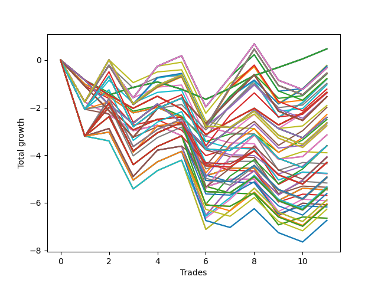

# Long HLT 106_1y 
- Symbol: TSLA
- Date Range: 05/15/2023 - 05/17/2024
- Trading Period: 8:30-12:30
- Number of Trades: 11



| Id. | Name | Win Percent | Profit | Avg Profit / Trade | Avg Time / Trade | Std |      | Name | Win Percent | Profit | Avg Profit / Trade | Avg Time / Trade | Std |
| --- | ---- | ----------- | ------ | ------------------ | ---------------- | --- | ---- | ---- | ----------- | ------ | ------------------ | ---------------- | --- |
| | Sorted By <br> Profit | | | | | | | Sorted By <br> Win Percentage |||||
|0| TP-0.25 180m | 63.64 | 0.47 | 0.04 | 04:54 | 0.47 |     | TP-0.25 180m | 63.64 | 0.47 | 0.04 | 04:54 | 0.47 |
|1| TP-0.25 165m | 63.64 | 0.47 | 0.04 | 04:54 | 0.47 |     | TP-0.25 165m | 63.64 | 0.47 | 0.04 | 04:54 | 0.47 |
|2| TP-0.25 150m | 63.64 | 0.47 | 0.04 | 04:54 | 0.47 |     | TP-0.25 150m | 63.64 | 0.47 | 0.04 | 04:54 | 0.47 |
|3| TP-0.25 135m | 63.64 | 0.47 | 0.04 | 04:54 | 0.47 |     | TP-0.25 135m | 63.64 | 0.47 | 0.04 | 04:54 | 0.47 |
|4| TP-0.25 120m | 63.64 | 0.47 | 0.04 | 04:54 | 0.47 |     | TP-0.25 120m | 63.64 | 0.47 | 0.04 | 04:54 | 0.47 |
|5| TP-0.25 105m | 63.64 | 0.47 | 0.04 | 04:54 | 0.47 |     | TP-0.25 105m | 63.64 | 0.47 | 0.04 | 04:54 | 0.47 |
|6| TP-0.25 90m | 63.64 | 0.47 | 0.04 | 04:54 | 0.47 |     | TP-0.25 90m | 63.64 | 0.47 | 0.04 | 04:54 | 0.47 |
|7| TP-0.25 75m | 63.64 | 0.47 | 0.04 | 04:54 | 0.47 |     | TP-0.25 75m | 63.64 | 0.47 | 0.04 | 04:54 | 0.47 |
|8| TP-0.25 60m | 63.64 | 0.47 | 0.04 | 04:54 | 0.47 |     | TP-0.25 60m | 63.64 | 0.47 | 0.04 | 04:54 | 0.47 |
|9| TP-0.25 45m | 63.64 | 0.47 | 0.04 | 04:54 | 0.47 |     | TP-0.25 45m | 63.64 | 0.47 | 0.04 | 04:54 | 0.47 |
|10| TP-0.25 30m | 63.64 | 0.47 | 0.04 | 04:54 | 0.47 |     | TP-0.25 30m | 63.64 | 0.47 | 0.04 | 04:54 | 0.47 |
|11| TP-0.25 15m | 63.64 | 0.47 | 0.04 | 04:54 | 0.47 |     | TP-0.25 15m | 63.64 | 0.47 | 0.04 | 04:54 | 0.47 |
|12| TP-1.25 45m | 63.64 | -0.22 | -0.02 | 30:27 | 1.33 |     | TP-1.25 45m | 63.64 | -0.22 | -0.02 | 30:27 | 1.33 |
|13| TP-1.75 45m | 63.64 | -0.25 | -0.02 | 34:00 | 1.34 |     | TP-1.75 45m | 63.64 | -0.25 | -0.02 | 34:00 | 1.34 |
|14| TP-1.25 60m | 63.64 | -0.29 | -0.03 | 33:21 | 1.33 |     | TP-1.25 60m | 63.64 | -0.29 | -0.03 | 33:21 | 1.33 |
|15| TP-1.25 180m | 54.55 | -0.33 | -0.03 | 35:27 | 1.37 |     | TP-1.75 60m | 63.64 | -0.59 | -0.05 | 39:38 | 1.33 |
|16| TP-1.25 165m | 54.55 | -0.33 | -0.03 | 35:27 | 1.37 |     | TP-1.5 60m | 63.64 | -0.78 | -0.07 | 36:27 | 1.36 |
|17| TP-1.25 150m | 54.55 | -0.33 | -0.03 | 35:27 | 1.37 |     | TP-1.5 45m | 63.64 | -0.80 | -0.07 | 31:49 | 1.33 |
|18| TP-1.25 135m | 54.55 | -0.33 | -0.03 | 35:27 | 1.37 |     | TP-3 60m | 63.64 | -0.98 | -0.09 | 48:49 | 1.43 |
|19| TP-1.25 120m | 54.55 | -0.33 | -0.03 | 35:27 | 1.37 |     | TP-2 60m | 63.64 | -1.37 | -0.12 | 44:21 | 1.38 |
|20| TP-1.25 105m | 54.55 | -0.33 | -0.03 | 35:27 | 1.37 |     | TP-3 45m | 63.64 | -1.99 | -0.18 | 40:27 | 1.36 |
|21| TP-1.25 90m | 54.55 | -0.33 | -0.03 | 35:27 | 1.37 |     | TP-2 45m | 63.64 | -2.29 | -0.21 | 37:21 | 1.30 |
|22| TP-1.5 180m | 54.55 | -0.55 | -0.05 | 39:43 | 1.42 |     | TP-2.25 60m | 63.64 | -2.68 | -0.24 | 44:43 | 1.57 |
|23| TP-1.5 165m | 54.55 | -0.55 | -0.05 | 39:43 | 1.42 |     | TP-2.75 60m | 63.64 | -3.15 | -0.29 | 45:00 | 1.64 |
|24| TP-1.5 150m | 54.55 | -0.55 | -0.05 | 39:43 | 1.42 |     | TP-2.5 60m | 63.64 | -3.15 | -0.29 | 45:00 | 1.64 |
|25| TP-1.5 135m | 54.55 | -0.55 | -0.05 | 39:43 | 1.42 |     | TP-2.25 45m | 63.64 | -3.60 | -0.33 | 37:43 | 1.50 |
|26| TP-1.5 120m | 54.55 | -0.55 | -0.05 | 39:43 | 1.42 |     | TP-2.75 45m | 63.64 | -4.07 | -0.37 | 38:00 | 1.56 |
|27| TP-1.5 105m | 54.55 | -0.55 | -0.05 | 39:43 | 1.42 |     | TP-2.5 45m | 63.64 | -4.07 | -0.37 | 38:00 | 1.56 |
|28| TP-1.5 90m | 54.55 | -0.55 | -0.05 | 39:43 | 1.42 |     | TP-1.25 180m | 54.55 | -0.33 | -0.03 | 35:27 | 1.37 |
|29| TP-1.75 60m | 63.64 | -0.59 | -0.05 | 39:38 | 1.33 |     | TP-1.25 165m | 54.55 | -0.33 | -0.03 | 35:27 | 1.37 |
|30| TP-1.5 60m | 63.64 | -0.78 | -0.07 | 36:27 | 1.36 |     | TP-1.25 150m | 54.55 | -0.33 | -0.03 | 35:27 | 1.37 |
|31| TP-1.25 75m | 54.55 | -0.78 | -0.07 | 35:16 | 1.34 |     | TP-1.25 135m | 54.55 | -0.33 | -0.03 | 35:27 | 1.37 |
|32| TP-1.5 45m | 63.64 | -0.80 | -0.07 | 31:49 | 1.33 |     | TP-1.25 120m | 54.55 | -0.33 | -0.03 | 35:27 | 1.37 |
|33| TP-1 45m | 54.55 | -0.80 | -0.07 | 27:54 | 1.04 |     | TP-1.25 105m | 54.55 | -0.33 | -0.03 | 35:27 | 1.37 |
|34| TP-3 60m | 63.64 | -0.98 | -0.09 | 48:49 | 1.43 |     | TP-1.25 90m | 54.55 | -0.33 | -0.03 | 35:27 | 1.37 |
|35| TP-1 60m | 54.55 | -1.04 | -0.09 | 29:21 | 1.03 |     | TP-1.5 180m | 54.55 | -0.55 | -0.05 | 39:43 | 1.42 |
|36| TP-1.5 75m | 54.55 | -1.22 | -0.11 | 39:21 | 1.36 |     | TP-1.5 165m | 54.55 | -0.55 | -0.05 | 39:43 | 1.42 |
|37| TP-0.5 180m | 45.45 | -1.36 | -0.12 | 06:49 | 0.68 |     | TP-1.5 150m | 54.55 | -0.55 | -0.05 | 39:43 | 1.42 |
|38| TP-0.5 165m | 45.45 | -1.36 | -0.12 | 06:49 | 0.68 |     | TP-1.5 135m | 54.55 | -0.55 | -0.05 | 39:43 | 1.42 |
|39| TP-0.5 150m | 45.45 | -1.36 | -0.12 | 06:49 | 0.68 |     | TP-1.5 120m | 54.55 | -0.55 | -0.05 | 39:43 | 1.42 |
|40| TP-0.5 135m | 45.45 | -1.36 | -0.12 | 06:49 | 0.68 |     | TP-1.5 105m | 54.55 | -0.55 | -0.05 | 39:43 | 1.42 |
|41| TP-0.5 120m | 45.45 | -1.36 | -0.12 | 06:49 | 0.68 |     | TP-1.5 90m | 54.55 | -0.55 | -0.05 | 39:43 | 1.42 |
|42| TP-0.5 105m | 45.45 | -1.36 | -0.12 | 06:49 | 0.68 |     | TP-1.25 75m | 54.55 | -0.78 | -0.07 | 35:16 | 1.34 |
|43| TP-0.5 90m | 45.45 | -1.36 | -0.12 | 06:49 | 0.68 |     | TP-1 45m | 54.55 | -0.80 | -0.07 | 27:54 | 1.04 |
|44| TP-0.5 75m | 45.45 | -1.36 | -0.12 | 06:49 | 0.68 |     | TP-1 60m | 54.55 | -1.04 | -0.09 | 29:21 | 1.03 |
|45| TP-0.5 60m | 45.45 | -1.36 | -0.12 | 06:49 | 0.68 |     | TP-1.5 75m | 54.55 | -1.22 | -0.11 | 39:21 | 1.36 |
|46| TP-0.5 45m | 45.45 | -1.36 | -0.12 | 06:49 | 0.68 |     | TP-1.75 75m | 54.55 | -1.54 | -0.14 | 43:54 | 1.29 |
|47| TP-0.5 30m | 45.45 | -1.36 | -0.12 | 06:49 | 0.68 |     | TP-0.5 180m | 45.45 | -1.36 | -0.12 | 06:49 | 0.68 |
|48| TP-0.5 15m | 45.45 | -1.36 | -0.12 | 06:49 | 0.68 |     | TP-0.5 165m | 45.45 | -1.36 | -0.12 | 06:49 | 0.68 |
|49| TP-2 60m | 63.64 | -1.37 | -0.12 | 44:21 | 1.38 |     | TP-0.5 150m | 45.45 | -1.36 | -0.12 | 06:49 | 0.68 |
|50| TP-0.75 45m | 45.45 | -1.40 | -0.13 | 19:43 | 0.83 |     | TP-0.5 135m | 45.45 | -1.36 | -0.12 | 06:49 | 0.68 |
|51| TP-1.75 75m | 54.55 | -1.54 | -0.14 | 43:54 | 1.29 |     | TP-0.5 120m | 45.45 | -1.36 | -0.12 | 06:49 | 0.68 |
|52| TP-1 180m | 45.45 | -1.54 | -0.14 | 29:54 | 1.03 |     | TP-0.5 105m | 45.45 | -1.36 | -0.12 | 06:49 | 0.68 |
|53| TP-1 165m | 45.45 | -1.54 | -0.14 | 29:54 | 1.03 |     | TP-0.5 90m | 45.45 | -1.36 | -0.12 | 06:49 | 0.68 |
|54| TP-1 150m | 45.45 | -1.54 | -0.14 | 29:54 | 1.03 |     | TP-0.5 75m | 45.45 | -1.36 | -0.12 | 06:49 | 0.68 |
|55| TP-1 135m | 45.45 | -1.54 | -0.14 | 29:54 | 1.03 |     | TP-0.5 60m | 45.45 | -1.36 | -0.12 | 06:49 | 0.68 |
|56| TP-1 120m | 45.45 | -1.54 | -0.14 | 29:54 | 1.03 |     | TP-0.5 45m | 45.45 | -1.36 | -0.12 | 06:49 | 0.68 |
|57| TP-1 105m | 45.45 | -1.54 | -0.14 | 29:54 | 1.03 |     | TP-0.5 30m | 45.45 | -1.36 | -0.12 | 06:49 | 0.68 |
|58| TP-1 90m | 45.45 | -1.54 | -0.14 | 29:54 | 1.03 |     | TP-0.5 15m | 45.45 | -1.36 | -0.12 | 06:49 | 0.68 |
|59| TP-1 75m | 45.45 | -1.54 | -0.14 | 29:54 | 1.03 |     | TP-0.75 45m | 45.45 | -1.40 | -0.13 | 19:43 | 0.83 |
|60| TP-0.75 60m | 45.45 | -1.91 | -0.17 | 21:05 | 0.80 |     | TP-1 180m | 45.45 | -1.54 | -0.14 | 29:54 | 1.03 |
|61| TP-3 45m | 63.64 | -1.99 | -0.18 | 40:27 | 1.36 |     | TP-1 165m | 45.45 | -1.54 | -0.14 | 29:54 | 1.03 |
|62| TP-2 45m | 63.64 | -2.29 | -0.21 | 37:21 | 1.30 |     | TP-1 150m | 45.45 | -1.54 | -0.14 | 29:54 | 1.03 |
|63| TP-0.75 180m | 36.36 | -2.41 | -0.22 | 21:38 | 0.80 |     | TP-1 135m | 45.45 | -1.54 | -0.14 | 29:54 | 1.03 |
|64| TP-0.75 165m | 36.36 | -2.41 | -0.22 | 21:38 | 0.80 |     | TP-1 120m | 45.45 | -1.54 | -0.14 | 29:54 | 1.03 |
|65| TP-0.75 150m | 36.36 | -2.41 | -0.22 | 21:38 | 0.80 |     | TP-1 105m | 45.45 | -1.54 | -0.14 | 29:54 | 1.03 |
|66| TP-0.75 135m | 36.36 | -2.41 | -0.22 | 21:38 | 0.80 |     | TP-1 90m | 45.45 | -1.54 | -0.14 | 29:54 | 1.03 |
|67| TP-0.75 120m | 36.36 | -2.41 | -0.22 | 21:38 | 0.80 |     | TP-1 75m | 45.45 | -1.54 | -0.14 | 29:54 | 1.03 |
|68| TP-0.75 105m | 36.36 | -2.41 | -0.22 | 21:38 | 0.80 |     | TP-0.75 60m | 45.45 | -1.91 | -0.17 | 21:05 | 0.80 |
|69| TP-0.75 90m | 36.36 | -2.41 | -0.22 | 21:38 | 0.80 |     | TP-0.75 15m | 45.45 | -2.50 | -0.23 | 11:21 | 0.61 |
|70| TP-0.75 75m | 36.36 | -2.41 | -0.22 | 21:38 | 0.80 |     | TP-1.75 180m | 45.45 | -2.64 | -0.24 | 49:54 | 1.24 |
|71| TP-0.75 15m | 45.45 | -2.50 | -0.23 | 11:21 | 0.61 |     | TP-1.75 165m | 45.45 | -2.64 | -0.24 | 49:54 | 1.24 |
|72| TP-1.75 180m | 45.45 | -2.64 | -0.24 | 49:54 | 1.24 |     | TP-1.75 150m | 45.45 | -2.64 | -0.24 | 49:54 | 1.24 |
|73| TP-1.75 165m | 45.45 | -2.64 | -0.24 | 49:54 | 1.24 |     | TP-1.75 135m | 45.45 | -2.64 | -0.24 | 49:54 | 1.24 |
|74| TP-1.75 150m | 45.45 | -2.64 | -0.24 | 49:54 | 1.24 |     | TP-1.75 120m | 45.45 | -2.64 | -0.24 | 49:54 | 1.24 |
|75| TP-1.75 135m | 45.45 | -2.64 | -0.24 | 49:54 | 1.24 |     | TP-1.75 105m | 45.45 | -2.76 | -0.25 | 48:32 | 1.23 |
|76| TP-1.75 120m | 45.45 | -2.64 | -0.24 | 49:54 | 1.24 |     | TP-1.75 90m | 45.45 | -2.77 | -0.25 | 46:38 | 1.25 |
|77| TP-2.25 60m | 63.64 | -2.68 | -0.24 | 44:43 | 1.57 |     | TP-2 180m | 45.45 | -3.61 | -0.33 | 60:05 | 1.26 |
|78| TP-1.75 105m | 45.45 | -2.76 | -0.25 | 48:32 | 1.23 |     | TP-2 165m | 45.45 | -3.61 | -0.33 | 60:05 | 1.26 |
|79| TP-1.75 90m | 45.45 | -2.77 | -0.25 | 46:38 | 1.25 |     | TP-2 150m | 45.45 | -3.61 | -0.33 | 60:05 | 1.26 |
|80| TP-2.75 60m | 63.64 | -3.15 | -0.29 | 45:00 | 1.64 |     | TP-2 135m | 45.45 | -3.61 | -0.33 | 60:05 | 1.26 |
|81| TP-2.5 60m | 63.64 | -3.15 | -0.29 | 45:00 | 1.64 |     | TP-2 120m | 45.45 | -3.61 | -0.33 | 60:05 | 1.26 |
|82| TP-2.25 45m | 63.64 | -3.60 | -0.33 | 37:43 | 1.50 |     | TP-2 75m | 45.45 | -4.10 | -0.37 | 50:00 | 1.22 |
|83| TP-0.75 30m | 27.27 | -3.60 | -0.33 | 16:38 | 0.69 |     | TP-3 105m | 45.45 | -4.30 | -0.39 | 65:54 | 1.27 |
|84| TP-2 180m | 45.45 | -3.61 | -0.33 | 60:05 | 1.26 |     | TP-2 105m | 45.45 | -4.30 | -0.39 | 57:21 | 1.19 |
|85| TP-2 165m | 45.45 | -3.61 | -0.33 | 60:05 | 1.26 |     | TP-3 180m | 45.45 | -4.31 | -0.39 | 70:00 | 1.39 |
|86| TP-2 150m | 45.45 | -3.61 | -0.33 | 60:05 | 1.26 |     | TP-3 165m | 45.45 | -4.31 | -0.39 | 70:00 | 1.39 |
|87| TP-2 135m | 45.45 | -3.61 | -0.33 | 60:05 | 1.26 |     | TP-3 150m | 45.45 | -4.31 | -0.39 | 70:00 | 1.39 |
|88| TP-2 120m | 45.45 | -3.61 | -0.33 | 60:05 | 1.26 |     | TP-3 135m | 45.45 | -4.31 | -0.39 | 70:00 | 1.39 |
|89| TP-1.75 30m | 36.36 | -3.90 | -0.35 | 25:27 | 1.07 |     | TP-3 120m | 45.45 | -4.31 | -0.39 | 70:00 | 1.39 |
|90| TP-2.75 45m | 63.64 | -4.07 | -0.37 | 38:00 | 1.56 |     | TP-2.25 180m | 45.45 | -4.92 | -0.45 | 60:27 | 1.45 |
|91| TP-2.5 45m | 63.64 | -4.07 | -0.37 | 38:00 | 1.56 |     | TP-2.25 165m | 45.45 | -4.92 | -0.45 | 60:27 | 1.45 |
|92| TP-2 75m | 45.45 | -4.10 | -0.37 | 50:00 | 1.22 |     | TP-2.25 150m | 45.45 | -4.92 | -0.45 | 60:27 | 1.45 |
|93| TP-3 105m | 45.45 | -4.30 | -0.39 | 65:54 | 1.27 |     | TP-2.25 135m | 45.45 | -4.92 | -0.45 | 60:27 | 1.45 |
|94| TP-2 105m | 45.45 | -4.30 | -0.39 | 57:21 | 1.19 |     | TP-2.25 120m | 45.45 | -4.92 | -0.45 | 60:27 | 1.45 |
|95| TP-3 180m | 45.45 | -4.31 | -0.39 | 70:00 | 1.39 |     | TP-2 90m | 45.45 | -4.96 | -0.45 | 54:05 | 1.16 |
|96| TP-3 165m | 45.45 | -4.31 | -0.39 | 70:00 | 1.39 |     | TP-3 75m | 45.45 | -5.33 | -0.48 | 55:49 | 1.40 |
|97| TP-3 150m | 45.45 | -4.31 | -0.39 | 70:00 | 1.39 |     | TP-2.75 180m | 45.45 | -5.39 | -0.49 | 60:43 | 1.52 |
|98| TP-3 135m | 45.45 | -4.31 | -0.39 | 70:00 | 1.39 |     | TP-2.5 180m | 45.45 | -5.39 | -0.49 | 60:43 | 1.52 |
|99| TP-3 120m | 45.45 | -4.31 | -0.39 | 70:00 | 1.39 |     | TP-2.75 165m | 45.45 | -5.39 | -0.49 | 60:43 | 1.52 |
|100| TP-1.5 30m | 36.36 | -4.36 | -0.40 | 23:27 | 1.05 |     | TP-2.5 165m | 45.45 | -5.39 | -0.49 | 60:43 | 1.52 |
|101| TP-2 30m | 36.36 | -4.76 | -0.43 | 27:21 | 1.02 |     | TP-2.75 150m | 45.45 | -5.39 | -0.49 | 60:43 | 1.52 |
|102| TP-1.25 30m | 36.36 | -4.77 | -0.43 | 22:43 | 1.07 |     | TP-2.5 150m | 45.45 | -5.39 | -0.49 | 60:43 | 1.52 |
|103| TP-1 15m | 36.36 | -4.78 | -0.43 | 12:38 | 0.66 |     | TP-2.75 135m | 45.45 | -5.39 | -0.49 | 60:43 | 1.52 |
|104| TP-2.25 180m | 45.45 | -4.92 | -0.45 | 60:27 | 1.45 |     | TP-2.5 135m | 45.45 | -5.39 | -0.49 | 60:43 | 1.52 |
|105| TP-2.25 165m | 45.45 | -4.92 | -0.45 | 60:27 | 1.45 |     | TP-2.75 120m | 45.45 | -5.39 | -0.49 | 60:43 | 1.52 |
|106| TP-2.25 150m | 45.45 | -4.92 | -0.45 | 60:27 | 1.45 |     | TP-2.5 120m | 45.45 | -5.39 | -0.49 | 60:43 | 1.52 |
|107| TP-2.25 135m | 45.45 | -4.92 | -0.45 | 60:27 | 1.45 |     | TP-2.25 75m | 45.45 | -5.41 | -0.49 | 50:21 | 1.41 |
|108| TP-2.25 120m | 45.45 | -4.92 | -0.45 | 60:27 | 1.45 |     | TP-2.25 105m | 45.45 | -5.61 | -0.51 | 57:43 | 1.39 |
|109| TP-2 90m | 45.45 | -4.96 | -0.45 | 54:05 | 1.16 |     | TP-2.75 75m | 45.45 | -5.88 | -0.53 | 50:38 | 1.48 |
|110| TP-2 15m | 36.36 | -5.17 | -0.47 | 13:54 | 0.76 |     | TP-2.5 75m | 45.45 | -5.88 | -0.53 | 50:38 | 1.48 |
|111| TP-3 75m | 45.45 | -5.33 | -0.48 | 55:49 | 1.40 |     | TP-3 90m | 45.45 | -6.04 | -0.55 | 61:16 | 1.33 |
|112| TP-1 30m | 27.27 | -5.35 | -0.49 | 21:05 | 0.66 |     | TP-2.75 105m | 45.45 | -6.08 | -0.55 | 58:00 | 1.45 |
|113| TP-2.75 180m | 45.45 | -5.39 | -0.49 | 60:43 | 1.52 |     | TP-2.5 105m | 45.45 | -6.08 | -0.55 | 58:00 | 1.45 |
|114| TP-2.5 180m | 45.45 | -5.39 | -0.49 | 60:43 | 1.52 |     | TP-2.25 90m | 45.45 | -6.27 | -0.57 | 54:27 | 1.36 |
|115| TP-2.75 165m | 45.45 | -5.39 | -0.49 | 60:43 | 1.52 |     | TP-2.75 90m | 45.45 | -6.74 | -0.61 | 54:43 | 1.42 |
|116| TP-2.5 165m | 45.45 | -5.39 | -0.49 | 60:43 | 1.52 |     | TP-2.5 90m | 45.45 | -6.74 | -0.61 | 54:43 | 1.42 |
|117| TP-2.75 150m | 45.45 | -5.39 | -0.49 | 60:43 | 1.52 |     | TP-0.75 180m | 36.36 | -2.41 | -0.22 | 21:38 | 0.80 |
|118| TP-2.5 150m | 45.45 | -5.39 | -0.49 | 60:43 | 1.52 |     | TP-0.75 165m | 36.36 | -2.41 | -0.22 | 21:38 | 0.80 |
|119| TP-2.75 135m | 45.45 | -5.39 | -0.49 | 60:43 | 1.52 |     | TP-0.75 150m | 36.36 | -2.41 | -0.22 | 21:38 | 0.80 |
|120| TP-2.5 135m | 45.45 | -5.39 | -0.49 | 60:43 | 1.52 |     | TP-0.75 135m | 36.36 | -2.41 | -0.22 | 21:38 | 0.80 |
|121| TP-2.75 120m | 45.45 | -5.39 | -0.49 | 60:43 | 1.52 |     | TP-0.75 120m | 36.36 | -2.41 | -0.22 | 21:38 | 0.80 |
|122| TP-2.5 120m | 45.45 | -5.39 | -0.49 | 60:43 | 1.52 |     | TP-0.75 105m | 36.36 | -2.41 | -0.22 | 21:38 | 0.80 |
|123| TP-2.25 75m | 45.45 | -5.41 | -0.49 | 50:21 | 1.41 |     | TP-0.75 90m | 36.36 | -2.41 | -0.22 | 21:38 | 0.80 |
|124| TP-3 15m | 36.36 | -5.46 | -0.50 | 14:00 | 0.82 |     | TP-0.75 75m | 36.36 | -2.41 | -0.22 | 21:38 | 0.80 |
|125| TP-2.75 15m | 36.36 | -5.46 | -0.50 | 14:00 | 0.82 |     | TP-1.75 30m | 36.36 | -3.90 | -0.35 | 25:27 | 1.07 |
|126| TP-2.5 15m | 36.36 | -5.46 | -0.50 | 14:00 | 0.82 |     | TP-1.5 30m | 36.36 | -4.36 | -0.40 | 23:27 | 1.05 |
|127| TP-2.25 15m | 36.36 | -5.46 | -0.50 | 14:00 | 0.82 |     | TP-2 30m | 36.36 | -4.76 | -0.43 | 27:21 | 1.02 |
|128| TP-2.25 105m | 45.45 | -5.61 | -0.51 | 57:43 | 1.39 |     | TP-1.25 30m | 36.36 | -4.77 | -0.43 | 22:43 | 1.07 |
|129| TP-3 30m | 36.36 | -5.69 | -0.52 | 28:54 | 1.19 |     | TP-1 15m | 36.36 | -4.78 | -0.43 | 12:38 | 0.66 |
|130| TP-2.75 75m | 45.45 | -5.88 | -0.53 | 50:38 | 1.48 |     | TP-2 15m | 36.36 | -5.17 | -0.47 | 13:54 | 0.76 |
|131| TP-2.5 75m | 45.45 | -5.88 | -0.53 | 50:38 | 1.48 |     | TP-3 15m | 36.36 | -5.46 | -0.50 | 14:00 | 0.82 |
|132| TP-1.75 15m | 36.36 | -5.92 | -0.54 | 13:27 | 0.84 |     | TP-2.75 15m | 36.36 | -5.46 | -0.50 | 14:00 | 0.82 |
|133| TP-3 90m | 45.45 | -6.04 | -0.55 | 61:16 | 1.33 |     | TP-2.5 15m | 36.36 | -5.46 | -0.50 | 14:00 | 0.82 |
|134| TP-2.75 105m | 45.45 | -6.08 | -0.55 | 58:00 | 1.45 |     | TP-2.25 15m | 36.36 | -5.46 | -0.50 | 14:00 | 0.82 |
|135| TP-2.5 105m | 45.45 | -6.08 | -0.55 | 58:00 | 1.45 |     | TP-3 30m | 36.36 | -5.69 | -0.52 | 28:54 | 1.19 |
|136| TP-1.5 15m | 36.36 | -6.09 | -0.55 | 13:00 | 0.86 |     | TP-1.75 15m | 36.36 | -5.92 | -0.54 | 13:27 | 0.84 |
|137| TP-1.25 15m | 36.36 | -6.09 | -0.55 | 13:00 | 0.86 |     | TP-1.5 15m | 36.36 | -6.09 | -0.55 | 13:00 | 0.86 |
|138| TP-2.25 30m | 36.36 | -6.18 | -0.56 | 27:32 | 1.25 |     | TP-1.25 15m | 36.36 | -6.09 | -0.55 | 13:00 | 0.86 |
|139| TP-2.25 90m | 45.45 | -6.27 | -0.57 | 54:27 | 1.36 |     | TP-2.25 30m | 36.36 | -6.18 | -0.56 | 27:32 | 1.25 |
|140| TP-2.75 30m | 36.36 | -6.65 | -0.60 | 27:49 | 1.32 |     | TP-2.75 30m | 36.36 | -6.65 | -0.60 | 27:49 | 1.32 |
|141| TP-2.5 30m | 36.36 | -6.65 | -0.60 | 27:49 | 1.32 |     | TP-2.5 30m | 36.36 | -6.65 | -0.60 | 27:49 | 1.32 |
|142| TP-2.75 90m | 45.45 | -6.74 | -0.61 | 54:43 | 1.42 |     | TP-0.75 30m | 27.27 | -3.60 | -0.33 | 16:38 | 0.69 |
|143| TP-2.5 90m | 45.45 | -6.74 | -0.61 | 54:43 | 1.42 |     | TP-1 30m | 27.27 | -5.35 | -0.49 | 21:05 | 0.66 |

### Test TP-0.25 15m
* Take Profit of 0.25 Point
* 0.25 Stoploss
* Results:
```
Total Trades: 11
Percent Up: 63.64
Percent Down: 36.36
Total Points Moved Up: 0.47
Potential Profit: 235.00
Total Points Ups: 2.67 Count Ups: 7
Total Points Downs: -2.20 Count Downs: 4
```

<details><summary>Trades</summary>

<code>In: 2023-06-26 08:35:00		Out: 2023-06-26 08:42:00		Total Position Time: 07:00		Total Move Up: -0.84		Total to Date: -0.84</code> <br />
<code>In: 2023-06-26 09:35:00		Out: 2023-06-26 09:39:00		Total Position Time: 04:00		Total Move Up: -0.63		Total to Date: -1.47</code> <br />
<code>In: 2023-07-27 12:15:00		Out: 2023-07-27 12:20:00		Total Position Time: 05:00		Total Move Up: 0.32		Total to Date: -1.15</code> <br />
<code>In: 2023-09-15 11:40:00		Out: 2023-09-15 11:45:00		Total Position Time: 05:00		Total Move Up: 0.23		Total to Date: -0.92</code> <br />
<code>In: 2023-10-19 12:05:00		Out: 2023-10-19 12:13:00		Total Position Time: 08:00		Total Move Up: -0.31		Total to Date: -1.23</code> <br />
<code>In: 2023-11-09 09:50:00		Out: 2023-11-09 09:56:00		Total Position Time: 06:00		Total Move Up: -0.42		Total to Date: -1.65</code> <br />
<code>In: 2023-12-05 11:15:00		Out: 2023-12-05 11:17:00		Total Position Time: 02:00		Total Move Up: 0.46		Total to Date: -1.19</code> <br />
<code>In: 2023-12-13 08:40:00		Out: 2023-12-13 08:44:00		Total Position Time: 04:00		Total Move Up: 0.54		Total to Date: -0.65</code> <br />
<code>In: 2023-12-20 12:20:00		Out: 2023-12-20 12:23:00		Total Position Time: 03:00		Total Move Up: 0.34		Total to Date: -0.31</code> <br />
<code>In: 2023-12-22 11:45:00		Out: 2023-12-22 11:53:00		Total Position Time: 08:00		Total Move Up: 0.36		Total to Date: 0.05</code> <br />
<code>In: 2024-04-26 12:05:00		Out: 2024-04-26 12:07:00		Total Position Time: 02:00		Total Move Up: 0.42		Total to Date: 0.47</code> <br />


</details>

### Test TP-0.5 15m
* Take Profit of 0.5 Point
* 0.5 Stoploss
* Results:
```
Total Trades: 11
Percent Up: 45.45
Percent Down: 54.55
Total Points Moved Up: -1.36
Potential Profit: -680.00
Total Points Ups: 2.98 Count Ups: 5
Total Points Downs: -4.34 Count Downs: 6
```

<details><summary>Trades</summary>

<code>In: 2023-06-26 08:35:00		Out: 2023-06-26 08:42:00		Total Position Time: 07:00		Total Move Up: -0.84		Total to Date: -0.84</code> <br />
<code>In: 2023-06-26 09:35:00		Out: 2023-06-26 09:39:00		Total Position Time: 04:00		Total Move Up: -0.63		Total to Date: -1.47</code> <br />
<code>In: 2023-07-27 12:15:00		Out: 2023-07-27 12:24:00		Total Position Time: 09:00		Total Move Up: -0.56		Total to Date: -2.03</code> <br />
<code>In: 2023-09-15 11:40:00		Out: 2023-09-15 11:48:00		Total Position Time: 08:00		Total Move Up: 0.51		Total to Date: -1.52</code> <br />
<code>In: 2023-10-19 12:05:00		Out: 2023-10-19 12:14:00		Total Position Time: 09:00		Total Move Up: -0.54		Total to Date: -2.06</code> <br />
<code>In: 2023-11-09 09:50:00		Out: 2023-11-09 10:02:00		Total Position Time: 12:00		Total Move Up: -1.07		Total to Date: -3.13</code> <br />
<code>In: 2023-12-05 11:15:00		Out: 2023-12-05 11:18:00		Total Position Time: 03:00		Total Move Up: 0.56		Total to Date: -2.57</code> <br />
<code>In: 2023-12-13 08:40:00		Out: 2023-12-13 08:44:00		Total Position Time: 04:00		Total Move Up: 0.54		Total to Date: -2.03</code> <br />
<code>In: 2023-12-20 12:20:00		Out: 2023-12-20 12:25:00		Total Position Time: 05:00		Total Move Up: -0.70		Total to Date: -2.73</code> <br />
<code>In: 2023-12-22 11:45:00		Out: 2023-12-22 11:54:00		Total Position Time: 09:00		Total Move Up: 0.51		Total to Date: -2.22</code> <br />
<code>In: 2024-04-26 12:05:00		Out: 2024-04-26 12:10:00		Total Position Time: 05:00		Total Move Up: 0.86		Total to Date: -1.36</code> <br />


</details>

### Test TP-0.75 15m
* Take Profit of 0.75 Point
* 0.75 Stoploss
* Results:
```
Total Trades: 11
Percent Up: 45.45
Percent Down: 54.55
Total Points Moved Up: -2.50
Potential Profit: -1250.00
Total Points Ups: 1.93 Count Ups: 5
Total Points Downs: -4.43 Count Downs: 6
```

<details><summary>Trades</summary>

<code>In: 2023-06-26 08:35:00		Out: 2023-06-26 08:42:00		Total Position Time: 07:00		Total Move Up: -0.84		Total to Date: -0.84</code> <br />
<code>In: 2023-06-26 09:35:00		Out: 2023-06-26 09:49:00		Total Position Time: 14:00		Total Move Up: -0.53		Total to Date: -1.37</code> <br />
<code>In: 2023-07-27 12:15:00		Out: 2023-07-27 12:25:00		Total Position Time: 10:00		Total Move Up: -0.78		Total to Date: -2.15</code> <br />
<code>In: 2023-09-15 11:40:00		Out: 2023-09-15 11:54:00		Total Position Time: 14:00		Total Move Up: 0.23		Total to Date: -1.92</code> <br />
<code>In: 2023-10-19 12:05:00		Out: 2023-10-19 12:19:00		Total Position Time: 14:00		Total Move Up: -0.44		Total to Date: -2.36</code> <br />
<code>In: 2023-11-09 09:50:00		Out: 2023-11-09 10:02:00		Total Position Time: 12:00		Total Move Up: -1.07		Total to Date: -3.43</code> <br />
<code>In: 2023-12-05 11:15:00		Out: 2023-12-05 11:29:00		Total Position Time: 14:00		Total Move Up: 0.32		Total to Date: -3.11</code> <br />
<code>In: 2023-12-13 08:40:00		Out: 2023-12-13 08:54:00		Total Position Time: 14:00		Total Move Up: 0.00		Total to Date: -3.11</code> <br />
<code>In: 2023-12-20 12:20:00		Out: 2023-12-20 12:27:00		Total Position Time: 07:00		Total Move Up: -0.77		Total to Date: -3.88</code> <br />
<code>In: 2023-12-22 11:45:00		Out: 2023-12-22 11:59:00		Total Position Time: 14:00		Total Move Up: 0.52		Total to Date: -3.36</code> <br />
<code>In: 2024-04-26 12:05:00		Out: 2024-04-26 12:10:00		Total Position Time: 05:00		Total Move Up: 0.86		Total to Date: -2.50</code> <br />


</details>

### Test TP-1 15m
* Take Profit of 1 Point
* 1 Stoploss
* Results:
```
Total Trades: 11
Percent Up: 36.36
Percent Down: 63.64
Total Points Moved Up: -4.78
Potential Profit: -2390.00
Total Points Ups: 1.07 Count Ups: 4
Total Points Downs: -5.85 Count Downs: 7
```

<details><summary>Trades</summary>

<code>In: 2023-06-26 08:35:00		Out: 2023-06-26 08:43:00		Total Position Time: 08:00		Total Move Up: -1.09		Total to Date: -1.09</code> <br />
<code>In: 2023-06-26 09:35:00		Out: 2023-06-26 09:49:00		Total Position Time: 14:00		Total Move Up: -0.53		Total to Date: -1.62</code> <br />
<code>In: 2023-07-27 12:15:00		Out: 2023-07-27 12:27:00		Total Position Time: 12:00		Total Move Up: -1.12		Total to Date: -2.74</code> <br />
<code>In: 2023-09-15 11:40:00		Out: 2023-09-15 11:54:00		Total Position Time: 14:00		Total Move Up: 0.23		Total to Date: -2.51</code> <br />
<code>In: 2023-10-19 12:05:00		Out: 2023-10-19 12:19:00		Total Position Time: 14:00		Total Move Up: -0.44		Total to Date: -2.95</code> <br />
<code>In: 2023-11-09 09:50:00		Out: 2023-11-09 10:02:00		Total Position Time: 12:00		Total Move Up: -1.07		Total to Date: -4.02</code> <br />
<code>In: 2023-12-05 11:15:00		Out: 2023-12-05 11:29:00		Total Position Time: 14:00		Total Move Up: 0.32		Total to Date: -3.70</code> <br />
<code>In: 2023-12-13 08:40:00		Out: 2023-12-13 08:54:00		Total Position Time: 14:00		Total Move Up: 0.00		Total to Date: -3.70</code> <br />
<code>In: 2023-12-20 12:20:00		Out: 2023-12-20 12:29:00		Total Position Time: 09:00		Total Move Up: -1.53		Total to Date: -5.23</code> <br />
<code>In: 2023-12-22 11:45:00		Out: 2023-12-22 11:59:00		Total Position Time: 14:00		Total Move Up: 0.52		Total to Date: -4.71</code> <br />
<code>In: 2024-04-26 12:05:00		Out: 2024-04-26 12:19:00		Total Position Time: 14:00		Total Move Up: -0.07		Total to Date: -4.78</code> <br />


</details>

### Test TP-1.25 15m
* Take Profit of 1.25 Point
* 1.25 Stoploss
* Results:
```
Total Trades: 11
Percent Up: 36.36
Percent Down: 63.64
Total Points Moved Up: -6.09
Potential Profit: -3045.00
Total Points Ups: 1.07 Count Ups: 4
Total Points Downs: -7.16 Count Downs: 7
```

<details><summary>Trades</summary>

<code>In: 2023-06-26 08:35:00		Out: 2023-06-26 08:44:00		Total Position Time: 09:00		Total Move Up: -1.76		Total to Date: -1.76</code> <br />
<code>In: 2023-06-26 09:35:00		Out: 2023-06-26 09:49:00		Total Position Time: 14:00		Total Move Up: -0.53		Total to Date: -2.29</code> <br />
<code>In: 2023-07-27 12:15:00		Out: 2023-07-27 12:29:00		Total Position Time: 14:00		Total Move Up: -0.68		Total to Date: -2.97</code> <br />
<code>In: 2023-09-15 11:40:00		Out: 2023-09-15 11:54:00		Total Position Time: 14:00		Total Move Up: 0.23		Total to Date: -2.74</code> <br />
<code>In: 2023-10-19 12:05:00		Out: 2023-10-19 12:19:00		Total Position Time: 14:00		Total Move Up: -0.44		Total to Date: -3.18</code> <br />
<code>In: 2023-11-09 09:50:00		Out: 2023-11-09 10:03:00		Total Position Time: 13:00		Total Move Up: -2.15		Total to Date: -5.33</code> <br />
<code>In: 2023-12-05 11:15:00		Out: 2023-12-05 11:29:00		Total Position Time: 14:00		Total Move Up: 0.32		Total to Date: -5.01</code> <br />
<code>In: 2023-12-13 08:40:00		Out: 2023-12-13 08:54:00		Total Position Time: 14:00		Total Move Up: 0.00		Total to Date: -5.01</code> <br />
<code>In: 2023-12-20 12:20:00		Out: 2023-12-20 12:29:00		Total Position Time: 09:00		Total Move Up: -1.53		Total to Date: -6.54</code> <br />
<code>In: 2023-12-22 11:45:00		Out: 2023-12-22 11:59:00		Total Position Time: 14:00		Total Move Up: 0.52		Total to Date: -6.02</code> <br />
<code>In: 2024-04-26 12:05:00		Out: 2024-04-26 12:19:00		Total Position Time: 14:00		Total Move Up: -0.07		Total to Date: -6.09</code> <br />


</details>

### Test TP-1.5 15m
* Take Profit of 1.5 Point
* 1.5 Stoploss
* Results:
```
Total Trades: 11
Percent Up: 36.36
Percent Down: 63.64
Total Points Moved Up: -6.09
Potential Profit: -3045.00
Total Points Ups: 1.07 Count Ups: 4
Total Points Downs: -7.16 Count Downs: 7
```

<details><summary>Trades</summary>

<code>In: 2023-06-26 08:35:00		Out: 2023-06-26 08:44:00		Total Position Time: 09:00		Total Move Up: -1.76		Total to Date: -1.76</code> <br />
<code>In: 2023-06-26 09:35:00		Out: 2023-06-26 09:49:00		Total Position Time: 14:00		Total Move Up: -0.53		Total to Date: -2.29</code> <br />
<code>In: 2023-07-27 12:15:00		Out: 2023-07-27 12:29:00		Total Position Time: 14:00		Total Move Up: -0.68		Total to Date: -2.97</code> <br />
<code>In: 2023-09-15 11:40:00		Out: 2023-09-15 11:54:00		Total Position Time: 14:00		Total Move Up: 0.23		Total to Date: -2.74</code> <br />
<code>In: 2023-10-19 12:05:00		Out: 2023-10-19 12:19:00		Total Position Time: 14:00		Total Move Up: -0.44		Total to Date: -3.18</code> <br />
<code>In: 2023-11-09 09:50:00		Out: 2023-11-09 10:03:00		Total Position Time: 13:00		Total Move Up: -2.15		Total to Date: -5.33</code> <br />
<code>In: 2023-12-05 11:15:00		Out: 2023-12-05 11:29:00		Total Position Time: 14:00		Total Move Up: 0.32		Total to Date: -5.01</code> <br />
<code>In: 2023-12-13 08:40:00		Out: 2023-12-13 08:54:00		Total Position Time: 14:00		Total Move Up: 0.00		Total to Date: -5.01</code> <br />
<code>In: 2023-12-20 12:20:00		Out: 2023-12-20 12:29:00		Total Position Time: 09:00		Total Move Up: -1.53		Total to Date: -6.54</code> <br />
<code>In: 2023-12-22 11:45:00		Out: 2023-12-22 11:59:00		Total Position Time: 14:00		Total Move Up: 0.52		Total to Date: -6.02</code> <br />
<code>In: 2024-04-26 12:05:00		Out: 2024-04-26 12:19:00		Total Position Time: 14:00		Total Move Up: -0.07		Total to Date: -6.09</code> <br />


</details>

### Test TP-1.75 15m
* Take Profit of 1.75 Point
* 1.75 Stoploss
* Results:
```
Total Trades: 11
Percent Up: 36.36
Percent Down: 63.64
Total Points Moved Up: -5.92
Potential Profit: -2960.00
Total Points Ups: 1.07 Count Ups: 4
Total Points Downs: -6.99 Count Downs: 7
```

<details><summary>Trades</summary>

<code>In: 2023-06-26 08:35:00		Out: 2023-06-26 08:44:00		Total Position Time: 09:00		Total Move Up: -1.76		Total to Date: -1.76</code> <br />
<code>In: 2023-06-26 09:35:00		Out: 2023-06-26 09:49:00		Total Position Time: 14:00		Total Move Up: -0.53		Total to Date: -2.29</code> <br />
<code>In: 2023-07-27 12:15:00		Out: 2023-07-27 12:29:00		Total Position Time: 14:00		Total Move Up: -0.68		Total to Date: -2.97</code> <br />
<code>In: 2023-09-15 11:40:00		Out: 2023-09-15 11:54:00		Total Position Time: 14:00		Total Move Up: 0.23		Total to Date: -2.74</code> <br />
<code>In: 2023-10-19 12:05:00		Out: 2023-10-19 12:19:00		Total Position Time: 14:00		Total Move Up: -0.44		Total to Date: -3.18</code> <br />
<code>In: 2023-11-09 09:50:00		Out: 2023-11-09 10:03:00		Total Position Time: 13:00		Total Move Up: -2.15		Total to Date: -5.33</code> <br />
<code>In: 2023-12-05 11:15:00		Out: 2023-12-05 11:29:00		Total Position Time: 14:00		Total Move Up: 0.32		Total to Date: -5.01</code> <br />
<code>In: 2023-12-13 08:40:00		Out: 2023-12-13 08:54:00		Total Position Time: 14:00		Total Move Up: 0.00		Total to Date: -5.01</code> <br />
<code>In: 2023-12-20 12:20:00		Out: 2023-12-20 12:34:00		Total Position Time: 14:00		Total Move Up: -1.36		Total to Date: -6.37</code> <br />
<code>In: 2023-12-22 11:45:00		Out: 2023-12-22 11:59:00		Total Position Time: 14:00		Total Move Up: 0.52		Total to Date: -5.85</code> <br />
<code>In: 2024-04-26 12:05:00		Out: 2024-04-26 12:19:00		Total Position Time: 14:00		Total Move Up: -0.07		Total to Date: -5.92</code> <br />


</details>

### Test TP-2 15m
* Take Profit of 2 Point
* 2 Stoploss
* Results:
```
Total Trades: 11
Percent Up: 36.36
Percent Down: 63.64
Total Points Moved Up: -5.17
Potential Profit: -2585.00
Total Points Ups: 1.07 Count Ups: 4
Total Points Downs: -6.24 Count Downs: 7
```

<details><summary>Trades</summary>

<code>In: 2023-06-26 08:35:00		Out: 2023-06-26 08:49:00		Total Position Time: 14:00		Total Move Up: -1.01		Total to Date: -1.01</code> <br />
<code>In: 2023-06-26 09:35:00		Out: 2023-06-26 09:49:00		Total Position Time: 14:00		Total Move Up: -0.53		Total to Date: -1.54</code> <br />
<code>In: 2023-07-27 12:15:00		Out: 2023-07-27 12:29:00		Total Position Time: 14:00		Total Move Up: -0.68		Total to Date: -2.22</code> <br />
<code>In: 2023-09-15 11:40:00		Out: 2023-09-15 11:54:00		Total Position Time: 14:00		Total Move Up: 0.23		Total to Date: -1.99</code> <br />
<code>In: 2023-10-19 12:05:00		Out: 2023-10-19 12:19:00		Total Position Time: 14:00		Total Move Up: -0.44		Total to Date: -2.43</code> <br />
<code>In: 2023-11-09 09:50:00		Out: 2023-11-09 10:03:00		Total Position Time: 13:00		Total Move Up: -2.15		Total to Date: -4.58</code> <br />
<code>In: 2023-12-05 11:15:00		Out: 2023-12-05 11:29:00		Total Position Time: 14:00		Total Move Up: 0.32		Total to Date: -4.26</code> <br />
<code>In: 2023-12-13 08:40:00		Out: 2023-12-13 08:54:00		Total Position Time: 14:00		Total Move Up: 0.00		Total to Date: -4.26</code> <br />
<code>In: 2023-12-20 12:20:00		Out: 2023-12-20 12:34:00		Total Position Time: 14:00		Total Move Up: -1.36		Total to Date: -5.62</code> <br />
<code>In: 2023-12-22 11:45:00		Out: 2023-12-22 11:59:00		Total Position Time: 14:00		Total Move Up: 0.52		Total to Date: -5.10</code> <br />
<code>In: 2024-04-26 12:05:00		Out: 2024-04-26 12:19:00		Total Position Time: 14:00		Total Move Up: -0.07		Total to Date: -5.17</code> <br />


</details>

### Test TP-2.25 15m
* Take Profit of 2.25 Point
* 2.25 Stoploss
* Results:
```
Total Trades: 11
Percent Up: 36.36
Percent Down: 63.64
Total Points Moved Up: -5.46
Potential Profit: -2730.00
Total Points Ups: 1.07 Count Ups: 4
Total Points Downs: -6.53 Count Downs: 7
```

<details><summary>Trades</summary>

<code>In: 2023-06-26 08:35:00		Out: 2023-06-26 08:49:00		Total Position Time: 14:00		Total Move Up: -1.01		Total to Date: -1.01</code> <br />
<code>In: 2023-06-26 09:35:00		Out: 2023-06-26 09:49:00		Total Position Time: 14:00		Total Move Up: -0.53		Total to Date: -1.54</code> <br />
<code>In: 2023-07-27 12:15:00		Out: 2023-07-27 12:29:00		Total Position Time: 14:00		Total Move Up: -0.68		Total to Date: -2.22</code> <br />
<code>In: 2023-09-15 11:40:00		Out: 2023-09-15 11:54:00		Total Position Time: 14:00		Total Move Up: 0.23		Total to Date: -1.99</code> <br />
<code>In: 2023-10-19 12:05:00		Out: 2023-10-19 12:19:00		Total Position Time: 14:00		Total Move Up: -0.44		Total to Date: -2.43</code> <br />
<code>In: 2023-11-09 09:50:00		Out: 2023-11-09 10:04:00		Total Position Time: 14:00		Total Move Up: -2.44		Total to Date: -4.87</code> <br />
<code>In: 2023-12-05 11:15:00		Out: 2023-12-05 11:29:00		Total Position Time: 14:00		Total Move Up: 0.32		Total to Date: -4.55</code> <br />
<code>In: 2023-12-13 08:40:00		Out: 2023-12-13 08:54:00		Total Position Time: 14:00		Total Move Up: 0.00		Total to Date: -4.55</code> <br />
<code>In: 2023-12-20 12:20:00		Out: 2023-12-20 12:34:00		Total Position Time: 14:00		Total Move Up: -1.36		Total to Date: -5.91</code> <br />
<code>In: 2023-12-22 11:45:00		Out: 2023-12-22 11:59:00		Total Position Time: 14:00		Total Move Up: 0.52		Total to Date: -5.39</code> <br />
<code>In: 2024-04-26 12:05:00		Out: 2024-04-26 12:19:00		Total Position Time: 14:00		Total Move Up: -0.07		Total to Date: -5.46</code> <br />


</details>

### Test TP-2.5 15m
* Take Profit of 2.5 Point
* 2.5 Stoploss
* Results:
```
Total Trades: 11
Percent Up: 36.36
Percent Down: 63.64
Total Points Moved Up: -5.46
Potential Profit: -2730.00
Total Points Ups: 1.07 Count Ups: 4
Total Points Downs: -6.53 Count Downs: 7
```

<details><summary>Trades</summary>

<code>In: 2023-06-26 08:35:00		Out: 2023-06-26 08:49:00		Total Position Time: 14:00		Total Move Up: -1.01		Total to Date: -1.01</code> <br />
<code>In: 2023-06-26 09:35:00		Out: 2023-06-26 09:49:00		Total Position Time: 14:00		Total Move Up: -0.53		Total to Date: -1.54</code> <br />
<code>In: 2023-07-27 12:15:00		Out: 2023-07-27 12:29:00		Total Position Time: 14:00		Total Move Up: -0.68		Total to Date: -2.22</code> <br />
<code>In: 2023-09-15 11:40:00		Out: 2023-09-15 11:54:00		Total Position Time: 14:00		Total Move Up: 0.23		Total to Date: -1.99</code> <br />
<code>In: 2023-10-19 12:05:00		Out: 2023-10-19 12:19:00		Total Position Time: 14:00		Total Move Up: -0.44		Total to Date: -2.43</code> <br />
<code>In: 2023-11-09 09:50:00		Out: 2023-11-09 10:04:00		Total Position Time: 14:00		Total Move Up: -2.44		Total to Date: -4.87</code> <br />
<code>In: 2023-12-05 11:15:00		Out: 2023-12-05 11:29:00		Total Position Time: 14:00		Total Move Up: 0.32		Total to Date: -4.55</code> <br />
<code>In: 2023-12-13 08:40:00		Out: 2023-12-13 08:54:00		Total Position Time: 14:00		Total Move Up: 0.00		Total to Date: -4.55</code> <br />
<code>In: 2023-12-20 12:20:00		Out: 2023-12-20 12:34:00		Total Position Time: 14:00		Total Move Up: -1.36		Total to Date: -5.91</code> <br />
<code>In: 2023-12-22 11:45:00		Out: 2023-12-22 11:59:00		Total Position Time: 14:00		Total Move Up: 0.52		Total to Date: -5.39</code> <br />
<code>In: 2024-04-26 12:05:00		Out: 2024-04-26 12:19:00		Total Position Time: 14:00		Total Move Up: -0.07		Total to Date: -5.46</code> <br />


</details>

### Test TP-2.75 15m
* Take Profit of 2.75 Point
* 2.75 Stoploss
* Results:
```
Total Trades: 11
Percent Up: 36.36
Percent Down: 63.64
Total Points Moved Up: -5.46
Potential Profit: -2730.00
Total Points Ups: 1.07 Count Ups: 4
Total Points Downs: -6.53 Count Downs: 7
```

<details><summary>Trades</summary>

<code>In: 2023-06-26 08:35:00		Out: 2023-06-26 08:49:00		Total Position Time: 14:00		Total Move Up: -1.01		Total to Date: -1.01</code> <br />
<code>In: 2023-06-26 09:35:00		Out: 2023-06-26 09:49:00		Total Position Time: 14:00		Total Move Up: -0.53		Total to Date: -1.54</code> <br />
<code>In: 2023-07-27 12:15:00		Out: 2023-07-27 12:29:00		Total Position Time: 14:00		Total Move Up: -0.68		Total to Date: -2.22</code> <br />
<code>In: 2023-09-15 11:40:00		Out: 2023-09-15 11:54:00		Total Position Time: 14:00		Total Move Up: 0.23		Total to Date: -1.99</code> <br />
<code>In: 2023-10-19 12:05:00		Out: 2023-10-19 12:19:00		Total Position Time: 14:00		Total Move Up: -0.44		Total to Date: -2.43</code> <br />
<code>In: 2023-11-09 09:50:00		Out: 2023-11-09 10:04:00		Total Position Time: 14:00		Total Move Up: -2.44		Total to Date: -4.87</code> <br />
<code>In: 2023-12-05 11:15:00		Out: 2023-12-05 11:29:00		Total Position Time: 14:00		Total Move Up: 0.32		Total to Date: -4.55</code> <br />
<code>In: 2023-12-13 08:40:00		Out: 2023-12-13 08:54:00		Total Position Time: 14:00		Total Move Up: 0.00		Total to Date: -4.55</code> <br />
<code>In: 2023-12-20 12:20:00		Out: 2023-12-20 12:34:00		Total Position Time: 14:00		Total Move Up: -1.36		Total to Date: -5.91</code> <br />
<code>In: 2023-12-22 11:45:00		Out: 2023-12-22 11:59:00		Total Position Time: 14:00		Total Move Up: 0.52		Total to Date: -5.39</code> <br />
<code>In: 2024-04-26 12:05:00		Out: 2024-04-26 12:19:00		Total Position Time: 14:00		Total Move Up: -0.07		Total to Date: -5.46</code> <br />


</details>

### Test TP-3 15m
* Take Profit of 3 Point
* 3 Stoploss
* Results:
```
Total Trades: 11
Percent Up: 36.36
Percent Down: 63.64
Total Points Moved Up: -5.46
Potential Profit: -2730.00
Total Points Ups: 1.07 Count Ups: 4
Total Points Downs: -6.53 Count Downs: 7
```

<details><summary>Trades</summary>

<code>In: 2023-06-26 08:35:00		Out: 2023-06-26 08:49:00		Total Position Time: 14:00		Total Move Up: -1.01		Total to Date: -1.01</code> <br />
<code>In: 2023-06-26 09:35:00		Out: 2023-06-26 09:49:00		Total Position Time: 14:00		Total Move Up: -0.53		Total to Date: -1.54</code> <br />
<code>In: 2023-07-27 12:15:00		Out: 2023-07-27 12:29:00		Total Position Time: 14:00		Total Move Up: -0.68		Total to Date: -2.22</code> <br />
<code>In: 2023-09-15 11:40:00		Out: 2023-09-15 11:54:00		Total Position Time: 14:00		Total Move Up: 0.23		Total to Date: -1.99</code> <br />
<code>In: 2023-10-19 12:05:00		Out: 2023-10-19 12:19:00		Total Position Time: 14:00		Total Move Up: -0.44		Total to Date: -2.43</code> <br />
<code>In: 2023-11-09 09:50:00		Out: 2023-11-09 10:04:00		Total Position Time: 14:00		Total Move Up: -2.44		Total to Date: -4.87</code> <br />
<code>In: 2023-12-05 11:15:00		Out: 2023-12-05 11:29:00		Total Position Time: 14:00		Total Move Up: 0.32		Total to Date: -4.55</code> <br />
<code>In: 2023-12-13 08:40:00		Out: 2023-12-13 08:54:00		Total Position Time: 14:00		Total Move Up: 0.00		Total to Date: -4.55</code> <br />
<code>In: 2023-12-20 12:20:00		Out: 2023-12-20 12:34:00		Total Position Time: 14:00		Total Move Up: -1.36		Total to Date: -5.91</code> <br />
<code>In: 2023-12-22 11:45:00		Out: 2023-12-22 11:59:00		Total Position Time: 14:00		Total Move Up: 0.52		Total to Date: -5.39</code> <br />
<code>In: 2024-04-26 12:05:00		Out: 2024-04-26 12:19:00		Total Position Time: 14:00		Total Move Up: -0.07		Total to Date: -5.46</code> <br />


</details>

### Test TP-0.25 30m
* Take Profit of 0.25 Point
* 0.25 Stoploss
* Results:
```
Total Trades: 11
Percent Up: 63.64
Percent Down: 36.36
Total Points Moved Up: 0.47
Potential Profit: 235.00
Total Points Ups: 2.67 Count Ups: 7
Total Points Downs: -2.20 Count Downs: 4
```

<details><summary>Trades</summary>

<code>In: 2023-06-26 08:35:00		Out: 2023-06-26 08:42:00		Total Position Time: 07:00		Total Move Up: -0.84		Total to Date: -0.84</code> <br />
<code>In: 2023-06-26 09:35:00		Out: 2023-06-26 09:39:00		Total Position Time: 04:00		Total Move Up: -0.63		Total to Date: -1.47</code> <br />
<code>In: 2023-07-27 12:15:00		Out: 2023-07-27 12:20:00		Total Position Time: 05:00		Total Move Up: 0.32		Total to Date: -1.15</code> <br />
<code>In: 2023-09-15 11:40:00		Out: 2023-09-15 11:45:00		Total Position Time: 05:00		Total Move Up: 0.23		Total to Date: -0.92</code> <br />
<code>In: 2023-10-19 12:05:00		Out: 2023-10-19 12:13:00		Total Position Time: 08:00		Total Move Up: -0.31		Total to Date: -1.23</code> <br />
<code>In: 2023-11-09 09:50:00		Out: 2023-11-09 09:56:00		Total Position Time: 06:00		Total Move Up: -0.42		Total to Date: -1.65</code> <br />
<code>In: 2023-12-05 11:15:00		Out: 2023-12-05 11:17:00		Total Position Time: 02:00		Total Move Up: 0.46		Total to Date: -1.19</code> <br />
<code>In: 2023-12-13 08:40:00		Out: 2023-12-13 08:44:00		Total Position Time: 04:00		Total Move Up: 0.54		Total to Date: -0.65</code> <br />
<code>In: 2023-12-20 12:20:00		Out: 2023-12-20 12:23:00		Total Position Time: 03:00		Total Move Up: 0.34		Total to Date: -0.31</code> <br />
<code>In: 2023-12-22 11:45:00		Out: 2023-12-22 11:53:00		Total Position Time: 08:00		Total Move Up: 0.36		Total to Date: 0.05</code> <br />
<code>In: 2024-04-26 12:05:00		Out: 2024-04-26 12:07:00		Total Position Time: 02:00		Total Move Up: 0.42		Total to Date: 0.47</code> <br />


</details>

### Test TP-0.5 30m
* Take Profit of 0.5 Point
* 0.5 Stoploss
* Results:
```
Total Trades: 11
Percent Up: 45.45
Percent Down: 54.55
Total Points Moved Up: -1.36
Potential Profit: -680.00
Total Points Ups: 2.98 Count Ups: 5
Total Points Downs: -4.34 Count Downs: 6
```

<details><summary>Trades</summary>

<code>In: 2023-06-26 08:35:00		Out: 2023-06-26 08:42:00		Total Position Time: 07:00		Total Move Up: -0.84		Total to Date: -0.84</code> <br />
<code>In: 2023-06-26 09:35:00		Out: 2023-06-26 09:39:00		Total Position Time: 04:00		Total Move Up: -0.63		Total to Date: -1.47</code> <br />
<code>In: 2023-07-27 12:15:00		Out: 2023-07-27 12:24:00		Total Position Time: 09:00		Total Move Up: -0.56		Total to Date: -2.03</code> <br />
<code>In: 2023-09-15 11:40:00		Out: 2023-09-15 11:48:00		Total Position Time: 08:00		Total Move Up: 0.51		Total to Date: -1.52</code> <br />
<code>In: 2023-10-19 12:05:00		Out: 2023-10-19 12:14:00		Total Position Time: 09:00		Total Move Up: -0.54		Total to Date: -2.06</code> <br />
<code>In: 2023-11-09 09:50:00		Out: 2023-11-09 10:02:00		Total Position Time: 12:00		Total Move Up: -1.07		Total to Date: -3.13</code> <br />
<code>In: 2023-12-05 11:15:00		Out: 2023-12-05 11:18:00		Total Position Time: 03:00		Total Move Up: 0.56		Total to Date: -2.57</code> <br />
<code>In: 2023-12-13 08:40:00		Out: 2023-12-13 08:44:00		Total Position Time: 04:00		Total Move Up: 0.54		Total to Date: -2.03</code> <br />
<code>In: 2023-12-20 12:20:00		Out: 2023-12-20 12:25:00		Total Position Time: 05:00		Total Move Up: -0.70		Total to Date: -2.73</code> <br />
<code>In: 2023-12-22 11:45:00		Out: 2023-12-22 11:54:00		Total Position Time: 09:00		Total Move Up: 0.51		Total to Date: -2.22</code> <br />
<code>In: 2024-04-26 12:05:00		Out: 2024-04-26 12:10:00		Total Position Time: 05:00		Total Move Up: 0.86		Total to Date: -1.36</code> <br />


</details>

### Test TP-0.75 30m
* Take Profit of 0.75 Point
* 0.75 Stoploss
* Results:
```
Total Trades: 11
Percent Up: 27.27
Percent Down: 72.73
Total Points Moved Up: -3.60
Potential Profit: -1800.00
Total Points Ups: 2.01 Count Ups: 3
Total Points Downs: -5.61 Count Downs: 8
```

<details><summary>Trades</summary>

<code>In: 2023-06-26 08:35:00		Out: 2023-06-26 08:42:00		Total Position Time: 07:00		Total Move Up: -0.84		Total to Date: -0.84</code> <br />
<code>In: 2023-06-26 09:35:00		Out: 2023-06-26 09:52:00		Total Position Time: 17:00		Total Move Up: -1.04		Total to Date: -1.88</code> <br />
<code>In: 2023-07-27 12:15:00		Out: 2023-07-27 12:25:00		Total Position Time: 10:00		Total Move Up: -0.78		Total to Date: -2.66</code> <br />
<code>In: 2023-09-15 11:40:00		Out: 2023-09-15 11:59:00		Total Position Time: 19:00		Total Move Up: 0.82		Total to Date: -1.84</code> <br />
<code>In: 2023-10-19 12:05:00		Out: 2023-10-19 12:24:00		Total Position Time: 19:00		Total Move Up: -0.79		Total to Date: -2.63</code> <br />
<code>In: 2023-11-09 09:50:00		Out: 2023-11-09 10:02:00		Total Position Time: 12:00		Total Move Up: -1.07		Total to Date: -3.70</code> <br />
<code>In: 2023-12-05 11:15:00		Out: 2023-12-05 11:44:00		Total Position Time: 29:00		Total Move Up: -0.28		Total to Date: -3.98</code> <br />
<code>In: 2023-12-13 08:40:00		Out: 2023-12-13 09:09:00		Total Position Time: 29:00		Total Move Up: -0.04		Total to Date: -4.02</code> <br />
<code>In: 2023-12-20 12:20:00		Out: 2023-12-20 12:27:00		Total Position Time: 07:00		Total Move Up: -0.77		Total to Date: -4.79</code> <br />
<code>In: 2023-12-22 11:45:00		Out: 2023-12-22 12:14:00		Total Position Time: 29:00		Total Move Up: 0.33		Total to Date: -4.46</code> <br />
<code>In: 2024-04-26 12:05:00		Out: 2024-04-26 12:10:00		Total Position Time: 05:00		Total Move Up: 0.86		Total to Date: -3.60</code> <br />


</details>

### Test TP-1 30m
* Take Profit of 1 Point
* 1 Stoploss
* Results:
```
Total Trades: 11
Percent Up: 27.27
Percent Down: 72.73
Total Points Moved Up: -5.35
Potential Profit: -2675.00
Total Points Ups: 0.87 Count Ups: 3
Total Points Downs: -6.22 Count Downs: 8
```

<details><summary>Trades</summary>

<code>In: 2023-06-26 08:35:00		Out: 2023-06-26 08:43:00		Total Position Time: 08:00		Total Move Up: -1.09		Total to Date: -1.09</code> <br />
<code>In: 2023-06-26 09:35:00		Out: 2023-06-26 09:52:00		Total Position Time: 17:00		Total Move Up: -1.04		Total to Date: -2.13</code> <br />
<code>In: 2023-07-27 12:15:00		Out: 2023-07-27 12:27:00		Total Position Time: 12:00		Total Move Up: -1.12		Total to Date: -3.25</code> <br />
<code>In: 2023-09-15 11:40:00		Out: 2023-09-15 12:09:00		Total Position Time: 29:00		Total Move Up: 0.45		Total to Date: -2.80</code> <br />
<code>In: 2023-10-19 12:05:00		Out: 2023-10-19 12:34:00		Total Position Time: 29:00		Total Move Up: 0.09		Total to Date: -2.71</code> <br />
<code>In: 2023-11-09 09:50:00		Out: 2023-11-09 10:02:00		Total Position Time: 12:00		Total Move Up: -1.07		Total to Date: -3.78</code> <br />
<code>In: 2023-12-05 11:15:00		Out: 2023-12-05 11:44:00		Total Position Time: 29:00		Total Move Up: -0.28		Total to Date: -4.06</code> <br />
<code>In: 2023-12-13 08:40:00		Out: 2023-12-13 09:09:00		Total Position Time: 29:00		Total Move Up: -0.04		Total to Date: -4.10</code> <br />
<code>In: 2023-12-20 12:20:00		Out: 2023-12-20 12:29:00		Total Position Time: 09:00		Total Move Up: -1.53		Total to Date: -5.63</code> <br />
<code>In: 2023-12-22 11:45:00		Out: 2023-12-22 12:14:00		Total Position Time: 29:00		Total Move Up: 0.33		Total to Date: -5.30</code> <br />
<code>In: 2024-04-26 12:05:00		Out: 2024-04-26 12:34:00		Total Position Time: 29:00		Total Move Up: -0.05		Total to Date: -5.35</code> <br />


</details>

### Test TP-1.25 30m
* Take Profit of 1.25 Point
* 1.25 Stoploss
* Results:
```
Total Trades: 11
Percent Up: 36.36
Percent Down: 63.64
Total Points Moved Up: -4.77
Potential Profit: -2385.00
Total Points Ups: 2.41 Count Ups: 4
Total Points Downs: -7.18 Count Downs: 7
```

<details><summary>Trades</summary>

<code>In: 2023-06-26 08:35:00		Out: 2023-06-26 08:44:00		Total Position Time: 09:00		Total Move Up: -1.76		Total to Date: -1.76</code> <br />
<code>In: 2023-06-26 09:35:00		Out: 2023-06-26 09:59:00		Total Position Time: 24:00		Total Move Up: 1.54		Total to Date: -0.22</code> <br />
<code>In: 2023-07-27 12:15:00		Out: 2023-07-27 12:36:00		Total Position Time: 21:00		Total Move Up: -1.37		Total to Date: -1.59</code> <br />
<code>In: 2023-09-15 11:40:00		Out: 2023-09-15 12:09:00		Total Position Time: 29:00		Total Move Up: 0.45		Total to Date: -1.14</code> <br />
<code>In: 2023-10-19 12:05:00		Out: 2023-10-19 12:34:00		Total Position Time: 29:00		Total Move Up: 0.09		Total to Date: -1.05</code> <br />
<code>In: 2023-11-09 09:50:00		Out: 2023-11-09 10:03:00		Total Position Time: 13:00		Total Move Up: -2.15		Total to Date: -3.20</code> <br />
<code>In: 2023-12-05 11:15:00		Out: 2023-12-05 11:44:00		Total Position Time: 29:00		Total Move Up: -0.28		Total to Date: -3.48</code> <br />
<code>In: 2023-12-13 08:40:00		Out: 2023-12-13 09:09:00		Total Position Time: 29:00		Total Move Up: -0.04		Total to Date: -3.52</code> <br />
<code>In: 2023-12-20 12:20:00		Out: 2023-12-20 12:29:00		Total Position Time: 09:00		Total Move Up: -1.53		Total to Date: -5.05</code> <br />
<code>In: 2023-12-22 11:45:00		Out: 2023-12-22 12:14:00		Total Position Time: 29:00		Total Move Up: 0.33		Total to Date: -4.72</code> <br />
<code>In: 2024-04-26 12:05:00		Out: 2024-04-26 12:34:00		Total Position Time: 29:00		Total Move Up: -0.05		Total to Date: -4.77</code> <br />


</details>

### Test TP-1.5 30m
* Take Profit of 1.5 Point
* 1.5 Stoploss
* Results:
```
Total Trades: 11
Percent Up: 36.36
Percent Down: 63.64
Total Points Moved Up: -4.36
Potential Profit: -2180.00
Total Points Ups: 2.41 Count Ups: 4
Total Points Downs: -6.77 Count Downs: 7
```

<details><summary>Trades</summary>

<code>In: 2023-06-26 08:35:00		Out: 2023-06-26 08:44:00		Total Position Time: 09:00		Total Move Up: -1.76		Total to Date: -1.76</code> <br />
<code>In: 2023-06-26 09:35:00		Out: 2023-06-26 09:59:00		Total Position Time: 24:00		Total Move Up: 1.54		Total to Date: -0.22</code> <br />
<code>In: 2023-07-27 12:15:00		Out: 2023-07-27 12:44:00		Total Position Time: 29:00		Total Move Up: -0.96		Total to Date: -1.18</code> <br />
<code>In: 2023-09-15 11:40:00		Out: 2023-09-15 12:09:00		Total Position Time: 29:00		Total Move Up: 0.45		Total to Date: -0.73</code> <br />
<code>In: 2023-10-19 12:05:00		Out: 2023-10-19 12:34:00		Total Position Time: 29:00		Total Move Up: 0.09		Total to Date: -0.64</code> <br />
<code>In: 2023-11-09 09:50:00		Out: 2023-11-09 10:03:00		Total Position Time: 13:00		Total Move Up: -2.15		Total to Date: -2.79</code> <br />
<code>In: 2023-12-05 11:15:00		Out: 2023-12-05 11:44:00		Total Position Time: 29:00		Total Move Up: -0.28		Total to Date: -3.07</code> <br />
<code>In: 2023-12-13 08:40:00		Out: 2023-12-13 09:09:00		Total Position Time: 29:00		Total Move Up: -0.04		Total to Date: -3.11</code> <br />
<code>In: 2023-12-20 12:20:00		Out: 2023-12-20 12:29:00		Total Position Time: 09:00		Total Move Up: -1.53		Total to Date: -4.64</code> <br />
<code>In: 2023-12-22 11:45:00		Out: 2023-12-22 12:14:00		Total Position Time: 29:00		Total Move Up: 0.33		Total to Date: -4.31</code> <br />
<code>In: 2024-04-26 12:05:00		Out: 2024-04-26 12:34:00		Total Position Time: 29:00		Total Move Up: -0.05		Total to Date: -4.36</code> <br />


</details>

### Test TP-1.75 30m
* Take Profit of 1.75 Point
* 1.75 Stoploss
* Results:
```
Total Trades: 11
Percent Up: 36.36
Percent Down: 63.64
Total Points Moved Up: -3.90
Potential Profit: -1950.00
Total Points Ups: 2.64 Count Ups: 4
Total Points Downs: -6.54 Count Downs: 7
```

<details><summary>Trades</summary>

<code>In: 2023-06-26 08:35:00		Out: 2023-06-26 08:44:00		Total Position Time: 09:00		Total Move Up: -1.76		Total to Date: -1.76</code> <br />
<code>In: 2023-06-26 09:35:00		Out: 2023-06-26 10:01:00		Total Position Time: 26:00		Total Move Up: 1.77		Total to Date: 0.01</code> <br />
<code>In: 2023-07-27 12:15:00		Out: 2023-07-27 12:44:00		Total Position Time: 29:00		Total Move Up: -0.96		Total to Date: -0.95</code> <br />
<code>In: 2023-09-15 11:40:00		Out: 2023-09-15 12:09:00		Total Position Time: 29:00		Total Move Up: 0.45		Total to Date: -0.50</code> <br />
<code>In: 2023-10-19 12:05:00		Out: 2023-10-19 12:34:00		Total Position Time: 29:00		Total Move Up: 0.09		Total to Date: -0.41</code> <br />
<code>In: 2023-11-09 09:50:00		Out: 2023-11-09 10:03:00		Total Position Time: 13:00		Total Move Up: -2.15		Total to Date: -2.56</code> <br />
<code>In: 2023-12-05 11:15:00		Out: 2023-12-05 11:44:00		Total Position Time: 29:00		Total Move Up: -0.28		Total to Date: -2.84</code> <br />
<code>In: 2023-12-13 08:40:00		Out: 2023-12-13 09:09:00		Total Position Time: 29:00		Total Move Up: -0.04		Total to Date: -2.88</code> <br />
<code>In: 2023-12-20 12:20:00		Out: 2023-12-20 12:49:00		Total Position Time: 29:00		Total Move Up: -1.30		Total to Date: -4.18</code> <br />
<code>In: 2023-12-22 11:45:00		Out: 2023-12-22 12:14:00		Total Position Time: 29:00		Total Move Up: 0.33		Total to Date: -3.85</code> <br />
<code>In: 2024-04-26 12:05:00		Out: 2024-04-26 12:34:00		Total Position Time: 29:00		Total Move Up: -0.05		Total to Date: -3.90</code> <br />


</details>

### Test TP-2 30m
* Take Profit of 2 Point
* 2 Stoploss
* Results:
```
Total Trades: 11
Percent Up: 36.36
Percent Down: 63.64
Total Points Moved Up: -4.76
Potential Profit: -2380.00
Total Points Ups: 2.09 Count Ups: 4
Total Points Downs: -6.85 Count Downs: 7
```

<details><summary>Trades</summary>

<code>In: 2023-06-26 08:35:00		Out: 2023-06-26 09:02:00		Total Position Time: 27:00		Total Move Up: -2.07		Total to Date: -2.07</code> <br />
<code>In: 2023-06-26 09:35:00		Out: 2023-06-26 10:04:00		Total Position Time: 29:00		Total Move Up: 1.22		Total to Date: -0.85</code> <br />
<code>In: 2023-07-27 12:15:00		Out: 2023-07-27 12:44:00		Total Position Time: 29:00		Total Move Up: -0.96		Total to Date: -1.81</code> <br />
<code>In: 2023-09-15 11:40:00		Out: 2023-09-15 12:09:00		Total Position Time: 29:00		Total Move Up: 0.45		Total to Date: -1.36</code> <br />
<code>In: 2023-10-19 12:05:00		Out: 2023-10-19 12:34:00		Total Position Time: 29:00		Total Move Up: 0.09		Total to Date: -1.27</code> <br />
<code>In: 2023-11-09 09:50:00		Out: 2023-11-09 10:03:00		Total Position Time: 13:00		Total Move Up: -2.15		Total to Date: -3.42</code> <br />
<code>In: 2023-12-05 11:15:00		Out: 2023-12-05 11:44:00		Total Position Time: 29:00		Total Move Up: -0.28		Total to Date: -3.70</code> <br />
<code>In: 2023-12-13 08:40:00		Out: 2023-12-13 09:09:00		Total Position Time: 29:00		Total Move Up: -0.04		Total to Date: -3.74</code> <br />
<code>In: 2023-12-20 12:20:00		Out: 2023-12-20 12:49:00		Total Position Time: 29:00		Total Move Up: -1.30		Total to Date: -5.04</code> <br />
<code>In: 2023-12-22 11:45:00		Out: 2023-12-22 12:14:00		Total Position Time: 29:00		Total Move Up: 0.33		Total to Date: -4.71</code> <br />
<code>In: 2024-04-26 12:05:00		Out: 2024-04-26 12:34:00		Total Position Time: 29:00		Total Move Up: -0.05		Total to Date: -4.76</code> <br />


</details>

### Test TP-2.25 30m
* Take Profit of 2.25 Point
* 2.25 Stoploss
* Results:
```
Total Trades: 11
Percent Up: 36.36
Percent Down: 63.64
Total Points Moved Up: -6.18
Potential Profit: -3090.00
Total Points Ups: 2.09 Count Ups: 4
Total Points Downs: -8.27 Count Downs: 7
```

<details><summary>Trades</summary>

<code>In: 2023-06-26 08:35:00		Out: 2023-06-26 09:03:00		Total Position Time: 28:00		Total Move Up: -3.20		Total to Date: -3.20</code> <br />
<code>In: 2023-06-26 09:35:00		Out: 2023-06-26 10:04:00		Total Position Time: 29:00		Total Move Up: 1.22		Total to Date: -1.98</code> <br />
<code>In: 2023-07-27 12:15:00		Out: 2023-07-27 12:44:00		Total Position Time: 29:00		Total Move Up: -0.96		Total to Date: -2.94</code> <br />
<code>In: 2023-09-15 11:40:00		Out: 2023-09-15 12:09:00		Total Position Time: 29:00		Total Move Up: 0.45		Total to Date: -2.49</code> <br />
<code>In: 2023-10-19 12:05:00		Out: 2023-10-19 12:34:00		Total Position Time: 29:00		Total Move Up: 0.09		Total to Date: -2.40</code> <br />
<code>In: 2023-11-09 09:50:00		Out: 2023-11-09 10:04:00		Total Position Time: 14:00		Total Move Up: -2.44		Total to Date: -4.84</code> <br />
<code>In: 2023-12-05 11:15:00		Out: 2023-12-05 11:44:00		Total Position Time: 29:00		Total Move Up: -0.28		Total to Date: -5.12</code> <br />
<code>In: 2023-12-13 08:40:00		Out: 2023-12-13 09:09:00		Total Position Time: 29:00		Total Move Up: -0.04		Total to Date: -5.16</code> <br />
<code>In: 2023-12-20 12:20:00		Out: 2023-12-20 12:49:00		Total Position Time: 29:00		Total Move Up: -1.30		Total to Date: -6.46</code> <br />
<code>In: 2023-12-22 11:45:00		Out: 2023-12-22 12:14:00		Total Position Time: 29:00		Total Move Up: 0.33		Total to Date: -6.13</code> <br />
<code>In: 2024-04-26 12:05:00		Out: 2024-04-26 12:34:00		Total Position Time: 29:00		Total Move Up: -0.05		Total to Date: -6.18</code> <br />


</details>

### Test TP-2.5 30m
* Take Profit of 2.5 Point
* 2.5 Stoploss
* Results:
```
Total Trades: 11
Percent Up: 36.36
Percent Down: 63.64
Total Points Moved Up: -6.65
Potential Profit: -3325.00
Total Points Ups: 2.09 Count Ups: 4
Total Points Downs: -8.74 Count Downs: 7
```

<details><summary>Trades</summary>

<code>In: 2023-06-26 08:35:00		Out: 2023-06-26 09:03:00		Total Position Time: 28:00		Total Move Up: -3.20		Total to Date: -3.20</code> <br />
<code>In: 2023-06-26 09:35:00		Out: 2023-06-26 10:04:00		Total Position Time: 29:00		Total Move Up: 1.22		Total to Date: -1.98</code> <br />
<code>In: 2023-07-27 12:15:00		Out: 2023-07-27 12:44:00		Total Position Time: 29:00		Total Move Up: -0.96		Total to Date: -2.94</code> <br />
<code>In: 2023-09-15 11:40:00		Out: 2023-09-15 12:09:00		Total Position Time: 29:00		Total Move Up: 0.45		Total to Date: -2.49</code> <br />
<code>In: 2023-10-19 12:05:00		Out: 2023-10-19 12:34:00		Total Position Time: 29:00		Total Move Up: 0.09		Total to Date: -2.40</code> <br />
<code>In: 2023-11-09 09:50:00		Out: 2023-11-09 10:07:00		Total Position Time: 17:00		Total Move Up: -2.91		Total to Date: -5.31</code> <br />
<code>In: 2023-12-05 11:15:00		Out: 2023-12-05 11:44:00		Total Position Time: 29:00		Total Move Up: -0.28		Total to Date: -5.59</code> <br />
<code>In: 2023-12-13 08:40:00		Out: 2023-12-13 09:09:00		Total Position Time: 29:00		Total Move Up: -0.04		Total to Date: -5.63</code> <br />
<code>In: 2023-12-20 12:20:00		Out: 2023-12-20 12:49:00		Total Position Time: 29:00		Total Move Up: -1.30		Total to Date: -6.93</code> <br />
<code>In: 2023-12-22 11:45:00		Out: 2023-12-22 12:14:00		Total Position Time: 29:00		Total Move Up: 0.33		Total to Date: -6.60</code> <br />
<code>In: 2024-04-26 12:05:00		Out: 2024-04-26 12:34:00		Total Position Time: 29:00		Total Move Up: -0.05		Total to Date: -6.65</code> <br />


</details>

### Test TP-2.75 30m
* Take Profit of 2.75 Point
* 2.75 Stoploss
* Results:
```
Total Trades: 11
Percent Up: 36.36
Percent Down: 63.64
Total Points Moved Up: -6.65
Potential Profit: -3325.00
Total Points Ups: 2.09 Count Ups: 4
Total Points Downs: -8.74 Count Downs: 7
```

<details><summary>Trades</summary>

<code>In: 2023-06-26 08:35:00		Out: 2023-06-26 09:03:00		Total Position Time: 28:00		Total Move Up: -3.20		Total to Date: -3.20</code> <br />
<code>In: 2023-06-26 09:35:00		Out: 2023-06-26 10:04:00		Total Position Time: 29:00		Total Move Up: 1.22		Total to Date: -1.98</code> <br />
<code>In: 2023-07-27 12:15:00		Out: 2023-07-27 12:44:00		Total Position Time: 29:00		Total Move Up: -0.96		Total to Date: -2.94</code> <br />
<code>In: 2023-09-15 11:40:00		Out: 2023-09-15 12:09:00		Total Position Time: 29:00		Total Move Up: 0.45		Total to Date: -2.49</code> <br />
<code>In: 2023-10-19 12:05:00		Out: 2023-10-19 12:34:00		Total Position Time: 29:00		Total Move Up: 0.09		Total to Date: -2.40</code> <br />
<code>In: 2023-11-09 09:50:00		Out: 2023-11-09 10:07:00		Total Position Time: 17:00		Total Move Up: -2.91		Total to Date: -5.31</code> <br />
<code>In: 2023-12-05 11:15:00		Out: 2023-12-05 11:44:00		Total Position Time: 29:00		Total Move Up: -0.28		Total to Date: -5.59</code> <br />
<code>In: 2023-12-13 08:40:00		Out: 2023-12-13 09:09:00		Total Position Time: 29:00		Total Move Up: -0.04		Total to Date: -5.63</code> <br />
<code>In: 2023-12-20 12:20:00		Out: 2023-12-20 12:49:00		Total Position Time: 29:00		Total Move Up: -1.30		Total to Date: -6.93</code> <br />
<code>In: 2023-12-22 11:45:00		Out: 2023-12-22 12:14:00		Total Position Time: 29:00		Total Move Up: 0.33		Total to Date: -6.60</code> <br />
<code>In: 2024-04-26 12:05:00		Out: 2024-04-26 12:34:00		Total Position Time: 29:00		Total Move Up: -0.05		Total to Date: -6.65</code> <br />


</details>

### Test TP-3 30m
* Take Profit of 3 Point
* 3 Stoploss
* Results:
```
Total Trades: 11
Percent Up: 36.36
Percent Down: 63.64
Total Points Moved Up: -5.69
Potential Profit: -2845.00
Total Points Ups: 2.09 Count Ups: 4
Total Points Downs: -7.78 Count Downs: 7
```

<details><summary>Trades</summary>

<code>In: 2023-06-26 08:35:00		Out: 2023-06-26 09:03:00		Total Position Time: 28:00		Total Move Up: -3.20		Total to Date: -3.20</code> <br />
<code>In: 2023-06-26 09:35:00		Out: 2023-06-26 10:04:00		Total Position Time: 29:00		Total Move Up: 1.22		Total to Date: -1.98</code> <br />
<code>In: 2023-07-27 12:15:00		Out: 2023-07-27 12:44:00		Total Position Time: 29:00		Total Move Up: -0.96		Total to Date: -2.94</code> <br />
<code>In: 2023-09-15 11:40:00		Out: 2023-09-15 12:09:00		Total Position Time: 29:00		Total Move Up: 0.45		Total to Date: -2.49</code> <br />
<code>In: 2023-10-19 12:05:00		Out: 2023-10-19 12:34:00		Total Position Time: 29:00		Total Move Up: 0.09		Total to Date: -2.40</code> <br />
<code>In: 2023-11-09 09:50:00		Out: 2023-11-09 10:19:00		Total Position Time: 29:00		Total Move Up: -1.95		Total to Date: -4.35</code> <br />
<code>In: 2023-12-05 11:15:00		Out: 2023-12-05 11:44:00		Total Position Time: 29:00		Total Move Up: -0.28		Total to Date: -4.63</code> <br />
<code>In: 2023-12-13 08:40:00		Out: 2023-12-13 09:09:00		Total Position Time: 29:00		Total Move Up: -0.04		Total to Date: -4.67</code> <br />
<code>In: 2023-12-20 12:20:00		Out: 2023-12-20 12:49:00		Total Position Time: 29:00		Total Move Up: -1.30		Total to Date: -5.97</code> <br />
<code>In: 2023-12-22 11:45:00		Out: 2023-12-22 12:14:00		Total Position Time: 29:00		Total Move Up: 0.33		Total to Date: -5.64</code> <br />
<code>In: 2024-04-26 12:05:00		Out: 2024-04-26 12:34:00		Total Position Time: 29:00		Total Move Up: -0.05		Total to Date: -5.69</code> <br />


</details>

### Test TP-0.25 45m
* Take Profit of 0.25 Point
* 0.25 Stoploss
* Results:
```
Total Trades: 11
Percent Up: 63.64
Percent Down: 36.36
Total Points Moved Up: 0.47
Potential Profit: 235.00
Total Points Ups: 2.67 Count Ups: 7
Total Points Downs: -2.20 Count Downs: 4
```

<details><summary>Trades</summary>

<code>In: 2023-06-26 08:35:00		Out: 2023-06-26 08:42:00		Total Position Time: 07:00		Total Move Up: -0.84		Total to Date: -0.84</code> <br />
<code>In: 2023-06-26 09:35:00		Out: 2023-06-26 09:39:00		Total Position Time: 04:00		Total Move Up: -0.63		Total to Date: -1.47</code> <br />
<code>In: 2023-07-27 12:15:00		Out: 2023-07-27 12:20:00		Total Position Time: 05:00		Total Move Up: 0.32		Total to Date: -1.15</code> <br />
<code>In: 2023-09-15 11:40:00		Out: 2023-09-15 11:45:00		Total Position Time: 05:00		Total Move Up: 0.23		Total to Date: -0.92</code> <br />
<code>In: 2023-10-19 12:05:00		Out: 2023-10-19 12:13:00		Total Position Time: 08:00		Total Move Up: -0.31		Total to Date: -1.23</code> <br />
<code>In: 2023-11-09 09:50:00		Out: 2023-11-09 09:56:00		Total Position Time: 06:00		Total Move Up: -0.42		Total to Date: -1.65</code> <br />
<code>In: 2023-12-05 11:15:00		Out: 2023-12-05 11:17:00		Total Position Time: 02:00		Total Move Up: 0.46		Total to Date: -1.19</code> <br />
<code>In: 2023-12-13 08:40:00		Out: 2023-12-13 08:44:00		Total Position Time: 04:00		Total Move Up: 0.54		Total to Date: -0.65</code> <br />
<code>In: 2023-12-20 12:20:00		Out: 2023-12-20 12:23:00		Total Position Time: 03:00		Total Move Up: 0.34		Total to Date: -0.31</code> <br />
<code>In: 2023-12-22 11:45:00		Out: 2023-12-22 11:53:00		Total Position Time: 08:00		Total Move Up: 0.36		Total to Date: 0.05</code> <br />
<code>In: 2024-04-26 12:05:00		Out: 2024-04-26 12:07:00		Total Position Time: 02:00		Total Move Up: 0.42		Total to Date: 0.47</code> <br />


</details>

### Test TP-0.5 45m
* Take Profit of 0.5 Point
* 0.5 Stoploss
* Results:
```
Total Trades: 11
Percent Up: 45.45
Percent Down: 54.55
Total Points Moved Up: -1.36
Potential Profit: -680.00
Total Points Ups: 2.98 Count Ups: 5
Total Points Downs: -4.34 Count Downs: 6
```

<details><summary>Trades</summary>

<code>In: 2023-06-26 08:35:00		Out: 2023-06-26 08:42:00		Total Position Time: 07:00		Total Move Up: -0.84		Total to Date: -0.84</code> <br />
<code>In: 2023-06-26 09:35:00		Out: 2023-06-26 09:39:00		Total Position Time: 04:00		Total Move Up: -0.63		Total to Date: -1.47</code> <br />
<code>In: 2023-07-27 12:15:00		Out: 2023-07-27 12:24:00		Total Position Time: 09:00		Total Move Up: -0.56		Total to Date: -2.03</code> <br />
<code>In: 2023-09-15 11:40:00		Out: 2023-09-15 11:48:00		Total Position Time: 08:00		Total Move Up: 0.51		Total to Date: -1.52</code> <br />
<code>In: 2023-10-19 12:05:00		Out: 2023-10-19 12:14:00		Total Position Time: 09:00		Total Move Up: -0.54		Total to Date: -2.06</code> <br />
<code>In: 2023-11-09 09:50:00		Out: 2023-11-09 10:02:00		Total Position Time: 12:00		Total Move Up: -1.07		Total to Date: -3.13</code> <br />
<code>In: 2023-12-05 11:15:00		Out: 2023-12-05 11:18:00		Total Position Time: 03:00		Total Move Up: 0.56		Total to Date: -2.57</code> <br />
<code>In: 2023-12-13 08:40:00		Out: 2023-12-13 08:44:00		Total Position Time: 04:00		Total Move Up: 0.54		Total to Date: -2.03</code> <br />
<code>In: 2023-12-20 12:20:00		Out: 2023-12-20 12:25:00		Total Position Time: 05:00		Total Move Up: -0.70		Total to Date: -2.73</code> <br />
<code>In: 2023-12-22 11:45:00		Out: 2023-12-22 11:54:00		Total Position Time: 09:00		Total Move Up: 0.51		Total to Date: -2.22</code> <br />
<code>In: 2024-04-26 12:05:00		Out: 2024-04-26 12:10:00		Total Position Time: 05:00		Total Move Up: 0.86		Total to Date: -1.36</code> <br />


</details>

### Test TP-0.75 45m
* Take Profit of 0.75 Point
* 0.75 Stoploss
* Results:
```
Total Trades: 11
Percent Up: 45.45
Percent Down: 54.55
Total Points Moved Up: -1.40
Potential Profit: -700.00
Total Points Ups: 3.89 Count Ups: 5
Total Points Downs: -5.29 Count Downs: 6
```

<details><summary>Trades</summary>

<code>In: 2023-06-26 08:35:00		Out: 2023-06-26 08:42:00		Total Position Time: 07:00		Total Move Up: -0.84		Total to Date: -0.84</code> <br />
<code>In: 2023-06-26 09:35:00		Out: 2023-06-26 09:52:00		Total Position Time: 17:00		Total Move Up: -1.04		Total to Date: -1.88</code> <br />
<code>In: 2023-07-27 12:15:00		Out: 2023-07-27 12:25:00		Total Position Time: 10:00		Total Move Up: -0.78		Total to Date: -2.66</code> <br />
<code>In: 2023-09-15 11:40:00		Out: 2023-09-15 11:59:00		Total Position Time: 19:00		Total Move Up: 0.82		Total to Date: -1.84</code> <br />
<code>In: 2023-10-19 12:05:00		Out: 2023-10-19 12:24:00		Total Position Time: 19:00		Total Move Up: -0.79		Total to Date: -2.63</code> <br />
<code>In: 2023-11-09 09:50:00		Out: 2023-11-09 10:02:00		Total Position Time: 12:00		Total Move Up: -1.07		Total to Date: -3.70</code> <br />
<code>In: 2023-12-05 11:15:00		Out: 2023-12-05 11:53:00		Total Position Time: 38:00		Total Move Up: 0.81		Total to Date: -2.89</code> <br />
<code>In: 2023-12-13 08:40:00		Out: 2023-12-13 09:19:00		Total Position Time: 39:00		Total Move Up: 0.78		Total to Date: -2.11</code> <br />
<code>In: 2023-12-20 12:20:00		Out: 2023-12-20 12:27:00		Total Position Time: 07:00		Total Move Up: -0.77		Total to Date: -2.88</code> <br />
<code>In: 2023-12-22 11:45:00		Out: 2023-12-22 12:29:00		Total Position Time: 44:00		Total Move Up: 0.62		Total to Date: -2.26</code> <br />
<code>In: 2024-04-26 12:05:00		Out: 2024-04-26 12:10:00		Total Position Time: 05:00		Total Move Up: 0.86		Total to Date: -1.40</code> <br />


</details>

### Test TP-1 45m
* Take Profit of 1 Point
* 1 Stoploss
* Results:
```
Total Trades: 11
Percent Up: 54.55
Percent Down: 45.45
Total Points Moved Up: -0.80
Potential Profit: -400.00
Total Points Ups: 5.05 Count Ups: 6
Total Points Downs: -5.85 Count Downs: 5
```

<details><summary>Trades</summary>

<code>In: 2023-06-26 08:35:00		Out: 2023-06-26 08:43:00		Total Position Time: 08:00		Total Move Up: -1.09		Total to Date: -1.09</code> <br />
<code>In: 2023-06-26 09:35:00		Out: 2023-06-26 09:52:00		Total Position Time: 17:00		Total Move Up: -1.04		Total to Date: -2.13</code> <br />
<code>In: 2023-07-27 12:15:00		Out: 2023-07-27 12:27:00		Total Position Time: 12:00		Total Move Up: -1.12		Total to Date: -3.25</code> <br />
<code>In: 2023-09-15 11:40:00		Out: 2023-09-15 12:16:00		Total Position Time: 36:00		Total Move Up: 1.21		Total to Date: -2.04</code> <br />
<code>In: 2023-10-19 12:05:00		Out: 2023-10-19 12:49:00		Total Position Time: 44:00		Total Move Up: 0.17		Total to Date: -1.87</code> <br />
<code>In: 2023-11-09 09:50:00		Out: 2023-11-09 10:02:00		Total Position Time: 12:00		Total Move Up: -1.07		Total to Date: -2.94</code> <br />
<code>In: 2023-12-05 11:15:00		Out: 2023-12-05 11:57:00		Total Position Time: 42:00		Total Move Up: 1.02		Total to Date: -1.92</code> <br />
<code>In: 2023-12-13 08:40:00		Out: 2023-12-13 09:21:00		Total Position Time: 41:00		Total Move Up: 1.03		Total to Date: -0.89</code> <br />
<code>In: 2023-12-20 12:20:00		Out: 2023-12-20 12:29:00		Total Position Time: 09:00		Total Move Up: -1.53		Total to Date: -2.42</code> <br />
<code>In: 2023-12-22 11:45:00		Out: 2023-12-22 12:29:00		Total Position Time: 44:00		Total Move Up: 0.62		Total to Date: -1.80</code> <br />
<code>In: 2024-04-26 12:05:00		Out: 2024-04-26 12:47:00		Total Position Time: 42:00		Total Move Up: 1.00		Total to Date: -0.80</code> <br />


</details>

### Test TP-1.25 45m
* Take Profit of 1.25 Point
* 1.25 Stoploss
* Results:
```
Total Trades: 11
Percent Up: 63.64
Percent Down: 36.36
Total Points Moved Up: -0.22
Potential Profit: -110.00
Total Points Ups: 6.59 Count Ups: 7
Total Points Downs: -6.81 Count Downs: 4
```

<details><summary>Trades</summary>

<code>In: 2023-06-26 08:35:00		Out: 2023-06-26 08:44:00		Total Position Time: 09:00		Total Move Up: -1.76		Total to Date: -1.76</code> <br />
<code>In: 2023-06-26 09:35:00		Out: 2023-06-26 09:59:00		Total Position Time: 24:00		Total Move Up: 1.54		Total to Date: -0.22</code> <br />
<code>In: 2023-07-27 12:15:00		Out: 2023-07-27 12:36:00		Total Position Time: 21:00		Total Move Up: -1.37		Total to Date: -1.59</code> <br />
<code>In: 2023-09-15 11:40:00		Out: 2023-09-15 12:20:00		Total Position Time: 40:00		Total Move Up: 1.33		Total to Date: -0.26</code> <br />
<code>In: 2023-10-19 12:05:00		Out: 2023-10-19 12:49:00		Total Position Time: 44:00		Total Move Up: 0.17		Total to Date: -0.09</code> <br />
<code>In: 2023-11-09 09:50:00		Out: 2023-11-09 10:03:00		Total Position Time: 13:00		Total Move Up: -2.15		Total to Date: -2.24</code> <br />
<code>In: 2023-12-05 11:15:00		Out: 2023-12-05 11:58:00		Total Position Time: 43:00		Total Move Up: 1.26		Total to Date: -0.98</code> <br />
<code>In: 2023-12-13 08:40:00		Out: 2023-12-13 09:24:00		Total Position Time: 44:00		Total Move Up: 0.69		Total to Date: -0.29</code> <br />
<code>In: 2023-12-20 12:20:00		Out: 2023-12-20 12:29:00		Total Position Time: 09:00		Total Move Up: -1.53		Total to Date: -1.82</code> <br />
<code>In: 2023-12-22 11:45:00		Out: 2023-12-22 12:29:00		Total Position Time: 44:00		Total Move Up: 0.62		Total to Date: -1.20</code> <br />
<code>In: 2024-04-26 12:05:00		Out: 2024-04-26 12:49:00		Total Position Time: 44:00		Total Move Up: 0.98		Total to Date: -0.22</code> <br />


</details>

### Test TP-1.5 45m
* Take Profit of 1.5 Point
* 1.5 Stoploss
* Results:
```
Total Trades: 11
Percent Up: 63.64
Percent Down: 36.36
Total Points Moved Up: -0.80
Potential Profit: -400.00
Total Points Ups: 6.29 Count Ups: 7
Total Points Downs: -7.09 Count Downs: 4
```

<details><summary>Trades</summary>

<code>In: 2023-06-26 08:35:00		Out: 2023-06-26 08:44:00		Total Position Time: 09:00		Total Move Up: -1.76		Total to Date: -1.76</code> <br />
<code>In: 2023-06-26 09:35:00		Out: 2023-06-26 09:59:00		Total Position Time: 24:00		Total Move Up: 1.54		Total to Date: -0.22</code> <br />
<code>In: 2023-07-27 12:15:00		Out: 2023-07-27 12:46:00		Total Position Time: 31:00		Total Move Up: -1.65		Total to Date: -1.87</code> <br />
<code>In: 2023-09-15 11:40:00		Out: 2023-09-15 12:24:00		Total Position Time: 44:00		Total Move Up: 1.11		Total to Date: -0.76</code> <br />
<code>In: 2023-10-19 12:05:00		Out: 2023-10-19 12:49:00		Total Position Time: 44:00		Total Move Up: 0.17		Total to Date: -0.59</code> <br />
<code>In: 2023-11-09 09:50:00		Out: 2023-11-09 10:03:00		Total Position Time: 13:00		Total Move Up: -2.15		Total to Date: -2.74</code> <br />
<code>In: 2023-12-05 11:15:00		Out: 2023-12-05 11:59:00		Total Position Time: 44:00		Total Move Up: 1.18		Total to Date: -1.56</code> <br />
<code>In: 2023-12-13 08:40:00		Out: 2023-12-13 09:24:00		Total Position Time: 44:00		Total Move Up: 0.69		Total to Date: -0.87</code> <br />
<code>In: 2023-12-20 12:20:00		Out: 2023-12-20 12:29:00		Total Position Time: 09:00		Total Move Up: -1.53		Total to Date: -2.40</code> <br />
<code>In: 2023-12-22 11:45:00		Out: 2023-12-22 12:29:00		Total Position Time: 44:00		Total Move Up: 0.62		Total to Date: -1.78</code> <br />
<code>In: 2024-04-26 12:05:00		Out: 2024-04-26 12:49:00		Total Position Time: 44:00		Total Move Up: 0.98		Total to Date: -0.80</code> <br />


</details>

### Test TP-1.75 45m
* Take Profit of 1.75 Point
* 1.75 Stoploss
* Results:
```
Total Trades: 11
Percent Up: 63.64
Percent Down: 36.36
Total Points Moved Up: -0.25
Potential Profit: -125.00
Total Points Ups: 6.52 Count Ups: 7
Total Points Downs: -6.77 Count Downs: 4
```

<details><summary>Trades</summary>

<code>In: 2023-06-26 08:35:00		Out: 2023-06-26 08:44:00		Total Position Time: 09:00		Total Move Up: -1.76		Total to Date: -1.76</code> <br />
<code>In: 2023-06-26 09:35:00		Out: 2023-06-26 10:01:00		Total Position Time: 26:00		Total Move Up: 1.77		Total to Date: 0.01</code> <br />
<code>In: 2023-07-27 12:15:00		Out: 2023-07-27 12:47:00		Total Position Time: 32:00		Total Move Up: -1.85		Total to Date: -1.84</code> <br />
<code>In: 2023-09-15 11:40:00		Out: 2023-09-15 12:24:00		Total Position Time: 44:00		Total Move Up: 1.11		Total to Date: -0.73</code> <br />
<code>In: 2023-10-19 12:05:00		Out: 2023-10-19 12:49:00		Total Position Time: 44:00		Total Move Up: 0.17		Total to Date: -0.56</code> <br />
<code>In: 2023-11-09 09:50:00		Out: 2023-11-09 10:03:00		Total Position Time: 13:00		Total Move Up: -2.15		Total to Date: -2.71</code> <br />
<code>In: 2023-12-05 11:15:00		Out: 2023-12-05 11:59:00		Total Position Time: 44:00		Total Move Up: 1.18		Total to Date: -1.53</code> <br />
<code>In: 2023-12-13 08:40:00		Out: 2023-12-13 09:24:00		Total Position Time: 44:00		Total Move Up: 0.69		Total to Date: -0.84</code> <br />
<code>In: 2023-12-20 12:20:00		Out: 2023-12-20 12:50:00		Total Position Time: 30:00		Total Move Up: -1.01		Total to Date: -1.85</code> <br />
<code>In: 2023-12-22 11:45:00		Out: 2023-12-22 12:29:00		Total Position Time: 44:00		Total Move Up: 0.62		Total to Date: -1.23</code> <br />
<code>In: 2024-04-26 12:05:00		Out: 2024-04-26 12:49:00		Total Position Time: 44:00		Total Move Up: 0.98		Total to Date: -0.25</code> <br />


</details>

### Test TP-2 45m
* Take Profit of 2 Point
* 2 Stoploss
* Results:
```
Total Trades: 11
Percent Up: 63.64
Percent Down: 36.36
Total Points Moved Up: -2.29
Potential Profit: -1145.00
Total Points Ups: 5.07 Count Ups: 7
Total Points Downs: -7.36 Count Downs: 4
```

<details><summary>Trades</summary>

<code>In: 2023-06-26 08:35:00		Out: 2023-06-26 09:02:00		Total Position Time: 27:00		Total Move Up: -2.07		Total to Date: -2.07</code> <br />
<code>In: 2023-06-26 09:35:00		Out: 2023-06-26 10:19:00		Total Position Time: 44:00		Total Move Up: 0.32		Total to Date: -1.75</code> <br />
<code>In: 2023-07-27 12:15:00		Out: 2023-07-27 12:48:00		Total Position Time: 33:00		Total Move Up: -2.13		Total to Date: -3.88</code> <br />
<code>In: 2023-09-15 11:40:00		Out: 2023-09-15 12:24:00		Total Position Time: 44:00		Total Move Up: 1.11		Total to Date: -2.77</code> <br />
<code>In: 2023-10-19 12:05:00		Out: 2023-10-19 12:49:00		Total Position Time: 44:00		Total Move Up: 0.17		Total to Date: -2.60</code> <br />
<code>In: 2023-11-09 09:50:00		Out: 2023-11-09 10:03:00		Total Position Time: 13:00		Total Move Up: -2.15		Total to Date: -4.75</code> <br />
<code>In: 2023-12-05 11:15:00		Out: 2023-12-05 11:59:00		Total Position Time: 44:00		Total Move Up: 1.18		Total to Date: -3.57</code> <br />
<code>In: 2023-12-13 08:40:00		Out: 2023-12-13 09:24:00		Total Position Time: 44:00		Total Move Up: 0.69		Total to Date: -2.88</code> <br />
<code>In: 2023-12-20 12:20:00		Out: 2023-12-20 12:50:00		Total Position Time: 30:00		Total Move Up: -1.01		Total to Date: -3.89</code> <br />
<code>In: 2023-12-22 11:45:00		Out: 2023-12-22 12:29:00		Total Position Time: 44:00		Total Move Up: 0.62		Total to Date: -3.27</code> <br />
<code>In: 2024-04-26 12:05:00		Out: 2024-04-26 12:49:00		Total Position Time: 44:00		Total Move Up: 0.98		Total to Date: -2.29</code> <br />


</details>

### Test TP-2.25 45m
* Take Profit of 2.25 Point
* 2.25 Stoploss
* Results:
```
Total Trades: 11
Percent Up: 63.64
Percent Down: 36.36
Total Points Moved Up: -3.60
Potential Profit: -1800.00
Total Points Ups: 5.07 Count Ups: 7
Total Points Downs: -8.67 Count Downs: 4
```

<details><summary>Trades</summary>

<code>In: 2023-06-26 08:35:00		Out: 2023-06-26 09:03:00		Total Position Time: 28:00		Total Move Up: -3.20		Total to Date: -3.20</code> <br />
<code>In: 2023-06-26 09:35:00		Out: 2023-06-26 10:19:00		Total Position Time: 44:00		Total Move Up: 0.32		Total to Date: -2.88</code> <br />
<code>In: 2023-07-27 12:15:00		Out: 2023-07-27 12:50:00		Total Position Time: 35:00		Total Move Up: -2.02		Total to Date: -4.90</code> <br />
<code>In: 2023-09-15 11:40:00		Out: 2023-09-15 12:24:00		Total Position Time: 44:00		Total Move Up: 1.11		Total to Date: -3.79</code> <br />
<code>In: 2023-10-19 12:05:00		Out: 2023-10-19 12:49:00		Total Position Time: 44:00		Total Move Up: 0.17		Total to Date: -3.62</code> <br />
<code>In: 2023-11-09 09:50:00		Out: 2023-11-09 10:04:00		Total Position Time: 14:00		Total Move Up: -2.44		Total to Date: -6.06</code> <br />
<code>In: 2023-12-05 11:15:00		Out: 2023-12-05 11:59:00		Total Position Time: 44:00		Total Move Up: 1.18		Total to Date: -4.88</code> <br />
<code>In: 2023-12-13 08:40:00		Out: 2023-12-13 09:24:00		Total Position Time: 44:00		Total Move Up: 0.69		Total to Date: -4.19</code> <br />
<code>In: 2023-12-20 12:20:00		Out: 2023-12-20 12:50:00		Total Position Time: 30:00		Total Move Up: -1.01		Total to Date: -5.20</code> <br />
<code>In: 2023-12-22 11:45:00		Out: 2023-12-22 12:29:00		Total Position Time: 44:00		Total Move Up: 0.62		Total to Date: -4.58</code> <br />
<code>In: 2024-04-26 12:05:00		Out: 2024-04-26 12:49:00		Total Position Time: 44:00		Total Move Up: 0.98		Total to Date: -3.60</code> <br />


</details>

### Test TP-2.5 45m
* Take Profit of 2.5 Point
* 2.5 Stoploss
* Results:
```
Total Trades: 11
Percent Up: 63.64
Percent Down: 36.36
Total Points Moved Up: -4.07
Potential Profit: -2035.00
Total Points Ups: 5.07 Count Ups: 7
Total Points Downs: -9.14 Count Downs: 4
```

<details><summary>Trades</summary>

<code>In: 2023-06-26 08:35:00		Out: 2023-06-26 09:03:00		Total Position Time: 28:00		Total Move Up: -3.20		Total to Date: -3.20</code> <br />
<code>In: 2023-06-26 09:35:00		Out: 2023-06-26 10:19:00		Total Position Time: 44:00		Total Move Up: 0.32		Total to Date: -2.88</code> <br />
<code>In: 2023-07-27 12:15:00		Out: 2023-07-27 12:50:00		Total Position Time: 35:00		Total Move Up: -2.02		Total to Date: -4.90</code> <br />
<code>In: 2023-09-15 11:40:00		Out: 2023-09-15 12:24:00		Total Position Time: 44:00		Total Move Up: 1.11		Total to Date: -3.79</code> <br />
<code>In: 2023-10-19 12:05:00		Out: 2023-10-19 12:49:00		Total Position Time: 44:00		Total Move Up: 0.17		Total to Date: -3.62</code> <br />
<code>In: 2023-11-09 09:50:00		Out: 2023-11-09 10:07:00		Total Position Time: 17:00		Total Move Up: -2.91		Total to Date: -6.53</code> <br />
<code>In: 2023-12-05 11:15:00		Out: 2023-12-05 11:59:00		Total Position Time: 44:00		Total Move Up: 1.18		Total to Date: -5.35</code> <br />
<code>In: 2023-12-13 08:40:00		Out: 2023-12-13 09:24:00		Total Position Time: 44:00		Total Move Up: 0.69		Total to Date: -4.66</code> <br />
<code>In: 2023-12-20 12:20:00		Out: 2023-12-20 12:50:00		Total Position Time: 30:00		Total Move Up: -1.01		Total to Date: -5.67</code> <br />
<code>In: 2023-12-22 11:45:00		Out: 2023-12-22 12:29:00		Total Position Time: 44:00		Total Move Up: 0.62		Total to Date: -5.05</code> <br />
<code>In: 2024-04-26 12:05:00		Out: 2024-04-26 12:49:00		Total Position Time: 44:00		Total Move Up: 0.98		Total to Date: -4.07</code> <br />


</details>

### Test TP-2.75 45m
* Take Profit of 2.75 Point
* 2.75 Stoploss
* Results:
```
Total Trades: 11
Percent Up: 63.64
Percent Down: 36.36
Total Points Moved Up: -4.07
Potential Profit: -2035.00
Total Points Ups: 5.07 Count Ups: 7
Total Points Downs: -9.14 Count Downs: 4
```

<details><summary>Trades</summary>

<code>In: 2023-06-26 08:35:00		Out: 2023-06-26 09:03:00		Total Position Time: 28:00		Total Move Up: -3.20		Total to Date: -3.20</code> <br />
<code>In: 2023-06-26 09:35:00		Out: 2023-06-26 10:19:00		Total Position Time: 44:00		Total Move Up: 0.32		Total to Date: -2.88</code> <br />
<code>In: 2023-07-27 12:15:00		Out: 2023-07-27 12:50:00		Total Position Time: 35:00		Total Move Up: -2.02		Total to Date: -4.90</code> <br />
<code>In: 2023-09-15 11:40:00		Out: 2023-09-15 12:24:00		Total Position Time: 44:00		Total Move Up: 1.11		Total to Date: -3.79</code> <br />
<code>In: 2023-10-19 12:05:00		Out: 2023-10-19 12:49:00		Total Position Time: 44:00		Total Move Up: 0.17		Total to Date: -3.62</code> <br />
<code>In: 2023-11-09 09:50:00		Out: 2023-11-09 10:07:00		Total Position Time: 17:00		Total Move Up: -2.91		Total to Date: -6.53</code> <br />
<code>In: 2023-12-05 11:15:00		Out: 2023-12-05 11:59:00		Total Position Time: 44:00		Total Move Up: 1.18		Total to Date: -5.35</code> <br />
<code>In: 2023-12-13 08:40:00		Out: 2023-12-13 09:24:00		Total Position Time: 44:00		Total Move Up: 0.69		Total to Date: -4.66</code> <br />
<code>In: 2023-12-20 12:20:00		Out: 2023-12-20 12:50:00		Total Position Time: 30:00		Total Move Up: -1.01		Total to Date: -5.67</code> <br />
<code>In: 2023-12-22 11:45:00		Out: 2023-12-22 12:29:00		Total Position Time: 44:00		Total Move Up: 0.62		Total to Date: -5.05</code> <br />
<code>In: 2024-04-26 12:05:00		Out: 2024-04-26 12:49:00		Total Position Time: 44:00		Total Move Up: 0.98		Total to Date: -4.07</code> <br />


</details>

### Test TP-3 45m
* Take Profit of 3 Point
* 3 Stoploss
* Results:
```
Total Trades: 11
Percent Up: 63.64
Percent Down: 36.36
Total Points Moved Up: -1.99
Potential Profit: -995.00
Total Points Ups: 5.07 Count Ups: 7
Total Points Downs: -7.06 Count Downs: 4
```

<details><summary>Trades</summary>

<code>In: 2023-06-26 08:35:00		Out: 2023-06-26 09:03:00		Total Position Time: 28:00		Total Move Up: -3.20		Total to Date: -3.20</code> <br />
<code>In: 2023-06-26 09:35:00		Out: 2023-06-26 10:19:00		Total Position Time: 44:00		Total Move Up: 0.32		Total to Date: -2.88</code> <br />
<code>In: 2023-07-27 12:15:00		Out: 2023-07-27 12:50:00		Total Position Time: 35:00		Total Move Up: -2.02		Total to Date: -4.90</code> <br />
<code>In: 2023-09-15 11:40:00		Out: 2023-09-15 12:24:00		Total Position Time: 44:00		Total Move Up: 1.11		Total to Date: -3.79</code> <br />
<code>In: 2023-10-19 12:05:00		Out: 2023-10-19 12:49:00		Total Position Time: 44:00		Total Move Up: 0.17		Total to Date: -3.62</code> <br />
<code>In: 2023-11-09 09:50:00		Out: 2023-11-09 10:34:00		Total Position Time: 44:00		Total Move Up: -0.83		Total to Date: -4.45</code> <br />
<code>In: 2023-12-05 11:15:00		Out: 2023-12-05 11:59:00		Total Position Time: 44:00		Total Move Up: 1.18		Total to Date: -3.27</code> <br />
<code>In: 2023-12-13 08:40:00		Out: 2023-12-13 09:24:00		Total Position Time: 44:00		Total Move Up: 0.69		Total to Date: -2.58</code> <br />
<code>In: 2023-12-20 12:20:00		Out: 2023-12-20 12:50:00		Total Position Time: 30:00		Total Move Up: -1.01		Total to Date: -3.59</code> <br />
<code>In: 2023-12-22 11:45:00		Out: 2023-12-22 12:29:00		Total Position Time: 44:00		Total Move Up: 0.62		Total to Date: -2.97</code> <br />
<code>In: 2024-04-26 12:05:00		Out: 2024-04-26 12:49:00		Total Position Time: 44:00		Total Move Up: 0.98		Total to Date: -1.99</code> <br />


</details>

### Test TP-0.25 60m
* Take Profit of 0.25 Point
* 0.25 Stoploss
* Results:
```
Total Trades: 11
Percent Up: 63.64
Percent Down: 36.36
Total Points Moved Up: 0.47
Potential Profit: 235.00
Total Points Ups: 2.67 Count Ups: 7
Total Points Downs: -2.20 Count Downs: 4
```

<details><summary>Trades</summary>

<code>In: 2023-06-26 08:35:00		Out: 2023-06-26 08:42:00		Total Position Time: 07:00		Total Move Up: -0.84		Total to Date: -0.84</code> <br />
<code>In: 2023-06-26 09:35:00		Out: 2023-06-26 09:39:00		Total Position Time: 04:00		Total Move Up: -0.63		Total to Date: -1.47</code> <br />
<code>In: 2023-07-27 12:15:00		Out: 2023-07-27 12:20:00		Total Position Time: 05:00		Total Move Up: 0.32		Total to Date: -1.15</code> <br />
<code>In: 2023-09-15 11:40:00		Out: 2023-09-15 11:45:00		Total Position Time: 05:00		Total Move Up: 0.23		Total to Date: -0.92</code> <br />
<code>In: 2023-10-19 12:05:00		Out: 2023-10-19 12:13:00		Total Position Time: 08:00		Total Move Up: -0.31		Total to Date: -1.23</code> <br />
<code>In: 2023-11-09 09:50:00		Out: 2023-11-09 09:56:00		Total Position Time: 06:00		Total Move Up: -0.42		Total to Date: -1.65</code> <br />
<code>In: 2023-12-05 11:15:00		Out: 2023-12-05 11:17:00		Total Position Time: 02:00		Total Move Up: 0.46		Total to Date: -1.19</code> <br />
<code>In: 2023-12-13 08:40:00		Out: 2023-12-13 08:44:00		Total Position Time: 04:00		Total Move Up: 0.54		Total to Date: -0.65</code> <br />
<code>In: 2023-12-20 12:20:00		Out: 2023-12-20 12:23:00		Total Position Time: 03:00		Total Move Up: 0.34		Total to Date: -0.31</code> <br />
<code>In: 2023-12-22 11:45:00		Out: 2023-12-22 11:53:00		Total Position Time: 08:00		Total Move Up: 0.36		Total to Date: 0.05</code> <br />
<code>In: 2024-04-26 12:05:00		Out: 2024-04-26 12:07:00		Total Position Time: 02:00		Total Move Up: 0.42		Total to Date: 0.47</code> <br />


</details>

### Test TP-0.5 60m
* Take Profit of 0.5 Point
* 0.5 Stoploss
* Results:
```
Total Trades: 11
Percent Up: 45.45
Percent Down: 54.55
Total Points Moved Up: -1.36
Potential Profit: -680.00
Total Points Ups: 2.98 Count Ups: 5
Total Points Downs: -4.34 Count Downs: 6
```

<details><summary>Trades</summary>

<code>In: 2023-06-26 08:35:00		Out: 2023-06-26 08:42:00		Total Position Time: 07:00		Total Move Up: -0.84		Total to Date: -0.84</code> <br />
<code>In: 2023-06-26 09:35:00		Out: 2023-06-26 09:39:00		Total Position Time: 04:00		Total Move Up: -0.63		Total to Date: -1.47</code> <br />
<code>In: 2023-07-27 12:15:00		Out: 2023-07-27 12:24:00		Total Position Time: 09:00		Total Move Up: -0.56		Total to Date: -2.03</code> <br />
<code>In: 2023-09-15 11:40:00		Out: 2023-09-15 11:48:00		Total Position Time: 08:00		Total Move Up: 0.51		Total to Date: -1.52</code> <br />
<code>In: 2023-10-19 12:05:00		Out: 2023-10-19 12:14:00		Total Position Time: 09:00		Total Move Up: -0.54		Total to Date: -2.06</code> <br />
<code>In: 2023-11-09 09:50:00		Out: 2023-11-09 10:02:00		Total Position Time: 12:00		Total Move Up: -1.07		Total to Date: -3.13</code> <br />
<code>In: 2023-12-05 11:15:00		Out: 2023-12-05 11:18:00		Total Position Time: 03:00		Total Move Up: 0.56		Total to Date: -2.57</code> <br />
<code>In: 2023-12-13 08:40:00		Out: 2023-12-13 08:44:00		Total Position Time: 04:00		Total Move Up: 0.54		Total to Date: -2.03</code> <br />
<code>In: 2023-12-20 12:20:00		Out: 2023-12-20 12:25:00		Total Position Time: 05:00		Total Move Up: -0.70		Total to Date: -2.73</code> <br />
<code>In: 2023-12-22 11:45:00		Out: 2023-12-22 11:54:00		Total Position Time: 09:00		Total Move Up: 0.51		Total to Date: -2.22</code> <br />
<code>In: 2024-04-26 12:05:00		Out: 2024-04-26 12:10:00		Total Position Time: 05:00		Total Move Up: 0.86		Total to Date: -1.36</code> <br />


</details>

### Test TP-0.75 60m
* Take Profit of 0.75 Point
* 0.75 Stoploss
* Results:
```
Total Trades: 11
Percent Up: 45.45
Percent Down: 54.55
Total Points Moved Up: -1.91
Potential Profit: -955.00
Total Points Ups: 3.38 Count Ups: 5
Total Points Downs: -5.29 Count Downs: 6
```

<details><summary>Trades</summary>

<code>In: 2023-06-26 08:35:00		Out: 2023-06-26 08:42:00		Total Position Time: 07:00		Total Move Up: -0.84		Total to Date: -0.84</code> <br />
<code>In: 2023-06-26 09:35:00		Out: 2023-06-26 09:52:00		Total Position Time: 17:00		Total Move Up: -1.04		Total to Date: -1.88</code> <br />
<code>In: 2023-07-27 12:15:00		Out: 2023-07-27 12:25:00		Total Position Time: 10:00		Total Move Up: -0.78		Total to Date: -2.66</code> <br />
<code>In: 2023-09-15 11:40:00		Out: 2023-09-15 11:59:00		Total Position Time: 19:00		Total Move Up: 0.82		Total to Date: -1.84</code> <br />
<code>In: 2023-10-19 12:05:00		Out: 2023-10-19 12:24:00		Total Position Time: 19:00		Total Move Up: -0.79		Total to Date: -2.63</code> <br />
<code>In: 2023-11-09 09:50:00		Out: 2023-11-09 10:02:00		Total Position Time: 12:00		Total Move Up: -1.07		Total to Date: -3.70</code> <br />
<code>In: 2023-12-05 11:15:00		Out: 2023-12-05 11:53:00		Total Position Time: 38:00		Total Move Up: 0.81		Total to Date: -2.89</code> <br />
<code>In: 2023-12-13 08:40:00		Out: 2023-12-13 09:19:00		Total Position Time: 39:00		Total Move Up: 0.78		Total to Date: -2.11</code> <br />
<code>In: 2023-12-20 12:20:00		Out: 2023-12-20 12:27:00		Total Position Time: 07:00		Total Move Up: -0.77		Total to Date: -2.88</code> <br />
<code>In: 2023-12-22 11:45:00		Out: 2023-12-22 12:44:00		Total Position Time: 59:00		Total Move Up: 0.11		Total to Date: -2.77</code> <br />
<code>In: 2024-04-26 12:05:00		Out: 2024-04-26 12:10:00		Total Position Time: 05:00		Total Move Up: 0.86		Total to Date: -1.91</code> <br />


</details>

### Test TP-1 60m
* Take Profit of 1 Point
* 1 Stoploss
* Results:
```
Total Trades: 11
Percent Up: 54.55
Percent Down: 45.45
Total Points Moved Up: -1.04
Potential Profit: -520.00
Total Points Ups: 4.81 Count Ups: 6
Total Points Downs: -5.85 Count Downs: 5
```

<details><summary>Trades</summary>

<code>In: 2023-06-26 08:35:00		Out: 2023-06-26 08:43:00		Total Position Time: 08:00		Total Move Up: -1.09		Total to Date: -1.09</code> <br />
<code>In: 2023-06-26 09:35:00		Out: 2023-06-26 09:52:00		Total Position Time: 17:00		Total Move Up: -1.04		Total to Date: -2.13</code> <br />
<code>In: 2023-07-27 12:15:00		Out: 2023-07-27 12:27:00		Total Position Time: 12:00		Total Move Up: -1.12		Total to Date: -3.25</code> <br />
<code>In: 2023-09-15 11:40:00		Out: 2023-09-15 12:16:00		Total Position Time: 36:00		Total Move Up: 1.21		Total to Date: -2.04</code> <br />
<code>In: 2023-10-19 12:05:00		Out: 2023-10-19 12:50:00		Total Position Time: 45:00		Total Move Up: 0.44		Total to Date: -1.60</code> <br />
<code>In: 2023-11-09 09:50:00		Out: 2023-11-09 10:02:00		Total Position Time: 12:00		Total Move Up: -1.07		Total to Date: -2.67</code> <br />
<code>In: 2023-12-05 11:15:00		Out: 2023-12-05 11:57:00		Total Position Time: 42:00		Total Move Up: 1.02		Total to Date: -1.65</code> <br />
<code>In: 2023-12-13 08:40:00		Out: 2023-12-13 09:21:00		Total Position Time: 41:00		Total Move Up: 1.03		Total to Date: -0.62</code> <br />
<code>In: 2023-12-20 12:20:00		Out: 2023-12-20 12:29:00		Total Position Time: 09:00		Total Move Up: -1.53		Total to Date: -2.15</code> <br />
<code>In: 2023-12-22 11:45:00		Out: 2023-12-22 12:44:00		Total Position Time: 59:00		Total Move Up: 0.11		Total to Date: -2.04</code> <br />
<code>In: 2024-04-26 12:05:00		Out: 2024-04-26 12:47:00		Total Position Time: 42:00		Total Move Up: 1.00		Total to Date: -1.04</code> <br />


</details>

### Test TP-1.25 60m
* Take Profit of 1.25 Point
* 1.25 Stoploss
* Results:
```
Total Trades: 11
Percent Up: 63.64
Percent Down: 36.36
Total Points Moved Up: -0.29
Potential Profit: -145.00
Total Points Ups: 6.52 Count Ups: 7
Total Points Downs: -6.81 Count Downs: 4
```

<details><summary>Trades</summary>

<code>In: 2023-06-26 08:35:00		Out: 2023-06-26 08:44:00		Total Position Time: 09:00		Total Move Up: -1.76		Total to Date: -1.76</code> <br />
<code>In: 2023-06-26 09:35:00		Out: 2023-06-26 09:59:00		Total Position Time: 24:00		Total Move Up: 1.54		Total to Date: -0.22</code> <br />
<code>In: 2023-07-27 12:15:00		Out: 2023-07-27 12:36:00		Total Position Time: 21:00		Total Move Up: -1.37		Total to Date: -1.59</code> <br />
<code>In: 2023-09-15 11:40:00		Out: 2023-09-15 12:20:00		Total Position Time: 40:00		Total Move Up: 1.33		Total to Date: -0.26</code> <br />
<code>In: 2023-10-19 12:05:00		Out: 2023-10-19 12:50:00		Total Position Time: 45:00		Total Move Up: 0.44		Total to Date: 0.18</code> <br />
<code>In: 2023-11-09 09:50:00		Out: 2023-11-09 10:03:00		Total Position Time: 13:00		Total Move Up: -2.15		Total to Date: -1.97</code> <br />
<code>In: 2023-12-05 11:15:00		Out: 2023-12-05 11:58:00		Total Position Time: 43:00		Total Move Up: 1.26		Total to Date: -0.71</code> <br />
<code>In: 2023-12-13 08:40:00		Out: 2023-12-13 09:39:00		Total Position Time: 59:00		Total Move Up: 0.93		Total to Date: 0.22</code> <br />
<code>In: 2023-12-20 12:20:00		Out: 2023-12-20 12:29:00		Total Position Time: 09:00		Total Move Up: -1.53		Total to Date: -1.31</code> <br />
<code>In: 2023-12-22 11:45:00		Out: 2023-12-22 12:44:00		Total Position Time: 59:00		Total Move Up: 0.11		Total to Date: -1.20</code> <br />
<code>In: 2024-04-26 12:05:00		Out: 2024-04-26 12:50:00		Total Position Time: 45:00		Total Move Up: 0.91		Total to Date: -0.29</code> <br />


</details>

### Test TP-1.5 60m
* Take Profit of 1.5 Point
* 1.5 Stoploss
* Results:
```
Total Trades: 11
Percent Up: 63.64
Percent Down: 36.36
Total Points Moved Up: -0.78
Potential Profit: -390.00
Total Points Ups: 6.31 Count Ups: 7
Total Points Downs: -7.09 Count Downs: 4
```

<details><summary>Trades</summary>

<code>In: 2023-06-26 08:35:00		Out: 2023-06-26 08:44:00		Total Position Time: 09:00		Total Move Up: -1.76		Total to Date: -1.76</code> <br />
<code>In: 2023-06-26 09:35:00		Out: 2023-06-26 09:59:00		Total Position Time: 24:00		Total Move Up: 1.54		Total to Date: -0.22</code> <br />
<code>In: 2023-07-27 12:15:00		Out: 2023-07-27 12:46:00		Total Position Time: 31:00		Total Move Up: -1.65		Total to Date: -1.87</code> <br />
<code>In: 2023-09-15 11:40:00		Out: 2023-09-15 12:39:00		Total Position Time: 59:00		Total Move Up: 0.72		Total to Date: -1.15</code> <br />
<code>In: 2023-10-19 12:05:00		Out: 2023-10-19 12:50:00		Total Position Time: 45:00		Total Move Up: 0.44		Total to Date: -0.71</code> <br />
<code>In: 2023-11-09 09:50:00		Out: 2023-11-09 10:03:00		Total Position Time: 13:00		Total Move Up: -2.15		Total to Date: -2.86</code> <br />
<code>In: 2023-12-05 11:15:00		Out: 2023-12-05 12:03:00		Total Position Time: 48:00		Total Move Up: 1.66		Total to Date: -1.20</code> <br />
<code>In: 2023-12-13 08:40:00		Out: 2023-12-13 09:39:00		Total Position Time: 59:00		Total Move Up: 0.93		Total to Date: -0.27</code> <br />
<code>In: 2023-12-20 12:20:00		Out: 2023-12-20 12:29:00		Total Position Time: 09:00		Total Move Up: -1.53		Total to Date: -1.80</code> <br />
<code>In: 2023-12-22 11:45:00		Out: 2023-12-22 12:44:00		Total Position Time: 59:00		Total Move Up: 0.11		Total to Date: -1.69</code> <br />
<code>In: 2024-04-26 12:05:00		Out: 2024-04-26 12:50:00		Total Position Time: 45:00		Total Move Up: 0.91		Total to Date: -0.78</code> <br />


</details>

### Test TP-1.75 60m
* Take Profit of 1.75 Point
* 1.75 Stoploss
* Results:
```
Total Trades: 11
Percent Up: 63.64
Percent Down: 36.36
Total Points Moved Up: -0.59
Potential Profit: -295.00
Total Points Ups: 6.18 Count Ups: 7
Total Points Downs: -6.77 Count Downs: 4
```

<details><summary>Trades</summary>

<code>In: 2023-06-26 08:35:00		Out: 2023-06-26 08:44:00		Total Position Time: 09:00		Total Move Up: -1.76		Total to Date: -1.76</code> <br />
<code>In: 2023-06-26 09:35:00		Out: 2023-06-26 10:01:00		Total Position Time: 26:00		Total Move Up: 1.77		Total to Date: 0.01</code> <br />
<code>In: 2023-07-27 12:15:00		Out: 2023-07-27 12:47:00		Total Position Time: 32:00		Total Move Up: -1.85		Total to Date: -1.84</code> <br />
<code>In: 2023-09-15 11:40:00		Out: 2023-09-15 12:39:00		Total Position Time: 59:00		Total Move Up: 0.72		Total to Date: -1.12</code> <br />
<code>In: 2023-10-19 12:05:00		Out: 2023-10-19 12:50:00		Total Position Time: 45:00		Total Move Up: 0.44		Total to Date: -0.68</code> <br />
<code>In: 2023-11-09 09:50:00		Out: 2023-11-09 10:03:00		Total Position Time: 13:00		Total Move Up: -2.15		Total to Date: -2.83</code> <br />
<code>In: 2023-12-05 11:15:00		Out: 2023-12-05 12:14:00		Total Position Time: 59:00		Total Move Up: 1.30		Total to Date: -1.53</code> <br />
<code>In: 2023-12-13 08:40:00		Out: 2023-12-13 09:39:00		Total Position Time: 59:00		Total Move Up: 0.93		Total to Date: -0.60</code> <br />
<code>In: 2023-12-20 12:20:00		Out: 2023-12-20 12:50:00		Total Position Time: 30:00		Total Move Up: -1.01		Total to Date: -1.61</code> <br />
<code>In: 2023-12-22 11:45:00		Out: 2023-12-22 12:44:00		Total Position Time: 59:00		Total Move Up: 0.11		Total to Date: -1.50</code> <br />
<code>In: 2024-04-26 12:05:00		Out: 2024-04-26 12:50:00		Total Position Time: 45:00		Total Move Up: 0.91		Total to Date: -0.59</code> <br />


</details>

### Test TP-2 60m
* Take Profit of 2 Point
* 2 Stoploss
* Results:
```
Total Trades: 11
Percent Up: 63.64
Percent Down: 36.36
Total Points Moved Up: -1.37
Potential Profit: -685.00
Total Points Ups: 5.99 Count Ups: 7
Total Points Downs: -7.36 Count Downs: 4
```

<details><summary>Trades</summary>

<code>In: 2023-06-26 08:35:00		Out: 2023-06-26 09:02:00		Total Position Time: 27:00		Total Move Up: -2.07		Total to Date: -2.07</code> <br />
<code>In: 2023-06-26 09:35:00		Out: 2023-06-26 10:34:00		Total Position Time: 59:00		Total Move Up: 1.58		Total to Date: -0.49</code> <br />
<code>In: 2023-07-27 12:15:00		Out: 2023-07-27 12:48:00		Total Position Time: 33:00		Total Move Up: -2.13		Total to Date: -2.62</code> <br />
<code>In: 2023-09-15 11:40:00		Out: 2023-09-15 12:39:00		Total Position Time: 59:00		Total Move Up: 0.72		Total to Date: -1.90</code> <br />
<code>In: 2023-10-19 12:05:00		Out: 2023-10-19 12:50:00		Total Position Time: 45:00		Total Move Up: 0.44		Total to Date: -1.46</code> <br />
<code>In: 2023-11-09 09:50:00		Out: 2023-11-09 10:03:00		Total Position Time: 13:00		Total Move Up: -2.15		Total to Date: -3.61</code> <br />
<code>In: 2023-12-05 11:15:00		Out: 2023-12-05 12:14:00		Total Position Time: 59:00		Total Move Up: 1.30		Total to Date: -2.31</code> <br />
<code>In: 2023-12-13 08:40:00		Out: 2023-12-13 09:39:00		Total Position Time: 59:00		Total Move Up: 0.93		Total to Date: -1.38</code> <br />
<code>In: 2023-12-20 12:20:00		Out: 2023-12-20 12:50:00		Total Position Time: 30:00		Total Move Up: -1.01		Total to Date: -2.39</code> <br />
<code>In: 2023-12-22 11:45:00		Out: 2023-12-22 12:44:00		Total Position Time: 59:00		Total Move Up: 0.11		Total to Date: -2.28</code> <br />
<code>In: 2024-04-26 12:05:00		Out: 2024-04-26 12:50:00		Total Position Time: 45:00		Total Move Up: 0.91		Total to Date: -1.37</code> <br />


</details>

### Test TP-2.25 60m
* Take Profit of 2.25 Point
* 2.25 Stoploss
* Results:
```
Total Trades: 11
Percent Up: 63.64
Percent Down: 36.36
Total Points Moved Up: -2.68
Potential Profit: -1340.00
Total Points Ups: 5.99 Count Ups: 7
Total Points Downs: -8.67 Count Downs: 4
```

<details><summary>Trades</summary>

<code>In: 2023-06-26 08:35:00		Out: 2023-06-26 09:03:00		Total Position Time: 28:00		Total Move Up: -3.20		Total to Date: -3.20</code> <br />
<code>In: 2023-06-26 09:35:00		Out: 2023-06-26 10:34:00		Total Position Time: 59:00		Total Move Up: 1.58		Total to Date: -1.62</code> <br />
<code>In: 2023-07-27 12:15:00		Out: 2023-07-27 12:50:00		Total Position Time: 35:00		Total Move Up: -2.02		Total to Date: -3.64</code> <br />
<code>In: 2023-09-15 11:40:00		Out: 2023-09-15 12:39:00		Total Position Time: 59:00		Total Move Up: 0.72		Total to Date: -2.92</code> <br />
<code>In: 2023-10-19 12:05:00		Out: 2023-10-19 12:50:00		Total Position Time: 45:00		Total Move Up: 0.44		Total to Date: -2.48</code> <br />
<code>In: 2023-11-09 09:50:00		Out: 2023-11-09 10:04:00		Total Position Time: 14:00		Total Move Up: -2.44		Total to Date: -4.92</code> <br />
<code>In: 2023-12-05 11:15:00		Out: 2023-12-05 12:14:00		Total Position Time: 59:00		Total Move Up: 1.30		Total to Date: -3.62</code> <br />
<code>In: 2023-12-13 08:40:00		Out: 2023-12-13 09:39:00		Total Position Time: 59:00		Total Move Up: 0.93		Total to Date: -2.69</code> <br />
<code>In: 2023-12-20 12:20:00		Out: 2023-12-20 12:50:00		Total Position Time: 30:00		Total Move Up: -1.01		Total to Date: -3.70</code> <br />
<code>In: 2023-12-22 11:45:00		Out: 2023-12-22 12:44:00		Total Position Time: 59:00		Total Move Up: 0.11		Total to Date: -3.59</code> <br />
<code>In: 2024-04-26 12:05:00		Out: 2024-04-26 12:50:00		Total Position Time: 45:00		Total Move Up: 0.91		Total to Date: -2.68</code> <br />


</details>

### Test TP-2.5 60m
* Take Profit of 2.5 Point
* 2.5 Stoploss
* Results:
```
Total Trades: 11
Percent Up: 63.64
Percent Down: 36.36
Total Points Moved Up: -3.15
Potential Profit: -1575.00
Total Points Ups: 5.99 Count Ups: 7
Total Points Downs: -9.14 Count Downs: 4
```

<details><summary>Trades</summary>

<code>In: 2023-06-26 08:35:00		Out: 2023-06-26 09:03:00		Total Position Time: 28:00		Total Move Up: -3.20		Total to Date: -3.20</code> <br />
<code>In: 2023-06-26 09:35:00		Out: 2023-06-26 10:34:00		Total Position Time: 59:00		Total Move Up: 1.58		Total to Date: -1.62</code> <br />
<code>In: 2023-07-27 12:15:00		Out: 2023-07-27 12:50:00		Total Position Time: 35:00		Total Move Up: -2.02		Total to Date: -3.64</code> <br />
<code>In: 2023-09-15 11:40:00		Out: 2023-09-15 12:39:00		Total Position Time: 59:00		Total Move Up: 0.72		Total to Date: -2.92</code> <br />
<code>In: 2023-10-19 12:05:00		Out: 2023-10-19 12:50:00		Total Position Time: 45:00		Total Move Up: 0.44		Total to Date: -2.48</code> <br />
<code>In: 2023-11-09 09:50:00		Out: 2023-11-09 10:07:00		Total Position Time: 17:00		Total Move Up: -2.91		Total to Date: -5.39</code> <br />
<code>In: 2023-12-05 11:15:00		Out: 2023-12-05 12:14:00		Total Position Time: 59:00		Total Move Up: 1.30		Total to Date: -4.09</code> <br />
<code>In: 2023-12-13 08:40:00		Out: 2023-12-13 09:39:00		Total Position Time: 59:00		Total Move Up: 0.93		Total to Date: -3.16</code> <br />
<code>In: 2023-12-20 12:20:00		Out: 2023-12-20 12:50:00		Total Position Time: 30:00		Total Move Up: -1.01		Total to Date: -4.17</code> <br />
<code>In: 2023-12-22 11:45:00		Out: 2023-12-22 12:44:00		Total Position Time: 59:00		Total Move Up: 0.11		Total to Date: -4.06</code> <br />
<code>In: 2024-04-26 12:05:00		Out: 2024-04-26 12:50:00		Total Position Time: 45:00		Total Move Up: 0.91		Total to Date: -3.15</code> <br />


</details>

### Test TP-2.75 60m
* Take Profit of 2.75 Point
* 2.75 Stoploss
* Results:
```
Total Trades: 11
Percent Up: 63.64
Percent Down: 36.36
Total Points Moved Up: -3.15
Potential Profit: -1575.00
Total Points Ups: 5.99 Count Ups: 7
Total Points Downs: -9.14 Count Downs: 4
```

<details><summary>Trades</summary>

<code>In: 2023-06-26 08:35:00		Out: 2023-06-26 09:03:00		Total Position Time: 28:00		Total Move Up: -3.20		Total to Date: -3.20</code> <br />
<code>In: 2023-06-26 09:35:00		Out: 2023-06-26 10:34:00		Total Position Time: 59:00		Total Move Up: 1.58		Total to Date: -1.62</code> <br />
<code>In: 2023-07-27 12:15:00		Out: 2023-07-27 12:50:00		Total Position Time: 35:00		Total Move Up: -2.02		Total to Date: -3.64</code> <br />
<code>In: 2023-09-15 11:40:00		Out: 2023-09-15 12:39:00		Total Position Time: 59:00		Total Move Up: 0.72		Total to Date: -2.92</code> <br />
<code>In: 2023-10-19 12:05:00		Out: 2023-10-19 12:50:00		Total Position Time: 45:00		Total Move Up: 0.44		Total to Date: -2.48</code> <br />
<code>In: 2023-11-09 09:50:00		Out: 2023-11-09 10:07:00		Total Position Time: 17:00		Total Move Up: -2.91		Total to Date: -5.39</code> <br />
<code>In: 2023-12-05 11:15:00		Out: 2023-12-05 12:14:00		Total Position Time: 59:00		Total Move Up: 1.30		Total to Date: -4.09</code> <br />
<code>In: 2023-12-13 08:40:00		Out: 2023-12-13 09:39:00		Total Position Time: 59:00		Total Move Up: 0.93		Total to Date: -3.16</code> <br />
<code>In: 2023-12-20 12:20:00		Out: 2023-12-20 12:50:00		Total Position Time: 30:00		Total Move Up: -1.01		Total to Date: -4.17</code> <br />
<code>In: 2023-12-22 11:45:00		Out: 2023-12-22 12:44:00		Total Position Time: 59:00		Total Move Up: 0.11		Total to Date: -4.06</code> <br />
<code>In: 2024-04-26 12:05:00		Out: 2024-04-26 12:50:00		Total Position Time: 45:00		Total Move Up: 0.91		Total to Date: -3.15</code> <br />


</details>

### Test TP-3 60m
* Take Profit of 3 Point
* 3 Stoploss
* Results:
```
Total Trades: 11
Percent Up: 63.64
Percent Down: 36.36
Total Points Moved Up: -0.98
Potential Profit: -490.00
Total Points Ups: 5.99 Count Ups: 7
Total Points Downs: -6.97 Count Downs: 4
```

<details><summary>Trades</summary>

<code>In: 2023-06-26 08:35:00		Out: 2023-06-26 09:03:00		Total Position Time: 28:00		Total Move Up: -3.20		Total to Date: -3.20</code> <br />
<code>In: 2023-06-26 09:35:00		Out: 2023-06-26 10:34:00		Total Position Time: 59:00		Total Move Up: 1.58		Total to Date: -1.62</code> <br />
<code>In: 2023-07-27 12:15:00		Out: 2023-07-27 12:50:00		Total Position Time: 35:00		Total Move Up: -2.02		Total to Date: -3.64</code> <br />
<code>In: 2023-09-15 11:40:00		Out: 2023-09-15 12:39:00		Total Position Time: 59:00		Total Move Up: 0.72		Total to Date: -2.92</code> <br />
<code>In: 2023-10-19 12:05:00		Out: 2023-10-19 12:50:00		Total Position Time: 45:00		Total Move Up: 0.44		Total to Date: -2.48</code> <br />
<code>In: 2023-11-09 09:50:00		Out: 2023-11-09 10:49:00		Total Position Time: 59:00		Total Move Up: -0.74		Total to Date: -3.22</code> <br />
<code>In: 2023-12-05 11:15:00		Out: 2023-12-05 12:14:00		Total Position Time: 59:00		Total Move Up: 1.30		Total to Date: -1.92</code> <br />
<code>In: 2023-12-13 08:40:00		Out: 2023-12-13 09:39:00		Total Position Time: 59:00		Total Move Up: 0.93		Total to Date: -0.99</code> <br />
<code>In: 2023-12-20 12:20:00		Out: 2023-12-20 12:50:00		Total Position Time: 30:00		Total Move Up: -1.01		Total to Date: -2.00</code> <br />
<code>In: 2023-12-22 11:45:00		Out: 2023-12-22 12:44:00		Total Position Time: 59:00		Total Move Up: 0.11		Total to Date: -1.89</code> <br />
<code>In: 2024-04-26 12:05:00		Out: 2024-04-26 12:50:00		Total Position Time: 45:00		Total Move Up: 0.91		Total to Date: -0.98</code> <br />


</details>

### Test TP-0.25 75m
* Take Profit of 0.25 Point
* 0.25 Stoploss
* Results:
```
Total Trades: 11
Percent Up: 63.64
Percent Down: 36.36
Total Points Moved Up: 0.47
Potential Profit: 235.00
Total Points Ups: 2.67 Count Ups: 7
Total Points Downs: -2.20 Count Downs: 4
```

<details><summary>Trades</summary>

<code>In: 2023-06-26 08:35:00		Out: 2023-06-26 08:42:00		Total Position Time: 07:00		Total Move Up: -0.84		Total to Date: -0.84</code> <br />
<code>In: 2023-06-26 09:35:00		Out: 2023-06-26 09:39:00		Total Position Time: 04:00		Total Move Up: -0.63		Total to Date: -1.47</code> <br />
<code>In: 2023-07-27 12:15:00		Out: 2023-07-27 12:20:00		Total Position Time: 05:00		Total Move Up: 0.32		Total to Date: -1.15</code> <br />
<code>In: 2023-09-15 11:40:00		Out: 2023-09-15 11:45:00		Total Position Time: 05:00		Total Move Up: 0.23		Total to Date: -0.92</code> <br />
<code>In: 2023-10-19 12:05:00		Out: 2023-10-19 12:13:00		Total Position Time: 08:00		Total Move Up: -0.31		Total to Date: -1.23</code> <br />
<code>In: 2023-11-09 09:50:00		Out: 2023-11-09 09:56:00		Total Position Time: 06:00		Total Move Up: -0.42		Total to Date: -1.65</code> <br />
<code>In: 2023-12-05 11:15:00		Out: 2023-12-05 11:17:00		Total Position Time: 02:00		Total Move Up: 0.46		Total to Date: -1.19</code> <br />
<code>In: 2023-12-13 08:40:00		Out: 2023-12-13 08:44:00		Total Position Time: 04:00		Total Move Up: 0.54		Total to Date: -0.65</code> <br />
<code>In: 2023-12-20 12:20:00		Out: 2023-12-20 12:23:00		Total Position Time: 03:00		Total Move Up: 0.34		Total to Date: -0.31</code> <br />
<code>In: 2023-12-22 11:45:00		Out: 2023-12-22 11:53:00		Total Position Time: 08:00		Total Move Up: 0.36		Total to Date: 0.05</code> <br />
<code>In: 2024-04-26 12:05:00		Out: 2024-04-26 12:07:00		Total Position Time: 02:00		Total Move Up: 0.42		Total to Date: 0.47</code> <br />


</details>

### Test TP-0.5 75m
* Take Profit of 0.5 Point
* 0.5 Stoploss
* Results:
```
Total Trades: 11
Percent Up: 45.45
Percent Down: 54.55
Total Points Moved Up: -1.36
Potential Profit: -680.00
Total Points Ups: 2.98 Count Ups: 5
Total Points Downs: -4.34 Count Downs: 6
```

<details><summary>Trades</summary>

<code>In: 2023-06-26 08:35:00		Out: 2023-06-26 08:42:00		Total Position Time: 07:00		Total Move Up: -0.84		Total to Date: -0.84</code> <br />
<code>In: 2023-06-26 09:35:00		Out: 2023-06-26 09:39:00		Total Position Time: 04:00		Total Move Up: -0.63		Total to Date: -1.47</code> <br />
<code>In: 2023-07-27 12:15:00		Out: 2023-07-27 12:24:00		Total Position Time: 09:00		Total Move Up: -0.56		Total to Date: -2.03</code> <br />
<code>In: 2023-09-15 11:40:00		Out: 2023-09-15 11:48:00		Total Position Time: 08:00		Total Move Up: 0.51		Total to Date: -1.52</code> <br />
<code>In: 2023-10-19 12:05:00		Out: 2023-10-19 12:14:00		Total Position Time: 09:00		Total Move Up: -0.54		Total to Date: -2.06</code> <br />
<code>In: 2023-11-09 09:50:00		Out: 2023-11-09 10:02:00		Total Position Time: 12:00		Total Move Up: -1.07		Total to Date: -3.13</code> <br />
<code>In: 2023-12-05 11:15:00		Out: 2023-12-05 11:18:00		Total Position Time: 03:00		Total Move Up: 0.56		Total to Date: -2.57</code> <br />
<code>In: 2023-12-13 08:40:00		Out: 2023-12-13 08:44:00		Total Position Time: 04:00		Total Move Up: 0.54		Total to Date: -2.03</code> <br />
<code>In: 2023-12-20 12:20:00		Out: 2023-12-20 12:25:00		Total Position Time: 05:00		Total Move Up: -0.70		Total to Date: -2.73</code> <br />
<code>In: 2023-12-22 11:45:00		Out: 2023-12-22 11:54:00		Total Position Time: 09:00		Total Move Up: 0.51		Total to Date: -2.22</code> <br />
<code>In: 2024-04-26 12:05:00		Out: 2024-04-26 12:10:00		Total Position Time: 05:00		Total Move Up: 0.86		Total to Date: -1.36</code> <br />


</details>

### Test TP-0.75 75m
* Take Profit of 0.75 Point
* 0.75 Stoploss
* Results:
```
Total Trades: 11
Percent Up: 36.36
Percent Down: 63.64
Total Points Moved Up: -2.41
Potential Profit: -1205.00
Total Points Ups: 3.27 Count Ups: 4
Total Points Downs: -5.68 Count Downs: 7
```

<details><summary>Trades</summary>

<code>In: 2023-06-26 08:35:00		Out: 2023-06-26 08:42:00		Total Position Time: 07:00		Total Move Up: -0.84		Total to Date: -0.84</code> <br />
<code>In: 2023-06-26 09:35:00		Out: 2023-06-26 09:52:00		Total Position Time: 17:00		Total Move Up: -1.04		Total to Date: -1.88</code> <br />
<code>In: 2023-07-27 12:15:00		Out: 2023-07-27 12:25:00		Total Position Time: 10:00		Total Move Up: -0.78		Total to Date: -2.66</code> <br />
<code>In: 2023-09-15 11:40:00		Out: 2023-09-15 11:59:00		Total Position Time: 19:00		Total Move Up: 0.82		Total to Date: -1.84</code> <br />
<code>In: 2023-10-19 12:05:00		Out: 2023-10-19 12:24:00		Total Position Time: 19:00		Total Move Up: -0.79		Total to Date: -2.63</code> <br />
<code>In: 2023-11-09 09:50:00		Out: 2023-11-09 10:02:00		Total Position Time: 12:00		Total Move Up: -1.07		Total to Date: -3.70</code> <br />
<code>In: 2023-12-05 11:15:00		Out: 2023-12-05 11:53:00		Total Position Time: 38:00		Total Move Up: 0.81		Total to Date: -2.89</code> <br />
<code>In: 2023-12-13 08:40:00		Out: 2023-12-13 09:19:00		Total Position Time: 39:00		Total Move Up: 0.78		Total to Date: -2.11</code> <br />
<code>In: 2023-12-20 12:20:00		Out: 2023-12-20 12:27:00		Total Position Time: 07:00		Total Move Up: -0.77		Total to Date: -2.88</code> <br />
<code>In: 2023-12-22 11:45:00		Out: 2023-12-22 12:50:00		Total Position Time: 65:00		Total Move Up: -0.39		Total to Date: -3.27</code> <br />
<code>In: 2024-04-26 12:05:00		Out: 2024-04-26 12:10:00		Total Position Time: 05:00		Total Move Up: 0.86		Total to Date: -2.41</code> <br />


</details>

### Test TP-1 75m
* Take Profit of 1 Point
* 1 Stoploss
* Results:
```
Total Trades: 11
Percent Up: 45.45
Percent Down: 54.55
Total Points Moved Up: -1.54
Potential Profit: -770.00
Total Points Ups: 4.70 Count Ups: 5
Total Points Downs: -6.24 Count Downs: 6
```

<details><summary>Trades</summary>

<code>In: 2023-06-26 08:35:00		Out: 2023-06-26 08:43:00		Total Position Time: 08:00		Total Move Up: -1.09		Total to Date: -1.09</code> <br />
<code>In: 2023-06-26 09:35:00		Out: 2023-06-26 09:52:00		Total Position Time: 17:00		Total Move Up: -1.04		Total to Date: -2.13</code> <br />
<code>In: 2023-07-27 12:15:00		Out: 2023-07-27 12:27:00		Total Position Time: 12:00		Total Move Up: -1.12		Total to Date: -3.25</code> <br />
<code>In: 2023-09-15 11:40:00		Out: 2023-09-15 12:16:00		Total Position Time: 36:00		Total Move Up: 1.21		Total to Date: -2.04</code> <br />
<code>In: 2023-10-19 12:05:00		Out: 2023-10-19 12:50:00		Total Position Time: 45:00		Total Move Up: 0.44		Total to Date: -1.60</code> <br />
<code>In: 2023-11-09 09:50:00		Out: 2023-11-09 10:02:00		Total Position Time: 12:00		Total Move Up: -1.07		Total to Date: -2.67</code> <br />
<code>In: 2023-12-05 11:15:00		Out: 2023-12-05 11:57:00		Total Position Time: 42:00		Total Move Up: 1.02		Total to Date: -1.65</code> <br />
<code>In: 2023-12-13 08:40:00		Out: 2023-12-13 09:21:00		Total Position Time: 41:00		Total Move Up: 1.03		Total to Date: -0.62</code> <br />
<code>In: 2023-12-20 12:20:00		Out: 2023-12-20 12:29:00		Total Position Time: 09:00		Total Move Up: -1.53		Total to Date: -2.15</code> <br />
<code>In: 2023-12-22 11:45:00		Out: 2023-12-22 12:50:00		Total Position Time: 65:00		Total Move Up: -0.39		Total to Date: -2.54</code> <br />
<code>In: 2024-04-26 12:05:00		Out: 2024-04-26 12:47:00		Total Position Time: 42:00		Total Move Up: 1.00		Total to Date: -1.54</code> <br />


</details>

### Test TP-1.25 75m
* Take Profit of 1.25 Point
* 1.25 Stoploss
* Results:
```
Total Trades: 11
Percent Up: 54.55
Percent Down: 45.45
Total Points Moved Up: -0.78
Potential Profit: -390.00
Total Points Ups: 6.42 Count Ups: 6
Total Points Downs: -7.20 Count Downs: 5
```

<details><summary>Trades</summary>

<code>In: 2023-06-26 08:35:00		Out: 2023-06-26 08:44:00		Total Position Time: 09:00		Total Move Up: -1.76		Total to Date: -1.76</code> <br />
<code>In: 2023-06-26 09:35:00		Out: 2023-06-26 09:59:00		Total Position Time: 24:00		Total Move Up: 1.54		Total to Date: -0.22</code> <br />
<code>In: 2023-07-27 12:15:00		Out: 2023-07-27 12:36:00		Total Position Time: 21:00		Total Move Up: -1.37		Total to Date: -1.59</code> <br />
<code>In: 2023-09-15 11:40:00		Out: 2023-09-15 12:20:00		Total Position Time: 40:00		Total Move Up: 1.33		Total to Date: -0.26</code> <br />
<code>In: 2023-10-19 12:05:00		Out: 2023-10-19 12:50:00		Total Position Time: 45:00		Total Move Up: 0.44		Total to Date: 0.18</code> <br />
<code>In: 2023-11-09 09:50:00		Out: 2023-11-09 10:03:00		Total Position Time: 13:00		Total Move Up: -2.15		Total to Date: -1.97</code> <br />
<code>In: 2023-12-05 11:15:00		Out: 2023-12-05 11:58:00		Total Position Time: 43:00		Total Move Up: 1.26		Total to Date: -0.71</code> <br />
<code>In: 2023-12-13 08:40:00		Out: 2023-12-13 09:54:00		Total Position Time: 74:00		Total Move Up: 0.94		Total to Date: 0.23</code> <br />
<code>In: 2023-12-20 12:20:00		Out: 2023-12-20 12:29:00		Total Position Time: 09:00		Total Move Up: -1.53		Total to Date: -1.30</code> <br />
<code>In: 2023-12-22 11:45:00		Out: 2023-12-22 12:50:00		Total Position Time: 65:00		Total Move Up: -0.39		Total to Date: -1.69</code> <br />
<code>In: 2024-04-26 12:05:00		Out: 2024-04-26 12:50:00		Total Position Time: 45:00		Total Move Up: 0.91		Total to Date: -0.78</code> <br />


</details>

### Test TP-1.5 75m
* Take Profit of 1.5 Point
* 1.5 Stoploss
* Results:
```
Total Trades: 11
Percent Up: 54.55
Percent Down: 45.45
Total Points Moved Up: -1.22
Potential Profit: -610.00
Total Points Ups: 6.26 Count Ups: 6
Total Points Downs: -7.48 Count Downs: 5
```

<details><summary>Trades</summary>

<code>In: 2023-06-26 08:35:00		Out: 2023-06-26 08:44:00		Total Position Time: 09:00		Total Move Up: -1.76		Total to Date: -1.76</code> <br />
<code>In: 2023-06-26 09:35:00		Out: 2023-06-26 09:59:00		Total Position Time: 24:00		Total Move Up: 1.54		Total to Date: -0.22</code> <br />
<code>In: 2023-07-27 12:15:00		Out: 2023-07-27 12:46:00		Total Position Time: 31:00		Total Move Up: -1.65		Total to Date: -1.87</code> <br />
<code>In: 2023-09-15 11:40:00		Out: 2023-09-15 12:50:00		Total Position Time: 70:00		Total Move Up: 0.77		Total to Date: -1.10</code> <br />
<code>In: 2023-10-19 12:05:00		Out: 2023-10-19 12:50:00		Total Position Time: 45:00		Total Move Up: 0.44		Total to Date: -0.66</code> <br />
<code>In: 2023-11-09 09:50:00		Out: 2023-11-09 10:03:00		Total Position Time: 13:00		Total Move Up: -2.15		Total to Date: -2.81</code> <br />
<code>In: 2023-12-05 11:15:00		Out: 2023-12-05 12:03:00		Total Position Time: 48:00		Total Move Up: 1.66		Total to Date: -1.15</code> <br />
<code>In: 2023-12-13 08:40:00		Out: 2023-12-13 09:54:00		Total Position Time: 74:00		Total Move Up: 0.94		Total to Date: -0.21</code> <br />
<code>In: 2023-12-20 12:20:00		Out: 2023-12-20 12:29:00		Total Position Time: 09:00		Total Move Up: -1.53		Total to Date: -1.74</code> <br />
<code>In: 2023-12-22 11:45:00		Out: 2023-12-22 12:50:00		Total Position Time: 65:00		Total Move Up: -0.39		Total to Date: -2.13</code> <br />
<code>In: 2024-04-26 12:05:00		Out: 2024-04-26 12:50:00		Total Position Time: 45:00		Total Move Up: 0.91		Total to Date: -1.22</code> <br />


</details>

### Test TP-1.75 75m
* Take Profit of 1.75 Point
* 1.75 Stoploss
* Results:
```
Total Trades: 11
Percent Up: 54.55
Percent Down: 45.45
Total Points Moved Up: -1.54
Potential Profit: -770.00
Total Points Ups: 5.62 Count Ups: 6
Total Points Downs: -7.16 Count Downs: 5
```

<details><summary>Trades</summary>

<code>In: 2023-06-26 08:35:00		Out: 2023-06-26 08:44:00		Total Position Time: 09:00		Total Move Up: -1.76		Total to Date: -1.76</code> <br />
<code>In: 2023-06-26 09:35:00		Out: 2023-06-26 10:01:00		Total Position Time: 26:00		Total Move Up: 1.77		Total to Date: 0.01</code> <br />
<code>In: 2023-07-27 12:15:00		Out: 2023-07-27 12:47:00		Total Position Time: 32:00		Total Move Up: -1.85		Total to Date: -1.84</code> <br />
<code>In: 2023-09-15 11:40:00		Out: 2023-09-15 12:50:00		Total Position Time: 70:00		Total Move Up: 0.77		Total to Date: -1.07</code> <br />
<code>In: 2023-10-19 12:05:00		Out: 2023-10-19 12:50:00		Total Position Time: 45:00		Total Move Up: 0.44		Total to Date: -0.63</code> <br />
<code>In: 2023-11-09 09:50:00		Out: 2023-11-09 10:03:00		Total Position Time: 13:00		Total Move Up: -2.15		Total to Date: -2.78</code> <br />
<code>In: 2023-12-05 11:15:00		Out: 2023-12-05 12:29:00		Total Position Time: 74:00		Total Move Up: 0.79		Total to Date: -1.99</code> <br />
<code>In: 2023-12-13 08:40:00		Out: 2023-12-13 09:54:00		Total Position Time: 74:00		Total Move Up: 0.94		Total to Date: -1.05</code> <br />
<code>In: 2023-12-20 12:20:00		Out: 2023-12-20 12:50:00		Total Position Time: 30:00		Total Move Up: -1.01		Total to Date: -2.06</code> <br />
<code>In: 2023-12-22 11:45:00		Out: 2023-12-22 12:50:00		Total Position Time: 65:00		Total Move Up: -0.39		Total to Date: -2.45</code> <br />
<code>In: 2024-04-26 12:05:00		Out: 2024-04-26 12:50:00		Total Position Time: 45:00		Total Move Up: 0.91		Total to Date: -1.54</code> <br />


</details>

### Test TP-2 75m
* Take Profit of 2 Point
* 2 Stoploss
* Results:
```
Total Trades: 11
Percent Up: 45.45
Percent Down: 54.55
Total Points Moved Up: -4.10
Potential Profit: -2050.00
Total Points Ups: 3.85 Count Ups: 5
Total Points Downs: -7.95 Count Downs: 6
```

<details><summary>Trades</summary>

<code>In: 2023-06-26 08:35:00		Out: 2023-06-26 09:02:00		Total Position Time: 27:00		Total Move Up: -2.07		Total to Date: -2.07</code> <br />
<code>In: 2023-06-26 09:35:00		Out: 2023-06-26 10:49:00		Total Position Time: 74:00		Total Move Up: -0.20		Total to Date: -2.27</code> <br />
<code>In: 2023-07-27 12:15:00		Out: 2023-07-27 12:48:00		Total Position Time: 33:00		Total Move Up: -2.13		Total to Date: -4.40</code> <br />
<code>In: 2023-09-15 11:40:00		Out: 2023-09-15 12:50:00		Total Position Time: 70:00		Total Move Up: 0.77		Total to Date: -3.63</code> <br />
<code>In: 2023-10-19 12:05:00		Out: 2023-10-19 12:50:00		Total Position Time: 45:00		Total Move Up: 0.44		Total to Date: -3.19</code> <br />
<code>In: 2023-11-09 09:50:00		Out: 2023-11-09 10:03:00		Total Position Time: 13:00		Total Move Up: -2.15		Total to Date: -5.34</code> <br />
<code>In: 2023-12-05 11:15:00		Out: 2023-12-05 12:29:00		Total Position Time: 74:00		Total Move Up: 0.79		Total to Date: -4.55</code> <br />
<code>In: 2023-12-13 08:40:00		Out: 2023-12-13 09:54:00		Total Position Time: 74:00		Total Move Up: 0.94		Total to Date: -3.61</code> <br />
<code>In: 2023-12-20 12:20:00		Out: 2023-12-20 12:50:00		Total Position Time: 30:00		Total Move Up: -1.01		Total to Date: -4.62</code> <br />
<code>In: 2023-12-22 11:45:00		Out: 2023-12-22 12:50:00		Total Position Time: 65:00		Total Move Up: -0.39		Total to Date: -5.01</code> <br />
<code>In: 2024-04-26 12:05:00		Out: 2024-04-26 12:50:00		Total Position Time: 45:00		Total Move Up: 0.91		Total to Date: -4.10</code> <br />


</details>

### Test TP-2.25 75m
* Take Profit of 2.25 Point
* 2.25 Stoploss
* Results:
```
Total Trades: 11
Percent Up: 45.45
Percent Down: 54.55
Total Points Moved Up: -5.41
Potential Profit: -2705.00
Total Points Ups: 3.85 Count Ups: 5
Total Points Downs: -9.26 Count Downs: 6
```

<details><summary>Trades</summary>

<code>In: 2023-06-26 08:35:00		Out: 2023-06-26 09:03:00		Total Position Time: 28:00		Total Move Up: -3.20		Total to Date: -3.20</code> <br />
<code>In: 2023-06-26 09:35:00		Out: 2023-06-26 10:49:00		Total Position Time: 74:00		Total Move Up: -0.20		Total to Date: -3.40</code> <br />
<code>In: 2023-07-27 12:15:00		Out: 2023-07-27 12:50:00		Total Position Time: 35:00		Total Move Up: -2.02		Total to Date: -5.42</code> <br />
<code>In: 2023-09-15 11:40:00		Out: 2023-09-15 12:50:00		Total Position Time: 70:00		Total Move Up: 0.77		Total to Date: -4.65</code> <br />
<code>In: 2023-10-19 12:05:00		Out: 2023-10-19 12:50:00		Total Position Time: 45:00		Total Move Up: 0.44		Total to Date: -4.21</code> <br />
<code>In: 2023-11-09 09:50:00		Out: 2023-11-09 10:04:00		Total Position Time: 14:00		Total Move Up: -2.44		Total to Date: -6.65</code> <br />
<code>In: 2023-12-05 11:15:00		Out: 2023-12-05 12:29:00		Total Position Time: 74:00		Total Move Up: 0.79		Total to Date: -5.86</code> <br />
<code>In: 2023-12-13 08:40:00		Out: 2023-12-13 09:54:00		Total Position Time: 74:00		Total Move Up: 0.94		Total to Date: -4.92</code> <br />
<code>In: 2023-12-20 12:20:00		Out: 2023-12-20 12:50:00		Total Position Time: 30:00		Total Move Up: -1.01		Total to Date: -5.93</code> <br />
<code>In: 2023-12-22 11:45:00		Out: 2023-12-22 12:50:00		Total Position Time: 65:00		Total Move Up: -0.39		Total to Date: -6.32</code> <br />
<code>In: 2024-04-26 12:05:00		Out: 2024-04-26 12:50:00		Total Position Time: 45:00		Total Move Up: 0.91		Total to Date: -5.41</code> <br />


</details>

### Test TP-2.5 75m
* Take Profit of 2.5 Point
* 2.5 Stoploss
* Results:
```
Total Trades: 11
Percent Up: 45.45
Percent Down: 54.55
Total Points Moved Up: -5.88
Potential Profit: -2940.00
Total Points Ups: 3.85 Count Ups: 5
Total Points Downs: -9.73 Count Downs: 6
```

<details><summary>Trades</summary>

<code>In: 2023-06-26 08:35:00		Out: 2023-06-26 09:03:00		Total Position Time: 28:00		Total Move Up: -3.20		Total to Date: -3.20</code> <br />
<code>In: 2023-06-26 09:35:00		Out: 2023-06-26 10:49:00		Total Position Time: 74:00		Total Move Up: -0.20		Total to Date: -3.40</code> <br />
<code>In: 2023-07-27 12:15:00		Out: 2023-07-27 12:50:00		Total Position Time: 35:00		Total Move Up: -2.02		Total to Date: -5.42</code> <br />
<code>In: 2023-09-15 11:40:00		Out: 2023-09-15 12:50:00		Total Position Time: 70:00		Total Move Up: 0.77		Total to Date: -4.65</code> <br />
<code>In: 2023-10-19 12:05:00		Out: 2023-10-19 12:50:00		Total Position Time: 45:00		Total Move Up: 0.44		Total to Date: -4.21</code> <br />
<code>In: 2023-11-09 09:50:00		Out: 2023-11-09 10:07:00		Total Position Time: 17:00		Total Move Up: -2.91		Total to Date: -7.12</code> <br />
<code>In: 2023-12-05 11:15:00		Out: 2023-12-05 12:29:00		Total Position Time: 74:00		Total Move Up: 0.79		Total to Date: -6.33</code> <br />
<code>In: 2023-12-13 08:40:00		Out: 2023-12-13 09:54:00		Total Position Time: 74:00		Total Move Up: 0.94		Total to Date: -5.39</code> <br />
<code>In: 2023-12-20 12:20:00		Out: 2023-12-20 12:50:00		Total Position Time: 30:00		Total Move Up: -1.01		Total to Date: -6.40</code> <br />
<code>In: 2023-12-22 11:45:00		Out: 2023-12-22 12:50:00		Total Position Time: 65:00		Total Move Up: -0.39		Total to Date: -6.79</code> <br />
<code>In: 2024-04-26 12:05:00		Out: 2024-04-26 12:50:00		Total Position Time: 45:00		Total Move Up: 0.91		Total to Date: -5.88</code> <br />


</details>

### Test TP-2.75 75m
* Take Profit of 2.75 Point
* 2.75 Stoploss
* Results:
```
Total Trades: 11
Percent Up: 45.45
Percent Down: 54.55
Total Points Moved Up: -5.88
Potential Profit: -2940.00
Total Points Ups: 3.85 Count Ups: 5
Total Points Downs: -9.73 Count Downs: 6
```

<details><summary>Trades</summary>

<code>In: 2023-06-26 08:35:00		Out: 2023-06-26 09:03:00		Total Position Time: 28:00		Total Move Up: -3.20		Total to Date: -3.20</code> <br />
<code>In: 2023-06-26 09:35:00		Out: 2023-06-26 10:49:00		Total Position Time: 74:00		Total Move Up: -0.20		Total to Date: -3.40</code> <br />
<code>In: 2023-07-27 12:15:00		Out: 2023-07-27 12:50:00		Total Position Time: 35:00		Total Move Up: -2.02		Total to Date: -5.42</code> <br />
<code>In: 2023-09-15 11:40:00		Out: 2023-09-15 12:50:00		Total Position Time: 70:00		Total Move Up: 0.77		Total to Date: -4.65</code> <br />
<code>In: 2023-10-19 12:05:00		Out: 2023-10-19 12:50:00		Total Position Time: 45:00		Total Move Up: 0.44		Total to Date: -4.21</code> <br />
<code>In: 2023-11-09 09:50:00		Out: 2023-11-09 10:07:00		Total Position Time: 17:00		Total Move Up: -2.91		Total to Date: -7.12</code> <br />
<code>In: 2023-12-05 11:15:00		Out: 2023-12-05 12:29:00		Total Position Time: 74:00		Total Move Up: 0.79		Total to Date: -6.33</code> <br />
<code>In: 2023-12-13 08:40:00		Out: 2023-12-13 09:54:00		Total Position Time: 74:00		Total Move Up: 0.94		Total to Date: -5.39</code> <br />
<code>In: 2023-12-20 12:20:00		Out: 2023-12-20 12:50:00		Total Position Time: 30:00		Total Move Up: -1.01		Total to Date: -6.40</code> <br />
<code>In: 2023-12-22 11:45:00		Out: 2023-12-22 12:50:00		Total Position Time: 65:00		Total Move Up: -0.39		Total to Date: -6.79</code> <br />
<code>In: 2024-04-26 12:05:00		Out: 2024-04-26 12:50:00		Total Position Time: 45:00		Total Move Up: 0.91		Total to Date: -5.88</code> <br />


</details>

### Test TP-3 75m
* Take Profit of 3 Point
* 3 Stoploss
* Results:
```
Total Trades: 11
Percent Up: 45.45
Percent Down: 54.55
Total Points Moved Up: -5.33
Potential Profit: -2665.00
Total Points Ups: 3.85 Count Ups: 5
Total Points Downs: -9.18 Count Downs: 6
```

<details><summary>Trades</summary>

<code>In: 2023-06-26 08:35:00		Out: 2023-06-26 09:03:00		Total Position Time: 28:00		Total Move Up: -3.20		Total to Date: -3.20</code> <br />
<code>In: 2023-06-26 09:35:00		Out: 2023-06-26 10:49:00		Total Position Time: 74:00		Total Move Up: -0.20		Total to Date: -3.40</code> <br />
<code>In: 2023-07-27 12:15:00		Out: 2023-07-27 12:50:00		Total Position Time: 35:00		Total Move Up: -2.02		Total to Date: -5.42</code> <br />
<code>In: 2023-09-15 11:40:00		Out: 2023-09-15 12:50:00		Total Position Time: 70:00		Total Move Up: 0.77		Total to Date: -4.65</code> <br />
<code>In: 2023-10-19 12:05:00		Out: 2023-10-19 12:50:00		Total Position Time: 45:00		Total Move Up: 0.44		Total to Date: -4.21</code> <br />
<code>In: 2023-11-09 09:50:00		Out: 2023-11-09 11:04:00		Total Position Time: 74:00		Total Move Up: -2.36		Total to Date: -6.57</code> <br />
<code>In: 2023-12-05 11:15:00		Out: 2023-12-05 12:29:00		Total Position Time: 74:00		Total Move Up: 0.79		Total to Date: -5.78</code> <br />
<code>In: 2023-12-13 08:40:00		Out: 2023-12-13 09:54:00		Total Position Time: 74:00		Total Move Up: 0.94		Total to Date: -4.84</code> <br />
<code>In: 2023-12-20 12:20:00		Out: 2023-12-20 12:50:00		Total Position Time: 30:00		Total Move Up: -1.01		Total to Date: -5.85</code> <br />
<code>In: 2023-12-22 11:45:00		Out: 2023-12-22 12:50:00		Total Position Time: 65:00		Total Move Up: -0.39		Total to Date: -6.24</code> <br />
<code>In: 2024-04-26 12:05:00		Out: 2024-04-26 12:50:00		Total Position Time: 45:00		Total Move Up: 0.91		Total to Date: -5.33</code> <br />


</details>

### Test TP-0.25 90m
* Take Profit of 0.25 Point
* 0.25 Stoploss
* Results:
```
Total Trades: 11
Percent Up: 63.64
Percent Down: 36.36
Total Points Moved Up: 0.47
Potential Profit: 235.00
Total Points Ups: 2.67 Count Ups: 7
Total Points Downs: -2.20 Count Downs: 4
```

<details><summary>Trades</summary>

<code>In: 2023-06-26 08:35:00		Out: 2023-06-26 08:42:00		Total Position Time: 07:00		Total Move Up: -0.84		Total to Date: -0.84</code> <br />
<code>In: 2023-06-26 09:35:00		Out: 2023-06-26 09:39:00		Total Position Time: 04:00		Total Move Up: -0.63		Total to Date: -1.47</code> <br />
<code>In: 2023-07-27 12:15:00		Out: 2023-07-27 12:20:00		Total Position Time: 05:00		Total Move Up: 0.32		Total to Date: -1.15</code> <br />
<code>In: 2023-09-15 11:40:00		Out: 2023-09-15 11:45:00		Total Position Time: 05:00		Total Move Up: 0.23		Total to Date: -0.92</code> <br />
<code>In: 2023-10-19 12:05:00		Out: 2023-10-19 12:13:00		Total Position Time: 08:00		Total Move Up: -0.31		Total to Date: -1.23</code> <br />
<code>In: 2023-11-09 09:50:00		Out: 2023-11-09 09:56:00		Total Position Time: 06:00		Total Move Up: -0.42		Total to Date: -1.65</code> <br />
<code>In: 2023-12-05 11:15:00		Out: 2023-12-05 11:17:00		Total Position Time: 02:00		Total Move Up: 0.46		Total to Date: -1.19</code> <br />
<code>In: 2023-12-13 08:40:00		Out: 2023-12-13 08:44:00		Total Position Time: 04:00		Total Move Up: 0.54		Total to Date: -0.65</code> <br />
<code>In: 2023-12-20 12:20:00		Out: 2023-12-20 12:23:00		Total Position Time: 03:00		Total Move Up: 0.34		Total to Date: -0.31</code> <br />
<code>In: 2023-12-22 11:45:00		Out: 2023-12-22 11:53:00		Total Position Time: 08:00		Total Move Up: 0.36		Total to Date: 0.05</code> <br />
<code>In: 2024-04-26 12:05:00		Out: 2024-04-26 12:07:00		Total Position Time: 02:00		Total Move Up: 0.42		Total to Date: 0.47</code> <br />


</details>

### Test TP-0.5 90m
* Take Profit of 0.5 Point
* 0.5 Stoploss
* Results:
```
Total Trades: 11
Percent Up: 45.45
Percent Down: 54.55
Total Points Moved Up: -1.36
Potential Profit: -680.00
Total Points Ups: 2.98 Count Ups: 5
Total Points Downs: -4.34 Count Downs: 6
```

<details><summary>Trades</summary>

<code>In: 2023-06-26 08:35:00		Out: 2023-06-26 08:42:00		Total Position Time: 07:00		Total Move Up: -0.84		Total to Date: -0.84</code> <br />
<code>In: 2023-06-26 09:35:00		Out: 2023-06-26 09:39:00		Total Position Time: 04:00		Total Move Up: -0.63		Total to Date: -1.47</code> <br />
<code>In: 2023-07-27 12:15:00		Out: 2023-07-27 12:24:00		Total Position Time: 09:00		Total Move Up: -0.56		Total to Date: -2.03</code> <br />
<code>In: 2023-09-15 11:40:00		Out: 2023-09-15 11:48:00		Total Position Time: 08:00		Total Move Up: 0.51		Total to Date: -1.52</code> <br />
<code>In: 2023-10-19 12:05:00		Out: 2023-10-19 12:14:00		Total Position Time: 09:00		Total Move Up: -0.54		Total to Date: -2.06</code> <br />
<code>In: 2023-11-09 09:50:00		Out: 2023-11-09 10:02:00		Total Position Time: 12:00		Total Move Up: -1.07		Total to Date: -3.13</code> <br />
<code>In: 2023-12-05 11:15:00		Out: 2023-12-05 11:18:00		Total Position Time: 03:00		Total Move Up: 0.56		Total to Date: -2.57</code> <br />
<code>In: 2023-12-13 08:40:00		Out: 2023-12-13 08:44:00		Total Position Time: 04:00		Total Move Up: 0.54		Total to Date: -2.03</code> <br />
<code>In: 2023-12-20 12:20:00		Out: 2023-12-20 12:25:00		Total Position Time: 05:00		Total Move Up: -0.70		Total to Date: -2.73</code> <br />
<code>In: 2023-12-22 11:45:00		Out: 2023-12-22 11:54:00		Total Position Time: 09:00		Total Move Up: 0.51		Total to Date: -2.22</code> <br />
<code>In: 2024-04-26 12:05:00		Out: 2024-04-26 12:10:00		Total Position Time: 05:00		Total Move Up: 0.86		Total to Date: -1.36</code> <br />


</details>

### Test TP-0.75 90m
* Take Profit of 0.75 Point
* 0.75 Stoploss
* Results:
```
Total Trades: 11
Percent Up: 36.36
Percent Down: 63.64
Total Points Moved Up: -2.41
Potential Profit: -1205.00
Total Points Ups: 3.27 Count Ups: 4
Total Points Downs: -5.68 Count Downs: 7
```

<details><summary>Trades</summary>

<code>In: 2023-06-26 08:35:00		Out: 2023-06-26 08:42:00		Total Position Time: 07:00		Total Move Up: -0.84		Total to Date: -0.84</code> <br />
<code>In: 2023-06-26 09:35:00		Out: 2023-06-26 09:52:00		Total Position Time: 17:00		Total Move Up: -1.04		Total to Date: -1.88</code> <br />
<code>In: 2023-07-27 12:15:00		Out: 2023-07-27 12:25:00		Total Position Time: 10:00		Total Move Up: -0.78		Total to Date: -2.66</code> <br />
<code>In: 2023-09-15 11:40:00		Out: 2023-09-15 11:59:00		Total Position Time: 19:00		Total Move Up: 0.82		Total to Date: -1.84</code> <br />
<code>In: 2023-10-19 12:05:00		Out: 2023-10-19 12:24:00		Total Position Time: 19:00		Total Move Up: -0.79		Total to Date: -2.63</code> <br />
<code>In: 2023-11-09 09:50:00		Out: 2023-11-09 10:02:00		Total Position Time: 12:00		Total Move Up: -1.07		Total to Date: -3.70</code> <br />
<code>In: 2023-12-05 11:15:00		Out: 2023-12-05 11:53:00		Total Position Time: 38:00		Total Move Up: 0.81		Total to Date: -2.89</code> <br />
<code>In: 2023-12-13 08:40:00		Out: 2023-12-13 09:19:00		Total Position Time: 39:00		Total Move Up: 0.78		Total to Date: -2.11</code> <br />
<code>In: 2023-12-20 12:20:00		Out: 2023-12-20 12:27:00		Total Position Time: 07:00		Total Move Up: -0.77		Total to Date: -2.88</code> <br />
<code>In: 2023-12-22 11:45:00		Out: 2023-12-22 12:50:00		Total Position Time: 65:00		Total Move Up: -0.39		Total to Date: -3.27</code> <br />
<code>In: 2024-04-26 12:05:00		Out: 2024-04-26 12:10:00		Total Position Time: 05:00		Total Move Up: 0.86		Total to Date: -2.41</code> <br />


</details>

### Test TP-1 90m
* Take Profit of 1 Point
* 1 Stoploss
* Results:
```
Total Trades: 11
Percent Up: 45.45
Percent Down: 54.55
Total Points Moved Up: -1.54
Potential Profit: -770.00
Total Points Ups: 4.70 Count Ups: 5
Total Points Downs: -6.24 Count Downs: 6
```

<details><summary>Trades</summary>

<code>In: 2023-06-26 08:35:00		Out: 2023-06-26 08:43:00		Total Position Time: 08:00		Total Move Up: -1.09		Total to Date: -1.09</code> <br />
<code>In: 2023-06-26 09:35:00		Out: 2023-06-26 09:52:00		Total Position Time: 17:00		Total Move Up: -1.04		Total to Date: -2.13</code> <br />
<code>In: 2023-07-27 12:15:00		Out: 2023-07-27 12:27:00		Total Position Time: 12:00		Total Move Up: -1.12		Total to Date: -3.25</code> <br />
<code>In: 2023-09-15 11:40:00		Out: 2023-09-15 12:16:00		Total Position Time: 36:00		Total Move Up: 1.21		Total to Date: -2.04</code> <br />
<code>In: 2023-10-19 12:05:00		Out: 2023-10-19 12:50:00		Total Position Time: 45:00		Total Move Up: 0.44		Total to Date: -1.60</code> <br />
<code>In: 2023-11-09 09:50:00		Out: 2023-11-09 10:02:00		Total Position Time: 12:00		Total Move Up: -1.07		Total to Date: -2.67</code> <br />
<code>In: 2023-12-05 11:15:00		Out: 2023-12-05 11:57:00		Total Position Time: 42:00		Total Move Up: 1.02		Total to Date: -1.65</code> <br />
<code>In: 2023-12-13 08:40:00		Out: 2023-12-13 09:21:00		Total Position Time: 41:00		Total Move Up: 1.03		Total to Date: -0.62</code> <br />
<code>In: 2023-12-20 12:20:00		Out: 2023-12-20 12:29:00		Total Position Time: 09:00		Total Move Up: -1.53		Total to Date: -2.15</code> <br />
<code>In: 2023-12-22 11:45:00		Out: 2023-12-22 12:50:00		Total Position Time: 65:00		Total Move Up: -0.39		Total to Date: -2.54</code> <br />
<code>In: 2024-04-26 12:05:00		Out: 2024-04-26 12:47:00		Total Position Time: 42:00		Total Move Up: 1.00		Total to Date: -1.54</code> <br />


</details>

### Test TP-1.25 90m
* Take Profit of 1.25 Point
* 1.25 Stoploss
* Results:
```
Total Trades: 11
Percent Up: 54.55
Percent Down: 45.45
Total Points Moved Up: -0.33
Potential Profit: -165.00
Total Points Ups: 6.87 Count Ups: 6
Total Points Downs: -7.20 Count Downs: 5
```

<details><summary>Trades</summary>

<code>In: 2023-06-26 08:35:00		Out: 2023-06-26 08:44:00		Total Position Time: 09:00		Total Move Up: -1.76		Total to Date: -1.76</code> <br />
<code>In: 2023-06-26 09:35:00		Out: 2023-06-26 09:59:00		Total Position Time: 24:00		Total Move Up: 1.54		Total to Date: -0.22</code> <br />
<code>In: 2023-07-27 12:15:00		Out: 2023-07-27 12:36:00		Total Position Time: 21:00		Total Move Up: -1.37		Total to Date: -1.59</code> <br />
<code>In: 2023-09-15 11:40:00		Out: 2023-09-15 12:20:00		Total Position Time: 40:00		Total Move Up: 1.33		Total to Date: -0.26</code> <br />
<code>In: 2023-10-19 12:05:00		Out: 2023-10-19 12:50:00		Total Position Time: 45:00		Total Move Up: 0.44		Total to Date: 0.18</code> <br />
<code>In: 2023-11-09 09:50:00		Out: 2023-11-09 10:03:00		Total Position Time: 13:00		Total Move Up: -2.15		Total to Date: -1.97</code> <br />
<code>In: 2023-12-05 11:15:00		Out: 2023-12-05 11:58:00		Total Position Time: 43:00		Total Move Up: 1.26		Total to Date: -0.71</code> <br />
<code>In: 2023-12-13 08:40:00		Out: 2023-12-13 09:56:00		Total Position Time: 76:00		Total Move Up: 1.39		Total to Date: 0.68</code> <br />
<code>In: 2023-12-20 12:20:00		Out: 2023-12-20 12:29:00		Total Position Time: 09:00		Total Move Up: -1.53		Total to Date: -0.85</code> <br />
<code>In: 2023-12-22 11:45:00		Out: 2023-12-22 12:50:00		Total Position Time: 65:00		Total Move Up: -0.39		Total to Date: -1.24</code> <br />
<code>In: 2024-04-26 12:05:00		Out: 2024-04-26 12:50:00		Total Position Time: 45:00		Total Move Up: 0.91		Total to Date: -0.33</code> <br />


</details>

### Test TP-1.5 90m
* Take Profit of 1.5 Point
* 1.5 Stoploss
* Results:
```
Total Trades: 11
Percent Up: 54.55
Percent Down: 45.45
Total Points Moved Up: -0.55
Potential Profit: -275.00
Total Points Ups: 6.93 Count Ups: 6
Total Points Downs: -7.48 Count Downs: 5
```

<details><summary>Trades</summary>

<code>In: 2023-06-26 08:35:00		Out: 2023-06-26 08:44:00		Total Position Time: 09:00		Total Move Up: -1.76		Total to Date: -1.76</code> <br />
<code>In: 2023-06-26 09:35:00		Out: 2023-06-26 09:59:00		Total Position Time: 24:00		Total Move Up: 1.54		Total to Date: -0.22</code> <br />
<code>In: 2023-07-27 12:15:00		Out: 2023-07-27 12:46:00		Total Position Time: 31:00		Total Move Up: -1.65		Total to Date: -1.87</code> <br />
<code>In: 2023-09-15 11:40:00		Out: 2023-09-15 12:50:00		Total Position Time: 70:00		Total Move Up: 0.77		Total to Date: -1.10</code> <br />
<code>In: 2023-10-19 12:05:00		Out: 2023-10-19 12:50:00		Total Position Time: 45:00		Total Move Up: 0.44		Total to Date: -0.66</code> <br />
<code>In: 2023-11-09 09:50:00		Out: 2023-11-09 10:03:00		Total Position Time: 13:00		Total Move Up: -2.15		Total to Date: -2.81</code> <br />
<code>In: 2023-12-05 11:15:00		Out: 2023-12-05 12:03:00		Total Position Time: 48:00		Total Move Up: 1.66		Total to Date: -1.15</code> <br />
<code>In: 2023-12-13 08:40:00		Out: 2023-12-13 09:58:00		Total Position Time: 78:00		Total Move Up: 1.61		Total to Date: 0.46</code> <br />
<code>In: 2023-12-20 12:20:00		Out: 2023-12-20 12:29:00		Total Position Time: 09:00		Total Move Up: -1.53		Total to Date: -1.07</code> <br />
<code>In: 2023-12-22 11:45:00		Out: 2023-12-22 12:50:00		Total Position Time: 65:00		Total Move Up: -0.39		Total to Date: -1.46</code> <br />
<code>In: 2024-04-26 12:05:00		Out: 2024-04-26 12:50:00		Total Position Time: 45:00		Total Move Up: 0.91		Total to Date: -0.55</code> <br />


</details>

### Test TP-1.75 90m
* Take Profit of 1.75 Point
* 1.75 Stoploss
* Results:
```
Total Trades: 11
Percent Up: 45.45
Percent Down: 54.55
Total Points Moved Up: -2.77
Potential Profit: -1385.00
Total Points Ups: 4.68 Count Ups: 5
Total Points Downs: -7.45 Count Downs: 6
```

<details><summary>Trades</summary>

<code>In: 2023-06-26 08:35:00		Out: 2023-06-26 08:44:00		Total Position Time: 09:00		Total Move Up: -1.76		Total to Date: -1.76</code> <br />
<code>In: 2023-06-26 09:35:00		Out: 2023-06-26 10:01:00		Total Position Time: 26:00		Total Move Up: 1.77		Total to Date: 0.01</code> <br />
<code>In: 2023-07-27 12:15:00		Out: 2023-07-27 12:47:00		Total Position Time: 32:00		Total Move Up: -1.85		Total to Date: -1.84</code> <br />
<code>In: 2023-09-15 11:40:00		Out: 2023-09-15 12:50:00		Total Position Time: 70:00		Total Move Up: 0.77		Total to Date: -1.07</code> <br />
<code>In: 2023-10-19 12:05:00		Out: 2023-10-19 12:50:00		Total Position Time: 45:00		Total Move Up: 0.44		Total to Date: -0.63</code> <br />
<code>In: 2023-11-09 09:50:00		Out: 2023-11-09 10:03:00		Total Position Time: 13:00		Total Move Up: -2.15		Total to Date: -2.78</code> <br />
<code>In: 2023-12-05 11:15:00		Out: 2023-12-05 12:44:00		Total Position Time: 89:00		Total Move Up: -0.29		Total to Date: -3.07</code> <br />
<code>In: 2023-12-13 08:40:00		Out: 2023-12-13 10:09:00		Total Position Time: 89:00		Total Move Up: 0.79		Total to Date: -2.28</code> <br />
<code>In: 2023-12-20 12:20:00		Out: 2023-12-20 12:50:00		Total Position Time: 30:00		Total Move Up: -1.01		Total to Date: -3.29</code> <br />
<code>In: 2023-12-22 11:45:00		Out: 2023-12-22 12:50:00		Total Position Time: 65:00		Total Move Up: -0.39		Total to Date: -3.68</code> <br />
<code>In: 2024-04-26 12:05:00		Out: 2024-04-26 12:50:00		Total Position Time: 45:00		Total Move Up: 0.91		Total to Date: -2.77</code> <br />


</details>

### Test TP-2 90m
* Take Profit of 2 Point
* 2 Stoploss
* Results:
```
Total Trades: 11
Percent Up: 45.45
Percent Down: 54.55
Total Points Moved Up: -4.96
Potential Profit: -2480.00
Total Points Ups: 3.08 Count Ups: 5
Total Points Downs: -8.04 Count Downs: 6
```

<details><summary>Trades</summary>

<code>In: 2023-06-26 08:35:00		Out: 2023-06-26 09:02:00		Total Position Time: 27:00		Total Move Up: -2.07		Total to Date: -2.07</code> <br />
<code>In: 2023-06-26 09:35:00		Out: 2023-06-26 11:04:00		Total Position Time: 89:00		Total Move Up: 0.17		Total to Date: -1.90</code> <br />
<code>In: 2023-07-27 12:15:00		Out: 2023-07-27 12:48:00		Total Position Time: 33:00		Total Move Up: -2.13		Total to Date: -4.03</code> <br />
<code>In: 2023-09-15 11:40:00		Out: 2023-09-15 12:50:00		Total Position Time: 70:00		Total Move Up: 0.77		Total to Date: -3.26</code> <br />
<code>In: 2023-10-19 12:05:00		Out: 2023-10-19 12:50:00		Total Position Time: 45:00		Total Move Up: 0.44		Total to Date: -2.82</code> <br />
<code>In: 2023-11-09 09:50:00		Out: 2023-11-09 10:03:00		Total Position Time: 13:00		Total Move Up: -2.15		Total to Date: -4.97</code> <br />
<code>In: 2023-12-05 11:15:00		Out: 2023-12-05 12:44:00		Total Position Time: 89:00		Total Move Up: -0.29		Total to Date: -5.26</code> <br />
<code>In: 2023-12-13 08:40:00		Out: 2023-12-13 10:09:00		Total Position Time: 89:00		Total Move Up: 0.79		Total to Date: -4.47</code> <br />
<code>In: 2023-12-20 12:20:00		Out: 2023-12-20 12:50:00		Total Position Time: 30:00		Total Move Up: -1.01		Total to Date: -5.48</code> <br />
<code>In: 2023-12-22 11:45:00		Out: 2023-12-22 12:50:00		Total Position Time: 65:00		Total Move Up: -0.39		Total to Date: -5.87</code> <br />
<code>In: 2024-04-26 12:05:00		Out: 2024-04-26 12:50:00		Total Position Time: 45:00		Total Move Up: 0.91		Total to Date: -4.96</code> <br />


</details>

### Test TP-2.25 90m
* Take Profit of 2.25 Point
* 2.25 Stoploss
* Results:
```
Total Trades: 11
Percent Up: 45.45
Percent Down: 54.55
Total Points Moved Up: -6.27
Potential Profit: -3135.00
Total Points Ups: 3.08 Count Ups: 5
Total Points Downs: -9.35 Count Downs: 6
```

<details><summary>Trades</summary>

<code>In: 2023-06-26 08:35:00		Out: 2023-06-26 09:03:00		Total Position Time: 28:00		Total Move Up: -3.20		Total to Date: -3.20</code> <br />
<code>In: 2023-06-26 09:35:00		Out: 2023-06-26 11:04:00		Total Position Time: 89:00		Total Move Up: 0.17		Total to Date: -3.03</code> <br />
<code>In: 2023-07-27 12:15:00		Out: 2023-07-27 12:50:00		Total Position Time: 35:00		Total Move Up: -2.02		Total to Date: -5.05</code> <br />
<code>In: 2023-09-15 11:40:00		Out: 2023-09-15 12:50:00		Total Position Time: 70:00		Total Move Up: 0.77		Total to Date: -4.28</code> <br />
<code>In: 2023-10-19 12:05:00		Out: 2023-10-19 12:50:00		Total Position Time: 45:00		Total Move Up: 0.44		Total to Date: -3.84</code> <br />
<code>In: 2023-11-09 09:50:00		Out: 2023-11-09 10:04:00		Total Position Time: 14:00		Total Move Up: -2.44		Total to Date: -6.28</code> <br />
<code>In: 2023-12-05 11:15:00		Out: 2023-12-05 12:44:00		Total Position Time: 89:00		Total Move Up: -0.29		Total to Date: -6.57</code> <br />
<code>In: 2023-12-13 08:40:00		Out: 2023-12-13 10:09:00		Total Position Time: 89:00		Total Move Up: 0.79		Total to Date: -5.78</code> <br />
<code>In: 2023-12-20 12:20:00		Out: 2023-12-20 12:50:00		Total Position Time: 30:00		Total Move Up: -1.01		Total to Date: -6.79</code> <br />
<code>In: 2023-12-22 11:45:00		Out: 2023-12-22 12:50:00		Total Position Time: 65:00		Total Move Up: -0.39		Total to Date: -7.18</code> <br />
<code>In: 2024-04-26 12:05:00		Out: 2024-04-26 12:50:00		Total Position Time: 45:00		Total Move Up: 0.91		Total to Date: -6.27</code> <br />


</details>

### Test TP-2.5 90m
* Take Profit of 2.5 Point
* 2.5 Stoploss
* Results:
```
Total Trades: 11
Percent Up: 45.45
Percent Down: 54.55
Total Points Moved Up: -6.74
Potential Profit: -3370.00
Total Points Ups: 3.08 Count Ups: 5
Total Points Downs: -9.82 Count Downs: 6
```

<details><summary>Trades</summary>

<code>In: 2023-06-26 08:35:00		Out: 2023-06-26 09:03:00		Total Position Time: 28:00		Total Move Up: -3.20		Total to Date: -3.20</code> <br />
<code>In: 2023-06-26 09:35:00		Out: 2023-06-26 11:04:00		Total Position Time: 89:00		Total Move Up: 0.17		Total to Date: -3.03</code> <br />
<code>In: 2023-07-27 12:15:00		Out: 2023-07-27 12:50:00		Total Position Time: 35:00		Total Move Up: -2.02		Total to Date: -5.05</code> <br />
<code>In: 2023-09-15 11:40:00		Out: 2023-09-15 12:50:00		Total Position Time: 70:00		Total Move Up: 0.77		Total to Date: -4.28</code> <br />
<code>In: 2023-10-19 12:05:00		Out: 2023-10-19 12:50:00		Total Position Time: 45:00		Total Move Up: 0.44		Total to Date: -3.84</code> <br />
<code>In: 2023-11-09 09:50:00		Out: 2023-11-09 10:07:00		Total Position Time: 17:00		Total Move Up: -2.91		Total to Date: -6.75</code> <br />
<code>In: 2023-12-05 11:15:00		Out: 2023-12-05 12:44:00		Total Position Time: 89:00		Total Move Up: -0.29		Total to Date: -7.04</code> <br />
<code>In: 2023-12-13 08:40:00		Out: 2023-12-13 10:09:00		Total Position Time: 89:00		Total Move Up: 0.79		Total to Date: -6.25</code> <br />
<code>In: 2023-12-20 12:20:00		Out: 2023-12-20 12:50:00		Total Position Time: 30:00		Total Move Up: -1.01		Total to Date: -7.26</code> <br />
<code>In: 2023-12-22 11:45:00		Out: 2023-12-22 12:50:00		Total Position Time: 65:00		Total Move Up: -0.39		Total to Date: -7.65</code> <br />
<code>In: 2024-04-26 12:05:00		Out: 2024-04-26 12:50:00		Total Position Time: 45:00		Total Move Up: 0.91		Total to Date: -6.74</code> <br />


</details>

### Test TP-2.75 90m
* Take Profit of 2.75 Point
* 2.75 Stoploss
* Results:
```
Total Trades: 11
Percent Up: 45.45
Percent Down: 54.55
Total Points Moved Up: -6.74
Potential Profit: -3370.00
Total Points Ups: 3.08 Count Ups: 5
Total Points Downs: -9.82 Count Downs: 6
```

<details><summary>Trades</summary>

<code>In: 2023-06-26 08:35:00		Out: 2023-06-26 09:03:00		Total Position Time: 28:00		Total Move Up: -3.20		Total to Date: -3.20</code> <br />
<code>In: 2023-06-26 09:35:00		Out: 2023-06-26 11:04:00		Total Position Time: 89:00		Total Move Up: 0.17		Total to Date: -3.03</code> <br />
<code>In: 2023-07-27 12:15:00		Out: 2023-07-27 12:50:00		Total Position Time: 35:00		Total Move Up: -2.02		Total to Date: -5.05</code> <br />
<code>In: 2023-09-15 11:40:00		Out: 2023-09-15 12:50:00		Total Position Time: 70:00		Total Move Up: 0.77		Total to Date: -4.28</code> <br />
<code>In: 2023-10-19 12:05:00		Out: 2023-10-19 12:50:00		Total Position Time: 45:00		Total Move Up: 0.44		Total to Date: -3.84</code> <br />
<code>In: 2023-11-09 09:50:00		Out: 2023-11-09 10:07:00		Total Position Time: 17:00		Total Move Up: -2.91		Total to Date: -6.75</code> <br />
<code>In: 2023-12-05 11:15:00		Out: 2023-12-05 12:44:00		Total Position Time: 89:00		Total Move Up: -0.29		Total to Date: -7.04</code> <br />
<code>In: 2023-12-13 08:40:00		Out: 2023-12-13 10:09:00		Total Position Time: 89:00		Total Move Up: 0.79		Total to Date: -6.25</code> <br />
<code>In: 2023-12-20 12:20:00		Out: 2023-12-20 12:50:00		Total Position Time: 30:00		Total Move Up: -1.01		Total to Date: -7.26</code> <br />
<code>In: 2023-12-22 11:45:00		Out: 2023-12-22 12:50:00		Total Position Time: 65:00		Total Move Up: -0.39		Total to Date: -7.65</code> <br />
<code>In: 2024-04-26 12:05:00		Out: 2024-04-26 12:50:00		Total Position Time: 45:00		Total Move Up: 0.91		Total to Date: -6.74</code> <br />


</details>

### Test TP-3 90m
* Take Profit of 3 Point
* 3 Stoploss
* Results:
```
Total Trades: 11
Percent Up: 45.45
Percent Down: 54.55
Total Points Moved Up: -6.04
Potential Profit: -3020.00
Total Points Ups: 3.08 Count Ups: 5
Total Points Downs: -9.12 Count Downs: 6
```

<details><summary>Trades</summary>

<code>In: 2023-06-26 08:35:00		Out: 2023-06-26 09:03:00		Total Position Time: 28:00		Total Move Up: -3.20		Total to Date: -3.20</code> <br />
<code>In: 2023-06-26 09:35:00		Out: 2023-06-26 11:04:00		Total Position Time: 89:00		Total Move Up: 0.17		Total to Date: -3.03</code> <br />
<code>In: 2023-07-27 12:15:00		Out: 2023-07-27 12:50:00		Total Position Time: 35:00		Total Move Up: -2.02		Total to Date: -5.05</code> <br />
<code>In: 2023-09-15 11:40:00		Out: 2023-09-15 12:50:00		Total Position Time: 70:00		Total Move Up: 0.77		Total to Date: -4.28</code> <br />
<code>In: 2023-10-19 12:05:00		Out: 2023-10-19 12:50:00		Total Position Time: 45:00		Total Move Up: 0.44		Total to Date: -3.84</code> <br />
<code>In: 2023-11-09 09:50:00		Out: 2023-11-09 11:19:00		Total Position Time: 89:00		Total Move Up: -2.21		Total to Date: -6.05</code> <br />
<code>In: 2023-12-05 11:15:00		Out: 2023-12-05 12:44:00		Total Position Time: 89:00		Total Move Up: -0.29		Total to Date: -6.34</code> <br />
<code>In: 2023-12-13 08:40:00		Out: 2023-12-13 10:09:00		Total Position Time: 89:00		Total Move Up: 0.79		Total to Date: -5.55</code> <br />
<code>In: 2023-12-20 12:20:00		Out: 2023-12-20 12:50:00		Total Position Time: 30:00		Total Move Up: -1.01		Total to Date: -6.56</code> <br />
<code>In: 2023-12-22 11:45:00		Out: 2023-12-22 12:50:00		Total Position Time: 65:00		Total Move Up: -0.39		Total to Date: -6.95</code> <br />
<code>In: 2024-04-26 12:05:00		Out: 2024-04-26 12:50:00		Total Position Time: 45:00		Total Move Up: 0.91		Total to Date: -6.04</code> <br />


</details>

### Test TP-0.25 105m
* Take Profit of 0.25 Point
* 0.25 Stoploss
* Results:
```
Total Trades: 11
Percent Up: 63.64
Percent Down: 36.36
Total Points Moved Up: 0.47
Potential Profit: 235.00
Total Points Ups: 2.67 Count Ups: 7
Total Points Downs: -2.20 Count Downs: 4
```

<details><summary>Trades</summary>

<code>In: 2023-06-26 08:35:00		Out: 2023-06-26 08:42:00		Total Position Time: 07:00		Total Move Up: -0.84		Total to Date: -0.84</code> <br />
<code>In: 2023-06-26 09:35:00		Out: 2023-06-26 09:39:00		Total Position Time: 04:00		Total Move Up: -0.63		Total to Date: -1.47</code> <br />
<code>In: 2023-07-27 12:15:00		Out: 2023-07-27 12:20:00		Total Position Time: 05:00		Total Move Up: 0.32		Total to Date: -1.15</code> <br />
<code>In: 2023-09-15 11:40:00		Out: 2023-09-15 11:45:00		Total Position Time: 05:00		Total Move Up: 0.23		Total to Date: -0.92</code> <br />
<code>In: 2023-10-19 12:05:00		Out: 2023-10-19 12:13:00		Total Position Time: 08:00		Total Move Up: -0.31		Total to Date: -1.23</code> <br />
<code>In: 2023-11-09 09:50:00		Out: 2023-11-09 09:56:00		Total Position Time: 06:00		Total Move Up: -0.42		Total to Date: -1.65</code> <br />
<code>In: 2023-12-05 11:15:00		Out: 2023-12-05 11:17:00		Total Position Time: 02:00		Total Move Up: 0.46		Total to Date: -1.19</code> <br />
<code>In: 2023-12-13 08:40:00		Out: 2023-12-13 08:44:00		Total Position Time: 04:00		Total Move Up: 0.54		Total to Date: -0.65</code> <br />
<code>In: 2023-12-20 12:20:00		Out: 2023-12-20 12:23:00		Total Position Time: 03:00		Total Move Up: 0.34		Total to Date: -0.31</code> <br />
<code>In: 2023-12-22 11:45:00		Out: 2023-12-22 11:53:00		Total Position Time: 08:00		Total Move Up: 0.36		Total to Date: 0.05</code> <br />
<code>In: 2024-04-26 12:05:00		Out: 2024-04-26 12:07:00		Total Position Time: 02:00		Total Move Up: 0.42		Total to Date: 0.47</code> <br />


</details>

### Test TP-0.5 105m
* Take Profit of 0.5 Point
* 0.5 Stoploss
* Results:
```
Total Trades: 11
Percent Up: 45.45
Percent Down: 54.55
Total Points Moved Up: -1.36
Potential Profit: -680.00
Total Points Ups: 2.98 Count Ups: 5
Total Points Downs: -4.34 Count Downs: 6
```

<details><summary>Trades</summary>

<code>In: 2023-06-26 08:35:00		Out: 2023-06-26 08:42:00		Total Position Time: 07:00		Total Move Up: -0.84		Total to Date: -0.84</code> <br />
<code>In: 2023-06-26 09:35:00		Out: 2023-06-26 09:39:00		Total Position Time: 04:00		Total Move Up: -0.63		Total to Date: -1.47</code> <br />
<code>In: 2023-07-27 12:15:00		Out: 2023-07-27 12:24:00		Total Position Time: 09:00		Total Move Up: -0.56		Total to Date: -2.03</code> <br />
<code>In: 2023-09-15 11:40:00		Out: 2023-09-15 11:48:00		Total Position Time: 08:00		Total Move Up: 0.51		Total to Date: -1.52</code> <br />
<code>In: 2023-10-19 12:05:00		Out: 2023-10-19 12:14:00		Total Position Time: 09:00		Total Move Up: -0.54		Total to Date: -2.06</code> <br />
<code>In: 2023-11-09 09:50:00		Out: 2023-11-09 10:02:00		Total Position Time: 12:00		Total Move Up: -1.07		Total to Date: -3.13</code> <br />
<code>In: 2023-12-05 11:15:00		Out: 2023-12-05 11:18:00		Total Position Time: 03:00		Total Move Up: 0.56		Total to Date: -2.57</code> <br />
<code>In: 2023-12-13 08:40:00		Out: 2023-12-13 08:44:00		Total Position Time: 04:00		Total Move Up: 0.54		Total to Date: -2.03</code> <br />
<code>In: 2023-12-20 12:20:00		Out: 2023-12-20 12:25:00		Total Position Time: 05:00		Total Move Up: -0.70		Total to Date: -2.73</code> <br />
<code>In: 2023-12-22 11:45:00		Out: 2023-12-22 11:54:00		Total Position Time: 09:00		Total Move Up: 0.51		Total to Date: -2.22</code> <br />
<code>In: 2024-04-26 12:05:00		Out: 2024-04-26 12:10:00		Total Position Time: 05:00		Total Move Up: 0.86		Total to Date: -1.36</code> <br />


</details>

### Test TP-0.75 105m
* Take Profit of 0.75 Point
* 0.75 Stoploss
* Results:
```
Total Trades: 11
Percent Up: 36.36
Percent Down: 63.64
Total Points Moved Up: -2.41
Potential Profit: -1205.00
Total Points Ups: 3.27 Count Ups: 4
Total Points Downs: -5.68 Count Downs: 7
```

<details><summary>Trades</summary>

<code>In: 2023-06-26 08:35:00		Out: 2023-06-26 08:42:00		Total Position Time: 07:00		Total Move Up: -0.84		Total to Date: -0.84</code> <br />
<code>In: 2023-06-26 09:35:00		Out: 2023-06-26 09:52:00		Total Position Time: 17:00		Total Move Up: -1.04		Total to Date: -1.88</code> <br />
<code>In: 2023-07-27 12:15:00		Out: 2023-07-27 12:25:00		Total Position Time: 10:00		Total Move Up: -0.78		Total to Date: -2.66</code> <br />
<code>In: 2023-09-15 11:40:00		Out: 2023-09-15 11:59:00		Total Position Time: 19:00		Total Move Up: 0.82		Total to Date: -1.84</code> <br />
<code>In: 2023-10-19 12:05:00		Out: 2023-10-19 12:24:00		Total Position Time: 19:00		Total Move Up: -0.79		Total to Date: -2.63</code> <br />
<code>In: 2023-11-09 09:50:00		Out: 2023-11-09 10:02:00		Total Position Time: 12:00		Total Move Up: -1.07		Total to Date: -3.70</code> <br />
<code>In: 2023-12-05 11:15:00		Out: 2023-12-05 11:53:00		Total Position Time: 38:00		Total Move Up: 0.81		Total to Date: -2.89</code> <br />
<code>In: 2023-12-13 08:40:00		Out: 2023-12-13 09:19:00		Total Position Time: 39:00		Total Move Up: 0.78		Total to Date: -2.11</code> <br />
<code>In: 2023-12-20 12:20:00		Out: 2023-12-20 12:27:00		Total Position Time: 07:00		Total Move Up: -0.77		Total to Date: -2.88</code> <br />
<code>In: 2023-12-22 11:45:00		Out: 2023-12-22 12:50:00		Total Position Time: 65:00		Total Move Up: -0.39		Total to Date: -3.27</code> <br />
<code>In: 2024-04-26 12:05:00		Out: 2024-04-26 12:10:00		Total Position Time: 05:00		Total Move Up: 0.86		Total to Date: -2.41</code> <br />


</details>

### Test TP-1 105m
* Take Profit of 1 Point
* 1 Stoploss
* Results:
```
Total Trades: 11
Percent Up: 45.45
Percent Down: 54.55
Total Points Moved Up: -1.54
Potential Profit: -770.00
Total Points Ups: 4.70 Count Ups: 5
Total Points Downs: -6.24 Count Downs: 6
```

<details><summary>Trades</summary>

<code>In: 2023-06-26 08:35:00		Out: 2023-06-26 08:43:00		Total Position Time: 08:00		Total Move Up: -1.09		Total to Date: -1.09</code> <br />
<code>In: 2023-06-26 09:35:00		Out: 2023-06-26 09:52:00		Total Position Time: 17:00		Total Move Up: -1.04		Total to Date: -2.13</code> <br />
<code>In: 2023-07-27 12:15:00		Out: 2023-07-27 12:27:00		Total Position Time: 12:00		Total Move Up: -1.12		Total to Date: -3.25</code> <br />
<code>In: 2023-09-15 11:40:00		Out: 2023-09-15 12:16:00		Total Position Time: 36:00		Total Move Up: 1.21		Total to Date: -2.04</code> <br />
<code>In: 2023-10-19 12:05:00		Out: 2023-10-19 12:50:00		Total Position Time: 45:00		Total Move Up: 0.44		Total to Date: -1.60</code> <br />
<code>In: 2023-11-09 09:50:00		Out: 2023-11-09 10:02:00		Total Position Time: 12:00		Total Move Up: -1.07		Total to Date: -2.67</code> <br />
<code>In: 2023-12-05 11:15:00		Out: 2023-12-05 11:57:00		Total Position Time: 42:00		Total Move Up: 1.02		Total to Date: -1.65</code> <br />
<code>In: 2023-12-13 08:40:00		Out: 2023-12-13 09:21:00		Total Position Time: 41:00		Total Move Up: 1.03		Total to Date: -0.62</code> <br />
<code>In: 2023-12-20 12:20:00		Out: 2023-12-20 12:29:00		Total Position Time: 09:00		Total Move Up: -1.53		Total to Date: -2.15</code> <br />
<code>In: 2023-12-22 11:45:00		Out: 2023-12-22 12:50:00		Total Position Time: 65:00		Total Move Up: -0.39		Total to Date: -2.54</code> <br />
<code>In: 2024-04-26 12:05:00		Out: 2024-04-26 12:47:00		Total Position Time: 42:00		Total Move Up: 1.00		Total to Date: -1.54</code> <br />


</details>

### Test TP-1.25 105m
* Take Profit of 1.25 Point
* 1.25 Stoploss
* Results:
```
Total Trades: 11
Percent Up: 54.55
Percent Down: 45.45
Total Points Moved Up: -0.33
Potential Profit: -165.00
Total Points Ups: 6.87 Count Ups: 6
Total Points Downs: -7.20 Count Downs: 5
```

<details><summary>Trades</summary>

<code>In: 2023-06-26 08:35:00		Out: 2023-06-26 08:44:00		Total Position Time: 09:00		Total Move Up: -1.76		Total to Date: -1.76</code> <br />
<code>In: 2023-06-26 09:35:00		Out: 2023-06-26 09:59:00		Total Position Time: 24:00		Total Move Up: 1.54		Total to Date: -0.22</code> <br />
<code>In: 2023-07-27 12:15:00		Out: 2023-07-27 12:36:00		Total Position Time: 21:00		Total Move Up: -1.37		Total to Date: -1.59</code> <br />
<code>In: 2023-09-15 11:40:00		Out: 2023-09-15 12:20:00		Total Position Time: 40:00		Total Move Up: 1.33		Total to Date: -0.26</code> <br />
<code>In: 2023-10-19 12:05:00		Out: 2023-10-19 12:50:00		Total Position Time: 45:00		Total Move Up: 0.44		Total to Date: 0.18</code> <br />
<code>In: 2023-11-09 09:50:00		Out: 2023-11-09 10:03:00		Total Position Time: 13:00		Total Move Up: -2.15		Total to Date: -1.97</code> <br />
<code>In: 2023-12-05 11:15:00		Out: 2023-12-05 11:58:00		Total Position Time: 43:00		Total Move Up: 1.26		Total to Date: -0.71</code> <br />
<code>In: 2023-12-13 08:40:00		Out: 2023-12-13 09:56:00		Total Position Time: 76:00		Total Move Up: 1.39		Total to Date: 0.68</code> <br />
<code>In: 2023-12-20 12:20:00		Out: 2023-12-20 12:29:00		Total Position Time: 09:00		Total Move Up: -1.53		Total to Date: -0.85</code> <br />
<code>In: 2023-12-22 11:45:00		Out: 2023-12-22 12:50:00		Total Position Time: 65:00		Total Move Up: -0.39		Total to Date: -1.24</code> <br />
<code>In: 2024-04-26 12:05:00		Out: 2024-04-26 12:50:00		Total Position Time: 45:00		Total Move Up: 0.91		Total to Date: -0.33</code> <br />


</details>

### Test TP-1.5 105m
* Take Profit of 1.5 Point
* 1.5 Stoploss
* Results:
```
Total Trades: 11
Percent Up: 54.55
Percent Down: 45.45
Total Points Moved Up: -0.55
Potential Profit: -275.00
Total Points Ups: 6.93 Count Ups: 6
Total Points Downs: -7.48 Count Downs: 5
```

<details><summary>Trades</summary>

<code>In: 2023-06-26 08:35:00		Out: 2023-06-26 08:44:00		Total Position Time: 09:00		Total Move Up: -1.76		Total to Date: -1.76</code> <br />
<code>In: 2023-06-26 09:35:00		Out: 2023-06-26 09:59:00		Total Position Time: 24:00		Total Move Up: 1.54		Total to Date: -0.22</code> <br />
<code>In: 2023-07-27 12:15:00		Out: 2023-07-27 12:46:00		Total Position Time: 31:00		Total Move Up: -1.65		Total to Date: -1.87</code> <br />
<code>In: 2023-09-15 11:40:00		Out: 2023-09-15 12:50:00		Total Position Time: 70:00		Total Move Up: 0.77		Total to Date: -1.10</code> <br />
<code>In: 2023-10-19 12:05:00		Out: 2023-10-19 12:50:00		Total Position Time: 45:00		Total Move Up: 0.44		Total to Date: -0.66</code> <br />
<code>In: 2023-11-09 09:50:00		Out: 2023-11-09 10:03:00		Total Position Time: 13:00		Total Move Up: -2.15		Total to Date: -2.81</code> <br />
<code>In: 2023-12-05 11:15:00		Out: 2023-12-05 12:03:00		Total Position Time: 48:00		Total Move Up: 1.66		Total to Date: -1.15</code> <br />
<code>In: 2023-12-13 08:40:00		Out: 2023-12-13 09:58:00		Total Position Time: 78:00		Total Move Up: 1.61		Total to Date: 0.46</code> <br />
<code>In: 2023-12-20 12:20:00		Out: 2023-12-20 12:29:00		Total Position Time: 09:00		Total Move Up: -1.53		Total to Date: -1.07</code> <br />
<code>In: 2023-12-22 11:45:00		Out: 2023-12-22 12:50:00		Total Position Time: 65:00		Total Move Up: -0.39		Total to Date: -1.46</code> <br />
<code>In: 2024-04-26 12:05:00		Out: 2024-04-26 12:50:00		Total Position Time: 45:00		Total Move Up: 0.91		Total to Date: -0.55</code> <br />


</details>

### Test TP-1.75 105m
* Take Profit of 1.75 Point
* 1.75 Stoploss
* Results:
```
Total Trades: 11
Percent Up: 45.45
Percent Down: 54.55
Total Points Moved Up: -2.76
Potential Profit: -1380.00
Total Points Ups: 4.45 Count Ups: 5
Total Points Downs: -7.21 Count Downs: 6
```

<details><summary>Trades</summary>

<code>In: 2023-06-26 08:35:00		Out: 2023-06-26 08:44:00		Total Position Time: 09:00		Total Move Up: -1.76		Total to Date: -1.76</code> <br />
<code>In: 2023-06-26 09:35:00		Out: 2023-06-26 10:01:00		Total Position Time: 26:00		Total Move Up: 1.77		Total to Date: 0.01</code> <br />
<code>In: 2023-07-27 12:15:00		Out: 2023-07-27 12:47:00		Total Position Time: 32:00		Total Move Up: -1.85		Total to Date: -1.84</code> <br />
<code>In: 2023-09-15 11:40:00		Out: 2023-09-15 12:50:00		Total Position Time: 70:00		Total Move Up: 0.77		Total to Date: -1.07</code> <br />
<code>In: 2023-10-19 12:05:00		Out: 2023-10-19 12:50:00		Total Position Time: 45:00		Total Move Up: 0.44		Total to Date: -0.63</code> <br />
<code>In: 2023-11-09 09:50:00		Out: 2023-11-09 10:03:00		Total Position Time: 13:00		Total Move Up: -2.15		Total to Date: -2.78</code> <br />
<code>In: 2023-12-05 11:15:00		Out: 2023-12-05 12:50:00		Total Position Time: 95:00		Total Move Up: -0.05		Total to Date: -2.83</code> <br />
<code>In: 2023-12-13 08:40:00		Out: 2023-12-13 10:24:00		Total Position Time: 104:00		Total Move Up: 0.56		Total to Date: -2.27</code> <br />
<code>In: 2023-12-20 12:20:00		Out: 2023-12-20 12:50:00		Total Position Time: 30:00		Total Move Up: -1.01		Total to Date: -3.28</code> <br />
<code>In: 2023-12-22 11:45:00		Out: 2023-12-22 12:50:00		Total Position Time: 65:00		Total Move Up: -0.39		Total to Date: -3.67</code> <br />
<code>In: 2024-04-26 12:05:00		Out: 2024-04-26 12:50:00		Total Position Time: 45:00		Total Move Up: 0.91		Total to Date: -2.76</code> <br />


</details>

### Test TP-2 105m
* Take Profit of 2 Point
* 2 Stoploss
* Results:
```
Total Trades: 11
Percent Up: 45.45
Percent Down: 54.55
Total Points Moved Up: -4.30
Potential Profit: -2150.00
Total Points Ups: 3.50 Count Ups: 5
Total Points Downs: -7.80 Count Downs: 6
```

<details><summary>Trades</summary>

<code>In: 2023-06-26 08:35:00		Out: 2023-06-26 09:02:00		Total Position Time: 27:00		Total Move Up: -2.07		Total to Date: -2.07</code> <br />
<code>In: 2023-06-26 09:35:00		Out: 2023-06-26 11:19:00		Total Position Time: 104:00		Total Move Up: 0.82		Total to Date: -1.25</code> <br />
<code>In: 2023-07-27 12:15:00		Out: 2023-07-27 12:48:00		Total Position Time: 33:00		Total Move Up: -2.13		Total to Date: -3.38</code> <br />
<code>In: 2023-09-15 11:40:00		Out: 2023-09-15 12:50:00		Total Position Time: 70:00		Total Move Up: 0.77		Total to Date: -2.61</code> <br />
<code>In: 2023-10-19 12:05:00		Out: 2023-10-19 12:50:00		Total Position Time: 45:00		Total Move Up: 0.44		Total to Date: -2.17</code> <br />
<code>In: 2023-11-09 09:50:00		Out: 2023-11-09 10:03:00		Total Position Time: 13:00		Total Move Up: -2.15		Total to Date: -4.32</code> <br />
<code>In: 2023-12-05 11:15:00		Out: 2023-12-05 12:50:00		Total Position Time: 95:00		Total Move Up: -0.05		Total to Date: -4.37</code> <br />
<code>In: 2023-12-13 08:40:00		Out: 2023-12-13 10:24:00		Total Position Time: 104:00		Total Move Up: 0.56		Total to Date: -3.81</code> <br />
<code>In: 2023-12-20 12:20:00		Out: 2023-12-20 12:50:00		Total Position Time: 30:00		Total Move Up: -1.01		Total to Date: -4.82</code> <br />
<code>In: 2023-12-22 11:45:00		Out: 2023-12-22 12:50:00		Total Position Time: 65:00		Total Move Up: -0.39		Total to Date: -5.21</code> <br />
<code>In: 2024-04-26 12:05:00		Out: 2024-04-26 12:50:00		Total Position Time: 45:00		Total Move Up: 0.91		Total to Date: -4.30</code> <br />


</details>

### Test TP-2.25 105m
* Take Profit of 2.25 Point
* 2.25 Stoploss
* Results:
```
Total Trades: 11
Percent Up: 45.45
Percent Down: 54.55
Total Points Moved Up: -5.61
Potential Profit: -2805.00
Total Points Ups: 3.50 Count Ups: 5
Total Points Downs: -9.11 Count Downs: 6
```

<details><summary>Trades</summary>

<code>In: 2023-06-26 08:35:00		Out: 2023-06-26 09:03:00		Total Position Time: 28:00		Total Move Up: -3.20		Total to Date: -3.20</code> <br />
<code>In: 2023-06-26 09:35:00		Out: 2023-06-26 11:19:00		Total Position Time: 104:00		Total Move Up: 0.82		Total to Date: -2.38</code> <br />
<code>In: 2023-07-27 12:15:00		Out: 2023-07-27 12:50:00		Total Position Time: 35:00		Total Move Up: -2.02		Total to Date: -4.40</code> <br />
<code>In: 2023-09-15 11:40:00		Out: 2023-09-15 12:50:00		Total Position Time: 70:00		Total Move Up: 0.77		Total to Date: -3.63</code> <br />
<code>In: 2023-10-19 12:05:00		Out: 2023-10-19 12:50:00		Total Position Time: 45:00		Total Move Up: 0.44		Total to Date: -3.19</code> <br />
<code>In: 2023-11-09 09:50:00		Out: 2023-11-09 10:04:00		Total Position Time: 14:00		Total Move Up: -2.44		Total to Date: -5.63</code> <br />
<code>In: 2023-12-05 11:15:00		Out: 2023-12-05 12:50:00		Total Position Time: 95:00		Total Move Up: -0.05		Total to Date: -5.68</code> <br />
<code>In: 2023-12-13 08:40:00		Out: 2023-12-13 10:24:00		Total Position Time: 104:00		Total Move Up: 0.56		Total to Date: -5.12</code> <br />
<code>In: 2023-12-20 12:20:00		Out: 2023-12-20 12:50:00		Total Position Time: 30:00		Total Move Up: -1.01		Total to Date: -6.13</code> <br />
<code>In: 2023-12-22 11:45:00		Out: 2023-12-22 12:50:00		Total Position Time: 65:00		Total Move Up: -0.39		Total to Date: -6.52</code> <br />
<code>In: 2024-04-26 12:05:00		Out: 2024-04-26 12:50:00		Total Position Time: 45:00		Total Move Up: 0.91		Total to Date: -5.61</code> <br />


</details>

### Test TP-2.5 105m
* Take Profit of 2.5 Point
* 2.5 Stoploss
* Results:
```
Total Trades: 11
Percent Up: 45.45
Percent Down: 54.55
Total Points Moved Up: -6.08
Potential Profit: -3040.00
Total Points Ups: 3.50 Count Ups: 5
Total Points Downs: -9.58 Count Downs: 6
```

<details><summary>Trades</summary>

<code>In: 2023-06-26 08:35:00		Out: 2023-06-26 09:03:00		Total Position Time: 28:00		Total Move Up: -3.20		Total to Date: -3.20</code> <br />
<code>In: 2023-06-26 09:35:00		Out: 2023-06-26 11:19:00		Total Position Time: 104:00		Total Move Up: 0.82		Total to Date: -2.38</code> <br />
<code>In: 2023-07-27 12:15:00		Out: 2023-07-27 12:50:00		Total Position Time: 35:00		Total Move Up: -2.02		Total to Date: -4.40</code> <br />
<code>In: 2023-09-15 11:40:00		Out: 2023-09-15 12:50:00		Total Position Time: 70:00		Total Move Up: 0.77		Total to Date: -3.63</code> <br />
<code>In: 2023-10-19 12:05:00		Out: 2023-10-19 12:50:00		Total Position Time: 45:00		Total Move Up: 0.44		Total to Date: -3.19</code> <br />
<code>In: 2023-11-09 09:50:00		Out: 2023-11-09 10:07:00		Total Position Time: 17:00		Total Move Up: -2.91		Total to Date: -6.10</code> <br />
<code>In: 2023-12-05 11:15:00		Out: 2023-12-05 12:50:00		Total Position Time: 95:00		Total Move Up: -0.05		Total to Date: -6.15</code> <br />
<code>In: 2023-12-13 08:40:00		Out: 2023-12-13 10:24:00		Total Position Time: 104:00		Total Move Up: 0.56		Total to Date: -5.59</code> <br />
<code>In: 2023-12-20 12:20:00		Out: 2023-12-20 12:50:00		Total Position Time: 30:00		Total Move Up: -1.01		Total to Date: -6.60</code> <br />
<code>In: 2023-12-22 11:45:00		Out: 2023-12-22 12:50:00		Total Position Time: 65:00		Total Move Up: -0.39		Total to Date: -6.99</code> <br />
<code>In: 2024-04-26 12:05:00		Out: 2024-04-26 12:50:00		Total Position Time: 45:00		Total Move Up: 0.91		Total to Date: -6.08</code> <br />


</details>

### Test TP-2.75 105m
* Take Profit of 2.75 Point
* 2.75 Stoploss
* Results:
```
Total Trades: 11
Percent Up: 45.45
Percent Down: 54.55
Total Points Moved Up: -6.08
Potential Profit: -3040.00
Total Points Ups: 3.50 Count Ups: 5
Total Points Downs: -9.58 Count Downs: 6
```

<details><summary>Trades</summary>

<code>In: 2023-06-26 08:35:00		Out: 2023-06-26 09:03:00		Total Position Time: 28:00		Total Move Up: -3.20		Total to Date: -3.20</code> <br />
<code>In: 2023-06-26 09:35:00		Out: 2023-06-26 11:19:00		Total Position Time: 104:00		Total Move Up: 0.82		Total to Date: -2.38</code> <br />
<code>In: 2023-07-27 12:15:00		Out: 2023-07-27 12:50:00		Total Position Time: 35:00		Total Move Up: -2.02		Total to Date: -4.40</code> <br />
<code>In: 2023-09-15 11:40:00		Out: 2023-09-15 12:50:00		Total Position Time: 70:00		Total Move Up: 0.77		Total to Date: -3.63</code> <br />
<code>In: 2023-10-19 12:05:00		Out: 2023-10-19 12:50:00		Total Position Time: 45:00		Total Move Up: 0.44		Total to Date: -3.19</code> <br />
<code>In: 2023-11-09 09:50:00		Out: 2023-11-09 10:07:00		Total Position Time: 17:00		Total Move Up: -2.91		Total to Date: -6.10</code> <br />
<code>In: 2023-12-05 11:15:00		Out: 2023-12-05 12:50:00		Total Position Time: 95:00		Total Move Up: -0.05		Total to Date: -6.15</code> <br />
<code>In: 2023-12-13 08:40:00		Out: 2023-12-13 10:24:00		Total Position Time: 104:00		Total Move Up: 0.56		Total to Date: -5.59</code> <br />
<code>In: 2023-12-20 12:20:00		Out: 2023-12-20 12:50:00		Total Position Time: 30:00		Total Move Up: -1.01		Total to Date: -6.60</code> <br />
<code>In: 2023-12-22 11:45:00		Out: 2023-12-22 12:50:00		Total Position Time: 65:00		Total Move Up: -0.39		Total to Date: -6.99</code> <br />
<code>In: 2024-04-26 12:05:00		Out: 2024-04-26 12:50:00		Total Position Time: 45:00		Total Move Up: 0.91		Total to Date: -6.08</code> <br />


</details>

### Test TP-3 105m
* Take Profit of 3 Point
* 3 Stoploss
* Results:
```
Total Trades: 11
Percent Up: 45.45
Percent Down: 54.55
Total Points Moved Up: -4.30
Potential Profit: -2150.00
Total Points Ups: 3.50 Count Ups: 5
Total Points Downs: -7.80 Count Downs: 6
```

<details><summary>Trades</summary>

<code>In: 2023-06-26 08:35:00		Out: 2023-06-26 09:03:00		Total Position Time: 28:00		Total Move Up: -3.20		Total to Date: -3.20</code> <br />
<code>In: 2023-06-26 09:35:00		Out: 2023-06-26 11:19:00		Total Position Time: 104:00		Total Move Up: 0.82		Total to Date: -2.38</code> <br />
<code>In: 2023-07-27 12:15:00		Out: 2023-07-27 12:50:00		Total Position Time: 35:00		Total Move Up: -2.02		Total to Date: -4.40</code> <br />
<code>In: 2023-09-15 11:40:00		Out: 2023-09-15 12:50:00		Total Position Time: 70:00		Total Move Up: 0.77		Total to Date: -3.63</code> <br />
<code>In: 2023-10-19 12:05:00		Out: 2023-10-19 12:50:00		Total Position Time: 45:00		Total Move Up: 0.44		Total to Date: -3.19</code> <br />
<code>In: 2023-11-09 09:50:00		Out: 2023-11-09 11:34:00		Total Position Time: 104:00		Total Move Up: -1.13		Total to Date: -4.32</code> <br />
<code>In: 2023-12-05 11:15:00		Out: 2023-12-05 12:50:00		Total Position Time: 95:00		Total Move Up: -0.05		Total to Date: -4.37</code> <br />
<code>In: 2023-12-13 08:40:00		Out: 2023-12-13 10:24:00		Total Position Time: 104:00		Total Move Up: 0.56		Total to Date: -3.81</code> <br />
<code>In: 2023-12-20 12:20:00		Out: 2023-12-20 12:50:00		Total Position Time: 30:00		Total Move Up: -1.01		Total to Date: -4.82</code> <br />
<code>In: 2023-12-22 11:45:00		Out: 2023-12-22 12:50:00		Total Position Time: 65:00		Total Move Up: -0.39		Total to Date: -5.21</code> <br />
<code>In: 2024-04-26 12:05:00		Out: 2024-04-26 12:50:00		Total Position Time: 45:00		Total Move Up: 0.91		Total to Date: -4.30</code> <br />


</details>

### Test TP-0.25 120m
* Take Profit of 0.25 Point
* 0.25 Stoploss
* Results:
```
Total Trades: 11
Percent Up: 63.64
Percent Down: 36.36
Total Points Moved Up: 0.47
Potential Profit: 235.00
Total Points Ups: 2.67 Count Ups: 7
Total Points Downs: -2.20 Count Downs: 4
```

<details><summary>Trades</summary>

<code>In: 2023-06-26 08:35:00		Out: 2023-06-26 08:42:00		Total Position Time: 07:00		Total Move Up: -0.84		Total to Date: -0.84</code> <br />
<code>In: 2023-06-26 09:35:00		Out: 2023-06-26 09:39:00		Total Position Time: 04:00		Total Move Up: -0.63		Total to Date: -1.47</code> <br />
<code>In: 2023-07-27 12:15:00		Out: 2023-07-27 12:20:00		Total Position Time: 05:00		Total Move Up: 0.32		Total to Date: -1.15</code> <br />
<code>In: 2023-09-15 11:40:00		Out: 2023-09-15 11:45:00		Total Position Time: 05:00		Total Move Up: 0.23		Total to Date: -0.92</code> <br />
<code>In: 2023-10-19 12:05:00		Out: 2023-10-19 12:13:00		Total Position Time: 08:00		Total Move Up: -0.31		Total to Date: -1.23</code> <br />
<code>In: 2023-11-09 09:50:00		Out: 2023-11-09 09:56:00		Total Position Time: 06:00		Total Move Up: -0.42		Total to Date: -1.65</code> <br />
<code>In: 2023-12-05 11:15:00		Out: 2023-12-05 11:17:00		Total Position Time: 02:00		Total Move Up: 0.46		Total to Date: -1.19</code> <br />
<code>In: 2023-12-13 08:40:00		Out: 2023-12-13 08:44:00		Total Position Time: 04:00		Total Move Up: 0.54		Total to Date: -0.65</code> <br />
<code>In: 2023-12-20 12:20:00		Out: 2023-12-20 12:23:00		Total Position Time: 03:00		Total Move Up: 0.34		Total to Date: -0.31</code> <br />
<code>In: 2023-12-22 11:45:00		Out: 2023-12-22 11:53:00		Total Position Time: 08:00		Total Move Up: 0.36		Total to Date: 0.05</code> <br />
<code>In: 2024-04-26 12:05:00		Out: 2024-04-26 12:07:00		Total Position Time: 02:00		Total Move Up: 0.42		Total to Date: 0.47</code> <br />


</details>

### Test TP-0.5 120m
* Take Profit of 0.5 Point
* 0.5 Stoploss
* Results:
```
Total Trades: 11
Percent Up: 45.45
Percent Down: 54.55
Total Points Moved Up: -1.36
Potential Profit: -680.00
Total Points Ups: 2.98 Count Ups: 5
Total Points Downs: -4.34 Count Downs: 6
```

<details><summary>Trades</summary>

<code>In: 2023-06-26 08:35:00		Out: 2023-06-26 08:42:00		Total Position Time: 07:00		Total Move Up: -0.84		Total to Date: -0.84</code> <br />
<code>In: 2023-06-26 09:35:00		Out: 2023-06-26 09:39:00		Total Position Time: 04:00		Total Move Up: -0.63		Total to Date: -1.47</code> <br />
<code>In: 2023-07-27 12:15:00		Out: 2023-07-27 12:24:00		Total Position Time: 09:00		Total Move Up: -0.56		Total to Date: -2.03</code> <br />
<code>In: 2023-09-15 11:40:00		Out: 2023-09-15 11:48:00		Total Position Time: 08:00		Total Move Up: 0.51		Total to Date: -1.52</code> <br />
<code>In: 2023-10-19 12:05:00		Out: 2023-10-19 12:14:00		Total Position Time: 09:00		Total Move Up: -0.54		Total to Date: -2.06</code> <br />
<code>In: 2023-11-09 09:50:00		Out: 2023-11-09 10:02:00		Total Position Time: 12:00		Total Move Up: -1.07		Total to Date: -3.13</code> <br />
<code>In: 2023-12-05 11:15:00		Out: 2023-12-05 11:18:00		Total Position Time: 03:00		Total Move Up: 0.56		Total to Date: -2.57</code> <br />
<code>In: 2023-12-13 08:40:00		Out: 2023-12-13 08:44:00		Total Position Time: 04:00		Total Move Up: 0.54		Total to Date: -2.03</code> <br />
<code>In: 2023-12-20 12:20:00		Out: 2023-12-20 12:25:00		Total Position Time: 05:00		Total Move Up: -0.70		Total to Date: -2.73</code> <br />
<code>In: 2023-12-22 11:45:00		Out: 2023-12-22 11:54:00		Total Position Time: 09:00		Total Move Up: 0.51		Total to Date: -2.22</code> <br />
<code>In: 2024-04-26 12:05:00		Out: 2024-04-26 12:10:00		Total Position Time: 05:00		Total Move Up: 0.86		Total to Date: -1.36</code> <br />


</details>

### Test TP-0.75 120m
* Take Profit of 0.75 Point
* 0.75 Stoploss
* Results:
```
Total Trades: 11
Percent Up: 36.36
Percent Down: 63.64
Total Points Moved Up: -2.41
Potential Profit: -1205.00
Total Points Ups: 3.27 Count Ups: 4
Total Points Downs: -5.68 Count Downs: 7
```

<details><summary>Trades</summary>

<code>In: 2023-06-26 08:35:00		Out: 2023-06-26 08:42:00		Total Position Time: 07:00		Total Move Up: -0.84		Total to Date: -0.84</code> <br />
<code>In: 2023-06-26 09:35:00		Out: 2023-06-26 09:52:00		Total Position Time: 17:00		Total Move Up: -1.04		Total to Date: -1.88</code> <br />
<code>In: 2023-07-27 12:15:00		Out: 2023-07-27 12:25:00		Total Position Time: 10:00		Total Move Up: -0.78		Total to Date: -2.66</code> <br />
<code>In: 2023-09-15 11:40:00		Out: 2023-09-15 11:59:00		Total Position Time: 19:00		Total Move Up: 0.82		Total to Date: -1.84</code> <br />
<code>In: 2023-10-19 12:05:00		Out: 2023-10-19 12:24:00		Total Position Time: 19:00		Total Move Up: -0.79		Total to Date: -2.63</code> <br />
<code>In: 2023-11-09 09:50:00		Out: 2023-11-09 10:02:00		Total Position Time: 12:00		Total Move Up: -1.07		Total to Date: -3.70</code> <br />
<code>In: 2023-12-05 11:15:00		Out: 2023-12-05 11:53:00		Total Position Time: 38:00		Total Move Up: 0.81		Total to Date: -2.89</code> <br />
<code>In: 2023-12-13 08:40:00		Out: 2023-12-13 09:19:00		Total Position Time: 39:00		Total Move Up: 0.78		Total to Date: -2.11</code> <br />
<code>In: 2023-12-20 12:20:00		Out: 2023-12-20 12:27:00		Total Position Time: 07:00		Total Move Up: -0.77		Total to Date: -2.88</code> <br />
<code>In: 2023-12-22 11:45:00		Out: 2023-12-22 12:50:00		Total Position Time: 65:00		Total Move Up: -0.39		Total to Date: -3.27</code> <br />
<code>In: 2024-04-26 12:05:00		Out: 2024-04-26 12:10:00		Total Position Time: 05:00		Total Move Up: 0.86		Total to Date: -2.41</code> <br />


</details>

### Test TP-1 120m
* Take Profit of 1 Point
* 1 Stoploss
* Results:
```
Total Trades: 11
Percent Up: 45.45
Percent Down: 54.55
Total Points Moved Up: -1.54
Potential Profit: -770.00
Total Points Ups: 4.70 Count Ups: 5
Total Points Downs: -6.24 Count Downs: 6
```

<details><summary>Trades</summary>

<code>In: 2023-06-26 08:35:00		Out: 2023-06-26 08:43:00		Total Position Time: 08:00		Total Move Up: -1.09		Total to Date: -1.09</code> <br />
<code>In: 2023-06-26 09:35:00		Out: 2023-06-26 09:52:00		Total Position Time: 17:00		Total Move Up: -1.04		Total to Date: -2.13</code> <br />
<code>In: 2023-07-27 12:15:00		Out: 2023-07-27 12:27:00		Total Position Time: 12:00		Total Move Up: -1.12		Total to Date: -3.25</code> <br />
<code>In: 2023-09-15 11:40:00		Out: 2023-09-15 12:16:00		Total Position Time: 36:00		Total Move Up: 1.21		Total to Date: -2.04</code> <br />
<code>In: 2023-10-19 12:05:00		Out: 2023-10-19 12:50:00		Total Position Time: 45:00		Total Move Up: 0.44		Total to Date: -1.60</code> <br />
<code>In: 2023-11-09 09:50:00		Out: 2023-11-09 10:02:00		Total Position Time: 12:00		Total Move Up: -1.07		Total to Date: -2.67</code> <br />
<code>In: 2023-12-05 11:15:00		Out: 2023-12-05 11:57:00		Total Position Time: 42:00		Total Move Up: 1.02		Total to Date: -1.65</code> <br />
<code>In: 2023-12-13 08:40:00		Out: 2023-12-13 09:21:00		Total Position Time: 41:00		Total Move Up: 1.03		Total to Date: -0.62</code> <br />
<code>In: 2023-12-20 12:20:00		Out: 2023-12-20 12:29:00		Total Position Time: 09:00		Total Move Up: -1.53		Total to Date: -2.15</code> <br />
<code>In: 2023-12-22 11:45:00		Out: 2023-12-22 12:50:00		Total Position Time: 65:00		Total Move Up: -0.39		Total to Date: -2.54</code> <br />
<code>In: 2024-04-26 12:05:00		Out: 2024-04-26 12:47:00		Total Position Time: 42:00		Total Move Up: 1.00		Total to Date: -1.54</code> <br />


</details>

### Test TP-1.25 120m
* Take Profit of 1.25 Point
* 1.25 Stoploss
* Results:
```
Total Trades: 11
Percent Up: 54.55
Percent Down: 45.45
Total Points Moved Up: -0.33
Potential Profit: -165.00
Total Points Ups: 6.87 Count Ups: 6
Total Points Downs: -7.20 Count Downs: 5
```

<details><summary>Trades</summary>

<code>In: 2023-06-26 08:35:00		Out: 2023-06-26 08:44:00		Total Position Time: 09:00		Total Move Up: -1.76		Total to Date: -1.76</code> <br />
<code>In: 2023-06-26 09:35:00		Out: 2023-06-26 09:59:00		Total Position Time: 24:00		Total Move Up: 1.54		Total to Date: -0.22</code> <br />
<code>In: 2023-07-27 12:15:00		Out: 2023-07-27 12:36:00		Total Position Time: 21:00		Total Move Up: -1.37		Total to Date: -1.59</code> <br />
<code>In: 2023-09-15 11:40:00		Out: 2023-09-15 12:20:00		Total Position Time: 40:00		Total Move Up: 1.33		Total to Date: -0.26</code> <br />
<code>In: 2023-10-19 12:05:00		Out: 2023-10-19 12:50:00		Total Position Time: 45:00		Total Move Up: 0.44		Total to Date: 0.18</code> <br />
<code>In: 2023-11-09 09:50:00		Out: 2023-11-09 10:03:00		Total Position Time: 13:00		Total Move Up: -2.15		Total to Date: -1.97</code> <br />
<code>In: 2023-12-05 11:15:00		Out: 2023-12-05 11:58:00		Total Position Time: 43:00		Total Move Up: 1.26		Total to Date: -0.71</code> <br />
<code>In: 2023-12-13 08:40:00		Out: 2023-12-13 09:56:00		Total Position Time: 76:00		Total Move Up: 1.39		Total to Date: 0.68</code> <br />
<code>In: 2023-12-20 12:20:00		Out: 2023-12-20 12:29:00		Total Position Time: 09:00		Total Move Up: -1.53		Total to Date: -0.85</code> <br />
<code>In: 2023-12-22 11:45:00		Out: 2023-12-22 12:50:00		Total Position Time: 65:00		Total Move Up: -0.39		Total to Date: -1.24</code> <br />
<code>In: 2024-04-26 12:05:00		Out: 2024-04-26 12:50:00		Total Position Time: 45:00		Total Move Up: 0.91		Total to Date: -0.33</code> <br />


</details>

### Test TP-1.5 120m
* Take Profit of 1.5 Point
* 1.5 Stoploss
* Results:
```
Total Trades: 11
Percent Up: 54.55
Percent Down: 45.45
Total Points Moved Up: -0.55
Potential Profit: -275.00
Total Points Ups: 6.93 Count Ups: 6
Total Points Downs: -7.48 Count Downs: 5
```

<details><summary>Trades</summary>

<code>In: 2023-06-26 08:35:00		Out: 2023-06-26 08:44:00		Total Position Time: 09:00		Total Move Up: -1.76		Total to Date: -1.76</code> <br />
<code>In: 2023-06-26 09:35:00		Out: 2023-06-26 09:59:00		Total Position Time: 24:00		Total Move Up: 1.54		Total to Date: -0.22</code> <br />
<code>In: 2023-07-27 12:15:00		Out: 2023-07-27 12:46:00		Total Position Time: 31:00		Total Move Up: -1.65		Total to Date: -1.87</code> <br />
<code>In: 2023-09-15 11:40:00		Out: 2023-09-15 12:50:00		Total Position Time: 70:00		Total Move Up: 0.77		Total to Date: -1.10</code> <br />
<code>In: 2023-10-19 12:05:00		Out: 2023-10-19 12:50:00		Total Position Time: 45:00		Total Move Up: 0.44		Total to Date: -0.66</code> <br />
<code>In: 2023-11-09 09:50:00		Out: 2023-11-09 10:03:00		Total Position Time: 13:00		Total Move Up: -2.15		Total to Date: -2.81</code> <br />
<code>In: 2023-12-05 11:15:00		Out: 2023-12-05 12:03:00		Total Position Time: 48:00		Total Move Up: 1.66		Total to Date: -1.15</code> <br />
<code>In: 2023-12-13 08:40:00		Out: 2023-12-13 09:58:00		Total Position Time: 78:00		Total Move Up: 1.61		Total to Date: 0.46</code> <br />
<code>In: 2023-12-20 12:20:00		Out: 2023-12-20 12:29:00		Total Position Time: 09:00		Total Move Up: -1.53		Total to Date: -1.07</code> <br />
<code>In: 2023-12-22 11:45:00		Out: 2023-12-22 12:50:00		Total Position Time: 65:00		Total Move Up: -0.39		Total to Date: -1.46</code> <br />
<code>In: 2024-04-26 12:05:00		Out: 2024-04-26 12:50:00		Total Position Time: 45:00		Total Move Up: 0.91		Total to Date: -0.55</code> <br />


</details>

### Test TP-1.75 120m
* Take Profit of 1.75 Point
* 1.75 Stoploss
* Results:
```
Total Trades: 11
Percent Up: 45.45
Percent Down: 54.55
Total Points Moved Up: -2.64
Potential Profit: -1320.00
Total Points Ups: 4.57 Count Ups: 5
Total Points Downs: -7.21 Count Downs: 6
```

<details><summary>Trades</summary>

<code>In: 2023-06-26 08:35:00		Out: 2023-06-26 08:44:00		Total Position Time: 09:00		Total Move Up: -1.76		Total to Date: -1.76</code> <br />
<code>In: 2023-06-26 09:35:00		Out: 2023-06-26 10:01:00		Total Position Time: 26:00		Total Move Up: 1.77		Total to Date: 0.01</code> <br />
<code>In: 2023-07-27 12:15:00		Out: 2023-07-27 12:47:00		Total Position Time: 32:00		Total Move Up: -1.85		Total to Date: -1.84</code> <br />
<code>In: 2023-09-15 11:40:00		Out: 2023-09-15 12:50:00		Total Position Time: 70:00		Total Move Up: 0.77		Total to Date: -1.07</code> <br />
<code>In: 2023-10-19 12:05:00		Out: 2023-10-19 12:50:00		Total Position Time: 45:00		Total Move Up: 0.44		Total to Date: -0.63</code> <br />
<code>In: 2023-11-09 09:50:00		Out: 2023-11-09 10:03:00		Total Position Time: 13:00		Total Move Up: -2.15		Total to Date: -2.78</code> <br />
<code>In: 2023-12-05 11:15:00		Out: 2023-12-05 12:50:00		Total Position Time: 95:00		Total Move Up: -0.05		Total to Date: -2.83</code> <br />
<code>In: 2023-12-13 08:40:00		Out: 2023-12-13 10:39:00		Total Position Time: 119:00		Total Move Up: 0.68		Total to Date: -2.15</code> <br />
<code>In: 2023-12-20 12:20:00		Out: 2023-12-20 12:50:00		Total Position Time: 30:00		Total Move Up: -1.01		Total to Date: -3.16</code> <br />
<code>In: 2023-12-22 11:45:00		Out: 2023-12-22 12:50:00		Total Position Time: 65:00		Total Move Up: -0.39		Total to Date: -3.55</code> <br />
<code>In: 2024-04-26 12:05:00		Out: 2024-04-26 12:50:00		Total Position Time: 45:00		Total Move Up: 0.91		Total to Date: -2.64</code> <br />


</details>

### Test TP-2 120m
* Take Profit of 2 Point
* 2 Stoploss
* Results:
```
Total Trades: 11
Percent Up: 45.45
Percent Down: 54.55
Total Points Moved Up: -3.61
Potential Profit: -1805.00
Total Points Ups: 4.19 Count Ups: 5
Total Points Downs: -7.80 Count Downs: 6
```

<details><summary>Trades</summary>

<code>In: 2023-06-26 08:35:00		Out: 2023-06-26 09:02:00		Total Position Time: 27:00		Total Move Up: -2.07		Total to Date: -2.07</code> <br />
<code>In: 2023-06-26 09:35:00		Out: 2023-06-26 11:34:00		Total Position Time: 119:00		Total Move Up: 1.39		Total to Date: -0.68</code> <br />
<code>In: 2023-07-27 12:15:00		Out: 2023-07-27 12:48:00		Total Position Time: 33:00		Total Move Up: -2.13		Total to Date: -2.81</code> <br />
<code>In: 2023-09-15 11:40:00		Out: 2023-09-15 12:50:00		Total Position Time: 70:00		Total Move Up: 0.77		Total to Date: -2.04</code> <br />
<code>In: 2023-10-19 12:05:00		Out: 2023-10-19 12:50:00		Total Position Time: 45:00		Total Move Up: 0.44		Total to Date: -1.60</code> <br />
<code>In: 2023-11-09 09:50:00		Out: 2023-11-09 10:03:00		Total Position Time: 13:00		Total Move Up: -2.15		Total to Date: -3.75</code> <br />
<code>In: 2023-12-05 11:15:00		Out: 2023-12-05 12:50:00		Total Position Time: 95:00		Total Move Up: -0.05		Total to Date: -3.80</code> <br />
<code>In: 2023-12-13 08:40:00		Out: 2023-12-13 10:39:00		Total Position Time: 119:00		Total Move Up: 0.68		Total to Date: -3.12</code> <br />
<code>In: 2023-12-20 12:20:00		Out: 2023-12-20 12:50:00		Total Position Time: 30:00		Total Move Up: -1.01		Total to Date: -4.13</code> <br />
<code>In: 2023-12-22 11:45:00		Out: 2023-12-22 12:50:00		Total Position Time: 65:00		Total Move Up: -0.39		Total to Date: -4.52</code> <br />
<code>In: 2024-04-26 12:05:00		Out: 2024-04-26 12:50:00		Total Position Time: 45:00		Total Move Up: 0.91		Total to Date: -3.61</code> <br />


</details>

### Test TP-2.25 120m
* Take Profit of 2.25 Point
* 2.25 Stoploss
* Results:
```
Total Trades: 11
Percent Up: 45.45
Percent Down: 54.55
Total Points Moved Up: -4.92
Potential Profit: -2460.00
Total Points Ups: 4.19 Count Ups: 5
Total Points Downs: -9.11 Count Downs: 6
```

<details><summary>Trades</summary>

<code>In: 2023-06-26 08:35:00		Out: 2023-06-26 09:03:00		Total Position Time: 28:00		Total Move Up: -3.20		Total to Date: -3.20</code> <br />
<code>In: 2023-06-26 09:35:00		Out: 2023-06-26 11:34:00		Total Position Time: 119:00		Total Move Up: 1.39		Total to Date: -1.81</code> <br />
<code>In: 2023-07-27 12:15:00		Out: 2023-07-27 12:50:00		Total Position Time: 35:00		Total Move Up: -2.02		Total to Date: -3.83</code> <br />
<code>In: 2023-09-15 11:40:00		Out: 2023-09-15 12:50:00		Total Position Time: 70:00		Total Move Up: 0.77		Total to Date: -3.06</code> <br />
<code>In: 2023-10-19 12:05:00		Out: 2023-10-19 12:50:00		Total Position Time: 45:00		Total Move Up: 0.44		Total to Date: -2.62</code> <br />
<code>In: 2023-11-09 09:50:00		Out: 2023-11-09 10:04:00		Total Position Time: 14:00		Total Move Up: -2.44		Total to Date: -5.06</code> <br />
<code>In: 2023-12-05 11:15:00		Out: 2023-12-05 12:50:00		Total Position Time: 95:00		Total Move Up: -0.05		Total to Date: -5.11</code> <br />
<code>In: 2023-12-13 08:40:00		Out: 2023-12-13 10:39:00		Total Position Time: 119:00		Total Move Up: 0.68		Total to Date: -4.43</code> <br />
<code>In: 2023-12-20 12:20:00		Out: 2023-12-20 12:50:00		Total Position Time: 30:00		Total Move Up: -1.01		Total to Date: -5.44</code> <br />
<code>In: 2023-12-22 11:45:00		Out: 2023-12-22 12:50:00		Total Position Time: 65:00		Total Move Up: -0.39		Total to Date: -5.83</code> <br />
<code>In: 2024-04-26 12:05:00		Out: 2024-04-26 12:50:00		Total Position Time: 45:00		Total Move Up: 0.91		Total to Date: -4.92</code> <br />


</details>

### Test TP-2.5 120m
* Take Profit of 2.5 Point
* 2.5 Stoploss
* Results:
```
Total Trades: 11
Percent Up: 45.45
Percent Down: 54.55
Total Points Moved Up: -5.39
Potential Profit: -2695.00
Total Points Ups: 4.19 Count Ups: 5
Total Points Downs: -9.58 Count Downs: 6
```

<details><summary>Trades</summary>

<code>In: 2023-06-26 08:35:00		Out: 2023-06-26 09:03:00		Total Position Time: 28:00		Total Move Up: -3.20		Total to Date: -3.20</code> <br />
<code>In: 2023-06-26 09:35:00		Out: 2023-06-26 11:34:00		Total Position Time: 119:00		Total Move Up: 1.39		Total to Date: -1.81</code> <br />
<code>In: 2023-07-27 12:15:00		Out: 2023-07-27 12:50:00		Total Position Time: 35:00		Total Move Up: -2.02		Total to Date: -3.83</code> <br />
<code>In: 2023-09-15 11:40:00		Out: 2023-09-15 12:50:00		Total Position Time: 70:00		Total Move Up: 0.77		Total to Date: -3.06</code> <br />
<code>In: 2023-10-19 12:05:00		Out: 2023-10-19 12:50:00		Total Position Time: 45:00		Total Move Up: 0.44		Total to Date: -2.62</code> <br />
<code>In: 2023-11-09 09:50:00		Out: 2023-11-09 10:07:00		Total Position Time: 17:00		Total Move Up: -2.91		Total to Date: -5.53</code> <br />
<code>In: 2023-12-05 11:15:00		Out: 2023-12-05 12:50:00		Total Position Time: 95:00		Total Move Up: -0.05		Total to Date: -5.58</code> <br />
<code>In: 2023-12-13 08:40:00		Out: 2023-12-13 10:39:00		Total Position Time: 119:00		Total Move Up: 0.68		Total to Date: -4.90</code> <br />
<code>In: 2023-12-20 12:20:00		Out: 2023-12-20 12:50:00		Total Position Time: 30:00		Total Move Up: -1.01		Total to Date: -5.91</code> <br />
<code>In: 2023-12-22 11:45:00		Out: 2023-12-22 12:50:00		Total Position Time: 65:00		Total Move Up: -0.39		Total to Date: -6.30</code> <br />
<code>In: 2024-04-26 12:05:00		Out: 2024-04-26 12:50:00		Total Position Time: 45:00		Total Move Up: 0.91		Total to Date: -5.39</code> <br />


</details>

### Test TP-2.75 120m
* Take Profit of 2.75 Point
* 2.75 Stoploss
* Results:
```
Total Trades: 11
Percent Up: 45.45
Percent Down: 54.55
Total Points Moved Up: -5.39
Potential Profit: -2695.00
Total Points Ups: 4.19 Count Ups: 5
Total Points Downs: -9.58 Count Downs: 6
```

<details><summary>Trades</summary>

<code>In: 2023-06-26 08:35:00		Out: 2023-06-26 09:03:00		Total Position Time: 28:00		Total Move Up: -3.20		Total to Date: -3.20</code> <br />
<code>In: 2023-06-26 09:35:00		Out: 2023-06-26 11:34:00		Total Position Time: 119:00		Total Move Up: 1.39		Total to Date: -1.81</code> <br />
<code>In: 2023-07-27 12:15:00		Out: 2023-07-27 12:50:00		Total Position Time: 35:00		Total Move Up: -2.02		Total to Date: -3.83</code> <br />
<code>In: 2023-09-15 11:40:00		Out: 2023-09-15 12:50:00		Total Position Time: 70:00		Total Move Up: 0.77		Total to Date: -3.06</code> <br />
<code>In: 2023-10-19 12:05:00		Out: 2023-10-19 12:50:00		Total Position Time: 45:00		Total Move Up: 0.44		Total to Date: -2.62</code> <br />
<code>In: 2023-11-09 09:50:00		Out: 2023-11-09 10:07:00		Total Position Time: 17:00		Total Move Up: -2.91		Total to Date: -5.53</code> <br />
<code>In: 2023-12-05 11:15:00		Out: 2023-12-05 12:50:00		Total Position Time: 95:00		Total Move Up: -0.05		Total to Date: -5.58</code> <br />
<code>In: 2023-12-13 08:40:00		Out: 2023-12-13 10:39:00		Total Position Time: 119:00		Total Move Up: 0.68		Total to Date: -4.90</code> <br />
<code>In: 2023-12-20 12:20:00		Out: 2023-12-20 12:50:00		Total Position Time: 30:00		Total Move Up: -1.01		Total to Date: -5.91</code> <br />
<code>In: 2023-12-22 11:45:00		Out: 2023-12-22 12:50:00		Total Position Time: 65:00		Total Move Up: -0.39		Total to Date: -6.30</code> <br />
<code>In: 2024-04-26 12:05:00		Out: 2024-04-26 12:50:00		Total Position Time: 45:00		Total Move Up: 0.91		Total to Date: -5.39</code> <br />


</details>

### Test TP-3 120m
* Take Profit of 3 Point
* 3 Stoploss
* Results:
```
Total Trades: 11
Percent Up: 45.45
Percent Down: 54.55
Total Points Moved Up: -4.31
Potential Profit: -2155.00
Total Points Ups: 4.19 Count Ups: 5
Total Points Downs: -8.50 Count Downs: 6
```

<details><summary>Trades</summary>

<code>In: 2023-06-26 08:35:00		Out: 2023-06-26 09:03:00		Total Position Time: 28:00		Total Move Up: -3.20		Total to Date: -3.20</code> <br />
<code>In: 2023-06-26 09:35:00		Out: 2023-06-26 11:34:00		Total Position Time: 119:00		Total Move Up: 1.39		Total to Date: -1.81</code> <br />
<code>In: 2023-07-27 12:15:00		Out: 2023-07-27 12:50:00		Total Position Time: 35:00		Total Move Up: -2.02		Total to Date: -3.83</code> <br />
<code>In: 2023-09-15 11:40:00		Out: 2023-09-15 12:50:00		Total Position Time: 70:00		Total Move Up: 0.77		Total to Date: -3.06</code> <br />
<code>In: 2023-10-19 12:05:00		Out: 2023-10-19 12:50:00		Total Position Time: 45:00		Total Move Up: 0.44		Total to Date: -2.62</code> <br />
<code>In: 2023-11-09 09:50:00		Out: 2023-11-09 11:49:00		Total Position Time: 119:00		Total Move Up: -1.83		Total to Date: -4.45</code> <br />
<code>In: 2023-12-05 11:15:00		Out: 2023-12-05 12:50:00		Total Position Time: 95:00		Total Move Up: -0.05		Total to Date: -4.50</code> <br />
<code>In: 2023-12-13 08:40:00		Out: 2023-12-13 10:39:00		Total Position Time: 119:00		Total Move Up: 0.68		Total to Date: -3.82</code> <br />
<code>In: 2023-12-20 12:20:00		Out: 2023-12-20 12:50:00		Total Position Time: 30:00		Total Move Up: -1.01		Total to Date: -4.83</code> <br />
<code>In: 2023-12-22 11:45:00		Out: 2023-12-22 12:50:00		Total Position Time: 65:00		Total Move Up: -0.39		Total to Date: -5.22</code> <br />
<code>In: 2024-04-26 12:05:00		Out: 2024-04-26 12:50:00		Total Position Time: 45:00		Total Move Up: 0.91		Total to Date: -4.31</code> <br />


</details>

### Test TP-0.25 135m
* Take Profit of 0.25 Point
* 0.25 Stoploss
* Results:
```
Total Trades: 11
Percent Up: 63.64
Percent Down: 36.36
Total Points Moved Up: 0.47
Potential Profit: 235.00
Total Points Ups: 2.67 Count Ups: 7
Total Points Downs: -2.20 Count Downs: 4
```

<details><summary>Trades</summary>

<code>In: 2023-06-26 08:35:00		Out: 2023-06-26 08:42:00		Total Position Time: 07:00		Total Move Up: -0.84		Total to Date: -0.84</code> <br />
<code>In: 2023-06-26 09:35:00		Out: 2023-06-26 09:39:00		Total Position Time: 04:00		Total Move Up: -0.63		Total to Date: -1.47</code> <br />
<code>In: 2023-07-27 12:15:00		Out: 2023-07-27 12:20:00		Total Position Time: 05:00		Total Move Up: 0.32		Total to Date: -1.15</code> <br />
<code>In: 2023-09-15 11:40:00		Out: 2023-09-15 11:45:00		Total Position Time: 05:00		Total Move Up: 0.23		Total to Date: -0.92</code> <br />
<code>In: 2023-10-19 12:05:00		Out: 2023-10-19 12:13:00		Total Position Time: 08:00		Total Move Up: -0.31		Total to Date: -1.23</code> <br />
<code>In: 2023-11-09 09:50:00		Out: 2023-11-09 09:56:00		Total Position Time: 06:00		Total Move Up: -0.42		Total to Date: -1.65</code> <br />
<code>In: 2023-12-05 11:15:00		Out: 2023-12-05 11:17:00		Total Position Time: 02:00		Total Move Up: 0.46		Total to Date: -1.19</code> <br />
<code>In: 2023-12-13 08:40:00		Out: 2023-12-13 08:44:00		Total Position Time: 04:00		Total Move Up: 0.54		Total to Date: -0.65</code> <br />
<code>In: 2023-12-20 12:20:00		Out: 2023-12-20 12:23:00		Total Position Time: 03:00		Total Move Up: 0.34		Total to Date: -0.31</code> <br />
<code>In: 2023-12-22 11:45:00		Out: 2023-12-22 11:53:00		Total Position Time: 08:00		Total Move Up: 0.36		Total to Date: 0.05</code> <br />
<code>In: 2024-04-26 12:05:00		Out: 2024-04-26 12:07:00		Total Position Time: 02:00		Total Move Up: 0.42		Total to Date: 0.47</code> <br />


</details>

### Test TP-0.5 135m
* Take Profit of 0.5 Point
* 0.5 Stoploss
* Results:
```
Total Trades: 11
Percent Up: 45.45
Percent Down: 54.55
Total Points Moved Up: -1.36
Potential Profit: -680.00
Total Points Ups: 2.98 Count Ups: 5
Total Points Downs: -4.34 Count Downs: 6
```

<details><summary>Trades</summary>

<code>In: 2023-06-26 08:35:00		Out: 2023-06-26 08:42:00		Total Position Time: 07:00		Total Move Up: -0.84		Total to Date: -0.84</code> <br />
<code>In: 2023-06-26 09:35:00		Out: 2023-06-26 09:39:00		Total Position Time: 04:00		Total Move Up: -0.63		Total to Date: -1.47</code> <br />
<code>In: 2023-07-27 12:15:00		Out: 2023-07-27 12:24:00		Total Position Time: 09:00		Total Move Up: -0.56		Total to Date: -2.03</code> <br />
<code>In: 2023-09-15 11:40:00		Out: 2023-09-15 11:48:00		Total Position Time: 08:00		Total Move Up: 0.51		Total to Date: -1.52</code> <br />
<code>In: 2023-10-19 12:05:00		Out: 2023-10-19 12:14:00		Total Position Time: 09:00		Total Move Up: -0.54		Total to Date: -2.06</code> <br />
<code>In: 2023-11-09 09:50:00		Out: 2023-11-09 10:02:00		Total Position Time: 12:00		Total Move Up: -1.07		Total to Date: -3.13</code> <br />
<code>In: 2023-12-05 11:15:00		Out: 2023-12-05 11:18:00		Total Position Time: 03:00		Total Move Up: 0.56		Total to Date: -2.57</code> <br />
<code>In: 2023-12-13 08:40:00		Out: 2023-12-13 08:44:00		Total Position Time: 04:00		Total Move Up: 0.54		Total to Date: -2.03</code> <br />
<code>In: 2023-12-20 12:20:00		Out: 2023-12-20 12:25:00		Total Position Time: 05:00		Total Move Up: -0.70		Total to Date: -2.73</code> <br />
<code>In: 2023-12-22 11:45:00		Out: 2023-12-22 11:54:00		Total Position Time: 09:00		Total Move Up: 0.51		Total to Date: -2.22</code> <br />
<code>In: 2024-04-26 12:05:00		Out: 2024-04-26 12:10:00		Total Position Time: 05:00		Total Move Up: 0.86		Total to Date: -1.36</code> <br />


</details>

### Test TP-0.75 135m
* Take Profit of 0.75 Point
* 0.75 Stoploss
* Results:
```
Total Trades: 11
Percent Up: 36.36
Percent Down: 63.64
Total Points Moved Up: -2.41
Potential Profit: -1205.00
Total Points Ups: 3.27 Count Ups: 4
Total Points Downs: -5.68 Count Downs: 7
```

<details><summary>Trades</summary>

<code>In: 2023-06-26 08:35:00		Out: 2023-06-26 08:42:00		Total Position Time: 07:00		Total Move Up: -0.84		Total to Date: -0.84</code> <br />
<code>In: 2023-06-26 09:35:00		Out: 2023-06-26 09:52:00		Total Position Time: 17:00		Total Move Up: -1.04		Total to Date: -1.88</code> <br />
<code>In: 2023-07-27 12:15:00		Out: 2023-07-27 12:25:00		Total Position Time: 10:00		Total Move Up: -0.78		Total to Date: -2.66</code> <br />
<code>In: 2023-09-15 11:40:00		Out: 2023-09-15 11:59:00		Total Position Time: 19:00		Total Move Up: 0.82		Total to Date: -1.84</code> <br />
<code>In: 2023-10-19 12:05:00		Out: 2023-10-19 12:24:00		Total Position Time: 19:00		Total Move Up: -0.79		Total to Date: -2.63</code> <br />
<code>In: 2023-11-09 09:50:00		Out: 2023-11-09 10:02:00		Total Position Time: 12:00		Total Move Up: -1.07		Total to Date: -3.70</code> <br />
<code>In: 2023-12-05 11:15:00		Out: 2023-12-05 11:53:00		Total Position Time: 38:00		Total Move Up: 0.81		Total to Date: -2.89</code> <br />
<code>In: 2023-12-13 08:40:00		Out: 2023-12-13 09:19:00		Total Position Time: 39:00		Total Move Up: 0.78		Total to Date: -2.11</code> <br />
<code>In: 2023-12-20 12:20:00		Out: 2023-12-20 12:27:00		Total Position Time: 07:00		Total Move Up: -0.77		Total to Date: -2.88</code> <br />
<code>In: 2023-12-22 11:45:00		Out: 2023-12-22 12:50:00		Total Position Time: 65:00		Total Move Up: -0.39		Total to Date: -3.27</code> <br />
<code>In: 2024-04-26 12:05:00		Out: 2024-04-26 12:10:00		Total Position Time: 05:00		Total Move Up: 0.86		Total to Date: -2.41</code> <br />


</details>

### Test TP-1 135m
* Take Profit of 1 Point
* 1 Stoploss
* Results:
```
Total Trades: 11
Percent Up: 45.45
Percent Down: 54.55
Total Points Moved Up: -1.54
Potential Profit: -770.00
Total Points Ups: 4.70 Count Ups: 5
Total Points Downs: -6.24 Count Downs: 6
```

<details><summary>Trades</summary>

<code>In: 2023-06-26 08:35:00		Out: 2023-06-26 08:43:00		Total Position Time: 08:00		Total Move Up: -1.09		Total to Date: -1.09</code> <br />
<code>In: 2023-06-26 09:35:00		Out: 2023-06-26 09:52:00		Total Position Time: 17:00		Total Move Up: -1.04		Total to Date: -2.13</code> <br />
<code>In: 2023-07-27 12:15:00		Out: 2023-07-27 12:27:00		Total Position Time: 12:00		Total Move Up: -1.12		Total to Date: -3.25</code> <br />
<code>In: 2023-09-15 11:40:00		Out: 2023-09-15 12:16:00		Total Position Time: 36:00		Total Move Up: 1.21		Total to Date: -2.04</code> <br />
<code>In: 2023-10-19 12:05:00		Out: 2023-10-19 12:50:00		Total Position Time: 45:00		Total Move Up: 0.44		Total to Date: -1.60</code> <br />
<code>In: 2023-11-09 09:50:00		Out: 2023-11-09 10:02:00		Total Position Time: 12:00		Total Move Up: -1.07		Total to Date: -2.67</code> <br />
<code>In: 2023-12-05 11:15:00		Out: 2023-12-05 11:57:00		Total Position Time: 42:00		Total Move Up: 1.02		Total to Date: -1.65</code> <br />
<code>In: 2023-12-13 08:40:00		Out: 2023-12-13 09:21:00		Total Position Time: 41:00		Total Move Up: 1.03		Total to Date: -0.62</code> <br />
<code>In: 2023-12-20 12:20:00		Out: 2023-12-20 12:29:00		Total Position Time: 09:00		Total Move Up: -1.53		Total to Date: -2.15</code> <br />
<code>In: 2023-12-22 11:45:00		Out: 2023-12-22 12:50:00		Total Position Time: 65:00		Total Move Up: -0.39		Total to Date: -2.54</code> <br />
<code>In: 2024-04-26 12:05:00		Out: 2024-04-26 12:47:00		Total Position Time: 42:00		Total Move Up: 1.00		Total to Date: -1.54</code> <br />


</details>

### Test TP-1.25 135m
* Take Profit of 1.25 Point
* 1.25 Stoploss
* Results:
```
Total Trades: 11
Percent Up: 54.55
Percent Down: 45.45
Total Points Moved Up: -0.33
Potential Profit: -165.00
Total Points Ups: 6.87 Count Ups: 6
Total Points Downs: -7.20 Count Downs: 5
```

<details><summary>Trades</summary>

<code>In: 2023-06-26 08:35:00		Out: 2023-06-26 08:44:00		Total Position Time: 09:00		Total Move Up: -1.76		Total to Date: -1.76</code> <br />
<code>In: 2023-06-26 09:35:00		Out: 2023-06-26 09:59:00		Total Position Time: 24:00		Total Move Up: 1.54		Total to Date: -0.22</code> <br />
<code>In: 2023-07-27 12:15:00		Out: 2023-07-27 12:36:00		Total Position Time: 21:00		Total Move Up: -1.37		Total to Date: -1.59</code> <br />
<code>In: 2023-09-15 11:40:00		Out: 2023-09-15 12:20:00		Total Position Time: 40:00		Total Move Up: 1.33		Total to Date: -0.26</code> <br />
<code>In: 2023-10-19 12:05:00		Out: 2023-10-19 12:50:00		Total Position Time: 45:00		Total Move Up: 0.44		Total to Date: 0.18</code> <br />
<code>In: 2023-11-09 09:50:00		Out: 2023-11-09 10:03:00		Total Position Time: 13:00		Total Move Up: -2.15		Total to Date: -1.97</code> <br />
<code>In: 2023-12-05 11:15:00		Out: 2023-12-05 11:58:00		Total Position Time: 43:00		Total Move Up: 1.26		Total to Date: -0.71</code> <br />
<code>In: 2023-12-13 08:40:00		Out: 2023-12-13 09:56:00		Total Position Time: 76:00		Total Move Up: 1.39		Total to Date: 0.68</code> <br />
<code>In: 2023-12-20 12:20:00		Out: 2023-12-20 12:29:00		Total Position Time: 09:00		Total Move Up: -1.53		Total to Date: -0.85</code> <br />
<code>In: 2023-12-22 11:45:00		Out: 2023-12-22 12:50:00		Total Position Time: 65:00		Total Move Up: -0.39		Total to Date: -1.24</code> <br />
<code>In: 2024-04-26 12:05:00		Out: 2024-04-26 12:50:00		Total Position Time: 45:00		Total Move Up: 0.91		Total to Date: -0.33</code> <br />


</details>

### Test TP-1.5 135m
* Take Profit of 1.5 Point
* 1.5 Stoploss
* Results:
```
Total Trades: 11
Percent Up: 54.55
Percent Down: 45.45
Total Points Moved Up: -0.55
Potential Profit: -275.00
Total Points Ups: 6.93 Count Ups: 6
Total Points Downs: -7.48 Count Downs: 5
```

<details><summary>Trades</summary>

<code>In: 2023-06-26 08:35:00		Out: 2023-06-26 08:44:00		Total Position Time: 09:00		Total Move Up: -1.76		Total to Date: -1.76</code> <br />
<code>In: 2023-06-26 09:35:00		Out: 2023-06-26 09:59:00		Total Position Time: 24:00		Total Move Up: 1.54		Total to Date: -0.22</code> <br />
<code>In: 2023-07-27 12:15:00		Out: 2023-07-27 12:46:00		Total Position Time: 31:00		Total Move Up: -1.65		Total to Date: -1.87</code> <br />
<code>In: 2023-09-15 11:40:00		Out: 2023-09-15 12:50:00		Total Position Time: 70:00		Total Move Up: 0.77		Total to Date: -1.10</code> <br />
<code>In: 2023-10-19 12:05:00		Out: 2023-10-19 12:50:00		Total Position Time: 45:00		Total Move Up: 0.44		Total to Date: -0.66</code> <br />
<code>In: 2023-11-09 09:50:00		Out: 2023-11-09 10:03:00		Total Position Time: 13:00		Total Move Up: -2.15		Total to Date: -2.81</code> <br />
<code>In: 2023-12-05 11:15:00		Out: 2023-12-05 12:03:00		Total Position Time: 48:00		Total Move Up: 1.66		Total to Date: -1.15</code> <br />
<code>In: 2023-12-13 08:40:00		Out: 2023-12-13 09:58:00		Total Position Time: 78:00		Total Move Up: 1.61		Total to Date: 0.46</code> <br />
<code>In: 2023-12-20 12:20:00		Out: 2023-12-20 12:29:00		Total Position Time: 09:00		Total Move Up: -1.53		Total to Date: -1.07</code> <br />
<code>In: 2023-12-22 11:45:00		Out: 2023-12-22 12:50:00		Total Position Time: 65:00		Total Move Up: -0.39		Total to Date: -1.46</code> <br />
<code>In: 2024-04-26 12:05:00		Out: 2024-04-26 12:50:00		Total Position Time: 45:00		Total Move Up: 0.91		Total to Date: -0.55</code> <br />


</details>

### Test TP-1.75 135m
* Take Profit of 1.75 Point
* 1.75 Stoploss
* Results:
```
Total Trades: 11
Percent Up: 45.45
Percent Down: 54.55
Total Points Moved Up: -2.64
Potential Profit: -1320.00
Total Points Ups: 4.57 Count Ups: 5
Total Points Downs: -7.21 Count Downs: 6
```

<details><summary>Trades</summary>

<code>In: 2023-06-26 08:35:00		Out: 2023-06-26 08:44:00		Total Position Time: 09:00		Total Move Up: -1.76		Total to Date: -1.76</code> <br />
<code>In: 2023-06-26 09:35:00		Out: 2023-06-26 10:01:00		Total Position Time: 26:00		Total Move Up: 1.77		Total to Date: 0.01</code> <br />
<code>In: 2023-07-27 12:15:00		Out: 2023-07-27 12:47:00		Total Position Time: 32:00		Total Move Up: -1.85		Total to Date: -1.84</code> <br />
<code>In: 2023-09-15 11:40:00		Out: 2023-09-15 12:50:00		Total Position Time: 70:00		Total Move Up: 0.77		Total to Date: -1.07</code> <br />
<code>In: 2023-10-19 12:05:00		Out: 2023-10-19 12:50:00		Total Position Time: 45:00		Total Move Up: 0.44		Total to Date: -0.63</code> <br />
<code>In: 2023-11-09 09:50:00		Out: 2023-11-09 10:03:00		Total Position Time: 13:00		Total Move Up: -2.15		Total to Date: -2.78</code> <br />
<code>In: 2023-12-05 11:15:00		Out: 2023-12-05 12:50:00		Total Position Time: 95:00		Total Move Up: -0.05		Total to Date: -2.83</code> <br />
<code>In: 2023-12-13 08:40:00		Out: 2023-12-13 10:39:00		Total Position Time: 119:00		Total Move Up: 0.68		Total to Date: -2.15</code> <br />
<code>In: 2023-12-20 12:20:00		Out: 2023-12-20 12:50:00		Total Position Time: 30:00		Total Move Up: -1.01		Total to Date: -3.16</code> <br />
<code>In: 2023-12-22 11:45:00		Out: 2023-12-22 12:50:00		Total Position Time: 65:00		Total Move Up: -0.39		Total to Date: -3.55</code> <br />
<code>In: 2024-04-26 12:05:00		Out: 2024-04-26 12:50:00		Total Position Time: 45:00		Total Move Up: 0.91		Total to Date: -2.64</code> <br />


</details>

### Test TP-2 135m
* Take Profit of 2 Point
* 2 Stoploss
* Results:
```
Total Trades: 11
Percent Up: 45.45
Percent Down: 54.55
Total Points Moved Up: -3.61
Potential Profit: -1805.00
Total Points Ups: 4.19 Count Ups: 5
Total Points Downs: -7.80 Count Downs: 6
```

<details><summary>Trades</summary>

<code>In: 2023-06-26 08:35:00		Out: 2023-06-26 09:02:00		Total Position Time: 27:00		Total Move Up: -2.07		Total to Date: -2.07</code> <br />
<code>In: 2023-06-26 09:35:00		Out: 2023-06-26 11:34:00		Total Position Time: 119:00		Total Move Up: 1.39		Total to Date: -0.68</code> <br />
<code>In: 2023-07-27 12:15:00		Out: 2023-07-27 12:48:00		Total Position Time: 33:00		Total Move Up: -2.13		Total to Date: -2.81</code> <br />
<code>In: 2023-09-15 11:40:00		Out: 2023-09-15 12:50:00		Total Position Time: 70:00		Total Move Up: 0.77		Total to Date: -2.04</code> <br />
<code>In: 2023-10-19 12:05:00		Out: 2023-10-19 12:50:00		Total Position Time: 45:00		Total Move Up: 0.44		Total to Date: -1.60</code> <br />
<code>In: 2023-11-09 09:50:00		Out: 2023-11-09 10:03:00		Total Position Time: 13:00		Total Move Up: -2.15		Total to Date: -3.75</code> <br />
<code>In: 2023-12-05 11:15:00		Out: 2023-12-05 12:50:00		Total Position Time: 95:00		Total Move Up: -0.05		Total to Date: -3.80</code> <br />
<code>In: 2023-12-13 08:40:00		Out: 2023-12-13 10:39:00		Total Position Time: 119:00		Total Move Up: 0.68		Total to Date: -3.12</code> <br />
<code>In: 2023-12-20 12:20:00		Out: 2023-12-20 12:50:00		Total Position Time: 30:00		Total Move Up: -1.01		Total to Date: -4.13</code> <br />
<code>In: 2023-12-22 11:45:00		Out: 2023-12-22 12:50:00		Total Position Time: 65:00		Total Move Up: -0.39		Total to Date: -4.52</code> <br />
<code>In: 2024-04-26 12:05:00		Out: 2024-04-26 12:50:00		Total Position Time: 45:00		Total Move Up: 0.91		Total to Date: -3.61</code> <br />


</details>

### Test TP-2.25 135m
* Take Profit of 2.25 Point
* 2.25 Stoploss
* Results:
```
Total Trades: 11
Percent Up: 45.45
Percent Down: 54.55
Total Points Moved Up: -4.92
Potential Profit: -2460.00
Total Points Ups: 4.19 Count Ups: 5
Total Points Downs: -9.11 Count Downs: 6
```

<details><summary>Trades</summary>

<code>In: 2023-06-26 08:35:00		Out: 2023-06-26 09:03:00		Total Position Time: 28:00		Total Move Up: -3.20		Total to Date: -3.20</code> <br />
<code>In: 2023-06-26 09:35:00		Out: 2023-06-26 11:34:00		Total Position Time: 119:00		Total Move Up: 1.39		Total to Date: -1.81</code> <br />
<code>In: 2023-07-27 12:15:00		Out: 2023-07-27 12:50:00		Total Position Time: 35:00		Total Move Up: -2.02		Total to Date: -3.83</code> <br />
<code>In: 2023-09-15 11:40:00		Out: 2023-09-15 12:50:00		Total Position Time: 70:00		Total Move Up: 0.77		Total to Date: -3.06</code> <br />
<code>In: 2023-10-19 12:05:00		Out: 2023-10-19 12:50:00		Total Position Time: 45:00		Total Move Up: 0.44		Total to Date: -2.62</code> <br />
<code>In: 2023-11-09 09:50:00		Out: 2023-11-09 10:04:00		Total Position Time: 14:00		Total Move Up: -2.44		Total to Date: -5.06</code> <br />
<code>In: 2023-12-05 11:15:00		Out: 2023-12-05 12:50:00		Total Position Time: 95:00		Total Move Up: -0.05		Total to Date: -5.11</code> <br />
<code>In: 2023-12-13 08:40:00		Out: 2023-12-13 10:39:00		Total Position Time: 119:00		Total Move Up: 0.68		Total to Date: -4.43</code> <br />
<code>In: 2023-12-20 12:20:00		Out: 2023-12-20 12:50:00		Total Position Time: 30:00		Total Move Up: -1.01		Total to Date: -5.44</code> <br />
<code>In: 2023-12-22 11:45:00		Out: 2023-12-22 12:50:00		Total Position Time: 65:00		Total Move Up: -0.39		Total to Date: -5.83</code> <br />
<code>In: 2024-04-26 12:05:00		Out: 2024-04-26 12:50:00		Total Position Time: 45:00		Total Move Up: 0.91		Total to Date: -4.92</code> <br />


</details>

### Test TP-2.5 135m
* Take Profit of 2.5 Point
* 2.5 Stoploss
* Results:
```
Total Trades: 11
Percent Up: 45.45
Percent Down: 54.55
Total Points Moved Up: -5.39
Potential Profit: -2695.00
Total Points Ups: 4.19 Count Ups: 5
Total Points Downs: -9.58 Count Downs: 6
```

<details><summary>Trades</summary>

<code>In: 2023-06-26 08:35:00		Out: 2023-06-26 09:03:00		Total Position Time: 28:00		Total Move Up: -3.20		Total to Date: -3.20</code> <br />
<code>In: 2023-06-26 09:35:00		Out: 2023-06-26 11:34:00		Total Position Time: 119:00		Total Move Up: 1.39		Total to Date: -1.81</code> <br />
<code>In: 2023-07-27 12:15:00		Out: 2023-07-27 12:50:00		Total Position Time: 35:00		Total Move Up: -2.02		Total to Date: -3.83</code> <br />
<code>In: 2023-09-15 11:40:00		Out: 2023-09-15 12:50:00		Total Position Time: 70:00		Total Move Up: 0.77		Total to Date: -3.06</code> <br />
<code>In: 2023-10-19 12:05:00		Out: 2023-10-19 12:50:00		Total Position Time: 45:00		Total Move Up: 0.44		Total to Date: -2.62</code> <br />
<code>In: 2023-11-09 09:50:00		Out: 2023-11-09 10:07:00		Total Position Time: 17:00		Total Move Up: -2.91		Total to Date: -5.53</code> <br />
<code>In: 2023-12-05 11:15:00		Out: 2023-12-05 12:50:00		Total Position Time: 95:00		Total Move Up: -0.05		Total to Date: -5.58</code> <br />
<code>In: 2023-12-13 08:40:00		Out: 2023-12-13 10:39:00		Total Position Time: 119:00		Total Move Up: 0.68		Total to Date: -4.90</code> <br />
<code>In: 2023-12-20 12:20:00		Out: 2023-12-20 12:50:00		Total Position Time: 30:00		Total Move Up: -1.01		Total to Date: -5.91</code> <br />
<code>In: 2023-12-22 11:45:00		Out: 2023-12-22 12:50:00		Total Position Time: 65:00		Total Move Up: -0.39		Total to Date: -6.30</code> <br />
<code>In: 2024-04-26 12:05:00		Out: 2024-04-26 12:50:00		Total Position Time: 45:00		Total Move Up: 0.91		Total to Date: -5.39</code> <br />


</details>

### Test TP-2.75 135m
* Take Profit of 2.75 Point
* 2.75 Stoploss
* Results:
```
Total Trades: 11
Percent Up: 45.45
Percent Down: 54.55
Total Points Moved Up: -5.39
Potential Profit: -2695.00
Total Points Ups: 4.19 Count Ups: 5
Total Points Downs: -9.58 Count Downs: 6
```

<details><summary>Trades</summary>

<code>In: 2023-06-26 08:35:00		Out: 2023-06-26 09:03:00		Total Position Time: 28:00		Total Move Up: -3.20		Total to Date: -3.20</code> <br />
<code>In: 2023-06-26 09:35:00		Out: 2023-06-26 11:34:00		Total Position Time: 119:00		Total Move Up: 1.39		Total to Date: -1.81</code> <br />
<code>In: 2023-07-27 12:15:00		Out: 2023-07-27 12:50:00		Total Position Time: 35:00		Total Move Up: -2.02		Total to Date: -3.83</code> <br />
<code>In: 2023-09-15 11:40:00		Out: 2023-09-15 12:50:00		Total Position Time: 70:00		Total Move Up: 0.77		Total to Date: -3.06</code> <br />
<code>In: 2023-10-19 12:05:00		Out: 2023-10-19 12:50:00		Total Position Time: 45:00		Total Move Up: 0.44		Total to Date: -2.62</code> <br />
<code>In: 2023-11-09 09:50:00		Out: 2023-11-09 10:07:00		Total Position Time: 17:00		Total Move Up: -2.91		Total to Date: -5.53</code> <br />
<code>In: 2023-12-05 11:15:00		Out: 2023-12-05 12:50:00		Total Position Time: 95:00		Total Move Up: -0.05		Total to Date: -5.58</code> <br />
<code>In: 2023-12-13 08:40:00		Out: 2023-12-13 10:39:00		Total Position Time: 119:00		Total Move Up: 0.68		Total to Date: -4.90</code> <br />
<code>In: 2023-12-20 12:20:00		Out: 2023-12-20 12:50:00		Total Position Time: 30:00		Total Move Up: -1.01		Total to Date: -5.91</code> <br />
<code>In: 2023-12-22 11:45:00		Out: 2023-12-22 12:50:00		Total Position Time: 65:00		Total Move Up: -0.39		Total to Date: -6.30</code> <br />
<code>In: 2024-04-26 12:05:00		Out: 2024-04-26 12:50:00		Total Position Time: 45:00		Total Move Up: 0.91		Total to Date: -5.39</code> <br />


</details>

### Test TP-3 135m
* Take Profit of 3 Point
* 3 Stoploss
* Results:
```
Total Trades: 11
Percent Up: 45.45
Percent Down: 54.55
Total Points Moved Up: -4.31
Potential Profit: -2155.00
Total Points Ups: 4.19 Count Ups: 5
Total Points Downs: -8.50 Count Downs: 6
```

<details><summary>Trades</summary>

<code>In: 2023-06-26 08:35:00		Out: 2023-06-26 09:03:00		Total Position Time: 28:00		Total Move Up: -3.20		Total to Date: -3.20</code> <br />
<code>In: 2023-06-26 09:35:00		Out: 2023-06-26 11:34:00		Total Position Time: 119:00		Total Move Up: 1.39		Total to Date: -1.81</code> <br />
<code>In: 2023-07-27 12:15:00		Out: 2023-07-27 12:50:00		Total Position Time: 35:00		Total Move Up: -2.02		Total to Date: -3.83</code> <br />
<code>In: 2023-09-15 11:40:00		Out: 2023-09-15 12:50:00		Total Position Time: 70:00		Total Move Up: 0.77		Total to Date: -3.06</code> <br />
<code>In: 2023-10-19 12:05:00		Out: 2023-10-19 12:50:00		Total Position Time: 45:00		Total Move Up: 0.44		Total to Date: -2.62</code> <br />
<code>In: 2023-11-09 09:50:00		Out: 2023-11-09 11:49:00		Total Position Time: 119:00		Total Move Up: -1.83		Total to Date: -4.45</code> <br />
<code>In: 2023-12-05 11:15:00		Out: 2023-12-05 12:50:00		Total Position Time: 95:00		Total Move Up: -0.05		Total to Date: -4.50</code> <br />
<code>In: 2023-12-13 08:40:00		Out: 2023-12-13 10:39:00		Total Position Time: 119:00		Total Move Up: 0.68		Total to Date: -3.82</code> <br />
<code>In: 2023-12-20 12:20:00		Out: 2023-12-20 12:50:00		Total Position Time: 30:00		Total Move Up: -1.01		Total to Date: -4.83</code> <br />
<code>In: 2023-12-22 11:45:00		Out: 2023-12-22 12:50:00		Total Position Time: 65:00		Total Move Up: -0.39		Total to Date: -5.22</code> <br />
<code>In: 2024-04-26 12:05:00		Out: 2024-04-26 12:50:00		Total Position Time: 45:00		Total Move Up: 0.91		Total to Date: -4.31</code> <br />


</details>

### Test TP-0.25 150m
* Take Profit of 0.25 Point
* 0.25 Stoploss
* Results:
```
Total Trades: 11
Percent Up: 63.64
Percent Down: 36.36
Total Points Moved Up: 0.47
Potential Profit: 235.00
Total Points Ups: 2.67 Count Ups: 7
Total Points Downs: -2.20 Count Downs: 4
```

<details><summary>Trades</summary>

<code>In: 2023-06-26 08:35:00		Out: 2023-06-26 08:42:00		Total Position Time: 07:00		Total Move Up: -0.84		Total to Date: -0.84</code> <br />
<code>In: 2023-06-26 09:35:00		Out: 2023-06-26 09:39:00		Total Position Time: 04:00		Total Move Up: -0.63		Total to Date: -1.47</code> <br />
<code>In: 2023-07-27 12:15:00		Out: 2023-07-27 12:20:00		Total Position Time: 05:00		Total Move Up: 0.32		Total to Date: -1.15</code> <br />
<code>In: 2023-09-15 11:40:00		Out: 2023-09-15 11:45:00		Total Position Time: 05:00		Total Move Up: 0.23		Total to Date: -0.92</code> <br />
<code>In: 2023-10-19 12:05:00		Out: 2023-10-19 12:13:00		Total Position Time: 08:00		Total Move Up: -0.31		Total to Date: -1.23</code> <br />
<code>In: 2023-11-09 09:50:00		Out: 2023-11-09 09:56:00		Total Position Time: 06:00		Total Move Up: -0.42		Total to Date: -1.65</code> <br />
<code>In: 2023-12-05 11:15:00		Out: 2023-12-05 11:17:00		Total Position Time: 02:00		Total Move Up: 0.46		Total to Date: -1.19</code> <br />
<code>In: 2023-12-13 08:40:00		Out: 2023-12-13 08:44:00		Total Position Time: 04:00		Total Move Up: 0.54		Total to Date: -0.65</code> <br />
<code>In: 2023-12-20 12:20:00		Out: 2023-12-20 12:23:00		Total Position Time: 03:00		Total Move Up: 0.34		Total to Date: -0.31</code> <br />
<code>In: 2023-12-22 11:45:00		Out: 2023-12-22 11:53:00		Total Position Time: 08:00		Total Move Up: 0.36		Total to Date: 0.05</code> <br />
<code>In: 2024-04-26 12:05:00		Out: 2024-04-26 12:07:00		Total Position Time: 02:00		Total Move Up: 0.42		Total to Date: 0.47</code> <br />


</details>

### Test TP-0.5 150m
* Take Profit of 0.5 Point
* 0.5 Stoploss
* Results:
```
Total Trades: 11
Percent Up: 45.45
Percent Down: 54.55
Total Points Moved Up: -1.36
Potential Profit: -680.00
Total Points Ups: 2.98 Count Ups: 5
Total Points Downs: -4.34 Count Downs: 6
```

<details><summary>Trades</summary>

<code>In: 2023-06-26 08:35:00		Out: 2023-06-26 08:42:00		Total Position Time: 07:00		Total Move Up: -0.84		Total to Date: -0.84</code> <br />
<code>In: 2023-06-26 09:35:00		Out: 2023-06-26 09:39:00		Total Position Time: 04:00		Total Move Up: -0.63		Total to Date: -1.47</code> <br />
<code>In: 2023-07-27 12:15:00		Out: 2023-07-27 12:24:00		Total Position Time: 09:00		Total Move Up: -0.56		Total to Date: -2.03</code> <br />
<code>In: 2023-09-15 11:40:00		Out: 2023-09-15 11:48:00		Total Position Time: 08:00		Total Move Up: 0.51		Total to Date: -1.52</code> <br />
<code>In: 2023-10-19 12:05:00		Out: 2023-10-19 12:14:00		Total Position Time: 09:00		Total Move Up: -0.54		Total to Date: -2.06</code> <br />
<code>In: 2023-11-09 09:50:00		Out: 2023-11-09 10:02:00		Total Position Time: 12:00		Total Move Up: -1.07		Total to Date: -3.13</code> <br />
<code>In: 2023-12-05 11:15:00		Out: 2023-12-05 11:18:00		Total Position Time: 03:00		Total Move Up: 0.56		Total to Date: -2.57</code> <br />
<code>In: 2023-12-13 08:40:00		Out: 2023-12-13 08:44:00		Total Position Time: 04:00		Total Move Up: 0.54		Total to Date: -2.03</code> <br />
<code>In: 2023-12-20 12:20:00		Out: 2023-12-20 12:25:00		Total Position Time: 05:00		Total Move Up: -0.70		Total to Date: -2.73</code> <br />
<code>In: 2023-12-22 11:45:00		Out: 2023-12-22 11:54:00		Total Position Time: 09:00		Total Move Up: 0.51		Total to Date: -2.22</code> <br />
<code>In: 2024-04-26 12:05:00		Out: 2024-04-26 12:10:00		Total Position Time: 05:00		Total Move Up: 0.86		Total to Date: -1.36</code> <br />


</details>

### Test TP-0.75 150m
* Take Profit of 0.75 Point
* 0.75 Stoploss
* Results:
```
Total Trades: 11
Percent Up: 36.36
Percent Down: 63.64
Total Points Moved Up: -2.41
Potential Profit: -1205.00
Total Points Ups: 3.27 Count Ups: 4
Total Points Downs: -5.68 Count Downs: 7
```

<details><summary>Trades</summary>

<code>In: 2023-06-26 08:35:00		Out: 2023-06-26 08:42:00		Total Position Time: 07:00		Total Move Up: -0.84		Total to Date: -0.84</code> <br />
<code>In: 2023-06-26 09:35:00		Out: 2023-06-26 09:52:00		Total Position Time: 17:00		Total Move Up: -1.04		Total to Date: -1.88</code> <br />
<code>In: 2023-07-27 12:15:00		Out: 2023-07-27 12:25:00		Total Position Time: 10:00		Total Move Up: -0.78		Total to Date: -2.66</code> <br />
<code>In: 2023-09-15 11:40:00		Out: 2023-09-15 11:59:00		Total Position Time: 19:00		Total Move Up: 0.82		Total to Date: -1.84</code> <br />
<code>In: 2023-10-19 12:05:00		Out: 2023-10-19 12:24:00		Total Position Time: 19:00		Total Move Up: -0.79		Total to Date: -2.63</code> <br />
<code>In: 2023-11-09 09:50:00		Out: 2023-11-09 10:02:00		Total Position Time: 12:00		Total Move Up: -1.07		Total to Date: -3.70</code> <br />
<code>In: 2023-12-05 11:15:00		Out: 2023-12-05 11:53:00		Total Position Time: 38:00		Total Move Up: 0.81		Total to Date: -2.89</code> <br />
<code>In: 2023-12-13 08:40:00		Out: 2023-12-13 09:19:00		Total Position Time: 39:00		Total Move Up: 0.78		Total to Date: -2.11</code> <br />
<code>In: 2023-12-20 12:20:00		Out: 2023-12-20 12:27:00		Total Position Time: 07:00		Total Move Up: -0.77		Total to Date: -2.88</code> <br />
<code>In: 2023-12-22 11:45:00		Out: 2023-12-22 12:50:00		Total Position Time: 65:00		Total Move Up: -0.39		Total to Date: -3.27</code> <br />
<code>In: 2024-04-26 12:05:00		Out: 2024-04-26 12:10:00		Total Position Time: 05:00		Total Move Up: 0.86		Total to Date: -2.41</code> <br />


</details>

### Test TP-1 150m
* Take Profit of 1 Point
* 1 Stoploss
* Results:
```
Total Trades: 11
Percent Up: 45.45
Percent Down: 54.55
Total Points Moved Up: -1.54
Potential Profit: -770.00
Total Points Ups: 4.70 Count Ups: 5
Total Points Downs: -6.24 Count Downs: 6
```

<details><summary>Trades</summary>

<code>In: 2023-06-26 08:35:00		Out: 2023-06-26 08:43:00		Total Position Time: 08:00		Total Move Up: -1.09		Total to Date: -1.09</code> <br />
<code>In: 2023-06-26 09:35:00		Out: 2023-06-26 09:52:00		Total Position Time: 17:00		Total Move Up: -1.04		Total to Date: -2.13</code> <br />
<code>In: 2023-07-27 12:15:00		Out: 2023-07-27 12:27:00		Total Position Time: 12:00		Total Move Up: -1.12		Total to Date: -3.25</code> <br />
<code>In: 2023-09-15 11:40:00		Out: 2023-09-15 12:16:00		Total Position Time: 36:00		Total Move Up: 1.21		Total to Date: -2.04</code> <br />
<code>In: 2023-10-19 12:05:00		Out: 2023-10-19 12:50:00		Total Position Time: 45:00		Total Move Up: 0.44		Total to Date: -1.60</code> <br />
<code>In: 2023-11-09 09:50:00		Out: 2023-11-09 10:02:00		Total Position Time: 12:00		Total Move Up: -1.07		Total to Date: -2.67</code> <br />
<code>In: 2023-12-05 11:15:00		Out: 2023-12-05 11:57:00		Total Position Time: 42:00		Total Move Up: 1.02		Total to Date: -1.65</code> <br />
<code>In: 2023-12-13 08:40:00		Out: 2023-12-13 09:21:00		Total Position Time: 41:00		Total Move Up: 1.03		Total to Date: -0.62</code> <br />
<code>In: 2023-12-20 12:20:00		Out: 2023-12-20 12:29:00		Total Position Time: 09:00		Total Move Up: -1.53		Total to Date: -2.15</code> <br />
<code>In: 2023-12-22 11:45:00		Out: 2023-12-22 12:50:00		Total Position Time: 65:00		Total Move Up: -0.39		Total to Date: -2.54</code> <br />
<code>In: 2024-04-26 12:05:00		Out: 2024-04-26 12:47:00		Total Position Time: 42:00		Total Move Up: 1.00		Total to Date: -1.54</code> <br />


</details>

### Test TP-1.25 150m
* Take Profit of 1.25 Point
* 1.25 Stoploss
* Results:
```
Total Trades: 11
Percent Up: 54.55
Percent Down: 45.45
Total Points Moved Up: -0.33
Potential Profit: -165.00
Total Points Ups: 6.87 Count Ups: 6
Total Points Downs: -7.20 Count Downs: 5
```

<details><summary>Trades</summary>

<code>In: 2023-06-26 08:35:00		Out: 2023-06-26 08:44:00		Total Position Time: 09:00		Total Move Up: -1.76		Total to Date: -1.76</code> <br />
<code>In: 2023-06-26 09:35:00		Out: 2023-06-26 09:59:00		Total Position Time: 24:00		Total Move Up: 1.54		Total to Date: -0.22</code> <br />
<code>In: 2023-07-27 12:15:00		Out: 2023-07-27 12:36:00		Total Position Time: 21:00		Total Move Up: -1.37		Total to Date: -1.59</code> <br />
<code>In: 2023-09-15 11:40:00		Out: 2023-09-15 12:20:00		Total Position Time: 40:00		Total Move Up: 1.33		Total to Date: -0.26</code> <br />
<code>In: 2023-10-19 12:05:00		Out: 2023-10-19 12:50:00		Total Position Time: 45:00		Total Move Up: 0.44		Total to Date: 0.18</code> <br />
<code>In: 2023-11-09 09:50:00		Out: 2023-11-09 10:03:00		Total Position Time: 13:00		Total Move Up: -2.15		Total to Date: -1.97</code> <br />
<code>In: 2023-12-05 11:15:00		Out: 2023-12-05 11:58:00		Total Position Time: 43:00		Total Move Up: 1.26		Total to Date: -0.71</code> <br />
<code>In: 2023-12-13 08:40:00		Out: 2023-12-13 09:56:00		Total Position Time: 76:00		Total Move Up: 1.39		Total to Date: 0.68</code> <br />
<code>In: 2023-12-20 12:20:00		Out: 2023-12-20 12:29:00		Total Position Time: 09:00		Total Move Up: -1.53		Total to Date: -0.85</code> <br />
<code>In: 2023-12-22 11:45:00		Out: 2023-12-22 12:50:00		Total Position Time: 65:00		Total Move Up: -0.39		Total to Date: -1.24</code> <br />
<code>In: 2024-04-26 12:05:00		Out: 2024-04-26 12:50:00		Total Position Time: 45:00		Total Move Up: 0.91		Total to Date: -0.33</code> <br />


</details>

### Test TP-1.5 150m
* Take Profit of 1.5 Point
* 1.5 Stoploss
* Results:
```
Total Trades: 11
Percent Up: 54.55
Percent Down: 45.45
Total Points Moved Up: -0.55
Potential Profit: -275.00
Total Points Ups: 6.93 Count Ups: 6
Total Points Downs: -7.48 Count Downs: 5
```

<details><summary>Trades</summary>

<code>In: 2023-06-26 08:35:00		Out: 2023-06-26 08:44:00		Total Position Time: 09:00		Total Move Up: -1.76		Total to Date: -1.76</code> <br />
<code>In: 2023-06-26 09:35:00		Out: 2023-06-26 09:59:00		Total Position Time: 24:00		Total Move Up: 1.54		Total to Date: -0.22</code> <br />
<code>In: 2023-07-27 12:15:00		Out: 2023-07-27 12:46:00		Total Position Time: 31:00		Total Move Up: -1.65		Total to Date: -1.87</code> <br />
<code>In: 2023-09-15 11:40:00		Out: 2023-09-15 12:50:00		Total Position Time: 70:00		Total Move Up: 0.77		Total to Date: -1.10</code> <br />
<code>In: 2023-10-19 12:05:00		Out: 2023-10-19 12:50:00		Total Position Time: 45:00		Total Move Up: 0.44		Total to Date: -0.66</code> <br />
<code>In: 2023-11-09 09:50:00		Out: 2023-11-09 10:03:00		Total Position Time: 13:00		Total Move Up: -2.15		Total to Date: -2.81</code> <br />
<code>In: 2023-12-05 11:15:00		Out: 2023-12-05 12:03:00		Total Position Time: 48:00		Total Move Up: 1.66		Total to Date: -1.15</code> <br />
<code>In: 2023-12-13 08:40:00		Out: 2023-12-13 09:58:00		Total Position Time: 78:00		Total Move Up: 1.61		Total to Date: 0.46</code> <br />
<code>In: 2023-12-20 12:20:00		Out: 2023-12-20 12:29:00		Total Position Time: 09:00		Total Move Up: -1.53		Total to Date: -1.07</code> <br />
<code>In: 2023-12-22 11:45:00		Out: 2023-12-22 12:50:00		Total Position Time: 65:00		Total Move Up: -0.39		Total to Date: -1.46</code> <br />
<code>In: 2024-04-26 12:05:00		Out: 2024-04-26 12:50:00		Total Position Time: 45:00		Total Move Up: 0.91		Total to Date: -0.55</code> <br />


</details>

### Test TP-1.75 150m
* Take Profit of 1.75 Point
* 1.75 Stoploss
* Results:
```
Total Trades: 11
Percent Up: 45.45
Percent Down: 54.55
Total Points Moved Up: -2.64
Potential Profit: -1320.00
Total Points Ups: 4.57 Count Ups: 5
Total Points Downs: -7.21 Count Downs: 6
```

<details><summary>Trades</summary>

<code>In: 2023-06-26 08:35:00		Out: 2023-06-26 08:44:00		Total Position Time: 09:00		Total Move Up: -1.76		Total to Date: -1.76</code> <br />
<code>In: 2023-06-26 09:35:00		Out: 2023-06-26 10:01:00		Total Position Time: 26:00		Total Move Up: 1.77		Total to Date: 0.01</code> <br />
<code>In: 2023-07-27 12:15:00		Out: 2023-07-27 12:47:00		Total Position Time: 32:00		Total Move Up: -1.85		Total to Date: -1.84</code> <br />
<code>In: 2023-09-15 11:40:00		Out: 2023-09-15 12:50:00		Total Position Time: 70:00		Total Move Up: 0.77		Total to Date: -1.07</code> <br />
<code>In: 2023-10-19 12:05:00		Out: 2023-10-19 12:50:00		Total Position Time: 45:00		Total Move Up: 0.44		Total to Date: -0.63</code> <br />
<code>In: 2023-11-09 09:50:00		Out: 2023-11-09 10:03:00		Total Position Time: 13:00		Total Move Up: -2.15		Total to Date: -2.78</code> <br />
<code>In: 2023-12-05 11:15:00		Out: 2023-12-05 12:50:00		Total Position Time: 95:00		Total Move Up: -0.05		Total to Date: -2.83</code> <br />
<code>In: 2023-12-13 08:40:00		Out: 2023-12-13 10:39:00		Total Position Time: 119:00		Total Move Up: 0.68		Total to Date: -2.15</code> <br />
<code>In: 2023-12-20 12:20:00		Out: 2023-12-20 12:50:00		Total Position Time: 30:00		Total Move Up: -1.01		Total to Date: -3.16</code> <br />
<code>In: 2023-12-22 11:45:00		Out: 2023-12-22 12:50:00		Total Position Time: 65:00		Total Move Up: -0.39		Total to Date: -3.55</code> <br />
<code>In: 2024-04-26 12:05:00		Out: 2024-04-26 12:50:00		Total Position Time: 45:00		Total Move Up: 0.91		Total to Date: -2.64</code> <br />


</details>

### Test TP-2 150m
* Take Profit of 2 Point
* 2 Stoploss
* Results:
```
Total Trades: 11
Percent Up: 45.45
Percent Down: 54.55
Total Points Moved Up: -3.61
Potential Profit: -1805.00
Total Points Ups: 4.19 Count Ups: 5
Total Points Downs: -7.80 Count Downs: 6
```

<details><summary>Trades</summary>

<code>In: 2023-06-26 08:35:00		Out: 2023-06-26 09:02:00		Total Position Time: 27:00		Total Move Up: -2.07		Total to Date: -2.07</code> <br />
<code>In: 2023-06-26 09:35:00		Out: 2023-06-26 11:34:00		Total Position Time: 119:00		Total Move Up: 1.39		Total to Date: -0.68</code> <br />
<code>In: 2023-07-27 12:15:00		Out: 2023-07-27 12:48:00		Total Position Time: 33:00		Total Move Up: -2.13		Total to Date: -2.81</code> <br />
<code>In: 2023-09-15 11:40:00		Out: 2023-09-15 12:50:00		Total Position Time: 70:00		Total Move Up: 0.77		Total to Date: -2.04</code> <br />
<code>In: 2023-10-19 12:05:00		Out: 2023-10-19 12:50:00		Total Position Time: 45:00		Total Move Up: 0.44		Total to Date: -1.60</code> <br />
<code>In: 2023-11-09 09:50:00		Out: 2023-11-09 10:03:00		Total Position Time: 13:00		Total Move Up: -2.15		Total to Date: -3.75</code> <br />
<code>In: 2023-12-05 11:15:00		Out: 2023-12-05 12:50:00		Total Position Time: 95:00		Total Move Up: -0.05		Total to Date: -3.80</code> <br />
<code>In: 2023-12-13 08:40:00		Out: 2023-12-13 10:39:00		Total Position Time: 119:00		Total Move Up: 0.68		Total to Date: -3.12</code> <br />
<code>In: 2023-12-20 12:20:00		Out: 2023-12-20 12:50:00		Total Position Time: 30:00		Total Move Up: -1.01		Total to Date: -4.13</code> <br />
<code>In: 2023-12-22 11:45:00		Out: 2023-12-22 12:50:00		Total Position Time: 65:00		Total Move Up: -0.39		Total to Date: -4.52</code> <br />
<code>In: 2024-04-26 12:05:00		Out: 2024-04-26 12:50:00		Total Position Time: 45:00		Total Move Up: 0.91		Total to Date: -3.61</code> <br />


</details>

### Test TP-2.25 150m
* Take Profit of 2.25 Point
* 2.25 Stoploss
* Results:
```
Total Trades: 11
Percent Up: 45.45
Percent Down: 54.55
Total Points Moved Up: -4.92
Potential Profit: -2460.00
Total Points Ups: 4.19 Count Ups: 5
Total Points Downs: -9.11 Count Downs: 6
```

<details><summary>Trades</summary>

<code>In: 2023-06-26 08:35:00		Out: 2023-06-26 09:03:00		Total Position Time: 28:00		Total Move Up: -3.20		Total to Date: -3.20</code> <br />
<code>In: 2023-06-26 09:35:00		Out: 2023-06-26 11:34:00		Total Position Time: 119:00		Total Move Up: 1.39		Total to Date: -1.81</code> <br />
<code>In: 2023-07-27 12:15:00		Out: 2023-07-27 12:50:00		Total Position Time: 35:00		Total Move Up: -2.02		Total to Date: -3.83</code> <br />
<code>In: 2023-09-15 11:40:00		Out: 2023-09-15 12:50:00		Total Position Time: 70:00		Total Move Up: 0.77		Total to Date: -3.06</code> <br />
<code>In: 2023-10-19 12:05:00		Out: 2023-10-19 12:50:00		Total Position Time: 45:00		Total Move Up: 0.44		Total to Date: -2.62</code> <br />
<code>In: 2023-11-09 09:50:00		Out: 2023-11-09 10:04:00		Total Position Time: 14:00		Total Move Up: -2.44		Total to Date: -5.06</code> <br />
<code>In: 2023-12-05 11:15:00		Out: 2023-12-05 12:50:00		Total Position Time: 95:00		Total Move Up: -0.05		Total to Date: -5.11</code> <br />
<code>In: 2023-12-13 08:40:00		Out: 2023-12-13 10:39:00		Total Position Time: 119:00		Total Move Up: 0.68		Total to Date: -4.43</code> <br />
<code>In: 2023-12-20 12:20:00		Out: 2023-12-20 12:50:00		Total Position Time: 30:00		Total Move Up: -1.01		Total to Date: -5.44</code> <br />
<code>In: 2023-12-22 11:45:00		Out: 2023-12-22 12:50:00		Total Position Time: 65:00		Total Move Up: -0.39		Total to Date: -5.83</code> <br />
<code>In: 2024-04-26 12:05:00		Out: 2024-04-26 12:50:00		Total Position Time: 45:00		Total Move Up: 0.91		Total to Date: -4.92</code> <br />


</details>

### Test TP-2.5 150m
* Take Profit of 2.5 Point
* 2.5 Stoploss
* Results:
```
Total Trades: 11
Percent Up: 45.45
Percent Down: 54.55
Total Points Moved Up: -5.39
Potential Profit: -2695.00
Total Points Ups: 4.19 Count Ups: 5
Total Points Downs: -9.58 Count Downs: 6
```

<details><summary>Trades</summary>

<code>In: 2023-06-26 08:35:00		Out: 2023-06-26 09:03:00		Total Position Time: 28:00		Total Move Up: -3.20		Total to Date: -3.20</code> <br />
<code>In: 2023-06-26 09:35:00		Out: 2023-06-26 11:34:00		Total Position Time: 119:00		Total Move Up: 1.39		Total to Date: -1.81</code> <br />
<code>In: 2023-07-27 12:15:00		Out: 2023-07-27 12:50:00		Total Position Time: 35:00		Total Move Up: -2.02		Total to Date: -3.83</code> <br />
<code>In: 2023-09-15 11:40:00		Out: 2023-09-15 12:50:00		Total Position Time: 70:00		Total Move Up: 0.77		Total to Date: -3.06</code> <br />
<code>In: 2023-10-19 12:05:00		Out: 2023-10-19 12:50:00		Total Position Time: 45:00		Total Move Up: 0.44		Total to Date: -2.62</code> <br />
<code>In: 2023-11-09 09:50:00		Out: 2023-11-09 10:07:00		Total Position Time: 17:00		Total Move Up: -2.91		Total to Date: -5.53</code> <br />
<code>In: 2023-12-05 11:15:00		Out: 2023-12-05 12:50:00		Total Position Time: 95:00		Total Move Up: -0.05		Total to Date: -5.58</code> <br />
<code>In: 2023-12-13 08:40:00		Out: 2023-12-13 10:39:00		Total Position Time: 119:00		Total Move Up: 0.68		Total to Date: -4.90</code> <br />
<code>In: 2023-12-20 12:20:00		Out: 2023-12-20 12:50:00		Total Position Time: 30:00		Total Move Up: -1.01		Total to Date: -5.91</code> <br />
<code>In: 2023-12-22 11:45:00		Out: 2023-12-22 12:50:00		Total Position Time: 65:00		Total Move Up: -0.39		Total to Date: -6.30</code> <br />
<code>In: 2024-04-26 12:05:00		Out: 2024-04-26 12:50:00		Total Position Time: 45:00		Total Move Up: 0.91		Total to Date: -5.39</code> <br />


</details>

### Test TP-2.75 150m
* Take Profit of 2.75 Point
* 2.75 Stoploss
* Results:
```
Total Trades: 11
Percent Up: 45.45
Percent Down: 54.55
Total Points Moved Up: -5.39
Potential Profit: -2695.00
Total Points Ups: 4.19 Count Ups: 5
Total Points Downs: -9.58 Count Downs: 6
```

<details><summary>Trades</summary>

<code>In: 2023-06-26 08:35:00		Out: 2023-06-26 09:03:00		Total Position Time: 28:00		Total Move Up: -3.20		Total to Date: -3.20</code> <br />
<code>In: 2023-06-26 09:35:00		Out: 2023-06-26 11:34:00		Total Position Time: 119:00		Total Move Up: 1.39		Total to Date: -1.81</code> <br />
<code>In: 2023-07-27 12:15:00		Out: 2023-07-27 12:50:00		Total Position Time: 35:00		Total Move Up: -2.02		Total to Date: -3.83</code> <br />
<code>In: 2023-09-15 11:40:00		Out: 2023-09-15 12:50:00		Total Position Time: 70:00		Total Move Up: 0.77		Total to Date: -3.06</code> <br />
<code>In: 2023-10-19 12:05:00		Out: 2023-10-19 12:50:00		Total Position Time: 45:00		Total Move Up: 0.44		Total to Date: -2.62</code> <br />
<code>In: 2023-11-09 09:50:00		Out: 2023-11-09 10:07:00		Total Position Time: 17:00		Total Move Up: -2.91		Total to Date: -5.53</code> <br />
<code>In: 2023-12-05 11:15:00		Out: 2023-12-05 12:50:00		Total Position Time: 95:00		Total Move Up: -0.05		Total to Date: -5.58</code> <br />
<code>In: 2023-12-13 08:40:00		Out: 2023-12-13 10:39:00		Total Position Time: 119:00		Total Move Up: 0.68		Total to Date: -4.90</code> <br />
<code>In: 2023-12-20 12:20:00		Out: 2023-12-20 12:50:00		Total Position Time: 30:00		Total Move Up: -1.01		Total to Date: -5.91</code> <br />
<code>In: 2023-12-22 11:45:00		Out: 2023-12-22 12:50:00		Total Position Time: 65:00		Total Move Up: -0.39		Total to Date: -6.30</code> <br />
<code>In: 2024-04-26 12:05:00		Out: 2024-04-26 12:50:00		Total Position Time: 45:00		Total Move Up: 0.91		Total to Date: -5.39</code> <br />


</details>

### Test TP-3 150m
* Take Profit of 3 Point
* 3 Stoploss
* Results:
```
Total Trades: 11
Percent Up: 45.45
Percent Down: 54.55
Total Points Moved Up: -4.31
Potential Profit: -2155.00
Total Points Ups: 4.19 Count Ups: 5
Total Points Downs: -8.50 Count Downs: 6
```

<details><summary>Trades</summary>

<code>In: 2023-06-26 08:35:00		Out: 2023-06-26 09:03:00		Total Position Time: 28:00		Total Move Up: -3.20		Total to Date: -3.20</code> <br />
<code>In: 2023-06-26 09:35:00		Out: 2023-06-26 11:34:00		Total Position Time: 119:00		Total Move Up: 1.39		Total to Date: -1.81</code> <br />
<code>In: 2023-07-27 12:15:00		Out: 2023-07-27 12:50:00		Total Position Time: 35:00		Total Move Up: -2.02		Total to Date: -3.83</code> <br />
<code>In: 2023-09-15 11:40:00		Out: 2023-09-15 12:50:00		Total Position Time: 70:00		Total Move Up: 0.77		Total to Date: -3.06</code> <br />
<code>In: 2023-10-19 12:05:00		Out: 2023-10-19 12:50:00		Total Position Time: 45:00		Total Move Up: 0.44		Total to Date: -2.62</code> <br />
<code>In: 2023-11-09 09:50:00		Out: 2023-11-09 11:49:00		Total Position Time: 119:00		Total Move Up: -1.83		Total to Date: -4.45</code> <br />
<code>In: 2023-12-05 11:15:00		Out: 2023-12-05 12:50:00		Total Position Time: 95:00		Total Move Up: -0.05		Total to Date: -4.50</code> <br />
<code>In: 2023-12-13 08:40:00		Out: 2023-12-13 10:39:00		Total Position Time: 119:00		Total Move Up: 0.68		Total to Date: -3.82</code> <br />
<code>In: 2023-12-20 12:20:00		Out: 2023-12-20 12:50:00		Total Position Time: 30:00		Total Move Up: -1.01		Total to Date: -4.83</code> <br />
<code>In: 2023-12-22 11:45:00		Out: 2023-12-22 12:50:00		Total Position Time: 65:00		Total Move Up: -0.39		Total to Date: -5.22</code> <br />
<code>In: 2024-04-26 12:05:00		Out: 2024-04-26 12:50:00		Total Position Time: 45:00		Total Move Up: 0.91		Total to Date: -4.31</code> <br />


</details>

### Test TP-0.25 165m
* Take Profit of 0.25 Point
* 0.25 Stoploss
* Results:
```
Total Trades: 11
Percent Up: 63.64
Percent Down: 36.36
Total Points Moved Up: 0.47
Potential Profit: 235.00
Total Points Ups: 2.67 Count Ups: 7
Total Points Downs: -2.20 Count Downs: 4
```

<details><summary>Trades</summary>

<code>In: 2023-06-26 08:35:00		Out: 2023-06-26 08:42:00		Total Position Time: 07:00		Total Move Up: -0.84		Total to Date: -0.84</code> <br />
<code>In: 2023-06-26 09:35:00		Out: 2023-06-26 09:39:00		Total Position Time: 04:00		Total Move Up: -0.63		Total to Date: -1.47</code> <br />
<code>In: 2023-07-27 12:15:00		Out: 2023-07-27 12:20:00		Total Position Time: 05:00		Total Move Up: 0.32		Total to Date: -1.15</code> <br />
<code>In: 2023-09-15 11:40:00		Out: 2023-09-15 11:45:00		Total Position Time: 05:00		Total Move Up: 0.23		Total to Date: -0.92</code> <br />
<code>In: 2023-10-19 12:05:00		Out: 2023-10-19 12:13:00		Total Position Time: 08:00		Total Move Up: -0.31		Total to Date: -1.23</code> <br />
<code>In: 2023-11-09 09:50:00		Out: 2023-11-09 09:56:00		Total Position Time: 06:00		Total Move Up: -0.42		Total to Date: -1.65</code> <br />
<code>In: 2023-12-05 11:15:00		Out: 2023-12-05 11:17:00		Total Position Time: 02:00		Total Move Up: 0.46		Total to Date: -1.19</code> <br />
<code>In: 2023-12-13 08:40:00		Out: 2023-12-13 08:44:00		Total Position Time: 04:00		Total Move Up: 0.54		Total to Date: -0.65</code> <br />
<code>In: 2023-12-20 12:20:00		Out: 2023-12-20 12:23:00		Total Position Time: 03:00		Total Move Up: 0.34		Total to Date: -0.31</code> <br />
<code>In: 2023-12-22 11:45:00		Out: 2023-12-22 11:53:00		Total Position Time: 08:00		Total Move Up: 0.36		Total to Date: 0.05</code> <br />
<code>In: 2024-04-26 12:05:00		Out: 2024-04-26 12:07:00		Total Position Time: 02:00		Total Move Up: 0.42		Total to Date: 0.47</code> <br />


</details>

### Test TP-0.5 165m
* Take Profit of 0.5 Point
* 0.5 Stoploss
* Results:
```
Total Trades: 11
Percent Up: 45.45
Percent Down: 54.55
Total Points Moved Up: -1.36
Potential Profit: -680.00
Total Points Ups: 2.98 Count Ups: 5
Total Points Downs: -4.34 Count Downs: 6
```

<details><summary>Trades</summary>

<code>In: 2023-06-26 08:35:00		Out: 2023-06-26 08:42:00		Total Position Time: 07:00		Total Move Up: -0.84		Total to Date: -0.84</code> <br />
<code>In: 2023-06-26 09:35:00		Out: 2023-06-26 09:39:00		Total Position Time: 04:00		Total Move Up: -0.63		Total to Date: -1.47</code> <br />
<code>In: 2023-07-27 12:15:00		Out: 2023-07-27 12:24:00		Total Position Time: 09:00		Total Move Up: -0.56		Total to Date: -2.03</code> <br />
<code>In: 2023-09-15 11:40:00		Out: 2023-09-15 11:48:00		Total Position Time: 08:00		Total Move Up: 0.51		Total to Date: -1.52</code> <br />
<code>In: 2023-10-19 12:05:00		Out: 2023-10-19 12:14:00		Total Position Time: 09:00		Total Move Up: -0.54		Total to Date: -2.06</code> <br />
<code>In: 2023-11-09 09:50:00		Out: 2023-11-09 10:02:00		Total Position Time: 12:00		Total Move Up: -1.07		Total to Date: -3.13</code> <br />
<code>In: 2023-12-05 11:15:00		Out: 2023-12-05 11:18:00		Total Position Time: 03:00		Total Move Up: 0.56		Total to Date: -2.57</code> <br />
<code>In: 2023-12-13 08:40:00		Out: 2023-12-13 08:44:00		Total Position Time: 04:00		Total Move Up: 0.54		Total to Date: -2.03</code> <br />
<code>In: 2023-12-20 12:20:00		Out: 2023-12-20 12:25:00		Total Position Time: 05:00		Total Move Up: -0.70		Total to Date: -2.73</code> <br />
<code>In: 2023-12-22 11:45:00		Out: 2023-12-22 11:54:00		Total Position Time: 09:00		Total Move Up: 0.51		Total to Date: -2.22</code> <br />
<code>In: 2024-04-26 12:05:00		Out: 2024-04-26 12:10:00		Total Position Time: 05:00		Total Move Up: 0.86		Total to Date: -1.36</code> <br />


</details>

### Test TP-0.75 165m
* Take Profit of 0.75 Point
* 0.75 Stoploss
* Results:
```
Total Trades: 11
Percent Up: 36.36
Percent Down: 63.64
Total Points Moved Up: -2.41
Potential Profit: -1205.00
Total Points Ups: 3.27 Count Ups: 4
Total Points Downs: -5.68 Count Downs: 7
```

<details><summary>Trades</summary>

<code>In: 2023-06-26 08:35:00		Out: 2023-06-26 08:42:00		Total Position Time: 07:00		Total Move Up: -0.84		Total to Date: -0.84</code> <br />
<code>In: 2023-06-26 09:35:00		Out: 2023-06-26 09:52:00		Total Position Time: 17:00		Total Move Up: -1.04		Total to Date: -1.88</code> <br />
<code>In: 2023-07-27 12:15:00		Out: 2023-07-27 12:25:00		Total Position Time: 10:00		Total Move Up: -0.78		Total to Date: -2.66</code> <br />
<code>In: 2023-09-15 11:40:00		Out: 2023-09-15 11:59:00		Total Position Time: 19:00		Total Move Up: 0.82		Total to Date: -1.84</code> <br />
<code>In: 2023-10-19 12:05:00		Out: 2023-10-19 12:24:00		Total Position Time: 19:00		Total Move Up: -0.79		Total to Date: -2.63</code> <br />
<code>In: 2023-11-09 09:50:00		Out: 2023-11-09 10:02:00		Total Position Time: 12:00		Total Move Up: -1.07		Total to Date: -3.70</code> <br />
<code>In: 2023-12-05 11:15:00		Out: 2023-12-05 11:53:00		Total Position Time: 38:00		Total Move Up: 0.81		Total to Date: -2.89</code> <br />
<code>In: 2023-12-13 08:40:00		Out: 2023-12-13 09:19:00		Total Position Time: 39:00		Total Move Up: 0.78		Total to Date: -2.11</code> <br />
<code>In: 2023-12-20 12:20:00		Out: 2023-12-20 12:27:00		Total Position Time: 07:00		Total Move Up: -0.77		Total to Date: -2.88</code> <br />
<code>In: 2023-12-22 11:45:00		Out: 2023-12-22 12:50:00		Total Position Time: 65:00		Total Move Up: -0.39		Total to Date: -3.27</code> <br />
<code>In: 2024-04-26 12:05:00		Out: 2024-04-26 12:10:00		Total Position Time: 05:00		Total Move Up: 0.86		Total to Date: -2.41</code> <br />


</details>

### Test TP-1 165m
* Take Profit of 1 Point
* 1 Stoploss
* Results:
```
Total Trades: 11
Percent Up: 45.45
Percent Down: 54.55
Total Points Moved Up: -1.54
Potential Profit: -770.00
Total Points Ups: 4.70 Count Ups: 5
Total Points Downs: -6.24 Count Downs: 6
```

<details><summary>Trades</summary>

<code>In: 2023-06-26 08:35:00		Out: 2023-06-26 08:43:00		Total Position Time: 08:00		Total Move Up: -1.09		Total to Date: -1.09</code> <br />
<code>In: 2023-06-26 09:35:00		Out: 2023-06-26 09:52:00		Total Position Time: 17:00		Total Move Up: -1.04		Total to Date: -2.13</code> <br />
<code>In: 2023-07-27 12:15:00		Out: 2023-07-27 12:27:00		Total Position Time: 12:00		Total Move Up: -1.12		Total to Date: -3.25</code> <br />
<code>In: 2023-09-15 11:40:00		Out: 2023-09-15 12:16:00		Total Position Time: 36:00		Total Move Up: 1.21		Total to Date: -2.04</code> <br />
<code>In: 2023-10-19 12:05:00		Out: 2023-10-19 12:50:00		Total Position Time: 45:00		Total Move Up: 0.44		Total to Date: -1.60</code> <br />
<code>In: 2023-11-09 09:50:00		Out: 2023-11-09 10:02:00		Total Position Time: 12:00		Total Move Up: -1.07		Total to Date: -2.67</code> <br />
<code>In: 2023-12-05 11:15:00		Out: 2023-12-05 11:57:00		Total Position Time: 42:00		Total Move Up: 1.02		Total to Date: -1.65</code> <br />
<code>In: 2023-12-13 08:40:00		Out: 2023-12-13 09:21:00		Total Position Time: 41:00		Total Move Up: 1.03		Total to Date: -0.62</code> <br />
<code>In: 2023-12-20 12:20:00		Out: 2023-12-20 12:29:00		Total Position Time: 09:00		Total Move Up: -1.53		Total to Date: -2.15</code> <br />
<code>In: 2023-12-22 11:45:00		Out: 2023-12-22 12:50:00		Total Position Time: 65:00		Total Move Up: -0.39		Total to Date: -2.54</code> <br />
<code>In: 2024-04-26 12:05:00		Out: 2024-04-26 12:47:00		Total Position Time: 42:00		Total Move Up: 1.00		Total to Date: -1.54</code> <br />


</details>

### Test TP-1.25 165m
* Take Profit of 1.25 Point
* 1.25 Stoploss
* Results:
```
Total Trades: 11
Percent Up: 54.55
Percent Down: 45.45
Total Points Moved Up: -0.33
Potential Profit: -165.00
Total Points Ups: 6.87 Count Ups: 6
Total Points Downs: -7.20 Count Downs: 5
```

<details><summary>Trades</summary>

<code>In: 2023-06-26 08:35:00		Out: 2023-06-26 08:44:00		Total Position Time: 09:00		Total Move Up: -1.76		Total to Date: -1.76</code> <br />
<code>In: 2023-06-26 09:35:00		Out: 2023-06-26 09:59:00		Total Position Time: 24:00		Total Move Up: 1.54		Total to Date: -0.22</code> <br />
<code>In: 2023-07-27 12:15:00		Out: 2023-07-27 12:36:00		Total Position Time: 21:00		Total Move Up: -1.37		Total to Date: -1.59</code> <br />
<code>In: 2023-09-15 11:40:00		Out: 2023-09-15 12:20:00		Total Position Time: 40:00		Total Move Up: 1.33		Total to Date: -0.26</code> <br />
<code>In: 2023-10-19 12:05:00		Out: 2023-10-19 12:50:00		Total Position Time: 45:00		Total Move Up: 0.44		Total to Date: 0.18</code> <br />
<code>In: 2023-11-09 09:50:00		Out: 2023-11-09 10:03:00		Total Position Time: 13:00		Total Move Up: -2.15		Total to Date: -1.97</code> <br />
<code>In: 2023-12-05 11:15:00		Out: 2023-12-05 11:58:00		Total Position Time: 43:00		Total Move Up: 1.26		Total to Date: -0.71</code> <br />
<code>In: 2023-12-13 08:40:00		Out: 2023-12-13 09:56:00		Total Position Time: 76:00		Total Move Up: 1.39		Total to Date: 0.68</code> <br />
<code>In: 2023-12-20 12:20:00		Out: 2023-12-20 12:29:00		Total Position Time: 09:00		Total Move Up: -1.53		Total to Date: -0.85</code> <br />
<code>In: 2023-12-22 11:45:00		Out: 2023-12-22 12:50:00		Total Position Time: 65:00		Total Move Up: -0.39		Total to Date: -1.24</code> <br />
<code>In: 2024-04-26 12:05:00		Out: 2024-04-26 12:50:00		Total Position Time: 45:00		Total Move Up: 0.91		Total to Date: -0.33</code> <br />


</details>

### Test TP-1.5 165m
* Take Profit of 1.5 Point
* 1.5 Stoploss
* Results:
```
Total Trades: 11
Percent Up: 54.55
Percent Down: 45.45
Total Points Moved Up: -0.55
Potential Profit: -275.00
Total Points Ups: 6.93 Count Ups: 6
Total Points Downs: -7.48 Count Downs: 5
```

<details><summary>Trades</summary>

<code>In: 2023-06-26 08:35:00		Out: 2023-06-26 08:44:00		Total Position Time: 09:00		Total Move Up: -1.76		Total to Date: -1.76</code> <br />
<code>In: 2023-06-26 09:35:00		Out: 2023-06-26 09:59:00		Total Position Time: 24:00		Total Move Up: 1.54		Total to Date: -0.22</code> <br />
<code>In: 2023-07-27 12:15:00		Out: 2023-07-27 12:46:00		Total Position Time: 31:00		Total Move Up: -1.65		Total to Date: -1.87</code> <br />
<code>In: 2023-09-15 11:40:00		Out: 2023-09-15 12:50:00		Total Position Time: 70:00		Total Move Up: 0.77		Total to Date: -1.10</code> <br />
<code>In: 2023-10-19 12:05:00		Out: 2023-10-19 12:50:00		Total Position Time: 45:00		Total Move Up: 0.44		Total to Date: -0.66</code> <br />
<code>In: 2023-11-09 09:50:00		Out: 2023-11-09 10:03:00		Total Position Time: 13:00		Total Move Up: -2.15		Total to Date: -2.81</code> <br />
<code>In: 2023-12-05 11:15:00		Out: 2023-12-05 12:03:00		Total Position Time: 48:00		Total Move Up: 1.66		Total to Date: -1.15</code> <br />
<code>In: 2023-12-13 08:40:00		Out: 2023-12-13 09:58:00		Total Position Time: 78:00		Total Move Up: 1.61		Total to Date: 0.46</code> <br />
<code>In: 2023-12-20 12:20:00		Out: 2023-12-20 12:29:00		Total Position Time: 09:00		Total Move Up: -1.53		Total to Date: -1.07</code> <br />
<code>In: 2023-12-22 11:45:00		Out: 2023-12-22 12:50:00		Total Position Time: 65:00		Total Move Up: -0.39		Total to Date: -1.46</code> <br />
<code>In: 2024-04-26 12:05:00		Out: 2024-04-26 12:50:00		Total Position Time: 45:00		Total Move Up: 0.91		Total to Date: -0.55</code> <br />


</details>

### Test TP-1.75 165m
* Take Profit of 1.75 Point
* 1.75 Stoploss
* Results:
```
Total Trades: 11
Percent Up: 45.45
Percent Down: 54.55
Total Points Moved Up: -2.64
Potential Profit: -1320.00
Total Points Ups: 4.57 Count Ups: 5
Total Points Downs: -7.21 Count Downs: 6
```

<details><summary>Trades</summary>

<code>In: 2023-06-26 08:35:00		Out: 2023-06-26 08:44:00		Total Position Time: 09:00		Total Move Up: -1.76		Total to Date: -1.76</code> <br />
<code>In: 2023-06-26 09:35:00		Out: 2023-06-26 10:01:00		Total Position Time: 26:00		Total Move Up: 1.77		Total to Date: 0.01</code> <br />
<code>In: 2023-07-27 12:15:00		Out: 2023-07-27 12:47:00		Total Position Time: 32:00		Total Move Up: -1.85		Total to Date: -1.84</code> <br />
<code>In: 2023-09-15 11:40:00		Out: 2023-09-15 12:50:00		Total Position Time: 70:00		Total Move Up: 0.77		Total to Date: -1.07</code> <br />
<code>In: 2023-10-19 12:05:00		Out: 2023-10-19 12:50:00		Total Position Time: 45:00		Total Move Up: 0.44		Total to Date: -0.63</code> <br />
<code>In: 2023-11-09 09:50:00		Out: 2023-11-09 10:03:00		Total Position Time: 13:00		Total Move Up: -2.15		Total to Date: -2.78</code> <br />
<code>In: 2023-12-05 11:15:00		Out: 2023-12-05 12:50:00		Total Position Time: 95:00		Total Move Up: -0.05		Total to Date: -2.83</code> <br />
<code>In: 2023-12-13 08:40:00		Out: 2023-12-13 10:39:00		Total Position Time: 119:00		Total Move Up: 0.68		Total to Date: -2.15</code> <br />
<code>In: 2023-12-20 12:20:00		Out: 2023-12-20 12:50:00		Total Position Time: 30:00		Total Move Up: -1.01		Total to Date: -3.16</code> <br />
<code>In: 2023-12-22 11:45:00		Out: 2023-12-22 12:50:00		Total Position Time: 65:00		Total Move Up: -0.39		Total to Date: -3.55</code> <br />
<code>In: 2024-04-26 12:05:00		Out: 2024-04-26 12:50:00		Total Position Time: 45:00		Total Move Up: 0.91		Total to Date: -2.64</code> <br />


</details>

### Test TP-2 165m
* Take Profit of 2 Point
* 2 Stoploss
* Results:
```
Total Trades: 11
Percent Up: 45.45
Percent Down: 54.55
Total Points Moved Up: -3.61
Potential Profit: -1805.00
Total Points Ups: 4.19 Count Ups: 5
Total Points Downs: -7.80 Count Downs: 6
```

<details><summary>Trades</summary>

<code>In: 2023-06-26 08:35:00		Out: 2023-06-26 09:02:00		Total Position Time: 27:00		Total Move Up: -2.07		Total to Date: -2.07</code> <br />
<code>In: 2023-06-26 09:35:00		Out: 2023-06-26 11:34:00		Total Position Time: 119:00		Total Move Up: 1.39		Total to Date: -0.68</code> <br />
<code>In: 2023-07-27 12:15:00		Out: 2023-07-27 12:48:00		Total Position Time: 33:00		Total Move Up: -2.13		Total to Date: -2.81</code> <br />
<code>In: 2023-09-15 11:40:00		Out: 2023-09-15 12:50:00		Total Position Time: 70:00		Total Move Up: 0.77		Total to Date: -2.04</code> <br />
<code>In: 2023-10-19 12:05:00		Out: 2023-10-19 12:50:00		Total Position Time: 45:00		Total Move Up: 0.44		Total to Date: -1.60</code> <br />
<code>In: 2023-11-09 09:50:00		Out: 2023-11-09 10:03:00		Total Position Time: 13:00		Total Move Up: -2.15		Total to Date: -3.75</code> <br />
<code>In: 2023-12-05 11:15:00		Out: 2023-12-05 12:50:00		Total Position Time: 95:00		Total Move Up: -0.05		Total to Date: -3.80</code> <br />
<code>In: 2023-12-13 08:40:00		Out: 2023-12-13 10:39:00		Total Position Time: 119:00		Total Move Up: 0.68		Total to Date: -3.12</code> <br />
<code>In: 2023-12-20 12:20:00		Out: 2023-12-20 12:50:00		Total Position Time: 30:00		Total Move Up: -1.01		Total to Date: -4.13</code> <br />
<code>In: 2023-12-22 11:45:00		Out: 2023-12-22 12:50:00		Total Position Time: 65:00		Total Move Up: -0.39		Total to Date: -4.52</code> <br />
<code>In: 2024-04-26 12:05:00		Out: 2024-04-26 12:50:00		Total Position Time: 45:00		Total Move Up: 0.91		Total to Date: -3.61</code> <br />


</details>

### Test TP-2.25 165m
* Take Profit of 2.25 Point
* 2.25 Stoploss
* Results:
```
Total Trades: 11
Percent Up: 45.45
Percent Down: 54.55
Total Points Moved Up: -4.92
Potential Profit: -2460.00
Total Points Ups: 4.19 Count Ups: 5
Total Points Downs: -9.11 Count Downs: 6
```

<details><summary>Trades</summary>

<code>In: 2023-06-26 08:35:00		Out: 2023-06-26 09:03:00		Total Position Time: 28:00		Total Move Up: -3.20		Total to Date: -3.20</code> <br />
<code>In: 2023-06-26 09:35:00		Out: 2023-06-26 11:34:00		Total Position Time: 119:00		Total Move Up: 1.39		Total to Date: -1.81</code> <br />
<code>In: 2023-07-27 12:15:00		Out: 2023-07-27 12:50:00		Total Position Time: 35:00		Total Move Up: -2.02		Total to Date: -3.83</code> <br />
<code>In: 2023-09-15 11:40:00		Out: 2023-09-15 12:50:00		Total Position Time: 70:00		Total Move Up: 0.77		Total to Date: -3.06</code> <br />
<code>In: 2023-10-19 12:05:00		Out: 2023-10-19 12:50:00		Total Position Time: 45:00		Total Move Up: 0.44		Total to Date: -2.62</code> <br />
<code>In: 2023-11-09 09:50:00		Out: 2023-11-09 10:04:00		Total Position Time: 14:00		Total Move Up: -2.44		Total to Date: -5.06</code> <br />
<code>In: 2023-12-05 11:15:00		Out: 2023-12-05 12:50:00		Total Position Time: 95:00		Total Move Up: -0.05		Total to Date: -5.11</code> <br />
<code>In: 2023-12-13 08:40:00		Out: 2023-12-13 10:39:00		Total Position Time: 119:00		Total Move Up: 0.68		Total to Date: -4.43</code> <br />
<code>In: 2023-12-20 12:20:00		Out: 2023-12-20 12:50:00		Total Position Time: 30:00		Total Move Up: -1.01		Total to Date: -5.44</code> <br />
<code>In: 2023-12-22 11:45:00		Out: 2023-12-22 12:50:00		Total Position Time: 65:00		Total Move Up: -0.39		Total to Date: -5.83</code> <br />
<code>In: 2024-04-26 12:05:00		Out: 2024-04-26 12:50:00		Total Position Time: 45:00		Total Move Up: 0.91		Total to Date: -4.92</code> <br />


</details>

### Test TP-2.5 165m
* Take Profit of 2.5 Point
* 2.5 Stoploss
* Results:
```
Total Trades: 11
Percent Up: 45.45
Percent Down: 54.55
Total Points Moved Up: -5.39
Potential Profit: -2695.00
Total Points Ups: 4.19 Count Ups: 5
Total Points Downs: -9.58 Count Downs: 6
```

<details><summary>Trades</summary>

<code>In: 2023-06-26 08:35:00		Out: 2023-06-26 09:03:00		Total Position Time: 28:00		Total Move Up: -3.20		Total to Date: -3.20</code> <br />
<code>In: 2023-06-26 09:35:00		Out: 2023-06-26 11:34:00		Total Position Time: 119:00		Total Move Up: 1.39		Total to Date: -1.81</code> <br />
<code>In: 2023-07-27 12:15:00		Out: 2023-07-27 12:50:00		Total Position Time: 35:00		Total Move Up: -2.02		Total to Date: -3.83</code> <br />
<code>In: 2023-09-15 11:40:00		Out: 2023-09-15 12:50:00		Total Position Time: 70:00		Total Move Up: 0.77		Total to Date: -3.06</code> <br />
<code>In: 2023-10-19 12:05:00		Out: 2023-10-19 12:50:00		Total Position Time: 45:00		Total Move Up: 0.44		Total to Date: -2.62</code> <br />
<code>In: 2023-11-09 09:50:00		Out: 2023-11-09 10:07:00		Total Position Time: 17:00		Total Move Up: -2.91		Total to Date: -5.53</code> <br />
<code>In: 2023-12-05 11:15:00		Out: 2023-12-05 12:50:00		Total Position Time: 95:00		Total Move Up: -0.05		Total to Date: -5.58</code> <br />
<code>In: 2023-12-13 08:40:00		Out: 2023-12-13 10:39:00		Total Position Time: 119:00		Total Move Up: 0.68		Total to Date: -4.90</code> <br />
<code>In: 2023-12-20 12:20:00		Out: 2023-12-20 12:50:00		Total Position Time: 30:00		Total Move Up: -1.01		Total to Date: -5.91</code> <br />
<code>In: 2023-12-22 11:45:00		Out: 2023-12-22 12:50:00		Total Position Time: 65:00		Total Move Up: -0.39		Total to Date: -6.30</code> <br />
<code>In: 2024-04-26 12:05:00		Out: 2024-04-26 12:50:00		Total Position Time: 45:00		Total Move Up: 0.91		Total to Date: -5.39</code> <br />


</details>

### Test TP-2.75 165m
* Take Profit of 2.75 Point
* 2.75 Stoploss
* Results:
```
Total Trades: 11
Percent Up: 45.45
Percent Down: 54.55
Total Points Moved Up: -5.39
Potential Profit: -2695.00
Total Points Ups: 4.19 Count Ups: 5
Total Points Downs: -9.58 Count Downs: 6
```

<details><summary>Trades</summary>

<code>In: 2023-06-26 08:35:00		Out: 2023-06-26 09:03:00		Total Position Time: 28:00		Total Move Up: -3.20		Total to Date: -3.20</code> <br />
<code>In: 2023-06-26 09:35:00		Out: 2023-06-26 11:34:00		Total Position Time: 119:00		Total Move Up: 1.39		Total to Date: -1.81</code> <br />
<code>In: 2023-07-27 12:15:00		Out: 2023-07-27 12:50:00		Total Position Time: 35:00		Total Move Up: -2.02		Total to Date: -3.83</code> <br />
<code>In: 2023-09-15 11:40:00		Out: 2023-09-15 12:50:00		Total Position Time: 70:00		Total Move Up: 0.77		Total to Date: -3.06</code> <br />
<code>In: 2023-10-19 12:05:00		Out: 2023-10-19 12:50:00		Total Position Time: 45:00		Total Move Up: 0.44		Total to Date: -2.62</code> <br />
<code>In: 2023-11-09 09:50:00		Out: 2023-11-09 10:07:00		Total Position Time: 17:00		Total Move Up: -2.91		Total to Date: -5.53</code> <br />
<code>In: 2023-12-05 11:15:00		Out: 2023-12-05 12:50:00		Total Position Time: 95:00		Total Move Up: -0.05		Total to Date: -5.58</code> <br />
<code>In: 2023-12-13 08:40:00		Out: 2023-12-13 10:39:00		Total Position Time: 119:00		Total Move Up: 0.68		Total to Date: -4.90</code> <br />
<code>In: 2023-12-20 12:20:00		Out: 2023-12-20 12:50:00		Total Position Time: 30:00		Total Move Up: -1.01		Total to Date: -5.91</code> <br />
<code>In: 2023-12-22 11:45:00		Out: 2023-12-22 12:50:00		Total Position Time: 65:00		Total Move Up: -0.39		Total to Date: -6.30</code> <br />
<code>In: 2024-04-26 12:05:00		Out: 2024-04-26 12:50:00		Total Position Time: 45:00		Total Move Up: 0.91		Total to Date: -5.39</code> <br />


</details>

### Test TP-3 165m
* Take Profit of 3 Point
* 3 Stoploss
* Results:
```
Total Trades: 11
Percent Up: 45.45
Percent Down: 54.55
Total Points Moved Up: -4.31
Potential Profit: -2155.00
Total Points Ups: 4.19 Count Ups: 5
Total Points Downs: -8.50 Count Downs: 6
```

<details><summary>Trades</summary>

<code>In: 2023-06-26 08:35:00		Out: 2023-06-26 09:03:00		Total Position Time: 28:00		Total Move Up: -3.20		Total to Date: -3.20</code> <br />
<code>In: 2023-06-26 09:35:00		Out: 2023-06-26 11:34:00		Total Position Time: 119:00		Total Move Up: 1.39		Total to Date: -1.81</code> <br />
<code>In: 2023-07-27 12:15:00		Out: 2023-07-27 12:50:00		Total Position Time: 35:00		Total Move Up: -2.02		Total to Date: -3.83</code> <br />
<code>In: 2023-09-15 11:40:00		Out: 2023-09-15 12:50:00		Total Position Time: 70:00		Total Move Up: 0.77		Total to Date: -3.06</code> <br />
<code>In: 2023-10-19 12:05:00		Out: 2023-10-19 12:50:00		Total Position Time: 45:00		Total Move Up: 0.44		Total to Date: -2.62</code> <br />
<code>In: 2023-11-09 09:50:00		Out: 2023-11-09 11:49:00		Total Position Time: 119:00		Total Move Up: -1.83		Total to Date: -4.45</code> <br />
<code>In: 2023-12-05 11:15:00		Out: 2023-12-05 12:50:00		Total Position Time: 95:00		Total Move Up: -0.05		Total to Date: -4.50</code> <br />
<code>In: 2023-12-13 08:40:00		Out: 2023-12-13 10:39:00		Total Position Time: 119:00		Total Move Up: 0.68		Total to Date: -3.82</code> <br />
<code>In: 2023-12-20 12:20:00		Out: 2023-12-20 12:50:00		Total Position Time: 30:00		Total Move Up: -1.01		Total to Date: -4.83</code> <br />
<code>In: 2023-12-22 11:45:00		Out: 2023-12-22 12:50:00		Total Position Time: 65:00		Total Move Up: -0.39		Total to Date: -5.22</code> <br />
<code>In: 2024-04-26 12:05:00		Out: 2024-04-26 12:50:00		Total Position Time: 45:00		Total Move Up: 0.91		Total to Date: -4.31</code> <br />


</details>

### Test TP-0.25 180m
* Take Profit of 0.25 Point
* 0.25 Stoploss
* Results:
```
Total Trades: 11
Percent Up: 63.64
Percent Down: 36.36
Total Points Moved Up: 0.47
Potential Profit: 235.00
Total Points Ups: 2.67 Count Ups: 7
Total Points Downs: -2.20 Count Downs: 4
```

<details><summary>Trades</summary>

<code>In: 2023-06-26 08:35:00		Out: 2023-06-26 08:42:00		Total Position Time: 07:00		Total Move Up: -0.84		Total to Date: -0.84</code> <br />
<code>In: 2023-06-26 09:35:00		Out: 2023-06-26 09:39:00		Total Position Time: 04:00		Total Move Up: -0.63		Total to Date: -1.47</code> <br />
<code>In: 2023-07-27 12:15:00		Out: 2023-07-27 12:20:00		Total Position Time: 05:00		Total Move Up: 0.32		Total to Date: -1.15</code> <br />
<code>In: 2023-09-15 11:40:00		Out: 2023-09-15 11:45:00		Total Position Time: 05:00		Total Move Up: 0.23		Total to Date: -0.92</code> <br />
<code>In: 2023-10-19 12:05:00		Out: 2023-10-19 12:13:00		Total Position Time: 08:00		Total Move Up: -0.31		Total to Date: -1.23</code> <br />
<code>In: 2023-11-09 09:50:00		Out: 2023-11-09 09:56:00		Total Position Time: 06:00		Total Move Up: -0.42		Total to Date: -1.65</code> <br />
<code>In: 2023-12-05 11:15:00		Out: 2023-12-05 11:17:00		Total Position Time: 02:00		Total Move Up: 0.46		Total to Date: -1.19</code> <br />
<code>In: 2023-12-13 08:40:00		Out: 2023-12-13 08:44:00		Total Position Time: 04:00		Total Move Up: 0.54		Total to Date: -0.65</code> <br />
<code>In: 2023-12-20 12:20:00		Out: 2023-12-20 12:23:00		Total Position Time: 03:00		Total Move Up: 0.34		Total to Date: -0.31</code> <br />
<code>In: 2023-12-22 11:45:00		Out: 2023-12-22 11:53:00		Total Position Time: 08:00		Total Move Up: 0.36		Total to Date: 0.05</code> <br />
<code>In: 2024-04-26 12:05:00		Out: 2024-04-26 12:07:00		Total Position Time: 02:00		Total Move Up: 0.42		Total to Date: 0.47</code> <br />


</details>

### Test TP-0.5 180m
* Take Profit of 0.5 Point
* 0.5 Stoploss
* Results:
```
Total Trades: 11
Percent Up: 45.45
Percent Down: 54.55
Total Points Moved Up: -1.36
Potential Profit: -680.00
Total Points Ups: 2.98 Count Ups: 5
Total Points Downs: -4.34 Count Downs: 6
```

<details><summary>Trades</summary>

<code>In: 2023-06-26 08:35:00		Out: 2023-06-26 08:42:00		Total Position Time: 07:00		Total Move Up: -0.84		Total to Date: -0.84</code> <br />
<code>In: 2023-06-26 09:35:00		Out: 2023-06-26 09:39:00		Total Position Time: 04:00		Total Move Up: -0.63		Total to Date: -1.47</code> <br />
<code>In: 2023-07-27 12:15:00		Out: 2023-07-27 12:24:00		Total Position Time: 09:00		Total Move Up: -0.56		Total to Date: -2.03</code> <br />
<code>In: 2023-09-15 11:40:00		Out: 2023-09-15 11:48:00		Total Position Time: 08:00		Total Move Up: 0.51		Total to Date: -1.52</code> <br />
<code>In: 2023-10-19 12:05:00		Out: 2023-10-19 12:14:00		Total Position Time: 09:00		Total Move Up: -0.54		Total to Date: -2.06</code> <br />
<code>In: 2023-11-09 09:50:00		Out: 2023-11-09 10:02:00		Total Position Time: 12:00		Total Move Up: -1.07		Total to Date: -3.13</code> <br />
<code>In: 2023-12-05 11:15:00		Out: 2023-12-05 11:18:00		Total Position Time: 03:00		Total Move Up: 0.56		Total to Date: -2.57</code> <br />
<code>In: 2023-12-13 08:40:00		Out: 2023-12-13 08:44:00		Total Position Time: 04:00		Total Move Up: 0.54		Total to Date: -2.03</code> <br />
<code>In: 2023-12-20 12:20:00		Out: 2023-12-20 12:25:00		Total Position Time: 05:00		Total Move Up: -0.70		Total to Date: -2.73</code> <br />
<code>In: 2023-12-22 11:45:00		Out: 2023-12-22 11:54:00		Total Position Time: 09:00		Total Move Up: 0.51		Total to Date: -2.22</code> <br />
<code>In: 2024-04-26 12:05:00		Out: 2024-04-26 12:10:00		Total Position Time: 05:00		Total Move Up: 0.86		Total to Date: -1.36</code> <br />


</details>

### Test TP-0.75 180m
* Take Profit of 0.75 Point
* 0.75 Stoploss
* Results:
```
Total Trades: 11
Percent Up: 36.36
Percent Down: 63.64
Total Points Moved Up: -2.41
Potential Profit: -1205.00
Total Points Ups: 3.27 Count Ups: 4
Total Points Downs: -5.68 Count Downs: 7
```

<details><summary>Trades</summary>

<code>In: 2023-06-26 08:35:00		Out: 2023-06-26 08:42:00		Total Position Time: 07:00		Total Move Up: -0.84		Total to Date: -0.84</code> <br />
<code>In: 2023-06-26 09:35:00		Out: 2023-06-26 09:52:00		Total Position Time: 17:00		Total Move Up: -1.04		Total to Date: -1.88</code> <br />
<code>In: 2023-07-27 12:15:00		Out: 2023-07-27 12:25:00		Total Position Time: 10:00		Total Move Up: -0.78		Total to Date: -2.66</code> <br />
<code>In: 2023-09-15 11:40:00		Out: 2023-09-15 11:59:00		Total Position Time: 19:00		Total Move Up: 0.82		Total to Date: -1.84</code> <br />
<code>In: 2023-10-19 12:05:00		Out: 2023-10-19 12:24:00		Total Position Time: 19:00		Total Move Up: -0.79		Total to Date: -2.63</code> <br />
<code>In: 2023-11-09 09:50:00		Out: 2023-11-09 10:02:00		Total Position Time: 12:00		Total Move Up: -1.07		Total to Date: -3.70</code> <br />
<code>In: 2023-12-05 11:15:00		Out: 2023-12-05 11:53:00		Total Position Time: 38:00		Total Move Up: 0.81		Total to Date: -2.89</code> <br />
<code>In: 2023-12-13 08:40:00		Out: 2023-12-13 09:19:00		Total Position Time: 39:00		Total Move Up: 0.78		Total to Date: -2.11</code> <br />
<code>In: 2023-12-20 12:20:00		Out: 2023-12-20 12:27:00		Total Position Time: 07:00		Total Move Up: -0.77		Total to Date: -2.88</code> <br />
<code>In: 2023-12-22 11:45:00		Out: 2023-12-22 12:50:00		Total Position Time: 65:00		Total Move Up: -0.39		Total to Date: -3.27</code> <br />
<code>In: 2024-04-26 12:05:00		Out: 2024-04-26 12:10:00		Total Position Time: 05:00		Total Move Up: 0.86		Total to Date: -2.41</code> <br />


</details>

### Test TP-1 180m
* Take Profit of 1 Point
* 1 Stoploss
* Results:
```
Total Trades: 11
Percent Up: 45.45
Percent Down: 54.55
Total Points Moved Up: -1.54
Potential Profit: -770.00
Total Points Ups: 4.70 Count Ups: 5
Total Points Downs: -6.24 Count Downs: 6
```

<details><summary>Trades</summary>

<code>In: 2023-06-26 08:35:00		Out: 2023-06-26 08:43:00		Total Position Time: 08:00		Total Move Up: -1.09		Total to Date: -1.09</code> <br />
<code>In: 2023-06-26 09:35:00		Out: 2023-06-26 09:52:00		Total Position Time: 17:00		Total Move Up: -1.04		Total to Date: -2.13</code> <br />
<code>In: 2023-07-27 12:15:00		Out: 2023-07-27 12:27:00		Total Position Time: 12:00		Total Move Up: -1.12		Total to Date: -3.25</code> <br />
<code>In: 2023-09-15 11:40:00		Out: 2023-09-15 12:16:00		Total Position Time: 36:00		Total Move Up: 1.21		Total to Date: -2.04</code> <br />
<code>In: 2023-10-19 12:05:00		Out: 2023-10-19 12:50:00		Total Position Time: 45:00		Total Move Up: 0.44		Total to Date: -1.60</code> <br />
<code>In: 2023-11-09 09:50:00		Out: 2023-11-09 10:02:00		Total Position Time: 12:00		Total Move Up: -1.07		Total to Date: -2.67</code> <br />
<code>In: 2023-12-05 11:15:00		Out: 2023-12-05 11:57:00		Total Position Time: 42:00		Total Move Up: 1.02		Total to Date: -1.65</code> <br />
<code>In: 2023-12-13 08:40:00		Out: 2023-12-13 09:21:00		Total Position Time: 41:00		Total Move Up: 1.03		Total to Date: -0.62</code> <br />
<code>In: 2023-12-20 12:20:00		Out: 2023-12-20 12:29:00		Total Position Time: 09:00		Total Move Up: -1.53		Total to Date: -2.15</code> <br />
<code>In: 2023-12-22 11:45:00		Out: 2023-12-22 12:50:00		Total Position Time: 65:00		Total Move Up: -0.39		Total to Date: -2.54</code> <br />
<code>In: 2024-04-26 12:05:00		Out: 2024-04-26 12:47:00		Total Position Time: 42:00		Total Move Up: 1.00		Total to Date: -1.54</code> <br />


</details>

### Test TP-1.25 180m
* Take Profit of 1.25 Point
* 1.25 Stoploss
* Results:
```
Total Trades: 11
Percent Up: 54.55
Percent Down: 45.45
Total Points Moved Up: -0.33
Potential Profit: -165.00
Total Points Ups: 6.87 Count Ups: 6
Total Points Downs: -7.20 Count Downs: 5
```

<details><summary>Trades</summary>

<code>In: 2023-06-26 08:35:00		Out: 2023-06-26 08:44:00		Total Position Time: 09:00		Total Move Up: -1.76		Total to Date: -1.76</code> <br />
<code>In: 2023-06-26 09:35:00		Out: 2023-06-26 09:59:00		Total Position Time: 24:00		Total Move Up: 1.54		Total to Date: -0.22</code> <br />
<code>In: 2023-07-27 12:15:00		Out: 2023-07-27 12:36:00		Total Position Time: 21:00		Total Move Up: -1.37		Total to Date: -1.59</code> <br />
<code>In: 2023-09-15 11:40:00		Out: 2023-09-15 12:20:00		Total Position Time: 40:00		Total Move Up: 1.33		Total to Date: -0.26</code> <br />
<code>In: 2023-10-19 12:05:00		Out: 2023-10-19 12:50:00		Total Position Time: 45:00		Total Move Up: 0.44		Total to Date: 0.18</code> <br />
<code>In: 2023-11-09 09:50:00		Out: 2023-11-09 10:03:00		Total Position Time: 13:00		Total Move Up: -2.15		Total to Date: -1.97</code> <br />
<code>In: 2023-12-05 11:15:00		Out: 2023-12-05 11:58:00		Total Position Time: 43:00		Total Move Up: 1.26		Total to Date: -0.71</code> <br />
<code>In: 2023-12-13 08:40:00		Out: 2023-12-13 09:56:00		Total Position Time: 76:00		Total Move Up: 1.39		Total to Date: 0.68</code> <br />
<code>In: 2023-12-20 12:20:00		Out: 2023-12-20 12:29:00		Total Position Time: 09:00		Total Move Up: -1.53		Total to Date: -0.85</code> <br />
<code>In: 2023-12-22 11:45:00		Out: 2023-12-22 12:50:00		Total Position Time: 65:00		Total Move Up: -0.39		Total to Date: -1.24</code> <br />
<code>In: 2024-04-26 12:05:00		Out: 2024-04-26 12:50:00		Total Position Time: 45:00		Total Move Up: 0.91		Total to Date: -0.33</code> <br />


</details>

### Test TP-1.5 180m
* Take Profit of 1.5 Point
* 1.5 Stoploss
* Results:
```
Total Trades: 11
Percent Up: 54.55
Percent Down: 45.45
Total Points Moved Up: -0.55
Potential Profit: -275.00
Total Points Ups: 6.93 Count Ups: 6
Total Points Downs: -7.48 Count Downs: 5
```

<details><summary>Trades</summary>

<code>In: 2023-06-26 08:35:00		Out: 2023-06-26 08:44:00		Total Position Time: 09:00		Total Move Up: -1.76		Total to Date: -1.76</code> <br />
<code>In: 2023-06-26 09:35:00		Out: 2023-06-26 09:59:00		Total Position Time: 24:00		Total Move Up: 1.54		Total to Date: -0.22</code> <br />
<code>In: 2023-07-27 12:15:00		Out: 2023-07-27 12:46:00		Total Position Time: 31:00		Total Move Up: -1.65		Total to Date: -1.87</code> <br />
<code>In: 2023-09-15 11:40:00		Out: 2023-09-15 12:50:00		Total Position Time: 70:00		Total Move Up: 0.77		Total to Date: -1.10</code> <br />
<code>In: 2023-10-19 12:05:00		Out: 2023-10-19 12:50:00		Total Position Time: 45:00		Total Move Up: 0.44		Total to Date: -0.66</code> <br />
<code>In: 2023-11-09 09:50:00		Out: 2023-11-09 10:03:00		Total Position Time: 13:00		Total Move Up: -2.15		Total to Date: -2.81</code> <br />
<code>In: 2023-12-05 11:15:00		Out: 2023-12-05 12:03:00		Total Position Time: 48:00		Total Move Up: 1.66		Total to Date: -1.15</code> <br />
<code>In: 2023-12-13 08:40:00		Out: 2023-12-13 09:58:00		Total Position Time: 78:00		Total Move Up: 1.61		Total to Date: 0.46</code> <br />
<code>In: 2023-12-20 12:20:00		Out: 2023-12-20 12:29:00		Total Position Time: 09:00		Total Move Up: -1.53		Total to Date: -1.07</code> <br />
<code>In: 2023-12-22 11:45:00		Out: 2023-12-22 12:50:00		Total Position Time: 65:00		Total Move Up: -0.39		Total to Date: -1.46</code> <br />
<code>In: 2024-04-26 12:05:00		Out: 2024-04-26 12:50:00		Total Position Time: 45:00		Total Move Up: 0.91		Total to Date: -0.55</code> <br />


</details>

### Test TP-1.75 180m
* Take Profit of 1.75 Point
* 1.75 Stoploss
* Results:
```
Total Trades: 11
Percent Up: 45.45
Percent Down: 54.55
Total Points Moved Up: -2.64
Potential Profit: -1320.00
Total Points Ups: 4.57 Count Ups: 5
Total Points Downs: -7.21 Count Downs: 6
```

<details><summary>Trades</summary>

<code>In: 2023-06-26 08:35:00		Out: 2023-06-26 08:44:00		Total Position Time: 09:00		Total Move Up: -1.76		Total to Date: -1.76</code> <br />
<code>In: 2023-06-26 09:35:00		Out: 2023-06-26 10:01:00		Total Position Time: 26:00		Total Move Up: 1.77		Total to Date: 0.01</code> <br />
<code>In: 2023-07-27 12:15:00		Out: 2023-07-27 12:47:00		Total Position Time: 32:00		Total Move Up: -1.85		Total to Date: -1.84</code> <br />
<code>In: 2023-09-15 11:40:00		Out: 2023-09-15 12:50:00		Total Position Time: 70:00		Total Move Up: 0.77		Total to Date: -1.07</code> <br />
<code>In: 2023-10-19 12:05:00		Out: 2023-10-19 12:50:00		Total Position Time: 45:00		Total Move Up: 0.44		Total to Date: -0.63</code> <br />
<code>In: 2023-11-09 09:50:00		Out: 2023-11-09 10:03:00		Total Position Time: 13:00		Total Move Up: -2.15		Total to Date: -2.78</code> <br />
<code>In: 2023-12-05 11:15:00		Out: 2023-12-05 12:50:00		Total Position Time: 95:00		Total Move Up: -0.05		Total to Date: -2.83</code> <br />
<code>In: 2023-12-13 08:40:00		Out: 2023-12-13 10:39:00		Total Position Time: 119:00		Total Move Up: 0.68		Total to Date: -2.15</code> <br />
<code>In: 2023-12-20 12:20:00		Out: 2023-12-20 12:50:00		Total Position Time: 30:00		Total Move Up: -1.01		Total to Date: -3.16</code> <br />
<code>In: 2023-12-22 11:45:00		Out: 2023-12-22 12:50:00		Total Position Time: 65:00		Total Move Up: -0.39		Total to Date: -3.55</code> <br />
<code>In: 2024-04-26 12:05:00		Out: 2024-04-26 12:50:00		Total Position Time: 45:00		Total Move Up: 0.91		Total to Date: -2.64</code> <br />


</details>

### Test TP-2 180m
* Take Profit of 2 Point
* 2 Stoploss
* Results:
```
Total Trades: 11
Percent Up: 45.45
Percent Down: 54.55
Total Points Moved Up: -3.61
Potential Profit: -1805.00
Total Points Ups: 4.19 Count Ups: 5
Total Points Downs: -7.80 Count Downs: 6
```

<details><summary>Trades</summary>

<code>In: 2023-06-26 08:35:00		Out: 2023-06-26 09:02:00		Total Position Time: 27:00		Total Move Up: -2.07		Total to Date: -2.07</code> <br />
<code>In: 2023-06-26 09:35:00		Out: 2023-06-26 11:34:00		Total Position Time: 119:00		Total Move Up: 1.39		Total to Date: -0.68</code> <br />
<code>In: 2023-07-27 12:15:00		Out: 2023-07-27 12:48:00		Total Position Time: 33:00		Total Move Up: -2.13		Total to Date: -2.81</code> <br />
<code>In: 2023-09-15 11:40:00		Out: 2023-09-15 12:50:00		Total Position Time: 70:00		Total Move Up: 0.77		Total to Date: -2.04</code> <br />
<code>In: 2023-10-19 12:05:00		Out: 2023-10-19 12:50:00		Total Position Time: 45:00		Total Move Up: 0.44		Total to Date: -1.60</code> <br />
<code>In: 2023-11-09 09:50:00		Out: 2023-11-09 10:03:00		Total Position Time: 13:00		Total Move Up: -2.15		Total to Date: -3.75</code> <br />
<code>In: 2023-12-05 11:15:00		Out: 2023-12-05 12:50:00		Total Position Time: 95:00		Total Move Up: -0.05		Total to Date: -3.80</code> <br />
<code>In: 2023-12-13 08:40:00		Out: 2023-12-13 10:39:00		Total Position Time: 119:00		Total Move Up: 0.68		Total to Date: -3.12</code> <br />
<code>In: 2023-12-20 12:20:00		Out: 2023-12-20 12:50:00		Total Position Time: 30:00		Total Move Up: -1.01		Total to Date: -4.13</code> <br />
<code>In: 2023-12-22 11:45:00		Out: 2023-12-22 12:50:00		Total Position Time: 65:00		Total Move Up: -0.39		Total to Date: -4.52</code> <br />
<code>In: 2024-04-26 12:05:00		Out: 2024-04-26 12:50:00		Total Position Time: 45:00		Total Move Up: 0.91		Total to Date: -3.61</code> <br />


</details>

### Test TP-2.25 180m
* Take Profit of 2.25 Point
* 2.25 Stoploss
* Results:
```
Total Trades: 11
Percent Up: 45.45
Percent Down: 54.55
Total Points Moved Up: -4.92
Potential Profit: -2460.00
Total Points Ups: 4.19 Count Ups: 5
Total Points Downs: -9.11 Count Downs: 6
```

<details><summary>Trades</summary>

<code>In: 2023-06-26 08:35:00		Out: 2023-06-26 09:03:00		Total Position Time: 28:00		Total Move Up: -3.20		Total to Date: -3.20</code> <br />
<code>In: 2023-06-26 09:35:00		Out: 2023-06-26 11:34:00		Total Position Time: 119:00		Total Move Up: 1.39		Total to Date: -1.81</code> <br />
<code>In: 2023-07-27 12:15:00		Out: 2023-07-27 12:50:00		Total Position Time: 35:00		Total Move Up: -2.02		Total to Date: -3.83</code> <br />
<code>In: 2023-09-15 11:40:00		Out: 2023-09-15 12:50:00		Total Position Time: 70:00		Total Move Up: 0.77		Total to Date: -3.06</code> <br />
<code>In: 2023-10-19 12:05:00		Out: 2023-10-19 12:50:00		Total Position Time: 45:00		Total Move Up: 0.44		Total to Date: -2.62</code> <br />
<code>In: 2023-11-09 09:50:00		Out: 2023-11-09 10:04:00		Total Position Time: 14:00		Total Move Up: -2.44		Total to Date: -5.06</code> <br />
<code>In: 2023-12-05 11:15:00		Out: 2023-12-05 12:50:00		Total Position Time: 95:00		Total Move Up: -0.05		Total to Date: -5.11</code> <br />
<code>In: 2023-12-13 08:40:00		Out: 2023-12-13 10:39:00		Total Position Time: 119:00		Total Move Up: 0.68		Total to Date: -4.43</code> <br />
<code>In: 2023-12-20 12:20:00		Out: 2023-12-20 12:50:00		Total Position Time: 30:00		Total Move Up: -1.01		Total to Date: -5.44</code> <br />
<code>In: 2023-12-22 11:45:00		Out: 2023-12-22 12:50:00		Total Position Time: 65:00		Total Move Up: -0.39		Total to Date: -5.83</code> <br />
<code>In: 2024-04-26 12:05:00		Out: 2024-04-26 12:50:00		Total Position Time: 45:00		Total Move Up: 0.91		Total to Date: -4.92</code> <br />


</details>

### Test TP-2.5 180m
* Take Profit of 2.5 Point
* 2.5 Stoploss
* Results:
```
Total Trades: 11
Percent Up: 45.45
Percent Down: 54.55
Total Points Moved Up: -5.39
Potential Profit: -2695.00
Total Points Ups: 4.19 Count Ups: 5
Total Points Downs: -9.58 Count Downs: 6
```

<details><summary>Trades</summary>

<code>In: 2023-06-26 08:35:00		Out: 2023-06-26 09:03:00		Total Position Time: 28:00		Total Move Up: -3.20		Total to Date: -3.20</code> <br />
<code>In: 2023-06-26 09:35:00		Out: 2023-06-26 11:34:00		Total Position Time: 119:00		Total Move Up: 1.39		Total to Date: -1.81</code> <br />
<code>In: 2023-07-27 12:15:00		Out: 2023-07-27 12:50:00		Total Position Time: 35:00		Total Move Up: -2.02		Total to Date: -3.83</code> <br />
<code>In: 2023-09-15 11:40:00		Out: 2023-09-15 12:50:00		Total Position Time: 70:00		Total Move Up: 0.77		Total to Date: -3.06</code> <br />
<code>In: 2023-10-19 12:05:00		Out: 2023-10-19 12:50:00		Total Position Time: 45:00		Total Move Up: 0.44		Total to Date: -2.62</code> <br />
<code>In: 2023-11-09 09:50:00		Out: 2023-11-09 10:07:00		Total Position Time: 17:00		Total Move Up: -2.91		Total to Date: -5.53</code> <br />
<code>In: 2023-12-05 11:15:00		Out: 2023-12-05 12:50:00		Total Position Time: 95:00		Total Move Up: -0.05		Total to Date: -5.58</code> <br />
<code>In: 2023-12-13 08:40:00		Out: 2023-12-13 10:39:00		Total Position Time: 119:00		Total Move Up: 0.68		Total to Date: -4.90</code> <br />
<code>In: 2023-12-20 12:20:00		Out: 2023-12-20 12:50:00		Total Position Time: 30:00		Total Move Up: -1.01		Total to Date: -5.91</code> <br />
<code>In: 2023-12-22 11:45:00		Out: 2023-12-22 12:50:00		Total Position Time: 65:00		Total Move Up: -0.39		Total to Date: -6.30</code> <br />
<code>In: 2024-04-26 12:05:00		Out: 2024-04-26 12:50:00		Total Position Time: 45:00		Total Move Up: 0.91		Total to Date: -5.39</code> <br />


</details>

### Test TP-2.75 180m
* Take Profit of 2.75 Point
* 2.75 Stoploss
* Results:
```
Total Trades: 11
Percent Up: 45.45
Percent Down: 54.55
Total Points Moved Up: -5.39
Potential Profit: -2695.00
Total Points Ups: 4.19 Count Ups: 5
Total Points Downs: -9.58 Count Downs: 6
```

<details><summary>Trades</summary>

<code>In: 2023-06-26 08:35:00		Out: 2023-06-26 09:03:00		Total Position Time: 28:00		Total Move Up: -3.20		Total to Date: -3.20</code> <br />
<code>In: 2023-06-26 09:35:00		Out: 2023-06-26 11:34:00		Total Position Time: 119:00		Total Move Up: 1.39		Total to Date: -1.81</code> <br />
<code>In: 2023-07-27 12:15:00		Out: 2023-07-27 12:50:00		Total Position Time: 35:00		Total Move Up: -2.02		Total to Date: -3.83</code> <br />
<code>In: 2023-09-15 11:40:00		Out: 2023-09-15 12:50:00		Total Position Time: 70:00		Total Move Up: 0.77		Total to Date: -3.06</code> <br />
<code>In: 2023-10-19 12:05:00		Out: 2023-10-19 12:50:00		Total Position Time: 45:00		Total Move Up: 0.44		Total to Date: -2.62</code> <br />
<code>In: 2023-11-09 09:50:00		Out: 2023-11-09 10:07:00		Total Position Time: 17:00		Total Move Up: -2.91		Total to Date: -5.53</code> <br />
<code>In: 2023-12-05 11:15:00		Out: 2023-12-05 12:50:00		Total Position Time: 95:00		Total Move Up: -0.05		Total to Date: -5.58</code> <br />
<code>In: 2023-12-13 08:40:00		Out: 2023-12-13 10:39:00		Total Position Time: 119:00		Total Move Up: 0.68		Total to Date: -4.90</code> <br />
<code>In: 2023-12-20 12:20:00		Out: 2023-12-20 12:50:00		Total Position Time: 30:00		Total Move Up: -1.01		Total to Date: -5.91</code> <br />
<code>In: 2023-12-22 11:45:00		Out: 2023-12-22 12:50:00		Total Position Time: 65:00		Total Move Up: -0.39		Total to Date: -6.30</code> <br />
<code>In: 2024-04-26 12:05:00		Out: 2024-04-26 12:50:00		Total Position Time: 45:00		Total Move Up: 0.91		Total to Date: -5.39</code> <br />


</details>

### Test TP-3 180m
* Take Profit of 3 Point
* 3 Stoploss
* Results:
```
Total Trades: 11
Percent Up: 45.45
Percent Down: 54.55
Total Points Moved Up: -4.31
Potential Profit: -2155.00
Total Points Ups: 4.19 Count Ups: 5
Total Points Downs: -8.50 Count Downs: 6
```

<details><summary>Trades</summary>

<code>In: 2023-06-26 08:35:00		Out: 2023-06-26 09:03:00		Total Position Time: 28:00		Total Move Up: -3.20		Total to Date: -3.20</code> <br />
<code>In: 2023-06-26 09:35:00		Out: 2023-06-26 11:34:00		Total Position Time: 119:00		Total Move Up: 1.39		Total to Date: -1.81</code> <br />
<code>In: 2023-07-27 12:15:00		Out: 2023-07-27 12:50:00		Total Position Time: 35:00		Total Move Up: -2.02		Total to Date: -3.83</code> <br />
<code>In: 2023-09-15 11:40:00		Out: 2023-09-15 12:50:00		Total Position Time: 70:00		Total Move Up: 0.77		Total to Date: -3.06</code> <br />
<code>In: 2023-10-19 12:05:00		Out: 2023-10-19 12:50:00		Total Position Time: 45:00		Total Move Up: 0.44		Total to Date: -2.62</code> <br />
<code>In: 2023-11-09 09:50:00		Out: 2023-11-09 11:49:00		Total Position Time: 119:00		Total Move Up: -1.83		Total to Date: -4.45</code> <br />
<code>In: 2023-12-05 11:15:00		Out: 2023-12-05 12:50:00		Total Position Time: 95:00		Total Move Up: -0.05		Total to Date: -4.50</code> <br />
<code>In: 2023-12-13 08:40:00		Out: 2023-12-13 10:39:00		Total Position Time: 119:00		Total Move Up: 0.68		Total to Date: -3.82</code> <br />
<code>In: 2023-12-20 12:20:00		Out: 2023-12-20 12:50:00		Total Position Time: 30:00		Total Move Up: -1.01		Total to Date: -4.83</code> <br />
<code>In: 2023-12-22 11:45:00		Out: 2023-12-22 12:50:00		Total Position Time: 65:00		Total Move Up: -0.39		Total to Date: -5.22</code> <br />
<code>In: 2024-04-26 12:05:00		Out: 2024-04-26 12:50:00		Total Position Time: 45:00		Total Move Up: 0.91		Total to Date: -4.31</code> <br />


</details>