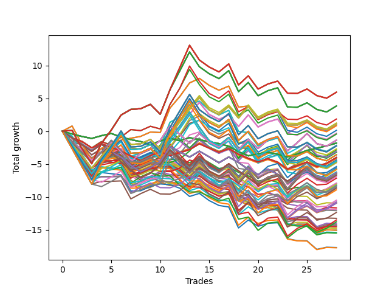

# Long HLT 106 
- Symbol: TSLA
- Date Range: 01/10/2024 - 05/17/2024
- Trading Period: 8:30-12:30
- Number of Trades: 1



| Id. | Name | Win Percent | Profit | Avg Profit / Trade | Avg Time / Trade |      | Name | Win Percent | Profit | Avg Profit / Trade | Avg Time / Trade |
| --- | ---- | ----------- | ------ | ------------------ | ---------------- | ---- | ---- | ----------- | ------ | ------------------ | ---------------- |
| | Sorted By <br> Profit | | | | | | Sorted By <br> Win Percentage ||||
|0| TP-1 120m | 100.00 | 1.00 | 1.00 | 42:00 |     | TP-1 120m | 100.00 | 1.00 | 1.00 | 42:00 |
|1| TP-1 105m | 100.00 | 1.00 | 1.00 | 42:00 |     | TP-1 105m | 100.00 | 1.00 | 1.00 | 42:00 |
|2| TP-1 90m | 100.00 | 1.00 | 1.00 | 42:00 |     | TP-1 90m | 100.00 | 1.00 | 1.00 | 42:00 |
|3| TP-1 75m | 100.00 | 1.00 | 1.00 | 42:00 |     | TP-1 75m | 100.00 | 1.00 | 1.00 | 42:00 |
|4| TP-1 60m | 100.00 | 1.00 | 1.00 | 42:00 |     | TP-1 60m | 100.00 | 1.00 | 1.00 | 42:00 |
|5| TP-1 45m | 100.00 | 1.00 | 1.00 | 42:00 |     | TP-1 45m | 100.00 | 1.00 | 1.00 | 42:00 |
|6| TP-2 45m | 100.00 | 0.98 | 0.98 | 44:00 |     | TP-2 45m | 100.00 | 0.98 | 0.98 | 44:00 |
|7| TP-1.75 45m | 100.00 | 0.98 | 0.98 | 44:00 |     | TP-1.75 45m | 100.00 | 0.98 | 0.98 | 44:00 |
|8| TP-1.5 45m | 100.00 | 0.98 | 0.98 | 44:00 |     | TP-1.5 45m | 100.00 | 0.98 | 0.98 | 44:00 |
|9| TP-1.25 45m | 100.00 | 0.98 | 0.98 | 44:00 |     | TP-1.25 45m | 100.00 | 0.98 | 0.98 | 44:00 |
|10| TP-2 120m | 100.00 | 0.91 | 0.91 | 45:00 |     | TP-2 120m | 100.00 | 0.91 | 0.91 | 45:00 |
|11| TP-1.75 120m | 100.00 | 0.91 | 0.91 | 45:00 |     | TP-1.75 120m | 100.00 | 0.91 | 0.91 | 45:00 |
|12| TP-1.5 120m | 100.00 | 0.91 | 0.91 | 45:00 |     | TP-1.5 120m | 100.00 | 0.91 | 0.91 | 45:00 |
|13| TP-1.25 120m | 100.00 | 0.91 | 0.91 | 45:00 |     | TP-1.25 120m | 100.00 | 0.91 | 0.91 | 45:00 |
|14| TP-2 105m | 100.00 | 0.91 | 0.91 | 45:00 |     | TP-2 105m | 100.00 | 0.91 | 0.91 | 45:00 |
|15| TP-1.75 105m | 100.00 | 0.91 | 0.91 | 45:00 |     | TP-1.75 105m | 100.00 | 0.91 | 0.91 | 45:00 |
|16| TP-1.5 105m | 100.00 | 0.91 | 0.91 | 45:00 |     | TP-1.5 105m | 100.00 | 0.91 | 0.91 | 45:00 |
|17| TP-1.25 105m | 100.00 | 0.91 | 0.91 | 45:00 |     | TP-1.25 105m | 100.00 | 0.91 | 0.91 | 45:00 |
|18| TP-2 90m | 100.00 | 0.91 | 0.91 | 45:00 |     | TP-2 90m | 100.00 | 0.91 | 0.91 | 45:00 |
|19| TP-1.75 90m | 100.00 | 0.91 | 0.91 | 45:00 |     | TP-1.75 90m | 100.00 | 0.91 | 0.91 | 45:00 |
|20| TP-1.5 90m | 100.00 | 0.91 | 0.91 | 45:00 |     | TP-1.5 90m | 100.00 | 0.91 | 0.91 | 45:00 |
|21| TP-1.25 90m | 100.00 | 0.91 | 0.91 | 45:00 |     | TP-1.25 90m | 100.00 | 0.91 | 0.91 | 45:00 |
|22| TP-2 75m | 100.00 | 0.91 | 0.91 | 45:00 |     | TP-2 75m | 100.00 | 0.91 | 0.91 | 45:00 |
|23| TP-1.75 75m | 100.00 | 0.91 | 0.91 | 45:00 |     | TP-1.75 75m | 100.00 | 0.91 | 0.91 | 45:00 |
|24| TP-1.5 75m | 100.00 | 0.91 | 0.91 | 45:00 |     | TP-1.5 75m | 100.00 | 0.91 | 0.91 | 45:00 |
|25| TP-1.25 75m | 100.00 | 0.91 | 0.91 | 45:00 |     | TP-1.25 75m | 100.00 | 0.91 | 0.91 | 45:00 |
|26| TP-2 60m | 100.00 | 0.91 | 0.91 | 45:00 |     | TP-2 60m | 100.00 | 0.91 | 0.91 | 45:00 |
|27| TP-1.75 60m | 100.00 | 0.91 | 0.91 | 45:00 |     | TP-1.75 60m | 100.00 | 0.91 | 0.91 | 45:00 |
|28| TP-1.5 60m | 100.00 | 0.91 | 0.91 | 45:00 |     | TP-1.5 60m | 100.00 | 0.91 | 0.91 | 45:00 |
|29| TP-1.25 60m | 100.00 | 0.91 | 0.91 | 45:00 |     | TP-1.25 60m | 100.00 | 0.91 | 0.91 | 45:00 |
|30| TP-0.75 120m | 100.00 | 0.86 | 0.86 | 05:00 |     | TP-0.75 120m | 100.00 | 0.86 | 0.86 | 05:00 |
|31| TP-0.5 120m | 100.00 | 0.86 | 0.86 | 05:00 |     | TP-0.5 120m | 100.00 | 0.86 | 0.86 | 05:00 |
|32| TP-0.75 105m | 100.00 | 0.86 | 0.86 | 05:00 |     | TP-0.75 105m | 100.00 | 0.86 | 0.86 | 05:00 |
|33| TP-0.5 105m | 100.00 | 0.86 | 0.86 | 05:00 |     | TP-0.5 105m | 100.00 | 0.86 | 0.86 | 05:00 |
|34| TP-0.75 90m | 100.00 | 0.86 | 0.86 | 05:00 |     | TP-0.75 90m | 100.00 | 0.86 | 0.86 | 05:00 |
|35| TP-0.5 90m | 100.00 | 0.86 | 0.86 | 05:00 |     | TP-0.5 90m | 100.00 | 0.86 | 0.86 | 05:00 |
|36| TP-0.75 75m | 100.00 | 0.86 | 0.86 | 05:00 |     | TP-0.75 75m | 100.00 | 0.86 | 0.86 | 05:00 |
|37| TP-0.5 75m | 100.00 | 0.86 | 0.86 | 05:00 |     | TP-0.5 75m | 100.00 | 0.86 | 0.86 | 05:00 |
|38| TP-0.75 60m | 100.00 | 0.86 | 0.86 | 05:00 |     | TP-0.75 60m | 100.00 | 0.86 | 0.86 | 05:00 |
|39| TP-0.5 60m | 100.00 | 0.86 | 0.86 | 05:00 |     | TP-0.5 60m | 100.00 | 0.86 | 0.86 | 05:00 |
|40| TP-0.75 45m | 100.00 | 0.86 | 0.86 | 05:00 |     | TP-0.75 45m | 100.00 | 0.86 | 0.86 | 05:00 |
|41| TP-0.5 45m | 100.00 | 0.86 | 0.86 | 05:00 |     | TP-0.5 45m | 100.00 | 0.86 | 0.86 | 05:00 |
|42| TP-0.75 30m | 100.00 | 0.86 | 0.86 | 05:00 |     | TP-0.75 30m | 100.00 | 0.86 | 0.86 | 05:00 |
|43| TP-0.5 30m | 100.00 | 0.86 | 0.86 | 05:00 |     | TP-0.5 30m | 100.00 | 0.86 | 0.86 | 05:00 |
|44| TP-0.75 15m | 100.00 | 0.86 | 0.86 | 05:00 |     | TP-0.75 15m | 100.00 | 0.86 | 0.86 | 05:00 |
|45| TP-0.5 15m | 100.00 | 0.86 | 0.86 | 05:00 |     | TP-0.5 15m | 100.00 | 0.86 | 0.86 | 05:00 |
|46| TP-0.25 120m | 100.00 | 0.42 | 0.42 | 02:00 |     | TP-0.25 120m | 100.00 | 0.42 | 0.42 | 02:00 |
|47| TP-0.25 105m | 100.00 | 0.42 | 0.42 | 02:00 |     | TP-0.25 105m | 100.00 | 0.42 | 0.42 | 02:00 |
|48| TP-0.25 90m | 100.00 | 0.42 | 0.42 | 02:00 |     | TP-0.25 90m | 100.00 | 0.42 | 0.42 | 02:00 |
|49| TP-0.25 75m | 100.00 | 0.42 | 0.42 | 02:00 |     | TP-0.25 75m | 100.00 | 0.42 | 0.42 | 02:00 |
|50| TP-0.25 60m | 100.00 | 0.42 | 0.42 | 02:00 |     | TP-0.25 60m | 100.00 | 0.42 | 0.42 | 02:00 |
|51| TP-0.25 45m | 100.00 | 0.42 | 0.42 | 02:00 |     | TP-0.25 45m | 100.00 | 0.42 | 0.42 | 02:00 |
|52| TP-0.25 30m | 100.00 | 0.42 | 0.42 | 02:00 |     | TP-0.25 30m | 100.00 | 0.42 | 0.42 | 02:00 |
|53| TP-0.25 15m | 100.00 | 0.42 | 0.42 | 02:00 |     | TP-0.25 15m | 100.00 | 0.42 | 0.42 | 02:00 |
|54| TP-2 30m | 0.00 | -0.05 | -0.05 | 29:00 |     | TP-2 30m | 0.00 | -0.05 | -0.05 | 29:00 |
|55| TP-1.75 30m | 0.00 | -0.05 | -0.05 | 29:00 |     | TP-1.75 30m | 0.00 | -0.05 | -0.05 | 29:00 |
|56| TP-1.5 30m | 0.00 | -0.05 | -0.05 | 29:00 |     | TP-1.5 30m | 0.00 | -0.05 | -0.05 | 29:00 |
|57| TP-1.25 30m | 0.00 | -0.05 | -0.05 | 29:00 |     | TP-1.25 30m | 0.00 | -0.05 | -0.05 | 29:00 |
|58| TP-1 30m | 0.00 | -0.05 | -0.05 | 29:00 |     | TP-1 30m | 0.00 | -0.05 | -0.05 | 29:00 |
|59| TP-2 15m | 0.00 | -0.07 | -0.07 | 14:00 |     | TP-2 15m | 0.00 | -0.07 | -0.07 | 14:00 |
|60| TP-1.75 15m | 0.00 | -0.07 | -0.07 | 14:00 |     | TP-1.75 15m | 0.00 | -0.07 | -0.07 | 14:00 |
|61| TP-1.5 15m | 0.00 | -0.07 | -0.07 | 14:00 |     | TP-1.5 15m | 0.00 | -0.07 | -0.07 | 14:00 |
|62| TP-1.25 15m | 0.00 | -0.07 | -0.07 | 14:00 |     | TP-1.25 15m | 0.00 | -0.07 | -0.07 | 14:00 |
|63| TP-1 15m | 0.00 | -0.07 | -0.07 | 14:00 |     | TP-1 15m | 0.00 | -0.07 | -0.07 | 14:00 |

### Test TP-0.25 15m
* Take Profit of 0.25 Point
* 0.25 Stoploss
* Results:
```
Total Trades: 1
Percent Up: 100.00
Percent Down: 0.00
Total Points Moved Up: 0.42
Potential Profit: 210.00
Total Points Ups: 0.42 Count Ups: 1
Total Points Downs: 0.00 Count Downs: 0
```

<details><summary>Trades</summary>

<code>In: 2024-04-26 12:05:00		Out: 2024-04-26 12:07:00		Total Position Time: 02:00		Total Move Up: 0.42		Total to Date: 0.42</code> <br />


</details>

### Test TP-0.5 15m
* Take Profit of 0.5 Point
* 0.5 Stoploss
* Results:
```
Total Trades: 1
Percent Up: 100.00
Percent Down: 0.00
Total Points Moved Up: 0.86
Potential Profit: 430.00
Total Points Ups: 0.86 Count Ups: 1
Total Points Downs: 0.00 Count Downs: 0
```

<details><summary>Trades</summary>

<code>In: 2024-04-26 12:05:00		Out: 2024-04-26 12:10:00		Total Position Time: 05:00		Total Move Up: 0.86		Total to Date: 0.86</code> <br />


</details>

### Test TP-0.75 15m
* Take Profit of 0.75 Point
* 0.75 Stoploss
* Results:
```
Total Trades: 1
Percent Up: 100.00
Percent Down: 0.00
Total Points Moved Up: 0.86
Potential Profit: 430.00
Total Points Ups: 0.86 Count Ups: 1
Total Points Downs: 0.00 Count Downs: 0
```

<details><summary>Trades</summary>

<code>In: 2024-04-26 12:05:00		Out: 2024-04-26 12:10:00		Total Position Time: 05:00		Total Move Up: 0.86		Total to Date: 0.86</code> <br />


</details>

### Test TP-1 15m
* Take Profit of 1 Point
* 1 Stoploss
* Results:
```
Total Trades: 1
Percent Up: 0.00
Percent Down: 100.00
Total Points Moved Up: -0.07
Potential Profit: -35.00
Total Points Ups: 0.00 Count Ups: 0
Total Points Downs: -0.07 Count Downs: 1
```

<details><summary>Trades</summary>

<code>In: 2024-04-26 12:05:00		Out: 2024-04-26 12:19:00		Total Position Time: 14:00		Total Move Up: -0.07		Total to Date: -0.07</code> <br />


</details>

### Test TP-1.25 15m
* Take Profit of 1.25 Point
* 1.25 Stoploss
* Results:
```
Total Trades: 1
Percent Up: 0.00
Percent Down: 100.00
Total Points Moved Up: -0.07
Potential Profit: -35.00
Total Points Ups: 0.00 Count Ups: 0
Total Points Downs: -0.07 Count Downs: 1
```

<details><summary>Trades</summary>

<code>In: 2024-04-26 12:05:00		Out: 2024-04-26 12:19:00		Total Position Time: 14:00		Total Move Up: -0.07		Total to Date: -0.07</code> <br />


</details>

### Test TP-1.5 15m
* Take Profit of 1.5 Point
* 1.5 Stoploss
* Results:
```
Total Trades: 1
Percent Up: 0.00
Percent Down: 100.00
Total Points Moved Up: -0.07
Potential Profit: -35.00
Total Points Ups: 0.00 Count Ups: 0
Total Points Downs: -0.07 Count Downs: 1
```

<details><summary>Trades</summary>

<code>In: 2024-04-26 12:05:00		Out: 2024-04-26 12:19:00		Total Position Time: 14:00		Total Move Up: -0.07		Total to Date: -0.07</code> <br />


</details>

### Test TP-1.75 15m
* Take Profit of 1.75 Point
* 1.75 Stoploss
* Results:
```
Total Trades: 1
Percent Up: 0.00
Percent Down: 100.00
Total Points Moved Up: -0.07
Potential Profit: -35.00
Total Points Ups: 0.00 Count Ups: 0
Total Points Downs: -0.07 Count Downs: 1
```

<details><summary>Trades</summary>

<code>In: 2024-04-26 12:05:00		Out: 2024-04-26 12:19:00		Total Position Time: 14:00		Total Move Up: -0.07		Total to Date: -0.07</code> <br />


</details>

### Test TP-2 15m
* Take Profit of 2 Point
* 2 Stoploss
* Results:
```
Total Trades: 1
Percent Up: 0.00
Percent Down: 100.00
Total Points Moved Up: -0.07
Potential Profit: -35.00
Total Points Ups: 0.00 Count Ups: 0
Total Points Downs: -0.07 Count Downs: 1
```

<details><summary>Trades</summary>

<code>In: 2024-04-26 12:05:00		Out: 2024-04-26 12:19:00		Total Position Time: 14:00		Total Move Up: -0.07		Total to Date: -0.07</code> <br />


</details>

### Test TP-0.25 30m
* Take Profit of 0.25 Point
* 0.25 Stoploss
* Results:
```
Total Trades: 1
Percent Up: 100.00
Percent Down: 0.00
Total Points Moved Up: 0.42
Potential Profit: 210.00
Total Points Ups: 0.42 Count Ups: 1
Total Points Downs: 0.00 Count Downs: 0
```

<details><summary>Trades</summary>

<code>In: 2024-04-26 12:05:00		Out: 2024-04-26 12:07:00		Total Position Time: 02:00		Total Move Up: 0.42		Total to Date: 0.42</code> <br />


</details>

### Test TP-0.5 30m
* Take Profit of 0.5 Point
* 0.5 Stoploss
* Results:
```
Total Trades: 1
Percent Up: 100.00
Percent Down: 0.00
Total Points Moved Up: 0.86
Potential Profit: 430.00
Total Points Ups: 0.86 Count Ups: 1
Total Points Downs: 0.00 Count Downs: 0
```

<details><summary>Trades</summary>

<code>In: 2024-04-26 12:05:00		Out: 2024-04-26 12:10:00		Total Position Time: 05:00		Total Move Up: 0.86		Total to Date: 0.86</code> <br />


</details>

### Test TP-0.75 30m
* Take Profit of 0.75 Point
* 0.75 Stoploss
* Results:
```
Total Trades: 1
Percent Up: 100.00
Percent Down: 0.00
Total Points Moved Up: 0.86
Potential Profit: 430.00
Total Points Ups: 0.86 Count Ups: 1
Total Points Downs: 0.00 Count Downs: 0
```

<details><summary>Trades</summary>

<code>In: 2024-04-26 12:05:00		Out: 2024-04-26 12:10:00		Total Position Time: 05:00		Total Move Up: 0.86		Total to Date: 0.86</code> <br />


</details>

### Test TP-1 30m
* Take Profit of 1 Point
* 1 Stoploss
* Results:
```
Total Trades: 1
Percent Up: 0.00
Percent Down: 100.00
Total Points Moved Up: -0.05
Potential Profit: -25.00
Total Points Ups: 0.00 Count Ups: 0
Total Points Downs: -0.05 Count Downs: 1
```

<details><summary>Trades</summary>

<code>In: 2024-04-26 12:05:00		Out: 2024-04-26 12:34:00		Total Position Time: 29:00		Total Move Up: -0.05		Total to Date: -0.05</code> <br />


</details>

### Test TP-1.25 30m
* Take Profit of 1.25 Point
* 1.25 Stoploss
* Results:
```
Total Trades: 1
Percent Up: 0.00
Percent Down: 100.00
Total Points Moved Up: -0.05
Potential Profit: -25.00
Total Points Ups: 0.00 Count Ups: 0
Total Points Downs: -0.05 Count Downs: 1
```

<details><summary>Trades</summary>

<code>In: 2024-04-26 12:05:00		Out: 2024-04-26 12:34:00		Total Position Time: 29:00		Total Move Up: -0.05		Total to Date: -0.05</code> <br />


</details>

### Test TP-1.5 30m
* Take Profit of 1.5 Point
* 1.5 Stoploss
* Results:
```
Total Trades: 1
Percent Up: 0.00
Percent Down: 100.00
Total Points Moved Up: -0.05
Potential Profit: -25.00
Total Points Ups: 0.00 Count Ups: 0
Total Points Downs: -0.05 Count Downs: 1
```

<details><summary>Trades</summary>

<code>In: 2024-04-26 12:05:00		Out: 2024-04-26 12:34:00		Total Position Time: 29:00		Total Move Up: -0.05		Total to Date: -0.05</code> <br />


</details>

### Test TP-1.75 30m
* Take Profit of 1.75 Point
* 1.75 Stoploss
* Results:
```
Total Trades: 1
Percent Up: 0.00
Percent Down: 100.00
Total Points Moved Up: -0.05
Potential Profit: -25.00
Total Points Ups: 0.00 Count Ups: 0
Total Points Downs: -0.05 Count Downs: 1
```

<details><summary>Trades</summary>

<code>In: 2024-04-26 12:05:00		Out: 2024-04-26 12:34:00		Total Position Time: 29:00		Total Move Up: -0.05		Total to Date: -0.05</code> <br />


</details>

### Test TP-2 30m
* Take Profit of 2 Point
* 2 Stoploss
* Results:
```
Total Trades: 1
Percent Up: 0.00
Percent Down: 100.00
Total Points Moved Up: -0.05
Potential Profit: -25.00
Total Points Ups: 0.00 Count Ups: 0
Total Points Downs: -0.05 Count Downs: 1
```

<details><summary>Trades</summary>

<code>In: 2024-04-26 12:05:00		Out: 2024-04-26 12:34:00		Total Position Time: 29:00		Total Move Up: -0.05		Total to Date: -0.05</code> <br />


</details>

### Test TP-0.25 45m
* Take Profit of 0.25 Point
* 0.25 Stoploss
* Results:
```
Total Trades: 1
Percent Up: 100.00
Percent Down: 0.00
Total Points Moved Up: 0.42
Potential Profit: 210.00
Total Points Ups: 0.42 Count Ups: 1
Total Points Downs: 0.00 Count Downs: 0
```

<details><summary>Trades</summary>

<code>In: 2024-04-26 12:05:00		Out: 2024-04-26 12:07:00		Total Position Time: 02:00		Total Move Up: 0.42		Total to Date: 0.42</code> <br />


</details>

### Test TP-0.5 45m
* Take Profit of 0.5 Point
* 0.5 Stoploss
* Results:
```
Total Trades: 1
Percent Up: 100.00
Percent Down: 0.00
Total Points Moved Up: 0.86
Potential Profit: 430.00
Total Points Ups: 0.86 Count Ups: 1
Total Points Downs: 0.00 Count Downs: 0
```

<details><summary>Trades</summary>

<code>In: 2024-04-26 12:05:00		Out: 2024-04-26 12:10:00		Total Position Time: 05:00		Total Move Up: 0.86		Total to Date: 0.86</code> <br />


</details>

### Test TP-0.75 45m
* Take Profit of 0.75 Point
* 0.75 Stoploss
* Results:
```
Total Trades: 1
Percent Up: 100.00
Percent Down: 0.00
Total Points Moved Up: 0.86
Potential Profit: 430.00
Total Points Ups: 0.86 Count Ups: 1
Total Points Downs: 0.00 Count Downs: 0
```

<details><summary>Trades</summary>

<code>In: 2024-04-26 12:05:00		Out: 2024-04-26 12:10:00		Total Position Time: 05:00		Total Move Up: 0.86		Total to Date: 0.86</code> <br />


</details>

### Test TP-1 45m
* Take Profit of 1 Point
* 1 Stoploss
* Results:
```
Total Trades: 1
Percent Up: 100.00
Percent Down: 0.00
Total Points Moved Up: 1.00
Potential Profit: 500.00
Total Points Ups: 1.00 Count Ups: 1
Total Points Downs: 0.00 Count Downs: 0
```

<details><summary>Trades</summary>

<code>In: 2024-04-26 12:05:00		Out: 2024-04-26 12:47:00		Total Position Time: 42:00		Total Move Up: 1.00		Total to Date: 1.00</code> <br />


</details>

### Test TP-1.25 45m
* Take Profit of 1.25 Point
* 1.25 Stoploss
* Results:
```
Total Trades: 1
Percent Up: 100.00
Percent Down: 0.00
Total Points Moved Up: 0.98
Potential Profit: 490.00
Total Points Ups: 0.98 Count Ups: 1
Total Points Downs: 0.00 Count Downs: 0
```

<details><summary>Trades</summary>

<code>In: 2024-04-26 12:05:00		Out: 2024-04-26 12:49:00		Total Position Time: 44:00		Total Move Up: 0.98		Total to Date: 0.98</code> <br />


</details>

### Test TP-1.5 45m
* Take Profit of 1.5 Point
* 1.5 Stoploss
* Results:
```
Total Trades: 1
Percent Up: 100.00
Percent Down: 0.00
Total Points Moved Up: 0.98
Potential Profit: 490.00
Total Points Ups: 0.98 Count Ups: 1
Total Points Downs: 0.00 Count Downs: 0
```

<details><summary>Trades</summary>

<code>In: 2024-04-26 12:05:00		Out: 2024-04-26 12:49:00		Total Position Time: 44:00		Total Move Up: 0.98		Total to Date: 0.98</code> <br />


</details>

### Test TP-1.75 45m
* Take Profit of 1.75 Point
* 1.75 Stoploss
* Results:
```
Total Trades: 1
Percent Up: 100.00
Percent Down: 0.00
Total Points Moved Up: 0.98
Potential Profit: 490.00
Total Points Ups: 0.98 Count Ups: 1
Total Points Downs: 0.00 Count Downs: 0
```

<details><summary>Trades</summary>

<code>In: 2024-04-26 12:05:00		Out: 2024-04-26 12:49:00		Total Position Time: 44:00		Total Move Up: 0.98		Total to Date: 0.98</code> <br />


</details>

### Test TP-2 45m
* Take Profit of 2 Point
* 2 Stoploss
* Results:
```
Total Trades: 1
Percent Up: 100.00
Percent Down: 0.00
Total Points Moved Up: 0.98
Potential Profit: 490.00
Total Points Ups: 0.98 Count Ups: 1
Total Points Downs: 0.00 Count Downs: 0
```

<details><summary>Trades</summary>

<code>In: 2024-04-26 12:05:00		Out: 2024-04-26 12:49:00		Total Position Time: 44:00		Total Move Up: 0.98		Total to Date: 0.98</code> <br />


</details>

### Test TP-0.25 60m
* Take Profit of 0.25 Point
* 0.25 Stoploss
* Results:
```
Total Trades: 1
Percent Up: 100.00
Percent Down: 0.00
Total Points Moved Up: 0.42
Potential Profit: 210.00
Total Points Ups: 0.42 Count Ups: 1
Total Points Downs: 0.00 Count Downs: 0
```

<details><summary>Trades</summary>

<code>In: 2024-04-26 12:05:00		Out: 2024-04-26 12:07:00		Total Position Time: 02:00		Total Move Up: 0.42		Total to Date: 0.42</code> <br />


</details>

### Test TP-0.5 60m
* Take Profit of 0.5 Point
* 0.5 Stoploss
* Results:
```
Total Trades: 1
Percent Up: 100.00
Percent Down: 0.00
Total Points Moved Up: 0.86
Potential Profit: 430.00
Total Points Ups: 0.86 Count Ups: 1
Total Points Downs: 0.00 Count Downs: 0
```

<details><summary>Trades</summary>

<code>In: 2024-04-26 12:05:00		Out: 2024-04-26 12:10:00		Total Position Time: 05:00		Total Move Up: 0.86		Total to Date: 0.86</code> <br />


</details>

### Test TP-0.75 60m
* Take Profit of 0.75 Point
* 0.75 Stoploss
* Results:
```
Total Trades: 1
Percent Up: 100.00
Percent Down: 0.00
Total Points Moved Up: 0.86
Potential Profit: 430.00
Total Points Ups: 0.86 Count Ups: 1
Total Points Downs: 0.00 Count Downs: 0
```

<details><summary>Trades</summary>

<code>In: 2024-04-26 12:05:00		Out: 2024-04-26 12:10:00		Total Position Time: 05:00		Total Move Up: 0.86		Total to Date: 0.86</code> <br />


</details>

### Test TP-1 60m
* Take Profit of 1 Point
* 1 Stoploss
* Results:
```
Total Trades: 1
Percent Up: 100.00
Percent Down: 0.00
Total Points Moved Up: 1.00
Potential Profit: 500.00
Total Points Ups: 1.00 Count Ups: 1
Total Points Downs: 0.00 Count Downs: 0
```

<details><summary>Trades</summary>

<code>In: 2024-04-26 12:05:00		Out: 2024-04-26 12:47:00		Total Position Time: 42:00		Total Move Up: 1.00		Total to Date: 1.00</code> <br />


</details>

### Test TP-1.25 60m
* Take Profit of 1.25 Point
* 1.25 Stoploss
* Results:
```
Total Trades: 1
Percent Up: 100.00
Percent Down: 0.00
Total Points Moved Up: 0.91
Potential Profit: 455.00
Total Points Ups: 0.91 Count Ups: 1
Total Points Downs: 0.00 Count Downs: 0
```

<details><summary>Trades</summary>

<code>In: 2024-04-26 12:05:00		Out: 2024-04-26 12:50:00		Total Position Time: 45:00		Total Move Up: 0.91		Total to Date: 0.91</code> <br />


</details>

### Test TP-1.5 60m
* Take Profit of 1.5 Point
* 1.5 Stoploss
* Results:
```
Total Trades: 1
Percent Up: 100.00
Percent Down: 0.00
Total Points Moved Up: 0.91
Potential Profit: 455.00
Total Points Ups: 0.91 Count Ups: 1
Total Points Downs: 0.00 Count Downs: 0
```

<details><summary>Trades</summary>

<code>In: 2024-04-26 12:05:00		Out: 2024-04-26 12:50:00		Total Position Time: 45:00		Total Move Up: 0.91		Total to Date: 0.91</code> <br />


</details>

### Test TP-1.75 60m
* Take Profit of 1.75 Point
* 1.75 Stoploss
* Results:
```
Total Trades: 1
Percent Up: 100.00
Percent Down: 0.00
Total Points Moved Up: 0.91
Potential Profit: 455.00
Total Points Ups: 0.91 Count Ups: 1
Total Points Downs: 0.00 Count Downs: 0
```

<details><summary>Trades</summary>

<code>In: 2024-04-26 12:05:00		Out: 2024-04-26 12:50:00		Total Position Time: 45:00		Total Move Up: 0.91		Total to Date: 0.91</code> <br />


</details>

### Test TP-2 60m
* Take Profit of 2 Point
* 2 Stoploss
* Results:
```
Total Trades: 1
Percent Up: 100.00
Percent Down: 0.00
Total Points Moved Up: 0.91
Potential Profit: 455.00
Total Points Ups: 0.91 Count Ups: 1
Total Points Downs: 0.00 Count Downs: 0
```

<details><summary>Trades</summary>

<code>In: 2024-04-26 12:05:00		Out: 2024-04-26 12:50:00		Total Position Time: 45:00		Total Move Up: 0.91		Total to Date: 0.91</code> <br />


</details>

### Test TP-0.25 75m
* Take Profit of 0.25 Point
* 0.25 Stoploss
* Results:
```
Total Trades: 1
Percent Up: 100.00
Percent Down: 0.00
Total Points Moved Up: 0.42
Potential Profit: 210.00
Total Points Ups: 0.42 Count Ups: 1
Total Points Downs: 0.00 Count Downs: 0
```

<details><summary>Trades</summary>

<code>In: 2024-04-26 12:05:00		Out: 2024-04-26 12:07:00		Total Position Time: 02:00		Total Move Up: 0.42		Total to Date: 0.42</code> <br />


</details>

### Test TP-0.5 75m
* Take Profit of 0.5 Point
* 0.5 Stoploss
* Results:
```
Total Trades: 1
Percent Up: 100.00
Percent Down: 0.00
Total Points Moved Up: 0.86
Potential Profit: 430.00
Total Points Ups: 0.86 Count Ups: 1
Total Points Downs: 0.00 Count Downs: 0
```

<details><summary>Trades</summary>

<code>In: 2024-04-26 12:05:00		Out: 2024-04-26 12:10:00		Total Position Time: 05:00		Total Move Up: 0.86		Total to Date: 0.86</code> <br />


</details>

### Test TP-0.75 75m
* Take Profit of 0.75 Point
* 0.75 Stoploss
* Results:
```
Total Trades: 1
Percent Up: 100.00
Percent Down: 0.00
Total Points Moved Up: 0.86
Potential Profit: 430.00
Total Points Ups: 0.86 Count Ups: 1
Total Points Downs: 0.00 Count Downs: 0
```

<details><summary>Trades</summary>

<code>In: 2024-04-26 12:05:00		Out: 2024-04-26 12:10:00		Total Position Time: 05:00		Total Move Up: 0.86		Total to Date: 0.86</code> <br />


</details>

### Test TP-1 75m
* Take Profit of 1 Point
* 1 Stoploss
* Results:
```
Total Trades: 1
Percent Up: 100.00
Percent Down: 0.00
Total Points Moved Up: 1.00
Potential Profit: 500.00
Total Points Ups: 1.00 Count Ups: 1
Total Points Downs: 0.00 Count Downs: 0
```

<details><summary>Trades</summary>

<code>In: 2024-04-26 12:05:00		Out: 2024-04-26 12:47:00		Total Position Time: 42:00		Total Move Up: 1.00		Total to Date: 1.00</code> <br />


</details>

### Test TP-1.25 75m
* Take Profit of 1.25 Point
* 1.25 Stoploss
* Results:
```
Total Trades: 1
Percent Up: 100.00
Percent Down: 0.00
Total Points Moved Up: 0.91
Potential Profit: 455.00
Total Points Ups: 0.91 Count Ups: 1
Total Points Downs: 0.00 Count Downs: 0
```

<details><summary>Trades</summary>

<code>In: 2024-04-26 12:05:00		Out: 2024-04-26 12:50:00		Total Position Time: 45:00		Total Move Up: 0.91		Total to Date: 0.91</code> <br />


</details>

### Test TP-1.5 75m
* Take Profit of 1.5 Point
* 1.5 Stoploss
* Results:
```
Total Trades: 1
Percent Up: 100.00
Percent Down: 0.00
Total Points Moved Up: 0.91
Potential Profit: 455.00
Total Points Ups: 0.91 Count Ups: 1
Total Points Downs: 0.00 Count Downs: 0
```

<details><summary>Trades</summary>

<code>In: 2024-04-26 12:05:00		Out: 2024-04-26 12:50:00		Total Position Time: 45:00		Total Move Up: 0.91		Total to Date: 0.91</code> <br />


</details>

### Test TP-1.75 75m
* Take Profit of 1.75 Point
* 1.75 Stoploss
* Results:
```
Total Trades: 1
Percent Up: 100.00
Percent Down: 0.00
Total Points Moved Up: 0.91
Potential Profit: 455.00
Total Points Ups: 0.91 Count Ups: 1
Total Points Downs: 0.00 Count Downs: 0
```

<details><summary>Trades</summary>

<code>In: 2024-04-26 12:05:00		Out: 2024-04-26 12:50:00		Total Position Time: 45:00		Total Move Up: 0.91		Total to Date: 0.91</code> <br />


</details>

### Test TP-2 75m
* Take Profit of 2 Point
* 2 Stoploss
* Results:
```
Total Trades: 1
Percent Up: 100.00
Percent Down: 0.00
Total Points Moved Up: 0.91
Potential Profit: 455.00
Total Points Ups: 0.91 Count Ups: 1
Total Points Downs: 0.00 Count Downs: 0
```

<details><summary>Trades</summary>

<code>In: 2024-04-26 12:05:00		Out: 2024-04-26 12:50:00		Total Position Time: 45:00		Total Move Up: 0.91		Total to Date: 0.91</code> <br />


</details>

### Test TP-0.25 90m
* Take Profit of 0.25 Point
* 0.25 Stoploss
* Results:
```
Total Trades: 1
Percent Up: 100.00
Percent Down: 0.00
Total Points Moved Up: 0.42
Potential Profit: 210.00
Total Points Ups: 0.42 Count Ups: 1
Total Points Downs: 0.00 Count Downs: 0
```

<details><summary>Trades</summary>

<code>In: 2024-04-26 12:05:00		Out: 2024-04-26 12:07:00		Total Position Time: 02:00		Total Move Up: 0.42		Total to Date: 0.42</code> <br />


</details>

### Test TP-0.5 90m
* Take Profit of 0.5 Point
* 0.5 Stoploss
* Results:
```
Total Trades: 1
Percent Up: 100.00
Percent Down: 0.00
Total Points Moved Up: 0.86
Potential Profit: 430.00
Total Points Ups: 0.86 Count Ups: 1
Total Points Downs: 0.00 Count Downs: 0
```

<details><summary>Trades</summary>

<code>In: 2024-04-26 12:05:00		Out: 2024-04-26 12:10:00		Total Position Time: 05:00		Total Move Up: 0.86		Total to Date: 0.86</code> <br />


</details>

### Test TP-0.75 90m
* Take Profit of 0.75 Point
* 0.75 Stoploss
* Results:
```
Total Trades: 1
Percent Up: 100.00
Percent Down: 0.00
Total Points Moved Up: 0.86
Potential Profit: 430.00
Total Points Ups: 0.86 Count Ups: 1
Total Points Downs: 0.00 Count Downs: 0
```

<details><summary>Trades</summary>

<code>In: 2024-04-26 12:05:00		Out: 2024-04-26 12:10:00		Total Position Time: 05:00		Total Move Up: 0.86		Total to Date: 0.86</code> <br />


</details>

### Test TP-1 90m
* Take Profit of 1 Point
* 1 Stoploss
* Results:
```
Total Trades: 1
Percent Up: 100.00
Percent Down: 0.00
Total Points Moved Up: 1.00
Potential Profit: 500.00
Total Points Ups: 1.00 Count Ups: 1
Total Points Downs: 0.00 Count Downs: 0
```

<details><summary>Trades</summary>

<code>In: 2024-04-26 12:05:00		Out: 2024-04-26 12:47:00		Total Position Time: 42:00		Total Move Up: 1.00		Total to Date: 1.00</code> <br />


</details>

### Test TP-1.25 90m
* Take Profit of 1.25 Point
* 1.25 Stoploss
* Results:
```
Total Trades: 1
Percent Up: 100.00
Percent Down: 0.00
Total Points Moved Up: 0.91
Potential Profit: 455.00
Total Points Ups: 0.91 Count Ups: 1
Total Points Downs: 0.00 Count Downs: 0
```

<details><summary>Trades</summary>

<code>In: 2024-04-26 12:05:00		Out: 2024-04-26 12:50:00		Total Position Time: 45:00		Total Move Up: 0.91		Total to Date: 0.91</code> <br />


</details>

### Test TP-1.5 90m
* Take Profit of 1.5 Point
* 1.5 Stoploss
* Results:
```
Total Trades: 1
Percent Up: 100.00
Percent Down: 0.00
Total Points Moved Up: 0.91
Potential Profit: 455.00
Total Points Ups: 0.91 Count Ups: 1
Total Points Downs: 0.00 Count Downs: 0
```

<details><summary>Trades</summary>

<code>In: 2024-04-26 12:05:00		Out: 2024-04-26 12:50:00		Total Position Time: 45:00		Total Move Up: 0.91		Total to Date: 0.91</code> <br />


</details>

### Test TP-1.75 90m
* Take Profit of 1.75 Point
* 1.75 Stoploss
* Results:
```
Total Trades: 1
Percent Up: 100.00
Percent Down: 0.00
Total Points Moved Up: 0.91
Potential Profit: 455.00
Total Points Ups: 0.91 Count Ups: 1
Total Points Downs: 0.00 Count Downs: 0
```

<details><summary>Trades</summary>

<code>In: 2024-04-26 12:05:00		Out: 2024-04-26 12:50:00		Total Position Time: 45:00		Total Move Up: 0.91		Total to Date: 0.91</code> <br />


</details>

### Test TP-2 90m
* Take Profit of 2 Point
* 2 Stoploss
* Results:
```
Total Trades: 1
Percent Up: 100.00
Percent Down: 0.00
Total Points Moved Up: 0.91
Potential Profit: 455.00
Total Points Ups: 0.91 Count Ups: 1
Total Points Downs: 0.00 Count Downs: 0
```

<details><summary>Trades</summary>

<code>In: 2024-04-26 12:05:00		Out: 2024-04-26 12:50:00		Total Position Time: 45:00		Total Move Up: 0.91		Total to Date: 0.91</code> <br />


</details>

### Test TP-0.25 105m
* Take Profit of 0.25 Point
* 0.25 Stoploss
* Results:
```
Total Trades: 1
Percent Up: 100.00
Percent Down: 0.00
Total Points Moved Up: 0.42
Potential Profit: 210.00
Total Points Ups: 0.42 Count Ups: 1
Total Points Downs: 0.00 Count Downs: 0
```

<details><summary>Trades</summary>

<code>In: 2024-04-26 12:05:00		Out: 2024-04-26 12:07:00		Total Position Time: 02:00		Total Move Up: 0.42		Total to Date: 0.42</code> <br />


</details>

### Test TP-0.5 105m
* Take Profit of 0.5 Point
* 0.5 Stoploss
* Results:
```
Total Trades: 1
Percent Up: 100.00
Percent Down: 0.00
Total Points Moved Up: 0.86
Potential Profit: 430.00
Total Points Ups: 0.86 Count Ups: 1
Total Points Downs: 0.00 Count Downs: 0
```

<details><summary>Trades</summary>

<code>In: 2024-04-26 12:05:00		Out: 2024-04-26 12:10:00		Total Position Time: 05:00		Total Move Up: 0.86		Total to Date: 0.86</code> <br />


</details>

### Test TP-0.75 105m
* Take Profit of 0.75 Point
* 0.75 Stoploss
* Results:
```
Total Trades: 1
Percent Up: 100.00
Percent Down: 0.00
Total Points Moved Up: 0.86
Potential Profit: 430.00
Total Points Ups: 0.86 Count Ups: 1
Total Points Downs: 0.00 Count Downs: 0
```

<details><summary>Trades</summary>

<code>In: 2024-04-26 12:05:00		Out: 2024-04-26 12:10:00		Total Position Time: 05:00		Total Move Up: 0.86		Total to Date: 0.86</code> <br />


</details>

### Test TP-1 105m
* Take Profit of 1 Point
* 1 Stoploss
* Results:
```
Total Trades: 1
Percent Up: 100.00
Percent Down: 0.00
Total Points Moved Up: 1.00
Potential Profit: 500.00
Total Points Ups: 1.00 Count Ups: 1
Total Points Downs: 0.00 Count Downs: 0
```

<details><summary>Trades</summary>

<code>In: 2024-04-26 12:05:00		Out: 2024-04-26 12:47:00		Total Position Time: 42:00		Total Move Up: 1.00		Total to Date: 1.00</code> <br />


</details>

### Test TP-1.25 105m
* Take Profit of 1.25 Point
* 1.25 Stoploss
* Results:
```
Total Trades: 1
Percent Up: 100.00
Percent Down: 0.00
Total Points Moved Up: 0.91
Potential Profit: 455.00
Total Points Ups: 0.91 Count Ups: 1
Total Points Downs: 0.00 Count Downs: 0
```

<details><summary>Trades</summary>

<code>In: 2024-04-26 12:05:00		Out: 2024-04-26 12:50:00		Total Position Time: 45:00		Total Move Up: 0.91		Total to Date: 0.91</code> <br />


</details>

### Test TP-1.5 105m
* Take Profit of 1.5 Point
* 1.5 Stoploss
* Results:
```
Total Trades: 1
Percent Up: 100.00
Percent Down: 0.00
Total Points Moved Up: 0.91
Potential Profit: 455.00
Total Points Ups: 0.91 Count Ups: 1
Total Points Downs: 0.00 Count Downs: 0
```

<details><summary>Trades</summary>

<code>In: 2024-04-26 12:05:00		Out: 2024-04-26 12:50:00		Total Position Time: 45:00		Total Move Up: 0.91		Total to Date: 0.91</code> <br />


</details>

### Test TP-1.75 105m
* Take Profit of 1.75 Point
* 1.75 Stoploss
* Results:
```
Total Trades: 1
Percent Up: 100.00
Percent Down: 0.00
Total Points Moved Up: 0.91
Potential Profit: 455.00
Total Points Ups: 0.91 Count Ups: 1
Total Points Downs: 0.00 Count Downs: 0
```

<details><summary>Trades</summary>

<code>In: 2024-04-26 12:05:00		Out: 2024-04-26 12:50:00		Total Position Time: 45:00		Total Move Up: 0.91		Total to Date: 0.91</code> <br />


</details>

### Test TP-2 105m
* Take Profit of 2 Point
* 2 Stoploss
* Results:
```
Total Trades: 1
Percent Up: 100.00
Percent Down: 0.00
Total Points Moved Up: 0.91
Potential Profit: 455.00
Total Points Ups: 0.91 Count Ups: 1
Total Points Downs: 0.00 Count Downs: 0
```

<details><summary>Trades</summary>

<code>In: 2024-04-26 12:05:00		Out: 2024-04-26 12:50:00		Total Position Time: 45:00		Total Move Up: 0.91		Total to Date: 0.91</code> <br />


</details>

### Test TP-0.25 120m
* Take Profit of 0.25 Point
* 0.25 Stoploss
* Results:
```
Total Trades: 1
Percent Up: 100.00
Percent Down: 0.00
Total Points Moved Up: 0.42
Potential Profit: 210.00
Total Points Ups: 0.42 Count Ups: 1
Total Points Downs: 0.00 Count Downs: 0
```

<details><summary>Trades</summary>

<code>In: 2024-04-26 12:05:00		Out: 2024-04-26 12:07:00		Total Position Time: 02:00		Total Move Up: 0.42		Total to Date: 0.42</code> <br />


</details>

### Test TP-0.5 120m
* Take Profit of 0.5 Point
* 0.5 Stoploss
* Results:
```
Total Trades: 1
Percent Up: 100.00
Percent Down: 0.00
Total Points Moved Up: 0.86
Potential Profit: 430.00
Total Points Ups: 0.86 Count Ups: 1
Total Points Downs: 0.00 Count Downs: 0
```

<details><summary>Trades</summary>

<code>In: 2024-04-26 12:05:00		Out: 2024-04-26 12:10:00		Total Position Time: 05:00		Total Move Up: 0.86		Total to Date: 0.86</code> <br />


</details>

### Test TP-0.75 120m
* Take Profit of 0.75 Point
* 0.75 Stoploss
* Results:
```
Total Trades: 1
Percent Up: 100.00
Percent Down: 0.00
Total Points Moved Up: 0.86
Potential Profit: 430.00
Total Points Ups: 0.86 Count Ups: 1
Total Points Downs: 0.00 Count Downs: 0
```

<details><summary>Trades</summary>

<code>In: 2024-04-26 12:05:00		Out: 2024-04-26 12:10:00		Total Position Time: 05:00		Total Move Up: 0.86		Total to Date: 0.86</code> <br />


</details>

### Test TP-1 120m
* Take Profit of 1 Point
* 1 Stoploss
* Results:
```
Total Trades: 1
Percent Up: 100.00
Percent Down: 0.00
Total Points Moved Up: 1.00
Potential Profit: 500.00
Total Points Ups: 1.00 Count Ups: 1
Total Points Downs: 0.00 Count Downs: 0
```

<details><summary>Trades</summary>

<code>In: 2024-04-26 12:05:00		Out: 2024-04-26 12:47:00		Total Position Time: 42:00		Total Move Up: 1.00		Total to Date: 1.00</code> <br />


</details>

### Test TP-1.25 120m
* Take Profit of 1.25 Point
* 1.25 Stoploss
* Results:
```
Total Trades: 1
Percent Up: 100.00
Percent Down: 0.00
Total Points Moved Up: 0.91
Potential Profit: 455.00
Total Points Ups: 0.91 Count Ups: 1
Total Points Downs: 0.00 Count Downs: 0
```

<details><summary>Trades</summary>

<code>In: 2024-04-26 12:05:00		Out: 2024-04-26 12:50:00		Total Position Time: 45:00		Total Move Up: 0.91		Total to Date: 0.91</code> <br />


</details>

### Test TP-1.5 120m
* Take Profit of 1.5 Point
* 1.5 Stoploss
* Results:
```
Total Trades: 1
Percent Up: 100.00
Percent Down: 0.00
Total Points Moved Up: 0.91
Potential Profit: 455.00
Total Points Ups: 0.91 Count Ups: 1
Total Points Downs: 0.00 Count Downs: 0
```

<details><summary>Trades</summary>

<code>In: 2024-04-26 12:05:00		Out: 2024-04-26 12:50:00		Total Position Time: 45:00		Total Move Up: 0.91		Total to Date: 0.91</code> <br />


</details>

### Test TP-1.75 120m
* Take Profit of 1.75 Point
* 1.75 Stoploss
* Results:
```
Total Trades: 1
Percent Up: 100.00
Percent Down: 0.00
Total Points Moved Up: 0.91
Potential Profit: 455.00
Total Points Ups: 0.91 Count Ups: 1
Total Points Downs: 0.00 Count Downs: 0
```

<details><summary>Trades</summary>

<code>In: 2024-04-26 12:05:00		Out: 2024-04-26 12:50:00		Total Position Time: 45:00		Total Move Up: 0.91		Total to Date: 0.91</code> <br />


</details>

### Test TP-2 120m
* Take Profit of 2 Point
* 2 Stoploss
* Results:
```
Total Trades: 1
Percent Up: 100.00
Percent Down: 0.00
Total Points Moved Up: 0.91
Potential Profit: 455.00
Total Points Ups: 0.91 Count Ups: 1
Total Points Downs: 0.00 Count Downs: 0
```

<details><summary>Trades</summary>

<code>In: 2024-04-26 12:05:00		Out: 2024-04-26 12:50:00		Total Position Time: 45:00		Total Move Up: 0.91		Total to Date: 0.91</code> <br />


</details>