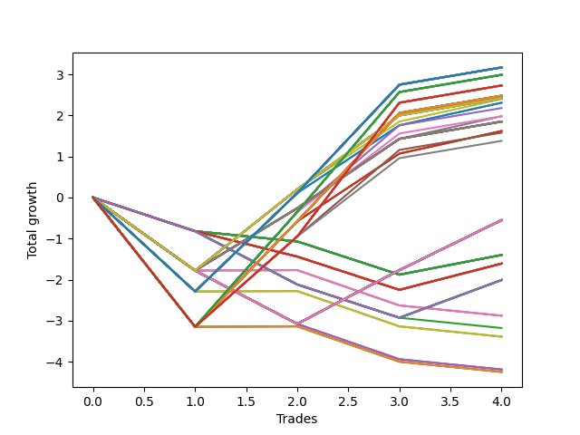

# Long HLT 107 
- Symbol: TSLA
- Date Range: 05/16/2022 - 05/17/2024
- Trading Period: 8:30-12:30
- Number of Trades: 4



| Id. | Name | Win Percent | Profit | Avg Profit / Trade | Avg Time / Trade | Std |      | Name | Win Percent | Profit | Avg Profit / Trade | Avg Time / Trade | Std |
| --- | ---- | ----------- | ------ | ------------------ | ---------------- | --- | ---- | ---- | ----------- | ------ | ------------------ | ---------------- | --- |
| | Sorted By <br> Profit | | | | | | | Sorted By <br> Win Percentage |||||
|0| TP-2.25 180m | 75.00 | 3.17 | 0.79 | 28:00 | 1.98 |     | TP-2.25 180m | 75.00 | 3.17 | 0.79 | 28:00 | 1.98 |
|1| TP-2 180m | 75.00 | 3.17 | 0.79 | 28:00 | 1.98 |     | TP-2 180m | 75.00 | 3.17 | 0.79 | 28:00 | 1.98 |
|2| TP-2.25 165m | 75.00 | 3.17 | 0.79 | 28:00 | 1.98 |     | TP-2.25 165m | 75.00 | 3.17 | 0.79 | 28:00 | 1.98 |
|3| TP-2 165m | 75.00 | 3.17 | 0.79 | 28:00 | 1.98 |     | TP-2 165m | 75.00 | 3.17 | 0.79 | 28:00 | 1.98 |
|4| TP-2.25 150m | 75.00 | 3.17 | 0.79 | 28:00 | 1.98 |     | TP-2.25 150m | 75.00 | 3.17 | 0.79 | 28:00 | 1.98 |
|5| TP-2 150m | 75.00 | 3.17 | 0.79 | 28:00 | 1.98 |     | TP-2 150m | 75.00 | 3.17 | 0.79 | 28:00 | 1.98 |
|6| TP-2.25 135m | 75.00 | 3.17 | 0.79 | 28:00 | 1.98 |     | TP-2.25 135m | 75.00 | 3.17 | 0.79 | 28:00 | 1.98 |
|7| TP-2 135m | 75.00 | 3.17 | 0.79 | 28:00 | 1.98 |     | TP-2 135m | 75.00 | 3.17 | 0.79 | 28:00 | 1.98 |
|8| TP-2.25 120m | 75.00 | 3.17 | 0.79 | 28:00 | 1.98 |     | TP-2.25 120m | 75.00 | 3.17 | 0.79 | 28:00 | 1.98 |
|9| TP-2 120m | 75.00 | 3.17 | 0.79 | 28:00 | 1.98 |     | TP-2 120m | 75.00 | 3.17 | 0.79 | 28:00 | 1.98 |
|10| TP-2.25 105m | 75.00 | 3.17 | 0.79 | 28:00 | 1.98 |     | TP-2.25 105m | 75.00 | 3.17 | 0.79 | 28:00 | 1.98 |
|11| TP-2 105m | 75.00 | 3.17 | 0.79 | 28:00 | 1.98 |     | TP-2 105m | 75.00 | 3.17 | 0.79 | 28:00 | 1.98 |
|12| TP-2.25 90m | 75.00 | 3.17 | 0.79 | 28:00 | 1.98 |     | TP-2.25 90m | 75.00 | 3.17 | 0.79 | 28:00 | 1.98 |
|13| TP-2 90m | 75.00 | 3.17 | 0.79 | 28:00 | 1.98 |     | TP-2 90m | 75.00 | 3.17 | 0.79 | 28:00 | 1.98 |
|14| TP-2.25 75m | 75.00 | 3.17 | 0.79 | 28:00 | 1.98 |     | TP-2.25 75m | 75.00 | 3.17 | 0.79 | 28:00 | 1.98 |
|15| TP-2 75m | 75.00 | 3.17 | 0.79 | 28:00 | 1.98 |     | TP-2 75m | 75.00 | 3.17 | 0.79 | 28:00 | 1.98 |
|16| TP-2.25 60m | 75.00 | 3.17 | 0.79 | 28:00 | 1.98 |     | TP-2.25 60m | 75.00 | 3.17 | 0.79 | 28:00 | 1.98 |
|17| TP-2 60m | 75.00 | 3.17 | 0.79 | 28:00 | 1.98 |     | TP-2 60m | 75.00 | 3.17 | 0.79 | 28:00 | 1.98 |
|18| TP-2.25 45m | 75.00 | 3.17 | 0.79 | 28:00 | 1.98 |     | TP-2.25 45m | 75.00 | 3.17 | 0.79 | 28:00 | 1.98 |
|19| TP-2 45m | 75.00 | 3.17 | 0.79 | 28:00 | 1.98 |     | TP-2 45m | 75.00 | 3.17 | 0.79 | 28:00 | 1.98 |
|20| TP-2.75 180m | 75.00 | 2.99 | 0.75 | 38:15 | 2.46 |     | TP-2.75 180m | 75.00 | 2.99 | 0.75 | 38:15 | 2.46 |
|21| TP-2.75 165m | 75.00 | 2.99 | 0.75 | 38:15 | 2.46 |     | TP-2.75 165m | 75.00 | 2.99 | 0.75 | 38:15 | 2.46 |
|22| TP-2.75 150m | 75.00 | 2.99 | 0.75 | 38:15 | 2.46 |     | TP-2.75 150m | 75.00 | 2.99 | 0.75 | 38:15 | 2.46 |
|23| TP-2.75 135m | 75.00 | 2.99 | 0.75 | 38:15 | 2.46 |     | TP-2.75 135m | 75.00 | 2.99 | 0.75 | 38:15 | 2.46 |
|24| TP-2.75 120m | 75.00 | 2.99 | 0.75 | 38:15 | 2.46 |     | TP-2.75 120m | 75.00 | 2.99 | 0.75 | 38:15 | 2.46 |
|25| TP-2.75 105m | 75.00 | 2.99 | 0.75 | 38:15 | 2.46 |     | TP-2.75 105m | 75.00 | 2.99 | 0.75 | 38:15 | 2.46 |
|26| TP-2.75 90m | 75.00 | 2.99 | 0.75 | 38:15 | 2.46 |     | TP-2.75 90m | 75.00 | 2.99 | 0.75 | 38:15 | 2.46 |
|27| TP-2.75 75m | 75.00 | 2.99 | 0.75 | 38:15 | 2.46 |     | TP-2.75 75m | 75.00 | 2.99 | 0.75 | 38:15 | 2.46 |
|28| TP-3 180m | 75.00 | 2.73 | 0.68 | 39:30 | 2.43 |     | TP-3 180m | 75.00 | 2.73 | 0.68 | 39:30 | 2.43 |
|29| TP-3 165m | 75.00 | 2.73 | 0.68 | 39:30 | 2.43 |     | TP-3 165m | 75.00 | 2.73 | 0.68 | 39:30 | 2.43 |
|30| TP-3 150m | 75.00 | 2.73 | 0.68 | 39:30 | 2.43 |     | TP-3 150m | 75.00 | 2.73 | 0.68 | 39:30 | 2.43 |
|31| TP-3 135m | 75.00 | 2.73 | 0.68 | 39:30 | 2.43 |     | TP-3 135m | 75.00 | 2.73 | 0.68 | 39:30 | 2.43 |
|32| TP-3 120m | 75.00 | 2.73 | 0.68 | 39:30 | 2.43 |     | TP-3 120m | 75.00 | 2.73 | 0.68 | 39:30 | 2.43 |
|33| TP-3 105m | 75.00 | 2.73 | 0.68 | 39:30 | 2.43 |     | TP-3 105m | 75.00 | 2.73 | 0.68 | 39:30 | 2.43 |
|34| TP-3 90m | 75.00 | 2.73 | 0.68 | 39:30 | 2.43 |     | TP-3 90m | 75.00 | 2.73 | 0.68 | 39:30 | 2.43 |
|35| TP-3 75m | 75.00 | 2.73 | 0.68 | 39:30 | 2.43 |     | TP-3 75m | 75.00 | 2.73 | 0.68 | 39:30 | 2.43 |
|36| TP-2.5 180m | 75.00 | 2.48 | 0.62 | 28:30 | 2.35 |     | TP-2.5 180m | 75.00 | 2.48 | 0.62 | 28:30 | 2.35 |
|37| TP-2.5 165m | 75.00 | 2.48 | 0.62 | 28:30 | 2.35 |     | TP-2.5 165m | 75.00 | 2.48 | 0.62 | 28:30 | 2.35 |
|38| TP-2.5 150m | 75.00 | 2.48 | 0.62 | 28:30 | 2.35 |     | TP-2.5 150m | 75.00 | 2.48 | 0.62 | 28:30 | 2.35 |
|39| TP-2.5 135m | 75.00 | 2.48 | 0.62 | 28:30 | 2.35 |     | TP-2.5 135m | 75.00 | 2.48 | 0.62 | 28:30 | 2.35 |
|40| TP-2.5 120m | 75.00 | 2.48 | 0.62 | 28:30 | 2.35 |     | TP-2.5 120m | 75.00 | 2.48 | 0.62 | 28:30 | 2.35 |
|41| TP-2.5 105m | 75.00 | 2.48 | 0.62 | 28:30 | 2.35 |     | TP-2.5 105m | 75.00 | 2.48 | 0.62 | 28:30 | 2.35 |
|42| TP-2.5 90m | 75.00 | 2.48 | 0.62 | 28:30 | 2.35 |     | TP-2.5 90m | 75.00 | 2.48 | 0.62 | 28:30 | 2.35 |
|43| TP-2.5 75m | 75.00 | 2.48 | 0.62 | 28:30 | 2.35 |     | TP-2.5 75m | 75.00 | 2.48 | 0.62 | 28:30 | 2.35 |
|44| TP-2.5 60m | 75.00 | 2.48 | 0.62 | 28:30 | 2.35 |     | TP-2.5 60m | 75.00 | 2.48 | 0.62 | 28:30 | 2.35 |
|45| TP-2.5 45m | 75.00 | 2.48 | 0.62 | 28:30 | 2.35 |     | TP-2.5 45m | 75.00 | 2.48 | 0.62 | 28:30 | 2.35 |
|46| TP-1.75 180m | 75.00 | 2.42 | 0.60 | 25:45 | 1.50 |     | TP-1.75 180m | 75.00 | 2.42 | 0.60 | 25:45 | 1.50 |
|47| TP-1.75 165m | 75.00 | 2.42 | 0.60 | 25:45 | 1.50 |     | TP-1.75 165m | 75.00 | 2.42 | 0.60 | 25:45 | 1.50 |
|48| TP-1.75 150m | 75.00 | 2.42 | 0.60 | 25:45 | 1.50 |     | TP-1.75 150m | 75.00 | 2.42 | 0.60 | 25:45 | 1.50 |
|49| TP-1.75 135m | 75.00 | 2.42 | 0.60 | 25:45 | 1.50 |     | TP-1.75 135m | 75.00 | 2.42 | 0.60 | 25:45 | 1.50 |
|50| TP-1.75 120m | 75.00 | 2.42 | 0.60 | 25:45 | 1.50 |     | TP-1.75 120m | 75.00 | 2.42 | 0.60 | 25:45 | 1.50 |
|51| TP-1.75 105m | 75.00 | 2.42 | 0.60 | 25:45 | 1.50 |     | TP-1.75 105m | 75.00 | 2.42 | 0.60 | 25:45 | 1.50 |
|52| TP-1.75 90m | 75.00 | 2.42 | 0.60 | 25:45 | 1.50 |     | TP-1.75 90m | 75.00 | 2.42 | 0.60 | 25:45 | 1.50 |
|53| TP-1.75 75m | 75.00 | 2.42 | 0.60 | 25:45 | 1.50 |     | TP-1.75 75m | 75.00 | 2.42 | 0.60 | 25:45 | 1.50 |
|54| TP-1.75 60m | 75.00 | 2.42 | 0.60 | 25:45 | 1.50 |     | TP-1.75 60m | 75.00 | 2.42 | 0.60 | 25:45 | 1.50 |
|55| TP-1.75 45m | 75.00 | 2.42 | 0.60 | 25:45 | 1.50 |     | TP-1.75 45m | 75.00 | 2.42 | 0.60 | 25:45 | 1.50 |
|56| TP-1.75 30m | 75.00 | 2.40 | 0.60 | 22:00 | 1.47 |     | TP-1.75 30m | 75.00 | 2.40 | 0.60 | 22:00 | 1.47 |
|57| TP-2.25 30m | 75.00 | 2.31 | 0.58 | 23:45 | 1.78 |     | TP-2.25 30m | 75.00 | 2.31 | 0.58 | 23:45 | 1.78 |
|58| TP-2 30m | 75.00 | 2.31 | 0.58 | 23:45 | 1.78 |     | TP-2 30m | 75.00 | 2.31 | 0.58 | 23:45 | 1.78 |
|59| TP-2.75 45m | 75.00 | 2.18 | 0.54 | 31:15 | 2.30 |     | TP-2.75 45m | 75.00 | 2.18 | 0.54 | 31:15 | 2.30 |
|60| TP-2.75 60m | 75.00 | 1.98 | 0.49 | 35:00 | 2.27 |     | TP-2.75 60m | 75.00 | 1.98 | 0.49 | 35:00 | 2.27 |
|61| TP-1.5 30m | 75.00 | 1.98 | 0.49 | 21:30 | 1.38 |     | TP-1.5 30m | 75.00 | 1.98 | 0.49 | 21:30 | 1.38 |
|62| TP-1.5 180m | 75.00 | 1.85 | 0.46 | 23:00 | 1.38 |     | TP-1.5 180m | 75.00 | 1.85 | 0.46 | 23:00 | 1.38 |
|63| TP-1.5 165m | 75.00 | 1.85 | 0.46 | 23:00 | 1.38 |     | TP-1.5 165m | 75.00 | 1.85 | 0.46 | 23:00 | 1.38 |
|64| TP-1.5 150m | 75.00 | 1.85 | 0.46 | 23:00 | 1.38 |     | TP-1.5 150m | 75.00 | 1.85 | 0.46 | 23:00 | 1.38 |
|65| TP-1.5 135m | 75.00 | 1.85 | 0.46 | 23:00 | 1.38 |     | TP-1.5 135m | 75.00 | 1.85 | 0.46 | 23:00 | 1.38 |
|66| TP-1.5 120m | 75.00 | 1.85 | 0.46 | 23:00 | 1.38 |     | TP-1.5 120m | 75.00 | 1.85 | 0.46 | 23:00 | 1.38 |
|67| TP-1.5 105m | 75.00 | 1.85 | 0.46 | 23:00 | 1.38 |     | TP-1.5 105m | 75.00 | 1.85 | 0.46 | 23:00 | 1.38 |
|68| TP-1.5 90m | 75.00 | 1.85 | 0.46 | 23:00 | 1.38 |     | TP-1.5 90m | 75.00 | 1.85 | 0.46 | 23:00 | 1.38 |
|69| TP-1.5 75m | 75.00 | 1.85 | 0.46 | 23:00 | 1.38 |     | TP-1.5 75m | 75.00 | 1.85 | 0.46 | 23:00 | 1.38 |
|70| TP-1.5 60m | 75.00 | 1.85 | 0.46 | 23:00 | 1.38 |     | TP-1.5 60m | 75.00 | 1.85 | 0.46 | 23:00 | 1.38 |
|71| TP-1.5 45m | 75.00 | 1.85 | 0.46 | 23:00 | 1.38 |     | TP-1.5 45m | 75.00 | 1.85 | 0.46 | 23:00 | 1.38 |
|72| TP-3 30m | 75.00 | 1.62 | 0.41 | 24:15 | 2.17 |     | TP-3 30m | 75.00 | 1.62 | 0.41 | 24:15 | 2.17 |
|73| TP-2.75 30m | 75.00 | 1.62 | 0.41 | 24:15 | 2.17 |     | TP-2.75 30m | 75.00 | 1.62 | 0.41 | 24:15 | 2.17 |
|74| TP-2.5 30m | 75.00 | 1.62 | 0.41 | 24:15 | 2.17 |     | TP-2.5 30m | 75.00 | 1.62 | 0.41 | 24:15 | 2.17 |
|75| TP-3 45m | 75.00 | 1.58 | 0.39 | 32:15 | 2.17 |     | TP-3 45m | 75.00 | 1.58 | 0.39 | 32:15 | 2.17 |
|76| TP-3 60m | 75.00 | 1.38 | 0.34 | 36:00 | 2.13 |     | TP-3 60m | 75.00 | 1.38 | 0.34 | 36:00 | 2.13 |
|77| TP-1.25 180m | 50.00 | -0.55 | -0.14 | 14:15 | 1.41 |     | TP-1.25 180m | 50.00 | -0.55 | -0.14 | 14:15 | 1.41 |
|78| TP-1 180m | 50.00 | -0.55 | -0.14 | 14:15 | 1.41 |     | TP-1 180m | 50.00 | -0.55 | -0.14 | 14:15 | 1.41 |
|79| TP-1.25 165m | 50.00 | -0.55 | -0.14 | 14:15 | 1.41 |     | TP-1.25 165m | 50.00 | -0.55 | -0.14 | 14:15 | 1.41 |
|80| TP-1 165m | 50.00 | -0.55 | -0.14 | 14:15 | 1.41 |     | TP-1 165m | 50.00 | -0.55 | -0.14 | 14:15 | 1.41 |
|81| TP-1.25 150m | 50.00 | -0.55 | -0.14 | 14:15 | 1.41 |     | TP-1.25 150m | 50.00 | -0.55 | -0.14 | 14:15 | 1.41 |
|82| TP-1 150m | 50.00 | -0.55 | -0.14 | 14:15 | 1.41 |     | TP-1 150m | 50.00 | -0.55 | -0.14 | 14:15 | 1.41 |
|83| TP-1.25 135m | 50.00 | -0.55 | -0.14 | 14:15 | 1.41 |     | TP-1.25 135m | 50.00 | -0.55 | -0.14 | 14:15 | 1.41 |
|84| TP-1 135m | 50.00 | -0.55 | -0.14 | 14:15 | 1.41 |     | TP-1 135m | 50.00 | -0.55 | -0.14 | 14:15 | 1.41 |
|85| TP-1.25 120m | 50.00 | -0.55 | -0.14 | 14:15 | 1.41 |     | TP-1.25 120m | 50.00 | -0.55 | -0.14 | 14:15 | 1.41 |
|86| TP-1 120m | 50.00 | -0.55 | -0.14 | 14:15 | 1.41 |     | TP-1 120m | 50.00 | -0.55 | -0.14 | 14:15 | 1.41 |
|87| TP-1.25 105m | 50.00 | -0.55 | -0.14 | 14:15 | 1.41 |     | TP-1.25 105m | 50.00 | -0.55 | -0.14 | 14:15 | 1.41 |
|88| TP-1 105m | 50.00 | -0.55 | -0.14 | 14:15 | 1.41 |     | TP-1 105m | 50.00 | -0.55 | -0.14 | 14:15 | 1.41 |
|89| TP-1.25 90m | 50.00 | -0.55 | -0.14 | 14:15 | 1.41 |     | TP-1.25 90m | 50.00 | -0.55 | -0.14 | 14:15 | 1.41 |
|90| TP-1 90m | 50.00 | -0.55 | -0.14 | 14:15 | 1.41 |     | TP-1 90m | 50.00 | -0.55 | -0.14 | 14:15 | 1.41 |
|91| TP-1.25 75m | 50.00 | -0.55 | -0.14 | 14:15 | 1.41 |     | TP-1.25 75m | 50.00 | -0.55 | -0.14 | 14:15 | 1.41 |
|92| TP-1 75m | 50.00 | -0.55 | -0.14 | 14:15 | 1.41 |     | TP-1 75m | 50.00 | -0.55 | -0.14 | 14:15 | 1.41 |
|93| TP-1.25 60m | 50.00 | -0.55 | -0.14 | 14:15 | 1.41 |     | TP-1.25 60m | 50.00 | -0.55 | -0.14 | 14:15 | 1.41 |
|94| TP-1 60m | 50.00 | -0.55 | -0.14 | 14:15 | 1.41 |     | TP-1 60m | 50.00 | -0.55 | -0.14 | 14:15 | 1.41 |
|95| TP-1.25 45m | 50.00 | -0.55 | -0.14 | 14:15 | 1.41 |     | TP-1.25 45m | 50.00 | -0.55 | -0.14 | 14:15 | 1.41 |
|96| TP-1 45m | 50.00 | -0.55 | -0.14 | 14:15 | 1.41 |     | TP-1 45m | 50.00 | -0.55 | -0.14 | 14:15 | 1.41 |
|97| TP-1.25 30m | 50.00 | -0.55 | -0.14 | 14:15 | 1.41 |     | TP-1.25 30m | 50.00 | -0.55 | -0.14 | 14:15 | 1.41 |
|98| TP-1 30m | 50.00 | -0.55 | -0.14 | 14:15 | 1.41 |     | TP-1 30m | 50.00 | -0.55 | -0.14 | 14:15 | 1.41 |
|99| TP-0.25 180m | 25.00 | -1.40 | -0.35 | 05:15 | 0.53 |     | TP-0.25 180m | 25.00 | -1.40 | -0.35 | 05:15 | 0.53 |
|100| TP-0.25 165m | 25.00 | -1.40 | -0.35 | 05:15 | 0.53 |     | TP-0.25 165m | 25.00 | -1.40 | -0.35 | 05:15 | 0.53 |
|101| TP-0.25 150m | 25.00 | -1.40 | -0.35 | 05:15 | 0.53 |     | TP-0.25 150m | 25.00 | -1.40 | -0.35 | 05:15 | 0.53 |
|102| TP-0.25 135m | 25.00 | -1.40 | -0.35 | 05:15 | 0.53 |     | TP-0.25 135m | 25.00 | -1.40 | -0.35 | 05:15 | 0.53 |
|103| TP-0.25 120m | 25.00 | -1.40 | -0.35 | 05:15 | 0.53 |     | TP-0.25 120m | 25.00 | -1.40 | -0.35 | 05:15 | 0.53 |
|104| TP-0.25 105m | 25.00 | -1.40 | -0.35 | 05:15 | 0.53 |     | TP-0.25 105m | 25.00 | -1.40 | -0.35 | 05:15 | 0.53 |
|105| TP-0.25 90m | 25.00 | -1.40 | -0.35 | 05:15 | 0.53 |     | TP-0.25 90m | 25.00 | -1.40 | -0.35 | 05:15 | 0.53 |
|106| TP-0.25 75m | 25.00 | -1.40 | -0.35 | 05:15 | 0.53 |     | TP-0.25 75m | 25.00 | -1.40 | -0.35 | 05:15 | 0.53 |
|107| TP-0.25 60m | 25.00 | -1.40 | -0.35 | 05:15 | 0.53 |     | TP-0.25 60m | 25.00 | -1.40 | -0.35 | 05:15 | 0.53 |
|108| TP-0.25 45m | 25.00 | -1.40 | -0.35 | 05:15 | 0.53 |     | TP-0.25 45m | 25.00 | -1.40 | -0.35 | 05:15 | 0.53 |
|109| TP-0.25 30m | 25.00 | -1.40 | -0.35 | 05:15 | 0.53 |     | TP-0.25 30m | 25.00 | -1.40 | -0.35 | 05:15 | 0.53 |
|110| TP-0.25 15m | 25.00 | -1.40 | -0.35 | 05:15 | 0.53 |     | TP-0.25 15m | 25.00 | -1.40 | -0.35 | 05:15 | 0.53 |
|111| TP-0.5 180m | 25.00 | -1.61 | -0.40 | 06:30 | 0.61 |     | TP-0.5 180m | 25.00 | -1.61 | -0.40 | 06:30 | 0.61 |
|112| TP-0.5 165m | 25.00 | -1.61 | -0.40 | 06:30 | 0.61 |     | TP-0.5 165m | 25.00 | -1.61 | -0.40 | 06:30 | 0.61 |
|113| TP-0.5 150m | 25.00 | -1.61 | -0.40 | 06:30 | 0.61 |     | TP-0.5 150m | 25.00 | -1.61 | -0.40 | 06:30 | 0.61 |
|114| TP-0.5 135m | 25.00 | -1.61 | -0.40 | 06:30 | 0.61 |     | TP-0.5 135m | 25.00 | -1.61 | -0.40 | 06:30 | 0.61 |
|115| TP-0.5 120m | 25.00 | -1.61 | -0.40 | 06:30 | 0.61 |     | TP-0.5 120m | 25.00 | -1.61 | -0.40 | 06:30 | 0.61 |
|116| TP-0.5 105m | 25.00 | -1.61 | -0.40 | 06:30 | 0.61 |     | TP-0.5 105m | 25.00 | -1.61 | -0.40 | 06:30 | 0.61 |
|117| TP-0.5 90m | 25.00 | -1.61 | -0.40 | 06:30 | 0.61 |     | TP-0.5 90m | 25.00 | -1.61 | -0.40 | 06:30 | 0.61 |
|118| TP-0.5 75m | 25.00 | -1.61 | -0.40 | 06:30 | 0.61 |     | TP-0.5 75m | 25.00 | -1.61 | -0.40 | 06:30 | 0.61 |
|119| TP-0.5 60m | 25.00 | -1.61 | -0.40 | 06:30 | 0.61 |     | TP-0.5 60m | 25.00 | -1.61 | -0.40 | 06:30 | 0.61 |
|120| TP-0.5 45m | 25.00 | -1.61 | -0.40 | 06:30 | 0.61 |     | TP-0.5 45m | 25.00 | -1.61 | -0.40 | 06:30 | 0.61 |
|121| TP-0.5 30m | 25.00 | -1.61 | -0.40 | 06:30 | 0.61 |     | TP-0.5 30m | 25.00 | -1.61 | -0.40 | 06:30 | 0.61 |
|122| TP-0.5 15m | 25.00 | -1.61 | -0.40 | 06:30 | 0.61 |     | TP-0.5 15m | 25.00 | -1.61 | -0.40 | 06:30 | 0.61 |
|123| TP-0.75 180m | 25.00 | -2.01 | -0.50 | 11:30 | 0.84 |     | TP-0.75 180m | 25.00 | -2.01 | -0.50 | 11:30 | 0.84 |
|124| TP-0.75 165m | 25.00 | -2.01 | -0.50 | 11:30 | 0.84 |     | TP-0.75 165m | 25.00 | -2.01 | -0.50 | 11:30 | 0.84 |
|125| TP-0.75 150m | 25.00 | -2.01 | -0.50 | 11:30 | 0.84 |     | TP-0.75 150m | 25.00 | -2.01 | -0.50 | 11:30 | 0.84 |
|126| TP-0.75 135m | 25.00 | -2.01 | -0.50 | 11:30 | 0.84 |     | TP-0.75 135m | 25.00 | -2.01 | -0.50 | 11:30 | 0.84 |
|127| TP-0.75 120m | 25.00 | -2.01 | -0.50 | 11:30 | 0.84 |     | TP-0.75 120m | 25.00 | -2.01 | -0.50 | 11:30 | 0.84 |
|128| TP-0.75 105m | 25.00 | -2.01 | -0.50 | 11:30 | 0.84 |     | TP-0.75 105m | 25.00 | -2.01 | -0.50 | 11:30 | 0.84 |
|129| TP-0.75 90m | 25.00 | -2.01 | -0.50 | 11:30 | 0.84 |     | TP-0.75 90m | 25.00 | -2.01 | -0.50 | 11:30 | 0.84 |
|130| TP-0.75 75m | 25.00 | -2.01 | -0.50 | 11:30 | 0.84 |     | TP-0.75 75m | 25.00 | -2.01 | -0.50 | 11:30 | 0.84 |
|131| TP-0.75 60m | 25.00 | -2.01 | -0.50 | 11:30 | 0.84 |     | TP-0.75 60m | 25.00 | -2.01 | -0.50 | 11:30 | 0.84 |
|132| TP-0.75 45m | 25.00 | -2.01 | -0.50 | 11:30 | 0.84 |     | TP-0.75 45m | 25.00 | -2.01 | -0.50 | 11:30 | 0.84 |
|133| TP-0.75 30m | 25.00 | -2.01 | -0.50 | 11:30 | 0.84 |     | TP-0.75 30m | 25.00 | -2.01 | -0.50 | 11:30 | 0.84 |
|134| TP-1.75 15m | 25.00 | -2.88 | -0.72 | 11:15 | 0.69 |     | TP-1.75 15m | 25.00 | -2.88 | -0.72 | 11:15 | 0.69 |
|135| TP-1.5 15m | 25.00 | -2.88 | -0.72 | 11:15 | 0.69 |     | TP-1.5 15m | 25.00 | -2.88 | -0.72 | 11:15 | 0.69 |
|136| TP-0.75 15m | 0.00 | -3.18 | -0.80 | 09:45 | 0.37 |     | TP-2.25 15m | 25.00 | -3.39 | -0.85 | 12:45 | 0.89 |
|137| TP-2.25 15m | 25.00 | -3.39 | -0.85 | 12:45 | 0.89 |     | TP-2 15m | 25.00 | -3.39 | -0.85 | 12:45 | 0.89 |
|138| TP-2 15m | 25.00 | -3.39 | -0.85 | 12:45 | 0.89 |     | TP-3 15m | 25.00 | -4.25 | -1.06 | 13:00 | 1.25 |
|139| TP-1.25 15m | 0.00 | -4.19 | -1.05 | 10:30 | 0.56 |     | TP-2.75 15m | 25.00 | -4.25 | -1.06 | 13:00 | 1.25 |
|140| TP-1 15m | 0.00 | -4.19 | -1.05 | 10:30 | 0.56 |     | TP-2.5 15m | 25.00 | -4.25 | -1.06 | 13:00 | 1.25 |
|141| TP-3 15m | 25.00 | -4.25 | -1.06 | 13:00 | 1.25 |     | TP-0.75 15m | 0.00 | -3.18 | -0.80 | 09:45 | 0.37 |
|142| TP-2.75 15m | 25.00 | -4.25 | -1.06 | 13:00 | 1.25 |     | TP-1.25 15m | 0.00 | -4.19 | -1.05 | 10:30 | 0.56 |
|143| TP-2.5 15m | 25.00 | -4.25 | -1.06 | 13:00 | 1.25 |     | TP-1 15m | 0.00 | -4.19 | -1.05 | 10:30 | 0.56 |

### Test TP-0.25 15m
* Take Profit of 0.25 Point
* 0.25 Stoploss
* Results:
```
Total Trades: 4
Percent Up: 25.00
Percent Down: 75.00
Total Points Moved Up: -1.40
Potential Profit: -700.00
Total Points Ups: 0.48 Count Ups: 1
Total Points Downs: -1.88 Count Downs: 3
```

<details><summary>Trades</summary>

<code>In: 2022-05-18 08:45:00		Out: 2022-05-18 08:47:00		Total Position Time: 02:00		Total Move Up: -0.82		Total to Date: -0.82</code> <br />
<code>In: 2022-05-24 12:10:00		Out: 2022-05-24 12:12:00		Total Position Time: 02:00		Total Move Up: -0.25		Total to Date: -1.07</code> <br />
<code>In: 2022-09-22 11:35:00		Out: 2022-09-22 11:47:00		Total Position Time: 12:00		Total Move Up: -0.81		Total to Date: -1.88</code> <br />
<code>In: 2023-02-02 12:15:00		Out: 2023-02-02 12:20:00		Total Position Time: 05:00		Total Move Up: 0.48		Total to Date: -1.40</code> <br />


</details>

### Test TP-0.5 15m
* Take Profit of 0.5 Point
* 0.5 Stoploss
* Results:
```
Total Trades: 4
Percent Up: 25.00
Percent Down: 75.00
Total Points Moved Up: -1.61
Potential Profit: -805.00
Total Points Ups: 0.64 Count Ups: 1
Total Points Downs: -2.25 Count Downs: 3
```

<details><summary>Trades</summary>

<code>In: 2022-05-18 08:45:00		Out: 2022-05-18 08:47:00		Total Position Time: 02:00		Total Move Up: -0.82		Total to Date: -0.82</code> <br />
<code>In: 2022-05-24 12:10:00		Out: 2022-05-24 12:16:00		Total Position Time: 06:00		Total Move Up: -0.62		Total to Date: -1.44</code> <br />
<code>In: 2022-09-22 11:35:00		Out: 2022-09-22 11:47:00		Total Position Time: 12:00		Total Move Up: -0.81		Total to Date: -2.25</code> <br />
<code>In: 2023-02-02 12:15:00		Out: 2023-02-02 12:21:00		Total Position Time: 06:00		Total Move Up: 0.64		Total to Date: -1.61</code> <br />


</details>

### Test TP-0.75 15m
* Take Profit of 0.75 Point
* 0.75 Stoploss
* Results:
```
Total Trades: 4
Percent Up: 0.00
Percent Down: 100.00
Total Points Moved Up: -3.18
Potential Profit: -1590.00
Total Points Ups: 0.00 Count Ups: 0
Total Points Downs: -3.18 Count Downs: 4
```

<details><summary>Trades</summary>

<code>In: 2022-05-18 08:45:00		Out: 2022-05-18 08:47:00		Total Position Time: 02:00		Total Move Up: -0.82		Total to Date: -0.82</code> <br />
<code>In: 2022-05-24 12:10:00		Out: 2022-05-24 12:21:00		Total Position Time: 11:00		Total Move Up: -1.30		Total to Date: -2.12</code> <br />
<code>In: 2022-09-22 11:35:00		Out: 2022-09-22 11:47:00		Total Position Time: 12:00		Total Move Up: -0.81		Total to Date: -2.93</code> <br />
<code>In: 2023-02-02 12:15:00		Out: 2023-02-02 12:29:00		Total Position Time: 14:00		Total Move Up: -0.25		Total to Date: -3.18</code> <br />


</details>

### Test TP-1 15m
* Take Profit of 1 Point
* 1 Stoploss
* Results:
```
Total Trades: 4
Percent Up: 0.00
Percent Down: 100.00
Total Points Moved Up: -4.19
Potential Profit: -2095.00
Total Points Ups: 0.00 Count Ups: 0
Total Points Downs: -4.19 Count Downs: 4
```

<details><summary>Trades</summary>

<code>In: 2022-05-18 08:45:00		Out: 2022-05-18 08:48:00		Total Position Time: 03:00		Total Move Up: -1.78		Total to Date: -1.78</code> <br />
<code>In: 2022-05-24 12:10:00		Out: 2022-05-24 12:21:00		Total Position Time: 11:00		Total Move Up: -1.30		Total to Date: -3.08</code> <br />
<code>In: 2022-09-22 11:35:00		Out: 2022-09-22 11:49:00		Total Position Time: 14:00		Total Move Up: -0.86		Total to Date: -3.94</code> <br />
<code>In: 2023-02-02 12:15:00		Out: 2023-02-02 12:29:00		Total Position Time: 14:00		Total Move Up: -0.25		Total to Date: -4.19</code> <br />


</details>

### Test TP-1.25 15m
* Take Profit of 1.25 Point
* 1.25 Stoploss
* Results:
```
Total Trades: 4
Percent Up: 0.00
Percent Down: 100.00
Total Points Moved Up: -4.19
Potential Profit: -2095.00
Total Points Ups: 0.00 Count Ups: 0
Total Points Downs: -4.19 Count Downs: 4
```

<details><summary>Trades</summary>

<code>In: 2022-05-18 08:45:00		Out: 2022-05-18 08:48:00		Total Position Time: 03:00		Total Move Up: -1.78		Total to Date: -1.78</code> <br />
<code>In: 2022-05-24 12:10:00		Out: 2022-05-24 12:21:00		Total Position Time: 11:00		Total Move Up: -1.30		Total to Date: -3.08</code> <br />
<code>In: 2022-09-22 11:35:00		Out: 2022-09-22 11:49:00		Total Position Time: 14:00		Total Move Up: -0.86		Total to Date: -3.94</code> <br />
<code>In: 2023-02-02 12:15:00		Out: 2023-02-02 12:29:00		Total Position Time: 14:00		Total Move Up: -0.25		Total to Date: -4.19</code> <br />


</details>

### Test TP-1.5 15m
* Take Profit of 1.5 Point
* 1.5 Stoploss
* Results:
```
Total Trades: 4
Percent Up: 25.00
Percent Down: 75.00
Total Points Moved Up: -2.88
Potential Profit: -1440.00
Total Points Ups: 0.01 Count Ups: 1
Total Points Downs: -2.89 Count Downs: 3
```

<details><summary>Trades</summary>

<code>In: 2022-05-18 08:45:00		Out: 2022-05-18 08:48:00		Total Position Time: 03:00		Total Move Up: -1.78		Total to Date: -1.78</code> <br />
<code>In: 2022-05-24 12:10:00		Out: 2022-05-24 12:24:00		Total Position Time: 14:00		Total Move Up: 0.01		Total to Date: -1.77</code> <br />
<code>In: 2022-09-22 11:35:00		Out: 2022-09-22 11:49:00		Total Position Time: 14:00		Total Move Up: -0.86		Total to Date: -2.63</code> <br />
<code>In: 2023-02-02 12:15:00		Out: 2023-02-02 12:29:00		Total Position Time: 14:00		Total Move Up: -0.25		Total to Date: -2.88</code> <br />


</details>

### Test TP-1.75 15m
* Take Profit of 1.75 Point
* 1.75 Stoploss
* Results:
```
Total Trades: 4
Percent Up: 25.00
Percent Down: 75.00
Total Points Moved Up: -2.88
Potential Profit: -1440.00
Total Points Ups: 0.01 Count Ups: 1
Total Points Downs: -2.89 Count Downs: 3
```

<details><summary>Trades</summary>

<code>In: 2022-05-18 08:45:00		Out: 2022-05-18 08:48:00		Total Position Time: 03:00		Total Move Up: -1.78		Total to Date: -1.78</code> <br />
<code>In: 2022-05-24 12:10:00		Out: 2022-05-24 12:24:00		Total Position Time: 14:00		Total Move Up: 0.01		Total to Date: -1.77</code> <br />
<code>In: 2022-09-22 11:35:00		Out: 2022-09-22 11:49:00		Total Position Time: 14:00		Total Move Up: -0.86		Total to Date: -2.63</code> <br />
<code>In: 2023-02-02 12:15:00		Out: 2023-02-02 12:29:00		Total Position Time: 14:00		Total Move Up: -0.25		Total to Date: -2.88</code> <br />


</details>

### Test TP-2 15m
* Take Profit of 2 Point
* 2 Stoploss
* Results:
```
Total Trades: 4
Percent Up: 25.00
Percent Down: 75.00
Total Points Moved Up: -3.39
Potential Profit: -1695.00
Total Points Ups: 0.01 Count Ups: 1
Total Points Downs: -3.40 Count Downs: 3
```

<details><summary>Trades</summary>

<code>In: 2022-05-18 08:45:00		Out: 2022-05-18 08:54:00		Total Position Time: 09:00		Total Move Up: -2.29		Total to Date: -2.29</code> <br />
<code>In: 2022-05-24 12:10:00		Out: 2022-05-24 12:24:00		Total Position Time: 14:00		Total Move Up: 0.01		Total to Date: -2.28</code> <br />
<code>In: 2022-09-22 11:35:00		Out: 2022-09-22 11:49:00		Total Position Time: 14:00		Total Move Up: -0.86		Total to Date: -3.14</code> <br />
<code>In: 2023-02-02 12:15:00		Out: 2023-02-02 12:29:00		Total Position Time: 14:00		Total Move Up: -0.25		Total to Date: -3.39</code> <br />


</details>

### Test TP-2.25 15m
* Take Profit of 2.25 Point
* 2.25 Stoploss
* Results:
```
Total Trades: 4
Percent Up: 25.00
Percent Down: 75.00
Total Points Moved Up: -3.39
Potential Profit: -1695.00
Total Points Ups: 0.01 Count Ups: 1
Total Points Downs: -3.40 Count Downs: 3
```

<details><summary>Trades</summary>

<code>In: 2022-05-18 08:45:00		Out: 2022-05-18 08:54:00		Total Position Time: 09:00		Total Move Up: -2.29		Total to Date: -2.29</code> <br />
<code>In: 2022-05-24 12:10:00		Out: 2022-05-24 12:24:00		Total Position Time: 14:00		Total Move Up: 0.01		Total to Date: -2.28</code> <br />
<code>In: 2022-09-22 11:35:00		Out: 2022-09-22 11:49:00		Total Position Time: 14:00		Total Move Up: -0.86		Total to Date: -3.14</code> <br />
<code>In: 2023-02-02 12:15:00		Out: 2023-02-02 12:29:00		Total Position Time: 14:00		Total Move Up: -0.25		Total to Date: -3.39</code> <br />


</details>

### Test TP-2.5 15m
* Take Profit of 2.5 Point
* 2.5 Stoploss
* Results:
```
Total Trades: 4
Percent Up: 25.00
Percent Down: 75.00
Total Points Moved Up: -4.25
Potential Profit: -2125.00
Total Points Ups: 0.01 Count Ups: 1
Total Points Downs: -4.26 Count Downs: 3
```

<details><summary>Trades</summary>

<code>In: 2022-05-18 08:45:00		Out: 2022-05-18 08:55:00		Total Position Time: 10:00		Total Move Up: -3.15		Total to Date: -3.15</code> <br />
<code>In: 2022-05-24 12:10:00		Out: 2022-05-24 12:24:00		Total Position Time: 14:00		Total Move Up: 0.01		Total to Date: -3.14</code> <br />
<code>In: 2022-09-22 11:35:00		Out: 2022-09-22 11:49:00		Total Position Time: 14:00		Total Move Up: -0.86		Total to Date: -4.00</code> <br />
<code>In: 2023-02-02 12:15:00		Out: 2023-02-02 12:29:00		Total Position Time: 14:00		Total Move Up: -0.25		Total to Date: -4.25</code> <br />


</details>

### Test TP-2.75 15m
* Take Profit of 2.75 Point
* 2.75 Stoploss
* Results:
```
Total Trades: 4
Percent Up: 25.00
Percent Down: 75.00
Total Points Moved Up: -4.25
Potential Profit: -2125.00
Total Points Ups: 0.01 Count Ups: 1
Total Points Downs: -4.26 Count Downs: 3
```

<details><summary>Trades</summary>

<code>In: 2022-05-18 08:45:00		Out: 2022-05-18 08:55:00		Total Position Time: 10:00		Total Move Up: -3.15		Total to Date: -3.15</code> <br />
<code>In: 2022-05-24 12:10:00		Out: 2022-05-24 12:24:00		Total Position Time: 14:00		Total Move Up: 0.01		Total to Date: -3.14</code> <br />
<code>In: 2022-09-22 11:35:00		Out: 2022-09-22 11:49:00		Total Position Time: 14:00		Total Move Up: -0.86		Total to Date: -4.00</code> <br />
<code>In: 2023-02-02 12:15:00		Out: 2023-02-02 12:29:00		Total Position Time: 14:00		Total Move Up: -0.25		Total to Date: -4.25</code> <br />


</details>

### Test TP-3 15m
* Take Profit of 3 Point
* 3 Stoploss
* Results:
```
Total Trades: 4
Percent Up: 25.00
Percent Down: 75.00
Total Points Moved Up: -4.25
Potential Profit: -2125.00
Total Points Ups: 0.01 Count Ups: 1
Total Points Downs: -4.26 Count Downs: 3
```

<details><summary>Trades</summary>

<code>In: 2022-05-18 08:45:00		Out: 2022-05-18 08:55:00		Total Position Time: 10:00		Total Move Up: -3.15		Total to Date: -3.15</code> <br />
<code>In: 2022-05-24 12:10:00		Out: 2022-05-24 12:24:00		Total Position Time: 14:00		Total Move Up: 0.01		Total to Date: -3.14</code> <br />
<code>In: 2022-09-22 11:35:00		Out: 2022-09-22 11:49:00		Total Position Time: 14:00		Total Move Up: -0.86		Total to Date: -4.00</code> <br />
<code>In: 2023-02-02 12:15:00		Out: 2023-02-02 12:29:00		Total Position Time: 14:00		Total Move Up: -0.25		Total to Date: -4.25</code> <br />


</details>

### Test TP-0.25 30m
* Take Profit of 0.25 Point
* 0.25 Stoploss
* Results:
```
Total Trades: 4
Percent Up: 25.00
Percent Down: 75.00
Total Points Moved Up: -1.40
Potential Profit: -700.00
Total Points Ups: 0.48 Count Ups: 1
Total Points Downs: -1.88 Count Downs: 3
```

<details><summary>Trades</summary>

<code>In: 2022-05-18 08:45:00		Out: 2022-05-18 08:47:00		Total Position Time: 02:00		Total Move Up: -0.82		Total to Date: -0.82</code> <br />
<code>In: 2022-05-24 12:10:00		Out: 2022-05-24 12:12:00		Total Position Time: 02:00		Total Move Up: -0.25		Total to Date: -1.07</code> <br />
<code>In: 2022-09-22 11:35:00		Out: 2022-09-22 11:47:00		Total Position Time: 12:00		Total Move Up: -0.81		Total to Date: -1.88</code> <br />
<code>In: 2023-02-02 12:15:00		Out: 2023-02-02 12:20:00		Total Position Time: 05:00		Total Move Up: 0.48		Total to Date: -1.40</code> <br />


</details>

### Test TP-0.5 30m
* Take Profit of 0.5 Point
* 0.5 Stoploss
* Results:
```
Total Trades: 4
Percent Up: 25.00
Percent Down: 75.00
Total Points Moved Up: -1.61
Potential Profit: -805.00
Total Points Ups: 0.64 Count Ups: 1
Total Points Downs: -2.25 Count Downs: 3
```

<details><summary>Trades</summary>

<code>In: 2022-05-18 08:45:00		Out: 2022-05-18 08:47:00		Total Position Time: 02:00		Total Move Up: -0.82		Total to Date: -0.82</code> <br />
<code>In: 2022-05-24 12:10:00		Out: 2022-05-24 12:16:00		Total Position Time: 06:00		Total Move Up: -0.62		Total to Date: -1.44</code> <br />
<code>In: 2022-09-22 11:35:00		Out: 2022-09-22 11:47:00		Total Position Time: 12:00		Total Move Up: -0.81		Total to Date: -2.25</code> <br />
<code>In: 2023-02-02 12:15:00		Out: 2023-02-02 12:21:00		Total Position Time: 06:00		Total Move Up: 0.64		Total to Date: -1.61</code> <br />


</details>

### Test TP-0.75 30m
* Take Profit of 0.75 Point
* 0.75 Stoploss
* Results:
```
Total Trades: 4
Percent Up: 25.00
Percent Down: 75.00
Total Points Moved Up: -2.01
Potential Profit: -1005.00
Total Points Ups: 0.92 Count Ups: 1
Total Points Downs: -2.93 Count Downs: 3
```

<details><summary>Trades</summary>

<code>In: 2022-05-18 08:45:00		Out: 2022-05-18 08:47:00		Total Position Time: 02:00		Total Move Up: -0.82		Total to Date: -0.82</code> <br />
<code>In: 2022-05-24 12:10:00		Out: 2022-05-24 12:21:00		Total Position Time: 11:00		Total Move Up: -1.30		Total to Date: -2.12</code> <br />
<code>In: 2022-09-22 11:35:00		Out: 2022-09-22 11:47:00		Total Position Time: 12:00		Total Move Up: -0.81		Total to Date: -2.93</code> <br />
<code>In: 2023-02-02 12:15:00		Out: 2023-02-02 12:36:00		Total Position Time: 21:00		Total Move Up: 0.92		Total to Date: -2.01</code> <br />


</details>

### Test TP-1 30m
* Take Profit of 1 Point
* 1 Stoploss
* Results:
```
Total Trades: 4
Percent Up: 50.00
Percent Down: 50.00
Total Points Moved Up: -0.55
Potential Profit: -275.00
Total Points Ups: 2.53 Count Ups: 2
Total Points Downs: -3.08 Count Downs: 2
```

<details><summary>Trades</summary>

<code>In: 2022-05-18 08:45:00		Out: 2022-05-18 08:48:00		Total Position Time: 03:00		Total Move Up: -1.78		Total to Date: -1.78</code> <br />
<code>In: 2022-05-24 12:10:00		Out: 2022-05-24 12:21:00		Total Position Time: 11:00		Total Move Up: -1.30		Total to Date: -3.08</code> <br />
<code>In: 2022-09-22 11:35:00		Out: 2022-09-22 11:55:00		Total Position Time: 20:00		Total Move Up: 1.31		Total to Date: -1.77</code> <br />
<code>In: 2023-02-02 12:15:00		Out: 2023-02-02 12:38:00		Total Position Time: 23:00		Total Move Up: 1.22		Total to Date: -0.55</code> <br />


</details>

### Test TP-1.25 30m
* Take Profit of 1.25 Point
* 1.25 Stoploss
* Results:
```
Total Trades: 4
Percent Up: 50.00
Percent Down: 50.00
Total Points Moved Up: -0.55
Potential Profit: -275.00
Total Points Ups: 2.53 Count Ups: 2
Total Points Downs: -3.08 Count Downs: 2
```

<details><summary>Trades</summary>

<code>In: 2022-05-18 08:45:00		Out: 2022-05-18 08:48:00		Total Position Time: 03:00		Total Move Up: -1.78		Total to Date: -1.78</code> <br />
<code>In: 2022-05-24 12:10:00		Out: 2022-05-24 12:21:00		Total Position Time: 11:00		Total Move Up: -1.30		Total to Date: -3.08</code> <br />
<code>In: 2022-09-22 11:35:00		Out: 2022-09-22 11:55:00		Total Position Time: 20:00		Total Move Up: 1.31		Total to Date: -1.77</code> <br />
<code>In: 2023-02-02 12:15:00		Out: 2023-02-02 12:38:00		Total Position Time: 23:00		Total Move Up: 1.22		Total to Date: -0.55</code> <br />


</details>

### Test TP-1.5 30m
* Take Profit of 1.5 Point
* 1.5 Stoploss
* Results:
```
Total Trades: 4
Percent Up: 75.00
Percent Down: 25.00
Total Points Moved Up: 1.98
Potential Profit: 990.00
Total Points Ups: 3.76 Count Ups: 3
Total Points Downs: -1.78 Count Downs: 1
```

<details><summary>Trades</summary>

<code>In: 2022-05-18 08:45:00		Out: 2022-05-18 08:48:00		Total Position Time: 03:00		Total Move Up: -1.78		Total to Date: -1.78</code> <br />
<code>In: 2022-05-24 12:10:00		Out: 2022-05-24 12:36:00		Total Position Time: 26:00		Total Move Up: 1.52		Total to Date: -0.26</code> <br />
<code>In: 2022-09-22 11:35:00		Out: 2022-09-22 12:03:00		Total Position Time: 28:00		Total Move Up: 1.69		Total to Date: 1.43</code> <br />
<code>In: 2023-02-02 12:15:00		Out: 2023-02-02 12:44:00		Total Position Time: 29:00		Total Move Up: 0.55		Total to Date: 1.98</code> <br />


</details>

### Test TP-1.75 30m
* Take Profit of 1.75 Point
* 1.75 Stoploss
* Results:
```
Total Trades: 4
Percent Up: 75.00
Percent Down: 25.00
Total Points Moved Up: 2.40
Potential Profit: 1200.00
Total Points Ups: 4.18 Count Ups: 3
Total Points Downs: -1.78 Count Downs: 1
```

<details><summary>Trades</summary>

<code>In: 2022-05-18 08:45:00		Out: 2022-05-18 08:48:00		Total Position Time: 03:00		Total Move Up: -1.78		Total to Date: -1.78</code> <br />
<code>In: 2022-05-24 12:10:00		Out: 2022-05-24 12:37:00		Total Position Time: 27:00		Total Move Up: 1.98		Total to Date: 0.20</code> <br />
<code>In: 2022-09-22 11:35:00		Out: 2022-09-22 12:04:00		Total Position Time: 29:00		Total Move Up: 1.65		Total to Date: 1.85</code> <br />
<code>In: 2023-02-02 12:15:00		Out: 2023-02-02 12:44:00		Total Position Time: 29:00		Total Move Up: 0.55		Total to Date: 2.40</code> <br />


</details>

### Test TP-2 30m
* Take Profit of 2 Point
* 2 Stoploss
* Results:
```
Total Trades: 4
Percent Up: 75.00
Percent Down: 25.00
Total Points Moved Up: 2.31
Potential Profit: 1155.00
Total Points Ups: 4.60 Count Ups: 3
Total Points Downs: -2.29 Count Downs: 1
```

<details><summary>Trades</summary>

<code>In: 2022-05-18 08:45:00		Out: 2022-05-18 08:54:00		Total Position Time: 09:00		Total Move Up: -2.29		Total to Date: -2.29</code> <br />
<code>In: 2022-05-24 12:10:00		Out: 2022-05-24 12:38:00		Total Position Time: 28:00		Total Move Up: 2.40		Total to Date: 0.11</code> <br />
<code>In: 2022-09-22 11:35:00		Out: 2022-09-22 12:04:00		Total Position Time: 29:00		Total Move Up: 1.65		Total to Date: 1.76</code> <br />
<code>In: 2023-02-02 12:15:00		Out: 2023-02-02 12:44:00		Total Position Time: 29:00		Total Move Up: 0.55		Total to Date: 2.31</code> <br />


</details>

### Test TP-2.25 30m
* Take Profit of 2.25 Point
* 2.25 Stoploss
* Results:
```
Total Trades: 4
Percent Up: 75.00
Percent Down: 25.00
Total Points Moved Up: 2.31
Potential Profit: 1155.00
Total Points Ups: 4.60 Count Ups: 3
Total Points Downs: -2.29 Count Downs: 1
```

<details><summary>Trades</summary>

<code>In: 2022-05-18 08:45:00		Out: 2022-05-18 08:54:00		Total Position Time: 09:00		Total Move Up: -2.29		Total to Date: -2.29</code> <br />
<code>In: 2022-05-24 12:10:00		Out: 2022-05-24 12:38:00		Total Position Time: 28:00		Total Move Up: 2.40		Total to Date: 0.11</code> <br />
<code>In: 2022-09-22 11:35:00		Out: 2022-09-22 12:04:00		Total Position Time: 29:00		Total Move Up: 1.65		Total to Date: 1.76</code> <br />
<code>In: 2023-02-02 12:15:00		Out: 2023-02-02 12:44:00		Total Position Time: 29:00		Total Move Up: 0.55		Total to Date: 2.31</code> <br />


</details>

### Test TP-2.5 30m
* Take Profit of 2.5 Point
* 2.5 Stoploss
* Results:
```
Total Trades: 4
Percent Up: 75.00
Percent Down: 25.00
Total Points Moved Up: 1.62
Potential Profit: 810.00
Total Points Ups: 4.77 Count Ups: 3
Total Points Downs: -3.15 Count Downs: 1
```

<details><summary>Trades</summary>

<code>In: 2022-05-18 08:45:00		Out: 2022-05-18 08:55:00		Total Position Time: 10:00		Total Move Up: -3.15		Total to Date: -3.15</code> <br />
<code>In: 2022-05-24 12:10:00		Out: 2022-05-24 12:39:00		Total Position Time: 29:00		Total Move Up: 2.57		Total to Date: -0.58</code> <br />
<code>In: 2022-09-22 11:35:00		Out: 2022-09-22 12:04:00		Total Position Time: 29:00		Total Move Up: 1.65		Total to Date: 1.07</code> <br />
<code>In: 2023-02-02 12:15:00		Out: 2023-02-02 12:44:00		Total Position Time: 29:00		Total Move Up: 0.55		Total to Date: 1.62</code> <br />


</details>

### Test TP-2.75 30m
* Take Profit of 2.75 Point
* 2.75 Stoploss
* Results:
```
Total Trades: 4
Percent Up: 75.00
Percent Down: 25.00
Total Points Moved Up: 1.62
Potential Profit: 810.00
Total Points Ups: 4.77 Count Ups: 3
Total Points Downs: -3.15 Count Downs: 1
```

<details><summary>Trades</summary>

<code>In: 2022-05-18 08:45:00		Out: 2022-05-18 08:55:00		Total Position Time: 10:00		Total Move Up: -3.15		Total to Date: -3.15</code> <br />
<code>In: 2022-05-24 12:10:00		Out: 2022-05-24 12:39:00		Total Position Time: 29:00		Total Move Up: 2.57		Total to Date: -0.58</code> <br />
<code>In: 2022-09-22 11:35:00		Out: 2022-09-22 12:04:00		Total Position Time: 29:00		Total Move Up: 1.65		Total to Date: 1.07</code> <br />
<code>In: 2023-02-02 12:15:00		Out: 2023-02-02 12:44:00		Total Position Time: 29:00		Total Move Up: 0.55		Total to Date: 1.62</code> <br />


</details>

### Test TP-3 30m
* Take Profit of 3 Point
* 3 Stoploss
* Results:
```
Total Trades: 4
Percent Up: 75.00
Percent Down: 25.00
Total Points Moved Up: 1.62
Potential Profit: 810.00
Total Points Ups: 4.77 Count Ups: 3
Total Points Downs: -3.15 Count Downs: 1
```

<details><summary>Trades</summary>

<code>In: 2022-05-18 08:45:00		Out: 2022-05-18 08:55:00		Total Position Time: 10:00		Total Move Up: -3.15		Total to Date: -3.15</code> <br />
<code>In: 2022-05-24 12:10:00		Out: 2022-05-24 12:39:00		Total Position Time: 29:00		Total Move Up: 2.57		Total to Date: -0.58</code> <br />
<code>In: 2022-09-22 11:35:00		Out: 2022-09-22 12:04:00		Total Position Time: 29:00		Total Move Up: 1.65		Total to Date: 1.07</code> <br />
<code>In: 2023-02-02 12:15:00		Out: 2023-02-02 12:44:00		Total Position Time: 29:00		Total Move Up: 0.55		Total to Date: 1.62</code> <br />


</details>

### Test TP-0.25 45m
* Take Profit of 0.25 Point
* 0.25 Stoploss
* Results:
```
Total Trades: 4
Percent Up: 25.00
Percent Down: 75.00
Total Points Moved Up: -1.40
Potential Profit: -700.00
Total Points Ups: 0.48 Count Ups: 1
Total Points Downs: -1.88 Count Downs: 3
```

<details><summary>Trades</summary>

<code>In: 2022-05-18 08:45:00		Out: 2022-05-18 08:47:00		Total Position Time: 02:00		Total Move Up: -0.82		Total to Date: -0.82</code> <br />
<code>In: 2022-05-24 12:10:00		Out: 2022-05-24 12:12:00		Total Position Time: 02:00		Total Move Up: -0.25		Total to Date: -1.07</code> <br />
<code>In: 2022-09-22 11:35:00		Out: 2022-09-22 11:47:00		Total Position Time: 12:00		Total Move Up: -0.81		Total to Date: -1.88</code> <br />
<code>In: 2023-02-02 12:15:00		Out: 2023-02-02 12:20:00		Total Position Time: 05:00		Total Move Up: 0.48		Total to Date: -1.40</code> <br />


</details>

### Test TP-0.5 45m
* Take Profit of 0.5 Point
* 0.5 Stoploss
* Results:
```
Total Trades: 4
Percent Up: 25.00
Percent Down: 75.00
Total Points Moved Up: -1.61
Potential Profit: -805.00
Total Points Ups: 0.64 Count Ups: 1
Total Points Downs: -2.25 Count Downs: 3
```

<details><summary>Trades</summary>

<code>In: 2022-05-18 08:45:00		Out: 2022-05-18 08:47:00		Total Position Time: 02:00		Total Move Up: -0.82		Total to Date: -0.82</code> <br />
<code>In: 2022-05-24 12:10:00		Out: 2022-05-24 12:16:00		Total Position Time: 06:00		Total Move Up: -0.62		Total to Date: -1.44</code> <br />
<code>In: 2022-09-22 11:35:00		Out: 2022-09-22 11:47:00		Total Position Time: 12:00		Total Move Up: -0.81		Total to Date: -2.25</code> <br />
<code>In: 2023-02-02 12:15:00		Out: 2023-02-02 12:21:00		Total Position Time: 06:00		Total Move Up: 0.64		Total to Date: -1.61</code> <br />


</details>

### Test TP-0.75 45m
* Take Profit of 0.75 Point
* 0.75 Stoploss
* Results:
```
Total Trades: 4
Percent Up: 25.00
Percent Down: 75.00
Total Points Moved Up: -2.01
Potential Profit: -1005.00
Total Points Ups: 0.92 Count Ups: 1
Total Points Downs: -2.93 Count Downs: 3
```

<details><summary>Trades</summary>

<code>In: 2022-05-18 08:45:00		Out: 2022-05-18 08:47:00		Total Position Time: 02:00		Total Move Up: -0.82		Total to Date: -0.82</code> <br />
<code>In: 2022-05-24 12:10:00		Out: 2022-05-24 12:21:00		Total Position Time: 11:00		Total Move Up: -1.30		Total to Date: -2.12</code> <br />
<code>In: 2022-09-22 11:35:00		Out: 2022-09-22 11:47:00		Total Position Time: 12:00		Total Move Up: -0.81		Total to Date: -2.93</code> <br />
<code>In: 2023-02-02 12:15:00		Out: 2023-02-02 12:36:00		Total Position Time: 21:00		Total Move Up: 0.92		Total to Date: -2.01</code> <br />


</details>

### Test TP-1 45m
* Take Profit of 1 Point
* 1 Stoploss
* Results:
```
Total Trades: 4
Percent Up: 50.00
Percent Down: 50.00
Total Points Moved Up: -0.55
Potential Profit: -275.00
Total Points Ups: 2.53 Count Ups: 2
Total Points Downs: -3.08 Count Downs: 2
```

<details><summary>Trades</summary>

<code>In: 2022-05-18 08:45:00		Out: 2022-05-18 08:48:00		Total Position Time: 03:00		Total Move Up: -1.78		Total to Date: -1.78</code> <br />
<code>In: 2022-05-24 12:10:00		Out: 2022-05-24 12:21:00		Total Position Time: 11:00		Total Move Up: -1.30		Total to Date: -3.08</code> <br />
<code>In: 2022-09-22 11:35:00		Out: 2022-09-22 11:55:00		Total Position Time: 20:00		Total Move Up: 1.31		Total to Date: -1.77</code> <br />
<code>In: 2023-02-02 12:15:00		Out: 2023-02-02 12:38:00		Total Position Time: 23:00		Total Move Up: 1.22		Total to Date: -0.55</code> <br />


</details>

### Test TP-1.25 45m
* Take Profit of 1.25 Point
* 1.25 Stoploss
* Results:
```
Total Trades: 4
Percent Up: 50.00
Percent Down: 50.00
Total Points Moved Up: -0.55
Potential Profit: -275.00
Total Points Ups: 2.53 Count Ups: 2
Total Points Downs: -3.08 Count Downs: 2
```

<details><summary>Trades</summary>

<code>In: 2022-05-18 08:45:00		Out: 2022-05-18 08:48:00		Total Position Time: 03:00		Total Move Up: -1.78		Total to Date: -1.78</code> <br />
<code>In: 2022-05-24 12:10:00		Out: 2022-05-24 12:21:00		Total Position Time: 11:00		Total Move Up: -1.30		Total to Date: -3.08</code> <br />
<code>In: 2022-09-22 11:35:00		Out: 2022-09-22 11:55:00		Total Position Time: 20:00		Total Move Up: 1.31		Total to Date: -1.77</code> <br />
<code>In: 2023-02-02 12:15:00		Out: 2023-02-02 12:38:00		Total Position Time: 23:00		Total Move Up: 1.22		Total to Date: -0.55</code> <br />


</details>

### Test TP-1.5 45m
* Take Profit of 1.5 Point
* 1.5 Stoploss
* Results:
```
Total Trades: 4
Percent Up: 75.00
Percent Down: 25.00
Total Points Moved Up: 1.85
Potential Profit: 925.00
Total Points Ups: 3.63 Count Ups: 3
Total Points Downs: -1.78 Count Downs: 1
```

<details><summary>Trades</summary>

<code>In: 2022-05-18 08:45:00		Out: 2022-05-18 08:48:00		Total Position Time: 03:00		Total Move Up: -1.78		Total to Date: -1.78</code> <br />
<code>In: 2022-05-24 12:10:00		Out: 2022-05-24 12:36:00		Total Position Time: 26:00		Total Move Up: 1.52		Total to Date: -0.26</code> <br />
<code>In: 2022-09-22 11:35:00		Out: 2022-09-22 12:03:00		Total Position Time: 28:00		Total Move Up: 1.69		Total to Date: 1.43</code> <br />
<code>In: 2023-02-02 12:15:00		Out: 2023-02-02 12:50:00		Total Position Time: 35:00		Total Move Up: 0.42		Total to Date: 1.85</code> <br />


</details>

### Test TP-1.75 45m
* Take Profit of 1.75 Point
* 1.75 Stoploss
* Results:
```
Total Trades: 4
Percent Up: 75.00
Percent Down: 25.00
Total Points Moved Up: 2.42
Potential Profit: 1210.00
Total Points Ups: 4.20 Count Ups: 3
Total Points Downs: -1.78 Count Downs: 1
```

<details><summary>Trades</summary>

<code>In: 2022-05-18 08:45:00		Out: 2022-05-18 08:48:00		Total Position Time: 03:00		Total Move Up: -1.78		Total to Date: -1.78</code> <br />
<code>In: 2022-05-24 12:10:00		Out: 2022-05-24 12:37:00		Total Position Time: 27:00		Total Move Up: 1.98		Total to Date: 0.20</code> <br />
<code>In: 2022-09-22 11:35:00		Out: 2022-09-22 12:13:00		Total Position Time: 38:00		Total Move Up: 1.80		Total to Date: 2.00</code> <br />
<code>In: 2023-02-02 12:15:00		Out: 2023-02-02 12:50:00		Total Position Time: 35:00		Total Move Up: 0.42		Total to Date: 2.42</code> <br />


</details>

### Test TP-2 45m
* Take Profit of 2 Point
* 2 Stoploss
* Results:
```
Total Trades: 4
Percent Up: 75.00
Percent Down: 25.00
Total Points Moved Up: 3.17
Potential Profit: 1585.00
Total Points Ups: 5.46 Count Ups: 3
Total Points Downs: -2.29 Count Downs: 1
```

<details><summary>Trades</summary>

<code>In: 2022-05-18 08:45:00		Out: 2022-05-18 08:54:00		Total Position Time: 09:00		Total Move Up: -2.29		Total to Date: -2.29</code> <br />
<code>In: 2022-05-24 12:10:00		Out: 2022-05-24 12:38:00		Total Position Time: 28:00		Total Move Up: 2.40		Total to Date: 0.11</code> <br />
<code>In: 2022-09-22 11:35:00		Out: 2022-09-22 12:15:00		Total Position Time: 40:00		Total Move Up: 2.64		Total to Date: 2.75</code> <br />
<code>In: 2023-02-02 12:15:00		Out: 2023-02-02 12:50:00		Total Position Time: 35:00		Total Move Up: 0.42		Total to Date: 3.17</code> <br />


</details>

### Test TP-2.25 45m
* Take Profit of 2.25 Point
* 2.25 Stoploss
* Results:
```
Total Trades: 4
Percent Up: 75.00
Percent Down: 25.00
Total Points Moved Up: 3.17
Potential Profit: 1585.00
Total Points Ups: 5.46 Count Ups: 3
Total Points Downs: -2.29 Count Downs: 1
```

<details><summary>Trades</summary>

<code>In: 2022-05-18 08:45:00		Out: 2022-05-18 08:54:00		Total Position Time: 09:00		Total Move Up: -2.29		Total to Date: -2.29</code> <br />
<code>In: 2022-05-24 12:10:00		Out: 2022-05-24 12:38:00		Total Position Time: 28:00		Total Move Up: 2.40		Total to Date: 0.11</code> <br />
<code>In: 2022-09-22 11:35:00		Out: 2022-09-22 12:15:00		Total Position Time: 40:00		Total Move Up: 2.64		Total to Date: 2.75</code> <br />
<code>In: 2023-02-02 12:15:00		Out: 2023-02-02 12:50:00		Total Position Time: 35:00		Total Move Up: 0.42		Total to Date: 3.17</code> <br />


</details>

### Test TP-2.5 45m
* Take Profit of 2.5 Point
* 2.5 Stoploss
* Results:
```
Total Trades: 4
Percent Up: 75.00
Percent Down: 25.00
Total Points Moved Up: 2.48
Potential Profit: 1240.00
Total Points Ups: 5.63 Count Ups: 3
Total Points Downs: -3.15 Count Downs: 1
```

<details><summary>Trades</summary>

<code>In: 2022-05-18 08:45:00		Out: 2022-05-18 08:55:00		Total Position Time: 10:00		Total Move Up: -3.15		Total to Date: -3.15</code> <br />
<code>In: 2022-05-24 12:10:00		Out: 2022-05-24 12:39:00		Total Position Time: 29:00		Total Move Up: 2.57		Total to Date: -0.58</code> <br />
<code>In: 2022-09-22 11:35:00		Out: 2022-09-22 12:15:00		Total Position Time: 40:00		Total Move Up: 2.64		Total to Date: 2.06</code> <br />
<code>In: 2023-02-02 12:15:00		Out: 2023-02-02 12:50:00		Total Position Time: 35:00		Total Move Up: 0.42		Total to Date: 2.48</code> <br />


</details>

### Test TP-2.75 45m
* Take Profit of 2.75 Point
* 2.75 Stoploss
* Results:
```
Total Trades: 4
Percent Up: 75.00
Percent Down: 25.00
Total Points Moved Up: 2.18
Potential Profit: 1090.00
Total Points Ups: 5.33 Count Ups: 3
Total Points Downs: -3.15 Count Downs: 1
```

<details><summary>Trades</summary>

<code>In: 2022-05-18 08:45:00		Out: 2022-05-18 08:55:00		Total Position Time: 10:00		Total Move Up: -3.15		Total to Date: -3.15</code> <br />
<code>In: 2022-05-24 12:10:00		Out: 2022-05-24 12:46:00		Total Position Time: 36:00		Total Move Up: 2.80		Total to Date: -0.35</code> <br />
<code>In: 2022-09-22 11:35:00		Out: 2022-09-22 12:19:00		Total Position Time: 44:00		Total Move Up: 2.11		Total to Date: 1.76</code> <br />
<code>In: 2023-02-02 12:15:00		Out: 2023-02-02 12:50:00		Total Position Time: 35:00		Total Move Up: 0.42		Total to Date: 2.18</code> <br />


</details>

### Test TP-3 45m
* Take Profit of 3 Point
* 3 Stoploss
* Results:
```
Total Trades: 4
Percent Up: 75.00
Percent Down: 25.00
Total Points Moved Up: 1.58
Potential Profit: 790.00
Total Points Ups: 4.73 Count Ups: 3
Total Points Downs: -3.15 Count Downs: 1
```

<details><summary>Trades</summary>

<code>In: 2022-05-18 08:45:00		Out: 2022-05-18 08:55:00		Total Position Time: 10:00		Total Move Up: -3.15		Total to Date: -3.15</code> <br />
<code>In: 2022-05-24 12:10:00		Out: 2022-05-24 12:50:00		Total Position Time: 40:00		Total Move Up: 2.20		Total to Date: -0.95</code> <br />
<code>In: 2022-09-22 11:35:00		Out: 2022-09-22 12:19:00		Total Position Time: 44:00		Total Move Up: 2.11		Total to Date: 1.16</code> <br />
<code>In: 2023-02-02 12:15:00		Out: 2023-02-02 12:50:00		Total Position Time: 35:00		Total Move Up: 0.42		Total to Date: 1.58</code> <br />


</details>

### Test TP-0.25 60m
* Take Profit of 0.25 Point
* 0.25 Stoploss
* Results:
```
Total Trades: 4
Percent Up: 25.00
Percent Down: 75.00
Total Points Moved Up: -1.40
Potential Profit: -700.00
Total Points Ups: 0.48 Count Ups: 1
Total Points Downs: -1.88 Count Downs: 3
```

<details><summary>Trades</summary>

<code>In: 2022-05-18 08:45:00		Out: 2022-05-18 08:47:00		Total Position Time: 02:00		Total Move Up: -0.82		Total to Date: -0.82</code> <br />
<code>In: 2022-05-24 12:10:00		Out: 2022-05-24 12:12:00		Total Position Time: 02:00		Total Move Up: -0.25		Total to Date: -1.07</code> <br />
<code>In: 2022-09-22 11:35:00		Out: 2022-09-22 11:47:00		Total Position Time: 12:00		Total Move Up: -0.81		Total to Date: -1.88</code> <br />
<code>In: 2023-02-02 12:15:00		Out: 2023-02-02 12:20:00		Total Position Time: 05:00		Total Move Up: 0.48		Total to Date: -1.40</code> <br />


</details>

### Test TP-0.5 60m
* Take Profit of 0.5 Point
* 0.5 Stoploss
* Results:
```
Total Trades: 4
Percent Up: 25.00
Percent Down: 75.00
Total Points Moved Up: -1.61
Potential Profit: -805.00
Total Points Ups: 0.64 Count Ups: 1
Total Points Downs: -2.25 Count Downs: 3
```

<details><summary>Trades</summary>

<code>In: 2022-05-18 08:45:00		Out: 2022-05-18 08:47:00		Total Position Time: 02:00		Total Move Up: -0.82		Total to Date: -0.82</code> <br />
<code>In: 2022-05-24 12:10:00		Out: 2022-05-24 12:16:00		Total Position Time: 06:00		Total Move Up: -0.62		Total to Date: -1.44</code> <br />
<code>In: 2022-09-22 11:35:00		Out: 2022-09-22 11:47:00		Total Position Time: 12:00		Total Move Up: -0.81		Total to Date: -2.25</code> <br />
<code>In: 2023-02-02 12:15:00		Out: 2023-02-02 12:21:00		Total Position Time: 06:00		Total Move Up: 0.64		Total to Date: -1.61</code> <br />


</details>

### Test TP-0.75 60m
* Take Profit of 0.75 Point
* 0.75 Stoploss
* Results:
```
Total Trades: 4
Percent Up: 25.00
Percent Down: 75.00
Total Points Moved Up: -2.01
Potential Profit: -1005.00
Total Points Ups: 0.92 Count Ups: 1
Total Points Downs: -2.93 Count Downs: 3
```

<details><summary>Trades</summary>

<code>In: 2022-05-18 08:45:00		Out: 2022-05-18 08:47:00		Total Position Time: 02:00		Total Move Up: -0.82		Total to Date: -0.82</code> <br />
<code>In: 2022-05-24 12:10:00		Out: 2022-05-24 12:21:00		Total Position Time: 11:00		Total Move Up: -1.30		Total to Date: -2.12</code> <br />
<code>In: 2022-09-22 11:35:00		Out: 2022-09-22 11:47:00		Total Position Time: 12:00		Total Move Up: -0.81		Total to Date: -2.93</code> <br />
<code>In: 2023-02-02 12:15:00		Out: 2023-02-02 12:36:00		Total Position Time: 21:00		Total Move Up: 0.92		Total to Date: -2.01</code> <br />


</details>

### Test TP-1 60m
* Take Profit of 1 Point
* 1 Stoploss
* Results:
```
Total Trades: 4
Percent Up: 50.00
Percent Down: 50.00
Total Points Moved Up: -0.55
Potential Profit: -275.00
Total Points Ups: 2.53 Count Ups: 2
Total Points Downs: -3.08 Count Downs: 2
```

<details><summary>Trades</summary>

<code>In: 2022-05-18 08:45:00		Out: 2022-05-18 08:48:00		Total Position Time: 03:00		Total Move Up: -1.78		Total to Date: -1.78</code> <br />
<code>In: 2022-05-24 12:10:00		Out: 2022-05-24 12:21:00		Total Position Time: 11:00		Total Move Up: -1.30		Total to Date: -3.08</code> <br />
<code>In: 2022-09-22 11:35:00		Out: 2022-09-22 11:55:00		Total Position Time: 20:00		Total Move Up: 1.31		Total to Date: -1.77</code> <br />
<code>In: 2023-02-02 12:15:00		Out: 2023-02-02 12:38:00		Total Position Time: 23:00		Total Move Up: 1.22		Total to Date: -0.55</code> <br />


</details>

### Test TP-1.25 60m
* Take Profit of 1.25 Point
* 1.25 Stoploss
* Results:
```
Total Trades: 4
Percent Up: 50.00
Percent Down: 50.00
Total Points Moved Up: -0.55
Potential Profit: -275.00
Total Points Ups: 2.53 Count Ups: 2
Total Points Downs: -3.08 Count Downs: 2
```

<details><summary>Trades</summary>

<code>In: 2022-05-18 08:45:00		Out: 2022-05-18 08:48:00		Total Position Time: 03:00		Total Move Up: -1.78		Total to Date: -1.78</code> <br />
<code>In: 2022-05-24 12:10:00		Out: 2022-05-24 12:21:00		Total Position Time: 11:00		Total Move Up: -1.30		Total to Date: -3.08</code> <br />
<code>In: 2022-09-22 11:35:00		Out: 2022-09-22 11:55:00		Total Position Time: 20:00		Total Move Up: 1.31		Total to Date: -1.77</code> <br />
<code>In: 2023-02-02 12:15:00		Out: 2023-02-02 12:38:00		Total Position Time: 23:00		Total Move Up: 1.22		Total to Date: -0.55</code> <br />


</details>

### Test TP-1.5 60m
* Take Profit of 1.5 Point
* 1.5 Stoploss
* Results:
```
Total Trades: 4
Percent Up: 75.00
Percent Down: 25.00
Total Points Moved Up: 1.85
Potential Profit: 925.00
Total Points Ups: 3.63 Count Ups: 3
Total Points Downs: -1.78 Count Downs: 1
```

<details><summary>Trades</summary>

<code>In: 2022-05-18 08:45:00		Out: 2022-05-18 08:48:00		Total Position Time: 03:00		Total Move Up: -1.78		Total to Date: -1.78</code> <br />
<code>In: 2022-05-24 12:10:00		Out: 2022-05-24 12:36:00		Total Position Time: 26:00		Total Move Up: 1.52		Total to Date: -0.26</code> <br />
<code>In: 2022-09-22 11:35:00		Out: 2022-09-22 12:03:00		Total Position Time: 28:00		Total Move Up: 1.69		Total to Date: 1.43</code> <br />
<code>In: 2023-02-02 12:15:00		Out: 2023-02-02 12:50:00		Total Position Time: 35:00		Total Move Up: 0.42		Total to Date: 1.85</code> <br />


</details>

### Test TP-1.75 60m
* Take Profit of 1.75 Point
* 1.75 Stoploss
* Results:
```
Total Trades: 4
Percent Up: 75.00
Percent Down: 25.00
Total Points Moved Up: 2.42
Potential Profit: 1210.00
Total Points Ups: 4.20 Count Ups: 3
Total Points Downs: -1.78 Count Downs: 1
```

<details><summary>Trades</summary>

<code>In: 2022-05-18 08:45:00		Out: 2022-05-18 08:48:00		Total Position Time: 03:00		Total Move Up: -1.78		Total to Date: -1.78</code> <br />
<code>In: 2022-05-24 12:10:00		Out: 2022-05-24 12:37:00		Total Position Time: 27:00		Total Move Up: 1.98		Total to Date: 0.20</code> <br />
<code>In: 2022-09-22 11:35:00		Out: 2022-09-22 12:13:00		Total Position Time: 38:00		Total Move Up: 1.80		Total to Date: 2.00</code> <br />
<code>In: 2023-02-02 12:15:00		Out: 2023-02-02 12:50:00		Total Position Time: 35:00		Total Move Up: 0.42		Total to Date: 2.42</code> <br />


</details>

### Test TP-2 60m
* Take Profit of 2 Point
* 2 Stoploss
* Results:
```
Total Trades: 4
Percent Up: 75.00
Percent Down: 25.00
Total Points Moved Up: 3.17
Potential Profit: 1585.00
Total Points Ups: 5.46 Count Ups: 3
Total Points Downs: -2.29 Count Downs: 1
```

<details><summary>Trades</summary>

<code>In: 2022-05-18 08:45:00		Out: 2022-05-18 08:54:00		Total Position Time: 09:00		Total Move Up: -2.29		Total to Date: -2.29</code> <br />
<code>In: 2022-05-24 12:10:00		Out: 2022-05-24 12:38:00		Total Position Time: 28:00		Total Move Up: 2.40		Total to Date: 0.11</code> <br />
<code>In: 2022-09-22 11:35:00		Out: 2022-09-22 12:15:00		Total Position Time: 40:00		Total Move Up: 2.64		Total to Date: 2.75</code> <br />
<code>In: 2023-02-02 12:15:00		Out: 2023-02-02 12:50:00		Total Position Time: 35:00		Total Move Up: 0.42		Total to Date: 3.17</code> <br />


</details>

### Test TP-2.25 60m
* Take Profit of 2.25 Point
* 2.25 Stoploss
* Results:
```
Total Trades: 4
Percent Up: 75.00
Percent Down: 25.00
Total Points Moved Up: 3.17
Potential Profit: 1585.00
Total Points Ups: 5.46 Count Ups: 3
Total Points Downs: -2.29 Count Downs: 1
```

<details><summary>Trades</summary>

<code>In: 2022-05-18 08:45:00		Out: 2022-05-18 08:54:00		Total Position Time: 09:00		Total Move Up: -2.29		Total to Date: -2.29</code> <br />
<code>In: 2022-05-24 12:10:00		Out: 2022-05-24 12:38:00		Total Position Time: 28:00		Total Move Up: 2.40		Total to Date: 0.11</code> <br />
<code>In: 2022-09-22 11:35:00		Out: 2022-09-22 12:15:00		Total Position Time: 40:00		Total Move Up: 2.64		Total to Date: 2.75</code> <br />
<code>In: 2023-02-02 12:15:00		Out: 2023-02-02 12:50:00		Total Position Time: 35:00		Total Move Up: 0.42		Total to Date: 3.17</code> <br />


</details>

### Test TP-2.5 60m
* Take Profit of 2.5 Point
* 2.5 Stoploss
* Results:
```
Total Trades: 4
Percent Up: 75.00
Percent Down: 25.00
Total Points Moved Up: 2.48
Potential Profit: 1240.00
Total Points Ups: 5.63 Count Ups: 3
Total Points Downs: -3.15 Count Downs: 1
```

<details><summary>Trades</summary>

<code>In: 2022-05-18 08:45:00		Out: 2022-05-18 08:55:00		Total Position Time: 10:00		Total Move Up: -3.15		Total to Date: -3.15</code> <br />
<code>In: 2022-05-24 12:10:00		Out: 2022-05-24 12:39:00		Total Position Time: 29:00		Total Move Up: 2.57		Total to Date: -0.58</code> <br />
<code>In: 2022-09-22 11:35:00		Out: 2022-09-22 12:15:00		Total Position Time: 40:00		Total Move Up: 2.64		Total to Date: 2.06</code> <br />
<code>In: 2023-02-02 12:15:00		Out: 2023-02-02 12:50:00		Total Position Time: 35:00		Total Move Up: 0.42		Total to Date: 2.48</code> <br />


</details>

### Test TP-2.75 60m
* Take Profit of 2.75 Point
* 2.75 Stoploss
* Results:
```
Total Trades: 4
Percent Up: 75.00
Percent Down: 25.00
Total Points Moved Up: 1.98
Potential Profit: 990.00
Total Points Ups: 5.13 Count Ups: 3
Total Points Downs: -3.15 Count Downs: 1
```

<details><summary>Trades</summary>

<code>In: 2022-05-18 08:45:00		Out: 2022-05-18 08:55:00		Total Position Time: 10:00		Total Move Up: -3.15		Total to Date: -3.15</code> <br />
<code>In: 2022-05-24 12:10:00		Out: 2022-05-24 12:46:00		Total Position Time: 36:00		Total Move Up: 2.80		Total to Date: -0.35</code> <br />
<code>In: 2022-09-22 11:35:00		Out: 2022-09-22 12:34:00		Total Position Time: 59:00		Total Move Up: 1.91		Total to Date: 1.56</code> <br />
<code>In: 2023-02-02 12:15:00		Out: 2023-02-02 12:50:00		Total Position Time: 35:00		Total Move Up: 0.42		Total to Date: 1.98</code> <br />


</details>

### Test TP-3 60m
* Take Profit of 3 Point
* 3 Stoploss
* Results:
```
Total Trades: 4
Percent Up: 75.00
Percent Down: 25.00
Total Points Moved Up: 1.38
Potential Profit: 690.00
Total Points Ups: 4.53 Count Ups: 3
Total Points Downs: -3.15 Count Downs: 1
```

<details><summary>Trades</summary>

<code>In: 2022-05-18 08:45:00		Out: 2022-05-18 08:55:00		Total Position Time: 10:00		Total Move Up: -3.15		Total to Date: -3.15</code> <br />
<code>In: 2022-05-24 12:10:00		Out: 2022-05-24 12:50:00		Total Position Time: 40:00		Total Move Up: 2.20		Total to Date: -0.95</code> <br />
<code>In: 2022-09-22 11:35:00		Out: 2022-09-22 12:34:00		Total Position Time: 59:00		Total Move Up: 1.91		Total to Date: 0.96</code> <br />
<code>In: 2023-02-02 12:15:00		Out: 2023-02-02 12:50:00		Total Position Time: 35:00		Total Move Up: 0.42		Total to Date: 1.38</code> <br />


</details>

### Test TP-0.25 75m
* Take Profit of 0.25 Point
* 0.25 Stoploss
* Results:
```
Total Trades: 4
Percent Up: 25.00
Percent Down: 75.00
Total Points Moved Up: -1.40
Potential Profit: -700.00
Total Points Ups: 0.48 Count Ups: 1
Total Points Downs: -1.88 Count Downs: 3
```

<details><summary>Trades</summary>

<code>In: 2022-05-18 08:45:00		Out: 2022-05-18 08:47:00		Total Position Time: 02:00		Total Move Up: -0.82		Total to Date: -0.82</code> <br />
<code>In: 2022-05-24 12:10:00		Out: 2022-05-24 12:12:00		Total Position Time: 02:00		Total Move Up: -0.25		Total to Date: -1.07</code> <br />
<code>In: 2022-09-22 11:35:00		Out: 2022-09-22 11:47:00		Total Position Time: 12:00		Total Move Up: -0.81		Total to Date: -1.88</code> <br />
<code>In: 2023-02-02 12:15:00		Out: 2023-02-02 12:20:00		Total Position Time: 05:00		Total Move Up: 0.48		Total to Date: -1.40</code> <br />


</details>

### Test TP-0.5 75m
* Take Profit of 0.5 Point
* 0.5 Stoploss
* Results:
```
Total Trades: 4
Percent Up: 25.00
Percent Down: 75.00
Total Points Moved Up: -1.61
Potential Profit: -805.00
Total Points Ups: 0.64 Count Ups: 1
Total Points Downs: -2.25 Count Downs: 3
```

<details><summary>Trades</summary>

<code>In: 2022-05-18 08:45:00		Out: 2022-05-18 08:47:00		Total Position Time: 02:00		Total Move Up: -0.82		Total to Date: -0.82</code> <br />
<code>In: 2022-05-24 12:10:00		Out: 2022-05-24 12:16:00		Total Position Time: 06:00		Total Move Up: -0.62		Total to Date: -1.44</code> <br />
<code>In: 2022-09-22 11:35:00		Out: 2022-09-22 11:47:00		Total Position Time: 12:00		Total Move Up: -0.81		Total to Date: -2.25</code> <br />
<code>In: 2023-02-02 12:15:00		Out: 2023-02-02 12:21:00		Total Position Time: 06:00		Total Move Up: 0.64		Total to Date: -1.61</code> <br />


</details>

### Test TP-0.75 75m
* Take Profit of 0.75 Point
* 0.75 Stoploss
* Results:
```
Total Trades: 4
Percent Up: 25.00
Percent Down: 75.00
Total Points Moved Up: -2.01
Potential Profit: -1005.00
Total Points Ups: 0.92 Count Ups: 1
Total Points Downs: -2.93 Count Downs: 3
```

<details><summary>Trades</summary>

<code>In: 2022-05-18 08:45:00		Out: 2022-05-18 08:47:00		Total Position Time: 02:00		Total Move Up: -0.82		Total to Date: -0.82</code> <br />
<code>In: 2022-05-24 12:10:00		Out: 2022-05-24 12:21:00		Total Position Time: 11:00		Total Move Up: -1.30		Total to Date: -2.12</code> <br />
<code>In: 2022-09-22 11:35:00		Out: 2022-09-22 11:47:00		Total Position Time: 12:00		Total Move Up: -0.81		Total to Date: -2.93</code> <br />
<code>In: 2023-02-02 12:15:00		Out: 2023-02-02 12:36:00		Total Position Time: 21:00		Total Move Up: 0.92		Total to Date: -2.01</code> <br />


</details>

### Test TP-1 75m
* Take Profit of 1 Point
* 1 Stoploss
* Results:
```
Total Trades: 4
Percent Up: 50.00
Percent Down: 50.00
Total Points Moved Up: -0.55
Potential Profit: -275.00
Total Points Ups: 2.53 Count Ups: 2
Total Points Downs: -3.08 Count Downs: 2
```

<details><summary>Trades</summary>

<code>In: 2022-05-18 08:45:00		Out: 2022-05-18 08:48:00		Total Position Time: 03:00		Total Move Up: -1.78		Total to Date: -1.78</code> <br />
<code>In: 2022-05-24 12:10:00		Out: 2022-05-24 12:21:00		Total Position Time: 11:00		Total Move Up: -1.30		Total to Date: -3.08</code> <br />
<code>In: 2022-09-22 11:35:00		Out: 2022-09-22 11:55:00		Total Position Time: 20:00		Total Move Up: 1.31		Total to Date: -1.77</code> <br />
<code>In: 2023-02-02 12:15:00		Out: 2023-02-02 12:38:00		Total Position Time: 23:00		Total Move Up: 1.22		Total to Date: -0.55</code> <br />


</details>

### Test TP-1.25 75m
* Take Profit of 1.25 Point
* 1.25 Stoploss
* Results:
```
Total Trades: 4
Percent Up: 50.00
Percent Down: 50.00
Total Points Moved Up: -0.55
Potential Profit: -275.00
Total Points Ups: 2.53 Count Ups: 2
Total Points Downs: -3.08 Count Downs: 2
```

<details><summary>Trades</summary>

<code>In: 2022-05-18 08:45:00		Out: 2022-05-18 08:48:00		Total Position Time: 03:00		Total Move Up: -1.78		Total to Date: -1.78</code> <br />
<code>In: 2022-05-24 12:10:00		Out: 2022-05-24 12:21:00		Total Position Time: 11:00		Total Move Up: -1.30		Total to Date: -3.08</code> <br />
<code>In: 2022-09-22 11:35:00		Out: 2022-09-22 11:55:00		Total Position Time: 20:00		Total Move Up: 1.31		Total to Date: -1.77</code> <br />
<code>In: 2023-02-02 12:15:00		Out: 2023-02-02 12:38:00		Total Position Time: 23:00		Total Move Up: 1.22		Total to Date: -0.55</code> <br />


</details>

### Test TP-1.5 75m
* Take Profit of 1.5 Point
* 1.5 Stoploss
* Results:
```
Total Trades: 4
Percent Up: 75.00
Percent Down: 25.00
Total Points Moved Up: 1.85
Potential Profit: 925.00
Total Points Ups: 3.63 Count Ups: 3
Total Points Downs: -1.78 Count Downs: 1
```

<details><summary>Trades</summary>

<code>In: 2022-05-18 08:45:00		Out: 2022-05-18 08:48:00		Total Position Time: 03:00		Total Move Up: -1.78		Total to Date: -1.78</code> <br />
<code>In: 2022-05-24 12:10:00		Out: 2022-05-24 12:36:00		Total Position Time: 26:00		Total Move Up: 1.52		Total to Date: -0.26</code> <br />
<code>In: 2022-09-22 11:35:00		Out: 2022-09-22 12:03:00		Total Position Time: 28:00		Total Move Up: 1.69		Total to Date: 1.43</code> <br />
<code>In: 2023-02-02 12:15:00		Out: 2023-02-02 12:50:00		Total Position Time: 35:00		Total Move Up: 0.42		Total to Date: 1.85</code> <br />


</details>

### Test TP-1.75 75m
* Take Profit of 1.75 Point
* 1.75 Stoploss
* Results:
```
Total Trades: 4
Percent Up: 75.00
Percent Down: 25.00
Total Points Moved Up: 2.42
Potential Profit: 1210.00
Total Points Ups: 4.20 Count Ups: 3
Total Points Downs: -1.78 Count Downs: 1
```

<details><summary>Trades</summary>

<code>In: 2022-05-18 08:45:00		Out: 2022-05-18 08:48:00		Total Position Time: 03:00		Total Move Up: -1.78		Total to Date: -1.78</code> <br />
<code>In: 2022-05-24 12:10:00		Out: 2022-05-24 12:37:00		Total Position Time: 27:00		Total Move Up: 1.98		Total to Date: 0.20</code> <br />
<code>In: 2022-09-22 11:35:00		Out: 2022-09-22 12:13:00		Total Position Time: 38:00		Total Move Up: 1.80		Total to Date: 2.00</code> <br />
<code>In: 2023-02-02 12:15:00		Out: 2023-02-02 12:50:00		Total Position Time: 35:00		Total Move Up: 0.42		Total to Date: 2.42</code> <br />


</details>

### Test TP-2 75m
* Take Profit of 2 Point
* 2 Stoploss
* Results:
```
Total Trades: 4
Percent Up: 75.00
Percent Down: 25.00
Total Points Moved Up: 3.17
Potential Profit: 1585.00
Total Points Ups: 5.46 Count Ups: 3
Total Points Downs: -2.29 Count Downs: 1
```

<details><summary>Trades</summary>

<code>In: 2022-05-18 08:45:00		Out: 2022-05-18 08:54:00		Total Position Time: 09:00		Total Move Up: -2.29		Total to Date: -2.29</code> <br />
<code>In: 2022-05-24 12:10:00		Out: 2022-05-24 12:38:00		Total Position Time: 28:00		Total Move Up: 2.40		Total to Date: 0.11</code> <br />
<code>In: 2022-09-22 11:35:00		Out: 2022-09-22 12:15:00		Total Position Time: 40:00		Total Move Up: 2.64		Total to Date: 2.75</code> <br />
<code>In: 2023-02-02 12:15:00		Out: 2023-02-02 12:50:00		Total Position Time: 35:00		Total Move Up: 0.42		Total to Date: 3.17</code> <br />


</details>

### Test TP-2.25 75m
* Take Profit of 2.25 Point
* 2.25 Stoploss
* Results:
```
Total Trades: 4
Percent Up: 75.00
Percent Down: 25.00
Total Points Moved Up: 3.17
Potential Profit: 1585.00
Total Points Ups: 5.46 Count Ups: 3
Total Points Downs: -2.29 Count Downs: 1
```

<details><summary>Trades</summary>

<code>In: 2022-05-18 08:45:00		Out: 2022-05-18 08:54:00		Total Position Time: 09:00		Total Move Up: -2.29		Total to Date: -2.29</code> <br />
<code>In: 2022-05-24 12:10:00		Out: 2022-05-24 12:38:00		Total Position Time: 28:00		Total Move Up: 2.40		Total to Date: 0.11</code> <br />
<code>In: 2022-09-22 11:35:00		Out: 2022-09-22 12:15:00		Total Position Time: 40:00		Total Move Up: 2.64		Total to Date: 2.75</code> <br />
<code>In: 2023-02-02 12:15:00		Out: 2023-02-02 12:50:00		Total Position Time: 35:00		Total Move Up: 0.42		Total to Date: 3.17</code> <br />


</details>

### Test TP-2.5 75m
* Take Profit of 2.5 Point
* 2.5 Stoploss
* Results:
```
Total Trades: 4
Percent Up: 75.00
Percent Down: 25.00
Total Points Moved Up: 2.48
Potential Profit: 1240.00
Total Points Ups: 5.63 Count Ups: 3
Total Points Downs: -3.15 Count Downs: 1
```

<details><summary>Trades</summary>

<code>In: 2022-05-18 08:45:00		Out: 2022-05-18 08:55:00		Total Position Time: 10:00		Total Move Up: -3.15		Total to Date: -3.15</code> <br />
<code>In: 2022-05-24 12:10:00		Out: 2022-05-24 12:39:00		Total Position Time: 29:00		Total Move Up: 2.57		Total to Date: -0.58</code> <br />
<code>In: 2022-09-22 11:35:00		Out: 2022-09-22 12:15:00		Total Position Time: 40:00		Total Move Up: 2.64		Total to Date: 2.06</code> <br />
<code>In: 2023-02-02 12:15:00		Out: 2023-02-02 12:50:00		Total Position Time: 35:00		Total Move Up: 0.42		Total to Date: 2.48</code> <br />


</details>

### Test TP-2.75 75m
* Take Profit of 2.75 Point
* 2.75 Stoploss
* Results:
```
Total Trades: 4
Percent Up: 75.00
Percent Down: 25.00
Total Points Moved Up: 2.99
Potential Profit: 1495.00
Total Points Ups: 6.14 Count Ups: 3
Total Points Downs: -3.15 Count Downs: 1
```

<details><summary>Trades</summary>

<code>In: 2022-05-18 08:45:00		Out: 2022-05-18 08:55:00		Total Position Time: 10:00		Total Move Up: -3.15		Total to Date: -3.15</code> <br />
<code>In: 2022-05-24 12:10:00		Out: 2022-05-24 12:46:00		Total Position Time: 36:00		Total Move Up: 2.80		Total to Date: -0.35</code> <br />
<code>In: 2022-09-22 11:35:00		Out: 2022-09-22 12:47:00		Total Position Time: 72:00		Total Move Up: 2.92		Total to Date: 2.57</code> <br />
<code>In: 2023-02-02 12:15:00		Out: 2023-02-02 12:50:00		Total Position Time: 35:00		Total Move Up: 0.42		Total to Date: 2.99</code> <br />


</details>

### Test TP-3 75m
* Take Profit of 3 Point
* 3 Stoploss
* Results:
```
Total Trades: 4
Percent Up: 75.00
Percent Down: 25.00
Total Points Moved Up: 2.73
Potential Profit: 1365.00
Total Points Ups: 5.88 Count Ups: 3
Total Points Downs: -3.15 Count Downs: 1
```

<details><summary>Trades</summary>

<code>In: 2022-05-18 08:45:00		Out: 2022-05-18 08:55:00		Total Position Time: 10:00		Total Move Up: -3.15		Total to Date: -3.15</code> <br />
<code>In: 2022-05-24 12:10:00		Out: 2022-05-24 12:50:00		Total Position Time: 40:00		Total Move Up: 2.20		Total to Date: -0.95</code> <br />
<code>In: 2022-09-22 11:35:00		Out: 2022-09-22 12:48:00		Total Position Time: 73:00		Total Move Up: 3.26		Total to Date: 2.31</code> <br />
<code>In: 2023-02-02 12:15:00		Out: 2023-02-02 12:50:00		Total Position Time: 35:00		Total Move Up: 0.42		Total to Date: 2.73</code> <br />


</details>

### Test TP-0.25 90m
* Take Profit of 0.25 Point
* 0.25 Stoploss
* Results:
```
Total Trades: 4
Percent Up: 25.00
Percent Down: 75.00
Total Points Moved Up: -1.40
Potential Profit: -700.00
Total Points Ups: 0.48 Count Ups: 1
Total Points Downs: -1.88 Count Downs: 3
```

<details><summary>Trades</summary>

<code>In: 2022-05-18 08:45:00		Out: 2022-05-18 08:47:00		Total Position Time: 02:00		Total Move Up: -0.82		Total to Date: -0.82</code> <br />
<code>In: 2022-05-24 12:10:00		Out: 2022-05-24 12:12:00		Total Position Time: 02:00		Total Move Up: -0.25		Total to Date: -1.07</code> <br />
<code>In: 2022-09-22 11:35:00		Out: 2022-09-22 11:47:00		Total Position Time: 12:00		Total Move Up: -0.81		Total to Date: -1.88</code> <br />
<code>In: 2023-02-02 12:15:00		Out: 2023-02-02 12:20:00		Total Position Time: 05:00		Total Move Up: 0.48		Total to Date: -1.40</code> <br />


</details>

### Test TP-0.5 90m
* Take Profit of 0.5 Point
* 0.5 Stoploss
* Results:
```
Total Trades: 4
Percent Up: 25.00
Percent Down: 75.00
Total Points Moved Up: -1.61
Potential Profit: -805.00
Total Points Ups: 0.64 Count Ups: 1
Total Points Downs: -2.25 Count Downs: 3
```

<details><summary>Trades</summary>

<code>In: 2022-05-18 08:45:00		Out: 2022-05-18 08:47:00		Total Position Time: 02:00		Total Move Up: -0.82		Total to Date: -0.82</code> <br />
<code>In: 2022-05-24 12:10:00		Out: 2022-05-24 12:16:00		Total Position Time: 06:00		Total Move Up: -0.62		Total to Date: -1.44</code> <br />
<code>In: 2022-09-22 11:35:00		Out: 2022-09-22 11:47:00		Total Position Time: 12:00		Total Move Up: -0.81		Total to Date: -2.25</code> <br />
<code>In: 2023-02-02 12:15:00		Out: 2023-02-02 12:21:00		Total Position Time: 06:00		Total Move Up: 0.64		Total to Date: -1.61</code> <br />


</details>

### Test TP-0.75 90m
* Take Profit of 0.75 Point
* 0.75 Stoploss
* Results:
```
Total Trades: 4
Percent Up: 25.00
Percent Down: 75.00
Total Points Moved Up: -2.01
Potential Profit: -1005.00
Total Points Ups: 0.92 Count Ups: 1
Total Points Downs: -2.93 Count Downs: 3
```

<details><summary>Trades</summary>

<code>In: 2022-05-18 08:45:00		Out: 2022-05-18 08:47:00		Total Position Time: 02:00		Total Move Up: -0.82		Total to Date: -0.82</code> <br />
<code>In: 2022-05-24 12:10:00		Out: 2022-05-24 12:21:00		Total Position Time: 11:00		Total Move Up: -1.30		Total to Date: -2.12</code> <br />
<code>In: 2022-09-22 11:35:00		Out: 2022-09-22 11:47:00		Total Position Time: 12:00		Total Move Up: -0.81		Total to Date: -2.93</code> <br />
<code>In: 2023-02-02 12:15:00		Out: 2023-02-02 12:36:00		Total Position Time: 21:00		Total Move Up: 0.92		Total to Date: -2.01</code> <br />


</details>

### Test TP-1 90m
* Take Profit of 1 Point
* 1 Stoploss
* Results:
```
Total Trades: 4
Percent Up: 50.00
Percent Down: 50.00
Total Points Moved Up: -0.55
Potential Profit: -275.00
Total Points Ups: 2.53 Count Ups: 2
Total Points Downs: -3.08 Count Downs: 2
```

<details><summary>Trades</summary>

<code>In: 2022-05-18 08:45:00		Out: 2022-05-18 08:48:00		Total Position Time: 03:00		Total Move Up: -1.78		Total to Date: -1.78</code> <br />
<code>In: 2022-05-24 12:10:00		Out: 2022-05-24 12:21:00		Total Position Time: 11:00		Total Move Up: -1.30		Total to Date: -3.08</code> <br />
<code>In: 2022-09-22 11:35:00		Out: 2022-09-22 11:55:00		Total Position Time: 20:00		Total Move Up: 1.31		Total to Date: -1.77</code> <br />
<code>In: 2023-02-02 12:15:00		Out: 2023-02-02 12:38:00		Total Position Time: 23:00		Total Move Up: 1.22		Total to Date: -0.55</code> <br />


</details>

### Test TP-1.25 90m
* Take Profit of 1.25 Point
* 1.25 Stoploss
* Results:
```
Total Trades: 4
Percent Up: 50.00
Percent Down: 50.00
Total Points Moved Up: -0.55
Potential Profit: -275.00
Total Points Ups: 2.53 Count Ups: 2
Total Points Downs: -3.08 Count Downs: 2
```

<details><summary>Trades</summary>

<code>In: 2022-05-18 08:45:00		Out: 2022-05-18 08:48:00		Total Position Time: 03:00		Total Move Up: -1.78		Total to Date: -1.78</code> <br />
<code>In: 2022-05-24 12:10:00		Out: 2022-05-24 12:21:00		Total Position Time: 11:00		Total Move Up: -1.30		Total to Date: -3.08</code> <br />
<code>In: 2022-09-22 11:35:00		Out: 2022-09-22 11:55:00		Total Position Time: 20:00		Total Move Up: 1.31		Total to Date: -1.77</code> <br />
<code>In: 2023-02-02 12:15:00		Out: 2023-02-02 12:38:00		Total Position Time: 23:00		Total Move Up: 1.22		Total to Date: -0.55</code> <br />


</details>

### Test TP-1.5 90m
* Take Profit of 1.5 Point
* 1.5 Stoploss
* Results:
```
Total Trades: 4
Percent Up: 75.00
Percent Down: 25.00
Total Points Moved Up: 1.85
Potential Profit: 925.00
Total Points Ups: 3.63 Count Ups: 3
Total Points Downs: -1.78 Count Downs: 1
```

<details><summary>Trades</summary>

<code>In: 2022-05-18 08:45:00		Out: 2022-05-18 08:48:00		Total Position Time: 03:00		Total Move Up: -1.78		Total to Date: -1.78</code> <br />
<code>In: 2022-05-24 12:10:00		Out: 2022-05-24 12:36:00		Total Position Time: 26:00		Total Move Up: 1.52		Total to Date: -0.26</code> <br />
<code>In: 2022-09-22 11:35:00		Out: 2022-09-22 12:03:00		Total Position Time: 28:00		Total Move Up: 1.69		Total to Date: 1.43</code> <br />
<code>In: 2023-02-02 12:15:00		Out: 2023-02-02 12:50:00		Total Position Time: 35:00		Total Move Up: 0.42		Total to Date: 1.85</code> <br />


</details>

### Test TP-1.75 90m
* Take Profit of 1.75 Point
* 1.75 Stoploss
* Results:
```
Total Trades: 4
Percent Up: 75.00
Percent Down: 25.00
Total Points Moved Up: 2.42
Potential Profit: 1210.00
Total Points Ups: 4.20 Count Ups: 3
Total Points Downs: -1.78 Count Downs: 1
```

<details><summary>Trades</summary>

<code>In: 2022-05-18 08:45:00		Out: 2022-05-18 08:48:00		Total Position Time: 03:00		Total Move Up: -1.78		Total to Date: -1.78</code> <br />
<code>In: 2022-05-24 12:10:00		Out: 2022-05-24 12:37:00		Total Position Time: 27:00		Total Move Up: 1.98		Total to Date: 0.20</code> <br />
<code>In: 2022-09-22 11:35:00		Out: 2022-09-22 12:13:00		Total Position Time: 38:00		Total Move Up: 1.80		Total to Date: 2.00</code> <br />
<code>In: 2023-02-02 12:15:00		Out: 2023-02-02 12:50:00		Total Position Time: 35:00		Total Move Up: 0.42		Total to Date: 2.42</code> <br />


</details>

### Test TP-2 90m
* Take Profit of 2 Point
* 2 Stoploss
* Results:
```
Total Trades: 4
Percent Up: 75.00
Percent Down: 25.00
Total Points Moved Up: 3.17
Potential Profit: 1585.00
Total Points Ups: 5.46 Count Ups: 3
Total Points Downs: -2.29 Count Downs: 1
```

<details><summary>Trades</summary>

<code>In: 2022-05-18 08:45:00		Out: 2022-05-18 08:54:00		Total Position Time: 09:00		Total Move Up: -2.29		Total to Date: -2.29</code> <br />
<code>In: 2022-05-24 12:10:00		Out: 2022-05-24 12:38:00		Total Position Time: 28:00		Total Move Up: 2.40		Total to Date: 0.11</code> <br />
<code>In: 2022-09-22 11:35:00		Out: 2022-09-22 12:15:00		Total Position Time: 40:00		Total Move Up: 2.64		Total to Date: 2.75</code> <br />
<code>In: 2023-02-02 12:15:00		Out: 2023-02-02 12:50:00		Total Position Time: 35:00		Total Move Up: 0.42		Total to Date: 3.17</code> <br />


</details>

### Test TP-2.25 90m
* Take Profit of 2.25 Point
* 2.25 Stoploss
* Results:
```
Total Trades: 4
Percent Up: 75.00
Percent Down: 25.00
Total Points Moved Up: 3.17
Potential Profit: 1585.00
Total Points Ups: 5.46 Count Ups: 3
Total Points Downs: -2.29 Count Downs: 1
```

<details><summary>Trades</summary>

<code>In: 2022-05-18 08:45:00		Out: 2022-05-18 08:54:00		Total Position Time: 09:00		Total Move Up: -2.29		Total to Date: -2.29</code> <br />
<code>In: 2022-05-24 12:10:00		Out: 2022-05-24 12:38:00		Total Position Time: 28:00		Total Move Up: 2.40		Total to Date: 0.11</code> <br />
<code>In: 2022-09-22 11:35:00		Out: 2022-09-22 12:15:00		Total Position Time: 40:00		Total Move Up: 2.64		Total to Date: 2.75</code> <br />
<code>In: 2023-02-02 12:15:00		Out: 2023-02-02 12:50:00		Total Position Time: 35:00		Total Move Up: 0.42		Total to Date: 3.17</code> <br />


</details>

### Test TP-2.5 90m
* Take Profit of 2.5 Point
* 2.5 Stoploss
* Results:
```
Total Trades: 4
Percent Up: 75.00
Percent Down: 25.00
Total Points Moved Up: 2.48
Potential Profit: 1240.00
Total Points Ups: 5.63 Count Ups: 3
Total Points Downs: -3.15 Count Downs: 1
```

<details><summary>Trades</summary>

<code>In: 2022-05-18 08:45:00		Out: 2022-05-18 08:55:00		Total Position Time: 10:00		Total Move Up: -3.15		Total to Date: -3.15</code> <br />
<code>In: 2022-05-24 12:10:00		Out: 2022-05-24 12:39:00		Total Position Time: 29:00		Total Move Up: 2.57		Total to Date: -0.58</code> <br />
<code>In: 2022-09-22 11:35:00		Out: 2022-09-22 12:15:00		Total Position Time: 40:00		Total Move Up: 2.64		Total to Date: 2.06</code> <br />
<code>In: 2023-02-02 12:15:00		Out: 2023-02-02 12:50:00		Total Position Time: 35:00		Total Move Up: 0.42		Total to Date: 2.48</code> <br />


</details>

### Test TP-2.75 90m
* Take Profit of 2.75 Point
* 2.75 Stoploss
* Results:
```
Total Trades: 4
Percent Up: 75.00
Percent Down: 25.00
Total Points Moved Up: 2.99
Potential Profit: 1495.00
Total Points Ups: 6.14 Count Ups: 3
Total Points Downs: -3.15 Count Downs: 1
```

<details><summary>Trades</summary>

<code>In: 2022-05-18 08:45:00		Out: 2022-05-18 08:55:00		Total Position Time: 10:00		Total Move Up: -3.15		Total to Date: -3.15</code> <br />
<code>In: 2022-05-24 12:10:00		Out: 2022-05-24 12:46:00		Total Position Time: 36:00		Total Move Up: 2.80		Total to Date: -0.35</code> <br />
<code>In: 2022-09-22 11:35:00		Out: 2022-09-22 12:47:00		Total Position Time: 72:00		Total Move Up: 2.92		Total to Date: 2.57</code> <br />
<code>In: 2023-02-02 12:15:00		Out: 2023-02-02 12:50:00		Total Position Time: 35:00		Total Move Up: 0.42		Total to Date: 2.99</code> <br />


</details>

### Test TP-3 90m
* Take Profit of 3 Point
* 3 Stoploss
* Results:
```
Total Trades: 4
Percent Up: 75.00
Percent Down: 25.00
Total Points Moved Up: 2.73
Potential Profit: 1365.00
Total Points Ups: 5.88 Count Ups: 3
Total Points Downs: -3.15 Count Downs: 1
```

<details><summary>Trades</summary>

<code>In: 2022-05-18 08:45:00		Out: 2022-05-18 08:55:00		Total Position Time: 10:00		Total Move Up: -3.15		Total to Date: -3.15</code> <br />
<code>In: 2022-05-24 12:10:00		Out: 2022-05-24 12:50:00		Total Position Time: 40:00		Total Move Up: 2.20		Total to Date: -0.95</code> <br />
<code>In: 2022-09-22 11:35:00		Out: 2022-09-22 12:48:00		Total Position Time: 73:00		Total Move Up: 3.26		Total to Date: 2.31</code> <br />
<code>In: 2023-02-02 12:15:00		Out: 2023-02-02 12:50:00		Total Position Time: 35:00		Total Move Up: 0.42		Total to Date: 2.73</code> <br />


</details>

### Test TP-0.25 105m
* Take Profit of 0.25 Point
* 0.25 Stoploss
* Results:
```
Total Trades: 4
Percent Up: 25.00
Percent Down: 75.00
Total Points Moved Up: -1.40
Potential Profit: -700.00
Total Points Ups: 0.48 Count Ups: 1
Total Points Downs: -1.88 Count Downs: 3
```

<details><summary>Trades</summary>

<code>In: 2022-05-18 08:45:00		Out: 2022-05-18 08:47:00		Total Position Time: 02:00		Total Move Up: -0.82		Total to Date: -0.82</code> <br />
<code>In: 2022-05-24 12:10:00		Out: 2022-05-24 12:12:00		Total Position Time: 02:00		Total Move Up: -0.25		Total to Date: -1.07</code> <br />
<code>In: 2022-09-22 11:35:00		Out: 2022-09-22 11:47:00		Total Position Time: 12:00		Total Move Up: -0.81		Total to Date: -1.88</code> <br />
<code>In: 2023-02-02 12:15:00		Out: 2023-02-02 12:20:00		Total Position Time: 05:00		Total Move Up: 0.48		Total to Date: -1.40</code> <br />


</details>

### Test TP-0.5 105m
* Take Profit of 0.5 Point
* 0.5 Stoploss
* Results:
```
Total Trades: 4
Percent Up: 25.00
Percent Down: 75.00
Total Points Moved Up: -1.61
Potential Profit: -805.00
Total Points Ups: 0.64 Count Ups: 1
Total Points Downs: -2.25 Count Downs: 3
```

<details><summary>Trades</summary>

<code>In: 2022-05-18 08:45:00		Out: 2022-05-18 08:47:00		Total Position Time: 02:00		Total Move Up: -0.82		Total to Date: -0.82</code> <br />
<code>In: 2022-05-24 12:10:00		Out: 2022-05-24 12:16:00		Total Position Time: 06:00		Total Move Up: -0.62		Total to Date: -1.44</code> <br />
<code>In: 2022-09-22 11:35:00		Out: 2022-09-22 11:47:00		Total Position Time: 12:00		Total Move Up: -0.81		Total to Date: -2.25</code> <br />
<code>In: 2023-02-02 12:15:00		Out: 2023-02-02 12:21:00		Total Position Time: 06:00		Total Move Up: 0.64		Total to Date: -1.61</code> <br />


</details>

### Test TP-0.75 105m
* Take Profit of 0.75 Point
* 0.75 Stoploss
* Results:
```
Total Trades: 4
Percent Up: 25.00
Percent Down: 75.00
Total Points Moved Up: -2.01
Potential Profit: -1005.00
Total Points Ups: 0.92 Count Ups: 1
Total Points Downs: -2.93 Count Downs: 3
```

<details><summary>Trades</summary>

<code>In: 2022-05-18 08:45:00		Out: 2022-05-18 08:47:00		Total Position Time: 02:00		Total Move Up: -0.82		Total to Date: -0.82</code> <br />
<code>In: 2022-05-24 12:10:00		Out: 2022-05-24 12:21:00		Total Position Time: 11:00		Total Move Up: -1.30		Total to Date: -2.12</code> <br />
<code>In: 2022-09-22 11:35:00		Out: 2022-09-22 11:47:00		Total Position Time: 12:00		Total Move Up: -0.81		Total to Date: -2.93</code> <br />
<code>In: 2023-02-02 12:15:00		Out: 2023-02-02 12:36:00		Total Position Time: 21:00		Total Move Up: 0.92		Total to Date: -2.01</code> <br />


</details>

### Test TP-1 105m
* Take Profit of 1 Point
* 1 Stoploss
* Results:
```
Total Trades: 4
Percent Up: 50.00
Percent Down: 50.00
Total Points Moved Up: -0.55
Potential Profit: -275.00
Total Points Ups: 2.53 Count Ups: 2
Total Points Downs: -3.08 Count Downs: 2
```

<details><summary>Trades</summary>

<code>In: 2022-05-18 08:45:00		Out: 2022-05-18 08:48:00		Total Position Time: 03:00		Total Move Up: -1.78		Total to Date: -1.78</code> <br />
<code>In: 2022-05-24 12:10:00		Out: 2022-05-24 12:21:00		Total Position Time: 11:00		Total Move Up: -1.30		Total to Date: -3.08</code> <br />
<code>In: 2022-09-22 11:35:00		Out: 2022-09-22 11:55:00		Total Position Time: 20:00		Total Move Up: 1.31		Total to Date: -1.77</code> <br />
<code>In: 2023-02-02 12:15:00		Out: 2023-02-02 12:38:00		Total Position Time: 23:00		Total Move Up: 1.22		Total to Date: -0.55</code> <br />


</details>

### Test TP-1.25 105m
* Take Profit of 1.25 Point
* 1.25 Stoploss
* Results:
```
Total Trades: 4
Percent Up: 50.00
Percent Down: 50.00
Total Points Moved Up: -0.55
Potential Profit: -275.00
Total Points Ups: 2.53 Count Ups: 2
Total Points Downs: -3.08 Count Downs: 2
```

<details><summary>Trades</summary>

<code>In: 2022-05-18 08:45:00		Out: 2022-05-18 08:48:00		Total Position Time: 03:00		Total Move Up: -1.78		Total to Date: -1.78</code> <br />
<code>In: 2022-05-24 12:10:00		Out: 2022-05-24 12:21:00		Total Position Time: 11:00		Total Move Up: -1.30		Total to Date: -3.08</code> <br />
<code>In: 2022-09-22 11:35:00		Out: 2022-09-22 11:55:00		Total Position Time: 20:00		Total Move Up: 1.31		Total to Date: -1.77</code> <br />
<code>In: 2023-02-02 12:15:00		Out: 2023-02-02 12:38:00		Total Position Time: 23:00		Total Move Up: 1.22		Total to Date: -0.55</code> <br />


</details>

### Test TP-1.5 105m
* Take Profit of 1.5 Point
* 1.5 Stoploss
* Results:
```
Total Trades: 4
Percent Up: 75.00
Percent Down: 25.00
Total Points Moved Up: 1.85
Potential Profit: 925.00
Total Points Ups: 3.63 Count Ups: 3
Total Points Downs: -1.78 Count Downs: 1
```

<details><summary>Trades</summary>

<code>In: 2022-05-18 08:45:00		Out: 2022-05-18 08:48:00		Total Position Time: 03:00		Total Move Up: -1.78		Total to Date: -1.78</code> <br />
<code>In: 2022-05-24 12:10:00		Out: 2022-05-24 12:36:00		Total Position Time: 26:00		Total Move Up: 1.52		Total to Date: -0.26</code> <br />
<code>In: 2022-09-22 11:35:00		Out: 2022-09-22 12:03:00		Total Position Time: 28:00		Total Move Up: 1.69		Total to Date: 1.43</code> <br />
<code>In: 2023-02-02 12:15:00		Out: 2023-02-02 12:50:00		Total Position Time: 35:00		Total Move Up: 0.42		Total to Date: 1.85</code> <br />


</details>

### Test TP-1.75 105m
* Take Profit of 1.75 Point
* 1.75 Stoploss
* Results:
```
Total Trades: 4
Percent Up: 75.00
Percent Down: 25.00
Total Points Moved Up: 2.42
Potential Profit: 1210.00
Total Points Ups: 4.20 Count Ups: 3
Total Points Downs: -1.78 Count Downs: 1
```

<details><summary>Trades</summary>

<code>In: 2022-05-18 08:45:00		Out: 2022-05-18 08:48:00		Total Position Time: 03:00		Total Move Up: -1.78		Total to Date: -1.78</code> <br />
<code>In: 2022-05-24 12:10:00		Out: 2022-05-24 12:37:00		Total Position Time: 27:00		Total Move Up: 1.98		Total to Date: 0.20</code> <br />
<code>In: 2022-09-22 11:35:00		Out: 2022-09-22 12:13:00		Total Position Time: 38:00		Total Move Up: 1.80		Total to Date: 2.00</code> <br />
<code>In: 2023-02-02 12:15:00		Out: 2023-02-02 12:50:00		Total Position Time: 35:00		Total Move Up: 0.42		Total to Date: 2.42</code> <br />


</details>

### Test TP-2 105m
* Take Profit of 2 Point
* 2 Stoploss
* Results:
```
Total Trades: 4
Percent Up: 75.00
Percent Down: 25.00
Total Points Moved Up: 3.17
Potential Profit: 1585.00
Total Points Ups: 5.46 Count Ups: 3
Total Points Downs: -2.29 Count Downs: 1
```

<details><summary>Trades</summary>

<code>In: 2022-05-18 08:45:00		Out: 2022-05-18 08:54:00		Total Position Time: 09:00		Total Move Up: -2.29		Total to Date: -2.29</code> <br />
<code>In: 2022-05-24 12:10:00		Out: 2022-05-24 12:38:00		Total Position Time: 28:00		Total Move Up: 2.40		Total to Date: 0.11</code> <br />
<code>In: 2022-09-22 11:35:00		Out: 2022-09-22 12:15:00		Total Position Time: 40:00		Total Move Up: 2.64		Total to Date: 2.75</code> <br />
<code>In: 2023-02-02 12:15:00		Out: 2023-02-02 12:50:00		Total Position Time: 35:00		Total Move Up: 0.42		Total to Date: 3.17</code> <br />


</details>

### Test TP-2.25 105m
* Take Profit of 2.25 Point
* 2.25 Stoploss
* Results:
```
Total Trades: 4
Percent Up: 75.00
Percent Down: 25.00
Total Points Moved Up: 3.17
Potential Profit: 1585.00
Total Points Ups: 5.46 Count Ups: 3
Total Points Downs: -2.29 Count Downs: 1
```

<details><summary>Trades</summary>

<code>In: 2022-05-18 08:45:00		Out: 2022-05-18 08:54:00		Total Position Time: 09:00		Total Move Up: -2.29		Total to Date: -2.29</code> <br />
<code>In: 2022-05-24 12:10:00		Out: 2022-05-24 12:38:00		Total Position Time: 28:00		Total Move Up: 2.40		Total to Date: 0.11</code> <br />
<code>In: 2022-09-22 11:35:00		Out: 2022-09-22 12:15:00		Total Position Time: 40:00		Total Move Up: 2.64		Total to Date: 2.75</code> <br />
<code>In: 2023-02-02 12:15:00		Out: 2023-02-02 12:50:00		Total Position Time: 35:00		Total Move Up: 0.42		Total to Date: 3.17</code> <br />


</details>

### Test TP-2.5 105m
* Take Profit of 2.5 Point
* 2.5 Stoploss
* Results:
```
Total Trades: 4
Percent Up: 75.00
Percent Down: 25.00
Total Points Moved Up: 2.48
Potential Profit: 1240.00
Total Points Ups: 5.63 Count Ups: 3
Total Points Downs: -3.15 Count Downs: 1
```

<details><summary>Trades</summary>

<code>In: 2022-05-18 08:45:00		Out: 2022-05-18 08:55:00		Total Position Time: 10:00		Total Move Up: -3.15		Total to Date: -3.15</code> <br />
<code>In: 2022-05-24 12:10:00		Out: 2022-05-24 12:39:00		Total Position Time: 29:00		Total Move Up: 2.57		Total to Date: -0.58</code> <br />
<code>In: 2022-09-22 11:35:00		Out: 2022-09-22 12:15:00		Total Position Time: 40:00		Total Move Up: 2.64		Total to Date: 2.06</code> <br />
<code>In: 2023-02-02 12:15:00		Out: 2023-02-02 12:50:00		Total Position Time: 35:00		Total Move Up: 0.42		Total to Date: 2.48</code> <br />


</details>

### Test TP-2.75 105m
* Take Profit of 2.75 Point
* 2.75 Stoploss
* Results:
```
Total Trades: 4
Percent Up: 75.00
Percent Down: 25.00
Total Points Moved Up: 2.99
Potential Profit: 1495.00
Total Points Ups: 6.14 Count Ups: 3
Total Points Downs: -3.15 Count Downs: 1
```

<details><summary>Trades</summary>

<code>In: 2022-05-18 08:45:00		Out: 2022-05-18 08:55:00		Total Position Time: 10:00		Total Move Up: -3.15		Total to Date: -3.15</code> <br />
<code>In: 2022-05-24 12:10:00		Out: 2022-05-24 12:46:00		Total Position Time: 36:00		Total Move Up: 2.80		Total to Date: -0.35</code> <br />
<code>In: 2022-09-22 11:35:00		Out: 2022-09-22 12:47:00		Total Position Time: 72:00		Total Move Up: 2.92		Total to Date: 2.57</code> <br />
<code>In: 2023-02-02 12:15:00		Out: 2023-02-02 12:50:00		Total Position Time: 35:00		Total Move Up: 0.42		Total to Date: 2.99</code> <br />


</details>

### Test TP-3 105m
* Take Profit of 3 Point
* 3 Stoploss
* Results:
```
Total Trades: 4
Percent Up: 75.00
Percent Down: 25.00
Total Points Moved Up: 2.73
Potential Profit: 1365.00
Total Points Ups: 5.88 Count Ups: 3
Total Points Downs: -3.15 Count Downs: 1
```

<details><summary>Trades</summary>

<code>In: 2022-05-18 08:45:00		Out: 2022-05-18 08:55:00		Total Position Time: 10:00		Total Move Up: -3.15		Total to Date: -3.15</code> <br />
<code>In: 2022-05-24 12:10:00		Out: 2022-05-24 12:50:00		Total Position Time: 40:00		Total Move Up: 2.20		Total to Date: -0.95</code> <br />
<code>In: 2022-09-22 11:35:00		Out: 2022-09-22 12:48:00		Total Position Time: 73:00		Total Move Up: 3.26		Total to Date: 2.31</code> <br />
<code>In: 2023-02-02 12:15:00		Out: 2023-02-02 12:50:00		Total Position Time: 35:00		Total Move Up: 0.42		Total to Date: 2.73</code> <br />


</details>

### Test TP-0.25 120m
* Take Profit of 0.25 Point
* 0.25 Stoploss
* Results:
```
Total Trades: 4
Percent Up: 25.00
Percent Down: 75.00
Total Points Moved Up: -1.40
Potential Profit: -700.00
Total Points Ups: 0.48 Count Ups: 1
Total Points Downs: -1.88 Count Downs: 3
```

<details><summary>Trades</summary>

<code>In: 2022-05-18 08:45:00		Out: 2022-05-18 08:47:00		Total Position Time: 02:00		Total Move Up: -0.82		Total to Date: -0.82</code> <br />
<code>In: 2022-05-24 12:10:00		Out: 2022-05-24 12:12:00		Total Position Time: 02:00		Total Move Up: -0.25		Total to Date: -1.07</code> <br />
<code>In: 2022-09-22 11:35:00		Out: 2022-09-22 11:47:00		Total Position Time: 12:00		Total Move Up: -0.81		Total to Date: -1.88</code> <br />
<code>In: 2023-02-02 12:15:00		Out: 2023-02-02 12:20:00		Total Position Time: 05:00		Total Move Up: 0.48		Total to Date: -1.40</code> <br />


</details>

### Test TP-0.5 120m
* Take Profit of 0.5 Point
* 0.5 Stoploss
* Results:
```
Total Trades: 4
Percent Up: 25.00
Percent Down: 75.00
Total Points Moved Up: -1.61
Potential Profit: -805.00
Total Points Ups: 0.64 Count Ups: 1
Total Points Downs: -2.25 Count Downs: 3
```

<details><summary>Trades</summary>

<code>In: 2022-05-18 08:45:00		Out: 2022-05-18 08:47:00		Total Position Time: 02:00		Total Move Up: -0.82		Total to Date: -0.82</code> <br />
<code>In: 2022-05-24 12:10:00		Out: 2022-05-24 12:16:00		Total Position Time: 06:00		Total Move Up: -0.62		Total to Date: -1.44</code> <br />
<code>In: 2022-09-22 11:35:00		Out: 2022-09-22 11:47:00		Total Position Time: 12:00		Total Move Up: -0.81		Total to Date: -2.25</code> <br />
<code>In: 2023-02-02 12:15:00		Out: 2023-02-02 12:21:00		Total Position Time: 06:00		Total Move Up: 0.64		Total to Date: -1.61</code> <br />


</details>

### Test TP-0.75 120m
* Take Profit of 0.75 Point
* 0.75 Stoploss
* Results:
```
Total Trades: 4
Percent Up: 25.00
Percent Down: 75.00
Total Points Moved Up: -2.01
Potential Profit: -1005.00
Total Points Ups: 0.92 Count Ups: 1
Total Points Downs: -2.93 Count Downs: 3
```

<details><summary>Trades</summary>

<code>In: 2022-05-18 08:45:00		Out: 2022-05-18 08:47:00		Total Position Time: 02:00		Total Move Up: -0.82		Total to Date: -0.82</code> <br />
<code>In: 2022-05-24 12:10:00		Out: 2022-05-24 12:21:00		Total Position Time: 11:00		Total Move Up: -1.30		Total to Date: -2.12</code> <br />
<code>In: 2022-09-22 11:35:00		Out: 2022-09-22 11:47:00		Total Position Time: 12:00		Total Move Up: -0.81		Total to Date: -2.93</code> <br />
<code>In: 2023-02-02 12:15:00		Out: 2023-02-02 12:36:00		Total Position Time: 21:00		Total Move Up: 0.92		Total to Date: -2.01</code> <br />


</details>

### Test TP-1 120m
* Take Profit of 1 Point
* 1 Stoploss
* Results:
```
Total Trades: 4
Percent Up: 50.00
Percent Down: 50.00
Total Points Moved Up: -0.55
Potential Profit: -275.00
Total Points Ups: 2.53 Count Ups: 2
Total Points Downs: -3.08 Count Downs: 2
```

<details><summary>Trades</summary>

<code>In: 2022-05-18 08:45:00		Out: 2022-05-18 08:48:00		Total Position Time: 03:00		Total Move Up: -1.78		Total to Date: -1.78</code> <br />
<code>In: 2022-05-24 12:10:00		Out: 2022-05-24 12:21:00		Total Position Time: 11:00		Total Move Up: -1.30		Total to Date: -3.08</code> <br />
<code>In: 2022-09-22 11:35:00		Out: 2022-09-22 11:55:00		Total Position Time: 20:00		Total Move Up: 1.31		Total to Date: -1.77</code> <br />
<code>In: 2023-02-02 12:15:00		Out: 2023-02-02 12:38:00		Total Position Time: 23:00		Total Move Up: 1.22		Total to Date: -0.55</code> <br />


</details>

### Test TP-1.25 120m
* Take Profit of 1.25 Point
* 1.25 Stoploss
* Results:
```
Total Trades: 4
Percent Up: 50.00
Percent Down: 50.00
Total Points Moved Up: -0.55
Potential Profit: -275.00
Total Points Ups: 2.53 Count Ups: 2
Total Points Downs: -3.08 Count Downs: 2
```

<details><summary>Trades</summary>

<code>In: 2022-05-18 08:45:00		Out: 2022-05-18 08:48:00		Total Position Time: 03:00		Total Move Up: -1.78		Total to Date: -1.78</code> <br />
<code>In: 2022-05-24 12:10:00		Out: 2022-05-24 12:21:00		Total Position Time: 11:00		Total Move Up: -1.30		Total to Date: -3.08</code> <br />
<code>In: 2022-09-22 11:35:00		Out: 2022-09-22 11:55:00		Total Position Time: 20:00		Total Move Up: 1.31		Total to Date: -1.77</code> <br />
<code>In: 2023-02-02 12:15:00		Out: 2023-02-02 12:38:00		Total Position Time: 23:00		Total Move Up: 1.22		Total to Date: -0.55</code> <br />


</details>

### Test TP-1.5 120m
* Take Profit of 1.5 Point
* 1.5 Stoploss
* Results:
```
Total Trades: 4
Percent Up: 75.00
Percent Down: 25.00
Total Points Moved Up: 1.85
Potential Profit: 925.00
Total Points Ups: 3.63 Count Ups: 3
Total Points Downs: -1.78 Count Downs: 1
```

<details><summary>Trades</summary>

<code>In: 2022-05-18 08:45:00		Out: 2022-05-18 08:48:00		Total Position Time: 03:00		Total Move Up: -1.78		Total to Date: -1.78</code> <br />
<code>In: 2022-05-24 12:10:00		Out: 2022-05-24 12:36:00		Total Position Time: 26:00		Total Move Up: 1.52		Total to Date: -0.26</code> <br />
<code>In: 2022-09-22 11:35:00		Out: 2022-09-22 12:03:00		Total Position Time: 28:00		Total Move Up: 1.69		Total to Date: 1.43</code> <br />
<code>In: 2023-02-02 12:15:00		Out: 2023-02-02 12:50:00		Total Position Time: 35:00		Total Move Up: 0.42		Total to Date: 1.85</code> <br />


</details>

### Test TP-1.75 120m
* Take Profit of 1.75 Point
* 1.75 Stoploss
* Results:
```
Total Trades: 4
Percent Up: 75.00
Percent Down: 25.00
Total Points Moved Up: 2.42
Potential Profit: 1210.00
Total Points Ups: 4.20 Count Ups: 3
Total Points Downs: -1.78 Count Downs: 1
```

<details><summary>Trades</summary>

<code>In: 2022-05-18 08:45:00		Out: 2022-05-18 08:48:00		Total Position Time: 03:00		Total Move Up: -1.78		Total to Date: -1.78</code> <br />
<code>In: 2022-05-24 12:10:00		Out: 2022-05-24 12:37:00		Total Position Time: 27:00		Total Move Up: 1.98		Total to Date: 0.20</code> <br />
<code>In: 2022-09-22 11:35:00		Out: 2022-09-22 12:13:00		Total Position Time: 38:00		Total Move Up: 1.80		Total to Date: 2.00</code> <br />
<code>In: 2023-02-02 12:15:00		Out: 2023-02-02 12:50:00		Total Position Time: 35:00		Total Move Up: 0.42		Total to Date: 2.42</code> <br />


</details>

### Test TP-2 120m
* Take Profit of 2 Point
* 2 Stoploss
* Results:
```
Total Trades: 4
Percent Up: 75.00
Percent Down: 25.00
Total Points Moved Up: 3.17
Potential Profit: 1585.00
Total Points Ups: 5.46 Count Ups: 3
Total Points Downs: -2.29 Count Downs: 1
```

<details><summary>Trades</summary>

<code>In: 2022-05-18 08:45:00		Out: 2022-05-18 08:54:00		Total Position Time: 09:00		Total Move Up: -2.29		Total to Date: -2.29</code> <br />
<code>In: 2022-05-24 12:10:00		Out: 2022-05-24 12:38:00		Total Position Time: 28:00		Total Move Up: 2.40		Total to Date: 0.11</code> <br />
<code>In: 2022-09-22 11:35:00		Out: 2022-09-22 12:15:00		Total Position Time: 40:00		Total Move Up: 2.64		Total to Date: 2.75</code> <br />
<code>In: 2023-02-02 12:15:00		Out: 2023-02-02 12:50:00		Total Position Time: 35:00		Total Move Up: 0.42		Total to Date: 3.17</code> <br />


</details>

### Test TP-2.25 120m
* Take Profit of 2.25 Point
* 2.25 Stoploss
* Results:
```
Total Trades: 4
Percent Up: 75.00
Percent Down: 25.00
Total Points Moved Up: 3.17
Potential Profit: 1585.00
Total Points Ups: 5.46 Count Ups: 3
Total Points Downs: -2.29 Count Downs: 1
```

<details><summary>Trades</summary>

<code>In: 2022-05-18 08:45:00		Out: 2022-05-18 08:54:00		Total Position Time: 09:00		Total Move Up: -2.29		Total to Date: -2.29</code> <br />
<code>In: 2022-05-24 12:10:00		Out: 2022-05-24 12:38:00		Total Position Time: 28:00		Total Move Up: 2.40		Total to Date: 0.11</code> <br />
<code>In: 2022-09-22 11:35:00		Out: 2022-09-22 12:15:00		Total Position Time: 40:00		Total Move Up: 2.64		Total to Date: 2.75</code> <br />
<code>In: 2023-02-02 12:15:00		Out: 2023-02-02 12:50:00		Total Position Time: 35:00		Total Move Up: 0.42		Total to Date: 3.17</code> <br />


</details>

### Test TP-2.5 120m
* Take Profit of 2.5 Point
* 2.5 Stoploss
* Results:
```
Total Trades: 4
Percent Up: 75.00
Percent Down: 25.00
Total Points Moved Up: 2.48
Potential Profit: 1240.00
Total Points Ups: 5.63 Count Ups: 3
Total Points Downs: -3.15 Count Downs: 1
```

<details><summary>Trades</summary>

<code>In: 2022-05-18 08:45:00		Out: 2022-05-18 08:55:00		Total Position Time: 10:00		Total Move Up: -3.15		Total to Date: -3.15</code> <br />
<code>In: 2022-05-24 12:10:00		Out: 2022-05-24 12:39:00		Total Position Time: 29:00		Total Move Up: 2.57		Total to Date: -0.58</code> <br />
<code>In: 2022-09-22 11:35:00		Out: 2022-09-22 12:15:00		Total Position Time: 40:00		Total Move Up: 2.64		Total to Date: 2.06</code> <br />
<code>In: 2023-02-02 12:15:00		Out: 2023-02-02 12:50:00		Total Position Time: 35:00		Total Move Up: 0.42		Total to Date: 2.48</code> <br />


</details>

### Test TP-2.75 120m
* Take Profit of 2.75 Point
* 2.75 Stoploss
* Results:
```
Total Trades: 4
Percent Up: 75.00
Percent Down: 25.00
Total Points Moved Up: 2.99
Potential Profit: 1495.00
Total Points Ups: 6.14 Count Ups: 3
Total Points Downs: -3.15 Count Downs: 1
```

<details><summary>Trades</summary>

<code>In: 2022-05-18 08:45:00		Out: 2022-05-18 08:55:00		Total Position Time: 10:00		Total Move Up: -3.15		Total to Date: -3.15</code> <br />
<code>In: 2022-05-24 12:10:00		Out: 2022-05-24 12:46:00		Total Position Time: 36:00		Total Move Up: 2.80		Total to Date: -0.35</code> <br />
<code>In: 2022-09-22 11:35:00		Out: 2022-09-22 12:47:00		Total Position Time: 72:00		Total Move Up: 2.92		Total to Date: 2.57</code> <br />
<code>In: 2023-02-02 12:15:00		Out: 2023-02-02 12:50:00		Total Position Time: 35:00		Total Move Up: 0.42		Total to Date: 2.99</code> <br />


</details>

### Test TP-3 120m
* Take Profit of 3 Point
* 3 Stoploss
* Results:
```
Total Trades: 4
Percent Up: 75.00
Percent Down: 25.00
Total Points Moved Up: 2.73
Potential Profit: 1365.00
Total Points Ups: 5.88 Count Ups: 3
Total Points Downs: -3.15 Count Downs: 1
```

<details><summary>Trades</summary>

<code>In: 2022-05-18 08:45:00		Out: 2022-05-18 08:55:00		Total Position Time: 10:00		Total Move Up: -3.15		Total to Date: -3.15</code> <br />
<code>In: 2022-05-24 12:10:00		Out: 2022-05-24 12:50:00		Total Position Time: 40:00		Total Move Up: 2.20		Total to Date: -0.95</code> <br />
<code>In: 2022-09-22 11:35:00		Out: 2022-09-22 12:48:00		Total Position Time: 73:00		Total Move Up: 3.26		Total to Date: 2.31</code> <br />
<code>In: 2023-02-02 12:15:00		Out: 2023-02-02 12:50:00		Total Position Time: 35:00		Total Move Up: 0.42		Total to Date: 2.73</code> <br />


</details>

### Test TP-0.25 135m
* Take Profit of 0.25 Point
* 0.25 Stoploss
* Results:
```
Total Trades: 4
Percent Up: 25.00
Percent Down: 75.00
Total Points Moved Up: -1.40
Potential Profit: -700.00
Total Points Ups: 0.48 Count Ups: 1
Total Points Downs: -1.88 Count Downs: 3
```

<details><summary>Trades</summary>

<code>In: 2022-05-18 08:45:00		Out: 2022-05-18 08:47:00		Total Position Time: 02:00		Total Move Up: -0.82		Total to Date: -0.82</code> <br />
<code>In: 2022-05-24 12:10:00		Out: 2022-05-24 12:12:00		Total Position Time: 02:00		Total Move Up: -0.25		Total to Date: -1.07</code> <br />
<code>In: 2022-09-22 11:35:00		Out: 2022-09-22 11:47:00		Total Position Time: 12:00		Total Move Up: -0.81		Total to Date: -1.88</code> <br />
<code>In: 2023-02-02 12:15:00		Out: 2023-02-02 12:20:00		Total Position Time: 05:00		Total Move Up: 0.48		Total to Date: -1.40</code> <br />


</details>

### Test TP-0.5 135m
* Take Profit of 0.5 Point
* 0.5 Stoploss
* Results:
```
Total Trades: 4
Percent Up: 25.00
Percent Down: 75.00
Total Points Moved Up: -1.61
Potential Profit: -805.00
Total Points Ups: 0.64 Count Ups: 1
Total Points Downs: -2.25 Count Downs: 3
```

<details><summary>Trades</summary>

<code>In: 2022-05-18 08:45:00		Out: 2022-05-18 08:47:00		Total Position Time: 02:00		Total Move Up: -0.82		Total to Date: -0.82</code> <br />
<code>In: 2022-05-24 12:10:00		Out: 2022-05-24 12:16:00		Total Position Time: 06:00		Total Move Up: -0.62		Total to Date: -1.44</code> <br />
<code>In: 2022-09-22 11:35:00		Out: 2022-09-22 11:47:00		Total Position Time: 12:00		Total Move Up: -0.81		Total to Date: -2.25</code> <br />
<code>In: 2023-02-02 12:15:00		Out: 2023-02-02 12:21:00		Total Position Time: 06:00		Total Move Up: 0.64		Total to Date: -1.61</code> <br />


</details>

### Test TP-0.75 135m
* Take Profit of 0.75 Point
* 0.75 Stoploss
* Results:
```
Total Trades: 4
Percent Up: 25.00
Percent Down: 75.00
Total Points Moved Up: -2.01
Potential Profit: -1005.00
Total Points Ups: 0.92 Count Ups: 1
Total Points Downs: -2.93 Count Downs: 3
```

<details><summary>Trades</summary>

<code>In: 2022-05-18 08:45:00		Out: 2022-05-18 08:47:00		Total Position Time: 02:00		Total Move Up: -0.82		Total to Date: -0.82</code> <br />
<code>In: 2022-05-24 12:10:00		Out: 2022-05-24 12:21:00		Total Position Time: 11:00		Total Move Up: -1.30		Total to Date: -2.12</code> <br />
<code>In: 2022-09-22 11:35:00		Out: 2022-09-22 11:47:00		Total Position Time: 12:00		Total Move Up: -0.81		Total to Date: -2.93</code> <br />
<code>In: 2023-02-02 12:15:00		Out: 2023-02-02 12:36:00		Total Position Time: 21:00		Total Move Up: 0.92		Total to Date: -2.01</code> <br />


</details>

### Test TP-1 135m
* Take Profit of 1 Point
* 1 Stoploss
* Results:
```
Total Trades: 4
Percent Up: 50.00
Percent Down: 50.00
Total Points Moved Up: -0.55
Potential Profit: -275.00
Total Points Ups: 2.53 Count Ups: 2
Total Points Downs: -3.08 Count Downs: 2
```

<details><summary>Trades</summary>

<code>In: 2022-05-18 08:45:00		Out: 2022-05-18 08:48:00		Total Position Time: 03:00		Total Move Up: -1.78		Total to Date: -1.78</code> <br />
<code>In: 2022-05-24 12:10:00		Out: 2022-05-24 12:21:00		Total Position Time: 11:00		Total Move Up: -1.30		Total to Date: -3.08</code> <br />
<code>In: 2022-09-22 11:35:00		Out: 2022-09-22 11:55:00		Total Position Time: 20:00		Total Move Up: 1.31		Total to Date: -1.77</code> <br />
<code>In: 2023-02-02 12:15:00		Out: 2023-02-02 12:38:00		Total Position Time: 23:00		Total Move Up: 1.22		Total to Date: -0.55</code> <br />


</details>

### Test TP-1.25 135m
* Take Profit of 1.25 Point
* 1.25 Stoploss
* Results:
```
Total Trades: 4
Percent Up: 50.00
Percent Down: 50.00
Total Points Moved Up: -0.55
Potential Profit: -275.00
Total Points Ups: 2.53 Count Ups: 2
Total Points Downs: -3.08 Count Downs: 2
```

<details><summary>Trades</summary>

<code>In: 2022-05-18 08:45:00		Out: 2022-05-18 08:48:00		Total Position Time: 03:00		Total Move Up: -1.78		Total to Date: -1.78</code> <br />
<code>In: 2022-05-24 12:10:00		Out: 2022-05-24 12:21:00		Total Position Time: 11:00		Total Move Up: -1.30		Total to Date: -3.08</code> <br />
<code>In: 2022-09-22 11:35:00		Out: 2022-09-22 11:55:00		Total Position Time: 20:00		Total Move Up: 1.31		Total to Date: -1.77</code> <br />
<code>In: 2023-02-02 12:15:00		Out: 2023-02-02 12:38:00		Total Position Time: 23:00		Total Move Up: 1.22		Total to Date: -0.55</code> <br />


</details>

### Test TP-1.5 135m
* Take Profit of 1.5 Point
* 1.5 Stoploss
* Results:
```
Total Trades: 4
Percent Up: 75.00
Percent Down: 25.00
Total Points Moved Up: 1.85
Potential Profit: 925.00
Total Points Ups: 3.63 Count Ups: 3
Total Points Downs: -1.78 Count Downs: 1
```

<details><summary>Trades</summary>

<code>In: 2022-05-18 08:45:00		Out: 2022-05-18 08:48:00		Total Position Time: 03:00		Total Move Up: -1.78		Total to Date: -1.78</code> <br />
<code>In: 2022-05-24 12:10:00		Out: 2022-05-24 12:36:00		Total Position Time: 26:00		Total Move Up: 1.52		Total to Date: -0.26</code> <br />
<code>In: 2022-09-22 11:35:00		Out: 2022-09-22 12:03:00		Total Position Time: 28:00		Total Move Up: 1.69		Total to Date: 1.43</code> <br />
<code>In: 2023-02-02 12:15:00		Out: 2023-02-02 12:50:00		Total Position Time: 35:00		Total Move Up: 0.42		Total to Date: 1.85</code> <br />


</details>

### Test TP-1.75 135m
* Take Profit of 1.75 Point
* 1.75 Stoploss
* Results:
```
Total Trades: 4
Percent Up: 75.00
Percent Down: 25.00
Total Points Moved Up: 2.42
Potential Profit: 1210.00
Total Points Ups: 4.20 Count Ups: 3
Total Points Downs: -1.78 Count Downs: 1
```

<details><summary>Trades</summary>

<code>In: 2022-05-18 08:45:00		Out: 2022-05-18 08:48:00		Total Position Time: 03:00		Total Move Up: -1.78		Total to Date: -1.78</code> <br />
<code>In: 2022-05-24 12:10:00		Out: 2022-05-24 12:37:00		Total Position Time: 27:00		Total Move Up: 1.98		Total to Date: 0.20</code> <br />
<code>In: 2022-09-22 11:35:00		Out: 2022-09-22 12:13:00		Total Position Time: 38:00		Total Move Up: 1.80		Total to Date: 2.00</code> <br />
<code>In: 2023-02-02 12:15:00		Out: 2023-02-02 12:50:00		Total Position Time: 35:00		Total Move Up: 0.42		Total to Date: 2.42</code> <br />


</details>

### Test TP-2 135m
* Take Profit of 2 Point
* 2 Stoploss
* Results:
```
Total Trades: 4
Percent Up: 75.00
Percent Down: 25.00
Total Points Moved Up: 3.17
Potential Profit: 1585.00
Total Points Ups: 5.46 Count Ups: 3
Total Points Downs: -2.29 Count Downs: 1
```

<details><summary>Trades</summary>

<code>In: 2022-05-18 08:45:00		Out: 2022-05-18 08:54:00		Total Position Time: 09:00		Total Move Up: -2.29		Total to Date: -2.29</code> <br />
<code>In: 2022-05-24 12:10:00		Out: 2022-05-24 12:38:00		Total Position Time: 28:00		Total Move Up: 2.40		Total to Date: 0.11</code> <br />
<code>In: 2022-09-22 11:35:00		Out: 2022-09-22 12:15:00		Total Position Time: 40:00		Total Move Up: 2.64		Total to Date: 2.75</code> <br />
<code>In: 2023-02-02 12:15:00		Out: 2023-02-02 12:50:00		Total Position Time: 35:00		Total Move Up: 0.42		Total to Date: 3.17</code> <br />


</details>

### Test TP-2.25 135m
* Take Profit of 2.25 Point
* 2.25 Stoploss
* Results:
```
Total Trades: 4
Percent Up: 75.00
Percent Down: 25.00
Total Points Moved Up: 3.17
Potential Profit: 1585.00
Total Points Ups: 5.46 Count Ups: 3
Total Points Downs: -2.29 Count Downs: 1
```

<details><summary>Trades</summary>

<code>In: 2022-05-18 08:45:00		Out: 2022-05-18 08:54:00		Total Position Time: 09:00		Total Move Up: -2.29		Total to Date: -2.29</code> <br />
<code>In: 2022-05-24 12:10:00		Out: 2022-05-24 12:38:00		Total Position Time: 28:00		Total Move Up: 2.40		Total to Date: 0.11</code> <br />
<code>In: 2022-09-22 11:35:00		Out: 2022-09-22 12:15:00		Total Position Time: 40:00		Total Move Up: 2.64		Total to Date: 2.75</code> <br />
<code>In: 2023-02-02 12:15:00		Out: 2023-02-02 12:50:00		Total Position Time: 35:00		Total Move Up: 0.42		Total to Date: 3.17</code> <br />


</details>

### Test TP-2.5 135m
* Take Profit of 2.5 Point
* 2.5 Stoploss
* Results:
```
Total Trades: 4
Percent Up: 75.00
Percent Down: 25.00
Total Points Moved Up: 2.48
Potential Profit: 1240.00
Total Points Ups: 5.63 Count Ups: 3
Total Points Downs: -3.15 Count Downs: 1
```

<details><summary>Trades</summary>

<code>In: 2022-05-18 08:45:00		Out: 2022-05-18 08:55:00		Total Position Time: 10:00		Total Move Up: -3.15		Total to Date: -3.15</code> <br />
<code>In: 2022-05-24 12:10:00		Out: 2022-05-24 12:39:00		Total Position Time: 29:00		Total Move Up: 2.57		Total to Date: -0.58</code> <br />
<code>In: 2022-09-22 11:35:00		Out: 2022-09-22 12:15:00		Total Position Time: 40:00		Total Move Up: 2.64		Total to Date: 2.06</code> <br />
<code>In: 2023-02-02 12:15:00		Out: 2023-02-02 12:50:00		Total Position Time: 35:00		Total Move Up: 0.42		Total to Date: 2.48</code> <br />


</details>

### Test TP-2.75 135m
* Take Profit of 2.75 Point
* 2.75 Stoploss
* Results:
```
Total Trades: 4
Percent Up: 75.00
Percent Down: 25.00
Total Points Moved Up: 2.99
Potential Profit: 1495.00
Total Points Ups: 6.14 Count Ups: 3
Total Points Downs: -3.15 Count Downs: 1
```

<details><summary>Trades</summary>

<code>In: 2022-05-18 08:45:00		Out: 2022-05-18 08:55:00		Total Position Time: 10:00		Total Move Up: -3.15		Total to Date: -3.15</code> <br />
<code>In: 2022-05-24 12:10:00		Out: 2022-05-24 12:46:00		Total Position Time: 36:00		Total Move Up: 2.80		Total to Date: -0.35</code> <br />
<code>In: 2022-09-22 11:35:00		Out: 2022-09-22 12:47:00		Total Position Time: 72:00		Total Move Up: 2.92		Total to Date: 2.57</code> <br />
<code>In: 2023-02-02 12:15:00		Out: 2023-02-02 12:50:00		Total Position Time: 35:00		Total Move Up: 0.42		Total to Date: 2.99</code> <br />


</details>

### Test TP-3 135m
* Take Profit of 3 Point
* 3 Stoploss
* Results:
```
Total Trades: 4
Percent Up: 75.00
Percent Down: 25.00
Total Points Moved Up: 2.73
Potential Profit: 1365.00
Total Points Ups: 5.88 Count Ups: 3
Total Points Downs: -3.15 Count Downs: 1
```

<details><summary>Trades</summary>

<code>In: 2022-05-18 08:45:00		Out: 2022-05-18 08:55:00		Total Position Time: 10:00		Total Move Up: -3.15		Total to Date: -3.15</code> <br />
<code>In: 2022-05-24 12:10:00		Out: 2022-05-24 12:50:00		Total Position Time: 40:00		Total Move Up: 2.20		Total to Date: -0.95</code> <br />
<code>In: 2022-09-22 11:35:00		Out: 2022-09-22 12:48:00		Total Position Time: 73:00		Total Move Up: 3.26		Total to Date: 2.31</code> <br />
<code>In: 2023-02-02 12:15:00		Out: 2023-02-02 12:50:00		Total Position Time: 35:00		Total Move Up: 0.42		Total to Date: 2.73</code> <br />


</details>

### Test TP-0.25 150m
* Take Profit of 0.25 Point
* 0.25 Stoploss
* Results:
```
Total Trades: 4
Percent Up: 25.00
Percent Down: 75.00
Total Points Moved Up: -1.40
Potential Profit: -700.00
Total Points Ups: 0.48 Count Ups: 1
Total Points Downs: -1.88 Count Downs: 3
```

<details><summary>Trades</summary>

<code>In: 2022-05-18 08:45:00		Out: 2022-05-18 08:47:00		Total Position Time: 02:00		Total Move Up: -0.82		Total to Date: -0.82</code> <br />
<code>In: 2022-05-24 12:10:00		Out: 2022-05-24 12:12:00		Total Position Time: 02:00		Total Move Up: -0.25		Total to Date: -1.07</code> <br />
<code>In: 2022-09-22 11:35:00		Out: 2022-09-22 11:47:00		Total Position Time: 12:00		Total Move Up: -0.81		Total to Date: -1.88</code> <br />
<code>In: 2023-02-02 12:15:00		Out: 2023-02-02 12:20:00		Total Position Time: 05:00		Total Move Up: 0.48		Total to Date: -1.40</code> <br />


</details>

### Test TP-0.5 150m
* Take Profit of 0.5 Point
* 0.5 Stoploss
* Results:
```
Total Trades: 4
Percent Up: 25.00
Percent Down: 75.00
Total Points Moved Up: -1.61
Potential Profit: -805.00
Total Points Ups: 0.64 Count Ups: 1
Total Points Downs: -2.25 Count Downs: 3
```

<details><summary>Trades</summary>

<code>In: 2022-05-18 08:45:00		Out: 2022-05-18 08:47:00		Total Position Time: 02:00		Total Move Up: -0.82		Total to Date: -0.82</code> <br />
<code>In: 2022-05-24 12:10:00		Out: 2022-05-24 12:16:00		Total Position Time: 06:00		Total Move Up: -0.62		Total to Date: -1.44</code> <br />
<code>In: 2022-09-22 11:35:00		Out: 2022-09-22 11:47:00		Total Position Time: 12:00		Total Move Up: -0.81		Total to Date: -2.25</code> <br />
<code>In: 2023-02-02 12:15:00		Out: 2023-02-02 12:21:00		Total Position Time: 06:00		Total Move Up: 0.64		Total to Date: -1.61</code> <br />


</details>

### Test TP-0.75 150m
* Take Profit of 0.75 Point
* 0.75 Stoploss
* Results:
```
Total Trades: 4
Percent Up: 25.00
Percent Down: 75.00
Total Points Moved Up: -2.01
Potential Profit: -1005.00
Total Points Ups: 0.92 Count Ups: 1
Total Points Downs: -2.93 Count Downs: 3
```

<details><summary>Trades</summary>

<code>In: 2022-05-18 08:45:00		Out: 2022-05-18 08:47:00		Total Position Time: 02:00		Total Move Up: -0.82		Total to Date: -0.82</code> <br />
<code>In: 2022-05-24 12:10:00		Out: 2022-05-24 12:21:00		Total Position Time: 11:00		Total Move Up: -1.30		Total to Date: -2.12</code> <br />
<code>In: 2022-09-22 11:35:00		Out: 2022-09-22 11:47:00		Total Position Time: 12:00		Total Move Up: -0.81		Total to Date: -2.93</code> <br />
<code>In: 2023-02-02 12:15:00		Out: 2023-02-02 12:36:00		Total Position Time: 21:00		Total Move Up: 0.92		Total to Date: -2.01</code> <br />


</details>

### Test TP-1 150m
* Take Profit of 1 Point
* 1 Stoploss
* Results:
```
Total Trades: 4
Percent Up: 50.00
Percent Down: 50.00
Total Points Moved Up: -0.55
Potential Profit: -275.00
Total Points Ups: 2.53 Count Ups: 2
Total Points Downs: -3.08 Count Downs: 2
```

<details><summary>Trades</summary>

<code>In: 2022-05-18 08:45:00		Out: 2022-05-18 08:48:00		Total Position Time: 03:00		Total Move Up: -1.78		Total to Date: -1.78</code> <br />
<code>In: 2022-05-24 12:10:00		Out: 2022-05-24 12:21:00		Total Position Time: 11:00		Total Move Up: -1.30		Total to Date: -3.08</code> <br />
<code>In: 2022-09-22 11:35:00		Out: 2022-09-22 11:55:00		Total Position Time: 20:00		Total Move Up: 1.31		Total to Date: -1.77</code> <br />
<code>In: 2023-02-02 12:15:00		Out: 2023-02-02 12:38:00		Total Position Time: 23:00		Total Move Up: 1.22		Total to Date: -0.55</code> <br />


</details>

### Test TP-1.25 150m
* Take Profit of 1.25 Point
* 1.25 Stoploss
* Results:
```
Total Trades: 4
Percent Up: 50.00
Percent Down: 50.00
Total Points Moved Up: -0.55
Potential Profit: -275.00
Total Points Ups: 2.53 Count Ups: 2
Total Points Downs: -3.08 Count Downs: 2
```

<details><summary>Trades</summary>

<code>In: 2022-05-18 08:45:00		Out: 2022-05-18 08:48:00		Total Position Time: 03:00		Total Move Up: -1.78		Total to Date: -1.78</code> <br />
<code>In: 2022-05-24 12:10:00		Out: 2022-05-24 12:21:00		Total Position Time: 11:00		Total Move Up: -1.30		Total to Date: -3.08</code> <br />
<code>In: 2022-09-22 11:35:00		Out: 2022-09-22 11:55:00		Total Position Time: 20:00		Total Move Up: 1.31		Total to Date: -1.77</code> <br />
<code>In: 2023-02-02 12:15:00		Out: 2023-02-02 12:38:00		Total Position Time: 23:00		Total Move Up: 1.22		Total to Date: -0.55</code> <br />


</details>

### Test TP-1.5 150m
* Take Profit of 1.5 Point
* 1.5 Stoploss
* Results:
```
Total Trades: 4
Percent Up: 75.00
Percent Down: 25.00
Total Points Moved Up: 1.85
Potential Profit: 925.00
Total Points Ups: 3.63 Count Ups: 3
Total Points Downs: -1.78 Count Downs: 1
```

<details><summary>Trades</summary>

<code>In: 2022-05-18 08:45:00		Out: 2022-05-18 08:48:00		Total Position Time: 03:00		Total Move Up: -1.78		Total to Date: -1.78</code> <br />
<code>In: 2022-05-24 12:10:00		Out: 2022-05-24 12:36:00		Total Position Time: 26:00		Total Move Up: 1.52		Total to Date: -0.26</code> <br />
<code>In: 2022-09-22 11:35:00		Out: 2022-09-22 12:03:00		Total Position Time: 28:00		Total Move Up: 1.69		Total to Date: 1.43</code> <br />
<code>In: 2023-02-02 12:15:00		Out: 2023-02-02 12:50:00		Total Position Time: 35:00		Total Move Up: 0.42		Total to Date: 1.85</code> <br />


</details>

### Test TP-1.75 150m
* Take Profit of 1.75 Point
* 1.75 Stoploss
* Results:
```
Total Trades: 4
Percent Up: 75.00
Percent Down: 25.00
Total Points Moved Up: 2.42
Potential Profit: 1210.00
Total Points Ups: 4.20 Count Ups: 3
Total Points Downs: -1.78 Count Downs: 1
```

<details><summary>Trades</summary>

<code>In: 2022-05-18 08:45:00		Out: 2022-05-18 08:48:00		Total Position Time: 03:00		Total Move Up: -1.78		Total to Date: -1.78</code> <br />
<code>In: 2022-05-24 12:10:00		Out: 2022-05-24 12:37:00		Total Position Time: 27:00		Total Move Up: 1.98		Total to Date: 0.20</code> <br />
<code>In: 2022-09-22 11:35:00		Out: 2022-09-22 12:13:00		Total Position Time: 38:00		Total Move Up: 1.80		Total to Date: 2.00</code> <br />
<code>In: 2023-02-02 12:15:00		Out: 2023-02-02 12:50:00		Total Position Time: 35:00		Total Move Up: 0.42		Total to Date: 2.42</code> <br />


</details>

### Test TP-2 150m
* Take Profit of 2 Point
* 2 Stoploss
* Results:
```
Total Trades: 4
Percent Up: 75.00
Percent Down: 25.00
Total Points Moved Up: 3.17
Potential Profit: 1585.00
Total Points Ups: 5.46 Count Ups: 3
Total Points Downs: -2.29 Count Downs: 1
```

<details><summary>Trades</summary>

<code>In: 2022-05-18 08:45:00		Out: 2022-05-18 08:54:00		Total Position Time: 09:00		Total Move Up: -2.29		Total to Date: -2.29</code> <br />
<code>In: 2022-05-24 12:10:00		Out: 2022-05-24 12:38:00		Total Position Time: 28:00		Total Move Up: 2.40		Total to Date: 0.11</code> <br />
<code>In: 2022-09-22 11:35:00		Out: 2022-09-22 12:15:00		Total Position Time: 40:00		Total Move Up: 2.64		Total to Date: 2.75</code> <br />
<code>In: 2023-02-02 12:15:00		Out: 2023-02-02 12:50:00		Total Position Time: 35:00		Total Move Up: 0.42		Total to Date: 3.17</code> <br />


</details>

### Test TP-2.25 150m
* Take Profit of 2.25 Point
* 2.25 Stoploss
* Results:
```
Total Trades: 4
Percent Up: 75.00
Percent Down: 25.00
Total Points Moved Up: 3.17
Potential Profit: 1585.00
Total Points Ups: 5.46 Count Ups: 3
Total Points Downs: -2.29 Count Downs: 1
```

<details><summary>Trades</summary>

<code>In: 2022-05-18 08:45:00		Out: 2022-05-18 08:54:00		Total Position Time: 09:00		Total Move Up: -2.29		Total to Date: -2.29</code> <br />
<code>In: 2022-05-24 12:10:00		Out: 2022-05-24 12:38:00		Total Position Time: 28:00		Total Move Up: 2.40		Total to Date: 0.11</code> <br />
<code>In: 2022-09-22 11:35:00		Out: 2022-09-22 12:15:00		Total Position Time: 40:00		Total Move Up: 2.64		Total to Date: 2.75</code> <br />
<code>In: 2023-02-02 12:15:00		Out: 2023-02-02 12:50:00		Total Position Time: 35:00		Total Move Up: 0.42		Total to Date: 3.17</code> <br />


</details>

### Test TP-2.5 150m
* Take Profit of 2.5 Point
* 2.5 Stoploss
* Results:
```
Total Trades: 4
Percent Up: 75.00
Percent Down: 25.00
Total Points Moved Up: 2.48
Potential Profit: 1240.00
Total Points Ups: 5.63 Count Ups: 3
Total Points Downs: -3.15 Count Downs: 1
```

<details><summary>Trades</summary>

<code>In: 2022-05-18 08:45:00		Out: 2022-05-18 08:55:00		Total Position Time: 10:00		Total Move Up: -3.15		Total to Date: -3.15</code> <br />
<code>In: 2022-05-24 12:10:00		Out: 2022-05-24 12:39:00		Total Position Time: 29:00		Total Move Up: 2.57		Total to Date: -0.58</code> <br />
<code>In: 2022-09-22 11:35:00		Out: 2022-09-22 12:15:00		Total Position Time: 40:00		Total Move Up: 2.64		Total to Date: 2.06</code> <br />
<code>In: 2023-02-02 12:15:00		Out: 2023-02-02 12:50:00		Total Position Time: 35:00		Total Move Up: 0.42		Total to Date: 2.48</code> <br />


</details>

### Test TP-2.75 150m
* Take Profit of 2.75 Point
* 2.75 Stoploss
* Results:
```
Total Trades: 4
Percent Up: 75.00
Percent Down: 25.00
Total Points Moved Up: 2.99
Potential Profit: 1495.00
Total Points Ups: 6.14 Count Ups: 3
Total Points Downs: -3.15 Count Downs: 1
```

<details><summary>Trades</summary>

<code>In: 2022-05-18 08:45:00		Out: 2022-05-18 08:55:00		Total Position Time: 10:00		Total Move Up: -3.15		Total to Date: -3.15</code> <br />
<code>In: 2022-05-24 12:10:00		Out: 2022-05-24 12:46:00		Total Position Time: 36:00		Total Move Up: 2.80		Total to Date: -0.35</code> <br />
<code>In: 2022-09-22 11:35:00		Out: 2022-09-22 12:47:00		Total Position Time: 72:00		Total Move Up: 2.92		Total to Date: 2.57</code> <br />
<code>In: 2023-02-02 12:15:00		Out: 2023-02-02 12:50:00		Total Position Time: 35:00		Total Move Up: 0.42		Total to Date: 2.99</code> <br />


</details>

### Test TP-3 150m
* Take Profit of 3 Point
* 3 Stoploss
* Results:
```
Total Trades: 4
Percent Up: 75.00
Percent Down: 25.00
Total Points Moved Up: 2.73
Potential Profit: 1365.00
Total Points Ups: 5.88 Count Ups: 3
Total Points Downs: -3.15 Count Downs: 1
```

<details><summary>Trades</summary>

<code>In: 2022-05-18 08:45:00		Out: 2022-05-18 08:55:00		Total Position Time: 10:00		Total Move Up: -3.15		Total to Date: -3.15</code> <br />
<code>In: 2022-05-24 12:10:00		Out: 2022-05-24 12:50:00		Total Position Time: 40:00		Total Move Up: 2.20		Total to Date: -0.95</code> <br />
<code>In: 2022-09-22 11:35:00		Out: 2022-09-22 12:48:00		Total Position Time: 73:00		Total Move Up: 3.26		Total to Date: 2.31</code> <br />
<code>In: 2023-02-02 12:15:00		Out: 2023-02-02 12:50:00		Total Position Time: 35:00		Total Move Up: 0.42		Total to Date: 2.73</code> <br />


</details>

### Test TP-0.25 165m
* Take Profit of 0.25 Point
* 0.25 Stoploss
* Results:
```
Total Trades: 4
Percent Up: 25.00
Percent Down: 75.00
Total Points Moved Up: -1.40
Potential Profit: -700.00
Total Points Ups: 0.48 Count Ups: 1
Total Points Downs: -1.88 Count Downs: 3
```

<details><summary>Trades</summary>

<code>In: 2022-05-18 08:45:00		Out: 2022-05-18 08:47:00		Total Position Time: 02:00		Total Move Up: -0.82		Total to Date: -0.82</code> <br />
<code>In: 2022-05-24 12:10:00		Out: 2022-05-24 12:12:00		Total Position Time: 02:00		Total Move Up: -0.25		Total to Date: -1.07</code> <br />
<code>In: 2022-09-22 11:35:00		Out: 2022-09-22 11:47:00		Total Position Time: 12:00		Total Move Up: -0.81		Total to Date: -1.88</code> <br />
<code>In: 2023-02-02 12:15:00		Out: 2023-02-02 12:20:00		Total Position Time: 05:00		Total Move Up: 0.48		Total to Date: -1.40</code> <br />


</details>

### Test TP-0.5 165m
* Take Profit of 0.5 Point
* 0.5 Stoploss
* Results:
```
Total Trades: 4
Percent Up: 25.00
Percent Down: 75.00
Total Points Moved Up: -1.61
Potential Profit: -805.00
Total Points Ups: 0.64 Count Ups: 1
Total Points Downs: -2.25 Count Downs: 3
```

<details><summary>Trades</summary>

<code>In: 2022-05-18 08:45:00		Out: 2022-05-18 08:47:00		Total Position Time: 02:00		Total Move Up: -0.82		Total to Date: -0.82</code> <br />
<code>In: 2022-05-24 12:10:00		Out: 2022-05-24 12:16:00		Total Position Time: 06:00		Total Move Up: -0.62		Total to Date: -1.44</code> <br />
<code>In: 2022-09-22 11:35:00		Out: 2022-09-22 11:47:00		Total Position Time: 12:00		Total Move Up: -0.81		Total to Date: -2.25</code> <br />
<code>In: 2023-02-02 12:15:00		Out: 2023-02-02 12:21:00		Total Position Time: 06:00		Total Move Up: 0.64		Total to Date: -1.61</code> <br />


</details>

### Test TP-0.75 165m
* Take Profit of 0.75 Point
* 0.75 Stoploss
* Results:
```
Total Trades: 4
Percent Up: 25.00
Percent Down: 75.00
Total Points Moved Up: -2.01
Potential Profit: -1005.00
Total Points Ups: 0.92 Count Ups: 1
Total Points Downs: -2.93 Count Downs: 3
```

<details><summary>Trades</summary>

<code>In: 2022-05-18 08:45:00		Out: 2022-05-18 08:47:00		Total Position Time: 02:00		Total Move Up: -0.82		Total to Date: -0.82</code> <br />
<code>In: 2022-05-24 12:10:00		Out: 2022-05-24 12:21:00		Total Position Time: 11:00		Total Move Up: -1.30		Total to Date: -2.12</code> <br />
<code>In: 2022-09-22 11:35:00		Out: 2022-09-22 11:47:00		Total Position Time: 12:00		Total Move Up: -0.81		Total to Date: -2.93</code> <br />
<code>In: 2023-02-02 12:15:00		Out: 2023-02-02 12:36:00		Total Position Time: 21:00		Total Move Up: 0.92		Total to Date: -2.01</code> <br />


</details>

### Test TP-1 165m
* Take Profit of 1 Point
* 1 Stoploss
* Results:
```
Total Trades: 4
Percent Up: 50.00
Percent Down: 50.00
Total Points Moved Up: -0.55
Potential Profit: -275.00
Total Points Ups: 2.53 Count Ups: 2
Total Points Downs: -3.08 Count Downs: 2
```

<details><summary>Trades</summary>

<code>In: 2022-05-18 08:45:00		Out: 2022-05-18 08:48:00		Total Position Time: 03:00		Total Move Up: -1.78		Total to Date: -1.78</code> <br />
<code>In: 2022-05-24 12:10:00		Out: 2022-05-24 12:21:00		Total Position Time: 11:00		Total Move Up: -1.30		Total to Date: -3.08</code> <br />
<code>In: 2022-09-22 11:35:00		Out: 2022-09-22 11:55:00		Total Position Time: 20:00		Total Move Up: 1.31		Total to Date: -1.77</code> <br />
<code>In: 2023-02-02 12:15:00		Out: 2023-02-02 12:38:00		Total Position Time: 23:00		Total Move Up: 1.22		Total to Date: -0.55</code> <br />


</details>

### Test TP-1.25 165m
* Take Profit of 1.25 Point
* 1.25 Stoploss
* Results:
```
Total Trades: 4
Percent Up: 50.00
Percent Down: 50.00
Total Points Moved Up: -0.55
Potential Profit: -275.00
Total Points Ups: 2.53 Count Ups: 2
Total Points Downs: -3.08 Count Downs: 2
```

<details><summary>Trades</summary>

<code>In: 2022-05-18 08:45:00		Out: 2022-05-18 08:48:00		Total Position Time: 03:00		Total Move Up: -1.78		Total to Date: -1.78</code> <br />
<code>In: 2022-05-24 12:10:00		Out: 2022-05-24 12:21:00		Total Position Time: 11:00		Total Move Up: -1.30		Total to Date: -3.08</code> <br />
<code>In: 2022-09-22 11:35:00		Out: 2022-09-22 11:55:00		Total Position Time: 20:00		Total Move Up: 1.31		Total to Date: -1.77</code> <br />
<code>In: 2023-02-02 12:15:00		Out: 2023-02-02 12:38:00		Total Position Time: 23:00		Total Move Up: 1.22		Total to Date: -0.55</code> <br />


</details>

### Test TP-1.5 165m
* Take Profit of 1.5 Point
* 1.5 Stoploss
* Results:
```
Total Trades: 4
Percent Up: 75.00
Percent Down: 25.00
Total Points Moved Up: 1.85
Potential Profit: 925.00
Total Points Ups: 3.63 Count Ups: 3
Total Points Downs: -1.78 Count Downs: 1
```

<details><summary>Trades</summary>

<code>In: 2022-05-18 08:45:00		Out: 2022-05-18 08:48:00		Total Position Time: 03:00		Total Move Up: -1.78		Total to Date: -1.78</code> <br />
<code>In: 2022-05-24 12:10:00		Out: 2022-05-24 12:36:00		Total Position Time: 26:00		Total Move Up: 1.52		Total to Date: -0.26</code> <br />
<code>In: 2022-09-22 11:35:00		Out: 2022-09-22 12:03:00		Total Position Time: 28:00		Total Move Up: 1.69		Total to Date: 1.43</code> <br />
<code>In: 2023-02-02 12:15:00		Out: 2023-02-02 12:50:00		Total Position Time: 35:00		Total Move Up: 0.42		Total to Date: 1.85</code> <br />


</details>

### Test TP-1.75 165m
* Take Profit of 1.75 Point
* 1.75 Stoploss
* Results:
```
Total Trades: 4
Percent Up: 75.00
Percent Down: 25.00
Total Points Moved Up: 2.42
Potential Profit: 1210.00
Total Points Ups: 4.20 Count Ups: 3
Total Points Downs: -1.78 Count Downs: 1
```

<details><summary>Trades</summary>

<code>In: 2022-05-18 08:45:00		Out: 2022-05-18 08:48:00		Total Position Time: 03:00		Total Move Up: -1.78		Total to Date: -1.78</code> <br />
<code>In: 2022-05-24 12:10:00		Out: 2022-05-24 12:37:00		Total Position Time: 27:00		Total Move Up: 1.98		Total to Date: 0.20</code> <br />
<code>In: 2022-09-22 11:35:00		Out: 2022-09-22 12:13:00		Total Position Time: 38:00		Total Move Up: 1.80		Total to Date: 2.00</code> <br />
<code>In: 2023-02-02 12:15:00		Out: 2023-02-02 12:50:00		Total Position Time: 35:00		Total Move Up: 0.42		Total to Date: 2.42</code> <br />


</details>

### Test TP-2 165m
* Take Profit of 2 Point
* 2 Stoploss
* Results:
```
Total Trades: 4
Percent Up: 75.00
Percent Down: 25.00
Total Points Moved Up: 3.17
Potential Profit: 1585.00
Total Points Ups: 5.46 Count Ups: 3
Total Points Downs: -2.29 Count Downs: 1
```

<details><summary>Trades</summary>

<code>In: 2022-05-18 08:45:00		Out: 2022-05-18 08:54:00		Total Position Time: 09:00		Total Move Up: -2.29		Total to Date: -2.29</code> <br />
<code>In: 2022-05-24 12:10:00		Out: 2022-05-24 12:38:00		Total Position Time: 28:00		Total Move Up: 2.40		Total to Date: 0.11</code> <br />
<code>In: 2022-09-22 11:35:00		Out: 2022-09-22 12:15:00		Total Position Time: 40:00		Total Move Up: 2.64		Total to Date: 2.75</code> <br />
<code>In: 2023-02-02 12:15:00		Out: 2023-02-02 12:50:00		Total Position Time: 35:00		Total Move Up: 0.42		Total to Date: 3.17</code> <br />


</details>

### Test TP-2.25 165m
* Take Profit of 2.25 Point
* 2.25 Stoploss
* Results:
```
Total Trades: 4
Percent Up: 75.00
Percent Down: 25.00
Total Points Moved Up: 3.17
Potential Profit: 1585.00
Total Points Ups: 5.46 Count Ups: 3
Total Points Downs: -2.29 Count Downs: 1
```

<details><summary>Trades</summary>

<code>In: 2022-05-18 08:45:00		Out: 2022-05-18 08:54:00		Total Position Time: 09:00		Total Move Up: -2.29		Total to Date: -2.29</code> <br />
<code>In: 2022-05-24 12:10:00		Out: 2022-05-24 12:38:00		Total Position Time: 28:00		Total Move Up: 2.40		Total to Date: 0.11</code> <br />
<code>In: 2022-09-22 11:35:00		Out: 2022-09-22 12:15:00		Total Position Time: 40:00		Total Move Up: 2.64		Total to Date: 2.75</code> <br />
<code>In: 2023-02-02 12:15:00		Out: 2023-02-02 12:50:00		Total Position Time: 35:00		Total Move Up: 0.42		Total to Date: 3.17</code> <br />


</details>

### Test TP-2.5 165m
* Take Profit of 2.5 Point
* 2.5 Stoploss
* Results:
```
Total Trades: 4
Percent Up: 75.00
Percent Down: 25.00
Total Points Moved Up: 2.48
Potential Profit: 1240.00
Total Points Ups: 5.63 Count Ups: 3
Total Points Downs: -3.15 Count Downs: 1
```

<details><summary>Trades</summary>

<code>In: 2022-05-18 08:45:00		Out: 2022-05-18 08:55:00		Total Position Time: 10:00		Total Move Up: -3.15		Total to Date: -3.15</code> <br />
<code>In: 2022-05-24 12:10:00		Out: 2022-05-24 12:39:00		Total Position Time: 29:00		Total Move Up: 2.57		Total to Date: -0.58</code> <br />
<code>In: 2022-09-22 11:35:00		Out: 2022-09-22 12:15:00		Total Position Time: 40:00		Total Move Up: 2.64		Total to Date: 2.06</code> <br />
<code>In: 2023-02-02 12:15:00		Out: 2023-02-02 12:50:00		Total Position Time: 35:00		Total Move Up: 0.42		Total to Date: 2.48</code> <br />


</details>

### Test TP-2.75 165m
* Take Profit of 2.75 Point
* 2.75 Stoploss
* Results:
```
Total Trades: 4
Percent Up: 75.00
Percent Down: 25.00
Total Points Moved Up: 2.99
Potential Profit: 1495.00
Total Points Ups: 6.14 Count Ups: 3
Total Points Downs: -3.15 Count Downs: 1
```

<details><summary>Trades</summary>

<code>In: 2022-05-18 08:45:00		Out: 2022-05-18 08:55:00		Total Position Time: 10:00		Total Move Up: -3.15		Total to Date: -3.15</code> <br />
<code>In: 2022-05-24 12:10:00		Out: 2022-05-24 12:46:00		Total Position Time: 36:00		Total Move Up: 2.80		Total to Date: -0.35</code> <br />
<code>In: 2022-09-22 11:35:00		Out: 2022-09-22 12:47:00		Total Position Time: 72:00		Total Move Up: 2.92		Total to Date: 2.57</code> <br />
<code>In: 2023-02-02 12:15:00		Out: 2023-02-02 12:50:00		Total Position Time: 35:00		Total Move Up: 0.42		Total to Date: 2.99</code> <br />


</details>

### Test TP-3 165m
* Take Profit of 3 Point
* 3 Stoploss
* Results:
```
Total Trades: 4
Percent Up: 75.00
Percent Down: 25.00
Total Points Moved Up: 2.73
Potential Profit: 1365.00
Total Points Ups: 5.88 Count Ups: 3
Total Points Downs: -3.15 Count Downs: 1
```

<details><summary>Trades</summary>

<code>In: 2022-05-18 08:45:00		Out: 2022-05-18 08:55:00		Total Position Time: 10:00		Total Move Up: -3.15		Total to Date: -3.15</code> <br />
<code>In: 2022-05-24 12:10:00		Out: 2022-05-24 12:50:00		Total Position Time: 40:00		Total Move Up: 2.20		Total to Date: -0.95</code> <br />
<code>In: 2022-09-22 11:35:00		Out: 2022-09-22 12:48:00		Total Position Time: 73:00		Total Move Up: 3.26		Total to Date: 2.31</code> <br />
<code>In: 2023-02-02 12:15:00		Out: 2023-02-02 12:50:00		Total Position Time: 35:00		Total Move Up: 0.42		Total to Date: 2.73</code> <br />


</details>

### Test TP-0.25 180m
* Take Profit of 0.25 Point
* 0.25 Stoploss
* Results:
```
Total Trades: 4
Percent Up: 25.00
Percent Down: 75.00
Total Points Moved Up: -1.40
Potential Profit: -700.00
Total Points Ups: 0.48 Count Ups: 1
Total Points Downs: -1.88 Count Downs: 3
```

<details><summary>Trades</summary>

<code>In: 2022-05-18 08:45:00		Out: 2022-05-18 08:47:00		Total Position Time: 02:00		Total Move Up: -0.82		Total to Date: -0.82</code> <br />
<code>In: 2022-05-24 12:10:00		Out: 2022-05-24 12:12:00		Total Position Time: 02:00		Total Move Up: -0.25		Total to Date: -1.07</code> <br />
<code>In: 2022-09-22 11:35:00		Out: 2022-09-22 11:47:00		Total Position Time: 12:00		Total Move Up: -0.81		Total to Date: -1.88</code> <br />
<code>In: 2023-02-02 12:15:00		Out: 2023-02-02 12:20:00		Total Position Time: 05:00		Total Move Up: 0.48		Total to Date: -1.40</code> <br />


</details>

### Test TP-0.5 180m
* Take Profit of 0.5 Point
* 0.5 Stoploss
* Results:
```
Total Trades: 4
Percent Up: 25.00
Percent Down: 75.00
Total Points Moved Up: -1.61
Potential Profit: -805.00
Total Points Ups: 0.64 Count Ups: 1
Total Points Downs: -2.25 Count Downs: 3
```

<details><summary>Trades</summary>

<code>In: 2022-05-18 08:45:00		Out: 2022-05-18 08:47:00		Total Position Time: 02:00		Total Move Up: -0.82		Total to Date: -0.82</code> <br />
<code>In: 2022-05-24 12:10:00		Out: 2022-05-24 12:16:00		Total Position Time: 06:00		Total Move Up: -0.62		Total to Date: -1.44</code> <br />
<code>In: 2022-09-22 11:35:00		Out: 2022-09-22 11:47:00		Total Position Time: 12:00		Total Move Up: -0.81		Total to Date: -2.25</code> <br />
<code>In: 2023-02-02 12:15:00		Out: 2023-02-02 12:21:00		Total Position Time: 06:00		Total Move Up: 0.64		Total to Date: -1.61</code> <br />


</details>

### Test TP-0.75 180m
* Take Profit of 0.75 Point
* 0.75 Stoploss
* Results:
```
Total Trades: 4
Percent Up: 25.00
Percent Down: 75.00
Total Points Moved Up: -2.01
Potential Profit: -1005.00
Total Points Ups: 0.92 Count Ups: 1
Total Points Downs: -2.93 Count Downs: 3
```

<details><summary>Trades</summary>

<code>In: 2022-05-18 08:45:00		Out: 2022-05-18 08:47:00		Total Position Time: 02:00		Total Move Up: -0.82		Total to Date: -0.82</code> <br />
<code>In: 2022-05-24 12:10:00		Out: 2022-05-24 12:21:00		Total Position Time: 11:00		Total Move Up: -1.30		Total to Date: -2.12</code> <br />
<code>In: 2022-09-22 11:35:00		Out: 2022-09-22 11:47:00		Total Position Time: 12:00		Total Move Up: -0.81		Total to Date: -2.93</code> <br />
<code>In: 2023-02-02 12:15:00		Out: 2023-02-02 12:36:00		Total Position Time: 21:00		Total Move Up: 0.92		Total to Date: -2.01</code> <br />


</details>

### Test TP-1 180m
* Take Profit of 1 Point
* 1 Stoploss
* Results:
```
Total Trades: 4
Percent Up: 50.00
Percent Down: 50.00
Total Points Moved Up: -0.55
Potential Profit: -275.00
Total Points Ups: 2.53 Count Ups: 2
Total Points Downs: -3.08 Count Downs: 2
```

<details><summary>Trades</summary>

<code>In: 2022-05-18 08:45:00		Out: 2022-05-18 08:48:00		Total Position Time: 03:00		Total Move Up: -1.78		Total to Date: -1.78</code> <br />
<code>In: 2022-05-24 12:10:00		Out: 2022-05-24 12:21:00		Total Position Time: 11:00		Total Move Up: -1.30		Total to Date: -3.08</code> <br />
<code>In: 2022-09-22 11:35:00		Out: 2022-09-22 11:55:00		Total Position Time: 20:00		Total Move Up: 1.31		Total to Date: -1.77</code> <br />
<code>In: 2023-02-02 12:15:00		Out: 2023-02-02 12:38:00		Total Position Time: 23:00		Total Move Up: 1.22		Total to Date: -0.55</code> <br />


</details>

### Test TP-1.25 180m
* Take Profit of 1.25 Point
* 1.25 Stoploss
* Results:
```
Total Trades: 4
Percent Up: 50.00
Percent Down: 50.00
Total Points Moved Up: -0.55
Potential Profit: -275.00
Total Points Ups: 2.53 Count Ups: 2
Total Points Downs: -3.08 Count Downs: 2
```

<details><summary>Trades</summary>

<code>In: 2022-05-18 08:45:00		Out: 2022-05-18 08:48:00		Total Position Time: 03:00		Total Move Up: -1.78		Total to Date: -1.78</code> <br />
<code>In: 2022-05-24 12:10:00		Out: 2022-05-24 12:21:00		Total Position Time: 11:00		Total Move Up: -1.30		Total to Date: -3.08</code> <br />
<code>In: 2022-09-22 11:35:00		Out: 2022-09-22 11:55:00		Total Position Time: 20:00		Total Move Up: 1.31		Total to Date: -1.77</code> <br />
<code>In: 2023-02-02 12:15:00		Out: 2023-02-02 12:38:00		Total Position Time: 23:00		Total Move Up: 1.22		Total to Date: -0.55</code> <br />


</details>

### Test TP-1.5 180m
* Take Profit of 1.5 Point
* 1.5 Stoploss
* Results:
```
Total Trades: 4
Percent Up: 75.00
Percent Down: 25.00
Total Points Moved Up: 1.85
Potential Profit: 925.00
Total Points Ups: 3.63 Count Ups: 3
Total Points Downs: -1.78 Count Downs: 1
```

<details><summary>Trades</summary>

<code>In: 2022-05-18 08:45:00		Out: 2022-05-18 08:48:00		Total Position Time: 03:00		Total Move Up: -1.78		Total to Date: -1.78</code> <br />
<code>In: 2022-05-24 12:10:00		Out: 2022-05-24 12:36:00		Total Position Time: 26:00		Total Move Up: 1.52		Total to Date: -0.26</code> <br />
<code>In: 2022-09-22 11:35:00		Out: 2022-09-22 12:03:00		Total Position Time: 28:00		Total Move Up: 1.69		Total to Date: 1.43</code> <br />
<code>In: 2023-02-02 12:15:00		Out: 2023-02-02 12:50:00		Total Position Time: 35:00		Total Move Up: 0.42		Total to Date: 1.85</code> <br />


</details>

### Test TP-1.75 180m
* Take Profit of 1.75 Point
* 1.75 Stoploss
* Results:
```
Total Trades: 4
Percent Up: 75.00
Percent Down: 25.00
Total Points Moved Up: 2.42
Potential Profit: 1210.00
Total Points Ups: 4.20 Count Ups: 3
Total Points Downs: -1.78 Count Downs: 1
```

<details><summary>Trades</summary>

<code>In: 2022-05-18 08:45:00		Out: 2022-05-18 08:48:00		Total Position Time: 03:00		Total Move Up: -1.78		Total to Date: -1.78</code> <br />
<code>In: 2022-05-24 12:10:00		Out: 2022-05-24 12:37:00		Total Position Time: 27:00		Total Move Up: 1.98		Total to Date: 0.20</code> <br />
<code>In: 2022-09-22 11:35:00		Out: 2022-09-22 12:13:00		Total Position Time: 38:00		Total Move Up: 1.80		Total to Date: 2.00</code> <br />
<code>In: 2023-02-02 12:15:00		Out: 2023-02-02 12:50:00		Total Position Time: 35:00		Total Move Up: 0.42		Total to Date: 2.42</code> <br />


</details>

### Test TP-2 180m
* Take Profit of 2 Point
* 2 Stoploss
* Results:
```
Total Trades: 4
Percent Up: 75.00
Percent Down: 25.00
Total Points Moved Up: 3.17
Potential Profit: 1585.00
Total Points Ups: 5.46 Count Ups: 3
Total Points Downs: -2.29 Count Downs: 1
```

<details><summary>Trades</summary>

<code>In: 2022-05-18 08:45:00		Out: 2022-05-18 08:54:00		Total Position Time: 09:00		Total Move Up: -2.29		Total to Date: -2.29</code> <br />
<code>In: 2022-05-24 12:10:00		Out: 2022-05-24 12:38:00		Total Position Time: 28:00		Total Move Up: 2.40		Total to Date: 0.11</code> <br />
<code>In: 2022-09-22 11:35:00		Out: 2022-09-22 12:15:00		Total Position Time: 40:00		Total Move Up: 2.64		Total to Date: 2.75</code> <br />
<code>In: 2023-02-02 12:15:00		Out: 2023-02-02 12:50:00		Total Position Time: 35:00		Total Move Up: 0.42		Total to Date: 3.17</code> <br />


</details>

### Test TP-2.25 180m
* Take Profit of 2.25 Point
* 2.25 Stoploss
* Results:
```
Total Trades: 4
Percent Up: 75.00
Percent Down: 25.00
Total Points Moved Up: 3.17
Potential Profit: 1585.00
Total Points Ups: 5.46 Count Ups: 3
Total Points Downs: -2.29 Count Downs: 1
```

<details><summary>Trades</summary>

<code>In: 2022-05-18 08:45:00		Out: 2022-05-18 08:54:00		Total Position Time: 09:00		Total Move Up: -2.29		Total to Date: -2.29</code> <br />
<code>In: 2022-05-24 12:10:00		Out: 2022-05-24 12:38:00		Total Position Time: 28:00		Total Move Up: 2.40		Total to Date: 0.11</code> <br />
<code>In: 2022-09-22 11:35:00		Out: 2022-09-22 12:15:00		Total Position Time: 40:00		Total Move Up: 2.64		Total to Date: 2.75</code> <br />
<code>In: 2023-02-02 12:15:00		Out: 2023-02-02 12:50:00		Total Position Time: 35:00		Total Move Up: 0.42		Total to Date: 3.17</code> <br />


</details>

### Test TP-2.5 180m
* Take Profit of 2.5 Point
* 2.5 Stoploss
* Results:
```
Total Trades: 4
Percent Up: 75.00
Percent Down: 25.00
Total Points Moved Up: 2.48
Potential Profit: 1240.00
Total Points Ups: 5.63 Count Ups: 3
Total Points Downs: -3.15 Count Downs: 1
```

<details><summary>Trades</summary>

<code>In: 2022-05-18 08:45:00		Out: 2022-05-18 08:55:00		Total Position Time: 10:00		Total Move Up: -3.15		Total to Date: -3.15</code> <br />
<code>In: 2022-05-24 12:10:00		Out: 2022-05-24 12:39:00		Total Position Time: 29:00		Total Move Up: 2.57		Total to Date: -0.58</code> <br />
<code>In: 2022-09-22 11:35:00		Out: 2022-09-22 12:15:00		Total Position Time: 40:00		Total Move Up: 2.64		Total to Date: 2.06</code> <br />
<code>In: 2023-02-02 12:15:00		Out: 2023-02-02 12:50:00		Total Position Time: 35:00		Total Move Up: 0.42		Total to Date: 2.48</code> <br />


</details>

### Test TP-2.75 180m
* Take Profit of 2.75 Point
* 2.75 Stoploss
* Results:
```
Total Trades: 4
Percent Up: 75.00
Percent Down: 25.00
Total Points Moved Up: 2.99
Potential Profit: 1495.00
Total Points Ups: 6.14 Count Ups: 3
Total Points Downs: -3.15 Count Downs: 1
```

<details><summary>Trades</summary>

<code>In: 2022-05-18 08:45:00		Out: 2022-05-18 08:55:00		Total Position Time: 10:00		Total Move Up: -3.15		Total to Date: -3.15</code> <br />
<code>In: 2022-05-24 12:10:00		Out: 2022-05-24 12:46:00		Total Position Time: 36:00		Total Move Up: 2.80		Total to Date: -0.35</code> <br />
<code>In: 2022-09-22 11:35:00		Out: 2022-09-22 12:47:00		Total Position Time: 72:00		Total Move Up: 2.92		Total to Date: 2.57</code> <br />
<code>In: 2023-02-02 12:15:00		Out: 2023-02-02 12:50:00		Total Position Time: 35:00		Total Move Up: 0.42		Total to Date: 2.99</code> <br />


</details>

### Test TP-3 180m
* Take Profit of 3 Point
* 3 Stoploss
* Results:
```
Total Trades: 4
Percent Up: 75.00
Percent Down: 25.00
Total Points Moved Up: 2.73
Potential Profit: 1365.00
Total Points Ups: 5.88 Count Ups: 3
Total Points Downs: -3.15 Count Downs: 1
```

<details><summary>Trades</summary>

<code>In: 2022-05-18 08:45:00		Out: 2022-05-18 08:55:00		Total Position Time: 10:00		Total Move Up: -3.15		Total to Date: -3.15</code> <br />
<code>In: 2022-05-24 12:10:00		Out: 2022-05-24 12:50:00		Total Position Time: 40:00		Total Move Up: 2.20		Total to Date: -0.95</code> <br />
<code>In: 2022-09-22 11:35:00		Out: 2022-09-22 12:48:00		Total Position Time: 73:00		Total Move Up: 3.26		Total to Date: 2.31</code> <br />
<code>In: 2023-02-02 12:15:00		Out: 2023-02-02 12:50:00		Total Position Time: 35:00		Total Move Up: 0.42		Total to Date: 2.73</code> <br />


</details>