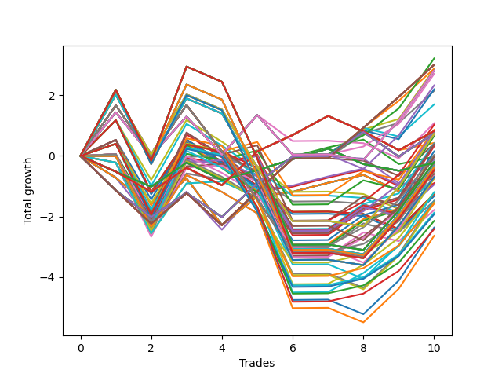

# Long HLT 108_1y 
- Symbol: TSLA
- Date Range: 05/15/2023 - 05/17/2024
- Trading Period: 8:30-12:30
- Number of Trades: 10



| Id. | Name | Win Percent | Profit | Avg Profit / Trade | Avg Time / Trade | Std |      | Name | Win Percent | Profit | Avg Profit / Trade | Avg Time / Trade | Std |
| --- | ---- | ----------- | ------ | ------------------ | ---------------- | --- | ---- | ---- | ----------- | ------ | ------------------ | ---------------- | --- |
| | Sorted By <br> Profit | | | | | | | Sorted By <br> Win Percentage |||||
|0| TP-1.25 75m | 70.00 | 3.22 | 0.32 | 31:48 | 1.17 |     | TP-1.25 75m | 70.00 | 3.22 | 0.32 | 31:48 | 1.17 |
|1| TP-1 180m | 70.00 | 3.01 | 0.30 | 22:48 | 0.97 |     | TP-1 180m | 70.00 | 3.01 | 0.30 | 22:48 | 0.97 |
|2| TP-1 165m | 70.00 | 3.01 | 0.30 | 22:48 | 0.97 |     | TP-1 165m | 70.00 | 3.01 | 0.30 | 22:48 | 0.97 |
|3| TP-1 150m | 70.00 | 3.01 | 0.30 | 22:48 | 0.97 |     | TP-1 150m | 70.00 | 3.01 | 0.30 | 22:48 | 0.97 |
|4| TP-1 135m | 70.00 | 3.01 | 0.30 | 22:48 | 0.97 |     | TP-1 135m | 70.00 | 3.01 | 0.30 | 22:48 | 0.97 |
|5| TP-1 120m | 70.00 | 3.01 | 0.30 | 22:48 | 0.97 |     | TP-1 120m | 70.00 | 3.01 | 0.30 | 22:48 | 0.97 |
|6| TP-1 105m | 70.00 | 3.01 | 0.30 | 22:48 | 0.97 |     | TP-1 105m | 70.00 | 3.01 | 0.30 | 22:48 | 0.97 |
|7| TP-1 90m | 70.00 | 3.01 | 0.30 | 22:48 | 0.97 |     | TP-1 90m | 70.00 | 3.01 | 0.30 | 22:48 | 0.97 |
|8| TP-1 75m | 70.00 | 2.88 | 0.29 | 22:30 | 0.96 |     | TP-1 75m | 70.00 | 2.88 | 0.29 | 22:30 | 0.96 |
|9| TP-1.25 45m | 70.00 | 2.87 | 0.29 | 25:48 | 1.16 |     | TP-1.25 45m | 70.00 | 2.87 | 0.29 | 25:48 | 1.16 |
|10| TP-1.25 180m | 60.00 | 2.82 | 0.28 | 39:24 | 1.20 |     | TP-1.25 105m | 70.00 | 2.71 | 0.27 | 37:48 | 1.16 |
|11| TP-1.25 165m | 60.00 | 2.82 | 0.28 | 39:24 | 1.20 |     | TP-1 45m | 70.00 | 2.15 | 0.22 | 19:18 | 0.92 |
|12| TP-1.25 150m | 60.00 | 2.82 | 0.28 | 39:24 | 1.20 |     | TP-1.25 180m | 60.00 | 2.82 | 0.28 | 39:24 | 1.20 |
|13| TP-1.25 135m | 60.00 | 2.82 | 0.28 | 39:24 | 1.20 |     | TP-1.25 165m | 60.00 | 2.82 | 0.28 | 39:24 | 1.20 |
|14| TP-1.25 120m | 60.00 | 2.82 | 0.28 | 39:24 | 1.20 |     | TP-1.25 150m | 60.00 | 2.82 | 0.28 | 39:24 | 1.20 |
|15| TP-1.25 105m | 70.00 | 2.71 | 0.27 | 37:48 | 1.16 |     | TP-1.25 135m | 60.00 | 2.82 | 0.28 | 39:24 | 1.20 |
|16| TP-1.25 90m | 60.00 | 2.33 | 0.23 | 34:48 | 1.20 |     | TP-1.25 120m | 60.00 | 2.82 | 0.28 | 39:24 | 1.20 |
|17| TP-1.25 60m | 60.00 | 2.20 | 0.22 | 28:48 | 1.17 |     | TP-1.25 90m | 60.00 | 2.33 | 0.23 | 34:48 | 1.20 |
|18| TP-1 45m | 70.00 | 2.15 | 0.22 | 19:18 | 0.92 |     | TP-1.25 60m | 60.00 | 2.20 | 0.22 | 28:48 | 1.17 |
|19| TP-1 60m | 60.00 | 1.70 | 0.17 | 21:00 | 0.95 |     | TP-1 60m | 60.00 | 1.70 | 0.17 | 21:00 | 0.95 |
|20| TP-1.25 30m | 50.00 | 1.08 | 0.11 | 20:00 | 1.07 |     | TP-1.5 75m | 60.00 | 1.03 | 0.10 | 40:12 | 1.34 |
|21| TP-1.5 75m | 60.00 | 1.03 | 0.10 | 40:12 | 1.34 |     | TP-1.5 60m | 60.00 | 0.86 | 0.09 | 35:42 | 1.32 |
|22| TP-1.5 60m | 60.00 | 0.86 | 0.09 | 35:42 | 1.32 |     | TP-1.75 75m | 60.00 | 0.82 | 0.08 | 53:12 | 1.25 |
|23| TP-1.75 75m | 60.00 | 0.82 | 0.08 | 53:12 | 1.25 |     | TP-0.75 180m | 60.00 | 0.75 | 0.08 | 11:54 | 0.85 |
|24| TP-0.5 180m | 50.00 | 0.82 | 0.08 | 05:18 | 0.68 |     | TP-0.75 165m | 60.00 | 0.75 | 0.08 | 11:54 | 0.85 |
|25| TP-0.5 165m | 50.00 | 0.82 | 0.08 | 05:18 | 0.68 |     | TP-0.75 150m | 60.00 | 0.75 | 0.08 | 11:54 | 0.85 |
|26| TP-0.5 150m | 50.00 | 0.82 | 0.08 | 05:18 | 0.68 |     | TP-0.75 135m | 60.00 | 0.75 | 0.08 | 11:54 | 0.85 |
|27| TP-0.5 135m | 50.00 | 0.82 | 0.08 | 05:18 | 0.68 |     | TP-0.75 120m | 60.00 | 0.75 | 0.08 | 11:54 | 0.85 |
|28| TP-0.5 120m | 50.00 | 0.82 | 0.08 | 05:18 | 0.68 |     | TP-0.75 105m | 60.00 | 0.75 | 0.08 | 11:54 | 0.85 |
|29| TP-0.5 105m | 50.00 | 0.82 | 0.08 | 05:18 | 0.68 |     | TP-0.75 90m | 60.00 | 0.75 | 0.08 | 11:54 | 0.85 |
|30| TP-0.5 90m | 50.00 | 0.82 | 0.08 | 05:18 | 0.68 |     | TP-0.75 75m | 60.00 | 0.75 | 0.08 | 11:54 | 0.85 |
|31| TP-0.5 75m | 50.00 | 0.82 | 0.08 | 05:18 | 0.68 |     | TP-0.75 60m | 60.00 | 0.75 | 0.08 | 11:54 | 0.85 |
|32| TP-0.5 60m | 50.00 | 0.82 | 0.08 | 05:18 | 0.68 |     | TP-0.75 45m | 60.00 | 0.75 | 0.08 | 11:54 | 0.85 |
|33| TP-0.5 45m | 50.00 | 0.82 | 0.08 | 05:18 | 0.68 |     | TP-1.75 60m | 60.00 | 0.66 | 0.07 | 45:42 | 1.22 |
|34| TP-0.5 30m | 50.00 | 0.82 | 0.08 | 05:18 | 0.68 |     | TP-1.5 45m | 60.00 | 0.41 | 0.04 | 31:12 | 1.35 |
|35| TP-0.75 180m | 60.00 | 0.75 | 0.08 | 11:54 | 0.85 |     | TP-3 45m | 60.00 | 0.38 | 0.04 | 40:42 | 1.44 |
|36| TP-0.75 165m | 60.00 | 0.75 | 0.08 | 11:54 | 0.85 |     | TP-2.75 45m | 60.00 | 0.38 | 0.04 | 40:42 | 1.44 |
|37| TP-0.75 150m | 60.00 | 0.75 | 0.08 | 11:54 | 0.85 |     | TP-2.5 45m | 60.00 | 0.32 | 0.03 | 40:24 | 1.43 |
|38| TP-0.75 135m | 60.00 | 0.75 | 0.08 | 11:54 | 0.85 |     | TP-1.75 45m | 60.00 | 0.15 | 0.02 | 38:06 | 1.28 |
|39| TP-0.75 120m | 60.00 | 0.75 | 0.08 | 11:54 | 0.85 |     | TP-2.5 75m | 60.00 | 0.03 | 0.00 | 58:54 | 1.48 |
|40| TP-0.75 105m | 60.00 | 0.75 | 0.08 | 11:54 | 0.85 |     | TP-2 45m | 60.00 | 0.02 | 0.00 | 38:18 | 1.32 |
|41| TP-0.75 90m | 60.00 | 0.75 | 0.08 | 11:54 | 0.85 |     | TP-2.25 45m | 60.00 | -0.03 | -0.00 | 39:54 | 1.40 |
|42| TP-0.75 75m | 60.00 | 0.75 | 0.08 | 11:54 | 0.85 |     | TP-0.75 15m | 60.00 | -0.03 | -0.00 | 07:54 | 0.79 |
|43| TP-0.75 60m | 60.00 | 0.75 | 0.08 | 11:54 | 0.85 |     | TP-2 75m | 60.00 | -0.27 | -0.03 | 56:48 | 1.37 |
|44| TP-0.75 45m | 60.00 | 0.75 | 0.08 | 11:54 | 0.85 |     | TP-2.25 75m | 60.00 | -0.32 | -0.03 | 58:24 | 1.46 |
|45| TP-1.75 180m | 50.00 | 0.73 | 0.07 | 73:00 | 1.54 |     | TP-1.5 105m | 60.00 | -0.51 | -0.05 | 48:30 | 1.41 |
|46| TP-1.75 165m | 50.00 | 0.73 | 0.07 | 73:00 | 1.54 |     | TP-2.5 60m | 60.00 | -0.60 | -0.06 | 49:54 | 1.41 |
|47| TP-1.75 150m | 50.00 | 0.73 | 0.07 | 73:00 | 1.54 |     | TP-1.25 15m | 60.00 | -0.71 | -0.07 | 12:18 | 0.86 |
|48| TP-1.75 135m | 50.00 | 0.73 | 0.07 | 73:00 | 1.54 |     | TP-1.75 105m | 60.00 | -0.75 | -0.07 | 68:00 | 1.36 |
|49| TP-1.75 120m | 50.00 | 0.73 | 0.07 | 73:00 | 1.54 |     | TP-1 15m | 60.00 | -0.75 | -0.07 | 10:24 | 0.80 |
|50| TP-1.75 60m | 60.00 | 0.66 | 0.07 | 45:42 | 1.22 |     | TP-2 60m | 60.00 | -0.90 | -0.09 | 47:48 | 1.30 |
|51| TP-0.5 15m | 50.00 | 0.43 | 0.04 | 04:54 | 0.66 |     | TP-3 15m | 60.00 | -0.92 | -0.09 | 14:00 | 0.78 |
|52| TP-1.5 45m | 60.00 | 0.41 | 0.04 | 31:12 | 1.35 |     | TP-2.75 15m | 60.00 | -0.92 | -0.09 | 14:00 | 0.78 |
|53| TP-1 30m | 50.00 | 0.40 | 0.04 | 16:18 | 0.92 |     | TP-2.5 15m | 60.00 | -0.92 | -0.09 | 14:00 | 0.78 |
|54| TP-3 45m | 60.00 | 0.38 | 0.04 | 40:42 | 1.44 |     | TP-2.25 15m | 60.00 | -0.92 | -0.09 | 14:00 | 0.78 |
|55| TP-2.75 45m | 60.00 | 0.38 | 0.04 | 40:42 | 1.44 |     | TP-2 15m | 60.00 | -0.92 | -0.09 | 14:00 | 0.78 |
|56| TP-2.5 45m | 60.00 | 0.32 | 0.03 | 40:24 | 1.43 |     | TP-1.75 15m | 60.00 | -0.92 | -0.09 | 14:00 | 0.78 |
|57| TP-1.75 45m | 60.00 | 0.15 | 0.02 | 38:06 | 1.28 |     | TP-1.5 15m | 60.00 | -0.92 | -0.09 | 14:00 | 0.78 |
|58| TP-2.5 75m | 60.00 | 0.03 | 0.00 | 58:54 | 1.48 |     | TP-2.25 60m | 60.00 | -0.95 | -0.09 | 49:24 | 1.39 |
|59| TP-2 45m | 60.00 | 0.02 | 0.00 | 38:18 | 1.32 |     | TP-2.75 75m | 60.00 | -1.21 | -0.12 | 62:24 | 1.41 |
|60| TP-2.25 45m | 60.00 | -0.03 | -0.00 | 39:54 | 1.40 |     | TP-3 75m | 60.00 | -1.48 | -0.15 | 63:18 | 1.47 |
|61| TP-0.75 15m | 60.00 | -0.03 | -0.00 | 07:54 | 0.79 |     | TP-3 60m | 60.00 | -1.49 | -0.15 | 52:42 | 1.29 |
|62| TP-1.5 90m | 50.00 | -0.03 | -0.00 | 44:42 | 1.37 |     | TP-2.5 105m | 60.00 | -1.58 | -0.16 | 76:54 | 1.54 |
|63| TP-0.75 30m | 50.00 | -0.13 | -0.01 | 11:18 | 0.81 |     | TP-2.75 60m | 60.00 | -1.79 | -0.18 | 51:54 | 1.35 |
|64| TP-2.75 180m | 50.00 | -0.20 | -0.02 | 92:12 | 1.98 |     | TP-2 105m | 60.00 | -1.88 | -0.19 | 74:48 | 1.44 |
|65| TP-2.75 165m | 50.00 | -0.20 | -0.02 | 92:12 | 1.98 |     | TP-2.25 105m | 60.00 | -1.93 | -0.19 | 76:24 | 1.52 |
|66| TP-2.75 150m | 50.00 | -0.20 | -0.02 | 92:12 | 1.98 |     | TP-2.75 105m | 60.00 | -2.15 | -0.21 | 83:24 | 1.57 |
|67| TP-2.75 135m | 50.00 | -0.20 | -0.02 | 92:12 | 1.98 |     | TP-3 105m | 60.00 | -2.42 | -0.24 | 84:18 | 1.62 |
|68| TP-2.75 120m | 50.00 | -0.20 | -0.02 | 92:12 | 1.98 |     | TP-1.25 30m | 50.00 | 1.08 | 0.11 | 20:00 | 1.07 |
|69| TP-0.25 180m | 50.00 | -0.23 | -0.02 | 04:30 | 0.47 |     | TP-0.5 180m | 50.00 | 0.82 | 0.08 | 05:18 | 0.68 |
|70| TP-0.25 165m | 50.00 | -0.23 | -0.02 | 04:30 | 0.47 |     | TP-0.5 165m | 50.00 | 0.82 | 0.08 | 05:18 | 0.68 |
|71| TP-0.25 150m | 50.00 | -0.23 | -0.02 | 04:30 | 0.47 |     | TP-0.5 150m | 50.00 | 0.82 | 0.08 | 05:18 | 0.68 |
|72| TP-0.25 135m | 50.00 | -0.23 | -0.02 | 04:30 | 0.47 |     | TP-0.5 135m | 50.00 | 0.82 | 0.08 | 05:18 | 0.68 |
|73| TP-0.25 120m | 50.00 | -0.23 | -0.02 | 04:30 | 0.47 |     | TP-0.5 120m | 50.00 | 0.82 | 0.08 | 05:18 | 0.68 |
|74| TP-0.25 105m | 50.00 | -0.23 | -0.02 | 04:30 | 0.47 |     | TP-0.5 105m | 50.00 | 0.82 | 0.08 | 05:18 | 0.68 |
|75| TP-0.25 90m | 50.00 | -0.23 | -0.02 | 04:30 | 0.47 |     | TP-0.5 90m | 50.00 | 0.82 | 0.08 | 05:18 | 0.68 |
|76| TP-0.25 75m | 50.00 | -0.23 | -0.02 | 04:30 | 0.47 |     | TP-0.5 75m | 50.00 | 0.82 | 0.08 | 05:18 | 0.68 |
|77| TP-0.25 60m | 50.00 | -0.23 | -0.02 | 04:30 | 0.47 |     | TP-0.5 60m | 50.00 | 0.82 | 0.08 | 05:18 | 0.68 |
|78| TP-0.25 45m | 50.00 | -0.23 | -0.02 | 04:30 | 0.47 |     | TP-0.5 45m | 50.00 | 0.82 | 0.08 | 05:18 | 0.68 |
|79| TP-0.25 30m | 50.00 | -0.23 | -0.02 | 04:30 | 0.47 |     | TP-0.5 30m | 50.00 | 0.82 | 0.08 | 05:18 | 0.68 |
|80| TP-0.25 15m | 50.00 | -0.25 | -0.03 | 04:18 | 0.47 |     | TP-1.75 180m | 50.00 | 0.73 | 0.07 | 73:00 | 1.54 |
|81| TP-2 75m | 60.00 | -0.27 | -0.03 | 56:48 | 1.37 |     | TP-1.75 165m | 50.00 | 0.73 | 0.07 | 73:00 | 1.54 |
|82| TP-2.25 75m | 60.00 | -0.32 | -0.03 | 58:24 | 1.46 |     | TP-1.75 150m | 50.00 | 0.73 | 0.07 | 73:00 | 1.54 |
|83| TP-2 180m | 50.00 | -0.34 | -0.03 | 81:30 | 1.66 |     | TP-1.75 135m | 50.00 | 0.73 | 0.07 | 73:00 | 1.54 |
|84| TP-2 165m | 50.00 | -0.34 | -0.03 | 81:30 | 1.66 |     | TP-1.75 120m | 50.00 | 0.73 | 0.07 | 73:00 | 1.54 |
|85| TP-2 150m | 50.00 | -0.34 | -0.03 | 81:30 | 1.66 |     | TP-0.5 15m | 50.00 | 0.43 | 0.04 | 04:54 | 0.66 |
|86| TP-2 135m | 50.00 | -0.34 | -0.03 | 81:30 | 1.66 |     | TP-1 30m | 50.00 | 0.40 | 0.04 | 16:18 | 0.92 |
|87| TP-2 120m | 50.00 | -0.34 | -0.03 | 81:30 | 1.66 |     | TP-1.5 90m | 50.00 | -0.03 | -0.00 | 44:42 | 1.37 |
|88| TP-2.5 180m | 50.00 | -0.37 | -0.04 | 84:48 | 1.83 |     | TP-0.75 30m | 50.00 | -0.13 | -0.01 | 11:18 | 0.81 |
|89| TP-2.5 165m | 50.00 | -0.37 | -0.04 | 84:48 | 1.83 |     | TP-2.75 180m | 50.00 | -0.20 | -0.02 | 92:12 | 1.98 |
|90| TP-2.5 150m | 50.00 | -0.37 | -0.04 | 84:48 | 1.83 |     | TP-2.75 165m | 50.00 | -0.20 | -0.02 | 92:12 | 1.98 |
|91| TP-2.5 135m | 50.00 | -0.37 | -0.04 | 84:48 | 1.83 |     | TP-2.75 150m | 50.00 | -0.20 | -0.02 | 92:12 | 1.98 |
|92| TP-2.5 120m | 50.00 | -0.37 | -0.04 | 84:48 | 1.83 |     | TP-2.75 135m | 50.00 | -0.20 | -0.02 | 92:12 | 1.98 |
|93| TP-1.5 180m | 50.00 | -0.40 | -0.04 | 51:30 | 1.44 |     | TP-2.75 120m | 50.00 | -0.20 | -0.02 | 92:12 | 1.98 |
|94| TP-1.5 165m | 50.00 | -0.40 | -0.04 | 51:30 | 1.44 |     | TP-0.25 180m | 50.00 | -0.23 | -0.02 | 04:30 | 0.47 |
|95| TP-1.5 150m | 50.00 | -0.40 | -0.04 | 51:30 | 1.44 |     | TP-0.25 165m | 50.00 | -0.23 | -0.02 | 04:30 | 0.47 |
|96| TP-1.5 135m | 50.00 | -0.40 | -0.04 | 51:30 | 1.44 |     | TP-0.25 150m | 50.00 | -0.23 | -0.02 | 04:30 | 0.47 |
|97| TP-1.5 120m | 50.00 | -0.40 | -0.04 | 51:30 | 1.44 |     | TP-0.25 135m | 50.00 | -0.23 | -0.02 | 04:30 | 0.47 |
|98| TP-3 180m | 50.00 | -0.47 | -0.05 | 93:06 | 2.02 |     | TP-0.25 120m | 50.00 | -0.23 | -0.02 | 04:30 | 0.47 |
|99| TP-3 165m | 50.00 | -0.47 | -0.05 | 93:06 | 2.02 |     | TP-0.25 105m | 50.00 | -0.23 | -0.02 | 04:30 | 0.47 |
|100| TP-3 150m | 50.00 | -0.47 | -0.05 | 93:06 | 2.02 |     | TP-0.25 90m | 50.00 | -0.23 | -0.02 | 04:30 | 0.47 |
|101| TP-3 135m | 50.00 | -0.47 | -0.05 | 93:06 | 2.02 |     | TP-0.25 75m | 50.00 | -0.23 | -0.02 | 04:30 | 0.47 |
|102| TP-3 120m | 50.00 | -0.47 | -0.05 | 93:06 | 2.02 |     | TP-0.25 60m | 50.00 | -0.23 | -0.02 | 04:30 | 0.47 |
|103| TP-1.5 105m | 60.00 | -0.51 | -0.05 | 48:30 | 1.41 |     | TP-0.25 45m | 50.00 | -0.23 | -0.02 | 04:30 | 0.47 |
|104| TP-2.5 60m | 60.00 | -0.60 | -0.06 | 49:54 | 1.41 |     | TP-0.25 30m | 50.00 | -0.23 | -0.02 | 04:30 | 0.47 |
|105| TP-1.75 30m | 40.00 | -0.60 | -0.06 | 27:36 | 1.13 |     | TP-0.25 15m | 50.00 | -0.25 | -0.03 | 04:18 | 0.47 |
|106| TP-1.75 90m | 40.00 | -0.66 | -0.07 | 60:42 | 1.28 |     | TP-2 180m | 50.00 | -0.34 | -0.03 | 81:30 | 1.66 |
|107| TP-2.25 180m | 50.00 | -0.70 | -0.07 | 83:48 | 1.81 |     | TP-2 165m | 50.00 | -0.34 | -0.03 | 81:30 | 1.66 |
|108| TP-2.25 165m | 50.00 | -0.70 | -0.07 | 83:48 | 1.81 |     | TP-2 150m | 50.00 | -0.34 | -0.03 | 81:30 | 1.66 |
|109| TP-2.25 150m | 50.00 | -0.70 | -0.07 | 83:48 | 1.81 |     | TP-2 135m | 50.00 | -0.34 | -0.03 | 81:30 | 1.66 |
|110| TP-2.25 135m | 50.00 | -0.70 | -0.07 | 83:48 | 1.81 |     | TP-2 120m | 50.00 | -0.34 | -0.03 | 81:30 | 1.66 |
|111| TP-2.25 120m | 50.00 | -0.70 | -0.07 | 83:48 | 1.81 |     | TP-2.5 180m | 50.00 | -0.37 | -0.04 | 84:48 | 1.83 |
|112| TP-1.25 15m | 60.00 | -0.71 | -0.07 | 12:18 | 0.86 |     | TP-2.5 165m | 50.00 | -0.37 | -0.04 | 84:48 | 1.83 |
|113| TP-2 30m | 40.00 | -0.73 | -0.07 | 27:48 | 1.17 |     | TP-2.5 150m | 50.00 | -0.37 | -0.04 | 84:48 | 1.83 |
|114| TP-1.75 105m | 60.00 | -0.75 | -0.07 | 68:00 | 1.36 |     | TP-2.5 135m | 50.00 | -0.37 | -0.04 | 84:48 | 1.83 |
|115| TP-1 15m | 60.00 | -0.75 | -0.07 | 10:24 | 0.80 |     | TP-2.5 120m | 50.00 | -0.37 | -0.04 | 84:48 | 1.83 |
|116| TP-2 60m | 60.00 | -0.90 | -0.09 | 47:48 | 1.30 |     | TP-1.5 180m | 50.00 | -0.40 | -0.04 | 51:30 | 1.44 |
|117| TP-3 15m | 60.00 | -0.92 | -0.09 | 14:00 | 0.78 |     | TP-1.5 165m | 50.00 | -0.40 | -0.04 | 51:30 | 1.44 |
|118| TP-2.75 15m | 60.00 | -0.92 | -0.09 | 14:00 | 0.78 |     | TP-1.5 150m | 50.00 | -0.40 | -0.04 | 51:30 | 1.44 |
|119| TP-2.5 15m | 60.00 | -0.92 | -0.09 | 14:00 | 0.78 |     | TP-1.5 135m | 50.00 | -0.40 | -0.04 | 51:30 | 1.44 |
|120| TP-2.25 15m | 60.00 | -0.92 | -0.09 | 14:00 | 0.78 |     | TP-1.5 120m | 50.00 | -0.40 | -0.04 | 51:30 | 1.44 |
|121| TP-2 15m | 60.00 | -0.92 | -0.09 | 14:00 | 0.78 |     | TP-3 180m | 50.00 | -0.47 | -0.05 | 93:06 | 2.02 |
|122| TP-1.75 15m | 60.00 | -0.92 | -0.09 | 14:00 | 0.78 |     | TP-3 165m | 50.00 | -0.47 | -0.05 | 93:06 | 2.02 |
|123| TP-1.5 15m | 60.00 | -0.92 | -0.09 | 14:00 | 0.78 |     | TP-3 150m | 50.00 | -0.47 | -0.05 | 93:06 | 2.02 |
|124| TP-1.5 30m | 40.00 | -0.92 | -0.09 | 23:48 | 1.17 |     | TP-3 135m | 50.00 | -0.47 | -0.05 | 93:06 | 2.02 |
|125| TP-2.25 60m | 60.00 | -0.95 | -0.09 | 49:24 | 1.39 |     | TP-3 120m | 50.00 | -0.47 | -0.05 | 93:06 | 2.02 |
|126| TP-2.5 90m | 40.00 | -1.20 | -0.12 | 67:54 | 1.52 |     | TP-2.25 180m | 50.00 | -0.70 | -0.07 | 83:48 | 1.81 |
|127| TP-2.75 75m | 60.00 | -1.21 | -0.12 | 62:24 | 1.41 |     | TP-2.25 165m | 50.00 | -0.70 | -0.07 | 83:48 | 1.81 |
|128| TP-3 30m | 40.00 | -1.26 | -0.13 | 28:36 | 1.16 |     | TP-2.25 150m | 50.00 | -0.70 | -0.07 | 83:48 | 1.81 |
|129| TP-2.75 30m | 40.00 | -1.26 | -0.13 | 28:36 | 1.16 |     | TP-2.25 135m | 50.00 | -0.70 | -0.07 | 83:48 | 1.81 |
|130| TP-2.5 30m | 40.00 | -1.26 | -0.13 | 28:36 | 1.16 |     | TP-2.25 120m | 50.00 | -0.70 | -0.07 | 83:48 | 1.81 |
|131| TP-2.25 30m | 40.00 | -1.33 | -0.13 | 28:30 | 1.17 |     | TP-1.75 30m | 40.00 | -0.60 | -0.06 | 27:36 | 1.13 |
|132| TP-3 75m | 60.00 | -1.48 | -0.15 | 63:18 | 1.47 |     | TP-1.75 90m | 40.00 | -0.66 | -0.07 | 60:42 | 1.28 |
|133| TP-3 60m | 60.00 | -1.49 | -0.15 | 52:42 | 1.29 |     | TP-2 30m | 40.00 | -0.73 | -0.07 | 27:48 | 1.17 |
|134| TP-2 90m | 40.00 | -1.50 | -0.15 | 65:48 | 1.42 |     | TP-1.5 30m | 40.00 | -0.92 | -0.09 | 23:48 | 1.17 |
|135| TP-2.25 90m | 40.00 | -1.55 | -0.15 | 67:24 | 1.50 |     | TP-2.5 90m | 40.00 | -1.20 | -0.12 | 67:54 | 1.52 |
|136| TP-2.5 105m | 60.00 | -1.58 | -0.16 | 76:54 | 1.54 |     | TP-3 30m | 40.00 | -1.26 | -0.13 | 28:36 | 1.16 |
|137| TP-2.75 60m | 60.00 | -1.79 | -0.18 | 51:54 | 1.35 |     | TP-2.75 30m | 40.00 | -1.26 | -0.13 | 28:36 | 1.16 |
|138| TP-2 105m | 60.00 | -1.88 | -0.19 | 74:48 | 1.44 |     | TP-2.5 30m | 40.00 | -1.26 | -0.13 | 28:36 | 1.16 |
|139| TP-2.25 105m | 60.00 | -1.93 | -0.19 | 76:24 | 1.52 |     | TP-2.25 30m | 40.00 | -1.33 | -0.13 | 28:30 | 1.17 |
|140| TP-2.75 105m | 60.00 | -2.15 | -0.21 | 83:24 | 1.57 |     | TP-2 90m | 40.00 | -1.50 | -0.15 | 65:48 | 1.42 |
|141| TP-2.75 90m | 40.00 | -2.37 | -0.24 | 72:54 | 1.46 |     | TP-2.25 90m | 40.00 | -1.55 | -0.15 | 67:24 | 1.50 |
|142| TP-3 105m | 60.00 | -2.42 | -0.24 | 84:18 | 1.62 |     | TP-2.75 90m | 40.00 | -2.37 | -0.24 | 72:54 | 1.46 |
|143| TP-3 90m | 40.00 | -2.64 | -0.26 | 73:48 | 1.51 |     | TP-3 90m | 40.00 | -2.64 | -0.26 | 73:48 | 1.51 |

### Test TP-0.25 15m
* Take Profit of 0.25 Point
* 0.25 Stoploss
* Results:
```
Total Trades: 10
Percent Up: 50.00
Percent Down: 50.00
Total Points Moved Up: -0.25
Potential Profit: -125.00
Total Points Ups: 2.08 Count Ups: 5
Total Points Downs: -2.33 Count Downs: 5
```

<details><summary>Trades</summary>

<code>In: 2023-06-26 09:40:00		Out: 2023-06-26 09:42:00		Total Position Time: 02:00		Total Move Up: -0.52		Total to Date: -0.52</code> <br />
<code>In: 2023-07-27 12:20:00		Out: 2023-07-27 12:22:00		Total Position Time: 02:00		Total Move Up: -0.50		Total to Date: -1.02</code> <br />
<code>In: 2023-08-07 08:45:00		Out: 2023-08-07 08:48:00		Total Position Time: 03:00		Total Move Up: 0.80		Total to Date: -0.22</code> <br />
<code>In: 2023-09-26 11:00:00		Out: 2023-09-26 11:02:00		Total Position Time: 02:00		Total Move Up: -0.58		Total to Date: -0.80</code> <br />
<code>In: 2023-10-18 10:10:00		Out: 2023-10-18 10:12:00		Total Position Time: 02:00		Total Move Up: 0.33		Total to Date: -0.47</code> <br />
<code>In: 2023-10-30 08:55:00		Out: 2023-10-30 08:58:00		Total Position Time: 03:00		Total Move Up: 0.36		Total to Date: -0.11</code> <br />
<code>In: 2023-12-28 12:25:00		Out: 2023-12-28 12:32:00		Total Position Time: 07:00		Total Move Up: 0.35		Total to Date: 0.24</code> <br />
<code>In: 2024-01-12 09:20:00		Out: 2024-01-12 09:26:00		Total Position Time: 06:00		Total Move Up: -0.51		Total to Date: -0.27</code> <br />
<code>In: 2024-02-20 09:35:00		Out: 2024-02-20 09:37:00		Total Position Time: 02:00		Total Move Up: -0.22		Total to Date: -0.49</code> <br />
<code>In: 2024-04-22 08:35:00		Out: 2024-04-22 08:49:00		Total Position Time: 14:00		Total Move Up: 0.24		Total to Date: -0.25</code> <br />


</details>

### Test TP-0.5 15m
* Take Profit of 0.5 Point
* 0.5 Stoploss
* Results:
```
Total Trades: 10
Percent Up: 50.00
Percent Down: 50.00
Total Points Moved Up: 0.43
Potential Profit: 215.00
Total Points Ups: 3.33 Count Ups: 5
Total Points Downs: -2.90 Count Downs: 5
```

<details><summary>Trades</summary>

<code>In: 2023-06-26 09:40:00		Out: 2023-06-26 09:42:00		Total Position Time: 02:00		Total Move Up: -0.52		Total to Date: -0.52</code> <br />
<code>In: 2023-07-27 12:20:00		Out: 2023-07-27 12:23:00		Total Position Time: 03:00		Total Move Up: -0.67		Total to Date: -1.19</code> <br />
<code>In: 2023-08-07 08:45:00		Out: 2023-08-07 08:48:00		Total Position Time: 03:00		Total Move Up: 0.80		Total to Date: -0.39</code> <br />
<code>In: 2023-09-26 11:00:00		Out: 2023-09-26 11:02:00		Total Position Time: 02:00		Total Move Up: -0.58		Total to Date: -0.97</code> <br />
<code>In: 2023-10-18 10:10:00		Out: 2023-10-18 10:14:00		Total Position Time: 04:00		Total Move Up: 1.12		Total to Date: 0.15</code> <br />
<code>In: 2023-10-30 08:55:00		Out: 2023-10-30 08:59:00		Total Position Time: 04:00		Total Move Up: 0.54		Total to Date: 0.69</code> <br />
<code>In: 2023-12-28 12:25:00		Out: 2023-12-28 12:33:00		Total Position Time: 08:00		Total Move Up: 0.63		Total to Date: 1.32</code> <br />
<code>In: 2024-01-12 09:20:00		Out: 2024-01-12 09:26:00		Total Position Time: 06:00		Total Move Up: -0.51		Total to Date: 0.81</code> <br />
<code>In: 2024-02-20 09:35:00		Out: 2024-02-20 09:38:00		Total Position Time: 03:00		Total Move Up: -0.62		Total to Date: 0.19</code> <br />
<code>In: 2024-04-22 08:35:00		Out: 2024-04-22 08:49:00		Total Position Time: 14:00		Total Move Up: 0.24		Total to Date: 0.43</code> <br />


</details>

### Test TP-0.75 15m
* Take Profit of 0.75 Point
* 0.75 Stoploss
* Results:
```
Total Trades: 10
Percent Up: 60.00
Percent Down: 40.00
Total Points Moved Up: -0.03
Potential Profit: -15.00
Total Points Ups: 3.60 Count Ups: 6
Total Points Downs: -3.63 Count Downs: 4
```

<details><summary>Trades</summary>

<code>In: 2023-06-26 09:40:00		Out: 2023-06-26 09:52:00		Total Position Time: 12:00		Total Move Up: -1.14		Total to Date: -1.14</code> <br />
<code>In: 2023-07-27 12:20:00		Out: 2023-07-27 12:24:00		Total Position Time: 04:00		Total Move Up: -0.88		Total to Date: -2.02</code> <br />
<code>In: 2023-08-07 08:45:00		Out: 2023-08-07 08:48:00		Total Position Time: 03:00		Total Move Up: 0.80		Total to Date: -1.22</code> <br />
<code>In: 2023-09-26 11:00:00		Out: 2023-09-26 11:04:00		Total Position Time: 04:00		Total Move Up: -0.80		Total to Date: -2.02</code> <br />
<code>In: 2023-10-18 10:10:00		Out: 2023-10-18 10:14:00		Total Position Time: 04:00		Total Move Up: 1.12		Total to Date: -0.90</code> <br />
<code>In: 2023-10-30 08:55:00		Out: 2023-10-30 09:01:00		Total Position Time: 06:00		Total Move Up: 0.88		Total to Date: -0.02</code> <br />
<code>In: 2023-12-28 12:25:00		Out: 2023-12-28 12:39:00		Total Position Time: 14:00		Total Move Up: 0.30		Total to Date: 0.28</code> <br />
<code>In: 2024-01-12 09:20:00		Out: 2024-01-12 09:34:00		Total Position Time: 14:00		Total Move Up: 0.26		Total to Date: 0.54</code> <br />
<code>In: 2024-02-20 09:35:00		Out: 2024-02-20 09:39:00		Total Position Time: 04:00		Total Move Up: -0.81		Total to Date: -0.27</code> <br />
<code>In: 2024-04-22 08:35:00		Out: 2024-04-22 08:49:00		Total Position Time: 14:00		Total Move Up: 0.24		Total to Date: -0.03</code> <br />


</details>

### Test TP-1 15m
* Take Profit of 1 Point
* 1 Stoploss
* Results:
```
Total Trades: 10
Percent Up: 60.00
Percent Down: 40.00
Total Points Moved Up: -0.75
Potential Profit: -375.00
Total Points Ups: 3.08 Count Ups: 6
Total Points Downs: -3.83 Count Downs: 4
```

<details><summary>Trades</summary>

<code>In: 2023-06-26 09:40:00		Out: 2023-06-26 09:52:00		Total Position Time: 12:00		Total Move Up: -1.14		Total to Date: -1.14</code> <br />
<code>In: 2023-07-27 12:20:00		Out: 2023-07-27 12:25:00		Total Position Time: 05:00		Total Move Up: -1.10		Total to Date: -2.24</code> <br />
<code>In: 2023-08-07 08:45:00		Out: 2023-08-07 08:50:00		Total Position Time: 05:00		Total Move Up: 1.01		Total to Date: -1.23</code> <br />
<code>In: 2023-09-26 11:00:00		Out: 2023-09-26 11:08:00		Total Position Time: 08:00		Total Move Up: -1.06		Total to Date: -2.29</code> <br />
<code>In: 2023-10-18 10:10:00		Out: 2023-10-18 10:14:00		Total Position Time: 04:00		Total Move Up: 1.12		Total to Date: -1.17</code> <br />
<code>In: 2023-10-30 08:55:00		Out: 2023-10-30 09:09:00		Total Position Time: 14:00		Total Move Up: 0.15		Total to Date: -1.02</code> <br />
<code>In: 2023-12-28 12:25:00		Out: 2023-12-28 12:39:00		Total Position Time: 14:00		Total Move Up: 0.30		Total to Date: -0.72</code> <br />
<code>In: 2024-01-12 09:20:00		Out: 2024-01-12 09:34:00		Total Position Time: 14:00		Total Move Up: 0.26		Total to Date: -0.46</code> <br />
<code>In: 2024-02-20 09:35:00		Out: 2024-02-20 09:49:00		Total Position Time: 14:00		Total Move Up: -0.53		Total to Date: -0.99</code> <br />
<code>In: 2024-04-22 08:35:00		Out: 2024-04-22 08:49:00		Total Position Time: 14:00		Total Move Up: 0.24		Total to Date: -0.75</code> <br />


</details>

### Test TP-1.25 15m
* Take Profit of 1.25 Point
* 1.25 Stoploss
* Results:
```
Total Trades: 10
Percent Up: 60.00
Percent Down: 40.00
Total Points Moved Up: -0.71
Potential Profit: -355.00
Total Points Ups: 3.24 Count Ups: 6
Total Points Downs: -3.95 Count Downs: 4
```

<details><summary>Trades</summary>

<code>In: 2023-06-26 09:40:00		Out: 2023-06-26 09:54:00		Total Position Time: 14:00		Total Move Up: -0.72		Total to Date: -0.72</code> <br />
<code>In: 2023-07-27 12:20:00		Out: 2023-07-27 12:27:00		Total Position Time: 07:00		Total Move Up: -1.44		Total to Date: -2.16</code> <br />
<code>In: 2023-08-07 08:45:00		Out: 2023-08-07 08:59:00		Total Position Time: 14:00		Total Move Up: 0.98		Total to Date: -1.18</code> <br />
<code>In: 2023-09-26 11:00:00		Out: 2023-09-26 11:11:00		Total Position Time: 11:00		Total Move Up: -1.26		Total to Date: -2.44</code> <br />
<code>In: 2023-10-18 10:10:00		Out: 2023-10-18 10:17:00		Total Position Time: 07:00		Total Move Up: 1.31		Total to Date: -1.13</code> <br />
<code>In: 2023-10-30 08:55:00		Out: 2023-10-30 09:09:00		Total Position Time: 14:00		Total Move Up: 0.15		Total to Date: -0.98</code> <br />
<code>In: 2023-12-28 12:25:00		Out: 2023-12-28 12:39:00		Total Position Time: 14:00		Total Move Up: 0.30		Total to Date: -0.68</code> <br />
<code>In: 2024-01-12 09:20:00		Out: 2024-01-12 09:34:00		Total Position Time: 14:00		Total Move Up: 0.26		Total to Date: -0.42</code> <br />
<code>In: 2024-02-20 09:35:00		Out: 2024-02-20 09:49:00		Total Position Time: 14:00		Total Move Up: -0.53		Total to Date: -0.95</code> <br />
<code>In: 2024-04-22 08:35:00		Out: 2024-04-22 08:49:00		Total Position Time: 14:00		Total Move Up: 0.24		Total to Date: -0.71</code> <br />


</details>

### Test TP-1.5 15m
* Take Profit of 1.5 Point
* 1.5 Stoploss
* Results:
```
Total Trades: 10
Percent Up: 60.00
Percent Down: 40.00
Total Points Moved Up: -0.92
Potential Profit: -460.00
Total Points Ups: 2.87 Count Ups: 6
Total Points Downs: -3.79 Count Downs: 4
```

<details><summary>Trades</summary>

<code>In: 2023-06-26 09:40:00		Out: 2023-06-26 09:54:00		Total Position Time: 14:00		Total Move Up: -0.72		Total to Date: -0.72</code> <br />
<code>In: 2023-07-27 12:20:00		Out: 2023-07-27 12:34:00		Total Position Time: 14:00		Total Move Up: -1.01		Total to Date: -1.73</code> <br />
<code>In: 2023-08-07 08:45:00		Out: 2023-08-07 08:59:00		Total Position Time: 14:00		Total Move Up: 0.98		Total to Date: -0.75</code> <br />
<code>In: 2023-09-26 11:00:00		Out: 2023-09-26 11:14:00		Total Position Time: 14:00		Total Move Up: -1.53		Total to Date: -2.28</code> <br />
<code>In: 2023-10-18 10:10:00		Out: 2023-10-18 10:24:00		Total Position Time: 14:00		Total Move Up: 0.94		Total to Date: -1.34</code> <br />
<code>In: 2023-10-30 08:55:00		Out: 2023-10-30 09:09:00		Total Position Time: 14:00		Total Move Up: 0.15		Total to Date: -1.19</code> <br />
<code>In: 2023-12-28 12:25:00		Out: 2023-12-28 12:39:00		Total Position Time: 14:00		Total Move Up: 0.30		Total to Date: -0.89</code> <br />
<code>In: 2024-01-12 09:20:00		Out: 2024-01-12 09:34:00		Total Position Time: 14:00		Total Move Up: 0.26		Total to Date: -0.63</code> <br />
<code>In: 2024-02-20 09:35:00		Out: 2024-02-20 09:49:00		Total Position Time: 14:00		Total Move Up: -0.53		Total to Date: -1.16</code> <br />
<code>In: 2024-04-22 08:35:00		Out: 2024-04-22 08:49:00		Total Position Time: 14:00		Total Move Up: 0.24		Total to Date: -0.92</code> <br />


</details>

### Test TP-1.75 15m
* Take Profit of 1.75 Point
* 1.75 Stoploss
* Results:
```
Total Trades: 10
Percent Up: 60.00
Percent Down: 40.00
Total Points Moved Up: -0.92
Potential Profit: -460.00
Total Points Ups: 2.87 Count Ups: 6
Total Points Downs: -3.79 Count Downs: 4
```

<details><summary>Trades</summary>

<code>In: 2023-06-26 09:40:00		Out: 2023-06-26 09:54:00		Total Position Time: 14:00		Total Move Up: -0.72		Total to Date: -0.72</code> <br />
<code>In: 2023-07-27 12:20:00		Out: 2023-07-27 12:34:00		Total Position Time: 14:00		Total Move Up: -1.01		Total to Date: -1.73</code> <br />
<code>In: 2023-08-07 08:45:00		Out: 2023-08-07 08:59:00		Total Position Time: 14:00		Total Move Up: 0.98		Total to Date: -0.75</code> <br />
<code>In: 2023-09-26 11:00:00		Out: 2023-09-26 11:14:00		Total Position Time: 14:00		Total Move Up: -1.53		Total to Date: -2.28</code> <br />
<code>In: 2023-10-18 10:10:00		Out: 2023-10-18 10:24:00		Total Position Time: 14:00		Total Move Up: 0.94		Total to Date: -1.34</code> <br />
<code>In: 2023-10-30 08:55:00		Out: 2023-10-30 09:09:00		Total Position Time: 14:00		Total Move Up: 0.15		Total to Date: -1.19</code> <br />
<code>In: 2023-12-28 12:25:00		Out: 2023-12-28 12:39:00		Total Position Time: 14:00		Total Move Up: 0.30		Total to Date: -0.89</code> <br />
<code>In: 2024-01-12 09:20:00		Out: 2024-01-12 09:34:00		Total Position Time: 14:00		Total Move Up: 0.26		Total to Date: -0.63</code> <br />
<code>In: 2024-02-20 09:35:00		Out: 2024-02-20 09:49:00		Total Position Time: 14:00		Total Move Up: -0.53		Total to Date: -1.16</code> <br />
<code>In: 2024-04-22 08:35:00		Out: 2024-04-22 08:49:00		Total Position Time: 14:00		Total Move Up: 0.24		Total to Date: -0.92</code> <br />


</details>

### Test TP-2 15m
* Take Profit of 2 Point
* 2 Stoploss
* Results:
```
Total Trades: 10
Percent Up: 60.00
Percent Down: 40.00
Total Points Moved Up: -0.92
Potential Profit: -460.00
Total Points Ups: 2.87 Count Ups: 6
Total Points Downs: -3.79 Count Downs: 4
```

<details><summary>Trades</summary>

<code>In: 2023-06-26 09:40:00		Out: 2023-06-26 09:54:00		Total Position Time: 14:00		Total Move Up: -0.72		Total to Date: -0.72</code> <br />
<code>In: 2023-07-27 12:20:00		Out: 2023-07-27 12:34:00		Total Position Time: 14:00		Total Move Up: -1.01		Total to Date: -1.73</code> <br />
<code>In: 2023-08-07 08:45:00		Out: 2023-08-07 08:59:00		Total Position Time: 14:00		Total Move Up: 0.98		Total to Date: -0.75</code> <br />
<code>In: 2023-09-26 11:00:00		Out: 2023-09-26 11:14:00		Total Position Time: 14:00		Total Move Up: -1.53		Total to Date: -2.28</code> <br />
<code>In: 2023-10-18 10:10:00		Out: 2023-10-18 10:24:00		Total Position Time: 14:00		Total Move Up: 0.94		Total to Date: -1.34</code> <br />
<code>In: 2023-10-30 08:55:00		Out: 2023-10-30 09:09:00		Total Position Time: 14:00		Total Move Up: 0.15		Total to Date: -1.19</code> <br />
<code>In: 2023-12-28 12:25:00		Out: 2023-12-28 12:39:00		Total Position Time: 14:00		Total Move Up: 0.30		Total to Date: -0.89</code> <br />
<code>In: 2024-01-12 09:20:00		Out: 2024-01-12 09:34:00		Total Position Time: 14:00		Total Move Up: 0.26		Total to Date: -0.63</code> <br />
<code>In: 2024-02-20 09:35:00		Out: 2024-02-20 09:49:00		Total Position Time: 14:00		Total Move Up: -0.53		Total to Date: -1.16</code> <br />
<code>In: 2024-04-22 08:35:00		Out: 2024-04-22 08:49:00		Total Position Time: 14:00		Total Move Up: 0.24		Total to Date: -0.92</code> <br />


</details>

### Test TP-2.25 15m
* Take Profit of 2.25 Point
* 2.25 Stoploss
* Results:
```
Total Trades: 10
Percent Up: 60.00
Percent Down: 40.00
Total Points Moved Up: -0.92
Potential Profit: -460.00
Total Points Ups: 2.87 Count Ups: 6
Total Points Downs: -3.79 Count Downs: 4
```

<details><summary>Trades</summary>

<code>In: 2023-06-26 09:40:00		Out: 2023-06-26 09:54:00		Total Position Time: 14:00		Total Move Up: -0.72		Total to Date: -0.72</code> <br />
<code>In: 2023-07-27 12:20:00		Out: 2023-07-27 12:34:00		Total Position Time: 14:00		Total Move Up: -1.01		Total to Date: -1.73</code> <br />
<code>In: 2023-08-07 08:45:00		Out: 2023-08-07 08:59:00		Total Position Time: 14:00		Total Move Up: 0.98		Total to Date: -0.75</code> <br />
<code>In: 2023-09-26 11:00:00		Out: 2023-09-26 11:14:00		Total Position Time: 14:00		Total Move Up: -1.53		Total to Date: -2.28</code> <br />
<code>In: 2023-10-18 10:10:00		Out: 2023-10-18 10:24:00		Total Position Time: 14:00		Total Move Up: 0.94		Total to Date: -1.34</code> <br />
<code>In: 2023-10-30 08:55:00		Out: 2023-10-30 09:09:00		Total Position Time: 14:00		Total Move Up: 0.15		Total to Date: -1.19</code> <br />
<code>In: 2023-12-28 12:25:00		Out: 2023-12-28 12:39:00		Total Position Time: 14:00		Total Move Up: 0.30		Total to Date: -0.89</code> <br />
<code>In: 2024-01-12 09:20:00		Out: 2024-01-12 09:34:00		Total Position Time: 14:00		Total Move Up: 0.26		Total to Date: -0.63</code> <br />
<code>In: 2024-02-20 09:35:00		Out: 2024-02-20 09:49:00		Total Position Time: 14:00		Total Move Up: -0.53		Total to Date: -1.16</code> <br />
<code>In: 2024-04-22 08:35:00		Out: 2024-04-22 08:49:00		Total Position Time: 14:00		Total Move Up: 0.24		Total to Date: -0.92</code> <br />


</details>

### Test TP-2.5 15m
* Take Profit of 2.5 Point
* 2.5 Stoploss
* Results:
```
Total Trades: 10
Percent Up: 60.00
Percent Down: 40.00
Total Points Moved Up: -0.92
Potential Profit: -460.00
Total Points Ups: 2.87 Count Ups: 6
Total Points Downs: -3.79 Count Downs: 4
```

<details><summary>Trades</summary>

<code>In: 2023-06-26 09:40:00		Out: 2023-06-26 09:54:00		Total Position Time: 14:00		Total Move Up: -0.72		Total to Date: -0.72</code> <br />
<code>In: 2023-07-27 12:20:00		Out: 2023-07-27 12:34:00		Total Position Time: 14:00		Total Move Up: -1.01		Total to Date: -1.73</code> <br />
<code>In: 2023-08-07 08:45:00		Out: 2023-08-07 08:59:00		Total Position Time: 14:00		Total Move Up: 0.98		Total to Date: -0.75</code> <br />
<code>In: 2023-09-26 11:00:00		Out: 2023-09-26 11:14:00		Total Position Time: 14:00		Total Move Up: -1.53		Total to Date: -2.28</code> <br />
<code>In: 2023-10-18 10:10:00		Out: 2023-10-18 10:24:00		Total Position Time: 14:00		Total Move Up: 0.94		Total to Date: -1.34</code> <br />
<code>In: 2023-10-30 08:55:00		Out: 2023-10-30 09:09:00		Total Position Time: 14:00		Total Move Up: 0.15		Total to Date: -1.19</code> <br />
<code>In: 2023-12-28 12:25:00		Out: 2023-12-28 12:39:00		Total Position Time: 14:00		Total Move Up: 0.30		Total to Date: -0.89</code> <br />
<code>In: 2024-01-12 09:20:00		Out: 2024-01-12 09:34:00		Total Position Time: 14:00		Total Move Up: 0.26		Total to Date: -0.63</code> <br />
<code>In: 2024-02-20 09:35:00		Out: 2024-02-20 09:49:00		Total Position Time: 14:00		Total Move Up: -0.53		Total to Date: -1.16</code> <br />
<code>In: 2024-04-22 08:35:00		Out: 2024-04-22 08:49:00		Total Position Time: 14:00		Total Move Up: 0.24		Total to Date: -0.92</code> <br />


</details>

### Test TP-2.75 15m
* Take Profit of 2.75 Point
* 2.75 Stoploss
* Results:
```
Total Trades: 10
Percent Up: 60.00
Percent Down: 40.00
Total Points Moved Up: -0.92
Potential Profit: -460.00
Total Points Ups: 2.87 Count Ups: 6
Total Points Downs: -3.79 Count Downs: 4
```

<details><summary>Trades</summary>

<code>In: 2023-06-26 09:40:00		Out: 2023-06-26 09:54:00		Total Position Time: 14:00		Total Move Up: -0.72		Total to Date: -0.72</code> <br />
<code>In: 2023-07-27 12:20:00		Out: 2023-07-27 12:34:00		Total Position Time: 14:00		Total Move Up: -1.01		Total to Date: -1.73</code> <br />
<code>In: 2023-08-07 08:45:00		Out: 2023-08-07 08:59:00		Total Position Time: 14:00		Total Move Up: 0.98		Total to Date: -0.75</code> <br />
<code>In: 2023-09-26 11:00:00		Out: 2023-09-26 11:14:00		Total Position Time: 14:00		Total Move Up: -1.53		Total to Date: -2.28</code> <br />
<code>In: 2023-10-18 10:10:00		Out: 2023-10-18 10:24:00		Total Position Time: 14:00		Total Move Up: 0.94		Total to Date: -1.34</code> <br />
<code>In: 2023-10-30 08:55:00		Out: 2023-10-30 09:09:00		Total Position Time: 14:00		Total Move Up: 0.15		Total to Date: -1.19</code> <br />
<code>In: 2023-12-28 12:25:00		Out: 2023-12-28 12:39:00		Total Position Time: 14:00		Total Move Up: 0.30		Total to Date: -0.89</code> <br />
<code>In: 2024-01-12 09:20:00		Out: 2024-01-12 09:34:00		Total Position Time: 14:00		Total Move Up: 0.26		Total to Date: -0.63</code> <br />
<code>In: 2024-02-20 09:35:00		Out: 2024-02-20 09:49:00		Total Position Time: 14:00		Total Move Up: -0.53		Total to Date: -1.16</code> <br />
<code>In: 2024-04-22 08:35:00		Out: 2024-04-22 08:49:00		Total Position Time: 14:00		Total Move Up: 0.24		Total to Date: -0.92</code> <br />


</details>

### Test TP-3 15m
* Take Profit of 3 Point
* 3 Stoploss
* Results:
```
Total Trades: 10
Percent Up: 60.00
Percent Down: 40.00
Total Points Moved Up: -0.92
Potential Profit: -460.00
Total Points Ups: 2.87 Count Ups: 6
Total Points Downs: -3.79 Count Downs: 4
```

<details><summary>Trades</summary>

<code>In: 2023-06-26 09:40:00		Out: 2023-06-26 09:54:00		Total Position Time: 14:00		Total Move Up: -0.72		Total to Date: -0.72</code> <br />
<code>In: 2023-07-27 12:20:00		Out: 2023-07-27 12:34:00		Total Position Time: 14:00		Total Move Up: -1.01		Total to Date: -1.73</code> <br />
<code>In: 2023-08-07 08:45:00		Out: 2023-08-07 08:59:00		Total Position Time: 14:00		Total Move Up: 0.98		Total to Date: -0.75</code> <br />
<code>In: 2023-09-26 11:00:00		Out: 2023-09-26 11:14:00		Total Position Time: 14:00		Total Move Up: -1.53		Total to Date: -2.28</code> <br />
<code>In: 2023-10-18 10:10:00		Out: 2023-10-18 10:24:00		Total Position Time: 14:00		Total Move Up: 0.94		Total to Date: -1.34</code> <br />
<code>In: 2023-10-30 08:55:00		Out: 2023-10-30 09:09:00		Total Position Time: 14:00		Total Move Up: 0.15		Total to Date: -1.19</code> <br />
<code>In: 2023-12-28 12:25:00		Out: 2023-12-28 12:39:00		Total Position Time: 14:00		Total Move Up: 0.30		Total to Date: -0.89</code> <br />
<code>In: 2024-01-12 09:20:00		Out: 2024-01-12 09:34:00		Total Position Time: 14:00		Total Move Up: 0.26		Total to Date: -0.63</code> <br />
<code>In: 2024-02-20 09:35:00		Out: 2024-02-20 09:49:00		Total Position Time: 14:00		Total Move Up: -0.53		Total to Date: -1.16</code> <br />
<code>In: 2024-04-22 08:35:00		Out: 2024-04-22 08:49:00		Total Position Time: 14:00		Total Move Up: 0.24		Total to Date: -0.92</code> <br />


</details>

### Test TP-0.25 30m
* Take Profit of 0.25 Point
* 0.25 Stoploss
* Results:
```
Total Trades: 10
Percent Up: 50.00
Percent Down: 50.00
Total Points Moved Up: -0.23
Potential Profit: -115.00
Total Points Ups: 2.10 Count Ups: 5
Total Points Downs: -2.33 Count Downs: 5
```

<details><summary>Trades</summary>

<code>In: 2023-06-26 09:40:00		Out: 2023-06-26 09:42:00		Total Position Time: 02:00		Total Move Up: -0.52		Total to Date: -0.52</code> <br />
<code>In: 2023-07-27 12:20:00		Out: 2023-07-27 12:22:00		Total Position Time: 02:00		Total Move Up: -0.50		Total to Date: -1.02</code> <br />
<code>In: 2023-08-07 08:45:00		Out: 2023-08-07 08:48:00		Total Position Time: 03:00		Total Move Up: 0.80		Total to Date: -0.22</code> <br />
<code>In: 2023-09-26 11:00:00		Out: 2023-09-26 11:02:00		Total Position Time: 02:00		Total Move Up: -0.58		Total to Date: -0.80</code> <br />
<code>In: 2023-10-18 10:10:00		Out: 2023-10-18 10:12:00		Total Position Time: 02:00		Total Move Up: 0.33		Total to Date: -0.47</code> <br />
<code>In: 2023-10-30 08:55:00		Out: 2023-10-30 08:58:00		Total Position Time: 03:00		Total Move Up: 0.36		Total to Date: -0.11</code> <br />
<code>In: 2023-12-28 12:25:00		Out: 2023-12-28 12:32:00		Total Position Time: 07:00		Total Move Up: 0.35		Total to Date: 0.24</code> <br />
<code>In: 2024-01-12 09:20:00		Out: 2024-01-12 09:26:00		Total Position Time: 06:00		Total Move Up: -0.51		Total to Date: -0.27</code> <br />
<code>In: 2024-02-20 09:35:00		Out: 2024-02-20 09:37:00		Total Position Time: 02:00		Total Move Up: -0.22		Total to Date: -0.49</code> <br />
<code>In: 2024-04-22 08:35:00		Out: 2024-04-22 08:51:00		Total Position Time: 16:00		Total Move Up: 0.26		Total to Date: -0.23</code> <br />


</details>

### Test TP-0.5 30m
* Take Profit of 0.5 Point
* 0.5 Stoploss
* Results:
```
Total Trades: 10
Percent Up: 50.00
Percent Down: 50.00
Total Points Moved Up: 0.82
Potential Profit: 410.00
Total Points Ups: 3.72 Count Ups: 5
Total Points Downs: -2.90 Count Downs: 5
```

<details><summary>Trades</summary>

<code>In: 2023-06-26 09:40:00		Out: 2023-06-26 09:42:00		Total Position Time: 02:00		Total Move Up: -0.52		Total to Date: -0.52</code> <br />
<code>In: 2023-07-27 12:20:00		Out: 2023-07-27 12:23:00		Total Position Time: 03:00		Total Move Up: -0.67		Total to Date: -1.19</code> <br />
<code>In: 2023-08-07 08:45:00		Out: 2023-08-07 08:48:00		Total Position Time: 03:00		Total Move Up: 0.80		Total to Date: -0.39</code> <br />
<code>In: 2023-09-26 11:00:00		Out: 2023-09-26 11:02:00		Total Position Time: 02:00		Total Move Up: -0.58		Total to Date: -0.97</code> <br />
<code>In: 2023-10-18 10:10:00		Out: 2023-10-18 10:14:00		Total Position Time: 04:00		Total Move Up: 1.12		Total to Date: 0.15</code> <br />
<code>In: 2023-10-30 08:55:00		Out: 2023-10-30 08:59:00		Total Position Time: 04:00		Total Move Up: 0.54		Total to Date: 0.69</code> <br />
<code>In: 2023-12-28 12:25:00		Out: 2023-12-28 12:33:00		Total Position Time: 08:00		Total Move Up: 0.63		Total to Date: 1.32</code> <br />
<code>In: 2024-01-12 09:20:00		Out: 2024-01-12 09:26:00		Total Position Time: 06:00		Total Move Up: -0.51		Total to Date: 0.81</code> <br />
<code>In: 2024-02-20 09:35:00		Out: 2024-02-20 09:38:00		Total Position Time: 03:00		Total Move Up: -0.62		Total to Date: 0.19</code> <br />
<code>In: 2024-04-22 08:35:00		Out: 2024-04-22 08:53:00		Total Position Time: 18:00		Total Move Up: 0.63		Total to Date: 0.82</code> <br />


</details>

### Test TP-0.75 30m
* Take Profit of 0.75 Point
* 0.75 Stoploss
* Results:
```
Total Trades: 10
Percent Up: 50.00
Percent Down: 50.00
Total Points Moved Up: -0.13
Potential Profit: -65.00
Total Points Ups: 3.58 Count Ups: 5
Total Points Downs: -3.71 Count Downs: 5
```

<details><summary>Trades</summary>

<code>In: 2023-06-26 09:40:00		Out: 2023-06-26 09:52:00		Total Position Time: 12:00		Total Move Up: -1.14		Total to Date: -1.14</code> <br />
<code>In: 2023-07-27 12:20:00		Out: 2023-07-27 12:24:00		Total Position Time: 04:00		Total Move Up: -0.88		Total to Date: -2.02</code> <br />
<code>In: 2023-08-07 08:45:00		Out: 2023-08-07 08:48:00		Total Position Time: 03:00		Total Move Up: 0.80		Total to Date: -1.22</code> <br />
<code>In: 2023-09-26 11:00:00		Out: 2023-09-26 11:04:00		Total Position Time: 04:00		Total Move Up: -0.80		Total to Date: -2.02</code> <br />
<code>In: 2023-10-18 10:10:00		Out: 2023-10-18 10:14:00		Total Position Time: 04:00		Total Move Up: 1.12		Total to Date: -0.90</code> <br />
<code>In: 2023-10-30 08:55:00		Out: 2023-10-30 09:01:00		Total Position Time: 06:00		Total Move Up: 0.88		Total to Date: -0.02</code> <br />
<code>In: 2023-12-28 12:25:00		Out: 2023-12-28 12:50:00		Total Position Time: 25:00		Total Move Up: 0.01		Total to Date: -0.01</code> <br />
<code>In: 2024-01-12 09:20:00		Out: 2024-01-12 09:49:00		Total Position Time: 29:00		Total Move Up: -0.08		Total to Date: -0.09</code> <br />
<code>In: 2024-02-20 09:35:00		Out: 2024-02-20 09:39:00		Total Position Time: 04:00		Total Move Up: -0.81		Total to Date: -0.90</code> <br />
<code>In: 2024-04-22 08:35:00		Out: 2024-04-22 08:57:00		Total Position Time: 22:00		Total Move Up: 0.77		Total to Date: -0.13</code> <br />


</details>

### Test TP-1 30m
* Take Profit of 1 Point
* 1 Stoploss
* Results:
```
Total Trades: 10
Percent Up: 50.00
Percent Down: 50.00
Total Points Moved Up: 0.40
Potential Profit: 200.00
Total Points Ups: 4.28 Count Ups: 5
Total Points Downs: -3.88 Count Downs: 5
```

<details><summary>Trades</summary>

<code>In: 2023-06-26 09:40:00		Out: 2023-06-26 09:52:00		Total Position Time: 12:00		Total Move Up: -1.14		Total to Date: -1.14</code> <br />
<code>In: 2023-07-27 12:20:00		Out: 2023-07-27 12:25:00		Total Position Time: 05:00		Total Move Up: -1.10		Total to Date: -2.24</code> <br />
<code>In: 2023-08-07 08:45:00		Out: 2023-08-07 08:50:00		Total Position Time: 05:00		Total Move Up: 1.01		Total to Date: -1.23</code> <br />
<code>In: 2023-09-26 11:00:00		Out: 2023-09-26 11:08:00		Total Position Time: 08:00		Total Move Up: -1.06		Total to Date: -2.29</code> <br />
<code>In: 2023-10-18 10:10:00		Out: 2023-10-18 10:14:00		Total Position Time: 04:00		Total Move Up: 1.12		Total to Date: -1.17</code> <br />
<code>In: 2023-10-30 08:55:00		Out: 2023-10-30 09:13:00		Total Position Time: 18:00		Total Move Up: 1.08		Total to Date: -0.09</code> <br />
<code>In: 2023-12-28 12:25:00		Out: 2023-12-28 12:50:00		Total Position Time: 25:00		Total Move Up: 0.01		Total to Date: -0.08</code> <br />
<code>In: 2024-01-12 09:20:00		Out: 2024-01-12 09:49:00		Total Position Time: 29:00		Total Move Up: -0.08		Total to Date: -0.16</code> <br />
<code>In: 2024-02-20 09:35:00		Out: 2024-02-20 10:04:00		Total Position Time: 29:00		Total Move Up: -0.50		Total to Date: -0.66</code> <br />
<code>In: 2024-04-22 08:35:00		Out: 2024-04-22 09:03:00		Total Position Time: 28:00		Total Move Up: 1.06		Total to Date: 0.40</code> <br />


</details>

### Test TP-1.25 30m
* Take Profit of 1.25 Point
* 1.25 Stoploss
* Results:
```
Total Trades: 10
Percent Up: 50.00
Percent Down: 50.00
Total Points Moved Up: 1.08
Potential Profit: 540.00
Total Points Ups: 5.22 Count Ups: 5
Total Points Downs: -4.14 Count Downs: 5
```

<details><summary>Trades</summary>

<code>In: 2023-06-26 09:40:00		Out: 2023-06-26 09:59:00		Total Position Time: 19:00		Total Move Up: 1.44		Total to Date: 1.44</code> <br />
<code>In: 2023-07-27 12:20:00		Out: 2023-07-27 12:27:00		Total Position Time: 07:00		Total Move Up: -1.44		Total to Date: 0.00</code> <br />
<code>In: 2023-08-07 08:45:00		Out: 2023-08-07 09:00:00		Total Position Time: 15:00		Total Move Up: 1.30		Total to Date: 1.30</code> <br />
<code>In: 2023-09-26 11:00:00		Out: 2023-09-26 11:11:00		Total Position Time: 11:00		Total Move Up: -1.26		Total to Date: 0.04</code> <br />
<code>In: 2023-10-18 10:10:00		Out: 2023-10-18 10:17:00		Total Position Time: 07:00		Total Move Up: 1.31		Total to Date: 1.35</code> <br />
<code>In: 2023-10-30 08:55:00		Out: 2023-10-30 09:24:00		Total Position Time: 29:00		Total Move Up: -0.86		Total to Date: 0.49</code> <br />
<code>In: 2023-12-28 12:25:00		Out: 2023-12-28 12:50:00		Total Position Time: 25:00		Total Move Up: 0.01		Total to Date: 0.50</code> <br />
<code>In: 2024-01-12 09:20:00		Out: 2024-01-12 09:49:00		Total Position Time: 29:00		Total Move Up: -0.08		Total to Date: 0.42</code> <br />
<code>In: 2024-02-20 09:35:00		Out: 2024-02-20 10:04:00		Total Position Time: 29:00		Total Move Up: -0.50		Total to Date: -0.08</code> <br />
<code>In: 2024-04-22 08:35:00		Out: 2024-04-22 09:04:00		Total Position Time: 29:00		Total Move Up: 1.16		Total to Date: 1.08</code> <br />


</details>

### Test TP-1.5 30m
* Take Profit of 1.5 Point
* 1.5 Stoploss
* Results:
```
Total Trades: 10
Percent Up: 40.00
Percent Down: 60.00
Total Points Moved Up: -0.92
Potential Profit: -460.00
Total Points Ups: 4.54 Count Ups: 4
Total Points Downs: -5.46 Count Downs: 6
```

<details><summary>Trades</summary>

<code>In: 2023-06-26 09:40:00		Out: 2023-06-26 10:01:00		Total Position Time: 21:00		Total Move Up: 1.67		Total to Date: 1.67</code> <br />
<code>In: 2023-07-27 12:20:00		Out: 2023-07-27 12:36:00		Total Position Time: 16:00		Total Move Up: -1.69		Total to Date: -0.02</code> <br />
<code>In: 2023-08-07 08:45:00		Out: 2023-08-07 09:02:00		Total Position Time: 17:00		Total Move Up: 1.70		Total to Date: 1.68</code> <br />
<code>In: 2023-09-26 11:00:00		Out: 2023-09-26 11:14:00		Total Position Time: 14:00		Total Move Up: -1.53		Total to Date: 0.15</code> <br />
<code>In: 2023-10-18 10:10:00		Out: 2023-10-18 10:39:00		Total Position Time: 29:00		Total Move Up: -0.80		Total to Date: -0.65</code> <br />
<code>In: 2023-10-30 08:55:00		Out: 2023-10-30 09:24:00		Total Position Time: 29:00		Total Move Up: -0.86		Total to Date: -1.51</code> <br />
<code>In: 2023-12-28 12:25:00		Out: 2023-12-28 12:50:00		Total Position Time: 25:00		Total Move Up: 0.01		Total to Date: -1.50</code> <br />
<code>In: 2024-01-12 09:20:00		Out: 2024-01-12 09:49:00		Total Position Time: 29:00		Total Move Up: -0.08		Total to Date: -1.58</code> <br />
<code>In: 2024-02-20 09:35:00		Out: 2024-02-20 10:04:00		Total Position Time: 29:00		Total Move Up: -0.50		Total to Date: -2.08</code> <br />
<code>In: 2024-04-22 08:35:00		Out: 2024-04-22 09:04:00		Total Position Time: 29:00		Total Move Up: 1.16		Total to Date: -0.92</code> <br />


</details>

### Test TP-1.75 30m
* Take Profit of 1.75 Point
* 1.75 Stoploss
* Results:
```
Total Trades: 10
Percent Up: 40.00
Percent Down: 60.00
Total Points Moved Up: -0.60
Potential Profit: -300.00
Total Points Ups: 4.33 Count Ups: 4
Total Points Downs: -4.93 Count Downs: 6
```

<details><summary>Trades</summary>

<code>In: 2023-06-26 09:40:00		Out: 2023-06-26 10:09:00		Total Position Time: 29:00		Total Move Up: 1.18		Total to Date: 1.18</code> <br />
<code>In: 2023-07-27 12:20:00		Out: 2023-07-27 12:46:00		Total Position Time: 26:00		Total Move Up: -1.97		Total to Date: -0.79</code> <br />
<code>In: 2023-08-07 08:45:00		Out: 2023-08-07 09:07:00		Total Position Time: 22:00		Total Move Up: 1.98		Total to Date: 1.19</code> <br />
<code>In: 2023-09-26 11:00:00		Out: 2023-09-26 11:29:00		Total Position Time: 29:00		Total Move Up: -0.72		Total to Date: 0.47</code> <br />
<code>In: 2023-10-18 10:10:00		Out: 2023-10-18 10:39:00		Total Position Time: 29:00		Total Move Up: -0.80		Total to Date: -0.33</code> <br />
<code>In: 2023-10-30 08:55:00		Out: 2023-10-30 09:24:00		Total Position Time: 29:00		Total Move Up: -0.86		Total to Date: -1.19</code> <br />
<code>In: 2023-12-28 12:25:00		Out: 2023-12-28 12:50:00		Total Position Time: 25:00		Total Move Up: 0.01		Total to Date: -1.18</code> <br />
<code>In: 2024-01-12 09:20:00		Out: 2024-01-12 09:49:00		Total Position Time: 29:00		Total Move Up: -0.08		Total to Date: -1.26</code> <br />
<code>In: 2024-02-20 09:35:00		Out: 2024-02-20 10:04:00		Total Position Time: 29:00		Total Move Up: -0.50		Total to Date: -1.76</code> <br />
<code>In: 2024-04-22 08:35:00		Out: 2024-04-22 09:04:00		Total Position Time: 29:00		Total Move Up: 1.16		Total to Date: -0.60</code> <br />


</details>

### Test TP-2 30m
* Take Profit of 2 Point
* 2 Stoploss
* Results:
```
Total Trades: 10
Percent Up: 40.00
Percent Down: 60.00
Total Points Moved Up: -0.73
Potential Profit: -365.00
Total Points Ups: 4.40 Count Ups: 4
Total Points Downs: -5.13 Count Downs: 6
```

<details><summary>Trades</summary>

<code>In: 2023-06-26 09:40:00		Out: 2023-06-26 10:09:00		Total Position Time: 29:00		Total Move Up: 1.18		Total to Date: 1.18</code> <br />
<code>In: 2023-07-27 12:20:00		Out: 2023-07-27 12:47:00		Total Position Time: 27:00		Total Move Up: -2.17		Total to Date: -0.99</code> <br />
<code>In: 2023-08-07 08:45:00		Out: 2023-08-07 09:08:00		Total Position Time: 23:00		Total Move Up: 2.05		Total to Date: 1.06</code> <br />
<code>In: 2023-09-26 11:00:00		Out: 2023-09-26 11:29:00		Total Position Time: 29:00		Total Move Up: -0.72		Total to Date: 0.34</code> <br />
<code>In: 2023-10-18 10:10:00		Out: 2023-10-18 10:39:00		Total Position Time: 29:00		Total Move Up: -0.80		Total to Date: -0.46</code> <br />
<code>In: 2023-10-30 08:55:00		Out: 2023-10-30 09:24:00		Total Position Time: 29:00		Total Move Up: -0.86		Total to Date: -1.32</code> <br />
<code>In: 2023-12-28 12:25:00		Out: 2023-12-28 12:50:00		Total Position Time: 25:00		Total Move Up: 0.01		Total to Date: -1.31</code> <br />
<code>In: 2024-01-12 09:20:00		Out: 2024-01-12 09:49:00		Total Position Time: 29:00		Total Move Up: -0.08		Total to Date: -1.39</code> <br />
<code>In: 2024-02-20 09:35:00		Out: 2024-02-20 10:04:00		Total Position Time: 29:00		Total Move Up: -0.50		Total to Date: -1.89</code> <br />
<code>In: 2024-04-22 08:35:00		Out: 2024-04-22 09:04:00		Total Position Time: 29:00		Total Move Up: 1.16		Total to Date: -0.73</code> <br />


</details>

### Test TP-2.25 30m
* Take Profit of 2.25 Point
* 2.25 Stoploss
* Results:
```
Total Trades: 10
Percent Up: 40.00
Percent Down: 60.00
Total Points Moved Up: -1.33
Potential Profit: -665.00
Total Points Ups: 4.08 Count Ups: 4
Total Points Downs: -5.41 Count Downs: 6
```

<details><summary>Trades</summary>

<code>In: 2023-06-26 09:40:00		Out: 2023-06-26 10:09:00		Total Position Time: 29:00		Total Move Up: 1.18		Total to Date: 1.18</code> <br />
<code>In: 2023-07-27 12:20:00		Out: 2023-07-27 12:48:00		Total Position Time: 28:00		Total Move Up: -2.45		Total to Date: -1.27</code> <br />
<code>In: 2023-08-07 08:45:00		Out: 2023-08-07 09:14:00		Total Position Time: 29:00		Total Move Up: 1.73		Total to Date: 0.46</code> <br />
<code>In: 2023-09-26 11:00:00		Out: 2023-09-26 11:29:00		Total Position Time: 29:00		Total Move Up: -0.72		Total to Date: -0.26</code> <br />
<code>In: 2023-10-18 10:10:00		Out: 2023-10-18 10:39:00		Total Position Time: 29:00		Total Move Up: -0.80		Total to Date: -1.06</code> <br />
<code>In: 2023-10-30 08:55:00		Out: 2023-10-30 09:24:00		Total Position Time: 29:00		Total Move Up: -0.86		Total to Date: -1.92</code> <br />
<code>In: 2023-12-28 12:25:00		Out: 2023-12-28 12:50:00		Total Position Time: 25:00		Total Move Up: 0.01		Total to Date: -1.91</code> <br />
<code>In: 2024-01-12 09:20:00		Out: 2024-01-12 09:49:00		Total Position Time: 29:00		Total Move Up: -0.08		Total to Date: -1.99</code> <br />
<code>In: 2024-02-20 09:35:00		Out: 2024-02-20 10:04:00		Total Position Time: 29:00		Total Move Up: -0.50		Total to Date: -2.49</code> <br />
<code>In: 2024-04-22 08:35:00		Out: 2024-04-22 09:04:00		Total Position Time: 29:00		Total Move Up: 1.16		Total to Date: -1.33</code> <br />


</details>

### Test TP-2.5 30m
* Take Profit of 2.5 Point
* 2.5 Stoploss
* Results:
```
Total Trades: 10
Percent Up: 40.00
Percent Down: 60.00
Total Points Moved Up: -1.26
Potential Profit: -630.00
Total Points Ups: 4.08 Count Ups: 4
Total Points Downs: -5.34 Count Downs: 6
```

<details><summary>Trades</summary>

<code>In: 2023-06-26 09:40:00		Out: 2023-06-26 10:09:00		Total Position Time: 29:00		Total Move Up: 1.18		Total to Date: 1.18</code> <br />
<code>In: 2023-07-27 12:20:00		Out: 2023-07-27 12:49:00		Total Position Time: 29:00		Total Move Up: -2.38		Total to Date: -1.20</code> <br />
<code>In: 2023-08-07 08:45:00		Out: 2023-08-07 09:14:00		Total Position Time: 29:00		Total Move Up: 1.73		Total to Date: 0.53</code> <br />
<code>In: 2023-09-26 11:00:00		Out: 2023-09-26 11:29:00		Total Position Time: 29:00		Total Move Up: -0.72		Total to Date: -0.19</code> <br />
<code>In: 2023-10-18 10:10:00		Out: 2023-10-18 10:39:00		Total Position Time: 29:00		Total Move Up: -0.80		Total to Date: -0.99</code> <br />
<code>In: 2023-10-30 08:55:00		Out: 2023-10-30 09:24:00		Total Position Time: 29:00		Total Move Up: -0.86		Total to Date: -1.85</code> <br />
<code>In: 2023-12-28 12:25:00		Out: 2023-12-28 12:50:00		Total Position Time: 25:00		Total Move Up: 0.01		Total to Date: -1.84</code> <br />
<code>In: 2024-01-12 09:20:00		Out: 2024-01-12 09:49:00		Total Position Time: 29:00		Total Move Up: -0.08		Total to Date: -1.92</code> <br />
<code>In: 2024-02-20 09:35:00		Out: 2024-02-20 10:04:00		Total Position Time: 29:00		Total Move Up: -0.50		Total to Date: -2.42</code> <br />
<code>In: 2024-04-22 08:35:00		Out: 2024-04-22 09:04:00		Total Position Time: 29:00		Total Move Up: 1.16		Total to Date: -1.26</code> <br />


</details>

### Test TP-2.75 30m
* Take Profit of 2.75 Point
* 2.75 Stoploss
* Results:
```
Total Trades: 10
Percent Up: 40.00
Percent Down: 60.00
Total Points Moved Up: -1.26
Potential Profit: -630.00
Total Points Ups: 4.08 Count Ups: 4
Total Points Downs: -5.34 Count Downs: 6
```

<details><summary>Trades</summary>

<code>In: 2023-06-26 09:40:00		Out: 2023-06-26 10:09:00		Total Position Time: 29:00		Total Move Up: 1.18		Total to Date: 1.18</code> <br />
<code>In: 2023-07-27 12:20:00		Out: 2023-07-27 12:49:00		Total Position Time: 29:00		Total Move Up: -2.38		Total to Date: -1.20</code> <br />
<code>In: 2023-08-07 08:45:00		Out: 2023-08-07 09:14:00		Total Position Time: 29:00		Total Move Up: 1.73		Total to Date: 0.53</code> <br />
<code>In: 2023-09-26 11:00:00		Out: 2023-09-26 11:29:00		Total Position Time: 29:00		Total Move Up: -0.72		Total to Date: -0.19</code> <br />
<code>In: 2023-10-18 10:10:00		Out: 2023-10-18 10:39:00		Total Position Time: 29:00		Total Move Up: -0.80		Total to Date: -0.99</code> <br />
<code>In: 2023-10-30 08:55:00		Out: 2023-10-30 09:24:00		Total Position Time: 29:00		Total Move Up: -0.86		Total to Date: -1.85</code> <br />
<code>In: 2023-12-28 12:25:00		Out: 2023-12-28 12:50:00		Total Position Time: 25:00		Total Move Up: 0.01		Total to Date: -1.84</code> <br />
<code>In: 2024-01-12 09:20:00		Out: 2024-01-12 09:49:00		Total Position Time: 29:00		Total Move Up: -0.08		Total to Date: -1.92</code> <br />
<code>In: 2024-02-20 09:35:00		Out: 2024-02-20 10:04:00		Total Position Time: 29:00		Total Move Up: -0.50		Total to Date: -2.42</code> <br />
<code>In: 2024-04-22 08:35:00		Out: 2024-04-22 09:04:00		Total Position Time: 29:00		Total Move Up: 1.16		Total to Date: -1.26</code> <br />


</details>

### Test TP-3 30m
* Take Profit of 3 Point
* 3 Stoploss
* Results:
```
Total Trades: 10
Percent Up: 40.00
Percent Down: 60.00
Total Points Moved Up: -1.26
Potential Profit: -630.00
Total Points Ups: 4.08 Count Ups: 4
Total Points Downs: -5.34 Count Downs: 6
```

<details><summary>Trades</summary>

<code>In: 2023-06-26 09:40:00		Out: 2023-06-26 10:09:00		Total Position Time: 29:00		Total Move Up: 1.18		Total to Date: 1.18</code> <br />
<code>In: 2023-07-27 12:20:00		Out: 2023-07-27 12:49:00		Total Position Time: 29:00		Total Move Up: -2.38		Total to Date: -1.20</code> <br />
<code>In: 2023-08-07 08:45:00		Out: 2023-08-07 09:14:00		Total Position Time: 29:00		Total Move Up: 1.73		Total to Date: 0.53</code> <br />
<code>In: 2023-09-26 11:00:00		Out: 2023-09-26 11:29:00		Total Position Time: 29:00		Total Move Up: -0.72		Total to Date: -0.19</code> <br />
<code>In: 2023-10-18 10:10:00		Out: 2023-10-18 10:39:00		Total Position Time: 29:00		Total Move Up: -0.80		Total to Date: -0.99</code> <br />
<code>In: 2023-10-30 08:55:00		Out: 2023-10-30 09:24:00		Total Position Time: 29:00		Total Move Up: -0.86		Total to Date: -1.85</code> <br />
<code>In: 2023-12-28 12:25:00		Out: 2023-12-28 12:50:00		Total Position Time: 25:00		Total Move Up: 0.01		Total to Date: -1.84</code> <br />
<code>In: 2024-01-12 09:20:00		Out: 2024-01-12 09:49:00		Total Position Time: 29:00		Total Move Up: -0.08		Total to Date: -1.92</code> <br />
<code>In: 2024-02-20 09:35:00		Out: 2024-02-20 10:04:00		Total Position Time: 29:00		Total Move Up: -0.50		Total to Date: -2.42</code> <br />
<code>In: 2024-04-22 08:35:00		Out: 2024-04-22 09:04:00		Total Position Time: 29:00		Total Move Up: 1.16		Total to Date: -1.26</code> <br />


</details>

### Test TP-0.25 45m
* Take Profit of 0.25 Point
* 0.25 Stoploss
* Results:
```
Total Trades: 10
Percent Up: 50.00
Percent Down: 50.00
Total Points Moved Up: -0.23
Potential Profit: -115.00
Total Points Ups: 2.10 Count Ups: 5
Total Points Downs: -2.33 Count Downs: 5
```

<details><summary>Trades</summary>

<code>In: 2023-06-26 09:40:00		Out: 2023-06-26 09:42:00		Total Position Time: 02:00		Total Move Up: -0.52		Total to Date: -0.52</code> <br />
<code>In: 2023-07-27 12:20:00		Out: 2023-07-27 12:22:00		Total Position Time: 02:00		Total Move Up: -0.50		Total to Date: -1.02</code> <br />
<code>In: 2023-08-07 08:45:00		Out: 2023-08-07 08:48:00		Total Position Time: 03:00		Total Move Up: 0.80		Total to Date: -0.22</code> <br />
<code>In: 2023-09-26 11:00:00		Out: 2023-09-26 11:02:00		Total Position Time: 02:00		Total Move Up: -0.58		Total to Date: -0.80</code> <br />
<code>In: 2023-10-18 10:10:00		Out: 2023-10-18 10:12:00		Total Position Time: 02:00		Total Move Up: 0.33		Total to Date: -0.47</code> <br />
<code>In: 2023-10-30 08:55:00		Out: 2023-10-30 08:58:00		Total Position Time: 03:00		Total Move Up: 0.36		Total to Date: -0.11</code> <br />
<code>In: 2023-12-28 12:25:00		Out: 2023-12-28 12:32:00		Total Position Time: 07:00		Total Move Up: 0.35		Total to Date: 0.24</code> <br />
<code>In: 2024-01-12 09:20:00		Out: 2024-01-12 09:26:00		Total Position Time: 06:00		Total Move Up: -0.51		Total to Date: -0.27</code> <br />
<code>In: 2024-02-20 09:35:00		Out: 2024-02-20 09:37:00		Total Position Time: 02:00		Total Move Up: -0.22		Total to Date: -0.49</code> <br />
<code>In: 2024-04-22 08:35:00		Out: 2024-04-22 08:51:00		Total Position Time: 16:00		Total Move Up: 0.26		Total to Date: -0.23</code> <br />


</details>

### Test TP-0.5 45m
* Take Profit of 0.5 Point
* 0.5 Stoploss
* Results:
```
Total Trades: 10
Percent Up: 50.00
Percent Down: 50.00
Total Points Moved Up: 0.82
Potential Profit: 410.00
Total Points Ups: 3.72 Count Ups: 5
Total Points Downs: -2.90 Count Downs: 5
```

<details><summary>Trades</summary>

<code>In: 2023-06-26 09:40:00		Out: 2023-06-26 09:42:00		Total Position Time: 02:00		Total Move Up: -0.52		Total to Date: -0.52</code> <br />
<code>In: 2023-07-27 12:20:00		Out: 2023-07-27 12:23:00		Total Position Time: 03:00		Total Move Up: -0.67		Total to Date: -1.19</code> <br />
<code>In: 2023-08-07 08:45:00		Out: 2023-08-07 08:48:00		Total Position Time: 03:00		Total Move Up: 0.80		Total to Date: -0.39</code> <br />
<code>In: 2023-09-26 11:00:00		Out: 2023-09-26 11:02:00		Total Position Time: 02:00		Total Move Up: -0.58		Total to Date: -0.97</code> <br />
<code>In: 2023-10-18 10:10:00		Out: 2023-10-18 10:14:00		Total Position Time: 04:00		Total Move Up: 1.12		Total to Date: 0.15</code> <br />
<code>In: 2023-10-30 08:55:00		Out: 2023-10-30 08:59:00		Total Position Time: 04:00		Total Move Up: 0.54		Total to Date: 0.69</code> <br />
<code>In: 2023-12-28 12:25:00		Out: 2023-12-28 12:33:00		Total Position Time: 08:00		Total Move Up: 0.63		Total to Date: 1.32</code> <br />
<code>In: 2024-01-12 09:20:00		Out: 2024-01-12 09:26:00		Total Position Time: 06:00		Total Move Up: -0.51		Total to Date: 0.81</code> <br />
<code>In: 2024-02-20 09:35:00		Out: 2024-02-20 09:38:00		Total Position Time: 03:00		Total Move Up: -0.62		Total to Date: 0.19</code> <br />
<code>In: 2024-04-22 08:35:00		Out: 2024-04-22 08:53:00		Total Position Time: 18:00		Total Move Up: 0.63		Total to Date: 0.82</code> <br />


</details>

### Test TP-0.75 45m
* Take Profit of 0.75 Point
* 0.75 Stoploss
* Results:
```
Total Trades: 10
Percent Up: 60.00
Percent Down: 40.00
Total Points Moved Up: 0.75
Potential Profit: 375.00
Total Points Ups: 4.38 Count Ups: 6
Total Points Downs: -3.63 Count Downs: 4
```

<details><summary>Trades</summary>

<code>In: 2023-06-26 09:40:00		Out: 2023-06-26 09:52:00		Total Position Time: 12:00		Total Move Up: -1.14		Total to Date: -1.14</code> <br />
<code>In: 2023-07-27 12:20:00		Out: 2023-07-27 12:24:00		Total Position Time: 04:00		Total Move Up: -0.88		Total to Date: -2.02</code> <br />
<code>In: 2023-08-07 08:45:00		Out: 2023-08-07 08:48:00		Total Position Time: 03:00		Total Move Up: 0.80		Total to Date: -1.22</code> <br />
<code>In: 2023-09-26 11:00:00		Out: 2023-09-26 11:04:00		Total Position Time: 04:00		Total Move Up: -0.80		Total to Date: -2.02</code> <br />
<code>In: 2023-10-18 10:10:00		Out: 2023-10-18 10:14:00		Total Position Time: 04:00		Total Move Up: 1.12		Total to Date: -0.90</code> <br />
<code>In: 2023-10-30 08:55:00		Out: 2023-10-30 09:01:00		Total Position Time: 06:00		Total Move Up: 0.88		Total to Date: -0.02</code> <br />
<code>In: 2023-12-28 12:25:00		Out: 2023-12-28 12:50:00		Total Position Time: 25:00		Total Move Up: 0.01		Total to Date: -0.01</code> <br />
<code>In: 2024-01-12 09:20:00		Out: 2024-01-12 09:55:00		Total Position Time: 35:00		Total Move Up: 0.80		Total to Date: 0.79</code> <br />
<code>In: 2024-02-20 09:35:00		Out: 2024-02-20 09:39:00		Total Position Time: 04:00		Total Move Up: -0.81		Total to Date: -0.02</code> <br />
<code>In: 2024-04-22 08:35:00		Out: 2024-04-22 08:57:00		Total Position Time: 22:00		Total Move Up: 0.77		Total to Date: 0.75</code> <br />


</details>

### Test TP-1 45m
* Take Profit of 1 Point
* 1 Stoploss
* Results:
```
Total Trades: 10
Percent Up: 70.00
Percent Down: 30.00
Total Points Moved Up: 2.15
Potential Profit: 1075.00
Total Points Ups: 5.45 Count Ups: 7
Total Points Downs: -3.30 Count Downs: 3
```

<details><summary>Trades</summary>

<code>In: 2023-06-26 09:40:00		Out: 2023-06-26 09:52:00		Total Position Time: 12:00		Total Move Up: -1.14		Total to Date: -1.14</code> <br />
<code>In: 2023-07-27 12:20:00		Out: 2023-07-27 12:25:00		Total Position Time: 05:00		Total Move Up: -1.10		Total to Date: -2.24</code> <br />
<code>In: 2023-08-07 08:45:00		Out: 2023-08-07 08:50:00		Total Position Time: 05:00		Total Move Up: 1.01		Total to Date: -1.23</code> <br />
<code>In: 2023-09-26 11:00:00		Out: 2023-09-26 11:08:00		Total Position Time: 08:00		Total Move Up: -1.06		Total to Date: -2.29</code> <br />
<code>In: 2023-10-18 10:10:00		Out: 2023-10-18 10:14:00		Total Position Time: 04:00		Total Move Up: 1.12		Total to Date: -1.17</code> <br />
<code>In: 2023-10-30 08:55:00		Out: 2023-10-30 09:13:00		Total Position Time: 18:00		Total Move Up: 1.08		Total to Date: -0.09</code> <br />
<code>In: 2023-12-28 12:25:00		Out: 2023-12-28 12:50:00		Total Position Time: 25:00		Total Move Up: 0.01		Total to Date: -0.08</code> <br />
<code>In: 2024-01-12 09:20:00		Out: 2024-01-12 10:04:00		Total Position Time: 44:00		Total Move Up: 0.82		Total to Date: 0.74</code> <br />
<code>In: 2024-02-20 09:35:00		Out: 2024-02-20 10:19:00		Total Position Time: 44:00		Total Move Up: 0.35		Total to Date: 1.09</code> <br />
<code>In: 2024-04-22 08:35:00		Out: 2024-04-22 09:03:00		Total Position Time: 28:00		Total Move Up: 1.06		Total to Date: 2.15</code> <br />


</details>

### Test TP-1.25 45m
* Take Profit of 1.25 Point
* 1.25 Stoploss
* Results:
```
Total Trades: 10
Percent Up: 70.00
Percent Down: 30.00
Total Points Moved Up: 2.87
Potential Profit: 1435.00
Total Points Ups: 6.88 Count Ups: 7
Total Points Downs: -4.01 Count Downs: 3
```

<details><summary>Trades</summary>

<code>In: 2023-06-26 09:40:00		Out: 2023-06-26 09:59:00		Total Position Time: 19:00		Total Move Up: 1.44		Total to Date: 1.44</code> <br />
<code>In: 2023-07-27 12:20:00		Out: 2023-07-27 12:27:00		Total Position Time: 07:00		Total Move Up: -1.44		Total to Date: 0.00</code> <br />
<code>In: 2023-08-07 08:45:00		Out: 2023-08-07 09:00:00		Total Position Time: 15:00		Total Move Up: 1.30		Total to Date: 1.30</code> <br />
<code>In: 2023-09-26 11:00:00		Out: 2023-09-26 11:11:00		Total Position Time: 11:00		Total Move Up: -1.26		Total to Date: 0.04</code> <br />
<code>In: 2023-10-18 10:10:00		Out: 2023-10-18 10:17:00		Total Position Time: 07:00		Total Move Up: 1.31		Total to Date: 1.35</code> <br />
<code>In: 2023-10-30 08:55:00		Out: 2023-10-30 09:38:00		Total Position Time: 43:00		Total Move Up: -1.31		Total to Date: 0.04</code> <br />
<code>In: 2023-12-28 12:25:00		Out: 2023-12-28 12:50:00		Total Position Time: 25:00		Total Move Up: 0.01		Total to Date: 0.05</code> <br />
<code>In: 2024-01-12 09:20:00		Out: 2024-01-12 10:04:00		Total Position Time: 44:00		Total Move Up: 0.82		Total to Date: 0.87</code> <br />
<code>In: 2024-02-20 09:35:00		Out: 2024-02-20 10:19:00		Total Position Time: 44:00		Total Move Up: 0.35		Total to Date: 1.22</code> <br />
<code>In: 2024-04-22 08:35:00		Out: 2024-04-22 09:18:00		Total Position Time: 43:00		Total Move Up: 1.65		Total to Date: 2.87</code> <br />


</details>

### Test TP-1.5 45m
* Take Profit of 1.5 Point
* 1.5 Stoploss
* Results:
```
Total Trades: 10
Percent Up: 60.00
Percent Down: 40.00
Total Points Moved Up: 0.41
Potential Profit: 205.00
Total Points Ups: 6.20 Count Ups: 6
Total Points Downs: -5.79 Count Downs: 4
```

<details><summary>Trades</summary>

<code>In: 2023-06-26 09:40:00		Out: 2023-06-26 10:01:00		Total Position Time: 21:00		Total Move Up: 1.67		Total to Date: 1.67</code> <br />
<code>In: 2023-07-27 12:20:00		Out: 2023-07-27 12:36:00		Total Position Time: 16:00		Total Move Up: -1.69		Total to Date: -0.02</code> <br />
<code>In: 2023-08-07 08:45:00		Out: 2023-08-07 09:02:00		Total Position Time: 17:00		Total Move Up: 1.70		Total to Date: 1.68</code> <br />
<code>In: 2023-09-26 11:00:00		Out: 2023-09-26 11:14:00		Total Position Time: 14:00		Total Move Up: -1.53		Total to Date: 0.15</code> <br />
<code>In: 2023-10-18 10:10:00		Out: 2023-10-18 10:54:00		Total Position Time: 44:00		Total Move Up: -0.81		Total to Date: -0.66</code> <br />
<code>In: 2023-10-30 08:55:00		Out: 2023-10-30 09:39:00		Total Position Time: 44:00		Total Move Up: -1.76		Total to Date: -2.42</code> <br />
<code>In: 2023-12-28 12:25:00		Out: 2023-12-28 12:50:00		Total Position Time: 25:00		Total Move Up: 0.01		Total to Date: -2.41</code> <br />
<code>In: 2024-01-12 09:20:00		Out: 2024-01-12 10:04:00		Total Position Time: 44:00		Total Move Up: 0.82		Total to Date: -1.59</code> <br />
<code>In: 2024-02-20 09:35:00		Out: 2024-02-20 10:19:00		Total Position Time: 44:00		Total Move Up: 0.35		Total to Date: -1.24</code> <br />
<code>In: 2024-04-22 08:35:00		Out: 2024-04-22 09:18:00		Total Position Time: 43:00		Total Move Up: 1.65		Total to Date: 0.41</code> <br />


</details>

### Test TP-1.75 45m
* Take Profit of 1.75 Point
* 1.75 Stoploss
* Results:
```
Total Trades: 10
Percent Up: 60.00
Percent Down: 40.00
Total Points Moved Up: 0.15
Potential Profit: 75.00
Total Points Ups: 5.45 Count Ups: 6
Total Points Downs: -5.30 Count Downs: 4
```

<details><summary>Trades</summary>

<code>In: 2023-06-26 09:40:00		Out: 2023-06-26 10:24:00		Total Position Time: 44:00		Total Move Up: 0.53		Total to Date: 0.53</code> <br />
<code>In: 2023-07-27 12:20:00		Out: 2023-07-27 12:46:00		Total Position Time: 26:00		Total Move Up: -1.97		Total to Date: -1.44</code> <br />
<code>In: 2023-08-07 08:45:00		Out: 2023-08-07 09:07:00		Total Position Time: 22:00		Total Move Up: 1.98		Total to Date: 0.54</code> <br />
<code>In: 2023-09-26 11:00:00		Out: 2023-09-26 11:44:00		Total Position Time: 44:00		Total Move Up: -0.76		Total to Date: -0.22</code> <br />
<code>In: 2023-10-18 10:10:00		Out: 2023-10-18 10:54:00		Total Position Time: 44:00		Total Move Up: -0.81		Total to Date: -1.03</code> <br />
<code>In: 2023-10-30 08:55:00		Out: 2023-10-30 09:39:00		Total Position Time: 44:00		Total Move Up: -1.76		Total to Date: -2.79</code> <br />
<code>In: 2023-12-28 12:25:00		Out: 2023-12-28 12:50:00		Total Position Time: 25:00		Total Move Up: 0.01		Total to Date: -2.78</code> <br />
<code>In: 2024-01-12 09:20:00		Out: 2024-01-12 10:04:00		Total Position Time: 44:00		Total Move Up: 0.82		Total to Date: -1.96</code> <br />
<code>In: 2024-02-20 09:35:00		Out: 2024-02-20 10:19:00		Total Position Time: 44:00		Total Move Up: 0.35		Total to Date: -1.61</code> <br />
<code>In: 2024-04-22 08:35:00		Out: 2024-04-22 09:19:00		Total Position Time: 44:00		Total Move Up: 1.76		Total to Date: 0.15</code> <br />


</details>

### Test TP-2 45m
* Take Profit of 2 Point
* 2 Stoploss
* Results:
```
Total Trades: 10
Percent Up: 60.00
Percent Down: 40.00
Total Points Moved Up: 0.02
Potential Profit: 10.00
Total Points Ups: 5.52 Count Ups: 6
Total Points Downs: -5.50 Count Downs: 4
```

<details><summary>Trades</summary>

<code>In: 2023-06-26 09:40:00		Out: 2023-06-26 10:24:00		Total Position Time: 44:00		Total Move Up: 0.53		Total to Date: 0.53</code> <br />
<code>In: 2023-07-27 12:20:00		Out: 2023-07-27 12:47:00		Total Position Time: 27:00		Total Move Up: -2.17		Total to Date: -1.64</code> <br />
<code>In: 2023-08-07 08:45:00		Out: 2023-08-07 09:08:00		Total Position Time: 23:00		Total Move Up: 2.05		Total to Date: 0.41</code> <br />
<code>In: 2023-09-26 11:00:00		Out: 2023-09-26 11:44:00		Total Position Time: 44:00		Total Move Up: -0.76		Total to Date: -0.35</code> <br />
<code>In: 2023-10-18 10:10:00		Out: 2023-10-18 10:54:00		Total Position Time: 44:00		Total Move Up: -0.81		Total to Date: -1.16</code> <br />
<code>In: 2023-10-30 08:55:00		Out: 2023-10-30 09:39:00		Total Position Time: 44:00		Total Move Up: -1.76		Total to Date: -2.92</code> <br />
<code>In: 2023-12-28 12:25:00		Out: 2023-12-28 12:50:00		Total Position Time: 25:00		Total Move Up: 0.01		Total to Date: -2.91</code> <br />
<code>In: 2024-01-12 09:20:00		Out: 2024-01-12 10:04:00		Total Position Time: 44:00		Total Move Up: 0.82		Total to Date: -2.09</code> <br />
<code>In: 2024-02-20 09:35:00		Out: 2024-02-20 10:19:00		Total Position Time: 44:00		Total Move Up: 0.35		Total to Date: -1.74</code> <br />
<code>In: 2024-04-22 08:35:00		Out: 2024-04-22 09:19:00		Total Position Time: 44:00		Total Move Up: 1.76		Total to Date: 0.02</code> <br />


</details>

### Test TP-2.25 45m
* Take Profit of 2.25 Point
* 2.25 Stoploss
* Results:
```
Total Trades: 10
Percent Up: 60.00
Percent Down: 40.00
Total Points Moved Up: -0.03
Potential Profit: -15.00
Total Points Ups: 5.75 Count Ups: 6
Total Points Downs: -5.78 Count Downs: 4
```

<details><summary>Trades</summary>

<code>In: 2023-06-26 09:40:00		Out: 2023-06-26 10:24:00		Total Position Time: 44:00		Total Move Up: 0.53		Total to Date: 0.53</code> <br />
<code>In: 2023-07-27 12:20:00		Out: 2023-07-27 12:48:00		Total Position Time: 28:00		Total Move Up: -2.45		Total to Date: -1.92</code> <br />
<code>In: 2023-08-07 08:45:00		Out: 2023-08-07 09:23:00		Total Position Time: 38:00		Total Move Up: 2.28		Total to Date: 0.36</code> <br />
<code>In: 2023-09-26 11:00:00		Out: 2023-09-26 11:44:00		Total Position Time: 44:00		Total Move Up: -0.76		Total to Date: -0.40</code> <br />
<code>In: 2023-10-18 10:10:00		Out: 2023-10-18 10:54:00		Total Position Time: 44:00		Total Move Up: -0.81		Total to Date: -1.21</code> <br />
<code>In: 2023-10-30 08:55:00		Out: 2023-10-30 09:39:00		Total Position Time: 44:00		Total Move Up: -1.76		Total to Date: -2.97</code> <br />
<code>In: 2023-12-28 12:25:00		Out: 2023-12-28 12:50:00		Total Position Time: 25:00		Total Move Up: 0.01		Total to Date: -2.96</code> <br />
<code>In: 2024-01-12 09:20:00		Out: 2024-01-12 10:04:00		Total Position Time: 44:00		Total Move Up: 0.82		Total to Date: -2.14</code> <br />
<code>In: 2024-02-20 09:35:00		Out: 2024-02-20 10:19:00		Total Position Time: 44:00		Total Move Up: 0.35		Total to Date: -1.79</code> <br />
<code>In: 2024-04-22 08:35:00		Out: 2024-04-22 09:19:00		Total Position Time: 44:00		Total Move Up: 1.76		Total to Date: -0.03</code> <br />


</details>

### Test TP-2.5 45m
* Take Profit of 2.5 Point
* 2.5 Stoploss
* Results:
```
Total Trades: 10
Percent Up: 60.00
Percent Down: 40.00
Total Points Moved Up: 0.32
Potential Profit: 160.00
Total Points Ups: 5.99 Count Ups: 6
Total Points Downs: -5.67 Count Downs: 4
```

<details><summary>Trades</summary>

<code>In: 2023-06-26 09:40:00		Out: 2023-06-26 10:24:00		Total Position Time: 44:00		Total Move Up: 0.53		Total to Date: 0.53</code> <br />
<code>In: 2023-07-27 12:20:00		Out: 2023-07-27 12:50:00		Total Position Time: 30:00		Total Move Up: -2.34		Total to Date: -1.81</code> <br />
<code>In: 2023-08-07 08:45:00		Out: 2023-08-07 09:26:00		Total Position Time: 41:00		Total Move Up: 2.52		Total to Date: 0.71</code> <br />
<code>In: 2023-09-26 11:00:00		Out: 2023-09-26 11:44:00		Total Position Time: 44:00		Total Move Up: -0.76		Total to Date: -0.05</code> <br />
<code>In: 2023-10-18 10:10:00		Out: 2023-10-18 10:54:00		Total Position Time: 44:00		Total Move Up: -0.81		Total to Date: -0.86</code> <br />
<code>In: 2023-10-30 08:55:00		Out: 2023-10-30 09:39:00		Total Position Time: 44:00		Total Move Up: -1.76		Total to Date: -2.62</code> <br />
<code>In: 2023-12-28 12:25:00		Out: 2023-12-28 12:50:00		Total Position Time: 25:00		Total Move Up: 0.01		Total to Date: -2.61</code> <br />
<code>In: 2024-01-12 09:20:00		Out: 2024-01-12 10:04:00		Total Position Time: 44:00		Total Move Up: 0.82		Total to Date: -1.79</code> <br />
<code>In: 2024-02-20 09:35:00		Out: 2024-02-20 10:19:00		Total Position Time: 44:00		Total Move Up: 0.35		Total to Date: -1.44</code> <br />
<code>In: 2024-04-22 08:35:00		Out: 2024-04-22 09:19:00		Total Position Time: 44:00		Total Move Up: 1.76		Total to Date: 0.32</code> <br />


</details>

### Test TP-2.75 45m
* Take Profit of 2.75 Point
* 2.75 Stoploss
* Results:
```
Total Trades: 10
Percent Up: 60.00
Percent Down: 40.00
Total Points Moved Up: 0.38
Potential Profit: 190.00
Total Points Ups: 6.05 Count Ups: 6
Total Points Downs: -5.67 Count Downs: 4
```

<details><summary>Trades</summary>

<code>In: 2023-06-26 09:40:00		Out: 2023-06-26 10:24:00		Total Position Time: 44:00		Total Move Up: 0.53		Total to Date: 0.53</code> <br />
<code>In: 2023-07-27 12:20:00		Out: 2023-07-27 12:50:00		Total Position Time: 30:00		Total Move Up: -2.34		Total to Date: -1.81</code> <br />
<code>In: 2023-08-07 08:45:00		Out: 2023-08-07 09:29:00		Total Position Time: 44:00		Total Move Up: 2.58		Total to Date: 0.77</code> <br />
<code>In: 2023-09-26 11:00:00		Out: 2023-09-26 11:44:00		Total Position Time: 44:00		Total Move Up: -0.76		Total to Date: 0.01</code> <br />
<code>In: 2023-10-18 10:10:00		Out: 2023-10-18 10:54:00		Total Position Time: 44:00		Total Move Up: -0.81		Total to Date: -0.80</code> <br />
<code>In: 2023-10-30 08:55:00		Out: 2023-10-30 09:39:00		Total Position Time: 44:00		Total Move Up: -1.76		Total to Date: -2.56</code> <br />
<code>In: 2023-12-28 12:25:00		Out: 2023-12-28 12:50:00		Total Position Time: 25:00		Total Move Up: 0.01		Total to Date: -2.55</code> <br />
<code>In: 2024-01-12 09:20:00		Out: 2024-01-12 10:04:00		Total Position Time: 44:00		Total Move Up: 0.82		Total to Date: -1.73</code> <br />
<code>In: 2024-02-20 09:35:00		Out: 2024-02-20 10:19:00		Total Position Time: 44:00		Total Move Up: 0.35		Total to Date: -1.38</code> <br />
<code>In: 2024-04-22 08:35:00		Out: 2024-04-22 09:19:00		Total Position Time: 44:00		Total Move Up: 1.76		Total to Date: 0.38</code> <br />


</details>

### Test TP-3 45m
* Take Profit of 3 Point
* 3 Stoploss
* Results:
```
Total Trades: 10
Percent Up: 60.00
Percent Down: 40.00
Total Points Moved Up: 0.38
Potential Profit: 190.00
Total Points Ups: 6.05 Count Ups: 6
Total Points Downs: -5.67 Count Downs: 4
```

<details><summary>Trades</summary>

<code>In: 2023-06-26 09:40:00		Out: 2023-06-26 10:24:00		Total Position Time: 44:00		Total Move Up: 0.53		Total to Date: 0.53</code> <br />
<code>In: 2023-07-27 12:20:00		Out: 2023-07-27 12:50:00		Total Position Time: 30:00		Total Move Up: -2.34		Total to Date: -1.81</code> <br />
<code>In: 2023-08-07 08:45:00		Out: 2023-08-07 09:29:00		Total Position Time: 44:00		Total Move Up: 2.58		Total to Date: 0.77</code> <br />
<code>In: 2023-09-26 11:00:00		Out: 2023-09-26 11:44:00		Total Position Time: 44:00		Total Move Up: -0.76		Total to Date: 0.01</code> <br />
<code>In: 2023-10-18 10:10:00		Out: 2023-10-18 10:54:00		Total Position Time: 44:00		Total Move Up: -0.81		Total to Date: -0.80</code> <br />
<code>In: 2023-10-30 08:55:00		Out: 2023-10-30 09:39:00		Total Position Time: 44:00		Total Move Up: -1.76		Total to Date: -2.56</code> <br />
<code>In: 2023-12-28 12:25:00		Out: 2023-12-28 12:50:00		Total Position Time: 25:00		Total Move Up: 0.01		Total to Date: -2.55</code> <br />
<code>In: 2024-01-12 09:20:00		Out: 2024-01-12 10:04:00		Total Position Time: 44:00		Total Move Up: 0.82		Total to Date: -1.73</code> <br />
<code>In: 2024-02-20 09:35:00		Out: 2024-02-20 10:19:00		Total Position Time: 44:00		Total Move Up: 0.35		Total to Date: -1.38</code> <br />
<code>In: 2024-04-22 08:35:00		Out: 2024-04-22 09:19:00		Total Position Time: 44:00		Total Move Up: 1.76		Total to Date: 0.38</code> <br />


</details>

### Test TP-0.25 60m
* Take Profit of 0.25 Point
* 0.25 Stoploss
* Results:
```
Total Trades: 10
Percent Up: 50.00
Percent Down: 50.00
Total Points Moved Up: -0.23
Potential Profit: -115.00
Total Points Ups: 2.10 Count Ups: 5
Total Points Downs: -2.33 Count Downs: 5
```

<details><summary>Trades</summary>

<code>In: 2023-06-26 09:40:00		Out: 2023-06-26 09:42:00		Total Position Time: 02:00		Total Move Up: -0.52		Total to Date: -0.52</code> <br />
<code>In: 2023-07-27 12:20:00		Out: 2023-07-27 12:22:00		Total Position Time: 02:00		Total Move Up: -0.50		Total to Date: -1.02</code> <br />
<code>In: 2023-08-07 08:45:00		Out: 2023-08-07 08:48:00		Total Position Time: 03:00		Total Move Up: 0.80		Total to Date: -0.22</code> <br />
<code>In: 2023-09-26 11:00:00		Out: 2023-09-26 11:02:00		Total Position Time: 02:00		Total Move Up: -0.58		Total to Date: -0.80</code> <br />
<code>In: 2023-10-18 10:10:00		Out: 2023-10-18 10:12:00		Total Position Time: 02:00		Total Move Up: 0.33		Total to Date: -0.47</code> <br />
<code>In: 2023-10-30 08:55:00		Out: 2023-10-30 08:58:00		Total Position Time: 03:00		Total Move Up: 0.36		Total to Date: -0.11</code> <br />
<code>In: 2023-12-28 12:25:00		Out: 2023-12-28 12:32:00		Total Position Time: 07:00		Total Move Up: 0.35		Total to Date: 0.24</code> <br />
<code>In: 2024-01-12 09:20:00		Out: 2024-01-12 09:26:00		Total Position Time: 06:00		Total Move Up: -0.51		Total to Date: -0.27</code> <br />
<code>In: 2024-02-20 09:35:00		Out: 2024-02-20 09:37:00		Total Position Time: 02:00		Total Move Up: -0.22		Total to Date: -0.49</code> <br />
<code>In: 2024-04-22 08:35:00		Out: 2024-04-22 08:51:00		Total Position Time: 16:00		Total Move Up: 0.26		Total to Date: -0.23</code> <br />


</details>

### Test TP-0.5 60m
* Take Profit of 0.5 Point
* 0.5 Stoploss
* Results:
```
Total Trades: 10
Percent Up: 50.00
Percent Down: 50.00
Total Points Moved Up: 0.82
Potential Profit: 410.00
Total Points Ups: 3.72 Count Ups: 5
Total Points Downs: -2.90 Count Downs: 5
```

<details><summary>Trades</summary>

<code>In: 2023-06-26 09:40:00		Out: 2023-06-26 09:42:00		Total Position Time: 02:00		Total Move Up: -0.52		Total to Date: -0.52</code> <br />
<code>In: 2023-07-27 12:20:00		Out: 2023-07-27 12:23:00		Total Position Time: 03:00		Total Move Up: -0.67		Total to Date: -1.19</code> <br />
<code>In: 2023-08-07 08:45:00		Out: 2023-08-07 08:48:00		Total Position Time: 03:00		Total Move Up: 0.80		Total to Date: -0.39</code> <br />
<code>In: 2023-09-26 11:00:00		Out: 2023-09-26 11:02:00		Total Position Time: 02:00		Total Move Up: -0.58		Total to Date: -0.97</code> <br />
<code>In: 2023-10-18 10:10:00		Out: 2023-10-18 10:14:00		Total Position Time: 04:00		Total Move Up: 1.12		Total to Date: 0.15</code> <br />
<code>In: 2023-10-30 08:55:00		Out: 2023-10-30 08:59:00		Total Position Time: 04:00		Total Move Up: 0.54		Total to Date: 0.69</code> <br />
<code>In: 2023-12-28 12:25:00		Out: 2023-12-28 12:33:00		Total Position Time: 08:00		Total Move Up: 0.63		Total to Date: 1.32</code> <br />
<code>In: 2024-01-12 09:20:00		Out: 2024-01-12 09:26:00		Total Position Time: 06:00		Total Move Up: -0.51		Total to Date: 0.81</code> <br />
<code>In: 2024-02-20 09:35:00		Out: 2024-02-20 09:38:00		Total Position Time: 03:00		Total Move Up: -0.62		Total to Date: 0.19</code> <br />
<code>In: 2024-04-22 08:35:00		Out: 2024-04-22 08:53:00		Total Position Time: 18:00		Total Move Up: 0.63		Total to Date: 0.82</code> <br />


</details>

### Test TP-0.75 60m
* Take Profit of 0.75 Point
* 0.75 Stoploss
* Results:
```
Total Trades: 10
Percent Up: 60.00
Percent Down: 40.00
Total Points Moved Up: 0.75
Potential Profit: 375.00
Total Points Ups: 4.38 Count Ups: 6
Total Points Downs: -3.63 Count Downs: 4
```

<details><summary>Trades</summary>

<code>In: 2023-06-26 09:40:00		Out: 2023-06-26 09:52:00		Total Position Time: 12:00		Total Move Up: -1.14		Total to Date: -1.14</code> <br />
<code>In: 2023-07-27 12:20:00		Out: 2023-07-27 12:24:00		Total Position Time: 04:00		Total Move Up: -0.88		Total to Date: -2.02</code> <br />
<code>In: 2023-08-07 08:45:00		Out: 2023-08-07 08:48:00		Total Position Time: 03:00		Total Move Up: 0.80		Total to Date: -1.22</code> <br />
<code>In: 2023-09-26 11:00:00		Out: 2023-09-26 11:04:00		Total Position Time: 04:00		Total Move Up: -0.80		Total to Date: -2.02</code> <br />
<code>In: 2023-10-18 10:10:00		Out: 2023-10-18 10:14:00		Total Position Time: 04:00		Total Move Up: 1.12		Total to Date: -0.90</code> <br />
<code>In: 2023-10-30 08:55:00		Out: 2023-10-30 09:01:00		Total Position Time: 06:00		Total Move Up: 0.88		Total to Date: -0.02</code> <br />
<code>In: 2023-12-28 12:25:00		Out: 2023-12-28 12:50:00		Total Position Time: 25:00		Total Move Up: 0.01		Total to Date: -0.01</code> <br />
<code>In: 2024-01-12 09:20:00		Out: 2024-01-12 09:55:00		Total Position Time: 35:00		Total Move Up: 0.80		Total to Date: 0.79</code> <br />
<code>In: 2024-02-20 09:35:00		Out: 2024-02-20 09:39:00		Total Position Time: 04:00		Total Move Up: -0.81		Total to Date: -0.02</code> <br />
<code>In: 2024-04-22 08:35:00		Out: 2024-04-22 08:57:00		Total Position Time: 22:00		Total Move Up: 0.77		Total to Date: 0.75</code> <br />


</details>

### Test TP-1 60m
* Take Profit of 1 Point
* 1 Stoploss
* Results:
```
Total Trades: 10
Percent Up: 60.00
Percent Down: 40.00
Total Points Moved Up: 1.70
Potential Profit: 850.00
Total Points Ups: 5.29 Count Ups: 6
Total Points Downs: -3.59 Count Downs: 4
```

<details><summary>Trades</summary>

<code>In: 2023-06-26 09:40:00		Out: 2023-06-26 09:52:00		Total Position Time: 12:00		Total Move Up: -1.14		Total to Date: -1.14</code> <br />
<code>In: 2023-07-27 12:20:00		Out: 2023-07-27 12:25:00		Total Position Time: 05:00		Total Move Up: -1.10		Total to Date: -2.24</code> <br />
<code>In: 2023-08-07 08:45:00		Out: 2023-08-07 08:50:00		Total Position Time: 05:00		Total Move Up: 1.01		Total to Date: -1.23</code> <br />
<code>In: 2023-09-26 11:00:00		Out: 2023-09-26 11:08:00		Total Position Time: 08:00		Total Move Up: -1.06		Total to Date: -2.29</code> <br />
<code>In: 2023-10-18 10:10:00		Out: 2023-10-18 10:14:00		Total Position Time: 04:00		Total Move Up: 1.12		Total to Date: -1.17</code> <br />
<code>In: 2023-10-30 08:55:00		Out: 2023-10-30 09:13:00		Total Position Time: 18:00		Total Move Up: 1.08		Total to Date: -0.09</code> <br />
<code>In: 2023-12-28 12:25:00		Out: 2023-12-28 12:50:00		Total Position Time: 25:00		Total Move Up: 0.01		Total to Date: -0.08</code> <br />
<code>In: 2024-01-12 09:20:00		Out: 2024-01-12 10:06:00		Total Position Time: 46:00		Total Move Up: 1.01		Total to Date: 0.93</code> <br />
<code>In: 2024-02-20 09:35:00		Out: 2024-02-20 10:34:00		Total Position Time: 59:00		Total Move Up: -0.29		Total to Date: 0.64</code> <br />
<code>In: 2024-04-22 08:35:00		Out: 2024-04-22 09:03:00		Total Position Time: 28:00		Total Move Up: 1.06		Total to Date: 1.70</code> <br />


</details>

### Test TP-1.25 60m
* Take Profit of 1.25 Point
* 1.25 Stoploss
* Results:
```
Total Trades: 10
Percent Up: 60.00
Percent Down: 40.00
Total Points Moved Up: 2.20
Potential Profit: 1100.00
Total Points Ups: 6.50 Count Ups: 6
Total Points Downs: -4.30 Count Downs: 4
```

<details><summary>Trades</summary>

<code>In: 2023-06-26 09:40:00		Out: 2023-06-26 09:59:00		Total Position Time: 19:00		Total Move Up: 1.44		Total to Date: 1.44</code> <br />
<code>In: 2023-07-27 12:20:00		Out: 2023-07-27 12:27:00		Total Position Time: 07:00		Total Move Up: -1.44		Total to Date: 0.00</code> <br />
<code>In: 2023-08-07 08:45:00		Out: 2023-08-07 09:00:00		Total Position Time: 15:00		Total Move Up: 1.30		Total to Date: 1.30</code> <br />
<code>In: 2023-09-26 11:00:00		Out: 2023-09-26 11:11:00		Total Position Time: 11:00		Total Move Up: -1.26		Total to Date: 0.04</code> <br />
<code>In: 2023-10-18 10:10:00		Out: 2023-10-18 10:17:00		Total Position Time: 07:00		Total Move Up: 1.31		Total to Date: 1.35</code> <br />
<code>In: 2023-10-30 08:55:00		Out: 2023-10-30 09:38:00		Total Position Time: 43:00		Total Move Up: -1.31		Total to Date: 0.04</code> <br />
<code>In: 2023-12-28 12:25:00		Out: 2023-12-28 12:50:00		Total Position Time: 25:00		Total Move Up: 0.01		Total to Date: 0.05</code> <br />
<code>In: 2024-01-12 09:20:00		Out: 2024-01-12 10:19:00		Total Position Time: 59:00		Total Move Up: 0.79		Total to Date: 0.84</code> <br />
<code>In: 2024-02-20 09:35:00		Out: 2024-02-20 10:34:00		Total Position Time: 59:00		Total Move Up: -0.29		Total to Date: 0.55</code> <br />
<code>In: 2024-04-22 08:35:00		Out: 2024-04-22 09:18:00		Total Position Time: 43:00		Total Move Up: 1.65		Total to Date: 2.20</code> <br />


</details>

### Test TP-1.5 60m
* Take Profit of 1.5 Point
* 1.5 Stoploss
* Results:
```
Total Trades: 10
Percent Up: 60.00
Percent Down: 40.00
Total Points Moved Up: 0.86
Potential Profit: 430.00
Total Points Ups: 6.13 Count Ups: 6
Total Points Downs: -5.27 Count Downs: 4
```

<details><summary>Trades</summary>

<code>In: 2023-06-26 09:40:00		Out: 2023-06-26 10:01:00		Total Position Time: 21:00		Total Move Up: 1.67		Total to Date: 1.67</code> <br />
<code>In: 2023-07-27 12:20:00		Out: 2023-07-27 12:36:00		Total Position Time: 16:00		Total Move Up: -1.69		Total to Date: -0.02</code> <br />
<code>In: 2023-08-07 08:45:00		Out: 2023-08-07 09:02:00		Total Position Time: 17:00		Total Move Up: 1.70		Total to Date: 1.68</code> <br />
<code>In: 2023-09-26 11:00:00		Out: 2023-09-26 11:14:00		Total Position Time: 14:00		Total Move Up: -1.53		Total to Date: 0.15</code> <br />
<code>In: 2023-10-18 10:10:00		Out: 2023-10-18 11:09:00		Total Position Time: 59:00		Total Move Up: 0.31		Total to Date: 0.46</code> <br />
<code>In: 2023-10-30 08:55:00		Out: 2023-10-30 09:39:00		Total Position Time: 44:00		Total Move Up: -1.76		Total to Date: -1.30</code> <br />
<code>In: 2023-12-28 12:25:00		Out: 2023-12-28 12:50:00		Total Position Time: 25:00		Total Move Up: 0.01		Total to Date: -1.29</code> <br />
<code>In: 2024-01-12 09:20:00		Out: 2024-01-12 10:19:00		Total Position Time: 59:00		Total Move Up: 0.79		Total to Date: -0.50</code> <br />
<code>In: 2024-02-20 09:35:00		Out: 2024-02-20 10:34:00		Total Position Time: 59:00		Total Move Up: -0.29		Total to Date: -0.79</code> <br />
<code>In: 2024-04-22 08:35:00		Out: 2024-04-22 09:18:00		Total Position Time: 43:00		Total Move Up: 1.65		Total to Date: 0.86</code> <br />


</details>

### Test TP-1.75 60m
* Take Profit of 1.75 Point
* 1.75 Stoploss
* Results:
```
Total Trades: 10
Percent Up: 60.00
Percent Down: 40.00
Total Points Moved Up: 0.66
Potential Profit: 330.00
Total Points Ups: 4.91 Count Ups: 6
Total Points Downs: -4.25 Count Downs: 4
```

<details><summary>Trades</summary>

<code>In: 2023-06-26 09:40:00		Out: 2023-06-26 10:39:00		Total Position Time: 59:00		Total Move Up: 0.06		Total to Date: 0.06</code> <br />
<code>In: 2023-07-27 12:20:00		Out: 2023-07-27 12:46:00		Total Position Time: 26:00		Total Move Up: -1.97		Total to Date: -1.91</code> <br />
<code>In: 2023-08-07 08:45:00		Out: 2023-08-07 09:07:00		Total Position Time: 22:00		Total Move Up: 1.98		Total to Date: 0.07</code> <br />
<code>In: 2023-09-26 11:00:00		Out: 2023-09-26 11:59:00		Total Position Time: 59:00		Total Move Up: -0.20		Total to Date: -0.13</code> <br />
<code>In: 2023-10-18 10:10:00		Out: 2023-10-18 11:09:00		Total Position Time: 59:00		Total Move Up: 0.31		Total to Date: 0.18</code> <br />
<code>In: 2023-10-30 08:55:00		Out: 2023-10-30 09:40:00		Total Position Time: 45:00		Total Move Up: -1.79		Total to Date: -1.61</code> <br />
<code>In: 2023-12-28 12:25:00		Out: 2023-12-28 12:50:00		Total Position Time: 25:00		Total Move Up: 0.01		Total to Date: -1.60</code> <br />
<code>In: 2024-01-12 09:20:00		Out: 2024-01-12 10:19:00		Total Position Time: 59:00		Total Move Up: 0.79		Total to Date: -0.81</code> <br />
<code>In: 2024-02-20 09:35:00		Out: 2024-02-20 10:34:00		Total Position Time: 59:00		Total Move Up: -0.29		Total to Date: -1.10</code> <br />
<code>In: 2024-04-22 08:35:00		Out: 2024-04-22 09:19:00		Total Position Time: 44:00		Total Move Up: 1.76		Total to Date: 0.66</code> <br />


</details>

### Test TP-2 60m
* Take Profit of 2 Point
* 2 Stoploss
* Results:
```
Total Trades: 10
Percent Up: 60.00
Percent Down: 40.00
Total Points Moved Up: -0.90
Potential Profit: -450.00
Total Points Ups: 4.25 Count Ups: 6
Total Points Downs: -5.15 Count Downs: 4
```

<details><summary>Trades</summary>

<code>In: 2023-06-26 09:40:00		Out: 2023-06-26 10:39:00		Total Position Time: 59:00		Total Move Up: 0.06		Total to Date: 0.06</code> <br />
<code>In: 2023-07-27 12:20:00		Out: 2023-07-27 12:47:00		Total Position Time: 27:00		Total Move Up: -2.17		Total to Date: -2.11</code> <br />
<code>In: 2023-08-07 08:45:00		Out: 2023-08-07 09:08:00		Total Position Time: 23:00		Total Move Up: 2.05		Total to Date: -0.06</code> <br />
<code>In: 2023-09-26 11:00:00		Out: 2023-09-26 11:59:00		Total Position Time: 59:00		Total Move Up: -0.20		Total to Date: -0.26</code> <br />
<code>In: 2023-10-18 10:10:00		Out: 2023-10-18 11:09:00		Total Position Time: 59:00		Total Move Up: 0.31		Total to Date: 0.05</code> <br />
<code>In: 2023-10-30 08:55:00		Out: 2023-10-30 09:44:00		Total Position Time: 49:00		Total Move Up: -2.49		Total to Date: -2.44</code> <br />
<code>In: 2023-12-28 12:25:00		Out: 2023-12-28 12:50:00		Total Position Time: 25:00		Total Move Up: 0.01		Total to Date: -2.43</code> <br />
<code>In: 2024-01-12 09:20:00		Out: 2024-01-12 10:19:00		Total Position Time: 59:00		Total Move Up: 0.79		Total to Date: -1.64</code> <br />
<code>In: 2024-02-20 09:35:00		Out: 2024-02-20 10:34:00		Total Position Time: 59:00		Total Move Up: -0.29		Total to Date: -1.93</code> <br />
<code>In: 2024-04-22 08:35:00		Out: 2024-04-22 09:34:00		Total Position Time: 59:00		Total Move Up: 1.03		Total to Date: -0.90</code> <br />


</details>

### Test TP-2.25 60m
* Take Profit of 2.25 Point
* 2.25 Stoploss
* Results:
```
Total Trades: 10
Percent Up: 60.00
Percent Down: 40.00
Total Points Moved Up: -0.95
Potential Profit: -475.00
Total Points Ups: 4.48 Count Ups: 6
Total Points Downs: -5.43 Count Downs: 4
```

<details><summary>Trades</summary>

<code>In: 2023-06-26 09:40:00		Out: 2023-06-26 10:39:00		Total Position Time: 59:00		Total Move Up: 0.06		Total to Date: 0.06</code> <br />
<code>In: 2023-07-27 12:20:00		Out: 2023-07-27 12:48:00		Total Position Time: 28:00		Total Move Up: -2.45		Total to Date: -2.39</code> <br />
<code>In: 2023-08-07 08:45:00		Out: 2023-08-07 09:23:00		Total Position Time: 38:00		Total Move Up: 2.28		Total to Date: -0.11</code> <br />
<code>In: 2023-09-26 11:00:00		Out: 2023-09-26 11:59:00		Total Position Time: 59:00		Total Move Up: -0.20		Total to Date: -0.31</code> <br />
<code>In: 2023-10-18 10:10:00		Out: 2023-10-18 11:09:00		Total Position Time: 59:00		Total Move Up: 0.31		Total to Date: 0.00</code> <br />
<code>In: 2023-10-30 08:55:00		Out: 2023-10-30 09:44:00		Total Position Time: 49:00		Total Move Up: -2.49		Total to Date: -2.49</code> <br />
<code>In: 2023-12-28 12:25:00		Out: 2023-12-28 12:50:00		Total Position Time: 25:00		Total Move Up: 0.01		Total to Date: -2.48</code> <br />
<code>In: 2024-01-12 09:20:00		Out: 2024-01-12 10:19:00		Total Position Time: 59:00		Total Move Up: 0.79		Total to Date: -1.69</code> <br />
<code>In: 2024-02-20 09:35:00		Out: 2024-02-20 10:34:00		Total Position Time: 59:00		Total Move Up: -0.29		Total to Date: -1.98</code> <br />
<code>In: 2024-04-22 08:35:00		Out: 2024-04-22 09:34:00		Total Position Time: 59:00		Total Move Up: 1.03		Total to Date: -0.95</code> <br />


</details>

### Test TP-2.5 60m
* Take Profit of 2.5 Point
* 2.5 Stoploss
* Results:
```
Total Trades: 10
Percent Up: 60.00
Percent Down: 40.00
Total Points Moved Up: -0.60
Potential Profit: -300.00
Total Points Ups: 4.72 Count Ups: 6
Total Points Downs: -5.32 Count Downs: 4
```

<details><summary>Trades</summary>

<code>In: 2023-06-26 09:40:00		Out: 2023-06-26 10:39:00		Total Position Time: 59:00		Total Move Up: 0.06		Total to Date: 0.06</code> <br />
<code>In: 2023-07-27 12:20:00		Out: 2023-07-27 12:50:00		Total Position Time: 30:00		Total Move Up: -2.34		Total to Date: -2.28</code> <br />
<code>In: 2023-08-07 08:45:00		Out: 2023-08-07 09:26:00		Total Position Time: 41:00		Total Move Up: 2.52		Total to Date: 0.24</code> <br />
<code>In: 2023-09-26 11:00:00		Out: 2023-09-26 11:59:00		Total Position Time: 59:00		Total Move Up: -0.20		Total to Date: 0.04</code> <br />
<code>In: 2023-10-18 10:10:00		Out: 2023-10-18 11:09:00		Total Position Time: 59:00		Total Move Up: 0.31		Total to Date: 0.35</code> <br />
<code>In: 2023-10-30 08:55:00		Out: 2023-10-30 09:44:00		Total Position Time: 49:00		Total Move Up: -2.49		Total to Date: -2.14</code> <br />
<code>In: 2023-12-28 12:25:00		Out: 2023-12-28 12:50:00		Total Position Time: 25:00		Total Move Up: 0.01		Total to Date: -2.13</code> <br />
<code>In: 2024-01-12 09:20:00		Out: 2024-01-12 10:19:00		Total Position Time: 59:00		Total Move Up: 0.79		Total to Date: -1.34</code> <br />
<code>In: 2024-02-20 09:35:00		Out: 2024-02-20 10:34:00		Total Position Time: 59:00		Total Move Up: -0.29		Total to Date: -1.63</code> <br />
<code>In: 2024-04-22 08:35:00		Out: 2024-04-22 09:34:00		Total Position Time: 59:00		Total Move Up: 1.03		Total to Date: -0.60</code> <br />


</details>

### Test TP-2.75 60m
* Take Profit of 2.75 Point
* 2.75 Stoploss
* Results:
```
Total Trades: 10
Percent Up: 60.00
Percent Down: 40.00
Total Points Moved Up: -1.79
Potential Profit: -895.00
Total Points Ups: 3.90 Count Ups: 6
Total Points Downs: -5.69 Count Downs: 4
```

<details><summary>Trades</summary>

<code>In: 2023-06-26 09:40:00		Out: 2023-06-26 10:39:00		Total Position Time: 59:00		Total Move Up: 0.06		Total to Date: 0.06</code> <br />
<code>In: 2023-07-27 12:20:00		Out: 2023-07-27 12:50:00		Total Position Time: 30:00		Total Move Up: -2.34		Total to Date: -2.28</code> <br />
<code>In: 2023-08-07 08:45:00		Out: 2023-08-07 09:44:00		Total Position Time: 59:00		Total Move Up: 1.70		Total to Date: -0.58</code> <br />
<code>In: 2023-09-26 11:00:00		Out: 2023-09-26 11:59:00		Total Position Time: 59:00		Total Move Up: -0.20		Total to Date: -0.78</code> <br />
<code>In: 2023-10-18 10:10:00		Out: 2023-10-18 11:09:00		Total Position Time: 59:00		Total Move Up: 0.31		Total to Date: -0.47</code> <br />
<code>In: 2023-10-30 08:55:00		Out: 2023-10-30 09:46:00		Total Position Time: 51:00		Total Move Up: -2.86		Total to Date: -3.33</code> <br />
<code>In: 2023-12-28 12:25:00		Out: 2023-12-28 12:50:00		Total Position Time: 25:00		Total Move Up: 0.01		Total to Date: -3.32</code> <br />
<code>In: 2024-01-12 09:20:00		Out: 2024-01-12 10:19:00		Total Position Time: 59:00		Total Move Up: 0.79		Total to Date: -2.53</code> <br />
<code>In: 2024-02-20 09:35:00		Out: 2024-02-20 10:34:00		Total Position Time: 59:00		Total Move Up: -0.29		Total to Date: -2.82</code> <br />
<code>In: 2024-04-22 08:35:00		Out: 2024-04-22 09:34:00		Total Position Time: 59:00		Total Move Up: 1.03		Total to Date: -1.79</code> <br />


</details>

### Test TP-3 60m
* Take Profit of 3 Point
* 3 Stoploss
* Results:
```
Total Trades: 10
Percent Up: 60.00
Percent Down: 40.00
Total Points Moved Up: -1.49
Potential Profit: -745.00
Total Points Ups: 3.90 Count Ups: 6
Total Points Downs: -5.39 Count Downs: 4
```

<details><summary>Trades</summary>

<code>In: 2023-06-26 09:40:00		Out: 2023-06-26 10:39:00		Total Position Time: 59:00		Total Move Up: 0.06		Total to Date: 0.06</code> <br />
<code>In: 2023-07-27 12:20:00		Out: 2023-07-27 12:50:00		Total Position Time: 30:00		Total Move Up: -2.34		Total to Date: -2.28</code> <br />
<code>In: 2023-08-07 08:45:00		Out: 2023-08-07 09:44:00		Total Position Time: 59:00		Total Move Up: 1.70		Total to Date: -0.58</code> <br />
<code>In: 2023-09-26 11:00:00		Out: 2023-09-26 11:59:00		Total Position Time: 59:00		Total Move Up: -0.20		Total to Date: -0.78</code> <br />
<code>In: 2023-10-18 10:10:00		Out: 2023-10-18 11:09:00		Total Position Time: 59:00		Total Move Up: 0.31		Total to Date: -0.47</code> <br />
<code>In: 2023-10-30 08:55:00		Out: 2023-10-30 09:54:00		Total Position Time: 59:00		Total Move Up: -2.56		Total to Date: -3.03</code> <br />
<code>In: 2023-12-28 12:25:00		Out: 2023-12-28 12:50:00		Total Position Time: 25:00		Total Move Up: 0.01		Total to Date: -3.02</code> <br />
<code>In: 2024-01-12 09:20:00		Out: 2024-01-12 10:19:00		Total Position Time: 59:00		Total Move Up: 0.79		Total to Date: -2.23</code> <br />
<code>In: 2024-02-20 09:35:00		Out: 2024-02-20 10:34:00		Total Position Time: 59:00		Total Move Up: -0.29		Total to Date: -2.52</code> <br />
<code>In: 2024-04-22 08:35:00		Out: 2024-04-22 09:34:00		Total Position Time: 59:00		Total Move Up: 1.03		Total to Date: -1.49</code> <br />


</details>

### Test TP-0.25 75m
* Take Profit of 0.25 Point
* 0.25 Stoploss
* Results:
```
Total Trades: 10
Percent Up: 50.00
Percent Down: 50.00
Total Points Moved Up: -0.23
Potential Profit: -115.00
Total Points Ups: 2.10 Count Ups: 5
Total Points Downs: -2.33 Count Downs: 5
```

<details><summary>Trades</summary>

<code>In: 2023-06-26 09:40:00		Out: 2023-06-26 09:42:00		Total Position Time: 02:00		Total Move Up: -0.52		Total to Date: -0.52</code> <br />
<code>In: 2023-07-27 12:20:00		Out: 2023-07-27 12:22:00		Total Position Time: 02:00		Total Move Up: -0.50		Total to Date: -1.02</code> <br />
<code>In: 2023-08-07 08:45:00		Out: 2023-08-07 08:48:00		Total Position Time: 03:00		Total Move Up: 0.80		Total to Date: -0.22</code> <br />
<code>In: 2023-09-26 11:00:00		Out: 2023-09-26 11:02:00		Total Position Time: 02:00		Total Move Up: -0.58		Total to Date: -0.80</code> <br />
<code>In: 2023-10-18 10:10:00		Out: 2023-10-18 10:12:00		Total Position Time: 02:00		Total Move Up: 0.33		Total to Date: -0.47</code> <br />
<code>In: 2023-10-30 08:55:00		Out: 2023-10-30 08:58:00		Total Position Time: 03:00		Total Move Up: 0.36		Total to Date: -0.11</code> <br />
<code>In: 2023-12-28 12:25:00		Out: 2023-12-28 12:32:00		Total Position Time: 07:00		Total Move Up: 0.35		Total to Date: 0.24</code> <br />
<code>In: 2024-01-12 09:20:00		Out: 2024-01-12 09:26:00		Total Position Time: 06:00		Total Move Up: -0.51		Total to Date: -0.27</code> <br />
<code>In: 2024-02-20 09:35:00		Out: 2024-02-20 09:37:00		Total Position Time: 02:00		Total Move Up: -0.22		Total to Date: -0.49</code> <br />
<code>In: 2024-04-22 08:35:00		Out: 2024-04-22 08:51:00		Total Position Time: 16:00		Total Move Up: 0.26		Total to Date: -0.23</code> <br />


</details>

### Test TP-0.5 75m
* Take Profit of 0.5 Point
* 0.5 Stoploss
* Results:
```
Total Trades: 10
Percent Up: 50.00
Percent Down: 50.00
Total Points Moved Up: 0.82
Potential Profit: 410.00
Total Points Ups: 3.72 Count Ups: 5
Total Points Downs: -2.90 Count Downs: 5
```

<details><summary>Trades</summary>

<code>In: 2023-06-26 09:40:00		Out: 2023-06-26 09:42:00		Total Position Time: 02:00		Total Move Up: -0.52		Total to Date: -0.52</code> <br />
<code>In: 2023-07-27 12:20:00		Out: 2023-07-27 12:23:00		Total Position Time: 03:00		Total Move Up: -0.67		Total to Date: -1.19</code> <br />
<code>In: 2023-08-07 08:45:00		Out: 2023-08-07 08:48:00		Total Position Time: 03:00		Total Move Up: 0.80		Total to Date: -0.39</code> <br />
<code>In: 2023-09-26 11:00:00		Out: 2023-09-26 11:02:00		Total Position Time: 02:00		Total Move Up: -0.58		Total to Date: -0.97</code> <br />
<code>In: 2023-10-18 10:10:00		Out: 2023-10-18 10:14:00		Total Position Time: 04:00		Total Move Up: 1.12		Total to Date: 0.15</code> <br />
<code>In: 2023-10-30 08:55:00		Out: 2023-10-30 08:59:00		Total Position Time: 04:00		Total Move Up: 0.54		Total to Date: 0.69</code> <br />
<code>In: 2023-12-28 12:25:00		Out: 2023-12-28 12:33:00		Total Position Time: 08:00		Total Move Up: 0.63		Total to Date: 1.32</code> <br />
<code>In: 2024-01-12 09:20:00		Out: 2024-01-12 09:26:00		Total Position Time: 06:00		Total Move Up: -0.51		Total to Date: 0.81</code> <br />
<code>In: 2024-02-20 09:35:00		Out: 2024-02-20 09:38:00		Total Position Time: 03:00		Total Move Up: -0.62		Total to Date: 0.19</code> <br />
<code>In: 2024-04-22 08:35:00		Out: 2024-04-22 08:53:00		Total Position Time: 18:00		Total Move Up: 0.63		Total to Date: 0.82</code> <br />


</details>

### Test TP-0.75 75m
* Take Profit of 0.75 Point
* 0.75 Stoploss
* Results:
```
Total Trades: 10
Percent Up: 60.00
Percent Down: 40.00
Total Points Moved Up: 0.75
Potential Profit: 375.00
Total Points Ups: 4.38 Count Ups: 6
Total Points Downs: -3.63 Count Downs: 4
```

<details><summary>Trades</summary>

<code>In: 2023-06-26 09:40:00		Out: 2023-06-26 09:52:00		Total Position Time: 12:00		Total Move Up: -1.14		Total to Date: -1.14</code> <br />
<code>In: 2023-07-27 12:20:00		Out: 2023-07-27 12:24:00		Total Position Time: 04:00		Total Move Up: -0.88		Total to Date: -2.02</code> <br />
<code>In: 2023-08-07 08:45:00		Out: 2023-08-07 08:48:00		Total Position Time: 03:00		Total Move Up: 0.80		Total to Date: -1.22</code> <br />
<code>In: 2023-09-26 11:00:00		Out: 2023-09-26 11:04:00		Total Position Time: 04:00		Total Move Up: -0.80		Total to Date: -2.02</code> <br />
<code>In: 2023-10-18 10:10:00		Out: 2023-10-18 10:14:00		Total Position Time: 04:00		Total Move Up: 1.12		Total to Date: -0.90</code> <br />
<code>In: 2023-10-30 08:55:00		Out: 2023-10-30 09:01:00		Total Position Time: 06:00		Total Move Up: 0.88		Total to Date: -0.02</code> <br />
<code>In: 2023-12-28 12:25:00		Out: 2023-12-28 12:50:00		Total Position Time: 25:00		Total Move Up: 0.01		Total to Date: -0.01</code> <br />
<code>In: 2024-01-12 09:20:00		Out: 2024-01-12 09:55:00		Total Position Time: 35:00		Total Move Up: 0.80		Total to Date: 0.79</code> <br />
<code>In: 2024-02-20 09:35:00		Out: 2024-02-20 09:39:00		Total Position Time: 04:00		Total Move Up: -0.81		Total to Date: -0.02</code> <br />
<code>In: 2024-04-22 08:35:00		Out: 2024-04-22 08:57:00		Total Position Time: 22:00		Total Move Up: 0.77		Total to Date: 0.75</code> <br />


</details>

### Test TP-1 75m
* Take Profit of 1 Point
* 1 Stoploss
* Results:
```
Total Trades: 10
Percent Up: 70.00
Percent Down: 30.00
Total Points Moved Up: 2.88
Potential Profit: 1440.00
Total Points Ups: 6.18 Count Ups: 7
Total Points Downs: -3.30 Count Downs: 3
```

<details><summary>Trades</summary>

<code>In: 2023-06-26 09:40:00		Out: 2023-06-26 09:52:00		Total Position Time: 12:00		Total Move Up: -1.14		Total to Date: -1.14</code> <br />
<code>In: 2023-07-27 12:20:00		Out: 2023-07-27 12:25:00		Total Position Time: 05:00		Total Move Up: -1.10		Total to Date: -2.24</code> <br />
<code>In: 2023-08-07 08:45:00		Out: 2023-08-07 08:50:00		Total Position Time: 05:00		Total Move Up: 1.01		Total to Date: -1.23</code> <br />
<code>In: 2023-09-26 11:00:00		Out: 2023-09-26 11:08:00		Total Position Time: 08:00		Total Move Up: -1.06		Total to Date: -2.29</code> <br />
<code>In: 2023-10-18 10:10:00		Out: 2023-10-18 10:14:00		Total Position Time: 04:00		Total Move Up: 1.12		Total to Date: -1.17</code> <br />
<code>In: 2023-10-30 08:55:00		Out: 2023-10-30 09:13:00		Total Position Time: 18:00		Total Move Up: 1.08		Total to Date: -0.09</code> <br />
<code>In: 2023-12-28 12:25:00		Out: 2023-12-28 12:50:00		Total Position Time: 25:00		Total Move Up: 0.01		Total to Date: -0.08</code> <br />
<code>In: 2024-01-12 09:20:00		Out: 2024-01-12 10:06:00		Total Position Time: 46:00		Total Move Up: 1.01		Total to Date: 0.93</code> <br />
<code>In: 2024-02-20 09:35:00		Out: 2024-02-20 10:49:00		Total Position Time: 74:00		Total Move Up: 0.89		Total to Date: 1.82</code> <br />
<code>In: 2024-04-22 08:35:00		Out: 2024-04-22 09:03:00		Total Position Time: 28:00		Total Move Up: 1.06		Total to Date: 2.88</code> <br />


</details>

### Test TP-1.25 75m
* Take Profit of 1.25 Point
* 1.25 Stoploss
* Results:
```
Total Trades: 10
Percent Up: 70.00
Percent Down: 30.00
Total Points Moved Up: 3.22
Potential Profit: 1610.00
Total Points Ups: 7.23 Count Ups: 7
Total Points Downs: -4.01 Count Downs: 3
```

<details><summary>Trades</summary>

<code>In: 2023-06-26 09:40:00		Out: 2023-06-26 09:59:00		Total Position Time: 19:00		Total Move Up: 1.44		Total to Date: 1.44</code> <br />
<code>In: 2023-07-27 12:20:00		Out: 2023-07-27 12:27:00		Total Position Time: 07:00		Total Move Up: -1.44		Total to Date: 0.00</code> <br />
<code>In: 2023-08-07 08:45:00		Out: 2023-08-07 09:00:00		Total Position Time: 15:00		Total Move Up: 1.30		Total to Date: 1.30</code> <br />
<code>In: 2023-09-26 11:00:00		Out: 2023-09-26 11:11:00		Total Position Time: 11:00		Total Move Up: -1.26		Total to Date: 0.04</code> <br />
<code>In: 2023-10-18 10:10:00		Out: 2023-10-18 10:17:00		Total Position Time: 07:00		Total Move Up: 1.31		Total to Date: 1.35</code> <br />
<code>In: 2023-10-30 08:55:00		Out: 2023-10-30 09:38:00		Total Position Time: 43:00		Total Move Up: -1.31		Total to Date: 0.04</code> <br />
<code>In: 2023-12-28 12:25:00		Out: 2023-12-28 12:50:00		Total Position Time: 25:00		Total Move Up: 0.01		Total to Date: 0.05</code> <br />
<code>In: 2024-01-12 09:20:00		Out: 2024-01-12 10:34:00		Total Position Time: 74:00		Total Move Up: 0.63		Total to Date: 0.68</code> <br />
<code>In: 2024-02-20 09:35:00		Out: 2024-02-20 10:49:00		Total Position Time: 74:00		Total Move Up: 0.89		Total to Date: 1.57</code> <br />
<code>In: 2024-04-22 08:35:00		Out: 2024-04-22 09:18:00		Total Position Time: 43:00		Total Move Up: 1.65		Total to Date: 3.22</code> <br />


</details>

### Test TP-1.5 75m
* Take Profit of 1.5 Point
* 1.5 Stoploss
* Results:
```
Total Trades: 10
Percent Up: 60.00
Percent Down: 40.00
Total Points Moved Up: 1.03
Potential Profit: 515.00
Total Points Ups: 6.55 Count Ups: 6
Total Points Downs: -5.52 Count Downs: 4
```

<details><summary>Trades</summary>

<code>In: 2023-06-26 09:40:00		Out: 2023-06-26 10:01:00		Total Position Time: 21:00		Total Move Up: 1.67		Total to Date: 1.67</code> <br />
<code>In: 2023-07-27 12:20:00		Out: 2023-07-27 12:36:00		Total Position Time: 16:00		Total Move Up: -1.69		Total to Date: -0.02</code> <br />
<code>In: 2023-08-07 08:45:00		Out: 2023-08-07 09:02:00		Total Position Time: 17:00		Total Move Up: 1.70		Total to Date: 1.68</code> <br />
<code>In: 2023-09-26 11:00:00		Out: 2023-09-26 11:14:00		Total Position Time: 14:00		Total Move Up: -1.53		Total to Date: 0.15</code> <br />
<code>In: 2023-10-18 10:10:00		Out: 2023-10-18 11:24:00		Total Position Time: 74:00		Total Move Up: -0.54		Total to Date: -0.39</code> <br />
<code>In: 2023-10-30 08:55:00		Out: 2023-10-30 09:39:00		Total Position Time: 44:00		Total Move Up: -1.76		Total to Date: -2.15</code> <br />
<code>In: 2023-12-28 12:25:00		Out: 2023-12-28 12:50:00		Total Position Time: 25:00		Total Move Up: 0.01		Total to Date: -2.14</code> <br />
<code>In: 2024-01-12 09:20:00		Out: 2024-01-12 10:34:00		Total Position Time: 74:00		Total Move Up: 0.63		Total to Date: -1.51</code> <br />
<code>In: 2024-02-20 09:35:00		Out: 2024-02-20 10:49:00		Total Position Time: 74:00		Total Move Up: 0.89		Total to Date: -0.62</code> <br />
<code>In: 2024-04-22 08:35:00		Out: 2024-04-22 09:18:00		Total Position Time: 43:00		Total Move Up: 1.65		Total to Date: 1.03</code> <br />


</details>

### Test TP-1.75 75m
* Take Profit of 1.75 Point
* 1.75 Stoploss
* Results:
```
Total Trades: 10
Percent Up: 60.00
Percent Down: 40.00
Total Points Moved Up: 0.82
Potential Profit: 410.00
Total Points Ups: 5.34 Count Ups: 6
Total Points Downs: -4.52 Count Downs: 4
```

<details><summary>Trades</summary>

<code>In: 2023-06-26 09:40:00		Out: 2023-06-26 10:54:00		Total Position Time: 74:00		Total Move Up: -0.22		Total to Date: -0.22</code> <br />
<code>In: 2023-07-27 12:20:00		Out: 2023-07-27 12:46:00		Total Position Time: 26:00		Total Move Up: -1.97		Total to Date: -2.19</code> <br />
<code>In: 2023-08-07 08:45:00		Out: 2023-08-07 09:07:00		Total Position Time: 22:00		Total Move Up: 1.98		Total to Date: -0.21</code> <br />
<code>In: 2023-09-26 11:00:00		Out: 2023-09-26 12:14:00		Total Position Time: 74:00		Total Move Up: 0.07		Total to Date: -0.14</code> <br />
<code>In: 2023-10-18 10:10:00		Out: 2023-10-18 11:24:00		Total Position Time: 74:00		Total Move Up: -0.54		Total to Date: -0.68</code> <br />
<code>In: 2023-10-30 08:55:00		Out: 2023-10-30 09:40:00		Total Position Time: 45:00		Total Move Up: -1.79		Total to Date: -2.47</code> <br />
<code>In: 2023-12-28 12:25:00		Out: 2023-12-28 12:50:00		Total Position Time: 25:00		Total Move Up: 0.01		Total to Date: -2.46</code> <br />
<code>In: 2024-01-12 09:20:00		Out: 2024-01-12 10:34:00		Total Position Time: 74:00		Total Move Up: 0.63		Total to Date: -1.83</code> <br />
<code>In: 2024-02-20 09:35:00		Out: 2024-02-20 10:49:00		Total Position Time: 74:00		Total Move Up: 0.89		Total to Date: -0.94</code> <br />
<code>In: 2024-04-22 08:35:00		Out: 2024-04-22 09:19:00		Total Position Time: 44:00		Total Move Up: 1.76		Total to Date: 0.82</code> <br />


</details>

### Test TP-2 75m
* Take Profit of 2 Point
* 2 Stoploss
* Results:
```
Total Trades: 10
Percent Up: 60.00
Percent Down: 40.00
Total Points Moved Up: -0.27
Potential Profit: -135.00
Total Points Ups: 5.15 Count Ups: 6
Total Points Downs: -5.42 Count Downs: 4
```

<details><summary>Trades</summary>

<code>In: 2023-06-26 09:40:00		Out: 2023-06-26 10:54:00		Total Position Time: 74:00		Total Move Up: -0.22		Total to Date: -0.22</code> <br />
<code>In: 2023-07-27 12:20:00		Out: 2023-07-27 12:47:00		Total Position Time: 27:00		Total Move Up: -2.17		Total to Date: -2.39</code> <br />
<code>In: 2023-08-07 08:45:00		Out: 2023-08-07 09:08:00		Total Position Time: 23:00		Total Move Up: 2.05		Total to Date: -0.34</code> <br />
<code>In: 2023-09-26 11:00:00		Out: 2023-09-26 12:14:00		Total Position Time: 74:00		Total Move Up: 0.07		Total to Date: -0.27</code> <br />
<code>In: 2023-10-18 10:10:00		Out: 2023-10-18 11:24:00		Total Position Time: 74:00		Total Move Up: -0.54		Total to Date: -0.81</code> <br />
<code>In: 2023-10-30 08:55:00		Out: 2023-10-30 09:44:00		Total Position Time: 49:00		Total Move Up: -2.49		Total to Date: -3.30</code> <br />
<code>In: 2023-12-28 12:25:00		Out: 2023-12-28 12:50:00		Total Position Time: 25:00		Total Move Up: 0.01		Total to Date: -3.29</code> <br />
<code>In: 2024-01-12 09:20:00		Out: 2024-01-12 10:34:00		Total Position Time: 74:00		Total Move Up: 0.63		Total to Date: -2.66</code> <br />
<code>In: 2024-02-20 09:35:00		Out: 2024-02-20 10:49:00		Total Position Time: 74:00		Total Move Up: 0.89		Total to Date: -1.77</code> <br />
<code>In: 2024-04-22 08:35:00		Out: 2024-04-22 09:49:00		Total Position Time: 74:00		Total Move Up: 1.50		Total to Date: -0.27</code> <br />


</details>

### Test TP-2.25 75m
* Take Profit of 2.25 Point
* 2.25 Stoploss
* Results:
```
Total Trades: 10
Percent Up: 60.00
Percent Down: 40.00
Total Points Moved Up: -0.32
Potential Profit: -160.00
Total Points Ups: 5.38 Count Ups: 6
Total Points Downs: -5.70 Count Downs: 4
```

<details><summary>Trades</summary>

<code>In: 2023-06-26 09:40:00		Out: 2023-06-26 10:54:00		Total Position Time: 74:00		Total Move Up: -0.22		Total to Date: -0.22</code> <br />
<code>In: 2023-07-27 12:20:00		Out: 2023-07-27 12:48:00		Total Position Time: 28:00		Total Move Up: -2.45		Total to Date: -2.67</code> <br />
<code>In: 2023-08-07 08:45:00		Out: 2023-08-07 09:23:00		Total Position Time: 38:00		Total Move Up: 2.28		Total to Date: -0.39</code> <br />
<code>In: 2023-09-26 11:00:00		Out: 2023-09-26 12:14:00		Total Position Time: 74:00		Total Move Up: 0.07		Total to Date: -0.32</code> <br />
<code>In: 2023-10-18 10:10:00		Out: 2023-10-18 11:24:00		Total Position Time: 74:00		Total Move Up: -0.54		Total to Date: -0.86</code> <br />
<code>In: 2023-10-30 08:55:00		Out: 2023-10-30 09:44:00		Total Position Time: 49:00		Total Move Up: -2.49		Total to Date: -3.35</code> <br />
<code>In: 2023-12-28 12:25:00		Out: 2023-12-28 12:50:00		Total Position Time: 25:00		Total Move Up: 0.01		Total to Date: -3.34</code> <br />
<code>In: 2024-01-12 09:20:00		Out: 2024-01-12 10:34:00		Total Position Time: 74:00		Total Move Up: 0.63		Total to Date: -2.71</code> <br />
<code>In: 2024-02-20 09:35:00		Out: 2024-02-20 10:49:00		Total Position Time: 74:00		Total Move Up: 0.89		Total to Date: -1.82</code> <br />
<code>In: 2024-04-22 08:35:00		Out: 2024-04-22 09:49:00		Total Position Time: 74:00		Total Move Up: 1.50		Total to Date: -0.32</code> <br />


</details>

### Test TP-2.5 75m
* Take Profit of 2.5 Point
* 2.5 Stoploss
* Results:
```
Total Trades: 10
Percent Up: 60.00
Percent Down: 40.00
Total Points Moved Up: 0.03
Potential Profit: 15.00
Total Points Ups: 5.62 Count Ups: 6
Total Points Downs: -5.59 Count Downs: 4
```

<details><summary>Trades</summary>

<code>In: 2023-06-26 09:40:00		Out: 2023-06-26 10:54:00		Total Position Time: 74:00		Total Move Up: -0.22		Total to Date: -0.22</code> <br />
<code>In: 2023-07-27 12:20:00		Out: 2023-07-27 12:50:00		Total Position Time: 30:00		Total Move Up: -2.34		Total to Date: -2.56</code> <br />
<code>In: 2023-08-07 08:45:00		Out: 2023-08-07 09:26:00		Total Position Time: 41:00		Total Move Up: 2.52		Total to Date: -0.04</code> <br />
<code>In: 2023-09-26 11:00:00		Out: 2023-09-26 12:14:00		Total Position Time: 74:00		Total Move Up: 0.07		Total to Date: 0.03</code> <br />
<code>In: 2023-10-18 10:10:00		Out: 2023-10-18 11:24:00		Total Position Time: 74:00		Total Move Up: -0.54		Total to Date: -0.51</code> <br />
<code>In: 2023-10-30 08:55:00		Out: 2023-10-30 09:44:00		Total Position Time: 49:00		Total Move Up: -2.49		Total to Date: -3.00</code> <br />
<code>In: 2023-12-28 12:25:00		Out: 2023-12-28 12:50:00		Total Position Time: 25:00		Total Move Up: 0.01		Total to Date: -2.99</code> <br />
<code>In: 2024-01-12 09:20:00		Out: 2024-01-12 10:34:00		Total Position Time: 74:00		Total Move Up: 0.63		Total to Date: -2.36</code> <br />
<code>In: 2024-02-20 09:35:00		Out: 2024-02-20 10:49:00		Total Position Time: 74:00		Total Move Up: 0.89		Total to Date: -1.47</code> <br />
<code>In: 2024-04-22 08:35:00		Out: 2024-04-22 09:49:00		Total Position Time: 74:00		Total Move Up: 1.50		Total to Date: 0.03</code> <br />


</details>

### Test TP-2.75 75m
* Take Profit of 2.75 Point
* 2.75 Stoploss
* Results:
```
Total Trades: 10
Percent Up: 60.00
Percent Down: 40.00
Total Points Moved Up: -1.21
Potential Profit: -605.00
Total Points Ups: 4.75 Count Ups: 6
Total Points Downs: -5.96 Count Downs: 4
```

<details><summary>Trades</summary>

<code>In: 2023-06-26 09:40:00		Out: 2023-06-26 10:54:00		Total Position Time: 74:00		Total Move Up: -0.22		Total to Date: -0.22</code> <br />
<code>In: 2023-07-27 12:20:00		Out: 2023-07-27 12:50:00		Total Position Time: 30:00		Total Move Up: -2.34		Total to Date: -2.56</code> <br />
<code>In: 2023-08-07 08:45:00		Out: 2023-08-07 09:59:00		Total Position Time: 74:00		Total Move Up: 1.65		Total to Date: -0.91</code> <br />
<code>In: 2023-09-26 11:00:00		Out: 2023-09-26 12:14:00		Total Position Time: 74:00		Total Move Up: 0.07		Total to Date: -0.84</code> <br />
<code>In: 2023-10-18 10:10:00		Out: 2023-10-18 11:24:00		Total Position Time: 74:00		Total Move Up: -0.54		Total to Date: -1.38</code> <br />
<code>In: 2023-10-30 08:55:00		Out: 2023-10-30 09:46:00		Total Position Time: 51:00		Total Move Up: -2.86		Total to Date: -4.24</code> <br />
<code>In: 2023-12-28 12:25:00		Out: 2023-12-28 12:50:00		Total Position Time: 25:00		Total Move Up: 0.01		Total to Date: -4.23</code> <br />
<code>In: 2024-01-12 09:20:00		Out: 2024-01-12 10:34:00		Total Position Time: 74:00		Total Move Up: 0.63		Total to Date: -3.60</code> <br />
<code>In: 2024-02-20 09:35:00		Out: 2024-02-20 10:49:00		Total Position Time: 74:00		Total Move Up: 0.89		Total to Date: -2.71</code> <br />
<code>In: 2024-04-22 08:35:00		Out: 2024-04-22 09:49:00		Total Position Time: 74:00		Total Move Up: 1.50		Total to Date: -1.21</code> <br />


</details>

### Test TP-3 75m
* Take Profit of 3 Point
* 3 Stoploss
* Results:
```
Total Trades: 10
Percent Up: 60.00
Percent Down: 40.00
Total Points Moved Up: -1.48
Potential Profit: -740.00
Total Points Ups: 4.75 Count Ups: 6
Total Points Downs: -6.23 Count Downs: 4
```

<details><summary>Trades</summary>

<code>In: 2023-06-26 09:40:00		Out: 2023-06-26 10:54:00		Total Position Time: 74:00		Total Move Up: -0.22		Total to Date: -0.22</code> <br />
<code>In: 2023-07-27 12:20:00		Out: 2023-07-27 12:50:00		Total Position Time: 30:00		Total Move Up: -2.34		Total to Date: -2.56</code> <br />
<code>In: 2023-08-07 08:45:00		Out: 2023-08-07 09:59:00		Total Position Time: 74:00		Total Move Up: 1.65		Total to Date: -0.91</code> <br />
<code>In: 2023-09-26 11:00:00		Out: 2023-09-26 12:14:00		Total Position Time: 74:00		Total Move Up: 0.07		Total to Date: -0.84</code> <br />
<code>In: 2023-10-18 10:10:00		Out: 2023-10-18 11:24:00		Total Position Time: 74:00		Total Move Up: -0.54		Total to Date: -1.38</code> <br />
<code>In: 2023-10-30 08:55:00		Out: 2023-10-30 09:55:00		Total Position Time: 60:00		Total Move Up: -3.13		Total to Date: -4.51</code> <br />
<code>In: 2023-12-28 12:25:00		Out: 2023-12-28 12:50:00		Total Position Time: 25:00		Total Move Up: 0.01		Total to Date: -4.50</code> <br />
<code>In: 2024-01-12 09:20:00		Out: 2024-01-12 10:34:00		Total Position Time: 74:00		Total Move Up: 0.63		Total to Date: -3.87</code> <br />
<code>In: 2024-02-20 09:35:00		Out: 2024-02-20 10:49:00		Total Position Time: 74:00		Total Move Up: 0.89		Total to Date: -2.98</code> <br />
<code>In: 2024-04-22 08:35:00		Out: 2024-04-22 09:49:00		Total Position Time: 74:00		Total Move Up: 1.50		Total to Date: -1.48</code> <br />


</details>

### Test TP-0.25 90m
* Take Profit of 0.25 Point
* 0.25 Stoploss
* Results:
```
Total Trades: 10
Percent Up: 50.00
Percent Down: 50.00
Total Points Moved Up: -0.23
Potential Profit: -115.00
Total Points Ups: 2.10 Count Ups: 5
Total Points Downs: -2.33 Count Downs: 5
```

<details><summary>Trades</summary>

<code>In: 2023-06-26 09:40:00		Out: 2023-06-26 09:42:00		Total Position Time: 02:00		Total Move Up: -0.52		Total to Date: -0.52</code> <br />
<code>In: 2023-07-27 12:20:00		Out: 2023-07-27 12:22:00		Total Position Time: 02:00		Total Move Up: -0.50		Total to Date: -1.02</code> <br />
<code>In: 2023-08-07 08:45:00		Out: 2023-08-07 08:48:00		Total Position Time: 03:00		Total Move Up: 0.80		Total to Date: -0.22</code> <br />
<code>In: 2023-09-26 11:00:00		Out: 2023-09-26 11:02:00		Total Position Time: 02:00		Total Move Up: -0.58		Total to Date: -0.80</code> <br />
<code>In: 2023-10-18 10:10:00		Out: 2023-10-18 10:12:00		Total Position Time: 02:00		Total Move Up: 0.33		Total to Date: -0.47</code> <br />
<code>In: 2023-10-30 08:55:00		Out: 2023-10-30 08:58:00		Total Position Time: 03:00		Total Move Up: 0.36		Total to Date: -0.11</code> <br />
<code>In: 2023-12-28 12:25:00		Out: 2023-12-28 12:32:00		Total Position Time: 07:00		Total Move Up: 0.35		Total to Date: 0.24</code> <br />
<code>In: 2024-01-12 09:20:00		Out: 2024-01-12 09:26:00		Total Position Time: 06:00		Total Move Up: -0.51		Total to Date: -0.27</code> <br />
<code>In: 2024-02-20 09:35:00		Out: 2024-02-20 09:37:00		Total Position Time: 02:00		Total Move Up: -0.22		Total to Date: -0.49</code> <br />
<code>In: 2024-04-22 08:35:00		Out: 2024-04-22 08:51:00		Total Position Time: 16:00		Total Move Up: 0.26		Total to Date: -0.23</code> <br />


</details>

### Test TP-0.5 90m
* Take Profit of 0.5 Point
* 0.5 Stoploss
* Results:
```
Total Trades: 10
Percent Up: 50.00
Percent Down: 50.00
Total Points Moved Up: 0.82
Potential Profit: 410.00
Total Points Ups: 3.72 Count Ups: 5
Total Points Downs: -2.90 Count Downs: 5
```

<details><summary>Trades</summary>

<code>In: 2023-06-26 09:40:00		Out: 2023-06-26 09:42:00		Total Position Time: 02:00		Total Move Up: -0.52		Total to Date: -0.52</code> <br />
<code>In: 2023-07-27 12:20:00		Out: 2023-07-27 12:23:00		Total Position Time: 03:00		Total Move Up: -0.67		Total to Date: -1.19</code> <br />
<code>In: 2023-08-07 08:45:00		Out: 2023-08-07 08:48:00		Total Position Time: 03:00		Total Move Up: 0.80		Total to Date: -0.39</code> <br />
<code>In: 2023-09-26 11:00:00		Out: 2023-09-26 11:02:00		Total Position Time: 02:00		Total Move Up: -0.58		Total to Date: -0.97</code> <br />
<code>In: 2023-10-18 10:10:00		Out: 2023-10-18 10:14:00		Total Position Time: 04:00		Total Move Up: 1.12		Total to Date: 0.15</code> <br />
<code>In: 2023-10-30 08:55:00		Out: 2023-10-30 08:59:00		Total Position Time: 04:00		Total Move Up: 0.54		Total to Date: 0.69</code> <br />
<code>In: 2023-12-28 12:25:00		Out: 2023-12-28 12:33:00		Total Position Time: 08:00		Total Move Up: 0.63		Total to Date: 1.32</code> <br />
<code>In: 2024-01-12 09:20:00		Out: 2024-01-12 09:26:00		Total Position Time: 06:00		Total Move Up: -0.51		Total to Date: 0.81</code> <br />
<code>In: 2024-02-20 09:35:00		Out: 2024-02-20 09:38:00		Total Position Time: 03:00		Total Move Up: -0.62		Total to Date: 0.19</code> <br />
<code>In: 2024-04-22 08:35:00		Out: 2024-04-22 08:53:00		Total Position Time: 18:00		Total Move Up: 0.63		Total to Date: 0.82</code> <br />


</details>

### Test TP-0.75 90m
* Take Profit of 0.75 Point
* 0.75 Stoploss
* Results:
```
Total Trades: 10
Percent Up: 60.00
Percent Down: 40.00
Total Points Moved Up: 0.75
Potential Profit: 375.00
Total Points Ups: 4.38 Count Ups: 6
Total Points Downs: -3.63 Count Downs: 4
```

<details><summary>Trades</summary>

<code>In: 2023-06-26 09:40:00		Out: 2023-06-26 09:52:00		Total Position Time: 12:00		Total Move Up: -1.14		Total to Date: -1.14</code> <br />
<code>In: 2023-07-27 12:20:00		Out: 2023-07-27 12:24:00		Total Position Time: 04:00		Total Move Up: -0.88		Total to Date: -2.02</code> <br />
<code>In: 2023-08-07 08:45:00		Out: 2023-08-07 08:48:00		Total Position Time: 03:00		Total Move Up: 0.80		Total to Date: -1.22</code> <br />
<code>In: 2023-09-26 11:00:00		Out: 2023-09-26 11:04:00		Total Position Time: 04:00		Total Move Up: -0.80		Total to Date: -2.02</code> <br />
<code>In: 2023-10-18 10:10:00		Out: 2023-10-18 10:14:00		Total Position Time: 04:00		Total Move Up: 1.12		Total to Date: -0.90</code> <br />
<code>In: 2023-10-30 08:55:00		Out: 2023-10-30 09:01:00		Total Position Time: 06:00		Total Move Up: 0.88		Total to Date: -0.02</code> <br />
<code>In: 2023-12-28 12:25:00		Out: 2023-12-28 12:50:00		Total Position Time: 25:00		Total Move Up: 0.01		Total to Date: -0.01</code> <br />
<code>In: 2024-01-12 09:20:00		Out: 2024-01-12 09:55:00		Total Position Time: 35:00		Total Move Up: 0.80		Total to Date: 0.79</code> <br />
<code>In: 2024-02-20 09:35:00		Out: 2024-02-20 09:39:00		Total Position Time: 04:00		Total Move Up: -0.81		Total to Date: -0.02</code> <br />
<code>In: 2024-04-22 08:35:00		Out: 2024-04-22 08:57:00		Total Position Time: 22:00		Total Move Up: 0.77		Total to Date: 0.75</code> <br />


</details>

### Test TP-1 90m
* Take Profit of 1 Point
* 1 Stoploss
* Results:
```
Total Trades: 10
Percent Up: 70.00
Percent Down: 30.00
Total Points Moved Up: 3.01
Potential Profit: 1505.00
Total Points Ups: 6.31 Count Ups: 7
Total Points Downs: -3.30 Count Downs: 3
```

<details><summary>Trades</summary>

<code>In: 2023-06-26 09:40:00		Out: 2023-06-26 09:52:00		Total Position Time: 12:00		Total Move Up: -1.14		Total to Date: -1.14</code> <br />
<code>In: 2023-07-27 12:20:00		Out: 2023-07-27 12:25:00		Total Position Time: 05:00		Total Move Up: -1.10		Total to Date: -2.24</code> <br />
<code>In: 2023-08-07 08:45:00		Out: 2023-08-07 08:50:00		Total Position Time: 05:00		Total Move Up: 1.01		Total to Date: -1.23</code> <br />
<code>In: 2023-09-26 11:00:00		Out: 2023-09-26 11:08:00		Total Position Time: 08:00		Total Move Up: -1.06		Total to Date: -2.29</code> <br />
<code>In: 2023-10-18 10:10:00		Out: 2023-10-18 10:14:00		Total Position Time: 04:00		Total Move Up: 1.12		Total to Date: -1.17</code> <br />
<code>In: 2023-10-30 08:55:00		Out: 2023-10-30 09:13:00		Total Position Time: 18:00		Total Move Up: 1.08		Total to Date: -0.09</code> <br />
<code>In: 2023-12-28 12:25:00		Out: 2023-12-28 12:50:00		Total Position Time: 25:00		Total Move Up: 0.01		Total to Date: -0.08</code> <br />
<code>In: 2024-01-12 09:20:00		Out: 2024-01-12 10:06:00		Total Position Time: 46:00		Total Move Up: 1.01		Total to Date: 0.93</code> <br />
<code>In: 2024-02-20 09:35:00		Out: 2024-02-20 10:52:00		Total Position Time: 77:00		Total Move Up: 1.02		Total to Date: 1.95</code> <br />
<code>In: 2024-04-22 08:35:00		Out: 2024-04-22 09:03:00		Total Position Time: 28:00		Total Move Up: 1.06		Total to Date: 3.01</code> <br />


</details>

### Test TP-1.25 90m
* Take Profit of 1.25 Point
* 1.25 Stoploss
* Results:
```
Total Trades: 10
Percent Up: 60.00
Percent Down: 40.00
Total Points Moved Up: 2.33
Potential Profit: 1165.00
Total Points Ups: 6.82 Count Ups: 6
Total Points Downs: -4.49 Count Downs: 4
```

<details><summary>Trades</summary>

<code>In: 2023-06-26 09:40:00		Out: 2023-06-26 09:59:00		Total Position Time: 19:00		Total Move Up: 1.44		Total to Date: 1.44</code> <br />
<code>In: 2023-07-27 12:20:00		Out: 2023-07-27 12:27:00		Total Position Time: 07:00		Total Move Up: -1.44		Total to Date: 0.00</code> <br />
<code>In: 2023-08-07 08:45:00		Out: 2023-08-07 09:00:00		Total Position Time: 15:00		Total Move Up: 1.30		Total to Date: 1.30</code> <br />
<code>In: 2023-09-26 11:00:00		Out: 2023-09-26 11:11:00		Total Position Time: 11:00		Total Move Up: -1.26		Total to Date: 0.04</code> <br />
<code>In: 2023-10-18 10:10:00		Out: 2023-10-18 10:17:00		Total Position Time: 07:00		Total Move Up: 1.31		Total to Date: 1.35</code> <br />
<code>In: 2023-10-30 08:55:00		Out: 2023-10-30 09:38:00		Total Position Time: 43:00		Total Move Up: -1.31		Total to Date: 0.04</code> <br />
<code>In: 2023-12-28 12:25:00		Out: 2023-12-28 12:50:00		Total Position Time: 25:00		Total Move Up: 0.01		Total to Date: 0.05</code> <br />
<code>In: 2024-01-12 09:20:00		Out: 2024-01-12 10:49:00		Total Position Time: 89:00		Total Move Up: -0.48		Total to Date: -0.43</code> <br />
<code>In: 2024-02-20 09:35:00		Out: 2024-02-20 11:04:00		Total Position Time: 89:00		Total Move Up: 1.11		Total to Date: 0.68</code> <br />
<code>In: 2024-04-22 08:35:00		Out: 2024-04-22 09:18:00		Total Position Time: 43:00		Total Move Up: 1.65		Total to Date: 2.33</code> <br />


</details>

### Test TP-1.5 90m
* Take Profit of 1.5 Point
* 1.5 Stoploss
* Results:
```
Total Trades: 10
Percent Up: 50.00
Percent Down: 50.00
Total Points Moved Up: -0.03
Potential Profit: -15.00
Total Points Ups: 6.14 Count Ups: 5
Total Points Downs: -6.17 Count Downs: 5
```

<details><summary>Trades</summary>

<code>In: 2023-06-26 09:40:00		Out: 2023-06-26 10:01:00		Total Position Time: 21:00		Total Move Up: 1.67		Total to Date: 1.67</code> <br />
<code>In: 2023-07-27 12:20:00		Out: 2023-07-27 12:36:00		Total Position Time: 16:00		Total Move Up: -1.69		Total to Date: -0.02</code> <br />
<code>In: 2023-08-07 08:45:00		Out: 2023-08-07 09:02:00		Total Position Time: 17:00		Total Move Up: 1.70		Total to Date: 1.68</code> <br />
<code>In: 2023-09-26 11:00:00		Out: 2023-09-26 11:14:00		Total Position Time: 14:00		Total Move Up: -1.53		Total to Date: 0.15</code> <br />
<code>In: 2023-10-18 10:10:00		Out: 2023-10-18 11:39:00		Total Position Time: 89:00		Total Move Up: -0.71		Total to Date: -0.56</code> <br />
<code>In: 2023-10-30 08:55:00		Out: 2023-10-30 09:39:00		Total Position Time: 44:00		Total Move Up: -1.76		Total to Date: -2.32</code> <br />
<code>In: 2023-12-28 12:25:00		Out: 2023-12-28 12:50:00		Total Position Time: 25:00		Total Move Up: 0.01		Total to Date: -2.31</code> <br />
<code>In: 2024-01-12 09:20:00		Out: 2024-01-12 10:49:00		Total Position Time: 89:00		Total Move Up: -0.48		Total to Date: -2.79</code> <br />
<code>In: 2024-02-20 09:35:00		Out: 2024-02-20 11:04:00		Total Position Time: 89:00		Total Move Up: 1.11		Total to Date: -1.68</code> <br />
<code>In: 2024-04-22 08:35:00		Out: 2024-04-22 09:18:00		Total Position Time: 43:00		Total Move Up: 1.65		Total to Date: -0.03</code> <br />


</details>

### Test TP-1.75 90m
* Take Profit of 1.75 Point
* 1.75 Stoploss
* Results:
```
Total Trades: 10
Percent Up: 40.00
Percent Down: 60.00
Total Points Moved Up: -0.66
Potential Profit: -330.00
Total Points Ups: 4.86 Count Ups: 4
Total Points Downs: -5.52 Count Downs: 6
```

<details><summary>Trades</summary>

<code>In: 2023-06-26 09:40:00		Out: 2023-06-26 11:09:00		Total Position Time: 89:00		Total Move Up: -0.01		Total to Date: -0.01</code> <br />
<code>In: 2023-07-27 12:20:00		Out: 2023-07-27 12:46:00		Total Position Time: 26:00		Total Move Up: -1.97		Total to Date: -1.98</code> <br />
<code>In: 2023-08-07 08:45:00		Out: 2023-08-07 09:07:00		Total Position Time: 22:00		Total Move Up: 1.98		Total to Date: 0.00</code> <br />
<code>In: 2023-09-26 11:00:00		Out: 2023-09-26 12:29:00		Total Position Time: 89:00		Total Move Up: -0.56		Total to Date: -0.56</code> <br />
<code>In: 2023-10-18 10:10:00		Out: 2023-10-18 11:39:00		Total Position Time: 89:00		Total Move Up: -0.71		Total to Date: -1.27</code> <br />
<code>In: 2023-10-30 08:55:00		Out: 2023-10-30 09:40:00		Total Position Time: 45:00		Total Move Up: -1.79		Total to Date: -3.06</code> <br />
<code>In: 2023-12-28 12:25:00		Out: 2023-12-28 12:50:00		Total Position Time: 25:00		Total Move Up: 0.01		Total to Date: -3.05</code> <br />
<code>In: 2024-01-12 09:20:00		Out: 2024-01-12 10:49:00		Total Position Time: 89:00		Total Move Up: -0.48		Total to Date: -3.53</code> <br />
<code>In: 2024-02-20 09:35:00		Out: 2024-02-20 11:04:00		Total Position Time: 89:00		Total Move Up: 1.11		Total to Date: -2.42</code> <br />
<code>In: 2024-04-22 08:35:00		Out: 2024-04-22 09:19:00		Total Position Time: 44:00		Total Move Up: 1.76		Total to Date: -0.66</code> <br />


</details>

### Test TP-2 90m
* Take Profit of 2 Point
* 2 Stoploss
* Results:
```
Total Trades: 10
Percent Up: 40.00
Percent Down: 60.00
Total Points Moved Up: -1.50
Potential Profit: -750.00
Total Points Ups: 4.92 Count Ups: 4
Total Points Downs: -6.42 Count Downs: 6
```

<details><summary>Trades</summary>

<code>In: 2023-06-26 09:40:00		Out: 2023-06-26 11:09:00		Total Position Time: 89:00		Total Move Up: -0.01		Total to Date: -0.01</code> <br />
<code>In: 2023-07-27 12:20:00		Out: 2023-07-27 12:47:00		Total Position Time: 27:00		Total Move Up: -2.17		Total to Date: -2.18</code> <br />
<code>In: 2023-08-07 08:45:00		Out: 2023-08-07 09:08:00		Total Position Time: 23:00		Total Move Up: 2.05		Total to Date: -0.13</code> <br />
<code>In: 2023-09-26 11:00:00		Out: 2023-09-26 12:29:00		Total Position Time: 89:00		Total Move Up: -0.56		Total to Date: -0.69</code> <br />
<code>In: 2023-10-18 10:10:00		Out: 2023-10-18 11:39:00		Total Position Time: 89:00		Total Move Up: -0.71		Total to Date: -1.40</code> <br />
<code>In: 2023-10-30 08:55:00		Out: 2023-10-30 09:44:00		Total Position Time: 49:00		Total Move Up: -2.49		Total to Date: -3.89</code> <br />
<code>In: 2023-12-28 12:25:00		Out: 2023-12-28 12:50:00		Total Position Time: 25:00		Total Move Up: 0.01		Total to Date: -3.88</code> <br />
<code>In: 2024-01-12 09:20:00		Out: 2024-01-12 10:49:00		Total Position Time: 89:00		Total Move Up: -0.48		Total to Date: -4.36</code> <br />
<code>In: 2024-02-20 09:35:00		Out: 2024-02-20 11:04:00		Total Position Time: 89:00		Total Move Up: 1.11		Total to Date: -3.25</code> <br />
<code>In: 2024-04-22 08:35:00		Out: 2024-04-22 10:04:00		Total Position Time: 89:00		Total Move Up: 1.75		Total to Date: -1.50</code> <br />


</details>

### Test TP-2.25 90m
* Take Profit of 2.25 Point
* 2.25 Stoploss
* Results:
```
Total Trades: 10
Percent Up: 40.00
Percent Down: 60.00
Total Points Moved Up: -1.55
Potential Profit: -775.00
Total Points Ups: 5.15 Count Ups: 4
Total Points Downs: -6.70 Count Downs: 6
```

<details><summary>Trades</summary>

<code>In: 2023-06-26 09:40:00		Out: 2023-06-26 11:09:00		Total Position Time: 89:00		Total Move Up: -0.01		Total to Date: -0.01</code> <br />
<code>In: 2023-07-27 12:20:00		Out: 2023-07-27 12:48:00		Total Position Time: 28:00		Total Move Up: -2.45		Total to Date: -2.46</code> <br />
<code>In: 2023-08-07 08:45:00		Out: 2023-08-07 09:23:00		Total Position Time: 38:00		Total Move Up: 2.28		Total to Date: -0.18</code> <br />
<code>In: 2023-09-26 11:00:00		Out: 2023-09-26 12:29:00		Total Position Time: 89:00		Total Move Up: -0.56		Total to Date: -0.74</code> <br />
<code>In: 2023-10-18 10:10:00		Out: 2023-10-18 11:39:00		Total Position Time: 89:00		Total Move Up: -0.71		Total to Date: -1.45</code> <br />
<code>In: 2023-10-30 08:55:00		Out: 2023-10-30 09:44:00		Total Position Time: 49:00		Total Move Up: -2.49		Total to Date: -3.94</code> <br />
<code>In: 2023-12-28 12:25:00		Out: 2023-12-28 12:50:00		Total Position Time: 25:00		Total Move Up: 0.01		Total to Date: -3.93</code> <br />
<code>In: 2024-01-12 09:20:00		Out: 2024-01-12 10:49:00		Total Position Time: 89:00		Total Move Up: -0.48		Total to Date: -4.41</code> <br />
<code>In: 2024-02-20 09:35:00		Out: 2024-02-20 11:04:00		Total Position Time: 89:00		Total Move Up: 1.11		Total to Date: -3.30</code> <br />
<code>In: 2024-04-22 08:35:00		Out: 2024-04-22 10:04:00		Total Position Time: 89:00		Total Move Up: 1.75		Total to Date: -1.55</code> <br />


</details>

### Test TP-2.5 90m
* Take Profit of 2.5 Point
* 2.5 Stoploss
* Results:
```
Total Trades: 10
Percent Up: 40.00
Percent Down: 60.00
Total Points Moved Up: -1.20
Potential Profit: -600.00
Total Points Ups: 5.39 Count Ups: 4
Total Points Downs: -6.59 Count Downs: 6
```

<details><summary>Trades</summary>

<code>In: 2023-06-26 09:40:00		Out: 2023-06-26 11:09:00		Total Position Time: 89:00		Total Move Up: -0.01		Total to Date: -0.01</code> <br />
<code>In: 2023-07-27 12:20:00		Out: 2023-07-27 12:50:00		Total Position Time: 30:00		Total Move Up: -2.34		Total to Date: -2.35</code> <br />
<code>In: 2023-08-07 08:45:00		Out: 2023-08-07 09:26:00		Total Position Time: 41:00		Total Move Up: 2.52		Total to Date: 0.17</code> <br />
<code>In: 2023-09-26 11:00:00		Out: 2023-09-26 12:29:00		Total Position Time: 89:00		Total Move Up: -0.56		Total to Date: -0.39</code> <br />
<code>In: 2023-10-18 10:10:00		Out: 2023-10-18 11:39:00		Total Position Time: 89:00		Total Move Up: -0.71		Total to Date: -1.10</code> <br />
<code>In: 2023-10-30 08:55:00		Out: 2023-10-30 09:44:00		Total Position Time: 49:00		Total Move Up: -2.49		Total to Date: -3.59</code> <br />
<code>In: 2023-12-28 12:25:00		Out: 2023-12-28 12:50:00		Total Position Time: 25:00		Total Move Up: 0.01		Total to Date: -3.58</code> <br />
<code>In: 2024-01-12 09:20:00		Out: 2024-01-12 10:49:00		Total Position Time: 89:00		Total Move Up: -0.48		Total to Date: -4.06</code> <br />
<code>In: 2024-02-20 09:35:00		Out: 2024-02-20 11:04:00		Total Position Time: 89:00		Total Move Up: 1.11		Total to Date: -2.95</code> <br />
<code>In: 2024-04-22 08:35:00		Out: 2024-04-22 10:04:00		Total Position Time: 89:00		Total Move Up: 1.75		Total to Date: -1.20</code> <br />


</details>

### Test TP-2.75 90m
* Take Profit of 2.75 Point
* 2.75 Stoploss
* Results:
```
Total Trades: 10
Percent Up: 40.00
Percent Down: 60.00
Total Points Moved Up: -2.37
Potential Profit: -1185.00
Total Points Ups: 4.59 Count Ups: 4
Total Points Downs: -6.96 Count Downs: 6
```

<details><summary>Trades</summary>

<code>In: 2023-06-26 09:40:00		Out: 2023-06-26 11:09:00		Total Position Time: 89:00		Total Move Up: -0.01		Total to Date: -0.01</code> <br />
<code>In: 2023-07-27 12:20:00		Out: 2023-07-27 12:50:00		Total Position Time: 30:00		Total Move Up: -2.34		Total to Date: -2.35</code> <br />
<code>In: 2023-08-07 08:45:00		Out: 2023-08-07 10:14:00		Total Position Time: 89:00		Total Move Up: 1.72		Total to Date: -0.63</code> <br />
<code>In: 2023-09-26 11:00:00		Out: 2023-09-26 12:29:00		Total Position Time: 89:00		Total Move Up: -0.56		Total to Date: -1.19</code> <br />
<code>In: 2023-10-18 10:10:00		Out: 2023-10-18 11:39:00		Total Position Time: 89:00		Total Move Up: -0.71		Total to Date: -1.90</code> <br />
<code>In: 2023-10-30 08:55:00		Out: 2023-10-30 09:46:00		Total Position Time: 51:00		Total Move Up: -2.86		Total to Date: -4.76</code> <br />
<code>In: 2023-12-28 12:25:00		Out: 2023-12-28 12:50:00		Total Position Time: 25:00		Total Move Up: 0.01		Total to Date: -4.75</code> <br />
<code>In: 2024-01-12 09:20:00		Out: 2024-01-12 10:49:00		Total Position Time: 89:00		Total Move Up: -0.48		Total to Date: -5.23</code> <br />
<code>In: 2024-02-20 09:35:00		Out: 2024-02-20 11:04:00		Total Position Time: 89:00		Total Move Up: 1.11		Total to Date: -4.12</code> <br />
<code>In: 2024-04-22 08:35:00		Out: 2024-04-22 10:04:00		Total Position Time: 89:00		Total Move Up: 1.75		Total to Date: -2.37</code> <br />


</details>

### Test TP-3 90m
* Take Profit of 3 Point
* 3 Stoploss
* Results:
```
Total Trades: 10
Percent Up: 40.00
Percent Down: 60.00
Total Points Moved Up: -2.64
Potential Profit: -1320.00
Total Points Ups: 4.59 Count Ups: 4
Total Points Downs: -7.23 Count Downs: 6
```

<details><summary>Trades</summary>

<code>In: 2023-06-26 09:40:00		Out: 2023-06-26 11:09:00		Total Position Time: 89:00		Total Move Up: -0.01		Total to Date: -0.01</code> <br />
<code>In: 2023-07-27 12:20:00		Out: 2023-07-27 12:50:00		Total Position Time: 30:00		Total Move Up: -2.34		Total to Date: -2.35</code> <br />
<code>In: 2023-08-07 08:45:00		Out: 2023-08-07 10:14:00		Total Position Time: 89:00		Total Move Up: 1.72		Total to Date: -0.63</code> <br />
<code>In: 2023-09-26 11:00:00		Out: 2023-09-26 12:29:00		Total Position Time: 89:00		Total Move Up: -0.56		Total to Date: -1.19</code> <br />
<code>In: 2023-10-18 10:10:00		Out: 2023-10-18 11:39:00		Total Position Time: 89:00		Total Move Up: -0.71		Total to Date: -1.90</code> <br />
<code>In: 2023-10-30 08:55:00		Out: 2023-10-30 09:55:00		Total Position Time: 60:00		Total Move Up: -3.13		Total to Date: -5.03</code> <br />
<code>In: 2023-12-28 12:25:00		Out: 2023-12-28 12:50:00		Total Position Time: 25:00		Total Move Up: 0.01		Total to Date: -5.02</code> <br />
<code>In: 2024-01-12 09:20:00		Out: 2024-01-12 10:49:00		Total Position Time: 89:00		Total Move Up: -0.48		Total to Date: -5.50</code> <br />
<code>In: 2024-02-20 09:35:00		Out: 2024-02-20 11:04:00		Total Position Time: 89:00		Total Move Up: 1.11		Total to Date: -4.39</code> <br />
<code>In: 2024-04-22 08:35:00		Out: 2024-04-22 10:04:00		Total Position Time: 89:00		Total Move Up: 1.75		Total to Date: -2.64</code> <br />


</details>

### Test TP-0.25 105m
* Take Profit of 0.25 Point
* 0.25 Stoploss
* Results:
```
Total Trades: 10
Percent Up: 50.00
Percent Down: 50.00
Total Points Moved Up: -0.23
Potential Profit: -115.00
Total Points Ups: 2.10 Count Ups: 5
Total Points Downs: -2.33 Count Downs: 5
```

<details><summary>Trades</summary>

<code>In: 2023-06-26 09:40:00		Out: 2023-06-26 09:42:00		Total Position Time: 02:00		Total Move Up: -0.52		Total to Date: -0.52</code> <br />
<code>In: 2023-07-27 12:20:00		Out: 2023-07-27 12:22:00		Total Position Time: 02:00		Total Move Up: -0.50		Total to Date: -1.02</code> <br />
<code>In: 2023-08-07 08:45:00		Out: 2023-08-07 08:48:00		Total Position Time: 03:00		Total Move Up: 0.80		Total to Date: -0.22</code> <br />
<code>In: 2023-09-26 11:00:00		Out: 2023-09-26 11:02:00		Total Position Time: 02:00		Total Move Up: -0.58		Total to Date: -0.80</code> <br />
<code>In: 2023-10-18 10:10:00		Out: 2023-10-18 10:12:00		Total Position Time: 02:00		Total Move Up: 0.33		Total to Date: -0.47</code> <br />
<code>In: 2023-10-30 08:55:00		Out: 2023-10-30 08:58:00		Total Position Time: 03:00		Total Move Up: 0.36		Total to Date: -0.11</code> <br />
<code>In: 2023-12-28 12:25:00		Out: 2023-12-28 12:32:00		Total Position Time: 07:00		Total Move Up: 0.35		Total to Date: 0.24</code> <br />
<code>In: 2024-01-12 09:20:00		Out: 2024-01-12 09:26:00		Total Position Time: 06:00		Total Move Up: -0.51		Total to Date: -0.27</code> <br />
<code>In: 2024-02-20 09:35:00		Out: 2024-02-20 09:37:00		Total Position Time: 02:00		Total Move Up: -0.22		Total to Date: -0.49</code> <br />
<code>In: 2024-04-22 08:35:00		Out: 2024-04-22 08:51:00		Total Position Time: 16:00		Total Move Up: 0.26		Total to Date: -0.23</code> <br />


</details>

### Test TP-0.5 105m
* Take Profit of 0.5 Point
* 0.5 Stoploss
* Results:
```
Total Trades: 10
Percent Up: 50.00
Percent Down: 50.00
Total Points Moved Up: 0.82
Potential Profit: 410.00
Total Points Ups: 3.72 Count Ups: 5
Total Points Downs: -2.90 Count Downs: 5
```

<details><summary>Trades</summary>

<code>In: 2023-06-26 09:40:00		Out: 2023-06-26 09:42:00		Total Position Time: 02:00		Total Move Up: -0.52		Total to Date: -0.52</code> <br />
<code>In: 2023-07-27 12:20:00		Out: 2023-07-27 12:23:00		Total Position Time: 03:00		Total Move Up: -0.67		Total to Date: -1.19</code> <br />
<code>In: 2023-08-07 08:45:00		Out: 2023-08-07 08:48:00		Total Position Time: 03:00		Total Move Up: 0.80		Total to Date: -0.39</code> <br />
<code>In: 2023-09-26 11:00:00		Out: 2023-09-26 11:02:00		Total Position Time: 02:00		Total Move Up: -0.58		Total to Date: -0.97</code> <br />
<code>In: 2023-10-18 10:10:00		Out: 2023-10-18 10:14:00		Total Position Time: 04:00		Total Move Up: 1.12		Total to Date: 0.15</code> <br />
<code>In: 2023-10-30 08:55:00		Out: 2023-10-30 08:59:00		Total Position Time: 04:00		Total Move Up: 0.54		Total to Date: 0.69</code> <br />
<code>In: 2023-12-28 12:25:00		Out: 2023-12-28 12:33:00		Total Position Time: 08:00		Total Move Up: 0.63		Total to Date: 1.32</code> <br />
<code>In: 2024-01-12 09:20:00		Out: 2024-01-12 09:26:00		Total Position Time: 06:00		Total Move Up: -0.51		Total to Date: 0.81</code> <br />
<code>In: 2024-02-20 09:35:00		Out: 2024-02-20 09:38:00		Total Position Time: 03:00		Total Move Up: -0.62		Total to Date: 0.19</code> <br />
<code>In: 2024-04-22 08:35:00		Out: 2024-04-22 08:53:00		Total Position Time: 18:00		Total Move Up: 0.63		Total to Date: 0.82</code> <br />


</details>

### Test TP-0.75 105m
* Take Profit of 0.75 Point
* 0.75 Stoploss
* Results:
```
Total Trades: 10
Percent Up: 60.00
Percent Down: 40.00
Total Points Moved Up: 0.75
Potential Profit: 375.00
Total Points Ups: 4.38 Count Ups: 6
Total Points Downs: -3.63 Count Downs: 4
```

<details><summary>Trades</summary>

<code>In: 2023-06-26 09:40:00		Out: 2023-06-26 09:52:00		Total Position Time: 12:00		Total Move Up: -1.14		Total to Date: -1.14</code> <br />
<code>In: 2023-07-27 12:20:00		Out: 2023-07-27 12:24:00		Total Position Time: 04:00		Total Move Up: -0.88		Total to Date: -2.02</code> <br />
<code>In: 2023-08-07 08:45:00		Out: 2023-08-07 08:48:00		Total Position Time: 03:00		Total Move Up: 0.80		Total to Date: -1.22</code> <br />
<code>In: 2023-09-26 11:00:00		Out: 2023-09-26 11:04:00		Total Position Time: 04:00		Total Move Up: -0.80		Total to Date: -2.02</code> <br />
<code>In: 2023-10-18 10:10:00		Out: 2023-10-18 10:14:00		Total Position Time: 04:00		Total Move Up: 1.12		Total to Date: -0.90</code> <br />
<code>In: 2023-10-30 08:55:00		Out: 2023-10-30 09:01:00		Total Position Time: 06:00		Total Move Up: 0.88		Total to Date: -0.02</code> <br />
<code>In: 2023-12-28 12:25:00		Out: 2023-12-28 12:50:00		Total Position Time: 25:00		Total Move Up: 0.01		Total to Date: -0.01</code> <br />
<code>In: 2024-01-12 09:20:00		Out: 2024-01-12 09:55:00		Total Position Time: 35:00		Total Move Up: 0.80		Total to Date: 0.79</code> <br />
<code>In: 2024-02-20 09:35:00		Out: 2024-02-20 09:39:00		Total Position Time: 04:00		Total Move Up: -0.81		Total to Date: -0.02</code> <br />
<code>In: 2024-04-22 08:35:00		Out: 2024-04-22 08:57:00		Total Position Time: 22:00		Total Move Up: 0.77		Total to Date: 0.75</code> <br />


</details>

### Test TP-1 105m
* Take Profit of 1 Point
* 1 Stoploss
* Results:
```
Total Trades: 10
Percent Up: 70.00
Percent Down: 30.00
Total Points Moved Up: 3.01
Potential Profit: 1505.00
Total Points Ups: 6.31 Count Ups: 7
Total Points Downs: -3.30 Count Downs: 3
```

<details><summary>Trades</summary>

<code>In: 2023-06-26 09:40:00		Out: 2023-06-26 09:52:00		Total Position Time: 12:00		Total Move Up: -1.14		Total to Date: -1.14</code> <br />
<code>In: 2023-07-27 12:20:00		Out: 2023-07-27 12:25:00		Total Position Time: 05:00		Total Move Up: -1.10		Total to Date: -2.24</code> <br />
<code>In: 2023-08-07 08:45:00		Out: 2023-08-07 08:50:00		Total Position Time: 05:00		Total Move Up: 1.01		Total to Date: -1.23</code> <br />
<code>In: 2023-09-26 11:00:00		Out: 2023-09-26 11:08:00		Total Position Time: 08:00		Total Move Up: -1.06		Total to Date: -2.29</code> <br />
<code>In: 2023-10-18 10:10:00		Out: 2023-10-18 10:14:00		Total Position Time: 04:00		Total Move Up: 1.12		Total to Date: -1.17</code> <br />
<code>In: 2023-10-30 08:55:00		Out: 2023-10-30 09:13:00		Total Position Time: 18:00		Total Move Up: 1.08		Total to Date: -0.09</code> <br />
<code>In: 2023-12-28 12:25:00		Out: 2023-12-28 12:50:00		Total Position Time: 25:00		Total Move Up: 0.01		Total to Date: -0.08</code> <br />
<code>In: 2024-01-12 09:20:00		Out: 2024-01-12 10:06:00		Total Position Time: 46:00		Total Move Up: 1.01		Total to Date: 0.93</code> <br />
<code>In: 2024-02-20 09:35:00		Out: 2024-02-20 10:52:00		Total Position Time: 77:00		Total Move Up: 1.02		Total to Date: 1.95</code> <br />
<code>In: 2024-04-22 08:35:00		Out: 2024-04-22 09:03:00		Total Position Time: 28:00		Total Move Up: 1.06		Total to Date: 3.01</code> <br />


</details>

### Test TP-1.25 105m
* Take Profit of 1.25 Point
* 1.25 Stoploss
* Results:
```
Total Trades: 10
Percent Up: 70.00
Percent Down: 30.00
Total Points Moved Up: 2.71
Potential Profit: 1355.00
Total Points Ups: 6.72 Count Ups: 7
Total Points Downs: -4.01 Count Downs: 3
```

<details><summary>Trades</summary>

<code>In: 2023-06-26 09:40:00		Out: 2023-06-26 09:59:00		Total Position Time: 19:00		Total Move Up: 1.44		Total to Date: 1.44</code> <br />
<code>In: 2023-07-27 12:20:00		Out: 2023-07-27 12:27:00		Total Position Time: 07:00		Total Move Up: -1.44		Total to Date: 0.00</code> <br />
<code>In: 2023-08-07 08:45:00		Out: 2023-08-07 09:00:00		Total Position Time: 15:00		Total Move Up: 1.30		Total to Date: 1.30</code> <br />
<code>In: 2023-09-26 11:00:00		Out: 2023-09-26 11:11:00		Total Position Time: 11:00		Total Move Up: -1.26		Total to Date: 0.04</code> <br />
<code>In: 2023-10-18 10:10:00		Out: 2023-10-18 10:17:00		Total Position Time: 07:00		Total Move Up: 1.31		Total to Date: 1.35</code> <br />
<code>In: 2023-10-30 08:55:00		Out: 2023-10-30 09:38:00		Total Position Time: 43:00		Total Move Up: -1.31		Total to Date: 0.04</code> <br />
<code>In: 2023-12-28 12:25:00		Out: 2023-12-28 12:50:00		Total Position Time: 25:00		Total Move Up: 0.01		Total to Date: 0.05</code> <br />
<code>In: 2024-01-12 09:20:00		Out: 2024-01-12 11:04:00		Total Position Time: 104:00		Total Move Up: 0.26		Total to Date: 0.31</code> <br />
<code>In: 2024-02-20 09:35:00		Out: 2024-02-20 11:19:00		Total Position Time: 104:00		Total Move Up: 0.75		Total to Date: 1.06</code> <br />
<code>In: 2024-04-22 08:35:00		Out: 2024-04-22 09:18:00		Total Position Time: 43:00		Total Move Up: 1.65		Total to Date: 2.71</code> <br />


</details>

### Test TP-1.5 105m
* Take Profit of 1.5 Point
* 1.5 Stoploss
* Results:
```
Total Trades: 10
Percent Up: 60.00
Percent Down: 40.00
Total Points Moved Up: -0.51
Potential Profit: -255.00
Total Points Ups: 6.04 Count Ups: 6
Total Points Downs: -6.55 Count Downs: 4
```

<details><summary>Trades</summary>

<code>In: 2023-06-26 09:40:00		Out: 2023-06-26 10:01:00		Total Position Time: 21:00		Total Move Up: 1.67		Total to Date: 1.67</code> <br />
<code>In: 2023-07-27 12:20:00		Out: 2023-07-27 12:36:00		Total Position Time: 16:00		Total Move Up: -1.69		Total to Date: -0.02</code> <br />
<code>In: 2023-08-07 08:45:00		Out: 2023-08-07 09:02:00		Total Position Time: 17:00		Total Move Up: 1.70		Total to Date: 1.68</code> <br />
<code>In: 2023-09-26 11:00:00		Out: 2023-09-26 11:14:00		Total Position Time: 14:00		Total Move Up: -1.53		Total to Date: 0.15</code> <br />
<code>In: 2023-10-18 10:10:00		Out: 2023-10-18 11:47:00		Total Position Time: 97:00		Total Move Up: -1.57		Total to Date: -1.42</code> <br />
<code>In: 2023-10-30 08:55:00		Out: 2023-10-30 09:39:00		Total Position Time: 44:00		Total Move Up: -1.76		Total to Date: -3.18</code> <br />
<code>In: 2023-12-28 12:25:00		Out: 2023-12-28 12:50:00		Total Position Time: 25:00		Total Move Up: 0.01		Total to Date: -3.17</code> <br />
<code>In: 2024-01-12 09:20:00		Out: 2024-01-12 11:04:00		Total Position Time: 104:00		Total Move Up: 0.26		Total to Date: -2.91</code> <br />
<code>In: 2024-02-20 09:35:00		Out: 2024-02-20 11:19:00		Total Position Time: 104:00		Total Move Up: 0.75		Total to Date: -2.16</code> <br />
<code>In: 2024-04-22 08:35:00		Out: 2024-04-22 09:18:00		Total Position Time: 43:00		Total Move Up: 1.65		Total to Date: -0.51</code> <br />


</details>

### Test TP-1.75 105m
* Take Profit of 1.75 Point
* 1.75 Stoploss
* Results:
```
Total Trades: 10
Percent Up: 60.00
Percent Down: 40.00
Total Points Moved Up: -0.75
Potential Profit: -375.00
Total Points Ups: 5.16 Count Ups: 6
Total Points Downs: -5.91 Count Downs: 4
```

<details><summary>Trades</summary>

<code>In: 2023-06-26 09:40:00		Out: 2023-06-26 11:24:00		Total Position Time: 104:00		Total Move Up: 0.40		Total to Date: 0.40</code> <br />
<code>In: 2023-07-27 12:20:00		Out: 2023-07-27 12:46:00		Total Position Time: 26:00		Total Move Up: -1.97		Total to Date: -1.57</code> <br />
<code>In: 2023-08-07 08:45:00		Out: 2023-08-07 09:07:00		Total Position Time: 22:00		Total Move Up: 1.98		Total to Date: 0.41</code> <br />
<code>In: 2023-09-26 11:00:00		Out: 2023-09-26 12:44:00		Total Position Time: 104:00		Total Move Up: -0.25		Total to Date: 0.16</code> <br />
<code>In: 2023-10-18 10:10:00		Out: 2023-10-18 11:52:00		Total Position Time: 102:00		Total Move Up: -1.90		Total to Date: -1.74</code> <br />
<code>In: 2023-10-30 08:55:00		Out: 2023-10-30 09:40:00		Total Position Time: 45:00		Total Move Up: -1.79		Total to Date: -3.53</code> <br />
<code>In: 2023-12-28 12:25:00		Out: 2023-12-28 12:50:00		Total Position Time: 25:00		Total Move Up: 0.01		Total to Date: -3.52</code> <br />
<code>In: 2024-01-12 09:20:00		Out: 2024-01-12 11:04:00		Total Position Time: 104:00		Total Move Up: 0.26		Total to Date: -3.26</code> <br />
<code>In: 2024-02-20 09:35:00		Out: 2024-02-20 11:19:00		Total Position Time: 104:00		Total Move Up: 0.75		Total to Date: -2.51</code> <br />
<code>In: 2024-04-22 08:35:00		Out: 2024-04-22 09:19:00		Total Position Time: 44:00		Total Move Up: 1.76		Total to Date: -0.75</code> <br />


</details>

### Test TP-2 105m
* Take Profit of 2 Point
* 2 Stoploss
* Results:
```
Total Trades: 10
Percent Up: 60.00
Percent Down: 40.00
Total Points Moved Up: -1.88
Potential Profit: -940.00
Total Points Ups: 4.85 Count Ups: 6
Total Points Downs: -6.73 Count Downs: 4
```

<details><summary>Trades</summary>

<code>In: 2023-06-26 09:40:00		Out: 2023-06-26 11:24:00		Total Position Time: 104:00		Total Move Up: 0.40		Total to Date: 0.40</code> <br />
<code>In: 2023-07-27 12:20:00		Out: 2023-07-27 12:47:00		Total Position Time: 27:00		Total Move Up: -2.17		Total to Date: -1.77</code> <br />
<code>In: 2023-08-07 08:45:00		Out: 2023-08-07 09:08:00		Total Position Time: 23:00		Total Move Up: 2.05		Total to Date: 0.28</code> <br />
<code>In: 2023-09-26 11:00:00		Out: 2023-09-26 12:44:00		Total Position Time: 104:00		Total Move Up: -0.25		Total to Date: 0.03</code> <br />
<code>In: 2023-10-18 10:10:00		Out: 2023-10-18 11:54:00		Total Position Time: 104:00		Total Move Up: -1.82		Total to Date: -1.79</code> <br />
<code>In: 2023-10-30 08:55:00		Out: 2023-10-30 09:44:00		Total Position Time: 49:00		Total Move Up: -2.49		Total to Date: -4.28</code> <br />
<code>In: 2023-12-28 12:25:00		Out: 2023-12-28 12:50:00		Total Position Time: 25:00		Total Move Up: 0.01		Total to Date: -4.27</code> <br />
<code>In: 2024-01-12 09:20:00		Out: 2024-01-12 11:04:00		Total Position Time: 104:00		Total Move Up: 0.26		Total to Date: -4.01</code> <br />
<code>In: 2024-02-20 09:35:00		Out: 2024-02-20 11:19:00		Total Position Time: 104:00		Total Move Up: 0.75		Total to Date: -3.26</code> <br />
<code>In: 2024-04-22 08:35:00		Out: 2024-04-22 10:19:00		Total Position Time: 104:00		Total Move Up: 1.38		Total to Date: -1.88</code> <br />


</details>

### Test TP-2.25 105m
* Take Profit of 2.25 Point
* 2.25 Stoploss
* Results:
```
Total Trades: 10
Percent Up: 60.00
Percent Down: 40.00
Total Points Moved Up: -1.93
Potential Profit: -965.00
Total Points Ups: 5.08 Count Ups: 6
Total Points Downs: -7.01 Count Downs: 4
```

<details><summary>Trades</summary>

<code>In: 2023-06-26 09:40:00		Out: 2023-06-26 11:24:00		Total Position Time: 104:00		Total Move Up: 0.40		Total to Date: 0.40</code> <br />
<code>In: 2023-07-27 12:20:00		Out: 2023-07-27 12:48:00		Total Position Time: 28:00		Total Move Up: -2.45		Total to Date: -2.05</code> <br />
<code>In: 2023-08-07 08:45:00		Out: 2023-08-07 09:23:00		Total Position Time: 38:00		Total Move Up: 2.28		Total to Date: 0.23</code> <br />
<code>In: 2023-09-26 11:00:00		Out: 2023-09-26 12:44:00		Total Position Time: 104:00		Total Move Up: -0.25		Total to Date: -0.02</code> <br />
<code>In: 2023-10-18 10:10:00		Out: 2023-10-18 11:54:00		Total Position Time: 104:00		Total Move Up: -1.82		Total to Date: -1.84</code> <br />
<code>In: 2023-10-30 08:55:00		Out: 2023-10-30 09:44:00		Total Position Time: 49:00		Total Move Up: -2.49		Total to Date: -4.33</code> <br />
<code>In: 2023-12-28 12:25:00		Out: 2023-12-28 12:50:00		Total Position Time: 25:00		Total Move Up: 0.01		Total to Date: -4.32</code> <br />
<code>In: 2024-01-12 09:20:00		Out: 2024-01-12 11:04:00		Total Position Time: 104:00		Total Move Up: 0.26		Total to Date: -4.06</code> <br />
<code>In: 2024-02-20 09:35:00		Out: 2024-02-20 11:19:00		Total Position Time: 104:00		Total Move Up: 0.75		Total to Date: -3.31</code> <br />
<code>In: 2024-04-22 08:35:00		Out: 2024-04-22 10:19:00		Total Position Time: 104:00		Total Move Up: 1.38		Total to Date: -1.93</code> <br />


</details>

### Test TP-2.5 105m
* Take Profit of 2.5 Point
* 2.5 Stoploss
* Results:
```
Total Trades: 10
Percent Up: 60.00
Percent Down: 40.00
Total Points Moved Up: -1.58
Potential Profit: -790.00
Total Points Ups: 5.32 Count Ups: 6
Total Points Downs: -6.90 Count Downs: 4
```

<details><summary>Trades</summary>

<code>In: 2023-06-26 09:40:00		Out: 2023-06-26 11:24:00		Total Position Time: 104:00		Total Move Up: 0.40		Total to Date: 0.40</code> <br />
<code>In: 2023-07-27 12:20:00		Out: 2023-07-27 12:50:00		Total Position Time: 30:00		Total Move Up: -2.34		Total to Date: -1.94</code> <br />
<code>In: 2023-08-07 08:45:00		Out: 2023-08-07 09:26:00		Total Position Time: 41:00		Total Move Up: 2.52		Total to Date: 0.58</code> <br />
<code>In: 2023-09-26 11:00:00		Out: 2023-09-26 12:44:00		Total Position Time: 104:00		Total Move Up: -0.25		Total to Date: 0.33</code> <br />
<code>In: 2023-10-18 10:10:00		Out: 2023-10-18 11:54:00		Total Position Time: 104:00		Total Move Up: -1.82		Total to Date: -1.49</code> <br />
<code>In: 2023-10-30 08:55:00		Out: 2023-10-30 09:44:00		Total Position Time: 49:00		Total Move Up: -2.49		Total to Date: -3.98</code> <br />
<code>In: 2023-12-28 12:25:00		Out: 2023-12-28 12:50:00		Total Position Time: 25:00		Total Move Up: 0.01		Total to Date: -3.97</code> <br />
<code>In: 2024-01-12 09:20:00		Out: 2024-01-12 11:04:00		Total Position Time: 104:00		Total Move Up: 0.26		Total to Date: -3.71</code> <br />
<code>In: 2024-02-20 09:35:00		Out: 2024-02-20 11:19:00		Total Position Time: 104:00		Total Move Up: 0.75		Total to Date: -2.96</code> <br />
<code>In: 2024-04-22 08:35:00		Out: 2024-04-22 10:19:00		Total Position Time: 104:00		Total Move Up: 1.38		Total to Date: -1.58</code> <br />


</details>

### Test TP-2.75 105m
* Take Profit of 2.75 Point
* 2.75 Stoploss
* Results:
```
Total Trades: 10
Percent Up: 60.00
Percent Down: 40.00
Total Points Moved Up: -2.15
Potential Profit: -1075.00
Total Points Ups: 5.12 Count Ups: 6
Total Points Downs: -7.27 Count Downs: 4
```

<details><summary>Trades</summary>

<code>In: 2023-06-26 09:40:00		Out: 2023-06-26 11:24:00		Total Position Time: 104:00		Total Move Up: 0.40		Total to Date: 0.40</code> <br />
<code>In: 2023-07-27 12:20:00		Out: 2023-07-27 12:50:00		Total Position Time: 30:00		Total Move Up: -2.34		Total to Date: -1.94</code> <br />
<code>In: 2023-08-07 08:45:00		Out: 2023-08-07 10:29:00		Total Position Time: 104:00		Total Move Up: 2.32		Total to Date: 0.38</code> <br />
<code>In: 2023-09-26 11:00:00		Out: 2023-09-26 12:44:00		Total Position Time: 104:00		Total Move Up: -0.25		Total to Date: 0.13</code> <br />
<code>In: 2023-10-18 10:10:00		Out: 2023-10-18 11:54:00		Total Position Time: 104:00		Total Move Up: -1.82		Total to Date: -1.69</code> <br />
<code>In: 2023-10-30 08:55:00		Out: 2023-10-30 09:46:00		Total Position Time: 51:00		Total Move Up: -2.86		Total to Date: -4.55</code> <br />
<code>In: 2023-12-28 12:25:00		Out: 2023-12-28 12:50:00		Total Position Time: 25:00		Total Move Up: 0.01		Total to Date: -4.54</code> <br />
<code>In: 2024-01-12 09:20:00		Out: 2024-01-12 11:04:00		Total Position Time: 104:00		Total Move Up: 0.26		Total to Date: -4.28</code> <br />
<code>In: 2024-02-20 09:35:00		Out: 2024-02-20 11:19:00		Total Position Time: 104:00		Total Move Up: 0.75		Total to Date: -3.53</code> <br />
<code>In: 2024-04-22 08:35:00		Out: 2024-04-22 10:19:00		Total Position Time: 104:00		Total Move Up: 1.38		Total to Date: -2.15</code> <br />


</details>

### Test TP-3 105m
* Take Profit of 3 Point
* 3 Stoploss
* Results:
```
Total Trades: 10
Percent Up: 60.00
Percent Down: 40.00
Total Points Moved Up: -2.42
Potential Profit: -1210.00
Total Points Ups: 5.12 Count Ups: 6
Total Points Downs: -7.54 Count Downs: 4
```

<details><summary>Trades</summary>

<code>In: 2023-06-26 09:40:00		Out: 2023-06-26 11:24:00		Total Position Time: 104:00		Total Move Up: 0.40		Total to Date: 0.40</code> <br />
<code>In: 2023-07-27 12:20:00		Out: 2023-07-27 12:50:00		Total Position Time: 30:00		Total Move Up: -2.34		Total to Date: -1.94</code> <br />
<code>In: 2023-08-07 08:45:00		Out: 2023-08-07 10:29:00		Total Position Time: 104:00		Total Move Up: 2.32		Total to Date: 0.38</code> <br />
<code>In: 2023-09-26 11:00:00		Out: 2023-09-26 12:44:00		Total Position Time: 104:00		Total Move Up: -0.25		Total to Date: 0.13</code> <br />
<code>In: 2023-10-18 10:10:00		Out: 2023-10-18 11:54:00		Total Position Time: 104:00		Total Move Up: -1.82		Total to Date: -1.69</code> <br />
<code>In: 2023-10-30 08:55:00		Out: 2023-10-30 09:55:00		Total Position Time: 60:00		Total Move Up: -3.13		Total to Date: -4.82</code> <br />
<code>In: 2023-12-28 12:25:00		Out: 2023-12-28 12:50:00		Total Position Time: 25:00		Total Move Up: 0.01		Total to Date: -4.81</code> <br />
<code>In: 2024-01-12 09:20:00		Out: 2024-01-12 11:04:00		Total Position Time: 104:00		Total Move Up: 0.26		Total to Date: -4.55</code> <br />
<code>In: 2024-02-20 09:35:00		Out: 2024-02-20 11:19:00		Total Position Time: 104:00		Total Move Up: 0.75		Total to Date: -3.80</code> <br />
<code>In: 2024-04-22 08:35:00		Out: 2024-04-22 10:19:00		Total Position Time: 104:00		Total Move Up: 1.38		Total to Date: -2.42</code> <br />


</details>

### Test TP-0.25 120m
* Take Profit of 0.25 Point
* 0.25 Stoploss
* Results:
```
Total Trades: 10
Percent Up: 50.00
Percent Down: 50.00
Total Points Moved Up: -0.23
Potential Profit: -115.00
Total Points Ups: 2.10 Count Ups: 5
Total Points Downs: -2.33 Count Downs: 5
```

<details><summary>Trades</summary>

<code>In: 2023-06-26 09:40:00		Out: 2023-06-26 09:42:00		Total Position Time: 02:00		Total Move Up: -0.52		Total to Date: -0.52</code> <br />
<code>In: 2023-07-27 12:20:00		Out: 2023-07-27 12:22:00		Total Position Time: 02:00		Total Move Up: -0.50		Total to Date: -1.02</code> <br />
<code>In: 2023-08-07 08:45:00		Out: 2023-08-07 08:48:00		Total Position Time: 03:00		Total Move Up: 0.80		Total to Date: -0.22</code> <br />
<code>In: 2023-09-26 11:00:00		Out: 2023-09-26 11:02:00		Total Position Time: 02:00		Total Move Up: -0.58		Total to Date: -0.80</code> <br />
<code>In: 2023-10-18 10:10:00		Out: 2023-10-18 10:12:00		Total Position Time: 02:00		Total Move Up: 0.33		Total to Date: -0.47</code> <br />
<code>In: 2023-10-30 08:55:00		Out: 2023-10-30 08:58:00		Total Position Time: 03:00		Total Move Up: 0.36		Total to Date: -0.11</code> <br />
<code>In: 2023-12-28 12:25:00		Out: 2023-12-28 12:32:00		Total Position Time: 07:00		Total Move Up: 0.35		Total to Date: 0.24</code> <br />
<code>In: 2024-01-12 09:20:00		Out: 2024-01-12 09:26:00		Total Position Time: 06:00		Total Move Up: -0.51		Total to Date: -0.27</code> <br />
<code>In: 2024-02-20 09:35:00		Out: 2024-02-20 09:37:00		Total Position Time: 02:00		Total Move Up: -0.22		Total to Date: -0.49</code> <br />
<code>In: 2024-04-22 08:35:00		Out: 2024-04-22 08:51:00		Total Position Time: 16:00		Total Move Up: 0.26		Total to Date: -0.23</code> <br />


</details>

### Test TP-0.5 120m
* Take Profit of 0.5 Point
* 0.5 Stoploss
* Results:
```
Total Trades: 10
Percent Up: 50.00
Percent Down: 50.00
Total Points Moved Up: 0.82
Potential Profit: 410.00
Total Points Ups: 3.72 Count Ups: 5
Total Points Downs: -2.90 Count Downs: 5
```

<details><summary>Trades</summary>

<code>In: 2023-06-26 09:40:00		Out: 2023-06-26 09:42:00		Total Position Time: 02:00		Total Move Up: -0.52		Total to Date: -0.52</code> <br />
<code>In: 2023-07-27 12:20:00		Out: 2023-07-27 12:23:00		Total Position Time: 03:00		Total Move Up: -0.67		Total to Date: -1.19</code> <br />
<code>In: 2023-08-07 08:45:00		Out: 2023-08-07 08:48:00		Total Position Time: 03:00		Total Move Up: 0.80		Total to Date: -0.39</code> <br />
<code>In: 2023-09-26 11:00:00		Out: 2023-09-26 11:02:00		Total Position Time: 02:00		Total Move Up: -0.58		Total to Date: -0.97</code> <br />
<code>In: 2023-10-18 10:10:00		Out: 2023-10-18 10:14:00		Total Position Time: 04:00		Total Move Up: 1.12		Total to Date: 0.15</code> <br />
<code>In: 2023-10-30 08:55:00		Out: 2023-10-30 08:59:00		Total Position Time: 04:00		Total Move Up: 0.54		Total to Date: 0.69</code> <br />
<code>In: 2023-12-28 12:25:00		Out: 2023-12-28 12:33:00		Total Position Time: 08:00		Total Move Up: 0.63		Total to Date: 1.32</code> <br />
<code>In: 2024-01-12 09:20:00		Out: 2024-01-12 09:26:00		Total Position Time: 06:00		Total Move Up: -0.51		Total to Date: 0.81</code> <br />
<code>In: 2024-02-20 09:35:00		Out: 2024-02-20 09:38:00		Total Position Time: 03:00		Total Move Up: -0.62		Total to Date: 0.19</code> <br />
<code>In: 2024-04-22 08:35:00		Out: 2024-04-22 08:53:00		Total Position Time: 18:00		Total Move Up: 0.63		Total to Date: 0.82</code> <br />


</details>

### Test TP-0.75 120m
* Take Profit of 0.75 Point
* 0.75 Stoploss
* Results:
```
Total Trades: 10
Percent Up: 60.00
Percent Down: 40.00
Total Points Moved Up: 0.75
Potential Profit: 375.00
Total Points Ups: 4.38 Count Ups: 6
Total Points Downs: -3.63 Count Downs: 4
```

<details><summary>Trades</summary>

<code>In: 2023-06-26 09:40:00		Out: 2023-06-26 09:52:00		Total Position Time: 12:00		Total Move Up: -1.14		Total to Date: -1.14</code> <br />
<code>In: 2023-07-27 12:20:00		Out: 2023-07-27 12:24:00		Total Position Time: 04:00		Total Move Up: -0.88		Total to Date: -2.02</code> <br />
<code>In: 2023-08-07 08:45:00		Out: 2023-08-07 08:48:00		Total Position Time: 03:00		Total Move Up: 0.80		Total to Date: -1.22</code> <br />
<code>In: 2023-09-26 11:00:00		Out: 2023-09-26 11:04:00		Total Position Time: 04:00		Total Move Up: -0.80		Total to Date: -2.02</code> <br />
<code>In: 2023-10-18 10:10:00		Out: 2023-10-18 10:14:00		Total Position Time: 04:00		Total Move Up: 1.12		Total to Date: -0.90</code> <br />
<code>In: 2023-10-30 08:55:00		Out: 2023-10-30 09:01:00		Total Position Time: 06:00		Total Move Up: 0.88		Total to Date: -0.02</code> <br />
<code>In: 2023-12-28 12:25:00		Out: 2023-12-28 12:50:00		Total Position Time: 25:00		Total Move Up: 0.01		Total to Date: -0.01</code> <br />
<code>In: 2024-01-12 09:20:00		Out: 2024-01-12 09:55:00		Total Position Time: 35:00		Total Move Up: 0.80		Total to Date: 0.79</code> <br />
<code>In: 2024-02-20 09:35:00		Out: 2024-02-20 09:39:00		Total Position Time: 04:00		Total Move Up: -0.81		Total to Date: -0.02</code> <br />
<code>In: 2024-04-22 08:35:00		Out: 2024-04-22 08:57:00		Total Position Time: 22:00		Total Move Up: 0.77		Total to Date: 0.75</code> <br />


</details>

### Test TP-1 120m
* Take Profit of 1 Point
* 1 Stoploss
* Results:
```
Total Trades: 10
Percent Up: 70.00
Percent Down: 30.00
Total Points Moved Up: 3.01
Potential Profit: 1505.00
Total Points Ups: 6.31 Count Ups: 7
Total Points Downs: -3.30 Count Downs: 3
```

<details><summary>Trades</summary>

<code>In: 2023-06-26 09:40:00		Out: 2023-06-26 09:52:00		Total Position Time: 12:00		Total Move Up: -1.14		Total to Date: -1.14</code> <br />
<code>In: 2023-07-27 12:20:00		Out: 2023-07-27 12:25:00		Total Position Time: 05:00		Total Move Up: -1.10		Total to Date: -2.24</code> <br />
<code>In: 2023-08-07 08:45:00		Out: 2023-08-07 08:50:00		Total Position Time: 05:00		Total Move Up: 1.01		Total to Date: -1.23</code> <br />
<code>In: 2023-09-26 11:00:00		Out: 2023-09-26 11:08:00		Total Position Time: 08:00		Total Move Up: -1.06		Total to Date: -2.29</code> <br />
<code>In: 2023-10-18 10:10:00		Out: 2023-10-18 10:14:00		Total Position Time: 04:00		Total Move Up: 1.12		Total to Date: -1.17</code> <br />
<code>In: 2023-10-30 08:55:00		Out: 2023-10-30 09:13:00		Total Position Time: 18:00		Total Move Up: 1.08		Total to Date: -0.09</code> <br />
<code>In: 2023-12-28 12:25:00		Out: 2023-12-28 12:50:00		Total Position Time: 25:00		Total Move Up: 0.01		Total to Date: -0.08</code> <br />
<code>In: 2024-01-12 09:20:00		Out: 2024-01-12 10:06:00		Total Position Time: 46:00		Total Move Up: 1.01		Total to Date: 0.93</code> <br />
<code>In: 2024-02-20 09:35:00		Out: 2024-02-20 10:52:00		Total Position Time: 77:00		Total Move Up: 1.02		Total to Date: 1.95</code> <br />
<code>In: 2024-04-22 08:35:00		Out: 2024-04-22 09:03:00		Total Position Time: 28:00		Total Move Up: 1.06		Total to Date: 3.01</code> <br />


</details>

### Test TP-1.25 120m
* Take Profit of 1.25 Point
* 1.25 Stoploss
* Results:
```
Total Trades: 10
Percent Up: 60.00
Percent Down: 40.00
Total Points Moved Up: 2.82
Potential Profit: 1410.00
Total Points Ups: 7.01 Count Ups: 6
Total Points Downs: -4.19 Count Downs: 4
```

<details><summary>Trades</summary>

<code>In: 2023-06-26 09:40:00		Out: 2023-06-26 09:59:00		Total Position Time: 19:00		Total Move Up: 1.44		Total to Date: 1.44</code> <br />
<code>In: 2023-07-27 12:20:00		Out: 2023-07-27 12:27:00		Total Position Time: 07:00		Total Move Up: -1.44		Total to Date: 0.00</code> <br />
<code>In: 2023-08-07 08:45:00		Out: 2023-08-07 09:00:00		Total Position Time: 15:00		Total Move Up: 1.30		Total to Date: 1.30</code> <br />
<code>In: 2023-09-26 11:00:00		Out: 2023-09-26 11:11:00		Total Position Time: 11:00		Total Move Up: -1.26		Total to Date: 0.04</code> <br />
<code>In: 2023-10-18 10:10:00		Out: 2023-10-18 10:17:00		Total Position Time: 07:00		Total Move Up: 1.31		Total to Date: 1.35</code> <br />
<code>In: 2023-10-30 08:55:00		Out: 2023-10-30 09:38:00		Total Position Time: 43:00		Total Move Up: -1.31		Total to Date: 0.04</code> <br />
<code>In: 2023-12-28 12:25:00		Out: 2023-12-28 12:50:00		Total Position Time: 25:00		Total Move Up: 0.01		Total to Date: 0.05</code> <br />
<code>In: 2024-01-12 09:20:00		Out: 2024-01-12 11:19:00		Total Position Time: 119:00		Total Move Up: -0.18		Total to Date: -0.13</code> <br />
<code>In: 2024-02-20 09:35:00		Out: 2024-02-20 11:20:00		Total Position Time: 105:00		Total Move Up: 1.30		Total to Date: 1.17</code> <br />
<code>In: 2024-04-22 08:35:00		Out: 2024-04-22 09:18:00		Total Position Time: 43:00		Total Move Up: 1.65		Total to Date: 2.82</code> <br />


</details>

### Test TP-1.5 120m
* Take Profit of 1.5 Point
* 1.5 Stoploss
* Results:
```
Total Trades: 10
Percent Up: 50.00
Percent Down: 50.00
Total Points Moved Up: -0.40
Potential Profit: -200.00
Total Points Ups: 6.33 Count Ups: 5
Total Points Downs: -6.73 Count Downs: 5
```

<details><summary>Trades</summary>

<code>In: 2023-06-26 09:40:00		Out: 2023-06-26 10:01:00		Total Position Time: 21:00		Total Move Up: 1.67		Total to Date: 1.67</code> <br />
<code>In: 2023-07-27 12:20:00		Out: 2023-07-27 12:36:00		Total Position Time: 16:00		Total Move Up: -1.69		Total to Date: -0.02</code> <br />
<code>In: 2023-08-07 08:45:00		Out: 2023-08-07 09:02:00		Total Position Time: 17:00		Total Move Up: 1.70		Total to Date: 1.68</code> <br />
<code>In: 2023-09-26 11:00:00		Out: 2023-09-26 11:14:00		Total Position Time: 14:00		Total Move Up: -1.53		Total to Date: 0.15</code> <br />
<code>In: 2023-10-18 10:10:00		Out: 2023-10-18 11:47:00		Total Position Time: 97:00		Total Move Up: -1.57		Total to Date: -1.42</code> <br />
<code>In: 2023-10-30 08:55:00		Out: 2023-10-30 09:39:00		Total Position Time: 44:00		Total Move Up: -1.76		Total to Date: -3.18</code> <br />
<code>In: 2023-12-28 12:25:00		Out: 2023-12-28 12:50:00		Total Position Time: 25:00		Total Move Up: 0.01		Total to Date: -3.17</code> <br />
<code>In: 2024-01-12 09:20:00		Out: 2024-01-12 11:19:00		Total Position Time: 119:00		Total Move Up: -0.18		Total to Date: -3.35</code> <br />
<code>In: 2024-02-20 09:35:00		Out: 2024-02-20 11:34:00		Total Position Time: 119:00		Total Move Up: 1.30		Total to Date: -2.05</code> <br />
<code>In: 2024-04-22 08:35:00		Out: 2024-04-22 09:18:00		Total Position Time: 43:00		Total Move Up: 1.65		Total to Date: -0.40</code> <br />


</details>

### Test TP-1.75 120m
* Take Profit of 1.75 Point
* 1.75 Stoploss
* Results:
```
Total Trades: 10
Percent Up: 50.00
Percent Down: 50.00
Total Points Moved Up: 0.73
Potential Profit: 365.00
Total Points Ups: 7.07 Count Ups: 5
Total Points Downs: -6.34 Count Downs: 5
```

<details><summary>Trades</summary>

<code>In: 2023-06-26 09:40:00		Out: 2023-06-26 11:38:00		Total Position Time: 118:00		Total Move Up: 2.02		Total to Date: 2.02</code> <br />
<code>In: 2023-07-27 12:20:00		Out: 2023-07-27 12:46:00		Total Position Time: 26:00		Total Move Up: -1.97		Total to Date: 0.05</code> <br />
<code>In: 2023-08-07 08:45:00		Out: 2023-08-07 09:07:00		Total Position Time: 22:00		Total Move Up: 1.98		Total to Date: 2.03</code> <br />
<code>In: 2023-09-26 11:00:00		Out: 2023-09-26 12:50:00		Total Position Time: 110:00		Total Move Up: -0.50		Total to Date: 1.53</code> <br />
<code>In: 2023-10-18 10:10:00		Out: 2023-10-18 11:52:00		Total Position Time: 102:00		Total Move Up: -1.90		Total to Date: -0.37</code> <br />
<code>In: 2023-10-30 08:55:00		Out: 2023-10-30 09:40:00		Total Position Time: 45:00		Total Move Up: -1.79		Total to Date: -2.16</code> <br />
<code>In: 2023-12-28 12:25:00		Out: 2023-12-28 12:50:00		Total Position Time: 25:00		Total Move Up: 0.01		Total to Date: -2.15</code> <br />
<code>In: 2024-01-12 09:20:00		Out: 2024-01-12 11:19:00		Total Position Time: 119:00		Total Move Up: -0.18		Total to Date: -2.33</code> <br />
<code>In: 2024-02-20 09:35:00		Out: 2024-02-20 11:34:00		Total Position Time: 119:00		Total Move Up: 1.30		Total to Date: -1.03</code> <br />
<code>In: 2024-04-22 08:35:00		Out: 2024-04-22 09:19:00		Total Position Time: 44:00		Total Move Up: 1.76		Total to Date: 0.73</code> <br />


</details>

### Test TP-2 120m
* Take Profit of 2 Point
* 2 Stoploss
* Results:
```
Total Trades: 10
Percent Up: 50.00
Percent Down: 50.00
Total Points Moved Up: -0.34
Potential Profit: -170.00
Total Points Ups: 6.99 Count Ups: 5
Total Points Downs: -7.33 Count Downs: 5
```

<details><summary>Trades</summary>

<code>In: 2023-06-26 09:40:00		Out: 2023-06-26 11:38:00		Total Position Time: 118:00		Total Move Up: 2.02		Total to Date: 2.02</code> <br />
<code>In: 2023-07-27 12:20:00		Out: 2023-07-27 12:47:00		Total Position Time: 27:00		Total Move Up: -2.17		Total to Date: -0.15</code> <br />
<code>In: 2023-08-07 08:45:00		Out: 2023-08-07 09:08:00		Total Position Time: 23:00		Total Move Up: 2.05		Total to Date: 1.90</code> <br />
<code>In: 2023-09-26 11:00:00		Out: 2023-09-26 12:50:00		Total Position Time: 110:00		Total Move Up: -0.50		Total to Date: 1.40</code> <br />
<code>In: 2023-10-18 10:10:00		Out: 2023-10-18 11:56:00		Total Position Time: 106:00		Total Move Up: -1.99		Total to Date: -0.59</code> <br />
<code>In: 2023-10-30 08:55:00		Out: 2023-10-30 09:44:00		Total Position Time: 49:00		Total Move Up: -2.49		Total to Date: -3.08</code> <br />
<code>In: 2023-12-28 12:25:00		Out: 2023-12-28 12:50:00		Total Position Time: 25:00		Total Move Up: 0.01		Total to Date: -3.07</code> <br />
<code>In: 2024-01-12 09:20:00		Out: 2024-01-12 11:19:00		Total Position Time: 119:00		Total Move Up: -0.18		Total to Date: -3.25</code> <br />
<code>In: 2024-02-20 09:35:00		Out: 2024-02-20 11:34:00		Total Position Time: 119:00		Total Move Up: 1.30		Total to Date: -1.95</code> <br />
<code>In: 2024-04-22 08:35:00		Out: 2024-04-22 10:34:00		Total Position Time: 119:00		Total Move Up: 1.61		Total to Date: -0.34</code> <br />


</details>

### Test TP-2.25 120m
* Take Profit of 2.25 Point
* 2.25 Stoploss
* Results:
```
Total Trades: 10
Percent Up: 50.00
Percent Down: 50.00
Total Points Moved Up: -0.70
Potential Profit: -350.00
Total Points Ups: 7.38 Count Ups: 5
Total Points Downs: -8.08 Count Downs: 5
```

<details><summary>Trades</summary>

<code>In: 2023-06-26 09:40:00		Out: 2023-06-26 11:39:00		Total Position Time: 119:00		Total Move Up: 2.18		Total to Date: 2.18</code> <br />
<code>In: 2023-07-27 12:20:00		Out: 2023-07-27 12:48:00		Total Position Time: 28:00		Total Move Up: -2.45		Total to Date: -0.27</code> <br />
<code>In: 2023-08-07 08:45:00		Out: 2023-08-07 09:23:00		Total Position Time: 38:00		Total Move Up: 2.28		Total to Date: 2.01</code> <br />
<code>In: 2023-09-26 11:00:00		Out: 2023-09-26 12:50:00		Total Position Time: 110:00		Total Move Up: -0.50		Total to Date: 1.51</code> <br />
<code>In: 2023-10-18 10:10:00		Out: 2023-10-18 12:02:00		Total Position Time: 112:00		Total Move Up: -2.46		Total to Date: -0.95</code> <br />
<code>In: 2023-10-30 08:55:00		Out: 2023-10-30 09:44:00		Total Position Time: 49:00		Total Move Up: -2.49		Total to Date: -3.44</code> <br />
<code>In: 2023-12-28 12:25:00		Out: 2023-12-28 12:50:00		Total Position Time: 25:00		Total Move Up: 0.01		Total to Date: -3.43</code> <br />
<code>In: 2024-01-12 09:20:00		Out: 2024-01-12 11:19:00		Total Position Time: 119:00		Total Move Up: -0.18		Total to Date: -3.61</code> <br />
<code>In: 2024-02-20 09:35:00		Out: 2024-02-20 11:34:00		Total Position Time: 119:00		Total Move Up: 1.30		Total to Date: -2.31</code> <br />
<code>In: 2024-04-22 08:35:00		Out: 2024-04-22 10:34:00		Total Position Time: 119:00		Total Move Up: 1.61		Total to Date: -0.70</code> <br />


</details>

### Test TP-2.5 120m
* Take Profit of 2.5 Point
* 2.5 Stoploss
* Results:
```
Total Trades: 10
Percent Up: 50.00
Percent Down: 50.00
Total Points Moved Up: -0.37
Potential Profit: -185.00
Total Points Ups: 7.62 Count Ups: 5
Total Points Downs: -7.99 Count Downs: 5
```

<details><summary>Trades</summary>

<code>In: 2023-06-26 09:40:00		Out: 2023-06-26 11:39:00		Total Position Time: 119:00		Total Move Up: 2.18		Total to Date: 2.18</code> <br />
<code>In: 2023-07-27 12:20:00		Out: 2023-07-27 12:50:00		Total Position Time: 30:00		Total Move Up: -2.34		Total to Date: -0.16</code> <br />
<code>In: 2023-08-07 08:45:00		Out: 2023-08-07 09:26:00		Total Position Time: 41:00		Total Move Up: 2.52		Total to Date: 2.36</code> <br />
<code>In: 2023-09-26 11:00:00		Out: 2023-09-26 12:50:00		Total Position Time: 110:00		Total Move Up: -0.50		Total to Date: 1.86</code> <br />
<code>In: 2023-10-18 10:10:00		Out: 2023-10-18 12:07:00		Total Position Time: 117:00		Total Move Up: -2.48		Total to Date: -0.62</code> <br />
<code>In: 2023-10-30 08:55:00		Out: 2023-10-30 09:44:00		Total Position Time: 49:00		Total Move Up: -2.49		Total to Date: -3.11</code> <br />
<code>In: 2023-12-28 12:25:00		Out: 2023-12-28 12:50:00		Total Position Time: 25:00		Total Move Up: 0.01		Total to Date: -3.10</code> <br />
<code>In: 2024-01-12 09:20:00		Out: 2024-01-12 11:19:00		Total Position Time: 119:00		Total Move Up: -0.18		Total to Date: -3.28</code> <br />
<code>In: 2024-02-20 09:35:00		Out: 2024-02-20 11:34:00		Total Position Time: 119:00		Total Move Up: 1.30		Total to Date: -1.98</code> <br />
<code>In: 2024-04-22 08:35:00		Out: 2024-04-22 10:34:00		Total Position Time: 119:00		Total Move Up: 1.61		Total to Date: -0.37</code> <br />


</details>

### Test TP-2.75 120m
* Take Profit of 2.75 Point
* 2.75 Stoploss
* Results:
```
Total Trades: 10
Percent Up: 50.00
Percent Down: 50.00
Total Points Moved Up: -0.20
Potential Profit: -100.00
Total Points Ups: 8.21 Count Ups: 5
Total Points Downs: -8.41 Count Downs: 5
```

<details><summary>Trades</summary>

<code>In: 2023-06-26 09:40:00		Out: 2023-06-26 11:39:00		Total Position Time: 119:00		Total Move Up: 2.18		Total to Date: 2.18</code> <br />
<code>In: 2023-07-27 12:20:00		Out: 2023-07-27 12:50:00		Total Position Time: 30:00		Total Move Up: -2.34		Total to Date: -0.16</code> <br />
<code>In: 2023-08-07 08:45:00		Out: 2023-08-07 10:36:00		Total Position Time: 111:00		Total Move Up: 3.11		Total to Date: 2.95</code> <br />
<code>In: 2023-09-26 11:00:00		Out: 2023-09-26 12:50:00		Total Position Time: 110:00		Total Move Up: -0.50		Total to Date: 2.45</code> <br />
<code>In: 2023-10-18 10:10:00		Out: 2023-10-18 12:09:00		Total Position Time: 119:00		Total Move Up: -2.53		Total to Date: -0.08</code> <br />
<code>In: 2023-10-30 08:55:00		Out: 2023-10-30 09:46:00		Total Position Time: 51:00		Total Move Up: -2.86		Total to Date: -2.94</code> <br />
<code>In: 2023-12-28 12:25:00		Out: 2023-12-28 12:50:00		Total Position Time: 25:00		Total Move Up: 0.01		Total to Date: -2.93</code> <br />
<code>In: 2024-01-12 09:20:00		Out: 2024-01-12 11:19:00		Total Position Time: 119:00		Total Move Up: -0.18		Total to Date: -3.11</code> <br />
<code>In: 2024-02-20 09:35:00		Out: 2024-02-20 11:34:00		Total Position Time: 119:00		Total Move Up: 1.30		Total to Date: -1.81</code> <br />
<code>In: 2024-04-22 08:35:00		Out: 2024-04-22 10:34:00		Total Position Time: 119:00		Total Move Up: 1.61		Total to Date: -0.20</code> <br />


</details>

### Test TP-3 120m
* Take Profit of 3 Point
* 3 Stoploss
* Results:
```
Total Trades: 10
Percent Up: 50.00
Percent Down: 50.00
Total Points Moved Up: -0.47
Potential Profit: -235.00
Total Points Ups: 8.21 Count Ups: 5
Total Points Downs: -8.68 Count Downs: 5
```

<details><summary>Trades</summary>

<code>In: 2023-06-26 09:40:00		Out: 2023-06-26 11:39:00		Total Position Time: 119:00		Total Move Up: 2.18		Total to Date: 2.18</code> <br />
<code>In: 2023-07-27 12:20:00		Out: 2023-07-27 12:50:00		Total Position Time: 30:00		Total Move Up: -2.34		Total to Date: -0.16</code> <br />
<code>In: 2023-08-07 08:45:00		Out: 2023-08-07 10:36:00		Total Position Time: 111:00		Total Move Up: 3.11		Total to Date: 2.95</code> <br />
<code>In: 2023-09-26 11:00:00		Out: 2023-09-26 12:50:00		Total Position Time: 110:00		Total Move Up: -0.50		Total to Date: 2.45</code> <br />
<code>In: 2023-10-18 10:10:00		Out: 2023-10-18 12:09:00		Total Position Time: 119:00		Total Move Up: -2.53		Total to Date: -0.08</code> <br />
<code>In: 2023-10-30 08:55:00		Out: 2023-10-30 09:55:00		Total Position Time: 60:00		Total Move Up: -3.13		Total to Date: -3.21</code> <br />
<code>In: 2023-12-28 12:25:00		Out: 2023-12-28 12:50:00		Total Position Time: 25:00		Total Move Up: 0.01		Total to Date: -3.20</code> <br />
<code>In: 2024-01-12 09:20:00		Out: 2024-01-12 11:19:00		Total Position Time: 119:00		Total Move Up: -0.18		Total to Date: -3.38</code> <br />
<code>In: 2024-02-20 09:35:00		Out: 2024-02-20 11:34:00		Total Position Time: 119:00		Total Move Up: 1.30		Total to Date: -2.08</code> <br />
<code>In: 2024-04-22 08:35:00		Out: 2024-04-22 10:34:00		Total Position Time: 119:00		Total Move Up: 1.61		Total to Date: -0.47</code> <br />


</details>

### Test TP-0.25 135m
* Take Profit of 0.25 Point
* 0.25 Stoploss
* Results:
```
Total Trades: 10
Percent Up: 50.00
Percent Down: 50.00
Total Points Moved Up: -0.23
Potential Profit: -115.00
Total Points Ups: 2.10 Count Ups: 5
Total Points Downs: -2.33 Count Downs: 5
```

<details><summary>Trades</summary>

<code>In: 2023-06-26 09:40:00		Out: 2023-06-26 09:42:00		Total Position Time: 02:00		Total Move Up: -0.52		Total to Date: -0.52</code> <br />
<code>In: 2023-07-27 12:20:00		Out: 2023-07-27 12:22:00		Total Position Time: 02:00		Total Move Up: -0.50		Total to Date: -1.02</code> <br />
<code>In: 2023-08-07 08:45:00		Out: 2023-08-07 08:48:00		Total Position Time: 03:00		Total Move Up: 0.80		Total to Date: -0.22</code> <br />
<code>In: 2023-09-26 11:00:00		Out: 2023-09-26 11:02:00		Total Position Time: 02:00		Total Move Up: -0.58		Total to Date: -0.80</code> <br />
<code>In: 2023-10-18 10:10:00		Out: 2023-10-18 10:12:00		Total Position Time: 02:00		Total Move Up: 0.33		Total to Date: -0.47</code> <br />
<code>In: 2023-10-30 08:55:00		Out: 2023-10-30 08:58:00		Total Position Time: 03:00		Total Move Up: 0.36		Total to Date: -0.11</code> <br />
<code>In: 2023-12-28 12:25:00		Out: 2023-12-28 12:32:00		Total Position Time: 07:00		Total Move Up: 0.35		Total to Date: 0.24</code> <br />
<code>In: 2024-01-12 09:20:00		Out: 2024-01-12 09:26:00		Total Position Time: 06:00		Total Move Up: -0.51		Total to Date: -0.27</code> <br />
<code>In: 2024-02-20 09:35:00		Out: 2024-02-20 09:37:00		Total Position Time: 02:00		Total Move Up: -0.22		Total to Date: -0.49</code> <br />
<code>In: 2024-04-22 08:35:00		Out: 2024-04-22 08:51:00		Total Position Time: 16:00		Total Move Up: 0.26		Total to Date: -0.23</code> <br />


</details>

### Test TP-0.5 135m
* Take Profit of 0.5 Point
* 0.5 Stoploss
* Results:
```
Total Trades: 10
Percent Up: 50.00
Percent Down: 50.00
Total Points Moved Up: 0.82
Potential Profit: 410.00
Total Points Ups: 3.72 Count Ups: 5
Total Points Downs: -2.90 Count Downs: 5
```

<details><summary>Trades</summary>

<code>In: 2023-06-26 09:40:00		Out: 2023-06-26 09:42:00		Total Position Time: 02:00		Total Move Up: -0.52		Total to Date: -0.52</code> <br />
<code>In: 2023-07-27 12:20:00		Out: 2023-07-27 12:23:00		Total Position Time: 03:00		Total Move Up: -0.67		Total to Date: -1.19</code> <br />
<code>In: 2023-08-07 08:45:00		Out: 2023-08-07 08:48:00		Total Position Time: 03:00		Total Move Up: 0.80		Total to Date: -0.39</code> <br />
<code>In: 2023-09-26 11:00:00		Out: 2023-09-26 11:02:00		Total Position Time: 02:00		Total Move Up: -0.58		Total to Date: -0.97</code> <br />
<code>In: 2023-10-18 10:10:00		Out: 2023-10-18 10:14:00		Total Position Time: 04:00		Total Move Up: 1.12		Total to Date: 0.15</code> <br />
<code>In: 2023-10-30 08:55:00		Out: 2023-10-30 08:59:00		Total Position Time: 04:00		Total Move Up: 0.54		Total to Date: 0.69</code> <br />
<code>In: 2023-12-28 12:25:00		Out: 2023-12-28 12:33:00		Total Position Time: 08:00		Total Move Up: 0.63		Total to Date: 1.32</code> <br />
<code>In: 2024-01-12 09:20:00		Out: 2024-01-12 09:26:00		Total Position Time: 06:00		Total Move Up: -0.51		Total to Date: 0.81</code> <br />
<code>In: 2024-02-20 09:35:00		Out: 2024-02-20 09:38:00		Total Position Time: 03:00		Total Move Up: -0.62		Total to Date: 0.19</code> <br />
<code>In: 2024-04-22 08:35:00		Out: 2024-04-22 08:53:00		Total Position Time: 18:00		Total Move Up: 0.63		Total to Date: 0.82</code> <br />


</details>

### Test TP-0.75 135m
* Take Profit of 0.75 Point
* 0.75 Stoploss
* Results:
```
Total Trades: 10
Percent Up: 60.00
Percent Down: 40.00
Total Points Moved Up: 0.75
Potential Profit: 375.00
Total Points Ups: 4.38 Count Ups: 6
Total Points Downs: -3.63 Count Downs: 4
```

<details><summary>Trades</summary>

<code>In: 2023-06-26 09:40:00		Out: 2023-06-26 09:52:00		Total Position Time: 12:00		Total Move Up: -1.14		Total to Date: -1.14</code> <br />
<code>In: 2023-07-27 12:20:00		Out: 2023-07-27 12:24:00		Total Position Time: 04:00		Total Move Up: -0.88		Total to Date: -2.02</code> <br />
<code>In: 2023-08-07 08:45:00		Out: 2023-08-07 08:48:00		Total Position Time: 03:00		Total Move Up: 0.80		Total to Date: -1.22</code> <br />
<code>In: 2023-09-26 11:00:00		Out: 2023-09-26 11:04:00		Total Position Time: 04:00		Total Move Up: -0.80		Total to Date: -2.02</code> <br />
<code>In: 2023-10-18 10:10:00		Out: 2023-10-18 10:14:00		Total Position Time: 04:00		Total Move Up: 1.12		Total to Date: -0.90</code> <br />
<code>In: 2023-10-30 08:55:00		Out: 2023-10-30 09:01:00		Total Position Time: 06:00		Total Move Up: 0.88		Total to Date: -0.02</code> <br />
<code>In: 2023-12-28 12:25:00		Out: 2023-12-28 12:50:00		Total Position Time: 25:00		Total Move Up: 0.01		Total to Date: -0.01</code> <br />
<code>In: 2024-01-12 09:20:00		Out: 2024-01-12 09:55:00		Total Position Time: 35:00		Total Move Up: 0.80		Total to Date: 0.79</code> <br />
<code>In: 2024-02-20 09:35:00		Out: 2024-02-20 09:39:00		Total Position Time: 04:00		Total Move Up: -0.81		Total to Date: -0.02</code> <br />
<code>In: 2024-04-22 08:35:00		Out: 2024-04-22 08:57:00		Total Position Time: 22:00		Total Move Up: 0.77		Total to Date: 0.75</code> <br />


</details>

### Test TP-1 135m
* Take Profit of 1 Point
* 1 Stoploss
* Results:
```
Total Trades: 10
Percent Up: 70.00
Percent Down: 30.00
Total Points Moved Up: 3.01
Potential Profit: 1505.00
Total Points Ups: 6.31 Count Ups: 7
Total Points Downs: -3.30 Count Downs: 3
```

<details><summary>Trades</summary>

<code>In: 2023-06-26 09:40:00		Out: 2023-06-26 09:52:00		Total Position Time: 12:00		Total Move Up: -1.14		Total to Date: -1.14</code> <br />
<code>In: 2023-07-27 12:20:00		Out: 2023-07-27 12:25:00		Total Position Time: 05:00		Total Move Up: -1.10		Total to Date: -2.24</code> <br />
<code>In: 2023-08-07 08:45:00		Out: 2023-08-07 08:50:00		Total Position Time: 05:00		Total Move Up: 1.01		Total to Date: -1.23</code> <br />
<code>In: 2023-09-26 11:00:00		Out: 2023-09-26 11:08:00		Total Position Time: 08:00		Total Move Up: -1.06		Total to Date: -2.29</code> <br />
<code>In: 2023-10-18 10:10:00		Out: 2023-10-18 10:14:00		Total Position Time: 04:00		Total Move Up: 1.12		Total to Date: -1.17</code> <br />
<code>In: 2023-10-30 08:55:00		Out: 2023-10-30 09:13:00		Total Position Time: 18:00		Total Move Up: 1.08		Total to Date: -0.09</code> <br />
<code>In: 2023-12-28 12:25:00		Out: 2023-12-28 12:50:00		Total Position Time: 25:00		Total Move Up: 0.01		Total to Date: -0.08</code> <br />
<code>In: 2024-01-12 09:20:00		Out: 2024-01-12 10:06:00		Total Position Time: 46:00		Total Move Up: 1.01		Total to Date: 0.93</code> <br />
<code>In: 2024-02-20 09:35:00		Out: 2024-02-20 10:52:00		Total Position Time: 77:00		Total Move Up: 1.02		Total to Date: 1.95</code> <br />
<code>In: 2024-04-22 08:35:00		Out: 2024-04-22 09:03:00		Total Position Time: 28:00		Total Move Up: 1.06		Total to Date: 3.01</code> <br />


</details>

### Test TP-1.25 135m
* Take Profit of 1.25 Point
* 1.25 Stoploss
* Results:
```
Total Trades: 10
Percent Up: 60.00
Percent Down: 40.00
Total Points Moved Up: 2.82
Potential Profit: 1410.00
Total Points Ups: 7.01 Count Ups: 6
Total Points Downs: -4.19 Count Downs: 4
```

<details><summary>Trades</summary>

<code>In: 2023-06-26 09:40:00		Out: 2023-06-26 09:59:00		Total Position Time: 19:00		Total Move Up: 1.44		Total to Date: 1.44</code> <br />
<code>In: 2023-07-27 12:20:00		Out: 2023-07-27 12:27:00		Total Position Time: 07:00		Total Move Up: -1.44		Total to Date: 0.00</code> <br />
<code>In: 2023-08-07 08:45:00		Out: 2023-08-07 09:00:00		Total Position Time: 15:00		Total Move Up: 1.30		Total to Date: 1.30</code> <br />
<code>In: 2023-09-26 11:00:00		Out: 2023-09-26 11:11:00		Total Position Time: 11:00		Total Move Up: -1.26		Total to Date: 0.04</code> <br />
<code>In: 2023-10-18 10:10:00		Out: 2023-10-18 10:17:00		Total Position Time: 07:00		Total Move Up: 1.31		Total to Date: 1.35</code> <br />
<code>In: 2023-10-30 08:55:00		Out: 2023-10-30 09:38:00		Total Position Time: 43:00		Total Move Up: -1.31		Total to Date: 0.04</code> <br />
<code>In: 2023-12-28 12:25:00		Out: 2023-12-28 12:50:00		Total Position Time: 25:00		Total Move Up: 0.01		Total to Date: 0.05</code> <br />
<code>In: 2024-01-12 09:20:00		Out: 2024-01-12 11:19:00		Total Position Time: 119:00		Total Move Up: -0.18		Total to Date: -0.13</code> <br />
<code>In: 2024-02-20 09:35:00		Out: 2024-02-20 11:20:00		Total Position Time: 105:00		Total Move Up: 1.30		Total to Date: 1.17</code> <br />
<code>In: 2024-04-22 08:35:00		Out: 2024-04-22 09:18:00		Total Position Time: 43:00		Total Move Up: 1.65		Total to Date: 2.82</code> <br />


</details>

### Test TP-1.5 135m
* Take Profit of 1.5 Point
* 1.5 Stoploss
* Results:
```
Total Trades: 10
Percent Up: 50.00
Percent Down: 50.00
Total Points Moved Up: -0.40
Potential Profit: -200.00
Total Points Ups: 6.33 Count Ups: 5
Total Points Downs: -6.73 Count Downs: 5
```

<details><summary>Trades</summary>

<code>In: 2023-06-26 09:40:00		Out: 2023-06-26 10:01:00		Total Position Time: 21:00		Total Move Up: 1.67		Total to Date: 1.67</code> <br />
<code>In: 2023-07-27 12:20:00		Out: 2023-07-27 12:36:00		Total Position Time: 16:00		Total Move Up: -1.69		Total to Date: -0.02</code> <br />
<code>In: 2023-08-07 08:45:00		Out: 2023-08-07 09:02:00		Total Position Time: 17:00		Total Move Up: 1.70		Total to Date: 1.68</code> <br />
<code>In: 2023-09-26 11:00:00		Out: 2023-09-26 11:14:00		Total Position Time: 14:00		Total Move Up: -1.53		Total to Date: 0.15</code> <br />
<code>In: 2023-10-18 10:10:00		Out: 2023-10-18 11:47:00		Total Position Time: 97:00		Total Move Up: -1.57		Total to Date: -1.42</code> <br />
<code>In: 2023-10-30 08:55:00		Out: 2023-10-30 09:39:00		Total Position Time: 44:00		Total Move Up: -1.76		Total to Date: -3.18</code> <br />
<code>In: 2023-12-28 12:25:00		Out: 2023-12-28 12:50:00		Total Position Time: 25:00		Total Move Up: 0.01		Total to Date: -3.17</code> <br />
<code>In: 2024-01-12 09:20:00		Out: 2024-01-12 11:19:00		Total Position Time: 119:00		Total Move Up: -0.18		Total to Date: -3.35</code> <br />
<code>In: 2024-02-20 09:35:00		Out: 2024-02-20 11:34:00		Total Position Time: 119:00		Total Move Up: 1.30		Total to Date: -2.05</code> <br />
<code>In: 2024-04-22 08:35:00		Out: 2024-04-22 09:18:00		Total Position Time: 43:00		Total Move Up: 1.65		Total to Date: -0.40</code> <br />


</details>

### Test TP-1.75 135m
* Take Profit of 1.75 Point
* 1.75 Stoploss
* Results:
```
Total Trades: 10
Percent Up: 50.00
Percent Down: 50.00
Total Points Moved Up: 0.73
Potential Profit: 365.00
Total Points Ups: 7.07 Count Ups: 5
Total Points Downs: -6.34 Count Downs: 5
```

<details><summary>Trades</summary>

<code>In: 2023-06-26 09:40:00		Out: 2023-06-26 11:38:00		Total Position Time: 118:00		Total Move Up: 2.02		Total to Date: 2.02</code> <br />
<code>In: 2023-07-27 12:20:00		Out: 2023-07-27 12:46:00		Total Position Time: 26:00		Total Move Up: -1.97		Total to Date: 0.05</code> <br />
<code>In: 2023-08-07 08:45:00		Out: 2023-08-07 09:07:00		Total Position Time: 22:00		Total Move Up: 1.98		Total to Date: 2.03</code> <br />
<code>In: 2023-09-26 11:00:00		Out: 2023-09-26 12:50:00		Total Position Time: 110:00		Total Move Up: -0.50		Total to Date: 1.53</code> <br />
<code>In: 2023-10-18 10:10:00		Out: 2023-10-18 11:52:00		Total Position Time: 102:00		Total Move Up: -1.90		Total to Date: -0.37</code> <br />
<code>In: 2023-10-30 08:55:00		Out: 2023-10-30 09:40:00		Total Position Time: 45:00		Total Move Up: -1.79		Total to Date: -2.16</code> <br />
<code>In: 2023-12-28 12:25:00		Out: 2023-12-28 12:50:00		Total Position Time: 25:00		Total Move Up: 0.01		Total to Date: -2.15</code> <br />
<code>In: 2024-01-12 09:20:00		Out: 2024-01-12 11:19:00		Total Position Time: 119:00		Total Move Up: -0.18		Total to Date: -2.33</code> <br />
<code>In: 2024-02-20 09:35:00		Out: 2024-02-20 11:34:00		Total Position Time: 119:00		Total Move Up: 1.30		Total to Date: -1.03</code> <br />
<code>In: 2024-04-22 08:35:00		Out: 2024-04-22 09:19:00		Total Position Time: 44:00		Total Move Up: 1.76		Total to Date: 0.73</code> <br />


</details>

### Test TP-2 135m
* Take Profit of 2 Point
* 2 Stoploss
* Results:
```
Total Trades: 10
Percent Up: 50.00
Percent Down: 50.00
Total Points Moved Up: -0.34
Potential Profit: -170.00
Total Points Ups: 6.99 Count Ups: 5
Total Points Downs: -7.33 Count Downs: 5
```

<details><summary>Trades</summary>

<code>In: 2023-06-26 09:40:00		Out: 2023-06-26 11:38:00		Total Position Time: 118:00		Total Move Up: 2.02		Total to Date: 2.02</code> <br />
<code>In: 2023-07-27 12:20:00		Out: 2023-07-27 12:47:00		Total Position Time: 27:00		Total Move Up: -2.17		Total to Date: -0.15</code> <br />
<code>In: 2023-08-07 08:45:00		Out: 2023-08-07 09:08:00		Total Position Time: 23:00		Total Move Up: 2.05		Total to Date: 1.90</code> <br />
<code>In: 2023-09-26 11:00:00		Out: 2023-09-26 12:50:00		Total Position Time: 110:00		Total Move Up: -0.50		Total to Date: 1.40</code> <br />
<code>In: 2023-10-18 10:10:00		Out: 2023-10-18 11:56:00		Total Position Time: 106:00		Total Move Up: -1.99		Total to Date: -0.59</code> <br />
<code>In: 2023-10-30 08:55:00		Out: 2023-10-30 09:44:00		Total Position Time: 49:00		Total Move Up: -2.49		Total to Date: -3.08</code> <br />
<code>In: 2023-12-28 12:25:00		Out: 2023-12-28 12:50:00		Total Position Time: 25:00		Total Move Up: 0.01		Total to Date: -3.07</code> <br />
<code>In: 2024-01-12 09:20:00		Out: 2024-01-12 11:19:00		Total Position Time: 119:00		Total Move Up: -0.18		Total to Date: -3.25</code> <br />
<code>In: 2024-02-20 09:35:00		Out: 2024-02-20 11:34:00		Total Position Time: 119:00		Total Move Up: 1.30		Total to Date: -1.95</code> <br />
<code>In: 2024-04-22 08:35:00		Out: 2024-04-22 10:34:00		Total Position Time: 119:00		Total Move Up: 1.61		Total to Date: -0.34</code> <br />


</details>

### Test TP-2.25 135m
* Take Profit of 2.25 Point
* 2.25 Stoploss
* Results:
```
Total Trades: 10
Percent Up: 50.00
Percent Down: 50.00
Total Points Moved Up: -0.70
Potential Profit: -350.00
Total Points Ups: 7.38 Count Ups: 5
Total Points Downs: -8.08 Count Downs: 5
```

<details><summary>Trades</summary>

<code>In: 2023-06-26 09:40:00		Out: 2023-06-26 11:39:00		Total Position Time: 119:00		Total Move Up: 2.18		Total to Date: 2.18</code> <br />
<code>In: 2023-07-27 12:20:00		Out: 2023-07-27 12:48:00		Total Position Time: 28:00		Total Move Up: -2.45		Total to Date: -0.27</code> <br />
<code>In: 2023-08-07 08:45:00		Out: 2023-08-07 09:23:00		Total Position Time: 38:00		Total Move Up: 2.28		Total to Date: 2.01</code> <br />
<code>In: 2023-09-26 11:00:00		Out: 2023-09-26 12:50:00		Total Position Time: 110:00		Total Move Up: -0.50		Total to Date: 1.51</code> <br />
<code>In: 2023-10-18 10:10:00		Out: 2023-10-18 12:02:00		Total Position Time: 112:00		Total Move Up: -2.46		Total to Date: -0.95</code> <br />
<code>In: 2023-10-30 08:55:00		Out: 2023-10-30 09:44:00		Total Position Time: 49:00		Total Move Up: -2.49		Total to Date: -3.44</code> <br />
<code>In: 2023-12-28 12:25:00		Out: 2023-12-28 12:50:00		Total Position Time: 25:00		Total Move Up: 0.01		Total to Date: -3.43</code> <br />
<code>In: 2024-01-12 09:20:00		Out: 2024-01-12 11:19:00		Total Position Time: 119:00		Total Move Up: -0.18		Total to Date: -3.61</code> <br />
<code>In: 2024-02-20 09:35:00		Out: 2024-02-20 11:34:00		Total Position Time: 119:00		Total Move Up: 1.30		Total to Date: -2.31</code> <br />
<code>In: 2024-04-22 08:35:00		Out: 2024-04-22 10:34:00		Total Position Time: 119:00		Total Move Up: 1.61		Total to Date: -0.70</code> <br />


</details>

### Test TP-2.5 135m
* Take Profit of 2.5 Point
* 2.5 Stoploss
* Results:
```
Total Trades: 10
Percent Up: 50.00
Percent Down: 50.00
Total Points Moved Up: -0.37
Potential Profit: -185.00
Total Points Ups: 7.62 Count Ups: 5
Total Points Downs: -7.99 Count Downs: 5
```

<details><summary>Trades</summary>

<code>In: 2023-06-26 09:40:00		Out: 2023-06-26 11:39:00		Total Position Time: 119:00		Total Move Up: 2.18		Total to Date: 2.18</code> <br />
<code>In: 2023-07-27 12:20:00		Out: 2023-07-27 12:50:00		Total Position Time: 30:00		Total Move Up: -2.34		Total to Date: -0.16</code> <br />
<code>In: 2023-08-07 08:45:00		Out: 2023-08-07 09:26:00		Total Position Time: 41:00		Total Move Up: 2.52		Total to Date: 2.36</code> <br />
<code>In: 2023-09-26 11:00:00		Out: 2023-09-26 12:50:00		Total Position Time: 110:00		Total Move Up: -0.50		Total to Date: 1.86</code> <br />
<code>In: 2023-10-18 10:10:00		Out: 2023-10-18 12:07:00		Total Position Time: 117:00		Total Move Up: -2.48		Total to Date: -0.62</code> <br />
<code>In: 2023-10-30 08:55:00		Out: 2023-10-30 09:44:00		Total Position Time: 49:00		Total Move Up: -2.49		Total to Date: -3.11</code> <br />
<code>In: 2023-12-28 12:25:00		Out: 2023-12-28 12:50:00		Total Position Time: 25:00		Total Move Up: 0.01		Total to Date: -3.10</code> <br />
<code>In: 2024-01-12 09:20:00		Out: 2024-01-12 11:19:00		Total Position Time: 119:00		Total Move Up: -0.18		Total to Date: -3.28</code> <br />
<code>In: 2024-02-20 09:35:00		Out: 2024-02-20 11:34:00		Total Position Time: 119:00		Total Move Up: 1.30		Total to Date: -1.98</code> <br />
<code>In: 2024-04-22 08:35:00		Out: 2024-04-22 10:34:00		Total Position Time: 119:00		Total Move Up: 1.61		Total to Date: -0.37</code> <br />


</details>

### Test TP-2.75 135m
* Take Profit of 2.75 Point
* 2.75 Stoploss
* Results:
```
Total Trades: 10
Percent Up: 50.00
Percent Down: 50.00
Total Points Moved Up: -0.20
Potential Profit: -100.00
Total Points Ups: 8.21 Count Ups: 5
Total Points Downs: -8.41 Count Downs: 5
```

<details><summary>Trades</summary>

<code>In: 2023-06-26 09:40:00		Out: 2023-06-26 11:39:00		Total Position Time: 119:00		Total Move Up: 2.18		Total to Date: 2.18</code> <br />
<code>In: 2023-07-27 12:20:00		Out: 2023-07-27 12:50:00		Total Position Time: 30:00		Total Move Up: -2.34		Total to Date: -0.16</code> <br />
<code>In: 2023-08-07 08:45:00		Out: 2023-08-07 10:36:00		Total Position Time: 111:00		Total Move Up: 3.11		Total to Date: 2.95</code> <br />
<code>In: 2023-09-26 11:00:00		Out: 2023-09-26 12:50:00		Total Position Time: 110:00		Total Move Up: -0.50		Total to Date: 2.45</code> <br />
<code>In: 2023-10-18 10:10:00		Out: 2023-10-18 12:09:00		Total Position Time: 119:00		Total Move Up: -2.53		Total to Date: -0.08</code> <br />
<code>In: 2023-10-30 08:55:00		Out: 2023-10-30 09:46:00		Total Position Time: 51:00		Total Move Up: -2.86		Total to Date: -2.94</code> <br />
<code>In: 2023-12-28 12:25:00		Out: 2023-12-28 12:50:00		Total Position Time: 25:00		Total Move Up: 0.01		Total to Date: -2.93</code> <br />
<code>In: 2024-01-12 09:20:00		Out: 2024-01-12 11:19:00		Total Position Time: 119:00		Total Move Up: -0.18		Total to Date: -3.11</code> <br />
<code>In: 2024-02-20 09:35:00		Out: 2024-02-20 11:34:00		Total Position Time: 119:00		Total Move Up: 1.30		Total to Date: -1.81</code> <br />
<code>In: 2024-04-22 08:35:00		Out: 2024-04-22 10:34:00		Total Position Time: 119:00		Total Move Up: 1.61		Total to Date: -0.20</code> <br />


</details>

### Test TP-3 135m
* Take Profit of 3 Point
* 3 Stoploss
* Results:
```
Total Trades: 10
Percent Up: 50.00
Percent Down: 50.00
Total Points Moved Up: -0.47
Potential Profit: -235.00
Total Points Ups: 8.21 Count Ups: 5
Total Points Downs: -8.68 Count Downs: 5
```

<details><summary>Trades</summary>

<code>In: 2023-06-26 09:40:00		Out: 2023-06-26 11:39:00		Total Position Time: 119:00		Total Move Up: 2.18		Total to Date: 2.18</code> <br />
<code>In: 2023-07-27 12:20:00		Out: 2023-07-27 12:50:00		Total Position Time: 30:00		Total Move Up: -2.34		Total to Date: -0.16</code> <br />
<code>In: 2023-08-07 08:45:00		Out: 2023-08-07 10:36:00		Total Position Time: 111:00		Total Move Up: 3.11		Total to Date: 2.95</code> <br />
<code>In: 2023-09-26 11:00:00		Out: 2023-09-26 12:50:00		Total Position Time: 110:00		Total Move Up: -0.50		Total to Date: 2.45</code> <br />
<code>In: 2023-10-18 10:10:00		Out: 2023-10-18 12:09:00		Total Position Time: 119:00		Total Move Up: -2.53		Total to Date: -0.08</code> <br />
<code>In: 2023-10-30 08:55:00		Out: 2023-10-30 09:55:00		Total Position Time: 60:00		Total Move Up: -3.13		Total to Date: -3.21</code> <br />
<code>In: 2023-12-28 12:25:00		Out: 2023-12-28 12:50:00		Total Position Time: 25:00		Total Move Up: 0.01		Total to Date: -3.20</code> <br />
<code>In: 2024-01-12 09:20:00		Out: 2024-01-12 11:19:00		Total Position Time: 119:00		Total Move Up: -0.18		Total to Date: -3.38</code> <br />
<code>In: 2024-02-20 09:35:00		Out: 2024-02-20 11:34:00		Total Position Time: 119:00		Total Move Up: 1.30		Total to Date: -2.08</code> <br />
<code>In: 2024-04-22 08:35:00		Out: 2024-04-22 10:34:00		Total Position Time: 119:00		Total Move Up: 1.61		Total to Date: -0.47</code> <br />


</details>

### Test TP-0.25 150m
* Take Profit of 0.25 Point
* 0.25 Stoploss
* Results:
```
Total Trades: 10
Percent Up: 50.00
Percent Down: 50.00
Total Points Moved Up: -0.23
Potential Profit: -115.00
Total Points Ups: 2.10 Count Ups: 5
Total Points Downs: -2.33 Count Downs: 5
```

<details><summary>Trades</summary>

<code>In: 2023-06-26 09:40:00		Out: 2023-06-26 09:42:00		Total Position Time: 02:00		Total Move Up: -0.52		Total to Date: -0.52</code> <br />
<code>In: 2023-07-27 12:20:00		Out: 2023-07-27 12:22:00		Total Position Time: 02:00		Total Move Up: -0.50		Total to Date: -1.02</code> <br />
<code>In: 2023-08-07 08:45:00		Out: 2023-08-07 08:48:00		Total Position Time: 03:00		Total Move Up: 0.80		Total to Date: -0.22</code> <br />
<code>In: 2023-09-26 11:00:00		Out: 2023-09-26 11:02:00		Total Position Time: 02:00		Total Move Up: -0.58		Total to Date: -0.80</code> <br />
<code>In: 2023-10-18 10:10:00		Out: 2023-10-18 10:12:00		Total Position Time: 02:00		Total Move Up: 0.33		Total to Date: -0.47</code> <br />
<code>In: 2023-10-30 08:55:00		Out: 2023-10-30 08:58:00		Total Position Time: 03:00		Total Move Up: 0.36		Total to Date: -0.11</code> <br />
<code>In: 2023-12-28 12:25:00		Out: 2023-12-28 12:32:00		Total Position Time: 07:00		Total Move Up: 0.35		Total to Date: 0.24</code> <br />
<code>In: 2024-01-12 09:20:00		Out: 2024-01-12 09:26:00		Total Position Time: 06:00		Total Move Up: -0.51		Total to Date: -0.27</code> <br />
<code>In: 2024-02-20 09:35:00		Out: 2024-02-20 09:37:00		Total Position Time: 02:00		Total Move Up: -0.22		Total to Date: -0.49</code> <br />
<code>In: 2024-04-22 08:35:00		Out: 2024-04-22 08:51:00		Total Position Time: 16:00		Total Move Up: 0.26		Total to Date: -0.23</code> <br />


</details>

### Test TP-0.5 150m
* Take Profit of 0.5 Point
* 0.5 Stoploss
* Results:
```
Total Trades: 10
Percent Up: 50.00
Percent Down: 50.00
Total Points Moved Up: 0.82
Potential Profit: 410.00
Total Points Ups: 3.72 Count Ups: 5
Total Points Downs: -2.90 Count Downs: 5
```

<details><summary>Trades</summary>

<code>In: 2023-06-26 09:40:00		Out: 2023-06-26 09:42:00		Total Position Time: 02:00		Total Move Up: -0.52		Total to Date: -0.52</code> <br />
<code>In: 2023-07-27 12:20:00		Out: 2023-07-27 12:23:00		Total Position Time: 03:00		Total Move Up: -0.67		Total to Date: -1.19</code> <br />
<code>In: 2023-08-07 08:45:00		Out: 2023-08-07 08:48:00		Total Position Time: 03:00		Total Move Up: 0.80		Total to Date: -0.39</code> <br />
<code>In: 2023-09-26 11:00:00		Out: 2023-09-26 11:02:00		Total Position Time: 02:00		Total Move Up: -0.58		Total to Date: -0.97</code> <br />
<code>In: 2023-10-18 10:10:00		Out: 2023-10-18 10:14:00		Total Position Time: 04:00		Total Move Up: 1.12		Total to Date: 0.15</code> <br />
<code>In: 2023-10-30 08:55:00		Out: 2023-10-30 08:59:00		Total Position Time: 04:00		Total Move Up: 0.54		Total to Date: 0.69</code> <br />
<code>In: 2023-12-28 12:25:00		Out: 2023-12-28 12:33:00		Total Position Time: 08:00		Total Move Up: 0.63		Total to Date: 1.32</code> <br />
<code>In: 2024-01-12 09:20:00		Out: 2024-01-12 09:26:00		Total Position Time: 06:00		Total Move Up: -0.51		Total to Date: 0.81</code> <br />
<code>In: 2024-02-20 09:35:00		Out: 2024-02-20 09:38:00		Total Position Time: 03:00		Total Move Up: -0.62		Total to Date: 0.19</code> <br />
<code>In: 2024-04-22 08:35:00		Out: 2024-04-22 08:53:00		Total Position Time: 18:00		Total Move Up: 0.63		Total to Date: 0.82</code> <br />


</details>

### Test TP-0.75 150m
* Take Profit of 0.75 Point
* 0.75 Stoploss
* Results:
```
Total Trades: 10
Percent Up: 60.00
Percent Down: 40.00
Total Points Moved Up: 0.75
Potential Profit: 375.00
Total Points Ups: 4.38 Count Ups: 6
Total Points Downs: -3.63 Count Downs: 4
```

<details><summary>Trades</summary>

<code>In: 2023-06-26 09:40:00		Out: 2023-06-26 09:52:00		Total Position Time: 12:00		Total Move Up: -1.14		Total to Date: -1.14</code> <br />
<code>In: 2023-07-27 12:20:00		Out: 2023-07-27 12:24:00		Total Position Time: 04:00		Total Move Up: -0.88		Total to Date: -2.02</code> <br />
<code>In: 2023-08-07 08:45:00		Out: 2023-08-07 08:48:00		Total Position Time: 03:00		Total Move Up: 0.80		Total to Date: -1.22</code> <br />
<code>In: 2023-09-26 11:00:00		Out: 2023-09-26 11:04:00		Total Position Time: 04:00		Total Move Up: -0.80		Total to Date: -2.02</code> <br />
<code>In: 2023-10-18 10:10:00		Out: 2023-10-18 10:14:00		Total Position Time: 04:00		Total Move Up: 1.12		Total to Date: -0.90</code> <br />
<code>In: 2023-10-30 08:55:00		Out: 2023-10-30 09:01:00		Total Position Time: 06:00		Total Move Up: 0.88		Total to Date: -0.02</code> <br />
<code>In: 2023-12-28 12:25:00		Out: 2023-12-28 12:50:00		Total Position Time: 25:00		Total Move Up: 0.01		Total to Date: -0.01</code> <br />
<code>In: 2024-01-12 09:20:00		Out: 2024-01-12 09:55:00		Total Position Time: 35:00		Total Move Up: 0.80		Total to Date: 0.79</code> <br />
<code>In: 2024-02-20 09:35:00		Out: 2024-02-20 09:39:00		Total Position Time: 04:00		Total Move Up: -0.81		Total to Date: -0.02</code> <br />
<code>In: 2024-04-22 08:35:00		Out: 2024-04-22 08:57:00		Total Position Time: 22:00		Total Move Up: 0.77		Total to Date: 0.75</code> <br />


</details>

### Test TP-1 150m
* Take Profit of 1 Point
* 1 Stoploss
* Results:
```
Total Trades: 10
Percent Up: 70.00
Percent Down: 30.00
Total Points Moved Up: 3.01
Potential Profit: 1505.00
Total Points Ups: 6.31 Count Ups: 7
Total Points Downs: -3.30 Count Downs: 3
```

<details><summary>Trades</summary>

<code>In: 2023-06-26 09:40:00		Out: 2023-06-26 09:52:00		Total Position Time: 12:00		Total Move Up: -1.14		Total to Date: -1.14</code> <br />
<code>In: 2023-07-27 12:20:00		Out: 2023-07-27 12:25:00		Total Position Time: 05:00		Total Move Up: -1.10		Total to Date: -2.24</code> <br />
<code>In: 2023-08-07 08:45:00		Out: 2023-08-07 08:50:00		Total Position Time: 05:00		Total Move Up: 1.01		Total to Date: -1.23</code> <br />
<code>In: 2023-09-26 11:00:00		Out: 2023-09-26 11:08:00		Total Position Time: 08:00		Total Move Up: -1.06		Total to Date: -2.29</code> <br />
<code>In: 2023-10-18 10:10:00		Out: 2023-10-18 10:14:00		Total Position Time: 04:00		Total Move Up: 1.12		Total to Date: -1.17</code> <br />
<code>In: 2023-10-30 08:55:00		Out: 2023-10-30 09:13:00		Total Position Time: 18:00		Total Move Up: 1.08		Total to Date: -0.09</code> <br />
<code>In: 2023-12-28 12:25:00		Out: 2023-12-28 12:50:00		Total Position Time: 25:00		Total Move Up: 0.01		Total to Date: -0.08</code> <br />
<code>In: 2024-01-12 09:20:00		Out: 2024-01-12 10:06:00		Total Position Time: 46:00		Total Move Up: 1.01		Total to Date: 0.93</code> <br />
<code>In: 2024-02-20 09:35:00		Out: 2024-02-20 10:52:00		Total Position Time: 77:00		Total Move Up: 1.02		Total to Date: 1.95</code> <br />
<code>In: 2024-04-22 08:35:00		Out: 2024-04-22 09:03:00		Total Position Time: 28:00		Total Move Up: 1.06		Total to Date: 3.01</code> <br />


</details>

### Test TP-1.25 150m
* Take Profit of 1.25 Point
* 1.25 Stoploss
* Results:
```
Total Trades: 10
Percent Up: 60.00
Percent Down: 40.00
Total Points Moved Up: 2.82
Potential Profit: 1410.00
Total Points Ups: 7.01 Count Ups: 6
Total Points Downs: -4.19 Count Downs: 4
```

<details><summary>Trades</summary>

<code>In: 2023-06-26 09:40:00		Out: 2023-06-26 09:59:00		Total Position Time: 19:00		Total Move Up: 1.44		Total to Date: 1.44</code> <br />
<code>In: 2023-07-27 12:20:00		Out: 2023-07-27 12:27:00		Total Position Time: 07:00		Total Move Up: -1.44		Total to Date: 0.00</code> <br />
<code>In: 2023-08-07 08:45:00		Out: 2023-08-07 09:00:00		Total Position Time: 15:00		Total Move Up: 1.30		Total to Date: 1.30</code> <br />
<code>In: 2023-09-26 11:00:00		Out: 2023-09-26 11:11:00		Total Position Time: 11:00		Total Move Up: -1.26		Total to Date: 0.04</code> <br />
<code>In: 2023-10-18 10:10:00		Out: 2023-10-18 10:17:00		Total Position Time: 07:00		Total Move Up: 1.31		Total to Date: 1.35</code> <br />
<code>In: 2023-10-30 08:55:00		Out: 2023-10-30 09:38:00		Total Position Time: 43:00		Total Move Up: -1.31		Total to Date: 0.04</code> <br />
<code>In: 2023-12-28 12:25:00		Out: 2023-12-28 12:50:00		Total Position Time: 25:00		Total Move Up: 0.01		Total to Date: 0.05</code> <br />
<code>In: 2024-01-12 09:20:00		Out: 2024-01-12 11:19:00		Total Position Time: 119:00		Total Move Up: -0.18		Total to Date: -0.13</code> <br />
<code>In: 2024-02-20 09:35:00		Out: 2024-02-20 11:20:00		Total Position Time: 105:00		Total Move Up: 1.30		Total to Date: 1.17</code> <br />
<code>In: 2024-04-22 08:35:00		Out: 2024-04-22 09:18:00		Total Position Time: 43:00		Total Move Up: 1.65		Total to Date: 2.82</code> <br />


</details>

### Test TP-1.5 150m
* Take Profit of 1.5 Point
* 1.5 Stoploss
* Results:
```
Total Trades: 10
Percent Up: 50.00
Percent Down: 50.00
Total Points Moved Up: -0.40
Potential Profit: -200.00
Total Points Ups: 6.33 Count Ups: 5
Total Points Downs: -6.73 Count Downs: 5
```

<details><summary>Trades</summary>

<code>In: 2023-06-26 09:40:00		Out: 2023-06-26 10:01:00		Total Position Time: 21:00		Total Move Up: 1.67		Total to Date: 1.67</code> <br />
<code>In: 2023-07-27 12:20:00		Out: 2023-07-27 12:36:00		Total Position Time: 16:00		Total Move Up: -1.69		Total to Date: -0.02</code> <br />
<code>In: 2023-08-07 08:45:00		Out: 2023-08-07 09:02:00		Total Position Time: 17:00		Total Move Up: 1.70		Total to Date: 1.68</code> <br />
<code>In: 2023-09-26 11:00:00		Out: 2023-09-26 11:14:00		Total Position Time: 14:00		Total Move Up: -1.53		Total to Date: 0.15</code> <br />
<code>In: 2023-10-18 10:10:00		Out: 2023-10-18 11:47:00		Total Position Time: 97:00		Total Move Up: -1.57		Total to Date: -1.42</code> <br />
<code>In: 2023-10-30 08:55:00		Out: 2023-10-30 09:39:00		Total Position Time: 44:00		Total Move Up: -1.76		Total to Date: -3.18</code> <br />
<code>In: 2023-12-28 12:25:00		Out: 2023-12-28 12:50:00		Total Position Time: 25:00		Total Move Up: 0.01		Total to Date: -3.17</code> <br />
<code>In: 2024-01-12 09:20:00		Out: 2024-01-12 11:19:00		Total Position Time: 119:00		Total Move Up: -0.18		Total to Date: -3.35</code> <br />
<code>In: 2024-02-20 09:35:00		Out: 2024-02-20 11:34:00		Total Position Time: 119:00		Total Move Up: 1.30		Total to Date: -2.05</code> <br />
<code>In: 2024-04-22 08:35:00		Out: 2024-04-22 09:18:00		Total Position Time: 43:00		Total Move Up: 1.65		Total to Date: -0.40</code> <br />


</details>

### Test TP-1.75 150m
* Take Profit of 1.75 Point
* 1.75 Stoploss
* Results:
```
Total Trades: 10
Percent Up: 50.00
Percent Down: 50.00
Total Points Moved Up: 0.73
Potential Profit: 365.00
Total Points Ups: 7.07 Count Ups: 5
Total Points Downs: -6.34 Count Downs: 5
```

<details><summary>Trades</summary>

<code>In: 2023-06-26 09:40:00		Out: 2023-06-26 11:38:00		Total Position Time: 118:00		Total Move Up: 2.02		Total to Date: 2.02</code> <br />
<code>In: 2023-07-27 12:20:00		Out: 2023-07-27 12:46:00		Total Position Time: 26:00		Total Move Up: -1.97		Total to Date: 0.05</code> <br />
<code>In: 2023-08-07 08:45:00		Out: 2023-08-07 09:07:00		Total Position Time: 22:00		Total Move Up: 1.98		Total to Date: 2.03</code> <br />
<code>In: 2023-09-26 11:00:00		Out: 2023-09-26 12:50:00		Total Position Time: 110:00		Total Move Up: -0.50		Total to Date: 1.53</code> <br />
<code>In: 2023-10-18 10:10:00		Out: 2023-10-18 11:52:00		Total Position Time: 102:00		Total Move Up: -1.90		Total to Date: -0.37</code> <br />
<code>In: 2023-10-30 08:55:00		Out: 2023-10-30 09:40:00		Total Position Time: 45:00		Total Move Up: -1.79		Total to Date: -2.16</code> <br />
<code>In: 2023-12-28 12:25:00		Out: 2023-12-28 12:50:00		Total Position Time: 25:00		Total Move Up: 0.01		Total to Date: -2.15</code> <br />
<code>In: 2024-01-12 09:20:00		Out: 2024-01-12 11:19:00		Total Position Time: 119:00		Total Move Up: -0.18		Total to Date: -2.33</code> <br />
<code>In: 2024-02-20 09:35:00		Out: 2024-02-20 11:34:00		Total Position Time: 119:00		Total Move Up: 1.30		Total to Date: -1.03</code> <br />
<code>In: 2024-04-22 08:35:00		Out: 2024-04-22 09:19:00		Total Position Time: 44:00		Total Move Up: 1.76		Total to Date: 0.73</code> <br />


</details>

### Test TP-2 150m
* Take Profit of 2 Point
* 2 Stoploss
* Results:
```
Total Trades: 10
Percent Up: 50.00
Percent Down: 50.00
Total Points Moved Up: -0.34
Potential Profit: -170.00
Total Points Ups: 6.99 Count Ups: 5
Total Points Downs: -7.33 Count Downs: 5
```

<details><summary>Trades</summary>

<code>In: 2023-06-26 09:40:00		Out: 2023-06-26 11:38:00		Total Position Time: 118:00		Total Move Up: 2.02		Total to Date: 2.02</code> <br />
<code>In: 2023-07-27 12:20:00		Out: 2023-07-27 12:47:00		Total Position Time: 27:00		Total Move Up: -2.17		Total to Date: -0.15</code> <br />
<code>In: 2023-08-07 08:45:00		Out: 2023-08-07 09:08:00		Total Position Time: 23:00		Total Move Up: 2.05		Total to Date: 1.90</code> <br />
<code>In: 2023-09-26 11:00:00		Out: 2023-09-26 12:50:00		Total Position Time: 110:00		Total Move Up: -0.50		Total to Date: 1.40</code> <br />
<code>In: 2023-10-18 10:10:00		Out: 2023-10-18 11:56:00		Total Position Time: 106:00		Total Move Up: -1.99		Total to Date: -0.59</code> <br />
<code>In: 2023-10-30 08:55:00		Out: 2023-10-30 09:44:00		Total Position Time: 49:00		Total Move Up: -2.49		Total to Date: -3.08</code> <br />
<code>In: 2023-12-28 12:25:00		Out: 2023-12-28 12:50:00		Total Position Time: 25:00		Total Move Up: 0.01		Total to Date: -3.07</code> <br />
<code>In: 2024-01-12 09:20:00		Out: 2024-01-12 11:19:00		Total Position Time: 119:00		Total Move Up: -0.18		Total to Date: -3.25</code> <br />
<code>In: 2024-02-20 09:35:00		Out: 2024-02-20 11:34:00		Total Position Time: 119:00		Total Move Up: 1.30		Total to Date: -1.95</code> <br />
<code>In: 2024-04-22 08:35:00		Out: 2024-04-22 10:34:00		Total Position Time: 119:00		Total Move Up: 1.61		Total to Date: -0.34</code> <br />


</details>

### Test TP-2.25 150m
* Take Profit of 2.25 Point
* 2.25 Stoploss
* Results:
```
Total Trades: 10
Percent Up: 50.00
Percent Down: 50.00
Total Points Moved Up: -0.70
Potential Profit: -350.00
Total Points Ups: 7.38 Count Ups: 5
Total Points Downs: -8.08 Count Downs: 5
```

<details><summary>Trades</summary>

<code>In: 2023-06-26 09:40:00		Out: 2023-06-26 11:39:00		Total Position Time: 119:00		Total Move Up: 2.18		Total to Date: 2.18</code> <br />
<code>In: 2023-07-27 12:20:00		Out: 2023-07-27 12:48:00		Total Position Time: 28:00		Total Move Up: -2.45		Total to Date: -0.27</code> <br />
<code>In: 2023-08-07 08:45:00		Out: 2023-08-07 09:23:00		Total Position Time: 38:00		Total Move Up: 2.28		Total to Date: 2.01</code> <br />
<code>In: 2023-09-26 11:00:00		Out: 2023-09-26 12:50:00		Total Position Time: 110:00		Total Move Up: -0.50		Total to Date: 1.51</code> <br />
<code>In: 2023-10-18 10:10:00		Out: 2023-10-18 12:02:00		Total Position Time: 112:00		Total Move Up: -2.46		Total to Date: -0.95</code> <br />
<code>In: 2023-10-30 08:55:00		Out: 2023-10-30 09:44:00		Total Position Time: 49:00		Total Move Up: -2.49		Total to Date: -3.44</code> <br />
<code>In: 2023-12-28 12:25:00		Out: 2023-12-28 12:50:00		Total Position Time: 25:00		Total Move Up: 0.01		Total to Date: -3.43</code> <br />
<code>In: 2024-01-12 09:20:00		Out: 2024-01-12 11:19:00		Total Position Time: 119:00		Total Move Up: -0.18		Total to Date: -3.61</code> <br />
<code>In: 2024-02-20 09:35:00		Out: 2024-02-20 11:34:00		Total Position Time: 119:00		Total Move Up: 1.30		Total to Date: -2.31</code> <br />
<code>In: 2024-04-22 08:35:00		Out: 2024-04-22 10:34:00		Total Position Time: 119:00		Total Move Up: 1.61		Total to Date: -0.70</code> <br />


</details>

### Test TP-2.5 150m
* Take Profit of 2.5 Point
* 2.5 Stoploss
* Results:
```
Total Trades: 10
Percent Up: 50.00
Percent Down: 50.00
Total Points Moved Up: -0.37
Potential Profit: -185.00
Total Points Ups: 7.62 Count Ups: 5
Total Points Downs: -7.99 Count Downs: 5
```

<details><summary>Trades</summary>

<code>In: 2023-06-26 09:40:00		Out: 2023-06-26 11:39:00		Total Position Time: 119:00		Total Move Up: 2.18		Total to Date: 2.18</code> <br />
<code>In: 2023-07-27 12:20:00		Out: 2023-07-27 12:50:00		Total Position Time: 30:00		Total Move Up: -2.34		Total to Date: -0.16</code> <br />
<code>In: 2023-08-07 08:45:00		Out: 2023-08-07 09:26:00		Total Position Time: 41:00		Total Move Up: 2.52		Total to Date: 2.36</code> <br />
<code>In: 2023-09-26 11:00:00		Out: 2023-09-26 12:50:00		Total Position Time: 110:00		Total Move Up: -0.50		Total to Date: 1.86</code> <br />
<code>In: 2023-10-18 10:10:00		Out: 2023-10-18 12:07:00		Total Position Time: 117:00		Total Move Up: -2.48		Total to Date: -0.62</code> <br />
<code>In: 2023-10-30 08:55:00		Out: 2023-10-30 09:44:00		Total Position Time: 49:00		Total Move Up: -2.49		Total to Date: -3.11</code> <br />
<code>In: 2023-12-28 12:25:00		Out: 2023-12-28 12:50:00		Total Position Time: 25:00		Total Move Up: 0.01		Total to Date: -3.10</code> <br />
<code>In: 2024-01-12 09:20:00		Out: 2024-01-12 11:19:00		Total Position Time: 119:00		Total Move Up: -0.18		Total to Date: -3.28</code> <br />
<code>In: 2024-02-20 09:35:00		Out: 2024-02-20 11:34:00		Total Position Time: 119:00		Total Move Up: 1.30		Total to Date: -1.98</code> <br />
<code>In: 2024-04-22 08:35:00		Out: 2024-04-22 10:34:00		Total Position Time: 119:00		Total Move Up: 1.61		Total to Date: -0.37</code> <br />


</details>

### Test TP-2.75 150m
* Take Profit of 2.75 Point
* 2.75 Stoploss
* Results:
```
Total Trades: 10
Percent Up: 50.00
Percent Down: 50.00
Total Points Moved Up: -0.20
Potential Profit: -100.00
Total Points Ups: 8.21 Count Ups: 5
Total Points Downs: -8.41 Count Downs: 5
```

<details><summary>Trades</summary>

<code>In: 2023-06-26 09:40:00		Out: 2023-06-26 11:39:00		Total Position Time: 119:00		Total Move Up: 2.18		Total to Date: 2.18</code> <br />
<code>In: 2023-07-27 12:20:00		Out: 2023-07-27 12:50:00		Total Position Time: 30:00		Total Move Up: -2.34		Total to Date: -0.16</code> <br />
<code>In: 2023-08-07 08:45:00		Out: 2023-08-07 10:36:00		Total Position Time: 111:00		Total Move Up: 3.11		Total to Date: 2.95</code> <br />
<code>In: 2023-09-26 11:00:00		Out: 2023-09-26 12:50:00		Total Position Time: 110:00		Total Move Up: -0.50		Total to Date: 2.45</code> <br />
<code>In: 2023-10-18 10:10:00		Out: 2023-10-18 12:09:00		Total Position Time: 119:00		Total Move Up: -2.53		Total to Date: -0.08</code> <br />
<code>In: 2023-10-30 08:55:00		Out: 2023-10-30 09:46:00		Total Position Time: 51:00		Total Move Up: -2.86		Total to Date: -2.94</code> <br />
<code>In: 2023-12-28 12:25:00		Out: 2023-12-28 12:50:00		Total Position Time: 25:00		Total Move Up: 0.01		Total to Date: -2.93</code> <br />
<code>In: 2024-01-12 09:20:00		Out: 2024-01-12 11:19:00		Total Position Time: 119:00		Total Move Up: -0.18		Total to Date: -3.11</code> <br />
<code>In: 2024-02-20 09:35:00		Out: 2024-02-20 11:34:00		Total Position Time: 119:00		Total Move Up: 1.30		Total to Date: -1.81</code> <br />
<code>In: 2024-04-22 08:35:00		Out: 2024-04-22 10:34:00		Total Position Time: 119:00		Total Move Up: 1.61		Total to Date: -0.20</code> <br />


</details>

### Test TP-3 150m
* Take Profit of 3 Point
* 3 Stoploss
* Results:
```
Total Trades: 10
Percent Up: 50.00
Percent Down: 50.00
Total Points Moved Up: -0.47
Potential Profit: -235.00
Total Points Ups: 8.21 Count Ups: 5
Total Points Downs: -8.68 Count Downs: 5
```

<details><summary>Trades</summary>

<code>In: 2023-06-26 09:40:00		Out: 2023-06-26 11:39:00		Total Position Time: 119:00		Total Move Up: 2.18		Total to Date: 2.18</code> <br />
<code>In: 2023-07-27 12:20:00		Out: 2023-07-27 12:50:00		Total Position Time: 30:00		Total Move Up: -2.34		Total to Date: -0.16</code> <br />
<code>In: 2023-08-07 08:45:00		Out: 2023-08-07 10:36:00		Total Position Time: 111:00		Total Move Up: 3.11		Total to Date: 2.95</code> <br />
<code>In: 2023-09-26 11:00:00		Out: 2023-09-26 12:50:00		Total Position Time: 110:00		Total Move Up: -0.50		Total to Date: 2.45</code> <br />
<code>In: 2023-10-18 10:10:00		Out: 2023-10-18 12:09:00		Total Position Time: 119:00		Total Move Up: -2.53		Total to Date: -0.08</code> <br />
<code>In: 2023-10-30 08:55:00		Out: 2023-10-30 09:55:00		Total Position Time: 60:00		Total Move Up: -3.13		Total to Date: -3.21</code> <br />
<code>In: 2023-12-28 12:25:00		Out: 2023-12-28 12:50:00		Total Position Time: 25:00		Total Move Up: 0.01		Total to Date: -3.20</code> <br />
<code>In: 2024-01-12 09:20:00		Out: 2024-01-12 11:19:00		Total Position Time: 119:00		Total Move Up: -0.18		Total to Date: -3.38</code> <br />
<code>In: 2024-02-20 09:35:00		Out: 2024-02-20 11:34:00		Total Position Time: 119:00		Total Move Up: 1.30		Total to Date: -2.08</code> <br />
<code>In: 2024-04-22 08:35:00		Out: 2024-04-22 10:34:00		Total Position Time: 119:00		Total Move Up: 1.61		Total to Date: -0.47</code> <br />


</details>

### Test TP-0.25 165m
* Take Profit of 0.25 Point
* 0.25 Stoploss
* Results:
```
Total Trades: 10
Percent Up: 50.00
Percent Down: 50.00
Total Points Moved Up: -0.23
Potential Profit: -115.00
Total Points Ups: 2.10 Count Ups: 5
Total Points Downs: -2.33 Count Downs: 5
```

<details><summary>Trades</summary>

<code>In: 2023-06-26 09:40:00		Out: 2023-06-26 09:42:00		Total Position Time: 02:00		Total Move Up: -0.52		Total to Date: -0.52</code> <br />
<code>In: 2023-07-27 12:20:00		Out: 2023-07-27 12:22:00		Total Position Time: 02:00		Total Move Up: -0.50		Total to Date: -1.02</code> <br />
<code>In: 2023-08-07 08:45:00		Out: 2023-08-07 08:48:00		Total Position Time: 03:00		Total Move Up: 0.80		Total to Date: -0.22</code> <br />
<code>In: 2023-09-26 11:00:00		Out: 2023-09-26 11:02:00		Total Position Time: 02:00		Total Move Up: -0.58		Total to Date: -0.80</code> <br />
<code>In: 2023-10-18 10:10:00		Out: 2023-10-18 10:12:00		Total Position Time: 02:00		Total Move Up: 0.33		Total to Date: -0.47</code> <br />
<code>In: 2023-10-30 08:55:00		Out: 2023-10-30 08:58:00		Total Position Time: 03:00		Total Move Up: 0.36		Total to Date: -0.11</code> <br />
<code>In: 2023-12-28 12:25:00		Out: 2023-12-28 12:32:00		Total Position Time: 07:00		Total Move Up: 0.35		Total to Date: 0.24</code> <br />
<code>In: 2024-01-12 09:20:00		Out: 2024-01-12 09:26:00		Total Position Time: 06:00		Total Move Up: -0.51		Total to Date: -0.27</code> <br />
<code>In: 2024-02-20 09:35:00		Out: 2024-02-20 09:37:00		Total Position Time: 02:00		Total Move Up: -0.22		Total to Date: -0.49</code> <br />
<code>In: 2024-04-22 08:35:00		Out: 2024-04-22 08:51:00		Total Position Time: 16:00		Total Move Up: 0.26		Total to Date: -0.23</code> <br />


</details>

### Test TP-0.5 165m
* Take Profit of 0.5 Point
* 0.5 Stoploss
* Results:
```
Total Trades: 10
Percent Up: 50.00
Percent Down: 50.00
Total Points Moved Up: 0.82
Potential Profit: 410.00
Total Points Ups: 3.72 Count Ups: 5
Total Points Downs: -2.90 Count Downs: 5
```

<details><summary>Trades</summary>

<code>In: 2023-06-26 09:40:00		Out: 2023-06-26 09:42:00		Total Position Time: 02:00		Total Move Up: -0.52		Total to Date: -0.52</code> <br />
<code>In: 2023-07-27 12:20:00		Out: 2023-07-27 12:23:00		Total Position Time: 03:00		Total Move Up: -0.67		Total to Date: -1.19</code> <br />
<code>In: 2023-08-07 08:45:00		Out: 2023-08-07 08:48:00		Total Position Time: 03:00		Total Move Up: 0.80		Total to Date: -0.39</code> <br />
<code>In: 2023-09-26 11:00:00		Out: 2023-09-26 11:02:00		Total Position Time: 02:00		Total Move Up: -0.58		Total to Date: -0.97</code> <br />
<code>In: 2023-10-18 10:10:00		Out: 2023-10-18 10:14:00		Total Position Time: 04:00		Total Move Up: 1.12		Total to Date: 0.15</code> <br />
<code>In: 2023-10-30 08:55:00		Out: 2023-10-30 08:59:00		Total Position Time: 04:00		Total Move Up: 0.54		Total to Date: 0.69</code> <br />
<code>In: 2023-12-28 12:25:00		Out: 2023-12-28 12:33:00		Total Position Time: 08:00		Total Move Up: 0.63		Total to Date: 1.32</code> <br />
<code>In: 2024-01-12 09:20:00		Out: 2024-01-12 09:26:00		Total Position Time: 06:00		Total Move Up: -0.51		Total to Date: 0.81</code> <br />
<code>In: 2024-02-20 09:35:00		Out: 2024-02-20 09:38:00		Total Position Time: 03:00		Total Move Up: -0.62		Total to Date: 0.19</code> <br />
<code>In: 2024-04-22 08:35:00		Out: 2024-04-22 08:53:00		Total Position Time: 18:00		Total Move Up: 0.63		Total to Date: 0.82</code> <br />


</details>

### Test TP-0.75 165m
* Take Profit of 0.75 Point
* 0.75 Stoploss
* Results:
```
Total Trades: 10
Percent Up: 60.00
Percent Down: 40.00
Total Points Moved Up: 0.75
Potential Profit: 375.00
Total Points Ups: 4.38 Count Ups: 6
Total Points Downs: -3.63 Count Downs: 4
```

<details><summary>Trades</summary>

<code>In: 2023-06-26 09:40:00		Out: 2023-06-26 09:52:00		Total Position Time: 12:00		Total Move Up: -1.14		Total to Date: -1.14</code> <br />
<code>In: 2023-07-27 12:20:00		Out: 2023-07-27 12:24:00		Total Position Time: 04:00		Total Move Up: -0.88		Total to Date: -2.02</code> <br />
<code>In: 2023-08-07 08:45:00		Out: 2023-08-07 08:48:00		Total Position Time: 03:00		Total Move Up: 0.80		Total to Date: -1.22</code> <br />
<code>In: 2023-09-26 11:00:00		Out: 2023-09-26 11:04:00		Total Position Time: 04:00		Total Move Up: -0.80		Total to Date: -2.02</code> <br />
<code>In: 2023-10-18 10:10:00		Out: 2023-10-18 10:14:00		Total Position Time: 04:00		Total Move Up: 1.12		Total to Date: -0.90</code> <br />
<code>In: 2023-10-30 08:55:00		Out: 2023-10-30 09:01:00		Total Position Time: 06:00		Total Move Up: 0.88		Total to Date: -0.02</code> <br />
<code>In: 2023-12-28 12:25:00		Out: 2023-12-28 12:50:00		Total Position Time: 25:00		Total Move Up: 0.01		Total to Date: -0.01</code> <br />
<code>In: 2024-01-12 09:20:00		Out: 2024-01-12 09:55:00		Total Position Time: 35:00		Total Move Up: 0.80		Total to Date: 0.79</code> <br />
<code>In: 2024-02-20 09:35:00		Out: 2024-02-20 09:39:00		Total Position Time: 04:00		Total Move Up: -0.81		Total to Date: -0.02</code> <br />
<code>In: 2024-04-22 08:35:00		Out: 2024-04-22 08:57:00		Total Position Time: 22:00		Total Move Up: 0.77		Total to Date: 0.75</code> <br />


</details>

### Test TP-1 165m
* Take Profit of 1 Point
* 1 Stoploss
* Results:
```
Total Trades: 10
Percent Up: 70.00
Percent Down: 30.00
Total Points Moved Up: 3.01
Potential Profit: 1505.00
Total Points Ups: 6.31 Count Ups: 7
Total Points Downs: -3.30 Count Downs: 3
```

<details><summary>Trades</summary>

<code>In: 2023-06-26 09:40:00		Out: 2023-06-26 09:52:00		Total Position Time: 12:00		Total Move Up: -1.14		Total to Date: -1.14</code> <br />
<code>In: 2023-07-27 12:20:00		Out: 2023-07-27 12:25:00		Total Position Time: 05:00		Total Move Up: -1.10		Total to Date: -2.24</code> <br />
<code>In: 2023-08-07 08:45:00		Out: 2023-08-07 08:50:00		Total Position Time: 05:00		Total Move Up: 1.01		Total to Date: -1.23</code> <br />
<code>In: 2023-09-26 11:00:00		Out: 2023-09-26 11:08:00		Total Position Time: 08:00		Total Move Up: -1.06		Total to Date: -2.29</code> <br />
<code>In: 2023-10-18 10:10:00		Out: 2023-10-18 10:14:00		Total Position Time: 04:00		Total Move Up: 1.12		Total to Date: -1.17</code> <br />
<code>In: 2023-10-30 08:55:00		Out: 2023-10-30 09:13:00		Total Position Time: 18:00		Total Move Up: 1.08		Total to Date: -0.09</code> <br />
<code>In: 2023-12-28 12:25:00		Out: 2023-12-28 12:50:00		Total Position Time: 25:00		Total Move Up: 0.01		Total to Date: -0.08</code> <br />
<code>In: 2024-01-12 09:20:00		Out: 2024-01-12 10:06:00		Total Position Time: 46:00		Total Move Up: 1.01		Total to Date: 0.93</code> <br />
<code>In: 2024-02-20 09:35:00		Out: 2024-02-20 10:52:00		Total Position Time: 77:00		Total Move Up: 1.02		Total to Date: 1.95</code> <br />
<code>In: 2024-04-22 08:35:00		Out: 2024-04-22 09:03:00		Total Position Time: 28:00		Total Move Up: 1.06		Total to Date: 3.01</code> <br />


</details>

### Test TP-1.25 165m
* Take Profit of 1.25 Point
* 1.25 Stoploss
* Results:
```
Total Trades: 10
Percent Up: 60.00
Percent Down: 40.00
Total Points Moved Up: 2.82
Potential Profit: 1410.00
Total Points Ups: 7.01 Count Ups: 6
Total Points Downs: -4.19 Count Downs: 4
```

<details><summary>Trades</summary>

<code>In: 2023-06-26 09:40:00		Out: 2023-06-26 09:59:00		Total Position Time: 19:00		Total Move Up: 1.44		Total to Date: 1.44</code> <br />
<code>In: 2023-07-27 12:20:00		Out: 2023-07-27 12:27:00		Total Position Time: 07:00		Total Move Up: -1.44		Total to Date: 0.00</code> <br />
<code>In: 2023-08-07 08:45:00		Out: 2023-08-07 09:00:00		Total Position Time: 15:00		Total Move Up: 1.30		Total to Date: 1.30</code> <br />
<code>In: 2023-09-26 11:00:00		Out: 2023-09-26 11:11:00		Total Position Time: 11:00		Total Move Up: -1.26		Total to Date: 0.04</code> <br />
<code>In: 2023-10-18 10:10:00		Out: 2023-10-18 10:17:00		Total Position Time: 07:00		Total Move Up: 1.31		Total to Date: 1.35</code> <br />
<code>In: 2023-10-30 08:55:00		Out: 2023-10-30 09:38:00		Total Position Time: 43:00		Total Move Up: -1.31		Total to Date: 0.04</code> <br />
<code>In: 2023-12-28 12:25:00		Out: 2023-12-28 12:50:00		Total Position Time: 25:00		Total Move Up: 0.01		Total to Date: 0.05</code> <br />
<code>In: 2024-01-12 09:20:00		Out: 2024-01-12 11:19:00		Total Position Time: 119:00		Total Move Up: -0.18		Total to Date: -0.13</code> <br />
<code>In: 2024-02-20 09:35:00		Out: 2024-02-20 11:20:00		Total Position Time: 105:00		Total Move Up: 1.30		Total to Date: 1.17</code> <br />
<code>In: 2024-04-22 08:35:00		Out: 2024-04-22 09:18:00		Total Position Time: 43:00		Total Move Up: 1.65		Total to Date: 2.82</code> <br />


</details>

### Test TP-1.5 165m
* Take Profit of 1.5 Point
* 1.5 Stoploss
* Results:
```
Total Trades: 10
Percent Up: 50.00
Percent Down: 50.00
Total Points Moved Up: -0.40
Potential Profit: -200.00
Total Points Ups: 6.33 Count Ups: 5
Total Points Downs: -6.73 Count Downs: 5
```

<details><summary>Trades</summary>

<code>In: 2023-06-26 09:40:00		Out: 2023-06-26 10:01:00		Total Position Time: 21:00		Total Move Up: 1.67		Total to Date: 1.67</code> <br />
<code>In: 2023-07-27 12:20:00		Out: 2023-07-27 12:36:00		Total Position Time: 16:00		Total Move Up: -1.69		Total to Date: -0.02</code> <br />
<code>In: 2023-08-07 08:45:00		Out: 2023-08-07 09:02:00		Total Position Time: 17:00		Total Move Up: 1.70		Total to Date: 1.68</code> <br />
<code>In: 2023-09-26 11:00:00		Out: 2023-09-26 11:14:00		Total Position Time: 14:00		Total Move Up: -1.53		Total to Date: 0.15</code> <br />
<code>In: 2023-10-18 10:10:00		Out: 2023-10-18 11:47:00		Total Position Time: 97:00		Total Move Up: -1.57		Total to Date: -1.42</code> <br />
<code>In: 2023-10-30 08:55:00		Out: 2023-10-30 09:39:00		Total Position Time: 44:00		Total Move Up: -1.76		Total to Date: -3.18</code> <br />
<code>In: 2023-12-28 12:25:00		Out: 2023-12-28 12:50:00		Total Position Time: 25:00		Total Move Up: 0.01		Total to Date: -3.17</code> <br />
<code>In: 2024-01-12 09:20:00		Out: 2024-01-12 11:19:00		Total Position Time: 119:00		Total Move Up: -0.18		Total to Date: -3.35</code> <br />
<code>In: 2024-02-20 09:35:00		Out: 2024-02-20 11:34:00		Total Position Time: 119:00		Total Move Up: 1.30		Total to Date: -2.05</code> <br />
<code>In: 2024-04-22 08:35:00		Out: 2024-04-22 09:18:00		Total Position Time: 43:00		Total Move Up: 1.65		Total to Date: -0.40</code> <br />


</details>

### Test TP-1.75 165m
* Take Profit of 1.75 Point
* 1.75 Stoploss
* Results:
```
Total Trades: 10
Percent Up: 50.00
Percent Down: 50.00
Total Points Moved Up: 0.73
Potential Profit: 365.00
Total Points Ups: 7.07 Count Ups: 5
Total Points Downs: -6.34 Count Downs: 5
```

<details><summary>Trades</summary>

<code>In: 2023-06-26 09:40:00		Out: 2023-06-26 11:38:00		Total Position Time: 118:00		Total Move Up: 2.02		Total to Date: 2.02</code> <br />
<code>In: 2023-07-27 12:20:00		Out: 2023-07-27 12:46:00		Total Position Time: 26:00		Total Move Up: -1.97		Total to Date: 0.05</code> <br />
<code>In: 2023-08-07 08:45:00		Out: 2023-08-07 09:07:00		Total Position Time: 22:00		Total Move Up: 1.98		Total to Date: 2.03</code> <br />
<code>In: 2023-09-26 11:00:00		Out: 2023-09-26 12:50:00		Total Position Time: 110:00		Total Move Up: -0.50		Total to Date: 1.53</code> <br />
<code>In: 2023-10-18 10:10:00		Out: 2023-10-18 11:52:00		Total Position Time: 102:00		Total Move Up: -1.90		Total to Date: -0.37</code> <br />
<code>In: 2023-10-30 08:55:00		Out: 2023-10-30 09:40:00		Total Position Time: 45:00		Total Move Up: -1.79		Total to Date: -2.16</code> <br />
<code>In: 2023-12-28 12:25:00		Out: 2023-12-28 12:50:00		Total Position Time: 25:00		Total Move Up: 0.01		Total to Date: -2.15</code> <br />
<code>In: 2024-01-12 09:20:00		Out: 2024-01-12 11:19:00		Total Position Time: 119:00		Total Move Up: -0.18		Total to Date: -2.33</code> <br />
<code>In: 2024-02-20 09:35:00		Out: 2024-02-20 11:34:00		Total Position Time: 119:00		Total Move Up: 1.30		Total to Date: -1.03</code> <br />
<code>In: 2024-04-22 08:35:00		Out: 2024-04-22 09:19:00		Total Position Time: 44:00		Total Move Up: 1.76		Total to Date: 0.73</code> <br />


</details>

### Test TP-2 165m
* Take Profit of 2 Point
* 2 Stoploss
* Results:
```
Total Trades: 10
Percent Up: 50.00
Percent Down: 50.00
Total Points Moved Up: -0.34
Potential Profit: -170.00
Total Points Ups: 6.99 Count Ups: 5
Total Points Downs: -7.33 Count Downs: 5
```

<details><summary>Trades</summary>

<code>In: 2023-06-26 09:40:00		Out: 2023-06-26 11:38:00		Total Position Time: 118:00		Total Move Up: 2.02		Total to Date: 2.02</code> <br />
<code>In: 2023-07-27 12:20:00		Out: 2023-07-27 12:47:00		Total Position Time: 27:00		Total Move Up: -2.17		Total to Date: -0.15</code> <br />
<code>In: 2023-08-07 08:45:00		Out: 2023-08-07 09:08:00		Total Position Time: 23:00		Total Move Up: 2.05		Total to Date: 1.90</code> <br />
<code>In: 2023-09-26 11:00:00		Out: 2023-09-26 12:50:00		Total Position Time: 110:00		Total Move Up: -0.50		Total to Date: 1.40</code> <br />
<code>In: 2023-10-18 10:10:00		Out: 2023-10-18 11:56:00		Total Position Time: 106:00		Total Move Up: -1.99		Total to Date: -0.59</code> <br />
<code>In: 2023-10-30 08:55:00		Out: 2023-10-30 09:44:00		Total Position Time: 49:00		Total Move Up: -2.49		Total to Date: -3.08</code> <br />
<code>In: 2023-12-28 12:25:00		Out: 2023-12-28 12:50:00		Total Position Time: 25:00		Total Move Up: 0.01		Total to Date: -3.07</code> <br />
<code>In: 2024-01-12 09:20:00		Out: 2024-01-12 11:19:00		Total Position Time: 119:00		Total Move Up: -0.18		Total to Date: -3.25</code> <br />
<code>In: 2024-02-20 09:35:00		Out: 2024-02-20 11:34:00		Total Position Time: 119:00		Total Move Up: 1.30		Total to Date: -1.95</code> <br />
<code>In: 2024-04-22 08:35:00		Out: 2024-04-22 10:34:00		Total Position Time: 119:00		Total Move Up: 1.61		Total to Date: -0.34</code> <br />


</details>

### Test TP-2.25 165m
* Take Profit of 2.25 Point
* 2.25 Stoploss
* Results:
```
Total Trades: 10
Percent Up: 50.00
Percent Down: 50.00
Total Points Moved Up: -0.70
Potential Profit: -350.00
Total Points Ups: 7.38 Count Ups: 5
Total Points Downs: -8.08 Count Downs: 5
```

<details><summary>Trades</summary>

<code>In: 2023-06-26 09:40:00		Out: 2023-06-26 11:39:00		Total Position Time: 119:00		Total Move Up: 2.18		Total to Date: 2.18</code> <br />
<code>In: 2023-07-27 12:20:00		Out: 2023-07-27 12:48:00		Total Position Time: 28:00		Total Move Up: -2.45		Total to Date: -0.27</code> <br />
<code>In: 2023-08-07 08:45:00		Out: 2023-08-07 09:23:00		Total Position Time: 38:00		Total Move Up: 2.28		Total to Date: 2.01</code> <br />
<code>In: 2023-09-26 11:00:00		Out: 2023-09-26 12:50:00		Total Position Time: 110:00		Total Move Up: -0.50		Total to Date: 1.51</code> <br />
<code>In: 2023-10-18 10:10:00		Out: 2023-10-18 12:02:00		Total Position Time: 112:00		Total Move Up: -2.46		Total to Date: -0.95</code> <br />
<code>In: 2023-10-30 08:55:00		Out: 2023-10-30 09:44:00		Total Position Time: 49:00		Total Move Up: -2.49		Total to Date: -3.44</code> <br />
<code>In: 2023-12-28 12:25:00		Out: 2023-12-28 12:50:00		Total Position Time: 25:00		Total Move Up: 0.01		Total to Date: -3.43</code> <br />
<code>In: 2024-01-12 09:20:00		Out: 2024-01-12 11:19:00		Total Position Time: 119:00		Total Move Up: -0.18		Total to Date: -3.61</code> <br />
<code>In: 2024-02-20 09:35:00		Out: 2024-02-20 11:34:00		Total Position Time: 119:00		Total Move Up: 1.30		Total to Date: -2.31</code> <br />
<code>In: 2024-04-22 08:35:00		Out: 2024-04-22 10:34:00		Total Position Time: 119:00		Total Move Up: 1.61		Total to Date: -0.70</code> <br />


</details>

### Test TP-2.5 165m
* Take Profit of 2.5 Point
* 2.5 Stoploss
* Results:
```
Total Trades: 10
Percent Up: 50.00
Percent Down: 50.00
Total Points Moved Up: -0.37
Potential Profit: -185.00
Total Points Ups: 7.62 Count Ups: 5
Total Points Downs: -7.99 Count Downs: 5
```

<details><summary>Trades</summary>

<code>In: 2023-06-26 09:40:00		Out: 2023-06-26 11:39:00		Total Position Time: 119:00		Total Move Up: 2.18		Total to Date: 2.18</code> <br />
<code>In: 2023-07-27 12:20:00		Out: 2023-07-27 12:50:00		Total Position Time: 30:00		Total Move Up: -2.34		Total to Date: -0.16</code> <br />
<code>In: 2023-08-07 08:45:00		Out: 2023-08-07 09:26:00		Total Position Time: 41:00		Total Move Up: 2.52		Total to Date: 2.36</code> <br />
<code>In: 2023-09-26 11:00:00		Out: 2023-09-26 12:50:00		Total Position Time: 110:00		Total Move Up: -0.50		Total to Date: 1.86</code> <br />
<code>In: 2023-10-18 10:10:00		Out: 2023-10-18 12:07:00		Total Position Time: 117:00		Total Move Up: -2.48		Total to Date: -0.62</code> <br />
<code>In: 2023-10-30 08:55:00		Out: 2023-10-30 09:44:00		Total Position Time: 49:00		Total Move Up: -2.49		Total to Date: -3.11</code> <br />
<code>In: 2023-12-28 12:25:00		Out: 2023-12-28 12:50:00		Total Position Time: 25:00		Total Move Up: 0.01		Total to Date: -3.10</code> <br />
<code>In: 2024-01-12 09:20:00		Out: 2024-01-12 11:19:00		Total Position Time: 119:00		Total Move Up: -0.18		Total to Date: -3.28</code> <br />
<code>In: 2024-02-20 09:35:00		Out: 2024-02-20 11:34:00		Total Position Time: 119:00		Total Move Up: 1.30		Total to Date: -1.98</code> <br />
<code>In: 2024-04-22 08:35:00		Out: 2024-04-22 10:34:00		Total Position Time: 119:00		Total Move Up: 1.61		Total to Date: -0.37</code> <br />


</details>

### Test TP-2.75 165m
* Take Profit of 2.75 Point
* 2.75 Stoploss
* Results:
```
Total Trades: 10
Percent Up: 50.00
Percent Down: 50.00
Total Points Moved Up: -0.20
Potential Profit: -100.00
Total Points Ups: 8.21 Count Ups: 5
Total Points Downs: -8.41 Count Downs: 5
```

<details><summary>Trades</summary>

<code>In: 2023-06-26 09:40:00		Out: 2023-06-26 11:39:00		Total Position Time: 119:00		Total Move Up: 2.18		Total to Date: 2.18</code> <br />
<code>In: 2023-07-27 12:20:00		Out: 2023-07-27 12:50:00		Total Position Time: 30:00		Total Move Up: -2.34		Total to Date: -0.16</code> <br />
<code>In: 2023-08-07 08:45:00		Out: 2023-08-07 10:36:00		Total Position Time: 111:00		Total Move Up: 3.11		Total to Date: 2.95</code> <br />
<code>In: 2023-09-26 11:00:00		Out: 2023-09-26 12:50:00		Total Position Time: 110:00		Total Move Up: -0.50		Total to Date: 2.45</code> <br />
<code>In: 2023-10-18 10:10:00		Out: 2023-10-18 12:09:00		Total Position Time: 119:00		Total Move Up: -2.53		Total to Date: -0.08</code> <br />
<code>In: 2023-10-30 08:55:00		Out: 2023-10-30 09:46:00		Total Position Time: 51:00		Total Move Up: -2.86		Total to Date: -2.94</code> <br />
<code>In: 2023-12-28 12:25:00		Out: 2023-12-28 12:50:00		Total Position Time: 25:00		Total Move Up: 0.01		Total to Date: -2.93</code> <br />
<code>In: 2024-01-12 09:20:00		Out: 2024-01-12 11:19:00		Total Position Time: 119:00		Total Move Up: -0.18		Total to Date: -3.11</code> <br />
<code>In: 2024-02-20 09:35:00		Out: 2024-02-20 11:34:00		Total Position Time: 119:00		Total Move Up: 1.30		Total to Date: -1.81</code> <br />
<code>In: 2024-04-22 08:35:00		Out: 2024-04-22 10:34:00		Total Position Time: 119:00		Total Move Up: 1.61		Total to Date: -0.20</code> <br />


</details>

### Test TP-3 165m
* Take Profit of 3 Point
* 3 Stoploss
* Results:
```
Total Trades: 10
Percent Up: 50.00
Percent Down: 50.00
Total Points Moved Up: -0.47
Potential Profit: -235.00
Total Points Ups: 8.21 Count Ups: 5
Total Points Downs: -8.68 Count Downs: 5
```

<details><summary>Trades</summary>

<code>In: 2023-06-26 09:40:00		Out: 2023-06-26 11:39:00		Total Position Time: 119:00		Total Move Up: 2.18		Total to Date: 2.18</code> <br />
<code>In: 2023-07-27 12:20:00		Out: 2023-07-27 12:50:00		Total Position Time: 30:00		Total Move Up: -2.34		Total to Date: -0.16</code> <br />
<code>In: 2023-08-07 08:45:00		Out: 2023-08-07 10:36:00		Total Position Time: 111:00		Total Move Up: 3.11		Total to Date: 2.95</code> <br />
<code>In: 2023-09-26 11:00:00		Out: 2023-09-26 12:50:00		Total Position Time: 110:00		Total Move Up: -0.50		Total to Date: 2.45</code> <br />
<code>In: 2023-10-18 10:10:00		Out: 2023-10-18 12:09:00		Total Position Time: 119:00		Total Move Up: -2.53		Total to Date: -0.08</code> <br />
<code>In: 2023-10-30 08:55:00		Out: 2023-10-30 09:55:00		Total Position Time: 60:00		Total Move Up: -3.13		Total to Date: -3.21</code> <br />
<code>In: 2023-12-28 12:25:00		Out: 2023-12-28 12:50:00		Total Position Time: 25:00		Total Move Up: 0.01		Total to Date: -3.20</code> <br />
<code>In: 2024-01-12 09:20:00		Out: 2024-01-12 11:19:00		Total Position Time: 119:00		Total Move Up: -0.18		Total to Date: -3.38</code> <br />
<code>In: 2024-02-20 09:35:00		Out: 2024-02-20 11:34:00		Total Position Time: 119:00		Total Move Up: 1.30		Total to Date: -2.08</code> <br />
<code>In: 2024-04-22 08:35:00		Out: 2024-04-22 10:34:00		Total Position Time: 119:00		Total Move Up: 1.61		Total to Date: -0.47</code> <br />


</details>

### Test TP-0.25 180m
* Take Profit of 0.25 Point
* 0.25 Stoploss
* Results:
```
Total Trades: 10
Percent Up: 50.00
Percent Down: 50.00
Total Points Moved Up: -0.23
Potential Profit: -115.00
Total Points Ups: 2.10 Count Ups: 5
Total Points Downs: -2.33 Count Downs: 5
```

<details><summary>Trades</summary>

<code>In: 2023-06-26 09:40:00		Out: 2023-06-26 09:42:00		Total Position Time: 02:00		Total Move Up: -0.52		Total to Date: -0.52</code> <br />
<code>In: 2023-07-27 12:20:00		Out: 2023-07-27 12:22:00		Total Position Time: 02:00		Total Move Up: -0.50		Total to Date: -1.02</code> <br />
<code>In: 2023-08-07 08:45:00		Out: 2023-08-07 08:48:00		Total Position Time: 03:00		Total Move Up: 0.80		Total to Date: -0.22</code> <br />
<code>In: 2023-09-26 11:00:00		Out: 2023-09-26 11:02:00		Total Position Time: 02:00		Total Move Up: -0.58		Total to Date: -0.80</code> <br />
<code>In: 2023-10-18 10:10:00		Out: 2023-10-18 10:12:00		Total Position Time: 02:00		Total Move Up: 0.33		Total to Date: -0.47</code> <br />
<code>In: 2023-10-30 08:55:00		Out: 2023-10-30 08:58:00		Total Position Time: 03:00		Total Move Up: 0.36		Total to Date: -0.11</code> <br />
<code>In: 2023-12-28 12:25:00		Out: 2023-12-28 12:32:00		Total Position Time: 07:00		Total Move Up: 0.35		Total to Date: 0.24</code> <br />
<code>In: 2024-01-12 09:20:00		Out: 2024-01-12 09:26:00		Total Position Time: 06:00		Total Move Up: -0.51		Total to Date: -0.27</code> <br />
<code>In: 2024-02-20 09:35:00		Out: 2024-02-20 09:37:00		Total Position Time: 02:00		Total Move Up: -0.22		Total to Date: -0.49</code> <br />
<code>In: 2024-04-22 08:35:00		Out: 2024-04-22 08:51:00		Total Position Time: 16:00		Total Move Up: 0.26		Total to Date: -0.23</code> <br />


</details>

### Test TP-0.5 180m
* Take Profit of 0.5 Point
* 0.5 Stoploss
* Results:
```
Total Trades: 10
Percent Up: 50.00
Percent Down: 50.00
Total Points Moved Up: 0.82
Potential Profit: 410.00
Total Points Ups: 3.72 Count Ups: 5
Total Points Downs: -2.90 Count Downs: 5
```

<details><summary>Trades</summary>

<code>In: 2023-06-26 09:40:00		Out: 2023-06-26 09:42:00		Total Position Time: 02:00		Total Move Up: -0.52		Total to Date: -0.52</code> <br />
<code>In: 2023-07-27 12:20:00		Out: 2023-07-27 12:23:00		Total Position Time: 03:00		Total Move Up: -0.67		Total to Date: -1.19</code> <br />
<code>In: 2023-08-07 08:45:00		Out: 2023-08-07 08:48:00		Total Position Time: 03:00		Total Move Up: 0.80		Total to Date: -0.39</code> <br />
<code>In: 2023-09-26 11:00:00		Out: 2023-09-26 11:02:00		Total Position Time: 02:00		Total Move Up: -0.58		Total to Date: -0.97</code> <br />
<code>In: 2023-10-18 10:10:00		Out: 2023-10-18 10:14:00		Total Position Time: 04:00		Total Move Up: 1.12		Total to Date: 0.15</code> <br />
<code>In: 2023-10-30 08:55:00		Out: 2023-10-30 08:59:00		Total Position Time: 04:00		Total Move Up: 0.54		Total to Date: 0.69</code> <br />
<code>In: 2023-12-28 12:25:00		Out: 2023-12-28 12:33:00		Total Position Time: 08:00		Total Move Up: 0.63		Total to Date: 1.32</code> <br />
<code>In: 2024-01-12 09:20:00		Out: 2024-01-12 09:26:00		Total Position Time: 06:00		Total Move Up: -0.51		Total to Date: 0.81</code> <br />
<code>In: 2024-02-20 09:35:00		Out: 2024-02-20 09:38:00		Total Position Time: 03:00		Total Move Up: -0.62		Total to Date: 0.19</code> <br />
<code>In: 2024-04-22 08:35:00		Out: 2024-04-22 08:53:00		Total Position Time: 18:00		Total Move Up: 0.63		Total to Date: 0.82</code> <br />


</details>

### Test TP-0.75 180m
* Take Profit of 0.75 Point
* 0.75 Stoploss
* Results:
```
Total Trades: 10
Percent Up: 60.00
Percent Down: 40.00
Total Points Moved Up: 0.75
Potential Profit: 375.00
Total Points Ups: 4.38 Count Ups: 6
Total Points Downs: -3.63 Count Downs: 4
```

<details><summary>Trades</summary>

<code>In: 2023-06-26 09:40:00		Out: 2023-06-26 09:52:00		Total Position Time: 12:00		Total Move Up: -1.14		Total to Date: -1.14</code> <br />
<code>In: 2023-07-27 12:20:00		Out: 2023-07-27 12:24:00		Total Position Time: 04:00		Total Move Up: -0.88		Total to Date: -2.02</code> <br />
<code>In: 2023-08-07 08:45:00		Out: 2023-08-07 08:48:00		Total Position Time: 03:00		Total Move Up: 0.80		Total to Date: -1.22</code> <br />
<code>In: 2023-09-26 11:00:00		Out: 2023-09-26 11:04:00		Total Position Time: 04:00		Total Move Up: -0.80		Total to Date: -2.02</code> <br />
<code>In: 2023-10-18 10:10:00		Out: 2023-10-18 10:14:00		Total Position Time: 04:00		Total Move Up: 1.12		Total to Date: -0.90</code> <br />
<code>In: 2023-10-30 08:55:00		Out: 2023-10-30 09:01:00		Total Position Time: 06:00		Total Move Up: 0.88		Total to Date: -0.02</code> <br />
<code>In: 2023-12-28 12:25:00		Out: 2023-12-28 12:50:00		Total Position Time: 25:00		Total Move Up: 0.01		Total to Date: -0.01</code> <br />
<code>In: 2024-01-12 09:20:00		Out: 2024-01-12 09:55:00		Total Position Time: 35:00		Total Move Up: 0.80		Total to Date: 0.79</code> <br />
<code>In: 2024-02-20 09:35:00		Out: 2024-02-20 09:39:00		Total Position Time: 04:00		Total Move Up: -0.81		Total to Date: -0.02</code> <br />
<code>In: 2024-04-22 08:35:00		Out: 2024-04-22 08:57:00		Total Position Time: 22:00		Total Move Up: 0.77		Total to Date: 0.75</code> <br />


</details>

### Test TP-1 180m
* Take Profit of 1 Point
* 1 Stoploss
* Results:
```
Total Trades: 10
Percent Up: 70.00
Percent Down: 30.00
Total Points Moved Up: 3.01
Potential Profit: 1505.00
Total Points Ups: 6.31 Count Ups: 7
Total Points Downs: -3.30 Count Downs: 3
```

<details><summary>Trades</summary>

<code>In: 2023-06-26 09:40:00		Out: 2023-06-26 09:52:00		Total Position Time: 12:00		Total Move Up: -1.14		Total to Date: -1.14</code> <br />
<code>In: 2023-07-27 12:20:00		Out: 2023-07-27 12:25:00		Total Position Time: 05:00		Total Move Up: -1.10		Total to Date: -2.24</code> <br />
<code>In: 2023-08-07 08:45:00		Out: 2023-08-07 08:50:00		Total Position Time: 05:00		Total Move Up: 1.01		Total to Date: -1.23</code> <br />
<code>In: 2023-09-26 11:00:00		Out: 2023-09-26 11:08:00		Total Position Time: 08:00		Total Move Up: -1.06		Total to Date: -2.29</code> <br />
<code>In: 2023-10-18 10:10:00		Out: 2023-10-18 10:14:00		Total Position Time: 04:00		Total Move Up: 1.12		Total to Date: -1.17</code> <br />
<code>In: 2023-10-30 08:55:00		Out: 2023-10-30 09:13:00		Total Position Time: 18:00		Total Move Up: 1.08		Total to Date: -0.09</code> <br />
<code>In: 2023-12-28 12:25:00		Out: 2023-12-28 12:50:00		Total Position Time: 25:00		Total Move Up: 0.01		Total to Date: -0.08</code> <br />
<code>In: 2024-01-12 09:20:00		Out: 2024-01-12 10:06:00		Total Position Time: 46:00		Total Move Up: 1.01		Total to Date: 0.93</code> <br />
<code>In: 2024-02-20 09:35:00		Out: 2024-02-20 10:52:00		Total Position Time: 77:00		Total Move Up: 1.02		Total to Date: 1.95</code> <br />
<code>In: 2024-04-22 08:35:00		Out: 2024-04-22 09:03:00		Total Position Time: 28:00		Total Move Up: 1.06		Total to Date: 3.01</code> <br />


</details>

### Test TP-1.25 180m
* Take Profit of 1.25 Point
* 1.25 Stoploss
* Results:
```
Total Trades: 10
Percent Up: 60.00
Percent Down: 40.00
Total Points Moved Up: 2.82
Potential Profit: 1410.00
Total Points Ups: 7.01 Count Ups: 6
Total Points Downs: -4.19 Count Downs: 4
```

<details><summary>Trades</summary>

<code>In: 2023-06-26 09:40:00		Out: 2023-06-26 09:59:00		Total Position Time: 19:00		Total Move Up: 1.44		Total to Date: 1.44</code> <br />
<code>In: 2023-07-27 12:20:00		Out: 2023-07-27 12:27:00		Total Position Time: 07:00		Total Move Up: -1.44		Total to Date: 0.00</code> <br />
<code>In: 2023-08-07 08:45:00		Out: 2023-08-07 09:00:00		Total Position Time: 15:00		Total Move Up: 1.30		Total to Date: 1.30</code> <br />
<code>In: 2023-09-26 11:00:00		Out: 2023-09-26 11:11:00		Total Position Time: 11:00		Total Move Up: -1.26		Total to Date: 0.04</code> <br />
<code>In: 2023-10-18 10:10:00		Out: 2023-10-18 10:17:00		Total Position Time: 07:00		Total Move Up: 1.31		Total to Date: 1.35</code> <br />
<code>In: 2023-10-30 08:55:00		Out: 2023-10-30 09:38:00		Total Position Time: 43:00		Total Move Up: -1.31		Total to Date: 0.04</code> <br />
<code>In: 2023-12-28 12:25:00		Out: 2023-12-28 12:50:00		Total Position Time: 25:00		Total Move Up: 0.01		Total to Date: 0.05</code> <br />
<code>In: 2024-01-12 09:20:00		Out: 2024-01-12 11:19:00		Total Position Time: 119:00		Total Move Up: -0.18		Total to Date: -0.13</code> <br />
<code>In: 2024-02-20 09:35:00		Out: 2024-02-20 11:20:00		Total Position Time: 105:00		Total Move Up: 1.30		Total to Date: 1.17</code> <br />
<code>In: 2024-04-22 08:35:00		Out: 2024-04-22 09:18:00		Total Position Time: 43:00		Total Move Up: 1.65		Total to Date: 2.82</code> <br />


</details>

### Test TP-1.5 180m
* Take Profit of 1.5 Point
* 1.5 Stoploss
* Results:
```
Total Trades: 10
Percent Up: 50.00
Percent Down: 50.00
Total Points Moved Up: -0.40
Potential Profit: -200.00
Total Points Ups: 6.33 Count Ups: 5
Total Points Downs: -6.73 Count Downs: 5
```

<details><summary>Trades</summary>

<code>In: 2023-06-26 09:40:00		Out: 2023-06-26 10:01:00		Total Position Time: 21:00		Total Move Up: 1.67		Total to Date: 1.67</code> <br />
<code>In: 2023-07-27 12:20:00		Out: 2023-07-27 12:36:00		Total Position Time: 16:00		Total Move Up: -1.69		Total to Date: -0.02</code> <br />
<code>In: 2023-08-07 08:45:00		Out: 2023-08-07 09:02:00		Total Position Time: 17:00		Total Move Up: 1.70		Total to Date: 1.68</code> <br />
<code>In: 2023-09-26 11:00:00		Out: 2023-09-26 11:14:00		Total Position Time: 14:00		Total Move Up: -1.53		Total to Date: 0.15</code> <br />
<code>In: 2023-10-18 10:10:00		Out: 2023-10-18 11:47:00		Total Position Time: 97:00		Total Move Up: -1.57		Total to Date: -1.42</code> <br />
<code>In: 2023-10-30 08:55:00		Out: 2023-10-30 09:39:00		Total Position Time: 44:00		Total Move Up: -1.76		Total to Date: -3.18</code> <br />
<code>In: 2023-12-28 12:25:00		Out: 2023-12-28 12:50:00		Total Position Time: 25:00		Total Move Up: 0.01		Total to Date: -3.17</code> <br />
<code>In: 2024-01-12 09:20:00		Out: 2024-01-12 11:19:00		Total Position Time: 119:00		Total Move Up: -0.18		Total to Date: -3.35</code> <br />
<code>In: 2024-02-20 09:35:00		Out: 2024-02-20 11:34:00		Total Position Time: 119:00		Total Move Up: 1.30		Total to Date: -2.05</code> <br />
<code>In: 2024-04-22 08:35:00		Out: 2024-04-22 09:18:00		Total Position Time: 43:00		Total Move Up: 1.65		Total to Date: -0.40</code> <br />


</details>

### Test TP-1.75 180m
* Take Profit of 1.75 Point
* 1.75 Stoploss
* Results:
```
Total Trades: 10
Percent Up: 50.00
Percent Down: 50.00
Total Points Moved Up: 0.73
Potential Profit: 365.00
Total Points Ups: 7.07 Count Ups: 5
Total Points Downs: -6.34 Count Downs: 5
```

<details><summary>Trades</summary>

<code>In: 2023-06-26 09:40:00		Out: 2023-06-26 11:38:00		Total Position Time: 118:00		Total Move Up: 2.02		Total to Date: 2.02</code> <br />
<code>In: 2023-07-27 12:20:00		Out: 2023-07-27 12:46:00		Total Position Time: 26:00		Total Move Up: -1.97		Total to Date: 0.05</code> <br />
<code>In: 2023-08-07 08:45:00		Out: 2023-08-07 09:07:00		Total Position Time: 22:00		Total Move Up: 1.98		Total to Date: 2.03</code> <br />
<code>In: 2023-09-26 11:00:00		Out: 2023-09-26 12:50:00		Total Position Time: 110:00		Total Move Up: -0.50		Total to Date: 1.53</code> <br />
<code>In: 2023-10-18 10:10:00		Out: 2023-10-18 11:52:00		Total Position Time: 102:00		Total Move Up: -1.90		Total to Date: -0.37</code> <br />
<code>In: 2023-10-30 08:55:00		Out: 2023-10-30 09:40:00		Total Position Time: 45:00		Total Move Up: -1.79		Total to Date: -2.16</code> <br />
<code>In: 2023-12-28 12:25:00		Out: 2023-12-28 12:50:00		Total Position Time: 25:00		Total Move Up: 0.01		Total to Date: -2.15</code> <br />
<code>In: 2024-01-12 09:20:00		Out: 2024-01-12 11:19:00		Total Position Time: 119:00		Total Move Up: -0.18		Total to Date: -2.33</code> <br />
<code>In: 2024-02-20 09:35:00		Out: 2024-02-20 11:34:00		Total Position Time: 119:00		Total Move Up: 1.30		Total to Date: -1.03</code> <br />
<code>In: 2024-04-22 08:35:00		Out: 2024-04-22 09:19:00		Total Position Time: 44:00		Total Move Up: 1.76		Total to Date: 0.73</code> <br />


</details>

### Test TP-2 180m
* Take Profit of 2 Point
* 2 Stoploss
* Results:
```
Total Trades: 10
Percent Up: 50.00
Percent Down: 50.00
Total Points Moved Up: -0.34
Potential Profit: -170.00
Total Points Ups: 6.99 Count Ups: 5
Total Points Downs: -7.33 Count Downs: 5
```

<details><summary>Trades</summary>

<code>In: 2023-06-26 09:40:00		Out: 2023-06-26 11:38:00		Total Position Time: 118:00		Total Move Up: 2.02		Total to Date: 2.02</code> <br />
<code>In: 2023-07-27 12:20:00		Out: 2023-07-27 12:47:00		Total Position Time: 27:00		Total Move Up: -2.17		Total to Date: -0.15</code> <br />
<code>In: 2023-08-07 08:45:00		Out: 2023-08-07 09:08:00		Total Position Time: 23:00		Total Move Up: 2.05		Total to Date: 1.90</code> <br />
<code>In: 2023-09-26 11:00:00		Out: 2023-09-26 12:50:00		Total Position Time: 110:00		Total Move Up: -0.50		Total to Date: 1.40</code> <br />
<code>In: 2023-10-18 10:10:00		Out: 2023-10-18 11:56:00		Total Position Time: 106:00		Total Move Up: -1.99		Total to Date: -0.59</code> <br />
<code>In: 2023-10-30 08:55:00		Out: 2023-10-30 09:44:00		Total Position Time: 49:00		Total Move Up: -2.49		Total to Date: -3.08</code> <br />
<code>In: 2023-12-28 12:25:00		Out: 2023-12-28 12:50:00		Total Position Time: 25:00		Total Move Up: 0.01		Total to Date: -3.07</code> <br />
<code>In: 2024-01-12 09:20:00		Out: 2024-01-12 11:19:00		Total Position Time: 119:00		Total Move Up: -0.18		Total to Date: -3.25</code> <br />
<code>In: 2024-02-20 09:35:00		Out: 2024-02-20 11:34:00		Total Position Time: 119:00		Total Move Up: 1.30		Total to Date: -1.95</code> <br />
<code>In: 2024-04-22 08:35:00		Out: 2024-04-22 10:34:00		Total Position Time: 119:00		Total Move Up: 1.61		Total to Date: -0.34</code> <br />


</details>

### Test TP-2.25 180m
* Take Profit of 2.25 Point
* 2.25 Stoploss
* Results:
```
Total Trades: 10
Percent Up: 50.00
Percent Down: 50.00
Total Points Moved Up: -0.70
Potential Profit: -350.00
Total Points Ups: 7.38 Count Ups: 5
Total Points Downs: -8.08 Count Downs: 5
```

<details><summary>Trades</summary>

<code>In: 2023-06-26 09:40:00		Out: 2023-06-26 11:39:00		Total Position Time: 119:00		Total Move Up: 2.18		Total to Date: 2.18</code> <br />
<code>In: 2023-07-27 12:20:00		Out: 2023-07-27 12:48:00		Total Position Time: 28:00		Total Move Up: -2.45		Total to Date: -0.27</code> <br />
<code>In: 2023-08-07 08:45:00		Out: 2023-08-07 09:23:00		Total Position Time: 38:00		Total Move Up: 2.28		Total to Date: 2.01</code> <br />
<code>In: 2023-09-26 11:00:00		Out: 2023-09-26 12:50:00		Total Position Time: 110:00		Total Move Up: -0.50		Total to Date: 1.51</code> <br />
<code>In: 2023-10-18 10:10:00		Out: 2023-10-18 12:02:00		Total Position Time: 112:00		Total Move Up: -2.46		Total to Date: -0.95</code> <br />
<code>In: 2023-10-30 08:55:00		Out: 2023-10-30 09:44:00		Total Position Time: 49:00		Total Move Up: -2.49		Total to Date: -3.44</code> <br />
<code>In: 2023-12-28 12:25:00		Out: 2023-12-28 12:50:00		Total Position Time: 25:00		Total Move Up: 0.01		Total to Date: -3.43</code> <br />
<code>In: 2024-01-12 09:20:00		Out: 2024-01-12 11:19:00		Total Position Time: 119:00		Total Move Up: -0.18		Total to Date: -3.61</code> <br />
<code>In: 2024-02-20 09:35:00		Out: 2024-02-20 11:34:00		Total Position Time: 119:00		Total Move Up: 1.30		Total to Date: -2.31</code> <br />
<code>In: 2024-04-22 08:35:00		Out: 2024-04-22 10:34:00		Total Position Time: 119:00		Total Move Up: 1.61		Total to Date: -0.70</code> <br />


</details>

### Test TP-2.5 180m
* Take Profit of 2.5 Point
* 2.5 Stoploss
* Results:
```
Total Trades: 10
Percent Up: 50.00
Percent Down: 50.00
Total Points Moved Up: -0.37
Potential Profit: -185.00
Total Points Ups: 7.62 Count Ups: 5
Total Points Downs: -7.99 Count Downs: 5
```

<details><summary>Trades</summary>

<code>In: 2023-06-26 09:40:00		Out: 2023-06-26 11:39:00		Total Position Time: 119:00		Total Move Up: 2.18		Total to Date: 2.18</code> <br />
<code>In: 2023-07-27 12:20:00		Out: 2023-07-27 12:50:00		Total Position Time: 30:00		Total Move Up: -2.34		Total to Date: -0.16</code> <br />
<code>In: 2023-08-07 08:45:00		Out: 2023-08-07 09:26:00		Total Position Time: 41:00		Total Move Up: 2.52		Total to Date: 2.36</code> <br />
<code>In: 2023-09-26 11:00:00		Out: 2023-09-26 12:50:00		Total Position Time: 110:00		Total Move Up: -0.50		Total to Date: 1.86</code> <br />
<code>In: 2023-10-18 10:10:00		Out: 2023-10-18 12:07:00		Total Position Time: 117:00		Total Move Up: -2.48		Total to Date: -0.62</code> <br />
<code>In: 2023-10-30 08:55:00		Out: 2023-10-30 09:44:00		Total Position Time: 49:00		Total Move Up: -2.49		Total to Date: -3.11</code> <br />
<code>In: 2023-12-28 12:25:00		Out: 2023-12-28 12:50:00		Total Position Time: 25:00		Total Move Up: 0.01		Total to Date: -3.10</code> <br />
<code>In: 2024-01-12 09:20:00		Out: 2024-01-12 11:19:00		Total Position Time: 119:00		Total Move Up: -0.18		Total to Date: -3.28</code> <br />
<code>In: 2024-02-20 09:35:00		Out: 2024-02-20 11:34:00		Total Position Time: 119:00		Total Move Up: 1.30		Total to Date: -1.98</code> <br />
<code>In: 2024-04-22 08:35:00		Out: 2024-04-22 10:34:00		Total Position Time: 119:00		Total Move Up: 1.61		Total to Date: -0.37</code> <br />


</details>

### Test TP-2.75 180m
* Take Profit of 2.75 Point
* 2.75 Stoploss
* Results:
```
Total Trades: 10
Percent Up: 50.00
Percent Down: 50.00
Total Points Moved Up: -0.20
Potential Profit: -100.00
Total Points Ups: 8.21 Count Ups: 5
Total Points Downs: -8.41 Count Downs: 5
```

<details><summary>Trades</summary>

<code>In: 2023-06-26 09:40:00		Out: 2023-06-26 11:39:00		Total Position Time: 119:00		Total Move Up: 2.18		Total to Date: 2.18</code> <br />
<code>In: 2023-07-27 12:20:00		Out: 2023-07-27 12:50:00		Total Position Time: 30:00		Total Move Up: -2.34		Total to Date: -0.16</code> <br />
<code>In: 2023-08-07 08:45:00		Out: 2023-08-07 10:36:00		Total Position Time: 111:00		Total Move Up: 3.11		Total to Date: 2.95</code> <br />
<code>In: 2023-09-26 11:00:00		Out: 2023-09-26 12:50:00		Total Position Time: 110:00		Total Move Up: -0.50		Total to Date: 2.45</code> <br />
<code>In: 2023-10-18 10:10:00		Out: 2023-10-18 12:09:00		Total Position Time: 119:00		Total Move Up: -2.53		Total to Date: -0.08</code> <br />
<code>In: 2023-10-30 08:55:00		Out: 2023-10-30 09:46:00		Total Position Time: 51:00		Total Move Up: -2.86		Total to Date: -2.94</code> <br />
<code>In: 2023-12-28 12:25:00		Out: 2023-12-28 12:50:00		Total Position Time: 25:00		Total Move Up: 0.01		Total to Date: -2.93</code> <br />
<code>In: 2024-01-12 09:20:00		Out: 2024-01-12 11:19:00		Total Position Time: 119:00		Total Move Up: -0.18		Total to Date: -3.11</code> <br />
<code>In: 2024-02-20 09:35:00		Out: 2024-02-20 11:34:00		Total Position Time: 119:00		Total Move Up: 1.30		Total to Date: -1.81</code> <br />
<code>In: 2024-04-22 08:35:00		Out: 2024-04-22 10:34:00		Total Position Time: 119:00		Total Move Up: 1.61		Total to Date: -0.20</code> <br />


</details>

### Test TP-3 180m
* Take Profit of 3 Point
* 3 Stoploss
* Results:
```
Total Trades: 10
Percent Up: 50.00
Percent Down: 50.00
Total Points Moved Up: -0.47
Potential Profit: -235.00
Total Points Ups: 8.21 Count Ups: 5
Total Points Downs: -8.68 Count Downs: 5
```

<details><summary>Trades</summary>

<code>In: 2023-06-26 09:40:00		Out: 2023-06-26 11:39:00		Total Position Time: 119:00		Total Move Up: 2.18		Total to Date: 2.18</code> <br />
<code>In: 2023-07-27 12:20:00		Out: 2023-07-27 12:50:00		Total Position Time: 30:00		Total Move Up: -2.34		Total to Date: -0.16</code> <br />
<code>In: 2023-08-07 08:45:00		Out: 2023-08-07 10:36:00		Total Position Time: 111:00		Total Move Up: 3.11		Total to Date: 2.95</code> <br />
<code>In: 2023-09-26 11:00:00		Out: 2023-09-26 12:50:00		Total Position Time: 110:00		Total Move Up: -0.50		Total to Date: 2.45</code> <br />
<code>In: 2023-10-18 10:10:00		Out: 2023-10-18 12:09:00		Total Position Time: 119:00		Total Move Up: -2.53		Total to Date: -0.08</code> <br />
<code>In: 2023-10-30 08:55:00		Out: 2023-10-30 09:55:00		Total Position Time: 60:00		Total Move Up: -3.13		Total to Date: -3.21</code> <br />
<code>In: 2023-12-28 12:25:00		Out: 2023-12-28 12:50:00		Total Position Time: 25:00		Total Move Up: 0.01		Total to Date: -3.20</code> <br />
<code>In: 2024-01-12 09:20:00		Out: 2024-01-12 11:19:00		Total Position Time: 119:00		Total Move Up: -0.18		Total to Date: -3.38</code> <br />
<code>In: 2024-02-20 09:35:00		Out: 2024-02-20 11:34:00		Total Position Time: 119:00		Total Move Up: 1.30		Total to Date: -2.08</code> <br />
<code>In: 2024-04-22 08:35:00		Out: 2024-04-22 10:34:00		Total Position Time: 119:00		Total Move Up: 1.61		Total to Date: -0.47</code> <br />


</details>