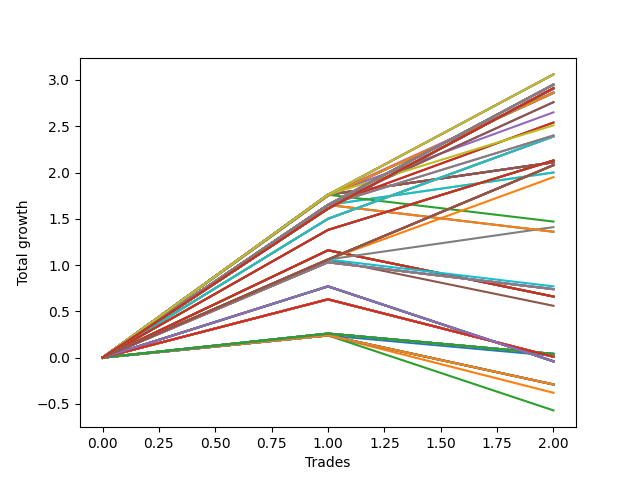

# Long HLT 108_STACK_2 
- Symbol: TSLA
- Date Range: 01/10/2024 - 05/17/2024
- Trading Period: 8:30-12:30
- Number of Trades: 2



| Id. | Name | Win Percent | Profit | Avg Profit / Trade | Avg Time / Trade | Std |      | Name | Win Percent | Profit | Avg Profit / Trade | Avg Time / Trade | Std |
| --- | ---- | ----------- | ------ | ------------------ | ---------------- | --- | ---- | ---- | ----------- | ------ | ------------------ | ---------------- | --- |
| | Sorted By <br> Profit | | | | | | | Sorted By <br> Win Percentage |||||
|0| TP-1.75 180m | 100.00 | 3.06 | 1.53 | 81:30 | 0.23 |     | TP-1.75 180m | 100.00 | 3.06 | 1.53 | 81:30 | 0.23 |
|1| TP-1.75 165m | 100.00 | 3.06 | 1.53 | 81:30 | 0.23 |     | TP-1.75 165m | 100.00 | 3.06 | 1.53 | 81:30 | 0.23 |
|2| TP-1.75 150m | 100.00 | 3.06 | 1.53 | 81:30 | 0.23 |     | TP-1.75 150m | 100.00 | 3.06 | 1.53 | 81:30 | 0.23 |
|3| TP-1.75 135m | 100.00 | 3.06 | 1.53 | 81:30 | 0.23 |     | TP-1.75 135m | 100.00 | 3.06 | 1.53 | 81:30 | 0.23 |
|4| TP-1.75 120m | 100.00 | 3.06 | 1.53 | 81:30 | 0.23 |     | TP-1.75 120m | 100.00 | 3.06 | 1.53 | 81:30 | 0.23 |
|5| TP-1.5 180m | 100.00 | 2.95 | 1.47 | 81:00 | 0.18 |     | TP-1.5 180m | 100.00 | 2.95 | 1.47 | 81:00 | 0.18 |
|6| TP-1.25 180m | 100.00 | 2.95 | 1.47 | 74:00 | 0.18 |     | TP-1.25 180m | 100.00 | 2.95 | 1.47 | 74:00 | 0.18 |
|7| TP-1.5 165m | 100.00 | 2.95 | 1.47 | 81:00 | 0.18 |     | TP-1.5 165m | 100.00 | 2.95 | 1.47 | 81:00 | 0.18 |
|8| TP-1.25 165m | 100.00 | 2.95 | 1.47 | 74:00 | 0.18 |     | TP-1.25 165m | 100.00 | 2.95 | 1.47 | 74:00 | 0.18 |
|9| TP-1.5 150m | 100.00 | 2.95 | 1.47 | 81:00 | 0.18 |     | TP-1.5 150m | 100.00 | 2.95 | 1.47 | 81:00 | 0.18 |
|10| TP-1.25 150m | 100.00 | 2.95 | 1.47 | 74:00 | 0.18 |     | TP-1.25 150m | 100.00 | 2.95 | 1.47 | 74:00 | 0.18 |
|11| TP-1.5 135m | 100.00 | 2.95 | 1.47 | 81:00 | 0.18 |     | TP-1.5 135m | 100.00 | 2.95 | 1.47 | 81:00 | 0.18 |
|12| TP-1.25 135m | 100.00 | 2.95 | 1.47 | 74:00 | 0.18 |     | TP-1.25 135m | 100.00 | 2.95 | 1.47 | 74:00 | 0.18 |
|13| TP-1.5 120m | 100.00 | 2.95 | 1.47 | 81:00 | 0.18 |     | TP-1.5 120m | 100.00 | 2.95 | 1.47 | 81:00 | 0.18 |
|14| TP-1.25 120m | 100.00 | 2.95 | 1.47 | 74:00 | 0.18 |     | TP-1.25 120m | 100.00 | 2.95 | 1.47 | 74:00 | 0.18 |
|15| TP-3 180m | 100.00 | 2.91 | 1.45 | 119:00 | 0.16 |     | TP-3 180m | 100.00 | 2.91 | 1.45 | 119:00 | 0.16 |
|16| TP-2.75 180m | 100.00 | 2.91 | 1.45 | 119:00 | 0.16 |     | TP-2.75 180m | 100.00 | 2.91 | 1.45 | 119:00 | 0.16 |
|17| TP-2.5 180m | 100.00 | 2.91 | 1.45 | 119:00 | 0.16 |     | TP-2.5 180m | 100.00 | 2.91 | 1.45 | 119:00 | 0.16 |
|18| TP-2.25 180m | 100.00 | 2.91 | 1.45 | 119:00 | 0.16 |     | TP-2.25 180m | 100.00 | 2.91 | 1.45 | 119:00 | 0.16 |
|19| TP-2 180m | 100.00 | 2.91 | 1.45 | 119:00 | 0.16 |     | TP-2 180m | 100.00 | 2.91 | 1.45 | 119:00 | 0.16 |
|20| TP-3 165m | 100.00 | 2.91 | 1.45 | 119:00 | 0.16 |     | TP-3 165m | 100.00 | 2.91 | 1.45 | 119:00 | 0.16 |
|21| TP-2.75 165m | 100.00 | 2.91 | 1.45 | 119:00 | 0.16 |     | TP-2.75 165m | 100.00 | 2.91 | 1.45 | 119:00 | 0.16 |
|22| TP-2.5 165m | 100.00 | 2.91 | 1.45 | 119:00 | 0.16 |     | TP-2.5 165m | 100.00 | 2.91 | 1.45 | 119:00 | 0.16 |
|23| TP-2.25 165m | 100.00 | 2.91 | 1.45 | 119:00 | 0.16 |     | TP-2.25 165m | 100.00 | 2.91 | 1.45 | 119:00 | 0.16 |
|24| TP-2 165m | 100.00 | 2.91 | 1.45 | 119:00 | 0.16 |     | TP-2 165m | 100.00 | 2.91 | 1.45 | 119:00 | 0.16 |
|25| TP-3 150m | 100.00 | 2.91 | 1.45 | 119:00 | 0.16 |     | TP-3 150m | 100.00 | 2.91 | 1.45 | 119:00 | 0.16 |
|26| TP-2.75 150m | 100.00 | 2.91 | 1.45 | 119:00 | 0.16 |     | TP-2.75 150m | 100.00 | 2.91 | 1.45 | 119:00 | 0.16 |
|27| TP-2.5 150m | 100.00 | 2.91 | 1.45 | 119:00 | 0.16 |     | TP-2.5 150m | 100.00 | 2.91 | 1.45 | 119:00 | 0.16 |
|28| TP-2.25 150m | 100.00 | 2.91 | 1.45 | 119:00 | 0.16 |     | TP-2.25 150m | 100.00 | 2.91 | 1.45 | 119:00 | 0.16 |
|29| TP-2 150m | 100.00 | 2.91 | 1.45 | 119:00 | 0.16 |     | TP-2 150m | 100.00 | 2.91 | 1.45 | 119:00 | 0.16 |
|30| TP-3 135m | 100.00 | 2.91 | 1.45 | 119:00 | 0.16 |     | TP-3 135m | 100.00 | 2.91 | 1.45 | 119:00 | 0.16 |
|31| TP-2.75 135m | 100.00 | 2.91 | 1.45 | 119:00 | 0.16 |     | TP-2.75 135m | 100.00 | 2.91 | 1.45 | 119:00 | 0.16 |
|32| TP-2.5 135m | 100.00 | 2.91 | 1.45 | 119:00 | 0.16 |     | TP-2.5 135m | 100.00 | 2.91 | 1.45 | 119:00 | 0.16 |
|33| TP-2.25 135m | 100.00 | 2.91 | 1.45 | 119:00 | 0.16 |     | TP-2.25 135m | 100.00 | 2.91 | 1.45 | 119:00 | 0.16 |
|34| TP-2 135m | 100.00 | 2.91 | 1.45 | 119:00 | 0.16 |     | TP-2 135m | 100.00 | 2.91 | 1.45 | 119:00 | 0.16 |
|35| TP-3 120m | 100.00 | 2.91 | 1.45 | 119:00 | 0.16 |     | TP-3 120m | 100.00 | 2.91 | 1.45 | 119:00 | 0.16 |
|36| TP-2.75 120m | 100.00 | 2.91 | 1.45 | 119:00 | 0.16 |     | TP-2.75 120m | 100.00 | 2.91 | 1.45 | 119:00 | 0.16 |
|37| TP-2.5 120m | 100.00 | 2.91 | 1.45 | 119:00 | 0.16 |     | TP-2.5 120m | 100.00 | 2.91 | 1.45 | 119:00 | 0.16 |
|38| TP-2.25 120m | 100.00 | 2.91 | 1.45 | 119:00 | 0.16 |     | TP-2.25 120m | 100.00 | 2.91 | 1.45 | 119:00 | 0.16 |
|39| TP-2 120m | 100.00 | 2.91 | 1.45 | 119:00 | 0.16 |     | TP-2 120m | 100.00 | 2.91 | 1.45 | 119:00 | 0.16 |
|40| TP-1.75 90m | 100.00 | 2.87 | 1.44 | 66:30 | 0.33 |     | TP-1.75 90m | 100.00 | 2.87 | 1.44 | 66:30 | 0.33 |
|41| TP-3 90m | 100.00 | 2.86 | 1.43 | 89:00 | 0.32 |     | TP-3 90m | 100.00 | 2.86 | 1.43 | 89:00 | 0.32 |
|42| TP-2.75 90m | 100.00 | 2.86 | 1.43 | 89:00 | 0.32 |     | TP-2.75 90m | 100.00 | 2.86 | 1.43 | 89:00 | 0.32 |
|43| TP-2.5 90m | 100.00 | 2.86 | 1.43 | 89:00 | 0.32 |     | TP-2.5 90m | 100.00 | 2.86 | 1.43 | 89:00 | 0.32 |
|44| TP-2.25 90m | 100.00 | 2.86 | 1.43 | 89:00 | 0.32 |     | TP-2.25 90m | 100.00 | 2.86 | 1.43 | 89:00 | 0.32 |
|45| TP-2 90m | 100.00 | 2.86 | 1.43 | 89:00 | 0.32 |     | TP-2 90m | 100.00 | 2.86 | 1.43 | 89:00 | 0.32 |
|46| TP-1.5 90m | 100.00 | 2.76 | 1.38 | 66:00 | 0.27 |     | TP-1.5 90m | 100.00 | 2.76 | 1.38 | 66:00 | 0.27 |
|47| TP-1.25 90m | 100.00 | 2.76 | 1.38 | 66:00 | 0.27 |     | TP-1.25 90m | 100.00 | 2.76 | 1.38 | 66:00 | 0.27 |
|48| TP-1.75 75m | 100.00 | 2.65 | 1.33 | 59:00 | 0.44 |     | TP-1.75 75m | 100.00 | 2.65 | 1.33 | 59:00 | 0.44 |
|49| TP-1.5 75m | 100.00 | 2.54 | 1.27 | 58:30 | 0.38 |     | TP-1.5 75m | 100.00 | 2.54 | 1.27 | 58:30 | 0.38 |
|50| TP-1.25 75m | 100.00 | 2.54 | 1.27 | 58:30 | 0.38 |     | TP-1.25 75m | 100.00 | 2.54 | 1.27 | 58:30 | 0.38 |
|51| TP-1.75 105m | 100.00 | 2.51 | 1.26 | 74:00 | 0.51 |     | TP-1.75 105m | 100.00 | 2.51 | 1.26 | 74:00 | 0.51 |
|52| TP-1.5 105m | 100.00 | 2.40 | 1.20 | 73:30 | 0.45 |     | TP-1.5 105m | 100.00 | 2.40 | 1.20 | 73:30 | 0.45 |
|53| TP-1.25 105m | 100.00 | 2.40 | 1.20 | 73:30 | 0.45 |     | TP-1.25 105m | 100.00 | 2.40 | 1.20 | 73:30 | 0.45 |
|54| TP-3 75m | 100.00 | 2.39 | 1.19 | 74:00 | 0.31 |     | TP-3 75m | 100.00 | 2.39 | 1.19 | 74:00 | 0.31 |
|55| TP-2.75 75m | 100.00 | 2.39 | 1.19 | 74:00 | 0.31 |     | TP-2.75 75m | 100.00 | 2.39 | 1.19 | 74:00 | 0.31 |
|56| TP-2.5 75m | 100.00 | 2.39 | 1.19 | 74:00 | 0.31 |     | TP-2.5 75m | 100.00 | 2.39 | 1.19 | 74:00 | 0.31 |
|57| TP-2.25 75m | 100.00 | 2.39 | 1.19 | 74:00 | 0.31 |     | TP-2.25 75m | 100.00 | 2.39 | 1.19 | 74:00 | 0.31 |
|58| TP-2 75m | 100.00 | 2.39 | 1.19 | 74:00 | 0.31 |     | TP-2 75m | 100.00 | 2.39 | 1.19 | 74:00 | 0.31 |
|59| TP-3 105m | 100.00 | 2.13 | 1.06 | 104:00 | 0.31 |     | TP-3 105m | 100.00 | 2.13 | 1.06 | 104:00 | 0.31 |
|60| TP-2.75 105m | 100.00 | 2.13 | 1.06 | 104:00 | 0.31 |     | TP-2.75 105m | 100.00 | 2.13 | 1.06 | 104:00 | 0.31 |
|61| TP-2.5 105m | 100.00 | 2.13 | 1.06 | 104:00 | 0.31 |     | TP-2.5 105m | 100.00 | 2.13 | 1.06 | 104:00 | 0.31 |
|62| TP-2.25 105m | 100.00 | 2.13 | 1.06 | 104:00 | 0.31 |     | TP-2.25 105m | 100.00 | 2.13 | 1.06 | 104:00 | 0.31 |
|63| TP-2 105m | 100.00 | 2.13 | 1.06 | 104:00 | 0.31 |     | TP-2 105m | 100.00 | 2.13 | 1.06 | 104:00 | 0.31 |
|64| TP-3 45m | 100.00 | 2.11 | 1.06 | 44:00 | 0.71 |     | TP-3 45m | 100.00 | 2.11 | 1.06 | 44:00 | 0.71 |
|65| TP-2.75 45m | 100.00 | 2.11 | 1.06 | 44:00 | 0.71 |     | TP-2.75 45m | 100.00 | 2.11 | 1.06 | 44:00 | 0.71 |
|66| TP-2.5 45m | 100.00 | 2.11 | 1.06 | 44:00 | 0.71 |     | TP-2.5 45m | 100.00 | 2.11 | 1.06 | 44:00 | 0.71 |
|67| TP-2.25 45m | 100.00 | 2.11 | 1.06 | 44:00 | 0.71 |     | TP-2.25 45m | 100.00 | 2.11 | 1.06 | 44:00 | 0.71 |
|68| TP-2 45m | 100.00 | 2.11 | 1.06 | 44:00 | 0.71 |     | TP-2 45m | 100.00 | 2.11 | 1.06 | 44:00 | 0.71 |
|69| TP-1.75 45m | 100.00 | 2.11 | 1.06 | 44:00 | 0.71 |     | TP-1.75 45m | 100.00 | 2.11 | 1.06 | 44:00 | 0.71 |
|70| TP-1 180m | 100.00 | 2.08 | 1.04 | 52:30 | 0.02 |     | TP-1 180m | 100.00 | 2.08 | 1.04 | 52:30 | 0.02 |
|71| TP-1 165m | 100.00 | 2.08 | 1.04 | 52:30 | 0.02 |     | TP-1 165m | 100.00 | 2.08 | 1.04 | 52:30 | 0.02 |
|72| TP-1 150m | 100.00 | 2.08 | 1.04 | 52:30 | 0.02 |     | TP-1 150m | 100.00 | 2.08 | 1.04 | 52:30 | 0.02 |
|73| TP-1 135m | 100.00 | 2.08 | 1.04 | 52:30 | 0.02 |     | TP-1 135m | 100.00 | 2.08 | 1.04 | 52:30 | 0.02 |
|74| TP-1 120m | 100.00 | 2.08 | 1.04 | 52:30 | 0.02 |     | TP-1 120m | 100.00 | 2.08 | 1.04 | 52:30 | 0.02 |
|75| TP-1 105m | 100.00 | 2.08 | 1.04 | 52:30 | 0.02 |     | TP-1 105m | 100.00 | 2.08 | 1.04 | 52:30 | 0.02 |
|76| TP-1 90m | 100.00 | 2.08 | 1.04 | 52:30 | 0.02 |     | TP-1 90m | 100.00 | 2.08 | 1.04 | 52:30 | 0.02 |
|77| TP-1.5 45m | 100.00 | 2.00 | 1.00 | 43:30 | 0.65 |     | TP-1.5 45m | 100.00 | 2.00 | 1.00 | 43:30 | 0.65 |
|78| TP-1.25 45m | 100.00 | 2.00 | 1.00 | 43:30 | 0.65 |     | TP-1.25 45m | 100.00 | 2.00 | 1.00 | 43:30 | 0.65 |
|79| TP-1 75m | 100.00 | 1.95 | 0.97 | 51:00 | 0.09 |     | TP-1 75m | 100.00 | 1.95 | 0.97 | 51:00 | 0.09 |
|80| TP-1.75 60m | 50.00 | 1.47 | 0.73 | 51:30 | 1.03 |     | TP-1 45m | 100.00 | 1.41 | 0.70 | 36:00 | 0.36 |
|81| TP-1 45m | 100.00 | 1.41 | 0.70 | 36:00 | 0.36 |     | TP-1.75 60m | 50.00 | 1.47 | 0.73 | 51:30 | 1.03 |
|82| TP-1.5 60m | 50.00 | 1.36 | 0.68 | 51:00 | 0.97 |     | TP-1.5 60m | 50.00 | 1.36 | 0.68 | 51:00 | 0.97 |
|83| TP-1.25 60m | 50.00 | 1.36 | 0.68 | 51:00 | 0.97 |     | TP-1.25 60m | 50.00 | 1.36 | 0.68 | 51:00 | 0.97 |
|84| TP-1 60m | 50.00 | 0.77 | 0.38 | 43:30 | 0.68 |     | TP-1 60m | 50.00 | 0.77 | 0.38 | 43:30 | 0.68 |
|85| TP-3 60m | 50.00 | 0.74 | 0.37 | 59:00 | 0.66 |     | TP-3 60m | 50.00 | 0.74 | 0.37 | 59:00 | 0.66 |
|86| TP-2.75 60m | 50.00 | 0.74 | 0.37 | 59:00 | 0.66 |     | TP-2.75 60m | 50.00 | 0.74 | 0.37 | 59:00 | 0.66 |
|87| TP-2.5 60m | 50.00 | 0.74 | 0.37 | 59:00 | 0.66 |     | TP-2.5 60m | 50.00 | 0.74 | 0.37 | 59:00 | 0.66 |
|88| TP-2.25 60m | 50.00 | 0.74 | 0.37 | 59:00 | 0.66 |     | TP-2.25 60m | 50.00 | 0.74 | 0.37 | 59:00 | 0.66 |
|89| TP-2 60m | 50.00 | 0.74 | 0.37 | 59:00 | 0.66 |     | TP-2 60m | 50.00 | 0.74 | 0.37 | 59:00 | 0.66 |
|90| TP-3 30m | 50.00 | 0.66 | 0.33 | 29:00 | 0.83 |     | TP-3 30m | 50.00 | 0.66 | 0.33 | 29:00 | 0.83 |
|91| TP-2.75 30m | 50.00 | 0.66 | 0.33 | 29:00 | 0.83 |     | TP-2.75 30m | 50.00 | 0.66 | 0.33 | 29:00 | 0.83 |
|92| TP-2.5 30m | 50.00 | 0.66 | 0.33 | 29:00 | 0.83 |     | TP-2.5 30m | 50.00 | 0.66 | 0.33 | 29:00 | 0.83 |
|93| TP-2.25 30m | 50.00 | 0.66 | 0.33 | 29:00 | 0.83 |     | TP-2.25 30m | 50.00 | 0.66 | 0.33 | 29:00 | 0.83 |
|94| TP-2 30m | 50.00 | 0.66 | 0.33 | 29:00 | 0.83 |     | TP-2 30m | 50.00 | 0.66 | 0.33 | 29:00 | 0.83 |
|95| TP-1.75 30m | 50.00 | 0.66 | 0.33 | 29:00 | 0.83 |     | TP-1.75 30m | 50.00 | 0.66 | 0.33 | 29:00 | 0.83 |
|96| TP-1.5 30m | 50.00 | 0.66 | 0.33 | 29:00 | 0.83 |     | TP-1.5 30m | 50.00 | 0.66 | 0.33 | 29:00 | 0.83 |
|97| TP-1.25 30m | 50.00 | 0.66 | 0.33 | 29:00 | 0.83 |     | TP-1.25 30m | 50.00 | 0.66 | 0.33 | 29:00 | 0.83 |
|98| TP-1 30m | 50.00 | 0.56 | 0.28 | 28:30 | 0.78 |     | TP-1 30m | 50.00 | 0.56 | 0.28 | 28:30 | 0.78 |
|99| TP-0.25 180m | 50.00 | 0.04 | 0.02 | 09:00 | 0.24 |     | TP-0.25 180m | 50.00 | 0.04 | 0.02 | 09:00 | 0.24 |
|100| TP-0.25 165m | 50.00 | 0.04 | 0.02 | 09:00 | 0.24 |     | TP-0.25 165m | 50.00 | 0.04 | 0.02 | 09:00 | 0.24 |
|101| TP-0.25 150m | 50.00 | 0.04 | 0.02 | 09:00 | 0.24 |     | TP-0.25 150m | 50.00 | 0.04 | 0.02 | 09:00 | 0.24 |
|102| TP-0.25 135m | 50.00 | 0.04 | 0.02 | 09:00 | 0.24 |     | TP-0.25 135m | 50.00 | 0.04 | 0.02 | 09:00 | 0.24 |
|103| TP-0.25 120m | 50.00 | 0.04 | 0.02 | 09:00 | 0.24 |     | TP-0.25 120m | 50.00 | 0.04 | 0.02 | 09:00 | 0.24 |
|104| TP-0.25 105m | 50.00 | 0.04 | 0.02 | 09:00 | 0.24 |     | TP-0.25 105m | 50.00 | 0.04 | 0.02 | 09:00 | 0.24 |
|105| TP-0.25 90m | 50.00 | 0.04 | 0.02 | 09:00 | 0.24 |     | TP-0.25 90m | 50.00 | 0.04 | 0.02 | 09:00 | 0.24 |
|106| TP-0.25 75m | 50.00 | 0.04 | 0.02 | 09:00 | 0.24 |     | TP-0.25 75m | 50.00 | 0.04 | 0.02 | 09:00 | 0.24 |
|107| TP-0.25 60m | 50.00 | 0.04 | 0.02 | 09:00 | 0.24 |     | TP-0.25 60m | 50.00 | 0.04 | 0.02 | 09:00 | 0.24 |
|108| TP-0.25 45m | 50.00 | 0.04 | 0.02 | 09:00 | 0.24 |     | TP-0.25 45m | 50.00 | 0.04 | 0.02 | 09:00 | 0.24 |
|109| TP-0.25 30m | 50.00 | 0.04 | 0.02 | 09:00 | 0.24 |     | TP-0.25 30m | 50.00 | 0.04 | 0.02 | 09:00 | 0.24 |
|110| TP-0.25 15m | 50.00 | 0.02 | 0.01 | 08:00 | 0.23 |     | TP-0.25 15m | 50.00 | 0.02 | 0.01 | 08:00 | 0.23 |
|111| TP-0.5 180m | 50.00 | 0.01 | 0.00 | 10:30 | 0.62 |     | TP-0.5 180m | 50.00 | 0.01 | 0.00 | 10:30 | 0.62 |
|112| TP-0.5 165m | 50.00 | 0.01 | 0.00 | 10:30 | 0.62 |     | TP-0.5 165m | 50.00 | 0.01 | 0.00 | 10:30 | 0.62 |
|113| TP-0.5 150m | 50.00 | 0.01 | 0.00 | 10:30 | 0.62 |     | TP-0.5 150m | 50.00 | 0.01 | 0.00 | 10:30 | 0.62 |
|114| TP-0.5 135m | 50.00 | 0.01 | 0.00 | 10:30 | 0.62 |     | TP-0.5 135m | 50.00 | 0.01 | 0.00 | 10:30 | 0.62 |
|115| TP-0.5 120m | 50.00 | 0.01 | 0.00 | 10:30 | 0.62 |     | TP-0.5 120m | 50.00 | 0.01 | 0.00 | 10:30 | 0.62 |
|116| TP-0.5 105m | 50.00 | 0.01 | 0.00 | 10:30 | 0.62 |     | TP-0.5 105m | 50.00 | 0.01 | 0.00 | 10:30 | 0.62 |
|117| TP-0.5 90m | 50.00 | 0.01 | 0.00 | 10:30 | 0.62 |     | TP-0.5 90m | 50.00 | 0.01 | 0.00 | 10:30 | 0.62 |
|118| TP-0.5 75m | 50.00 | 0.01 | 0.00 | 10:30 | 0.62 |     | TP-0.5 75m | 50.00 | 0.01 | 0.00 | 10:30 | 0.62 |
|119| TP-0.5 60m | 50.00 | 0.01 | 0.00 | 10:30 | 0.62 |     | TP-0.5 60m | 50.00 | 0.01 | 0.00 | 10:30 | 0.62 |
|120| TP-0.5 45m | 50.00 | 0.01 | 0.00 | 10:30 | 0.62 |     | TP-0.5 45m | 50.00 | 0.01 | 0.00 | 10:30 | 0.62 |
|121| TP-0.5 30m | 50.00 | 0.01 | 0.00 | 10:30 | 0.62 |     | TP-0.5 30m | 50.00 | 0.01 | 0.00 | 10:30 | 0.62 |
|122| TP-0.75 180m | 50.00 | -0.04 | -0.02 | 13:00 | 0.79 |     | TP-0.75 180m | 50.00 | -0.04 | -0.02 | 13:00 | 0.79 |
|123| TP-0.75 165m | 50.00 | -0.04 | -0.02 | 13:00 | 0.79 |     | TP-0.75 165m | 50.00 | -0.04 | -0.02 | 13:00 | 0.79 |
|124| TP-0.75 150m | 50.00 | -0.04 | -0.02 | 13:00 | 0.79 |     | TP-0.75 150m | 50.00 | -0.04 | -0.02 | 13:00 | 0.79 |
|125| TP-0.75 135m | 50.00 | -0.04 | -0.02 | 13:00 | 0.79 |     | TP-0.75 135m | 50.00 | -0.04 | -0.02 | 13:00 | 0.79 |
|126| TP-0.75 120m | 50.00 | -0.04 | -0.02 | 13:00 | 0.79 |     | TP-0.75 120m | 50.00 | -0.04 | -0.02 | 13:00 | 0.79 |
|127| TP-0.75 105m | 50.00 | -0.04 | -0.02 | 13:00 | 0.79 |     | TP-0.75 105m | 50.00 | -0.04 | -0.02 | 13:00 | 0.79 |
|128| TP-0.75 90m | 50.00 | -0.04 | -0.02 | 13:00 | 0.79 |     | TP-0.75 90m | 50.00 | -0.04 | -0.02 | 13:00 | 0.79 |
|129| TP-0.75 75m | 50.00 | -0.04 | -0.02 | 13:00 | 0.79 |     | TP-0.75 75m | 50.00 | -0.04 | -0.02 | 13:00 | 0.79 |
|130| TP-0.75 60m | 50.00 | -0.04 | -0.02 | 13:00 | 0.79 |     | TP-0.75 60m | 50.00 | -0.04 | -0.02 | 13:00 | 0.79 |
|131| TP-0.75 45m | 50.00 | -0.04 | -0.02 | 13:00 | 0.79 |     | TP-0.75 45m | 50.00 | -0.04 | -0.02 | 13:00 | 0.79 |
|132| TP-0.75 30m | 50.00 | -0.04 | -0.02 | 13:00 | 0.79 |     | TP-0.75 30m | 50.00 | -0.04 | -0.02 | 13:00 | 0.79 |
|133| TP-3 15m | 50.00 | -0.29 | -0.14 | 14:00 | 0.39 |     | TP-3 15m | 50.00 | -0.29 | -0.14 | 14:00 | 0.39 |
|134| TP-2.75 15m | 50.00 | -0.29 | -0.14 | 14:00 | 0.39 |     | TP-2.75 15m | 50.00 | -0.29 | -0.14 | 14:00 | 0.39 |
|135| TP-2.5 15m | 50.00 | -0.29 | -0.14 | 14:00 | 0.39 |     | TP-2.5 15m | 50.00 | -0.29 | -0.14 | 14:00 | 0.39 |
|136| TP-2.25 15m | 50.00 | -0.29 | -0.14 | 14:00 | 0.39 |     | TP-2.25 15m | 50.00 | -0.29 | -0.14 | 14:00 | 0.39 |
|137| TP-2 15m | 50.00 | -0.29 | -0.14 | 14:00 | 0.39 |     | TP-2 15m | 50.00 | -0.29 | -0.14 | 14:00 | 0.39 |
|138| TP-1.75 15m | 50.00 | -0.29 | -0.14 | 14:00 | 0.39 |     | TP-1.75 15m | 50.00 | -0.29 | -0.14 | 14:00 | 0.39 |
|139| TP-1.5 15m | 50.00 | -0.29 | -0.14 | 14:00 | 0.39 |     | TP-1.5 15m | 50.00 | -0.29 | -0.14 | 14:00 | 0.39 |
|140| TP-1.25 15m | 50.00 | -0.29 | -0.14 | 14:00 | 0.39 |     | TP-1.25 15m | 50.00 | -0.29 | -0.14 | 14:00 | 0.39 |
|141| TP-1 15m | 50.00 | -0.29 | -0.14 | 14:00 | 0.39 |     | TP-1 15m | 50.00 | -0.29 | -0.14 | 14:00 | 0.39 |
|142| TP-0.5 15m | 50.00 | -0.38 | -0.19 | 08:30 | 0.43 |     | TP-0.5 15m | 50.00 | -0.38 | -0.19 | 08:30 | 0.43 |
|143| TP-0.75 15m | 50.00 | -0.57 | -0.28 | 09:00 | 0.53 |     | TP-0.75 15m | 50.00 | -0.57 | -0.28 | 09:00 | 0.53 |

### Test TP-0.25 15m
* Take Profit of 0.25 Point
* 0.25 Stoploss
* Results:
```
Total Trades: 2
Percent Up: 50.00
Percent Down: 50.00
Total Points Moved Up: 0.02
Potential Profit: 10.00
Total Points Ups: 0.24 Count Ups: 1
Total Points Downs: -0.22 Count Downs: 1
```

<details><summary>Trades</summary>

<code>In: 2024-04-22 08:35:00		Out: 2024-04-22 08:49:00		Total Position Time: 14:00		Total Move Up: 0.24		Total to Date: 0.24</code> <br />
<code>In: 2024-02-20 09:35:00		Out: 2024-02-20 09:37:00		Total Position Time: 02:00		Total Move Up: -0.22		Total to Date: 0.02</code> <br />


</details>

### Test TP-0.5 15m
* Take Profit of 0.5 Point
* 0.5 Stoploss
* Results:
```
Total Trades: 2
Percent Up: 50.00
Percent Down: 50.00
Total Points Moved Up: -0.38
Potential Profit: -190.00
Total Points Ups: 0.24 Count Ups: 1
Total Points Downs: -0.62 Count Downs: 1
```

<details><summary>Trades</summary>

<code>In: 2024-04-22 08:35:00		Out: 2024-04-22 08:49:00		Total Position Time: 14:00		Total Move Up: 0.24		Total to Date: 0.24</code> <br />
<code>In: 2024-02-20 09:35:00		Out: 2024-02-20 09:38:00		Total Position Time: 03:00		Total Move Up: -0.62		Total to Date: -0.38</code> <br />


</details>

### Test TP-0.75 15m
* Take Profit of 0.75 Point
* 0.75 Stoploss
* Results:
```
Total Trades: 2
Percent Up: 50.00
Percent Down: 50.00
Total Points Moved Up: -0.57
Potential Profit: -285.00
Total Points Ups: 0.24 Count Ups: 1
Total Points Downs: -0.81 Count Downs: 1
```

<details><summary>Trades</summary>

<code>In: 2024-04-22 08:35:00		Out: 2024-04-22 08:49:00		Total Position Time: 14:00		Total Move Up: 0.24		Total to Date: 0.24</code> <br />
<code>In: 2024-02-20 09:35:00		Out: 2024-02-20 09:39:00		Total Position Time: 04:00		Total Move Up: -0.81		Total to Date: -0.57</code> <br />


</details>

### Test TP-1 15m
* Take Profit of 1 Point
* 1 Stoploss
* Results:
```
Total Trades: 2
Percent Up: 50.00
Percent Down: 50.00
Total Points Moved Up: -0.29
Potential Profit: -145.00
Total Points Ups: 0.24 Count Ups: 1
Total Points Downs: -0.53 Count Downs: 1
```

<details><summary>Trades</summary>

<code>In: 2024-04-22 08:35:00		Out: 2024-04-22 08:49:00		Total Position Time: 14:00		Total Move Up: 0.24		Total to Date: 0.24</code> <br />
<code>In: 2024-02-20 09:35:00		Out: 2024-02-20 09:49:00		Total Position Time: 14:00		Total Move Up: -0.53		Total to Date: -0.29</code> <br />


</details>

### Test TP-1.25 15m
* Take Profit of 1.25 Point
* 1.25 Stoploss
* Results:
```
Total Trades: 2
Percent Up: 50.00
Percent Down: 50.00
Total Points Moved Up: -0.29
Potential Profit: -145.00
Total Points Ups: 0.24 Count Ups: 1
Total Points Downs: -0.53 Count Downs: 1
```

<details><summary>Trades</summary>

<code>In: 2024-04-22 08:35:00		Out: 2024-04-22 08:49:00		Total Position Time: 14:00		Total Move Up: 0.24		Total to Date: 0.24</code> <br />
<code>In: 2024-02-20 09:35:00		Out: 2024-02-20 09:49:00		Total Position Time: 14:00		Total Move Up: -0.53		Total to Date: -0.29</code> <br />


</details>

### Test TP-1.5 15m
* Take Profit of 1.5 Point
* 1.5 Stoploss
* Results:
```
Total Trades: 2
Percent Up: 50.00
Percent Down: 50.00
Total Points Moved Up: -0.29
Potential Profit: -145.00
Total Points Ups: 0.24 Count Ups: 1
Total Points Downs: -0.53 Count Downs: 1
```

<details><summary>Trades</summary>

<code>In: 2024-04-22 08:35:00		Out: 2024-04-22 08:49:00		Total Position Time: 14:00		Total Move Up: 0.24		Total to Date: 0.24</code> <br />
<code>In: 2024-02-20 09:35:00		Out: 2024-02-20 09:49:00		Total Position Time: 14:00		Total Move Up: -0.53		Total to Date: -0.29</code> <br />


</details>

### Test TP-1.75 15m
* Take Profit of 1.75 Point
* 1.75 Stoploss
* Results:
```
Total Trades: 2
Percent Up: 50.00
Percent Down: 50.00
Total Points Moved Up: -0.29
Potential Profit: -145.00
Total Points Ups: 0.24 Count Ups: 1
Total Points Downs: -0.53 Count Downs: 1
```

<details><summary>Trades</summary>

<code>In: 2024-04-22 08:35:00		Out: 2024-04-22 08:49:00		Total Position Time: 14:00		Total Move Up: 0.24		Total to Date: 0.24</code> <br />
<code>In: 2024-02-20 09:35:00		Out: 2024-02-20 09:49:00		Total Position Time: 14:00		Total Move Up: -0.53		Total to Date: -0.29</code> <br />


</details>

### Test TP-2 15m
* Take Profit of 2 Point
* 2 Stoploss
* Results:
```
Total Trades: 2
Percent Up: 50.00
Percent Down: 50.00
Total Points Moved Up: -0.29
Potential Profit: -145.00
Total Points Ups: 0.24 Count Ups: 1
Total Points Downs: -0.53 Count Downs: 1
```

<details><summary>Trades</summary>

<code>In: 2024-04-22 08:35:00		Out: 2024-04-22 08:49:00		Total Position Time: 14:00		Total Move Up: 0.24		Total to Date: 0.24</code> <br />
<code>In: 2024-02-20 09:35:00		Out: 2024-02-20 09:49:00		Total Position Time: 14:00		Total Move Up: -0.53		Total to Date: -0.29</code> <br />


</details>

### Test TP-2.25 15m
* Take Profit of 2.25 Point
* 2.25 Stoploss
* Results:
```
Total Trades: 2
Percent Up: 50.00
Percent Down: 50.00
Total Points Moved Up: -0.29
Potential Profit: -145.00
Total Points Ups: 0.24 Count Ups: 1
Total Points Downs: -0.53 Count Downs: 1
```

<details><summary>Trades</summary>

<code>In: 2024-04-22 08:35:00		Out: 2024-04-22 08:49:00		Total Position Time: 14:00		Total Move Up: 0.24		Total to Date: 0.24</code> <br />
<code>In: 2024-02-20 09:35:00		Out: 2024-02-20 09:49:00		Total Position Time: 14:00		Total Move Up: -0.53		Total to Date: -0.29</code> <br />


</details>

### Test TP-2.5 15m
* Take Profit of 2.5 Point
* 2.5 Stoploss
* Results:
```
Total Trades: 2
Percent Up: 50.00
Percent Down: 50.00
Total Points Moved Up: -0.29
Potential Profit: -145.00
Total Points Ups: 0.24 Count Ups: 1
Total Points Downs: -0.53 Count Downs: 1
```

<details><summary>Trades</summary>

<code>In: 2024-04-22 08:35:00		Out: 2024-04-22 08:49:00		Total Position Time: 14:00		Total Move Up: 0.24		Total to Date: 0.24</code> <br />
<code>In: 2024-02-20 09:35:00		Out: 2024-02-20 09:49:00		Total Position Time: 14:00		Total Move Up: -0.53		Total to Date: -0.29</code> <br />


</details>

### Test TP-2.75 15m
* Take Profit of 2.75 Point
* 2.75 Stoploss
* Results:
```
Total Trades: 2
Percent Up: 50.00
Percent Down: 50.00
Total Points Moved Up: -0.29
Potential Profit: -145.00
Total Points Ups: 0.24 Count Ups: 1
Total Points Downs: -0.53 Count Downs: 1
```

<details><summary>Trades</summary>

<code>In: 2024-04-22 08:35:00		Out: 2024-04-22 08:49:00		Total Position Time: 14:00		Total Move Up: 0.24		Total to Date: 0.24</code> <br />
<code>In: 2024-02-20 09:35:00		Out: 2024-02-20 09:49:00		Total Position Time: 14:00		Total Move Up: -0.53		Total to Date: -0.29</code> <br />


</details>

### Test TP-3 15m
* Take Profit of 3 Point
* 3 Stoploss
* Results:
```
Total Trades: 2
Percent Up: 50.00
Percent Down: 50.00
Total Points Moved Up: -0.29
Potential Profit: -145.00
Total Points Ups: 0.24 Count Ups: 1
Total Points Downs: -0.53 Count Downs: 1
```

<details><summary>Trades</summary>

<code>In: 2024-04-22 08:35:00		Out: 2024-04-22 08:49:00		Total Position Time: 14:00		Total Move Up: 0.24		Total to Date: 0.24</code> <br />
<code>In: 2024-02-20 09:35:00		Out: 2024-02-20 09:49:00		Total Position Time: 14:00		Total Move Up: -0.53		Total to Date: -0.29</code> <br />


</details>

### Test TP-0.25 30m
* Take Profit of 0.25 Point
* 0.25 Stoploss
* Results:
```
Total Trades: 2
Percent Up: 50.00
Percent Down: 50.00
Total Points Moved Up: 0.04
Potential Profit: 20.00
Total Points Ups: 0.26 Count Ups: 1
Total Points Downs: -0.22 Count Downs: 1
```

<details><summary>Trades</summary>

<code>In: 2024-04-22 08:35:00		Out: 2024-04-22 08:51:00		Total Position Time: 16:00		Total Move Up: 0.26		Total to Date: 0.26</code> <br />
<code>In: 2024-02-20 09:35:00		Out: 2024-02-20 09:37:00		Total Position Time: 02:00		Total Move Up: -0.22		Total to Date: 0.04</code> <br />


</details>

### Test TP-0.5 30m
* Take Profit of 0.5 Point
* 0.5 Stoploss
* Results:
```
Total Trades: 2
Percent Up: 50.00
Percent Down: 50.00
Total Points Moved Up: 0.01
Potential Profit: 5.00
Total Points Ups: 0.63 Count Ups: 1
Total Points Downs: -0.62 Count Downs: 1
```

<details><summary>Trades</summary>

<code>In: 2024-04-22 08:35:00		Out: 2024-04-22 08:53:00		Total Position Time: 18:00		Total Move Up: 0.63		Total to Date: 0.63</code> <br />
<code>In: 2024-02-20 09:35:00		Out: 2024-02-20 09:38:00		Total Position Time: 03:00		Total Move Up: -0.62		Total to Date: 0.01</code> <br />


</details>

### Test TP-0.75 30m
* Take Profit of 0.75 Point
* 0.75 Stoploss
* Results:
```
Total Trades: 2
Percent Up: 50.00
Percent Down: 50.00
Total Points Moved Up: -0.04
Potential Profit: -20.00
Total Points Ups: 0.77 Count Ups: 1
Total Points Downs: -0.81 Count Downs: 1
```

<details><summary>Trades</summary>

<code>In: 2024-04-22 08:35:00		Out: 2024-04-22 08:57:00		Total Position Time: 22:00		Total Move Up: 0.77		Total to Date: 0.77</code> <br />
<code>In: 2024-02-20 09:35:00		Out: 2024-02-20 09:39:00		Total Position Time: 04:00		Total Move Up: -0.81		Total to Date: -0.04</code> <br />


</details>

### Test TP-1 30m
* Take Profit of 1 Point
* 1 Stoploss
* Results:
```
Total Trades: 2
Percent Up: 50.00
Percent Down: 50.00
Total Points Moved Up: 0.56
Potential Profit: 280.00
Total Points Ups: 1.06 Count Ups: 1
Total Points Downs: -0.50 Count Downs: 1
```

<details><summary>Trades</summary>

<code>In: 2024-04-22 08:35:00		Out: 2024-04-22 09:03:00		Total Position Time: 28:00		Total Move Up: 1.06		Total to Date: 1.06</code> <br />
<code>In: 2024-02-20 09:35:00		Out: 2024-02-20 10:04:00		Total Position Time: 29:00		Total Move Up: -0.50		Total to Date: 0.56</code> <br />


</details>

### Test TP-1.25 30m
* Take Profit of 1.25 Point
* 1.25 Stoploss
* Results:
```
Total Trades: 2
Percent Up: 50.00
Percent Down: 50.00
Total Points Moved Up: 0.66
Potential Profit: 330.00
Total Points Ups: 1.16 Count Ups: 1
Total Points Downs: -0.50 Count Downs: 1
```

<details><summary>Trades</summary>

<code>In: 2024-04-22 08:35:00		Out: 2024-04-22 09:04:00		Total Position Time: 29:00		Total Move Up: 1.16		Total to Date: 1.16</code> <br />
<code>In: 2024-02-20 09:35:00		Out: 2024-02-20 10:04:00		Total Position Time: 29:00		Total Move Up: -0.50		Total to Date: 0.66</code> <br />


</details>

### Test TP-1.5 30m
* Take Profit of 1.5 Point
* 1.5 Stoploss
* Results:
```
Total Trades: 2
Percent Up: 50.00
Percent Down: 50.00
Total Points Moved Up: 0.66
Potential Profit: 330.00
Total Points Ups: 1.16 Count Ups: 1
Total Points Downs: -0.50 Count Downs: 1
```

<details><summary>Trades</summary>

<code>In: 2024-04-22 08:35:00		Out: 2024-04-22 09:04:00		Total Position Time: 29:00		Total Move Up: 1.16		Total to Date: 1.16</code> <br />
<code>In: 2024-02-20 09:35:00		Out: 2024-02-20 10:04:00		Total Position Time: 29:00		Total Move Up: -0.50		Total to Date: 0.66</code> <br />


</details>

### Test TP-1.75 30m
* Take Profit of 1.75 Point
* 1.75 Stoploss
* Results:
```
Total Trades: 2
Percent Up: 50.00
Percent Down: 50.00
Total Points Moved Up: 0.66
Potential Profit: 330.00
Total Points Ups: 1.16 Count Ups: 1
Total Points Downs: -0.50 Count Downs: 1
```

<details><summary>Trades</summary>

<code>In: 2024-04-22 08:35:00		Out: 2024-04-22 09:04:00		Total Position Time: 29:00		Total Move Up: 1.16		Total to Date: 1.16</code> <br />
<code>In: 2024-02-20 09:35:00		Out: 2024-02-20 10:04:00		Total Position Time: 29:00		Total Move Up: -0.50		Total to Date: 0.66</code> <br />


</details>

### Test TP-2 30m
* Take Profit of 2 Point
* 2 Stoploss
* Results:
```
Total Trades: 2
Percent Up: 50.00
Percent Down: 50.00
Total Points Moved Up: 0.66
Potential Profit: 330.00
Total Points Ups: 1.16 Count Ups: 1
Total Points Downs: -0.50 Count Downs: 1
```

<details><summary>Trades</summary>

<code>In: 2024-04-22 08:35:00		Out: 2024-04-22 09:04:00		Total Position Time: 29:00		Total Move Up: 1.16		Total to Date: 1.16</code> <br />
<code>In: 2024-02-20 09:35:00		Out: 2024-02-20 10:04:00		Total Position Time: 29:00		Total Move Up: -0.50		Total to Date: 0.66</code> <br />


</details>

### Test TP-2.25 30m
* Take Profit of 2.25 Point
* 2.25 Stoploss
* Results:
```
Total Trades: 2
Percent Up: 50.00
Percent Down: 50.00
Total Points Moved Up: 0.66
Potential Profit: 330.00
Total Points Ups: 1.16 Count Ups: 1
Total Points Downs: -0.50 Count Downs: 1
```

<details><summary>Trades</summary>

<code>In: 2024-04-22 08:35:00		Out: 2024-04-22 09:04:00		Total Position Time: 29:00		Total Move Up: 1.16		Total to Date: 1.16</code> <br />
<code>In: 2024-02-20 09:35:00		Out: 2024-02-20 10:04:00		Total Position Time: 29:00		Total Move Up: -0.50		Total to Date: 0.66</code> <br />


</details>

### Test TP-2.5 30m
* Take Profit of 2.5 Point
* 2.5 Stoploss
* Results:
```
Total Trades: 2
Percent Up: 50.00
Percent Down: 50.00
Total Points Moved Up: 0.66
Potential Profit: 330.00
Total Points Ups: 1.16 Count Ups: 1
Total Points Downs: -0.50 Count Downs: 1
```

<details><summary>Trades</summary>

<code>In: 2024-04-22 08:35:00		Out: 2024-04-22 09:04:00		Total Position Time: 29:00		Total Move Up: 1.16		Total to Date: 1.16</code> <br />
<code>In: 2024-02-20 09:35:00		Out: 2024-02-20 10:04:00		Total Position Time: 29:00		Total Move Up: -0.50		Total to Date: 0.66</code> <br />


</details>

### Test TP-2.75 30m
* Take Profit of 2.75 Point
* 2.75 Stoploss
* Results:
```
Total Trades: 2
Percent Up: 50.00
Percent Down: 50.00
Total Points Moved Up: 0.66
Potential Profit: 330.00
Total Points Ups: 1.16 Count Ups: 1
Total Points Downs: -0.50 Count Downs: 1
```

<details><summary>Trades</summary>

<code>In: 2024-04-22 08:35:00		Out: 2024-04-22 09:04:00		Total Position Time: 29:00		Total Move Up: 1.16		Total to Date: 1.16</code> <br />
<code>In: 2024-02-20 09:35:00		Out: 2024-02-20 10:04:00		Total Position Time: 29:00		Total Move Up: -0.50		Total to Date: 0.66</code> <br />


</details>

### Test TP-3 30m
* Take Profit of 3 Point
* 3 Stoploss
* Results:
```
Total Trades: 2
Percent Up: 50.00
Percent Down: 50.00
Total Points Moved Up: 0.66
Potential Profit: 330.00
Total Points Ups: 1.16 Count Ups: 1
Total Points Downs: -0.50 Count Downs: 1
```

<details><summary>Trades</summary>

<code>In: 2024-04-22 08:35:00		Out: 2024-04-22 09:04:00		Total Position Time: 29:00		Total Move Up: 1.16		Total to Date: 1.16</code> <br />
<code>In: 2024-02-20 09:35:00		Out: 2024-02-20 10:04:00		Total Position Time: 29:00		Total Move Up: -0.50		Total to Date: 0.66</code> <br />


</details>

### Test TP-0.25 45m
* Take Profit of 0.25 Point
* 0.25 Stoploss
* Results:
```
Total Trades: 2
Percent Up: 50.00
Percent Down: 50.00
Total Points Moved Up: 0.04
Potential Profit: 20.00
Total Points Ups: 0.26 Count Ups: 1
Total Points Downs: -0.22 Count Downs: 1
```

<details><summary>Trades</summary>

<code>In: 2024-04-22 08:35:00		Out: 2024-04-22 08:51:00		Total Position Time: 16:00		Total Move Up: 0.26		Total to Date: 0.26</code> <br />
<code>In: 2024-02-20 09:35:00		Out: 2024-02-20 09:37:00		Total Position Time: 02:00		Total Move Up: -0.22		Total to Date: 0.04</code> <br />


</details>

### Test TP-0.5 45m
* Take Profit of 0.5 Point
* 0.5 Stoploss
* Results:
```
Total Trades: 2
Percent Up: 50.00
Percent Down: 50.00
Total Points Moved Up: 0.01
Potential Profit: 5.00
Total Points Ups: 0.63 Count Ups: 1
Total Points Downs: -0.62 Count Downs: 1
```

<details><summary>Trades</summary>

<code>In: 2024-04-22 08:35:00		Out: 2024-04-22 08:53:00		Total Position Time: 18:00		Total Move Up: 0.63		Total to Date: 0.63</code> <br />
<code>In: 2024-02-20 09:35:00		Out: 2024-02-20 09:38:00		Total Position Time: 03:00		Total Move Up: -0.62		Total to Date: 0.01</code> <br />


</details>

### Test TP-0.75 45m
* Take Profit of 0.75 Point
* 0.75 Stoploss
* Results:
```
Total Trades: 2
Percent Up: 50.00
Percent Down: 50.00
Total Points Moved Up: -0.04
Potential Profit: -20.00
Total Points Ups: 0.77 Count Ups: 1
Total Points Downs: -0.81 Count Downs: 1
```

<details><summary>Trades</summary>

<code>In: 2024-04-22 08:35:00		Out: 2024-04-22 08:57:00		Total Position Time: 22:00		Total Move Up: 0.77		Total to Date: 0.77</code> <br />
<code>In: 2024-02-20 09:35:00		Out: 2024-02-20 09:39:00		Total Position Time: 04:00		Total Move Up: -0.81		Total to Date: -0.04</code> <br />


</details>

### Test TP-1 45m
* Take Profit of 1 Point
* 1 Stoploss
* Results:
```
Total Trades: 2
Percent Up: 100.00
Percent Down: 0.00
Total Points Moved Up: 1.41
Potential Profit: 705.00
Total Points Ups: 1.41 Count Ups: 2
Total Points Downs: 0.00 Count Downs: 0
```

<details><summary>Trades</summary>

<code>In: 2024-04-22 08:35:00		Out: 2024-04-22 09:03:00		Total Position Time: 28:00		Total Move Up: 1.06		Total to Date: 1.06</code> <br />
<code>In: 2024-02-20 09:35:00		Out: 2024-02-20 10:19:00		Total Position Time: 44:00		Total Move Up: 0.35		Total to Date: 1.41</code> <br />


</details>

### Test TP-1.25 45m
* Take Profit of 1.25 Point
* 1.25 Stoploss
* Results:
```
Total Trades: 2
Percent Up: 100.00
Percent Down: 0.00
Total Points Moved Up: 2.00
Potential Profit: 1000.00
Total Points Ups: 2.00 Count Ups: 2
Total Points Downs: 0.00 Count Downs: 0
```

<details><summary>Trades</summary>

<code>In: 2024-04-22 08:35:00		Out: 2024-04-22 09:18:00		Total Position Time: 43:00		Total Move Up: 1.65		Total to Date: 1.65</code> <br />
<code>In: 2024-02-20 09:35:00		Out: 2024-02-20 10:19:00		Total Position Time: 44:00		Total Move Up: 0.35		Total to Date: 2.00</code> <br />


</details>

### Test TP-1.5 45m
* Take Profit of 1.5 Point
* 1.5 Stoploss
* Results:
```
Total Trades: 2
Percent Up: 100.00
Percent Down: 0.00
Total Points Moved Up: 2.00
Potential Profit: 1000.00
Total Points Ups: 2.00 Count Ups: 2
Total Points Downs: 0.00 Count Downs: 0
```

<details><summary>Trades</summary>

<code>In: 2024-04-22 08:35:00		Out: 2024-04-22 09:18:00		Total Position Time: 43:00		Total Move Up: 1.65		Total to Date: 1.65</code> <br />
<code>In: 2024-02-20 09:35:00		Out: 2024-02-20 10:19:00		Total Position Time: 44:00		Total Move Up: 0.35		Total to Date: 2.00</code> <br />


</details>

### Test TP-1.75 45m
* Take Profit of 1.75 Point
* 1.75 Stoploss
* Results:
```
Total Trades: 2
Percent Up: 100.00
Percent Down: 0.00
Total Points Moved Up: 2.11
Potential Profit: 1055.00
Total Points Ups: 2.11 Count Ups: 2
Total Points Downs: 0.00 Count Downs: 0
```

<details><summary>Trades</summary>

<code>In: 2024-04-22 08:35:00		Out: 2024-04-22 09:19:00		Total Position Time: 44:00		Total Move Up: 1.76		Total to Date: 1.76</code> <br />
<code>In: 2024-02-20 09:35:00		Out: 2024-02-20 10:19:00		Total Position Time: 44:00		Total Move Up: 0.35		Total to Date: 2.11</code> <br />


</details>

### Test TP-2 45m
* Take Profit of 2 Point
* 2 Stoploss
* Results:
```
Total Trades: 2
Percent Up: 100.00
Percent Down: 0.00
Total Points Moved Up: 2.11
Potential Profit: 1055.00
Total Points Ups: 2.11 Count Ups: 2
Total Points Downs: 0.00 Count Downs: 0
```

<details><summary>Trades</summary>

<code>In: 2024-04-22 08:35:00		Out: 2024-04-22 09:19:00		Total Position Time: 44:00		Total Move Up: 1.76		Total to Date: 1.76</code> <br />
<code>In: 2024-02-20 09:35:00		Out: 2024-02-20 10:19:00		Total Position Time: 44:00		Total Move Up: 0.35		Total to Date: 2.11</code> <br />


</details>

### Test TP-2.25 45m
* Take Profit of 2.25 Point
* 2.25 Stoploss
* Results:
```
Total Trades: 2
Percent Up: 100.00
Percent Down: 0.00
Total Points Moved Up: 2.11
Potential Profit: 1055.00
Total Points Ups: 2.11 Count Ups: 2
Total Points Downs: 0.00 Count Downs: 0
```

<details><summary>Trades</summary>

<code>In: 2024-04-22 08:35:00		Out: 2024-04-22 09:19:00		Total Position Time: 44:00		Total Move Up: 1.76		Total to Date: 1.76</code> <br />
<code>In: 2024-02-20 09:35:00		Out: 2024-02-20 10:19:00		Total Position Time: 44:00		Total Move Up: 0.35		Total to Date: 2.11</code> <br />


</details>

### Test TP-2.5 45m
* Take Profit of 2.5 Point
* 2.5 Stoploss
* Results:
```
Total Trades: 2
Percent Up: 100.00
Percent Down: 0.00
Total Points Moved Up: 2.11
Potential Profit: 1055.00
Total Points Ups: 2.11 Count Ups: 2
Total Points Downs: 0.00 Count Downs: 0
```

<details><summary>Trades</summary>

<code>In: 2024-04-22 08:35:00		Out: 2024-04-22 09:19:00		Total Position Time: 44:00		Total Move Up: 1.76		Total to Date: 1.76</code> <br />
<code>In: 2024-02-20 09:35:00		Out: 2024-02-20 10:19:00		Total Position Time: 44:00		Total Move Up: 0.35		Total to Date: 2.11</code> <br />


</details>

### Test TP-2.75 45m
* Take Profit of 2.75 Point
* 2.75 Stoploss
* Results:
```
Total Trades: 2
Percent Up: 100.00
Percent Down: 0.00
Total Points Moved Up: 2.11
Potential Profit: 1055.00
Total Points Ups: 2.11 Count Ups: 2
Total Points Downs: 0.00 Count Downs: 0
```

<details><summary>Trades</summary>

<code>In: 2024-04-22 08:35:00		Out: 2024-04-22 09:19:00		Total Position Time: 44:00		Total Move Up: 1.76		Total to Date: 1.76</code> <br />
<code>In: 2024-02-20 09:35:00		Out: 2024-02-20 10:19:00		Total Position Time: 44:00		Total Move Up: 0.35		Total to Date: 2.11</code> <br />


</details>

### Test TP-3 45m
* Take Profit of 3 Point
* 3 Stoploss
* Results:
```
Total Trades: 2
Percent Up: 100.00
Percent Down: 0.00
Total Points Moved Up: 2.11
Potential Profit: 1055.00
Total Points Ups: 2.11 Count Ups: 2
Total Points Downs: 0.00 Count Downs: 0
```

<details><summary>Trades</summary>

<code>In: 2024-04-22 08:35:00		Out: 2024-04-22 09:19:00		Total Position Time: 44:00		Total Move Up: 1.76		Total to Date: 1.76</code> <br />
<code>In: 2024-02-20 09:35:00		Out: 2024-02-20 10:19:00		Total Position Time: 44:00		Total Move Up: 0.35		Total to Date: 2.11</code> <br />


</details>

### Test TP-0.25 60m
* Take Profit of 0.25 Point
* 0.25 Stoploss
* Results:
```
Total Trades: 2
Percent Up: 50.00
Percent Down: 50.00
Total Points Moved Up: 0.04
Potential Profit: 20.00
Total Points Ups: 0.26 Count Ups: 1
Total Points Downs: -0.22 Count Downs: 1
```

<details><summary>Trades</summary>

<code>In: 2024-04-22 08:35:00		Out: 2024-04-22 08:51:00		Total Position Time: 16:00		Total Move Up: 0.26		Total to Date: 0.26</code> <br />
<code>In: 2024-02-20 09:35:00		Out: 2024-02-20 09:37:00		Total Position Time: 02:00		Total Move Up: -0.22		Total to Date: 0.04</code> <br />


</details>

### Test TP-0.5 60m
* Take Profit of 0.5 Point
* 0.5 Stoploss
* Results:
```
Total Trades: 2
Percent Up: 50.00
Percent Down: 50.00
Total Points Moved Up: 0.01
Potential Profit: 5.00
Total Points Ups: 0.63 Count Ups: 1
Total Points Downs: -0.62 Count Downs: 1
```

<details><summary>Trades</summary>

<code>In: 2024-04-22 08:35:00		Out: 2024-04-22 08:53:00		Total Position Time: 18:00		Total Move Up: 0.63		Total to Date: 0.63</code> <br />
<code>In: 2024-02-20 09:35:00		Out: 2024-02-20 09:38:00		Total Position Time: 03:00		Total Move Up: -0.62		Total to Date: 0.01</code> <br />


</details>

### Test TP-0.75 60m
* Take Profit of 0.75 Point
* 0.75 Stoploss
* Results:
```
Total Trades: 2
Percent Up: 50.00
Percent Down: 50.00
Total Points Moved Up: -0.04
Potential Profit: -20.00
Total Points Ups: 0.77 Count Ups: 1
Total Points Downs: -0.81 Count Downs: 1
```

<details><summary>Trades</summary>

<code>In: 2024-04-22 08:35:00		Out: 2024-04-22 08:57:00		Total Position Time: 22:00		Total Move Up: 0.77		Total to Date: 0.77</code> <br />
<code>In: 2024-02-20 09:35:00		Out: 2024-02-20 09:39:00		Total Position Time: 04:00		Total Move Up: -0.81		Total to Date: -0.04</code> <br />


</details>

### Test TP-1 60m
* Take Profit of 1 Point
* 1 Stoploss
* Results:
```
Total Trades: 2
Percent Up: 50.00
Percent Down: 50.00
Total Points Moved Up: 0.77
Potential Profit: 385.00
Total Points Ups: 1.06 Count Ups: 1
Total Points Downs: -0.29 Count Downs: 1
```

<details><summary>Trades</summary>

<code>In: 2024-04-22 08:35:00		Out: 2024-04-22 09:03:00		Total Position Time: 28:00		Total Move Up: 1.06		Total to Date: 1.06</code> <br />
<code>In: 2024-02-20 09:35:00		Out: 2024-02-20 10:34:00		Total Position Time: 59:00		Total Move Up: -0.29		Total to Date: 0.77</code> <br />


</details>

### Test TP-1.25 60m
* Take Profit of 1.25 Point
* 1.25 Stoploss
* Results:
```
Total Trades: 2
Percent Up: 50.00
Percent Down: 50.00
Total Points Moved Up: 1.36
Potential Profit: 680.00
Total Points Ups: 1.65 Count Ups: 1
Total Points Downs: -0.29 Count Downs: 1
```

<details><summary>Trades</summary>

<code>In: 2024-04-22 08:35:00		Out: 2024-04-22 09:18:00		Total Position Time: 43:00		Total Move Up: 1.65		Total to Date: 1.65</code> <br />
<code>In: 2024-02-20 09:35:00		Out: 2024-02-20 10:34:00		Total Position Time: 59:00		Total Move Up: -0.29		Total to Date: 1.36</code> <br />


</details>

### Test TP-1.5 60m
* Take Profit of 1.5 Point
* 1.5 Stoploss
* Results:
```
Total Trades: 2
Percent Up: 50.00
Percent Down: 50.00
Total Points Moved Up: 1.36
Potential Profit: 680.00
Total Points Ups: 1.65 Count Ups: 1
Total Points Downs: -0.29 Count Downs: 1
```

<details><summary>Trades</summary>

<code>In: 2024-04-22 08:35:00		Out: 2024-04-22 09:18:00		Total Position Time: 43:00		Total Move Up: 1.65		Total to Date: 1.65</code> <br />
<code>In: 2024-02-20 09:35:00		Out: 2024-02-20 10:34:00		Total Position Time: 59:00		Total Move Up: -0.29		Total to Date: 1.36</code> <br />


</details>

### Test TP-1.75 60m
* Take Profit of 1.75 Point
* 1.75 Stoploss
* Results:
```
Total Trades: 2
Percent Up: 50.00
Percent Down: 50.00
Total Points Moved Up: 1.47
Potential Profit: 735.00
Total Points Ups: 1.76 Count Ups: 1
Total Points Downs: -0.29 Count Downs: 1
```

<details><summary>Trades</summary>

<code>In: 2024-04-22 08:35:00		Out: 2024-04-22 09:19:00		Total Position Time: 44:00		Total Move Up: 1.76		Total to Date: 1.76</code> <br />
<code>In: 2024-02-20 09:35:00		Out: 2024-02-20 10:34:00		Total Position Time: 59:00		Total Move Up: -0.29		Total to Date: 1.47</code> <br />


</details>

### Test TP-2 60m
* Take Profit of 2 Point
* 2 Stoploss
* Results:
```
Total Trades: 2
Percent Up: 50.00
Percent Down: 50.00
Total Points Moved Up: 0.74
Potential Profit: 370.00
Total Points Ups: 1.03 Count Ups: 1
Total Points Downs: -0.29 Count Downs: 1
```

<details><summary>Trades</summary>

<code>In: 2024-04-22 08:35:00		Out: 2024-04-22 09:34:00		Total Position Time: 59:00		Total Move Up: 1.03		Total to Date: 1.03</code> <br />
<code>In: 2024-02-20 09:35:00		Out: 2024-02-20 10:34:00		Total Position Time: 59:00		Total Move Up: -0.29		Total to Date: 0.74</code> <br />


</details>

### Test TP-2.25 60m
* Take Profit of 2.25 Point
* 2.25 Stoploss
* Results:
```
Total Trades: 2
Percent Up: 50.00
Percent Down: 50.00
Total Points Moved Up: 0.74
Potential Profit: 370.00
Total Points Ups: 1.03 Count Ups: 1
Total Points Downs: -0.29 Count Downs: 1
```

<details><summary>Trades</summary>

<code>In: 2024-04-22 08:35:00		Out: 2024-04-22 09:34:00		Total Position Time: 59:00		Total Move Up: 1.03		Total to Date: 1.03</code> <br />
<code>In: 2024-02-20 09:35:00		Out: 2024-02-20 10:34:00		Total Position Time: 59:00		Total Move Up: -0.29		Total to Date: 0.74</code> <br />


</details>

### Test TP-2.5 60m
* Take Profit of 2.5 Point
* 2.5 Stoploss
* Results:
```
Total Trades: 2
Percent Up: 50.00
Percent Down: 50.00
Total Points Moved Up: 0.74
Potential Profit: 370.00
Total Points Ups: 1.03 Count Ups: 1
Total Points Downs: -0.29 Count Downs: 1
```

<details><summary>Trades</summary>

<code>In: 2024-04-22 08:35:00		Out: 2024-04-22 09:34:00		Total Position Time: 59:00		Total Move Up: 1.03		Total to Date: 1.03</code> <br />
<code>In: 2024-02-20 09:35:00		Out: 2024-02-20 10:34:00		Total Position Time: 59:00		Total Move Up: -0.29		Total to Date: 0.74</code> <br />


</details>

### Test TP-2.75 60m
* Take Profit of 2.75 Point
* 2.75 Stoploss
* Results:
```
Total Trades: 2
Percent Up: 50.00
Percent Down: 50.00
Total Points Moved Up: 0.74
Potential Profit: 370.00
Total Points Ups: 1.03 Count Ups: 1
Total Points Downs: -0.29 Count Downs: 1
```

<details><summary>Trades</summary>

<code>In: 2024-04-22 08:35:00		Out: 2024-04-22 09:34:00		Total Position Time: 59:00		Total Move Up: 1.03		Total to Date: 1.03</code> <br />
<code>In: 2024-02-20 09:35:00		Out: 2024-02-20 10:34:00		Total Position Time: 59:00		Total Move Up: -0.29		Total to Date: 0.74</code> <br />


</details>

### Test TP-3 60m
* Take Profit of 3 Point
* 3 Stoploss
* Results:
```
Total Trades: 2
Percent Up: 50.00
Percent Down: 50.00
Total Points Moved Up: 0.74
Potential Profit: 370.00
Total Points Ups: 1.03 Count Ups: 1
Total Points Downs: -0.29 Count Downs: 1
```

<details><summary>Trades</summary>

<code>In: 2024-04-22 08:35:00		Out: 2024-04-22 09:34:00		Total Position Time: 59:00		Total Move Up: 1.03		Total to Date: 1.03</code> <br />
<code>In: 2024-02-20 09:35:00		Out: 2024-02-20 10:34:00		Total Position Time: 59:00		Total Move Up: -0.29		Total to Date: 0.74</code> <br />


</details>

### Test TP-0.25 75m
* Take Profit of 0.25 Point
* 0.25 Stoploss
* Results:
```
Total Trades: 2
Percent Up: 50.00
Percent Down: 50.00
Total Points Moved Up: 0.04
Potential Profit: 20.00
Total Points Ups: 0.26 Count Ups: 1
Total Points Downs: -0.22 Count Downs: 1
```

<details><summary>Trades</summary>

<code>In: 2024-04-22 08:35:00		Out: 2024-04-22 08:51:00		Total Position Time: 16:00		Total Move Up: 0.26		Total to Date: 0.26</code> <br />
<code>In: 2024-02-20 09:35:00		Out: 2024-02-20 09:37:00		Total Position Time: 02:00		Total Move Up: -0.22		Total to Date: 0.04</code> <br />


</details>

### Test TP-0.5 75m
* Take Profit of 0.5 Point
* 0.5 Stoploss
* Results:
```
Total Trades: 2
Percent Up: 50.00
Percent Down: 50.00
Total Points Moved Up: 0.01
Potential Profit: 5.00
Total Points Ups: 0.63 Count Ups: 1
Total Points Downs: -0.62 Count Downs: 1
```

<details><summary>Trades</summary>

<code>In: 2024-04-22 08:35:00		Out: 2024-04-22 08:53:00		Total Position Time: 18:00		Total Move Up: 0.63		Total to Date: 0.63</code> <br />
<code>In: 2024-02-20 09:35:00		Out: 2024-02-20 09:38:00		Total Position Time: 03:00		Total Move Up: -0.62		Total to Date: 0.01</code> <br />


</details>

### Test TP-0.75 75m
* Take Profit of 0.75 Point
* 0.75 Stoploss
* Results:
```
Total Trades: 2
Percent Up: 50.00
Percent Down: 50.00
Total Points Moved Up: -0.04
Potential Profit: -20.00
Total Points Ups: 0.77 Count Ups: 1
Total Points Downs: -0.81 Count Downs: 1
```

<details><summary>Trades</summary>

<code>In: 2024-04-22 08:35:00		Out: 2024-04-22 08:57:00		Total Position Time: 22:00		Total Move Up: 0.77		Total to Date: 0.77</code> <br />
<code>In: 2024-02-20 09:35:00		Out: 2024-02-20 09:39:00		Total Position Time: 04:00		Total Move Up: -0.81		Total to Date: -0.04</code> <br />


</details>

### Test TP-1 75m
* Take Profit of 1 Point
* 1 Stoploss
* Results:
```
Total Trades: 2
Percent Up: 100.00
Percent Down: 0.00
Total Points Moved Up: 1.95
Potential Profit: 975.00
Total Points Ups: 1.95 Count Ups: 2
Total Points Downs: 0.00 Count Downs: 0
```

<details><summary>Trades</summary>

<code>In: 2024-04-22 08:35:00		Out: 2024-04-22 09:03:00		Total Position Time: 28:00		Total Move Up: 1.06		Total to Date: 1.06</code> <br />
<code>In: 2024-02-20 09:35:00		Out: 2024-02-20 10:49:00		Total Position Time: 74:00		Total Move Up: 0.89		Total to Date: 1.95</code> <br />


</details>

### Test TP-1.25 75m
* Take Profit of 1.25 Point
* 1.25 Stoploss
* Results:
```
Total Trades: 2
Percent Up: 100.00
Percent Down: 0.00
Total Points Moved Up: 2.54
Potential Profit: 1270.00
Total Points Ups: 2.54 Count Ups: 2
Total Points Downs: 0.00 Count Downs: 0
```

<details><summary>Trades</summary>

<code>In: 2024-04-22 08:35:00		Out: 2024-04-22 09:18:00		Total Position Time: 43:00		Total Move Up: 1.65		Total to Date: 1.65</code> <br />
<code>In: 2024-02-20 09:35:00		Out: 2024-02-20 10:49:00		Total Position Time: 74:00		Total Move Up: 0.89		Total to Date: 2.54</code> <br />


</details>

### Test TP-1.5 75m
* Take Profit of 1.5 Point
* 1.5 Stoploss
* Results:
```
Total Trades: 2
Percent Up: 100.00
Percent Down: 0.00
Total Points Moved Up: 2.54
Potential Profit: 1270.00
Total Points Ups: 2.54 Count Ups: 2
Total Points Downs: 0.00 Count Downs: 0
```

<details><summary>Trades</summary>

<code>In: 2024-04-22 08:35:00		Out: 2024-04-22 09:18:00		Total Position Time: 43:00		Total Move Up: 1.65		Total to Date: 1.65</code> <br />
<code>In: 2024-02-20 09:35:00		Out: 2024-02-20 10:49:00		Total Position Time: 74:00		Total Move Up: 0.89		Total to Date: 2.54</code> <br />


</details>

### Test TP-1.75 75m
* Take Profit of 1.75 Point
* 1.75 Stoploss
* Results:
```
Total Trades: 2
Percent Up: 100.00
Percent Down: 0.00
Total Points Moved Up: 2.65
Potential Profit: 1325.00
Total Points Ups: 2.65 Count Ups: 2
Total Points Downs: 0.00 Count Downs: 0
```

<details><summary>Trades</summary>

<code>In: 2024-04-22 08:35:00		Out: 2024-04-22 09:19:00		Total Position Time: 44:00		Total Move Up: 1.76		Total to Date: 1.76</code> <br />
<code>In: 2024-02-20 09:35:00		Out: 2024-02-20 10:49:00		Total Position Time: 74:00		Total Move Up: 0.89		Total to Date: 2.65</code> <br />


</details>

### Test TP-2 75m
* Take Profit of 2 Point
* 2 Stoploss
* Results:
```
Total Trades: 2
Percent Up: 100.00
Percent Down: 0.00
Total Points Moved Up: 2.39
Potential Profit: 1195.00
Total Points Ups: 2.39 Count Ups: 2
Total Points Downs: 0.00 Count Downs: 0
```

<details><summary>Trades</summary>

<code>In: 2024-04-22 08:35:00		Out: 2024-04-22 09:49:00		Total Position Time: 74:00		Total Move Up: 1.50		Total to Date: 1.50</code> <br />
<code>In: 2024-02-20 09:35:00		Out: 2024-02-20 10:49:00		Total Position Time: 74:00		Total Move Up: 0.89		Total to Date: 2.39</code> <br />


</details>

### Test TP-2.25 75m
* Take Profit of 2.25 Point
* 2.25 Stoploss
* Results:
```
Total Trades: 2
Percent Up: 100.00
Percent Down: 0.00
Total Points Moved Up: 2.39
Potential Profit: 1195.00
Total Points Ups: 2.39 Count Ups: 2
Total Points Downs: 0.00 Count Downs: 0
```

<details><summary>Trades</summary>

<code>In: 2024-04-22 08:35:00		Out: 2024-04-22 09:49:00		Total Position Time: 74:00		Total Move Up: 1.50		Total to Date: 1.50</code> <br />
<code>In: 2024-02-20 09:35:00		Out: 2024-02-20 10:49:00		Total Position Time: 74:00		Total Move Up: 0.89		Total to Date: 2.39</code> <br />


</details>

### Test TP-2.5 75m
* Take Profit of 2.5 Point
* 2.5 Stoploss
* Results:
```
Total Trades: 2
Percent Up: 100.00
Percent Down: 0.00
Total Points Moved Up: 2.39
Potential Profit: 1195.00
Total Points Ups: 2.39 Count Ups: 2
Total Points Downs: 0.00 Count Downs: 0
```

<details><summary>Trades</summary>

<code>In: 2024-04-22 08:35:00		Out: 2024-04-22 09:49:00		Total Position Time: 74:00		Total Move Up: 1.50		Total to Date: 1.50</code> <br />
<code>In: 2024-02-20 09:35:00		Out: 2024-02-20 10:49:00		Total Position Time: 74:00		Total Move Up: 0.89		Total to Date: 2.39</code> <br />


</details>

### Test TP-2.75 75m
* Take Profit of 2.75 Point
* 2.75 Stoploss
* Results:
```
Total Trades: 2
Percent Up: 100.00
Percent Down: 0.00
Total Points Moved Up: 2.39
Potential Profit: 1195.00
Total Points Ups: 2.39 Count Ups: 2
Total Points Downs: 0.00 Count Downs: 0
```

<details><summary>Trades</summary>

<code>In: 2024-04-22 08:35:00		Out: 2024-04-22 09:49:00		Total Position Time: 74:00		Total Move Up: 1.50		Total to Date: 1.50</code> <br />
<code>In: 2024-02-20 09:35:00		Out: 2024-02-20 10:49:00		Total Position Time: 74:00		Total Move Up: 0.89		Total to Date: 2.39</code> <br />


</details>

### Test TP-3 75m
* Take Profit of 3 Point
* 3 Stoploss
* Results:
```
Total Trades: 2
Percent Up: 100.00
Percent Down: 0.00
Total Points Moved Up: 2.39
Potential Profit: 1195.00
Total Points Ups: 2.39 Count Ups: 2
Total Points Downs: 0.00 Count Downs: 0
```

<details><summary>Trades</summary>

<code>In: 2024-04-22 08:35:00		Out: 2024-04-22 09:49:00		Total Position Time: 74:00		Total Move Up: 1.50		Total to Date: 1.50</code> <br />
<code>In: 2024-02-20 09:35:00		Out: 2024-02-20 10:49:00		Total Position Time: 74:00		Total Move Up: 0.89		Total to Date: 2.39</code> <br />


</details>

### Test TP-0.25 90m
* Take Profit of 0.25 Point
* 0.25 Stoploss
* Results:
```
Total Trades: 2
Percent Up: 50.00
Percent Down: 50.00
Total Points Moved Up: 0.04
Potential Profit: 20.00
Total Points Ups: 0.26 Count Ups: 1
Total Points Downs: -0.22 Count Downs: 1
```

<details><summary>Trades</summary>

<code>In: 2024-04-22 08:35:00		Out: 2024-04-22 08:51:00		Total Position Time: 16:00		Total Move Up: 0.26		Total to Date: 0.26</code> <br />
<code>In: 2024-02-20 09:35:00		Out: 2024-02-20 09:37:00		Total Position Time: 02:00		Total Move Up: -0.22		Total to Date: 0.04</code> <br />


</details>

### Test TP-0.5 90m
* Take Profit of 0.5 Point
* 0.5 Stoploss
* Results:
```
Total Trades: 2
Percent Up: 50.00
Percent Down: 50.00
Total Points Moved Up: 0.01
Potential Profit: 5.00
Total Points Ups: 0.63 Count Ups: 1
Total Points Downs: -0.62 Count Downs: 1
```

<details><summary>Trades</summary>

<code>In: 2024-04-22 08:35:00		Out: 2024-04-22 08:53:00		Total Position Time: 18:00		Total Move Up: 0.63		Total to Date: 0.63</code> <br />
<code>In: 2024-02-20 09:35:00		Out: 2024-02-20 09:38:00		Total Position Time: 03:00		Total Move Up: -0.62		Total to Date: 0.01</code> <br />


</details>

### Test TP-0.75 90m
* Take Profit of 0.75 Point
* 0.75 Stoploss
* Results:
```
Total Trades: 2
Percent Up: 50.00
Percent Down: 50.00
Total Points Moved Up: -0.04
Potential Profit: -20.00
Total Points Ups: 0.77 Count Ups: 1
Total Points Downs: -0.81 Count Downs: 1
```

<details><summary>Trades</summary>

<code>In: 2024-04-22 08:35:00		Out: 2024-04-22 08:57:00		Total Position Time: 22:00		Total Move Up: 0.77		Total to Date: 0.77</code> <br />
<code>In: 2024-02-20 09:35:00		Out: 2024-02-20 09:39:00		Total Position Time: 04:00		Total Move Up: -0.81		Total to Date: -0.04</code> <br />


</details>

### Test TP-1 90m
* Take Profit of 1 Point
* 1 Stoploss
* Results:
```
Total Trades: 2
Percent Up: 100.00
Percent Down: 0.00
Total Points Moved Up: 2.08
Potential Profit: 1040.00
Total Points Ups: 2.08 Count Ups: 2
Total Points Downs: 0.00 Count Downs: 0
```

<details><summary>Trades</summary>

<code>In: 2024-04-22 08:35:00		Out: 2024-04-22 09:03:00		Total Position Time: 28:00		Total Move Up: 1.06		Total to Date: 1.06</code> <br />
<code>In: 2024-02-20 09:35:00		Out: 2024-02-20 10:52:00		Total Position Time: 77:00		Total Move Up: 1.02		Total to Date: 2.08</code> <br />


</details>

### Test TP-1.25 90m
* Take Profit of 1.25 Point
* 1.25 Stoploss
* Results:
```
Total Trades: 2
Percent Up: 100.00
Percent Down: 0.00
Total Points Moved Up: 2.76
Potential Profit: 1380.00
Total Points Ups: 2.76 Count Ups: 2
Total Points Downs: 0.00 Count Downs: 0
```

<details><summary>Trades</summary>

<code>In: 2024-04-22 08:35:00		Out: 2024-04-22 09:18:00		Total Position Time: 43:00		Total Move Up: 1.65		Total to Date: 1.65</code> <br />
<code>In: 2024-02-20 09:35:00		Out: 2024-02-20 11:04:00		Total Position Time: 89:00		Total Move Up: 1.11		Total to Date: 2.76</code> <br />


</details>

### Test TP-1.5 90m
* Take Profit of 1.5 Point
* 1.5 Stoploss
* Results:
```
Total Trades: 2
Percent Up: 100.00
Percent Down: 0.00
Total Points Moved Up: 2.76
Potential Profit: 1380.00
Total Points Ups: 2.76 Count Ups: 2
Total Points Downs: 0.00 Count Downs: 0
```

<details><summary>Trades</summary>

<code>In: 2024-04-22 08:35:00		Out: 2024-04-22 09:18:00		Total Position Time: 43:00		Total Move Up: 1.65		Total to Date: 1.65</code> <br />
<code>In: 2024-02-20 09:35:00		Out: 2024-02-20 11:04:00		Total Position Time: 89:00		Total Move Up: 1.11		Total to Date: 2.76</code> <br />


</details>

### Test TP-1.75 90m
* Take Profit of 1.75 Point
* 1.75 Stoploss
* Results:
```
Total Trades: 2
Percent Up: 100.00
Percent Down: 0.00
Total Points Moved Up: 2.87
Potential Profit: 1435.00
Total Points Ups: 2.87 Count Ups: 2
Total Points Downs: 0.00 Count Downs: 0
```

<details><summary>Trades</summary>

<code>In: 2024-04-22 08:35:00		Out: 2024-04-22 09:19:00		Total Position Time: 44:00		Total Move Up: 1.76		Total to Date: 1.76</code> <br />
<code>In: 2024-02-20 09:35:00		Out: 2024-02-20 11:04:00		Total Position Time: 89:00		Total Move Up: 1.11		Total to Date: 2.87</code> <br />


</details>

### Test TP-2 90m
* Take Profit of 2 Point
* 2 Stoploss
* Results:
```
Total Trades: 2
Percent Up: 100.00
Percent Down: 0.00
Total Points Moved Up: 2.86
Potential Profit: 1430.00
Total Points Ups: 2.86 Count Ups: 2
Total Points Downs: 0.00 Count Downs: 0
```

<details><summary>Trades</summary>

<code>In: 2024-04-22 08:35:00		Out: 2024-04-22 10:04:00		Total Position Time: 89:00		Total Move Up: 1.75		Total to Date: 1.75</code> <br />
<code>In: 2024-02-20 09:35:00		Out: 2024-02-20 11:04:00		Total Position Time: 89:00		Total Move Up: 1.11		Total to Date: 2.86</code> <br />


</details>

### Test TP-2.25 90m
* Take Profit of 2.25 Point
* 2.25 Stoploss
* Results:
```
Total Trades: 2
Percent Up: 100.00
Percent Down: 0.00
Total Points Moved Up: 2.86
Potential Profit: 1430.00
Total Points Ups: 2.86 Count Ups: 2
Total Points Downs: 0.00 Count Downs: 0
```

<details><summary>Trades</summary>

<code>In: 2024-04-22 08:35:00		Out: 2024-04-22 10:04:00		Total Position Time: 89:00		Total Move Up: 1.75		Total to Date: 1.75</code> <br />
<code>In: 2024-02-20 09:35:00		Out: 2024-02-20 11:04:00		Total Position Time: 89:00		Total Move Up: 1.11		Total to Date: 2.86</code> <br />


</details>

### Test TP-2.5 90m
* Take Profit of 2.5 Point
* 2.5 Stoploss
* Results:
```
Total Trades: 2
Percent Up: 100.00
Percent Down: 0.00
Total Points Moved Up: 2.86
Potential Profit: 1430.00
Total Points Ups: 2.86 Count Ups: 2
Total Points Downs: 0.00 Count Downs: 0
```

<details><summary>Trades</summary>

<code>In: 2024-04-22 08:35:00		Out: 2024-04-22 10:04:00		Total Position Time: 89:00		Total Move Up: 1.75		Total to Date: 1.75</code> <br />
<code>In: 2024-02-20 09:35:00		Out: 2024-02-20 11:04:00		Total Position Time: 89:00		Total Move Up: 1.11		Total to Date: 2.86</code> <br />


</details>

### Test TP-2.75 90m
* Take Profit of 2.75 Point
* 2.75 Stoploss
* Results:
```
Total Trades: 2
Percent Up: 100.00
Percent Down: 0.00
Total Points Moved Up: 2.86
Potential Profit: 1430.00
Total Points Ups: 2.86 Count Ups: 2
Total Points Downs: 0.00 Count Downs: 0
```

<details><summary>Trades</summary>

<code>In: 2024-04-22 08:35:00		Out: 2024-04-22 10:04:00		Total Position Time: 89:00		Total Move Up: 1.75		Total to Date: 1.75</code> <br />
<code>In: 2024-02-20 09:35:00		Out: 2024-02-20 11:04:00		Total Position Time: 89:00		Total Move Up: 1.11		Total to Date: 2.86</code> <br />


</details>

### Test TP-3 90m
* Take Profit of 3 Point
* 3 Stoploss
* Results:
```
Total Trades: 2
Percent Up: 100.00
Percent Down: 0.00
Total Points Moved Up: 2.86
Potential Profit: 1430.00
Total Points Ups: 2.86 Count Ups: 2
Total Points Downs: 0.00 Count Downs: 0
```

<details><summary>Trades</summary>

<code>In: 2024-04-22 08:35:00		Out: 2024-04-22 10:04:00		Total Position Time: 89:00		Total Move Up: 1.75		Total to Date: 1.75</code> <br />
<code>In: 2024-02-20 09:35:00		Out: 2024-02-20 11:04:00		Total Position Time: 89:00		Total Move Up: 1.11		Total to Date: 2.86</code> <br />


</details>

### Test TP-0.25 105m
* Take Profit of 0.25 Point
* 0.25 Stoploss
* Results:
```
Total Trades: 2
Percent Up: 50.00
Percent Down: 50.00
Total Points Moved Up: 0.04
Potential Profit: 20.00
Total Points Ups: 0.26 Count Ups: 1
Total Points Downs: -0.22 Count Downs: 1
```

<details><summary>Trades</summary>

<code>In: 2024-04-22 08:35:00		Out: 2024-04-22 08:51:00		Total Position Time: 16:00		Total Move Up: 0.26		Total to Date: 0.26</code> <br />
<code>In: 2024-02-20 09:35:00		Out: 2024-02-20 09:37:00		Total Position Time: 02:00		Total Move Up: -0.22		Total to Date: 0.04</code> <br />


</details>

### Test TP-0.5 105m
* Take Profit of 0.5 Point
* 0.5 Stoploss
* Results:
```
Total Trades: 2
Percent Up: 50.00
Percent Down: 50.00
Total Points Moved Up: 0.01
Potential Profit: 5.00
Total Points Ups: 0.63 Count Ups: 1
Total Points Downs: -0.62 Count Downs: 1
```

<details><summary>Trades</summary>

<code>In: 2024-04-22 08:35:00		Out: 2024-04-22 08:53:00		Total Position Time: 18:00		Total Move Up: 0.63		Total to Date: 0.63</code> <br />
<code>In: 2024-02-20 09:35:00		Out: 2024-02-20 09:38:00		Total Position Time: 03:00		Total Move Up: -0.62		Total to Date: 0.01</code> <br />


</details>

### Test TP-0.75 105m
* Take Profit of 0.75 Point
* 0.75 Stoploss
* Results:
```
Total Trades: 2
Percent Up: 50.00
Percent Down: 50.00
Total Points Moved Up: -0.04
Potential Profit: -20.00
Total Points Ups: 0.77 Count Ups: 1
Total Points Downs: -0.81 Count Downs: 1
```

<details><summary>Trades</summary>

<code>In: 2024-04-22 08:35:00		Out: 2024-04-22 08:57:00		Total Position Time: 22:00		Total Move Up: 0.77		Total to Date: 0.77</code> <br />
<code>In: 2024-02-20 09:35:00		Out: 2024-02-20 09:39:00		Total Position Time: 04:00		Total Move Up: -0.81		Total to Date: -0.04</code> <br />


</details>

### Test TP-1 105m
* Take Profit of 1 Point
* 1 Stoploss
* Results:
```
Total Trades: 2
Percent Up: 100.00
Percent Down: 0.00
Total Points Moved Up: 2.08
Potential Profit: 1040.00
Total Points Ups: 2.08 Count Ups: 2
Total Points Downs: 0.00 Count Downs: 0
```

<details><summary>Trades</summary>

<code>In: 2024-04-22 08:35:00		Out: 2024-04-22 09:03:00		Total Position Time: 28:00		Total Move Up: 1.06		Total to Date: 1.06</code> <br />
<code>In: 2024-02-20 09:35:00		Out: 2024-02-20 10:52:00		Total Position Time: 77:00		Total Move Up: 1.02		Total to Date: 2.08</code> <br />


</details>

### Test TP-1.25 105m
* Take Profit of 1.25 Point
* 1.25 Stoploss
* Results:
```
Total Trades: 2
Percent Up: 100.00
Percent Down: 0.00
Total Points Moved Up: 2.40
Potential Profit: 1200.00
Total Points Ups: 2.40 Count Ups: 2
Total Points Downs: 0.00 Count Downs: 0
```

<details><summary>Trades</summary>

<code>In: 2024-04-22 08:35:00		Out: 2024-04-22 09:18:00		Total Position Time: 43:00		Total Move Up: 1.65		Total to Date: 1.65</code> <br />
<code>In: 2024-02-20 09:35:00		Out: 2024-02-20 11:19:00		Total Position Time: 104:00		Total Move Up: 0.75		Total to Date: 2.40</code> <br />


</details>

### Test TP-1.5 105m
* Take Profit of 1.5 Point
* 1.5 Stoploss
* Results:
```
Total Trades: 2
Percent Up: 100.00
Percent Down: 0.00
Total Points Moved Up: 2.40
Potential Profit: 1200.00
Total Points Ups: 2.40 Count Ups: 2
Total Points Downs: 0.00 Count Downs: 0
```

<details><summary>Trades</summary>

<code>In: 2024-04-22 08:35:00		Out: 2024-04-22 09:18:00		Total Position Time: 43:00		Total Move Up: 1.65		Total to Date: 1.65</code> <br />
<code>In: 2024-02-20 09:35:00		Out: 2024-02-20 11:19:00		Total Position Time: 104:00		Total Move Up: 0.75		Total to Date: 2.40</code> <br />


</details>

### Test TP-1.75 105m
* Take Profit of 1.75 Point
* 1.75 Stoploss
* Results:
```
Total Trades: 2
Percent Up: 100.00
Percent Down: 0.00
Total Points Moved Up: 2.51
Potential Profit: 1255.00
Total Points Ups: 2.51 Count Ups: 2
Total Points Downs: 0.00 Count Downs: 0
```

<details><summary>Trades</summary>

<code>In: 2024-04-22 08:35:00		Out: 2024-04-22 09:19:00		Total Position Time: 44:00		Total Move Up: 1.76		Total to Date: 1.76</code> <br />
<code>In: 2024-02-20 09:35:00		Out: 2024-02-20 11:19:00		Total Position Time: 104:00		Total Move Up: 0.75		Total to Date: 2.51</code> <br />


</details>

### Test TP-2 105m
* Take Profit of 2 Point
* 2 Stoploss
* Results:
```
Total Trades: 2
Percent Up: 100.00
Percent Down: 0.00
Total Points Moved Up: 2.13
Potential Profit: 1065.00
Total Points Ups: 2.13 Count Ups: 2
Total Points Downs: 0.00 Count Downs: 0
```

<details><summary>Trades</summary>

<code>In: 2024-04-22 08:35:00		Out: 2024-04-22 10:19:00		Total Position Time: 104:00		Total Move Up: 1.38		Total to Date: 1.38</code> <br />
<code>In: 2024-02-20 09:35:00		Out: 2024-02-20 11:19:00		Total Position Time: 104:00		Total Move Up: 0.75		Total to Date: 2.13</code> <br />


</details>

### Test TP-2.25 105m
* Take Profit of 2.25 Point
* 2.25 Stoploss
* Results:
```
Total Trades: 2
Percent Up: 100.00
Percent Down: 0.00
Total Points Moved Up: 2.13
Potential Profit: 1065.00
Total Points Ups: 2.13 Count Ups: 2
Total Points Downs: 0.00 Count Downs: 0
```

<details><summary>Trades</summary>

<code>In: 2024-04-22 08:35:00		Out: 2024-04-22 10:19:00		Total Position Time: 104:00		Total Move Up: 1.38		Total to Date: 1.38</code> <br />
<code>In: 2024-02-20 09:35:00		Out: 2024-02-20 11:19:00		Total Position Time: 104:00		Total Move Up: 0.75		Total to Date: 2.13</code> <br />


</details>

### Test TP-2.5 105m
* Take Profit of 2.5 Point
* 2.5 Stoploss
* Results:
```
Total Trades: 2
Percent Up: 100.00
Percent Down: 0.00
Total Points Moved Up: 2.13
Potential Profit: 1065.00
Total Points Ups: 2.13 Count Ups: 2
Total Points Downs: 0.00 Count Downs: 0
```

<details><summary>Trades</summary>

<code>In: 2024-04-22 08:35:00		Out: 2024-04-22 10:19:00		Total Position Time: 104:00		Total Move Up: 1.38		Total to Date: 1.38</code> <br />
<code>In: 2024-02-20 09:35:00		Out: 2024-02-20 11:19:00		Total Position Time: 104:00		Total Move Up: 0.75		Total to Date: 2.13</code> <br />


</details>

### Test TP-2.75 105m
* Take Profit of 2.75 Point
* 2.75 Stoploss
* Results:
```
Total Trades: 2
Percent Up: 100.00
Percent Down: 0.00
Total Points Moved Up: 2.13
Potential Profit: 1065.00
Total Points Ups: 2.13 Count Ups: 2
Total Points Downs: 0.00 Count Downs: 0
```

<details><summary>Trades</summary>

<code>In: 2024-04-22 08:35:00		Out: 2024-04-22 10:19:00		Total Position Time: 104:00		Total Move Up: 1.38		Total to Date: 1.38</code> <br />
<code>In: 2024-02-20 09:35:00		Out: 2024-02-20 11:19:00		Total Position Time: 104:00		Total Move Up: 0.75		Total to Date: 2.13</code> <br />


</details>

### Test TP-3 105m
* Take Profit of 3 Point
* 3 Stoploss
* Results:
```
Total Trades: 2
Percent Up: 100.00
Percent Down: 0.00
Total Points Moved Up: 2.13
Potential Profit: 1065.00
Total Points Ups: 2.13 Count Ups: 2
Total Points Downs: 0.00 Count Downs: 0
```

<details><summary>Trades</summary>

<code>In: 2024-04-22 08:35:00		Out: 2024-04-22 10:19:00		Total Position Time: 104:00		Total Move Up: 1.38		Total to Date: 1.38</code> <br />
<code>In: 2024-02-20 09:35:00		Out: 2024-02-20 11:19:00		Total Position Time: 104:00		Total Move Up: 0.75		Total to Date: 2.13</code> <br />


</details>

### Test TP-0.25 120m
* Take Profit of 0.25 Point
* 0.25 Stoploss
* Results:
```
Total Trades: 2
Percent Up: 50.00
Percent Down: 50.00
Total Points Moved Up: 0.04
Potential Profit: 20.00
Total Points Ups: 0.26 Count Ups: 1
Total Points Downs: -0.22 Count Downs: 1
```

<details><summary>Trades</summary>

<code>In: 2024-04-22 08:35:00		Out: 2024-04-22 08:51:00		Total Position Time: 16:00		Total Move Up: 0.26		Total to Date: 0.26</code> <br />
<code>In: 2024-02-20 09:35:00		Out: 2024-02-20 09:37:00		Total Position Time: 02:00		Total Move Up: -0.22		Total to Date: 0.04</code> <br />


</details>

### Test TP-0.5 120m
* Take Profit of 0.5 Point
* 0.5 Stoploss
* Results:
```
Total Trades: 2
Percent Up: 50.00
Percent Down: 50.00
Total Points Moved Up: 0.01
Potential Profit: 5.00
Total Points Ups: 0.63 Count Ups: 1
Total Points Downs: -0.62 Count Downs: 1
```

<details><summary>Trades</summary>

<code>In: 2024-04-22 08:35:00		Out: 2024-04-22 08:53:00		Total Position Time: 18:00		Total Move Up: 0.63		Total to Date: 0.63</code> <br />
<code>In: 2024-02-20 09:35:00		Out: 2024-02-20 09:38:00		Total Position Time: 03:00		Total Move Up: -0.62		Total to Date: 0.01</code> <br />


</details>

### Test TP-0.75 120m
* Take Profit of 0.75 Point
* 0.75 Stoploss
* Results:
```
Total Trades: 2
Percent Up: 50.00
Percent Down: 50.00
Total Points Moved Up: -0.04
Potential Profit: -20.00
Total Points Ups: 0.77 Count Ups: 1
Total Points Downs: -0.81 Count Downs: 1
```

<details><summary>Trades</summary>

<code>In: 2024-04-22 08:35:00		Out: 2024-04-22 08:57:00		Total Position Time: 22:00		Total Move Up: 0.77		Total to Date: 0.77</code> <br />
<code>In: 2024-02-20 09:35:00		Out: 2024-02-20 09:39:00		Total Position Time: 04:00		Total Move Up: -0.81		Total to Date: -0.04</code> <br />


</details>

### Test TP-1 120m
* Take Profit of 1 Point
* 1 Stoploss
* Results:
```
Total Trades: 2
Percent Up: 100.00
Percent Down: 0.00
Total Points Moved Up: 2.08
Potential Profit: 1040.00
Total Points Ups: 2.08 Count Ups: 2
Total Points Downs: 0.00 Count Downs: 0
```

<details><summary>Trades</summary>

<code>In: 2024-04-22 08:35:00		Out: 2024-04-22 09:03:00		Total Position Time: 28:00		Total Move Up: 1.06		Total to Date: 1.06</code> <br />
<code>In: 2024-02-20 09:35:00		Out: 2024-02-20 10:52:00		Total Position Time: 77:00		Total Move Up: 1.02		Total to Date: 2.08</code> <br />


</details>

### Test TP-1.25 120m
* Take Profit of 1.25 Point
* 1.25 Stoploss
* Results:
```
Total Trades: 2
Percent Up: 100.00
Percent Down: 0.00
Total Points Moved Up: 2.95
Potential Profit: 1475.00
Total Points Ups: 2.95 Count Ups: 2
Total Points Downs: 0.00 Count Downs: 0
```

<details><summary>Trades</summary>

<code>In: 2024-04-22 08:35:00		Out: 2024-04-22 09:18:00		Total Position Time: 43:00		Total Move Up: 1.65		Total to Date: 1.65</code> <br />
<code>In: 2024-02-20 09:35:00		Out: 2024-02-20 11:20:00		Total Position Time: 105:00		Total Move Up: 1.30		Total to Date: 2.95</code> <br />


</details>

### Test TP-1.5 120m
* Take Profit of 1.5 Point
* 1.5 Stoploss
* Results:
```
Total Trades: 2
Percent Up: 100.00
Percent Down: 0.00
Total Points Moved Up: 2.95
Potential Profit: 1475.00
Total Points Ups: 2.95 Count Ups: 2
Total Points Downs: 0.00 Count Downs: 0
```

<details><summary>Trades</summary>

<code>In: 2024-04-22 08:35:00		Out: 2024-04-22 09:18:00		Total Position Time: 43:00		Total Move Up: 1.65		Total to Date: 1.65</code> <br />
<code>In: 2024-02-20 09:35:00		Out: 2024-02-20 11:34:00		Total Position Time: 119:00		Total Move Up: 1.30		Total to Date: 2.95</code> <br />


</details>

### Test TP-1.75 120m
* Take Profit of 1.75 Point
* 1.75 Stoploss
* Results:
```
Total Trades: 2
Percent Up: 100.00
Percent Down: 0.00
Total Points Moved Up: 3.06
Potential Profit: 1530.00
Total Points Ups: 3.06 Count Ups: 2
Total Points Downs: 0.00 Count Downs: 0
```

<details><summary>Trades</summary>

<code>In: 2024-04-22 08:35:00		Out: 2024-04-22 09:19:00		Total Position Time: 44:00		Total Move Up: 1.76		Total to Date: 1.76</code> <br />
<code>In: 2024-02-20 09:35:00		Out: 2024-02-20 11:34:00		Total Position Time: 119:00		Total Move Up: 1.30		Total to Date: 3.06</code> <br />


</details>

### Test TP-2 120m
* Take Profit of 2 Point
* 2 Stoploss
* Results:
```
Total Trades: 2
Percent Up: 100.00
Percent Down: 0.00
Total Points Moved Up: 2.91
Potential Profit: 1455.00
Total Points Ups: 2.91 Count Ups: 2
Total Points Downs: 0.00 Count Downs: 0
```

<details><summary>Trades</summary>

<code>In: 2024-04-22 08:35:00		Out: 2024-04-22 10:34:00		Total Position Time: 119:00		Total Move Up: 1.61		Total to Date: 1.61</code> <br />
<code>In: 2024-02-20 09:35:00		Out: 2024-02-20 11:34:00		Total Position Time: 119:00		Total Move Up: 1.30		Total to Date: 2.91</code> <br />


</details>

### Test TP-2.25 120m
* Take Profit of 2.25 Point
* 2.25 Stoploss
* Results:
```
Total Trades: 2
Percent Up: 100.00
Percent Down: 0.00
Total Points Moved Up: 2.91
Potential Profit: 1455.00
Total Points Ups: 2.91 Count Ups: 2
Total Points Downs: 0.00 Count Downs: 0
```

<details><summary>Trades</summary>

<code>In: 2024-04-22 08:35:00		Out: 2024-04-22 10:34:00		Total Position Time: 119:00		Total Move Up: 1.61		Total to Date: 1.61</code> <br />
<code>In: 2024-02-20 09:35:00		Out: 2024-02-20 11:34:00		Total Position Time: 119:00		Total Move Up: 1.30		Total to Date: 2.91</code> <br />


</details>

### Test TP-2.5 120m
* Take Profit of 2.5 Point
* 2.5 Stoploss
* Results:
```
Total Trades: 2
Percent Up: 100.00
Percent Down: 0.00
Total Points Moved Up: 2.91
Potential Profit: 1455.00
Total Points Ups: 2.91 Count Ups: 2
Total Points Downs: 0.00 Count Downs: 0
```

<details><summary>Trades</summary>

<code>In: 2024-04-22 08:35:00		Out: 2024-04-22 10:34:00		Total Position Time: 119:00		Total Move Up: 1.61		Total to Date: 1.61</code> <br />
<code>In: 2024-02-20 09:35:00		Out: 2024-02-20 11:34:00		Total Position Time: 119:00		Total Move Up: 1.30		Total to Date: 2.91</code> <br />


</details>

### Test TP-2.75 120m
* Take Profit of 2.75 Point
* 2.75 Stoploss
* Results:
```
Total Trades: 2
Percent Up: 100.00
Percent Down: 0.00
Total Points Moved Up: 2.91
Potential Profit: 1455.00
Total Points Ups: 2.91 Count Ups: 2
Total Points Downs: 0.00 Count Downs: 0
```

<details><summary>Trades</summary>

<code>In: 2024-04-22 08:35:00		Out: 2024-04-22 10:34:00		Total Position Time: 119:00		Total Move Up: 1.61		Total to Date: 1.61</code> <br />
<code>In: 2024-02-20 09:35:00		Out: 2024-02-20 11:34:00		Total Position Time: 119:00		Total Move Up: 1.30		Total to Date: 2.91</code> <br />


</details>

### Test TP-3 120m
* Take Profit of 3 Point
* 3 Stoploss
* Results:
```
Total Trades: 2
Percent Up: 100.00
Percent Down: 0.00
Total Points Moved Up: 2.91
Potential Profit: 1455.00
Total Points Ups: 2.91 Count Ups: 2
Total Points Downs: 0.00 Count Downs: 0
```

<details><summary>Trades</summary>

<code>In: 2024-04-22 08:35:00		Out: 2024-04-22 10:34:00		Total Position Time: 119:00		Total Move Up: 1.61		Total to Date: 1.61</code> <br />
<code>In: 2024-02-20 09:35:00		Out: 2024-02-20 11:34:00		Total Position Time: 119:00		Total Move Up: 1.30		Total to Date: 2.91</code> <br />


</details>

### Test TP-0.25 135m
* Take Profit of 0.25 Point
* 0.25 Stoploss
* Results:
```
Total Trades: 2
Percent Up: 50.00
Percent Down: 50.00
Total Points Moved Up: 0.04
Potential Profit: 20.00
Total Points Ups: 0.26 Count Ups: 1
Total Points Downs: -0.22 Count Downs: 1
```

<details><summary>Trades</summary>

<code>In: 2024-04-22 08:35:00		Out: 2024-04-22 08:51:00		Total Position Time: 16:00		Total Move Up: 0.26		Total to Date: 0.26</code> <br />
<code>In: 2024-02-20 09:35:00		Out: 2024-02-20 09:37:00		Total Position Time: 02:00		Total Move Up: -0.22		Total to Date: 0.04</code> <br />


</details>

### Test TP-0.5 135m
* Take Profit of 0.5 Point
* 0.5 Stoploss
* Results:
```
Total Trades: 2
Percent Up: 50.00
Percent Down: 50.00
Total Points Moved Up: 0.01
Potential Profit: 5.00
Total Points Ups: 0.63 Count Ups: 1
Total Points Downs: -0.62 Count Downs: 1
```

<details><summary>Trades</summary>

<code>In: 2024-04-22 08:35:00		Out: 2024-04-22 08:53:00		Total Position Time: 18:00		Total Move Up: 0.63		Total to Date: 0.63</code> <br />
<code>In: 2024-02-20 09:35:00		Out: 2024-02-20 09:38:00		Total Position Time: 03:00		Total Move Up: -0.62		Total to Date: 0.01</code> <br />


</details>

### Test TP-0.75 135m
* Take Profit of 0.75 Point
* 0.75 Stoploss
* Results:
```
Total Trades: 2
Percent Up: 50.00
Percent Down: 50.00
Total Points Moved Up: -0.04
Potential Profit: -20.00
Total Points Ups: 0.77 Count Ups: 1
Total Points Downs: -0.81 Count Downs: 1
```

<details><summary>Trades</summary>

<code>In: 2024-04-22 08:35:00		Out: 2024-04-22 08:57:00		Total Position Time: 22:00		Total Move Up: 0.77		Total to Date: 0.77</code> <br />
<code>In: 2024-02-20 09:35:00		Out: 2024-02-20 09:39:00		Total Position Time: 04:00		Total Move Up: -0.81		Total to Date: -0.04</code> <br />


</details>

### Test TP-1 135m
* Take Profit of 1 Point
* 1 Stoploss
* Results:
```
Total Trades: 2
Percent Up: 100.00
Percent Down: 0.00
Total Points Moved Up: 2.08
Potential Profit: 1040.00
Total Points Ups: 2.08 Count Ups: 2
Total Points Downs: 0.00 Count Downs: 0
```

<details><summary>Trades</summary>

<code>In: 2024-04-22 08:35:00		Out: 2024-04-22 09:03:00		Total Position Time: 28:00		Total Move Up: 1.06		Total to Date: 1.06</code> <br />
<code>In: 2024-02-20 09:35:00		Out: 2024-02-20 10:52:00		Total Position Time: 77:00		Total Move Up: 1.02		Total to Date: 2.08</code> <br />


</details>

### Test TP-1.25 135m
* Take Profit of 1.25 Point
* 1.25 Stoploss
* Results:
```
Total Trades: 2
Percent Up: 100.00
Percent Down: 0.00
Total Points Moved Up: 2.95
Potential Profit: 1475.00
Total Points Ups: 2.95 Count Ups: 2
Total Points Downs: 0.00 Count Downs: 0
```

<details><summary>Trades</summary>

<code>In: 2024-04-22 08:35:00		Out: 2024-04-22 09:18:00		Total Position Time: 43:00		Total Move Up: 1.65		Total to Date: 1.65</code> <br />
<code>In: 2024-02-20 09:35:00		Out: 2024-02-20 11:20:00		Total Position Time: 105:00		Total Move Up: 1.30		Total to Date: 2.95</code> <br />


</details>

### Test TP-1.5 135m
* Take Profit of 1.5 Point
* 1.5 Stoploss
* Results:
```
Total Trades: 2
Percent Up: 100.00
Percent Down: 0.00
Total Points Moved Up: 2.95
Potential Profit: 1475.00
Total Points Ups: 2.95 Count Ups: 2
Total Points Downs: 0.00 Count Downs: 0
```

<details><summary>Trades</summary>

<code>In: 2024-04-22 08:35:00		Out: 2024-04-22 09:18:00		Total Position Time: 43:00		Total Move Up: 1.65		Total to Date: 1.65</code> <br />
<code>In: 2024-02-20 09:35:00		Out: 2024-02-20 11:34:00		Total Position Time: 119:00		Total Move Up: 1.30		Total to Date: 2.95</code> <br />


</details>

### Test TP-1.75 135m
* Take Profit of 1.75 Point
* 1.75 Stoploss
* Results:
```
Total Trades: 2
Percent Up: 100.00
Percent Down: 0.00
Total Points Moved Up: 3.06
Potential Profit: 1530.00
Total Points Ups: 3.06 Count Ups: 2
Total Points Downs: 0.00 Count Downs: 0
```

<details><summary>Trades</summary>

<code>In: 2024-04-22 08:35:00		Out: 2024-04-22 09:19:00		Total Position Time: 44:00		Total Move Up: 1.76		Total to Date: 1.76</code> <br />
<code>In: 2024-02-20 09:35:00		Out: 2024-02-20 11:34:00		Total Position Time: 119:00		Total Move Up: 1.30		Total to Date: 3.06</code> <br />


</details>

### Test TP-2 135m
* Take Profit of 2 Point
* 2 Stoploss
* Results:
```
Total Trades: 2
Percent Up: 100.00
Percent Down: 0.00
Total Points Moved Up: 2.91
Potential Profit: 1455.00
Total Points Ups: 2.91 Count Ups: 2
Total Points Downs: 0.00 Count Downs: 0
```

<details><summary>Trades</summary>

<code>In: 2024-04-22 08:35:00		Out: 2024-04-22 10:34:00		Total Position Time: 119:00		Total Move Up: 1.61		Total to Date: 1.61</code> <br />
<code>In: 2024-02-20 09:35:00		Out: 2024-02-20 11:34:00		Total Position Time: 119:00		Total Move Up: 1.30		Total to Date: 2.91</code> <br />


</details>

### Test TP-2.25 135m
* Take Profit of 2.25 Point
* 2.25 Stoploss
* Results:
```
Total Trades: 2
Percent Up: 100.00
Percent Down: 0.00
Total Points Moved Up: 2.91
Potential Profit: 1455.00
Total Points Ups: 2.91 Count Ups: 2
Total Points Downs: 0.00 Count Downs: 0
```

<details><summary>Trades</summary>

<code>In: 2024-04-22 08:35:00		Out: 2024-04-22 10:34:00		Total Position Time: 119:00		Total Move Up: 1.61		Total to Date: 1.61</code> <br />
<code>In: 2024-02-20 09:35:00		Out: 2024-02-20 11:34:00		Total Position Time: 119:00		Total Move Up: 1.30		Total to Date: 2.91</code> <br />


</details>

### Test TP-2.5 135m
* Take Profit of 2.5 Point
* 2.5 Stoploss
* Results:
```
Total Trades: 2
Percent Up: 100.00
Percent Down: 0.00
Total Points Moved Up: 2.91
Potential Profit: 1455.00
Total Points Ups: 2.91 Count Ups: 2
Total Points Downs: 0.00 Count Downs: 0
```

<details><summary>Trades</summary>

<code>In: 2024-04-22 08:35:00		Out: 2024-04-22 10:34:00		Total Position Time: 119:00		Total Move Up: 1.61		Total to Date: 1.61</code> <br />
<code>In: 2024-02-20 09:35:00		Out: 2024-02-20 11:34:00		Total Position Time: 119:00		Total Move Up: 1.30		Total to Date: 2.91</code> <br />


</details>

### Test TP-2.75 135m
* Take Profit of 2.75 Point
* 2.75 Stoploss
* Results:
```
Total Trades: 2
Percent Up: 100.00
Percent Down: 0.00
Total Points Moved Up: 2.91
Potential Profit: 1455.00
Total Points Ups: 2.91 Count Ups: 2
Total Points Downs: 0.00 Count Downs: 0
```

<details><summary>Trades</summary>

<code>In: 2024-04-22 08:35:00		Out: 2024-04-22 10:34:00		Total Position Time: 119:00		Total Move Up: 1.61		Total to Date: 1.61</code> <br />
<code>In: 2024-02-20 09:35:00		Out: 2024-02-20 11:34:00		Total Position Time: 119:00		Total Move Up: 1.30		Total to Date: 2.91</code> <br />


</details>

### Test TP-3 135m
* Take Profit of 3 Point
* 3 Stoploss
* Results:
```
Total Trades: 2
Percent Up: 100.00
Percent Down: 0.00
Total Points Moved Up: 2.91
Potential Profit: 1455.00
Total Points Ups: 2.91 Count Ups: 2
Total Points Downs: 0.00 Count Downs: 0
```

<details><summary>Trades</summary>

<code>In: 2024-04-22 08:35:00		Out: 2024-04-22 10:34:00		Total Position Time: 119:00		Total Move Up: 1.61		Total to Date: 1.61</code> <br />
<code>In: 2024-02-20 09:35:00		Out: 2024-02-20 11:34:00		Total Position Time: 119:00		Total Move Up: 1.30		Total to Date: 2.91</code> <br />


</details>

### Test TP-0.25 150m
* Take Profit of 0.25 Point
* 0.25 Stoploss
* Results:
```
Total Trades: 2
Percent Up: 50.00
Percent Down: 50.00
Total Points Moved Up: 0.04
Potential Profit: 20.00
Total Points Ups: 0.26 Count Ups: 1
Total Points Downs: -0.22 Count Downs: 1
```

<details><summary>Trades</summary>

<code>In: 2024-04-22 08:35:00		Out: 2024-04-22 08:51:00		Total Position Time: 16:00		Total Move Up: 0.26		Total to Date: 0.26</code> <br />
<code>In: 2024-02-20 09:35:00		Out: 2024-02-20 09:37:00		Total Position Time: 02:00		Total Move Up: -0.22		Total to Date: 0.04</code> <br />


</details>

### Test TP-0.5 150m
* Take Profit of 0.5 Point
* 0.5 Stoploss
* Results:
```
Total Trades: 2
Percent Up: 50.00
Percent Down: 50.00
Total Points Moved Up: 0.01
Potential Profit: 5.00
Total Points Ups: 0.63 Count Ups: 1
Total Points Downs: -0.62 Count Downs: 1
```

<details><summary>Trades</summary>

<code>In: 2024-04-22 08:35:00		Out: 2024-04-22 08:53:00		Total Position Time: 18:00		Total Move Up: 0.63		Total to Date: 0.63</code> <br />
<code>In: 2024-02-20 09:35:00		Out: 2024-02-20 09:38:00		Total Position Time: 03:00		Total Move Up: -0.62		Total to Date: 0.01</code> <br />


</details>

### Test TP-0.75 150m
* Take Profit of 0.75 Point
* 0.75 Stoploss
* Results:
```
Total Trades: 2
Percent Up: 50.00
Percent Down: 50.00
Total Points Moved Up: -0.04
Potential Profit: -20.00
Total Points Ups: 0.77 Count Ups: 1
Total Points Downs: -0.81 Count Downs: 1
```

<details><summary>Trades</summary>

<code>In: 2024-04-22 08:35:00		Out: 2024-04-22 08:57:00		Total Position Time: 22:00		Total Move Up: 0.77		Total to Date: 0.77</code> <br />
<code>In: 2024-02-20 09:35:00		Out: 2024-02-20 09:39:00		Total Position Time: 04:00		Total Move Up: -0.81		Total to Date: -0.04</code> <br />


</details>

### Test TP-1 150m
* Take Profit of 1 Point
* 1 Stoploss
* Results:
```
Total Trades: 2
Percent Up: 100.00
Percent Down: 0.00
Total Points Moved Up: 2.08
Potential Profit: 1040.00
Total Points Ups: 2.08 Count Ups: 2
Total Points Downs: 0.00 Count Downs: 0
```

<details><summary>Trades</summary>

<code>In: 2024-04-22 08:35:00		Out: 2024-04-22 09:03:00		Total Position Time: 28:00		Total Move Up: 1.06		Total to Date: 1.06</code> <br />
<code>In: 2024-02-20 09:35:00		Out: 2024-02-20 10:52:00		Total Position Time: 77:00		Total Move Up: 1.02		Total to Date: 2.08</code> <br />


</details>

### Test TP-1.25 150m
* Take Profit of 1.25 Point
* 1.25 Stoploss
* Results:
```
Total Trades: 2
Percent Up: 100.00
Percent Down: 0.00
Total Points Moved Up: 2.95
Potential Profit: 1475.00
Total Points Ups: 2.95 Count Ups: 2
Total Points Downs: 0.00 Count Downs: 0
```

<details><summary>Trades</summary>

<code>In: 2024-04-22 08:35:00		Out: 2024-04-22 09:18:00		Total Position Time: 43:00		Total Move Up: 1.65		Total to Date: 1.65</code> <br />
<code>In: 2024-02-20 09:35:00		Out: 2024-02-20 11:20:00		Total Position Time: 105:00		Total Move Up: 1.30		Total to Date: 2.95</code> <br />


</details>

### Test TP-1.5 150m
* Take Profit of 1.5 Point
* 1.5 Stoploss
* Results:
```
Total Trades: 2
Percent Up: 100.00
Percent Down: 0.00
Total Points Moved Up: 2.95
Potential Profit: 1475.00
Total Points Ups: 2.95 Count Ups: 2
Total Points Downs: 0.00 Count Downs: 0
```

<details><summary>Trades</summary>

<code>In: 2024-04-22 08:35:00		Out: 2024-04-22 09:18:00		Total Position Time: 43:00		Total Move Up: 1.65		Total to Date: 1.65</code> <br />
<code>In: 2024-02-20 09:35:00		Out: 2024-02-20 11:34:00		Total Position Time: 119:00		Total Move Up: 1.30		Total to Date: 2.95</code> <br />


</details>

### Test TP-1.75 150m
* Take Profit of 1.75 Point
* 1.75 Stoploss
* Results:
```
Total Trades: 2
Percent Up: 100.00
Percent Down: 0.00
Total Points Moved Up: 3.06
Potential Profit: 1530.00
Total Points Ups: 3.06 Count Ups: 2
Total Points Downs: 0.00 Count Downs: 0
```

<details><summary>Trades</summary>

<code>In: 2024-04-22 08:35:00		Out: 2024-04-22 09:19:00		Total Position Time: 44:00		Total Move Up: 1.76		Total to Date: 1.76</code> <br />
<code>In: 2024-02-20 09:35:00		Out: 2024-02-20 11:34:00		Total Position Time: 119:00		Total Move Up: 1.30		Total to Date: 3.06</code> <br />


</details>

### Test TP-2 150m
* Take Profit of 2 Point
* 2 Stoploss
* Results:
```
Total Trades: 2
Percent Up: 100.00
Percent Down: 0.00
Total Points Moved Up: 2.91
Potential Profit: 1455.00
Total Points Ups: 2.91 Count Ups: 2
Total Points Downs: 0.00 Count Downs: 0
```

<details><summary>Trades</summary>

<code>In: 2024-04-22 08:35:00		Out: 2024-04-22 10:34:00		Total Position Time: 119:00		Total Move Up: 1.61		Total to Date: 1.61</code> <br />
<code>In: 2024-02-20 09:35:00		Out: 2024-02-20 11:34:00		Total Position Time: 119:00		Total Move Up: 1.30		Total to Date: 2.91</code> <br />


</details>

### Test TP-2.25 150m
* Take Profit of 2.25 Point
* 2.25 Stoploss
* Results:
```
Total Trades: 2
Percent Up: 100.00
Percent Down: 0.00
Total Points Moved Up: 2.91
Potential Profit: 1455.00
Total Points Ups: 2.91 Count Ups: 2
Total Points Downs: 0.00 Count Downs: 0
```

<details><summary>Trades</summary>

<code>In: 2024-04-22 08:35:00		Out: 2024-04-22 10:34:00		Total Position Time: 119:00		Total Move Up: 1.61		Total to Date: 1.61</code> <br />
<code>In: 2024-02-20 09:35:00		Out: 2024-02-20 11:34:00		Total Position Time: 119:00		Total Move Up: 1.30		Total to Date: 2.91</code> <br />


</details>

### Test TP-2.5 150m
* Take Profit of 2.5 Point
* 2.5 Stoploss
* Results:
```
Total Trades: 2
Percent Up: 100.00
Percent Down: 0.00
Total Points Moved Up: 2.91
Potential Profit: 1455.00
Total Points Ups: 2.91 Count Ups: 2
Total Points Downs: 0.00 Count Downs: 0
```

<details><summary>Trades</summary>

<code>In: 2024-04-22 08:35:00		Out: 2024-04-22 10:34:00		Total Position Time: 119:00		Total Move Up: 1.61		Total to Date: 1.61</code> <br />
<code>In: 2024-02-20 09:35:00		Out: 2024-02-20 11:34:00		Total Position Time: 119:00		Total Move Up: 1.30		Total to Date: 2.91</code> <br />


</details>

### Test TP-2.75 150m
* Take Profit of 2.75 Point
* 2.75 Stoploss
* Results:
```
Total Trades: 2
Percent Up: 100.00
Percent Down: 0.00
Total Points Moved Up: 2.91
Potential Profit: 1455.00
Total Points Ups: 2.91 Count Ups: 2
Total Points Downs: 0.00 Count Downs: 0
```

<details><summary>Trades</summary>

<code>In: 2024-04-22 08:35:00		Out: 2024-04-22 10:34:00		Total Position Time: 119:00		Total Move Up: 1.61		Total to Date: 1.61</code> <br />
<code>In: 2024-02-20 09:35:00		Out: 2024-02-20 11:34:00		Total Position Time: 119:00		Total Move Up: 1.30		Total to Date: 2.91</code> <br />


</details>

### Test TP-3 150m
* Take Profit of 3 Point
* 3 Stoploss
* Results:
```
Total Trades: 2
Percent Up: 100.00
Percent Down: 0.00
Total Points Moved Up: 2.91
Potential Profit: 1455.00
Total Points Ups: 2.91 Count Ups: 2
Total Points Downs: 0.00 Count Downs: 0
```

<details><summary>Trades</summary>

<code>In: 2024-04-22 08:35:00		Out: 2024-04-22 10:34:00		Total Position Time: 119:00		Total Move Up: 1.61		Total to Date: 1.61</code> <br />
<code>In: 2024-02-20 09:35:00		Out: 2024-02-20 11:34:00		Total Position Time: 119:00		Total Move Up: 1.30		Total to Date: 2.91</code> <br />


</details>

### Test TP-0.25 165m
* Take Profit of 0.25 Point
* 0.25 Stoploss
* Results:
```
Total Trades: 2
Percent Up: 50.00
Percent Down: 50.00
Total Points Moved Up: 0.04
Potential Profit: 20.00
Total Points Ups: 0.26 Count Ups: 1
Total Points Downs: -0.22 Count Downs: 1
```

<details><summary>Trades</summary>

<code>In: 2024-04-22 08:35:00		Out: 2024-04-22 08:51:00		Total Position Time: 16:00		Total Move Up: 0.26		Total to Date: 0.26</code> <br />
<code>In: 2024-02-20 09:35:00		Out: 2024-02-20 09:37:00		Total Position Time: 02:00		Total Move Up: -0.22		Total to Date: 0.04</code> <br />


</details>

### Test TP-0.5 165m
* Take Profit of 0.5 Point
* 0.5 Stoploss
* Results:
```
Total Trades: 2
Percent Up: 50.00
Percent Down: 50.00
Total Points Moved Up: 0.01
Potential Profit: 5.00
Total Points Ups: 0.63 Count Ups: 1
Total Points Downs: -0.62 Count Downs: 1
```

<details><summary>Trades</summary>

<code>In: 2024-04-22 08:35:00		Out: 2024-04-22 08:53:00		Total Position Time: 18:00		Total Move Up: 0.63		Total to Date: 0.63</code> <br />
<code>In: 2024-02-20 09:35:00		Out: 2024-02-20 09:38:00		Total Position Time: 03:00		Total Move Up: -0.62		Total to Date: 0.01</code> <br />


</details>

### Test TP-0.75 165m
* Take Profit of 0.75 Point
* 0.75 Stoploss
* Results:
```
Total Trades: 2
Percent Up: 50.00
Percent Down: 50.00
Total Points Moved Up: -0.04
Potential Profit: -20.00
Total Points Ups: 0.77 Count Ups: 1
Total Points Downs: -0.81 Count Downs: 1
```

<details><summary>Trades</summary>

<code>In: 2024-04-22 08:35:00		Out: 2024-04-22 08:57:00		Total Position Time: 22:00		Total Move Up: 0.77		Total to Date: 0.77</code> <br />
<code>In: 2024-02-20 09:35:00		Out: 2024-02-20 09:39:00		Total Position Time: 04:00		Total Move Up: -0.81		Total to Date: -0.04</code> <br />


</details>

### Test TP-1 165m
* Take Profit of 1 Point
* 1 Stoploss
* Results:
```
Total Trades: 2
Percent Up: 100.00
Percent Down: 0.00
Total Points Moved Up: 2.08
Potential Profit: 1040.00
Total Points Ups: 2.08 Count Ups: 2
Total Points Downs: 0.00 Count Downs: 0
```

<details><summary>Trades</summary>

<code>In: 2024-04-22 08:35:00		Out: 2024-04-22 09:03:00		Total Position Time: 28:00		Total Move Up: 1.06		Total to Date: 1.06</code> <br />
<code>In: 2024-02-20 09:35:00		Out: 2024-02-20 10:52:00		Total Position Time: 77:00		Total Move Up: 1.02		Total to Date: 2.08</code> <br />


</details>

### Test TP-1.25 165m
* Take Profit of 1.25 Point
* 1.25 Stoploss
* Results:
```
Total Trades: 2
Percent Up: 100.00
Percent Down: 0.00
Total Points Moved Up: 2.95
Potential Profit: 1475.00
Total Points Ups: 2.95 Count Ups: 2
Total Points Downs: 0.00 Count Downs: 0
```

<details><summary>Trades</summary>

<code>In: 2024-04-22 08:35:00		Out: 2024-04-22 09:18:00		Total Position Time: 43:00		Total Move Up: 1.65		Total to Date: 1.65</code> <br />
<code>In: 2024-02-20 09:35:00		Out: 2024-02-20 11:20:00		Total Position Time: 105:00		Total Move Up: 1.30		Total to Date: 2.95</code> <br />


</details>

### Test TP-1.5 165m
* Take Profit of 1.5 Point
* 1.5 Stoploss
* Results:
```
Total Trades: 2
Percent Up: 100.00
Percent Down: 0.00
Total Points Moved Up: 2.95
Potential Profit: 1475.00
Total Points Ups: 2.95 Count Ups: 2
Total Points Downs: 0.00 Count Downs: 0
```

<details><summary>Trades</summary>

<code>In: 2024-04-22 08:35:00		Out: 2024-04-22 09:18:00		Total Position Time: 43:00		Total Move Up: 1.65		Total to Date: 1.65</code> <br />
<code>In: 2024-02-20 09:35:00		Out: 2024-02-20 11:34:00		Total Position Time: 119:00		Total Move Up: 1.30		Total to Date: 2.95</code> <br />


</details>

### Test TP-1.75 165m
* Take Profit of 1.75 Point
* 1.75 Stoploss
* Results:
```
Total Trades: 2
Percent Up: 100.00
Percent Down: 0.00
Total Points Moved Up: 3.06
Potential Profit: 1530.00
Total Points Ups: 3.06 Count Ups: 2
Total Points Downs: 0.00 Count Downs: 0
```

<details><summary>Trades</summary>

<code>In: 2024-04-22 08:35:00		Out: 2024-04-22 09:19:00		Total Position Time: 44:00		Total Move Up: 1.76		Total to Date: 1.76</code> <br />
<code>In: 2024-02-20 09:35:00		Out: 2024-02-20 11:34:00		Total Position Time: 119:00		Total Move Up: 1.30		Total to Date: 3.06</code> <br />


</details>

### Test TP-2 165m
* Take Profit of 2 Point
* 2 Stoploss
* Results:
```
Total Trades: 2
Percent Up: 100.00
Percent Down: 0.00
Total Points Moved Up: 2.91
Potential Profit: 1455.00
Total Points Ups: 2.91 Count Ups: 2
Total Points Downs: 0.00 Count Downs: 0
```

<details><summary>Trades</summary>

<code>In: 2024-04-22 08:35:00		Out: 2024-04-22 10:34:00		Total Position Time: 119:00		Total Move Up: 1.61		Total to Date: 1.61</code> <br />
<code>In: 2024-02-20 09:35:00		Out: 2024-02-20 11:34:00		Total Position Time: 119:00		Total Move Up: 1.30		Total to Date: 2.91</code> <br />


</details>

### Test TP-2.25 165m
* Take Profit of 2.25 Point
* 2.25 Stoploss
* Results:
```
Total Trades: 2
Percent Up: 100.00
Percent Down: 0.00
Total Points Moved Up: 2.91
Potential Profit: 1455.00
Total Points Ups: 2.91 Count Ups: 2
Total Points Downs: 0.00 Count Downs: 0
```

<details><summary>Trades</summary>

<code>In: 2024-04-22 08:35:00		Out: 2024-04-22 10:34:00		Total Position Time: 119:00		Total Move Up: 1.61		Total to Date: 1.61</code> <br />
<code>In: 2024-02-20 09:35:00		Out: 2024-02-20 11:34:00		Total Position Time: 119:00		Total Move Up: 1.30		Total to Date: 2.91</code> <br />


</details>

### Test TP-2.5 165m
* Take Profit of 2.5 Point
* 2.5 Stoploss
* Results:
```
Total Trades: 2
Percent Up: 100.00
Percent Down: 0.00
Total Points Moved Up: 2.91
Potential Profit: 1455.00
Total Points Ups: 2.91 Count Ups: 2
Total Points Downs: 0.00 Count Downs: 0
```

<details><summary>Trades</summary>

<code>In: 2024-04-22 08:35:00		Out: 2024-04-22 10:34:00		Total Position Time: 119:00		Total Move Up: 1.61		Total to Date: 1.61</code> <br />
<code>In: 2024-02-20 09:35:00		Out: 2024-02-20 11:34:00		Total Position Time: 119:00		Total Move Up: 1.30		Total to Date: 2.91</code> <br />


</details>

### Test TP-2.75 165m
* Take Profit of 2.75 Point
* 2.75 Stoploss
* Results:
```
Total Trades: 2
Percent Up: 100.00
Percent Down: 0.00
Total Points Moved Up: 2.91
Potential Profit: 1455.00
Total Points Ups: 2.91 Count Ups: 2
Total Points Downs: 0.00 Count Downs: 0
```

<details><summary>Trades</summary>

<code>In: 2024-04-22 08:35:00		Out: 2024-04-22 10:34:00		Total Position Time: 119:00		Total Move Up: 1.61		Total to Date: 1.61</code> <br />
<code>In: 2024-02-20 09:35:00		Out: 2024-02-20 11:34:00		Total Position Time: 119:00		Total Move Up: 1.30		Total to Date: 2.91</code> <br />


</details>

### Test TP-3 165m
* Take Profit of 3 Point
* 3 Stoploss
* Results:
```
Total Trades: 2
Percent Up: 100.00
Percent Down: 0.00
Total Points Moved Up: 2.91
Potential Profit: 1455.00
Total Points Ups: 2.91 Count Ups: 2
Total Points Downs: 0.00 Count Downs: 0
```

<details><summary>Trades</summary>

<code>In: 2024-04-22 08:35:00		Out: 2024-04-22 10:34:00		Total Position Time: 119:00		Total Move Up: 1.61		Total to Date: 1.61</code> <br />
<code>In: 2024-02-20 09:35:00		Out: 2024-02-20 11:34:00		Total Position Time: 119:00		Total Move Up: 1.30		Total to Date: 2.91</code> <br />


</details>

### Test TP-0.25 180m
* Take Profit of 0.25 Point
* 0.25 Stoploss
* Results:
```
Total Trades: 2
Percent Up: 50.00
Percent Down: 50.00
Total Points Moved Up: 0.04
Potential Profit: 20.00
Total Points Ups: 0.26 Count Ups: 1
Total Points Downs: -0.22 Count Downs: 1
```

<details><summary>Trades</summary>

<code>In: 2024-04-22 08:35:00		Out: 2024-04-22 08:51:00		Total Position Time: 16:00		Total Move Up: 0.26		Total to Date: 0.26</code> <br />
<code>In: 2024-02-20 09:35:00		Out: 2024-02-20 09:37:00		Total Position Time: 02:00		Total Move Up: -0.22		Total to Date: 0.04</code> <br />


</details>

### Test TP-0.5 180m
* Take Profit of 0.5 Point
* 0.5 Stoploss
* Results:
```
Total Trades: 2
Percent Up: 50.00
Percent Down: 50.00
Total Points Moved Up: 0.01
Potential Profit: 5.00
Total Points Ups: 0.63 Count Ups: 1
Total Points Downs: -0.62 Count Downs: 1
```

<details><summary>Trades</summary>

<code>In: 2024-04-22 08:35:00		Out: 2024-04-22 08:53:00		Total Position Time: 18:00		Total Move Up: 0.63		Total to Date: 0.63</code> <br />
<code>In: 2024-02-20 09:35:00		Out: 2024-02-20 09:38:00		Total Position Time: 03:00		Total Move Up: -0.62		Total to Date: 0.01</code> <br />


</details>

### Test TP-0.75 180m
* Take Profit of 0.75 Point
* 0.75 Stoploss
* Results:
```
Total Trades: 2
Percent Up: 50.00
Percent Down: 50.00
Total Points Moved Up: -0.04
Potential Profit: -20.00
Total Points Ups: 0.77 Count Ups: 1
Total Points Downs: -0.81 Count Downs: 1
```

<details><summary>Trades</summary>

<code>In: 2024-04-22 08:35:00		Out: 2024-04-22 08:57:00		Total Position Time: 22:00		Total Move Up: 0.77		Total to Date: 0.77</code> <br />
<code>In: 2024-02-20 09:35:00		Out: 2024-02-20 09:39:00		Total Position Time: 04:00		Total Move Up: -0.81		Total to Date: -0.04</code> <br />


</details>

### Test TP-1 180m
* Take Profit of 1 Point
* 1 Stoploss
* Results:
```
Total Trades: 2
Percent Up: 100.00
Percent Down: 0.00
Total Points Moved Up: 2.08
Potential Profit: 1040.00
Total Points Ups: 2.08 Count Ups: 2
Total Points Downs: 0.00 Count Downs: 0
```

<details><summary>Trades</summary>

<code>In: 2024-04-22 08:35:00		Out: 2024-04-22 09:03:00		Total Position Time: 28:00		Total Move Up: 1.06		Total to Date: 1.06</code> <br />
<code>In: 2024-02-20 09:35:00		Out: 2024-02-20 10:52:00		Total Position Time: 77:00		Total Move Up: 1.02		Total to Date: 2.08</code> <br />


</details>

### Test TP-1.25 180m
* Take Profit of 1.25 Point
* 1.25 Stoploss
* Results:
```
Total Trades: 2
Percent Up: 100.00
Percent Down: 0.00
Total Points Moved Up: 2.95
Potential Profit: 1475.00
Total Points Ups: 2.95 Count Ups: 2
Total Points Downs: 0.00 Count Downs: 0
```

<details><summary>Trades</summary>

<code>In: 2024-04-22 08:35:00		Out: 2024-04-22 09:18:00		Total Position Time: 43:00		Total Move Up: 1.65		Total to Date: 1.65</code> <br />
<code>In: 2024-02-20 09:35:00		Out: 2024-02-20 11:20:00		Total Position Time: 105:00		Total Move Up: 1.30		Total to Date: 2.95</code> <br />


</details>

### Test TP-1.5 180m
* Take Profit of 1.5 Point
* 1.5 Stoploss
* Results:
```
Total Trades: 2
Percent Up: 100.00
Percent Down: 0.00
Total Points Moved Up: 2.95
Potential Profit: 1475.00
Total Points Ups: 2.95 Count Ups: 2
Total Points Downs: 0.00 Count Downs: 0
```

<details><summary>Trades</summary>

<code>In: 2024-04-22 08:35:00		Out: 2024-04-22 09:18:00		Total Position Time: 43:00		Total Move Up: 1.65		Total to Date: 1.65</code> <br />
<code>In: 2024-02-20 09:35:00		Out: 2024-02-20 11:34:00		Total Position Time: 119:00		Total Move Up: 1.30		Total to Date: 2.95</code> <br />


</details>

### Test TP-1.75 180m
* Take Profit of 1.75 Point
* 1.75 Stoploss
* Results:
```
Total Trades: 2
Percent Up: 100.00
Percent Down: 0.00
Total Points Moved Up: 3.06
Potential Profit: 1530.00
Total Points Ups: 3.06 Count Ups: 2
Total Points Downs: 0.00 Count Downs: 0
```

<details><summary>Trades</summary>

<code>In: 2024-04-22 08:35:00		Out: 2024-04-22 09:19:00		Total Position Time: 44:00		Total Move Up: 1.76		Total to Date: 1.76</code> <br />
<code>In: 2024-02-20 09:35:00		Out: 2024-02-20 11:34:00		Total Position Time: 119:00		Total Move Up: 1.30		Total to Date: 3.06</code> <br />


</details>

### Test TP-2 180m
* Take Profit of 2 Point
* 2 Stoploss
* Results:
```
Total Trades: 2
Percent Up: 100.00
Percent Down: 0.00
Total Points Moved Up: 2.91
Potential Profit: 1455.00
Total Points Ups: 2.91 Count Ups: 2
Total Points Downs: 0.00 Count Downs: 0
```

<details><summary>Trades</summary>

<code>In: 2024-04-22 08:35:00		Out: 2024-04-22 10:34:00		Total Position Time: 119:00		Total Move Up: 1.61		Total to Date: 1.61</code> <br />
<code>In: 2024-02-20 09:35:00		Out: 2024-02-20 11:34:00		Total Position Time: 119:00		Total Move Up: 1.30		Total to Date: 2.91</code> <br />


</details>

### Test TP-2.25 180m
* Take Profit of 2.25 Point
* 2.25 Stoploss
* Results:
```
Total Trades: 2
Percent Up: 100.00
Percent Down: 0.00
Total Points Moved Up: 2.91
Potential Profit: 1455.00
Total Points Ups: 2.91 Count Ups: 2
Total Points Downs: 0.00 Count Downs: 0
```

<details><summary>Trades</summary>

<code>In: 2024-04-22 08:35:00		Out: 2024-04-22 10:34:00		Total Position Time: 119:00		Total Move Up: 1.61		Total to Date: 1.61</code> <br />
<code>In: 2024-02-20 09:35:00		Out: 2024-02-20 11:34:00		Total Position Time: 119:00		Total Move Up: 1.30		Total to Date: 2.91</code> <br />


</details>

### Test TP-2.5 180m
* Take Profit of 2.5 Point
* 2.5 Stoploss
* Results:
```
Total Trades: 2
Percent Up: 100.00
Percent Down: 0.00
Total Points Moved Up: 2.91
Potential Profit: 1455.00
Total Points Ups: 2.91 Count Ups: 2
Total Points Downs: 0.00 Count Downs: 0
```

<details><summary>Trades</summary>

<code>In: 2024-04-22 08:35:00		Out: 2024-04-22 10:34:00		Total Position Time: 119:00		Total Move Up: 1.61		Total to Date: 1.61</code> <br />
<code>In: 2024-02-20 09:35:00		Out: 2024-02-20 11:34:00		Total Position Time: 119:00		Total Move Up: 1.30		Total to Date: 2.91</code> <br />


</details>

### Test TP-2.75 180m
* Take Profit of 2.75 Point
* 2.75 Stoploss
* Results:
```
Total Trades: 2
Percent Up: 100.00
Percent Down: 0.00
Total Points Moved Up: 2.91
Potential Profit: 1455.00
Total Points Ups: 2.91 Count Ups: 2
Total Points Downs: 0.00 Count Downs: 0
```

<details><summary>Trades</summary>

<code>In: 2024-04-22 08:35:00		Out: 2024-04-22 10:34:00		Total Position Time: 119:00		Total Move Up: 1.61		Total to Date: 1.61</code> <br />
<code>In: 2024-02-20 09:35:00		Out: 2024-02-20 11:34:00		Total Position Time: 119:00		Total Move Up: 1.30		Total to Date: 2.91</code> <br />


</details>

### Test TP-3 180m
* Take Profit of 3 Point
* 3 Stoploss
* Results:
```
Total Trades: 2
Percent Up: 100.00
Percent Down: 0.00
Total Points Moved Up: 2.91
Potential Profit: 1455.00
Total Points Ups: 2.91 Count Ups: 2
Total Points Downs: 0.00 Count Downs: 0
```

<details><summary>Trades</summary>

<code>In: 2024-04-22 08:35:00		Out: 2024-04-22 10:34:00		Total Position Time: 119:00		Total Move Up: 1.61		Total to Date: 1.61</code> <br />
<code>In: 2024-02-20 09:35:00		Out: 2024-02-20 11:34:00		Total Position Time: 119:00		Total Move Up: 1.30		Total to Date: 2.91</code> <br />


</details>