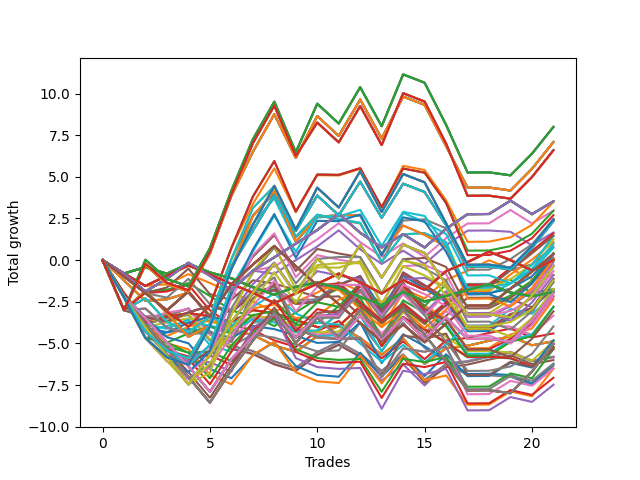

# Long HLT 108 
- Symbol: TSLA
- Date Range: 01/10/2024 - 05/17/2024
- Trading Period: 8:30-12:30
- Number of Trades: 3



| Id. | Name | Win Percent | Profit | Avg Profit / Trade | Avg Time / Trade |      | Name | Win Percent | Profit | Avg Profit / Trade | Avg Time / Trade |
| --- | ---- | ----------- | ------ | ------------------ | ---------------- | ---- | ---- | ----------- | ------ | ------------------ | ---------------- |
| | Sorted By <br> Profit | | | | | | Sorted By <br> Win Percentage ||||
|0| TP-1.75 75m | 100.00 | 3.28 | 1.09 | 64:00 |     | TP-1.75 75m | 100.00 | 3.28 | 1.09 | 64:00 |
|1| TP-1.5 75m | 100.00 | 3.17 | 1.06 | 63:40 |     | TP-1.5 75m | 100.00 | 3.17 | 1.06 | 63:40 |
|2| TP-1.25 75m | 100.00 | 3.17 | 1.06 | 63:40 |     | TP-1.25 75m | 100.00 | 3.17 | 1.06 | 63:40 |
|3| TP-1 120m | 100.00 | 3.09 | 1.03 | 50:20 |     | TP-1 120m | 100.00 | 3.09 | 1.03 | 50:20 |
|4| TP-1 105m | 100.00 | 3.09 | 1.03 | 50:20 |     | TP-1 105m | 100.00 | 3.09 | 1.03 | 50:20 |
|5| TP-1 90m | 100.00 | 3.09 | 1.03 | 50:20 |     | TP-1 90m | 100.00 | 3.09 | 1.03 | 50:20 |
|6| TP-2 75m | 100.00 | 3.02 | 1.01 | 74:00 |     | TP-2 75m | 100.00 | 3.02 | 1.01 | 74:00 |
|7| TP-1 75m | 100.00 | 2.96 | 0.99 | 49:20 |     | TP-1 75m | 100.00 | 2.96 | 0.99 | 49:20 |
|8| TP-2 45m | 100.00 | 2.93 | 0.98 | 44:00 |     | TP-2 45m | 100.00 | 2.93 | 0.98 | 44:00 |
|9| TP-1.75 45m | 100.00 | 2.93 | 0.98 | 44:00 |     | TP-1.75 45m | 100.00 | 2.93 | 0.98 | 44:00 |
|10| TP-1.75 120m | 66.67 | 2.88 | 0.96 | 94:00 |     | TP-1.5 45m | 100.00 | 2.82 | 0.94 | 43:40 |
|11| TP-1.5 45m | 100.00 | 2.82 | 0.94 | 43:40 |     | TP-1.25 45m | 100.00 | 2.82 | 0.94 | 43:40 |
|12| TP-1.25 45m | 100.00 | 2.82 | 0.94 | 43:40 |     | TP-1.75 105m | 100.00 | 2.77 | 0.92 | 84:00 |
|13| TP-1.75 105m | 100.00 | 2.77 | 0.92 | 84:00 |     | TP-1.5 105m | 100.00 | 2.66 | 0.89 | 83:40 |
|14| TP-1.5 120m | 66.67 | 2.77 | 0.92 | 93:40 |     | TP-1.25 105m | 100.00 | 2.66 | 0.89 | 83:40 |
|15| TP-1.25 120m | 66.67 | 2.77 | 0.92 | 89:00 |     | TP-2 105m | 100.00 | 2.39 | 0.80 | 104:00 |
|16| TP-2 120m | 66.67 | 2.73 | 0.91 | 119:00 |     | TP-1 45m | 100.00 | 2.23 | 0.74 | 38:40 |
|17| TP-1.5 105m | 100.00 | 2.66 | 0.89 | 83:40 |     | TP-1.75 120m | 66.67 | 2.88 | 0.96 | 94:00 |
|18| TP-1.25 105m | 100.00 | 2.66 | 0.89 | 83:40 |     | TP-1.5 120m | 66.67 | 2.77 | 0.92 | 93:40 |
|19| TP-2 105m | 100.00 | 2.39 | 0.80 | 104:00 |     | TP-1.25 120m | 66.67 | 2.77 | 0.92 | 89:00 |
|20| TP-1.75 90m | 66.67 | 2.39 | 0.80 | 74:00 |     | TP-2 120m | 66.67 | 2.73 | 0.91 | 119:00 |
|21| TP-2 90m | 66.67 | 2.38 | 0.79 | 89:00 |     | TP-1.75 90m | 66.67 | 2.39 | 0.80 | 74:00 |
|22| TP-1.5 90m | 66.67 | 2.28 | 0.76 | 73:40 |     | TP-2 90m | 66.67 | 2.38 | 0.79 | 89:00 |
|23| TP-1.25 90m | 66.67 | 2.28 | 0.76 | 73:40 |     | TP-1.5 90m | 66.67 | 2.28 | 0.76 | 73:40 |
|24| TP-1.75 60m | 66.67 | 2.26 | 0.75 | 54:00 |     | TP-1.25 90m | 66.67 | 2.28 | 0.76 | 73:40 |
|25| TP-1 45m | 100.00 | 2.23 | 0.74 | 38:40 |     | TP-1.75 60m | 66.67 | 2.26 | 0.75 | 54:00 |
|26| TP-1.5 60m | 66.67 | 2.15 | 0.72 | 53:40 |     | TP-1.5 60m | 66.67 | 2.15 | 0.72 | 53:40 |
|27| TP-1.25 60m | 66.67 | 2.15 | 0.72 | 53:40 |     | TP-1.25 60m | 66.67 | 2.15 | 0.72 | 53:40 |
|28| TP-1 60m | 66.67 | 1.78 | 0.59 | 44:20 |     | TP-1 60m | 66.67 | 1.78 | 0.59 | 44:20 |
|29| TP-2 60m | 66.67 | 1.53 | 0.51 | 59:00 |     | TP-2 60m | 66.67 | 1.53 | 0.51 | 59:00 |
|30| TP-0.75 120m | 66.67 | 0.76 | 0.25 | 20:20 |     | TP-0.75 120m | 66.67 | 0.76 | 0.25 | 20:20 |
|31| TP-0.75 105m | 66.67 | 0.76 | 0.25 | 20:20 |     | TP-0.75 105m | 66.67 | 0.76 | 0.25 | 20:20 |
|32| TP-0.75 90m | 66.67 | 0.76 | 0.25 | 20:20 |     | TP-0.75 90m | 66.67 | 0.76 | 0.25 | 20:20 |
|33| TP-0.75 75m | 66.67 | 0.76 | 0.25 | 20:20 |     | TP-0.75 75m | 66.67 | 0.76 | 0.25 | 20:20 |
|34| TP-0.75 60m | 66.67 | 0.76 | 0.25 | 20:20 |     | TP-0.75 60m | 66.67 | 0.76 | 0.25 | 20:20 |
|35| TP-0.75 45m | 66.67 | 0.76 | 0.25 | 20:20 |     | TP-0.75 45m | 66.67 | 0.76 | 0.25 | 20:20 |
|36| TP-2 30m | 33.33 | 0.58 | 0.19 | 29:00 |     | TP-2 15m | 66.67 | -0.03 | -0.01 | 14:00 |
|37| TP-1.75 30m | 33.33 | 0.58 | 0.19 | 29:00 |     | TP-1.75 15m | 66.67 | -0.03 | -0.01 | 14:00 |
|38| TP-1.5 30m | 33.33 | 0.58 | 0.19 | 29:00 |     | TP-1.5 15m | 66.67 | -0.03 | -0.01 | 14:00 |
|39| TP-1.25 30m | 33.33 | 0.58 | 0.19 | 29:00 |     | TP-1.25 15m | 66.67 | -0.03 | -0.01 | 14:00 |
|40| TP-1 30m | 33.33 | 0.48 | 0.16 | 28:40 |     | TP-1 15m | 66.67 | -0.03 | -0.01 | 14:00 |
|41| TP-2 15m | 66.67 | -0.03 | -0.01 | 14:00 |     | TP-0.75 15m | 66.67 | -0.31 | -0.10 | 10:40 |
|42| TP-1.75 15m | 66.67 | -0.03 | -0.01 | 14:00 |     | TP-2 30m | 33.33 | 0.58 | 0.19 | 29:00 |
|43| TP-1.5 15m | 66.67 | -0.03 | -0.01 | 14:00 |     | TP-1.75 30m | 33.33 | 0.58 | 0.19 | 29:00 |
|44| TP-1.25 15m | 66.67 | -0.03 | -0.01 | 14:00 |     | TP-1.5 30m | 33.33 | 0.58 | 0.19 | 29:00 |
|45| TP-1 15m | 66.67 | -0.03 | -0.01 | 14:00 |     | TP-1.25 30m | 33.33 | 0.58 | 0.19 | 29:00 |
|46| TP-0.75 30m | 33.33 | -0.12 | -0.04 | 18:20 |     | TP-1 30m | 33.33 | 0.48 | 0.16 | 28:40 |
|47| TP-0.75 15m | 66.67 | -0.31 | -0.10 | 10:40 |     | TP-0.75 30m | 33.33 | -0.12 | -0.04 | 18:20 |
|48| TP-0.25 120m | 33.33 | -0.47 | -0.16 | 08:00 |     | TP-0.25 120m | 33.33 | -0.47 | -0.16 | 08:00 |
|49| TP-0.25 105m | 33.33 | -0.47 | -0.16 | 08:00 |     | TP-0.25 105m | 33.33 | -0.47 | -0.16 | 08:00 |
|50| TP-0.25 90m | 33.33 | -0.47 | -0.16 | 08:00 |     | TP-0.25 90m | 33.33 | -0.47 | -0.16 | 08:00 |
|51| TP-0.25 75m | 33.33 | -0.47 | -0.16 | 08:00 |     | TP-0.25 75m | 33.33 | -0.47 | -0.16 | 08:00 |
|52| TP-0.25 60m | 33.33 | -0.47 | -0.16 | 08:00 |     | TP-0.25 60m | 33.33 | -0.47 | -0.16 | 08:00 |
|53| TP-0.25 45m | 33.33 | -0.47 | -0.16 | 08:00 |     | TP-0.25 45m | 33.33 | -0.47 | -0.16 | 08:00 |
|54| TP-0.25 30m | 33.33 | -0.47 | -0.16 | 08:00 |     | TP-0.25 30m | 33.33 | -0.47 | -0.16 | 08:00 |
|55| TP-0.25 15m | 33.33 | -0.49 | -0.16 | 07:20 |     | TP-0.25 15m | 33.33 | -0.49 | -0.16 | 07:20 |
|56| TP-0.5 120m | 33.33 | -0.50 | -0.17 | 09:00 |     | TP-0.5 120m | 33.33 | -0.50 | -0.17 | 09:00 |
|57| TP-0.5 105m | 33.33 | -0.50 | -0.17 | 09:00 |     | TP-0.5 105m | 33.33 | -0.50 | -0.17 | 09:00 |
|58| TP-0.5 90m | 33.33 | -0.50 | -0.17 | 09:00 |     | TP-0.5 90m | 33.33 | -0.50 | -0.17 | 09:00 |
|59| TP-0.5 75m | 33.33 | -0.50 | -0.17 | 09:00 |     | TP-0.5 75m | 33.33 | -0.50 | -0.17 | 09:00 |
|60| TP-0.5 60m | 33.33 | -0.50 | -0.17 | 09:00 |     | TP-0.5 60m | 33.33 | -0.50 | -0.17 | 09:00 |
|61| TP-0.5 45m | 33.33 | -0.50 | -0.17 | 09:00 |     | TP-0.5 45m | 33.33 | -0.50 | -0.17 | 09:00 |
|62| TP-0.5 30m | 33.33 | -0.50 | -0.17 | 09:00 |     | TP-0.5 30m | 33.33 | -0.50 | -0.17 | 09:00 |
|63| TP-0.5 15m | 33.33 | -0.89 | -0.30 | 07:40 |     | TP-0.5 15m | 33.33 | -0.89 | -0.30 | 07:40 |

### Test TP-0.25 15m
* Take Profit of 0.25 Point
* 0.25 Stoploss
* Results:
```
Total Trades: 3
Percent Up: 33.33
Percent Down: 66.67
Total Points Moved Up: -0.49
Potential Profit: -245.00
Total Points Ups: 0.24 Count Ups: 1
Total Points Downs: -0.73 Count Downs: 2
```

<details><summary>Trades</summary>

<code>In: 2024-01-12 09:20:00		Out: 2024-01-12 09:26:00		Total Position Time: 06:00		Total Move Up: -0.51		Total to Date: -0.51</code> <br />
<code>In: 2024-02-20 09:35:00		Out: 2024-02-20 09:37:00		Total Position Time: 02:00		Total Move Up: -0.22		Total to Date: -0.73</code> <br />
<code>In: 2024-04-22 08:35:00		Out: 2024-04-22 08:49:00		Total Position Time: 14:00		Total Move Up: 0.24		Total to Date: -0.49</code> <br />


</details>

### Test TP-0.5 15m
* Take Profit of 0.5 Point
* 0.5 Stoploss
* Results:
```
Total Trades: 3
Percent Up: 33.33
Percent Down: 66.67
Total Points Moved Up: -0.89
Potential Profit: -445.00
Total Points Ups: 0.24 Count Ups: 1
Total Points Downs: -1.13 Count Downs: 2
```

<details><summary>Trades</summary>

<code>In: 2024-01-12 09:20:00		Out: 2024-01-12 09:26:00		Total Position Time: 06:00		Total Move Up: -0.51		Total to Date: -0.51</code> <br />
<code>In: 2024-02-20 09:35:00		Out: 2024-02-20 09:38:00		Total Position Time: 03:00		Total Move Up: -0.62		Total to Date: -1.13</code> <br />
<code>In: 2024-04-22 08:35:00		Out: 2024-04-22 08:49:00		Total Position Time: 14:00		Total Move Up: 0.24		Total to Date: -0.89</code> <br />


</details>

### Test TP-0.75 15m
* Take Profit of 0.75 Point
* 0.75 Stoploss
* Results:
```
Total Trades: 3
Percent Up: 66.67
Percent Down: 33.33
Total Points Moved Up: -0.31
Potential Profit: -155.00
Total Points Ups: 0.50 Count Ups: 2
Total Points Downs: -0.81 Count Downs: 1
```

<details><summary>Trades</summary>

<code>In: 2024-01-12 09:20:00		Out: 2024-01-12 09:34:00		Total Position Time: 14:00		Total Move Up: 0.26		Total to Date: 0.26</code> <br />
<code>In: 2024-02-20 09:35:00		Out: 2024-02-20 09:39:00		Total Position Time: 04:00		Total Move Up: -0.81		Total to Date: -0.55</code> <br />
<code>In: 2024-04-22 08:35:00		Out: 2024-04-22 08:49:00		Total Position Time: 14:00		Total Move Up: 0.24		Total to Date: -0.31</code> <br />


</details>

### Test TP-1 15m
* Take Profit of 1 Point
* 1 Stoploss
* Results:
```
Total Trades: 3
Percent Up: 66.67
Percent Down: 33.33
Total Points Moved Up: -0.03
Potential Profit: -15.00
Total Points Ups: 0.50 Count Ups: 2
Total Points Downs: -0.53 Count Downs: 1
```

<details><summary>Trades</summary>

<code>In: 2024-01-12 09:20:00		Out: 2024-01-12 09:34:00		Total Position Time: 14:00		Total Move Up: 0.26		Total to Date: 0.26</code> <br />
<code>In: 2024-02-20 09:35:00		Out: 2024-02-20 09:49:00		Total Position Time: 14:00		Total Move Up: -0.53		Total to Date: -0.27</code> <br />
<code>In: 2024-04-22 08:35:00		Out: 2024-04-22 08:49:00		Total Position Time: 14:00		Total Move Up: 0.24		Total to Date: -0.03</code> <br />


</details>

### Test TP-1.25 15m
* Take Profit of 1.25 Point
* 1.25 Stoploss
* Results:
```
Total Trades: 3
Percent Up: 66.67
Percent Down: 33.33
Total Points Moved Up: -0.03
Potential Profit: -15.00
Total Points Ups: 0.50 Count Ups: 2
Total Points Downs: -0.53 Count Downs: 1
```

<details><summary>Trades</summary>

<code>In: 2024-01-12 09:20:00		Out: 2024-01-12 09:34:00		Total Position Time: 14:00		Total Move Up: 0.26		Total to Date: 0.26</code> <br />
<code>In: 2024-02-20 09:35:00		Out: 2024-02-20 09:49:00		Total Position Time: 14:00		Total Move Up: -0.53		Total to Date: -0.27</code> <br />
<code>In: 2024-04-22 08:35:00		Out: 2024-04-22 08:49:00		Total Position Time: 14:00		Total Move Up: 0.24		Total to Date: -0.03</code> <br />


</details>

### Test TP-1.5 15m
* Take Profit of 1.5 Point
* 1.5 Stoploss
* Results:
```
Total Trades: 3
Percent Up: 66.67
Percent Down: 33.33
Total Points Moved Up: -0.03
Potential Profit: -15.00
Total Points Ups: 0.50 Count Ups: 2
Total Points Downs: -0.53 Count Downs: 1
```

<details><summary>Trades</summary>

<code>In: 2024-01-12 09:20:00		Out: 2024-01-12 09:34:00		Total Position Time: 14:00		Total Move Up: 0.26		Total to Date: 0.26</code> <br />
<code>In: 2024-02-20 09:35:00		Out: 2024-02-20 09:49:00		Total Position Time: 14:00		Total Move Up: -0.53		Total to Date: -0.27</code> <br />
<code>In: 2024-04-22 08:35:00		Out: 2024-04-22 08:49:00		Total Position Time: 14:00		Total Move Up: 0.24		Total to Date: -0.03</code> <br />


</details>

### Test TP-1.75 15m
* Take Profit of 1.75 Point
* 1.75 Stoploss
* Results:
```
Total Trades: 3
Percent Up: 66.67
Percent Down: 33.33
Total Points Moved Up: -0.03
Potential Profit: -15.00
Total Points Ups: 0.50 Count Ups: 2
Total Points Downs: -0.53 Count Downs: 1
```

<details><summary>Trades</summary>

<code>In: 2024-01-12 09:20:00		Out: 2024-01-12 09:34:00		Total Position Time: 14:00		Total Move Up: 0.26		Total to Date: 0.26</code> <br />
<code>In: 2024-02-20 09:35:00		Out: 2024-02-20 09:49:00		Total Position Time: 14:00		Total Move Up: -0.53		Total to Date: -0.27</code> <br />
<code>In: 2024-04-22 08:35:00		Out: 2024-04-22 08:49:00		Total Position Time: 14:00		Total Move Up: 0.24		Total to Date: -0.03</code> <br />


</details>

### Test TP-2 15m
* Take Profit of 2 Point
* 2 Stoploss
* Results:
```
Total Trades: 3
Percent Up: 66.67
Percent Down: 33.33
Total Points Moved Up: -0.03
Potential Profit: -15.00
Total Points Ups: 0.50 Count Ups: 2
Total Points Downs: -0.53 Count Downs: 1
```

<details><summary>Trades</summary>

<code>In: 2024-01-12 09:20:00		Out: 2024-01-12 09:34:00		Total Position Time: 14:00		Total Move Up: 0.26		Total to Date: 0.26</code> <br />
<code>In: 2024-02-20 09:35:00		Out: 2024-02-20 09:49:00		Total Position Time: 14:00		Total Move Up: -0.53		Total to Date: -0.27</code> <br />
<code>In: 2024-04-22 08:35:00		Out: 2024-04-22 08:49:00		Total Position Time: 14:00		Total Move Up: 0.24		Total to Date: -0.03</code> <br />


</details>

### Test TP-0.25 30m
* Take Profit of 0.25 Point
* 0.25 Stoploss
* Results:
```
Total Trades: 3
Percent Up: 33.33
Percent Down: 66.67
Total Points Moved Up: -0.47
Potential Profit: -235.00
Total Points Ups: 0.26 Count Ups: 1
Total Points Downs: -0.73 Count Downs: 2
```

<details><summary>Trades</summary>

<code>In: 2024-01-12 09:20:00		Out: 2024-01-12 09:26:00		Total Position Time: 06:00		Total Move Up: -0.51		Total to Date: -0.51</code> <br />
<code>In: 2024-02-20 09:35:00		Out: 2024-02-20 09:37:00		Total Position Time: 02:00		Total Move Up: -0.22		Total to Date: -0.73</code> <br />
<code>In: 2024-04-22 08:35:00		Out: 2024-04-22 08:51:00		Total Position Time: 16:00		Total Move Up: 0.26		Total to Date: -0.47</code> <br />


</details>

### Test TP-0.5 30m
* Take Profit of 0.5 Point
* 0.5 Stoploss
* Results:
```
Total Trades: 3
Percent Up: 33.33
Percent Down: 66.67
Total Points Moved Up: -0.50
Potential Profit: -250.00
Total Points Ups: 0.63 Count Ups: 1
Total Points Downs: -1.13 Count Downs: 2
```

<details><summary>Trades</summary>

<code>In: 2024-01-12 09:20:00		Out: 2024-01-12 09:26:00		Total Position Time: 06:00		Total Move Up: -0.51		Total to Date: -0.51</code> <br />
<code>In: 2024-02-20 09:35:00		Out: 2024-02-20 09:38:00		Total Position Time: 03:00		Total Move Up: -0.62		Total to Date: -1.13</code> <br />
<code>In: 2024-04-22 08:35:00		Out: 2024-04-22 08:53:00		Total Position Time: 18:00		Total Move Up: 0.63		Total to Date: -0.50</code> <br />


</details>

### Test TP-0.75 30m
* Take Profit of 0.75 Point
* 0.75 Stoploss
* Results:
```
Total Trades: 3
Percent Up: 33.33
Percent Down: 66.67
Total Points Moved Up: -0.12
Potential Profit: -60.00
Total Points Ups: 0.77 Count Ups: 1
Total Points Downs: -0.89 Count Downs: 2
```

<details><summary>Trades</summary>

<code>In: 2024-01-12 09:20:00		Out: 2024-01-12 09:49:00		Total Position Time: 29:00		Total Move Up: -0.08		Total to Date: -0.08</code> <br />
<code>In: 2024-02-20 09:35:00		Out: 2024-02-20 09:39:00		Total Position Time: 04:00		Total Move Up: -0.81		Total to Date: -0.89</code> <br />
<code>In: 2024-04-22 08:35:00		Out: 2024-04-22 08:57:00		Total Position Time: 22:00		Total Move Up: 0.77		Total to Date: -0.12</code> <br />


</details>

### Test TP-1 30m
* Take Profit of 1 Point
* 1 Stoploss
* Results:
```
Total Trades: 3
Percent Up: 33.33
Percent Down: 66.67
Total Points Moved Up: 0.48
Potential Profit: 240.00
Total Points Ups: 1.06 Count Ups: 1
Total Points Downs: -0.58 Count Downs: 2
```

<details><summary>Trades</summary>

<code>In: 2024-01-12 09:20:00		Out: 2024-01-12 09:49:00		Total Position Time: 29:00		Total Move Up: -0.08		Total to Date: -0.08</code> <br />
<code>In: 2024-02-20 09:35:00		Out: 2024-02-20 10:04:00		Total Position Time: 29:00		Total Move Up: -0.50		Total to Date: -0.58</code> <br />
<code>In: 2024-04-22 08:35:00		Out: 2024-04-22 09:03:00		Total Position Time: 28:00		Total Move Up: 1.06		Total to Date: 0.48</code> <br />


</details>

### Test TP-1.25 30m
* Take Profit of 1.25 Point
* 1.25 Stoploss
* Results:
```
Total Trades: 3
Percent Up: 33.33
Percent Down: 66.67
Total Points Moved Up: 0.58
Potential Profit: 290.00
Total Points Ups: 1.16 Count Ups: 1
Total Points Downs: -0.58 Count Downs: 2
```

<details><summary>Trades</summary>

<code>In: 2024-01-12 09:20:00		Out: 2024-01-12 09:49:00		Total Position Time: 29:00		Total Move Up: -0.08		Total to Date: -0.08</code> <br />
<code>In: 2024-02-20 09:35:00		Out: 2024-02-20 10:04:00		Total Position Time: 29:00		Total Move Up: -0.50		Total to Date: -0.58</code> <br />
<code>In: 2024-04-22 08:35:00		Out: 2024-04-22 09:04:00		Total Position Time: 29:00		Total Move Up: 1.16		Total to Date: 0.58</code> <br />


</details>

### Test TP-1.5 30m
* Take Profit of 1.5 Point
* 1.5 Stoploss
* Results:
```
Total Trades: 3
Percent Up: 33.33
Percent Down: 66.67
Total Points Moved Up: 0.58
Potential Profit: 290.00
Total Points Ups: 1.16 Count Ups: 1
Total Points Downs: -0.58 Count Downs: 2
```

<details><summary>Trades</summary>

<code>In: 2024-01-12 09:20:00		Out: 2024-01-12 09:49:00		Total Position Time: 29:00		Total Move Up: -0.08		Total to Date: -0.08</code> <br />
<code>In: 2024-02-20 09:35:00		Out: 2024-02-20 10:04:00		Total Position Time: 29:00		Total Move Up: -0.50		Total to Date: -0.58</code> <br />
<code>In: 2024-04-22 08:35:00		Out: 2024-04-22 09:04:00		Total Position Time: 29:00		Total Move Up: 1.16		Total to Date: 0.58</code> <br />


</details>

### Test TP-1.75 30m
* Take Profit of 1.75 Point
* 1.75 Stoploss
* Results:
```
Total Trades: 3
Percent Up: 33.33
Percent Down: 66.67
Total Points Moved Up: 0.58
Potential Profit: 290.00
Total Points Ups: 1.16 Count Ups: 1
Total Points Downs: -0.58 Count Downs: 2
```

<details><summary>Trades</summary>

<code>In: 2024-01-12 09:20:00		Out: 2024-01-12 09:49:00		Total Position Time: 29:00		Total Move Up: -0.08		Total to Date: -0.08</code> <br />
<code>In: 2024-02-20 09:35:00		Out: 2024-02-20 10:04:00		Total Position Time: 29:00		Total Move Up: -0.50		Total to Date: -0.58</code> <br />
<code>In: 2024-04-22 08:35:00		Out: 2024-04-22 09:04:00		Total Position Time: 29:00		Total Move Up: 1.16		Total to Date: 0.58</code> <br />


</details>

### Test TP-2 30m
* Take Profit of 2 Point
* 2 Stoploss
* Results:
```
Total Trades: 3
Percent Up: 33.33
Percent Down: 66.67
Total Points Moved Up: 0.58
Potential Profit: 290.00
Total Points Ups: 1.16 Count Ups: 1
Total Points Downs: -0.58 Count Downs: 2
```

<details><summary>Trades</summary>

<code>In: 2024-01-12 09:20:00		Out: 2024-01-12 09:49:00		Total Position Time: 29:00		Total Move Up: -0.08		Total to Date: -0.08</code> <br />
<code>In: 2024-02-20 09:35:00		Out: 2024-02-20 10:04:00		Total Position Time: 29:00		Total Move Up: -0.50		Total to Date: -0.58</code> <br />
<code>In: 2024-04-22 08:35:00		Out: 2024-04-22 09:04:00		Total Position Time: 29:00		Total Move Up: 1.16		Total to Date: 0.58</code> <br />


</details>

### Test TP-0.25 45m
* Take Profit of 0.25 Point
* 0.25 Stoploss
* Results:
```
Total Trades: 3
Percent Up: 33.33
Percent Down: 66.67
Total Points Moved Up: -0.47
Potential Profit: -235.00
Total Points Ups: 0.26 Count Ups: 1
Total Points Downs: -0.73 Count Downs: 2
```

<details><summary>Trades</summary>

<code>In: 2024-01-12 09:20:00		Out: 2024-01-12 09:26:00		Total Position Time: 06:00		Total Move Up: -0.51		Total to Date: -0.51</code> <br />
<code>In: 2024-02-20 09:35:00		Out: 2024-02-20 09:37:00		Total Position Time: 02:00		Total Move Up: -0.22		Total to Date: -0.73</code> <br />
<code>In: 2024-04-22 08:35:00		Out: 2024-04-22 08:51:00		Total Position Time: 16:00		Total Move Up: 0.26		Total to Date: -0.47</code> <br />


</details>

### Test TP-0.5 45m
* Take Profit of 0.5 Point
* 0.5 Stoploss
* Results:
```
Total Trades: 3
Percent Up: 33.33
Percent Down: 66.67
Total Points Moved Up: -0.50
Potential Profit: -250.00
Total Points Ups: 0.63 Count Ups: 1
Total Points Downs: -1.13 Count Downs: 2
```

<details><summary>Trades</summary>

<code>In: 2024-01-12 09:20:00		Out: 2024-01-12 09:26:00		Total Position Time: 06:00		Total Move Up: -0.51		Total to Date: -0.51</code> <br />
<code>In: 2024-02-20 09:35:00		Out: 2024-02-20 09:38:00		Total Position Time: 03:00		Total Move Up: -0.62		Total to Date: -1.13</code> <br />
<code>In: 2024-04-22 08:35:00		Out: 2024-04-22 08:53:00		Total Position Time: 18:00		Total Move Up: 0.63		Total to Date: -0.50</code> <br />


</details>

### Test TP-0.75 45m
* Take Profit of 0.75 Point
* 0.75 Stoploss
* Results:
```
Total Trades: 3
Percent Up: 66.67
Percent Down: 33.33
Total Points Moved Up: 0.76
Potential Profit: 380.00
Total Points Ups: 1.57 Count Ups: 2
Total Points Downs: -0.81 Count Downs: 1
```

<details><summary>Trades</summary>

<code>In: 2024-01-12 09:20:00		Out: 2024-01-12 09:55:00		Total Position Time: 35:00		Total Move Up: 0.80		Total to Date: 0.80</code> <br />
<code>In: 2024-02-20 09:35:00		Out: 2024-02-20 09:39:00		Total Position Time: 04:00		Total Move Up: -0.81		Total to Date: -0.01</code> <br />
<code>In: 2024-04-22 08:35:00		Out: 2024-04-22 08:57:00		Total Position Time: 22:00		Total Move Up: 0.77		Total to Date: 0.76</code> <br />


</details>

### Test TP-1 45m
* Take Profit of 1 Point
* 1 Stoploss
* Results:
```
Total Trades: 3
Percent Up: 100.00
Percent Down: 0.00
Total Points Moved Up: 2.23
Potential Profit: 1115.00
Total Points Ups: 2.23 Count Ups: 3
Total Points Downs: 0.00 Count Downs: 0
```

<details><summary>Trades</summary>

<code>In: 2024-01-12 09:20:00		Out: 2024-01-12 10:04:00		Total Position Time: 44:00		Total Move Up: 0.82		Total to Date: 0.82</code> <br />
<code>In: 2024-02-20 09:35:00		Out: 2024-02-20 10:19:00		Total Position Time: 44:00		Total Move Up: 0.35		Total to Date: 1.17</code> <br />
<code>In: 2024-04-22 08:35:00		Out: 2024-04-22 09:03:00		Total Position Time: 28:00		Total Move Up: 1.06		Total to Date: 2.23</code> <br />


</details>

### Test TP-1.25 45m
* Take Profit of 1.25 Point
* 1.25 Stoploss
* Results:
```
Total Trades: 3
Percent Up: 100.00
Percent Down: 0.00
Total Points Moved Up: 2.82
Potential Profit: 1410.00
Total Points Ups: 2.82 Count Ups: 3
Total Points Downs: 0.00 Count Downs: 0
```

<details><summary>Trades</summary>

<code>In: 2024-01-12 09:20:00		Out: 2024-01-12 10:04:00		Total Position Time: 44:00		Total Move Up: 0.82		Total to Date: 0.82</code> <br />
<code>In: 2024-02-20 09:35:00		Out: 2024-02-20 10:19:00		Total Position Time: 44:00		Total Move Up: 0.35		Total to Date: 1.17</code> <br />
<code>In: 2024-04-22 08:35:00		Out: 2024-04-22 09:18:00		Total Position Time: 43:00		Total Move Up: 1.65		Total to Date: 2.82</code> <br />


</details>

### Test TP-1.5 45m
* Take Profit of 1.5 Point
* 1.5 Stoploss
* Results:
```
Total Trades: 3
Percent Up: 100.00
Percent Down: 0.00
Total Points Moved Up: 2.82
Potential Profit: 1410.00
Total Points Ups: 2.82 Count Ups: 3
Total Points Downs: 0.00 Count Downs: 0
```

<details><summary>Trades</summary>

<code>In: 2024-01-12 09:20:00		Out: 2024-01-12 10:04:00		Total Position Time: 44:00		Total Move Up: 0.82		Total to Date: 0.82</code> <br />
<code>In: 2024-02-20 09:35:00		Out: 2024-02-20 10:19:00		Total Position Time: 44:00		Total Move Up: 0.35		Total to Date: 1.17</code> <br />
<code>In: 2024-04-22 08:35:00		Out: 2024-04-22 09:18:00		Total Position Time: 43:00		Total Move Up: 1.65		Total to Date: 2.82</code> <br />


</details>

### Test TP-1.75 45m
* Take Profit of 1.75 Point
* 1.75 Stoploss
* Results:
```
Total Trades: 3
Percent Up: 100.00
Percent Down: 0.00
Total Points Moved Up: 2.93
Potential Profit: 1465.00
Total Points Ups: 2.93 Count Ups: 3
Total Points Downs: 0.00 Count Downs: 0
```

<details><summary>Trades</summary>

<code>In: 2024-01-12 09:20:00		Out: 2024-01-12 10:04:00		Total Position Time: 44:00		Total Move Up: 0.82		Total to Date: 0.82</code> <br />
<code>In: 2024-02-20 09:35:00		Out: 2024-02-20 10:19:00		Total Position Time: 44:00		Total Move Up: 0.35		Total to Date: 1.17</code> <br />
<code>In: 2024-04-22 08:35:00		Out: 2024-04-22 09:19:00		Total Position Time: 44:00		Total Move Up: 1.76		Total to Date: 2.93</code> <br />


</details>

### Test TP-2 45m
* Take Profit of 2 Point
* 2 Stoploss
* Results:
```
Total Trades: 3
Percent Up: 100.00
Percent Down: 0.00
Total Points Moved Up: 2.93
Potential Profit: 1465.00
Total Points Ups: 2.93 Count Ups: 3
Total Points Downs: 0.00 Count Downs: 0
```

<details><summary>Trades</summary>

<code>In: 2024-01-12 09:20:00		Out: 2024-01-12 10:04:00		Total Position Time: 44:00		Total Move Up: 0.82		Total to Date: 0.82</code> <br />
<code>In: 2024-02-20 09:35:00		Out: 2024-02-20 10:19:00		Total Position Time: 44:00		Total Move Up: 0.35		Total to Date: 1.17</code> <br />
<code>In: 2024-04-22 08:35:00		Out: 2024-04-22 09:19:00		Total Position Time: 44:00		Total Move Up: 1.76		Total to Date: 2.93</code> <br />


</details>

### Test TP-0.25 60m
* Take Profit of 0.25 Point
* 0.25 Stoploss
* Results:
```
Total Trades: 3
Percent Up: 33.33
Percent Down: 66.67
Total Points Moved Up: -0.47
Potential Profit: -235.00
Total Points Ups: 0.26 Count Ups: 1
Total Points Downs: -0.73 Count Downs: 2
```

<details><summary>Trades</summary>

<code>In: 2024-01-12 09:20:00		Out: 2024-01-12 09:26:00		Total Position Time: 06:00		Total Move Up: -0.51		Total to Date: -0.51</code> <br />
<code>In: 2024-02-20 09:35:00		Out: 2024-02-20 09:37:00		Total Position Time: 02:00		Total Move Up: -0.22		Total to Date: -0.73</code> <br />
<code>In: 2024-04-22 08:35:00		Out: 2024-04-22 08:51:00		Total Position Time: 16:00		Total Move Up: 0.26		Total to Date: -0.47</code> <br />


</details>

### Test TP-0.5 60m
* Take Profit of 0.5 Point
* 0.5 Stoploss
* Results:
```
Total Trades: 3
Percent Up: 33.33
Percent Down: 66.67
Total Points Moved Up: -0.50
Potential Profit: -250.00
Total Points Ups: 0.63 Count Ups: 1
Total Points Downs: -1.13 Count Downs: 2
```

<details><summary>Trades</summary>

<code>In: 2024-01-12 09:20:00		Out: 2024-01-12 09:26:00		Total Position Time: 06:00		Total Move Up: -0.51		Total to Date: -0.51</code> <br />
<code>In: 2024-02-20 09:35:00		Out: 2024-02-20 09:38:00		Total Position Time: 03:00		Total Move Up: -0.62		Total to Date: -1.13</code> <br />
<code>In: 2024-04-22 08:35:00		Out: 2024-04-22 08:53:00		Total Position Time: 18:00		Total Move Up: 0.63		Total to Date: -0.50</code> <br />


</details>

### Test TP-0.75 60m
* Take Profit of 0.75 Point
* 0.75 Stoploss
* Results:
```
Total Trades: 3
Percent Up: 66.67
Percent Down: 33.33
Total Points Moved Up: 0.76
Potential Profit: 380.00
Total Points Ups: 1.57 Count Ups: 2
Total Points Downs: -0.81 Count Downs: 1
```

<details><summary>Trades</summary>

<code>In: 2024-01-12 09:20:00		Out: 2024-01-12 09:55:00		Total Position Time: 35:00		Total Move Up: 0.80		Total to Date: 0.80</code> <br />
<code>In: 2024-02-20 09:35:00		Out: 2024-02-20 09:39:00		Total Position Time: 04:00		Total Move Up: -0.81		Total to Date: -0.01</code> <br />
<code>In: 2024-04-22 08:35:00		Out: 2024-04-22 08:57:00		Total Position Time: 22:00		Total Move Up: 0.77		Total to Date: 0.76</code> <br />


</details>

### Test TP-1 60m
* Take Profit of 1 Point
* 1 Stoploss
* Results:
```
Total Trades: 3
Percent Up: 66.67
Percent Down: 33.33
Total Points Moved Up: 1.78
Potential Profit: 890.00
Total Points Ups: 2.07 Count Ups: 2
Total Points Downs: -0.29 Count Downs: 1
```

<details><summary>Trades</summary>

<code>In: 2024-01-12 09:20:00		Out: 2024-01-12 10:06:00		Total Position Time: 46:00		Total Move Up: 1.01		Total to Date: 1.01</code> <br />
<code>In: 2024-02-20 09:35:00		Out: 2024-02-20 10:34:00		Total Position Time: 59:00		Total Move Up: -0.29		Total to Date: 0.72</code> <br />
<code>In: 2024-04-22 08:35:00		Out: 2024-04-22 09:03:00		Total Position Time: 28:00		Total Move Up: 1.06		Total to Date: 1.78</code> <br />


</details>

### Test TP-1.25 60m
* Take Profit of 1.25 Point
* 1.25 Stoploss
* Results:
```
Total Trades: 3
Percent Up: 66.67
Percent Down: 33.33
Total Points Moved Up: 2.15
Potential Profit: 1075.00
Total Points Ups: 2.44 Count Ups: 2
Total Points Downs: -0.29 Count Downs: 1
```

<details><summary>Trades</summary>

<code>In: 2024-01-12 09:20:00		Out: 2024-01-12 10:19:00		Total Position Time: 59:00		Total Move Up: 0.79		Total to Date: 0.79</code> <br />
<code>In: 2024-02-20 09:35:00		Out: 2024-02-20 10:34:00		Total Position Time: 59:00		Total Move Up: -0.29		Total to Date: 0.50</code> <br />
<code>In: 2024-04-22 08:35:00		Out: 2024-04-22 09:18:00		Total Position Time: 43:00		Total Move Up: 1.65		Total to Date: 2.15</code> <br />


</details>

### Test TP-1.5 60m
* Take Profit of 1.5 Point
* 1.5 Stoploss
* Results:
```
Total Trades: 3
Percent Up: 66.67
Percent Down: 33.33
Total Points Moved Up: 2.15
Potential Profit: 1075.00
Total Points Ups: 2.44 Count Ups: 2
Total Points Downs: -0.29 Count Downs: 1
```

<details><summary>Trades</summary>

<code>In: 2024-01-12 09:20:00		Out: 2024-01-12 10:19:00		Total Position Time: 59:00		Total Move Up: 0.79		Total to Date: 0.79</code> <br />
<code>In: 2024-02-20 09:35:00		Out: 2024-02-20 10:34:00		Total Position Time: 59:00		Total Move Up: -0.29		Total to Date: 0.50</code> <br />
<code>In: 2024-04-22 08:35:00		Out: 2024-04-22 09:18:00		Total Position Time: 43:00		Total Move Up: 1.65		Total to Date: 2.15</code> <br />


</details>

### Test TP-1.75 60m
* Take Profit of 1.75 Point
* 1.75 Stoploss
* Results:
```
Total Trades: 3
Percent Up: 66.67
Percent Down: 33.33
Total Points Moved Up: 2.26
Potential Profit: 1130.00
Total Points Ups: 2.55 Count Ups: 2
Total Points Downs: -0.29 Count Downs: 1
```

<details><summary>Trades</summary>

<code>In: 2024-01-12 09:20:00		Out: 2024-01-12 10:19:00		Total Position Time: 59:00		Total Move Up: 0.79		Total to Date: 0.79</code> <br />
<code>In: 2024-02-20 09:35:00		Out: 2024-02-20 10:34:00		Total Position Time: 59:00		Total Move Up: -0.29		Total to Date: 0.50</code> <br />
<code>In: 2024-04-22 08:35:00		Out: 2024-04-22 09:19:00		Total Position Time: 44:00		Total Move Up: 1.76		Total to Date: 2.26</code> <br />


</details>

### Test TP-2 60m
* Take Profit of 2 Point
* 2 Stoploss
* Results:
```
Total Trades: 3
Percent Up: 66.67
Percent Down: 33.33
Total Points Moved Up: 1.53
Potential Profit: 765.00
Total Points Ups: 1.82 Count Ups: 2
Total Points Downs: -0.29 Count Downs: 1
```

<details><summary>Trades</summary>

<code>In: 2024-01-12 09:20:00		Out: 2024-01-12 10:19:00		Total Position Time: 59:00		Total Move Up: 0.79		Total to Date: 0.79</code> <br />
<code>In: 2024-02-20 09:35:00		Out: 2024-02-20 10:34:00		Total Position Time: 59:00		Total Move Up: -0.29		Total to Date: 0.50</code> <br />
<code>In: 2024-04-22 08:35:00		Out: 2024-04-22 09:34:00		Total Position Time: 59:00		Total Move Up: 1.03		Total to Date: 1.53</code> <br />


</details>

### Test TP-0.25 75m
* Take Profit of 0.25 Point
* 0.25 Stoploss
* Results:
```
Total Trades: 3
Percent Up: 33.33
Percent Down: 66.67
Total Points Moved Up: -0.47
Potential Profit: -235.00
Total Points Ups: 0.26 Count Ups: 1
Total Points Downs: -0.73 Count Downs: 2
```

<details><summary>Trades</summary>

<code>In: 2024-01-12 09:20:00		Out: 2024-01-12 09:26:00		Total Position Time: 06:00		Total Move Up: -0.51		Total to Date: -0.51</code> <br />
<code>In: 2024-02-20 09:35:00		Out: 2024-02-20 09:37:00		Total Position Time: 02:00		Total Move Up: -0.22		Total to Date: -0.73</code> <br />
<code>In: 2024-04-22 08:35:00		Out: 2024-04-22 08:51:00		Total Position Time: 16:00		Total Move Up: 0.26		Total to Date: -0.47</code> <br />


</details>

### Test TP-0.5 75m
* Take Profit of 0.5 Point
* 0.5 Stoploss
* Results:
```
Total Trades: 3
Percent Up: 33.33
Percent Down: 66.67
Total Points Moved Up: -0.50
Potential Profit: -250.00
Total Points Ups: 0.63 Count Ups: 1
Total Points Downs: -1.13 Count Downs: 2
```

<details><summary>Trades</summary>

<code>In: 2024-01-12 09:20:00		Out: 2024-01-12 09:26:00		Total Position Time: 06:00		Total Move Up: -0.51		Total to Date: -0.51</code> <br />
<code>In: 2024-02-20 09:35:00		Out: 2024-02-20 09:38:00		Total Position Time: 03:00		Total Move Up: -0.62		Total to Date: -1.13</code> <br />
<code>In: 2024-04-22 08:35:00		Out: 2024-04-22 08:53:00		Total Position Time: 18:00		Total Move Up: 0.63		Total to Date: -0.50</code> <br />


</details>

### Test TP-0.75 75m
* Take Profit of 0.75 Point
* 0.75 Stoploss
* Results:
```
Total Trades: 3
Percent Up: 66.67
Percent Down: 33.33
Total Points Moved Up: 0.76
Potential Profit: 380.00
Total Points Ups: 1.57 Count Ups: 2
Total Points Downs: -0.81 Count Downs: 1
```

<details><summary>Trades</summary>

<code>In: 2024-01-12 09:20:00		Out: 2024-01-12 09:55:00		Total Position Time: 35:00		Total Move Up: 0.80		Total to Date: 0.80</code> <br />
<code>In: 2024-02-20 09:35:00		Out: 2024-02-20 09:39:00		Total Position Time: 04:00		Total Move Up: -0.81		Total to Date: -0.01</code> <br />
<code>In: 2024-04-22 08:35:00		Out: 2024-04-22 08:57:00		Total Position Time: 22:00		Total Move Up: 0.77		Total to Date: 0.76</code> <br />


</details>

### Test TP-1 75m
* Take Profit of 1 Point
* 1 Stoploss
* Results:
```
Total Trades: 3
Percent Up: 100.00
Percent Down: 0.00
Total Points Moved Up: 2.96
Potential Profit: 1480.00
Total Points Ups: 2.96 Count Ups: 3
Total Points Downs: 0.00 Count Downs: 0
```

<details><summary>Trades</summary>

<code>In: 2024-01-12 09:20:00		Out: 2024-01-12 10:06:00		Total Position Time: 46:00		Total Move Up: 1.01		Total to Date: 1.01</code> <br />
<code>In: 2024-02-20 09:35:00		Out: 2024-02-20 10:49:00		Total Position Time: 74:00		Total Move Up: 0.89		Total to Date: 1.90</code> <br />
<code>In: 2024-04-22 08:35:00		Out: 2024-04-22 09:03:00		Total Position Time: 28:00		Total Move Up: 1.06		Total to Date: 2.96</code> <br />


</details>

### Test TP-1.25 75m
* Take Profit of 1.25 Point
* 1.25 Stoploss
* Results:
```
Total Trades: 3
Percent Up: 100.00
Percent Down: 0.00
Total Points Moved Up: 3.17
Potential Profit: 1585.00
Total Points Ups: 3.17 Count Ups: 3
Total Points Downs: 0.00 Count Downs: 0
```

<details><summary>Trades</summary>

<code>In: 2024-01-12 09:20:00		Out: 2024-01-12 10:34:00		Total Position Time: 74:00		Total Move Up: 0.63		Total to Date: 0.63</code> <br />
<code>In: 2024-02-20 09:35:00		Out: 2024-02-20 10:49:00		Total Position Time: 74:00		Total Move Up: 0.89		Total to Date: 1.52</code> <br />
<code>In: 2024-04-22 08:35:00		Out: 2024-04-22 09:18:00		Total Position Time: 43:00		Total Move Up: 1.65		Total to Date: 3.17</code> <br />


</details>

### Test TP-1.5 75m
* Take Profit of 1.5 Point
* 1.5 Stoploss
* Results:
```
Total Trades: 3
Percent Up: 100.00
Percent Down: 0.00
Total Points Moved Up: 3.17
Potential Profit: 1585.00
Total Points Ups: 3.17 Count Ups: 3
Total Points Downs: 0.00 Count Downs: 0
```

<details><summary>Trades</summary>

<code>In: 2024-01-12 09:20:00		Out: 2024-01-12 10:34:00		Total Position Time: 74:00		Total Move Up: 0.63		Total to Date: 0.63</code> <br />
<code>In: 2024-02-20 09:35:00		Out: 2024-02-20 10:49:00		Total Position Time: 74:00		Total Move Up: 0.89		Total to Date: 1.52</code> <br />
<code>In: 2024-04-22 08:35:00		Out: 2024-04-22 09:18:00		Total Position Time: 43:00		Total Move Up: 1.65		Total to Date: 3.17</code> <br />


</details>

### Test TP-1.75 75m
* Take Profit of 1.75 Point
* 1.75 Stoploss
* Results:
```
Total Trades: 3
Percent Up: 100.00
Percent Down: 0.00
Total Points Moved Up: 3.28
Potential Profit: 1640.00
Total Points Ups: 3.28 Count Ups: 3
Total Points Downs: 0.00 Count Downs: 0
```

<details><summary>Trades</summary>

<code>In: 2024-01-12 09:20:00		Out: 2024-01-12 10:34:00		Total Position Time: 74:00		Total Move Up: 0.63		Total to Date: 0.63</code> <br />
<code>In: 2024-02-20 09:35:00		Out: 2024-02-20 10:49:00		Total Position Time: 74:00		Total Move Up: 0.89		Total to Date: 1.52</code> <br />
<code>In: 2024-04-22 08:35:00		Out: 2024-04-22 09:19:00		Total Position Time: 44:00		Total Move Up: 1.76		Total to Date: 3.28</code> <br />


</details>

### Test TP-2 75m
* Take Profit of 2 Point
* 2 Stoploss
* Results:
```
Total Trades: 3
Percent Up: 100.00
Percent Down: 0.00
Total Points Moved Up: 3.02
Potential Profit: 1510.00
Total Points Ups: 3.02 Count Ups: 3
Total Points Downs: 0.00 Count Downs: 0
```

<details><summary>Trades</summary>

<code>In: 2024-01-12 09:20:00		Out: 2024-01-12 10:34:00		Total Position Time: 74:00		Total Move Up: 0.63		Total to Date: 0.63</code> <br />
<code>In: 2024-02-20 09:35:00		Out: 2024-02-20 10:49:00		Total Position Time: 74:00		Total Move Up: 0.89		Total to Date: 1.52</code> <br />
<code>In: 2024-04-22 08:35:00		Out: 2024-04-22 09:49:00		Total Position Time: 74:00		Total Move Up: 1.50		Total to Date: 3.02</code> <br />


</details>

### Test TP-0.25 90m
* Take Profit of 0.25 Point
* 0.25 Stoploss
* Results:
```
Total Trades: 3
Percent Up: 33.33
Percent Down: 66.67
Total Points Moved Up: -0.47
Potential Profit: -235.00
Total Points Ups: 0.26 Count Ups: 1
Total Points Downs: -0.73 Count Downs: 2
```

<details><summary>Trades</summary>

<code>In: 2024-01-12 09:20:00		Out: 2024-01-12 09:26:00		Total Position Time: 06:00		Total Move Up: -0.51		Total to Date: -0.51</code> <br />
<code>In: 2024-02-20 09:35:00		Out: 2024-02-20 09:37:00		Total Position Time: 02:00		Total Move Up: -0.22		Total to Date: -0.73</code> <br />
<code>In: 2024-04-22 08:35:00		Out: 2024-04-22 08:51:00		Total Position Time: 16:00		Total Move Up: 0.26		Total to Date: -0.47</code> <br />


</details>

### Test TP-0.5 90m
* Take Profit of 0.5 Point
* 0.5 Stoploss
* Results:
```
Total Trades: 3
Percent Up: 33.33
Percent Down: 66.67
Total Points Moved Up: -0.50
Potential Profit: -250.00
Total Points Ups: 0.63 Count Ups: 1
Total Points Downs: -1.13 Count Downs: 2
```

<details><summary>Trades</summary>

<code>In: 2024-01-12 09:20:00		Out: 2024-01-12 09:26:00		Total Position Time: 06:00		Total Move Up: -0.51		Total to Date: -0.51</code> <br />
<code>In: 2024-02-20 09:35:00		Out: 2024-02-20 09:38:00		Total Position Time: 03:00		Total Move Up: -0.62		Total to Date: -1.13</code> <br />
<code>In: 2024-04-22 08:35:00		Out: 2024-04-22 08:53:00		Total Position Time: 18:00		Total Move Up: 0.63		Total to Date: -0.50</code> <br />


</details>

### Test TP-0.75 90m
* Take Profit of 0.75 Point
* 0.75 Stoploss
* Results:
```
Total Trades: 3
Percent Up: 66.67
Percent Down: 33.33
Total Points Moved Up: 0.76
Potential Profit: 380.00
Total Points Ups: 1.57 Count Ups: 2
Total Points Downs: -0.81 Count Downs: 1
```

<details><summary>Trades</summary>

<code>In: 2024-01-12 09:20:00		Out: 2024-01-12 09:55:00		Total Position Time: 35:00		Total Move Up: 0.80		Total to Date: 0.80</code> <br />
<code>In: 2024-02-20 09:35:00		Out: 2024-02-20 09:39:00		Total Position Time: 04:00		Total Move Up: -0.81		Total to Date: -0.01</code> <br />
<code>In: 2024-04-22 08:35:00		Out: 2024-04-22 08:57:00		Total Position Time: 22:00		Total Move Up: 0.77		Total to Date: 0.76</code> <br />


</details>

### Test TP-1 90m
* Take Profit of 1 Point
* 1 Stoploss
* Results:
```
Total Trades: 3
Percent Up: 100.00
Percent Down: 0.00
Total Points Moved Up: 3.09
Potential Profit: 1545.00
Total Points Ups: 3.09 Count Ups: 3
Total Points Downs: 0.00 Count Downs: 0
```

<details><summary>Trades</summary>

<code>In: 2024-01-12 09:20:00		Out: 2024-01-12 10:06:00		Total Position Time: 46:00		Total Move Up: 1.01		Total to Date: 1.01</code> <br />
<code>In: 2024-02-20 09:35:00		Out: 2024-02-20 10:52:00		Total Position Time: 77:00		Total Move Up: 1.02		Total to Date: 2.03</code> <br />
<code>In: 2024-04-22 08:35:00		Out: 2024-04-22 09:03:00		Total Position Time: 28:00		Total Move Up: 1.06		Total to Date: 3.09</code> <br />


</details>

### Test TP-1.25 90m
* Take Profit of 1.25 Point
* 1.25 Stoploss
* Results:
```
Total Trades: 3
Percent Up: 66.67
Percent Down: 33.33
Total Points Moved Up: 2.28
Potential Profit: 1140.00
Total Points Ups: 2.76 Count Ups: 2
Total Points Downs: -0.48 Count Downs: 1
```

<details><summary>Trades</summary>

<code>In: 2024-01-12 09:20:00		Out: 2024-01-12 10:49:00		Total Position Time: 89:00		Total Move Up: -0.48		Total to Date: -0.48</code> <br />
<code>In: 2024-02-20 09:35:00		Out: 2024-02-20 11:04:00		Total Position Time: 89:00		Total Move Up: 1.11		Total to Date: 0.63</code> <br />
<code>In: 2024-04-22 08:35:00		Out: 2024-04-22 09:18:00		Total Position Time: 43:00		Total Move Up: 1.65		Total to Date: 2.28</code> <br />


</details>

### Test TP-1.5 90m
* Take Profit of 1.5 Point
* 1.5 Stoploss
* Results:
```
Total Trades: 3
Percent Up: 66.67
Percent Down: 33.33
Total Points Moved Up: 2.28
Potential Profit: 1140.00
Total Points Ups: 2.76 Count Ups: 2
Total Points Downs: -0.48 Count Downs: 1
```

<details><summary>Trades</summary>

<code>In: 2024-01-12 09:20:00		Out: 2024-01-12 10:49:00		Total Position Time: 89:00		Total Move Up: -0.48		Total to Date: -0.48</code> <br />
<code>In: 2024-02-20 09:35:00		Out: 2024-02-20 11:04:00		Total Position Time: 89:00		Total Move Up: 1.11		Total to Date: 0.63</code> <br />
<code>In: 2024-04-22 08:35:00		Out: 2024-04-22 09:18:00		Total Position Time: 43:00		Total Move Up: 1.65		Total to Date: 2.28</code> <br />


</details>

### Test TP-1.75 90m
* Take Profit of 1.75 Point
* 1.75 Stoploss
* Results:
```
Total Trades: 3
Percent Up: 66.67
Percent Down: 33.33
Total Points Moved Up: 2.39
Potential Profit: 1195.00
Total Points Ups: 2.87 Count Ups: 2
Total Points Downs: -0.48 Count Downs: 1
```

<details><summary>Trades</summary>

<code>In: 2024-01-12 09:20:00		Out: 2024-01-12 10:49:00		Total Position Time: 89:00		Total Move Up: -0.48		Total to Date: -0.48</code> <br />
<code>In: 2024-02-20 09:35:00		Out: 2024-02-20 11:04:00		Total Position Time: 89:00		Total Move Up: 1.11		Total to Date: 0.63</code> <br />
<code>In: 2024-04-22 08:35:00		Out: 2024-04-22 09:19:00		Total Position Time: 44:00		Total Move Up: 1.76		Total to Date: 2.39</code> <br />


</details>

### Test TP-2 90m
* Take Profit of 2 Point
* 2 Stoploss
* Results:
```
Total Trades: 3
Percent Up: 66.67
Percent Down: 33.33
Total Points Moved Up: 2.38
Potential Profit: 1190.00
Total Points Ups: 2.86 Count Ups: 2
Total Points Downs: -0.48 Count Downs: 1
```

<details><summary>Trades</summary>

<code>In: 2024-01-12 09:20:00		Out: 2024-01-12 10:49:00		Total Position Time: 89:00		Total Move Up: -0.48		Total to Date: -0.48</code> <br />
<code>In: 2024-02-20 09:35:00		Out: 2024-02-20 11:04:00		Total Position Time: 89:00		Total Move Up: 1.11		Total to Date: 0.63</code> <br />
<code>In: 2024-04-22 08:35:00		Out: 2024-04-22 10:04:00		Total Position Time: 89:00		Total Move Up: 1.75		Total to Date: 2.38</code> <br />


</details>

### Test TP-0.25 105m
* Take Profit of 0.25 Point
* 0.25 Stoploss
* Results:
```
Total Trades: 3
Percent Up: 33.33
Percent Down: 66.67
Total Points Moved Up: -0.47
Potential Profit: -235.00
Total Points Ups: 0.26 Count Ups: 1
Total Points Downs: -0.73 Count Downs: 2
```

<details><summary>Trades</summary>

<code>In: 2024-01-12 09:20:00		Out: 2024-01-12 09:26:00		Total Position Time: 06:00		Total Move Up: -0.51		Total to Date: -0.51</code> <br />
<code>In: 2024-02-20 09:35:00		Out: 2024-02-20 09:37:00		Total Position Time: 02:00		Total Move Up: -0.22		Total to Date: -0.73</code> <br />
<code>In: 2024-04-22 08:35:00		Out: 2024-04-22 08:51:00		Total Position Time: 16:00		Total Move Up: 0.26		Total to Date: -0.47</code> <br />


</details>

### Test TP-0.5 105m
* Take Profit of 0.5 Point
* 0.5 Stoploss
* Results:
```
Total Trades: 3
Percent Up: 33.33
Percent Down: 66.67
Total Points Moved Up: -0.50
Potential Profit: -250.00
Total Points Ups: 0.63 Count Ups: 1
Total Points Downs: -1.13 Count Downs: 2
```

<details><summary>Trades</summary>

<code>In: 2024-01-12 09:20:00		Out: 2024-01-12 09:26:00		Total Position Time: 06:00		Total Move Up: -0.51		Total to Date: -0.51</code> <br />
<code>In: 2024-02-20 09:35:00		Out: 2024-02-20 09:38:00		Total Position Time: 03:00		Total Move Up: -0.62		Total to Date: -1.13</code> <br />
<code>In: 2024-04-22 08:35:00		Out: 2024-04-22 08:53:00		Total Position Time: 18:00		Total Move Up: 0.63		Total to Date: -0.50</code> <br />


</details>

### Test TP-0.75 105m
* Take Profit of 0.75 Point
* 0.75 Stoploss
* Results:
```
Total Trades: 3
Percent Up: 66.67
Percent Down: 33.33
Total Points Moved Up: 0.76
Potential Profit: 380.00
Total Points Ups: 1.57 Count Ups: 2
Total Points Downs: -0.81 Count Downs: 1
```

<details><summary>Trades</summary>

<code>In: 2024-01-12 09:20:00		Out: 2024-01-12 09:55:00		Total Position Time: 35:00		Total Move Up: 0.80		Total to Date: 0.80</code> <br />
<code>In: 2024-02-20 09:35:00		Out: 2024-02-20 09:39:00		Total Position Time: 04:00		Total Move Up: -0.81		Total to Date: -0.01</code> <br />
<code>In: 2024-04-22 08:35:00		Out: 2024-04-22 08:57:00		Total Position Time: 22:00		Total Move Up: 0.77		Total to Date: 0.76</code> <br />


</details>

### Test TP-1 105m
* Take Profit of 1 Point
* 1 Stoploss
* Results:
```
Total Trades: 3
Percent Up: 100.00
Percent Down: 0.00
Total Points Moved Up: 3.09
Potential Profit: 1545.00
Total Points Ups: 3.09 Count Ups: 3
Total Points Downs: 0.00 Count Downs: 0
```

<details><summary>Trades</summary>

<code>In: 2024-01-12 09:20:00		Out: 2024-01-12 10:06:00		Total Position Time: 46:00		Total Move Up: 1.01		Total to Date: 1.01</code> <br />
<code>In: 2024-02-20 09:35:00		Out: 2024-02-20 10:52:00		Total Position Time: 77:00		Total Move Up: 1.02		Total to Date: 2.03</code> <br />
<code>In: 2024-04-22 08:35:00		Out: 2024-04-22 09:03:00		Total Position Time: 28:00		Total Move Up: 1.06		Total to Date: 3.09</code> <br />


</details>

### Test TP-1.25 105m
* Take Profit of 1.25 Point
* 1.25 Stoploss
* Results:
```
Total Trades: 3
Percent Up: 100.00
Percent Down: 0.00
Total Points Moved Up: 2.66
Potential Profit: 1330.00
Total Points Ups: 2.66 Count Ups: 3
Total Points Downs: 0.00 Count Downs: 0
```

<details><summary>Trades</summary>

<code>In: 2024-01-12 09:20:00		Out: 2024-01-12 11:04:00		Total Position Time: 104:00		Total Move Up: 0.26		Total to Date: 0.26</code> <br />
<code>In: 2024-02-20 09:35:00		Out: 2024-02-20 11:19:00		Total Position Time: 104:00		Total Move Up: 0.75		Total to Date: 1.01</code> <br />
<code>In: 2024-04-22 08:35:00		Out: 2024-04-22 09:18:00		Total Position Time: 43:00		Total Move Up: 1.65		Total to Date: 2.66</code> <br />


</details>

### Test TP-1.5 105m
* Take Profit of 1.5 Point
* 1.5 Stoploss
* Results:
```
Total Trades: 3
Percent Up: 100.00
Percent Down: 0.00
Total Points Moved Up: 2.66
Potential Profit: 1330.00
Total Points Ups: 2.66 Count Ups: 3
Total Points Downs: 0.00 Count Downs: 0
```

<details><summary>Trades</summary>

<code>In: 2024-01-12 09:20:00		Out: 2024-01-12 11:04:00		Total Position Time: 104:00		Total Move Up: 0.26		Total to Date: 0.26</code> <br />
<code>In: 2024-02-20 09:35:00		Out: 2024-02-20 11:19:00		Total Position Time: 104:00		Total Move Up: 0.75		Total to Date: 1.01</code> <br />
<code>In: 2024-04-22 08:35:00		Out: 2024-04-22 09:18:00		Total Position Time: 43:00		Total Move Up: 1.65		Total to Date: 2.66</code> <br />


</details>

### Test TP-1.75 105m
* Take Profit of 1.75 Point
* 1.75 Stoploss
* Results:
```
Total Trades: 3
Percent Up: 100.00
Percent Down: 0.00
Total Points Moved Up: 2.77
Potential Profit: 1385.00
Total Points Ups: 2.77 Count Ups: 3
Total Points Downs: 0.00 Count Downs: 0
```

<details><summary>Trades</summary>

<code>In: 2024-01-12 09:20:00		Out: 2024-01-12 11:04:00		Total Position Time: 104:00		Total Move Up: 0.26		Total to Date: 0.26</code> <br />
<code>In: 2024-02-20 09:35:00		Out: 2024-02-20 11:19:00		Total Position Time: 104:00		Total Move Up: 0.75		Total to Date: 1.01</code> <br />
<code>In: 2024-04-22 08:35:00		Out: 2024-04-22 09:19:00		Total Position Time: 44:00		Total Move Up: 1.76		Total to Date: 2.77</code> <br />


</details>

### Test TP-2 105m
* Take Profit of 2 Point
* 2 Stoploss
* Results:
```
Total Trades: 3
Percent Up: 100.00
Percent Down: 0.00
Total Points Moved Up: 2.39
Potential Profit: 1195.00
Total Points Ups: 2.39 Count Ups: 3
Total Points Downs: 0.00 Count Downs: 0
```

<details><summary>Trades</summary>

<code>In: 2024-01-12 09:20:00		Out: 2024-01-12 11:04:00		Total Position Time: 104:00		Total Move Up: 0.26		Total to Date: 0.26</code> <br />
<code>In: 2024-02-20 09:35:00		Out: 2024-02-20 11:19:00		Total Position Time: 104:00		Total Move Up: 0.75		Total to Date: 1.01</code> <br />
<code>In: 2024-04-22 08:35:00		Out: 2024-04-22 10:19:00		Total Position Time: 104:00		Total Move Up: 1.38		Total to Date: 2.39</code> <br />


</details>

### Test TP-0.25 120m
* Take Profit of 0.25 Point
* 0.25 Stoploss
* Results:
```
Total Trades: 3
Percent Up: 33.33
Percent Down: 66.67
Total Points Moved Up: -0.47
Potential Profit: -235.00
Total Points Ups: 0.26 Count Ups: 1
Total Points Downs: -0.73 Count Downs: 2
```

<details><summary>Trades</summary>

<code>In: 2024-01-12 09:20:00		Out: 2024-01-12 09:26:00		Total Position Time: 06:00		Total Move Up: -0.51		Total to Date: -0.51</code> <br />
<code>In: 2024-02-20 09:35:00		Out: 2024-02-20 09:37:00		Total Position Time: 02:00		Total Move Up: -0.22		Total to Date: -0.73</code> <br />
<code>In: 2024-04-22 08:35:00		Out: 2024-04-22 08:51:00		Total Position Time: 16:00		Total Move Up: 0.26		Total to Date: -0.47</code> <br />


</details>

### Test TP-0.5 120m
* Take Profit of 0.5 Point
* 0.5 Stoploss
* Results:
```
Total Trades: 3
Percent Up: 33.33
Percent Down: 66.67
Total Points Moved Up: -0.50
Potential Profit: -250.00
Total Points Ups: 0.63 Count Ups: 1
Total Points Downs: -1.13 Count Downs: 2
```

<details><summary>Trades</summary>

<code>In: 2024-01-12 09:20:00		Out: 2024-01-12 09:26:00		Total Position Time: 06:00		Total Move Up: -0.51		Total to Date: -0.51</code> <br />
<code>In: 2024-02-20 09:35:00		Out: 2024-02-20 09:38:00		Total Position Time: 03:00		Total Move Up: -0.62		Total to Date: -1.13</code> <br />
<code>In: 2024-04-22 08:35:00		Out: 2024-04-22 08:53:00		Total Position Time: 18:00		Total Move Up: 0.63		Total to Date: -0.50</code> <br />


</details>

### Test TP-0.75 120m
* Take Profit of 0.75 Point
* 0.75 Stoploss
* Results:
```
Total Trades: 3
Percent Up: 66.67
Percent Down: 33.33
Total Points Moved Up: 0.76
Potential Profit: 380.00
Total Points Ups: 1.57 Count Ups: 2
Total Points Downs: -0.81 Count Downs: 1
```

<details><summary>Trades</summary>

<code>In: 2024-01-12 09:20:00		Out: 2024-01-12 09:55:00		Total Position Time: 35:00		Total Move Up: 0.80		Total to Date: 0.80</code> <br />
<code>In: 2024-02-20 09:35:00		Out: 2024-02-20 09:39:00		Total Position Time: 04:00		Total Move Up: -0.81		Total to Date: -0.01</code> <br />
<code>In: 2024-04-22 08:35:00		Out: 2024-04-22 08:57:00		Total Position Time: 22:00		Total Move Up: 0.77		Total to Date: 0.76</code> <br />


</details>

### Test TP-1 120m
* Take Profit of 1 Point
* 1 Stoploss
* Results:
```
Total Trades: 3
Percent Up: 100.00
Percent Down: 0.00
Total Points Moved Up: 3.09
Potential Profit: 1545.00
Total Points Ups: 3.09 Count Ups: 3
Total Points Downs: 0.00 Count Downs: 0
```

<details><summary>Trades</summary>

<code>In: 2024-01-12 09:20:00		Out: 2024-01-12 10:06:00		Total Position Time: 46:00		Total Move Up: 1.01		Total to Date: 1.01</code> <br />
<code>In: 2024-02-20 09:35:00		Out: 2024-02-20 10:52:00		Total Position Time: 77:00		Total Move Up: 1.02		Total to Date: 2.03</code> <br />
<code>In: 2024-04-22 08:35:00		Out: 2024-04-22 09:03:00		Total Position Time: 28:00		Total Move Up: 1.06		Total to Date: 3.09</code> <br />


</details>

### Test TP-1.25 120m
* Take Profit of 1.25 Point
* 1.25 Stoploss
* Results:
```
Total Trades: 3
Percent Up: 66.67
Percent Down: 33.33
Total Points Moved Up: 2.77
Potential Profit: 1385.00
Total Points Ups: 2.95 Count Ups: 2
Total Points Downs: -0.18 Count Downs: 1
```

<details><summary>Trades</summary>

<code>In: 2024-01-12 09:20:00		Out: 2024-01-12 11:19:00		Total Position Time: 119:00		Total Move Up: -0.18		Total to Date: -0.18</code> <br />
<code>In: 2024-02-20 09:35:00		Out: 2024-02-20 11:20:00		Total Position Time: 105:00		Total Move Up: 1.30		Total to Date: 1.12</code> <br />
<code>In: 2024-04-22 08:35:00		Out: 2024-04-22 09:18:00		Total Position Time: 43:00		Total Move Up: 1.65		Total to Date: 2.77</code> <br />


</details>

### Test TP-1.5 120m
* Take Profit of 1.5 Point
* 1.5 Stoploss
* Results:
```
Total Trades: 3
Percent Up: 66.67
Percent Down: 33.33
Total Points Moved Up: 2.77
Potential Profit: 1385.00
Total Points Ups: 2.95 Count Ups: 2
Total Points Downs: -0.18 Count Downs: 1
```

<details><summary>Trades</summary>

<code>In: 2024-01-12 09:20:00		Out: 2024-01-12 11:19:00		Total Position Time: 119:00		Total Move Up: -0.18		Total to Date: -0.18</code> <br />
<code>In: 2024-02-20 09:35:00		Out: 2024-02-20 11:34:00		Total Position Time: 119:00		Total Move Up: 1.30		Total to Date: 1.12</code> <br />
<code>In: 2024-04-22 08:35:00		Out: 2024-04-22 09:18:00		Total Position Time: 43:00		Total Move Up: 1.65		Total to Date: 2.77</code> <br />


</details>

### Test TP-1.75 120m
* Take Profit of 1.75 Point
* 1.75 Stoploss
* Results:
```
Total Trades: 3
Percent Up: 66.67
Percent Down: 33.33
Total Points Moved Up: 2.88
Potential Profit: 1440.00
Total Points Ups: 3.06 Count Ups: 2
Total Points Downs: -0.18 Count Downs: 1
```

<details><summary>Trades</summary>

<code>In: 2024-01-12 09:20:00		Out: 2024-01-12 11:19:00		Total Position Time: 119:00		Total Move Up: -0.18		Total to Date: -0.18</code> <br />
<code>In: 2024-02-20 09:35:00		Out: 2024-02-20 11:34:00		Total Position Time: 119:00		Total Move Up: 1.30		Total to Date: 1.12</code> <br />
<code>In: 2024-04-22 08:35:00		Out: 2024-04-22 09:19:00		Total Position Time: 44:00		Total Move Up: 1.76		Total to Date: 2.88</code> <br />


</details>

### Test TP-2 120m
* Take Profit of 2 Point
* 2 Stoploss
* Results:
```
Total Trades: 3
Percent Up: 66.67
Percent Down: 33.33
Total Points Moved Up: 2.73
Potential Profit: 1365.00
Total Points Ups: 2.91 Count Ups: 2
Total Points Downs: -0.18 Count Downs: 1
```

<details><summary>Trades</summary>

<code>In: 2024-01-12 09:20:00		Out: 2024-01-12 11:19:00		Total Position Time: 119:00		Total Move Up: -0.18		Total to Date: -0.18</code> <br />
<code>In: 2024-02-20 09:35:00		Out: 2024-02-20 11:34:00		Total Position Time: 119:00		Total Move Up: 1.30		Total to Date: 1.12</code> <br />
<code>In: 2024-04-22 08:35:00		Out: 2024-04-22 10:34:00		Total Position Time: 119:00		Total Move Up: 1.61		Total to Date: 2.73</code> <br />


</details>