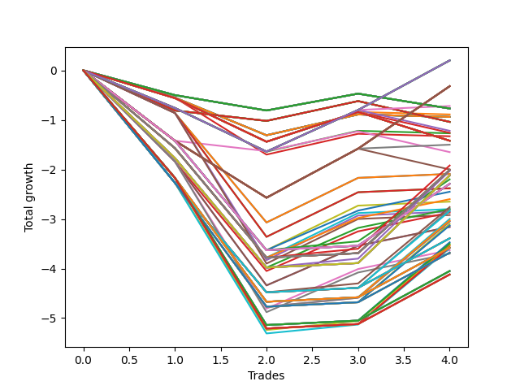

# Long HLT 109_1y 
- Symbol: TSLA
- Date Range: 05/15/2023 - 05/17/2024
- Trading Period: 8:30-12:30
- Number of Trades: 4



| Id. | Name | Win Percent | Profit | Avg Profit / Trade | Avg Time / Trade | Std |      | Name | Win Percent | Profit | Avg Profit / Trade | Avg Time / Trade | Std |
| --- | ---- | ----------- | ------ | ------------------ | ---------------- | --- | ---- | ---- | ----------- | ------ | ------------------ | ---------------- | --- |
| | Sorted By <br> Profit | | | | | | | Sorted By <br> Win Percentage |||||
|0| TP-0.75 180m | 50.00 | 0.20 | 0.05 | 21:30 | 0.87 |     | TP-0.75 180m | 50.00 | 0.20 | 0.05 | 21:30 | 0.87 |
|1| TP-0.75 165m | 50.00 | 0.20 | 0.05 | 21:30 | 0.87 |     | TP-0.75 165m | 50.00 | 0.20 | 0.05 | 21:30 | 0.87 |
|2| TP-0.75 150m | 50.00 | 0.20 | 0.05 | 21:30 | 0.87 |     | TP-0.75 150m | 50.00 | 0.20 | 0.05 | 21:30 | 0.87 |
|3| TP-0.75 135m | 50.00 | 0.20 | 0.05 | 21:30 | 0.87 |     | TP-0.75 135m | 50.00 | 0.20 | 0.05 | 21:30 | 0.87 |
|4| TP-0.75 120m | 50.00 | 0.20 | 0.05 | 21:30 | 0.87 |     | TP-0.75 120m | 50.00 | 0.20 | 0.05 | 21:30 | 0.87 |
|5| TP-0.75 105m | 50.00 | 0.20 | 0.05 | 21:30 | 0.87 |     | TP-0.75 105m | 50.00 | 0.20 | 0.05 | 21:30 | 0.87 |
|6| TP-0.75 90m | 50.00 | 0.20 | 0.05 | 21:30 | 0.87 |     | TP-0.75 90m | 50.00 | 0.20 | 0.05 | 21:30 | 0.87 |
|7| TP-0.75 75m | 50.00 | 0.20 | 0.05 | 21:30 | 0.87 |     | TP-0.75 75m | 50.00 | 0.20 | 0.05 | 21:30 | 0.87 |
|8| TP-0.75 60m | 50.00 | 0.20 | 0.05 | 21:30 | 0.87 |     | TP-0.75 60m | 50.00 | 0.20 | 0.05 | 21:30 | 0.87 |
|9| TP-1 180m | 50.00 | -0.32 | -0.08 | 27:30 | 1.21 |     | TP-1 180m | 50.00 | -0.32 | -0.08 | 27:30 | 1.21 |
|10| TP-1 165m | 50.00 | -0.32 | -0.08 | 27:30 | 1.21 |     | TP-1 165m | 50.00 | -0.32 | -0.08 | 27:30 | 1.21 |
|11| TP-1 150m | 50.00 | -0.32 | -0.08 | 27:30 | 1.21 |     | TP-1 150m | 50.00 | -0.32 | -0.08 | 27:30 | 1.21 |
|12| TP-1 135m | 50.00 | -0.32 | -0.08 | 27:30 | 1.21 |     | TP-1 135m | 50.00 | -0.32 | -0.08 | 27:30 | 1.21 |
|13| TP-1 120m | 50.00 | -0.32 | -0.08 | 27:30 | 1.21 |     | TP-1 120m | 50.00 | -0.32 | -0.08 | 27:30 | 1.21 |
|14| TP-1 105m | 50.00 | -0.32 | -0.08 | 27:30 | 1.21 |     | TP-1 105m | 50.00 | -0.32 | -0.08 | 27:30 | 1.21 |
|15| TP-1 90m | 50.00 | -0.32 | -0.08 | 27:30 | 1.21 |     | TP-1 90m | 50.00 | -0.32 | -0.08 | 27:30 | 1.21 |
|16| TP-1 75m | 50.00 | -0.32 | -0.08 | 27:30 | 1.21 |     | TP-1 75m | 50.00 | -0.32 | -0.08 | 27:30 | 1.21 |
|17| TP-1 60m | 50.00 | -0.32 | -0.08 | 27:30 | 1.21 |     | TP-1 60m | 50.00 | -0.32 | -0.08 | 27:30 | 1.21 |
|18| TP-0.75 45m | 50.00 | -0.72 | -0.18 | 19:00 | 0.70 |     | TP-0.75 45m | 50.00 | -0.72 | -0.18 | 19:00 | 0.70 |
|19| TP-0.25 180m | 25.00 | -0.77 | -0.19 | 04:15 | 0.32 |     | TP-1 45m | 50.00 | -1.50 | -0.37 | 24:45 | 0.97 |
|20| TP-0.25 165m | 25.00 | -0.77 | -0.19 | 04:15 | 0.32 |     | TP-1.5 75m | 50.00 | -1.92 | -0.48 | 54:45 | 1.52 |
|21| TP-0.25 150m | 25.00 | -0.77 | -0.19 | 04:15 | 0.32 |     | TP-1.5 180m | 50.00 | -2.01 | -0.50 | 55:00 | 1.51 |
|22| TP-0.25 135m | 25.00 | -0.77 | -0.19 | 04:15 | 0.32 |     | TP-1.5 165m | 50.00 | -2.01 | -0.50 | 55:00 | 1.51 |
|23| TP-0.25 120m | 25.00 | -0.77 | -0.19 | 04:15 | 0.32 |     | TP-1.5 150m | 50.00 | -2.01 | -0.50 | 55:00 | 1.51 |
|24| TP-0.25 105m | 25.00 | -0.77 | -0.19 | 04:15 | 0.32 |     | TP-1.5 135m | 50.00 | -2.01 | -0.50 | 55:00 | 1.51 |
|25| TP-0.25 90m | 25.00 | -0.77 | -0.19 | 04:15 | 0.32 |     | TP-1.5 120m | 50.00 | -2.01 | -0.50 | 55:00 | 1.51 |
|26| TP-0.25 75m | 25.00 | -0.77 | -0.19 | 04:15 | 0.32 |     | TP-1.5 105m | 50.00 | -2.01 | -0.50 | 55:00 | 1.51 |
|27| TP-0.25 60m | 25.00 | -0.77 | -0.19 | 04:15 | 0.32 |     | TP-1.5 90m | 50.00 | -2.01 | -0.50 | 55:00 | 1.51 |
|28| TP-0.25 45m | 25.00 | -0.77 | -0.19 | 04:15 | 0.32 |     | TP-1.75 75m | 50.00 | -2.03 | -0.51 | 59:30 | 1.59 |
|29| TP-0.25 30m | 25.00 | -0.77 | -0.19 | 04:15 | 0.32 |     | TP-2 45m | 50.00 | -2.09 | -0.52 | 42:30 | 1.16 |
|30| TP-0.25 15m | 25.00 | -0.77 | -0.19 | 04:15 | 0.32 |     | TP-1.75 45m | 50.00 | -2.09 | -0.52 | 42:30 | 1.16 |
|31| TP-0.5 15m | 25.00 | -0.89 | -0.22 | 07:45 | 0.56 |     | TP-1.75 180m | 50.00 | -2.12 | -0.53 | 59:45 | 1.58 |
|32| TP-3 15m | 25.00 | -0.94 | -0.23 | 14:00 | 0.46 |     | TP-1.75 165m | 50.00 | -2.12 | -0.53 | 59:45 | 1.58 |
|33| TP-2.75 15m | 25.00 | -0.94 | -0.23 | 14:00 | 0.46 |     | TP-1.75 150m | 50.00 | -2.12 | -0.53 | 59:45 | 1.58 |
|34| TP-2.5 15m | 25.00 | -0.94 | -0.23 | 14:00 | 0.46 |     | TP-1.75 135m | 50.00 | -2.12 | -0.53 | 59:45 | 1.58 |
|35| TP-2.25 15m | 25.00 | -0.94 | -0.23 | 14:00 | 0.46 |     | TP-1.75 120m | 50.00 | -2.12 | -0.53 | 59:45 | 1.58 |
|36| TP-2 15m | 25.00 | -0.94 | -0.23 | 14:00 | 0.46 |     | TP-1.75 105m | 50.00 | -2.12 | -0.53 | 59:45 | 1.58 |
|37| TP-1.75 15m | 25.00 | -0.94 | -0.23 | 14:00 | 0.46 |     | TP-1.75 90m | 50.00 | -2.12 | -0.53 | 59:45 | 1.58 |
|38| TP-1.5 15m | 25.00 | -0.94 | -0.23 | 14:00 | 0.46 |     | TP-1.25 75m | 50.00 | -2.20 | -0.55 | 51:45 | 1.35 |
|39| TP-1.25 15m | 25.00 | -0.94 | -0.23 | 14:00 | 0.46 |     | TP-1.25 180m | 50.00 | -2.29 | -0.57 | 52:00 | 1.34 |
|40| TP-3 30m | 25.00 | -1.04 | -0.26 | 29:00 | 0.44 |     | TP-1.25 165m | 50.00 | -2.29 | -0.57 | 52:00 | 1.34 |
|41| TP-2.75 30m | 25.00 | -1.04 | -0.26 | 29:00 | 0.44 |     | TP-1.25 150m | 50.00 | -2.29 | -0.57 | 52:00 | 1.34 |
|42| TP-2.5 30m | 25.00 | -1.04 | -0.26 | 29:00 | 0.44 |     | TP-1.25 135m | 50.00 | -2.29 | -0.57 | 52:00 | 1.34 |
|43| TP-2.25 30m | 25.00 | -1.04 | -0.26 | 29:00 | 0.44 |     | TP-1.25 120m | 50.00 | -2.29 | -0.57 | 52:00 | 1.34 |
|44| TP-2 30m | 25.00 | -1.04 | -0.26 | 29:00 | 0.44 |     | TP-1.25 105m | 50.00 | -2.29 | -0.57 | 52:00 | 1.34 |
|45| TP-1.75 30m | 25.00 | -1.04 | -0.26 | 29:00 | 0.44 |     | TP-1.25 90m | 50.00 | -2.29 | -0.57 | 52:00 | 1.34 |
|46| TP-1.5 30m | 25.00 | -1.04 | -0.26 | 29:00 | 0.44 |     | TP-2.5 45m | 50.00 | -2.38 | -0.59 | 42:45 | 1.26 |
|47| TP-0.75 30m | 25.00 | -1.22 | -0.30 | 15:15 | 0.68 |     | TP-2.25 45m | 50.00 | -2.38 | -0.59 | 42:45 | 1.26 |
|48| TP-0.5 30m | 25.00 | -1.26 | -0.31 | 11:30 | 0.55 |     | TP-1.25 60m | 50.00 | -2.45 | -0.61 | 45:30 | 1.24 |
|49| TP-0.75 15m | 25.00 | -1.27 | -0.32 | 10:30 | 0.53 |     | TP-1.5 60m | 50.00 | -2.60 | -0.65 | 48:00 | 1.27 |
|50| TP-1 15m | 25.00 | -1.33 | -0.33 | 13:00 | 0.58 |     | TP-1.25 45m | 50.00 | -2.65 | -0.66 | 38:00 | 1.22 |
|51| TP-0.5 180m | 25.00 | -1.42 | -0.35 | 12:15 | 0.57 |     | TP-2 75m | 50.00 | -2.76 | -0.69 | 65:00 | 1.62 |
|52| TP-0.5 165m | 25.00 | -1.42 | -0.35 | 12:15 | 0.57 |     | TP-1.75 60m | 50.00 | -2.80 | -0.70 | 52:15 | 1.31 |
|53| TP-0.5 150m | 25.00 | -1.42 | -0.35 | 12:15 | 0.57 |     | TP-1.5 45m | 50.00 | -2.80 | -0.70 | 40:30 | 1.25 |
|54| TP-0.5 135m | 25.00 | -1.42 | -0.35 | 12:15 | 0.57 |     | TP-2 90m | 50.00 | -2.81 | -0.70 | 69:00 | 1.63 |
|55| TP-0.5 120m | 25.00 | -1.42 | -0.35 | 12:15 | 0.57 |     | TP-2 105m | 50.00 | -2.84 | -0.71 | 72:45 | 1.61 |
|56| TP-0.5 105m | 25.00 | -1.42 | -0.35 | 12:15 | 0.57 |     | TP-2.75 45m | 50.00 | -2.85 | -0.71 | 43:30 | 1.44 |
|57| TP-0.5 90m | 25.00 | -1.42 | -0.35 | 12:15 | 0.57 |     | TP-2 60m | 50.00 | -2.87 | -0.72 | 53:45 | 1.32 |
|58| TP-0.5 75m | 25.00 | -1.42 | -0.35 | 12:15 | 0.57 |     | TP-3 45m | 50.00 | -2.92 | -0.73 | 44:00 | 1.47 |
|59| TP-0.5 60m | 25.00 | -1.42 | -0.35 | 12:15 | 0.57 |     | TP-2.5 90m | 50.00 | -3.00 | -0.75 | 70:45 | 1.67 |
|60| TP-0.5 45m | 25.00 | -1.42 | -0.35 | 12:15 | 0.57 |     | TP-2.5 105m | 50.00 | -3.03 | -0.76 | 74:30 | 1.66 |
|61| TP-1 45m | 50.00 | -1.50 | -0.37 | 24:45 | 0.97 |     | TP-2.5 75m | 50.00 | -3.05 | -0.76 | 65:15 | 1.69 |
|62| TP-1.25 30m | 25.00 | -1.65 | -0.41 | 28:15 | 0.66 |     | TP-2.25 75m | 50.00 | -3.05 | -0.76 | 65:15 | 1.69 |
|63| TP-1.5 75m | 50.00 | -1.92 | -0.48 | 54:45 | 1.52 |     | TP-2.25 90m | 50.00 | -3.10 | -0.77 | 69:15 | 1.70 |
|64| TP-1 30m | 25.00 | -2.00 | -0.50 | 21:00 | 0.93 |     | TP-2.25 105m | 50.00 | -3.13 | -0.78 | 73:00 | 1.69 |
|65| TP-1.5 180m | 50.00 | -2.01 | -0.50 | 55:00 | 1.51 |     | TP-2.5 60m | 50.00 | -3.16 | -0.79 | 54:00 | 1.41 |
|66| TP-1.5 165m | 50.00 | -2.01 | -0.50 | 55:00 | 1.51 |     | TP-2.25 60m | 50.00 | -3.16 | -0.79 | 54:00 | 1.41 |
|67| TP-1.5 150m | 50.00 | -2.01 | -0.50 | 55:00 | 1.51 |     | TP-2 180m | 50.00 | -3.39 | -0.85 | 76:30 | 1.43 |
|68| TP-1.5 135m | 50.00 | -2.01 | -0.50 | 55:00 | 1.51 |     | TP-2 165m | 50.00 | -3.39 | -0.85 | 76:30 | 1.43 |
|69| TP-1.5 120m | 50.00 | -2.01 | -0.50 | 55:00 | 1.51 |     | TP-2 150m | 50.00 | -3.39 | -0.85 | 76:30 | 1.43 |
|70| TP-1.5 105m | 50.00 | -2.01 | -0.50 | 55:00 | 1.51 |     | TP-2 135m | 50.00 | -3.39 | -0.85 | 76:30 | 1.43 |
|71| TP-1.5 90m | 50.00 | -2.01 | -0.50 | 55:00 | 1.51 |     | TP-2 120m | 50.00 | -3.39 | -0.85 | 76:30 | 1.43 |
|72| TP-1.75 75m | 50.00 | -2.03 | -0.51 | 59:30 | 1.59 |     | TP-2.75 90m | 50.00 | -3.47 | -0.87 | 71:30 | 1.80 |
|73| TP-2 45m | 50.00 | -2.09 | -0.52 | 42:30 | 1.16 |     | TP-2.75 105m | 50.00 | -3.50 | -0.88 | 75:15 | 1.79 |
|74| TP-1.75 45m | 50.00 | -2.09 | -0.52 | 42:30 | 1.16 |     | TP-2.75 75m | 50.00 | -3.52 | -0.88 | 66:00 | 1.82 |
|75| TP-1.75 180m | 50.00 | -2.12 | -0.53 | 59:45 | 1.58 |     | TP-3 90m | 50.00 | -3.54 | -0.88 | 72:00 | 1.82 |
|76| TP-1.75 165m | 50.00 | -2.12 | -0.53 | 59:45 | 1.58 |     | TP-3 105m | 50.00 | -3.57 | -0.89 | 75:45 | 1.81 |
|77| TP-1.75 150m | 50.00 | -2.12 | -0.53 | 59:45 | 1.58 |     | TP-2.5 180m | 50.00 | -3.58 | -0.90 | 78:15 | 1.48 |
|78| TP-1.75 135m | 50.00 | -2.12 | -0.53 | 59:45 | 1.58 |     | TP-2.5 165m | 50.00 | -3.58 | -0.90 | 78:15 | 1.48 |
|79| TP-1.75 120m | 50.00 | -2.12 | -0.53 | 59:45 | 1.58 |     | TP-2.5 150m | 50.00 | -3.58 | -0.90 | 78:15 | 1.48 |
|80| TP-1.75 105m | 50.00 | -2.12 | -0.53 | 59:45 | 1.58 |     | TP-2.5 135m | 50.00 | -3.58 | -0.90 | 78:15 | 1.48 |
|81| TP-1.75 90m | 50.00 | -2.12 | -0.53 | 59:45 | 1.58 |     | TP-2.5 120m | 50.00 | -3.58 | -0.90 | 78:15 | 1.48 |
|82| TP-1.25 75m | 50.00 | -2.20 | -0.55 | 51:45 | 1.35 |     | TP-3 75m | 50.00 | -3.59 | -0.90 | 66:30 | 1.84 |
|83| TP-1.25 180m | 50.00 | -2.29 | -0.57 | 52:00 | 1.34 |     | TP-2.75 60m | 50.00 | -3.63 | -0.91 | 54:45 | 1.56 |
|84| TP-1.25 165m | 50.00 | -2.29 | -0.57 | 52:00 | 1.34 |     | TP-2.25 180m | 50.00 | -3.68 | -0.92 | 76:45 | 1.50 |
|85| TP-1.25 150m | 50.00 | -2.29 | -0.57 | 52:00 | 1.34 |     | TP-2.25 165m | 50.00 | -3.68 | -0.92 | 76:45 | 1.50 |
|86| TP-1.25 135m | 50.00 | -2.29 | -0.57 | 52:00 | 1.34 |     | TP-2.25 150m | 50.00 | -3.68 | -0.92 | 76:45 | 1.50 |
|87| TP-1.25 120m | 50.00 | -2.29 | -0.57 | 52:00 | 1.34 |     | TP-2.25 135m | 50.00 | -3.68 | -0.92 | 76:45 | 1.50 |
|88| TP-1.25 105m | 50.00 | -2.29 | -0.57 | 52:00 | 1.34 |     | TP-2.25 120m | 50.00 | -3.68 | -0.92 | 76:45 | 1.50 |
|89| TP-1.25 90m | 50.00 | -2.29 | -0.57 | 52:00 | 1.34 |     | TP-3 60m | 50.00 | -3.70 | -0.92 | 55:15 | 1.58 |
|90| TP-2.5 45m | 50.00 | -2.38 | -0.59 | 42:45 | 1.26 |     | TP-2.75 180m | 50.00 | -4.05 | -1.01 | 79:00 | 1.62 |
|91| TP-2.25 45m | 50.00 | -2.38 | -0.59 | 42:45 | 1.26 |     | TP-2.75 165m | 50.00 | -4.05 | -1.01 | 79:00 | 1.62 |
|92| TP-1.25 60m | 50.00 | -2.45 | -0.61 | 45:30 | 1.24 |     | TP-2.75 150m | 50.00 | -4.05 | -1.01 | 79:00 | 1.62 |
|93| TP-1.5 60m | 50.00 | -2.60 | -0.65 | 48:00 | 1.27 |     | TP-2.75 135m | 50.00 | -4.05 | -1.01 | 79:00 | 1.62 |
|94| TP-1.25 45m | 50.00 | -2.65 | -0.66 | 38:00 | 1.22 |     | TP-2.75 120m | 50.00 | -4.05 | -1.01 | 79:00 | 1.62 |
|95| TP-2 75m | 50.00 | -2.76 | -0.69 | 65:00 | 1.62 |     | TP-3 180m | 50.00 | -4.12 | -1.03 | 79:30 | 1.64 |
|96| TP-1.75 60m | 50.00 | -2.80 | -0.70 | 52:15 | 1.31 |     | TP-3 165m | 50.00 | -4.12 | -1.03 | 79:30 | 1.64 |
|97| TP-1.5 45m | 50.00 | -2.80 | -0.70 | 40:30 | 1.25 |     | TP-3 150m | 50.00 | -4.12 | -1.03 | 79:30 | 1.64 |
|98| TP-2 90m | 50.00 | -2.81 | -0.70 | 69:00 | 1.63 |     | TP-3 135m | 50.00 | -4.12 | -1.03 | 79:30 | 1.64 |
|99| TP-2 105m | 50.00 | -2.84 | -0.71 | 72:45 | 1.61 |     | TP-3 120m | 50.00 | -4.12 | -1.03 | 79:30 | 1.64 |
|100| TP-2.75 45m | 50.00 | -2.85 | -0.71 | 43:30 | 1.44 |     | TP-0.25 180m | 25.00 | -0.77 | -0.19 | 04:15 | 0.32 |
|101| TP-2 60m | 50.00 | -2.87 | -0.72 | 53:45 | 1.32 |     | TP-0.25 165m | 25.00 | -0.77 | -0.19 | 04:15 | 0.32 |
|102| TP-3 45m | 50.00 | -2.92 | -0.73 | 44:00 | 1.47 |     | TP-0.25 150m | 25.00 | -0.77 | -0.19 | 04:15 | 0.32 |
|103| TP-2.5 90m | 50.00 | -3.00 | -0.75 | 70:45 | 1.67 |     | TP-0.25 135m | 25.00 | -0.77 | -0.19 | 04:15 | 0.32 |
|104| TP-2.5 105m | 50.00 | -3.03 | -0.76 | 74:30 | 1.66 |     | TP-0.25 120m | 25.00 | -0.77 | -0.19 | 04:15 | 0.32 |
|105| TP-2.5 75m | 50.00 | -3.05 | -0.76 | 65:15 | 1.69 |     | TP-0.25 105m | 25.00 | -0.77 | -0.19 | 04:15 | 0.32 |
|106| TP-2.25 75m | 50.00 | -3.05 | -0.76 | 65:15 | 1.69 |     | TP-0.25 90m | 25.00 | -0.77 | -0.19 | 04:15 | 0.32 |
|107| TP-2.25 90m | 50.00 | -3.10 | -0.77 | 69:15 | 1.70 |     | TP-0.25 75m | 25.00 | -0.77 | -0.19 | 04:15 | 0.32 |
|108| TP-2.25 105m | 50.00 | -3.13 | -0.78 | 73:00 | 1.69 |     | TP-0.25 60m | 25.00 | -0.77 | -0.19 | 04:15 | 0.32 |
|109| TP-2.5 60m | 50.00 | -3.16 | -0.79 | 54:00 | 1.41 |     | TP-0.25 45m | 25.00 | -0.77 | -0.19 | 04:15 | 0.32 |
|110| TP-2.25 60m | 50.00 | -3.16 | -0.79 | 54:00 | 1.41 |     | TP-0.25 30m | 25.00 | -0.77 | -0.19 | 04:15 | 0.32 |
|111| TP-2 180m | 50.00 | -3.39 | -0.85 | 76:30 | 1.43 |     | TP-0.25 15m | 25.00 | -0.77 | -0.19 | 04:15 | 0.32 |
|112| TP-2 165m | 50.00 | -3.39 | -0.85 | 76:30 | 1.43 |     | TP-0.5 15m | 25.00 | -0.89 | -0.22 | 07:45 | 0.56 |
|113| TP-2 150m | 50.00 | -3.39 | -0.85 | 76:30 | 1.43 |     | TP-3 15m | 25.00 | -0.94 | -0.23 | 14:00 | 0.46 |
|114| TP-2 135m | 50.00 | -3.39 | -0.85 | 76:30 | 1.43 |     | TP-2.75 15m | 25.00 | -0.94 | -0.23 | 14:00 | 0.46 |
|115| TP-2 120m | 50.00 | -3.39 | -0.85 | 76:30 | 1.43 |     | TP-2.5 15m | 25.00 | -0.94 | -0.23 | 14:00 | 0.46 |
|116| TP-2.75 90m | 50.00 | -3.47 | -0.87 | 71:30 | 1.80 |     | TP-2.25 15m | 25.00 | -0.94 | -0.23 | 14:00 | 0.46 |
|117| TP-2.75 105m | 50.00 | -3.50 | -0.88 | 75:15 | 1.79 |     | TP-2 15m | 25.00 | -0.94 | -0.23 | 14:00 | 0.46 |
|118| TP-2.75 75m | 50.00 | -3.52 | -0.88 | 66:00 | 1.82 |     | TP-1.75 15m | 25.00 | -0.94 | -0.23 | 14:00 | 0.46 |
|119| TP-3 90m | 50.00 | -3.54 | -0.88 | 72:00 | 1.82 |     | TP-1.5 15m | 25.00 | -0.94 | -0.23 | 14:00 | 0.46 |
|120| TP-3 105m | 50.00 | -3.57 | -0.89 | 75:45 | 1.81 |     | TP-1.25 15m | 25.00 | -0.94 | -0.23 | 14:00 | 0.46 |
|121| TP-2.5 180m | 50.00 | -3.58 | -0.90 | 78:15 | 1.48 |     | TP-3 30m | 25.00 | -1.04 | -0.26 | 29:00 | 0.44 |
|122| TP-2.5 165m | 50.00 | -3.58 | -0.90 | 78:15 | 1.48 |     | TP-2.75 30m | 25.00 | -1.04 | -0.26 | 29:00 | 0.44 |
|123| TP-2.5 150m | 50.00 | -3.58 | -0.90 | 78:15 | 1.48 |     | TP-2.5 30m | 25.00 | -1.04 | -0.26 | 29:00 | 0.44 |
|124| TP-2.5 135m | 50.00 | -3.58 | -0.90 | 78:15 | 1.48 |     | TP-2.25 30m | 25.00 | -1.04 | -0.26 | 29:00 | 0.44 |
|125| TP-2.5 120m | 50.00 | -3.58 | -0.90 | 78:15 | 1.48 |     | TP-2 30m | 25.00 | -1.04 | -0.26 | 29:00 | 0.44 |
|126| TP-3 75m | 50.00 | -3.59 | -0.90 | 66:30 | 1.84 |     | TP-1.75 30m | 25.00 | -1.04 | -0.26 | 29:00 | 0.44 |
|127| TP-2.75 60m | 50.00 | -3.63 | -0.91 | 54:45 | 1.56 |     | TP-1.5 30m | 25.00 | -1.04 | -0.26 | 29:00 | 0.44 |
|128| TP-2.25 180m | 50.00 | -3.68 | -0.92 | 76:45 | 1.50 |     | TP-0.75 30m | 25.00 | -1.22 | -0.30 | 15:15 | 0.68 |
|129| TP-2.25 165m | 50.00 | -3.68 | -0.92 | 76:45 | 1.50 |     | TP-0.5 30m | 25.00 | -1.26 | -0.31 | 11:30 | 0.55 |
|130| TP-2.25 150m | 50.00 | -3.68 | -0.92 | 76:45 | 1.50 |     | TP-0.75 15m | 25.00 | -1.27 | -0.32 | 10:30 | 0.53 |
|131| TP-2.25 135m | 50.00 | -3.68 | -0.92 | 76:45 | 1.50 |     | TP-1 15m | 25.00 | -1.33 | -0.33 | 13:00 | 0.58 |
|132| TP-2.25 120m | 50.00 | -3.68 | -0.92 | 76:45 | 1.50 |     | TP-0.5 180m | 25.00 | -1.42 | -0.35 | 12:15 | 0.57 |
|133| TP-3 60m | 50.00 | -3.70 | -0.92 | 55:15 | 1.58 |     | TP-0.5 165m | 25.00 | -1.42 | -0.35 | 12:15 | 0.57 |
|134| TP-2.75 180m | 50.00 | -4.05 | -1.01 | 79:00 | 1.62 |     | TP-0.5 150m | 25.00 | -1.42 | -0.35 | 12:15 | 0.57 |
|135| TP-2.75 165m | 50.00 | -4.05 | -1.01 | 79:00 | 1.62 |     | TP-0.5 135m | 25.00 | -1.42 | -0.35 | 12:15 | 0.57 |
|136| TP-2.75 150m | 50.00 | -4.05 | -1.01 | 79:00 | 1.62 |     | TP-0.5 120m | 25.00 | -1.42 | -0.35 | 12:15 | 0.57 |
|137| TP-2.75 135m | 50.00 | -4.05 | -1.01 | 79:00 | 1.62 |     | TP-0.5 105m | 25.00 | -1.42 | -0.35 | 12:15 | 0.57 |
|138| TP-2.75 120m | 50.00 | -4.05 | -1.01 | 79:00 | 1.62 |     | TP-0.5 90m | 25.00 | -1.42 | -0.35 | 12:15 | 0.57 |
|139| TP-3 180m | 50.00 | -4.12 | -1.03 | 79:30 | 1.64 |     | TP-0.5 75m | 25.00 | -1.42 | -0.35 | 12:15 | 0.57 |
|140| TP-3 165m | 50.00 | -4.12 | -1.03 | 79:30 | 1.64 |     | TP-0.5 60m | 25.00 | -1.42 | -0.35 | 12:15 | 0.57 |
|141| TP-3 150m | 50.00 | -4.12 | -1.03 | 79:30 | 1.64 |     | TP-0.5 45m | 25.00 | -1.42 | -0.35 | 12:15 | 0.57 |
|142| TP-3 135m | 50.00 | -4.12 | -1.03 | 79:30 | 1.64 |     | TP-1.25 30m | 25.00 | -1.65 | -0.41 | 28:15 | 0.66 |
|143| TP-3 120m | 50.00 | -4.12 | -1.03 | 79:30 | 1.64 |     | TP-1 30m | 25.00 | -2.00 | -0.50 | 21:00 | 0.93 |

### Test TP-0.25 15m
* Take Profit of 0.25 Point
* 0.25 Stoploss
* Results:
```
Total Trades: 4
Percent Up: 25.00
Percent Down: 75.00
Total Points Moved Up: -0.77
Potential Profit: -385.00
Total Points Ups: 0.34 Count Ups: 1
Total Points Downs: -1.11 Count Downs: 3
```

<details><summary>Trades</summary>

<code>In: 2023-08-04 11:30:00		Out: 2023-08-04 11:37:00		Total Position Time: 07:00		Total Move Up: -0.50		Total to Date: -0.50</code> <br />
<code>In: 2023-11-09 09:25:00		Out: 2023-11-09 09:28:00		Total Position Time: 03:00		Total Move Up: -0.31		Total to Date: -0.81</code> <br />
<code>In: 2023-12-22 11:35:00		Out: 2023-12-22 11:38:00		Total Position Time: 03:00		Total Move Up: 0.34		Total to Date: -0.47</code> <br />
<code>In: 2024-02-27 10:05:00		Out: 2024-02-27 10:09:00		Total Position Time: 04:00		Total Move Up: -0.30		Total to Date: -0.77</code> <br />


</details>

### Test TP-0.5 15m
* Take Profit of 0.5 Point
* 0.5 Stoploss
* Results:
```
Total Trades: 4
Percent Up: 25.00
Percent Down: 75.00
Total Points Moved Up: -0.89
Potential Profit: -445.00
Total Points Ups: 0.60 Count Ups: 1
Total Points Downs: -1.49 Count Downs: 3
```

<details><summary>Trades</summary>

<code>In: 2023-08-04 11:30:00		Out: 2023-08-04 11:39:00		Total Position Time: 09:00		Total Move Up: -0.56		Total to Date: -0.56</code> <br />
<code>In: 2023-11-09 09:25:00		Out: 2023-11-09 09:29:00		Total Position Time: 04:00		Total Move Up: -0.88		Total to Date: -1.44</code> <br />
<code>In: 2023-12-22 11:35:00		Out: 2023-12-22 11:39:00		Total Position Time: 04:00		Total Move Up: 0.60		Total to Date: -0.84</code> <br />
<code>In: 2024-02-27 10:05:00		Out: 2024-02-27 10:19:00		Total Position Time: 14:00		Total Move Up: -0.05		Total to Date: -0.89</code> <br />


</details>

### Test TP-0.75 15m
* Take Profit of 0.75 Point
* 0.75 Stoploss
* Results:
```
Total Trades: 4
Percent Up: 25.00
Percent Down: 75.00
Total Points Moved Up: -1.27
Potential Profit: -635.00
Total Points Ups: 0.42 Count Ups: 1
Total Points Downs: -1.69 Count Downs: 3
```

<details><summary>Trades</summary>

<code>In: 2023-08-04 11:30:00		Out: 2023-08-04 11:40:00		Total Position Time: 10:00		Total Move Up: -0.76		Total to Date: -0.76</code> <br />
<code>In: 2023-11-09 09:25:00		Out: 2023-11-09 09:29:00		Total Position Time: 04:00		Total Move Up: -0.88		Total to Date: -1.64</code> <br />
<code>In: 2023-12-22 11:35:00		Out: 2023-12-22 11:49:00		Total Position Time: 14:00		Total Move Up: 0.42		Total to Date: -1.22</code> <br />
<code>In: 2024-02-27 10:05:00		Out: 2024-02-27 10:19:00		Total Position Time: 14:00		Total Move Up: -0.05		Total to Date: -1.27</code> <br />


</details>

### Test TP-1 15m
* Take Profit of 1 Point
* 1 Stoploss
* Results:
```
Total Trades: 4
Percent Up: 25.00
Percent Down: 75.00
Total Points Moved Up: -1.33
Potential Profit: -665.00
Total Points Ups: 0.42 Count Ups: 1
Total Points Downs: -1.75 Count Downs: 3
```

<details><summary>Trades</summary>

<code>In: 2023-08-04 11:30:00		Out: 2023-08-04 11:44:00		Total Position Time: 14:00		Total Move Up: -0.55		Total to Date: -0.55</code> <br />
<code>In: 2023-11-09 09:25:00		Out: 2023-11-09 09:35:00		Total Position Time: 10:00		Total Move Up: -1.15		Total to Date: -1.70</code> <br />
<code>In: 2023-12-22 11:35:00		Out: 2023-12-22 11:49:00		Total Position Time: 14:00		Total Move Up: 0.42		Total to Date: -1.28</code> <br />
<code>In: 2024-02-27 10:05:00		Out: 2024-02-27 10:19:00		Total Position Time: 14:00		Total Move Up: -0.05		Total to Date: -1.33</code> <br />


</details>

### Test TP-1.25 15m
* Take Profit of 1.25 Point
* 1.25 Stoploss
* Results:
```
Total Trades: 4
Percent Up: 25.00
Percent Down: 75.00
Total Points Moved Up: -0.94
Potential Profit: -470.00
Total Points Ups: 0.42 Count Ups: 1
Total Points Downs: -1.36 Count Downs: 3
```

<details><summary>Trades</summary>

<code>In: 2023-08-04 11:30:00		Out: 2023-08-04 11:44:00		Total Position Time: 14:00		Total Move Up: -0.55		Total to Date: -0.55</code> <br />
<code>In: 2023-11-09 09:25:00		Out: 2023-11-09 09:39:00		Total Position Time: 14:00		Total Move Up: -0.76		Total to Date: -1.31</code> <br />
<code>In: 2023-12-22 11:35:00		Out: 2023-12-22 11:49:00		Total Position Time: 14:00		Total Move Up: 0.42		Total to Date: -0.89</code> <br />
<code>In: 2024-02-27 10:05:00		Out: 2024-02-27 10:19:00		Total Position Time: 14:00		Total Move Up: -0.05		Total to Date: -0.94</code> <br />


</details>

### Test TP-1.5 15m
* Take Profit of 1.5 Point
* 1.5 Stoploss
* Results:
```
Total Trades: 4
Percent Up: 25.00
Percent Down: 75.00
Total Points Moved Up: -0.94
Potential Profit: -470.00
Total Points Ups: 0.42 Count Ups: 1
Total Points Downs: -1.36 Count Downs: 3
```

<details><summary>Trades</summary>

<code>In: 2023-08-04 11:30:00		Out: 2023-08-04 11:44:00		Total Position Time: 14:00		Total Move Up: -0.55		Total to Date: -0.55</code> <br />
<code>In: 2023-11-09 09:25:00		Out: 2023-11-09 09:39:00		Total Position Time: 14:00		Total Move Up: -0.76		Total to Date: -1.31</code> <br />
<code>In: 2023-12-22 11:35:00		Out: 2023-12-22 11:49:00		Total Position Time: 14:00		Total Move Up: 0.42		Total to Date: -0.89</code> <br />
<code>In: 2024-02-27 10:05:00		Out: 2024-02-27 10:19:00		Total Position Time: 14:00		Total Move Up: -0.05		Total to Date: -0.94</code> <br />


</details>

### Test TP-1.75 15m
* Take Profit of 1.75 Point
* 1.75 Stoploss
* Results:
```
Total Trades: 4
Percent Up: 25.00
Percent Down: 75.00
Total Points Moved Up: -0.94
Potential Profit: -470.00
Total Points Ups: 0.42 Count Ups: 1
Total Points Downs: -1.36 Count Downs: 3
```

<details><summary>Trades</summary>

<code>In: 2023-08-04 11:30:00		Out: 2023-08-04 11:44:00		Total Position Time: 14:00		Total Move Up: -0.55		Total to Date: -0.55</code> <br />
<code>In: 2023-11-09 09:25:00		Out: 2023-11-09 09:39:00		Total Position Time: 14:00		Total Move Up: -0.76		Total to Date: -1.31</code> <br />
<code>In: 2023-12-22 11:35:00		Out: 2023-12-22 11:49:00		Total Position Time: 14:00		Total Move Up: 0.42		Total to Date: -0.89</code> <br />
<code>In: 2024-02-27 10:05:00		Out: 2024-02-27 10:19:00		Total Position Time: 14:00		Total Move Up: -0.05		Total to Date: -0.94</code> <br />


</details>

### Test TP-2 15m
* Take Profit of 2 Point
* 2 Stoploss
* Results:
```
Total Trades: 4
Percent Up: 25.00
Percent Down: 75.00
Total Points Moved Up: -0.94
Potential Profit: -470.00
Total Points Ups: 0.42 Count Ups: 1
Total Points Downs: -1.36 Count Downs: 3
```

<details><summary>Trades</summary>

<code>In: 2023-08-04 11:30:00		Out: 2023-08-04 11:44:00		Total Position Time: 14:00		Total Move Up: -0.55		Total to Date: -0.55</code> <br />
<code>In: 2023-11-09 09:25:00		Out: 2023-11-09 09:39:00		Total Position Time: 14:00		Total Move Up: -0.76		Total to Date: -1.31</code> <br />
<code>In: 2023-12-22 11:35:00		Out: 2023-12-22 11:49:00		Total Position Time: 14:00		Total Move Up: 0.42		Total to Date: -0.89</code> <br />
<code>In: 2024-02-27 10:05:00		Out: 2024-02-27 10:19:00		Total Position Time: 14:00		Total Move Up: -0.05		Total to Date: -0.94</code> <br />


</details>

### Test TP-2.25 15m
* Take Profit of 2.25 Point
* 2.25 Stoploss
* Results:
```
Total Trades: 4
Percent Up: 25.00
Percent Down: 75.00
Total Points Moved Up: -0.94
Potential Profit: -470.00
Total Points Ups: 0.42 Count Ups: 1
Total Points Downs: -1.36 Count Downs: 3
```

<details><summary>Trades</summary>

<code>In: 2023-08-04 11:30:00		Out: 2023-08-04 11:44:00		Total Position Time: 14:00		Total Move Up: -0.55		Total to Date: -0.55</code> <br />
<code>In: 2023-11-09 09:25:00		Out: 2023-11-09 09:39:00		Total Position Time: 14:00		Total Move Up: -0.76		Total to Date: -1.31</code> <br />
<code>In: 2023-12-22 11:35:00		Out: 2023-12-22 11:49:00		Total Position Time: 14:00		Total Move Up: 0.42		Total to Date: -0.89</code> <br />
<code>In: 2024-02-27 10:05:00		Out: 2024-02-27 10:19:00		Total Position Time: 14:00		Total Move Up: -0.05		Total to Date: -0.94</code> <br />


</details>

### Test TP-2.5 15m
* Take Profit of 2.5 Point
* 2.5 Stoploss
* Results:
```
Total Trades: 4
Percent Up: 25.00
Percent Down: 75.00
Total Points Moved Up: -0.94
Potential Profit: -470.00
Total Points Ups: 0.42 Count Ups: 1
Total Points Downs: -1.36 Count Downs: 3
```

<details><summary>Trades</summary>

<code>In: 2023-08-04 11:30:00		Out: 2023-08-04 11:44:00		Total Position Time: 14:00		Total Move Up: -0.55		Total to Date: -0.55</code> <br />
<code>In: 2023-11-09 09:25:00		Out: 2023-11-09 09:39:00		Total Position Time: 14:00		Total Move Up: -0.76		Total to Date: -1.31</code> <br />
<code>In: 2023-12-22 11:35:00		Out: 2023-12-22 11:49:00		Total Position Time: 14:00		Total Move Up: 0.42		Total to Date: -0.89</code> <br />
<code>In: 2024-02-27 10:05:00		Out: 2024-02-27 10:19:00		Total Position Time: 14:00		Total Move Up: -0.05		Total to Date: -0.94</code> <br />


</details>

### Test TP-2.75 15m
* Take Profit of 2.75 Point
* 2.75 Stoploss
* Results:
```
Total Trades: 4
Percent Up: 25.00
Percent Down: 75.00
Total Points Moved Up: -0.94
Potential Profit: -470.00
Total Points Ups: 0.42 Count Ups: 1
Total Points Downs: -1.36 Count Downs: 3
```

<details><summary>Trades</summary>

<code>In: 2023-08-04 11:30:00		Out: 2023-08-04 11:44:00		Total Position Time: 14:00		Total Move Up: -0.55		Total to Date: -0.55</code> <br />
<code>In: 2023-11-09 09:25:00		Out: 2023-11-09 09:39:00		Total Position Time: 14:00		Total Move Up: -0.76		Total to Date: -1.31</code> <br />
<code>In: 2023-12-22 11:35:00		Out: 2023-12-22 11:49:00		Total Position Time: 14:00		Total Move Up: 0.42		Total to Date: -0.89</code> <br />
<code>In: 2024-02-27 10:05:00		Out: 2024-02-27 10:19:00		Total Position Time: 14:00		Total Move Up: -0.05		Total to Date: -0.94</code> <br />


</details>

### Test TP-3 15m
* Take Profit of 3 Point
* 3 Stoploss
* Results:
```
Total Trades: 4
Percent Up: 25.00
Percent Down: 75.00
Total Points Moved Up: -0.94
Potential Profit: -470.00
Total Points Ups: 0.42 Count Ups: 1
Total Points Downs: -1.36 Count Downs: 3
```

<details><summary>Trades</summary>

<code>In: 2023-08-04 11:30:00		Out: 2023-08-04 11:44:00		Total Position Time: 14:00		Total Move Up: -0.55		Total to Date: -0.55</code> <br />
<code>In: 2023-11-09 09:25:00		Out: 2023-11-09 09:39:00		Total Position Time: 14:00		Total Move Up: -0.76		Total to Date: -1.31</code> <br />
<code>In: 2023-12-22 11:35:00		Out: 2023-12-22 11:49:00		Total Position Time: 14:00		Total Move Up: 0.42		Total to Date: -0.89</code> <br />
<code>In: 2024-02-27 10:05:00		Out: 2024-02-27 10:19:00		Total Position Time: 14:00		Total Move Up: -0.05		Total to Date: -0.94</code> <br />


</details>

### Test TP-0.25 30m
* Take Profit of 0.25 Point
* 0.25 Stoploss
* Results:
```
Total Trades: 4
Percent Up: 25.00
Percent Down: 75.00
Total Points Moved Up: -0.77
Potential Profit: -385.00
Total Points Ups: 0.34 Count Ups: 1
Total Points Downs: -1.11 Count Downs: 3
```

<details><summary>Trades</summary>

<code>In: 2023-08-04 11:30:00		Out: 2023-08-04 11:37:00		Total Position Time: 07:00		Total Move Up: -0.50		Total to Date: -0.50</code> <br />
<code>In: 2023-11-09 09:25:00		Out: 2023-11-09 09:28:00		Total Position Time: 03:00		Total Move Up: -0.31		Total to Date: -0.81</code> <br />
<code>In: 2023-12-22 11:35:00		Out: 2023-12-22 11:38:00		Total Position Time: 03:00		Total Move Up: 0.34		Total to Date: -0.47</code> <br />
<code>In: 2024-02-27 10:05:00		Out: 2024-02-27 10:09:00		Total Position Time: 04:00		Total Move Up: -0.30		Total to Date: -0.77</code> <br />


</details>

### Test TP-0.5 30m
* Take Profit of 0.5 Point
* 0.5 Stoploss
* Results:
```
Total Trades: 4
Percent Up: 25.00
Percent Down: 75.00
Total Points Moved Up: -1.26
Potential Profit: -630.00
Total Points Ups: 0.60 Count Ups: 1
Total Points Downs: -1.86 Count Downs: 3
```

<details><summary>Trades</summary>

<code>In: 2023-08-04 11:30:00		Out: 2023-08-04 11:39:00		Total Position Time: 09:00		Total Move Up: -0.56		Total to Date: -0.56</code> <br />
<code>In: 2023-11-09 09:25:00		Out: 2023-11-09 09:29:00		Total Position Time: 04:00		Total Move Up: -0.88		Total to Date: -1.44</code> <br />
<code>In: 2023-12-22 11:35:00		Out: 2023-12-22 11:39:00		Total Position Time: 04:00		Total Move Up: 0.60		Total to Date: -0.84</code> <br />
<code>In: 2024-02-27 10:05:00		Out: 2024-02-27 10:34:00		Total Position Time: 29:00		Total Move Up: -0.42		Total to Date: -1.26</code> <br />


</details>

### Test TP-0.75 30m
* Take Profit of 0.75 Point
* 0.75 Stoploss
* Results:
```
Total Trades: 4
Percent Up: 25.00
Percent Down: 75.00
Total Points Moved Up: -1.22
Potential Profit: -610.00
Total Points Ups: 0.84 Count Ups: 1
Total Points Downs: -2.06 Count Downs: 3
```

<details><summary>Trades</summary>

<code>In: 2023-08-04 11:30:00		Out: 2023-08-04 11:40:00		Total Position Time: 10:00		Total Move Up: -0.76		Total to Date: -0.76</code> <br />
<code>In: 2023-11-09 09:25:00		Out: 2023-11-09 09:29:00		Total Position Time: 04:00		Total Move Up: -0.88		Total to Date: -1.64</code> <br />
<code>In: 2023-12-22 11:35:00		Out: 2023-12-22 11:53:00		Total Position Time: 18:00		Total Move Up: 0.84		Total to Date: -0.80</code> <br />
<code>In: 2024-02-27 10:05:00		Out: 2024-02-27 10:34:00		Total Position Time: 29:00		Total Move Up: -0.42		Total to Date: -1.22</code> <br />


</details>

### Test TP-1 30m
* Take Profit of 1 Point
* 1 Stoploss
* Results:
```
Total Trades: 4
Percent Up: 25.00
Percent Down: 75.00
Total Points Moved Up: -2.00
Potential Profit: -1000.00
Total Points Ups: 0.99 Count Ups: 1
Total Points Downs: -2.99 Count Downs: 3
```

<details><summary>Trades</summary>

<code>In: 2023-08-04 11:30:00		Out: 2023-08-04 11:56:00		Total Position Time: 26:00		Total Move Up: -1.42		Total to Date: -1.42</code> <br />
<code>In: 2023-11-09 09:25:00		Out: 2023-11-09 09:35:00		Total Position Time: 10:00		Total Move Up: -1.15		Total to Date: -2.57</code> <br />
<code>In: 2023-12-22 11:35:00		Out: 2023-12-22 11:54:00		Total Position Time: 19:00		Total Move Up: 0.99		Total to Date: -1.58</code> <br />
<code>In: 2024-02-27 10:05:00		Out: 2024-02-27 10:34:00		Total Position Time: 29:00		Total Move Up: -0.42		Total to Date: -2.00</code> <br />


</details>

### Test TP-1.25 30m
* Take Profit of 1.25 Point
* 1.25 Stoploss
* Results:
```
Total Trades: 4
Percent Up: 25.00
Percent Down: 75.00
Total Points Moved Up: -1.65
Potential Profit: -825.00
Total Points Ups: 0.40 Count Ups: 1
Total Points Downs: -2.05 Count Downs: 3
```

<details><summary>Trades</summary>

<code>In: 2023-08-04 11:30:00		Out: 2023-08-04 11:56:00		Total Position Time: 26:00		Total Move Up: -1.42		Total to Date: -1.42</code> <br />
<code>In: 2023-11-09 09:25:00		Out: 2023-11-09 09:54:00		Total Position Time: 29:00		Total Move Up: -0.21		Total to Date: -1.63</code> <br />
<code>In: 2023-12-22 11:35:00		Out: 2023-12-22 12:04:00		Total Position Time: 29:00		Total Move Up: 0.40		Total to Date: -1.23</code> <br />
<code>In: 2024-02-27 10:05:00		Out: 2024-02-27 10:34:00		Total Position Time: 29:00		Total Move Up: -0.42		Total to Date: -1.65</code> <br />


</details>

### Test TP-1.5 30m
* Take Profit of 1.5 Point
* 1.5 Stoploss
* Results:
```
Total Trades: 4
Percent Up: 25.00
Percent Down: 75.00
Total Points Moved Up: -1.04
Potential Profit: -520.00
Total Points Ups: 0.40 Count Ups: 1
Total Points Downs: -1.44 Count Downs: 3
```

<details><summary>Trades</summary>

<code>In: 2023-08-04 11:30:00		Out: 2023-08-04 11:59:00		Total Position Time: 29:00		Total Move Up: -0.81		Total to Date: -0.81</code> <br />
<code>In: 2023-11-09 09:25:00		Out: 2023-11-09 09:54:00		Total Position Time: 29:00		Total Move Up: -0.21		Total to Date: -1.02</code> <br />
<code>In: 2023-12-22 11:35:00		Out: 2023-12-22 12:04:00		Total Position Time: 29:00		Total Move Up: 0.40		Total to Date: -0.62</code> <br />
<code>In: 2024-02-27 10:05:00		Out: 2024-02-27 10:34:00		Total Position Time: 29:00		Total Move Up: -0.42		Total to Date: -1.04</code> <br />


</details>

### Test TP-1.75 30m
* Take Profit of 1.75 Point
* 1.75 Stoploss
* Results:
```
Total Trades: 4
Percent Up: 25.00
Percent Down: 75.00
Total Points Moved Up: -1.04
Potential Profit: -520.00
Total Points Ups: 0.40 Count Ups: 1
Total Points Downs: -1.44 Count Downs: 3
```

<details><summary>Trades</summary>

<code>In: 2023-08-04 11:30:00		Out: 2023-08-04 11:59:00		Total Position Time: 29:00		Total Move Up: -0.81		Total to Date: -0.81</code> <br />
<code>In: 2023-11-09 09:25:00		Out: 2023-11-09 09:54:00		Total Position Time: 29:00		Total Move Up: -0.21		Total to Date: -1.02</code> <br />
<code>In: 2023-12-22 11:35:00		Out: 2023-12-22 12:04:00		Total Position Time: 29:00		Total Move Up: 0.40		Total to Date: -0.62</code> <br />
<code>In: 2024-02-27 10:05:00		Out: 2024-02-27 10:34:00		Total Position Time: 29:00		Total Move Up: -0.42		Total to Date: -1.04</code> <br />


</details>

### Test TP-2 30m
* Take Profit of 2 Point
* 2 Stoploss
* Results:
```
Total Trades: 4
Percent Up: 25.00
Percent Down: 75.00
Total Points Moved Up: -1.04
Potential Profit: -520.00
Total Points Ups: 0.40 Count Ups: 1
Total Points Downs: -1.44 Count Downs: 3
```

<details><summary>Trades</summary>

<code>In: 2023-08-04 11:30:00		Out: 2023-08-04 11:59:00		Total Position Time: 29:00		Total Move Up: -0.81		Total to Date: -0.81</code> <br />
<code>In: 2023-11-09 09:25:00		Out: 2023-11-09 09:54:00		Total Position Time: 29:00		Total Move Up: -0.21		Total to Date: -1.02</code> <br />
<code>In: 2023-12-22 11:35:00		Out: 2023-12-22 12:04:00		Total Position Time: 29:00		Total Move Up: 0.40		Total to Date: -0.62</code> <br />
<code>In: 2024-02-27 10:05:00		Out: 2024-02-27 10:34:00		Total Position Time: 29:00		Total Move Up: -0.42		Total to Date: -1.04</code> <br />


</details>

### Test TP-2.25 30m
* Take Profit of 2.25 Point
* 2.25 Stoploss
* Results:
```
Total Trades: 4
Percent Up: 25.00
Percent Down: 75.00
Total Points Moved Up: -1.04
Potential Profit: -520.00
Total Points Ups: 0.40 Count Ups: 1
Total Points Downs: -1.44 Count Downs: 3
```

<details><summary>Trades</summary>

<code>In: 2023-08-04 11:30:00		Out: 2023-08-04 11:59:00		Total Position Time: 29:00		Total Move Up: -0.81		Total to Date: -0.81</code> <br />
<code>In: 2023-11-09 09:25:00		Out: 2023-11-09 09:54:00		Total Position Time: 29:00		Total Move Up: -0.21		Total to Date: -1.02</code> <br />
<code>In: 2023-12-22 11:35:00		Out: 2023-12-22 12:04:00		Total Position Time: 29:00		Total Move Up: 0.40		Total to Date: -0.62</code> <br />
<code>In: 2024-02-27 10:05:00		Out: 2024-02-27 10:34:00		Total Position Time: 29:00		Total Move Up: -0.42		Total to Date: -1.04</code> <br />


</details>

### Test TP-2.5 30m
* Take Profit of 2.5 Point
* 2.5 Stoploss
* Results:
```
Total Trades: 4
Percent Up: 25.00
Percent Down: 75.00
Total Points Moved Up: -1.04
Potential Profit: -520.00
Total Points Ups: 0.40 Count Ups: 1
Total Points Downs: -1.44 Count Downs: 3
```

<details><summary>Trades</summary>

<code>In: 2023-08-04 11:30:00		Out: 2023-08-04 11:59:00		Total Position Time: 29:00		Total Move Up: -0.81		Total to Date: -0.81</code> <br />
<code>In: 2023-11-09 09:25:00		Out: 2023-11-09 09:54:00		Total Position Time: 29:00		Total Move Up: -0.21		Total to Date: -1.02</code> <br />
<code>In: 2023-12-22 11:35:00		Out: 2023-12-22 12:04:00		Total Position Time: 29:00		Total Move Up: 0.40		Total to Date: -0.62</code> <br />
<code>In: 2024-02-27 10:05:00		Out: 2024-02-27 10:34:00		Total Position Time: 29:00		Total Move Up: -0.42		Total to Date: -1.04</code> <br />


</details>

### Test TP-2.75 30m
* Take Profit of 2.75 Point
* 2.75 Stoploss
* Results:
```
Total Trades: 4
Percent Up: 25.00
Percent Down: 75.00
Total Points Moved Up: -1.04
Potential Profit: -520.00
Total Points Ups: 0.40 Count Ups: 1
Total Points Downs: -1.44 Count Downs: 3
```

<details><summary>Trades</summary>

<code>In: 2023-08-04 11:30:00		Out: 2023-08-04 11:59:00		Total Position Time: 29:00		Total Move Up: -0.81		Total to Date: -0.81</code> <br />
<code>In: 2023-11-09 09:25:00		Out: 2023-11-09 09:54:00		Total Position Time: 29:00		Total Move Up: -0.21		Total to Date: -1.02</code> <br />
<code>In: 2023-12-22 11:35:00		Out: 2023-12-22 12:04:00		Total Position Time: 29:00		Total Move Up: 0.40		Total to Date: -0.62</code> <br />
<code>In: 2024-02-27 10:05:00		Out: 2024-02-27 10:34:00		Total Position Time: 29:00		Total Move Up: -0.42		Total to Date: -1.04</code> <br />


</details>

### Test TP-3 30m
* Take Profit of 3 Point
* 3 Stoploss
* Results:
```
Total Trades: 4
Percent Up: 25.00
Percent Down: 75.00
Total Points Moved Up: -1.04
Potential Profit: -520.00
Total Points Ups: 0.40 Count Ups: 1
Total Points Downs: -1.44 Count Downs: 3
```

<details><summary>Trades</summary>

<code>In: 2023-08-04 11:30:00		Out: 2023-08-04 11:59:00		Total Position Time: 29:00		Total Move Up: -0.81		Total to Date: -0.81</code> <br />
<code>In: 2023-11-09 09:25:00		Out: 2023-11-09 09:54:00		Total Position Time: 29:00		Total Move Up: -0.21		Total to Date: -1.02</code> <br />
<code>In: 2023-12-22 11:35:00		Out: 2023-12-22 12:04:00		Total Position Time: 29:00		Total Move Up: 0.40		Total to Date: -0.62</code> <br />
<code>In: 2024-02-27 10:05:00		Out: 2024-02-27 10:34:00		Total Position Time: 29:00		Total Move Up: -0.42		Total to Date: -1.04</code> <br />


</details>

### Test TP-0.25 45m
* Take Profit of 0.25 Point
* 0.25 Stoploss
* Results:
```
Total Trades: 4
Percent Up: 25.00
Percent Down: 75.00
Total Points Moved Up: -0.77
Potential Profit: -385.00
Total Points Ups: 0.34 Count Ups: 1
Total Points Downs: -1.11 Count Downs: 3
```

<details><summary>Trades</summary>

<code>In: 2023-08-04 11:30:00		Out: 2023-08-04 11:37:00		Total Position Time: 07:00		Total Move Up: -0.50		Total to Date: -0.50</code> <br />
<code>In: 2023-11-09 09:25:00		Out: 2023-11-09 09:28:00		Total Position Time: 03:00		Total Move Up: -0.31		Total to Date: -0.81</code> <br />
<code>In: 2023-12-22 11:35:00		Out: 2023-12-22 11:38:00		Total Position Time: 03:00		Total Move Up: 0.34		Total to Date: -0.47</code> <br />
<code>In: 2024-02-27 10:05:00		Out: 2024-02-27 10:09:00		Total Position Time: 04:00		Total Move Up: -0.30		Total to Date: -0.77</code> <br />


</details>

### Test TP-0.5 45m
* Take Profit of 0.5 Point
* 0.5 Stoploss
* Results:
```
Total Trades: 4
Percent Up: 25.00
Percent Down: 75.00
Total Points Moved Up: -1.42
Potential Profit: -710.00
Total Points Ups: 0.60 Count Ups: 1
Total Points Downs: -2.02 Count Downs: 3
```

<details><summary>Trades</summary>

<code>In: 2023-08-04 11:30:00		Out: 2023-08-04 11:39:00		Total Position Time: 09:00		Total Move Up: -0.56		Total to Date: -0.56</code> <br />
<code>In: 2023-11-09 09:25:00		Out: 2023-11-09 09:29:00		Total Position Time: 04:00		Total Move Up: -0.88		Total to Date: -1.44</code> <br />
<code>In: 2023-12-22 11:35:00		Out: 2023-12-22 11:39:00		Total Position Time: 04:00		Total Move Up: 0.60		Total to Date: -0.84</code> <br />
<code>In: 2024-02-27 10:05:00		Out: 2024-02-27 10:37:00		Total Position Time: 32:00		Total Move Up: -0.58		Total to Date: -1.42</code> <br />


</details>

### Test TP-0.75 45m
* Take Profit of 0.75 Point
* 0.75 Stoploss
* Results:
```
Total Trades: 4
Percent Up: 50.00
Percent Down: 50.00
Total Points Moved Up: -0.72
Potential Profit: -360.00
Total Points Ups: 0.92 Count Ups: 2
Total Points Downs: -1.64 Count Downs: 2
```

<details><summary>Trades</summary>

<code>In: 2023-08-04 11:30:00		Out: 2023-08-04 11:40:00		Total Position Time: 10:00		Total Move Up: -0.76		Total to Date: -0.76</code> <br />
<code>In: 2023-11-09 09:25:00		Out: 2023-11-09 09:29:00		Total Position Time: 04:00		Total Move Up: -0.88		Total to Date: -1.64</code> <br />
<code>In: 2023-12-22 11:35:00		Out: 2023-12-22 11:53:00		Total Position Time: 18:00		Total Move Up: 0.84		Total to Date: -0.80</code> <br />
<code>In: 2024-02-27 10:05:00		Out: 2024-02-27 10:49:00		Total Position Time: 44:00		Total Move Up: 0.08		Total to Date: -0.72</code> <br />


</details>

### Test TP-1 45m
* Take Profit of 1 Point
* 1 Stoploss
* Results:
```
Total Trades: 4
Percent Up: 50.00
Percent Down: 50.00
Total Points Moved Up: -1.50
Potential Profit: -750.00
Total Points Ups: 1.07 Count Ups: 2
Total Points Downs: -2.57 Count Downs: 2
```

<details><summary>Trades</summary>

<code>In: 2023-08-04 11:30:00		Out: 2023-08-04 11:56:00		Total Position Time: 26:00		Total Move Up: -1.42		Total to Date: -1.42</code> <br />
<code>In: 2023-11-09 09:25:00		Out: 2023-11-09 09:35:00		Total Position Time: 10:00		Total Move Up: -1.15		Total to Date: -2.57</code> <br />
<code>In: 2023-12-22 11:35:00		Out: 2023-12-22 11:54:00		Total Position Time: 19:00		Total Move Up: 0.99		Total to Date: -1.58</code> <br />
<code>In: 2024-02-27 10:05:00		Out: 2024-02-27 10:49:00		Total Position Time: 44:00		Total Move Up: 0.08		Total to Date: -1.50</code> <br />


</details>

### Test TP-1.25 45m
* Take Profit of 1.25 Point
* 1.25 Stoploss
* Results:
```
Total Trades: 4
Percent Up: 50.00
Percent Down: 50.00
Total Points Moved Up: -2.65
Potential Profit: -1325.00
Total Points Ups: 0.98 Count Ups: 2
Total Points Downs: -3.63 Count Downs: 2
```

<details><summary>Trades</summary>

<code>In: 2023-08-04 11:30:00		Out: 2023-08-04 11:56:00		Total Position Time: 26:00		Total Move Up: -1.42		Total to Date: -1.42</code> <br />
<code>In: 2023-11-09 09:25:00		Out: 2023-11-09 10:03:00		Total Position Time: 38:00		Total Move Up: -2.21		Total to Date: -3.63</code> <br />
<code>In: 2023-12-22 11:35:00		Out: 2023-12-22 12:19:00		Total Position Time: 44:00		Total Move Up: 0.90		Total to Date: -2.73</code> <br />
<code>In: 2024-02-27 10:05:00		Out: 2024-02-27 10:49:00		Total Position Time: 44:00		Total Move Up: 0.08		Total to Date: -2.65</code> <br />


</details>

### Test TP-1.5 45m
* Take Profit of 1.5 Point
* 1.5 Stoploss
* Results:
```
Total Trades: 4
Percent Up: 50.00
Percent Down: 50.00
Total Points Moved Up: -2.80
Potential Profit: -1400.00
Total Points Ups: 0.98 Count Ups: 2
Total Points Downs: -3.78 Count Downs: 2
```

<details><summary>Trades</summary>

<code>In: 2023-08-04 11:30:00		Out: 2023-08-04 12:06:00		Total Position Time: 36:00		Total Move Up: -1.57		Total to Date: -1.57</code> <br />
<code>In: 2023-11-09 09:25:00		Out: 2023-11-09 10:03:00		Total Position Time: 38:00		Total Move Up: -2.21		Total to Date: -3.78</code> <br />
<code>In: 2023-12-22 11:35:00		Out: 2023-12-22 12:19:00		Total Position Time: 44:00		Total Move Up: 0.90		Total to Date: -2.88</code> <br />
<code>In: 2024-02-27 10:05:00		Out: 2024-02-27 10:49:00		Total Position Time: 44:00		Total Move Up: 0.08		Total to Date: -2.80</code> <br />


</details>

### Test TP-1.75 45m
* Take Profit of 1.75 Point
* 1.75 Stoploss
* Results:
```
Total Trades: 4
Percent Up: 50.00
Percent Down: 50.00
Total Points Moved Up: -2.09
Potential Profit: -1045.00
Total Points Ups: 0.98 Count Ups: 2
Total Points Downs: -3.07 Count Downs: 2
```

<details><summary>Trades</summary>

<code>In: 2023-08-04 11:30:00		Out: 2023-08-04 12:14:00		Total Position Time: 44:00		Total Move Up: -0.86		Total to Date: -0.86</code> <br />
<code>In: 2023-11-09 09:25:00		Out: 2023-11-09 10:03:00		Total Position Time: 38:00		Total Move Up: -2.21		Total to Date: -3.07</code> <br />
<code>In: 2023-12-22 11:35:00		Out: 2023-12-22 12:19:00		Total Position Time: 44:00		Total Move Up: 0.90		Total to Date: -2.17</code> <br />
<code>In: 2024-02-27 10:05:00		Out: 2024-02-27 10:49:00		Total Position Time: 44:00		Total Move Up: 0.08		Total to Date: -2.09</code> <br />


</details>

### Test TP-2 45m
* Take Profit of 2 Point
* 2 Stoploss
* Results:
```
Total Trades: 4
Percent Up: 50.00
Percent Down: 50.00
Total Points Moved Up: -2.09
Potential Profit: -1045.00
Total Points Ups: 0.98 Count Ups: 2
Total Points Downs: -3.07 Count Downs: 2
```

<details><summary>Trades</summary>

<code>In: 2023-08-04 11:30:00		Out: 2023-08-04 12:14:00		Total Position Time: 44:00		Total Move Up: -0.86		Total to Date: -0.86</code> <br />
<code>In: 2023-11-09 09:25:00		Out: 2023-11-09 10:03:00		Total Position Time: 38:00		Total Move Up: -2.21		Total to Date: -3.07</code> <br />
<code>In: 2023-12-22 11:35:00		Out: 2023-12-22 12:19:00		Total Position Time: 44:00		Total Move Up: 0.90		Total to Date: -2.17</code> <br />
<code>In: 2024-02-27 10:05:00		Out: 2024-02-27 10:49:00		Total Position Time: 44:00		Total Move Up: 0.08		Total to Date: -2.09</code> <br />


</details>

### Test TP-2.25 45m
* Take Profit of 2.25 Point
* 2.25 Stoploss
* Results:
```
Total Trades: 4
Percent Up: 50.00
Percent Down: 50.00
Total Points Moved Up: -2.38
Potential Profit: -1190.00
Total Points Ups: 0.98 Count Ups: 2
Total Points Downs: -3.36 Count Downs: 2
```

<details><summary>Trades</summary>

<code>In: 2023-08-04 11:30:00		Out: 2023-08-04 12:14:00		Total Position Time: 44:00		Total Move Up: -0.86		Total to Date: -0.86</code> <br />
<code>In: 2023-11-09 09:25:00		Out: 2023-11-09 10:04:00		Total Position Time: 39:00		Total Move Up: -2.50		Total to Date: -3.36</code> <br />
<code>In: 2023-12-22 11:35:00		Out: 2023-12-22 12:19:00		Total Position Time: 44:00		Total Move Up: 0.90		Total to Date: -2.46</code> <br />
<code>In: 2024-02-27 10:05:00		Out: 2024-02-27 10:49:00		Total Position Time: 44:00		Total Move Up: 0.08		Total to Date: -2.38</code> <br />


</details>

### Test TP-2.5 45m
* Take Profit of 2.5 Point
* 2.5 Stoploss
* Results:
```
Total Trades: 4
Percent Up: 50.00
Percent Down: 50.00
Total Points Moved Up: -2.38
Potential Profit: -1190.00
Total Points Ups: 0.98 Count Ups: 2
Total Points Downs: -3.36 Count Downs: 2
```

<details><summary>Trades</summary>

<code>In: 2023-08-04 11:30:00		Out: 2023-08-04 12:14:00		Total Position Time: 44:00		Total Move Up: -0.86		Total to Date: -0.86</code> <br />
<code>In: 2023-11-09 09:25:00		Out: 2023-11-09 10:04:00		Total Position Time: 39:00		Total Move Up: -2.50		Total to Date: -3.36</code> <br />
<code>In: 2023-12-22 11:35:00		Out: 2023-12-22 12:19:00		Total Position Time: 44:00		Total Move Up: 0.90		Total to Date: -2.46</code> <br />
<code>In: 2024-02-27 10:05:00		Out: 2024-02-27 10:49:00		Total Position Time: 44:00		Total Move Up: 0.08		Total to Date: -2.38</code> <br />


</details>

### Test TP-2.75 45m
* Take Profit of 2.75 Point
* 2.75 Stoploss
* Results:
```
Total Trades: 4
Percent Up: 50.00
Percent Down: 50.00
Total Points Moved Up: -2.85
Potential Profit: -1425.00
Total Points Ups: 0.98 Count Ups: 2
Total Points Downs: -3.83 Count Downs: 2
```

<details><summary>Trades</summary>

<code>In: 2023-08-04 11:30:00		Out: 2023-08-04 12:14:00		Total Position Time: 44:00		Total Move Up: -0.86		Total to Date: -0.86</code> <br />
<code>In: 2023-11-09 09:25:00		Out: 2023-11-09 10:07:00		Total Position Time: 42:00		Total Move Up: -2.97		Total to Date: -3.83</code> <br />
<code>In: 2023-12-22 11:35:00		Out: 2023-12-22 12:19:00		Total Position Time: 44:00		Total Move Up: 0.90		Total to Date: -2.93</code> <br />
<code>In: 2024-02-27 10:05:00		Out: 2024-02-27 10:49:00		Total Position Time: 44:00		Total Move Up: 0.08		Total to Date: -2.85</code> <br />


</details>

### Test TP-3 45m
* Take Profit of 3 Point
* 3 Stoploss
* Results:
```
Total Trades: 4
Percent Up: 50.00
Percent Down: 50.00
Total Points Moved Up: -2.92
Potential Profit: -1460.00
Total Points Ups: 0.98 Count Ups: 2
Total Points Downs: -3.90 Count Downs: 2
```

<details><summary>Trades</summary>

<code>In: 2023-08-04 11:30:00		Out: 2023-08-04 12:14:00		Total Position Time: 44:00		Total Move Up: -0.86		Total to Date: -0.86</code> <br />
<code>In: 2023-11-09 09:25:00		Out: 2023-11-09 10:09:00		Total Position Time: 44:00		Total Move Up: -3.04		Total to Date: -3.90</code> <br />
<code>In: 2023-12-22 11:35:00		Out: 2023-12-22 12:19:00		Total Position Time: 44:00		Total Move Up: 0.90		Total to Date: -3.00</code> <br />
<code>In: 2024-02-27 10:05:00		Out: 2024-02-27 10:49:00		Total Position Time: 44:00		Total Move Up: 0.08		Total to Date: -2.92</code> <br />


</details>

### Test TP-0.25 60m
* Take Profit of 0.25 Point
* 0.25 Stoploss
* Results:
```
Total Trades: 4
Percent Up: 25.00
Percent Down: 75.00
Total Points Moved Up: -0.77
Potential Profit: -385.00
Total Points Ups: 0.34 Count Ups: 1
Total Points Downs: -1.11 Count Downs: 3
```

<details><summary>Trades</summary>

<code>In: 2023-08-04 11:30:00		Out: 2023-08-04 11:37:00		Total Position Time: 07:00		Total Move Up: -0.50		Total to Date: -0.50</code> <br />
<code>In: 2023-11-09 09:25:00		Out: 2023-11-09 09:28:00		Total Position Time: 03:00		Total Move Up: -0.31		Total to Date: -0.81</code> <br />
<code>In: 2023-12-22 11:35:00		Out: 2023-12-22 11:38:00		Total Position Time: 03:00		Total Move Up: 0.34		Total to Date: -0.47</code> <br />
<code>In: 2024-02-27 10:05:00		Out: 2024-02-27 10:09:00		Total Position Time: 04:00		Total Move Up: -0.30		Total to Date: -0.77</code> <br />


</details>

### Test TP-0.5 60m
* Take Profit of 0.5 Point
* 0.5 Stoploss
* Results:
```
Total Trades: 4
Percent Up: 25.00
Percent Down: 75.00
Total Points Moved Up: -1.42
Potential Profit: -710.00
Total Points Ups: 0.60 Count Ups: 1
Total Points Downs: -2.02 Count Downs: 3
```

<details><summary>Trades</summary>

<code>In: 2023-08-04 11:30:00		Out: 2023-08-04 11:39:00		Total Position Time: 09:00		Total Move Up: -0.56		Total to Date: -0.56</code> <br />
<code>In: 2023-11-09 09:25:00		Out: 2023-11-09 09:29:00		Total Position Time: 04:00		Total Move Up: -0.88		Total to Date: -1.44</code> <br />
<code>In: 2023-12-22 11:35:00		Out: 2023-12-22 11:39:00		Total Position Time: 04:00		Total Move Up: 0.60		Total to Date: -0.84</code> <br />
<code>In: 2024-02-27 10:05:00		Out: 2024-02-27 10:37:00		Total Position Time: 32:00		Total Move Up: -0.58		Total to Date: -1.42</code> <br />


</details>

### Test TP-0.75 60m
* Take Profit of 0.75 Point
* 0.75 Stoploss
* Results:
```
Total Trades: 4
Percent Up: 50.00
Percent Down: 50.00
Total Points Moved Up: 0.20
Potential Profit: 100.00
Total Points Ups: 1.84 Count Ups: 2
Total Points Downs: -1.64 Count Downs: 2
```

<details><summary>Trades</summary>

<code>In: 2023-08-04 11:30:00		Out: 2023-08-04 11:40:00		Total Position Time: 10:00		Total Move Up: -0.76		Total to Date: -0.76</code> <br />
<code>In: 2023-11-09 09:25:00		Out: 2023-11-09 09:29:00		Total Position Time: 04:00		Total Move Up: -0.88		Total to Date: -1.64</code> <br />
<code>In: 2023-12-22 11:35:00		Out: 2023-12-22 11:53:00		Total Position Time: 18:00		Total Move Up: 0.84		Total to Date: -0.80</code> <br />
<code>In: 2024-02-27 10:05:00		Out: 2024-02-27 10:59:00		Total Position Time: 54:00		Total Move Up: 1.00		Total to Date: 0.20</code> <br />


</details>

### Test TP-1 60m
* Take Profit of 1 Point
* 1 Stoploss
* Results:
```
Total Trades: 4
Percent Up: 50.00
Percent Down: 50.00
Total Points Moved Up: -0.32
Potential Profit: -160.00
Total Points Ups: 2.25 Count Ups: 2
Total Points Downs: -2.57 Count Downs: 2
```

<details><summary>Trades</summary>

<code>In: 2023-08-04 11:30:00		Out: 2023-08-04 11:56:00		Total Position Time: 26:00		Total Move Up: -1.42		Total to Date: -1.42</code> <br />
<code>In: 2023-11-09 09:25:00		Out: 2023-11-09 09:35:00		Total Position Time: 10:00		Total Move Up: -1.15		Total to Date: -2.57</code> <br />
<code>In: 2023-12-22 11:35:00		Out: 2023-12-22 11:54:00		Total Position Time: 19:00		Total Move Up: 0.99		Total to Date: -1.58</code> <br />
<code>In: 2024-02-27 10:05:00		Out: 2024-02-27 11:00:00		Total Position Time: 55:00		Total Move Up: 1.26		Total to Date: -0.32</code> <br />


</details>

### Test TP-1.25 60m
* Take Profit of 1.25 Point
* 1.25 Stoploss
* Results:
```
Total Trades: 4
Percent Up: 50.00
Percent Down: 50.00
Total Points Moved Up: -2.45
Potential Profit: -1225.00
Total Points Ups: 1.18 Count Ups: 2
Total Points Downs: -3.63 Count Downs: 2
```

<details><summary>Trades</summary>

<code>In: 2023-08-04 11:30:00		Out: 2023-08-04 11:56:00		Total Position Time: 26:00		Total Move Up: -1.42		Total to Date: -1.42</code> <br />
<code>In: 2023-11-09 09:25:00		Out: 2023-11-09 10:03:00		Total Position Time: 38:00		Total Move Up: -2.21		Total to Date: -3.63</code> <br />
<code>In: 2023-12-22 11:35:00		Out: 2023-12-22 12:34:00		Total Position Time: 59:00		Total Move Up: 0.80		Total to Date: -2.83</code> <br />
<code>In: 2024-02-27 10:05:00		Out: 2024-02-27 11:04:00		Total Position Time: 59:00		Total Move Up: 0.38		Total to Date: -2.45</code> <br />


</details>

### Test TP-1.5 60m
* Take Profit of 1.5 Point
* 1.5 Stoploss
* Results:
```
Total Trades: 4
Percent Up: 50.00
Percent Down: 50.00
Total Points Moved Up: -2.60
Potential Profit: -1300.00
Total Points Ups: 1.18 Count Ups: 2
Total Points Downs: -3.78 Count Downs: 2
```

<details><summary>Trades</summary>

<code>In: 2023-08-04 11:30:00		Out: 2023-08-04 12:06:00		Total Position Time: 36:00		Total Move Up: -1.57		Total to Date: -1.57</code> <br />
<code>In: 2023-11-09 09:25:00		Out: 2023-11-09 10:03:00		Total Position Time: 38:00		Total Move Up: -2.21		Total to Date: -3.78</code> <br />
<code>In: 2023-12-22 11:35:00		Out: 2023-12-22 12:34:00		Total Position Time: 59:00		Total Move Up: 0.80		Total to Date: -2.98</code> <br />
<code>In: 2024-02-27 10:05:00		Out: 2024-02-27 11:04:00		Total Position Time: 59:00		Total Move Up: 0.38		Total to Date: -2.60</code> <br />


</details>

### Test TP-1.75 60m
* Take Profit of 1.75 Point
* 1.75 Stoploss
* Results:
```
Total Trades: 4
Percent Up: 50.00
Percent Down: 50.00
Total Points Moved Up: -2.80
Potential Profit: -1400.00
Total Points Ups: 1.18 Count Ups: 2
Total Points Downs: -3.98 Count Downs: 2
```

<details><summary>Trades</summary>

<code>In: 2023-08-04 11:30:00		Out: 2023-08-04 12:23:00		Total Position Time: 53:00		Total Move Up: -1.77		Total to Date: -1.77</code> <br />
<code>In: 2023-11-09 09:25:00		Out: 2023-11-09 10:03:00		Total Position Time: 38:00		Total Move Up: -2.21		Total to Date: -3.98</code> <br />
<code>In: 2023-12-22 11:35:00		Out: 2023-12-22 12:34:00		Total Position Time: 59:00		Total Move Up: 0.80		Total to Date: -3.18</code> <br />
<code>In: 2024-02-27 10:05:00		Out: 2024-02-27 11:04:00		Total Position Time: 59:00		Total Move Up: 0.38		Total to Date: -2.80</code> <br />


</details>

### Test TP-2 60m
* Take Profit of 2 Point
* 2 Stoploss
* Results:
```
Total Trades: 4
Percent Up: 50.00
Percent Down: 50.00
Total Points Moved Up: -2.87
Potential Profit: -1435.00
Total Points Ups: 1.18 Count Ups: 2
Total Points Downs: -4.05 Count Downs: 2
```

<details><summary>Trades</summary>

<code>In: 2023-08-04 11:30:00		Out: 2023-08-04 12:29:00		Total Position Time: 59:00		Total Move Up: -1.84		Total to Date: -1.84</code> <br />
<code>In: 2023-11-09 09:25:00		Out: 2023-11-09 10:03:00		Total Position Time: 38:00		Total Move Up: -2.21		Total to Date: -4.05</code> <br />
<code>In: 2023-12-22 11:35:00		Out: 2023-12-22 12:34:00		Total Position Time: 59:00		Total Move Up: 0.80		Total to Date: -3.25</code> <br />
<code>In: 2024-02-27 10:05:00		Out: 2024-02-27 11:04:00		Total Position Time: 59:00		Total Move Up: 0.38		Total to Date: -2.87</code> <br />


</details>

### Test TP-2.25 60m
* Take Profit of 2.25 Point
* 2.25 Stoploss
* Results:
```
Total Trades: 4
Percent Up: 50.00
Percent Down: 50.00
Total Points Moved Up: -3.16
Potential Profit: -1580.00
Total Points Ups: 1.18 Count Ups: 2
Total Points Downs: -4.34 Count Downs: 2
```

<details><summary>Trades</summary>

<code>In: 2023-08-04 11:30:00		Out: 2023-08-04 12:29:00		Total Position Time: 59:00		Total Move Up: -1.84		Total to Date: -1.84</code> <br />
<code>In: 2023-11-09 09:25:00		Out: 2023-11-09 10:04:00		Total Position Time: 39:00		Total Move Up: -2.50		Total to Date: -4.34</code> <br />
<code>In: 2023-12-22 11:35:00		Out: 2023-12-22 12:34:00		Total Position Time: 59:00		Total Move Up: 0.80		Total to Date: -3.54</code> <br />
<code>In: 2024-02-27 10:05:00		Out: 2024-02-27 11:04:00		Total Position Time: 59:00		Total Move Up: 0.38		Total to Date: -3.16</code> <br />


</details>

### Test TP-2.5 60m
* Take Profit of 2.5 Point
* 2.5 Stoploss
* Results:
```
Total Trades: 4
Percent Up: 50.00
Percent Down: 50.00
Total Points Moved Up: -3.16
Potential Profit: -1580.00
Total Points Ups: 1.18 Count Ups: 2
Total Points Downs: -4.34 Count Downs: 2
```

<details><summary>Trades</summary>

<code>In: 2023-08-04 11:30:00		Out: 2023-08-04 12:29:00		Total Position Time: 59:00		Total Move Up: -1.84		Total to Date: -1.84</code> <br />
<code>In: 2023-11-09 09:25:00		Out: 2023-11-09 10:04:00		Total Position Time: 39:00		Total Move Up: -2.50		Total to Date: -4.34</code> <br />
<code>In: 2023-12-22 11:35:00		Out: 2023-12-22 12:34:00		Total Position Time: 59:00		Total Move Up: 0.80		Total to Date: -3.54</code> <br />
<code>In: 2024-02-27 10:05:00		Out: 2024-02-27 11:04:00		Total Position Time: 59:00		Total Move Up: 0.38		Total to Date: -3.16</code> <br />


</details>

### Test TP-2.75 60m
* Take Profit of 2.75 Point
* 2.75 Stoploss
* Results:
```
Total Trades: 4
Percent Up: 50.00
Percent Down: 50.00
Total Points Moved Up: -3.63
Potential Profit: -1815.00
Total Points Ups: 1.18 Count Ups: 2
Total Points Downs: -4.81 Count Downs: 2
```

<details><summary>Trades</summary>

<code>In: 2023-08-04 11:30:00		Out: 2023-08-04 12:29:00		Total Position Time: 59:00		Total Move Up: -1.84		Total to Date: -1.84</code> <br />
<code>In: 2023-11-09 09:25:00		Out: 2023-11-09 10:07:00		Total Position Time: 42:00		Total Move Up: -2.97		Total to Date: -4.81</code> <br />
<code>In: 2023-12-22 11:35:00		Out: 2023-12-22 12:34:00		Total Position Time: 59:00		Total Move Up: 0.80		Total to Date: -4.01</code> <br />
<code>In: 2024-02-27 10:05:00		Out: 2024-02-27 11:04:00		Total Position Time: 59:00		Total Move Up: 0.38		Total to Date: -3.63</code> <br />


</details>

### Test TP-3 60m
* Take Profit of 3 Point
* 3 Stoploss
* Results:
```
Total Trades: 4
Percent Up: 50.00
Percent Down: 50.00
Total Points Moved Up: -3.70
Potential Profit: -1850.00
Total Points Ups: 1.18 Count Ups: 2
Total Points Downs: -4.88 Count Downs: 2
```

<details><summary>Trades</summary>

<code>In: 2023-08-04 11:30:00		Out: 2023-08-04 12:29:00		Total Position Time: 59:00		Total Move Up: -1.84		Total to Date: -1.84</code> <br />
<code>In: 2023-11-09 09:25:00		Out: 2023-11-09 10:09:00		Total Position Time: 44:00		Total Move Up: -3.04		Total to Date: -4.88</code> <br />
<code>In: 2023-12-22 11:35:00		Out: 2023-12-22 12:34:00		Total Position Time: 59:00		Total Move Up: 0.80		Total to Date: -4.08</code> <br />
<code>In: 2024-02-27 10:05:00		Out: 2024-02-27 11:04:00		Total Position Time: 59:00		Total Move Up: 0.38		Total to Date: -3.70</code> <br />


</details>

### Test TP-0.25 75m
* Take Profit of 0.25 Point
* 0.25 Stoploss
* Results:
```
Total Trades: 4
Percent Up: 25.00
Percent Down: 75.00
Total Points Moved Up: -0.77
Potential Profit: -385.00
Total Points Ups: 0.34 Count Ups: 1
Total Points Downs: -1.11 Count Downs: 3
```

<details><summary>Trades</summary>

<code>In: 2023-08-04 11:30:00		Out: 2023-08-04 11:37:00		Total Position Time: 07:00		Total Move Up: -0.50		Total to Date: -0.50</code> <br />
<code>In: 2023-11-09 09:25:00		Out: 2023-11-09 09:28:00		Total Position Time: 03:00		Total Move Up: -0.31		Total to Date: -0.81</code> <br />
<code>In: 2023-12-22 11:35:00		Out: 2023-12-22 11:38:00		Total Position Time: 03:00		Total Move Up: 0.34		Total to Date: -0.47</code> <br />
<code>In: 2024-02-27 10:05:00		Out: 2024-02-27 10:09:00		Total Position Time: 04:00		Total Move Up: -0.30		Total to Date: -0.77</code> <br />


</details>

### Test TP-0.5 75m
* Take Profit of 0.5 Point
* 0.5 Stoploss
* Results:
```
Total Trades: 4
Percent Up: 25.00
Percent Down: 75.00
Total Points Moved Up: -1.42
Potential Profit: -710.00
Total Points Ups: 0.60 Count Ups: 1
Total Points Downs: -2.02 Count Downs: 3
```

<details><summary>Trades</summary>

<code>In: 2023-08-04 11:30:00		Out: 2023-08-04 11:39:00		Total Position Time: 09:00		Total Move Up: -0.56		Total to Date: -0.56</code> <br />
<code>In: 2023-11-09 09:25:00		Out: 2023-11-09 09:29:00		Total Position Time: 04:00		Total Move Up: -0.88		Total to Date: -1.44</code> <br />
<code>In: 2023-12-22 11:35:00		Out: 2023-12-22 11:39:00		Total Position Time: 04:00		Total Move Up: 0.60		Total to Date: -0.84</code> <br />
<code>In: 2024-02-27 10:05:00		Out: 2024-02-27 10:37:00		Total Position Time: 32:00		Total Move Up: -0.58		Total to Date: -1.42</code> <br />


</details>

### Test TP-0.75 75m
* Take Profit of 0.75 Point
* 0.75 Stoploss
* Results:
```
Total Trades: 4
Percent Up: 50.00
Percent Down: 50.00
Total Points Moved Up: 0.20
Potential Profit: 100.00
Total Points Ups: 1.84 Count Ups: 2
Total Points Downs: -1.64 Count Downs: 2
```

<details><summary>Trades</summary>

<code>In: 2023-08-04 11:30:00		Out: 2023-08-04 11:40:00		Total Position Time: 10:00		Total Move Up: -0.76		Total to Date: -0.76</code> <br />
<code>In: 2023-11-09 09:25:00		Out: 2023-11-09 09:29:00		Total Position Time: 04:00		Total Move Up: -0.88		Total to Date: -1.64</code> <br />
<code>In: 2023-12-22 11:35:00		Out: 2023-12-22 11:53:00		Total Position Time: 18:00		Total Move Up: 0.84		Total to Date: -0.80</code> <br />
<code>In: 2024-02-27 10:05:00		Out: 2024-02-27 10:59:00		Total Position Time: 54:00		Total Move Up: 1.00		Total to Date: 0.20</code> <br />


</details>

### Test TP-1 75m
* Take Profit of 1 Point
* 1 Stoploss
* Results:
```
Total Trades: 4
Percent Up: 50.00
Percent Down: 50.00
Total Points Moved Up: -0.32
Potential Profit: -160.00
Total Points Ups: 2.25 Count Ups: 2
Total Points Downs: -2.57 Count Downs: 2
```

<details><summary>Trades</summary>

<code>In: 2023-08-04 11:30:00		Out: 2023-08-04 11:56:00		Total Position Time: 26:00		Total Move Up: -1.42		Total to Date: -1.42</code> <br />
<code>In: 2023-11-09 09:25:00		Out: 2023-11-09 09:35:00		Total Position Time: 10:00		Total Move Up: -1.15		Total to Date: -2.57</code> <br />
<code>In: 2023-12-22 11:35:00		Out: 2023-12-22 11:54:00		Total Position Time: 19:00		Total Move Up: 0.99		Total to Date: -1.58</code> <br />
<code>In: 2024-02-27 10:05:00		Out: 2024-02-27 11:00:00		Total Position Time: 55:00		Total Move Up: 1.26		Total to Date: -0.32</code> <br />


</details>

### Test TP-1.25 75m
* Take Profit of 1.25 Point
* 1.25 Stoploss
* Results:
```
Total Trades: 4
Percent Up: 50.00
Percent Down: 50.00
Total Points Moved Up: -2.20
Potential Profit: -1100.00
Total Points Ups: 1.43 Count Ups: 2
Total Points Downs: -3.63 Count Downs: 2
```

<details><summary>Trades</summary>

<code>In: 2023-08-04 11:30:00		Out: 2023-08-04 11:56:00		Total Position Time: 26:00		Total Move Up: -1.42		Total to Date: -1.42</code> <br />
<code>In: 2023-11-09 09:25:00		Out: 2023-11-09 10:03:00		Total Position Time: 38:00		Total Move Up: -2.21		Total to Date: -3.63</code> <br />
<code>In: 2023-12-22 11:35:00		Out: 2023-12-22 12:49:00		Total Position Time: 74:00		Total Move Up: 0.18		Total to Date: -3.45</code> <br />
<code>In: 2024-02-27 10:05:00		Out: 2024-02-27 11:14:00		Total Position Time: 69:00		Total Move Up: 1.25		Total to Date: -2.20</code> <br />


</details>

### Test TP-1.5 75m
* Take Profit of 1.5 Point
* 1.5 Stoploss
* Results:
```
Total Trades: 4
Percent Up: 50.00
Percent Down: 50.00
Total Points Moved Up: -1.92
Potential Profit: -960.00
Total Points Ups: 1.86 Count Ups: 2
Total Points Downs: -3.78 Count Downs: 2
```

<details><summary>Trades</summary>

<code>In: 2023-08-04 11:30:00		Out: 2023-08-04 12:06:00		Total Position Time: 36:00		Total Move Up: -1.57		Total to Date: -1.57</code> <br />
<code>In: 2023-11-09 09:25:00		Out: 2023-11-09 10:03:00		Total Position Time: 38:00		Total Move Up: -2.21		Total to Date: -3.78</code> <br />
<code>In: 2023-12-22 11:35:00		Out: 2023-12-22 12:49:00		Total Position Time: 74:00		Total Move Up: 0.18		Total to Date: -3.60</code> <br />
<code>In: 2024-02-27 10:05:00		Out: 2024-02-27 11:16:00		Total Position Time: 71:00		Total Move Up: 1.68		Total to Date: -1.92</code> <br />


</details>

### Test TP-1.75 75m
* Take Profit of 1.75 Point
* 1.75 Stoploss
* Results:
```
Total Trades: 4
Percent Up: 50.00
Percent Down: 50.00
Total Points Moved Up: -2.03
Potential Profit: -1015.00
Total Points Ups: 1.95 Count Ups: 2
Total Points Downs: -3.98 Count Downs: 2
```

<details><summary>Trades</summary>

<code>In: 2023-08-04 11:30:00		Out: 2023-08-04 12:23:00		Total Position Time: 53:00		Total Move Up: -1.77		Total to Date: -1.77</code> <br />
<code>In: 2023-11-09 09:25:00		Out: 2023-11-09 10:03:00		Total Position Time: 38:00		Total Move Up: -2.21		Total to Date: -3.98</code> <br />
<code>In: 2023-12-22 11:35:00		Out: 2023-12-22 12:49:00		Total Position Time: 74:00		Total Move Up: 0.18		Total to Date: -3.80</code> <br />
<code>In: 2024-02-27 10:05:00		Out: 2024-02-27 11:18:00		Total Position Time: 73:00		Total Move Up: 1.77		Total to Date: -2.03</code> <br />


</details>

### Test TP-2 75m
* Take Profit of 2 Point
* 2 Stoploss
* Results:
```
Total Trades: 4
Percent Up: 50.00
Percent Down: 50.00
Total Points Moved Up: -2.76
Potential Profit: -1380.00
Total Points Ups: 1.72 Count Ups: 2
Total Points Downs: -4.48 Count Downs: 2
```

<details><summary>Trades</summary>

<code>In: 2023-08-04 11:30:00		Out: 2023-08-04 12:44:00		Total Position Time: 74:00		Total Move Up: -2.27		Total to Date: -2.27</code> <br />
<code>In: 2023-11-09 09:25:00		Out: 2023-11-09 10:03:00		Total Position Time: 38:00		Total Move Up: -2.21		Total to Date: -4.48</code> <br />
<code>In: 2023-12-22 11:35:00		Out: 2023-12-22 12:49:00		Total Position Time: 74:00		Total Move Up: 0.18		Total to Date: -4.30</code> <br />
<code>In: 2024-02-27 10:05:00		Out: 2024-02-27 11:19:00		Total Position Time: 74:00		Total Move Up: 1.54		Total to Date: -2.76</code> <br />


</details>

### Test TP-2.25 75m
* Take Profit of 2.25 Point
* 2.25 Stoploss
* Results:
```
Total Trades: 4
Percent Up: 50.00
Percent Down: 50.00
Total Points Moved Up: -3.05
Potential Profit: -1525.00
Total Points Ups: 1.72 Count Ups: 2
Total Points Downs: -4.77 Count Downs: 2
```

<details><summary>Trades</summary>

<code>In: 2023-08-04 11:30:00		Out: 2023-08-04 12:44:00		Total Position Time: 74:00		Total Move Up: -2.27		Total to Date: -2.27</code> <br />
<code>In: 2023-11-09 09:25:00		Out: 2023-11-09 10:04:00		Total Position Time: 39:00		Total Move Up: -2.50		Total to Date: -4.77</code> <br />
<code>In: 2023-12-22 11:35:00		Out: 2023-12-22 12:49:00		Total Position Time: 74:00		Total Move Up: 0.18		Total to Date: -4.59</code> <br />
<code>In: 2024-02-27 10:05:00		Out: 2024-02-27 11:19:00		Total Position Time: 74:00		Total Move Up: 1.54		Total to Date: -3.05</code> <br />


</details>

### Test TP-2.5 75m
* Take Profit of 2.5 Point
* 2.5 Stoploss
* Results:
```
Total Trades: 4
Percent Up: 50.00
Percent Down: 50.00
Total Points Moved Up: -3.05
Potential Profit: -1525.00
Total Points Ups: 1.72 Count Ups: 2
Total Points Downs: -4.77 Count Downs: 2
```

<details><summary>Trades</summary>

<code>In: 2023-08-04 11:30:00		Out: 2023-08-04 12:44:00		Total Position Time: 74:00		Total Move Up: -2.27		Total to Date: -2.27</code> <br />
<code>In: 2023-11-09 09:25:00		Out: 2023-11-09 10:04:00		Total Position Time: 39:00		Total Move Up: -2.50		Total to Date: -4.77</code> <br />
<code>In: 2023-12-22 11:35:00		Out: 2023-12-22 12:49:00		Total Position Time: 74:00		Total Move Up: 0.18		Total to Date: -4.59</code> <br />
<code>In: 2024-02-27 10:05:00		Out: 2024-02-27 11:19:00		Total Position Time: 74:00		Total Move Up: 1.54		Total to Date: -3.05</code> <br />


</details>

### Test TP-2.75 75m
* Take Profit of 2.75 Point
* 2.75 Stoploss
* Results:
```
Total Trades: 4
Percent Up: 50.00
Percent Down: 50.00
Total Points Moved Up: -3.52
Potential Profit: -1760.00
Total Points Ups: 1.72 Count Ups: 2
Total Points Downs: -5.24 Count Downs: 2
```

<details><summary>Trades</summary>

<code>In: 2023-08-04 11:30:00		Out: 2023-08-04 12:44:00		Total Position Time: 74:00		Total Move Up: -2.27		Total to Date: -2.27</code> <br />
<code>In: 2023-11-09 09:25:00		Out: 2023-11-09 10:07:00		Total Position Time: 42:00		Total Move Up: -2.97		Total to Date: -5.24</code> <br />
<code>In: 2023-12-22 11:35:00		Out: 2023-12-22 12:49:00		Total Position Time: 74:00		Total Move Up: 0.18		Total to Date: -5.06</code> <br />
<code>In: 2024-02-27 10:05:00		Out: 2024-02-27 11:19:00		Total Position Time: 74:00		Total Move Up: 1.54		Total to Date: -3.52</code> <br />


</details>

### Test TP-3 75m
* Take Profit of 3 Point
* 3 Stoploss
* Results:
```
Total Trades: 4
Percent Up: 50.00
Percent Down: 50.00
Total Points Moved Up: -3.59
Potential Profit: -1795.00
Total Points Ups: 1.72 Count Ups: 2
Total Points Downs: -5.31 Count Downs: 2
```

<details><summary>Trades</summary>

<code>In: 2023-08-04 11:30:00		Out: 2023-08-04 12:44:00		Total Position Time: 74:00		Total Move Up: -2.27		Total to Date: -2.27</code> <br />
<code>In: 2023-11-09 09:25:00		Out: 2023-11-09 10:09:00		Total Position Time: 44:00		Total Move Up: -3.04		Total to Date: -5.31</code> <br />
<code>In: 2023-12-22 11:35:00		Out: 2023-12-22 12:49:00		Total Position Time: 74:00		Total Move Up: 0.18		Total to Date: -5.13</code> <br />
<code>In: 2024-02-27 10:05:00		Out: 2024-02-27 11:19:00		Total Position Time: 74:00		Total Move Up: 1.54		Total to Date: -3.59</code> <br />


</details>

### Test TP-0.25 90m
* Take Profit of 0.25 Point
* 0.25 Stoploss
* Results:
```
Total Trades: 4
Percent Up: 25.00
Percent Down: 75.00
Total Points Moved Up: -0.77
Potential Profit: -385.00
Total Points Ups: 0.34 Count Ups: 1
Total Points Downs: -1.11 Count Downs: 3
```

<details><summary>Trades</summary>

<code>In: 2023-08-04 11:30:00		Out: 2023-08-04 11:37:00		Total Position Time: 07:00		Total Move Up: -0.50		Total to Date: -0.50</code> <br />
<code>In: 2023-11-09 09:25:00		Out: 2023-11-09 09:28:00		Total Position Time: 03:00		Total Move Up: -0.31		Total to Date: -0.81</code> <br />
<code>In: 2023-12-22 11:35:00		Out: 2023-12-22 11:38:00		Total Position Time: 03:00		Total Move Up: 0.34		Total to Date: -0.47</code> <br />
<code>In: 2024-02-27 10:05:00		Out: 2024-02-27 10:09:00		Total Position Time: 04:00		Total Move Up: -0.30		Total to Date: -0.77</code> <br />


</details>

### Test TP-0.5 90m
* Take Profit of 0.5 Point
* 0.5 Stoploss
* Results:
```
Total Trades: 4
Percent Up: 25.00
Percent Down: 75.00
Total Points Moved Up: -1.42
Potential Profit: -710.00
Total Points Ups: 0.60 Count Ups: 1
Total Points Downs: -2.02 Count Downs: 3
```

<details><summary>Trades</summary>

<code>In: 2023-08-04 11:30:00		Out: 2023-08-04 11:39:00		Total Position Time: 09:00		Total Move Up: -0.56		Total to Date: -0.56</code> <br />
<code>In: 2023-11-09 09:25:00		Out: 2023-11-09 09:29:00		Total Position Time: 04:00		Total Move Up: -0.88		Total to Date: -1.44</code> <br />
<code>In: 2023-12-22 11:35:00		Out: 2023-12-22 11:39:00		Total Position Time: 04:00		Total Move Up: 0.60		Total to Date: -0.84</code> <br />
<code>In: 2024-02-27 10:05:00		Out: 2024-02-27 10:37:00		Total Position Time: 32:00		Total Move Up: -0.58		Total to Date: -1.42</code> <br />


</details>

### Test TP-0.75 90m
* Take Profit of 0.75 Point
* 0.75 Stoploss
* Results:
```
Total Trades: 4
Percent Up: 50.00
Percent Down: 50.00
Total Points Moved Up: 0.20
Potential Profit: 100.00
Total Points Ups: 1.84 Count Ups: 2
Total Points Downs: -1.64 Count Downs: 2
```

<details><summary>Trades</summary>

<code>In: 2023-08-04 11:30:00		Out: 2023-08-04 11:40:00		Total Position Time: 10:00		Total Move Up: -0.76		Total to Date: -0.76</code> <br />
<code>In: 2023-11-09 09:25:00		Out: 2023-11-09 09:29:00		Total Position Time: 04:00		Total Move Up: -0.88		Total to Date: -1.64</code> <br />
<code>In: 2023-12-22 11:35:00		Out: 2023-12-22 11:53:00		Total Position Time: 18:00		Total Move Up: 0.84		Total to Date: -0.80</code> <br />
<code>In: 2024-02-27 10:05:00		Out: 2024-02-27 10:59:00		Total Position Time: 54:00		Total Move Up: 1.00		Total to Date: 0.20</code> <br />


</details>

### Test TP-1 90m
* Take Profit of 1 Point
* 1 Stoploss
* Results:
```
Total Trades: 4
Percent Up: 50.00
Percent Down: 50.00
Total Points Moved Up: -0.32
Potential Profit: -160.00
Total Points Ups: 2.25 Count Ups: 2
Total Points Downs: -2.57 Count Downs: 2
```

<details><summary>Trades</summary>

<code>In: 2023-08-04 11:30:00		Out: 2023-08-04 11:56:00		Total Position Time: 26:00		Total Move Up: -1.42		Total to Date: -1.42</code> <br />
<code>In: 2023-11-09 09:25:00		Out: 2023-11-09 09:35:00		Total Position Time: 10:00		Total Move Up: -1.15		Total to Date: -2.57</code> <br />
<code>In: 2023-12-22 11:35:00		Out: 2023-12-22 11:54:00		Total Position Time: 19:00		Total Move Up: 0.99		Total to Date: -1.58</code> <br />
<code>In: 2024-02-27 10:05:00		Out: 2024-02-27 11:00:00		Total Position Time: 55:00		Total Move Up: 1.26		Total to Date: -0.32</code> <br />


</details>

### Test TP-1.25 90m
* Take Profit of 1.25 Point
* 1.25 Stoploss
* Results:
```
Total Trades: 4
Percent Up: 50.00
Percent Down: 50.00
Total Points Moved Up: -2.29
Potential Profit: -1145.00
Total Points Ups: 1.34 Count Ups: 2
Total Points Downs: -3.63 Count Downs: 2
```

<details><summary>Trades</summary>

<code>In: 2023-08-04 11:30:00		Out: 2023-08-04 11:56:00		Total Position Time: 26:00		Total Move Up: -1.42		Total to Date: -1.42</code> <br />
<code>In: 2023-11-09 09:25:00		Out: 2023-11-09 10:03:00		Total Position Time: 38:00		Total Move Up: -2.21		Total to Date: -3.63</code> <br />
<code>In: 2023-12-22 11:35:00		Out: 2023-12-22 12:50:00		Total Position Time: 75:00		Total Move Up: 0.09		Total to Date: -3.54</code> <br />
<code>In: 2024-02-27 10:05:00		Out: 2024-02-27 11:14:00		Total Position Time: 69:00		Total Move Up: 1.25		Total to Date: -2.29</code> <br />


</details>

### Test TP-1.5 90m
* Take Profit of 1.5 Point
* 1.5 Stoploss
* Results:
```
Total Trades: 4
Percent Up: 50.00
Percent Down: 50.00
Total Points Moved Up: -2.01
Potential Profit: -1005.00
Total Points Ups: 1.77 Count Ups: 2
Total Points Downs: -3.78 Count Downs: 2
```

<details><summary>Trades</summary>

<code>In: 2023-08-04 11:30:00		Out: 2023-08-04 12:06:00		Total Position Time: 36:00		Total Move Up: -1.57		Total to Date: -1.57</code> <br />
<code>In: 2023-11-09 09:25:00		Out: 2023-11-09 10:03:00		Total Position Time: 38:00		Total Move Up: -2.21		Total to Date: -3.78</code> <br />
<code>In: 2023-12-22 11:35:00		Out: 2023-12-22 12:50:00		Total Position Time: 75:00		Total Move Up: 0.09		Total to Date: -3.69</code> <br />
<code>In: 2024-02-27 10:05:00		Out: 2024-02-27 11:16:00		Total Position Time: 71:00		Total Move Up: 1.68		Total to Date: -2.01</code> <br />


</details>

### Test TP-1.75 90m
* Take Profit of 1.75 Point
* 1.75 Stoploss
* Results:
```
Total Trades: 4
Percent Up: 50.00
Percent Down: 50.00
Total Points Moved Up: -2.12
Potential Profit: -1060.00
Total Points Ups: 1.86 Count Ups: 2
Total Points Downs: -3.98 Count Downs: 2
```

<details><summary>Trades</summary>

<code>In: 2023-08-04 11:30:00		Out: 2023-08-04 12:23:00		Total Position Time: 53:00		Total Move Up: -1.77		Total to Date: -1.77</code> <br />
<code>In: 2023-11-09 09:25:00		Out: 2023-11-09 10:03:00		Total Position Time: 38:00		Total Move Up: -2.21		Total to Date: -3.98</code> <br />
<code>In: 2023-12-22 11:35:00		Out: 2023-12-22 12:50:00		Total Position Time: 75:00		Total Move Up: 0.09		Total to Date: -3.89</code> <br />
<code>In: 2024-02-27 10:05:00		Out: 2024-02-27 11:18:00		Total Position Time: 73:00		Total Move Up: 1.77		Total to Date: -2.12</code> <br />


</details>

### Test TP-2 90m
* Take Profit of 2 Point
* 2 Stoploss
* Results:
```
Total Trades: 4
Percent Up: 50.00
Percent Down: 50.00
Total Points Moved Up: -2.81
Potential Profit: -1405.00
Total Points Ups: 1.67 Count Ups: 2
Total Points Downs: -4.48 Count Downs: 2
```

<details><summary>Trades</summary>

<code>In: 2023-08-04 11:30:00		Out: 2023-08-04 12:44:00		Total Position Time: 74:00		Total Move Up: -2.27		Total to Date: -2.27</code> <br />
<code>In: 2023-11-09 09:25:00		Out: 2023-11-09 10:03:00		Total Position Time: 38:00		Total Move Up: -2.21		Total to Date: -4.48</code> <br />
<code>In: 2023-12-22 11:35:00		Out: 2023-12-22 12:50:00		Total Position Time: 75:00		Total Move Up: 0.09		Total to Date: -4.39</code> <br />
<code>In: 2024-02-27 10:05:00		Out: 2024-02-27 11:34:00		Total Position Time: 89:00		Total Move Up: 1.58		Total to Date: -2.81</code> <br />


</details>

### Test TP-2.25 90m
* Take Profit of 2.25 Point
* 2.25 Stoploss
* Results:
```
Total Trades: 4
Percent Up: 50.00
Percent Down: 50.00
Total Points Moved Up: -3.10
Potential Profit: -1550.00
Total Points Ups: 1.67 Count Ups: 2
Total Points Downs: -4.77 Count Downs: 2
```

<details><summary>Trades</summary>

<code>In: 2023-08-04 11:30:00		Out: 2023-08-04 12:44:00		Total Position Time: 74:00		Total Move Up: -2.27		Total to Date: -2.27</code> <br />
<code>In: 2023-11-09 09:25:00		Out: 2023-11-09 10:04:00		Total Position Time: 39:00		Total Move Up: -2.50		Total to Date: -4.77</code> <br />
<code>In: 2023-12-22 11:35:00		Out: 2023-12-22 12:50:00		Total Position Time: 75:00		Total Move Up: 0.09		Total to Date: -4.68</code> <br />
<code>In: 2024-02-27 10:05:00		Out: 2024-02-27 11:34:00		Total Position Time: 89:00		Total Move Up: 1.58		Total to Date: -3.10</code> <br />


</details>

### Test TP-2.5 90m
* Take Profit of 2.5 Point
* 2.5 Stoploss
* Results:
```
Total Trades: 4
Percent Up: 50.00
Percent Down: 50.00
Total Points Moved Up: -3.00
Potential Profit: -1500.00
Total Points Ups: 1.67 Count Ups: 2
Total Points Downs: -4.67 Count Downs: 2
```

<details><summary>Trades</summary>

<code>In: 2023-08-04 11:30:00		Out: 2023-08-04 12:50:00		Total Position Time: 80:00		Total Move Up: -2.17		Total to Date: -2.17</code> <br />
<code>In: 2023-11-09 09:25:00		Out: 2023-11-09 10:04:00		Total Position Time: 39:00		Total Move Up: -2.50		Total to Date: -4.67</code> <br />
<code>In: 2023-12-22 11:35:00		Out: 2023-12-22 12:50:00		Total Position Time: 75:00		Total Move Up: 0.09		Total to Date: -4.58</code> <br />
<code>In: 2024-02-27 10:05:00		Out: 2024-02-27 11:34:00		Total Position Time: 89:00		Total Move Up: 1.58		Total to Date: -3.00</code> <br />


</details>

### Test TP-2.75 90m
* Take Profit of 2.75 Point
* 2.75 Stoploss
* Results:
```
Total Trades: 4
Percent Up: 50.00
Percent Down: 50.00
Total Points Moved Up: -3.47
Potential Profit: -1735.00
Total Points Ups: 1.67 Count Ups: 2
Total Points Downs: -5.14 Count Downs: 2
```

<details><summary>Trades</summary>

<code>In: 2023-08-04 11:30:00		Out: 2023-08-04 12:50:00		Total Position Time: 80:00		Total Move Up: -2.17		Total to Date: -2.17</code> <br />
<code>In: 2023-11-09 09:25:00		Out: 2023-11-09 10:07:00		Total Position Time: 42:00		Total Move Up: -2.97		Total to Date: -5.14</code> <br />
<code>In: 2023-12-22 11:35:00		Out: 2023-12-22 12:50:00		Total Position Time: 75:00		Total Move Up: 0.09		Total to Date: -5.05</code> <br />
<code>In: 2024-02-27 10:05:00		Out: 2024-02-27 11:34:00		Total Position Time: 89:00		Total Move Up: 1.58		Total to Date: -3.47</code> <br />


</details>

### Test TP-3 90m
* Take Profit of 3 Point
* 3 Stoploss
* Results:
```
Total Trades: 4
Percent Up: 50.00
Percent Down: 50.00
Total Points Moved Up: -3.54
Potential Profit: -1770.00
Total Points Ups: 1.67 Count Ups: 2
Total Points Downs: -5.21 Count Downs: 2
```

<details><summary>Trades</summary>

<code>In: 2023-08-04 11:30:00		Out: 2023-08-04 12:50:00		Total Position Time: 80:00		Total Move Up: -2.17		Total to Date: -2.17</code> <br />
<code>In: 2023-11-09 09:25:00		Out: 2023-11-09 10:09:00		Total Position Time: 44:00		Total Move Up: -3.04		Total to Date: -5.21</code> <br />
<code>In: 2023-12-22 11:35:00		Out: 2023-12-22 12:50:00		Total Position Time: 75:00		Total Move Up: 0.09		Total to Date: -5.12</code> <br />
<code>In: 2024-02-27 10:05:00		Out: 2024-02-27 11:34:00		Total Position Time: 89:00		Total Move Up: 1.58		Total to Date: -3.54</code> <br />


</details>

### Test TP-0.25 105m
* Take Profit of 0.25 Point
* 0.25 Stoploss
* Results:
```
Total Trades: 4
Percent Up: 25.00
Percent Down: 75.00
Total Points Moved Up: -0.77
Potential Profit: -385.00
Total Points Ups: 0.34 Count Ups: 1
Total Points Downs: -1.11 Count Downs: 3
```

<details><summary>Trades</summary>

<code>In: 2023-08-04 11:30:00		Out: 2023-08-04 11:37:00		Total Position Time: 07:00		Total Move Up: -0.50		Total to Date: -0.50</code> <br />
<code>In: 2023-11-09 09:25:00		Out: 2023-11-09 09:28:00		Total Position Time: 03:00		Total Move Up: -0.31		Total to Date: -0.81</code> <br />
<code>In: 2023-12-22 11:35:00		Out: 2023-12-22 11:38:00		Total Position Time: 03:00		Total Move Up: 0.34		Total to Date: -0.47</code> <br />
<code>In: 2024-02-27 10:05:00		Out: 2024-02-27 10:09:00		Total Position Time: 04:00		Total Move Up: -0.30		Total to Date: -0.77</code> <br />


</details>

### Test TP-0.5 105m
* Take Profit of 0.5 Point
* 0.5 Stoploss
* Results:
```
Total Trades: 4
Percent Up: 25.00
Percent Down: 75.00
Total Points Moved Up: -1.42
Potential Profit: -710.00
Total Points Ups: 0.60 Count Ups: 1
Total Points Downs: -2.02 Count Downs: 3
```

<details><summary>Trades</summary>

<code>In: 2023-08-04 11:30:00		Out: 2023-08-04 11:39:00		Total Position Time: 09:00		Total Move Up: -0.56		Total to Date: -0.56</code> <br />
<code>In: 2023-11-09 09:25:00		Out: 2023-11-09 09:29:00		Total Position Time: 04:00		Total Move Up: -0.88		Total to Date: -1.44</code> <br />
<code>In: 2023-12-22 11:35:00		Out: 2023-12-22 11:39:00		Total Position Time: 04:00		Total Move Up: 0.60		Total to Date: -0.84</code> <br />
<code>In: 2024-02-27 10:05:00		Out: 2024-02-27 10:37:00		Total Position Time: 32:00		Total Move Up: -0.58		Total to Date: -1.42</code> <br />


</details>

### Test TP-0.75 105m
* Take Profit of 0.75 Point
* 0.75 Stoploss
* Results:
```
Total Trades: 4
Percent Up: 50.00
Percent Down: 50.00
Total Points Moved Up: 0.20
Potential Profit: 100.00
Total Points Ups: 1.84 Count Ups: 2
Total Points Downs: -1.64 Count Downs: 2
```

<details><summary>Trades</summary>

<code>In: 2023-08-04 11:30:00		Out: 2023-08-04 11:40:00		Total Position Time: 10:00		Total Move Up: -0.76		Total to Date: -0.76</code> <br />
<code>In: 2023-11-09 09:25:00		Out: 2023-11-09 09:29:00		Total Position Time: 04:00		Total Move Up: -0.88		Total to Date: -1.64</code> <br />
<code>In: 2023-12-22 11:35:00		Out: 2023-12-22 11:53:00		Total Position Time: 18:00		Total Move Up: 0.84		Total to Date: -0.80</code> <br />
<code>In: 2024-02-27 10:05:00		Out: 2024-02-27 10:59:00		Total Position Time: 54:00		Total Move Up: 1.00		Total to Date: 0.20</code> <br />


</details>

### Test TP-1 105m
* Take Profit of 1 Point
* 1 Stoploss
* Results:
```
Total Trades: 4
Percent Up: 50.00
Percent Down: 50.00
Total Points Moved Up: -0.32
Potential Profit: -160.00
Total Points Ups: 2.25 Count Ups: 2
Total Points Downs: -2.57 Count Downs: 2
```

<details><summary>Trades</summary>

<code>In: 2023-08-04 11:30:00		Out: 2023-08-04 11:56:00		Total Position Time: 26:00		Total Move Up: -1.42		Total to Date: -1.42</code> <br />
<code>In: 2023-11-09 09:25:00		Out: 2023-11-09 09:35:00		Total Position Time: 10:00		Total Move Up: -1.15		Total to Date: -2.57</code> <br />
<code>In: 2023-12-22 11:35:00		Out: 2023-12-22 11:54:00		Total Position Time: 19:00		Total Move Up: 0.99		Total to Date: -1.58</code> <br />
<code>In: 2024-02-27 10:05:00		Out: 2024-02-27 11:00:00		Total Position Time: 55:00		Total Move Up: 1.26		Total to Date: -0.32</code> <br />


</details>

### Test TP-1.25 105m
* Take Profit of 1.25 Point
* 1.25 Stoploss
* Results:
```
Total Trades: 4
Percent Up: 50.00
Percent Down: 50.00
Total Points Moved Up: -2.29
Potential Profit: -1145.00
Total Points Ups: 1.34 Count Ups: 2
Total Points Downs: -3.63 Count Downs: 2
```

<details><summary>Trades</summary>

<code>In: 2023-08-04 11:30:00		Out: 2023-08-04 11:56:00		Total Position Time: 26:00		Total Move Up: -1.42		Total to Date: -1.42</code> <br />
<code>In: 2023-11-09 09:25:00		Out: 2023-11-09 10:03:00		Total Position Time: 38:00		Total Move Up: -2.21		Total to Date: -3.63</code> <br />
<code>In: 2023-12-22 11:35:00		Out: 2023-12-22 12:50:00		Total Position Time: 75:00		Total Move Up: 0.09		Total to Date: -3.54</code> <br />
<code>In: 2024-02-27 10:05:00		Out: 2024-02-27 11:14:00		Total Position Time: 69:00		Total Move Up: 1.25		Total to Date: -2.29</code> <br />


</details>

### Test TP-1.5 105m
* Take Profit of 1.5 Point
* 1.5 Stoploss
* Results:
```
Total Trades: 4
Percent Up: 50.00
Percent Down: 50.00
Total Points Moved Up: -2.01
Potential Profit: -1005.00
Total Points Ups: 1.77 Count Ups: 2
Total Points Downs: -3.78 Count Downs: 2
```

<details><summary>Trades</summary>

<code>In: 2023-08-04 11:30:00		Out: 2023-08-04 12:06:00		Total Position Time: 36:00		Total Move Up: -1.57		Total to Date: -1.57</code> <br />
<code>In: 2023-11-09 09:25:00		Out: 2023-11-09 10:03:00		Total Position Time: 38:00		Total Move Up: -2.21		Total to Date: -3.78</code> <br />
<code>In: 2023-12-22 11:35:00		Out: 2023-12-22 12:50:00		Total Position Time: 75:00		Total Move Up: 0.09		Total to Date: -3.69</code> <br />
<code>In: 2024-02-27 10:05:00		Out: 2024-02-27 11:16:00		Total Position Time: 71:00		Total Move Up: 1.68		Total to Date: -2.01</code> <br />


</details>

### Test TP-1.75 105m
* Take Profit of 1.75 Point
* 1.75 Stoploss
* Results:
```
Total Trades: 4
Percent Up: 50.00
Percent Down: 50.00
Total Points Moved Up: -2.12
Potential Profit: -1060.00
Total Points Ups: 1.86 Count Ups: 2
Total Points Downs: -3.98 Count Downs: 2
```

<details><summary>Trades</summary>

<code>In: 2023-08-04 11:30:00		Out: 2023-08-04 12:23:00		Total Position Time: 53:00		Total Move Up: -1.77		Total to Date: -1.77</code> <br />
<code>In: 2023-11-09 09:25:00		Out: 2023-11-09 10:03:00		Total Position Time: 38:00		Total Move Up: -2.21		Total to Date: -3.98</code> <br />
<code>In: 2023-12-22 11:35:00		Out: 2023-12-22 12:50:00		Total Position Time: 75:00		Total Move Up: 0.09		Total to Date: -3.89</code> <br />
<code>In: 2024-02-27 10:05:00		Out: 2024-02-27 11:18:00		Total Position Time: 73:00		Total Move Up: 1.77		Total to Date: -2.12</code> <br />


</details>

### Test TP-2 105m
* Take Profit of 2 Point
* 2 Stoploss
* Results:
```
Total Trades: 4
Percent Up: 50.00
Percent Down: 50.00
Total Points Moved Up: -2.84
Potential Profit: -1420.00
Total Points Ups: 1.64 Count Ups: 2
Total Points Downs: -4.48 Count Downs: 2
```

<details><summary>Trades</summary>

<code>In: 2023-08-04 11:30:00		Out: 2023-08-04 12:44:00		Total Position Time: 74:00		Total Move Up: -2.27		Total to Date: -2.27</code> <br />
<code>In: 2023-11-09 09:25:00		Out: 2023-11-09 10:03:00		Total Position Time: 38:00		Total Move Up: -2.21		Total to Date: -4.48</code> <br />
<code>In: 2023-12-22 11:35:00		Out: 2023-12-22 12:50:00		Total Position Time: 75:00		Total Move Up: 0.09		Total to Date: -4.39</code> <br />
<code>In: 2024-02-27 10:05:00		Out: 2024-02-27 11:49:00		Total Position Time: 104:00		Total Move Up: 1.55		Total to Date: -2.84</code> <br />


</details>

### Test TP-2.25 105m
* Take Profit of 2.25 Point
* 2.25 Stoploss
* Results:
```
Total Trades: 4
Percent Up: 50.00
Percent Down: 50.00
Total Points Moved Up: -3.13
Potential Profit: -1565.00
Total Points Ups: 1.64 Count Ups: 2
Total Points Downs: -4.77 Count Downs: 2
```

<details><summary>Trades</summary>

<code>In: 2023-08-04 11:30:00		Out: 2023-08-04 12:44:00		Total Position Time: 74:00		Total Move Up: -2.27		Total to Date: -2.27</code> <br />
<code>In: 2023-11-09 09:25:00		Out: 2023-11-09 10:04:00		Total Position Time: 39:00		Total Move Up: -2.50		Total to Date: -4.77</code> <br />
<code>In: 2023-12-22 11:35:00		Out: 2023-12-22 12:50:00		Total Position Time: 75:00		Total Move Up: 0.09		Total to Date: -4.68</code> <br />
<code>In: 2024-02-27 10:05:00		Out: 2024-02-27 11:49:00		Total Position Time: 104:00		Total Move Up: 1.55		Total to Date: -3.13</code> <br />


</details>

### Test TP-2.5 105m
* Take Profit of 2.5 Point
* 2.5 Stoploss
* Results:
```
Total Trades: 4
Percent Up: 50.00
Percent Down: 50.00
Total Points Moved Up: -3.03
Potential Profit: -1515.00
Total Points Ups: 1.64 Count Ups: 2
Total Points Downs: -4.67 Count Downs: 2
```

<details><summary>Trades</summary>

<code>In: 2023-08-04 11:30:00		Out: 2023-08-04 12:50:00		Total Position Time: 80:00		Total Move Up: -2.17		Total to Date: -2.17</code> <br />
<code>In: 2023-11-09 09:25:00		Out: 2023-11-09 10:04:00		Total Position Time: 39:00		Total Move Up: -2.50		Total to Date: -4.67</code> <br />
<code>In: 2023-12-22 11:35:00		Out: 2023-12-22 12:50:00		Total Position Time: 75:00		Total Move Up: 0.09		Total to Date: -4.58</code> <br />
<code>In: 2024-02-27 10:05:00		Out: 2024-02-27 11:49:00		Total Position Time: 104:00		Total Move Up: 1.55		Total to Date: -3.03</code> <br />


</details>

### Test TP-2.75 105m
* Take Profit of 2.75 Point
* 2.75 Stoploss
* Results:
```
Total Trades: 4
Percent Up: 50.00
Percent Down: 50.00
Total Points Moved Up: -3.50
Potential Profit: -1750.00
Total Points Ups: 1.64 Count Ups: 2
Total Points Downs: -5.14 Count Downs: 2
```

<details><summary>Trades</summary>

<code>In: 2023-08-04 11:30:00		Out: 2023-08-04 12:50:00		Total Position Time: 80:00		Total Move Up: -2.17		Total to Date: -2.17</code> <br />
<code>In: 2023-11-09 09:25:00		Out: 2023-11-09 10:07:00		Total Position Time: 42:00		Total Move Up: -2.97		Total to Date: -5.14</code> <br />
<code>In: 2023-12-22 11:35:00		Out: 2023-12-22 12:50:00		Total Position Time: 75:00		Total Move Up: 0.09		Total to Date: -5.05</code> <br />
<code>In: 2024-02-27 10:05:00		Out: 2024-02-27 11:49:00		Total Position Time: 104:00		Total Move Up: 1.55		Total to Date: -3.50</code> <br />


</details>

### Test TP-3 105m
* Take Profit of 3 Point
* 3 Stoploss
* Results:
```
Total Trades: 4
Percent Up: 50.00
Percent Down: 50.00
Total Points Moved Up: -3.57
Potential Profit: -1785.00
Total Points Ups: 1.64 Count Ups: 2
Total Points Downs: -5.21 Count Downs: 2
```

<details><summary>Trades</summary>

<code>In: 2023-08-04 11:30:00		Out: 2023-08-04 12:50:00		Total Position Time: 80:00		Total Move Up: -2.17		Total to Date: -2.17</code> <br />
<code>In: 2023-11-09 09:25:00		Out: 2023-11-09 10:09:00		Total Position Time: 44:00		Total Move Up: -3.04		Total to Date: -5.21</code> <br />
<code>In: 2023-12-22 11:35:00		Out: 2023-12-22 12:50:00		Total Position Time: 75:00		Total Move Up: 0.09		Total to Date: -5.12</code> <br />
<code>In: 2024-02-27 10:05:00		Out: 2024-02-27 11:49:00		Total Position Time: 104:00		Total Move Up: 1.55		Total to Date: -3.57</code> <br />


</details>

### Test TP-0.25 120m
* Take Profit of 0.25 Point
* 0.25 Stoploss
* Results:
```
Total Trades: 4
Percent Up: 25.00
Percent Down: 75.00
Total Points Moved Up: -0.77
Potential Profit: -385.00
Total Points Ups: 0.34 Count Ups: 1
Total Points Downs: -1.11 Count Downs: 3
```

<details><summary>Trades</summary>

<code>In: 2023-08-04 11:30:00		Out: 2023-08-04 11:37:00		Total Position Time: 07:00		Total Move Up: -0.50		Total to Date: -0.50</code> <br />
<code>In: 2023-11-09 09:25:00		Out: 2023-11-09 09:28:00		Total Position Time: 03:00		Total Move Up: -0.31		Total to Date: -0.81</code> <br />
<code>In: 2023-12-22 11:35:00		Out: 2023-12-22 11:38:00		Total Position Time: 03:00		Total Move Up: 0.34		Total to Date: -0.47</code> <br />
<code>In: 2024-02-27 10:05:00		Out: 2024-02-27 10:09:00		Total Position Time: 04:00		Total Move Up: -0.30		Total to Date: -0.77</code> <br />


</details>

### Test TP-0.5 120m
* Take Profit of 0.5 Point
* 0.5 Stoploss
* Results:
```
Total Trades: 4
Percent Up: 25.00
Percent Down: 75.00
Total Points Moved Up: -1.42
Potential Profit: -710.00
Total Points Ups: 0.60 Count Ups: 1
Total Points Downs: -2.02 Count Downs: 3
```

<details><summary>Trades</summary>

<code>In: 2023-08-04 11:30:00		Out: 2023-08-04 11:39:00		Total Position Time: 09:00		Total Move Up: -0.56		Total to Date: -0.56</code> <br />
<code>In: 2023-11-09 09:25:00		Out: 2023-11-09 09:29:00		Total Position Time: 04:00		Total Move Up: -0.88		Total to Date: -1.44</code> <br />
<code>In: 2023-12-22 11:35:00		Out: 2023-12-22 11:39:00		Total Position Time: 04:00		Total Move Up: 0.60		Total to Date: -0.84</code> <br />
<code>In: 2024-02-27 10:05:00		Out: 2024-02-27 10:37:00		Total Position Time: 32:00		Total Move Up: -0.58		Total to Date: -1.42</code> <br />


</details>

### Test TP-0.75 120m
* Take Profit of 0.75 Point
* 0.75 Stoploss
* Results:
```
Total Trades: 4
Percent Up: 50.00
Percent Down: 50.00
Total Points Moved Up: 0.20
Potential Profit: 100.00
Total Points Ups: 1.84 Count Ups: 2
Total Points Downs: -1.64 Count Downs: 2
```

<details><summary>Trades</summary>

<code>In: 2023-08-04 11:30:00		Out: 2023-08-04 11:40:00		Total Position Time: 10:00		Total Move Up: -0.76		Total to Date: -0.76</code> <br />
<code>In: 2023-11-09 09:25:00		Out: 2023-11-09 09:29:00		Total Position Time: 04:00		Total Move Up: -0.88		Total to Date: -1.64</code> <br />
<code>In: 2023-12-22 11:35:00		Out: 2023-12-22 11:53:00		Total Position Time: 18:00		Total Move Up: 0.84		Total to Date: -0.80</code> <br />
<code>In: 2024-02-27 10:05:00		Out: 2024-02-27 10:59:00		Total Position Time: 54:00		Total Move Up: 1.00		Total to Date: 0.20</code> <br />


</details>

### Test TP-1 120m
* Take Profit of 1 Point
* 1 Stoploss
* Results:
```
Total Trades: 4
Percent Up: 50.00
Percent Down: 50.00
Total Points Moved Up: -0.32
Potential Profit: -160.00
Total Points Ups: 2.25 Count Ups: 2
Total Points Downs: -2.57 Count Downs: 2
```

<details><summary>Trades</summary>

<code>In: 2023-08-04 11:30:00		Out: 2023-08-04 11:56:00		Total Position Time: 26:00		Total Move Up: -1.42		Total to Date: -1.42</code> <br />
<code>In: 2023-11-09 09:25:00		Out: 2023-11-09 09:35:00		Total Position Time: 10:00		Total Move Up: -1.15		Total to Date: -2.57</code> <br />
<code>In: 2023-12-22 11:35:00		Out: 2023-12-22 11:54:00		Total Position Time: 19:00		Total Move Up: 0.99		Total to Date: -1.58</code> <br />
<code>In: 2024-02-27 10:05:00		Out: 2024-02-27 11:00:00		Total Position Time: 55:00		Total Move Up: 1.26		Total to Date: -0.32</code> <br />


</details>

### Test TP-1.25 120m
* Take Profit of 1.25 Point
* 1.25 Stoploss
* Results:
```
Total Trades: 4
Percent Up: 50.00
Percent Down: 50.00
Total Points Moved Up: -2.29
Potential Profit: -1145.00
Total Points Ups: 1.34 Count Ups: 2
Total Points Downs: -3.63 Count Downs: 2
```

<details><summary>Trades</summary>

<code>In: 2023-08-04 11:30:00		Out: 2023-08-04 11:56:00		Total Position Time: 26:00		Total Move Up: -1.42		Total to Date: -1.42</code> <br />
<code>In: 2023-11-09 09:25:00		Out: 2023-11-09 10:03:00		Total Position Time: 38:00		Total Move Up: -2.21		Total to Date: -3.63</code> <br />
<code>In: 2023-12-22 11:35:00		Out: 2023-12-22 12:50:00		Total Position Time: 75:00		Total Move Up: 0.09		Total to Date: -3.54</code> <br />
<code>In: 2024-02-27 10:05:00		Out: 2024-02-27 11:14:00		Total Position Time: 69:00		Total Move Up: 1.25		Total to Date: -2.29</code> <br />


</details>

### Test TP-1.5 120m
* Take Profit of 1.5 Point
* 1.5 Stoploss
* Results:
```
Total Trades: 4
Percent Up: 50.00
Percent Down: 50.00
Total Points Moved Up: -2.01
Potential Profit: -1005.00
Total Points Ups: 1.77 Count Ups: 2
Total Points Downs: -3.78 Count Downs: 2
```

<details><summary>Trades</summary>

<code>In: 2023-08-04 11:30:00		Out: 2023-08-04 12:06:00		Total Position Time: 36:00		Total Move Up: -1.57		Total to Date: -1.57</code> <br />
<code>In: 2023-11-09 09:25:00		Out: 2023-11-09 10:03:00		Total Position Time: 38:00		Total Move Up: -2.21		Total to Date: -3.78</code> <br />
<code>In: 2023-12-22 11:35:00		Out: 2023-12-22 12:50:00		Total Position Time: 75:00		Total Move Up: 0.09		Total to Date: -3.69</code> <br />
<code>In: 2024-02-27 10:05:00		Out: 2024-02-27 11:16:00		Total Position Time: 71:00		Total Move Up: 1.68		Total to Date: -2.01</code> <br />


</details>

### Test TP-1.75 120m
* Take Profit of 1.75 Point
* 1.75 Stoploss
* Results:
```
Total Trades: 4
Percent Up: 50.00
Percent Down: 50.00
Total Points Moved Up: -2.12
Potential Profit: -1060.00
Total Points Ups: 1.86 Count Ups: 2
Total Points Downs: -3.98 Count Downs: 2
```

<details><summary>Trades</summary>

<code>In: 2023-08-04 11:30:00		Out: 2023-08-04 12:23:00		Total Position Time: 53:00		Total Move Up: -1.77		Total to Date: -1.77</code> <br />
<code>In: 2023-11-09 09:25:00		Out: 2023-11-09 10:03:00		Total Position Time: 38:00		Total Move Up: -2.21		Total to Date: -3.98</code> <br />
<code>In: 2023-12-22 11:35:00		Out: 2023-12-22 12:50:00		Total Position Time: 75:00		Total Move Up: 0.09		Total to Date: -3.89</code> <br />
<code>In: 2024-02-27 10:05:00		Out: 2024-02-27 11:18:00		Total Position Time: 73:00		Total Move Up: 1.77		Total to Date: -2.12</code> <br />


</details>

### Test TP-2 120m
* Take Profit of 2 Point
* 2 Stoploss
* Results:
```
Total Trades: 4
Percent Up: 50.00
Percent Down: 50.00
Total Points Moved Up: -3.39
Potential Profit: -1695.00
Total Points Ups: 1.09 Count Ups: 2
Total Points Downs: -4.48 Count Downs: 2
```

<details><summary>Trades</summary>

<code>In: 2023-08-04 11:30:00		Out: 2023-08-04 12:44:00		Total Position Time: 74:00		Total Move Up: -2.27		Total to Date: -2.27</code> <br />
<code>In: 2023-11-09 09:25:00		Out: 2023-11-09 10:03:00		Total Position Time: 38:00		Total Move Up: -2.21		Total to Date: -4.48</code> <br />
<code>In: 2023-12-22 11:35:00		Out: 2023-12-22 12:50:00		Total Position Time: 75:00		Total Move Up: 0.09		Total to Date: -4.39</code> <br />
<code>In: 2024-02-27 10:05:00		Out: 2024-02-27 12:04:00		Total Position Time: 119:00		Total Move Up: 1.00		Total to Date: -3.39</code> <br />


</details>

### Test TP-2.25 120m
* Take Profit of 2.25 Point
* 2.25 Stoploss
* Results:
```
Total Trades: 4
Percent Up: 50.00
Percent Down: 50.00
Total Points Moved Up: -3.68
Potential Profit: -1840.00
Total Points Ups: 1.09 Count Ups: 2
Total Points Downs: -4.77 Count Downs: 2
```

<details><summary>Trades</summary>

<code>In: 2023-08-04 11:30:00		Out: 2023-08-04 12:44:00		Total Position Time: 74:00		Total Move Up: -2.27		Total to Date: -2.27</code> <br />
<code>In: 2023-11-09 09:25:00		Out: 2023-11-09 10:04:00		Total Position Time: 39:00		Total Move Up: -2.50		Total to Date: -4.77</code> <br />
<code>In: 2023-12-22 11:35:00		Out: 2023-12-22 12:50:00		Total Position Time: 75:00		Total Move Up: 0.09		Total to Date: -4.68</code> <br />
<code>In: 2024-02-27 10:05:00		Out: 2024-02-27 12:04:00		Total Position Time: 119:00		Total Move Up: 1.00		Total to Date: -3.68</code> <br />


</details>

### Test TP-2.5 120m
* Take Profit of 2.5 Point
* 2.5 Stoploss
* Results:
```
Total Trades: 4
Percent Up: 50.00
Percent Down: 50.00
Total Points Moved Up: -3.58
Potential Profit: -1790.00
Total Points Ups: 1.09 Count Ups: 2
Total Points Downs: -4.67 Count Downs: 2
```

<details><summary>Trades</summary>

<code>In: 2023-08-04 11:30:00		Out: 2023-08-04 12:50:00		Total Position Time: 80:00		Total Move Up: -2.17		Total to Date: -2.17</code> <br />
<code>In: 2023-11-09 09:25:00		Out: 2023-11-09 10:04:00		Total Position Time: 39:00		Total Move Up: -2.50		Total to Date: -4.67</code> <br />
<code>In: 2023-12-22 11:35:00		Out: 2023-12-22 12:50:00		Total Position Time: 75:00		Total Move Up: 0.09		Total to Date: -4.58</code> <br />
<code>In: 2024-02-27 10:05:00		Out: 2024-02-27 12:04:00		Total Position Time: 119:00		Total Move Up: 1.00		Total to Date: -3.58</code> <br />


</details>

### Test TP-2.75 120m
* Take Profit of 2.75 Point
* 2.75 Stoploss
* Results:
```
Total Trades: 4
Percent Up: 50.00
Percent Down: 50.00
Total Points Moved Up: -4.05
Potential Profit: -2025.00
Total Points Ups: 1.09 Count Ups: 2
Total Points Downs: -5.14 Count Downs: 2
```

<details><summary>Trades</summary>

<code>In: 2023-08-04 11:30:00		Out: 2023-08-04 12:50:00		Total Position Time: 80:00		Total Move Up: -2.17		Total to Date: -2.17</code> <br />
<code>In: 2023-11-09 09:25:00		Out: 2023-11-09 10:07:00		Total Position Time: 42:00		Total Move Up: -2.97		Total to Date: -5.14</code> <br />
<code>In: 2023-12-22 11:35:00		Out: 2023-12-22 12:50:00		Total Position Time: 75:00		Total Move Up: 0.09		Total to Date: -5.05</code> <br />
<code>In: 2024-02-27 10:05:00		Out: 2024-02-27 12:04:00		Total Position Time: 119:00		Total Move Up: 1.00		Total to Date: -4.05</code> <br />


</details>

### Test TP-3 120m
* Take Profit of 3 Point
* 3 Stoploss
* Results:
```
Total Trades: 4
Percent Up: 50.00
Percent Down: 50.00
Total Points Moved Up: -4.12
Potential Profit: -2060.00
Total Points Ups: 1.09 Count Ups: 2
Total Points Downs: -5.21 Count Downs: 2
```

<details><summary>Trades</summary>

<code>In: 2023-08-04 11:30:00		Out: 2023-08-04 12:50:00		Total Position Time: 80:00		Total Move Up: -2.17		Total to Date: -2.17</code> <br />
<code>In: 2023-11-09 09:25:00		Out: 2023-11-09 10:09:00		Total Position Time: 44:00		Total Move Up: -3.04		Total to Date: -5.21</code> <br />
<code>In: 2023-12-22 11:35:00		Out: 2023-12-22 12:50:00		Total Position Time: 75:00		Total Move Up: 0.09		Total to Date: -5.12</code> <br />
<code>In: 2024-02-27 10:05:00		Out: 2024-02-27 12:04:00		Total Position Time: 119:00		Total Move Up: 1.00		Total to Date: -4.12</code> <br />


</details>

### Test TP-0.25 135m
* Take Profit of 0.25 Point
* 0.25 Stoploss
* Results:
```
Total Trades: 4
Percent Up: 25.00
Percent Down: 75.00
Total Points Moved Up: -0.77
Potential Profit: -385.00
Total Points Ups: 0.34 Count Ups: 1
Total Points Downs: -1.11 Count Downs: 3
```

<details><summary>Trades</summary>

<code>In: 2023-08-04 11:30:00		Out: 2023-08-04 11:37:00		Total Position Time: 07:00		Total Move Up: -0.50		Total to Date: -0.50</code> <br />
<code>In: 2023-11-09 09:25:00		Out: 2023-11-09 09:28:00		Total Position Time: 03:00		Total Move Up: -0.31		Total to Date: -0.81</code> <br />
<code>In: 2023-12-22 11:35:00		Out: 2023-12-22 11:38:00		Total Position Time: 03:00		Total Move Up: 0.34		Total to Date: -0.47</code> <br />
<code>In: 2024-02-27 10:05:00		Out: 2024-02-27 10:09:00		Total Position Time: 04:00		Total Move Up: -0.30		Total to Date: -0.77</code> <br />


</details>

### Test TP-0.5 135m
* Take Profit of 0.5 Point
* 0.5 Stoploss
* Results:
```
Total Trades: 4
Percent Up: 25.00
Percent Down: 75.00
Total Points Moved Up: -1.42
Potential Profit: -710.00
Total Points Ups: 0.60 Count Ups: 1
Total Points Downs: -2.02 Count Downs: 3
```

<details><summary>Trades</summary>

<code>In: 2023-08-04 11:30:00		Out: 2023-08-04 11:39:00		Total Position Time: 09:00		Total Move Up: -0.56		Total to Date: -0.56</code> <br />
<code>In: 2023-11-09 09:25:00		Out: 2023-11-09 09:29:00		Total Position Time: 04:00		Total Move Up: -0.88		Total to Date: -1.44</code> <br />
<code>In: 2023-12-22 11:35:00		Out: 2023-12-22 11:39:00		Total Position Time: 04:00		Total Move Up: 0.60		Total to Date: -0.84</code> <br />
<code>In: 2024-02-27 10:05:00		Out: 2024-02-27 10:37:00		Total Position Time: 32:00		Total Move Up: -0.58		Total to Date: -1.42</code> <br />


</details>

### Test TP-0.75 135m
* Take Profit of 0.75 Point
* 0.75 Stoploss
* Results:
```
Total Trades: 4
Percent Up: 50.00
Percent Down: 50.00
Total Points Moved Up: 0.20
Potential Profit: 100.00
Total Points Ups: 1.84 Count Ups: 2
Total Points Downs: -1.64 Count Downs: 2
```

<details><summary>Trades</summary>

<code>In: 2023-08-04 11:30:00		Out: 2023-08-04 11:40:00		Total Position Time: 10:00		Total Move Up: -0.76		Total to Date: -0.76</code> <br />
<code>In: 2023-11-09 09:25:00		Out: 2023-11-09 09:29:00		Total Position Time: 04:00		Total Move Up: -0.88		Total to Date: -1.64</code> <br />
<code>In: 2023-12-22 11:35:00		Out: 2023-12-22 11:53:00		Total Position Time: 18:00		Total Move Up: 0.84		Total to Date: -0.80</code> <br />
<code>In: 2024-02-27 10:05:00		Out: 2024-02-27 10:59:00		Total Position Time: 54:00		Total Move Up: 1.00		Total to Date: 0.20</code> <br />


</details>

### Test TP-1 135m
* Take Profit of 1 Point
* 1 Stoploss
* Results:
```
Total Trades: 4
Percent Up: 50.00
Percent Down: 50.00
Total Points Moved Up: -0.32
Potential Profit: -160.00
Total Points Ups: 2.25 Count Ups: 2
Total Points Downs: -2.57 Count Downs: 2
```

<details><summary>Trades</summary>

<code>In: 2023-08-04 11:30:00		Out: 2023-08-04 11:56:00		Total Position Time: 26:00		Total Move Up: -1.42		Total to Date: -1.42</code> <br />
<code>In: 2023-11-09 09:25:00		Out: 2023-11-09 09:35:00		Total Position Time: 10:00		Total Move Up: -1.15		Total to Date: -2.57</code> <br />
<code>In: 2023-12-22 11:35:00		Out: 2023-12-22 11:54:00		Total Position Time: 19:00		Total Move Up: 0.99		Total to Date: -1.58</code> <br />
<code>In: 2024-02-27 10:05:00		Out: 2024-02-27 11:00:00		Total Position Time: 55:00		Total Move Up: 1.26		Total to Date: -0.32</code> <br />


</details>

### Test TP-1.25 135m
* Take Profit of 1.25 Point
* 1.25 Stoploss
* Results:
```
Total Trades: 4
Percent Up: 50.00
Percent Down: 50.00
Total Points Moved Up: -2.29
Potential Profit: -1145.00
Total Points Ups: 1.34 Count Ups: 2
Total Points Downs: -3.63 Count Downs: 2
```

<details><summary>Trades</summary>

<code>In: 2023-08-04 11:30:00		Out: 2023-08-04 11:56:00		Total Position Time: 26:00		Total Move Up: -1.42		Total to Date: -1.42</code> <br />
<code>In: 2023-11-09 09:25:00		Out: 2023-11-09 10:03:00		Total Position Time: 38:00		Total Move Up: -2.21		Total to Date: -3.63</code> <br />
<code>In: 2023-12-22 11:35:00		Out: 2023-12-22 12:50:00		Total Position Time: 75:00		Total Move Up: 0.09		Total to Date: -3.54</code> <br />
<code>In: 2024-02-27 10:05:00		Out: 2024-02-27 11:14:00		Total Position Time: 69:00		Total Move Up: 1.25		Total to Date: -2.29</code> <br />


</details>

### Test TP-1.5 135m
* Take Profit of 1.5 Point
* 1.5 Stoploss
* Results:
```
Total Trades: 4
Percent Up: 50.00
Percent Down: 50.00
Total Points Moved Up: -2.01
Potential Profit: -1005.00
Total Points Ups: 1.77 Count Ups: 2
Total Points Downs: -3.78 Count Downs: 2
```

<details><summary>Trades</summary>

<code>In: 2023-08-04 11:30:00		Out: 2023-08-04 12:06:00		Total Position Time: 36:00		Total Move Up: -1.57		Total to Date: -1.57</code> <br />
<code>In: 2023-11-09 09:25:00		Out: 2023-11-09 10:03:00		Total Position Time: 38:00		Total Move Up: -2.21		Total to Date: -3.78</code> <br />
<code>In: 2023-12-22 11:35:00		Out: 2023-12-22 12:50:00		Total Position Time: 75:00		Total Move Up: 0.09		Total to Date: -3.69</code> <br />
<code>In: 2024-02-27 10:05:00		Out: 2024-02-27 11:16:00		Total Position Time: 71:00		Total Move Up: 1.68		Total to Date: -2.01</code> <br />


</details>

### Test TP-1.75 135m
* Take Profit of 1.75 Point
* 1.75 Stoploss
* Results:
```
Total Trades: 4
Percent Up: 50.00
Percent Down: 50.00
Total Points Moved Up: -2.12
Potential Profit: -1060.00
Total Points Ups: 1.86 Count Ups: 2
Total Points Downs: -3.98 Count Downs: 2
```

<details><summary>Trades</summary>

<code>In: 2023-08-04 11:30:00		Out: 2023-08-04 12:23:00		Total Position Time: 53:00		Total Move Up: -1.77		Total to Date: -1.77</code> <br />
<code>In: 2023-11-09 09:25:00		Out: 2023-11-09 10:03:00		Total Position Time: 38:00		Total Move Up: -2.21		Total to Date: -3.98</code> <br />
<code>In: 2023-12-22 11:35:00		Out: 2023-12-22 12:50:00		Total Position Time: 75:00		Total Move Up: 0.09		Total to Date: -3.89</code> <br />
<code>In: 2024-02-27 10:05:00		Out: 2024-02-27 11:18:00		Total Position Time: 73:00		Total Move Up: 1.77		Total to Date: -2.12</code> <br />


</details>

### Test TP-2 135m
* Take Profit of 2 Point
* 2 Stoploss
* Results:
```
Total Trades: 4
Percent Up: 50.00
Percent Down: 50.00
Total Points Moved Up: -3.39
Potential Profit: -1695.00
Total Points Ups: 1.09 Count Ups: 2
Total Points Downs: -4.48 Count Downs: 2
```

<details><summary>Trades</summary>

<code>In: 2023-08-04 11:30:00		Out: 2023-08-04 12:44:00		Total Position Time: 74:00		Total Move Up: -2.27		Total to Date: -2.27</code> <br />
<code>In: 2023-11-09 09:25:00		Out: 2023-11-09 10:03:00		Total Position Time: 38:00		Total Move Up: -2.21		Total to Date: -4.48</code> <br />
<code>In: 2023-12-22 11:35:00		Out: 2023-12-22 12:50:00		Total Position Time: 75:00		Total Move Up: 0.09		Total to Date: -4.39</code> <br />
<code>In: 2024-02-27 10:05:00		Out: 2024-02-27 12:04:00		Total Position Time: 119:00		Total Move Up: 1.00		Total to Date: -3.39</code> <br />


</details>

### Test TP-2.25 135m
* Take Profit of 2.25 Point
* 2.25 Stoploss
* Results:
```
Total Trades: 4
Percent Up: 50.00
Percent Down: 50.00
Total Points Moved Up: -3.68
Potential Profit: -1840.00
Total Points Ups: 1.09 Count Ups: 2
Total Points Downs: -4.77 Count Downs: 2
```

<details><summary>Trades</summary>

<code>In: 2023-08-04 11:30:00		Out: 2023-08-04 12:44:00		Total Position Time: 74:00		Total Move Up: -2.27		Total to Date: -2.27</code> <br />
<code>In: 2023-11-09 09:25:00		Out: 2023-11-09 10:04:00		Total Position Time: 39:00		Total Move Up: -2.50		Total to Date: -4.77</code> <br />
<code>In: 2023-12-22 11:35:00		Out: 2023-12-22 12:50:00		Total Position Time: 75:00		Total Move Up: 0.09		Total to Date: -4.68</code> <br />
<code>In: 2024-02-27 10:05:00		Out: 2024-02-27 12:04:00		Total Position Time: 119:00		Total Move Up: 1.00		Total to Date: -3.68</code> <br />


</details>

### Test TP-2.5 135m
* Take Profit of 2.5 Point
* 2.5 Stoploss
* Results:
```
Total Trades: 4
Percent Up: 50.00
Percent Down: 50.00
Total Points Moved Up: -3.58
Potential Profit: -1790.00
Total Points Ups: 1.09 Count Ups: 2
Total Points Downs: -4.67 Count Downs: 2
```

<details><summary>Trades</summary>

<code>In: 2023-08-04 11:30:00		Out: 2023-08-04 12:50:00		Total Position Time: 80:00		Total Move Up: -2.17		Total to Date: -2.17</code> <br />
<code>In: 2023-11-09 09:25:00		Out: 2023-11-09 10:04:00		Total Position Time: 39:00		Total Move Up: -2.50		Total to Date: -4.67</code> <br />
<code>In: 2023-12-22 11:35:00		Out: 2023-12-22 12:50:00		Total Position Time: 75:00		Total Move Up: 0.09		Total to Date: -4.58</code> <br />
<code>In: 2024-02-27 10:05:00		Out: 2024-02-27 12:04:00		Total Position Time: 119:00		Total Move Up: 1.00		Total to Date: -3.58</code> <br />


</details>

### Test TP-2.75 135m
* Take Profit of 2.75 Point
* 2.75 Stoploss
* Results:
```
Total Trades: 4
Percent Up: 50.00
Percent Down: 50.00
Total Points Moved Up: -4.05
Potential Profit: -2025.00
Total Points Ups: 1.09 Count Ups: 2
Total Points Downs: -5.14 Count Downs: 2
```

<details><summary>Trades</summary>

<code>In: 2023-08-04 11:30:00		Out: 2023-08-04 12:50:00		Total Position Time: 80:00		Total Move Up: -2.17		Total to Date: -2.17</code> <br />
<code>In: 2023-11-09 09:25:00		Out: 2023-11-09 10:07:00		Total Position Time: 42:00		Total Move Up: -2.97		Total to Date: -5.14</code> <br />
<code>In: 2023-12-22 11:35:00		Out: 2023-12-22 12:50:00		Total Position Time: 75:00		Total Move Up: 0.09		Total to Date: -5.05</code> <br />
<code>In: 2024-02-27 10:05:00		Out: 2024-02-27 12:04:00		Total Position Time: 119:00		Total Move Up: 1.00		Total to Date: -4.05</code> <br />


</details>

### Test TP-3 135m
* Take Profit of 3 Point
* 3 Stoploss
* Results:
```
Total Trades: 4
Percent Up: 50.00
Percent Down: 50.00
Total Points Moved Up: -4.12
Potential Profit: -2060.00
Total Points Ups: 1.09 Count Ups: 2
Total Points Downs: -5.21 Count Downs: 2
```

<details><summary>Trades</summary>

<code>In: 2023-08-04 11:30:00		Out: 2023-08-04 12:50:00		Total Position Time: 80:00		Total Move Up: -2.17		Total to Date: -2.17</code> <br />
<code>In: 2023-11-09 09:25:00		Out: 2023-11-09 10:09:00		Total Position Time: 44:00		Total Move Up: -3.04		Total to Date: -5.21</code> <br />
<code>In: 2023-12-22 11:35:00		Out: 2023-12-22 12:50:00		Total Position Time: 75:00		Total Move Up: 0.09		Total to Date: -5.12</code> <br />
<code>In: 2024-02-27 10:05:00		Out: 2024-02-27 12:04:00		Total Position Time: 119:00		Total Move Up: 1.00		Total to Date: -4.12</code> <br />


</details>

### Test TP-0.25 150m
* Take Profit of 0.25 Point
* 0.25 Stoploss
* Results:
```
Total Trades: 4
Percent Up: 25.00
Percent Down: 75.00
Total Points Moved Up: -0.77
Potential Profit: -385.00
Total Points Ups: 0.34 Count Ups: 1
Total Points Downs: -1.11 Count Downs: 3
```

<details><summary>Trades</summary>

<code>In: 2023-08-04 11:30:00		Out: 2023-08-04 11:37:00		Total Position Time: 07:00		Total Move Up: -0.50		Total to Date: -0.50</code> <br />
<code>In: 2023-11-09 09:25:00		Out: 2023-11-09 09:28:00		Total Position Time: 03:00		Total Move Up: -0.31		Total to Date: -0.81</code> <br />
<code>In: 2023-12-22 11:35:00		Out: 2023-12-22 11:38:00		Total Position Time: 03:00		Total Move Up: 0.34		Total to Date: -0.47</code> <br />
<code>In: 2024-02-27 10:05:00		Out: 2024-02-27 10:09:00		Total Position Time: 04:00		Total Move Up: -0.30		Total to Date: -0.77</code> <br />


</details>

### Test TP-0.5 150m
* Take Profit of 0.5 Point
* 0.5 Stoploss
* Results:
```
Total Trades: 4
Percent Up: 25.00
Percent Down: 75.00
Total Points Moved Up: -1.42
Potential Profit: -710.00
Total Points Ups: 0.60 Count Ups: 1
Total Points Downs: -2.02 Count Downs: 3
```

<details><summary>Trades</summary>

<code>In: 2023-08-04 11:30:00		Out: 2023-08-04 11:39:00		Total Position Time: 09:00		Total Move Up: -0.56		Total to Date: -0.56</code> <br />
<code>In: 2023-11-09 09:25:00		Out: 2023-11-09 09:29:00		Total Position Time: 04:00		Total Move Up: -0.88		Total to Date: -1.44</code> <br />
<code>In: 2023-12-22 11:35:00		Out: 2023-12-22 11:39:00		Total Position Time: 04:00		Total Move Up: 0.60		Total to Date: -0.84</code> <br />
<code>In: 2024-02-27 10:05:00		Out: 2024-02-27 10:37:00		Total Position Time: 32:00		Total Move Up: -0.58		Total to Date: -1.42</code> <br />


</details>

### Test TP-0.75 150m
* Take Profit of 0.75 Point
* 0.75 Stoploss
* Results:
```
Total Trades: 4
Percent Up: 50.00
Percent Down: 50.00
Total Points Moved Up: 0.20
Potential Profit: 100.00
Total Points Ups: 1.84 Count Ups: 2
Total Points Downs: -1.64 Count Downs: 2
```

<details><summary>Trades</summary>

<code>In: 2023-08-04 11:30:00		Out: 2023-08-04 11:40:00		Total Position Time: 10:00		Total Move Up: -0.76		Total to Date: -0.76</code> <br />
<code>In: 2023-11-09 09:25:00		Out: 2023-11-09 09:29:00		Total Position Time: 04:00		Total Move Up: -0.88		Total to Date: -1.64</code> <br />
<code>In: 2023-12-22 11:35:00		Out: 2023-12-22 11:53:00		Total Position Time: 18:00		Total Move Up: 0.84		Total to Date: -0.80</code> <br />
<code>In: 2024-02-27 10:05:00		Out: 2024-02-27 10:59:00		Total Position Time: 54:00		Total Move Up: 1.00		Total to Date: 0.20</code> <br />


</details>

### Test TP-1 150m
* Take Profit of 1 Point
* 1 Stoploss
* Results:
```
Total Trades: 4
Percent Up: 50.00
Percent Down: 50.00
Total Points Moved Up: -0.32
Potential Profit: -160.00
Total Points Ups: 2.25 Count Ups: 2
Total Points Downs: -2.57 Count Downs: 2
```

<details><summary>Trades</summary>

<code>In: 2023-08-04 11:30:00		Out: 2023-08-04 11:56:00		Total Position Time: 26:00		Total Move Up: -1.42		Total to Date: -1.42</code> <br />
<code>In: 2023-11-09 09:25:00		Out: 2023-11-09 09:35:00		Total Position Time: 10:00		Total Move Up: -1.15		Total to Date: -2.57</code> <br />
<code>In: 2023-12-22 11:35:00		Out: 2023-12-22 11:54:00		Total Position Time: 19:00		Total Move Up: 0.99		Total to Date: -1.58</code> <br />
<code>In: 2024-02-27 10:05:00		Out: 2024-02-27 11:00:00		Total Position Time: 55:00		Total Move Up: 1.26		Total to Date: -0.32</code> <br />


</details>

### Test TP-1.25 150m
* Take Profit of 1.25 Point
* 1.25 Stoploss
* Results:
```
Total Trades: 4
Percent Up: 50.00
Percent Down: 50.00
Total Points Moved Up: -2.29
Potential Profit: -1145.00
Total Points Ups: 1.34 Count Ups: 2
Total Points Downs: -3.63 Count Downs: 2
```

<details><summary>Trades</summary>

<code>In: 2023-08-04 11:30:00		Out: 2023-08-04 11:56:00		Total Position Time: 26:00		Total Move Up: -1.42		Total to Date: -1.42</code> <br />
<code>In: 2023-11-09 09:25:00		Out: 2023-11-09 10:03:00		Total Position Time: 38:00		Total Move Up: -2.21		Total to Date: -3.63</code> <br />
<code>In: 2023-12-22 11:35:00		Out: 2023-12-22 12:50:00		Total Position Time: 75:00		Total Move Up: 0.09		Total to Date: -3.54</code> <br />
<code>In: 2024-02-27 10:05:00		Out: 2024-02-27 11:14:00		Total Position Time: 69:00		Total Move Up: 1.25		Total to Date: -2.29</code> <br />


</details>

### Test TP-1.5 150m
* Take Profit of 1.5 Point
* 1.5 Stoploss
* Results:
```
Total Trades: 4
Percent Up: 50.00
Percent Down: 50.00
Total Points Moved Up: -2.01
Potential Profit: -1005.00
Total Points Ups: 1.77 Count Ups: 2
Total Points Downs: -3.78 Count Downs: 2
```

<details><summary>Trades</summary>

<code>In: 2023-08-04 11:30:00		Out: 2023-08-04 12:06:00		Total Position Time: 36:00		Total Move Up: -1.57		Total to Date: -1.57</code> <br />
<code>In: 2023-11-09 09:25:00		Out: 2023-11-09 10:03:00		Total Position Time: 38:00		Total Move Up: -2.21		Total to Date: -3.78</code> <br />
<code>In: 2023-12-22 11:35:00		Out: 2023-12-22 12:50:00		Total Position Time: 75:00		Total Move Up: 0.09		Total to Date: -3.69</code> <br />
<code>In: 2024-02-27 10:05:00		Out: 2024-02-27 11:16:00		Total Position Time: 71:00		Total Move Up: 1.68		Total to Date: -2.01</code> <br />


</details>

### Test TP-1.75 150m
* Take Profit of 1.75 Point
* 1.75 Stoploss
* Results:
```
Total Trades: 4
Percent Up: 50.00
Percent Down: 50.00
Total Points Moved Up: -2.12
Potential Profit: -1060.00
Total Points Ups: 1.86 Count Ups: 2
Total Points Downs: -3.98 Count Downs: 2
```

<details><summary>Trades</summary>

<code>In: 2023-08-04 11:30:00		Out: 2023-08-04 12:23:00		Total Position Time: 53:00		Total Move Up: -1.77		Total to Date: -1.77</code> <br />
<code>In: 2023-11-09 09:25:00		Out: 2023-11-09 10:03:00		Total Position Time: 38:00		Total Move Up: -2.21		Total to Date: -3.98</code> <br />
<code>In: 2023-12-22 11:35:00		Out: 2023-12-22 12:50:00		Total Position Time: 75:00		Total Move Up: 0.09		Total to Date: -3.89</code> <br />
<code>In: 2024-02-27 10:05:00		Out: 2024-02-27 11:18:00		Total Position Time: 73:00		Total Move Up: 1.77		Total to Date: -2.12</code> <br />


</details>

### Test TP-2 150m
* Take Profit of 2 Point
* 2 Stoploss
* Results:
```
Total Trades: 4
Percent Up: 50.00
Percent Down: 50.00
Total Points Moved Up: -3.39
Potential Profit: -1695.00
Total Points Ups: 1.09 Count Ups: 2
Total Points Downs: -4.48 Count Downs: 2
```

<details><summary>Trades</summary>

<code>In: 2023-08-04 11:30:00		Out: 2023-08-04 12:44:00		Total Position Time: 74:00		Total Move Up: -2.27		Total to Date: -2.27</code> <br />
<code>In: 2023-11-09 09:25:00		Out: 2023-11-09 10:03:00		Total Position Time: 38:00		Total Move Up: -2.21		Total to Date: -4.48</code> <br />
<code>In: 2023-12-22 11:35:00		Out: 2023-12-22 12:50:00		Total Position Time: 75:00		Total Move Up: 0.09		Total to Date: -4.39</code> <br />
<code>In: 2024-02-27 10:05:00		Out: 2024-02-27 12:04:00		Total Position Time: 119:00		Total Move Up: 1.00		Total to Date: -3.39</code> <br />


</details>

### Test TP-2.25 150m
* Take Profit of 2.25 Point
* 2.25 Stoploss
* Results:
```
Total Trades: 4
Percent Up: 50.00
Percent Down: 50.00
Total Points Moved Up: -3.68
Potential Profit: -1840.00
Total Points Ups: 1.09 Count Ups: 2
Total Points Downs: -4.77 Count Downs: 2
```

<details><summary>Trades</summary>

<code>In: 2023-08-04 11:30:00		Out: 2023-08-04 12:44:00		Total Position Time: 74:00		Total Move Up: -2.27		Total to Date: -2.27</code> <br />
<code>In: 2023-11-09 09:25:00		Out: 2023-11-09 10:04:00		Total Position Time: 39:00		Total Move Up: -2.50		Total to Date: -4.77</code> <br />
<code>In: 2023-12-22 11:35:00		Out: 2023-12-22 12:50:00		Total Position Time: 75:00		Total Move Up: 0.09		Total to Date: -4.68</code> <br />
<code>In: 2024-02-27 10:05:00		Out: 2024-02-27 12:04:00		Total Position Time: 119:00		Total Move Up: 1.00		Total to Date: -3.68</code> <br />


</details>

### Test TP-2.5 150m
* Take Profit of 2.5 Point
* 2.5 Stoploss
* Results:
```
Total Trades: 4
Percent Up: 50.00
Percent Down: 50.00
Total Points Moved Up: -3.58
Potential Profit: -1790.00
Total Points Ups: 1.09 Count Ups: 2
Total Points Downs: -4.67 Count Downs: 2
```

<details><summary>Trades</summary>

<code>In: 2023-08-04 11:30:00		Out: 2023-08-04 12:50:00		Total Position Time: 80:00		Total Move Up: -2.17		Total to Date: -2.17</code> <br />
<code>In: 2023-11-09 09:25:00		Out: 2023-11-09 10:04:00		Total Position Time: 39:00		Total Move Up: -2.50		Total to Date: -4.67</code> <br />
<code>In: 2023-12-22 11:35:00		Out: 2023-12-22 12:50:00		Total Position Time: 75:00		Total Move Up: 0.09		Total to Date: -4.58</code> <br />
<code>In: 2024-02-27 10:05:00		Out: 2024-02-27 12:04:00		Total Position Time: 119:00		Total Move Up: 1.00		Total to Date: -3.58</code> <br />


</details>

### Test TP-2.75 150m
* Take Profit of 2.75 Point
* 2.75 Stoploss
* Results:
```
Total Trades: 4
Percent Up: 50.00
Percent Down: 50.00
Total Points Moved Up: -4.05
Potential Profit: -2025.00
Total Points Ups: 1.09 Count Ups: 2
Total Points Downs: -5.14 Count Downs: 2
```

<details><summary>Trades</summary>

<code>In: 2023-08-04 11:30:00		Out: 2023-08-04 12:50:00		Total Position Time: 80:00		Total Move Up: -2.17		Total to Date: -2.17</code> <br />
<code>In: 2023-11-09 09:25:00		Out: 2023-11-09 10:07:00		Total Position Time: 42:00		Total Move Up: -2.97		Total to Date: -5.14</code> <br />
<code>In: 2023-12-22 11:35:00		Out: 2023-12-22 12:50:00		Total Position Time: 75:00		Total Move Up: 0.09		Total to Date: -5.05</code> <br />
<code>In: 2024-02-27 10:05:00		Out: 2024-02-27 12:04:00		Total Position Time: 119:00		Total Move Up: 1.00		Total to Date: -4.05</code> <br />


</details>

### Test TP-3 150m
* Take Profit of 3 Point
* 3 Stoploss
* Results:
```
Total Trades: 4
Percent Up: 50.00
Percent Down: 50.00
Total Points Moved Up: -4.12
Potential Profit: -2060.00
Total Points Ups: 1.09 Count Ups: 2
Total Points Downs: -5.21 Count Downs: 2
```

<details><summary>Trades</summary>

<code>In: 2023-08-04 11:30:00		Out: 2023-08-04 12:50:00		Total Position Time: 80:00		Total Move Up: -2.17		Total to Date: -2.17</code> <br />
<code>In: 2023-11-09 09:25:00		Out: 2023-11-09 10:09:00		Total Position Time: 44:00		Total Move Up: -3.04		Total to Date: -5.21</code> <br />
<code>In: 2023-12-22 11:35:00		Out: 2023-12-22 12:50:00		Total Position Time: 75:00		Total Move Up: 0.09		Total to Date: -5.12</code> <br />
<code>In: 2024-02-27 10:05:00		Out: 2024-02-27 12:04:00		Total Position Time: 119:00		Total Move Up: 1.00		Total to Date: -4.12</code> <br />


</details>

### Test TP-0.25 165m
* Take Profit of 0.25 Point
* 0.25 Stoploss
* Results:
```
Total Trades: 4
Percent Up: 25.00
Percent Down: 75.00
Total Points Moved Up: -0.77
Potential Profit: -385.00
Total Points Ups: 0.34 Count Ups: 1
Total Points Downs: -1.11 Count Downs: 3
```

<details><summary>Trades</summary>

<code>In: 2023-08-04 11:30:00		Out: 2023-08-04 11:37:00		Total Position Time: 07:00		Total Move Up: -0.50		Total to Date: -0.50</code> <br />
<code>In: 2023-11-09 09:25:00		Out: 2023-11-09 09:28:00		Total Position Time: 03:00		Total Move Up: -0.31		Total to Date: -0.81</code> <br />
<code>In: 2023-12-22 11:35:00		Out: 2023-12-22 11:38:00		Total Position Time: 03:00		Total Move Up: 0.34		Total to Date: -0.47</code> <br />
<code>In: 2024-02-27 10:05:00		Out: 2024-02-27 10:09:00		Total Position Time: 04:00		Total Move Up: -0.30		Total to Date: -0.77</code> <br />


</details>

### Test TP-0.5 165m
* Take Profit of 0.5 Point
* 0.5 Stoploss
* Results:
```
Total Trades: 4
Percent Up: 25.00
Percent Down: 75.00
Total Points Moved Up: -1.42
Potential Profit: -710.00
Total Points Ups: 0.60 Count Ups: 1
Total Points Downs: -2.02 Count Downs: 3
```

<details><summary>Trades</summary>

<code>In: 2023-08-04 11:30:00		Out: 2023-08-04 11:39:00		Total Position Time: 09:00		Total Move Up: -0.56		Total to Date: -0.56</code> <br />
<code>In: 2023-11-09 09:25:00		Out: 2023-11-09 09:29:00		Total Position Time: 04:00		Total Move Up: -0.88		Total to Date: -1.44</code> <br />
<code>In: 2023-12-22 11:35:00		Out: 2023-12-22 11:39:00		Total Position Time: 04:00		Total Move Up: 0.60		Total to Date: -0.84</code> <br />
<code>In: 2024-02-27 10:05:00		Out: 2024-02-27 10:37:00		Total Position Time: 32:00		Total Move Up: -0.58		Total to Date: -1.42</code> <br />


</details>

### Test TP-0.75 165m
* Take Profit of 0.75 Point
* 0.75 Stoploss
* Results:
```
Total Trades: 4
Percent Up: 50.00
Percent Down: 50.00
Total Points Moved Up: 0.20
Potential Profit: 100.00
Total Points Ups: 1.84 Count Ups: 2
Total Points Downs: -1.64 Count Downs: 2
```

<details><summary>Trades</summary>

<code>In: 2023-08-04 11:30:00		Out: 2023-08-04 11:40:00		Total Position Time: 10:00		Total Move Up: -0.76		Total to Date: -0.76</code> <br />
<code>In: 2023-11-09 09:25:00		Out: 2023-11-09 09:29:00		Total Position Time: 04:00		Total Move Up: -0.88		Total to Date: -1.64</code> <br />
<code>In: 2023-12-22 11:35:00		Out: 2023-12-22 11:53:00		Total Position Time: 18:00		Total Move Up: 0.84		Total to Date: -0.80</code> <br />
<code>In: 2024-02-27 10:05:00		Out: 2024-02-27 10:59:00		Total Position Time: 54:00		Total Move Up: 1.00		Total to Date: 0.20</code> <br />


</details>

### Test TP-1 165m
* Take Profit of 1 Point
* 1 Stoploss
* Results:
```
Total Trades: 4
Percent Up: 50.00
Percent Down: 50.00
Total Points Moved Up: -0.32
Potential Profit: -160.00
Total Points Ups: 2.25 Count Ups: 2
Total Points Downs: -2.57 Count Downs: 2
```

<details><summary>Trades</summary>

<code>In: 2023-08-04 11:30:00		Out: 2023-08-04 11:56:00		Total Position Time: 26:00		Total Move Up: -1.42		Total to Date: -1.42</code> <br />
<code>In: 2023-11-09 09:25:00		Out: 2023-11-09 09:35:00		Total Position Time: 10:00		Total Move Up: -1.15		Total to Date: -2.57</code> <br />
<code>In: 2023-12-22 11:35:00		Out: 2023-12-22 11:54:00		Total Position Time: 19:00		Total Move Up: 0.99		Total to Date: -1.58</code> <br />
<code>In: 2024-02-27 10:05:00		Out: 2024-02-27 11:00:00		Total Position Time: 55:00		Total Move Up: 1.26		Total to Date: -0.32</code> <br />


</details>

### Test TP-1.25 165m
* Take Profit of 1.25 Point
* 1.25 Stoploss
* Results:
```
Total Trades: 4
Percent Up: 50.00
Percent Down: 50.00
Total Points Moved Up: -2.29
Potential Profit: -1145.00
Total Points Ups: 1.34 Count Ups: 2
Total Points Downs: -3.63 Count Downs: 2
```

<details><summary>Trades</summary>

<code>In: 2023-08-04 11:30:00		Out: 2023-08-04 11:56:00		Total Position Time: 26:00		Total Move Up: -1.42		Total to Date: -1.42</code> <br />
<code>In: 2023-11-09 09:25:00		Out: 2023-11-09 10:03:00		Total Position Time: 38:00		Total Move Up: -2.21		Total to Date: -3.63</code> <br />
<code>In: 2023-12-22 11:35:00		Out: 2023-12-22 12:50:00		Total Position Time: 75:00		Total Move Up: 0.09		Total to Date: -3.54</code> <br />
<code>In: 2024-02-27 10:05:00		Out: 2024-02-27 11:14:00		Total Position Time: 69:00		Total Move Up: 1.25		Total to Date: -2.29</code> <br />


</details>

### Test TP-1.5 165m
* Take Profit of 1.5 Point
* 1.5 Stoploss
* Results:
```
Total Trades: 4
Percent Up: 50.00
Percent Down: 50.00
Total Points Moved Up: -2.01
Potential Profit: -1005.00
Total Points Ups: 1.77 Count Ups: 2
Total Points Downs: -3.78 Count Downs: 2
```

<details><summary>Trades</summary>

<code>In: 2023-08-04 11:30:00		Out: 2023-08-04 12:06:00		Total Position Time: 36:00		Total Move Up: -1.57		Total to Date: -1.57</code> <br />
<code>In: 2023-11-09 09:25:00		Out: 2023-11-09 10:03:00		Total Position Time: 38:00		Total Move Up: -2.21		Total to Date: -3.78</code> <br />
<code>In: 2023-12-22 11:35:00		Out: 2023-12-22 12:50:00		Total Position Time: 75:00		Total Move Up: 0.09		Total to Date: -3.69</code> <br />
<code>In: 2024-02-27 10:05:00		Out: 2024-02-27 11:16:00		Total Position Time: 71:00		Total Move Up: 1.68		Total to Date: -2.01</code> <br />


</details>

### Test TP-1.75 165m
* Take Profit of 1.75 Point
* 1.75 Stoploss
* Results:
```
Total Trades: 4
Percent Up: 50.00
Percent Down: 50.00
Total Points Moved Up: -2.12
Potential Profit: -1060.00
Total Points Ups: 1.86 Count Ups: 2
Total Points Downs: -3.98 Count Downs: 2
```

<details><summary>Trades</summary>

<code>In: 2023-08-04 11:30:00		Out: 2023-08-04 12:23:00		Total Position Time: 53:00		Total Move Up: -1.77		Total to Date: -1.77</code> <br />
<code>In: 2023-11-09 09:25:00		Out: 2023-11-09 10:03:00		Total Position Time: 38:00		Total Move Up: -2.21		Total to Date: -3.98</code> <br />
<code>In: 2023-12-22 11:35:00		Out: 2023-12-22 12:50:00		Total Position Time: 75:00		Total Move Up: 0.09		Total to Date: -3.89</code> <br />
<code>In: 2024-02-27 10:05:00		Out: 2024-02-27 11:18:00		Total Position Time: 73:00		Total Move Up: 1.77		Total to Date: -2.12</code> <br />


</details>

### Test TP-2 165m
* Take Profit of 2 Point
* 2 Stoploss
* Results:
```
Total Trades: 4
Percent Up: 50.00
Percent Down: 50.00
Total Points Moved Up: -3.39
Potential Profit: -1695.00
Total Points Ups: 1.09 Count Ups: 2
Total Points Downs: -4.48 Count Downs: 2
```

<details><summary>Trades</summary>

<code>In: 2023-08-04 11:30:00		Out: 2023-08-04 12:44:00		Total Position Time: 74:00		Total Move Up: -2.27		Total to Date: -2.27</code> <br />
<code>In: 2023-11-09 09:25:00		Out: 2023-11-09 10:03:00		Total Position Time: 38:00		Total Move Up: -2.21		Total to Date: -4.48</code> <br />
<code>In: 2023-12-22 11:35:00		Out: 2023-12-22 12:50:00		Total Position Time: 75:00		Total Move Up: 0.09		Total to Date: -4.39</code> <br />
<code>In: 2024-02-27 10:05:00		Out: 2024-02-27 12:04:00		Total Position Time: 119:00		Total Move Up: 1.00		Total to Date: -3.39</code> <br />


</details>

### Test TP-2.25 165m
* Take Profit of 2.25 Point
* 2.25 Stoploss
* Results:
```
Total Trades: 4
Percent Up: 50.00
Percent Down: 50.00
Total Points Moved Up: -3.68
Potential Profit: -1840.00
Total Points Ups: 1.09 Count Ups: 2
Total Points Downs: -4.77 Count Downs: 2
```

<details><summary>Trades</summary>

<code>In: 2023-08-04 11:30:00		Out: 2023-08-04 12:44:00		Total Position Time: 74:00		Total Move Up: -2.27		Total to Date: -2.27</code> <br />
<code>In: 2023-11-09 09:25:00		Out: 2023-11-09 10:04:00		Total Position Time: 39:00		Total Move Up: -2.50		Total to Date: -4.77</code> <br />
<code>In: 2023-12-22 11:35:00		Out: 2023-12-22 12:50:00		Total Position Time: 75:00		Total Move Up: 0.09		Total to Date: -4.68</code> <br />
<code>In: 2024-02-27 10:05:00		Out: 2024-02-27 12:04:00		Total Position Time: 119:00		Total Move Up: 1.00		Total to Date: -3.68</code> <br />


</details>

### Test TP-2.5 165m
* Take Profit of 2.5 Point
* 2.5 Stoploss
* Results:
```
Total Trades: 4
Percent Up: 50.00
Percent Down: 50.00
Total Points Moved Up: -3.58
Potential Profit: -1790.00
Total Points Ups: 1.09 Count Ups: 2
Total Points Downs: -4.67 Count Downs: 2
```

<details><summary>Trades</summary>

<code>In: 2023-08-04 11:30:00		Out: 2023-08-04 12:50:00		Total Position Time: 80:00		Total Move Up: -2.17		Total to Date: -2.17</code> <br />
<code>In: 2023-11-09 09:25:00		Out: 2023-11-09 10:04:00		Total Position Time: 39:00		Total Move Up: -2.50		Total to Date: -4.67</code> <br />
<code>In: 2023-12-22 11:35:00		Out: 2023-12-22 12:50:00		Total Position Time: 75:00		Total Move Up: 0.09		Total to Date: -4.58</code> <br />
<code>In: 2024-02-27 10:05:00		Out: 2024-02-27 12:04:00		Total Position Time: 119:00		Total Move Up: 1.00		Total to Date: -3.58</code> <br />


</details>

### Test TP-2.75 165m
* Take Profit of 2.75 Point
* 2.75 Stoploss
* Results:
```
Total Trades: 4
Percent Up: 50.00
Percent Down: 50.00
Total Points Moved Up: -4.05
Potential Profit: -2025.00
Total Points Ups: 1.09 Count Ups: 2
Total Points Downs: -5.14 Count Downs: 2
```

<details><summary>Trades</summary>

<code>In: 2023-08-04 11:30:00		Out: 2023-08-04 12:50:00		Total Position Time: 80:00		Total Move Up: -2.17		Total to Date: -2.17</code> <br />
<code>In: 2023-11-09 09:25:00		Out: 2023-11-09 10:07:00		Total Position Time: 42:00		Total Move Up: -2.97		Total to Date: -5.14</code> <br />
<code>In: 2023-12-22 11:35:00		Out: 2023-12-22 12:50:00		Total Position Time: 75:00		Total Move Up: 0.09		Total to Date: -5.05</code> <br />
<code>In: 2024-02-27 10:05:00		Out: 2024-02-27 12:04:00		Total Position Time: 119:00		Total Move Up: 1.00		Total to Date: -4.05</code> <br />


</details>

### Test TP-3 165m
* Take Profit of 3 Point
* 3 Stoploss
* Results:
```
Total Trades: 4
Percent Up: 50.00
Percent Down: 50.00
Total Points Moved Up: -4.12
Potential Profit: -2060.00
Total Points Ups: 1.09 Count Ups: 2
Total Points Downs: -5.21 Count Downs: 2
```

<details><summary>Trades</summary>

<code>In: 2023-08-04 11:30:00		Out: 2023-08-04 12:50:00		Total Position Time: 80:00		Total Move Up: -2.17		Total to Date: -2.17</code> <br />
<code>In: 2023-11-09 09:25:00		Out: 2023-11-09 10:09:00		Total Position Time: 44:00		Total Move Up: -3.04		Total to Date: -5.21</code> <br />
<code>In: 2023-12-22 11:35:00		Out: 2023-12-22 12:50:00		Total Position Time: 75:00		Total Move Up: 0.09		Total to Date: -5.12</code> <br />
<code>In: 2024-02-27 10:05:00		Out: 2024-02-27 12:04:00		Total Position Time: 119:00		Total Move Up: 1.00		Total to Date: -4.12</code> <br />


</details>

### Test TP-0.25 180m
* Take Profit of 0.25 Point
* 0.25 Stoploss
* Results:
```
Total Trades: 4
Percent Up: 25.00
Percent Down: 75.00
Total Points Moved Up: -0.77
Potential Profit: -385.00
Total Points Ups: 0.34 Count Ups: 1
Total Points Downs: -1.11 Count Downs: 3
```

<details><summary>Trades</summary>

<code>In: 2023-08-04 11:30:00		Out: 2023-08-04 11:37:00		Total Position Time: 07:00		Total Move Up: -0.50		Total to Date: -0.50</code> <br />
<code>In: 2023-11-09 09:25:00		Out: 2023-11-09 09:28:00		Total Position Time: 03:00		Total Move Up: -0.31		Total to Date: -0.81</code> <br />
<code>In: 2023-12-22 11:35:00		Out: 2023-12-22 11:38:00		Total Position Time: 03:00		Total Move Up: 0.34		Total to Date: -0.47</code> <br />
<code>In: 2024-02-27 10:05:00		Out: 2024-02-27 10:09:00		Total Position Time: 04:00		Total Move Up: -0.30		Total to Date: -0.77</code> <br />


</details>

### Test TP-0.5 180m
* Take Profit of 0.5 Point
* 0.5 Stoploss
* Results:
```
Total Trades: 4
Percent Up: 25.00
Percent Down: 75.00
Total Points Moved Up: -1.42
Potential Profit: -710.00
Total Points Ups: 0.60 Count Ups: 1
Total Points Downs: -2.02 Count Downs: 3
```

<details><summary>Trades</summary>

<code>In: 2023-08-04 11:30:00		Out: 2023-08-04 11:39:00		Total Position Time: 09:00		Total Move Up: -0.56		Total to Date: -0.56</code> <br />
<code>In: 2023-11-09 09:25:00		Out: 2023-11-09 09:29:00		Total Position Time: 04:00		Total Move Up: -0.88		Total to Date: -1.44</code> <br />
<code>In: 2023-12-22 11:35:00		Out: 2023-12-22 11:39:00		Total Position Time: 04:00		Total Move Up: 0.60		Total to Date: -0.84</code> <br />
<code>In: 2024-02-27 10:05:00		Out: 2024-02-27 10:37:00		Total Position Time: 32:00		Total Move Up: -0.58		Total to Date: -1.42</code> <br />


</details>

### Test TP-0.75 180m
* Take Profit of 0.75 Point
* 0.75 Stoploss
* Results:
```
Total Trades: 4
Percent Up: 50.00
Percent Down: 50.00
Total Points Moved Up: 0.20
Potential Profit: 100.00
Total Points Ups: 1.84 Count Ups: 2
Total Points Downs: -1.64 Count Downs: 2
```

<details><summary>Trades</summary>

<code>In: 2023-08-04 11:30:00		Out: 2023-08-04 11:40:00		Total Position Time: 10:00		Total Move Up: -0.76		Total to Date: -0.76</code> <br />
<code>In: 2023-11-09 09:25:00		Out: 2023-11-09 09:29:00		Total Position Time: 04:00		Total Move Up: -0.88		Total to Date: -1.64</code> <br />
<code>In: 2023-12-22 11:35:00		Out: 2023-12-22 11:53:00		Total Position Time: 18:00		Total Move Up: 0.84		Total to Date: -0.80</code> <br />
<code>In: 2024-02-27 10:05:00		Out: 2024-02-27 10:59:00		Total Position Time: 54:00		Total Move Up: 1.00		Total to Date: 0.20</code> <br />


</details>

### Test TP-1 180m
* Take Profit of 1 Point
* 1 Stoploss
* Results:
```
Total Trades: 4
Percent Up: 50.00
Percent Down: 50.00
Total Points Moved Up: -0.32
Potential Profit: -160.00
Total Points Ups: 2.25 Count Ups: 2
Total Points Downs: -2.57 Count Downs: 2
```

<details><summary>Trades</summary>

<code>In: 2023-08-04 11:30:00		Out: 2023-08-04 11:56:00		Total Position Time: 26:00		Total Move Up: -1.42		Total to Date: -1.42</code> <br />
<code>In: 2023-11-09 09:25:00		Out: 2023-11-09 09:35:00		Total Position Time: 10:00		Total Move Up: -1.15		Total to Date: -2.57</code> <br />
<code>In: 2023-12-22 11:35:00		Out: 2023-12-22 11:54:00		Total Position Time: 19:00		Total Move Up: 0.99		Total to Date: -1.58</code> <br />
<code>In: 2024-02-27 10:05:00		Out: 2024-02-27 11:00:00		Total Position Time: 55:00		Total Move Up: 1.26		Total to Date: -0.32</code> <br />


</details>

### Test TP-1.25 180m
* Take Profit of 1.25 Point
* 1.25 Stoploss
* Results:
```
Total Trades: 4
Percent Up: 50.00
Percent Down: 50.00
Total Points Moved Up: -2.29
Potential Profit: -1145.00
Total Points Ups: 1.34 Count Ups: 2
Total Points Downs: -3.63 Count Downs: 2
```

<details><summary>Trades</summary>

<code>In: 2023-08-04 11:30:00		Out: 2023-08-04 11:56:00		Total Position Time: 26:00		Total Move Up: -1.42		Total to Date: -1.42</code> <br />
<code>In: 2023-11-09 09:25:00		Out: 2023-11-09 10:03:00		Total Position Time: 38:00		Total Move Up: -2.21		Total to Date: -3.63</code> <br />
<code>In: 2023-12-22 11:35:00		Out: 2023-12-22 12:50:00		Total Position Time: 75:00		Total Move Up: 0.09		Total to Date: -3.54</code> <br />
<code>In: 2024-02-27 10:05:00		Out: 2024-02-27 11:14:00		Total Position Time: 69:00		Total Move Up: 1.25		Total to Date: -2.29</code> <br />


</details>

### Test TP-1.5 180m
* Take Profit of 1.5 Point
* 1.5 Stoploss
* Results:
```
Total Trades: 4
Percent Up: 50.00
Percent Down: 50.00
Total Points Moved Up: -2.01
Potential Profit: -1005.00
Total Points Ups: 1.77 Count Ups: 2
Total Points Downs: -3.78 Count Downs: 2
```

<details><summary>Trades</summary>

<code>In: 2023-08-04 11:30:00		Out: 2023-08-04 12:06:00		Total Position Time: 36:00		Total Move Up: -1.57		Total to Date: -1.57</code> <br />
<code>In: 2023-11-09 09:25:00		Out: 2023-11-09 10:03:00		Total Position Time: 38:00		Total Move Up: -2.21		Total to Date: -3.78</code> <br />
<code>In: 2023-12-22 11:35:00		Out: 2023-12-22 12:50:00		Total Position Time: 75:00		Total Move Up: 0.09		Total to Date: -3.69</code> <br />
<code>In: 2024-02-27 10:05:00		Out: 2024-02-27 11:16:00		Total Position Time: 71:00		Total Move Up: 1.68		Total to Date: -2.01</code> <br />


</details>

### Test TP-1.75 180m
* Take Profit of 1.75 Point
* 1.75 Stoploss
* Results:
```
Total Trades: 4
Percent Up: 50.00
Percent Down: 50.00
Total Points Moved Up: -2.12
Potential Profit: -1060.00
Total Points Ups: 1.86 Count Ups: 2
Total Points Downs: -3.98 Count Downs: 2
```

<details><summary>Trades</summary>

<code>In: 2023-08-04 11:30:00		Out: 2023-08-04 12:23:00		Total Position Time: 53:00		Total Move Up: -1.77		Total to Date: -1.77</code> <br />
<code>In: 2023-11-09 09:25:00		Out: 2023-11-09 10:03:00		Total Position Time: 38:00		Total Move Up: -2.21		Total to Date: -3.98</code> <br />
<code>In: 2023-12-22 11:35:00		Out: 2023-12-22 12:50:00		Total Position Time: 75:00		Total Move Up: 0.09		Total to Date: -3.89</code> <br />
<code>In: 2024-02-27 10:05:00		Out: 2024-02-27 11:18:00		Total Position Time: 73:00		Total Move Up: 1.77		Total to Date: -2.12</code> <br />


</details>

### Test TP-2 180m
* Take Profit of 2 Point
* 2 Stoploss
* Results:
```
Total Trades: 4
Percent Up: 50.00
Percent Down: 50.00
Total Points Moved Up: -3.39
Potential Profit: -1695.00
Total Points Ups: 1.09 Count Ups: 2
Total Points Downs: -4.48 Count Downs: 2
```

<details><summary>Trades</summary>

<code>In: 2023-08-04 11:30:00		Out: 2023-08-04 12:44:00		Total Position Time: 74:00		Total Move Up: -2.27		Total to Date: -2.27</code> <br />
<code>In: 2023-11-09 09:25:00		Out: 2023-11-09 10:03:00		Total Position Time: 38:00		Total Move Up: -2.21		Total to Date: -4.48</code> <br />
<code>In: 2023-12-22 11:35:00		Out: 2023-12-22 12:50:00		Total Position Time: 75:00		Total Move Up: 0.09		Total to Date: -4.39</code> <br />
<code>In: 2024-02-27 10:05:00		Out: 2024-02-27 12:04:00		Total Position Time: 119:00		Total Move Up: 1.00		Total to Date: -3.39</code> <br />


</details>

### Test TP-2.25 180m
* Take Profit of 2.25 Point
* 2.25 Stoploss
* Results:
```
Total Trades: 4
Percent Up: 50.00
Percent Down: 50.00
Total Points Moved Up: -3.68
Potential Profit: -1840.00
Total Points Ups: 1.09 Count Ups: 2
Total Points Downs: -4.77 Count Downs: 2
```

<details><summary>Trades</summary>

<code>In: 2023-08-04 11:30:00		Out: 2023-08-04 12:44:00		Total Position Time: 74:00		Total Move Up: -2.27		Total to Date: -2.27</code> <br />
<code>In: 2023-11-09 09:25:00		Out: 2023-11-09 10:04:00		Total Position Time: 39:00		Total Move Up: -2.50		Total to Date: -4.77</code> <br />
<code>In: 2023-12-22 11:35:00		Out: 2023-12-22 12:50:00		Total Position Time: 75:00		Total Move Up: 0.09		Total to Date: -4.68</code> <br />
<code>In: 2024-02-27 10:05:00		Out: 2024-02-27 12:04:00		Total Position Time: 119:00		Total Move Up: 1.00		Total to Date: -3.68</code> <br />


</details>

### Test TP-2.5 180m
* Take Profit of 2.5 Point
* 2.5 Stoploss
* Results:
```
Total Trades: 4
Percent Up: 50.00
Percent Down: 50.00
Total Points Moved Up: -3.58
Potential Profit: -1790.00
Total Points Ups: 1.09 Count Ups: 2
Total Points Downs: -4.67 Count Downs: 2
```

<details><summary>Trades</summary>

<code>In: 2023-08-04 11:30:00		Out: 2023-08-04 12:50:00		Total Position Time: 80:00		Total Move Up: -2.17		Total to Date: -2.17</code> <br />
<code>In: 2023-11-09 09:25:00		Out: 2023-11-09 10:04:00		Total Position Time: 39:00		Total Move Up: -2.50		Total to Date: -4.67</code> <br />
<code>In: 2023-12-22 11:35:00		Out: 2023-12-22 12:50:00		Total Position Time: 75:00		Total Move Up: 0.09		Total to Date: -4.58</code> <br />
<code>In: 2024-02-27 10:05:00		Out: 2024-02-27 12:04:00		Total Position Time: 119:00		Total Move Up: 1.00		Total to Date: -3.58</code> <br />


</details>

### Test TP-2.75 180m
* Take Profit of 2.75 Point
* 2.75 Stoploss
* Results:
```
Total Trades: 4
Percent Up: 50.00
Percent Down: 50.00
Total Points Moved Up: -4.05
Potential Profit: -2025.00
Total Points Ups: 1.09 Count Ups: 2
Total Points Downs: -5.14 Count Downs: 2
```

<details><summary>Trades</summary>

<code>In: 2023-08-04 11:30:00		Out: 2023-08-04 12:50:00		Total Position Time: 80:00		Total Move Up: -2.17		Total to Date: -2.17</code> <br />
<code>In: 2023-11-09 09:25:00		Out: 2023-11-09 10:07:00		Total Position Time: 42:00		Total Move Up: -2.97		Total to Date: -5.14</code> <br />
<code>In: 2023-12-22 11:35:00		Out: 2023-12-22 12:50:00		Total Position Time: 75:00		Total Move Up: 0.09		Total to Date: -5.05</code> <br />
<code>In: 2024-02-27 10:05:00		Out: 2024-02-27 12:04:00		Total Position Time: 119:00		Total Move Up: 1.00		Total to Date: -4.05</code> <br />


</details>

### Test TP-3 180m
* Take Profit of 3 Point
* 3 Stoploss
* Results:
```
Total Trades: 4
Percent Up: 50.00
Percent Down: 50.00
Total Points Moved Up: -4.12
Potential Profit: -2060.00
Total Points Ups: 1.09 Count Ups: 2
Total Points Downs: -5.21 Count Downs: 2
```

<details><summary>Trades</summary>

<code>In: 2023-08-04 11:30:00		Out: 2023-08-04 12:50:00		Total Position Time: 80:00		Total Move Up: -2.17		Total to Date: -2.17</code> <br />
<code>In: 2023-11-09 09:25:00		Out: 2023-11-09 10:09:00		Total Position Time: 44:00		Total Move Up: -3.04		Total to Date: -5.21</code> <br />
<code>In: 2023-12-22 11:35:00		Out: 2023-12-22 12:50:00		Total Position Time: 75:00		Total Move Up: 0.09		Total to Date: -5.12</code> <br />
<code>In: 2024-02-27 10:05:00		Out: 2024-02-27 12:04:00		Total Position Time: 119:00		Total Move Up: 1.00		Total to Date: -4.12</code> <br />


</details>