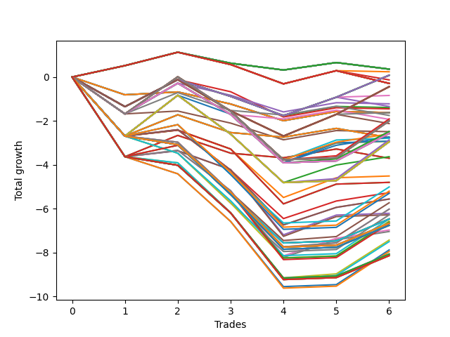

# Long HLT 109 
- Symbol: TSLA
- Date Range: 05/16/2022 - 05/17/2024
- Trading Period: 8:30-12:30
- Number of Trades: 6



| Id. | Name | Win Percent | Profit | Avg Profit / Trade | Avg Time / Trade | Std |      | Name | Win Percent | Profit | Avg Profit / Trade | Avg Time / Trade | Std |
| --- | ---- | ----------- | ------ | ------------------ | ---------------- | --- | ---- | ---- | ----------- | ------ | ------------------ | ---------------- | --- |
| | Sorted By <br> Profit | | | | | | | Sorted By <br> Win Percentage |||||
|0| TP-0.25 180m | 50.00 | 0.36 | 0.06 | 03:30 | 0.44 |     | TP-0.25 180m | 50.00 | 0.36 | 0.06 | 03:30 | 0.44 |
|1| TP-0.25 165m | 50.00 | 0.36 | 0.06 | 03:30 | 0.44 |     | TP-0.25 165m | 50.00 | 0.36 | 0.06 | 03:30 | 0.44 |
|2| TP-0.25 150m | 50.00 | 0.36 | 0.06 | 03:30 | 0.44 |     | TP-0.25 150m | 50.00 | 0.36 | 0.06 | 03:30 | 0.44 |
|3| TP-0.25 135m | 50.00 | 0.36 | 0.06 | 03:30 | 0.44 |     | TP-0.25 135m | 50.00 | 0.36 | 0.06 | 03:30 | 0.44 |
|4| TP-0.25 120m | 50.00 | 0.36 | 0.06 | 03:30 | 0.44 |     | TP-0.25 120m | 50.00 | 0.36 | 0.06 | 03:30 | 0.44 |
|5| TP-0.25 105m | 50.00 | 0.36 | 0.06 | 03:30 | 0.44 |     | TP-0.25 105m | 50.00 | 0.36 | 0.06 | 03:30 | 0.44 |
|6| TP-0.25 90m | 50.00 | 0.36 | 0.06 | 03:30 | 0.44 |     | TP-0.25 90m | 50.00 | 0.36 | 0.06 | 03:30 | 0.44 |
|7| TP-0.25 75m | 50.00 | 0.36 | 0.06 | 03:30 | 0.44 |     | TP-0.25 75m | 50.00 | 0.36 | 0.06 | 03:30 | 0.44 |
|8| TP-0.25 60m | 50.00 | 0.36 | 0.06 | 03:30 | 0.44 |     | TP-0.25 60m | 50.00 | 0.36 | 0.06 | 03:30 | 0.44 |
|9| TP-0.25 45m | 50.00 | 0.36 | 0.06 | 03:30 | 0.44 |     | TP-0.25 45m | 50.00 | 0.36 | 0.06 | 03:30 | 0.44 |
|10| TP-0.25 30m | 50.00 | 0.36 | 0.06 | 03:30 | 0.44 |     | TP-0.25 30m | 50.00 | 0.36 | 0.06 | 03:30 | 0.44 |
|11| TP-0.25 15m | 50.00 | 0.36 | 0.06 | 03:30 | 0.44 |     | TP-0.25 15m | 50.00 | 0.36 | 0.06 | 03:30 | 0.44 |
|12| TP-0.5 15m | 50.00 | 0.24 | 0.04 | 05:50 | 0.59 |     | TP-0.5 15m | 50.00 | 0.24 | 0.04 | 05:50 | 0.59 |
|13| TP-0.75 180m | 50.00 | 0.08 | 0.01 | 16:10 | 1.03 |     | TP-0.75 180m | 50.00 | 0.08 | 0.01 | 16:10 | 1.03 |
|14| TP-0.75 165m | 50.00 | 0.08 | 0.01 | 16:10 | 1.03 |     | TP-0.75 165m | 50.00 | 0.08 | 0.01 | 16:10 | 1.03 |
|15| TP-0.75 150m | 50.00 | 0.08 | 0.01 | 16:10 | 1.03 |     | TP-0.75 150m | 50.00 | 0.08 | 0.01 | 16:10 | 1.03 |
|16| TP-0.75 135m | 50.00 | 0.08 | 0.01 | 16:10 | 1.03 |     | TP-0.75 135m | 50.00 | 0.08 | 0.01 | 16:10 | 1.03 |
|17| TP-0.75 120m | 50.00 | 0.08 | 0.01 | 16:10 | 1.03 |     | TP-0.75 120m | 50.00 | 0.08 | 0.01 | 16:10 | 1.03 |
|18| TP-0.75 105m | 50.00 | 0.08 | 0.01 | 16:10 | 1.03 |     | TP-0.75 105m | 50.00 | 0.08 | 0.01 | 16:10 | 1.03 |
|19| TP-0.75 90m | 50.00 | 0.08 | 0.01 | 16:10 | 1.03 |     | TP-0.75 90m | 50.00 | 0.08 | 0.01 | 16:10 | 1.03 |
|20| TP-0.75 75m | 50.00 | 0.08 | 0.01 | 16:10 | 1.03 |     | TP-0.75 75m | 50.00 | 0.08 | 0.01 | 16:10 | 1.03 |
|21| TP-0.75 60m | 50.00 | 0.08 | 0.01 | 16:10 | 1.03 |     | TP-0.75 60m | 50.00 | 0.08 | 0.01 | 16:10 | 1.03 |
|22| TP-0.5 30m | 50.00 | -0.13 | -0.02 | 08:20 | 0.61 |     | TP-0.5 30m | 50.00 | -0.13 | -0.02 | 08:20 | 0.61 |
|23| TP-0.5 180m | 50.00 | -0.29 | -0.05 | 08:50 | 0.63 |     | TP-0.5 180m | 50.00 | -0.29 | -0.05 | 08:50 | 0.63 |
|24| TP-0.5 165m | 50.00 | -0.29 | -0.05 | 08:50 | 0.63 |     | TP-0.5 165m | 50.00 | -0.29 | -0.05 | 08:50 | 0.63 |
|25| TP-0.5 150m | 50.00 | -0.29 | -0.05 | 08:50 | 0.63 |     | TP-0.5 150m | 50.00 | -0.29 | -0.05 | 08:50 | 0.63 |
|26| TP-0.5 135m | 50.00 | -0.29 | -0.05 | 08:50 | 0.63 |     | TP-0.5 135m | 50.00 | -0.29 | -0.05 | 08:50 | 0.63 |
|27| TP-0.5 120m | 50.00 | -0.29 | -0.05 | 08:50 | 0.63 |     | TP-0.5 120m | 50.00 | -0.29 | -0.05 | 08:50 | 0.63 |
|28| TP-0.5 105m | 50.00 | -0.29 | -0.05 | 08:50 | 0.63 |     | TP-0.5 105m | 50.00 | -0.29 | -0.05 | 08:50 | 0.63 |
|29| TP-0.5 90m | 50.00 | -0.29 | -0.05 | 08:50 | 0.63 |     | TP-0.5 90m | 50.00 | -0.29 | -0.05 | 08:50 | 0.63 |
|30| TP-0.5 75m | 50.00 | -0.29 | -0.05 | 08:50 | 0.63 |     | TP-0.5 75m | 50.00 | -0.29 | -0.05 | 08:50 | 0.63 |
|31| TP-0.5 60m | 50.00 | -0.29 | -0.05 | 08:50 | 0.63 |     | TP-0.5 60m | 50.00 | -0.29 | -0.05 | 08:50 | 0.63 |
|32| TP-0.5 45m | 50.00 | -0.29 | -0.05 | 08:50 | 0.63 |     | TP-0.5 45m | 50.00 | -0.29 | -0.05 | 08:50 | 0.63 |
|33| TP-1 180m | 50.00 | -0.44 | -0.07 | 20:10 | 1.24 |     | TP-1 180m | 50.00 | -0.44 | -0.07 | 20:10 | 1.24 |
|34| TP-1 165m | 50.00 | -0.44 | -0.07 | 20:10 | 1.24 |     | TP-1 165m | 50.00 | -0.44 | -0.07 | 20:10 | 1.24 |
|35| TP-1 150m | 50.00 | -0.44 | -0.07 | 20:10 | 1.24 |     | TP-1 150m | 50.00 | -0.44 | -0.07 | 20:10 | 1.24 |
|36| TP-1 135m | 50.00 | -0.44 | -0.07 | 20:10 | 1.24 |     | TP-1 135m | 50.00 | -0.44 | -0.07 | 20:10 | 1.24 |
|37| TP-1 120m | 50.00 | -0.44 | -0.07 | 20:10 | 1.24 |     | TP-1 120m | 50.00 | -0.44 | -0.07 | 20:10 | 1.24 |
|38| TP-1 105m | 50.00 | -0.44 | -0.07 | 20:10 | 1.24 |     | TP-1 105m | 50.00 | -0.44 | -0.07 | 20:10 | 1.24 |
|39| TP-1 90m | 50.00 | -0.44 | -0.07 | 20:10 | 1.24 |     | TP-1 90m | 50.00 | -0.44 | -0.07 | 20:10 | 1.24 |
|40| TP-1 75m | 50.00 | -0.44 | -0.07 | 20:10 | 1.24 |     | TP-1 75m | 50.00 | -0.44 | -0.07 | 20:10 | 1.24 |
|41| TP-1 60m | 50.00 | -0.44 | -0.07 | 20:10 | 1.24 |     | TP-1 60m | 50.00 | -0.44 | -0.07 | 20:10 | 1.24 |
|42| TP-0.75 45m | 50.00 | -0.84 | -0.14 | 14:30 | 0.94 |     | TP-0.75 45m | 50.00 | -0.84 | -0.14 | 14:30 | 0.94 |
|43| TP-1.25 15m | 33.33 | -1.22 | -0.20 | 11:30 | 0.97 |     | TP-1 45m | 50.00 | -1.62 | -0.27 | 18:20 | 1.10 |
|44| TP-0.75 30m | 33.33 | -1.34 | -0.22 | 12:00 | 0.94 |     | TP-1.5 75m | 50.00 | -1.91 | -0.32 | 43:20 | 1.60 |
|45| TP-0.75 15m | 33.33 | -1.39 | -0.23 | 08:50 | 0.87 |     | TP-1.5 180m | 50.00 | -2.00 | -0.33 | 43:30 | 1.59 |
|46| TP-1 15m | 33.33 | -1.45 | -0.24 | 10:30 | 0.89 |     | TP-1.5 165m | 50.00 | -2.00 | -0.33 | 43:30 | 1.59 |
|47| TP-1 45m | 50.00 | -1.62 | -0.27 | 18:20 | 1.10 |     | TP-1.5 150m | 50.00 | -2.00 | -0.33 | 43:30 | 1.59 |
|48| TP-3 15m | 33.33 | -1.62 | -0.27 | 14:00 | 0.46 |     | TP-1.5 135m | 50.00 | -2.00 | -0.33 | 43:30 | 1.59 |
|49| TP-2.75 15m | 33.33 | -1.62 | -0.27 | 14:00 | 0.46 |     | TP-1.5 120m | 50.00 | -2.00 | -0.33 | 43:30 | 1.59 |
|50| TP-2.5 15m | 33.33 | -1.62 | -0.27 | 14:00 | 0.46 |     | TP-1.5 105m | 50.00 | -2.00 | -0.33 | 43:30 | 1.59 |
|51| TP-2.25 15m | 33.33 | -1.62 | -0.27 | 14:00 | 0.46 |     | TP-1.5 90m | 50.00 | -2.00 | -0.33 | 43:30 | 1.59 |
|52| TP-2 15m | 33.33 | -1.62 | -0.27 | 14:00 | 0.46 |     | TP-1.25 75m | 50.00 | -2.48 | -0.41 | 36:40 | 1.43 |
|53| TP-1.75 15m | 33.33 | -1.62 | -0.27 | 14:00 | 0.46 |     | TP-1.25 180m | 50.00 | -2.57 | -0.43 | 36:50 | 1.42 |
|54| TP-1.5 30m | 33.33 | -1.75 | -0.29 | 25:40 | 0.85 |     | TP-1.25 165m | 50.00 | -2.57 | -0.43 | 36:50 | 1.42 |
|55| TP-1.5 75m | 50.00 | -1.91 | -0.32 | 43:20 | 1.60 |     | TP-1.25 150m | 50.00 | -2.57 | -0.43 | 36:50 | 1.42 |
|56| TP-1.25 30m | 33.33 | -1.93 | -0.32 | 21:00 | 1.05 |     | TP-1.25 135m | 50.00 | -2.57 | -0.43 | 36:50 | 1.42 |
|57| TP-1.5 180m | 50.00 | -2.00 | -0.33 | 43:30 | 1.59 |     | TP-1.25 120m | 50.00 | -2.57 | -0.43 | 36:50 | 1.42 |
|58| TP-1.5 165m | 50.00 | -2.00 | -0.33 | 43:30 | 1.59 |     | TP-1.25 105m | 50.00 | -2.57 | -0.43 | 36:50 | 1.42 |
|59| TP-1.5 150m | 50.00 | -2.00 | -0.33 | 43:30 | 1.59 |     | TP-1.25 90m | 50.00 | -2.57 | -0.43 | 36:50 | 1.42 |
|60| TP-1.5 135m | 50.00 | -2.00 | -0.33 | 43:30 | 1.59 |     | TP-1.5 60m | 50.00 | -2.59 | -0.43 | 38:50 | 1.45 |
|61| TP-1.5 120m | 50.00 | -2.00 | -0.33 | 43:30 | 1.59 |     | TP-1.25 60m | 50.00 | -2.73 | -0.45 | 32:30 | 1.37 |
|62| TP-1.5 105m | 50.00 | -2.00 | -0.33 | 43:30 | 1.59 |     | TP-1.5 45m | 50.00 | -2.79 | -0.46 | 33:50 | 1.45 |
|63| TP-1.5 90m | 50.00 | -2.00 | -0.33 | 43:30 | 1.59 |     | TP-1.75 75m | 50.00 | -2.86 | -0.48 | 48:50 | 1.85 |
|64| TP-1 30m | 33.33 | -2.12 | -0.35 | 15:50 | 1.09 |     | TP-1.75 45m | 50.00 | -2.92 | -0.49 | 37:30 | 1.62 |
|65| TP-1.25 75m | 50.00 | -2.48 | -0.41 | 36:40 | 1.43 |     | TP-1.25 45m | 50.00 | -2.93 | -0.49 | 27:30 | 1.36 |
|66| TP-1.5 15m | 33.33 | -2.49 | -0.41 | 13:10 | 0.69 |     | TP-1.75 180m | 50.00 | -2.95 | -0.49 | 49:00 | 1.84 |
|67| TP-1.25 180m | 50.00 | -2.57 | -0.43 | 36:50 | 1.42 |     | TP-1.75 165m | 50.00 | -2.95 | -0.49 | 49:00 | 1.84 |
|68| TP-1.25 165m | 50.00 | -2.57 | -0.43 | 36:50 | 1.42 |     | TP-1.75 150m | 50.00 | -2.95 | -0.49 | 49:00 | 1.84 |
|69| TP-1.25 150m | 50.00 | -2.57 | -0.43 | 36:50 | 1.42 |     | TP-1.75 135m | 50.00 | -2.95 | -0.49 | 49:00 | 1.84 |
|70| TP-1.25 135m | 50.00 | -2.57 | -0.43 | 36:50 | 1.42 |     | TP-1.75 120m | 50.00 | -2.95 | -0.49 | 49:00 | 1.84 |
|71| TP-1.25 120m | 50.00 | -2.57 | -0.43 | 36:50 | 1.42 |     | TP-1.75 105m | 50.00 | -2.95 | -0.49 | 49:00 | 1.84 |
|72| TP-1.25 105m | 50.00 | -2.57 | -0.43 | 36:50 | 1.42 |     | TP-1.75 90m | 50.00 | -2.95 | -0.49 | 49:00 | 1.84 |
|73| TP-1.25 90m | 50.00 | -2.57 | -0.43 | 36:50 | 1.42 |     | TP-1.75 60m | 50.00 | -3.63 | -0.60 | 44:00 | 1.70 |
|74| TP-1.5 60m | 50.00 | -2.59 | -0.43 | 38:50 | 1.45 |     | TP-2 45m | 50.00 | -4.51 | -0.75 | 39:20 | 1.31 |
|75| TP-1.25 60m | 50.00 | -2.73 | -0.45 | 32:30 | 1.37 |     | TP-2.5 45m | 50.00 | -4.80 | -0.80 | 39:30 | 1.37 |
|76| TP-2.5 30m | 33.33 | -2.76 | -0.46 | 27:50 | 1.15 |     | TP-2.25 45m | 50.00 | -4.80 | -0.80 | 39:30 | 1.37 |
|77| TP-2.25 30m | 33.33 | -2.76 | -0.46 | 27:50 | 1.15 |     | TP-2 105m | 50.00 | -5.01 | -0.83 | 69:30 | 1.62 |
|78| TP-2 30m | 33.33 | -2.76 | -0.46 | 27:50 | 1.15 |     | TP-2.5 105m | 50.00 | -5.20 | -0.87 | 70:40 | 1.65 |
|79| TP-1.75 30m | 33.33 | -2.76 | -0.46 | 27:50 | 1.15 |     | TP-2 60m | 50.00 | -5.27 | -0.88 | 49:20 | 1.40 |
|80| TP-1.5 45m | 50.00 | -2.79 | -0.46 | 33:50 | 1.45 |     | TP-2.25 105m | 50.00 | -5.30 | -0.88 | 69:40 | 1.67 |
|81| TP-1.75 75m | 50.00 | -2.86 | -0.48 | 48:50 | 1.85 |     | TP-2.5 60m | 50.00 | -5.56 | -0.93 | 49:30 | 1.45 |
|82| TP-1.75 45m | 50.00 | -2.92 | -0.49 | 37:30 | 1.62 |     | TP-2.25 60m | 50.00 | -5.56 | -0.93 | 49:30 | 1.45 |
|83| TP-1.25 45m | 50.00 | -2.93 | -0.49 | 27:30 | 1.36 |     | TP-2.75 45m | 50.00 | -6.21 | -1.04 | 40:20 | 1.69 |
|84| TP-1.75 180m | 50.00 | -2.95 | -0.49 | 49:00 | 1.84 |     | TP-3 45m | 50.00 | -6.28 | -1.05 | 40:40 | 1.71 |
|85| TP-1.75 165m | 50.00 | -2.95 | -0.49 | 49:00 | 1.84 |     | TP-2.75 105m | 50.00 | -6.61 | -1.10 | 71:30 | 1.92 |
|86| TP-1.75 150m | 50.00 | -2.95 | -0.49 | 49:00 | 1.84 |     | TP-3 105m | 50.00 | -6.68 | -1.11 | 71:50 | 1.93 |
|87| TP-1.75 135m | 50.00 | -2.95 | -0.49 | 49:00 | 1.84 |     | TP-2.75 60m | 50.00 | -6.97 | -1.16 | 50:20 | 1.74 |
|88| TP-1.75 120m | 50.00 | -2.95 | -0.49 | 49:00 | 1.84 |     | TP-3 60m | 50.00 | -7.04 | -1.17 | 50:40 | 1.75 |
|89| TP-1.75 105m | 50.00 | -2.95 | -0.49 | 49:00 | 1.84 |     | TP-1.25 15m | 33.33 | -1.22 | -0.20 | 11:30 | 0.97 |
|90| TP-1.75 90m | 50.00 | -2.95 | -0.49 | 49:00 | 1.84 |     | TP-0.75 30m | 33.33 | -1.34 | -0.22 | 12:00 | 0.94 |
|91| TP-1.75 60m | 50.00 | -3.63 | -0.60 | 44:00 | 1.70 |     | TP-0.75 15m | 33.33 | -1.39 | -0.23 | 08:50 | 0.87 |
|92| TP-3 30m | 33.33 | -3.70 | -0.62 | 28:10 | 1.46 |     | TP-1 15m | 33.33 | -1.45 | -0.24 | 10:30 | 0.89 |
|93| TP-2.75 30m | 33.33 | -3.70 | -0.62 | 28:10 | 1.46 |     | TP-3 15m | 33.33 | -1.62 | -0.27 | 14:00 | 0.46 |
|94| TP-2 45m | 50.00 | -4.51 | -0.75 | 39:20 | 1.31 |     | TP-2.75 15m | 33.33 | -1.62 | -0.27 | 14:00 | 0.46 |
|95| TP-2.5 45m | 50.00 | -4.80 | -0.80 | 39:30 | 1.37 |     | TP-2.5 15m | 33.33 | -1.62 | -0.27 | 14:00 | 0.46 |
|96| TP-2.25 45m | 50.00 | -4.80 | -0.80 | 39:30 | 1.37 |     | TP-2.25 15m | 33.33 | -1.62 | -0.27 | 14:00 | 0.46 |
|97| TP-2 105m | 50.00 | -5.01 | -0.83 | 69:30 | 1.62 |     | TP-2 15m | 33.33 | -1.62 | -0.27 | 14:00 | 0.46 |
|98| TP-2.5 105m | 50.00 | -5.20 | -0.87 | 70:40 | 1.65 |     | TP-1.75 15m | 33.33 | -1.62 | -0.27 | 14:00 | 0.46 |
|99| TP-2 60m | 50.00 | -5.27 | -0.88 | 49:20 | 1.40 |     | TP-1.5 30m | 33.33 | -1.75 | -0.29 | 25:40 | 0.85 |
|100| TP-2.25 105m | 50.00 | -5.30 | -0.88 | 69:40 | 1.67 |     | TP-1.25 30m | 33.33 | -1.93 | -0.32 | 21:00 | 1.05 |
|101| TP-2.5 60m | 50.00 | -5.56 | -0.93 | 49:30 | 1.45 |     | TP-1 30m | 33.33 | -2.12 | -0.35 | 15:50 | 1.09 |
|102| TP-2.25 60m | 50.00 | -5.56 | -0.93 | 49:30 | 1.45 |     | TP-1.5 15m | 33.33 | -2.49 | -0.41 | 13:10 | 0.69 |
|103| TP-2 75m | 33.33 | -5.73 | -0.95 | 59:20 | 1.54 |     | TP-2.5 30m | 33.33 | -2.76 | -0.46 | 27:50 | 1.15 |
|104| TP-2.5 75m | 33.33 | -6.02 | -1.00 | 59:30 | 1.59 |     | TP-2.25 30m | 33.33 | -2.76 | -0.46 | 27:50 | 1.15 |
|105| TP-2.25 75m | 33.33 | -6.02 | -1.00 | 59:30 | 1.59 |     | TP-2 30m | 33.33 | -2.76 | -0.46 | 27:50 | 1.15 |
|106| TP-2.75 45m | 50.00 | -6.21 | -1.04 | 40:20 | 1.69 |     | TP-1.75 30m | 33.33 | -2.76 | -0.46 | 27:50 | 1.15 |
|107| TP-3 45m | 50.00 | -6.28 | -1.05 | 40:40 | 1.71 |     | TP-3 30m | 33.33 | -3.70 | -0.62 | 28:10 | 1.46 |
|108| TP-2 90m | 33.33 | -6.28 | -1.05 | 64:30 | 1.52 |     | TP-2.75 30m | 33.33 | -3.70 | -0.62 | 28:10 | 1.46 |
|109| TP-2 180m | 33.33 | -6.47 | -1.08 | 74:30 | 1.38 |     | TP-2 75m | 33.33 | -5.73 | -0.95 | 59:20 | 1.54 |
|110| TP-2 165m | 33.33 | -6.47 | -1.08 | 74:30 | 1.38 |     | TP-2.5 75m | 33.33 | -6.02 | -1.00 | 59:30 | 1.59 |
|111| TP-2 150m | 33.33 | -6.47 | -1.08 | 74:30 | 1.38 |     | TP-2.25 75m | 33.33 | -6.02 | -1.00 | 59:30 | 1.59 |
|112| TP-2 135m | 33.33 | -6.47 | -1.08 | 74:30 | 1.38 |     | TP-2 90m | 33.33 | -6.28 | -1.05 | 64:30 | 1.52 |
|113| TP-2 120m | 33.33 | -6.47 | -1.08 | 74:30 | 1.38 |     | TP-2 180m | 33.33 | -6.47 | -1.08 | 74:30 | 1.38 |
|114| TP-2.5 90m | 33.33 | -6.47 | -1.08 | 65:40 | 1.55 |     | TP-2 165m | 33.33 | -6.47 | -1.08 | 74:30 | 1.38 |
|115| TP-2.25 90m | 33.33 | -6.57 | -1.10 | 64:40 | 1.56 |     | TP-2 150m | 33.33 | -6.47 | -1.08 | 74:30 | 1.38 |
|116| TP-2.75 105m | 50.00 | -6.61 | -1.10 | 71:30 | 1.92 |     | TP-2 135m | 33.33 | -6.47 | -1.08 | 74:30 | 1.38 |
|117| TP-2.5 180m | 33.33 | -6.66 | -1.11 | 75:40 | 1.41 |     | TP-2 120m | 33.33 | -6.47 | -1.08 | 74:30 | 1.38 |
|118| TP-2.5 165m | 33.33 | -6.66 | -1.11 | 75:40 | 1.41 |     | TP-2.5 90m | 33.33 | -6.47 | -1.08 | 65:40 | 1.55 |
|119| TP-2.5 150m | 33.33 | -6.66 | -1.11 | 75:40 | 1.41 |     | TP-2.25 90m | 33.33 | -6.57 | -1.10 | 64:40 | 1.56 |
|120| TP-2.5 135m | 33.33 | -6.66 | -1.11 | 75:40 | 1.41 |     | TP-2.5 180m | 33.33 | -6.66 | -1.11 | 75:40 | 1.41 |
|121| TP-2.5 120m | 33.33 | -6.66 | -1.11 | 75:40 | 1.41 |     | TP-2.5 165m | 33.33 | -6.66 | -1.11 | 75:40 | 1.41 |
|122| TP-3 105m | 50.00 | -6.68 | -1.11 | 71:50 | 1.93 |     | TP-2.5 150m | 33.33 | -6.66 | -1.11 | 75:40 | 1.41 |
|123| TP-2.25 180m | 33.33 | -6.76 | -1.13 | 74:40 | 1.42 |     | TP-2.5 135m | 33.33 | -6.66 | -1.11 | 75:40 | 1.41 |
|124| TP-2.25 165m | 33.33 | -6.76 | -1.13 | 74:40 | 1.42 |     | TP-2.5 120m | 33.33 | -6.66 | -1.11 | 75:40 | 1.41 |
|125| TP-2.25 150m | 33.33 | -6.76 | -1.13 | 74:40 | 1.42 |     | TP-2.25 180m | 33.33 | -6.76 | -1.13 | 74:40 | 1.42 |
|126| TP-2.25 135m | 33.33 | -6.76 | -1.13 | 74:40 | 1.42 |     | TP-2.25 165m | 33.33 | -6.76 | -1.13 | 74:40 | 1.42 |
|127| TP-2.25 120m | 33.33 | -6.76 | -1.13 | 74:40 | 1.42 |     | TP-2.25 150m | 33.33 | -6.76 | -1.13 | 74:40 | 1.42 |
|128| TP-2.75 60m | 50.00 | -6.97 | -1.16 | 50:20 | 1.74 |     | TP-2.25 135m | 33.33 | -6.76 | -1.13 | 74:40 | 1.42 |
|129| TP-3 60m | 50.00 | -7.04 | -1.17 | 50:40 | 1.75 |     | TP-2.25 120m | 33.33 | -6.76 | -1.13 | 74:40 | 1.42 |
|130| TP-2.75 75m | 33.33 | -7.43 | -1.24 | 60:20 | 1.85 |     | TP-2.75 75m | 33.33 | -7.43 | -1.24 | 60:20 | 1.85 |
|131| TP-3 75m | 33.33 | -7.50 | -1.25 | 60:40 | 1.86 |     | TP-3 75m | 33.33 | -7.50 | -1.25 | 60:40 | 1.86 |
|132| TP-2.75 90m | 33.33 | -7.88 | -1.31 | 66:30 | 1.80 |     | TP-2.75 90m | 33.33 | -7.88 | -1.31 | 66:30 | 1.80 |
|133| TP-3 90m | 33.33 | -7.95 | -1.33 | 66:50 | 1.81 |     | TP-3 90m | 33.33 | -7.95 | -1.33 | 66:50 | 1.81 |
|134| TP-2.75 180m | 33.33 | -8.07 | -1.35 | 76:30 | 1.68 |     | TP-2.75 180m | 33.33 | -8.07 | -1.35 | 76:30 | 1.68 |
|135| TP-2.75 165m | 33.33 | -8.07 | -1.35 | 76:30 | 1.68 |     | TP-2.75 165m | 33.33 | -8.07 | -1.35 | 76:30 | 1.68 |
|136| TP-2.75 150m | 33.33 | -8.07 | -1.35 | 76:30 | 1.68 |     | TP-2.75 150m | 33.33 | -8.07 | -1.35 | 76:30 | 1.68 |
|137| TP-2.75 135m | 33.33 | -8.07 | -1.35 | 76:30 | 1.68 |     | TP-2.75 135m | 33.33 | -8.07 | -1.35 | 76:30 | 1.68 |
|138| TP-2.75 120m | 33.33 | -8.07 | -1.35 | 76:30 | 1.68 |     | TP-2.75 120m | 33.33 | -8.07 | -1.35 | 76:30 | 1.68 |
|139| TP-3 180m | 33.33 | -8.14 | -1.36 | 76:50 | 1.70 |     | TP-3 180m | 33.33 | -8.14 | -1.36 | 76:50 | 1.70 |
|140| TP-3 165m | 33.33 | -8.14 | -1.36 | 76:50 | 1.70 |     | TP-3 165m | 33.33 | -8.14 | -1.36 | 76:50 | 1.70 |
|141| TP-3 150m | 33.33 | -8.14 | -1.36 | 76:50 | 1.70 |     | TP-3 150m | 33.33 | -8.14 | -1.36 | 76:50 | 1.70 |
|142| TP-3 135m | 33.33 | -8.14 | -1.36 | 76:50 | 1.70 |     | TP-3 135m | 33.33 | -8.14 | -1.36 | 76:50 | 1.70 |
|143| TP-3 120m | 33.33 | -8.14 | -1.36 | 76:50 | 1.70 |     | TP-3 120m | 33.33 | -8.14 | -1.36 | 76:50 | 1.70 |

### Test TP-0.25 15m
* Take Profit of 0.25 Point
* 0.25 Stoploss
* Results:
```
Total Trades: 6
Percent Up: 50.00
Percent Down: 50.00
Total Points Moved Up: 0.36
Potential Profit: 180.00
Total Points Ups: 1.47 Count Ups: 3
Total Points Downs: -1.11 Count Downs: 3
```

<details><summary>Trades</summary>

<code>In: 2022-08-05 08:35:00		Out: 2022-08-05 08:37:00		Total Position Time: 02:00		Total Move Up: 0.52		Total to Date: 0.52</code> <br />
<code>In: 2022-09-27 09:25:00		Out: 2022-09-27 09:27:00		Total Position Time: 02:00		Total Move Up: 0.61		Total to Date: 1.13</code> <br />
<code>In: 2023-08-04 11:30:00		Out: 2023-08-04 11:37:00		Total Position Time: 07:00		Total Move Up: -0.50		Total to Date: 0.63</code> <br />
<code>In: 2023-11-09 09:25:00		Out: 2023-11-09 09:28:00		Total Position Time: 03:00		Total Move Up: -0.31		Total to Date: 0.32</code> <br />
<code>In: 2023-12-22 11:35:00		Out: 2023-12-22 11:38:00		Total Position Time: 03:00		Total Move Up: 0.34		Total to Date: 0.66</code> <br />
<code>In: 2024-02-27 10:05:00		Out: 2024-02-27 10:09:00		Total Position Time: 04:00		Total Move Up: -0.30		Total to Date: 0.36</code> <br />


</details>

### Test TP-0.5 15m
* Take Profit of 0.5 Point
* 0.5 Stoploss
* Results:
```
Total Trades: 6
Percent Up: 50.00
Percent Down: 50.00
Total Points Moved Up: 0.24
Potential Profit: 120.00
Total Points Ups: 1.73 Count Ups: 3
Total Points Downs: -1.49 Count Downs: 3
```

<details><summary>Trades</summary>

<code>In: 2022-08-05 08:35:00		Out: 2022-08-05 08:37:00		Total Position Time: 02:00		Total Move Up: 0.52		Total to Date: 0.52</code> <br />
<code>In: 2022-09-27 09:25:00		Out: 2022-09-27 09:27:00		Total Position Time: 02:00		Total Move Up: 0.61		Total to Date: 1.13</code> <br />
<code>In: 2023-08-04 11:30:00		Out: 2023-08-04 11:39:00		Total Position Time: 09:00		Total Move Up: -0.56		Total to Date: 0.57</code> <br />
<code>In: 2023-11-09 09:25:00		Out: 2023-11-09 09:29:00		Total Position Time: 04:00		Total Move Up: -0.88		Total to Date: -0.31</code> <br />
<code>In: 2023-12-22 11:35:00		Out: 2023-12-22 11:39:00		Total Position Time: 04:00		Total Move Up: 0.60		Total to Date: 0.29</code> <br />
<code>In: 2024-02-27 10:05:00		Out: 2024-02-27 10:19:00		Total Position Time: 14:00		Total Move Up: -0.05		Total to Date: 0.24</code> <br />


</details>

### Test TP-0.75 15m
* Take Profit of 0.75 Point
* 0.75 Stoploss
* Results:
```
Total Trades: 6
Percent Up: 33.33
Percent Down: 66.67
Total Points Moved Up: -1.39
Potential Profit: -695.00
Total Points Ups: 1.65 Count Ups: 2
Total Points Downs: -3.04 Count Downs: 4
```

<details><summary>Trades</summary>

<code>In: 2022-08-05 08:35:00		Out: 2022-08-05 08:43:00		Total Position Time: 08:00		Total Move Up: -1.35		Total to Date: -1.35</code> <br />
<code>In: 2022-09-27 09:25:00		Out: 2022-09-27 09:28:00		Total Position Time: 03:00		Total Move Up: 1.23		Total to Date: -0.12</code> <br />
<code>In: 2023-08-04 11:30:00		Out: 2023-08-04 11:40:00		Total Position Time: 10:00		Total Move Up: -0.76		Total to Date: -0.88</code> <br />
<code>In: 2023-11-09 09:25:00		Out: 2023-11-09 09:29:00		Total Position Time: 04:00		Total Move Up: -0.88		Total to Date: -1.76</code> <br />
<code>In: 2023-12-22 11:35:00		Out: 2023-12-22 11:49:00		Total Position Time: 14:00		Total Move Up: 0.42		Total to Date: -1.34</code> <br />
<code>In: 2024-02-27 10:05:00		Out: 2024-02-27 10:19:00		Total Position Time: 14:00		Total Move Up: -0.05		Total to Date: -1.39</code> <br />


</details>

### Test TP-1 15m
* Take Profit of 1 Point
* 1 Stoploss
* Results:
```
Total Trades: 6
Percent Up: 33.33
Percent Down: 66.67
Total Points Moved Up: -1.45
Potential Profit: -725.00
Total Points Ups: 1.65 Count Ups: 2
Total Points Downs: -3.10 Count Downs: 4
```

<details><summary>Trades</summary>

<code>In: 2022-08-05 08:35:00		Out: 2022-08-05 08:43:00		Total Position Time: 08:00		Total Move Up: -1.35		Total to Date: -1.35</code> <br />
<code>In: 2022-09-27 09:25:00		Out: 2022-09-27 09:28:00		Total Position Time: 03:00		Total Move Up: 1.23		Total to Date: -0.12</code> <br />
<code>In: 2023-08-04 11:30:00		Out: 2023-08-04 11:44:00		Total Position Time: 14:00		Total Move Up: -0.55		Total to Date: -0.67</code> <br />
<code>In: 2023-11-09 09:25:00		Out: 2023-11-09 09:35:00		Total Position Time: 10:00		Total Move Up: -1.15		Total to Date: -1.82</code> <br />
<code>In: 2023-12-22 11:35:00		Out: 2023-12-22 11:49:00		Total Position Time: 14:00		Total Move Up: 0.42		Total to Date: -1.40</code> <br />
<code>In: 2024-02-27 10:05:00		Out: 2024-02-27 10:19:00		Total Position Time: 14:00		Total Move Up: -0.05		Total to Date: -1.45</code> <br />


</details>

### Test TP-1.25 15m
* Take Profit of 1.25 Point
* 1.25 Stoploss
* Results:
```
Total Trades: 6
Percent Up: 33.33
Percent Down: 66.67
Total Points Moved Up: -1.22
Potential Profit: -610.00
Total Points Ups: 1.82 Count Ups: 2
Total Points Downs: -3.04 Count Downs: 4
```

<details><summary>Trades</summary>

<code>In: 2022-08-05 08:35:00		Out: 2022-08-05 08:44:00		Total Position Time: 09:00		Total Move Up: -1.68		Total to Date: -1.68</code> <br />
<code>In: 2022-09-27 09:25:00		Out: 2022-09-27 09:29:00		Total Position Time: 04:00		Total Move Up: 1.40		Total to Date: -0.28</code> <br />
<code>In: 2023-08-04 11:30:00		Out: 2023-08-04 11:44:00		Total Position Time: 14:00		Total Move Up: -0.55		Total to Date: -0.83</code> <br />
<code>In: 2023-11-09 09:25:00		Out: 2023-11-09 09:39:00		Total Position Time: 14:00		Total Move Up: -0.76		Total to Date: -1.59</code> <br />
<code>In: 2023-12-22 11:35:00		Out: 2023-12-22 11:49:00		Total Position Time: 14:00		Total Move Up: 0.42		Total to Date: -1.17</code> <br />
<code>In: 2024-02-27 10:05:00		Out: 2024-02-27 10:19:00		Total Position Time: 14:00		Total Move Up: -0.05		Total to Date: -1.22</code> <br />


</details>

### Test TP-1.5 15m
* Take Profit of 1.5 Point
* 1.5 Stoploss
* Results:
```
Total Trades: 6
Percent Up: 33.33
Percent Down: 66.67
Total Points Moved Up: -2.49
Potential Profit: -1245.00
Total Points Ups: 0.55 Count Ups: 2
Total Points Downs: -3.04 Count Downs: 4
```

<details><summary>Trades</summary>

<code>In: 2022-08-05 08:35:00		Out: 2022-08-05 08:44:00		Total Position Time: 09:00		Total Move Up: -1.68		Total to Date: -1.68</code> <br />
<code>In: 2022-09-27 09:25:00		Out: 2022-09-27 09:39:00		Total Position Time: 14:00		Total Move Up: 0.13		Total to Date: -1.55</code> <br />
<code>In: 2023-08-04 11:30:00		Out: 2023-08-04 11:44:00		Total Position Time: 14:00		Total Move Up: -0.55		Total to Date: -2.10</code> <br />
<code>In: 2023-11-09 09:25:00		Out: 2023-11-09 09:39:00		Total Position Time: 14:00		Total Move Up: -0.76		Total to Date: -2.86</code> <br />
<code>In: 2023-12-22 11:35:00		Out: 2023-12-22 11:49:00		Total Position Time: 14:00		Total Move Up: 0.42		Total to Date: -2.44</code> <br />
<code>In: 2024-02-27 10:05:00		Out: 2024-02-27 10:19:00		Total Position Time: 14:00		Total Move Up: -0.05		Total to Date: -2.49</code> <br />


</details>

### Test TP-1.75 15m
* Take Profit of 1.75 Point
* 1.75 Stoploss
* Results:
```
Total Trades: 6
Percent Up: 33.33
Percent Down: 66.67
Total Points Moved Up: -1.62
Potential Profit: -810.00
Total Points Ups: 0.55 Count Ups: 2
Total Points Downs: -2.17 Count Downs: 4
```

<details><summary>Trades</summary>

<code>In: 2022-08-05 08:35:00		Out: 2022-08-05 08:49:00		Total Position Time: 14:00		Total Move Up: -0.81		Total to Date: -0.81</code> <br />
<code>In: 2022-09-27 09:25:00		Out: 2022-09-27 09:39:00		Total Position Time: 14:00		Total Move Up: 0.13		Total to Date: -0.68</code> <br />
<code>In: 2023-08-04 11:30:00		Out: 2023-08-04 11:44:00		Total Position Time: 14:00		Total Move Up: -0.55		Total to Date: -1.23</code> <br />
<code>In: 2023-11-09 09:25:00		Out: 2023-11-09 09:39:00		Total Position Time: 14:00		Total Move Up: -0.76		Total to Date: -1.99</code> <br />
<code>In: 2023-12-22 11:35:00		Out: 2023-12-22 11:49:00		Total Position Time: 14:00		Total Move Up: 0.42		Total to Date: -1.57</code> <br />
<code>In: 2024-02-27 10:05:00		Out: 2024-02-27 10:19:00		Total Position Time: 14:00		Total Move Up: -0.05		Total to Date: -1.62</code> <br />


</details>

### Test TP-2 15m
* Take Profit of 2 Point
* 2 Stoploss
* Results:
```
Total Trades: 6
Percent Up: 33.33
Percent Down: 66.67
Total Points Moved Up: -1.62
Potential Profit: -810.00
Total Points Ups: 0.55 Count Ups: 2
Total Points Downs: -2.17 Count Downs: 4
```

<details><summary>Trades</summary>

<code>In: 2022-08-05 08:35:00		Out: 2022-08-05 08:49:00		Total Position Time: 14:00		Total Move Up: -0.81		Total to Date: -0.81</code> <br />
<code>In: 2022-09-27 09:25:00		Out: 2022-09-27 09:39:00		Total Position Time: 14:00		Total Move Up: 0.13		Total to Date: -0.68</code> <br />
<code>In: 2023-08-04 11:30:00		Out: 2023-08-04 11:44:00		Total Position Time: 14:00		Total Move Up: -0.55		Total to Date: -1.23</code> <br />
<code>In: 2023-11-09 09:25:00		Out: 2023-11-09 09:39:00		Total Position Time: 14:00		Total Move Up: -0.76		Total to Date: -1.99</code> <br />
<code>In: 2023-12-22 11:35:00		Out: 2023-12-22 11:49:00		Total Position Time: 14:00		Total Move Up: 0.42		Total to Date: -1.57</code> <br />
<code>In: 2024-02-27 10:05:00		Out: 2024-02-27 10:19:00		Total Position Time: 14:00		Total Move Up: -0.05		Total to Date: -1.62</code> <br />


</details>

### Test TP-2.25 15m
* Take Profit of 2.25 Point
* 2.25 Stoploss
* Results:
```
Total Trades: 6
Percent Up: 33.33
Percent Down: 66.67
Total Points Moved Up: -1.62
Potential Profit: -810.00
Total Points Ups: 0.55 Count Ups: 2
Total Points Downs: -2.17 Count Downs: 4
```

<details><summary>Trades</summary>

<code>In: 2022-08-05 08:35:00		Out: 2022-08-05 08:49:00		Total Position Time: 14:00		Total Move Up: -0.81		Total to Date: -0.81</code> <br />
<code>In: 2022-09-27 09:25:00		Out: 2022-09-27 09:39:00		Total Position Time: 14:00		Total Move Up: 0.13		Total to Date: -0.68</code> <br />
<code>In: 2023-08-04 11:30:00		Out: 2023-08-04 11:44:00		Total Position Time: 14:00		Total Move Up: -0.55		Total to Date: -1.23</code> <br />
<code>In: 2023-11-09 09:25:00		Out: 2023-11-09 09:39:00		Total Position Time: 14:00		Total Move Up: -0.76		Total to Date: -1.99</code> <br />
<code>In: 2023-12-22 11:35:00		Out: 2023-12-22 11:49:00		Total Position Time: 14:00		Total Move Up: 0.42		Total to Date: -1.57</code> <br />
<code>In: 2024-02-27 10:05:00		Out: 2024-02-27 10:19:00		Total Position Time: 14:00		Total Move Up: -0.05		Total to Date: -1.62</code> <br />


</details>

### Test TP-2.5 15m
* Take Profit of 2.5 Point
* 2.5 Stoploss
* Results:
```
Total Trades: 6
Percent Up: 33.33
Percent Down: 66.67
Total Points Moved Up: -1.62
Potential Profit: -810.00
Total Points Ups: 0.55 Count Ups: 2
Total Points Downs: -2.17 Count Downs: 4
```

<details><summary>Trades</summary>

<code>In: 2022-08-05 08:35:00		Out: 2022-08-05 08:49:00		Total Position Time: 14:00		Total Move Up: -0.81		Total to Date: -0.81</code> <br />
<code>In: 2022-09-27 09:25:00		Out: 2022-09-27 09:39:00		Total Position Time: 14:00		Total Move Up: 0.13		Total to Date: -0.68</code> <br />
<code>In: 2023-08-04 11:30:00		Out: 2023-08-04 11:44:00		Total Position Time: 14:00		Total Move Up: -0.55		Total to Date: -1.23</code> <br />
<code>In: 2023-11-09 09:25:00		Out: 2023-11-09 09:39:00		Total Position Time: 14:00		Total Move Up: -0.76		Total to Date: -1.99</code> <br />
<code>In: 2023-12-22 11:35:00		Out: 2023-12-22 11:49:00		Total Position Time: 14:00		Total Move Up: 0.42		Total to Date: -1.57</code> <br />
<code>In: 2024-02-27 10:05:00		Out: 2024-02-27 10:19:00		Total Position Time: 14:00		Total Move Up: -0.05		Total to Date: -1.62</code> <br />


</details>

### Test TP-2.75 15m
* Take Profit of 2.75 Point
* 2.75 Stoploss
* Results:
```
Total Trades: 6
Percent Up: 33.33
Percent Down: 66.67
Total Points Moved Up: -1.62
Potential Profit: -810.00
Total Points Ups: 0.55 Count Ups: 2
Total Points Downs: -2.17 Count Downs: 4
```

<details><summary>Trades</summary>

<code>In: 2022-08-05 08:35:00		Out: 2022-08-05 08:49:00		Total Position Time: 14:00		Total Move Up: -0.81		Total to Date: -0.81</code> <br />
<code>In: 2022-09-27 09:25:00		Out: 2022-09-27 09:39:00		Total Position Time: 14:00		Total Move Up: 0.13		Total to Date: -0.68</code> <br />
<code>In: 2023-08-04 11:30:00		Out: 2023-08-04 11:44:00		Total Position Time: 14:00		Total Move Up: -0.55		Total to Date: -1.23</code> <br />
<code>In: 2023-11-09 09:25:00		Out: 2023-11-09 09:39:00		Total Position Time: 14:00		Total Move Up: -0.76		Total to Date: -1.99</code> <br />
<code>In: 2023-12-22 11:35:00		Out: 2023-12-22 11:49:00		Total Position Time: 14:00		Total Move Up: 0.42		Total to Date: -1.57</code> <br />
<code>In: 2024-02-27 10:05:00		Out: 2024-02-27 10:19:00		Total Position Time: 14:00		Total Move Up: -0.05		Total to Date: -1.62</code> <br />


</details>

### Test TP-3 15m
* Take Profit of 3 Point
* 3 Stoploss
* Results:
```
Total Trades: 6
Percent Up: 33.33
Percent Down: 66.67
Total Points Moved Up: -1.62
Potential Profit: -810.00
Total Points Ups: 0.55 Count Ups: 2
Total Points Downs: -2.17 Count Downs: 4
```

<details><summary>Trades</summary>

<code>In: 2022-08-05 08:35:00		Out: 2022-08-05 08:49:00		Total Position Time: 14:00		Total Move Up: -0.81		Total to Date: -0.81</code> <br />
<code>In: 2022-09-27 09:25:00		Out: 2022-09-27 09:39:00		Total Position Time: 14:00		Total Move Up: 0.13		Total to Date: -0.68</code> <br />
<code>In: 2023-08-04 11:30:00		Out: 2023-08-04 11:44:00		Total Position Time: 14:00		Total Move Up: -0.55		Total to Date: -1.23</code> <br />
<code>In: 2023-11-09 09:25:00		Out: 2023-11-09 09:39:00		Total Position Time: 14:00		Total Move Up: -0.76		Total to Date: -1.99</code> <br />
<code>In: 2023-12-22 11:35:00		Out: 2023-12-22 11:49:00		Total Position Time: 14:00		Total Move Up: 0.42		Total to Date: -1.57</code> <br />
<code>In: 2024-02-27 10:05:00		Out: 2024-02-27 10:19:00		Total Position Time: 14:00		Total Move Up: -0.05		Total to Date: -1.62</code> <br />


</details>

### Test TP-0.25 30m
* Take Profit of 0.25 Point
* 0.25 Stoploss
* Results:
```
Total Trades: 6
Percent Up: 50.00
Percent Down: 50.00
Total Points Moved Up: 0.36
Potential Profit: 180.00
Total Points Ups: 1.47 Count Ups: 3
Total Points Downs: -1.11 Count Downs: 3
```

<details><summary>Trades</summary>

<code>In: 2022-08-05 08:35:00		Out: 2022-08-05 08:37:00		Total Position Time: 02:00		Total Move Up: 0.52		Total to Date: 0.52</code> <br />
<code>In: 2022-09-27 09:25:00		Out: 2022-09-27 09:27:00		Total Position Time: 02:00		Total Move Up: 0.61		Total to Date: 1.13</code> <br />
<code>In: 2023-08-04 11:30:00		Out: 2023-08-04 11:37:00		Total Position Time: 07:00		Total Move Up: -0.50		Total to Date: 0.63</code> <br />
<code>In: 2023-11-09 09:25:00		Out: 2023-11-09 09:28:00		Total Position Time: 03:00		Total Move Up: -0.31		Total to Date: 0.32</code> <br />
<code>In: 2023-12-22 11:35:00		Out: 2023-12-22 11:38:00		Total Position Time: 03:00		Total Move Up: 0.34		Total to Date: 0.66</code> <br />
<code>In: 2024-02-27 10:05:00		Out: 2024-02-27 10:09:00		Total Position Time: 04:00		Total Move Up: -0.30		Total to Date: 0.36</code> <br />


</details>

### Test TP-0.5 30m
* Take Profit of 0.5 Point
* 0.5 Stoploss
* Results:
```
Total Trades: 6
Percent Up: 50.00
Percent Down: 50.00
Total Points Moved Up: -0.13
Potential Profit: -65.00
Total Points Ups: 1.73 Count Ups: 3
Total Points Downs: -1.86 Count Downs: 3
```

<details><summary>Trades</summary>

<code>In: 2022-08-05 08:35:00		Out: 2022-08-05 08:37:00		Total Position Time: 02:00		Total Move Up: 0.52		Total to Date: 0.52</code> <br />
<code>In: 2022-09-27 09:25:00		Out: 2022-09-27 09:27:00		Total Position Time: 02:00		Total Move Up: 0.61		Total to Date: 1.13</code> <br />
<code>In: 2023-08-04 11:30:00		Out: 2023-08-04 11:39:00		Total Position Time: 09:00		Total Move Up: -0.56		Total to Date: 0.57</code> <br />
<code>In: 2023-11-09 09:25:00		Out: 2023-11-09 09:29:00		Total Position Time: 04:00		Total Move Up: -0.88		Total to Date: -0.31</code> <br />
<code>In: 2023-12-22 11:35:00		Out: 2023-12-22 11:39:00		Total Position Time: 04:00		Total Move Up: 0.60		Total to Date: 0.29</code> <br />
<code>In: 2024-02-27 10:05:00		Out: 2024-02-27 10:34:00		Total Position Time: 29:00		Total Move Up: -0.42		Total to Date: -0.13</code> <br />


</details>

### Test TP-0.75 30m
* Take Profit of 0.75 Point
* 0.75 Stoploss
* Results:
```
Total Trades: 6
Percent Up: 33.33
Percent Down: 66.67
Total Points Moved Up: -1.34
Potential Profit: -670.00
Total Points Ups: 2.07 Count Ups: 2
Total Points Downs: -3.41 Count Downs: 4
```

<details><summary>Trades</summary>

<code>In: 2022-08-05 08:35:00		Out: 2022-08-05 08:43:00		Total Position Time: 08:00		Total Move Up: -1.35		Total to Date: -1.35</code> <br />
<code>In: 2022-09-27 09:25:00		Out: 2022-09-27 09:28:00		Total Position Time: 03:00		Total Move Up: 1.23		Total to Date: -0.12</code> <br />
<code>In: 2023-08-04 11:30:00		Out: 2023-08-04 11:40:00		Total Position Time: 10:00		Total Move Up: -0.76		Total to Date: -0.88</code> <br />
<code>In: 2023-11-09 09:25:00		Out: 2023-11-09 09:29:00		Total Position Time: 04:00		Total Move Up: -0.88		Total to Date: -1.76</code> <br />
<code>In: 2023-12-22 11:35:00		Out: 2023-12-22 11:53:00		Total Position Time: 18:00		Total Move Up: 0.84		Total to Date: -0.92</code> <br />
<code>In: 2024-02-27 10:05:00		Out: 2024-02-27 10:34:00		Total Position Time: 29:00		Total Move Up: -0.42		Total to Date: -1.34</code> <br />


</details>

### Test TP-1 30m
* Take Profit of 1 Point
* 1 Stoploss
* Results:
```
Total Trades: 6
Percent Up: 33.33
Percent Down: 66.67
Total Points Moved Up: -2.12
Potential Profit: -1060.00
Total Points Ups: 2.22 Count Ups: 2
Total Points Downs: -4.34 Count Downs: 4
```

<details><summary>Trades</summary>

<code>In: 2022-08-05 08:35:00		Out: 2022-08-05 08:43:00		Total Position Time: 08:00		Total Move Up: -1.35		Total to Date: -1.35</code> <br />
<code>In: 2022-09-27 09:25:00		Out: 2022-09-27 09:28:00		Total Position Time: 03:00		Total Move Up: 1.23		Total to Date: -0.12</code> <br />
<code>In: 2023-08-04 11:30:00		Out: 2023-08-04 11:56:00		Total Position Time: 26:00		Total Move Up: -1.42		Total to Date: -1.54</code> <br />
<code>In: 2023-11-09 09:25:00		Out: 2023-11-09 09:35:00		Total Position Time: 10:00		Total Move Up: -1.15		Total to Date: -2.69</code> <br />
<code>In: 2023-12-22 11:35:00		Out: 2023-12-22 11:54:00		Total Position Time: 19:00		Total Move Up: 0.99		Total to Date: -1.70</code> <br />
<code>In: 2024-02-27 10:05:00		Out: 2024-02-27 10:34:00		Total Position Time: 29:00		Total Move Up: -0.42		Total to Date: -2.12</code> <br />


</details>

### Test TP-1.25 30m
* Take Profit of 1.25 Point
* 1.25 Stoploss
* Results:
```
Total Trades: 6
Percent Up: 33.33
Percent Down: 66.67
Total Points Moved Up: -1.93
Potential Profit: -965.00
Total Points Ups: 1.80 Count Ups: 2
Total Points Downs: -3.73 Count Downs: 4
```

<details><summary>Trades</summary>

<code>In: 2022-08-05 08:35:00		Out: 2022-08-05 08:44:00		Total Position Time: 09:00		Total Move Up: -1.68		Total to Date: -1.68</code> <br />
<code>In: 2022-09-27 09:25:00		Out: 2022-09-27 09:29:00		Total Position Time: 04:00		Total Move Up: 1.40		Total to Date: -0.28</code> <br />
<code>In: 2023-08-04 11:30:00		Out: 2023-08-04 11:56:00		Total Position Time: 26:00		Total Move Up: -1.42		Total to Date: -1.70</code> <br />
<code>In: 2023-11-09 09:25:00		Out: 2023-11-09 09:54:00		Total Position Time: 29:00		Total Move Up: -0.21		Total to Date: -1.91</code> <br />
<code>In: 2023-12-22 11:35:00		Out: 2023-12-22 12:04:00		Total Position Time: 29:00		Total Move Up: 0.40		Total to Date: -1.51</code> <br />
<code>In: 2024-02-27 10:05:00		Out: 2024-02-27 10:34:00		Total Position Time: 29:00		Total Move Up: -0.42		Total to Date: -1.93</code> <br />


</details>

### Test TP-1.5 30m
* Take Profit of 1.5 Point
* 1.5 Stoploss
* Results:
```
Total Trades: 6
Percent Up: 33.33
Percent Down: 66.67
Total Points Moved Up: -1.75
Potential Profit: -875.00
Total Points Ups: 1.37 Count Ups: 2
Total Points Downs: -3.12 Count Downs: 4
```

<details><summary>Trades</summary>

<code>In: 2022-08-05 08:35:00		Out: 2022-08-05 08:44:00		Total Position Time: 09:00		Total Move Up: -1.68		Total to Date: -1.68</code> <br />
<code>In: 2022-09-27 09:25:00		Out: 2022-09-27 09:54:00		Total Position Time: 29:00		Total Move Up: 0.97		Total to Date: -0.71</code> <br />
<code>In: 2023-08-04 11:30:00		Out: 2023-08-04 11:59:00		Total Position Time: 29:00		Total Move Up: -0.81		Total to Date: -1.52</code> <br />
<code>In: 2023-11-09 09:25:00		Out: 2023-11-09 09:54:00		Total Position Time: 29:00		Total Move Up: -0.21		Total to Date: -1.73</code> <br />
<code>In: 2023-12-22 11:35:00		Out: 2023-12-22 12:04:00		Total Position Time: 29:00		Total Move Up: 0.40		Total to Date: -1.33</code> <br />
<code>In: 2024-02-27 10:05:00		Out: 2024-02-27 10:34:00		Total Position Time: 29:00		Total Move Up: -0.42		Total to Date: -1.75</code> <br />


</details>

### Test TP-1.75 30m
* Take Profit of 1.75 Point
* 1.75 Stoploss
* Results:
```
Total Trades: 6
Percent Up: 33.33
Percent Down: 66.67
Total Points Moved Up: -2.76
Potential Profit: -1380.00
Total Points Ups: 1.37 Count Ups: 2
Total Points Downs: -4.13 Count Downs: 4
```

<details><summary>Trades</summary>

<code>In: 2022-08-05 08:35:00		Out: 2022-08-05 08:57:00		Total Position Time: 22:00		Total Move Up: -2.69		Total to Date: -2.69</code> <br />
<code>In: 2022-09-27 09:25:00		Out: 2022-09-27 09:54:00		Total Position Time: 29:00		Total Move Up: 0.97		Total to Date: -1.72</code> <br />
<code>In: 2023-08-04 11:30:00		Out: 2023-08-04 11:59:00		Total Position Time: 29:00		Total Move Up: -0.81		Total to Date: -2.53</code> <br />
<code>In: 2023-11-09 09:25:00		Out: 2023-11-09 09:54:00		Total Position Time: 29:00		Total Move Up: -0.21		Total to Date: -2.74</code> <br />
<code>In: 2023-12-22 11:35:00		Out: 2023-12-22 12:04:00		Total Position Time: 29:00		Total Move Up: 0.40		Total to Date: -2.34</code> <br />
<code>In: 2024-02-27 10:05:00		Out: 2024-02-27 10:34:00		Total Position Time: 29:00		Total Move Up: -0.42		Total to Date: -2.76</code> <br />


</details>

### Test TP-2 30m
* Take Profit of 2 Point
* 2 Stoploss
* Results:
```
Total Trades: 6
Percent Up: 33.33
Percent Down: 66.67
Total Points Moved Up: -2.76
Potential Profit: -1380.00
Total Points Ups: 1.37 Count Ups: 2
Total Points Downs: -4.13 Count Downs: 4
```

<details><summary>Trades</summary>

<code>In: 2022-08-05 08:35:00		Out: 2022-08-05 08:57:00		Total Position Time: 22:00		Total Move Up: -2.69		Total to Date: -2.69</code> <br />
<code>In: 2022-09-27 09:25:00		Out: 2022-09-27 09:54:00		Total Position Time: 29:00		Total Move Up: 0.97		Total to Date: -1.72</code> <br />
<code>In: 2023-08-04 11:30:00		Out: 2023-08-04 11:59:00		Total Position Time: 29:00		Total Move Up: -0.81		Total to Date: -2.53</code> <br />
<code>In: 2023-11-09 09:25:00		Out: 2023-11-09 09:54:00		Total Position Time: 29:00		Total Move Up: -0.21		Total to Date: -2.74</code> <br />
<code>In: 2023-12-22 11:35:00		Out: 2023-12-22 12:04:00		Total Position Time: 29:00		Total Move Up: 0.40		Total to Date: -2.34</code> <br />
<code>In: 2024-02-27 10:05:00		Out: 2024-02-27 10:34:00		Total Position Time: 29:00		Total Move Up: -0.42		Total to Date: -2.76</code> <br />


</details>

### Test TP-2.25 30m
* Take Profit of 2.25 Point
* 2.25 Stoploss
* Results:
```
Total Trades: 6
Percent Up: 33.33
Percent Down: 66.67
Total Points Moved Up: -2.76
Potential Profit: -1380.00
Total Points Ups: 1.37 Count Ups: 2
Total Points Downs: -4.13 Count Downs: 4
```

<details><summary>Trades</summary>

<code>In: 2022-08-05 08:35:00		Out: 2022-08-05 08:57:00		Total Position Time: 22:00		Total Move Up: -2.69		Total to Date: -2.69</code> <br />
<code>In: 2022-09-27 09:25:00		Out: 2022-09-27 09:54:00		Total Position Time: 29:00		Total Move Up: 0.97		Total to Date: -1.72</code> <br />
<code>In: 2023-08-04 11:30:00		Out: 2023-08-04 11:59:00		Total Position Time: 29:00		Total Move Up: -0.81		Total to Date: -2.53</code> <br />
<code>In: 2023-11-09 09:25:00		Out: 2023-11-09 09:54:00		Total Position Time: 29:00		Total Move Up: -0.21		Total to Date: -2.74</code> <br />
<code>In: 2023-12-22 11:35:00		Out: 2023-12-22 12:04:00		Total Position Time: 29:00		Total Move Up: 0.40		Total to Date: -2.34</code> <br />
<code>In: 2024-02-27 10:05:00		Out: 2024-02-27 10:34:00		Total Position Time: 29:00		Total Move Up: -0.42		Total to Date: -2.76</code> <br />


</details>

### Test TP-2.5 30m
* Take Profit of 2.5 Point
* 2.5 Stoploss
* Results:
```
Total Trades: 6
Percent Up: 33.33
Percent Down: 66.67
Total Points Moved Up: -2.76
Potential Profit: -1380.00
Total Points Ups: 1.37 Count Ups: 2
Total Points Downs: -4.13 Count Downs: 4
```

<details><summary>Trades</summary>

<code>In: 2022-08-05 08:35:00		Out: 2022-08-05 08:57:00		Total Position Time: 22:00		Total Move Up: -2.69		Total to Date: -2.69</code> <br />
<code>In: 2022-09-27 09:25:00		Out: 2022-09-27 09:54:00		Total Position Time: 29:00		Total Move Up: 0.97		Total to Date: -1.72</code> <br />
<code>In: 2023-08-04 11:30:00		Out: 2023-08-04 11:59:00		Total Position Time: 29:00		Total Move Up: -0.81		Total to Date: -2.53</code> <br />
<code>In: 2023-11-09 09:25:00		Out: 2023-11-09 09:54:00		Total Position Time: 29:00		Total Move Up: -0.21		Total to Date: -2.74</code> <br />
<code>In: 2023-12-22 11:35:00		Out: 2023-12-22 12:04:00		Total Position Time: 29:00		Total Move Up: 0.40		Total to Date: -2.34</code> <br />
<code>In: 2024-02-27 10:05:00		Out: 2024-02-27 10:34:00		Total Position Time: 29:00		Total Move Up: -0.42		Total to Date: -2.76</code> <br />


</details>

### Test TP-2.75 30m
* Take Profit of 2.75 Point
* 2.75 Stoploss
* Results:
```
Total Trades: 6
Percent Up: 33.33
Percent Down: 66.67
Total Points Moved Up: -3.70
Potential Profit: -1850.00
Total Points Ups: 1.37 Count Ups: 2
Total Points Downs: -5.07 Count Downs: 4
```

<details><summary>Trades</summary>

<code>In: 2022-08-05 08:35:00		Out: 2022-08-05 08:59:00		Total Position Time: 24:00		Total Move Up: -3.63		Total to Date: -3.63</code> <br />
<code>In: 2022-09-27 09:25:00		Out: 2022-09-27 09:54:00		Total Position Time: 29:00		Total Move Up: 0.97		Total to Date: -2.66</code> <br />
<code>In: 2023-08-04 11:30:00		Out: 2023-08-04 11:59:00		Total Position Time: 29:00		Total Move Up: -0.81		Total to Date: -3.47</code> <br />
<code>In: 2023-11-09 09:25:00		Out: 2023-11-09 09:54:00		Total Position Time: 29:00		Total Move Up: -0.21		Total to Date: -3.68</code> <br />
<code>In: 2023-12-22 11:35:00		Out: 2023-12-22 12:04:00		Total Position Time: 29:00		Total Move Up: 0.40		Total to Date: -3.28</code> <br />
<code>In: 2024-02-27 10:05:00		Out: 2024-02-27 10:34:00		Total Position Time: 29:00		Total Move Up: -0.42		Total to Date: -3.70</code> <br />


</details>

### Test TP-3 30m
* Take Profit of 3 Point
* 3 Stoploss
* Results:
```
Total Trades: 6
Percent Up: 33.33
Percent Down: 66.67
Total Points Moved Up: -3.70
Potential Profit: -1850.00
Total Points Ups: 1.37 Count Ups: 2
Total Points Downs: -5.07 Count Downs: 4
```

<details><summary>Trades</summary>

<code>In: 2022-08-05 08:35:00		Out: 2022-08-05 08:59:00		Total Position Time: 24:00		Total Move Up: -3.63		Total to Date: -3.63</code> <br />
<code>In: 2022-09-27 09:25:00		Out: 2022-09-27 09:54:00		Total Position Time: 29:00		Total Move Up: 0.97		Total to Date: -2.66</code> <br />
<code>In: 2023-08-04 11:30:00		Out: 2023-08-04 11:59:00		Total Position Time: 29:00		Total Move Up: -0.81		Total to Date: -3.47</code> <br />
<code>In: 2023-11-09 09:25:00		Out: 2023-11-09 09:54:00		Total Position Time: 29:00		Total Move Up: -0.21		Total to Date: -3.68</code> <br />
<code>In: 2023-12-22 11:35:00		Out: 2023-12-22 12:04:00		Total Position Time: 29:00		Total Move Up: 0.40		Total to Date: -3.28</code> <br />
<code>In: 2024-02-27 10:05:00		Out: 2024-02-27 10:34:00		Total Position Time: 29:00		Total Move Up: -0.42		Total to Date: -3.70</code> <br />


</details>

### Test TP-0.25 45m
* Take Profit of 0.25 Point
* 0.25 Stoploss
* Results:
```
Total Trades: 6
Percent Up: 50.00
Percent Down: 50.00
Total Points Moved Up: 0.36
Potential Profit: 180.00
Total Points Ups: 1.47 Count Ups: 3
Total Points Downs: -1.11 Count Downs: 3
```

<details><summary>Trades</summary>

<code>In: 2022-08-05 08:35:00		Out: 2022-08-05 08:37:00		Total Position Time: 02:00		Total Move Up: 0.52		Total to Date: 0.52</code> <br />
<code>In: 2022-09-27 09:25:00		Out: 2022-09-27 09:27:00		Total Position Time: 02:00		Total Move Up: 0.61		Total to Date: 1.13</code> <br />
<code>In: 2023-08-04 11:30:00		Out: 2023-08-04 11:37:00		Total Position Time: 07:00		Total Move Up: -0.50		Total to Date: 0.63</code> <br />
<code>In: 2023-11-09 09:25:00		Out: 2023-11-09 09:28:00		Total Position Time: 03:00		Total Move Up: -0.31		Total to Date: 0.32</code> <br />
<code>In: 2023-12-22 11:35:00		Out: 2023-12-22 11:38:00		Total Position Time: 03:00		Total Move Up: 0.34		Total to Date: 0.66</code> <br />
<code>In: 2024-02-27 10:05:00		Out: 2024-02-27 10:09:00		Total Position Time: 04:00		Total Move Up: -0.30		Total to Date: 0.36</code> <br />


</details>

### Test TP-0.5 45m
* Take Profit of 0.5 Point
* 0.5 Stoploss
* Results:
```
Total Trades: 6
Percent Up: 50.00
Percent Down: 50.00
Total Points Moved Up: -0.29
Potential Profit: -145.00
Total Points Ups: 1.73 Count Ups: 3
Total Points Downs: -2.02 Count Downs: 3
```

<details><summary>Trades</summary>

<code>In: 2022-08-05 08:35:00		Out: 2022-08-05 08:37:00		Total Position Time: 02:00		Total Move Up: 0.52		Total to Date: 0.52</code> <br />
<code>In: 2022-09-27 09:25:00		Out: 2022-09-27 09:27:00		Total Position Time: 02:00		Total Move Up: 0.61		Total to Date: 1.13</code> <br />
<code>In: 2023-08-04 11:30:00		Out: 2023-08-04 11:39:00		Total Position Time: 09:00		Total Move Up: -0.56		Total to Date: 0.57</code> <br />
<code>In: 2023-11-09 09:25:00		Out: 2023-11-09 09:29:00		Total Position Time: 04:00		Total Move Up: -0.88		Total to Date: -0.31</code> <br />
<code>In: 2023-12-22 11:35:00		Out: 2023-12-22 11:39:00		Total Position Time: 04:00		Total Move Up: 0.60		Total to Date: 0.29</code> <br />
<code>In: 2024-02-27 10:05:00		Out: 2024-02-27 10:37:00		Total Position Time: 32:00		Total Move Up: -0.58		Total to Date: -0.29</code> <br />


</details>

### Test TP-0.75 45m
* Take Profit of 0.75 Point
* 0.75 Stoploss
* Results:
```
Total Trades: 6
Percent Up: 50.00
Percent Down: 50.00
Total Points Moved Up: -0.84
Potential Profit: -420.00
Total Points Ups: 2.15 Count Ups: 3
Total Points Downs: -2.99 Count Downs: 3
```

<details><summary>Trades</summary>

<code>In: 2022-08-05 08:35:00		Out: 2022-08-05 08:43:00		Total Position Time: 08:00		Total Move Up: -1.35		Total to Date: -1.35</code> <br />
<code>In: 2022-09-27 09:25:00		Out: 2022-09-27 09:28:00		Total Position Time: 03:00		Total Move Up: 1.23		Total to Date: -0.12</code> <br />
<code>In: 2023-08-04 11:30:00		Out: 2023-08-04 11:40:00		Total Position Time: 10:00		Total Move Up: -0.76		Total to Date: -0.88</code> <br />
<code>In: 2023-11-09 09:25:00		Out: 2023-11-09 09:29:00		Total Position Time: 04:00		Total Move Up: -0.88		Total to Date: -1.76</code> <br />
<code>In: 2023-12-22 11:35:00		Out: 2023-12-22 11:53:00		Total Position Time: 18:00		Total Move Up: 0.84		Total to Date: -0.92</code> <br />
<code>In: 2024-02-27 10:05:00		Out: 2024-02-27 10:49:00		Total Position Time: 44:00		Total Move Up: 0.08		Total to Date: -0.84</code> <br />


</details>

### Test TP-1 45m
* Take Profit of 1 Point
* 1 Stoploss
* Results:
```
Total Trades: 6
Percent Up: 50.00
Percent Down: 50.00
Total Points Moved Up: -1.62
Potential Profit: -810.00
Total Points Ups: 2.30 Count Ups: 3
Total Points Downs: -3.92 Count Downs: 3
```

<details><summary>Trades</summary>

<code>In: 2022-08-05 08:35:00		Out: 2022-08-05 08:43:00		Total Position Time: 08:00		Total Move Up: -1.35		Total to Date: -1.35</code> <br />
<code>In: 2022-09-27 09:25:00		Out: 2022-09-27 09:28:00		Total Position Time: 03:00		Total Move Up: 1.23		Total to Date: -0.12</code> <br />
<code>In: 2023-08-04 11:30:00		Out: 2023-08-04 11:56:00		Total Position Time: 26:00		Total Move Up: -1.42		Total to Date: -1.54</code> <br />
<code>In: 2023-11-09 09:25:00		Out: 2023-11-09 09:35:00		Total Position Time: 10:00		Total Move Up: -1.15		Total to Date: -2.69</code> <br />
<code>In: 2023-12-22 11:35:00		Out: 2023-12-22 11:54:00		Total Position Time: 19:00		Total Move Up: 0.99		Total to Date: -1.70</code> <br />
<code>In: 2024-02-27 10:05:00		Out: 2024-02-27 10:49:00		Total Position Time: 44:00		Total Move Up: 0.08		Total to Date: -1.62</code> <br />


</details>

### Test TP-1.25 45m
* Take Profit of 1.25 Point
* 1.25 Stoploss
* Results:
```
Total Trades: 6
Percent Up: 50.00
Percent Down: 50.00
Total Points Moved Up: -2.93
Potential Profit: -1465.00
Total Points Ups: 2.38 Count Ups: 3
Total Points Downs: -5.31 Count Downs: 3
```

<details><summary>Trades</summary>

<code>In: 2022-08-05 08:35:00		Out: 2022-08-05 08:44:00		Total Position Time: 09:00		Total Move Up: -1.68		Total to Date: -1.68</code> <br />
<code>In: 2022-09-27 09:25:00		Out: 2022-09-27 09:29:00		Total Position Time: 04:00		Total Move Up: 1.40		Total to Date: -0.28</code> <br />
<code>In: 2023-08-04 11:30:00		Out: 2023-08-04 11:56:00		Total Position Time: 26:00		Total Move Up: -1.42		Total to Date: -1.70</code> <br />
<code>In: 2023-11-09 09:25:00		Out: 2023-11-09 10:03:00		Total Position Time: 38:00		Total Move Up: -2.21		Total to Date: -3.91</code> <br />
<code>In: 2023-12-22 11:35:00		Out: 2023-12-22 12:19:00		Total Position Time: 44:00		Total Move Up: 0.90		Total to Date: -3.01</code> <br />
<code>In: 2024-02-27 10:05:00		Out: 2024-02-27 10:49:00		Total Position Time: 44:00		Total Move Up: 0.08		Total to Date: -2.93</code> <br />


</details>

### Test TP-1.5 45m
* Take Profit of 1.5 Point
* 1.5 Stoploss
* Results:
```
Total Trades: 6
Percent Up: 50.00
Percent Down: 50.00
Total Points Moved Up: -2.79
Potential Profit: -1395.00
Total Points Ups: 2.67 Count Ups: 3
Total Points Downs: -5.46 Count Downs: 3
```

<details><summary>Trades</summary>

<code>In: 2022-08-05 08:35:00		Out: 2022-08-05 08:44:00		Total Position Time: 09:00		Total Move Up: -1.68		Total to Date: -1.68</code> <br />
<code>In: 2022-09-27 09:25:00		Out: 2022-09-27 09:57:00		Total Position Time: 32:00		Total Move Up: 1.69		Total to Date: 0.01</code> <br />
<code>In: 2023-08-04 11:30:00		Out: 2023-08-04 12:06:00		Total Position Time: 36:00		Total Move Up: -1.57		Total to Date: -1.56</code> <br />
<code>In: 2023-11-09 09:25:00		Out: 2023-11-09 10:03:00		Total Position Time: 38:00		Total Move Up: -2.21		Total to Date: -3.77</code> <br />
<code>In: 2023-12-22 11:35:00		Out: 2023-12-22 12:19:00		Total Position Time: 44:00		Total Move Up: 0.90		Total to Date: -2.87</code> <br />
<code>In: 2024-02-27 10:05:00		Out: 2024-02-27 10:49:00		Total Position Time: 44:00		Total Move Up: 0.08		Total to Date: -2.79</code> <br />


</details>

### Test TP-1.75 45m
* Take Profit of 1.75 Point
* 1.75 Stoploss
* Results:
```
Total Trades: 6
Percent Up: 50.00
Percent Down: 50.00
Total Points Moved Up: -2.92
Potential Profit: -1460.00
Total Points Ups: 2.84 Count Ups: 3
Total Points Downs: -5.76 Count Downs: 3
```

<details><summary>Trades</summary>

<code>In: 2022-08-05 08:35:00		Out: 2022-08-05 08:57:00		Total Position Time: 22:00		Total Move Up: -2.69		Total to Date: -2.69</code> <br />
<code>In: 2022-09-27 09:25:00		Out: 2022-09-27 09:58:00		Total Position Time: 33:00		Total Move Up: 1.86		Total to Date: -0.83</code> <br />
<code>In: 2023-08-04 11:30:00		Out: 2023-08-04 12:14:00		Total Position Time: 44:00		Total Move Up: -0.86		Total to Date: -1.69</code> <br />
<code>In: 2023-11-09 09:25:00		Out: 2023-11-09 10:03:00		Total Position Time: 38:00		Total Move Up: -2.21		Total to Date: -3.90</code> <br />
<code>In: 2023-12-22 11:35:00		Out: 2023-12-22 12:19:00		Total Position Time: 44:00		Total Move Up: 0.90		Total to Date: -3.00</code> <br />
<code>In: 2024-02-27 10:05:00		Out: 2024-02-27 10:49:00		Total Position Time: 44:00		Total Move Up: 0.08		Total to Date: -2.92</code> <br />


</details>

### Test TP-2 45m
* Take Profit of 2 Point
* 2 Stoploss
* Results:
```
Total Trades: 6
Percent Up: 50.00
Percent Down: 50.00
Total Points Moved Up: -4.51
Potential Profit: -2255.00
Total Points Ups: 1.25 Count Ups: 3
Total Points Downs: -5.76 Count Downs: 3
```

<details><summary>Trades</summary>

<code>In: 2022-08-05 08:35:00		Out: 2022-08-05 08:57:00		Total Position Time: 22:00		Total Move Up: -2.69		Total to Date: -2.69</code> <br />
<code>In: 2022-09-27 09:25:00		Out: 2022-09-27 10:09:00		Total Position Time: 44:00		Total Move Up: 0.27		Total to Date: -2.42</code> <br />
<code>In: 2023-08-04 11:30:00		Out: 2023-08-04 12:14:00		Total Position Time: 44:00		Total Move Up: -0.86		Total to Date: -3.28</code> <br />
<code>In: 2023-11-09 09:25:00		Out: 2023-11-09 10:03:00		Total Position Time: 38:00		Total Move Up: -2.21		Total to Date: -5.49</code> <br />
<code>In: 2023-12-22 11:35:00		Out: 2023-12-22 12:19:00		Total Position Time: 44:00		Total Move Up: 0.90		Total to Date: -4.59</code> <br />
<code>In: 2024-02-27 10:05:00		Out: 2024-02-27 10:49:00		Total Position Time: 44:00		Total Move Up: 0.08		Total to Date: -4.51</code> <br />


</details>

### Test TP-2.25 45m
* Take Profit of 2.25 Point
* 2.25 Stoploss
* Results:
```
Total Trades: 6
Percent Up: 50.00
Percent Down: 50.00
Total Points Moved Up: -4.80
Potential Profit: -2400.00
Total Points Ups: 1.25 Count Ups: 3
Total Points Downs: -6.05 Count Downs: 3
```

<details><summary>Trades</summary>

<code>In: 2022-08-05 08:35:00		Out: 2022-08-05 08:57:00		Total Position Time: 22:00		Total Move Up: -2.69		Total to Date: -2.69</code> <br />
<code>In: 2022-09-27 09:25:00		Out: 2022-09-27 10:09:00		Total Position Time: 44:00		Total Move Up: 0.27		Total to Date: -2.42</code> <br />
<code>In: 2023-08-04 11:30:00		Out: 2023-08-04 12:14:00		Total Position Time: 44:00		Total Move Up: -0.86		Total to Date: -3.28</code> <br />
<code>In: 2023-11-09 09:25:00		Out: 2023-11-09 10:04:00		Total Position Time: 39:00		Total Move Up: -2.50		Total to Date: -5.78</code> <br />
<code>In: 2023-12-22 11:35:00		Out: 2023-12-22 12:19:00		Total Position Time: 44:00		Total Move Up: 0.90		Total to Date: -4.88</code> <br />
<code>In: 2024-02-27 10:05:00		Out: 2024-02-27 10:49:00		Total Position Time: 44:00		Total Move Up: 0.08		Total to Date: -4.80</code> <br />


</details>

### Test TP-2.5 45m
* Take Profit of 2.5 Point
* 2.5 Stoploss
* Results:
```
Total Trades: 6
Percent Up: 50.00
Percent Down: 50.00
Total Points Moved Up: -4.80
Potential Profit: -2400.00
Total Points Ups: 1.25 Count Ups: 3
Total Points Downs: -6.05 Count Downs: 3
```

<details><summary>Trades</summary>

<code>In: 2022-08-05 08:35:00		Out: 2022-08-05 08:57:00		Total Position Time: 22:00		Total Move Up: -2.69		Total to Date: -2.69</code> <br />
<code>In: 2022-09-27 09:25:00		Out: 2022-09-27 10:09:00		Total Position Time: 44:00		Total Move Up: 0.27		Total to Date: -2.42</code> <br />
<code>In: 2023-08-04 11:30:00		Out: 2023-08-04 12:14:00		Total Position Time: 44:00		Total Move Up: -0.86		Total to Date: -3.28</code> <br />
<code>In: 2023-11-09 09:25:00		Out: 2023-11-09 10:04:00		Total Position Time: 39:00		Total Move Up: -2.50		Total to Date: -5.78</code> <br />
<code>In: 2023-12-22 11:35:00		Out: 2023-12-22 12:19:00		Total Position Time: 44:00		Total Move Up: 0.90		Total to Date: -4.88</code> <br />
<code>In: 2024-02-27 10:05:00		Out: 2024-02-27 10:49:00		Total Position Time: 44:00		Total Move Up: 0.08		Total to Date: -4.80</code> <br />


</details>

### Test TP-2.75 45m
* Take Profit of 2.75 Point
* 2.75 Stoploss
* Results:
```
Total Trades: 6
Percent Up: 50.00
Percent Down: 50.00
Total Points Moved Up: -6.21
Potential Profit: -3105.00
Total Points Ups: 1.25 Count Ups: 3
Total Points Downs: -7.46 Count Downs: 3
```

<details><summary>Trades</summary>

<code>In: 2022-08-05 08:35:00		Out: 2022-08-05 08:59:00		Total Position Time: 24:00		Total Move Up: -3.63		Total to Date: -3.63</code> <br />
<code>In: 2022-09-27 09:25:00		Out: 2022-09-27 10:09:00		Total Position Time: 44:00		Total Move Up: 0.27		Total to Date: -3.36</code> <br />
<code>In: 2023-08-04 11:30:00		Out: 2023-08-04 12:14:00		Total Position Time: 44:00		Total Move Up: -0.86		Total to Date: -4.22</code> <br />
<code>In: 2023-11-09 09:25:00		Out: 2023-11-09 10:07:00		Total Position Time: 42:00		Total Move Up: -2.97		Total to Date: -7.19</code> <br />
<code>In: 2023-12-22 11:35:00		Out: 2023-12-22 12:19:00		Total Position Time: 44:00		Total Move Up: 0.90		Total to Date: -6.29</code> <br />
<code>In: 2024-02-27 10:05:00		Out: 2024-02-27 10:49:00		Total Position Time: 44:00		Total Move Up: 0.08		Total to Date: -6.21</code> <br />


</details>

### Test TP-3 45m
* Take Profit of 3 Point
* 3 Stoploss
* Results:
```
Total Trades: 6
Percent Up: 50.00
Percent Down: 50.00
Total Points Moved Up: -6.28
Potential Profit: -3140.00
Total Points Ups: 1.25 Count Ups: 3
Total Points Downs: -7.53 Count Downs: 3
```

<details><summary>Trades</summary>

<code>In: 2022-08-05 08:35:00		Out: 2022-08-05 08:59:00		Total Position Time: 24:00		Total Move Up: -3.63		Total to Date: -3.63</code> <br />
<code>In: 2022-09-27 09:25:00		Out: 2022-09-27 10:09:00		Total Position Time: 44:00		Total Move Up: 0.27		Total to Date: -3.36</code> <br />
<code>In: 2023-08-04 11:30:00		Out: 2023-08-04 12:14:00		Total Position Time: 44:00		Total Move Up: -0.86		Total to Date: -4.22</code> <br />
<code>In: 2023-11-09 09:25:00		Out: 2023-11-09 10:09:00		Total Position Time: 44:00		Total Move Up: -3.04		Total to Date: -7.26</code> <br />
<code>In: 2023-12-22 11:35:00		Out: 2023-12-22 12:19:00		Total Position Time: 44:00		Total Move Up: 0.90		Total to Date: -6.36</code> <br />
<code>In: 2024-02-27 10:05:00		Out: 2024-02-27 10:49:00		Total Position Time: 44:00		Total Move Up: 0.08		Total to Date: -6.28</code> <br />


</details>

### Test TP-0.25 60m
* Take Profit of 0.25 Point
* 0.25 Stoploss
* Results:
```
Total Trades: 6
Percent Up: 50.00
Percent Down: 50.00
Total Points Moved Up: 0.36
Potential Profit: 180.00
Total Points Ups: 1.47 Count Ups: 3
Total Points Downs: -1.11 Count Downs: 3
```

<details><summary>Trades</summary>

<code>In: 2022-08-05 08:35:00		Out: 2022-08-05 08:37:00		Total Position Time: 02:00		Total Move Up: 0.52		Total to Date: 0.52</code> <br />
<code>In: 2022-09-27 09:25:00		Out: 2022-09-27 09:27:00		Total Position Time: 02:00		Total Move Up: 0.61		Total to Date: 1.13</code> <br />
<code>In: 2023-08-04 11:30:00		Out: 2023-08-04 11:37:00		Total Position Time: 07:00		Total Move Up: -0.50		Total to Date: 0.63</code> <br />
<code>In: 2023-11-09 09:25:00		Out: 2023-11-09 09:28:00		Total Position Time: 03:00		Total Move Up: -0.31		Total to Date: 0.32</code> <br />
<code>In: 2023-12-22 11:35:00		Out: 2023-12-22 11:38:00		Total Position Time: 03:00		Total Move Up: 0.34		Total to Date: 0.66</code> <br />
<code>In: 2024-02-27 10:05:00		Out: 2024-02-27 10:09:00		Total Position Time: 04:00		Total Move Up: -0.30		Total to Date: 0.36</code> <br />


</details>

### Test TP-0.5 60m
* Take Profit of 0.5 Point
* 0.5 Stoploss
* Results:
```
Total Trades: 6
Percent Up: 50.00
Percent Down: 50.00
Total Points Moved Up: -0.29
Potential Profit: -145.00
Total Points Ups: 1.73 Count Ups: 3
Total Points Downs: -2.02 Count Downs: 3
```

<details><summary>Trades</summary>

<code>In: 2022-08-05 08:35:00		Out: 2022-08-05 08:37:00		Total Position Time: 02:00		Total Move Up: 0.52		Total to Date: 0.52</code> <br />
<code>In: 2022-09-27 09:25:00		Out: 2022-09-27 09:27:00		Total Position Time: 02:00		Total Move Up: 0.61		Total to Date: 1.13</code> <br />
<code>In: 2023-08-04 11:30:00		Out: 2023-08-04 11:39:00		Total Position Time: 09:00		Total Move Up: -0.56		Total to Date: 0.57</code> <br />
<code>In: 2023-11-09 09:25:00		Out: 2023-11-09 09:29:00		Total Position Time: 04:00		Total Move Up: -0.88		Total to Date: -0.31</code> <br />
<code>In: 2023-12-22 11:35:00		Out: 2023-12-22 11:39:00		Total Position Time: 04:00		Total Move Up: 0.60		Total to Date: 0.29</code> <br />
<code>In: 2024-02-27 10:05:00		Out: 2024-02-27 10:37:00		Total Position Time: 32:00		Total Move Up: -0.58		Total to Date: -0.29</code> <br />


</details>

### Test TP-0.75 60m
* Take Profit of 0.75 Point
* 0.75 Stoploss
* Results:
```
Total Trades: 6
Percent Up: 50.00
Percent Down: 50.00
Total Points Moved Up: 0.08
Potential Profit: 40.00
Total Points Ups: 3.07 Count Ups: 3
Total Points Downs: -2.99 Count Downs: 3
```

<details><summary>Trades</summary>

<code>In: 2022-08-05 08:35:00		Out: 2022-08-05 08:43:00		Total Position Time: 08:00		Total Move Up: -1.35		Total to Date: -1.35</code> <br />
<code>In: 2022-09-27 09:25:00		Out: 2022-09-27 09:28:00		Total Position Time: 03:00		Total Move Up: 1.23		Total to Date: -0.12</code> <br />
<code>In: 2023-08-04 11:30:00		Out: 2023-08-04 11:40:00		Total Position Time: 10:00		Total Move Up: -0.76		Total to Date: -0.88</code> <br />
<code>In: 2023-11-09 09:25:00		Out: 2023-11-09 09:29:00		Total Position Time: 04:00		Total Move Up: -0.88		Total to Date: -1.76</code> <br />
<code>In: 2023-12-22 11:35:00		Out: 2023-12-22 11:53:00		Total Position Time: 18:00		Total Move Up: 0.84		Total to Date: -0.92</code> <br />
<code>In: 2024-02-27 10:05:00		Out: 2024-02-27 10:59:00		Total Position Time: 54:00		Total Move Up: 1.00		Total to Date: 0.08</code> <br />


</details>

### Test TP-1 60m
* Take Profit of 1 Point
* 1 Stoploss
* Results:
```
Total Trades: 6
Percent Up: 50.00
Percent Down: 50.00
Total Points Moved Up: -0.44
Potential Profit: -220.00
Total Points Ups: 3.48 Count Ups: 3
Total Points Downs: -3.92 Count Downs: 3
```

<details><summary>Trades</summary>

<code>In: 2022-08-05 08:35:00		Out: 2022-08-05 08:43:00		Total Position Time: 08:00		Total Move Up: -1.35		Total to Date: -1.35</code> <br />
<code>In: 2022-09-27 09:25:00		Out: 2022-09-27 09:28:00		Total Position Time: 03:00		Total Move Up: 1.23		Total to Date: -0.12</code> <br />
<code>In: 2023-08-04 11:30:00		Out: 2023-08-04 11:56:00		Total Position Time: 26:00		Total Move Up: -1.42		Total to Date: -1.54</code> <br />
<code>In: 2023-11-09 09:25:00		Out: 2023-11-09 09:35:00		Total Position Time: 10:00		Total Move Up: -1.15		Total to Date: -2.69</code> <br />
<code>In: 2023-12-22 11:35:00		Out: 2023-12-22 11:54:00		Total Position Time: 19:00		Total Move Up: 0.99		Total to Date: -1.70</code> <br />
<code>In: 2024-02-27 10:05:00		Out: 2024-02-27 11:00:00		Total Position Time: 55:00		Total Move Up: 1.26		Total to Date: -0.44</code> <br />


</details>

### Test TP-1.25 60m
* Take Profit of 1.25 Point
* 1.25 Stoploss
* Results:
```
Total Trades: 6
Percent Up: 50.00
Percent Down: 50.00
Total Points Moved Up: -2.73
Potential Profit: -1365.00
Total Points Ups: 2.58 Count Ups: 3
Total Points Downs: -5.31 Count Downs: 3
```

<details><summary>Trades</summary>

<code>In: 2022-08-05 08:35:00		Out: 2022-08-05 08:44:00		Total Position Time: 09:00		Total Move Up: -1.68		Total to Date: -1.68</code> <br />
<code>In: 2022-09-27 09:25:00		Out: 2022-09-27 09:29:00		Total Position Time: 04:00		Total Move Up: 1.40		Total to Date: -0.28</code> <br />
<code>In: 2023-08-04 11:30:00		Out: 2023-08-04 11:56:00		Total Position Time: 26:00		Total Move Up: -1.42		Total to Date: -1.70</code> <br />
<code>In: 2023-11-09 09:25:00		Out: 2023-11-09 10:03:00		Total Position Time: 38:00		Total Move Up: -2.21		Total to Date: -3.91</code> <br />
<code>In: 2023-12-22 11:35:00		Out: 2023-12-22 12:34:00		Total Position Time: 59:00		Total Move Up: 0.80		Total to Date: -3.11</code> <br />
<code>In: 2024-02-27 10:05:00		Out: 2024-02-27 11:04:00		Total Position Time: 59:00		Total Move Up: 0.38		Total to Date: -2.73</code> <br />


</details>

### Test TP-1.5 60m
* Take Profit of 1.5 Point
* 1.5 Stoploss
* Results:
```
Total Trades: 6
Percent Up: 50.00
Percent Down: 50.00
Total Points Moved Up: -2.59
Potential Profit: -1295.00
Total Points Ups: 2.87 Count Ups: 3
Total Points Downs: -5.46 Count Downs: 3
```

<details><summary>Trades</summary>

<code>In: 2022-08-05 08:35:00		Out: 2022-08-05 08:44:00		Total Position Time: 09:00		Total Move Up: -1.68		Total to Date: -1.68</code> <br />
<code>In: 2022-09-27 09:25:00		Out: 2022-09-27 09:57:00		Total Position Time: 32:00		Total Move Up: 1.69		Total to Date: 0.01</code> <br />
<code>In: 2023-08-04 11:30:00		Out: 2023-08-04 12:06:00		Total Position Time: 36:00		Total Move Up: -1.57		Total to Date: -1.56</code> <br />
<code>In: 2023-11-09 09:25:00		Out: 2023-11-09 10:03:00		Total Position Time: 38:00		Total Move Up: -2.21		Total to Date: -3.77</code> <br />
<code>In: 2023-12-22 11:35:00		Out: 2023-12-22 12:34:00		Total Position Time: 59:00		Total Move Up: 0.80		Total to Date: -2.97</code> <br />
<code>In: 2024-02-27 10:05:00		Out: 2024-02-27 11:04:00		Total Position Time: 59:00		Total Move Up: 0.38		Total to Date: -2.59</code> <br />


</details>

### Test TP-1.75 60m
* Take Profit of 1.75 Point
* 1.75 Stoploss
* Results:
```
Total Trades: 6
Percent Up: 50.00
Percent Down: 50.00
Total Points Moved Up: -3.63
Potential Profit: -1815.00
Total Points Ups: 3.04 Count Ups: 3
Total Points Downs: -6.67 Count Downs: 3
```

<details><summary>Trades</summary>

<code>In: 2022-08-05 08:35:00		Out: 2022-08-05 08:57:00		Total Position Time: 22:00		Total Move Up: -2.69		Total to Date: -2.69</code> <br />
<code>In: 2022-09-27 09:25:00		Out: 2022-09-27 09:58:00		Total Position Time: 33:00		Total Move Up: 1.86		Total to Date: -0.83</code> <br />
<code>In: 2023-08-04 11:30:00		Out: 2023-08-04 12:23:00		Total Position Time: 53:00		Total Move Up: -1.77		Total to Date: -2.60</code> <br />
<code>In: 2023-11-09 09:25:00		Out: 2023-11-09 10:03:00		Total Position Time: 38:00		Total Move Up: -2.21		Total to Date: -4.81</code> <br />
<code>In: 2023-12-22 11:35:00		Out: 2023-12-22 12:34:00		Total Position Time: 59:00		Total Move Up: 0.80		Total to Date: -4.01</code> <br />
<code>In: 2024-02-27 10:05:00		Out: 2024-02-27 11:04:00		Total Position Time: 59:00		Total Move Up: 0.38		Total to Date: -3.63</code> <br />


</details>

### Test TP-2 60m
* Take Profit of 2 Point
* 2 Stoploss
* Results:
```
Total Trades: 6
Percent Up: 50.00
Percent Down: 50.00
Total Points Moved Up: -5.27
Potential Profit: -2635.00
Total Points Ups: 1.47 Count Ups: 3
Total Points Downs: -6.74 Count Downs: 3
```

<details><summary>Trades</summary>

<code>In: 2022-08-05 08:35:00		Out: 2022-08-05 08:57:00		Total Position Time: 22:00		Total Move Up: -2.69		Total to Date: -2.69</code> <br />
<code>In: 2022-09-27 09:25:00		Out: 2022-09-27 10:24:00		Total Position Time: 59:00		Total Move Up: 0.29		Total to Date: -2.40</code> <br />
<code>In: 2023-08-04 11:30:00		Out: 2023-08-04 12:29:00		Total Position Time: 59:00		Total Move Up: -1.84		Total to Date: -4.24</code> <br />
<code>In: 2023-11-09 09:25:00		Out: 2023-11-09 10:03:00		Total Position Time: 38:00		Total Move Up: -2.21		Total to Date: -6.45</code> <br />
<code>In: 2023-12-22 11:35:00		Out: 2023-12-22 12:34:00		Total Position Time: 59:00		Total Move Up: 0.80		Total to Date: -5.65</code> <br />
<code>In: 2024-02-27 10:05:00		Out: 2024-02-27 11:04:00		Total Position Time: 59:00		Total Move Up: 0.38		Total to Date: -5.27</code> <br />


</details>

### Test TP-2.25 60m
* Take Profit of 2.25 Point
* 2.25 Stoploss
* Results:
```
Total Trades: 6
Percent Up: 50.00
Percent Down: 50.00
Total Points Moved Up: -5.56
Potential Profit: -2780.00
Total Points Ups: 1.47 Count Ups: 3
Total Points Downs: -7.03 Count Downs: 3
```

<details><summary>Trades</summary>

<code>In: 2022-08-05 08:35:00		Out: 2022-08-05 08:57:00		Total Position Time: 22:00		Total Move Up: -2.69		Total to Date: -2.69</code> <br />
<code>In: 2022-09-27 09:25:00		Out: 2022-09-27 10:24:00		Total Position Time: 59:00		Total Move Up: 0.29		Total to Date: -2.40</code> <br />
<code>In: 2023-08-04 11:30:00		Out: 2023-08-04 12:29:00		Total Position Time: 59:00		Total Move Up: -1.84		Total to Date: -4.24</code> <br />
<code>In: 2023-11-09 09:25:00		Out: 2023-11-09 10:04:00		Total Position Time: 39:00		Total Move Up: -2.50		Total to Date: -6.74</code> <br />
<code>In: 2023-12-22 11:35:00		Out: 2023-12-22 12:34:00		Total Position Time: 59:00		Total Move Up: 0.80		Total to Date: -5.94</code> <br />
<code>In: 2024-02-27 10:05:00		Out: 2024-02-27 11:04:00		Total Position Time: 59:00		Total Move Up: 0.38		Total to Date: -5.56</code> <br />


</details>

### Test TP-2.5 60m
* Take Profit of 2.5 Point
* 2.5 Stoploss
* Results:
```
Total Trades: 6
Percent Up: 50.00
Percent Down: 50.00
Total Points Moved Up: -5.56
Potential Profit: -2780.00
Total Points Ups: 1.47 Count Ups: 3
Total Points Downs: -7.03 Count Downs: 3
```

<details><summary>Trades</summary>

<code>In: 2022-08-05 08:35:00		Out: 2022-08-05 08:57:00		Total Position Time: 22:00		Total Move Up: -2.69		Total to Date: -2.69</code> <br />
<code>In: 2022-09-27 09:25:00		Out: 2022-09-27 10:24:00		Total Position Time: 59:00		Total Move Up: 0.29		Total to Date: -2.40</code> <br />
<code>In: 2023-08-04 11:30:00		Out: 2023-08-04 12:29:00		Total Position Time: 59:00		Total Move Up: -1.84		Total to Date: -4.24</code> <br />
<code>In: 2023-11-09 09:25:00		Out: 2023-11-09 10:04:00		Total Position Time: 39:00		Total Move Up: -2.50		Total to Date: -6.74</code> <br />
<code>In: 2023-12-22 11:35:00		Out: 2023-12-22 12:34:00		Total Position Time: 59:00		Total Move Up: 0.80		Total to Date: -5.94</code> <br />
<code>In: 2024-02-27 10:05:00		Out: 2024-02-27 11:04:00		Total Position Time: 59:00		Total Move Up: 0.38		Total to Date: -5.56</code> <br />


</details>

### Test TP-2.75 60m
* Take Profit of 2.75 Point
* 2.75 Stoploss
* Results:
```
Total Trades: 6
Percent Up: 50.00
Percent Down: 50.00
Total Points Moved Up: -6.97
Potential Profit: -3485.00
Total Points Ups: 1.47 Count Ups: 3
Total Points Downs: -8.44 Count Downs: 3
```

<details><summary>Trades</summary>

<code>In: 2022-08-05 08:35:00		Out: 2022-08-05 08:59:00		Total Position Time: 24:00		Total Move Up: -3.63		Total to Date: -3.63</code> <br />
<code>In: 2022-09-27 09:25:00		Out: 2022-09-27 10:24:00		Total Position Time: 59:00		Total Move Up: 0.29		Total to Date: -3.34</code> <br />
<code>In: 2023-08-04 11:30:00		Out: 2023-08-04 12:29:00		Total Position Time: 59:00		Total Move Up: -1.84		Total to Date: -5.18</code> <br />
<code>In: 2023-11-09 09:25:00		Out: 2023-11-09 10:07:00		Total Position Time: 42:00		Total Move Up: -2.97		Total to Date: -8.15</code> <br />
<code>In: 2023-12-22 11:35:00		Out: 2023-12-22 12:34:00		Total Position Time: 59:00		Total Move Up: 0.80		Total to Date: -7.35</code> <br />
<code>In: 2024-02-27 10:05:00		Out: 2024-02-27 11:04:00		Total Position Time: 59:00		Total Move Up: 0.38		Total to Date: -6.97</code> <br />


</details>

### Test TP-3 60m
* Take Profit of 3 Point
* 3 Stoploss
* Results:
```
Total Trades: 6
Percent Up: 50.00
Percent Down: 50.00
Total Points Moved Up: -7.04
Potential Profit: -3520.00
Total Points Ups: 1.47 Count Ups: 3
Total Points Downs: -8.51 Count Downs: 3
```

<details><summary>Trades</summary>

<code>In: 2022-08-05 08:35:00		Out: 2022-08-05 08:59:00		Total Position Time: 24:00		Total Move Up: -3.63		Total to Date: -3.63</code> <br />
<code>In: 2022-09-27 09:25:00		Out: 2022-09-27 10:24:00		Total Position Time: 59:00		Total Move Up: 0.29		Total to Date: -3.34</code> <br />
<code>In: 2023-08-04 11:30:00		Out: 2023-08-04 12:29:00		Total Position Time: 59:00		Total Move Up: -1.84		Total to Date: -5.18</code> <br />
<code>In: 2023-11-09 09:25:00		Out: 2023-11-09 10:09:00		Total Position Time: 44:00		Total Move Up: -3.04		Total to Date: -8.22</code> <br />
<code>In: 2023-12-22 11:35:00		Out: 2023-12-22 12:34:00		Total Position Time: 59:00		Total Move Up: 0.80		Total to Date: -7.42</code> <br />
<code>In: 2024-02-27 10:05:00		Out: 2024-02-27 11:04:00		Total Position Time: 59:00		Total Move Up: 0.38		Total to Date: -7.04</code> <br />


</details>

### Test TP-0.25 75m
* Take Profit of 0.25 Point
* 0.25 Stoploss
* Results:
```
Total Trades: 6
Percent Up: 50.00
Percent Down: 50.00
Total Points Moved Up: 0.36
Potential Profit: 180.00
Total Points Ups: 1.47 Count Ups: 3
Total Points Downs: -1.11 Count Downs: 3
```

<details><summary>Trades</summary>

<code>In: 2022-08-05 08:35:00		Out: 2022-08-05 08:37:00		Total Position Time: 02:00		Total Move Up: 0.52		Total to Date: 0.52</code> <br />
<code>In: 2022-09-27 09:25:00		Out: 2022-09-27 09:27:00		Total Position Time: 02:00		Total Move Up: 0.61		Total to Date: 1.13</code> <br />
<code>In: 2023-08-04 11:30:00		Out: 2023-08-04 11:37:00		Total Position Time: 07:00		Total Move Up: -0.50		Total to Date: 0.63</code> <br />
<code>In: 2023-11-09 09:25:00		Out: 2023-11-09 09:28:00		Total Position Time: 03:00		Total Move Up: -0.31		Total to Date: 0.32</code> <br />
<code>In: 2023-12-22 11:35:00		Out: 2023-12-22 11:38:00		Total Position Time: 03:00		Total Move Up: 0.34		Total to Date: 0.66</code> <br />
<code>In: 2024-02-27 10:05:00		Out: 2024-02-27 10:09:00		Total Position Time: 04:00		Total Move Up: -0.30		Total to Date: 0.36</code> <br />


</details>

### Test TP-0.5 75m
* Take Profit of 0.5 Point
* 0.5 Stoploss
* Results:
```
Total Trades: 6
Percent Up: 50.00
Percent Down: 50.00
Total Points Moved Up: -0.29
Potential Profit: -145.00
Total Points Ups: 1.73 Count Ups: 3
Total Points Downs: -2.02 Count Downs: 3
```

<details><summary>Trades</summary>

<code>In: 2022-08-05 08:35:00		Out: 2022-08-05 08:37:00		Total Position Time: 02:00		Total Move Up: 0.52		Total to Date: 0.52</code> <br />
<code>In: 2022-09-27 09:25:00		Out: 2022-09-27 09:27:00		Total Position Time: 02:00		Total Move Up: 0.61		Total to Date: 1.13</code> <br />
<code>In: 2023-08-04 11:30:00		Out: 2023-08-04 11:39:00		Total Position Time: 09:00		Total Move Up: -0.56		Total to Date: 0.57</code> <br />
<code>In: 2023-11-09 09:25:00		Out: 2023-11-09 09:29:00		Total Position Time: 04:00		Total Move Up: -0.88		Total to Date: -0.31</code> <br />
<code>In: 2023-12-22 11:35:00		Out: 2023-12-22 11:39:00		Total Position Time: 04:00		Total Move Up: 0.60		Total to Date: 0.29</code> <br />
<code>In: 2024-02-27 10:05:00		Out: 2024-02-27 10:37:00		Total Position Time: 32:00		Total Move Up: -0.58		Total to Date: -0.29</code> <br />


</details>

### Test TP-0.75 75m
* Take Profit of 0.75 Point
* 0.75 Stoploss
* Results:
```
Total Trades: 6
Percent Up: 50.00
Percent Down: 50.00
Total Points Moved Up: 0.08
Potential Profit: 40.00
Total Points Ups: 3.07 Count Ups: 3
Total Points Downs: -2.99 Count Downs: 3
```

<details><summary>Trades</summary>

<code>In: 2022-08-05 08:35:00		Out: 2022-08-05 08:43:00		Total Position Time: 08:00		Total Move Up: -1.35		Total to Date: -1.35</code> <br />
<code>In: 2022-09-27 09:25:00		Out: 2022-09-27 09:28:00		Total Position Time: 03:00		Total Move Up: 1.23		Total to Date: -0.12</code> <br />
<code>In: 2023-08-04 11:30:00		Out: 2023-08-04 11:40:00		Total Position Time: 10:00		Total Move Up: -0.76		Total to Date: -0.88</code> <br />
<code>In: 2023-11-09 09:25:00		Out: 2023-11-09 09:29:00		Total Position Time: 04:00		Total Move Up: -0.88		Total to Date: -1.76</code> <br />
<code>In: 2023-12-22 11:35:00		Out: 2023-12-22 11:53:00		Total Position Time: 18:00		Total Move Up: 0.84		Total to Date: -0.92</code> <br />
<code>In: 2024-02-27 10:05:00		Out: 2024-02-27 10:59:00		Total Position Time: 54:00		Total Move Up: 1.00		Total to Date: 0.08</code> <br />


</details>

### Test TP-1 75m
* Take Profit of 1 Point
* 1 Stoploss
* Results:
```
Total Trades: 6
Percent Up: 50.00
Percent Down: 50.00
Total Points Moved Up: -0.44
Potential Profit: -220.00
Total Points Ups: 3.48 Count Ups: 3
Total Points Downs: -3.92 Count Downs: 3
```

<details><summary>Trades</summary>

<code>In: 2022-08-05 08:35:00		Out: 2022-08-05 08:43:00		Total Position Time: 08:00		Total Move Up: -1.35		Total to Date: -1.35</code> <br />
<code>In: 2022-09-27 09:25:00		Out: 2022-09-27 09:28:00		Total Position Time: 03:00		Total Move Up: 1.23		Total to Date: -0.12</code> <br />
<code>In: 2023-08-04 11:30:00		Out: 2023-08-04 11:56:00		Total Position Time: 26:00		Total Move Up: -1.42		Total to Date: -1.54</code> <br />
<code>In: 2023-11-09 09:25:00		Out: 2023-11-09 09:35:00		Total Position Time: 10:00		Total Move Up: -1.15		Total to Date: -2.69</code> <br />
<code>In: 2023-12-22 11:35:00		Out: 2023-12-22 11:54:00		Total Position Time: 19:00		Total Move Up: 0.99		Total to Date: -1.70</code> <br />
<code>In: 2024-02-27 10:05:00		Out: 2024-02-27 11:00:00		Total Position Time: 55:00		Total Move Up: 1.26		Total to Date: -0.44</code> <br />


</details>

### Test TP-1.25 75m
* Take Profit of 1.25 Point
* 1.25 Stoploss
* Results:
```
Total Trades: 6
Percent Up: 50.00
Percent Down: 50.00
Total Points Moved Up: -2.48
Potential Profit: -1240.00
Total Points Ups: 2.83 Count Ups: 3
Total Points Downs: -5.31 Count Downs: 3
```

<details><summary>Trades</summary>

<code>In: 2022-08-05 08:35:00		Out: 2022-08-05 08:44:00		Total Position Time: 09:00		Total Move Up: -1.68		Total to Date: -1.68</code> <br />
<code>In: 2022-09-27 09:25:00		Out: 2022-09-27 09:29:00		Total Position Time: 04:00		Total Move Up: 1.40		Total to Date: -0.28</code> <br />
<code>In: 2023-08-04 11:30:00		Out: 2023-08-04 11:56:00		Total Position Time: 26:00		Total Move Up: -1.42		Total to Date: -1.70</code> <br />
<code>In: 2023-11-09 09:25:00		Out: 2023-11-09 10:03:00		Total Position Time: 38:00		Total Move Up: -2.21		Total to Date: -3.91</code> <br />
<code>In: 2023-12-22 11:35:00		Out: 2023-12-22 12:49:00		Total Position Time: 74:00		Total Move Up: 0.18		Total to Date: -3.73</code> <br />
<code>In: 2024-02-27 10:05:00		Out: 2024-02-27 11:14:00		Total Position Time: 69:00		Total Move Up: 1.25		Total to Date: -2.48</code> <br />


</details>

### Test TP-1.5 75m
* Take Profit of 1.5 Point
* 1.5 Stoploss
* Results:
```
Total Trades: 6
Percent Up: 50.00
Percent Down: 50.00
Total Points Moved Up: -1.91
Potential Profit: -955.00
Total Points Ups: 3.55 Count Ups: 3
Total Points Downs: -5.46 Count Downs: 3
```

<details><summary>Trades</summary>

<code>In: 2022-08-05 08:35:00		Out: 2022-08-05 08:44:00		Total Position Time: 09:00		Total Move Up: -1.68		Total to Date: -1.68</code> <br />
<code>In: 2022-09-27 09:25:00		Out: 2022-09-27 09:57:00		Total Position Time: 32:00		Total Move Up: 1.69		Total to Date: 0.01</code> <br />
<code>In: 2023-08-04 11:30:00		Out: 2023-08-04 12:06:00		Total Position Time: 36:00		Total Move Up: -1.57		Total to Date: -1.56</code> <br />
<code>In: 2023-11-09 09:25:00		Out: 2023-11-09 10:03:00		Total Position Time: 38:00		Total Move Up: -2.21		Total to Date: -3.77</code> <br />
<code>In: 2023-12-22 11:35:00		Out: 2023-12-22 12:49:00		Total Position Time: 74:00		Total Move Up: 0.18		Total to Date: -3.59</code> <br />
<code>In: 2024-02-27 10:05:00		Out: 2024-02-27 11:16:00		Total Position Time: 71:00		Total Move Up: 1.68		Total to Date: -1.91</code> <br />


</details>

### Test TP-1.75 75m
* Take Profit of 1.75 Point
* 1.75 Stoploss
* Results:
```
Total Trades: 6
Percent Up: 50.00
Percent Down: 50.00
Total Points Moved Up: -2.86
Potential Profit: -1430.00
Total Points Ups: 3.81 Count Ups: 3
Total Points Downs: -6.67 Count Downs: 3
```

<details><summary>Trades</summary>

<code>In: 2022-08-05 08:35:00		Out: 2022-08-05 08:57:00		Total Position Time: 22:00		Total Move Up: -2.69		Total to Date: -2.69</code> <br />
<code>In: 2022-09-27 09:25:00		Out: 2022-09-27 09:58:00		Total Position Time: 33:00		Total Move Up: 1.86		Total to Date: -0.83</code> <br />
<code>In: 2023-08-04 11:30:00		Out: 2023-08-04 12:23:00		Total Position Time: 53:00		Total Move Up: -1.77		Total to Date: -2.60</code> <br />
<code>In: 2023-11-09 09:25:00		Out: 2023-11-09 10:03:00		Total Position Time: 38:00		Total Move Up: -2.21		Total to Date: -4.81</code> <br />
<code>In: 2023-12-22 11:35:00		Out: 2023-12-22 12:49:00		Total Position Time: 74:00		Total Move Up: 0.18		Total to Date: -4.63</code> <br />
<code>In: 2024-02-27 10:05:00		Out: 2024-02-27 11:18:00		Total Position Time: 73:00		Total Move Up: 1.77		Total to Date: -2.86</code> <br />


</details>

### Test TP-2 75m
* Take Profit of 2 Point
* 2 Stoploss
* Results:
```
Total Trades: 6
Percent Up: 33.33
Percent Down: 66.67
Total Points Moved Up: -5.73
Potential Profit: -2865.00
Total Points Ups: 1.72 Count Ups: 2
Total Points Downs: -7.45 Count Downs: 4
```

<details><summary>Trades</summary>

<code>In: 2022-08-05 08:35:00		Out: 2022-08-05 08:57:00		Total Position Time: 22:00		Total Move Up: -2.69		Total to Date: -2.69</code> <br />
<code>In: 2022-09-27 09:25:00		Out: 2022-09-27 10:39:00		Total Position Time: 74:00		Total Move Up: -0.28		Total to Date: -2.97</code> <br />
<code>In: 2023-08-04 11:30:00		Out: 2023-08-04 12:44:00		Total Position Time: 74:00		Total Move Up: -2.27		Total to Date: -5.24</code> <br />
<code>In: 2023-11-09 09:25:00		Out: 2023-11-09 10:03:00		Total Position Time: 38:00		Total Move Up: -2.21		Total to Date: -7.45</code> <br />
<code>In: 2023-12-22 11:35:00		Out: 2023-12-22 12:49:00		Total Position Time: 74:00		Total Move Up: 0.18		Total to Date: -7.27</code> <br />
<code>In: 2024-02-27 10:05:00		Out: 2024-02-27 11:19:00		Total Position Time: 74:00		Total Move Up: 1.54		Total to Date: -5.73</code> <br />


</details>

### Test TP-2.25 75m
* Take Profit of 2.25 Point
* 2.25 Stoploss
* Results:
```
Total Trades: 6
Percent Up: 33.33
Percent Down: 66.67
Total Points Moved Up: -6.02
Potential Profit: -3010.00
Total Points Ups: 1.72 Count Ups: 2
Total Points Downs: -7.74 Count Downs: 4
```

<details><summary>Trades</summary>

<code>In: 2022-08-05 08:35:00		Out: 2022-08-05 08:57:00		Total Position Time: 22:00		Total Move Up: -2.69		Total to Date: -2.69</code> <br />
<code>In: 2022-09-27 09:25:00		Out: 2022-09-27 10:39:00		Total Position Time: 74:00		Total Move Up: -0.28		Total to Date: -2.97</code> <br />
<code>In: 2023-08-04 11:30:00		Out: 2023-08-04 12:44:00		Total Position Time: 74:00		Total Move Up: -2.27		Total to Date: -5.24</code> <br />
<code>In: 2023-11-09 09:25:00		Out: 2023-11-09 10:04:00		Total Position Time: 39:00		Total Move Up: -2.50		Total to Date: -7.74</code> <br />
<code>In: 2023-12-22 11:35:00		Out: 2023-12-22 12:49:00		Total Position Time: 74:00		Total Move Up: 0.18		Total to Date: -7.56</code> <br />
<code>In: 2024-02-27 10:05:00		Out: 2024-02-27 11:19:00		Total Position Time: 74:00		Total Move Up: 1.54		Total to Date: -6.02</code> <br />


</details>

### Test TP-2.5 75m
* Take Profit of 2.5 Point
* 2.5 Stoploss
* Results:
```
Total Trades: 6
Percent Up: 33.33
Percent Down: 66.67
Total Points Moved Up: -6.02
Potential Profit: -3010.00
Total Points Ups: 1.72 Count Ups: 2
Total Points Downs: -7.74 Count Downs: 4
```

<details><summary>Trades</summary>

<code>In: 2022-08-05 08:35:00		Out: 2022-08-05 08:57:00		Total Position Time: 22:00		Total Move Up: -2.69		Total to Date: -2.69</code> <br />
<code>In: 2022-09-27 09:25:00		Out: 2022-09-27 10:39:00		Total Position Time: 74:00		Total Move Up: -0.28		Total to Date: -2.97</code> <br />
<code>In: 2023-08-04 11:30:00		Out: 2023-08-04 12:44:00		Total Position Time: 74:00		Total Move Up: -2.27		Total to Date: -5.24</code> <br />
<code>In: 2023-11-09 09:25:00		Out: 2023-11-09 10:04:00		Total Position Time: 39:00		Total Move Up: -2.50		Total to Date: -7.74</code> <br />
<code>In: 2023-12-22 11:35:00		Out: 2023-12-22 12:49:00		Total Position Time: 74:00		Total Move Up: 0.18		Total to Date: -7.56</code> <br />
<code>In: 2024-02-27 10:05:00		Out: 2024-02-27 11:19:00		Total Position Time: 74:00		Total Move Up: 1.54		Total to Date: -6.02</code> <br />


</details>

### Test TP-2.75 75m
* Take Profit of 2.75 Point
* 2.75 Stoploss
* Results:
```
Total Trades: 6
Percent Up: 33.33
Percent Down: 66.67
Total Points Moved Up: -7.43
Potential Profit: -3715.00
Total Points Ups: 1.72 Count Ups: 2
Total Points Downs: -9.15 Count Downs: 4
```

<details><summary>Trades</summary>

<code>In: 2022-08-05 08:35:00		Out: 2022-08-05 08:59:00		Total Position Time: 24:00		Total Move Up: -3.63		Total to Date: -3.63</code> <br />
<code>In: 2022-09-27 09:25:00		Out: 2022-09-27 10:39:00		Total Position Time: 74:00		Total Move Up: -0.28		Total to Date: -3.91</code> <br />
<code>In: 2023-08-04 11:30:00		Out: 2023-08-04 12:44:00		Total Position Time: 74:00		Total Move Up: -2.27		Total to Date: -6.18</code> <br />
<code>In: 2023-11-09 09:25:00		Out: 2023-11-09 10:07:00		Total Position Time: 42:00		Total Move Up: -2.97		Total to Date: -9.15</code> <br />
<code>In: 2023-12-22 11:35:00		Out: 2023-12-22 12:49:00		Total Position Time: 74:00		Total Move Up: 0.18		Total to Date: -8.97</code> <br />
<code>In: 2024-02-27 10:05:00		Out: 2024-02-27 11:19:00		Total Position Time: 74:00		Total Move Up: 1.54		Total to Date: -7.43</code> <br />


</details>

### Test TP-3 75m
* Take Profit of 3 Point
* 3 Stoploss
* Results:
```
Total Trades: 6
Percent Up: 33.33
Percent Down: 66.67
Total Points Moved Up: -7.50
Potential Profit: -3750.00
Total Points Ups: 1.72 Count Ups: 2
Total Points Downs: -9.22 Count Downs: 4
```

<details><summary>Trades</summary>

<code>In: 2022-08-05 08:35:00		Out: 2022-08-05 08:59:00		Total Position Time: 24:00		Total Move Up: -3.63		Total to Date: -3.63</code> <br />
<code>In: 2022-09-27 09:25:00		Out: 2022-09-27 10:39:00		Total Position Time: 74:00		Total Move Up: -0.28		Total to Date: -3.91</code> <br />
<code>In: 2023-08-04 11:30:00		Out: 2023-08-04 12:44:00		Total Position Time: 74:00		Total Move Up: -2.27		Total to Date: -6.18</code> <br />
<code>In: 2023-11-09 09:25:00		Out: 2023-11-09 10:09:00		Total Position Time: 44:00		Total Move Up: -3.04		Total to Date: -9.22</code> <br />
<code>In: 2023-12-22 11:35:00		Out: 2023-12-22 12:49:00		Total Position Time: 74:00		Total Move Up: 0.18		Total to Date: -9.04</code> <br />
<code>In: 2024-02-27 10:05:00		Out: 2024-02-27 11:19:00		Total Position Time: 74:00		Total Move Up: 1.54		Total to Date: -7.50</code> <br />


</details>

### Test TP-0.25 90m
* Take Profit of 0.25 Point
* 0.25 Stoploss
* Results:
```
Total Trades: 6
Percent Up: 50.00
Percent Down: 50.00
Total Points Moved Up: 0.36
Potential Profit: 180.00
Total Points Ups: 1.47 Count Ups: 3
Total Points Downs: -1.11 Count Downs: 3
```

<details><summary>Trades</summary>

<code>In: 2022-08-05 08:35:00		Out: 2022-08-05 08:37:00		Total Position Time: 02:00		Total Move Up: 0.52		Total to Date: 0.52</code> <br />
<code>In: 2022-09-27 09:25:00		Out: 2022-09-27 09:27:00		Total Position Time: 02:00		Total Move Up: 0.61		Total to Date: 1.13</code> <br />
<code>In: 2023-08-04 11:30:00		Out: 2023-08-04 11:37:00		Total Position Time: 07:00		Total Move Up: -0.50		Total to Date: 0.63</code> <br />
<code>In: 2023-11-09 09:25:00		Out: 2023-11-09 09:28:00		Total Position Time: 03:00		Total Move Up: -0.31		Total to Date: 0.32</code> <br />
<code>In: 2023-12-22 11:35:00		Out: 2023-12-22 11:38:00		Total Position Time: 03:00		Total Move Up: 0.34		Total to Date: 0.66</code> <br />
<code>In: 2024-02-27 10:05:00		Out: 2024-02-27 10:09:00		Total Position Time: 04:00		Total Move Up: -0.30		Total to Date: 0.36</code> <br />


</details>

### Test TP-0.5 90m
* Take Profit of 0.5 Point
* 0.5 Stoploss
* Results:
```
Total Trades: 6
Percent Up: 50.00
Percent Down: 50.00
Total Points Moved Up: -0.29
Potential Profit: -145.00
Total Points Ups: 1.73 Count Ups: 3
Total Points Downs: -2.02 Count Downs: 3
```

<details><summary>Trades</summary>

<code>In: 2022-08-05 08:35:00		Out: 2022-08-05 08:37:00		Total Position Time: 02:00		Total Move Up: 0.52		Total to Date: 0.52</code> <br />
<code>In: 2022-09-27 09:25:00		Out: 2022-09-27 09:27:00		Total Position Time: 02:00		Total Move Up: 0.61		Total to Date: 1.13</code> <br />
<code>In: 2023-08-04 11:30:00		Out: 2023-08-04 11:39:00		Total Position Time: 09:00		Total Move Up: -0.56		Total to Date: 0.57</code> <br />
<code>In: 2023-11-09 09:25:00		Out: 2023-11-09 09:29:00		Total Position Time: 04:00		Total Move Up: -0.88		Total to Date: -0.31</code> <br />
<code>In: 2023-12-22 11:35:00		Out: 2023-12-22 11:39:00		Total Position Time: 04:00		Total Move Up: 0.60		Total to Date: 0.29</code> <br />
<code>In: 2024-02-27 10:05:00		Out: 2024-02-27 10:37:00		Total Position Time: 32:00		Total Move Up: -0.58		Total to Date: -0.29</code> <br />


</details>

### Test TP-0.75 90m
* Take Profit of 0.75 Point
* 0.75 Stoploss
* Results:
```
Total Trades: 6
Percent Up: 50.00
Percent Down: 50.00
Total Points Moved Up: 0.08
Potential Profit: 40.00
Total Points Ups: 3.07 Count Ups: 3
Total Points Downs: -2.99 Count Downs: 3
```

<details><summary>Trades</summary>

<code>In: 2022-08-05 08:35:00		Out: 2022-08-05 08:43:00		Total Position Time: 08:00		Total Move Up: -1.35		Total to Date: -1.35</code> <br />
<code>In: 2022-09-27 09:25:00		Out: 2022-09-27 09:28:00		Total Position Time: 03:00		Total Move Up: 1.23		Total to Date: -0.12</code> <br />
<code>In: 2023-08-04 11:30:00		Out: 2023-08-04 11:40:00		Total Position Time: 10:00		Total Move Up: -0.76		Total to Date: -0.88</code> <br />
<code>In: 2023-11-09 09:25:00		Out: 2023-11-09 09:29:00		Total Position Time: 04:00		Total Move Up: -0.88		Total to Date: -1.76</code> <br />
<code>In: 2023-12-22 11:35:00		Out: 2023-12-22 11:53:00		Total Position Time: 18:00		Total Move Up: 0.84		Total to Date: -0.92</code> <br />
<code>In: 2024-02-27 10:05:00		Out: 2024-02-27 10:59:00		Total Position Time: 54:00		Total Move Up: 1.00		Total to Date: 0.08</code> <br />


</details>

### Test TP-1 90m
* Take Profit of 1 Point
* 1 Stoploss
* Results:
```
Total Trades: 6
Percent Up: 50.00
Percent Down: 50.00
Total Points Moved Up: -0.44
Potential Profit: -220.00
Total Points Ups: 3.48 Count Ups: 3
Total Points Downs: -3.92 Count Downs: 3
```

<details><summary>Trades</summary>

<code>In: 2022-08-05 08:35:00		Out: 2022-08-05 08:43:00		Total Position Time: 08:00		Total Move Up: -1.35		Total to Date: -1.35</code> <br />
<code>In: 2022-09-27 09:25:00		Out: 2022-09-27 09:28:00		Total Position Time: 03:00		Total Move Up: 1.23		Total to Date: -0.12</code> <br />
<code>In: 2023-08-04 11:30:00		Out: 2023-08-04 11:56:00		Total Position Time: 26:00		Total Move Up: -1.42		Total to Date: -1.54</code> <br />
<code>In: 2023-11-09 09:25:00		Out: 2023-11-09 09:35:00		Total Position Time: 10:00		Total Move Up: -1.15		Total to Date: -2.69</code> <br />
<code>In: 2023-12-22 11:35:00		Out: 2023-12-22 11:54:00		Total Position Time: 19:00		Total Move Up: 0.99		Total to Date: -1.70</code> <br />
<code>In: 2024-02-27 10:05:00		Out: 2024-02-27 11:00:00		Total Position Time: 55:00		Total Move Up: 1.26		Total to Date: -0.44</code> <br />


</details>

### Test TP-1.25 90m
* Take Profit of 1.25 Point
* 1.25 Stoploss
* Results:
```
Total Trades: 6
Percent Up: 50.00
Percent Down: 50.00
Total Points Moved Up: -2.57
Potential Profit: -1285.00
Total Points Ups: 2.74 Count Ups: 3
Total Points Downs: -5.31 Count Downs: 3
```

<details><summary>Trades</summary>

<code>In: 2022-08-05 08:35:00		Out: 2022-08-05 08:44:00		Total Position Time: 09:00		Total Move Up: -1.68		Total to Date: -1.68</code> <br />
<code>In: 2022-09-27 09:25:00		Out: 2022-09-27 09:29:00		Total Position Time: 04:00		Total Move Up: 1.40		Total to Date: -0.28</code> <br />
<code>In: 2023-08-04 11:30:00		Out: 2023-08-04 11:56:00		Total Position Time: 26:00		Total Move Up: -1.42		Total to Date: -1.70</code> <br />
<code>In: 2023-11-09 09:25:00		Out: 2023-11-09 10:03:00		Total Position Time: 38:00		Total Move Up: -2.21		Total to Date: -3.91</code> <br />
<code>In: 2023-12-22 11:35:00		Out: 2023-12-22 12:50:00		Total Position Time: 75:00		Total Move Up: 0.09		Total to Date: -3.82</code> <br />
<code>In: 2024-02-27 10:05:00		Out: 2024-02-27 11:14:00		Total Position Time: 69:00		Total Move Up: 1.25		Total to Date: -2.57</code> <br />


</details>

### Test TP-1.5 90m
* Take Profit of 1.5 Point
* 1.5 Stoploss
* Results:
```
Total Trades: 6
Percent Up: 50.00
Percent Down: 50.00
Total Points Moved Up: -2.00
Potential Profit: -1000.00
Total Points Ups: 3.46 Count Ups: 3
Total Points Downs: -5.46 Count Downs: 3
```

<details><summary>Trades</summary>

<code>In: 2022-08-05 08:35:00		Out: 2022-08-05 08:44:00		Total Position Time: 09:00		Total Move Up: -1.68		Total to Date: -1.68</code> <br />
<code>In: 2022-09-27 09:25:00		Out: 2022-09-27 09:57:00		Total Position Time: 32:00		Total Move Up: 1.69		Total to Date: 0.01</code> <br />
<code>In: 2023-08-04 11:30:00		Out: 2023-08-04 12:06:00		Total Position Time: 36:00		Total Move Up: -1.57		Total to Date: -1.56</code> <br />
<code>In: 2023-11-09 09:25:00		Out: 2023-11-09 10:03:00		Total Position Time: 38:00		Total Move Up: -2.21		Total to Date: -3.77</code> <br />
<code>In: 2023-12-22 11:35:00		Out: 2023-12-22 12:50:00		Total Position Time: 75:00		Total Move Up: 0.09		Total to Date: -3.68</code> <br />
<code>In: 2024-02-27 10:05:00		Out: 2024-02-27 11:16:00		Total Position Time: 71:00		Total Move Up: 1.68		Total to Date: -2.00</code> <br />


</details>

### Test TP-1.75 90m
* Take Profit of 1.75 Point
* 1.75 Stoploss
* Results:
```
Total Trades: 6
Percent Up: 50.00
Percent Down: 50.00
Total Points Moved Up: -2.95
Potential Profit: -1475.00
Total Points Ups: 3.72 Count Ups: 3
Total Points Downs: -6.67 Count Downs: 3
```

<details><summary>Trades</summary>

<code>In: 2022-08-05 08:35:00		Out: 2022-08-05 08:57:00		Total Position Time: 22:00		Total Move Up: -2.69		Total to Date: -2.69</code> <br />
<code>In: 2022-09-27 09:25:00		Out: 2022-09-27 09:58:00		Total Position Time: 33:00		Total Move Up: 1.86		Total to Date: -0.83</code> <br />
<code>In: 2023-08-04 11:30:00		Out: 2023-08-04 12:23:00		Total Position Time: 53:00		Total Move Up: -1.77		Total to Date: -2.60</code> <br />
<code>In: 2023-11-09 09:25:00		Out: 2023-11-09 10:03:00		Total Position Time: 38:00		Total Move Up: -2.21		Total to Date: -4.81</code> <br />
<code>In: 2023-12-22 11:35:00		Out: 2023-12-22 12:50:00		Total Position Time: 75:00		Total Move Up: 0.09		Total to Date: -4.72</code> <br />
<code>In: 2024-02-27 10:05:00		Out: 2024-02-27 11:18:00		Total Position Time: 73:00		Total Move Up: 1.77		Total to Date: -2.95</code> <br />


</details>

### Test TP-2 90m
* Take Profit of 2 Point
* 2 Stoploss
* Results:
```
Total Trades: 6
Percent Up: 33.33
Percent Down: 66.67
Total Points Moved Up: -6.28
Potential Profit: -3140.00
Total Points Ups: 1.67 Count Ups: 2
Total Points Downs: -7.95 Count Downs: 4
```

<details><summary>Trades</summary>

<code>In: 2022-08-05 08:35:00		Out: 2022-08-05 08:57:00		Total Position Time: 22:00		Total Move Up: -2.69		Total to Date: -2.69</code> <br />
<code>In: 2022-09-27 09:25:00		Out: 2022-09-27 10:54:00		Total Position Time: 89:00		Total Move Up: -0.78		Total to Date: -3.47</code> <br />
<code>In: 2023-08-04 11:30:00		Out: 2023-08-04 12:44:00		Total Position Time: 74:00		Total Move Up: -2.27		Total to Date: -5.74</code> <br />
<code>In: 2023-11-09 09:25:00		Out: 2023-11-09 10:03:00		Total Position Time: 38:00		Total Move Up: -2.21		Total to Date: -7.95</code> <br />
<code>In: 2023-12-22 11:35:00		Out: 2023-12-22 12:50:00		Total Position Time: 75:00		Total Move Up: 0.09		Total to Date: -7.86</code> <br />
<code>In: 2024-02-27 10:05:00		Out: 2024-02-27 11:34:00		Total Position Time: 89:00		Total Move Up: 1.58		Total to Date: -6.28</code> <br />


</details>

### Test TP-2.25 90m
* Take Profit of 2.25 Point
* 2.25 Stoploss
* Results:
```
Total Trades: 6
Percent Up: 33.33
Percent Down: 66.67
Total Points Moved Up: -6.57
Potential Profit: -3285.00
Total Points Ups: 1.67 Count Ups: 2
Total Points Downs: -8.24 Count Downs: 4
```

<details><summary>Trades</summary>

<code>In: 2022-08-05 08:35:00		Out: 2022-08-05 08:57:00		Total Position Time: 22:00		Total Move Up: -2.69		Total to Date: -2.69</code> <br />
<code>In: 2022-09-27 09:25:00		Out: 2022-09-27 10:54:00		Total Position Time: 89:00		Total Move Up: -0.78		Total to Date: -3.47</code> <br />
<code>In: 2023-08-04 11:30:00		Out: 2023-08-04 12:44:00		Total Position Time: 74:00		Total Move Up: -2.27		Total to Date: -5.74</code> <br />
<code>In: 2023-11-09 09:25:00		Out: 2023-11-09 10:04:00		Total Position Time: 39:00		Total Move Up: -2.50		Total to Date: -8.24</code> <br />
<code>In: 2023-12-22 11:35:00		Out: 2023-12-22 12:50:00		Total Position Time: 75:00		Total Move Up: 0.09		Total to Date: -8.15</code> <br />
<code>In: 2024-02-27 10:05:00		Out: 2024-02-27 11:34:00		Total Position Time: 89:00		Total Move Up: 1.58		Total to Date: -6.57</code> <br />


</details>

### Test TP-2.5 90m
* Take Profit of 2.5 Point
* 2.5 Stoploss
* Results:
```
Total Trades: 6
Percent Up: 33.33
Percent Down: 66.67
Total Points Moved Up: -6.47
Potential Profit: -3235.00
Total Points Ups: 1.67 Count Ups: 2
Total Points Downs: -8.14 Count Downs: 4
```

<details><summary>Trades</summary>

<code>In: 2022-08-05 08:35:00		Out: 2022-08-05 08:57:00		Total Position Time: 22:00		Total Move Up: -2.69		Total to Date: -2.69</code> <br />
<code>In: 2022-09-27 09:25:00		Out: 2022-09-27 10:54:00		Total Position Time: 89:00		Total Move Up: -0.78		Total to Date: -3.47</code> <br />
<code>In: 2023-08-04 11:30:00		Out: 2023-08-04 12:50:00		Total Position Time: 80:00		Total Move Up: -2.17		Total to Date: -5.64</code> <br />
<code>In: 2023-11-09 09:25:00		Out: 2023-11-09 10:04:00		Total Position Time: 39:00		Total Move Up: -2.50		Total to Date: -8.14</code> <br />
<code>In: 2023-12-22 11:35:00		Out: 2023-12-22 12:50:00		Total Position Time: 75:00		Total Move Up: 0.09		Total to Date: -8.05</code> <br />
<code>In: 2024-02-27 10:05:00		Out: 2024-02-27 11:34:00		Total Position Time: 89:00		Total Move Up: 1.58		Total to Date: -6.47</code> <br />


</details>

### Test TP-2.75 90m
* Take Profit of 2.75 Point
* 2.75 Stoploss
* Results:
```
Total Trades: 6
Percent Up: 33.33
Percent Down: 66.67
Total Points Moved Up: -7.88
Potential Profit: -3940.00
Total Points Ups: 1.67 Count Ups: 2
Total Points Downs: -9.55 Count Downs: 4
```

<details><summary>Trades</summary>

<code>In: 2022-08-05 08:35:00		Out: 2022-08-05 08:59:00		Total Position Time: 24:00		Total Move Up: -3.63		Total to Date: -3.63</code> <br />
<code>In: 2022-09-27 09:25:00		Out: 2022-09-27 10:54:00		Total Position Time: 89:00		Total Move Up: -0.78		Total to Date: -4.41</code> <br />
<code>In: 2023-08-04 11:30:00		Out: 2023-08-04 12:50:00		Total Position Time: 80:00		Total Move Up: -2.17		Total to Date: -6.58</code> <br />
<code>In: 2023-11-09 09:25:00		Out: 2023-11-09 10:07:00		Total Position Time: 42:00		Total Move Up: -2.97		Total to Date: -9.55</code> <br />
<code>In: 2023-12-22 11:35:00		Out: 2023-12-22 12:50:00		Total Position Time: 75:00		Total Move Up: 0.09		Total to Date: -9.46</code> <br />
<code>In: 2024-02-27 10:05:00		Out: 2024-02-27 11:34:00		Total Position Time: 89:00		Total Move Up: 1.58		Total to Date: -7.88</code> <br />


</details>

### Test TP-3 90m
* Take Profit of 3 Point
* 3 Stoploss
* Results:
```
Total Trades: 6
Percent Up: 33.33
Percent Down: 66.67
Total Points Moved Up: -7.95
Potential Profit: -3975.00
Total Points Ups: 1.67 Count Ups: 2
Total Points Downs: -9.62 Count Downs: 4
```

<details><summary>Trades</summary>

<code>In: 2022-08-05 08:35:00		Out: 2022-08-05 08:59:00		Total Position Time: 24:00		Total Move Up: -3.63		Total to Date: -3.63</code> <br />
<code>In: 2022-09-27 09:25:00		Out: 2022-09-27 10:54:00		Total Position Time: 89:00		Total Move Up: -0.78		Total to Date: -4.41</code> <br />
<code>In: 2023-08-04 11:30:00		Out: 2023-08-04 12:50:00		Total Position Time: 80:00		Total Move Up: -2.17		Total to Date: -6.58</code> <br />
<code>In: 2023-11-09 09:25:00		Out: 2023-11-09 10:09:00		Total Position Time: 44:00		Total Move Up: -3.04		Total to Date: -9.62</code> <br />
<code>In: 2023-12-22 11:35:00		Out: 2023-12-22 12:50:00		Total Position Time: 75:00		Total Move Up: 0.09		Total to Date: -9.53</code> <br />
<code>In: 2024-02-27 10:05:00		Out: 2024-02-27 11:34:00		Total Position Time: 89:00		Total Move Up: 1.58		Total to Date: -7.95</code> <br />


</details>

### Test TP-0.25 105m
* Take Profit of 0.25 Point
* 0.25 Stoploss
* Results:
```
Total Trades: 6
Percent Up: 50.00
Percent Down: 50.00
Total Points Moved Up: 0.36
Potential Profit: 180.00
Total Points Ups: 1.47 Count Ups: 3
Total Points Downs: -1.11 Count Downs: 3
```

<details><summary>Trades</summary>

<code>In: 2022-08-05 08:35:00		Out: 2022-08-05 08:37:00		Total Position Time: 02:00		Total Move Up: 0.52		Total to Date: 0.52</code> <br />
<code>In: 2022-09-27 09:25:00		Out: 2022-09-27 09:27:00		Total Position Time: 02:00		Total Move Up: 0.61		Total to Date: 1.13</code> <br />
<code>In: 2023-08-04 11:30:00		Out: 2023-08-04 11:37:00		Total Position Time: 07:00		Total Move Up: -0.50		Total to Date: 0.63</code> <br />
<code>In: 2023-11-09 09:25:00		Out: 2023-11-09 09:28:00		Total Position Time: 03:00		Total Move Up: -0.31		Total to Date: 0.32</code> <br />
<code>In: 2023-12-22 11:35:00		Out: 2023-12-22 11:38:00		Total Position Time: 03:00		Total Move Up: 0.34		Total to Date: 0.66</code> <br />
<code>In: 2024-02-27 10:05:00		Out: 2024-02-27 10:09:00		Total Position Time: 04:00		Total Move Up: -0.30		Total to Date: 0.36</code> <br />


</details>

### Test TP-0.5 105m
* Take Profit of 0.5 Point
* 0.5 Stoploss
* Results:
```
Total Trades: 6
Percent Up: 50.00
Percent Down: 50.00
Total Points Moved Up: -0.29
Potential Profit: -145.00
Total Points Ups: 1.73 Count Ups: 3
Total Points Downs: -2.02 Count Downs: 3
```

<details><summary>Trades</summary>

<code>In: 2022-08-05 08:35:00		Out: 2022-08-05 08:37:00		Total Position Time: 02:00		Total Move Up: 0.52		Total to Date: 0.52</code> <br />
<code>In: 2022-09-27 09:25:00		Out: 2022-09-27 09:27:00		Total Position Time: 02:00		Total Move Up: 0.61		Total to Date: 1.13</code> <br />
<code>In: 2023-08-04 11:30:00		Out: 2023-08-04 11:39:00		Total Position Time: 09:00		Total Move Up: -0.56		Total to Date: 0.57</code> <br />
<code>In: 2023-11-09 09:25:00		Out: 2023-11-09 09:29:00		Total Position Time: 04:00		Total Move Up: -0.88		Total to Date: -0.31</code> <br />
<code>In: 2023-12-22 11:35:00		Out: 2023-12-22 11:39:00		Total Position Time: 04:00		Total Move Up: 0.60		Total to Date: 0.29</code> <br />
<code>In: 2024-02-27 10:05:00		Out: 2024-02-27 10:37:00		Total Position Time: 32:00		Total Move Up: -0.58		Total to Date: -0.29</code> <br />


</details>

### Test TP-0.75 105m
* Take Profit of 0.75 Point
* 0.75 Stoploss
* Results:
```
Total Trades: 6
Percent Up: 50.00
Percent Down: 50.00
Total Points Moved Up: 0.08
Potential Profit: 40.00
Total Points Ups: 3.07 Count Ups: 3
Total Points Downs: -2.99 Count Downs: 3
```

<details><summary>Trades</summary>

<code>In: 2022-08-05 08:35:00		Out: 2022-08-05 08:43:00		Total Position Time: 08:00		Total Move Up: -1.35		Total to Date: -1.35</code> <br />
<code>In: 2022-09-27 09:25:00		Out: 2022-09-27 09:28:00		Total Position Time: 03:00		Total Move Up: 1.23		Total to Date: -0.12</code> <br />
<code>In: 2023-08-04 11:30:00		Out: 2023-08-04 11:40:00		Total Position Time: 10:00		Total Move Up: -0.76		Total to Date: -0.88</code> <br />
<code>In: 2023-11-09 09:25:00		Out: 2023-11-09 09:29:00		Total Position Time: 04:00		Total Move Up: -0.88		Total to Date: -1.76</code> <br />
<code>In: 2023-12-22 11:35:00		Out: 2023-12-22 11:53:00		Total Position Time: 18:00		Total Move Up: 0.84		Total to Date: -0.92</code> <br />
<code>In: 2024-02-27 10:05:00		Out: 2024-02-27 10:59:00		Total Position Time: 54:00		Total Move Up: 1.00		Total to Date: 0.08</code> <br />


</details>

### Test TP-1 105m
* Take Profit of 1 Point
* 1 Stoploss
* Results:
```
Total Trades: 6
Percent Up: 50.00
Percent Down: 50.00
Total Points Moved Up: -0.44
Potential Profit: -220.00
Total Points Ups: 3.48 Count Ups: 3
Total Points Downs: -3.92 Count Downs: 3
```

<details><summary>Trades</summary>

<code>In: 2022-08-05 08:35:00		Out: 2022-08-05 08:43:00		Total Position Time: 08:00		Total Move Up: -1.35		Total to Date: -1.35</code> <br />
<code>In: 2022-09-27 09:25:00		Out: 2022-09-27 09:28:00		Total Position Time: 03:00		Total Move Up: 1.23		Total to Date: -0.12</code> <br />
<code>In: 2023-08-04 11:30:00		Out: 2023-08-04 11:56:00		Total Position Time: 26:00		Total Move Up: -1.42		Total to Date: -1.54</code> <br />
<code>In: 2023-11-09 09:25:00		Out: 2023-11-09 09:35:00		Total Position Time: 10:00		Total Move Up: -1.15		Total to Date: -2.69</code> <br />
<code>In: 2023-12-22 11:35:00		Out: 2023-12-22 11:54:00		Total Position Time: 19:00		Total Move Up: 0.99		Total to Date: -1.70</code> <br />
<code>In: 2024-02-27 10:05:00		Out: 2024-02-27 11:00:00		Total Position Time: 55:00		Total Move Up: 1.26		Total to Date: -0.44</code> <br />


</details>

### Test TP-1.25 105m
* Take Profit of 1.25 Point
* 1.25 Stoploss
* Results:
```
Total Trades: 6
Percent Up: 50.00
Percent Down: 50.00
Total Points Moved Up: -2.57
Potential Profit: -1285.00
Total Points Ups: 2.74 Count Ups: 3
Total Points Downs: -5.31 Count Downs: 3
```

<details><summary>Trades</summary>

<code>In: 2022-08-05 08:35:00		Out: 2022-08-05 08:44:00		Total Position Time: 09:00		Total Move Up: -1.68		Total to Date: -1.68</code> <br />
<code>In: 2022-09-27 09:25:00		Out: 2022-09-27 09:29:00		Total Position Time: 04:00		Total Move Up: 1.40		Total to Date: -0.28</code> <br />
<code>In: 2023-08-04 11:30:00		Out: 2023-08-04 11:56:00		Total Position Time: 26:00		Total Move Up: -1.42		Total to Date: -1.70</code> <br />
<code>In: 2023-11-09 09:25:00		Out: 2023-11-09 10:03:00		Total Position Time: 38:00		Total Move Up: -2.21		Total to Date: -3.91</code> <br />
<code>In: 2023-12-22 11:35:00		Out: 2023-12-22 12:50:00		Total Position Time: 75:00		Total Move Up: 0.09		Total to Date: -3.82</code> <br />
<code>In: 2024-02-27 10:05:00		Out: 2024-02-27 11:14:00		Total Position Time: 69:00		Total Move Up: 1.25		Total to Date: -2.57</code> <br />


</details>

### Test TP-1.5 105m
* Take Profit of 1.5 Point
* 1.5 Stoploss
* Results:
```
Total Trades: 6
Percent Up: 50.00
Percent Down: 50.00
Total Points Moved Up: -2.00
Potential Profit: -1000.00
Total Points Ups: 3.46 Count Ups: 3
Total Points Downs: -5.46 Count Downs: 3
```

<details><summary>Trades</summary>

<code>In: 2022-08-05 08:35:00		Out: 2022-08-05 08:44:00		Total Position Time: 09:00		Total Move Up: -1.68		Total to Date: -1.68</code> <br />
<code>In: 2022-09-27 09:25:00		Out: 2022-09-27 09:57:00		Total Position Time: 32:00		Total Move Up: 1.69		Total to Date: 0.01</code> <br />
<code>In: 2023-08-04 11:30:00		Out: 2023-08-04 12:06:00		Total Position Time: 36:00		Total Move Up: -1.57		Total to Date: -1.56</code> <br />
<code>In: 2023-11-09 09:25:00		Out: 2023-11-09 10:03:00		Total Position Time: 38:00		Total Move Up: -2.21		Total to Date: -3.77</code> <br />
<code>In: 2023-12-22 11:35:00		Out: 2023-12-22 12:50:00		Total Position Time: 75:00		Total Move Up: 0.09		Total to Date: -3.68</code> <br />
<code>In: 2024-02-27 10:05:00		Out: 2024-02-27 11:16:00		Total Position Time: 71:00		Total Move Up: 1.68		Total to Date: -2.00</code> <br />


</details>

### Test TP-1.75 105m
* Take Profit of 1.75 Point
* 1.75 Stoploss
* Results:
```
Total Trades: 6
Percent Up: 50.00
Percent Down: 50.00
Total Points Moved Up: -2.95
Potential Profit: -1475.00
Total Points Ups: 3.72 Count Ups: 3
Total Points Downs: -6.67 Count Downs: 3
```

<details><summary>Trades</summary>

<code>In: 2022-08-05 08:35:00		Out: 2022-08-05 08:57:00		Total Position Time: 22:00		Total Move Up: -2.69		Total to Date: -2.69</code> <br />
<code>In: 2022-09-27 09:25:00		Out: 2022-09-27 09:58:00		Total Position Time: 33:00		Total Move Up: 1.86		Total to Date: -0.83</code> <br />
<code>In: 2023-08-04 11:30:00		Out: 2023-08-04 12:23:00		Total Position Time: 53:00		Total Move Up: -1.77		Total to Date: -2.60</code> <br />
<code>In: 2023-11-09 09:25:00		Out: 2023-11-09 10:03:00		Total Position Time: 38:00		Total Move Up: -2.21		Total to Date: -4.81</code> <br />
<code>In: 2023-12-22 11:35:00		Out: 2023-12-22 12:50:00		Total Position Time: 75:00		Total Move Up: 0.09		Total to Date: -4.72</code> <br />
<code>In: 2024-02-27 10:05:00		Out: 2024-02-27 11:18:00		Total Position Time: 73:00		Total Move Up: 1.77		Total to Date: -2.95</code> <br />


</details>

### Test TP-2 105m
* Take Profit of 2 Point
* 2 Stoploss
* Results:
```
Total Trades: 6
Percent Up: 50.00
Percent Down: 50.00
Total Points Moved Up: -5.01
Potential Profit: -2505.00
Total Points Ups: 2.16 Count Ups: 3
Total Points Downs: -7.17 Count Downs: 3
```

<details><summary>Trades</summary>

<code>In: 2022-08-05 08:35:00		Out: 2022-08-05 08:57:00		Total Position Time: 22:00		Total Move Up: -2.69		Total to Date: -2.69</code> <br />
<code>In: 2022-09-27 09:25:00		Out: 2022-09-27 11:09:00		Total Position Time: 104:00		Total Move Up: 0.52		Total to Date: -2.17</code> <br />
<code>In: 2023-08-04 11:30:00		Out: 2023-08-04 12:44:00		Total Position Time: 74:00		Total Move Up: -2.27		Total to Date: -4.44</code> <br />
<code>In: 2023-11-09 09:25:00		Out: 2023-11-09 10:03:00		Total Position Time: 38:00		Total Move Up: -2.21		Total to Date: -6.65</code> <br />
<code>In: 2023-12-22 11:35:00		Out: 2023-12-22 12:50:00		Total Position Time: 75:00		Total Move Up: 0.09		Total to Date: -6.56</code> <br />
<code>In: 2024-02-27 10:05:00		Out: 2024-02-27 11:49:00		Total Position Time: 104:00		Total Move Up: 1.55		Total to Date: -5.01</code> <br />


</details>

### Test TP-2.25 105m
* Take Profit of 2.25 Point
* 2.25 Stoploss
* Results:
```
Total Trades: 6
Percent Up: 50.00
Percent Down: 50.00
Total Points Moved Up: -5.30
Potential Profit: -2650.00
Total Points Ups: 2.16 Count Ups: 3
Total Points Downs: -7.46 Count Downs: 3
```

<details><summary>Trades</summary>

<code>In: 2022-08-05 08:35:00		Out: 2022-08-05 08:57:00		Total Position Time: 22:00		Total Move Up: -2.69		Total to Date: -2.69</code> <br />
<code>In: 2022-09-27 09:25:00		Out: 2022-09-27 11:09:00		Total Position Time: 104:00		Total Move Up: 0.52		Total to Date: -2.17</code> <br />
<code>In: 2023-08-04 11:30:00		Out: 2023-08-04 12:44:00		Total Position Time: 74:00		Total Move Up: -2.27		Total to Date: -4.44</code> <br />
<code>In: 2023-11-09 09:25:00		Out: 2023-11-09 10:04:00		Total Position Time: 39:00		Total Move Up: -2.50		Total to Date: -6.94</code> <br />
<code>In: 2023-12-22 11:35:00		Out: 2023-12-22 12:50:00		Total Position Time: 75:00		Total Move Up: 0.09		Total to Date: -6.85</code> <br />
<code>In: 2024-02-27 10:05:00		Out: 2024-02-27 11:49:00		Total Position Time: 104:00		Total Move Up: 1.55		Total to Date: -5.30</code> <br />


</details>

### Test TP-2.5 105m
* Take Profit of 2.5 Point
* 2.5 Stoploss
* Results:
```
Total Trades: 6
Percent Up: 50.00
Percent Down: 50.00
Total Points Moved Up: -5.20
Potential Profit: -2600.00
Total Points Ups: 2.16 Count Ups: 3
Total Points Downs: -7.36 Count Downs: 3
```

<details><summary>Trades</summary>

<code>In: 2022-08-05 08:35:00		Out: 2022-08-05 08:57:00		Total Position Time: 22:00		Total Move Up: -2.69		Total to Date: -2.69</code> <br />
<code>In: 2022-09-27 09:25:00		Out: 2022-09-27 11:09:00		Total Position Time: 104:00		Total Move Up: 0.52		Total to Date: -2.17</code> <br />
<code>In: 2023-08-04 11:30:00		Out: 2023-08-04 12:50:00		Total Position Time: 80:00		Total Move Up: -2.17		Total to Date: -4.34</code> <br />
<code>In: 2023-11-09 09:25:00		Out: 2023-11-09 10:04:00		Total Position Time: 39:00		Total Move Up: -2.50		Total to Date: -6.84</code> <br />
<code>In: 2023-12-22 11:35:00		Out: 2023-12-22 12:50:00		Total Position Time: 75:00		Total Move Up: 0.09		Total to Date: -6.75</code> <br />
<code>In: 2024-02-27 10:05:00		Out: 2024-02-27 11:49:00		Total Position Time: 104:00		Total Move Up: 1.55		Total to Date: -5.20</code> <br />


</details>

### Test TP-2.75 105m
* Take Profit of 2.75 Point
* 2.75 Stoploss
* Results:
```
Total Trades: 6
Percent Up: 50.00
Percent Down: 50.00
Total Points Moved Up: -6.61
Potential Profit: -3305.00
Total Points Ups: 2.16 Count Ups: 3
Total Points Downs: -8.77 Count Downs: 3
```

<details><summary>Trades</summary>

<code>In: 2022-08-05 08:35:00		Out: 2022-08-05 08:59:00		Total Position Time: 24:00		Total Move Up: -3.63		Total to Date: -3.63</code> <br />
<code>In: 2022-09-27 09:25:00		Out: 2022-09-27 11:09:00		Total Position Time: 104:00		Total Move Up: 0.52		Total to Date: -3.11</code> <br />
<code>In: 2023-08-04 11:30:00		Out: 2023-08-04 12:50:00		Total Position Time: 80:00		Total Move Up: -2.17		Total to Date: -5.28</code> <br />
<code>In: 2023-11-09 09:25:00		Out: 2023-11-09 10:07:00		Total Position Time: 42:00		Total Move Up: -2.97		Total to Date: -8.25</code> <br />
<code>In: 2023-12-22 11:35:00		Out: 2023-12-22 12:50:00		Total Position Time: 75:00		Total Move Up: 0.09		Total to Date: -8.16</code> <br />
<code>In: 2024-02-27 10:05:00		Out: 2024-02-27 11:49:00		Total Position Time: 104:00		Total Move Up: 1.55		Total to Date: -6.61</code> <br />


</details>

### Test TP-3 105m
* Take Profit of 3 Point
* 3 Stoploss
* Results:
```
Total Trades: 6
Percent Up: 50.00
Percent Down: 50.00
Total Points Moved Up: -6.68
Potential Profit: -3340.00
Total Points Ups: 2.16 Count Ups: 3
Total Points Downs: -8.84 Count Downs: 3
```

<details><summary>Trades</summary>

<code>In: 2022-08-05 08:35:00		Out: 2022-08-05 08:59:00		Total Position Time: 24:00		Total Move Up: -3.63		Total to Date: -3.63</code> <br />
<code>In: 2022-09-27 09:25:00		Out: 2022-09-27 11:09:00		Total Position Time: 104:00		Total Move Up: 0.52		Total to Date: -3.11</code> <br />
<code>In: 2023-08-04 11:30:00		Out: 2023-08-04 12:50:00		Total Position Time: 80:00		Total Move Up: -2.17		Total to Date: -5.28</code> <br />
<code>In: 2023-11-09 09:25:00		Out: 2023-11-09 10:09:00		Total Position Time: 44:00		Total Move Up: -3.04		Total to Date: -8.32</code> <br />
<code>In: 2023-12-22 11:35:00		Out: 2023-12-22 12:50:00		Total Position Time: 75:00		Total Move Up: 0.09		Total to Date: -8.23</code> <br />
<code>In: 2024-02-27 10:05:00		Out: 2024-02-27 11:49:00		Total Position Time: 104:00		Total Move Up: 1.55		Total to Date: -6.68</code> <br />


</details>

### Test TP-0.25 120m
* Take Profit of 0.25 Point
* 0.25 Stoploss
* Results:
```
Total Trades: 6
Percent Up: 50.00
Percent Down: 50.00
Total Points Moved Up: 0.36
Potential Profit: 180.00
Total Points Ups: 1.47 Count Ups: 3
Total Points Downs: -1.11 Count Downs: 3
```

<details><summary>Trades</summary>

<code>In: 2022-08-05 08:35:00		Out: 2022-08-05 08:37:00		Total Position Time: 02:00		Total Move Up: 0.52		Total to Date: 0.52</code> <br />
<code>In: 2022-09-27 09:25:00		Out: 2022-09-27 09:27:00		Total Position Time: 02:00		Total Move Up: 0.61		Total to Date: 1.13</code> <br />
<code>In: 2023-08-04 11:30:00		Out: 2023-08-04 11:37:00		Total Position Time: 07:00		Total Move Up: -0.50		Total to Date: 0.63</code> <br />
<code>In: 2023-11-09 09:25:00		Out: 2023-11-09 09:28:00		Total Position Time: 03:00		Total Move Up: -0.31		Total to Date: 0.32</code> <br />
<code>In: 2023-12-22 11:35:00		Out: 2023-12-22 11:38:00		Total Position Time: 03:00		Total Move Up: 0.34		Total to Date: 0.66</code> <br />
<code>In: 2024-02-27 10:05:00		Out: 2024-02-27 10:09:00		Total Position Time: 04:00		Total Move Up: -0.30		Total to Date: 0.36</code> <br />


</details>

### Test TP-0.5 120m
* Take Profit of 0.5 Point
* 0.5 Stoploss
* Results:
```
Total Trades: 6
Percent Up: 50.00
Percent Down: 50.00
Total Points Moved Up: -0.29
Potential Profit: -145.00
Total Points Ups: 1.73 Count Ups: 3
Total Points Downs: -2.02 Count Downs: 3
```

<details><summary>Trades</summary>

<code>In: 2022-08-05 08:35:00		Out: 2022-08-05 08:37:00		Total Position Time: 02:00		Total Move Up: 0.52		Total to Date: 0.52</code> <br />
<code>In: 2022-09-27 09:25:00		Out: 2022-09-27 09:27:00		Total Position Time: 02:00		Total Move Up: 0.61		Total to Date: 1.13</code> <br />
<code>In: 2023-08-04 11:30:00		Out: 2023-08-04 11:39:00		Total Position Time: 09:00		Total Move Up: -0.56		Total to Date: 0.57</code> <br />
<code>In: 2023-11-09 09:25:00		Out: 2023-11-09 09:29:00		Total Position Time: 04:00		Total Move Up: -0.88		Total to Date: -0.31</code> <br />
<code>In: 2023-12-22 11:35:00		Out: 2023-12-22 11:39:00		Total Position Time: 04:00		Total Move Up: 0.60		Total to Date: 0.29</code> <br />
<code>In: 2024-02-27 10:05:00		Out: 2024-02-27 10:37:00		Total Position Time: 32:00		Total Move Up: -0.58		Total to Date: -0.29</code> <br />


</details>

### Test TP-0.75 120m
* Take Profit of 0.75 Point
* 0.75 Stoploss
* Results:
```
Total Trades: 6
Percent Up: 50.00
Percent Down: 50.00
Total Points Moved Up: 0.08
Potential Profit: 40.00
Total Points Ups: 3.07 Count Ups: 3
Total Points Downs: -2.99 Count Downs: 3
```

<details><summary>Trades</summary>

<code>In: 2022-08-05 08:35:00		Out: 2022-08-05 08:43:00		Total Position Time: 08:00		Total Move Up: -1.35		Total to Date: -1.35</code> <br />
<code>In: 2022-09-27 09:25:00		Out: 2022-09-27 09:28:00		Total Position Time: 03:00		Total Move Up: 1.23		Total to Date: -0.12</code> <br />
<code>In: 2023-08-04 11:30:00		Out: 2023-08-04 11:40:00		Total Position Time: 10:00		Total Move Up: -0.76		Total to Date: -0.88</code> <br />
<code>In: 2023-11-09 09:25:00		Out: 2023-11-09 09:29:00		Total Position Time: 04:00		Total Move Up: -0.88		Total to Date: -1.76</code> <br />
<code>In: 2023-12-22 11:35:00		Out: 2023-12-22 11:53:00		Total Position Time: 18:00		Total Move Up: 0.84		Total to Date: -0.92</code> <br />
<code>In: 2024-02-27 10:05:00		Out: 2024-02-27 10:59:00		Total Position Time: 54:00		Total Move Up: 1.00		Total to Date: 0.08</code> <br />


</details>

### Test TP-1 120m
* Take Profit of 1 Point
* 1 Stoploss
* Results:
```
Total Trades: 6
Percent Up: 50.00
Percent Down: 50.00
Total Points Moved Up: -0.44
Potential Profit: -220.00
Total Points Ups: 3.48 Count Ups: 3
Total Points Downs: -3.92 Count Downs: 3
```

<details><summary>Trades</summary>

<code>In: 2022-08-05 08:35:00		Out: 2022-08-05 08:43:00		Total Position Time: 08:00		Total Move Up: -1.35		Total to Date: -1.35</code> <br />
<code>In: 2022-09-27 09:25:00		Out: 2022-09-27 09:28:00		Total Position Time: 03:00		Total Move Up: 1.23		Total to Date: -0.12</code> <br />
<code>In: 2023-08-04 11:30:00		Out: 2023-08-04 11:56:00		Total Position Time: 26:00		Total Move Up: -1.42		Total to Date: -1.54</code> <br />
<code>In: 2023-11-09 09:25:00		Out: 2023-11-09 09:35:00		Total Position Time: 10:00		Total Move Up: -1.15		Total to Date: -2.69</code> <br />
<code>In: 2023-12-22 11:35:00		Out: 2023-12-22 11:54:00		Total Position Time: 19:00		Total Move Up: 0.99		Total to Date: -1.70</code> <br />
<code>In: 2024-02-27 10:05:00		Out: 2024-02-27 11:00:00		Total Position Time: 55:00		Total Move Up: 1.26		Total to Date: -0.44</code> <br />


</details>

### Test TP-1.25 120m
* Take Profit of 1.25 Point
* 1.25 Stoploss
* Results:
```
Total Trades: 6
Percent Up: 50.00
Percent Down: 50.00
Total Points Moved Up: -2.57
Potential Profit: -1285.00
Total Points Ups: 2.74 Count Ups: 3
Total Points Downs: -5.31 Count Downs: 3
```

<details><summary>Trades</summary>

<code>In: 2022-08-05 08:35:00		Out: 2022-08-05 08:44:00		Total Position Time: 09:00		Total Move Up: -1.68		Total to Date: -1.68</code> <br />
<code>In: 2022-09-27 09:25:00		Out: 2022-09-27 09:29:00		Total Position Time: 04:00		Total Move Up: 1.40		Total to Date: -0.28</code> <br />
<code>In: 2023-08-04 11:30:00		Out: 2023-08-04 11:56:00		Total Position Time: 26:00		Total Move Up: -1.42		Total to Date: -1.70</code> <br />
<code>In: 2023-11-09 09:25:00		Out: 2023-11-09 10:03:00		Total Position Time: 38:00		Total Move Up: -2.21		Total to Date: -3.91</code> <br />
<code>In: 2023-12-22 11:35:00		Out: 2023-12-22 12:50:00		Total Position Time: 75:00		Total Move Up: 0.09		Total to Date: -3.82</code> <br />
<code>In: 2024-02-27 10:05:00		Out: 2024-02-27 11:14:00		Total Position Time: 69:00		Total Move Up: 1.25		Total to Date: -2.57</code> <br />


</details>

### Test TP-1.5 120m
* Take Profit of 1.5 Point
* 1.5 Stoploss
* Results:
```
Total Trades: 6
Percent Up: 50.00
Percent Down: 50.00
Total Points Moved Up: -2.00
Potential Profit: -1000.00
Total Points Ups: 3.46 Count Ups: 3
Total Points Downs: -5.46 Count Downs: 3
```

<details><summary>Trades</summary>

<code>In: 2022-08-05 08:35:00		Out: 2022-08-05 08:44:00		Total Position Time: 09:00		Total Move Up: -1.68		Total to Date: -1.68</code> <br />
<code>In: 2022-09-27 09:25:00		Out: 2022-09-27 09:57:00		Total Position Time: 32:00		Total Move Up: 1.69		Total to Date: 0.01</code> <br />
<code>In: 2023-08-04 11:30:00		Out: 2023-08-04 12:06:00		Total Position Time: 36:00		Total Move Up: -1.57		Total to Date: -1.56</code> <br />
<code>In: 2023-11-09 09:25:00		Out: 2023-11-09 10:03:00		Total Position Time: 38:00		Total Move Up: -2.21		Total to Date: -3.77</code> <br />
<code>In: 2023-12-22 11:35:00		Out: 2023-12-22 12:50:00		Total Position Time: 75:00		Total Move Up: 0.09		Total to Date: -3.68</code> <br />
<code>In: 2024-02-27 10:05:00		Out: 2024-02-27 11:16:00		Total Position Time: 71:00		Total Move Up: 1.68		Total to Date: -2.00</code> <br />


</details>

### Test TP-1.75 120m
* Take Profit of 1.75 Point
* 1.75 Stoploss
* Results:
```
Total Trades: 6
Percent Up: 50.00
Percent Down: 50.00
Total Points Moved Up: -2.95
Potential Profit: -1475.00
Total Points Ups: 3.72 Count Ups: 3
Total Points Downs: -6.67 Count Downs: 3
```

<details><summary>Trades</summary>

<code>In: 2022-08-05 08:35:00		Out: 2022-08-05 08:57:00		Total Position Time: 22:00		Total Move Up: -2.69		Total to Date: -2.69</code> <br />
<code>In: 2022-09-27 09:25:00		Out: 2022-09-27 09:58:00		Total Position Time: 33:00		Total Move Up: 1.86		Total to Date: -0.83</code> <br />
<code>In: 2023-08-04 11:30:00		Out: 2023-08-04 12:23:00		Total Position Time: 53:00		Total Move Up: -1.77		Total to Date: -2.60</code> <br />
<code>In: 2023-11-09 09:25:00		Out: 2023-11-09 10:03:00		Total Position Time: 38:00		Total Move Up: -2.21		Total to Date: -4.81</code> <br />
<code>In: 2023-12-22 11:35:00		Out: 2023-12-22 12:50:00		Total Position Time: 75:00		Total Move Up: 0.09		Total to Date: -4.72</code> <br />
<code>In: 2024-02-27 10:05:00		Out: 2024-02-27 11:18:00		Total Position Time: 73:00		Total Move Up: 1.77		Total to Date: -2.95</code> <br />


</details>

### Test TP-2 120m
* Take Profit of 2 Point
* 2 Stoploss
* Results:
```
Total Trades: 6
Percent Up: 33.33
Percent Down: 66.67
Total Points Moved Up: -6.47
Potential Profit: -3235.00
Total Points Ups: 1.09 Count Ups: 2
Total Points Downs: -7.56 Count Downs: 4
```

<details><summary>Trades</summary>

<code>In: 2022-08-05 08:35:00		Out: 2022-08-05 08:57:00		Total Position Time: 22:00		Total Move Up: -2.69		Total to Date: -2.69</code> <br />
<code>In: 2022-09-27 09:25:00		Out: 2022-09-27 11:24:00		Total Position Time: 119:00		Total Move Up: -0.39		Total to Date: -3.08</code> <br />
<code>In: 2023-08-04 11:30:00		Out: 2023-08-04 12:44:00		Total Position Time: 74:00		Total Move Up: -2.27		Total to Date: -5.35</code> <br />
<code>In: 2023-11-09 09:25:00		Out: 2023-11-09 10:03:00		Total Position Time: 38:00		Total Move Up: -2.21		Total to Date: -7.56</code> <br />
<code>In: 2023-12-22 11:35:00		Out: 2023-12-22 12:50:00		Total Position Time: 75:00		Total Move Up: 0.09		Total to Date: -7.47</code> <br />
<code>In: 2024-02-27 10:05:00		Out: 2024-02-27 12:04:00		Total Position Time: 119:00		Total Move Up: 1.00		Total to Date: -6.47</code> <br />


</details>

### Test TP-2.25 120m
* Take Profit of 2.25 Point
* 2.25 Stoploss
* Results:
```
Total Trades: 6
Percent Up: 33.33
Percent Down: 66.67
Total Points Moved Up: -6.76
Potential Profit: -3380.00
Total Points Ups: 1.09 Count Ups: 2
Total Points Downs: -7.85 Count Downs: 4
```

<details><summary>Trades</summary>

<code>In: 2022-08-05 08:35:00		Out: 2022-08-05 08:57:00		Total Position Time: 22:00		Total Move Up: -2.69		Total to Date: -2.69</code> <br />
<code>In: 2022-09-27 09:25:00		Out: 2022-09-27 11:24:00		Total Position Time: 119:00		Total Move Up: -0.39		Total to Date: -3.08</code> <br />
<code>In: 2023-08-04 11:30:00		Out: 2023-08-04 12:44:00		Total Position Time: 74:00		Total Move Up: -2.27		Total to Date: -5.35</code> <br />
<code>In: 2023-11-09 09:25:00		Out: 2023-11-09 10:04:00		Total Position Time: 39:00		Total Move Up: -2.50		Total to Date: -7.85</code> <br />
<code>In: 2023-12-22 11:35:00		Out: 2023-12-22 12:50:00		Total Position Time: 75:00		Total Move Up: 0.09		Total to Date: -7.76</code> <br />
<code>In: 2024-02-27 10:05:00		Out: 2024-02-27 12:04:00		Total Position Time: 119:00		Total Move Up: 1.00		Total to Date: -6.76</code> <br />


</details>

### Test TP-2.5 120m
* Take Profit of 2.5 Point
* 2.5 Stoploss
* Results:
```
Total Trades: 6
Percent Up: 33.33
Percent Down: 66.67
Total Points Moved Up: -6.66
Potential Profit: -3330.00
Total Points Ups: 1.09 Count Ups: 2
Total Points Downs: -7.75 Count Downs: 4
```

<details><summary>Trades</summary>

<code>In: 2022-08-05 08:35:00		Out: 2022-08-05 08:57:00		Total Position Time: 22:00		Total Move Up: -2.69		Total to Date: -2.69</code> <br />
<code>In: 2022-09-27 09:25:00		Out: 2022-09-27 11:24:00		Total Position Time: 119:00		Total Move Up: -0.39		Total to Date: -3.08</code> <br />
<code>In: 2023-08-04 11:30:00		Out: 2023-08-04 12:50:00		Total Position Time: 80:00		Total Move Up: -2.17		Total to Date: -5.25</code> <br />
<code>In: 2023-11-09 09:25:00		Out: 2023-11-09 10:04:00		Total Position Time: 39:00		Total Move Up: -2.50		Total to Date: -7.75</code> <br />
<code>In: 2023-12-22 11:35:00		Out: 2023-12-22 12:50:00		Total Position Time: 75:00		Total Move Up: 0.09		Total to Date: -7.66</code> <br />
<code>In: 2024-02-27 10:05:00		Out: 2024-02-27 12:04:00		Total Position Time: 119:00		Total Move Up: 1.00		Total to Date: -6.66</code> <br />


</details>

### Test TP-2.75 120m
* Take Profit of 2.75 Point
* 2.75 Stoploss
* Results:
```
Total Trades: 6
Percent Up: 33.33
Percent Down: 66.67
Total Points Moved Up: -8.07
Potential Profit: -4035.00
Total Points Ups: 1.09 Count Ups: 2
Total Points Downs: -9.16 Count Downs: 4
```

<details><summary>Trades</summary>

<code>In: 2022-08-05 08:35:00		Out: 2022-08-05 08:59:00		Total Position Time: 24:00		Total Move Up: -3.63		Total to Date: -3.63</code> <br />
<code>In: 2022-09-27 09:25:00		Out: 2022-09-27 11:24:00		Total Position Time: 119:00		Total Move Up: -0.39		Total to Date: -4.02</code> <br />
<code>In: 2023-08-04 11:30:00		Out: 2023-08-04 12:50:00		Total Position Time: 80:00		Total Move Up: -2.17		Total to Date: -6.19</code> <br />
<code>In: 2023-11-09 09:25:00		Out: 2023-11-09 10:07:00		Total Position Time: 42:00		Total Move Up: -2.97		Total to Date: -9.16</code> <br />
<code>In: 2023-12-22 11:35:00		Out: 2023-12-22 12:50:00		Total Position Time: 75:00		Total Move Up: 0.09		Total to Date: -9.07</code> <br />
<code>In: 2024-02-27 10:05:00		Out: 2024-02-27 12:04:00		Total Position Time: 119:00		Total Move Up: 1.00		Total to Date: -8.07</code> <br />


</details>

### Test TP-3 120m
* Take Profit of 3 Point
* 3 Stoploss
* Results:
```
Total Trades: 6
Percent Up: 33.33
Percent Down: 66.67
Total Points Moved Up: -8.14
Potential Profit: -4070.00
Total Points Ups: 1.09 Count Ups: 2
Total Points Downs: -9.23 Count Downs: 4
```

<details><summary>Trades</summary>

<code>In: 2022-08-05 08:35:00		Out: 2022-08-05 08:59:00		Total Position Time: 24:00		Total Move Up: -3.63		Total to Date: -3.63</code> <br />
<code>In: 2022-09-27 09:25:00		Out: 2022-09-27 11:24:00		Total Position Time: 119:00		Total Move Up: -0.39		Total to Date: -4.02</code> <br />
<code>In: 2023-08-04 11:30:00		Out: 2023-08-04 12:50:00		Total Position Time: 80:00		Total Move Up: -2.17		Total to Date: -6.19</code> <br />
<code>In: 2023-11-09 09:25:00		Out: 2023-11-09 10:09:00		Total Position Time: 44:00		Total Move Up: -3.04		Total to Date: -9.23</code> <br />
<code>In: 2023-12-22 11:35:00		Out: 2023-12-22 12:50:00		Total Position Time: 75:00		Total Move Up: 0.09		Total to Date: -9.14</code> <br />
<code>In: 2024-02-27 10:05:00		Out: 2024-02-27 12:04:00		Total Position Time: 119:00		Total Move Up: 1.00		Total to Date: -8.14</code> <br />


</details>

### Test TP-0.25 135m
* Take Profit of 0.25 Point
* 0.25 Stoploss
* Results:
```
Total Trades: 6
Percent Up: 50.00
Percent Down: 50.00
Total Points Moved Up: 0.36
Potential Profit: 180.00
Total Points Ups: 1.47 Count Ups: 3
Total Points Downs: -1.11 Count Downs: 3
```

<details><summary>Trades</summary>

<code>In: 2022-08-05 08:35:00		Out: 2022-08-05 08:37:00		Total Position Time: 02:00		Total Move Up: 0.52		Total to Date: 0.52</code> <br />
<code>In: 2022-09-27 09:25:00		Out: 2022-09-27 09:27:00		Total Position Time: 02:00		Total Move Up: 0.61		Total to Date: 1.13</code> <br />
<code>In: 2023-08-04 11:30:00		Out: 2023-08-04 11:37:00		Total Position Time: 07:00		Total Move Up: -0.50		Total to Date: 0.63</code> <br />
<code>In: 2023-11-09 09:25:00		Out: 2023-11-09 09:28:00		Total Position Time: 03:00		Total Move Up: -0.31		Total to Date: 0.32</code> <br />
<code>In: 2023-12-22 11:35:00		Out: 2023-12-22 11:38:00		Total Position Time: 03:00		Total Move Up: 0.34		Total to Date: 0.66</code> <br />
<code>In: 2024-02-27 10:05:00		Out: 2024-02-27 10:09:00		Total Position Time: 04:00		Total Move Up: -0.30		Total to Date: 0.36</code> <br />


</details>

### Test TP-0.5 135m
* Take Profit of 0.5 Point
* 0.5 Stoploss
* Results:
```
Total Trades: 6
Percent Up: 50.00
Percent Down: 50.00
Total Points Moved Up: -0.29
Potential Profit: -145.00
Total Points Ups: 1.73 Count Ups: 3
Total Points Downs: -2.02 Count Downs: 3
```

<details><summary>Trades</summary>

<code>In: 2022-08-05 08:35:00		Out: 2022-08-05 08:37:00		Total Position Time: 02:00		Total Move Up: 0.52		Total to Date: 0.52</code> <br />
<code>In: 2022-09-27 09:25:00		Out: 2022-09-27 09:27:00		Total Position Time: 02:00		Total Move Up: 0.61		Total to Date: 1.13</code> <br />
<code>In: 2023-08-04 11:30:00		Out: 2023-08-04 11:39:00		Total Position Time: 09:00		Total Move Up: -0.56		Total to Date: 0.57</code> <br />
<code>In: 2023-11-09 09:25:00		Out: 2023-11-09 09:29:00		Total Position Time: 04:00		Total Move Up: -0.88		Total to Date: -0.31</code> <br />
<code>In: 2023-12-22 11:35:00		Out: 2023-12-22 11:39:00		Total Position Time: 04:00		Total Move Up: 0.60		Total to Date: 0.29</code> <br />
<code>In: 2024-02-27 10:05:00		Out: 2024-02-27 10:37:00		Total Position Time: 32:00		Total Move Up: -0.58		Total to Date: -0.29</code> <br />


</details>

### Test TP-0.75 135m
* Take Profit of 0.75 Point
* 0.75 Stoploss
* Results:
```
Total Trades: 6
Percent Up: 50.00
Percent Down: 50.00
Total Points Moved Up: 0.08
Potential Profit: 40.00
Total Points Ups: 3.07 Count Ups: 3
Total Points Downs: -2.99 Count Downs: 3
```

<details><summary>Trades</summary>

<code>In: 2022-08-05 08:35:00		Out: 2022-08-05 08:43:00		Total Position Time: 08:00		Total Move Up: -1.35		Total to Date: -1.35</code> <br />
<code>In: 2022-09-27 09:25:00		Out: 2022-09-27 09:28:00		Total Position Time: 03:00		Total Move Up: 1.23		Total to Date: -0.12</code> <br />
<code>In: 2023-08-04 11:30:00		Out: 2023-08-04 11:40:00		Total Position Time: 10:00		Total Move Up: -0.76		Total to Date: -0.88</code> <br />
<code>In: 2023-11-09 09:25:00		Out: 2023-11-09 09:29:00		Total Position Time: 04:00		Total Move Up: -0.88		Total to Date: -1.76</code> <br />
<code>In: 2023-12-22 11:35:00		Out: 2023-12-22 11:53:00		Total Position Time: 18:00		Total Move Up: 0.84		Total to Date: -0.92</code> <br />
<code>In: 2024-02-27 10:05:00		Out: 2024-02-27 10:59:00		Total Position Time: 54:00		Total Move Up: 1.00		Total to Date: 0.08</code> <br />


</details>

### Test TP-1 135m
* Take Profit of 1 Point
* 1 Stoploss
* Results:
```
Total Trades: 6
Percent Up: 50.00
Percent Down: 50.00
Total Points Moved Up: -0.44
Potential Profit: -220.00
Total Points Ups: 3.48 Count Ups: 3
Total Points Downs: -3.92 Count Downs: 3
```

<details><summary>Trades</summary>

<code>In: 2022-08-05 08:35:00		Out: 2022-08-05 08:43:00		Total Position Time: 08:00		Total Move Up: -1.35		Total to Date: -1.35</code> <br />
<code>In: 2022-09-27 09:25:00		Out: 2022-09-27 09:28:00		Total Position Time: 03:00		Total Move Up: 1.23		Total to Date: -0.12</code> <br />
<code>In: 2023-08-04 11:30:00		Out: 2023-08-04 11:56:00		Total Position Time: 26:00		Total Move Up: -1.42		Total to Date: -1.54</code> <br />
<code>In: 2023-11-09 09:25:00		Out: 2023-11-09 09:35:00		Total Position Time: 10:00		Total Move Up: -1.15		Total to Date: -2.69</code> <br />
<code>In: 2023-12-22 11:35:00		Out: 2023-12-22 11:54:00		Total Position Time: 19:00		Total Move Up: 0.99		Total to Date: -1.70</code> <br />
<code>In: 2024-02-27 10:05:00		Out: 2024-02-27 11:00:00		Total Position Time: 55:00		Total Move Up: 1.26		Total to Date: -0.44</code> <br />


</details>

### Test TP-1.25 135m
* Take Profit of 1.25 Point
* 1.25 Stoploss
* Results:
```
Total Trades: 6
Percent Up: 50.00
Percent Down: 50.00
Total Points Moved Up: -2.57
Potential Profit: -1285.00
Total Points Ups: 2.74 Count Ups: 3
Total Points Downs: -5.31 Count Downs: 3
```

<details><summary>Trades</summary>

<code>In: 2022-08-05 08:35:00		Out: 2022-08-05 08:44:00		Total Position Time: 09:00		Total Move Up: -1.68		Total to Date: -1.68</code> <br />
<code>In: 2022-09-27 09:25:00		Out: 2022-09-27 09:29:00		Total Position Time: 04:00		Total Move Up: 1.40		Total to Date: -0.28</code> <br />
<code>In: 2023-08-04 11:30:00		Out: 2023-08-04 11:56:00		Total Position Time: 26:00		Total Move Up: -1.42		Total to Date: -1.70</code> <br />
<code>In: 2023-11-09 09:25:00		Out: 2023-11-09 10:03:00		Total Position Time: 38:00		Total Move Up: -2.21		Total to Date: -3.91</code> <br />
<code>In: 2023-12-22 11:35:00		Out: 2023-12-22 12:50:00		Total Position Time: 75:00		Total Move Up: 0.09		Total to Date: -3.82</code> <br />
<code>In: 2024-02-27 10:05:00		Out: 2024-02-27 11:14:00		Total Position Time: 69:00		Total Move Up: 1.25		Total to Date: -2.57</code> <br />


</details>

### Test TP-1.5 135m
* Take Profit of 1.5 Point
* 1.5 Stoploss
* Results:
```
Total Trades: 6
Percent Up: 50.00
Percent Down: 50.00
Total Points Moved Up: -2.00
Potential Profit: -1000.00
Total Points Ups: 3.46 Count Ups: 3
Total Points Downs: -5.46 Count Downs: 3
```

<details><summary>Trades</summary>

<code>In: 2022-08-05 08:35:00		Out: 2022-08-05 08:44:00		Total Position Time: 09:00		Total Move Up: -1.68		Total to Date: -1.68</code> <br />
<code>In: 2022-09-27 09:25:00		Out: 2022-09-27 09:57:00		Total Position Time: 32:00		Total Move Up: 1.69		Total to Date: 0.01</code> <br />
<code>In: 2023-08-04 11:30:00		Out: 2023-08-04 12:06:00		Total Position Time: 36:00		Total Move Up: -1.57		Total to Date: -1.56</code> <br />
<code>In: 2023-11-09 09:25:00		Out: 2023-11-09 10:03:00		Total Position Time: 38:00		Total Move Up: -2.21		Total to Date: -3.77</code> <br />
<code>In: 2023-12-22 11:35:00		Out: 2023-12-22 12:50:00		Total Position Time: 75:00		Total Move Up: 0.09		Total to Date: -3.68</code> <br />
<code>In: 2024-02-27 10:05:00		Out: 2024-02-27 11:16:00		Total Position Time: 71:00		Total Move Up: 1.68		Total to Date: -2.00</code> <br />


</details>

### Test TP-1.75 135m
* Take Profit of 1.75 Point
* 1.75 Stoploss
* Results:
```
Total Trades: 6
Percent Up: 50.00
Percent Down: 50.00
Total Points Moved Up: -2.95
Potential Profit: -1475.00
Total Points Ups: 3.72 Count Ups: 3
Total Points Downs: -6.67 Count Downs: 3
```

<details><summary>Trades</summary>

<code>In: 2022-08-05 08:35:00		Out: 2022-08-05 08:57:00		Total Position Time: 22:00		Total Move Up: -2.69		Total to Date: -2.69</code> <br />
<code>In: 2022-09-27 09:25:00		Out: 2022-09-27 09:58:00		Total Position Time: 33:00		Total Move Up: 1.86		Total to Date: -0.83</code> <br />
<code>In: 2023-08-04 11:30:00		Out: 2023-08-04 12:23:00		Total Position Time: 53:00		Total Move Up: -1.77		Total to Date: -2.60</code> <br />
<code>In: 2023-11-09 09:25:00		Out: 2023-11-09 10:03:00		Total Position Time: 38:00		Total Move Up: -2.21		Total to Date: -4.81</code> <br />
<code>In: 2023-12-22 11:35:00		Out: 2023-12-22 12:50:00		Total Position Time: 75:00		Total Move Up: 0.09		Total to Date: -4.72</code> <br />
<code>In: 2024-02-27 10:05:00		Out: 2024-02-27 11:18:00		Total Position Time: 73:00		Total Move Up: 1.77		Total to Date: -2.95</code> <br />


</details>

### Test TP-2 135m
* Take Profit of 2 Point
* 2 Stoploss
* Results:
```
Total Trades: 6
Percent Up: 33.33
Percent Down: 66.67
Total Points Moved Up: -6.47
Potential Profit: -3235.00
Total Points Ups: 1.09 Count Ups: 2
Total Points Downs: -7.56 Count Downs: 4
```

<details><summary>Trades</summary>

<code>In: 2022-08-05 08:35:00		Out: 2022-08-05 08:57:00		Total Position Time: 22:00		Total Move Up: -2.69		Total to Date: -2.69</code> <br />
<code>In: 2022-09-27 09:25:00		Out: 2022-09-27 11:24:00		Total Position Time: 119:00		Total Move Up: -0.39		Total to Date: -3.08</code> <br />
<code>In: 2023-08-04 11:30:00		Out: 2023-08-04 12:44:00		Total Position Time: 74:00		Total Move Up: -2.27		Total to Date: -5.35</code> <br />
<code>In: 2023-11-09 09:25:00		Out: 2023-11-09 10:03:00		Total Position Time: 38:00		Total Move Up: -2.21		Total to Date: -7.56</code> <br />
<code>In: 2023-12-22 11:35:00		Out: 2023-12-22 12:50:00		Total Position Time: 75:00		Total Move Up: 0.09		Total to Date: -7.47</code> <br />
<code>In: 2024-02-27 10:05:00		Out: 2024-02-27 12:04:00		Total Position Time: 119:00		Total Move Up: 1.00		Total to Date: -6.47</code> <br />


</details>

### Test TP-2.25 135m
* Take Profit of 2.25 Point
* 2.25 Stoploss
* Results:
```
Total Trades: 6
Percent Up: 33.33
Percent Down: 66.67
Total Points Moved Up: -6.76
Potential Profit: -3380.00
Total Points Ups: 1.09 Count Ups: 2
Total Points Downs: -7.85 Count Downs: 4
```

<details><summary>Trades</summary>

<code>In: 2022-08-05 08:35:00		Out: 2022-08-05 08:57:00		Total Position Time: 22:00		Total Move Up: -2.69		Total to Date: -2.69</code> <br />
<code>In: 2022-09-27 09:25:00		Out: 2022-09-27 11:24:00		Total Position Time: 119:00		Total Move Up: -0.39		Total to Date: -3.08</code> <br />
<code>In: 2023-08-04 11:30:00		Out: 2023-08-04 12:44:00		Total Position Time: 74:00		Total Move Up: -2.27		Total to Date: -5.35</code> <br />
<code>In: 2023-11-09 09:25:00		Out: 2023-11-09 10:04:00		Total Position Time: 39:00		Total Move Up: -2.50		Total to Date: -7.85</code> <br />
<code>In: 2023-12-22 11:35:00		Out: 2023-12-22 12:50:00		Total Position Time: 75:00		Total Move Up: 0.09		Total to Date: -7.76</code> <br />
<code>In: 2024-02-27 10:05:00		Out: 2024-02-27 12:04:00		Total Position Time: 119:00		Total Move Up: 1.00		Total to Date: -6.76</code> <br />


</details>

### Test TP-2.5 135m
* Take Profit of 2.5 Point
* 2.5 Stoploss
* Results:
```
Total Trades: 6
Percent Up: 33.33
Percent Down: 66.67
Total Points Moved Up: -6.66
Potential Profit: -3330.00
Total Points Ups: 1.09 Count Ups: 2
Total Points Downs: -7.75 Count Downs: 4
```

<details><summary>Trades</summary>

<code>In: 2022-08-05 08:35:00		Out: 2022-08-05 08:57:00		Total Position Time: 22:00		Total Move Up: -2.69		Total to Date: -2.69</code> <br />
<code>In: 2022-09-27 09:25:00		Out: 2022-09-27 11:24:00		Total Position Time: 119:00		Total Move Up: -0.39		Total to Date: -3.08</code> <br />
<code>In: 2023-08-04 11:30:00		Out: 2023-08-04 12:50:00		Total Position Time: 80:00		Total Move Up: -2.17		Total to Date: -5.25</code> <br />
<code>In: 2023-11-09 09:25:00		Out: 2023-11-09 10:04:00		Total Position Time: 39:00		Total Move Up: -2.50		Total to Date: -7.75</code> <br />
<code>In: 2023-12-22 11:35:00		Out: 2023-12-22 12:50:00		Total Position Time: 75:00		Total Move Up: 0.09		Total to Date: -7.66</code> <br />
<code>In: 2024-02-27 10:05:00		Out: 2024-02-27 12:04:00		Total Position Time: 119:00		Total Move Up: 1.00		Total to Date: -6.66</code> <br />


</details>

### Test TP-2.75 135m
* Take Profit of 2.75 Point
* 2.75 Stoploss
* Results:
```
Total Trades: 6
Percent Up: 33.33
Percent Down: 66.67
Total Points Moved Up: -8.07
Potential Profit: -4035.00
Total Points Ups: 1.09 Count Ups: 2
Total Points Downs: -9.16 Count Downs: 4
```

<details><summary>Trades</summary>

<code>In: 2022-08-05 08:35:00		Out: 2022-08-05 08:59:00		Total Position Time: 24:00		Total Move Up: -3.63		Total to Date: -3.63</code> <br />
<code>In: 2022-09-27 09:25:00		Out: 2022-09-27 11:24:00		Total Position Time: 119:00		Total Move Up: -0.39		Total to Date: -4.02</code> <br />
<code>In: 2023-08-04 11:30:00		Out: 2023-08-04 12:50:00		Total Position Time: 80:00		Total Move Up: -2.17		Total to Date: -6.19</code> <br />
<code>In: 2023-11-09 09:25:00		Out: 2023-11-09 10:07:00		Total Position Time: 42:00		Total Move Up: -2.97		Total to Date: -9.16</code> <br />
<code>In: 2023-12-22 11:35:00		Out: 2023-12-22 12:50:00		Total Position Time: 75:00		Total Move Up: 0.09		Total to Date: -9.07</code> <br />
<code>In: 2024-02-27 10:05:00		Out: 2024-02-27 12:04:00		Total Position Time: 119:00		Total Move Up: 1.00		Total to Date: -8.07</code> <br />


</details>

### Test TP-3 135m
* Take Profit of 3 Point
* 3 Stoploss
* Results:
```
Total Trades: 6
Percent Up: 33.33
Percent Down: 66.67
Total Points Moved Up: -8.14
Potential Profit: -4070.00
Total Points Ups: 1.09 Count Ups: 2
Total Points Downs: -9.23 Count Downs: 4
```

<details><summary>Trades</summary>

<code>In: 2022-08-05 08:35:00		Out: 2022-08-05 08:59:00		Total Position Time: 24:00		Total Move Up: -3.63		Total to Date: -3.63</code> <br />
<code>In: 2022-09-27 09:25:00		Out: 2022-09-27 11:24:00		Total Position Time: 119:00		Total Move Up: -0.39		Total to Date: -4.02</code> <br />
<code>In: 2023-08-04 11:30:00		Out: 2023-08-04 12:50:00		Total Position Time: 80:00		Total Move Up: -2.17		Total to Date: -6.19</code> <br />
<code>In: 2023-11-09 09:25:00		Out: 2023-11-09 10:09:00		Total Position Time: 44:00		Total Move Up: -3.04		Total to Date: -9.23</code> <br />
<code>In: 2023-12-22 11:35:00		Out: 2023-12-22 12:50:00		Total Position Time: 75:00		Total Move Up: 0.09		Total to Date: -9.14</code> <br />
<code>In: 2024-02-27 10:05:00		Out: 2024-02-27 12:04:00		Total Position Time: 119:00		Total Move Up: 1.00		Total to Date: -8.14</code> <br />


</details>

### Test TP-0.25 150m
* Take Profit of 0.25 Point
* 0.25 Stoploss
* Results:
```
Total Trades: 6
Percent Up: 50.00
Percent Down: 50.00
Total Points Moved Up: 0.36
Potential Profit: 180.00
Total Points Ups: 1.47 Count Ups: 3
Total Points Downs: -1.11 Count Downs: 3
```

<details><summary>Trades</summary>

<code>In: 2022-08-05 08:35:00		Out: 2022-08-05 08:37:00		Total Position Time: 02:00		Total Move Up: 0.52		Total to Date: 0.52</code> <br />
<code>In: 2022-09-27 09:25:00		Out: 2022-09-27 09:27:00		Total Position Time: 02:00		Total Move Up: 0.61		Total to Date: 1.13</code> <br />
<code>In: 2023-08-04 11:30:00		Out: 2023-08-04 11:37:00		Total Position Time: 07:00		Total Move Up: -0.50		Total to Date: 0.63</code> <br />
<code>In: 2023-11-09 09:25:00		Out: 2023-11-09 09:28:00		Total Position Time: 03:00		Total Move Up: -0.31		Total to Date: 0.32</code> <br />
<code>In: 2023-12-22 11:35:00		Out: 2023-12-22 11:38:00		Total Position Time: 03:00		Total Move Up: 0.34		Total to Date: 0.66</code> <br />
<code>In: 2024-02-27 10:05:00		Out: 2024-02-27 10:09:00		Total Position Time: 04:00		Total Move Up: -0.30		Total to Date: 0.36</code> <br />


</details>

### Test TP-0.5 150m
* Take Profit of 0.5 Point
* 0.5 Stoploss
* Results:
```
Total Trades: 6
Percent Up: 50.00
Percent Down: 50.00
Total Points Moved Up: -0.29
Potential Profit: -145.00
Total Points Ups: 1.73 Count Ups: 3
Total Points Downs: -2.02 Count Downs: 3
```

<details><summary>Trades</summary>

<code>In: 2022-08-05 08:35:00		Out: 2022-08-05 08:37:00		Total Position Time: 02:00		Total Move Up: 0.52		Total to Date: 0.52</code> <br />
<code>In: 2022-09-27 09:25:00		Out: 2022-09-27 09:27:00		Total Position Time: 02:00		Total Move Up: 0.61		Total to Date: 1.13</code> <br />
<code>In: 2023-08-04 11:30:00		Out: 2023-08-04 11:39:00		Total Position Time: 09:00		Total Move Up: -0.56		Total to Date: 0.57</code> <br />
<code>In: 2023-11-09 09:25:00		Out: 2023-11-09 09:29:00		Total Position Time: 04:00		Total Move Up: -0.88		Total to Date: -0.31</code> <br />
<code>In: 2023-12-22 11:35:00		Out: 2023-12-22 11:39:00		Total Position Time: 04:00		Total Move Up: 0.60		Total to Date: 0.29</code> <br />
<code>In: 2024-02-27 10:05:00		Out: 2024-02-27 10:37:00		Total Position Time: 32:00		Total Move Up: -0.58		Total to Date: -0.29</code> <br />


</details>

### Test TP-0.75 150m
* Take Profit of 0.75 Point
* 0.75 Stoploss
* Results:
```
Total Trades: 6
Percent Up: 50.00
Percent Down: 50.00
Total Points Moved Up: 0.08
Potential Profit: 40.00
Total Points Ups: 3.07 Count Ups: 3
Total Points Downs: -2.99 Count Downs: 3
```

<details><summary>Trades</summary>

<code>In: 2022-08-05 08:35:00		Out: 2022-08-05 08:43:00		Total Position Time: 08:00		Total Move Up: -1.35		Total to Date: -1.35</code> <br />
<code>In: 2022-09-27 09:25:00		Out: 2022-09-27 09:28:00		Total Position Time: 03:00		Total Move Up: 1.23		Total to Date: -0.12</code> <br />
<code>In: 2023-08-04 11:30:00		Out: 2023-08-04 11:40:00		Total Position Time: 10:00		Total Move Up: -0.76		Total to Date: -0.88</code> <br />
<code>In: 2023-11-09 09:25:00		Out: 2023-11-09 09:29:00		Total Position Time: 04:00		Total Move Up: -0.88		Total to Date: -1.76</code> <br />
<code>In: 2023-12-22 11:35:00		Out: 2023-12-22 11:53:00		Total Position Time: 18:00		Total Move Up: 0.84		Total to Date: -0.92</code> <br />
<code>In: 2024-02-27 10:05:00		Out: 2024-02-27 10:59:00		Total Position Time: 54:00		Total Move Up: 1.00		Total to Date: 0.08</code> <br />


</details>

### Test TP-1 150m
* Take Profit of 1 Point
* 1 Stoploss
* Results:
```
Total Trades: 6
Percent Up: 50.00
Percent Down: 50.00
Total Points Moved Up: -0.44
Potential Profit: -220.00
Total Points Ups: 3.48 Count Ups: 3
Total Points Downs: -3.92 Count Downs: 3
```

<details><summary>Trades</summary>

<code>In: 2022-08-05 08:35:00		Out: 2022-08-05 08:43:00		Total Position Time: 08:00		Total Move Up: -1.35		Total to Date: -1.35</code> <br />
<code>In: 2022-09-27 09:25:00		Out: 2022-09-27 09:28:00		Total Position Time: 03:00		Total Move Up: 1.23		Total to Date: -0.12</code> <br />
<code>In: 2023-08-04 11:30:00		Out: 2023-08-04 11:56:00		Total Position Time: 26:00		Total Move Up: -1.42		Total to Date: -1.54</code> <br />
<code>In: 2023-11-09 09:25:00		Out: 2023-11-09 09:35:00		Total Position Time: 10:00		Total Move Up: -1.15		Total to Date: -2.69</code> <br />
<code>In: 2023-12-22 11:35:00		Out: 2023-12-22 11:54:00		Total Position Time: 19:00		Total Move Up: 0.99		Total to Date: -1.70</code> <br />
<code>In: 2024-02-27 10:05:00		Out: 2024-02-27 11:00:00		Total Position Time: 55:00		Total Move Up: 1.26		Total to Date: -0.44</code> <br />


</details>

### Test TP-1.25 150m
* Take Profit of 1.25 Point
* 1.25 Stoploss
* Results:
```
Total Trades: 6
Percent Up: 50.00
Percent Down: 50.00
Total Points Moved Up: -2.57
Potential Profit: -1285.00
Total Points Ups: 2.74 Count Ups: 3
Total Points Downs: -5.31 Count Downs: 3
```

<details><summary>Trades</summary>

<code>In: 2022-08-05 08:35:00		Out: 2022-08-05 08:44:00		Total Position Time: 09:00		Total Move Up: -1.68		Total to Date: -1.68</code> <br />
<code>In: 2022-09-27 09:25:00		Out: 2022-09-27 09:29:00		Total Position Time: 04:00		Total Move Up: 1.40		Total to Date: -0.28</code> <br />
<code>In: 2023-08-04 11:30:00		Out: 2023-08-04 11:56:00		Total Position Time: 26:00		Total Move Up: -1.42		Total to Date: -1.70</code> <br />
<code>In: 2023-11-09 09:25:00		Out: 2023-11-09 10:03:00		Total Position Time: 38:00		Total Move Up: -2.21		Total to Date: -3.91</code> <br />
<code>In: 2023-12-22 11:35:00		Out: 2023-12-22 12:50:00		Total Position Time: 75:00		Total Move Up: 0.09		Total to Date: -3.82</code> <br />
<code>In: 2024-02-27 10:05:00		Out: 2024-02-27 11:14:00		Total Position Time: 69:00		Total Move Up: 1.25		Total to Date: -2.57</code> <br />


</details>

### Test TP-1.5 150m
* Take Profit of 1.5 Point
* 1.5 Stoploss
* Results:
```
Total Trades: 6
Percent Up: 50.00
Percent Down: 50.00
Total Points Moved Up: -2.00
Potential Profit: -1000.00
Total Points Ups: 3.46 Count Ups: 3
Total Points Downs: -5.46 Count Downs: 3
```

<details><summary>Trades</summary>

<code>In: 2022-08-05 08:35:00		Out: 2022-08-05 08:44:00		Total Position Time: 09:00		Total Move Up: -1.68		Total to Date: -1.68</code> <br />
<code>In: 2022-09-27 09:25:00		Out: 2022-09-27 09:57:00		Total Position Time: 32:00		Total Move Up: 1.69		Total to Date: 0.01</code> <br />
<code>In: 2023-08-04 11:30:00		Out: 2023-08-04 12:06:00		Total Position Time: 36:00		Total Move Up: -1.57		Total to Date: -1.56</code> <br />
<code>In: 2023-11-09 09:25:00		Out: 2023-11-09 10:03:00		Total Position Time: 38:00		Total Move Up: -2.21		Total to Date: -3.77</code> <br />
<code>In: 2023-12-22 11:35:00		Out: 2023-12-22 12:50:00		Total Position Time: 75:00		Total Move Up: 0.09		Total to Date: -3.68</code> <br />
<code>In: 2024-02-27 10:05:00		Out: 2024-02-27 11:16:00		Total Position Time: 71:00		Total Move Up: 1.68		Total to Date: -2.00</code> <br />


</details>

### Test TP-1.75 150m
* Take Profit of 1.75 Point
* 1.75 Stoploss
* Results:
```
Total Trades: 6
Percent Up: 50.00
Percent Down: 50.00
Total Points Moved Up: -2.95
Potential Profit: -1475.00
Total Points Ups: 3.72 Count Ups: 3
Total Points Downs: -6.67 Count Downs: 3
```

<details><summary>Trades</summary>

<code>In: 2022-08-05 08:35:00		Out: 2022-08-05 08:57:00		Total Position Time: 22:00		Total Move Up: -2.69		Total to Date: -2.69</code> <br />
<code>In: 2022-09-27 09:25:00		Out: 2022-09-27 09:58:00		Total Position Time: 33:00		Total Move Up: 1.86		Total to Date: -0.83</code> <br />
<code>In: 2023-08-04 11:30:00		Out: 2023-08-04 12:23:00		Total Position Time: 53:00		Total Move Up: -1.77		Total to Date: -2.60</code> <br />
<code>In: 2023-11-09 09:25:00		Out: 2023-11-09 10:03:00		Total Position Time: 38:00		Total Move Up: -2.21		Total to Date: -4.81</code> <br />
<code>In: 2023-12-22 11:35:00		Out: 2023-12-22 12:50:00		Total Position Time: 75:00		Total Move Up: 0.09		Total to Date: -4.72</code> <br />
<code>In: 2024-02-27 10:05:00		Out: 2024-02-27 11:18:00		Total Position Time: 73:00		Total Move Up: 1.77		Total to Date: -2.95</code> <br />


</details>

### Test TP-2 150m
* Take Profit of 2 Point
* 2 Stoploss
* Results:
```
Total Trades: 6
Percent Up: 33.33
Percent Down: 66.67
Total Points Moved Up: -6.47
Potential Profit: -3235.00
Total Points Ups: 1.09 Count Ups: 2
Total Points Downs: -7.56 Count Downs: 4
```

<details><summary>Trades</summary>

<code>In: 2022-08-05 08:35:00		Out: 2022-08-05 08:57:00		Total Position Time: 22:00		Total Move Up: -2.69		Total to Date: -2.69</code> <br />
<code>In: 2022-09-27 09:25:00		Out: 2022-09-27 11:24:00		Total Position Time: 119:00		Total Move Up: -0.39		Total to Date: -3.08</code> <br />
<code>In: 2023-08-04 11:30:00		Out: 2023-08-04 12:44:00		Total Position Time: 74:00		Total Move Up: -2.27		Total to Date: -5.35</code> <br />
<code>In: 2023-11-09 09:25:00		Out: 2023-11-09 10:03:00		Total Position Time: 38:00		Total Move Up: -2.21		Total to Date: -7.56</code> <br />
<code>In: 2023-12-22 11:35:00		Out: 2023-12-22 12:50:00		Total Position Time: 75:00		Total Move Up: 0.09		Total to Date: -7.47</code> <br />
<code>In: 2024-02-27 10:05:00		Out: 2024-02-27 12:04:00		Total Position Time: 119:00		Total Move Up: 1.00		Total to Date: -6.47</code> <br />


</details>

### Test TP-2.25 150m
* Take Profit of 2.25 Point
* 2.25 Stoploss
* Results:
```
Total Trades: 6
Percent Up: 33.33
Percent Down: 66.67
Total Points Moved Up: -6.76
Potential Profit: -3380.00
Total Points Ups: 1.09 Count Ups: 2
Total Points Downs: -7.85 Count Downs: 4
```

<details><summary>Trades</summary>

<code>In: 2022-08-05 08:35:00		Out: 2022-08-05 08:57:00		Total Position Time: 22:00		Total Move Up: -2.69		Total to Date: -2.69</code> <br />
<code>In: 2022-09-27 09:25:00		Out: 2022-09-27 11:24:00		Total Position Time: 119:00		Total Move Up: -0.39		Total to Date: -3.08</code> <br />
<code>In: 2023-08-04 11:30:00		Out: 2023-08-04 12:44:00		Total Position Time: 74:00		Total Move Up: -2.27		Total to Date: -5.35</code> <br />
<code>In: 2023-11-09 09:25:00		Out: 2023-11-09 10:04:00		Total Position Time: 39:00		Total Move Up: -2.50		Total to Date: -7.85</code> <br />
<code>In: 2023-12-22 11:35:00		Out: 2023-12-22 12:50:00		Total Position Time: 75:00		Total Move Up: 0.09		Total to Date: -7.76</code> <br />
<code>In: 2024-02-27 10:05:00		Out: 2024-02-27 12:04:00		Total Position Time: 119:00		Total Move Up: 1.00		Total to Date: -6.76</code> <br />


</details>

### Test TP-2.5 150m
* Take Profit of 2.5 Point
* 2.5 Stoploss
* Results:
```
Total Trades: 6
Percent Up: 33.33
Percent Down: 66.67
Total Points Moved Up: -6.66
Potential Profit: -3330.00
Total Points Ups: 1.09 Count Ups: 2
Total Points Downs: -7.75 Count Downs: 4
```

<details><summary>Trades</summary>

<code>In: 2022-08-05 08:35:00		Out: 2022-08-05 08:57:00		Total Position Time: 22:00		Total Move Up: -2.69		Total to Date: -2.69</code> <br />
<code>In: 2022-09-27 09:25:00		Out: 2022-09-27 11:24:00		Total Position Time: 119:00		Total Move Up: -0.39		Total to Date: -3.08</code> <br />
<code>In: 2023-08-04 11:30:00		Out: 2023-08-04 12:50:00		Total Position Time: 80:00		Total Move Up: -2.17		Total to Date: -5.25</code> <br />
<code>In: 2023-11-09 09:25:00		Out: 2023-11-09 10:04:00		Total Position Time: 39:00		Total Move Up: -2.50		Total to Date: -7.75</code> <br />
<code>In: 2023-12-22 11:35:00		Out: 2023-12-22 12:50:00		Total Position Time: 75:00		Total Move Up: 0.09		Total to Date: -7.66</code> <br />
<code>In: 2024-02-27 10:05:00		Out: 2024-02-27 12:04:00		Total Position Time: 119:00		Total Move Up: 1.00		Total to Date: -6.66</code> <br />


</details>

### Test TP-2.75 150m
* Take Profit of 2.75 Point
* 2.75 Stoploss
* Results:
```
Total Trades: 6
Percent Up: 33.33
Percent Down: 66.67
Total Points Moved Up: -8.07
Potential Profit: -4035.00
Total Points Ups: 1.09 Count Ups: 2
Total Points Downs: -9.16 Count Downs: 4
```

<details><summary>Trades</summary>

<code>In: 2022-08-05 08:35:00		Out: 2022-08-05 08:59:00		Total Position Time: 24:00		Total Move Up: -3.63		Total to Date: -3.63</code> <br />
<code>In: 2022-09-27 09:25:00		Out: 2022-09-27 11:24:00		Total Position Time: 119:00		Total Move Up: -0.39		Total to Date: -4.02</code> <br />
<code>In: 2023-08-04 11:30:00		Out: 2023-08-04 12:50:00		Total Position Time: 80:00		Total Move Up: -2.17		Total to Date: -6.19</code> <br />
<code>In: 2023-11-09 09:25:00		Out: 2023-11-09 10:07:00		Total Position Time: 42:00		Total Move Up: -2.97		Total to Date: -9.16</code> <br />
<code>In: 2023-12-22 11:35:00		Out: 2023-12-22 12:50:00		Total Position Time: 75:00		Total Move Up: 0.09		Total to Date: -9.07</code> <br />
<code>In: 2024-02-27 10:05:00		Out: 2024-02-27 12:04:00		Total Position Time: 119:00		Total Move Up: 1.00		Total to Date: -8.07</code> <br />


</details>

### Test TP-3 150m
* Take Profit of 3 Point
* 3 Stoploss
* Results:
```
Total Trades: 6
Percent Up: 33.33
Percent Down: 66.67
Total Points Moved Up: -8.14
Potential Profit: -4070.00
Total Points Ups: 1.09 Count Ups: 2
Total Points Downs: -9.23 Count Downs: 4
```

<details><summary>Trades</summary>

<code>In: 2022-08-05 08:35:00		Out: 2022-08-05 08:59:00		Total Position Time: 24:00		Total Move Up: -3.63		Total to Date: -3.63</code> <br />
<code>In: 2022-09-27 09:25:00		Out: 2022-09-27 11:24:00		Total Position Time: 119:00		Total Move Up: -0.39		Total to Date: -4.02</code> <br />
<code>In: 2023-08-04 11:30:00		Out: 2023-08-04 12:50:00		Total Position Time: 80:00		Total Move Up: -2.17		Total to Date: -6.19</code> <br />
<code>In: 2023-11-09 09:25:00		Out: 2023-11-09 10:09:00		Total Position Time: 44:00		Total Move Up: -3.04		Total to Date: -9.23</code> <br />
<code>In: 2023-12-22 11:35:00		Out: 2023-12-22 12:50:00		Total Position Time: 75:00		Total Move Up: 0.09		Total to Date: -9.14</code> <br />
<code>In: 2024-02-27 10:05:00		Out: 2024-02-27 12:04:00		Total Position Time: 119:00		Total Move Up: 1.00		Total to Date: -8.14</code> <br />


</details>

### Test TP-0.25 165m
* Take Profit of 0.25 Point
* 0.25 Stoploss
* Results:
```
Total Trades: 6
Percent Up: 50.00
Percent Down: 50.00
Total Points Moved Up: 0.36
Potential Profit: 180.00
Total Points Ups: 1.47 Count Ups: 3
Total Points Downs: -1.11 Count Downs: 3
```

<details><summary>Trades</summary>

<code>In: 2022-08-05 08:35:00		Out: 2022-08-05 08:37:00		Total Position Time: 02:00		Total Move Up: 0.52		Total to Date: 0.52</code> <br />
<code>In: 2022-09-27 09:25:00		Out: 2022-09-27 09:27:00		Total Position Time: 02:00		Total Move Up: 0.61		Total to Date: 1.13</code> <br />
<code>In: 2023-08-04 11:30:00		Out: 2023-08-04 11:37:00		Total Position Time: 07:00		Total Move Up: -0.50		Total to Date: 0.63</code> <br />
<code>In: 2023-11-09 09:25:00		Out: 2023-11-09 09:28:00		Total Position Time: 03:00		Total Move Up: -0.31		Total to Date: 0.32</code> <br />
<code>In: 2023-12-22 11:35:00		Out: 2023-12-22 11:38:00		Total Position Time: 03:00		Total Move Up: 0.34		Total to Date: 0.66</code> <br />
<code>In: 2024-02-27 10:05:00		Out: 2024-02-27 10:09:00		Total Position Time: 04:00		Total Move Up: -0.30		Total to Date: 0.36</code> <br />


</details>

### Test TP-0.5 165m
* Take Profit of 0.5 Point
* 0.5 Stoploss
* Results:
```
Total Trades: 6
Percent Up: 50.00
Percent Down: 50.00
Total Points Moved Up: -0.29
Potential Profit: -145.00
Total Points Ups: 1.73 Count Ups: 3
Total Points Downs: -2.02 Count Downs: 3
```

<details><summary>Trades</summary>

<code>In: 2022-08-05 08:35:00		Out: 2022-08-05 08:37:00		Total Position Time: 02:00		Total Move Up: 0.52		Total to Date: 0.52</code> <br />
<code>In: 2022-09-27 09:25:00		Out: 2022-09-27 09:27:00		Total Position Time: 02:00		Total Move Up: 0.61		Total to Date: 1.13</code> <br />
<code>In: 2023-08-04 11:30:00		Out: 2023-08-04 11:39:00		Total Position Time: 09:00		Total Move Up: -0.56		Total to Date: 0.57</code> <br />
<code>In: 2023-11-09 09:25:00		Out: 2023-11-09 09:29:00		Total Position Time: 04:00		Total Move Up: -0.88		Total to Date: -0.31</code> <br />
<code>In: 2023-12-22 11:35:00		Out: 2023-12-22 11:39:00		Total Position Time: 04:00		Total Move Up: 0.60		Total to Date: 0.29</code> <br />
<code>In: 2024-02-27 10:05:00		Out: 2024-02-27 10:37:00		Total Position Time: 32:00		Total Move Up: -0.58		Total to Date: -0.29</code> <br />


</details>

### Test TP-0.75 165m
* Take Profit of 0.75 Point
* 0.75 Stoploss
* Results:
```
Total Trades: 6
Percent Up: 50.00
Percent Down: 50.00
Total Points Moved Up: 0.08
Potential Profit: 40.00
Total Points Ups: 3.07 Count Ups: 3
Total Points Downs: -2.99 Count Downs: 3
```

<details><summary>Trades</summary>

<code>In: 2022-08-05 08:35:00		Out: 2022-08-05 08:43:00		Total Position Time: 08:00		Total Move Up: -1.35		Total to Date: -1.35</code> <br />
<code>In: 2022-09-27 09:25:00		Out: 2022-09-27 09:28:00		Total Position Time: 03:00		Total Move Up: 1.23		Total to Date: -0.12</code> <br />
<code>In: 2023-08-04 11:30:00		Out: 2023-08-04 11:40:00		Total Position Time: 10:00		Total Move Up: -0.76		Total to Date: -0.88</code> <br />
<code>In: 2023-11-09 09:25:00		Out: 2023-11-09 09:29:00		Total Position Time: 04:00		Total Move Up: -0.88		Total to Date: -1.76</code> <br />
<code>In: 2023-12-22 11:35:00		Out: 2023-12-22 11:53:00		Total Position Time: 18:00		Total Move Up: 0.84		Total to Date: -0.92</code> <br />
<code>In: 2024-02-27 10:05:00		Out: 2024-02-27 10:59:00		Total Position Time: 54:00		Total Move Up: 1.00		Total to Date: 0.08</code> <br />


</details>

### Test TP-1 165m
* Take Profit of 1 Point
* 1 Stoploss
* Results:
```
Total Trades: 6
Percent Up: 50.00
Percent Down: 50.00
Total Points Moved Up: -0.44
Potential Profit: -220.00
Total Points Ups: 3.48 Count Ups: 3
Total Points Downs: -3.92 Count Downs: 3
```

<details><summary>Trades</summary>

<code>In: 2022-08-05 08:35:00		Out: 2022-08-05 08:43:00		Total Position Time: 08:00		Total Move Up: -1.35		Total to Date: -1.35</code> <br />
<code>In: 2022-09-27 09:25:00		Out: 2022-09-27 09:28:00		Total Position Time: 03:00		Total Move Up: 1.23		Total to Date: -0.12</code> <br />
<code>In: 2023-08-04 11:30:00		Out: 2023-08-04 11:56:00		Total Position Time: 26:00		Total Move Up: -1.42		Total to Date: -1.54</code> <br />
<code>In: 2023-11-09 09:25:00		Out: 2023-11-09 09:35:00		Total Position Time: 10:00		Total Move Up: -1.15		Total to Date: -2.69</code> <br />
<code>In: 2023-12-22 11:35:00		Out: 2023-12-22 11:54:00		Total Position Time: 19:00		Total Move Up: 0.99		Total to Date: -1.70</code> <br />
<code>In: 2024-02-27 10:05:00		Out: 2024-02-27 11:00:00		Total Position Time: 55:00		Total Move Up: 1.26		Total to Date: -0.44</code> <br />


</details>

### Test TP-1.25 165m
* Take Profit of 1.25 Point
* 1.25 Stoploss
* Results:
```
Total Trades: 6
Percent Up: 50.00
Percent Down: 50.00
Total Points Moved Up: -2.57
Potential Profit: -1285.00
Total Points Ups: 2.74 Count Ups: 3
Total Points Downs: -5.31 Count Downs: 3
```

<details><summary>Trades</summary>

<code>In: 2022-08-05 08:35:00		Out: 2022-08-05 08:44:00		Total Position Time: 09:00		Total Move Up: -1.68		Total to Date: -1.68</code> <br />
<code>In: 2022-09-27 09:25:00		Out: 2022-09-27 09:29:00		Total Position Time: 04:00		Total Move Up: 1.40		Total to Date: -0.28</code> <br />
<code>In: 2023-08-04 11:30:00		Out: 2023-08-04 11:56:00		Total Position Time: 26:00		Total Move Up: -1.42		Total to Date: -1.70</code> <br />
<code>In: 2023-11-09 09:25:00		Out: 2023-11-09 10:03:00		Total Position Time: 38:00		Total Move Up: -2.21		Total to Date: -3.91</code> <br />
<code>In: 2023-12-22 11:35:00		Out: 2023-12-22 12:50:00		Total Position Time: 75:00		Total Move Up: 0.09		Total to Date: -3.82</code> <br />
<code>In: 2024-02-27 10:05:00		Out: 2024-02-27 11:14:00		Total Position Time: 69:00		Total Move Up: 1.25		Total to Date: -2.57</code> <br />


</details>

### Test TP-1.5 165m
* Take Profit of 1.5 Point
* 1.5 Stoploss
* Results:
```
Total Trades: 6
Percent Up: 50.00
Percent Down: 50.00
Total Points Moved Up: -2.00
Potential Profit: -1000.00
Total Points Ups: 3.46 Count Ups: 3
Total Points Downs: -5.46 Count Downs: 3
```

<details><summary>Trades</summary>

<code>In: 2022-08-05 08:35:00		Out: 2022-08-05 08:44:00		Total Position Time: 09:00		Total Move Up: -1.68		Total to Date: -1.68</code> <br />
<code>In: 2022-09-27 09:25:00		Out: 2022-09-27 09:57:00		Total Position Time: 32:00		Total Move Up: 1.69		Total to Date: 0.01</code> <br />
<code>In: 2023-08-04 11:30:00		Out: 2023-08-04 12:06:00		Total Position Time: 36:00		Total Move Up: -1.57		Total to Date: -1.56</code> <br />
<code>In: 2023-11-09 09:25:00		Out: 2023-11-09 10:03:00		Total Position Time: 38:00		Total Move Up: -2.21		Total to Date: -3.77</code> <br />
<code>In: 2023-12-22 11:35:00		Out: 2023-12-22 12:50:00		Total Position Time: 75:00		Total Move Up: 0.09		Total to Date: -3.68</code> <br />
<code>In: 2024-02-27 10:05:00		Out: 2024-02-27 11:16:00		Total Position Time: 71:00		Total Move Up: 1.68		Total to Date: -2.00</code> <br />


</details>

### Test TP-1.75 165m
* Take Profit of 1.75 Point
* 1.75 Stoploss
* Results:
```
Total Trades: 6
Percent Up: 50.00
Percent Down: 50.00
Total Points Moved Up: -2.95
Potential Profit: -1475.00
Total Points Ups: 3.72 Count Ups: 3
Total Points Downs: -6.67 Count Downs: 3
```

<details><summary>Trades</summary>

<code>In: 2022-08-05 08:35:00		Out: 2022-08-05 08:57:00		Total Position Time: 22:00		Total Move Up: -2.69		Total to Date: -2.69</code> <br />
<code>In: 2022-09-27 09:25:00		Out: 2022-09-27 09:58:00		Total Position Time: 33:00		Total Move Up: 1.86		Total to Date: -0.83</code> <br />
<code>In: 2023-08-04 11:30:00		Out: 2023-08-04 12:23:00		Total Position Time: 53:00		Total Move Up: -1.77		Total to Date: -2.60</code> <br />
<code>In: 2023-11-09 09:25:00		Out: 2023-11-09 10:03:00		Total Position Time: 38:00		Total Move Up: -2.21		Total to Date: -4.81</code> <br />
<code>In: 2023-12-22 11:35:00		Out: 2023-12-22 12:50:00		Total Position Time: 75:00		Total Move Up: 0.09		Total to Date: -4.72</code> <br />
<code>In: 2024-02-27 10:05:00		Out: 2024-02-27 11:18:00		Total Position Time: 73:00		Total Move Up: 1.77		Total to Date: -2.95</code> <br />


</details>

### Test TP-2 165m
* Take Profit of 2 Point
* 2 Stoploss
* Results:
```
Total Trades: 6
Percent Up: 33.33
Percent Down: 66.67
Total Points Moved Up: -6.47
Potential Profit: -3235.00
Total Points Ups: 1.09 Count Ups: 2
Total Points Downs: -7.56 Count Downs: 4
```

<details><summary>Trades</summary>

<code>In: 2022-08-05 08:35:00		Out: 2022-08-05 08:57:00		Total Position Time: 22:00		Total Move Up: -2.69		Total to Date: -2.69</code> <br />
<code>In: 2022-09-27 09:25:00		Out: 2022-09-27 11:24:00		Total Position Time: 119:00		Total Move Up: -0.39		Total to Date: -3.08</code> <br />
<code>In: 2023-08-04 11:30:00		Out: 2023-08-04 12:44:00		Total Position Time: 74:00		Total Move Up: -2.27		Total to Date: -5.35</code> <br />
<code>In: 2023-11-09 09:25:00		Out: 2023-11-09 10:03:00		Total Position Time: 38:00		Total Move Up: -2.21		Total to Date: -7.56</code> <br />
<code>In: 2023-12-22 11:35:00		Out: 2023-12-22 12:50:00		Total Position Time: 75:00		Total Move Up: 0.09		Total to Date: -7.47</code> <br />
<code>In: 2024-02-27 10:05:00		Out: 2024-02-27 12:04:00		Total Position Time: 119:00		Total Move Up: 1.00		Total to Date: -6.47</code> <br />


</details>

### Test TP-2.25 165m
* Take Profit of 2.25 Point
* 2.25 Stoploss
* Results:
```
Total Trades: 6
Percent Up: 33.33
Percent Down: 66.67
Total Points Moved Up: -6.76
Potential Profit: -3380.00
Total Points Ups: 1.09 Count Ups: 2
Total Points Downs: -7.85 Count Downs: 4
```

<details><summary>Trades</summary>

<code>In: 2022-08-05 08:35:00		Out: 2022-08-05 08:57:00		Total Position Time: 22:00		Total Move Up: -2.69		Total to Date: -2.69</code> <br />
<code>In: 2022-09-27 09:25:00		Out: 2022-09-27 11:24:00		Total Position Time: 119:00		Total Move Up: -0.39		Total to Date: -3.08</code> <br />
<code>In: 2023-08-04 11:30:00		Out: 2023-08-04 12:44:00		Total Position Time: 74:00		Total Move Up: -2.27		Total to Date: -5.35</code> <br />
<code>In: 2023-11-09 09:25:00		Out: 2023-11-09 10:04:00		Total Position Time: 39:00		Total Move Up: -2.50		Total to Date: -7.85</code> <br />
<code>In: 2023-12-22 11:35:00		Out: 2023-12-22 12:50:00		Total Position Time: 75:00		Total Move Up: 0.09		Total to Date: -7.76</code> <br />
<code>In: 2024-02-27 10:05:00		Out: 2024-02-27 12:04:00		Total Position Time: 119:00		Total Move Up: 1.00		Total to Date: -6.76</code> <br />


</details>

### Test TP-2.5 165m
* Take Profit of 2.5 Point
* 2.5 Stoploss
* Results:
```
Total Trades: 6
Percent Up: 33.33
Percent Down: 66.67
Total Points Moved Up: -6.66
Potential Profit: -3330.00
Total Points Ups: 1.09 Count Ups: 2
Total Points Downs: -7.75 Count Downs: 4
```

<details><summary>Trades</summary>

<code>In: 2022-08-05 08:35:00		Out: 2022-08-05 08:57:00		Total Position Time: 22:00		Total Move Up: -2.69		Total to Date: -2.69</code> <br />
<code>In: 2022-09-27 09:25:00		Out: 2022-09-27 11:24:00		Total Position Time: 119:00		Total Move Up: -0.39		Total to Date: -3.08</code> <br />
<code>In: 2023-08-04 11:30:00		Out: 2023-08-04 12:50:00		Total Position Time: 80:00		Total Move Up: -2.17		Total to Date: -5.25</code> <br />
<code>In: 2023-11-09 09:25:00		Out: 2023-11-09 10:04:00		Total Position Time: 39:00		Total Move Up: -2.50		Total to Date: -7.75</code> <br />
<code>In: 2023-12-22 11:35:00		Out: 2023-12-22 12:50:00		Total Position Time: 75:00		Total Move Up: 0.09		Total to Date: -7.66</code> <br />
<code>In: 2024-02-27 10:05:00		Out: 2024-02-27 12:04:00		Total Position Time: 119:00		Total Move Up: 1.00		Total to Date: -6.66</code> <br />


</details>

### Test TP-2.75 165m
* Take Profit of 2.75 Point
* 2.75 Stoploss
* Results:
```
Total Trades: 6
Percent Up: 33.33
Percent Down: 66.67
Total Points Moved Up: -8.07
Potential Profit: -4035.00
Total Points Ups: 1.09 Count Ups: 2
Total Points Downs: -9.16 Count Downs: 4
```

<details><summary>Trades</summary>

<code>In: 2022-08-05 08:35:00		Out: 2022-08-05 08:59:00		Total Position Time: 24:00		Total Move Up: -3.63		Total to Date: -3.63</code> <br />
<code>In: 2022-09-27 09:25:00		Out: 2022-09-27 11:24:00		Total Position Time: 119:00		Total Move Up: -0.39		Total to Date: -4.02</code> <br />
<code>In: 2023-08-04 11:30:00		Out: 2023-08-04 12:50:00		Total Position Time: 80:00		Total Move Up: -2.17		Total to Date: -6.19</code> <br />
<code>In: 2023-11-09 09:25:00		Out: 2023-11-09 10:07:00		Total Position Time: 42:00		Total Move Up: -2.97		Total to Date: -9.16</code> <br />
<code>In: 2023-12-22 11:35:00		Out: 2023-12-22 12:50:00		Total Position Time: 75:00		Total Move Up: 0.09		Total to Date: -9.07</code> <br />
<code>In: 2024-02-27 10:05:00		Out: 2024-02-27 12:04:00		Total Position Time: 119:00		Total Move Up: 1.00		Total to Date: -8.07</code> <br />


</details>

### Test TP-3 165m
* Take Profit of 3 Point
* 3 Stoploss
* Results:
```
Total Trades: 6
Percent Up: 33.33
Percent Down: 66.67
Total Points Moved Up: -8.14
Potential Profit: -4070.00
Total Points Ups: 1.09 Count Ups: 2
Total Points Downs: -9.23 Count Downs: 4
```

<details><summary>Trades</summary>

<code>In: 2022-08-05 08:35:00		Out: 2022-08-05 08:59:00		Total Position Time: 24:00		Total Move Up: -3.63		Total to Date: -3.63</code> <br />
<code>In: 2022-09-27 09:25:00		Out: 2022-09-27 11:24:00		Total Position Time: 119:00		Total Move Up: -0.39		Total to Date: -4.02</code> <br />
<code>In: 2023-08-04 11:30:00		Out: 2023-08-04 12:50:00		Total Position Time: 80:00		Total Move Up: -2.17		Total to Date: -6.19</code> <br />
<code>In: 2023-11-09 09:25:00		Out: 2023-11-09 10:09:00		Total Position Time: 44:00		Total Move Up: -3.04		Total to Date: -9.23</code> <br />
<code>In: 2023-12-22 11:35:00		Out: 2023-12-22 12:50:00		Total Position Time: 75:00		Total Move Up: 0.09		Total to Date: -9.14</code> <br />
<code>In: 2024-02-27 10:05:00		Out: 2024-02-27 12:04:00		Total Position Time: 119:00		Total Move Up: 1.00		Total to Date: -8.14</code> <br />


</details>

### Test TP-0.25 180m
* Take Profit of 0.25 Point
* 0.25 Stoploss
* Results:
```
Total Trades: 6
Percent Up: 50.00
Percent Down: 50.00
Total Points Moved Up: 0.36
Potential Profit: 180.00
Total Points Ups: 1.47 Count Ups: 3
Total Points Downs: -1.11 Count Downs: 3
```

<details><summary>Trades</summary>

<code>In: 2022-08-05 08:35:00		Out: 2022-08-05 08:37:00		Total Position Time: 02:00		Total Move Up: 0.52		Total to Date: 0.52</code> <br />
<code>In: 2022-09-27 09:25:00		Out: 2022-09-27 09:27:00		Total Position Time: 02:00		Total Move Up: 0.61		Total to Date: 1.13</code> <br />
<code>In: 2023-08-04 11:30:00		Out: 2023-08-04 11:37:00		Total Position Time: 07:00		Total Move Up: -0.50		Total to Date: 0.63</code> <br />
<code>In: 2023-11-09 09:25:00		Out: 2023-11-09 09:28:00		Total Position Time: 03:00		Total Move Up: -0.31		Total to Date: 0.32</code> <br />
<code>In: 2023-12-22 11:35:00		Out: 2023-12-22 11:38:00		Total Position Time: 03:00		Total Move Up: 0.34		Total to Date: 0.66</code> <br />
<code>In: 2024-02-27 10:05:00		Out: 2024-02-27 10:09:00		Total Position Time: 04:00		Total Move Up: -0.30		Total to Date: 0.36</code> <br />


</details>

### Test TP-0.5 180m
* Take Profit of 0.5 Point
* 0.5 Stoploss
* Results:
```
Total Trades: 6
Percent Up: 50.00
Percent Down: 50.00
Total Points Moved Up: -0.29
Potential Profit: -145.00
Total Points Ups: 1.73 Count Ups: 3
Total Points Downs: -2.02 Count Downs: 3
```

<details><summary>Trades</summary>

<code>In: 2022-08-05 08:35:00		Out: 2022-08-05 08:37:00		Total Position Time: 02:00		Total Move Up: 0.52		Total to Date: 0.52</code> <br />
<code>In: 2022-09-27 09:25:00		Out: 2022-09-27 09:27:00		Total Position Time: 02:00		Total Move Up: 0.61		Total to Date: 1.13</code> <br />
<code>In: 2023-08-04 11:30:00		Out: 2023-08-04 11:39:00		Total Position Time: 09:00		Total Move Up: -0.56		Total to Date: 0.57</code> <br />
<code>In: 2023-11-09 09:25:00		Out: 2023-11-09 09:29:00		Total Position Time: 04:00		Total Move Up: -0.88		Total to Date: -0.31</code> <br />
<code>In: 2023-12-22 11:35:00		Out: 2023-12-22 11:39:00		Total Position Time: 04:00		Total Move Up: 0.60		Total to Date: 0.29</code> <br />
<code>In: 2024-02-27 10:05:00		Out: 2024-02-27 10:37:00		Total Position Time: 32:00		Total Move Up: -0.58		Total to Date: -0.29</code> <br />


</details>

### Test TP-0.75 180m
* Take Profit of 0.75 Point
* 0.75 Stoploss
* Results:
```
Total Trades: 6
Percent Up: 50.00
Percent Down: 50.00
Total Points Moved Up: 0.08
Potential Profit: 40.00
Total Points Ups: 3.07 Count Ups: 3
Total Points Downs: -2.99 Count Downs: 3
```

<details><summary>Trades</summary>

<code>In: 2022-08-05 08:35:00		Out: 2022-08-05 08:43:00		Total Position Time: 08:00		Total Move Up: -1.35		Total to Date: -1.35</code> <br />
<code>In: 2022-09-27 09:25:00		Out: 2022-09-27 09:28:00		Total Position Time: 03:00		Total Move Up: 1.23		Total to Date: -0.12</code> <br />
<code>In: 2023-08-04 11:30:00		Out: 2023-08-04 11:40:00		Total Position Time: 10:00		Total Move Up: -0.76		Total to Date: -0.88</code> <br />
<code>In: 2023-11-09 09:25:00		Out: 2023-11-09 09:29:00		Total Position Time: 04:00		Total Move Up: -0.88		Total to Date: -1.76</code> <br />
<code>In: 2023-12-22 11:35:00		Out: 2023-12-22 11:53:00		Total Position Time: 18:00		Total Move Up: 0.84		Total to Date: -0.92</code> <br />
<code>In: 2024-02-27 10:05:00		Out: 2024-02-27 10:59:00		Total Position Time: 54:00		Total Move Up: 1.00		Total to Date: 0.08</code> <br />


</details>

### Test TP-1 180m
* Take Profit of 1 Point
* 1 Stoploss
* Results:
```
Total Trades: 6
Percent Up: 50.00
Percent Down: 50.00
Total Points Moved Up: -0.44
Potential Profit: -220.00
Total Points Ups: 3.48 Count Ups: 3
Total Points Downs: -3.92 Count Downs: 3
```

<details><summary>Trades</summary>

<code>In: 2022-08-05 08:35:00		Out: 2022-08-05 08:43:00		Total Position Time: 08:00		Total Move Up: -1.35		Total to Date: -1.35</code> <br />
<code>In: 2022-09-27 09:25:00		Out: 2022-09-27 09:28:00		Total Position Time: 03:00		Total Move Up: 1.23		Total to Date: -0.12</code> <br />
<code>In: 2023-08-04 11:30:00		Out: 2023-08-04 11:56:00		Total Position Time: 26:00		Total Move Up: -1.42		Total to Date: -1.54</code> <br />
<code>In: 2023-11-09 09:25:00		Out: 2023-11-09 09:35:00		Total Position Time: 10:00		Total Move Up: -1.15		Total to Date: -2.69</code> <br />
<code>In: 2023-12-22 11:35:00		Out: 2023-12-22 11:54:00		Total Position Time: 19:00		Total Move Up: 0.99		Total to Date: -1.70</code> <br />
<code>In: 2024-02-27 10:05:00		Out: 2024-02-27 11:00:00		Total Position Time: 55:00		Total Move Up: 1.26		Total to Date: -0.44</code> <br />


</details>

### Test TP-1.25 180m
* Take Profit of 1.25 Point
* 1.25 Stoploss
* Results:
```
Total Trades: 6
Percent Up: 50.00
Percent Down: 50.00
Total Points Moved Up: -2.57
Potential Profit: -1285.00
Total Points Ups: 2.74 Count Ups: 3
Total Points Downs: -5.31 Count Downs: 3
```

<details><summary>Trades</summary>

<code>In: 2022-08-05 08:35:00		Out: 2022-08-05 08:44:00		Total Position Time: 09:00		Total Move Up: -1.68		Total to Date: -1.68</code> <br />
<code>In: 2022-09-27 09:25:00		Out: 2022-09-27 09:29:00		Total Position Time: 04:00		Total Move Up: 1.40		Total to Date: -0.28</code> <br />
<code>In: 2023-08-04 11:30:00		Out: 2023-08-04 11:56:00		Total Position Time: 26:00		Total Move Up: -1.42		Total to Date: -1.70</code> <br />
<code>In: 2023-11-09 09:25:00		Out: 2023-11-09 10:03:00		Total Position Time: 38:00		Total Move Up: -2.21		Total to Date: -3.91</code> <br />
<code>In: 2023-12-22 11:35:00		Out: 2023-12-22 12:50:00		Total Position Time: 75:00		Total Move Up: 0.09		Total to Date: -3.82</code> <br />
<code>In: 2024-02-27 10:05:00		Out: 2024-02-27 11:14:00		Total Position Time: 69:00		Total Move Up: 1.25		Total to Date: -2.57</code> <br />


</details>

### Test TP-1.5 180m
* Take Profit of 1.5 Point
* 1.5 Stoploss
* Results:
```
Total Trades: 6
Percent Up: 50.00
Percent Down: 50.00
Total Points Moved Up: -2.00
Potential Profit: -1000.00
Total Points Ups: 3.46 Count Ups: 3
Total Points Downs: -5.46 Count Downs: 3
```

<details><summary>Trades</summary>

<code>In: 2022-08-05 08:35:00		Out: 2022-08-05 08:44:00		Total Position Time: 09:00		Total Move Up: -1.68		Total to Date: -1.68</code> <br />
<code>In: 2022-09-27 09:25:00		Out: 2022-09-27 09:57:00		Total Position Time: 32:00		Total Move Up: 1.69		Total to Date: 0.01</code> <br />
<code>In: 2023-08-04 11:30:00		Out: 2023-08-04 12:06:00		Total Position Time: 36:00		Total Move Up: -1.57		Total to Date: -1.56</code> <br />
<code>In: 2023-11-09 09:25:00		Out: 2023-11-09 10:03:00		Total Position Time: 38:00		Total Move Up: -2.21		Total to Date: -3.77</code> <br />
<code>In: 2023-12-22 11:35:00		Out: 2023-12-22 12:50:00		Total Position Time: 75:00		Total Move Up: 0.09		Total to Date: -3.68</code> <br />
<code>In: 2024-02-27 10:05:00		Out: 2024-02-27 11:16:00		Total Position Time: 71:00		Total Move Up: 1.68		Total to Date: -2.00</code> <br />


</details>

### Test TP-1.75 180m
* Take Profit of 1.75 Point
* 1.75 Stoploss
* Results:
```
Total Trades: 6
Percent Up: 50.00
Percent Down: 50.00
Total Points Moved Up: -2.95
Potential Profit: -1475.00
Total Points Ups: 3.72 Count Ups: 3
Total Points Downs: -6.67 Count Downs: 3
```

<details><summary>Trades</summary>

<code>In: 2022-08-05 08:35:00		Out: 2022-08-05 08:57:00		Total Position Time: 22:00		Total Move Up: -2.69		Total to Date: -2.69</code> <br />
<code>In: 2022-09-27 09:25:00		Out: 2022-09-27 09:58:00		Total Position Time: 33:00		Total Move Up: 1.86		Total to Date: -0.83</code> <br />
<code>In: 2023-08-04 11:30:00		Out: 2023-08-04 12:23:00		Total Position Time: 53:00		Total Move Up: -1.77		Total to Date: -2.60</code> <br />
<code>In: 2023-11-09 09:25:00		Out: 2023-11-09 10:03:00		Total Position Time: 38:00		Total Move Up: -2.21		Total to Date: -4.81</code> <br />
<code>In: 2023-12-22 11:35:00		Out: 2023-12-22 12:50:00		Total Position Time: 75:00		Total Move Up: 0.09		Total to Date: -4.72</code> <br />
<code>In: 2024-02-27 10:05:00		Out: 2024-02-27 11:18:00		Total Position Time: 73:00		Total Move Up: 1.77		Total to Date: -2.95</code> <br />


</details>

### Test TP-2 180m
* Take Profit of 2 Point
* 2 Stoploss
* Results:
```
Total Trades: 6
Percent Up: 33.33
Percent Down: 66.67
Total Points Moved Up: -6.47
Potential Profit: -3235.00
Total Points Ups: 1.09 Count Ups: 2
Total Points Downs: -7.56 Count Downs: 4
```

<details><summary>Trades</summary>

<code>In: 2022-08-05 08:35:00		Out: 2022-08-05 08:57:00		Total Position Time: 22:00		Total Move Up: -2.69		Total to Date: -2.69</code> <br />
<code>In: 2022-09-27 09:25:00		Out: 2022-09-27 11:24:00		Total Position Time: 119:00		Total Move Up: -0.39		Total to Date: -3.08</code> <br />
<code>In: 2023-08-04 11:30:00		Out: 2023-08-04 12:44:00		Total Position Time: 74:00		Total Move Up: -2.27		Total to Date: -5.35</code> <br />
<code>In: 2023-11-09 09:25:00		Out: 2023-11-09 10:03:00		Total Position Time: 38:00		Total Move Up: -2.21		Total to Date: -7.56</code> <br />
<code>In: 2023-12-22 11:35:00		Out: 2023-12-22 12:50:00		Total Position Time: 75:00		Total Move Up: 0.09		Total to Date: -7.47</code> <br />
<code>In: 2024-02-27 10:05:00		Out: 2024-02-27 12:04:00		Total Position Time: 119:00		Total Move Up: 1.00		Total to Date: -6.47</code> <br />


</details>

### Test TP-2.25 180m
* Take Profit of 2.25 Point
* 2.25 Stoploss
* Results:
```
Total Trades: 6
Percent Up: 33.33
Percent Down: 66.67
Total Points Moved Up: -6.76
Potential Profit: -3380.00
Total Points Ups: 1.09 Count Ups: 2
Total Points Downs: -7.85 Count Downs: 4
```

<details><summary>Trades</summary>

<code>In: 2022-08-05 08:35:00		Out: 2022-08-05 08:57:00		Total Position Time: 22:00		Total Move Up: -2.69		Total to Date: -2.69</code> <br />
<code>In: 2022-09-27 09:25:00		Out: 2022-09-27 11:24:00		Total Position Time: 119:00		Total Move Up: -0.39		Total to Date: -3.08</code> <br />
<code>In: 2023-08-04 11:30:00		Out: 2023-08-04 12:44:00		Total Position Time: 74:00		Total Move Up: -2.27		Total to Date: -5.35</code> <br />
<code>In: 2023-11-09 09:25:00		Out: 2023-11-09 10:04:00		Total Position Time: 39:00		Total Move Up: -2.50		Total to Date: -7.85</code> <br />
<code>In: 2023-12-22 11:35:00		Out: 2023-12-22 12:50:00		Total Position Time: 75:00		Total Move Up: 0.09		Total to Date: -7.76</code> <br />
<code>In: 2024-02-27 10:05:00		Out: 2024-02-27 12:04:00		Total Position Time: 119:00		Total Move Up: 1.00		Total to Date: -6.76</code> <br />


</details>

### Test TP-2.5 180m
* Take Profit of 2.5 Point
* 2.5 Stoploss
* Results:
```
Total Trades: 6
Percent Up: 33.33
Percent Down: 66.67
Total Points Moved Up: -6.66
Potential Profit: -3330.00
Total Points Ups: 1.09 Count Ups: 2
Total Points Downs: -7.75 Count Downs: 4
```

<details><summary>Trades</summary>

<code>In: 2022-08-05 08:35:00		Out: 2022-08-05 08:57:00		Total Position Time: 22:00		Total Move Up: -2.69		Total to Date: -2.69</code> <br />
<code>In: 2022-09-27 09:25:00		Out: 2022-09-27 11:24:00		Total Position Time: 119:00		Total Move Up: -0.39		Total to Date: -3.08</code> <br />
<code>In: 2023-08-04 11:30:00		Out: 2023-08-04 12:50:00		Total Position Time: 80:00		Total Move Up: -2.17		Total to Date: -5.25</code> <br />
<code>In: 2023-11-09 09:25:00		Out: 2023-11-09 10:04:00		Total Position Time: 39:00		Total Move Up: -2.50		Total to Date: -7.75</code> <br />
<code>In: 2023-12-22 11:35:00		Out: 2023-12-22 12:50:00		Total Position Time: 75:00		Total Move Up: 0.09		Total to Date: -7.66</code> <br />
<code>In: 2024-02-27 10:05:00		Out: 2024-02-27 12:04:00		Total Position Time: 119:00		Total Move Up: 1.00		Total to Date: -6.66</code> <br />


</details>

### Test TP-2.75 180m
* Take Profit of 2.75 Point
* 2.75 Stoploss
* Results:
```
Total Trades: 6
Percent Up: 33.33
Percent Down: 66.67
Total Points Moved Up: -8.07
Potential Profit: -4035.00
Total Points Ups: 1.09 Count Ups: 2
Total Points Downs: -9.16 Count Downs: 4
```

<details><summary>Trades</summary>

<code>In: 2022-08-05 08:35:00		Out: 2022-08-05 08:59:00		Total Position Time: 24:00		Total Move Up: -3.63		Total to Date: -3.63</code> <br />
<code>In: 2022-09-27 09:25:00		Out: 2022-09-27 11:24:00		Total Position Time: 119:00		Total Move Up: -0.39		Total to Date: -4.02</code> <br />
<code>In: 2023-08-04 11:30:00		Out: 2023-08-04 12:50:00		Total Position Time: 80:00		Total Move Up: -2.17		Total to Date: -6.19</code> <br />
<code>In: 2023-11-09 09:25:00		Out: 2023-11-09 10:07:00		Total Position Time: 42:00		Total Move Up: -2.97		Total to Date: -9.16</code> <br />
<code>In: 2023-12-22 11:35:00		Out: 2023-12-22 12:50:00		Total Position Time: 75:00		Total Move Up: 0.09		Total to Date: -9.07</code> <br />
<code>In: 2024-02-27 10:05:00		Out: 2024-02-27 12:04:00		Total Position Time: 119:00		Total Move Up: 1.00		Total to Date: -8.07</code> <br />


</details>

### Test TP-3 180m
* Take Profit of 3 Point
* 3 Stoploss
* Results:
```
Total Trades: 6
Percent Up: 33.33
Percent Down: 66.67
Total Points Moved Up: -8.14
Potential Profit: -4070.00
Total Points Ups: 1.09 Count Ups: 2
Total Points Downs: -9.23 Count Downs: 4
```

<details><summary>Trades</summary>

<code>In: 2022-08-05 08:35:00		Out: 2022-08-05 08:59:00		Total Position Time: 24:00		Total Move Up: -3.63		Total to Date: -3.63</code> <br />
<code>In: 2022-09-27 09:25:00		Out: 2022-09-27 11:24:00		Total Position Time: 119:00		Total Move Up: -0.39		Total to Date: -4.02</code> <br />
<code>In: 2023-08-04 11:30:00		Out: 2023-08-04 12:50:00		Total Position Time: 80:00		Total Move Up: -2.17		Total to Date: -6.19</code> <br />
<code>In: 2023-11-09 09:25:00		Out: 2023-11-09 10:09:00		Total Position Time: 44:00		Total Move Up: -3.04		Total to Date: -9.23</code> <br />
<code>In: 2023-12-22 11:35:00		Out: 2023-12-22 12:50:00		Total Position Time: 75:00		Total Move Up: 0.09		Total to Date: -9.14</code> <br />
<code>In: 2024-02-27 10:05:00		Out: 2024-02-27 12:04:00		Total Position Time: 119:00		Total Move Up: 1.00		Total to Date: -8.14</code> <br />


</details>