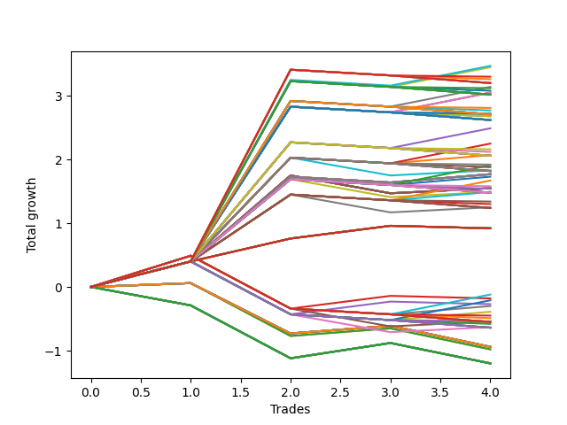

# Long HLT 110_90d 
- Symbol: TSLA
- Date Range: 01/10/2024 - 05/17/2024
- Trading Period: 8:30-12:30
- Number of Trades: 4



| Id. | Name | Win Percent | Profit | Avg Profit / Trade | Avg Time / Trade | Std |      | Name | Win Percent | Profit | Avg Profit / Trade | Avg Time / Trade | Std |
| --- | ---- | ----------- | ------ | ------------------ | ---------------- | --- | ---- | ---- | ----------- | ------ | ------------------ | ---------------- | --- |
| | Sorted By <br> Profit | | | | | | | Sorted By <br> Win Percentage |||||
|0| TP-3 75m | 75.00 | 3.47 | 0.87 | 54:30 | 1.16 |     | TP-3 75m | 75.00 | 3.47 | 0.87 | 54:30 | 1.16 |
|1| TP-2.75 75m | 75.00 | 3.45 | 0.86 | 54:15 | 1.15 |     | TP-2.75 75m | 75.00 | 3.45 | 0.86 | 54:15 | 1.15 |
|2| TP-3 105m | 50.00 | 3.30 | 0.83 | 62:15 | 1.28 |     | TP-2.5 75m | 75.00 | 3.14 | 0.79 | 53:15 | 1.02 |
|3| TP-3 90m | 50.00 | 3.26 | 0.82 | 58:30 | 1.28 |     | TP-2.25 75m | 75.00 | 3.05 | 0.76 | 52:30 | 0.98 |
|4| TP-3 180m | 50.00 | 3.20 | 0.80 | 66:00 | 1.29 |     | TP-2 75m | 75.00 | 3.05 | 0.76 | 52:30 | 0.98 |
|5| TP-3 165m | 50.00 | 3.20 | 0.80 | 66:00 | 1.29 |     | TP-1.75 75m | 75.00 | 2.49 | 0.62 | 52:15 | 0.74 |
|6| TP-3 150m | 50.00 | 3.20 | 0.80 | 66:00 | 1.29 |     | TP-1.5 75m | 75.00 | 2.25 | 0.56 | 44:45 | 0.64 |
|7| TP-3 135m | 50.00 | 3.20 | 0.80 | 66:00 | 1.29 |     | TP-1.5 60m | 75.00 | 2.07 | 0.52 | 41:00 | 0.67 |
|8| TP-3 120m | 50.00 | 3.20 | 0.80 | 66:00 | 1.29 |     | TP-1.25 75m | 75.00 | 1.91 | 0.48 | 44:30 | 0.50 |
|9| TP-2.5 75m | 75.00 | 3.14 | 0.79 | 53:15 | 1.02 |     | TP-1.5 45m | 75.00 | 1.83 | 0.46 | 35:45 | 0.72 |
|10| TP-2.75 105m | 50.00 | 3.12 | 0.78 | 61:45 | 1.20 |     | TP-3 60m | 75.00 | 1.77 | 0.44 | 47:00 | 0.54 |
|11| TP-2.75 90m | 50.00 | 3.08 | 0.77 | 58:00 | 1.21 |     | TP-2.75 60m | 75.00 | 1.77 | 0.44 | 47:00 | 0.54 |
|12| TP-2.25 75m | 75.00 | 3.05 | 0.76 | 52:30 | 0.98 |     | TP-2.5 60m | 75.00 | 1.77 | 0.44 | 47:00 | 0.54 |
|13| TP-2 75m | 75.00 | 3.05 | 0.76 | 52:30 | 0.98 |     | TP-2.25 60m | 75.00 | 1.77 | 0.44 | 47:00 | 0.54 |
|14| TP-2.75 180m | 50.00 | 3.02 | 0.76 | 65:30 | 1.22 |     | TP-2 60m | 75.00 | 1.77 | 0.44 | 47:00 | 0.54 |
|15| TP-2.75 165m | 50.00 | 3.02 | 0.76 | 65:30 | 1.22 |     | TP-1.75 60m | 75.00 | 1.77 | 0.44 | 47:00 | 0.54 |
|16| TP-2.75 150m | 50.00 | 3.02 | 0.76 | 65:30 | 1.22 |     | TP-1.25 60m | 75.00 | 1.73 | 0.43 | 40:45 | 0.52 |
|17| TP-2.75 135m | 50.00 | 3.02 | 0.76 | 65:30 | 1.22 |     | TP-1 75m | 75.00 | 1.67 | 0.42 | 44:15 | 0.41 |
|18| TP-2.75 120m | 50.00 | 3.02 | 0.76 | 65:30 | 1.22 |     | TP-3 45m | 75.00 | 1.55 | 0.39 | 38:00 | 0.61 |
|19| TP-2.5 105m | 50.00 | 2.81 | 0.70 | 60:45 | 1.07 |     | TP-2.75 45m | 75.00 | 1.55 | 0.39 | 38:00 | 0.61 |
|20| TP-2.5 90m | 50.00 | 2.77 | 0.69 | 57:00 | 1.07 |     | TP-2.5 45m | 75.00 | 1.55 | 0.39 | 38:00 | 0.61 |
|21| TP-2.25 105m | 50.00 | 2.72 | 0.68 | 60:00 | 1.03 |     | TP-2.25 45m | 75.00 | 1.55 | 0.39 | 38:00 | 0.61 |
|22| TP-2 105m | 50.00 | 2.72 | 0.68 | 60:00 | 1.03 |     | TP-2 45m | 75.00 | 1.55 | 0.39 | 38:00 | 0.61 |
|23| TP-2.5 180m | 50.00 | 2.71 | 0.68 | 64:30 | 1.08 |     | TP-1.75 45m | 75.00 | 1.55 | 0.39 | 38:00 | 0.61 |
|24| TP-2.5 165m | 50.00 | 2.71 | 0.68 | 64:30 | 1.08 |     | TP-1 60m | 75.00 | 1.49 | 0.37 | 40:30 | 0.43 |
|25| TP-2.5 150m | 50.00 | 2.71 | 0.68 | 64:30 | 1.08 |     | TP-1.25 45m | 75.00 | 1.49 | 0.37 | 35:30 | 0.58 |
|26| TP-2.5 135m | 50.00 | 2.71 | 0.68 | 64:30 | 1.08 |     | TP-1 45m | 75.00 | 1.25 | 0.31 | 35:15 | 0.49 |
|27| TP-2.5 120m | 50.00 | 2.71 | 0.68 | 64:30 | 1.08 |     | TP-3 30m | 75.00 | 0.92 | 0.23 | 26:45 | 0.17 |
|28| TP-2.25 90m | 50.00 | 2.68 | 0.67 | 56:15 | 1.03 |     | TP-2.75 30m | 75.00 | 0.92 | 0.23 | 26:45 | 0.17 |
|29| TP-2 90m | 50.00 | 2.68 | 0.67 | 56:15 | 1.03 |     | TP-2.5 30m | 75.00 | 0.92 | 0.23 | 26:45 | 0.17 |
|30| TP-2.25 180m | 50.00 | 2.62 | 0.66 | 63:45 | 1.05 |     | TP-2.25 30m | 75.00 | 0.92 | 0.23 | 26:45 | 0.17 |
|31| TP-2 180m | 50.00 | 2.62 | 0.66 | 63:45 | 1.05 |     | TP-2 30m | 75.00 | 0.92 | 0.23 | 26:45 | 0.17 |
|32| TP-2.25 165m | 50.00 | 2.62 | 0.66 | 63:45 | 1.05 |     | TP-1.75 30m | 75.00 | 0.92 | 0.23 | 26:45 | 0.17 |
|33| TP-2 165m | 50.00 | 2.62 | 0.66 | 63:45 | 1.05 |     | TP-1.5 30m | 75.00 | 0.92 | 0.23 | 26:45 | 0.17 |
|34| TP-2.25 150m | 50.00 | 2.62 | 0.66 | 63:45 | 1.05 |     | TP-1.25 30m | 75.00 | 0.92 | 0.23 | 26:45 | 0.17 |
|35| TP-2 150m | 50.00 | 2.62 | 0.66 | 63:45 | 1.05 |     | TP-1 30m | 75.00 | 0.92 | 0.23 | 26:45 | 0.17 |
|36| TP-2.25 135m | 50.00 | 2.62 | 0.66 | 63:45 | 1.05 |     | TP-3 105m | 50.00 | 3.30 | 0.83 | 62:15 | 1.28 |
|37| TP-2 135m | 50.00 | 2.62 | 0.66 | 63:45 | 1.05 |     | TP-3 90m | 50.00 | 3.26 | 0.82 | 58:30 | 1.28 |
|38| TP-2.25 120m | 50.00 | 2.62 | 0.66 | 63:45 | 1.05 |     | TP-3 180m | 50.00 | 3.20 | 0.80 | 66:00 | 1.29 |
|39| TP-2 120m | 50.00 | 2.62 | 0.66 | 63:45 | 1.05 |     | TP-3 165m | 50.00 | 3.20 | 0.80 | 66:00 | 1.29 |
|40| TP-1.75 75m | 75.00 | 2.49 | 0.62 | 52:15 | 0.74 |     | TP-3 150m | 50.00 | 3.20 | 0.80 | 66:00 | 1.29 |
|41| TP-1.5 75m | 75.00 | 2.25 | 0.56 | 44:45 | 0.64 |     | TP-3 135m | 50.00 | 3.20 | 0.80 | 66:00 | 1.29 |
|42| TP-1.75 105m | 50.00 | 2.16 | 0.54 | 59:45 | 0.79 |     | TP-3 120m | 50.00 | 3.20 | 0.80 | 66:00 | 1.29 |
|43| TP-1.75 90m | 50.00 | 2.12 | 0.53 | 56:00 | 0.80 |     | TP-2.75 105m | 50.00 | 3.12 | 0.78 | 61:45 | 1.20 |
|44| TP-1.5 60m | 75.00 | 2.07 | 0.52 | 41:00 | 0.67 |     | TP-2.75 90m | 50.00 | 3.08 | 0.77 | 58:00 | 1.21 |
|45| TP-1.75 180m | 50.00 | 2.06 | 0.52 | 63:30 | 0.81 |     | TP-2.75 180m | 50.00 | 3.02 | 0.76 | 65:30 | 1.22 |
|46| TP-1.75 165m | 50.00 | 2.06 | 0.52 | 63:30 | 0.81 |     | TP-2.75 165m | 50.00 | 3.02 | 0.76 | 65:30 | 1.22 |
|47| TP-1.75 150m | 50.00 | 2.06 | 0.52 | 63:30 | 0.81 |     | TP-2.75 150m | 50.00 | 3.02 | 0.76 | 65:30 | 1.22 |
|48| TP-1.75 135m | 50.00 | 2.06 | 0.52 | 63:30 | 0.81 |     | TP-2.75 135m | 50.00 | 3.02 | 0.76 | 65:30 | 1.22 |
|49| TP-1.75 120m | 50.00 | 2.06 | 0.52 | 63:30 | 0.81 |     | TP-2.75 120m | 50.00 | 3.02 | 0.76 | 65:30 | 1.22 |
|50| TP-1.5 105m | 50.00 | 1.92 | 0.48 | 52:15 | 0.69 |     | TP-2.5 105m | 50.00 | 2.81 | 0.70 | 60:45 | 1.07 |
|51| TP-1.25 75m | 75.00 | 1.91 | 0.48 | 44:30 | 0.50 |     | TP-2.5 90m | 50.00 | 2.77 | 0.69 | 57:00 | 1.07 |
|52| TP-1.5 90m | 50.00 | 1.88 | 0.47 | 48:30 | 0.70 |     | TP-2.25 105m | 50.00 | 2.72 | 0.68 | 60:00 | 1.03 |
|53| TP-1.5 45m | 75.00 | 1.83 | 0.46 | 35:45 | 0.72 |     | TP-2 105m | 50.00 | 2.72 | 0.68 | 60:00 | 1.03 |
|54| TP-1.5 180m | 50.00 | 1.82 | 0.46 | 56:00 | 0.71 |     | TP-2.5 180m | 50.00 | 2.71 | 0.68 | 64:30 | 1.08 |
|55| TP-1.5 165m | 50.00 | 1.82 | 0.46 | 56:00 | 0.71 |     | TP-2.5 165m | 50.00 | 2.71 | 0.68 | 64:30 | 1.08 |
|56| TP-1.5 150m | 50.00 | 1.82 | 0.46 | 56:00 | 0.71 |     | TP-2.5 150m | 50.00 | 2.71 | 0.68 | 64:30 | 1.08 |
|57| TP-1.5 135m | 50.00 | 1.82 | 0.46 | 56:00 | 0.71 |     | TP-2.5 135m | 50.00 | 2.71 | 0.68 | 64:30 | 1.08 |
|58| TP-1.5 120m | 50.00 | 1.82 | 0.46 | 56:00 | 0.71 |     | TP-2.5 120m | 50.00 | 2.71 | 0.68 | 64:30 | 1.08 |
|59| TP-3 60m | 75.00 | 1.77 | 0.44 | 47:00 | 0.54 |     | TP-2.25 90m | 50.00 | 2.68 | 0.67 | 56:15 | 1.03 |
|60| TP-2.75 60m | 75.00 | 1.77 | 0.44 | 47:00 | 0.54 |     | TP-2 90m | 50.00 | 2.68 | 0.67 | 56:15 | 1.03 |
|61| TP-2.5 60m | 75.00 | 1.77 | 0.44 | 47:00 | 0.54 |     | TP-2.25 180m | 50.00 | 2.62 | 0.66 | 63:45 | 1.05 |
|62| TP-2.25 60m | 75.00 | 1.77 | 0.44 | 47:00 | 0.54 |     | TP-2 180m | 50.00 | 2.62 | 0.66 | 63:45 | 1.05 |
|63| TP-2 60m | 75.00 | 1.77 | 0.44 | 47:00 | 0.54 |     | TP-2.25 165m | 50.00 | 2.62 | 0.66 | 63:45 | 1.05 |
|64| TP-1.75 60m | 75.00 | 1.77 | 0.44 | 47:00 | 0.54 |     | TP-2 165m | 50.00 | 2.62 | 0.66 | 63:45 | 1.05 |
|65| TP-1.25 60m | 75.00 | 1.73 | 0.43 | 40:45 | 0.52 |     | TP-2.25 150m | 50.00 | 2.62 | 0.66 | 63:45 | 1.05 |
|66| TP-1 75m | 75.00 | 1.67 | 0.42 | 44:15 | 0.41 |     | TP-2 150m | 50.00 | 2.62 | 0.66 | 63:45 | 1.05 |
|67| TP-1.25 105m | 50.00 | 1.58 | 0.40 | 52:00 | 0.55 |     | TP-2.25 135m | 50.00 | 2.62 | 0.66 | 63:45 | 1.05 |
|68| TP-3 45m | 75.00 | 1.55 | 0.39 | 38:00 | 0.61 |     | TP-2 135m | 50.00 | 2.62 | 0.66 | 63:45 | 1.05 |
|69| TP-2.75 45m | 75.00 | 1.55 | 0.39 | 38:00 | 0.61 |     | TP-2.25 120m | 50.00 | 2.62 | 0.66 | 63:45 | 1.05 |
|70| TP-2.5 45m | 75.00 | 1.55 | 0.39 | 38:00 | 0.61 |     | TP-2 120m | 50.00 | 2.62 | 0.66 | 63:45 | 1.05 |
|71| TP-2.25 45m | 75.00 | 1.55 | 0.39 | 38:00 | 0.61 |     | TP-1.75 105m | 50.00 | 2.16 | 0.54 | 59:45 | 0.79 |
|72| TP-2 45m | 75.00 | 1.55 | 0.39 | 38:00 | 0.61 |     | TP-1.75 90m | 50.00 | 2.12 | 0.53 | 56:00 | 0.80 |
|73| TP-1.75 45m | 75.00 | 1.55 | 0.39 | 38:00 | 0.61 |     | TP-1.75 180m | 50.00 | 2.06 | 0.52 | 63:30 | 0.81 |
|74| TP-1.25 90m | 50.00 | 1.54 | 0.39 | 48:15 | 0.56 |     | TP-1.75 165m | 50.00 | 2.06 | 0.52 | 63:30 | 0.81 |
|75| TP-1 60m | 75.00 | 1.49 | 0.37 | 40:30 | 0.43 |     | TP-1.75 150m | 50.00 | 2.06 | 0.52 | 63:30 | 0.81 |
|76| TP-1.25 45m | 75.00 | 1.49 | 0.37 | 35:30 | 0.58 |     | TP-1.75 135m | 50.00 | 2.06 | 0.52 | 63:30 | 0.81 |
|77| TP-1.25 180m | 50.00 | 1.48 | 0.37 | 55:45 | 0.57 |     | TP-1.75 120m | 50.00 | 2.06 | 0.52 | 63:30 | 0.81 |
|78| TP-1.25 165m | 50.00 | 1.48 | 0.37 | 55:45 | 0.57 |     | TP-1.5 105m | 50.00 | 1.92 | 0.48 | 52:15 | 0.69 |
|79| TP-1.25 150m | 50.00 | 1.48 | 0.37 | 55:45 | 0.57 |     | TP-1.5 90m | 50.00 | 1.88 | 0.47 | 48:30 | 0.70 |
|80| TP-1.25 135m | 50.00 | 1.48 | 0.37 | 55:45 | 0.57 |     | TP-1.5 180m | 50.00 | 1.82 | 0.46 | 56:00 | 0.71 |
|81| TP-1.25 120m | 50.00 | 1.48 | 0.37 | 55:45 | 0.57 |     | TP-1.5 165m | 50.00 | 1.82 | 0.46 | 56:00 | 0.71 |
|82| TP-1 105m | 50.00 | 1.34 | 0.34 | 51:45 | 0.45 |     | TP-1.5 150m | 50.00 | 1.82 | 0.46 | 56:00 | 0.71 |
|83| TP-1 90m | 50.00 | 1.30 | 0.33 | 48:00 | 0.46 |     | TP-1.5 135m | 50.00 | 1.82 | 0.46 | 56:00 | 0.71 |
|84| TP-1 45m | 75.00 | 1.25 | 0.31 | 35:15 | 0.49 |     | TP-1.5 120m | 50.00 | 1.82 | 0.46 | 56:00 | 0.71 |
|85| TP-1 180m | 50.00 | 1.24 | 0.31 | 55:30 | 0.47 |     | TP-1.25 105m | 50.00 | 1.58 | 0.40 | 52:00 | 0.55 |
|86| TP-1 165m | 50.00 | 1.24 | 0.31 | 55:30 | 0.47 |     | TP-1.25 90m | 50.00 | 1.54 | 0.39 | 48:15 | 0.56 |
|87| TP-1 150m | 50.00 | 1.24 | 0.31 | 55:30 | 0.47 |     | TP-1.25 180m | 50.00 | 1.48 | 0.37 | 55:45 | 0.57 |
|88| TP-1 135m | 50.00 | 1.24 | 0.31 | 55:30 | 0.47 |     | TP-1.25 165m | 50.00 | 1.48 | 0.37 | 55:45 | 0.57 |
|89| TP-1 120m | 50.00 | 1.24 | 0.31 | 55:30 | 0.47 |     | TP-1.25 150m | 50.00 | 1.48 | 0.37 | 55:45 | 0.57 |
|90| TP-3 30m | 75.00 | 0.92 | 0.23 | 26:45 | 0.17 |     | TP-1.25 135m | 50.00 | 1.48 | 0.37 | 55:45 | 0.57 |
|91| TP-2.75 30m | 75.00 | 0.92 | 0.23 | 26:45 | 0.17 |     | TP-1.25 120m | 50.00 | 1.48 | 0.37 | 55:45 | 0.57 |
|92| TP-2.5 30m | 75.00 | 0.92 | 0.23 | 26:45 | 0.17 |     | TP-1 105m | 50.00 | 1.34 | 0.34 | 51:45 | 0.45 |
|93| TP-2.25 30m | 75.00 | 0.92 | 0.23 | 26:45 | 0.17 |     | TP-1 90m | 50.00 | 1.30 | 0.33 | 48:00 | 0.46 |
|94| TP-2 30m | 75.00 | 0.92 | 0.23 | 26:45 | 0.17 |     | TP-1 180m | 50.00 | 1.24 | 0.31 | 55:30 | 0.47 |
|95| TP-1.75 30m | 75.00 | 0.92 | 0.23 | 26:45 | 0.17 |     | TP-1 165m | 50.00 | 1.24 | 0.31 | 55:30 | 0.47 |
|96| TP-1.5 30m | 75.00 | 0.92 | 0.23 | 26:45 | 0.17 |     | TP-1 150m | 50.00 | 1.24 | 0.31 | 55:30 | 0.47 |
|97| TP-1.25 30m | 75.00 | 0.92 | 0.23 | 26:45 | 0.17 |     | TP-1 135m | 50.00 | 1.24 | 0.31 | 55:30 | 0.47 |
|98| TP-1 30m | 75.00 | 0.92 | 0.23 | 26:45 | 0.17 |     | TP-1 120m | 50.00 | 1.24 | 0.31 | 55:30 | 0.47 |
|99| TP-0.5 75m | 50.00 | -0.12 | -0.03 | 36:15 | 0.51 |     | TP-0.5 75m | 50.00 | -0.12 | -0.03 | 36:15 | 0.51 |
|100| TP-0.5 30m | 50.00 | -0.18 | -0.05 | 19:45 | 0.49 |     | TP-0.5 30m | 50.00 | -0.18 | -0.05 | 19:45 | 0.49 |
|101| TP-0.75 75m | 50.00 | -0.21 | -0.05 | 36:30 | 0.49 |     | TP-0.75 75m | 50.00 | -0.21 | -0.05 | 36:30 | 0.49 |
|102| TP-0.75 30m | 50.00 | -0.27 | -0.07 | 20:00 | 0.47 |     | TP-0.75 30m | 50.00 | -0.27 | -0.07 | 20:00 | 0.47 |
|103| TP-0.5 60m | 50.00 | -0.30 | -0.07 | 32:30 | 0.48 |     | TP-0.5 60m | 50.00 | -0.30 | -0.07 | 32:30 | 0.48 |
|104| TP-0.75 60m | 50.00 | -0.39 | -0.10 | 32:45 | 0.46 |     | TP-0.75 60m | 50.00 | -0.39 | -0.10 | 32:45 | 0.46 |
|105| TP-0.5 105m | 25.00 | -0.45 | -0.11 | 43:45 | 0.47 |     | TP-0.5 45m | 50.00 | -0.54 | -0.13 | 27:15 | 0.48 |
|106| TP-0.5 90m | 25.00 | -0.49 | -0.12 | 40:00 | 0.47 |     | TP-0.75 45m | 50.00 | -0.63 | -0.16 | 27:30 | 0.46 |
|107| TP-0.5 45m | 50.00 | -0.54 | -0.13 | 27:15 | 0.48 |     | TP-3 15m | 50.00 | -0.94 | -0.23 | 14:00 | 0.36 |
|108| TP-0.75 105m | 25.00 | -0.54 | -0.13 | 44:00 | 0.44 |     | TP-2.75 15m | 50.00 | -0.94 | -0.23 | 14:00 | 0.36 |
|109| TP-0.5 180m | 25.00 | -0.55 | -0.14 | 47:30 | 0.47 |     | TP-2.5 15m | 50.00 | -0.94 | -0.23 | 14:00 | 0.36 |
|110| TP-0.5 165m | 25.00 | -0.55 | -0.14 | 47:30 | 0.47 |     | TP-2.25 15m | 50.00 | -0.94 | -0.23 | 14:00 | 0.36 |
|111| TP-0.5 150m | 25.00 | -0.55 | -0.14 | 47:30 | 0.47 |     | TP-2 15m | 50.00 | -0.94 | -0.23 | 14:00 | 0.36 |
|112| TP-0.5 135m | 25.00 | -0.55 | -0.14 | 47:30 | 0.47 |     | TP-1.75 15m | 50.00 | -0.94 | -0.23 | 14:00 | 0.36 |
|113| TP-0.5 120m | 25.00 | -0.55 | -0.14 | 47:30 | 0.47 |     | TP-1.5 15m | 50.00 | -0.94 | -0.23 | 14:00 | 0.36 |
|114| TP-0.75 90m | 25.00 | -0.58 | -0.14 | 40:15 | 0.44 |     | TP-1.25 15m | 50.00 | -0.94 | -0.23 | 14:00 | 0.36 |
|115| TP-0.75 45m | 50.00 | -0.63 | -0.16 | 27:30 | 0.46 |     | TP-1 15m | 50.00 | -0.94 | -0.23 | 14:00 | 0.36 |
|116| TP-0.75 180m | 25.00 | -0.64 | -0.16 | 47:45 | 0.44 |     | TP-0.75 15m | 50.00 | -0.98 | -0.24 | 11:00 | 0.38 |
|117| TP-0.75 165m | 25.00 | -0.64 | -0.16 | 47:45 | 0.44 |     | TP-0.5 15m | 50.00 | -0.98 | -0.24 | 11:00 | 0.38 |
|118| TP-0.75 150m | 25.00 | -0.64 | -0.16 | 47:45 | 0.44 |     | TP-0.5 105m | 25.00 | -0.45 | -0.11 | 43:45 | 0.47 |
|119| TP-0.75 135m | 25.00 | -0.64 | -0.16 | 47:45 | 0.44 |     | TP-0.5 90m | 25.00 | -0.49 | -0.12 | 40:00 | 0.47 |
|120| TP-0.75 120m | 25.00 | -0.64 | -0.16 | 47:45 | 0.44 |     | TP-0.75 105m | 25.00 | -0.54 | -0.13 | 44:00 | 0.44 |
|121| TP-3 15m | 50.00 | -0.94 | -0.23 | 14:00 | 0.36 |     | TP-0.5 180m | 25.00 | -0.55 | -0.14 | 47:30 | 0.47 |
|122| TP-2.75 15m | 50.00 | -0.94 | -0.23 | 14:00 | 0.36 |     | TP-0.5 165m | 25.00 | -0.55 | -0.14 | 47:30 | 0.47 |
|123| TP-2.5 15m | 50.00 | -0.94 | -0.23 | 14:00 | 0.36 |     | TP-0.5 150m | 25.00 | -0.55 | -0.14 | 47:30 | 0.47 |
|124| TP-2.25 15m | 50.00 | -0.94 | -0.23 | 14:00 | 0.36 |     | TP-0.5 135m | 25.00 | -0.55 | -0.14 | 47:30 | 0.47 |
|125| TP-2 15m | 50.00 | -0.94 | -0.23 | 14:00 | 0.36 |     | TP-0.5 120m | 25.00 | -0.55 | -0.14 | 47:30 | 0.47 |
|126| TP-1.75 15m | 50.00 | -0.94 | -0.23 | 14:00 | 0.36 |     | TP-0.75 90m | 25.00 | -0.58 | -0.14 | 40:15 | 0.44 |
|127| TP-1.5 15m | 50.00 | -0.94 | -0.23 | 14:00 | 0.36 |     | TP-0.75 180m | 25.00 | -0.64 | -0.16 | 47:45 | 0.44 |
|128| TP-1.25 15m | 50.00 | -0.94 | -0.23 | 14:00 | 0.36 |     | TP-0.75 165m | 25.00 | -0.64 | -0.16 | 47:45 | 0.44 |
|129| TP-1 15m | 50.00 | -0.94 | -0.23 | 14:00 | 0.36 |     | TP-0.75 150m | 25.00 | -0.64 | -0.16 | 47:45 | 0.44 |
|130| TP-0.75 15m | 50.00 | -0.98 | -0.24 | 11:00 | 0.38 |     | TP-0.75 135m | 25.00 | -0.64 | -0.16 | 47:45 | 0.44 |
|131| TP-0.5 15m | 50.00 | -0.98 | -0.24 | 11:00 | 0.38 |     | TP-0.75 120m | 25.00 | -0.64 | -0.16 | 47:45 | 0.44 |
|132| TP-0.25 180m | 25.00 | -1.20 | -0.30 | 07:00 | 0.38 |     | TP-0.25 180m | 25.00 | -1.20 | -0.30 | 07:00 | 0.38 |
|133| TP-0.25 165m | 25.00 | -1.20 | -0.30 | 07:00 | 0.38 |     | TP-0.25 165m | 25.00 | -1.20 | -0.30 | 07:00 | 0.38 |
|134| TP-0.25 150m | 25.00 | -1.20 | -0.30 | 07:00 | 0.38 |     | TP-0.25 150m | 25.00 | -1.20 | -0.30 | 07:00 | 0.38 |
|135| TP-0.25 135m | 25.00 | -1.20 | -0.30 | 07:00 | 0.38 |     | TP-0.25 135m | 25.00 | -1.20 | -0.30 | 07:00 | 0.38 |
|136| TP-0.25 120m | 25.00 | -1.20 | -0.30 | 07:00 | 0.38 |     | TP-0.25 120m | 25.00 | -1.20 | -0.30 | 07:00 | 0.38 |
|137| TP-0.25 105m | 25.00 | -1.20 | -0.30 | 07:00 | 0.38 |     | TP-0.25 105m | 25.00 | -1.20 | -0.30 | 07:00 | 0.38 |
|138| TP-0.25 90m | 25.00 | -1.20 | -0.30 | 07:00 | 0.38 |     | TP-0.25 90m | 25.00 | -1.20 | -0.30 | 07:00 | 0.38 |
|139| TP-0.25 75m | 25.00 | -1.20 | -0.30 | 07:00 | 0.38 |     | TP-0.25 75m | 25.00 | -1.20 | -0.30 | 07:00 | 0.38 |
|140| TP-0.25 60m | 25.00 | -1.20 | -0.30 | 07:00 | 0.38 |     | TP-0.25 60m | 25.00 | -1.20 | -0.30 | 07:00 | 0.38 |
|141| TP-0.25 45m | 25.00 | -1.20 | -0.30 | 07:00 | 0.38 |     | TP-0.25 45m | 25.00 | -1.20 | -0.30 | 07:00 | 0.38 |
|142| TP-0.25 30m | 25.00 | -1.20 | -0.30 | 07:00 | 0.38 |     | TP-0.25 30m | 25.00 | -1.20 | -0.30 | 07:00 | 0.38 |
|143| TP-0.25 15m | 25.00 | -1.20 | -0.30 | 07:00 | 0.38 |     | TP-0.25 15m | 25.00 | -1.20 | -0.30 | 07:00 | 0.38 |

### Test TP-0.25 15m
* Take Profit of 0.25 Point
* 0.25 Stoploss
* Results:
```
Total Trades: 4
Percent Up: 25.00
Percent Down: 75.00
Total Points Moved Up: -1.20
Potential Profit: -600.00
Total Points Ups: 0.24 Count Ups: 1
Total Points Downs: -1.44 Count Downs: 3
```

<details><summary>Trades</summary>

<code>In: 2024-03-14 12:30:00		Out: 2024-03-14 12:35:00		Total Position Time: 05:00		Total Move Up: -0.29		Total to Date: -0.29</code> <br />
<code>In: 2024-04-05 08:45:00		Out: 2024-04-05 08:47:00		Total Position Time: 02:00		Total Move Up: -0.83		Total to Date: -1.12</code> <br />
<code>In: 2024-05-07 12:00:00		Out: 2024-05-07 12:08:00		Total Position Time: 08:00		Total Move Up: 0.24		Total to Date: -0.88</code> <br />
<code>In: 2024-05-09 08:55:00		Out: 2024-05-09 09:08:00		Total Position Time: 13:00		Total Move Up: -0.32		Total to Date: -1.20</code> <br />


</details>

### Test TP-0.5 15m
* Take Profit of 0.5 Point
* 0.5 Stoploss
* Results:
```
Total Trades: 4
Percent Up: 50.00
Percent Down: 50.00
Total Points Moved Up: -0.98
Potential Profit: -490.00
Total Points Ups: 0.18 Count Ups: 2
Total Points Downs: -1.16 Count Downs: 2
```

<details><summary>Trades</summary>

<code>In: 2024-03-14 12:30:00		Out: 2024-03-14 12:44:00		Total Position Time: 14:00		Total Move Up: 0.06		Total to Date: 0.06</code> <br />
<code>In: 2024-04-05 08:45:00		Out: 2024-04-05 08:47:00		Total Position Time: 02:00		Total Move Up: -0.83		Total to Date: -0.77</code> <br />
<code>In: 2024-05-07 12:00:00		Out: 2024-05-07 12:14:00		Total Position Time: 14:00		Total Move Up: 0.12		Total to Date: -0.65</code> <br />
<code>In: 2024-05-09 08:55:00		Out: 2024-05-09 09:09:00		Total Position Time: 14:00		Total Move Up: -0.33		Total to Date: -0.98</code> <br />


</details>

### Test TP-0.75 15m
* Take Profit of 0.75 Point
* 0.75 Stoploss
* Results:
```
Total Trades: 4
Percent Up: 50.00
Percent Down: 50.00
Total Points Moved Up: -0.98
Potential Profit: -490.00
Total Points Ups: 0.18 Count Ups: 2
Total Points Downs: -1.16 Count Downs: 2
```

<details><summary>Trades</summary>

<code>In: 2024-03-14 12:30:00		Out: 2024-03-14 12:44:00		Total Position Time: 14:00		Total Move Up: 0.06		Total to Date: 0.06</code> <br />
<code>In: 2024-04-05 08:45:00		Out: 2024-04-05 08:47:00		Total Position Time: 02:00		Total Move Up: -0.83		Total to Date: -0.77</code> <br />
<code>In: 2024-05-07 12:00:00		Out: 2024-05-07 12:14:00		Total Position Time: 14:00		Total Move Up: 0.12		Total to Date: -0.65</code> <br />
<code>In: 2024-05-09 08:55:00		Out: 2024-05-09 09:09:00		Total Position Time: 14:00		Total Move Up: -0.33		Total to Date: -0.98</code> <br />


</details>

### Test TP-1 15m
* Take Profit of 1 Point
* 1 Stoploss
* Results:
```
Total Trades: 4
Percent Up: 50.00
Percent Down: 50.00
Total Points Moved Up: -0.94
Potential Profit: -470.00
Total Points Ups: 0.18 Count Ups: 2
Total Points Downs: -1.12 Count Downs: 2
```

<details><summary>Trades</summary>

<code>In: 2024-03-14 12:30:00		Out: 2024-03-14 12:44:00		Total Position Time: 14:00		Total Move Up: 0.06		Total to Date: 0.06</code> <br />
<code>In: 2024-04-05 08:45:00		Out: 2024-04-05 08:59:00		Total Position Time: 14:00		Total Move Up: -0.79		Total to Date: -0.73</code> <br />
<code>In: 2024-05-07 12:00:00		Out: 2024-05-07 12:14:00		Total Position Time: 14:00		Total Move Up: 0.12		Total to Date: -0.61</code> <br />
<code>In: 2024-05-09 08:55:00		Out: 2024-05-09 09:09:00		Total Position Time: 14:00		Total Move Up: -0.33		Total to Date: -0.94</code> <br />


</details>

### Test TP-1.25 15m
* Take Profit of 1.25 Point
* 1.25 Stoploss
* Results:
```
Total Trades: 4
Percent Up: 50.00
Percent Down: 50.00
Total Points Moved Up: -0.94
Potential Profit: -470.00
Total Points Ups: 0.18 Count Ups: 2
Total Points Downs: -1.12 Count Downs: 2
```

<details><summary>Trades</summary>

<code>In: 2024-03-14 12:30:00		Out: 2024-03-14 12:44:00		Total Position Time: 14:00		Total Move Up: 0.06		Total to Date: 0.06</code> <br />
<code>In: 2024-04-05 08:45:00		Out: 2024-04-05 08:59:00		Total Position Time: 14:00		Total Move Up: -0.79		Total to Date: -0.73</code> <br />
<code>In: 2024-05-07 12:00:00		Out: 2024-05-07 12:14:00		Total Position Time: 14:00		Total Move Up: 0.12		Total to Date: -0.61</code> <br />
<code>In: 2024-05-09 08:55:00		Out: 2024-05-09 09:09:00		Total Position Time: 14:00		Total Move Up: -0.33		Total to Date: -0.94</code> <br />


</details>

### Test TP-1.5 15m
* Take Profit of 1.5 Point
* 1.5 Stoploss
* Results:
```
Total Trades: 4
Percent Up: 50.00
Percent Down: 50.00
Total Points Moved Up: -0.94
Potential Profit: -470.00
Total Points Ups: 0.18 Count Ups: 2
Total Points Downs: -1.12 Count Downs: 2
```

<details><summary>Trades</summary>

<code>In: 2024-03-14 12:30:00		Out: 2024-03-14 12:44:00		Total Position Time: 14:00		Total Move Up: 0.06		Total to Date: 0.06</code> <br />
<code>In: 2024-04-05 08:45:00		Out: 2024-04-05 08:59:00		Total Position Time: 14:00		Total Move Up: -0.79		Total to Date: -0.73</code> <br />
<code>In: 2024-05-07 12:00:00		Out: 2024-05-07 12:14:00		Total Position Time: 14:00		Total Move Up: 0.12		Total to Date: -0.61</code> <br />
<code>In: 2024-05-09 08:55:00		Out: 2024-05-09 09:09:00		Total Position Time: 14:00		Total Move Up: -0.33		Total to Date: -0.94</code> <br />


</details>

### Test TP-1.75 15m
* Take Profit of 1.75 Point
* 1.75 Stoploss
* Results:
```
Total Trades: 4
Percent Up: 50.00
Percent Down: 50.00
Total Points Moved Up: -0.94
Potential Profit: -470.00
Total Points Ups: 0.18 Count Ups: 2
Total Points Downs: -1.12 Count Downs: 2
```

<details><summary>Trades</summary>

<code>In: 2024-03-14 12:30:00		Out: 2024-03-14 12:44:00		Total Position Time: 14:00		Total Move Up: 0.06		Total to Date: 0.06</code> <br />
<code>In: 2024-04-05 08:45:00		Out: 2024-04-05 08:59:00		Total Position Time: 14:00		Total Move Up: -0.79		Total to Date: -0.73</code> <br />
<code>In: 2024-05-07 12:00:00		Out: 2024-05-07 12:14:00		Total Position Time: 14:00		Total Move Up: 0.12		Total to Date: -0.61</code> <br />
<code>In: 2024-05-09 08:55:00		Out: 2024-05-09 09:09:00		Total Position Time: 14:00		Total Move Up: -0.33		Total to Date: -0.94</code> <br />


</details>

### Test TP-2 15m
* Take Profit of 2 Point
* 2 Stoploss
* Results:
```
Total Trades: 4
Percent Up: 50.00
Percent Down: 50.00
Total Points Moved Up: -0.94
Potential Profit: -470.00
Total Points Ups: 0.18 Count Ups: 2
Total Points Downs: -1.12 Count Downs: 2
```

<details><summary>Trades</summary>

<code>In: 2024-03-14 12:30:00		Out: 2024-03-14 12:44:00		Total Position Time: 14:00		Total Move Up: 0.06		Total to Date: 0.06</code> <br />
<code>In: 2024-04-05 08:45:00		Out: 2024-04-05 08:59:00		Total Position Time: 14:00		Total Move Up: -0.79		Total to Date: -0.73</code> <br />
<code>In: 2024-05-07 12:00:00		Out: 2024-05-07 12:14:00		Total Position Time: 14:00		Total Move Up: 0.12		Total to Date: -0.61</code> <br />
<code>In: 2024-05-09 08:55:00		Out: 2024-05-09 09:09:00		Total Position Time: 14:00		Total Move Up: -0.33		Total to Date: -0.94</code> <br />


</details>

### Test TP-2.25 15m
* Take Profit of 2.25 Point
* 2.25 Stoploss
* Results:
```
Total Trades: 4
Percent Up: 50.00
Percent Down: 50.00
Total Points Moved Up: -0.94
Potential Profit: -470.00
Total Points Ups: 0.18 Count Ups: 2
Total Points Downs: -1.12 Count Downs: 2
```

<details><summary>Trades</summary>

<code>In: 2024-03-14 12:30:00		Out: 2024-03-14 12:44:00		Total Position Time: 14:00		Total Move Up: 0.06		Total to Date: 0.06</code> <br />
<code>In: 2024-04-05 08:45:00		Out: 2024-04-05 08:59:00		Total Position Time: 14:00		Total Move Up: -0.79		Total to Date: -0.73</code> <br />
<code>In: 2024-05-07 12:00:00		Out: 2024-05-07 12:14:00		Total Position Time: 14:00		Total Move Up: 0.12		Total to Date: -0.61</code> <br />
<code>In: 2024-05-09 08:55:00		Out: 2024-05-09 09:09:00		Total Position Time: 14:00		Total Move Up: -0.33		Total to Date: -0.94</code> <br />


</details>

### Test TP-2.5 15m
* Take Profit of 2.5 Point
* 2.5 Stoploss
* Results:
```
Total Trades: 4
Percent Up: 50.00
Percent Down: 50.00
Total Points Moved Up: -0.94
Potential Profit: -470.00
Total Points Ups: 0.18 Count Ups: 2
Total Points Downs: -1.12 Count Downs: 2
```

<details><summary>Trades</summary>

<code>In: 2024-03-14 12:30:00		Out: 2024-03-14 12:44:00		Total Position Time: 14:00		Total Move Up: 0.06		Total to Date: 0.06</code> <br />
<code>In: 2024-04-05 08:45:00		Out: 2024-04-05 08:59:00		Total Position Time: 14:00		Total Move Up: -0.79		Total to Date: -0.73</code> <br />
<code>In: 2024-05-07 12:00:00		Out: 2024-05-07 12:14:00		Total Position Time: 14:00		Total Move Up: 0.12		Total to Date: -0.61</code> <br />
<code>In: 2024-05-09 08:55:00		Out: 2024-05-09 09:09:00		Total Position Time: 14:00		Total Move Up: -0.33		Total to Date: -0.94</code> <br />


</details>

### Test TP-2.75 15m
* Take Profit of 2.75 Point
* 2.75 Stoploss
* Results:
```
Total Trades: 4
Percent Up: 50.00
Percent Down: 50.00
Total Points Moved Up: -0.94
Potential Profit: -470.00
Total Points Ups: 0.18 Count Ups: 2
Total Points Downs: -1.12 Count Downs: 2
```

<details><summary>Trades</summary>

<code>In: 2024-03-14 12:30:00		Out: 2024-03-14 12:44:00		Total Position Time: 14:00		Total Move Up: 0.06		Total to Date: 0.06</code> <br />
<code>In: 2024-04-05 08:45:00		Out: 2024-04-05 08:59:00		Total Position Time: 14:00		Total Move Up: -0.79		Total to Date: -0.73</code> <br />
<code>In: 2024-05-07 12:00:00		Out: 2024-05-07 12:14:00		Total Position Time: 14:00		Total Move Up: 0.12		Total to Date: -0.61</code> <br />
<code>In: 2024-05-09 08:55:00		Out: 2024-05-09 09:09:00		Total Position Time: 14:00		Total Move Up: -0.33		Total to Date: -0.94</code> <br />


</details>

### Test TP-3 15m
* Take Profit of 3 Point
* 3 Stoploss
* Results:
```
Total Trades: 4
Percent Up: 50.00
Percent Down: 50.00
Total Points Moved Up: -0.94
Potential Profit: -470.00
Total Points Ups: 0.18 Count Ups: 2
Total Points Downs: -1.12 Count Downs: 2
```

<details><summary>Trades</summary>

<code>In: 2024-03-14 12:30:00		Out: 2024-03-14 12:44:00		Total Position Time: 14:00		Total Move Up: 0.06		Total to Date: 0.06</code> <br />
<code>In: 2024-04-05 08:45:00		Out: 2024-04-05 08:59:00		Total Position Time: 14:00		Total Move Up: -0.79		Total to Date: -0.73</code> <br />
<code>In: 2024-05-07 12:00:00		Out: 2024-05-07 12:14:00		Total Position Time: 14:00		Total Move Up: 0.12		Total to Date: -0.61</code> <br />
<code>In: 2024-05-09 08:55:00		Out: 2024-05-09 09:09:00		Total Position Time: 14:00		Total Move Up: -0.33		Total to Date: -0.94</code> <br />


</details>

### Test TP-0.25 30m
* Take Profit of 0.25 Point
* 0.25 Stoploss
* Results:
```
Total Trades: 4
Percent Up: 25.00
Percent Down: 75.00
Total Points Moved Up: -1.20
Potential Profit: -600.00
Total Points Ups: 0.24 Count Ups: 1
Total Points Downs: -1.44 Count Downs: 3
```

<details><summary>Trades</summary>

<code>In: 2024-03-14 12:30:00		Out: 2024-03-14 12:35:00		Total Position Time: 05:00		Total Move Up: -0.29		Total to Date: -0.29</code> <br />
<code>In: 2024-04-05 08:45:00		Out: 2024-04-05 08:47:00		Total Position Time: 02:00		Total Move Up: -0.83		Total to Date: -1.12</code> <br />
<code>In: 2024-05-07 12:00:00		Out: 2024-05-07 12:08:00		Total Position Time: 08:00		Total Move Up: 0.24		Total to Date: -0.88</code> <br />
<code>In: 2024-05-09 08:55:00		Out: 2024-05-09 09:08:00		Total Position Time: 13:00		Total Move Up: -0.32		Total to Date: -1.20</code> <br />


</details>

### Test TP-0.5 30m
* Take Profit of 0.5 Point
* 0.5 Stoploss
* Results:
```
Total Trades: 4
Percent Up: 50.00
Percent Down: 50.00
Total Points Moved Up: -0.18
Potential Profit: -90.00
Total Points Ups: 0.69 Count Ups: 2
Total Points Downs: -0.87 Count Downs: 2
```

<details><summary>Trades</summary>

<code>In: 2024-03-14 12:30:00		Out: 2024-03-14 12:49:00		Total Position Time: 19:00		Total Move Up: 0.49		Total to Date: 0.49</code> <br />
<code>In: 2024-04-05 08:45:00		Out: 2024-04-05 08:47:00		Total Position Time: 02:00		Total Move Up: -0.83		Total to Date: -0.34</code> <br />
<code>In: 2024-05-07 12:00:00		Out: 2024-05-07 12:29:00		Total Position Time: 29:00		Total Move Up: 0.20		Total to Date: -0.14</code> <br />
<code>In: 2024-05-09 08:55:00		Out: 2024-05-09 09:24:00		Total Position Time: 29:00		Total Move Up: -0.04		Total to Date: -0.18</code> <br />


</details>

### Test TP-0.75 30m
* Take Profit of 0.75 Point
* 0.75 Stoploss
* Results:
```
Total Trades: 4
Percent Up: 50.00
Percent Down: 50.00
Total Points Moved Up: -0.27
Potential Profit: -135.00
Total Points Ups: 0.60 Count Ups: 2
Total Points Downs: -0.87 Count Downs: 2
```

<details><summary>Trades</summary>

<code>In: 2024-03-14 12:30:00		Out: 2024-03-14 12:50:00		Total Position Time: 20:00		Total Move Up: 0.40		Total to Date: 0.40</code> <br />
<code>In: 2024-04-05 08:45:00		Out: 2024-04-05 08:47:00		Total Position Time: 02:00		Total Move Up: -0.83		Total to Date: -0.43</code> <br />
<code>In: 2024-05-07 12:00:00		Out: 2024-05-07 12:29:00		Total Position Time: 29:00		Total Move Up: 0.20		Total to Date: -0.23</code> <br />
<code>In: 2024-05-09 08:55:00		Out: 2024-05-09 09:24:00		Total Position Time: 29:00		Total Move Up: -0.04		Total to Date: -0.27</code> <br />


</details>

### Test TP-1 30m
* Take Profit of 1 Point
* 1 Stoploss
* Results:
```
Total Trades: 4
Percent Up: 75.00
Percent Down: 25.00
Total Points Moved Up: 0.92
Potential Profit: 460.00
Total Points Ups: 0.96 Count Ups: 3
Total Points Downs: -0.04 Count Downs: 1
```

<details><summary>Trades</summary>

<code>In: 2024-03-14 12:30:00		Out: 2024-03-14 12:50:00		Total Position Time: 20:00		Total Move Up: 0.40		Total to Date: 0.40</code> <br />
<code>In: 2024-04-05 08:45:00		Out: 2024-04-05 09:14:00		Total Position Time: 29:00		Total Move Up: 0.36		Total to Date: 0.76</code> <br />
<code>In: 2024-05-07 12:00:00		Out: 2024-05-07 12:29:00		Total Position Time: 29:00		Total Move Up: 0.20		Total to Date: 0.96</code> <br />
<code>In: 2024-05-09 08:55:00		Out: 2024-05-09 09:24:00		Total Position Time: 29:00		Total Move Up: -0.04		Total to Date: 0.92</code> <br />


</details>

### Test TP-1.25 30m
* Take Profit of 1.25 Point
* 1.25 Stoploss
* Results:
```
Total Trades: 4
Percent Up: 75.00
Percent Down: 25.00
Total Points Moved Up: 0.92
Potential Profit: 460.00
Total Points Ups: 0.96 Count Ups: 3
Total Points Downs: -0.04 Count Downs: 1
```

<details><summary>Trades</summary>

<code>In: 2024-03-14 12:30:00		Out: 2024-03-14 12:50:00		Total Position Time: 20:00		Total Move Up: 0.40		Total to Date: 0.40</code> <br />
<code>In: 2024-04-05 08:45:00		Out: 2024-04-05 09:14:00		Total Position Time: 29:00		Total Move Up: 0.36		Total to Date: 0.76</code> <br />
<code>In: 2024-05-07 12:00:00		Out: 2024-05-07 12:29:00		Total Position Time: 29:00		Total Move Up: 0.20		Total to Date: 0.96</code> <br />
<code>In: 2024-05-09 08:55:00		Out: 2024-05-09 09:24:00		Total Position Time: 29:00		Total Move Up: -0.04		Total to Date: 0.92</code> <br />


</details>

### Test TP-1.5 30m
* Take Profit of 1.5 Point
* 1.5 Stoploss
* Results:
```
Total Trades: 4
Percent Up: 75.00
Percent Down: 25.00
Total Points Moved Up: 0.92
Potential Profit: 460.00
Total Points Ups: 0.96 Count Ups: 3
Total Points Downs: -0.04 Count Downs: 1
```

<details><summary>Trades</summary>

<code>In: 2024-03-14 12:30:00		Out: 2024-03-14 12:50:00		Total Position Time: 20:00		Total Move Up: 0.40		Total to Date: 0.40</code> <br />
<code>In: 2024-04-05 08:45:00		Out: 2024-04-05 09:14:00		Total Position Time: 29:00		Total Move Up: 0.36		Total to Date: 0.76</code> <br />
<code>In: 2024-05-07 12:00:00		Out: 2024-05-07 12:29:00		Total Position Time: 29:00		Total Move Up: 0.20		Total to Date: 0.96</code> <br />
<code>In: 2024-05-09 08:55:00		Out: 2024-05-09 09:24:00		Total Position Time: 29:00		Total Move Up: -0.04		Total to Date: 0.92</code> <br />


</details>

### Test TP-1.75 30m
* Take Profit of 1.75 Point
* 1.75 Stoploss
* Results:
```
Total Trades: 4
Percent Up: 75.00
Percent Down: 25.00
Total Points Moved Up: 0.92
Potential Profit: 460.00
Total Points Ups: 0.96 Count Ups: 3
Total Points Downs: -0.04 Count Downs: 1
```

<details><summary>Trades</summary>

<code>In: 2024-03-14 12:30:00		Out: 2024-03-14 12:50:00		Total Position Time: 20:00		Total Move Up: 0.40		Total to Date: 0.40</code> <br />
<code>In: 2024-04-05 08:45:00		Out: 2024-04-05 09:14:00		Total Position Time: 29:00		Total Move Up: 0.36		Total to Date: 0.76</code> <br />
<code>In: 2024-05-07 12:00:00		Out: 2024-05-07 12:29:00		Total Position Time: 29:00		Total Move Up: 0.20		Total to Date: 0.96</code> <br />
<code>In: 2024-05-09 08:55:00		Out: 2024-05-09 09:24:00		Total Position Time: 29:00		Total Move Up: -0.04		Total to Date: 0.92</code> <br />


</details>

### Test TP-2 30m
* Take Profit of 2 Point
* 2 Stoploss
* Results:
```
Total Trades: 4
Percent Up: 75.00
Percent Down: 25.00
Total Points Moved Up: 0.92
Potential Profit: 460.00
Total Points Ups: 0.96 Count Ups: 3
Total Points Downs: -0.04 Count Downs: 1
```

<details><summary>Trades</summary>

<code>In: 2024-03-14 12:30:00		Out: 2024-03-14 12:50:00		Total Position Time: 20:00		Total Move Up: 0.40		Total to Date: 0.40</code> <br />
<code>In: 2024-04-05 08:45:00		Out: 2024-04-05 09:14:00		Total Position Time: 29:00		Total Move Up: 0.36		Total to Date: 0.76</code> <br />
<code>In: 2024-05-07 12:00:00		Out: 2024-05-07 12:29:00		Total Position Time: 29:00		Total Move Up: 0.20		Total to Date: 0.96</code> <br />
<code>In: 2024-05-09 08:55:00		Out: 2024-05-09 09:24:00		Total Position Time: 29:00		Total Move Up: -0.04		Total to Date: 0.92</code> <br />


</details>

### Test TP-2.25 30m
* Take Profit of 2.25 Point
* 2.25 Stoploss
* Results:
```
Total Trades: 4
Percent Up: 75.00
Percent Down: 25.00
Total Points Moved Up: 0.92
Potential Profit: 460.00
Total Points Ups: 0.96 Count Ups: 3
Total Points Downs: -0.04 Count Downs: 1
```

<details><summary>Trades</summary>

<code>In: 2024-03-14 12:30:00		Out: 2024-03-14 12:50:00		Total Position Time: 20:00		Total Move Up: 0.40		Total to Date: 0.40</code> <br />
<code>In: 2024-04-05 08:45:00		Out: 2024-04-05 09:14:00		Total Position Time: 29:00		Total Move Up: 0.36		Total to Date: 0.76</code> <br />
<code>In: 2024-05-07 12:00:00		Out: 2024-05-07 12:29:00		Total Position Time: 29:00		Total Move Up: 0.20		Total to Date: 0.96</code> <br />
<code>In: 2024-05-09 08:55:00		Out: 2024-05-09 09:24:00		Total Position Time: 29:00		Total Move Up: -0.04		Total to Date: 0.92</code> <br />


</details>

### Test TP-2.5 30m
* Take Profit of 2.5 Point
* 2.5 Stoploss
* Results:
```
Total Trades: 4
Percent Up: 75.00
Percent Down: 25.00
Total Points Moved Up: 0.92
Potential Profit: 460.00
Total Points Ups: 0.96 Count Ups: 3
Total Points Downs: -0.04 Count Downs: 1
```

<details><summary>Trades</summary>

<code>In: 2024-03-14 12:30:00		Out: 2024-03-14 12:50:00		Total Position Time: 20:00		Total Move Up: 0.40		Total to Date: 0.40</code> <br />
<code>In: 2024-04-05 08:45:00		Out: 2024-04-05 09:14:00		Total Position Time: 29:00		Total Move Up: 0.36		Total to Date: 0.76</code> <br />
<code>In: 2024-05-07 12:00:00		Out: 2024-05-07 12:29:00		Total Position Time: 29:00		Total Move Up: 0.20		Total to Date: 0.96</code> <br />
<code>In: 2024-05-09 08:55:00		Out: 2024-05-09 09:24:00		Total Position Time: 29:00		Total Move Up: -0.04		Total to Date: 0.92</code> <br />


</details>

### Test TP-2.75 30m
* Take Profit of 2.75 Point
* 2.75 Stoploss
* Results:
```
Total Trades: 4
Percent Up: 75.00
Percent Down: 25.00
Total Points Moved Up: 0.92
Potential Profit: 460.00
Total Points Ups: 0.96 Count Ups: 3
Total Points Downs: -0.04 Count Downs: 1
```

<details><summary>Trades</summary>

<code>In: 2024-03-14 12:30:00		Out: 2024-03-14 12:50:00		Total Position Time: 20:00		Total Move Up: 0.40		Total to Date: 0.40</code> <br />
<code>In: 2024-04-05 08:45:00		Out: 2024-04-05 09:14:00		Total Position Time: 29:00		Total Move Up: 0.36		Total to Date: 0.76</code> <br />
<code>In: 2024-05-07 12:00:00		Out: 2024-05-07 12:29:00		Total Position Time: 29:00		Total Move Up: 0.20		Total to Date: 0.96</code> <br />
<code>In: 2024-05-09 08:55:00		Out: 2024-05-09 09:24:00		Total Position Time: 29:00		Total Move Up: -0.04		Total to Date: 0.92</code> <br />


</details>

### Test TP-3 30m
* Take Profit of 3 Point
* 3 Stoploss
* Results:
```
Total Trades: 4
Percent Up: 75.00
Percent Down: 25.00
Total Points Moved Up: 0.92
Potential Profit: 460.00
Total Points Ups: 0.96 Count Ups: 3
Total Points Downs: -0.04 Count Downs: 1
```

<details><summary>Trades</summary>

<code>In: 2024-03-14 12:30:00		Out: 2024-03-14 12:50:00		Total Position Time: 20:00		Total Move Up: 0.40		Total to Date: 0.40</code> <br />
<code>In: 2024-04-05 08:45:00		Out: 2024-04-05 09:14:00		Total Position Time: 29:00		Total Move Up: 0.36		Total to Date: 0.76</code> <br />
<code>In: 2024-05-07 12:00:00		Out: 2024-05-07 12:29:00		Total Position Time: 29:00		Total Move Up: 0.20		Total to Date: 0.96</code> <br />
<code>In: 2024-05-09 08:55:00		Out: 2024-05-09 09:24:00		Total Position Time: 29:00		Total Move Up: -0.04		Total to Date: 0.92</code> <br />


</details>

### Test TP-0.25 45m
* Take Profit of 0.25 Point
* 0.25 Stoploss
* Results:
```
Total Trades: 4
Percent Up: 25.00
Percent Down: 75.00
Total Points Moved Up: -1.20
Potential Profit: -600.00
Total Points Ups: 0.24 Count Ups: 1
Total Points Downs: -1.44 Count Downs: 3
```

<details><summary>Trades</summary>

<code>In: 2024-03-14 12:30:00		Out: 2024-03-14 12:35:00		Total Position Time: 05:00		Total Move Up: -0.29		Total to Date: -0.29</code> <br />
<code>In: 2024-04-05 08:45:00		Out: 2024-04-05 08:47:00		Total Position Time: 02:00		Total Move Up: -0.83		Total to Date: -1.12</code> <br />
<code>In: 2024-05-07 12:00:00		Out: 2024-05-07 12:08:00		Total Position Time: 08:00		Total Move Up: 0.24		Total to Date: -0.88</code> <br />
<code>In: 2024-05-09 08:55:00		Out: 2024-05-09 09:08:00		Total Position Time: 13:00		Total Move Up: -0.32		Total to Date: -1.20</code> <br />


</details>

### Test TP-0.5 45m
* Take Profit of 0.5 Point
* 0.5 Stoploss
* Results:
```
Total Trades: 4
Percent Up: 50.00
Percent Down: 50.00
Total Points Moved Up: -0.54
Potential Profit: -270.00
Total Points Ups: 0.57 Count Ups: 2
Total Points Downs: -1.11 Count Downs: 2
```

<details><summary>Trades</summary>

<code>In: 2024-03-14 12:30:00		Out: 2024-03-14 12:49:00		Total Position Time: 19:00		Total Move Up: 0.49		Total to Date: 0.49</code> <br />
<code>In: 2024-04-05 08:45:00		Out: 2024-04-05 08:47:00		Total Position Time: 02:00		Total Move Up: -0.83		Total to Date: -0.34</code> <br />
<code>In: 2024-05-07 12:00:00		Out: 2024-05-07 12:44:00		Total Position Time: 44:00		Total Move Up: -0.28		Total to Date: -0.62</code> <br />
<code>In: 2024-05-09 08:55:00		Out: 2024-05-09 09:39:00		Total Position Time: 44:00		Total Move Up: 0.08		Total to Date: -0.54</code> <br />


</details>

### Test TP-0.75 45m
* Take Profit of 0.75 Point
* 0.75 Stoploss
* Results:
```
Total Trades: 4
Percent Up: 50.00
Percent Down: 50.00
Total Points Moved Up: -0.63
Potential Profit: -315.00
Total Points Ups: 0.48 Count Ups: 2
Total Points Downs: -1.11 Count Downs: 2
```

<details><summary>Trades</summary>

<code>In: 2024-03-14 12:30:00		Out: 2024-03-14 12:50:00		Total Position Time: 20:00		Total Move Up: 0.40		Total to Date: 0.40</code> <br />
<code>In: 2024-04-05 08:45:00		Out: 2024-04-05 08:47:00		Total Position Time: 02:00		Total Move Up: -0.83		Total to Date: -0.43</code> <br />
<code>In: 2024-05-07 12:00:00		Out: 2024-05-07 12:44:00		Total Position Time: 44:00		Total Move Up: -0.28		Total to Date: -0.71</code> <br />
<code>In: 2024-05-09 08:55:00		Out: 2024-05-09 09:39:00		Total Position Time: 44:00		Total Move Up: 0.08		Total to Date: -0.63</code> <br />


</details>

### Test TP-1 45m
* Take Profit of 1 Point
* 1 Stoploss
* Results:
```
Total Trades: 4
Percent Up: 75.00
Percent Down: 25.00
Total Points Moved Up: 1.25
Potential Profit: 625.00
Total Points Ups: 1.53 Count Ups: 3
Total Points Downs: -0.28 Count Downs: 1
```

<details><summary>Trades</summary>

<code>In: 2024-03-14 12:30:00		Out: 2024-03-14 12:50:00		Total Position Time: 20:00		Total Move Up: 0.40		Total to Date: 0.40</code> <br />
<code>In: 2024-04-05 08:45:00		Out: 2024-04-05 09:18:00		Total Position Time: 33:00		Total Move Up: 1.05		Total to Date: 1.45</code> <br />
<code>In: 2024-05-07 12:00:00		Out: 2024-05-07 12:44:00		Total Position Time: 44:00		Total Move Up: -0.28		Total to Date: 1.17</code> <br />
<code>In: 2024-05-09 08:55:00		Out: 2024-05-09 09:39:00		Total Position Time: 44:00		Total Move Up: 0.08		Total to Date: 1.25</code> <br />


</details>

### Test TP-1.25 45m
* Take Profit of 1.25 Point
* 1.25 Stoploss
* Results:
```
Total Trades: 4
Percent Up: 75.00
Percent Down: 25.00
Total Points Moved Up: 1.49
Potential Profit: 745.00
Total Points Ups: 1.77 Count Ups: 3
Total Points Downs: -0.28 Count Downs: 1
```

<details><summary>Trades</summary>

<code>In: 2024-03-14 12:30:00		Out: 2024-03-14 12:50:00		Total Position Time: 20:00		Total Move Up: 0.40		Total to Date: 0.40</code> <br />
<code>In: 2024-04-05 08:45:00		Out: 2024-04-05 09:19:00		Total Position Time: 34:00		Total Move Up: 1.29		Total to Date: 1.69</code> <br />
<code>In: 2024-05-07 12:00:00		Out: 2024-05-07 12:44:00		Total Position Time: 44:00		Total Move Up: -0.28		Total to Date: 1.41</code> <br />
<code>In: 2024-05-09 08:55:00		Out: 2024-05-09 09:39:00		Total Position Time: 44:00		Total Move Up: 0.08		Total to Date: 1.49</code> <br />


</details>

### Test TP-1.5 45m
* Take Profit of 1.5 Point
* 1.5 Stoploss
* Results:
```
Total Trades: 4
Percent Up: 75.00
Percent Down: 25.00
Total Points Moved Up: 1.83
Potential Profit: 915.00
Total Points Ups: 2.11 Count Ups: 3
Total Points Downs: -0.28 Count Downs: 1
```

<details><summary>Trades</summary>

<code>In: 2024-03-14 12:30:00		Out: 2024-03-14 12:50:00		Total Position Time: 20:00		Total Move Up: 0.40		Total to Date: 0.40</code> <br />
<code>In: 2024-04-05 08:45:00		Out: 2024-04-05 09:20:00		Total Position Time: 35:00		Total Move Up: 1.63		Total to Date: 2.03</code> <br />
<code>In: 2024-05-07 12:00:00		Out: 2024-05-07 12:44:00		Total Position Time: 44:00		Total Move Up: -0.28		Total to Date: 1.75</code> <br />
<code>In: 2024-05-09 08:55:00		Out: 2024-05-09 09:39:00		Total Position Time: 44:00		Total Move Up: 0.08		Total to Date: 1.83</code> <br />


</details>

### Test TP-1.75 45m
* Take Profit of 1.75 Point
* 1.75 Stoploss
* Results:
```
Total Trades: 4
Percent Up: 75.00
Percent Down: 25.00
Total Points Moved Up: 1.55
Potential Profit: 775.00
Total Points Ups: 1.83 Count Ups: 3
Total Points Downs: -0.28 Count Downs: 1
```

<details><summary>Trades</summary>

<code>In: 2024-03-14 12:30:00		Out: 2024-03-14 12:50:00		Total Position Time: 20:00		Total Move Up: 0.40		Total to Date: 0.40</code> <br />
<code>In: 2024-04-05 08:45:00		Out: 2024-04-05 09:29:00		Total Position Time: 44:00		Total Move Up: 1.35		Total to Date: 1.75</code> <br />
<code>In: 2024-05-07 12:00:00		Out: 2024-05-07 12:44:00		Total Position Time: 44:00		Total Move Up: -0.28		Total to Date: 1.47</code> <br />
<code>In: 2024-05-09 08:55:00		Out: 2024-05-09 09:39:00		Total Position Time: 44:00		Total Move Up: 0.08		Total to Date: 1.55</code> <br />


</details>

### Test TP-2 45m
* Take Profit of 2 Point
* 2 Stoploss
* Results:
```
Total Trades: 4
Percent Up: 75.00
Percent Down: 25.00
Total Points Moved Up: 1.55
Potential Profit: 775.00
Total Points Ups: 1.83 Count Ups: 3
Total Points Downs: -0.28 Count Downs: 1
```

<details><summary>Trades</summary>

<code>In: 2024-03-14 12:30:00		Out: 2024-03-14 12:50:00		Total Position Time: 20:00		Total Move Up: 0.40		Total to Date: 0.40</code> <br />
<code>In: 2024-04-05 08:45:00		Out: 2024-04-05 09:29:00		Total Position Time: 44:00		Total Move Up: 1.35		Total to Date: 1.75</code> <br />
<code>In: 2024-05-07 12:00:00		Out: 2024-05-07 12:44:00		Total Position Time: 44:00		Total Move Up: -0.28		Total to Date: 1.47</code> <br />
<code>In: 2024-05-09 08:55:00		Out: 2024-05-09 09:39:00		Total Position Time: 44:00		Total Move Up: 0.08		Total to Date: 1.55</code> <br />


</details>

### Test TP-2.25 45m
* Take Profit of 2.25 Point
* 2.25 Stoploss
* Results:
```
Total Trades: 4
Percent Up: 75.00
Percent Down: 25.00
Total Points Moved Up: 1.55
Potential Profit: 775.00
Total Points Ups: 1.83 Count Ups: 3
Total Points Downs: -0.28 Count Downs: 1
```

<details><summary>Trades</summary>

<code>In: 2024-03-14 12:30:00		Out: 2024-03-14 12:50:00		Total Position Time: 20:00		Total Move Up: 0.40		Total to Date: 0.40</code> <br />
<code>In: 2024-04-05 08:45:00		Out: 2024-04-05 09:29:00		Total Position Time: 44:00		Total Move Up: 1.35		Total to Date: 1.75</code> <br />
<code>In: 2024-05-07 12:00:00		Out: 2024-05-07 12:44:00		Total Position Time: 44:00		Total Move Up: -0.28		Total to Date: 1.47</code> <br />
<code>In: 2024-05-09 08:55:00		Out: 2024-05-09 09:39:00		Total Position Time: 44:00		Total Move Up: 0.08		Total to Date: 1.55</code> <br />


</details>

### Test TP-2.5 45m
* Take Profit of 2.5 Point
* 2.5 Stoploss
* Results:
```
Total Trades: 4
Percent Up: 75.00
Percent Down: 25.00
Total Points Moved Up: 1.55
Potential Profit: 775.00
Total Points Ups: 1.83 Count Ups: 3
Total Points Downs: -0.28 Count Downs: 1
```

<details><summary>Trades</summary>

<code>In: 2024-03-14 12:30:00		Out: 2024-03-14 12:50:00		Total Position Time: 20:00		Total Move Up: 0.40		Total to Date: 0.40</code> <br />
<code>In: 2024-04-05 08:45:00		Out: 2024-04-05 09:29:00		Total Position Time: 44:00		Total Move Up: 1.35		Total to Date: 1.75</code> <br />
<code>In: 2024-05-07 12:00:00		Out: 2024-05-07 12:44:00		Total Position Time: 44:00		Total Move Up: -0.28		Total to Date: 1.47</code> <br />
<code>In: 2024-05-09 08:55:00		Out: 2024-05-09 09:39:00		Total Position Time: 44:00		Total Move Up: 0.08		Total to Date: 1.55</code> <br />


</details>

### Test TP-2.75 45m
* Take Profit of 2.75 Point
* 2.75 Stoploss
* Results:
```
Total Trades: 4
Percent Up: 75.00
Percent Down: 25.00
Total Points Moved Up: 1.55
Potential Profit: 775.00
Total Points Ups: 1.83 Count Ups: 3
Total Points Downs: -0.28 Count Downs: 1
```

<details><summary>Trades</summary>

<code>In: 2024-03-14 12:30:00		Out: 2024-03-14 12:50:00		Total Position Time: 20:00		Total Move Up: 0.40		Total to Date: 0.40</code> <br />
<code>In: 2024-04-05 08:45:00		Out: 2024-04-05 09:29:00		Total Position Time: 44:00		Total Move Up: 1.35		Total to Date: 1.75</code> <br />
<code>In: 2024-05-07 12:00:00		Out: 2024-05-07 12:44:00		Total Position Time: 44:00		Total Move Up: -0.28		Total to Date: 1.47</code> <br />
<code>In: 2024-05-09 08:55:00		Out: 2024-05-09 09:39:00		Total Position Time: 44:00		Total Move Up: 0.08		Total to Date: 1.55</code> <br />


</details>

### Test TP-3 45m
* Take Profit of 3 Point
* 3 Stoploss
* Results:
```
Total Trades: 4
Percent Up: 75.00
Percent Down: 25.00
Total Points Moved Up: 1.55
Potential Profit: 775.00
Total Points Ups: 1.83 Count Ups: 3
Total Points Downs: -0.28 Count Downs: 1
```

<details><summary>Trades</summary>

<code>In: 2024-03-14 12:30:00		Out: 2024-03-14 12:50:00		Total Position Time: 20:00		Total Move Up: 0.40		Total to Date: 0.40</code> <br />
<code>In: 2024-04-05 08:45:00		Out: 2024-04-05 09:29:00		Total Position Time: 44:00		Total Move Up: 1.35		Total to Date: 1.75</code> <br />
<code>In: 2024-05-07 12:00:00		Out: 2024-05-07 12:44:00		Total Position Time: 44:00		Total Move Up: -0.28		Total to Date: 1.47</code> <br />
<code>In: 2024-05-09 08:55:00		Out: 2024-05-09 09:39:00		Total Position Time: 44:00		Total Move Up: 0.08		Total to Date: 1.55</code> <br />


</details>

### Test TP-0.25 60m
* Take Profit of 0.25 Point
* 0.25 Stoploss
* Results:
```
Total Trades: 4
Percent Up: 25.00
Percent Down: 75.00
Total Points Moved Up: -1.20
Potential Profit: -600.00
Total Points Ups: 0.24 Count Ups: 1
Total Points Downs: -1.44 Count Downs: 3
```

<details><summary>Trades</summary>

<code>In: 2024-03-14 12:30:00		Out: 2024-03-14 12:35:00		Total Position Time: 05:00		Total Move Up: -0.29		Total to Date: -0.29</code> <br />
<code>In: 2024-04-05 08:45:00		Out: 2024-04-05 08:47:00		Total Position Time: 02:00		Total Move Up: -0.83		Total to Date: -1.12</code> <br />
<code>In: 2024-05-07 12:00:00		Out: 2024-05-07 12:08:00		Total Position Time: 08:00		Total Move Up: 0.24		Total to Date: -0.88</code> <br />
<code>In: 2024-05-09 08:55:00		Out: 2024-05-09 09:08:00		Total Position Time: 13:00		Total Move Up: -0.32		Total to Date: -1.20</code> <br />


</details>

### Test TP-0.5 60m
* Take Profit of 0.5 Point
* 0.5 Stoploss
* Results:
```
Total Trades: 4
Percent Up: 50.00
Percent Down: 50.00
Total Points Moved Up: -0.30
Potential Profit: -150.00
Total Points Ups: 0.62 Count Ups: 2
Total Points Downs: -0.92 Count Downs: 2
```

<details><summary>Trades</summary>

<code>In: 2024-03-14 12:30:00		Out: 2024-03-14 12:49:00		Total Position Time: 19:00		Total Move Up: 0.49		Total to Date: 0.49</code> <br />
<code>In: 2024-04-05 08:45:00		Out: 2024-04-05 08:47:00		Total Position Time: 02:00		Total Move Up: -0.83		Total to Date: -0.34</code> <br />
<code>In: 2024-05-07 12:00:00		Out: 2024-05-07 12:50:00		Total Position Time: 50:00		Total Move Up: -0.09		Total to Date: -0.43</code> <br />
<code>In: 2024-05-09 08:55:00		Out: 2024-05-09 09:54:00		Total Position Time: 59:00		Total Move Up: 0.13		Total to Date: -0.30</code> <br />


</details>

### Test TP-0.75 60m
* Take Profit of 0.75 Point
* 0.75 Stoploss
* Results:
```
Total Trades: 4
Percent Up: 50.00
Percent Down: 50.00
Total Points Moved Up: -0.39
Potential Profit: -195.00
Total Points Ups: 0.53 Count Ups: 2
Total Points Downs: -0.92 Count Downs: 2
```

<details><summary>Trades</summary>

<code>In: 2024-03-14 12:30:00		Out: 2024-03-14 12:50:00		Total Position Time: 20:00		Total Move Up: 0.40		Total to Date: 0.40</code> <br />
<code>In: 2024-04-05 08:45:00		Out: 2024-04-05 08:47:00		Total Position Time: 02:00		Total Move Up: -0.83		Total to Date: -0.43</code> <br />
<code>In: 2024-05-07 12:00:00		Out: 2024-05-07 12:50:00		Total Position Time: 50:00		Total Move Up: -0.09		Total to Date: -0.52</code> <br />
<code>In: 2024-05-09 08:55:00		Out: 2024-05-09 09:54:00		Total Position Time: 59:00		Total Move Up: 0.13		Total to Date: -0.39</code> <br />


</details>

### Test TP-1 60m
* Take Profit of 1 Point
* 1 Stoploss
* Results:
```
Total Trades: 4
Percent Up: 75.00
Percent Down: 25.00
Total Points Moved Up: 1.49
Potential Profit: 745.00
Total Points Ups: 1.58 Count Ups: 3
Total Points Downs: -0.09 Count Downs: 1
```

<details><summary>Trades</summary>

<code>In: 2024-03-14 12:30:00		Out: 2024-03-14 12:50:00		Total Position Time: 20:00		Total Move Up: 0.40		Total to Date: 0.40</code> <br />
<code>In: 2024-04-05 08:45:00		Out: 2024-04-05 09:18:00		Total Position Time: 33:00		Total Move Up: 1.05		Total to Date: 1.45</code> <br />
<code>In: 2024-05-07 12:00:00		Out: 2024-05-07 12:50:00		Total Position Time: 50:00		Total Move Up: -0.09		Total to Date: 1.36</code> <br />
<code>In: 2024-05-09 08:55:00		Out: 2024-05-09 09:54:00		Total Position Time: 59:00		Total Move Up: 0.13		Total to Date: 1.49</code> <br />


</details>

### Test TP-1.25 60m
* Take Profit of 1.25 Point
* 1.25 Stoploss
* Results:
```
Total Trades: 4
Percent Up: 75.00
Percent Down: 25.00
Total Points Moved Up: 1.73
Potential Profit: 865.00
Total Points Ups: 1.82 Count Ups: 3
Total Points Downs: -0.09 Count Downs: 1
```

<details><summary>Trades</summary>

<code>In: 2024-03-14 12:30:00		Out: 2024-03-14 12:50:00		Total Position Time: 20:00		Total Move Up: 0.40		Total to Date: 0.40</code> <br />
<code>In: 2024-04-05 08:45:00		Out: 2024-04-05 09:19:00		Total Position Time: 34:00		Total Move Up: 1.29		Total to Date: 1.69</code> <br />
<code>In: 2024-05-07 12:00:00		Out: 2024-05-07 12:50:00		Total Position Time: 50:00		Total Move Up: -0.09		Total to Date: 1.60</code> <br />
<code>In: 2024-05-09 08:55:00		Out: 2024-05-09 09:54:00		Total Position Time: 59:00		Total Move Up: 0.13		Total to Date: 1.73</code> <br />


</details>

### Test TP-1.5 60m
* Take Profit of 1.5 Point
* 1.5 Stoploss
* Results:
```
Total Trades: 4
Percent Up: 75.00
Percent Down: 25.00
Total Points Moved Up: 2.07
Potential Profit: 1035.00
Total Points Ups: 2.16 Count Ups: 3
Total Points Downs: -0.09 Count Downs: 1
```

<details><summary>Trades</summary>

<code>In: 2024-03-14 12:30:00		Out: 2024-03-14 12:50:00		Total Position Time: 20:00		Total Move Up: 0.40		Total to Date: 0.40</code> <br />
<code>In: 2024-04-05 08:45:00		Out: 2024-04-05 09:20:00		Total Position Time: 35:00		Total Move Up: 1.63		Total to Date: 2.03</code> <br />
<code>In: 2024-05-07 12:00:00		Out: 2024-05-07 12:50:00		Total Position Time: 50:00		Total Move Up: -0.09		Total to Date: 1.94</code> <br />
<code>In: 2024-05-09 08:55:00		Out: 2024-05-09 09:54:00		Total Position Time: 59:00		Total Move Up: 0.13		Total to Date: 2.07</code> <br />


</details>

### Test TP-1.75 60m
* Take Profit of 1.75 Point
* 1.75 Stoploss
* Results:
```
Total Trades: 4
Percent Up: 75.00
Percent Down: 25.00
Total Points Moved Up: 1.77
Potential Profit: 885.00
Total Points Ups: 1.86 Count Ups: 3
Total Points Downs: -0.09 Count Downs: 1
```

<details><summary>Trades</summary>

<code>In: 2024-03-14 12:30:00		Out: 2024-03-14 12:50:00		Total Position Time: 20:00		Total Move Up: 0.40		Total to Date: 0.40</code> <br />
<code>In: 2024-04-05 08:45:00		Out: 2024-04-05 09:44:00		Total Position Time: 59:00		Total Move Up: 1.33		Total to Date: 1.73</code> <br />
<code>In: 2024-05-07 12:00:00		Out: 2024-05-07 12:50:00		Total Position Time: 50:00		Total Move Up: -0.09		Total to Date: 1.64</code> <br />
<code>In: 2024-05-09 08:55:00		Out: 2024-05-09 09:54:00		Total Position Time: 59:00		Total Move Up: 0.13		Total to Date: 1.77</code> <br />


</details>

### Test TP-2 60m
* Take Profit of 2 Point
* 2 Stoploss
* Results:
```
Total Trades: 4
Percent Up: 75.00
Percent Down: 25.00
Total Points Moved Up: 1.77
Potential Profit: 885.00
Total Points Ups: 1.86 Count Ups: 3
Total Points Downs: -0.09 Count Downs: 1
```

<details><summary>Trades</summary>

<code>In: 2024-03-14 12:30:00		Out: 2024-03-14 12:50:00		Total Position Time: 20:00		Total Move Up: 0.40		Total to Date: 0.40</code> <br />
<code>In: 2024-04-05 08:45:00		Out: 2024-04-05 09:44:00		Total Position Time: 59:00		Total Move Up: 1.33		Total to Date: 1.73</code> <br />
<code>In: 2024-05-07 12:00:00		Out: 2024-05-07 12:50:00		Total Position Time: 50:00		Total Move Up: -0.09		Total to Date: 1.64</code> <br />
<code>In: 2024-05-09 08:55:00		Out: 2024-05-09 09:54:00		Total Position Time: 59:00		Total Move Up: 0.13		Total to Date: 1.77</code> <br />


</details>

### Test TP-2.25 60m
* Take Profit of 2.25 Point
* 2.25 Stoploss
* Results:
```
Total Trades: 4
Percent Up: 75.00
Percent Down: 25.00
Total Points Moved Up: 1.77
Potential Profit: 885.00
Total Points Ups: 1.86 Count Ups: 3
Total Points Downs: -0.09 Count Downs: 1
```

<details><summary>Trades</summary>

<code>In: 2024-03-14 12:30:00		Out: 2024-03-14 12:50:00		Total Position Time: 20:00		Total Move Up: 0.40		Total to Date: 0.40</code> <br />
<code>In: 2024-04-05 08:45:00		Out: 2024-04-05 09:44:00		Total Position Time: 59:00		Total Move Up: 1.33		Total to Date: 1.73</code> <br />
<code>In: 2024-05-07 12:00:00		Out: 2024-05-07 12:50:00		Total Position Time: 50:00		Total Move Up: -0.09		Total to Date: 1.64</code> <br />
<code>In: 2024-05-09 08:55:00		Out: 2024-05-09 09:54:00		Total Position Time: 59:00		Total Move Up: 0.13		Total to Date: 1.77</code> <br />


</details>

### Test TP-2.5 60m
* Take Profit of 2.5 Point
* 2.5 Stoploss
* Results:
```
Total Trades: 4
Percent Up: 75.00
Percent Down: 25.00
Total Points Moved Up: 1.77
Potential Profit: 885.00
Total Points Ups: 1.86 Count Ups: 3
Total Points Downs: -0.09 Count Downs: 1
```

<details><summary>Trades</summary>

<code>In: 2024-03-14 12:30:00		Out: 2024-03-14 12:50:00		Total Position Time: 20:00		Total Move Up: 0.40		Total to Date: 0.40</code> <br />
<code>In: 2024-04-05 08:45:00		Out: 2024-04-05 09:44:00		Total Position Time: 59:00		Total Move Up: 1.33		Total to Date: 1.73</code> <br />
<code>In: 2024-05-07 12:00:00		Out: 2024-05-07 12:50:00		Total Position Time: 50:00		Total Move Up: -0.09		Total to Date: 1.64</code> <br />
<code>In: 2024-05-09 08:55:00		Out: 2024-05-09 09:54:00		Total Position Time: 59:00		Total Move Up: 0.13		Total to Date: 1.77</code> <br />


</details>

### Test TP-2.75 60m
* Take Profit of 2.75 Point
* 2.75 Stoploss
* Results:
```
Total Trades: 4
Percent Up: 75.00
Percent Down: 25.00
Total Points Moved Up: 1.77
Potential Profit: 885.00
Total Points Ups: 1.86 Count Ups: 3
Total Points Downs: -0.09 Count Downs: 1
```

<details><summary>Trades</summary>

<code>In: 2024-03-14 12:30:00		Out: 2024-03-14 12:50:00		Total Position Time: 20:00		Total Move Up: 0.40		Total to Date: 0.40</code> <br />
<code>In: 2024-04-05 08:45:00		Out: 2024-04-05 09:44:00		Total Position Time: 59:00		Total Move Up: 1.33		Total to Date: 1.73</code> <br />
<code>In: 2024-05-07 12:00:00		Out: 2024-05-07 12:50:00		Total Position Time: 50:00		Total Move Up: -0.09		Total to Date: 1.64</code> <br />
<code>In: 2024-05-09 08:55:00		Out: 2024-05-09 09:54:00		Total Position Time: 59:00		Total Move Up: 0.13		Total to Date: 1.77</code> <br />


</details>

### Test TP-3 60m
* Take Profit of 3 Point
* 3 Stoploss
* Results:
```
Total Trades: 4
Percent Up: 75.00
Percent Down: 25.00
Total Points Moved Up: 1.77
Potential Profit: 885.00
Total Points Ups: 1.86 Count Ups: 3
Total Points Downs: -0.09 Count Downs: 1
```

<details><summary>Trades</summary>

<code>In: 2024-03-14 12:30:00		Out: 2024-03-14 12:50:00		Total Position Time: 20:00		Total Move Up: 0.40		Total to Date: 0.40</code> <br />
<code>In: 2024-04-05 08:45:00		Out: 2024-04-05 09:44:00		Total Position Time: 59:00		Total Move Up: 1.33		Total to Date: 1.73</code> <br />
<code>In: 2024-05-07 12:00:00		Out: 2024-05-07 12:50:00		Total Position Time: 50:00		Total Move Up: -0.09		Total to Date: 1.64</code> <br />
<code>In: 2024-05-09 08:55:00		Out: 2024-05-09 09:54:00		Total Position Time: 59:00		Total Move Up: 0.13		Total to Date: 1.77</code> <br />


</details>

### Test TP-0.25 75m
* Take Profit of 0.25 Point
* 0.25 Stoploss
* Results:
```
Total Trades: 4
Percent Up: 25.00
Percent Down: 75.00
Total Points Moved Up: -1.20
Potential Profit: -600.00
Total Points Ups: 0.24 Count Ups: 1
Total Points Downs: -1.44 Count Downs: 3
```

<details><summary>Trades</summary>

<code>In: 2024-03-14 12:30:00		Out: 2024-03-14 12:35:00		Total Position Time: 05:00		Total Move Up: -0.29		Total to Date: -0.29</code> <br />
<code>In: 2024-04-05 08:45:00		Out: 2024-04-05 08:47:00		Total Position Time: 02:00		Total Move Up: -0.83		Total to Date: -1.12</code> <br />
<code>In: 2024-05-07 12:00:00		Out: 2024-05-07 12:08:00		Total Position Time: 08:00		Total Move Up: 0.24		Total to Date: -0.88</code> <br />
<code>In: 2024-05-09 08:55:00		Out: 2024-05-09 09:08:00		Total Position Time: 13:00		Total Move Up: -0.32		Total to Date: -1.20</code> <br />


</details>

### Test TP-0.5 75m
* Take Profit of 0.5 Point
* 0.5 Stoploss
* Results:
```
Total Trades: 4
Percent Up: 50.00
Percent Down: 50.00
Total Points Moved Up: -0.12
Potential Profit: -60.00
Total Points Ups: 0.80 Count Ups: 2
Total Points Downs: -0.92 Count Downs: 2
```

<details><summary>Trades</summary>

<code>In: 2024-03-14 12:30:00		Out: 2024-03-14 12:49:00		Total Position Time: 19:00		Total Move Up: 0.49		Total to Date: 0.49</code> <br />
<code>In: 2024-04-05 08:45:00		Out: 2024-04-05 08:47:00		Total Position Time: 02:00		Total Move Up: -0.83		Total to Date: -0.34</code> <br />
<code>In: 2024-05-07 12:00:00		Out: 2024-05-07 12:50:00		Total Position Time: 50:00		Total Move Up: -0.09		Total to Date: -0.43</code> <br />
<code>In: 2024-05-09 08:55:00		Out: 2024-05-09 10:09:00		Total Position Time: 74:00		Total Move Up: 0.31		Total to Date: -0.12</code> <br />


</details>

### Test TP-0.75 75m
* Take Profit of 0.75 Point
* 0.75 Stoploss
* Results:
```
Total Trades: 4
Percent Up: 50.00
Percent Down: 50.00
Total Points Moved Up: -0.21
Potential Profit: -105.00
Total Points Ups: 0.71 Count Ups: 2
Total Points Downs: -0.92 Count Downs: 2
```

<details><summary>Trades</summary>

<code>In: 2024-03-14 12:30:00		Out: 2024-03-14 12:50:00		Total Position Time: 20:00		Total Move Up: 0.40		Total to Date: 0.40</code> <br />
<code>In: 2024-04-05 08:45:00		Out: 2024-04-05 08:47:00		Total Position Time: 02:00		Total Move Up: -0.83		Total to Date: -0.43</code> <br />
<code>In: 2024-05-07 12:00:00		Out: 2024-05-07 12:50:00		Total Position Time: 50:00		Total Move Up: -0.09		Total to Date: -0.52</code> <br />
<code>In: 2024-05-09 08:55:00		Out: 2024-05-09 10:09:00		Total Position Time: 74:00		Total Move Up: 0.31		Total to Date: -0.21</code> <br />


</details>

### Test TP-1 75m
* Take Profit of 1 Point
* 1 Stoploss
* Results:
```
Total Trades: 4
Percent Up: 75.00
Percent Down: 25.00
Total Points Moved Up: 1.67
Potential Profit: 835.00
Total Points Ups: 1.76 Count Ups: 3
Total Points Downs: -0.09 Count Downs: 1
```

<details><summary>Trades</summary>

<code>In: 2024-03-14 12:30:00		Out: 2024-03-14 12:50:00		Total Position Time: 20:00		Total Move Up: 0.40		Total to Date: 0.40</code> <br />
<code>In: 2024-04-05 08:45:00		Out: 2024-04-05 09:18:00		Total Position Time: 33:00		Total Move Up: 1.05		Total to Date: 1.45</code> <br />
<code>In: 2024-05-07 12:00:00		Out: 2024-05-07 12:50:00		Total Position Time: 50:00		Total Move Up: -0.09		Total to Date: 1.36</code> <br />
<code>In: 2024-05-09 08:55:00		Out: 2024-05-09 10:09:00		Total Position Time: 74:00		Total Move Up: 0.31		Total to Date: 1.67</code> <br />


</details>

### Test TP-1.25 75m
* Take Profit of 1.25 Point
* 1.25 Stoploss
* Results:
```
Total Trades: 4
Percent Up: 75.00
Percent Down: 25.00
Total Points Moved Up: 1.91
Potential Profit: 955.00
Total Points Ups: 2.00 Count Ups: 3
Total Points Downs: -0.09 Count Downs: 1
```

<details><summary>Trades</summary>

<code>In: 2024-03-14 12:30:00		Out: 2024-03-14 12:50:00		Total Position Time: 20:00		Total Move Up: 0.40		Total to Date: 0.40</code> <br />
<code>In: 2024-04-05 08:45:00		Out: 2024-04-05 09:19:00		Total Position Time: 34:00		Total Move Up: 1.29		Total to Date: 1.69</code> <br />
<code>In: 2024-05-07 12:00:00		Out: 2024-05-07 12:50:00		Total Position Time: 50:00		Total Move Up: -0.09		Total to Date: 1.60</code> <br />
<code>In: 2024-05-09 08:55:00		Out: 2024-05-09 10:09:00		Total Position Time: 74:00		Total Move Up: 0.31		Total to Date: 1.91</code> <br />


</details>

### Test TP-1.5 75m
* Take Profit of 1.5 Point
* 1.5 Stoploss
* Results:
```
Total Trades: 4
Percent Up: 75.00
Percent Down: 25.00
Total Points Moved Up: 2.25
Potential Profit: 1125.00
Total Points Ups: 2.34 Count Ups: 3
Total Points Downs: -0.09 Count Downs: 1
```

<details><summary>Trades</summary>

<code>In: 2024-03-14 12:30:00		Out: 2024-03-14 12:50:00		Total Position Time: 20:00		Total Move Up: 0.40		Total to Date: 0.40</code> <br />
<code>In: 2024-04-05 08:45:00		Out: 2024-04-05 09:20:00		Total Position Time: 35:00		Total Move Up: 1.63		Total to Date: 2.03</code> <br />
<code>In: 2024-05-07 12:00:00		Out: 2024-05-07 12:50:00		Total Position Time: 50:00		Total Move Up: -0.09		Total to Date: 1.94</code> <br />
<code>In: 2024-05-09 08:55:00		Out: 2024-05-09 10:09:00		Total Position Time: 74:00		Total Move Up: 0.31		Total to Date: 2.25</code> <br />


</details>

### Test TP-1.75 75m
* Take Profit of 1.75 Point
* 1.75 Stoploss
* Results:
```
Total Trades: 4
Percent Up: 75.00
Percent Down: 25.00
Total Points Moved Up: 2.49
Potential Profit: 1245.00
Total Points Ups: 2.58 Count Ups: 3
Total Points Downs: -0.09 Count Downs: 1
```

<details><summary>Trades</summary>

<code>In: 2024-03-14 12:30:00		Out: 2024-03-14 12:50:00		Total Position Time: 20:00		Total Move Up: 0.40		Total to Date: 0.40</code> <br />
<code>In: 2024-04-05 08:45:00		Out: 2024-04-05 09:50:00		Total Position Time: 65:00		Total Move Up: 1.87		Total to Date: 2.27</code> <br />
<code>In: 2024-05-07 12:00:00		Out: 2024-05-07 12:50:00		Total Position Time: 50:00		Total Move Up: -0.09		Total to Date: 2.18</code> <br />
<code>In: 2024-05-09 08:55:00		Out: 2024-05-09 10:09:00		Total Position Time: 74:00		Total Move Up: 0.31		Total to Date: 2.49</code> <br />


</details>

### Test TP-2 75m
* Take Profit of 2 Point
* 2 Stoploss
* Results:
```
Total Trades: 4
Percent Up: 75.00
Percent Down: 25.00
Total Points Moved Up: 3.05
Potential Profit: 1525.00
Total Points Ups: 3.14 Count Ups: 3
Total Points Downs: -0.09 Count Downs: 1
```

<details><summary>Trades</summary>

<code>In: 2024-03-14 12:30:00		Out: 2024-03-14 12:50:00		Total Position Time: 20:00		Total Move Up: 0.40		Total to Date: 0.40</code> <br />
<code>In: 2024-04-05 08:45:00		Out: 2024-04-05 09:51:00		Total Position Time: 66:00		Total Move Up: 2.43		Total to Date: 2.83</code> <br />
<code>In: 2024-05-07 12:00:00		Out: 2024-05-07 12:50:00		Total Position Time: 50:00		Total Move Up: -0.09		Total to Date: 2.74</code> <br />
<code>In: 2024-05-09 08:55:00		Out: 2024-05-09 10:09:00		Total Position Time: 74:00		Total Move Up: 0.31		Total to Date: 3.05</code> <br />


</details>

### Test TP-2.25 75m
* Take Profit of 2.25 Point
* 2.25 Stoploss
* Results:
```
Total Trades: 4
Percent Up: 75.00
Percent Down: 25.00
Total Points Moved Up: 3.05
Potential Profit: 1525.00
Total Points Ups: 3.14 Count Ups: 3
Total Points Downs: -0.09 Count Downs: 1
```

<details><summary>Trades</summary>

<code>In: 2024-03-14 12:30:00		Out: 2024-03-14 12:50:00		Total Position Time: 20:00		Total Move Up: 0.40		Total to Date: 0.40</code> <br />
<code>In: 2024-04-05 08:45:00		Out: 2024-04-05 09:51:00		Total Position Time: 66:00		Total Move Up: 2.43		Total to Date: 2.83</code> <br />
<code>In: 2024-05-07 12:00:00		Out: 2024-05-07 12:50:00		Total Position Time: 50:00		Total Move Up: -0.09		Total to Date: 2.74</code> <br />
<code>In: 2024-05-09 08:55:00		Out: 2024-05-09 10:09:00		Total Position Time: 74:00		Total Move Up: 0.31		Total to Date: 3.05</code> <br />


</details>

### Test TP-2.5 75m
* Take Profit of 2.5 Point
* 2.5 Stoploss
* Results:
```
Total Trades: 4
Percent Up: 75.00
Percent Down: 25.00
Total Points Moved Up: 3.14
Potential Profit: 1570.00
Total Points Ups: 3.23 Count Ups: 3
Total Points Downs: -0.09 Count Downs: 1
```

<details><summary>Trades</summary>

<code>In: 2024-03-14 12:30:00		Out: 2024-03-14 12:50:00		Total Position Time: 20:00		Total Move Up: 0.40		Total to Date: 0.40</code> <br />
<code>In: 2024-04-05 08:45:00		Out: 2024-04-05 09:54:00		Total Position Time: 69:00		Total Move Up: 2.52		Total to Date: 2.92</code> <br />
<code>In: 2024-05-07 12:00:00		Out: 2024-05-07 12:50:00		Total Position Time: 50:00		Total Move Up: -0.09		Total to Date: 2.83</code> <br />
<code>In: 2024-05-09 08:55:00		Out: 2024-05-09 10:09:00		Total Position Time: 74:00		Total Move Up: 0.31		Total to Date: 3.14</code> <br />


</details>

### Test TP-2.75 75m
* Take Profit of 2.75 Point
* 2.75 Stoploss
* Results:
```
Total Trades: 4
Percent Up: 75.00
Percent Down: 25.00
Total Points Moved Up: 3.45
Potential Profit: 1725.00
Total Points Ups: 3.54 Count Ups: 3
Total Points Downs: -0.09 Count Downs: 1
```

<details><summary>Trades</summary>

<code>In: 2024-03-14 12:30:00		Out: 2024-03-14 12:50:00		Total Position Time: 20:00		Total Move Up: 0.40		Total to Date: 0.40</code> <br />
<code>In: 2024-04-05 08:45:00		Out: 2024-04-05 09:58:00		Total Position Time: 73:00		Total Move Up: 2.83		Total to Date: 3.23</code> <br />
<code>In: 2024-05-07 12:00:00		Out: 2024-05-07 12:50:00		Total Position Time: 50:00		Total Move Up: -0.09		Total to Date: 3.14</code> <br />
<code>In: 2024-05-09 08:55:00		Out: 2024-05-09 10:09:00		Total Position Time: 74:00		Total Move Up: 0.31		Total to Date: 3.45</code> <br />


</details>

### Test TP-3 75m
* Take Profit of 3 Point
* 3 Stoploss
* Results:
```
Total Trades: 4
Percent Up: 75.00
Percent Down: 25.00
Total Points Moved Up: 3.47
Potential Profit: 1735.00
Total Points Ups: 3.56 Count Ups: 3
Total Points Downs: -0.09 Count Downs: 1
```

<details><summary>Trades</summary>

<code>In: 2024-03-14 12:30:00		Out: 2024-03-14 12:50:00		Total Position Time: 20:00		Total Move Up: 0.40		Total to Date: 0.40</code> <br />
<code>In: 2024-04-05 08:45:00		Out: 2024-04-05 09:59:00		Total Position Time: 74:00		Total Move Up: 2.85		Total to Date: 3.25</code> <br />
<code>In: 2024-05-07 12:00:00		Out: 2024-05-07 12:50:00		Total Position Time: 50:00		Total Move Up: -0.09		Total to Date: 3.16</code> <br />
<code>In: 2024-05-09 08:55:00		Out: 2024-05-09 10:09:00		Total Position Time: 74:00		Total Move Up: 0.31		Total to Date: 3.47</code> <br />


</details>

### Test TP-0.25 90m
* Take Profit of 0.25 Point
* 0.25 Stoploss
* Results:
```
Total Trades: 4
Percent Up: 25.00
Percent Down: 75.00
Total Points Moved Up: -1.20
Potential Profit: -600.00
Total Points Ups: 0.24 Count Ups: 1
Total Points Downs: -1.44 Count Downs: 3
```

<details><summary>Trades</summary>

<code>In: 2024-03-14 12:30:00		Out: 2024-03-14 12:35:00		Total Position Time: 05:00		Total Move Up: -0.29		Total to Date: -0.29</code> <br />
<code>In: 2024-04-05 08:45:00		Out: 2024-04-05 08:47:00		Total Position Time: 02:00		Total Move Up: -0.83		Total to Date: -1.12</code> <br />
<code>In: 2024-05-07 12:00:00		Out: 2024-05-07 12:08:00		Total Position Time: 08:00		Total Move Up: 0.24		Total to Date: -0.88</code> <br />
<code>In: 2024-05-09 08:55:00		Out: 2024-05-09 09:08:00		Total Position Time: 13:00		Total Move Up: -0.32		Total to Date: -1.20</code> <br />


</details>

### Test TP-0.5 90m
* Take Profit of 0.5 Point
* 0.5 Stoploss
* Results:
```
Total Trades: 4
Percent Up: 25.00
Percent Down: 75.00
Total Points Moved Up: -0.49
Potential Profit: -245.00
Total Points Ups: 0.49 Count Ups: 1
Total Points Downs: -0.98 Count Downs: 3
```

<details><summary>Trades</summary>

<code>In: 2024-03-14 12:30:00		Out: 2024-03-14 12:49:00		Total Position Time: 19:00		Total Move Up: 0.49		Total to Date: 0.49</code> <br />
<code>In: 2024-04-05 08:45:00		Out: 2024-04-05 08:47:00		Total Position Time: 02:00		Total Move Up: -0.83		Total to Date: -0.34</code> <br />
<code>In: 2024-05-07 12:00:00		Out: 2024-05-07 12:50:00		Total Position Time: 50:00		Total Move Up: -0.09		Total to Date: -0.43</code> <br />
<code>In: 2024-05-09 08:55:00		Out: 2024-05-09 10:24:00		Total Position Time: 89:00		Total Move Up: -0.06		Total to Date: -0.49</code> <br />


</details>

### Test TP-0.75 90m
* Take Profit of 0.75 Point
* 0.75 Stoploss
* Results:
```
Total Trades: 4
Percent Up: 25.00
Percent Down: 75.00
Total Points Moved Up: -0.58
Potential Profit: -290.00
Total Points Ups: 0.40 Count Ups: 1
Total Points Downs: -0.98 Count Downs: 3
```

<details><summary>Trades</summary>

<code>In: 2024-03-14 12:30:00		Out: 2024-03-14 12:50:00		Total Position Time: 20:00		Total Move Up: 0.40		Total to Date: 0.40</code> <br />
<code>In: 2024-04-05 08:45:00		Out: 2024-04-05 08:47:00		Total Position Time: 02:00		Total Move Up: -0.83		Total to Date: -0.43</code> <br />
<code>In: 2024-05-07 12:00:00		Out: 2024-05-07 12:50:00		Total Position Time: 50:00		Total Move Up: -0.09		Total to Date: -0.52</code> <br />
<code>In: 2024-05-09 08:55:00		Out: 2024-05-09 10:24:00		Total Position Time: 89:00		Total Move Up: -0.06		Total to Date: -0.58</code> <br />


</details>

### Test TP-1 90m
* Take Profit of 1 Point
* 1 Stoploss
* Results:
```
Total Trades: 4
Percent Up: 50.00
Percent Down: 50.00
Total Points Moved Up: 1.30
Potential Profit: 650.00
Total Points Ups: 1.45 Count Ups: 2
Total Points Downs: -0.15 Count Downs: 2
```

<details><summary>Trades</summary>

<code>In: 2024-03-14 12:30:00		Out: 2024-03-14 12:50:00		Total Position Time: 20:00		Total Move Up: 0.40		Total to Date: 0.40</code> <br />
<code>In: 2024-04-05 08:45:00		Out: 2024-04-05 09:18:00		Total Position Time: 33:00		Total Move Up: 1.05		Total to Date: 1.45</code> <br />
<code>In: 2024-05-07 12:00:00		Out: 2024-05-07 12:50:00		Total Position Time: 50:00		Total Move Up: -0.09		Total to Date: 1.36</code> <br />
<code>In: 2024-05-09 08:55:00		Out: 2024-05-09 10:24:00		Total Position Time: 89:00		Total Move Up: -0.06		Total to Date: 1.30</code> <br />


</details>

### Test TP-1.25 90m
* Take Profit of 1.25 Point
* 1.25 Stoploss
* Results:
```
Total Trades: 4
Percent Up: 50.00
Percent Down: 50.00
Total Points Moved Up: 1.54
Potential Profit: 770.00
Total Points Ups: 1.69 Count Ups: 2
Total Points Downs: -0.15 Count Downs: 2
```

<details><summary>Trades</summary>

<code>In: 2024-03-14 12:30:00		Out: 2024-03-14 12:50:00		Total Position Time: 20:00		Total Move Up: 0.40		Total to Date: 0.40</code> <br />
<code>In: 2024-04-05 08:45:00		Out: 2024-04-05 09:19:00		Total Position Time: 34:00		Total Move Up: 1.29		Total to Date: 1.69</code> <br />
<code>In: 2024-05-07 12:00:00		Out: 2024-05-07 12:50:00		Total Position Time: 50:00		Total Move Up: -0.09		Total to Date: 1.60</code> <br />
<code>In: 2024-05-09 08:55:00		Out: 2024-05-09 10:24:00		Total Position Time: 89:00		Total Move Up: -0.06		Total to Date: 1.54</code> <br />


</details>

### Test TP-1.5 90m
* Take Profit of 1.5 Point
* 1.5 Stoploss
* Results:
```
Total Trades: 4
Percent Up: 50.00
Percent Down: 50.00
Total Points Moved Up: 1.88
Potential Profit: 940.00
Total Points Ups: 2.03 Count Ups: 2
Total Points Downs: -0.15 Count Downs: 2
```

<details><summary>Trades</summary>

<code>In: 2024-03-14 12:30:00		Out: 2024-03-14 12:50:00		Total Position Time: 20:00		Total Move Up: 0.40		Total to Date: 0.40</code> <br />
<code>In: 2024-04-05 08:45:00		Out: 2024-04-05 09:20:00		Total Position Time: 35:00		Total Move Up: 1.63		Total to Date: 2.03</code> <br />
<code>In: 2024-05-07 12:00:00		Out: 2024-05-07 12:50:00		Total Position Time: 50:00		Total Move Up: -0.09		Total to Date: 1.94</code> <br />
<code>In: 2024-05-09 08:55:00		Out: 2024-05-09 10:24:00		Total Position Time: 89:00		Total Move Up: -0.06		Total to Date: 1.88</code> <br />


</details>

### Test TP-1.75 90m
* Take Profit of 1.75 Point
* 1.75 Stoploss
* Results:
```
Total Trades: 4
Percent Up: 50.00
Percent Down: 50.00
Total Points Moved Up: 2.12
Potential Profit: 1060.00
Total Points Ups: 2.27 Count Ups: 2
Total Points Downs: -0.15 Count Downs: 2
```

<details><summary>Trades</summary>

<code>In: 2024-03-14 12:30:00		Out: 2024-03-14 12:50:00		Total Position Time: 20:00		Total Move Up: 0.40		Total to Date: 0.40</code> <br />
<code>In: 2024-04-05 08:45:00		Out: 2024-04-05 09:50:00		Total Position Time: 65:00		Total Move Up: 1.87		Total to Date: 2.27</code> <br />
<code>In: 2024-05-07 12:00:00		Out: 2024-05-07 12:50:00		Total Position Time: 50:00		Total Move Up: -0.09		Total to Date: 2.18</code> <br />
<code>In: 2024-05-09 08:55:00		Out: 2024-05-09 10:24:00		Total Position Time: 89:00		Total Move Up: -0.06		Total to Date: 2.12</code> <br />


</details>

### Test TP-2 90m
* Take Profit of 2 Point
* 2 Stoploss
* Results:
```
Total Trades: 4
Percent Up: 50.00
Percent Down: 50.00
Total Points Moved Up: 2.68
Potential Profit: 1340.00
Total Points Ups: 2.83 Count Ups: 2
Total Points Downs: -0.15 Count Downs: 2
```

<details><summary>Trades</summary>

<code>In: 2024-03-14 12:30:00		Out: 2024-03-14 12:50:00		Total Position Time: 20:00		Total Move Up: 0.40		Total to Date: 0.40</code> <br />
<code>In: 2024-04-05 08:45:00		Out: 2024-04-05 09:51:00		Total Position Time: 66:00		Total Move Up: 2.43		Total to Date: 2.83</code> <br />
<code>In: 2024-05-07 12:00:00		Out: 2024-05-07 12:50:00		Total Position Time: 50:00		Total Move Up: -0.09		Total to Date: 2.74</code> <br />
<code>In: 2024-05-09 08:55:00		Out: 2024-05-09 10:24:00		Total Position Time: 89:00		Total Move Up: -0.06		Total to Date: 2.68</code> <br />


</details>

### Test TP-2.25 90m
* Take Profit of 2.25 Point
* 2.25 Stoploss
* Results:
```
Total Trades: 4
Percent Up: 50.00
Percent Down: 50.00
Total Points Moved Up: 2.68
Potential Profit: 1340.00
Total Points Ups: 2.83 Count Ups: 2
Total Points Downs: -0.15 Count Downs: 2
```

<details><summary>Trades</summary>

<code>In: 2024-03-14 12:30:00		Out: 2024-03-14 12:50:00		Total Position Time: 20:00		Total Move Up: 0.40		Total to Date: 0.40</code> <br />
<code>In: 2024-04-05 08:45:00		Out: 2024-04-05 09:51:00		Total Position Time: 66:00		Total Move Up: 2.43		Total to Date: 2.83</code> <br />
<code>In: 2024-05-07 12:00:00		Out: 2024-05-07 12:50:00		Total Position Time: 50:00		Total Move Up: -0.09		Total to Date: 2.74</code> <br />
<code>In: 2024-05-09 08:55:00		Out: 2024-05-09 10:24:00		Total Position Time: 89:00		Total Move Up: -0.06		Total to Date: 2.68</code> <br />


</details>

### Test TP-2.5 90m
* Take Profit of 2.5 Point
* 2.5 Stoploss
* Results:
```
Total Trades: 4
Percent Up: 50.00
Percent Down: 50.00
Total Points Moved Up: 2.77
Potential Profit: 1385.00
Total Points Ups: 2.92 Count Ups: 2
Total Points Downs: -0.15 Count Downs: 2
```

<details><summary>Trades</summary>

<code>In: 2024-03-14 12:30:00		Out: 2024-03-14 12:50:00		Total Position Time: 20:00		Total Move Up: 0.40		Total to Date: 0.40</code> <br />
<code>In: 2024-04-05 08:45:00		Out: 2024-04-05 09:54:00		Total Position Time: 69:00		Total Move Up: 2.52		Total to Date: 2.92</code> <br />
<code>In: 2024-05-07 12:00:00		Out: 2024-05-07 12:50:00		Total Position Time: 50:00		Total Move Up: -0.09		Total to Date: 2.83</code> <br />
<code>In: 2024-05-09 08:55:00		Out: 2024-05-09 10:24:00		Total Position Time: 89:00		Total Move Up: -0.06		Total to Date: 2.77</code> <br />


</details>

### Test TP-2.75 90m
* Take Profit of 2.75 Point
* 2.75 Stoploss
* Results:
```
Total Trades: 4
Percent Up: 50.00
Percent Down: 50.00
Total Points Moved Up: 3.08
Potential Profit: 1540.00
Total Points Ups: 3.23 Count Ups: 2
Total Points Downs: -0.15 Count Downs: 2
```

<details><summary>Trades</summary>

<code>In: 2024-03-14 12:30:00		Out: 2024-03-14 12:50:00		Total Position Time: 20:00		Total Move Up: 0.40		Total to Date: 0.40</code> <br />
<code>In: 2024-04-05 08:45:00		Out: 2024-04-05 09:58:00		Total Position Time: 73:00		Total Move Up: 2.83		Total to Date: 3.23</code> <br />
<code>In: 2024-05-07 12:00:00		Out: 2024-05-07 12:50:00		Total Position Time: 50:00		Total Move Up: -0.09		Total to Date: 3.14</code> <br />
<code>In: 2024-05-09 08:55:00		Out: 2024-05-09 10:24:00		Total Position Time: 89:00		Total Move Up: -0.06		Total to Date: 3.08</code> <br />


</details>

### Test TP-3 90m
* Take Profit of 3 Point
* 3 Stoploss
* Results:
```
Total Trades: 4
Percent Up: 50.00
Percent Down: 50.00
Total Points Moved Up: 3.26
Potential Profit: 1630.00
Total Points Ups: 3.41 Count Ups: 2
Total Points Downs: -0.15 Count Downs: 2
```

<details><summary>Trades</summary>

<code>In: 2024-03-14 12:30:00		Out: 2024-03-14 12:50:00		Total Position Time: 20:00		Total Move Up: 0.40		Total to Date: 0.40</code> <br />
<code>In: 2024-04-05 08:45:00		Out: 2024-04-05 10:00:00		Total Position Time: 75:00		Total Move Up: 3.01		Total to Date: 3.41</code> <br />
<code>In: 2024-05-07 12:00:00		Out: 2024-05-07 12:50:00		Total Position Time: 50:00		Total Move Up: -0.09		Total to Date: 3.32</code> <br />
<code>In: 2024-05-09 08:55:00		Out: 2024-05-09 10:24:00		Total Position Time: 89:00		Total Move Up: -0.06		Total to Date: 3.26</code> <br />


</details>

### Test TP-0.25 105m
* Take Profit of 0.25 Point
* 0.25 Stoploss
* Results:
```
Total Trades: 4
Percent Up: 25.00
Percent Down: 75.00
Total Points Moved Up: -1.20
Potential Profit: -600.00
Total Points Ups: 0.24 Count Ups: 1
Total Points Downs: -1.44 Count Downs: 3
```

<details><summary>Trades</summary>

<code>In: 2024-03-14 12:30:00		Out: 2024-03-14 12:35:00		Total Position Time: 05:00		Total Move Up: -0.29		Total to Date: -0.29</code> <br />
<code>In: 2024-04-05 08:45:00		Out: 2024-04-05 08:47:00		Total Position Time: 02:00		Total Move Up: -0.83		Total to Date: -1.12</code> <br />
<code>In: 2024-05-07 12:00:00		Out: 2024-05-07 12:08:00		Total Position Time: 08:00		Total Move Up: 0.24		Total to Date: -0.88</code> <br />
<code>In: 2024-05-09 08:55:00		Out: 2024-05-09 09:08:00		Total Position Time: 13:00		Total Move Up: -0.32		Total to Date: -1.20</code> <br />


</details>

### Test TP-0.5 105m
* Take Profit of 0.5 Point
* 0.5 Stoploss
* Results:
```
Total Trades: 4
Percent Up: 25.00
Percent Down: 75.00
Total Points Moved Up: -0.45
Potential Profit: -225.00
Total Points Ups: 0.49 Count Ups: 1
Total Points Downs: -0.94 Count Downs: 3
```

<details><summary>Trades</summary>

<code>In: 2024-03-14 12:30:00		Out: 2024-03-14 12:49:00		Total Position Time: 19:00		Total Move Up: 0.49		Total to Date: 0.49</code> <br />
<code>In: 2024-04-05 08:45:00		Out: 2024-04-05 08:47:00		Total Position Time: 02:00		Total Move Up: -0.83		Total to Date: -0.34</code> <br />
<code>In: 2024-05-07 12:00:00		Out: 2024-05-07 12:50:00		Total Position Time: 50:00		Total Move Up: -0.09		Total to Date: -0.43</code> <br />
<code>In: 2024-05-09 08:55:00		Out: 2024-05-09 10:39:00		Total Position Time: 104:00		Total Move Up: -0.02		Total to Date: -0.45</code> <br />


</details>

### Test TP-0.75 105m
* Take Profit of 0.75 Point
* 0.75 Stoploss
* Results:
```
Total Trades: 4
Percent Up: 25.00
Percent Down: 75.00
Total Points Moved Up: -0.54
Potential Profit: -270.00
Total Points Ups: 0.40 Count Ups: 1
Total Points Downs: -0.94 Count Downs: 3
```

<details><summary>Trades</summary>

<code>In: 2024-03-14 12:30:00		Out: 2024-03-14 12:50:00		Total Position Time: 20:00		Total Move Up: 0.40		Total to Date: 0.40</code> <br />
<code>In: 2024-04-05 08:45:00		Out: 2024-04-05 08:47:00		Total Position Time: 02:00		Total Move Up: -0.83		Total to Date: -0.43</code> <br />
<code>In: 2024-05-07 12:00:00		Out: 2024-05-07 12:50:00		Total Position Time: 50:00		Total Move Up: -0.09		Total to Date: -0.52</code> <br />
<code>In: 2024-05-09 08:55:00		Out: 2024-05-09 10:39:00		Total Position Time: 104:00		Total Move Up: -0.02		Total to Date: -0.54</code> <br />


</details>

### Test TP-1 105m
* Take Profit of 1 Point
* 1 Stoploss
* Results:
```
Total Trades: 4
Percent Up: 50.00
Percent Down: 50.00
Total Points Moved Up: 1.34
Potential Profit: 670.00
Total Points Ups: 1.45 Count Ups: 2
Total Points Downs: -0.11 Count Downs: 2
```

<details><summary>Trades</summary>

<code>In: 2024-03-14 12:30:00		Out: 2024-03-14 12:50:00		Total Position Time: 20:00		Total Move Up: 0.40		Total to Date: 0.40</code> <br />
<code>In: 2024-04-05 08:45:00		Out: 2024-04-05 09:18:00		Total Position Time: 33:00		Total Move Up: 1.05		Total to Date: 1.45</code> <br />
<code>In: 2024-05-07 12:00:00		Out: 2024-05-07 12:50:00		Total Position Time: 50:00		Total Move Up: -0.09		Total to Date: 1.36</code> <br />
<code>In: 2024-05-09 08:55:00		Out: 2024-05-09 10:39:00		Total Position Time: 104:00		Total Move Up: -0.02		Total to Date: 1.34</code> <br />


</details>

### Test TP-1.25 105m
* Take Profit of 1.25 Point
* 1.25 Stoploss
* Results:
```
Total Trades: 4
Percent Up: 50.00
Percent Down: 50.00
Total Points Moved Up: 1.58
Potential Profit: 790.00
Total Points Ups: 1.69 Count Ups: 2
Total Points Downs: -0.11 Count Downs: 2
```

<details><summary>Trades</summary>

<code>In: 2024-03-14 12:30:00		Out: 2024-03-14 12:50:00		Total Position Time: 20:00		Total Move Up: 0.40		Total to Date: 0.40</code> <br />
<code>In: 2024-04-05 08:45:00		Out: 2024-04-05 09:19:00		Total Position Time: 34:00		Total Move Up: 1.29		Total to Date: 1.69</code> <br />
<code>In: 2024-05-07 12:00:00		Out: 2024-05-07 12:50:00		Total Position Time: 50:00		Total Move Up: -0.09		Total to Date: 1.60</code> <br />
<code>In: 2024-05-09 08:55:00		Out: 2024-05-09 10:39:00		Total Position Time: 104:00		Total Move Up: -0.02		Total to Date: 1.58</code> <br />


</details>

### Test TP-1.5 105m
* Take Profit of 1.5 Point
* 1.5 Stoploss
* Results:
```
Total Trades: 4
Percent Up: 50.00
Percent Down: 50.00
Total Points Moved Up: 1.92
Potential Profit: 960.00
Total Points Ups: 2.03 Count Ups: 2
Total Points Downs: -0.11 Count Downs: 2
```

<details><summary>Trades</summary>

<code>In: 2024-03-14 12:30:00		Out: 2024-03-14 12:50:00		Total Position Time: 20:00		Total Move Up: 0.40		Total to Date: 0.40</code> <br />
<code>In: 2024-04-05 08:45:00		Out: 2024-04-05 09:20:00		Total Position Time: 35:00		Total Move Up: 1.63		Total to Date: 2.03</code> <br />
<code>In: 2024-05-07 12:00:00		Out: 2024-05-07 12:50:00		Total Position Time: 50:00		Total Move Up: -0.09		Total to Date: 1.94</code> <br />
<code>In: 2024-05-09 08:55:00		Out: 2024-05-09 10:39:00		Total Position Time: 104:00		Total Move Up: -0.02		Total to Date: 1.92</code> <br />


</details>

### Test TP-1.75 105m
* Take Profit of 1.75 Point
* 1.75 Stoploss
* Results:
```
Total Trades: 4
Percent Up: 50.00
Percent Down: 50.00
Total Points Moved Up: 2.16
Potential Profit: 1080.00
Total Points Ups: 2.27 Count Ups: 2
Total Points Downs: -0.11 Count Downs: 2
```

<details><summary>Trades</summary>

<code>In: 2024-03-14 12:30:00		Out: 2024-03-14 12:50:00		Total Position Time: 20:00		Total Move Up: 0.40		Total to Date: 0.40</code> <br />
<code>In: 2024-04-05 08:45:00		Out: 2024-04-05 09:50:00		Total Position Time: 65:00		Total Move Up: 1.87		Total to Date: 2.27</code> <br />
<code>In: 2024-05-07 12:00:00		Out: 2024-05-07 12:50:00		Total Position Time: 50:00		Total Move Up: -0.09		Total to Date: 2.18</code> <br />
<code>In: 2024-05-09 08:55:00		Out: 2024-05-09 10:39:00		Total Position Time: 104:00		Total Move Up: -0.02		Total to Date: 2.16</code> <br />


</details>

### Test TP-2 105m
* Take Profit of 2 Point
* 2 Stoploss
* Results:
```
Total Trades: 4
Percent Up: 50.00
Percent Down: 50.00
Total Points Moved Up: 2.72
Potential Profit: 1360.00
Total Points Ups: 2.83 Count Ups: 2
Total Points Downs: -0.11 Count Downs: 2
```

<details><summary>Trades</summary>

<code>In: 2024-03-14 12:30:00		Out: 2024-03-14 12:50:00		Total Position Time: 20:00		Total Move Up: 0.40		Total to Date: 0.40</code> <br />
<code>In: 2024-04-05 08:45:00		Out: 2024-04-05 09:51:00		Total Position Time: 66:00		Total Move Up: 2.43		Total to Date: 2.83</code> <br />
<code>In: 2024-05-07 12:00:00		Out: 2024-05-07 12:50:00		Total Position Time: 50:00		Total Move Up: -0.09		Total to Date: 2.74</code> <br />
<code>In: 2024-05-09 08:55:00		Out: 2024-05-09 10:39:00		Total Position Time: 104:00		Total Move Up: -0.02		Total to Date: 2.72</code> <br />


</details>

### Test TP-2.25 105m
* Take Profit of 2.25 Point
* 2.25 Stoploss
* Results:
```
Total Trades: 4
Percent Up: 50.00
Percent Down: 50.00
Total Points Moved Up: 2.72
Potential Profit: 1360.00
Total Points Ups: 2.83 Count Ups: 2
Total Points Downs: -0.11 Count Downs: 2
```

<details><summary>Trades</summary>

<code>In: 2024-03-14 12:30:00		Out: 2024-03-14 12:50:00		Total Position Time: 20:00		Total Move Up: 0.40		Total to Date: 0.40</code> <br />
<code>In: 2024-04-05 08:45:00		Out: 2024-04-05 09:51:00		Total Position Time: 66:00		Total Move Up: 2.43		Total to Date: 2.83</code> <br />
<code>In: 2024-05-07 12:00:00		Out: 2024-05-07 12:50:00		Total Position Time: 50:00		Total Move Up: -0.09		Total to Date: 2.74</code> <br />
<code>In: 2024-05-09 08:55:00		Out: 2024-05-09 10:39:00		Total Position Time: 104:00		Total Move Up: -0.02		Total to Date: 2.72</code> <br />


</details>

### Test TP-2.5 105m
* Take Profit of 2.5 Point
* 2.5 Stoploss
* Results:
```
Total Trades: 4
Percent Up: 50.00
Percent Down: 50.00
Total Points Moved Up: 2.81
Potential Profit: 1405.00
Total Points Ups: 2.92 Count Ups: 2
Total Points Downs: -0.11 Count Downs: 2
```

<details><summary>Trades</summary>

<code>In: 2024-03-14 12:30:00		Out: 2024-03-14 12:50:00		Total Position Time: 20:00		Total Move Up: 0.40		Total to Date: 0.40</code> <br />
<code>In: 2024-04-05 08:45:00		Out: 2024-04-05 09:54:00		Total Position Time: 69:00		Total Move Up: 2.52		Total to Date: 2.92</code> <br />
<code>In: 2024-05-07 12:00:00		Out: 2024-05-07 12:50:00		Total Position Time: 50:00		Total Move Up: -0.09		Total to Date: 2.83</code> <br />
<code>In: 2024-05-09 08:55:00		Out: 2024-05-09 10:39:00		Total Position Time: 104:00		Total Move Up: -0.02		Total to Date: 2.81</code> <br />


</details>

### Test TP-2.75 105m
* Take Profit of 2.75 Point
* 2.75 Stoploss
* Results:
```
Total Trades: 4
Percent Up: 50.00
Percent Down: 50.00
Total Points Moved Up: 3.12
Potential Profit: 1560.00
Total Points Ups: 3.23 Count Ups: 2
Total Points Downs: -0.11 Count Downs: 2
```

<details><summary>Trades</summary>

<code>In: 2024-03-14 12:30:00		Out: 2024-03-14 12:50:00		Total Position Time: 20:00		Total Move Up: 0.40		Total to Date: 0.40</code> <br />
<code>In: 2024-04-05 08:45:00		Out: 2024-04-05 09:58:00		Total Position Time: 73:00		Total Move Up: 2.83		Total to Date: 3.23</code> <br />
<code>In: 2024-05-07 12:00:00		Out: 2024-05-07 12:50:00		Total Position Time: 50:00		Total Move Up: -0.09		Total to Date: 3.14</code> <br />
<code>In: 2024-05-09 08:55:00		Out: 2024-05-09 10:39:00		Total Position Time: 104:00		Total Move Up: -0.02		Total to Date: 3.12</code> <br />


</details>

### Test TP-3 105m
* Take Profit of 3 Point
* 3 Stoploss
* Results:
```
Total Trades: 4
Percent Up: 50.00
Percent Down: 50.00
Total Points Moved Up: 3.30
Potential Profit: 1650.00
Total Points Ups: 3.41 Count Ups: 2
Total Points Downs: -0.11 Count Downs: 2
```

<details><summary>Trades</summary>

<code>In: 2024-03-14 12:30:00		Out: 2024-03-14 12:50:00		Total Position Time: 20:00		Total Move Up: 0.40		Total to Date: 0.40</code> <br />
<code>In: 2024-04-05 08:45:00		Out: 2024-04-05 10:00:00		Total Position Time: 75:00		Total Move Up: 3.01		Total to Date: 3.41</code> <br />
<code>In: 2024-05-07 12:00:00		Out: 2024-05-07 12:50:00		Total Position Time: 50:00		Total Move Up: -0.09		Total to Date: 3.32</code> <br />
<code>In: 2024-05-09 08:55:00		Out: 2024-05-09 10:39:00		Total Position Time: 104:00		Total Move Up: -0.02		Total to Date: 3.30</code> <br />


</details>

### Test TP-0.25 120m
* Take Profit of 0.25 Point
* 0.25 Stoploss
* Results:
```
Total Trades: 4
Percent Up: 25.00
Percent Down: 75.00
Total Points Moved Up: -1.20
Potential Profit: -600.00
Total Points Ups: 0.24 Count Ups: 1
Total Points Downs: -1.44 Count Downs: 3
```

<details><summary>Trades</summary>

<code>In: 2024-03-14 12:30:00		Out: 2024-03-14 12:35:00		Total Position Time: 05:00		Total Move Up: -0.29		Total to Date: -0.29</code> <br />
<code>In: 2024-04-05 08:45:00		Out: 2024-04-05 08:47:00		Total Position Time: 02:00		Total Move Up: -0.83		Total to Date: -1.12</code> <br />
<code>In: 2024-05-07 12:00:00		Out: 2024-05-07 12:08:00		Total Position Time: 08:00		Total Move Up: 0.24		Total to Date: -0.88</code> <br />
<code>In: 2024-05-09 08:55:00		Out: 2024-05-09 09:08:00		Total Position Time: 13:00		Total Move Up: -0.32		Total to Date: -1.20</code> <br />


</details>

### Test TP-0.5 120m
* Take Profit of 0.5 Point
* 0.5 Stoploss
* Results:
```
Total Trades: 4
Percent Up: 25.00
Percent Down: 75.00
Total Points Moved Up: -0.55
Potential Profit: -275.00
Total Points Ups: 0.49 Count Ups: 1
Total Points Downs: -1.04 Count Downs: 3
```

<details><summary>Trades</summary>

<code>In: 2024-03-14 12:30:00		Out: 2024-03-14 12:49:00		Total Position Time: 19:00		Total Move Up: 0.49		Total to Date: 0.49</code> <br />
<code>In: 2024-04-05 08:45:00		Out: 2024-04-05 08:47:00		Total Position Time: 02:00		Total Move Up: -0.83		Total to Date: -0.34</code> <br />
<code>In: 2024-05-07 12:00:00		Out: 2024-05-07 12:50:00		Total Position Time: 50:00		Total Move Up: -0.09		Total to Date: -0.43</code> <br />
<code>In: 2024-05-09 08:55:00		Out: 2024-05-09 10:54:00		Total Position Time: 119:00		Total Move Up: -0.12		Total to Date: -0.55</code> <br />


</details>

### Test TP-0.75 120m
* Take Profit of 0.75 Point
* 0.75 Stoploss
* Results:
```
Total Trades: 4
Percent Up: 25.00
Percent Down: 75.00
Total Points Moved Up: -0.64
Potential Profit: -320.00
Total Points Ups: 0.40 Count Ups: 1
Total Points Downs: -1.04 Count Downs: 3
```

<details><summary>Trades</summary>

<code>In: 2024-03-14 12:30:00		Out: 2024-03-14 12:50:00		Total Position Time: 20:00		Total Move Up: 0.40		Total to Date: 0.40</code> <br />
<code>In: 2024-04-05 08:45:00		Out: 2024-04-05 08:47:00		Total Position Time: 02:00		Total Move Up: -0.83		Total to Date: -0.43</code> <br />
<code>In: 2024-05-07 12:00:00		Out: 2024-05-07 12:50:00		Total Position Time: 50:00		Total Move Up: -0.09		Total to Date: -0.52</code> <br />
<code>In: 2024-05-09 08:55:00		Out: 2024-05-09 10:54:00		Total Position Time: 119:00		Total Move Up: -0.12		Total to Date: -0.64</code> <br />


</details>

### Test TP-1 120m
* Take Profit of 1 Point
* 1 Stoploss
* Results:
```
Total Trades: 4
Percent Up: 50.00
Percent Down: 50.00
Total Points Moved Up: 1.24
Potential Profit: 620.00
Total Points Ups: 1.45 Count Ups: 2
Total Points Downs: -0.21 Count Downs: 2
```

<details><summary>Trades</summary>

<code>In: 2024-03-14 12:30:00		Out: 2024-03-14 12:50:00		Total Position Time: 20:00		Total Move Up: 0.40		Total to Date: 0.40</code> <br />
<code>In: 2024-04-05 08:45:00		Out: 2024-04-05 09:18:00		Total Position Time: 33:00		Total Move Up: 1.05		Total to Date: 1.45</code> <br />
<code>In: 2024-05-07 12:00:00		Out: 2024-05-07 12:50:00		Total Position Time: 50:00		Total Move Up: -0.09		Total to Date: 1.36</code> <br />
<code>In: 2024-05-09 08:55:00		Out: 2024-05-09 10:54:00		Total Position Time: 119:00		Total Move Up: -0.12		Total to Date: 1.24</code> <br />


</details>

### Test TP-1.25 120m
* Take Profit of 1.25 Point
* 1.25 Stoploss
* Results:
```
Total Trades: 4
Percent Up: 50.00
Percent Down: 50.00
Total Points Moved Up: 1.48
Potential Profit: 740.00
Total Points Ups: 1.69 Count Ups: 2
Total Points Downs: -0.21 Count Downs: 2
```

<details><summary>Trades</summary>

<code>In: 2024-03-14 12:30:00		Out: 2024-03-14 12:50:00		Total Position Time: 20:00		Total Move Up: 0.40		Total to Date: 0.40</code> <br />
<code>In: 2024-04-05 08:45:00		Out: 2024-04-05 09:19:00		Total Position Time: 34:00		Total Move Up: 1.29		Total to Date: 1.69</code> <br />
<code>In: 2024-05-07 12:00:00		Out: 2024-05-07 12:50:00		Total Position Time: 50:00		Total Move Up: -0.09		Total to Date: 1.60</code> <br />
<code>In: 2024-05-09 08:55:00		Out: 2024-05-09 10:54:00		Total Position Time: 119:00		Total Move Up: -0.12		Total to Date: 1.48</code> <br />


</details>

### Test TP-1.5 120m
* Take Profit of 1.5 Point
* 1.5 Stoploss
* Results:
```
Total Trades: 4
Percent Up: 50.00
Percent Down: 50.00
Total Points Moved Up: 1.82
Potential Profit: 910.00
Total Points Ups: 2.03 Count Ups: 2
Total Points Downs: -0.21 Count Downs: 2
```

<details><summary>Trades</summary>

<code>In: 2024-03-14 12:30:00		Out: 2024-03-14 12:50:00		Total Position Time: 20:00		Total Move Up: 0.40		Total to Date: 0.40</code> <br />
<code>In: 2024-04-05 08:45:00		Out: 2024-04-05 09:20:00		Total Position Time: 35:00		Total Move Up: 1.63		Total to Date: 2.03</code> <br />
<code>In: 2024-05-07 12:00:00		Out: 2024-05-07 12:50:00		Total Position Time: 50:00		Total Move Up: -0.09		Total to Date: 1.94</code> <br />
<code>In: 2024-05-09 08:55:00		Out: 2024-05-09 10:54:00		Total Position Time: 119:00		Total Move Up: -0.12		Total to Date: 1.82</code> <br />


</details>

### Test TP-1.75 120m
* Take Profit of 1.75 Point
* 1.75 Stoploss
* Results:
```
Total Trades: 4
Percent Up: 50.00
Percent Down: 50.00
Total Points Moved Up: 2.06
Potential Profit: 1030.00
Total Points Ups: 2.27 Count Ups: 2
Total Points Downs: -0.21 Count Downs: 2
```

<details><summary>Trades</summary>

<code>In: 2024-03-14 12:30:00		Out: 2024-03-14 12:50:00		Total Position Time: 20:00		Total Move Up: 0.40		Total to Date: 0.40</code> <br />
<code>In: 2024-04-05 08:45:00		Out: 2024-04-05 09:50:00		Total Position Time: 65:00		Total Move Up: 1.87		Total to Date: 2.27</code> <br />
<code>In: 2024-05-07 12:00:00		Out: 2024-05-07 12:50:00		Total Position Time: 50:00		Total Move Up: -0.09		Total to Date: 2.18</code> <br />
<code>In: 2024-05-09 08:55:00		Out: 2024-05-09 10:54:00		Total Position Time: 119:00		Total Move Up: -0.12		Total to Date: 2.06</code> <br />


</details>

### Test TP-2 120m
* Take Profit of 2 Point
* 2 Stoploss
* Results:
```
Total Trades: 4
Percent Up: 50.00
Percent Down: 50.00
Total Points Moved Up: 2.62
Potential Profit: 1310.00
Total Points Ups: 2.83 Count Ups: 2
Total Points Downs: -0.21 Count Downs: 2
```

<details><summary>Trades</summary>

<code>In: 2024-03-14 12:30:00		Out: 2024-03-14 12:50:00		Total Position Time: 20:00		Total Move Up: 0.40		Total to Date: 0.40</code> <br />
<code>In: 2024-04-05 08:45:00		Out: 2024-04-05 09:51:00		Total Position Time: 66:00		Total Move Up: 2.43		Total to Date: 2.83</code> <br />
<code>In: 2024-05-07 12:00:00		Out: 2024-05-07 12:50:00		Total Position Time: 50:00		Total Move Up: -0.09		Total to Date: 2.74</code> <br />
<code>In: 2024-05-09 08:55:00		Out: 2024-05-09 10:54:00		Total Position Time: 119:00		Total Move Up: -0.12		Total to Date: 2.62</code> <br />


</details>

### Test TP-2.25 120m
* Take Profit of 2.25 Point
* 2.25 Stoploss
* Results:
```
Total Trades: 4
Percent Up: 50.00
Percent Down: 50.00
Total Points Moved Up: 2.62
Potential Profit: 1310.00
Total Points Ups: 2.83 Count Ups: 2
Total Points Downs: -0.21 Count Downs: 2
```

<details><summary>Trades</summary>

<code>In: 2024-03-14 12:30:00		Out: 2024-03-14 12:50:00		Total Position Time: 20:00		Total Move Up: 0.40		Total to Date: 0.40</code> <br />
<code>In: 2024-04-05 08:45:00		Out: 2024-04-05 09:51:00		Total Position Time: 66:00		Total Move Up: 2.43		Total to Date: 2.83</code> <br />
<code>In: 2024-05-07 12:00:00		Out: 2024-05-07 12:50:00		Total Position Time: 50:00		Total Move Up: -0.09		Total to Date: 2.74</code> <br />
<code>In: 2024-05-09 08:55:00		Out: 2024-05-09 10:54:00		Total Position Time: 119:00		Total Move Up: -0.12		Total to Date: 2.62</code> <br />


</details>

### Test TP-2.5 120m
* Take Profit of 2.5 Point
* 2.5 Stoploss
* Results:
```
Total Trades: 4
Percent Up: 50.00
Percent Down: 50.00
Total Points Moved Up: 2.71
Potential Profit: 1355.00
Total Points Ups: 2.92 Count Ups: 2
Total Points Downs: -0.21 Count Downs: 2
```

<details><summary>Trades</summary>

<code>In: 2024-03-14 12:30:00		Out: 2024-03-14 12:50:00		Total Position Time: 20:00		Total Move Up: 0.40		Total to Date: 0.40</code> <br />
<code>In: 2024-04-05 08:45:00		Out: 2024-04-05 09:54:00		Total Position Time: 69:00		Total Move Up: 2.52		Total to Date: 2.92</code> <br />
<code>In: 2024-05-07 12:00:00		Out: 2024-05-07 12:50:00		Total Position Time: 50:00		Total Move Up: -0.09		Total to Date: 2.83</code> <br />
<code>In: 2024-05-09 08:55:00		Out: 2024-05-09 10:54:00		Total Position Time: 119:00		Total Move Up: -0.12		Total to Date: 2.71</code> <br />


</details>

### Test TP-2.75 120m
* Take Profit of 2.75 Point
* 2.75 Stoploss
* Results:
```
Total Trades: 4
Percent Up: 50.00
Percent Down: 50.00
Total Points Moved Up: 3.02
Potential Profit: 1510.00
Total Points Ups: 3.23 Count Ups: 2
Total Points Downs: -0.21 Count Downs: 2
```

<details><summary>Trades</summary>

<code>In: 2024-03-14 12:30:00		Out: 2024-03-14 12:50:00		Total Position Time: 20:00		Total Move Up: 0.40		Total to Date: 0.40</code> <br />
<code>In: 2024-04-05 08:45:00		Out: 2024-04-05 09:58:00		Total Position Time: 73:00		Total Move Up: 2.83		Total to Date: 3.23</code> <br />
<code>In: 2024-05-07 12:00:00		Out: 2024-05-07 12:50:00		Total Position Time: 50:00		Total Move Up: -0.09		Total to Date: 3.14</code> <br />
<code>In: 2024-05-09 08:55:00		Out: 2024-05-09 10:54:00		Total Position Time: 119:00		Total Move Up: -0.12		Total to Date: 3.02</code> <br />


</details>

### Test TP-3 120m
* Take Profit of 3 Point
* 3 Stoploss
* Results:
```
Total Trades: 4
Percent Up: 50.00
Percent Down: 50.00
Total Points Moved Up: 3.20
Potential Profit: 1600.00
Total Points Ups: 3.41 Count Ups: 2
Total Points Downs: -0.21 Count Downs: 2
```

<details><summary>Trades</summary>

<code>In: 2024-03-14 12:30:00		Out: 2024-03-14 12:50:00		Total Position Time: 20:00		Total Move Up: 0.40		Total to Date: 0.40</code> <br />
<code>In: 2024-04-05 08:45:00		Out: 2024-04-05 10:00:00		Total Position Time: 75:00		Total Move Up: 3.01		Total to Date: 3.41</code> <br />
<code>In: 2024-05-07 12:00:00		Out: 2024-05-07 12:50:00		Total Position Time: 50:00		Total Move Up: -0.09		Total to Date: 3.32</code> <br />
<code>In: 2024-05-09 08:55:00		Out: 2024-05-09 10:54:00		Total Position Time: 119:00		Total Move Up: -0.12		Total to Date: 3.20</code> <br />


</details>

### Test TP-0.25 135m
* Take Profit of 0.25 Point
* 0.25 Stoploss
* Results:
```
Total Trades: 4
Percent Up: 25.00
Percent Down: 75.00
Total Points Moved Up: -1.20
Potential Profit: -600.00
Total Points Ups: 0.24 Count Ups: 1
Total Points Downs: -1.44 Count Downs: 3
```

<details><summary>Trades</summary>

<code>In: 2024-03-14 12:30:00		Out: 2024-03-14 12:35:00		Total Position Time: 05:00		Total Move Up: -0.29		Total to Date: -0.29</code> <br />
<code>In: 2024-04-05 08:45:00		Out: 2024-04-05 08:47:00		Total Position Time: 02:00		Total Move Up: -0.83		Total to Date: -1.12</code> <br />
<code>In: 2024-05-07 12:00:00		Out: 2024-05-07 12:08:00		Total Position Time: 08:00		Total Move Up: 0.24		Total to Date: -0.88</code> <br />
<code>In: 2024-05-09 08:55:00		Out: 2024-05-09 09:08:00		Total Position Time: 13:00		Total Move Up: -0.32		Total to Date: -1.20</code> <br />


</details>

### Test TP-0.5 135m
* Take Profit of 0.5 Point
* 0.5 Stoploss
* Results:
```
Total Trades: 4
Percent Up: 25.00
Percent Down: 75.00
Total Points Moved Up: -0.55
Potential Profit: -275.00
Total Points Ups: 0.49 Count Ups: 1
Total Points Downs: -1.04 Count Downs: 3
```

<details><summary>Trades</summary>

<code>In: 2024-03-14 12:30:00		Out: 2024-03-14 12:49:00		Total Position Time: 19:00		Total Move Up: 0.49		Total to Date: 0.49</code> <br />
<code>In: 2024-04-05 08:45:00		Out: 2024-04-05 08:47:00		Total Position Time: 02:00		Total Move Up: -0.83		Total to Date: -0.34</code> <br />
<code>In: 2024-05-07 12:00:00		Out: 2024-05-07 12:50:00		Total Position Time: 50:00		Total Move Up: -0.09		Total to Date: -0.43</code> <br />
<code>In: 2024-05-09 08:55:00		Out: 2024-05-09 10:54:00		Total Position Time: 119:00		Total Move Up: -0.12		Total to Date: -0.55</code> <br />


</details>

### Test TP-0.75 135m
* Take Profit of 0.75 Point
* 0.75 Stoploss
* Results:
```
Total Trades: 4
Percent Up: 25.00
Percent Down: 75.00
Total Points Moved Up: -0.64
Potential Profit: -320.00
Total Points Ups: 0.40 Count Ups: 1
Total Points Downs: -1.04 Count Downs: 3
```

<details><summary>Trades</summary>

<code>In: 2024-03-14 12:30:00		Out: 2024-03-14 12:50:00		Total Position Time: 20:00		Total Move Up: 0.40		Total to Date: 0.40</code> <br />
<code>In: 2024-04-05 08:45:00		Out: 2024-04-05 08:47:00		Total Position Time: 02:00		Total Move Up: -0.83		Total to Date: -0.43</code> <br />
<code>In: 2024-05-07 12:00:00		Out: 2024-05-07 12:50:00		Total Position Time: 50:00		Total Move Up: -0.09		Total to Date: -0.52</code> <br />
<code>In: 2024-05-09 08:55:00		Out: 2024-05-09 10:54:00		Total Position Time: 119:00		Total Move Up: -0.12		Total to Date: -0.64</code> <br />


</details>

### Test TP-1 135m
* Take Profit of 1 Point
* 1 Stoploss
* Results:
```
Total Trades: 4
Percent Up: 50.00
Percent Down: 50.00
Total Points Moved Up: 1.24
Potential Profit: 620.00
Total Points Ups: 1.45 Count Ups: 2
Total Points Downs: -0.21 Count Downs: 2
```

<details><summary>Trades</summary>

<code>In: 2024-03-14 12:30:00		Out: 2024-03-14 12:50:00		Total Position Time: 20:00		Total Move Up: 0.40		Total to Date: 0.40</code> <br />
<code>In: 2024-04-05 08:45:00		Out: 2024-04-05 09:18:00		Total Position Time: 33:00		Total Move Up: 1.05		Total to Date: 1.45</code> <br />
<code>In: 2024-05-07 12:00:00		Out: 2024-05-07 12:50:00		Total Position Time: 50:00		Total Move Up: -0.09		Total to Date: 1.36</code> <br />
<code>In: 2024-05-09 08:55:00		Out: 2024-05-09 10:54:00		Total Position Time: 119:00		Total Move Up: -0.12		Total to Date: 1.24</code> <br />


</details>

### Test TP-1.25 135m
* Take Profit of 1.25 Point
* 1.25 Stoploss
* Results:
```
Total Trades: 4
Percent Up: 50.00
Percent Down: 50.00
Total Points Moved Up: 1.48
Potential Profit: 740.00
Total Points Ups: 1.69 Count Ups: 2
Total Points Downs: -0.21 Count Downs: 2
```

<details><summary>Trades</summary>

<code>In: 2024-03-14 12:30:00		Out: 2024-03-14 12:50:00		Total Position Time: 20:00		Total Move Up: 0.40		Total to Date: 0.40</code> <br />
<code>In: 2024-04-05 08:45:00		Out: 2024-04-05 09:19:00		Total Position Time: 34:00		Total Move Up: 1.29		Total to Date: 1.69</code> <br />
<code>In: 2024-05-07 12:00:00		Out: 2024-05-07 12:50:00		Total Position Time: 50:00		Total Move Up: -0.09		Total to Date: 1.60</code> <br />
<code>In: 2024-05-09 08:55:00		Out: 2024-05-09 10:54:00		Total Position Time: 119:00		Total Move Up: -0.12		Total to Date: 1.48</code> <br />


</details>

### Test TP-1.5 135m
* Take Profit of 1.5 Point
* 1.5 Stoploss
* Results:
```
Total Trades: 4
Percent Up: 50.00
Percent Down: 50.00
Total Points Moved Up: 1.82
Potential Profit: 910.00
Total Points Ups: 2.03 Count Ups: 2
Total Points Downs: -0.21 Count Downs: 2
```

<details><summary>Trades</summary>

<code>In: 2024-03-14 12:30:00		Out: 2024-03-14 12:50:00		Total Position Time: 20:00		Total Move Up: 0.40		Total to Date: 0.40</code> <br />
<code>In: 2024-04-05 08:45:00		Out: 2024-04-05 09:20:00		Total Position Time: 35:00		Total Move Up: 1.63		Total to Date: 2.03</code> <br />
<code>In: 2024-05-07 12:00:00		Out: 2024-05-07 12:50:00		Total Position Time: 50:00		Total Move Up: -0.09		Total to Date: 1.94</code> <br />
<code>In: 2024-05-09 08:55:00		Out: 2024-05-09 10:54:00		Total Position Time: 119:00		Total Move Up: -0.12		Total to Date: 1.82</code> <br />


</details>

### Test TP-1.75 135m
* Take Profit of 1.75 Point
* 1.75 Stoploss
* Results:
```
Total Trades: 4
Percent Up: 50.00
Percent Down: 50.00
Total Points Moved Up: 2.06
Potential Profit: 1030.00
Total Points Ups: 2.27 Count Ups: 2
Total Points Downs: -0.21 Count Downs: 2
```

<details><summary>Trades</summary>

<code>In: 2024-03-14 12:30:00		Out: 2024-03-14 12:50:00		Total Position Time: 20:00		Total Move Up: 0.40		Total to Date: 0.40</code> <br />
<code>In: 2024-04-05 08:45:00		Out: 2024-04-05 09:50:00		Total Position Time: 65:00		Total Move Up: 1.87		Total to Date: 2.27</code> <br />
<code>In: 2024-05-07 12:00:00		Out: 2024-05-07 12:50:00		Total Position Time: 50:00		Total Move Up: -0.09		Total to Date: 2.18</code> <br />
<code>In: 2024-05-09 08:55:00		Out: 2024-05-09 10:54:00		Total Position Time: 119:00		Total Move Up: -0.12		Total to Date: 2.06</code> <br />


</details>

### Test TP-2 135m
* Take Profit of 2 Point
* 2 Stoploss
* Results:
```
Total Trades: 4
Percent Up: 50.00
Percent Down: 50.00
Total Points Moved Up: 2.62
Potential Profit: 1310.00
Total Points Ups: 2.83 Count Ups: 2
Total Points Downs: -0.21 Count Downs: 2
```

<details><summary>Trades</summary>

<code>In: 2024-03-14 12:30:00		Out: 2024-03-14 12:50:00		Total Position Time: 20:00		Total Move Up: 0.40		Total to Date: 0.40</code> <br />
<code>In: 2024-04-05 08:45:00		Out: 2024-04-05 09:51:00		Total Position Time: 66:00		Total Move Up: 2.43		Total to Date: 2.83</code> <br />
<code>In: 2024-05-07 12:00:00		Out: 2024-05-07 12:50:00		Total Position Time: 50:00		Total Move Up: -0.09		Total to Date: 2.74</code> <br />
<code>In: 2024-05-09 08:55:00		Out: 2024-05-09 10:54:00		Total Position Time: 119:00		Total Move Up: -0.12		Total to Date: 2.62</code> <br />


</details>

### Test TP-2.25 135m
* Take Profit of 2.25 Point
* 2.25 Stoploss
* Results:
```
Total Trades: 4
Percent Up: 50.00
Percent Down: 50.00
Total Points Moved Up: 2.62
Potential Profit: 1310.00
Total Points Ups: 2.83 Count Ups: 2
Total Points Downs: -0.21 Count Downs: 2
```

<details><summary>Trades</summary>

<code>In: 2024-03-14 12:30:00		Out: 2024-03-14 12:50:00		Total Position Time: 20:00		Total Move Up: 0.40		Total to Date: 0.40</code> <br />
<code>In: 2024-04-05 08:45:00		Out: 2024-04-05 09:51:00		Total Position Time: 66:00		Total Move Up: 2.43		Total to Date: 2.83</code> <br />
<code>In: 2024-05-07 12:00:00		Out: 2024-05-07 12:50:00		Total Position Time: 50:00		Total Move Up: -0.09		Total to Date: 2.74</code> <br />
<code>In: 2024-05-09 08:55:00		Out: 2024-05-09 10:54:00		Total Position Time: 119:00		Total Move Up: -0.12		Total to Date: 2.62</code> <br />


</details>

### Test TP-2.5 135m
* Take Profit of 2.5 Point
* 2.5 Stoploss
* Results:
```
Total Trades: 4
Percent Up: 50.00
Percent Down: 50.00
Total Points Moved Up: 2.71
Potential Profit: 1355.00
Total Points Ups: 2.92 Count Ups: 2
Total Points Downs: -0.21 Count Downs: 2
```

<details><summary>Trades</summary>

<code>In: 2024-03-14 12:30:00		Out: 2024-03-14 12:50:00		Total Position Time: 20:00		Total Move Up: 0.40		Total to Date: 0.40</code> <br />
<code>In: 2024-04-05 08:45:00		Out: 2024-04-05 09:54:00		Total Position Time: 69:00		Total Move Up: 2.52		Total to Date: 2.92</code> <br />
<code>In: 2024-05-07 12:00:00		Out: 2024-05-07 12:50:00		Total Position Time: 50:00		Total Move Up: -0.09		Total to Date: 2.83</code> <br />
<code>In: 2024-05-09 08:55:00		Out: 2024-05-09 10:54:00		Total Position Time: 119:00		Total Move Up: -0.12		Total to Date: 2.71</code> <br />


</details>

### Test TP-2.75 135m
* Take Profit of 2.75 Point
* 2.75 Stoploss
* Results:
```
Total Trades: 4
Percent Up: 50.00
Percent Down: 50.00
Total Points Moved Up: 3.02
Potential Profit: 1510.00
Total Points Ups: 3.23 Count Ups: 2
Total Points Downs: -0.21 Count Downs: 2
```

<details><summary>Trades</summary>

<code>In: 2024-03-14 12:30:00		Out: 2024-03-14 12:50:00		Total Position Time: 20:00		Total Move Up: 0.40		Total to Date: 0.40</code> <br />
<code>In: 2024-04-05 08:45:00		Out: 2024-04-05 09:58:00		Total Position Time: 73:00		Total Move Up: 2.83		Total to Date: 3.23</code> <br />
<code>In: 2024-05-07 12:00:00		Out: 2024-05-07 12:50:00		Total Position Time: 50:00		Total Move Up: -0.09		Total to Date: 3.14</code> <br />
<code>In: 2024-05-09 08:55:00		Out: 2024-05-09 10:54:00		Total Position Time: 119:00		Total Move Up: -0.12		Total to Date: 3.02</code> <br />


</details>

### Test TP-3 135m
* Take Profit of 3 Point
* 3 Stoploss
* Results:
```
Total Trades: 4
Percent Up: 50.00
Percent Down: 50.00
Total Points Moved Up: 3.20
Potential Profit: 1600.00
Total Points Ups: 3.41 Count Ups: 2
Total Points Downs: -0.21 Count Downs: 2
```

<details><summary>Trades</summary>

<code>In: 2024-03-14 12:30:00		Out: 2024-03-14 12:50:00		Total Position Time: 20:00		Total Move Up: 0.40		Total to Date: 0.40</code> <br />
<code>In: 2024-04-05 08:45:00		Out: 2024-04-05 10:00:00		Total Position Time: 75:00		Total Move Up: 3.01		Total to Date: 3.41</code> <br />
<code>In: 2024-05-07 12:00:00		Out: 2024-05-07 12:50:00		Total Position Time: 50:00		Total Move Up: -0.09		Total to Date: 3.32</code> <br />
<code>In: 2024-05-09 08:55:00		Out: 2024-05-09 10:54:00		Total Position Time: 119:00		Total Move Up: -0.12		Total to Date: 3.20</code> <br />


</details>

### Test TP-0.25 150m
* Take Profit of 0.25 Point
* 0.25 Stoploss
* Results:
```
Total Trades: 4
Percent Up: 25.00
Percent Down: 75.00
Total Points Moved Up: -1.20
Potential Profit: -600.00
Total Points Ups: 0.24 Count Ups: 1
Total Points Downs: -1.44 Count Downs: 3
```

<details><summary>Trades</summary>

<code>In: 2024-03-14 12:30:00		Out: 2024-03-14 12:35:00		Total Position Time: 05:00		Total Move Up: -0.29		Total to Date: -0.29</code> <br />
<code>In: 2024-04-05 08:45:00		Out: 2024-04-05 08:47:00		Total Position Time: 02:00		Total Move Up: -0.83		Total to Date: -1.12</code> <br />
<code>In: 2024-05-07 12:00:00		Out: 2024-05-07 12:08:00		Total Position Time: 08:00		Total Move Up: 0.24		Total to Date: -0.88</code> <br />
<code>In: 2024-05-09 08:55:00		Out: 2024-05-09 09:08:00		Total Position Time: 13:00		Total Move Up: -0.32		Total to Date: -1.20</code> <br />


</details>

### Test TP-0.5 150m
* Take Profit of 0.5 Point
* 0.5 Stoploss
* Results:
```
Total Trades: 4
Percent Up: 25.00
Percent Down: 75.00
Total Points Moved Up: -0.55
Potential Profit: -275.00
Total Points Ups: 0.49 Count Ups: 1
Total Points Downs: -1.04 Count Downs: 3
```

<details><summary>Trades</summary>

<code>In: 2024-03-14 12:30:00		Out: 2024-03-14 12:49:00		Total Position Time: 19:00		Total Move Up: 0.49		Total to Date: 0.49</code> <br />
<code>In: 2024-04-05 08:45:00		Out: 2024-04-05 08:47:00		Total Position Time: 02:00		Total Move Up: -0.83		Total to Date: -0.34</code> <br />
<code>In: 2024-05-07 12:00:00		Out: 2024-05-07 12:50:00		Total Position Time: 50:00		Total Move Up: -0.09		Total to Date: -0.43</code> <br />
<code>In: 2024-05-09 08:55:00		Out: 2024-05-09 10:54:00		Total Position Time: 119:00		Total Move Up: -0.12		Total to Date: -0.55</code> <br />


</details>

### Test TP-0.75 150m
* Take Profit of 0.75 Point
* 0.75 Stoploss
* Results:
```
Total Trades: 4
Percent Up: 25.00
Percent Down: 75.00
Total Points Moved Up: -0.64
Potential Profit: -320.00
Total Points Ups: 0.40 Count Ups: 1
Total Points Downs: -1.04 Count Downs: 3
```

<details><summary>Trades</summary>

<code>In: 2024-03-14 12:30:00		Out: 2024-03-14 12:50:00		Total Position Time: 20:00		Total Move Up: 0.40		Total to Date: 0.40</code> <br />
<code>In: 2024-04-05 08:45:00		Out: 2024-04-05 08:47:00		Total Position Time: 02:00		Total Move Up: -0.83		Total to Date: -0.43</code> <br />
<code>In: 2024-05-07 12:00:00		Out: 2024-05-07 12:50:00		Total Position Time: 50:00		Total Move Up: -0.09		Total to Date: -0.52</code> <br />
<code>In: 2024-05-09 08:55:00		Out: 2024-05-09 10:54:00		Total Position Time: 119:00		Total Move Up: -0.12		Total to Date: -0.64</code> <br />


</details>

### Test TP-1 150m
* Take Profit of 1 Point
* 1 Stoploss
* Results:
```
Total Trades: 4
Percent Up: 50.00
Percent Down: 50.00
Total Points Moved Up: 1.24
Potential Profit: 620.00
Total Points Ups: 1.45 Count Ups: 2
Total Points Downs: -0.21 Count Downs: 2
```

<details><summary>Trades</summary>

<code>In: 2024-03-14 12:30:00		Out: 2024-03-14 12:50:00		Total Position Time: 20:00		Total Move Up: 0.40		Total to Date: 0.40</code> <br />
<code>In: 2024-04-05 08:45:00		Out: 2024-04-05 09:18:00		Total Position Time: 33:00		Total Move Up: 1.05		Total to Date: 1.45</code> <br />
<code>In: 2024-05-07 12:00:00		Out: 2024-05-07 12:50:00		Total Position Time: 50:00		Total Move Up: -0.09		Total to Date: 1.36</code> <br />
<code>In: 2024-05-09 08:55:00		Out: 2024-05-09 10:54:00		Total Position Time: 119:00		Total Move Up: -0.12		Total to Date: 1.24</code> <br />


</details>

### Test TP-1.25 150m
* Take Profit of 1.25 Point
* 1.25 Stoploss
* Results:
```
Total Trades: 4
Percent Up: 50.00
Percent Down: 50.00
Total Points Moved Up: 1.48
Potential Profit: 740.00
Total Points Ups: 1.69 Count Ups: 2
Total Points Downs: -0.21 Count Downs: 2
```

<details><summary>Trades</summary>

<code>In: 2024-03-14 12:30:00		Out: 2024-03-14 12:50:00		Total Position Time: 20:00		Total Move Up: 0.40		Total to Date: 0.40</code> <br />
<code>In: 2024-04-05 08:45:00		Out: 2024-04-05 09:19:00		Total Position Time: 34:00		Total Move Up: 1.29		Total to Date: 1.69</code> <br />
<code>In: 2024-05-07 12:00:00		Out: 2024-05-07 12:50:00		Total Position Time: 50:00		Total Move Up: -0.09		Total to Date: 1.60</code> <br />
<code>In: 2024-05-09 08:55:00		Out: 2024-05-09 10:54:00		Total Position Time: 119:00		Total Move Up: -0.12		Total to Date: 1.48</code> <br />


</details>

### Test TP-1.5 150m
* Take Profit of 1.5 Point
* 1.5 Stoploss
* Results:
```
Total Trades: 4
Percent Up: 50.00
Percent Down: 50.00
Total Points Moved Up: 1.82
Potential Profit: 910.00
Total Points Ups: 2.03 Count Ups: 2
Total Points Downs: -0.21 Count Downs: 2
```

<details><summary>Trades</summary>

<code>In: 2024-03-14 12:30:00		Out: 2024-03-14 12:50:00		Total Position Time: 20:00		Total Move Up: 0.40		Total to Date: 0.40</code> <br />
<code>In: 2024-04-05 08:45:00		Out: 2024-04-05 09:20:00		Total Position Time: 35:00		Total Move Up: 1.63		Total to Date: 2.03</code> <br />
<code>In: 2024-05-07 12:00:00		Out: 2024-05-07 12:50:00		Total Position Time: 50:00		Total Move Up: -0.09		Total to Date: 1.94</code> <br />
<code>In: 2024-05-09 08:55:00		Out: 2024-05-09 10:54:00		Total Position Time: 119:00		Total Move Up: -0.12		Total to Date: 1.82</code> <br />


</details>

### Test TP-1.75 150m
* Take Profit of 1.75 Point
* 1.75 Stoploss
* Results:
```
Total Trades: 4
Percent Up: 50.00
Percent Down: 50.00
Total Points Moved Up: 2.06
Potential Profit: 1030.00
Total Points Ups: 2.27 Count Ups: 2
Total Points Downs: -0.21 Count Downs: 2
```

<details><summary>Trades</summary>

<code>In: 2024-03-14 12:30:00		Out: 2024-03-14 12:50:00		Total Position Time: 20:00		Total Move Up: 0.40		Total to Date: 0.40</code> <br />
<code>In: 2024-04-05 08:45:00		Out: 2024-04-05 09:50:00		Total Position Time: 65:00		Total Move Up: 1.87		Total to Date: 2.27</code> <br />
<code>In: 2024-05-07 12:00:00		Out: 2024-05-07 12:50:00		Total Position Time: 50:00		Total Move Up: -0.09		Total to Date: 2.18</code> <br />
<code>In: 2024-05-09 08:55:00		Out: 2024-05-09 10:54:00		Total Position Time: 119:00		Total Move Up: -0.12		Total to Date: 2.06</code> <br />


</details>

### Test TP-2 150m
* Take Profit of 2 Point
* 2 Stoploss
* Results:
```
Total Trades: 4
Percent Up: 50.00
Percent Down: 50.00
Total Points Moved Up: 2.62
Potential Profit: 1310.00
Total Points Ups: 2.83 Count Ups: 2
Total Points Downs: -0.21 Count Downs: 2
```

<details><summary>Trades</summary>

<code>In: 2024-03-14 12:30:00		Out: 2024-03-14 12:50:00		Total Position Time: 20:00		Total Move Up: 0.40		Total to Date: 0.40</code> <br />
<code>In: 2024-04-05 08:45:00		Out: 2024-04-05 09:51:00		Total Position Time: 66:00		Total Move Up: 2.43		Total to Date: 2.83</code> <br />
<code>In: 2024-05-07 12:00:00		Out: 2024-05-07 12:50:00		Total Position Time: 50:00		Total Move Up: -0.09		Total to Date: 2.74</code> <br />
<code>In: 2024-05-09 08:55:00		Out: 2024-05-09 10:54:00		Total Position Time: 119:00		Total Move Up: -0.12		Total to Date: 2.62</code> <br />


</details>

### Test TP-2.25 150m
* Take Profit of 2.25 Point
* 2.25 Stoploss
* Results:
```
Total Trades: 4
Percent Up: 50.00
Percent Down: 50.00
Total Points Moved Up: 2.62
Potential Profit: 1310.00
Total Points Ups: 2.83 Count Ups: 2
Total Points Downs: -0.21 Count Downs: 2
```

<details><summary>Trades</summary>

<code>In: 2024-03-14 12:30:00		Out: 2024-03-14 12:50:00		Total Position Time: 20:00		Total Move Up: 0.40		Total to Date: 0.40</code> <br />
<code>In: 2024-04-05 08:45:00		Out: 2024-04-05 09:51:00		Total Position Time: 66:00		Total Move Up: 2.43		Total to Date: 2.83</code> <br />
<code>In: 2024-05-07 12:00:00		Out: 2024-05-07 12:50:00		Total Position Time: 50:00		Total Move Up: -0.09		Total to Date: 2.74</code> <br />
<code>In: 2024-05-09 08:55:00		Out: 2024-05-09 10:54:00		Total Position Time: 119:00		Total Move Up: -0.12		Total to Date: 2.62</code> <br />


</details>

### Test TP-2.5 150m
* Take Profit of 2.5 Point
* 2.5 Stoploss
* Results:
```
Total Trades: 4
Percent Up: 50.00
Percent Down: 50.00
Total Points Moved Up: 2.71
Potential Profit: 1355.00
Total Points Ups: 2.92 Count Ups: 2
Total Points Downs: -0.21 Count Downs: 2
```

<details><summary>Trades</summary>

<code>In: 2024-03-14 12:30:00		Out: 2024-03-14 12:50:00		Total Position Time: 20:00		Total Move Up: 0.40		Total to Date: 0.40</code> <br />
<code>In: 2024-04-05 08:45:00		Out: 2024-04-05 09:54:00		Total Position Time: 69:00		Total Move Up: 2.52		Total to Date: 2.92</code> <br />
<code>In: 2024-05-07 12:00:00		Out: 2024-05-07 12:50:00		Total Position Time: 50:00		Total Move Up: -0.09		Total to Date: 2.83</code> <br />
<code>In: 2024-05-09 08:55:00		Out: 2024-05-09 10:54:00		Total Position Time: 119:00		Total Move Up: -0.12		Total to Date: 2.71</code> <br />


</details>

### Test TP-2.75 150m
* Take Profit of 2.75 Point
* 2.75 Stoploss
* Results:
```
Total Trades: 4
Percent Up: 50.00
Percent Down: 50.00
Total Points Moved Up: 3.02
Potential Profit: 1510.00
Total Points Ups: 3.23 Count Ups: 2
Total Points Downs: -0.21 Count Downs: 2
```

<details><summary>Trades</summary>

<code>In: 2024-03-14 12:30:00		Out: 2024-03-14 12:50:00		Total Position Time: 20:00		Total Move Up: 0.40		Total to Date: 0.40</code> <br />
<code>In: 2024-04-05 08:45:00		Out: 2024-04-05 09:58:00		Total Position Time: 73:00		Total Move Up: 2.83		Total to Date: 3.23</code> <br />
<code>In: 2024-05-07 12:00:00		Out: 2024-05-07 12:50:00		Total Position Time: 50:00		Total Move Up: -0.09		Total to Date: 3.14</code> <br />
<code>In: 2024-05-09 08:55:00		Out: 2024-05-09 10:54:00		Total Position Time: 119:00		Total Move Up: -0.12		Total to Date: 3.02</code> <br />


</details>

### Test TP-3 150m
* Take Profit of 3 Point
* 3 Stoploss
* Results:
```
Total Trades: 4
Percent Up: 50.00
Percent Down: 50.00
Total Points Moved Up: 3.20
Potential Profit: 1600.00
Total Points Ups: 3.41 Count Ups: 2
Total Points Downs: -0.21 Count Downs: 2
```

<details><summary>Trades</summary>

<code>In: 2024-03-14 12:30:00		Out: 2024-03-14 12:50:00		Total Position Time: 20:00		Total Move Up: 0.40		Total to Date: 0.40</code> <br />
<code>In: 2024-04-05 08:45:00		Out: 2024-04-05 10:00:00		Total Position Time: 75:00		Total Move Up: 3.01		Total to Date: 3.41</code> <br />
<code>In: 2024-05-07 12:00:00		Out: 2024-05-07 12:50:00		Total Position Time: 50:00		Total Move Up: -0.09		Total to Date: 3.32</code> <br />
<code>In: 2024-05-09 08:55:00		Out: 2024-05-09 10:54:00		Total Position Time: 119:00		Total Move Up: -0.12		Total to Date: 3.20</code> <br />


</details>

### Test TP-0.25 165m
* Take Profit of 0.25 Point
* 0.25 Stoploss
* Results:
```
Total Trades: 4
Percent Up: 25.00
Percent Down: 75.00
Total Points Moved Up: -1.20
Potential Profit: -600.00
Total Points Ups: 0.24 Count Ups: 1
Total Points Downs: -1.44 Count Downs: 3
```

<details><summary>Trades</summary>

<code>In: 2024-03-14 12:30:00		Out: 2024-03-14 12:35:00		Total Position Time: 05:00		Total Move Up: -0.29		Total to Date: -0.29</code> <br />
<code>In: 2024-04-05 08:45:00		Out: 2024-04-05 08:47:00		Total Position Time: 02:00		Total Move Up: -0.83		Total to Date: -1.12</code> <br />
<code>In: 2024-05-07 12:00:00		Out: 2024-05-07 12:08:00		Total Position Time: 08:00		Total Move Up: 0.24		Total to Date: -0.88</code> <br />
<code>In: 2024-05-09 08:55:00		Out: 2024-05-09 09:08:00		Total Position Time: 13:00		Total Move Up: -0.32		Total to Date: -1.20</code> <br />


</details>

### Test TP-0.5 165m
* Take Profit of 0.5 Point
* 0.5 Stoploss
* Results:
```
Total Trades: 4
Percent Up: 25.00
Percent Down: 75.00
Total Points Moved Up: -0.55
Potential Profit: -275.00
Total Points Ups: 0.49 Count Ups: 1
Total Points Downs: -1.04 Count Downs: 3
```

<details><summary>Trades</summary>

<code>In: 2024-03-14 12:30:00		Out: 2024-03-14 12:49:00		Total Position Time: 19:00		Total Move Up: 0.49		Total to Date: 0.49</code> <br />
<code>In: 2024-04-05 08:45:00		Out: 2024-04-05 08:47:00		Total Position Time: 02:00		Total Move Up: -0.83		Total to Date: -0.34</code> <br />
<code>In: 2024-05-07 12:00:00		Out: 2024-05-07 12:50:00		Total Position Time: 50:00		Total Move Up: -0.09		Total to Date: -0.43</code> <br />
<code>In: 2024-05-09 08:55:00		Out: 2024-05-09 10:54:00		Total Position Time: 119:00		Total Move Up: -0.12		Total to Date: -0.55</code> <br />


</details>

### Test TP-0.75 165m
* Take Profit of 0.75 Point
* 0.75 Stoploss
* Results:
```
Total Trades: 4
Percent Up: 25.00
Percent Down: 75.00
Total Points Moved Up: -0.64
Potential Profit: -320.00
Total Points Ups: 0.40 Count Ups: 1
Total Points Downs: -1.04 Count Downs: 3
```

<details><summary>Trades</summary>

<code>In: 2024-03-14 12:30:00		Out: 2024-03-14 12:50:00		Total Position Time: 20:00		Total Move Up: 0.40		Total to Date: 0.40</code> <br />
<code>In: 2024-04-05 08:45:00		Out: 2024-04-05 08:47:00		Total Position Time: 02:00		Total Move Up: -0.83		Total to Date: -0.43</code> <br />
<code>In: 2024-05-07 12:00:00		Out: 2024-05-07 12:50:00		Total Position Time: 50:00		Total Move Up: -0.09		Total to Date: -0.52</code> <br />
<code>In: 2024-05-09 08:55:00		Out: 2024-05-09 10:54:00		Total Position Time: 119:00		Total Move Up: -0.12		Total to Date: -0.64</code> <br />


</details>

### Test TP-1 165m
* Take Profit of 1 Point
* 1 Stoploss
* Results:
```
Total Trades: 4
Percent Up: 50.00
Percent Down: 50.00
Total Points Moved Up: 1.24
Potential Profit: 620.00
Total Points Ups: 1.45 Count Ups: 2
Total Points Downs: -0.21 Count Downs: 2
```

<details><summary>Trades</summary>

<code>In: 2024-03-14 12:30:00		Out: 2024-03-14 12:50:00		Total Position Time: 20:00		Total Move Up: 0.40		Total to Date: 0.40</code> <br />
<code>In: 2024-04-05 08:45:00		Out: 2024-04-05 09:18:00		Total Position Time: 33:00		Total Move Up: 1.05		Total to Date: 1.45</code> <br />
<code>In: 2024-05-07 12:00:00		Out: 2024-05-07 12:50:00		Total Position Time: 50:00		Total Move Up: -0.09		Total to Date: 1.36</code> <br />
<code>In: 2024-05-09 08:55:00		Out: 2024-05-09 10:54:00		Total Position Time: 119:00		Total Move Up: -0.12		Total to Date: 1.24</code> <br />


</details>

### Test TP-1.25 165m
* Take Profit of 1.25 Point
* 1.25 Stoploss
* Results:
```
Total Trades: 4
Percent Up: 50.00
Percent Down: 50.00
Total Points Moved Up: 1.48
Potential Profit: 740.00
Total Points Ups: 1.69 Count Ups: 2
Total Points Downs: -0.21 Count Downs: 2
```

<details><summary>Trades</summary>

<code>In: 2024-03-14 12:30:00		Out: 2024-03-14 12:50:00		Total Position Time: 20:00		Total Move Up: 0.40		Total to Date: 0.40</code> <br />
<code>In: 2024-04-05 08:45:00		Out: 2024-04-05 09:19:00		Total Position Time: 34:00		Total Move Up: 1.29		Total to Date: 1.69</code> <br />
<code>In: 2024-05-07 12:00:00		Out: 2024-05-07 12:50:00		Total Position Time: 50:00		Total Move Up: -0.09		Total to Date: 1.60</code> <br />
<code>In: 2024-05-09 08:55:00		Out: 2024-05-09 10:54:00		Total Position Time: 119:00		Total Move Up: -0.12		Total to Date: 1.48</code> <br />


</details>

### Test TP-1.5 165m
* Take Profit of 1.5 Point
* 1.5 Stoploss
* Results:
```
Total Trades: 4
Percent Up: 50.00
Percent Down: 50.00
Total Points Moved Up: 1.82
Potential Profit: 910.00
Total Points Ups: 2.03 Count Ups: 2
Total Points Downs: -0.21 Count Downs: 2
```

<details><summary>Trades</summary>

<code>In: 2024-03-14 12:30:00		Out: 2024-03-14 12:50:00		Total Position Time: 20:00		Total Move Up: 0.40		Total to Date: 0.40</code> <br />
<code>In: 2024-04-05 08:45:00		Out: 2024-04-05 09:20:00		Total Position Time: 35:00		Total Move Up: 1.63		Total to Date: 2.03</code> <br />
<code>In: 2024-05-07 12:00:00		Out: 2024-05-07 12:50:00		Total Position Time: 50:00		Total Move Up: -0.09		Total to Date: 1.94</code> <br />
<code>In: 2024-05-09 08:55:00		Out: 2024-05-09 10:54:00		Total Position Time: 119:00		Total Move Up: -0.12		Total to Date: 1.82</code> <br />


</details>

### Test TP-1.75 165m
* Take Profit of 1.75 Point
* 1.75 Stoploss
* Results:
```
Total Trades: 4
Percent Up: 50.00
Percent Down: 50.00
Total Points Moved Up: 2.06
Potential Profit: 1030.00
Total Points Ups: 2.27 Count Ups: 2
Total Points Downs: -0.21 Count Downs: 2
```

<details><summary>Trades</summary>

<code>In: 2024-03-14 12:30:00		Out: 2024-03-14 12:50:00		Total Position Time: 20:00		Total Move Up: 0.40		Total to Date: 0.40</code> <br />
<code>In: 2024-04-05 08:45:00		Out: 2024-04-05 09:50:00		Total Position Time: 65:00		Total Move Up: 1.87		Total to Date: 2.27</code> <br />
<code>In: 2024-05-07 12:00:00		Out: 2024-05-07 12:50:00		Total Position Time: 50:00		Total Move Up: -0.09		Total to Date: 2.18</code> <br />
<code>In: 2024-05-09 08:55:00		Out: 2024-05-09 10:54:00		Total Position Time: 119:00		Total Move Up: -0.12		Total to Date: 2.06</code> <br />


</details>

### Test TP-2 165m
* Take Profit of 2 Point
* 2 Stoploss
* Results:
```
Total Trades: 4
Percent Up: 50.00
Percent Down: 50.00
Total Points Moved Up: 2.62
Potential Profit: 1310.00
Total Points Ups: 2.83 Count Ups: 2
Total Points Downs: -0.21 Count Downs: 2
```

<details><summary>Trades</summary>

<code>In: 2024-03-14 12:30:00		Out: 2024-03-14 12:50:00		Total Position Time: 20:00		Total Move Up: 0.40		Total to Date: 0.40</code> <br />
<code>In: 2024-04-05 08:45:00		Out: 2024-04-05 09:51:00		Total Position Time: 66:00		Total Move Up: 2.43		Total to Date: 2.83</code> <br />
<code>In: 2024-05-07 12:00:00		Out: 2024-05-07 12:50:00		Total Position Time: 50:00		Total Move Up: -0.09		Total to Date: 2.74</code> <br />
<code>In: 2024-05-09 08:55:00		Out: 2024-05-09 10:54:00		Total Position Time: 119:00		Total Move Up: -0.12		Total to Date: 2.62</code> <br />


</details>

### Test TP-2.25 165m
* Take Profit of 2.25 Point
* 2.25 Stoploss
* Results:
```
Total Trades: 4
Percent Up: 50.00
Percent Down: 50.00
Total Points Moved Up: 2.62
Potential Profit: 1310.00
Total Points Ups: 2.83 Count Ups: 2
Total Points Downs: -0.21 Count Downs: 2
```

<details><summary>Trades</summary>

<code>In: 2024-03-14 12:30:00		Out: 2024-03-14 12:50:00		Total Position Time: 20:00		Total Move Up: 0.40		Total to Date: 0.40</code> <br />
<code>In: 2024-04-05 08:45:00		Out: 2024-04-05 09:51:00		Total Position Time: 66:00		Total Move Up: 2.43		Total to Date: 2.83</code> <br />
<code>In: 2024-05-07 12:00:00		Out: 2024-05-07 12:50:00		Total Position Time: 50:00		Total Move Up: -0.09		Total to Date: 2.74</code> <br />
<code>In: 2024-05-09 08:55:00		Out: 2024-05-09 10:54:00		Total Position Time: 119:00		Total Move Up: -0.12		Total to Date: 2.62</code> <br />


</details>

### Test TP-2.5 165m
* Take Profit of 2.5 Point
* 2.5 Stoploss
* Results:
```
Total Trades: 4
Percent Up: 50.00
Percent Down: 50.00
Total Points Moved Up: 2.71
Potential Profit: 1355.00
Total Points Ups: 2.92 Count Ups: 2
Total Points Downs: -0.21 Count Downs: 2
```

<details><summary>Trades</summary>

<code>In: 2024-03-14 12:30:00		Out: 2024-03-14 12:50:00		Total Position Time: 20:00		Total Move Up: 0.40		Total to Date: 0.40</code> <br />
<code>In: 2024-04-05 08:45:00		Out: 2024-04-05 09:54:00		Total Position Time: 69:00		Total Move Up: 2.52		Total to Date: 2.92</code> <br />
<code>In: 2024-05-07 12:00:00		Out: 2024-05-07 12:50:00		Total Position Time: 50:00		Total Move Up: -0.09		Total to Date: 2.83</code> <br />
<code>In: 2024-05-09 08:55:00		Out: 2024-05-09 10:54:00		Total Position Time: 119:00		Total Move Up: -0.12		Total to Date: 2.71</code> <br />


</details>

### Test TP-2.75 165m
* Take Profit of 2.75 Point
* 2.75 Stoploss
* Results:
```
Total Trades: 4
Percent Up: 50.00
Percent Down: 50.00
Total Points Moved Up: 3.02
Potential Profit: 1510.00
Total Points Ups: 3.23 Count Ups: 2
Total Points Downs: -0.21 Count Downs: 2
```

<details><summary>Trades</summary>

<code>In: 2024-03-14 12:30:00		Out: 2024-03-14 12:50:00		Total Position Time: 20:00		Total Move Up: 0.40		Total to Date: 0.40</code> <br />
<code>In: 2024-04-05 08:45:00		Out: 2024-04-05 09:58:00		Total Position Time: 73:00		Total Move Up: 2.83		Total to Date: 3.23</code> <br />
<code>In: 2024-05-07 12:00:00		Out: 2024-05-07 12:50:00		Total Position Time: 50:00		Total Move Up: -0.09		Total to Date: 3.14</code> <br />
<code>In: 2024-05-09 08:55:00		Out: 2024-05-09 10:54:00		Total Position Time: 119:00		Total Move Up: -0.12		Total to Date: 3.02</code> <br />


</details>

### Test TP-3 165m
* Take Profit of 3 Point
* 3 Stoploss
* Results:
```
Total Trades: 4
Percent Up: 50.00
Percent Down: 50.00
Total Points Moved Up: 3.20
Potential Profit: 1600.00
Total Points Ups: 3.41 Count Ups: 2
Total Points Downs: -0.21 Count Downs: 2
```

<details><summary>Trades</summary>

<code>In: 2024-03-14 12:30:00		Out: 2024-03-14 12:50:00		Total Position Time: 20:00		Total Move Up: 0.40		Total to Date: 0.40</code> <br />
<code>In: 2024-04-05 08:45:00		Out: 2024-04-05 10:00:00		Total Position Time: 75:00		Total Move Up: 3.01		Total to Date: 3.41</code> <br />
<code>In: 2024-05-07 12:00:00		Out: 2024-05-07 12:50:00		Total Position Time: 50:00		Total Move Up: -0.09		Total to Date: 3.32</code> <br />
<code>In: 2024-05-09 08:55:00		Out: 2024-05-09 10:54:00		Total Position Time: 119:00		Total Move Up: -0.12		Total to Date: 3.20</code> <br />


</details>

### Test TP-0.25 180m
* Take Profit of 0.25 Point
* 0.25 Stoploss
* Results:
```
Total Trades: 4
Percent Up: 25.00
Percent Down: 75.00
Total Points Moved Up: -1.20
Potential Profit: -600.00
Total Points Ups: 0.24 Count Ups: 1
Total Points Downs: -1.44 Count Downs: 3
```

<details><summary>Trades</summary>

<code>In: 2024-03-14 12:30:00		Out: 2024-03-14 12:35:00		Total Position Time: 05:00		Total Move Up: -0.29		Total to Date: -0.29</code> <br />
<code>In: 2024-04-05 08:45:00		Out: 2024-04-05 08:47:00		Total Position Time: 02:00		Total Move Up: -0.83		Total to Date: -1.12</code> <br />
<code>In: 2024-05-07 12:00:00		Out: 2024-05-07 12:08:00		Total Position Time: 08:00		Total Move Up: 0.24		Total to Date: -0.88</code> <br />
<code>In: 2024-05-09 08:55:00		Out: 2024-05-09 09:08:00		Total Position Time: 13:00		Total Move Up: -0.32		Total to Date: -1.20</code> <br />


</details>

### Test TP-0.5 180m
* Take Profit of 0.5 Point
* 0.5 Stoploss
* Results:
```
Total Trades: 4
Percent Up: 25.00
Percent Down: 75.00
Total Points Moved Up: -0.55
Potential Profit: -275.00
Total Points Ups: 0.49 Count Ups: 1
Total Points Downs: -1.04 Count Downs: 3
```

<details><summary>Trades</summary>

<code>In: 2024-03-14 12:30:00		Out: 2024-03-14 12:49:00		Total Position Time: 19:00		Total Move Up: 0.49		Total to Date: 0.49</code> <br />
<code>In: 2024-04-05 08:45:00		Out: 2024-04-05 08:47:00		Total Position Time: 02:00		Total Move Up: -0.83		Total to Date: -0.34</code> <br />
<code>In: 2024-05-07 12:00:00		Out: 2024-05-07 12:50:00		Total Position Time: 50:00		Total Move Up: -0.09		Total to Date: -0.43</code> <br />
<code>In: 2024-05-09 08:55:00		Out: 2024-05-09 10:54:00		Total Position Time: 119:00		Total Move Up: -0.12		Total to Date: -0.55</code> <br />


</details>

### Test TP-0.75 180m
* Take Profit of 0.75 Point
* 0.75 Stoploss
* Results:
```
Total Trades: 4
Percent Up: 25.00
Percent Down: 75.00
Total Points Moved Up: -0.64
Potential Profit: -320.00
Total Points Ups: 0.40 Count Ups: 1
Total Points Downs: -1.04 Count Downs: 3
```

<details><summary>Trades</summary>

<code>In: 2024-03-14 12:30:00		Out: 2024-03-14 12:50:00		Total Position Time: 20:00		Total Move Up: 0.40		Total to Date: 0.40</code> <br />
<code>In: 2024-04-05 08:45:00		Out: 2024-04-05 08:47:00		Total Position Time: 02:00		Total Move Up: -0.83		Total to Date: -0.43</code> <br />
<code>In: 2024-05-07 12:00:00		Out: 2024-05-07 12:50:00		Total Position Time: 50:00		Total Move Up: -0.09		Total to Date: -0.52</code> <br />
<code>In: 2024-05-09 08:55:00		Out: 2024-05-09 10:54:00		Total Position Time: 119:00		Total Move Up: -0.12		Total to Date: -0.64</code> <br />


</details>

### Test TP-1 180m
* Take Profit of 1 Point
* 1 Stoploss
* Results:
```
Total Trades: 4
Percent Up: 50.00
Percent Down: 50.00
Total Points Moved Up: 1.24
Potential Profit: 620.00
Total Points Ups: 1.45 Count Ups: 2
Total Points Downs: -0.21 Count Downs: 2
```

<details><summary>Trades</summary>

<code>In: 2024-03-14 12:30:00		Out: 2024-03-14 12:50:00		Total Position Time: 20:00		Total Move Up: 0.40		Total to Date: 0.40</code> <br />
<code>In: 2024-04-05 08:45:00		Out: 2024-04-05 09:18:00		Total Position Time: 33:00		Total Move Up: 1.05		Total to Date: 1.45</code> <br />
<code>In: 2024-05-07 12:00:00		Out: 2024-05-07 12:50:00		Total Position Time: 50:00		Total Move Up: -0.09		Total to Date: 1.36</code> <br />
<code>In: 2024-05-09 08:55:00		Out: 2024-05-09 10:54:00		Total Position Time: 119:00		Total Move Up: -0.12		Total to Date: 1.24</code> <br />


</details>

### Test TP-1.25 180m
* Take Profit of 1.25 Point
* 1.25 Stoploss
* Results:
```
Total Trades: 4
Percent Up: 50.00
Percent Down: 50.00
Total Points Moved Up: 1.48
Potential Profit: 740.00
Total Points Ups: 1.69 Count Ups: 2
Total Points Downs: -0.21 Count Downs: 2
```

<details><summary>Trades</summary>

<code>In: 2024-03-14 12:30:00		Out: 2024-03-14 12:50:00		Total Position Time: 20:00		Total Move Up: 0.40		Total to Date: 0.40</code> <br />
<code>In: 2024-04-05 08:45:00		Out: 2024-04-05 09:19:00		Total Position Time: 34:00		Total Move Up: 1.29		Total to Date: 1.69</code> <br />
<code>In: 2024-05-07 12:00:00		Out: 2024-05-07 12:50:00		Total Position Time: 50:00		Total Move Up: -0.09		Total to Date: 1.60</code> <br />
<code>In: 2024-05-09 08:55:00		Out: 2024-05-09 10:54:00		Total Position Time: 119:00		Total Move Up: -0.12		Total to Date: 1.48</code> <br />


</details>

### Test TP-1.5 180m
* Take Profit of 1.5 Point
* 1.5 Stoploss
* Results:
```
Total Trades: 4
Percent Up: 50.00
Percent Down: 50.00
Total Points Moved Up: 1.82
Potential Profit: 910.00
Total Points Ups: 2.03 Count Ups: 2
Total Points Downs: -0.21 Count Downs: 2
```

<details><summary>Trades</summary>

<code>In: 2024-03-14 12:30:00		Out: 2024-03-14 12:50:00		Total Position Time: 20:00		Total Move Up: 0.40		Total to Date: 0.40</code> <br />
<code>In: 2024-04-05 08:45:00		Out: 2024-04-05 09:20:00		Total Position Time: 35:00		Total Move Up: 1.63		Total to Date: 2.03</code> <br />
<code>In: 2024-05-07 12:00:00		Out: 2024-05-07 12:50:00		Total Position Time: 50:00		Total Move Up: -0.09		Total to Date: 1.94</code> <br />
<code>In: 2024-05-09 08:55:00		Out: 2024-05-09 10:54:00		Total Position Time: 119:00		Total Move Up: -0.12		Total to Date: 1.82</code> <br />


</details>

### Test TP-1.75 180m
* Take Profit of 1.75 Point
* 1.75 Stoploss
* Results:
```
Total Trades: 4
Percent Up: 50.00
Percent Down: 50.00
Total Points Moved Up: 2.06
Potential Profit: 1030.00
Total Points Ups: 2.27 Count Ups: 2
Total Points Downs: -0.21 Count Downs: 2
```

<details><summary>Trades</summary>

<code>In: 2024-03-14 12:30:00		Out: 2024-03-14 12:50:00		Total Position Time: 20:00		Total Move Up: 0.40		Total to Date: 0.40</code> <br />
<code>In: 2024-04-05 08:45:00		Out: 2024-04-05 09:50:00		Total Position Time: 65:00		Total Move Up: 1.87		Total to Date: 2.27</code> <br />
<code>In: 2024-05-07 12:00:00		Out: 2024-05-07 12:50:00		Total Position Time: 50:00		Total Move Up: -0.09		Total to Date: 2.18</code> <br />
<code>In: 2024-05-09 08:55:00		Out: 2024-05-09 10:54:00		Total Position Time: 119:00		Total Move Up: -0.12		Total to Date: 2.06</code> <br />


</details>

### Test TP-2 180m
* Take Profit of 2 Point
* 2 Stoploss
* Results:
```
Total Trades: 4
Percent Up: 50.00
Percent Down: 50.00
Total Points Moved Up: 2.62
Potential Profit: 1310.00
Total Points Ups: 2.83 Count Ups: 2
Total Points Downs: -0.21 Count Downs: 2
```

<details><summary>Trades</summary>

<code>In: 2024-03-14 12:30:00		Out: 2024-03-14 12:50:00		Total Position Time: 20:00		Total Move Up: 0.40		Total to Date: 0.40</code> <br />
<code>In: 2024-04-05 08:45:00		Out: 2024-04-05 09:51:00		Total Position Time: 66:00		Total Move Up: 2.43		Total to Date: 2.83</code> <br />
<code>In: 2024-05-07 12:00:00		Out: 2024-05-07 12:50:00		Total Position Time: 50:00		Total Move Up: -0.09		Total to Date: 2.74</code> <br />
<code>In: 2024-05-09 08:55:00		Out: 2024-05-09 10:54:00		Total Position Time: 119:00		Total Move Up: -0.12		Total to Date: 2.62</code> <br />


</details>

### Test TP-2.25 180m
* Take Profit of 2.25 Point
* 2.25 Stoploss
* Results:
```
Total Trades: 4
Percent Up: 50.00
Percent Down: 50.00
Total Points Moved Up: 2.62
Potential Profit: 1310.00
Total Points Ups: 2.83 Count Ups: 2
Total Points Downs: -0.21 Count Downs: 2
```

<details><summary>Trades</summary>

<code>In: 2024-03-14 12:30:00		Out: 2024-03-14 12:50:00		Total Position Time: 20:00		Total Move Up: 0.40		Total to Date: 0.40</code> <br />
<code>In: 2024-04-05 08:45:00		Out: 2024-04-05 09:51:00		Total Position Time: 66:00		Total Move Up: 2.43		Total to Date: 2.83</code> <br />
<code>In: 2024-05-07 12:00:00		Out: 2024-05-07 12:50:00		Total Position Time: 50:00		Total Move Up: -0.09		Total to Date: 2.74</code> <br />
<code>In: 2024-05-09 08:55:00		Out: 2024-05-09 10:54:00		Total Position Time: 119:00		Total Move Up: -0.12		Total to Date: 2.62</code> <br />


</details>

### Test TP-2.5 180m
* Take Profit of 2.5 Point
* 2.5 Stoploss
* Results:
```
Total Trades: 4
Percent Up: 50.00
Percent Down: 50.00
Total Points Moved Up: 2.71
Potential Profit: 1355.00
Total Points Ups: 2.92 Count Ups: 2
Total Points Downs: -0.21 Count Downs: 2
```

<details><summary>Trades</summary>

<code>In: 2024-03-14 12:30:00		Out: 2024-03-14 12:50:00		Total Position Time: 20:00		Total Move Up: 0.40		Total to Date: 0.40</code> <br />
<code>In: 2024-04-05 08:45:00		Out: 2024-04-05 09:54:00		Total Position Time: 69:00		Total Move Up: 2.52		Total to Date: 2.92</code> <br />
<code>In: 2024-05-07 12:00:00		Out: 2024-05-07 12:50:00		Total Position Time: 50:00		Total Move Up: -0.09		Total to Date: 2.83</code> <br />
<code>In: 2024-05-09 08:55:00		Out: 2024-05-09 10:54:00		Total Position Time: 119:00		Total Move Up: -0.12		Total to Date: 2.71</code> <br />


</details>

### Test TP-2.75 180m
* Take Profit of 2.75 Point
* 2.75 Stoploss
* Results:
```
Total Trades: 4
Percent Up: 50.00
Percent Down: 50.00
Total Points Moved Up: 3.02
Potential Profit: 1510.00
Total Points Ups: 3.23 Count Ups: 2
Total Points Downs: -0.21 Count Downs: 2
```

<details><summary>Trades</summary>

<code>In: 2024-03-14 12:30:00		Out: 2024-03-14 12:50:00		Total Position Time: 20:00		Total Move Up: 0.40		Total to Date: 0.40</code> <br />
<code>In: 2024-04-05 08:45:00		Out: 2024-04-05 09:58:00		Total Position Time: 73:00		Total Move Up: 2.83		Total to Date: 3.23</code> <br />
<code>In: 2024-05-07 12:00:00		Out: 2024-05-07 12:50:00		Total Position Time: 50:00		Total Move Up: -0.09		Total to Date: 3.14</code> <br />
<code>In: 2024-05-09 08:55:00		Out: 2024-05-09 10:54:00		Total Position Time: 119:00		Total Move Up: -0.12		Total to Date: 3.02</code> <br />


</details>

### Test TP-3 180m
* Take Profit of 3 Point
* 3 Stoploss
* Results:
```
Total Trades: 4
Percent Up: 50.00
Percent Down: 50.00
Total Points Moved Up: 3.20
Potential Profit: 1600.00
Total Points Ups: 3.41 Count Ups: 2
Total Points Downs: -0.21 Count Downs: 2
```

<details><summary>Trades</summary>

<code>In: 2024-03-14 12:30:00		Out: 2024-03-14 12:50:00		Total Position Time: 20:00		Total Move Up: 0.40		Total to Date: 0.40</code> <br />
<code>In: 2024-04-05 08:45:00		Out: 2024-04-05 10:00:00		Total Position Time: 75:00		Total Move Up: 3.01		Total to Date: 3.41</code> <br />
<code>In: 2024-05-07 12:00:00		Out: 2024-05-07 12:50:00		Total Position Time: 50:00		Total Move Up: -0.09		Total to Date: 3.32</code> <br />
<code>In: 2024-05-09 08:55:00		Out: 2024-05-09 10:54:00		Total Position Time: 119:00		Total Move Up: -0.12		Total to Date: 3.20</code> <br />


</details>