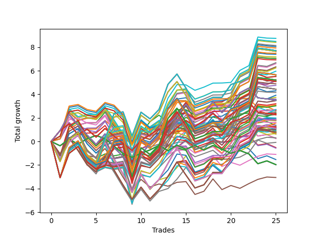

# Long HLT 110 
- Symbol: TSLA
- Date Range: 01/10/2024 - 05/17/2024
- Trading Period: 8:30-12:30
- Number of Trades: 4



| Id. | Name | Win Percent | Profit | Avg Profit / Trade | Avg Time / Trade |      | Name | Win Percent | Profit | Avg Profit / Trade | Avg Time / Trade |
| --- | ---- | ----------- | ------ | ------------------ | ---------------- | ---- | ---- | ----------- | ------ | ------------------ | ---------------- |
| | Sorted By <br> Profit | | | | | | Sorted By <br> Win Percentage ||||
|0| TP-2 75m | 75.00 | 3.05 | 0.76 | 52:30 |     | TP-2 75m | 75.00 | 3.05 | 0.76 | 52:30 |
|1| TP-2 105m | 50.00 | 2.72 | 0.68 | 60:00 |     | TP-1.75 75m | 75.00 | 2.49 | 0.62 | 52:15 |
|2| TP-2 90m | 50.00 | 2.68 | 0.67 | 56:15 |     | TP-1.5 75m | 75.00 | 2.25 | 0.56 | 44:45 |
|3| TP-2 120m | 50.00 | 2.62 | 0.66 | 63:45 |     | TP-1.5 60m | 75.00 | 2.07 | 0.52 | 41:00 |
|4| TP-1.75 75m | 75.00 | 2.49 | 0.62 | 52:15 |     | TP-1.25 75m | 75.00 | 1.91 | 0.48 | 44:30 |
|5| TP-1.5 75m | 75.00 | 2.25 | 0.56 | 44:45 |     | TP-1.5 45m | 75.00 | 1.83 | 0.46 | 35:45 |
|6| TP-1.75 105m | 50.00 | 2.16 | 0.54 | 59:45 |     | TP-2 60m | 75.00 | 1.77 | 0.44 | 47:00 |
|7| TP-1.75 90m | 50.00 | 2.12 | 0.53 | 56:00 |     | TP-1.75 60m | 75.00 | 1.77 | 0.44 | 47:00 |
|8| TP-1.5 60m | 75.00 | 2.07 | 0.52 | 41:00 |     | TP-1.25 60m | 75.00 | 1.73 | 0.43 | 40:45 |
|9| TP-1.75 120m | 50.00 | 2.06 | 0.52 | 63:30 |     | TP-1 75m | 75.00 | 1.67 | 0.42 | 44:15 |
|10| TP-1.5 105m | 50.00 | 1.92 | 0.48 | 52:15 |     | TP-2 45m | 75.00 | 1.55 | 0.39 | 38:00 |
|11| TP-1.25 75m | 75.00 | 1.91 | 0.48 | 44:30 |     | TP-1.75 45m | 75.00 | 1.55 | 0.39 | 38:00 |
|12| TP-1.5 90m | 50.00 | 1.88 | 0.47 | 48:30 |     | TP-1 60m | 75.00 | 1.49 | 0.37 | 40:30 |
|13| TP-1.5 45m | 75.00 | 1.83 | 0.46 | 35:45 |     | TP-1.25 45m | 75.00 | 1.49 | 0.37 | 35:30 |
|14| TP-1.5 120m | 50.00 | 1.82 | 0.46 | 56:00 |     | TP-1 45m | 75.00 | 1.25 | 0.31 | 35:15 |
|15| TP-2 60m | 75.00 | 1.77 | 0.44 | 47:00 |     | TP-2 30m | 75.00 | 0.92 | 0.23 | 26:45 |
|16| TP-1.75 60m | 75.00 | 1.77 | 0.44 | 47:00 |     | TP-1.75 30m | 75.00 | 0.92 | 0.23 | 26:45 |
|17| TP-1.25 60m | 75.00 | 1.73 | 0.43 | 40:45 |     | TP-1.5 30m | 75.00 | 0.92 | 0.23 | 26:45 |
|18| TP-1 75m | 75.00 | 1.67 | 0.42 | 44:15 |     | TP-1.25 30m | 75.00 | 0.92 | 0.23 | 26:45 |
|19| TP-1.25 105m | 50.00 | 1.58 | 0.40 | 52:00 |     | TP-1 30m | 75.00 | 0.92 | 0.23 | 26:45 |
|20| TP-2 45m | 75.00 | 1.55 | 0.39 | 38:00 |     | TP-2 105m | 50.00 | 2.72 | 0.68 | 60:00 |
|21| TP-1.75 45m | 75.00 | 1.55 | 0.39 | 38:00 |     | TP-2 90m | 50.00 | 2.68 | 0.67 | 56:15 |
|22| TP-1.25 90m | 50.00 | 1.54 | 0.39 | 48:15 |     | TP-2 120m | 50.00 | 2.62 | 0.66 | 63:45 |
|23| TP-1 60m | 75.00 | 1.49 | 0.37 | 40:30 |     | TP-1.75 105m | 50.00 | 2.16 | 0.54 | 59:45 |
|24| TP-1.25 45m | 75.00 | 1.49 | 0.37 | 35:30 |     | TP-1.75 90m | 50.00 | 2.12 | 0.53 | 56:00 |
|25| TP-1.25 120m | 50.00 | 1.48 | 0.37 | 55:45 |     | TP-1.75 120m | 50.00 | 2.06 | 0.52 | 63:30 |
|26| TP-1 105m | 50.00 | 1.34 | 0.34 | 51:45 |     | TP-1.5 105m | 50.00 | 1.92 | 0.48 | 52:15 |
|27| TP-1 90m | 50.00 | 1.30 | 0.33 | 48:00 |     | TP-1.5 90m | 50.00 | 1.88 | 0.47 | 48:30 |
|28| TP-1 45m | 75.00 | 1.25 | 0.31 | 35:15 |     | TP-1.5 120m | 50.00 | 1.82 | 0.46 | 56:00 |
|29| TP-1 120m | 50.00 | 1.24 | 0.31 | 55:30 |     | TP-1.25 105m | 50.00 | 1.58 | 0.40 | 52:00 |
|30| TP-2 30m | 75.00 | 0.92 | 0.23 | 26:45 |     | TP-1.25 90m | 50.00 | 1.54 | 0.39 | 48:15 |
|31| TP-1.75 30m | 75.00 | 0.92 | 0.23 | 26:45 |     | TP-1.25 120m | 50.00 | 1.48 | 0.37 | 55:45 |
|32| TP-1.5 30m | 75.00 | 0.92 | 0.23 | 26:45 |     | TP-1 105m | 50.00 | 1.34 | 0.34 | 51:45 |
|33| TP-1.25 30m | 75.00 | 0.92 | 0.23 | 26:45 |     | TP-1 90m | 50.00 | 1.30 | 0.33 | 48:00 |
|34| TP-1 30m | 75.00 | 0.92 | 0.23 | 26:45 |     | TP-1 120m | 50.00 | 1.24 | 0.31 | 55:30 |
|35| TP-0.5 75m | 50.00 | -0.12 | -0.03 | 36:15 |     | TP-0.5 75m | 50.00 | -0.12 | -0.03 | 36:15 |
|36| TP-0.5 30m | 50.00 | -0.18 | -0.05 | 19:45 |     | TP-0.5 30m | 50.00 | -0.18 | -0.05 | 19:45 |
|37| TP-0.75 75m | 50.00 | -0.21 | -0.05 | 36:30 |     | TP-0.75 75m | 50.00 | -0.21 | -0.05 | 36:30 |
|38| TP-0.75 30m | 50.00 | -0.27 | -0.07 | 20:00 |     | TP-0.75 30m | 50.00 | -0.27 | -0.07 | 20:00 |
|39| TP-0.5 60m | 50.00 | -0.30 | -0.07 | 32:30 |     | TP-0.5 60m | 50.00 | -0.30 | -0.07 | 32:30 |
|40| TP-0.75 60m | 50.00 | -0.39 | -0.10 | 32:45 |     | TP-0.75 60m | 50.00 | -0.39 | -0.10 | 32:45 |
|41| TP-0.5 105m | 25.00 | -0.45 | -0.11 | 43:45 |     | TP-0.5 45m | 50.00 | -0.54 | -0.13 | 27:15 |
|42| TP-0.5 90m | 25.00 | -0.49 | -0.12 | 40:00 |     | TP-0.75 45m | 50.00 | -0.63 | -0.16 | 27:30 |
|43| TP-0.5 45m | 50.00 | -0.54 | -0.13 | 27:15 |     | TP-2 15m | 50.00 | -0.94 | -0.23 | 14:00 |
|44| TP-0.75 105m | 25.00 | -0.54 | -0.13 | 44:00 |     | TP-1.75 15m | 50.00 | -0.94 | -0.23 | 14:00 |
|45| TP-0.5 120m | 25.00 | -0.55 | -0.14 | 47:30 |     | TP-1.5 15m | 50.00 | -0.94 | -0.23 | 14:00 |
|46| TP-0.75 90m | 25.00 | -0.58 | -0.14 | 40:15 |     | TP-1.25 15m | 50.00 | -0.94 | -0.23 | 14:00 |
|47| TP-0.75 45m | 50.00 | -0.63 | -0.16 | 27:30 |     | TP-1 15m | 50.00 | -0.94 | -0.23 | 14:00 |
|48| TP-0.75 120m | 25.00 | -0.64 | -0.16 | 47:45 |     | TP-0.75 15m | 50.00 | -0.98 | -0.24 | 11:00 |
|49| TP-2 15m | 50.00 | -0.94 | -0.23 | 14:00 |     | TP-0.5 15m | 50.00 | -0.98 | -0.24 | 11:00 |
|50| TP-1.75 15m | 50.00 | -0.94 | -0.23 | 14:00 |     | TP-0.5 105m | 25.00 | -0.45 | -0.11 | 43:45 |
|51| TP-1.5 15m | 50.00 | -0.94 | -0.23 | 14:00 |     | TP-0.5 90m | 25.00 | -0.49 | -0.12 | 40:00 |
|52| TP-1.25 15m | 50.00 | -0.94 | -0.23 | 14:00 |     | TP-0.75 105m | 25.00 | -0.54 | -0.13 | 44:00 |
|53| TP-1 15m | 50.00 | -0.94 | -0.23 | 14:00 |     | TP-0.5 120m | 25.00 | -0.55 | -0.14 | 47:30 |
|54| TP-0.75 15m | 50.00 | -0.98 | -0.24 | 11:00 |     | TP-0.75 90m | 25.00 | -0.58 | -0.14 | 40:15 |
|55| TP-0.5 15m | 50.00 | -0.98 | -0.24 | 11:00 |     | TP-0.75 120m | 25.00 | -0.64 | -0.16 | 47:45 |
|56| TP-0.25 120m | 25.00 | -1.20 | -0.30 | 07:00 |     | TP-0.25 120m | 25.00 | -1.20 | -0.30 | 07:00 |
|57| TP-0.25 105m | 25.00 | -1.20 | -0.30 | 07:00 |     | TP-0.25 105m | 25.00 | -1.20 | -0.30 | 07:00 |
|58| TP-0.25 90m | 25.00 | -1.20 | -0.30 | 07:00 |     | TP-0.25 90m | 25.00 | -1.20 | -0.30 | 07:00 |
|59| TP-0.25 75m | 25.00 | -1.20 | -0.30 | 07:00 |     | TP-0.25 75m | 25.00 | -1.20 | -0.30 | 07:00 |
|60| TP-0.25 60m | 25.00 | -1.20 | -0.30 | 07:00 |     | TP-0.25 60m | 25.00 | -1.20 | -0.30 | 07:00 |
|61| TP-0.25 45m | 25.00 | -1.20 | -0.30 | 07:00 |     | TP-0.25 45m | 25.00 | -1.20 | -0.30 | 07:00 |
|62| TP-0.25 30m | 25.00 | -1.20 | -0.30 | 07:00 |     | TP-0.25 30m | 25.00 | -1.20 | -0.30 | 07:00 |
|63| TP-0.25 15m | 25.00 | -1.20 | -0.30 | 07:00 |     | TP-0.25 15m | 25.00 | -1.20 | -0.30 | 07:00 |

### Test TP-0.25 15m
* Take Profit of 0.25 Point
* 0.25 Stoploss
* Results:
```
Total Trades: 4
Percent Up: 25.00
Percent Down: 75.00
Total Points Moved Up: -1.20
Potential Profit: -600.00
Total Points Ups: 0.24 Count Ups: 1
Total Points Downs: -1.44 Count Downs: 3
```

<details><summary>Trades</summary>

<code>In: 2024-03-14 12:30:00		Out: 2024-03-14 12:35:00		Total Position Time: 05:00		Total Move Up: -0.29		Total to Date: -0.29</code> <br />
<code>In: 2024-04-05 08:45:00		Out: 2024-04-05 08:47:00		Total Position Time: 02:00		Total Move Up: -0.83		Total to Date: -1.12</code> <br />
<code>In: 2024-05-07 12:00:00		Out: 2024-05-07 12:08:00		Total Position Time: 08:00		Total Move Up: 0.24		Total to Date: -0.88</code> <br />
<code>In: 2024-05-09 08:55:00		Out: 2024-05-09 09:08:00		Total Position Time: 13:00		Total Move Up: -0.32		Total to Date: -1.20</code> <br />


</details>

### Test TP-0.5 15m
* Take Profit of 0.5 Point
* 0.5 Stoploss
* Results:
```
Total Trades: 4
Percent Up: 50.00
Percent Down: 50.00
Total Points Moved Up: -0.98
Potential Profit: -490.00
Total Points Ups: 0.18 Count Ups: 2
Total Points Downs: -1.16 Count Downs: 2
```

<details><summary>Trades</summary>

<code>In: 2024-03-14 12:30:00		Out: 2024-03-14 12:44:00		Total Position Time: 14:00		Total Move Up: 0.06		Total to Date: 0.06</code> <br />
<code>In: 2024-04-05 08:45:00		Out: 2024-04-05 08:47:00		Total Position Time: 02:00		Total Move Up: -0.83		Total to Date: -0.77</code> <br />
<code>In: 2024-05-07 12:00:00		Out: 2024-05-07 12:14:00		Total Position Time: 14:00		Total Move Up: 0.12		Total to Date: -0.65</code> <br />
<code>In: 2024-05-09 08:55:00		Out: 2024-05-09 09:09:00		Total Position Time: 14:00		Total Move Up: -0.33		Total to Date: -0.98</code> <br />


</details>

### Test TP-0.75 15m
* Take Profit of 0.75 Point
* 0.75 Stoploss
* Results:
```
Total Trades: 4
Percent Up: 50.00
Percent Down: 50.00
Total Points Moved Up: -0.98
Potential Profit: -490.00
Total Points Ups: 0.18 Count Ups: 2
Total Points Downs: -1.16 Count Downs: 2
```

<details><summary>Trades</summary>

<code>In: 2024-03-14 12:30:00		Out: 2024-03-14 12:44:00		Total Position Time: 14:00		Total Move Up: 0.06		Total to Date: 0.06</code> <br />
<code>In: 2024-04-05 08:45:00		Out: 2024-04-05 08:47:00		Total Position Time: 02:00		Total Move Up: -0.83		Total to Date: -0.77</code> <br />
<code>In: 2024-05-07 12:00:00		Out: 2024-05-07 12:14:00		Total Position Time: 14:00		Total Move Up: 0.12		Total to Date: -0.65</code> <br />
<code>In: 2024-05-09 08:55:00		Out: 2024-05-09 09:09:00		Total Position Time: 14:00		Total Move Up: -0.33		Total to Date: -0.98</code> <br />


</details>

### Test TP-1 15m
* Take Profit of 1 Point
* 1 Stoploss
* Results:
```
Total Trades: 4
Percent Up: 50.00
Percent Down: 50.00
Total Points Moved Up: -0.94
Potential Profit: -470.00
Total Points Ups: 0.18 Count Ups: 2
Total Points Downs: -1.12 Count Downs: 2
```

<details><summary>Trades</summary>

<code>In: 2024-03-14 12:30:00		Out: 2024-03-14 12:44:00		Total Position Time: 14:00		Total Move Up: 0.06		Total to Date: 0.06</code> <br />
<code>In: 2024-04-05 08:45:00		Out: 2024-04-05 08:59:00		Total Position Time: 14:00		Total Move Up: -0.79		Total to Date: -0.73</code> <br />
<code>In: 2024-05-07 12:00:00		Out: 2024-05-07 12:14:00		Total Position Time: 14:00		Total Move Up: 0.12		Total to Date: -0.61</code> <br />
<code>In: 2024-05-09 08:55:00		Out: 2024-05-09 09:09:00		Total Position Time: 14:00		Total Move Up: -0.33		Total to Date: -0.94</code> <br />


</details>

### Test TP-1.25 15m
* Take Profit of 1.25 Point
* 1.25 Stoploss
* Results:
```
Total Trades: 4
Percent Up: 50.00
Percent Down: 50.00
Total Points Moved Up: -0.94
Potential Profit: -470.00
Total Points Ups: 0.18 Count Ups: 2
Total Points Downs: -1.12 Count Downs: 2
```

<details><summary>Trades</summary>

<code>In: 2024-03-14 12:30:00		Out: 2024-03-14 12:44:00		Total Position Time: 14:00		Total Move Up: 0.06		Total to Date: 0.06</code> <br />
<code>In: 2024-04-05 08:45:00		Out: 2024-04-05 08:59:00		Total Position Time: 14:00		Total Move Up: -0.79		Total to Date: -0.73</code> <br />
<code>In: 2024-05-07 12:00:00		Out: 2024-05-07 12:14:00		Total Position Time: 14:00		Total Move Up: 0.12		Total to Date: -0.61</code> <br />
<code>In: 2024-05-09 08:55:00		Out: 2024-05-09 09:09:00		Total Position Time: 14:00		Total Move Up: -0.33		Total to Date: -0.94</code> <br />


</details>

### Test TP-1.5 15m
* Take Profit of 1.5 Point
* 1.5 Stoploss
* Results:
```
Total Trades: 4
Percent Up: 50.00
Percent Down: 50.00
Total Points Moved Up: -0.94
Potential Profit: -470.00
Total Points Ups: 0.18 Count Ups: 2
Total Points Downs: -1.12 Count Downs: 2
```

<details><summary>Trades</summary>

<code>In: 2024-03-14 12:30:00		Out: 2024-03-14 12:44:00		Total Position Time: 14:00		Total Move Up: 0.06		Total to Date: 0.06</code> <br />
<code>In: 2024-04-05 08:45:00		Out: 2024-04-05 08:59:00		Total Position Time: 14:00		Total Move Up: -0.79		Total to Date: -0.73</code> <br />
<code>In: 2024-05-07 12:00:00		Out: 2024-05-07 12:14:00		Total Position Time: 14:00		Total Move Up: 0.12		Total to Date: -0.61</code> <br />
<code>In: 2024-05-09 08:55:00		Out: 2024-05-09 09:09:00		Total Position Time: 14:00		Total Move Up: -0.33		Total to Date: -0.94</code> <br />


</details>

### Test TP-1.75 15m
* Take Profit of 1.75 Point
* 1.75 Stoploss
* Results:
```
Total Trades: 4
Percent Up: 50.00
Percent Down: 50.00
Total Points Moved Up: -0.94
Potential Profit: -470.00
Total Points Ups: 0.18 Count Ups: 2
Total Points Downs: -1.12 Count Downs: 2
```

<details><summary>Trades</summary>

<code>In: 2024-03-14 12:30:00		Out: 2024-03-14 12:44:00		Total Position Time: 14:00		Total Move Up: 0.06		Total to Date: 0.06</code> <br />
<code>In: 2024-04-05 08:45:00		Out: 2024-04-05 08:59:00		Total Position Time: 14:00		Total Move Up: -0.79		Total to Date: -0.73</code> <br />
<code>In: 2024-05-07 12:00:00		Out: 2024-05-07 12:14:00		Total Position Time: 14:00		Total Move Up: 0.12		Total to Date: -0.61</code> <br />
<code>In: 2024-05-09 08:55:00		Out: 2024-05-09 09:09:00		Total Position Time: 14:00		Total Move Up: -0.33		Total to Date: -0.94</code> <br />


</details>

### Test TP-2 15m
* Take Profit of 2 Point
* 2 Stoploss
* Results:
```
Total Trades: 4
Percent Up: 50.00
Percent Down: 50.00
Total Points Moved Up: -0.94
Potential Profit: -470.00
Total Points Ups: 0.18 Count Ups: 2
Total Points Downs: -1.12 Count Downs: 2
```

<details><summary>Trades</summary>

<code>In: 2024-03-14 12:30:00		Out: 2024-03-14 12:44:00		Total Position Time: 14:00		Total Move Up: 0.06		Total to Date: 0.06</code> <br />
<code>In: 2024-04-05 08:45:00		Out: 2024-04-05 08:59:00		Total Position Time: 14:00		Total Move Up: -0.79		Total to Date: -0.73</code> <br />
<code>In: 2024-05-07 12:00:00		Out: 2024-05-07 12:14:00		Total Position Time: 14:00		Total Move Up: 0.12		Total to Date: -0.61</code> <br />
<code>In: 2024-05-09 08:55:00		Out: 2024-05-09 09:09:00		Total Position Time: 14:00		Total Move Up: -0.33		Total to Date: -0.94</code> <br />


</details>

### Test TP-0.25 30m
* Take Profit of 0.25 Point
* 0.25 Stoploss
* Results:
```
Total Trades: 4
Percent Up: 25.00
Percent Down: 75.00
Total Points Moved Up: -1.20
Potential Profit: -600.00
Total Points Ups: 0.24 Count Ups: 1
Total Points Downs: -1.44 Count Downs: 3
```

<details><summary>Trades</summary>

<code>In: 2024-03-14 12:30:00		Out: 2024-03-14 12:35:00		Total Position Time: 05:00		Total Move Up: -0.29		Total to Date: -0.29</code> <br />
<code>In: 2024-04-05 08:45:00		Out: 2024-04-05 08:47:00		Total Position Time: 02:00		Total Move Up: -0.83		Total to Date: -1.12</code> <br />
<code>In: 2024-05-07 12:00:00		Out: 2024-05-07 12:08:00		Total Position Time: 08:00		Total Move Up: 0.24		Total to Date: -0.88</code> <br />
<code>In: 2024-05-09 08:55:00		Out: 2024-05-09 09:08:00		Total Position Time: 13:00		Total Move Up: -0.32		Total to Date: -1.20</code> <br />


</details>

### Test TP-0.5 30m
* Take Profit of 0.5 Point
* 0.5 Stoploss
* Results:
```
Total Trades: 4
Percent Up: 50.00
Percent Down: 50.00
Total Points Moved Up: -0.18
Potential Profit: -90.00
Total Points Ups: 0.69 Count Ups: 2
Total Points Downs: -0.87 Count Downs: 2
```

<details><summary>Trades</summary>

<code>In: 2024-03-14 12:30:00		Out: 2024-03-14 12:49:00		Total Position Time: 19:00		Total Move Up: 0.49		Total to Date: 0.49</code> <br />
<code>In: 2024-04-05 08:45:00		Out: 2024-04-05 08:47:00		Total Position Time: 02:00		Total Move Up: -0.83		Total to Date: -0.34</code> <br />
<code>In: 2024-05-07 12:00:00		Out: 2024-05-07 12:29:00		Total Position Time: 29:00		Total Move Up: 0.20		Total to Date: -0.14</code> <br />
<code>In: 2024-05-09 08:55:00		Out: 2024-05-09 09:24:00		Total Position Time: 29:00		Total Move Up: -0.04		Total to Date: -0.18</code> <br />


</details>

### Test TP-0.75 30m
* Take Profit of 0.75 Point
* 0.75 Stoploss
* Results:
```
Total Trades: 4
Percent Up: 50.00
Percent Down: 50.00
Total Points Moved Up: -0.27
Potential Profit: -135.00
Total Points Ups: 0.60 Count Ups: 2
Total Points Downs: -0.87 Count Downs: 2
```

<details><summary>Trades</summary>

<code>In: 2024-03-14 12:30:00		Out: 2024-03-14 12:50:00		Total Position Time: 20:00		Total Move Up: 0.40		Total to Date: 0.40</code> <br />
<code>In: 2024-04-05 08:45:00		Out: 2024-04-05 08:47:00		Total Position Time: 02:00		Total Move Up: -0.83		Total to Date: -0.43</code> <br />
<code>In: 2024-05-07 12:00:00		Out: 2024-05-07 12:29:00		Total Position Time: 29:00		Total Move Up: 0.20		Total to Date: -0.23</code> <br />
<code>In: 2024-05-09 08:55:00		Out: 2024-05-09 09:24:00		Total Position Time: 29:00		Total Move Up: -0.04		Total to Date: -0.27</code> <br />


</details>

### Test TP-1 30m
* Take Profit of 1 Point
* 1 Stoploss
* Results:
```
Total Trades: 4
Percent Up: 75.00
Percent Down: 25.00
Total Points Moved Up: 0.92
Potential Profit: 460.00
Total Points Ups: 0.96 Count Ups: 3
Total Points Downs: -0.04 Count Downs: 1
```

<details><summary>Trades</summary>

<code>In: 2024-03-14 12:30:00		Out: 2024-03-14 12:50:00		Total Position Time: 20:00		Total Move Up: 0.40		Total to Date: 0.40</code> <br />
<code>In: 2024-04-05 08:45:00		Out: 2024-04-05 09:14:00		Total Position Time: 29:00		Total Move Up: 0.36		Total to Date: 0.76</code> <br />
<code>In: 2024-05-07 12:00:00		Out: 2024-05-07 12:29:00		Total Position Time: 29:00		Total Move Up: 0.20		Total to Date: 0.96</code> <br />
<code>In: 2024-05-09 08:55:00		Out: 2024-05-09 09:24:00		Total Position Time: 29:00		Total Move Up: -0.04		Total to Date: 0.92</code> <br />


</details>

### Test TP-1.25 30m
* Take Profit of 1.25 Point
* 1.25 Stoploss
* Results:
```
Total Trades: 4
Percent Up: 75.00
Percent Down: 25.00
Total Points Moved Up: 0.92
Potential Profit: 460.00
Total Points Ups: 0.96 Count Ups: 3
Total Points Downs: -0.04 Count Downs: 1
```

<details><summary>Trades</summary>

<code>In: 2024-03-14 12:30:00		Out: 2024-03-14 12:50:00		Total Position Time: 20:00		Total Move Up: 0.40		Total to Date: 0.40</code> <br />
<code>In: 2024-04-05 08:45:00		Out: 2024-04-05 09:14:00		Total Position Time: 29:00		Total Move Up: 0.36		Total to Date: 0.76</code> <br />
<code>In: 2024-05-07 12:00:00		Out: 2024-05-07 12:29:00		Total Position Time: 29:00		Total Move Up: 0.20		Total to Date: 0.96</code> <br />
<code>In: 2024-05-09 08:55:00		Out: 2024-05-09 09:24:00		Total Position Time: 29:00		Total Move Up: -0.04		Total to Date: 0.92</code> <br />


</details>

### Test TP-1.5 30m
* Take Profit of 1.5 Point
* 1.5 Stoploss
* Results:
```
Total Trades: 4
Percent Up: 75.00
Percent Down: 25.00
Total Points Moved Up: 0.92
Potential Profit: 460.00
Total Points Ups: 0.96 Count Ups: 3
Total Points Downs: -0.04 Count Downs: 1
```

<details><summary>Trades</summary>

<code>In: 2024-03-14 12:30:00		Out: 2024-03-14 12:50:00		Total Position Time: 20:00		Total Move Up: 0.40		Total to Date: 0.40</code> <br />
<code>In: 2024-04-05 08:45:00		Out: 2024-04-05 09:14:00		Total Position Time: 29:00		Total Move Up: 0.36		Total to Date: 0.76</code> <br />
<code>In: 2024-05-07 12:00:00		Out: 2024-05-07 12:29:00		Total Position Time: 29:00		Total Move Up: 0.20		Total to Date: 0.96</code> <br />
<code>In: 2024-05-09 08:55:00		Out: 2024-05-09 09:24:00		Total Position Time: 29:00		Total Move Up: -0.04		Total to Date: 0.92</code> <br />


</details>

### Test TP-1.75 30m
* Take Profit of 1.75 Point
* 1.75 Stoploss
* Results:
```
Total Trades: 4
Percent Up: 75.00
Percent Down: 25.00
Total Points Moved Up: 0.92
Potential Profit: 460.00
Total Points Ups: 0.96 Count Ups: 3
Total Points Downs: -0.04 Count Downs: 1
```

<details><summary>Trades</summary>

<code>In: 2024-03-14 12:30:00		Out: 2024-03-14 12:50:00		Total Position Time: 20:00		Total Move Up: 0.40		Total to Date: 0.40</code> <br />
<code>In: 2024-04-05 08:45:00		Out: 2024-04-05 09:14:00		Total Position Time: 29:00		Total Move Up: 0.36		Total to Date: 0.76</code> <br />
<code>In: 2024-05-07 12:00:00		Out: 2024-05-07 12:29:00		Total Position Time: 29:00		Total Move Up: 0.20		Total to Date: 0.96</code> <br />
<code>In: 2024-05-09 08:55:00		Out: 2024-05-09 09:24:00		Total Position Time: 29:00		Total Move Up: -0.04		Total to Date: 0.92</code> <br />


</details>

### Test TP-2 30m
* Take Profit of 2 Point
* 2 Stoploss
* Results:
```
Total Trades: 4
Percent Up: 75.00
Percent Down: 25.00
Total Points Moved Up: 0.92
Potential Profit: 460.00
Total Points Ups: 0.96 Count Ups: 3
Total Points Downs: -0.04 Count Downs: 1
```

<details><summary>Trades</summary>

<code>In: 2024-03-14 12:30:00		Out: 2024-03-14 12:50:00		Total Position Time: 20:00		Total Move Up: 0.40		Total to Date: 0.40</code> <br />
<code>In: 2024-04-05 08:45:00		Out: 2024-04-05 09:14:00		Total Position Time: 29:00		Total Move Up: 0.36		Total to Date: 0.76</code> <br />
<code>In: 2024-05-07 12:00:00		Out: 2024-05-07 12:29:00		Total Position Time: 29:00		Total Move Up: 0.20		Total to Date: 0.96</code> <br />
<code>In: 2024-05-09 08:55:00		Out: 2024-05-09 09:24:00		Total Position Time: 29:00		Total Move Up: -0.04		Total to Date: 0.92</code> <br />


</details>

### Test TP-0.25 45m
* Take Profit of 0.25 Point
* 0.25 Stoploss
* Results:
```
Total Trades: 4
Percent Up: 25.00
Percent Down: 75.00
Total Points Moved Up: -1.20
Potential Profit: -600.00
Total Points Ups: 0.24 Count Ups: 1
Total Points Downs: -1.44 Count Downs: 3
```

<details><summary>Trades</summary>

<code>In: 2024-03-14 12:30:00		Out: 2024-03-14 12:35:00		Total Position Time: 05:00		Total Move Up: -0.29		Total to Date: -0.29</code> <br />
<code>In: 2024-04-05 08:45:00		Out: 2024-04-05 08:47:00		Total Position Time: 02:00		Total Move Up: -0.83		Total to Date: -1.12</code> <br />
<code>In: 2024-05-07 12:00:00		Out: 2024-05-07 12:08:00		Total Position Time: 08:00		Total Move Up: 0.24		Total to Date: -0.88</code> <br />
<code>In: 2024-05-09 08:55:00		Out: 2024-05-09 09:08:00		Total Position Time: 13:00		Total Move Up: -0.32		Total to Date: -1.20</code> <br />


</details>

### Test TP-0.5 45m
* Take Profit of 0.5 Point
* 0.5 Stoploss
* Results:
```
Total Trades: 4
Percent Up: 50.00
Percent Down: 50.00
Total Points Moved Up: -0.54
Potential Profit: -270.00
Total Points Ups: 0.57 Count Ups: 2
Total Points Downs: -1.11 Count Downs: 2
```

<details><summary>Trades</summary>

<code>In: 2024-03-14 12:30:00		Out: 2024-03-14 12:49:00		Total Position Time: 19:00		Total Move Up: 0.49		Total to Date: 0.49</code> <br />
<code>In: 2024-04-05 08:45:00		Out: 2024-04-05 08:47:00		Total Position Time: 02:00		Total Move Up: -0.83		Total to Date: -0.34</code> <br />
<code>In: 2024-05-07 12:00:00		Out: 2024-05-07 12:44:00		Total Position Time: 44:00		Total Move Up: -0.28		Total to Date: -0.62</code> <br />
<code>In: 2024-05-09 08:55:00		Out: 2024-05-09 09:39:00		Total Position Time: 44:00		Total Move Up: 0.08		Total to Date: -0.54</code> <br />


</details>

### Test TP-0.75 45m
* Take Profit of 0.75 Point
* 0.75 Stoploss
* Results:
```
Total Trades: 4
Percent Up: 50.00
Percent Down: 50.00
Total Points Moved Up: -0.63
Potential Profit: -315.00
Total Points Ups: 0.48 Count Ups: 2
Total Points Downs: -1.11 Count Downs: 2
```

<details><summary>Trades</summary>

<code>In: 2024-03-14 12:30:00		Out: 2024-03-14 12:50:00		Total Position Time: 20:00		Total Move Up: 0.40		Total to Date: 0.40</code> <br />
<code>In: 2024-04-05 08:45:00		Out: 2024-04-05 08:47:00		Total Position Time: 02:00		Total Move Up: -0.83		Total to Date: -0.43</code> <br />
<code>In: 2024-05-07 12:00:00		Out: 2024-05-07 12:44:00		Total Position Time: 44:00		Total Move Up: -0.28		Total to Date: -0.71</code> <br />
<code>In: 2024-05-09 08:55:00		Out: 2024-05-09 09:39:00		Total Position Time: 44:00		Total Move Up: 0.08		Total to Date: -0.63</code> <br />


</details>

### Test TP-1 45m
* Take Profit of 1 Point
* 1 Stoploss
* Results:
```
Total Trades: 4
Percent Up: 75.00
Percent Down: 25.00
Total Points Moved Up: 1.25
Potential Profit: 625.00
Total Points Ups: 1.53 Count Ups: 3
Total Points Downs: -0.28 Count Downs: 1
```

<details><summary>Trades</summary>

<code>In: 2024-03-14 12:30:00		Out: 2024-03-14 12:50:00		Total Position Time: 20:00		Total Move Up: 0.40		Total to Date: 0.40</code> <br />
<code>In: 2024-04-05 08:45:00		Out: 2024-04-05 09:18:00		Total Position Time: 33:00		Total Move Up: 1.05		Total to Date: 1.45</code> <br />
<code>In: 2024-05-07 12:00:00		Out: 2024-05-07 12:44:00		Total Position Time: 44:00		Total Move Up: -0.28		Total to Date: 1.17</code> <br />
<code>In: 2024-05-09 08:55:00		Out: 2024-05-09 09:39:00		Total Position Time: 44:00		Total Move Up: 0.08		Total to Date: 1.25</code> <br />


</details>

### Test TP-1.25 45m
* Take Profit of 1.25 Point
* 1.25 Stoploss
* Results:
```
Total Trades: 4
Percent Up: 75.00
Percent Down: 25.00
Total Points Moved Up: 1.49
Potential Profit: 745.00
Total Points Ups: 1.77 Count Ups: 3
Total Points Downs: -0.28 Count Downs: 1
```

<details><summary>Trades</summary>

<code>In: 2024-03-14 12:30:00		Out: 2024-03-14 12:50:00		Total Position Time: 20:00		Total Move Up: 0.40		Total to Date: 0.40</code> <br />
<code>In: 2024-04-05 08:45:00		Out: 2024-04-05 09:19:00		Total Position Time: 34:00		Total Move Up: 1.29		Total to Date: 1.69</code> <br />
<code>In: 2024-05-07 12:00:00		Out: 2024-05-07 12:44:00		Total Position Time: 44:00		Total Move Up: -0.28		Total to Date: 1.41</code> <br />
<code>In: 2024-05-09 08:55:00		Out: 2024-05-09 09:39:00		Total Position Time: 44:00		Total Move Up: 0.08		Total to Date: 1.49</code> <br />


</details>

### Test TP-1.5 45m
* Take Profit of 1.5 Point
* 1.5 Stoploss
* Results:
```
Total Trades: 4
Percent Up: 75.00
Percent Down: 25.00
Total Points Moved Up: 1.83
Potential Profit: 915.00
Total Points Ups: 2.11 Count Ups: 3
Total Points Downs: -0.28 Count Downs: 1
```

<details><summary>Trades</summary>

<code>In: 2024-03-14 12:30:00		Out: 2024-03-14 12:50:00		Total Position Time: 20:00		Total Move Up: 0.40		Total to Date: 0.40</code> <br />
<code>In: 2024-04-05 08:45:00		Out: 2024-04-05 09:20:00		Total Position Time: 35:00		Total Move Up: 1.63		Total to Date: 2.03</code> <br />
<code>In: 2024-05-07 12:00:00		Out: 2024-05-07 12:44:00		Total Position Time: 44:00		Total Move Up: -0.28		Total to Date: 1.75</code> <br />
<code>In: 2024-05-09 08:55:00		Out: 2024-05-09 09:39:00		Total Position Time: 44:00		Total Move Up: 0.08		Total to Date: 1.83</code> <br />


</details>

### Test TP-1.75 45m
* Take Profit of 1.75 Point
* 1.75 Stoploss
* Results:
```
Total Trades: 4
Percent Up: 75.00
Percent Down: 25.00
Total Points Moved Up: 1.55
Potential Profit: 775.00
Total Points Ups: 1.83 Count Ups: 3
Total Points Downs: -0.28 Count Downs: 1
```

<details><summary>Trades</summary>

<code>In: 2024-03-14 12:30:00		Out: 2024-03-14 12:50:00		Total Position Time: 20:00		Total Move Up: 0.40		Total to Date: 0.40</code> <br />
<code>In: 2024-04-05 08:45:00		Out: 2024-04-05 09:29:00		Total Position Time: 44:00		Total Move Up: 1.35		Total to Date: 1.75</code> <br />
<code>In: 2024-05-07 12:00:00		Out: 2024-05-07 12:44:00		Total Position Time: 44:00		Total Move Up: -0.28		Total to Date: 1.47</code> <br />
<code>In: 2024-05-09 08:55:00		Out: 2024-05-09 09:39:00		Total Position Time: 44:00		Total Move Up: 0.08		Total to Date: 1.55</code> <br />


</details>

### Test TP-2 45m
* Take Profit of 2 Point
* 2 Stoploss
* Results:
```
Total Trades: 4
Percent Up: 75.00
Percent Down: 25.00
Total Points Moved Up: 1.55
Potential Profit: 775.00
Total Points Ups: 1.83 Count Ups: 3
Total Points Downs: -0.28 Count Downs: 1
```

<details><summary>Trades</summary>

<code>In: 2024-03-14 12:30:00		Out: 2024-03-14 12:50:00		Total Position Time: 20:00		Total Move Up: 0.40		Total to Date: 0.40</code> <br />
<code>In: 2024-04-05 08:45:00		Out: 2024-04-05 09:29:00		Total Position Time: 44:00		Total Move Up: 1.35		Total to Date: 1.75</code> <br />
<code>In: 2024-05-07 12:00:00		Out: 2024-05-07 12:44:00		Total Position Time: 44:00		Total Move Up: -0.28		Total to Date: 1.47</code> <br />
<code>In: 2024-05-09 08:55:00		Out: 2024-05-09 09:39:00		Total Position Time: 44:00		Total Move Up: 0.08		Total to Date: 1.55</code> <br />


</details>

### Test TP-0.25 60m
* Take Profit of 0.25 Point
* 0.25 Stoploss
* Results:
```
Total Trades: 4
Percent Up: 25.00
Percent Down: 75.00
Total Points Moved Up: -1.20
Potential Profit: -600.00
Total Points Ups: 0.24 Count Ups: 1
Total Points Downs: -1.44 Count Downs: 3
```

<details><summary>Trades</summary>

<code>In: 2024-03-14 12:30:00		Out: 2024-03-14 12:35:00		Total Position Time: 05:00		Total Move Up: -0.29		Total to Date: -0.29</code> <br />
<code>In: 2024-04-05 08:45:00		Out: 2024-04-05 08:47:00		Total Position Time: 02:00		Total Move Up: -0.83		Total to Date: -1.12</code> <br />
<code>In: 2024-05-07 12:00:00		Out: 2024-05-07 12:08:00		Total Position Time: 08:00		Total Move Up: 0.24		Total to Date: -0.88</code> <br />
<code>In: 2024-05-09 08:55:00		Out: 2024-05-09 09:08:00		Total Position Time: 13:00		Total Move Up: -0.32		Total to Date: -1.20</code> <br />


</details>

### Test TP-0.5 60m
* Take Profit of 0.5 Point
* 0.5 Stoploss
* Results:
```
Total Trades: 4
Percent Up: 50.00
Percent Down: 50.00
Total Points Moved Up: -0.30
Potential Profit: -150.00
Total Points Ups: 0.62 Count Ups: 2
Total Points Downs: -0.92 Count Downs: 2
```

<details><summary>Trades</summary>

<code>In: 2024-03-14 12:30:00		Out: 2024-03-14 12:49:00		Total Position Time: 19:00		Total Move Up: 0.49		Total to Date: 0.49</code> <br />
<code>In: 2024-04-05 08:45:00		Out: 2024-04-05 08:47:00		Total Position Time: 02:00		Total Move Up: -0.83		Total to Date: -0.34</code> <br />
<code>In: 2024-05-07 12:00:00		Out: 2024-05-07 12:50:00		Total Position Time: 50:00		Total Move Up: -0.09		Total to Date: -0.43</code> <br />
<code>In: 2024-05-09 08:55:00		Out: 2024-05-09 09:54:00		Total Position Time: 59:00		Total Move Up: 0.13		Total to Date: -0.30</code> <br />


</details>

### Test TP-0.75 60m
* Take Profit of 0.75 Point
* 0.75 Stoploss
* Results:
```
Total Trades: 4
Percent Up: 50.00
Percent Down: 50.00
Total Points Moved Up: -0.39
Potential Profit: -195.00
Total Points Ups: 0.53 Count Ups: 2
Total Points Downs: -0.92 Count Downs: 2
```

<details><summary>Trades</summary>

<code>In: 2024-03-14 12:30:00		Out: 2024-03-14 12:50:00		Total Position Time: 20:00		Total Move Up: 0.40		Total to Date: 0.40</code> <br />
<code>In: 2024-04-05 08:45:00		Out: 2024-04-05 08:47:00		Total Position Time: 02:00		Total Move Up: -0.83		Total to Date: -0.43</code> <br />
<code>In: 2024-05-07 12:00:00		Out: 2024-05-07 12:50:00		Total Position Time: 50:00		Total Move Up: -0.09		Total to Date: -0.52</code> <br />
<code>In: 2024-05-09 08:55:00		Out: 2024-05-09 09:54:00		Total Position Time: 59:00		Total Move Up: 0.13		Total to Date: -0.39</code> <br />


</details>

### Test TP-1 60m
* Take Profit of 1 Point
* 1 Stoploss
* Results:
```
Total Trades: 4
Percent Up: 75.00
Percent Down: 25.00
Total Points Moved Up: 1.49
Potential Profit: 745.00
Total Points Ups: 1.58 Count Ups: 3
Total Points Downs: -0.09 Count Downs: 1
```

<details><summary>Trades</summary>

<code>In: 2024-03-14 12:30:00		Out: 2024-03-14 12:50:00		Total Position Time: 20:00		Total Move Up: 0.40		Total to Date: 0.40</code> <br />
<code>In: 2024-04-05 08:45:00		Out: 2024-04-05 09:18:00		Total Position Time: 33:00		Total Move Up: 1.05		Total to Date: 1.45</code> <br />
<code>In: 2024-05-07 12:00:00		Out: 2024-05-07 12:50:00		Total Position Time: 50:00		Total Move Up: -0.09		Total to Date: 1.36</code> <br />
<code>In: 2024-05-09 08:55:00		Out: 2024-05-09 09:54:00		Total Position Time: 59:00		Total Move Up: 0.13		Total to Date: 1.49</code> <br />


</details>

### Test TP-1.25 60m
* Take Profit of 1.25 Point
* 1.25 Stoploss
* Results:
```
Total Trades: 4
Percent Up: 75.00
Percent Down: 25.00
Total Points Moved Up: 1.73
Potential Profit: 865.00
Total Points Ups: 1.82 Count Ups: 3
Total Points Downs: -0.09 Count Downs: 1
```

<details><summary>Trades</summary>

<code>In: 2024-03-14 12:30:00		Out: 2024-03-14 12:50:00		Total Position Time: 20:00		Total Move Up: 0.40		Total to Date: 0.40</code> <br />
<code>In: 2024-04-05 08:45:00		Out: 2024-04-05 09:19:00		Total Position Time: 34:00		Total Move Up: 1.29		Total to Date: 1.69</code> <br />
<code>In: 2024-05-07 12:00:00		Out: 2024-05-07 12:50:00		Total Position Time: 50:00		Total Move Up: -0.09		Total to Date: 1.60</code> <br />
<code>In: 2024-05-09 08:55:00		Out: 2024-05-09 09:54:00		Total Position Time: 59:00		Total Move Up: 0.13		Total to Date: 1.73</code> <br />


</details>

### Test TP-1.5 60m
* Take Profit of 1.5 Point
* 1.5 Stoploss
* Results:
```
Total Trades: 4
Percent Up: 75.00
Percent Down: 25.00
Total Points Moved Up: 2.07
Potential Profit: 1035.00
Total Points Ups: 2.16 Count Ups: 3
Total Points Downs: -0.09 Count Downs: 1
```

<details><summary>Trades</summary>

<code>In: 2024-03-14 12:30:00		Out: 2024-03-14 12:50:00		Total Position Time: 20:00		Total Move Up: 0.40		Total to Date: 0.40</code> <br />
<code>In: 2024-04-05 08:45:00		Out: 2024-04-05 09:20:00		Total Position Time: 35:00		Total Move Up: 1.63		Total to Date: 2.03</code> <br />
<code>In: 2024-05-07 12:00:00		Out: 2024-05-07 12:50:00		Total Position Time: 50:00		Total Move Up: -0.09		Total to Date: 1.94</code> <br />
<code>In: 2024-05-09 08:55:00		Out: 2024-05-09 09:54:00		Total Position Time: 59:00		Total Move Up: 0.13		Total to Date: 2.07</code> <br />


</details>

### Test TP-1.75 60m
* Take Profit of 1.75 Point
* 1.75 Stoploss
* Results:
```
Total Trades: 4
Percent Up: 75.00
Percent Down: 25.00
Total Points Moved Up: 1.77
Potential Profit: 885.00
Total Points Ups: 1.86 Count Ups: 3
Total Points Downs: -0.09 Count Downs: 1
```

<details><summary>Trades</summary>

<code>In: 2024-03-14 12:30:00		Out: 2024-03-14 12:50:00		Total Position Time: 20:00		Total Move Up: 0.40		Total to Date: 0.40</code> <br />
<code>In: 2024-04-05 08:45:00		Out: 2024-04-05 09:44:00		Total Position Time: 59:00		Total Move Up: 1.33		Total to Date: 1.73</code> <br />
<code>In: 2024-05-07 12:00:00		Out: 2024-05-07 12:50:00		Total Position Time: 50:00		Total Move Up: -0.09		Total to Date: 1.64</code> <br />
<code>In: 2024-05-09 08:55:00		Out: 2024-05-09 09:54:00		Total Position Time: 59:00		Total Move Up: 0.13		Total to Date: 1.77</code> <br />


</details>

### Test TP-2 60m
* Take Profit of 2 Point
* 2 Stoploss
* Results:
```
Total Trades: 4
Percent Up: 75.00
Percent Down: 25.00
Total Points Moved Up: 1.77
Potential Profit: 885.00
Total Points Ups: 1.86 Count Ups: 3
Total Points Downs: -0.09 Count Downs: 1
```

<details><summary>Trades</summary>

<code>In: 2024-03-14 12:30:00		Out: 2024-03-14 12:50:00		Total Position Time: 20:00		Total Move Up: 0.40		Total to Date: 0.40</code> <br />
<code>In: 2024-04-05 08:45:00		Out: 2024-04-05 09:44:00		Total Position Time: 59:00		Total Move Up: 1.33		Total to Date: 1.73</code> <br />
<code>In: 2024-05-07 12:00:00		Out: 2024-05-07 12:50:00		Total Position Time: 50:00		Total Move Up: -0.09		Total to Date: 1.64</code> <br />
<code>In: 2024-05-09 08:55:00		Out: 2024-05-09 09:54:00		Total Position Time: 59:00		Total Move Up: 0.13		Total to Date: 1.77</code> <br />


</details>

### Test TP-0.25 75m
* Take Profit of 0.25 Point
* 0.25 Stoploss
* Results:
```
Total Trades: 4
Percent Up: 25.00
Percent Down: 75.00
Total Points Moved Up: -1.20
Potential Profit: -600.00
Total Points Ups: 0.24 Count Ups: 1
Total Points Downs: -1.44 Count Downs: 3
```

<details><summary>Trades</summary>

<code>In: 2024-03-14 12:30:00		Out: 2024-03-14 12:35:00		Total Position Time: 05:00		Total Move Up: -0.29		Total to Date: -0.29</code> <br />
<code>In: 2024-04-05 08:45:00		Out: 2024-04-05 08:47:00		Total Position Time: 02:00		Total Move Up: -0.83		Total to Date: -1.12</code> <br />
<code>In: 2024-05-07 12:00:00		Out: 2024-05-07 12:08:00		Total Position Time: 08:00		Total Move Up: 0.24		Total to Date: -0.88</code> <br />
<code>In: 2024-05-09 08:55:00		Out: 2024-05-09 09:08:00		Total Position Time: 13:00		Total Move Up: -0.32		Total to Date: -1.20</code> <br />


</details>

### Test TP-0.5 75m
* Take Profit of 0.5 Point
* 0.5 Stoploss
* Results:
```
Total Trades: 4
Percent Up: 50.00
Percent Down: 50.00
Total Points Moved Up: -0.12
Potential Profit: -60.00
Total Points Ups: 0.80 Count Ups: 2
Total Points Downs: -0.92 Count Downs: 2
```

<details><summary>Trades</summary>

<code>In: 2024-03-14 12:30:00		Out: 2024-03-14 12:49:00		Total Position Time: 19:00		Total Move Up: 0.49		Total to Date: 0.49</code> <br />
<code>In: 2024-04-05 08:45:00		Out: 2024-04-05 08:47:00		Total Position Time: 02:00		Total Move Up: -0.83		Total to Date: -0.34</code> <br />
<code>In: 2024-05-07 12:00:00		Out: 2024-05-07 12:50:00		Total Position Time: 50:00		Total Move Up: -0.09		Total to Date: -0.43</code> <br />
<code>In: 2024-05-09 08:55:00		Out: 2024-05-09 10:09:00		Total Position Time: 74:00		Total Move Up: 0.31		Total to Date: -0.12</code> <br />


</details>

### Test TP-0.75 75m
* Take Profit of 0.75 Point
* 0.75 Stoploss
* Results:
```
Total Trades: 4
Percent Up: 50.00
Percent Down: 50.00
Total Points Moved Up: -0.21
Potential Profit: -105.00
Total Points Ups: 0.71 Count Ups: 2
Total Points Downs: -0.92 Count Downs: 2
```

<details><summary>Trades</summary>

<code>In: 2024-03-14 12:30:00		Out: 2024-03-14 12:50:00		Total Position Time: 20:00		Total Move Up: 0.40		Total to Date: 0.40</code> <br />
<code>In: 2024-04-05 08:45:00		Out: 2024-04-05 08:47:00		Total Position Time: 02:00		Total Move Up: -0.83		Total to Date: -0.43</code> <br />
<code>In: 2024-05-07 12:00:00		Out: 2024-05-07 12:50:00		Total Position Time: 50:00		Total Move Up: -0.09		Total to Date: -0.52</code> <br />
<code>In: 2024-05-09 08:55:00		Out: 2024-05-09 10:09:00		Total Position Time: 74:00		Total Move Up: 0.31		Total to Date: -0.21</code> <br />


</details>

### Test TP-1 75m
* Take Profit of 1 Point
* 1 Stoploss
* Results:
```
Total Trades: 4
Percent Up: 75.00
Percent Down: 25.00
Total Points Moved Up: 1.67
Potential Profit: 835.00
Total Points Ups: 1.76 Count Ups: 3
Total Points Downs: -0.09 Count Downs: 1
```

<details><summary>Trades</summary>

<code>In: 2024-03-14 12:30:00		Out: 2024-03-14 12:50:00		Total Position Time: 20:00		Total Move Up: 0.40		Total to Date: 0.40</code> <br />
<code>In: 2024-04-05 08:45:00		Out: 2024-04-05 09:18:00		Total Position Time: 33:00		Total Move Up: 1.05		Total to Date: 1.45</code> <br />
<code>In: 2024-05-07 12:00:00		Out: 2024-05-07 12:50:00		Total Position Time: 50:00		Total Move Up: -0.09		Total to Date: 1.36</code> <br />
<code>In: 2024-05-09 08:55:00		Out: 2024-05-09 10:09:00		Total Position Time: 74:00		Total Move Up: 0.31		Total to Date: 1.67</code> <br />


</details>

### Test TP-1.25 75m
* Take Profit of 1.25 Point
* 1.25 Stoploss
* Results:
```
Total Trades: 4
Percent Up: 75.00
Percent Down: 25.00
Total Points Moved Up: 1.91
Potential Profit: 955.00
Total Points Ups: 2.00 Count Ups: 3
Total Points Downs: -0.09 Count Downs: 1
```

<details><summary>Trades</summary>

<code>In: 2024-03-14 12:30:00		Out: 2024-03-14 12:50:00		Total Position Time: 20:00		Total Move Up: 0.40		Total to Date: 0.40</code> <br />
<code>In: 2024-04-05 08:45:00		Out: 2024-04-05 09:19:00		Total Position Time: 34:00		Total Move Up: 1.29		Total to Date: 1.69</code> <br />
<code>In: 2024-05-07 12:00:00		Out: 2024-05-07 12:50:00		Total Position Time: 50:00		Total Move Up: -0.09		Total to Date: 1.60</code> <br />
<code>In: 2024-05-09 08:55:00		Out: 2024-05-09 10:09:00		Total Position Time: 74:00		Total Move Up: 0.31		Total to Date: 1.91</code> <br />


</details>

### Test TP-1.5 75m
* Take Profit of 1.5 Point
* 1.5 Stoploss
* Results:
```
Total Trades: 4
Percent Up: 75.00
Percent Down: 25.00
Total Points Moved Up: 2.25
Potential Profit: 1125.00
Total Points Ups: 2.34 Count Ups: 3
Total Points Downs: -0.09 Count Downs: 1
```

<details><summary>Trades</summary>

<code>In: 2024-03-14 12:30:00		Out: 2024-03-14 12:50:00		Total Position Time: 20:00		Total Move Up: 0.40		Total to Date: 0.40</code> <br />
<code>In: 2024-04-05 08:45:00		Out: 2024-04-05 09:20:00		Total Position Time: 35:00		Total Move Up: 1.63		Total to Date: 2.03</code> <br />
<code>In: 2024-05-07 12:00:00		Out: 2024-05-07 12:50:00		Total Position Time: 50:00		Total Move Up: -0.09		Total to Date: 1.94</code> <br />
<code>In: 2024-05-09 08:55:00		Out: 2024-05-09 10:09:00		Total Position Time: 74:00		Total Move Up: 0.31		Total to Date: 2.25</code> <br />


</details>

### Test TP-1.75 75m
* Take Profit of 1.75 Point
* 1.75 Stoploss
* Results:
```
Total Trades: 4
Percent Up: 75.00
Percent Down: 25.00
Total Points Moved Up: 2.49
Potential Profit: 1245.00
Total Points Ups: 2.58 Count Ups: 3
Total Points Downs: -0.09 Count Downs: 1
```

<details><summary>Trades</summary>

<code>In: 2024-03-14 12:30:00		Out: 2024-03-14 12:50:00		Total Position Time: 20:00		Total Move Up: 0.40		Total to Date: 0.40</code> <br />
<code>In: 2024-04-05 08:45:00		Out: 2024-04-05 09:50:00		Total Position Time: 65:00		Total Move Up: 1.87		Total to Date: 2.27</code> <br />
<code>In: 2024-05-07 12:00:00		Out: 2024-05-07 12:50:00		Total Position Time: 50:00		Total Move Up: -0.09		Total to Date: 2.18</code> <br />
<code>In: 2024-05-09 08:55:00		Out: 2024-05-09 10:09:00		Total Position Time: 74:00		Total Move Up: 0.31		Total to Date: 2.49</code> <br />


</details>

### Test TP-2 75m
* Take Profit of 2 Point
* 2 Stoploss
* Results:
```
Total Trades: 4
Percent Up: 75.00
Percent Down: 25.00
Total Points Moved Up: 3.05
Potential Profit: 1525.00
Total Points Ups: 3.14 Count Ups: 3
Total Points Downs: -0.09 Count Downs: 1
```

<details><summary>Trades</summary>

<code>In: 2024-03-14 12:30:00		Out: 2024-03-14 12:50:00		Total Position Time: 20:00		Total Move Up: 0.40		Total to Date: 0.40</code> <br />
<code>In: 2024-04-05 08:45:00		Out: 2024-04-05 09:51:00		Total Position Time: 66:00		Total Move Up: 2.43		Total to Date: 2.83</code> <br />
<code>In: 2024-05-07 12:00:00		Out: 2024-05-07 12:50:00		Total Position Time: 50:00		Total Move Up: -0.09		Total to Date: 2.74</code> <br />
<code>In: 2024-05-09 08:55:00		Out: 2024-05-09 10:09:00		Total Position Time: 74:00		Total Move Up: 0.31		Total to Date: 3.05</code> <br />


</details>

### Test TP-0.25 90m
* Take Profit of 0.25 Point
* 0.25 Stoploss
* Results:
```
Total Trades: 4
Percent Up: 25.00
Percent Down: 75.00
Total Points Moved Up: -1.20
Potential Profit: -600.00
Total Points Ups: 0.24 Count Ups: 1
Total Points Downs: -1.44 Count Downs: 3
```

<details><summary>Trades</summary>

<code>In: 2024-03-14 12:30:00		Out: 2024-03-14 12:35:00		Total Position Time: 05:00		Total Move Up: -0.29		Total to Date: -0.29</code> <br />
<code>In: 2024-04-05 08:45:00		Out: 2024-04-05 08:47:00		Total Position Time: 02:00		Total Move Up: -0.83		Total to Date: -1.12</code> <br />
<code>In: 2024-05-07 12:00:00		Out: 2024-05-07 12:08:00		Total Position Time: 08:00		Total Move Up: 0.24		Total to Date: -0.88</code> <br />
<code>In: 2024-05-09 08:55:00		Out: 2024-05-09 09:08:00		Total Position Time: 13:00		Total Move Up: -0.32		Total to Date: -1.20</code> <br />


</details>

### Test TP-0.5 90m
* Take Profit of 0.5 Point
* 0.5 Stoploss
* Results:
```
Total Trades: 4
Percent Up: 25.00
Percent Down: 75.00
Total Points Moved Up: -0.49
Potential Profit: -245.00
Total Points Ups: 0.49 Count Ups: 1
Total Points Downs: -0.98 Count Downs: 3
```

<details><summary>Trades</summary>

<code>In: 2024-03-14 12:30:00		Out: 2024-03-14 12:49:00		Total Position Time: 19:00		Total Move Up: 0.49		Total to Date: 0.49</code> <br />
<code>In: 2024-04-05 08:45:00		Out: 2024-04-05 08:47:00		Total Position Time: 02:00		Total Move Up: -0.83		Total to Date: -0.34</code> <br />
<code>In: 2024-05-07 12:00:00		Out: 2024-05-07 12:50:00		Total Position Time: 50:00		Total Move Up: -0.09		Total to Date: -0.43</code> <br />
<code>In: 2024-05-09 08:55:00		Out: 2024-05-09 10:24:00		Total Position Time: 89:00		Total Move Up: -0.06		Total to Date: -0.49</code> <br />


</details>

### Test TP-0.75 90m
* Take Profit of 0.75 Point
* 0.75 Stoploss
* Results:
```
Total Trades: 4
Percent Up: 25.00
Percent Down: 75.00
Total Points Moved Up: -0.58
Potential Profit: -290.00
Total Points Ups: 0.40 Count Ups: 1
Total Points Downs: -0.98 Count Downs: 3
```

<details><summary>Trades</summary>

<code>In: 2024-03-14 12:30:00		Out: 2024-03-14 12:50:00		Total Position Time: 20:00		Total Move Up: 0.40		Total to Date: 0.40</code> <br />
<code>In: 2024-04-05 08:45:00		Out: 2024-04-05 08:47:00		Total Position Time: 02:00		Total Move Up: -0.83		Total to Date: -0.43</code> <br />
<code>In: 2024-05-07 12:00:00		Out: 2024-05-07 12:50:00		Total Position Time: 50:00		Total Move Up: -0.09		Total to Date: -0.52</code> <br />
<code>In: 2024-05-09 08:55:00		Out: 2024-05-09 10:24:00		Total Position Time: 89:00		Total Move Up: -0.06		Total to Date: -0.58</code> <br />


</details>

### Test TP-1 90m
* Take Profit of 1 Point
* 1 Stoploss
* Results:
```
Total Trades: 4
Percent Up: 50.00
Percent Down: 50.00
Total Points Moved Up: 1.30
Potential Profit: 650.00
Total Points Ups: 1.45 Count Ups: 2
Total Points Downs: -0.15 Count Downs: 2
```

<details><summary>Trades</summary>

<code>In: 2024-03-14 12:30:00		Out: 2024-03-14 12:50:00		Total Position Time: 20:00		Total Move Up: 0.40		Total to Date: 0.40</code> <br />
<code>In: 2024-04-05 08:45:00		Out: 2024-04-05 09:18:00		Total Position Time: 33:00		Total Move Up: 1.05		Total to Date: 1.45</code> <br />
<code>In: 2024-05-07 12:00:00		Out: 2024-05-07 12:50:00		Total Position Time: 50:00		Total Move Up: -0.09		Total to Date: 1.36</code> <br />
<code>In: 2024-05-09 08:55:00		Out: 2024-05-09 10:24:00		Total Position Time: 89:00		Total Move Up: -0.06		Total to Date: 1.30</code> <br />


</details>

### Test TP-1.25 90m
* Take Profit of 1.25 Point
* 1.25 Stoploss
* Results:
```
Total Trades: 4
Percent Up: 50.00
Percent Down: 50.00
Total Points Moved Up: 1.54
Potential Profit: 770.00
Total Points Ups: 1.69 Count Ups: 2
Total Points Downs: -0.15 Count Downs: 2
```

<details><summary>Trades</summary>

<code>In: 2024-03-14 12:30:00		Out: 2024-03-14 12:50:00		Total Position Time: 20:00		Total Move Up: 0.40		Total to Date: 0.40</code> <br />
<code>In: 2024-04-05 08:45:00		Out: 2024-04-05 09:19:00		Total Position Time: 34:00		Total Move Up: 1.29		Total to Date: 1.69</code> <br />
<code>In: 2024-05-07 12:00:00		Out: 2024-05-07 12:50:00		Total Position Time: 50:00		Total Move Up: -0.09		Total to Date: 1.60</code> <br />
<code>In: 2024-05-09 08:55:00		Out: 2024-05-09 10:24:00		Total Position Time: 89:00		Total Move Up: -0.06		Total to Date: 1.54</code> <br />


</details>

### Test TP-1.5 90m
* Take Profit of 1.5 Point
* 1.5 Stoploss
* Results:
```
Total Trades: 4
Percent Up: 50.00
Percent Down: 50.00
Total Points Moved Up: 1.88
Potential Profit: 940.00
Total Points Ups: 2.03 Count Ups: 2
Total Points Downs: -0.15 Count Downs: 2
```

<details><summary>Trades</summary>

<code>In: 2024-03-14 12:30:00		Out: 2024-03-14 12:50:00		Total Position Time: 20:00		Total Move Up: 0.40		Total to Date: 0.40</code> <br />
<code>In: 2024-04-05 08:45:00		Out: 2024-04-05 09:20:00		Total Position Time: 35:00		Total Move Up: 1.63		Total to Date: 2.03</code> <br />
<code>In: 2024-05-07 12:00:00		Out: 2024-05-07 12:50:00		Total Position Time: 50:00		Total Move Up: -0.09		Total to Date: 1.94</code> <br />
<code>In: 2024-05-09 08:55:00		Out: 2024-05-09 10:24:00		Total Position Time: 89:00		Total Move Up: -0.06		Total to Date: 1.88</code> <br />


</details>

### Test TP-1.75 90m
* Take Profit of 1.75 Point
* 1.75 Stoploss
* Results:
```
Total Trades: 4
Percent Up: 50.00
Percent Down: 50.00
Total Points Moved Up: 2.12
Potential Profit: 1060.00
Total Points Ups: 2.27 Count Ups: 2
Total Points Downs: -0.15 Count Downs: 2
```

<details><summary>Trades</summary>

<code>In: 2024-03-14 12:30:00		Out: 2024-03-14 12:50:00		Total Position Time: 20:00		Total Move Up: 0.40		Total to Date: 0.40</code> <br />
<code>In: 2024-04-05 08:45:00		Out: 2024-04-05 09:50:00		Total Position Time: 65:00		Total Move Up: 1.87		Total to Date: 2.27</code> <br />
<code>In: 2024-05-07 12:00:00		Out: 2024-05-07 12:50:00		Total Position Time: 50:00		Total Move Up: -0.09		Total to Date: 2.18</code> <br />
<code>In: 2024-05-09 08:55:00		Out: 2024-05-09 10:24:00		Total Position Time: 89:00		Total Move Up: -0.06		Total to Date: 2.12</code> <br />


</details>

### Test TP-2 90m
* Take Profit of 2 Point
* 2 Stoploss
* Results:
```
Total Trades: 4
Percent Up: 50.00
Percent Down: 50.00
Total Points Moved Up: 2.68
Potential Profit: 1340.00
Total Points Ups: 2.83 Count Ups: 2
Total Points Downs: -0.15 Count Downs: 2
```

<details><summary>Trades</summary>

<code>In: 2024-03-14 12:30:00		Out: 2024-03-14 12:50:00		Total Position Time: 20:00		Total Move Up: 0.40		Total to Date: 0.40</code> <br />
<code>In: 2024-04-05 08:45:00		Out: 2024-04-05 09:51:00		Total Position Time: 66:00		Total Move Up: 2.43		Total to Date: 2.83</code> <br />
<code>In: 2024-05-07 12:00:00		Out: 2024-05-07 12:50:00		Total Position Time: 50:00		Total Move Up: -0.09		Total to Date: 2.74</code> <br />
<code>In: 2024-05-09 08:55:00		Out: 2024-05-09 10:24:00		Total Position Time: 89:00		Total Move Up: -0.06		Total to Date: 2.68</code> <br />


</details>

### Test TP-0.25 105m
* Take Profit of 0.25 Point
* 0.25 Stoploss
* Results:
```
Total Trades: 4
Percent Up: 25.00
Percent Down: 75.00
Total Points Moved Up: -1.20
Potential Profit: -600.00
Total Points Ups: 0.24 Count Ups: 1
Total Points Downs: -1.44 Count Downs: 3
```

<details><summary>Trades</summary>

<code>In: 2024-03-14 12:30:00		Out: 2024-03-14 12:35:00		Total Position Time: 05:00		Total Move Up: -0.29		Total to Date: -0.29</code> <br />
<code>In: 2024-04-05 08:45:00		Out: 2024-04-05 08:47:00		Total Position Time: 02:00		Total Move Up: -0.83		Total to Date: -1.12</code> <br />
<code>In: 2024-05-07 12:00:00		Out: 2024-05-07 12:08:00		Total Position Time: 08:00		Total Move Up: 0.24		Total to Date: -0.88</code> <br />
<code>In: 2024-05-09 08:55:00		Out: 2024-05-09 09:08:00		Total Position Time: 13:00		Total Move Up: -0.32		Total to Date: -1.20</code> <br />


</details>

### Test TP-0.5 105m
* Take Profit of 0.5 Point
* 0.5 Stoploss
* Results:
```
Total Trades: 4
Percent Up: 25.00
Percent Down: 75.00
Total Points Moved Up: -0.45
Potential Profit: -225.00
Total Points Ups: 0.49 Count Ups: 1
Total Points Downs: -0.94 Count Downs: 3
```

<details><summary>Trades</summary>

<code>In: 2024-03-14 12:30:00		Out: 2024-03-14 12:49:00		Total Position Time: 19:00		Total Move Up: 0.49		Total to Date: 0.49</code> <br />
<code>In: 2024-04-05 08:45:00		Out: 2024-04-05 08:47:00		Total Position Time: 02:00		Total Move Up: -0.83		Total to Date: -0.34</code> <br />
<code>In: 2024-05-07 12:00:00		Out: 2024-05-07 12:50:00		Total Position Time: 50:00		Total Move Up: -0.09		Total to Date: -0.43</code> <br />
<code>In: 2024-05-09 08:55:00		Out: 2024-05-09 10:39:00		Total Position Time: 104:00		Total Move Up: -0.02		Total to Date: -0.45</code> <br />


</details>

### Test TP-0.75 105m
* Take Profit of 0.75 Point
* 0.75 Stoploss
* Results:
```
Total Trades: 4
Percent Up: 25.00
Percent Down: 75.00
Total Points Moved Up: -0.54
Potential Profit: -270.00
Total Points Ups: 0.40 Count Ups: 1
Total Points Downs: -0.94 Count Downs: 3
```

<details><summary>Trades</summary>

<code>In: 2024-03-14 12:30:00		Out: 2024-03-14 12:50:00		Total Position Time: 20:00		Total Move Up: 0.40		Total to Date: 0.40</code> <br />
<code>In: 2024-04-05 08:45:00		Out: 2024-04-05 08:47:00		Total Position Time: 02:00		Total Move Up: -0.83		Total to Date: -0.43</code> <br />
<code>In: 2024-05-07 12:00:00		Out: 2024-05-07 12:50:00		Total Position Time: 50:00		Total Move Up: -0.09		Total to Date: -0.52</code> <br />
<code>In: 2024-05-09 08:55:00		Out: 2024-05-09 10:39:00		Total Position Time: 104:00		Total Move Up: -0.02		Total to Date: -0.54</code> <br />


</details>

### Test TP-1 105m
* Take Profit of 1 Point
* 1 Stoploss
* Results:
```
Total Trades: 4
Percent Up: 50.00
Percent Down: 50.00
Total Points Moved Up: 1.34
Potential Profit: 670.00
Total Points Ups: 1.45 Count Ups: 2
Total Points Downs: -0.11 Count Downs: 2
```

<details><summary>Trades</summary>

<code>In: 2024-03-14 12:30:00		Out: 2024-03-14 12:50:00		Total Position Time: 20:00		Total Move Up: 0.40		Total to Date: 0.40</code> <br />
<code>In: 2024-04-05 08:45:00		Out: 2024-04-05 09:18:00		Total Position Time: 33:00		Total Move Up: 1.05		Total to Date: 1.45</code> <br />
<code>In: 2024-05-07 12:00:00		Out: 2024-05-07 12:50:00		Total Position Time: 50:00		Total Move Up: -0.09		Total to Date: 1.36</code> <br />
<code>In: 2024-05-09 08:55:00		Out: 2024-05-09 10:39:00		Total Position Time: 104:00		Total Move Up: -0.02		Total to Date: 1.34</code> <br />


</details>

### Test TP-1.25 105m
* Take Profit of 1.25 Point
* 1.25 Stoploss
* Results:
```
Total Trades: 4
Percent Up: 50.00
Percent Down: 50.00
Total Points Moved Up: 1.58
Potential Profit: 790.00
Total Points Ups: 1.69 Count Ups: 2
Total Points Downs: -0.11 Count Downs: 2
```

<details><summary>Trades</summary>

<code>In: 2024-03-14 12:30:00		Out: 2024-03-14 12:50:00		Total Position Time: 20:00		Total Move Up: 0.40		Total to Date: 0.40</code> <br />
<code>In: 2024-04-05 08:45:00		Out: 2024-04-05 09:19:00		Total Position Time: 34:00		Total Move Up: 1.29		Total to Date: 1.69</code> <br />
<code>In: 2024-05-07 12:00:00		Out: 2024-05-07 12:50:00		Total Position Time: 50:00		Total Move Up: -0.09		Total to Date: 1.60</code> <br />
<code>In: 2024-05-09 08:55:00		Out: 2024-05-09 10:39:00		Total Position Time: 104:00		Total Move Up: -0.02		Total to Date: 1.58</code> <br />


</details>

### Test TP-1.5 105m
* Take Profit of 1.5 Point
* 1.5 Stoploss
* Results:
```
Total Trades: 4
Percent Up: 50.00
Percent Down: 50.00
Total Points Moved Up: 1.92
Potential Profit: 960.00
Total Points Ups: 2.03 Count Ups: 2
Total Points Downs: -0.11 Count Downs: 2
```

<details><summary>Trades</summary>

<code>In: 2024-03-14 12:30:00		Out: 2024-03-14 12:50:00		Total Position Time: 20:00		Total Move Up: 0.40		Total to Date: 0.40</code> <br />
<code>In: 2024-04-05 08:45:00		Out: 2024-04-05 09:20:00		Total Position Time: 35:00		Total Move Up: 1.63		Total to Date: 2.03</code> <br />
<code>In: 2024-05-07 12:00:00		Out: 2024-05-07 12:50:00		Total Position Time: 50:00		Total Move Up: -0.09		Total to Date: 1.94</code> <br />
<code>In: 2024-05-09 08:55:00		Out: 2024-05-09 10:39:00		Total Position Time: 104:00		Total Move Up: -0.02		Total to Date: 1.92</code> <br />


</details>

### Test TP-1.75 105m
* Take Profit of 1.75 Point
* 1.75 Stoploss
* Results:
```
Total Trades: 4
Percent Up: 50.00
Percent Down: 50.00
Total Points Moved Up: 2.16
Potential Profit: 1080.00
Total Points Ups: 2.27 Count Ups: 2
Total Points Downs: -0.11 Count Downs: 2
```

<details><summary>Trades</summary>

<code>In: 2024-03-14 12:30:00		Out: 2024-03-14 12:50:00		Total Position Time: 20:00		Total Move Up: 0.40		Total to Date: 0.40</code> <br />
<code>In: 2024-04-05 08:45:00		Out: 2024-04-05 09:50:00		Total Position Time: 65:00		Total Move Up: 1.87		Total to Date: 2.27</code> <br />
<code>In: 2024-05-07 12:00:00		Out: 2024-05-07 12:50:00		Total Position Time: 50:00		Total Move Up: -0.09		Total to Date: 2.18</code> <br />
<code>In: 2024-05-09 08:55:00		Out: 2024-05-09 10:39:00		Total Position Time: 104:00		Total Move Up: -0.02		Total to Date: 2.16</code> <br />


</details>

### Test TP-2 105m
* Take Profit of 2 Point
* 2 Stoploss
* Results:
```
Total Trades: 4
Percent Up: 50.00
Percent Down: 50.00
Total Points Moved Up: 2.72
Potential Profit: 1360.00
Total Points Ups: 2.83 Count Ups: 2
Total Points Downs: -0.11 Count Downs: 2
```

<details><summary>Trades</summary>

<code>In: 2024-03-14 12:30:00		Out: 2024-03-14 12:50:00		Total Position Time: 20:00		Total Move Up: 0.40		Total to Date: 0.40</code> <br />
<code>In: 2024-04-05 08:45:00		Out: 2024-04-05 09:51:00		Total Position Time: 66:00		Total Move Up: 2.43		Total to Date: 2.83</code> <br />
<code>In: 2024-05-07 12:00:00		Out: 2024-05-07 12:50:00		Total Position Time: 50:00		Total Move Up: -0.09		Total to Date: 2.74</code> <br />
<code>In: 2024-05-09 08:55:00		Out: 2024-05-09 10:39:00		Total Position Time: 104:00		Total Move Up: -0.02		Total to Date: 2.72</code> <br />


</details>

### Test TP-0.25 120m
* Take Profit of 0.25 Point
* 0.25 Stoploss
* Results:
```
Total Trades: 4
Percent Up: 25.00
Percent Down: 75.00
Total Points Moved Up: -1.20
Potential Profit: -600.00
Total Points Ups: 0.24 Count Ups: 1
Total Points Downs: -1.44 Count Downs: 3
```

<details><summary>Trades</summary>

<code>In: 2024-03-14 12:30:00		Out: 2024-03-14 12:35:00		Total Position Time: 05:00		Total Move Up: -0.29		Total to Date: -0.29</code> <br />
<code>In: 2024-04-05 08:45:00		Out: 2024-04-05 08:47:00		Total Position Time: 02:00		Total Move Up: -0.83		Total to Date: -1.12</code> <br />
<code>In: 2024-05-07 12:00:00		Out: 2024-05-07 12:08:00		Total Position Time: 08:00		Total Move Up: 0.24		Total to Date: -0.88</code> <br />
<code>In: 2024-05-09 08:55:00		Out: 2024-05-09 09:08:00		Total Position Time: 13:00		Total Move Up: -0.32		Total to Date: -1.20</code> <br />


</details>

### Test TP-0.5 120m
* Take Profit of 0.5 Point
* 0.5 Stoploss
* Results:
```
Total Trades: 4
Percent Up: 25.00
Percent Down: 75.00
Total Points Moved Up: -0.55
Potential Profit: -275.00
Total Points Ups: 0.49 Count Ups: 1
Total Points Downs: -1.04 Count Downs: 3
```

<details><summary>Trades</summary>

<code>In: 2024-03-14 12:30:00		Out: 2024-03-14 12:49:00		Total Position Time: 19:00		Total Move Up: 0.49		Total to Date: 0.49</code> <br />
<code>In: 2024-04-05 08:45:00		Out: 2024-04-05 08:47:00		Total Position Time: 02:00		Total Move Up: -0.83		Total to Date: -0.34</code> <br />
<code>In: 2024-05-07 12:00:00		Out: 2024-05-07 12:50:00		Total Position Time: 50:00		Total Move Up: -0.09		Total to Date: -0.43</code> <br />
<code>In: 2024-05-09 08:55:00		Out: 2024-05-09 10:54:00		Total Position Time: 119:00		Total Move Up: -0.12		Total to Date: -0.55</code> <br />


</details>

### Test TP-0.75 120m
* Take Profit of 0.75 Point
* 0.75 Stoploss
* Results:
```
Total Trades: 4
Percent Up: 25.00
Percent Down: 75.00
Total Points Moved Up: -0.64
Potential Profit: -320.00
Total Points Ups: 0.40 Count Ups: 1
Total Points Downs: -1.04 Count Downs: 3
```

<details><summary>Trades</summary>

<code>In: 2024-03-14 12:30:00		Out: 2024-03-14 12:50:00		Total Position Time: 20:00		Total Move Up: 0.40		Total to Date: 0.40</code> <br />
<code>In: 2024-04-05 08:45:00		Out: 2024-04-05 08:47:00		Total Position Time: 02:00		Total Move Up: -0.83		Total to Date: -0.43</code> <br />
<code>In: 2024-05-07 12:00:00		Out: 2024-05-07 12:50:00		Total Position Time: 50:00		Total Move Up: -0.09		Total to Date: -0.52</code> <br />
<code>In: 2024-05-09 08:55:00		Out: 2024-05-09 10:54:00		Total Position Time: 119:00		Total Move Up: -0.12		Total to Date: -0.64</code> <br />


</details>

### Test TP-1 120m
* Take Profit of 1 Point
* 1 Stoploss
* Results:
```
Total Trades: 4
Percent Up: 50.00
Percent Down: 50.00
Total Points Moved Up: 1.24
Potential Profit: 620.00
Total Points Ups: 1.45 Count Ups: 2
Total Points Downs: -0.21 Count Downs: 2
```

<details><summary>Trades</summary>

<code>In: 2024-03-14 12:30:00		Out: 2024-03-14 12:50:00		Total Position Time: 20:00		Total Move Up: 0.40		Total to Date: 0.40</code> <br />
<code>In: 2024-04-05 08:45:00		Out: 2024-04-05 09:18:00		Total Position Time: 33:00		Total Move Up: 1.05		Total to Date: 1.45</code> <br />
<code>In: 2024-05-07 12:00:00		Out: 2024-05-07 12:50:00		Total Position Time: 50:00		Total Move Up: -0.09		Total to Date: 1.36</code> <br />
<code>In: 2024-05-09 08:55:00		Out: 2024-05-09 10:54:00		Total Position Time: 119:00		Total Move Up: -0.12		Total to Date: 1.24</code> <br />


</details>

### Test TP-1.25 120m
* Take Profit of 1.25 Point
* 1.25 Stoploss
* Results:
```
Total Trades: 4
Percent Up: 50.00
Percent Down: 50.00
Total Points Moved Up: 1.48
Potential Profit: 740.00
Total Points Ups: 1.69 Count Ups: 2
Total Points Downs: -0.21 Count Downs: 2
```

<details><summary>Trades</summary>

<code>In: 2024-03-14 12:30:00		Out: 2024-03-14 12:50:00		Total Position Time: 20:00		Total Move Up: 0.40		Total to Date: 0.40</code> <br />
<code>In: 2024-04-05 08:45:00		Out: 2024-04-05 09:19:00		Total Position Time: 34:00		Total Move Up: 1.29		Total to Date: 1.69</code> <br />
<code>In: 2024-05-07 12:00:00		Out: 2024-05-07 12:50:00		Total Position Time: 50:00		Total Move Up: -0.09		Total to Date: 1.60</code> <br />
<code>In: 2024-05-09 08:55:00		Out: 2024-05-09 10:54:00		Total Position Time: 119:00		Total Move Up: -0.12		Total to Date: 1.48</code> <br />


</details>

### Test TP-1.5 120m
* Take Profit of 1.5 Point
* 1.5 Stoploss
* Results:
```
Total Trades: 4
Percent Up: 50.00
Percent Down: 50.00
Total Points Moved Up: 1.82
Potential Profit: 910.00
Total Points Ups: 2.03 Count Ups: 2
Total Points Downs: -0.21 Count Downs: 2
```

<details><summary>Trades</summary>

<code>In: 2024-03-14 12:30:00		Out: 2024-03-14 12:50:00		Total Position Time: 20:00		Total Move Up: 0.40		Total to Date: 0.40</code> <br />
<code>In: 2024-04-05 08:45:00		Out: 2024-04-05 09:20:00		Total Position Time: 35:00		Total Move Up: 1.63		Total to Date: 2.03</code> <br />
<code>In: 2024-05-07 12:00:00		Out: 2024-05-07 12:50:00		Total Position Time: 50:00		Total Move Up: -0.09		Total to Date: 1.94</code> <br />
<code>In: 2024-05-09 08:55:00		Out: 2024-05-09 10:54:00		Total Position Time: 119:00		Total Move Up: -0.12		Total to Date: 1.82</code> <br />


</details>

### Test TP-1.75 120m
* Take Profit of 1.75 Point
* 1.75 Stoploss
* Results:
```
Total Trades: 4
Percent Up: 50.00
Percent Down: 50.00
Total Points Moved Up: 2.06
Potential Profit: 1030.00
Total Points Ups: 2.27 Count Ups: 2
Total Points Downs: -0.21 Count Downs: 2
```

<details><summary>Trades</summary>

<code>In: 2024-03-14 12:30:00		Out: 2024-03-14 12:50:00		Total Position Time: 20:00		Total Move Up: 0.40		Total to Date: 0.40</code> <br />
<code>In: 2024-04-05 08:45:00		Out: 2024-04-05 09:50:00		Total Position Time: 65:00		Total Move Up: 1.87		Total to Date: 2.27</code> <br />
<code>In: 2024-05-07 12:00:00		Out: 2024-05-07 12:50:00		Total Position Time: 50:00		Total Move Up: -0.09		Total to Date: 2.18</code> <br />
<code>In: 2024-05-09 08:55:00		Out: 2024-05-09 10:54:00		Total Position Time: 119:00		Total Move Up: -0.12		Total to Date: 2.06</code> <br />


</details>

### Test TP-2 120m
* Take Profit of 2 Point
* 2 Stoploss
* Results:
```
Total Trades: 4
Percent Up: 50.00
Percent Down: 50.00
Total Points Moved Up: 2.62
Potential Profit: 1310.00
Total Points Ups: 2.83 Count Ups: 2
Total Points Downs: -0.21 Count Downs: 2
```

<details><summary>Trades</summary>

<code>In: 2024-03-14 12:30:00		Out: 2024-03-14 12:50:00		Total Position Time: 20:00		Total Move Up: 0.40		Total to Date: 0.40</code> <br />
<code>In: 2024-04-05 08:45:00		Out: 2024-04-05 09:51:00		Total Position Time: 66:00		Total Move Up: 2.43		Total to Date: 2.83</code> <br />
<code>In: 2024-05-07 12:00:00		Out: 2024-05-07 12:50:00		Total Position Time: 50:00		Total Move Up: -0.09		Total to Date: 2.74</code> <br />
<code>In: 2024-05-09 08:55:00		Out: 2024-05-09 10:54:00		Total Position Time: 119:00		Total Move Up: -0.12		Total to Date: 2.62</code> <br />


</details>