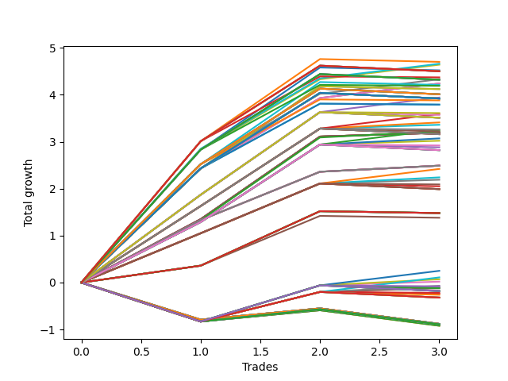

# Long HLT 11190d_100 
- Symbol: TSLA
- Date Range: 01/10/2024 - 05/17/2024
- Trading Period: 8:30-12:30
- Number of Trades: 3



| Id. | Name | Win Percent | Profit | Avg Profit / Trade | Avg Time / Trade | Std |      | Name | Win Percent | Profit | Avg Profit / Trade | Avg Time / Trade | Std |
| --- | ---- | ----------- | ------ | ------------------ | ---------------- | --- | ---- | ---- | ----------- | ------ | ------------------ | ---------------- | --- |
| | Sorted By <br> Profit | | | | | | | Sorted By <br> Win Percentage |||||
|0| TP-3 90m | 66.67 | 4.70 | 1.57 | 84:20 | 1.26 |     | TP-3 75m | 100.00 | 4.66 | 1.55 | 74:00 | 1.04 |
|1| TP-3 75m | 100.00 | 4.66 | 1.55 | 74:00 | 1.04 |     | TP-2.75 75m | 100.00 | 4.64 | 1.55 | 73:40 | 1.03 |
|2| TP-2.75 75m | 100.00 | 4.64 | 1.55 | 73:40 | 1.03 |     | TP-2.5 75m | 100.00 | 4.33 | 1.44 | 72:20 | 0.90 |
|3| TP-2.75 90m | 66.67 | 4.52 | 1.51 | 83:40 | 1.19 |     | TP-2.25 75m | 100.00 | 4.24 | 1.41 | 71:20 | 0.87 |
|4| TP-3 180m | 66.67 | 4.50 | 1.50 | 104:20 | 1.28 |     | TP-2 75m | 100.00 | 4.24 | 1.41 | 71:20 | 0.87 |
|5| TP-3 165m | 66.67 | 4.50 | 1.50 | 104:20 | 1.28 |     | TP-1.75 75m | 100.00 | 3.94 | 1.31 | 61:00 | 0.71 |
|6| TP-3 150m | 66.67 | 4.50 | 1.50 | 104:20 | 1.28 |     | TP-1.5 75m | 100.00 | 3.59 | 1.20 | 50:40 | 0.63 |
|7| TP-3 135m | 66.67 | 4.50 | 1.50 | 104:20 | 1.28 |     | TP-1.5 60m | 100.00 | 3.41 | 1.14 | 45:40 | 0.71 |
|8| TP-3 120m | 66.67 | 4.50 | 1.50 | 104:20 | 1.28 |     | TP-1.5 45m | 100.00 | 3.36 | 1.12 | 40:40 | 0.74 |
|9| TP-3 105m | 66.67 | 4.37 | 1.46 | 94:20 | 1.24 |     | TP-1.25 75m | 100.00 | 3.25 | 1.08 | 50:20 | 0.57 |
|10| TP-2.5 75m | 100.00 | 4.33 | 1.44 | 72:20 | 0.90 |     | TP-1.75 60m | 100.00 | 3.22 | 1.07 | 54:00 | 0.69 |
|11| TP-2.75 180m | 66.67 | 4.32 | 1.44 | 103:40 | 1.21 |     | TP-3 45m | 100.00 | 3.19 | 1.06 | 44:00 | 0.72 |
|12| TP-2.75 165m | 66.67 | 4.32 | 1.44 | 103:40 | 1.21 |     | TP-2.75 45m | 100.00 | 3.19 | 1.06 | 44:00 | 0.72 |
|13| TP-2.75 150m | 66.67 | 4.32 | 1.44 | 103:40 | 1.21 |     | TP-2.5 45m | 100.00 | 3.19 | 1.06 | 44:00 | 0.72 |
|14| TP-2.75 135m | 66.67 | 4.32 | 1.44 | 103:40 | 1.21 |     | TP-2.25 45m | 100.00 | 3.19 | 1.06 | 44:00 | 0.72 |
|15| TP-2.75 120m | 66.67 | 4.32 | 1.44 | 103:40 | 1.21 |     | TP-2 45m | 100.00 | 3.19 | 1.06 | 44:00 | 0.72 |
|16| TP-2.25 75m | 100.00 | 4.24 | 1.41 | 71:20 | 0.87 |     | TP-1.75 45m | 100.00 | 3.19 | 1.06 | 44:00 | 0.72 |
|17| TP-2 75m | 100.00 | 4.24 | 1.41 | 71:20 | 0.87 |     | TP-1.25 60m | 100.00 | 3.07 | 1.02 | 45:20 | 0.65 |
|18| TP-2.5 90m | 66.67 | 4.21 | 1.40 | 82:20 | 1.08 |     | TP-1.25 45m | 100.00 | 3.02 | 1.01 | 40:20 | 0.67 |
|19| TP-2.75 105m | 66.67 | 4.19 | 1.40 | 93:40 | 1.16 |     | TP-3 60m | 100.00 | 2.49 | 0.83 | 59:00 | 0.51 |
|20| TP-2.25 90m | 66.67 | 4.12 | 1.37 | 81:20 | 1.05 |     | TP-2.75 60m | 100.00 | 2.49 | 0.83 | 59:00 | 0.51 |
|21| TP-2 90m | 66.67 | 4.12 | 1.37 | 81:20 | 1.05 |     | TP-2.5 60m | 100.00 | 2.49 | 0.83 | 59:00 | 0.51 |
|22| TP-2.5 180m | 66.67 | 4.01 | 1.34 | 102:20 | 1.09 |     | TP-2.25 60m | 100.00 | 2.49 | 0.83 | 59:00 | 0.51 |
|23| TP-2.5 165m | 66.67 | 4.01 | 1.34 | 102:20 | 1.09 |     | TP-2 60m | 100.00 | 2.49 | 0.83 | 59:00 | 0.51 |
|24| TP-2.5 150m | 66.67 | 4.01 | 1.34 | 102:20 | 1.09 |     | TP-1 75m | 100.00 | 2.42 | 0.81 | 45:00 | 0.35 |
|25| TP-2.5 135m | 66.67 | 4.01 | 1.34 | 102:20 | 1.09 |     | TP-1 60m | 100.00 | 2.24 | 0.75 | 40:00 | 0.44 |
|26| TP-2.5 120m | 66.67 | 4.01 | 1.34 | 102:20 | 1.09 |     | TP-1 45m | 100.00 | 2.19 | 0.73 | 35:00 | 0.46 |
|27| TP-1.75 75m | 100.00 | 3.94 | 1.31 | 61:00 | 0.71 |     | TP-3 90m | 66.67 | 4.70 | 1.57 | 84:20 | 1.26 |
|28| TP-2.25 180m | 66.67 | 3.92 | 1.31 | 101:20 | 1.06 |     | TP-2.75 90m | 66.67 | 4.52 | 1.51 | 83:40 | 1.19 |
|29| TP-2 180m | 66.67 | 3.92 | 1.31 | 101:20 | 1.06 |     | TP-3 180m | 66.67 | 4.50 | 1.50 | 104:20 | 1.28 |
|30| TP-2.25 165m | 66.67 | 3.92 | 1.31 | 101:20 | 1.06 |     | TP-3 165m | 66.67 | 4.50 | 1.50 | 104:20 | 1.28 |
|31| TP-2 165m | 66.67 | 3.92 | 1.31 | 101:20 | 1.06 |     | TP-3 150m | 66.67 | 4.50 | 1.50 | 104:20 | 1.28 |
|32| TP-2.25 150m | 66.67 | 3.92 | 1.31 | 101:20 | 1.06 |     | TP-3 135m | 66.67 | 4.50 | 1.50 | 104:20 | 1.28 |
|33| TP-2 150m | 66.67 | 3.92 | 1.31 | 101:20 | 1.06 |     | TP-3 120m | 66.67 | 4.50 | 1.50 | 104:20 | 1.28 |
|34| TP-2.25 135m | 66.67 | 3.92 | 1.31 | 101:20 | 1.06 |     | TP-3 105m | 66.67 | 4.37 | 1.46 | 94:20 | 1.24 |
|35| TP-2 135m | 66.67 | 3.92 | 1.31 | 101:20 | 1.06 |     | TP-2.75 180m | 66.67 | 4.32 | 1.44 | 103:40 | 1.21 |
|36| TP-2.25 120m | 66.67 | 3.92 | 1.31 | 101:20 | 1.06 |     | TP-2.75 165m | 66.67 | 4.32 | 1.44 | 103:40 | 1.21 |
|37| TP-2 120m | 66.67 | 3.92 | 1.31 | 101:20 | 1.06 |     | TP-2.75 150m | 66.67 | 4.32 | 1.44 | 103:40 | 1.21 |
|38| TP-2.5 105m | 66.67 | 3.88 | 1.29 | 92:20 | 1.04 |     | TP-2.75 135m | 66.67 | 4.32 | 1.44 | 103:40 | 1.21 |
|39| TP-2.25 105m | 66.67 | 3.79 | 1.26 | 91:20 | 1.00 |     | TP-2.75 120m | 66.67 | 4.32 | 1.44 | 103:40 | 1.21 |
|40| TP-2 105m | 66.67 | 3.79 | 1.26 | 91:20 | 1.00 |     | TP-2.5 90m | 66.67 | 4.21 | 1.40 | 82:20 | 1.08 |
|41| TP-1.75 105m | 66.67 | 3.61 | 1.20 | 71:00 | 0.87 |     | TP-2.75 105m | 66.67 | 4.19 | 1.40 | 93:40 | 1.16 |
|42| TP-1.5 75m | 100.00 | 3.59 | 1.20 | 50:40 | 0.63 |     | TP-2.25 90m | 66.67 | 4.12 | 1.37 | 81:20 | 1.05 |
|43| TP-1.75 90m | 66.67 | 3.57 | 1.19 | 66:00 | 0.89 |     | TP-2 90m | 66.67 | 4.12 | 1.37 | 81:20 | 1.05 |
|44| TP-1.75 180m | 66.67 | 3.51 | 1.17 | 76:00 | 0.91 |     | TP-2.5 180m | 66.67 | 4.01 | 1.34 | 102:20 | 1.09 |
|45| TP-1.75 165m | 66.67 | 3.51 | 1.17 | 76:00 | 0.91 |     | TP-2.5 165m | 66.67 | 4.01 | 1.34 | 102:20 | 1.09 |
|46| TP-1.75 150m | 66.67 | 3.51 | 1.17 | 76:00 | 0.91 |     | TP-2.5 150m | 66.67 | 4.01 | 1.34 | 102:20 | 1.09 |
|47| TP-1.75 135m | 66.67 | 3.51 | 1.17 | 76:00 | 0.91 |     | TP-2.5 135m | 66.67 | 4.01 | 1.34 | 102:20 | 1.09 |
|48| TP-1.75 120m | 66.67 | 3.51 | 1.17 | 76:00 | 0.91 |     | TP-2.5 120m | 66.67 | 4.01 | 1.34 | 102:20 | 1.09 |
|49| TP-1.5 60m | 100.00 | 3.41 | 1.14 | 45:40 | 0.71 |     | TP-2.25 180m | 66.67 | 3.92 | 1.31 | 101:20 | 1.06 |
|50| TP-1.5 45m | 100.00 | 3.36 | 1.12 | 40:40 | 0.74 |     | TP-2 180m | 66.67 | 3.92 | 1.31 | 101:20 | 1.06 |
|51| TP-1.5 105m | 66.67 | 3.26 | 1.09 | 60:40 | 0.78 |     | TP-2.25 165m | 66.67 | 3.92 | 1.31 | 101:20 | 1.06 |
|52| TP-1.25 75m | 100.00 | 3.25 | 1.08 | 50:20 | 0.57 |     | TP-2 165m | 66.67 | 3.92 | 1.31 | 101:20 | 1.06 |
|53| TP-1.75 60m | 100.00 | 3.22 | 1.07 | 54:00 | 0.69 |     | TP-2.25 150m | 66.67 | 3.92 | 1.31 | 101:20 | 1.06 |
|54| TP-1.5 90m | 66.67 | 3.22 | 1.07 | 55:40 | 0.80 |     | TP-2 150m | 66.67 | 3.92 | 1.31 | 101:20 | 1.06 |
|55| TP-3 45m | 100.00 | 3.19 | 1.06 | 44:00 | 0.72 |     | TP-2.25 135m | 66.67 | 3.92 | 1.31 | 101:20 | 1.06 |
|56| TP-2.75 45m | 100.00 | 3.19 | 1.06 | 44:00 | 0.72 |     | TP-2 135m | 66.67 | 3.92 | 1.31 | 101:20 | 1.06 |
|57| TP-2.5 45m | 100.00 | 3.19 | 1.06 | 44:00 | 0.72 |     | TP-2.25 120m | 66.67 | 3.92 | 1.31 | 101:20 | 1.06 |
|58| TP-2.25 45m | 100.00 | 3.19 | 1.06 | 44:00 | 0.72 |     | TP-2 120m | 66.67 | 3.92 | 1.31 | 101:20 | 1.06 |
|59| TP-2 45m | 100.00 | 3.19 | 1.06 | 44:00 | 0.72 |     | TP-2.5 105m | 66.67 | 3.88 | 1.29 | 92:20 | 1.04 |
|60| TP-1.75 45m | 100.00 | 3.19 | 1.06 | 44:00 | 0.72 |     | TP-2.25 105m | 66.67 | 3.79 | 1.26 | 91:20 | 1.00 |
|61| TP-1.5 180m | 66.67 | 3.16 | 1.05 | 65:40 | 0.83 |     | TP-2 105m | 66.67 | 3.79 | 1.26 | 91:20 | 1.00 |
|62| TP-1.5 165m | 66.67 | 3.16 | 1.05 | 65:40 | 0.83 |     | TP-1.75 105m | 66.67 | 3.61 | 1.20 | 71:00 | 0.87 |
|63| TP-1.5 150m | 66.67 | 3.16 | 1.05 | 65:40 | 0.83 |     | TP-1.75 90m | 66.67 | 3.57 | 1.19 | 66:00 | 0.89 |
|64| TP-1.5 135m | 66.67 | 3.16 | 1.05 | 65:40 | 0.83 |     | TP-1.75 180m | 66.67 | 3.51 | 1.17 | 76:00 | 0.91 |
|65| TP-1.5 120m | 66.67 | 3.16 | 1.05 | 65:40 | 0.83 |     | TP-1.75 165m | 66.67 | 3.51 | 1.17 | 76:00 | 0.91 |
|66| TP-1.25 60m | 100.00 | 3.07 | 1.02 | 45:20 | 0.65 |     | TP-1.75 150m | 66.67 | 3.51 | 1.17 | 76:00 | 0.91 |
|67| TP-1.25 45m | 100.00 | 3.02 | 1.01 | 40:20 | 0.67 |     | TP-1.75 135m | 66.67 | 3.51 | 1.17 | 76:00 | 0.91 |
|68| TP-1.25 105m | 66.67 | 2.92 | 0.97 | 60:20 | 0.72 |     | TP-1.75 120m | 66.67 | 3.51 | 1.17 | 76:00 | 0.91 |
|69| TP-1.25 90m | 66.67 | 2.88 | 0.96 | 55:20 | 0.74 |     | TP-1.5 105m | 66.67 | 3.26 | 1.09 | 60:40 | 0.78 |
|70| TP-1.25 180m | 66.67 | 2.82 | 0.94 | 65:20 | 0.76 |     | TP-1.5 90m | 66.67 | 3.22 | 1.07 | 55:40 | 0.80 |
|71| TP-1.25 165m | 66.67 | 2.82 | 0.94 | 65:20 | 0.76 |     | TP-1.5 180m | 66.67 | 3.16 | 1.05 | 65:40 | 0.83 |
|72| TP-1.25 150m | 66.67 | 2.82 | 0.94 | 65:20 | 0.76 |     | TP-1.5 165m | 66.67 | 3.16 | 1.05 | 65:40 | 0.83 |
|73| TP-1.25 135m | 66.67 | 2.82 | 0.94 | 65:20 | 0.76 |     | TP-1.5 150m | 66.67 | 3.16 | 1.05 | 65:40 | 0.83 |
|74| TP-1.25 120m | 66.67 | 2.82 | 0.94 | 65:20 | 0.76 |     | TP-1.5 135m | 66.67 | 3.16 | 1.05 | 65:40 | 0.83 |
|75| TP-3 60m | 100.00 | 2.49 | 0.83 | 59:00 | 0.51 |     | TP-1.5 120m | 66.67 | 3.16 | 1.05 | 65:40 | 0.83 |
|76| TP-2.75 60m | 100.00 | 2.49 | 0.83 | 59:00 | 0.51 |     | TP-1.25 105m | 66.67 | 2.92 | 0.97 | 60:20 | 0.72 |
|77| TP-2.5 60m | 100.00 | 2.49 | 0.83 | 59:00 | 0.51 |     | TP-1.25 90m | 66.67 | 2.88 | 0.96 | 55:20 | 0.74 |
|78| TP-2.25 60m | 100.00 | 2.49 | 0.83 | 59:00 | 0.51 |     | TP-1.25 180m | 66.67 | 2.82 | 0.94 | 65:20 | 0.76 |
|79| TP-2 60m | 100.00 | 2.49 | 0.83 | 59:00 | 0.51 |     | TP-1.25 165m | 66.67 | 2.82 | 0.94 | 65:20 | 0.76 |
|80| TP-1 75m | 100.00 | 2.42 | 0.81 | 45:00 | 0.35 |     | TP-1.25 150m | 66.67 | 2.82 | 0.94 | 65:20 | 0.76 |
|81| TP-1 60m | 100.00 | 2.24 | 0.75 | 40:00 | 0.44 |     | TP-1.25 135m | 66.67 | 2.82 | 0.94 | 65:20 | 0.76 |
|82| TP-1 45m | 100.00 | 2.19 | 0.73 | 35:00 | 0.46 |     | TP-1.25 120m | 66.67 | 2.82 | 0.94 | 65:20 | 0.76 |
|83| TP-1 105m | 66.67 | 2.09 | 0.70 | 55:00 | 0.51 |     | TP-1 105m | 66.67 | 2.09 | 0.70 | 55:00 | 0.51 |
|84| TP-1 90m | 66.67 | 2.05 | 0.68 | 50:00 | 0.53 |     | TP-1 90m | 66.67 | 2.05 | 0.68 | 50:00 | 0.53 |
|85| TP-1 180m | 66.67 | 1.99 | 0.66 | 60:00 | 0.55 |     | TP-1 180m | 66.67 | 1.99 | 0.66 | 60:00 | 0.55 |
|86| TP-1 165m | 66.67 | 1.99 | 0.66 | 60:00 | 0.55 |     | TP-1 165m | 66.67 | 1.99 | 0.66 | 60:00 | 0.55 |
|87| TP-1 150m | 66.67 | 1.99 | 0.66 | 60:00 | 0.55 |     | TP-1 150m | 66.67 | 1.99 | 0.66 | 60:00 | 0.55 |
|88| TP-1 135m | 66.67 | 1.99 | 0.66 | 60:00 | 0.55 |     | TP-1 135m | 66.67 | 1.99 | 0.66 | 60:00 | 0.55 |
|89| TP-1 120m | 66.67 | 1.99 | 0.66 | 60:00 | 0.55 |     | TP-1 120m | 66.67 | 1.99 | 0.66 | 60:00 | 0.55 |
|90| TP-3 30m | 66.67 | 1.48 | 0.49 | 29:00 | 0.50 |     | TP-3 30m | 66.67 | 1.48 | 0.49 | 29:00 | 0.50 |
|91| TP-2.75 30m | 66.67 | 1.48 | 0.49 | 29:00 | 0.50 |     | TP-2.75 30m | 66.67 | 1.48 | 0.49 | 29:00 | 0.50 |
|92| TP-2.5 30m | 66.67 | 1.48 | 0.49 | 29:00 | 0.50 |     | TP-2.5 30m | 66.67 | 1.48 | 0.49 | 29:00 | 0.50 |
|93| TP-2.25 30m | 66.67 | 1.48 | 0.49 | 29:00 | 0.50 |     | TP-2.25 30m | 66.67 | 1.48 | 0.49 | 29:00 | 0.50 |
|94| TP-2 30m | 66.67 | 1.48 | 0.49 | 29:00 | 0.50 |     | TP-2 30m | 66.67 | 1.48 | 0.49 | 29:00 | 0.50 |
|95| TP-1.75 30m | 66.67 | 1.48 | 0.49 | 29:00 | 0.50 |     | TP-1.75 30m | 66.67 | 1.48 | 0.49 | 29:00 | 0.50 |
|96| TP-1.5 30m | 66.67 | 1.48 | 0.49 | 29:00 | 0.50 |     | TP-1.5 30m | 66.67 | 1.48 | 0.49 | 29:00 | 0.50 |
|97| TP-1.25 30m | 66.67 | 1.48 | 0.49 | 29:00 | 0.50 |     | TP-1.25 30m | 66.67 | 1.48 | 0.49 | 29:00 | 0.50 |
|98| TP-1 30m | 66.67 | 1.38 | 0.46 | 28:40 | 0.45 |     | TP-1 30m | 66.67 | 1.38 | 0.46 | 28:40 | 0.45 |
|99| TP-0.75 75m | 66.67 | 0.25 | 0.08 | 32:40 | 0.67 |     | TP-0.75 75m | 66.67 | 0.25 | 0.08 | 32:40 | 0.67 |
|100| TP-0.5 75m | 66.67 | 0.11 | 0.04 | 31:20 | 0.63 |     | TP-0.5 75m | 66.67 | 0.11 | 0.04 | 31:20 | 0.63 |
|101| TP-0.75 60m | 66.67 | 0.07 | 0.02 | 27:40 | 0.66 |     | TP-0.75 60m | 66.67 | 0.07 | 0.02 | 27:40 | 0.66 |
|102| TP-0.75 45m | 66.67 | 0.02 | 0.01 | 22:40 | 0.66 |     | TP-0.75 45m | 66.67 | 0.02 | 0.01 | 22:40 | 0.66 |
|103| TP-0.5 60m | 66.67 | -0.07 | -0.02 | 26:20 | 0.61 |     | TP-0.5 60m | 66.67 | -0.07 | -0.02 | 26:20 | 0.61 |
|104| TP-0.75 105m | 33.33 | -0.08 | -0.03 | 42:40 | 0.65 |     | TP-0.5 45m | 66.67 | -0.12 | -0.04 | 21:20 | 0.60 |
|105| TP-0.75 30m | 33.33 | -0.10 | -0.03 | 17:40 | 0.65 |     | TP-0.75 105m | 33.33 | -0.08 | -0.03 | 42:40 | 0.65 |
|106| TP-0.5 45m | 66.67 | -0.12 | -0.04 | 21:20 | 0.60 |     | TP-0.75 30m | 33.33 | -0.10 | -0.03 | 17:40 | 0.65 |
|107| TP-0.75 90m | 33.33 | -0.12 | -0.04 | 37:40 | 0.65 |     | TP-0.75 90m | 33.33 | -0.12 | -0.04 | 37:40 | 0.65 |
|108| TP-0.75 180m | 33.33 | -0.18 | -0.06 | 47:40 | 0.65 |     | TP-0.75 180m | 33.33 | -0.18 | -0.06 | 47:40 | 0.65 |
|109| TP-0.75 165m | 33.33 | -0.18 | -0.06 | 47:40 | 0.65 |     | TP-0.75 165m | 33.33 | -0.18 | -0.06 | 47:40 | 0.65 |
|110| TP-0.75 150m | 33.33 | -0.18 | -0.06 | 47:40 | 0.65 |     | TP-0.75 150m | 33.33 | -0.18 | -0.06 | 47:40 | 0.65 |
|111| TP-0.75 135m | 33.33 | -0.18 | -0.06 | 47:40 | 0.65 |     | TP-0.75 135m | 33.33 | -0.18 | -0.06 | 47:40 | 0.65 |
|112| TP-0.75 120m | 33.33 | -0.18 | -0.06 | 47:40 | 0.65 |     | TP-0.75 120m | 33.33 | -0.18 | -0.06 | 47:40 | 0.65 |
|113| TP-0.5 105m | 33.33 | -0.22 | -0.07 | 41:20 | 0.60 |     | TP-0.5 105m | 33.33 | -0.22 | -0.07 | 41:20 | 0.60 |
|114| TP-0.5 30m | 33.33 | -0.24 | -0.08 | 16:20 | 0.60 |     | TP-0.5 30m | 33.33 | -0.24 | -0.08 | 16:20 | 0.60 |
|115| TP-0.5 90m | 33.33 | -0.26 | -0.09 | 36:20 | 0.60 |     | TP-0.5 90m | 33.33 | -0.26 | -0.09 | 36:20 | 0.60 |
|116| TP-0.5 180m | 33.33 | -0.32 | -0.11 | 46:20 | 0.60 |     | TP-0.5 180m | 33.33 | -0.32 | -0.11 | 46:20 | 0.60 |
|117| TP-0.5 165m | 33.33 | -0.32 | -0.11 | 46:20 | 0.60 |     | TP-0.5 165m | 33.33 | -0.32 | -0.11 | 46:20 | 0.60 |
|118| TP-0.5 150m | 33.33 | -0.32 | -0.11 | 46:20 | 0.60 |     | TP-0.5 150m | 33.33 | -0.32 | -0.11 | 46:20 | 0.60 |
|119| TP-0.5 135m | 33.33 | -0.32 | -0.11 | 46:20 | 0.60 |     | TP-0.5 135m | 33.33 | -0.32 | -0.11 | 46:20 | 0.60 |
|120| TP-0.5 120m | 33.33 | -0.32 | -0.11 | 46:20 | 0.60 |     | TP-0.5 120m | 33.33 | -0.32 | -0.11 | 46:20 | 0.60 |
|121| TP-3 15m | 33.33 | -0.88 | -0.29 | 14:00 | 0.42 |     | TP-3 15m | 33.33 | -0.88 | -0.29 | 14:00 | 0.42 |
|122| TP-2.75 15m | 33.33 | -0.88 | -0.29 | 14:00 | 0.42 |     | TP-2.75 15m | 33.33 | -0.88 | -0.29 | 14:00 | 0.42 |
|123| TP-2.5 15m | 33.33 | -0.88 | -0.29 | 14:00 | 0.42 |     | TP-2.5 15m | 33.33 | -0.88 | -0.29 | 14:00 | 0.42 |
|124| TP-2.25 15m | 33.33 | -0.88 | -0.29 | 14:00 | 0.42 |     | TP-2.25 15m | 33.33 | -0.88 | -0.29 | 14:00 | 0.42 |
|125| TP-2 15m | 33.33 | -0.88 | -0.29 | 14:00 | 0.42 |     | TP-2 15m | 33.33 | -0.88 | -0.29 | 14:00 | 0.42 |
|126| TP-1.75 15m | 33.33 | -0.88 | -0.29 | 14:00 | 0.42 |     | TP-1.75 15m | 33.33 | -0.88 | -0.29 | 14:00 | 0.42 |
|127| TP-1.5 15m | 33.33 | -0.88 | -0.29 | 14:00 | 0.42 |     | TP-1.5 15m | 33.33 | -0.88 | -0.29 | 14:00 | 0.42 |
|128| TP-1.25 15m | 33.33 | -0.88 | -0.29 | 14:00 | 0.42 |     | TP-1.25 15m | 33.33 | -0.88 | -0.29 | 14:00 | 0.42 |
|129| TP-1 15m | 33.33 | -0.88 | -0.29 | 14:00 | 0.42 |     | TP-1 15m | 33.33 | -0.88 | -0.29 | 14:00 | 0.42 |
|130| TP-0.25 180m | 33.33 | -0.89 | -0.30 | 10:20 | 0.45 |     | TP-0.25 180m | 33.33 | -0.89 | -0.30 | 10:20 | 0.45 |
|131| TP-0.25 165m | 33.33 | -0.89 | -0.30 | 10:20 | 0.45 |     | TP-0.25 165m | 33.33 | -0.89 | -0.30 | 10:20 | 0.45 |
|132| TP-0.25 150m | 33.33 | -0.89 | -0.30 | 10:20 | 0.45 |     | TP-0.25 150m | 33.33 | -0.89 | -0.30 | 10:20 | 0.45 |
|133| TP-0.25 135m | 33.33 | -0.89 | -0.30 | 10:20 | 0.45 |     | TP-0.25 135m | 33.33 | -0.89 | -0.30 | 10:20 | 0.45 |
|134| TP-0.25 120m | 33.33 | -0.89 | -0.30 | 10:20 | 0.45 |     | TP-0.25 120m | 33.33 | -0.89 | -0.30 | 10:20 | 0.45 |
|135| TP-0.25 105m | 33.33 | -0.89 | -0.30 | 10:20 | 0.45 |     | TP-0.25 105m | 33.33 | -0.89 | -0.30 | 10:20 | 0.45 |
|136| TP-0.25 90m | 33.33 | -0.89 | -0.30 | 10:20 | 0.45 |     | TP-0.25 90m | 33.33 | -0.89 | -0.30 | 10:20 | 0.45 |
|137| TP-0.25 75m | 33.33 | -0.89 | -0.30 | 10:20 | 0.45 |     | TP-0.25 75m | 33.33 | -0.89 | -0.30 | 10:20 | 0.45 |
|138| TP-0.25 60m | 33.33 | -0.89 | -0.30 | 10:20 | 0.45 |     | TP-0.25 60m | 33.33 | -0.89 | -0.30 | 10:20 | 0.45 |
|139| TP-0.25 45m | 33.33 | -0.89 | -0.30 | 10:20 | 0.45 |     | TP-0.25 45m | 33.33 | -0.89 | -0.30 | 10:20 | 0.45 |
|140| TP-0.25 30m | 33.33 | -0.89 | -0.30 | 10:20 | 0.45 |     | TP-0.25 30m | 33.33 | -0.89 | -0.30 | 10:20 | 0.45 |
|141| TP-0.25 15m | 33.33 | -0.91 | -0.30 | 09:40 | 0.44 |     | TP-0.25 15m | 33.33 | -0.91 | -0.30 | 09:40 | 0.44 |
|142| TP-0.75 15m | 33.33 | -0.92 | -0.31 | 10:00 | 0.44 |     | TP-0.75 15m | 33.33 | -0.92 | -0.31 | 10:00 | 0.44 |
|143| TP-0.5 15m | 33.33 | -0.92 | -0.31 | 10:00 | 0.44 |     | TP-0.5 15m | 33.33 | -0.92 | -0.31 | 10:00 | 0.44 |

### Test TP-0.25 15m
* Take Profit of 0.25 Point
* 0.25 Stoploss
* Results:
```
Total Trades: 3
Percent Up: 33.33
Percent Down: 66.67
Total Points Moved Up: -0.91
Potential Profit: -455.00
Total Points Ups: 0.24 Count Ups: 1
Total Points Downs: -1.15 Count Downs: 2
```

<details><summary>Trades</summary>

<code>In: 2024-04-05 08:45:00		Out: 2024-04-05 08:47:00		Total Position Time: 02:00		Total Move Up: -0.83		Total to Date: -0.83</code> <br />
<code>In: 2024-04-22 08:35:00		Out: 2024-04-22 08:49:00		Total Position Time: 14:00		Total Move Up: 0.24		Total to Date: -0.59</code> <br />
<code>In: 2024-05-09 08:55:00		Out: 2024-05-09 09:08:00		Total Position Time: 13:00		Total Move Up: -0.32		Total to Date: -0.91</code> <br />


</details>

### Test TP-0.5 15m
* Take Profit of 0.5 Point
* 0.5 Stoploss
* Results:
```
Total Trades: 3
Percent Up: 33.33
Percent Down: 66.67
Total Points Moved Up: -0.92
Potential Profit: -460.00
Total Points Ups: 0.24 Count Ups: 1
Total Points Downs: -1.16 Count Downs: 2
```

<details><summary>Trades</summary>

<code>In: 2024-04-05 08:45:00		Out: 2024-04-05 08:47:00		Total Position Time: 02:00		Total Move Up: -0.83		Total to Date: -0.83</code> <br />
<code>In: 2024-04-22 08:35:00		Out: 2024-04-22 08:49:00		Total Position Time: 14:00		Total Move Up: 0.24		Total to Date: -0.59</code> <br />
<code>In: 2024-05-09 08:55:00		Out: 2024-05-09 09:09:00		Total Position Time: 14:00		Total Move Up: -0.33		Total to Date: -0.92</code> <br />


</details>

### Test TP-0.75 15m
* Take Profit of 0.75 Point
* 0.75 Stoploss
* Results:
```
Total Trades: 3
Percent Up: 33.33
Percent Down: 66.67
Total Points Moved Up: -0.92
Potential Profit: -460.00
Total Points Ups: 0.24 Count Ups: 1
Total Points Downs: -1.16 Count Downs: 2
```

<details><summary>Trades</summary>

<code>In: 2024-04-05 08:45:00		Out: 2024-04-05 08:47:00		Total Position Time: 02:00		Total Move Up: -0.83		Total to Date: -0.83</code> <br />
<code>In: 2024-04-22 08:35:00		Out: 2024-04-22 08:49:00		Total Position Time: 14:00		Total Move Up: 0.24		Total to Date: -0.59</code> <br />
<code>In: 2024-05-09 08:55:00		Out: 2024-05-09 09:09:00		Total Position Time: 14:00		Total Move Up: -0.33		Total to Date: -0.92</code> <br />


</details>

### Test TP-1 15m
* Take Profit of 1 Point
* 1 Stoploss
* Results:
```
Total Trades: 3
Percent Up: 33.33
Percent Down: 66.67
Total Points Moved Up: -0.88
Potential Profit: -440.00
Total Points Ups: 0.24 Count Ups: 1
Total Points Downs: -1.12 Count Downs: 2
```

<details><summary>Trades</summary>

<code>In: 2024-04-05 08:45:00		Out: 2024-04-05 08:59:00		Total Position Time: 14:00		Total Move Up: -0.79		Total to Date: -0.79</code> <br />
<code>In: 2024-04-22 08:35:00		Out: 2024-04-22 08:49:00		Total Position Time: 14:00		Total Move Up: 0.24		Total to Date: -0.55</code> <br />
<code>In: 2024-05-09 08:55:00		Out: 2024-05-09 09:09:00		Total Position Time: 14:00		Total Move Up: -0.33		Total to Date: -0.88</code> <br />


</details>

### Test TP-1.25 15m
* Take Profit of 1.25 Point
* 1.25 Stoploss
* Results:
```
Total Trades: 3
Percent Up: 33.33
Percent Down: 66.67
Total Points Moved Up: -0.88
Potential Profit: -440.00
Total Points Ups: 0.24 Count Ups: 1
Total Points Downs: -1.12 Count Downs: 2
```

<details><summary>Trades</summary>

<code>In: 2024-04-05 08:45:00		Out: 2024-04-05 08:59:00		Total Position Time: 14:00		Total Move Up: -0.79		Total to Date: -0.79</code> <br />
<code>In: 2024-04-22 08:35:00		Out: 2024-04-22 08:49:00		Total Position Time: 14:00		Total Move Up: 0.24		Total to Date: -0.55</code> <br />
<code>In: 2024-05-09 08:55:00		Out: 2024-05-09 09:09:00		Total Position Time: 14:00		Total Move Up: -0.33		Total to Date: -0.88</code> <br />


</details>

### Test TP-1.5 15m
* Take Profit of 1.5 Point
* 1.5 Stoploss
* Results:
```
Total Trades: 3
Percent Up: 33.33
Percent Down: 66.67
Total Points Moved Up: -0.88
Potential Profit: -440.00
Total Points Ups: 0.24 Count Ups: 1
Total Points Downs: -1.12 Count Downs: 2
```

<details><summary>Trades</summary>

<code>In: 2024-04-05 08:45:00		Out: 2024-04-05 08:59:00		Total Position Time: 14:00		Total Move Up: -0.79		Total to Date: -0.79</code> <br />
<code>In: 2024-04-22 08:35:00		Out: 2024-04-22 08:49:00		Total Position Time: 14:00		Total Move Up: 0.24		Total to Date: -0.55</code> <br />
<code>In: 2024-05-09 08:55:00		Out: 2024-05-09 09:09:00		Total Position Time: 14:00		Total Move Up: -0.33		Total to Date: -0.88</code> <br />


</details>

### Test TP-1.75 15m
* Take Profit of 1.75 Point
* 1.75 Stoploss
* Results:
```
Total Trades: 3
Percent Up: 33.33
Percent Down: 66.67
Total Points Moved Up: -0.88
Potential Profit: -440.00
Total Points Ups: 0.24 Count Ups: 1
Total Points Downs: -1.12 Count Downs: 2
```

<details><summary>Trades</summary>

<code>In: 2024-04-05 08:45:00		Out: 2024-04-05 08:59:00		Total Position Time: 14:00		Total Move Up: -0.79		Total to Date: -0.79</code> <br />
<code>In: 2024-04-22 08:35:00		Out: 2024-04-22 08:49:00		Total Position Time: 14:00		Total Move Up: 0.24		Total to Date: -0.55</code> <br />
<code>In: 2024-05-09 08:55:00		Out: 2024-05-09 09:09:00		Total Position Time: 14:00		Total Move Up: -0.33		Total to Date: -0.88</code> <br />


</details>

### Test TP-2 15m
* Take Profit of 2 Point
* 2 Stoploss
* Results:
```
Total Trades: 3
Percent Up: 33.33
Percent Down: 66.67
Total Points Moved Up: -0.88
Potential Profit: -440.00
Total Points Ups: 0.24 Count Ups: 1
Total Points Downs: -1.12 Count Downs: 2
```

<details><summary>Trades</summary>

<code>In: 2024-04-05 08:45:00		Out: 2024-04-05 08:59:00		Total Position Time: 14:00		Total Move Up: -0.79		Total to Date: -0.79</code> <br />
<code>In: 2024-04-22 08:35:00		Out: 2024-04-22 08:49:00		Total Position Time: 14:00		Total Move Up: 0.24		Total to Date: -0.55</code> <br />
<code>In: 2024-05-09 08:55:00		Out: 2024-05-09 09:09:00		Total Position Time: 14:00		Total Move Up: -0.33		Total to Date: -0.88</code> <br />


</details>

### Test TP-2.25 15m
* Take Profit of 2.25 Point
* 2.25 Stoploss
* Results:
```
Total Trades: 3
Percent Up: 33.33
Percent Down: 66.67
Total Points Moved Up: -0.88
Potential Profit: -440.00
Total Points Ups: 0.24 Count Ups: 1
Total Points Downs: -1.12 Count Downs: 2
```

<details><summary>Trades</summary>

<code>In: 2024-04-05 08:45:00		Out: 2024-04-05 08:59:00		Total Position Time: 14:00		Total Move Up: -0.79		Total to Date: -0.79</code> <br />
<code>In: 2024-04-22 08:35:00		Out: 2024-04-22 08:49:00		Total Position Time: 14:00		Total Move Up: 0.24		Total to Date: -0.55</code> <br />
<code>In: 2024-05-09 08:55:00		Out: 2024-05-09 09:09:00		Total Position Time: 14:00		Total Move Up: -0.33		Total to Date: -0.88</code> <br />


</details>

### Test TP-2.5 15m
* Take Profit of 2.5 Point
* 2.5 Stoploss
* Results:
```
Total Trades: 3
Percent Up: 33.33
Percent Down: 66.67
Total Points Moved Up: -0.88
Potential Profit: -440.00
Total Points Ups: 0.24 Count Ups: 1
Total Points Downs: -1.12 Count Downs: 2
```

<details><summary>Trades</summary>

<code>In: 2024-04-05 08:45:00		Out: 2024-04-05 08:59:00		Total Position Time: 14:00		Total Move Up: -0.79		Total to Date: -0.79</code> <br />
<code>In: 2024-04-22 08:35:00		Out: 2024-04-22 08:49:00		Total Position Time: 14:00		Total Move Up: 0.24		Total to Date: -0.55</code> <br />
<code>In: 2024-05-09 08:55:00		Out: 2024-05-09 09:09:00		Total Position Time: 14:00		Total Move Up: -0.33		Total to Date: -0.88</code> <br />


</details>

### Test TP-2.75 15m
* Take Profit of 2.75 Point
* 2.75 Stoploss
* Results:
```
Total Trades: 3
Percent Up: 33.33
Percent Down: 66.67
Total Points Moved Up: -0.88
Potential Profit: -440.00
Total Points Ups: 0.24 Count Ups: 1
Total Points Downs: -1.12 Count Downs: 2
```

<details><summary>Trades</summary>

<code>In: 2024-04-05 08:45:00		Out: 2024-04-05 08:59:00		Total Position Time: 14:00		Total Move Up: -0.79		Total to Date: -0.79</code> <br />
<code>In: 2024-04-22 08:35:00		Out: 2024-04-22 08:49:00		Total Position Time: 14:00		Total Move Up: 0.24		Total to Date: -0.55</code> <br />
<code>In: 2024-05-09 08:55:00		Out: 2024-05-09 09:09:00		Total Position Time: 14:00		Total Move Up: -0.33		Total to Date: -0.88</code> <br />


</details>

### Test TP-3 15m
* Take Profit of 3 Point
* 3 Stoploss
* Results:
```
Total Trades: 3
Percent Up: 33.33
Percent Down: 66.67
Total Points Moved Up: -0.88
Potential Profit: -440.00
Total Points Ups: 0.24 Count Ups: 1
Total Points Downs: -1.12 Count Downs: 2
```

<details><summary>Trades</summary>

<code>In: 2024-04-05 08:45:00		Out: 2024-04-05 08:59:00		Total Position Time: 14:00		Total Move Up: -0.79		Total to Date: -0.79</code> <br />
<code>In: 2024-04-22 08:35:00		Out: 2024-04-22 08:49:00		Total Position Time: 14:00		Total Move Up: 0.24		Total to Date: -0.55</code> <br />
<code>In: 2024-05-09 08:55:00		Out: 2024-05-09 09:09:00		Total Position Time: 14:00		Total Move Up: -0.33		Total to Date: -0.88</code> <br />


</details>

### Test TP-0.25 30m
* Take Profit of 0.25 Point
* 0.25 Stoploss
* Results:
```
Total Trades: 3
Percent Up: 33.33
Percent Down: 66.67
Total Points Moved Up: -0.89
Potential Profit: -445.00
Total Points Ups: 0.26 Count Ups: 1
Total Points Downs: -1.15 Count Downs: 2
```

<details><summary>Trades</summary>

<code>In: 2024-04-05 08:45:00		Out: 2024-04-05 08:47:00		Total Position Time: 02:00		Total Move Up: -0.83		Total to Date: -0.83</code> <br />
<code>In: 2024-04-22 08:35:00		Out: 2024-04-22 08:51:00		Total Position Time: 16:00		Total Move Up: 0.26		Total to Date: -0.57</code> <br />
<code>In: 2024-05-09 08:55:00		Out: 2024-05-09 09:08:00		Total Position Time: 13:00		Total Move Up: -0.32		Total to Date: -0.89</code> <br />


</details>

### Test TP-0.5 30m
* Take Profit of 0.5 Point
* 0.5 Stoploss
* Results:
```
Total Trades: 3
Percent Up: 33.33
Percent Down: 66.67
Total Points Moved Up: -0.24
Potential Profit: -120.00
Total Points Ups: 0.63 Count Ups: 1
Total Points Downs: -0.87 Count Downs: 2
```

<details><summary>Trades</summary>

<code>In: 2024-04-05 08:45:00		Out: 2024-04-05 08:47:00		Total Position Time: 02:00		Total Move Up: -0.83		Total to Date: -0.83</code> <br />
<code>In: 2024-04-22 08:35:00		Out: 2024-04-22 08:53:00		Total Position Time: 18:00		Total Move Up: 0.63		Total to Date: -0.20</code> <br />
<code>In: 2024-05-09 08:55:00		Out: 2024-05-09 09:24:00		Total Position Time: 29:00		Total Move Up: -0.04		Total to Date: -0.24</code> <br />


</details>

### Test TP-0.75 30m
* Take Profit of 0.75 Point
* 0.75 Stoploss
* Results:
```
Total Trades: 3
Percent Up: 33.33
Percent Down: 66.67
Total Points Moved Up: -0.10
Potential Profit: -50.00
Total Points Ups: 0.77 Count Ups: 1
Total Points Downs: -0.87 Count Downs: 2
```

<details><summary>Trades</summary>

<code>In: 2024-04-05 08:45:00		Out: 2024-04-05 08:47:00		Total Position Time: 02:00		Total Move Up: -0.83		Total to Date: -0.83</code> <br />
<code>In: 2024-04-22 08:35:00		Out: 2024-04-22 08:57:00		Total Position Time: 22:00		Total Move Up: 0.77		Total to Date: -0.06</code> <br />
<code>In: 2024-05-09 08:55:00		Out: 2024-05-09 09:24:00		Total Position Time: 29:00		Total Move Up: -0.04		Total to Date: -0.10</code> <br />


</details>

### Test TP-1 30m
* Take Profit of 1 Point
* 1 Stoploss
* Results:
```
Total Trades: 3
Percent Up: 66.67
Percent Down: 33.33
Total Points Moved Up: 1.38
Potential Profit: 690.00
Total Points Ups: 1.42 Count Ups: 2
Total Points Downs: -0.04 Count Downs: 1
```

<details><summary>Trades</summary>

<code>In: 2024-04-05 08:45:00		Out: 2024-04-05 09:14:00		Total Position Time: 29:00		Total Move Up: 0.36		Total to Date: 0.36</code> <br />
<code>In: 2024-04-22 08:35:00		Out: 2024-04-22 09:03:00		Total Position Time: 28:00		Total Move Up: 1.06		Total to Date: 1.42</code> <br />
<code>In: 2024-05-09 08:55:00		Out: 2024-05-09 09:24:00		Total Position Time: 29:00		Total Move Up: -0.04		Total to Date: 1.38</code> <br />


</details>

### Test TP-1.25 30m
* Take Profit of 1.25 Point
* 1.25 Stoploss
* Results:
```
Total Trades: 3
Percent Up: 66.67
Percent Down: 33.33
Total Points Moved Up: 1.48
Potential Profit: 740.00
Total Points Ups: 1.52 Count Ups: 2
Total Points Downs: -0.04 Count Downs: 1
```

<details><summary>Trades</summary>

<code>In: 2024-04-05 08:45:00		Out: 2024-04-05 09:14:00		Total Position Time: 29:00		Total Move Up: 0.36		Total to Date: 0.36</code> <br />
<code>In: 2024-04-22 08:35:00		Out: 2024-04-22 09:04:00		Total Position Time: 29:00		Total Move Up: 1.16		Total to Date: 1.52</code> <br />
<code>In: 2024-05-09 08:55:00		Out: 2024-05-09 09:24:00		Total Position Time: 29:00		Total Move Up: -0.04		Total to Date: 1.48</code> <br />


</details>

### Test TP-1.5 30m
* Take Profit of 1.5 Point
* 1.5 Stoploss
* Results:
```
Total Trades: 3
Percent Up: 66.67
Percent Down: 33.33
Total Points Moved Up: 1.48
Potential Profit: 740.00
Total Points Ups: 1.52 Count Ups: 2
Total Points Downs: -0.04 Count Downs: 1
```

<details><summary>Trades</summary>

<code>In: 2024-04-05 08:45:00		Out: 2024-04-05 09:14:00		Total Position Time: 29:00		Total Move Up: 0.36		Total to Date: 0.36</code> <br />
<code>In: 2024-04-22 08:35:00		Out: 2024-04-22 09:04:00		Total Position Time: 29:00		Total Move Up: 1.16		Total to Date: 1.52</code> <br />
<code>In: 2024-05-09 08:55:00		Out: 2024-05-09 09:24:00		Total Position Time: 29:00		Total Move Up: -0.04		Total to Date: 1.48</code> <br />


</details>

### Test TP-1.75 30m
* Take Profit of 1.75 Point
* 1.75 Stoploss
* Results:
```
Total Trades: 3
Percent Up: 66.67
Percent Down: 33.33
Total Points Moved Up: 1.48
Potential Profit: 740.00
Total Points Ups: 1.52 Count Ups: 2
Total Points Downs: -0.04 Count Downs: 1
```

<details><summary>Trades</summary>

<code>In: 2024-04-05 08:45:00		Out: 2024-04-05 09:14:00		Total Position Time: 29:00		Total Move Up: 0.36		Total to Date: 0.36</code> <br />
<code>In: 2024-04-22 08:35:00		Out: 2024-04-22 09:04:00		Total Position Time: 29:00		Total Move Up: 1.16		Total to Date: 1.52</code> <br />
<code>In: 2024-05-09 08:55:00		Out: 2024-05-09 09:24:00		Total Position Time: 29:00		Total Move Up: -0.04		Total to Date: 1.48</code> <br />


</details>

### Test TP-2 30m
* Take Profit of 2 Point
* 2 Stoploss
* Results:
```
Total Trades: 3
Percent Up: 66.67
Percent Down: 33.33
Total Points Moved Up: 1.48
Potential Profit: 740.00
Total Points Ups: 1.52 Count Ups: 2
Total Points Downs: -0.04 Count Downs: 1
```

<details><summary>Trades</summary>

<code>In: 2024-04-05 08:45:00		Out: 2024-04-05 09:14:00		Total Position Time: 29:00		Total Move Up: 0.36		Total to Date: 0.36</code> <br />
<code>In: 2024-04-22 08:35:00		Out: 2024-04-22 09:04:00		Total Position Time: 29:00		Total Move Up: 1.16		Total to Date: 1.52</code> <br />
<code>In: 2024-05-09 08:55:00		Out: 2024-05-09 09:24:00		Total Position Time: 29:00		Total Move Up: -0.04		Total to Date: 1.48</code> <br />


</details>

### Test TP-2.25 30m
* Take Profit of 2.25 Point
* 2.25 Stoploss
* Results:
```
Total Trades: 3
Percent Up: 66.67
Percent Down: 33.33
Total Points Moved Up: 1.48
Potential Profit: 740.00
Total Points Ups: 1.52 Count Ups: 2
Total Points Downs: -0.04 Count Downs: 1
```

<details><summary>Trades</summary>

<code>In: 2024-04-05 08:45:00		Out: 2024-04-05 09:14:00		Total Position Time: 29:00		Total Move Up: 0.36		Total to Date: 0.36</code> <br />
<code>In: 2024-04-22 08:35:00		Out: 2024-04-22 09:04:00		Total Position Time: 29:00		Total Move Up: 1.16		Total to Date: 1.52</code> <br />
<code>In: 2024-05-09 08:55:00		Out: 2024-05-09 09:24:00		Total Position Time: 29:00		Total Move Up: -0.04		Total to Date: 1.48</code> <br />


</details>

### Test TP-2.5 30m
* Take Profit of 2.5 Point
* 2.5 Stoploss
* Results:
```
Total Trades: 3
Percent Up: 66.67
Percent Down: 33.33
Total Points Moved Up: 1.48
Potential Profit: 740.00
Total Points Ups: 1.52 Count Ups: 2
Total Points Downs: -0.04 Count Downs: 1
```

<details><summary>Trades</summary>

<code>In: 2024-04-05 08:45:00		Out: 2024-04-05 09:14:00		Total Position Time: 29:00		Total Move Up: 0.36		Total to Date: 0.36</code> <br />
<code>In: 2024-04-22 08:35:00		Out: 2024-04-22 09:04:00		Total Position Time: 29:00		Total Move Up: 1.16		Total to Date: 1.52</code> <br />
<code>In: 2024-05-09 08:55:00		Out: 2024-05-09 09:24:00		Total Position Time: 29:00		Total Move Up: -0.04		Total to Date: 1.48</code> <br />


</details>

### Test TP-2.75 30m
* Take Profit of 2.75 Point
* 2.75 Stoploss
* Results:
```
Total Trades: 3
Percent Up: 66.67
Percent Down: 33.33
Total Points Moved Up: 1.48
Potential Profit: 740.00
Total Points Ups: 1.52 Count Ups: 2
Total Points Downs: -0.04 Count Downs: 1
```

<details><summary>Trades</summary>

<code>In: 2024-04-05 08:45:00		Out: 2024-04-05 09:14:00		Total Position Time: 29:00		Total Move Up: 0.36		Total to Date: 0.36</code> <br />
<code>In: 2024-04-22 08:35:00		Out: 2024-04-22 09:04:00		Total Position Time: 29:00		Total Move Up: 1.16		Total to Date: 1.52</code> <br />
<code>In: 2024-05-09 08:55:00		Out: 2024-05-09 09:24:00		Total Position Time: 29:00		Total Move Up: -0.04		Total to Date: 1.48</code> <br />


</details>

### Test TP-3 30m
* Take Profit of 3 Point
* 3 Stoploss
* Results:
```
Total Trades: 3
Percent Up: 66.67
Percent Down: 33.33
Total Points Moved Up: 1.48
Potential Profit: 740.00
Total Points Ups: 1.52 Count Ups: 2
Total Points Downs: -0.04 Count Downs: 1
```

<details><summary>Trades</summary>

<code>In: 2024-04-05 08:45:00		Out: 2024-04-05 09:14:00		Total Position Time: 29:00		Total Move Up: 0.36		Total to Date: 0.36</code> <br />
<code>In: 2024-04-22 08:35:00		Out: 2024-04-22 09:04:00		Total Position Time: 29:00		Total Move Up: 1.16		Total to Date: 1.52</code> <br />
<code>In: 2024-05-09 08:55:00		Out: 2024-05-09 09:24:00		Total Position Time: 29:00		Total Move Up: -0.04		Total to Date: 1.48</code> <br />


</details>

### Test TP-0.25 45m
* Take Profit of 0.25 Point
* 0.25 Stoploss
* Results:
```
Total Trades: 3
Percent Up: 33.33
Percent Down: 66.67
Total Points Moved Up: -0.89
Potential Profit: -445.00
Total Points Ups: 0.26 Count Ups: 1
Total Points Downs: -1.15 Count Downs: 2
```

<details><summary>Trades</summary>

<code>In: 2024-04-05 08:45:00		Out: 2024-04-05 08:47:00		Total Position Time: 02:00		Total Move Up: -0.83		Total to Date: -0.83</code> <br />
<code>In: 2024-04-22 08:35:00		Out: 2024-04-22 08:51:00		Total Position Time: 16:00		Total Move Up: 0.26		Total to Date: -0.57</code> <br />
<code>In: 2024-05-09 08:55:00		Out: 2024-05-09 09:08:00		Total Position Time: 13:00		Total Move Up: -0.32		Total to Date: -0.89</code> <br />


</details>

### Test TP-0.5 45m
* Take Profit of 0.5 Point
* 0.5 Stoploss
* Results:
```
Total Trades: 3
Percent Up: 66.67
Percent Down: 33.33
Total Points Moved Up: -0.12
Potential Profit: -60.00
Total Points Ups: 0.71 Count Ups: 2
Total Points Downs: -0.83 Count Downs: 1
```

<details><summary>Trades</summary>

<code>In: 2024-04-05 08:45:00		Out: 2024-04-05 08:47:00		Total Position Time: 02:00		Total Move Up: -0.83		Total to Date: -0.83</code> <br />
<code>In: 2024-04-22 08:35:00		Out: 2024-04-22 08:53:00		Total Position Time: 18:00		Total Move Up: 0.63		Total to Date: -0.20</code> <br />
<code>In: 2024-05-09 08:55:00		Out: 2024-05-09 09:39:00		Total Position Time: 44:00		Total Move Up: 0.08		Total to Date: -0.12</code> <br />


</details>

### Test TP-0.75 45m
* Take Profit of 0.75 Point
* 0.75 Stoploss
* Results:
```
Total Trades: 3
Percent Up: 66.67
Percent Down: 33.33
Total Points Moved Up: 0.02
Potential Profit: 10.00
Total Points Ups: 0.85 Count Ups: 2
Total Points Downs: -0.83 Count Downs: 1
```

<details><summary>Trades</summary>

<code>In: 2024-04-05 08:45:00		Out: 2024-04-05 08:47:00		Total Position Time: 02:00		Total Move Up: -0.83		Total to Date: -0.83</code> <br />
<code>In: 2024-04-22 08:35:00		Out: 2024-04-22 08:57:00		Total Position Time: 22:00		Total Move Up: 0.77		Total to Date: -0.06</code> <br />
<code>In: 2024-05-09 08:55:00		Out: 2024-05-09 09:39:00		Total Position Time: 44:00		Total Move Up: 0.08		Total to Date: 0.02</code> <br />


</details>

### Test TP-1 45m
* Take Profit of 1 Point
* 1 Stoploss
* Results:
```
Total Trades: 3
Percent Up: 100.00
Percent Down: 0.00
Total Points Moved Up: 2.19
Potential Profit: 1095.00
Total Points Ups: 2.19 Count Ups: 3
Total Points Downs: 0.00 Count Downs: 0
```

<details><summary>Trades</summary>

<code>In: 2024-04-05 08:45:00		Out: 2024-04-05 09:18:00		Total Position Time: 33:00		Total Move Up: 1.05		Total to Date: 1.05</code> <br />
<code>In: 2024-04-22 08:35:00		Out: 2024-04-22 09:03:00		Total Position Time: 28:00		Total Move Up: 1.06		Total to Date: 2.11</code> <br />
<code>In: 2024-05-09 08:55:00		Out: 2024-05-09 09:39:00		Total Position Time: 44:00		Total Move Up: 0.08		Total to Date: 2.19</code> <br />


</details>

### Test TP-1.25 45m
* Take Profit of 1.25 Point
* 1.25 Stoploss
* Results:
```
Total Trades: 3
Percent Up: 100.00
Percent Down: 0.00
Total Points Moved Up: 3.02
Potential Profit: 1510.00
Total Points Ups: 3.02 Count Ups: 3
Total Points Downs: 0.00 Count Downs: 0
```

<details><summary>Trades</summary>

<code>In: 2024-04-05 08:45:00		Out: 2024-04-05 09:19:00		Total Position Time: 34:00		Total Move Up: 1.29		Total to Date: 1.29</code> <br />
<code>In: 2024-04-22 08:35:00		Out: 2024-04-22 09:18:00		Total Position Time: 43:00		Total Move Up: 1.65		Total to Date: 2.94</code> <br />
<code>In: 2024-05-09 08:55:00		Out: 2024-05-09 09:39:00		Total Position Time: 44:00		Total Move Up: 0.08		Total to Date: 3.02</code> <br />


</details>

### Test TP-1.5 45m
* Take Profit of 1.5 Point
* 1.5 Stoploss
* Results:
```
Total Trades: 3
Percent Up: 100.00
Percent Down: 0.00
Total Points Moved Up: 3.36
Potential Profit: 1680.00
Total Points Ups: 3.36 Count Ups: 3
Total Points Downs: 0.00 Count Downs: 0
```

<details><summary>Trades</summary>

<code>In: 2024-04-05 08:45:00		Out: 2024-04-05 09:20:00		Total Position Time: 35:00		Total Move Up: 1.63		Total to Date: 1.63</code> <br />
<code>In: 2024-04-22 08:35:00		Out: 2024-04-22 09:18:00		Total Position Time: 43:00		Total Move Up: 1.65		Total to Date: 3.28</code> <br />
<code>In: 2024-05-09 08:55:00		Out: 2024-05-09 09:39:00		Total Position Time: 44:00		Total Move Up: 0.08		Total to Date: 3.36</code> <br />


</details>

### Test TP-1.75 45m
* Take Profit of 1.75 Point
* 1.75 Stoploss
* Results:
```
Total Trades: 3
Percent Up: 100.00
Percent Down: 0.00
Total Points Moved Up: 3.19
Potential Profit: 1595.00
Total Points Ups: 3.19 Count Ups: 3
Total Points Downs: 0.00 Count Downs: 0
```

<details><summary>Trades</summary>

<code>In: 2024-04-05 08:45:00		Out: 2024-04-05 09:29:00		Total Position Time: 44:00		Total Move Up: 1.35		Total to Date: 1.35</code> <br />
<code>In: 2024-04-22 08:35:00		Out: 2024-04-22 09:19:00		Total Position Time: 44:00		Total Move Up: 1.76		Total to Date: 3.11</code> <br />
<code>In: 2024-05-09 08:55:00		Out: 2024-05-09 09:39:00		Total Position Time: 44:00		Total Move Up: 0.08		Total to Date: 3.19</code> <br />


</details>

### Test TP-2 45m
* Take Profit of 2 Point
* 2 Stoploss
* Results:
```
Total Trades: 3
Percent Up: 100.00
Percent Down: 0.00
Total Points Moved Up: 3.19
Potential Profit: 1595.00
Total Points Ups: 3.19 Count Ups: 3
Total Points Downs: 0.00 Count Downs: 0
```

<details><summary>Trades</summary>

<code>In: 2024-04-05 08:45:00		Out: 2024-04-05 09:29:00		Total Position Time: 44:00		Total Move Up: 1.35		Total to Date: 1.35</code> <br />
<code>In: 2024-04-22 08:35:00		Out: 2024-04-22 09:19:00		Total Position Time: 44:00		Total Move Up: 1.76		Total to Date: 3.11</code> <br />
<code>In: 2024-05-09 08:55:00		Out: 2024-05-09 09:39:00		Total Position Time: 44:00		Total Move Up: 0.08		Total to Date: 3.19</code> <br />


</details>

### Test TP-2.25 45m
* Take Profit of 2.25 Point
* 2.25 Stoploss
* Results:
```
Total Trades: 3
Percent Up: 100.00
Percent Down: 0.00
Total Points Moved Up: 3.19
Potential Profit: 1595.00
Total Points Ups: 3.19 Count Ups: 3
Total Points Downs: 0.00 Count Downs: 0
```

<details><summary>Trades</summary>

<code>In: 2024-04-05 08:45:00		Out: 2024-04-05 09:29:00		Total Position Time: 44:00		Total Move Up: 1.35		Total to Date: 1.35</code> <br />
<code>In: 2024-04-22 08:35:00		Out: 2024-04-22 09:19:00		Total Position Time: 44:00		Total Move Up: 1.76		Total to Date: 3.11</code> <br />
<code>In: 2024-05-09 08:55:00		Out: 2024-05-09 09:39:00		Total Position Time: 44:00		Total Move Up: 0.08		Total to Date: 3.19</code> <br />


</details>

### Test TP-2.5 45m
* Take Profit of 2.5 Point
* 2.5 Stoploss
* Results:
```
Total Trades: 3
Percent Up: 100.00
Percent Down: 0.00
Total Points Moved Up: 3.19
Potential Profit: 1595.00
Total Points Ups: 3.19 Count Ups: 3
Total Points Downs: 0.00 Count Downs: 0
```

<details><summary>Trades</summary>

<code>In: 2024-04-05 08:45:00		Out: 2024-04-05 09:29:00		Total Position Time: 44:00		Total Move Up: 1.35		Total to Date: 1.35</code> <br />
<code>In: 2024-04-22 08:35:00		Out: 2024-04-22 09:19:00		Total Position Time: 44:00		Total Move Up: 1.76		Total to Date: 3.11</code> <br />
<code>In: 2024-05-09 08:55:00		Out: 2024-05-09 09:39:00		Total Position Time: 44:00		Total Move Up: 0.08		Total to Date: 3.19</code> <br />


</details>

### Test TP-2.75 45m
* Take Profit of 2.75 Point
* 2.75 Stoploss
* Results:
```
Total Trades: 3
Percent Up: 100.00
Percent Down: 0.00
Total Points Moved Up: 3.19
Potential Profit: 1595.00
Total Points Ups: 3.19 Count Ups: 3
Total Points Downs: 0.00 Count Downs: 0
```

<details><summary>Trades</summary>

<code>In: 2024-04-05 08:45:00		Out: 2024-04-05 09:29:00		Total Position Time: 44:00		Total Move Up: 1.35		Total to Date: 1.35</code> <br />
<code>In: 2024-04-22 08:35:00		Out: 2024-04-22 09:19:00		Total Position Time: 44:00		Total Move Up: 1.76		Total to Date: 3.11</code> <br />
<code>In: 2024-05-09 08:55:00		Out: 2024-05-09 09:39:00		Total Position Time: 44:00		Total Move Up: 0.08		Total to Date: 3.19</code> <br />


</details>

### Test TP-3 45m
* Take Profit of 3 Point
* 3 Stoploss
* Results:
```
Total Trades: 3
Percent Up: 100.00
Percent Down: 0.00
Total Points Moved Up: 3.19
Potential Profit: 1595.00
Total Points Ups: 3.19 Count Ups: 3
Total Points Downs: 0.00 Count Downs: 0
```

<details><summary>Trades</summary>

<code>In: 2024-04-05 08:45:00		Out: 2024-04-05 09:29:00		Total Position Time: 44:00		Total Move Up: 1.35		Total to Date: 1.35</code> <br />
<code>In: 2024-04-22 08:35:00		Out: 2024-04-22 09:19:00		Total Position Time: 44:00		Total Move Up: 1.76		Total to Date: 3.11</code> <br />
<code>In: 2024-05-09 08:55:00		Out: 2024-05-09 09:39:00		Total Position Time: 44:00		Total Move Up: 0.08		Total to Date: 3.19</code> <br />


</details>

### Test TP-0.25 60m
* Take Profit of 0.25 Point
* 0.25 Stoploss
* Results:
```
Total Trades: 3
Percent Up: 33.33
Percent Down: 66.67
Total Points Moved Up: -0.89
Potential Profit: -445.00
Total Points Ups: 0.26 Count Ups: 1
Total Points Downs: -1.15 Count Downs: 2
```

<details><summary>Trades</summary>

<code>In: 2024-04-05 08:45:00		Out: 2024-04-05 08:47:00		Total Position Time: 02:00		Total Move Up: -0.83		Total to Date: -0.83</code> <br />
<code>In: 2024-04-22 08:35:00		Out: 2024-04-22 08:51:00		Total Position Time: 16:00		Total Move Up: 0.26		Total to Date: -0.57</code> <br />
<code>In: 2024-05-09 08:55:00		Out: 2024-05-09 09:08:00		Total Position Time: 13:00		Total Move Up: -0.32		Total to Date: -0.89</code> <br />


</details>

### Test TP-0.5 60m
* Take Profit of 0.5 Point
* 0.5 Stoploss
* Results:
```
Total Trades: 3
Percent Up: 66.67
Percent Down: 33.33
Total Points Moved Up: -0.07
Potential Profit: -35.00
Total Points Ups: 0.76 Count Ups: 2
Total Points Downs: -0.83 Count Downs: 1
```

<details><summary>Trades</summary>

<code>In: 2024-04-05 08:45:00		Out: 2024-04-05 08:47:00		Total Position Time: 02:00		Total Move Up: -0.83		Total to Date: -0.83</code> <br />
<code>In: 2024-04-22 08:35:00		Out: 2024-04-22 08:53:00		Total Position Time: 18:00		Total Move Up: 0.63		Total to Date: -0.20</code> <br />
<code>In: 2024-05-09 08:55:00		Out: 2024-05-09 09:54:00		Total Position Time: 59:00		Total Move Up: 0.13		Total to Date: -0.07</code> <br />


</details>

### Test TP-0.75 60m
* Take Profit of 0.75 Point
* 0.75 Stoploss
* Results:
```
Total Trades: 3
Percent Up: 66.67
Percent Down: 33.33
Total Points Moved Up: 0.07
Potential Profit: 35.00
Total Points Ups: 0.90 Count Ups: 2
Total Points Downs: -0.83 Count Downs: 1
```

<details><summary>Trades</summary>

<code>In: 2024-04-05 08:45:00		Out: 2024-04-05 08:47:00		Total Position Time: 02:00		Total Move Up: -0.83		Total to Date: -0.83</code> <br />
<code>In: 2024-04-22 08:35:00		Out: 2024-04-22 08:57:00		Total Position Time: 22:00		Total Move Up: 0.77		Total to Date: -0.06</code> <br />
<code>In: 2024-05-09 08:55:00		Out: 2024-05-09 09:54:00		Total Position Time: 59:00		Total Move Up: 0.13		Total to Date: 0.07</code> <br />


</details>

### Test TP-1 60m
* Take Profit of 1 Point
* 1 Stoploss
* Results:
```
Total Trades: 3
Percent Up: 100.00
Percent Down: 0.00
Total Points Moved Up: 2.24
Potential Profit: 1120.00
Total Points Ups: 2.24 Count Ups: 3
Total Points Downs: 0.00 Count Downs: 0
```

<details><summary>Trades</summary>

<code>In: 2024-04-05 08:45:00		Out: 2024-04-05 09:18:00		Total Position Time: 33:00		Total Move Up: 1.05		Total to Date: 1.05</code> <br />
<code>In: 2024-04-22 08:35:00		Out: 2024-04-22 09:03:00		Total Position Time: 28:00		Total Move Up: 1.06		Total to Date: 2.11</code> <br />
<code>In: 2024-05-09 08:55:00		Out: 2024-05-09 09:54:00		Total Position Time: 59:00		Total Move Up: 0.13		Total to Date: 2.24</code> <br />


</details>

### Test TP-1.25 60m
* Take Profit of 1.25 Point
* 1.25 Stoploss
* Results:
```
Total Trades: 3
Percent Up: 100.00
Percent Down: 0.00
Total Points Moved Up: 3.07
Potential Profit: 1535.00
Total Points Ups: 3.07 Count Ups: 3
Total Points Downs: 0.00 Count Downs: 0
```

<details><summary>Trades</summary>

<code>In: 2024-04-05 08:45:00		Out: 2024-04-05 09:19:00		Total Position Time: 34:00		Total Move Up: 1.29		Total to Date: 1.29</code> <br />
<code>In: 2024-04-22 08:35:00		Out: 2024-04-22 09:18:00		Total Position Time: 43:00		Total Move Up: 1.65		Total to Date: 2.94</code> <br />
<code>In: 2024-05-09 08:55:00		Out: 2024-05-09 09:54:00		Total Position Time: 59:00		Total Move Up: 0.13		Total to Date: 3.07</code> <br />


</details>

### Test TP-1.5 60m
* Take Profit of 1.5 Point
* 1.5 Stoploss
* Results:
```
Total Trades: 3
Percent Up: 100.00
Percent Down: 0.00
Total Points Moved Up: 3.41
Potential Profit: 1705.00
Total Points Ups: 3.41 Count Ups: 3
Total Points Downs: 0.00 Count Downs: 0
```

<details><summary>Trades</summary>

<code>In: 2024-04-05 08:45:00		Out: 2024-04-05 09:20:00		Total Position Time: 35:00		Total Move Up: 1.63		Total to Date: 1.63</code> <br />
<code>In: 2024-04-22 08:35:00		Out: 2024-04-22 09:18:00		Total Position Time: 43:00		Total Move Up: 1.65		Total to Date: 3.28</code> <br />
<code>In: 2024-05-09 08:55:00		Out: 2024-05-09 09:54:00		Total Position Time: 59:00		Total Move Up: 0.13		Total to Date: 3.41</code> <br />


</details>

### Test TP-1.75 60m
* Take Profit of 1.75 Point
* 1.75 Stoploss
* Results:
```
Total Trades: 3
Percent Up: 100.00
Percent Down: 0.00
Total Points Moved Up: 3.22
Potential Profit: 1610.00
Total Points Ups: 3.22 Count Ups: 3
Total Points Downs: 0.00 Count Downs: 0
```

<details><summary>Trades</summary>

<code>In: 2024-04-05 08:45:00		Out: 2024-04-05 09:44:00		Total Position Time: 59:00		Total Move Up: 1.33		Total to Date: 1.33</code> <br />
<code>In: 2024-04-22 08:35:00		Out: 2024-04-22 09:19:00		Total Position Time: 44:00		Total Move Up: 1.76		Total to Date: 3.09</code> <br />
<code>In: 2024-05-09 08:55:00		Out: 2024-05-09 09:54:00		Total Position Time: 59:00		Total Move Up: 0.13		Total to Date: 3.22</code> <br />


</details>

### Test TP-2 60m
* Take Profit of 2 Point
* 2 Stoploss
* Results:
```
Total Trades: 3
Percent Up: 100.00
Percent Down: 0.00
Total Points Moved Up: 2.49
Potential Profit: 1245.00
Total Points Ups: 2.49 Count Ups: 3
Total Points Downs: 0.00 Count Downs: 0
```

<details><summary>Trades</summary>

<code>In: 2024-04-05 08:45:00		Out: 2024-04-05 09:44:00		Total Position Time: 59:00		Total Move Up: 1.33		Total to Date: 1.33</code> <br />
<code>In: 2024-04-22 08:35:00		Out: 2024-04-22 09:34:00		Total Position Time: 59:00		Total Move Up: 1.03		Total to Date: 2.36</code> <br />
<code>In: 2024-05-09 08:55:00		Out: 2024-05-09 09:54:00		Total Position Time: 59:00		Total Move Up: 0.13		Total to Date: 2.49</code> <br />


</details>

### Test TP-2.25 60m
* Take Profit of 2.25 Point
* 2.25 Stoploss
* Results:
```
Total Trades: 3
Percent Up: 100.00
Percent Down: 0.00
Total Points Moved Up: 2.49
Potential Profit: 1245.00
Total Points Ups: 2.49 Count Ups: 3
Total Points Downs: 0.00 Count Downs: 0
```

<details><summary>Trades</summary>

<code>In: 2024-04-05 08:45:00		Out: 2024-04-05 09:44:00		Total Position Time: 59:00		Total Move Up: 1.33		Total to Date: 1.33</code> <br />
<code>In: 2024-04-22 08:35:00		Out: 2024-04-22 09:34:00		Total Position Time: 59:00		Total Move Up: 1.03		Total to Date: 2.36</code> <br />
<code>In: 2024-05-09 08:55:00		Out: 2024-05-09 09:54:00		Total Position Time: 59:00		Total Move Up: 0.13		Total to Date: 2.49</code> <br />


</details>

### Test TP-2.5 60m
* Take Profit of 2.5 Point
* 2.5 Stoploss
* Results:
```
Total Trades: 3
Percent Up: 100.00
Percent Down: 0.00
Total Points Moved Up: 2.49
Potential Profit: 1245.00
Total Points Ups: 2.49 Count Ups: 3
Total Points Downs: 0.00 Count Downs: 0
```

<details><summary>Trades</summary>

<code>In: 2024-04-05 08:45:00		Out: 2024-04-05 09:44:00		Total Position Time: 59:00		Total Move Up: 1.33		Total to Date: 1.33</code> <br />
<code>In: 2024-04-22 08:35:00		Out: 2024-04-22 09:34:00		Total Position Time: 59:00		Total Move Up: 1.03		Total to Date: 2.36</code> <br />
<code>In: 2024-05-09 08:55:00		Out: 2024-05-09 09:54:00		Total Position Time: 59:00		Total Move Up: 0.13		Total to Date: 2.49</code> <br />


</details>

### Test TP-2.75 60m
* Take Profit of 2.75 Point
* 2.75 Stoploss
* Results:
```
Total Trades: 3
Percent Up: 100.00
Percent Down: 0.00
Total Points Moved Up: 2.49
Potential Profit: 1245.00
Total Points Ups: 2.49 Count Ups: 3
Total Points Downs: 0.00 Count Downs: 0
```

<details><summary>Trades</summary>

<code>In: 2024-04-05 08:45:00		Out: 2024-04-05 09:44:00		Total Position Time: 59:00		Total Move Up: 1.33		Total to Date: 1.33</code> <br />
<code>In: 2024-04-22 08:35:00		Out: 2024-04-22 09:34:00		Total Position Time: 59:00		Total Move Up: 1.03		Total to Date: 2.36</code> <br />
<code>In: 2024-05-09 08:55:00		Out: 2024-05-09 09:54:00		Total Position Time: 59:00		Total Move Up: 0.13		Total to Date: 2.49</code> <br />


</details>

### Test TP-3 60m
* Take Profit of 3 Point
* 3 Stoploss
* Results:
```
Total Trades: 3
Percent Up: 100.00
Percent Down: 0.00
Total Points Moved Up: 2.49
Potential Profit: 1245.00
Total Points Ups: 2.49 Count Ups: 3
Total Points Downs: 0.00 Count Downs: 0
```

<details><summary>Trades</summary>

<code>In: 2024-04-05 08:45:00		Out: 2024-04-05 09:44:00		Total Position Time: 59:00		Total Move Up: 1.33		Total to Date: 1.33</code> <br />
<code>In: 2024-04-22 08:35:00		Out: 2024-04-22 09:34:00		Total Position Time: 59:00		Total Move Up: 1.03		Total to Date: 2.36</code> <br />
<code>In: 2024-05-09 08:55:00		Out: 2024-05-09 09:54:00		Total Position Time: 59:00		Total Move Up: 0.13		Total to Date: 2.49</code> <br />


</details>

### Test TP-0.25 75m
* Take Profit of 0.25 Point
* 0.25 Stoploss
* Results:
```
Total Trades: 3
Percent Up: 33.33
Percent Down: 66.67
Total Points Moved Up: -0.89
Potential Profit: -445.00
Total Points Ups: 0.26 Count Ups: 1
Total Points Downs: -1.15 Count Downs: 2
```

<details><summary>Trades</summary>

<code>In: 2024-04-05 08:45:00		Out: 2024-04-05 08:47:00		Total Position Time: 02:00		Total Move Up: -0.83		Total to Date: -0.83</code> <br />
<code>In: 2024-04-22 08:35:00		Out: 2024-04-22 08:51:00		Total Position Time: 16:00		Total Move Up: 0.26		Total to Date: -0.57</code> <br />
<code>In: 2024-05-09 08:55:00		Out: 2024-05-09 09:08:00		Total Position Time: 13:00		Total Move Up: -0.32		Total to Date: -0.89</code> <br />


</details>

### Test TP-0.5 75m
* Take Profit of 0.5 Point
* 0.5 Stoploss
* Results:
```
Total Trades: 3
Percent Up: 66.67
Percent Down: 33.33
Total Points Moved Up: 0.11
Potential Profit: 55.00
Total Points Ups: 0.94 Count Ups: 2
Total Points Downs: -0.83 Count Downs: 1
```

<details><summary>Trades</summary>

<code>In: 2024-04-05 08:45:00		Out: 2024-04-05 08:47:00		Total Position Time: 02:00		Total Move Up: -0.83		Total to Date: -0.83</code> <br />
<code>In: 2024-04-22 08:35:00		Out: 2024-04-22 08:53:00		Total Position Time: 18:00		Total Move Up: 0.63		Total to Date: -0.20</code> <br />
<code>In: 2024-05-09 08:55:00		Out: 2024-05-09 10:09:00		Total Position Time: 74:00		Total Move Up: 0.31		Total to Date: 0.11</code> <br />


</details>

### Test TP-0.75 75m
* Take Profit of 0.75 Point
* 0.75 Stoploss
* Results:
```
Total Trades: 3
Percent Up: 66.67
Percent Down: 33.33
Total Points Moved Up: 0.25
Potential Profit: 125.00
Total Points Ups: 1.08 Count Ups: 2
Total Points Downs: -0.83 Count Downs: 1
```

<details><summary>Trades</summary>

<code>In: 2024-04-05 08:45:00		Out: 2024-04-05 08:47:00		Total Position Time: 02:00		Total Move Up: -0.83		Total to Date: -0.83</code> <br />
<code>In: 2024-04-22 08:35:00		Out: 2024-04-22 08:57:00		Total Position Time: 22:00		Total Move Up: 0.77		Total to Date: -0.06</code> <br />
<code>In: 2024-05-09 08:55:00		Out: 2024-05-09 10:09:00		Total Position Time: 74:00		Total Move Up: 0.31		Total to Date: 0.25</code> <br />


</details>

### Test TP-1 75m
* Take Profit of 1 Point
* 1 Stoploss
* Results:
```
Total Trades: 3
Percent Up: 100.00
Percent Down: 0.00
Total Points Moved Up: 2.42
Potential Profit: 1210.00
Total Points Ups: 2.42 Count Ups: 3
Total Points Downs: 0.00 Count Downs: 0
```

<details><summary>Trades</summary>

<code>In: 2024-04-05 08:45:00		Out: 2024-04-05 09:18:00		Total Position Time: 33:00		Total Move Up: 1.05		Total to Date: 1.05</code> <br />
<code>In: 2024-04-22 08:35:00		Out: 2024-04-22 09:03:00		Total Position Time: 28:00		Total Move Up: 1.06		Total to Date: 2.11</code> <br />
<code>In: 2024-05-09 08:55:00		Out: 2024-05-09 10:09:00		Total Position Time: 74:00		Total Move Up: 0.31		Total to Date: 2.42</code> <br />


</details>

### Test TP-1.25 75m
* Take Profit of 1.25 Point
* 1.25 Stoploss
* Results:
```
Total Trades: 3
Percent Up: 100.00
Percent Down: 0.00
Total Points Moved Up: 3.25
Potential Profit: 1625.00
Total Points Ups: 3.25 Count Ups: 3
Total Points Downs: 0.00 Count Downs: 0
```

<details><summary>Trades</summary>

<code>In: 2024-04-05 08:45:00		Out: 2024-04-05 09:19:00		Total Position Time: 34:00		Total Move Up: 1.29		Total to Date: 1.29</code> <br />
<code>In: 2024-04-22 08:35:00		Out: 2024-04-22 09:18:00		Total Position Time: 43:00		Total Move Up: 1.65		Total to Date: 2.94</code> <br />
<code>In: 2024-05-09 08:55:00		Out: 2024-05-09 10:09:00		Total Position Time: 74:00		Total Move Up: 0.31		Total to Date: 3.25</code> <br />


</details>

### Test TP-1.5 75m
* Take Profit of 1.5 Point
* 1.5 Stoploss
* Results:
```
Total Trades: 3
Percent Up: 100.00
Percent Down: 0.00
Total Points Moved Up: 3.59
Potential Profit: 1795.00
Total Points Ups: 3.59 Count Ups: 3
Total Points Downs: 0.00 Count Downs: 0
```

<details><summary>Trades</summary>

<code>In: 2024-04-05 08:45:00		Out: 2024-04-05 09:20:00		Total Position Time: 35:00		Total Move Up: 1.63		Total to Date: 1.63</code> <br />
<code>In: 2024-04-22 08:35:00		Out: 2024-04-22 09:18:00		Total Position Time: 43:00		Total Move Up: 1.65		Total to Date: 3.28</code> <br />
<code>In: 2024-05-09 08:55:00		Out: 2024-05-09 10:09:00		Total Position Time: 74:00		Total Move Up: 0.31		Total to Date: 3.59</code> <br />


</details>

### Test TP-1.75 75m
* Take Profit of 1.75 Point
* 1.75 Stoploss
* Results:
```
Total Trades: 3
Percent Up: 100.00
Percent Down: 0.00
Total Points Moved Up: 3.94
Potential Profit: 1970.00
Total Points Ups: 3.94 Count Ups: 3
Total Points Downs: 0.00 Count Downs: 0
```

<details><summary>Trades</summary>

<code>In: 2024-04-05 08:45:00		Out: 2024-04-05 09:50:00		Total Position Time: 65:00		Total Move Up: 1.87		Total to Date: 1.87</code> <br />
<code>In: 2024-04-22 08:35:00		Out: 2024-04-22 09:19:00		Total Position Time: 44:00		Total Move Up: 1.76		Total to Date: 3.63</code> <br />
<code>In: 2024-05-09 08:55:00		Out: 2024-05-09 10:09:00		Total Position Time: 74:00		Total Move Up: 0.31		Total to Date: 3.94</code> <br />


</details>

### Test TP-2 75m
* Take Profit of 2 Point
* 2 Stoploss
* Results:
```
Total Trades: 3
Percent Up: 100.00
Percent Down: 0.00
Total Points Moved Up: 4.24
Potential Profit: 2120.00
Total Points Ups: 4.24 Count Ups: 3
Total Points Downs: 0.00 Count Downs: 0
```

<details><summary>Trades</summary>

<code>In: 2024-04-05 08:45:00		Out: 2024-04-05 09:51:00		Total Position Time: 66:00		Total Move Up: 2.43		Total to Date: 2.43</code> <br />
<code>In: 2024-04-22 08:35:00		Out: 2024-04-22 09:49:00		Total Position Time: 74:00		Total Move Up: 1.50		Total to Date: 3.93</code> <br />
<code>In: 2024-05-09 08:55:00		Out: 2024-05-09 10:09:00		Total Position Time: 74:00		Total Move Up: 0.31		Total to Date: 4.24</code> <br />


</details>

### Test TP-2.25 75m
* Take Profit of 2.25 Point
* 2.25 Stoploss
* Results:
```
Total Trades: 3
Percent Up: 100.00
Percent Down: 0.00
Total Points Moved Up: 4.24
Potential Profit: 2120.00
Total Points Ups: 4.24 Count Ups: 3
Total Points Downs: 0.00 Count Downs: 0
```

<details><summary>Trades</summary>

<code>In: 2024-04-05 08:45:00		Out: 2024-04-05 09:51:00		Total Position Time: 66:00		Total Move Up: 2.43		Total to Date: 2.43</code> <br />
<code>In: 2024-04-22 08:35:00		Out: 2024-04-22 09:49:00		Total Position Time: 74:00		Total Move Up: 1.50		Total to Date: 3.93</code> <br />
<code>In: 2024-05-09 08:55:00		Out: 2024-05-09 10:09:00		Total Position Time: 74:00		Total Move Up: 0.31		Total to Date: 4.24</code> <br />


</details>

### Test TP-2.5 75m
* Take Profit of 2.5 Point
* 2.5 Stoploss
* Results:
```
Total Trades: 3
Percent Up: 100.00
Percent Down: 0.00
Total Points Moved Up: 4.33
Potential Profit: 2165.00
Total Points Ups: 4.33 Count Ups: 3
Total Points Downs: 0.00 Count Downs: 0
```

<details><summary>Trades</summary>

<code>In: 2024-04-05 08:45:00		Out: 2024-04-05 09:54:00		Total Position Time: 69:00		Total Move Up: 2.52		Total to Date: 2.52</code> <br />
<code>In: 2024-04-22 08:35:00		Out: 2024-04-22 09:49:00		Total Position Time: 74:00		Total Move Up: 1.50		Total to Date: 4.02</code> <br />
<code>In: 2024-05-09 08:55:00		Out: 2024-05-09 10:09:00		Total Position Time: 74:00		Total Move Up: 0.31		Total to Date: 4.33</code> <br />


</details>

### Test TP-2.75 75m
* Take Profit of 2.75 Point
* 2.75 Stoploss
* Results:
```
Total Trades: 3
Percent Up: 100.00
Percent Down: 0.00
Total Points Moved Up: 4.64
Potential Profit: 2320.00
Total Points Ups: 4.64 Count Ups: 3
Total Points Downs: 0.00 Count Downs: 0
```

<details><summary>Trades</summary>

<code>In: 2024-04-05 08:45:00		Out: 2024-04-05 09:58:00		Total Position Time: 73:00		Total Move Up: 2.83		Total to Date: 2.83</code> <br />
<code>In: 2024-04-22 08:35:00		Out: 2024-04-22 09:49:00		Total Position Time: 74:00		Total Move Up: 1.50		Total to Date: 4.33</code> <br />
<code>In: 2024-05-09 08:55:00		Out: 2024-05-09 10:09:00		Total Position Time: 74:00		Total Move Up: 0.31		Total to Date: 4.64</code> <br />


</details>

### Test TP-3 75m
* Take Profit of 3 Point
* 3 Stoploss
* Results:
```
Total Trades: 3
Percent Up: 100.00
Percent Down: 0.00
Total Points Moved Up: 4.66
Potential Profit: 2330.00
Total Points Ups: 4.66 Count Ups: 3
Total Points Downs: 0.00 Count Downs: 0
```

<details><summary>Trades</summary>

<code>In: 2024-04-05 08:45:00		Out: 2024-04-05 09:59:00		Total Position Time: 74:00		Total Move Up: 2.85		Total to Date: 2.85</code> <br />
<code>In: 2024-04-22 08:35:00		Out: 2024-04-22 09:49:00		Total Position Time: 74:00		Total Move Up: 1.50		Total to Date: 4.35</code> <br />
<code>In: 2024-05-09 08:55:00		Out: 2024-05-09 10:09:00		Total Position Time: 74:00		Total Move Up: 0.31		Total to Date: 4.66</code> <br />


</details>

### Test TP-0.25 90m
* Take Profit of 0.25 Point
* 0.25 Stoploss
* Results:
```
Total Trades: 3
Percent Up: 33.33
Percent Down: 66.67
Total Points Moved Up: -0.89
Potential Profit: -445.00
Total Points Ups: 0.26 Count Ups: 1
Total Points Downs: -1.15 Count Downs: 2
```

<details><summary>Trades</summary>

<code>In: 2024-04-05 08:45:00		Out: 2024-04-05 08:47:00		Total Position Time: 02:00		Total Move Up: -0.83		Total to Date: -0.83</code> <br />
<code>In: 2024-04-22 08:35:00		Out: 2024-04-22 08:51:00		Total Position Time: 16:00		Total Move Up: 0.26		Total to Date: -0.57</code> <br />
<code>In: 2024-05-09 08:55:00		Out: 2024-05-09 09:08:00		Total Position Time: 13:00		Total Move Up: -0.32		Total to Date: -0.89</code> <br />


</details>

### Test TP-0.5 90m
* Take Profit of 0.5 Point
* 0.5 Stoploss
* Results:
```
Total Trades: 3
Percent Up: 33.33
Percent Down: 66.67
Total Points Moved Up: -0.26
Potential Profit: -130.00
Total Points Ups: 0.63 Count Ups: 1
Total Points Downs: -0.89 Count Downs: 2
```

<details><summary>Trades</summary>

<code>In: 2024-04-05 08:45:00		Out: 2024-04-05 08:47:00		Total Position Time: 02:00		Total Move Up: -0.83		Total to Date: -0.83</code> <br />
<code>In: 2024-04-22 08:35:00		Out: 2024-04-22 08:53:00		Total Position Time: 18:00		Total Move Up: 0.63		Total to Date: -0.20</code> <br />
<code>In: 2024-05-09 08:55:00		Out: 2024-05-09 10:24:00		Total Position Time: 89:00		Total Move Up: -0.06		Total to Date: -0.26</code> <br />


</details>

### Test TP-0.75 90m
* Take Profit of 0.75 Point
* 0.75 Stoploss
* Results:
```
Total Trades: 3
Percent Up: 33.33
Percent Down: 66.67
Total Points Moved Up: -0.12
Potential Profit: -60.00
Total Points Ups: 0.77 Count Ups: 1
Total Points Downs: -0.89 Count Downs: 2
```

<details><summary>Trades</summary>

<code>In: 2024-04-05 08:45:00		Out: 2024-04-05 08:47:00		Total Position Time: 02:00		Total Move Up: -0.83		Total to Date: -0.83</code> <br />
<code>In: 2024-04-22 08:35:00		Out: 2024-04-22 08:57:00		Total Position Time: 22:00		Total Move Up: 0.77		Total to Date: -0.06</code> <br />
<code>In: 2024-05-09 08:55:00		Out: 2024-05-09 10:24:00		Total Position Time: 89:00		Total Move Up: -0.06		Total to Date: -0.12</code> <br />


</details>

### Test TP-1 90m
* Take Profit of 1 Point
* 1 Stoploss
* Results:
```
Total Trades: 3
Percent Up: 66.67
Percent Down: 33.33
Total Points Moved Up: 2.05
Potential Profit: 1025.00
Total Points Ups: 2.11 Count Ups: 2
Total Points Downs: -0.06 Count Downs: 1
```

<details><summary>Trades</summary>

<code>In: 2024-04-05 08:45:00		Out: 2024-04-05 09:18:00		Total Position Time: 33:00		Total Move Up: 1.05		Total to Date: 1.05</code> <br />
<code>In: 2024-04-22 08:35:00		Out: 2024-04-22 09:03:00		Total Position Time: 28:00		Total Move Up: 1.06		Total to Date: 2.11</code> <br />
<code>In: 2024-05-09 08:55:00		Out: 2024-05-09 10:24:00		Total Position Time: 89:00		Total Move Up: -0.06		Total to Date: 2.05</code> <br />


</details>

### Test TP-1.25 90m
* Take Profit of 1.25 Point
* 1.25 Stoploss
* Results:
```
Total Trades: 3
Percent Up: 66.67
Percent Down: 33.33
Total Points Moved Up: 2.88
Potential Profit: 1440.00
Total Points Ups: 2.94 Count Ups: 2
Total Points Downs: -0.06 Count Downs: 1
```

<details><summary>Trades</summary>

<code>In: 2024-04-05 08:45:00		Out: 2024-04-05 09:19:00		Total Position Time: 34:00		Total Move Up: 1.29		Total to Date: 1.29</code> <br />
<code>In: 2024-04-22 08:35:00		Out: 2024-04-22 09:18:00		Total Position Time: 43:00		Total Move Up: 1.65		Total to Date: 2.94</code> <br />
<code>In: 2024-05-09 08:55:00		Out: 2024-05-09 10:24:00		Total Position Time: 89:00		Total Move Up: -0.06		Total to Date: 2.88</code> <br />


</details>

### Test TP-1.5 90m
* Take Profit of 1.5 Point
* 1.5 Stoploss
* Results:
```
Total Trades: 3
Percent Up: 66.67
Percent Down: 33.33
Total Points Moved Up: 3.22
Potential Profit: 1610.00
Total Points Ups: 3.28 Count Ups: 2
Total Points Downs: -0.06 Count Downs: 1
```

<details><summary>Trades</summary>

<code>In: 2024-04-05 08:45:00		Out: 2024-04-05 09:20:00		Total Position Time: 35:00		Total Move Up: 1.63		Total to Date: 1.63</code> <br />
<code>In: 2024-04-22 08:35:00		Out: 2024-04-22 09:18:00		Total Position Time: 43:00		Total Move Up: 1.65		Total to Date: 3.28</code> <br />
<code>In: 2024-05-09 08:55:00		Out: 2024-05-09 10:24:00		Total Position Time: 89:00		Total Move Up: -0.06		Total to Date: 3.22</code> <br />


</details>

### Test TP-1.75 90m
* Take Profit of 1.75 Point
* 1.75 Stoploss
* Results:
```
Total Trades: 3
Percent Up: 66.67
Percent Down: 33.33
Total Points Moved Up: 3.57
Potential Profit: 1785.00
Total Points Ups: 3.63 Count Ups: 2
Total Points Downs: -0.06 Count Downs: 1
```

<details><summary>Trades</summary>

<code>In: 2024-04-05 08:45:00		Out: 2024-04-05 09:50:00		Total Position Time: 65:00		Total Move Up: 1.87		Total to Date: 1.87</code> <br />
<code>In: 2024-04-22 08:35:00		Out: 2024-04-22 09:19:00		Total Position Time: 44:00		Total Move Up: 1.76		Total to Date: 3.63</code> <br />
<code>In: 2024-05-09 08:55:00		Out: 2024-05-09 10:24:00		Total Position Time: 89:00		Total Move Up: -0.06		Total to Date: 3.57</code> <br />


</details>

### Test TP-2 90m
* Take Profit of 2 Point
* 2 Stoploss
* Results:
```
Total Trades: 3
Percent Up: 66.67
Percent Down: 33.33
Total Points Moved Up: 4.12
Potential Profit: 2060.00
Total Points Ups: 4.18 Count Ups: 2
Total Points Downs: -0.06 Count Downs: 1
```

<details><summary>Trades</summary>

<code>In: 2024-04-05 08:45:00		Out: 2024-04-05 09:51:00		Total Position Time: 66:00		Total Move Up: 2.43		Total to Date: 2.43</code> <br />
<code>In: 2024-04-22 08:35:00		Out: 2024-04-22 10:04:00		Total Position Time: 89:00		Total Move Up: 1.75		Total to Date: 4.18</code> <br />
<code>In: 2024-05-09 08:55:00		Out: 2024-05-09 10:24:00		Total Position Time: 89:00		Total Move Up: -0.06		Total to Date: 4.12</code> <br />


</details>

### Test TP-2.25 90m
* Take Profit of 2.25 Point
* 2.25 Stoploss
* Results:
```
Total Trades: 3
Percent Up: 66.67
Percent Down: 33.33
Total Points Moved Up: 4.12
Potential Profit: 2060.00
Total Points Ups: 4.18 Count Ups: 2
Total Points Downs: -0.06 Count Downs: 1
```

<details><summary>Trades</summary>

<code>In: 2024-04-05 08:45:00		Out: 2024-04-05 09:51:00		Total Position Time: 66:00		Total Move Up: 2.43		Total to Date: 2.43</code> <br />
<code>In: 2024-04-22 08:35:00		Out: 2024-04-22 10:04:00		Total Position Time: 89:00		Total Move Up: 1.75		Total to Date: 4.18</code> <br />
<code>In: 2024-05-09 08:55:00		Out: 2024-05-09 10:24:00		Total Position Time: 89:00		Total Move Up: -0.06		Total to Date: 4.12</code> <br />


</details>

### Test TP-2.5 90m
* Take Profit of 2.5 Point
* 2.5 Stoploss
* Results:
```
Total Trades: 3
Percent Up: 66.67
Percent Down: 33.33
Total Points Moved Up: 4.21
Potential Profit: 2105.00
Total Points Ups: 4.27 Count Ups: 2
Total Points Downs: -0.06 Count Downs: 1
```

<details><summary>Trades</summary>

<code>In: 2024-04-05 08:45:00		Out: 2024-04-05 09:54:00		Total Position Time: 69:00		Total Move Up: 2.52		Total to Date: 2.52</code> <br />
<code>In: 2024-04-22 08:35:00		Out: 2024-04-22 10:04:00		Total Position Time: 89:00		Total Move Up: 1.75		Total to Date: 4.27</code> <br />
<code>In: 2024-05-09 08:55:00		Out: 2024-05-09 10:24:00		Total Position Time: 89:00		Total Move Up: -0.06		Total to Date: 4.21</code> <br />


</details>

### Test TP-2.75 90m
* Take Profit of 2.75 Point
* 2.75 Stoploss
* Results:
```
Total Trades: 3
Percent Up: 66.67
Percent Down: 33.33
Total Points Moved Up: 4.52
Potential Profit: 2260.00
Total Points Ups: 4.58 Count Ups: 2
Total Points Downs: -0.06 Count Downs: 1
```

<details><summary>Trades</summary>

<code>In: 2024-04-05 08:45:00		Out: 2024-04-05 09:58:00		Total Position Time: 73:00		Total Move Up: 2.83		Total to Date: 2.83</code> <br />
<code>In: 2024-04-22 08:35:00		Out: 2024-04-22 10:04:00		Total Position Time: 89:00		Total Move Up: 1.75		Total to Date: 4.58</code> <br />
<code>In: 2024-05-09 08:55:00		Out: 2024-05-09 10:24:00		Total Position Time: 89:00		Total Move Up: -0.06		Total to Date: 4.52</code> <br />


</details>

### Test TP-3 90m
* Take Profit of 3 Point
* 3 Stoploss
* Results:
```
Total Trades: 3
Percent Up: 66.67
Percent Down: 33.33
Total Points Moved Up: 4.70
Potential Profit: 2350.00
Total Points Ups: 4.76 Count Ups: 2
Total Points Downs: -0.06 Count Downs: 1
```

<details><summary>Trades</summary>

<code>In: 2024-04-05 08:45:00		Out: 2024-04-05 10:00:00		Total Position Time: 75:00		Total Move Up: 3.01		Total to Date: 3.01</code> <br />
<code>In: 2024-04-22 08:35:00		Out: 2024-04-22 10:04:00		Total Position Time: 89:00		Total Move Up: 1.75		Total to Date: 4.76</code> <br />
<code>In: 2024-05-09 08:55:00		Out: 2024-05-09 10:24:00		Total Position Time: 89:00		Total Move Up: -0.06		Total to Date: 4.70</code> <br />


</details>

### Test TP-0.25 105m
* Take Profit of 0.25 Point
* 0.25 Stoploss
* Results:
```
Total Trades: 3
Percent Up: 33.33
Percent Down: 66.67
Total Points Moved Up: -0.89
Potential Profit: -445.00
Total Points Ups: 0.26 Count Ups: 1
Total Points Downs: -1.15 Count Downs: 2
```

<details><summary>Trades</summary>

<code>In: 2024-04-05 08:45:00		Out: 2024-04-05 08:47:00		Total Position Time: 02:00		Total Move Up: -0.83		Total to Date: -0.83</code> <br />
<code>In: 2024-04-22 08:35:00		Out: 2024-04-22 08:51:00		Total Position Time: 16:00		Total Move Up: 0.26		Total to Date: -0.57</code> <br />
<code>In: 2024-05-09 08:55:00		Out: 2024-05-09 09:08:00		Total Position Time: 13:00		Total Move Up: -0.32		Total to Date: -0.89</code> <br />


</details>

### Test TP-0.5 105m
* Take Profit of 0.5 Point
* 0.5 Stoploss
* Results:
```
Total Trades: 3
Percent Up: 33.33
Percent Down: 66.67
Total Points Moved Up: -0.22
Potential Profit: -110.00
Total Points Ups: 0.63 Count Ups: 1
Total Points Downs: -0.85 Count Downs: 2
```

<details><summary>Trades</summary>

<code>In: 2024-04-05 08:45:00		Out: 2024-04-05 08:47:00		Total Position Time: 02:00		Total Move Up: -0.83		Total to Date: -0.83</code> <br />
<code>In: 2024-04-22 08:35:00		Out: 2024-04-22 08:53:00		Total Position Time: 18:00		Total Move Up: 0.63		Total to Date: -0.20</code> <br />
<code>In: 2024-05-09 08:55:00		Out: 2024-05-09 10:39:00		Total Position Time: 104:00		Total Move Up: -0.02		Total to Date: -0.22</code> <br />


</details>

### Test TP-0.75 105m
* Take Profit of 0.75 Point
* 0.75 Stoploss
* Results:
```
Total Trades: 3
Percent Up: 33.33
Percent Down: 66.67
Total Points Moved Up: -0.08
Potential Profit: -40.00
Total Points Ups: 0.77 Count Ups: 1
Total Points Downs: -0.85 Count Downs: 2
```

<details><summary>Trades</summary>

<code>In: 2024-04-05 08:45:00		Out: 2024-04-05 08:47:00		Total Position Time: 02:00		Total Move Up: -0.83		Total to Date: -0.83</code> <br />
<code>In: 2024-04-22 08:35:00		Out: 2024-04-22 08:57:00		Total Position Time: 22:00		Total Move Up: 0.77		Total to Date: -0.06</code> <br />
<code>In: 2024-05-09 08:55:00		Out: 2024-05-09 10:39:00		Total Position Time: 104:00		Total Move Up: -0.02		Total to Date: -0.08</code> <br />


</details>

### Test TP-1 105m
* Take Profit of 1 Point
* 1 Stoploss
* Results:
```
Total Trades: 3
Percent Up: 66.67
Percent Down: 33.33
Total Points Moved Up: 2.09
Potential Profit: 1045.00
Total Points Ups: 2.11 Count Ups: 2
Total Points Downs: -0.02 Count Downs: 1
```

<details><summary>Trades</summary>

<code>In: 2024-04-05 08:45:00		Out: 2024-04-05 09:18:00		Total Position Time: 33:00		Total Move Up: 1.05		Total to Date: 1.05</code> <br />
<code>In: 2024-04-22 08:35:00		Out: 2024-04-22 09:03:00		Total Position Time: 28:00		Total Move Up: 1.06		Total to Date: 2.11</code> <br />
<code>In: 2024-05-09 08:55:00		Out: 2024-05-09 10:39:00		Total Position Time: 104:00		Total Move Up: -0.02		Total to Date: 2.09</code> <br />


</details>

### Test TP-1.25 105m
* Take Profit of 1.25 Point
* 1.25 Stoploss
* Results:
```
Total Trades: 3
Percent Up: 66.67
Percent Down: 33.33
Total Points Moved Up: 2.92
Potential Profit: 1460.00
Total Points Ups: 2.94 Count Ups: 2
Total Points Downs: -0.02 Count Downs: 1
```

<details><summary>Trades</summary>

<code>In: 2024-04-05 08:45:00		Out: 2024-04-05 09:19:00		Total Position Time: 34:00		Total Move Up: 1.29		Total to Date: 1.29</code> <br />
<code>In: 2024-04-22 08:35:00		Out: 2024-04-22 09:18:00		Total Position Time: 43:00		Total Move Up: 1.65		Total to Date: 2.94</code> <br />
<code>In: 2024-05-09 08:55:00		Out: 2024-05-09 10:39:00		Total Position Time: 104:00		Total Move Up: -0.02		Total to Date: 2.92</code> <br />


</details>

### Test TP-1.5 105m
* Take Profit of 1.5 Point
* 1.5 Stoploss
* Results:
```
Total Trades: 3
Percent Up: 66.67
Percent Down: 33.33
Total Points Moved Up: 3.26
Potential Profit: 1630.00
Total Points Ups: 3.28 Count Ups: 2
Total Points Downs: -0.02 Count Downs: 1
```

<details><summary>Trades</summary>

<code>In: 2024-04-05 08:45:00		Out: 2024-04-05 09:20:00		Total Position Time: 35:00		Total Move Up: 1.63		Total to Date: 1.63</code> <br />
<code>In: 2024-04-22 08:35:00		Out: 2024-04-22 09:18:00		Total Position Time: 43:00		Total Move Up: 1.65		Total to Date: 3.28</code> <br />
<code>In: 2024-05-09 08:55:00		Out: 2024-05-09 10:39:00		Total Position Time: 104:00		Total Move Up: -0.02		Total to Date: 3.26</code> <br />


</details>

### Test TP-1.75 105m
* Take Profit of 1.75 Point
* 1.75 Stoploss
* Results:
```
Total Trades: 3
Percent Up: 66.67
Percent Down: 33.33
Total Points Moved Up: 3.61
Potential Profit: 1805.00
Total Points Ups: 3.63 Count Ups: 2
Total Points Downs: -0.02 Count Downs: 1
```

<details><summary>Trades</summary>

<code>In: 2024-04-05 08:45:00		Out: 2024-04-05 09:50:00		Total Position Time: 65:00		Total Move Up: 1.87		Total to Date: 1.87</code> <br />
<code>In: 2024-04-22 08:35:00		Out: 2024-04-22 09:19:00		Total Position Time: 44:00		Total Move Up: 1.76		Total to Date: 3.63</code> <br />
<code>In: 2024-05-09 08:55:00		Out: 2024-05-09 10:39:00		Total Position Time: 104:00		Total Move Up: -0.02		Total to Date: 3.61</code> <br />


</details>

### Test TP-2 105m
* Take Profit of 2 Point
* 2 Stoploss
* Results:
```
Total Trades: 3
Percent Up: 66.67
Percent Down: 33.33
Total Points Moved Up: 3.79
Potential Profit: 1895.00
Total Points Ups: 3.81 Count Ups: 2
Total Points Downs: -0.02 Count Downs: 1
```

<details><summary>Trades</summary>

<code>In: 2024-04-05 08:45:00		Out: 2024-04-05 09:51:00		Total Position Time: 66:00		Total Move Up: 2.43		Total to Date: 2.43</code> <br />
<code>In: 2024-04-22 08:35:00		Out: 2024-04-22 10:19:00		Total Position Time: 104:00		Total Move Up: 1.38		Total to Date: 3.81</code> <br />
<code>In: 2024-05-09 08:55:00		Out: 2024-05-09 10:39:00		Total Position Time: 104:00		Total Move Up: -0.02		Total to Date: 3.79</code> <br />


</details>

### Test TP-2.25 105m
* Take Profit of 2.25 Point
* 2.25 Stoploss
* Results:
```
Total Trades: 3
Percent Up: 66.67
Percent Down: 33.33
Total Points Moved Up: 3.79
Potential Profit: 1895.00
Total Points Ups: 3.81 Count Ups: 2
Total Points Downs: -0.02 Count Downs: 1
```

<details><summary>Trades</summary>

<code>In: 2024-04-05 08:45:00		Out: 2024-04-05 09:51:00		Total Position Time: 66:00		Total Move Up: 2.43		Total to Date: 2.43</code> <br />
<code>In: 2024-04-22 08:35:00		Out: 2024-04-22 10:19:00		Total Position Time: 104:00		Total Move Up: 1.38		Total to Date: 3.81</code> <br />
<code>In: 2024-05-09 08:55:00		Out: 2024-05-09 10:39:00		Total Position Time: 104:00		Total Move Up: -0.02		Total to Date: 3.79</code> <br />


</details>

### Test TP-2.5 105m
* Take Profit of 2.5 Point
* 2.5 Stoploss
* Results:
```
Total Trades: 3
Percent Up: 66.67
Percent Down: 33.33
Total Points Moved Up: 3.88
Potential Profit: 1940.00
Total Points Ups: 3.90 Count Ups: 2
Total Points Downs: -0.02 Count Downs: 1
```

<details><summary>Trades</summary>

<code>In: 2024-04-05 08:45:00		Out: 2024-04-05 09:54:00		Total Position Time: 69:00		Total Move Up: 2.52		Total to Date: 2.52</code> <br />
<code>In: 2024-04-22 08:35:00		Out: 2024-04-22 10:19:00		Total Position Time: 104:00		Total Move Up: 1.38		Total to Date: 3.90</code> <br />
<code>In: 2024-05-09 08:55:00		Out: 2024-05-09 10:39:00		Total Position Time: 104:00		Total Move Up: -0.02		Total to Date: 3.88</code> <br />


</details>

### Test TP-2.75 105m
* Take Profit of 2.75 Point
* 2.75 Stoploss
* Results:
```
Total Trades: 3
Percent Up: 66.67
Percent Down: 33.33
Total Points Moved Up: 4.19
Potential Profit: 2095.00
Total Points Ups: 4.21 Count Ups: 2
Total Points Downs: -0.02 Count Downs: 1
```

<details><summary>Trades</summary>

<code>In: 2024-04-05 08:45:00		Out: 2024-04-05 09:58:00		Total Position Time: 73:00		Total Move Up: 2.83		Total to Date: 2.83</code> <br />
<code>In: 2024-04-22 08:35:00		Out: 2024-04-22 10:19:00		Total Position Time: 104:00		Total Move Up: 1.38		Total to Date: 4.21</code> <br />
<code>In: 2024-05-09 08:55:00		Out: 2024-05-09 10:39:00		Total Position Time: 104:00		Total Move Up: -0.02		Total to Date: 4.19</code> <br />


</details>

### Test TP-3 105m
* Take Profit of 3 Point
* 3 Stoploss
* Results:
```
Total Trades: 3
Percent Up: 66.67
Percent Down: 33.33
Total Points Moved Up: 4.37
Potential Profit: 2185.00
Total Points Ups: 4.39 Count Ups: 2
Total Points Downs: -0.02 Count Downs: 1
```

<details><summary>Trades</summary>

<code>In: 2024-04-05 08:45:00		Out: 2024-04-05 10:00:00		Total Position Time: 75:00		Total Move Up: 3.01		Total to Date: 3.01</code> <br />
<code>In: 2024-04-22 08:35:00		Out: 2024-04-22 10:19:00		Total Position Time: 104:00		Total Move Up: 1.38		Total to Date: 4.39</code> <br />
<code>In: 2024-05-09 08:55:00		Out: 2024-05-09 10:39:00		Total Position Time: 104:00		Total Move Up: -0.02		Total to Date: 4.37</code> <br />


</details>

### Test TP-0.25 120m
* Take Profit of 0.25 Point
* 0.25 Stoploss
* Results:
```
Total Trades: 3
Percent Up: 33.33
Percent Down: 66.67
Total Points Moved Up: -0.89
Potential Profit: -445.00
Total Points Ups: 0.26 Count Ups: 1
Total Points Downs: -1.15 Count Downs: 2
```

<details><summary>Trades</summary>

<code>In: 2024-04-05 08:45:00		Out: 2024-04-05 08:47:00		Total Position Time: 02:00		Total Move Up: -0.83		Total to Date: -0.83</code> <br />
<code>In: 2024-04-22 08:35:00		Out: 2024-04-22 08:51:00		Total Position Time: 16:00		Total Move Up: 0.26		Total to Date: -0.57</code> <br />
<code>In: 2024-05-09 08:55:00		Out: 2024-05-09 09:08:00		Total Position Time: 13:00		Total Move Up: -0.32		Total to Date: -0.89</code> <br />


</details>

### Test TP-0.5 120m
* Take Profit of 0.5 Point
* 0.5 Stoploss
* Results:
```
Total Trades: 3
Percent Up: 33.33
Percent Down: 66.67
Total Points Moved Up: -0.32
Potential Profit: -160.00
Total Points Ups: 0.63 Count Ups: 1
Total Points Downs: -0.95 Count Downs: 2
```

<details><summary>Trades</summary>

<code>In: 2024-04-05 08:45:00		Out: 2024-04-05 08:47:00		Total Position Time: 02:00		Total Move Up: -0.83		Total to Date: -0.83</code> <br />
<code>In: 2024-04-22 08:35:00		Out: 2024-04-22 08:53:00		Total Position Time: 18:00		Total Move Up: 0.63		Total to Date: -0.20</code> <br />
<code>In: 2024-05-09 08:55:00		Out: 2024-05-09 10:54:00		Total Position Time: 119:00		Total Move Up: -0.12		Total to Date: -0.32</code> <br />


</details>

### Test TP-0.75 120m
* Take Profit of 0.75 Point
* 0.75 Stoploss
* Results:
```
Total Trades: 3
Percent Up: 33.33
Percent Down: 66.67
Total Points Moved Up: -0.18
Potential Profit: -90.00
Total Points Ups: 0.77 Count Ups: 1
Total Points Downs: -0.95 Count Downs: 2
```

<details><summary>Trades</summary>

<code>In: 2024-04-05 08:45:00		Out: 2024-04-05 08:47:00		Total Position Time: 02:00		Total Move Up: -0.83		Total to Date: -0.83</code> <br />
<code>In: 2024-04-22 08:35:00		Out: 2024-04-22 08:57:00		Total Position Time: 22:00		Total Move Up: 0.77		Total to Date: -0.06</code> <br />
<code>In: 2024-05-09 08:55:00		Out: 2024-05-09 10:54:00		Total Position Time: 119:00		Total Move Up: -0.12		Total to Date: -0.18</code> <br />


</details>

### Test TP-1 120m
* Take Profit of 1 Point
* 1 Stoploss
* Results:
```
Total Trades: 3
Percent Up: 66.67
Percent Down: 33.33
Total Points Moved Up: 1.99
Potential Profit: 995.00
Total Points Ups: 2.11 Count Ups: 2
Total Points Downs: -0.12 Count Downs: 1
```

<details><summary>Trades</summary>

<code>In: 2024-04-05 08:45:00		Out: 2024-04-05 09:18:00		Total Position Time: 33:00		Total Move Up: 1.05		Total to Date: 1.05</code> <br />
<code>In: 2024-04-22 08:35:00		Out: 2024-04-22 09:03:00		Total Position Time: 28:00		Total Move Up: 1.06		Total to Date: 2.11</code> <br />
<code>In: 2024-05-09 08:55:00		Out: 2024-05-09 10:54:00		Total Position Time: 119:00		Total Move Up: -0.12		Total to Date: 1.99</code> <br />


</details>

### Test TP-1.25 120m
* Take Profit of 1.25 Point
* 1.25 Stoploss
* Results:
```
Total Trades: 3
Percent Up: 66.67
Percent Down: 33.33
Total Points Moved Up: 2.82
Potential Profit: 1410.00
Total Points Ups: 2.94 Count Ups: 2
Total Points Downs: -0.12 Count Downs: 1
```

<details><summary>Trades</summary>

<code>In: 2024-04-05 08:45:00		Out: 2024-04-05 09:19:00		Total Position Time: 34:00		Total Move Up: 1.29		Total to Date: 1.29</code> <br />
<code>In: 2024-04-22 08:35:00		Out: 2024-04-22 09:18:00		Total Position Time: 43:00		Total Move Up: 1.65		Total to Date: 2.94</code> <br />
<code>In: 2024-05-09 08:55:00		Out: 2024-05-09 10:54:00		Total Position Time: 119:00		Total Move Up: -0.12		Total to Date: 2.82</code> <br />


</details>

### Test TP-1.5 120m
* Take Profit of 1.5 Point
* 1.5 Stoploss
* Results:
```
Total Trades: 3
Percent Up: 66.67
Percent Down: 33.33
Total Points Moved Up: 3.16
Potential Profit: 1580.00
Total Points Ups: 3.28 Count Ups: 2
Total Points Downs: -0.12 Count Downs: 1
```

<details><summary>Trades</summary>

<code>In: 2024-04-05 08:45:00		Out: 2024-04-05 09:20:00		Total Position Time: 35:00		Total Move Up: 1.63		Total to Date: 1.63</code> <br />
<code>In: 2024-04-22 08:35:00		Out: 2024-04-22 09:18:00		Total Position Time: 43:00		Total Move Up: 1.65		Total to Date: 3.28</code> <br />
<code>In: 2024-05-09 08:55:00		Out: 2024-05-09 10:54:00		Total Position Time: 119:00		Total Move Up: -0.12		Total to Date: 3.16</code> <br />


</details>

### Test TP-1.75 120m
* Take Profit of 1.75 Point
* 1.75 Stoploss
* Results:
```
Total Trades: 3
Percent Up: 66.67
Percent Down: 33.33
Total Points Moved Up: 3.51
Potential Profit: 1755.00
Total Points Ups: 3.63 Count Ups: 2
Total Points Downs: -0.12 Count Downs: 1
```

<details><summary>Trades</summary>

<code>In: 2024-04-05 08:45:00		Out: 2024-04-05 09:50:00		Total Position Time: 65:00		Total Move Up: 1.87		Total to Date: 1.87</code> <br />
<code>In: 2024-04-22 08:35:00		Out: 2024-04-22 09:19:00		Total Position Time: 44:00		Total Move Up: 1.76		Total to Date: 3.63</code> <br />
<code>In: 2024-05-09 08:55:00		Out: 2024-05-09 10:54:00		Total Position Time: 119:00		Total Move Up: -0.12		Total to Date: 3.51</code> <br />


</details>

### Test TP-2 120m
* Take Profit of 2 Point
* 2 Stoploss
* Results:
```
Total Trades: 3
Percent Up: 66.67
Percent Down: 33.33
Total Points Moved Up: 3.92
Potential Profit: 1960.00
Total Points Ups: 4.04 Count Ups: 2
Total Points Downs: -0.12 Count Downs: 1
```

<details><summary>Trades</summary>

<code>In: 2024-04-05 08:45:00		Out: 2024-04-05 09:51:00		Total Position Time: 66:00		Total Move Up: 2.43		Total to Date: 2.43</code> <br />
<code>In: 2024-04-22 08:35:00		Out: 2024-04-22 10:34:00		Total Position Time: 119:00		Total Move Up: 1.61		Total to Date: 4.04</code> <br />
<code>In: 2024-05-09 08:55:00		Out: 2024-05-09 10:54:00		Total Position Time: 119:00		Total Move Up: -0.12		Total to Date: 3.92</code> <br />


</details>

### Test TP-2.25 120m
* Take Profit of 2.25 Point
* 2.25 Stoploss
* Results:
```
Total Trades: 3
Percent Up: 66.67
Percent Down: 33.33
Total Points Moved Up: 3.92
Potential Profit: 1960.00
Total Points Ups: 4.04 Count Ups: 2
Total Points Downs: -0.12 Count Downs: 1
```

<details><summary>Trades</summary>

<code>In: 2024-04-05 08:45:00		Out: 2024-04-05 09:51:00		Total Position Time: 66:00		Total Move Up: 2.43		Total to Date: 2.43</code> <br />
<code>In: 2024-04-22 08:35:00		Out: 2024-04-22 10:34:00		Total Position Time: 119:00		Total Move Up: 1.61		Total to Date: 4.04</code> <br />
<code>In: 2024-05-09 08:55:00		Out: 2024-05-09 10:54:00		Total Position Time: 119:00		Total Move Up: -0.12		Total to Date: 3.92</code> <br />


</details>

### Test TP-2.5 120m
* Take Profit of 2.5 Point
* 2.5 Stoploss
* Results:
```
Total Trades: 3
Percent Up: 66.67
Percent Down: 33.33
Total Points Moved Up: 4.01
Potential Profit: 2005.00
Total Points Ups: 4.13 Count Ups: 2
Total Points Downs: -0.12 Count Downs: 1
```

<details><summary>Trades</summary>

<code>In: 2024-04-05 08:45:00		Out: 2024-04-05 09:54:00		Total Position Time: 69:00		Total Move Up: 2.52		Total to Date: 2.52</code> <br />
<code>In: 2024-04-22 08:35:00		Out: 2024-04-22 10:34:00		Total Position Time: 119:00		Total Move Up: 1.61		Total to Date: 4.13</code> <br />
<code>In: 2024-05-09 08:55:00		Out: 2024-05-09 10:54:00		Total Position Time: 119:00		Total Move Up: -0.12		Total to Date: 4.01</code> <br />


</details>

### Test TP-2.75 120m
* Take Profit of 2.75 Point
* 2.75 Stoploss
* Results:
```
Total Trades: 3
Percent Up: 66.67
Percent Down: 33.33
Total Points Moved Up: 4.32
Potential Profit: 2160.00
Total Points Ups: 4.44 Count Ups: 2
Total Points Downs: -0.12 Count Downs: 1
```

<details><summary>Trades</summary>

<code>In: 2024-04-05 08:45:00		Out: 2024-04-05 09:58:00		Total Position Time: 73:00		Total Move Up: 2.83		Total to Date: 2.83</code> <br />
<code>In: 2024-04-22 08:35:00		Out: 2024-04-22 10:34:00		Total Position Time: 119:00		Total Move Up: 1.61		Total to Date: 4.44</code> <br />
<code>In: 2024-05-09 08:55:00		Out: 2024-05-09 10:54:00		Total Position Time: 119:00		Total Move Up: -0.12		Total to Date: 4.32</code> <br />


</details>

### Test TP-3 120m
* Take Profit of 3 Point
* 3 Stoploss
* Results:
```
Total Trades: 3
Percent Up: 66.67
Percent Down: 33.33
Total Points Moved Up: 4.50
Potential Profit: 2250.00
Total Points Ups: 4.62 Count Ups: 2
Total Points Downs: -0.12 Count Downs: 1
```

<details><summary>Trades</summary>

<code>In: 2024-04-05 08:45:00		Out: 2024-04-05 10:00:00		Total Position Time: 75:00		Total Move Up: 3.01		Total to Date: 3.01</code> <br />
<code>In: 2024-04-22 08:35:00		Out: 2024-04-22 10:34:00		Total Position Time: 119:00		Total Move Up: 1.61		Total to Date: 4.62</code> <br />
<code>In: 2024-05-09 08:55:00		Out: 2024-05-09 10:54:00		Total Position Time: 119:00		Total Move Up: -0.12		Total to Date: 4.50</code> <br />


</details>

### Test TP-0.25 135m
* Take Profit of 0.25 Point
* 0.25 Stoploss
* Results:
```
Total Trades: 3
Percent Up: 33.33
Percent Down: 66.67
Total Points Moved Up: -0.89
Potential Profit: -445.00
Total Points Ups: 0.26 Count Ups: 1
Total Points Downs: -1.15 Count Downs: 2
```

<details><summary>Trades</summary>

<code>In: 2024-04-05 08:45:00		Out: 2024-04-05 08:47:00		Total Position Time: 02:00		Total Move Up: -0.83		Total to Date: -0.83</code> <br />
<code>In: 2024-04-22 08:35:00		Out: 2024-04-22 08:51:00		Total Position Time: 16:00		Total Move Up: 0.26		Total to Date: -0.57</code> <br />
<code>In: 2024-05-09 08:55:00		Out: 2024-05-09 09:08:00		Total Position Time: 13:00		Total Move Up: -0.32		Total to Date: -0.89</code> <br />


</details>

### Test TP-0.5 135m
* Take Profit of 0.5 Point
* 0.5 Stoploss
* Results:
```
Total Trades: 3
Percent Up: 33.33
Percent Down: 66.67
Total Points Moved Up: -0.32
Potential Profit: -160.00
Total Points Ups: 0.63 Count Ups: 1
Total Points Downs: -0.95 Count Downs: 2
```

<details><summary>Trades</summary>

<code>In: 2024-04-05 08:45:00		Out: 2024-04-05 08:47:00		Total Position Time: 02:00		Total Move Up: -0.83		Total to Date: -0.83</code> <br />
<code>In: 2024-04-22 08:35:00		Out: 2024-04-22 08:53:00		Total Position Time: 18:00		Total Move Up: 0.63		Total to Date: -0.20</code> <br />
<code>In: 2024-05-09 08:55:00		Out: 2024-05-09 10:54:00		Total Position Time: 119:00		Total Move Up: -0.12		Total to Date: -0.32</code> <br />


</details>

### Test TP-0.75 135m
* Take Profit of 0.75 Point
* 0.75 Stoploss
* Results:
```
Total Trades: 3
Percent Up: 33.33
Percent Down: 66.67
Total Points Moved Up: -0.18
Potential Profit: -90.00
Total Points Ups: 0.77 Count Ups: 1
Total Points Downs: -0.95 Count Downs: 2
```

<details><summary>Trades</summary>

<code>In: 2024-04-05 08:45:00		Out: 2024-04-05 08:47:00		Total Position Time: 02:00		Total Move Up: -0.83		Total to Date: -0.83</code> <br />
<code>In: 2024-04-22 08:35:00		Out: 2024-04-22 08:57:00		Total Position Time: 22:00		Total Move Up: 0.77		Total to Date: -0.06</code> <br />
<code>In: 2024-05-09 08:55:00		Out: 2024-05-09 10:54:00		Total Position Time: 119:00		Total Move Up: -0.12		Total to Date: -0.18</code> <br />


</details>

### Test TP-1 135m
* Take Profit of 1 Point
* 1 Stoploss
* Results:
```
Total Trades: 3
Percent Up: 66.67
Percent Down: 33.33
Total Points Moved Up: 1.99
Potential Profit: 995.00
Total Points Ups: 2.11 Count Ups: 2
Total Points Downs: -0.12 Count Downs: 1
```

<details><summary>Trades</summary>

<code>In: 2024-04-05 08:45:00		Out: 2024-04-05 09:18:00		Total Position Time: 33:00		Total Move Up: 1.05		Total to Date: 1.05</code> <br />
<code>In: 2024-04-22 08:35:00		Out: 2024-04-22 09:03:00		Total Position Time: 28:00		Total Move Up: 1.06		Total to Date: 2.11</code> <br />
<code>In: 2024-05-09 08:55:00		Out: 2024-05-09 10:54:00		Total Position Time: 119:00		Total Move Up: -0.12		Total to Date: 1.99</code> <br />


</details>

### Test TP-1.25 135m
* Take Profit of 1.25 Point
* 1.25 Stoploss
* Results:
```
Total Trades: 3
Percent Up: 66.67
Percent Down: 33.33
Total Points Moved Up: 2.82
Potential Profit: 1410.00
Total Points Ups: 2.94 Count Ups: 2
Total Points Downs: -0.12 Count Downs: 1
```

<details><summary>Trades</summary>

<code>In: 2024-04-05 08:45:00		Out: 2024-04-05 09:19:00		Total Position Time: 34:00		Total Move Up: 1.29		Total to Date: 1.29</code> <br />
<code>In: 2024-04-22 08:35:00		Out: 2024-04-22 09:18:00		Total Position Time: 43:00		Total Move Up: 1.65		Total to Date: 2.94</code> <br />
<code>In: 2024-05-09 08:55:00		Out: 2024-05-09 10:54:00		Total Position Time: 119:00		Total Move Up: -0.12		Total to Date: 2.82</code> <br />


</details>

### Test TP-1.5 135m
* Take Profit of 1.5 Point
* 1.5 Stoploss
* Results:
```
Total Trades: 3
Percent Up: 66.67
Percent Down: 33.33
Total Points Moved Up: 3.16
Potential Profit: 1580.00
Total Points Ups: 3.28 Count Ups: 2
Total Points Downs: -0.12 Count Downs: 1
```

<details><summary>Trades</summary>

<code>In: 2024-04-05 08:45:00		Out: 2024-04-05 09:20:00		Total Position Time: 35:00		Total Move Up: 1.63		Total to Date: 1.63</code> <br />
<code>In: 2024-04-22 08:35:00		Out: 2024-04-22 09:18:00		Total Position Time: 43:00		Total Move Up: 1.65		Total to Date: 3.28</code> <br />
<code>In: 2024-05-09 08:55:00		Out: 2024-05-09 10:54:00		Total Position Time: 119:00		Total Move Up: -0.12		Total to Date: 3.16</code> <br />


</details>

### Test TP-1.75 135m
* Take Profit of 1.75 Point
* 1.75 Stoploss
* Results:
```
Total Trades: 3
Percent Up: 66.67
Percent Down: 33.33
Total Points Moved Up: 3.51
Potential Profit: 1755.00
Total Points Ups: 3.63 Count Ups: 2
Total Points Downs: -0.12 Count Downs: 1
```

<details><summary>Trades</summary>

<code>In: 2024-04-05 08:45:00		Out: 2024-04-05 09:50:00		Total Position Time: 65:00		Total Move Up: 1.87		Total to Date: 1.87</code> <br />
<code>In: 2024-04-22 08:35:00		Out: 2024-04-22 09:19:00		Total Position Time: 44:00		Total Move Up: 1.76		Total to Date: 3.63</code> <br />
<code>In: 2024-05-09 08:55:00		Out: 2024-05-09 10:54:00		Total Position Time: 119:00		Total Move Up: -0.12		Total to Date: 3.51</code> <br />


</details>

### Test TP-2 135m
* Take Profit of 2 Point
* 2 Stoploss
* Results:
```
Total Trades: 3
Percent Up: 66.67
Percent Down: 33.33
Total Points Moved Up: 3.92
Potential Profit: 1960.00
Total Points Ups: 4.04 Count Ups: 2
Total Points Downs: -0.12 Count Downs: 1
```

<details><summary>Trades</summary>

<code>In: 2024-04-05 08:45:00		Out: 2024-04-05 09:51:00		Total Position Time: 66:00		Total Move Up: 2.43		Total to Date: 2.43</code> <br />
<code>In: 2024-04-22 08:35:00		Out: 2024-04-22 10:34:00		Total Position Time: 119:00		Total Move Up: 1.61		Total to Date: 4.04</code> <br />
<code>In: 2024-05-09 08:55:00		Out: 2024-05-09 10:54:00		Total Position Time: 119:00		Total Move Up: -0.12		Total to Date: 3.92</code> <br />


</details>

### Test TP-2.25 135m
* Take Profit of 2.25 Point
* 2.25 Stoploss
* Results:
```
Total Trades: 3
Percent Up: 66.67
Percent Down: 33.33
Total Points Moved Up: 3.92
Potential Profit: 1960.00
Total Points Ups: 4.04 Count Ups: 2
Total Points Downs: -0.12 Count Downs: 1
```

<details><summary>Trades</summary>

<code>In: 2024-04-05 08:45:00		Out: 2024-04-05 09:51:00		Total Position Time: 66:00		Total Move Up: 2.43		Total to Date: 2.43</code> <br />
<code>In: 2024-04-22 08:35:00		Out: 2024-04-22 10:34:00		Total Position Time: 119:00		Total Move Up: 1.61		Total to Date: 4.04</code> <br />
<code>In: 2024-05-09 08:55:00		Out: 2024-05-09 10:54:00		Total Position Time: 119:00		Total Move Up: -0.12		Total to Date: 3.92</code> <br />


</details>

### Test TP-2.5 135m
* Take Profit of 2.5 Point
* 2.5 Stoploss
* Results:
```
Total Trades: 3
Percent Up: 66.67
Percent Down: 33.33
Total Points Moved Up: 4.01
Potential Profit: 2005.00
Total Points Ups: 4.13 Count Ups: 2
Total Points Downs: -0.12 Count Downs: 1
```

<details><summary>Trades</summary>

<code>In: 2024-04-05 08:45:00		Out: 2024-04-05 09:54:00		Total Position Time: 69:00		Total Move Up: 2.52		Total to Date: 2.52</code> <br />
<code>In: 2024-04-22 08:35:00		Out: 2024-04-22 10:34:00		Total Position Time: 119:00		Total Move Up: 1.61		Total to Date: 4.13</code> <br />
<code>In: 2024-05-09 08:55:00		Out: 2024-05-09 10:54:00		Total Position Time: 119:00		Total Move Up: -0.12		Total to Date: 4.01</code> <br />


</details>

### Test TP-2.75 135m
* Take Profit of 2.75 Point
* 2.75 Stoploss
* Results:
```
Total Trades: 3
Percent Up: 66.67
Percent Down: 33.33
Total Points Moved Up: 4.32
Potential Profit: 2160.00
Total Points Ups: 4.44 Count Ups: 2
Total Points Downs: -0.12 Count Downs: 1
```

<details><summary>Trades</summary>

<code>In: 2024-04-05 08:45:00		Out: 2024-04-05 09:58:00		Total Position Time: 73:00		Total Move Up: 2.83		Total to Date: 2.83</code> <br />
<code>In: 2024-04-22 08:35:00		Out: 2024-04-22 10:34:00		Total Position Time: 119:00		Total Move Up: 1.61		Total to Date: 4.44</code> <br />
<code>In: 2024-05-09 08:55:00		Out: 2024-05-09 10:54:00		Total Position Time: 119:00		Total Move Up: -0.12		Total to Date: 4.32</code> <br />


</details>

### Test TP-3 135m
* Take Profit of 3 Point
* 3 Stoploss
* Results:
```
Total Trades: 3
Percent Up: 66.67
Percent Down: 33.33
Total Points Moved Up: 4.50
Potential Profit: 2250.00
Total Points Ups: 4.62 Count Ups: 2
Total Points Downs: -0.12 Count Downs: 1
```

<details><summary>Trades</summary>

<code>In: 2024-04-05 08:45:00		Out: 2024-04-05 10:00:00		Total Position Time: 75:00		Total Move Up: 3.01		Total to Date: 3.01</code> <br />
<code>In: 2024-04-22 08:35:00		Out: 2024-04-22 10:34:00		Total Position Time: 119:00		Total Move Up: 1.61		Total to Date: 4.62</code> <br />
<code>In: 2024-05-09 08:55:00		Out: 2024-05-09 10:54:00		Total Position Time: 119:00		Total Move Up: -0.12		Total to Date: 4.50</code> <br />


</details>

### Test TP-0.25 150m
* Take Profit of 0.25 Point
* 0.25 Stoploss
* Results:
```
Total Trades: 3
Percent Up: 33.33
Percent Down: 66.67
Total Points Moved Up: -0.89
Potential Profit: -445.00
Total Points Ups: 0.26 Count Ups: 1
Total Points Downs: -1.15 Count Downs: 2
```

<details><summary>Trades</summary>

<code>In: 2024-04-05 08:45:00		Out: 2024-04-05 08:47:00		Total Position Time: 02:00		Total Move Up: -0.83		Total to Date: -0.83</code> <br />
<code>In: 2024-04-22 08:35:00		Out: 2024-04-22 08:51:00		Total Position Time: 16:00		Total Move Up: 0.26		Total to Date: -0.57</code> <br />
<code>In: 2024-05-09 08:55:00		Out: 2024-05-09 09:08:00		Total Position Time: 13:00		Total Move Up: -0.32		Total to Date: -0.89</code> <br />


</details>

### Test TP-0.5 150m
* Take Profit of 0.5 Point
* 0.5 Stoploss
* Results:
```
Total Trades: 3
Percent Up: 33.33
Percent Down: 66.67
Total Points Moved Up: -0.32
Potential Profit: -160.00
Total Points Ups: 0.63 Count Ups: 1
Total Points Downs: -0.95 Count Downs: 2
```

<details><summary>Trades</summary>

<code>In: 2024-04-05 08:45:00		Out: 2024-04-05 08:47:00		Total Position Time: 02:00		Total Move Up: -0.83		Total to Date: -0.83</code> <br />
<code>In: 2024-04-22 08:35:00		Out: 2024-04-22 08:53:00		Total Position Time: 18:00		Total Move Up: 0.63		Total to Date: -0.20</code> <br />
<code>In: 2024-05-09 08:55:00		Out: 2024-05-09 10:54:00		Total Position Time: 119:00		Total Move Up: -0.12		Total to Date: -0.32</code> <br />


</details>

### Test TP-0.75 150m
* Take Profit of 0.75 Point
* 0.75 Stoploss
* Results:
```
Total Trades: 3
Percent Up: 33.33
Percent Down: 66.67
Total Points Moved Up: -0.18
Potential Profit: -90.00
Total Points Ups: 0.77 Count Ups: 1
Total Points Downs: -0.95 Count Downs: 2
```

<details><summary>Trades</summary>

<code>In: 2024-04-05 08:45:00		Out: 2024-04-05 08:47:00		Total Position Time: 02:00		Total Move Up: -0.83		Total to Date: -0.83</code> <br />
<code>In: 2024-04-22 08:35:00		Out: 2024-04-22 08:57:00		Total Position Time: 22:00		Total Move Up: 0.77		Total to Date: -0.06</code> <br />
<code>In: 2024-05-09 08:55:00		Out: 2024-05-09 10:54:00		Total Position Time: 119:00		Total Move Up: -0.12		Total to Date: -0.18</code> <br />


</details>

### Test TP-1 150m
* Take Profit of 1 Point
* 1 Stoploss
* Results:
```
Total Trades: 3
Percent Up: 66.67
Percent Down: 33.33
Total Points Moved Up: 1.99
Potential Profit: 995.00
Total Points Ups: 2.11 Count Ups: 2
Total Points Downs: -0.12 Count Downs: 1
```

<details><summary>Trades</summary>

<code>In: 2024-04-05 08:45:00		Out: 2024-04-05 09:18:00		Total Position Time: 33:00		Total Move Up: 1.05		Total to Date: 1.05</code> <br />
<code>In: 2024-04-22 08:35:00		Out: 2024-04-22 09:03:00		Total Position Time: 28:00		Total Move Up: 1.06		Total to Date: 2.11</code> <br />
<code>In: 2024-05-09 08:55:00		Out: 2024-05-09 10:54:00		Total Position Time: 119:00		Total Move Up: -0.12		Total to Date: 1.99</code> <br />


</details>

### Test TP-1.25 150m
* Take Profit of 1.25 Point
* 1.25 Stoploss
* Results:
```
Total Trades: 3
Percent Up: 66.67
Percent Down: 33.33
Total Points Moved Up: 2.82
Potential Profit: 1410.00
Total Points Ups: 2.94 Count Ups: 2
Total Points Downs: -0.12 Count Downs: 1
```

<details><summary>Trades</summary>

<code>In: 2024-04-05 08:45:00		Out: 2024-04-05 09:19:00		Total Position Time: 34:00		Total Move Up: 1.29		Total to Date: 1.29</code> <br />
<code>In: 2024-04-22 08:35:00		Out: 2024-04-22 09:18:00		Total Position Time: 43:00		Total Move Up: 1.65		Total to Date: 2.94</code> <br />
<code>In: 2024-05-09 08:55:00		Out: 2024-05-09 10:54:00		Total Position Time: 119:00		Total Move Up: -0.12		Total to Date: 2.82</code> <br />


</details>

### Test TP-1.5 150m
* Take Profit of 1.5 Point
* 1.5 Stoploss
* Results:
```
Total Trades: 3
Percent Up: 66.67
Percent Down: 33.33
Total Points Moved Up: 3.16
Potential Profit: 1580.00
Total Points Ups: 3.28 Count Ups: 2
Total Points Downs: -0.12 Count Downs: 1
```

<details><summary>Trades</summary>

<code>In: 2024-04-05 08:45:00		Out: 2024-04-05 09:20:00		Total Position Time: 35:00		Total Move Up: 1.63		Total to Date: 1.63</code> <br />
<code>In: 2024-04-22 08:35:00		Out: 2024-04-22 09:18:00		Total Position Time: 43:00		Total Move Up: 1.65		Total to Date: 3.28</code> <br />
<code>In: 2024-05-09 08:55:00		Out: 2024-05-09 10:54:00		Total Position Time: 119:00		Total Move Up: -0.12		Total to Date: 3.16</code> <br />


</details>

### Test TP-1.75 150m
* Take Profit of 1.75 Point
* 1.75 Stoploss
* Results:
```
Total Trades: 3
Percent Up: 66.67
Percent Down: 33.33
Total Points Moved Up: 3.51
Potential Profit: 1755.00
Total Points Ups: 3.63 Count Ups: 2
Total Points Downs: -0.12 Count Downs: 1
```

<details><summary>Trades</summary>

<code>In: 2024-04-05 08:45:00		Out: 2024-04-05 09:50:00		Total Position Time: 65:00		Total Move Up: 1.87		Total to Date: 1.87</code> <br />
<code>In: 2024-04-22 08:35:00		Out: 2024-04-22 09:19:00		Total Position Time: 44:00		Total Move Up: 1.76		Total to Date: 3.63</code> <br />
<code>In: 2024-05-09 08:55:00		Out: 2024-05-09 10:54:00		Total Position Time: 119:00		Total Move Up: -0.12		Total to Date: 3.51</code> <br />


</details>

### Test TP-2 150m
* Take Profit of 2 Point
* 2 Stoploss
* Results:
```
Total Trades: 3
Percent Up: 66.67
Percent Down: 33.33
Total Points Moved Up: 3.92
Potential Profit: 1960.00
Total Points Ups: 4.04 Count Ups: 2
Total Points Downs: -0.12 Count Downs: 1
```

<details><summary>Trades</summary>

<code>In: 2024-04-05 08:45:00		Out: 2024-04-05 09:51:00		Total Position Time: 66:00		Total Move Up: 2.43		Total to Date: 2.43</code> <br />
<code>In: 2024-04-22 08:35:00		Out: 2024-04-22 10:34:00		Total Position Time: 119:00		Total Move Up: 1.61		Total to Date: 4.04</code> <br />
<code>In: 2024-05-09 08:55:00		Out: 2024-05-09 10:54:00		Total Position Time: 119:00		Total Move Up: -0.12		Total to Date: 3.92</code> <br />


</details>

### Test TP-2.25 150m
* Take Profit of 2.25 Point
* 2.25 Stoploss
* Results:
```
Total Trades: 3
Percent Up: 66.67
Percent Down: 33.33
Total Points Moved Up: 3.92
Potential Profit: 1960.00
Total Points Ups: 4.04 Count Ups: 2
Total Points Downs: -0.12 Count Downs: 1
```

<details><summary>Trades</summary>

<code>In: 2024-04-05 08:45:00		Out: 2024-04-05 09:51:00		Total Position Time: 66:00		Total Move Up: 2.43		Total to Date: 2.43</code> <br />
<code>In: 2024-04-22 08:35:00		Out: 2024-04-22 10:34:00		Total Position Time: 119:00		Total Move Up: 1.61		Total to Date: 4.04</code> <br />
<code>In: 2024-05-09 08:55:00		Out: 2024-05-09 10:54:00		Total Position Time: 119:00		Total Move Up: -0.12		Total to Date: 3.92</code> <br />


</details>

### Test TP-2.5 150m
* Take Profit of 2.5 Point
* 2.5 Stoploss
* Results:
```
Total Trades: 3
Percent Up: 66.67
Percent Down: 33.33
Total Points Moved Up: 4.01
Potential Profit: 2005.00
Total Points Ups: 4.13 Count Ups: 2
Total Points Downs: -0.12 Count Downs: 1
```

<details><summary>Trades</summary>

<code>In: 2024-04-05 08:45:00		Out: 2024-04-05 09:54:00		Total Position Time: 69:00		Total Move Up: 2.52		Total to Date: 2.52</code> <br />
<code>In: 2024-04-22 08:35:00		Out: 2024-04-22 10:34:00		Total Position Time: 119:00		Total Move Up: 1.61		Total to Date: 4.13</code> <br />
<code>In: 2024-05-09 08:55:00		Out: 2024-05-09 10:54:00		Total Position Time: 119:00		Total Move Up: -0.12		Total to Date: 4.01</code> <br />


</details>

### Test TP-2.75 150m
* Take Profit of 2.75 Point
* 2.75 Stoploss
* Results:
```
Total Trades: 3
Percent Up: 66.67
Percent Down: 33.33
Total Points Moved Up: 4.32
Potential Profit: 2160.00
Total Points Ups: 4.44 Count Ups: 2
Total Points Downs: -0.12 Count Downs: 1
```

<details><summary>Trades</summary>

<code>In: 2024-04-05 08:45:00		Out: 2024-04-05 09:58:00		Total Position Time: 73:00		Total Move Up: 2.83		Total to Date: 2.83</code> <br />
<code>In: 2024-04-22 08:35:00		Out: 2024-04-22 10:34:00		Total Position Time: 119:00		Total Move Up: 1.61		Total to Date: 4.44</code> <br />
<code>In: 2024-05-09 08:55:00		Out: 2024-05-09 10:54:00		Total Position Time: 119:00		Total Move Up: -0.12		Total to Date: 4.32</code> <br />


</details>

### Test TP-3 150m
* Take Profit of 3 Point
* 3 Stoploss
* Results:
```
Total Trades: 3
Percent Up: 66.67
Percent Down: 33.33
Total Points Moved Up: 4.50
Potential Profit: 2250.00
Total Points Ups: 4.62 Count Ups: 2
Total Points Downs: -0.12 Count Downs: 1
```

<details><summary>Trades</summary>

<code>In: 2024-04-05 08:45:00		Out: 2024-04-05 10:00:00		Total Position Time: 75:00		Total Move Up: 3.01		Total to Date: 3.01</code> <br />
<code>In: 2024-04-22 08:35:00		Out: 2024-04-22 10:34:00		Total Position Time: 119:00		Total Move Up: 1.61		Total to Date: 4.62</code> <br />
<code>In: 2024-05-09 08:55:00		Out: 2024-05-09 10:54:00		Total Position Time: 119:00		Total Move Up: -0.12		Total to Date: 4.50</code> <br />


</details>

### Test TP-0.25 165m
* Take Profit of 0.25 Point
* 0.25 Stoploss
* Results:
```
Total Trades: 3
Percent Up: 33.33
Percent Down: 66.67
Total Points Moved Up: -0.89
Potential Profit: -445.00
Total Points Ups: 0.26 Count Ups: 1
Total Points Downs: -1.15 Count Downs: 2
```

<details><summary>Trades</summary>

<code>In: 2024-04-05 08:45:00		Out: 2024-04-05 08:47:00		Total Position Time: 02:00		Total Move Up: -0.83		Total to Date: -0.83</code> <br />
<code>In: 2024-04-22 08:35:00		Out: 2024-04-22 08:51:00		Total Position Time: 16:00		Total Move Up: 0.26		Total to Date: -0.57</code> <br />
<code>In: 2024-05-09 08:55:00		Out: 2024-05-09 09:08:00		Total Position Time: 13:00		Total Move Up: -0.32		Total to Date: -0.89</code> <br />


</details>

### Test TP-0.5 165m
* Take Profit of 0.5 Point
* 0.5 Stoploss
* Results:
```
Total Trades: 3
Percent Up: 33.33
Percent Down: 66.67
Total Points Moved Up: -0.32
Potential Profit: -160.00
Total Points Ups: 0.63 Count Ups: 1
Total Points Downs: -0.95 Count Downs: 2
```

<details><summary>Trades</summary>

<code>In: 2024-04-05 08:45:00		Out: 2024-04-05 08:47:00		Total Position Time: 02:00		Total Move Up: -0.83		Total to Date: -0.83</code> <br />
<code>In: 2024-04-22 08:35:00		Out: 2024-04-22 08:53:00		Total Position Time: 18:00		Total Move Up: 0.63		Total to Date: -0.20</code> <br />
<code>In: 2024-05-09 08:55:00		Out: 2024-05-09 10:54:00		Total Position Time: 119:00		Total Move Up: -0.12		Total to Date: -0.32</code> <br />


</details>

### Test TP-0.75 165m
* Take Profit of 0.75 Point
* 0.75 Stoploss
* Results:
```
Total Trades: 3
Percent Up: 33.33
Percent Down: 66.67
Total Points Moved Up: -0.18
Potential Profit: -90.00
Total Points Ups: 0.77 Count Ups: 1
Total Points Downs: -0.95 Count Downs: 2
```

<details><summary>Trades</summary>

<code>In: 2024-04-05 08:45:00		Out: 2024-04-05 08:47:00		Total Position Time: 02:00		Total Move Up: -0.83		Total to Date: -0.83</code> <br />
<code>In: 2024-04-22 08:35:00		Out: 2024-04-22 08:57:00		Total Position Time: 22:00		Total Move Up: 0.77		Total to Date: -0.06</code> <br />
<code>In: 2024-05-09 08:55:00		Out: 2024-05-09 10:54:00		Total Position Time: 119:00		Total Move Up: -0.12		Total to Date: -0.18</code> <br />


</details>

### Test TP-1 165m
* Take Profit of 1 Point
* 1 Stoploss
* Results:
```
Total Trades: 3
Percent Up: 66.67
Percent Down: 33.33
Total Points Moved Up: 1.99
Potential Profit: 995.00
Total Points Ups: 2.11 Count Ups: 2
Total Points Downs: -0.12 Count Downs: 1
```

<details><summary>Trades</summary>

<code>In: 2024-04-05 08:45:00		Out: 2024-04-05 09:18:00		Total Position Time: 33:00		Total Move Up: 1.05		Total to Date: 1.05</code> <br />
<code>In: 2024-04-22 08:35:00		Out: 2024-04-22 09:03:00		Total Position Time: 28:00		Total Move Up: 1.06		Total to Date: 2.11</code> <br />
<code>In: 2024-05-09 08:55:00		Out: 2024-05-09 10:54:00		Total Position Time: 119:00		Total Move Up: -0.12		Total to Date: 1.99</code> <br />


</details>

### Test TP-1.25 165m
* Take Profit of 1.25 Point
* 1.25 Stoploss
* Results:
```
Total Trades: 3
Percent Up: 66.67
Percent Down: 33.33
Total Points Moved Up: 2.82
Potential Profit: 1410.00
Total Points Ups: 2.94 Count Ups: 2
Total Points Downs: -0.12 Count Downs: 1
```

<details><summary>Trades</summary>

<code>In: 2024-04-05 08:45:00		Out: 2024-04-05 09:19:00		Total Position Time: 34:00		Total Move Up: 1.29		Total to Date: 1.29</code> <br />
<code>In: 2024-04-22 08:35:00		Out: 2024-04-22 09:18:00		Total Position Time: 43:00		Total Move Up: 1.65		Total to Date: 2.94</code> <br />
<code>In: 2024-05-09 08:55:00		Out: 2024-05-09 10:54:00		Total Position Time: 119:00		Total Move Up: -0.12		Total to Date: 2.82</code> <br />


</details>

### Test TP-1.5 165m
* Take Profit of 1.5 Point
* 1.5 Stoploss
* Results:
```
Total Trades: 3
Percent Up: 66.67
Percent Down: 33.33
Total Points Moved Up: 3.16
Potential Profit: 1580.00
Total Points Ups: 3.28 Count Ups: 2
Total Points Downs: -0.12 Count Downs: 1
```

<details><summary>Trades</summary>

<code>In: 2024-04-05 08:45:00		Out: 2024-04-05 09:20:00		Total Position Time: 35:00		Total Move Up: 1.63		Total to Date: 1.63</code> <br />
<code>In: 2024-04-22 08:35:00		Out: 2024-04-22 09:18:00		Total Position Time: 43:00		Total Move Up: 1.65		Total to Date: 3.28</code> <br />
<code>In: 2024-05-09 08:55:00		Out: 2024-05-09 10:54:00		Total Position Time: 119:00		Total Move Up: -0.12		Total to Date: 3.16</code> <br />


</details>

### Test TP-1.75 165m
* Take Profit of 1.75 Point
* 1.75 Stoploss
* Results:
```
Total Trades: 3
Percent Up: 66.67
Percent Down: 33.33
Total Points Moved Up: 3.51
Potential Profit: 1755.00
Total Points Ups: 3.63 Count Ups: 2
Total Points Downs: -0.12 Count Downs: 1
```

<details><summary>Trades</summary>

<code>In: 2024-04-05 08:45:00		Out: 2024-04-05 09:50:00		Total Position Time: 65:00		Total Move Up: 1.87		Total to Date: 1.87</code> <br />
<code>In: 2024-04-22 08:35:00		Out: 2024-04-22 09:19:00		Total Position Time: 44:00		Total Move Up: 1.76		Total to Date: 3.63</code> <br />
<code>In: 2024-05-09 08:55:00		Out: 2024-05-09 10:54:00		Total Position Time: 119:00		Total Move Up: -0.12		Total to Date: 3.51</code> <br />


</details>

### Test TP-2 165m
* Take Profit of 2 Point
* 2 Stoploss
* Results:
```
Total Trades: 3
Percent Up: 66.67
Percent Down: 33.33
Total Points Moved Up: 3.92
Potential Profit: 1960.00
Total Points Ups: 4.04 Count Ups: 2
Total Points Downs: -0.12 Count Downs: 1
```

<details><summary>Trades</summary>

<code>In: 2024-04-05 08:45:00		Out: 2024-04-05 09:51:00		Total Position Time: 66:00		Total Move Up: 2.43		Total to Date: 2.43</code> <br />
<code>In: 2024-04-22 08:35:00		Out: 2024-04-22 10:34:00		Total Position Time: 119:00		Total Move Up: 1.61		Total to Date: 4.04</code> <br />
<code>In: 2024-05-09 08:55:00		Out: 2024-05-09 10:54:00		Total Position Time: 119:00		Total Move Up: -0.12		Total to Date: 3.92</code> <br />


</details>

### Test TP-2.25 165m
* Take Profit of 2.25 Point
* 2.25 Stoploss
* Results:
```
Total Trades: 3
Percent Up: 66.67
Percent Down: 33.33
Total Points Moved Up: 3.92
Potential Profit: 1960.00
Total Points Ups: 4.04 Count Ups: 2
Total Points Downs: -0.12 Count Downs: 1
```

<details><summary>Trades</summary>

<code>In: 2024-04-05 08:45:00		Out: 2024-04-05 09:51:00		Total Position Time: 66:00		Total Move Up: 2.43		Total to Date: 2.43</code> <br />
<code>In: 2024-04-22 08:35:00		Out: 2024-04-22 10:34:00		Total Position Time: 119:00		Total Move Up: 1.61		Total to Date: 4.04</code> <br />
<code>In: 2024-05-09 08:55:00		Out: 2024-05-09 10:54:00		Total Position Time: 119:00		Total Move Up: -0.12		Total to Date: 3.92</code> <br />


</details>

### Test TP-2.5 165m
* Take Profit of 2.5 Point
* 2.5 Stoploss
* Results:
```
Total Trades: 3
Percent Up: 66.67
Percent Down: 33.33
Total Points Moved Up: 4.01
Potential Profit: 2005.00
Total Points Ups: 4.13 Count Ups: 2
Total Points Downs: -0.12 Count Downs: 1
```

<details><summary>Trades</summary>

<code>In: 2024-04-05 08:45:00		Out: 2024-04-05 09:54:00		Total Position Time: 69:00		Total Move Up: 2.52		Total to Date: 2.52</code> <br />
<code>In: 2024-04-22 08:35:00		Out: 2024-04-22 10:34:00		Total Position Time: 119:00		Total Move Up: 1.61		Total to Date: 4.13</code> <br />
<code>In: 2024-05-09 08:55:00		Out: 2024-05-09 10:54:00		Total Position Time: 119:00		Total Move Up: -0.12		Total to Date: 4.01</code> <br />


</details>

### Test TP-2.75 165m
* Take Profit of 2.75 Point
* 2.75 Stoploss
* Results:
```
Total Trades: 3
Percent Up: 66.67
Percent Down: 33.33
Total Points Moved Up: 4.32
Potential Profit: 2160.00
Total Points Ups: 4.44 Count Ups: 2
Total Points Downs: -0.12 Count Downs: 1
```

<details><summary>Trades</summary>

<code>In: 2024-04-05 08:45:00		Out: 2024-04-05 09:58:00		Total Position Time: 73:00		Total Move Up: 2.83		Total to Date: 2.83</code> <br />
<code>In: 2024-04-22 08:35:00		Out: 2024-04-22 10:34:00		Total Position Time: 119:00		Total Move Up: 1.61		Total to Date: 4.44</code> <br />
<code>In: 2024-05-09 08:55:00		Out: 2024-05-09 10:54:00		Total Position Time: 119:00		Total Move Up: -0.12		Total to Date: 4.32</code> <br />


</details>

### Test TP-3 165m
* Take Profit of 3 Point
* 3 Stoploss
* Results:
```
Total Trades: 3
Percent Up: 66.67
Percent Down: 33.33
Total Points Moved Up: 4.50
Potential Profit: 2250.00
Total Points Ups: 4.62 Count Ups: 2
Total Points Downs: -0.12 Count Downs: 1
```

<details><summary>Trades</summary>

<code>In: 2024-04-05 08:45:00		Out: 2024-04-05 10:00:00		Total Position Time: 75:00		Total Move Up: 3.01		Total to Date: 3.01</code> <br />
<code>In: 2024-04-22 08:35:00		Out: 2024-04-22 10:34:00		Total Position Time: 119:00		Total Move Up: 1.61		Total to Date: 4.62</code> <br />
<code>In: 2024-05-09 08:55:00		Out: 2024-05-09 10:54:00		Total Position Time: 119:00		Total Move Up: -0.12		Total to Date: 4.50</code> <br />


</details>

### Test TP-0.25 180m
* Take Profit of 0.25 Point
* 0.25 Stoploss
* Results:
```
Total Trades: 3
Percent Up: 33.33
Percent Down: 66.67
Total Points Moved Up: -0.89
Potential Profit: -445.00
Total Points Ups: 0.26 Count Ups: 1
Total Points Downs: -1.15 Count Downs: 2
```

<details><summary>Trades</summary>

<code>In: 2024-04-05 08:45:00		Out: 2024-04-05 08:47:00		Total Position Time: 02:00		Total Move Up: -0.83		Total to Date: -0.83</code> <br />
<code>In: 2024-04-22 08:35:00		Out: 2024-04-22 08:51:00		Total Position Time: 16:00		Total Move Up: 0.26		Total to Date: -0.57</code> <br />
<code>In: 2024-05-09 08:55:00		Out: 2024-05-09 09:08:00		Total Position Time: 13:00		Total Move Up: -0.32		Total to Date: -0.89</code> <br />


</details>

### Test TP-0.5 180m
* Take Profit of 0.5 Point
* 0.5 Stoploss
* Results:
```
Total Trades: 3
Percent Up: 33.33
Percent Down: 66.67
Total Points Moved Up: -0.32
Potential Profit: -160.00
Total Points Ups: 0.63 Count Ups: 1
Total Points Downs: -0.95 Count Downs: 2
```

<details><summary>Trades</summary>

<code>In: 2024-04-05 08:45:00		Out: 2024-04-05 08:47:00		Total Position Time: 02:00		Total Move Up: -0.83		Total to Date: -0.83</code> <br />
<code>In: 2024-04-22 08:35:00		Out: 2024-04-22 08:53:00		Total Position Time: 18:00		Total Move Up: 0.63		Total to Date: -0.20</code> <br />
<code>In: 2024-05-09 08:55:00		Out: 2024-05-09 10:54:00		Total Position Time: 119:00		Total Move Up: -0.12		Total to Date: -0.32</code> <br />


</details>

### Test TP-0.75 180m
* Take Profit of 0.75 Point
* 0.75 Stoploss
* Results:
```
Total Trades: 3
Percent Up: 33.33
Percent Down: 66.67
Total Points Moved Up: -0.18
Potential Profit: -90.00
Total Points Ups: 0.77 Count Ups: 1
Total Points Downs: -0.95 Count Downs: 2
```

<details><summary>Trades</summary>

<code>In: 2024-04-05 08:45:00		Out: 2024-04-05 08:47:00		Total Position Time: 02:00		Total Move Up: -0.83		Total to Date: -0.83</code> <br />
<code>In: 2024-04-22 08:35:00		Out: 2024-04-22 08:57:00		Total Position Time: 22:00		Total Move Up: 0.77		Total to Date: -0.06</code> <br />
<code>In: 2024-05-09 08:55:00		Out: 2024-05-09 10:54:00		Total Position Time: 119:00		Total Move Up: -0.12		Total to Date: -0.18</code> <br />


</details>

### Test TP-1 180m
* Take Profit of 1 Point
* 1 Stoploss
* Results:
```
Total Trades: 3
Percent Up: 66.67
Percent Down: 33.33
Total Points Moved Up: 1.99
Potential Profit: 995.00
Total Points Ups: 2.11 Count Ups: 2
Total Points Downs: -0.12 Count Downs: 1
```

<details><summary>Trades</summary>

<code>In: 2024-04-05 08:45:00		Out: 2024-04-05 09:18:00		Total Position Time: 33:00		Total Move Up: 1.05		Total to Date: 1.05</code> <br />
<code>In: 2024-04-22 08:35:00		Out: 2024-04-22 09:03:00		Total Position Time: 28:00		Total Move Up: 1.06		Total to Date: 2.11</code> <br />
<code>In: 2024-05-09 08:55:00		Out: 2024-05-09 10:54:00		Total Position Time: 119:00		Total Move Up: -0.12		Total to Date: 1.99</code> <br />


</details>

### Test TP-1.25 180m
* Take Profit of 1.25 Point
* 1.25 Stoploss
* Results:
```
Total Trades: 3
Percent Up: 66.67
Percent Down: 33.33
Total Points Moved Up: 2.82
Potential Profit: 1410.00
Total Points Ups: 2.94 Count Ups: 2
Total Points Downs: -0.12 Count Downs: 1
```

<details><summary>Trades</summary>

<code>In: 2024-04-05 08:45:00		Out: 2024-04-05 09:19:00		Total Position Time: 34:00		Total Move Up: 1.29		Total to Date: 1.29</code> <br />
<code>In: 2024-04-22 08:35:00		Out: 2024-04-22 09:18:00		Total Position Time: 43:00		Total Move Up: 1.65		Total to Date: 2.94</code> <br />
<code>In: 2024-05-09 08:55:00		Out: 2024-05-09 10:54:00		Total Position Time: 119:00		Total Move Up: -0.12		Total to Date: 2.82</code> <br />


</details>

### Test TP-1.5 180m
* Take Profit of 1.5 Point
* 1.5 Stoploss
* Results:
```
Total Trades: 3
Percent Up: 66.67
Percent Down: 33.33
Total Points Moved Up: 3.16
Potential Profit: 1580.00
Total Points Ups: 3.28 Count Ups: 2
Total Points Downs: -0.12 Count Downs: 1
```

<details><summary>Trades</summary>

<code>In: 2024-04-05 08:45:00		Out: 2024-04-05 09:20:00		Total Position Time: 35:00		Total Move Up: 1.63		Total to Date: 1.63</code> <br />
<code>In: 2024-04-22 08:35:00		Out: 2024-04-22 09:18:00		Total Position Time: 43:00		Total Move Up: 1.65		Total to Date: 3.28</code> <br />
<code>In: 2024-05-09 08:55:00		Out: 2024-05-09 10:54:00		Total Position Time: 119:00		Total Move Up: -0.12		Total to Date: 3.16</code> <br />


</details>

### Test TP-1.75 180m
* Take Profit of 1.75 Point
* 1.75 Stoploss
* Results:
```
Total Trades: 3
Percent Up: 66.67
Percent Down: 33.33
Total Points Moved Up: 3.51
Potential Profit: 1755.00
Total Points Ups: 3.63 Count Ups: 2
Total Points Downs: -0.12 Count Downs: 1
```

<details><summary>Trades</summary>

<code>In: 2024-04-05 08:45:00		Out: 2024-04-05 09:50:00		Total Position Time: 65:00		Total Move Up: 1.87		Total to Date: 1.87</code> <br />
<code>In: 2024-04-22 08:35:00		Out: 2024-04-22 09:19:00		Total Position Time: 44:00		Total Move Up: 1.76		Total to Date: 3.63</code> <br />
<code>In: 2024-05-09 08:55:00		Out: 2024-05-09 10:54:00		Total Position Time: 119:00		Total Move Up: -0.12		Total to Date: 3.51</code> <br />


</details>

### Test TP-2 180m
* Take Profit of 2 Point
* 2 Stoploss
* Results:
```
Total Trades: 3
Percent Up: 66.67
Percent Down: 33.33
Total Points Moved Up: 3.92
Potential Profit: 1960.00
Total Points Ups: 4.04 Count Ups: 2
Total Points Downs: -0.12 Count Downs: 1
```

<details><summary>Trades</summary>

<code>In: 2024-04-05 08:45:00		Out: 2024-04-05 09:51:00		Total Position Time: 66:00		Total Move Up: 2.43		Total to Date: 2.43</code> <br />
<code>In: 2024-04-22 08:35:00		Out: 2024-04-22 10:34:00		Total Position Time: 119:00		Total Move Up: 1.61		Total to Date: 4.04</code> <br />
<code>In: 2024-05-09 08:55:00		Out: 2024-05-09 10:54:00		Total Position Time: 119:00		Total Move Up: -0.12		Total to Date: 3.92</code> <br />


</details>

### Test TP-2.25 180m
* Take Profit of 2.25 Point
* 2.25 Stoploss
* Results:
```
Total Trades: 3
Percent Up: 66.67
Percent Down: 33.33
Total Points Moved Up: 3.92
Potential Profit: 1960.00
Total Points Ups: 4.04 Count Ups: 2
Total Points Downs: -0.12 Count Downs: 1
```

<details><summary>Trades</summary>

<code>In: 2024-04-05 08:45:00		Out: 2024-04-05 09:51:00		Total Position Time: 66:00		Total Move Up: 2.43		Total to Date: 2.43</code> <br />
<code>In: 2024-04-22 08:35:00		Out: 2024-04-22 10:34:00		Total Position Time: 119:00		Total Move Up: 1.61		Total to Date: 4.04</code> <br />
<code>In: 2024-05-09 08:55:00		Out: 2024-05-09 10:54:00		Total Position Time: 119:00		Total Move Up: -0.12		Total to Date: 3.92</code> <br />


</details>

### Test TP-2.5 180m
* Take Profit of 2.5 Point
* 2.5 Stoploss
* Results:
```
Total Trades: 3
Percent Up: 66.67
Percent Down: 33.33
Total Points Moved Up: 4.01
Potential Profit: 2005.00
Total Points Ups: 4.13 Count Ups: 2
Total Points Downs: -0.12 Count Downs: 1
```

<details><summary>Trades</summary>

<code>In: 2024-04-05 08:45:00		Out: 2024-04-05 09:54:00		Total Position Time: 69:00		Total Move Up: 2.52		Total to Date: 2.52</code> <br />
<code>In: 2024-04-22 08:35:00		Out: 2024-04-22 10:34:00		Total Position Time: 119:00		Total Move Up: 1.61		Total to Date: 4.13</code> <br />
<code>In: 2024-05-09 08:55:00		Out: 2024-05-09 10:54:00		Total Position Time: 119:00		Total Move Up: -0.12		Total to Date: 4.01</code> <br />


</details>

### Test TP-2.75 180m
* Take Profit of 2.75 Point
* 2.75 Stoploss
* Results:
```
Total Trades: 3
Percent Up: 66.67
Percent Down: 33.33
Total Points Moved Up: 4.32
Potential Profit: 2160.00
Total Points Ups: 4.44 Count Ups: 2
Total Points Downs: -0.12 Count Downs: 1
```

<details><summary>Trades</summary>

<code>In: 2024-04-05 08:45:00		Out: 2024-04-05 09:58:00		Total Position Time: 73:00		Total Move Up: 2.83		Total to Date: 2.83</code> <br />
<code>In: 2024-04-22 08:35:00		Out: 2024-04-22 10:34:00		Total Position Time: 119:00		Total Move Up: 1.61		Total to Date: 4.44</code> <br />
<code>In: 2024-05-09 08:55:00		Out: 2024-05-09 10:54:00		Total Position Time: 119:00		Total Move Up: -0.12		Total to Date: 4.32</code> <br />


</details>

### Test TP-3 180m
* Take Profit of 3 Point
* 3 Stoploss
* Results:
```
Total Trades: 3
Percent Up: 66.67
Percent Down: 33.33
Total Points Moved Up: 4.50
Potential Profit: 2250.00
Total Points Ups: 4.62 Count Ups: 2
Total Points Downs: -0.12 Count Downs: 1
```

<details><summary>Trades</summary>

<code>In: 2024-04-05 08:45:00		Out: 2024-04-05 10:00:00		Total Position Time: 75:00		Total Move Up: 3.01		Total to Date: 3.01</code> <br />
<code>In: 2024-04-22 08:35:00		Out: 2024-04-22 10:34:00		Total Position Time: 119:00		Total Move Up: 1.61		Total to Date: 4.62</code> <br />
<code>In: 2024-05-09 08:55:00		Out: 2024-05-09 10:54:00		Total Position Time: 119:00		Total Move Up: -0.12		Total to Date: 4.50</code> <br />


</details>