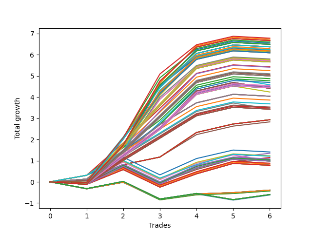

# Long HLT 111_POOLED_HITS 
- Symbol: TSLA
- Date Range: 01/10/2024 - 05/17/2024
- Trading Period: 8:30-12:30
- Number of Trades: 6



| Id. | Name | Win Percent | Profit | Avg Profit / Trade | Avg Time / Trade | Std |      | Name | Win Percent | Profit | Avg Profit / Trade | Avg Time / Trade | Std |
| --- | ---- | ----------- | ------ | ------------------ | ---------------- | --- | ---- | ---- | ----------- | ------ | ------------------ | ---------------- | --- |
| | Sorted By <br> Profit | | | | | | | Sorted By <br> Win Percentage |||||
|0| TP-3 105m | 66.67 | 6.78 | 1.13 | 76:10 | 1.15 |     | TP-3 75m | 83.33 | 6.13 | 1.02 | 61:00 | 0.98 |
|1| TP-3 90m | 66.67 | 6.73 | 1.12 | 68:40 | 1.13 |     | TP-2.75 75m | 83.33 | 6.11 | 1.02 | 60:50 | 0.97 |
|2| TP-3 180m | 66.67 | 6.67 | 1.11 | 83:40 | 1.15 |     | TP-2.5 75m | 83.33 | 5.80 | 0.97 | 60:10 | 0.88 |
|3| TP-3 165m | 66.67 | 6.67 | 1.11 | 83:40 | 1.15 |     | TP-2.25 75m | 83.33 | 5.71 | 0.95 | 59:40 | 0.85 |
|4| TP-3 150m | 66.67 | 6.67 | 1.11 | 83:40 | 1.15 |     | TP-2 75m | 83.33 | 5.71 | 0.95 | 59:40 | 0.85 |
|5| TP-3 135m | 66.67 | 6.67 | 1.11 | 83:40 | 1.15 |     | TP-1.5 75m | 83.33 | 5.43 | 0.91 | 44:40 | 0.72 |
|6| TP-3 120m | 66.67 | 6.67 | 1.11 | 83:40 | 1.15 |     | TP-1.75 75m | 83.33 | 5.41 | 0.90 | 54:30 | 0.74 |
|7| TP-2.75 105m | 66.67 | 6.60 | 1.10 | 75:50 | 1.10 |     | TP-1.5 60m | 83.33 | 5.25 | 0.88 | 42:10 | 0.74 |
|8| TP-2.75 90m | 66.67 | 6.55 | 1.09 | 68:20 | 1.08 |     | TP-1.25 75m | 83.33 | 4.87 | 0.81 | 44:20 | 0.63 |
|9| TP-2.75 180m | 66.67 | 6.49 | 1.08 | 83:20 | 1.10 |     | TP-1.75 60m | 83.33 | 4.77 | 0.80 | 48:30 | 0.68 |
|10| TP-2.75 165m | 66.67 | 6.49 | 1.08 | 83:20 | 1.10 |     | TP-1.25 60m | 83.33 | 4.69 | 0.78 | 41:50 | 0.66 |
|11| TP-2.75 150m | 66.67 | 6.49 | 1.08 | 83:20 | 1.10 |     | TP-1.5 45m | 83.33 | 4.58 | 0.76 | 38:20 | 0.75 |
|12| TP-2.75 135m | 66.67 | 6.49 | 1.08 | 83:20 | 1.10 |     | TP-3 45m | 83.33 | 4.41 | 0.74 | 40:00 | 0.72 |
|13| TP-2.75 120m | 66.67 | 6.49 | 1.08 | 83:20 | 1.10 |     | TP-2.75 45m | 83.33 | 4.41 | 0.74 | 40:00 | 0.72 |
|14| TP-2 180m | 66.67 | 6.37 | 1.06 | 77:50 | 1.04 |     | TP-2.5 45m | 83.33 | 4.41 | 0.74 | 40:00 | 0.72 |
|15| TP-2 165m | 66.67 | 6.37 | 1.06 | 77:50 | 1.04 |     | TP-2.25 45m | 83.33 | 4.41 | 0.74 | 40:00 | 0.72 |
|16| TP-2 150m | 66.67 | 6.37 | 1.06 | 77:50 | 1.04 |     | TP-2 45m | 83.33 | 4.41 | 0.74 | 40:00 | 0.72 |
|17| TP-2 135m | 66.67 | 6.37 | 1.06 | 77:50 | 1.04 |     | TP-1.75 45m | 83.33 | 4.41 | 0.74 | 40:00 | 0.72 |
|18| TP-2 120m | 66.67 | 6.37 | 1.06 | 77:50 | 1.04 |     | TP-1.25 45m | 83.33 | 4.24 | 0.71 | 38:10 | 0.69 |
|19| TP-2.5 105m | 66.67 | 6.29 | 1.05 | 75:10 | 1.02 |     | TP-3 60m | 83.33 | 4.04 | 0.67 | 51:00 | 0.55 |
|20| TP-2 105m | 66.67 | 6.24 | 1.04 | 72:50 | 1.01 |     | TP-2.75 60m | 83.33 | 4.04 | 0.67 | 51:00 | 0.55 |
|21| TP-2.5 90m | 66.67 | 6.24 | 1.04 | 67:40 | 1.00 |     | TP-2.5 60m | 83.33 | 4.04 | 0.67 | 51:00 | 0.55 |
|22| TP-2.25 105m | 66.67 | 6.20 | 1.03 | 74:40 | 1.00 |     | TP-2.25 60m | 83.33 | 4.04 | 0.67 | 51:00 | 0.55 |
|23| TP-2.5 180m | 66.67 | 6.18 | 1.03 | 82:40 | 1.02 |     | TP-2 60m | 83.33 | 4.04 | 0.67 | 51:00 | 0.55 |
|24| TP-2.5 165m | 66.67 | 6.18 | 1.03 | 82:40 | 1.02 |     | TP-1 75m | 83.33 | 3.86 | 0.64 | 39:40 | 0.46 |
|25| TP-2.5 150m | 66.67 | 6.18 | 1.03 | 82:40 | 1.02 |     | TP-1 60m | 83.33 | 3.68 | 0.61 | 37:10 | 0.49 |
|26| TP-2.5 135m | 66.67 | 6.18 | 1.03 | 82:40 | 1.02 |     | TP-1 45m | 83.33 | 3.44 | 0.57 | 33:40 | 0.54 |
|27| TP-2.5 120m | 66.67 | 6.18 | 1.03 | 82:40 | 1.02 |     | TP-3 30m | 83.33 | 2.93 | 0.49 | 27:30 | 0.40 |
|28| TP-2.25 90m | 66.67 | 6.15 | 1.03 | 67:10 | 0.98 |     | TP-2.75 30m | 83.33 | 2.93 | 0.49 | 27:30 | 0.40 |
|29| TP-2 90m | 66.67 | 6.15 | 1.03 | 67:10 | 0.98 |     | TP-2.5 30m | 83.33 | 2.93 | 0.49 | 27:30 | 0.40 |
|30| TP-3 75m | 83.33 | 6.13 | 1.02 | 61:00 | 0.98 |     | TP-2.25 30m | 83.33 | 2.93 | 0.49 | 27:30 | 0.40 |
|31| TP-2.75 75m | 83.33 | 6.11 | 1.02 | 60:50 | 0.97 |     | TP-2 30m | 83.33 | 2.93 | 0.49 | 27:30 | 0.40 |
|32| TP-2.25 180m | 66.67 | 6.09 | 1.02 | 82:10 | 1.00 |     | TP-1.75 30m | 83.33 | 2.93 | 0.49 | 27:30 | 0.40 |
|33| TP-2.25 165m | 66.67 | 6.09 | 1.02 | 82:10 | 1.00 |     | TP-1.5 30m | 83.33 | 2.93 | 0.49 | 27:30 | 0.40 |
|34| TP-2.25 150m | 66.67 | 6.09 | 1.02 | 82:10 | 1.00 |     | TP-1.25 30m | 83.33 | 2.93 | 0.49 | 27:30 | 0.40 |
|35| TP-2.25 135m | 66.67 | 6.09 | 1.02 | 82:10 | 1.00 |     | TP-1 30m | 83.33 | 2.83 | 0.47 | 27:20 | 0.37 |
|36| TP-2.25 120m | 66.67 | 6.09 | 1.02 | 82:10 | 1.00 |     | TP-3 105m | 66.67 | 6.78 | 1.13 | 76:10 | 1.15 |
|37| TP-2.5 75m | 83.33 | 5.80 | 0.97 | 60:10 | 0.88 |     | TP-3 90m | 66.67 | 6.73 | 1.12 | 68:40 | 1.13 |
|38| TP-1.75 105m | 66.67 | 5.76 | 0.96 | 61:50 | 0.88 |     | TP-3 180m | 66.67 | 6.67 | 1.11 | 83:40 | 1.15 |
|39| TP-1.75 90m | 66.67 | 5.72 | 0.95 | 59:20 | 0.88 |     | TP-3 165m | 66.67 | 6.67 | 1.11 | 83:40 | 1.15 |
|40| TP-2.25 75m | 83.33 | 5.71 | 0.95 | 59:40 | 0.85 |     | TP-3 150m | 66.67 | 6.67 | 1.11 | 83:40 | 1.15 |
|41| TP-2 75m | 83.33 | 5.71 | 0.95 | 59:40 | 0.85 |     | TP-3 135m | 66.67 | 6.67 | 1.11 | 83:40 | 1.15 |
|42| TP-1.75 180m | 66.67 | 5.66 | 0.94 | 64:20 | 0.90 |     | TP-3 120m | 66.67 | 6.67 | 1.11 | 83:40 | 1.15 |
|43| TP-1.75 165m | 66.67 | 5.66 | 0.94 | 64:20 | 0.90 |     | TP-2.75 105m | 66.67 | 6.60 | 1.10 | 75:50 | 1.10 |
|44| TP-1.75 150m | 66.67 | 5.66 | 0.94 | 64:20 | 0.90 |     | TP-2.75 90m | 66.67 | 6.55 | 1.09 | 68:20 | 1.08 |
|45| TP-1.75 135m | 66.67 | 5.66 | 0.94 | 64:20 | 0.90 |     | TP-2.75 180m | 66.67 | 6.49 | 1.08 | 83:20 | 1.10 |
|46| TP-1.75 120m | 66.67 | 5.66 | 0.94 | 64:20 | 0.90 |     | TP-2.75 165m | 66.67 | 6.49 | 1.08 | 83:20 | 1.10 |
|47| TP-1.5 75m | 83.33 | 5.43 | 0.91 | 44:40 | 0.72 |     | TP-2.75 150m | 66.67 | 6.49 | 1.08 | 83:20 | 1.10 |
|48| TP-1.75 75m | 83.33 | 5.41 | 0.90 | 54:30 | 0.74 |     | TP-2.75 135m | 66.67 | 6.49 | 1.08 | 83:20 | 1.10 |
|49| TP-1.5 60m | 83.33 | 5.25 | 0.88 | 42:10 | 0.74 |     | TP-2.75 120m | 66.67 | 6.49 | 1.08 | 83:20 | 1.10 |
|50| TP-1.5 105m | 66.67 | 5.10 | 0.85 | 49:40 | 0.77 |     | TP-2 180m | 66.67 | 6.37 | 1.06 | 77:50 | 1.04 |
|51| TP-1.5 90m | 66.67 | 5.06 | 0.84 | 47:10 | 0.78 |     | TP-2 165m | 66.67 | 6.37 | 1.06 | 77:50 | 1.04 |
|52| TP-1.5 180m | 66.67 | 5.00 | 0.83 | 52:10 | 0.79 |     | TP-2 150m | 66.67 | 6.37 | 1.06 | 77:50 | 1.04 |
|53| TP-1.5 165m | 66.67 | 5.00 | 0.83 | 52:10 | 0.79 |     | TP-2 135m | 66.67 | 6.37 | 1.06 | 77:50 | 1.04 |
|54| TP-1.5 150m | 66.67 | 5.00 | 0.83 | 52:10 | 0.79 |     | TP-2 120m | 66.67 | 6.37 | 1.06 | 77:50 | 1.04 |
|55| TP-1.5 135m | 66.67 | 5.00 | 0.83 | 52:10 | 0.79 |     | TP-2.5 105m | 66.67 | 6.29 | 1.05 | 75:10 | 1.02 |
|56| TP-1.5 120m | 66.67 | 5.00 | 0.83 | 52:10 | 0.79 |     | TP-2 105m | 66.67 | 6.24 | 1.04 | 72:50 | 1.01 |
|57| TP-1.25 75m | 83.33 | 4.87 | 0.81 | 44:20 | 0.63 |     | TP-2.5 90m | 66.67 | 6.24 | 1.04 | 67:40 | 1.00 |
|58| TP-1.75 60m | 83.33 | 4.77 | 0.80 | 48:30 | 0.68 |     | TP-2.25 105m | 66.67 | 6.20 | 1.03 | 74:40 | 1.00 |
|59| TP-1.25 60m | 83.33 | 4.69 | 0.78 | 41:50 | 0.66 |     | TP-2.5 180m | 66.67 | 6.18 | 1.03 | 82:40 | 1.02 |
|60| TP-1.5 45m | 83.33 | 4.58 | 0.76 | 38:20 | 0.75 |     | TP-2.5 165m | 66.67 | 6.18 | 1.03 | 82:40 | 1.02 |
|61| TP-1.25 105m | 66.67 | 4.54 | 0.76 | 49:20 | 0.69 |     | TP-2.5 150m | 66.67 | 6.18 | 1.03 | 82:40 | 1.02 |
|62| TP-1.25 90m | 66.67 | 4.50 | 0.75 | 46:50 | 0.70 |     | TP-2.5 135m | 66.67 | 6.18 | 1.03 | 82:40 | 1.02 |
|63| TP-1.25 180m | 66.67 | 4.44 | 0.74 | 51:50 | 0.71 |     | TP-2.5 120m | 66.67 | 6.18 | 1.03 | 82:40 | 1.02 |
|64| TP-1.25 165m | 66.67 | 4.44 | 0.74 | 51:50 | 0.71 |     | TP-2.25 90m | 66.67 | 6.15 | 1.03 | 67:10 | 0.98 |
|65| TP-1.25 150m | 66.67 | 4.44 | 0.74 | 51:50 | 0.71 |     | TP-2 90m | 66.67 | 6.15 | 1.03 | 67:10 | 0.98 |
|66| TP-1.25 135m | 66.67 | 4.44 | 0.74 | 51:50 | 0.71 |     | TP-2.25 180m | 66.67 | 6.09 | 1.02 | 82:10 | 1.00 |
|67| TP-1.25 120m | 66.67 | 4.44 | 0.74 | 51:50 | 0.71 |     | TP-2.25 165m | 66.67 | 6.09 | 1.02 | 82:10 | 1.00 |
|68| TP-3 45m | 83.33 | 4.41 | 0.74 | 40:00 | 0.72 |     | TP-2.25 150m | 66.67 | 6.09 | 1.02 | 82:10 | 1.00 |
|69| TP-2.75 45m | 83.33 | 4.41 | 0.74 | 40:00 | 0.72 |     | TP-2.25 135m | 66.67 | 6.09 | 1.02 | 82:10 | 1.00 |
|70| TP-2.5 45m | 83.33 | 4.41 | 0.74 | 40:00 | 0.72 |     | TP-2.25 120m | 66.67 | 6.09 | 1.02 | 82:10 | 1.00 |
|71| TP-2.25 45m | 83.33 | 4.41 | 0.74 | 40:00 | 0.72 |     | TP-1.75 105m | 66.67 | 5.76 | 0.96 | 61:50 | 0.88 |
|72| TP-2 45m | 83.33 | 4.41 | 0.74 | 40:00 | 0.72 |     | TP-1.75 90m | 66.67 | 5.72 | 0.95 | 59:20 | 0.88 |
|73| TP-1.75 45m | 83.33 | 4.41 | 0.74 | 40:00 | 0.72 |     | TP-1.75 180m | 66.67 | 5.66 | 0.94 | 64:20 | 0.90 |
|74| TP-1.25 45m | 83.33 | 4.24 | 0.71 | 38:10 | 0.69 |     | TP-1.75 165m | 66.67 | 5.66 | 0.94 | 64:20 | 0.90 |
|75| TP-3 60m | 83.33 | 4.04 | 0.67 | 51:00 | 0.55 |     | TP-1.75 150m | 66.67 | 5.66 | 0.94 | 64:20 | 0.90 |
|76| TP-2.75 60m | 83.33 | 4.04 | 0.67 | 51:00 | 0.55 |     | TP-1.75 135m | 66.67 | 5.66 | 0.94 | 64:20 | 0.90 |
|77| TP-2.5 60m | 83.33 | 4.04 | 0.67 | 51:00 | 0.55 |     | TP-1.75 120m | 66.67 | 5.66 | 0.94 | 64:20 | 0.90 |
|78| TP-2.25 60m | 83.33 | 4.04 | 0.67 | 51:00 | 0.55 |     | TP-1.5 105m | 66.67 | 5.10 | 0.85 | 49:40 | 0.77 |
|79| TP-2 60m | 83.33 | 4.04 | 0.67 | 51:00 | 0.55 |     | TP-1.5 90m | 66.67 | 5.06 | 0.84 | 47:10 | 0.78 |
|80| TP-1 75m | 83.33 | 3.86 | 0.64 | 39:40 | 0.46 |     | TP-1.5 180m | 66.67 | 5.00 | 0.83 | 52:10 | 0.79 |
|81| TP-1 60m | 83.33 | 3.68 | 0.61 | 37:10 | 0.49 |     | TP-1.5 165m | 66.67 | 5.00 | 0.83 | 52:10 | 0.79 |
|82| TP-1 105m | 66.67 | 3.53 | 0.59 | 44:40 | 0.52 |     | TP-1.5 150m | 66.67 | 5.00 | 0.83 | 52:10 | 0.79 |
|83| TP-1 90m | 66.67 | 3.49 | 0.58 | 42:10 | 0.52 |     | TP-1.5 135m | 66.67 | 5.00 | 0.83 | 52:10 | 0.79 |
|84| TP-1 45m | 83.33 | 3.44 | 0.57 | 33:40 | 0.54 |     | TP-1.5 120m | 66.67 | 5.00 | 0.83 | 52:10 | 0.79 |
|85| TP-1 180m | 66.67 | 3.43 | 0.57 | 47:10 | 0.54 |     | TP-1.25 105m | 66.67 | 4.54 | 0.76 | 49:20 | 0.69 |
|86| TP-1 165m | 66.67 | 3.43 | 0.57 | 47:10 | 0.54 |     | TP-1.25 90m | 66.67 | 4.50 | 0.75 | 46:50 | 0.70 |
|87| TP-1 150m | 66.67 | 3.43 | 0.57 | 47:10 | 0.54 |     | TP-1.25 180m | 66.67 | 4.44 | 0.74 | 51:50 | 0.71 |
|88| TP-1 135m | 66.67 | 3.43 | 0.57 | 47:10 | 0.54 |     | TP-1.25 165m | 66.67 | 4.44 | 0.74 | 51:50 | 0.71 |
|89| TP-1 120m | 66.67 | 3.43 | 0.57 | 47:10 | 0.54 |     | TP-1.25 150m | 66.67 | 4.44 | 0.74 | 51:50 | 0.71 |
|90| TP-3 30m | 83.33 | 2.93 | 0.49 | 27:30 | 0.40 |     | TP-1.25 135m | 66.67 | 4.44 | 0.74 | 51:50 | 0.71 |
|91| TP-2.75 30m | 83.33 | 2.93 | 0.49 | 27:30 | 0.40 |     | TP-1.25 120m | 66.67 | 4.44 | 0.74 | 51:50 | 0.71 |
|92| TP-2.5 30m | 83.33 | 2.93 | 0.49 | 27:30 | 0.40 |     | TP-1 105m | 66.67 | 3.53 | 0.59 | 44:40 | 0.52 |
|93| TP-2.25 30m | 83.33 | 2.93 | 0.49 | 27:30 | 0.40 |     | TP-1 90m | 66.67 | 3.49 | 0.58 | 42:10 | 0.52 |
|94| TP-2 30m | 83.33 | 2.93 | 0.49 | 27:30 | 0.40 |     | TP-1 180m | 66.67 | 3.43 | 0.57 | 47:10 | 0.54 |
|95| TP-1.75 30m | 83.33 | 2.93 | 0.49 | 27:30 | 0.40 |     | TP-1 165m | 66.67 | 3.43 | 0.57 | 47:10 | 0.54 |
|96| TP-1.5 30m | 83.33 | 2.93 | 0.49 | 27:30 | 0.40 |     | TP-1 150m | 66.67 | 3.43 | 0.57 | 47:10 | 0.54 |
|97| TP-1.25 30m | 83.33 | 2.93 | 0.49 | 27:30 | 0.40 |     | TP-1 135m | 66.67 | 3.43 | 0.57 | 47:10 | 0.54 |
|98| TP-1 30m | 83.33 | 2.83 | 0.47 | 27:20 | 0.37 |     | TP-1 120m | 66.67 | 3.43 | 0.57 | 47:10 | 0.54 |
|99| TP-0.75 75m | 66.67 | 1.41 | 0.24 | 32:30 | 0.57 |     | TP-0.75 75m | 66.67 | 1.41 | 0.24 | 32:30 | 0.57 |
|100| TP-0.75 30m | 66.67 | 1.35 | 0.23 | 21:30 | 0.56 |     | TP-0.75 30m | 66.67 | 1.35 | 0.23 | 21:30 | 0.56 |
|101| TP-0.75 60m | 66.67 | 1.23 | 0.21 | 30:00 | 0.57 |     | TP-0.75 60m | 66.67 | 1.23 | 0.21 | 30:00 | 0.57 |
|102| TP-0.5 75m | 66.67 | 1.21 | 0.20 | 31:30 | 0.53 |     | TP-0.5 75m | 66.67 | 1.21 | 0.20 | 31:30 | 0.53 |
|103| TP-0.5 30m | 66.67 | 1.15 | 0.19 | 20:30 | 0.52 |     | TP-0.5 30m | 66.67 | 1.15 | 0.19 | 20:30 | 0.52 |
|104| TP-0.75 105m | 50.00 | 1.08 | 0.18 | 37:30 | 0.57 |     | TP-0.5 60m | 66.67 | 1.03 | 0.17 | 29:00 | 0.53 |
|105| TP-0.75 90m | 50.00 | 1.04 | 0.17 | 35:00 | 0.58 |     | TP-0.75 45m | 66.67 | 0.99 | 0.17 | 26:30 | 0.59 |
|106| TP-0.5 60m | 66.67 | 1.03 | 0.17 | 29:00 | 0.53 |     | TP-0.5 45m | 66.67 | 0.79 | 0.13 | 25:30 | 0.55 |
|107| TP-0.75 45m | 66.67 | 0.99 | 0.17 | 26:30 | 0.59 |     | TP-3 15m | 66.67 | -0.39 | -0.06 | 14:00 | 0.38 |
|108| TP-0.75 180m | 50.00 | 0.98 | 0.16 | 40:00 | 0.58 |     | TP-2.75 15m | 66.67 | -0.39 | -0.06 | 14:00 | 0.38 |
|109| TP-0.75 165m | 50.00 | 0.98 | 0.16 | 40:00 | 0.58 |     | TP-2.5 15m | 66.67 | -0.39 | -0.06 | 14:00 | 0.38 |
|110| TP-0.75 150m | 50.00 | 0.98 | 0.16 | 40:00 | 0.58 |     | TP-2.25 15m | 66.67 | -0.39 | -0.06 | 14:00 | 0.38 |
|111| TP-0.75 135m | 50.00 | 0.98 | 0.16 | 40:00 | 0.58 |     | TP-2 15m | 66.67 | -0.39 | -0.06 | 14:00 | 0.38 |
|112| TP-0.75 120m | 50.00 | 0.98 | 0.16 | 40:00 | 0.58 |     | TP-1.75 15m | 66.67 | -0.39 | -0.06 | 14:00 | 0.38 |
|113| TP-0.5 105m | 50.00 | 0.88 | 0.15 | 36:30 | 0.53 |     | TP-1.5 15m | 66.67 | -0.39 | -0.06 | 14:00 | 0.38 |
|114| TP-0.5 90m | 50.00 | 0.84 | 0.14 | 34:00 | 0.53 |     | TP-1.25 15m | 66.67 | -0.39 | -0.06 | 14:00 | 0.38 |
|115| TP-0.5 45m | 66.67 | 0.79 | 0.13 | 25:30 | 0.55 |     | TP-1 15m | 66.67 | -0.39 | -0.06 | 14:00 | 0.38 |
|116| TP-0.5 180m | 50.00 | 0.78 | 0.13 | 39:00 | 0.54 |     | TP-0.75 15m | 66.67 | -0.43 | -0.07 | 12:00 | 0.40 |
|117| TP-0.5 165m | 50.00 | 0.78 | 0.13 | 39:00 | 0.54 |     | TP-0.5 15m | 66.67 | -0.43 | -0.07 | 12:00 | 0.40 |
|118| TP-0.5 150m | 50.00 | 0.78 | 0.13 | 39:00 | 0.54 |     | TP-0.75 105m | 50.00 | 1.08 | 0.18 | 37:30 | 0.57 |
|119| TP-0.5 135m | 50.00 | 0.78 | 0.13 | 39:00 | 0.54 |     | TP-0.75 90m | 50.00 | 1.04 | 0.17 | 35:00 | 0.58 |
|120| TP-0.5 120m | 50.00 | 0.78 | 0.13 | 39:00 | 0.54 |     | TP-0.75 180m | 50.00 | 0.98 | 0.16 | 40:00 | 0.58 |
|121| TP-3 15m | 66.67 | -0.39 | -0.06 | 14:00 | 0.38 |     | TP-0.75 165m | 50.00 | 0.98 | 0.16 | 40:00 | 0.58 |
|122| TP-2.75 15m | 66.67 | -0.39 | -0.06 | 14:00 | 0.38 |     | TP-0.75 150m | 50.00 | 0.98 | 0.16 | 40:00 | 0.58 |
|123| TP-2.5 15m | 66.67 | -0.39 | -0.06 | 14:00 | 0.38 |     | TP-0.75 135m | 50.00 | 0.98 | 0.16 | 40:00 | 0.58 |
|124| TP-2.25 15m | 66.67 | -0.39 | -0.06 | 14:00 | 0.38 |     | TP-0.75 120m | 50.00 | 0.98 | 0.16 | 40:00 | 0.58 |
|125| TP-2 15m | 66.67 | -0.39 | -0.06 | 14:00 | 0.38 |     | TP-0.5 105m | 50.00 | 0.88 | 0.15 | 36:30 | 0.53 |
|126| TP-1.75 15m | 66.67 | -0.39 | -0.06 | 14:00 | 0.38 |     | TP-0.5 90m | 50.00 | 0.84 | 0.14 | 34:00 | 0.53 |
|127| TP-1.5 15m | 66.67 | -0.39 | -0.06 | 14:00 | 0.38 |     | TP-0.5 180m | 50.00 | 0.78 | 0.13 | 39:00 | 0.54 |
|128| TP-1.25 15m | 66.67 | -0.39 | -0.06 | 14:00 | 0.38 |     | TP-0.5 165m | 50.00 | 0.78 | 0.13 | 39:00 | 0.54 |
|129| TP-1 15m | 66.67 | -0.39 | -0.06 | 14:00 | 0.38 |     | TP-0.5 150m | 50.00 | 0.78 | 0.13 | 39:00 | 0.54 |
|130| TP-0.75 15m | 66.67 | -0.43 | -0.07 | 12:00 | 0.40 |     | TP-0.5 135m | 50.00 | 0.78 | 0.13 | 39:00 | 0.54 |
|131| TP-0.5 15m | 66.67 | -0.43 | -0.07 | 12:00 | 0.40 |     | TP-0.5 120m | 50.00 | 0.78 | 0.13 | 39:00 | 0.54 |
|132| TP-0.25 180m | 50.00 | -0.60 | -0.10 | 09:10 | 0.42 |     | TP-0.25 180m | 50.00 | -0.60 | -0.10 | 09:10 | 0.42 |
|133| TP-0.25 165m | 50.00 | -0.60 | -0.10 | 09:10 | 0.42 |     | TP-0.25 165m | 50.00 | -0.60 | -0.10 | 09:10 | 0.42 |
|134| TP-0.25 150m | 50.00 | -0.60 | -0.10 | 09:10 | 0.42 |     | TP-0.25 150m | 50.00 | -0.60 | -0.10 | 09:10 | 0.42 |
|135| TP-0.25 135m | 50.00 | -0.60 | -0.10 | 09:10 | 0.42 |     | TP-0.25 135m | 50.00 | -0.60 | -0.10 | 09:10 | 0.42 |
|136| TP-0.25 120m | 50.00 | -0.60 | -0.10 | 09:10 | 0.42 |     | TP-0.25 120m | 50.00 | -0.60 | -0.10 | 09:10 | 0.42 |
|137| TP-0.25 105m | 50.00 | -0.60 | -0.10 | 09:10 | 0.42 |     | TP-0.25 105m | 50.00 | -0.60 | -0.10 | 09:10 | 0.42 |
|138| TP-0.25 90m | 50.00 | -0.60 | -0.10 | 09:10 | 0.42 |     | TP-0.25 90m | 50.00 | -0.60 | -0.10 | 09:10 | 0.42 |
|139| TP-0.25 75m | 50.00 | -0.60 | -0.10 | 09:10 | 0.42 |     | TP-0.25 75m | 50.00 | -0.60 | -0.10 | 09:10 | 0.42 |
|140| TP-0.25 60m | 50.00 | -0.60 | -0.10 | 09:10 | 0.42 |     | TP-0.25 60m | 50.00 | -0.60 | -0.10 | 09:10 | 0.42 |
|141| TP-0.25 45m | 50.00 | -0.60 | -0.10 | 09:10 | 0.42 |     | TP-0.25 45m | 50.00 | -0.60 | -0.10 | 09:10 | 0.42 |
|142| TP-0.25 30m | 50.00 | -0.60 | -0.10 | 09:10 | 0.42 |     | TP-0.25 30m | 50.00 | -0.60 | -0.10 | 09:10 | 0.42 |
|143| TP-0.25 15m | 50.00 | -0.62 | -0.10 | 08:50 | 0.42 |     | TP-0.25 15m | 50.00 | -0.62 | -0.10 | 08:50 | 0.42 |

### Test TP-0.25 15m
* Take Profit of 0.25 Point
* 0.25 Stoploss
* Results:
```
Total Trades: 6
Percent Up: 50.00
Percent Down: 50.00
Total Points Moved Up: -0.62
Potential Profit: -310.00
Total Points Ups: 0.82 Count Ups: 3
Total Points Downs: -1.44 Count Downs: 3
```

<details><summary>Trades</summary>

<code>In: 2024-05-09 08:55:00		Out: 2024-05-09 09:08:00		Total Position Time: 13:00		Total Move Up: -0.32		Total to Date: -0.32</code> <br />
<code>In: 2024-03-15 10:10:00		Out: 2024-03-15 10:21:00		Total Position Time: 11:00		Total Move Up: 0.34		Total to Date: 0.02</code> <br />
<code>In: 2024-04-05 08:45:00		Out: 2024-04-05 08:47:00		Total Position Time: 02:00		Total Move Up: -0.83		Total to Date: -0.81</code> <br />
<code>In: 2024-04-22 08:35:00		Out: 2024-04-22 08:49:00		Total Position Time: 14:00		Total Move Up: 0.24		Total to Date: -0.57</code> <br />
<code>In: 2024-03-14 12:30:00		Out: 2024-03-14 12:35:00		Total Position Time: 05:00		Total Move Up: -0.29		Total to Date: -0.86</code> <br />
<code>In: 2024-05-07 12:00:00		Out: 2024-05-07 12:08:00		Total Position Time: 08:00		Total Move Up: 0.24		Total to Date: -0.62</code> <br />


</details>

### Test TP-0.5 15m
* Take Profit of 0.5 Point
* 0.5 Stoploss
* Results:
```
Total Trades: 6
Percent Up: 66.67
Percent Down: 33.33
Total Points Moved Up: -0.43
Potential Profit: -215.00
Total Points Ups: 0.73 Count Ups: 4
Total Points Downs: -1.16 Count Downs: 2
```

<details><summary>Trades</summary>

<code>In: 2024-05-09 08:55:00		Out: 2024-05-09 09:09:00		Total Position Time: 14:00		Total Move Up: -0.33		Total to Date: -0.33</code> <br />
<code>In: 2024-03-15 10:10:00		Out: 2024-03-15 10:24:00		Total Position Time: 14:00		Total Move Up: 0.31		Total to Date: -0.02</code> <br />
<code>In: 2024-04-05 08:45:00		Out: 2024-04-05 08:47:00		Total Position Time: 02:00		Total Move Up: -0.83		Total to Date: -0.85</code> <br />
<code>In: 2024-04-22 08:35:00		Out: 2024-04-22 08:49:00		Total Position Time: 14:00		Total Move Up: 0.24		Total to Date: -0.61</code> <br />
<code>In: 2024-03-14 12:30:00		Out: 2024-03-14 12:44:00		Total Position Time: 14:00		Total Move Up: 0.06		Total to Date: -0.55</code> <br />
<code>In: 2024-05-07 12:00:00		Out: 2024-05-07 12:14:00		Total Position Time: 14:00		Total Move Up: 0.12		Total to Date: -0.43</code> <br />


</details>

### Test TP-0.75 15m
* Take Profit of 0.75 Point
* 0.75 Stoploss
* Results:
```
Total Trades: 6
Percent Up: 66.67
Percent Down: 33.33
Total Points Moved Up: -0.43
Potential Profit: -215.00
Total Points Ups: 0.73 Count Ups: 4
Total Points Downs: -1.16 Count Downs: 2
```

<details><summary>Trades</summary>

<code>In: 2024-05-09 08:55:00		Out: 2024-05-09 09:09:00		Total Position Time: 14:00		Total Move Up: -0.33		Total to Date: -0.33</code> <br />
<code>In: 2024-03-15 10:10:00		Out: 2024-03-15 10:24:00		Total Position Time: 14:00		Total Move Up: 0.31		Total to Date: -0.02</code> <br />
<code>In: 2024-04-05 08:45:00		Out: 2024-04-05 08:47:00		Total Position Time: 02:00		Total Move Up: -0.83		Total to Date: -0.85</code> <br />
<code>In: 2024-04-22 08:35:00		Out: 2024-04-22 08:49:00		Total Position Time: 14:00		Total Move Up: 0.24		Total to Date: -0.61</code> <br />
<code>In: 2024-03-14 12:30:00		Out: 2024-03-14 12:44:00		Total Position Time: 14:00		Total Move Up: 0.06		Total to Date: -0.55</code> <br />
<code>In: 2024-05-07 12:00:00		Out: 2024-05-07 12:14:00		Total Position Time: 14:00		Total Move Up: 0.12		Total to Date: -0.43</code> <br />


</details>

### Test TP-1 15m
* Take Profit of 1 Point
* 1 Stoploss
* Results:
```
Total Trades: 6
Percent Up: 66.67
Percent Down: 33.33
Total Points Moved Up: -0.39
Potential Profit: -195.00
Total Points Ups: 0.73 Count Ups: 4
Total Points Downs: -1.12 Count Downs: 2
```

<details><summary>Trades</summary>

<code>In: 2024-05-09 08:55:00		Out: 2024-05-09 09:09:00		Total Position Time: 14:00		Total Move Up: -0.33		Total to Date: -0.33</code> <br />
<code>In: 2024-03-15 10:10:00		Out: 2024-03-15 10:24:00		Total Position Time: 14:00		Total Move Up: 0.31		Total to Date: -0.02</code> <br />
<code>In: 2024-04-05 08:45:00		Out: 2024-04-05 08:59:00		Total Position Time: 14:00		Total Move Up: -0.79		Total to Date: -0.81</code> <br />
<code>In: 2024-04-22 08:35:00		Out: 2024-04-22 08:49:00		Total Position Time: 14:00		Total Move Up: 0.24		Total to Date: -0.57</code> <br />
<code>In: 2024-03-14 12:30:00		Out: 2024-03-14 12:44:00		Total Position Time: 14:00		Total Move Up: 0.06		Total to Date: -0.51</code> <br />
<code>In: 2024-05-07 12:00:00		Out: 2024-05-07 12:14:00		Total Position Time: 14:00		Total Move Up: 0.12		Total to Date: -0.39</code> <br />


</details>

### Test TP-1.25 15m
* Take Profit of 1.25 Point
* 1.25 Stoploss
* Results:
```
Total Trades: 6
Percent Up: 66.67
Percent Down: 33.33
Total Points Moved Up: -0.39
Potential Profit: -195.00
Total Points Ups: 0.73 Count Ups: 4
Total Points Downs: -1.12 Count Downs: 2
```

<details><summary>Trades</summary>

<code>In: 2024-05-09 08:55:00		Out: 2024-05-09 09:09:00		Total Position Time: 14:00		Total Move Up: -0.33		Total to Date: -0.33</code> <br />
<code>In: 2024-03-15 10:10:00		Out: 2024-03-15 10:24:00		Total Position Time: 14:00		Total Move Up: 0.31		Total to Date: -0.02</code> <br />
<code>In: 2024-04-05 08:45:00		Out: 2024-04-05 08:59:00		Total Position Time: 14:00		Total Move Up: -0.79		Total to Date: -0.81</code> <br />
<code>In: 2024-04-22 08:35:00		Out: 2024-04-22 08:49:00		Total Position Time: 14:00		Total Move Up: 0.24		Total to Date: -0.57</code> <br />
<code>In: 2024-03-14 12:30:00		Out: 2024-03-14 12:44:00		Total Position Time: 14:00		Total Move Up: 0.06		Total to Date: -0.51</code> <br />
<code>In: 2024-05-07 12:00:00		Out: 2024-05-07 12:14:00		Total Position Time: 14:00		Total Move Up: 0.12		Total to Date: -0.39</code> <br />


</details>

### Test TP-1.5 15m
* Take Profit of 1.5 Point
* 1.5 Stoploss
* Results:
```
Total Trades: 6
Percent Up: 66.67
Percent Down: 33.33
Total Points Moved Up: -0.39
Potential Profit: -195.00
Total Points Ups: 0.73 Count Ups: 4
Total Points Downs: -1.12 Count Downs: 2
```

<details><summary>Trades</summary>

<code>In: 2024-05-09 08:55:00		Out: 2024-05-09 09:09:00		Total Position Time: 14:00		Total Move Up: -0.33		Total to Date: -0.33</code> <br />
<code>In: 2024-03-15 10:10:00		Out: 2024-03-15 10:24:00		Total Position Time: 14:00		Total Move Up: 0.31		Total to Date: -0.02</code> <br />
<code>In: 2024-04-05 08:45:00		Out: 2024-04-05 08:59:00		Total Position Time: 14:00		Total Move Up: -0.79		Total to Date: -0.81</code> <br />
<code>In: 2024-04-22 08:35:00		Out: 2024-04-22 08:49:00		Total Position Time: 14:00		Total Move Up: 0.24		Total to Date: -0.57</code> <br />
<code>In: 2024-03-14 12:30:00		Out: 2024-03-14 12:44:00		Total Position Time: 14:00		Total Move Up: 0.06		Total to Date: -0.51</code> <br />
<code>In: 2024-05-07 12:00:00		Out: 2024-05-07 12:14:00		Total Position Time: 14:00		Total Move Up: 0.12		Total to Date: -0.39</code> <br />


</details>

### Test TP-1.75 15m
* Take Profit of 1.75 Point
* 1.75 Stoploss
* Results:
```
Total Trades: 6
Percent Up: 66.67
Percent Down: 33.33
Total Points Moved Up: -0.39
Potential Profit: -195.00
Total Points Ups: 0.73 Count Ups: 4
Total Points Downs: -1.12 Count Downs: 2
```

<details><summary>Trades</summary>

<code>In: 2024-05-09 08:55:00		Out: 2024-05-09 09:09:00		Total Position Time: 14:00		Total Move Up: -0.33		Total to Date: -0.33</code> <br />
<code>In: 2024-03-15 10:10:00		Out: 2024-03-15 10:24:00		Total Position Time: 14:00		Total Move Up: 0.31		Total to Date: -0.02</code> <br />
<code>In: 2024-04-05 08:45:00		Out: 2024-04-05 08:59:00		Total Position Time: 14:00		Total Move Up: -0.79		Total to Date: -0.81</code> <br />
<code>In: 2024-04-22 08:35:00		Out: 2024-04-22 08:49:00		Total Position Time: 14:00		Total Move Up: 0.24		Total to Date: -0.57</code> <br />
<code>In: 2024-03-14 12:30:00		Out: 2024-03-14 12:44:00		Total Position Time: 14:00		Total Move Up: 0.06		Total to Date: -0.51</code> <br />
<code>In: 2024-05-07 12:00:00		Out: 2024-05-07 12:14:00		Total Position Time: 14:00		Total Move Up: 0.12		Total to Date: -0.39</code> <br />


</details>

### Test TP-2 15m
* Take Profit of 2 Point
* 2 Stoploss
* Results:
```
Total Trades: 6
Percent Up: 66.67
Percent Down: 33.33
Total Points Moved Up: -0.39
Potential Profit: -195.00
Total Points Ups: 0.73 Count Ups: 4
Total Points Downs: -1.12 Count Downs: 2
```

<details><summary>Trades</summary>

<code>In: 2024-05-09 08:55:00		Out: 2024-05-09 09:09:00		Total Position Time: 14:00		Total Move Up: -0.33		Total to Date: -0.33</code> <br />
<code>In: 2024-03-15 10:10:00		Out: 2024-03-15 10:24:00		Total Position Time: 14:00		Total Move Up: 0.31		Total to Date: -0.02</code> <br />
<code>In: 2024-04-05 08:45:00		Out: 2024-04-05 08:59:00		Total Position Time: 14:00		Total Move Up: -0.79		Total to Date: -0.81</code> <br />
<code>In: 2024-04-22 08:35:00		Out: 2024-04-22 08:49:00		Total Position Time: 14:00		Total Move Up: 0.24		Total to Date: -0.57</code> <br />
<code>In: 2024-03-14 12:30:00		Out: 2024-03-14 12:44:00		Total Position Time: 14:00		Total Move Up: 0.06		Total to Date: -0.51</code> <br />
<code>In: 2024-05-07 12:00:00		Out: 2024-05-07 12:14:00		Total Position Time: 14:00		Total Move Up: 0.12		Total to Date: -0.39</code> <br />


</details>

### Test TP-2.25 15m
* Take Profit of 2.25 Point
* 2.25 Stoploss
* Results:
```
Total Trades: 6
Percent Up: 66.67
Percent Down: 33.33
Total Points Moved Up: -0.39
Potential Profit: -195.00
Total Points Ups: 0.73 Count Ups: 4
Total Points Downs: -1.12 Count Downs: 2
```

<details><summary>Trades</summary>

<code>In: 2024-05-09 08:55:00		Out: 2024-05-09 09:09:00		Total Position Time: 14:00		Total Move Up: -0.33		Total to Date: -0.33</code> <br />
<code>In: 2024-03-15 10:10:00		Out: 2024-03-15 10:24:00		Total Position Time: 14:00		Total Move Up: 0.31		Total to Date: -0.02</code> <br />
<code>In: 2024-04-05 08:45:00		Out: 2024-04-05 08:59:00		Total Position Time: 14:00		Total Move Up: -0.79		Total to Date: -0.81</code> <br />
<code>In: 2024-04-22 08:35:00		Out: 2024-04-22 08:49:00		Total Position Time: 14:00		Total Move Up: 0.24		Total to Date: -0.57</code> <br />
<code>In: 2024-03-14 12:30:00		Out: 2024-03-14 12:44:00		Total Position Time: 14:00		Total Move Up: 0.06		Total to Date: -0.51</code> <br />
<code>In: 2024-05-07 12:00:00		Out: 2024-05-07 12:14:00		Total Position Time: 14:00		Total Move Up: 0.12		Total to Date: -0.39</code> <br />


</details>

### Test TP-2.5 15m
* Take Profit of 2.5 Point
* 2.5 Stoploss
* Results:
```
Total Trades: 6
Percent Up: 66.67
Percent Down: 33.33
Total Points Moved Up: -0.39
Potential Profit: -195.00
Total Points Ups: 0.73 Count Ups: 4
Total Points Downs: -1.12 Count Downs: 2
```

<details><summary>Trades</summary>

<code>In: 2024-05-09 08:55:00		Out: 2024-05-09 09:09:00		Total Position Time: 14:00		Total Move Up: -0.33		Total to Date: -0.33</code> <br />
<code>In: 2024-03-15 10:10:00		Out: 2024-03-15 10:24:00		Total Position Time: 14:00		Total Move Up: 0.31		Total to Date: -0.02</code> <br />
<code>In: 2024-04-05 08:45:00		Out: 2024-04-05 08:59:00		Total Position Time: 14:00		Total Move Up: -0.79		Total to Date: -0.81</code> <br />
<code>In: 2024-04-22 08:35:00		Out: 2024-04-22 08:49:00		Total Position Time: 14:00		Total Move Up: 0.24		Total to Date: -0.57</code> <br />
<code>In: 2024-03-14 12:30:00		Out: 2024-03-14 12:44:00		Total Position Time: 14:00		Total Move Up: 0.06		Total to Date: -0.51</code> <br />
<code>In: 2024-05-07 12:00:00		Out: 2024-05-07 12:14:00		Total Position Time: 14:00		Total Move Up: 0.12		Total to Date: -0.39</code> <br />


</details>

### Test TP-2.75 15m
* Take Profit of 2.75 Point
* 2.75 Stoploss
* Results:
```
Total Trades: 6
Percent Up: 66.67
Percent Down: 33.33
Total Points Moved Up: -0.39
Potential Profit: -195.00
Total Points Ups: 0.73 Count Ups: 4
Total Points Downs: -1.12 Count Downs: 2
```

<details><summary>Trades</summary>

<code>In: 2024-05-09 08:55:00		Out: 2024-05-09 09:09:00		Total Position Time: 14:00		Total Move Up: -0.33		Total to Date: -0.33</code> <br />
<code>In: 2024-03-15 10:10:00		Out: 2024-03-15 10:24:00		Total Position Time: 14:00		Total Move Up: 0.31		Total to Date: -0.02</code> <br />
<code>In: 2024-04-05 08:45:00		Out: 2024-04-05 08:59:00		Total Position Time: 14:00		Total Move Up: -0.79		Total to Date: -0.81</code> <br />
<code>In: 2024-04-22 08:35:00		Out: 2024-04-22 08:49:00		Total Position Time: 14:00		Total Move Up: 0.24		Total to Date: -0.57</code> <br />
<code>In: 2024-03-14 12:30:00		Out: 2024-03-14 12:44:00		Total Position Time: 14:00		Total Move Up: 0.06		Total to Date: -0.51</code> <br />
<code>In: 2024-05-07 12:00:00		Out: 2024-05-07 12:14:00		Total Position Time: 14:00		Total Move Up: 0.12		Total to Date: -0.39</code> <br />


</details>

### Test TP-3 15m
* Take Profit of 3 Point
* 3 Stoploss
* Results:
```
Total Trades: 6
Percent Up: 66.67
Percent Down: 33.33
Total Points Moved Up: -0.39
Potential Profit: -195.00
Total Points Ups: 0.73 Count Ups: 4
Total Points Downs: -1.12 Count Downs: 2
```

<details><summary>Trades</summary>

<code>In: 2024-05-09 08:55:00		Out: 2024-05-09 09:09:00		Total Position Time: 14:00		Total Move Up: -0.33		Total to Date: -0.33</code> <br />
<code>In: 2024-03-15 10:10:00		Out: 2024-03-15 10:24:00		Total Position Time: 14:00		Total Move Up: 0.31		Total to Date: -0.02</code> <br />
<code>In: 2024-04-05 08:45:00		Out: 2024-04-05 08:59:00		Total Position Time: 14:00		Total Move Up: -0.79		Total to Date: -0.81</code> <br />
<code>In: 2024-04-22 08:35:00		Out: 2024-04-22 08:49:00		Total Position Time: 14:00		Total Move Up: 0.24		Total to Date: -0.57</code> <br />
<code>In: 2024-03-14 12:30:00		Out: 2024-03-14 12:44:00		Total Position Time: 14:00		Total Move Up: 0.06		Total to Date: -0.51</code> <br />
<code>In: 2024-05-07 12:00:00		Out: 2024-05-07 12:14:00		Total Position Time: 14:00		Total Move Up: 0.12		Total to Date: -0.39</code> <br />


</details>

### Test TP-0.25 30m
* Take Profit of 0.25 Point
* 0.25 Stoploss
* Results:
```
Total Trades: 6
Percent Up: 50.00
Percent Down: 50.00
Total Points Moved Up: -0.60
Potential Profit: -300.00
Total Points Ups: 0.84 Count Ups: 3
Total Points Downs: -1.44 Count Downs: 3
```

<details><summary>Trades</summary>

<code>In: 2024-05-09 08:55:00		Out: 2024-05-09 09:08:00		Total Position Time: 13:00		Total Move Up: -0.32		Total to Date: -0.32</code> <br />
<code>In: 2024-03-15 10:10:00		Out: 2024-03-15 10:21:00		Total Position Time: 11:00		Total Move Up: 0.34		Total to Date: 0.02</code> <br />
<code>In: 2024-04-05 08:45:00		Out: 2024-04-05 08:47:00		Total Position Time: 02:00		Total Move Up: -0.83		Total to Date: -0.81</code> <br />
<code>In: 2024-04-22 08:35:00		Out: 2024-04-22 08:51:00		Total Position Time: 16:00		Total Move Up: 0.26		Total to Date: -0.55</code> <br />
<code>In: 2024-03-14 12:30:00		Out: 2024-03-14 12:35:00		Total Position Time: 05:00		Total Move Up: -0.29		Total to Date: -0.84</code> <br />
<code>In: 2024-05-07 12:00:00		Out: 2024-05-07 12:08:00		Total Position Time: 08:00		Total Move Up: 0.24		Total to Date: -0.60</code> <br />


</details>

### Test TP-0.5 30m
* Take Profit of 0.5 Point
* 0.5 Stoploss
* Results:
```
Total Trades: 6
Percent Up: 66.67
Percent Down: 33.33
Total Points Moved Up: 1.15
Potential Profit: 575.00
Total Points Ups: 2.02 Count Ups: 4
Total Points Downs: -0.87 Count Downs: 2
```

<details><summary>Trades</summary>

<code>In: 2024-05-09 08:55:00		Out: 2024-05-09 09:24:00		Total Position Time: 29:00		Total Move Up: -0.04		Total to Date: -0.04</code> <br />
<code>In: 2024-03-15 10:10:00		Out: 2024-03-15 10:36:00		Total Position Time: 26:00		Total Move Up: 0.70		Total to Date: 0.66</code> <br />
<code>In: 2024-04-05 08:45:00		Out: 2024-04-05 08:47:00		Total Position Time: 02:00		Total Move Up: -0.83		Total to Date: -0.17</code> <br />
<code>In: 2024-04-22 08:35:00		Out: 2024-04-22 08:53:00		Total Position Time: 18:00		Total Move Up: 0.63		Total to Date: 0.46</code> <br />
<code>In: 2024-03-14 12:30:00		Out: 2024-03-14 12:49:00		Total Position Time: 19:00		Total Move Up: 0.49		Total to Date: 0.95</code> <br />
<code>In: 2024-05-07 12:00:00		Out: 2024-05-07 12:29:00		Total Position Time: 29:00		Total Move Up: 0.20		Total to Date: 1.15</code> <br />


</details>

### Test TP-0.75 30m
* Take Profit of 0.75 Point
* 0.75 Stoploss
* Results:
```
Total Trades: 6
Percent Up: 66.67
Percent Down: 33.33
Total Points Moved Up: 1.35
Potential Profit: 675.00
Total Points Ups: 2.22 Count Ups: 4
Total Points Downs: -0.87 Count Downs: 2
```

<details><summary>Trades</summary>

<code>In: 2024-05-09 08:55:00		Out: 2024-05-09 09:24:00		Total Position Time: 29:00		Total Move Up: -0.04		Total to Date: -0.04</code> <br />
<code>In: 2024-03-15 10:10:00		Out: 2024-03-15 10:37:00		Total Position Time: 27:00		Total Move Up: 0.85		Total to Date: 0.81</code> <br />
<code>In: 2024-04-05 08:45:00		Out: 2024-04-05 08:47:00		Total Position Time: 02:00		Total Move Up: -0.83		Total to Date: -0.02</code> <br />
<code>In: 2024-04-22 08:35:00		Out: 2024-04-22 08:57:00		Total Position Time: 22:00		Total Move Up: 0.77		Total to Date: 0.75</code> <br />
<code>In: 2024-03-14 12:30:00		Out: 2024-03-14 12:50:00		Total Position Time: 20:00		Total Move Up: 0.40		Total to Date: 1.15</code> <br />
<code>In: 2024-05-07 12:00:00		Out: 2024-05-07 12:29:00		Total Position Time: 29:00		Total Move Up: 0.20		Total to Date: 1.35</code> <br />


</details>

### Test TP-1 30m
* Take Profit of 1 Point
* 1 Stoploss
* Results:
```
Total Trades: 6
Percent Up: 83.33
Percent Down: 16.67
Total Points Moved Up: 2.83
Potential Profit: 1415.00
Total Points Ups: 2.87 Count Ups: 5
Total Points Downs: -0.04 Count Downs: 1
```

<details><summary>Trades</summary>

<code>In: 2024-05-09 08:55:00		Out: 2024-05-09 09:24:00		Total Position Time: 29:00		Total Move Up: -0.04		Total to Date: -0.04</code> <br />
<code>In: 2024-03-15 10:10:00		Out: 2024-03-15 10:39:00		Total Position Time: 29:00		Total Move Up: 0.85		Total to Date: 0.81</code> <br />
<code>In: 2024-04-05 08:45:00		Out: 2024-04-05 09:14:00		Total Position Time: 29:00		Total Move Up: 0.36		Total to Date: 1.17</code> <br />
<code>In: 2024-04-22 08:35:00		Out: 2024-04-22 09:03:00		Total Position Time: 28:00		Total Move Up: 1.06		Total to Date: 2.23</code> <br />
<code>In: 2024-03-14 12:30:00		Out: 2024-03-14 12:50:00		Total Position Time: 20:00		Total Move Up: 0.40		Total to Date: 2.63</code> <br />
<code>In: 2024-05-07 12:00:00		Out: 2024-05-07 12:29:00		Total Position Time: 29:00		Total Move Up: 0.20		Total to Date: 2.83</code> <br />


</details>

### Test TP-1.25 30m
* Take Profit of 1.25 Point
* 1.25 Stoploss
* Results:
```
Total Trades: 6
Percent Up: 83.33
Percent Down: 16.67
Total Points Moved Up: 2.93
Potential Profit: 1465.00
Total Points Ups: 2.97 Count Ups: 5
Total Points Downs: -0.04 Count Downs: 1
```

<details><summary>Trades</summary>

<code>In: 2024-05-09 08:55:00		Out: 2024-05-09 09:24:00		Total Position Time: 29:00		Total Move Up: -0.04		Total to Date: -0.04</code> <br />
<code>In: 2024-03-15 10:10:00		Out: 2024-03-15 10:39:00		Total Position Time: 29:00		Total Move Up: 0.85		Total to Date: 0.81</code> <br />
<code>In: 2024-04-05 08:45:00		Out: 2024-04-05 09:14:00		Total Position Time: 29:00		Total Move Up: 0.36		Total to Date: 1.17</code> <br />
<code>In: 2024-04-22 08:35:00		Out: 2024-04-22 09:04:00		Total Position Time: 29:00		Total Move Up: 1.16		Total to Date: 2.33</code> <br />
<code>In: 2024-03-14 12:30:00		Out: 2024-03-14 12:50:00		Total Position Time: 20:00		Total Move Up: 0.40		Total to Date: 2.73</code> <br />
<code>In: 2024-05-07 12:00:00		Out: 2024-05-07 12:29:00		Total Position Time: 29:00		Total Move Up: 0.20		Total to Date: 2.93</code> <br />


</details>

### Test TP-1.5 30m
* Take Profit of 1.5 Point
* 1.5 Stoploss
* Results:
```
Total Trades: 6
Percent Up: 83.33
Percent Down: 16.67
Total Points Moved Up: 2.93
Potential Profit: 1465.00
Total Points Ups: 2.97 Count Ups: 5
Total Points Downs: -0.04 Count Downs: 1
```

<details><summary>Trades</summary>

<code>In: 2024-05-09 08:55:00		Out: 2024-05-09 09:24:00		Total Position Time: 29:00		Total Move Up: -0.04		Total to Date: -0.04</code> <br />
<code>In: 2024-03-15 10:10:00		Out: 2024-03-15 10:39:00		Total Position Time: 29:00		Total Move Up: 0.85		Total to Date: 0.81</code> <br />
<code>In: 2024-04-05 08:45:00		Out: 2024-04-05 09:14:00		Total Position Time: 29:00		Total Move Up: 0.36		Total to Date: 1.17</code> <br />
<code>In: 2024-04-22 08:35:00		Out: 2024-04-22 09:04:00		Total Position Time: 29:00		Total Move Up: 1.16		Total to Date: 2.33</code> <br />
<code>In: 2024-03-14 12:30:00		Out: 2024-03-14 12:50:00		Total Position Time: 20:00		Total Move Up: 0.40		Total to Date: 2.73</code> <br />
<code>In: 2024-05-07 12:00:00		Out: 2024-05-07 12:29:00		Total Position Time: 29:00		Total Move Up: 0.20		Total to Date: 2.93</code> <br />


</details>

### Test TP-1.75 30m
* Take Profit of 1.75 Point
* 1.75 Stoploss
* Results:
```
Total Trades: 6
Percent Up: 83.33
Percent Down: 16.67
Total Points Moved Up: 2.93
Potential Profit: 1465.00
Total Points Ups: 2.97 Count Ups: 5
Total Points Downs: -0.04 Count Downs: 1
```

<details><summary>Trades</summary>

<code>In: 2024-05-09 08:55:00		Out: 2024-05-09 09:24:00		Total Position Time: 29:00		Total Move Up: -0.04		Total to Date: -0.04</code> <br />
<code>In: 2024-03-15 10:10:00		Out: 2024-03-15 10:39:00		Total Position Time: 29:00		Total Move Up: 0.85		Total to Date: 0.81</code> <br />
<code>In: 2024-04-05 08:45:00		Out: 2024-04-05 09:14:00		Total Position Time: 29:00		Total Move Up: 0.36		Total to Date: 1.17</code> <br />
<code>In: 2024-04-22 08:35:00		Out: 2024-04-22 09:04:00		Total Position Time: 29:00		Total Move Up: 1.16		Total to Date: 2.33</code> <br />
<code>In: 2024-03-14 12:30:00		Out: 2024-03-14 12:50:00		Total Position Time: 20:00		Total Move Up: 0.40		Total to Date: 2.73</code> <br />
<code>In: 2024-05-07 12:00:00		Out: 2024-05-07 12:29:00		Total Position Time: 29:00		Total Move Up: 0.20		Total to Date: 2.93</code> <br />


</details>

### Test TP-2 30m
* Take Profit of 2 Point
* 2 Stoploss
* Results:
```
Total Trades: 6
Percent Up: 83.33
Percent Down: 16.67
Total Points Moved Up: 2.93
Potential Profit: 1465.00
Total Points Ups: 2.97 Count Ups: 5
Total Points Downs: -0.04 Count Downs: 1
```

<details><summary>Trades</summary>

<code>In: 2024-05-09 08:55:00		Out: 2024-05-09 09:24:00		Total Position Time: 29:00		Total Move Up: -0.04		Total to Date: -0.04</code> <br />
<code>In: 2024-03-15 10:10:00		Out: 2024-03-15 10:39:00		Total Position Time: 29:00		Total Move Up: 0.85		Total to Date: 0.81</code> <br />
<code>In: 2024-04-05 08:45:00		Out: 2024-04-05 09:14:00		Total Position Time: 29:00		Total Move Up: 0.36		Total to Date: 1.17</code> <br />
<code>In: 2024-04-22 08:35:00		Out: 2024-04-22 09:04:00		Total Position Time: 29:00		Total Move Up: 1.16		Total to Date: 2.33</code> <br />
<code>In: 2024-03-14 12:30:00		Out: 2024-03-14 12:50:00		Total Position Time: 20:00		Total Move Up: 0.40		Total to Date: 2.73</code> <br />
<code>In: 2024-05-07 12:00:00		Out: 2024-05-07 12:29:00		Total Position Time: 29:00		Total Move Up: 0.20		Total to Date: 2.93</code> <br />


</details>

### Test TP-2.25 30m
* Take Profit of 2.25 Point
* 2.25 Stoploss
* Results:
```
Total Trades: 6
Percent Up: 83.33
Percent Down: 16.67
Total Points Moved Up: 2.93
Potential Profit: 1465.00
Total Points Ups: 2.97 Count Ups: 5
Total Points Downs: -0.04 Count Downs: 1
```

<details><summary>Trades</summary>

<code>In: 2024-05-09 08:55:00		Out: 2024-05-09 09:24:00		Total Position Time: 29:00		Total Move Up: -0.04		Total to Date: -0.04</code> <br />
<code>In: 2024-03-15 10:10:00		Out: 2024-03-15 10:39:00		Total Position Time: 29:00		Total Move Up: 0.85		Total to Date: 0.81</code> <br />
<code>In: 2024-04-05 08:45:00		Out: 2024-04-05 09:14:00		Total Position Time: 29:00		Total Move Up: 0.36		Total to Date: 1.17</code> <br />
<code>In: 2024-04-22 08:35:00		Out: 2024-04-22 09:04:00		Total Position Time: 29:00		Total Move Up: 1.16		Total to Date: 2.33</code> <br />
<code>In: 2024-03-14 12:30:00		Out: 2024-03-14 12:50:00		Total Position Time: 20:00		Total Move Up: 0.40		Total to Date: 2.73</code> <br />
<code>In: 2024-05-07 12:00:00		Out: 2024-05-07 12:29:00		Total Position Time: 29:00		Total Move Up: 0.20		Total to Date: 2.93</code> <br />


</details>

### Test TP-2.5 30m
* Take Profit of 2.5 Point
* 2.5 Stoploss
* Results:
```
Total Trades: 6
Percent Up: 83.33
Percent Down: 16.67
Total Points Moved Up: 2.93
Potential Profit: 1465.00
Total Points Ups: 2.97 Count Ups: 5
Total Points Downs: -0.04 Count Downs: 1
```

<details><summary>Trades</summary>

<code>In: 2024-05-09 08:55:00		Out: 2024-05-09 09:24:00		Total Position Time: 29:00		Total Move Up: -0.04		Total to Date: -0.04</code> <br />
<code>In: 2024-03-15 10:10:00		Out: 2024-03-15 10:39:00		Total Position Time: 29:00		Total Move Up: 0.85		Total to Date: 0.81</code> <br />
<code>In: 2024-04-05 08:45:00		Out: 2024-04-05 09:14:00		Total Position Time: 29:00		Total Move Up: 0.36		Total to Date: 1.17</code> <br />
<code>In: 2024-04-22 08:35:00		Out: 2024-04-22 09:04:00		Total Position Time: 29:00		Total Move Up: 1.16		Total to Date: 2.33</code> <br />
<code>In: 2024-03-14 12:30:00		Out: 2024-03-14 12:50:00		Total Position Time: 20:00		Total Move Up: 0.40		Total to Date: 2.73</code> <br />
<code>In: 2024-05-07 12:00:00		Out: 2024-05-07 12:29:00		Total Position Time: 29:00		Total Move Up: 0.20		Total to Date: 2.93</code> <br />


</details>

### Test TP-2.75 30m
* Take Profit of 2.75 Point
* 2.75 Stoploss
* Results:
```
Total Trades: 6
Percent Up: 83.33
Percent Down: 16.67
Total Points Moved Up: 2.93
Potential Profit: 1465.00
Total Points Ups: 2.97 Count Ups: 5
Total Points Downs: -0.04 Count Downs: 1
```

<details><summary>Trades</summary>

<code>In: 2024-05-09 08:55:00		Out: 2024-05-09 09:24:00		Total Position Time: 29:00		Total Move Up: -0.04		Total to Date: -0.04</code> <br />
<code>In: 2024-03-15 10:10:00		Out: 2024-03-15 10:39:00		Total Position Time: 29:00		Total Move Up: 0.85		Total to Date: 0.81</code> <br />
<code>In: 2024-04-05 08:45:00		Out: 2024-04-05 09:14:00		Total Position Time: 29:00		Total Move Up: 0.36		Total to Date: 1.17</code> <br />
<code>In: 2024-04-22 08:35:00		Out: 2024-04-22 09:04:00		Total Position Time: 29:00		Total Move Up: 1.16		Total to Date: 2.33</code> <br />
<code>In: 2024-03-14 12:30:00		Out: 2024-03-14 12:50:00		Total Position Time: 20:00		Total Move Up: 0.40		Total to Date: 2.73</code> <br />
<code>In: 2024-05-07 12:00:00		Out: 2024-05-07 12:29:00		Total Position Time: 29:00		Total Move Up: 0.20		Total to Date: 2.93</code> <br />


</details>

### Test TP-3 30m
* Take Profit of 3 Point
* 3 Stoploss
* Results:
```
Total Trades: 6
Percent Up: 83.33
Percent Down: 16.67
Total Points Moved Up: 2.93
Potential Profit: 1465.00
Total Points Ups: 2.97 Count Ups: 5
Total Points Downs: -0.04 Count Downs: 1
```

<details><summary>Trades</summary>

<code>In: 2024-05-09 08:55:00		Out: 2024-05-09 09:24:00		Total Position Time: 29:00		Total Move Up: -0.04		Total to Date: -0.04</code> <br />
<code>In: 2024-03-15 10:10:00		Out: 2024-03-15 10:39:00		Total Position Time: 29:00		Total Move Up: 0.85		Total to Date: 0.81</code> <br />
<code>In: 2024-04-05 08:45:00		Out: 2024-04-05 09:14:00		Total Position Time: 29:00		Total Move Up: 0.36		Total to Date: 1.17</code> <br />
<code>In: 2024-04-22 08:35:00		Out: 2024-04-22 09:04:00		Total Position Time: 29:00		Total Move Up: 1.16		Total to Date: 2.33</code> <br />
<code>In: 2024-03-14 12:30:00		Out: 2024-03-14 12:50:00		Total Position Time: 20:00		Total Move Up: 0.40		Total to Date: 2.73</code> <br />
<code>In: 2024-05-07 12:00:00		Out: 2024-05-07 12:29:00		Total Position Time: 29:00		Total Move Up: 0.20		Total to Date: 2.93</code> <br />


</details>

### Test TP-0.25 45m
* Take Profit of 0.25 Point
* 0.25 Stoploss
* Results:
```
Total Trades: 6
Percent Up: 50.00
Percent Down: 50.00
Total Points Moved Up: -0.60
Potential Profit: -300.00
Total Points Ups: 0.84 Count Ups: 3
Total Points Downs: -1.44 Count Downs: 3
```

<details><summary>Trades</summary>

<code>In: 2024-05-09 08:55:00		Out: 2024-05-09 09:08:00		Total Position Time: 13:00		Total Move Up: -0.32		Total to Date: -0.32</code> <br />
<code>In: 2024-03-15 10:10:00		Out: 2024-03-15 10:21:00		Total Position Time: 11:00		Total Move Up: 0.34		Total to Date: 0.02</code> <br />
<code>In: 2024-04-05 08:45:00		Out: 2024-04-05 08:47:00		Total Position Time: 02:00		Total Move Up: -0.83		Total to Date: -0.81</code> <br />
<code>In: 2024-04-22 08:35:00		Out: 2024-04-22 08:51:00		Total Position Time: 16:00		Total Move Up: 0.26		Total to Date: -0.55</code> <br />
<code>In: 2024-03-14 12:30:00		Out: 2024-03-14 12:35:00		Total Position Time: 05:00		Total Move Up: -0.29		Total to Date: -0.84</code> <br />
<code>In: 2024-05-07 12:00:00		Out: 2024-05-07 12:08:00		Total Position Time: 08:00		Total Move Up: 0.24		Total to Date: -0.60</code> <br />


</details>

### Test TP-0.5 45m
* Take Profit of 0.5 Point
* 0.5 Stoploss
* Results:
```
Total Trades: 6
Percent Up: 66.67
Percent Down: 33.33
Total Points Moved Up: 0.79
Potential Profit: 395.00
Total Points Ups: 1.90 Count Ups: 4
Total Points Downs: -1.11 Count Downs: 2
```

<details><summary>Trades</summary>

<code>In: 2024-05-09 08:55:00		Out: 2024-05-09 09:39:00		Total Position Time: 44:00		Total Move Up: 0.08		Total to Date: 0.08</code> <br />
<code>In: 2024-03-15 10:10:00		Out: 2024-03-15 10:36:00		Total Position Time: 26:00		Total Move Up: 0.70		Total to Date: 0.78</code> <br />
<code>In: 2024-04-05 08:45:00		Out: 2024-04-05 08:47:00		Total Position Time: 02:00		Total Move Up: -0.83		Total to Date: -0.05</code> <br />
<code>In: 2024-04-22 08:35:00		Out: 2024-04-22 08:53:00		Total Position Time: 18:00		Total Move Up: 0.63		Total to Date: 0.58</code> <br />
<code>In: 2024-03-14 12:30:00		Out: 2024-03-14 12:49:00		Total Position Time: 19:00		Total Move Up: 0.49		Total to Date: 1.07</code> <br />
<code>In: 2024-05-07 12:00:00		Out: 2024-05-07 12:44:00		Total Position Time: 44:00		Total Move Up: -0.28		Total to Date: 0.79</code> <br />


</details>

### Test TP-0.75 45m
* Take Profit of 0.75 Point
* 0.75 Stoploss
* Results:
```
Total Trades: 6
Percent Up: 66.67
Percent Down: 33.33
Total Points Moved Up: 0.99
Potential Profit: 495.00
Total Points Ups: 2.10 Count Ups: 4
Total Points Downs: -1.11 Count Downs: 2
```

<details><summary>Trades</summary>

<code>In: 2024-05-09 08:55:00		Out: 2024-05-09 09:39:00		Total Position Time: 44:00		Total Move Up: 0.08		Total to Date: 0.08</code> <br />
<code>In: 2024-03-15 10:10:00		Out: 2024-03-15 10:37:00		Total Position Time: 27:00		Total Move Up: 0.85		Total to Date: 0.93</code> <br />
<code>In: 2024-04-05 08:45:00		Out: 2024-04-05 08:47:00		Total Position Time: 02:00		Total Move Up: -0.83		Total to Date: 0.10</code> <br />
<code>In: 2024-04-22 08:35:00		Out: 2024-04-22 08:57:00		Total Position Time: 22:00		Total Move Up: 0.77		Total to Date: 0.87</code> <br />
<code>In: 2024-03-14 12:30:00		Out: 2024-03-14 12:50:00		Total Position Time: 20:00		Total Move Up: 0.40		Total to Date: 1.27</code> <br />
<code>In: 2024-05-07 12:00:00		Out: 2024-05-07 12:44:00		Total Position Time: 44:00		Total Move Up: -0.28		Total to Date: 0.99</code> <br />


</details>

### Test TP-1 45m
* Take Profit of 1 Point
* 1 Stoploss
* Results:
```
Total Trades: 6
Percent Up: 83.33
Percent Down: 16.67
Total Points Moved Up: 3.44
Potential Profit: 1720.00
Total Points Ups: 3.72 Count Ups: 5
Total Points Downs: -0.28 Count Downs: 1
```

<details><summary>Trades</summary>

<code>In: 2024-05-09 08:55:00		Out: 2024-05-09 09:39:00		Total Position Time: 44:00		Total Move Up: 0.08		Total to Date: 0.08</code> <br />
<code>In: 2024-03-15 10:10:00		Out: 2024-03-15 10:43:00		Total Position Time: 33:00		Total Move Up: 1.13		Total to Date: 1.21</code> <br />
<code>In: 2024-04-05 08:45:00		Out: 2024-04-05 09:18:00		Total Position Time: 33:00		Total Move Up: 1.05		Total to Date: 2.26</code> <br />
<code>In: 2024-04-22 08:35:00		Out: 2024-04-22 09:03:00		Total Position Time: 28:00		Total Move Up: 1.06		Total to Date: 3.32</code> <br />
<code>In: 2024-03-14 12:30:00		Out: 2024-03-14 12:50:00		Total Position Time: 20:00		Total Move Up: 0.40		Total to Date: 3.72</code> <br />
<code>In: 2024-05-07 12:00:00		Out: 2024-05-07 12:44:00		Total Position Time: 44:00		Total Move Up: -0.28		Total to Date: 3.44</code> <br />


</details>

### Test TP-1.25 45m
* Take Profit of 1.25 Point
* 1.25 Stoploss
* Results:
```
Total Trades: 6
Percent Up: 83.33
Percent Down: 16.67
Total Points Moved Up: 4.24
Potential Profit: 2120.00
Total Points Ups: 4.52 Count Ups: 5
Total Points Downs: -0.28 Count Downs: 1
```

<details><summary>Trades</summary>

<code>In: 2024-05-09 08:55:00		Out: 2024-05-09 09:39:00		Total Position Time: 44:00		Total Move Up: 0.08		Total to Date: 0.08</code> <br />
<code>In: 2024-03-15 10:10:00		Out: 2024-03-15 10:54:00		Total Position Time: 44:00		Total Move Up: 1.10		Total to Date: 1.18</code> <br />
<code>In: 2024-04-05 08:45:00		Out: 2024-04-05 09:19:00		Total Position Time: 34:00		Total Move Up: 1.29		Total to Date: 2.47</code> <br />
<code>In: 2024-04-22 08:35:00		Out: 2024-04-22 09:18:00		Total Position Time: 43:00		Total Move Up: 1.65		Total to Date: 4.12</code> <br />
<code>In: 2024-03-14 12:30:00		Out: 2024-03-14 12:50:00		Total Position Time: 20:00		Total Move Up: 0.40		Total to Date: 4.52</code> <br />
<code>In: 2024-05-07 12:00:00		Out: 2024-05-07 12:44:00		Total Position Time: 44:00		Total Move Up: -0.28		Total to Date: 4.24</code> <br />


</details>

### Test TP-1.5 45m
* Take Profit of 1.5 Point
* 1.5 Stoploss
* Results:
```
Total Trades: 6
Percent Up: 83.33
Percent Down: 16.67
Total Points Moved Up: 4.58
Potential Profit: 2290.00
Total Points Ups: 4.86 Count Ups: 5
Total Points Downs: -0.28 Count Downs: 1
```

<details><summary>Trades</summary>

<code>In: 2024-05-09 08:55:00		Out: 2024-05-09 09:39:00		Total Position Time: 44:00		Total Move Up: 0.08		Total to Date: 0.08</code> <br />
<code>In: 2024-03-15 10:10:00		Out: 2024-03-15 10:54:00		Total Position Time: 44:00		Total Move Up: 1.10		Total to Date: 1.18</code> <br />
<code>In: 2024-04-05 08:45:00		Out: 2024-04-05 09:20:00		Total Position Time: 35:00		Total Move Up: 1.63		Total to Date: 2.81</code> <br />
<code>In: 2024-04-22 08:35:00		Out: 2024-04-22 09:18:00		Total Position Time: 43:00		Total Move Up: 1.65		Total to Date: 4.46</code> <br />
<code>In: 2024-03-14 12:30:00		Out: 2024-03-14 12:50:00		Total Position Time: 20:00		Total Move Up: 0.40		Total to Date: 4.86</code> <br />
<code>In: 2024-05-07 12:00:00		Out: 2024-05-07 12:44:00		Total Position Time: 44:00		Total Move Up: -0.28		Total to Date: 4.58</code> <br />


</details>

### Test TP-1.75 45m
* Take Profit of 1.75 Point
* 1.75 Stoploss
* Results:
```
Total Trades: 6
Percent Up: 83.33
Percent Down: 16.67
Total Points Moved Up: 4.41
Potential Profit: 2205.00
Total Points Ups: 4.69 Count Ups: 5
Total Points Downs: -0.28 Count Downs: 1
```

<details><summary>Trades</summary>

<code>In: 2024-05-09 08:55:00		Out: 2024-05-09 09:39:00		Total Position Time: 44:00		Total Move Up: 0.08		Total to Date: 0.08</code> <br />
<code>In: 2024-03-15 10:10:00		Out: 2024-03-15 10:54:00		Total Position Time: 44:00		Total Move Up: 1.10		Total to Date: 1.18</code> <br />
<code>In: 2024-04-05 08:45:00		Out: 2024-04-05 09:29:00		Total Position Time: 44:00		Total Move Up: 1.35		Total to Date: 2.53</code> <br />
<code>In: 2024-04-22 08:35:00		Out: 2024-04-22 09:19:00		Total Position Time: 44:00		Total Move Up: 1.76		Total to Date: 4.29</code> <br />
<code>In: 2024-03-14 12:30:00		Out: 2024-03-14 12:50:00		Total Position Time: 20:00		Total Move Up: 0.40		Total to Date: 4.69</code> <br />
<code>In: 2024-05-07 12:00:00		Out: 2024-05-07 12:44:00		Total Position Time: 44:00		Total Move Up: -0.28		Total to Date: 4.41</code> <br />


</details>

### Test TP-2 45m
* Take Profit of 2 Point
* 2 Stoploss
* Results:
```
Total Trades: 6
Percent Up: 83.33
Percent Down: 16.67
Total Points Moved Up: 4.41
Potential Profit: 2205.00
Total Points Ups: 4.69 Count Ups: 5
Total Points Downs: -0.28 Count Downs: 1
```

<details><summary>Trades</summary>

<code>In: 2024-05-09 08:55:00		Out: 2024-05-09 09:39:00		Total Position Time: 44:00		Total Move Up: 0.08		Total to Date: 0.08</code> <br />
<code>In: 2024-03-15 10:10:00		Out: 2024-03-15 10:54:00		Total Position Time: 44:00		Total Move Up: 1.10		Total to Date: 1.18</code> <br />
<code>In: 2024-04-05 08:45:00		Out: 2024-04-05 09:29:00		Total Position Time: 44:00		Total Move Up: 1.35		Total to Date: 2.53</code> <br />
<code>In: 2024-04-22 08:35:00		Out: 2024-04-22 09:19:00		Total Position Time: 44:00		Total Move Up: 1.76		Total to Date: 4.29</code> <br />
<code>In: 2024-03-14 12:30:00		Out: 2024-03-14 12:50:00		Total Position Time: 20:00		Total Move Up: 0.40		Total to Date: 4.69</code> <br />
<code>In: 2024-05-07 12:00:00		Out: 2024-05-07 12:44:00		Total Position Time: 44:00		Total Move Up: -0.28		Total to Date: 4.41</code> <br />


</details>

### Test TP-2.25 45m
* Take Profit of 2.25 Point
* 2.25 Stoploss
* Results:
```
Total Trades: 6
Percent Up: 83.33
Percent Down: 16.67
Total Points Moved Up: 4.41
Potential Profit: 2205.00
Total Points Ups: 4.69 Count Ups: 5
Total Points Downs: -0.28 Count Downs: 1
```

<details><summary>Trades</summary>

<code>In: 2024-05-09 08:55:00		Out: 2024-05-09 09:39:00		Total Position Time: 44:00		Total Move Up: 0.08		Total to Date: 0.08</code> <br />
<code>In: 2024-03-15 10:10:00		Out: 2024-03-15 10:54:00		Total Position Time: 44:00		Total Move Up: 1.10		Total to Date: 1.18</code> <br />
<code>In: 2024-04-05 08:45:00		Out: 2024-04-05 09:29:00		Total Position Time: 44:00		Total Move Up: 1.35		Total to Date: 2.53</code> <br />
<code>In: 2024-04-22 08:35:00		Out: 2024-04-22 09:19:00		Total Position Time: 44:00		Total Move Up: 1.76		Total to Date: 4.29</code> <br />
<code>In: 2024-03-14 12:30:00		Out: 2024-03-14 12:50:00		Total Position Time: 20:00		Total Move Up: 0.40		Total to Date: 4.69</code> <br />
<code>In: 2024-05-07 12:00:00		Out: 2024-05-07 12:44:00		Total Position Time: 44:00		Total Move Up: -0.28		Total to Date: 4.41</code> <br />


</details>

### Test TP-2.5 45m
* Take Profit of 2.5 Point
* 2.5 Stoploss
* Results:
```
Total Trades: 6
Percent Up: 83.33
Percent Down: 16.67
Total Points Moved Up: 4.41
Potential Profit: 2205.00
Total Points Ups: 4.69 Count Ups: 5
Total Points Downs: -0.28 Count Downs: 1
```

<details><summary>Trades</summary>

<code>In: 2024-05-09 08:55:00		Out: 2024-05-09 09:39:00		Total Position Time: 44:00		Total Move Up: 0.08		Total to Date: 0.08</code> <br />
<code>In: 2024-03-15 10:10:00		Out: 2024-03-15 10:54:00		Total Position Time: 44:00		Total Move Up: 1.10		Total to Date: 1.18</code> <br />
<code>In: 2024-04-05 08:45:00		Out: 2024-04-05 09:29:00		Total Position Time: 44:00		Total Move Up: 1.35		Total to Date: 2.53</code> <br />
<code>In: 2024-04-22 08:35:00		Out: 2024-04-22 09:19:00		Total Position Time: 44:00		Total Move Up: 1.76		Total to Date: 4.29</code> <br />
<code>In: 2024-03-14 12:30:00		Out: 2024-03-14 12:50:00		Total Position Time: 20:00		Total Move Up: 0.40		Total to Date: 4.69</code> <br />
<code>In: 2024-05-07 12:00:00		Out: 2024-05-07 12:44:00		Total Position Time: 44:00		Total Move Up: -0.28		Total to Date: 4.41</code> <br />


</details>

### Test TP-2.75 45m
* Take Profit of 2.75 Point
* 2.75 Stoploss
* Results:
```
Total Trades: 6
Percent Up: 83.33
Percent Down: 16.67
Total Points Moved Up: 4.41
Potential Profit: 2205.00
Total Points Ups: 4.69 Count Ups: 5
Total Points Downs: -0.28 Count Downs: 1
```

<details><summary>Trades</summary>

<code>In: 2024-05-09 08:55:00		Out: 2024-05-09 09:39:00		Total Position Time: 44:00		Total Move Up: 0.08		Total to Date: 0.08</code> <br />
<code>In: 2024-03-15 10:10:00		Out: 2024-03-15 10:54:00		Total Position Time: 44:00		Total Move Up: 1.10		Total to Date: 1.18</code> <br />
<code>In: 2024-04-05 08:45:00		Out: 2024-04-05 09:29:00		Total Position Time: 44:00		Total Move Up: 1.35		Total to Date: 2.53</code> <br />
<code>In: 2024-04-22 08:35:00		Out: 2024-04-22 09:19:00		Total Position Time: 44:00		Total Move Up: 1.76		Total to Date: 4.29</code> <br />
<code>In: 2024-03-14 12:30:00		Out: 2024-03-14 12:50:00		Total Position Time: 20:00		Total Move Up: 0.40		Total to Date: 4.69</code> <br />
<code>In: 2024-05-07 12:00:00		Out: 2024-05-07 12:44:00		Total Position Time: 44:00		Total Move Up: -0.28		Total to Date: 4.41</code> <br />


</details>

### Test TP-3 45m
* Take Profit of 3 Point
* 3 Stoploss
* Results:
```
Total Trades: 6
Percent Up: 83.33
Percent Down: 16.67
Total Points Moved Up: 4.41
Potential Profit: 2205.00
Total Points Ups: 4.69 Count Ups: 5
Total Points Downs: -0.28 Count Downs: 1
```

<details><summary>Trades</summary>

<code>In: 2024-05-09 08:55:00		Out: 2024-05-09 09:39:00		Total Position Time: 44:00		Total Move Up: 0.08		Total to Date: 0.08</code> <br />
<code>In: 2024-03-15 10:10:00		Out: 2024-03-15 10:54:00		Total Position Time: 44:00		Total Move Up: 1.10		Total to Date: 1.18</code> <br />
<code>In: 2024-04-05 08:45:00		Out: 2024-04-05 09:29:00		Total Position Time: 44:00		Total Move Up: 1.35		Total to Date: 2.53</code> <br />
<code>In: 2024-04-22 08:35:00		Out: 2024-04-22 09:19:00		Total Position Time: 44:00		Total Move Up: 1.76		Total to Date: 4.29</code> <br />
<code>In: 2024-03-14 12:30:00		Out: 2024-03-14 12:50:00		Total Position Time: 20:00		Total Move Up: 0.40		Total to Date: 4.69</code> <br />
<code>In: 2024-05-07 12:00:00		Out: 2024-05-07 12:44:00		Total Position Time: 44:00		Total Move Up: -0.28		Total to Date: 4.41</code> <br />


</details>

### Test TP-0.25 60m
* Take Profit of 0.25 Point
* 0.25 Stoploss
* Results:
```
Total Trades: 6
Percent Up: 50.00
Percent Down: 50.00
Total Points Moved Up: -0.60
Potential Profit: -300.00
Total Points Ups: 0.84 Count Ups: 3
Total Points Downs: -1.44 Count Downs: 3
```

<details><summary>Trades</summary>

<code>In: 2024-05-09 08:55:00		Out: 2024-05-09 09:08:00		Total Position Time: 13:00		Total Move Up: -0.32		Total to Date: -0.32</code> <br />
<code>In: 2024-03-15 10:10:00		Out: 2024-03-15 10:21:00		Total Position Time: 11:00		Total Move Up: 0.34		Total to Date: 0.02</code> <br />
<code>In: 2024-04-05 08:45:00		Out: 2024-04-05 08:47:00		Total Position Time: 02:00		Total Move Up: -0.83		Total to Date: -0.81</code> <br />
<code>In: 2024-04-22 08:35:00		Out: 2024-04-22 08:51:00		Total Position Time: 16:00		Total Move Up: 0.26		Total to Date: -0.55</code> <br />
<code>In: 2024-03-14 12:30:00		Out: 2024-03-14 12:35:00		Total Position Time: 05:00		Total Move Up: -0.29		Total to Date: -0.84</code> <br />
<code>In: 2024-05-07 12:00:00		Out: 2024-05-07 12:08:00		Total Position Time: 08:00		Total Move Up: 0.24		Total to Date: -0.60</code> <br />


</details>

### Test TP-0.5 60m
* Take Profit of 0.5 Point
* 0.5 Stoploss
* Results:
```
Total Trades: 6
Percent Up: 66.67
Percent Down: 33.33
Total Points Moved Up: 1.03
Potential Profit: 515.00
Total Points Ups: 1.95 Count Ups: 4
Total Points Downs: -0.92 Count Downs: 2
```

<details><summary>Trades</summary>

<code>In: 2024-05-09 08:55:00		Out: 2024-05-09 09:54:00		Total Position Time: 59:00		Total Move Up: 0.13		Total to Date: 0.13</code> <br />
<code>In: 2024-03-15 10:10:00		Out: 2024-03-15 10:36:00		Total Position Time: 26:00		Total Move Up: 0.70		Total to Date: 0.83</code> <br />
<code>In: 2024-04-05 08:45:00		Out: 2024-04-05 08:47:00		Total Position Time: 02:00		Total Move Up: -0.83		Total to Date: 0.00</code> <br />
<code>In: 2024-04-22 08:35:00		Out: 2024-04-22 08:53:00		Total Position Time: 18:00		Total Move Up: 0.63		Total to Date: 0.63</code> <br />
<code>In: 2024-03-14 12:30:00		Out: 2024-03-14 12:49:00		Total Position Time: 19:00		Total Move Up: 0.49		Total to Date: 1.12</code> <br />
<code>In: 2024-05-07 12:00:00		Out: 2024-05-07 12:50:00		Total Position Time: 50:00		Total Move Up: -0.09		Total to Date: 1.03</code> <br />


</details>

### Test TP-0.75 60m
* Take Profit of 0.75 Point
* 0.75 Stoploss
* Results:
```
Total Trades: 6
Percent Up: 66.67
Percent Down: 33.33
Total Points Moved Up: 1.23
Potential Profit: 615.00
Total Points Ups: 2.15 Count Ups: 4
Total Points Downs: -0.92 Count Downs: 2
```

<details><summary>Trades</summary>

<code>In: 2024-05-09 08:55:00		Out: 2024-05-09 09:54:00		Total Position Time: 59:00		Total Move Up: 0.13		Total to Date: 0.13</code> <br />
<code>In: 2024-03-15 10:10:00		Out: 2024-03-15 10:37:00		Total Position Time: 27:00		Total Move Up: 0.85		Total to Date: 0.98</code> <br />
<code>In: 2024-04-05 08:45:00		Out: 2024-04-05 08:47:00		Total Position Time: 02:00		Total Move Up: -0.83		Total to Date: 0.15</code> <br />
<code>In: 2024-04-22 08:35:00		Out: 2024-04-22 08:57:00		Total Position Time: 22:00		Total Move Up: 0.77		Total to Date: 0.92</code> <br />
<code>In: 2024-03-14 12:30:00		Out: 2024-03-14 12:50:00		Total Position Time: 20:00		Total Move Up: 0.40		Total to Date: 1.32</code> <br />
<code>In: 2024-05-07 12:00:00		Out: 2024-05-07 12:50:00		Total Position Time: 50:00		Total Move Up: -0.09		Total to Date: 1.23</code> <br />


</details>

### Test TP-1 60m
* Take Profit of 1 Point
* 1 Stoploss
* Results:
```
Total Trades: 6
Percent Up: 83.33
Percent Down: 16.67
Total Points Moved Up: 3.68
Potential Profit: 1840.00
Total Points Ups: 3.77 Count Ups: 5
Total Points Downs: -0.09 Count Downs: 1
```

<details><summary>Trades</summary>

<code>In: 2024-05-09 08:55:00		Out: 2024-05-09 09:54:00		Total Position Time: 59:00		Total Move Up: 0.13		Total to Date: 0.13</code> <br />
<code>In: 2024-03-15 10:10:00		Out: 2024-03-15 10:43:00		Total Position Time: 33:00		Total Move Up: 1.13		Total to Date: 1.26</code> <br />
<code>In: 2024-04-05 08:45:00		Out: 2024-04-05 09:18:00		Total Position Time: 33:00		Total Move Up: 1.05		Total to Date: 2.31</code> <br />
<code>In: 2024-04-22 08:35:00		Out: 2024-04-22 09:03:00		Total Position Time: 28:00		Total Move Up: 1.06		Total to Date: 3.37</code> <br />
<code>In: 2024-03-14 12:30:00		Out: 2024-03-14 12:50:00		Total Position Time: 20:00		Total Move Up: 0.40		Total to Date: 3.77</code> <br />
<code>In: 2024-05-07 12:00:00		Out: 2024-05-07 12:50:00		Total Position Time: 50:00		Total Move Up: -0.09		Total to Date: 3.68</code> <br />


</details>

### Test TP-1.25 60m
* Take Profit of 1.25 Point
* 1.25 Stoploss
* Results:
```
Total Trades: 6
Percent Up: 83.33
Percent Down: 16.67
Total Points Moved Up: 4.69
Potential Profit: 2345.00
Total Points Ups: 4.78 Count Ups: 5
Total Points Downs: -0.09 Count Downs: 1
```

<details><summary>Trades</summary>

<code>In: 2024-05-09 08:55:00		Out: 2024-05-09 09:54:00		Total Position Time: 59:00		Total Move Up: 0.13		Total to Date: 0.13</code> <br />
<code>In: 2024-03-15 10:10:00		Out: 2024-03-15 10:55:00		Total Position Time: 45:00		Total Move Up: 1.31		Total to Date: 1.44</code> <br />
<code>In: 2024-04-05 08:45:00		Out: 2024-04-05 09:19:00		Total Position Time: 34:00		Total Move Up: 1.29		Total to Date: 2.73</code> <br />
<code>In: 2024-04-22 08:35:00		Out: 2024-04-22 09:18:00		Total Position Time: 43:00		Total Move Up: 1.65		Total to Date: 4.38</code> <br />
<code>In: 2024-03-14 12:30:00		Out: 2024-03-14 12:50:00		Total Position Time: 20:00		Total Move Up: 0.40		Total to Date: 4.78</code> <br />
<code>In: 2024-05-07 12:00:00		Out: 2024-05-07 12:50:00		Total Position Time: 50:00		Total Move Up: -0.09		Total to Date: 4.69</code> <br />


</details>

### Test TP-1.5 60m
* Take Profit of 1.5 Point
* 1.5 Stoploss
* Results:
```
Total Trades: 6
Percent Up: 83.33
Percent Down: 16.67
Total Points Moved Up: 5.25
Potential Profit: 2625.00
Total Points Ups: 5.34 Count Ups: 5
Total Points Downs: -0.09 Count Downs: 1
```

<details><summary>Trades</summary>

<code>In: 2024-05-09 08:55:00		Out: 2024-05-09 09:54:00		Total Position Time: 59:00		Total Move Up: 0.13		Total to Date: 0.13</code> <br />
<code>In: 2024-03-15 10:10:00		Out: 2024-03-15 10:56:00		Total Position Time: 46:00		Total Move Up: 1.53		Total to Date: 1.66</code> <br />
<code>In: 2024-04-05 08:45:00		Out: 2024-04-05 09:20:00		Total Position Time: 35:00		Total Move Up: 1.63		Total to Date: 3.29</code> <br />
<code>In: 2024-04-22 08:35:00		Out: 2024-04-22 09:18:00		Total Position Time: 43:00		Total Move Up: 1.65		Total to Date: 4.94</code> <br />
<code>In: 2024-03-14 12:30:00		Out: 2024-03-14 12:50:00		Total Position Time: 20:00		Total Move Up: 0.40		Total to Date: 5.34</code> <br />
<code>In: 2024-05-07 12:00:00		Out: 2024-05-07 12:50:00		Total Position Time: 50:00		Total Move Up: -0.09		Total to Date: 5.25</code> <br />


</details>

### Test TP-1.75 60m
* Take Profit of 1.75 Point
* 1.75 Stoploss
* Results:
```
Total Trades: 6
Percent Up: 83.33
Percent Down: 16.67
Total Points Moved Up: 4.77
Potential Profit: 2385.00
Total Points Ups: 4.86 Count Ups: 5
Total Points Downs: -0.09 Count Downs: 1
```

<details><summary>Trades</summary>

<code>In: 2024-05-09 08:55:00		Out: 2024-05-09 09:54:00		Total Position Time: 59:00		Total Move Up: 0.13		Total to Date: 0.13</code> <br />
<code>In: 2024-03-15 10:10:00		Out: 2024-03-15 11:09:00		Total Position Time: 59:00		Total Move Up: 1.24		Total to Date: 1.37</code> <br />
<code>In: 2024-04-05 08:45:00		Out: 2024-04-05 09:44:00		Total Position Time: 59:00		Total Move Up: 1.33		Total to Date: 2.70</code> <br />
<code>In: 2024-04-22 08:35:00		Out: 2024-04-22 09:19:00		Total Position Time: 44:00		Total Move Up: 1.76		Total to Date: 4.46</code> <br />
<code>In: 2024-03-14 12:30:00		Out: 2024-03-14 12:50:00		Total Position Time: 20:00		Total Move Up: 0.40		Total to Date: 4.86</code> <br />
<code>In: 2024-05-07 12:00:00		Out: 2024-05-07 12:50:00		Total Position Time: 50:00		Total Move Up: -0.09		Total to Date: 4.77</code> <br />


</details>

### Test TP-2 60m
* Take Profit of 2 Point
* 2 Stoploss
* Results:
```
Total Trades: 6
Percent Up: 83.33
Percent Down: 16.67
Total Points Moved Up: 4.04
Potential Profit: 2020.00
Total Points Ups: 4.13 Count Ups: 5
Total Points Downs: -0.09 Count Downs: 1
```

<details><summary>Trades</summary>

<code>In: 2024-05-09 08:55:00		Out: 2024-05-09 09:54:00		Total Position Time: 59:00		Total Move Up: 0.13		Total to Date: 0.13</code> <br />
<code>In: 2024-03-15 10:10:00		Out: 2024-03-15 11:09:00		Total Position Time: 59:00		Total Move Up: 1.24		Total to Date: 1.37</code> <br />
<code>In: 2024-04-05 08:45:00		Out: 2024-04-05 09:44:00		Total Position Time: 59:00		Total Move Up: 1.33		Total to Date: 2.70</code> <br />
<code>In: 2024-04-22 08:35:00		Out: 2024-04-22 09:34:00		Total Position Time: 59:00		Total Move Up: 1.03		Total to Date: 3.73</code> <br />
<code>In: 2024-03-14 12:30:00		Out: 2024-03-14 12:50:00		Total Position Time: 20:00		Total Move Up: 0.40		Total to Date: 4.13</code> <br />
<code>In: 2024-05-07 12:00:00		Out: 2024-05-07 12:50:00		Total Position Time: 50:00		Total Move Up: -0.09		Total to Date: 4.04</code> <br />


</details>

### Test TP-2.25 60m
* Take Profit of 2.25 Point
* 2.25 Stoploss
* Results:
```
Total Trades: 6
Percent Up: 83.33
Percent Down: 16.67
Total Points Moved Up: 4.04
Potential Profit: 2020.00
Total Points Ups: 4.13 Count Ups: 5
Total Points Downs: -0.09 Count Downs: 1
```

<details><summary>Trades</summary>

<code>In: 2024-05-09 08:55:00		Out: 2024-05-09 09:54:00		Total Position Time: 59:00		Total Move Up: 0.13		Total to Date: 0.13</code> <br />
<code>In: 2024-03-15 10:10:00		Out: 2024-03-15 11:09:00		Total Position Time: 59:00		Total Move Up: 1.24		Total to Date: 1.37</code> <br />
<code>In: 2024-04-05 08:45:00		Out: 2024-04-05 09:44:00		Total Position Time: 59:00		Total Move Up: 1.33		Total to Date: 2.70</code> <br />
<code>In: 2024-04-22 08:35:00		Out: 2024-04-22 09:34:00		Total Position Time: 59:00		Total Move Up: 1.03		Total to Date: 3.73</code> <br />
<code>In: 2024-03-14 12:30:00		Out: 2024-03-14 12:50:00		Total Position Time: 20:00		Total Move Up: 0.40		Total to Date: 4.13</code> <br />
<code>In: 2024-05-07 12:00:00		Out: 2024-05-07 12:50:00		Total Position Time: 50:00		Total Move Up: -0.09		Total to Date: 4.04</code> <br />


</details>

### Test TP-2.5 60m
* Take Profit of 2.5 Point
* 2.5 Stoploss
* Results:
```
Total Trades: 6
Percent Up: 83.33
Percent Down: 16.67
Total Points Moved Up: 4.04
Potential Profit: 2020.00
Total Points Ups: 4.13 Count Ups: 5
Total Points Downs: -0.09 Count Downs: 1
```

<details><summary>Trades</summary>

<code>In: 2024-05-09 08:55:00		Out: 2024-05-09 09:54:00		Total Position Time: 59:00		Total Move Up: 0.13		Total to Date: 0.13</code> <br />
<code>In: 2024-03-15 10:10:00		Out: 2024-03-15 11:09:00		Total Position Time: 59:00		Total Move Up: 1.24		Total to Date: 1.37</code> <br />
<code>In: 2024-04-05 08:45:00		Out: 2024-04-05 09:44:00		Total Position Time: 59:00		Total Move Up: 1.33		Total to Date: 2.70</code> <br />
<code>In: 2024-04-22 08:35:00		Out: 2024-04-22 09:34:00		Total Position Time: 59:00		Total Move Up: 1.03		Total to Date: 3.73</code> <br />
<code>In: 2024-03-14 12:30:00		Out: 2024-03-14 12:50:00		Total Position Time: 20:00		Total Move Up: 0.40		Total to Date: 4.13</code> <br />
<code>In: 2024-05-07 12:00:00		Out: 2024-05-07 12:50:00		Total Position Time: 50:00		Total Move Up: -0.09		Total to Date: 4.04</code> <br />


</details>

### Test TP-2.75 60m
* Take Profit of 2.75 Point
* 2.75 Stoploss
* Results:
```
Total Trades: 6
Percent Up: 83.33
Percent Down: 16.67
Total Points Moved Up: 4.04
Potential Profit: 2020.00
Total Points Ups: 4.13 Count Ups: 5
Total Points Downs: -0.09 Count Downs: 1
```

<details><summary>Trades</summary>

<code>In: 2024-05-09 08:55:00		Out: 2024-05-09 09:54:00		Total Position Time: 59:00		Total Move Up: 0.13		Total to Date: 0.13</code> <br />
<code>In: 2024-03-15 10:10:00		Out: 2024-03-15 11:09:00		Total Position Time: 59:00		Total Move Up: 1.24		Total to Date: 1.37</code> <br />
<code>In: 2024-04-05 08:45:00		Out: 2024-04-05 09:44:00		Total Position Time: 59:00		Total Move Up: 1.33		Total to Date: 2.70</code> <br />
<code>In: 2024-04-22 08:35:00		Out: 2024-04-22 09:34:00		Total Position Time: 59:00		Total Move Up: 1.03		Total to Date: 3.73</code> <br />
<code>In: 2024-03-14 12:30:00		Out: 2024-03-14 12:50:00		Total Position Time: 20:00		Total Move Up: 0.40		Total to Date: 4.13</code> <br />
<code>In: 2024-05-07 12:00:00		Out: 2024-05-07 12:50:00		Total Position Time: 50:00		Total Move Up: -0.09		Total to Date: 4.04</code> <br />


</details>

### Test TP-3 60m
* Take Profit of 3 Point
* 3 Stoploss
* Results:
```
Total Trades: 6
Percent Up: 83.33
Percent Down: 16.67
Total Points Moved Up: 4.04
Potential Profit: 2020.00
Total Points Ups: 4.13 Count Ups: 5
Total Points Downs: -0.09 Count Downs: 1
```

<details><summary>Trades</summary>

<code>In: 2024-05-09 08:55:00		Out: 2024-05-09 09:54:00		Total Position Time: 59:00		Total Move Up: 0.13		Total to Date: 0.13</code> <br />
<code>In: 2024-03-15 10:10:00		Out: 2024-03-15 11:09:00		Total Position Time: 59:00		Total Move Up: 1.24		Total to Date: 1.37</code> <br />
<code>In: 2024-04-05 08:45:00		Out: 2024-04-05 09:44:00		Total Position Time: 59:00		Total Move Up: 1.33		Total to Date: 2.70</code> <br />
<code>In: 2024-04-22 08:35:00		Out: 2024-04-22 09:34:00		Total Position Time: 59:00		Total Move Up: 1.03		Total to Date: 3.73</code> <br />
<code>In: 2024-03-14 12:30:00		Out: 2024-03-14 12:50:00		Total Position Time: 20:00		Total Move Up: 0.40		Total to Date: 4.13</code> <br />
<code>In: 2024-05-07 12:00:00		Out: 2024-05-07 12:50:00		Total Position Time: 50:00		Total Move Up: -0.09		Total to Date: 4.04</code> <br />


</details>

### Test TP-0.25 75m
* Take Profit of 0.25 Point
* 0.25 Stoploss
* Results:
```
Total Trades: 6
Percent Up: 50.00
Percent Down: 50.00
Total Points Moved Up: -0.60
Potential Profit: -300.00
Total Points Ups: 0.84 Count Ups: 3
Total Points Downs: -1.44 Count Downs: 3
```

<details><summary>Trades</summary>

<code>In: 2024-05-09 08:55:00		Out: 2024-05-09 09:08:00		Total Position Time: 13:00		Total Move Up: -0.32		Total to Date: -0.32</code> <br />
<code>In: 2024-03-15 10:10:00		Out: 2024-03-15 10:21:00		Total Position Time: 11:00		Total Move Up: 0.34		Total to Date: 0.02</code> <br />
<code>In: 2024-04-05 08:45:00		Out: 2024-04-05 08:47:00		Total Position Time: 02:00		Total Move Up: -0.83		Total to Date: -0.81</code> <br />
<code>In: 2024-04-22 08:35:00		Out: 2024-04-22 08:51:00		Total Position Time: 16:00		Total Move Up: 0.26		Total to Date: -0.55</code> <br />
<code>In: 2024-03-14 12:30:00		Out: 2024-03-14 12:35:00		Total Position Time: 05:00		Total Move Up: -0.29		Total to Date: -0.84</code> <br />
<code>In: 2024-05-07 12:00:00		Out: 2024-05-07 12:08:00		Total Position Time: 08:00		Total Move Up: 0.24		Total to Date: -0.60</code> <br />


</details>

### Test TP-0.5 75m
* Take Profit of 0.5 Point
* 0.5 Stoploss
* Results:
```
Total Trades: 6
Percent Up: 66.67
Percent Down: 33.33
Total Points Moved Up: 1.21
Potential Profit: 605.00
Total Points Ups: 2.13 Count Ups: 4
Total Points Downs: -0.92 Count Downs: 2
```

<details><summary>Trades</summary>

<code>In: 2024-05-09 08:55:00		Out: 2024-05-09 10:09:00		Total Position Time: 74:00		Total Move Up: 0.31		Total to Date: 0.31</code> <br />
<code>In: 2024-03-15 10:10:00		Out: 2024-03-15 10:36:00		Total Position Time: 26:00		Total Move Up: 0.70		Total to Date: 1.01</code> <br />
<code>In: 2024-04-05 08:45:00		Out: 2024-04-05 08:47:00		Total Position Time: 02:00		Total Move Up: -0.83		Total to Date: 0.18</code> <br />
<code>In: 2024-04-22 08:35:00		Out: 2024-04-22 08:53:00		Total Position Time: 18:00		Total Move Up: 0.63		Total to Date: 0.81</code> <br />
<code>In: 2024-03-14 12:30:00		Out: 2024-03-14 12:49:00		Total Position Time: 19:00		Total Move Up: 0.49		Total to Date: 1.30</code> <br />
<code>In: 2024-05-07 12:00:00		Out: 2024-05-07 12:50:00		Total Position Time: 50:00		Total Move Up: -0.09		Total to Date: 1.21</code> <br />


</details>

### Test TP-0.75 75m
* Take Profit of 0.75 Point
* 0.75 Stoploss
* Results:
```
Total Trades: 6
Percent Up: 66.67
Percent Down: 33.33
Total Points Moved Up: 1.41
Potential Profit: 705.00
Total Points Ups: 2.33 Count Ups: 4
Total Points Downs: -0.92 Count Downs: 2
```

<details><summary>Trades</summary>

<code>In: 2024-05-09 08:55:00		Out: 2024-05-09 10:09:00		Total Position Time: 74:00		Total Move Up: 0.31		Total to Date: 0.31</code> <br />
<code>In: 2024-03-15 10:10:00		Out: 2024-03-15 10:37:00		Total Position Time: 27:00		Total Move Up: 0.85		Total to Date: 1.16</code> <br />
<code>In: 2024-04-05 08:45:00		Out: 2024-04-05 08:47:00		Total Position Time: 02:00		Total Move Up: -0.83		Total to Date: 0.33</code> <br />
<code>In: 2024-04-22 08:35:00		Out: 2024-04-22 08:57:00		Total Position Time: 22:00		Total Move Up: 0.77		Total to Date: 1.10</code> <br />
<code>In: 2024-03-14 12:30:00		Out: 2024-03-14 12:50:00		Total Position Time: 20:00		Total Move Up: 0.40		Total to Date: 1.50</code> <br />
<code>In: 2024-05-07 12:00:00		Out: 2024-05-07 12:50:00		Total Position Time: 50:00		Total Move Up: -0.09		Total to Date: 1.41</code> <br />


</details>

### Test TP-1 75m
* Take Profit of 1 Point
* 1 Stoploss
* Results:
```
Total Trades: 6
Percent Up: 83.33
Percent Down: 16.67
Total Points Moved Up: 3.86
Potential Profit: 1930.00
Total Points Ups: 3.95 Count Ups: 5
Total Points Downs: -0.09 Count Downs: 1
```

<details><summary>Trades</summary>

<code>In: 2024-05-09 08:55:00		Out: 2024-05-09 10:09:00		Total Position Time: 74:00		Total Move Up: 0.31		Total to Date: 0.31</code> <br />
<code>In: 2024-03-15 10:10:00		Out: 2024-03-15 10:43:00		Total Position Time: 33:00		Total Move Up: 1.13		Total to Date: 1.44</code> <br />
<code>In: 2024-04-05 08:45:00		Out: 2024-04-05 09:18:00		Total Position Time: 33:00		Total Move Up: 1.05		Total to Date: 2.49</code> <br />
<code>In: 2024-04-22 08:35:00		Out: 2024-04-22 09:03:00		Total Position Time: 28:00		Total Move Up: 1.06		Total to Date: 3.55</code> <br />
<code>In: 2024-03-14 12:30:00		Out: 2024-03-14 12:50:00		Total Position Time: 20:00		Total Move Up: 0.40		Total to Date: 3.95</code> <br />
<code>In: 2024-05-07 12:00:00		Out: 2024-05-07 12:50:00		Total Position Time: 50:00		Total Move Up: -0.09		Total to Date: 3.86</code> <br />


</details>

### Test TP-1.25 75m
* Take Profit of 1.25 Point
* 1.25 Stoploss
* Results:
```
Total Trades: 6
Percent Up: 83.33
Percent Down: 16.67
Total Points Moved Up: 4.87
Potential Profit: 2435.00
Total Points Ups: 4.96 Count Ups: 5
Total Points Downs: -0.09 Count Downs: 1
```

<details><summary>Trades</summary>

<code>In: 2024-05-09 08:55:00		Out: 2024-05-09 10:09:00		Total Position Time: 74:00		Total Move Up: 0.31		Total to Date: 0.31</code> <br />
<code>In: 2024-03-15 10:10:00		Out: 2024-03-15 10:55:00		Total Position Time: 45:00		Total Move Up: 1.31		Total to Date: 1.62</code> <br />
<code>In: 2024-04-05 08:45:00		Out: 2024-04-05 09:19:00		Total Position Time: 34:00		Total Move Up: 1.29		Total to Date: 2.91</code> <br />
<code>In: 2024-04-22 08:35:00		Out: 2024-04-22 09:18:00		Total Position Time: 43:00		Total Move Up: 1.65		Total to Date: 4.56</code> <br />
<code>In: 2024-03-14 12:30:00		Out: 2024-03-14 12:50:00		Total Position Time: 20:00		Total Move Up: 0.40		Total to Date: 4.96</code> <br />
<code>In: 2024-05-07 12:00:00		Out: 2024-05-07 12:50:00		Total Position Time: 50:00		Total Move Up: -0.09		Total to Date: 4.87</code> <br />


</details>

### Test TP-1.5 75m
* Take Profit of 1.5 Point
* 1.5 Stoploss
* Results:
```
Total Trades: 6
Percent Up: 83.33
Percent Down: 16.67
Total Points Moved Up: 5.43
Potential Profit: 2715.00
Total Points Ups: 5.52 Count Ups: 5
Total Points Downs: -0.09 Count Downs: 1
```

<details><summary>Trades</summary>

<code>In: 2024-05-09 08:55:00		Out: 2024-05-09 10:09:00		Total Position Time: 74:00		Total Move Up: 0.31		Total to Date: 0.31</code> <br />
<code>In: 2024-03-15 10:10:00		Out: 2024-03-15 10:56:00		Total Position Time: 46:00		Total Move Up: 1.53		Total to Date: 1.84</code> <br />
<code>In: 2024-04-05 08:45:00		Out: 2024-04-05 09:20:00		Total Position Time: 35:00		Total Move Up: 1.63		Total to Date: 3.47</code> <br />
<code>In: 2024-04-22 08:35:00		Out: 2024-04-22 09:18:00		Total Position Time: 43:00		Total Move Up: 1.65		Total to Date: 5.12</code> <br />
<code>In: 2024-03-14 12:30:00		Out: 2024-03-14 12:50:00		Total Position Time: 20:00		Total Move Up: 0.40		Total to Date: 5.52</code> <br />
<code>In: 2024-05-07 12:00:00		Out: 2024-05-07 12:50:00		Total Position Time: 50:00		Total Move Up: -0.09		Total to Date: 5.43</code> <br />


</details>

### Test TP-1.75 75m
* Take Profit of 1.75 Point
* 1.75 Stoploss
* Results:
```
Total Trades: 6
Percent Up: 83.33
Percent Down: 16.67
Total Points Moved Up: 5.41
Potential Profit: 2705.00
Total Points Ups: 5.50 Count Ups: 5
Total Points Downs: -0.09 Count Downs: 1
```

<details><summary>Trades</summary>

<code>In: 2024-05-09 08:55:00		Out: 2024-05-09 10:09:00		Total Position Time: 74:00		Total Move Up: 0.31		Total to Date: 0.31</code> <br />
<code>In: 2024-03-15 10:10:00		Out: 2024-03-15 11:24:00		Total Position Time: 74:00		Total Move Up: 1.16		Total to Date: 1.47</code> <br />
<code>In: 2024-04-05 08:45:00		Out: 2024-04-05 09:50:00		Total Position Time: 65:00		Total Move Up: 1.87		Total to Date: 3.34</code> <br />
<code>In: 2024-04-22 08:35:00		Out: 2024-04-22 09:19:00		Total Position Time: 44:00		Total Move Up: 1.76		Total to Date: 5.10</code> <br />
<code>In: 2024-03-14 12:30:00		Out: 2024-03-14 12:50:00		Total Position Time: 20:00		Total Move Up: 0.40		Total to Date: 5.50</code> <br />
<code>In: 2024-05-07 12:00:00		Out: 2024-05-07 12:50:00		Total Position Time: 50:00		Total Move Up: -0.09		Total to Date: 5.41</code> <br />


</details>

### Test TP-2 75m
* Take Profit of 2 Point
* 2 Stoploss
* Results:
```
Total Trades: 6
Percent Up: 83.33
Percent Down: 16.67
Total Points Moved Up: 5.71
Potential Profit: 2855.00
Total Points Ups: 5.80 Count Ups: 5
Total Points Downs: -0.09 Count Downs: 1
```

<details><summary>Trades</summary>

<code>In: 2024-05-09 08:55:00		Out: 2024-05-09 10:09:00		Total Position Time: 74:00		Total Move Up: 0.31		Total to Date: 0.31</code> <br />
<code>In: 2024-03-15 10:10:00		Out: 2024-03-15 11:24:00		Total Position Time: 74:00		Total Move Up: 1.16		Total to Date: 1.47</code> <br />
<code>In: 2024-04-05 08:45:00		Out: 2024-04-05 09:51:00		Total Position Time: 66:00		Total Move Up: 2.43		Total to Date: 3.90</code> <br />
<code>In: 2024-04-22 08:35:00		Out: 2024-04-22 09:49:00		Total Position Time: 74:00		Total Move Up: 1.50		Total to Date: 5.40</code> <br />
<code>In: 2024-03-14 12:30:00		Out: 2024-03-14 12:50:00		Total Position Time: 20:00		Total Move Up: 0.40		Total to Date: 5.80</code> <br />
<code>In: 2024-05-07 12:00:00		Out: 2024-05-07 12:50:00		Total Position Time: 50:00		Total Move Up: -0.09		Total to Date: 5.71</code> <br />


</details>

### Test TP-2.25 75m
* Take Profit of 2.25 Point
* 2.25 Stoploss
* Results:
```
Total Trades: 6
Percent Up: 83.33
Percent Down: 16.67
Total Points Moved Up: 5.71
Potential Profit: 2855.00
Total Points Ups: 5.80 Count Ups: 5
Total Points Downs: -0.09 Count Downs: 1
```

<details><summary>Trades</summary>

<code>In: 2024-05-09 08:55:00		Out: 2024-05-09 10:09:00		Total Position Time: 74:00		Total Move Up: 0.31		Total to Date: 0.31</code> <br />
<code>In: 2024-03-15 10:10:00		Out: 2024-03-15 11:24:00		Total Position Time: 74:00		Total Move Up: 1.16		Total to Date: 1.47</code> <br />
<code>In: 2024-04-05 08:45:00		Out: 2024-04-05 09:51:00		Total Position Time: 66:00		Total Move Up: 2.43		Total to Date: 3.90</code> <br />
<code>In: 2024-04-22 08:35:00		Out: 2024-04-22 09:49:00		Total Position Time: 74:00		Total Move Up: 1.50		Total to Date: 5.40</code> <br />
<code>In: 2024-03-14 12:30:00		Out: 2024-03-14 12:50:00		Total Position Time: 20:00		Total Move Up: 0.40		Total to Date: 5.80</code> <br />
<code>In: 2024-05-07 12:00:00		Out: 2024-05-07 12:50:00		Total Position Time: 50:00		Total Move Up: -0.09		Total to Date: 5.71</code> <br />


</details>

### Test TP-2.5 75m
* Take Profit of 2.5 Point
* 2.5 Stoploss
* Results:
```
Total Trades: 6
Percent Up: 83.33
Percent Down: 16.67
Total Points Moved Up: 5.80
Potential Profit: 2900.00
Total Points Ups: 5.89 Count Ups: 5
Total Points Downs: -0.09 Count Downs: 1
```

<details><summary>Trades</summary>

<code>In: 2024-05-09 08:55:00		Out: 2024-05-09 10:09:00		Total Position Time: 74:00		Total Move Up: 0.31		Total to Date: 0.31</code> <br />
<code>In: 2024-03-15 10:10:00		Out: 2024-03-15 11:24:00		Total Position Time: 74:00		Total Move Up: 1.16		Total to Date: 1.47</code> <br />
<code>In: 2024-04-05 08:45:00		Out: 2024-04-05 09:54:00		Total Position Time: 69:00		Total Move Up: 2.52		Total to Date: 3.99</code> <br />
<code>In: 2024-04-22 08:35:00		Out: 2024-04-22 09:49:00		Total Position Time: 74:00		Total Move Up: 1.50		Total to Date: 5.49</code> <br />
<code>In: 2024-03-14 12:30:00		Out: 2024-03-14 12:50:00		Total Position Time: 20:00		Total Move Up: 0.40		Total to Date: 5.89</code> <br />
<code>In: 2024-05-07 12:00:00		Out: 2024-05-07 12:50:00		Total Position Time: 50:00		Total Move Up: -0.09		Total to Date: 5.80</code> <br />


</details>

### Test TP-2.75 75m
* Take Profit of 2.75 Point
* 2.75 Stoploss
* Results:
```
Total Trades: 6
Percent Up: 83.33
Percent Down: 16.67
Total Points Moved Up: 6.11
Potential Profit: 3055.00
Total Points Ups: 6.20 Count Ups: 5
Total Points Downs: -0.09 Count Downs: 1
```

<details><summary>Trades</summary>

<code>In: 2024-05-09 08:55:00		Out: 2024-05-09 10:09:00		Total Position Time: 74:00		Total Move Up: 0.31		Total to Date: 0.31</code> <br />
<code>In: 2024-03-15 10:10:00		Out: 2024-03-15 11:24:00		Total Position Time: 74:00		Total Move Up: 1.16		Total to Date: 1.47</code> <br />
<code>In: 2024-04-05 08:45:00		Out: 2024-04-05 09:58:00		Total Position Time: 73:00		Total Move Up: 2.83		Total to Date: 4.30</code> <br />
<code>In: 2024-04-22 08:35:00		Out: 2024-04-22 09:49:00		Total Position Time: 74:00		Total Move Up: 1.50		Total to Date: 5.80</code> <br />
<code>In: 2024-03-14 12:30:00		Out: 2024-03-14 12:50:00		Total Position Time: 20:00		Total Move Up: 0.40		Total to Date: 6.20</code> <br />
<code>In: 2024-05-07 12:00:00		Out: 2024-05-07 12:50:00		Total Position Time: 50:00		Total Move Up: -0.09		Total to Date: 6.11</code> <br />


</details>

### Test TP-3 75m
* Take Profit of 3 Point
* 3 Stoploss
* Results:
```
Total Trades: 6
Percent Up: 83.33
Percent Down: 16.67
Total Points Moved Up: 6.13
Potential Profit: 3065.00
Total Points Ups: 6.22 Count Ups: 5
Total Points Downs: -0.09 Count Downs: 1
```

<details><summary>Trades</summary>

<code>In: 2024-05-09 08:55:00		Out: 2024-05-09 10:09:00		Total Position Time: 74:00		Total Move Up: 0.31		Total to Date: 0.31</code> <br />
<code>In: 2024-03-15 10:10:00		Out: 2024-03-15 11:24:00		Total Position Time: 74:00		Total Move Up: 1.16		Total to Date: 1.47</code> <br />
<code>In: 2024-04-05 08:45:00		Out: 2024-04-05 09:59:00		Total Position Time: 74:00		Total Move Up: 2.85		Total to Date: 4.32</code> <br />
<code>In: 2024-04-22 08:35:00		Out: 2024-04-22 09:49:00		Total Position Time: 74:00		Total Move Up: 1.50		Total to Date: 5.82</code> <br />
<code>In: 2024-03-14 12:30:00		Out: 2024-03-14 12:50:00		Total Position Time: 20:00		Total Move Up: 0.40		Total to Date: 6.22</code> <br />
<code>In: 2024-05-07 12:00:00		Out: 2024-05-07 12:50:00		Total Position Time: 50:00		Total Move Up: -0.09		Total to Date: 6.13</code> <br />


</details>

### Test TP-0.25 90m
* Take Profit of 0.25 Point
* 0.25 Stoploss
* Results:
```
Total Trades: 6
Percent Up: 50.00
Percent Down: 50.00
Total Points Moved Up: -0.60
Potential Profit: -300.00
Total Points Ups: 0.84 Count Ups: 3
Total Points Downs: -1.44 Count Downs: 3
```

<details><summary>Trades</summary>

<code>In: 2024-05-09 08:55:00		Out: 2024-05-09 09:08:00		Total Position Time: 13:00		Total Move Up: -0.32		Total to Date: -0.32</code> <br />
<code>In: 2024-03-15 10:10:00		Out: 2024-03-15 10:21:00		Total Position Time: 11:00		Total Move Up: 0.34		Total to Date: 0.02</code> <br />
<code>In: 2024-04-05 08:45:00		Out: 2024-04-05 08:47:00		Total Position Time: 02:00		Total Move Up: -0.83		Total to Date: -0.81</code> <br />
<code>In: 2024-04-22 08:35:00		Out: 2024-04-22 08:51:00		Total Position Time: 16:00		Total Move Up: 0.26		Total to Date: -0.55</code> <br />
<code>In: 2024-03-14 12:30:00		Out: 2024-03-14 12:35:00		Total Position Time: 05:00		Total Move Up: -0.29		Total to Date: -0.84</code> <br />
<code>In: 2024-05-07 12:00:00		Out: 2024-05-07 12:08:00		Total Position Time: 08:00		Total Move Up: 0.24		Total to Date: -0.60</code> <br />


</details>

### Test TP-0.5 90m
* Take Profit of 0.5 Point
* 0.5 Stoploss
* Results:
```
Total Trades: 6
Percent Up: 50.00
Percent Down: 50.00
Total Points Moved Up: 0.84
Potential Profit: 420.00
Total Points Ups: 1.82 Count Ups: 3
Total Points Downs: -0.98 Count Downs: 3
```

<details><summary>Trades</summary>

<code>In: 2024-05-09 08:55:00		Out: 2024-05-09 10:24:00		Total Position Time: 89:00		Total Move Up: -0.06		Total to Date: -0.06</code> <br />
<code>In: 2024-03-15 10:10:00		Out: 2024-03-15 10:36:00		Total Position Time: 26:00		Total Move Up: 0.70		Total to Date: 0.64</code> <br />
<code>In: 2024-04-05 08:45:00		Out: 2024-04-05 08:47:00		Total Position Time: 02:00		Total Move Up: -0.83		Total to Date: -0.19</code> <br />
<code>In: 2024-04-22 08:35:00		Out: 2024-04-22 08:53:00		Total Position Time: 18:00		Total Move Up: 0.63		Total to Date: 0.44</code> <br />
<code>In: 2024-03-14 12:30:00		Out: 2024-03-14 12:49:00		Total Position Time: 19:00		Total Move Up: 0.49		Total to Date: 0.93</code> <br />
<code>In: 2024-05-07 12:00:00		Out: 2024-05-07 12:50:00		Total Position Time: 50:00		Total Move Up: -0.09		Total to Date: 0.84</code> <br />


</details>

### Test TP-0.75 90m
* Take Profit of 0.75 Point
* 0.75 Stoploss
* Results:
```
Total Trades: 6
Percent Up: 50.00
Percent Down: 50.00
Total Points Moved Up: 1.04
Potential Profit: 520.00
Total Points Ups: 2.02 Count Ups: 3
Total Points Downs: -0.98 Count Downs: 3
```

<details><summary>Trades</summary>

<code>In: 2024-05-09 08:55:00		Out: 2024-05-09 10:24:00		Total Position Time: 89:00		Total Move Up: -0.06		Total to Date: -0.06</code> <br />
<code>In: 2024-03-15 10:10:00		Out: 2024-03-15 10:37:00		Total Position Time: 27:00		Total Move Up: 0.85		Total to Date: 0.79</code> <br />
<code>In: 2024-04-05 08:45:00		Out: 2024-04-05 08:47:00		Total Position Time: 02:00		Total Move Up: -0.83		Total to Date: -0.04</code> <br />
<code>In: 2024-04-22 08:35:00		Out: 2024-04-22 08:57:00		Total Position Time: 22:00		Total Move Up: 0.77		Total to Date: 0.73</code> <br />
<code>In: 2024-03-14 12:30:00		Out: 2024-03-14 12:50:00		Total Position Time: 20:00		Total Move Up: 0.40		Total to Date: 1.13</code> <br />
<code>In: 2024-05-07 12:00:00		Out: 2024-05-07 12:50:00		Total Position Time: 50:00		Total Move Up: -0.09		Total to Date: 1.04</code> <br />


</details>

### Test TP-1 90m
* Take Profit of 1 Point
* 1 Stoploss
* Results:
```
Total Trades: 6
Percent Up: 66.67
Percent Down: 33.33
Total Points Moved Up: 3.49
Potential Profit: 1745.00
Total Points Ups: 3.64 Count Ups: 4
Total Points Downs: -0.15 Count Downs: 2
```

<details><summary>Trades</summary>

<code>In: 2024-05-09 08:55:00		Out: 2024-05-09 10:24:00		Total Position Time: 89:00		Total Move Up: -0.06		Total to Date: -0.06</code> <br />
<code>In: 2024-03-15 10:10:00		Out: 2024-03-15 10:43:00		Total Position Time: 33:00		Total Move Up: 1.13		Total to Date: 1.07</code> <br />
<code>In: 2024-04-05 08:45:00		Out: 2024-04-05 09:18:00		Total Position Time: 33:00		Total Move Up: 1.05		Total to Date: 2.12</code> <br />
<code>In: 2024-04-22 08:35:00		Out: 2024-04-22 09:03:00		Total Position Time: 28:00		Total Move Up: 1.06		Total to Date: 3.18</code> <br />
<code>In: 2024-03-14 12:30:00		Out: 2024-03-14 12:50:00		Total Position Time: 20:00		Total Move Up: 0.40		Total to Date: 3.58</code> <br />
<code>In: 2024-05-07 12:00:00		Out: 2024-05-07 12:50:00		Total Position Time: 50:00		Total Move Up: -0.09		Total to Date: 3.49</code> <br />


</details>

### Test TP-1.25 90m
* Take Profit of 1.25 Point
* 1.25 Stoploss
* Results:
```
Total Trades: 6
Percent Up: 66.67
Percent Down: 33.33
Total Points Moved Up: 4.50
Potential Profit: 2250.00
Total Points Ups: 4.65 Count Ups: 4
Total Points Downs: -0.15 Count Downs: 2
```

<details><summary>Trades</summary>

<code>In: 2024-05-09 08:55:00		Out: 2024-05-09 10:24:00		Total Position Time: 89:00		Total Move Up: -0.06		Total to Date: -0.06</code> <br />
<code>In: 2024-03-15 10:10:00		Out: 2024-03-15 10:55:00		Total Position Time: 45:00		Total Move Up: 1.31		Total to Date: 1.25</code> <br />
<code>In: 2024-04-05 08:45:00		Out: 2024-04-05 09:19:00		Total Position Time: 34:00		Total Move Up: 1.29		Total to Date: 2.54</code> <br />
<code>In: 2024-04-22 08:35:00		Out: 2024-04-22 09:18:00		Total Position Time: 43:00		Total Move Up: 1.65		Total to Date: 4.19</code> <br />
<code>In: 2024-03-14 12:30:00		Out: 2024-03-14 12:50:00		Total Position Time: 20:00		Total Move Up: 0.40		Total to Date: 4.59</code> <br />
<code>In: 2024-05-07 12:00:00		Out: 2024-05-07 12:50:00		Total Position Time: 50:00		Total Move Up: -0.09		Total to Date: 4.50</code> <br />


</details>

### Test TP-1.5 90m
* Take Profit of 1.5 Point
* 1.5 Stoploss
* Results:
```
Total Trades: 6
Percent Up: 66.67
Percent Down: 33.33
Total Points Moved Up: 5.06
Potential Profit: 2530.00
Total Points Ups: 5.21 Count Ups: 4
Total Points Downs: -0.15 Count Downs: 2
```

<details><summary>Trades</summary>

<code>In: 2024-05-09 08:55:00		Out: 2024-05-09 10:24:00		Total Position Time: 89:00		Total Move Up: -0.06		Total to Date: -0.06</code> <br />
<code>In: 2024-03-15 10:10:00		Out: 2024-03-15 10:56:00		Total Position Time: 46:00		Total Move Up: 1.53		Total to Date: 1.47</code> <br />
<code>In: 2024-04-05 08:45:00		Out: 2024-04-05 09:20:00		Total Position Time: 35:00		Total Move Up: 1.63		Total to Date: 3.10</code> <br />
<code>In: 2024-04-22 08:35:00		Out: 2024-04-22 09:18:00		Total Position Time: 43:00		Total Move Up: 1.65		Total to Date: 4.75</code> <br />
<code>In: 2024-03-14 12:30:00		Out: 2024-03-14 12:50:00		Total Position Time: 20:00		Total Move Up: 0.40		Total to Date: 5.15</code> <br />
<code>In: 2024-05-07 12:00:00		Out: 2024-05-07 12:50:00		Total Position Time: 50:00		Total Move Up: -0.09		Total to Date: 5.06</code> <br />


</details>

### Test TP-1.75 90m
* Take Profit of 1.75 Point
* 1.75 Stoploss
* Results:
```
Total Trades: 6
Percent Up: 66.67
Percent Down: 33.33
Total Points Moved Up: 5.72
Potential Profit: 2860.00
Total Points Ups: 5.87 Count Ups: 4
Total Points Downs: -0.15 Count Downs: 2
```

<details><summary>Trades</summary>

<code>In: 2024-05-09 08:55:00		Out: 2024-05-09 10:24:00		Total Position Time: 89:00		Total Move Up: -0.06		Total to Date: -0.06</code> <br />
<code>In: 2024-03-15 10:10:00		Out: 2024-03-15 11:38:00		Total Position Time: 88:00		Total Move Up: 1.84		Total to Date: 1.78</code> <br />
<code>In: 2024-04-05 08:45:00		Out: 2024-04-05 09:50:00		Total Position Time: 65:00		Total Move Up: 1.87		Total to Date: 3.65</code> <br />
<code>In: 2024-04-22 08:35:00		Out: 2024-04-22 09:19:00		Total Position Time: 44:00		Total Move Up: 1.76		Total to Date: 5.41</code> <br />
<code>In: 2024-03-14 12:30:00		Out: 2024-03-14 12:50:00		Total Position Time: 20:00		Total Move Up: 0.40		Total to Date: 5.81</code> <br />
<code>In: 2024-05-07 12:00:00		Out: 2024-05-07 12:50:00		Total Position Time: 50:00		Total Move Up: -0.09		Total to Date: 5.72</code> <br />


</details>

### Test TP-2 90m
* Take Profit of 2 Point
* 2 Stoploss
* Results:
```
Total Trades: 6
Percent Up: 66.67
Percent Down: 33.33
Total Points Moved Up: 6.15
Potential Profit: 3075.00
Total Points Ups: 6.30 Count Ups: 4
Total Points Downs: -0.15 Count Downs: 2
```

<details><summary>Trades</summary>

<code>In: 2024-05-09 08:55:00		Out: 2024-05-09 10:24:00		Total Position Time: 89:00		Total Move Up: -0.06		Total to Date: -0.06</code> <br />
<code>In: 2024-03-15 10:10:00		Out: 2024-03-15 11:39:00		Total Position Time: 89:00		Total Move Up: 1.72		Total to Date: 1.66</code> <br />
<code>In: 2024-04-05 08:45:00		Out: 2024-04-05 09:51:00		Total Position Time: 66:00		Total Move Up: 2.43		Total to Date: 4.09</code> <br />
<code>In: 2024-04-22 08:35:00		Out: 2024-04-22 10:04:00		Total Position Time: 89:00		Total Move Up: 1.75		Total to Date: 5.84</code> <br />
<code>In: 2024-03-14 12:30:00		Out: 2024-03-14 12:50:00		Total Position Time: 20:00		Total Move Up: 0.40		Total to Date: 6.24</code> <br />
<code>In: 2024-05-07 12:00:00		Out: 2024-05-07 12:50:00		Total Position Time: 50:00		Total Move Up: -0.09		Total to Date: 6.15</code> <br />


</details>

### Test TP-2.25 90m
* Take Profit of 2.25 Point
* 2.25 Stoploss
* Results:
```
Total Trades: 6
Percent Up: 66.67
Percent Down: 33.33
Total Points Moved Up: 6.15
Potential Profit: 3075.00
Total Points Ups: 6.30 Count Ups: 4
Total Points Downs: -0.15 Count Downs: 2
```

<details><summary>Trades</summary>

<code>In: 2024-05-09 08:55:00		Out: 2024-05-09 10:24:00		Total Position Time: 89:00		Total Move Up: -0.06		Total to Date: -0.06</code> <br />
<code>In: 2024-03-15 10:10:00		Out: 2024-03-15 11:39:00		Total Position Time: 89:00		Total Move Up: 1.72		Total to Date: 1.66</code> <br />
<code>In: 2024-04-05 08:45:00		Out: 2024-04-05 09:51:00		Total Position Time: 66:00		Total Move Up: 2.43		Total to Date: 4.09</code> <br />
<code>In: 2024-04-22 08:35:00		Out: 2024-04-22 10:04:00		Total Position Time: 89:00		Total Move Up: 1.75		Total to Date: 5.84</code> <br />
<code>In: 2024-03-14 12:30:00		Out: 2024-03-14 12:50:00		Total Position Time: 20:00		Total Move Up: 0.40		Total to Date: 6.24</code> <br />
<code>In: 2024-05-07 12:00:00		Out: 2024-05-07 12:50:00		Total Position Time: 50:00		Total Move Up: -0.09		Total to Date: 6.15</code> <br />


</details>

### Test TP-2.5 90m
* Take Profit of 2.5 Point
* 2.5 Stoploss
* Results:
```
Total Trades: 6
Percent Up: 66.67
Percent Down: 33.33
Total Points Moved Up: 6.24
Potential Profit: 3120.00
Total Points Ups: 6.39 Count Ups: 4
Total Points Downs: -0.15 Count Downs: 2
```

<details><summary>Trades</summary>

<code>In: 2024-05-09 08:55:00		Out: 2024-05-09 10:24:00		Total Position Time: 89:00		Total Move Up: -0.06		Total to Date: -0.06</code> <br />
<code>In: 2024-03-15 10:10:00		Out: 2024-03-15 11:39:00		Total Position Time: 89:00		Total Move Up: 1.72		Total to Date: 1.66</code> <br />
<code>In: 2024-04-05 08:45:00		Out: 2024-04-05 09:54:00		Total Position Time: 69:00		Total Move Up: 2.52		Total to Date: 4.18</code> <br />
<code>In: 2024-04-22 08:35:00		Out: 2024-04-22 10:04:00		Total Position Time: 89:00		Total Move Up: 1.75		Total to Date: 5.93</code> <br />
<code>In: 2024-03-14 12:30:00		Out: 2024-03-14 12:50:00		Total Position Time: 20:00		Total Move Up: 0.40		Total to Date: 6.33</code> <br />
<code>In: 2024-05-07 12:00:00		Out: 2024-05-07 12:50:00		Total Position Time: 50:00		Total Move Up: -0.09		Total to Date: 6.24</code> <br />


</details>

### Test TP-2.75 90m
* Take Profit of 2.75 Point
* 2.75 Stoploss
* Results:
```
Total Trades: 6
Percent Up: 66.67
Percent Down: 33.33
Total Points Moved Up: 6.55
Potential Profit: 3275.00
Total Points Ups: 6.70 Count Ups: 4
Total Points Downs: -0.15 Count Downs: 2
```

<details><summary>Trades</summary>

<code>In: 2024-05-09 08:55:00		Out: 2024-05-09 10:24:00		Total Position Time: 89:00		Total Move Up: -0.06		Total to Date: -0.06</code> <br />
<code>In: 2024-03-15 10:10:00		Out: 2024-03-15 11:39:00		Total Position Time: 89:00		Total Move Up: 1.72		Total to Date: 1.66</code> <br />
<code>In: 2024-04-05 08:45:00		Out: 2024-04-05 09:58:00		Total Position Time: 73:00		Total Move Up: 2.83		Total to Date: 4.49</code> <br />
<code>In: 2024-04-22 08:35:00		Out: 2024-04-22 10:04:00		Total Position Time: 89:00		Total Move Up: 1.75		Total to Date: 6.24</code> <br />
<code>In: 2024-03-14 12:30:00		Out: 2024-03-14 12:50:00		Total Position Time: 20:00		Total Move Up: 0.40		Total to Date: 6.64</code> <br />
<code>In: 2024-05-07 12:00:00		Out: 2024-05-07 12:50:00		Total Position Time: 50:00		Total Move Up: -0.09		Total to Date: 6.55</code> <br />


</details>

### Test TP-3 90m
* Take Profit of 3 Point
* 3 Stoploss
* Results:
```
Total Trades: 6
Percent Up: 66.67
Percent Down: 33.33
Total Points Moved Up: 6.73
Potential Profit: 3365.00
Total Points Ups: 6.88 Count Ups: 4
Total Points Downs: -0.15 Count Downs: 2
```

<details><summary>Trades</summary>

<code>In: 2024-05-09 08:55:00		Out: 2024-05-09 10:24:00		Total Position Time: 89:00		Total Move Up: -0.06		Total to Date: -0.06</code> <br />
<code>In: 2024-03-15 10:10:00		Out: 2024-03-15 11:39:00		Total Position Time: 89:00		Total Move Up: 1.72		Total to Date: 1.66</code> <br />
<code>In: 2024-04-05 08:45:00		Out: 2024-04-05 10:00:00		Total Position Time: 75:00		Total Move Up: 3.01		Total to Date: 4.67</code> <br />
<code>In: 2024-04-22 08:35:00		Out: 2024-04-22 10:04:00		Total Position Time: 89:00		Total Move Up: 1.75		Total to Date: 6.42</code> <br />
<code>In: 2024-03-14 12:30:00		Out: 2024-03-14 12:50:00		Total Position Time: 20:00		Total Move Up: 0.40		Total to Date: 6.82</code> <br />
<code>In: 2024-05-07 12:00:00		Out: 2024-05-07 12:50:00		Total Position Time: 50:00		Total Move Up: -0.09		Total to Date: 6.73</code> <br />


</details>

### Test TP-0.25 105m
* Take Profit of 0.25 Point
* 0.25 Stoploss
* Results:
```
Total Trades: 6
Percent Up: 50.00
Percent Down: 50.00
Total Points Moved Up: -0.60
Potential Profit: -300.00
Total Points Ups: 0.84 Count Ups: 3
Total Points Downs: -1.44 Count Downs: 3
```

<details><summary>Trades</summary>

<code>In: 2024-05-09 08:55:00		Out: 2024-05-09 09:08:00		Total Position Time: 13:00		Total Move Up: -0.32		Total to Date: -0.32</code> <br />
<code>In: 2024-03-15 10:10:00		Out: 2024-03-15 10:21:00		Total Position Time: 11:00		Total Move Up: 0.34		Total to Date: 0.02</code> <br />
<code>In: 2024-04-05 08:45:00		Out: 2024-04-05 08:47:00		Total Position Time: 02:00		Total Move Up: -0.83		Total to Date: -0.81</code> <br />
<code>In: 2024-04-22 08:35:00		Out: 2024-04-22 08:51:00		Total Position Time: 16:00		Total Move Up: 0.26		Total to Date: -0.55</code> <br />
<code>In: 2024-03-14 12:30:00		Out: 2024-03-14 12:35:00		Total Position Time: 05:00		Total Move Up: -0.29		Total to Date: -0.84</code> <br />
<code>In: 2024-05-07 12:00:00		Out: 2024-05-07 12:08:00		Total Position Time: 08:00		Total Move Up: 0.24		Total to Date: -0.60</code> <br />


</details>

### Test TP-0.5 105m
* Take Profit of 0.5 Point
* 0.5 Stoploss
* Results:
```
Total Trades: 6
Percent Up: 50.00
Percent Down: 50.00
Total Points Moved Up: 0.88
Potential Profit: 440.00
Total Points Ups: 1.82 Count Ups: 3
Total Points Downs: -0.94 Count Downs: 3
```

<details><summary>Trades</summary>

<code>In: 2024-05-09 08:55:00		Out: 2024-05-09 10:39:00		Total Position Time: 104:00		Total Move Up: -0.02		Total to Date: -0.02</code> <br />
<code>In: 2024-03-15 10:10:00		Out: 2024-03-15 10:36:00		Total Position Time: 26:00		Total Move Up: 0.70		Total to Date: 0.68</code> <br />
<code>In: 2024-04-05 08:45:00		Out: 2024-04-05 08:47:00		Total Position Time: 02:00		Total Move Up: -0.83		Total to Date: -0.15</code> <br />
<code>In: 2024-04-22 08:35:00		Out: 2024-04-22 08:53:00		Total Position Time: 18:00		Total Move Up: 0.63		Total to Date: 0.48</code> <br />
<code>In: 2024-03-14 12:30:00		Out: 2024-03-14 12:49:00		Total Position Time: 19:00		Total Move Up: 0.49		Total to Date: 0.97</code> <br />
<code>In: 2024-05-07 12:00:00		Out: 2024-05-07 12:50:00		Total Position Time: 50:00		Total Move Up: -0.09		Total to Date: 0.88</code> <br />


</details>

### Test TP-0.75 105m
* Take Profit of 0.75 Point
* 0.75 Stoploss
* Results:
```
Total Trades: 6
Percent Up: 50.00
Percent Down: 50.00
Total Points Moved Up: 1.08
Potential Profit: 540.00
Total Points Ups: 2.02 Count Ups: 3
Total Points Downs: -0.94 Count Downs: 3
```

<details><summary>Trades</summary>

<code>In: 2024-05-09 08:55:00		Out: 2024-05-09 10:39:00		Total Position Time: 104:00		Total Move Up: -0.02		Total to Date: -0.02</code> <br />
<code>In: 2024-03-15 10:10:00		Out: 2024-03-15 10:37:00		Total Position Time: 27:00		Total Move Up: 0.85		Total to Date: 0.83</code> <br />
<code>In: 2024-04-05 08:45:00		Out: 2024-04-05 08:47:00		Total Position Time: 02:00		Total Move Up: -0.83		Total to Date: 0.00</code> <br />
<code>In: 2024-04-22 08:35:00		Out: 2024-04-22 08:57:00		Total Position Time: 22:00		Total Move Up: 0.77		Total to Date: 0.77</code> <br />
<code>In: 2024-03-14 12:30:00		Out: 2024-03-14 12:50:00		Total Position Time: 20:00		Total Move Up: 0.40		Total to Date: 1.17</code> <br />
<code>In: 2024-05-07 12:00:00		Out: 2024-05-07 12:50:00		Total Position Time: 50:00		Total Move Up: -0.09		Total to Date: 1.08</code> <br />


</details>

### Test TP-1 105m
* Take Profit of 1 Point
* 1 Stoploss
* Results:
```
Total Trades: 6
Percent Up: 66.67
Percent Down: 33.33
Total Points Moved Up: 3.53
Potential Profit: 1765.00
Total Points Ups: 3.64 Count Ups: 4
Total Points Downs: -0.11 Count Downs: 2
```

<details><summary>Trades</summary>

<code>In: 2024-05-09 08:55:00		Out: 2024-05-09 10:39:00		Total Position Time: 104:00		Total Move Up: -0.02		Total to Date: -0.02</code> <br />
<code>In: 2024-03-15 10:10:00		Out: 2024-03-15 10:43:00		Total Position Time: 33:00		Total Move Up: 1.13		Total to Date: 1.11</code> <br />
<code>In: 2024-04-05 08:45:00		Out: 2024-04-05 09:18:00		Total Position Time: 33:00		Total Move Up: 1.05		Total to Date: 2.16</code> <br />
<code>In: 2024-04-22 08:35:00		Out: 2024-04-22 09:03:00		Total Position Time: 28:00		Total Move Up: 1.06		Total to Date: 3.22</code> <br />
<code>In: 2024-03-14 12:30:00		Out: 2024-03-14 12:50:00		Total Position Time: 20:00		Total Move Up: 0.40		Total to Date: 3.62</code> <br />
<code>In: 2024-05-07 12:00:00		Out: 2024-05-07 12:50:00		Total Position Time: 50:00		Total Move Up: -0.09		Total to Date: 3.53</code> <br />


</details>

### Test TP-1.25 105m
* Take Profit of 1.25 Point
* 1.25 Stoploss
* Results:
```
Total Trades: 6
Percent Up: 66.67
Percent Down: 33.33
Total Points Moved Up: 4.54
Potential Profit: 2270.00
Total Points Ups: 4.65 Count Ups: 4
Total Points Downs: -0.11 Count Downs: 2
```

<details><summary>Trades</summary>

<code>In: 2024-05-09 08:55:00		Out: 2024-05-09 10:39:00		Total Position Time: 104:00		Total Move Up: -0.02		Total to Date: -0.02</code> <br />
<code>In: 2024-03-15 10:10:00		Out: 2024-03-15 10:55:00		Total Position Time: 45:00		Total Move Up: 1.31		Total to Date: 1.29</code> <br />
<code>In: 2024-04-05 08:45:00		Out: 2024-04-05 09:19:00		Total Position Time: 34:00		Total Move Up: 1.29		Total to Date: 2.58</code> <br />
<code>In: 2024-04-22 08:35:00		Out: 2024-04-22 09:18:00		Total Position Time: 43:00		Total Move Up: 1.65		Total to Date: 4.23</code> <br />
<code>In: 2024-03-14 12:30:00		Out: 2024-03-14 12:50:00		Total Position Time: 20:00		Total Move Up: 0.40		Total to Date: 4.63</code> <br />
<code>In: 2024-05-07 12:00:00		Out: 2024-05-07 12:50:00		Total Position Time: 50:00		Total Move Up: -0.09		Total to Date: 4.54</code> <br />


</details>

### Test TP-1.5 105m
* Take Profit of 1.5 Point
* 1.5 Stoploss
* Results:
```
Total Trades: 6
Percent Up: 66.67
Percent Down: 33.33
Total Points Moved Up: 5.10
Potential Profit: 2550.00
Total Points Ups: 5.21 Count Ups: 4
Total Points Downs: -0.11 Count Downs: 2
```

<details><summary>Trades</summary>

<code>In: 2024-05-09 08:55:00		Out: 2024-05-09 10:39:00		Total Position Time: 104:00		Total Move Up: -0.02		Total to Date: -0.02</code> <br />
<code>In: 2024-03-15 10:10:00		Out: 2024-03-15 10:56:00		Total Position Time: 46:00		Total Move Up: 1.53		Total to Date: 1.51</code> <br />
<code>In: 2024-04-05 08:45:00		Out: 2024-04-05 09:20:00		Total Position Time: 35:00		Total Move Up: 1.63		Total to Date: 3.14</code> <br />
<code>In: 2024-04-22 08:35:00		Out: 2024-04-22 09:18:00		Total Position Time: 43:00		Total Move Up: 1.65		Total to Date: 4.79</code> <br />
<code>In: 2024-03-14 12:30:00		Out: 2024-03-14 12:50:00		Total Position Time: 20:00		Total Move Up: 0.40		Total to Date: 5.19</code> <br />
<code>In: 2024-05-07 12:00:00		Out: 2024-05-07 12:50:00		Total Position Time: 50:00		Total Move Up: -0.09		Total to Date: 5.10</code> <br />


</details>

### Test TP-1.75 105m
* Take Profit of 1.75 Point
* 1.75 Stoploss
* Results:
```
Total Trades: 6
Percent Up: 66.67
Percent Down: 33.33
Total Points Moved Up: 5.76
Potential Profit: 2880.00
Total Points Ups: 5.87 Count Ups: 4
Total Points Downs: -0.11 Count Downs: 2
```

<details><summary>Trades</summary>

<code>In: 2024-05-09 08:55:00		Out: 2024-05-09 10:39:00		Total Position Time: 104:00		Total Move Up: -0.02		Total to Date: -0.02</code> <br />
<code>In: 2024-03-15 10:10:00		Out: 2024-03-15 11:38:00		Total Position Time: 88:00		Total Move Up: 1.84		Total to Date: 1.82</code> <br />
<code>In: 2024-04-05 08:45:00		Out: 2024-04-05 09:50:00		Total Position Time: 65:00		Total Move Up: 1.87		Total to Date: 3.69</code> <br />
<code>In: 2024-04-22 08:35:00		Out: 2024-04-22 09:19:00		Total Position Time: 44:00		Total Move Up: 1.76		Total to Date: 5.45</code> <br />
<code>In: 2024-03-14 12:30:00		Out: 2024-03-14 12:50:00		Total Position Time: 20:00		Total Move Up: 0.40		Total to Date: 5.85</code> <br />
<code>In: 2024-05-07 12:00:00		Out: 2024-05-07 12:50:00		Total Position Time: 50:00		Total Move Up: -0.09		Total to Date: 5.76</code> <br />


</details>

### Test TP-2 105m
* Take Profit of 2 Point
* 2 Stoploss
* Results:
```
Total Trades: 6
Percent Up: 66.67
Percent Down: 33.33
Total Points Moved Up: 6.24
Potential Profit: 3120.00
Total Points Ups: 6.35 Count Ups: 4
Total Points Downs: -0.11 Count Downs: 2
```

<details><summary>Trades</summary>

<code>In: 2024-05-09 08:55:00		Out: 2024-05-09 10:39:00		Total Position Time: 104:00		Total Move Up: -0.02		Total to Date: -0.02</code> <br />
<code>In: 2024-03-15 10:10:00		Out: 2024-03-15 11:43:00		Total Position Time: 93:00		Total Move Up: 2.14		Total to Date: 2.12</code> <br />
<code>In: 2024-04-05 08:45:00		Out: 2024-04-05 09:51:00		Total Position Time: 66:00		Total Move Up: 2.43		Total to Date: 4.55</code> <br />
<code>In: 2024-04-22 08:35:00		Out: 2024-04-22 10:19:00		Total Position Time: 104:00		Total Move Up: 1.38		Total to Date: 5.93</code> <br />
<code>In: 2024-03-14 12:30:00		Out: 2024-03-14 12:50:00		Total Position Time: 20:00		Total Move Up: 0.40		Total to Date: 6.33</code> <br />
<code>In: 2024-05-07 12:00:00		Out: 2024-05-07 12:50:00		Total Position Time: 50:00		Total Move Up: -0.09		Total to Date: 6.24</code> <br />


</details>

### Test TP-2.25 105m
* Take Profit of 2.25 Point
* 2.25 Stoploss
* Results:
```
Total Trades: 6
Percent Up: 66.67
Percent Down: 33.33
Total Points Moved Up: 6.20
Potential Profit: 3100.00
Total Points Ups: 6.31 Count Ups: 4
Total Points Downs: -0.11 Count Downs: 2
```

<details><summary>Trades</summary>

<code>In: 2024-05-09 08:55:00		Out: 2024-05-09 10:39:00		Total Position Time: 104:00		Total Move Up: -0.02		Total to Date: -0.02</code> <br />
<code>In: 2024-03-15 10:10:00		Out: 2024-03-15 11:54:00		Total Position Time: 104:00		Total Move Up: 2.10		Total to Date: 2.08</code> <br />
<code>In: 2024-04-05 08:45:00		Out: 2024-04-05 09:51:00		Total Position Time: 66:00		Total Move Up: 2.43		Total to Date: 4.51</code> <br />
<code>In: 2024-04-22 08:35:00		Out: 2024-04-22 10:19:00		Total Position Time: 104:00		Total Move Up: 1.38		Total to Date: 5.89</code> <br />
<code>In: 2024-03-14 12:30:00		Out: 2024-03-14 12:50:00		Total Position Time: 20:00		Total Move Up: 0.40		Total to Date: 6.29</code> <br />
<code>In: 2024-05-07 12:00:00		Out: 2024-05-07 12:50:00		Total Position Time: 50:00		Total Move Up: -0.09		Total to Date: 6.20</code> <br />


</details>

### Test TP-2.5 105m
* Take Profit of 2.5 Point
* 2.5 Stoploss
* Results:
```
Total Trades: 6
Percent Up: 66.67
Percent Down: 33.33
Total Points Moved Up: 6.29
Potential Profit: 3145.00
Total Points Ups: 6.40 Count Ups: 4
Total Points Downs: -0.11 Count Downs: 2
```

<details><summary>Trades</summary>

<code>In: 2024-05-09 08:55:00		Out: 2024-05-09 10:39:00		Total Position Time: 104:00		Total Move Up: -0.02		Total to Date: -0.02</code> <br />
<code>In: 2024-03-15 10:10:00		Out: 2024-03-15 11:54:00		Total Position Time: 104:00		Total Move Up: 2.10		Total to Date: 2.08</code> <br />
<code>In: 2024-04-05 08:45:00		Out: 2024-04-05 09:54:00		Total Position Time: 69:00		Total Move Up: 2.52		Total to Date: 4.60</code> <br />
<code>In: 2024-04-22 08:35:00		Out: 2024-04-22 10:19:00		Total Position Time: 104:00		Total Move Up: 1.38		Total to Date: 5.98</code> <br />
<code>In: 2024-03-14 12:30:00		Out: 2024-03-14 12:50:00		Total Position Time: 20:00		Total Move Up: 0.40		Total to Date: 6.38</code> <br />
<code>In: 2024-05-07 12:00:00		Out: 2024-05-07 12:50:00		Total Position Time: 50:00		Total Move Up: -0.09		Total to Date: 6.29</code> <br />


</details>

### Test TP-2.75 105m
* Take Profit of 2.75 Point
* 2.75 Stoploss
* Results:
```
Total Trades: 6
Percent Up: 66.67
Percent Down: 33.33
Total Points Moved Up: 6.60
Potential Profit: 3300.00
Total Points Ups: 6.71 Count Ups: 4
Total Points Downs: -0.11 Count Downs: 2
```

<details><summary>Trades</summary>

<code>In: 2024-05-09 08:55:00		Out: 2024-05-09 10:39:00		Total Position Time: 104:00		Total Move Up: -0.02		Total to Date: -0.02</code> <br />
<code>In: 2024-03-15 10:10:00		Out: 2024-03-15 11:54:00		Total Position Time: 104:00		Total Move Up: 2.10		Total to Date: 2.08</code> <br />
<code>In: 2024-04-05 08:45:00		Out: 2024-04-05 09:58:00		Total Position Time: 73:00		Total Move Up: 2.83		Total to Date: 4.91</code> <br />
<code>In: 2024-04-22 08:35:00		Out: 2024-04-22 10:19:00		Total Position Time: 104:00		Total Move Up: 1.38		Total to Date: 6.29</code> <br />
<code>In: 2024-03-14 12:30:00		Out: 2024-03-14 12:50:00		Total Position Time: 20:00		Total Move Up: 0.40		Total to Date: 6.69</code> <br />
<code>In: 2024-05-07 12:00:00		Out: 2024-05-07 12:50:00		Total Position Time: 50:00		Total Move Up: -0.09		Total to Date: 6.60</code> <br />


</details>

### Test TP-3 105m
* Take Profit of 3 Point
* 3 Stoploss
* Results:
```
Total Trades: 6
Percent Up: 66.67
Percent Down: 33.33
Total Points Moved Up: 6.78
Potential Profit: 3390.00
Total Points Ups: 6.89 Count Ups: 4
Total Points Downs: -0.11 Count Downs: 2
```

<details><summary>Trades</summary>

<code>In: 2024-05-09 08:55:00		Out: 2024-05-09 10:39:00		Total Position Time: 104:00		Total Move Up: -0.02		Total to Date: -0.02</code> <br />
<code>In: 2024-03-15 10:10:00		Out: 2024-03-15 11:54:00		Total Position Time: 104:00		Total Move Up: 2.10		Total to Date: 2.08</code> <br />
<code>In: 2024-04-05 08:45:00		Out: 2024-04-05 10:00:00		Total Position Time: 75:00		Total Move Up: 3.01		Total to Date: 5.09</code> <br />
<code>In: 2024-04-22 08:35:00		Out: 2024-04-22 10:19:00		Total Position Time: 104:00		Total Move Up: 1.38		Total to Date: 6.47</code> <br />
<code>In: 2024-03-14 12:30:00		Out: 2024-03-14 12:50:00		Total Position Time: 20:00		Total Move Up: 0.40		Total to Date: 6.87</code> <br />
<code>In: 2024-05-07 12:00:00		Out: 2024-05-07 12:50:00		Total Position Time: 50:00		Total Move Up: -0.09		Total to Date: 6.78</code> <br />


</details>

### Test TP-0.25 120m
* Take Profit of 0.25 Point
* 0.25 Stoploss
* Results:
```
Total Trades: 6
Percent Up: 50.00
Percent Down: 50.00
Total Points Moved Up: -0.60
Potential Profit: -300.00
Total Points Ups: 0.84 Count Ups: 3
Total Points Downs: -1.44 Count Downs: 3
```

<details><summary>Trades</summary>

<code>In: 2024-05-09 08:55:00		Out: 2024-05-09 09:08:00		Total Position Time: 13:00		Total Move Up: -0.32		Total to Date: -0.32</code> <br />
<code>In: 2024-03-15 10:10:00		Out: 2024-03-15 10:21:00		Total Position Time: 11:00		Total Move Up: 0.34		Total to Date: 0.02</code> <br />
<code>In: 2024-04-05 08:45:00		Out: 2024-04-05 08:47:00		Total Position Time: 02:00		Total Move Up: -0.83		Total to Date: -0.81</code> <br />
<code>In: 2024-04-22 08:35:00		Out: 2024-04-22 08:51:00		Total Position Time: 16:00		Total Move Up: 0.26		Total to Date: -0.55</code> <br />
<code>In: 2024-03-14 12:30:00		Out: 2024-03-14 12:35:00		Total Position Time: 05:00		Total Move Up: -0.29		Total to Date: -0.84</code> <br />
<code>In: 2024-05-07 12:00:00		Out: 2024-05-07 12:08:00		Total Position Time: 08:00		Total Move Up: 0.24		Total to Date: -0.60</code> <br />


</details>

### Test TP-0.5 120m
* Take Profit of 0.5 Point
* 0.5 Stoploss
* Results:
```
Total Trades: 6
Percent Up: 50.00
Percent Down: 50.00
Total Points Moved Up: 0.78
Potential Profit: 390.00
Total Points Ups: 1.82 Count Ups: 3
Total Points Downs: -1.04 Count Downs: 3
```

<details><summary>Trades</summary>

<code>In: 2024-05-09 08:55:00		Out: 2024-05-09 10:54:00		Total Position Time: 119:00		Total Move Up: -0.12		Total to Date: -0.12</code> <br />
<code>In: 2024-03-15 10:10:00		Out: 2024-03-15 10:36:00		Total Position Time: 26:00		Total Move Up: 0.70		Total to Date: 0.58</code> <br />
<code>In: 2024-04-05 08:45:00		Out: 2024-04-05 08:47:00		Total Position Time: 02:00		Total Move Up: -0.83		Total to Date: -0.25</code> <br />
<code>In: 2024-04-22 08:35:00		Out: 2024-04-22 08:53:00		Total Position Time: 18:00		Total Move Up: 0.63		Total to Date: 0.38</code> <br />
<code>In: 2024-03-14 12:30:00		Out: 2024-03-14 12:49:00		Total Position Time: 19:00		Total Move Up: 0.49		Total to Date: 0.87</code> <br />
<code>In: 2024-05-07 12:00:00		Out: 2024-05-07 12:50:00		Total Position Time: 50:00		Total Move Up: -0.09		Total to Date: 0.78</code> <br />


</details>

### Test TP-0.75 120m
* Take Profit of 0.75 Point
* 0.75 Stoploss
* Results:
```
Total Trades: 6
Percent Up: 50.00
Percent Down: 50.00
Total Points Moved Up: 0.98
Potential Profit: 490.00
Total Points Ups: 2.02 Count Ups: 3
Total Points Downs: -1.04 Count Downs: 3
```

<details><summary>Trades</summary>

<code>In: 2024-05-09 08:55:00		Out: 2024-05-09 10:54:00		Total Position Time: 119:00		Total Move Up: -0.12		Total to Date: -0.12</code> <br />
<code>In: 2024-03-15 10:10:00		Out: 2024-03-15 10:37:00		Total Position Time: 27:00		Total Move Up: 0.85		Total to Date: 0.73</code> <br />
<code>In: 2024-04-05 08:45:00		Out: 2024-04-05 08:47:00		Total Position Time: 02:00		Total Move Up: -0.83		Total to Date: -0.10</code> <br />
<code>In: 2024-04-22 08:35:00		Out: 2024-04-22 08:57:00		Total Position Time: 22:00		Total Move Up: 0.77		Total to Date: 0.67</code> <br />
<code>In: 2024-03-14 12:30:00		Out: 2024-03-14 12:50:00		Total Position Time: 20:00		Total Move Up: 0.40		Total to Date: 1.07</code> <br />
<code>In: 2024-05-07 12:00:00		Out: 2024-05-07 12:50:00		Total Position Time: 50:00		Total Move Up: -0.09		Total to Date: 0.98</code> <br />


</details>

### Test TP-1 120m
* Take Profit of 1 Point
* 1 Stoploss
* Results:
```
Total Trades: 6
Percent Up: 66.67
Percent Down: 33.33
Total Points Moved Up: 3.43
Potential Profit: 1715.00
Total Points Ups: 3.64 Count Ups: 4
Total Points Downs: -0.21 Count Downs: 2
```

<details><summary>Trades</summary>

<code>In: 2024-05-09 08:55:00		Out: 2024-05-09 10:54:00		Total Position Time: 119:00		Total Move Up: -0.12		Total to Date: -0.12</code> <br />
<code>In: 2024-03-15 10:10:00		Out: 2024-03-15 10:43:00		Total Position Time: 33:00		Total Move Up: 1.13		Total to Date: 1.01</code> <br />
<code>In: 2024-04-05 08:45:00		Out: 2024-04-05 09:18:00		Total Position Time: 33:00		Total Move Up: 1.05		Total to Date: 2.06</code> <br />
<code>In: 2024-04-22 08:35:00		Out: 2024-04-22 09:03:00		Total Position Time: 28:00		Total Move Up: 1.06		Total to Date: 3.12</code> <br />
<code>In: 2024-03-14 12:30:00		Out: 2024-03-14 12:50:00		Total Position Time: 20:00		Total Move Up: 0.40		Total to Date: 3.52</code> <br />
<code>In: 2024-05-07 12:00:00		Out: 2024-05-07 12:50:00		Total Position Time: 50:00		Total Move Up: -0.09		Total to Date: 3.43</code> <br />


</details>

### Test TP-1.25 120m
* Take Profit of 1.25 Point
* 1.25 Stoploss
* Results:
```
Total Trades: 6
Percent Up: 66.67
Percent Down: 33.33
Total Points Moved Up: 4.44
Potential Profit: 2220.00
Total Points Ups: 4.65 Count Ups: 4
Total Points Downs: -0.21 Count Downs: 2
```

<details><summary>Trades</summary>

<code>In: 2024-05-09 08:55:00		Out: 2024-05-09 10:54:00		Total Position Time: 119:00		Total Move Up: -0.12		Total to Date: -0.12</code> <br />
<code>In: 2024-03-15 10:10:00		Out: 2024-03-15 10:55:00		Total Position Time: 45:00		Total Move Up: 1.31		Total to Date: 1.19</code> <br />
<code>In: 2024-04-05 08:45:00		Out: 2024-04-05 09:19:00		Total Position Time: 34:00		Total Move Up: 1.29		Total to Date: 2.48</code> <br />
<code>In: 2024-04-22 08:35:00		Out: 2024-04-22 09:18:00		Total Position Time: 43:00		Total Move Up: 1.65		Total to Date: 4.13</code> <br />
<code>In: 2024-03-14 12:30:00		Out: 2024-03-14 12:50:00		Total Position Time: 20:00		Total Move Up: 0.40		Total to Date: 4.53</code> <br />
<code>In: 2024-05-07 12:00:00		Out: 2024-05-07 12:50:00		Total Position Time: 50:00		Total Move Up: -0.09		Total to Date: 4.44</code> <br />


</details>

### Test TP-1.5 120m
* Take Profit of 1.5 Point
* 1.5 Stoploss
* Results:
```
Total Trades: 6
Percent Up: 66.67
Percent Down: 33.33
Total Points Moved Up: 5.00
Potential Profit: 2500.00
Total Points Ups: 5.21 Count Ups: 4
Total Points Downs: -0.21 Count Downs: 2
```

<details><summary>Trades</summary>

<code>In: 2024-05-09 08:55:00		Out: 2024-05-09 10:54:00		Total Position Time: 119:00		Total Move Up: -0.12		Total to Date: -0.12</code> <br />
<code>In: 2024-03-15 10:10:00		Out: 2024-03-15 10:56:00		Total Position Time: 46:00		Total Move Up: 1.53		Total to Date: 1.41</code> <br />
<code>In: 2024-04-05 08:45:00		Out: 2024-04-05 09:20:00		Total Position Time: 35:00		Total Move Up: 1.63		Total to Date: 3.04</code> <br />
<code>In: 2024-04-22 08:35:00		Out: 2024-04-22 09:18:00		Total Position Time: 43:00		Total Move Up: 1.65		Total to Date: 4.69</code> <br />
<code>In: 2024-03-14 12:30:00		Out: 2024-03-14 12:50:00		Total Position Time: 20:00		Total Move Up: 0.40		Total to Date: 5.09</code> <br />
<code>In: 2024-05-07 12:00:00		Out: 2024-05-07 12:50:00		Total Position Time: 50:00		Total Move Up: -0.09		Total to Date: 5.00</code> <br />


</details>

### Test TP-1.75 120m
* Take Profit of 1.75 Point
* 1.75 Stoploss
* Results:
```
Total Trades: 6
Percent Up: 66.67
Percent Down: 33.33
Total Points Moved Up: 5.66
Potential Profit: 2830.00
Total Points Ups: 5.87 Count Ups: 4
Total Points Downs: -0.21 Count Downs: 2
```

<details><summary>Trades</summary>

<code>In: 2024-05-09 08:55:00		Out: 2024-05-09 10:54:00		Total Position Time: 119:00		Total Move Up: -0.12		Total to Date: -0.12</code> <br />
<code>In: 2024-03-15 10:10:00		Out: 2024-03-15 11:38:00		Total Position Time: 88:00		Total Move Up: 1.84		Total to Date: 1.72</code> <br />
<code>In: 2024-04-05 08:45:00		Out: 2024-04-05 09:50:00		Total Position Time: 65:00		Total Move Up: 1.87		Total to Date: 3.59</code> <br />
<code>In: 2024-04-22 08:35:00		Out: 2024-04-22 09:19:00		Total Position Time: 44:00		Total Move Up: 1.76		Total to Date: 5.35</code> <br />
<code>In: 2024-03-14 12:30:00		Out: 2024-03-14 12:50:00		Total Position Time: 20:00		Total Move Up: 0.40		Total to Date: 5.75</code> <br />
<code>In: 2024-05-07 12:00:00		Out: 2024-05-07 12:50:00		Total Position Time: 50:00		Total Move Up: -0.09		Total to Date: 5.66</code> <br />


</details>

### Test TP-2 120m
* Take Profit of 2 Point
* 2 Stoploss
* Results:
```
Total Trades: 6
Percent Up: 66.67
Percent Down: 33.33
Total Points Moved Up: 6.37
Potential Profit: 3185.00
Total Points Ups: 6.58 Count Ups: 4
Total Points Downs: -0.21 Count Downs: 2
```

<details><summary>Trades</summary>

<code>In: 2024-05-09 08:55:00		Out: 2024-05-09 10:54:00		Total Position Time: 119:00		Total Move Up: -0.12		Total to Date: -0.12</code> <br />
<code>In: 2024-03-15 10:10:00		Out: 2024-03-15 11:43:00		Total Position Time: 93:00		Total Move Up: 2.14		Total to Date: 2.02</code> <br />
<code>In: 2024-04-05 08:45:00		Out: 2024-04-05 09:51:00		Total Position Time: 66:00		Total Move Up: 2.43		Total to Date: 4.45</code> <br />
<code>In: 2024-04-22 08:35:00		Out: 2024-04-22 10:34:00		Total Position Time: 119:00		Total Move Up: 1.61		Total to Date: 6.06</code> <br />
<code>In: 2024-03-14 12:30:00		Out: 2024-03-14 12:50:00		Total Position Time: 20:00		Total Move Up: 0.40		Total to Date: 6.46</code> <br />
<code>In: 2024-05-07 12:00:00		Out: 2024-05-07 12:50:00		Total Position Time: 50:00		Total Move Up: -0.09		Total to Date: 6.37</code> <br />


</details>

### Test TP-2.25 120m
* Take Profit of 2.25 Point
* 2.25 Stoploss
* Results:
```
Total Trades: 6
Percent Up: 66.67
Percent Down: 33.33
Total Points Moved Up: 6.09
Potential Profit: 3045.00
Total Points Ups: 6.30 Count Ups: 4
Total Points Downs: -0.21 Count Downs: 2
```

<details><summary>Trades</summary>

<code>In: 2024-05-09 08:55:00		Out: 2024-05-09 10:54:00		Total Position Time: 119:00		Total Move Up: -0.12		Total to Date: -0.12</code> <br />
<code>In: 2024-03-15 10:10:00		Out: 2024-03-15 12:09:00		Total Position Time: 119:00		Total Move Up: 1.86		Total to Date: 1.74</code> <br />
<code>In: 2024-04-05 08:45:00		Out: 2024-04-05 09:51:00		Total Position Time: 66:00		Total Move Up: 2.43		Total to Date: 4.17</code> <br />
<code>In: 2024-04-22 08:35:00		Out: 2024-04-22 10:34:00		Total Position Time: 119:00		Total Move Up: 1.61		Total to Date: 5.78</code> <br />
<code>In: 2024-03-14 12:30:00		Out: 2024-03-14 12:50:00		Total Position Time: 20:00		Total Move Up: 0.40		Total to Date: 6.18</code> <br />
<code>In: 2024-05-07 12:00:00		Out: 2024-05-07 12:50:00		Total Position Time: 50:00		Total Move Up: -0.09		Total to Date: 6.09</code> <br />


</details>

### Test TP-2.5 120m
* Take Profit of 2.5 Point
* 2.5 Stoploss
* Results:
```
Total Trades: 6
Percent Up: 66.67
Percent Down: 33.33
Total Points Moved Up: 6.18
Potential Profit: 3090.00
Total Points Ups: 6.39 Count Ups: 4
Total Points Downs: -0.21 Count Downs: 2
```

<details><summary>Trades</summary>

<code>In: 2024-05-09 08:55:00		Out: 2024-05-09 10:54:00		Total Position Time: 119:00		Total Move Up: -0.12		Total to Date: -0.12</code> <br />
<code>In: 2024-03-15 10:10:00		Out: 2024-03-15 12:09:00		Total Position Time: 119:00		Total Move Up: 1.86		Total to Date: 1.74</code> <br />
<code>In: 2024-04-05 08:45:00		Out: 2024-04-05 09:54:00		Total Position Time: 69:00		Total Move Up: 2.52		Total to Date: 4.26</code> <br />
<code>In: 2024-04-22 08:35:00		Out: 2024-04-22 10:34:00		Total Position Time: 119:00		Total Move Up: 1.61		Total to Date: 5.87</code> <br />
<code>In: 2024-03-14 12:30:00		Out: 2024-03-14 12:50:00		Total Position Time: 20:00		Total Move Up: 0.40		Total to Date: 6.27</code> <br />
<code>In: 2024-05-07 12:00:00		Out: 2024-05-07 12:50:00		Total Position Time: 50:00		Total Move Up: -0.09		Total to Date: 6.18</code> <br />


</details>

### Test TP-2.75 120m
* Take Profit of 2.75 Point
* 2.75 Stoploss
* Results:
```
Total Trades: 6
Percent Up: 66.67
Percent Down: 33.33
Total Points Moved Up: 6.49
Potential Profit: 3245.00
Total Points Ups: 6.70 Count Ups: 4
Total Points Downs: -0.21 Count Downs: 2
```

<details><summary>Trades</summary>

<code>In: 2024-05-09 08:55:00		Out: 2024-05-09 10:54:00		Total Position Time: 119:00		Total Move Up: -0.12		Total to Date: -0.12</code> <br />
<code>In: 2024-03-15 10:10:00		Out: 2024-03-15 12:09:00		Total Position Time: 119:00		Total Move Up: 1.86		Total to Date: 1.74</code> <br />
<code>In: 2024-04-05 08:45:00		Out: 2024-04-05 09:58:00		Total Position Time: 73:00		Total Move Up: 2.83		Total to Date: 4.57</code> <br />
<code>In: 2024-04-22 08:35:00		Out: 2024-04-22 10:34:00		Total Position Time: 119:00		Total Move Up: 1.61		Total to Date: 6.18</code> <br />
<code>In: 2024-03-14 12:30:00		Out: 2024-03-14 12:50:00		Total Position Time: 20:00		Total Move Up: 0.40		Total to Date: 6.58</code> <br />
<code>In: 2024-05-07 12:00:00		Out: 2024-05-07 12:50:00		Total Position Time: 50:00		Total Move Up: -0.09		Total to Date: 6.49</code> <br />


</details>

### Test TP-3 120m
* Take Profit of 3 Point
* 3 Stoploss
* Results:
```
Total Trades: 6
Percent Up: 66.67
Percent Down: 33.33
Total Points Moved Up: 6.67
Potential Profit: 3335.00
Total Points Ups: 6.88 Count Ups: 4
Total Points Downs: -0.21 Count Downs: 2
```

<details><summary>Trades</summary>

<code>In: 2024-05-09 08:55:00		Out: 2024-05-09 10:54:00		Total Position Time: 119:00		Total Move Up: -0.12		Total to Date: -0.12</code> <br />
<code>In: 2024-03-15 10:10:00		Out: 2024-03-15 12:09:00		Total Position Time: 119:00		Total Move Up: 1.86		Total to Date: 1.74</code> <br />
<code>In: 2024-04-05 08:45:00		Out: 2024-04-05 10:00:00		Total Position Time: 75:00		Total Move Up: 3.01		Total to Date: 4.75</code> <br />
<code>In: 2024-04-22 08:35:00		Out: 2024-04-22 10:34:00		Total Position Time: 119:00		Total Move Up: 1.61		Total to Date: 6.36</code> <br />
<code>In: 2024-03-14 12:30:00		Out: 2024-03-14 12:50:00		Total Position Time: 20:00		Total Move Up: 0.40		Total to Date: 6.76</code> <br />
<code>In: 2024-05-07 12:00:00		Out: 2024-05-07 12:50:00		Total Position Time: 50:00		Total Move Up: -0.09		Total to Date: 6.67</code> <br />


</details>

### Test TP-0.25 135m
* Take Profit of 0.25 Point
* 0.25 Stoploss
* Results:
```
Total Trades: 6
Percent Up: 50.00
Percent Down: 50.00
Total Points Moved Up: -0.60
Potential Profit: -300.00
Total Points Ups: 0.84 Count Ups: 3
Total Points Downs: -1.44 Count Downs: 3
```

<details><summary>Trades</summary>

<code>In: 2024-05-09 08:55:00		Out: 2024-05-09 09:08:00		Total Position Time: 13:00		Total Move Up: -0.32		Total to Date: -0.32</code> <br />
<code>In: 2024-03-15 10:10:00		Out: 2024-03-15 10:21:00		Total Position Time: 11:00		Total Move Up: 0.34		Total to Date: 0.02</code> <br />
<code>In: 2024-04-05 08:45:00		Out: 2024-04-05 08:47:00		Total Position Time: 02:00		Total Move Up: -0.83		Total to Date: -0.81</code> <br />
<code>In: 2024-04-22 08:35:00		Out: 2024-04-22 08:51:00		Total Position Time: 16:00		Total Move Up: 0.26		Total to Date: -0.55</code> <br />
<code>In: 2024-03-14 12:30:00		Out: 2024-03-14 12:35:00		Total Position Time: 05:00		Total Move Up: -0.29		Total to Date: -0.84</code> <br />
<code>In: 2024-05-07 12:00:00		Out: 2024-05-07 12:08:00		Total Position Time: 08:00		Total Move Up: 0.24		Total to Date: -0.60</code> <br />


</details>

### Test TP-0.5 135m
* Take Profit of 0.5 Point
* 0.5 Stoploss
* Results:
```
Total Trades: 6
Percent Up: 50.00
Percent Down: 50.00
Total Points Moved Up: 0.78
Potential Profit: 390.00
Total Points Ups: 1.82 Count Ups: 3
Total Points Downs: -1.04 Count Downs: 3
```

<details><summary>Trades</summary>

<code>In: 2024-05-09 08:55:00		Out: 2024-05-09 10:54:00		Total Position Time: 119:00		Total Move Up: -0.12		Total to Date: -0.12</code> <br />
<code>In: 2024-03-15 10:10:00		Out: 2024-03-15 10:36:00		Total Position Time: 26:00		Total Move Up: 0.70		Total to Date: 0.58</code> <br />
<code>In: 2024-04-05 08:45:00		Out: 2024-04-05 08:47:00		Total Position Time: 02:00		Total Move Up: -0.83		Total to Date: -0.25</code> <br />
<code>In: 2024-04-22 08:35:00		Out: 2024-04-22 08:53:00		Total Position Time: 18:00		Total Move Up: 0.63		Total to Date: 0.38</code> <br />
<code>In: 2024-03-14 12:30:00		Out: 2024-03-14 12:49:00		Total Position Time: 19:00		Total Move Up: 0.49		Total to Date: 0.87</code> <br />
<code>In: 2024-05-07 12:00:00		Out: 2024-05-07 12:50:00		Total Position Time: 50:00		Total Move Up: -0.09		Total to Date: 0.78</code> <br />


</details>

### Test TP-0.75 135m
* Take Profit of 0.75 Point
* 0.75 Stoploss
* Results:
```
Total Trades: 6
Percent Up: 50.00
Percent Down: 50.00
Total Points Moved Up: 0.98
Potential Profit: 490.00
Total Points Ups: 2.02 Count Ups: 3
Total Points Downs: -1.04 Count Downs: 3
```

<details><summary>Trades</summary>

<code>In: 2024-05-09 08:55:00		Out: 2024-05-09 10:54:00		Total Position Time: 119:00		Total Move Up: -0.12		Total to Date: -0.12</code> <br />
<code>In: 2024-03-15 10:10:00		Out: 2024-03-15 10:37:00		Total Position Time: 27:00		Total Move Up: 0.85		Total to Date: 0.73</code> <br />
<code>In: 2024-04-05 08:45:00		Out: 2024-04-05 08:47:00		Total Position Time: 02:00		Total Move Up: -0.83		Total to Date: -0.10</code> <br />
<code>In: 2024-04-22 08:35:00		Out: 2024-04-22 08:57:00		Total Position Time: 22:00		Total Move Up: 0.77		Total to Date: 0.67</code> <br />
<code>In: 2024-03-14 12:30:00		Out: 2024-03-14 12:50:00		Total Position Time: 20:00		Total Move Up: 0.40		Total to Date: 1.07</code> <br />
<code>In: 2024-05-07 12:00:00		Out: 2024-05-07 12:50:00		Total Position Time: 50:00		Total Move Up: -0.09		Total to Date: 0.98</code> <br />


</details>

### Test TP-1 135m
* Take Profit of 1 Point
* 1 Stoploss
* Results:
```
Total Trades: 6
Percent Up: 66.67
Percent Down: 33.33
Total Points Moved Up: 3.43
Potential Profit: 1715.00
Total Points Ups: 3.64 Count Ups: 4
Total Points Downs: -0.21 Count Downs: 2
```

<details><summary>Trades</summary>

<code>In: 2024-05-09 08:55:00		Out: 2024-05-09 10:54:00		Total Position Time: 119:00		Total Move Up: -0.12		Total to Date: -0.12</code> <br />
<code>In: 2024-03-15 10:10:00		Out: 2024-03-15 10:43:00		Total Position Time: 33:00		Total Move Up: 1.13		Total to Date: 1.01</code> <br />
<code>In: 2024-04-05 08:45:00		Out: 2024-04-05 09:18:00		Total Position Time: 33:00		Total Move Up: 1.05		Total to Date: 2.06</code> <br />
<code>In: 2024-04-22 08:35:00		Out: 2024-04-22 09:03:00		Total Position Time: 28:00		Total Move Up: 1.06		Total to Date: 3.12</code> <br />
<code>In: 2024-03-14 12:30:00		Out: 2024-03-14 12:50:00		Total Position Time: 20:00		Total Move Up: 0.40		Total to Date: 3.52</code> <br />
<code>In: 2024-05-07 12:00:00		Out: 2024-05-07 12:50:00		Total Position Time: 50:00		Total Move Up: -0.09		Total to Date: 3.43</code> <br />


</details>

### Test TP-1.25 135m
* Take Profit of 1.25 Point
* 1.25 Stoploss
* Results:
```
Total Trades: 6
Percent Up: 66.67
Percent Down: 33.33
Total Points Moved Up: 4.44
Potential Profit: 2220.00
Total Points Ups: 4.65 Count Ups: 4
Total Points Downs: -0.21 Count Downs: 2
```

<details><summary>Trades</summary>

<code>In: 2024-05-09 08:55:00		Out: 2024-05-09 10:54:00		Total Position Time: 119:00		Total Move Up: -0.12		Total to Date: -0.12</code> <br />
<code>In: 2024-03-15 10:10:00		Out: 2024-03-15 10:55:00		Total Position Time: 45:00		Total Move Up: 1.31		Total to Date: 1.19</code> <br />
<code>In: 2024-04-05 08:45:00		Out: 2024-04-05 09:19:00		Total Position Time: 34:00		Total Move Up: 1.29		Total to Date: 2.48</code> <br />
<code>In: 2024-04-22 08:35:00		Out: 2024-04-22 09:18:00		Total Position Time: 43:00		Total Move Up: 1.65		Total to Date: 4.13</code> <br />
<code>In: 2024-03-14 12:30:00		Out: 2024-03-14 12:50:00		Total Position Time: 20:00		Total Move Up: 0.40		Total to Date: 4.53</code> <br />
<code>In: 2024-05-07 12:00:00		Out: 2024-05-07 12:50:00		Total Position Time: 50:00		Total Move Up: -0.09		Total to Date: 4.44</code> <br />


</details>

### Test TP-1.5 135m
* Take Profit of 1.5 Point
* 1.5 Stoploss
* Results:
```
Total Trades: 6
Percent Up: 66.67
Percent Down: 33.33
Total Points Moved Up: 5.00
Potential Profit: 2500.00
Total Points Ups: 5.21 Count Ups: 4
Total Points Downs: -0.21 Count Downs: 2
```

<details><summary>Trades</summary>

<code>In: 2024-05-09 08:55:00		Out: 2024-05-09 10:54:00		Total Position Time: 119:00		Total Move Up: -0.12		Total to Date: -0.12</code> <br />
<code>In: 2024-03-15 10:10:00		Out: 2024-03-15 10:56:00		Total Position Time: 46:00		Total Move Up: 1.53		Total to Date: 1.41</code> <br />
<code>In: 2024-04-05 08:45:00		Out: 2024-04-05 09:20:00		Total Position Time: 35:00		Total Move Up: 1.63		Total to Date: 3.04</code> <br />
<code>In: 2024-04-22 08:35:00		Out: 2024-04-22 09:18:00		Total Position Time: 43:00		Total Move Up: 1.65		Total to Date: 4.69</code> <br />
<code>In: 2024-03-14 12:30:00		Out: 2024-03-14 12:50:00		Total Position Time: 20:00		Total Move Up: 0.40		Total to Date: 5.09</code> <br />
<code>In: 2024-05-07 12:00:00		Out: 2024-05-07 12:50:00		Total Position Time: 50:00		Total Move Up: -0.09		Total to Date: 5.00</code> <br />


</details>

### Test TP-1.75 135m
* Take Profit of 1.75 Point
* 1.75 Stoploss
* Results:
```
Total Trades: 6
Percent Up: 66.67
Percent Down: 33.33
Total Points Moved Up: 5.66
Potential Profit: 2830.00
Total Points Ups: 5.87 Count Ups: 4
Total Points Downs: -0.21 Count Downs: 2
```

<details><summary>Trades</summary>

<code>In: 2024-05-09 08:55:00		Out: 2024-05-09 10:54:00		Total Position Time: 119:00		Total Move Up: -0.12		Total to Date: -0.12</code> <br />
<code>In: 2024-03-15 10:10:00		Out: 2024-03-15 11:38:00		Total Position Time: 88:00		Total Move Up: 1.84		Total to Date: 1.72</code> <br />
<code>In: 2024-04-05 08:45:00		Out: 2024-04-05 09:50:00		Total Position Time: 65:00		Total Move Up: 1.87		Total to Date: 3.59</code> <br />
<code>In: 2024-04-22 08:35:00		Out: 2024-04-22 09:19:00		Total Position Time: 44:00		Total Move Up: 1.76		Total to Date: 5.35</code> <br />
<code>In: 2024-03-14 12:30:00		Out: 2024-03-14 12:50:00		Total Position Time: 20:00		Total Move Up: 0.40		Total to Date: 5.75</code> <br />
<code>In: 2024-05-07 12:00:00		Out: 2024-05-07 12:50:00		Total Position Time: 50:00		Total Move Up: -0.09		Total to Date: 5.66</code> <br />


</details>

### Test TP-2 135m
* Take Profit of 2 Point
* 2 Stoploss
* Results:
```
Total Trades: 6
Percent Up: 66.67
Percent Down: 33.33
Total Points Moved Up: 6.37
Potential Profit: 3185.00
Total Points Ups: 6.58 Count Ups: 4
Total Points Downs: -0.21 Count Downs: 2
```

<details><summary>Trades</summary>

<code>In: 2024-05-09 08:55:00		Out: 2024-05-09 10:54:00		Total Position Time: 119:00		Total Move Up: -0.12		Total to Date: -0.12</code> <br />
<code>In: 2024-03-15 10:10:00		Out: 2024-03-15 11:43:00		Total Position Time: 93:00		Total Move Up: 2.14		Total to Date: 2.02</code> <br />
<code>In: 2024-04-05 08:45:00		Out: 2024-04-05 09:51:00		Total Position Time: 66:00		Total Move Up: 2.43		Total to Date: 4.45</code> <br />
<code>In: 2024-04-22 08:35:00		Out: 2024-04-22 10:34:00		Total Position Time: 119:00		Total Move Up: 1.61		Total to Date: 6.06</code> <br />
<code>In: 2024-03-14 12:30:00		Out: 2024-03-14 12:50:00		Total Position Time: 20:00		Total Move Up: 0.40		Total to Date: 6.46</code> <br />
<code>In: 2024-05-07 12:00:00		Out: 2024-05-07 12:50:00		Total Position Time: 50:00		Total Move Up: -0.09		Total to Date: 6.37</code> <br />


</details>

### Test TP-2.25 135m
* Take Profit of 2.25 Point
* 2.25 Stoploss
* Results:
```
Total Trades: 6
Percent Up: 66.67
Percent Down: 33.33
Total Points Moved Up: 6.09
Potential Profit: 3045.00
Total Points Ups: 6.30 Count Ups: 4
Total Points Downs: -0.21 Count Downs: 2
```

<details><summary>Trades</summary>

<code>In: 2024-05-09 08:55:00		Out: 2024-05-09 10:54:00		Total Position Time: 119:00		Total Move Up: -0.12		Total to Date: -0.12</code> <br />
<code>In: 2024-03-15 10:10:00		Out: 2024-03-15 12:09:00		Total Position Time: 119:00		Total Move Up: 1.86		Total to Date: 1.74</code> <br />
<code>In: 2024-04-05 08:45:00		Out: 2024-04-05 09:51:00		Total Position Time: 66:00		Total Move Up: 2.43		Total to Date: 4.17</code> <br />
<code>In: 2024-04-22 08:35:00		Out: 2024-04-22 10:34:00		Total Position Time: 119:00		Total Move Up: 1.61		Total to Date: 5.78</code> <br />
<code>In: 2024-03-14 12:30:00		Out: 2024-03-14 12:50:00		Total Position Time: 20:00		Total Move Up: 0.40		Total to Date: 6.18</code> <br />
<code>In: 2024-05-07 12:00:00		Out: 2024-05-07 12:50:00		Total Position Time: 50:00		Total Move Up: -0.09		Total to Date: 6.09</code> <br />


</details>

### Test TP-2.5 135m
* Take Profit of 2.5 Point
* 2.5 Stoploss
* Results:
```
Total Trades: 6
Percent Up: 66.67
Percent Down: 33.33
Total Points Moved Up: 6.18
Potential Profit: 3090.00
Total Points Ups: 6.39 Count Ups: 4
Total Points Downs: -0.21 Count Downs: 2
```

<details><summary>Trades</summary>

<code>In: 2024-05-09 08:55:00		Out: 2024-05-09 10:54:00		Total Position Time: 119:00		Total Move Up: -0.12		Total to Date: -0.12</code> <br />
<code>In: 2024-03-15 10:10:00		Out: 2024-03-15 12:09:00		Total Position Time: 119:00		Total Move Up: 1.86		Total to Date: 1.74</code> <br />
<code>In: 2024-04-05 08:45:00		Out: 2024-04-05 09:54:00		Total Position Time: 69:00		Total Move Up: 2.52		Total to Date: 4.26</code> <br />
<code>In: 2024-04-22 08:35:00		Out: 2024-04-22 10:34:00		Total Position Time: 119:00		Total Move Up: 1.61		Total to Date: 5.87</code> <br />
<code>In: 2024-03-14 12:30:00		Out: 2024-03-14 12:50:00		Total Position Time: 20:00		Total Move Up: 0.40		Total to Date: 6.27</code> <br />
<code>In: 2024-05-07 12:00:00		Out: 2024-05-07 12:50:00		Total Position Time: 50:00		Total Move Up: -0.09		Total to Date: 6.18</code> <br />


</details>

### Test TP-2.75 135m
* Take Profit of 2.75 Point
* 2.75 Stoploss
* Results:
```
Total Trades: 6
Percent Up: 66.67
Percent Down: 33.33
Total Points Moved Up: 6.49
Potential Profit: 3245.00
Total Points Ups: 6.70 Count Ups: 4
Total Points Downs: -0.21 Count Downs: 2
```

<details><summary>Trades</summary>

<code>In: 2024-05-09 08:55:00		Out: 2024-05-09 10:54:00		Total Position Time: 119:00		Total Move Up: -0.12		Total to Date: -0.12</code> <br />
<code>In: 2024-03-15 10:10:00		Out: 2024-03-15 12:09:00		Total Position Time: 119:00		Total Move Up: 1.86		Total to Date: 1.74</code> <br />
<code>In: 2024-04-05 08:45:00		Out: 2024-04-05 09:58:00		Total Position Time: 73:00		Total Move Up: 2.83		Total to Date: 4.57</code> <br />
<code>In: 2024-04-22 08:35:00		Out: 2024-04-22 10:34:00		Total Position Time: 119:00		Total Move Up: 1.61		Total to Date: 6.18</code> <br />
<code>In: 2024-03-14 12:30:00		Out: 2024-03-14 12:50:00		Total Position Time: 20:00		Total Move Up: 0.40		Total to Date: 6.58</code> <br />
<code>In: 2024-05-07 12:00:00		Out: 2024-05-07 12:50:00		Total Position Time: 50:00		Total Move Up: -0.09		Total to Date: 6.49</code> <br />


</details>

### Test TP-3 135m
* Take Profit of 3 Point
* 3 Stoploss
* Results:
```
Total Trades: 6
Percent Up: 66.67
Percent Down: 33.33
Total Points Moved Up: 6.67
Potential Profit: 3335.00
Total Points Ups: 6.88 Count Ups: 4
Total Points Downs: -0.21 Count Downs: 2
```

<details><summary>Trades</summary>

<code>In: 2024-05-09 08:55:00		Out: 2024-05-09 10:54:00		Total Position Time: 119:00		Total Move Up: -0.12		Total to Date: -0.12</code> <br />
<code>In: 2024-03-15 10:10:00		Out: 2024-03-15 12:09:00		Total Position Time: 119:00		Total Move Up: 1.86		Total to Date: 1.74</code> <br />
<code>In: 2024-04-05 08:45:00		Out: 2024-04-05 10:00:00		Total Position Time: 75:00		Total Move Up: 3.01		Total to Date: 4.75</code> <br />
<code>In: 2024-04-22 08:35:00		Out: 2024-04-22 10:34:00		Total Position Time: 119:00		Total Move Up: 1.61		Total to Date: 6.36</code> <br />
<code>In: 2024-03-14 12:30:00		Out: 2024-03-14 12:50:00		Total Position Time: 20:00		Total Move Up: 0.40		Total to Date: 6.76</code> <br />
<code>In: 2024-05-07 12:00:00		Out: 2024-05-07 12:50:00		Total Position Time: 50:00		Total Move Up: -0.09		Total to Date: 6.67</code> <br />


</details>

### Test TP-0.25 150m
* Take Profit of 0.25 Point
* 0.25 Stoploss
* Results:
```
Total Trades: 6
Percent Up: 50.00
Percent Down: 50.00
Total Points Moved Up: -0.60
Potential Profit: -300.00
Total Points Ups: 0.84 Count Ups: 3
Total Points Downs: -1.44 Count Downs: 3
```

<details><summary>Trades</summary>

<code>In: 2024-05-09 08:55:00		Out: 2024-05-09 09:08:00		Total Position Time: 13:00		Total Move Up: -0.32		Total to Date: -0.32</code> <br />
<code>In: 2024-03-15 10:10:00		Out: 2024-03-15 10:21:00		Total Position Time: 11:00		Total Move Up: 0.34		Total to Date: 0.02</code> <br />
<code>In: 2024-04-05 08:45:00		Out: 2024-04-05 08:47:00		Total Position Time: 02:00		Total Move Up: -0.83		Total to Date: -0.81</code> <br />
<code>In: 2024-04-22 08:35:00		Out: 2024-04-22 08:51:00		Total Position Time: 16:00		Total Move Up: 0.26		Total to Date: -0.55</code> <br />
<code>In: 2024-03-14 12:30:00		Out: 2024-03-14 12:35:00		Total Position Time: 05:00		Total Move Up: -0.29		Total to Date: -0.84</code> <br />
<code>In: 2024-05-07 12:00:00		Out: 2024-05-07 12:08:00		Total Position Time: 08:00		Total Move Up: 0.24		Total to Date: -0.60</code> <br />


</details>

### Test TP-0.5 150m
* Take Profit of 0.5 Point
* 0.5 Stoploss
* Results:
```
Total Trades: 6
Percent Up: 50.00
Percent Down: 50.00
Total Points Moved Up: 0.78
Potential Profit: 390.00
Total Points Ups: 1.82 Count Ups: 3
Total Points Downs: -1.04 Count Downs: 3
```

<details><summary>Trades</summary>

<code>In: 2024-05-09 08:55:00		Out: 2024-05-09 10:54:00		Total Position Time: 119:00		Total Move Up: -0.12		Total to Date: -0.12</code> <br />
<code>In: 2024-03-15 10:10:00		Out: 2024-03-15 10:36:00		Total Position Time: 26:00		Total Move Up: 0.70		Total to Date: 0.58</code> <br />
<code>In: 2024-04-05 08:45:00		Out: 2024-04-05 08:47:00		Total Position Time: 02:00		Total Move Up: -0.83		Total to Date: -0.25</code> <br />
<code>In: 2024-04-22 08:35:00		Out: 2024-04-22 08:53:00		Total Position Time: 18:00		Total Move Up: 0.63		Total to Date: 0.38</code> <br />
<code>In: 2024-03-14 12:30:00		Out: 2024-03-14 12:49:00		Total Position Time: 19:00		Total Move Up: 0.49		Total to Date: 0.87</code> <br />
<code>In: 2024-05-07 12:00:00		Out: 2024-05-07 12:50:00		Total Position Time: 50:00		Total Move Up: -0.09		Total to Date: 0.78</code> <br />


</details>

### Test TP-0.75 150m
* Take Profit of 0.75 Point
* 0.75 Stoploss
* Results:
```
Total Trades: 6
Percent Up: 50.00
Percent Down: 50.00
Total Points Moved Up: 0.98
Potential Profit: 490.00
Total Points Ups: 2.02 Count Ups: 3
Total Points Downs: -1.04 Count Downs: 3
```

<details><summary>Trades</summary>

<code>In: 2024-05-09 08:55:00		Out: 2024-05-09 10:54:00		Total Position Time: 119:00		Total Move Up: -0.12		Total to Date: -0.12</code> <br />
<code>In: 2024-03-15 10:10:00		Out: 2024-03-15 10:37:00		Total Position Time: 27:00		Total Move Up: 0.85		Total to Date: 0.73</code> <br />
<code>In: 2024-04-05 08:45:00		Out: 2024-04-05 08:47:00		Total Position Time: 02:00		Total Move Up: -0.83		Total to Date: -0.10</code> <br />
<code>In: 2024-04-22 08:35:00		Out: 2024-04-22 08:57:00		Total Position Time: 22:00		Total Move Up: 0.77		Total to Date: 0.67</code> <br />
<code>In: 2024-03-14 12:30:00		Out: 2024-03-14 12:50:00		Total Position Time: 20:00		Total Move Up: 0.40		Total to Date: 1.07</code> <br />
<code>In: 2024-05-07 12:00:00		Out: 2024-05-07 12:50:00		Total Position Time: 50:00		Total Move Up: -0.09		Total to Date: 0.98</code> <br />


</details>

### Test TP-1 150m
* Take Profit of 1 Point
* 1 Stoploss
* Results:
```
Total Trades: 6
Percent Up: 66.67
Percent Down: 33.33
Total Points Moved Up: 3.43
Potential Profit: 1715.00
Total Points Ups: 3.64 Count Ups: 4
Total Points Downs: -0.21 Count Downs: 2
```

<details><summary>Trades</summary>

<code>In: 2024-05-09 08:55:00		Out: 2024-05-09 10:54:00		Total Position Time: 119:00		Total Move Up: -0.12		Total to Date: -0.12</code> <br />
<code>In: 2024-03-15 10:10:00		Out: 2024-03-15 10:43:00		Total Position Time: 33:00		Total Move Up: 1.13		Total to Date: 1.01</code> <br />
<code>In: 2024-04-05 08:45:00		Out: 2024-04-05 09:18:00		Total Position Time: 33:00		Total Move Up: 1.05		Total to Date: 2.06</code> <br />
<code>In: 2024-04-22 08:35:00		Out: 2024-04-22 09:03:00		Total Position Time: 28:00		Total Move Up: 1.06		Total to Date: 3.12</code> <br />
<code>In: 2024-03-14 12:30:00		Out: 2024-03-14 12:50:00		Total Position Time: 20:00		Total Move Up: 0.40		Total to Date: 3.52</code> <br />
<code>In: 2024-05-07 12:00:00		Out: 2024-05-07 12:50:00		Total Position Time: 50:00		Total Move Up: -0.09		Total to Date: 3.43</code> <br />


</details>

### Test TP-1.25 150m
* Take Profit of 1.25 Point
* 1.25 Stoploss
* Results:
```
Total Trades: 6
Percent Up: 66.67
Percent Down: 33.33
Total Points Moved Up: 4.44
Potential Profit: 2220.00
Total Points Ups: 4.65 Count Ups: 4
Total Points Downs: -0.21 Count Downs: 2
```

<details><summary>Trades</summary>

<code>In: 2024-05-09 08:55:00		Out: 2024-05-09 10:54:00		Total Position Time: 119:00		Total Move Up: -0.12		Total to Date: -0.12</code> <br />
<code>In: 2024-03-15 10:10:00		Out: 2024-03-15 10:55:00		Total Position Time: 45:00		Total Move Up: 1.31		Total to Date: 1.19</code> <br />
<code>In: 2024-04-05 08:45:00		Out: 2024-04-05 09:19:00		Total Position Time: 34:00		Total Move Up: 1.29		Total to Date: 2.48</code> <br />
<code>In: 2024-04-22 08:35:00		Out: 2024-04-22 09:18:00		Total Position Time: 43:00		Total Move Up: 1.65		Total to Date: 4.13</code> <br />
<code>In: 2024-03-14 12:30:00		Out: 2024-03-14 12:50:00		Total Position Time: 20:00		Total Move Up: 0.40		Total to Date: 4.53</code> <br />
<code>In: 2024-05-07 12:00:00		Out: 2024-05-07 12:50:00		Total Position Time: 50:00		Total Move Up: -0.09		Total to Date: 4.44</code> <br />


</details>

### Test TP-1.5 150m
* Take Profit of 1.5 Point
* 1.5 Stoploss
* Results:
```
Total Trades: 6
Percent Up: 66.67
Percent Down: 33.33
Total Points Moved Up: 5.00
Potential Profit: 2500.00
Total Points Ups: 5.21 Count Ups: 4
Total Points Downs: -0.21 Count Downs: 2
```

<details><summary>Trades</summary>

<code>In: 2024-05-09 08:55:00		Out: 2024-05-09 10:54:00		Total Position Time: 119:00		Total Move Up: -0.12		Total to Date: -0.12</code> <br />
<code>In: 2024-03-15 10:10:00		Out: 2024-03-15 10:56:00		Total Position Time: 46:00		Total Move Up: 1.53		Total to Date: 1.41</code> <br />
<code>In: 2024-04-05 08:45:00		Out: 2024-04-05 09:20:00		Total Position Time: 35:00		Total Move Up: 1.63		Total to Date: 3.04</code> <br />
<code>In: 2024-04-22 08:35:00		Out: 2024-04-22 09:18:00		Total Position Time: 43:00		Total Move Up: 1.65		Total to Date: 4.69</code> <br />
<code>In: 2024-03-14 12:30:00		Out: 2024-03-14 12:50:00		Total Position Time: 20:00		Total Move Up: 0.40		Total to Date: 5.09</code> <br />
<code>In: 2024-05-07 12:00:00		Out: 2024-05-07 12:50:00		Total Position Time: 50:00		Total Move Up: -0.09		Total to Date: 5.00</code> <br />


</details>

### Test TP-1.75 150m
* Take Profit of 1.75 Point
* 1.75 Stoploss
* Results:
```
Total Trades: 6
Percent Up: 66.67
Percent Down: 33.33
Total Points Moved Up: 5.66
Potential Profit: 2830.00
Total Points Ups: 5.87 Count Ups: 4
Total Points Downs: -0.21 Count Downs: 2
```

<details><summary>Trades</summary>

<code>In: 2024-05-09 08:55:00		Out: 2024-05-09 10:54:00		Total Position Time: 119:00		Total Move Up: -0.12		Total to Date: -0.12</code> <br />
<code>In: 2024-03-15 10:10:00		Out: 2024-03-15 11:38:00		Total Position Time: 88:00		Total Move Up: 1.84		Total to Date: 1.72</code> <br />
<code>In: 2024-04-05 08:45:00		Out: 2024-04-05 09:50:00		Total Position Time: 65:00		Total Move Up: 1.87		Total to Date: 3.59</code> <br />
<code>In: 2024-04-22 08:35:00		Out: 2024-04-22 09:19:00		Total Position Time: 44:00		Total Move Up: 1.76		Total to Date: 5.35</code> <br />
<code>In: 2024-03-14 12:30:00		Out: 2024-03-14 12:50:00		Total Position Time: 20:00		Total Move Up: 0.40		Total to Date: 5.75</code> <br />
<code>In: 2024-05-07 12:00:00		Out: 2024-05-07 12:50:00		Total Position Time: 50:00		Total Move Up: -0.09		Total to Date: 5.66</code> <br />


</details>

### Test TP-2 150m
* Take Profit of 2 Point
* 2 Stoploss
* Results:
```
Total Trades: 6
Percent Up: 66.67
Percent Down: 33.33
Total Points Moved Up: 6.37
Potential Profit: 3185.00
Total Points Ups: 6.58 Count Ups: 4
Total Points Downs: -0.21 Count Downs: 2
```

<details><summary>Trades</summary>

<code>In: 2024-05-09 08:55:00		Out: 2024-05-09 10:54:00		Total Position Time: 119:00		Total Move Up: -0.12		Total to Date: -0.12</code> <br />
<code>In: 2024-03-15 10:10:00		Out: 2024-03-15 11:43:00		Total Position Time: 93:00		Total Move Up: 2.14		Total to Date: 2.02</code> <br />
<code>In: 2024-04-05 08:45:00		Out: 2024-04-05 09:51:00		Total Position Time: 66:00		Total Move Up: 2.43		Total to Date: 4.45</code> <br />
<code>In: 2024-04-22 08:35:00		Out: 2024-04-22 10:34:00		Total Position Time: 119:00		Total Move Up: 1.61		Total to Date: 6.06</code> <br />
<code>In: 2024-03-14 12:30:00		Out: 2024-03-14 12:50:00		Total Position Time: 20:00		Total Move Up: 0.40		Total to Date: 6.46</code> <br />
<code>In: 2024-05-07 12:00:00		Out: 2024-05-07 12:50:00		Total Position Time: 50:00		Total Move Up: -0.09		Total to Date: 6.37</code> <br />


</details>

### Test TP-2.25 150m
* Take Profit of 2.25 Point
* 2.25 Stoploss
* Results:
```
Total Trades: 6
Percent Up: 66.67
Percent Down: 33.33
Total Points Moved Up: 6.09
Potential Profit: 3045.00
Total Points Ups: 6.30 Count Ups: 4
Total Points Downs: -0.21 Count Downs: 2
```

<details><summary>Trades</summary>

<code>In: 2024-05-09 08:55:00		Out: 2024-05-09 10:54:00		Total Position Time: 119:00		Total Move Up: -0.12		Total to Date: -0.12</code> <br />
<code>In: 2024-03-15 10:10:00		Out: 2024-03-15 12:09:00		Total Position Time: 119:00		Total Move Up: 1.86		Total to Date: 1.74</code> <br />
<code>In: 2024-04-05 08:45:00		Out: 2024-04-05 09:51:00		Total Position Time: 66:00		Total Move Up: 2.43		Total to Date: 4.17</code> <br />
<code>In: 2024-04-22 08:35:00		Out: 2024-04-22 10:34:00		Total Position Time: 119:00		Total Move Up: 1.61		Total to Date: 5.78</code> <br />
<code>In: 2024-03-14 12:30:00		Out: 2024-03-14 12:50:00		Total Position Time: 20:00		Total Move Up: 0.40		Total to Date: 6.18</code> <br />
<code>In: 2024-05-07 12:00:00		Out: 2024-05-07 12:50:00		Total Position Time: 50:00		Total Move Up: -0.09		Total to Date: 6.09</code> <br />


</details>

### Test TP-2.5 150m
* Take Profit of 2.5 Point
* 2.5 Stoploss
* Results:
```
Total Trades: 6
Percent Up: 66.67
Percent Down: 33.33
Total Points Moved Up: 6.18
Potential Profit: 3090.00
Total Points Ups: 6.39 Count Ups: 4
Total Points Downs: -0.21 Count Downs: 2
```

<details><summary>Trades</summary>

<code>In: 2024-05-09 08:55:00		Out: 2024-05-09 10:54:00		Total Position Time: 119:00		Total Move Up: -0.12		Total to Date: -0.12</code> <br />
<code>In: 2024-03-15 10:10:00		Out: 2024-03-15 12:09:00		Total Position Time: 119:00		Total Move Up: 1.86		Total to Date: 1.74</code> <br />
<code>In: 2024-04-05 08:45:00		Out: 2024-04-05 09:54:00		Total Position Time: 69:00		Total Move Up: 2.52		Total to Date: 4.26</code> <br />
<code>In: 2024-04-22 08:35:00		Out: 2024-04-22 10:34:00		Total Position Time: 119:00		Total Move Up: 1.61		Total to Date: 5.87</code> <br />
<code>In: 2024-03-14 12:30:00		Out: 2024-03-14 12:50:00		Total Position Time: 20:00		Total Move Up: 0.40		Total to Date: 6.27</code> <br />
<code>In: 2024-05-07 12:00:00		Out: 2024-05-07 12:50:00		Total Position Time: 50:00		Total Move Up: -0.09		Total to Date: 6.18</code> <br />


</details>

### Test TP-2.75 150m
* Take Profit of 2.75 Point
* 2.75 Stoploss
* Results:
```
Total Trades: 6
Percent Up: 66.67
Percent Down: 33.33
Total Points Moved Up: 6.49
Potential Profit: 3245.00
Total Points Ups: 6.70 Count Ups: 4
Total Points Downs: -0.21 Count Downs: 2
```

<details><summary>Trades</summary>

<code>In: 2024-05-09 08:55:00		Out: 2024-05-09 10:54:00		Total Position Time: 119:00		Total Move Up: -0.12		Total to Date: -0.12</code> <br />
<code>In: 2024-03-15 10:10:00		Out: 2024-03-15 12:09:00		Total Position Time: 119:00		Total Move Up: 1.86		Total to Date: 1.74</code> <br />
<code>In: 2024-04-05 08:45:00		Out: 2024-04-05 09:58:00		Total Position Time: 73:00		Total Move Up: 2.83		Total to Date: 4.57</code> <br />
<code>In: 2024-04-22 08:35:00		Out: 2024-04-22 10:34:00		Total Position Time: 119:00		Total Move Up: 1.61		Total to Date: 6.18</code> <br />
<code>In: 2024-03-14 12:30:00		Out: 2024-03-14 12:50:00		Total Position Time: 20:00		Total Move Up: 0.40		Total to Date: 6.58</code> <br />
<code>In: 2024-05-07 12:00:00		Out: 2024-05-07 12:50:00		Total Position Time: 50:00		Total Move Up: -0.09		Total to Date: 6.49</code> <br />


</details>

### Test TP-3 150m
* Take Profit of 3 Point
* 3 Stoploss
* Results:
```
Total Trades: 6
Percent Up: 66.67
Percent Down: 33.33
Total Points Moved Up: 6.67
Potential Profit: 3335.00
Total Points Ups: 6.88 Count Ups: 4
Total Points Downs: -0.21 Count Downs: 2
```

<details><summary>Trades</summary>

<code>In: 2024-05-09 08:55:00		Out: 2024-05-09 10:54:00		Total Position Time: 119:00		Total Move Up: -0.12		Total to Date: -0.12</code> <br />
<code>In: 2024-03-15 10:10:00		Out: 2024-03-15 12:09:00		Total Position Time: 119:00		Total Move Up: 1.86		Total to Date: 1.74</code> <br />
<code>In: 2024-04-05 08:45:00		Out: 2024-04-05 10:00:00		Total Position Time: 75:00		Total Move Up: 3.01		Total to Date: 4.75</code> <br />
<code>In: 2024-04-22 08:35:00		Out: 2024-04-22 10:34:00		Total Position Time: 119:00		Total Move Up: 1.61		Total to Date: 6.36</code> <br />
<code>In: 2024-03-14 12:30:00		Out: 2024-03-14 12:50:00		Total Position Time: 20:00		Total Move Up: 0.40		Total to Date: 6.76</code> <br />
<code>In: 2024-05-07 12:00:00		Out: 2024-05-07 12:50:00		Total Position Time: 50:00		Total Move Up: -0.09		Total to Date: 6.67</code> <br />


</details>

### Test TP-0.25 165m
* Take Profit of 0.25 Point
* 0.25 Stoploss
* Results:
```
Total Trades: 6
Percent Up: 50.00
Percent Down: 50.00
Total Points Moved Up: -0.60
Potential Profit: -300.00
Total Points Ups: 0.84 Count Ups: 3
Total Points Downs: -1.44 Count Downs: 3
```

<details><summary>Trades</summary>

<code>In: 2024-05-09 08:55:00		Out: 2024-05-09 09:08:00		Total Position Time: 13:00		Total Move Up: -0.32		Total to Date: -0.32</code> <br />
<code>In: 2024-03-15 10:10:00		Out: 2024-03-15 10:21:00		Total Position Time: 11:00		Total Move Up: 0.34		Total to Date: 0.02</code> <br />
<code>In: 2024-04-05 08:45:00		Out: 2024-04-05 08:47:00		Total Position Time: 02:00		Total Move Up: -0.83		Total to Date: -0.81</code> <br />
<code>In: 2024-04-22 08:35:00		Out: 2024-04-22 08:51:00		Total Position Time: 16:00		Total Move Up: 0.26		Total to Date: -0.55</code> <br />
<code>In: 2024-03-14 12:30:00		Out: 2024-03-14 12:35:00		Total Position Time: 05:00		Total Move Up: -0.29		Total to Date: -0.84</code> <br />
<code>In: 2024-05-07 12:00:00		Out: 2024-05-07 12:08:00		Total Position Time: 08:00		Total Move Up: 0.24		Total to Date: -0.60</code> <br />


</details>

### Test TP-0.5 165m
* Take Profit of 0.5 Point
* 0.5 Stoploss
* Results:
```
Total Trades: 6
Percent Up: 50.00
Percent Down: 50.00
Total Points Moved Up: 0.78
Potential Profit: 390.00
Total Points Ups: 1.82 Count Ups: 3
Total Points Downs: -1.04 Count Downs: 3
```

<details><summary>Trades</summary>

<code>In: 2024-05-09 08:55:00		Out: 2024-05-09 10:54:00		Total Position Time: 119:00		Total Move Up: -0.12		Total to Date: -0.12</code> <br />
<code>In: 2024-03-15 10:10:00		Out: 2024-03-15 10:36:00		Total Position Time: 26:00		Total Move Up: 0.70		Total to Date: 0.58</code> <br />
<code>In: 2024-04-05 08:45:00		Out: 2024-04-05 08:47:00		Total Position Time: 02:00		Total Move Up: -0.83		Total to Date: -0.25</code> <br />
<code>In: 2024-04-22 08:35:00		Out: 2024-04-22 08:53:00		Total Position Time: 18:00		Total Move Up: 0.63		Total to Date: 0.38</code> <br />
<code>In: 2024-03-14 12:30:00		Out: 2024-03-14 12:49:00		Total Position Time: 19:00		Total Move Up: 0.49		Total to Date: 0.87</code> <br />
<code>In: 2024-05-07 12:00:00		Out: 2024-05-07 12:50:00		Total Position Time: 50:00		Total Move Up: -0.09		Total to Date: 0.78</code> <br />


</details>

### Test TP-0.75 165m
* Take Profit of 0.75 Point
* 0.75 Stoploss
* Results:
```
Total Trades: 6
Percent Up: 50.00
Percent Down: 50.00
Total Points Moved Up: 0.98
Potential Profit: 490.00
Total Points Ups: 2.02 Count Ups: 3
Total Points Downs: -1.04 Count Downs: 3
```

<details><summary>Trades</summary>

<code>In: 2024-05-09 08:55:00		Out: 2024-05-09 10:54:00		Total Position Time: 119:00		Total Move Up: -0.12		Total to Date: -0.12</code> <br />
<code>In: 2024-03-15 10:10:00		Out: 2024-03-15 10:37:00		Total Position Time: 27:00		Total Move Up: 0.85		Total to Date: 0.73</code> <br />
<code>In: 2024-04-05 08:45:00		Out: 2024-04-05 08:47:00		Total Position Time: 02:00		Total Move Up: -0.83		Total to Date: -0.10</code> <br />
<code>In: 2024-04-22 08:35:00		Out: 2024-04-22 08:57:00		Total Position Time: 22:00		Total Move Up: 0.77		Total to Date: 0.67</code> <br />
<code>In: 2024-03-14 12:30:00		Out: 2024-03-14 12:50:00		Total Position Time: 20:00		Total Move Up: 0.40		Total to Date: 1.07</code> <br />
<code>In: 2024-05-07 12:00:00		Out: 2024-05-07 12:50:00		Total Position Time: 50:00		Total Move Up: -0.09		Total to Date: 0.98</code> <br />


</details>

### Test TP-1 165m
* Take Profit of 1 Point
* 1 Stoploss
* Results:
```
Total Trades: 6
Percent Up: 66.67
Percent Down: 33.33
Total Points Moved Up: 3.43
Potential Profit: 1715.00
Total Points Ups: 3.64 Count Ups: 4
Total Points Downs: -0.21 Count Downs: 2
```

<details><summary>Trades</summary>

<code>In: 2024-05-09 08:55:00		Out: 2024-05-09 10:54:00		Total Position Time: 119:00		Total Move Up: -0.12		Total to Date: -0.12</code> <br />
<code>In: 2024-03-15 10:10:00		Out: 2024-03-15 10:43:00		Total Position Time: 33:00		Total Move Up: 1.13		Total to Date: 1.01</code> <br />
<code>In: 2024-04-05 08:45:00		Out: 2024-04-05 09:18:00		Total Position Time: 33:00		Total Move Up: 1.05		Total to Date: 2.06</code> <br />
<code>In: 2024-04-22 08:35:00		Out: 2024-04-22 09:03:00		Total Position Time: 28:00		Total Move Up: 1.06		Total to Date: 3.12</code> <br />
<code>In: 2024-03-14 12:30:00		Out: 2024-03-14 12:50:00		Total Position Time: 20:00		Total Move Up: 0.40		Total to Date: 3.52</code> <br />
<code>In: 2024-05-07 12:00:00		Out: 2024-05-07 12:50:00		Total Position Time: 50:00		Total Move Up: -0.09		Total to Date: 3.43</code> <br />


</details>

### Test TP-1.25 165m
* Take Profit of 1.25 Point
* 1.25 Stoploss
* Results:
```
Total Trades: 6
Percent Up: 66.67
Percent Down: 33.33
Total Points Moved Up: 4.44
Potential Profit: 2220.00
Total Points Ups: 4.65 Count Ups: 4
Total Points Downs: -0.21 Count Downs: 2
```

<details><summary>Trades</summary>

<code>In: 2024-05-09 08:55:00		Out: 2024-05-09 10:54:00		Total Position Time: 119:00		Total Move Up: -0.12		Total to Date: -0.12</code> <br />
<code>In: 2024-03-15 10:10:00		Out: 2024-03-15 10:55:00		Total Position Time: 45:00		Total Move Up: 1.31		Total to Date: 1.19</code> <br />
<code>In: 2024-04-05 08:45:00		Out: 2024-04-05 09:19:00		Total Position Time: 34:00		Total Move Up: 1.29		Total to Date: 2.48</code> <br />
<code>In: 2024-04-22 08:35:00		Out: 2024-04-22 09:18:00		Total Position Time: 43:00		Total Move Up: 1.65		Total to Date: 4.13</code> <br />
<code>In: 2024-03-14 12:30:00		Out: 2024-03-14 12:50:00		Total Position Time: 20:00		Total Move Up: 0.40		Total to Date: 4.53</code> <br />
<code>In: 2024-05-07 12:00:00		Out: 2024-05-07 12:50:00		Total Position Time: 50:00		Total Move Up: -0.09		Total to Date: 4.44</code> <br />


</details>

### Test TP-1.5 165m
* Take Profit of 1.5 Point
* 1.5 Stoploss
* Results:
```
Total Trades: 6
Percent Up: 66.67
Percent Down: 33.33
Total Points Moved Up: 5.00
Potential Profit: 2500.00
Total Points Ups: 5.21 Count Ups: 4
Total Points Downs: -0.21 Count Downs: 2
```

<details><summary>Trades</summary>

<code>In: 2024-05-09 08:55:00		Out: 2024-05-09 10:54:00		Total Position Time: 119:00		Total Move Up: -0.12		Total to Date: -0.12</code> <br />
<code>In: 2024-03-15 10:10:00		Out: 2024-03-15 10:56:00		Total Position Time: 46:00		Total Move Up: 1.53		Total to Date: 1.41</code> <br />
<code>In: 2024-04-05 08:45:00		Out: 2024-04-05 09:20:00		Total Position Time: 35:00		Total Move Up: 1.63		Total to Date: 3.04</code> <br />
<code>In: 2024-04-22 08:35:00		Out: 2024-04-22 09:18:00		Total Position Time: 43:00		Total Move Up: 1.65		Total to Date: 4.69</code> <br />
<code>In: 2024-03-14 12:30:00		Out: 2024-03-14 12:50:00		Total Position Time: 20:00		Total Move Up: 0.40		Total to Date: 5.09</code> <br />
<code>In: 2024-05-07 12:00:00		Out: 2024-05-07 12:50:00		Total Position Time: 50:00		Total Move Up: -0.09		Total to Date: 5.00</code> <br />


</details>

### Test TP-1.75 165m
* Take Profit of 1.75 Point
* 1.75 Stoploss
* Results:
```
Total Trades: 6
Percent Up: 66.67
Percent Down: 33.33
Total Points Moved Up: 5.66
Potential Profit: 2830.00
Total Points Ups: 5.87 Count Ups: 4
Total Points Downs: -0.21 Count Downs: 2
```

<details><summary>Trades</summary>

<code>In: 2024-05-09 08:55:00		Out: 2024-05-09 10:54:00		Total Position Time: 119:00		Total Move Up: -0.12		Total to Date: -0.12</code> <br />
<code>In: 2024-03-15 10:10:00		Out: 2024-03-15 11:38:00		Total Position Time: 88:00		Total Move Up: 1.84		Total to Date: 1.72</code> <br />
<code>In: 2024-04-05 08:45:00		Out: 2024-04-05 09:50:00		Total Position Time: 65:00		Total Move Up: 1.87		Total to Date: 3.59</code> <br />
<code>In: 2024-04-22 08:35:00		Out: 2024-04-22 09:19:00		Total Position Time: 44:00		Total Move Up: 1.76		Total to Date: 5.35</code> <br />
<code>In: 2024-03-14 12:30:00		Out: 2024-03-14 12:50:00		Total Position Time: 20:00		Total Move Up: 0.40		Total to Date: 5.75</code> <br />
<code>In: 2024-05-07 12:00:00		Out: 2024-05-07 12:50:00		Total Position Time: 50:00		Total Move Up: -0.09		Total to Date: 5.66</code> <br />


</details>

### Test TP-2 165m
* Take Profit of 2 Point
* 2 Stoploss
* Results:
```
Total Trades: 6
Percent Up: 66.67
Percent Down: 33.33
Total Points Moved Up: 6.37
Potential Profit: 3185.00
Total Points Ups: 6.58 Count Ups: 4
Total Points Downs: -0.21 Count Downs: 2
```

<details><summary>Trades</summary>

<code>In: 2024-05-09 08:55:00		Out: 2024-05-09 10:54:00		Total Position Time: 119:00		Total Move Up: -0.12		Total to Date: -0.12</code> <br />
<code>In: 2024-03-15 10:10:00		Out: 2024-03-15 11:43:00		Total Position Time: 93:00		Total Move Up: 2.14		Total to Date: 2.02</code> <br />
<code>In: 2024-04-05 08:45:00		Out: 2024-04-05 09:51:00		Total Position Time: 66:00		Total Move Up: 2.43		Total to Date: 4.45</code> <br />
<code>In: 2024-04-22 08:35:00		Out: 2024-04-22 10:34:00		Total Position Time: 119:00		Total Move Up: 1.61		Total to Date: 6.06</code> <br />
<code>In: 2024-03-14 12:30:00		Out: 2024-03-14 12:50:00		Total Position Time: 20:00		Total Move Up: 0.40		Total to Date: 6.46</code> <br />
<code>In: 2024-05-07 12:00:00		Out: 2024-05-07 12:50:00		Total Position Time: 50:00		Total Move Up: -0.09		Total to Date: 6.37</code> <br />


</details>

### Test TP-2.25 165m
* Take Profit of 2.25 Point
* 2.25 Stoploss
* Results:
```
Total Trades: 6
Percent Up: 66.67
Percent Down: 33.33
Total Points Moved Up: 6.09
Potential Profit: 3045.00
Total Points Ups: 6.30 Count Ups: 4
Total Points Downs: -0.21 Count Downs: 2
```

<details><summary>Trades</summary>

<code>In: 2024-05-09 08:55:00		Out: 2024-05-09 10:54:00		Total Position Time: 119:00		Total Move Up: -0.12		Total to Date: -0.12</code> <br />
<code>In: 2024-03-15 10:10:00		Out: 2024-03-15 12:09:00		Total Position Time: 119:00		Total Move Up: 1.86		Total to Date: 1.74</code> <br />
<code>In: 2024-04-05 08:45:00		Out: 2024-04-05 09:51:00		Total Position Time: 66:00		Total Move Up: 2.43		Total to Date: 4.17</code> <br />
<code>In: 2024-04-22 08:35:00		Out: 2024-04-22 10:34:00		Total Position Time: 119:00		Total Move Up: 1.61		Total to Date: 5.78</code> <br />
<code>In: 2024-03-14 12:30:00		Out: 2024-03-14 12:50:00		Total Position Time: 20:00		Total Move Up: 0.40		Total to Date: 6.18</code> <br />
<code>In: 2024-05-07 12:00:00		Out: 2024-05-07 12:50:00		Total Position Time: 50:00		Total Move Up: -0.09		Total to Date: 6.09</code> <br />


</details>

### Test TP-2.5 165m
* Take Profit of 2.5 Point
* 2.5 Stoploss
* Results:
```
Total Trades: 6
Percent Up: 66.67
Percent Down: 33.33
Total Points Moved Up: 6.18
Potential Profit: 3090.00
Total Points Ups: 6.39 Count Ups: 4
Total Points Downs: -0.21 Count Downs: 2
```

<details><summary>Trades</summary>

<code>In: 2024-05-09 08:55:00		Out: 2024-05-09 10:54:00		Total Position Time: 119:00		Total Move Up: -0.12		Total to Date: -0.12</code> <br />
<code>In: 2024-03-15 10:10:00		Out: 2024-03-15 12:09:00		Total Position Time: 119:00		Total Move Up: 1.86		Total to Date: 1.74</code> <br />
<code>In: 2024-04-05 08:45:00		Out: 2024-04-05 09:54:00		Total Position Time: 69:00		Total Move Up: 2.52		Total to Date: 4.26</code> <br />
<code>In: 2024-04-22 08:35:00		Out: 2024-04-22 10:34:00		Total Position Time: 119:00		Total Move Up: 1.61		Total to Date: 5.87</code> <br />
<code>In: 2024-03-14 12:30:00		Out: 2024-03-14 12:50:00		Total Position Time: 20:00		Total Move Up: 0.40		Total to Date: 6.27</code> <br />
<code>In: 2024-05-07 12:00:00		Out: 2024-05-07 12:50:00		Total Position Time: 50:00		Total Move Up: -0.09		Total to Date: 6.18</code> <br />


</details>

### Test TP-2.75 165m
* Take Profit of 2.75 Point
* 2.75 Stoploss
* Results:
```
Total Trades: 6
Percent Up: 66.67
Percent Down: 33.33
Total Points Moved Up: 6.49
Potential Profit: 3245.00
Total Points Ups: 6.70 Count Ups: 4
Total Points Downs: -0.21 Count Downs: 2
```

<details><summary>Trades</summary>

<code>In: 2024-05-09 08:55:00		Out: 2024-05-09 10:54:00		Total Position Time: 119:00		Total Move Up: -0.12		Total to Date: -0.12</code> <br />
<code>In: 2024-03-15 10:10:00		Out: 2024-03-15 12:09:00		Total Position Time: 119:00		Total Move Up: 1.86		Total to Date: 1.74</code> <br />
<code>In: 2024-04-05 08:45:00		Out: 2024-04-05 09:58:00		Total Position Time: 73:00		Total Move Up: 2.83		Total to Date: 4.57</code> <br />
<code>In: 2024-04-22 08:35:00		Out: 2024-04-22 10:34:00		Total Position Time: 119:00		Total Move Up: 1.61		Total to Date: 6.18</code> <br />
<code>In: 2024-03-14 12:30:00		Out: 2024-03-14 12:50:00		Total Position Time: 20:00		Total Move Up: 0.40		Total to Date: 6.58</code> <br />
<code>In: 2024-05-07 12:00:00		Out: 2024-05-07 12:50:00		Total Position Time: 50:00		Total Move Up: -0.09		Total to Date: 6.49</code> <br />


</details>

### Test TP-3 165m
* Take Profit of 3 Point
* 3 Stoploss
* Results:
```
Total Trades: 6
Percent Up: 66.67
Percent Down: 33.33
Total Points Moved Up: 6.67
Potential Profit: 3335.00
Total Points Ups: 6.88 Count Ups: 4
Total Points Downs: -0.21 Count Downs: 2
```

<details><summary>Trades</summary>

<code>In: 2024-05-09 08:55:00		Out: 2024-05-09 10:54:00		Total Position Time: 119:00		Total Move Up: -0.12		Total to Date: -0.12</code> <br />
<code>In: 2024-03-15 10:10:00		Out: 2024-03-15 12:09:00		Total Position Time: 119:00		Total Move Up: 1.86		Total to Date: 1.74</code> <br />
<code>In: 2024-04-05 08:45:00		Out: 2024-04-05 10:00:00		Total Position Time: 75:00		Total Move Up: 3.01		Total to Date: 4.75</code> <br />
<code>In: 2024-04-22 08:35:00		Out: 2024-04-22 10:34:00		Total Position Time: 119:00		Total Move Up: 1.61		Total to Date: 6.36</code> <br />
<code>In: 2024-03-14 12:30:00		Out: 2024-03-14 12:50:00		Total Position Time: 20:00		Total Move Up: 0.40		Total to Date: 6.76</code> <br />
<code>In: 2024-05-07 12:00:00		Out: 2024-05-07 12:50:00		Total Position Time: 50:00		Total Move Up: -0.09		Total to Date: 6.67</code> <br />


</details>

### Test TP-0.25 180m
* Take Profit of 0.25 Point
* 0.25 Stoploss
* Results:
```
Total Trades: 6
Percent Up: 50.00
Percent Down: 50.00
Total Points Moved Up: -0.60
Potential Profit: -300.00
Total Points Ups: 0.84 Count Ups: 3
Total Points Downs: -1.44 Count Downs: 3
```

<details><summary>Trades</summary>

<code>In: 2024-05-09 08:55:00		Out: 2024-05-09 09:08:00		Total Position Time: 13:00		Total Move Up: -0.32		Total to Date: -0.32</code> <br />
<code>In: 2024-03-15 10:10:00		Out: 2024-03-15 10:21:00		Total Position Time: 11:00		Total Move Up: 0.34		Total to Date: 0.02</code> <br />
<code>In: 2024-04-05 08:45:00		Out: 2024-04-05 08:47:00		Total Position Time: 02:00		Total Move Up: -0.83		Total to Date: -0.81</code> <br />
<code>In: 2024-04-22 08:35:00		Out: 2024-04-22 08:51:00		Total Position Time: 16:00		Total Move Up: 0.26		Total to Date: -0.55</code> <br />
<code>In: 2024-03-14 12:30:00		Out: 2024-03-14 12:35:00		Total Position Time: 05:00		Total Move Up: -0.29		Total to Date: -0.84</code> <br />
<code>In: 2024-05-07 12:00:00		Out: 2024-05-07 12:08:00		Total Position Time: 08:00		Total Move Up: 0.24		Total to Date: -0.60</code> <br />


</details>

### Test TP-0.5 180m
* Take Profit of 0.5 Point
* 0.5 Stoploss
* Results:
```
Total Trades: 6
Percent Up: 50.00
Percent Down: 50.00
Total Points Moved Up: 0.78
Potential Profit: 390.00
Total Points Ups: 1.82 Count Ups: 3
Total Points Downs: -1.04 Count Downs: 3
```

<details><summary>Trades</summary>

<code>In: 2024-05-09 08:55:00		Out: 2024-05-09 10:54:00		Total Position Time: 119:00		Total Move Up: -0.12		Total to Date: -0.12</code> <br />
<code>In: 2024-03-15 10:10:00		Out: 2024-03-15 10:36:00		Total Position Time: 26:00		Total Move Up: 0.70		Total to Date: 0.58</code> <br />
<code>In: 2024-04-05 08:45:00		Out: 2024-04-05 08:47:00		Total Position Time: 02:00		Total Move Up: -0.83		Total to Date: -0.25</code> <br />
<code>In: 2024-04-22 08:35:00		Out: 2024-04-22 08:53:00		Total Position Time: 18:00		Total Move Up: 0.63		Total to Date: 0.38</code> <br />
<code>In: 2024-03-14 12:30:00		Out: 2024-03-14 12:49:00		Total Position Time: 19:00		Total Move Up: 0.49		Total to Date: 0.87</code> <br />
<code>In: 2024-05-07 12:00:00		Out: 2024-05-07 12:50:00		Total Position Time: 50:00		Total Move Up: -0.09		Total to Date: 0.78</code> <br />


</details>

### Test TP-0.75 180m
* Take Profit of 0.75 Point
* 0.75 Stoploss
* Results:
```
Total Trades: 6
Percent Up: 50.00
Percent Down: 50.00
Total Points Moved Up: 0.98
Potential Profit: 490.00
Total Points Ups: 2.02 Count Ups: 3
Total Points Downs: -1.04 Count Downs: 3
```

<details><summary>Trades</summary>

<code>In: 2024-05-09 08:55:00		Out: 2024-05-09 10:54:00		Total Position Time: 119:00		Total Move Up: -0.12		Total to Date: -0.12</code> <br />
<code>In: 2024-03-15 10:10:00		Out: 2024-03-15 10:37:00		Total Position Time: 27:00		Total Move Up: 0.85		Total to Date: 0.73</code> <br />
<code>In: 2024-04-05 08:45:00		Out: 2024-04-05 08:47:00		Total Position Time: 02:00		Total Move Up: -0.83		Total to Date: -0.10</code> <br />
<code>In: 2024-04-22 08:35:00		Out: 2024-04-22 08:57:00		Total Position Time: 22:00		Total Move Up: 0.77		Total to Date: 0.67</code> <br />
<code>In: 2024-03-14 12:30:00		Out: 2024-03-14 12:50:00		Total Position Time: 20:00		Total Move Up: 0.40		Total to Date: 1.07</code> <br />
<code>In: 2024-05-07 12:00:00		Out: 2024-05-07 12:50:00		Total Position Time: 50:00		Total Move Up: -0.09		Total to Date: 0.98</code> <br />


</details>

### Test TP-1 180m
* Take Profit of 1 Point
* 1 Stoploss
* Results:
```
Total Trades: 6
Percent Up: 66.67
Percent Down: 33.33
Total Points Moved Up: 3.43
Potential Profit: 1715.00
Total Points Ups: 3.64 Count Ups: 4
Total Points Downs: -0.21 Count Downs: 2
```

<details><summary>Trades</summary>

<code>In: 2024-05-09 08:55:00		Out: 2024-05-09 10:54:00		Total Position Time: 119:00		Total Move Up: -0.12		Total to Date: -0.12</code> <br />
<code>In: 2024-03-15 10:10:00		Out: 2024-03-15 10:43:00		Total Position Time: 33:00		Total Move Up: 1.13		Total to Date: 1.01</code> <br />
<code>In: 2024-04-05 08:45:00		Out: 2024-04-05 09:18:00		Total Position Time: 33:00		Total Move Up: 1.05		Total to Date: 2.06</code> <br />
<code>In: 2024-04-22 08:35:00		Out: 2024-04-22 09:03:00		Total Position Time: 28:00		Total Move Up: 1.06		Total to Date: 3.12</code> <br />
<code>In: 2024-03-14 12:30:00		Out: 2024-03-14 12:50:00		Total Position Time: 20:00		Total Move Up: 0.40		Total to Date: 3.52</code> <br />
<code>In: 2024-05-07 12:00:00		Out: 2024-05-07 12:50:00		Total Position Time: 50:00		Total Move Up: -0.09		Total to Date: 3.43</code> <br />


</details>

### Test TP-1.25 180m
* Take Profit of 1.25 Point
* 1.25 Stoploss
* Results:
```
Total Trades: 6
Percent Up: 66.67
Percent Down: 33.33
Total Points Moved Up: 4.44
Potential Profit: 2220.00
Total Points Ups: 4.65 Count Ups: 4
Total Points Downs: -0.21 Count Downs: 2
```

<details><summary>Trades</summary>

<code>In: 2024-05-09 08:55:00		Out: 2024-05-09 10:54:00		Total Position Time: 119:00		Total Move Up: -0.12		Total to Date: -0.12</code> <br />
<code>In: 2024-03-15 10:10:00		Out: 2024-03-15 10:55:00		Total Position Time: 45:00		Total Move Up: 1.31		Total to Date: 1.19</code> <br />
<code>In: 2024-04-05 08:45:00		Out: 2024-04-05 09:19:00		Total Position Time: 34:00		Total Move Up: 1.29		Total to Date: 2.48</code> <br />
<code>In: 2024-04-22 08:35:00		Out: 2024-04-22 09:18:00		Total Position Time: 43:00		Total Move Up: 1.65		Total to Date: 4.13</code> <br />
<code>In: 2024-03-14 12:30:00		Out: 2024-03-14 12:50:00		Total Position Time: 20:00		Total Move Up: 0.40		Total to Date: 4.53</code> <br />
<code>In: 2024-05-07 12:00:00		Out: 2024-05-07 12:50:00		Total Position Time: 50:00		Total Move Up: -0.09		Total to Date: 4.44</code> <br />


</details>

### Test TP-1.5 180m
* Take Profit of 1.5 Point
* 1.5 Stoploss
* Results:
```
Total Trades: 6
Percent Up: 66.67
Percent Down: 33.33
Total Points Moved Up: 5.00
Potential Profit: 2500.00
Total Points Ups: 5.21 Count Ups: 4
Total Points Downs: -0.21 Count Downs: 2
```

<details><summary>Trades</summary>

<code>In: 2024-05-09 08:55:00		Out: 2024-05-09 10:54:00		Total Position Time: 119:00		Total Move Up: -0.12		Total to Date: -0.12</code> <br />
<code>In: 2024-03-15 10:10:00		Out: 2024-03-15 10:56:00		Total Position Time: 46:00		Total Move Up: 1.53		Total to Date: 1.41</code> <br />
<code>In: 2024-04-05 08:45:00		Out: 2024-04-05 09:20:00		Total Position Time: 35:00		Total Move Up: 1.63		Total to Date: 3.04</code> <br />
<code>In: 2024-04-22 08:35:00		Out: 2024-04-22 09:18:00		Total Position Time: 43:00		Total Move Up: 1.65		Total to Date: 4.69</code> <br />
<code>In: 2024-03-14 12:30:00		Out: 2024-03-14 12:50:00		Total Position Time: 20:00		Total Move Up: 0.40		Total to Date: 5.09</code> <br />
<code>In: 2024-05-07 12:00:00		Out: 2024-05-07 12:50:00		Total Position Time: 50:00		Total Move Up: -0.09		Total to Date: 5.00</code> <br />


</details>

### Test TP-1.75 180m
* Take Profit of 1.75 Point
* 1.75 Stoploss
* Results:
```
Total Trades: 6
Percent Up: 66.67
Percent Down: 33.33
Total Points Moved Up: 5.66
Potential Profit: 2830.00
Total Points Ups: 5.87 Count Ups: 4
Total Points Downs: -0.21 Count Downs: 2
```

<details><summary>Trades</summary>

<code>In: 2024-05-09 08:55:00		Out: 2024-05-09 10:54:00		Total Position Time: 119:00		Total Move Up: -0.12		Total to Date: -0.12</code> <br />
<code>In: 2024-03-15 10:10:00		Out: 2024-03-15 11:38:00		Total Position Time: 88:00		Total Move Up: 1.84		Total to Date: 1.72</code> <br />
<code>In: 2024-04-05 08:45:00		Out: 2024-04-05 09:50:00		Total Position Time: 65:00		Total Move Up: 1.87		Total to Date: 3.59</code> <br />
<code>In: 2024-04-22 08:35:00		Out: 2024-04-22 09:19:00		Total Position Time: 44:00		Total Move Up: 1.76		Total to Date: 5.35</code> <br />
<code>In: 2024-03-14 12:30:00		Out: 2024-03-14 12:50:00		Total Position Time: 20:00		Total Move Up: 0.40		Total to Date: 5.75</code> <br />
<code>In: 2024-05-07 12:00:00		Out: 2024-05-07 12:50:00		Total Position Time: 50:00		Total Move Up: -0.09		Total to Date: 5.66</code> <br />


</details>

### Test TP-2 180m
* Take Profit of 2 Point
* 2 Stoploss
* Results:
```
Total Trades: 6
Percent Up: 66.67
Percent Down: 33.33
Total Points Moved Up: 6.37
Potential Profit: 3185.00
Total Points Ups: 6.58 Count Ups: 4
Total Points Downs: -0.21 Count Downs: 2
```

<details><summary>Trades</summary>

<code>In: 2024-05-09 08:55:00		Out: 2024-05-09 10:54:00		Total Position Time: 119:00		Total Move Up: -0.12		Total to Date: -0.12</code> <br />
<code>In: 2024-03-15 10:10:00		Out: 2024-03-15 11:43:00		Total Position Time: 93:00		Total Move Up: 2.14		Total to Date: 2.02</code> <br />
<code>In: 2024-04-05 08:45:00		Out: 2024-04-05 09:51:00		Total Position Time: 66:00		Total Move Up: 2.43		Total to Date: 4.45</code> <br />
<code>In: 2024-04-22 08:35:00		Out: 2024-04-22 10:34:00		Total Position Time: 119:00		Total Move Up: 1.61		Total to Date: 6.06</code> <br />
<code>In: 2024-03-14 12:30:00		Out: 2024-03-14 12:50:00		Total Position Time: 20:00		Total Move Up: 0.40		Total to Date: 6.46</code> <br />
<code>In: 2024-05-07 12:00:00		Out: 2024-05-07 12:50:00		Total Position Time: 50:00		Total Move Up: -0.09		Total to Date: 6.37</code> <br />


</details>

### Test TP-2.25 180m
* Take Profit of 2.25 Point
* 2.25 Stoploss
* Results:
```
Total Trades: 6
Percent Up: 66.67
Percent Down: 33.33
Total Points Moved Up: 6.09
Potential Profit: 3045.00
Total Points Ups: 6.30 Count Ups: 4
Total Points Downs: -0.21 Count Downs: 2
```

<details><summary>Trades</summary>

<code>In: 2024-05-09 08:55:00		Out: 2024-05-09 10:54:00		Total Position Time: 119:00		Total Move Up: -0.12		Total to Date: -0.12</code> <br />
<code>In: 2024-03-15 10:10:00		Out: 2024-03-15 12:09:00		Total Position Time: 119:00		Total Move Up: 1.86		Total to Date: 1.74</code> <br />
<code>In: 2024-04-05 08:45:00		Out: 2024-04-05 09:51:00		Total Position Time: 66:00		Total Move Up: 2.43		Total to Date: 4.17</code> <br />
<code>In: 2024-04-22 08:35:00		Out: 2024-04-22 10:34:00		Total Position Time: 119:00		Total Move Up: 1.61		Total to Date: 5.78</code> <br />
<code>In: 2024-03-14 12:30:00		Out: 2024-03-14 12:50:00		Total Position Time: 20:00		Total Move Up: 0.40		Total to Date: 6.18</code> <br />
<code>In: 2024-05-07 12:00:00		Out: 2024-05-07 12:50:00		Total Position Time: 50:00		Total Move Up: -0.09		Total to Date: 6.09</code> <br />


</details>

### Test TP-2.5 180m
* Take Profit of 2.5 Point
* 2.5 Stoploss
* Results:
```
Total Trades: 6
Percent Up: 66.67
Percent Down: 33.33
Total Points Moved Up: 6.18
Potential Profit: 3090.00
Total Points Ups: 6.39 Count Ups: 4
Total Points Downs: -0.21 Count Downs: 2
```

<details><summary>Trades</summary>

<code>In: 2024-05-09 08:55:00		Out: 2024-05-09 10:54:00		Total Position Time: 119:00		Total Move Up: -0.12		Total to Date: -0.12</code> <br />
<code>In: 2024-03-15 10:10:00		Out: 2024-03-15 12:09:00		Total Position Time: 119:00		Total Move Up: 1.86		Total to Date: 1.74</code> <br />
<code>In: 2024-04-05 08:45:00		Out: 2024-04-05 09:54:00		Total Position Time: 69:00		Total Move Up: 2.52		Total to Date: 4.26</code> <br />
<code>In: 2024-04-22 08:35:00		Out: 2024-04-22 10:34:00		Total Position Time: 119:00		Total Move Up: 1.61		Total to Date: 5.87</code> <br />
<code>In: 2024-03-14 12:30:00		Out: 2024-03-14 12:50:00		Total Position Time: 20:00		Total Move Up: 0.40		Total to Date: 6.27</code> <br />
<code>In: 2024-05-07 12:00:00		Out: 2024-05-07 12:50:00		Total Position Time: 50:00		Total Move Up: -0.09		Total to Date: 6.18</code> <br />


</details>

### Test TP-2.75 180m
* Take Profit of 2.75 Point
* 2.75 Stoploss
* Results:
```
Total Trades: 6
Percent Up: 66.67
Percent Down: 33.33
Total Points Moved Up: 6.49
Potential Profit: 3245.00
Total Points Ups: 6.70 Count Ups: 4
Total Points Downs: -0.21 Count Downs: 2
```

<details><summary>Trades</summary>

<code>In: 2024-05-09 08:55:00		Out: 2024-05-09 10:54:00		Total Position Time: 119:00		Total Move Up: -0.12		Total to Date: -0.12</code> <br />
<code>In: 2024-03-15 10:10:00		Out: 2024-03-15 12:09:00		Total Position Time: 119:00		Total Move Up: 1.86		Total to Date: 1.74</code> <br />
<code>In: 2024-04-05 08:45:00		Out: 2024-04-05 09:58:00		Total Position Time: 73:00		Total Move Up: 2.83		Total to Date: 4.57</code> <br />
<code>In: 2024-04-22 08:35:00		Out: 2024-04-22 10:34:00		Total Position Time: 119:00		Total Move Up: 1.61		Total to Date: 6.18</code> <br />
<code>In: 2024-03-14 12:30:00		Out: 2024-03-14 12:50:00		Total Position Time: 20:00		Total Move Up: 0.40		Total to Date: 6.58</code> <br />
<code>In: 2024-05-07 12:00:00		Out: 2024-05-07 12:50:00		Total Position Time: 50:00		Total Move Up: -0.09		Total to Date: 6.49</code> <br />


</details>

### Test TP-3 180m
* Take Profit of 3 Point
* 3 Stoploss
* Results:
```
Total Trades: 6
Percent Up: 66.67
Percent Down: 33.33
Total Points Moved Up: 6.67
Potential Profit: 3335.00
Total Points Ups: 6.88 Count Ups: 4
Total Points Downs: -0.21 Count Downs: 2
```

<details><summary>Trades</summary>

<code>In: 2024-05-09 08:55:00		Out: 2024-05-09 10:54:00		Total Position Time: 119:00		Total Move Up: -0.12		Total to Date: -0.12</code> <br />
<code>In: 2024-03-15 10:10:00		Out: 2024-03-15 12:09:00		Total Position Time: 119:00		Total Move Up: 1.86		Total to Date: 1.74</code> <br />
<code>In: 2024-04-05 08:45:00		Out: 2024-04-05 10:00:00		Total Position Time: 75:00		Total Move Up: 3.01		Total to Date: 4.75</code> <br />
<code>In: 2024-04-22 08:35:00		Out: 2024-04-22 10:34:00		Total Position Time: 119:00		Total Move Up: 1.61		Total to Date: 6.36</code> <br />
<code>In: 2024-03-14 12:30:00		Out: 2024-03-14 12:50:00		Total Position Time: 20:00		Total Move Up: 0.40		Total to Date: 6.76</code> <br />
<code>In: 2024-05-07 12:00:00		Out: 2024-05-07 12:50:00		Total Position Time: 50:00		Total Move Up: -0.09		Total to Date: 6.67</code> <br />


</details>