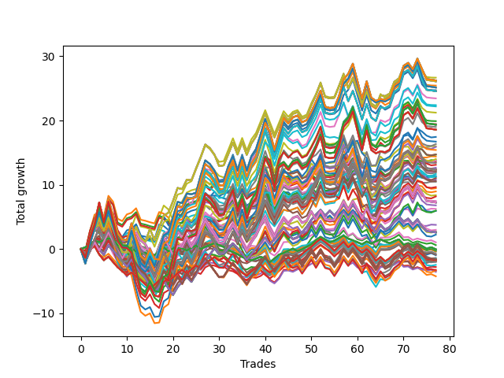

# Long HLT 111 
- Symbol: TSLA
- Date Range: 05/16/2022 - 05/17/2024
- Trading Period: 8:30-12:30
- Number of Trades: 77



| Id. | Name | Win Percent | Profit | Avg Profit / Trade | Avg Time / Trade | Std |      | Name | Win Percent | Profit | Avg Profit / Trade | Avg Time / Trade | Std |
| --- | ---- | ----------- | ------ | ------------------ | ---------------- | --- | ---- | ---- | ----------- | ------ | ------------------ | ---------------- | --- |
| | Sorted By <br> Profit | | | | | | | Sorted By <br> Win Percentage |||||
|0| TP-1.75 105m | 59.74 | 26.67 | 0.35 | 56:42 | 1.53 |     | TP-1.75 105m | 59.74 | 26.67 | 0.35 | 56:42 | 1.53 |
|1| TP-2.5 180m | 55.84 | 26.24 | 0.34 | 75:40 | 1.85 |     | TP-2.25 105m | 59.74 | 24.72 | 0.32 | 67:30 | 1.74 |
|2| TP-2.5 165m | 55.84 | 26.24 | 0.34 | 75:40 | 1.85 |     | TP-2.5 105m | 58.44 | 25.44 | 0.33 | 71:16 | 1.81 |
|3| TP-2.5 150m | 55.84 | 26.24 | 0.34 | 75:40 | 1.85 |     | TP-2 105m | 58.44 | 22.40 | 0.29 | 62:56 | 1.66 |
|4| TP-2.5 135m | 55.84 | 26.24 | 0.34 | 75:40 | 1.85 |     | TP-1.75 30m | 58.44 | 15.99 | 0.21 | 26:12 | 1.17 |
|5| TP-2.5 120m | 55.84 | 26.24 | 0.34 | 75:40 | 1.85 |     | TP-1.5 30m | 58.44 | 10.47 | 0.14 | 24:55 | 1.12 |
|6| TP-1.75 180m | 57.14 | 26.10 | 0.34 | 58:55 | 1.56 |     | TP-1.75 180m | 57.14 | 26.10 | 0.34 | 58:55 | 1.56 |
|7| TP-1.75 165m | 57.14 | 26.10 | 0.34 | 58:55 | 1.56 |     | TP-1.75 165m | 57.14 | 26.10 | 0.34 | 58:55 | 1.56 |
|8| TP-1.75 150m | 57.14 | 26.10 | 0.34 | 58:55 | 1.56 |     | TP-1.75 150m | 57.14 | 26.10 | 0.34 | 58:55 | 1.56 |
|9| TP-1.75 135m | 57.14 | 26.10 | 0.34 | 58:55 | 1.56 |     | TP-1.75 135m | 57.14 | 26.10 | 0.34 | 58:55 | 1.56 |
|10| TP-1.75 120m | 57.14 | 26.10 | 0.34 | 58:55 | 1.56 |     | TP-1.75 120m | 57.14 | 26.10 | 0.34 | 58:55 | 1.56 |
|11| TP-2.5 105m | 58.44 | 25.44 | 0.33 | 71:16 | 1.81 |     | TP-2.25 180m | 57.14 | 25.14 | 0.33 | 70:57 | 1.79 |
|12| TP-2.25 180m | 57.14 | 25.14 | 0.33 | 70:57 | 1.79 |     | TP-2.25 165m | 57.14 | 25.14 | 0.33 | 70:57 | 1.79 |
|13| TP-2.25 165m | 57.14 | 25.14 | 0.33 | 70:57 | 1.79 |     | TP-2.25 150m | 57.14 | 25.14 | 0.33 | 70:57 | 1.79 |
|14| TP-2.25 150m | 57.14 | 25.14 | 0.33 | 70:57 | 1.79 |     | TP-2.25 135m | 57.14 | 25.14 | 0.33 | 70:57 | 1.79 |
|15| TP-2.25 135m | 57.14 | 25.14 | 0.33 | 70:57 | 1.79 |     | TP-2.25 120m | 57.14 | 25.14 | 0.33 | 70:57 | 1.79 |
|16| TP-2.25 120m | 57.14 | 25.14 | 0.33 | 70:57 | 1.79 |     | TP-1.75 90m | 57.14 | 23.45 | 0.30 | 53:45 | 1.50 |
|17| TP-2.25 105m | 59.74 | 24.72 | 0.32 | 67:30 | 1.74 |     | TP-2.75 105m | 57.14 | 19.91 | 0.26 | 74:22 | 1.84 |
|18| TP-2 180m | 55.84 | 24.57 | 0.32 | 65:47 | 1.72 |     | TP-3 105m | 57.14 | 19.45 | 0.25 | 76:10 | 1.94 |
|19| TP-2 165m | 55.84 | 24.57 | 0.32 | 65:47 | 1.72 |     | TP-1.75 45m | 57.14 | 17.45 | 0.23 | 36:03 | 1.27 |
|20| TP-2 150m | 55.84 | 24.57 | 0.32 | 65:47 | 1.72 |     | TP-2.5 75m | 57.14 | 16.34 | 0.21 | 60:00 | 1.65 |
|21| TP-2 135m | 55.84 | 24.57 | 0.32 | 65:47 | 1.72 |     | TP-1.75 75m | 57.14 | 15.90 | 0.21 | 49:47 | 1.45 |
|22| TP-2 120m | 55.84 | 24.57 | 0.32 | 65:47 | 1.72 |     | TP-2.5 30m | 57.14 | 14.41 | 0.19 | 27:54 | 1.12 |
|23| TP-1.75 90m | 57.14 | 23.45 | 0.30 | 53:45 | 1.50 |     | TP-2.75 75m | 57.14 | 14.01 | 0.18 | 61:43 | 1.64 |
|24| TP-2 105m | 58.44 | 22.40 | 0.29 | 62:56 | 1.66 |     | TP-2.25 75m | 57.14 | 13.81 | 0.18 | 57:33 | 1.61 |
|25| TP-2.5 90m | 55.84 | 22.20 | 0.29 | 66:16 | 1.77 |     | TP-2.75 30m | 57.14 | 13.81 | 0.18 | 28:03 | 1.11 |
|26| TP-2.25 90m | 55.84 | 21.23 | 0.28 | 63:00 | 1.71 |     | TP-3 30m | 57.14 | 13.54 | 0.18 | 28:03 | 1.12 |
|27| TP-2.75 105m | 57.14 | 19.91 | 0.26 | 74:22 | 1.84 |     | TP-3 75m | 57.14 | 11.68 | 0.15 | 62:49 | 1.71 |
|28| TP-3 105m | 57.14 | 19.45 | 0.25 | 76:10 | 1.94 |     | TP-2.25 30m | 57.14 | 11.37 | 0.15 | 27:26 | 1.15 |
|29| TP-2.75 180m | 54.55 | 19.35 | 0.25 | 79:14 | 1.89 |     | TP-1.5 45m | 57.14 | 11.27 | 0.15 | 33:04 | 1.23 |
|30| TP-2.75 165m | 54.55 | 19.35 | 0.25 | 79:14 | 1.89 |     | TP-2 30m | 57.14 | 11.23 | 0.15 | 27:03 | 1.13 |
|31| TP-2.75 150m | 54.55 | 19.35 | 0.25 | 79:14 | 1.89 |     | TP-1.25 45m | 57.14 | 8.39 | 0.11 | 28:35 | 1.17 |
|32| TP-2.75 135m | 54.55 | 19.35 | 0.25 | 79:14 | 1.89 |     | TP-2.5 180m | 55.84 | 26.24 | 0.34 | 75:40 | 1.85 |
|33| TP-2.75 120m | 54.55 | 19.35 | 0.25 | 79:14 | 1.89 |     | TP-2.5 165m | 55.84 | 26.24 | 0.34 | 75:40 | 1.85 |
|34| TP-2 90m | 54.55 | 19.00 | 0.25 | 59:00 | 1.63 |     | TP-2.5 150m | 55.84 | 26.24 | 0.34 | 75:40 | 1.85 |
|35| TP-3 180m | 54.55 | 18.58 | 0.24 | 81:11 | 2.01 |     | TP-2.5 135m | 55.84 | 26.24 | 0.34 | 75:40 | 1.85 |
|36| TP-3 165m | 54.55 | 18.58 | 0.24 | 81:11 | 2.01 |     | TP-2.5 120m | 55.84 | 26.24 | 0.34 | 75:40 | 1.85 |
|37| TP-3 150m | 54.55 | 18.58 | 0.24 | 81:11 | 2.01 |     | TP-2 180m | 55.84 | 24.57 | 0.32 | 65:47 | 1.72 |
|38| TP-3 135m | 54.55 | 18.58 | 0.24 | 81:11 | 2.01 |     | TP-2 165m | 55.84 | 24.57 | 0.32 | 65:47 | 1.72 |
|39| TP-3 120m | 54.55 | 18.58 | 0.24 | 81:11 | 2.01 |     | TP-2 150m | 55.84 | 24.57 | 0.32 | 65:47 | 1.72 |
|40| TP-1.75 45m | 57.14 | 17.45 | 0.23 | 36:03 | 1.27 |     | TP-2 135m | 55.84 | 24.57 | 0.32 | 65:47 | 1.72 |
|41| TP-2.75 90m | 54.55 | 16.72 | 0.22 | 68:35 | 1.82 |     | TP-2 120m | 55.84 | 24.57 | 0.32 | 65:47 | 1.72 |
|42| TP-2.5 75m | 57.14 | 16.34 | 0.21 | 60:00 | 1.65 |     | TP-2.5 90m | 55.84 | 22.20 | 0.29 | 66:16 | 1.77 |
|43| TP-1.75 30m | 58.44 | 15.99 | 0.21 | 26:12 | 1.17 |     | TP-2.25 90m | 55.84 | 21.23 | 0.28 | 63:00 | 1.71 |
|44| TP-1.75 75m | 57.14 | 15.90 | 0.21 | 49:47 | 1.45 |     | TP-2.5 45m | 55.84 | 13.11 | 0.17 | 40:48 | 1.27 |
|45| TP-3 90m | 54.55 | 15.42 | 0.20 | 70:03 | 1.91 |     | TP-2.25 45m | 55.84 | 12.07 | 0.16 | 39:37 | 1.27 |
|46| TP-2.5 60m | 50.65 | 14.73 | 0.19 | 51:38 | 1.48 |     | TP-2 75m | 55.84 | 11.05 | 0.14 | 54:16 | 1.56 |
|47| TP-1.75 60m | 53.25 | 14.70 | 0.19 | 44:01 | 1.35 |     | TP-2.75 45m | 55.84 | 10.83 | 0.14 | 41:09 | 1.25 |
|48| TP-2.5 30m | 57.14 | 14.41 | 0.19 | 27:54 | 1.12 |     | TP-3 45m | 55.84 | 10.59 | 0.14 | 41:14 | 1.26 |
|49| TP-2.75 75m | 57.14 | 14.01 | 0.18 | 61:43 | 1.64 |     | TP-2 45m | 55.84 | 9.46 | 0.12 | 38:25 | 1.29 |
|50| TP-2.25 75m | 57.14 | 13.81 | 0.18 | 57:33 | 1.61 |     | TP-1.25 30m | 55.84 | 6.25 | 0.08 | 22:42 | 1.10 |
|51| TP-2.75 30m | 57.14 | 13.81 | 0.18 | 28:03 | 1.11 |     | TP-2.75 180m | 54.55 | 19.35 | 0.25 | 79:14 | 1.89 |
|52| TP-3 30m | 57.14 | 13.54 | 0.18 | 28:03 | 1.12 |     | TP-2.75 165m | 54.55 | 19.35 | 0.25 | 79:14 | 1.89 |
|53| TP-1.5 105m | 54.55 | 13.41 | 0.17 | 48:30 | 1.41 |     | TP-2.75 150m | 54.55 | 19.35 | 0.25 | 79:14 | 1.89 |
|54| TP-2.5 45m | 55.84 | 13.11 | 0.17 | 40:48 | 1.27 |     | TP-2.75 135m | 54.55 | 19.35 | 0.25 | 79:14 | 1.89 |
|55| TP-2.25 60m | 50.65 | 12.65 | 0.16 | 49:50 | 1.46 |     | TP-2.75 120m | 54.55 | 19.35 | 0.25 | 79:14 | 1.89 |
|56| TP-1.5 180m | 53.25 | 12.36 | 0.16 | 50:12 | 1.42 |     | TP-2 90m | 54.55 | 19.00 | 0.25 | 59:00 | 1.63 |
|57| TP-1.5 165m | 53.25 | 12.36 | 0.16 | 50:12 | 1.42 |     | TP-3 180m | 54.55 | 18.58 | 0.24 | 81:11 | 2.01 |
|58| TP-1.5 150m | 53.25 | 12.36 | 0.16 | 50:12 | 1.42 |     | TP-3 165m | 54.55 | 18.58 | 0.24 | 81:11 | 2.01 |
|59| TP-1.5 135m | 53.25 | 12.36 | 0.16 | 50:12 | 1.42 |     | TP-3 150m | 54.55 | 18.58 | 0.24 | 81:11 | 2.01 |
|60| TP-1.5 120m | 53.25 | 12.36 | 0.16 | 50:12 | 1.42 |     | TP-3 135m | 54.55 | 18.58 | 0.24 | 81:11 | 2.01 |
|61| TP-1.5 90m | 53.25 | 12.10 | 0.16 | 46:25 | 1.38 |     | TP-3 120m | 54.55 | 18.58 | 0.24 | 81:11 | 2.01 |
|62| TP-2.25 45m | 55.84 | 12.07 | 0.16 | 39:37 | 1.27 |     | TP-2.75 90m | 54.55 | 16.72 | 0.22 | 68:35 | 1.82 |
|63| TP-2.75 60m | 50.65 | 12.05 | 0.16 | 52:24 | 1.46 |     | TP-3 90m | 54.55 | 15.42 | 0.20 | 70:03 | 1.91 |
|64| TP-3 60m | 50.65 | 11.90 | 0.15 | 53:00 | 1.50 |     | TP-1.5 105m | 54.55 | 13.41 | 0.17 | 48:30 | 1.41 |
|65| TP-3 75m | 57.14 | 11.68 | 0.15 | 62:49 | 1.71 |     | TP-1.5 75m | 54.55 | 8.19 | 0.11 | 43:27 | 1.35 |
|66| TP-2.25 30m | 57.14 | 11.37 | 0.15 | 27:26 | 1.15 |     | TP-1.75 60m | 53.25 | 14.70 | 0.19 | 44:01 | 1.35 |
|67| TP-1.5 45m | 57.14 | 11.27 | 0.15 | 33:04 | 1.23 |     | TP-1.5 180m | 53.25 | 12.36 | 0.16 | 50:12 | 1.42 |
|68| TP-2 30m | 57.14 | 11.23 | 0.15 | 27:03 | 1.13 |     | TP-1.5 165m | 53.25 | 12.36 | 0.16 | 50:12 | 1.42 |
|69| TP-2 75m | 55.84 | 11.05 | 0.14 | 54:16 | 1.56 |     | TP-1.5 150m | 53.25 | 12.36 | 0.16 | 50:12 | 1.42 |
|70| TP-2.75 45m | 55.84 | 10.83 | 0.14 | 41:09 | 1.25 |     | TP-1.5 135m | 53.25 | 12.36 | 0.16 | 50:12 | 1.42 |
|71| TP-3 45m | 55.84 | 10.59 | 0.14 | 41:14 | 1.26 |     | TP-1.5 120m | 53.25 | 12.36 | 0.16 | 50:12 | 1.42 |
|72| TP-1.5 30m | 58.44 | 10.47 | 0.14 | 24:55 | 1.12 |     | TP-1.5 90m | 53.25 | 12.10 | 0.16 | 46:25 | 1.38 |
|73| TP-2 60m | 50.65 | 9.65 | 0.13 | 47:35 | 1.42 |     | TP-1.5 60m | 53.25 | 8.97 | 0.12 | 39:03 | 1.29 |
|74| TP-2 45m | 55.84 | 9.46 | 0.12 | 38:25 | 1.29 |     | TP-1.25 105m | 53.25 | 7.49 | 0.10 | 39:23 | 1.26 |
|75| TP-1.5 60m | 53.25 | 8.97 | 0.12 | 39:03 | 1.29 |     | TP-1.25 75m | 53.25 | 5.99 | 0.08 | 35:53 | 1.25 |
|76| TP-1.25 45m | 57.14 | 8.39 | 0.11 | 28:35 | 1.17 |     | TP-1.25 60m | 53.25 | 5.93 | 0.08 | 32:50 | 1.20 |
|77| TP-1.5 75m | 54.55 | 8.19 | 0.11 | 43:27 | 1.35 |     | TP-0.75 30m | 53.25 | 3.77 | 0.05 | 16:47 | 0.84 |
|78| TP-1.25 105m | 53.25 | 7.49 | 0.10 | 39:23 | 1.26 |     | TP-0.75 45m | 53.25 | 2.99 | 0.04 | 19:21 | 0.88 |
|79| TP-1.25 180m | 51.95 | 7.24 | 0.09 | 40:52 | 1.27 |     | TP-1.25 180m | 51.95 | 7.24 | 0.09 | 40:52 | 1.27 |
|80| TP-1.25 165m | 51.95 | 7.24 | 0.09 | 40:52 | 1.27 |     | TP-1.25 165m | 51.95 | 7.24 | 0.09 | 40:52 | 1.27 |
|81| TP-1.25 150m | 51.95 | 7.24 | 0.09 | 40:52 | 1.27 |     | TP-1.25 150m | 51.95 | 7.24 | 0.09 | 40:52 | 1.27 |
|82| TP-1.25 135m | 51.95 | 7.24 | 0.09 | 40:52 | 1.27 |     | TP-1.25 135m | 51.95 | 7.24 | 0.09 | 40:52 | 1.27 |
|83| TP-1.25 120m | 51.95 | 7.24 | 0.09 | 40:52 | 1.27 |     | TP-1.25 120m | 51.95 | 7.24 | 0.09 | 40:52 | 1.27 |
|84| TP-1.25 90m | 51.95 | 6.80 | 0.09 | 37:49 | 1.25 |     | TP-1.25 90m | 51.95 | 6.80 | 0.09 | 37:49 | 1.25 |
|85| TP-1.25 30m | 55.84 | 6.25 | 0.08 | 22:42 | 1.10 |     | TP-0.75 60m | 51.95 | 2.70 | 0.04 | 20:31 | 0.89 |
|86| TP-1.25 75m | 53.25 | 5.99 | 0.08 | 35:53 | 1.25 |     | TP-0.75 105m | 51.95 | 2.68 | 0.03 | 21:49 | 0.90 |
|87| TP-1.25 60m | 53.25 | 5.93 | 0.08 | 32:50 | 1.20 |     | TP-0.75 90m | 51.95 | 2.64 | 0.03 | 21:38 | 0.90 |
|88| TP-0.75 30m | 53.25 | 3.77 | 0.05 | 16:47 | 0.84 |     | TP-0.75 180m | 51.95 | 2.58 | 0.03 | 22:01 | 0.90 |
|89| TP-0.75 45m | 53.25 | 2.99 | 0.04 | 19:21 | 0.88 |     | TP-0.75 165m | 51.95 | 2.58 | 0.03 | 22:01 | 0.90 |
|90| TP-0.75 60m | 51.95 | 2.70 | 0.04 | 20:31 | 0.89 |     | TP-0.75 150m | 51.95 | 2.58 | 0.03 | 22:01 | 0.90 |
|91| TP-0.75 105m | 51.95 | 2.68 | 0.03 | 21:49 | 0.90 |     | TP-0.75 135m | 51.95 | 2.58 | 0.03 | 22:01 | 0.90 |
|92| TP-0.75 90m | 51.95 | 2.64 | 0.03 | 21:38 | 0.90 |     | TP-0.75 120m | 51.95 | 2.58 | 0.03 | 22:01 | 0.90 |
|93| TP-0.75 180m | 51.95 | 2.58 | 0.03 | 22:01 | 0.90 |     | TP-0.75 75m | 51.95 | 2.25 | 0.03 | 21:16 | 0.90 |
|94| TP-0.75 165m | 51.95 | 2.58 | 0.03 | 22:01 | 0.90 |     | TP-0.25 180m | 51.95 | -0.04 | -0.00 | 05:12 | 0.41 |
|95| TP-0.75 150m | 51.95 | 2.58 | 0.03 | 22:01 | 0.90 |     | TP-0.25 165m | 51.95 | -0.04 | -0.00 | 05:12 | 0.41 |
|96| TP-0.75 135m | 51.95 | 2.58 | 0.03 | 22:01 | 0.90 |     | TP-0.25 150m | 51.95 | -0.04 | -0.00 | 05:12 | 0.41 |
|97| TP-0.75 120m | 51.95 | 2.58 | 0.03 | 22:01 | 0.90 |     | TP-0.25 135m | 51.95 | -0.04 | -0.00 | 05:12 | 0.41 |
|98| TP-0.75 75m | 51.95 | 2.25 | 0.03 | 21:16 | 0.90 |     | TP-0.25 120m | 51.95 | -0.04 | -0.00 | 05:12 | 0.41 |
|99| TP-1.75 15m | 48.05 | 1.05 | 0.01 | 13:40 | 0.86 |     | TP-0.25 105m | 51.95 | -0.04 | -0.00 | 05:12 | 0.41 |
|100| TP-0.75 15m | 49.35 | 0.62 | 0.01 | 11:02 | 0.71 |     | TP-0.25 90m | 51.95 | -0.04 | -0.00 | 05:12 | 0.41 |
|101| TP-0.25 180m | 51.95 | -0.04 | -0.00 | 05:12 | 0.41 |     | TP-0.25 75m | 51.95 | -0.04 | -0.00 | 05:12 | 0.41 |
|102| TP-0.25 165m | 51.95 | -0.04 | -0.00 | 05:12 | 0.41 |     | TP-0.25 60m | 51.95 | -0.04 | -0.00 | 05:12 | 0.41 |
|103| TP-0.25 150m | 51.95 | -0.04 | -0.00 | 05:12 | 0.41 |     | TP-0.25 45m | 51.95 | -0.04 | -0.00 | 05:12 | 0.41 |
|104| TP-0.25 135m | 51.95 | -0.04 | -0.00 | 05:12 | 0.41 |     | TP-0.25 30m | 51.95 | -0.25 | -0.00 | 05:09 | 0.41 |
|105| TP-0.25 120m | 51.95 | -0.04 | -0.00 | 05:12 | 0.41 |     | TP-1 45m | 51.95 | -1.37 | -0.02 | 24:30 | 1.03 |
|106| TP-0.25 105m | 51.95 | -0.04 | -0.00 | 05:12 | 0.41 |     | TP-0.5 75m | 51.95 | -1.49 | -0.02 | 12:11 | 0.64 |
|107| TP-0.25 90m | 51.95 | -0.04 | -0.00 | 05:12 | 0.41 |     | TP-0.5 45m | 51.95 | -1.91 | -0.02 | 11:20 | 0.64 |
|108| TP-0.25 75m | 51.95 | -0.04 | -0.00 | 05:12 | 0.41 |     | TP-0.5 60m | 51.95 | -1.94 | -0.03 | 11:48 | 0.64 |
|109| TP-0.25 60m | 51.95 | -0.04 | -0.00 | 05:12 | 0.41 |     | TP-2.5 60m | 50.65 | 14.73 | 0.19 | 51:38 | 1.48 |
|110| TP-0.25 45m | 51.95 | -0.04 | -0.00 | 05:12 | 0.41 |     | TP-2.25 60m | 50.65 | 12.65 | 0.16 | 49:50 | 1.46 |
|111| TP-2.5 15m | 48.05 | -0.06 | -0.00 | 13:51 | 0.86 |     | TP-2.75 60m | 50.65 | 12.05 | 0.16 | 52:24 | 1.46 |
|112| TP-2.25 15m | 48.05 | -0.17 | -0.00 | 13:50 | 0.86 |     | TP-3 60m | 50.65 | 11.90 | 0.15 | 53:00 | 1.50 |
|113| TP-0.25 30m | 51.95 | -0.25 | -0.00 | 05:09 | 0.41 |     | TP-2 60m | 50.65 | 9.65 | 0.13 | 47:35 | 1.42 |
|114| TP-3 15m | 48.05 | -0.38 | -0.00 | 13:54 | 0.85 |     | TP-0.25 15m | 50.65 | -0.95 | -0.01 | 04:45 | 0.40 |
|115| TP-2.75 15m | 48.05 | -0.38 | -0.00 | 13:54 | 0.85 |     | TP-0.5 105m | 50.65 | -1.63 | -0.02 | 12:36 | 0.65 |
|116| TP-2 15m | 48.05 | -0.72 | -0.01 | 13:47 | 0.85 |     | TP-0.5 90m | 50.65 | -1.67 | -0.02 | 12:24 | 0.65 |
|117| TP-1.5 15m | 48.05 | -0.88 | -0.01 | 13:24 | 0.81 |     | TP-0.5 180m | 50.65 | -1.73 | -0.02 | 12:48 | 0.65 |
|118| TP-0.25 15m | 50.65 | -0.95 | -0.01 | 04:45 | 0.40 |     | TP-0.5 165m | 50.65 | -1.73 | -0.02 | 12:48 | 0.65 |
|119| TP-1 45m | 51.95 | -1.37 | -0.02 | 24:30 | 1.03 |     | TP-0.5 150m | 50.65 | -1.73 | -0.02 | 12:48 | 0.65 |
|120| TP-0.5 75m | 51.95 | -1.49 | -0.02 | 12:11 | 0.64 |     | TP-0.5 135m | 50.65 | -1.73 | -0.02 | 12:48 | 0.65 |
|121| TP-1 180m | 48.05 | -1.60 | -0.02 | 30:49 | 1.10 |     | TP-0.5 120m | 50.65 | -1.73 | -0.02 | 12:48 | 0.65 |
|122| TP-1 165m | 48.05 | -1.60 | -0.02 | 30:49 | 1.10 |     | TP-0.5 30m | 50.65 | -2.79 | -0.04 | 10:34 | 0.64 |
|123| TP-1 150m | 48.05 | -1.60 | -0.02 | 30:49 | 1.10 |     | TP-0.5 15m | 50.65 | -4.23 | -0.05 | 08:33 | 0.58 |
|124| TP-1 135m | 48.05 | -1.60 | -0.02 | 30:49 | 1.10 |     | TP-0.75 15m | 49.35 | 0.62 | 0.01 | 11:02 | 0.71 |
|125| TP-1 120m | 48.05 | -1.60 | -0.02 | 30:49 | 1.10 |     | TP-1 30m | 49.35 | -1.99 | -0.03 | 20:18 | 0.98 |
|126| TP-0.5 105m | 50.65 | -1.63 | -0.02 | 12:36 | 0.65 |     | TP-1.75 15m | 48.05 | 1.05 | 0.01 | 13:40 | 0.86 |
|127| TP-0.5 90m | 50.65 | -1.67 | -0.02 | 12:24 | 0.65 |     | TP-2.5 15m | 48.05 | -0.06 | -0.00 | 13:51 | 0.86 |
|128| TP-0.5 180m | 50.65 | -1.73 | -0.02 | 12:48 | 0.65 |     | TP-2.25 15m | 48.05 | -0.17 | -0.00 | 13:50 | 0.86 |
|129| TP-0.5 165m | 50.65 | -1.73 | -0.02 | 12:48 | 0.65 |     | TP-3 15m | 48.05 | -0.38 | -0.00 | 13:54 | 0.85 |
|130| TP-0.5 150m | 50.65 | -1.73 | -0.02 | 12:48 | 0.65 |     | TP-2.75 15m | 48.05 | -0.38 | -0.00 | 13:54 | 0.85 |
|131| TP-0.5 135m | 50.65 | -1.73 | -0.02 | 12:48 | 0.65 |     | TP-2 15m | 48.05 | -0.72 | -0.01 | 13:47 | 0.85 |
|132| TP-0.5 120m | 50.65 | -1.73 | -0.02 | 12:48 | 0.65 |     | TP-1.5 15m | 48.05 | -0.88 | -0.01 | 13:24 | 0.81 |
|133| TP-1 105m | 48.05 | -1.82 | -0.02 | 30:33 | 1.10 |     | TP-1 180m | 48.05 | -1.60 | -0.02 | 30:49 | 1.10 |
|134| TP-0.5 45m | 51.95 | -1.91 | -0.02 | 11:20 | 0.64 |     | TP-1 165m | 48.05 | -1.60 | -0.02 | 30:49 | 1.10 |
|135| TP-0.5 60m | 51.95 | -1.94 | -0.03 | 11:48 | 0.64 |     | TP-1 150m | 48.05 | -1.60 | -0.02 | 30:49 | 1.10 |
|136| TP-1 30m | 49.35 | -1.99 | -0.03 | 20:18 | 0.98 |     | TP-1 135m | 48.05 | -1.60 | -0.02 | 30:49 | 1.10 |
|137| TP-1 60m | 48.05 | -2.46 | -0.03 | 27:24 | 1.04 |     | TP-1 120m | 48.05 | -1.60 | -0.02 | 30:49 | 1.10 |
|138| TP-0.5 30m | 50.65 | -2.79 | -0.04 | 10:34 | 0.64 |     | TP-1 105m | 48.05 | -1.82 | -0.02 | 30:33 | 1.10 |
|139| TP-1 90m | 46.75 | -3.23 | -0.04 | 30:09 | 1.09 |     | TP-1 60m | 48.05 | -2.46 | -0.03 | 27:24 | 1.04 |
|140| TP-1 75m | 48.05 | -3.31 | -0.04 | 29:30 | 1.08 |     | TP-1 75m | 48.05 | -3.31 | -0.04 | 29:30 | 1.08 |
|141| TP-1 15m | 48.05 | -3.42 | -0.04 | 12:14 | 0.74 |     | TP-1 15m | 48.05 | -3.42 | -0.04 | 12:14 | 0.74 |
|142| TP-1.25 15m | 48.05 | -3.54 | -0.05 | 12:57 | 0.81 |     | TP-1.25 15m | 48.05 | -3.54 | -0.05 | 12:57 | 0.81 |
|143| TP-0.5 15m | 50.65 | -4.23 | -0.05 | 08:33 | 0.58 |     | TP-1 90m | 46.75 | -3.23 | -0.04 | 30:09 | 1.09 |

### Test TP-0.25 15m
* Take Profit of 0.25 Point
* 0.25 Stoploss
* Results:
```
Total Trades: 77
Percent Up: 50.65
Percent Down: 49.35
Total Points Moved Up: -0.95
Potential Profit: -475.00
Total Points Ups: 13.93 Count Ups: 39
Total Points Downs: -14.88 Count Downs: 38
```

<details><summary>Trades</summary>

<code>In: 2022-05-18 12:10:00		Out: 2022-05-18 12:12:00		Total Position Time: 02:00		Total Move Up: 0.29		Total to Date: 0.29</code> <br />
<code>In: 2022-05-20 10:40:00		Out: 2022-05-20 10:43:00		Total Position Time: 03:00		Total Move Up: 0.41		Total to Date: 0.70</code> <br />
<code>In: 2022-05-24 12:30:00		Out: 2022-05-24 12:34:00		Total Position Time: 04:00		Total Move Up: 0.57		Total to Date: 1.27</code> <br />
<code>In: 2022-06-01 09:40:00		Out: 2022-06-01 09:43:00		Total Position Time: 03:00		Total Move Up: -0.18		Total to Date: 1.09</code> <br />
<code>In: 2022-06-03 09:30:00		Out: 2022-06-03 09:33:00		Total Position Time: 03:00		Total Move Up: 0.30		Total to Date: 1.39</code> <br />
<code>In: 2022-06-10 10:25:00		Out: 2022-06-10 10:27:00		Total Position Time: 02:00		Total Move Up: 0.29		Total to Date: 1.68</code> <br />
<code>In: 2022-06-16 09:50:00		Out: 2022-06-16 09:53:00		Total Position Time: 03:00		Total Move Up: -0.25		Total to Date: 1.43</code> <br />
<code>In: 2022-06-16 10:35:00		Out: 2022-06-16 10:37:00		Total Position Time: 02:00		Total Move Up: -0.83		Total to Date: 0.60</code> <br />
<code>In: 2022-06-28 11:55:00		Out: 2022-06-28 11:57:00		Total Position Time: 02:00		Total Move Up: -0.47		Total to Date: 0.13</code> <br />
<code>In: 2022-07-22 11:55:00		Out: 2022-07-22 11:59:00		Total Position Time: 04:00		Total Move Up: -0.33		Total to Date: -0.20</code> <br />
<code>In: 2022-08-01 11:05:00		Out: 2022-08-01 11:07:00		Total Position Time: 02:00		Total Move Up: 0.43		Total to Date: 0.23</code> <br />
<code>In: 2022-08-05 09:50:00		Out: 2022-08-05 09:52:00		Total Position Time: 02:00		Total Move Up: -0.63		Total to Date: -0.40</code> <br />
<code>In: 2022-08-11 09:35:00		Out: 2022-08-11 09:40:00		Total Position Time: 05:00		Total Move Up: -0.42		Total to Date: -0.82</code> <br />
<code>In: 2022-08-18 12:00:00		Out: 2022-08-18 12:06:00		Total Position Time: 06:00		Total Move Up: 0.27		Total to Date: -0.55</code> <br />
<code>In: 2022-09-01 08:40:00		Out: 2022-09-01 08:42:00		Total Position Time: 02:00		Total Move Up: -0.65		Total to Date: -1.20</code> <br />
<code>In: 2022-09-02 11:35:00		Out: 2022-09-02 11:38:00		Total Position Time: 03:00		Total Move Up: 0.23		Total to Date: -0.97</code> <br />
<code>In: 2022-09-22 08:35:00		Out: 2022-09-22 08:39:00		Total Position Time: 04:00		Total Move Up: 0.70		Total to Date: -0.27</code> <br />
<code>In: 2022-09-22 12:00:00		Out: 2022-09-22 12:02:00		Total Position Time: 02:00		Total Move Up: 0.55		Total to Date: 0.28</code> <br />
<code>In: 2022-09-29 11:15:00		Out: 2022-09-29 11:17:00		Total Position Time: 02:00		Total Move Up: -0.63		Total to Date: -0.35</code> <br />
<code>In: 2022-10-03 10:30:00		Out: 2022-10-03 10:33:00		Total Position Time: 03:00		Total Move Up: 0.44		Total to Date: 0.09</code> <br />
<code>In: 2022-10-05 08:45:00		Out: 2022-10-05 08:48:00		Total Position Time: 03:00		Total Move Up: 0.26		Total to Date: 0.35</code> <br />
<code>In: 2022-10-07 10:20:00		Out: 2022-10-07 10:22:00		Total Position Time: 02:00		Total Move Up: -0.26		Total to Date: 0.09</code> <br />
<code>In: 2022-10-20 11:40:00		Out: 2022-10-20 11:43:00		Total Position Time: 03:00		Total Move Up: -0.30		Total to Date: -0.21</code> <br />
<code>In: 2022-11-03 09:50:00		Out: 2022-11-03 09:52:00		Total Position Time: 02:00		Total Move Up: 0.42		Total to Date: 0.21</code> <br />
<code>In: 2022-11-03 11:15:00		Out: 2022-11-03 11:21:00		Total Position Time: 06:00		Total Move Up: 0.33		Total to Date: 0.54</code> <br />
<code>In: 2022-11-04 11:20:00		Out: 2022-11-04 11:22:00		Total Position Time: 02:00		Total Move Up: -0.53		Total to Date: 0.01</code> <br />
<code>In: 2022-11-10 12:15:00		Out: 2022-11-10 12:21:00		Total Position Time: 06:00		Total Move Up: 0.34		Total to Date: 0.35</code> <br />
<code>In: 2022-11-15 11:15:00		Out: 2022-11-15 11:18:00		Total Position Time: 03:00		Total Move Up: 0.29		Total to Date: 0.64</code> <br />
<code>In: 2022-12-07 09:50:00		Out: 2022-12-07 09:55:00		Total Position Time: 05:00		Total Move Up: 0.27		Total to Date: 0.91</code> <br />
<code>In: 2022-12-20 09:55:00		Out: 2022-12-20 09:57:00		Total Position Time: 02:00		Total Move Up: -0.28		Total to Date: 0.63</code> <br />
<code>In: 2023-01-18 11:35:00		Out: 2023-01-18 11:37:00		Total Position Time: 02:00		Total Move Up: -0.29		Total to Date: 0.34</code> <br />
<code>In: 2023-01-19 08:55:00		Out: 2023-01-19 08:58:00		Total Position Time: 03:00		Total Move Up: -0.46		Total to Date: -0.12</code> <br />
<code>In: 2023-01-19 09:20:00		Out: 2023-01-19 09:22:00		Total Position Time: 02:00		Total Move Up: -0.36		Total to Date: -0.48</code> <br />
<code>In: 2023-03-06 09:00:00		Out: 2023-03-06 09:09:00		Total Position Time: 09:00		Total Move Up: -0.31		Total to Date: -0.79</code> <br />
<code>In: 2023-03-15 11:00:00		Out: 2023-03-15 11:02:00		Total Position Time: 02:00		Total Move Up: -0.43		Total to Date: -1.22</code> <br />
<code>In: 2023-04-12 10:20:00		Out: 2023-04-12 10:24:00		Total Position Time: 04:00		Total Move Up: -0.28		Total to Date: -1.50</code> <br />
<code>In: 2023-04-24 10:45:00		Out: 2023-04-24 10:49:00		Total Position Time: 04:00		Total Move Up: -0.26		Total to Date: -1.76</code> <br />
<code>In: 2023-05-09 09:40:00		Out: 2023-05-09 09:54:00		Total Position Time: 14:00		Total Move Up: -0.09		Total to Date: -1.85</code> <br />
<code>In: 2023-05-31 10:10:00		Out: 2023-05-31 10:13:00		Total Position Time: 03:00		Total Move Up: 0.26		Total to Date: -1.59</code> <br />
<code>In: 2023-06-21 10:40:00		Out: 2023-06-21 10:42:00		Total Position Time: 02:00		Total Move Up: -0.29		Total to Date: -1.88</code> <br />
<code>In: 2023-06-26 10:30:00		Out: 2023-06-26 10:32:00		Total Position Time: 02:00		Total Move Up: -0.56		Total to Date: -2.44</code> <br />
<code>In: 2023-06-26 11:35:00		Out: 2023-06-26 11:38:00		Total Position Time: 03:00		Total Move Up: 0.57		Total to Date: -1.87</code> <br />
<code>In: 2023-07-13 09:00:00		Out: 2023-07-13 09:07:00		Total Position Time: 07:00		Total Move Up: 0.61		Total to Date: -1.26</code> <br />
<code>In: 2023-08-09 10:10:00		Out: 2023-08-09 10:12:00		Total Position Time: 02:00		Total Move Up: 0.27		Total to Date: -0.99</code> <br />
<code>In: 2023-08-15 11:40:00		Out: 2023-08-15 11:54:00		Total Position Time: 14:00		Total Move Up: 0.04		Total to Date: -0.95</code> <br />
<code>In: 2023-08-16 09:40:00		Out: 2023-08-16 09:43:00		Total Position Time: 03:00		Total Move Up: 0.32		Total to Date: -0.63</code> <br />
<code>In: 2023-09-21 12:30:00		Out: 2023-09-21 12:35:00		Total Position Time: 05:00		Total Move Up: -0.38		Total to Date: -1.01</code> <br />
<code>In: 2023-09-22 12:15:00		Out: 2023-09-22 12:18:00		Total Position Time: 03:00		Total Move Up: 0.29		Total to Date: -0.72</code> <br />
<code>In: 2023-09-26 11:30:00		Out: 2023-09-26 11:32:00		Total Position Time: 02:00		Total Move Up: 0.39		Total to Date: -0.33</code> <br />
<code>In: 2023-10-02 12:15:00		Out: 2023-10-02 12:17:00		Total Position Time: 02:00		Total Move Up: 0.36		Total to Date: 0.03</code> <br />
<code>In: 2023-10-11 10:05:00		Out: 2023-10-11 10:10:00		Total Position Time: 05:00		Total Move Up: 0.68		Total to Date: 0.71</code> <br />
<code>In: 2023-10-11 11:00:00		Out: 2023-10-11 11:02:00		Total Position Time: 02:00		Total Move Up: 0.48		Total to Date: 1.19</code> <br />
<code>In: 2023-10-13 09:25:00		Out: 2023-10-13 09:36:00		Total Position Time: 11:00		Total Move Up: -0.40		Total to Date: 0.79</code> <br />
<code>In: 2023-10-13 11:40:00		Out: 2023-10-13 11:45:00		Total Position Time: 05:00		Total Move Up: -0.43		Total to Date: 0.36</code> <br />
<code>In: 2023-10-19 12:35:00		Out: 2023-10-19 12:39:00		Total Position Time: 04:00		Total Move Up: 0.26		Total to Date: 0.62</code> <br />
<code>In: 2023-10-30 10:30:00		Out: 2023-10-30 10:34:00		Total Position Time: 04:00		Total Move Up: 0.40		Total to Date: 1.02</code> <br />
<code>In: 2023-11-06 11:20:00		Out: 2023-11-06 11:24:00		Total Position Time: 04:00		Total Move Up: 0.37		Total to Date: 1.39</code> <br />
<code>In: 2023-11-09 11:30:00		Out: 2023-11-09 11:36:00		Total Position Time: 06:00		Total Move Up: -0.46		Total to Date: 0.93</code> <br />
<code>In: 2023-11-09 12:10:00		Out: 2023-11-09 12:16:00		Total Position Time: 06:00		Total Move Up: -0.28		Total to Date: 0.65</code> <br />
<code>In: 2023-11-16 09:20:00		Out: 2023-11-16 09:25:00		Total Position Time: 05:00		Total Move Up: -0.28		Total to Date: 0.37</code> <br />
<code>In: 2023-11-16 09:45:00		Out: 2023-11-16 09:51:00		Total Position Time: 06:00		Total Move Up: -0.33		Total to Date: 0.04</code> <br />
<code>In: 2023-12-13 09:45:00		Out: 2023-12-13 09:58:00		Total Position Time: 13:00		Total Move Up: 0.44		Total to Date: 0.48</code> <br />
<code>In: 2023-12-28 09:40:00		Out: 2023-12-28 09:49:00		Total Position Time: 09:00		Total Move Up: -0.33		Total to Date: 0.15</code> <br />
<code>In: 2024-02-21 09:55:00		Out: 2024-02-21 10:00:00		Total Position Time: 05:00		Total Move Up: 0.36		Total to Date: 0.51</code> <br />
<code>In: 2024-02-27 10:45:00		Out: 2024-02-27 10:49:00		Total Position Time: 04:00		Total Move Up: 0.30		Total to Date: 0.81</code> <br />
<code>In: 2024-03-08 09:35:00		Out: 2024-03-08 09:46:00		Total Position Time: 11:00		Total Move Up: -0.32		Total to Date: 0.49</code> <br />
<code>In: 2024-03-14 12:30:00		Out: 2024-03-14 12:35:00		Total Position Time: 05:00		Total Move Up: -0.29		Total to Date: 0.20</code> <br />
<code>In: 2024-03-15 10:10:00		Out: 2024-03-15 10:21:00		Total Position Time: 11:00		Total Move Up: 0.34		Total to Date: 0.54</code> <br />
<code>In: 2024-03-21 11:50:00		Out: 2024-03-21 11:55:00		Total Position Time: 05:00		Total Move Up: 0.26		Total to Date: 0.80</code> <br />
<code>In: 2024-04-05 08:45:00		Out: 2024-04-05 08:47:00		Total Position Time: 02:00		Total Move Up: -0.83		Total to Date: -0.03</code> <br />
<code>In: 2024-04-05 12:00:00		Out: 2024-04-05 12:14:00		Total Position Time: 14:00		Total Move Up: 0.06		Total to Date: 0.03</code> <br />
<code>In: 2024-04-15 11:40:00		Out: 2024-04-15 11:45:00		Total Position Time: 05:00		Total Move Up: -0.30		Total to Date: -0.27</code> <br />
<code>In: 2024-04-22 08:35:00		Out: 2024-04-22 08:49:00		Total Position Time: 14:00		Total Move Up: 0.24		Total to Date: -0.03</code> <br />
<code>In: 2024-04-30 10:40:00		Out: 2024-04-30 10:42:00		Total Position Time: 02:00		Total Move Up: -0.40		Total to Date: -0.43</code> <br />
<code>In: 2024-05-07 09:15:00		Out: 2024-05-07 09:22:00		Total Position Time: 07:00		Total Move Up: -0.44		Total to Date: -0.87</code> <br />
<code>In: 2024-05-07 12:00:00		Out: 2024-05-07 12:08:00		Total Position Time: 08:00		Total Move Up: 0.24		Total to Date: -0.63</code> <br />
<code>In: 2024-05-09 08:55:00		Out: 2024-05-09 09:08:00		Total Position Time: 13:00		Total Move Up: -0.32		Total to Date: -0.95</code> <br />


</details>

### Test TP-0.5 15m
* Take Profit of 0.5 Point
* 0.5 Stoploss
* Results:
```
Total Trades: 77
Percent Up: 50.65
Percent Down: 49.35
Total Points Moved Up: -4.23
Potential Profit: -2115.00
Total Points Ups: 18.10 Count Ups: 39
Total Points Downs: -22.33 Count Downs: 38
```

<details><summary>Trades</summary>

<code>In: 2022-05-18 12:10:00		Out: 2022-05-18 12:14:00		Total Position Time: 04:00		Total Move Up: -0.82		Total to Date: -0.82</code> <br />
<code>In: 2022-05-20 10:40:00		Out: 2022-05-20 10:44:00		Total Position Time: 04:00		Total Move Up: 0.74		Total to Date: -0.08</code> <br />
<code>In: 2022-05-24 12:30:00		Out: 2022-05-24 12:34:00		Total Position Time: 04:00		Total Move Up: 0.57		Total to Date: 0.49</code> <br />
<code>In: 2022-06-01 09:40:00		Out: 2022-06-01 09:49:00		Total Position Time: 09:00		Total Move Up: -1.30		Total to Date: -0.81</code> <br />
<code>In: 2022-06-03 09:30:00		Out: 2022-06-03 09:44:00		Total Position Time: 14:00		Total Move Up: -0.46		Total to Date: -1.27</code> <br />
<code>In: 2022-06-10 10:25:00		Out: 2022-06-10 10:30:00		Total Position Time: 05:00		Total Move Up: 0.55		Total to Date: -0.72</code> <br />
<code>In: 2022-06-16 09:50:00		Out: 2022-06-16 09:54:00		Total Position Time: 04:00		Total Move Up: -0.82		Total to Date: -1.54</code> <br />
<code>In: 2022-06-16 10:35:00		Out: 2022-06-16 10:37:00		Total Position Time: 02:00		Total Move Up: -0.83		Total to Date: -2.37</code> <br />
<code>In: 2022-06-28 11:55:00		Out: 2022-06-28 11:59:00		Total Position Time: 04:00		Total Move Up: -0.58		Total to Date: -2.95</code> <br />
<code>In: 2022-07-22 11:55:00		Out: 2022-07-22 12:00:00		Total Position Time: 05:00		Total Move Up: -0.68		Total to Date: -3.63</code> <br />
<code>In: 2022-08-01 11:05:00		Out: 2022-08-01 11:07:00		Total Position Time: 02:00		Total Move Up: 0.43		Total to Date: -3.20</code> <br />
<code>In: 2022-08-05 09:50:00		Out: 2022-08-05 09:52:00		Total Position Time: 02:00		Total Move Up: -0.63		Total to Date: -3.83</code> <br />
<code>In: 2022-08-11 09:35:00		Out: 2022-08-11 09:45:00		Total Position Time: 10:00		Total Move Up: -0.54		Total to Date: -4.37</code> <br />
<code>In: 2022-08-18 12:00:00		Out: 2022-08-18 12:14:00		Total Position Time: 14:00		Total Move Up: 0.01		Total to Date: -4.36</code> <br />
<code>In: 2022-09-01 08:40:00		Out: 2022-09-01 08:42:00		Total Position Time: 02:00		Total Move Up: -0.65		Total to Date: -5.01</code> <br />
<code>In: 2022-09-02 11:35:00		Out: 2022-09-02 11:41:00		Total Position Time: 06:00		Total Move Up: 0.58		Total to Date: -4.43</code> <br />
<code>In: 2022-09-22 08:35:00		Out: 2022-09-22 08:39:00		Total Position Time: 04:00		Total Move Up: 0.70		Total to Date: -3.73</code> <br />
<code>In: 2022-09-22 12:00:00		Out: 2022-09-22 12:02:00		Total Position Time: 02:00		Total Move Up: 0.55		Total to Date: -3.18</code> <br />
<code>In: 2022-09-29 11:15:00		Out: 2022-09-29 11:17:00		Total Position Time: 02:00		Total Move Up: -0.63		Total to Date: -3.81</code> <br />
<code>In: 2022-10-03 10:30:00		Out: 2022-10-03 10:34:00		Total Position Time: 04:00		Total Move Up: 0.52		Total to Date: -3.29</code> <br />
<code>In: 2022-10-05 08:45:00		Out: 2022-10-05 08:58:00		Total Position Time: 13:00		Total Move Up: 0.68		Total to Date: -2.61</code> <br />
<code>In: 2022-10-07 10:20:00		Out: 2022-10-07 10:34:00		Total Position Time: 14:00		Total Move Up: 0.19		Total to Date: -2.42</code> <br />
<code>In: 2022-10-20 11:40:00		Out: 2022-10-20 11:45:00		Total Position Time: 05:00		Total Move Up: -0.55		Total to Date: -2.97</code> <br />
<code>In: 2022-11-03 09:50:00		Out: 2022-11-03 09:53:00		Total Position Time: 03:00		Total Move Up: 0.66		Total to Date: -2.31</code> <br />
<code>In: 2022-11-03 11:15:00		Out: 2022-11-03 11:29:00		Total Position Time: 14:00		Total Move Up: 0.59		Total to Date: -1.72</code> <br />
<code>In: 2022-11-04 11:20:00		Out: 2022-11-04 11:22:00		Total Position Time: 02:00		Total Move Up: -0.53		Total to Date: -2.25</code> <br />
<code>In: 2022-11-10 12:15:00		Out: 2022-11-10 12:23:00		Total Position Time: 08:00		Total Move Up: 0.85		Total to Date: -1.40</code> <br />
<code>In: 2022-11-15 11:15:00		Out: 2022-11-15 11:20:00		Total Position Time: 05:00		Total Move Up: 0.49		Total to Date: -0.91</code> <br />
<code>In: 2022-12-07 09:50:00		Out: 2022-12-07 10:04:00		Total Position Time: 14:00		Total Move Up: -0.10		Total to Date: -1.01</code> <br />
<code>In: 2022-12-20 09:55:00		Out: 2022-12-20 10:07:00		Total Position Time: 12:00		Total Move Up: -0.55		Total to Date: -1.56</code> <br />
<code>In: 2023-01-18 11:35:00		Out: 2023-01-18 11:49:00		Total Position Time: 14:00		Total Move Up: 0.19		Total to Date: -1.37</code> <br />
<code>In: 2023-01-19 08:55:00		Out: 2023-01-19 09:09:00		Total Position Time: 14:00		Total Move Up: -0.62		Total to Date: -1.99</code> <br />
<code>In: 2023-01-19 09:20:00		Out: 2023-01-19 09:24:00		Total Position Time: 04:00		Total Move Up: -0.54		Total to Date: -2.53</code> <br />
<code>In: 2023-03-06 09:00:00		Out: 2023-03-06 09:12:00		Total Position Time: 12:00		Total Move Up: -0.55		Total to Date: -3.08</code> <br />
<code>In: 2023-03-15 11:00:00		Out: 2023-03-15 11:06:00		Total Position Time: 06:00		Total Move Up: -0.66		Total to Date: -3.74</code> <br />
<code>In: 2023-04-12 10:20:00		Out: 2023-04-12 10:34:00		Total Position Time: 14:00		Total Move Up: -0.16		Total to Date: -3.90</code> <br />
<code>In: 2023-04-24 10:45:00		Out: 2023-04-24 10:59:00		Total Position Time: 14:00		Total Move Up: 0.41		Total to Date: -3.49</code> <br />
<code>In: 2023-05-09 09:40:00		Out: 2023-05-09 09:54:00		Total Position Time: 14:00		Total Move Up: -0.09		Total to Date: -3.58</code> <br />
<code>In: 2023-05-31 10:10:00		Out: 2023-05-31 10:24:00		Total Position Time: 14:00		Total Move Up: 0.29		Total to Date: -3.29</code> <br />
<code>In: 2023-06-21 10:40:00		Out: 2023-06-21 10:43:00		Total Position Time: 03:00		Total Move Up: -0.74		Total to Date: -4.03</code> <br />
<code>In: 2023-06-26 10:30:00		Out: 2023-06-26 10:32:00		Total Position Time: 02:00		Total Move Up: -0.56		Total to Date: -4.59</code> <br />
<code>In: 2023-06-26 11:35:00		Out: 2023-06-26 11:38:00		Total Position Time: 03:00		Total Move Up: 0.57		Total to Date: -4.02</code> <br />
<code>In: 2023-07-13 09:00:00		Out: 2023-07-13 09:07:00		Total Position Time: 07:00		Total Move Up: 0.61		Total to Date: -3.41</code> <br />
<code>In: 2023-08-09 10:10:00		Out: 2023-08-09 10:13:00		Total Position Time: 03:00		Total Move Up: 0.65		Total to Date: -2.76</code> <br />
<code>In: 2023-08-15 11:40:00		Out: 2023-08-15 11:54:00		Total Position Time: 14:00		Total Move Up: 0.04		Total to Date: -2.72</code> <br />
<code>In: 2023-08-16 09:40:00		Out: 2023-08-16 09:54:00		Total Position Time: 14:00		Total Move Up: -0.20		Total to Date: -2.92</code> <br />
<code>In: 2023-09-21 12:30:00		Out: 2023-09-21 12:37:00		Total Position Time: 07:00		Total Move Up: 0.49		Total to Date: -2.43</code> <br />
<code>In: 2023-09-22 12:15:00		Out: 2023-09-22 12:24:00		Total Position Time: 09:00		Total Move Up: 0.63		Total to Date: -1.80</code> <br />
<code>In: 2023-09-26 11:30:00		Out: 2023-09-26 11:37:00		Total Position Time: 07:00		Total Move Up: 0.61		Total to Date: -1.19</code> <br />
<code>In: 2023-10-02 12:15:00		Out: 2023-10-02 12:19:00		Total Position Time: 04:00		Total Move Up: 0.51		Total to Date: -0.68</code> <br />
<code>In: 2023-10-11 10:05:00		Out: 2023-10-11 10:10:00		Total Position Time: 05:00		Total Move Up: 0.68		Total to Date: -0.00</code> <br />
<code>In: 2023-10-11 11:00:00		Out: 2023-10-11 11:03:00		Total Position Time: 03:00		Total Move Up: 0.56		Total to Date: 0.56</code> <br />
<code>In: 2023-10-13 09:25:00		Out: 2023-10-13 09:38:00		Total Position Time: 13:00		Total Move Up: -0.51		Total to Date: 0.05</code> <br />
<code>In: 2023-10-13 11:40:00		Out: 2023-10-13 11:54:00		Total Position Time: 14:00		Total Move Up: -0.23		Total to Date: -0.18</code> <br />
<code>In: 2023-10-19 12:35:00		Out: 2023-10-19 12:42:00		Total Position Time: 07:00		Total Move Up: -0.75		Total to Date: -0.93</code> <br />
<code>In: 2023-10-30 10:30:00		Out: 2023-10-30 10:44:00		Total Position Time: 14:00		Total Move Up: 0.31		Total to Date: -0.62</code> <br />
<code>In: 2023-11-06 11:20:00		Out: 2023-11-06 11:26:00		Total Position Time: 06:00		Total Move Up: 0.68		Total to Date: 0.06</code> <br />
<code>In: 2023-11-09 11:30:00		Out: 2023-11-09 11:37:00		Total Position Time: 07:00		Total Move Up: -0.89		Total to Date: -0.83</code> <br />
<code>In: 2023-11-09 12:10:00		Out: 2023-11-09 12:24:00		Total Position Time: 14:00		Total Move Up: 0.38		Total to Date: -0.45</code> <br />
<code>In: 2023-11-16 09:20:00		Out: 2023-11-16 09:33:00		Total Position Time: 13:00		Total Move Up: -0.86		Total to Date: -1.31</code> <br />
<code>In: 2023-11-16 09:45:00		Out: 2023-11-16 09:53:00		Total Position Time: 08:00		Total Move Up: -0.61		Total to Date: -1.92</code> <br />
<code>In: 2023-12-13 09:45:00		Out: 2023-12-13 09:59:00		Total Position Time: 14:00		Total Move Up: 0.45		Total to Date: -1.47</code> <br />
<code>In: 2023-12-28 09:40:00		Out: 2023-12-28 09:50:00		Total Position Time: 10:00		Total Move Up: -0.75		Total to Date: -2.22</code> <br />
<code>In: 2024-02-21 09:55:00		Out: 2024-02-21 10:03:00		Total Position Time: 08:00		Total Move Up: -1.05		Total to Date: -3.27</code> <br />
<code>In: 2024-02-27 10:45:00		Out: 2024-02-27 10:58:00		Total Position Time: 13:00		Total Move Up: 0.59		Total to Date: -2.68</code> <br />
<code>In: 2024-03-08 09:35:00		Out: 2024-03-08 09:49:00		Total Position Time: 14:00		Total Move Up: -0.01		Total to Date: -2.69</code> <br />
<code>In: 2024-03-14 12:30:00		Out: 2024-03-14 12:44:00		Total Position Time: 14:00		Total Move Up: 0.06		Total to Date: -2.63</code> <br />
<code>In: 2024-03-15 10:10:00		Out: 2024-03-15 10:24:00		Total Position Time: 14:00		Total Move Up: 0.31		Total to Date: -2.32</code> <br />
<code>In: 2024-03-21 11:50:00		Out: 2024-03-21 11:59:00		Total Position Time: 09:00		Total Move Up: 0.55		Total to Date: -1.77</code> <br />
<code>In: 2024-04-05 08:45:00		Out: 2024-04-05 08:47:00		Total Position Time: 02:00		Total Move Up: -0.83		Total to Date: -2.60</code> <br />
<code>In: 2024-04-05 12:00:00		Out: 2024-04-05 12:14:00		Total Position Time: 14:00		Total Move Up: 0.06		Total to Date: -2.54</code> <br />
<code>In: 2024-04-15 11:40:00		Out: 2024-04-15 11:53:00		Total Position Time: 13:00		Total Move Up: -0.52		Total to Date: -3.06</code> <br />
<code>In: 2024-04-22 08:35:00		Out: 2024-04-22 08:49:00		Total Position Time: 14:00		Total Move Up: 0.24		Total to Date: -2.82</code> <br />
<code>In: 2024-04-30 10:40:00		Out: 2024-04-30 10:48:00		Total Position Time: 08:00		Total Move Up: -0.54		Total to Date: -3.36</code> <br />
<code>In: 2024-05-07 09:15:00		Out: 2024-05-07 09:23:00		Total Position Time: 08:00		Total Move Up: -0.66		Total to Date: -4.02</code> <br />
<code>In: 2024-05-07 12:00:00		Out: 2024-05-07 12:14:00		Total Position Time: 14:00		Total Move Up: 0.12		Total to Date: -3.90</code> <br />
<code>In: 2024-05-09 08:55:00		Out: 2024-05-09 09:09:00		Total Position Time: 14:00		Total Move Up: -0.33		Total to Date: -4.23</code> <br />


</details>

### Test TP-0.75 15m
* Take Profit of 0.75 Point
* 0.75 Stoploss
* Results:
```
Total Trades: 77
Percent Up: 49.35
Percent Down: 50.65
Total Points Moved Up: 0.62
Potential Profit: 310.00
Total Points Ups: 22.94 Count Ups: 38
Total Points Downs: -22.32 Count Downs: 39
```

<details><summary>Trades</summary>

<code>In: 2022-05-18 12:10:00		Out: 2022-05-18 12:14:00		Total Position Time: 04:00		Total Move Up: -0.82		Total to Date: -0.82</code> <br />
<code>In: 2022-05-20 10:40:00		Out: 2022-05-20 10:44:00		Total Position Time: 04:00		Total Move Up: 0.74		Total to Date: -0.08</code> <br />
<code>In: 2022-05-24 12:30:00		Out: 2022-05-24 12:36:00		Total Position Time: 06:00		Total Move Up: 1.39		Total to Date: 1.31</code> <br />
<code>In: 2022-06-01 09:40:00		Out: 2022-06-01 09:49:00		Total Position Time: 09:00		Total Move Up: -1.30		Total to Date: 0.01</code> <br />
<code>In: 2022-06-03 09:30:00		Out: 2022-06-03 09:44:00		Total Position Time: 14:00		Total Move Up: -0.46		Total to Date: -0.45</code> <br />
<code>In: 2022-06-10 10:25:00		Out: 2022-06-10 10:37:00		Total Position Time: 12:00		Total Move Up: 1.51		Total to Date: 1.06</code> <br />
<code>In: 2022-06-16 09:50:00		Out: 2022-06-16 09:54:00		Total Position Time: 04:00		Total Move Up: -0.82		Total to Date: 0.24</code> <br />
<code>In: 2022-06-16 10:35:00		Out: 2022-06-16 10:37:00		Total Position Time: 02:00		Total Move Up: -0.83		Total to Date: -0.59</code> <br />
<code>In: 2022-06-28 11:55:00		Out: 2022-06-28 12:04:00		Total Position Time: 09:00		Total Move Up: -0.85		Total to Date: -1.44</code> <br />
<code>In: 2022-07-22 11:55:00		Out: 2022-07-22 12:01:00		Total Position Time: 06:00		Total Move Up: -0.82		Total to Date: -2.26</code> <br />
<code>In: 2022-08-01 11:05:00		Out: 2022-08-01 11:15:00		Total Position Time: 10:00		Total Move Up: 1.13		Total to Date: -1.13</code> <br />
<code>In: 2022-08-05 09:50:00		Out: 2022-08-05 09:54:00		Total Position Time: 04:00		Total Move Up: -1.11		Total to Date: -2.24</code> <br />
<code>In: 2022-08-11 09:35:00		Out: 2022-08-11 09:46:00		Total Position Time: 11:00		Total Move Up: -1.06		Total to Date: -3.30</code> <br />
<code>In: 2022-08-18 12:00:00		Out: 2022-08-18 12:14:00		Total Position Time: 14:00		Total Move Up: 0.01		Total to Date: -3.29</code> <br />
<code>In: 2022-09-01 08:40:00		Out: 2022-09-01 08:44:00		Total Position Time: 04:00		Total Move Up: -1.17		Total to Date: -4.46</code> <br />
<code>In: 2022-09-02 11:35:00		Out: 2022-09-02 11:49:00		Total Position Time: 14:00		Total Move Up: -0.33		Total to Date: -4.79</code> <br />
<code>In: 2022-09-22 08:35:00		Out: 2022-09-22 08:41:00		Total Position Time: 06:00		Total Move Up: 0.83		Total to Date: -3.96</code> <br />
<code>In: 2022-09-22 12:00:00		Out: 2022-09-22 12:03:00		Total Position Time: 03:00		Total Move Up: 0.90		Total to Date: -3.06</code> <br />
<code>In: 2022-09-29 11:15:00		Out: 2022-09-29 11:18:00		Total Position Time: 03:00		Total Move Up: -1.13		Total to Date: -4.19</code> <br />
<code>In: 2022-10-03 10:30:00		Out: 2022-10-03 10:44:00		Total Position Time: 14:00		Total Move Up: -0.31		Total to Date: -4.50</code> <br />
<code>In: 2022-10-05 08:45:00		Out: 2022-10-05 08:59:00		Total Position Time: 14:00		Total Move Up: 1.22		Total to Date: -3.28</code> <br />
<code>In: 2022-10-07 10:20:00		Out: 2022-10-07 10:34:00		Total Position Time: 14:00		Total Move Up: 0.19		Total to Date: -3.09</code> <br />
<code>In: 2022-10-20 11:40:00		Out: 2022-10-20 11:54:00		Total Position Time: 14:00		Total Move Up: 0.20		Total to Date: -2.89</code> <br />
<code>In: 2022-11-03 09:50:00		Out: 2022-11-03 10:04:00		Total Position Time: 14:00		Total Move Up: -0.02		Total to Date: -2.91</code> <br />
<code>In: 2022-11-03 11:15:00		Out: 2022-11-03 11:29:00		Total Position Time: 14:00		Total Move Up: 0.59		Total to Date: -2.32</code> <br />
<code>In: 2022-11-04 11:20:00		Out: 2022-11-04 11:34:00		Total Position Time: 14:00		Total Move Up: -0.31		Total to Date: -2.63</code> <br />
<code>In: 2022-11-10 12:15:00		Out: 2022-11-10 12:23:00		Total Position Time: 08:00		Total Move Up: 0.85		Total to Date: -1.78</code> <br />
<code>In: 2022-11-15 11:15:00		Out: 2022-11-15 11:21:00		Total Position Time: 06:00		Total Move Up: 0.98		Total to Date: -0.80</code> <br />
<code>In: 2022-12-07 09:50:00		Out: 2022-12-07 10:04:00		Total Position Time: 14:00		Total Move Up: -0.10		Total to Date: -0.90</code> <br />
<code>In: 2022-12-20 09:55:00		Out: 2022-12-20 10:09:00		Total Position Time: 14:00		Total Move Up: -0.28		Total to Date: -1.18</code> <br />
<code>In: 2023-01-18 11:35:00		Out: 2023-01-18 11:49:00		Total Position Time: 14:00		Total Move Up: 0.19		Total to Date: -0.99</code> <br />
<code>In: 2023-01-19 08:55:00		Out: 2023-01-19 09:09:00		Total Position Time: 14:00		Total Move Up: -0.62		Total to Date: -1.61</code> <br />
<code>In: 2023-01-19 09:20:00		Out: 2023-01-19 09:34:00		Total Position Time: 14:00		Total Move Up: -0.16		Total to Date: -1.77</code> <br />
<code>In: 2023-03-06 09:00:00		Out: 2023-03-06 09:14:00		Total Position Time: 14:00		Total Move Up: -0.42		Total to Date: -2.19</code> <br />
<code>In: 2023-03-15 11:00:00		Out: 2023-03-15 11:10:00		Total Position Time: 10:00		Total Move Up: -0.84		Total to Date: -3.03</code> <br />
<code>In: 2023-04-12 10:20:00		Out: 2023-04-12 10:34:00		Total Position Time: 14:00		Total Move Up: -0.16		Total to Date: -3.19</code> <br />
<code>In: 2023-04-24 10:45:00		Out: 2023-04-24 10:59:00		Total Position Time: 14:00		Total Move Up: 0.41		Total to Date: -2.78</code> <br />
<code>In: 2023-05-09 09:40:00		Out: 2023-05-09 09:54:00		Total Position Time: 14:00		Total Move Up: -0.09		Total to Date: -2.87</code> <br />
<code>In: 2023-05-31 10:10:00		Out: 2023-05-31 10:24:00		Total Position Time: 14:00		Total Move Up: 0.29		Total to Date: -2.58</code> <br />
<code>In: 2023-06-21 10:40:00		Out: 2023-06-21 10:54:00		Total Position Time: 14:00		Total Move Up: 0.56		Total to Date: -2.02</code> <br />
<code>In: 2023-06-26 10:30:00		Out: 2023-06-26 10:36:00		Total Position Time: 06:00		Total Move Up: -1.13		Total to Date: -3.15</code> <br />
<code>In: 2023-06-26 11:35:00		Out: 2023-06-26 11:40:00		Total Position Time: 05:00		Total Move Up: 0.90		Total to Date: -2.25</code> <br />
<code>In: 2023-07-13 09:00:00		Out: 2023-07-13 09:11:00		Total Position Time: 11:00		Total Move Up: 0.87		Total to Date: -1.38</code> <br />
<code>In: 2023-08-09 10:10:00		Out: 2023-08-09 10:14:00		Total Position Time: 04:00		Total Move Up: 0.90		Total to Date: -0.48</code> <br />
<code>In: 2023-08-15 11:40:00		Out: 2023-08-15 11:54:00		Total Position Time: 14:00		Total Move Up: 0.04		Total to Date: -0.44</code> <br />
<code>In: 2023-08-16 09:40:00		Out: 2023-08-16 09:54:00		Total Position Time: 14:00		Total Move Up: -0.20		Total to Date: -0.64</code> <br />
<code>In: 2023-09-21 12:30:00		Out: 2023-09-21 12:44:00		Total Position Time: 14:00		Total Move Up: 0.37		Total to Date: -0.27</code> <br />
<code>In: 2023-09-22 12:15:00		Out: 2023-09-22 12:25:00		Total Position Time: 10:00		Total Move Up: 0.75		Total to Date: 0.48</code> <br />
<code>In: 2023-09-26 11:30:00		Out: 2023-09-26 11:44:00		Total Position Time: 14:00		Total Move Up: 0.08		Total to Date: 0.56</code> <br />
<code>In: 2023-10-02 12:15:00		Out: 2023-10-02 12:23:00		Total Position Time: 08:00		Total Move Up: 1.10		Total to Date: 1.66</code> <br />
<code>In: 2023-10-11 10:05:00		Out: 2023-10-11 10:15:00		Total Position Time: 10:00		Total Move Up: 0.78		Total to Date: 2.44</code> <br />
<code>In: 2023-10-11 11:00:00		Out: 2023-10-11 11:12:00		Total Position Time: 12:00		Total Move Up: 0.76		Total to Date: 3.20</code> <br />
<code>In: 2023-10-13 09:25:00		Out: 2023-10-13 09:39:00		Total Position Time: 14:00		Total Move Up: -0.40		Total to Date: 2.80</code> <br />
<code>In: 2023-10-13 11:40:00		Out: 2023-10-13 11:54:00		Total Position Time: 14:00		Total Move Up: -0.23		Total to Date: 2.57</code> <br />
<code>In: 2023-10-19 12:35:00		Out: 2023-10-19 12:43:00		Total Position Time: 08:00		Total Move Up: -0.76		Total to Date: 1.81</code> <br />
<code>In: 2023-10-30 10:30:00		Out: 2023-10-30 10:44:00		Total Position Time: 14:00		Total Move Up: 0.31		Total to Date: 2.12</code> <br />
<code>In: 2023-11-06 11:20:00		Out: 2023-11-06 11:29:00		Total Position Time: 09:00		Total Move Up: 0.79		Total to Date: 2.91</code> <br />
<code>In: 2023-11-09 11:30:00		Out: 2023-11-09 11:37:00		Total Position Time: 07:00		Total Move Up: -0.89		Total to Date: 2.02</code> <br />
<code>In: 2023-11-09 12:10:00		Out: 2023-11-09 12:24:00		Total Position Time: 14:00		Total Move Up: 0.38		Total to Date: 2.40</code> <br />
<code>In: 2023-11-16 09:20:00		Out: 2023-11-16 09:33:00		Total Position Time: 13:00		Total Move Up: -0.86		Total to Date: 1.54</code> <br />
<code>In: 2023-11-16 09:45:00		Out: 2023-11-16 09:59:00		Total Position Time: 14:00		Total Move Up: -0.21		Total to Date: 1.33</code> <br />
<code>In: 2023-12-13 09:45:00		Out: 2023-12-13 09:59:00		Total Position Time: 14:00		Total Move Up: 0.45		Total to Date: 1.78</code> <br />
<code>In: 2023-12-28 09:40:00		Out: 2023-12-28 09:54:00		Total Position Time: 14:00		Total Move Up: -0.54		Total to Date: 1.24</code> <br />
<code>In: 2024-02-21 09:55:00		Out: 2024-02-21 10:03:00		Total Position Time: 08:00		Total Move Up: -1.05		Total to Date: 0.19</code> <br />
<code>In: 2024-02-27 10:45:00		Out: 2024-02-27 10:59:00		Total Position Time: 14:00		Total Move Up: 1.22		Total to Date: 1.41</code> <br />
<code>In: 2024-03-08 09:35:00		Out: 2024-03-08 09:49:00		Total Position Time: 14:00		Total Move Up: -0.01		Total to Date: 1.40</code> <br />
<code>In: 2024-03-14 12:30:00		Out: 2024-03-14 12:44:00		Total Position Time: 14:00		Total Move Up: 0.06		Total to Date: 1.46</code> <br />
<code>In: 2024-03-15 10:10:00		Out: 2024-03-15 10:24:00		Total Position Time: 14:00		Total Move Up: 0.31		Total to Date: 1.77</code> <br />
<code>In: 2024-03-21 11:50:00		Out: 2024-03-21 12:04:00		Total Position Time: 14:00		Total Move Up: 0.46		Total to Date: 2.23</code> <br />
<code>In: 2024-04-05 08:45:00		Out: 2024-04-05 08:47:00		Total Position Time: 02:00		Total Move Up: -0.83		Total to Date: 1.40</code> <br />
<code>In: 2024-04-05 12:00:00		Out: 2024-04-05 12:14:00		Total Position Time: 14:00		Total Move Up: 0.06		Total to Date: 1.46</code> <br />
<code>In: 2024-04-15 11:40:00		Out: 2024-04-15 11:54:00		Total Position Time: 14:00		Total Move Up: -0.48		Total to Date: 0.98</code> <br />
<code>In: 2024-04-22 08:35:00		Out: 2024-04-22 08:49:00		Total Position Time: 14:00		Total Move Up: 0.24		Total to Date: 1.22</code> <br />
<code>In: 2024-04-30 10:40:00		Out: 2024-04-30 10:54:00		Total Position Time: 14:00		Total Move Up: -0.22		Total to Date: 1.00</code> <br />
<code>In: 2024-05-07 09:15:00		Out: 2024-05-07 09:29:00		Total Position Time: 14:00		Total Move Up: -0.17		Total to Date: 0.83</code> <br />
<code>In: 2024-05-07 12:00:00		Out: 2024-05-07 12:14:00		Total Position Time: 14:00		Total Move Up: 0.12		Total to Date: 0.95</code> <br />
<code>In: 2024-05-09 08:55:00		Out: 2024-05-09 09:09:00		Total Position Time: 14:00		Total Move Up: -0.33		Total to Date: 0.62</code> <br />


</details>

### Test TP-1 15m
* Take Profit of 1 Point
* 1 Stoploss
* Results:
```
Total Trades: 77
Percent Up: 48.05
Percent Down: 51.95
Total Points Moved Up: -3.42
Potential Profit: -1710.00
Total Points Ups: 21.33 Count Ups: 37
Total Points Downs: -24.75 Count Downs: 40
```

<details><summary>Trades</summary>

<code>In: 2022-05-18 12:10:00		Out: 2022-05-18 12:15:00		Total Position Time: 05:00		Total Move Up: -1.01		Total to Date: -1.01</code> <br />
<code>In: 2022-05-20 10:40:00		Out: 2022-05-20 10:45:00		Total Position Time: 05:00		Total Move Up: 1.09		Total to Date: 0.08</code> <br />
<code>In: 2022-05-24 12:30:00		Out: 2022-05-24 12:36:00		Total Position Time: 06:00		Total Move Up: 1.39		Total to Date: 1.47</code> <br />
<code>In: 2022-06-01 09:40:00		Out: 2022-06-01 09:49:00		Total Position Time: 09:00		Total Move Up: -1.30		Total to Date: 0.17</code> <br />
<code>In: 2022-06-03 09:30:00		Out: 2022-06-03 09:44:00		Total Position Time: 14:00		Total Move Up: -0.46		Total to Date: -0.29</code> <br />
<code>In: 2022-06-10 10:25:00		Out: 2022-06-10 10:37:00		Total Position Time: 12:00		Total Move Up: 1.51		Total to Date: 1.22</code> <br />
<code>In: 2022-06-16 09:50:00		Out: 2022-06-16 09:56:00		Total Position Time: 06:00		Total Move Up: -1.46		Total to Date: -0.24</code> <br />
<code>In: 2022-06-16 10:35:00		Out: 2022-06-16 10:41:00		Total Position Time: 06:00		Total Move Up: -1.18		Total to Date: -1.42</code> <br />
<code>In: 2022-06-28 11:55:00		Out: 2022-06-28 12:06:00		Total Position Time: 11:00		Total Move Up: -1.32		Total to Date: -2.74</code> <br />
<code>In: 2022-07-22 11:55:00		Out: 2022-07-22 12:07:00		Total Position Time: 12:00		Total Move Up: -1.00		Total to Date: -3.74</code> <br />
<code>In: 2022-08-01 11:05:00		Out: 2022-08-01 11:15:00		Total Position Time: 10:00		Total Move Up: 1.13		Total to Date: -2.61</code> <br />
<code>In: 2022-08-05 09:50:00		Out: 2022-08-05 09:54:00		Total Position Time: 04:00		Total Move Up: -1.11		Total to Date: -3.72</code> <br />
<code>In: 2022-08-11 09:35:00		Out: 2022-08-11 09:46:00		Total Position Time: 11:00		Total Move Up: -1.06		Total to Date: -4.78</code> <br />
<code>In: 2022-08-18 12:00:00		Out: 2022-08-18 12:14:00		Total Position Time: 14:00		Total Move Up: 0.01		Total to Date: -4.77</code> <br />
<code>In: 2022-09-01 08:40:00		Out: 2022-09-01 08:44:00		Total Position Time: 04:00		Total Move Up: -1.17		Total to Date: -5.94</code> <br />
<code>In: 2022-09-02 11:35:00		Out: 2022-09-02 11:49:00		Total Position Time: 14:00		Total Move Up: -0.33		Total to Date: -6.27</code> <br />
<code>In: 2022-09-22 08:35:00		Out: 2022-09-22 08:44:00		Total Position Time: 09:00		Total Move Up: 1.03		Total to Date: -5.24</code> <br />
<code>In: 2022-09-22 12:00:00		Out: 2022-09-22 12:14:00		Total Position Time: 14:00		Total Move Up: 0.94		Total to Date: -4.30</code> <br />
<code>In: 2022-09-29 11:15:00		Out: 2022-09-29 11:18:00		Total Position Time: 03:00		Total Move Up: -1.13		Total to Date: -5.43</code> <br />
<code>In: 2022-10-03 10:30:00		Out: 2022-10-03 10:44:00		Total Position Time: 14:00		Total Move Up: -0.31		Total to Date: -5.74</code> <br />
<code>In: 2022-10-05 08:45:00		Out: 2022-10-05 08:59:00		Total Position Time: 14:00		Total Move Up: 1.22		Total to Date: -4.52</code> <br />
<code>In: 2022-10-07 10:20:00		Out: 2022-10-07 10:34:00		Total Position Time: 14:00		Total Move Up: 0.19		Total to Date: -4.33</code> <br />
<code>In: 2022-10-20 11:40:00		Out: 2022-10-20 11:54:00		Total Position Time: 14:00		Total Move Up: 0.20		Total to Date: -4.13</code> <br />
<code>In: 2022-11-03 09:50:00		Out: 2022-11-03 10:04:00		Total Position Time: 14:00		Total Move Up: -0.02		Total to Date: -4.15</code> <br />
<code>In: 2022-11-03 11:15:00		Out: 2022-11-03 11:29:00		Total Position Time: 14:00		Total Move Up: 0.59		Total to Date: -3.56</code> <br />
<code>In: 2022-11-04 11:20:00		Out: 2022-11-04 11:34:00		Total Position Time: 14:00		Total Move Up: -0.31		Total to Date: -3.87</code> <br />
<code>In: 2022-11-10 12:15:00		Out: 2022-11-10 12:26:00		Total Position Time: 11:00		Total Move Up: 1.03		Total to Date: -2.84</code> <br />
<code>In: 2022-11-15 11:15:00		Out: 2022-11-15 11:29:00		Total Position Time: 14:00		Total Move Up: 0.36		Total to Date: -2.48</code> <br />
<code>In: 2022-12-07 09:50:00		Out: 2022-12-07 10:04:00		Total Position Time: 14:00		Total Move Up: -0.10		Total to Date: -2.58</code> <br />
<code>In: 2022-12-20 09:55:00		Out: 2022-12-20 10:09:00		Total Position Time: 14:00		Total Move Up: -0.28		Total to Date: -2.86</code> <br />
<code>In: 2023-01-18 11:35:00		Out: 2023-01-18 11:49:00		Total Position Time: 14:00		Total Move Up: 0.19		Total to Date: -2.67</code> <br />
<code>In: 2023-01-19 08:55:00		Out: 2023-01-19 09:09:00		Total Position Time: 14:00		Total Move Up: -0.62		Total to Date: -3.29</code> <br />
<code>In: 2023-01-19 09:20:00		Out: 2023-01-19 09:34:00		Total Position Time: 14:00		Total Move Up: -0.16		Total to Date: -3.45</code> <br />
<code>In: 2023-03-06 09:00:00		Out: 2023-03-06 09:14:00		Total Position Time: 14:00		Total Move Up: -0.42		Total to Date: -3.87</code> <br />
<code>In: 2023-03-15 11:00:00		Out: 2023-03-15 11:14:00		Total Position Time: 14:00		Total Move Up: -0.76		Total to Date: -4.63</code> <br />
<code>In: 2023-04-12 10:20:00		Out: 2023-04-12 10:34:00		Total Position Time: 14:00		Total Move Up: -0.16		Total to Date: -4.79</code> <br />
<code>In: 2023-04-24 10:45:00		Out: 2023-04-24 10:59:00		Total Position Time: 14:00		Total Move Up: 0.41		Total to Date: -4.38</code> <br />
<code>In: 2023-05-09 09:40:00		Out: 2023-05-09 09:54:00		Total Position Time: 14:00		Total Move Up: -0.09		Total to Date: -4.47</code> <br />
<code>In: 2023-05-31 10:10:00		Out: 2023-05-31 10:24:00		Total Position Time: 14:00		Total Move Up: 0.29		Total to Date: -4.18</code> <br />
<code>In: 2023-06-21 10:40:00		Out: 2023-06-21 10:54:00		Total Position Time: 14:00		Total Move Up: 0.56		Total to Date: -3.62</code> <br />
<code>In: 2023-06-26 10:30:00		Out: 2023-06-26 10:36:00		Total Position Time: 06:00		Total Move Up: -1.13		Total to Date: -4.75</code> <br />
<code>In: 2023-06-26 11:35:00		Out: 2023-06-26 11:49:00		Total Position Time: 14:00		Total Move Up: -0.43		Total to Date: -5.18</code> <br />
<code>In: 2023-07-13 09:00:00		Out: 2023-07-13 09:14:00		Total Position Time: 14:00		Total Move Up: 0.73		Total to Date: -4.45</code> <br />
<code>In: 2023-08-09 10:10:00		Out: 2023-08-09 10:15:00		Total Position Time: 05:00		Total Move Up: 1.23		Total to Date: -3.22</code> <br />
<code>In: 2023-08-15 11:40:00		Out: 2023-08-15 11:54:00		Total Position Time: 14:00		Total Move Up: 0.04		Total to Date: -3.18</code> <br />
<code>In: 2023-08-16 09:40:00		Out: 2023-08-16 09:54:00		Total Position Time: 14:00		Total Move Up: -0.20		Total to Date: -3.38</code> <br />
<code>In: 2023-09-21 12:30:00		Out: 2023-09-21 12:44:00		Total Position Time: 14:00		Total Move Up: 0.37		Total to Date: -3.01</code> <br />
<code>In: 2023-09-22 12:15:00		Out: 2023-09-22 12:29:00		Total Position Time: 14:00		Total Move Up: 0.36		Total to Date: -2.65</code> <br />
<code>In: 2023-09-26 11:30:00		Out: 2023-09-26 11:44:00		Total Position Time: 14:00		Total Move Up: 0.08		Total to Date: -2.57</code> <br />
<code>In: 2023-10-02 12:15:00		Out: 2023-10-02 12:23:00		Total Position Time: 08:00		Total Move Up: 1.10		Total to Date: -1.47</code> <br />
<code>In: 2023-10-11 10:05:00		Out: 2023-10-11 10:19:00		Total Position Time: 14:00		Total Move Up: 0.33		Total to Date: -1.14</code> <br />
<code>In: 2023-10-11 11:00:00		Out: 2023-10-11 11:14:00		Total Position Time: 14:00		Total Move Up: 0.54		Total to Date: -0.60</code> <br />
<code>In: 2023-10-13 09:25:00		Out: 2023-10-13 09:39:00		Total Position Time: 14:00		Total Move Up: -0.40		Total to Date: -1.00</code> <br />
<code>In: 2023-10-13 11:40:00		Out: 2023-10-13 11:54:00		Total Position Time: 14:00		Total Move Up: -0.23		Total to Date: -1.23</code> <br />
<code>In: 2023-10-19 12:35:00		Out: 2023-10-19 12:44:00		Total Position Time: 09:00		Total Move Up: -1.06		Total to Date: -2.29</code> <br />
<code>In: 2023-10-30 10:30:00		Out: 2023-10-30 10:44:00		Total Position Time: 14:00		Total Move Up: 0.31		Total to Date: -1.98</code> <br />
<code>In: 2023-11-06 11:20:00		Out: 2023-11-06 11:34:00		Total Position Time: 14:00		Total Move Up: 0.80		Total to Date: -1.18</code> <br />
<code>In: 2023-11-09 11:30:00		Out: 2023-11-09 11:42:00		Total Position Time: 12:00		Total Move Up: -0.99		Total to Date: -2.17</code> <br />
<code>In: 2023-11-09 12:10:00		Out: 2023-11-09 12:24:00		Total Position Time: 14:00		Total Move Up: 0.38		Total to Date: -1.79</code> <br />
<code>In: 2023-11-16 09:20:00		Out: 2023-11-16 09:34:00		Total Position Time: 14:00		Total Move Up: -0.75		Total to Date: -2.54</code> <br />
<code>In: 2023-11-16 09:45:00		Out: 2023-11-16 09:59:00		Total Position Time: 14:00		Total Move Up: -0.21		Total to Date: -2.75</code> <br />
<code>In: 2023-12-13 09:45:00		Out: 2023-12-13 09:59:00		Total Position Time: 14:00		Total Move Up: 0.45		Total to Date: -2.30</code> <br />
<code>In: 2023-12-28 09:40:00		Out: 2023-12-28 09:54:00		Total Position Time: 14:00		Total Move Up: -0.54		Total to Date: -2.84</code> <br />
<code>In: 2024-02-21 09:55:00		Out: 2024-02-21 10:03:00		Total Position Time: 08:00		Total Move Up: -1.05		Total to Date: -3.89</code> <br />
<code>In: 2024-02-27 10:45:00		Out: 2024-02-27 10:59:00		Total Position Time: 14:00		Total Move Up: 1.22		Total to Date: -2.67</code> <br />
<code>In: 2024-03-08 09:35:00		Out: 2024-03-08 09:49:00		Total Position Time: 14:00		Total Move Up: -0.01		Total to Date: -2.68</code> <br />
<code>In: 2024-03-14 12:30:00		Out: 2024-03-14 12:44:00		Total Position Time: 14:00		Total Move Up: 0.06		Total to Date: -2.62</code> <br />
<code>In: 2024-03-15 10:10:00		Out: 2024-03-15 10:24:00		Total Position Time: 14:00		Total Move Up: 0.31		Total to Date: -2.31</code> <br />
<code>In: 2024-03-21 11:50:00		Out: 2024-03-21 12:04:00		Total Position Time: 14:00		Total Move Up: 0.46		Total to Date: -1.85</code> <br />
<code>In: 2024-04-05 08:45:00		Out: 2024-04-05 08:59:00		Total Position Time: 14:00		Total Move Up: -0.79		Total to Date: -2.64</code> <br />
<code>In: 2024-04-05 12:00:00		Out: 2024-04-05 12:14:00		Total Position Time: 14:00		Total Move Up: 0.06		Total to Date: -2.58</code> <br />
<code>In: 2024-04-15 11:40:00		Out: 2024-04-15 11:54:00		Total Position Time: 14:00		Total Move Up: -0.48		Total to Date: -3.06</code> <br />
<code>In: 2024-04-22 08:35:00		Out: 2024-04-22 08:49:00		Total Position Time: 14:00		Total Move Up: 0.24		Total to Date: -2.82</code> <br />
<code>In: 2024-04-30 10:40:00		Out: 2024-04-30 10:54:00		Total Position Time: 14:00		Total Move Up: -0.22		Total to Date: -3.04</code> <br />
<code>In: 2024-05-07 09:15:00		Out: 2024-05-07 09:29:00		Total Position Time: 14:00		Total Move Up: -0.17		Total to Date: -3.21</code> <br />
<code>In: 2024-05-07 12:00:00		Out: 2024-05-07 12:14:00		Total Position Time: 14:00		Total Move Up: 0.12		Total to Date: -3.09</code> <br />
<code>In: 2024-05-09 08:55:00		Out: 2024-05-09 09:09:00		Total Position Time: 14:00		Total Move Up: -0.33		Total to Date: -3.42</code> <br />


</details>

### Test TP-1.25 15m
* Take Profit of 1.25 Point
* 1.25 Stoploss
* Results:
```
Total Trades: 77
Percent Up: 48.05
Percent Down: 51.95
Total Points Moved Up: -3.54
Potential Profit: -1770.00
Total Points Ups: 22.28 Count Ups: 37
Total Points Downs: -25.82 Count Downs: 40
```

<details><summary>Trades</summary>

<code>In: 2022-05-18 12:10:00		Out: 2022-05-18 12:23:00		Total Position Time: 13:00		Total Move Up: -1.94		Total to Date: -1.94</code> <br />
<code>In: 2022-05-20 10:40:00		Out: 2022-05-20 10:46:00		Total Position Time: 06:00		Total Move Up: 1.63		Total to Date: -0.31</code> <br />
<code>In: 2022-05-24 12:30:00		Out: 2022-05-24 12:36:00		Total Position Time: 06:00		Total Move Up: 1.39		Total to Date: 1.08</code> <br />
<code>In: 2022-06-01 09:40:00		Out: 2022-06-01 09:49:00		Total Position Time: 09:00		Total Move Up: -1.30		Total to Date: -0.22</code> <br />
<code>In: 2022-06-03 09:30:00		Out: 2022-06-03 09:44:00		Total Position Time: 14:00		Total Move Up: -0.46		Total to Date: -0.68</code> <br />
<code>In: 2022-06-10 10:25:00		Out: 2022-06-10 10:37:00		Total Position Time: 12:00		Total Move Up: 1.51		Total to Date: 0.83</code> <br />
<code>In: 2022-06-16 09:50:00		Out: 2022-06-16 09:56:00		Total Position Time: 06:00		Total Move Up: -1.46		Total to Date: -0.63</code> <br />
<code>In: 2022-06-16 10:35:00		Out: 2022-06-16 10:44:00		Total Position Time: 09:00		Total Move Up: -1.32		Total to Date: -1.95</code> <br />
<code>In: 2022-06-28 11:55:00		Out: 2022-06-28 12:06:00		Total Position Time: 11:00		Total Move Up: -1.32		Total to Date: -3.27</code> <br />
<code>In: 2022-07-22 11:55:00		Out: 2022-07-22 12:09:00		Total Position Time: 14:00		Total Move Up: -1.03		Total to Date: -4.30</code> <br />
<code>In: 2022-08-01 11:05:00		Out: 2022-08-01 11:16:00		Total Position Time: 11:00		Total Move Up: 1.51		Total to Date: -2.79</code> <br />
<code>In: 2022-08-05 09:50:00		Out: 2022-08-05 10:04:00		Total Position Time: 14:00		Total Move Up: -0.87		Total to Date: -3.66</code> <br />
<code>In: 2022-08-11 09:35:00		Out: 2022-08-11 09:49:00		Total Position Time: 14:00		Total Move Up: -0.96		Total to Date: -4.62</code> <br />
<code>In: 2022-08-18 12:00:00		Out: 2022-08-18 12:14:00		Total Position Time: 14:00		Total Move Up: 0.01		Total to Date: -4.61</code> <br />
<code>In: 2022-09-01 08:40:00		Out: 2022-09-01 08:45:00		Total Position Time: 05:00		Total Move Up: -1.38		Total to Date: -5.99</code> <br />
<code>In: 2022-09-02 11:35:00		Out: 2022-09-02 11:49:00		Total Position Time: 14:00		Total Move Up: -0.33		Total to Date: -6.32</code> <br />
<code>In: 2022-09-22 08:35:00		Out: 2022-09-22 08:47:00		Total Position Time: 12:00		Total Move Up: 1.99		Total to Date: -4.33</code> <br />
<code>In: 2022-09-22 12:00:00		Out: 2022-09-22 12:14:00		Total Position Time: 14:00		Total Move Up: 0.94		Total to Date: -3.39</code> <br />
<code>In: 2022-09-29 11:15:00		Out: 2022-09-29 11:20:00		Total Position Time: 05:00		Total Move Up: -1.40		Total to Date: -4.79</code> <br />
<code>In: 2022-10-03 10:30:00		Out: 2022-10-03 10:44:00		Total Position Time: 14:00		Total Move Up: -0.31		Total to Date: -5.10</code> <br />
<code>In: 2022-10-05 08:45:00		Out: 2022-10-05 08:59:00		Total Position Time: 14:00		Total Move Up: 1.22		Total to Date: -3.88</code> <br />
<code>In: 2022-10-07 10:20:00		Out: 2022-10-07 10:34:00		Total Position Time: 14:00		Total Move Up: 0.19		Total to Date: -3.69</code> <br />
<code>In: 2022-10-20 11:40:00		Out: 2022-10-20 11:54:00		Total Position Time: 14:00		Total Move Up: 0.20		Total to Date: -3.49</code> <br />
<code>In: 2022-11-03 09:50:00		Out: 2022-11-03 10:04:00		Total Position Time: 14:00		Total Move Up: -0.02		Total to Date: -3.51</code> <br />
<code>In: 2022-11-03 11:15:00		Out: 2022-11-03 11:29:00		Total Position Time: 14:00		Total Move Up: 0.59		Total to Date: -2.92</code> <br />
<code>In: 2022-11-04 11:20:00		Out: 2022-11-04 11:34:00		Total Position Time: 14:00		Total Move Up: -0.31		Total to Date: -3.23</code> <br />
<code>In: 2022-11-10 12:15:00		Out: 2022-11-10 12:29:00		Total Position Time: 14:00		Total Move Up: 0.77		Total to Date: -2.46</code> <br />
<code>In: 2022-11-15 11:15:00		Out: 2022-11-15 11:29:00		Total Position Time: 14:00		Total Move Up: 0.36		Total to Date: -2.10</code> <br />
<code>In: 2022-12-07 09:50:00		Out: 2022-12-07 10:04:00		Total Position Time: 14:00		Total Move Up: -0.10		Total to Date: -2.20</code> <br />
<code>In: 2022-12-20 09:55:00		Out: 2022-12-20 10:09:00		Total Position Time: 14:00		Total Move Up: -0.28		Total to Date: -2.48</code> <br />
<code>In: 2023-01-18 11:35:00		Out: 2023-01-18 11:49:00		Total Position Time: 14:00		Total Move Up: 0.19		Total to Date: -2.29</code> <br />
<code>In: 2023-01-19 08:55:00		Out: 2023-01-19 09:09:00		Total Position Time: 14:00		Total Move Up: -0.62		Total to Date: -2.91</code> <br />
<code>In: 2023-01-19 09:20:00		Out: 2023-01-19 09:34:00		Total Position Time: 14:00		Total Move Up: -0.16		Total to Date: -3.07</code> <br />
<code>In: 2023-03-06 09:00:00		Out: 2023-03-06 09:14:00		Total Position Time: 14:00		Total Move Up: -0.42		Total to Date: -3.49</code> <br />
<code>In: 2023-03-15 11:00:00		Out: 2023-03-15 11:14:00		Total Position Time: 14:00		Total Move Up: -0.76		Total to Date: -4.25</code> <br />
<code>In: 2023-04-12 10:20:00		Out: 2023-04-12 10:34:00		Total Position Time: 14:00		Total Move Up: -0.16		Total to Date: -4.41</code> <br />
<code>In: 2023-04-24 10:45:00		Out: 2023-04-24 10:59:00		Total Position Time: 14:00		Total Move Up: 0.41		Total to Date: -4.00</code> <br />
<code>In: 2023-05-09 09:40:00		Out: 2023-05-09 09:54:00		Total Position Time: 14:00		Total Move Up: -0.09		Total to Date: -4.09</code> <br />
<code>In: 2023-05-31 10:10:00		Out: 2023-05-31 10:24:00		Total Position Time: 14:00		Total Move Up: 0.29		Total to Date: -3.80</code> <br />
<code>In: 2023-06-21 10:40:00		Out: 2023-06-21 10:54:00		Total Position Time: 14:00		Total Move Up: 0.56		Total to Date: -3.24</code> <br />
<code>In: 2023-06-26 10:30:00		Out: 2023-06-26 10:37:00		Total Position Time: 07:00		Total Move Up: -1.67		Total to Date: -4.91</code> <br />
<code>In: 2023-06-26 11:35:00		Out: 2023-06-26 11:49:00		Total Position Time: 14:00		Total Move Up: -0.43		Total to Date: -5.34</code> <br />
<code>In: 2023-07-13 09:00:00		Out: 2023-07-13 09:14:00		Total Position Time: 14:00		Total Move Up: 0.73		Total to Date: -4.61</code> <br />
<code>In: 2023-08-09 10:10:00		Out: 2023-08-09 10:15:00		Total Position Time: 05:00		Total Move Up: 1.23		Total to Date: -3.38</code> <br />
<code>In: 2023-08-15 11:40:00		Out: 2023-08-15 11:54:00		Total Position Time: 14:00		Total Move Up: 0.04		Total to Date: -3.34</code> <br />
<code>In: 2023-08-16 09:40:00		Out: 2023-08-16 09:54:00		Total Position Time: 14:00		Total Move Up: -0.20		Total to Date: -3.54</code> <br />
<code>In: 2023-09-21 12:30:00		Out: 2023-09-21 12:44:00		Total Position Time: 14:00		Total Move Up: 0.37		Total to Date: -3.17</code> <br />
<code>In: 2023-09-22 12:15:00		Out: 2023-09-22 12:29:00		Total Position Time: 14:00		Total Move Up: 0.36		Total to Date: -2.81</code> <br />
<code>In: 2023-09-26 11:30:00		Out: 2023-09-26 11:44:00		Total Position Time: 14:00		Total Move Up: 0.08		Total to Date: -2.73</code> <br />
<code>In: 2023-10-02 12:15:00		Out: 2023-10-02 12:29:00		Total Position Time: 14:00		Total Move Up: 0.43		Total to Date: -2.30</code> <br />
<code>In: 2023-10-11 10:05:00		Out: 2023-10-11 10:19:00		Total Position Time: 14:00		Total Move Up: 0.33		Total to Date: -1.97</code> <br />
<code>In: 2023-10-11 11:00:00		Out: 2023-10-11 11:14:00		Total Position Time: 14:00		Total Move Up: 0.54		Total to Date: -1.43</code> <br />
<code>In: 2023-10-13 09:25:00		Out: 2023-10-13 09:39:00		Total Position Time: 14:00		Total Move Up: -0.40		Total to Date: -1.83</code> <br />
<code>In: 2023-10-13 11:40:00		Out: 2023-10-13 11:54:00		Total Position Time: 14:00		Total Move Up: -0.23		Total to Date: -2.06</code> <br />
<code>In: 2023-10-19 12:35:00		Out: 2023-10-19 12:49:00		Total Position Time: 14:00		Total Move Up: -0.17		Total to Date: -2.23</code> <br />
<code>In: 2023-10-30 10:30:00		Out: 2023-10-30 10:44:00		Total Position Time: 14:00		Total Move Up: 0.31		Total to Date: -1.92</code> <br />
<code>In: 2023-11-06 11:20:00		Out: 2023-11-06 11:34:00		Total Position Time: 14:00		Total Move Up: 0.80		Total to Date: -1.12</code> <br />
<code>In: 2023-11-09 11:30:00		Out: 2023-11-09 11:43:00		Total Position Time: 13:00		Total Move Up: -1.38		Total to Date: -2.50</code> <br />
<code>In: 2023-11-09 12:10:00		Out: 2023-11-09 12:24:00		Total Position Time: 14:00		Total Move Up: 0.38		Total to Date: -2.12</code> <br />
<code>In: 2023-11-16 09:20:00		Out: 2023-11-16 09:34:00		Total Position Time: 14:00		Total Move Up: -0.75		Total to Date: -2.87</code> <br />
<code>In: 2023-11-16 09:45:00		Out: 2023-11-16 09:59:00		Total Position Time: 14:00		Total Move Up: -0.21		Total to Date: -3.08</code> <br />
<code>In: 2023-12-13 09:45:00		Out: 2023-12-13 09:59:00		Total Position Time: 14:00		Total Move Up: 0.45		Total to Date: -2.63</code> <br />
<code>In: 2023-12-28 09:40:00		Out: 2023-12-28 09:54:00		Total Position Time: 14:00		Total Move Up: -0.54		Total to Date: -3.17</code> <br />
<code>In: 2024-02-21 09:55:00		Out: 2024-02-21 10:09:00		Total Position Time: 14:00		Total Move Up: -0.84		Total to Date: -4.01</code> <br />
<code>In: 2024-02-27 10:45:00		Out: 2024-02-27 10:59:00		Total Position Time: 14:00		Total Move Up: 1.22		Total to Date: -2.79</code> <br />
<code>In: 2024-03-08 09:35:00		Out: 2024-03-08 09:49:00		Total Position Time: 14:00		Total Move Up: -0.01		Total to Date: -2.80</code> <br />
<code>In: 2024-03-14 12:30:00		Out: 2024-03-14 12:44:00		Total Position Time: 14:00		Total Move Up: 0.06		Total to Date: -2.74</code> <br />
<code>In: 2024-03-15 10:10:00		Out: 2024-03-15 10:24:00		Total Position Time: 14:00		Total Move Up: 0.31		Total to Date: -2.43</code> <br />
<code>In: 2024-03-21 11:50:00		Out: 2024-03-21 12:04:00		Total Position Time: 14:00		Total Move Up: 0.46		Total to Date: -1.97</code> <br />
<code>In: 2024-04-05 08:45:00		Out: 2024-04-05 08:59:00		Total Position Time: 14:00		Total Move Up: -0.79		Total to Date: -2.76</code> <br />
<code>In: 2024-04-05 12:00:00		Out: 2024-04-05 12:14:00		Total Position Time: 14:00		Total Move Up: 0.06		Total to Date: -2.70</code> <br />
<code>In: 2024-04-15 11:40:00		Out: 2024-04-15 11:54:00		Total Position Time: 14:00		Total Move Up: -0.48		Total to Date: -3.18</code> <br />
<code>In: 2024-04-22 08:35:00		Out: 2024-04-22 08:49:00		Total Position Time: 14:00		Total Move Up: 0.24		Total to Date: -2.94</code> <br />
<code>In: 2024-04-30 10:40:00		Out: 2024-04-30 10:54:00		Total Position Time: 14:00		Total Move Up: -0.22		Total to Date: -3.16</code> <br />
<code>In: 2024-05-07 09:15:00		Out: 2024-05-07 09:29:00		Total Position Time: 14:00		Total Move Up: -0.17		Total to Date: -3.33</code> <br />
<code>In: 2024-05-07 12:00:00		Out: 2024-05-07 12:14:00		Total Position Time: 14:00		Total Move Up: 0.12		Total to Date: -3.21</code> <br />
<code>In: 2024-05-09 08:55:00		Out: 2024-05-09 09:09:00		Total Position Time: 14:00		Total Move Up: -0.33		Total to Date: -3.54</code> <br />


</details>

### Test TP-1.5 15m
* Take Profit of 1.5 Point
* 1.5 Stoploss
* Results:
```
Total Trades: 77
Percent Up: 48.05
Percent Down: 51.95
Total Points Moved Up: -0.88
Potential Profit: -440.00
Total Points Ups: 23.08 Count Ups: 37
Total Points Downs: -23.96 Count Downs: 40
```

<details><summary>Trades</summary>

<code>In: 2022-05-18 12:10:00		Out: 2022-05-18 12:23:00		Total Position Time: 13:00		Total Move Up: -1.94		Total to Date: -1.94</code> <br />
<code>In: 2022-05-20 10:40:00		Out: 2022-05-20 10:46:00		Total Position Time: 06:00		Total Move Up: 1.63		Total to Date: -0.31</code> <br />
<code>In: 2022-05-24 12:30:00		Out: 2022-05-24 12:37:00		Total Position Time: 07:00		Total Move Up: 1.85		Total to Date: 1.54</code> <br />
<code>In: 2022-06-01 09:40:00		Out: 2022-06-01 09:54:00		Total Position Time: 14:00		Total Move Up: -0.20		Total to Date: 1.34</code> <br />
<code>In: 2022-06-03 09:30:00		Out: 2022-06-03 09:44:00		Total Position Time: 14:00		Total Move Up: -0.46		Total to Date: 0.88</code> <br />
<code>In: 2022-06-10 10:25:00		Out: 2022-06-10 10:37:00		Total Position Time: 12:00		Total Move Up: 1.51		Total to Date: 2.39</code> <br />
<code>In: 2022-06-16 09:50:00		Out: 2022-06-16 09:57:00		Total Position Time: 07:00		Total Move Up: -1.59		Total to Date: 0.80</code> <br />
<code>In: 2022-06-16 10:35:00		Out: 2022-06-16 10:45:00		Total Position Time: 10:00		Total Move Up: -1.87		Total to Date: -1.07</code> <br />
<code>In: 2022-06-28 11:55:00		Out: 2022-06-28 12:08:00		Total Position Time: 13:00		Total Move Up: -1.56		Total to Date: -2.63</code> <br />
<code>In: 2022-07-22 11:55:00		Out: 2022-07-22 12:09:00		Total Position Time: 14:00		Total Move Up: -1.03		Total to Date: -3.66</code> <br />
<code>In: 2022-08-01 11:05:00		Out: 2022-08-01 11:16:00		Total Position Time: 11:00		Total Move Up: 1.51		Total to Date: -2.15</code> <br />
<code>In: 2022-08-05 09:50:00		Out: 2022-08-05 10:04:00		Total Position Time: 14:00		Total Move Up: -0.87		Total to Date: -3.02</code> <br />
<code>In: 2022-08-11 09:35:00		Out: 2022-08-11 09:49:00		Total Position Time: 14:00		Total Move Up: -0.96		Total to Date: -3.98</code> <br />
<code>In: 2022-08-18 12:00:00		Out: 2022-08-18 12:14:00		Total Position Time: 14:00		Total Move Up: 0.01		Total to Date: -3.97</code> <br />
<code>In: 2022-09-01 08:40:00		Out: 2022-09-01 08:54:00		Total Position Time: 14:00		Total Move Up: -1.10		Total to Date: -5.07</code> <br />
<code>In: 2022-09-02 11:35:00		Out: 2022-09-02 11:49:00		Total Position Time: 14:00		Total Move Up: -0.33		Total to Date: -5.40</code> <br />
<code>In: 2022-09-22 08:35:00		Out: 2022-09-22 08:47:00		Total Position Time: 12:00		Total Move Up: 1.99		Total to Date: -3.41</code> <br />
<code>In: 2022-09-22 12:00:00		Out: 2022-09-22 12:14:00		Total Position Time: 14:00		Total Move Up: 0.94		Total to Date: -2.47</code> <br />
<code>In: 2022-09-29 11:15:00		Out: 2022-09-29 11:29:00		Total Position Time: 14:00		Total Move Up: -0.13		Total to Date: -2.60</code> <br />
<code>In: 2022-10-03 10:30:00		Out: 2022-10-03 10:44:00		Total Position Time: 14:00		Total Move Up: -0.31		Total to Date: -2.91</code> <br />
<code>In: 2022-10-05 08:45:00		Out: 2022-10-05 08:59:00		Total Position Time: 14:00		Total Move Up: 1.22		Total to Date: -1.69</code> <br />
<code>In: 2022-10-07 10:20:00		Out: 2022-10-07 10:34:00		Total Position Time: 14:00		Total Move Up: 0.19		Total to Date: -1.50</code> <br />
<code>In: 2022-10-20 11:40:00		Out: 2022-10-20 11:54:00		Total Position Time: 14:00		Total Move Up: 0.20		Total to Date: -1.30</code> <br />
<code>In: 2022-11-03 09:50:00		Out: 2022-11-03 10:04:00		Total Position Time: 14:00		Total Move Up: -0.02		Total to Date: -1.32</code> <br />
<code>In: 2022-11-03 11:15:00		Out: 2022-11-03 11:29:00		Total Position Time: 14:00		Total Move Up: 0.59		Total to Date: -0.73</code> <br />
<code>In: 2022-11-04 11:20:00		Out: 2022-11-04 11:34:00		Total Position Time: 14:00		Total Move Up: -0.31		Total to Date: -1.04</code> <br />
<code>In: 2022-11-10 12:15:00		Out: 2022-11-10 12:29:00		Total Position Time: 14:00		Total Move Up: 0.77		Total to Date: -0.27</code> <br />
<code>In: 2022-11-15 11:15:00		Out: 2022-11-15 11:29:00		Total Position Time: 14:00		Total Move Up: 0.36		Total to Date: 0.09</code> <br />
<code>In: 2022-12-07 09:50:00		Out: 2022-12-07 10:04:00		Total Position Time: 14:00		Total Move Up: -0.10		Total to Date: -0.01</code> <br />
<code>In: 2022-12-20 09:55:00		Out: 2022-12-20 10:09:00		Total Position Time: 14:00		Total Move Up: -0.28		Total to Date: -0.29</code> <br />
<code>In: 2023-01-18 11:35:00		Out: 2023-01-18 11:49:00		Total Position Time: 14:00		Total Move Up: 0.19		Total to Date: -0.10</code> <br />
<code>In: 2023-01-19 08:55:00		Out: 2023-01-19 09:09:00		Total Position Time: 14:00		Total Move Up: -0.62		Total to Date: -0.72</code> <br />
<code>In: 2023-01-19 09:20:00		Out: 2023-01-19 09:34:00		Total Position Time: 14:00		Total Move Up: -0.16		Total to Date: -0.88</code> <br />
<code>In: 2023-03-06 09:00:00		Out: 2023-03-06 09:14:00		Total Position Time: 14:00		Total Move Up: -0.42		Total to Date: -1.30</code> <br />
<code>In: 2023-03-15 11:00:00		Out: 2023-03-15 11:14:00		Total Position Time: 14:00		Total Move Up: -0.76		Total to Date: -2.06</code> <br />
<code>In: 2023-04-12 10:20:00		Out: 2023-04-12 10:34:00		Total Position Time: 14:00		Total Move Up: -0.16		Total to Date: -2.22</code> <br />
<code>In: 2023-04-24 10:45:00		Out: 2023-04-24 10:59:00		Total Position Time: 14:00		Total Move Up: 0.41		Total to Date: -1.81</code> <br />
<code>In: 2023-05-09 09:40:00		Out: 2023-05-09 09:54:00		Total Position Time: 14:00		Total Move Up: -0.09		Total to Date: -1.90</code> <br />
<code>In: 2023-05-31 10:10:00		Out: 2023-05-31 10:24:00		Total Position Time: 14:00		Total Move Up: 0.29		Total to Date: -1.61</code> <br />
<code>In: 2023-06-21 10:40:00		Out: 2023-06-21 10:54:00		Total Position Time: 14:00		Total Move Up: 0.56		Total to Date: -1.05</code> <br />
<code>In: 2023-06-26 10:30:00		Out: 2023-06-26 10:37:00		Total Position Time: 07:00		Total Move Up: -1.67		Total to Date: -2.72</code> <br />
<code>In: 2023-06-26 11:35:00		Out: 2023-06-26 11:49:00		Total Position Time: 14:00		Total Move Up: -0.43		Total to Date: -3.15</code> <br />
<code>In: 2023-07-13 09:00:00		Out: 2023-07-13 09:14:00		Total Position Time: 14:00		Total Move Up: 0.73		Total to Date: -2.42</code> <br />
<code>In: 2023-08-09 10:10:00		Out: 2023-08-09 10:20:00		Total Position Time: 10:00		Total Move Up: 1.57		Total to Date: -0.85</code> <br />
<code>In: 2023-08-15 11:40:00		Out: 2023-08-15 11:54:00		Total Position Time: 14:00		Total Move Up: 0.04		Total to Date: -0.81</code> <br />
<code>In: 2023-08-16 09:40:00		Out: 2023-08-16 09:54:00		Total Position Time: 14:00		Total Move Up: -0.20		Total to Date: -1.01</code> <br />
<code>In: 2023-09-21 12:30:00		Out: 2023-09-21 12:44:00		Total Position Time: 14:00		Total Move Up: 0.37		Total to Date: -0.64</code> <br />
<code>In: 2023-09-22 12:15:00		Out: 2023-09-22 12:29:00		Total Position Time: 14:00		Total Move Up: 0.36		Total to Date: -0.28</code> <br />
<code>In: 2023-09-26 11:30:00		Out: 2023-09-26 11:44:00		Total Position Time: 14:00		Total Move Up: 0.08		Total to Date: -0.20</code> <br />
<code>In: 2023-10-02 12:15:00		Out: 2023-10-02 12:29:00		Total Position Time: 14:00		Total Move Up: 0.43		Total to Date: 0.23</code> <br />
<code>In: 2023-10-11 10:05:00		Out: 2023-10-11 10:19:00		Total Position Time: 14:00		Total Move Up: 0.33		Total to Date: 0.56</code> <br />
<code>In: 2023-10-11 11:00:00		Out: 2023-10-11 11:14:00		Total Position Time: 14:00		Total Move Up: 0.54		Total to Date: 1.10</code> <br />
<code>In: 2023-10-13 09:25:00		Out: 2023-10-13 09:39:00		Total Position Time: 14:00		Total Move Up: -0.40		Total to Date: 0.70</code> <br />
<code>In: 2023-10-13 11:40:00		Out: 2023-10-13 11:54:00		Total Position Time: 14:00		Total Move Up: -0.23		Total to Date: 0.47</code> <br />
<code>In: 2023-10-19 12:35:00		Out: 2023-10-19 12:49:00		Total Position Time: 14:00		Total Move Up: -0.17		Total to Date: 0.30</code> <br />
<code>In: 2023-10-30 10:30:00		Out: 2023-10-30 10:44:00		Total Position Time: 14:00		Total Move Up: 0.31		Total to Date: 0.61</code> <br />
<code>In: 2023-11-06 11:20:00		Out: 2023-11-06 11:34:00		Total Position Time: 14:00		Total Move Up: 0.80		Total to Date: 1.41</code> <br />
<code>In: 2023-11-09 11:30:00		Out: 2023-11-09 11:44:00		Total Position Time: 14:00		Total Move Up: -1.25		Total to Date: 0.16</code> <br />
<code>In: 2023-11-09 12:10:00		Out: 2023-11-09 12:24:00		Total Position Time: 14:00		Total Move Up: 0.38		Total to Date: 0.54</code> <br />
<code>In: 2023-11-16 09:20:00		Out: 2023-11-16 09:34:00		Total Position Time: 14:00		Total Move Up: -0.75		Total to Date: -0.21</code> <br />
<code>In: 2023-11-16 09:45:00		Out: 2023-11-16 09:59:00		Total Position Time: 14:00		Total Move Up: -0.21		Total to Date: -0.42</code> <br />
<code>In: 2023-12-13 09:45:00		Out: 2023-12-13 09:59:00		Total Position Time: 14:00		Total Move Up: 0.45		Total to Date: 0.03</code> <br />
<code>In: 2023-12-28 09:40:00		Out: 2023-12-28 09:54:00		Total Position Time: 14:00		Total Move Up: -0.54		Total to Date: -0.51</code> <br />
<code>In: 2024-02-21 09:55:00		Out: 2024-02-21 10:09:00		Total Position Time: 14:00		Total Move Up: -0.84		Total to Date: -1.35</code> <br />
<code>In: 2024-02-27 10:45:00		Out: 2024-02-27 10:59:00		Total Position Time: 14:00		Total Move Up: 1.22		Total to Date: -0.13</code> <br />
<code>In: 2024-03-08 09:35:00		Out: 2024-03-08 09:49:00		Total Position Time: 14:00		Total Move Up: -0.01		Total to Date: -0.14</code> <br />
<code>In: 2024-03-14 12:30:00		Out: 2024-03-14 12:44:00		Total Position Time: 14:00		Total Move Up: 0.06		Total to Date: -0.08</code> <br />
<code>In: 2024-03-15 10:10:00		Out: 2024-03-15 10:24:00		Total Position Time: 14:00		Total Move Up: 0.31		Total to Date: 0.23</code> <br />
<code>In: 2024-03-21 11:50:00		Out: 2024-03-21 12:04:00		Total Position Time: 14:00		Total Move Up: 0.46		Total to Date: 0.69</code> <br />
<code>In: 2024-04-05 08:45:00		Out: 2024-04-05 08:59:00		Total Position Time: 14:00		Total Move Up: -0.79		Total to Date: -0.10</code> <br />
<code>In: 2024-04-05 12:00:00		Out: 2024-04-05 12:14:00		Total Position Time: 14:00		Total Move Up: 0.06		Total to Date: -0.04</code> <br />
<code>In: 2024-04-15 11:40:00		Out: 2024-04-15 11:54:00		Total Position Time: 14:00		Total Move Up: -0.48		Total to Date: -0.52</code> <br />
<code>In: 2024-04-22 08:35:00		Out: 2024-04-22 08:49:00		Total Position Time: 14:00		Total Move Up: 0.24		Total to Date: -0.28</code> <br />
<code>In: 2024-04-30 10:40:00		Out: 2024-04-30 10:54:00		Total Position Time: 14:00		Total Move Up: -0.22		Total to Date: -0.50</code> <br />
<code>In: 2024-05-07 09:15:00		Out: 2024-05-07 09:29:00		Total Position Time: 14:00		Total Move Up: -0.17		Total to Date: -0.67</code> <br />
<code>In: 2024-05-07 12:00:00		Out: 2024-05-07 12:14:00		Total Position Time: 14:00		Total Move Up: 0.12		Total to Date: -0.55</code> <br />
<code>In: 2024-05-09 08:55:00		Out: 2024-05-09 09:09:00		Total Position Time: 14:00		Total Move Up: -0.33		Total to Date: -0.88</code> <br />


</details>

### Test TP-1.75 15m
* Take Profit of 1.75 Point
* 1.75 Stoploss
* Results:
```
Total Trades: 77
Percent Up: 48.05
Percent Down: 51.95
Total Points Moved Up: 1.05
Potential Profit: 525.00
Total Points Ups: 24.40 Count Ups: 37
Total Points Downs: -23.35 Count Downs: 40
```

<details><summary>Trades</summary>

<code>In: 2022-05-18 12:10:00		Out: 2022-05-18 12:23:00		Total Position Time: 13:00		Total Move Up: -1.94		Total to Date: -1.94</code> <br />
<code>In: 2022-05-20 10:40:00		Out: 2022-05-20 10:47:00		Total Position Time: 07:00		Total Move Up: 3.10		Total to Date: 1.16</code> <br />
<code>In: 2022-05-24 12:30:00		Out: 2022-05-24 12:37:00		Total Position Time: 07:00		Total Move Up: 1.85		Total to Date: 3.01</code> <br />
<code>In: 2022-06-01 09:40:00		Out: 2022-06-01 09:54:00		Total Position Time: 14:00		Total Move Up: -0.20		Total to Date: 2.81</code> <br />
<code>In: 2022-06-03 09:30:00		Out: 2022-06-03 09:44:00		Total Position Time: 14:00		Total Move Up: -0.46		Total to Date: 2.35</code> <br />
<code>In: 2022-06-10 10:25:00		Out: 2022-06-10 10:39:00		Total Position Time: 14:00		Total Move Up: 1.00		Total to Date: 3.35</code> <br />
<code>In: 2022-06-16 09:50:00		Out: 2022-06-16 10:04:00		Total Position Time: 14:00		Total Move Up: -1.14		Total to Date: 2.21</code> <br />
<code>In: 2022-06-16 10:35:00		Out: 2022-06-16 10:45:00		Total Position Time: 10:00		Total Move Up: -1.87		Total to Date: 0.34</code> <br />
<code>In: 2022-06-28 11:55:00		Out: 2022-06-28 12:09:00		Total Position Time: 14:00		Total Move Up: -1.21		Total to Date: -0.87</code> <br />
<code>In: 2022-07-22 11:55:00		Out: 2022-07-22 12:09:00		Total Position Time: 14:00		Total Move Up: -1.03		Total to Date: -1.90</code> <br />
<code>In: 2022-08-01 11:05:00		Out: 2022-08-01 11:17:00		Total Position Time: 12:00		Total Move Up: 2.07		Total to Date: 0.17</code> <br />
<code>In: 2022-08-05 09:50:00		Out: 2022-08-05 10:04:00		Total Position Time: 14:00		Total Move Up: -0.87		Total to Date: -0.70</code> <br />
<code>In: 2022-08-11 09:35:00		Out: 2022-08-11 09:49:00		Total Position Time: 14:00		Total Move Up: -0.96		Total to Date: -1.66</code> <br />
<code>In: 2022-08-18 12:00:00		Out: 2022-08-18 12:14:00		Total Position Time: 14:00		Total Move Up: 0.01		Total to Date: -1.65</code> <br />
<code>In: 2022-09-01 08:40:00		Out: 2022-09-01 08:54:00		Total Position Time: 14:00		Total Move Up: -1.10		Total to Date: -2.75</code> <br />
<code>In: 2022-09-02 11:35:00		Out: 2022-09-02 11:49:00		Total Position Time: 14:00		Total Move Up: -0.33		Total to Date: -3.08</code> <br />
<code>In: 2022-09-22 08:35:00		Out: 2022-09-22 08:47:00		Total Position Time: 12:00		Total Move Up: 1.99		Total to Date: -1.09</code> <br />
<code>In: 2022-09-22 12:00:00		Out: 2022-09-22 12:14:00		Total Position Time: 14:00		Total Move Up: 0.94		Total to Date: -0.15</code> <br />
<code>In: 2022-09-29 11:15:00		Out: 2022-09-29 11:29:00		Total Position Time: 14:00		Total Move Up: -0.13		Total to Date: -0.28</code> <br />
<code>In: 2022-10-03 10:30:00		Out: 2022-10-03 10:44:00		Total Position Time: 14:00		Total Move Up: -0.31		Total to Date: -0.59</code> <br />
<code>In: 2022-10-05 08:45:00		Out: 2022-10-05 08:59:00		Total Position Time: 14:00		Total Move Up: 1.22		Total to Date: 0.63</code> <br />
<code>In: 2022-10-07 10:20:00		Out: 2022-10-07 10:34:00		Total Position Time: 14:00		Total Move Up: 0.19		Total to Date: 0.82</code> <br />
<code>In: 2022-10-20 11:40:00		Out: 2022-10-20 11:54:00		Total Position Time: 14:00		Total Move Up: 0.20		Total to Date: 1.02</code> <br />
<code>In: 2022-11-03 09:50:00		Out: 2022-11-03 10:04:00		Total Position Time: 14:00		Total Move Up: -0.02		Total to Date: 1.00</code> <br />
<code>In: 2022-11-03 11:15:00		Out: 2022-11-03 11:29:00		Total Position Time: 14:00		Total Move Up: 0.59		Total to Date: 1.59</code> <br />
<code>In: 2022-11-04 11:20:00		Out: 2022-11-04 11:34:00		Total Position Time: 14:00		Total Move Up: -0.31		Total to Date: 1.28</code> <br />
<code>In: 2022-11-10 12:15:00		Out: 2022-11-10 12:29:00		Total Position Time: 14:00		Total Move Up: 0.77		Total to Date: 2.05</code> <br />
<code>In: 2022-11-15 11:15:00		Out: 2022-11-15 11:29:00		Total Position Time: 14:00		Total Move Up: 0.36		Total to Date: 2.41</code> <br />
<code>In: 2022-12-07 09:50:00		Out: 2022-12-07 10:04:00		Total Position Time: 14:00		Total Move Up: -0.10		Total to Date: 2.31</code> <br />
<code>In: 2022-12-20 09:55:00		Out: 2022-12-20 10:09:00		Total Position Time: 14:00		Total Move Up: -0.28		Total to Date: 2.03</code> <br />
<code>In: 2023-01-18 11:35:00		Out: 2023-01-18 11:49:00		Total Position Time: 14:00		Total Move Up: 0.19		Total to Date: 2.22</code> <br />
<code>In: 2023-01-19 08:55:00		Out: 2023-01-19 09:09:00		Total Position Time: 14:00		Total Move Up: -0.62		Total to Date: 1.60</code> <br />
<code>In: 2023-01-19 09:20:00		Out: 2023-01-19 09:34:00		Total Position Time: 14:00		Total Move Up: -0.16		Total to Date: 1.44</code> <br />
<code>In: 2023-03-06 09:00:00		Out: 2023-03-06 09:14:00		Total Position Time: 14:00		Total Move Up: -0.42		Total to Date: 1.02</code> <br />
<code>In: 2023-03-15 11:00:00		Out: 2023-03-15 11:14:00		Total Position Time: 14:00		Total Move Up: -0.76		Total to Date: 0.26</code> <br />
<code>In: 2023-04-12 10:20:00		Out: 2023-04-12 10:34:00		Total Position Time: 14:00		Total Move Up: -0.16		Total to Date: 0.10</code> <br />
<code>In: 2023-04-24 10:45:00		Out: 2023-04-24 10:59:00		Total Position Time: 14:00		Total Move Up: 0.41		Total to Date: 0.51</code> <br />
<code>In: 2023-05-09 09:40:00		Out: 2023-05-09 09:54:00		Total Position Time: 14:00		Total Move Up: -0.09		Total to Date: 0.42</code> <br />
<code>In: 2023-05-31 10:10:00		Out: 2023-05-31 10:24:00		Total Position Time: 14:00		Total Move Up: 0.29		Total to Date: 0.71</code> <br />
<code>In: 2023-06-21 10:40:00		Out: 2023-06-21 10:54:00		Total Position Time: 14:00		Total Move Up: 0.56		Total to Date: 1.27</code> <br />
<code>In: 2023-06-26 10:30:00		Out: 2023-06-26 10:42:00		Total Position Time: 12:00		Total Move Up: -1.86		Total to Date: -0.59</code> <br />
<code>In: 2023-06-26 11:35:00		Out: 2023-06-26 11:49:00		Total Position Time: 14:00		Total Move Up: -0.43		Total to Date: -1.02</code> <br />
<code>In: 2023-07-13 09:00:00		Out: 2023-07-13 09:14:00		Total Position Time: 14:00		Total Move Up: 0.73		Total to Date: -0.29</code> <br />
<code>In: 2023-08-09 10:10:00		Out: 2023-08-09 10:24:00		Total Position Time: 14:00		Total Move Up: 1.37		Total to Date: 1.08</code> <br />
<code>In: 2023-08-15 11:40:00		Out: 2023-08-15 11:54:00		Total Position Time: 14:00		Total Move Up: 0.04		Total to Date: 1.12</code> <br />
<code>In: 2023-08-16 09:40:00		Out: 2023-08-16 09:54:00		Total Position Time: 14:00		Total Move Up: -0.20		Total to Date: 0.92</code> <br />
<code>In: 2023-09-21 12:30:00		Out: 2023-09-21 12:44:00		Total Position Time: 14:00		Total Move Up: 0.37		Total to Date: 1.29</code> <br />
<code>In: 2023-09-22 12:15:00		Out: 2023-09-22 12:29:00		Total Position Time: 14:00		Total Move Up: 0.36		Total to Date: 1.65</code> <br />
<code>In: 2023-09-26 11:30:00		Out: 2023-09-26 11:44:00		Total Position Time: 14:00		Total Move Up: 0.08		Total to Date: 1.73</code> <br />
<code>In: 2023-10-02 12:15:00		Out: 2023-10-02 12:29:00		Total Position Time: 14:00		Total Move Up: 0.43		Total to Date: 2.16</code> <br />
<code>In: 2023-10-11 10:05:00		Out: 2023-10-11 10:19:00		Total Position Time: 14:00		Total Move Up: 0.33		Total to Date: 2.49</code> <br />
<code>In: 2023-10-11 11:00:00		Out: 2023-10-11 11:14:00		Total Position Time: 14:00		Total Move Up: 0.54		Total to Date: 3.03</code> <br />
<code>In: 2023-10-13 09:25:00		Out: 2023-10-13 09:39:00		Total Position Time: 14:00		Total Move Up: -0.40		Total to Date: 2.63</code> <br />
<code>In: 2023-10-13 11:40:00		Out: 2023-10-13 11:54:00		Total Position Time: 14:00		Total Move Up: -0.23		Total to Date: 2.40</code> <br />
<code>In: 2023-10-19 12:35:00		Out: 2023-10-19 12:49:00		Total Position Time: 14:00		Total Move Up: -0.17		Total to Date: 2.23</code> <br />
<code>In: 2023-10-30 10:30:00		Out: 2023-10-30 10:44:00		Total Position Time: 14:00		Total Move Up: 0.31		Total to Date: 2.54</code> <br />
<code>In: 2023-11-06 11:20:00		Out: 2023-11-06 11:34:00		Total Position Time: 14:00		Total Move Up: 0.80		Total to Date: 3.34</code> <br />
<code>In: 2023-11-09 11:30:00		Out: 2023-11-09 11:44:00		Total Position Time: 14:00		Total Move Up: -1.25		Total to Date: 2.09</code> <br />
<code>In: 2023-11-09 12:10:00		Out: 2023-11-09 12:24:00		Total Position Time: 14:00		Total Move Up: 0.38		Total to Date: 2.47</code> <br />
<code>In: 2023-11-16 09:20:00		Out: 2023-11-16 09:34:00		Total Position Time: 14:00		Total Move Up: -0.75		Total to Date: 1.72</code> <br />
<code>In: 2023-11-16 09:45:00		Out: 2023-11-16 09:59:00		Total Position Time: 14:00		Total Move Up: -0.21		Total to Date: 1.51</code> <br />
<code>In: 2023-12-13 09:45:00		Out: 2023-12-13 09:59:00		Total Position Time: 14:00		Total Move Up: 0.45		Total to Date: 1.96</code> <br />
<code>In: 2023-12-28 09:40:00		Out: 2023-12-28 09:54:00		Total Position Time: 14:00		Total Move Up: -0.54		Total to Date: 1.42</code> <br />
<code>In: 2024-02-21 09:55:00		Out: 2024-02-21 10:09:00		Total Position Time: 14:00		Total Move Up: -0.84		Total to Date: 0.58</code> <br />
<code>In: 2024-02-27 10:45:00		Out: 2024-02-27 10:59:00		Total Position Time: 14:00		Total Move Up: 1.22		Total to Date: 1.80</code> <br />
<code>In: 2024-03-08 09:35:00		Out: 2024-03-08 09:49:00		Total Position Time: 14:00		Total Move Up: -0.01		Total to Date: 1.79</code> <br />
<code>In: 2024-03-14 12:30:00		Out: 2024-03-14 12:44:00		Total Position Time: 14:00		Total Move Up: 0.06		Total to Date: 1.85</code> <br />
<code>In: 2024-03-15 10:10:00		Out: 2024-03-15 10:24:00		Total Position Time: 14:00		Total Move Up: 0.31		Total to Date: 2.16</code> <br />
<code>In: 2024-03-21 11:50:00		Out: 2024-03-21 12:04:00		Total Position Time: 14:00		Total Move Up: 0.46		Total to Date: 2.62</code> <br />
<code>In: 2024-04-05 08:45:00		Out: 2024-04-05 08:59:00		Total Position Time: 14:00		Total Move Up: -0.79		Total to Date: 1.83</code> <br />
<code>In: 2024-04-05 12:00:00		Out: 2024-04-05 12:14:00		Total Position Time: 14:00		Total Move Up: 0.06		Total to Date: 1.89</code> <br />
<code>In: 2024-04-15 11:40:00		Out: 2024-04-15 11:54:00		Total Position Time: 14:00		Total Move Up: -0.48		Total to Date: 1.41</code> <br />
<code>In: 2024-04-22 08:35:00		Out: 2024-04-22 08:49:00		Total Position Time: 14:00		Total Move Up: 0.24		Total to Date: 1.65</code> <br />
<code>In: 2024-04-30 10:40:00		Out: 2024-04-30 10:54:00		Total Position Time: 14:00		Total Move Up: -0.22		Total to Date: 1.43</code> <br />
<code>In: 2024-05-07 09:15:00		Out: 2024-05-07 09:29:00		Total Position Time: 14:00		Total Move Up: -0.17		Total to Date: 1.26</code> <br />
<code>In: 2024-05-07 12:00:00		Out: 2024-05-07 12:14:00		Total Position Time: 14:00		Total Move Up: 0.12		Total to Date: 1.38</code> <br />
<code>In: 2024-05-09 08:55:00		Out: 2024-05-09 09:09:00		Total Position Time: 14:00		Total Move Up: -0.33		Total to Date: 1.05</code> <br />


</details>

### Test TP-2 15m
* Take Profit of 2 Point
* 2 Stoploss
* Results:
```
Total Trades: 77
Percent Up: 48.05
Percent Down: 51.95
Total Points Moved Up: -0.72
Potential Profit: -360.00
Total Points Ups: 23.11 Count Ups: 37
Total Points Downs: -23.83 Count Downs: 40
```

<details><summary>Trades</summary>

<code>In: 2022-05-18 12:10:00		Out: 2022-05-18 12:24:00		Total Position Time: 14:00		Total Move Up: -2.19		Total to Date: -2.19</code> <br />
<code>In: 2022-05-20 10:40:00		Out: 2022-05-20 10:47:00		Total Position Time: 07:00		Total Move Up: 3.10		Total to Date: 0.91</code> <br />
<code>In: 2022-05-24 12:30:00		Out: 2022-05-24 12:38:00		Total Position Time: 08:00		Total Move Up: 2.27		Total to Date: 3.18</code> <br />
<code>In: 2022-06-01 09:40:00		Out: 2022-06-01 09:54:00		Total Position Time: 14:00		Total Move Up: -0.20		Total to Date: 2.98</code> <br />
<code>In: 2022-06-03 09:30:00		Out: 2022-06-03 09:44:00		Total Position Time: 14:00		Total Move Up: -0.46		Total to Date: 2.52</code> <br />
<code>In: 2022-06-10 10:25:00		Out: 2022-06-10 10:39:00		Total Position Time: 14:00		Total Move Up: 1.00		Total to Date: 3.52</code> <br />
<code>In: 2022-06-16 09:50:00		Out: 2022-06-16 10:04:00		Total Position Time: 14:00		Total Move Up: -1.14		Total to Date: 2.38</code> <br />
<code>In: 2022-06-16 10:35:00		Out: 2022-06-16 10:49:00		Total Position Time: 14:00		Total Move Up: -1.84		Total to Date: 0.54</code> <br />
<code>In: 2022-06-28 11:55:00		Out: 2022-06-28 12:09:00		Total Position Time: 14:00		Total Move Up: -1.21		Total to Date: -0.67</code> <br />
<code>In: 2022-07-22 11:55:00		Out: 2022-07-22 12:09:00		Total Position Time: 14:00		Total Move Up: -1.03		Total to Date: -1.70</code> <br />
<code>In: 2022-08-01 11:05:00		Out: 2022-08-01 11:19:00		Total Position Time: 14:00		Total Move Up: 0.36		Total to Date: -1.34</code> <br />
<code>In: 2022-08-05 09:50:00		Out: 2022-08-05 10:04:00		Total Position Time: 14:00		Total Move Up: -0.87		Total to Date: -2.21</code> <br />
<code>In: 2022-08-11 09:35:00		Out: 2022-08-11 09:49:00		Total Position Time: 14:00		Total Move Up: -0.96		Total to Date: -3.17</code> <br />
<code>In: 2022-08-18 12:00:00		Out: 2022-08-18 12:14:00		Total Position Time: 14:00		Total Move Up: 0.01		Total to Date: -3.16</code> <br />
<code>In: 2022-09-01 08:40:00		Out: 2022-09-01 08:54:00		Total Position Time: 14:00		Total Move Up: -1.10		Total to Date: -4.26</code> <br />
<code>In: 2022-09-02 11:35:00		Out: 2022-09-02 11:49:00		Total Position Time: 14:00		Total Move Up: -0.33		Total to Date: -4.59</code> <br />
<code>In: 2022-09-22 08:35:00		Out: 2022-09-22 08:47:00		Total Position Time: 12:00		Total Move Up: 1.99		Total to Date: -2.60</code> <br />
<code>In: 2022-09-22 12:00:00		Out: 2022-09-22 12:14:00		Total Position Time: 14:00		Total Move Up: 0.94		Total to Date: -1.66</code> <br />
<code>In: 2022-09-29 11:15:00		Out: 2022-09-29 11:29:00		Total Position Time: 14:00		Total Move Up: -0.13		Total to Date: -1.79</code> <br />
<code>In: 2022-10-03 10:30:00		Out: 2022-10-03 10:44:00		Total Position Time: 14:00		Total Move Up: -0.31		Total to Date: -2.10</code> <br />
<code>In: 2022-10-05 08:45:00		Out: 2022-10-05 08:59:00		Total Position Time: 14:00		Total Move Up: 1.22		Total to Date: -0.88</code> <br />
<code>In: 2022-10-07 10:20:00		Out: 2022-10-07 10:34:00		Total Position Time: 14:00		Total Move Up: 0.19		Total to Date: -0.69</code> <br />
<code>In: 2022-10-20 11:40:00		Out: 2022-10-20 11:54:00		Total Position Time: 14:00		Total Move Up: 0.20		Total to Date: -0.49</code> <br />
<code>In: 2022-11-03 09:50:00		Out: 2022-11-03 10:04:00		Total Position Time: 14:00		Total Move Up: -0.02		Total to Date: -0.51</code> <br />
<code>In: 2022-11-03 11:15:00		Out: 2022-11-03 11:29:00		Total Position Time: 14:00		Total Move Up: 0.59		Total to Date: 0.08</code> <br />
<code>In: 2022-11-04 11:20:00		Out: 2022-11-04 11:34:00		Total Position Time: 14:00		Total Move Up: -0.31		Total to Date: -0.23</code> <br />
<code>In: 2022-11-10 12:15:00		Out: 2022-11-10 12:29:00		Total Position Time: 14:00		Total Move Up: 0.77		Total to Date: 0.54</code> <br />
<code>In: 2022-11-15 11:15:00		Out: 2022-11-15 11:29:00		Total Position Time: 14:00		Total Move Up: 0.36		Total to Date: 0.90</code> <br />
<code>In: 2022-12-07 09:50:00		Out: 2022-12-07 10:04:00		Total Position Time: 14:00		Total Move Up: -0.10		Total to Date: 0.80</code> <br />
<code>In: 2022-12-20 09:55:00		Out: 2022-12-20 10:09:00		Total Position Time: 14:00		Total Move Up: -0.28		Total to Date: 0.52</code> <br />
<code>In: 2023-01-18 11:35:00		Out: 2023-01-18 11:49:00		Total Position Time: 14:00		Total Move Up: 0.19		Total to Date: 0.71</code> <br />
<code>In: 2023-01-19 08:55:00		Out: 2023-01-19 09:09:00		Total Position Time: 14:00		Total Move Up: -0.62		Total to Date: 0.09</code> <br />
<code>In: 2023-01-19 09:20:00		Out: 2023-01-19 09:34:00		Total Position Time: 14:00		Total Move Up: -0.16		Total to Date: -0.07</code> <br />
<code>In: 2023-03-06 09:00:00		Out: 2023-03-06 09:14:00		Total Position Time: 14:00		Total Move Up: -0.42		Total to Date: -0.49</code> <br />
<code>In: 2023-03-15 11:00:00		Out: 2023-03-15 11:14:00		Total Position Time: 14:00		Total Move Up: -0.76		Total to Date: -1.25</code> <br />
<code>In: 2023-04-12 10:20:00		Out: 2023-04-12 10:34:00		Total Position Time: 14:00		Total Move Up: -0.16		Total to Date: -1.41</code> <br />
<code>In: 2023-04-24 10:45:00		Out: 2023-04-24 10:59:00		Total Position Time: 14:00		Total Move Up: 0.41		Total to Date: -1.00</code> <br />
<code>In: 2023-05-09 09:40:00		Out: 2023-05-09 09:54:00		Total Position Time: 14:00		Total Move Up: -0.09		Total to Date: -1.09</code> <br />
<code>In: 2023-05-31 10:10:00		Out: 2023-05-31 10:24:00		Total Position Time: 14:00		Total Move Up: 0.29		Total to Date: -0.80</code> <br />
<code>In: 2023-06-21 10:40:00		Out: 2023-06-21 10:54:00		Total Position Time: 14:00		Total Move Up: 0.56		Total to Date: -0.24</code> <br />
<code>In: 2023-06-26 10:30:00		Out: 2023-06-26 10:43:00		Total Position Time: 13:00		Total Move Up: -2.12		Total to Date: -2.36</code> <br />
<code>In: 2023-06-26 11:35:00		Out: 2023-06-26 11:49:00		Total Position Time: 14:00		Total Move Up: -0.43		Total to Date: -2.79</code> <br />
<code>In: 2023-07-13 09:00:00		Out: 2023-07-13 09:14:00		Total Position Time: 14:00		Total Move Up: 0.73		Total to Date: -2.06</code> <br />
<code>In: 2023-08-09 10:10:00		Out: 2023-08-09 10:24:00		Total Position Time: 14:00		Total Move Up: 1.37		Total to Date: -0.69</code> <br />
<code>In: 2023-08-15 11:40:00		Out: 2023-08-15 11:54:00		Total Position Time: 14:00		Total Move Up: 0.04		Total to Date: -0.65</code> <br />
<code>In: 2023-08-16 09:40:00		Out: 2023-08-16 09:54:00		Total Position Time: 14:00		Total Move Up: -0.20		Total to Date: -0.85</code> <br />
<code>In: 2023-09-21 12:30:00		Out: 2023-09-21 12:44:00		Total Position Time: 14:00		Total Move Up: 0.37		Total to Date: -0.48</code> <br />
<code>In: 2023-09-22 12:15:00		Out: 2023-09-22 12:29:00		Total Position Time: 14:00		Total Move Up: 0.36		Total to Date: -0.12</code> <br />
<code>In: 2023-09-26 11:30:00		Out: 2023-09-26 11:44:00		Total Position Time: 14:00		Total Move Up: 0.08		Total to Date: -0.04</code> <br />
<code>In: 2023-10-02 12:15:00		Out: 2023-10-02 12:29:00		Total Position Time: 14:00		Total Move Up: 0.43		Total to Date: 0.39</code> <br />
<code>In: 2023-10-11 10:05:00		Out: 2023-10-11 10:19:00		Total Position Time: 14:00		Total Move Up: 0.33		Total to Date: 0.72</code> <br />
<code>In: 2023-10-11 11:00:00		Out: 2023-10-11 11:14:00		Total Position Time: 14:00		Total Move Up: 0.54		Total to Date: 1.26</code> <br />
<code>In: 2023-10-13 09:25:00		Out: 2023-10-13 09:39:00		Total Position Time: 14:00		Total Move Up: -0.40		Total to Date: 0.86</code> <br />
<code>In: 2023-10-13 11:40:00		Out: 2023-10-13 11:54:00		Total Position Time: 14:00		Total Move Up: -0.23		Total to Date: 0.63</code> <br />
<code>In: 2023-10-19 12:35:00		Out: 2023-10-19 12:49:00		Total Position Time: 14:00		Total Move Up: -0.17		Total to Date: 0.46</code> <br />
<code>In: 2023-10-30 10:30:00		Out: 2023-10-30 10:44:00		Total Position Time: 14:00		Total Move Up: 0.31		Total to Date: 0.77</code> <br />
<code>In: 2023-11-06 11:20:00		Out: 2023-11-06 11:34:00		Total Position Time: 14:00		Total Move Up: 0.80		Total to Date: 1.57</code> <br />
<code>In: 2023-11-09 11:30:00		Out: 2023-11-09 11:44:00		Total Position Time: 14:00		Total Move Up: -1.25		Total to Date: 0.32</code> <br />
<code>In: 2023-11-09 12:10:00		Out: 2023-11-09 12:24:00		Total Position Time: 14:00		Total Move Up: 0.38		Total to Date: 0.70</code> <br />
<code>In: 2023-11-16 09:20:00		Out: 2023-11-16 09:34:00		Total Position Time: 14:00		Total Move Up: -0.75		Total to Date: -0.05</code> <br />
<code>In: 2023-11-16 09:45:00		Out: 2023-11-16 09:59:00		Total Position Time: 14:00		Total Move Up: -0.21		Total to Date: -0.26</code> <br />
<code>In: 2023-12-13 09:45:00		Out: 2023-12-13 09:59:00		Total Position Time: 14:00		Total Move Up: 0.45		Total to Date: 0.19</code> <br />
<code>In: 2023-12-28 09:40:00		Out: 2023-12-28 09:54:00		Total Position Time: 14:00		Total Move Up: -0.54		Total to Date: -0.35</code> <br />
<code>In: 2024-02-21 09:55:00		Out: 2024-02-21 10:09:00		Total Position Time: 14:00		Total Move Up: -0.84		Total to Date: -1.19</code> <br />
<code>In: 2024-02-27 10:45:00		Out: 2024-02-27 10:59:00		Total Position Time: 14:00		Total Move Up: 1.22		Total to Date: 0.03</code> <br />
<code>In: 2024-03-08 09:35:00		Out: 2024-03-08 09:49:00		Total Position Time: 14:00		Total Move Up: -0.01		Total to Date: 0.02</code> <br />
<code>In: 2024-03-14 12:30:00		Out: 2024-03-14 12:44:00		Total Position Time: 14:00		Total Move Up: 0.06		Total to Date: 0.08</code> <br />
<code>In: 2024-03-15 10:10:00		Out: 2024-03-15 10:24:00		Total Position Time: 14:00		Total Move Up: 0.31		Total to Date: 0.39</code> <br />
<code>In: 2024-03-21 11:50:00		Out: 2024-03-21 12:04:00		Total Position Time: 14:00		Total Move Up: 0.46		Total to Date: 0.85</code> <br />
<code>In: 2024-04-05 08:45:00		Out: 2024-04-05 08:59:00		Total Position Time: 14:00		Total Move Up: -0.79		Total to Date: 0.06</code> <br />
<code>In: 2024-04-05 12:00:00		Out: 2024-04-05 12:14:00		Total Position Time: 14:00		Total Move Up: 0.06		Total to Date: 0.12</code> <br />
<code>In: 2024-04-15 11:40:00		Out: 2024-04-15 11:54:00		Total Position Time: 14:00		Total Move Up: -0.48		Total to Date: -0.36</code> <br />
<code>In: 2024-04-22 08:35:00		Out: 2024-04-22 08:49:00		Total Position Time: 14:00		Total Move Up: 0.24		Total to Date: -0.12</code> <br />
<code>In: 2024-04-30 10:40:00		Out: 2024-04-30 10:54:00		Total Position Time: 14:00		Total Move Up: -0.22		Total to Date: -0.34</code> <br />
<code>In: 2024-05-07 09:15:00		Out: 2024-05-07 09:29:00		Total Position Time: 14:00		Total Move Up: -0.17		Total to Date: -0.51</code> <br />
<code>In: 2024-05-07 12:00:00		Out: 2024-05-07 12:14:00		Total Position Time: 14:00		Total Move Up: 0.12		Total to Date: -0.39</code> <br />
<code>In: 2024-05-09 08:55:00		Out: 2024-05-09 09:09:00		Total Position Time: 14:00		Total Move Up: -0.33		Total to Date: -0.72</code> <br />


</details>

### Test TP-2.25 15m
* Take Profit of 2.25 Point
* 2.25 Stoploss
* Results:
```
Total Trades: 77
Percent Up: 48.05
Percent Down: 51.95
Total Points Moved Up: -0.17
Potential Profit: -85.00
Total Points Ups: 23.45 Count Ups: 37
Total Points Downs: -23.62 Count Downs: 40
```

<details><summary>Trades</summary>

<code>In: 2022-05-18 12:10:00		Out: 2022-05-18 12:24:00		Total Position Time: 14:00		Total Move Up: -2.19		Total to Date: -2.19</code> <br />
<code>In: 2022-05-20 10:40:00		Out: 2022-05-20 10:47:00		Total Position Time: 07:00		Total Move Up: 3.10		Total to Date: 0.91</code> <br />
<code>In: 2022-05-24 12:30:00		Out: 2022-05-24 12:39:00		Total Position Time: 09:00		Total Move Up: 2.44		Total to Date: 3.35</code> <br />
<code>In: 2022-06-01 09:40:00		Out: 2022-06-01 09:54:00		Total Position Time: 14:00		Total Move Up: -0.20		Total to Date: 3.15</code> <br />
<code>In: 2022-06-03 09:30:00		Out: 2022-06-03 09:44:00		Total Position Time: 14:00		Total Move Up: -0.46		Total to Date: 2.69</code> <br />
<code>In: 2022-06-10 10:25:00		Out: 2022-06-10 10:39:00		Total Position Time: 14:00		Total Move Up: 1.00		Total to Date: 3.69</code> <br />
<code>In: 2022-06-16 09:50:00		Out: 2022-06-16 10:04:00		Total Position Time: 14:00		Total Move Up: -1.14		Total to Date: 2.55</code> <br />
<code>In: 2022-06-16 10:35:00		Out: 2022-06-16 10:49:00		Total Position Time: 14:00		Total Move Up: -1.84		Total to Date: 0.71</code> <br />
<code>In: 2022-06-28 11:55:00		Out: 2022-06-28 12:09:00		Total Position Time: 14:00		Total Move Up: -1.21		Total to Date: -0.50</code> <br />
<code>In: 2022-07-22 11:55:00		Out: 2022-07-22 12:09:00		Total Position Time: 14:00		Total Move Up: -1.03		Total to Date: -1.53</code> <br />
<code>In: 2022-08-01 11:05:00		Out: 2022-08-01 11:19:00		Total Position Time: 14:00		Total Move Up: 0.36		Total to Date: -1.17</code> <br />
<code>In: 2022-08-05 09:50:00		Out: 2022-08-05 10:04:00		Total Position Time: 14:00		Total Move Up: -0.87		Total to Date: -2.04</code> <br />
<code>In: 2022-08-11 09:35:00		Out: 2022-08-11 09:49:00		Total Position Time: 14:00		Total Move Up: -0.96		Total to Date: -3.00</code> <br />
<code>In: 2022-08-18 12:00:00		Out: 2022-08-18 12:14:00		Total Position Time: 14:00		Total Move Up: 0.01		Total to Date: -2.99</code> <br />
<code>In: 2022-09-01 08:40:00		Out: 2022-09-01 08:54:00		Total Position Time: 14:00		Total Move Up: -1.10		Total to Date: -4.09</code> <br />
<code>In: 2022-09-02 11:35:00		Out: 2022-09-02 11:49:00		Total Position Time: 14:00		Total Move Up: -0.33		Total to Date: -4.42</code> <br />
<code>In: 2022-09-22 08:35:00		Out: 2022-09-22 08:49:00		Total Position Time: 14:00		Total Move Up: 2.16		Total to Date: -2.26</code> <br />
<code>In: 2022-09-22 12:00:00		Out: 2022-09-22 12:14:00		Total Position Time: 14:00		Total Move Up: 0.94		Total to Date: -1.32</code> <br />
<code>In: 2022-09-29 11:15:00		Out: 2022-09-29 11:29:00		Total Position Time: 14:00		Total Move Up: -0.13		Total to Date: -1.45</code> <br />
<code>In: 2022-10-03 10:30:00		Out: 2022-10-03 10:44:00		Total Position Time: 14:00		Total Move Up: -0.31		Total to Date: -1.76</code> <br />
<code>In: 2022-10-05 08:45:00		Out: 2022-10-05 08:59:00		Total Position Time: 14:00		Total Move Up: 1.22		Total to Date: -0.54</code> <br />
<code>In: 2022-10-07 10:20:00		Out: 2022-10-07 10:34:00		Total Position Time: 14:00		Total Move Up: 0.19		Total to Date: -0.35</code> <br />
<code>In: 2022-10-20 11:40:00		Out: 2022-10-20 11:54:00		Total Position Time: 14:00		Total Move Up: 0.20		Total to Date: -0.15</code> <br />
<code>In: 2022-11-03 09:50:00		Out: 2022-11-03 10:04:00		Total Position Time: 14:00		Total Move Up: -0.02		Total to Date: -0.17</code> <br />
<code>In: 2022-11-03 11:15:00		Out: 2022-11-03 11:29:00		Total Position Time: 14:00		Total Move Up: 0.59		Total to Date: 0.42</code> <br />
<code>In: 2022-11-04 11:20:00		Out: 2022-11-04 11:34:00		Total Position Time: 14:00		Total Move Up: -0.31		Total to Date: 0.11</code> <br />
<code>In: 2022-11-10 12:15:00		Out: 2022-11-10 12:29:00		Total Position Time: 14:00		Total Move Up: 0.77		Total to Date: 0.88</code> <br />
<code>In: 2022-11-15 11:15:00		Out: 2022-11-15 11:29:00		Total Position Time: 14:00		Total Move Up: 0.36		Total to Date: 1.24</code> <br />
<code>In: 2022-12-07 09:50:00		Out: 2022-12-07 10:04:00		Total Position Time: 14:00		Total Move Up: -0.10		Total to Date: 1.14</code> <br />
<code>In: 2022-12-20 09:55:00		Out: 2022-12-20 10:09:00		Total Position Time: 14:00		Total Move Up: -0.28		Total to Date: 0.86</code> <br />
<code>In: 2023-01-18 11:35:00		Out: 2023-01-18 11:49:00		Total Position Time: 14:00		Total Move Up: 0.19		Total to Date: 1.05</code> <br />
<code>In: 2023-01-19 08:55:00		Out: 2023-01-19 09:09:00		Total Position Time: 14:00		Total Move Up: -0.62		Total to Date: 0.43</code> <br />
<code>In: 2023-01-19 09:20:00		Out: 2023-01-19 09:34:00		Total Position Time: 14:00		Total Move Up: -0.16		Total to Date: 0.27</code> <br />
<code>In: 2023-03-06 09:00:00		Out: 2023-03-06 09:14:00		Total Position Time: 14:00		Total Move Up: -0.42		Total to Date: -0.15</code> <br />
<code>In: 2023-03-15 11:00:00		Out: 2023-03-15 11:14:00		Total Position Time: 14:00		Total Move Up: -0.76		Total to Date: -0.91</code> <br />
<code>In: 2023-04-12 10:20:00		Out: 2023-04-12 10:34:00		Total Position Time: 14:00		Total Move Up: -0.16		Total to Date: -1.07</code> <br />
<code>In: 2023-04-24 10:45:00		Out: 2023-04-24 10:59:00		Total Position Time: 14:00		Total Move Up: 0.41		Total to Date: -0.66</code> <br />
<code>In: 2023-05-09 09:40:00		Out: 2023-05-09 09:54:00		Total Position Time: 14:00		Total Move Up: -0.09		Total to Date: -0.75</code> <br />
<code>In: 2023-05-31 10:10:00		Out: 2023-05-31 10:24:00		Total Position Time: 14:00		Total Move Up: 0.29		Total to Date: -0.46</code> <br />
<code>In: 2023-06-21 10:40:00		Out: 2023-06-21 10:54:00		Total Position Time: 14:00		Total Move Up: 0.56		Total to Date: 0.10</code> <br />
<code>In: 2023-06-26 10:30:00		Out: 2023-06-26 10:44:00		Total Position Time: 14:00		Total Move Up: -1.91		Total to Date: -1.81</code> <br />
<code>In: 2023-06-26 11:35:00		Out: 2023-06-26 11:49:00		Total Position Time: 14:00		Total Move Up: -0.43		Total to Date: -2.24</code> <br />
<code>In: 2023-07-13 09:00:00		Out: 2023-07-13 09:14:00		Total Position Time: 14:00		Total Move Up: 0.73		Total to Date: -1.51</code> <br />
<code>In: 2023-08-09 10:10:00		Out: 2023-08-09 10:24:00		Total Position Time: 14:00		Total Move Up: 1.37		Total to Date: -0.14</code> <br />
<code>In: 2023-08-15 11:40:00		Out: 2023-08-15 11:54:00		Total Position Time: 14:00		Total Move Up: 0.04		Total to Date: -0.10</code> <br />
<code>In: 2023-08-16 09:40:00		Out: 2023-08-16 09:54:00		Total Position Time: 14:00		Total Move Up: -0.20		Total to Date: -0.30</code> <br />
<code>In: 2023-09-21 12:30:00		Out: 2023-09-21 12:44:00		Total Position Time: 14:00		Total Move Up: 0.37		Total to Date: 0.07</code> <br />
<code>In: 2023-09-22 12:15:00		Out: 2023-09-22 12:29:00		Total Position Time: 14:00		Total Move Up: 0.36		Total to Date: 0.43</code> <br />
<code>In: 2023-09-26 11:30:00		Out: 2023-09-26 11:44:00		Total Position Time: 14:00		Total Move Up: 0.08		Total to Date: 0.51</code> <br />
<code>In: 2023-10-02 12:15:00		Out: 2023-10-02 12:29:00		Total Position Time: 14:00		Total Move Up: 0.43		Total to Date: 0.94</code> <br />
<code>In: 2023-10-11 10:05:00		Out: 2023-10-11 10:19:00		Total Position Time: 14:00		Total Move Up: 0.33		Total to Date: 1.27</code> <br />
<code>In: 2023-10-11 11:00:00		Out: 2023-10-11 11:14:00		Total Position Time: 14:00		Total Move Up: 0.54		Total to Date: 1.81</code> <br />
<code>In: 2023-10-13 09:25:00		Out: 2023-10-13 09:39:00		Total Position Time: 14:00		Total Move Up: -0.40		Total to Date: 1.41</code> <br />
<code>In: 2023-10-13 11:40:00		Out: 2023-10-13 11:54:00		Total Position Time: 14:00		Total Move Up: -0.23		Total to Date: 1.18</code> <br />
<code>In: 2023-10-19 12:35:00		Out: 2023-10-19 12:49:00		Total Position Time: 14:00		Total Move Up: -0.17		Total to Date: 1.01</code> <br />
<code>In: 2023-10-30 10:30:00		Out: 2023-10-30 10:44:00		Total Position Time: 14:00		Total Move Up: 0.31		Total to Date: 1.32</code> <br />
<code>In: 2023-11-06 11:20:00		Out: 2023-11-06 11:34:00		Total Position Time: 14:00		Total Move Up: 0.80		Total to Date: 2.12</code> <br />
<code>In: 2023-11-09 11:30:00		Out: 2023-11-09 11:44:00		Total Position Time: 14:00		Total Move Up: -1.25		Total to Date: 0.87</code> <br />
<code>In: 2023-11-09 12:10:00		Out: 2023-11-09 12:24:00		Total Position Time: 14:00		Total Move Up: 0.38		Total to Date: 1.25</code> <br />
<code>In: 2023-11-16 09:20:00		Out: 2023-11-16 09:34:00		Total Position Time: 14:00		Total Move Up: -0.75		Total to Date: 0.50</code> <br />
<code>In: 2023-11-16 09:45:00		Out: 2023-11-16 09:59:00		Total Position Time: 14:00		Total Move Up: -0.21		Total to Date: 0.29</code> <br />
<code>In: 2023-12-13 09:45:00		Out: 2023-12-13 09:59:00		Total Position Time: 14:00		Total Move Up: 0.45		Total to Date: 0.74</code> <br />
<code>In: 2023-12-28 09:40:00		Out: 2023-12-28 09:54:00		Total Position Time: 14:00		Total Move Up: -0.54		Total to Date: 0.20</code> <br />
<code>In: 2024-02-21 09:55:00		Out: 2024-02-21 10:09:00		Total Position Time: 14:00		Total Move Up: -0.84		Total to Date: -0.64</code> <br />
<code>In: 2024-02-27 10:45:00		Out: 2024-02-27 10:59:00		Total Position Time: 14:00		Total Move Up: 1.22		Total to Date: 0.58</code> <br />
<code>In: 2024-03-08 09:35:00		Out: 2024-03-08 09:49:00		Total Position Time: 14:00		Total Move Up: -0.01		Total to Date: 0.57</code> <br />
<code>In: 2024-03-14 12:30:00		Out: 2024-03-14 12:44:00		Total Position Time: 14:00		Total Move Up: 0.06		Total to Date: 0.63</code> <br />
<code>In: 2024-03-15 10:10:00		Out: 2024-03-15 10:24:00		Total Position Time: 14:00		Total Move Up: 0.31		Total to Date: 0.94</code> <br />
<code>In: 2024-03-21 11:50:00		Out: 2024-03-21 12:04:00		Total Position Time: 14:00		Total Move Up: 0.46		Total to Date: 1.40</code> <br />
<code>In: 2024-04-05 08:45:00		Out: 2024-04-05 08:59:00		Total Position Time: 14:00		Total Move Up: -0.79		Total to Date: 0.61</code> <br />
<code>In: 2024-04-05 12:00:00		Out: 2024-04-05 12:14:00		Total Position Time: 14:00		Total Move Up: 0.06		Total to Date: 0.67</code> <br />
<code>In: 2024-04-15 11:40:00		Out: 2024-04-15 11:54:00		Total Position Time: 14:00		Total Move Up: -0.48		Total to Date: 0.19</code> <br />
<code>In: 2024-04-22 08:35:00		Out: 2024-04-22 08:49:00		Total Position Time: 14:00		Total Move Up: 0.24		Total to Date: 0.43</code> <br />
<code>In: 2024-04-30 10:40:00		Out: 2024-04-30 10:54:00		Total Position Time: 14:00		Total Move Up: -0.22		Total to Date: 0.21</code> <br />
<code>In: 2024-05-07 09:15:00		Out: 2024-05-07 09:29:00		Total Position Time: 14:00		Total Move Up: -0.17		Total to Date: 0.04</code> <br />
<code>In: 2024-05-07 12:00:00		Out: 2024-05-07 12:14:00		Total Position Time: 14:00		Total Move Up: 0.12		Total to Date: 0.16</code> <br />
<code>In: 2024-05-09 08:55:00		Out: 2024-05-09 09:09:00		Total Position Time: 14:00		Total Move Up: -0.33		Total to Date: -0.17</code> <br />


</details>

### Test TP-2.5 15m
* Take Profit of 2.5 Point
* 2.5 Stoploss
* Results:
```
Total Trades: 77
Percent Up: 48.05
Percent Down: 51.95
Total Points Moved Up: -0.06
Potential Profit: -30.00
Total Points Ups: 23.56 Count Ups: 37
Total Points Downs: -23.62 Count Downs: 40
```

<details><summary>Trades</summary>

<code>In: 2022-05-18 12:10:00		Out: 2022-05-18 12:24:00		Total Position Time: 14:00		Total Move Up: -2.19		Total to Date: -2.19</code> <br />
<code>In: 2022-05-20 10:40:00		Out: 2022-05-20 10:47:00		Total Position Time: 07:00		Total Move Up: 3.10		Total to Date: 0.91</code> <br />
<code>In: 2022-05-24 12:30:00		Out: 2022-05-24 12:40:00		Total Position Time: 10:00		Total Move Up: 2.55		Total to Date: 3.46</code> <br />
<code>In: 2022-06-01 09:40:00		Out: 2022-06-01 09:54:00		Total Position Time: 14:00		Total Move Up: -0.20		Total to Date: 3.26</code> <br />
<code>In: 2022-06-03 09:30:00		Out: 2022-06-03 09:44:00		Total Position Time: 14:00		Total Move Up: -0.46		Total to Date: 2.80</code> <br />
<code>In: 2022-06-10 10:25:00		Out: 2022-06-10 10:39:00		Total Position Time: 14:00		Total Move Up: 1.00		Total to Date: 3.80</code> <br />
<code>In: 2022-06-16 09:50:00		Out: 2022-06-16 10:04:00		Total Position Time: 14:00		Total Move Up: -1.14		Total to Date: 2.66</code> <br />
<code>In: 2022-06-16 10:35:00		Out: 2022-06-16 10:49:00		Total Position Time: 14:00		Total Move Up: -1.84		Total to Date: 0.82</code> <br />
<code>In: 2022-06-28 11:55:00		Out: 2022-06-28 12:09:00		Total Position Time: 14:00		Total Move Up: -1.21		Total to Date: -0.39</code> <br />
<code>In: 2022-07-22 11:55:00		Out: 2022-07-22 12:09:00		Total Position Time: 14:00		Total Move Up: -1.03		Total to Date: -1.42</code> <br />
<code>In: 2022-08-01 11:05:00		Out: 2022-08-01 11:19:00		Total Position Time: 14:00		Total Move Up: 0.36		Total to Date: -1.06</code> <br />
<code>In: 2022-08-05 09:50:00		Out: 2022-08-05 10:04:00		Total Position Time: 14:00		Total Move Up: -0.87		Total to Date: -1.93</code> <br />
<code>In: 2022-08-11 09:35:00		Out: 2022-08-11 09:49:00		Total Position Time: 14:00		Total Move Up: -0.96		Total to Date: -2.89</code> <br />
<code>In: 2022-08-18 12:00:00		Out: 2022-08-18 12:14:00		Total Position Time: 14:00		Total Move Up: 0.01		Total to Date: -2.88</code> <br />
<code>In: 2022-09-01 08:40:00		Out: 2022-09-01 08:54:00		Total Position Time: 14:00		Total Move Up: -1.10		Total to Date: -3.98</code> <br />
<code>In: 2022-09-02 11:35:00		Out: 2022-09-02 11:49:00		Total Position Time: 14:00		Total Move Up: -0.33		Total to Date: -4.31</code> <br />
<code>In: 2022-09-22 08:35:00		Out: 2022-09-22 08:49:00		Total Position Time: 14:00		Total Move Up: 2.16		Total to Date: -2.15</code> <br />
<code>In: 2022-09-22 12:00:00		Out: 2022-09-22 12:14:00		Total Position Time: 14:00		Total Move Up: 0.94		Total to Date: -1.21</code> <br />
<code>In: 2022-09-29 11:15:00		Out: 2022-09-29 11:29:00		Total Position Time: 14:00		Total Move Up: -0.13		Total to Date: -1.34</code> <br />
<code>In: 2022-10-03 10:30:00		Out: 2022-10-03 10:44:00		Total Position Time: 14:00		Total Move Up: -0.31		Total to Date: -1.65</code> <br />
<code>In: 2022-10-05 08:45:00		Out: 2022-10-05 08:59:00		Total Position Time: 14:00		Total Move Up: 1.22		Total to Date: -0.43</code> <br />
<code>In: 2022-10-07 10:20:00		Out: 2022-10-07 10:34:00		Total Position Time: 14:00		Total Move Up: 0.19		Total to Date: -0.24</code> <br />
<code>In: 2022-10-20 11:40:00		Out: 2022-10-20 11:54:00		Total Position Time: 14:00		Total Move Up: 0.20		Total to Date: -0.04</code> <br />
<code>In: 2022-11-03 09:50:00		Out: 2022-11-03 10:04:00		Total Position Time: 14:00		Total Move Up: -0.02		Total to Date: -0.06</code> <br />
<code>In: 2022-11-03 11:15:00		Out: 2022-11-03 11:29:00		Total Position Time: 14:00		Total Move Up: 0.59		Total to Date: 0.53</code> <br />
<code>In: 2022-11-04 11:20:00		Out: 2022-11-04 11:34:00		Total Position Time: 14:00		Total Move Up: -0.31		Total to Date: 0.22</code> <br />
<code>In: 2022-11-10 12:15:00		Out: 2022-11-10 12:29:00		Total Position Time: 14:00		Total Move Up: 0.77		Total to Date: 0.99</code> <br />
<code>In: 2022-11-15 11:15:00		Out: 2022-11-15 11:29:00		Total Position Time: 14:00		Total Move Up: 0.36		Total to Date: 1.35</code> <br />
<code>In: 2022-12-07 09:50:00		Out: 2022-12-07 10:04:00		Total Position Time: 14:00		Total Move Up: -0.10		Total to Date: 1.25</code> <br />
<code>In: 2022-12-20 09:55:00		Out: 2022-12-20 10:09:00		Total Position Time: 14:00		Total Move Up: -0.28		Total to Date: 0.97</code> <br />
<code>In: 2023-01-18 11:35:00		Out: 2023-01-18 11:49:00		Total Position Time: 14:00		Total Move Up: 0.19		Total to Date: 1.16</code> <br />
<code>In: 2023-01-19 08:55:00		Out: 2023-01-19 09:09:00		Total Position Time: 14:00		Total Move Up: -0.62		Total to Date: 0.54</code> <br />
<code>In: 2023-01-19 09:20:00		Out: 2023-01-19 09:34:00		Total Position Time: 14:00		Total Move Up: -0.16		Total to Date: 0.38</code> <br />
<code>In: 2023-03-06 09:00:00		Out: 2023-03-06 09:14:00		Total Position Time: 14:00		Total Move Up: -0.42		Total to Date: -0.04</code> <br />
<code>In: 2023-03-15 11:00:00		Out: 2023-03-15 11:14:00		Total Position Time: 14:00		Total Move Up: -0.76		Total to Date: -0.80</code> <br />
<code>In: 2023-04-12 10:20:00		Out: 2023-04-12 10:34:00		Total Position Time: 14:00		Total Move Up: -0.16		Total to Date: -0.96</code> <br />
<code>In: 2023-04-24 10:45:00		Out: 2023-04-24 10:59:00		Total Position Time: 14:00		Total Move Up: 0.41		Total to Date: -0.55</code> <br />
<code>In: 2023-05-09 09:40:00		Out: 2023-05-09 09:54:00		Total Position Time: 14:00		Total Move Up: -0.09		Total to Date: -0.64</code> <br />
<code>In: 2023-05-31 10:10:00		Out: 2023-05-31 10:24:00		Total Position Time: 14:00		Total Move Up: 0.29		Total to Date: -0.35</code> <br />
<code>In: 2023-06-21 10:40:00		Out: 2023-06-21 10:54:00		Total Position Time: 14:00		Total Move Up: 0.56		Total to Date: 0.21</code> <br />
<code>In: 2023-06-26 10:30:00		Out: 2023-06-26 10:44:00		Total Position Time: 14:00		Total Move Up: -1.91		Total to Date: -1.70</code> <br />
<code>In: 2023-06-26 11:35:00		Out: 2023-06-26 11:49:00		Total Position Time: 14:00		Total Move Up: -0.43		Total to Date: -2.13</code> <br />
<code>In: 2023-07-13 09:00:00		Out: 2023-07-13 09:14:00		Total Position Time: 14:00		Total Move Up: 0.73		Total to Date: -1.40</code> <br />
<code>In: 2023-08-09 10:10:00		Out: 2023-08-09 10:24:00		Total Position Time: 14:00		Total Move Up: 1.37		Total to Date: -0.03</code> <br />
<code>In: 2023-08-15 11:40:00		Out: 2023-08-15 11:54:00		Total Position Time: 14:00		Total Move Up: 0.04		Total to Date: 0.01</code> <br />
<code>In: 2023-08-16 09:40:00		Out: 2023-08-16 09:54:00		Total Position Time: 14:00		Total Move Up: -0.20		Total to Date: -0.19</code> <br />
<code>In: 2023-09-21 12:30:00		Out: 2023-09-21 12:44:00		Total Position Time: 14:00		Total Move Up: 0.37		Total to Date: 0.18</code> <br />
<code>In: 2023-09-22 12:15:00		Out: 2023-09-22 12:29:00		Total Position Time: 14:00		Total Move Up: 0.36		Total to Date: 0.54</code> <br />
<code>In: 2023-09-26 11:30:00		Out: 2023-09-26 11:44:00		Total Position Time: 14:00		Total Move Up: 0.08		Total to Date: 0.62</code> <br />
<code>In: 2023-10-02 12:15:00		Out: 2023-10-02 12:29:00		Total Position Time: 14:00		Total Move Up: 0.43		Total to Date: 1.05</code> <br />
<code>In: 2023-10-11 10:05:00		Out: 2023-10-11 10:19:00		Total Position Time: 14:00		Total Move Up: 0.33		Total to Date: 1.38</code> <br />
<code>In: 2023-10-11 11:00:00		Out: 2023-10-11 11:14:00		Total Position Time: 14:00		Total Move Up: 0.54		Total to Date: 1.92</code> <br />
<code>In: 2023-10-13 09:25:00		Out: 2023-10-13 09:39:00		Total Position Time: 14:00		Total Move Up: -0.40		Total to Date: 1.52</code> <br />
<code>In: 2023-10-13 11:40:00		Out: 2023-10-13 11:54:00		Total Position Time: 14:00		Total Move Up: -0.23		Total to Date: 1.29</code> <br />
<code>In: 2023-10-19 12:35:00		Out: 2023-10-19 12:49:00		Total Position Time: 14:00		Total Move Up: -0.17		Total to Date: 1.12</code> <br />
<code>In: 2023-10-30 10:30:00		Out: 2023-10-30 10:44:00		Total Position Time: 14:00		Total Move Up: 0.31		Total to Date: 1.43</code> <br />
<code>In: 2023-11-06 11:20:00		Out: 2023-11-06 11:34:00		Total Position Time: 14:00		Total Move Up: 0.80		Total to Date: 2.23</code> <br />
<code>In: 2023-11-09 11:30:00		Out: 2023-11-09 11:44:00		Total Position Time: 14:00		Total Move Up: -1.25		Total to Date: 0.98</code> <br />
<code>In: 2023-11-09 12:10:00		Out: 2023-11-09 12:24:00		Total Position Time: 14:00		Total Move Up: 0.38		Total to Date: 1.36</code> <br />
<code>In: 2023-11-16 09:20:00		Out: 2023-11-16 09:34:00		Total Position Time: 14:00		Total Move Up: -0.75		Total to Date: 0.61</code> <br />
<code>In: 2023-11-16 09:45:00		Out: 2023-11-16 09:59:00		Total Position Time: 14:00		Total Move Up: -0.21		Total to Date: 0.40</code> <br />
<code>In: 2023-12-13 09:45:00		Out: 2023-12-13 09:59:00		Total Position Time: 14:00		Total Move Up: 0.45		Total to Date: 0.85</code> <br />
<code>In: 2023-12-28 09:40:00		Out: 2023-12-28 09:54:00		Total Position Time: 14:00		Total Move Up: -0.54		Total to Date: 0.31</code> <br />
<code>In: 2024-02-21 09:55:00		Out: 2024-02-21 10:09:00		Total Position Time: 14:00		Total Move Up: -0.84		Total to Date: -0.53</code> <br />
<code>In: 2024-02-27 10:45:00		Out: 2024-02-27 10:59:00		Total Position Time: 14:00		Total Move Up: 1.22		Total to Date: 0.69</code> <br />
<code>In: 2024-03-08 09:35:00		Out: 2024-03-08 09:49:00		Total Position Time: 14:00		Total Move Up: -0.01		Total to Date: 0.68</code> <br />
<code>In: 2024-03-14 12:30:00		Out: 2024-03-14 12:44:00		Total Position Time: 14:00		Total Move Up: 0.06		Total to Date: 0.74</code> <br />
<code>In: 2024-03-15 10:10:00		Out: 2024-03-15 10:24:00		Total Position Time: 14:00		Total Move Up: 0.31		Total to Date: 1.05</code> <br />
<code>In: 2024-03-21 11:50:00		Out: 2024-03-21 12:04:00		Total Position Time: 14:00		Total Move Up: 0.46		Total to Date: 1.51</code> <br />
<code>In: 2024-04-05 08:45:00		Out: 2024-04-05 08:59:00		Total Position Time: 14:00		Total Move Up: -0.79		Total to Date: 0.72</code> <br />
<code>In: 2024-04-05 12:00:00		Out: 2024-04-05 12:14:00		Total Position Time: 14:00		Total Move Up: 0.06		Total to Date: 0.78</code> <br />
<code>In: 2024-04-15 11:40:00		Out: 2024-04-15 11:54:00		Total Position Time: 14:00		Total Move Up: -0.48		Total to Date: 0.30</code> <br />
<code>In: 2024-04-22 08:35:00		Out: 2024-04-22 08:49:00		Total Position Time: 14:00		Total Move Up: 0.24		Total to Date: 0.54</code> <br />
<code>In: 2024-04-30 10:40:00		Out: 2024-04-30 10:54:00		Total Position Time: 14:00		Total Move Up: -0.22		Total to Date: 0.32</code> <br />
<code>In: 2024-05-07 09:15:00		Out: 2024-05-07 09:29:00		Total Position Time: 14:00		Total Move Up: -0.17		Total to Date: 0.15</code> <br />
<code>In: 2024-05-07 12:00:00		Out: 2024-05-07 12:14:00		Total Position Time: 14:00		Total Move Up: 0.12		Total to Date: 0.27</code> <br />
<code>In: 2024-05-09 08:55:00		Out: 2024-05-09 09:09:00		Total Position Time: 14:00		Total Move Up: -0.33		Total to Date: -0.06</code> <br />


</details>

### Test TP-2.75 15m
* Take Profit of 2.75 Point
* 2.75 Stoploss
* Results:
```
Total Trades: 77
Percent Up: 48.05
Percent Down: 51.95
Total Points Moved Up: -0.38
Potential Profit: -190.00
Total Points Ups: 23.24 Count Ups: 37
Total Points Downs: -23.62 Count Downs: 40
```

<details><summary>Trades</summary>

<code>In: 2022-05-18 12:10:00		Out: 2022-05-18 12:24:00		Total Position Time: 14:00		Total Move Up: -2.19		Total to Date: -2.19</code> <br />
<code>In: 2022-05-20 10:40:00		Out: 2022-05-20 10:47:00		Total Position Time: 07:00		Total Move Up: 3.10		Total to Date: 0.91</code> <br />
<code>In: 2022-05-24 12:30:00		Out: 2022-05-24 12:44:00		Total Position Time: 14:00		Total Move Up: 2.23		Total to Date: 3.14</code> <br />
<code>In: 2022-06-01 09:40:00		Out: 2022-06-01 09:54:00		Total Position Time: 14:00		Total Move Up: -0.20		Total to Date: 2.94</code> <br />
<code>In: 2022-06-03 09:30:00		Out: 2022-06-03 09:44:00		Total Position Time: 14:00		Total Move Up: -0.46		Total to Date: 2.48</code> <br />
<code>In: 2022-06-10 10:25:00		Out: 2022-06-10 10:39:00		Total Position Time: 14:00		Total Move Up: 1.00		Total to Date: 3.48</code> <br />
<code>In: 2022-06-16 09:50:00		Out: 2022-06-16 10:04:00		Total Position Time: 14:00		Total Move Up: -1.14		Total to Date: 2.34</code> <br />
<code>In: 2022-06-16 10:35:00		Out: 2022-06-16 10:49:00		Total Position Time: 14:00		Total Move Up: -1.84		Total to Date: 0.50</code> <br />
<code>In: 2022-06-28 11:55:00		Out: 2022-06-28 12:09:00		Total Position Time: 14:00		Total Move Up: -1.21		Total to Date: -0.71</code> <br />
<code>In: 2022-07-22 11:55:00		Out: 2022-07-22 12:09:00		Total Position Time: 14:00		Total Move Up: -1.03		Total to Date: -1.74</code> <br />
<code>In: 2022-08-01 11:05:00		Out: 2022-08-01 11:19:00		Total Position Time: 14:00		Total Move Up: 0.36		Total to Date: -1.38</code> <br />
<code>In: 2022-08-05 09:50:00		Out: 2022-08-05 10:04:00		Total Position Time: 14:00		Total Move Up: -0.87		Total to Date: -2.25</code> <br />
<code>In: 2022-08-11 09:35:00		Out: 2022-08-11 09:49:00		Total Position Time: 14:00		Total Move Up: -0.96		Total to Date: -3.21</code> <br />
<code>In: 2022-08-18 12:00:00		Out: 2022-08-18 12:14:00		Total Position Time: 14:00		Total Move Up: 0.01		Total to Date: -3.20</code> <br />
<code>In: 2022-09-01 08:40:00		Out: 2022-09-01 08:54:00		Total Position Time: 14:00		Total Move Up: -1.10		Total to Date: -4.30</code> <br />
<code>In: 2022-09-02 11:35:00		Out: 2022-09-02 11:49:00		Total Position Time: 14:00		Total Move Up: -0.33		Total to Date: -4.63</code> <br />
<code>In: 2022-09-22 08:35:00		Out: 2022-09-22 08:49:00		Total Position Time: 14:00		Total Move Up: 2.16		Total to Date: -2.47</code> <br />
<code>In: 2022-09-22 12:00:00		Out: 2022-09-22 12:14:00		Total Position Time: 14:00		Total Move Up: 0.94		Total to Date: -1.53</code> <br />
<code>In: 2022-09-29 11:15:00		Out: 2022-09-29 11:29:00		Total Position Time: 14:00		Total Move Up: -0.13		Total to Date: -1.66</code> <br />
<code>In: 2022-10-03 10:30:00		Out: 2022-10-03 10:44:00		Total Position Time: 14:00		Total Move Up: -0.31		Total to Date: -1.97</code> <br />
<code>In: 2022-10-05 08:45:00		Out: 2022-10-05 08:59:00		Total Position Time: 14:00		Total Move Up: 1.22		Total to Date: -0.75</code> <br />
<code>In: 2022-10-07 10:20:00		Out: 2022-10-07 10:34:00		Total Position Time: 14:00		Total Move Up: 0.19		Total to Date: -0.56</code> <br />
<code>In: 2022-10-20 11:40:00		Out: 2022-10-20 11:54:00		Total Position Time: 14:00		Total Move Up: 0.20		Total to Date: -0.36</code> <br />
<code>In: 2022-11-03 09:50:00		Out: 2022-11-03 10:04:00		Total Position Time: 14:00		Total Move Up: -0.02		Total to Date: -0.38</code> <br />
<code>In: 2022-11-03 11:15:00		Out: 2022-11-03 11:29:00		Total Position Time: 14:00		Total Move Up: 0.59		Total to Date: 0.21</code> <br />
<code>In: 2022-11-04 11:20:00		Out: 2022-11-04 11:34:00		Total Position Time: 14:00		Total Move Up: -0.31		Total to Date: -0.10</code> <br />
<code>In: 2022-11-10 12:15:00		Out: 2022-11-10 12:29:00		Total Position Time: 14:00		Total Move Up: 0.77		Total to Date: 0.67</code> <br />
<code>In: 2022-11-15 11:15:00		Out: 2022-11-15 11:29:00		Total Position Time: 14:00		Total Move Up: 0.36		Total to Date: 1.03</code> <br />
<code>In: 2022-12-07 09:50:00		Out: 2022-12-07 10:04:00		Total Position Time: 14:00		Total Move Up: -0.10		Total to Date: 0.93</code> <br />
<code>In: 2022-12-20 09:55:00		Out: 2022-12-20 10:09:00		Total Position Time: 14:00		Total Move Up: -0.28		Total to Date: 0.65</code> <br />
<code>In: 2023-01-18 11:35:00		Out: 2023-01-18 11:49:00		Total Position Time: 14:00		Total Move Up: 0.19		Total to Date: 0.84</code> <br />
<code>In: 2023-01-19 08:55:00		Out: 2023-01-19 09:09:00		Total Position Time: 14:00		Total Move Up: -0.62		Total to Date: 0.22</code> <br />
<code>In: 2023-01-19 09:20:00		Out: 2023-01-19 09:34:00		Total Position Time: 14:00		Total Move Up: -0.16		Total to Date: 0.06</code> <br />
<code>In: 2023-03-06 09:00:00		Out: 2023-03-06 09:14:00		Total Position Time: 14:00		Total Move Up: -0.42		Total to Date: -0.36</code> <br />
<code>In: 2023-03-15 11:00:00		Out: 2023-03-15 11:14:00		Total Position Time: 14:00		Total Move Up: -0.76		Total to Date: -1.12</code> <br />
<code>In: 2023-04-12 10:20:00		Out: 2023-04-12 10:34:00		Total Position Time: 14:00		Total Move Up: -0.16		Total to Date: -1.28</code> <br />
<code>In: 2023-04-24 10:45:00		Out: 2023-04-24 10:59:00		Total Position Time: 14:00		Total Move Up: 0.41		Total to Date: -0.87</code> <br />
<code>In: 2023-05-09 09:40:00		Out: 2023-05-09 09:54:00		Total Position Time: 14:00		Total Move Up: -0.09		Total to Date: -0.96</code> <br />
<code>In: 2023-05-31 10:10:00		Out: 2023-05-31 10:24:00		Total Position Time: 14:00		Total Move Up: 0.29		Total to Date: -0.67</code> <br />
<code>In: 2023-06-21 10:40:00		Out: 2023-06-21 10:54:00		Total Position Time: 14:00		Total Move Up: 0.56		Total to Date: -0.11</code> <br />
<code>In: 2023-06-26 10:30:00		Out: 2023-06-26 10:44:00		Total Position Time: 14:00		Total Move Up: -1.91		Total to Date: -2.02</code> <br />
<code>In: 2023-06-26 11:35:00		Out: 2023-06-26 11:49:00		Total Position Time: 14:00		Total Move Up: -0.43		Total to Date: -2.45</code> <br />
<code>In: 2023-07-13 09:00:00		Out: 2023-07-13 09:14:00		Total Position Time: 14:00		Total Move Up: 0.73		Total to Date: -1.72</code> <br />
<code>In: 2023-08-09 10:10:00		Out: 2023-08-09 10:24:00		Total Position Time: 14:00		Total Move Up: 1.37		Total to Date: -0.35</code> <br />
<code>In: 2023-08-15 11:40:00		Out: 2023-08-15 11:54:00		Total Position Time: 14:00		Total Move Up: 0.04		Total to Date: -0.31</code> <br />
<code>In: 2023-08-16 09:40:00		Out: 2023-08-16 09:54:00		Total Position Time: 14:00		Total Move Up: -0.20		Total to Date: -0.51</code> <br />
<code>In: 2023-09-21 12:30:00		Out: 2023-09-21 12:44:00		Total Position Time: 14:00		Total Move Up: 0.37		Total to Date: -0.14</code> <br />
<code>In: 2023-09-22 12:15:00		Out: 2023-09-22 12:29:00		Total Position Time: 14:00		Total Move Up: 0.36		Total to Date: 0.22</code> <br />
<code>In: 2023-09-26 11:30:00		Out: 2023-09-26 11:44:00		Total Position Time: 14:00		Total Move Up: 0.08		Total to Date: 0.30</code> <br />
<code>In: 2023-10-02 12:15:00		Out: 2023-10-02 12:29:00		Total Position Time: 14:00		Total Move Up: 0.43		Total to Date: 0.73</code> <br />
<code>In: 2023-10-11 10:05:00		Out: 2023-10-11 10:19:00		Total Position Time: 14:00		Total Move Up: 0.33		Total to Date: 1.06</code> <br />
<code>In: 2023-10-11 11:00:00		Out: 2023-10-11 11:14:00		Total Position Time: 14:00		Total Move Up: 0.54		Total to Date: 1.60</code> <br />
<code>In: 2023-10-13 09:25:00		Out: 2023-10-13 09:39:00		Total Position Time: 14:00		Total Move Up: -0.40		Total to Date: 1.20</code> <br />
<code>In: 2023-10-13 11:40:00		Out: 2023-10-13 11:54:00		Total Position Time: 14:00		Total Move Up: -0.23		Total to Date: 0.97</code> <br />
<code>In: 2023-10-19 12:35:00		Out: 2023-10-19 12:49:00		Total Position Time: 14:00		Total Move Up: -0.17		Total to Date: 0.80</code> <br />
<code>In: 2023-10-30 10:30:00		Out: 2023-10-30 10:44:00		Total Position Time: 14:00		Total Move Up: 0.31		Total to Date: 1.11</code> <br />
<code>In: 2023-11-06 11:20:00		Out: 2023-11-06 11:34:00		Total Position Time: 14:00		Total Move Up: 0.80		Total to Date: 1.91</code> <br />
<code>In: 2023-11-09 11:30:00		Out: 2023-11-09 11:44:00		Total Position Time: 14:00		Total Move Up: -1.25		Total to Date: 0.66</code> <br />
<code>In: 2023-11-09 12:10:00		Out: 2023-11-09 12:24:00		Total Position Time: 14:00		Total Move Up: 0.38		Total to Date: 1.04</code> <br />
<code>In: 2023-11-16 09:20:00		Out: 2023-11-16 09:34:00		Total Position Time: 14:00		Total Move Up: -0.75		Total to Date: 0.29</code> <br />
<code>In: 2023-11-16 09:45:00		Out: 2023-11-16 09:59:00		Total Position Time: 14:00		Total Move Up: -0.21		Total to Date: 0.08</code> <br />
<code>In: 2023-12-13 09:45:00		Out: 2023-12-13 09:59:00		Total Position Time: 14:00		Total Move Up: 0.45		Total to Date: 0.53</code> <br />
<code>In: 2023-12-28 09:40:00		Out: 2023-12-28 09:54:00		Total Position Time: 14:00		Total Move Up: -0.54		Total to Date: -0.01</code> <br />
<code>In: 2024-02-21 09:55:00		Out: 2024-02-21 10:09:00		Total Position Time: 14:00		Total Move Up: -0.84		Total to Date: -0.85</code> <br />
<code>In: 2024-02-27 10:45:00		Out: 2024-02-27 10:59:00		Total Position Time: 14:00		Total Move Up: 1.22		Total to Date: 0.37</code> <br />
<code>In: 2024-03-08 09:35:00		Out: 2024-03-08 09:49:00		Total Position Time: 14:00		Total Move Up: -0.01		Total to Date: 0.36</code> <br />
<code>In: 2024-03-14 12:30:00		Out: 2024-03-14 12:44:00		Total Position Time: 14:00		Total Move Up: 0.06		Total to Date: 0.42</code> <br />
<code>In: 2024-03-15 10:10:00		Out: 2024-03-15 10:24:00		Total Position Time: 14:00		Total Move Up: 0.31		Total to Date: 0.73</code> <br />
<code>In: 2024-03-21 11:50:00		Out: 2024-03-21 12:04:00		Total Position Time: 14:00		Total Move Up: 0.46		Total to Date: 1.19</code> <br />
<code>In: 2024-04-05 08:45:00		Out: 2024-04-05 08:59:00		Total Position Time: 14:00		Total Move Up: -0.79		Total to Date: 0.40</code> <br />
<code>In: 2024-04-05 12:00:00		Out: 2024-04-05 12:14:00		Total Position Time: 14:00		Total Move Up: 0.06		Total to Date: 0.46</code> <br />
<code>In: 2024-04-15 11:40:00		Out: 2024-04-15 11:54:00		Total Position Time: 14:00		Total Move Up: -0.48		Total to Date: -0.02</code> <br />
<code>In: 2024-04-22 08:35:00		Out: 2024-04-22 08:49:00		Total Position Time: 14:00		Total Move Up: 0.24		Total to Date: 0.22</code> <br />
<code>In: 2024-04-30 10:40:00		Out: 2024-04-30 10:54:00		Total Position Time: 14:00		Total Move Up: -0.22		Total to Date: -0.00</code> <br />
<code>In: 2024-05-07 09:15:00		Out: 2024-05-07 09:29:00		Total Position Time: 14:00		Total Move Up: -0.17		Total to Date: -0.17</code> <br />
<code>In: 2024-05-07 12:00:00		Out: 2024-05-07 12:14:00		Total Position Time: 14:00		Total Move Up: 0.12		Total to Date: -0.05</code> <br />
<code>In: 2024-05-09 08:55:00		Out: 2024-05-09 09:09:00		Total Position Time: 14:00		Total Move Up: -0.33		Total to Date: -0.38</code> <br />


</details>

### Test TP-3 15m
* Take Profit of 3 Point
* 3 Stoploss
* Results:
```
Total Trades: 77
Percent Up: 48.05
Percent Down: 51.95
Total Points Moved Up: -0.38
Potential Profit: -190.00
Total Points Ups: 23.24 Count Ups: 37
Total Points Downs: -23.62 Count Downs: 40
```

<details><summary>Trades</summary>

<code>In: 2022-05-18 12:10:00		Out: 2022-05-18 12:24:00		Total Position Time: 14:00		Total Move Up: -2.19		Total to Date: -2.19</code> <br />
<code>In: 2022-05-20 10:40:00		Out: 2022-05-20 10:47:00		Total Position Time: 07:00		Total Move Up: 3.10		Total to Date: 0.91</code> <br />
<code>In: 2022-05-24 12:30:00		Out: 2022-05-24 12:44:00		Total Position Time: 14:00		Total Move Up: 2.23		Total to Date: 3.14</code> <br />
<code>In: 2022-06-01 09:40:00		Out: 2022-06-01 09:54:00		Total Position Time: 14:00		Total Move Up: -0.20		Total to Date: 2.94</code> <br />
<code>In: 2022-06-03 09:30:00		Out: 2022-06-03 09:44:00		Total Position Time: 14:00		Total Move Up: -0.46		Total to Date: 2.48</code> <br />
<code>In: 2022-06-10 10:25:00		Out: 2022-06-10 10:39:00		Total Position Time: 14:00		Total Move Up: 1.00		Total to Date: 3.48</code> <br />
<code>In: 2022-06-16 09:50:00		Out: 2022-06-16 10:04:00		Total Position Time: 14:00		Total Move Up: -1.14		Total to Date: 2.34</code> <br />
<code>In: 2022-06-16 10:35:00		Out: 2022-06-16 10:49:00		Total Position Time: 14:00		Total Move Up: -1.84		Total to Date: 0.50</code> <br />
<code>In: 2022-06-28 11:55:00		Out: 2022-06-28 12:09:00		Total Position Time: 14:00		Total Move Up: -1.21		Total to Date: -0.71</code> <br />
<code>In: 2022-07-22 11:55:00		Out: 2022-07-22 12:09:00		Total Position Time: 14:00		Total Move Up: -1.03		Total to Date: -1.74</code> <br />
<code>In: 2022-08-01 11:05:00		Out: 2022-08-01 11:19:00		Total Position Time: 14:00		Total Move Up: 0.36		Total to Date: -1.38</code> <br />
<code>In: 2022-08-05 09:50:00		Out: 2022-08-05 10:04:00		Total Position Time: 14:00		Total Move Up: -0.87		Total to Date: -2.25</code> <br />
<code>In: 2022-08-11 09:35:00		Out: 2022-08-11 09:49:00		Total Position Time: 14:00		Total Move Up: -0.96		Total to Date: -3.21</code> <br />
<code>In: 2022-08-18 12:00:00		Out: 2022-08-18 12:14:00		Total Position Time: 14:00		Total Move Up: 0.01		Total to Date: -3.20</code> <br />
<code>In: 2022-09-01 08:40:00		Out: 2022-09-01 08:54:00		Total Position Time: 14:00		Total Move Up: -1.10		Total to Date: -4.30</code> <br />
<code>In: 2022-09-02 11:35:00		Out: 2022-09-02 11:49:00		Total Position Time: 14:00		Total Move Up: -0.33		Total to Date: -4.63</code> <br />
<code>In: 2022-09-22 08:35:00		Out: 2022-09-22 08:49:00		Total Position Time: 14:00		Total Move Up: 2.16		Total to Date: -2.47</code> <br />
<code>In: 2022-09-22 12:00:00		Out: 2022-09-22 12:14:00		Total Position Time: 14:00		Total Move Up: 0.94		Total to Date: -1.53</code> <br />
<code>In: 2022-09-29 11:15:00		Out: 2022-09-29 11:29:00		Total Position Time: 14:00		Total Move Up: -0.13		Total to Date: -1.66</code> <br />
<code>In: 2022-10-03 10:30:00		Out: 2022-10-03 10:44:00		Total Position Time: 14:00		Total Move Up: -0.31		Total to Date: -1.97</code> <br />
<code>In: 2022-10-05 08:45:00		Out: 2022-10-05 08:59:00		Total Position Time: 14:00		Total Move Up: 1.22		Total to Date: -0.75</code> <br />
<code>In: 2022-10-07 10:20:00		Out: 2022-10-07 10:34:00		Total Position Time: 14:00		Total Move Up: 0.19		Total to Date: -0.56</code> <br />
<code>In: 2022-10-20 11:40:00		Out: 2022-10-20 11:54:00		Total Position Time: 14:00		Total Move Up: 0.20		Total to Date: -0.36</code> <br />
<code>In: 2022-11-03 09:50:00		Out: 2022-11-03 10:04:00		Total Position Time: 14:00		Total Move Up: -0.02		Total to Date: -0.38</code> <br />
<code>In: 2022-11-03 11:15:00		Out: 2022-11-03 11:29:00		Total Position Time: 14:00		Total Move Up: 0.59		Total to Date: 0.21</code> <br />
<code>In: 2022-11-04 11:20:00		Out: 2022-11-04 11:34:00		Total Position Time: 14:00		Total Move Up: -0.31		Total to Date: -0.10</code> <br />
<code>In: 2022-11-10 12:15:00		Out: 2022-11-10 12:29:00		Total Position Time: 14:00		Total Move Up: 0.77		Total to Date: 0.67</code> <br />
<code>In: 2022-11-15 11:15:00		Out: 2022-11-15 11:29:00		Total Position Time: 14:00		Total Move Up: 0.36		Total to Date: 1.03</code> <br />
<code>In: 2022-12-07 09:50:00		Out: 2022-12-07 10:04:00		Total Position Time: 14:00		Total Move Up: -0.10		Total to Date: 0.93</code> <br />
<code>In: 2022-12-20 09:55:00		Out: 2022-12-20 10:09:00		Total Position Time: 14:00		Total Move Up: -0.28		Total to Date: 0.65</code> <br />
<code>In: 2023-01-18 11:35:00		Out: 2023-01-18 11:49:00		Total Position Time: 14:00		Total Move Up: 0.19		Total to Date: 0.84</code> <br />
<code>In: 2023-01-19 08:55:00		Out: 2023-01-19 09:09:00		Total Position Time: 14:00		Total Move Up: -0.62		Total to Date: 0.22</code> <br />
<code>In: 2023-01-19 09:20:00		Out: 2023-01-19 09:34:00		Total Position Time: 14:00		Total Move Up: -0.16		Total to Date: 0.06</code> <br />
<code>In: 2023-03-06 09:00:00		Out: 2023-03-06 09:14:00		Total Position Time: 14:00		Total Move Up: -0.42		Total to Date: -0.36</code> <br />
<code>In: 2023-03-15 11:00:00		Out: 2023-03-15 11:14:00		Total Position Time: 14:00		Total Move Up: -0.76		Total to Date: -1.12</code> <br />
<code>In: 2023-04-12 10:20:00		Out: 2023-04-12 10:34:00		Total Position Time: 14:00		Total Move Up: -0.16		Total to Date: -1.28</code> <br />
<code>In: 2023-04-24 10:45:00		Out: 2023-04-24 10:59:00		Total Position Time: 14:00		Total Move Up: 0.41		Total to Date: -0.87</code> <br />
<code>In: 2023-05-09 09:40:00		Out: 2023-05-09 09:54:00		Total Position Time: 14:00		Total Move Up: -0.09		Total to Date: -0.96</code> <br />
<code>In: 2023-05-31 10:10:00		Out: 2023-05-31 10:24:00		Total Position Time: 14:00		Total Move Up: 0.29		Total to Date: -0.67</code> <br />
<code>In: 2023-06-21 10:40:00		Out: 2023-06-21 10:54:00		Total Position Time: 14:00		Total Move Up: 0.56		Total to Date: -0.11</code> <br />
<code>In: 2023-06-26 10:30:00		Out: 2023-06-26 10:44:00		Total Position Time: 14:00		Total Move Up: -1.91		Total to Date: -2.02</code> <br />
<code>In: 2023-06-26 11:35:00		Out: 2023-06-26 11:49:00		Total Position Time: 14:00		Total Move Up: -0.43		Total to Date: -2.45</code> <br />
<code>In: 2023-07-13 09:00:00		Out: 2023-07-13 09:14:00		Total Position Time: 14:00		Total Move Up: 0.73		Total to Date: -1.72</code> <br />
<code>In: 2023-08-09 10:10:00		Out: 2023-08-09 10:24:00		Total Position Time: 14:00		Total Move Up: 1.37		Total to Date: -0.35</code> <br />
<code>In: 2023-08-15 11:40:00		Out: 2023-08-15 11:54:00		Total Position Time: 14:00		Total Move Up: 0.04		Total to Date: -0.31</code> <br />
<code>In: 2023-08-16 09:40:00		Out: 2023-08-16 09:54:00		Total Position Time: 14:00		Total Move Up: -0.20		Total to Date: -0.51</code> <br />
<code>In: 2023-09-21 12:30:00		Out: 2023-09-21 12:44:00		Total Position Time: 14:00		Total Move Up: 0.37		Total to Date: -0.14</code> <br />
<code>In: 2023-09-22 12:15:00		Out: 2023-09-22 12:29:00		Total Position Time: 14:00		Total Move Up: 0.36		Total to Date: 0.22</code> <br />
<code>In: 2023-09-26 11:30:00		Out: 2023-09-26 11:44:00		Total Position Time: 14:00		Total Move Up: 0.08		Total to Date: 0.30</code> <br />
<code>In: 2023-10-02 12:15:00		Out: 2023-10-02 12:29:00		Total Position Time: 14:00		Total Move Up: 0.43		Total to Date: 0.73</code> <br />
<code>In: 2023-10-11 10:05:00		Out: 2023-10-11 10:19:00		Total Position Time: 14:00		Total Move Up: 0.33		Total to Date: 1.06</code> <br />
<code>In: 2023-10-11 11:00:00		Out: 2023-10-11 11:14:00		Total Position Time: 14:00		Total Move Up: 0.54		Total to Date: 1.60</code> <br />
<code>In: 2023-10-13 09:25:00		Out: 2023-10-13 09:39:00		Total Position Time: 14:00		Total Move Up: -0.40		Total to Date: 1.20</code> <br />
<code>In: 2023-10-13 11:40:00		Out: 2023-10-13 11:54:00		Total Position Time: 14:00		Total Move Up: -0.23		Total to Date: 0.97</code> <br />
<code>In: 2023-10-19 12:35:00		Out: 2023-10-19 12:49:00		Total Position Time: 14:00		Total Move Up: -0.17		Total to Date: 0.80</code> <br />
<code>In: 2023-10-30 10:30:00		Out: 2023-10-30 10:44:00		Total Position Time: 14:00		Total Move Up: 0.31		Total to Date: 1.11</code> <br />
<code>In: 2023-11-06 11:20:00		Out: 2023-11-06 11:34:00		Total Position Time: 14:00		Total Move Up: 0.80		Total to Date: 1.91</code> <br />
<code>In: 2023-11-09 11:30:00		Out: 2023-11-09 11:44:00		Total Position Time: 14:00		Total Move Up: -1.25		Total to Date: 0.66</code> <br />
<code>In: 2023-11-09 12:10:00		Out: 2023-11-09 12:24:00		Total Position Time: 14:00		Total Move Up: 0.38		Total to Date: 1.04</code> <br />
<code>In: 2023-11-16 09:20:00		Out: 2023-11-16 09:34:00		Total Position Time: 14:00		Total Move Up: -0.75		Total to Date: 0.29</code> <br />
<code>In: 2023-11-16 09:45:00		Out: 2023-11-16 09:59:00		Total Position Time: 14:00		Total Move Up: -0.21		Total to Date: 0.08</code> <br />
<code>In: 2023-12-13 09:45:00		Out: 2023-12-13 09:59:00		Total Position Time: 14:00		Total Move Up: 0.45		Total to Date: 0.53</code> <br />
<code>In: 2023-12-28 09:40:00		Out: 2023-12-28 09:54:00		Total Position Time: 14:00		Total Move Up: -0.54		Total to Date: -0.01</code> <br />
<code>In: 2024-02-21 09:55:00		Out: 2024-02-21 10:09:00		Total Position Time: 14:00		Total Move Up: -0.84		Total to Date: -0.85</code> <br />
<code>In: 2024-02-27 10:45:00		Out: 2024-02-27 10:59:00		Total Position Time: 14:00		Total Move Up: 1.22		Total to Date: 0.37</code> <br />
<code>In: 2024-03-08 09:35:00		Out: 2024-03-08 09:49:00		Total Position Time: 14:00		Total Move Up: -0.01		Total to Date: 0.36</code> <br />
<code>In: 2024-03-14 12:30:00		Out: 2024-03-14 12:44:00		Total Position Time: 14:00		Total Move Up: 0.06		Total to Date: 0.42</code> <br />
<code>In: 2024-03-15 10:10:00		Out: 2024-03-15 10:24:00		Total Position Time: 14:00		Total Move Up: 0.31		Total to Date: 0.73</code> <br />
<code>In: 2024-03-21 11:50:00		Out: 2024-03-21 12:04:00		Total Position Time: 14:00		Total Move Up: 0.46		Total to Date: 1.19</code> <br />
<code>In: 2024-04-05 08:45:00		Out: 2024-04-05 08:59:00		Total Position Time: 14:00		Total Move Up: -0.79		Total to Date: 0.40</code> <br />
<code>In: 2024-04-05 12:00:00		Out: 2024-04-05 12:14:00		Total Position Time: 14:00		Total Move Up: 0.06		Total to Date: 0.46</code> <br />
<code>In: 2024-04-15 11:40:00		Out: 2024-04-15 11:54:00		Total Position Time: 14:00		Total Move Up: -0.48		Total to Date: -0.02</code> <br />
<code>In: 2024-04-22 08:35:00		Out: 2024-04-22 08:49:00		Total Position Time: 14:00		Total Move Up: 0.24		Total to Date: 0.22</code> <br />
<code>In: 2024-04-30 10:40:00		Out: 2024-04-30 10:54:00		Total Position Time: 14:00		Total Move Up: -0.22		Total to Date: -0.00</code> <br />
<code>In: 2024-05-07 09:15:00		Out: 2024-05-07 09:29:00		Total Position Time: 14:00		Total Move Up: -0.17		Total to Date: -0.17</code> <br />
<code>In: 2024-05-07 12:00:00		Out: 2024-05-07 12:14:00		Total Position Time: 14:00		Total Move Up: 0.12		Total to Date: -0.05</code> <br />
<code>In: 2024-05-09 08:55:00		Out: 2024-05-09 09:09:00		Total Position Time: 14:00		Total Move Up: -0.33		Total to Date: -0.38</code> <br />


</details>

### Test TP-0.25 30m
* Take Profit of 0.25 Point
* 0.25 Stoploss
* Results:
```
Total Trades: 77
Percent Up: 51.95
Percent Down: 48.05
Total Points Moved Up: -0.25
Potential Profit: -125.00
Total Points Ups: 14.54 Count Ups: 40
Total Points Downs: -14.79 Count Downs: 37
```

<details><summary>Trades</summary>

<code>In: 2022-05-18 12:10:00		Out: 2022-05-18 12:12:00		Total Position Time: 02:00		Total Move Up: 0.29		Total to Date: 0.29</code> <br />
<code>In: 2022-05-20 10:40:00		Out: 2022-05-20 10:43:00		Total Position Time: 03:00		Total Move Up: 0.41		Total to Date: 0.70</code> <br />
<code>In: 2022-05-24 12:30:00		Out: 2022-05-24 12:34:00		Total Position Time: 04:00		Total Move Up: 0.57		Total to Date: 1.27</code> <br />
<code>In: 2022-06-01 09:40:00		Out: 2022-06-01 09:43:00		Total Position Time: 03:00		Total Move Up: -0.18		Total to Date: 1.09</code> <br />
<code>In: 2022-06-03 09:30:00		Out: 2022-06-03 09:33:00		Total Position Time: 03:00		Total Move Up: 0.30		Total to Date: 1.39</code> <br />
<code>In: 2022-06-10 10:25:00		Out: 2022-06-10 10:27:00		Total Position Time: 02:00		Total Move Up: 0.29		Total to Date: 1.68</code> <br />
<code>In: 2022-06-16 09:50:00		Out: 2022-06-16 09:53:00		Total Position Time: 03:00		Total Move Up: -0.25		Total to Date: 1.43</code> <br />
<code>In: 2022-06-16 10:35:00		Out: 2022-06-16 10:37:00		Total Position Time: 02:00		Total Move Up: -0.83		Total to Date: 0.60</code> <br />
<code>In: 2022-06-28 11:55:00		Out: 2022-06-28 11:57:00		Total Position Time: 02:00		Total Move Up: -0.47		Total to Date: 0.13</code> <br />
<code>In: 2022-07-22 11:55:00		Out: 2022-07-22 11:59:00		Total Position Time: 04:00		Total Move Up: -0.33		Total to Date: -0.20</code> <br />
<code>In: 2022-08-01 11:05:00		Out: 2022-08-01 11:07:00		Total Position Time: 02:00		Total Move Up: 0.43		Total to Date: 0.23</code> <br />
<code>In: 2022-08-05 09:50:00		Out: 2022-08-05 09:52:00		Total Position Time: 02:00		Total Move Up: -0.63		Total to Date: -0.40</code> <br />
<code>In: 2022-08-11 09:35:00		Out: 2022-08-11 09:40:00		Total Position Time: 05:00		Total Move Up: -0.42		Total to Date: -0.82</code> <br />
<code>In: 2022-08-18 12:00:00		Out: 2022-08-18 12:06:00		Total Position Time: 06:00		Total Move Up: 0.27		Total to Date: -0.55</code> <br />
<code>In: 2022-09-01 08:40:00		Out: 2022-09-01 08:42:00		Total Position Time: 02:00		Total Move Up: -0.65		Total to Date: -1.20</code> <br />
<code>In: 2022-09-02 11:35:00		Out: 2022-09-02 11:38:00		Total Position Time: 03:00		Total Move Up: 0.23		Total to Date: -0.97</code> <br />
<code>In: 2022-09-22 08:35:00		Out: 2022-09-22 08:39:00		Total Position Time: 04:00		Total Move Up: 0.70		Total to Date: -0.27</code> <br />
<code>In: 2022-09-22 12:00:00		Out: 2022-09-22 12:02:00		Total Position Time: 02:00		Total Move Up: 0.55		Total to Date: 0.28</code> <br />
<code>In: 2022-09-29 11:15:00		Out: 2022-09-29 11:17:00		Total Position Time: 02:00		Total Move Up: -0.63		Total to Date: -0.35</code> <br />
<code>In: 2022-10-03 10:30:00		Out: 2022-10-03 10:33:00		Total Position Time: 03:00		Total Move Up: 0.44		Total to Date: 0.09</code> <br />
<code>In: 2022-10-05 08:45:00		Out: 2022-10-05 08:48:00		Total Position Time: 03:00		Total Move Up: 0.26		Total to Date: 0.35</code> <br />
<code>In: 2022-10-07 10:20:00		Out: 2022-10-07 10:22:00		Total Position Time: 02:00		Total Move Up: -0.26		Total to Date: 0.09</code> <br />
<code>In: 2022-10-20 11:40:00		Out: 2022-10-20 11:43:00		Total Position Time: 03:00		Total Move Up: -0.30		Total to Date: -0.21</code> <br />
<code>In: 2022-11-03 09:50:00		Out: 2022-11-03 09:52:00		Total Position Time: 02:00		Total Move Up: 0.42		Total to Date: 0.21</code> <br />
<code>In: 2022-11-03 11:15:00		Out: 2022-11-03 11:21:00		Total Position Time: 06:00		Total Move Up: 0.33		Total to Date: 0.54</code> <br />
<code>In: 2022-11-04 11:20:00		Out: 2022-11-04 11:22:00		Total Position Time: 02:00		Total Move Up: -0.53		Total to Date: 0.01</code> <br />
<code>In: 2022-11-10 12:15:00		Out: 2022-11-10 12:21:00		Total Position Time: 06:00		Total Move Up: 0.34		Total to Date: 0.35</code> <br />
<code>In: 2022-11-15 11:15:00		Out: 2022-11-15 11:18:00		Total Position Time: 03:00		Total Move Up: 0.29		Total to Date: 0.64</code> <br />
<code>In: 2022-12-07 09:50:00		Out: 2022-12-07 09:55:00		Total Position Time: 05:00		Total Move Up: 0.27		Total to Date: 0.91</code> <br />
<code>In: 2022-12-20 09:55:00		Out: 2022-12-20 09:57:00		Total Position Time: 02:00		Total Move Up: -0.28		Total to Date: 0.63</code> <br />
<code>In: 2023-01-18 11:35:00		Out: 2023-01-18 11:37:00		Total Position Time: 02:00		Total Move Up: -0.29		Total to Date: 0.34</code> <br />
<code>In: 2023-01-19 08:55:00		Out: 2023-01-19 08:58:00		Total Position Time: 03:00		Total Move Up: -0.46		Total to Date: -0.12</code> <br />
<code>In: 2023-01-19 09:20:00		Out: 2023-01-19 09:22:00		Total Position Time: 02:00		Total Move Up: -0.36		Total to Date: -0.48</code> <br />
<code>In: 2023-03-06 09:00:00		Out: 2023-03-06 09:09:00		Total Position Time: 09:00		Total Move Up: -0.31		Total to Date: -0.79</code> <br />
<code>In: 2023-03-15 11:00:00		Out: 2023-03-15 11:02:00		Total Position Time: 02:00		Total Move Up: -0.43		Total to Date: -1.22</code> <br />
<code>In: 2023-04-12 10:20:00		Out: 2023-04-12 10:24:00		Total Position Time: 04:00		Total Move Up: -0.28		Total to Date: -1.50</code> <br />
<code>In: 2023-04-24 10:45:00		Out: 2023-04-24 10:49:00		Total Position Time: 04:00		Total Move Up: -0.26		Total to Date: -1.76</code> <br />
<code>In: 2023-05-09 09:40:00		Out: 2023-05-09 10:00:00		Total Position Time: 20:00		Total Move Up: 0.30		Total to Date: -1.46</code> <br />
<code>In: 2023-05-31 10:10:00		Out: 2023-05-31 10:13:00		Total Position Time: 03:00		Total Move Up: 0.26		Total to Date: -1.20</code> <br />
<code>In: 2023-06-21 10:40:00		Out: 2023-06-21 10:42:00		Total Position Time: 02:00		Total Move Up: -0.29		Total to Date: -1.49</code> <br />
<code>In: 2023-06-26 10:30:00		Out: 2023-06-26 10:32:00		Total Position Time: 02:00		Total Move Up: -0.56		Total to Date: -2.05</code> <br />
<code>In: 2023-06-26 11:35:00		Out: 2023-06-26 11:38:00		Total Position Time: 03:00		Total Move Up: 0.57		Total to Date: -1.48</code> <br />
<code>In: 2023-07-13 09:00:00		Out: 2023-07-13 09:07:00		Total Position Time: 07:00		Total Move Up: 0.61		Total to Date: -0.87</code> <br />
<code>In: 2023-08-09 10:10:00		Out: 2023-08-09 10:12:00		Total Position Time: 02:00		Total Move Up: 0.27		Total to Date: -0.60</code> <br />
<code>In: 2023-08-15 11:40:00		Out: 2023-08-15 12:01:00		Total Position Time: 21:00		Total Move Up: 0.35		Total to Date: -0.25</code> <br />
<code>In: 2023-08-16 09:40:00		Out: 2023-08-16 09:43:00		Total Position Time: 03:00		Total Move Up: 0.32		Total to Date: 0.07</code> <br />
<code>In: 2023-09-21 12:30:00		Out: 2023-09-21 12:35:00		Total Position Time: 05:00		Total Move Up: -0.38		Total to Date: -0.31</code> <br />
<code>In: 2023-09-22 12:15:00		Out: 2023-09-22 12:18:00		Total Position Time: 03:00		Total Move Up: 0.29		Total to Date: -0.02</code> <br />
<code>In: 2023-09-26 11:30:00		Out: 2023-09-26 11:32:00		Total Position Time: 02:00		Total Move Up: 0.39		Total to Date: 0.37</code> <br />
<code>In: 2023-10-02 12:15:00		Out: 2023-10-02 12:17:00		Total Position Time: 02:00		Total Move Up: 0.36		Total to Date: 0.73</code> <br />
<code>In: 2023-10-11 10:05:00		Out: 2023-10-11 10:10:00		Total Position Time: 05:00		Total Move Up: 0.68		Total to Date: 1.41</code> <br />
<code>In: 2023-10-11 11:00:00		Out: 2023-10-11 11:02:00		Total Position Time: 02:00		Total Move Up: 0.48		Total to Date: 1.89</code> <br />
<code>In: 2023-10-13 09:25:00		Out: 2023-10-13 09:36:00		Total Position Time: 11:00		Total Move Up: -0.40		Total to Date: 1.49</code> <br />
<code>In: 2023-10-13 11:40:00		Out: 2023-10-13 11:45:00		Total Position Time: 05:00		Total Move Up: -0.43		Total to Date: 1.06</code> <br />
<code>In: 2023-10-19 12:35:00		Out: 2023-10-19 12:39:00		Total Position Time: 04:00		Total Move Up: 0.26		Total to Date: 1.32</code> <br />
<code>In: 2023-10-30 10:30:00		Out: 2023-10-30 10:34:00		Total Position Time: 04:00		Total Move Up: 0.40		Total to Date: 1.72</code> <br />
<code>In: 2023-11-06 11:20:00		Out: 2023-11-06 11:24:00		Total Position Time: 04:00		Total Move Up: 0.37		Total to Date: 2.09</code> <br />
<code>In: 2023-11-09 11:30:00		Out: 2023-11-09 11:36:00		Total Position Time: 06:00		Total Move Up: -0.46		Total to Date: 1.63</code> <br />
<code>In: 2023-11-09 12:10:00		Out: 2023-11-09 12:16:00		Total Position Time: 06:00		Total Move Up: -0.28		Total to Date: 1.35</code> <br />
<code>In: 2023-11-16 09:20:00		Out: 2023-11-16 09:25:00		Total Position Time: 05:00		Total Move Up: -0.28		Total to Date: 1.07</code> <br />
<code>In: 2023-11-16 09:45:00		Out: 2023-11-16 09:51:00		Total Position Time: 06:00		Total Move Up: -0.33		Total to Date: 0.74</code> <br />
<code>In: 2023-12-13 09:45:00		Out: 2023-12-13 09:58:00		Total Position Time: 13:00		Total Move Up: 0.44		Total to Date: 1.18</code> <br />
<code>In: 2023-12-28 09:40:00		Out: 2023-12-28 09:49:00		Total Position Time: 09:00		Total Move Up: -0.33		Total to Date: 0.85</code> <br />
<code>In: 2024-02-21 09:55:00		Out: 2024-02-21 10:00:00		Total Position Time: 05:00		Total Move Up: 0.36		Total to Date: 1.21</code> <br />
<code>In: 2024-02-27 10:45:00		Out: 2024-02-27 10:49:00		Total Position Time: 04:00		Total Move Up: 0.30		Total to Date: 1.51</code> <br />
<code>In: 2024-03-08 09:35:00		Out: 2024-03-08 09:46:00		Total Position Time: 11:00		Total Move Up: -0.32		Total to Date: 1.19</code> <br />
<code>In: 2024-03-14 12:30:00		Out: 2024-03-14 12:35:00		Total Position Time: 05:00		Total Move Up: -0.29		Total to Date: 0.90</code> <br />
<code>In: 2024-03-15 10:10:00		Out: 2024-03-15 10:21:00		Total Position Time: 11:00		Total Move Up: 0.34		Total to Date: 1.24</code> <br />
<code>In: 2024-03-21 11:50:00		Out: 2024-03-21 11:55:00		Total Position Time: 05:00		Total Move Up: 0.26		Total to Date: 1.50</code> <br />
<code>In: 2024-04-05 08:45:00		Out: 2024-04-05 08:47:00		Total Position Time: 02:00		Total Move Up: -0.83		Total to Date: 0.67</code> <br />
<code>In: 2024-04-05 12:00:00		Out: 2024-04-05 12:29:00		Total Position Time: 29:00		Total Move Up: 0.04		Total to Date: 0.71</code> <br />
<code>In: 2024-04-15 11:40:00		Out: 2024-04-15 11:45:00		Total Position Time: 05:00		Total Move Up: -0.30		Total to Date: 0.41</code> <br />
<code>In: 2024-04-22 08:35:00		Out: 2024-04-22 08:51:00		Total Position Time: 16:00		Total Move Up: 0.26		Total to Date: 0.67</code> <br />
<code>In: 2024-04-30 10:40:00		Out: 2024-04-30 10:42:00		Total Position Time: 02:00		Total Move Up: -0.40		Total to Date: 0.27</code> <br />
<code>In: 2024-05-07 09:15:00		Out: 2024-05-07 09:22:00		Total Position Time: 07:00		Total Move Up: -0.44		Total to Date: -0.17</code> <br />
<code>In: 2024-05-07 12:00:00		Out: 2024-05-07 12:08:00		Total Position Time: 08:00		Total Move Up: 0.24		Total to Date: 0.07</code> <br />
<code>In: 2024-05-09 08:55:00		Out: 2024-05-09 09:08:00		Total Position Time: 13:00		Total Move Up: -0.32		Total to Date: -0.25</code> <br />


</details>

### Test TP-0.5 30m
* Take Profit of 0.5 Point
* 0.5 Stoploss
* Results:
```
Total Trades: 77
Percent Up: 50.65
Percent Down: 49.35
Total Points Moved Up: -2.79
Potential Profit: -1395.00
Total Points Ups: 22.20 Count Ups: 39
Total Points Downs: -24.99 Count Downs: 38
```

<details><summary>Trades</summary>

<code>In: 2022-05-18 12:10:00		Out: 2022-05-18 12:14:00		Total Position Time: 04:00		Total Move Up: -0.82		Total to Date: -0.82</code> <br />
<code>In: 2022-05-20 10:40:00		Out: 2022-05-20 10:44:00		Total Position Time: 04:00		Total Move Up: 0.74		Total to Date: -0.08</code> <br />
<code>In: 2022-05-24 12:30:00		Out: 2022-05-24 12:34:00		Total Position Time: 04:00		Total Move Up: 0.57		Total to Date: 0.49</code> <br />
<code>In: 2022-06-01 09:40:00		Out: 2022-06-01 09:49:00		Total Position Time: 09:00		Total Move Up: -1.30		Total to Date: -0.81</code> <br />
<code>In: 2022-06-03 09:30:00		Out: 2022-06-03 09:51:00		Total Position Time: 21:00		Total Move Up: -0.91		Total to Date: -1.72</code> <br />
<code>In: 2022-06-10 10:25:00		Out: 2022-06-10 10:30:00		Total Position Time: 05:00		Total Move Up: 0.55		Total to Date: -1.17</code> <br />
<code>In: 2022-06-16 09:50:00		Out: 2022-06-16 09:54:00		Total Position Time: 04:00		Total Move Up: -0.82		Total to Date: -1.99</code> <br />
<code>In: 2022-06-16 10:35:00		Out: 2022-06-16 10:37:00		Total Position Time: 02:00		Total Move Up: -0.83		Total to Date: -2.82</code> <br />
<code>In: 2022-06-28 11:55:00		Out: 2022-06-28 11:59:00		Total Position Time: 04:00		Total Move Up: -0.58		Total to Date: -3.40</code> <br />
<code>In: 2022-07-22 11:55:00		Out: 2022-07-22 12:00:00		Total Position Time: 05:00		Total Move Up: -0.68		Total to Date: -4.08</code> <br />
<code>In: 2022-08-01 11:05:00		Out: 2022-08-01 11:07:00		Total Position Time: 02:00		Total Move Up: 0.43		Total to Date: -3.65</code> <br />
<code>In: 2022-08-05 09:50:00		Out: 2022-08-05 09:52:00		Total Position Time: 02:00		Total Move Up: -0.63		Total to Date: -4.28</code> <br />
<code>In: 2022-08-11 09:35:00		Out: 2022-08-11 09:45:00		Total Position Time: 10:00		Total Move Up: -0.54		Total to Date: -4.82</code> <br />
<code>In: 2022-08-18 12:00:00		Out: 2022-08-18 12:22:00		Total Position Time: 22:00		Total Move Up: -0.67		Total to Date: -5.49</code> <br />
<code>In: 2022-09-01 08:40:00		Out: 2022-09-01 08:42:00		Total Position Time: 02:00		Total Move Up: -0.65		Total to Date: -6.14</code> <br />
<code>In: 2022-09-02 11:35:00		Out: 2022-09-02 11:41:00		Total Position Time: 06:00		Total Move Up: 0.58		Total to Date: -5.56</code> <br />
<code>In: 2022-09-22 08:35:00		Out: 2022-09-22 08:39:00		Total Position Time: 04:00		Total Move Up: 0.70		Total to Date: -4.86</code> <br />
<code>In: 2022-09-22 12:00:00		Out: 2022-09-22 12:02:00		Total Position Time: 02:00		Total Move Up: 0.55		Total to Date: -4.31</code> <br />
<code>In: 2022-09-29 11:15:00		Out: 2022-09-29 11:17:00		Total Position Time: 02:00		Total Move Up: -0.63		Total to Date: -4.94</code> <br />
<code>In: 2022-10-03 10:30:00		Out: 2022-10-03 10:34:00		Total Position Time: 04:00		Total Move Up: 0.52		Total to Date: -4.42</code> <br />
<code>In: 2022-10-05 08:45:00		Out: 2022-10-05 08:58:00		Total Position Time: 13:00		Total Move Up: 0.68		Total to Date: -3.74</code> <br />
<code>In: 2022-10-07 10:20:00		Out: 2022-10-07 10:37:00		Total Position Time: 17:00		Total Move Up: 0.49		Total to Date: -3.25</code> <br />
<code>In: 2022-10-20 11:40:00		Out: 2022-10-20 11:45:00		Total Position Time: 05:00		Total Move Up: -0.55		Total to Date: -3.80</code> <br />
<code>In: 2022-11-03 09:50:00		Out: 2022-11-03 09:53:00		Total Position Time: 03:00		Total Move Up: 0.66		Total to Date: -3.14</code> <br />
<code>In: 2022-11-03 11:15:00		Out: 2022-11-03 11:29:00		Total Position Time: 14:00		Total Move Up: 0.59		Total to Date: -2.55</code> <br />
<code>In: 2022-11-04 11:20:00		Out: 2022-11-04 11:22:00		Total Position Time: 02:00		Total Move Up: -0.53		Total to Date: -3.08</code> <br />
<code>In: 2022-11-10 12:15:00		Out: 2022-11-10 12:23:00		Total Position Time: 08:00		Total Move Up: 0.85		Total to Date: -2.23</code> <br />
<code>In: 2022-11-15 11:15:00		Out: 2022-11-15 11:20:00		Total Position Time: 05:00		Total Move Up: 0.49		Total to Date: -1.74</code> <br />
<code>In: 2022-12-07 09:50:00		Out: 2022-12-07 10:09:00		Total Position Time: 19:00		Total Move Up: 0.50		Total to Date: -1.24</code> <br />
<code>In: 2022-12-20 09:55:00		Out: 2022-12-20 10:07:00		Total Position Time: 12:00		Total Move Up: -0.55		Total to Date: -1.79</code> <br />
<code>In: 2023-01-18 11:35:00		Out: 2023-01-18 12:04:00		Total Position Time: 29:00		Total Move Up: -0.24		Total to Date: -2.03</code> <br />
<code>In: 2023-01-19 08:55:00		Out: 2023-01-19 09:09:00		Total Position Time: 14:00		Total Move Up: -0.62		Total to Date: -2.65</code> <br />
<code>In: 2023-01-19 09:20:00		Out: 2023-01-19 09:24:00		Total Position Time: 04:00		Total Move Up: -0.54		Total to Date: -3.19</code> <br />
<code>In: 2023-03-06 09:00:00		Out: 2023-03-06 09:12:00		Total Position Time: 12:00		Total Move Up: -0.55		Total to Date: -3.74</code> <br />
<code>In: 2023-03-15 11:00:00		Out: 2023-03-15 11:06:00		Total Position Time: 06:00		Total Move Up: -0.66		Total to Date: -4.40</code> <br />
<code>In: 2023-04-12 10:20:00		Out: 2023-04-12 10:37:00		Total Position Time: 17:00		Total Move Up: -0.52		Total to Date: -4.92</code> <br />
<code>In: 2023-04-24 10:45:00		Out: 2023-04-24 11:03:00		Total Position Time: 18:00		Total Move Up: 0.73		Total to Date: -4.19</code> <br />
<code>In: 2023-05-09 09:40:00		Out: 2023-05-09 10:09:00		Total Position Time: 29:00		Total Move Up: 0.34		Total to Date: -3.85</code> <br />
<code>In: 2023-05-31 10:10:00		Out: 2023-05-31 10:27:00		Total Position Time: 17:00		Total Move Up: 0.59		Total to Date: -3.26</code> <br />
<code>In: 2023-06-21 10:40:00		Out: 2023-06-21 10:43:00		Total Position Time: 03:00		Total Move Up: -0.74		Total to Date: -4.00</code> <br />
<code>In: 2023-06-26 10:30:00		Out: 2023-06-26 10:32:00		Total Position Time: 02:00		Total Move Up: -0.56		Total to Date: -4.56</code> <br />
<code>In: 2023-06-26 11:35:00		Out: 2023-06-26 11:38:00		Total Position Time: 03:00		Total Move Up: 0.57		Total to Date: -3.99</code> <br />
<code>In: 2023-07-13 09:00:00		Out: 2023-07-13 09:07:00		Total Position Time: 07:00		Total Move Up: 0.61		Total to Date: -3.38</code> <br />
<code>In: 2023-08-09 10:10:00		Out: 2023-08-09 10:13:00		Total Position Time: 03:00		Total Move Up: 0.65		Total to Date: -2.73</code> <br />
<code>In: 2023-08-15 11:40:00		Out: 2023-08-15 12:03:00		Total Position Time: 23:00		Total Move Up: 0.52		Total to Date: -2.21</code> <br />
<code>In: 2023-08-16 09:40:00		Out: 2023-08-16 09:58:00		Total Position Time: 18:00		Total Move Up: -0.58		Total to Date: -2.79</code> <br />
<code>In: 2023-09-21 12:30:00		Out: 2023-09-21 12:37:00		Total Position Time: 07:00		Total Move Up: 0.49		Total to Date: -2.30</code> <br />
<code>In: 2023-09-22 12:15:00		Out: 2023-09-22 12:24:00		Total Position Time: 09:00		Total Move Up: 0.63		Total to Date: -1.67</code> <br />
<code>In: 2023-09-26 11:30:00		Out: 2023-09-26 11:37:00		Total Position Time: 07:00		Total Move Up: 0.61		Total to Date: -1.06</code> <br />
<code>In: 2023-10-02 12:15:00		Out: 2023-10-02 12:19:00		Total Position Time: 04:00		Total Move Up: 0.51		Total to Date: -0.55</code> <br />
<code>In: 2023-10-11 10:05:00		Out: 2023-10-11 10:10:00		Total Position Time: 05:00		Total Move Up: 0.68		Total to Date: 0.13</code> <br />
<code>In: 2023-10-11 11:00:00		Out: 2023-10-11 11:03:00		Total Position Time: 03:00		Total Move Up: 0.56		Total to Date: 0.69</code> <br />
<code>In: 2023-10-13 09:25:00		Out: 2023-10-13 09:38:00		Total Position Time: 13:00		Total Move Up: -0.51		Total to Date: 0.18</code> <br />
<code>In: 2023-10-13 11:40:00		Out: 2023-10-13 11:57:00		Total Position Time: 17:00		Total Move Up: -0.60		Total to Date: -0.42</code> <br />
<code>In: 2023-10-19 12:35:00		Out: 2023-10-19 12:42:00		Total Position Time: 07:00		Total Move Up: -0.75		Total to Date: -1.17</code> <br />
<code>In: 2023-10-30 10:30:00		Out: 2023-10-30 10:45:00		Total Position Time: 15:00		Total Move Up: 0.74		Total to Date: -0.43</code> <br />
<code>In: 2023-11-06 11:20:00		Out: 2023-11-06 11:26:00		Total Position Time: 06:00		Total Move Up: 0.68		Total to Date: 0.25</code> <br />
<code>In: 2023-11-09 11:30:00		Out: 2023-11-09 11:37:00		Total Position Time: 07:00		Total Move Up: -0.89		Total to Date: -0.64</code> <br />
<code>In: 2023-11-09 12:10:00		Out: 2023-11-09 12:26:00		Total Position Time: 16:00		Total Move Up: 0.65		Total to Date: 0.01</code> <br />
<code>In: 2023-11-16 09:20:00		Out: 2023-11-16 09:33:00		Total Position Time: 13:00		Total Move Up: -0.86		Total to Date: -0.85</code> <br />
<code>In: 2023-11-16 09:45:00		Out: 2023-11-16 09:53:00		Total Position Time: 08:00		Total Move Up: -0.61		Total to Date: -1.46</code> <br />
<code>In: 2023-12-13 09:45:00		Out: 2023-12-13 10:00:00		Total Position Time: 15:00		Total Move Up: 0.54		Total to Date: -0.92</code> <br />
<code>In: 2023-12-28 09:40:00		Out: 2023-12-28 09:50:00		Total Position Time: 10:00		Total Move Up: -0.75		Total to Date: -1.67</code> <br />
<code>In: 2024-02-21 09:55:00		Out: 2024-02-21 10:03:00		Total Position Time: 08:00		Total Move Up: -1.05		Total to Date: -2.72</code> <br />
<code>In: 2024-02-27 10:45:00		Out: 2024-02-27 10:58:00		Total Position Time: 13:00		Total Move Up: 0.59		Total to Date: -2.13</code> <br />
<code>In: 2024-03-08 09:35:00		Out: 2024-03-08 09:55:00		Total Position Time: 20:00		Total Move Up: -0.68		Total to Date: -2.81</code> <br />
<code>In: 2024-03-14 12:30:00		Out: 2024-03-14 12:49:00		Total Position Time: 19:00		Total Move Up: 0.49		Total to Date: -2.32</code> <br />
<code>In: 2024-03-15 10:10:00		Out: 2024-03-15 10:36:00		Total Position Time: 26:00		Total Move Up: 0.70		Total to Date: -1.62</code> <br />
<code>In: 2024-03-21 11:50:00		Out: 2024-03-21 11:59:00		Total Position Time: 09:00		Total Move Up: 0.55		Total to Date: -1.07</code> <br />
<code>In: 2024-04-05 08:45:00		Out: 2024-04-05 08:47:00		Total Position Time: 02:00		Total Move Up: -0.83		Total to Date: -1.90</code> <br />
<code>In: 2024-04-05 12:00:00		Out: 2024-04-05 12:29:00		Total Position Time: 29:00		Total Move Up: 0.04		Total to Date: -1.86</code> <br />
<code>In: 2024-04-15 11:40:00		Out: 2024-04-15 11:53:00		Total Position Time: 13:00		Total Move Up: -0.52		Total to Date: -2.38</code> <br />
<code>In: 2024-04-22 08:35:00		Out: 2024-04-22 08:53:00		Total Position Time: 18:00		Total Move Up: 0.63		Total to Date: -1.75</code> <br />
<code>In: 2024-04-30 10:40:00		Out: 2024-04-30 10:48:00		Total Position Time: 08:00		Total Move Up: -0.54		Total to Date: -2.29</code> <br />
<code>In: 2024-05-07 09:15:00		Out: 2024-05-07 09:23:00		Total Position Time: 08:00		Total Move Up: -0.66		Total to Date: -2.95</code> <br />
<code>In: 2024-05-07 12:00:00		Out: 2024-05-07 12:29:00		Total Position Time: 29:00		Total Move Up: 0.20		Total to Date: -2.75</code> <br />
<code>In: 2024-05-09 08:55:00		Out: 2024-05-09 09:24:00		Total Position Time: 29:00		Total Move Up: -0.04		Total to Date: -2.79</code> <br />


</details>

### Test TP-0.75 30m
* Take Profit of 0.75 Point
* 0.75 Stoploss
* Results:
```
Total Trades: 77
Percent Up: 53.25
Percent Down: 46.75
Total Points Moved Up: 3.77
Potential Profit: 1885.00
Total Points Ups: 31.39 Count Ups: 41
Total Points Downs: -27.62 Count Downs: 36
```

<details><summary>Trades</summary>

<code>In: 2022-05-18 12:10:00		Out: 2022-05-18 12:14:00		Total Position Time: 04:00		Total Move Up: -0.82		Total to Date: -0.82</code> <br />
<code>In: 2022-05-20 10:40:00		Out: 2022-05-20 10:44:00		Total Position Time: 04:00		Total Move Up: 0.74		Total to Date: -0.08</code> <br />
<code>In: 2022-05-24 12:30:00		Out: 2022-05-24 12:36:00		Total Position Time: 06:00		Total Move Up: 1.39		Total to Date: 1.31</code> <br />
<code>In: 2022-06-01 09:40:00		Out: 2022-06-01 09:49:00		Total Position Time: 09:00		Total Move Up: -1.30		Total to Date: 0.01</code> <br />
<code>In: 2022-06-03 09:30:00		Out: 2022-06-03 09:51:00		Total Position Time: 21:00		Total Move Up: -0.91		Total to Date: -0.90</code> <br />
<code>In: 2022-06-10 10:25:00		Out: 2022-06-10 10:37:00		Total Position Time: 12:00		Total Move Up: 1.51		Total to Date: 0.61</code> <br />
<code>In: 2022-06-16 09:50:00		Out: 2022-06-16 09:54:00		Total Position Time: 04:00		Total Move Up: -0.82		Total to Date: -0.21</code> <br />
<code>In: 2022-06-16 10:35:00		Out: 2022-06-16 10:37:00		Total Position Time: 02:00		Total Move Up: -0.83		Total to Date: -1.04</code> <br />
<code>In: 2022-06-28 11:55:00		Out: 2022-06-28 12:04:00		Total Position Time: 09:00		Total Move Up: -0.85		Total to Date: -1.89</code> <br />
<code>In: 2022-07-22 11:55:00		Out: 2022-07-22 12:01:00		Total Position Time: 06:00		Total Move Up: -0.82		Total to Date: -2.71</code> <br />
<code>In: 2022-08-01 11:05:00		Out: 2022-08-01 11:15:00		Total Position Time: 10:00		Total Move Up: 1.13		Total to Date: -1.58</code> <br />
<code>In: 2022-08-05 09:50:00		Out: 2022-08-05 09:54:00		Total Position Time: 04:00		Total Move Up: -1.11		Total to Date: -2.69</code> <br />
<code>In: 2022-08-11 09:35:00		Out: 2022-08-11 09:46:00		Total Position Time: 11:00		Total Move Up: -1.06		Total to Date: -3.75</code> <br />
<code>In: 2022-08-18 12:00:00		Out: 2022-08-18 12:29:00		Total Position Time: 29:00		Total Move Up: -0.16		Total to Date: -3.91</code> <br />
<code>In: 2022-09-01 08:40:00		Out: 2022-09-01 08:44:00		Total Position Time: 04:00		Total Move Up: -1.17		Total to Date: -5.08</code> <br />
<code>In: 2022-09-02 11:35:00		Out: 2022-09-02 11:56:00		Total Position Time: 21:00		Total Move Up: -0.97		Total to Date: -6.05</code> <br />
<code>In: 2022-09-22 08:35:00		Out: 2022-09-22 08:41:00		Total Position Time: 06:00		Total Move Up: 0.83		Total to Date: -5.22</code> <br />
<code>In: 2022-09-22 12:00:00		Out: 2022-09-22 12:03:00		Total Position Time: 03:00		Total Move Up: 0.90		Total to Date: -4.32</code> <br />
<code>In: 2022-09-29 11:15:00		Out: 2022-09-29 11:18:00		Total Position Time: 03:00		Total Move Up: -1.13		Total to Date: -5.45</code> <br />
<code>In: 2022-10-03 10:30:00		Out: 2022-10-03 10:55:00		Total Position Time: 25:00		Total Move Up: -1.05		Total to Date: -6.50</code> <br />
<code>In: 2022-10-05 08:45:00		Out: 2022-10-05 08:59:00		Total Position Time: 14:00		Total Move Up: 1.22		Total to Date: -5.28</code> <br />
<code>In: 2022-10-07 10:20:00		Out: 2022-10-07 10:46:00		Total Position Time: 26:00		Total Move Up: 0.83		Total to Date: -4.45</code> <br />
<code>In: 2022-10-20 11:40:00		Out: 2022-10-20 11:58:00		Total Position Time: 18:00		Total Move Up: 0.75		Total to Date: -3.70</code> <br />
<code>In: 2022-11-03 09:50:00		Out: 2022-11-03 10:19:00		Total Position Time: 29:00		Total Move Up: 0.35		Total to Date: -3.35</code> <br />
<code>In: 2022-11-03 11:15:00		Out: 2022-11-03 11:33:00		Total Position Time: 18:00		Total Move Up: 1.24		Total to Date: -2.11</code> <br />
<code>In: 2022-11-04 11:20:00		Out: 2022-11-04 11:44:00		Total Position Time: 24:00		Total Move Up: 1.18		Total to Date: -0.93</code> <br />
<code>In: 2022-11-10 12:15:00		Out: 2022-11-10 12:23:00		Total Position Time: 08:00		Total Move Up: 0.85		Total to Date: -0.08</code> <br />
<code>In: 2022-11-15 11:15:00		Out: 2022-11-15 11:21:00		Total Position Time: 06:00		Total Move Up: 0.98		Total to Date: 0.90</code> <br />
<code>In: 2022-12-07 09:50:00		Out: 2022-12-07 10:14:00		Total Position Time: 24:00		Total Move Up: 0.96		Total to Date: 1.86</code> <br />
<code>In: 2022-12-20 09:55:00		Out: 2022-12-20 10:13:00		Total Position Time: 18:00		Total Move Up: -0.89		Total to Date: 0.97</code> <br />
<code>In: 2023-01-18 11:35:00		Out: 2023-01-18 12:04:00		Total Position Time: 29:00		Total Move Up: -0.24		Total to Date: 0.73</code> <br />
<code>In: 2023-01-19 08:55:00		Out: 2023-01-19 09:24:00		Total Position Time: 29:00		Total Move Up: -0.19		Total to Date: 0.54</code> <br />
<code>In: 2023-01-19 09:20:00		Out: 2023-01-19 09:49:00		Total Position Time: 29:00		Total Move Up: 0.07		Total to Date: 0.61</code> <br />
<code>In: 2023-03-06 09:00:00		Out: 2023-03-06 09:21:00		Total Position Time: 21:00		Total Move Up: -0.77		Total to Date: -0.16</code> <br />
<code>In: 2023-03-15 11:00:00		Out: 2023-03-15 11:10:00		Total Position Time: 10:00		Total Move Up: -0.84		Total to Date: -1.00</code> <br />
<code>In: 2023-04-12 10:20:00		Out: 2023-04-12 10:39:00		Total Position Time: 19:00		Total Move Up: -0.96		Total to Date: -1.96</code> <br />
<code>In: 2023-04-24 10:45:00		Out: 2023-04-24 11:14:00		Total Position Time: 29:00		Total Move Up: 0.56		Total to Date: -1.40</code> <br />
<code>In: 2023-05-09 09:40:00		Out: 2023-05-09 10:09:00		Total Position Time: 29:00		Total Move Up: 0.34		Total to Date: -1.06</code> <br />
<code>In: 2023-05-31 10:10:00		Out: 2023-05-31 10:28:00		Total Position Time: 18:00		Total Move Up: 0.84		Total to Date: -0.22</code> <br />
<code>In: 2023-06-21 10:40:00		Out: 2023-06-21 10:57:00		Total Position Time: 17:00		Total Move Up: 0.86		Total to Date: 0.64</code> <br />
<code>In: 2023-06-26 10:30:00		Out: 2023-06-26 10:36:00		Total Position Time: 06:00		Total Move Up: -1.13		Total to Date: -0.49</code> <br />
<code>In: 2023-06-26 11:35:00		Out: 2023-06-26 11:40:00		Total Position Time: 05:00		Total Move Up: 0.90		Total to Date: 0.41</code> <br />
<code>In: 2023-07-13 09:00:00		Out: 2023-07-13 09:11:00		Total Position Time: 11:00		Total Move Up: 0.87		Total to Date: 1.28</code> <br />
<code>In: 2023-08-09 10:10:00		Out: 2023-08-09 10:14:00		Total Position Time: 04:00		Total Move Up: 0.90		Total to Date: 2.18</code> <br />
<code>In: 2023-08-15 11:40:00		Out: 2023-08-15 12:09:00		Total Position Time: 29:00		Total Move Up: 0.05		Total to Date: 2.23</code> <br />
<code>In: 2023-08-16 09:40:00		Out: 2023-08-16 10:09:00		Total Position Time: 29:00		Total Move Up: -0.75		Total to Date: 1.48</code> <br />
<code>In: 2023-09-21 12:30:00		Out: 2023-09-21 12:50:00		Total Position Time: 20:00		Total Move Up: 0.27		Total to Date: 1.75</code> <br />
<code>In: 2023-09-22 12:15:00		Out: 2023-09-22 12:25:00		Total Position Time: 10:00		Total Move Up: 0.75		Total to Date: 2.50</code> <br />
<code>In: 2023-09-26 11:30:00		Out: 2023-09-26 11:51:00		Total Position Time: 21:00		Total Move Up: 0.87		Total to Date: 3.37</code> <br />
<code>In: 2023-10-02 12:15:00		Out: 2023-10-02 12:23:00		Total Position Time: 08:00		Total Move Up: 1.10		Total to Date: 4.47</code> <br />
<code>In: 2023-10-11 10:05:00		Out: 2023-10-11 10:15:00		Total Position Time: 10:00		Total Move Up: 0.78		Total to Date: 5.25</code> <br />
<code>In: 2023-10-11 11:00:00		Out: 2023-10-11 11:12:00		Total Position Time: 12:00		Total Move Up: 0.76		Total to Date: 6.01</code> <br />
<code>In: 2023-10-13 09:25:00		Out: 2023-10-13 09:50:00		Total Position Time: 25:00		Total Move Up: -0.90		Total to Date: 5.11</code> <br />
<code>In: 2023-10-13 11:40:00		Out: 2023-10-13 12:09:00		Total Position Time: 29:00		Total Move Up: -0.02		Total to Date: 5.09</code> <br />
<code>In: 2023-10-19 12:35:00		Out: 2023-10-19 12:43:00		Total Position Time: 08:00		Total Move Up: -0.76		Total to Date: 4.33</code> <br />
<code>In: 2023-10-30 10:30:00		Out: 2023-10-30 10:50:00		Total Position Time: 20:00		Total Move Up: 0.87		Total to Date: 5.20</code> <br />
<code>In: 2023-11-06 11:20:00		Out: 2023-11-06 11:29:00		Total Position Time: 09:00		Total Move Up: 0.79		Total to Date: 5.99</code> <br />
<code>In: 2023-11-09 11:30:00		Out: 2023-11-09 11:37:00		Total Position Time: 07:00		Total Move Up: -0.89		Total to Date: 5.10</code> <br />
<code>In: 2023-11-09 12:10:00		Out: 2023-11-09 12:35:00		Total Position Time: 25:00		Total Move Up: 0.86		Total to Date: 5.96</code> <br />
<code>In: 2023-11-16 09:20:00		Out: 2023-11-16 09:33:00		Total Position Time: 13:00		Total Move Up: -0.86		Total to Date: 5.10</code> <br />
<code>In: 2023-11-16 09:45:00		Out: 2023-11-16 10:05:00		Total Position Time: 20:00		Total Move Up: -0.76		Total to Date: 4.34</code> <br />
<code>In: 2023-12-13 09:45:00		Out: 2023-12-13 10:14:00		Total Position Time: 29:00		Total Move Up: -0.06		Total to Date: 4.28</code> <br />
<code>In: 2023-12-28 09:40:00		Out: 2023-12-28 10:02:00		Total Position Time: 22:00		Total Move Up: -0.85		Total to Date: 3.43</code> <br />
<code>In: 2024-02-21 09:55:00		Out: 2024-02-21 10:03:00		Total Position Time: 08:00		Total Move Up: -1.05		Total to Date: 2.38</code> <br />
<code>In: 2024-02-27 10:45:00		Out: 2024-02-27 10:59:00		Total Position Time: 14:00		Total Move Up: 1.22		Total to Date: 3.60</code> <br />
<code>In: 2024-03-08 09:35:00		Out: 2024-03-08 09:57:00		Total Position Time: 22:00		Total Move Up: -0.73		Total to Date: 2.87</code> <br />
<code>In: 2024-03-14 12:30:00		Out: 2024-03-14 12:50:00		Total Position Time: 20:00		Total Move Up: 0.40		Total to Date: 3.27</code> <br />
<code>In: 2024-03-15 10:10:00		Out: 2024-03-15 10:37:00		Total Position Time: 27:00		Total Move Up: 0.85		Total to Date: 4.12</code> <br />
<code>In: 2024-03-21 11:50:00		Out: 2024-03-21 12:19:00		Total Position Time: 29:00		Total Move Up: 0.61		Total to Date: 4.73</code> <br />
<code>In: 2024-04-05 08:45:00		Out: 2024-04-05 08:47:00		Total Position Time: 02:00		Total Move Up: -0.83		Total to Date: 3.90</code> <br />
<code>In: 2024-04-05 12:00:00		Out: 2024-04-05 12:29:00		Total Position Time: 29:00		Total Move Up: 0.04		Total to Date: 3.94</code> <br />
<code>In: 2024-04-15 11:40:00		Out: 2024-04-15 12:04:00		Total Position Time: 24:00		Total Move Up: -0.86		Total to Date: 3.08</code> <br />
<code>In: 2024-04-22 08:35:00		Out: 2024-04-22 08:57:00		Total Position Time: 22:00		Total Move Up: 0.77		Total to Date: 3.85</code> <br />
<code>In: 2024-04-30 10:40:00		Out: 2024-04-30 11:09:00		Total Position Time: 29:00		Total Move Up: -0.24		Total to Date: 3.61</code> <br />
<code>In: 2024-05-07 09:15:00		Out: 2024-05-07 09:44:00		Total Position Time: 29:00		Total Move Up: 0.00		Total to Date: 3.61</code> <br />
<code>In: 2024-05-07 12:00:00		Out: 2024-05-07 12:29:00		Total Position Time: 29:00		Total Move Up: 0.20		Total to Date: 3.81</code> <br />
<code>In: 2024-05-09 08:55:00		Out: 2024-05-09 09:24:00		Total Position Time: 29:00		Total Move Up: -0.04		Total to Date: 3.77</code> <br />


</details>

### Test TP-1 30m
* Take Profit of 1 Point
* 1 Stoploss
* Results:
```
Total Trades: 77
Percent Up: 49.35
Percent Down: 50.65
Total Points Moved Up: -1.99
Potential Profit: -995.00
Total Points Ups: 32.88 Count Ups: 38
Total Points Downs: -34.87 Count Downs: 39
```

<details><summary>Trades</summary>

<code>In: 2022-05-18 12:10:00		Out: 2022-05-18 12:15:00		Total Position Time: 05:00		Total Move Up: -1.01		Total to Date: -1.01</code> <br />
<code>In: 2022-05-20 10:40:00		Out: 2022-05-20 10:45:00		Total Position Time: 05:00		Total Move Up: 1.09		Total to Date: 0.08</code> <br />
<code>In: 2022-05-24 12:30:00		Out: 2022-05-24 12:36:00		Total Position Time: 06:00		Total Move Up: 1.39		Total to Date: 1.47</code> <br />
<code>In: 2022-06-01 09:40:00		Out: 2022-06-01 09:49:00		Total Position Time: 09:00		Total Move Up: -1.30		Total to Date: 0.17</code> <br />
<code>In: 2022-06-03 09:30:00		Out: 2022-06-03 09:59:00		Total Position Time: 29:00		Total Move Up: -0.47		Total to Date: -0.30</code> <br />
<code>In: 2022-06-10 10:25:00		Out: 2022-06-10 10:37:00		Total Position Time: 12:00		Total Move Up: 1.51		Total to Date: 1.21</code> <br />
<code>In: 2022-06-16 09:50:00		Out: 2022-06-16 09:56:00		Total Position Time: 06:00		Total Move Up: -1.46		Total to Date: -0.25</code> <br />
<code>In: 2022-06-16 10:35:00		Out: 2022-06-16 10:41:00		Total Position Time: 06:00		Total Move Up: -1.18		Total to Date: -1.43</code> <br />
<code>In: 2022-06-28 11:55:00		Out: 2022-06-28 12:06:00		Total Position Time: 11:00		Total Move Up: -1.32		Total to Date: -2.75</code> <br />
<code>In: 2022-07-22 11:55:00		Out: 2022-07-22 12:07:00		Total Position Time: 12:00		Total Move Up: -1.00		Total to Date: -3.75</code> <br />
<code>In: 2022-08-01 11:05:00		Out: 2022-08-01 11:15:00		Total Position Time: 10:00		Total Move Up: 1.13		Total to Date: -2.62</code> <br />
<code>In: 2022-08-05 09:50:00		Out: 2022-08-05 09:54:00		Total Position Time: 04:00		Total Move Up: -1.11		Total to Date: -3.73</code> <br />
<code>In: 2022-08-11 09:35:00		Out: 2022-08-11 09:46:00		Total Position Time: 11:00		Total Move Up: -1.06		Total to Date: -4.79</code> <br />
<code>In: 2022-08-18 12:00:00		Out: 2022-08-18 12:29:00		Total Position Time: 29:00		Total Move Up: -0.16		Total to Date: -4.95</code> <br />
<code>In: 2022-09-01 08:40:00		Out: 2022-09-01 08:44:00		Total Position Time: 04:00		Total Move Up: -1.17		Total to Date: -6.12</code> <br />
<code>In: 2022-09-02 11:35:00		Out: 2022-09-02 11:57:00		Total Position Time: 22:00		Total Move Up: -1.13		Total to Date: -7.25</code> <br />
<code>In: 2022-09-22 08:35:00		Out: 2022-09-22 08:44:00		Total Position Time: 09:00		Total Move Up: 1.03		Total to Date: -6.22</code> <br />
<code>In: 2022-09-22 12:00:00		Out: 2022-09-22 12:15:00		Total Position Time: 15:00		Total Move Up: 1.85		Total to Date: -4.37</code> <br />
<code>In: 2022-09-29 11:15:00		Out: 2022-09-29 11:18:00		Total Position Time: 03:00		Total Move Up: -1.13		Total to Date: -5.50</code> <br />
<code>In: 2022-10-03 10:30:00		Out: 2022-10-03 10:55:00		Total Position Time: 25:00		Total Move Up: -1.05		Total to Date: -6.55</code> <br />
<code>In: 2022-10-05 08:45:00		Out: 2022-10-05 08:59:00		Total Position Time: 14:00		Total Move Up: 1.22		Total to Date: -5.33</code> <br />
<code>In: 2022-10-07 10:20:00		Out: 2022-10-07 10:49:00		Total Position Time: 29:00		Total Move Up: 0.85		Total to Date: -4.48</code> <br />
<code>In: 2022-10-20 11:40:00		Out: 2022-10-20 12:07:00		Total Position Time: 27:00		Total Move Up: 1.53		Total to Date: -2.95</code> <br />
<code>In: 2022-11-03 09:50:00		Out: 2022-11-03 10:19:00		Total Position Time: 29:00		Total Move Up: 0.35		Total to Date: -2.60</code> <br />
<code>In: 2022-11-03 11:15:00		Out: 2022-11-03 11:33:00		Total Position Time: 18:00		Total Move Up: 1.24		Total to Date: -1.36</code> <br />
<code>In: 2022-11-04 11:20:00		Out: 2022-11-04 11:44:00		Total Position Time: 24:00		Total Move Up: 1.18		Total to Date: -0.18</code> <br />
<code>In: 2022-11-10 12:15:00		Out: 2022-11-10 12:26:00		Total Position Time: 11:00		Total Move Up: 1.03		Total to Date: 0.85</code> <br />
<code>In: 2022-11-15 11:15:00		Out: 2022-11-15 11:44:00		Total Position Time: 29:00		Total Move Up: -0.65		Total to Date: 0.20</code> <br />
<code>In: 2022-12-07 09:50:00		Out: 2022-12-07 10:19:00		Total Position Time: 29:00		Total Move Up: 0.82		Total to Date: 1.02</code> <br />
<code>In: 2022-12-20 09:55:00		Out: 2022-12-20 10:20:00		Total Position Time: 25:00		Total Move Up: -0.99		Total to Date: 0.03</code> <br />
<code>In: 2023-01-18 11:35:00		Out: 2023-01-18 12:04:00		Total Position Time: 29:00		Total Move Up: -0.24		Total to Date: -0.21</code> <br />
<code>In: 2023-01-19 08:55:00		Out: 2023-01-19 09:24:00		Total Position Time: 29:00		Total Move Up: -0.19		Total to Date: -0.40</code> <br />
<code>In: 2023-01-19 09:20:00		Out: 2023-01-19 09:49:00		Total Position Time: 29:00		Total Move Up: 0.07		Total to Date: -0.33</code> <br />
<code>In: 2023-03-06 09:00:00		Out: 2023-03-06 09:26:00		Total Position Time: 26:00		Total Move Up: -1.00		Total to Date: -1.33</code> <br />
<code>In: 2023-03-15 11:00:00		Out: 2023-03-15 11:16:00		Total Position Time: 16:00		Total Move Up: -1.38		Total to Date: -2.71</code> <br />
<code>In: 2023-04-12 10:20:00		Out: 2023-04-12 10:40:00		Total Position Time: 20:00		Total Move Up: -0.97		Total to Date: -3.68</code> <br />
<code>In: 2023-04-24 10:45:00		Out: 2023-04-24 11:14:00		Total Position Time: 29:00		Total Move Up: 0.56		Total to Date: -3.12</code> <br />
<code>In: 2023-05-09 09:40:00		Out: 2023-05-09 10:09:00		Total Position Time: 29:00		Total Move Up: 0.34		Total to Date: -2.78</code> <br />
<code>In: 2023-05-31 10:10:00		Out: 2023-05-31 10:29:00		Total Position Time: 19:00		Total Move Up: 1.01		Total to Date: -1.77</code> <br />
<code>In: 2023-06-21 10:40:00		Out: 2023-06-21 11:09:00		Total Position Time: 29:00		Total Move Up: 0.58		Total to Date: -1.19</code> <br />
<code>In: 2023-06-26 10:30:00		Out: 2023-06-26 10:36:00		Total Position Time: 06:00		Total Move Up: -1.13		Total to Date: -2.32</code> <br />
<code>In: 2023-06-26 11:35:00		Out: 2023-06-26 11:52:00		Total Position Time: 17:00		Total Move Up: -1.07		Total to Date: -3.39</code> <br />
<code>In: 2023-07-13 09:00:00		Out: 2023-07-13 09:24:00		Total Position Time: 24:00		Total Move Up: 1.05		Total to Date: -2.34</code> <br />
<code>In: 2023-08-09 10:10:00		Out: 2023-08-09 10:15:00		Total Position Time: 05:00		Total Move Up: 1.23		Total to Date: -1.11</code> <br />
<code>In: 2023-08-15 11:40:00		Out: 2023-08-15 12:09:00		Total Position Time: 29:00		Total Move Up: 0.05		Total to Date: -1.06</code> <br />
<code>In: 2023-08-16 09:40:00		Out: 2023-08-16 10:09:00		Total Position Time: 29:00		Total Move Up: -0.75		Total to Date: -1.81</code> <br />
<code>In: 2023-09-21 12:30:00		Out: 2023-09-21 12:50:00		Total Position Time: 20:00		Total Move Up: 0.27		Total to Date: -1.54</code> <br />
<code>In: 2023-09-22 12:15:00		Out: 2023-09-22 12:44:00		Total Position Time: 29:00		Total Move Up: -1.14		Total to Date: -2.68</code> <br />
<code>In: 2023-09-26 11:30:00		Out: 2023-09-26 11:53:00		Total Position Time: 23:00		Total Move Up: 1.05		Total to Date: -1.63</code> <br />
<code>In: 2023-10-02 12:15:00		Out: 2023-10-02 12:23:00		Total Position Time: 08:00		Total Move Up: 1.10		Total to Date: -0.53</code> <br />
<code>In: 2023-10-11 10:05:00		Out: 2023-10-11 10:34:00		Total Position Time: 29:00		Total Move Up: -0.75		Total to Date: -1.28</code> <br />
<code>In: 2023-10-11 11:00:00		Out: 2023-10-11 11:22:00		Total Position Time: 22:00		Total Move Up: 1.20		Total to Date: -0.08</code> <br />
<code>In: 2023-10-13 09:25:00		Out: 2023-10-13 09:51:00		Total Position Time: 26:00		Total Move Up: -1.23		Total to Date: -1.31</code> <br />
<code>In: 2023-10-13 11:40:00		Out: 2023-10-13 12:09:00		Total Position Time: 29:00		Total Move Up: -0.02		Total to Date: -1.33</code> <br />
<code>In: 2023-10-19 12:35:00		Out: 2023-10-19 12:44:00		Total Position Time: 09:00		Total Move Up: -1.06		Total to Date: -2.39</code> <br />
<code>In: 2023-10-30 10:30:00		Out: 2023-10-30 10:52:00		Total Position Time: 22:00		Total Move Up: 1.10		Total to Date: -1.29</code> <br />
<code>In: 2023-11-06 11:20:00		Out: 2023-11-06 11:41:00		Total Position Time: 21:00		Total Move Up: 1.48		Total to Date: 0.19</code> <br />
<code>In: 2023-11-09 11:30:00		Out: 2023-11-09 11:42:00		Total Position Time: 12:00		Total Move Up: -0.99		Total to Date: -0.80</code> <br />
<code>In: 2023-11-09 12:10:00		Out: 2023-11-09 12:39:00		Total Position Time: 29:00		Total Move Up: 0.83		Total to Date: 0.03</code> <br />
<code>In: 2023-11-16 09:20:00		Out: 2023-11-16 09:36:00		Total Position Time: 16:00		Total Move Up: -1.05		Total to Date: -1.02</code> <br />
<code>In: 2023-11-16 09:45:00		Out: 2023-11-16 10:09:00		Total Position Time: 24:00		Total Move Up: -1.17		Total to Date: -2.19</code> <br />
<code>In: 2023-12-13 09:45:00		Out: 2023-12-13 10:14:00		Total Position Time: 29:00		Total Move Up: -0.06		Total to Date: -2.25</code> <br />
<code>In: 2023-12-28 09:40:00		Out: 2023-12-28 10:03:00		Total Position Time: 23:00		Total Move Up: -1.40		Total to Date: -3.65</code> <br />
<code>In: 2024-02-21 09:55:00		Out: 2024-02-21 10:03:00		Total Position Time: 08:00		Total Move Up: -1.05		Total to Date: -4.70</code> <br />
<code>In: 2024-02-27 10:45:00		Out: 2024-02-27 10:59:00		Total Position Time: 14:00		Total Move Up: 1.22		Total to Date: -3.48</code> <br />
<code>In: 2024-03-08 09:35:00		Out: 2024-03-08 10:04:00		Total Position Time: 29:00		Total Move Up: -0.72		Total to Date: -4.20</code> <br />
<code>In: 2024-03-14 12:30:00		Out: 2024-03-14 12:50:00		Total Position Time: 20:00		Total Move Up: 0.40		Total to Date: -3.80</code> <br />
<code>In: 2024-03-15 10:10:00		Out: 2024-03-15 10:39:00		Total Position Time: 29:00		Total Move Up: 0.85		Total to Date: -2.95</code> <br />
<code>In: 2024-03-21 11:50:00		Out: 2024-03-21 12:19:00		Total Position Time: 29:00		Total Move Up: 0.61		Total to Date: -2.34</code> <br />
<code>In: 2024-04-05 08:45:00		Out: 2024-04-05 09:14:00		Total Position Time: 29:00		Total Move Up: 0.36		Total to Date: -1.98</code> <br />
<code>In: 2024-04-05 12:00:00		Out: 2024-04-05 12:29:00		Total Position Time: 29:00		Total Move Up: 0.04		Total to Date: -1.94</code> <br />
<code>In: 2024-04-15 11:40:00		Out: 2024-04-15 12:09:00		Total Position Time: 29:00		Total Move Up: -1.03		Total to Date: -2.97</code> <br />
<code>In: 2024-04-22 08:35:00		Out: 2024-04-22 09:03:00		Total Position Time: 28:00		Total Move Up: 1.06		Total to Date: -1.91</code> <br />
<code>In: 2024-04-30 10:40:00		Out: 2024-04-30 11:09:00		Total Position Time: 29:00		Total Move Up: -0.24		Total to Date: -2.15</code> <br />
<code>In: 2024-05-07 09:15:00		Out: 2024-05-07 09:44:00		Total Position Time: 29:00		Total Move Up: 0.00		Total to Date: -2.15</code> <br />
<code>In: 2024-05-07 12:00:00		Out: 2024-05-07 12:29:00		Total Position Time: 29:00		Total Move Up: 0.20		Total to Date: -1.95</code> <br />
<code>In: 2024-05-09 08:55:00		Out: 2024-05-09 09:24:00		Total Position Time: 29:00		Total Move Up: -0.04		Total to Date: -1.99</code> <br />


</details>

### Test TP-1.25 30m
* Take Profit of 1.25 Point
* 1.25 Stoploss
* Results:
```
Total Trades: 77
Percent Up: 55.84
Percent Down: 44.16
Total Points Moved Up: 6.25
Potential Profit: 3125.00
Total Points Ups: 39.67 Count Ups: 43
Total Points Downs: -33.42 Count Downs: 34
```

<details><summary>Trades</summary>

<code>In: 2022-05-18 12:10:00		Out: 2022-05-18 12:23:00		Total Position Time: 13:00		Total Move Up: -1.94		Total to Date: -1.94</code> <br />
<code>In: 2022-05-20 10:40:00		Out: 2022-05-20 10:46:00		Total Position Time: 06:00		Total Move Up: 1.63		Total to Date: -0.31</code> <br />
<code>In: 2022-05-24 12:30:00		Out: 2022-05-24 12:36:00		Total Position Time: 06:00		Total Move Up: 1.39		Total to Date: 1.08</code> <br />
<code>In: 2022-06-01 09:40:00		Out: 2022-06-01 09:49:00		Total Position Time: 09:00		Total Move Up: -1.30		Total to Date: -0.22</code> <br />
<code>In: 2022-06-03 09:30:00		Out: 2022-06-03 09:59:00		Total Position Time: 29:00		Total Move Up: -0.47		Total to Date: -0.69</code> <br />
<code>In: 2022-06-10 10:25:00		Out: 2022-06-10 10:37:00		Total Position Time: 12:00		Total Move Up: 1.51		Total to Date: 0.82</code> <br />
<code>In: 2022-06-16 09:50:00		Out: 2022-06-16 09:56:00		Total Position Time: 06:00		Total Move Up: -1.46		Total to Date: -0.64</code> <br />
<code>In: 2022-06-16 10:35:00		Out: 2022-06-16 10:44:00		Total Position Time: 09:00		Total Move Up: -1.32		Total to Date: -1.96</code> <br />
<code>In: 2022-06-28 11:55:00		Out: 2022-06-28 12:06:00		Total Position Time: 11:00		Total Move Up: -1.32		Total to Date: -3.28</code> <br />
<code>In: 2022-07-22 11:55:00		Out: 2022-07-22 12:24:00		Total Position Time: 29:00		Total Move Up: 1.05		Total to Date: -2.23</code> <br />
<code>In: 2022-08-01 11:05:00		Out: 2022-08-01 11:16:00		Total Position Time: 11:00		Total Move Up: 1.51		Total to Date: -0.72</code> <br />
<code>In: 2022-08-05 09:50:00		Out: 2022-08-05 10:14:00		Total Position Time: 24:00		Total Move Up: 1.25		Total to Date: 0.53</code> <br />
<code>In: 2022-08-11 09:35:00		Out: 2022-08-11 10:03:00		Total Position Time: 28:00		Total Move Up: -1.20		Total to Date: -0.67</code> <br />
<code>In: 2022-08-18 12:00:00		Out: 2022-08-18 12:29:00		Total Position Time: 29:00		Total Move Up: -0.16		Total to Date: -0.83</code> <br />
<code>In: 2022-09-01 08:40:00		Out: 2022-09-01 08:45:00		Total Position Time: 05:00		Total Move Up: -1.38		Total to Date: -2.21</code> <br />
<code>In: 2022-09-02 11:35:00		Out: 2022-09-02 11:58:00		Total Position Time: 23:00		Total Move Up: -1.30		Total to Date: -3.51</code> <br />
<code>In: 2022-09-22 08:35:00		Out: 2022-09-22 08:47:00		Total Position Time: 12:00		Total Move Up: 1.99		Total to Date: -1.52</code> <br />
<code>In: 2022-09-22 12:00:00		Out: 2022-09-22 12:15:00		Total Position Time: 15:00		Total Move Up: 1.85		Total to Date: 0.33</code> <br />
<code>In: 2022-09-29 11:15:00		Out: 2022-09-29 11:20:00		Total Position Time: 05:00		Total Move Up: -1.40		Total to Date: -1.07</code> <br />
<code>In: 2022-10-03 10:30:00		Out: 2022-10-03 10:56:00		Total Position Time: 26:00		Total Move Up: -1.47		Total to Date: -2.54</code> <br />
<code>In: 2022-10-05 08:45:00		Out: 2022-10-05 09:02:00		Total Position Time: 17:00		Total Move Up: 1.41		Total to Date: -1.13</code> <br />
<code>In: 2022-10-07 10:20:00		Out: 2022-10-07 10:49:00		Total Position Time: 29:00		Total Move Up: 0.85		Total to Date: -0.28</code> <br />
<code>In: 2022-10-20 11:40:00		Out: 2022-10-20 12:07:00		Total Position Time: 27:00		Total Move Up: 1.53		Total to Date: 1.25</code> <br />
<code>In: 2022-11-03 09:50:00		Out: 2022-11-03 10:19:00		Total Position Time: 29:00		Total Move Up: 0.35		Total to Date: 1.60</code> <br />
<code>In: 2022-11-03 11:15:00		Out: 2022-11-03 11:33:00		Total Position Time: 18:00		Total Move Up: 1.24		Total to Date: 2.84</code> <br />
<code>In: 2022-11-04 11:20:00		Out: 2022-11-04 11:45:00		Total Position Time: 25:00		Total Move Up: 1.37		Total to Date: 4.21</code> <br />
<code>In: 2022-11-10 12:15:00		Out: 2022-11-10 12:38:00		Total Position Time: 23:00		Total Move Up: 1.52		Total to Date: 5.73</code> <br />
<code>In: 2022-11-15 11:15:00		Out: 2022-11-15 11:44:00		Total Position Time: 29:00		Total Move Up: -0.65		Total to Date: 5.08</code> <br />
<code>In: 2022-12-07 09:50:00		Out: 2022-12-07 10:19:00		Total Position Time: 29:00		Total Move Up: 0.82		Total to Date: 5.90</code> <br />
<code>In: 2022-12-20 09:55:00		Out: 2022-12-20 10:24:00		Total Position Time: 29:00		Total Move Up: -0.80		Total to Date: 5.10</code> <br />
<code>In: 2023-01-18 11:35:00		Out: 2023-01-18 12:04:00		Total Position Time: 29:00		Total Move Up: -0.24		Total to Date: 4.86</code> <br />
<code>In: 2023-01-19 08:55:00		Out: 2023-01-19 09:24:00		Total Position Time: 29:00		Total Move Up: -0.19		Total to Date: 4.67</code> <br />
<code>In: 2023-01-19 09:20:00		Out: 2023-01-19 09:49:00		Total Position Time: 29:00		Total Move Up: 0.07		Total to Date: 4.74</code> <br />
<code>In: 2023-03-06 09:00:00		Out: 2023-03-06 09:29:00		Total Position Time: 29:00		Total Move Up: -0.78		Total to Date: 3.96</code> <br />
<code>In: 2023-03-15 11:00:00		Out: 2023-03-15 11:16:00		Total Position Time: 16:00		Total Move Up: -1.38		Total to Date: 2.58</code> <br />
<code>In: 2023-04-12 10:20:00		Out: 2023-04-12 10:45:00		Total Position Time: 25:00		Total Move Up: -1.38		Total to Date: 1.20</code> <br />
<code>In: 2023-04-24 10:45:00		Out: 2023-04-24 11:14:00		Total Position Time: 29:00		Total Move Up: 0.56		Total to Date: 1.76</code> <br />
<code>In: 2023-05-09 09:40:00		Out: 2023-05-09 10:09:00		Total Position Time: 29:00		Total Move Up: 0.34		Total to Date: 2.10</code> <br />
<code>In: 2023-05-31 10:10:00		Out: 2023-05-31 10:34:00		Total Position Time: 24:00		Total Move Up: 1.56		Total to Date: 3.66</code> <br />
<code>In: 2023-06-21 10:40:00		Out: 2023-06-21 11:09:00		Total Position Time: 29:00		Total Move Up: 0.58		Total to Date: 4.24</code> <br />
<code>In: 2023-06-26 10:30:00		Out: 2023-06-26 10:37:00		Total Position Time: 07:00		Total Move Up: -1.67		Total to Date: 2.57</code> <br />
<code>In: 2023-06-26 11:35:00		Out: 2023-06-26 11:57:00		Total Position Time: 22:00		Total Move Up: -1.37		Total to Date: 1.20</code> <br />
<code>In: 2023-07-13 09:00:00		Out: 2023-07-13 09:29:00		Total Position Time: 29:00		Total Move Up: 0.86		Total to Date: 2.06</code> <br />
<code>In: 2023-08-09 10:10:00		Out: 2023-08-09 10:15:00		Total Position Time: 05:00		Total Move Up: 1.23		Total to Date: 3.29</code> <br />
<code>In: 2023-08-15 11:40:00		Out: 2023-08-15 12:09:00		Total Position Time: 29:00		Total Move Up: 0.05		Total to Date: 3.34</code> <br />
<code>In: 2023-08-16 09:40:00		Out: 2023-08-16 10:09:00		Total Position Time: 29:00		Total Move Up: -0.75		Total to Date: 2.59</code> <br />
<code>In: 2023-09-21 12:30:00		Out: 2023-09-21 12:50:00		Total Position Time: 20:00		Total Move Up: 0.27		Total to Date: 2.86</code> <br />
<code>In: 2023-09-22 12:15:00		Out: 2023-09-22 12:44:00		Total Position Time: 29:00		Total Move Up: -1.14		Total to Date: 1.72</code> <br />
<code>In: 2023-09-26 11:30:00		Out: 2023-09-26 11:59:00		Total Position Time: 29:00		Total Move Up: 0.64		Total to Date: 2.36</code> <br />
<code>In: 2023-10-02 12:15:00		Out: 2023-10-02 12:35:00		Total Position Time: 20:00		Total Move Up: 1.45		Total to Date: 3.81</code> <br />
<code>In: 2023-10-11 10:05:00		Out: 2023-10-11 10:34:00		Total Position Time: 29:00		Total Move Up: -0.75		Total to Date: 3.06</code> <br />
<code>In: 2023-10-11 11:00:00		Out: 2023-10-11 11:23:00		Total Position Time: 23:00		Total Move Up: 1.39		Total to Date: 4.45</code> <br />
<code>In: 2023-10-13 09:25:00		Out: 2023-10-13 09:52:00		Total Position Time: 27:00		Total Move Up: -1.34		Total to Date: 3.11</code> <br />
<code>In: 2023-10-13 11:40:00		Out: 2023-10-13 12:09:00		Total Position Time: 29:00		Total Move Up: -0.02		Total to Date: 3.09</code> <br />
<code>In: 2023-10-19 12:35:00		Out: 2023-10-19 12:50:00		Total Position Time: 15:00		Total Move Up: 0.10		Total to Date: 3.19</code> <br />
<code>In: 2023-10-30 10:30:00		Out: 2023-10-30 10:53:00		Total Position Time: 23:00		Total Move Up: 1.45		Total to Date: 4.64</code> <br />
<code>In: 2023-11-06 11:20:00		Out: 2023-11-06 11:41:00		Total Position Time: 21:00		Total Move Up: 1.48		Total to Date: 6.12</code> <br />
<code>In: 2023-11-09 11:30:00		Out: 2023-11-09 11:43:00		Total Position Time: 13:00		Total Move Up: -1.38		Total to Date: 4.74</code> <br />
<code>In: 2023-11-09 12:10:00		Out: 2023-11-09 12:39:00		Total Position Time: 29:00		Total Move Up: 0.83		Total to Date: 5.57</code> <br />
<code>In: 2023-11-16 09:20:00		Out: 2023-11-16 09:49:00		Total Position Time: 29:00		Total Move Up: 0.43		Total to Date: 6.00</code> <br />
<code>In: 2023-11-16 09:45:00		Out: 2023-11-16 10:10:00		Total Position Time: 25:00		Total Move Up: -1.37		Total to Date: 4.63</code> <br />
<code>In: 2023-12-13 09:45:00		Out: 2023-12-13 10:14:00		Total Position Time: 29:00		Total Move Up: -0.06		Total to Date: 4.57</code> <br />
<code>In: 2023-12-28 09:40:00		Out: 2023-12-28 10:03:00		Total Position Time: 23:00		Total Move Up: -1.40		Total to Date: 3.17</code> <br />
<code>In: 2024-02-21 09:55:00		Out: 2024-02-21 10:24:00		Total Position Time: 29:00		Total Move Up: 0.01		Total to Date: 3.18</code> <br />
<code>In: 2024-02-27 10:45:00		Out: 2024-02-27 11:00:00		Total Position Time: 15:00		Total Move Up: 1.48		Total to Date: 4.66</code> <br />
<code>In: 2024-03-08 09:35:00		Out: 2024-03-08 10:04:00		Total Position Time: 29:00		Total Move Up: -0.72		Total to Date: 3.94</code> <br />
<code>In: 2024-03-14 12:30:00		Out: 2024-03-14 12:50:00		Total Position Time: 20:00		Total Move Up: 0.40		Total to Date: 4.34</code> <br />
<code>In: 2024-03-15 10:10:00		Out: 2024-03-15 10:39:00		Total Position Time: 29:00		Total Move Up: 0.85		Total to Date: 5.19</code> <br />
<code>In: 2024-03-21 11:50:00		Out: 2024-03-21 12:19:00		Total Position Time: 29:00		Total Move Up: 0.61		Total to Date: 5.80</code> <br />
<code>In: 2024-04-05 08:45:00		Out: 2024-04-05 09:14:00		Total Position Time: 29:00		Total Move Up: 0.36		Total to Date: 6.16</code> <br />
<code>In: 2024-04-05 12:00:00		Out: 2024-04-05 12:29:00		Total Position Time: 29:00		Total Move Up: 0.04		Total to Date: 6.20</code> <br />
<code>In: 2024-04-15 11:40:00		Out: 2024-04-15 12:09:00		Total Position Time: 29:00		Total Move Up: -1.03		Total to Date: 5.17</code> <br />
<code>In: 2024-04-22 08:35:00		Out: 2024-04-22 09:04:00		Total Position Time: 29:00		Total Move Up: 1.16		Total to Date: 6.33</code> <br />
<code>In: 2024-04-30 10:40:00		Out: 2024-04-30 11:09:00		Total Position Time: 29:00		Total Move Up: -0.24		Total to Date: 6.09</code> <br />
<code>In: 2024-05-07 09:15:00		Out: 2024-05-07 09:44:00		Total Position Time: 29:00		Total Move Up: 0.00		Total to Date: 6.09</code> <br />
<code>In: 2024-05-07 12:00:00		Out: 2024-05-07 12:29:00		Total Position Time: 29:00		Total Move Up: 0.20		Total to Date: 6.29</code> <br />
<code>In: 2024-05-09 08:55:00		Out: 2024-05-09 09:24:00		Total Position Time: 29:00		Total Move Up: -0.04		Total to Date: 6.25</code> <br />


</details>

### Test TP-1.5 30m
* Take Profit of 1.5 Point
* 1.5 Stoploss
* Results:
```
Total Trades: 77
Percent Up: 58.44
Percent Down: 41.56
Total Points Moved Up: 10.47
Potential Profit: 5235.00
Total Points Ups: 41.28 Count Ups: 45
Total Points Downs: -30.81 Count Downs: 32
```

<details><summary>Trades</summary>

<code>In: 2022-05-18 12:10:00		Out: 2022-05-18 12:23:00		Total Position Time: 13:00		Total Move Up: -1.94		Total to Date: -1.94</code> <br />
<code>In: 2022-05-20 10:40:00		Out: 2022-05-20 10:46:00		Total Position Time: 06:00		Total Move Up: 1.63		Total to Date: -0.31</code> <br />
<code>In: 2022-05-24 12:30:00		Out: 2022-05-24 12:37:00		Total Position Time: 07:00		Total Move Up: 1.85		Total to Date: 1.54</code> <br />
<code>In: 2022-06-01 09:40:00		Out: 2022-06-01 10:09:00		Total Position Time: 29:00		Total Move Up: 0.16		Total to Date: 1.70</code> <br />
<code>In: 2022-06-03 09:30:00		Out: 2022-06-03 09:59:00		Total Position Time: 29:00		Total Move Up: -0.47		Total to Date: 1.23</code> <br />
<code>In: 2022-06-10 10:25:00		Out: 2022-06-10 10:37:00		Total Position Time: 12:00		Total Move Up: 1.51		Total to Date: 2.74</code> <br />
<code>In: 2022-06-16 09:50:00		Out: 2022-06-16 09:57:00		Total Position Time: 07:00		Total Move Up: -1.59		Total to Date: 1.15</code> <br />
<code>In: 2022-06-16 10:35:00		Out: 2022-06-16 10:45:00		Total Position Time: 10:00		Total Move Up: -1.87		Total to Date: -0.72</code> <br />
<code>In: 2022-06-28 11:55:00		Out: 2022-06-28 12:08:00		Total Position Time: 13:00		Total Move Up: -1.56		Total to Date: -2.28</code> <br />
<code>In: 2022-07-22 11:55:00		Out: 2022-07-22 12:24:00		Total Position Time: 29:00		Total Move Up: 1.05		Total to Date: -1.23</code> <br />
<code>In: 2022-08-01 11:05:00		Out: 2022-08-01 11:16:00		Total Position Time: 11:00		Total Move Up: 1.51		Total to Date: 0.28</code> <br />
<code>In: 2022-08-05 09:50:00		Out: 2022-08-05 10:16:00		Total Position Time: 26:00		Total Move Up: 1.93		Total to Date: 2.21</code> <br />
<code>In: 2022-08-11 09:35:00		Out: 2022-08-11 10:04:00		Total Position Time: 29:00		Total Move Up: -1.78		Total to Date: 0.43</code> <br />
<code>In: 2022-08-18 12:00:00		Out: 2022-08-18 12:29:00		Total Position Time: 29:00		Total Move Up: -0.16		Total to Date: 0.27</code> <br />
<code>In: 2022-09-01 08:40:00		Out: 2022-09-01 08:58:00		Total Position Time: 18:00		Total Move Up: -1.64		Total to Date: -1.37</code> <br />
<code>In: 2022-09-02 11:35:00		Out: 2022-09-02 12:04:00		Total Position Time: 29:00		Total Move Up: -0.18		Total to Date: -1.55</code> <br />
<code>In: 2022-09-22 08:35:00		Out: 2022-09-22 08:47:00		Total Position Time: 12:00		Total Move Up: 1.99		Total to Date: 0.44</code> <br />
<code>In: 2022-09-22 12:00:00		Out: 2022-09-22 12:15:00		Total Position Time: 15:00		Total Move Up: 1.85		Total to Date: 2.29</code> <br />
<code>In: 2022-09-29 11:15:00		Out: 2022-09-29 11:44:00		Total Position Time: 29:00		Total Move Up: -0.61		Total to Date: 1.68</code> <br />
<code>In: 2022-10-03 10:30:00		Out: 2022-10-03 10:59:00		Total Position Time: 29:00		Total Move Up: -1.64		Total to Date: 0.04</code> <br />
<code>In: 2022-10-05 08:45:00		Out: 2022-10-05 09:12:00		Total Position Time: 27:00		Total Move Up: 1.62		Total to Date: 1.66</code> <br />
<code>In: 2022-10-07 10:20:00		Out: 2022-10-07 10:49:00		Total Position Time: 29:00		Total Move Up: 0.85		Total to Date: 2.51</code> <br />
<code>In: 2022-10-20 11:40:00		Out: 2022-10-20 12:07:00		Total Position Time: 27:00		Total Move Up: 1.53		Total to Date: 4.04</code> <br />
<code>In: 2022-11-03 09:50:00		Out: 2022-11-03 10:19:00		Total Position Time: 29:00		Total Move Up: 0.35		Total to Date: 4.39</code> <br />
<code>In: 2022-11-03 11:15:00		Out: 2022-11-03 11:44:00		Total Position Time: 29:00		Total Move Up: 0.19		Total to Date: 4.58</code> <br />
<code>In: 2022-11-04 11:20:00		Out: 2022-11-04 11:49:00		Total Position Time: 29:00		Total Move Up: 0.72		Total to Date: 5.30</code> <br />
<code>In: 2022-11-10 12:15:00		Out: 2022-11-10 12:38:00		Total Position Time: 23:00		Total Move Up: 1.52		Total to Date: 6.82</code> <br />
<code>In: 2022-11-15 11:15:00		Out: 2022-11-15 11:44:00		Total Position Time: 29:00		Total Move Up: -0.65		Total to Date: 6.17</code> <br />
<code>In: 2022-12-07 09:50:00		Out: 2022-12-07 10:19:00		Total Position Time: 29:00		Total Move Up: 0.82		Total to Date: 6.99</code> <br />
<code>In: 2022-12-20 09:55:00		Out: 2022-12-20 10:24:00		Total Position Time: 29:00		Total Move Up: -0.80		Total to Date: 6.19</code> <br />
<code>In: 2023-01-18 11:35:00		Out: 2023-01-18 12:04:00		Total Position Time: 29:00		Total Move Up: -0.24		Total to Date: 5.95</code> <br />
<code>In: 2023-01-19 08:55:00		Out: 2023-01-19 09:24:00		Total Position Time: 29:00		Total Move Up: -0.19		Total to Date: 5.76</code> <br />
<code>In: 2023-01-19 09:20:00		Out: 2023-01-19 09:49:00		Total Position Time: 29:00		Total Move Up: 0.07		Total to Date: 5.83</code> <br />
<code>In: 2023-03-06 09:00:00		Out: 2023-03-06 09:29:00		Total Position Time: 29:00		Total Move Up: -0.78		Total to Date: 5.05</code> <br />
<code>In: 2023-03-15 11:00:00		Out: 2023-03-15 11:29:00		Total Position Time: 29:00		Total Move Up: 1.10		Total to Date: 6.15</code> <br />
<code>In: 2023-04-12 10:20:00		Out: 2023-04-12 10:46:00		Total Position Time: 26:00		Total Move Up: -1.57		Total to Date: 4.58</code> <br />
<code>In: 2023-04-24 10:45:00		Out: 2023-04-24 11:14:00		Total Position Time: 29:00		Total Move Up: 0.56		Total to Date: 5.14</code> <br />
<code>In: 2023-05-09 09:40:00		Out: 2023-05-09 10:09:00		Total Position Time: 29:00		Total Move Up: 0.34		Total to Date: 5.48</code> <br />
<code>In: 2023-05-31 10:10:00		Out: 2023-05-31 10:34:00		Total Position Time: 24:00		Total Move Up: 1.56		Total to Date: 7.04</code> <br />
<code>In: 2023-06-21 10:40:00		Out: 2023-06-21 11:09:00		Total Position Time: 29:00		Total Move Up: 0.58		Total to Date: 7.62</code> <br />
<code>In: 2023-06-26 10:30:00		Out: 2023-06-26 10:37:00		Total Position Time: 07:00		Total Move Up: -1.67		Total to Date: 5.95</code> <br />
<code>In: 2023-06-26 11:35:00		Out: 2023-06-26 12:04:00		Total Position Time: 29:00		Total Move Up: -0.69		Total to Date: 5.26</code> <br />
<code>In: 2023-07-13 09:00:00		Out: 2023-07-13 09:29:00		Total Position Time: 29:00		Total Move Up: 0.86		Total to Date: 6.12</code> <br />
<code>In: 2023-08-09 10:10:00		Out: 2023-08-09 10:20:00		Total Position Time: 10:00		Total Move Up: 1.57		Total to Date: 7.69</code> <br />
<code>In: 2023-08-15 11:40:00		Out: 2023-08-15 12:09:00		Total Position Time: 29:00		Total Move Up: 0.05		Total to Date: 7.74</code> <br />
<code>In: 2023-08-16 09:40:00		Out: 2023-08-16 10:09:00		Total Position Time: 29:00		Total Move Up: -0.75		Total to Date: 6.99</code> <br />
<code>In: 2023-09-21 12:30:00		Out: 2023-09-21 12:50:00		Total Position Time: 20:00		Total Move Up: 0.27		Total to Date: 7.26</code> <br />
<code>In: 2023-09-22 12:15:00		Out: 2023-09-22 12:44:00		Total Position Time: 29:00		Total Move Up: -1.14		Total to Date: 6.12</code> <br />
<code>In: 2023-09-26 11:30:00		Out: 2023-09-26 11:59:00		Total Position Time: 29:00		Total Move Up: 0.64		Total to Date: 6.76</code> <br />
<code>In: 2023-10-02 12:15:00		Out: 2023-10-02 12:41:00		Total Position Time: 26:00		Total Move Up: 1.50		Total to Date: 8.26</code> <br />
<code>In: 2023-10-11 10:05:00		Out: 2023-10-11 10:34:00		Total Position Time: 29:00		Total Move Up: -0.75		Total to Date: 7.51</code> <br />
<code>In: 2023-10-11 11:00:00		Out: 2023-10-11 11:24:00		Total Position Time: 24:00		Total Move Up: 1.53		Total to Date: 9.04</code> <br />
<code>In: 2023-10-13 09:25:00		Out: 2023-10-13 09:54:00		Total Position Time: 29:00		Total Move Up: -0.99		Total to Date: 8.05</code> <br />
<code>In: 2023-10-13 11:40:00		Out: 2023-10-13 12:09:00		Total Position Time: 29:00		Total Move Up: -0.02		Total to Date: 8.03</code> <br />
<code>In: 2023-10-19 12:35:00		Out: 2023-10-19 12:50:00		Total Position Time: 15:00		Total Move Up: 0.10		Total to Date: 8.13</code> <br />
<code>In: 2023-10-30 10:30:00		Out: 2023-10-30 10:54:00		Total Position Time: 24:00		Total Move Up: 1.55		Total to Date: 9.68</code> <br />
<code>In: 2023-11-06 11:20:00		Out: 2023-11-06 11:42:00		Total Position Time: 22:00		Total Move Up: 1.56		Total to Date: 11.24</code> <br />
<code>In: 2023-11-09 11:30:00		Out: 2023-11-09 11:59:00		Total Position Time: 29:00		Total Move Up: -1.42		Total to Date: 9.82</code> <br />
<code>In: 2023-11-09 12:10:00		Out: 2023-11-09 12:39:00		Total Position Time: 29:00		Total Move Up: 0.83		Total to Date: 10.65</code> <br />
<code>In: 2023-11-16 09:20:00		Out: 2023-11-16 09:49:00		Total Position Time: 29:00		Total Move Up: 0.43		Total to Date: 11.08</code> <br />
<code>In: 2023-11-16 09:45:00		Out: 2023-11-16 10:14:00		Total Position Time: 29:00		Total Move Up: -1.65		Total to Date: 9.43</code> <br />
<code>In: 2023-12-13 09:45:00		Out: 2023-12-13 10:14:00		Total Position Time: 29:00		Total Move Up: -0.06		Total to Date: 9.37</code> <br />
<code>In: 2023-12-28 09:40:00		Out: 2023-12-28 10:04:00		Total Position Time: 24:00		Total Move Up: -1.97		Total to Date: 7.40</code> <br />
<code>In: 2024-02-21 09:55:00		Out: 2024-02-21 10:24:00		Total Position Time: 29:00		Total Move Up: 0.01		Total to Date: 7.41</code> <br />
<code>In: 2024-02-27 10:45:00		Out: 2024-02-27 11:14:00		Total Position Time: 29:00		Total Move Up: 1.47		Total to Date: 8.88</code> <br />
<code>In: 2024-03-08 09:35:00		Out: 2024-03-08 10:04:00		Total Position Time: 29:00		Total Move Up: -0.72		Total to Date: 8.16</code> <br />
<code>In: 2024-03-14 12:30:00		Out: 2024-03-14 12:50:00		Total Position Time: 20:00		Total Move Up: 0.40		Total to Date: 8.56</code> <br />
<code>In: 2024-03-15 10:10:00		Out: 2024-03-15 10:39:00		Total Position Time: 29:00		Total Move Up: 0.85		Total to Date: 9.41</code> <br />
<code>In: 2024-03-21 11:50:00		Out: 2024-03-21 12:19:00		Total Position Time: 29:00		Total Move Up: 0.61		Total to Date: 10.02</code> <br />
<code>In: 2024-04-05 08:45:00		Out: 2024-04-05 09:14:00		Total Position Time: 29:00		Total Move Up: 0.36		Total to Date: 10.38</code> <br />
<code>In: 2024-04-05 12:00:00		Out: 2024-04-05 12:29:00		Total Position Time: 29:00		Total Move Up: 0.04		Total to Date: 10.42</code> <br />
<code>In: 2024-04-15 11:40:00		Out: 2024-04-15 12:09:00		Total Position Time: 29:00		Total Move Up: -1.03		Total to Date: 9.39</code> <br />
<code>In: 2024-04-22 08:35:00		Out: 2024-04-22 09:04:00		Total Position Time: 29:00		Total Move Up: 1.16		Total to Date: 10.55</code> <br />
<code>In: 2024-04-30 10:40:00		Out: 2024-04-30 11:09:00		Total Position Time: 29:00		Total Move Up: -0.24		Total to Date: 10.31</code> <br />
<code>In: 2024-05-07 09:15:00		Out: 2024-05-07 09:44:00		Total Position Time: 29:00		Total Move Up: 0.00		Total to Date: 10.31</code> <br />
<code>In: 2024-05-07 12:00:00		Out: 2024-05-07 12:29:00		Total Position Time: 29:00		Total Move Up: 0.20		Total to Date: 10.51</code> <br />
<code>In: 2024-05-09 08:55:00		Out: 2024-05-09 09:24:00		Total Position Time: 29:00		Total Move Up: -0.04		Total to Date: 10.47</code> <br />


</details>

### Test TP-1.75 30m
* Take Profit of 1.75 Point
* 1.75 Stoploss
* Results:
```
Total Trades: 77
Percent Up: 58.44
Percent Down: 41.56
Total Points Moved Up: 15.99
Potential Profit: 7995.00
Total Points Ups: 44.87 Count Ups: 45
Total Points Downs: -28.88 Count Downs: 32
```

<details><summary>Trades</summary>

<code>In: 2022-05-18 12:10:00		Out: 2022-05-18 12:23:00		Total Position Time: 13:00		Total Move Up: -1.94		Total to Date: -1.94</code> <br />
<code>In: 2022-05-20 10:40:00		Out: 2022-05-20 10:47:00		Total Position Time: 07:00		Total Move Up: 3.10		Total to Date: 1.16</code> <br />
<code>In: 2022-05-24 12:30:00		Out: 2022-05-24 12:37:00		Total Position Time: 07:00		Total Move Up: 1.85		Total to Date: 3.01</code> <br />
<code>In: 2022-06-01 09:40:00		Out: 2022-06-01 10:09:00		Total Position Time: 29:00		Total Move Up: 0.16		Total to Date: 3.17</code> <br />
<code>In: 2022-06-03 09:30:00		Out: 2022-06-03 09:59:00		Total Position Time: 29:00		Total Move Up: -0.47		Total to Date: 2.70</code> <br />
<code>In: 2022-06-10 10:25:00		Out: 2022-06-10 10:47:00		Total Position Time: 22:00		Total Move Up: 2.09		Total to Date: 4.79</code> <br />
<code>In: 2022-06-16 09:50:00		Out: 2022-06-16 10:19:00		Total Position Time: 29:00		Total Move Up: -0.91		Total to Date: 3.88</code> <br />
<code>In: 2022-06-16 10:35:00		Out: 2022-06-16 10:45:00		Total Position Time: 10:00		Total Move Up: -1.87		Total to Date: 2.01</code> <br />
<code>In: 2022-06-28 11:55:00		Out: 2022-06-28 12:14:00		Total Position Time: 19:00		Total Move Up: -1.77		Total to Date: 0.24</code> <br />
<code>In: 2022-07-22 11:55:00		Out: 2022-07-22 12:24:00		Total Position Time: 29:00		Total Move Up: 1.05		Total to Date: 1.29</code> <br />
<code>In: 2022-08-01 11:05:00		Out: 2022-08-01 11:17:00		Total Position Time: 12:00		Total Move Up: 2.07		Total to Date: 3.36</code> <br />
<code>In: 2022-08-05 09:50:00		Out: 2022-08-05 10:16:00		Total Position Time: 26:00		Total Move Up: 1.93		Total to Date: 5.29</code> <br />
<code>In: 2022-08-11 09:35:00		Out: 2022-08-11 10:04:00		Total Position Time: 29:00		Total Move Up: -1.78		Total to Date: 3.51</code> <br />
<code>In: 2022-08-18 12:00:00		Out: 2022-08-18 12:29:00		Total Position Time: 29:00		Total Move Up: -0.16		Total to Date: 3.35</code> <br />
<code>In: 2022-09-01 08:40:00		Out: 2022-09-01 09:09:00		Total Position Time: 29:00		Total Move Up: -0.23		Total to Date: 3.12</code> <br />
<code>In: 2022-09-02 11:35:00		Out: 2022-09-02 12:04:00		Total Position Time: 29:00		Total Move Up: -0.18		Total to Date: 2.94</code> <br />
<code>In: 2022-09-22 08:35:00		Out: 2022-09-22 08:47:00		Total Position Time: 12:00		Total Move Up: 1.99		Total to Date: 4.93</code> <br />
<code>In: 2022-09-22 12:00:00		Out: 2022-09-22 12:15:00		Total Position Time: 15:00		Total Move Up: 1.85		Total to Date: 6.78</code> <br />
<code>In: 2022-09-29 11:15:00		Out: 2022-09-29 11:44:00		Total Position Time: 29:00		Total Move Up: -0.61		Total to Date: 6.17</code> <br />
<code>In: 2022-10-03 10:30:00		Out: 2022-10-03 10:59:00		Total Position Time: 29:00		Total Move Up: -1.64		Total to Date: 4.53</code> <br />
<code>In: 2022-10-05 08:45:00		Out: 2022-10-05 09:13:00		Total Position Time: 28:00		Total Move Up: 2.05		Total to Date: 6.58</code> <br />
<code>In: 2022-10-07 10:20:00		Out: 2022-10-07 10:49:00		Total Position Time: 29:00		Total Move Up: 0.85		Total to Date: 7.43</code> <br />
<code>In: 2022-10-20 11:40:00		Out: 2022-10-20 12:09:00		Total Position Time: 29:00		Total Move Up: 1.37		Total to Date: 8.80</code> <br />
<code>In: 2022-11-03 09:50:00		Out: 2022-11-03 10:19:00		Total Position Time: 29:00		Total Move Up: 0.35		Total to Date: 9.15</code> <br />
<code>In: 2022-11-03 11:15:00		Out: 2022-11-03 11:44:00		Total Position Time: 29:00		Total Move Up: 0.19		Total to Date: 9.34</code> <br />
<code>In: 2022-11-04 11:20:00		Out: 2022-11-04 11:49:00		Total Position Time: 29:00		Total Move Up: 0.72		Total to Date: 10.06</code> <br />
<code>In: 2022-11-10 12:15:00		Out: 2022-11-10 12:43:00		Total Position Time: 28:00		Total Move Up: 1.96		Total to Date: 12.02</code> <br />
<code>In: 2022-11-15 11:15:00		Out: 2022-11-15 11:44:00		Total Position Time: 29:00		Total Move Up: -0.65		Total to Date: 11.37</code> <br />
<code>In: 2022-12-07 09:50:00		Out: 2022-12-07 10:19:00		Total Position Time: 29:00		Total Move Up: 0.82		Total to Date: 12.19</code> <br />
<code>In: 2022-12-20 09:55:00		Out: 2022-12-20 10:24:00		Total Position Time: 29:00		Total Move Up: -0.80		Total to Date: 11.39</code> <br />
<code>In: 2023-01-18 11:35:00		Out: 2023-01-18 12:04:00		Total Position Time: 29:00		Total Move Up: -0.24		Total to Date: 11.15</code> <br />
<code>In: 2023-01-19 08:55:00		Out: 2023-01-19 09:24:00		Total Position Time: 29:00		Total Move Up: -0.19		Total to Date: 10.96</code> <br />
<code>In: 2023-01-19 09:20:00		Out: 2023-01-19 09:49:00		Total Position Time: 29:00		Total Move Up: 0.07		Total to Date: 11.03</code> <br />
<code>In: 2023-03-06 09:00:00		Out: 2023-03-06 09:29:00		Total Position Time: 29:00		Total Move Up: -0.78		Total to Date: 10.25</code> <br />
<code>In: 2023-03-15 11:00:00		Out: 2023-03-15 11:29:00		Total Position Time: 29:00		Total Move Up: 1.10		Total to Date: 11.35</code> <br />
<code>In: 2023-04-12 10:20:00		Out: 2023-04-12 10:49:00		Total Position Time: 29:00		Total Move Up: -1.33		Total to Date: 10.02</code> <br />
<code>In: 2023-04-24 10:45:00		Out: 2023-04-24 11:14:00		Total Position Time: 29:00		Total Move Up: 0.56		Total to Date: 10.58</code> <br />
<code>In: 2023-05-09 09:40:00		Out: 2023-05-09 10:09:00		Total Position Time: 29:00		Total Move Up: 0.34		Total to Date: 10.92</code> <br />
<code>In: 2023-05-31 10:10:00		Out: 2023-05-31 10:39:00		Total Position Time: 29:00		Total Move Up: 1.53		Total to Date: 12.45</code> <br />
<code>In: 2023-06-21 10:40:00		Out: 2023-06-21 11:09:00		Total Position Time: 29:00		Total Move Up: 0.58		Total to Date: 13.03</code> <br />
<code>In: 2023-06-26 10:30:00		Out: 2023-06-26 10:42:00		Total Position Time: 12:00		Total Move Up: -1.86		Total to Date: 11.17</code> <br />
<code>In: 2023-06-26 11:35:00		Out: 2023-06-26 12:04:00		Total Position Time: 29:00		Total Move Up: -0.69		Total to Date: 10.48</code> <br />
<code>In: 2023-07-13 09:00:00		Out: 2023-07-13 09:29:00		Total Position Time: 29:00		Total Move Up: 0.86		Total to Date: 11.34</code> <br />
<code>In: 2023-08-09 10:10:00		Out: 2023-08-09 10:39:00		Total Position Time: 29:00		Total Move Up: 1.14		Total to Date: 12.48</code> <br />
<code>In: 2023-08-15 11:40:00		Out: 2023-08-15 12:09:00		Total Position Time: 29:00		Total Move Up: 0.05		Total to Date: 12.53</code> <br />
<code>In: 2023-08-16 09:40:00		Out: 2023-08-16 10:09:00		Total Position Time: 29:00		Total Move Up: -0.75		Total to Date: 11.78</code> <br />
<code>In: 2023-09-21 12:30:00		Out: 2023-09-21 12:50:00		Total Position Time: 20:00		Total Move Up: 0.27		Total to Date: 12.05</code> <br />
<code>In: 2023-09-22 12:15:00		Out: 2023-09-22 12:44:00		Total Position Time: 29:00		Total Move Up: -1.14		Total to Date: 10.91</code> <br />
<code>In: 2023-09-26 11:30:00		Out: 2023-09-26 11:59:00		Total Position Time: 29:00		Total Move Up: 0.64		Total to Date: 11.55</code> <br />
<code>In: 2023-10-02 12:15:00		Out: 2023-10-02 12:42:00		Total Position Time: 27:00		Total Move Up: 1.77		Total to Date: 13.32</code> <br />
<code>In: 2023-10-11 10:05:00		Out: 2023-10-11 10:34:00		Total Position Time: 29:00		Total Move Up: -0.75		Total to Date: 12.57</code> <br />
<code>In: 2023-10-11 11:00:00		Out: 2023-10-11 11:25:00		Total Position Time: 25:00		Total Move Up: 1.82		Total to Date: 14.39</code> <br />
<code>In: 2023-10-13 09:25:00		Out: 2023-10-13 09:54:00		Total Position Time: 29:00		Total Move Up: -0.99		Total to Date: 13.40</code> <br />
<code>In: 2023-10-13 11:40:00		Out: 2023-10-13 12:09:00		Total Position Time: 29:00		Total Move Up: -0.02		Total to Date: 13.38</code> <br />
<code>In: 2023-10-19 12:35:00		Out: 2023-10-19 12:50:00		Total Position Time: 15:00		Total Move Up: 0.10		Total to Date: 13.48</code> <br />
<code>In: 2023-10-30 10:30:00		Out: 2023-10-30 10:59:00		Total Position Time: 29:00		Total Move Up: 1.42		Total to Date: 14.90</code> <br />
<code>In: 2023-11-06 11:20:00		Out: 2023-11-06 11:43:00		Total Position Time: 23:00		Total Move Up: 1.86		Total to Date: 16.76</code> <br />
<code>In: 2023-11-09 11:30:00		Out: 2023-11-09 11:59:00		Total Position Time: 29:00		Total Move Up: -1.42		Total to Date: 15.34</code> <br />
<code>In: 2023-11-09 12:10:00		Out: 2023-11-09 12:39:00		Total Position Time: 29:00		Total Move Up: 0.83		Total to Date: 16.17</code> <br />
<code>In: 2023-11-16 09:20:00		Out: 2023-11-16 09:49:00		Total Position Time: 29:00		Total Move Up: 0.43		Total to Date: 16.60</code> <br />
<code>In: 2023-11-16 09:45:00		Out: 2023-11-16 10:14:00		Total Position Time: 29:00		Total Move Up: -1.65		Total to Date: 14.95</code> <br />
<code>In: 2023-12-13 09:45:00		Out: 2023-12-13 10:14:00		Total Position Time: 29:00		Total Move Up: -0.06		Total to Date: 14.89</code> <br />
<code>In: 2023-12-28 09:40:00		Out: 2023-12-28 10:04:00		Total Position Time: 24:00		Total Move Up: -1.97		Total to Date: 12.92</code> <br />
<code>In: 2024-02-21 09:55:00		Out: 2024-02-21 10:24:00		Total Position Time: 29:00		Total Move Up: 0.01		Total to Date: 12.93</code> <br />
<code>In: 2024-02-27 10:45:00		Out: 2024-02-27 11:14:00		Total Position Time: 29:00		Total Move Up: 1.47		Total to Date: 14.40</code> <br />
<code>In: 2024-03-08 09:35:00		Out: 2024-03-08 10:04:00		Total Position Time: 29:00		Total Move Up: -0.72		Total to Date: 13.68</code> <br />
<code>In: 2024-03-14 12:30:00		Out: 2024-03-14 12:50:00		Total Position Time: 20:00		Total Move Up: 0.40		Total to Date: 14.08</code> <br />
<code>In: 2024-03-15 10:10:00		Out: 2024-03-15 10:39:00		Total Position Time: 29:00		Total Move Up: 0.85		Total to Date: 14.93</code> <br />
<code>In: 2024-03-21 11:50:00		Out: 2024-03-21 12:19:00		Total Position Time: 29:00		Total Move Up: 0.61		Total to Date: 15.54</code> <br />
<code>In: 2024-04-05 08:45:00		Out: 2024-04-05 09:14:00		Total Position Time: 29:00		Total Move Up: 0.36		Total to Date: 15.90</code> <br />
<code>In: 2024-04-05 12:00:00		Out: 2024-04-05 12:29:00		Total Position Time: 29:00		Total Move Up: 0.04		Total to Date: 15.94</code> <br />
<code>In: 2024-04-15 11:40:00		Out: 2024-04-15 12:09:00		Total Position Time: 29:00		Total Move Up: -1.03		Total to Date: 14.91</code> <br />
<code>In: 2024-04-22 08:35:00		Out: 2024-04-22 09:04:00		Total Position Time: 29:00		Total Move Up: 1.16		Total to Date: 16.07</code> <br />
<code>In: 2024-04-30 10:40:00		Out: 2024-04-30 11:09:00		Total Position Time: 29:00		Total Move Up: -0.24		Total to Date: 15.83</code> <br />
<code>In: 2024-05-07 09:15:00		Out: 2024-05-07 09:44:00		Total Position Time: 29:00		Total Move Up: 0.00		Total to Date: 15.83</code> <br />
<code>In: 2024-05-07 12:00:00		Out: 2024-05-07 12:29:00		Total Position Time: 29:00		Total Move Up: 0.20		Total to Date: 16.03</code> <br />
<code>In: 2024-05-09 08:55:00		Out: 2024-05-09 09:24:00		Total Position Time: 29:00		Total Move Up: -0.04		Total to Date: 15.99</code> <br />


</details>

### Test TP-2 30m
* Take Profit of 2 Point
* 2 Stoploss
* Results:
```
Total Trades: 77
Percent Up: 57.14
Percent Down: 42.86
Total Points Moved Up: 11.23
Potential Profit: 5615.00
Total Points Ups: 40.02 Count Ups: 44
Total Points Downs: -28.79 Count Downs: 33
```

<details><summary>Trades</summary>

<code>In: 2022-05-18 12:10:00		Out: 2022-05-18 12:24:00		Total Position Time: 14:00		Total Move Up: -2.19		Total to Date: -2.19</code> <br />
<code>In: 2022-05-20 10:40:00		Out: 2022-05-20 10:47:00		Total Position Time: 07:00		Total Move Up: 3.10		Total to Date: 0.91</code> <br />
<code>In: 2022-05-24 12:30:00		Out: 2022-05-24 12:38:00		Total Position Time: 08:00		Total Move Up: 2.27		Total to Date: 3.18</code> <br />
<code>In: 2022-06-01 09:40:00		Out: 2022-06-01 10:09:00		Total Position Time: 29:00		Total Move Up: 0.16		Total to Date: 3.34</code> <br />
<code>In: 2022-06-03 09:30:00		Out: 2022-06-03 09:59:00		Total Position Time: 29:00		Total Move Up: -0.47		Total to Date: 2.87</code> <br />
<code>In: 2022-06-10 10:25:00		Out: 2022-06-10 10:47:00		Total Position Time: 22:00		Total Move Up: 2.09		Total to Date: 4.96</code> <br />
<code>In: 2022-06-16 09:50:00		Out: 2022-06-16 10:19:00		Total Position Time: 29:00		Total Move Up: -0.91		Total to Date: 4.05</code> <br />
<code>In: 2022-06-16 10:35:00		Out: 2022-06-16 10:51:00		Total Position Time: 16:00		Total Move Up: -2.25		Total to Date: 1.80</code> <br />
<code>In: 2022-06-28 11:55:00		Out: 2022-06-28 12:24:00		Total Position Time: 29:00		Total Move Up: -0.38		Total to Date: 1.42</code> <br />
<code>In: 2022-07-22 11:55:00		Out: 2022-07-22 12:24:00		Total Position Time: 29:00		Total Move Up: 1.05		Total to Date: 2.47</code> <br />
<code>In: 2022-08-01 11:05:00		Out: 2022-08-01 11:34:00		Total Position Time: 29:00		Total Move Up: 0.25		Total to Date: 2.72</code> <br />
<code>In: 2022-08-05 09:50:00		Out: 2022-08-05 10:19:00		Total Position Time: 29:00		Total Move Up: 0.70		Total to Date: 3.42</code> <br />
<code>In: 2022-08-11 09:35:00		Out: 2022-08-11 10:04:00		Total Position Time: 29:00		Total Move Up: -1.78		Total to Date: 1.64</code> <br />
<code>In: 2022-08-18 12:00:00		Out: 2022-08-18 12:29:00		Total Position Time: 29:00		Total Move Up: -0.16		Total to Date: 1.48</code> <br />
<code>In: 2022-09-01 08:40:00		Out: 2022-09-01 09:09:00		Total Position Time: 29:00		Total Move Up: -0.23		Total to Date: 1.25</code> <br />
<code>In: 2022-09-02 11:35:00		Out: 2022-09-02 12:04:00		Total Position Time: 29:00		Total Move Up: -0.18		Total to Date: 1.07</code> <br />
<code>In: 2022-09-22 08:35:00		Out: 2022-09-22 08:47:00		Total Position Time: 12:00		Total Move Up: 1.99		Total to Date: 3.06</code> <br />
<code>In: 2022-09-22 12:00:00		Out: 2022-09-22 12:29:00		Total Position Time: 29:00		Total Move Up: -0.26		Total to Date: 2.80</code> <br />
<code>In: 2022-09-29 11:15:00		Out: 2022-09-29 11:44:00		Total Position Time: 29:00		Total Move Up: -0.61		Total to Date: 2.19</code> <br />
<code>In: 2022-10-03 10:30:00		Out: 2022-10-03 10:59:00		Total Position Time: 29:00		Total Move Up: -1.64		Total to Date: 0.55</code> <br />
<code>In: 2022-10-05 08:45:00		Out: 2022-10-05 09:13:00		Total Position Time: 28:00		Total Move Up: 2.05		Total to Date: 2.60</code> <br />
<code>In: 2022-10-07 10:20:00		Out: 2022-10-07 10:49:00		Total Position Time: 29:00		Total Move Up: 0.85		Total to Date: 3.45</code> <br />
<code>In: 2022-10-20 11:40:00		Out: 2022-10-20 12:09:00		Total Position Time: 29:00		Total Move Up: 1.37		Total to Date: 4.82</code> <br />
<code>In: 2022-11-03 09:50:00		Out: 2022-11-03 10:19:00		Total Position Time: 29:00		Total Move Up: 0.35		Total to Date: 5.17</code> <br />
<code>In: 2022-11-03 11:15:00		Out: 2022-11-03 11:44:00		Total Position Time: 29:00		Total Move Up: 0.19		Total to Date: 5.36</code> <br />
<code>In: 2022-11-04 11:20:00		Out: 2022-11-04 11:49:00		Total Position Time: 29:00		Total Move Up: 0.72		Total to Date: 6.08</code> <br />
<code>In: 2022-11-10 12:15:00		Out: 2022-11-10 12:44:00		Total Position Time: 29:00		Total Move Up: 1.89		Total to Date: 7.97</code> <br />
<code>In: 2022-11-15 11:15:00		Out: 2022-11-15 11:44:00		Total Position Time: 29:00		Total Move Up: -0.65		Total to Date: 7.32</code> <br />
<code>In: 2022-12-07 09:50:00		Out: 2022-12-07 10:19:00		Total Position Time: 29:00		Total Move Up: 0.82		Total to Date: 8.14</code> <br />
<code>In: 2022-12-20 09:55:00		Out: 2022-12-20 10:24:00		Total Position Time: 29:00		Total Move Up: -0.80		Total to Date: 7.34</code> <br />
<code>In: 2023-01-18 11:35:00		Out: 2023-01-18 12:04:00		Total Position Time: 29:00		Total Move Up: -0.24		Total to Date: 7.10</code> <br />
<code>In: 2023-01-19 08:55:00		Out: 2023-01-19 09:24:00		Total Position Time: 29:00		Total Move Up: -0.19		Total to Date: 6.91</code> <br />
<code>In: 2023-01-19 09:20:00		Out: 2023-01-19 09:49:00		Total Position Time: 29:00		Total Move Up: 0.07		Total to Date: 6.98</code> <br />
<code>In: 2023-03-06 09:00:00		Out: 2023-03-06 09:29:00		Total Position Time: 29:00		Total Move Up: -0.78		Total to Date: 6.20</code> <br />
<code>In: 2023-03-15 11:00:00		Out: 2023-03-15 11:29:00		Total Position Time: 29:00		Total Move Up: 1.10		Total to Date: 7.30</code> <br />
<code>In: 2023-04-12 10:20:00		Out: 2023-04-12 10:49:00		Total Position Time: 29:00		Total Move Up: -1.33		Total to Date: 5.97</code> <br />
<code>In: 2023-04-24 10:45:00		Out: 2023-04-24 11:14:00		Total Position Time: 29:00		Total Move Up: 0.56		Total to Date: 6.53</code> <br />
<code>In: 2023-05-09 09:40:00		Out: 2023-05-09 10:09:00		Total Position Time: 29:00		Total Move Up: 0.34		Total to Date: 6.87</code> <br />
<code>In: 2023-05-31 10:10:00		Out: 2023-05-31 10:39:00		Total Position Time: 29:00		Total Move Up: 1.53		Total to Date: 8.40</code> <br />
<code>In: 2023-06-21 10:40:00		Out: 2023-06-21 11:09:00		Total Position Time: 29:00		Total Move Up: 0.58		Total to Date: 8.98</code> <br />
<code>In: 2023-06-26 10:30:00		Out: 2023-06-26 10:43:00		Total Position Time: 13:00		Total Move Up: -2.12		Total to Date: 6.86</code> <br />
<code>In: 2023-06-26 11:35:00		Out: 2023-06-26 12:04:00		Total Position Time: 29:00		Total Move Up: -0.69		Total to Date: 6.17</code> <br />
<code>In: 2023-07-13 09:00:00		Out: 2023-07-13 09:29:00		Total Position Time: 29:00		Total Move Up: 0.86		Total to Date: 7.03</code> <br />
<code>In: 2023-08-09 10:10:00		Out: 2023-08-09 10:39:00		Total Position Time: 29:00		Total Move Up: 1.14		Total to Date: 8.17</code> <br />
<code>In: 2023-08-15 11:40:00		Out: 2023-08-15 12:09:00		Total Position Time: 29:00		Total Move Up: 0.05		Total to Date: 8.22</code> <br />
<code>In: 2023-08-16 09:40:00		Out: 2023-08-16 10:09:00		Total Position Time: 29:00		Total Move Up: -0.75		Total to Date: 7.47</code> <br />
<code>In: 2023-09-21 12:30:00		Out: 2023-09-21 12:50:00		Total Position Time: 20:00		Total Move Up: 0.27		Total to Date: 7.74</code> <br />
<code>In: 2023-09-22 12:15:00		Out: 2023-09-22 12:44:00		Total Position Time: 29:00		Total Move Up: -1.14		Total to Date: 6.60</code> <br />
<code>In: 2023-09-26 11:30:00		Out: 2023-09-26 11:59:00		Total Position Time: 29:00		Total Move Up: 0.64		Total to Date: 7.24</code> <br />
<code>In: 2023-10-02 12:15:00		Out: 2023-10-02 12:44:00		Total Position Time: 29:00		Total Move Up: 1.39		Total to Date: 8.63</code> <br />
<code>In: 2023-10-11 10:05:00		Out: 2023-10-11 10:34:00		Total Position Time: 29:00		Total Move Up: -0.75		Total to Date: 7.88</code> <br />
<code>In: 2023-10-11 11:00:00		Out: 2023-10-11 11:26:00		Total Position Time: 26:00		Total Move Up: 2.02		Total to Date: 9.90</code> <br />
<code>In: 2023-10-13 09:25:00		Out: 2023-10-13 09:54:00		Total Position Time: 29:00		Total Move Up: -0.99		Total to Date: 8.91</code> <br />
<code>In: 2023-10-13 11:40:00		Out: 2023-10-13 12:09:00		Total Position Time: 29:00		Total Move Up: -0.02		Total to Date: 8.89</code> <br />
<code>In: 2023-10-19 12:35:00		Out: 2023-10-19 12:50:00		Total Position Time: 15:00		Total Move Up: 0.10		Total to Date: 8.99</code> <br />
<code>In: 2023-10-30 10:30:00		Out: 2023-10-30 10:59:00		Total Position Time: 29:00		Total Move Up: 1.42		Total to Date: 10.41</code> <br />
<code>In: 2023-11-06 11:20:00		Out: 2023-11-06 11:49:00		Total Position Time: 29:00		Total Move Up: 1.74		Total to Date: 12.15</code> <br />
<code>In: 2023-11-09 11:30:00		Out: 2023-11-09 11:59:00		Total Position Time: 29:00		Total Move Up: -1.42		Total to Date: 10.73</code> <br />
<code>In: 2023-11-09 12:10:00		Out: 2023-11-09 12:39:00		Total Position Time: 29:00		Total Move Up: 0.83		Total to Date: 11.56</code> <br />
<code>In: 2023-11-16 09:20:00		Out: 2023-11-16 09:49:00		Total Position Time: 29:00		Total Move Up: 0.43		Total to Date: 11.99</code> <br />
<code>In: 2023-11-16 09:45:00		Out: 2023-11-16 10:14:00		Total Position Time: 29:00		Total Move Up: -1.65		Total to Date: 10.34</code> <br />
<code>In: 2023-12-13 09:45:00		Out: 2023-12-13 10:14:00		Total Position Time: 29:00		Total Move Up: -0.06		Total to Date: 10.28</code> <br />
<code>In: 2023-12-28 09:40:00		Out: 2023-12-28 10:07:00		Total Position Time: 27:00		Total Move Up: -2.12		Total to Date: 8.16</code> <br />
<code>In: 2024-02-21 09:55:00		Out: 2024-02-21 10:24:00		Total Position Time: 29:00		Total Move Up: 0.01		Total to Date: 8.17</code> <br />
<code>In: 2024-02-27 10:45:00		Out: 2024-02-27 11:14:00		Total Position Time: 29:00		Total Move Up: 1.47		Total to Date: 9.64</code> <br />
<code>In: 2024-03-08 09:35:00		Out: 2024-03-08 10:04:00		Total Position Time: 29:00		Total Move Up: -0.72		Total to Date: 8.92</code> <br />
<code>In: 2024-03-14 12:30:00		Out: 2024-03-14 12:50:00		Total Position Time: 20:00		Total Move Up: 0.40		Total to Date: 9.32</code> <br />
<code>In: 2024-03-15 10:10:00		Out: 2024-03-15 10:39:00		Total Position Time: 29:00		Total Move Up: 0.85		Total to Date: 10.17</code> <br />
<code>In: 2024-03-21 11:50:00		Out: 2024-03-21 12:19:00		Total Position Time: 29:00		Total Move Up: 0.61		Total to Date: 10.78</code> <br />
<code>In: 2024-04-05 08:45:00		Out: 2024-04-05 09:14:00		Total Position Time: 29:00		Total Move Up: 0.36		Total to Date: 11.14</code> <br />
<code>In: 2024-04-05 12:00:00		Out: 2024-04-05 12:29:00		Total Position Time: 29:00		Total Move Up: 0.04		Total to Date: 11.18</code> <br />
<code>In: 2024-04-15 11:40:00		Out: 2024-04-15 12:09:00		Total Position Time: 29:00		Total Move Up: -1.03		Total to Date: 10.15</code> <br />
<code>In: 2024-04-22 08:35:00		Out: 2024-04-22 09:04:00		Total Position Time: 29:00		Total Move Up: 1.16		Total to Date: 11.31</code> <br />
<code>In: 2024-04-30 10:40:00		Out: 2024-04-30 11:09:00		Total Position Time: 29:00		Total Move Up: -0.24		Total to Date: 11.07</code> <br />
<code>In: 2024-05-07 09:15:00		Out: 2024-05-07 09:44:00		Total Position Time: 29:00		Total Move Up: 0.00		Total to Date: 11.07</code> <br />
<code>In: 2024-05-07 12:00:00		Out: 2024-05-07 12:29:00		Total Position Time: 29:00		Total Move Up: 0.20		Total to Date: 11.27</code> <br />
<code>In: 2024-05-09 08:55:00		Out: 2024-05-09 09:24:00		Total Position Time: 29:00		Total Move Up: -0.04		Total to Date: 11.23</code> <br />


</details>

### Test TP-2.25 30m
* Take Profit of 2.25 Point
* 2.25 Stoploss
* Results:
```
Total Trades: 77
Percent Up: 57.14
Percent Down: 42.86
Total Points Moved Up: 11.37
Potential Profit: 5685.00
Total Points Ups: 40.41 Count Ups: 44
Total Points Downs: -29.04 Count Downs: 33
```

<details><summary>Trades</summary>

<code>In: 2022-05-18 12:10:00		Out: 2022-05-18 12:28:00		Total Position Time: 18:00		Total Move Up: -2.24		Total to Date: -2.24</code> <br />
<code>In: 2022-05-20 10:40:00		Out: 2022-05-20 10:47:00		Total Position Time: 07:00		Total Move Up: 3.10		Total to Date: 0.86</code> <br />
<code>In: 2022-05-24 12:30:00		Out: 2022-05-24 12:39:00		Total Position Time: 09:00		Total Move Up: 2.44		Total to Date: 3.30</code> <br />
<code>In: 2022-06-01 09:40:00		Out: 2022-06-01 10:09:00		Total Position Time: 29:00		Total Move Up: 0.16		Total to Date: 3.46</code> <br />
<code>In: 2022-06-03 09:30:00		Out: 2022-06-03 09:59:00		Total Position Time: 29:00		Total Move Up: -0.47		Total to Date: 2.99</code> <br />
<code>In: 2022-06-10 10:25:00		Out: 2022-06-10 10:50:00		Total Position Time: 25:00		Total Move Up: 2.47		Total to Date: 5.46</code> <br />
<code>In: 2022-06-16 09:50:00		Out: 2022-06-16 10:19:00		Total Position Time: 29:00		Total Move Up: -0.91		Total to Date: 4.55</code> <br />
<code>In: 2022-06-16 10:35:00		Out: 2022-06-16 10:52:00		Total Position Time: 17:00		Total Move Up: -2.30		Total to Date: 2.25</code> <br />
<code>In: 2022-06-28 11:55:00		Out: 2022-06-28 12:24:00		Total Position Time: 29:00		Total Move Up: -0.38		Total to Date: 1.87</code> <br />
<code>In: 2022-07-22 11:55:00		Out: 2022-07-22 12:24:00		Total Position Time: 29:00		Total Move Up: 1.05		Total to Date: 2.92</code> <br />
<code>In: 2022-08-01 11:05:00		Out: 2022-08-01 11:34:00		Total Position Time: 29:00		Total Move Up: 0.25		Total to Date: 3.17</code> <br />
<code>In: 2022-08-05 09:50:00		Out: 2022-08-05 10:19:00		Total Position Time: 29:00		Total Move Up: 0.70		Total to Date: 3.87</code> <br />
<code>In: 2022-08-11 09:35:00		Out: 2022-08-11 10:04:00		Total Position Time: 29:00		Total Move Up: -1.78		Total to Date: 2.09</code> <br />
<code>In: 2022-08-18 12:00:00		Out: 2022-08-18 12:29:00		Total Position Time: 29:00		Total Move Up: -0.16		Total to Date: 1.93</code> <br />
<code>In: 2022-09-01 08:40:00		Out: 2022-09-01 09:09:00		Total Position Time: 29:00		Total Move Up: -0.23		Total to Date: 1.70</code> <br />
<code>In: 2022-09-02 11:35:00		Out: 2022-09-02 12:04:00		Total Position Time: 29:00		Total Move Up: -0.18		Total to Date: 1.52</code> <br />
<code>In: 2022-09-22 08:35:00		Out: 2022-09-22 08:51:00		Total Position Time: 16:00		Total Move Up: 2.33		Total to Date: 3.85</code> <br />
<code>In: 2022-09-22 12:00:00		Out: 2022-09-22 12:29:00		Total Position Time: 29:00		Total Move Up: -0.26		Total to Date: 3.59</code> <br />
<code>In: 2022-09-29 11:15:00		Out: 2022-09-29 11:44:00		Total Position Time: 29:00		Total Move Up: -0.61		Total to Date: 2.98</code> <br />
<code>In: 2022-10-03 10:30:00		Out: 2022-10-03 10:59:00		Total Position Time: 29:00		Total Move Up: -1.64		Total to Date: 1.34</code> <br />
<code>In: 2022-10-05 08:45:00		Out: 2022-10-05 09:14:00		Total Position Time: 29:00		Total Move Up: 2.05		Total to Date: 3.39</code> <br />
<code>In: 2022-10-07 10:20:00		Out: 2022-10-07 10:49:00		Total Position Time: 29:00		Total Move Up: 0.85		Total to Date: 4.24</code> <br />
<code>In: 2022-10-20 11:40:00		Out: 2022-10-20 12:09:00		Total Position Time: 29:00		Total Move Up: 1.37		Total to Date: 5.61</code> <br />
<code>In: 2022-11-03 09:50:00		Out: 2022-11-03 10:19:00		Total Position Time: 29:00		Total Move Up: 0.35		Total to Date: 5.96</code> <br />
<code>In: 2022-11-03 11:15:00		Out: 2022-11-03 11:44:00		Total Position Time: 29:00		Total Move Up: 0.19		Total to Date: 6.15</code> <br />
<code>In: 2022-11-04 11:20:00		Out: 2022-11-04 11:49:00		Total Position Time: 29:00		Total Move Up: 0.72		Total to Date: 6.87</code> <br />
<code>In: 2022-11-10 12:15:00		Out: 2022-11-10 12:44:00		Total Position Time: 29:00		Total Move Up: 1.89		Total to Date: 8.76</code> <br />
<code>In: 2022-11-15 11:15:00		Out: 2022-11-15 11:44:00		Total Position Time: 29:00		Total Move Up: -0.65		Total to Date: 8.11</code> <br />
<code>In: 2022-12-07 09:50:00		Out: 2022-12-07 10:19:00		Total Position Time: 29:00		Total Move Up: 0.82		Total to Date: 8.93</code> <br />
<code>In: 2022-12-20 09:55:00		Out: 2022-12-20 10:24:00		Total Position Time: 29:00		Total Move Up: -0.80		Total to Date: 8.13</code> <br />
<code>In: 2023-01-18 11:35:00		Out: 2023-01-18 12:04:00		Total Position Time: 29:00		Total Move Up: -0.24		Total to Date: 7.89</code> <br />
<code>In: 2023-01-19 08:55:00		Out: 2023-01-19 09:24:00		Total Position Time: 29:00		Total Move Up: -0.19		Total to Date: 7.70</code> <br />
<code>In: 2023-01-19 09:20:00		Out: 2023-01-19 09:49:00		Total Position Time: 29:00		Total Move Up: 0.07		Total to Date: 7.77</code> <br />
<code>In: 2023-03-06 09:00:00		Out: 2023-03-06 09:29:00		Total Position Time: 29:00		Total Move Up: -0.78		Total to Date: 6.99</code> <br />
<code>In: 2023-03-15 11:00:00		Out: 2023-03-15 11:29:00		Total Position Time: 29:00		Total Move Up: 1.10		Total to Date: 8.09</code> <br />
<code>In: 2023-04-12 10:20:00		Out: 2023-04-12 10:49:00		Total Position Time: 29:00		Total Move Up: -1.33		Total to Date: 6.76</code> <br />
<code>In: 2023-04-24 10:45:00		Out: 2023-04-24 11:14:00		Total Position Time: 29:00		Total Move Up: 0.56		Total to Date: 7.32</code> <br />
<code>In: 2023-05-09 09:40:00		Out: 2023-05-09 10:09:00		Total Position Time: 29:00		Total Move Up: 0.34		Total to Date: 7.66</code> <br />
<code>In: 2023-05-31 10:10:00		Out: 2023-05-31 10:39:00		Total Position Time: 29:00		Total Move Up: 1.53		Total to Date: 9.19</code> <br />
<code>In: 2023-06-21 10:40:00		Out: 2023-06-21 11:09:00		Total Position Time: 29:00		Total Move Up: 0.58		Total to Date: 9.77</code> <br />
<code>In: 2023-06-26 10:30:00		Out: 2023-06-26 10:53:00		Total Position Time: 23:00		Total Move Up: -2.28		Total to Date: 7.49</code> <br />
<code>In: 2023-06-26 11:35:00		Out: 2023-06-26 12:04:00		Total Position Time: 29:00		Total Move Up: -0.69		Total to Date: 6.80</code> <br />
<code>In: 2023-07-13 09:00:00		Out: 2023-07-13 09:29:00		Total Position Time: 29:00		Total Move Up: 0.86		Total to Date: 7.66</code> <br />
<code>In: 2023-08-09 10:10:00		Out: 2023-08-09 10:39:00		Total Position Time: 29:00		Total Move Up: 1.14		Total to Date: 8.80</code> <br />
<code>In: 2023-08-15 11:40:00		Out: 2023-08-15 12:09:00		Total Position Time: 29:00		Total Move Up: 0.05		Total to Date: 8.85</code> <br />
<code>In: 2023-08-16 09:40:00		Out: 2023-08-16 10:09:00		Total Position Time: 29:00		Total Move Up: -0.75		Total to Date: 8.10</code> <br />
<code>In: 2023-09-21 12:30:00		Out: 2023-09-21 12:50:00		Total Position Time: 20:00		Total Move Up: 0.27		Total to Date: 8.37</code> <br />
<code>In: 2023-09-22 12:15:00		Out: 2023-09-22 12:44:00		Total Position Time: 29:00		Total Move Up: -1.14		Total to Date: 7.23</code> <br />
<code>In: 2023-09-26 11:30:00		Out: 2023-09-26 11:59:00		Total Position Time: 29:00		Total Move Up: 0.64		Total to Date: 7.87</code> <br />
<code>In: 2023-10-02 12:15:00		Out: 2023-10-02 12:44:00		Total Position Time: 29:00		Total Move Up: 1.39		Total to Date: 9.26</code> <br />
<code>In: 2023-10-11 10:05:00		Out: 2023-10-11 10:34:00		Total Position Time: 29:00		Total Move Up: -0.75		Total to Date: 8.51</code> <br />
<code>In: 2023-10-11 11:00:00		Out: 2023-10-11 11:29:00		Total Position Time: 29:00		Total Move Up: 1.52		Total to Date: 10.03</code> <br />
<code>In: 2023-10-13 09:25:00		Out: 2023-10-13 09:54:00		Total Position Time: 29:00		Total Move Up: -0.99		Total to Date: 9.04</code> <br />
<code>In: 2023-10-13 11:40:00		Out: 2023-10-13 12:09:00		Total Position Time: 29:00		Total Move Up: -0.02		Total to Date: 9.02</code> <br />
<code>In: 2023-10-19 12:35:00		Out: 2023-10-19 12:50:00		Total Position Time: 15:00		Total Move Up: 0.10		Total to Date: 9.12</code> <br />
<code>In: 2023-10-30 10:30:00		Out: 2023-10-30 10:59:00		Total Position Time: 29:00		Total Move Up: 1.42		Total to Date: 10.54</code> <br />
<code>In: 2023-11-06 11:20:00		Out: 2023-11-06 11:49:00		Total Position Time: 29:00		Total Move Up: 1.74		Total to Date: 12.28</code> <br />
<code>In: 2023-11-09 11:30:00		Out: 2023-11-09 11:59:00		Total Position Time: 29:00		Total Move Up: -1.42		Total to Date: 10.86</code> <br />
<code>In: 2023-11-09 12:10:00		Out: 2023-11-09 12:39:00		Total Position Time: 29:00		Total Move Up: 0.83		Total to Date: 11.69</code> <br />
<code>In: 2023-11-16 09:20:00		Out: 2023-11-16 09:49:00		Total Position Time: 29:00		Total Move Up: 0.43		Total to Date: 12.12</code> <br />
<code>In: 2023-11-16 09:45:00		Out: 2023-11-16 10:14:00		Total Position Time: 29:00		Total Move Up: -1.65		Total to Date: 10.47</code> <br />
<code>In: 2023-12-13 09:45:00		Out: 2023-12-13 10:14:00		Total Position Time: 29:00		Total Move Up: -0.06		Total to Date: 10.41</code> <br />
<code>In: 2023-12-28 09:40:00		Out: 2023-12-28 10:09:00		Total Position Time: 29:00		Total Move Up: -2.11		Total to Date: 8.30</code> <br />
<code>In: 2024-02-21 09:55:00		Out: 2024-02-21 10:24:00		Total Position Time: 29:00		Total Move Up: 0.01		Total to Date: 8.31</code> <br />
<code>In: 2024-02-27 10:45:00		Out: 2024-02-27 11:14:00		Total Position Time: 29:00		Total Move Up: 1.47		Total to Date: 9.78</code> <br />
<code>In: 2024-03-08 09:35:00		Out: 2024-03-08 10:04:00		Total Position Time: 29:00		Total Move Up: -0.72		Total to Date: 9.06</code> <br />
<code>In: 2024-03-14 12:30:00		Out: 2024-03-14 12:50:00		Total Position Time: 20:00		Total Move Up: 0.40		Total to Date: 9.46</code> <br />
<code>In: 2024-03-15 10:10:00		Out: 2024-03-15 10:39:00		Total Position Time: 29:00		Total Move Up: 0.85		Total to Date: 10.31</code> <br />
<code>In: 2024-03-21 11:50:00		Out: 2024-03-21 12:19:00		Total Position Time: 29:00		Total Move Up: 0.61		Total to Date: 10.92</code> <br />
<code>In: 2024-04-05 08:45:00		Out: 2024-04-05 09:14:00		Total Position Time: 29:00		Total Move Up: 0.36		Total to Date: 11.28</code> <br />
<code>In: 2024-04-05 12:00:00		Out: 2024-04-05 12:29:00		Total Position Time: 29:00		Total Move Up: 0.04		Total to Date: 11.32</code> <br />
<code>In: 2024-04-15 11:40:00		Out: 2024-04-15 12:09:00		Total Position Time: 29:00		Total Move Up: -1.03		Total to Date: 10.29</code> <br />
<code>In: 2024-04-22 08:35:00		Out: 2024-04-22 09:04:00		Total Position Time: 29:00		Total Move Up: 1.16		Total to Date: 11.45</code> <br />
<code>In: 2024-04-30 10:40:00		Out: 2024-04-30 11:09:00		Total Position Time: 29:00		Total Move Up: -0.24		Total to Date: 11.21</code> <br />
<code>In: 2024-05-07 09:15:00		Out: 2024-05-07 09:44:00		Total Position Time: 29:00		Total Move Up: 0.00		Total to Date: 11.21</code> <br />
<code>In: 2024-05-07 12:00:00		Out: 2024-05-07 12:29:00		Total Position Time: 29:00		Total Move Up: 0.20		Total to Date: 11.41</code> <br />
<code>In: 2024-05-09 08:55:00		Out: 2024-05-09 09:24:00		Total Position Time: 29:00		Total Move Up: -0.04		Total to Date: 11.37</code> <br />


</details>

### Test TP-2.5 30m
* Take Profit of 2.5 Point
* 2.5 Stoploss
* Results:
```
Total Trades: 77
Percent Up: 57.14
Percent Down: 42.86
Total Points Moved Up: 14.41
Potential Profit: 7205.00
Total Points Ups: 40.72 Count Ups: 44
Total Points Downs: -26.31 Count Downs: 33
```

<details><summary>Trades</summary>

<code>In: 2022-05-18 12:10:00		Out: 2022-05-18 12:39:00		Total Position Time: 29:00		Total Move Up: -0.28		Total to Date: -0.28</code> <br />
<code>In: 2022-05-20 10:40:00		Out: 2022-05-20 10:47:00		Total Position Time: 07:00		Total Move Up: 3.10		Total to Date: 2.82</code> <br />
<code>In: 2022-05-24 12:30:00		Out: 2022-05-24 12:40:00		Total Position Time: 10:00		Total Move Up: 2.55		Total to Date: 5.37</code> <br />
<code>In: 2022-06-01 09:40:00		Out: 2022-06-01 10:09:00		Total Position Time: 29:00		Total Move Up: 0.16		Total to Date: 5.53</code> <br />
<code>In: 2022-06-03 09:30:00		Out: 2022-06-03 09:59:00		Total Position Time: 29:00		Total Move Up: -0.47		Total to Date: 5.06</code> <br />
<code>In: 2022-06-10 10:25:00		Out: 2022-06-10 10:51:00		Total Position Time: 26:00		Total Move Up: 3.23		Total to Date: 8.29</code> <br />
<code>In: 2022-06-16 09:50:00		Out: 2022-06-16 10:19:00		Total Position Time: 29:00		Total Move Up: -0.91		Total to Date: 7.38</code> <br />
<code>In: 2022-06-16 10:35:00		Out: 2022-06-16 10:56:00		Total Position Time: 21:00		Total Move Up: -2.65		Total to Date: 4.73</code> <br />
<code>In: 2022-06-28 11:55:00		Out: 2022-06-28 12:24:00		Total Position Time: 29:00		Total Move Up: -0.38		Total to Date: 4.35</code> <br />
<code>In: 2022-07-22 11:55:00		Out: 2022-07-22 12:24:00		Total Position Time: 29:00		Total Move Up: 1.05		Total to Date: 5.40</code> <br />
<code>In: 2022-08-01 11:05:00		Out: 2022-08-01 11:34:00		Total Position Time: 29:00		Total Move Up: 0.25		Total to Date: 5.65</code> <br />
<code>In: 2022-08-05 09:50:00		Out: 2022-08-05 10:19:00		Total Position Time: 29:00		Total Move Up: 0.70		Total to Date: 6.35</code> <br />
<code>In: 2022-08-11 09:35:00		Out: 2022-08-11 10:04:00		Total Position Time: 29:00		Total Move Up: -1.78		Total to Date: 4.57</code> <br />
<code>In: 2022-08-18 12:00:00		Out: 2022-08-18 12:29:00		Total Position Time: 29:00		Total Move Up: -0.16		Total to Date: 4.41</code> <br />
<code>In: 2022-09-01 08:40:00		Out: 2022-09-01 09:09:00		Total Position Time: 29:00		Total Move Up: -0.23		Total to Date: 4.18</code> <br />
<code>In: 2022-09-02 11:35:00		Out: 2022-09-02 12:04:00		Total Position Time: 29:00		Total Move Up: -0.18		Total to Date: 4.00</code> <br />
<code>In: 2022-09-22 08:35:00		Out: 2022-09-22 09:04:00		Total Position Time: 29:00		Total Move Up: 1.77		Total to Date: 5.77</code> <br />
<code>In: 2022-09-22 12:00:00		Out: 2022-09-22 12:29:00		Total Position Time: 29:00		Total Move Up: -0.26		Total to Date: 5.51</code> <br />
<code>In: 2022-09-29 11:15:00		Out: 2022-09-29 11:44:00		Total Position Time: 29:00		Total Move Up: -0.61		Total to Date: 4.90</code> <br />
<code>In: 2022-10-03 10:30:00		Out: 2022-10-03 10:59:00		Total Position Time: 29:00		Total Move Up: -1.64		Total to Date: 3.26</code> <br />
<code>In: 2022-10-05 08:45:00		Out: 2022-10-05 09:14:00		Total Position Time: 29:00		Total Move Up: 2.05		Total to Date: 5.31</code> <br />
<code>In: 2022-10-07 10:20:00		Out: 2022-10-07 10:49:00		Total Position Time: 29:00		Total Move Up: 0.85		Total to Date: 6.16</code> <br />
<code>In: 2022-10-20 11:40:00		Out: 2022-10-20 12:09:00		Total Position Time: 29:00		Total Move Up: 1.37		Total to Date: 7.53</code> <br />
<code>In: 2022-11-03 09:50:00		Out: 2022-11-03 10:19:00		Total Position Time: 29:00		Total Move Up: 0.35		Total to Date: 7.88</code> <br />
<code>In: 2022-11-03 11:15:00		Out: 2022-11-03 11:44:00		Total Position Time: 29:00		Total Move Up: 0.19		Total to Date: 8.07</code> <br />
<code>In: 2022-11-04 11:20:00		Out: 2022-11-04 11:49:00		Total Position Time: 29:00		Total Move Up: 0.72		Total to Date: 8.79</code> <br />
<code>In: 2022-11-10 12:15:00		Out: 2022-11-10 12:44:00		Total Position Time: 29:00		Total Move Up: 1.89		Total to Date: 10.68</code> <br />
<code>In: 2022-11-15 11:15:00		Out: 2022-11-15 11:44:00		Total Position Time: 29:00		Total Move Up: -0.65		Total to Date: 10.03</code> <br />
<code>In: 2022-12-07 09:50:00		Out: 2022-12-07 10:19:00		Total Position Time: 29:00		Total Move Up: 0.82		Total to Date: 10.85</code> <br />
<code>In: 2022-12-20 09:55:00		Out: 2022-12-20 10:24:00		Total Position Time: 29:00		Total Move Up: -0.80		Total to Date: 10.05</code> <br />
<code>In: 2023-01-18 11:35:00		Out: 2023-01-18 12:04:00		Total Position Time: 29:00		Total Move Up: -0.24		Total to Date: 9.81</code> <br />
<code>In: 2023-01-19 08:55:00		Out: 2023-01-19 09:24:00		Total Position Time: 29:00		Total Move Up: -0.19		Total to Date: 9.62</code> <br />
<code>In: 2023-01-19 09:20:00		Out: 2023-01-19 09:49:00		Total Position Time: 29:00		Total Move Up: 0.07		Total to Date: 9.69</code> <br />
<code>In: 2023-03-06 09:00:00		Out: 2023-03-06 09:29:00		Total Position Time: 29:00		Total Move Up: -0.78		Total to Date: 8.91</code> <br />
<code>In: 2023-03-15 11:00:00		Out: 2023-03-15 11:29:00		Total Position Time: 29:00		Total Move Up: 1.10		Total to Date: 10.01</code> <br />
<code>In: 2023-04-12 10:20:00		Out: 2023-04-12 10:49:00		Total Position Time: 29:00		Total Move Up: -1.33		Total to Date: 8.68</code> <br />
<code>In: 2023-04-24 10:45:00		Out: 2023-04-24 11:14:00		Total Position Time: 29:00		Total Move Up: 0.56		Total to Date: 9.24</code> <br />
<code>In: 2023-05-09 09:40:00		Out: 2023-05-09 10:09:00		Total Position Time: 29:00		Total Move Up: 0.34		Total to Date: 9.58</code> <br />
<code>In: 2023-05-31 10:10:00		Out: 2023-05-31 10:39:00		Total Position Time: 29:00		Total Move Up: 1.53		Total to Date: 11.11</code> <br />
<code>In: 2023-06-21 10:40:00		Out: 2023-06-21 11:09:00		Total Position Time: 29:00		Total Move Up: 0.58		Total to Date: 11.69</code> <br />
<code>In: 2023-06-26 10:30:00		Out: 2023-06-26 10:59:00		Total Position Time: 29:00		Total Move Up: -1.16		Total to Date: 10.53</code> <br />
<code>In: 2023-06-26 11:35:00		Out: 2023-06-26 12:04:00		Total Position Time: 29:00		Total Move Up: -0.69		Total to Date: 9.84</code> <br />
<code>In: 2023-07-13 09:00:00		Out: 2023-07-13 09:29:00		Total Position Time: 29:00		Total Move Up: 0.86		Total to Date: 10.70</code> <br />
<code>In: 2023-08-09 10:10:00		Out: 2023-08-09 10:39:00		Total Position Time: 29:00		Total Move Up: 1.14		Total to Date: 11.84</code> <br />
<code>In: 2023-08-15 11:40:00		Out: 2023-08-15 12:09:00		Total Position Time: 29:00		Total Move Up: 0.05		Total to Date: 11.89</code> <br />
<code>In: 2023-08-16 09:40:00		Out: 2023-08-16 10:09:00		Total Position Time: 29:00		Total Move Up: -0.75		Total to Date: 11.14</code> <br />
<code>In: 2023-09-21 12:30:00		Out: 2023-09-21 12:50:00		Total Position Time: 20:00		Total Move Up: 0.27		Total to Date: 11.41</code> <br />
<code>In: 2023-09-22 12:15:00		Out: 2023-09-22 12:44:00		Total Position Time: 29:00		Total Move Up: -1.14		Total to Date: 10.27</code> <br />
<code>In: 2023-09-26 11:30:00		Out: 2023-09-26 11:59:00		Total Position Time: 29:00		Total Move Up: 0.64		Total to Date: 10.91</code> <br />
<code>In: 2023-10-02 12:15:00		Out: 2023-10-02 12:44:00		Total Position Time: 29:00		Total Move Up: 1.39		Total to Date: 12.30</code> <br />
<code>In: 2023-10-11 10:05:00		Out: 2023-10-11 10:34:00		Total Position Time: 29:00		Total Move Up: -0.75		Total to Date: 11.55</code> <br />
<code>In: 2023-10-11 11:00:00		Out: 2023-10-11 11:29:00		Total Position Time: 29:00		Total Move Up: 1.52		Total to Date: 13.07</code> <br />
<code>In: 2023-10-13 09:25:00		Out: 2023-10-13 09:54:00		Total Position Time: 29:00		Total Move Up: -0.99		Total to Date: 12.08</code> <br />
<code>In: 2023-10-13 11:40:00		Out: 2023-10-13 12:09:00		Total Position Time: 29:00		Total Move Up: -0.02		Total to Date: 12.06</code> <br />
<code>In: 2023-10-19 12:35:00		Out: 2023-10-19 12:50:00		Total Position Time: 15:00		Total Move Up: 0.10		Total to Date: 12.16</code> <br />
<code>In: 2023-10-30 10:30:00		Out: 2023-10-30 10:59:00		Total Position Time: 29:00		Total Move Up: 1.42		Total to Date: 13.58</code> <br />
<code>In: 2023-11-06 11:20:00		Out: 2023-11-06 11:49:00		Total Position Time: 29:00		Total Move Up: 1.74		Total to Date: 15.32</code> <br />
<code>In: 2023-11-09 11:30:00		Out: 2023-11-09 11:59:00		Total Position Time: 29:00		Total Move Up: -1.42		Total to Date: 13.90</code> <br />
<code>In: 2023-11-09 12:10:00		Out: 2023-11-09 12:39:00		Total Position Time: 29:00		Total Move Up: 0.83		Total to Date: 14.73</code> <br />
<code>In: 2023-11-16 09:20:00		Out: 2023-11-16 09:49:00		Total Position Time: 29:00		Total Move Up: 0.43		Total to Date: 15.16</code> <br />
<code>In: 2023-11-16 09:45:00		Out: 2023-11-16 10:14:00		Total Position Time: 29:00		Total Move Up: -1.65		Total to Date: 13.51</code> <br />
<code>In: 2023-12-13 09:45:00		Out: 2023-12-13 10:14:00		Total Position Time: 29:00		Total Move Up: -0.06		Total to Date: 13.45</code> <br />
<code>In: 2023-12-28 09:40:00		Out: 2023-12-28 10:09:00		Total Position Time: 29:00		Total Move Up: -2.11		Total to Date: 11.34</code> <br />
<code>In: 2024-02-21 09:55:00		Out: 2024-02-21 10:24:00		Total Position Time: 29:00		Total Move Up: 0.01		Total to Date: 11.35</code> <br />
<code>In: 2024-02-27 10:45:00		Out: 2024-02-27 11:14:00		Total Position Time: 29:00		Total Move Up: 1.47		Total to Date: 12.82</code> <br />
<code>In: 2024-03-08 09:35:00		Out: 2024-03-08 10:04:00		Total Position Time: 29:00		Total Move Up: -0.72		Total to Date: 12.10</code> <br />
<code>In: 2024-03-14 12:30:00		Out: 2024-03-14 12:50:00		Total Position Time: 20:00		Total Move Up: 0.40		Total to Date: 12.50</code> <br />
<code>In: 2024-03-15 10:10:00		Out: 2024-03-15 10:39:00		Total Position Time: 29:00		Total Move Up: 0.85		Total to Date: 13.35</code> <br />
<code>In: 2024-03-21 11:50:00		Out: 2024-03-21 12:19:00		Total Position Time: 29:00		Total Move Up: 0.61		Total to Date: 13.96</code> <br />
<code>In: 2024-04-05 08:45:00		Out: 2024-04-05 09:14:00		Total Position Time: 29:00		Total Move Up: 0.36		Total to Date: 14.32</code> <br />
<code>In: 2024-04-05 12:00:00		Out: 2024-04-05 12:29:00		Total Position Time: 29:00		Total Move Up: 0.04		Total to Date: 14.36</code> <br />
<code>In: 2024-04-15 11:40:00		Out: 2024-04-15 12:09:00		Total Position Time: 29:00		Total Move Up: -1.03		Total to Date: 13.33</code> <br />
<code>In: 2024-04-22 08:35:00		Out: 2024-04-22 09:04:00		Total Position Time: 29:00		Total Move Up: 1.16		Total to Date: 14.49</code> <br />
<code>In: 2024-04-30 10:40:00		Out: 2024-04-30 11:09:00		Total Position Time: 29:00		Total Move Up: -0.24		Total to Date: 14.25</code> <br />
<code>In: 2024-05-07 09:15:00		Out: 2024-05-07 09:44:00		Total Position Time: 29:00		Total Move Up: 0.00		Total to Date: 14.25</code> <br />
<code>In: 2024-05-07 12:00:00		Out: 2024-05-07 12:29:00		Total Position Time: 29:00		Total Move Up: 0.20		Total to Date: 14.45</code> <br />
<code>In: 2024-05-09 08:55:00		Out: 2024-05-09 09:24:00		Total Position Time: 29:00		Total Move Up: -0.04		Total to Date: 14.41</code> <br />


</details>

### Test TP-2.75 30m
* Take Profit of 2.75 Point
* 2.75 Stoploss
* Results:
```
Total Trades: 77
Percent Up: 57.14
Percent Down: 42.86
Total Points Moved Up: 13.81
Potential Profit: 6905.00
Total Points Ups: 40.24 Count Ups: 44
Total Points Downs: -26.43 Count Downs: 33
```

<details><summary>Trades</summary>

<code>In: 2022-05-18 12:10:00		Out: 2022-05-18 12:39:00		Total Position Time: 29:00		Total Move Up: -0.28		Total to Date: -0.28</code> <br />
<code>In: 2022-05-20 10:40:00		Out: 2022-05-20 10:47:00		Total Position Time: 07:00		Total Move Up: 3.10		Total to Date: 2.82</code> <br />
<code>In: 2022-05-24 12:30:00		Out: 2022-05-24 12:50:00		Total Position Time: 20:00		Total Move Up: 2.07		Total to Date: 4.89</code> <br />
<code>In: 2022-06-01 09:40:00		Out: 2022-06-01 10:09:00		Total Position Time: 29:00		Total Move Up: 0.16		Total to Date: 5.05</code> <br />
<code>In: 2022-06-03 09:30:00		Out: 2022-06-03 09:59:00		Total Position Time: 29:00		Total Move Up: -0.47		Total to Date: 4.58</code> <br />
<code>In: 2022-06-10 10:25:00		Out: 2022-06-10 10:51:00		Total Position Time: 26:00		Total Move Up: 3.23		Total to Date: 7.81</code> <br />
<code>In: 2022-06-16 09:50:00		Out: 2022-06-16 10:19:00		Total Position Time: 29:00		Total Move Up: -0.91		Total to Date: 6.90</code> <br />
<code>In: 2022-06-16 10:35:00		Out: 2022-06-16 10:57:00		Total Position Time: 22:00		Total Move Up: -2.77		Total to Date: 4.13</code> <br />
<code>In: 2022-06-28 11:55:00		Out: 2022-06-28 12:24:00		Total Position Time: 29:00		Total Move Up: -0.38		Total to Date: 3.75</code> <br />
<code>In: 2022-07-22 11:55:00		Out: 2022-07-22 12:24:00		Total Position Time: 29:00		Total Move Up: 1.05		Total to Date: 4.80</code> <br />
<code>In: 2022-08-01 11:05:00		Out: 2022-08-01 11:34:00		Total Position Time: 29:00		Total Move Up: 0.25		Total to Date: 5.05</code> <br />
<code>In: 2022-08-05 09:50:00		Out: 2022-08-05 10:19:00		Total Position Time: 29:00		Total Move Up: 0.70		Total to Date: 5.75</code> <br />
<code>In: 2022-08-11 09:35:00		Out: 2022-08-11 10:04:00		Total Position Time: 29:00		Total Move Up: -1.78		Total to Date: 3.97</code> <br />
<code>In: 2022-08-18 12:00:00		Out: 2022-08-18 12:29:00		Total Position Time: 29:00		Total Move Up: -0.16		Total to Date: 3.81</code> <br />
<code>In: 2022-09-01 08:40:00		Out: 2022-09-01 09:09:00		Total Position Time: 29:00		Total Move Up: -0.23		Total to Date: 3.58</code> <br />
<code>In: 2022-09-02 11:35:00		Out: 2022-09-02 12:04:00		Total Position Time: 29:00		Total Move Up: -0.18		Total to Date: 3.40</code> <br />
<code>In: 2022-09-22 08:35:00		Out: 2022-09-22 09:04:00		Total Position Time: 29:00		Total Move Up: 1.77		Total to Date: 5.17</code> <br />
<code>In: 2022-09-22 12:00:00		Out: 2022-09-22 12:29:00		Total Position Time: 29:00		Total Move Up: -0.26		Total to Date: 4.91</code> <br />
<code>In: 2022-09-29 11:15:00		Out: 2022-09-29 11:44:00		Total Position Time: 29:00		Total Move Up: -0.61		Total to Date: 4.30</code> <br />
<code>In: 2022-10-03 10:30:00		Out: 2022-10-03 10:59:00		Total Position Time: 29:00		Total Move Up: -1.64		Total to Date: 2.66</code> <br />
<code>In: 2022-10-05 08:45:00		Out: 2022-10-05 09:14:00		Total Position Time: 29:00		Total Move Up: 2.05		Total to Date: 4.71</code> <br />
<code>In: 2022-10-07 10:20:00		Out: 2022-10-07 10:49:00		Total Position Time: 29:00		Total Move Up: 0.85		Total to Date: 5.56</code> <br />
<code>In: 2022-10-20 11:40:00		Out: 2022-10-20 12:09:00		Total Position Time: 29:00		Total Move Up: 1.37		Total to Date: 6.93</code> <br />
<code>In: 2022-11-03 09:50:00		Out: 2022-11-03 10:19:00		Total Position Time: 29:00		Total Move Up: 0.35		Total to Date: 7.28</code> <br />
<code>In: 2022-11-03 11:15:00		Out: 2022-11-03 11:44:00		Total Position Time: 29:00		Total Move Up: 0.19		Total to Date: 7.47</code> <br />
<code>In: 2022-11-04 11:20:00		Out: 2022-11-04 11:49:00		Total Position Time: 29:00		Total Move Up: 0.72		Total to Date: 8.19</code> <br />
<code>In: 2022-11-10 12:15:00		Out: 2022-11-10 12:44:00		Total Position Time: 29:00		Total Move Up: 1.89		Total to Date: 10.08</code> <br />
<code>In: 2022-11-15 11:15:00		Out: 2022-11-15 11:44:00		Total Position Time: 29:00		Total Move Up: -0.65		Total to Date: 9.43</code> <br />
<code>In: 2022-12-07 09:50:00		Out: 2022-12-07 10:19:00		Total Position Time: 29:00		Total Move Up: 0.82		Total to Date: 10.25</code> <br />
<code>In: 2022-12-20 09:55:00		Out: 2022-12-20 10:24:00		Total Position Time: 29:00		Total Move Up: -0.80		Total to Date: 9.45</code> <br />
<code>In: 2023-01-18 11:35:00		Out: 2023-01-18 12:04:00		Total Position Time: 29:00		Total Move Up: -0.24		Total to Date: 9.21</code> <br />
<code>In: 2023-01-19 08:55:00		Out: 2023-01-19 09:24:00		Total Position Time: 29:00		Total Move Up: -0.19		Total to Date: 9.02</code> <br />
<code>In: 2023-01-19 09:20:00		Out: 2023-01-19 09:49:00		Total Position Time: 29:00		Total Move Up: 0.07		Total to Date: 9.09</code> <br />
<code>In: 2023-03-06 09:00:00		Out: 2023-03-06 09:29:00		Total Position Time: 29:00		Total Move Up: -0.78		Total to Date: 8.31</code> <br />
<code>In: 2023-03-15 11:00:00		Out: 2023-03-15 11:29:00		Total Position Time: 29:00		Total Move Up: 1.10		Total to Date: 9.41</code> <br />
<code>In: 2023-04-12 10:20:00		Out: 2023-04-12 10:49:00		Total Position Time: 29:00		Total Move Up: -1.33		Total to Date: 8.08</code> <br />
<code>In: 2023-04-24 10:45:00		Out: 2023-04-24 11:14:00		Total Position Time: 29:00		Total Move Up: 0.56		Total to Date: 8.64</code> <br />
<code>In: 2023-05-09 09:40:00		Out: 2023-05-09 10:09:00		Total Position Time: 29:00		Total Move Up: 0.34		Total to Date: 8.98</code> <br />
<code>In: 2023-05-31 10:10:00		Out: 2023-05-31 10:39:00		Total Position Time: 29:00		Total Move Up: 1.53		Total to Date: 10.51</code> <br />
<code>In: 2023-06-21 10:40:00		Out: 2023-06-21 11:09:00		Total Position Time: 29:00		Total Move Up: 0.58		Total to Date: 11.09</code> <br />
<code>In: 2023-06-26 10:30:00		Out: 2023-06-26 10:59:00		Total Position Time: 29:00		Total Move Up: -1.16		Total to Date: 9.93</code> <br />
<code>In: 2023-06-26 11:35:00		Out: 2023-06-26 12:04:00		Total Position Time: 29:00		Total Move Up: -0.69		Total to Date: 9.24</code> <br />
<code>In: 2023-07-13 09:00:00		Out: 2023-07-13 09:29:00		Total Position Time: 29:00		Total Move Up: 0.86		Total to Date: 10.10</code> <br />
<code>In: 2023-08-09 10:10:00		Out: 2023-08-09 10:39:00		Total Position Time: 29:00		Total Move Up: 1.14		Total to Date: 11.24</code> <br />
<code>In: 2023-08-15 11:40:00		Out: 2023-08-15 12:09:00		Total Position Time: 29:00		Total Move Up: 0.05		Total to Date: 11.29</code> <br />
<code>In: 2023-08-16 09:40:00		Out: 2023-08-16 10:09:00		Total Position Time: 29:00		Total Move Up: -0.75		Total to Date: 10.54</code> <br />
<code>In: 2023-09-21 12:30:00		Out: 2023-09-21 12:50:00		Total Position Time: 20:00		Total Move Up: 0.27		Total to Date: 10.81</code> <br />
<code>In: 2023-09-22 12:15:00		Out: 2023-09-22 12:44:00		Total Position Time: 29:00		Total Move Up: -1.14		Total to Date: 9.67</code> <br />
<code>In: 2023-09-26 11:30:00		Out: 2023-09-26 11:59:00		Total Position Time: 29:00		Total Move Up: 0.64		Total to Date: 10.31</code> <br />
<code>In: 2023-10-02 12:15:00		Out: 2023-10-02 12:44:00		Total Position Time: 29:00		Total Move Up: 1.39		Total to Date: 11.70</code> <br />
<code>In: 2023-10-11 10:05:00		Out: 2023-10-11 10:34:00		Total Position Time: 29:00		Total Move Up: -0.75		Total to Date: 10.95</code> <br />
<code>In: 2023-10-11 11:00:00		Out: 2023-10-11 11:29:00		Total Position Time: 29:00		Total Move Up: 1.52		Total to Date: 12.47</code> <br />
<code>In: 2023-10-13 09:25:00		Out: 2023-10-13 09:54:00		Total Position Time: 29:00		Total Move Up: -0.99		Total to Date: 11.48</code> <br />
<code>In: 2023-10-13 11:40:00		Out: 2023-10-13 12:09:00		Total Position Time: 29:00		Total Move Up: -0.02		Total to Date: 11.46</code> <br />
<code>In: 2023-10-19 12:35:00		Out: 2023-10-19 12:50:00		Total Position Time: 15:00		Total Move Up: 0.10		Total to Date: 11.56</code> <br />
<code>In: 2023-10-30 10:30:00		Out: 2023-10-30 10:59:00		Total Position Time: 29:00		Total Move Up: 1.42		Total to Date: 12.98</code> <br />
<code>In: 2023-11-06 11:20:00		Out: 2023-11-06 11:49:00		Total Position Time: 29:00		Total Move Up: 1.74		Total to Date: 14.72</code> <br />
<code>In: 2023-11-09 11:30:00		Out: 2023-11-09 11:59:00		Total Position Time: 29:00		Total Move Up: -1.42		Total to Date: 13.30</code> <br />
<code>In: 2023-11-09 12:10:00		Out: 2023-11-09 12:39:00		Total Position Time: 29:00		Total Move Up: 0.83		Total to Date: 14.13</code> <br />
<code>In: 2023-11-16 09:20:00		Out: 2023-11-16 09:49:00		Total Position Time: 29:00		Total Move Up: 0.43		Total to Date: 14.56</code> <br />
<code>In: 2023-11-16 09:45:00		Out: 2023-11-16 10:14:00		Total Position Time: 29:00		Total Move Up: -1.65		Total to Date: 12.91</code> <br />
<code>In: 2023-12-13 09:45:00		Out: 2023-12-13 10:14:00		Total Position Time: 29:00		Total Move Up: -0.06		Total to Date: 12.85</code> <br />
<code>In: 2023-12-28 09:40:00		Out: 2023-12-28 10:09:00		Total Position Time: 29:00		Total Move Up: -2.11		Total to Date: 10.74</code> <br />
<code>In: 2024-02-21 09:55:00		Out: 2024-02-21 10:24:00		Total Position Time: 29:00		Total Move Up: 0.01		Total to Date: 10.75</code> <br />
<code>In: 2024-02-27 10:45:00		Out: 2024-02-27 11:14:00		Total Position Time: 29:00		Total Move Up: 1.47		Total to Date: 12.22</code> <br />
<code>In: 2024-03-08 09:35:00		Out: 2024-03-08 10:04:00		Total Position Time: 29:00		Total Move Up: -0.72		Total to Date: 11.50</code> <br />
<code>In: 2024-03-14 12:30:00		Out: 2024-03-14 12:50:00		Total Position Time: 20:00		Total Move Up: 0.40		Total to Date: 11.90</code> <br />
<code>In: 2024-03-15 10:10:00		Out: 2024-03-15 10:39:00		Total Position Time: 29:00		Total Move Up: 0.85		Total to Date: 12.75</code> <br />
<code>In: 2024-03-21 11:50:00		Out: 2024-03-21 12:19:00		Total Position Time: 29:00		Total Move Up: 0.61		Total to Date: 13.36</code> <br />
<code>In: 2024-04-05 08:45:00		Out: 2024-04-05 09:14:00		Total Position Time: 29:00		Total Move Up: 0.36		Total to Date: 13.72</code> <br />
<code>In: 2024-04-05 12:00:00		Out: 2024-04-05 12:29:00		Total Position Time: 29:00		Total Move Up: 0.04		Total to Date: 13.76</code> <br />
<code>In: 2024-04-15 11:40:00		Out: 2024-04-15 12:09:00		Total Position Time: 29:00		Total Move Up: -1.03		Total to Date: 12.73</code> <br />
<code>In: 2024-04-22 08:35:00		Out: 2024-04-22 09:04:00		Total Position Time: 29:00		Total Move Up: 1.16		Total to Date: 13.89</code> <br />
<code>In: 2024-04-30 10:40:00		Out: 2024-04-30 11:09:00		Total Position Time: 29:00		Total Move Up: -0.24		Total to Date: 13.65</code> <br />
<code>In: 2024-05-07 09:15:00		Out: 2024-05-07 09:44:00		Total Position Time: 29:00		Total Move Up: 0.00		Total to Date: 13.65</code> <br />
<code>In: 2024-05-07 12:00:00		Out: 2024-05-07 12:29:00		Total Position Time: 29:00		Total Move Up: 0.20		Total to Date: 13.85</code> <br />
<code>In: 2024-05-09 08:55:00		Out: 2024-05-09 09:24:00		Total Position Time: 29:00		Total Move Up: -0.04		Total to Date: 13.81</code> <br />


</details>

### Test TP-3 30m
* Take Profit of 3 Point
* 3 Stoploss
* Results:
```
Total Trades: 77
Percent Up: 57.14
Percent Down: 42.86
Total Points Moved Up: 13.54
Potential Profit: 6770.00
Total Points Ups: 40.24 Count Ups: 44
Total Points Downs: -26.70 Count Downs: 33
```

<details><summary>Trades</summary>

<code>In: 2022-05-18 12:10:00		Out: 2022-05-18 12:39:00		Total Position Time: 29:00		Total Move Up: -0.28		Total to Date: -0.28</code> <br />
<code>In: 2022-05-20 10:40:00		Out: 2022-05-20 10:47:00		Total Position Time: 07:00		Total Move Up: 3.10		Total to Date: 2.82</code> <br />
<code>In: 2022-05-24 12:30:00		Out: 2022-05-24 12:50:00		Total Position Time: 20:00		Total Move Up: 2.07		Total to Date: 4.89</code> <br />
<code>In: 2022-06-01 09:40:00		Out: 2022-06-01 10:09:00		Total Position Time: 29:00		Total Move Up: 0.16		Total to Date: 5.05</code> <br />
<code>In: 2022-06-03 09:30:00		Out: 2022-06-03 09:59:00		Total Position Time: 29:00		Total Move Up: -0.47		Total to Date: 4.58</code> <br />
<code>In: 2022-06-10 10:25:00		Out: 2022-06-10 10:51:00		Total Position Time: 26:00		Total Move Up: 3.23		Total to Date: 7.81</code> <br />
<code>In: 2022-06-16 09:50:00		Out: 2022-06-16 10:19:00		Total Position Time: 29:00		Total Move Up: -0.91		Total to Date: 6.90</code> <br />
<code>In: 2022-06-16 10:35:00		Out: 2022-06-16 10:58:00		Total Position Time: 23:00		Total Move Up: -3.04		Total to Date: 3.86</code> <br />
<code>In: 2022-06-28 11:55:00		Out: 2022-06-28 12:24:00		Total Position Time: 29:00		Total Move Up: -0.38		Total to Date: 3.48</code> <br />
<code>In: 2022-07-22 11:55:00		Out: 2022-07-22 12:24:00		Total Position Time: 29:00		Total Move Up: 1.05		Total to Date: 4.53</code> <br />
<code>In: 2022-08-01 11:05:00		Out: 2022-08-01 11:34:00		Total Position Time: 29:00		Total Move Up: 0.25		Total to Date: 4.78</code> <br />
<code>In: 2022-08-05 09:50:00		Out: 2022-08-05 10:19:00		Total Position Time: 29:00		Total Move Up: 0.70		Total to Date: 5.48</code> <br />
<code>In: 2022-08-11 09:35:00		Out: 2022-08-11 10:04:00		Total Position Time: 29:00		Total Move Up: -1.78		Total to Date: 3.70</code> <br />
<code>In: 2022-08-18 12:00:00		Out: 2022-08-18 12:29:00		Total Position Time: 29:00		Total Move Up: -0.16		Total to Date: 3.54</code> <br />
<code>In: 2022-09-01 08:40:00		Out: 2022-09-01 09:09:00		Total Position Time: 29:00		Total Move Up: -0.23		Total to Date: 3.31</code> <br />
<code>In: 2022-09-02 11:35:00		Out: 2022-09-02 12:04:00		Total Position Time: 29:00		Total Move Up: -0.18		Total to Date: 3.13</code> <br />
<code>In: 2022-09-22 08:35:00		Out: 2022-09-22 09:04:00		Total Position Time: 29:00		Total Move Up: 1.77		Total to Date: 4.90</code> <br />
<code>In: 2022-09-22 12:00:00		Out: 2022-09-22 12:29:00		Total Position Time: 29:00		Total Move Up: -0.26		Total to Date: 4.64</code> <br />
<code>In: 2022-09-29 11:15:00		Out: 2022-09-29 11:44:00		Total Position Time: 29:00		Total Move Up: -0.61		Total to Date: 4.03</code> <br />
<code>In: 2022-10-03 10:30:00		Out: 2022-10-03 10:59:00		Total Position Time: 29:00		Total Move Up: -1.64		Total to Date: 2.39</code> <br />
<code>In: 2022-10-05 08:45:00		Out: 2022-10-05 09:14:00		Total Position Time: 29:00		Total Move Up: 2.05		Total to Date: 4.44</code> <br />
<code>In: 2022-10-07 10:20:00		Out: 2022-10-07 10:49:00		Total Position Time: 29:00		Total Move Up: 0.85		Total to Date: 5.29</code> <br />
<code>In: 2022-10-20 11:40:00		Out: 2022-10-20 12:09:00		Total Position Time: 29:00		Total Move Up: 1.37		Total to Date: 6.66</code> <br />
<code>In: 2022-11-03 09:50:00		Out: 2022-11-03 10:19:00		Total Position Time: 29:00		Total Move Up: 0.35		Total to Date: 7.01</code> <br />
<code>In: 2022-11-03 11:15:00		Out: 2022-11-03 11:44:00		Total Position Time: 29:00		Total Move Up: 0.19		Total to Date: 7.20</code> <br />
<code>In: 2022-11-04 11:20:00		Out: 2022-11-04 11:49:00		Total Position Time: 29:00		Total Move Up: 0.72		Total to Date: 7.92</code> <br />
<code>In: 2022-11-10 12:15:00		Out: 2022-11-10 12:44:00		Total Position Time: 29:00		Total Move Up: 1.89		Total to Date: 9.81</code> <br />
<code>In: 2022-11-15 11:15:00		Out: 2022-11-15 11:44:00		Total Position Time: 29:00		Total Move Up: -0.65		Total to Date: 9.16</code> <br />
<code>In: 2022-12-07 09:50:00		Out: 2022-12-07 10:19:00		Total Position Time: 29:00		Total Move Up: 0.82		Total to Date: 9.98</code> <br />
<code>In: 2022-12-20 09:55:00		Out: 2022-12-20 10:24:00		Total Position Time: 29:00		Total Move Up: -0.80		Total to Date: 9.18</code> <br />
<code>In: 2023-01-18 11:35:00		Out: 2023-01-18 12:04:00		Total Position Time: 29:00		Total Move Up: -0.24		Total to Date: 8.94</code> <br />
<code>In: 2023-01-19 08:55:00		Out: 2023-01-19 09:24:00		Total Position Time: 29:00		Total Move Up: -0.19		Total to Date: 8.75</code> <br />
<code>In: 2023-01-19 09:20:00		Out: 2023-01-19 09:49:00		Total Position Time: 29:00		Total Move Up: 0.07		Total to Date: 8.82</code> <br />
<code>In: 2023-03-06 09:00:00		Out: 2023-03-06 09:29:00		Total Position Time: 29:00		Total Move Up: -0.78		Total to Date: 8.04</code> <br />
<code>In: 2023-03-15 11:00:00		Out: 2023-03-15 11:29:00		Total Position Time: 29:00		Total Move Up: 1.10		Total to Date: 9.14</code> <br />
<code>In: 2023-04-12 10:20:00		Out: 2023-04-12 10:49:00		Total Position Time: 29:00		Total Move Up: -1.33		Total to Date: 7.81</code> <br />
<code>In: 2023-04-24 10:45:00		Out: 2023-04-24 11:14:00		Total Position Time: 29:00		Total Move Up: 0.56		Total to Date: 8.37</code> <br />
<code>In: 2023-05-09 09:40:00		Out: 2023-05-09 10:09:00		Total Position Time: 29:00		Total Move Up: 0.34		Total to Date: 8.71</code> <br />
<code>In: 2023-05-31 10:10:00		Out: 2023-05-31 10:39:00		Total Position Time: 29:00		Total Move Up: 1.53		Total to Date: 10.24</code> <br />
<code>In: 2023-06-21 10:40:00		Out: 2023-06-21 11:09:00		Total Position Time: 29:00		Total Move Up: 0.58		Total to Date: 10.82</code> <br />
<code>In: 2023-06-26 10:30:00		Out: 2023-06-26 10:59:00		Total Position Time: 29:00		Total Move Up: -1.16		Total to Date: 9.66</code> <br />
<code>In: 2023-06-26 11:35:00		Out: 2023-06-26 12:04:00		Total Position Time: 29:00		Total Move Up: -0.69		Total to Date: 8.97</code> <br />
<code>In: 2023-07-13 09:00:00		Out: 2023-07-13 09:29:00		Total Position Time: 29:00		Total Move Up: 0.86		Total to Date: 9.83</code> <br />
<code>In: 2023-08-09 10:10:00		Out: 2023-08-09 10:39:00		Total Position Time: 29:00		Total Move Up: 1.14		Total to Date: 10.97</code> <br />
<code>In: 2023-08-15 11:40:00		Out: 2023-08-15 12:09:00		Total Position Time: 29:00		Total Move Up: 0.05		Total to Date: 11.02</code> <br />
<code>In: 2023-08-16 09:40:00		Out: 2023-08-16 10:09:00		Total Position Time: 29:00		Total Move Up: -0.75		Total to Date: 10.27</code> <br />
<code>In: 2023-09-21 12:30:00		Out: 2023-09-21 12:50:00		Total Position Time: 20:00		Total Move Up: 0.27		Total to Date: 10.54</code> <br />
<code>In: 2023-09-22 12:15:00		Out: 2023-09-22 12:44:00		Total Position Time: 29:00		Total Move Up: -1.14		Total to Date: 9.40</code> <br />
<code>In: 2023-09-26 11:30:00		Out: 2023-09-26 11:59:00		Total Position Time: 29:00		Total Move Up: 0.64		Total to Date: 10.04</code> <br />
<code>In: 2023-10-02 12:15:00		Out: 2023-10-02 12:44:00		Total Position Time: 29:00		Total Move Up: 1.39		Total to Date: 11.43</code> <br />
<code>In: 2023-10-11 10:05:00		Out: 2023-10-11 10:34:00		Total Position Time: 29:00		Total Move Up: -0.75		Total to Date: 10.68</code> <br />
<code>In: 2023-10-11 11:00:00		Out: 2023-10-11 11:29:00		Total Position Time: 29:00		Total Move Up: 1.52		Total to Date: 12.20</code> <br />
<code>In: 2023-10-13 09:25:00		Out: 2023-10-13 09:54:00		Total Position Time: 29:00		Total Move Up: -0.99		Total to Date: 11.21</code> <br />
<code>In: 2023-10-13 11:40:00		Out: 2023-10-13 12:09:00		Total Position Time: 29:00		Total Move Up: -0.02		Total to Date: 11.19</code> <br />
<code>In: 2023-10-19 12:35:00		Out: 2023-10-19 12:50:00		Total Position Time: 15:00		Total Move Up: 0.10		Total to Date: 11.29</code> <br />
<code>In: 2023-10-30 10:30:00		Out: 2023-10-30 10:59:00		Total Position Time: 29:00		Total Move Up: 1.42		Total to Date: 12.71</code> <br />
<code>In: 2023-11-06 11:20:00		Out: 2023-11-06 11:49:00		Total Position Time: 29:00		Total Move Up: 1.74		Total to Date: 14.45</code> <br />
<code>In: 2023-11-09 11:30:00		Out: 2023-11-09 11:59:00		Total Position Time: 29:00		Total Move Up: -1.42		Total to Date: 13.03</code> <br />
<code>In: 2023-11-09 12:10:00		Out: 2023-11-09 12:39:00		Total Position Time: 29:00		Total Move Up: 0.83		Total to Date: 13.86</code> <br />
<code>In: 2023-11-16 09:20:00		Out: 2023-11-16 09:49:00		Total Position Time: 29:00		Total Move Up: 0.43		Total to Date: 14.29</code> <br />
<code>In: 2023-11-16 09:45:00		Out: 2023-11-16 10:14:00		Total Position Time: 29:00		Total Move Up: -1.65		Total to Date: 12.64</code> <br />
<code>In: 2023-12-13 09:45:00		Out: 2023-12-13 10:14:00		Total Position Time: 29:00		Total Move Up: -0.06		Total to Date: 12.58</code> <br />
<code>In: 2023-12-28 09:40:00		Out: 2023-12-28 10:09:00		Total Position Time: 29:00		Total Move Up: -2.11		Total to Date: 10.47</code> <br />
<code>In: 2024-02-21 09:55:00		Out: 2024-02-21 10:24:00		Total Position Time: 29:00		Total Move Up: 0.01		Total to Date: 10.48</code> <br />
<code>In: 2024-02-27 10:45:00		Out: 2024-02-27 11:14:00		Total Position Time: 29:00		Total Move Up: 1.47		Total to Date: 11.95</code> <br />
<code>In: 2024-03-08 09:35:00		Out: 2024-03-08 10:04:00		Total Position Time: 29:00		Total Move Up: -0.72		Total to Date: 11.23</code> <br />
<code>In: 2024-03-14 12:30:00		Out: 2024-03-14 12:50:00		Total Position Time: 20:00		Total Move Up: 0.40		Total to Date: 11.63</code> <br />
<code>In: 2024-03-15 10:10:00		Out: 2024-03-15 10:39:00		Total Position Time: 29:00		Total Move Up: 0.85		Total to Date: 12.48</code> <br />
<code>In: 2024-03-21 11:50:00		Out: 2024-03-21 12:19:00		Total Position Time: 29:00		Total Move Up: 0.61		Total to Date: 13.09</code> <br />
<code>In: 2024-04-05 08:45:00		Out: 2024-04-05 09:14:00		Total Position Time: 29:00		Total Move Up: 0.36		Total to Date: 13.45</code> <br />
<code>In: 2024-04-05 12:00:00		Out: 2024-04-05 12:29:00		Total Position Time: 29:00		Total Move Up: 0.04		Total to Date: 13.49</code> <br />
<code>In: 2024-04-15 11:40:00		Out: 2024-04-15 12:09:00		Total Position Time: 29:00		Total Move Up: -1.03		Total to Date: 12.46</code> <br />
<code>In: 2024-04-22 08:35:00		Out: 2024-04-22 09:04:00		Total Position Time: 29:00		Total Move Up: 1.16		Total to Date: 13.62</code> <br />
<code>In: 2024-04-30 10:40:00		Out: 2024-04-30 11:09:00		Total Position Time: 29:00		Total Move Up: -0.24		Total to Date: 13.38</code> <br />
<code>In: 2024-05-07 09:15:00		Out: 2024-05-07 09:44:00		Total Position Time: 29:00		Total Move Up: 0.00		Total to Date: 13.38</code> <br />
<code>In: 2024-05-07 12:00:00		Out: 2024-05-07 12:29:00		Total Position Time: 29:00		Total Move Up: 0.20		Total to Date: 13.58</code> <br />
<code>In: 2024-05-09 08:55:00		Out: 2024-05-09 09:24:00		Total Position Time: 29:00		Total Move Up: -0.04		Total to Date: 13.54</code> <br />


</details>

### Test TP-0.25 45m
* Take Profit of 0.25 Point
* 0.25 Stoploss
* Results:
```
Total Trades: 77
Percent Up: 51.95
Percent Down: 48.05
Total Points Moved Up: -0.04
Potential Profit: -20.00
Total Points Ups: 14.75 Count Ups: 40
Total Points Downs: -14.79 Count Downs: 37
```

<details><summary>Trades</summary>

<code>In: 2022-05-18 12:10:00		Out: 2022-05-18 12:12:00		Total Position Time: 02:00		Total Move Up: 0.29		Total to Date: 0.29</code> <br />
<code>In: 2022-05-20 10:40:00		Out: 2022-05-20 10:43:00		Total Position Time: 03:00		Total Move Up: 0.41		Total to Date: 0.70</code> <br />
<code>In: 2022-05-24 12:30:00		Out: 2022-05-24 12:34:00		Total Position Time: 04:00		Total Move Up: 0.57		Total to Date: 1.27</code> <br />
<code>In: 2022-06-01 09:40:00		Out: 2022-06-01 09:43:00		Total Position Time: 03:00		Total Move Up: -0.18		Total to Date: 1.09</code> <br />
<code>In: 2022-06-03 09:30:00		Out: 2022-06-03 09:33:00		Total Position Time: 03:00		Total Move Up: 0.30		Total to Date: 1.39</code> <br />
<code>In: 2022-06-10 10:25:00		Out: 2022-06-10 10:27:00		Total Position Time: 02:00		Total Move Up: 0.29		Total to Date: 1.68</code> <br />
<code>In: 2022-06-16 09:50:00		Out: 2022-06-16 09:53:00		Total Position Time: 03:00		Total Move Up: -0.25		Total to Date: 1.43</code> <br />
<code>In: 2022-06-16 10:35:00		Out: 2022-06-16 10:37:00		Total Position Time: 02:00		Total Move Up: -0.83		Total to Date: 0.60</code> <br />
<code>In: 2022-06-28 11:55:00		Out: 2022-06-28 11:57:00		Total Position Time: 02:00		Total Move Up: -0.47		Total to Date: 0.13</code> <br />
<code>In: 2022-07-22 11:55:00		Out: 2022-07-22 11:59:00		Total Position Time: 04:00		Total Move Up: -0.33		Total to Date: -0.20</code> <br />
<code>In: 2022-08-01 11:05:00		Out: 2022-08-01 11:07:00		Total Position Time: 02:00		Total Move Up: 0.43		Total to Date: 0.23</code> <br />
<code>In: 2022-08-05 09:50:00		Out: 2022-08-05 09:52:00		Total Position Time: 02:00		Total Move Up: -0.63		Total to Date: -0.40</code> <br />
<code>In: 2022-08-11 09:35:00		Out: 2022-08-11 09:40:00		Total Position Time: 05:00		Total Move Up: -0.42		Total to Date: -0.82</code> <br />
<code>In: 2022-08-18 12:00:00		Out: 2022-08-18 12:06:00		Total Position Time: 06:00		Total Move Up: 0.27		Total to Date: -0.55</code> <br />
<code>In: 2022-09-01 08:40:00		Out: 2022-09-01 08:42:00		Total Position Time: 02:00		Total Move Up: -0.65		Total to Date: -1.20</code> <br />
<code>In: 2022-09-02 11:35:00		Out: 2022-09-02 11:38:00		Total Position Time: 03:00		Total Move Up: 0.23		Total to Date: -0.97</code> <br />
<code>In: 2022-09-22 08:35:00		Out: 2022-09-22 08:39:00		Total Position Time: 04:00		Total Move Up: 0.70		Total to Date: -0.27</code> <br />
<code>In: 2022-09-22 12:00:00		Out: 2022-09-22 12:02:00		Total Position Time: 02:00		Total Move Up: 0.55		Total to Date: 0.28</code> <br />
<code>In: 2022-09-29 11:15:00		Out: 2022-09-29 11:17:00		Total Position Time: 02:00		Total Move Up: -0.63		Total to Date: -0.35</code> <br />
<code>In: 2022-10-03 10:30:00		Out: 2022-10-03 10:33:00		Total Position Time: 03:00		Total Move Up: 0.44		Total to Date: 0.09</code> <br />
<code>In: 2022-10-05 08:45:00		Out: 2022-10-05 08:48:00		Total Position Time: 03:00		Total Move Up: 0.26		Total to Date: 0.35</code> <br />
<code>In: 2022-10-07 10:20:00		Out: 2022-10-07 10:22:00		Total Position Time: 02:00		Total Move Up: -0.26		Total to Date: 0.09</code> <br />
<code>In: 2022-10-20 11:40:00		Out: 2022-10-20 11:43:00		Total Position Time: 03:00		Total Move Up: -0.30		Total to Date: -0.21</code> <br />
<code>In: 2022-11-03 09:50:00		Out: 2022-11-03 09:52:00		Total Position Time: 02:00		Total Move Up: 0.42		Total to Date: 0.21</code> <br />
<code>In: 2022-11-03 11:15:00		Out: 2022-11-03 11:21:00		Total Position Time: 06:00		Total Move Up: 0.33		Total to Date: 0.54</code> <br />
<code>In: 2022-11-04 11:20:00		Out: 2022-11-04 11:22:00		Total Position Time: 02:00		Total Move Up: -0.53		Total to Date: 0.01</code> <br />
<code>In: 2022-11-10 12:15:00		Out: 2022-11-10 12:21:00		Total Position Time: 06:00		Total Move Up: 0.34		Total to Date: 0.35</code> <br />
<code>In: 2022-11-15 11:15:00		Out: 2022-11-15 11:18:00		Total Position Time: 03:00		Total Move Up: 0.29		Total to Date: 0.64</code> <br />
<code>In: 2022-12-07 09:50:00		Out: 2022-12-07 09:55:00		Total Position Time: 05:00		Total Move Up: 0.27		Total to Date: 0.91</code> <br />
<code>In: 2022-12-20 09:55:00		Out: 2022-12-20 09:57:00		Total Position Time: 02:00		Total Move Up: -0.28		Total to Date: 0.63</code> <br />
<code>In: 2023-01-18 11:35:00		Out: 2023-01-18 11:37:00		Total Position Time: 02:00		Total Move Up: -0.29		Total to Date: 0.34</code> <br />
<code>In: 2023-01-19 08:55:00		Out: 2023-01-19 08:58:00		Total Position Time: 03:00		Total Move Up: -0.46		Total to Date: -0.12</code> <br />
<code>In: 2023-01-19 09:20:00		Out: 2023-01-19 09:22:00		Total Position Time: 02:00		Total Move Up: -0.36		Total to Date: -0.48</code> <br />
<code>In: 2023-03-06 09:00:00		Out: 2023-03-06 09:09:00		Total Position Time: 09:00		Total Move Up: -0.31		Total to Date: -0.79</code> <br />
<code>In: 2023-03-15 11:00:00		Out: 2023-03-15 11:02:00		Total Position Time: 02:00		Total Move Up: -0.43		Total to Date: -1.22</code> <br />
<code>In: 2023-04-12 10:20:00		Out: 2023-04-12 10:24:00		Total Position Time: 04:00		Total Move Up: -0.28		Total to Date: -1.50</code> <br />
<code>In: 2023-04-24 10:45:00		Out: 2023-04-24 10:49:00		Total Position Time: 04:00		Total Move Up: -0.26		Total to Date: -1.76</code> <br />
<code>In: 2023-05-09 09:40:00		Out: 2023-05-09 10:00:00		Total Position Time: 20:00		Total Move Up: 0.30		Total to Date: -1.46</code> <br />
<code>In: 2023-05-31 10:10:00		Out: 2023-05-31 10:13:00		Total Position Time: 03:00		Total Move Up: 0.26		Total to Date: -1.20</code> <br />
<code>In: 2023-06-21 10:40:00		Out: 2023-06-21 10:42:00		Total Position Time: 02:00		Total Move Up: -0.29		Total to Date: -1.49</code> <br />
<code>In: 2023-06-26 10:30:00		Out: 2023-06-26 10:32:00		Total Position Time: 02:00		Total Move Up: -0.56		Total to Date: -2.05</code> <br />
<code>In: 2023-06-26 11:35:00		Out: 2023-06-26 11:38:00		Total Position Time: 03:00		Total Move Up: 0.57		Total to Date: -1.48</code> <br />
<code>In: 2023-07-13 09:00:00		Out: 2023-07-13 09:07:00		Total Position Time: 07:00		Total Move Up: 0.61		Total to Date: -0.87</code> <br />
<code>In: 2023-08-09 10:10:00		Out: 2023-08-09 10:12:00		Total Position Time: 02:00		Total Move Up: 0.27		Total to Date: -0.60</code> <br />
<code>In: 2023-08-15 11:40:00		Out: 2023-08-15 12:01:00		Total Position Time: 21:00		Total Move Up: 0.35		Total to Date: -0.25</code> <br />
<code>In: 2023-08-16 09:40:00		Out: 2023-08-16 09:43:00		Total Position Time: 03:00		Total Move Up: 0.32		Total to Date: 0.07</code> <br />
<code>In: 2023-09-21 12:30:00		Out: 2023-09-21 12:35:00		Total Position Time: 05:00		Total Move Up: -0.38		Total to Date: -0.31</code> <br />
<code>In: 2023-09-22 12:15:00		Out: 2023-09-22 12:18:00		Total Position Time: 03:00		Total Move Up: 0.29		Total to Date: -0.02</code> <br />
<code>In: 2023-09-26 11:30:00		Out: 2023-09-26 11:32:00		Total Position Time: 02:00		Total Move Up: 0.39		Total to Date: 0.37</code> <br />
<code>In: 2023-10-02 12:15:00		Out: 2023-10-02 12:17:00		Total Position Time: 02:00		Total Move Up: 0.36		Total to Date: 0.73</code> <br />
<code>In: 2023-10-11 10:05:00		Out: 2023-10-11 10:10:00		Total Position Time: 05:00		Total Move Up: 0.68		Total to Date: 1.41</code> <br />
<code>In: 2023-10-11 11:00:00		Out: 2023-10-11 11:02:00		Total Position Time: 02:00		Total Move Up: 0.48		Total to Date: 1.89</code> <br />
<code>In: 2023-10-13 09:25:00		Out: 2023-10-13 09:36:00		Total Position Time: 11:00		Total Move Up: -0.40		Total to Date: 1.49</code> <br />
<code>In: 2023-10-13 11:40:00		Out: 2023-10-13 11:45:00		Total Position Time: 05:00		Total Move Up: -0.43		Total to Date: 1.06</code> <br />
<code>In: 2023-10-19 12:35:00		Out: 2023-10-19 12:39:00		Total Position Time: 04:00		Total Move Up: 0.26		Total to Date: 1.32</code> <br />
<code>In: 2023-10-30 10:30:00		Out: 2023-10-30 10:34:00		Total Position Time: 04:00		Total Move Up: 0.40		Total to Date: 1.72</code> <br />
<code>In: 2023-11-06 11:20:00		Out: 2023-11-06 11:24:00		Total Position Time: 04:00		Total Move Up: 0.37		Total to Date: 2.09</code> <br />
<code>In: 2023-11-09 11:30:00		Out: 2023-11-09 11:36:00		Total Position Time: 06:00		Total Move Up: -0.46		Total to Date: 1.63</code> <br />
<code>In: 2023-11-09 12:10:00		Out: 2023-11-09 12:16:00		Total Position Time: 06:00		Total Move Up: -0.28		Total to Date: 1.35</code> <br />
<code>In: 2023-11-16 09:20:00		Out: 2023-11-16 09:25:00		Total Position Time: 05:00		Total Move Up: -0.28		Total to Date: 1.07</code> <br />
<code>In: 2023-11-16 09:45:00		Out: 2023-11-16 09:51:00		Total Position Time: 06:00		Total Move Up: -0.33		Total to Date: 0.74</code> <br />
<code>In: 2023-12-13 09:45:00		Out: 2023-12-13 09:58:00		Total Position Time: 13:00		Total Move Up: 0.44		Total to Date: 1.18</code> <br />
<code>In: 2023-12-28 09:40:00		Out: 2023-12-28 09:49:00		Total Position Time: 09:00		Total Move Up: -0.33		Total to Date: 0.85</code> <br />
<code>In: 2024-02-21 09:55:00		Out: 2024-02-21 10:00:00		Total Position Time: 05:00		Total Move Up: 0.36		Total to Date: 1.21</code> <br />
<code>In: 2024-02-27 10:45:00		Out: 2024-02-27 10:49:00		Total Position Time: 04:00		Total Move Up: 0.30		Total to Date: 1.51</code> <br />
<code>In: 2024-03-08 09:35:00		Out: 2024-03-08 09:46:00		Total Position Time: 11:00		Total Move Up: -0.32		Total to Date: 1.19</code> <br />
<code>In: 2024-03-14 12:30:00		Out: 2024-03-14 12:35:00		Total Position Time: 05:00		Total Move Up: -0.29		Total to Date: 0.90</code> <br />
<code>In: 2024-03-15 10:10:00		Out: 2024-03-15 10:21:00		Total Position Time: 11:00		Total Move Up: 0.34		Total to Date: 1.24</code> <br />
<code>In: 2024-03-21 11:50:00		Out: 2024-03-21 11:55:00		Total Position Time: 05:00		Total Move Up: 0.26		Total to Date: 1.50</code> <br />
<code>In: 2024-04-05 08:45:00		Out: 2024-04-05 08:47:00		Total Position Time: 02:00		Total Move Up: -0.83		Total to Date: 0.67</code> <br />
<code>In: 2024-04-05 12:00:00		Out: 2024-04-05 12:33:00		Total Position Time: 33:00		Total Move Up: 0.25		Total to Date: 0.92</code> <br />
<code>In: 2024-04-15 11:40:00		Out: 2024-04-15 11:45:00		Total Position Time: 05:00		Total Move Up: -0.30		Total to Date: 0.62</code> <br />
<code>In: 2024-04-22 08:35:00		Out: 2024-04-22 08:51:00		Total Position Time: 16:00		Total Move Up: 0.26		Total to Date: 0.88</code> <br />
<code>In: 2024-04-30 10:40:00		Out: 2024-04-30 10:42:00		Total Position Time: 02:00		Total Move Up: -0.40		Total to Date: 0.48</code> <br />
<code>In: 2024-05-07 09:15:00		Out: 2024-05-07 09:22:00		Total Position Time: 07:00		Total Move Up: -0.44		Total to Date: 0.04</code> <br />
<code>In: 2024-05-07 12:00:00		Out: 2024-05-07 12:08:00		Total Position Time: 08:00		Total Move Up: 0.24		Total to Date: 0.28</code> <br />
<code>In: 2024-05-09 08:55:00		Out: 2024-05-09 09:08:00		Total Position Time: 13:00		Total Move Up: -0.32		Total to Date: -0.04</code> <br />


</details>

### Test TP-0.5 45m
* Take Profit of 0.5 Point
* 0.5 Stoploss
* Results:
```
Total Trades: 77
Percent Up: 51.95
Percent Down: 48.05
Total Points Moved Up: -1.91
Potential Profit: -955.00
Total Points Ups: 23.08 Count Ups: 40
Total Points Downs: -24.99 Count Downs: 37
```

<details><summary>Trades</summary>

<code>In: 2022-05-18 12:10:00		Out: 2022-05-18 12:14:00		Total Position Time: 04:00		Total Move Up: -0.82		Total to Date: -0.82</code> <br />
<code>In: 2022-05-20 10:40:00		Out: 2022-05-20 10:44:00		Total Position Time: 04:00		Total Move Up: 0.74		Total to Date: -0.08</code> <br />
<code>In: 2022-05-24 12:30:00		Out: 2022-05-24 12:34:00		Total Position Time: 04:00		Total Move Up: 0.57		Total to Date: 0.49</code> <br />
<code>In: 2022-06-01 09:40:00		Out: 2022-06-01 09:49:00		Total Position Time: 09:00		Total Move Up: -1.30		Total to Date: -0.81</code> <br />
<code>In: 2022-06-03 09:30:00		Out: 2022-06-03 09:51:00		Total Position Time: 21:00		Total Move Up: -0.91		Total to Date: -1.72</code> <br />
<code>In: 2022-06-10 10:25:00		Out: 2022-06-10 10:30:00		Total Position Time: 05:00		Total Move Up: 0.55		Total to Date: -1.17</code> <br />
<code>In: 2022-06-16 09:50:00		Out: 2022-06-16 09:54:00		Total Position Time: 04:00		Total Move Up: -0.82		Total to Date: -1.99</code> <br />
<code>In: 2022-06-16 10:35:00		Out: 2022-06-16 10:37:00		Total Position Time: 02:00		Total Move Up: -0.83		Total to Date: -2.82</code> <br />
<code>In: 2022-06-28 11:55:00		Out: 2022-06-28 11:59:00		Total Position Time: 04:00		Total Move Up: -0.58		Total to Date: -3.40</code> <br />
<code>In: 2022-07-22 11:55:00		Out: 2022-07-22 12:00:00		Total Position Time: 05:00		Total Move Up: -0.68		Total to Date: -4.08</code> <br />
<code>In: 2022-08-01 11:05:00		Out: 2022-08-01 11:07:00		Total Position Time: 02:00		Total Move Up: 0.43		Total to Date: -3.65</code> <br />
<code>In: 2022-08-05 09:50:00		Out: 2022-08-05 09:52:00		Total Position Time: 02:00		Total Move Up: -0.63		Total to Date: -4.28</code> <br />
<code>In: 2022-08-11 09:35:00		Out: 2022-08-11 09:45:00		Total Position Time: 10:00		Total Move Up: -0.54		Total to Date: -4.82</code> <br />
<code>In: 2022-08-18 12:00:00		Out: 2022-08-18 12:22:00		Total Position Time: 22:00		Total Move Up: -0.67		Total to Date: -5.49</code> <br />
<code>In: 2022-09-01 08:40:00		Out: 2022-09-01 08:42:00		Total Position Time: 02:00		Total Move Up: -0.65		Total to Date: -6.14</code> <br />
<code>In: 2022-09-02 11:35:00		Out: 2022-09-02 11:41:00		Total Position Time: 06:00		Total Move Up: 0.58		Total to Date: -5.56</code> <br />
<code>In: 2022-09-22 08:35:00		Out: 2022-09-22 08:39:00		Total Position Time: 04:00		Total Move Up: 0.70		Total to Date: -4.86</code> <br />
<code>In: 2022-09-22 12:00:00		Out: 2022-09-22 12:02:00		Total Position Time: 02:00		Total Move Up: 0.55		Total to Date: -4.31</code> <br />
<code>In: 2022-09-29 11:15:00		Out: 2022-09-29 11:17:00		Total Position Time: 02:00		Total Move Up: -0.63		Total to Date: -4.94</code> <br />
<code>In: 2022-10-03 10:30:00		Out: 2022-10-03 10:34:00		Total Position Time: 04:00		Total Move Up: 0.52		Total to Date: -4.42</code> <br />
<code>In: 2022-10-05 08:45:00		Out: 2022-10-05 08:58:00		Total Position Time: 13:00		Total Move Up: 0.68		Total to Date: -3.74</code> <br />
<code>In: 2022-10-07 10:20:00		Out: 2022-10-07 10:37:00		Total Position Time: 17:00		Total Move Up: 0.49		Total to Date: -3.25</code> <br />
<code>In: 2022-10-20 11:40:00		Out: 2022-10-20 11:45:00		Total Position Time: 05:00		Total Move Up: -0.55		Total to Date: -3.80</code> <br />
<code>In: 2022-11-03 09:50:00		Out: 2022-11-03 09:53:00		Total Position Time: 03:00		Total Move Up: 0.66		Total to Date: -3.14</code> <br />
<code>In: 2022-11-03 11:15:00		Out: 2022-11-03 11:29:00		Total Position Time: 14:00		Total Move Up: 0.59		Total to Date: -2.55</code> <br />
<code>In: 2022-11-04 11:20:00		Out: 2022-11-04 11:22:00		Total Position Time: 02:00		Total Move Up: -0.53		Total to Date: -3.08</code> <br />
<code>In: 2022-11-10 12:15:00		Out: 2022-11-10 12:23:00		Total Position Time: 08:00		Total Move Up: 0.85		Total to Date: -2.23</code> <br />
<code>In: 2022-11-15 11:15:00		Out: 2022-11-15 11:20:00		Total Position Time: 05:00		Total Move Up: 0.49		Total to Date: -1.74</code> <br />
<code>In: 2022-12-07 09:50:00		Out: 2022-12-07 10:09:00		Total Position Time: 19:00		Total Move Up: 0.50		Total to Date: -1.24</code> <br />
<code>In: 2022-12-20 09:55:00		Out: 2022-12-20 10:07:00		Total Position Time: 12:00		Total Move Up: -0.55		Total to Date: -1.79</code> <br />
<code>In: 2023-01-18 11:35:00		Out: 2023-01-18 12:13:00		Total Position Time: 38:00		Total Move Up: 0.51		Total to Date: -1.28</code> <br />
<code>In: 2023-01-19 08:55:00		Out: 2023-01-19 09:09:00		Total Position Time: 14:00		Total Move Up: -0.62		Total to Date: -1.90</code> <br />
<code>In: 2023-01-19 09:20:00		Out: 2023-01-19 09:24:00		Total Position Time: 04:00		Total Move Up: -0.54		Total to Date: -2.44</code> <br />
<code>In: 2023-03-06 09:00:00		Out: 2023-03-06 09:12:00		Total Position Time: 12:00		Total Move Up: -0.55		Total to Date: -2.99</code> <br />
<code>In: 2023-03-15 11:00:00		Out: 2023-03-15 11:06:00		Total Position Time: 06:00		Total Move Up: -0.66		Total to Date: -3.65</code> <br />
<code>In: 2023-04-12 10:20:00		Out: 2023-04-12 10:37:00		Total Position Time: 17:00		Total Move Up: -0.52		Total to Date: -4.17</code> <br />
<code>In: 2023-04-24 10:45:00		Out: 2023-04-24 11:03:00		Total Position Time: 18:00		Total Move Up: 0.73		Total to Date: -3.44</code> <br />
<code>In: 2023-05-09 09:40:00		Out: 2023-05-09 10:24:00		Total Position Time: 44:00		Total Move Up: 0.30		Total to Date: -3.14</code> <br />
<code>In: 2023-05-31 10:10:00		Out: 2023-05-31 10:27:00		Total Position Time: 17:00		Total Move Up: 0.59		Total to Date: -2.55</code> <br />
<code>In: 2023-06-21 10:40:00		Out: 2023-06-21 10:43:00		Total Position Time: 03:00		Total Move Up: -0.74		Total to Date: -3.29</code> <br />
<code>In: 2023-06-26 10:30:00		Out: 2023-06-26 10:32:00		Total Position Time: 02:00		Total Move Up: -0.56		Total to Date: -3.85</code> <br />
<code>In: 2023-06-26 11:35:00		Out: 2023-06-26 11:38:00		Total Position Time: 03:00		Total Move Up: 0.57		Total to Date: -3.28</code> <br />
<code>In: 2023-07-13 09:00:00		Out: 2023-07-13 09:07:00		Total Position Time: 07:00		Total Move Up: 0.61		Total to Date: -2.67</code> <br />
<code>In: 2023-08-09 10:10:00		Out: 2023-08-09 10:13:00		Total Position Time: 03:00		Total Move Up: 0.65		Total to Date: -2.02</code> <br />
<code>In: 2023-08-15 11:40:00		Out: 2023-08-15 12:03:00		Total Position Time: 23:00		Total Move Up: 0.52		Total to Date: -1.50</code> <br />
<code>In: 2023-08-16 09:40:00		Out: 2023-08-16 09:58:00		Total Position Time: 18:00		Total Move Up: -0.58		Total to Date: -2.08</code> <br />
<code>In: 2023-09-21 12:30:00		Out: 2023-09-21 12:37:00		Total Position Time: 07:00		Total Move Up: 0.49		Total to Date: -1.59</code> <br />
<code>In: 2023-09-22 12:15:00		Out: 2023-09-22 12:24:00		Total Position Time: 09:00		Total Move Up: 0.63		Total to Date: -0.96</code> <br />
<code>In: 2023-09-26 11:30:00		Out: 2023-09-26 11:37:00		Total Position Time: 07:00		Total Move Up: 0.61		Total to Date: -0.35</code> <br />
<code>In: 2023-10-02 12:15:00		Out: 2023-10-02 12:19:00		Total Position Time: 04:00		Total Move Up: 0.51		Total to Date: 0.16</code> <br />
<code>In: 2023-10-11 10:05:00		Out: 2023-10-11 10:10:00		Total Position Time: 05:00		Total Move Up: 0.68		Total to Date: 0.84</code> <br />
<code>In: 2023-10-11 11:00:00		Out: 2023-10-11 11:03:00		Total Position Time: 03:00		Total Move Up: 0.56		Total to Date: 1.40</code> <br />
<code>In: 2023-10-13 09:25:00		Out: 2023-10-13 09:38:00		Total Position Time: 13:00		Total Move Up: -0.51		Total to Date: 0.89</code> <br />
<code>In: 2023-10-13 11:40:00		Out: 2023-10-13 11:57:00		Total Position Time: 17:00		Total Move Up: -0.60		Total to Date: 0.29</code> <br />
<code>In: 2023-10-19 12:35:00		Out: 2023-10-19 12:42:00		Total Position Time: 07:00		Total Move Up: -0.75		Total to Date: -0.46</code> <br />
<code>In: 2023-10-30 10:30:00		Out: 2023-10-30 10:45:00		Total Position Time: 15:00		Total Move Up: 0.74		Total to Date: 0.28</code> <br />
<code>In: 2023-11-06 11:20:00		Out: 2023-11-06 11:26:00		Total Position Time: 06:00		Total Move Up: 0.68		Total to Date: 0.96</code> <br />
<code>In: 2023-11-09 11:30:00		Out: 2023-11-09 11:37:00		Total Position Time: 07:00		Total Move Up: -0.89		Total to Date: 0.07</code> <br />
<code>In: 2023-11-09 12:10:00		Out: 2023-11-09 12:26:00		Total Position Time: 16:00		Total Move Up: 0.65		Total to Date: 0.72</code> <br />
<code>In: 2023-11-16 09:20:00		Out: 2023-11-16 09:33:00		Total Position Time: 13:00		Total Move Up: -0.86		Total to Date: -0.14</code> <br />
<code>In: 2023-11-16 09:45:00		Out: 2023-11-16 09:53:00		Total Position Time: 08:00		Total Move Up: -0.61		Total to Date: -0.75</code> <br />
<code>In: 2023-12-13 09:45:00		Out: 2023-12-13 10:00:00		Total Position Time: 15:00		Total Move Up: 0.54		Total to Date: -0.21</code> <br />
<code>In: 2023-12-28 09:40:00		Out: 2023-12-28 09:50:00		Total Position Time: 10:00		Total Move Up: -0.75		Total to Date: -0.96</code> <br />
<code>In: 2024-02-21 09:55:00		Out: 2024-02-21 10:03:00		Total Position Time: 08:00		Total Move Up: -1.05		Total to Date: -2.01</code> <br />
<code>In: 2024-02-27 10:45:00		Out: 2024-02-27 10:58:00		Total Position Time: 13:00		Total Move Up: 0.59		Total to Date: -1.42</code> <br />
<code>In: 2024-03-08 09:35:00		Out: 2024-03-08 09:55:00		Total Position Time: 20:00		Total Move Up: -0.68		Total to Date: -2.10</code> <br />
<code>In: 2024-03-14 12:30:00		Out: 2024-03-14 12:49:00		Total Position Time: 19:00		Total Move Up: 0.49		Total to Date: -1.61</code> <br />
<code>In: 2024-03-15 10:10:00		Out: 2024-03-15 10:36:00		Total Position Time: 26:00		Total Move Up: 0.70		Total to Date: -0.91</code> <br />
<code>In: 2024-03-21 11:50:00		Out: 2024-03-21 11:59:00		Total Position Time: 09:00		Total Move Up: 0.55		Total to Date: -0.36</code> <br />
<code>In: 2024-04-05 08:45:00		Out: 2024-04-05 08:47:00		Total Position Time: 02:00		Total Move Up: -0.83		Total to Date: -1.19</code> <br />
<code>In: 2024-04-05 12:00:00		Out: 2024-04-05 12:34:00		Total Position Time: 34:00		Total Move Up: 0.57		Total to Date: -0.62</code> <br />
<code>In: 2024-04-15 11:40:00		Out: 2024-04-15 11:53:00		Total Position Time: 13:00		Total Move Up: -0.52		Total to Date: -1.14</code> <br />
<code>In: 2024-04-22 08:35:00		Out: 2024-04-22 08:53:00		Total Position Time: 18:00		Total Move Up: 0.63		Total to Date: -0.51</code> <br />
<code>In: 2024-04-30 10:40:00		Out: 2024-04-30 10:48:00		Total Position Time: 08:00		Total Move Up: -0.54		Total to Date: -1.05</code> <br />
<code>In: 2024-05-07 09:15:00		Out: 2024-05-07 09:23:00		Total Position Time: 08:00		Total Move Up: -0.66		Total to Date: -1.71</code> <br />
<code>In: 2024-05-07 12:00:00		Out: 2024-05-07 12:44:00		Total Position Time: 44:00		Total Move Up: -0.28		Total to Date: -1.99</code> <br />
<code>In: 2024-05-09 08:55:00		Out: 2024-05-09 09:39:00		Total Position Time: 44:00		Total Move Up: 0.08		Total to Date: -1.91</code> <br />


</details>

### Test TP-0.75 45m
* Take Profit of 0.75 Point
* 0.75 Stoploss
* Results:
```
Total Trades: 77
Percent Up: 53.25
Percent Down: 46.75
Total Points Moved Up: 2.99
Potential Profit: 1495.00
Total Points Ups: 33.61 Count Ups: 41
Total Points Downs: -30.62 Count Downs: 36
```

<details><summary>Trades</summary>

<code>In: 2022-05-18 12:10:00		Out: 2022-05-18 12:14:00		Total Position Time: 04:00		Total Move Up: -0.82		Total to Date: -0.82</code> <br />
<code>In: 2022-05-20 10:40:00		Out: 2022-05-20 10:44:00		Total Position Time: 04:00		Total Move Up: 0.74		Total to Date: -0.08</code> <br />
<code>In: 2022-05-24 12:30:00		Out: 2022-05-24 12:36:00		Total Position Time: 06:00		Total Move Up: 1.39		Total to Date: 1.31</code> <br />
<code>In: 2022-06-01 09:40:00		Out: 2022-06-01 09:49:00		Total Position Time: 09:00		Total Move Up: -1.30		Total to Date: 0.01</code> <br />
<code>In: 2022-06-03 09:30:00		Out: 2022-06-03 09:51:00		Total Position Time: 21:00		Total Move Up: -0.91		Total to Date: -0.90</code> <br />
<code>In: 2022-06-10 10:25:00		Out: 2022-06-10 10:37:00		Total Position Time: 12:00		Total Move Up: 1.51		Total to Date: 0.61</code> <br />
<code>In: 2022-06-16 09:50:00		Out: 2022-06-16 09:54:00		Total Position Time: 04:00		Total Move Up: -0.82		Total to Date: -0.21</code> <br />
<code>In: 2022-06-16 10:35:00		Out: 2022-06-16 10:37:00		Total Position Time: 02:00		Total Move Up: -0.83		Total to Date: -1.04</code> <br />
<code>In: 2022-06-28 11:55:00		Out: 2022-06-28 12:04:00		Total Position Time: 09:00		Total Move Up: -0.85		Total to Date: -1.89</code> <br />
<code>In: 2022-07-22 11:55:00		Out: 2022-07-22 12:01:00		Total Position Time: 06:00		Total Move Up: -0.82		Total to Date: -2.71</code> <br />
<code>In: 2022-08-01 11:05:00		Out: 2022-08-01 11:15:00		Total Position Time: 10:00		Total Move Up: 1.13		Total to Date: -1.58</code> <br />
<code>In: 2022-08-05 09:50:00		Out: 2022-08-05 09:54:00		Total Position Time: 04:00		Total Move Up: -1.11		Total to Date: -2.69</code> <br />
<code>In: 2022-08-11 09:35:00		Out: 2022-08-11 09:46:00		Total Position Time: 11:00		Total Move Up: -1.06		Total to Date: -3.75</code> <br />
<code>In: 2022-08-18 12:00:00		Out: 2022-08-18 12:44:00		Total Position Time: 44:00		Total Move Up: -0.79		Total to Date: -4.54</code> <br />
<code>In: 2022-09-01 08:40:00		Out: 2022-09-01 08:44:00		Total Position Time: 04:00		Total Move Up: -1.17		Total to Date: -5.71</code> <br />
<code>In: 2022-09-02 11:35:00		Out: 2022-09-02 11:56:00		Total Position Time: 21:00		Total Move Up: -0.97		Total to Date: -6.68</code> <br />
<code>In: 2022-09-22 08:35:00		Out: 2022-09-22 08:41:00		Total Position Time: 06:00		Total Move Up: 0.83		Total to Date: -5.85</code> <br />
<code>In: 2022-09-22 12:00:00		Out: 2022-09-22 12:03:00		Total Position Time: 03:00		Total Move Up: 0.90		Total to Date: -4.95</code> <br />
<code>In: 2022-09-29 11:15:00		Out: 2022-09-29 11:18:00		Total Position Time: 03:00		Total Move Up: -1.13		Total to Date: -6.08</code> <br />
<code>In: 2022-10-03 10:30:00		Out: 2022-10-03 10:55:00		Total Position Time: 25:00		Total Move Up: -1.05		Total to Date: -7.13</code> <br />
<code>In: 2022-10-05 08:45:00		Out: 2022-10-05 08:59:00		Total Position Time: 14:00		Total Move Up: 1.22		Total to Date: -5.91</code> <br />
<code>In: 2022-10-07 10:20:00		Out: 2022-10-07 10:46:00		Total Position Time: 26:00		Total Move Up: 0.83		Total to Date: -5.08</code> <br />
<code>In: 2022-10-20 11:40:00		Out: 2022-10-20 11:58:00		Total Position Time: 18:00		Total Move Up: 0.75		Total to Date: -4.33</code> <br />
<code>In: 2022-11-03 09:50:00		Out: 2022-11-03 10:26:00		Total Position Time: 36:00		Total Move Up: -0.77		Total to Date: -5.10</code> <br />
<code>In: 2022-11-03 11:15:00		Out: 2022-11-03 11:33:00		Total Position Time: 18:00		Total Move Up: 1.24		Total to Date: -3.86</code> <br />
<code>In: 2022-11-04 11:20:00		Out: 2022-11-04 11:44:00		Total Position Time: 24:00		Total Move Up: 1.18		Total to Date: -2.68</code> <br />
<code>In: 2022-11-10 12:15:00		Out: 2022-11-10 12:23:00		Total Position Time: 08:00		Total Move Up: 0.85		Total to Date: -1.83</code> <br />
<code>In: 2022-11-15 11:15:00		Out: 2022-11-15 11:21:00		Total Position Time: 06:00		Total Move Up: 0.98		Total to Date: -0.85</code> <br />
<code>In: 2022-12-07 09:50:00		Out: 2022-12-07 10:14:00		Total Position Time: 24:00		Total Move Up: 0.96		Total to Date: 0.11</code> <br />
<code>In: 2022-12-20 09:55:00		Out: 2022-12-20 10:13:00		Total Position Time: 18:00		Total Move Up: -0.89		Total to Date: -0.78</code> <br />
<code>In: 2023-01-18 11:35:00		Out: 2023-01-18 12:19:00		Total Position Time: 44:00		Total Move Up: 0.36		Total to Date: -0.42</code> <br />
<code>In: 2023-01-19 08:55:00		Out: 2023-01-19 09:39:00		Total Position Time: 44:00		Total Move Up: 0.24		Total to Date: -0.18</code> <br />
<code>In: 2023-01-19 09:20:00		Out: 2023-01-19 10:02:00		Total Position Time: 42:00		Total Move Up: 0.77		Total to Date: 0.59</code> <br />
<code>In: 2023-03-06 09:00:00		Out: 2023-03-06 09:21:00		Total Position Time: 21:00		Total Move Up: -0.77		Total to Date: -0.18</code> <br />
<code>In: 2023-03-15 11:00:00		Out: 2023-03-15 11:10:00		Total Position Time: 10:00		Total Move Up: -0.84		Total to Date: -1.02</code> <br />
<code>In: 2023-04-12 10:20:00		Out: 2023-04-12 10:39:00		Total Position Time: 19:00		Total Move Up: -0.96		Total to Date: -1.98</code> <br />
<code>In: 2023-04-24 10:45:00		Out: 2023-04-24 11:18:00		Total Position Time: 33:00		Total Move Up: 0.89		Total to Date: -1.09</code> <br />
<code>In: 2023-05-09 09:40:00		Out: 2023-05-09 10:24:00		Total Position Time: 44:00		Total Move Up: 0.30		Total to Date: -0.79</code> <br />
<code>In: 2023-05-31 10:10:00		Out: 2023-05-31 10:28:00		Total Position Time: 18:00		Total Move Up: 0.84		Total to Date: 0.05</code> <br />
<code>In: 2023-06-21 10:40:00		Out: 2023-06-21 10:57:00		Total Position Time: 17:00		Total Move Up: 0.86		Total to Date: 0.91</code> <br />
<code>In: 2023-06-26 10:30:00		Out: 2023-06-26 10:36:00		Total Position Time: 06:00		Total Move Up: -1.13		Total to Date: -0.22</code> <br />
<code>In: 2023-06-26 11:35:00		Out: 2023-06-26 11:40:00		Total Position Time: 05:00		Total Move Up: 0.90		Total to Date: 0.68</code> <br />
<code>In: 2023-07-13 09:00:00		Out: 2023-07-13 09:11:00		Total Position Time: 11:00		Total Move Up: 0.87		Total to Date: 1.55</code> <br />
<code>In: 2023-08-09 10:10:00		Out: 2023-08-09 10:14:00		Total Position Time: 04:00		Total Move Up: 0.90		Total to Date: 2.45</code> <br />
<code>In: 2023-08-15 11:40:00		Out: 2023-08-15 12:24:00		Total Position Time: 44:00		Total Move Up: -0.22		Total to Date: 2.23</code> <br />
<code>In: 2023-08-16 09:40:00		Out: 2023-08-16 10:09:00		Total Position Time: 29:00		Total Move Up: -0.75		Total to Date: 1.48</code> <br />
<code>In: 2023-09-21 12:30:00		Out: 2023-09-21 12:50:00		Total Position Time: 20:00		Total Move Up: 0.27		Total to Date: 1.75</code> <br />
<code>In: 2023-09-22 12:15:00		Out: 2023-09-22 12:25:00		Total Position Time: 10:00		Total Move Up: 0.75		Total to Date: 2.50</code> <br />
<code>In: 2023-09-26 11:30:00		Out: 2023-09-26 11:51:00		Total Position Time: 21:00		Total Move Up: 0.87		Total to Date: 3.37</code> <br />
<code>In: 2023-10-02 12:15:00		Out: 2023-10-02 12:23:00		Total Position Time: 08:00		Total Move Up: 1.10		Total to Date: 4.47</code> <br />
<code>In: 2023-10-11 10:05:00		Out: 2023-10-11 10:15:00		Total Position Time: 10:00		Total Move Up: 0.78		Total to Date: 5.25</code> <br />
<code>In: 2023-10-11 11:00:00		Out: 2023-10-11 11:12:00		Total Position Time: 12:00		Total Move Up: 0.76		Total to Date: 6.01</code> <br />
<code>In: 2023-10-13 09:25:00		Out: 2023-10-13 09:50:00		Total Position Time: 25:00		Total Move Up: -0.90		Total to Date: 5.11</code> <br />
<code>In: 2023-10-13 11:40:00		Out: 2023-10-13 12:13:00		Total Position Time: 33:00		Total Move Up: 0.78		Total to Date: 5.89</code> <br />
<code>In: 2023-10-19 12:35:00		Out: 2023-10-19 12:43:00		Total Position Time: 08:00		Total Move Up: -0.76		Total to Date: 5.13</code> <br />
<code>In: 2023-10-30 10:30:00		Out: 2023-10-30 10:50:00		Total Position Time: 20:00		Total Move Up: 0.87		Total to Date: 6.00</code> <br />
<code>In: 2023-11-06 11:20:00		Out: 2023-11-06 11:29:00		Total Position Time: 09:00		Total Move Up: 0.79		Total to Date: 6.79</code> <br />
<code>In: 2023-11-09 11:30:00		Out: 2023-11-09 11:37:00		Total Position Time: 07:00		Total Move Up: -0.89		Total to Date: 5.90</code> <br />
<code>In: 2023-11-09 12:10:00		Out: 2023-11-09 12:35:00		Total Position Time: 25:00		Total Move Up: 0.86		Total to Date: 6.76</code> <br />
<code>In: 2023-11-16 09:20:00		Out: 2023-11-16 09:33:00		Total Position Time: 13:00		Total Move Up: -0.86		Total to Date: 5.90</code> <br />
<code>In: 2023-11-16 09:45:00		Out: 2023-11-16 10:05:00		Total Position Time: 20:00		Total Move Up: -0.76		Total to Date: 5.14</code> <br />
<code>In: 2023-12-13 09:45:00		Out: 2023-12-13 10:27:00		Total Position Time: 42:00		Total Move Up: -0.79		Total to Date: 4.35</code> <br />
<code>In: 2023-12-28 09:40:00		Out: 2023-12-28 10:02:00		Total Position Time: 22:00		Total Move Up: -0.85		Total to Date: 3.50</code> <br />
<code>In: 2024-02-21 09:55:00		Out: 2024-02-21 10:03:00		Total Position Time: 08:00		Total Move Up: -1.05		Total to Date: 2.45</code> <br />
<code>In: 2024-02-27 10:45:00		Out: 2024-02-27 10:59:00		Total Position Time: 14:00		Total Move Up: 1.22		Total to Date: 3.67</code> <br />
<code>In: 2024-03-08 09:35:00		Out: 2024-03-08 09:57:00		Total Position Time: 22:00		Total Move Up: -0.73		Total to Date: 2.94</code> <br />
<code>In: 2024-03-14 12:30:00		Out: 2024-03-14 12:50:00		Total Position Time: 20:00		Total Move Up: 0.40		Total to Date: 3.34</code> <br />
<code>In: 2024-03-15 10:10:00		Out: 2024-03-15 10:37:00		Total Position Time: 27:00		Total Move Up: 0.85		Total to Date: 4.19</code> <br />
<code>In: 2024-03-21 11:50:00		Out: 2024-03-21 12:25:00		Total Position Time: 35:00		Total Move Up: 0.81		Total to Date: 5.00</code> <br />
<code>In: 2024-04-05 08:45:00		Out: 2024-04-05 08:47:00		Total Position Time: 02:00		Total Move Up: -0.83		Total to Date: 4.17</code> <br />
<code>In: 2024-04-05 12:00:00		Out: 2024-04-05 12:44:00		Total Position Time: 44:00		Total Move Up: 0.21		Total to Date: 4.38</code> <br />
<code>In: 2024-04-15 11:40:00		Out: 2024-04-15 12:04:00		Total Position Time: 24:00		Total Move Up: -0.86		Total to Date: 3.52</code> <br />
<code>In: 2024-04-22 08:35:00		Out: 2024-04-22 08:57:00		Total Position Time: 22:00		Total Move Up: 0.77		Total to Date: 4.29</code> <br />
<code>In: 2024-04-30 10:40:00		Out: 2024-04-30 11:24:00		Total Position Time: 44:00		Total Move Up: -0.46		Total to Date: 3.83</code> <br />
<code>In: 2024-05-07 09:15:00		Out: 2024-05-07 09:59:00		Total Position Time: 44:00		Total Move Up: -0.64		Total to Date: 3.19</code> <br />
<code>In: 2024-05-07 12:00:00		Out: 2024-05-07 12:44:00		Total Position Time: 44:00		Total Move Up: -0.28		Total to Date: 2.91</code> <br />
<code>In: 2024-05-09 08:55:00		Out: 2024-05-09 09:39:00		Total Position Time: 44:00		Total Move Up: 0.08		Total to Date: 2.99</code> <br />


</details>

### Test TP-1 45m
* Take Profit of 1 Point
* 1 Stoploss
* Results:
```
Total Trades: 77
Percent Up: 51.95
Percent Down: 48.05
Total Points Moved Up: -1.37
Potential Profit: -685.00
Total Points Ups: 35.79 Count Ups: 40
Total Points Downs: -37.16 Count Downs: 37
```

<details><summary>Trades</summary>

<code>In: 2022-05-18 12:10:00		Out: 2022-05-18 12:15:00		Total Position Time: 05:00		Total Move Up: -1.01		Total to Date: -1.01</code> <br />
<code>In: 2022-05-20 10:40:00		Out: 2022-05-20 10:45:00		Total Position Time: 05:00		Total Move Up: 1.09		Total to Date: 0.08</code> <br />
<code>In: 2022-05-24 12:30:00		Out: 2022-05-24 12:36:00		Total Position Time: 06:00		Total Move Up: 1.39		Total to Date: 1.47</code> <br />
<code>In: 2022-06-01 09:40:00		Out: 2022-06-01 09:49:00		Total Position Time: 09:00		Total Move Up: -1.30		Total to Date: 0.17</code> <br />
<code>In: 2022-06-03 09:30:00		Out: 2022-06-03 10:02:00		Total Position Time: 32:00		Total Move Up: 1.01		Total to Date: 1.18</code> <br />
<code>In: 2022-06-10 10:25:00		Out: 2022-06-10 10:37:00		Total Position Time: 12:00		Total Move Up: 1.51		Total to Date: 2.69</code> <br />
<code>In: 2022-06-16 09:50:00		Out: 2022-06-16 09:56:00		Total Position Time: 06:00		Total Move Up: -1.46		Total to Date: 1.23</code> <br />
<code>In: 2022-06-16 10:35:00		Out: 2022-06-16 10:41:00		Total Position Time: 06:00		Total Move Up: -1.18		Total to Date: 0.05</code> <br />
<code>In: 2022-06-28 11:55:00		Out: 2022-06-28 12:06:00		Total Position Time: 11:00		Total Move Up: -1.32		Total to Date: -1.27</code> <br />
<code>In: 2022-07-22 11:55:00		Out: 2022-07-22 12:07:00		Total Position Time: 12:00		Total Move Up: -1.00		Total to Date: -2.27</code> <br />
<code>In: 2022-08-01 11:05:00		Out: 2022-08-01 11:15:00		Total Position Time: 10:00		Total Move Up: 1.13		Total to Date: -1.14</code> <br />
<code>In: 2022-08-05 09:50:00		Out: 2022-08-05 09:54:00		Total Position Time: 04:00		Total Move Up: -1.11		Total to Date: -2.25</code> <br />
<code>In: 2022-08-11 09:35:00		Out: 2022-08-11 09:46:00		Total Position Time: 11:00		Total Move Up: -1.06		Total to Date: -3.31</code> <br />
<code>In: 2022-08-18 12:00:00		Out: 2022-08-18 12:44:00		Total Position Time: 44:00		Total Move Up: -0.79		Total to Date: -4.10</code> <br />
<code>In: 2022-09-01 08:40:00		Out: 2022-09-01 08:44:00		Total Position Time: 04:00		Total Move Up: -1.17		Total to Date: -5.27</code> <br />
<code>In: 2022-09-02 11:35:00		Out: 2022-09-02 11:57:00		Total Position Time: 22:00		Total Move Up: -1.13		Total to Date: -6.40</code> <br />
<code>In: 2022-09-22 08:35:00		Out: 2022-09-22 08:44:00		Total Position Time: 09:00		Total Move Up: 1.03		Total to Date: -5.37</code> <br />
<code>In: 2022-09-22 12:00:00		Out: 2022-09-22 12:15:00		Total Position Time: 15:00		Total Move Up: 1.85		Total to Date: -3.52</code> <br />
<code>In: 2022-09-29 11:15:00		Out: 2022-09-29 11:18:00		Total Position Time: 03:00		Total Move Up: -1.13		Total to Date: -4.65</code> <br />
<code>In: 2022-10-03 10:30:00		Out: 2022-10-03 10:55:00		Total Position Time: 25:00		Total Move Up: -1.05		Total to Date: -5.70</code> <br />
<code>In: 2022-10-05 08:45:00		Out: 2022-10-05 08:59:00		Total Position Time: 14:00		Total Move Up: 1.22		Total to Date: -4.48</code> <br />
<code>In: 2022-10-07 10:20:00		Out: 2022-10-07 11:04:00		Total Position Time: 44:00		Total Move Up: -0.18		Total to Date: -4.66</code> <br />
<code>In: 2022-10-20 11:40:00		Out: 2022-10-20 12:07:00		Total Position Time: 27:00		Total Move Up: 1.53		Total to Date: -3.13</code> <br />
<code>In: 2022-11-03 09:50:00		Out: 2022-11-03 10:34:00		Total Position Time: 44:00		Total Move Up: -1.00		Total to Date: -4.13</code> <br />
<code>In: 2022-11-03 11:15:00		Out: 2022-11-03 11:33:00		Total Position Time: 18:00		Total Move Up: 1.24		Total to Date: -2.89</code> <br />
<code>In: 2022-11-04 11:20:00		Out: 2022-11-04 11:44:00		Total Position Time: 24:00		Total Move Up: 1.18		Total to Date: -1.71</code> <br />
<code>In: 2022-11-10 12:15:00		Out: 2022-11-10 12:26:00		Total Position Time: 11:00		Total Move Up: 1.03		Total to Date: -0.68</code> <br />
<code>In: 2022-11-15 11:15:00		Out: 2022-11-15 11:47:00		Total Position Time: 32:00		Total Move Up: -1.00		Total to Date: -1.68</code> <br />
<code>In: 2022-12-07 09:50:00		Out: 2022-12-07 10:34:00		Total Position Time: 44:00		Total Move Up: 0.07		Total to Date: -1.61</code> <br />
<code>In: 2022-12-20 09:55:00		Out: 2022-12-20 10:20:00		Total Position Time: 25:00		Total Move Up: -0.99		Total to Date: -2.60</code> <br />
<code>In: 2023-01-18 11:35:00		Out: 2023-01-18 12:19:00		Total Position Time: 44:00		Total Move Up: 0.36		Total to Date: -2.24</code> <br />
<code>In: 2023-01-19 08:55:00		Out: 2023-01-19 09:39:00		Total Position Time: 44:00		Total Move Up: 0.24		Total to Date: -2.00</code> <br />
<code>In: 2023-01-19 09:20:00		Out: 2023-01-19 10:04:00		Total Position Time: 44:00		Total Move Up: 1.02		Total to Date: -0.98</code> <br />
<code>In: 2023-03-06 09:00:00		Out: 2023-03-06 09:26:00		Total Position Time: 26:00		Total Move Up: -1.00		Total to Date: -1.98</code> <br />
<code>In: 2023-03-15 11:00:00		Out: 2023-03-15 11:16:00		Total Position Time: 16:00		Total Move Up: -1.38		Total to Date: -3.36</code> <br />
<code>In: 2023-04-12 10:20:00		Out: 2023-04-12 10:40:00		Total Position Time: 20:00		Total Move Up: -0.97		Total to Date: -4.33</code> <br />
<code>In: 2023-04-24 10:45:00		Out: 2023-04-24 11:29:00		Total Position Time: 44:00		Total Move Up: 0.55		Total to Date: -3.78</code> <br />
<code>In: 2023-05-09 09:40:00		Out: 2023-05-09 10:24:00		Total Position Time: 44:00		Total Move Up: 0.30		Total to Date: -3.48</code> <br />
<code>In: 2023-05-31 10:10:00		Out: 2023-05-31 10:29:00		Total Position Time: 19:00		Total Move Up: 1.01		Total to Date: -2.47</code> <br />
<code>In: 2023-06-21 10:40:00		Out: 2023-06-21 11:14:00		Total Position Time: 34:00		Total Move Up: 1.01		Total to Date: -1.46</code> <br />
<code>In: 2023-06-26 10:30:00		Out: 2023-06-26 10:36:00		Total Position Time: 06:00		Total Move Up: -1.13		Total to Date: -2.59</code> <br />
<code>In: 2023-06-26 11:35:00		Out: 2023-06-26 11:52:00		Total Position Time: 17:00		Total Move Up: -1.07		Total to Date: -3.66</code> <br />
<code>In: 2023-07-13 09:00:00		Out: 2023-07-13 09:24:00		Total Position Time: 24:00		Total Move Up: 1.05		Total to Date: -2.61</code> <br />
<code>In: 2023-08-09 10:10:00		Out: 2023-08-09 10:15:00		Total Position Time: 05:00		Total Move Up: 1.23		Total to Date: -1.38</code> <br />
<code>In: 2023-08-15 11:40:00		Out: 2023-08-15 12:24:00		Total Position Time: 44:00		Total Move Up: -0.22		Total to Date: -1.60</code> <br />
<code>In: 2023-08-16 09:40:00		Out: 2023-08-16 10:24:00		Total Position Time: 44:00		Total Move Up: 0.28		Total to Date: -1.32</code> <br />
<code>In: 2023-09-21 12:30:00		Out: 2023-09-21 12:50:00		Total Position Time: 20:00		Total Move Up: 0.27		Total to Date: -1.05</code> <br />
<code>In: 2023-09-22 12:15:00		Out: 2023-09-22 12:44:00		Total Position Time: 29:00		Total Move Up: -1.14		Total to Date: -2.19</code> <br />
<code>In: 2023-09-26 11:30:00		Out: 2023-09-26 11:53:00		Total Position Time: 23:00		Total Move Up: 1.05		Total to Date: -1.14</code> <br />
<code>In: 2023-10-02 12:15:00		Out: 2023-10-02 12:23:00		Total Position Time: 08:00		Total Move Up: 1.10		Total to Date: -0.04</code> <br />
<code>In: 2023-10-11 10:05:00		Out: 2023-10-11 10:36:00		Total Position Time: 31:00		Total Move Up: -1.25		Total to Date: -1.29</code> <br />
<code>In: 2023-10-11 11:00:00		Out: 2023-10-11 11:22:00		Total Position Time: 22:00		Total Move Up: 1.20		Total to Date: -0.09</code> <br />
<code>In: 2023-10-13 09:25:00		Out: 2023-10-13 09:51:00		Total Position Time: 26:00		Total Move Up: -1.23		Total to Date: -1.32</code> <br />
<code>In: 2023-10-13 11:40:00		Out: 2023-10-13 12:24:00		Total Position Time: 44:00		Total Move Up: 0.18		Total to Date: -1.14</code> <br />
<code>In: 2023-10-19 12:35:00		Out: 2023-10-19 12:44:00		Total Position Time: 09:00		Total Move Up: -1.06		Total to Date: -2.20</code> <br />
<code>In: 2023-10-30 10:30:00		Out: 2023-10-30 10:52:00		Total Position Time: 22:00		Total Move Up: 1.10		Total to Date: -1.10</code> <br />
<code>In: 2023-11-06 11:20:00		Out: 2023-11-06 11:41:00		Total Position Time: 21:00		Total Move Up: 1.48		Total to Date: 0.38</code> <br />
<code>In: 2023-11-09 11:30:00		Out: 2023-11-09 11:42:00		Total Position Time: 12:00		Total Move Up: -0.99		Total to Date: -0.61</code> <br />
<code>In: 2023-11-09 12:10:00		Out: 2023-11-09 12:41:00		Total Position Time: 31:00		Total Move Up: 1.06		Total to Date: 0.45</code> <br />
<code>In: 2023-11-16 09:20:00		Out: 2023-11-16 09:36:00		Total Position Time: 16:00		Total Move Up: -1.05		Total to Date: -0.60</code> <br />
<code>In: 2023-11-16 09:45:00		Out: 2023-11-16 10:09:00		Total Position Time: 24:00		Total Move Up: -1.17		Total to Date: -1.77</code> <br />
<code>In: 2023-12-13 09:45:00		Out: 2023-12-13 10:29:00		Total Position Time: 44:00		Total Move Up: -0.76		Total to Date: -2.53</code> <br />
<code>In: 2023-12-28 09:40:00		Out: 2023-12-28 10:03:00		Total Position Time: 23:00		Total Move Up: -1.40		Total to Date: -3.93</code> <br />
<code>In: 2024-02-21 09:55:00		Out: 2024-02-21 10:03:00		Total Position Time: 08:00		Total Move Up: -1.05		Total to Date: -4.98</code> <br />
<code>In: 2024-02-27 10:45:00		Out: 2024-02-27 10:59:00		Total Position Time: 14:00		Total Move Up: 1.22		Total to Date: -3.76</code> <br />
<code>In: 2024-03-08 09:35:00		Out: 2024-03-08 10:19:00		Total Position Time: 44:00		Total Move Up: 0.15		Total to Date: -3.61</code> <br />
<code>In: 2024-03-14 12:30:00		Out: 2024-03-14 12:50:00		Total Position Time: 20:00		Total Move Up: 0.40		Total to Date: -3.21</code> <br />
<code>In: 2024-03-15 10:10:00		Out: 2024-03-15 10:43:00		Total Position Time: 33:00		Total Move Up: 1.13		Total to Date: -2.08</code> <br />
<code>In: 2024-03-21 11:50:00		Out: 2024-03-21 12:34:00		Total Position Time: 44:00		Total Move Up: 0.72		Total to Date: -1.36</code> <br />
<code>In: 2024-04-05 08:45:00		Out: 2024-04-05 09:18:00		Total Position Time: 33:00		Total Move Up: 1.05		Total to Date: -0.31</code> <br />
<code>In: 2024-04-05 12:00:00		Out: 2024-04-05 12:44:00		Total Position Time: 44:00		Total Move Up: 0.21		Total to Date: -0.10</code> <br />
<code>In: 2024-04-15 11:40:00		Out: 2024-04-15 12:09:00		Total Position Time: 29:00		Total Move Up: -1.03		Total to Date: -1.13</code> <br />
<code>In: 2024-04-22 08:35:00		Out: 2024-04-22 09:03:00		Total Position Time: 28:00		Total Move Up: 1.06		Total to Date: -0.07</code> <br />
<code>In: 2024-04-30 10:40:00		Out: 2024-04-30 11:24:00		Total Position Time: 44:00		Total Move Up: -0.46		Total to Date: -0.53</code> <br />
<code>In: 2024-05-07 09:15:00		Out: 2024-05-07 09:59:00		Total Position Time: 44:00		Total Move Up: -0.64		Total to Date: -1.17</code> <br />
<code>In: 2024-05-07 12:00:00		Out: 2024-05-07 12:44:00		Total Position Time: 44:00		Total Move Up: -0.28		Total to Date: -1.45</code> <br />
<code>In: 2024-05-09 08:55:00		Out: 2024-05-09 09:39:00		Total Position Time: 44:00		Total Move Up: 0.08		Total to Date: -1.37</code> <br />


</details>

### Test TP-1.25 45m
* Take Profit of 1.25 Point
* 1.25 Stoploss
* Results:
```
Total Trades: 77
Percent Up: 57.14
Percent Down: 42.86
Total Points Moved Up: 8.39
Potential Profit: 4195.00
Total Points Ups: 44.64 Count Ups: 44
Total Points Downs: -36.25 Count Downs: 33
```

<details><summary>Trades</summary>

<code>In: 2022-05-18 12:10:00		Out: 2022-05-18 12:23:00		Total Position Time: 13:00		Total Move Up: -1.94		Total to Date: -1.94</code> <br />
<code>In: 2022-05-20 10:40:00		Out: 2022-05-20 10:46:00		Total Position Time: 06:00		Total Move Up: 1.63		Total to Date: -0.31</code> <br />
<code>In: 2022-05-24 12:30:00		Out: 2022-05-24 12:36:00		Total Position Time: 06:00		Total Move Up: 1.39		Total to Date: 1.08</code> <br />
<code>In: 2022-06-01 09:40:00		Out: 2022-06-01 09:49:00		Total Position Time: 09:00		Total Move Up: -1.30		Total to Date: -0.22</code> <br />
<code>In: 2022-06-03 09:30:00		Out: 2022-06-03 10:03:00		Total Position Time: 33:00		Total Move Up: 1.35		Total to Date: 1.13</code> <br />
<code>In: 2022-06-10 10:25:00		Out: 2022-06-10 10:37:00		Total Position Time: 12:00		Total Move Up: 1.51		Total to Date: 2.64</code> <br />
<code>In: 2022-06-16 09:50:00		Out: 2022-06-16 09:56:00		Total Position Time: 06:00		Total Move Up: -1.46		Total to Date: 1.18</code> <br />
<code>In: 2022-06-16 10:35:00		Out: 2022-06-16 10:44:00		Total Position Time: 09:00		Total Move Up: -1.32		Total to Date: -0.14</code> <br />
<code>In: 2022-06-28 11:55:00		Out: 2022-06-28 12:06:00		Total Position Time: 11:00		Total Move Up: -1.32		Total to Date: -1.46</code> <br />
<code>In: 2022-07-22 11:55:00		Out: 2022-07-22 12:25:00		Total Position Time: 30:00		Total Move Up: 1.29		Total to Date: -0.17</code> <br />
<code>In: 2022-08-01 11:05:00		Out: 2022-08-01 11:16:00		Total Position Time: 11:00		Total Move Up: 1.51		Total to Date: 1.34</code> <br />
<code>In: 2022-08-05 09:50:00		Out: 2022-08-05 10:14:00		Total Position Time: 24:00		Total Move Up: 1.25		Total to Date: 2.59</code> <br />
<code>In: 2022-08-11 09:35:00		Out: 2022-08-11 10:03:00		Total Position Time: 28:00		Total Move Up: -1.20		Total to Date: 1.39</code> <br />
<code>In: 2022-08-18 12:00:00		Out: 2022-08-18 12:44:00		Total Position Time: 44:00		Total Move Up: -0.79		Total to Date: 0.60</code> <br />
<code>In: 2022-09-01 08:40:00		Out: 2022-09-01 08:45:00		Total Position Time: 05:00		Total Move Up: -1.38		Total to Date: -0.78</code> <br />
<code>In: 2022-09-02 11:35:00		Out: 2022-09-02 11:58:00		Total Position Time: 23:00		Total Move Up: -1.30		Total to Date: -2.08</code> <br />
<code>In: 2022-09-22 08:35:00		Out: 2022-09-22 08:47:00		Total Position Time: 12:00		Total Move Up: 1.99		Total to Date: -0.09</code> <br />
<code>In: 2022-09-22 12:00:00		Out: 2022-09-22 12:15:00		Total Position Time: 15:00		Total Move Up: 1.85		Total to Date: 1.76</code> <br />
<code>In: 2022-09-29 11:15:00		Out: 2022-09-29 11:20:00		Total Position Time: 05:00		Total Move Up: -1.40		Total to Date: 0.36</code> <br />
<code>In: 2022-10-03 10:30:00		Out: 2022-10-03 10:56:00		Total Position Time: 26:00		Total Move Up: -1.47		Total to Date: -1.11</code> <br />
<code>In: 2022-10-05 08:45:00		Out: 2022-10-05 09:02:00		Total Position Time: 17:00		Total Move Up: 1.41		Total to Date: 0.30</code> <br />
<code>In: 2022-10-07 10:20:00		Out: 2022-10-07 11:04:00		Total Position Time: 44:00		Total Move Up: -0.18		Total to Date: 0.12</code> <br />
<code>In: 2022-10-20 11:40:00		Out: 2022-10-20 12:07:00		Total Position Time: 27:00		Total Move Up: 1.53		Total to Date: 1.65</code> <br />
<code>In: 2022-11-03 09:50:00		Out: 2022-11-03 10:34:00		Total Position Time: 44:00		Total Move Up: -1.00		Total to Date: 0.65</code> <br />
<code>In: 2022-11-03 11:15:00		Out: 2022-11-03 11:33:00		Total Position Time: 18:00		Total Move Up: 1.24		Total to Date: 1.89</code> <br />
<code>In: 2022-11-04 11:20:00		Out: 2022-11-04 11:45:00		Total Position Time: 25:00		Total Move Up: 1.37		Total to Date: 3.26</code> <br />
<code>In: 2022-11-10 12:15:00		Out: 2022-11-10 12:38:00		Total Position Time: 23:00		Total Move Up: 1.52		Total to Date: 4.78</code> <br />
<code>In: 2022-11-15 11:15:00		Out: 2022-11-15 11:52:00		Total Position Time: 37:00		Total Move Up: -1.25		Total to Date: 3.53</code> <br />
<code>In: 2022-12-07 09:50:00		Out: 2022-12-07 10:34:00		Total Position Time: 44:00		Total Move Up: 0.07		Total to Date: 3.60</code> <br />
<code>In: 2022-12-20 09:55:00		Out: 2022-12-20 10:39:00		Total Position Time: 44:00		Total Move Up: -0.08		Total to Date: 3.52</code> <br />
<code>In: 2023-01-18 11:35:00		Out: 2023-01-18 12:19:00		Total Position Time: 44:00		Total Move Up: 0.36		Total to Date: 3.88</code> <br />
<code>In: 2023-01-19 08:55:00		Out: 2023-01-19 09:39:00		Total Position Time: 44:00		Total Move Up: 0.24		Total to Date: 4.12</code> <br />
<code>In: 2023-01-19 09:20:00		Out: 2023-01-19 10:04:00		Total Position Time: 44:00		Total Move Up: 1.02		Total to Date: 5.14</code> <br />
<code>In: 2023-03-06 09:00:00		Out: 2023-03-06 09:35:00		Total Position Time: 35:00		Total Move Up: -1.27		Total to Date: 3.87</code> <br />
<code>In: 2023-03-15 11:00:00		Out: 2023-03-15 11:16:00		Total Position Time: 16:00		Total Move Up: -1.38		Total to Date: 2.49</code> <br />
<code>In: 2023-04-12 10:20:00		Out: 2023-04-12 10:45:00		Total Position Time: 25:00		Total Move Up: -1.38		Total to Date: 1.11</code> <br />
<code>In: 2023-04-24 10:45:00		Out: 2023-04-24 11:29:00		Total Position Time: 44:00		Total Move Up: 0.55		Total to Date: 1.66</code> <br />
<code>In: 2023-05-09 09:40:00		Out: 2023-05-09 10:24:00		Total Position Time: 44:00		Total Move Up: 0.30		Total to Date: 1.96</code> <br />
<code>In: 2023-05-31 10:10:00		Out: 2023-05-31 10:34:00		Total Position Time: 24:00		Total Move Up: 1.56		Total to Date: 3.52</code> <br />
<code>In: 2023-06-21 10:40:00		Out: 2023-06-21 11:15:00		Total Position Time: 35:00		Total Move Up: 1.29		Total to Date: 4.81</code> <br />
<code>In: 2023-06-26 10:30:00		Out: 2023-06-26 10:37:00		Total Position Time: 07:00		Total Move Up: -1.67		Total to Date: 3.14</code> <br />
<code>In: 2023-06-26 11:35:00		Out: 2023-06-26 11:57:00		Total Position Time: 22:00		Total Move Up: -1.37		Total to Date: 1.77</code> <br />
<code>In: 2023-07-13 09:00:00		Out: 2023-07-13 09:44:00		Total Position Time: 44:00		Total Move Up: 1.02		Total to Date: 2.79</code> <br />
<code>In: 2023-08-09 10:10:00		Out: 2023-08-09 10:15:00		Total Position Time: 05:00		Total Move Up: 1.23		Total to Date: 4.02</code> <br />
<code>In: 2023-08-15 11:40:00		Out: 2023-08-15 12:24:00		Total Position Time: 44:00		Total Move Up: -0.22		Total to Date: 3.80</code> <br />
<code>In: 2023-08-16 09:40:00		Out: 2023-08-16 10:24:00		Total Position Time: 44:00		Total Move Up: 0.28		Total to Date: 4.08</code> <br />
<code>In: 2023-09-21 12:30:00		Out: 2023-09-21 12:50:00		Total Position Time: 20:00		Total Move Up: 0.27		Total to Date: 4.35</code> <br />
<code>In: 2023-09-22 12:15:00		Out: 2023-09-22 12:50:00		Total Position Time: 35:00		Total Move Up: -1.04		Total to Date: 3.31</code> <br />
<code>In: 2023-09-26 11:30:00		Out: 2023-09-26 12:14:00		Total Position Time: 44:00		Total Move Up: 0.91		Total to Date: 4.22</code> <br />
<code>In: 2023-10-02 12:15:00		Out: 2023-10-02 12:35:00		Total Position Time: 20:00		Total Move Up: 1.45		Total to Date: 5.67</code> <br />
<code>In: 2023-10-11 10:05:00		Out: 2023-10-11 10:36:00		Total Position Time: 31:00		Total Move Up: -1.25		Total to Date: 4.42</code> <br />
<code>In: 2023-10-11 11:00:00		Out: 2023-10-11 11:23:00		Total Position Time: 23:00		Total Move Up: 1.39		Total to Date: 5.81</code> <br />
<code>In: 2023-10-13 09:25:00		Out: 2023-10-13 09:52:00		Total Position Time: 27:00		Total Move Up: -1.34		Total to Date: 4.47</code> <br />
<code>In: 2023-10-13 11:40:00		Out: 2023-10-13 12:24:00		Total Position Time: 44:00		Total Move Up: 0.18		Total to Date: 4.65</code> <br />
<code>In: 2023-10-19 12:35:00		Out: 2023-10-19 12:50:00		Total Position Time: 15:00		Total Move Up: 0.10		Total to Date: 4.75</code> <br />
<code>In: 2023-10-30 10:30:00		Out: 2023-10-30 10:53:00		Total Position Time: 23:00		Total Move Up: 1.45		Total to Date: 6.20</code> <br />
<code>In: 2023-11-06 11:20:00		Out: 2023-11-06 11:41:00		Total Position Time: 21:00		Total Move Up: 1.48		Total to Date: 7.68</code> <br />
<code>In: 2023-11-09 11:30:00		Out: 2023-11-09 11:43:00		Total Position Time: 13:00		Total Move Up: -1.38		Total to Date: 6.30</code> <br />
<code>In: 2023-11-09 12:10:00		Out: 2023-11-09 12:42:00		Total Position Time: 32:00		Total Move Up: 1.37		Total to Date: 7.67</code> <br />
<code>In: 2023-11-16 09:20:00		Out: 2023-11-16 10:04:00		Total Position Time: 44:00		Total Move Up: 0.20		Total to Date: 7.87</code> <br />
<code>In: 2023-11-16 09:45:00		Out: 2023-11-16 10:10:00		Total Position Time: 25:00		Total Move Up: -1.37		Total to Date: 6.50</code> <br />
<code>In: 2023-12-13 09:45:00		Out: 2023-12-13 10:29:00		Total Position Time: 44:00		Total Move Up: -0.76		Total to Date: 5.74</code> <br />
<code>In: 2023-12-28 09:40:00		Out: 2023-12-28 10:03:00		Total Position Time: 23:00		Total Move Up: -1.40		Total to Date: 4.34</code> <br />
<code>In: 2024-02-21 09:55:00		Out: 2024-02-21 10:39:00		Total Position Time: 44:00		Total Move Up: -0.27		Total to Date: 4.07</code> <br />
<code>In: 2024-02-27 10:45:00		Out: 2024-02-27 11:00:00		Total Position Time: 15:00		Total Move Up: 1.48		Total to Date: 5.55</code> <br />
<code>In: 2024-03-08 09:35:00		Out: 2024-03-08 10:19:00		Total Position Time: 44:00		Total Move Up: 0.15		Total to Date: 5.70</code> <br />
<code>In: 2024-03-14 12:30:00		Out: 2024-03-14 12:50:00		Total Position Time: 20:00		Total Move Up: 0.40		Total to Date: 6.10</code> <br />
<code>In: 2024-03-15 10:10:00		Out: 2024-03-15 10:54:00		Total Position Time: 44:00		Total Move Up: 1.10		Total to Date: 7.20</code> <br />
<code>In: 2024-03-21 11:50:00		Out: 2024-03-21 12:34:00		Total Position Time: 44:00		Total Move Up: 0.72		Total to Date: 7.92</code> <br />
<code>In: 2024-04-05 08:45:00		Out: 2024-04-05 09:19:00		Total Position Time: 34:00		Total Move Up: 1.29		Total to Date: 9.21</code> <br />
<code>In: 2024-04-05 12:00:00		Out: 2024-04-05 12:44:00		Total Position Time: 44:00		Total Move Up: 0.21		Total to Date: 9.42</code> <br />
<code>In: 2024-04-15 11:40:00		Out: 2024-04-15 12:18:00		Total Position Time: 38:00		Total Move Up: -1.38		Total to Date: 8.04</code> <br />
<code>In: 2024-04-22 08:35:00		Out: 2024-04-22 09:18:00		Total Position Time: 43:00		Total Move Up: 1.65		Total to Date: 9.69</code> <br />
<code>In: 2024-04-30 10:40:00		Out: 2024-04-30 11:24:00		Total Position Time: 44:00		Total Move Up: -0.46		Total to Date: 9.23</code> <br />
<code>In: 2024-05-07 09:15:00		Out: 2024-05-07 09:59:00		Total Position Time: 44:00		Total Move Up: -0.64		Total to Date: 8.59</code> <br />
<code>In: 2024-05-07 12:00:00		Out: 2024-05-07 12:44:00		Total Position Time: 44:00		Total Move Up: -0.28		Total to Date: 8.31</code> <br />
<code>In: 2024-05-09 08:55:00		Out: 2024-05-09 09:39:00		Total Position Time: 44:00		Total Move Up: 0.08		Total to Date: 8.39</code> <br />


</details>

### Test TP-1.5 45m
* Take Profit of 1.5 Point
* 1.5 Stoploss
* Results:
```
Total Trades: 77
Percent Up: 57.14
Percent Down: 42.86
Total Points Moved Up: 11.27
Potential Profit: 5635.00
Total Points Ups: 46.55 Count Ups: 44
Total Points Downs: -35.28 Count Downs: 33
```

<details><summary>Trades</summary>

<code>In: 2022-05-18 12:10:00		Out: 2022-05-18 12:23:00		Total Position Time: 13:00		Total Move Up: -1.94		Total to Date: -1.94</code> <br />
<code>In: 2022-05-20 10:40:00		Out: 2022-05-20 10:46:00		Total Position Time: 06:00		Total Move Up: 1.63		Total to Date: -0.31</code> <br />
<code>In: 2022-05-24 12:30:00		Out: 2022-05-24 12:37:00		Total Position Time: 07:00		Total Move Up: 1.85		Total to Date: 1.54</code> <br />
<code>In: 2022-06-01 09:40:00		Out: 2022-06-01 10:24:00		Total Position Time: 44:00		Total Move Up: -0.60		Total to Date: 0.94</code> <br />
<code>In: 2022-06-03 09:30:00		Out: 2022-06-03 10:14:00		Total Position Time: 44:00		Total Move Up: -0.72		Total to Date: 0.22</code> <br />
<code>In: 2022-06-10 10:25:00		Out: 2022-06-10 10:37:00		Total Position Time: 12:00		Total Move Up: 1.51		Total to Date: 1.73</code> <br />
<code>In: 2022-06-16 09:50:00		Out: 2022-06-16 09:57:00		Total Position Time: 07:00		Total Move Up: -1.59		Total to Date: 0.14</code> <br />
<code>In: 2022-06-16 10:35:00		Out: 2022-06-16 10:45:00		Total Position Time: 10:00		Total Move Up: -1.87		Total to Date: -1.73</code> <br />
<code>In: 2022-06-28 11:55:00		Out: 2022-06-28 12:08:00		Total Position Time: 13:00		Total Move Up: -1.56		Total to Date: -3.29</code> <br />
<code>In: 2022-07-22 11:55:00		Out: 2022-07-22 12:39:00		Total Position Time: 44:00		Total Move Up: 0.28		Total to Date: -3.01</code> <br />
<code>In: 2022-08-01 11:05:00		Out: 2022-08-01 11:16:00		Total Position Time: 11:00		Total Move Up: 1.51		Total to Date: -1.50</code> <br />
<code>In: 2022-08-05 09:50:00		Out: 2022-08-05 10:16:00		Total Position Time: 26:00		Total Move Up: 1.93		Total to Date: 0.43</code> <br />
<code>In: 2022-08-11 09:35:00		Out: 2022-08-11 10:04:00		Total Position Time: 29:00		Total Move Up: -1.78		Total to Date: -1.35</code> <br />
<code>In: 2022-08-18 12:00:00		Out: 2022-08-18 12:44:00		Total Position Time: 44:00		Total Move Up: -0.79		Total to Date: -2.14</code> <br />
<code>In: 2022-09-01 08:40:00		Out: 2022-09-01 08:58:00		Total Position Time: 18:00		Total Move Up: -1.64		Total to Date: -3.78</code> <br />
<code>In: 2022-09-02 11:35:00		Out: 2022-09-02 12:19:00		Total Position Time: 44:00		Total Move Up: -0.24		Total to Date: -4.02</code> <br />
<code>In: 2022-09-22 08:35:00		Out: 2022-09-22 08:47:00		Total Position Time: 12:00		Total Move Up: 1.99		Total to Date: -2.03</code> <br />
<code>In: 2022-09-22 12:00:00		Out: 2022-09-22 12:15:00		Total Position Time: 15:00		Total Move Up: 1.85		Total to Date: -0.18</code> <br />
<code>In: 2022-09-29 11:15:00		Out: 2022-09-29 11:52:00		Total Position Time: 37:00		Total Move Up: -1.66		Total to Date: -1.84</code> <br />
<code>In: 2022-10-03 10:30:00		Out: 2022-10-03 10:59:00		Total Position Time: 29:00		Total Move Up: -1.64		Total to Date: -3.48</code> <br />
<code>In: 2022-10-05 08:45:00		Out: 2022-10-05 09:12:00		Total Position Time: 27:00		Total Move Up: 1.62		Total to Date: -1.86</code> <br />
<code>In: 2022-10-07 10:20:00		Out: 2022-10-07 11:04:00		Total Position Time: 44:00		Total Move Up: -0.18		Total to Date: -2.04</code> <br />
<code>In: 2022-10-20 11:40:00		Out: 2022-10-20 12:07:00		Total Position Time: 27:00		Total Move Up: 1.53		Total to Date: -0.51</code> <br />
<code>In: 2022-11-03 09:50:00		Out: 2022-11-03 10:34:00		Total Position Time: 44:00		Total Move Up: -1.00		Total to Date: -1.51</code> <br />
<code>In: 2022-11-03 11:15:00		Out: 2022-11-03 11:59:00		Total Position Time: 44:00		Total Move Up: 0.68		Total to Date: -0.83</code> <br />
<code>In: 2022-11-04 11:20:00		Out: 2022-11-04 11:57:00		Total Position Time: 37:00		Total Move Up: 1.76		Total to Date: 0.93</code> <br />
<code>In: 2022-11-10 12:15:00		Out: 2022-11-10 12:38:00		Total Position Time: 23:00		Total Move Up: 1.52		Total to Date: 2.45</code> <br />
<code>In: 2022-11-15 11:15:00		Out: 2022-11-15 11:59:00		Total Position Time: 44:00		Total Move Up: -0.24		Total to Date: 2.21</code> <br />
<code>In: 2022-12-07 09:50:00		Out: 2022-12-07 10:34:00		Total Position Time: 44:00		Total Move Up: 0.07		Total to Date: 2.28</code> <br />
<code>In: 2022-12-20 09:55:00		Out: 2022-12-20 10:39:00		Total Position Time: 44:00		Total Move Up: -0.08		Total to Date: 2.20</code> <br />
<code>In: 2023-01-18 11:35:00		Out: 2023-01-18 12:19:00		Total Position Time: 44:00		Total Move Up: 0.36		Total to Date: 2.56</code> <br />
<code>In: 2023-01-19 08:55:00		Out: 2023-01-19 09:39:00		Total Position Time: 44:00		Total Move Up: 0.24		Total to Date: 2.80</code> <br />
<code>In: 2023-01-19 09:20:00		Out: 2023-01-19 10:04:00		Total Position Time: 44:00		Total Move Up: 1.02		Total to Date: 3.82</code> <br />
<code>In: 2023-03-06 09:00:00		Out: 2023-03-06 09:42:00		Total Position Time: 42:00		Total Move Up: -1.71		Total to Date: 2.11</code> <br />
<code>In: 2023-03-15 11:00:00		Out: 2023-03-15 11:44:00		Total Position Time: 44:00		Total Move Up: 1.25		Total to Date: 3.36</code> <br />
<code>In: 2023-04-12 10:20:00		Out: 2023-04-12 10:46:00		Total Position Time: 26:00		Total Move Up: -1.57		Total to Date: 1.79</code> <br />
<code>In: 2023-04-24 10:45:00		Out: 2023-04-24 11:29:00		Total Position Time: 44:00		Total Move Up: 0.55		Total to Date: 2.34</code> <br />
<code>In: 2023-05-09 09:40:00		Out: 2023-05-09 10:24:00		Total Position Time: 44:00		Total Move Up: 0.30		Total to Date: 2.64</code> <br />
<code>In: 2023-05-31 10:10:00		Out: 2023-05-31 10:34:00		Total Position Time: 24:00		Total Move Up: 1.56		Total to Date: 4.20</code> <br />
<code>In: 2023-06-21 10:40:00		Out: 2023-06-21 11:18:00		Total Position Time: 38:00		Total Move Up: 1.78		Total to Date: 5.98</code> <br />
<code>In: 2023-06-26 10:30:00		Out: 2023-06-26 10:37:00		Total Position Time: 07:00		Total Move Up: -1.67		Total to Date: 4.31</code> <br />
<code>In: 2023-06-26 11:35:00		Out: 2023-06-26 12:19:00		Total Position Time: 44:00		Total Move Up: -0.77		Total to Date: 3.54</code> <br />
<code>In: 2023-07-13 09:00:00		Out: 2023-07-13 09:44:00		Total Position Time: 44:00		Total Move Up: 1.02		Total to Date: 4.56</code> <br />
<code>In: 2023-08-09 10:10:00		Out: 2023-08-09 10:20:00		Total Position Time: 10:00		Total Move Up: 1.57		Total to Date: 6.13</code> <br />
<code>In: 2023-08-15 11:40:00		Out: 2023-08-15 12:24:00		Total Position Time: 44:00		Total Move Up: -0.22		Total to Date: 5.91</code> <br />
<code>In: 2023-08-16 09:40:00		Out: 2023-08-16 10:24:00		Total Position Time: 44:00		Total Move Up: 0.28		Total to Date: 6.19</code> <br />
<code>In: 2023-09-21 12:30:00		Out: 2023-09-21 12:50:00		Total Position Time: 20:00		Total Move Up: 0.27		Total to Date: 6.46</code> <br />
<code>In: 2023-09-22 12:15:00		Out: 2023-09-22 12:50:00		Total Position Time: 35:00		Total Move Up: -1.04		Total to Date: 5.42</code> <br />
<code>In: 2023-09-26 11:30:00		Out: 2023-09-26 12:14:00		Total Position Time: 44:00		Total Move Up: 0.91		Total to Date: 6.33</code> <br />
<code>In: 2023-10-02 12:15:00		Out: 2023-10-02 12:41:00		Total Position Time: 26:00		Total Move Up: 1.50		Total to Date: 7.83</code> <br />
<code>In: 2023-10-11 10:05:00		Out: 2023-10-11 10:49:00		Total Position Time: 44:00		Total Move Up: -1.04		Total to Date: 6.79</code> <br />
<code>In: 2023-10-11 11:00:00		Out: 2023-10-11 11:24:00		Total Position Time: 24:00		Total Move Up: 1.53		Total to Date: 8.32</code> <br />
<code>In: 2023-10-13 09:25:00		Out: 2023-10-13 10:09:00		Total Position Time: 44:00		Total Move Up: -1.40		Total to Date: 6.92</code> <br />
<code>In: 2023-10-13 11:40:00		Out: 2023-10-13 12:24:00		Total Position Time: 44:00		Total Move Up: 0.18		Total to Date: 7.10</code> <br />
<code>In: 2023-10-19 12:35:00		Out: 2023-10-19 12:50:00		Total Position Time: 15:00		Total Move Up: 0.10		Total to Date: 7.20</code> <br />
<code>In: 2023-10-30 10:30:00		Out: 2023-10-30 10:54:00		Total Position Time: 24:00		Total Move Up: 1.55		Total to Date: 8.75</code> <br />
<code>In: 2023-11-06 11:20:00		Out: 2023-11-06 11:42:00		Total Position Time: 22:00		Total Move Up: 1.56		Total to Date: 10.31</code> <br />
<code>In: 2023-11-09 11:30:00		Out: 2023-11-09 12:00:00		Total Position Time: 30:00		Total Move Up: -1.51		Total to Date: 8.80</code> <br />
<code>In: 2023-11-09 12:10:00		Out: 2023-11-09 12:46:00		Total Position Time: 36:00		Total Move Up: 1.52		Total to Date: 10.32</code> <br />
<code>In: 2023-11-16 09:20:00		Out: 2023-11-16 10:04:00		Total Position Time: 44:00		Total Move Up: 0.20		Total to Date: 10.52</code> <br />
<code>In: 2023-11-16 09:45:00		Out: 2023-11-16 10:14:00		Total Position Time: 29:00		Total Move Up: -1.65		Total to Date: 8.87</code> <br />
<code>In: 2023-12-13 09:45:00		Out: 2023-12-13 10:29:00		Total Position Time: 44:00		Total Move Up: -0.76		Total to Date: 8.11</code> <br />
<code>In: 2023-12-28 09:40:00		Out: 2023-12-28 10:04:00		Total Position Time: 24:00		Total Move Up: -1.97		Total to Date: 6.14</code> <br />
<code>In: 2024-02-21 09:55:00		Out: 2024-02-21 10:39:00		Total Position Time: 44:00		Total Move Up: -0.27		Total to Date: 5.87</code> <br />
<code>In: 2024-02-27 10:45:00		Out: 2024-02-27 11:15:00		Total Position Time: 30:00		Total Move Up: 1.63		Total to Date: 7.50</code> <br />
<code>In: 2024-03-08 09:35:00		Out: 2024-03-08 10:19:00		Total Position Time: 44:00		Total Move Up: 0.15		Total to Date: 7.65</code> <br />
<code>In: 2024-03-14 12:30:00		Out: 2024-03-14 12:50:00		Total Position Time: 20:00		Total Move Up: 0.40		Total to Date: 8.05</code> <br />
<code>In: 2024-03-15 10:10:00		Out: 2024-03-15 10:54:00		Total Position Time: 44:00		Total Move Up: 1.10		Total to Date: 9.15</code> <br />
<code>In: 2024-03-21 11:50:00		Out: 2024-03-21 12:34:00		Total Position Time: 44:00		Total Move Up: 0.72		Total to Date: 9.87</code> <br />
<code>In: 2024-04-05 08:45:00		Out: 2024-04-05 09:20:00		Total Position Time: 35:00		Total Move Up: 1.63		Total to Date: 11.50</code> <br />
<code>In: 2024-04-05 12:00:00		Out: 2024-04-05 12:44:00		Total Position Time: 44:00		Total Move Up: 0.21		Total to Date: 11.71</code> <br />
<code>In: 2024-04-15 11:40:00		Out: 2024-04-15 12:24:00		Total Position Time: 44:00		Total Move Up: -0.79		Total to Date: 10.92</code> <br />
<code>In: 2024-04-22 08:35:00		Out: 2024-04-22 09:18:00		Total Position Time: 43:00		Total Move Up: 1.65		Total to Date: 12.57</code> <br />
<code>In: 2024-04-30 10:40:00		Out: 2024-04-30 11:24:00		Total Position Time: 44:00		Total Move Up: -0.46		Total to Date: 12.11</code> <br />
<code>In: 2024-05-07 09:15:00		Out: 2024-05-07 09:59:00		Total Position Time: 44:00		Total Move Up: -0.64		Total to Date: 11.47</code> <br />
<code>In: 2024-05-07 12:00:00		Out: 2024-05-07 12:44:00		Total Position Time: 44:00		Total Move Up: -0.28		Total to Date: 11.19</code> <br />
<code>In: 2024-05-09 08:55:00		Out: 2024-05-09 09:39:00		Total Position Time: 44:00		Total Move Up: 0.08		Total to Date: 11.27</code> <br />


</details>

### Test TP-1.75 45m
* Take Profit of 1.75 Point
* 1.75 Stoploss
* Results:
```
Total Trades: 77
Percent Up: 57.14
Percent Down: 42.86
Total Points Moved Up: 17.45
Potential Profit: 8725.00
Total Points Ups: 49.60 Count Ups: 44
Total Points Downs: -32.15 Count Downs: 33
```

<details><summary>Trades</summary>

<code>In: 2022-05-18 12:10:00		Out: 2022-05-18 12:23:00		Total Position Time: 13:00		Total Move Up: -1.94		Total to Date: -1.94</code> <br />
<code>In: 2022-05-20 10:40:00		Out: 2022-05-20 10:47:00		Total Position Time: 07:00		Total Move Up: 3.10		Total to Date: 1.16</code> <br />
<code>In: 2022-05-24 12:30:00		Out: 2022-05-24 12:37:00		Total Position Time: 07:00		Total Move Up: 1.85		Total to Date: 3.01</code> <br />
<code>In: 2022-06-01 09:40:00		Out: 2022-06-01 10:24:00		Total Position Time: 44:00		Total Move Up: -0.60		Total to Date: 2.41</code> <br />
<code>In: 2022-06-03 09:30:00		Out: 2022-06-03 10:14:00		Total Position Time: 44:00		Total Move Up: -0.72		Total to Date: 1.69</code> <br />
<code>In: 2022-06-10 10:25:00		Out: 2022-06-10 10:47:00		Total Position Time: 22:00		Total Move Up: 2.09		Total to Date: 3.78</code> <br />
<code>In: 2022-06-16 09:50:00		Out: 2022-06-16 10:34:00		Total Position Time: 44:00		Total Move Up: -0.60		Total to Date: 3.18</code> <br />
<code>In: 2022-06-16 10:35:00		Out: 2022-06-16 10:45:00		Total Position Time: 10:00		Total Move Up: -1.87		Total to Date: 1.31</code> <br />
<code>In: 2022-06-28 11:55:00		Out: 2022-06-28 12:14:00		Total Position Time: 19:00		Total Move Up: -1.77		Total to Date: -0.46</code> <br />
<code>In: 2022-07-22 11:55:00		Out: 2022-07-22 12:39:00		Total Position Time: 44:00		Total Move Up: 0.28		Total to Date: -0.18</code> <br />
<code>In: 2022-08-01 11:05:00		Out: 2022-08-01 11:17:00		Total Position Time: 12:00		Total Move Up: 2.07		Total to Date: 1.89</code> <br />
<code>In: 2022-08-05 09:50:00		Out: 2022-08-05 10:16:00		Total Position Time: 26:00		Total Move Up: 1.93		Total to Date: 3.82</code> <br />
<code>In: 2022-08-11 09:35:00		Out: 2022-08-11 10:05:00		Total Position Time: 30:00		Total Move Up: -1.72		Total to Date: 2.10</code> <br />
<code>In: 2022-08-18 12:00:00		Out: 2022-08-18 12:44:00		Total Position Time: 44:00		Total Move Up: -0.79		Total to Date: 1.31</code> <br />
<code>In: 2022-09-01 08:40:00		Out: 2022-09-01 09:24:00		Total Position Time: 44:00		Total Move Up: 0.21		Total to Date: 1.52</code> <br />
<code>In: 2022-09-02 11:35:00		Out: 2022-09-02 12:19:00		Total Position Time: 44:00		Total Move Up: -0.24		Total to Date: 1.28</code> <br />
<code>In: 2022-09-22 08:35:00		Out: 2022-09-22 08:47:00		Total Position Time: 12:00		Total Move Up: 1.99		Total to Date: 3.27</code> <br />
<code>In: 2022-09-22 12:00:00		Out: 2022-09-22 12:15:00		Total Position Time: 15:00		Total Move Up: 1.85		Total to Date: 5.12</code> <br />
<code>In: 2022-09-29 11:15:00		Out: 2022-09-29 11:59:00		Total Position Time: 44:00		Total Move Up: -1.40		Total to Date: 3.72</code> <br />
<code>In: 2022-10-03 10:30:00		Out: 2022-10-03 11:14:00		Total Position Time: 44:00		Total Move Up: -0.39		Total to Date: 3.33</code> <br />
<code>In: 2022-10-05 08:45:00		Out: 2022-10-05 09:13:00		Total Position Time: 28:00		Total Move Up: 2.05		Total to Date: 5.38</code> <br />
<code>In: 2022-10-07 10:20:00		Out: 2022-10-07 11:04:00		Total Position Time: 44:00		Total Move Up: -0.18		Total to Date: 5.20</code> <br />
<code>In: 2022-10-20 11:40:00		Out: 2022-10-20 12:24:00		Total Position Time: 44:00		Total Move Up: -0.10		Total to Date: 5.10</code> <br />
<code>In: 2022-11-03 09:50:00		Out: 2022-11-03 10:34:00		Total Position Time: 44:00		Total Move Up: -1.00		Total to Date: 4.10</code> <br />
<code>In: 2022-11-03 11:15:00		Out: 2022-11-03 11:59:00		Total Position Time: 44:00		Total Move Up: 0.68		Total to Date: 4.78</code> <br />
<code>In: 2022-11-04 11:20:00		Out: 2022-11-04 11:57:00		Total Position Time: 37:00		Total Move Up: 1.76		Total to Date: 6.54</code> <br />
<code>In: 2022-11-10 12:15:00		Out: 2022-11-10 12:43:00		Total Position Time: 28:00		Total Move Up: 1.96		Total to Date: 8.50</code> <br />
<code>In: 2022-11-15 11:15:00		Out: 2022-11-15 11:59:00		Total Position Time: 44:00		Total Move Up: -0.24		Total to Date: 8.26</code> <br />
<code>In: 2022-12-07 09:50:00		Out: 2022-12-07 10:34:00		Total Position Time: 44:00		Total Move Up: 0.07		Total to Date: 8.33</code> <br />
<code>In: 2022-12-20 09:55:00		Out: 2022-12-20 10:39:00		Total Position Time: 44:00		Total Move Up: -0.08		Total to Date: 8.25</code> <br />
<code>In: 2023-01-18 11:35:00		Out: 2023-01-18 12:19:00		Total Position Time: 44:00		Total Move Up: 0.36		Total to Date: 8.61</code> <br />
<code>In: 2023-01-19 08:55:00		Out: 2023-01-19 09:39:00		Total Position Time: 44:00		Total Move Up: 0.24		Total to Date: 8.85</code> <br />
<code>In: 2023-01-19 09:20:00		Out: 2023-01-19 10:04:00		Total Position Time: 44:00		Total Move Up: 1.02		Total to Date: 9.87</code> <br />
<code>In: 2023-03-06 09:00:00		Out: 2023-03-06 09:43:00		Total Position Time: 43:00		Total Move Up: -1.86		Total to Date: 8.01</code> <br />
<code>In: 2023-03-15 11:00:00		Out: 2023-03-15 11:44:00		Total Position Time: 44:00		Total Move Up: 1.25		Total to Date: 9.26</code> <br />
<code>In: 2023-04-12 10:20:00		Out: 2023-04-12 11:04:00		Total Position Time: 44:00		Total Move Up: -1.05		Total to Date: 8.21</code> <br />
<code>In: 2023-04-24 10:45:00		Out: 2023-04-24 11:29:00		Total Position Time: 44:00		Total Move Up: 0.55		Total to Date: 8.76</code> <br />
<code>In: 2023-05-09 09:40:00		Out: 2023-05-09 10:24:00		Total Position Time: 44:00		Total Move Up: 0.30		Total to Date: 9.06</code> <br />
<code>In: 2023-05-31 10:10:00		Out: 2023-05-31 10:41:00		Total Position Time: 31:00		Total Move Up: 1.77		Total to Date: 10.83</code> <br />
<code>In: 2023-06-21 10:40:00		Out: 2023-06-21 11:18:00		Total Position Time: 38:00		Total Move Up: 1.78		Total to Date: 12.61</code> <br />
<code>In: 2023-06-26 10:30:00		Out: 2023-06-26 10:42:00		Total Position Time: 12:00		Total Move Up: -1.86		Total to Date: 10.75</code> <br />
<code>In: 2023-06-26 11:35:00		Out: 2023-06-26 12:19:00		Total Position Time: 44:00		Total Move Up: -0.77		Total to Date: 9.98</code> <br />
<code>In: 2023-07-13 09:00:00		Out: 2023-07-13 09:44:00		Total Position Time: 44:00		Total Move Up: 1.02		Total to Date: 11.00</code> <br />
<code>In: 2023-08-09 10:10:00		Out: 2023-08-09 10:54:00		Total Position Time: 44:00		Total Move Up: 1.00		Total to Date: 12.00</code> <br />
<code>In: 2023-08-15 11:40:00		Out: 2023-08-15 12:24:00		Total Position Time: 44:00		Total Move Up: -0.22		Total to Date: 11.78</code> <br />
<code>In: 2023-08-16 09:40:00		Out: 2023-08-16 10:24:00		Total Position Time: 44:00		Total Move Up: 0.28		Total to Date: 12.06</code> <br />
<code>In: 2023-09-21 12:30:00		Out: 2023-09-21 12:50:00		Total Position Time: 20:00		Total Move Up: 0.27		Total to Date: 12.33</code> <br />
<code>In: 2023-09-22 12:15:00		Out: 2023-09-22 12:50:00		Total Position Time: 35:00		Total Move Up: -1.04		Total to Date: 11.29</code> <br />
<code>In: 2023-09-26 11:30:00		Out: 2023-09-26 12:14:00		Total Position Time: 44:00		Total Move Up: 0.91		Total to Date: 12.20</code> <br />
<code>In: 2023-10-02 12:15:00		Out: 2023-10-02 12:42:00		Total Position Time: 27:00		Total Move Up: 1.77		Total to Date: 13.97</code> <br />
<code>In: 2023-10-11 10:05:00		Out: 2023-10-11 10:49:00		Total Position Time: 44:00		Total Move Up: -1.04		Total to Date: 12.93</code> <br />
<code>In: 2023-10-11 11:00:00		Out: 2023-10-11 11:25:00		Total Position Time: 25:00		Total Move Up: 1.82		Total to Date: 14.75</code> <br />
<code>In: 2023-10-13 09:25:00		Out: 2023-10-13 10:09:00		Total Position Time: 44:00		Total Move Up: -1.40		Total to Date: 13.35</code> <br />
<code>In: 2023-10-13 11:40:00		Out: 2023-10-13 12:24:00		Total Position Time: 44:00		Total Move Up: 0.18		Total to Date: 13.53</code> <br />
<code>In: 2023-10-19 12:35:00		Out: 2023-10-19 12:50:00		Total Position Time: 15:00		Total Move Up: 0.10		Total to Date: 13.63</code> <br />
<code>In: 2023-10-30 10:30:00		Out: 2023-10-30 11:05:00		Total Position Time: 35:00		Total Move Up: 1.77		Total to Date: 15.40</code> <br />
<code>In: 2023-11-06 11:20:00		Out: 2023-11-06 11:43:00		Total Position Time: 23:00		Total Move Up: 1.86		Total to Date: 17.26</code> <br />
<code>In: 2023-11-09 11:30:00		Out: 2023-11-09 12:01:00		Total Position Time: 31:00		Total Move Up: -2.19		Total to Date: 15.07</code> <br />
<code>In: 2023-11-09 12:10:00		Out: 2023-11-09 12:50:00		Total Position Time: 40:00		Total Move Up: 1.59		Total to Date: 16.66</code> <br />
<code>In: 2023-11-16 09:20:00		Out: 2023-11-16 10:04:00		Total Position Time: 44:00		Total Move Up: 0.20		Total to Date: 16.86</code> <br />
<code>In: 2023-11-16 09:45:00		Out: 2023-11-16 10:21:00		Total Position Time: 36:00		Total Move Up: -1.91		Total to Date: 14.95</code> <br />
<code>In: 2023-12-13 09:45:00		Out: 2023-12-13 10:29:00		Total Position Time: 44:00		Total Move Up: -0.76		Total to Date: 14.19</code> <br />
<code>In: 2023-12-28 09:40:00		Out: 2023-12-28 10:04:00		Total Position Time: 24:00		Total Move Up: -1.97		Total to Date: 12.22</code> <br />
<code>In: 2024-02-21 09:55:00		Out: 2024-02-21 10:39:00		Total Position Time: 44:00		Total Move Up: -0.27		Total to Date: 11.95</code> <br />
<code>In: 2024-02-27 10:45:00		Out: 2024-02-27 11:16:00		Total Position Time: 31:00		Total Move Up: 1.90		Total to Date: 13.85</code> <br />
<code>In: 2024-03-08 09:35:00		Out: 2024-03-08 10:19:00		Total Position Time: 44:00		Total Move Up: 0.15		Total to Date: 14.00</code> <br />
<code>In: 2024-03-14 12:30:00		Out: 2024-03-14 12:50:00		Total Position Time: 20:00		Total Move Up: 0.40		Total to Date: 14.40</code> <br />
<code>In: 2024-03-15 10:10:00		Out: 2024-03-15 10:54:00		Total Position Time: 44:00		Total Move Up: 1.10		Total to Date: 15.50</code> <br />
<code>In: 2024-03-21 11:50:00		Out: 2024-03-21 12:34:00		Total Position Time: 44:00		Total Move Up: 0.72		Total to Date: 16.22</code> <br />
<code>In: 2024-04-05 08:45:00		Out: 2024-04-05 09:29:00		Total Position Time: 44:00		Total Move Up: 1.35		Total to Date: 17.57</code> <br />
<code>In: 2024-04-05 12:00:00		Out: 2024-04-05 12:44:00		Total Position Time: 44:00		Total Move Up: 0.21		Total to Date: 17.78</code> <br />
<code>In: 2024-04-15 11:40:00		Out: 2024-04-15 12:24:00		Total Position Time: 44:00		Total Move Up: -0.79		Total to Date: 16.99</code> <br />
<code>In: 2024-04-22 08:35:00		Out: 2024-04-22 09:19:00		Total Position Time: 44:00		Total Move Up: 1.76		Total to Date: 18.75</code> <br />
<code>In: 2024-04-30 10:40:00		Out: 2024-04-30 11:24:00		Total Position Time: 44:00		Total Move Up: -0.46		Total to Date: 18.29</code> <br />
<code>In: 2024-05-07 09:15:00		Out: 2024-05-07 09:59:00		Total Position Time: 44:00		Total Move Up: -0.64		Total to Date: 17.65</code> <br />
<code>In: 2024-05-07 12:00:00		Out: 2024-05-07 12:44:00		Total Position Time: 44:00		Total Move Up: -0.28		Total to Date: 17.37</code> <br />
<code>In: 2024-05-09 08:55:00		Out: 2024-05-09 09:39:00		Total Position Time: 44:00		Total Move Up: 0.08		Total to Date: 17.45</code> <br />


</details>

### Test TP-2 45m
* Take Profit of 2 Point
* 2 Stoploss
* Results:
```
Total Trades: 77
Percent Up: 55.84
Percent Down: 44.16
Total Points Moved Up: 9.46
Potential Profit: 4730.00
Total Points Ups: 44.81 Count Ups: 43
Total Points Downs: -35.35 Count Downs: 34
```

<details><summary>Trades</summary>

<code>In: 2022-05-18 12:10:00		Out: 2022-05-18 12:24:00		Total Position Time: 14:00		Total Move Up: -2.19		Total to Date: -2.19</code> <br />
<code>In: 2022-05-20 10:40:00		Out: 2022-05-20 10:47:00		Total Position Time: 07:00		Total Move Up: 3.10		Total to Date: 0.91</code> <br />
<code>In: 2022-05-24 12:30:00		Out: 2022-05-24 12:38:00		Total Position Time: 08:00		Total Move Up: 2.27		Total to Date: 3.18</code> <br />
<code>In: 2022-06-01 09:40:00		Out: 2022-06-01 10:24:00		Total Position Time: 44:00		Total Move Up: -0.60		Total to Date: 2.58</code> <br />
<code>In: 2022-06-03 09:30:00		Out: 2022-06-03 10:14:00		Total Position Time: 44:00		Total Move Up: -0.72		Total to Date: 1.86</code> <br />
<code>In: 2022-06-10 10:25:00		Out: 2022-06-10 10:47:00		Total Position Time: 22:00		Total Move Up: 2.09		Total to Date: 3.95</code> <br />
<code>In: 2022-06-16 09:50:00		Out: 2022-06-16 10:34:00		Total Position Time: 44:00		Total Move Up: -0.60		Total to Date: 3.35</code> <br />
<code>In: 2022-06-16 10:35:00		Out: 2022-06-16 10:51:00		Total Position Time: 16:00		Total Move Up: -2.25		Total to Date: 1.10</code> <br />
<code>In: 2022-06-28 11:55:00		Out: 2022-06-28 12:39:00		Total Position Time: 44:00		Total Move Up: -1.19		Total to Date: -0.09</code> <br />
<code>In: 2022-07-22 11:55:00		Out: 2022-07-22 12:39:00		Total Position Time: 44:00		Total Move Up: 0.28		Total to Date: 0.19</code> <br />
<code>In: 2022-08-01 11:05:00		Out: 2022-08-01 11:49:00		Total Position Time: 44:00		Total Move Up: -1.51		Total to Date: -1.32</code> <br />
<code>In: 2022-08-05 09:50:00		Out: 2022-08-05 10:34:00		Total Position Time: 44:00		Total Move Up: 0.45		Total to Date: -0.87</code> <br />
<code>In: 2022-08-11 09:35:00		Out: 2022-08-11 10:08:00		Total Position Time: 33:00		Total Move Up: -2.31		Total to Date: -3.18</code> <br />
<code>In: 2022-08-18 12:00:00		Out: 2022-08-18 12:44:00		Total Position Time: 44:00		Total Move Up: -0.79		Total to Date: -3.97</code> <br />
<code>In: 2022-09-01 08:40:00		Out: 2022-09-01 09:24:00		Total Position Time: 44:00		Total Move Up: 0.21		Total to Date: -3.76</code> <br />
<code>In: 2022-09-02 11:35:00		Out: 2022-09-02 12:19:00		Total Position Time: 44:00		Total Move Up: -0.24		Total to Date: -4.00</code> <br />
<code>In: 2022-09-22 08:35:00		Out: 2022-09-22 08:47:00		Total Position Time: 12:00		Total Move Up: 1.99		Total to Date: -2.01</code> <br />
<code>In: 2022-09-22 12:00:00		Out: 2022-09-22 12:44:00		Total Position Time: 44:00		Total Move Up: 1.25		Total to Date: -0.76</code> <br />
<code>In: 2022-09-29 11:15:00		Out: 2022-09-29 11:59:00		Total Position Time: 44:00		Total Move Up: -1.40		Total to Date: -2.16</code> <br />
<code>In: 2022-10-03 10:30:00		Out: 2022-10-03 11:14:00		Total Position Time: 44:00		Total Move Up: -0.39		Total to Date: -2.55</code> <br />
<code>In: 2022-10-05 08:45:00		Out: 2022-10-05 09:13:00		Total Position Time: 28:00		Total Move Up: 2.05		Total to Date: -0.50</code> <br />
<code>In: 2022-10-07 10:20:00		Out: 2022-10-07 11:04:00		Total Position Time: 44:00		Total Move Up: -0.18		Total to Date: -0.68</code> <br />
<code>In: 2022-10-20 11:40:00		Out: 2022-10-20 12:24:00		Total Position Time: 44:00		Total Move Up: -0.10		Total to Date: -0.78</code> <br />
<code>In: 2022-11-03 09:50:00		Out: 2022-11-03 10:34:00		Total Position Time: 44:00		Total Move Up: -1.00		Total to Date: -1.78</code> <br />
<code>In: 2022-11-03 11:15:00		Out: 2022-11-03 11:59:00		Total Position Time: 44:00		Total Move Up: 0.68		Total to Date: -1.10</code> <br />
<code>In: 2022-11-04 11:20:00		Out: 2022-11-04 12:04:00		Total Position Time: 44:00		Total Move Up: 1.10		Total to Date: -0.00</code> <br />
<code>In: 2022-11-10 12:15:00		Out: 2022-11-10 12:47:00		Total Position Time: 32:00		Total Move Up: 2.03		Total to Date: 2.03</code> <br />
<code>In: 2022-11-15 11:15:00		Out: 2022-11-15 11:59:00		Total Position Time: 44:00		Total Move Up: -0.24		Total to Date: 1.79</code> <br />
<code>In: 2022-12-07 09:50:00		Out: 2022-12-07 10:34:00		Total Position Time: 44:00		Total Move Up: 0.07		Total to Date: 1.86</code> <br />
<code>In: 2022-12-20 09:55:00		Out: 2022-12-20 10:39:00		Total Position Time: 44:00		Total Move Up: -0.08		Total to Date: 1.78</code> <br />
<code>In: 2023-01-18 11:35:00		Out: 2023-01-18 12:19:00		Total Position Time: 44:00		Total Move Up: 0.36		Total to Date: 2.14</code> <br />
<code>In: 2023-01-19 08:55:00		Out: 2023-01-19 09:39:00		Total Position Time: 44:00		Total Move Up: 0.24		Total to Date: 2.38</code> <br />
<code>In: 2023-01-19 09:20:00		Out: 2023-01-19 10:04:00		Total Position Time: 44:00		Total Move Up: 1.02		Total to Date: 3.40</code> <br />
<code>In: 2023-03-06 09:00:00		Out: 2023-03-06 09:44:00		Total Position Time: 44:00		Total Move Up: -2.01		Total to Date: 1.39</code> <br />
<code>In: 2023-03-15 11:00:00		Out: 2023-03-15 11:44:00		Total Position Time: 44:00		Total Move Up: 1.25		Total to Date: 2.64</code> <br />
<code>In: 2023-04-12 10:20:00		Out: 2023-04-12 11:04:00		Total Position Time: 44:00		Total Move Up: -1.05		Total to Date: 1.59</code> <br />
<code>In: 2023-04-24 10:45:00		Out: 2023-04-24 11:29:00		Total Position Time: 44:00		Total Move Up: 0.55		Total to Date: 2.14</code> <br />
<code>In: 2023-05-09 09:40:00		Out: 2023-05-09 10:24:00		Total Position Time: 44:00		Total Move Up: 0.30		Total to Date: 2.44</code> <br />
<code>In: 2023-05-31 10:10:00		Out: 2023-05-31 10:47:00		Total Position Time: 37:00		Total Move Up: 2.19		Total to Date: 4.63</code> <br />
<code>In: 2023-06-21 10:40:00		Out: 2023-06-21 11:20:00		Total Position Time: 40:00		Total Move Up: 2.38		Total to Date: 7.01</code> <br />
<code>In: 2023-06-26 10:30:00		Out: 2023-06-26 10:43:00		Total Position Time: 13:00		Total Move Up: -2.12		Total to Date: 4.89</code> <br />
<code>In: 2023-06-26 11:35:00		Out: 2023-06-26 12:19:00		Total Position Time: 44:00		Total Move Up: -0.77		Total to Date: 4.12</code> <br />
<code>In: 2023-07-13 09:00:00		Out: 2023-07-13 09:44:00		Total Position Time: 44:00		Total Move Up: 1.02		Total to Date: 5.14</code> <br />
<code>In: 2023-08-09 10:10:00		Out: 2023-08-09 10:54:00		Total Position Time: 44:00		Total Move Up: 1.00		Total to Date: 6.14</code> <br />
<code>In: 2023-08-15 11:40:00		Out: 2023-08-15 12:24:00		Total Position Time: 44:00		Total Move Up: -0.22		Total to Date: 5.92</code> <br />
<code>In: 2023-08-16 09:40:00		Out: 2023-08-16 10:24:00		Total Position Time: 44:00		Total Move Up: 0.28		Total to Date: 6.20</code> <br />
<code>In: 2023-09-21 12:30:00		Out: 2023-09-21 12:50:00		Total Position Time: 20:00		Total Move Up: 0.27		Total to Date: 6.47</code> <br />
<code>In: 2023-09-22 12:15:00		Out: 2023-09-22 12:50:00		Total Position Time: 35:00		Total Move Up: -1.04		Total to Date: 5.43</code> <br />
<code>In: 2023-09-26 11:30:00		Out: 2023-09-26 12:14:00		Total Position Time: 44:00		Total Move Up: 0.91		Total to Date: 6.34</code> <br />
<code>In: 2023-10-02 12:15:00		Out: 2023-10-02 12:50:00		Total Position Time: 35:00		Total Move Up: 1.26		Total to Date: 7.60</code> <br />
<code>In: 2023-10-11 10:05:00		Out: 2023-10-11 10:49:00		Total Position Time: 44:00		Total Move Up: -1.04		Total to Date: 6.56</code> <br />
<code>In: 2023-10-11 11:00:00		Out: 2023-10-11 11:26:00		Total Position Time: 26:00		Total Move Up: 2.02		Total to Date: 8.58</code> <br />
<code>In: 2023-10-13 09:25:00		Out: 2023-10-13 10:09:00		Total Position Time: 44:00		Total Move Up: -1.40		Total to Date: 7.18</code> <br />
<code>In: 2023-10-13 11:40:00		Out: 2023-10-13 12:24:00		Total Position Time: 44:00		Total Move Up: 0.18		Total to Date: 7.36</code> <br />
<code>In: 2023-10-19 12:35:00		Out: 2023-10-19 12:50:00		Total Position Time: 15:00		Total Move Up: 0.10		Total to Date: 7.46</code> <br />
<code>In: 2023-10-30 10:30:00		Out: 2023-10-30 11:14:00		Total Position Time: 44:00		Total Move Up: 0.41		Total to Date: 7.87</code> <br />
<code>In: 2023-11-06 11:20:00		Out: 2023-11-06 11:55:00		Total Position Time: 35:00		Total Move Up: 1.99		Total to Date: 9.86</code> <br />
<code>In: 2023-11-09 11:30:00		Out: 2023-11-09 12:01:00		Total Position Time: 31:00		Total Move Up: -2.19		Total to Date: 7.67</code> <br />
<code>In: 2023-11-09 12:10:00		Out: 2023-11-09 12:50:00		Total Position Time: 40:00		Total Move Up: 1.59		Total to Date: 9.26</code> <br />
<code>In: 2023-11-16 09:20:00		Out: 2023-11-16 10:04:00		Total Position Time: 44:00		Total Move Up: 0.20		Total to Date: 9.46</code> <br />
<code>In: 2023-11-16 09:45:00		Out: 2023-11-16 10:22:00		Total Position Time: 37:00		Total Move Up: -2.40		Total to Date: 7.06</code> <br />
<code>In: 2023-12-13 09:45:00		Out: 2023-12-13 10:29:00		Total Position Time: 44:00		Total Move Up: -0.76		Total to Date: 6.30</code> <br />
<code>In: 2023-12-28 09:40:00		Out: 2023-12-28 10:07:00		Total Position Time: 27:00		Total Move Up: -2.12		Total to Date: 4.18</code> <br />
<code>In: 2024-02-21 09:55:00		Out: 2024-02-21 10:39:00		Total Position Time: 44:00		Total Move Up: -0.27		Total to Date: 3.91</code> <br />
<code>In: 2024-02-27 10:45:00		Out: 2024-02-27 11:29:00		Total Position Time: 44:00		Total Move Up: 1.95		Total to Date: 5.86</code> <br />
<code>In: 2024-03-08 09:35:00		Out: 2024-03-08 10:19:00		Total Position Time: 44:00		Total Move Up: 0.15		Total to Date: 6.01</code> <br />
<code>In: 2024-03-14 12:30:00		Out: 2024-03-14 12:50:00		Total Position Time: 20:00		Total Move Up: 0.40		Total to Date: 6.41</code> <br />
<code>In: 2024-03-15 10:10:00		Out: 2024-03-15 10:54:00		Total Position Time: 44:00		Total Move Up: 1.10		Total to Date: 7.51</code> <br />
<code>In: 2024-03-21 11:50:00		Out: 2024-03-21 12:34:00		Total Position Time: 44:00		Total Move Up: 0.72		Total to Date: 8.23</code> <br />
<code>In: 2024-04-05 08:45:00		Out: 2024-04-05 09:29:00		Total Position Time: 44:00		Total Move Up: 1.35		Total to Date: 9.58</code> <br />
<code>In: 2024-04-05 12:00:00		Out: 2024-04-05 12:44:00		Total Position Time: 44:00		Total Move Up: 0.21		Total to Date: 9.79</code> <br />
<code>In: 2024-04-15 11:40:00		Out: 2024-04-15 12:24:00		Total Position Time: 44:00		Total Move Up: -0.79		Total to Date: 9.00</code> <br />
<code>In: 2024-04-22 08:35:00		Out: 2024-04-22 09:19:00		Total Position Time: 44:00		Total Move Up: 1.76		Total to Date: 10.76</code> <br />
<code>In: 2024-04-30 10:40:00		Out: 2024-04-30 11:24:00		Total Position Time: 44:00		Total Move Up: -0.46		Total to Date: 10.30</code> <br />
<code>In: 2024-05-07 09:15:00		Out: 2024-05-07 09:59:00		Total Position Time: 44:00		Total Move Up: -0.64		Total to Date: 9.66</code> <br />
<code>In: 2024-05-07 12:00:00		Out: 2024-05-07 12:44:00		Total Position Time: 44:00		Total Move Up: -0.28		Total to Date: 9.38</code> <br />
<code>In: 2024-05-09 08:55:00		Out: 2024-05-09 09:39:00		Total Position Time: 44:00		Total Move Up: 0.08		Total to Date: 9.46</code> <br />


</details>

### Test TP-2.25 45m
* Take Profit of 2.25 Point
* 2.25 Stoploss
* Results:
```
Total Trades: 77
Percent Up: 55.84
Percent Down: 44.16
Total Points Moved Up: 12.07
Potential Profit: 6035.00
Total Points Ups: 45.16 Count Ups: 43
Total Points Downs: -33.09 Count Downs: 34
```

<details><summary>Trades</summary>

<code>In: 2022-05-18 12:10:00		Out: 2022-05-18 12:28:00		Total Position Time: 18:00		Total Move Up: -2.24		Total to Date: -2.24</code> <br />
<code>In: 2022-05-20 10:40:00		Out: 2022-05-20 10:47:00		Total Position Time: 07:00		Total Move Up: 3.10		Total to Date: 0.86</code> <br />
<code>In: 2022-05-24 12:30:00		Out: 2022-05-24 12:39:00		Total Position Time: 09:00		Total Move Up: 2.44		Total to Date: 3.30</code> <br />
<code>In: 2022-06-01 09:40:00		Out: 2022-06-01 10:24:00		Total Position Time: 44:00		Total Move Up: -0.60		Total to Date: 2.70</code> <br />
<code>In: 2022-06-03 09:30:00		Out: 2022-06-03 10:14:00		Total Position Time: 44:00		Total Move Up: -0.72		Total to Date: 1.98</code> <br />
<code>In: 2022-06-10 10:25:00		Out: 2022-06-10 10:50:00		Total Position Time: 25:00		Total Move Up: 2.47		Total to Date: 4.45</code> <br />
<code>In: 2022-06-16 09:50:00		Out: 2022-06-16 10:34:00		Total Position Time: 44:00		Total Move Up: -0.60		Total to Date: 3.85</code> <br />
<code>In: 2022-06-16 10:35:00		Out: 2022-06-16 10:52:00		Total Position Time: 17:00		Total Move Up: -2.30		Total to Date: 1.55</code> <br />
<code>In: 2022-06-28 11:55:00		Out: 2022-06-28 12:39:00		Total Position Time: 44:00		Total Move Up: -1.19		Total to Date: 0.36</code> <br />
<code>In: 2022-07-22 11:55:00		Out: 2022-07-22 12:39:00		Total Position Time: 44:00		Total Move Up: 0.28		Total to Date: 0.64</code> <br />
<code>In: 2022-08-01 11:05:00		Out: 2022-08-01 11:49:00		Total Position Time: 44:00		Total Move Up: -1.51		Total to Date: -0.87</code> <br />
<code>In: 2022-08-05 09:50:00		Out: 2022-08-05 10:34:00		Total Position Time: 44:00		Total Move Up: 0.45		Total to Date: -0.42</code> <br />
<code>In: 2022-08-11 09:35:00		Out: 2022-08-11 10:19:00		Total Position Time: 44:00		Total Move Up: -1.08		Total to Date: -1.50</code> <br />
<code>In: 2022-08-18 12:00:00		Out: 2022-08-18 12:44:00		Total Position Time: 44:00		Total Move Up: -0.79		Total to Date: -2.29</code> <br />
<code>In: 2022-09-01 08:40:00		Out: 2022-09-01 09:24:00		Total Position Time: 44:00		Total Move Up: 0.21		Total to Date: -2.08</code> <br />
<code>In: 2022-09-02 11:35:00		Out: 2022-09-02 12:19:00		Total Position Time: 44:00		Total Move Up: -0.24		Total to Date: -2.32</code> <br />
<code>In: 2022-09-22 08:35:00		Out: 2022-09-22 08:51:00		Total Position Time: 16:00		Total Move Up: 2.33		Total to Date: 0.01</code> <br />
<code>In: 2022-09-22 12:00:00		Out: 2022-09-22 12:44:00		Total Position Time: 44:00		Total Move Up: 1.25		Total to Date: 1.26</code> <br />
<code>In: 2022-09-29 11:15:00		Out: 2022-09-29 11:59:00		Total Position Time: 44:00		Total Move Up: -1.40		Total to Date: -0.14</code> <br />
<code>In: 2022-10-03 10:30:00		Out: 2022-10-03 11:14:00		Total Position Time: 44:00		Total Move Up: -0.39		Total to Date: -0.53</code> <br />
<code>In: 2022-10-05 08:45:00		Out: 2022-10-05 09:18:00		Total Position Time: 33:00		Total Move Up: 2.34		Total to Date: 1.81</code> <br />
<code>In: 2022-10-07 10:20:00		Out: 2022-10-07 11:04:00		Total Position Time: 44:00		Total Move Up: -0.18		Total to Date: 1.63</code> <br />
<code>In: 2022-10-20 11:40:00		Out: 2022-10-20 12:24:00		Total Position Time: 44:00		Total Move Up: -0.10		Total to Date: 1.53</code> <br />
<code>In: 2022-11-03 09:50:00		Out: 2022-11-03 10:34:00		Total Position Time: 44:00		Total Move Up: -1.00		Total to Date: 0.53</code> <br />
<code>In: 2022-11-03 11:15:00		Out: 2022-11-03 11:59:00		Total Position Time: 44:00		Total Move Up: 0.68		Total to Date: 1.21</code> <br />
<code>In: 2022-11-04 11:20:00		Out: 2022-11-04 12:04:00		Total Position Time: 44:00		Total Move Up: 1.10		Total to Date: 2.31</code> <br />
<code>In: 2022-11-10 12:15:00		Out: 2022-11-10 12:49:00		Total Position Time: 34:00		Total Move Up: 2.38		Total to Date: 4.69</code> <br />
<code>In: 2022-11-15 11:15:00		Out: 2022-11-15 11:59:00		Total Position Time: 44:00		Total Move Up: -0.24		Total to Date: 4.45</code> <br />
<code>In: 2022-12-07 09:50:00		Out: 2022-12-07 10:34:00		Total Position Time: 44:00		Total Move Up: 0.07		Total to Date: 4.52</code> <br />
<code>In: 2022-12-20 09:55:00		Out: 2022-12-20 10:39:00		Total Position Time: 44:00		Total Move Up: -0.08		Total to Date: 4.44</code> <br />
<code>In: 2023-01-18 11:35:00		Out: 2023-01-18 12:19:00		Total Position Time: 44:00		Total Move Up: 0.36		Total to Date: 4.80</code> <br />
<code>In: 2023-01-19 08:55:00		Out: 2023-01-19 09:39:00		Total Position Time: 44:00		Total Move Up: 0.24		Total to Date: 5.04</code> <br />
<code>In: 2023-01-19 09:20:00		Out: 2023-01-19 10:04:00		Total Position Time: 44:00		Total Move Up: 1.02		Total to Date: 6.06</code> <br />
<code>In: 2023-03-06 09:00:00		Out: 2023-03-06 09:44:00		Total Position Time: 44:00		Total Move Up: -2.01		Total to Date: 4.05</code> <br />
<code>In: 2023-03-15 11:00:00		Out: 2023-03-15 11:44:00		Total Position Time: 44:00		Total Move Up: 1.25		Total to Date: 5.30</code> <br />
<code>In: 2023-04-12 10:20:00		Out: 2023-04-12 11:04:00		Total Position Time: 44:00		Total Move Up: -1.05		Total to Date: 4.25</code> <br />
<code>In: 2023-04-24 10:45:00		Out: 2023-04-24 11:29:00		Total Position Time: 44:00		Total Move Up: 0.55		Total to Date: 4.80</code> <br />
<code>In: 2023-05-09 09:40:00		Out: 2023-05-09 10:24:00		Total Position Time: 44:00		Total Move Up: 0.30		Total to Date: 5.10</code> <br />
<code>In: 2023-05-31 10:10:00		Out: 2023-05-31 10:54:00		Total Position Time: 44:00		Total Move Up: 1.88		Total to Date: 6.98</code> <br />
<code>In: 2023-06-21 10:40:00		Out: 2023-06-21 11:20:00		Total Position Time: 40:00		Total Move Up: 2.38		Total to Date: 9.36</code> <br />
<code>In: 2023-06-26 10:30:00		Out: 2023-06-26 10:53:00		Total Position Time: 23:00		Total Move Up: -2.28		Total to Date: 7.08</code> <br />
<code>In: 2023-06-26 11:35:00		Out: 2023-06-26 12:19:00		Total Position Time: 44:00		Total Move Up: -0.77		Total to Date: 6.31</code> <br />
<code>In: 2023-07-13 09:00:00		Out: 2023-07-13 09:44:00		Total Position Time: 44:00		Total Move Up: 1.02		Total to Date: 7.33</code> <br />
<code>In: 2023-08-09 10:10:00		Out: 2023-08-09 10:54:00		Total Position Time: 44:00		Total Move Up: 1.00		Total to Date: 8.33</code> <br />
<code>In: 2023-08-15 11:40:00		Out: 2023-08-15 12:24:00		Total Position Time: 44:00		Total Move Up: -0.22		Total to Date: 8.11</code> <br />
<code>In: 2023-08-16 09:40:00		Out: 2023-08-16 10:24:00		Total Position Time: 44:00		Total Move Up: 0.28		Total to Date: 8.39</code> <br />
<code>In: 2023-09-21 12:30:00		Out: 2023-09-21 12:50:00		Total Position Time: 20:00		Total Move Up: 0.27		Total to Date: 8.66</code> <br />
<code>In: 2023-09-22 12:15:00		Out: 2023-09-22 12:50:00		Total Position Time: 35:00		Total Move Up: -1.04		Total to Date: 7.62</code> <br />
<code>In: 2023-09-26 11:30:00		Out: 2023-09-26 12:14:00		Total Position Time: 44:00		Total Move Up: 0.91		Total to Date: 8.53</code> <br />
<code>In: 2023-10-02 12:15:00		Out: 2023-10-02 12:50:00		Total Position Time: 35:00		Total Move Up: 1.26		Total to Date: 9.79</code> <br />
<code>In: 2023-10-11 10:05:00		Out: 2023-10-11 10:49:00		Total Position Time: 44:00		Total Move Up: -1.04		Total to Date: 8.75</code> <br />
<code>In: 2023-10-11 11:00:00		Out: 2023-10-11 11:44:00		Total Position Time: 44:00		Total Move Up: 1.72		Total to Date: 10.47</code> <br />
<code>In: 2023-10-13 09:25:00		Out: 2023-10-13 10:09:00		Total Position Time: 44:00		Total Move Up: -1.40		Total to Date: 9.07</code> <br />
<code>In: 2023-10-13 11:40:00		Out: 2023-10-13 12:24:00		Total Position Time: 44:00		Total Move Up: 0.18		Total to Date: 9.25</code> <br />
<code>In: 2023-10-19 12:35:00		Out: 2023-10-19 12:50:00		Total Position Time: 15:00		Total Move Up: 0.10		Total to Date: 9.35</code> <br />
<code>In: 2023-10-30 10:30:00		Out: 2023-10-30 11:14:00		Total Position Time: 44:00		Total Move Up: 0.41		Total to Date: 9.76</code> <br />
<code>In: 2023-11-06 11:20:00		Out: 2023-11-06 12:04:00		Total Position Time: 44:00		Total Move Up: 1.42		Total to Date: 11.18</code> <br />
<code>In: 2023-11-09 11:30:00		Out: 2023-11-09 12:14:00		Total Position Time: 44:00		Total Move Up: -0.64		Total to Date: 10.54</code> <br />
<code>In: 2023-11-09 12:10:00		Out: 2023-11-09 12:50:00		Total Position Time: 40:00		Total Move Up: 1.59		Total to Date: 12.13</code> <br />
<code>In: 2023-11-16 09:20:00		Out: 2023-11-16 10:04:00		Total Position Time: 44:00		Total Move Up: 0.20		Total to Date: 12.33</code> <br />
<code>In: 2023-11-16 09:45:00		Out: 2023-11-16 10:22:00		Total Position Time: 37:00		Total Move Up: -2.40		Total to Date: 9.93</code> <br />
<code>In: 2023-12-13 09:45:00		Out: 2023-12-13 10:29:00		Total Position Time: 44:00		Total Move Up: -0.76		Total to Date: 9.17</code> <br />
<code>In: 2023-12-28 09:40:00		Out: 2023-12-28 10:11:00		Total Position Time: 31:00		Total Move Up: -2.38		Total to Date: 6.79</code> <br />
<code>In: 2024-02-21 09:55:00		Out: 2024-02-21 10:39:00		Total Position Time: 44:00		Total Move Up: -0.27		Total to Date: 6.52</code> <br />
<code>In: 2024-02-27 10:45:00		Out: 2024-02-27 11:29:00		Total Position Time: 44:00		Total Move Up: 1.95		Total to Date: 8.47</code> <br />
<code>In: 2024-03-08 09:35:00		Out: 2024-03-08 10:19:00		Total Position Time: 44:00		Total Move Up: 0.15		Total to Date: 8.62</code> <br />
<code>In: 2024-03-14 12:30:00		Out: 2024-03-14 12:50:00		Total Position Time: 20:00		Total Move Up: 0.40		Total to Date: 9.02</code> <br />
<code>In: 2024-03-15 10:10:00		Out: 2024-03-15 10:54:00		Total Position Time: 44:00		Total Move Up: 1.10		Total to Date: 10.12</code> <br />
<code>In: 2024-03-21 11:50:00		Out: 2024-03-21 12:34:00		Total Position Time: 44:00		Total Move Up: 0.72		Total to Date: 10.84</code> <br />
<code>In: 2024-04-05 08:45:00		Out: 2024-04-05 09:29:00		Total Position Time: 44:00		Total Move Up: 1.35		Total to Date: 12.19</code> <br />
<code>In: 2024-04-05 12:00:00		Out: 2024-04-05 12:44:00		Total Position Time: 44:00		Total Move Up: 0.21		Total to Date: 12.40</code> <br />
<code>In: 2024-04-15 11:40:00		Out: 2024-04-15 12:24:00		Total Position Time: 44:00		Total Move Up: -0.79		Total to Date: 11.61</code> <br />
<code>In: 2024-04-22 08:35:00		Out: 2024-04-22 09:19:00		Total Position Time: 44:00		Total Move Up: 1.76		Total to Date: 13.37</code> <br />
<code>In: 2024-04-30 10:40:00		Out: 2024-04-30 11:24:00		Total Position Time: 44:00		Total Move Up: -0.46		Total to Date: 12.91</code> <br />
<code>In: 2024-05-07 09:15:00		Out: 2024-05-07 09:59:00		Total Position Time: 44:00		Total Move Up: -0.64		Total to Date: 12.27</code> <br />
<code>In: 2024-05-07 12:00:00		Out: 2024-05-07 12:44:00		Total Position Time: 44:00		Total Move Up: -0.28		Total to Date: 11.99</code> <br />
<code>In: 2024-05-09 08:55:00		Out: 2024-05-09 09:39:00		Total Position Time: 44:00		Total Move Up: 0.08		Total to Date: 12.07</code> <br />


</details>

### Test TP-2.5 45m
* Take Profit of 2.5 Point
* 2.5 Stoploss
* Results:
```
Total Trades: 77
Percent Up: 55.84
Percent Down: 44.16
Total Points Moved Up: 13.11
Potential Profit: 6555.00
Total Points Ups: 44.79 Count Ups: 43
Total Points Downs: -31.68 Count Downs: 34
```

<details><summary>Trades</summary>

<code>In: 2022-05-18 12:10:00		Out: 2022-05-18 12:50:00		Total Position Time: 40:00		Total Move Up: -1.35		Total to Date: -1.35</code> <br />
<code>In: 2022-05-20 10:40:00		Out: 2022-05-20 10:47:00		Total Position Time: 07:00		Total Move Up: 3.10		Total to Date: 1.75</code> <br />
<code>In: 2022-05-24 12:30:00		Out: 2022-05-24 12:40:00		Total Position Time: 10:00		Total Move Up: 2.55		Total to Date: 4.30</code> <br />
<code>In: 2022-06-01 09:40:00		Out: 2022-06-01 10:24:00		Total Position Time: 44:00		Total Move Up: -0.60		Total to Date: 3.70</code> <br />
<code>In: 2022-06-03 09:30:00		Out: 2022-06-03 10:14:00		Total Position Time: 44:00		Total Move Up: -0.72		Total to Date: 2.98</code> <br />
<code>In: 2022-06-10 10:25:00		Out: 2022-06-10 10:51:00		Total Position Time: 26:00		Total Move Up: 3.23		Total to Date: 6.21</code> <br />
<code>In: 2022-06-16 09:50:00		Out: 2022-06-16 10:34:00		Total Position Time: 44:00		Total Move Up: -0.60		Total to Date: 5.61</code> <br />
<code>In: 2022-06-16 10:35:00		Out: 2022-06-16 10:56:00		Total Position Time: 21:00		Total Move Up: -2.65		Total to Date: 2.96</code> <br />
<code>In: 2022-06-28 11:55:00		Out: 2022-06-28 12:39:00		Total Position Time: 44:00		Total Move Up: -1.19		Total to Date: 1.77</code> <br />
<code>In: 2022-07-22 11:55:00		Out: 2022-07-22 12:39:00		Total Position Time: 44:00		Total Move Up: 0.28		Total to Date: 2.05</code> <br />
<code>In: 2022-08-01 11:05:00		Out: 2022-08-01 11:49:00		Total Position Time: 44:00		Total Move Up: -1.51		Total to Date: 0.54</code> <br />
<code>In: 2022-08-05 09:50:00		Out: 2022-08-05 10:34:00		Total Position Time: 44:00		Total Move Up: 0.45		Total to Date: 0.99</code> <br />
<code>In: 2022-08-11 09:35:00		Out: 2022-08-11 10:19:00		Total Position Time: 44:00		Total Move Up: -1.08		Total to Date: -0.09</code> <br />
<code>In: 2022-08-18 12:00:00		Out: 2022-08-18 12:44:00		Total Position Time: 44:00		Total Move Up: -0.79		Total to Date: -0.88</code> <br />
<code>In: 2022-09-01 08:40:00		Out: 2022-09-01 09:24:00		Total Position Time: 44:00		Total Move Up: 0.21		Total to Date: -0.67</code> <br />
<code>In: 2022-09-02 11:35:00		Out: 2022-09-02 12:19:00		Total Position Time: 44:00		Total Move Up: -0.24		Total to Date: -0.91</code> <br />
<code>In: 2022-09-22 08:35:00		Out: 2022-09-22 09:19:00		Total Position Time: 44:00		Total Move Up: 0.40		Total to Date: -0.51</code> <br />
<code>In: 2022-09-22 12:00:00		Out: 2022-09-22 12:44:00		Total Position Time: 44:00		Total Move Up: 1.25		Total to Date: 0.74</code> <br />
<code>In: 2022-09-29 11:15:00		Out: 2022-09-29 11:59:00		Total Position Time: 44:00		Total Move Up: -1.40		Total to Date: -0.66</code> <br />
<code>In: 2022-10-03 10:30:00		Out: 2022-10-03 11:14:00		Total Position Time: 44:00		Total Move Up: -0.39		Total to Date: -1.05</code> <br />
<code>In: 2022-10-05 08:45:00		Out: 2022-10-05 09:19:00		Total Position Time: 34:00		Total Move Up: 2.62		Total to Date: 1.57</code> <br />
<code>In: 2022-10-07 10:20:00		Out: 2022-10-07 11:04:00		Total Position Time: 44:00		Total Move Up: -0.18		Total to Date: 1.39</code> <br />
<code>In: 2022-10-20 11:40:00		Out: 2022-10-20 12:24:00		Total Position Time: 44:00		Total Move Up: -0.10		Total to Date: 1.29</code> <br />
<code>In: 2022-11-03 09:50:00		Out: 2022-11-03 10:34:00		Total Position Time: 44:00		Total Move Up: -1.00		Total to Date: 0.29</code> <br />
<code>In: 2022-11-03 11:15:00		Out: 2022-11-03 11:59:00		Total Position Time: 44:00		Total Move Up: 0.68		Total to Date: 0.97</code> <br />
<code>In: 2022-11-04 11:20:00		Out: 2022-11-04 12:04:00		Total Position Time: 44:00		Total Move Up: 1.10		Total to Date: 2.07</code> <br />
<code>In: 2022-11-10 12:15:00		Out: 2022-11-10 12:50:00		Total Position Time: 35:00		Total Move Up: 2.48		Total to Date: 4.55</code> <br />
<code>In: 2022-11-15 11:15:00		Out: 2022-11-15 11:59:00		Total Position Time: 44:00		Total Move Up: -0.24		Total to Date: 4.31</code> <br />
<code>In: 2022-12-07 09:50:00		Out: 2022-12-07 10:34:00		Total Position Time: 44:00		Total Move Up: 0.07		Total to Date: 4.38</code> <br />
<code>In: 2022-12-20 09:55:00		Out: 2022-12-20 10:39:00		Total Position Time: 44:00		Total Move Up: -0.08		Total to Date: 4.30</code> <br />
<code>In: 2023-01-18 11:35:00		Out: 2023-01-18 12:19:00		Total Position Time: 44:00		Total Move Up: 0.36		Total to Date: 4.66</code> <br />
<code>In: 2023-01-19 08:55:00		Out: 2023-01-19 09:39:00		Total Position Time: 44:00		Total Move Up: 0.24		Total to Date: 4.90</code> <br />
<code>In: 2023-01-19 09:20:00		Out: 2023-01-19 10:04:00		Total Position Time: 44:00		Total Move Up: 1.02		Total to Date: 5.92</code> <br />
<code>In: 2023-03-06 09:00:00		Out: 2023-03-06 09:44:00		Total Position Time: 44:00		Total Move Up: -2.01		Total to Date: 3.91</code> <br />
<code>In: 2023-03-15 11:00:00		Out: 2023-03-15 11:44:00		Total Position Time: 44:00		Total Move Up: 1.25		Total to Date: 5.16</code> <br />
<code>In: 2023-04-12 10:20:00		Out: 2023-04-12 11:04:00		Total Position Time: 44:00		Total Move Up: -1.05		Total to Date: 4.11</code> <br />
<code>In: 2023-04-24 10:45:00		Out: 2023-04-24 11:29:00		Total Position Time: 44:00		Total Move Up: 0.55		Total to Date: 4.66</code> <br />
<code>In: 2023-05-09 09:40:00		Out: 2023-05-09 10:24:00		Total Position Time: 44:00		Total Move Up: 0.30		Total to Date: 4.96</code> <br />
<code>In: 2023-05-31 10:10:00		Out: 2023-05-31 10:54:00		Total Position Time: 44:00		Total Move Up: 1.88		Total to Date: 6.84</code> <br />
<code>In: 2023-06-21 10:40:00		Out: 2023-06-21 11:24:00		Total Position Time: 44:00		Total Move Up: 2.69		Total to Date: 9.53</code> <br />
<code>In: 2023-06-26 10:30:00		Out: 2023-06-26 11:14:00		Total Position Time: 44:00		Total Move Up: -0.85		Total to Date: 8.68</code> <br />
<code>In: 2023-06-26 11:35:00		Out: 2023-06-26 12:19:00		Total Position Time: 44:00		Total Move Up: -0.77		Total to Date: 7.91</code> <br />
<code>In: 2023-07-13 09:00:00		Out: 2023-07-13 09:44:00		Total Position Time: 44:00		Total Move Up: 1.02		Total to Date: 8.93</code> <br />
<code>In: 2023-08-09 10:10:00		Out: 2023-08-09 10:54:00		Total Position Time: 44:00		Total Move Up: 1.00		Total to Date: 9.93</code> <br />
<code>In: 2023-08-15 11:40:00		Out: 2023-08-15 12:24:00		Total Position Time: 44:00		Total Move Up: -0.22		Total to Date: 9.71</code> <br />
<code>In: 2023-08-16 09:40:00		Out: 2023-08-16 10:24:00		Total Position Time: 44:00		Total Move Up: 0.28		Total to Date: 9.99</code> <br />
<code>In: 2023-09-21 12:30:00		Out: 2023-09-21 12:50:00		Total Position Time: 20:00		Total Move Up: 0.27		Total to Date: 10.26</code> <br />
<code>In: 2023-09-22 12:15:00		Out: 2023-09-22 12:50:00		Total Position Time: 35:00		Total Move Up: -1.04		Total to Date: 9.22</code> <br />
<code>In: 2023-09-26 11:30:00		Out: 2023-09-26 12:14:00		Total Position Time: 44:00		Total Move Up: 0.91		Total to Date: 10.13</code> <br />
<code>In: 2023-10-02 12:15:00		Out: 2023-10-02 12:50:00		Total Position Time: 35:00		Total Move Up: 1.26		Total to Date: 11.39</code> <br />
<code>In: 2023-10-11 10:05:00		Out: 2023-10-11 10:49:00		Total Position Time: 44:00		Total Move Up: -1.04		Total to Date: 10.35</code> <br />
<code>In: 2023-10-11 11:00:00		Out: 2023-10-11 11:44:00		Total Position Time: 44:00		Total Move Up: 1.72		Total to Date: 12.07</code> <br />
<code>In: 2023-10-13 09:25:00		Out: 2023-10-13 10:09:00		Total Position Time: 44:00		Total Move Up: -1.40		Total to Date: 10.67</code> <br />
<code>In: 2023-10-13 11:40:00		Out: 2023-10-13 12:24:00		Total Position Time: 44:00		Total Move Up: 0.18		Total to Date: 10.85</code> <br />
<code>In: 2023-10-19 12:35:00		Out: 2023-10-19 12:50:00		Total Position Time: 15:00		Total Move Up: 0.10		Total to Date: 10.95</code> <br />
<code>In: 2023-10-30 10:30:00		Out: 2023-10-30 11:14:00		Total Position Time: 44:00		Total Move Up: 0.41		Total to Date: 11.36</code> <br />
<code>In: 2023-11-06 11:20:00		Out: 2023-11-06 12:04:00		Total Position Time: 44:00		Total Move Up: 1.42		Total to Date: 12.78</code> <br />
<code>In: 2023-11-09 11:30:00		Out: 2023-11-09 12:14:00		Total Position Time: 44:00		Total Move Up: -0.64		Total to Date: 12.14</code> <br />
<code>In: 2023-11-09 12:10:00		Out: 2023-11-09 12:50:00		Total Position Time: 40:00		Total Move Up: 1.59		Total to Date: 13.73</code> <br />
<code>In: 2023-11-16 09:20:00		Out: 2023-11-16 10:04:00		Total Position Time: 44:00		Total Move Up: 0.20		Total to Date: 13.93</code> <br />
<code>In: 2023-11-16 09:45:00		Out: 2023-11-16 10:29:00		Total Position Time: 44:00		Total Move Up: -2.79		Total to Date: 11.14</code> <br />
<code>In: 2023-12-13 09:45:00		Out: 2023-12-13 10:29:00		Total Position Time: 44:00		Total Move Up: -0.76		Total to Date: 10.38</code> <br />
<code>In: 2023-12-28 09:40:00		Out: 2023-12-28 10:12:00		Total Position Time: 32:00		Total Move Up: -2.55		Total to Date: 7.83</code> <br />
<code>In: 2024-02-21 09:55:00		Out: 2024-02-21 10:39:00		Total Position Time: 44:00		Total Move Up: -0.27		Total to Date: 7.56</code> <br />
<code>In: 2024-02-27 10:45:00		Out: 2024-02-27 11:29:00		Total Position Time: 44:00		Total Move Up: 1.95		Total to Date: 9.51</code> <br />
<code>In: 2024-03-08 09:35:00		Out: 2024-03-08 10:19:00		Total Position Time: 44:00		Total Move Up: 0.15		Total to Date: 9.66</code> <br />
<code>In: 2024-03-14 12:30:00		Out: 2024-03-14 12:50:00		Total Position Time: 20:00		Total Move Up: 0.40		Total to Date: 10.06</code> <br />
<code>In: 2024-03-15 10:10:00		Out: 2024-03-15 10:54:00		Total Position Time: 44:00		Total Move Up: 1.10		Total to Date: 11.16</code> <br />
<code>In: 2024-03-21 11:50:00		Out: 2024-03-21 12:34:00		Total Position Time: 44:00		Total Move Up: 0.72		Total to Date: 11.88</code> <br />
<code>In: 2024-04-05 08:45:00		Out: 2024-04-05 09:29:00		Total Position Time: 44:00		Total Move Up: 1.35		Total to Date: 13.23</code> <br />
<code>In: 2024-04-05 12:00:00		Out: 2024-04-05 12:44:00		Total Position Time: 44:00		Total Move Up: 0.21		Total to Date: 13.44</code> <br />
<code>In: 2024-04-15 11:40:00		Out: 2024-04-15 12:24:00		Total Position Time: 44:00		Total Move Up: -0.79		Total to Date: 12.65</code> <br />
<code>In: 2024-04-22 08:35:00		Out: 2024-04-22 09:19:00		Total Position Time: 44:00		Total Move Up: 1.76		Total to Date: 14.41</code> <br />
<code>In: 2024-04-30 10:40:00		Out: 2024-04-30 11:24:00		Total Position Time: 44:00		Total Move Up: -0.46		Total to Date: 13.95</code> <br />
<code>In: 2024-05-07 09:15:00		Out: 2024-05-07 09:59:00		Total Position Time: 44:00		Total Move Up: -0.64		Total to Date: 13.31</code> <br />
<code>In: 2024-05-07 12:00:00		Out: 2024-05-07 12:44:00		Total Position Time: 44:00		Total Move Up: -0.28		Total to Date: 13.03</code> <br />
<code>In: 2024-05-09 08:55:00		Out: 2024-05-09 09:39:00		Total Position Time: 44:00		Total Move Up: 0.08		Total to Date: 13.11</code> <br />


</details>

### Test TP-2.75 45m
* Take Profit of 2.75 Point
* 2.75 Stoploss
* Results:
```
Total Trades: 77
Percent Up: 55.84
Percent Down: 44.16
Total Points Moved Up: 10.83
Potential Profit: 5415.00
Total Points Ups: 42.97 Count Ups: 43
Total Points Downs: -32.14 Count Downs: 34
```

<details><summary>Trades</summary>

<code>In: 2022-05-18 12:10:00		Out: 2022-05-18 12:50:00		Total Position Time: 40:00		Total Move Up: -1.35		Total to Date: -1.35</code> <br />
<code>In: 2022-05-20 10:40:00		Out: 2022-05-20 10:47:00		Total Position Time: 07:00		Total Move Up: 3.10		Total to Date: 1.75</code> <br />
<code>In: 2022-05-24 12:30:00		Out: 2022-05-24 12:50:00		Total Position Time: 20:00		Total Move Up: 2.07		Total to Date: 3.82</code> <br />
<code>In: 2022-06-01 09:40:00		Out: 2022-06-01 10:24:00		Total Position Time: 44:00		Total Move Up: -0.60		Total to Date: 3.22</code> <br />
<code>In: 2022-06-03 09:30:00		Out: 2022-06-03 10:14:00		Total Position Time: 44:00		Total Move Up: -0.72		Total to Date: 2.50</code> <br />
<code>In: 2022-06-10 10:25:00		Out: 2022-06-10 10:51:00		Total Position Time: 26:00		Total Move Up: 3.23		Total to Date: 5.73</code> <br />
<code>In: 2022-06-16 09:50:00		Out: 2022-06-16 10:34:00		Total Position Time: 44:00		Total Move Up: -0.60		Total to Date: 5.13</code> <br />
<code>In: 2022-06-16 10:35:00		Out: 2022-06-16 10:57:00		Total Position Time: 22:00		Total Move Up: -2.77		Total to Date: 2.36</code> <br />
<code>In: 2022-06-28 11:55:00		Out: 2022-06-28 12:39:00		Total Position Time: 44:00		Total Move Up: -1.19		Total to Date: 1.17</code> <br />
<code>In: 2022-07-22 11:55:00		Out: 2022-07-22 12:39:00		Total Position Time: 44:00		Total Move Up: 0.28		Total to Date: 1.45</code> <br />
<code>In: 2022-08-01 11:05:00		Out: 2022-08-01 11:49:00		Total Position Time: 44:00		Total Move Up: -1.51		Total to Date: -0.06</code> <br />
<code>In: 2022-08-05 09:50:00		Out: 2022-08-05 10:34:00		Total Position Time: 44:00		Total Move Up: 0.45		Total to Date: 0.39</code> <br />
<code>In: 2022-08-11 09:35:00		Out: 2022-08-11 10:19:00		Total Position Time: 44:00		Total Move Up: -1.08		Total to Date: -0.69</code> <br />
<code>In: 2022-08-18 12:00:00		Out: 2022-08-18 12:44:00		Total Position Time: 44:00		Total Move Up: -0.79		Total to Date: -1.48</code> <br />
<code>In: 2022-09-01 08:40:00		Out: 2022-09-01 09:24:00		Total Position Time: 44:00		Total Move Up: 0.21		Total to Date: -1.27</code> <br />
<code>In: 2022-09-02 11:35:00		Out: 2022-09-02 12:19:00		Total Position Time: 44:00		Total Move Up: -0.24		Total to Date: -1.51</code> <br />
<code>In: 2022-09-22 08:35:00		Out: 2022-09-22 09:19:00		Total Position Time: 44:00		Total Move Up: 0.40		Total to Date: -1.11</code> <br />
<code>In: 2022-09-22 12:00:00		Out: 2022-09-22 12:44:00		Total Position Time: 44:00		Total Move Up: 1.25		Total to Date: 0.14</code> <br />
<code>In: 2022-09-29 11:15:00		Out: 2022-09-29 11:59:00		Total Position Time: 44:00		Total Move Up: -1.40		Total to Date: -1.26</code> <br />
<code>In: 2022-10-03 10:30:00		Out: 2022-10-03 11:14:00		Total Position Time: 44:00		Total Move Up: -0.39		Total to Date: -1.65</code> <br />
<code>In: 2022-10-05 08:45:00		Out: 2022-10-05 09:29:00		Total Position Time: 44:00		Total Move Up: 1.28		Total to Date: -0.37</code> <br />
<code>In: 2022-10-07 10:20:00		Out: 2022-10-07 11:04:00		Total Position Time: 44:00		Total Move Up: -0.18		Total to Date: -0.55</code> <br />
<code>In: 2022-10-20 11:40:00		Out: 2022-10-20 12:24:00		Total Position Time: 44:00		Total Move Up: -0.10		Total to Date: -0.65</code> <br />
<code>In: 2022-11-03 09:50:00		Out: 2022-11-03 10:34:00		Total Position Time: 44:00		Total Move Up: -1.00		Total to Date: -1.65</code> <br />
<code>In: 2022-11-03 11:15:00		Out: 2022-11-03 11:59:00		Total Position Time: 44:00		Total Move Up: 0.68		Total to Date: -0.97</code> <br />
<code>In: 2022-11-04 11:20:00		Out: 2022-11-04 12:04:00		Total Position Time: 44:00		Total Move Up: 1.10		Total to Date: 0.13</code> <br />
<code>In: 2022-11-10 12:15:00		Out: 2022-11-10 12:50:00		Total Position Time: 35:00		Total Move Up: 2.48		Total to Date: 2.61</code> <br />
<code>In: 2022-11-15 11:15:00		Out: 2022-11-15 11:59:00		Total Position Time: 44:00		Total Move Up: -0.24		Total to Date: 2.37</code> <br />
<code>In: 2022-12-07 09:50:00		Out: 2022-12-07 10:34:00		Total Position Time: 44:00		Total Move Up: 0.07		Total to Date: 2.44</code> <br />
<code>In: 2022-12-20 09:55:00		Out: 2022-12-20 10:39:00		Total Position Time: 44:00		Total Move Up: -0.08		Total to Date: 2.36</code> <br />
<code>In: 2023-01-18 11:35:00		Out: 2023-01-18 12:19:00		Total Position Time: 44:00		Total Move Up: 0.36		Total to Date: 2.72</code> <br />
<code>In: 2023-01-19 08:55:00		Out: 2023-01-19 09:39:00		Total Position Time: 44:00		Total Move Up: 0.24		Total to Date: 2.96</code> <br />
<code>In: 2023-01-19 09:20:00		Out: 2023-01-19 10:04:00		Total Position Time: 44:00		Total Move Up: 1.02		Total to Date: 3.98</code> <br />
<code>In: 2023-03-06 09:00:00		Out: 2023-03-06 09:44:00		Total Position Time: 44:00		Total Move Up: -2.01		Total to Date: 1.97</code> <br />
<code>In: 2023-03-15 11:00:00		Out: 2023-03-15 11:44:00		Total Position Time: 44:00		Total Move Up: 1.25		Total to Date: 3.22</code> <br />
<code>In: 2023-04-12 10:20:00		Out: 2023-04-12 11:04:00		Total Position Time: 44:00		Total Move Up: -1.05		Total to Date: 2.17</code> <br />
<code>In: 2023-04-24 10:45:00		Out: 2023-04-24 11:29:00		Total Position Time: 44:00		Total Move Up: 0.55		Total to Date: 2.72</code> <br />
<code>In: 2023-05-09 09:40:00		Out: 2023-05-09 10:24:00		Total Position Time: 44:00		Total Move Up: 0.30		Total to Date: 3.02</code> <br />
<code>In: 2023-05-31 10:10:00		Out: 2023-05-31 10:54:00		Total Position Time: 44:00		Total Move Up: 1.88		Total to Date: 4.90</code> <br />
<code>In: 2023-06-21 10:40:00		Out: 2023-06-21 11:24:00		Total Position Time: 44:00		Total Move Up: 2.69		Total to Date: 7.59</code> <br />
<code>In: 2023-06-26 10:30:00		Out: 2023-06-26 11:14:00		Total Position Time: 44:00		Total Move Up: -0.85		Total to Date: 6.74</code> <br />
<code>In: 2023-06-26 11:35:00		Out: 2023-06-26 12:19:00		Total Position Time: 44:00		Total Move Up: -0.77		Total to Date: 5.97</code> <br />
<code>In: 2023-07-13 09:00:00		Out: 2023-07-13 09:44:00		Total Position Time: 44:00		Total Move Up: 1.02		Total to Date: 6.99</code> <br />
<code>In: 2023-08-09 10:10:00		Out: 2023-08-09 10:54:00		Total Position Time: 44:00		Total Move Up: 1.00		Total to Date: 7.99</code> <br />
<code>In: 2023-08-15 11:40:00		Out: 2023-08-15 12:24:00		Total Position Time: 44:00		Total Move Up: -0.22		Total to Date: 7.77</code> <br />
<code>In: 2023-08-16 09:40:00		Out: 2023-08-16 10:24:00		Total Position Time: 44:00		Total Move Up: 0.28		Total to Date: 8.05</code> <br />
<code>In: 2023-09-21 12:30:00		Out: 2023-09-21 12:50:00		Total Position Time: 20:00		Total Move Up: 0.27		Total to Date: 8.32</code> <br />
<code>In: 2023-09-22 12:15:00		Out: 2023-09-22 12:50:00		Total Position Time: 35:00		Total Move Up: -1.04		Total to Date: 7.28</code> <br />
<code>In: 2023-09-26 11:30:00		Out: 2023-09-26 12:14:00		Total Position Time: 44:00		Total Move Up: 0.91		Total to Date: 8.19</code> <br />
<code>In: 2023-10-02 12:15:00		Out: 2023-10-02 12:50:00		Total Position Time: 35:00		Total Move Up: 1.26		Total to Date: 9.45</code> <br />
<code>In: 2023-10-11 10:05:00		Out: 2023-10-11 10:49:00		Total Position Time: 44:00		Total Move Up: -1.04		Total to Date: 8.41</code> <br />
<code>In: 2023-10-11 11:00:00		Out: 2023-10-11 11:44:00		Total Position Time: 44:00		Total Move Up: 1.72		Total to Date: 10.13</code> <br />
<code>In: 2023-10-13 09:25:00		Out: 2023-10-13 10:09:00		Total Position Time: 44:00		Total Move Up: -1.40		Total to Date: 8.73</code> <br />
<code>In: 2023-10-13 11:40:00		Out: 2023-10-13 12:24:00		Total Position Time: 44:00		Total Move Up: 0.18		Total to Date: 8.91</code> <br />
<code>In: 2023-10-19 12:35:00		Out: 2023-10-19 12:50:00		Total Position Time: 15:00		Total Move Up: 0.10		Total to Date: 9.01</code> <br />
<code>In: 2023-10-30 10:30:00		Out: 2023-10-30 11:14:00		Total Position Time: 44:00		Total Move Up: 0.41		Total to Date: 9.42</code> <br />
<code>In: 2023-11-06 11:20:00		Out: 2023-11-06 12:04:00		Total Position Time: 44:00		Total Move Up: 1.42		Total to Date: 10.84</code> <br />
<code>In: 2023-11-09 11:30:00		Out: 2023-11-09 12:14:00		Total Position Time: 44:00		Total Move Up: -0.64		Total to Date: 10.20</code> <br />
<code>In: 2023-11-09 12:10:00		Out: 2023-11-09 12:50:00		Total Position Time: 40:00		Total Move Up: 1.59		Total to Date: 11.79</code> <br />
<code>In: 2023-11-16 09:20:00		Out: 2023-11-16 10:04:00		Total Position Time: 44:00		Total Move Up: 0.20		Total to Date: 11.99</code> <br />
<code>In: 2023-11-16 09:45:00		Out: 2023-11-16 10:29:00		Total Position Time: 44:00		Total Move Up: -2.79		Total to Date: 9.20</code> <br />
<code>In: 2023-12-13 09:45:00		Out: 2023-12-13 10:29:00		Total Position Time: 44:00		Total Move Up: -0.76		Total to Date: 8.44</code> <br />
<code>In: 2023-12-28 09:40:00		Out: 2023-12-28 10:18:00		Total Position Time: 38:00		Total Move Up: -2.89		Total to Date: 5.55</code> <br />
<code>In: 2024-02-21 09:55:00		Out: 2024-02-21 10:39:00		Total Position Time: 44:00		Total Move Up: -0.27		Total to Date: 5.28</code> <br />
<code>In: 2024-02-27 10:45:00		Out: 2024-02-27 11:29:00		Total Position Time: 44:00		Total Move Up: 1.95		Total to Date: 7.23</code> <br />
<code>In: 2024-03-08 09:35:00		Out: 2024-03-08 10:19:00		Total Position Time: 44:00		Total Move Up: 0.15		Total to Date: 7.38</code> <br />
<code>In: 2024-03-14 12:30:00		Out: 2024-03-14 12:50:00		Total Position Time: 20:00		Total Move Up: 0.40		Total to Date: 7.78</code> <br />
<code>In: 2024-03-15 10:10:00		Out: 2024-03-15 10:54:00		Total Position Time: 44:00		Total Move Up: 1.10		Total to Date: 8.88</code> <br />
<code>In: 2024-03-21 11:50:00		Out: 2024-03-21 12:34:00		Total Position Time: 44:00		Total Move Up: 0.72		Total to Date: 9.60</code> <br />
<code>In: 2024-04-05 08:45:00		Out: 2024-04-05 09:29:00		Total Position Time: 44:00		Total Move Up: 1.35		Total to Date: 10.95</code> <br />
<code>In: 2024-04-05 12:00:00		Out: 2024-04-05 12:44:00		Total Position Time: 44:00		Total Move Up: 0.21		Total to Date: 11.16</code> <br />
<code>In: 2024-04-15 11:40:00		Out: 2024-04-15 12:24:00		Total Position Time: 44:00		Total Move Up: -0.79		Total to Date: 10.37</code> <br />
<code>In: 2024-04-22 08:35:00		Out: 2024-04-22 09:19:00		Total Position Time: 44:00		Total Move Up: 1.76		Total to Date: 12.13</code> <br />
<code>In: 2024-04-30 10:40:00		Out: 2024-04-30 11:24:00		Total Position Time: 44:00		Total Move Up: -0.46		Total to Date: 11.67</code> <br />
<code>In: 2024-05-07 09:15:00		Out: 2024-05-07 09:59:00		Total Position Time: 44:00		Total Move Up: -0.64		Total to Date: 11.03</code> <br />
<code>In: 2024-05-07 12:00:00		Out: 2024-05-07 12:44:00		Total Position Time: 44:00		Total Move Up: -0.28		Total to Date: 10.75</code> <br />
<code>In: 2024-05-09 08:55:00		Out: 2024-05-09 09:39:00		Total Position Time: 44:00		Total Move Up: 0.08		Total to Date: 10.83</code> <br />


</details>

### Test TP-3 45m
* Take Profit of 3 Point
* 3 Stoploss
* Results:
```
Total Trades: 77
Percent Up: 55.84
Percent Down: 44.16
Total Points Moved Up: 10.59
Potential Profit: 5295.00
Total Points Ups: 42.97 Count Ups: 43
Total Points Downs: -32.38 Count Downs: 34
```

<details><summary>Trades</summary>

<code>In: 2022-05-18 12:10:00		Out: 2022-05-18 12:50:00		Total Position Time: 40:00		Total Move Up: -1.35		Total to Date: -1.35</code> <br />
<code>In: 2022-05-20 10:40:00		Out: 2022-05-20 10:47:00		Total Position Time: 07:00		Total Move Up: 3.10		Total to Date: 1.75</code> <br />
<code>In: 2022-05-24 12:30:00		Out: 2022-05-24 12:50:00		Total Position Time: 20:00		Total Move Up: 2.07		Total to Date: 3.82</code> <br />
<code>In: 2022-06-01 09:40:00		Out: 2022-06-01 10:24:00		Total Position Time: 44:00		Total Move Up: -0.60		Total to Date: 3.22</code> <br />
<code>In: 2022-06-03 09:30:00		Out: 2022-06-03 10:14:00		Total Position Time: 44:00		Total Move Up: -0.72		Total to Date: 2.50</code> <br />
<code>In: 2022-06-10 10:25:00		Out: 2022-06-10 10:51:00		Total Position Time: 26:00		Total Move Up: 3.23		Total to Date: 5.73</code> <br />
<code>In: 2022-06-16 09:50:00		Out: 2022-06-16 10:34:00		Total Position Time: 44:00		Total Move Up: -0.60		Total to Date: 5.13</code> <br />
<code>In: 2022-06-16 10:35:00		Out: 2022-06-16 10:58:00		Total Position Time: 23:00		Total Move Up: -3.04		Total to Date: 2.09</code> <br />
<code>In: 2022-06-28 11:55:00		Out: 2022-06-28 12:39:00		Total Position Time: 44:00		Total Move Up: -1.19		Total to Date: 0.90</code> <br />
<code>In: 2022-07-22 11:55:00		Out: 2022-07-22 12:39:00		Total Position Time: 44:00		Total Move Up: 0.28		Total to Date: 1.18</code> <br />
<code>In: 2022-08-01 11:05:00		Out: 2022-08-01 11:49:00		Total Position Time: 44:00		Total Move Up: -1.51		Total to Date: -0.33</code> <br />
<code>In: 2022-08-05 09:50:00		Out: 2022-08-05 10:34:00		Total Position Time: 44:00		Total Move Up: 0.45		Total to Date: 0.12</code> <br />
<code>In: 2022-08-11 09:35:00		Out: 2022-08-11 10:19:00		Total Position Time: 44:00		Total Move Up: -1.08		Total to Date: -0.96</code> <br />
<code>In: 2022-08-18 12:00:00		Out: 2022-08-18 12:44:00		Total Position Time: 44:00		Total Move Up: -0.79		Total to Date: -1.75</code> <br />
<code>In: 2022-09-01 08:40:00		Out: 2022-09-01 09:24:00		Total Position Time: 44:00		Total Move Up: 0.21		Total to Date: -1.54</code> <br />
<code>In: 2022-09-02 11:35:00		Out: 2022-09-02 12:19:00		Total Position Time: 44:00		Total Move Up: -0.24		Total to Date: -1.78</code> <br />
<code>In: 2022-09-22 08:35:00		Out: 2022-09-22 09:19:00		Total Position Time: 44:00		Total Move Up: 0.40		Total to Date: -1.38</code> <br />
<code>In: 2022-09-22 12:00:00		Out: 2022-09-22 12:44:00		Total Position Time: 44:00		Total Move Up: 1.25		Total to Date: -0.13</code> <br />
<code>In: 2022-09-29 11:15:00		Out: 2022-09-29 11:59:00		Total Position Time: 44:00		Total Move Up: -1.40		Total to Date: -1.53</code> <br />
<code>In: 2022-10-03 10:30:00		Out: 2022-10-03 11:14:00		Total Position Time: 44:00		Total Move Up: -0.39		Total to Date: -1.92</code> <br />
<code>In: 2022-10-05 08:45:00		Out: 2022-10-05 09:29:00		Total Position Time: 44:00		Total Move Up: 1.28		Total to Date: -0.64</code> <br />
<code>In: 2022-10-07 10:20:00		Out: 2022-10-07 11:04:00		Total Position Time: 44:00		Total Move Up: -0.18		Total to Date: -0.82</code> <br />
<code>In: 2022-10-20 11:40:00		Out: 2022-10-20 12:24:00		Total Position Time: 44:00		Total Move Up: -0.10		Total to Date: -0.92</code> <br />
<code>In: 2022-11-03 09:50:00		Out: 2022-11-03 10:34:00		Total Position Time: 44:00		Total Move Up: -1.00		Total to Date: -1.92</code> <br />
<code>In: 2022-11-03 11:15:00		Out: 2022-11-03 11:59:00		Total Position Time: 44:00		Total Move Up: 0.68		Total to Date: -1.24</code> <br />
<code>In: 2022-11-04 11:20:00		Out: 2022-11-04 12:04:00		Total Position Time: 44:00		Total Move Up: 1.10		Total to Date: -0.14</code> <br />
<code>In: 2022-11-10 12:15:00		Out: 2022-11-10 12:50:00		Total Position Time: 35:00		Total Move Up: 2.48		Total to Date: 2.34</code> <br />
<code>In: 2022-11-15 11:15:00		Out: 2022-11-15 11:59:00		Total Position Time: 44:00		Total Move Up: -0.24		Total to Date: 2.10</code> <br />
<code>In: 2022-12-07 09:50:00		Out: 2022-12-07 10:34:00		Total Position Time: 44:00		Total Move Up: 0.07		Total to Date: 2.17</code> <br />
<code>In: 2022-12-20 09:55:00		Out: 2022-12-20 10:39:00		Total Position Time: 44:00		Total Move Up: -0.08		Total to Date: 2.09</code> <br />
<code>In: 2023-01-18 11:35:00		Out: 2023-01-18 12:19:00		Total Position Time: 44:00		Total Move Up: 0.36		Total to Date: 2.45</code> <br />
<code>In: 2023-01-19 08:55:00		Out: 2023-01-19 09:39:00		Total Position Time: 44:00		Total Move Up: 0.24		Total to Date: 2.69</code> <br />
<code>In: 2023-01-19 09:20:00		Out: 2023-01-19 10:04:00		Total Position Time: 44:00		Total Move Up: 1.02		Total to Date: 3.71</code> <br />
<code>In: 2023-03-06 09:00:00		Out: 2023-03-06 09:44:00		Total Position Time: 44:00		Total Move Up: -2.01		Total to Date: 1.70</code> <br />
<code>In: 2023-03-15 11:00:00		Out: 2023-03-15 11:44:00		Total Position Time: 44:00		Total Move Up: 1.25		Total to Date: 2.95</code> <br />
<code>In: 2023-04-12 10:20:00		Out: 2023-04-12 11:04:00		Total Position Time: 44:00		Total Move Up: -1.05		Total to Date: 1.90</code> <br />
<code>In: 2023-04-24 10:45:00		Out: 2023-04-24 11:29:00		Total Position Time: 44:00		Total Move Up: 0.55		Total to Date: 2.45</code> <br />
<code>In: 2023-05-09 09:40:00		Out: 2023-05-09 10:24:00		Total Position Time: 44:00		Total Move Up: 0.30		Total to Date: 2.75</code> <br />
<code>In: 2023-05-31 10:10:00		Out: 2023-05-31 10:54:00		Total Position Time: 44:00		Total Move Up: 1.88		Total to Date: 4.63</code> <br />
<code>In: 2023-06-21 10:40:00		Out: 2023-06-21 11:24:00		Total Position Time: 44:00		Total Move Up: 2.69		Total to Date: 7.32</code> <br />
<code>In: 2023-06-26 10:30:00		Out: 2023-06-26 11:14:00		Total Position Time: 44:00		Total Move Up: -0.85		Total to Date: 6.47</code> <br />
<code>In: 2023-06-26 11:35:00		Out: 2023-06-26 12:19:00		Total Position Time: 44:00		Total Move Up: -0.77		Total to Date: 5.70</code> <br />
<code>In: 2023-07-13 09:00:00		Out: 2023-07-13 09:44:00		Total Position Time: 44:00		Total Move Up: 1.02		Total to Date: 6.72</code> <br />
<code>In: 2023-08-09 10:10:00		Out: 2023-08-09 10:54:00		Total Position Time: 44:00		Total Move Up: 1.00		Total to Date: 7.72</code> <br />
<code>In: 2023-08-15 11:40:00		Out: 2023-08-15 12:24:00		Total Position Time: 44:00		Total Move Up: -0.22		Total to Date: 7.50</code> <br />
<code>In: 2023-08-16 09:40:00		Out: 2023-08-16 10:24:00		Total Position Time: 44:00		Total Move Up: 0.28		Total to Date: 7.78</code> <br />
<code>In: 2023-09-21 12:30:00		Out: 2023-09-21 12:50:00		Total Position Time: 20:00		Total Move Up: 0.27		Total to Date: 8.05</code> <br />
<code>In: 2023-09-22 12:15:00		Out: 2023-09-22 12:50:00		Total Position Time: 35:00		Total Move Up: -1.04		Total to Date: 7.01</code> <br />
<code>In: 2023-09-26 11:30:00		Out: 2023-09-26 12:14:00		Total Position Time: 44:00		Total Move Up: 0.91		Total to Date: 7.92</code> <br />
<code>In: 2023-10-02 12:15:00		Out: 2023-10-02 12:50:00		Total Position Time: 35:00		Total Move Up: 1.26		Total to Date: 9.18</code> <br />
<code>In: 2023-10-11 10:05:00		Out: 2023-10-11 10:49:00		Total Position Time: 44:00		Total Move Up: -1.04		Total to Date: 8.14</code> <br />
<code>In: 2023-10-11 11:00:00		Out: 2023-10-11 11:44:00		Total Position Time: 44:00		Total Move Up: 1.72		Total to Date: 9.86</code> <br />
<code>In: 2023-10-13 09:25:00		Out: 2023-10-13 10:09:00		Total Position Time: 44:00		Total Move Up: -1.40		Total to Date: 8.46</code> <br />
<code>In: 2023-10-13 11:40:00		Out: 2023-10-13 12:24:00		Total Position Time: 44:00		Total Move Up: 0.18		Total to Date: 8.64</code> <br />
<code>In: 2023-10-19 12:35:00		Out: 2023-10-19 12:50:00		Total Position Time: 15:00		Total Move Up: 0.10		Total to Date: 8.74</code> <br />
<code>In: 2023-10-30 10:30:00		Out: 2023-10-30 11:14:00		Total Position Time: 44:00		Total Move Up: 0.41		Total to Date: 9.15</code> <br />
<code>In: 2023-11-06 11:20:00		Out: 2023-11-06 12:04:00		Total Position Time: 44:00		Total Move Up: 1.42		Total to Date: 10.57</code> <br />
<code>In: 2023-11-09 11:30:00		Out: 2023-11-09 12:14:00		Total Position Time: 44:00		Total Move Up: -0.64		Total to Date: 9.93</code> <br />
<code>In: 2023-11-09 12:10:00		Out: 2023-11-09 12:50:00		Total Position Time: 40:00		Total Move Up: 1.59		Total to Date: 11.52</code> <br />
<code>In: 2023-11-16 09:20:00		Out: 2023-11-16 10:04:00		Total Position Time: 44:00		Total Move Up: 0.20		Total to Date: 11.72</code> <br />
<code>In: 2023-11-16 09:45:00		Out: 2023-11-16 10:29:00		Total Position Time: 44:00		Total Move Up: -2.79		Total to Date: 8.93</code> <br />
<code>In: 2023-12-13 09:45:00		Out: 2023-12-13 10:29:00		Total Position Time: 44:00		Total Move Up: -0.76		Total to Date: 8.17</code> <br />
<code>In: 2023-12-28 09:40:00		Out: 2023-12-28 10:24:00		Total Position Time: 44:00		Total Move Up: -2.86		Total to Date: 5.31</code> <br />
<code>In: 2024-02-21 09:55:00		Out: 2024-02-21 10:39:00		Total Position Time: 44:00		Total Move Up: -0.27		Total to Date: 5.04</code> <br />
<code>In: 2024-02-27 10:45:00		Out: 2024-02-27 11:29:00		Total Position Time: 44:00		Total Move Up: 1.95		Total to Date: 6.99</code> <br />
<code>In: 2024-03-08 09:35:00		Out: 2024-03-08 10:19:00		Total Position Time: 44:00		Total Move Up: 0.15		Total to Date: 7.14</code> <br />
<code>In: 2024-03-14 12:30:00		Out: 2024-03-14 12:50:00		Total Position Time: 20:00		Total Move Up: 0.40		Total to Date: 7.54</code> <br />
<code>In: 2024-03-15 10:10:00		Out: 2024-03-15 10:54:00		Total Position Time: 44:00		Total Move Up: 1.10		Total to Date: 8.64</code> <br />
<code>In: 2024-03-21 11:50:00		Out: 2024-03-21 12:34:00		Total Position Time: 44:00		Total Move Up: 0.72		Total to Date: 9.36</code> <br />
<code>In: 2024-04-05 08:45:00		Out: 2024-04-05 09:29:00		Total Position Time: 44:00		Total Move Up: 1.35		Total to Date: 10.71</code> <br />
<code>In: 2024-04-05 12:00:00		Out: 2024-04-05 12:44:00		Total Position Time: 44:00		Total Move Up: 0.21		Total to Date: 10.92</code> <br />
<code>In: 2024-04-15 11:40:00		Out: 2024-04-15 12:24:00		Total Position Time: 44:00		Total Move Up: -0.79		Total to Date: 10.13</code> <br />
<code>In: 2024-04-22 08:35:00		Out: 2024-04-22 09:19:00		Total Position Time: 44:00		Total Move Up: 1.76		Total to Date: 11.89</code> <br />
<code>In: 2024-04-30 10:40:00		Out: 2024-04-30 11:24:00		Total Position Time: 44:00		Total Move Up: -0.46		Total to Date: 11.43</code> <br />
<code>In: 2024-05-07 09:15:00		Out: 2024-05-07 09:59:00		Total Position Time: 44:00		Total Move Up: -0.64		Total to Date: 10.79</code> <br />
<code>In: 2024-05-07 12:00:00		Out: 2024-05-07 12:44:00		Total Position Time: 44:00		Total Move Up: -0.28		Total to Date: 10.51</code> <br />
<code>In: 2024-05-09 08:55:00		Out: 2024-05-09 09:39:00		Total Position Time: 44:00		Total Move Up: 0.08		Total to Date: 10.59</code> <br />


</details>

### Test TP-0.25 60m
* Take Profit of 0.25 Point
* 0.25 Stoploss
* Results:
```
Total Trades: 77
Percent Up: 51.95
Percent Down: 48.05
Total Points Moved Up: -0.04
Potential Profit: -20.00
Total Points Ups: 14.75 Count Ups: 40
Total Points Downs: -14.79 Count Downs: 37
```

<details><summary>Trades</summary>

<code>In: 2022-05-18 12:10:00		Out: 2022-05-18 12:12:00		Total Position Time: 02:00		Total Move Up: 0.29		Total to Date: 0.29</code> <br />
<code>In: 2022-05-20 10:40:00		Out: 2022-05-20 10:43:00		Total Position Time: 03:00		Total Move Up: 0.41		Total to Date: 0.70</code> <br />
<code>In: 2022-05-24 12:30:00		Out: 2022-05-24 12:34:00		Total Position Time: 04:00		Total Move Up: 0.57		Total to Date: 1.27</code> <br />
<code>In: 2022-06-01 09:40:00		Out: 2022-06-01 09:43:00		Total Position Time: 03:00		Total Move Up: -0.18		Total to Date: 1.09</code> <br />
<code>In: 2022-06-03 09:30:00		Out: 2022-06-03 09:33:00		Total Position Time: 03:00		Total Move Up: 0.30		Total to Date: 1.39</code> <br />
<code>In: 2022-06-10 10:25:00		Out: 2022-06-10 10:27:00		Total Position Time: 02:00		Total Move Up: 0.29		Total to Date: 1.68</code> <br />
<code>In: 2022-06-16 09:50:00		Out: 2022-06-16 09:53:00		Total Position Time: 03:00		Total Move Up: -0.25		Total to Date: 1.43</code> <br />
<code>In: 2022-06-16 10:35:00		Out: 2022-06-16 10:37:00		Total Position Time: 02:00		Total Move Up: -0.83		Total to Date: 0.60</code> <br />
<code>In: 2022-06-28 11:55:00		Out: 2022-06-28 11:57:00		Total Position Time: 02:00		Total Move Up: -0.47		Total to Date: 0.13</code> <br />
<code>In: 2022-07-22 11:55:00		Out: 2022-07-22 11:59:00		Total Position Time: 04:00		Total Move Up: -0.33		Total to Date: -0.20</code> <br />
<code>In: 2022-08-01 11:05:00		Out: 2022-08-01 11:07:00		Total Position Time: 02:00		Total Move Up: 0.43		Total to Date: 0.23</code> <br />
<code>In: 2022-08-05 09:50:00		Out: 2022-08-05 09:52:00		Total Position Time: 02:00		Total Move Up: -0.63		Total to Date: -0.40</code> <br />
<code>In: 2022-08-11 09:35:00		Out: 2022-08-11 09:40:00		Total Position Time: 05:00		Total Move Up: -0.42		Total to Date: -0.82</code> <br />
<code>In: 2022-08-18 12:00:00		Out: 2022-08-18 12:06:00		Total Position Time: 06:00		Total Move Up: 0.27		Total to Date: -0.55</code> <br />
<code>In: 2022-09-01 08:40:00		Out: 2022-09-01 08:42:00		Total Position Time: 02:00		Total Move Up: -0.65		Total to Date: -1.20</code> <br />
<code>In: 2022-09-02 11:35:00		Out: 2022-09-02 11:38:00		Total Position Time: 03:00		Total Move Up: 0.23		Total to Date: -0.97</code> <br />
<code>In: 2022-09-22 08:35:00		Out: 2022-09-22 08:39:00		Total Position Time: 04:00		Total Move Up: 0.70		Total to Date: -0.27</code> <br />
<code>In: 2022-09-22 12:00:00		Out: 2022-09-22 12:02:00		Total Position Time: 02:00		Total Move Up: 0.55		Total to Date: 0.28</code> <br />
<code>In: 2022-09-29 11:15:00		Out: 2022-09-29 11:17:00		Total Position Time: 02:00		Total Move Up: -0.63		Total to Date: -0.35</code> <br />
<code>In: 2022-10-03 10:30:00		Out: 2022-10-03 10:33:00		Total Position Time: 03:00		Total Move Up: 0.44		Total to Date: 0.09</code> <br />
<code>In: 2022-10-05 08:45:00		Out: 2022-10-05 08:48:00		Total Position Time: 03:00		Total Move Up: 0.26		Total to Date: 0.35</code> <br />
<code>In: 2022-10-07 10:20:00		Out: 2022-10-07 10:22:00		Total Position Time: 02:00		Total Move Up: -0.26		Total to Date: 0.09</code> <br />
<code>In: 2022-10-20 11:40:00		Out: 2022-10-20 11:43:00		Total Position Time: 03:00		Total Move Up: -0.30		Total to Date: -0.21</code> <br />
<code>In: 2022-11-03 09:50:00		Out: 2022-11-03 09:52:00		Total Position Time: 02:00		Total Move Up: 0.42		Total to Date: 0.21</code> <br />
<code>In: 2022-11-03 11:15:00		Out: 2022-11-03 11:21:00		Total Position Time: 06:00		Total Move Up: 0.33		Total to Date: 0.54</code> <br />
<code>In: 2022-11-04 11:20:00		Out: 2022-11-04 11:22:00		Total Position Time: 02:00		Total Move Up: -0.53		Total to Date: 0.01</code> <br />
<code>In: 2022-11-10 12:15:00		Out: 2022-11-10 12:21:00		Total Position Time: 06:00		Total Move Up: 0.34		Total to Date: 0.35</code> <br />
<code>In: 2022-11-15 11:15:00		Out: 2022-11-15 11:18:00		Total Position Time: 03:00		Total Move Up: 0.29		Total to Date: 0.64</code> <br />
<code>In: 2022-12-07 09:50:00		Out: 2022-12-07 09:55:00		Total Position Time: 05:00		Total Move Up: 0.27		Total to Date: 0.91</code> <br />
<code>In: 2022-12-20 09:55:00		Out: 2022-12-20 09:57:00		Total Position Time: 02:00		Total Move Up: -0.28		Total to Date: 0.63</code> <br />
<code>In: 2023-01-18 11:35:00		Out: 2023-01-18 11:37:00		Total Position Time: 02:00		Total Move Up: -0.29		Total to Date: 0.34</code> <br />
<code>In: 2023-01-19 08:55:00		Out: 2023-01-19 08:58:00		Total Position Time: 03:00		Total Move Up: -0.46		Total to Date: -0.12</code> <br />
<code>In: 2023-01-19 09:20:00		Out: 2023-01-19 09:22:00		Total Position Time: 02:00		Total Move Up: -0.36		Total to Date: -0.48</code> <br />
<code>In: 2023-03-06 09:00:00		Out: 2023-03-06 09:09:00		Total Position Time: 09:00		Total Move Up: -0.31		Total to Date: -0.79</code> <br />
<code>In: 2023-03-15 11:00:00		Out: 2023-03-15 11:02:00		Total Position Time: 02:00		Total Move Up: -0.43		Total to Date: -1.22</code> <br />
<code>In: 2023-04-12 10:20:00		Out: 2023-04-12 10:24:00		Total Position Time: 04:00		Total Move Up: -0.28		Total to Date: -1.50</code> <br />
<code>In: 2023-04-24 10:45:00		Out: 2023-04-24 10:49:00		Total Position Time: 04:00		Total Move Up: -0.26		Total to Date: -1.76</code> <br />
<code>In: 2023-05-09 09:40:00		Out: 2023-05-09 10:00:00		Total Position Time: 20:00		Total Move Up: 0.30		Total to Date: -1.46</code> <br />
<code>In: 2023-05-31 10:10:00		Out: 2023-05-31 10:13:00		Total Position Time: 03:00		Total Move Up: 0.26		Total to Date: -1.20</code> <br />
<code>In: 2023-06-21 10:40:00		Out: 2023-06-21 10:42:00		Total Position Time: 02:00		Total Move Up: -0.29		Total to Date: -1.49</code> <br />
<code>In: 2023-06-26 10:30:00		Out: 2023-06-26 10:32:00		Total Position Time: 02:00		Total Move Up: -0.56		Total to Date: -2.05</code> <br />
<code>In: 2023-06-26 11:35:00		Out: 2023-06-26 11:38:00		Total Position Time: 03:00		Total Move Up: 0.57		Total to Date: -1.48</code> <br />
<code>In: 2023-07-13 09:00:00		Out: 2023-07-13 09:07:00		Total Position Time: 07:00		Total Move Up: 0.61		Total to Date: -0.87</code> <br />
<code>In: 2023-08-09 10:10:00		Out: 2023-08-09 10:12:00		Total Position Time: 02:00		Total Move Up: 0.27		Total to Date: -0.60</code> <br />
<code>In: 2023-08-15 11:40:00		Out: 2023-08-15 12:01:00		Total Position Time: 21:00		Total Move Up: 0.35		Total to Date: -0.25</code> <br />
<code>In: 2023-08-16 09:40:00		Out: 2023-08-16 09:43:00		Total Position Time: 03:00		Total Move Up: 0.32		Total to Date: 0.07</code> <br />
<code>In: 2023-09-21 12:30:00		Out: 2023-09-21 12:35:00		Total Position Time: 05:00		Total Move Up: -0.38		Total to Date: -0.31</code> <br />
<code>In: 2023-09-22 12:15:00		Out: 2023-09-22 12:18:00		Total Position Time: 03:00		Total Move Up: 0.29		Total to Date: -0.02</code> <br />
<code>In: 2023-09-26 11:30:00		Out: 2023-09-26 11:32:00		Total Position Time: 02:00		Total Move Up: 0.39		Total to Date: 0.37</code> <br />
<code>In: 2023-10-02 12:15:00		Out: 2023-10-02 12:17:00		Total Position Time: 02:00		Total Move Up: 0.36		Total to Date: 0.73</code> <br />
<code>In: 2023-10-11 10:05:00		Out: 2023-10-11 10:10:00		Total Position Time: 05:00		Total Move Up: 0.68		Total to Date: 1.41</code> <br />
<code>In: 2023-10-11 11:00:00		Out: 2023-10-11 11:02:00		Total Position Time: 02:00		Total Move Up: 0.48		Total to Date: 1.89</code> <br />
<code>In: 2023-10-13 09:25:00		Out: 2023-10-13 09:36:00		Total Position Time: 11:00		Total Move Up: -0.40		Total to Date: 1.49</code> <br />
<code>In: 2023-10-13 11:40:00		Out: 2023-10-13 11:45:00		Total Position Time: 05:00		Total Move Up: -0.43		Total to Date: 1.06</code> <br />
<code>In: 2023-10-19 12:35:00		Out: 2023-10-19 12:39:00		Total Position Time: 04:00		Total Move Up: 0.26		Total to Date: 1.32</code> <br />
<code>In: 2023-10-30 10:30:00		Out: 2023-10-30 10:34:00		Total Position Time: 04:00		Total Move Up: 0.40		Total to Date: 1.72</code> <br />
<code>In: 2023-11-06 11:20:00		Out: 2023-11-06 11:24:00		Total Position Time: 04:00		Total Move Up: 0.37		Total to Date: 2.09</code> <br />
<code>In: 2023-11-09 11:30:00		Out: 2023-11-09 11:36:00		Total Position Time: 06:00		Total Move Up: -0.46		Total to Date: 1.63</code> <br />
<code>In: 2023-11-09 12:10:00		Out: 2023-11-09 12:16:00		Total Position Time: 06:00		Total Move Up: -0.28		Total to Date: 1.35</code> <br />
<code>In: 2023-11-16 09:20:00		Out: 2023-11-16 09:25:00		Total Position Time: 05:00		Total Move Up: -0.28		Total to Date: 1.07</code> <br />
<code>In: 2023-11-16 09:45:00		Out: 2023-11-16 09:51:00		Total Position Time: 06:00		Total Move Up: -0.33		Total to Date: 0.74</code> <br />
<code>In: 2023-12-13 09:45:00		Out: 2023-12-13 09:58:00		Total Position Time: 13:00		Total Move Up: 0.44		Total to Date: 1.18</code> <br />
<code>In: 2023-12-28 09:40:00		Out: 2023-12-28 09:49:00		Total Position Time: 09:00		Total Move Up: -0.33		Total to Date: 0.85</code> <br />
<code>In: 2024-02-21 09:55:00		Out: 2024-02-21 10:00:00		Total Position Time: 05:00		Total Move Up: 0.36		Total to Date: 1.21</code> <br />
<code>In: 2024-02-27 10:45:00		Out: 2024-02-27 10:49:00		Total Position Time: 04:00		Total Move Up: 0.30		Total to Date: 1.51</code> <br />
<code>In: 2024-03-08 09:35:00		Out: 2024-03-08 09:46:00		Total Position Time: 11:00		Total Move Up: -0.32		Total to Date: 1.19</code> <br />
<code>In: 2024-03-14 12:30:00		Out: 2024-03-14 12:35:00		Total Position Time: 05:00		Total Move Up: -0.29		Total to Date: 0.90</code> <br />
<code>In: 2024-03-15 10:10:00		Out: 2024-03-15 10:21:00		Total Position Time: 11:00		Total Move Up: 0.34		Total to Date: 1.24</code> <br />
<code>In: 2024-03-21 11:50:00		Out: 2024-03-21 11:55:00		Total Position Time: 05:00		Total Move Up: 0.26		Total to Date: 1.50</code> <br />
<code>In: 2024-04-05 08:45:00		Out: 2024-04-05 08:47:00		Total Position Time: 02:00		Total Move Up: -0.83		Total to Date: 0.67</code> <br />
<code>In: 2024-04-05 12:00:00		Out: 2024-04-05 12:33:00		Total Position Time: 33:00		Total Move Up: 0.25		Total to Date: 0.92</code> <br />
<code>In: 2024-04-15 11:40:00		Out: 2024-04-15 11:45:00		Total Position Time: 05:00		Total Move Up: -0.30		Total to Date: 0.62</code> <br />
<code>In: 2024-04-22 08:35:00		Out: 2024-04-22 08:51:00		Total Position Time: 16:00		Total Move Up: 0.26		Total to Date: 0.88</code> <br />
<code>In: 2024-04-30 10:40:00		Out: 2024-04-30 10:42:00		Total Position Time: 02:00		Total Move Up: -0.40		Total to Date: 0.48</code> <br />
<code>In: 2024-05-07 09:15:00		Out: 2024-05-07 09:22:00		Total Position Time: 07:00		Total Move Up: -0.44		Total to Date: 0.04</code> <br />
<code>In: 2024-05-07 12:00:00		Out: 2024-05-07 12:08:00		Total Position Time: 08:00		Total Move Up: 0.24		Total to Date: 0.28</code> <br />
<code>In: 2024-05-09 08:55:00		Out: 2024-05-09 09:08:00		Total Position Time: 13:00		Total Move Up: -0.32		Total to Date: -0.04</code> <br />


</details>

### Test TP-0.5 60m
* Take Profit of 0.5 Point
* 0.5 Stoploss
* Results:
```
Total Trades: 77
Percent Up: 51.95
Percent Down: 48.05
Total Points Moved Up: -1.94
Potential Profit: -970.00
Total Points Ups: 22.86 Count Ups: 40
Total Points Downs: -24.80 Count Downs: 37
```

<details><summary>Trades</summary>

<code>In: 2022-05-18 12:10:00		Out: 2022-05-18 12:14:00		Total Position Time: 04:00		Total Move Up: -0.82		Total to Date: -0.82</code> <br />
<code>In: 2022-05-20 10:40:00		Out: 2022-05-20 10:44:00		Total Position Time: 04:00		Total Move Up: 0.74		Total to Date: -0.08</code> <br />
<code>In: 2022-05-24 12:30:00		Out: 2022-05-24 12:34:00		Total Position Time: 04:00		Total Move Up: 0.57		Total to Date: 0.49</code> <br />
<code>In: 2022-06-01 09:40:00		Out: 2022-06-01 09:49:00		Total Position Time: 09:00		Total Move Up: -1.30		Total to Date: -0.81</code> <br />
<code>In: 2022-06-03 09:30:00		Out: 2022-06-03 09:51:00		Total Position Time: 21:00		Total Move Up: -0.91		Total to Date: -1.72</code> <br />
<code>In: 2022-06-10 10:25:00		Out: 2022-06-10 10:30:00		Total Position Time: 05:00		Total Move Up: 0.55		Total to Date: -1.17</code> <br />
<code>In: 2022-06-16 09:50:00		Out: 2022-06-16 09:54:00		Total Position Time: 04:00		Total Move Up: -0.82		Total to Date: -1.99</code> <br />
<code>In: 2022-06-16 10:35:00		Out: 2022-06-16 10:37:00		Total Position Time: 02:00		Total Move Up: -0.83		Total to Date: -2.82</code> <br />
<code>In: 2022-06-28 11:55:00		Out: 2022-06-28 11:59:00		Total Position Time: 04:00		Total Move Up: -0.58		Total to Date: -3.40</code> <br />
<code>In: 2022-07-22 11:55:00		Out: 2022-07-22 12:00:00		Total Position Time: 05:00		Total Move Up: -0.68		Total to Date: -4.08</code> <br />
<code>In: 2022-08-01 11:05:00		Out: 2022-08-01 11:07:00		Total Position Time: 02:00		Total Move Up: 0.43		Total to Date: -3.65</code> <br />
<code>In: 2022-08-05 09:50:00		Out: 2022-08-05 09:52:00		Total Position Time: 02:00		Total Move Up: -0.63		Total to Date: -4.28</code> <br />
<code>In: 2022-08-11 09:35:00		Out: 2022-08-11 09:45:00		Total Position Time: 10:00		Total Move Up: -0.54		Total to Date: -4.82</code> <br />
<code>In: 2022-08-18 12:00:00		Out: 2022-08-18 12:22:00		Total Position Time: 22:00		Total Move Up: -0.67		Total to Date: -5.49</code> <br />
<code>In: 2022-09-01 08:40:00		Out: 2022-09-01 08:42:00		Total Position Time: 02:00		Total Move Up: -0.65		Total to Date: -6.14</code> <br />
<code>In: 2022-09-02 11:35:00		Out: 2022-09-02 11:41:00		Total Position Time: 06:00		Total Move Up: 0.58		Total to Date: -5.56</code> <br />
<code>In: 2022-09-22 08:35:00		Out: 2022-09-22 08:39:00		Total Position Time: 04:00		Total Move Up: 0.70		Total to Date: -4.86</code> <br />
<code>In: 2022-09-22 12:00:00		Out: 2022-09-22 12:02:00		Total Position Time: 02:00		Total Move Up: 0.55		Total to Date: -4.31</code> <br />
<code>In: 2022-09-29 11:15:00		Out: 2022-09-29 11:17:00		Total Position Time: 02:00		Total Move Up: -0.63		Total to Date: -4.94</code> <br />
<code>In: 2022-10-03 10:30:00		Out: 2022-10-03 10:34:00		Total Position Time: 04:00		Total Move Up: 0.52		Total to Date: -4.42</code> <br />
<code>In: 2022-10-05 08:45:00		Out: 2022-10-05 08:58:00		Total Position Time: 13:00		Total Move Up: 0.68		Total to Date: -3.74</code> <br />
<code>In: 2022-10-07 10:20:00		Out: 2022-10-07 10:37:00		Total Position Time: 17:00		Total Move Up: 0.49		Total to Date: -3.25</code> <br />
<code>In: 2022-10-20 11:40:00		Out: 2022-10-20 11:45:00		Total Position Time: 05:00		Total Move Up: -0.55		Total to Date: -3.80</code> <br />
<code>In: 2022-11-03 09:50:00		Out: 2022-11-03 09:53:00		Total Position Time: 03:00		Total Move Up: 0.66		Total to Date: -3.14</code> <br />
<code>In: 2022-11-03 11:15:00		Out: 2022-11-03 11:29:00		Total Position Time: 14:00		Total Move Up: 0.59		Total to Date: -2.55</code> <br />
<code>In: 2022-11-04 11:20:00		Out: 2022-11-04 11:22:00		Total Position Time: 02:00		Total Move Up: -0.53		Total to Date: -3.08</code> <br />
<code>In: 2022-11-10 12:15:00		Out: 2022-11-10 12:23:00		Total Position Time: 08:00		Total Move Up: 0.85		Total to Date: -2.23</code> <br />
<code>In: 2022-11-15 11:15:00		Out: 2022-11-15 11:20:00		Total Position Time: 05:00		Total Move Up: 0.49		Total to Date: -1.74</code> <br />
<code>In: 2022-12-07 09:50:00		Out: 2022-12-07 10:09:00		Total Position Time: 19:00		Total Move Up: 0.50		Total to Date: -1.24</code> <br />
<code>In: 2022-12-20 09:55:00		Out: 2022-12-20 10:07:00		Total Position Time: 12:00		Total Move Up: -0.55		Total to Date: -1.79</code> <br />
<code>In: 2023-01-18 11:35:00		Out: 2023-01-18 12:13:00		Total Position Time: 38:00		Total Move Up: 0.51		Total to Date: -1.28</code> <br />
<code>In: 2023-01-19 08:55:00		Out: 2023-01-19 09:09:00		Total Position Time: 14:00		Total Move Up: -0.62		Total to Date: -1.90</code> <br />
<code>In: 2023-01-19 09:20:00		Out: 2023-01-19 09:24:00		Total Position Time: 04:00		Total Move Up: -0.54		Total to Date: -2.44</code> <br />
<code>In: 2023-03-06 09:00:00		Out: 2023-03-06 09:12:00		Total Position Time: 12:00		Total Move Up: -0.55		Total to Date: -2.99</code> <br />
<code>In: 2023-03-15 11:00:00		Out: 2023-03-15 11:06:00		Total Position Time: 06:00		Total Move Up: -0.66		Total to Date: -3.65</code> <br />
<code>In: 2023-04-12 10:20:00		Out: 2023-04-12 10:37:00		Total Position Time: 17:00		Total Move Up: -0.52		Total to Date: -4.17</code> <br />
<code>In: 2023-04-24 10:45:00		Out: 2023-04-24 11:03:00		Total Position Time: 18:00		Total Move Up: 0.73		Total to Date: -3.44</code> <br />
<code>In: 2023-05-09 09:40:00		Out: 2023-05-09 10:39:00		Total Position Time: 59:00		Total Move Up: 0.03		Total to Date: -3.41</code> <br />
<code>In: 2023-05-31 10:10:00		Out: 2023-05-31 10:27:00		Total Position Time: 17:00		Total Move Up: 0.59		Total to Date: -2.82</code> <br />
<code>In: 2023-06-21 10:40:00		Out: 2023-06-21 10:43:00		Total Position Time: 03:00		Total Move Up: -0.74		Total to Date: -3.56</code> <br />
<code>In: 2023-06-26 10:30:00		Out: 2023-06-26 10:32:00		Total Position Time: 02:00		Total Move Up: -0.56		Total to Date: -4.12</code> <br />
<code>In: 2023-06-26 11:35:00		Out: 2023-06-26 11:38:00		Total Position Time: 03:00		Total Move Up: 0.57		Total to Date: -3.55</code> <br />
<code>In: 2023-07-13 09:00:00		Out: 2023-07-13 09:07:00		Total Position Time: 07:00		Total Move Up: 0.61		Total to Date: -2.94</code> <br />
<code>In: 2023-08-09 10:10:00		Out: 2023-08-09 10:13:00		Total Position Time: 03:00		Total Move Up: 0.65		Total to Date: -2.29</code> <br />
<code>In: 2023-08-15 11:40:00		Out: 2023-08-15 12:03:00		Total Position Time: 23:00		Total Move Up: 0.52		Total to Date: -1.77</code> <br />
<code>In: 2023-08-16 09:40:00		Out: 2023-08-16 09:58:00		Total Position Time: 18:00		Total Move Up: -0.58		Total to Date: -2.35</code> <br />
<code>In: 2023-09-21 12:30:00		Out: 2023-09-21 12:37:00		Total Position Time: 07:00		Total Move Up: 0.49		Total to Date: -1.86</code> <br />
<code>In: 2023-09-22 12:15:00		Out: 2023-09-22 12:24:00		Total Position Time: 09:00		Total Move Up: 0.63		Total to Date: -1.23</code> <br />
<code>In: 2023-09-26 11:30:00		Out: 2023-09-26 11:37:00		Total Position Time: 07:00		Total Move Up: 0.61		Total to Date: -0.62</code> <br />
<code>In: 2023-10-02 12:15:00		Out: 2023-10-02 12:19:00		Total Position Time: 04:00		Total Move Up: 0.51		Total to Date: -0.11</code> <br />
<code>In: 2023-10-11 10:05:00		Out: 2023-10-11 10:10:00		Total Position Time: 05:00		Total Move Up: 0.68		Total to Date: 0.57</code> <br />
<code>In: 2023-10-11 11:00:00		Out: 2023-10-11 11:03:00		Total Position Time: 03:00		Total Move Up: 0.56		Total to Date: 1.13</code> <br />
<code>In: 2023-10-13 09:25:00		Out: 2023-10-13 09:38:00		Total Position Time: 13:00		Total Move Up: -0.51		Total to Date: 0.62</code> <br />
<code>In: 2023-10-13 11:40:00		Out: 2023-10-13 11:57:00		Total Position Time: 17:00		Total Move Up: -0.60		Total to Date: 0.02</code> <br />
<code>In: 2023-10-19 12:35:00		Out: 2023-10-19 12:42:00		Total Position Time: 07:00		Total Move Up: -0.75		Total to Date: -0.73</code> <br />
<code>In: 2023-10-30 10:30:00		Out: 2023-10-30 10:45:00		Total Position Time: 15:00		Total Move Up: 0.74		Total to Date: 0.01</code> <br />
<code>In: 2023-11-06 11:20:00		Out: 2023-11-06 11:26:00		Total Position Time: 06:00		Total Move Up: 0.68		Total to Date: 0.69</code> <br />
<code>In: 2023-11-09 11:30:00		Out: 2023-11-09 11:37:00		Total Position Time: 07:00		Total Move Up: -0.89		Total to Date: -0.20</code> <br />
<code>In: 2023-11-09 12:10:00		Out: 2023-11-09 12:26:00		Total Position Time: 16:00		Total Move Up: 0.65		Total to Date: 0.45</code> <br />
<code>In: 2023-11-16 09:20:00		Out: 2023-11-16 09:33:00		Total Position Time: 13:00		Total Move Up: -0.86		Total to Date: -0.41</code> <br />
<code>In: 2023-11-16 09:45:00		Out: 2023-11-16 09:53:00		Total Position Time: 08:00		Total Move Up: -0.61		Total to Date: -1.02</code> <br />
<code>In: 2023-12-13 09:45:00		Out: 2023-12-13 10:00:00		Total Position Time: 15:00		Total Move Up: 0.54		Total to Date: -0.48</code> <br />
<code>In: 2023-12-28 09:40:00		Out: 2023-12-28 09:50:00		Total Position Time: 10:00		Total Move Up: -0.75		Total to Date: -1.23</code> <br />
<code>In: 2024-02-21 09:55:00		Out: 2024-02-21 10:03:00		Total Position Time: 08:00		Total Move Up: -1.05		Total to Date: -2.28</code> <br />
<code>In: 2024-02-27 10:45:00		Out: 2024-02-27 10:58:00		Total Position Time: 13:00		Total Move Up: 0.59		Total to Date: -1.69</code> <br />
<code>In: 2024-03-08 09:35:00		Out: 2024-03-08 09:55:00		Total Position Time: 20:00		Total Move Up: -0.68		Total to Date: -2.37</code> <br />
<code>In: 2024-03-14 12:30:00		Out: 2024-03-14 12:49:00		Total Position Time: 19:00		Total Move Up: 0.49		Total to Date: -1.88</code> <br />
<code>In: 2024-03-15 10:10:00		Out: 2024-03-15 10:36:00		Total Position Time: 26:00		Total Move Up: 0.70		Total to Date: -1.18</code> <br />
<code>In: 2024-03-21 11:50:00		Out: 2024-03-21 11:59:00		Total Position Time: 09:00		Total Move Up: 0.55		Total to Date: -0.63</code> <br />
<code>In: 2024-04-05 08:45:00		Out: 2024-04-05 08:47:00		Total Position Time: 02:00		Total Move Up: -0.83		Total to Date: -1.46</code> <br />
<code>In: 2024-04-05 12:00:00		Out: 2024-04-05 12:34:00		Total Position Time: 34:00		Total Move Up: 0.57		Total to Date: -0.89</code> <br />
<code>In: 2024-04-15 11:40:00		Out: 2024-04-15 11:53:00		Total Position Time: 13:00		Total Move Up: -0.52		Total to Date: -1.41</code> <br />
<code>In: 2024-04-22 08:35:00		Out: 2024-04-22 08:53:00		Total Position Time: 18:00		Total Move Up: 0.63		Total to Date: -0.78</code> <br />
<code>In: 2024-04-30 10:40:00		Out: 2024-04-30 10:48:00		Total Position Time: 08:00		Total Move Up: -0.54		Total to Date: -1.32</code> <br />
<code>In: 2024-05-07 09:15:00		Out: 2024-05-07 09:23:00		Total Position Time: 08:00		Total Move Up: -0.66		Total to Date: -1.98</code> <br />
<code>In: 2024-05-07 12:00:00		Out: 2024-05-07 12:50:00		Total Position Time: 50:00		Total Move Up: -0.09		Total to Date: -2.07</code> <br />
<code>In: 2024-05-09 08:55:00		Out: 2024-05-09 09:54:00		Total Position Time: 59:00		Total Move Up: 0.13		Total to Date: -1.94</code> <br />


</details>

### Test TP-0.75 60m
* Take Profit of 0.75 Point
* 0.75 Stoploss
* Results:
```
Total Trades: 77
Percent Up: 51.95
Percent Down: 48.05
Total Points Moved Up: 2.70
Potential Profit: 1350.00
Total Points Ups: 33.84 Count Ups: 40
Total Points Downs: -31.14 Count Downs: 37
```

<details><summary>Trades</summary>

<code>In: 2022-05-18 12:10:00		Out: 2022-05-18 12:14:00		Total Position Time: 04:00		Total Move Up: -0.82		Total to Date: -0.82</code> <br />
<code>In: 2022-05-20 10:40:00		Out: 2022-05-20 10:44:00		Total Position Time: 04:00		Total Move Up: 0.74		Total to Date: -0.08</code> <br />
<code>In: 2022-05-24 12:30:00		Out: 2022-05-24 12:36:00		Total Position Time: 06:00		Total Move Up: 1.39		Total to Date: 1.31</code> <br />
<code>In: 2022-06-01 09:40:00		Out: 2022-06-01 09:49:00		Total Position Time: 09:00		Total Move Up: -1.30		Total to Date: 0.01</code> <br />
<code>In: 2022-06-03 09:30:00		Out: 2022-06-03 09:51:00		Total Position Time: 21:00		Total Move Up: -0.91		Total to Date: -0.90</code> <br />
<code>In: 2022-06-10 10:25:00		Out: 2022-06-10 10:37:00		Total Position Time: 12:00		Total Move Up: 1.51		Total to Date: 0.61</code> <br />
<code>In: 2022-06-16 09:50:00		Out: 2022-06-16 09:54:00		Total Position Time: 04:00		Total Move Up: -0.82		Total to Date: -0.21</code> <br />
<code>In: 2022-06-16 10:35:00		Out: 2022-06-16 10:37:00		Total Position Time: 02:00		Total Move Up: -0.83		Total to Date: -1.04</code> <br />
<code>In: 2022-06-28 11:55:00		Out: 2022-06-28 12:04:00		Total Position Time: 09:00		Total Move Up: -0.85		Total to Date: -1.89</code> <br />
<code>In: 2022-07-22 11:55:00		Out: 2022-07-22 12:01:00		Total Position Time: 06:00		Total Move Up: -0.82		Total to Date: -2.71</code> <br />
<code>In: 2022-08-01 11:05:00		Out: 2022-08-01 11:15:00		Total Position Time: 10:00		Total Move Up: 1.13		Total to Date: -1.58</code> <br />
<code>In: 2022-08-05 09:50:00		Out: 2022-08-05 09:54:00		Total Position Time: 04:00		Total Move Up: -1.11		Total to Date: -2.69</code> <br />
<code>In: 2022-08-11 09:35:00		Out: 2022-08-11 09:46:00		Total Position Time: 11:00		Total Move Up: -1.06		Total to Date: -3.75</code> <br />
<code>In: 2022-08-18 12:00:00		Out: 2022-08-18 12:44:00		Total Position Time: 44:00		Total Move Up: -0.79		Total to Date: -4.54</code> <br />
<code>In: 2022-09-01 08:40:00		Out: 2022-09-01 08:44:00		Total Position Time: 04:00		Total Move Up: -1.17		Total to Date: -5.71</code> <br />
<code>In: 2022-09-02 11:35:00		Out: 2022-09-02 11:56:00		Total Position Time: 21:00		Total Move Up: -0.97		Total to Date: -6.68</code> <br />
<code>In: 2022-09-22 08:35:00		Out: 2022-09-22 08:41:00		Total Position Time: 06:00		Total Move Up: 0.83		Total to Date: -5.85</code> <br />
<code>In: 2022-09-22 12:00:00		Out: 2022-09-22 12:03:00		Total Position Time: 03:00		Total Move Up: 0.90		Total to Date: -4.95</code> <br />
<code>In: 2022-09-29 11:15:00		Out: 2022-09-29 11:18:00		Total Position Time: 03:00		Total Move Up: -1.13		Total to Date: -6.08</code> <br />
<code>In: 2022-10-03 10:30:00		Out: 2022-10-03 10:55:00		Total Position Time: 25:00		Total Move Up: -1.05		Total to Date: -7.13</code> <br />
<code>In: 2022-10-05 08:45:00		Out: 2022-10-05 08:59:00		Total Position Time: 14:00		Total Move Up: 1.22		Total to Date: -5.91</code> <br />
<code>In: 2022-10-07 10:20:00		Out: 2022-10-07 10:46:00		Total Position Time: 26:00		Total Move Up: 0.83		Total to Date: -5.08</code> <br />
<code>In: 2022-10-20 11:40:00		Out: 2022-10-20 11:58:00		Total Position Time: 18:00		Total Move Up: 0.75		Total to Date: -4.33</code> <br />
<code>In: 2022-11-03 09:50:00		Out: 2022-11-03 10:26:00		Total Position Time: 36:00		Total Move Up: -0.77		Total to Date: -5.10</code> <br />
<code>In: 2022-11-03 11:15:00		Out: 2022-11-03 11:33:00		Total Position Time: 18:00		Total Move Up: 1.24		Total to Date: -3.86</code> <br />
<code>In: 2022-11-04 11:20:00		Out: 2022-11-04 11:44:00		Total Position Time: 24:00		Total Move Up: 1.18		Total to Date: -2.68</code> <br />
<code>In: 2022-11-10 12:15:00		Out: 2022-11-10 12:23:00		Total Position Time: 08:00		Total Move Up: 0.85		Total to Date: -1.83</code> <br />
<code>In: 2022-11-15 11:15:00		Out: 2022-11-15 11:21:00		Total Position Time: 06:00		Total Move Up: 0.98		Total to Date: -0.85</code> <br />
<code>In: 2022-12-07 09:50:00		Out: 2022-12-07 10:14:00		Total Position Time: 24:00		Total Move Up: 0.96		Total to Date: 0.11</code> <br />
<code>In: 2022-12-20 09:55:00		Out: 2022-12-20 10:13:00		Total Position Time: 18:00		Total Move Up: -0.89		Total to Date: -0.78</code> <br />
<code>In: 2023-01-18 11:35:00		Out: 2023-01-18 12:34:00		Total Position Time: 59:00		Total Move Up: -0.13		Total to Date: -0.91</code> <br />
<code>In: 2023-01-19 08:55:00		Out: 2023-01-19 09:54:00		Total Position Time: 59:00		Total Move Up: 0.80		Total to Date: -0.11</code> <br />
<code>In: 2023-01-19 09:20:00		Out: 2023-01-19 10:02:00		Total Position Time: 42:00		Total Move Up: 0.77		Total to Date: 0.66</code> <br />
<code>In: 2023-03-06 09:00:00		Out: 2023-03-06 09:21:00		Total Position Time: 21:00		Total Move Up: -0.77		Total to Date: -0.11</code> <br />
<code>In: 2023-03-15 11:00:00		Out: 2023-03-15 11:10:00		Total Position Time: 10:00		Total Move Up: -0.84		Total to Date: -0.95</code> <br />
<code>In: 2023-04-12 10:20:00		Out: 2023-04-12 10:39:00		Total Position Time: 19:00		Total Move Up: -0.96		Total to Date: -1.91</code> <br />
<code>In: 2023-04-24 10:45:00		Out: 2023-04-24 11:18:00		Total Position Time: 33:00		Total Move Up: 0.89		Total to Date: -1.02</code> <br />
<code>In: 2023-05-09 09:40:00		Out: 2023-05-09 10:39:00		Total Position Time: 59:00		Total Move Up: 0.03		Total to Date: -0.99</code> <br />
<code>In: 2023-05-31 10:10:00		Out: 2023-05-31 10:28:00		Total Position Time: 18:00		Total Move Up: 0.84		Total to Date: -0.15</code> <br />
<code>In: 2023-06-21 10:40:00		Out: 2023-06-21 10:57:00		Total Position Time: 17:00		Total Move Up: 0.86		Total to Date: 0.71</code> <br />
<code>In: 2023-06-26 10:30:00		Out: 2023-06-26 10:36:00		Total Position Time: 06:00		Total Move Up: -1.13		Total to Date: -0.42</code> <br />
<code>In: 2023-06-26 11:35:00		Out: 2023-06-26 11:40:00		Total Position Time: 05:00		Total Move Up: 0.90		Total to Date: 0.48</code> <br />
<code>In: 2023-07-13 09:00:00		Out: 2023-07-13 09:11:00		Total Position Time: 11:00		Total Move Up: 0.87		Total to Date: 1.35</code> <br />
<code>In: 2023-08-09 10:10:00		Out: 2023-08-09 10:14:00		Total Position Time: 04:00		Total Move Up: 0.90		Total to Date: 2.25</code> <br />
<code>In: 2023-08-15 11:40:00		Out: 2023-08-15 12:27:00		Total Position Time: 47:00		Total Move Up: -1.02		Total to Date: 1.23</code> <br />
<code>In: 2023-08-16 09:40:00		Out: 2023-08-16 10:09:00		Total Position Time: 29:00		Total Move Up: -0.75		Total to Date: 0.48</code> <br />
<code>In: 2023-09-21 12:30:00		Out: 2023-09-21 12:50:00		Total Position Time: 20:00		Total Move Up: 0.27		Total to Date: 0.75</code> <br />
<code>In: 2023-09-22 12:15:00		Out: 2023-09-22 12:25:00		Total Position Time: 10:00		Total Move Up: 0.75		Total to Date: 1.50</code> <br />
<code>In: 2023-09-26 11:30:00		Out: 2023-09-26 11:51:00		Total Position Time: 21:00		Total Move Up: 0.87		Total to Date: 2.37</code> <br />
<code>In: 2023-10-02 12:15:00		Out: 2023-10-02 12:23:00		Total Position Time: 08:00		Total Move Up: 1.10		Total to Date: 3.47</code> <br />
<code>In: 2023-10-11 10:05:00		Out: 2023-10-11 10:15:00		Total Position Time: 10:00		Total Move Up: 0.78		Total to Date: 4.25</code> <br />
<code>In: 2023-10-11 11:00:00		Out: 2023-10-11 11:12:00		Total Position Time: 12:00		Total Move Up: 0.76		Total to Date: 5.01</code> <br />
<code>In: 2023-10-13 09:25:00		Out: 2023-10-13 09:50:00		Total Position Time: 25:00		Total Move Up: -0.90		Total to Date: 4.11</code> <br />
<code>In: 2023-10-13 11:40:00		Out: 2023-10-13 12:13:00		Total Position Time: 33:00		Total Move Up: 0.78		Total to Date: 4.89</code> <br />
<code>In: 2023-10-19 12:35:00		Out: 2023-10-19 12:43:00		Total Position Time: 08:00		Total Move Up: -0.76		Total to Date: 4.13</code> <br />
<code>In: 2023-10-30 10:30:00		Out: 2023-10-30 10:50:00		Total Position Time: 20:00		Total Move Up: 0.87		Total to Date: 5.00</code> <br />
<code>In: 2023-11-06 11:20:00		Out: 2023-11-06 11:29:00		Total Position Time: 09:00		Total Move Up: 0.79		Total to Date: 5.79</code> <br />
<code>In: 2023-11-09 11:30:00		Out: 2023-11-09 11:37:00		Total Position Time: 07:00		Total Move Up: -0.89		Total to Date: 4.90</code> <br />
<code>In: 2023-11-09 12:10:00		Out: 2023-11-09 12:35:00		Total Position Time: 25:00		Total Move Up: 0.86		Total to Date: 5.76</code> <br />
<code>In: 2023-11-16 09:20:00		Out: 2023-11-16 09:33:00		Total Position Time: 13:00		Total Move Up: -0.86		Total to Date: 4.90</code> <br />
<code>In: 2023-11-16 09:45:00		Out: 2023-11-16 10:05:00		Total Position Time: 20:00		Total Move Up: -0.76		Total to Date: 4.14</code> <br />
<code>In: 2023-12-13 09:45:00		Out: 2023-12-13 10:27:00		Total Position Time: 42:00		Total Move Up: -0.79		Total to Date: 3.35</code> <br />
<code>In: 2023-12-28 09:40:00		Out: 2023-12-28 10:02:00		Total Position Time: 22:00		Total Move Up: -0.85		Total to Date: 2.50</code> <br />
<code>In: 2024-02-21 09:55:00		Out: 2024-02-21 10:03:00		Total Position Time: 08:00		Total Move Up: -1.05		Total to Date: 1.45</code> <br />
<code>In: 2024-02-27 10:45:00		Out: 2024-02-27 10:59:00		Total Position Time: 14:00		Total Move Up: 1.22		Total to Date: 2.67</code> <br />
<code>In: 2024-03-08 09:35:00		Out: 2024-03-08 09:57:00		Total Position Time: 22:00		Total Move Up: -0.73		Total to Date: 1.94</code> <br />
<code>In: 2024-03-14 12:30:00		Out: 2024-03-14 12:50:00		Total Position Time: 20:00		Total Move Up: 0.40		Total to Date: 2.34</code> <br />
<code>In: 2024-03-15 10:10:00		Out: 2024-03-15 10:37:00		Total Position Time: 27:00		Total Move Up: 0.85		Total to Date: 3.19</code> <br />
<code>In: 2024-03-21 11:50:00		Out: 2024-03-21 12:25:00		Total Position Time: 35:00		Total Move Up: 0.81		Total to Date: 4.00</code> <br />
<code>In: 2024-04-05 08:45:00		Out: 2024-04-05 08:47:00		Total Position Time: 02:00		Total Move Up: -0.83		Total to Date: 3.17</code> <br />
<code>In: 2024-04-05 12:00:00		Out: 2024-04-05 12:50:00		Total Position Time: 50:00		Total Move Up: 0.46		Total to Date: 3.63</code> <br />
<code>In: 2024-04-15 11:40:00		Out: 2024-04-15 12:04:00		Total Position Time: 24:00		Total Move Up: -0.86		Total to Date: 2.77</code> <br />
<code>In: 2024-04-22 08:35:00		Out: 2024-04-22 08:57:00		Total Position Time: 22:00		Total Move Up: 0.77		Total to Date: 3.54</code> <br />
<code>In: 2024-04-30 10:40:00		Out: 2024-04-30 11:39:00		Total Position Time: 59:00		Total Move Up: -0.15		Total to Date: 3.39</code> <br />
<code>In: 2024-05-07 09:15:00		Out: 2024-05-07 10:00:00		Total Position Time: 45:00		Total Move Up: -0.73		Total to Date: 2.66</code> <br />
<code>In: 2024-05-07 12:00:00		Out: 2024-05-07 12:50:00		Total Position Time: 50:00		Total Move Up: -0.09		Total to Date: 2.57</code> <br />
<code>In: 2024-05-09 08:55:00		Out: 2024-05-09 09:54:00		Total Position Time: 59:00		Total Move Up: 0.13		Total to Date: 2.70</code> <br />


</details>

### Test TP-1 60m
* Take Profit of 1 Point
* 1 Stoploss
* Results:
```
Total Trades: 77
Percent Up: 48.05
Percent Down: 51.95
Total Points Moved Up: -2.46
Potential Profit: -1230.00
Total Points Ups: 35.41 Count Ups: 37
Total Points Downs: -37.87 Count Downs: 40
```

<details><summary>Trades</summary>

<code>In: 2022-05-18 12:10:00		Out: 2022-05-18 12:15:00		Total Position Time: 05:00		Total Move Up: -1.01		Total to Date: -1.01</code> <br />
<code>In: 2022-05-20 10:40:00		Out: 2022-05-20 10:45:00		Total Position Time: 05:00		Total Move Up: 1.09		Total to Date: 0.08</code> <br />
<code>In: 2022-05-24 12:30:00		Out: 2022-05-24 12:36:00		Total Position Time: 06:00		Total Move Up: 1.39		Total to Date: 1.47</code> <br />
<code>In: 2022-06-01 09:40:00		Out: 2022-06-01 09:49:00		Total Position Time: 09:00		Total Move Up: -1.30		Total to Date: 0.17</code> <br />
<code>In: 2022-06-03 09:30:00		Out: 2022-06-03 10:02:00		Total Position Time: 32:00		Total Move Up: 1.01		Total to Date: 1.18</code> <br />
<code>In: 2022-06-10 10:25:00		Out: 2022-06-10 10:37:00		Total Position Time: 12:00		Total Move Up: 1.51		Total to Date: 2.69</code> <br />
<code>In: 2022-06-16 09:50:00		Out: 2022-06-16 09:56:00		Total Position Time: 06:00		Total Move Up: -1.46		Total to Date: 1.23</code> <br />
<code>In: 2022-06-16 10:35:00		Out: 2022-06-16 10:41:00		Total Position Time: 06:00		Total Move Up: -1.18		Total to Date: 0.05</code> <br />
<code>In: 2022-06-28 11:55:00		Out: 2022-06-28 12:06:00		Total Position Time: 11:00		Total Move Up: -1.32		Total to Date: -1.27</code> <br />
<code>In: 2022-07-22 11:55:00		Out: 2022-07-22 12:07:00		Total Position Time: 12:00		Total Move Up: -1.00		Total to Date: -2.27</code> <br />
<code>In: 2022-08-01 11:05:00		Out: 2022-08-01 11:15:00		Total Position Time: 10:00		Total Move Up: 1.13		Total to Date: -1.14</code> <br />
<code>In: 2022-08-05 09:50:00		Out: 2022-08-05 09:54:00		Total Position Time: 04:00		Total Move Up: -1.11		Total to Date: -2.25</code> <br />
<code>In: 2022-08-11 09:35:00		Out: 2022-08-11 09:46:00		Total Position Time: 11:00		Total Move Up: -1.06		Total to Date: -3.31</code> <br />
<code>In: 2022-08-18 12:00:00		Out: 2022-08-18 12:50:00		Total Position Time: 50:00		Total Move Up: -0.61		Total to Date: -3.92</code> <br />
<code>In: 2022-09-01 08:40:00		Out: 2022-09-01 08:44:00		Total Position Time: 04:00		Total Move Up: -1.17		Total to Date: -5.09</code> <br />
<code>In: 2022-09-02 11:35:00		Out: 2022-09-02 11:57:00		Total Position Time: 22:00		Total Move Up: -1.13		Total to Date: -6.22</code> <br />
<code>In: 2022-09-22 08:35:00		Out: 2022-09-22 08:44:00		Total Position Time: 09:00		Total Move Up: 1.03		Total to Date: -5.19</code> <br />
<code>In: 2022-09-22 12:00:00		Out: 2022-09-22 12:15:00		Total Position Time: 15:00		Total Move Up: 1.85		Total to Date: -3.34</code> <br />
<code>In: 2022-09-29 11:15:00		Out: 2022-09-29 11:18:00		Total Position Time: 03:00		Total Move Up: -1.13		Total to Date: -4.47</code> <br />
<code>In: 2022-10-03 10:30:00		Out: 2022-10-03 10:55:00		Total Position Time: 25:00		Total Move Up: -1.05		Total to Date: -5.52</code> <br />
<code>In: 2022-10-05 08:45:00		Out: 2022-10-05 08:59:00		Total Position Time: 14:00		Total Move Up: 1.22		Total to Date: -4.30</code> <br />
<code>In: 2022-10-07 10:20:00		Out: 2022-10-07 11:19:00		Total Position Time: 59:00		Total Move Up: -0.06		Total to Date: -4.36</code> <br />
<code>In: 2022-10-20 11:40:00		Out: 2022-10-20 12:07:00		Total Position Time: 27:00		Total Move Up: 1.53		Total to Date: -2.83</code> <br />
<code>In: 2022-11-03 09:50:00		Out: 2022-11-03 10:34:00		Total Position Time: 44:00		Total Move Up: -1.00		Total to Date: -3.83</code> <br />
<code>In: 2022-11-03 11:15:00		Out: 2022-11-03 11:33:00		Total Position Time: 18:00		Total Move Up: 1.24		Total to Date: -2.59</code> <br />
<code>In: 2022-11-04 11:20:00		Out: 2022-11-04 11:44:00		Total Position Time: 24:00		Total Move Up: 1.18		Total to Date: -1.41</code> <br />
<code>In: 2022-11-10 12:15:00		Out: 2022-11-10 12:26:00		Total Position Time: 11:00		Total Move Up: 1.03		Total to Date: -0.38</code> <br />
<code>In: 2022-11-15 11:15:00		Out: 2022-11-15 11:47:00		Total Position Time: 32:00		Total Move Up: -1.00		Total to Date: -1.38</code> <br />
<code>In: 2022-12-07 09:50:00		Out: 2022-12-07 10:49:00		Total Position Time: 59:00		Total Move Up: -0.36		Total to Date: -1.74</code> <br />
<code>In: 2022-12-20 09:55:00		Out: 2022-12-20 10:20:00		Total Position Time: 25:00		Total Move Up: -0.99		Total to Date: -2.73</code> <br />
<code>In: 2023-01-18 11:35:00		Out: 2023-01-18 12:34:00		Total Position Time: 59:00		Total Move Up: -0.13		Total to Date: -2.86</code> <br />
<code>In: 2023-01-19 08:55:00		Out: 2023-01-19 09:54:00		Total Position Time: 59:00		Total Move Up: 0.80		Total to Date: -2.06</code> <br />
<code>In: 2023-01-19 09:20:00		Out: 2023-01-19 10:04:00		Total Position Time: 44:00		Total Move Up: 1.02		Total to Date: -1.04</code> <br />
<code>In: 2023-03-06 09:00:00		Out: 2023-03-06 09:26:00		Total Position Time: 26:00		Total Move Up: -1.00		Total to Date: -2.04</code> <br />
<code>In: 2023-03-15 11:00:00		Out: 2023-03-15 11:16:00		Total Position Time: 16:00		Total Move Up: -1.38		Total to Date: -3.42</code> <br />
<code>In: 2023-04-12 10:20:00		Out: 2023-04-12 10:40:00		Total Position Time: 20:00		Total Move Up: -0.97		Total to Date: -4.39</code> <br />
<code>In: 2023-04-24 10:45:00		Out: 2023-04-24 11:44:00		Total Position Time: 59:00		Total Move Up: 0.61		Total to Date: -3.78</code> <br />
<code>In: 2023-05-09 09:40:00		Out: 2023-05-09 10:39:00		Total Position Time: 59:00		Total Move Up: 0.03		Total to Date: -3.75</code> <br />
<code>In: 2023-05-31 10:10:00		Out: 2023-05-31 10:29:00		Total Position Time: 19:00		Total Move Up: 1.01		Total to Date: -2.74</code> <br />
<code>In: 2023-06-21 10:40:00		Out: 2023-06-21 11:14:00		Total Position Time: 34:00		Total Move Up: 1.01		Total to Date: -1.73</code> <br />
<code>In: 2023-06-26 10:30:00		Out: 2023-06-26 10:36:00		Total Position Time: 06:00		Total Move Up: -1.13		Total to Date: -2.86</code> <br />
<code>In: 2023-06-26 11:35:00		Out: 2023-06-26 11:52:00		Total Position Time: 17:00		Total Move Up: -1.07		Total to Date: -3.93</code> <br />
<code>In: 2023-07-13 09:00:00		Out: 2023-07-13 09:24:00		Total Position Time: 24:00		Total Move Up: 1.05		Total to Date: -2.88</code> <br />
<code>In: 2023-08-09 10:10:00		Out: 2023-08-09 10:15:00		Total Position Time: 05:00		Total Move Up: 1.23		Total to Date: -1.65</code> <br />
<code>In: 2023-08-15 11:40:00		Out: 2023-08-15 12:28:00		Total Position Time: 48:00		Total Move Up: -1.18		Total to Date: -2.83</code> <br />
<code>In: 2023-08-16 09:40:00		Out: 2023-08-16 10:39:00		Total Position Time: 59:00		Total Move Up: 0.01		Total to Date: -2.82</code> <br />
<code>In: 2023-09-21 12:30:00		Out: 2023-09-21 12:50:00		Total Position Time: 20:00		Total Move Up: 0.27		Total to Date: -2.55</code> <br />
<code>In: 2023-09-22 12:15:00		Out: 2023-09-22 12:44:00		Total Position Time: 29:00		Total Move Up: -1.14		Total to Date: -3.69</code> <br />
<code>In: 2023-09-26 11:30:00		Out: 2023-09-26 11:53:00		Total Position Time: 23:00		Total Move Up: 1.05		Total to Date: -2.64</code> <br />
<code>In: 2023-10-02 12:15:00		Out: 2023-10-02 12:23:00		Total Position Time: 08:00		Total Move Up: 1.10		Total to Date: -1.54</code> <br />
<code>In: 2023-10-11 10:05:00		Out: 2023-10-11 10:36:00		Total Position Time: 31:00		Total Move Up: -1.25		Total to Date: -2.79</code> <br />
<code>In: 2023-10-11 11:00:00		Out: 2023-10-11 11:22:00		Total Position Time: 22:00		Total Move Up: 1.20		Total to Date: -1.59</code> <br />
<code>In: 2023-10-13 09:25:00		Out: 2023-10-13 09:51:00		Total Position Time: 26:00		Total Move Up: -1.23		Total to Date: -2.82</code> <br />
<code>In: 2023-10-13 11:40:00		Out: 2023-10-13 12:39:00		Total Position Time: 59:00		Total Move Up: -0.22		Total to Date: -3.04</code> <br />
<code>In: 2023-10-19 12:35:00		Out: 2023-10-19 12:44:00		Total Position Time: 09:00		Total Move Up: -1.06		Total to Date: -4.10</code> <br />
<code>In: 2023-10-30 10:30:00		Out: 2023-10-30 10:52:00		Total Position Time: 22:00		Total Move Up: 1.10		Total to Date: -3.00</code> <br />
<code>In: 2023-11-06 11:20:00		Out: 2023-11-06 11:41:00		Total Position Time: 21:00		Total Move Up: 1.48		Total to Date: -1.52</code> <br />
<code>In: 2023-11-09 11:30:00		Out: 2023-11-09 11:42:00		Total Position Time: 12:00		Total Move Up: -0.99		Total to Date: -2.51</code> <br />
<code>In: 2023-11-09 12:10:00		Out: 2023-11-09 12:41:00		Total Position Time: 31:00		Total Move Up: 1.06		Total to Date: -1.45</code> <br />
<code>In: 2023-11-16 09:20:00		Out: 2023-11-16 09:36:00		Total Position Time: 16:00		Total Move Up: -1.05		Total to Date: -2.50</code> <br />
<code>In: 2023-11-16 09:45:00		Out: 2023-11-16 10:09:00		Total Position Time: 24:00		Total Move Up: -1.17		Total to Date: -3.67</code> <br />
<code>In: 2023-12-13 09:45:00		Out: 2023-12-13 10:44:00		Total Position Time: 59:00		Total Move Up: 0.23		Total to Date: -3.44</code> <br />
<code>In: 2023-12-28 09:40:00		Out: 2023-12-28 10:03:00		Total Position Time: 23:00		Total Move Up: -1.40		Total to Date: -4.84</code> <br />
<code>In: 2024-02-21 09:55:00		Out: 2024-02-21 10:03:00		Total Position Time: 08:00		Total Move Up: -1.05		Total to Date: -5.89</code> <br />
<code>In: 2024-02-27 10:45:00		Out: 2024-02-27 10:59:00		Total Position Time: 14:00		Total Move Up: 1.22		Total to Date: -4.67</code> <br />
<code>In: 2024-03-08 09:35:00		Out: 2024-03-08 10:34:00		Total Position Time: 59:00		Total Move Up: -0.17		Total to Date: -4.84</code> <br />
<code>In: 2024-03-14 12:30:00		Out: 2024-03-14 12:50:00		Total Position Time: 20:00		Total Move Up: 0.40		Total to Date: -4.44</code> <br />
<code>In: 2024-03-15 10:10:00		Out: 2024-03-15 10:43:00		Total Position Time: 33:00		Total Move Up: 1.13		Total to Date: -3.31</code> <br />
<code>In: 2024-03-21 11:50:00		Out: 2024-03-21 12:49:00		Total Position Time: 59:00		Total Move Up: 0.49		Total to Date: -2.82</code> <br />
<code>In: 2024-04-05 08:45:00		Out: 2024-04-05 09:18:00		Total Position Time: 33:00		Total Move Up: 1.05		Total to Date: -1.77</code> <br />
<code>In: 2024-04-05 12:00:00		Out: 2024-04-05 12:50:00		Total Position Time: 50:00		Total Move Up: 0.46		Total to Date: -1.31</code> <br />
<code>In: 2024-04-15 11:40:00		Out: 2024-04-15 12:09:00		Total Position Time: 29:00		Total Move Up: -1.03		Total to Date: -2.34</code> <br />
<code>In: 2024-04-22 08:35:00		Out: 2024-04-22 09:03:00		Total Position Time: 28:00		Total Move Up: 1.06		Total to Date: -1.28</code> <br />
<code>In: 2024-04-30 10:40:00		Out: 2024-04-30 11:39:00		Total Position Time: 59:00		Total Move Up: -0.15		Total to Date: -1.43</code> <br />
<code>In: 2024-05-07 09:15:00		Out: 2024-05-07 10:05:00		Total Position Time: 50:00		Total Move Up: -1.07		Total to Date: -2.50</code> <br />
<code>In: 2024-05-07 12:00:00		Out: 2024-05-07 12:50:00		Total Position Time: 50:00		Total Move Up: -0.09		Total to Date: -2.59</code> <br />
<code>In: 2024-05-09 08:55:00		Out: 2024-05-09 09:54:00		Total Position Time: 59:00		Total Move Up: 0.13		Total to Date: -2.46</code> <br />


</details>

### Test TP-1.25 60m
* Take Profit of 1.25 Point
* 1.25 Stoploss
* Results:
```
Total Trades: 77
Percent Up: 53.25
Percent Down: 46.75
Total Points Moved Up: 5.93
Potential Profit: 2965.00
Total Points Ups: 44.50 Count Ups: 41
Total Points Downs: -38.57 Count Downs: 36
```

<details><summary>Trades</summary>

<code>In: 2022-05-18 12:10:00		Out: 2022-05-18 12:23:00		Total Position Time: 13:00		Total Move Up: -1.94		Total to Date: -1.94</code> <br />
<code>In: 2022-05-20 10:40:00		Out: 2022-05-20 10:46:00		Total Position Time: 06:00		Total Move Up: 1.63		Total to Date: -0.31</code> <br />
<code>In: 2022-05-24 12:30:00		Out: 2022-05-24 12:36:00		Total Position Time: 06:00		Total Move Up: 1.39		Total to Date: 1.08</code> <br />
<code>In: 2022-06-01 09:40:00		Out: 2022-06-01 09:49:00		Total Position Time: 09:00		Total Move Up: -1.30		Total to Date: -0.22</code> <br />
<code>In: 2022-06-03 09:30:00		Out: 2022-06-03 10:03:00		Total Position Time: 33:00		Total Move Up: 1.35		Total to Date: 1.13</code> <br />
<code>In: 2022-06-10 10:25:00		Out: 2022-06-10 10:37:00		Total Position Time: 12:00		Total Move Up: 1.51		Total to Date: 2.64</code> <br />
<code>In: 2022-06-16 09:50:00		Out: 2022-06-16 09:56:00		Total Position Time: 06:00		Total Move Up: -1.46		Total to Date: 1.18</code> <br />
<code>In: 2022-06-16 10:35:00		Out: 2022-06-16 10:44:00		Total Position Time: 09:00		Total Move Up: -1.32		Total to Date: -0.14</code> <br />
<code>In: 2022-06-28 11:55:00		Out: 2022-06-28 12:06:00		Total Position Time: 11:00		Total Move Up: -1.32		Total to Date: -1.46</code> <br />
<code>In: 2022-07-22 11:55:00		Out: 2022-07-22 12:25:00		Total Position Time: 30:00		Total Move Up: 1.29		Total to Date: -0.17</code> <br />
<code>In: 2022-08-01 11:05:00		Out: 2022-08-01 11:16:00		Total Position Time: 11:00		Total Move Up: 1.51		Total to Date: 1.34</code> <br />
<code>In: 2022-08-05 09:50:00		Out: 2022-08-05 10:14:00		Total Position Time: 24:00		Total Move Up: 1.25		Total to Date: 2.59</code> <br />
<code>In: 2022-08-11 09:35:00		Out: 2022-08-11 10:03:00		Total Position Time: 28:00		Total Move Up: -1.20		Total to Date: 1.39</code> <br />
<code>In: 2022-08-18 12:00:00		Out: 2022-08-18 12:50:00		Total Position Time: 50:00		Total Move Up: -0.61		Total to Date: 0.78</code> <br />
<code>In: 2022-09-01 08:40:00		Out: 2022-09-01 08:45:00		Total Position Time: 05:00		Total Move Up: -1.38		Total to Date: -0.60</code> <br />
<code>In: 2022-09-02 11:35:00		Out: 2022-09-02 11:58:00		Total Position Time: 23:00		Total Move Up: -1.30		Total to Date: -1.90</code> <br />
<code>In: 2022-09-22 08:35:00		Out: 2022-09-22 08:47:00		Total Position Time: 12:00		Total Move Up: 1.99		Total to Date: 0.09</code> <br />
<code>In: 2022-09-22 12:00:00		Out: 2022-09-22 12:15:00		Total Position Time: 15:00		Total Move Up: 1.85		Total to Date: 1.94</code> <br />
<code>In: 2022-09-29 11:15:00		Out: 2022-09-29 11:20:00		Total Position Time: 05:00		Total Move Up: -1.40		Total to Date: 0.54</code> <br />
<code>In: 2022-10-03 10:30:00		Out: 2022-10-03 10:56:00		Total Position Time: 26:00		Total Move Up: -1.47		Total to Date: -0.93</code> <br />
<code>In: 2022-10-05 08:45:00		Out: 2022-10-05 09:02:00		Total Position Time: 17:00		Total Move Up: 1.41		Total to Date: 0.48</code> <br />
<code>In: 2022-10-07 10:20:00		Out: 2022-10-07 11:19:00		Total Position Time: 59:00		Total Move Up: -0.06		Total to Date: 0.42</code> <br />
<code>In: 2022-10-20 11:40:00		Out: 2022-10-20 12:07:00		Total Position Time: 27:00		Total Move Up: 1.53		Total to Date: 1.95</code> <br />
<code>In: 2022-11-03 09:50:00		Out: 2022-11-03 10:38:00		Total Position Time: 48:00		Total Move Up: -1.55		Total to Date: 0.40</code> <br />
<code>In: 2022-11-03 11:15:00		Out: 2022-11-03 11:33:00		Total Position Time: 18:00		Total Move Up: 1.24		Total to Date: 1.64</code> <br />
<code>In: 2022-11-04 11:20:00		Out: 2022-11-04 11:45:00		Total Position Time: 25:00		Total Move Up: 1.37		Total to Date: 3.01</code> <br />
<code>In: 2022-11-10 12:15:00		Out: 2022-11-10 12:38:00		Total Position Time: 23:00		Total Move Up: 1.52		Total to Date: 4.53</code> <br />
<code>In: 2022-11-15 11:15:00		Out: 2022-11-15 11:52:00		Total Position Time: 37:00		Total Move Up: -1.25		Total to Date: 3.28</code> <br />
<code>In: 2022-12-07 09:50:00		Out: 2022-12-07 10:49:00		Total Position Time: 59:00		Total Move Up: -0.36		Total to Date: 2.92</code> <br />
<code>In: 2022-12-20 09:55:00		Out: 2022-12-20 10:54:00		Total Position Time: 59:00		Total Move Up: -1.06		Total to Date: 1.86</code> <br />
<code>In: 2023-01-18 11:35:00		Out: 2023-01-18 12:34:00		Total Position Time: 59:00		Total Move Up: -0.13		Total to Date: 1.73</code> <br />
<code>In: 2023-01-19 08:55:00		Out: 2023-01-19 09:54:00		Total Position Time: 59:00		Total Move Up: 0.80		Total to Date: 2.53</code> <br />
<code>In: 2023-01-19 09:20:00		Out: 2023-01-19 10:19:00		Total Position Time: 59:00		Total Move Up: 0.84		Total to Date: 3.37</code> <br />
<code>In: 2023-03-06 09:00:00		Out: 2023-03-06 09:35:00		Total Position Time: 35:00		Total Move Up: -1.27		Total to Date: 2.10</code> <br />
<code>In: 2023-03-15 11:00:00		Out: 2023-03-15 11:16:00		Total Position Time: 16:00		Total Move Up: -1.38		Total to Date: 0.72</code> <br />
<code>In: 2023-04-12 10:20:00		Out: 2023-04-12 10:45:00		Total Position Time: 25:00		Total Move Up: -1.38		Total to Date: -0.66</code> <br />
<code>In: 2023-04-24 10:45:00		Out: 2023-04-24 11:44:00		Total Position Time: 59:00		Total Move Up: 0.61		Total to Date: -0.05</code> <br />
<code>In: 2023-05-09 09:40:00		Out: 2023-05-09 10:39:00		Total Position Time: 59:00		Total Move Up: 0.03		Total to Date: -0.02</code> <br />
<code>In: 2023-05-31 10:10:00		Out: 2023-05-31 10:34:00		Total Position Time: 24:00		Total Move Up: 1.56		Total to Date: 1.54</code> <br />
<code>In: 2023-06-21 10:40:00		Out: 2023-06-21 11:15:00		Total Position Time: 35:00		Total Move Up: 1.29		Total to Date: 2.83</code> <br />
<code>In: 2023-06-26 10:30:00		Out: 2023-06-26 10:37:00		Total Position Time: 07:00		Total Move Up: -1.67		Total to Date: 1.16</code> <br />
<code>In: 2023-06-26 11:35:00		Out: 2023-06-26 11:57:00		Total Position Time: 22:00		Total Move Up: -1.37		Total to Date: -0.21</code> <br />
<code>In: 2023-07-13 09:00:00		Out: 2023-07-13 09:53:00		Total Position Time: 53:00		Total Move Up: 1.55		Total to Date: 1.34</code> <br />
<code>In: 2023-08-09 10:10:00		Out: 2023-08-09 10:15:00		Total Position Time: 05:00		Total Move Up: 1.23		Total to Date: 2.57</code> <br />
<code>In: 2023-08-15 11:40:00		Out: 2023-08-15 12:39:00		Total Position Time: 59:00		Total Move Up: -0.47		Total to Date: 2.10</code> <br />
<code>In: 2023-08-16 09:40:00		Out: 2023-08-16 10:39:00		Total Position Time: 59:00		Total Move Up: 0.01		Total to Date: 2.11</code> <br />
<code>In: 2023-09-21 12:30:00		Out: 2023-09-21 12:50:00		Total Position Time: 20:00		Total Move Up: 0.27		Total to Date: 2.38</code> <br />
<code>In: 2023-09-22 12:15:00		Out: 2023-09-22 12:50:00		Total Position Time: 35:00		Total Move Up: -1.04		Total to Date: 1.34</code> <br />
<code>In: 2023-09-26 11:30:00		Out: 2023-09-26 12:29:00		Total Position Time: 59:00		Total Move Up: 0.28		Total to Date: 1.62</code> <br />
<code>In: 2023-10-02 12:15:00		Out: 2023-10-02 12:35:00		Total Position Time: 20:00		Total Move Up: 1.45		Total to Date: 3.07</code> <br />
<code>In: 2023-10-11 10:05:00		Out: 2023-10-11 10:36:00		Total Position Time: 31:00		Total Move Up: -1.25		Total to Date: 1.82</code> <br />
<code>In: 2023-10-11 11:00:00		Out: 2023-10-11 11:23:00		Total Position Time: 23:00		Total Move Up: 1.39		Total to Date: 3.21</code> <br />
<code>In: 2023-10-13 09:25:00		Out: 2023-10-13 09:52:00		Total Position Time: 27:00		Total Move Up: -1.34		Total to Date: 1.87</code> <br />
<code>In: 2023-10-13 11:40:00		Out: 2023-10-13 12:39:00		Total Position Time: 59:00		Total Move Up: -0.22		Total to Date: 1.65</code> <br />
<code>In: 2023-10-19 12:35:00		Out: 2023-10-19 12:50:00		Total Position Time: 15:00		Total Move Up: 0.10		Total to Date: 1.75</code> <br />
<code>In: 2023-10-30 10:30:00		Out: 2023-10-30 10:53:00		Total Position Time: 23:00		Total Move Up: 1.45		Total to Date: 3.20</code> <br />
<code>In: 2023-11-06 11:20:00		Out: 2023-11-06 11:41:00		Total Position Time: 21:00		Total Move Up: 1.48		Total to Date: 4.68</code> <br />
<code>In: 2023-11-09 11:30:00		Out: 2023-11-09 11:43:00		Total Position Time: 13:00		Total Move Up: -1.38		Total to Date: 3.30</code> <br />
<code>In: 2023-11-09 12:10:00		Out: 2023-11-09 12:42:00		Total Position Time: 32:00		Total Move Up: 1.37		Total to Date: 4.67</code> <br />
<code>In: 2023-11-16 09:20:00		Out: 2023-11-16 10:14:00		Total Position Time: 54:00		Total Move Up: -1.29		Total to Date: 3.38</code> <br />
<code>In: 2023-11-16 09:45:00		Out: 2023-11-16 10:10:00		Total Position Time: 25:00		Total Move Up: -1.37		Total to Date: 2.01</code> <br />
<code>In: 2023-12-13 09:45:00		Out: 2023-12-13 10:44:00		Total Position Time: 59:00		Total Move Up: 0.23		Total to Date: 2.24</code> <br />
<code>In: 2023-12-28 09:40:00		Out: 2023-12-28 10:03:00		Total Position Time: 23:00		Total Move Up: -1.40		Total to Date: 0.84</code> <br />
<code>In: 2024-02-21 09:55:00		Out: 2024-02-21 10:54:00		Total Position Time: 59:00		Total Move Up: 0.51		Total to Date: 1.35</code> <br />
<code>In: 2024-02-27 10:45:00		Out: 2024-02-27 11:00:00		Total Position Time: 15:00		Total Move Up: 1.48		Total to Date: 2.83</code> <br />
<code>In: 2024-03-08 09:35:00		Out: 2024-03-08 10:34:00		Total Position Time: 59:00		Total Move Up: -0.17		Total to Date: 2.66</code> <br />
<code>In: 2024-03-14 12:30:00		Out: 2024-03-14 12:50:00		Total Position Time: 20:00		Total Move Up: 0.40		Total to Date: 3.06</code> <br />
<code>In: 2024-03-15 10:10:00		Out: 2024-03-15 10:55:00		Total Position Time: 45:00		Total Move Up: 1.31		Total to Date: 4.37</code> <br />
<code>In: 2024-03-21 11:50:00		Out: 2024-03-21 12:49:00		Total Position Time: 59:00		Total Move Up: 0.49		Total to Date: 4.86</code> <br />
<code>In: 2024-04-05 08:45:00		Out: 2024-04-05 09:19:00		Total Position Time: 34:00		Total Move Up: 1.29		Total to Date: 6.15</code> <br />
<code>In: 2024-04-05 12:00:00		Out: 2024-04-05 12:50:00		Total Position Time: 50:00		Total Move Up: 0.46		Total to Date: 6.61</code> <br />
<code>In: 2024-04-15 11:40:00		Out: 2024-04-15 12:18:00		Total Position Time: 38:00		Total Move Up: -1.38		Total to Date: 5.23</code> <br />
<code>In: 2024-04-22 08:35:00		Out: 2024-04-22 09:18:00		Total Position Time: 43:00		Total Move Up: 1.65		Total to Date: 6.88</code> <br />
<code>In: 2024-04-30 10:40:00		Out: 2024-04-30 11:39:00		Total Position Time: 59:00		Total Move Up: -0.15		Total to Date: 6.73</code> <br />
<code>In: 2024-05-07 09:15:00		Out: 2024-05-07 10:14:00		Total Position Time: 59:00		Total Move Up: -0.84		Total to Date: 5.89</code> <br />
<code>In: 2024-05-07 12:00:00		Out: 2024-05-07 12:50:00		Total Position Time: 50:00		Total Move Up: -0.09		Total to Date: 5.80</code> <br />
<code>In: 2024-05-09 08:55:00		Out: 2024-05-09 09:54:00		Total Position Time: 59:00		Total Move Up: 0.13		Total to Date: 5.93</code> <br />


</details>

### Test TP-1.5 60m
* Take Profit of 1.5 Point
* 1.5 Stoploss
* Results:
```
Total Trades: 77
Percent Up: 53.25
Percent Down: 46.75
Total Points Moved Up: 8.97
Potential Profit: 4485.00
Total Points Ups: 47.33 Count Ups: 41
Total Points Downs: -38.36 Count Downs: 36
```

<details><summary>Trades</summary>

<code>In: 2022-05-18 12:10:00		Out: 2022-05-18 12:23:00		Total Position Time: 13:00		Total Move Up: -1.94		Total to Date: -1.94</code> <br />
<code>In: 2022-05-20 10:40:00		Out: 2022-05-20 10:46:00		Total Position Time: 06:00		Total Move Up: 1.63		Total to Date: -0.31</code> <br />
<code>In: 2022-05-24 12:30:00		Out: 2022-05-24 12:37:00		Total Position Time: 07:00		Total Move Up: 1.85		Total to Date: 1.54</code> <br />
<code>In: 2022-06-01 09:40:00		Out: 2022-06-01 10:39:00		Total Position Time: 59:00		Total Move Up: 0.54		Total to Date: 2.08</code> <br />
<code>In: 2022-06-03 09:30:00		Out: 2022-06-03 10:16:00		Total Position Time: 46:00		Total Move Up: -1.68		Total to Date: 0.40</code> <br />
<code>In: 2022-06-10 10:25:00		Out: 2022-06-10 10:37:00		Total Position Time: 12:00		Total Move Up: 1.51		Total to Date: 1.91</code> <br />
<code>In: 2022-06-16 09:50:00		Out: 2022-06-16 09:57:00		Total Position Time: 07:00		Total Move Up: -1.59		Total to Date: 0.32</code> <br />
<code>In: 2022-06-16 10:35:00		Out: 2022-06-16 10:45:00		Total Position Time: 10:00		Total Move Up: -1.87		Total to Date: -1.55</code> <br />
<code>In: 2022-06-28 11:55:00		Out: 2022-06-28 12:08:00		Total Position Time: 13:00		Total Move Up: -1.56		Total to Date: -3.11</code> <br />
<code>In: 2022-07-22 11:55:00		Out: 2022-07-22 12:50:00		Total Position Time: 55:00		Total Move Up: -0.05		Total to Date: -3.16</code> <br />
<code>In: 2022-08-01 11:05:00		Out: 2022-08-01 11:16:00		Total Position Time: 11:00		Total Move Up: 1.51		Total to Date: -1.65</code> <br />
<code>In: 2022-08-05 09:50:00		Out: 2022-08-05 10:16:00		Total Position Time: 26:00		Total Move Up: 1.93		Total to Date: 0.28</code> <br />
<code>In: 2022-08-11 09:35:00		Out: 2022-08-11 10:04:00		Total Position Time: 29:00		Total Move Up: -1.78		Total to Date: -1.50</code> <br />
<code>In: 2022-08-18 12:00:00		Out: 2022-08-18 12:50:00		Total Position Time: 50:00		Total Move Up: -0.61		Total to Date: -2.11</code> <br />
<code>In: 2022-09-01 08:40:00		Out: 2022-09-01 08:58:00		Total Position Time: 18:00		Total Move Up: -1.64		Total to Date: -3.75</code> <br />
<code>In: 2022-09-02 11:35:00		Out: 2022-09-02 12:34:00		Total Position Time: 59:00		Total Move Up: -1.10		Total to Date: -4.85</code> <br />
<code>In: 2022-09-22 08:35:00		Out: 2022-09-22 08:47:00		Total Position Time: 12:00		Total Move Up: 1.99		Total to Date: -2.86</code> <br />
<code>In: 2022-09-22 12:00:00		Out: 2022-09-22 12:15:00		Total Position Time: 15:00		Total Move Up: 1.85		Total to Date: -1.01</code> <br />
<code>In: 2022-09-29 11:15:00		Out: 2022-09-29 11:52:00		Total Position Time: 37:00		Total Move Up: -1.66		Total to Date: -2.67</code> <br />
<code>In: 2022-10-03 10:30:00		Out: 2022-10-03 10:59:00		Total Position Time: 29:00		Total Move Up: -1.64		Total to Date: -4.31</code> <br />
<code>In: 2022-10-05 08:45:00		Out: 2022-10-05 09:12:00		Total Position Time: 27:00		Total Move Up: 1.62		Total to Date: -2.69</code> <br />
<code>In: 2022-10-07 10:20:00		Out: 2022-10-07 11:19:00		Total Position Time: 59:00		Total Move Up: -0.06		Total to Date: -2.75</code> <br />
<code>In: 2022-10-20 11:40:00		Out: 2022-10-20 12:07:00		Total Position Time: 27:00		Total Move Up: 1.53		Total to Date: -1.22</code> <br />
<code>In: 2022-11-03 09:50:00		Out: 2022-11-03 10:38:00		Total Position Time: 48:00		Total Move Up: -1.55		Total to Date: -2.77</code> <br />
<code>In: 2022-11-03 11:15:00		Out: 2022-11-03 12:14:00		Total Position Time: 59:00		Total Move Up: 0.46		Total to Date: -2.31</code> <br />
<code>In: 2022-11-04 11:20:00		Out: 2022-11-04 11:57:00		Total Position Time: 37:00		Total Move Up: 1.76		Total to Date: -0.55</code> <br />
<code>In: 2022-11-10 12:15:00		Out: 2022-11-10 12:38:00		Total Position Time: 23:00		Total Move Up: 1.52		Total to Date: 0.97</code> <br />
<code>In: 2022-11-15 11:15:00		Out: 2022-11-15 12:14:00		Total Position Time: 59:00		Total Move Up: -0.15		Total to Date: 0.82</code> <br />
<code>In: 2022-12-07 09:50:00		Out: 2022-12-07 10:49:00		Total Position Time: 59:00		Total Move Up: -0.36		Total to Date: 0.46</code> <br />
<code>In: 2022-12-20 09:55:00		Out: 2022-12-20 10:54:00		Total Position Time: 59:00		Total Move Up: -1.06		Total to Date: -0.60</code> <br />
<code>In: 2023-01-18 11:35:00		Out: 2023-01-18 12:34:00		Total Position Time: 59:00		Total Move Up: -0.13		Total to Date: -0.73</code> <br />
<code>In: 2023-01-19 08:55:00		Out: 2023-01-19 09:54:00		Total Position Time: 59:00		Total Move Up: 0.80		Total to Date: 0.07</code> <br />
<code>In: 2023-01-19 09:20:00		Out: 2023-01-19 10:19:00		Total Position Time: 59:00		Total Move Up: 0.84		Total to Date: 0.91</code> <br />
<code>In: 2023-03-06 09:00:00		Out: 2023-03-06 09:42:00		Total Position Time: 42:00		Total Move Up: -1.71		Total to Date: -0.80</code> <br />
<code>In: 2023-03-15 11:00:00		Out: 2023-03-15 11:56:00		Total Position Time: 56:00		Total Move Up: 1.91		Total to Date: 1.11</code> <br />
<code>In: 2023-04-12 10:20:00		Out: 2023-04-12 10:46:00		Total Position Time: 26:00		Total Move Up: -1.57		Total to Date: -0.46</code> <br />
<code>In: 2023-04-24 10:45:00		Out: 2023-04-24 11:44:00		Total Position Time: 59:00		Total Move Up: 0.61		Total to Date: 0.15</code> <br />
<code>In: 2023-05-09 09:40:00		Out: 2023-05-09 10:39:00		Total Position Time: 59:00		Total Move Up: 0.03		Total to Date: 0.18</code> <br />
<code>In: 2023-05-31 10:10:00		Out: 2023-05-31 10:34:00		Total Position Time: 24:00		Total Move Up: 1.56		Total to Date: 1.74</code> <br />
<code>In: 2023-06-21 10:40:00		Out: 2023-06-21 11:18:00		Total Position Time: 38:00		Total Move Up: 1.78		Total to Date: 3.52</code> <br />
<code>In: 2023-06-26 10:30:00		Out: 2023-06-26 10:37:00		Total Position Time: 07:00		Total Move Up: -1.67		Total to Date: 1.85</code> <br />
<code>In: 2023-06-26 11:35:00		Out: 2023-06-26 12:25:00		Total Position Time: 50:00		Total Move Up: -1.47		Total to Date: 0.38</code> <br />
<code>In: 2023-07-13 09:00:00		Out: 2023-07-13 09:53:00		Total Position Time: 53:00		Total Move Up: 1.55		Total to Date: 1.93</code> <br />
<code>In: 2023-08-09 10:10:00		Out: 2023-08-09 10:20:00		Total Position Time: 10:00		Total Move Up: 1.57		Total to Date: 3.50</code> <br />
<code>In: 2023-08-15 11:40:00		Out: 2023-08-15 12:39:00		Total Position Time: 59:00		Total Move Up: -0.47		Total to Date: 3.03</code> <br />
<code>In: 2023-08-16 09:40:00		Out: 2023-08-16 10:39:00		Total Position Time: 59:00		Total Move Up: 0.01		Total to Date: 3.04</code> <br />
<code>In: 2023-09-21 12:30:00		Out: 2023-09-21 12:50:00		Total Position Time: 20:00		Total Move Up: 0.27		Total to Date: 3.31</code> <br />
<code>In: 2023-09-22 12:15:00		Out: 2023-09-22 12:50:00		Total Position Time: 35:00		Total Move Up: -1.04		Total to Date: 2.27</code> <br />
<code>In: 2023-09-26 11:30:00		Out: 2023-09-26 12:29:00		Total Position Time: 59:00		Total Move Up: 0.28		Total to Date: 2.55</code> <br />
<code>In: 2023-10-02 12:15:00		Out: 2023-10-02 12:41:00		Total Position Time: 26:00		Total Move Up: 1.50		Total to Date: 4.05</code> <br />
<code>In: 2023-10-11 10:05:00		Out: 2023-10-11 11:04:00		Total Position Time: 59:00		Total Move Up: -0.11		Total to Date: 3.94</code> <br />
<code>In: 2023-10-11 11:00:00		Out: 2023-10-11 11:24:00		Total Position Time: 24:00		Total Move Up: 1.53		Total to Date: 5.47</code> <br />
<code>In: 2023-10-13 09:25:00		Out: 2023-10-13 10:15:00		Total Position Time: 50:00		Total Move Up: -1.51		Total to Date: 3.96</code> <br />
<code>In: 2023-10-13 11:40:00		Out: 2023-10-13 12:39:00		Total Position Time: 59:00		Total Move Up: -0.22		Total to Date: 3.74</code> <br />
<code>In: 2023-10-19 12:35:00		Out: 2023-10-19 12:50:00		Total Position Time: 15:00		Total Move Up: 0.10		Total to Date: 3.84</code> <br />
<code>In: 2023-10-30 10:30:00		Out: 2023-10-30 10:54:00		Total Position Time: 24:00		Total Move Up: 1.55		Total to Date: 5.39</code> <br />
<code>In: 2023-11-06 11:20:00		Out: 2023-11-06 11:42:00		Total Position Time: 22:00		Total Move Up: 1.56		Total to Date: 6.95</code> <br />
<code>In: 2023-11-09 11:30:00		Out: 2023-11-09 12:00:00		Total Position Time: 30:00		Total Move Up: -1.51		Total to Date: 5.44</code> <br />
<code>In: 2023-11-09 12:10:00		Out: 2023-11-09 12:46:00		Total Position Time: 36:00		Total Move Up: 1.52		Total to Date: 6.96</code> <br />
<code>In: 2023-11-16 09:20:00		Out: 2023-11-16 10:19:00		Total Position Time: 59:00		Total Move Up: -1.13		Total to Date: 5.83</code> <br />
<code>In: 2023-11-16 09:45:00		Out: 2023-11-16 10:14:00		Total Position Time: 29:00		Total Move Up: -1.65		Total to Date: 4.18</code> <br />
<code>In: 2023-12-13 09:45:00		Out: 2023-12-13 10:44:00		Total Position Time: 59:00		Total Move Up: 0.23		Total to Date: 4.41</code> <br />
<code>In: 2023-12-28 09:40:00		Out: 2023-12-28 10:04:00		Total Position Time: 24:00		Total Move Up: -1.97		Total to Date: 2.44</code> <br />
<code>In: 2024-02-21 09:55:00		Out: 2024-02-21 10:54:00		Total Position Time: 59:00		Total Move Up: 0.51		Total to Date: 2.95</code> <br />
<code>In: 2024-02-27 10:45:00		Out: 2024-02-27 11:15:00		Total Position Time: 30:00		Total Move Up: 1.63		Total to Date: 4.58</code> <br />
<code>In: 2024-03-08 09:35:00		Out: 2024-03-08 10:34:00		Total Position Time: 59:00		Total Move Up: -0.17		Total to Date: 4.41</code> <br />
<code>In: 2024-03-14 12:30:00		Out: 2024-03-14 12:50:00		Total Position Time: 20:00		Total Move Up: 0.40		Total to Date: 4.81</code> <br />
<code>In: 2024-03-15 10:10:00		Out: 2024-03-15 10:56:00		Total Position Time: 46:00		Total Move Up: 1.53		Total to Date: 6.34</code> <br />
<code>In: 2024-03-21 11:50:00		Out: 2024-03-21 12:49:00		Total Position Time: 59:00		Total Move Up: 0.49		Total to Date: 6.83</code> <br />
<code>In: 2024-04-05 08:45:00		Out: 2024-04-05 09:20:00		Total Position Time: 35:00		Total Move Up: 1.63		Total to Date: 8.46</code> <br />
<code>In: 2024-04-05 12:00:00		Out: 2024-04-05 12:50:00		Total Position Time: 50:00		Total Move Up: 0.46		Total to Date: 8.92</code> <br />
<code>In: 2024-04-15 11:40:00		Out: 2024-04-15 12:39:00		Total Position Time: 59:00		Total Move Up: -0.65		Total to Date: 8.27</code> <br />
<code>In: 2024-04-22 08:35:00		Out: 2024-04-22 09:18:00		Total Position Time: 43:00		Total Move Up: 1.65		Total to Date: 9.92</code> <br />
<code>In: 2024-04-30 10:40:00		Out: 2024-04-30 11:39:00		Total Position Time: 59:00		Total Move Up: -0.15		Total to Date: 9.77</code> <br />
<code>In: 2024-05-07 09:15:00		Out: 2024-05-07 10:14:00		Total Position Time: 59:00		Total Move Up: -0.84		Total to Date: 8.93</code> <br />
<code>In: 2024-05-07 12:00:00		Out: 2024-05-07 12:50:00		Total Position Time: 50:00		Total Move Up: -0.09		Total to Date: 8.84</code> <br />
<code>In: 2024-05-09 08:55:00		Out: 2024-05-09 09:54:00		Total Position Time: 59:00		Total Move Up: 0.13		Total to Date: 8.97</code> <br />


</details>

### Test TP-1.75 60m
* Take Profit of 1.75 Point
* 1.75 Stoploss
* Results:
```
Total Trades: 77
Percent Up: 53.25
Percent Down: 46.75
Total Points Moved Up: 14.70
Potential Profit: 7350.00
Total Points Ups: 50.72 Count Ups: 41
Total Points Downs: -36.02 Count Downs: 36
```

<details><summary>Trades</summary>

<code>In: 2022-05-18 12:10:00		Out: 2022-05-18 12:23:00		Total Position Time: 13:00		Total Move Up: -1.94		Total to Date: -1.94</code> <br />
<code>In: 2022-05-20 10:40:00		Out: 2022-05-20 10:47:00		Total Position Time: 07:00		Total Move Up: 3.10		Total to Date: 1.16</code> <br />
<code>In: 2022-05-24 12:30:00		Out: 2022-05-24 12:37:00		Total Position Time: 07:00		Total Move Up: 1.85		Total to Date: 3.01</code> <br />
<code>In: 2022-06-01 09:40:00		Out: 2022-06-01 10:39:00		Total Position Time: 59:00		Total Move Up: 0.54		Total to Date: 3.55</code> <br />
<code>In: 2022-06-03 09:30:00		Out: 2022-06-03 10:19:00		Total Position Time: 49:00		Total Move Up: -1.99		Total to Date: 1.56</code> <br />
<code>In: 2022-06-10 10:25:00		Out: 2022-06-10 10:47:00		Total Position Time: 22:00		Total Move Up: 2.09		Total to Date: 3.65</code> <br />
<code>In: 2022-06-16 09:50:00		Out: 2022-06-16 10:44:00		Total Position Time: 54:00		Total Move Up: -1.75		Total to Date: 1.90</code> <br />
<code>In: 2022-06-16 10:35:00		Out: 2022-06-16 10:45:00		Total Position Time: 10:00		Total Move Up: -1.87		Total to Date: 0.03</code> <br />
<code>In: 2022-06-28 11:55:00		Out: 2022-06-28 12:14:00		Total Position Time: 19:00		Total Move Up: -1.77		Total to Date: -1.74</code> <br />
<code>In: 2022-07-22 11:55:00		Out: 2022-07-22 12:50:00		Total Position Time: 55:00		Total Move Up: -0.05		Total to Date: -1.79</code> <br />
<code>In: 2022-08-01 11:05:00		Out: 2022-08-01 11:17:00		Total Position Time: 12:00		Total Move Up: 2.07		Total to Date: 0.28</code> <br />
<code>In: 2022-08-05 09:50:00		Out: 2022-08-05 10:16:00		Total Position Time: 26:00		Total Move Up: 1.93		Total to Date: 2.21</code> <br />
<code>In: 2022-08-11 09:35:00		Out: 2022-08-11 10:05:00		Total Position Time: 30:00		Total Move Up: -1.72		Total to Date: 0.49</code> <br />
<code>In: 2022-08-18 12:00:00		Out: 2022-08-18 12:50:00		Total Position Time: 50:00		Total Move Up: -0.61		Total to Date: -0.12</code> <br />
<code>In: 2022-09-01 08:40:00		Out: 2022-09-01 09:39:00		Total Position Time: 59:00		Total Move Up: -0.16		Total to Date: -0.28</code> <br />
<code>In: 2022-09-02 11:35:00		Out: 2022-09-02 12:34:00		Total Position Time: 59:00		Total Move Up: -1.10		Total to Date: -1.38</code> <br />
<code>In: 2022-09-22 08:35:00		Out: 2022-09-22 08:47:00		Total Position Time: 12:00		Total Move Up: 1.99		Total to Date: 0.61</code> <br />
<code>In: 2022-09-22 12:00:00		Out: 2022-09-22 12:15:00		Total Position Time: 15:00		Total Move Up: 1.85		Total to Date: 2.46</code> <br />
<code>In: 2022-09-29 11:15:00		Out: 2022-09-29 12:14:00		Total Position Time: 59:00		Total Move Up: -0.07		Total to Date: 2.39</code> <br />
<code>In: 2022-10-03 10:30:00		Out: 2022-10-03 11:29:00		Total Position Time: 59:00		Total Move Up: -0.32		Total to Date: 2.07</code> <br />
<code>In: 2022-10-05 08:45:00		Out: 2022-10-05 09:13:00		Total Position Time: 28:00		Total Move Up: 2.05		Total to Date: 4.12</code> <br />
<code>In: 2022-10-07 10:20:00		Out: 2022-10-07 11:19:00		Total Position Time: 59:00		Total Move Up: -0.06		Total to Date: 4.06</code> <br />
<code>In: 2022-10-20 11:40:00		Out: 2022-10-20 12:39:00		Total Position Time: 59:00		Total Move Up: 0.65		Total to Date: 4.71</code> <br />
<code>In: 2022-11-03 09:50:00		Out: 2022-11-03 10:49:00		Total Position Time: 59:00		Total Move Up: -1.20		Total to Date: 3.51</code> <br />
<code>In: 2022-11-03 11:15:00		Out: 2022-11-03 12:14:00		Total Position Time: 59:00		Total Move Up: 0.46		Total to Date: 3.97</code> <br />
<code>In: 2022-11-04 11:20:00		Out: 2022-11-04 11:57:00		Total Position Time: 37:00		Total Move Up: 1.76		Total to Date: 5.73</code> <br />
<code>In: 2022-11-10 12:15:00		Out: 2022-11-10 12:43:00		Total Position Time: 28:00		Total Move Up: 1.96		Total to Date: 7.69</code> <br />
<code>In: 2022-11-15 11:15:00		Out: 2022-11-15 12:14:00		Total Position Time: 59:00		Total Move Up: -0.15		Total to Date: 7.54</code> <br />
<code>In: 2022-12-07 09:50:00		Out: 2022-12-07 10:49:00		Total Position Time: 59:00		Total Move Up: -0.36		Total to Date: 7.18</code> <br />
<code>In: 2022-12-20 09:55:00		Out: 2022-12-20 10:54:00		Total Position Time: 59:00		Total Move Up: -1.06		Total to Date: 6.12</code> <br />
<code>In: 2023-01-18 11:35:00		Out: 2023-01-18 12:34:00		Total Position Time: 59:00		Total Move Up: -0.13		Total to Date: 5.99</code> <br />
<code>In: 2023-01-19 08:55:00		Out: 2023-01-19 09:54:00		Total Position Time: 59:00		Total Move Up: 0.80		Total to Date: 6.79</code> <br />
<code>In: 2023-01-19 09:20:00		Out: 2023-01-19 10:19:00		Total Position Time: 59:00		Total Move Up: 0.84		Total to Date: 7.63</code> <br />
<code>In: 2023-03-06 09:00:00		Out: 2023-03-06 09:43:00		Total Position Time: 43:00		Total Move Up: -1.86		Total to Date: 5.77</code> <br />
<code>In: 2023-03-15 11:00:00		Out: 2023-03-15 11:56:00		Total Position Time: 56:00		Total Move Up: 1.91		Total to Date: 7.68</code> <br />
<code>In: 2023-04-12 10:20:00		Out: 2023-04-12 11:10:00		Total Position Time: 50:00		Total Move Up: -1.96		Total to Date: 5.72</code> <br />
<code>In: 2023-04-24 10:45:00		Out: 2023-04-24 11:44:00		Total Position Time: 59:00		Total Move Up: 0.61		Total to Date: 6.33</code> <br />
<code>In: 2023-05-09 09:40:00		Out: 2023-05-09 10:39:00		Total Position Time: 59:00		Total Move Up: 0.03		Total to Date: 6.36</code> <br />
<code>In: 2023-05-31 10:10:00		Out: 2023-05-31 10:41:00		Total Position Time: 31:00		Total Move Up: 1.77		Total to Date: 8.13</code> <br />
<code>In: 2023-06-21 10:40:00		Out: 2023-06-21 11:18:00		Total Position Time: 38:00		Total Move Up: 1.78		Total to Date: 9.91</code> <br />
<code>In: 2023-06-26 10:30:00		Out: 2023-06-26 10:42:00		Total Position Time: 12:00		Total Move Up: -1.86		Total to Date: 8.05</code> <br />
<code>In: 2023-06-26 11:35:00		Out: 2023-06-26 12:31:00		Total Position Time: 56:00		Total Move Up: -1.84		Total to Date: 6.21</code> <br />
<code>In: 2023-07-13 09:00:00		Out: 2023-07-13 09:59:00		Total Position Time: 59:00		Total Move Up: 1.60		Total to Date: 7.81</code> <br />
<code>In: 2023-08-09 10:10:00		Out: 2023-08-09 11:09:00		Total Position Time: 59:00		Total Move Up: 1.16		Total to Date: 8.97</code> <br />
<code>In: 2023-08-15 11:40:00		Out: 2023-08-15 12:39:00		Total Position Time: 59:00		Total Move Up: -0.47		Total to Date: 8.50</code> <br />
<code>In: 2023-08-16 09:40:00		Out: 2023-08-16 10:39:00		Total Position Time: 59:00		Total Move Up: 0.01		Total to Date: 8.51</code> <br />
<code>In: 2023-09-21 12:30:00		Out: 2023-09-21 12:50:00		Total Position Time: 20:00		Total Move Up: 0.27		Total to Date: 8.78</code> <br />
<code>In: 2023-09-22 12:15:00		Out: 2023-09-22 12:50:00		Total Position Time: 35:00		Total Move Up: -1.04		Total to Date: 7.74</code> <br />
<code>In: 2023-09-26 11:30:00		Out: 2023-09-26 12:29:00		Total Position Time: 59:00		Total Move Up: 0.28		Total to Date: 8.02</code> <br />
<code>In: 2023-10-02 12:15:00		Out: 2023-10-02 12:42:00		Total Position Time: 27:00		Total Move Up: 1.77		Total to Date: 9.79</code> <br />
<code>In: 2023-10-11 10:05:00		Out: 2023-10-11 11:04:00		Total Position Time: 59:00		Total Move Up: -0.11		Total to Date: 9.68</code> <br />
<code>In: 2023-10-11 11:00:00		Out: 2023-10-11 11:25:00		Total Position Time: 25:00		Total Move Up: 1.82		Total to Date: 11.50</code> <br />
<code>In: 2023-10-13 09:25:00		Out: 2023-10-13 10:24:00		Total Position Time: 59:00		Total Move Up: -1.25		Total to Date: 10.25</code> <br />
<code>In: 2023-10-13 11:40:00		Out: 2023-10-13 12:39:00		Total Position Time: 59:00		Total Move Up: -0.22		Total to Date: 10.03</code> <br />
<code>In: 2023-10-19 12:35:00		Out: 2023-10-19 12:50:00		Total Position Time: 15:00		Total Move Up: 0.10		Total to Date: 10.13</code> <br />
<code>In: 2023-10-30 10:30:00		Out: 2023-10-30 11:05:00		Total Position Time: 35:00		Total Move Up: 1.77		Total to Date: 11.90</code> <br />
<code>In: 2023-11-06 11:20:00		Out: 2023-11-06 11:43:00		Total Position Time: 23:00		Total Move Up: 1.86		Total to Date: 13.76</code> <br />
<code>In: 2023-11-09 11:30:00		Out: 2023-11-09 12:01:00		Total Position Time: 31:00		Total Move Up: -2.19		Total to Date: 11.57</code> <br />
<code>In: 2023-11-09 12:10:00		Out: 2023-11-09 12:50:00		Total Position Time: 40:00		Total Move Up: 1.59		Total to Date: 13.16</code> <br />
<code>In: 2023-11-16 09:20:00		Out: 2023-11-16 10:19:00		Total Position Time: 59:00		Total Move Up: -1.13		Total to Date: 12.03</code> <br />
<code>In: 2023-11-16 09:45:00		Out: 2023-11-16 10:21:00		Total Position Time: 36:00		Total Move Up: -1.91		Total to Date: 10.12</code> <br />
<code>In: 2023-12-13 09:45:00		Out: 2023-12-13 10:44:00		Total Position Time: 59:00		Total Move Up: 0.23		Total to Date: 10.35</code> <br />
<code>In: 2023-12-28 09:40:00		Out: 2023-12-28 10:04:00		Total Position Time: 24:00		Total Move Up: -1.97		Total to Date: 8.38</code> <br />
<code>In: 2024-02-21 09:55:00		Out: 2024-02-21 10:54:00		Total Position Time: 59:00		Total Move Up: 0.51		Total to Date: 8.89</code> <br />
<code>In: 2024-02-27 10:45:00		Out: 2024-02-27 11:16:00		Total Position Time: 31:00		Total Move Up: 1.90		Total to Date: 10.79</code> <br />
<code>In: 2024-03-08 09:35:00		Out: 2024-03-08 10:34:00		Total Position Time: 59:00		Total Move Up: -0.17		Total to Date: 10.62</code> <br />
<code>In: 2024-03-14 12:30:00		Out: 2024-03-14 12:50:00		Total Position Time: 20:00		Total Move Up: 0.40		Total to Date: 11.02</code> <br />
<code>In: 2024-03-15 10:10:00		Out: 2024-03-15 11:09:00		Total Position Time: 59:00		Total Move Up: 1.24		Total to Date: 12.26</code> <br />
<code>In: 2024-03-21 11:50:00		Out: 2024-03-21 12:49:00		Total Position Time: 59:00		Total Move Up: 0.49		Total to Date: 12.75</code> <br />
<code>In: 2024-04-05 08:45:00		Out: 2024-04-05 09:44:00		Total Position Time: 59:00		Total Move Up: 1.33		Total to Date: 14.08</code> <br />
<code>In: 2024-04-05 12:00:00		Out: 2024-04-05 12:50:00		Total Position Time: 50:00		Total Move Up: 0.46		Total to Date: 14.54</code> <br />
<code>In: 2024-04-15 11:40:00		Out: 2024-04-15 12:39:00		Total Position Time: 59:00		Total Move Up: -0.65		Total to Date: 13.89</code> <br />
<code>In: 2024-04-22 08:35:00		Out: 2024-04-22 09:19:00		Total Position Time: 44:00		Total Move Up: 1.76		Total to Date: 15.65</code> <br />
<code>In: 2024-04-30 10:40:00		Out: 2024-04-30 11:39:00		Total Position Time: 59:00		Total Move Up: -0.15		Total to Date: 15.50</code> <br />
<code>In: 2024-05-07 09:15:00		Out: 2024-05-07 10:14:00		Total Position Time: 59:00		Total Move Up: -0.84		Total to Date: 14.66</code> <br />
<code>In: 2024-05-07 12:00:00		Out: 2024-05-07 12:50:00		Total Position Time: 50:00		Total Move Up: -0.09		Total to Date: 14.57</code> <br />
<code>In: 2024-05-09 08:55:00		Out: 2024-05-09 09:54:00		Total Position Time: 59:00		Total Move Up: 0.13		Total to Date: 14.70</code> <br />


</details>

### Test TP-2 60m
* Take Profit of 2 Point
* 2 Stoploss
* Results:
```
Total Trades: 77
Percent Up: 50.65
Percent Down: 49.35
Total Points Moved Up: 9.65
Potential Profit: 4825.00
Total Points Ups: 49.11 Count Ups: 39
Total Points Downs: -39.46 Count Downs: 38
```

<details><summary>Trades</summary>

<code>In: 2022-05-18 12:10:00		Out: 2022-05-18 12:24:00		Total Position Time: 14:00		Total Move Up: -2.19		Total to Date: -2.19</code> <br />
<code>In: 2022-05-20 10:40:00		Out: 2022-05-20 10:47:00		Total Position Time: 07:00		Total Move Up: 3.10		Total to Date: 0.91</code> <br />
<code>In: 2022-05-24 12:30:00		Out: 2022-05-24 12:38:00		Total Position Time: 08:00		Total Move Up: 2.27		Total to Date: 3.18</code> <br />
<code>In: 2022-06-01 09:40:00		Out: 2022-06-01 10:39:00		Total Position Time: 59:00		Total Move Up: 0.54		Total to Date: 3.72</code> <br />
<code>In: 2022-06-03 09:30:00		Out: 2022-06-03 10:19:00		Total Position Time: 49:00		Total Move Up: -1.99		Total to Date: 1.73</code> <br />
<code>In: 2022-06-10 10:25:00		Out: 2022-06-10 10:47:00		Total Position Time: 22:00		Total Move Up: 2.09		Total to Date: 3.82</code> <br />
<code>In: 2022-06-16 09:50:00		Out: 2022-06-16 10:45:00		Total Position Time: 55:00		Total Move Up: -2.30		Total to Date: 1.52</code> <br />
<code>In: 2022-06-16 10:35:00		Out: 2022-06-16 10:51:00		Total Position Time: 16:00		Total Move Up: -2.25		Total to Date: -0.73</code> <br />
<code>In: 2022-06-28 11:55:00		Out: 2022-06-28 12:50:00		Total Position Time: 55:00		Total Move Up: -1.06		Total to Date: -1.79</code> <br />
<code>In: 2022-07-22 11:55:00		Out: 2022-07-22 12:50:00		Total Position Time: 55:00		Total Move Up: -0.05		Total to Date: -1.84</code> <br />
<code>In: 2022-08-01 11:05:00		Out: 2022-08-01 11:58:00		Total Position Time: 53:00		Total Move Up: 2.60		Total to Date: 0.76</code> <br />
<code>In: 2022-08-05 09:50:00		Out: 2022-08-05 10:49:00		Total Position Time: 59:00		Total Move Up: -1.66		Total to Date: -0.90</code> <br />
<code>In: 2022-08-11 09:35:00		Out: 2022-08-11 10:08:00		Total Position Time: 33:00		Total Move Up: -2.31		Total to Date: -3.21</code> <br />
<code>In: 2022-08-18 12:00:00		Out: 2022-08-18 12:50:00		Total Position Time: 50:00		Total Move Up: -0.61		Total to Date: -3.82</code> <br />
<code>In: 2022-09-01 08:40:00		Out: 2022-09-01 09:39:00		Total Position Time: 59:00		Total Move Up: -0.16		Total to Date: -3.98</code> <br />
<code>In: 2022-09-02 11:35:00		Out: 2022-09-02 12:34:00		Total Position Time: 59:00		Total Move Up: -1.10		Total to Date: -5.08</code> <br />
<code>In: 2022-09-22 08:35:00		Out: 2022-09-22 08:47:00		Total Position Time: 12:00		Total Move Up: 1.99		Total to Date: -3.09</code> <br />
<code>In: 2022-09-22 12:00:00		Out: 2022-09-22 12:47:00		Total Position Time: 47:00		Total Move Up: 2.13		Total to Date: -0.96</code> <br />
<code>In: 2022-09-29 11:15:00		Out: 2022-09-29 12:14:00		Total Position Time: 59:00		Total Move Up: -0.07		Total to Date: -1.03</code> <br />
<code>In: 2022-10-03 10:30:00		Out: 2022-10-03 11:29:00		Total Position Time: 59:00		Total Move Up: -0.32		Total to Date: -1.35</code> <br />
<code>In: 2022-10-05 08:45:00		Out: 2022-10-05 09:13:00		Total Position Time: 28:00		Total Move Up: 2.05		Total to Date: 0.70</code> <br />
<code>In: 2022-10-07 10:20:00		Out: 2022-10-07 11:19:00		Total Position Time: 59:00		Total Move Up: -0.06		Total to Date: 0.64</code> <br />
<code>In: 2022-10-20 11:40:00		Out: 2022-10-20 12:39:00		Total Position Time: 59:00		Total Move Up: 0.65		Total to Date: 1.29</code> <br />
<code>In: 2022-11-03 09:50:00		Out: 2022-11-03 10:49:00		Total Position Time: 59:00		Total Move Up: -1.20		Total to Date: 0.09</code> <br />
<code>In: 2022-11-03 11:15:00		Out: 2022-11-03 12:14:00		Total Position Time: 59:00		Total Move Up: 0.46		Total to Date: 0.55</code> <br />
<code>In: 2022-11-04 11:20:00		Out: 2022-11-04 12:10:00		Total Position Time: 50:00		Total Move Up: 2.13		Total to Date: 2.68</code> <br />
<code>In: 2022-11-10 12:15:00		Out: 2022-11-10 12:47:00		Total Position Time: 32:00		Total Move Up: 2.03		Total to Date: 4.71</code> <br />
<code>In: 2022-11-15 11:15:00		Out: 2022-11-15 12:14:00		Total Position Time: 59:00		Total Move Up: -0.15		Total to Date: 4.56</code> <br />
<code>In: 2022-12-07 09:50:00		Out: 2022-12-07 10:49:00		Total Position Time: 59:00		Total Move Up: -0.36		Total to Date: 4.20</code> <br />
<code>In: 2022-12-20 09:55:00		Out: 2022-12-20 10:54:00		Total Position Time: 59:00		Total Move Up: -1.06		Total to Date: 3.14</code> <br />
<code>In: 2023-01-18 11:35:00		Out: 2023-01-18 12:34:00		Total Position Time: 59:00		Total Move Up: -0.13		Total to Date: 3.01</code> <br />
<code>In: 2023-01-19 08:55:00		Out: 2023-01-19 09:54:00		Total Position Time: 59:00		Total Move Up: 0.80		Total to Date: 3.81</code> <br />
<code>In: 2023-01-19 09:20:00		Out: 2023-01-19 10:19:00		Total Position Time: 59:00		Total Move Up: 0.84		Total to Date: 4.65</code> <br />
<code>In: 2023-03-06 09:00:00		Out: 2023-03-06 09:44:00		Total Position Time: 44:00		Total Move Up: -2.01		Total to Date: 2.64</code> <br />
<code>In: 2023-03-15 11:00:00		Out: 2023-03-15 11:59:00		Total Position Time: 59:00		Total Move Up: 2.00		Total to Date: 4.64</code> <br />
<code>In: 2023-04-12 10:20:00		Out: 2023-04-12 11:19:00		Total Position Time: 59:00		Total Move Up: -1.18		Total to Date: 3.46</code> <br />
<code>In: 2023-04-24 10:45:00		Out: 2023-04-24 11:44:00		Total Position Time: 59:00		Total Move Up: 0.61		Total to Date: 4.07</code> <br />
<code>In: 2023-05-09 09:40:00		Out: 2023-05-09 10:39:00		Total Position Time: 59:00		Total Move Up: 0.03		Total to Date: 4.10</code> <br />
<code>In: 2023-05-31 10:10:00		Out: 2023-05-31 10:47:00		Total Position Time: 37:00		Total Move Up: 2.19		Total to Date: 6.29</code> <br />
<code>In: 2023-06-21 10:40:00		Out: 2023-06-21 11:20:00		Total Position Time: 40:00		Total Move Up: 2.38		Total to Date: 8.67</code> <br />
<code>In: 2023-06-26 10:30:00		Out: 2023-06-26 10:43:00		Total Position Time: 13:00		Total Move Up: -2.12		Total to Date: 6.55</code> <br />
<code>In: 2023-06-26 11:35:00		Out: 2023-06-26 12:34:00		Total Position Time: 59:00		Total Move Up: -1.61		Total to Date: 4.94</code> <br />
<code>In: 2023-07-13 09:00:00		Out: 2023-07-13 09:59:00		Total Position Time: 59:00		Total Move Up: 1.60		Total to Date: 6.54</code> <br />
<code>In: 2023-08-09 10:10:00		Out: 2023-08-09 11:09:00		Total Position Time: 59:00		Total Move Up: 1.16		Total to Date: 7.70</code> <br />
<code>In: 2023-08-15 11:40:00		Out: 2023-08-15 12:39:00		Total Position Time: 59:00		Total Move Up: -0.47		Total to Date: 7.23</code> <br />
<code>In: 2023-08-16 09:40:00		Out: 2023-08-16 10:39:00		Total Position Time: 59:00		Total Move Up: 0.01		Total to Date: 7.24</code> <br />
<code>In: 2023-09-21 12:30:00		Out: 2023-09-21 12:50:00		Total Position Time: 20:00		Total Move Up: 0.27		Total to Date: 7.51</code> <br />
<code>In: 2023-09-22 12:15:00		Out: 2023-09-22 12:50:00		Total Position Time: 35:00		Total Move Up: -1.04		Total to Date: 6.47</code> <br />
<code>In: 2023-09-26 11:30:00		Out: 2023-09-26 12:29:00		Total Position Time: 59:00		Total Move Up: 0.28		Total to Date: 6.75</code> <br />
<code>In: 2023-10-02 12:15:00		Out: 2023-10-02 12:50:00		Total Position Time: 35:00		Total Move Up: 1.26		Total to Date: 8.01</code> <br />
<code>In: 2023-10-11 10:05:00		Out: 2023-10-11 11:04:00		Total Position Time: 59:00		Total Move Up: -0.11		Total to Date: 7.90</code> <br />
<code>In: 2023-10-11 11:00:00		Out: 2023-10-11 11:26:00		Total Position Time: 26:00		Total Move Up: 2.02		Total to Date: 9.92</code> <br />
<code>In: 2023-10-13 09:25:00		Out: 2023-10-13 10:24:00		Total Position Time: 59:00		Total Move Up: -1.25		Total to Date: 8.67</code> <br />
<code>In: 2023-10-13 11:40:00		Out: 2023-10-13 12:39:00		Total Position Time: 59:00		Total Move Up: -0.22		Total to Date: 8.45</code> <br />
<code>In: 2023-10-19 12:35:00		Out: 2023-10-19 12:50:00		Total Position Time: 15:00		Total Move Up: 0.10		Total to Date: 8.55</code> <br />
<code>In: 2023-10-30 10:30:00		Out: 2023-10-30 11:29:00		Total Position Time: 59:00		Total Move Up: -0.68		Total to Date: 7.87</code> <br />
<code>In: 2023-11-06 11:20:00		Out: 2023-11-06 11:55:00		Total Position Time: 35:00		Total Move Up: 1.99		Total to Date: 9.86</code> <br />
<code>In: 2023-11-09 11:30:00		Out: 2023-11-09 12:01:00		Total Position Time: 31:00		Total Move Up: -2.19		Total to Date: 7.67</code> <br />
<code>In: 2023-11-09 12:10:00		Out: 2023-11-09 12:50:00		Total Position Time: 40:00		Total Move Up: 1.59		Total to Date: 9.26</code> <br />
<code>In: 2023-11-16 09:20:00		Out: 2023-11-16 10:19:00		Total Position Time: 59:00		Total Move Up: -1.13		Total to Date: 8.13</code> <br />
<code>In: 2023-11-16 09:45:00		Out: 2023-11-16 10:22:00		Total Position Time: 37:00		Total Move Up: -2.40		Total to Date: 5.73</code> <br />
<code>In: 2023-12-13 09:45:00		Out: 2023-12-13 10:44:00		Total Position Time: 59:00		Total Move Up: 0.23		Total to Date: 5.96</code> <br />
<code>In: 2023-12-28 09:40:00		Out: 2023-12-28 10:07:00		Total Position Time: 27:00		Total Move Up: -2.12		Total to Date: 3.84</code> <br />
<code>In: 2024-02-21 09:55:00		Out: 2024-02-21 10:54:00		Total Position Time: 59:00		Total Move Up: 0.51		Total to Date: 4.35</code> <br />
<code>In: 2024-02-27 10:45:00		Out: 2024-02-27 11:31:00		Total Position Time: 46:00		Total Move Up: 2.12		Total to Date: 6.47</code> <br />
<code>In: 2024-03-08 09:35:00		Out: 2024-03-08 10:34:00		Total Position Time: 59:00		Total Move Up: -0.17		Total to Date: 6.30</code> <br />
<code>In: 2024-03-14 12:30:00		Out: 2024-03-14 12:50:00		Total Position Time: 20:00		Total Move Up: 0.40		Total to Date: 6.70</code> <br />
<code>In: 2024-03-15 10:10:00		Out: 2024-03-15 11:09:00		Total Position Time: 59:00		Total Move Up: 1.24		Total to Date: 7.94</code> <br />
<code>In: 2024-03-21 11:50:00		Out: 2024-03-21 12:49:00		Total Position Time: 59:00		Total Move Up: 0.49		Total to Date: 8.43</code> <br />
<code>In: 2024-04-05 08:45:00		Out: 2024-04-05 09:44:00		Total Position Time: 59:00		Total Move Up: 1.33		Total to Date: 9.76</code> <br />
<code>In: 2024-04-05 12:00:00		Out: 2024-04-05 12:50:00		Total Position Time: 50:00		Total Move Up: 0.46		Total to Date: 10.22</code> <br />
<code>In: 2024-04-15 11:40:00		Out: 2024-04-15 12:39:00		Total Position Time: 59:00		Total Move Up: -0.65		Total to Date: 9.57</code> <br />
<code>In: 2024-04-22 08:35:00		Out: 2024-04-22 09:34:00		Total Position Time: 59:00		Total Move Up: 1.03		Total to Date: 10.60</code> <br />
<code>In: 2024-04-30 10:40:00		Out: 2024-04-30 11:39:00		Total Position Time: 59:00		Total Move Up: -0.15		Total to Date: 10.45</code> <br />
<code>In: 2024-05-07 09:15:00		Out: 2024-05-07 10:14:00		Total Position Time: 59:00		Total Move Up: -0.84		Total to Date: 9.61</code> <br />
<code>In: 2024-05-07 12:00:00		Out: 2024-05-07 12:50:00		Total Position Time: 50:00		Total Move Up: -0.09		Total to Date: 9.52</code> <br />
<code>In: 2024-05-09 08:55:00		Out: 2024-05-09 09:54:00		Total Position Time: 59:00		Total Move Up: 0.13		Total to Date: 9.65</code> <br />


</details>

### Test TP-2.25 60m
* Take Profit of 2.25 Point
* 2.25 Stoploss
* Results:
```
Total Trades: 77
Percent Up: 50.65
Percent Down: 49.35
Total Points Moved Up: 12.65
Potential Profit: 6325.00
Total Points Ups: 51.31 Count Ups: 39
Total Points Downs: -38.66 Count Downs: 38
```

<details><summary>Trades</summary>

<code>In: 2022-05-18 12:10:00		Out: 2022-05-18 12:28:00		Total Position Time: 18:00		Total Move Up: -2.24		Total to Date: -2.24</code> <br />
<code>In: 2022-05-20 10:40:00		Out: 2022-05-20 10:47:00		Total Position Time: 07:00		Total Move Up: 3.10		Total to Date: 0.86</code> <br />
<code>In: 2022-05-24 12:30:00		Out: 2022-05-24 12:39:00		Total Position Time: 09:00		Total Move Up: 2.44		Total to Date: 3.30</code> <br />
<code>In: 2022-06-01 09:40:00		Out: 2022-06-01 10:39:00		Total Position Time: 59:00		Total Move Up: 0.54		Total to Date: 3.84</code> <br />
<code>In: 2022-06-03 09:30:00		Out: 2022-06-03 10:24:00		Total Position Time: 54:00		Total Move Up: -2.29		Total to Date: 1.55</code> <br />
<code>In: 2022-06-10 10:25:00		Out: 2022-06-10 10:50:00		Total Position Time: 25:00		Total Move Up: 2.47		Total to Date: 4.02</code> <br />
<code>In: 2022-06-16 09:50:00		Out: 2022-06-16 10:45:00		Total Position Time: 55:00		Total Move Up: -2.30		Total to Date: 1.72</code> <br />
<code>In: 2022-06-16 10:35:00		Out: 2022-06-16 10:52:00		Total Position Time: 17:00		Total Move Up: -2.30		Total to Date: -0.58</code> <br />
<code>In: 2022-06-28 11:55:00		Out: 2022-06-28 12:50:00		Total Position Time: 55:00		Total Move Up: -1.06		Total to Date: -1.64</code> <br />
<code>In: 2022-07-22 11:55:00		Out: 2022-07-22 12:50:00		Total Position Time: 55:00		Total Move Up: -0.05		Total to Date: -1.69</code> <br />
<code>In: 2022-08-01 11:05:00		Out: 2022-08-01 11:58:00		Total Position Time: 53:00		Total Move Up: 2.60		Total to Date: 0.91</code> <br />
<code>In: 2022-08-05 09:50:00		Out: 2022-08-05 10:49:00		Total Position Time: 59:00		Total Move Up: -1.66		Total to Date: -0.75</code> <br />
<code>In: 2022-08-11 09:35:00		Out: 2022-08-11 10:34:00		Total Position Time: 59:00		Total Move Up: -1.71		Total to Date: -2.46</code> <br />
<code>In: 2022-08-18 12:00:00		Out: 2022-08-18 12:50:00		Total Position Time: 50:00		Total Move Up: -0.61		Total to Date: -3.07</code> <br />
<code>In: 2022-09-01 08:40:00		Out: 2022-09-01 09:39:00		Total Position Time: 59:00		Total Move Up: -0.16		Total to Date: -3.23</code> <br />
<code>In: 2022-09-02 11:35:00		Out: 2022-09-02 12:34:00		Total Position Time: 59:00		Total Move Up: -1.10		Total to Date: -4.33</code> <br />
<code>In: 2022-09-22 08:35:00		Out: 2022-09-22 08:51:00		Total Position Time: 16:00		Total Move Up: 2.33		Total to Date: -2.00</code> <br />
<code>In: 2022-09-22 12:00:00		Out: 2022-09-22 12:48:00		Total Position Time: 48:00		Total Move Up: 2.47		Total to Date: 0.47</code> <br />
<code>In: 2022-09-29 11:15:00		Out: 2022-09-29 12:14:00		Total Position Time: 59:00		Total Move Up: -0.07		Total to Date: 0.40</code> <br />
<code>In: 2022-10-03 10:30:00		Out: 2022-10-03 11:29:00		Total Position Time: 59:00		Total Move Up: -0.32		Total to Date: 0.08</code> <br />
<code>In: 2022-10-05 08:45:00		Out: 2022-10-05 09:18:00		Total Position Time: 33:00		Total Move Up: 2.34		Total to Date: 2.42</code> <br />
<code>In: 2022-10-07 10:20:00		Out: 2022-10-07 11:19:00		Total Position Time: 59:00		Total Move Up: -0.06		Total to Date: 2.36</code> <br />
<code>In: 2022-10-20 11:40:00		Out: 2022-10-20 12:39:00		Total Position Time: 59:00		Total Move Up: 0.65		Total to Date: 3.01</code> <br />
<code>In: 2022-11-03 09:50:00		Out: 2022-11-03 10:49:00		Total Position Time: 59:00		Total Move Up: -1.20		Total to Date: 1.81</code> <br />
<code>In: 2022-11-03 11:15:00		Out: 2022-11-03 12:14:00		Total Position Time: 59:00		Total Move Up: 0.46		Total to Date: 2.27</code> <br />
<code>In: 2022-11-04 11:20:00		Out: 2022-11-04 12:11:00		Total Position Time: 51:00		Total Move Up: 2.64		Total to Date: 4.91</code> <br />
<code>In: 2022-11-10 12:15:00		Out: 2022-11-10 12:49:00		Total Position Time: 34:00		Total Move Up: 2.38		Total to Date: 7.29</code> <br />
<code>In: 2022-11-15 11:15:00		Out: 2022-11-15 12:14:00		Total Position Time: 59:00		Total Move Up: -0.15		Total to Date: 7.14</code> <br />
<code>In: 2022-12-07 09:50:00		Out: 2022-12-07 10:49:00		Total Position Time: 59:00		Total Move Up: -0.36		Total to Date: 6.78</code> <br />
<code>In: 2022-12-20 09:55:00		Out: 2022-12-20 10:54:00		Total Position Time: 59:00		Total Move Up: -1.06		Total to Date: 5.72</code> <br />
<code>In: 2023-01-18 11:35:00		Out: 2023-01-18 12:34:00		Total Position Time: 59:00		Total Move Up: -0.13		Total to Date: 5.59</code> <br />
<code>In: 2023-01-19 08:55:00		Out: 2023-01-19 09:54:00		Total Position Time: 59:00		Total Move Up: 0.80		Total to Date: 6.39</code> <br />
<code>In: 2023-01-19 09:20:00		Out: 2023-01-19 10:19:00		Total Position Time: 59:00		Total Move Up: 0.84		Total to Date: 7.23</code> <br />
<code>In: 2023-03-06 09:00:00		Out: 2023-03-06 09:46:00		Total Position Time: 46:00		Total Move Up: -2.30		Total to Date: 4.93</code> <br />
<code>In: 2023-03-15 11:00:00		Out: 2023-03-15 11:59:00		Total Position Time: 59:00		Total Move Up: 2.00		Total to Date: 6.93</code> <br />
<code>In: 2023-04-12 10:20:00		Out: 2023-04-12 11:19:00		Total Position Time: 59:00		Total Move Up: -1.18		Total to Date: 5.75</code> <br />
<code>In: 2023-04-24 10:45:00		Out: 2023-04-24 11:44:00		Total Position Time: 59:00		Total Move Up: 0.61		Total to Date: 6.36</code> <br />
<code>In: 2023-05-09 09:40:00		Out: 2023-05-09 10:39:00		Total Position Time: 59:00		Total Move Up: 0.03		Total to Date: 6.39</code> <br />
<code>In: 2023-05-31 10:10:00		Out: 2023-05-31 10:59:00		Total Position Time: 49:00		Total Move Up: 2.29		Total to Date: 8.68</code> <br />
<code>In: 2023-06-21 10:40:00		Out: 2023-06-21 11:20:00		Total Position Time: 40:00		Total Move Up: 2.38		Total to Date: 11.06</code> <br />
<code>In: 2023-06-26 10:30:00		Out: 2023-06-26 10:53:00		Total Position Time: 23:00		Total Move Up: -2.28		Total to Date: 8.78</code> <br />
<code>In: 2023-06-26 11:35:00		Out: 2023-06-26 12:34:00		Total Position Time: 59:00		Total Move Up: -1.61		Total to Date: 7.17</code> <br />
<code>In: 2023-07-13 09:00:00		Out: 2023-07-13 09:59:00		Total Position Time: 59:00		Total Move Up: 1.60		Total to Date: 8.77</code> <br />
<code>In: 2023-08-09 10:10:00		Out: 2023-08-09 11:09:00		Total Position Time: 59:00		Total Move Up: 1.16		Total to Date: 9.93</code> <br />
<code>In: 2023-08-15 11:40:00		Out: 2023-08-15 12:39:00		Total Position Time: 59:00		Total Move Up: -0.47		Total to Date: 9.46</code> <br />
<code>In: 2023-08-16 09:40:00		Out: 2023-08-16 10:39:00		Total Position Time: 59:00		Total Move Up: 0.01		Total to Date: 9.47</code> <br />
<code>In: 2023-09-21 12:30:00		Out: 2023-09-21 12:50:00		Total Position Time: 20:00		Total Move Up: 0.27		Total to Date: 9.74</code> <br />
<code>In: 2023-09-22 12:15:00		Out: 2023-09-22 12:50:00		Total Position Time: 35:00		Total Move Up: -1.04		Total to Date: 8.70</code> <br />
<code>In: 2023-09-26 11:30:00		Out: 2023-09-26 12:29:00		Total Position Time: 59:00		Total Move Up: 0.28		Total to Date: 8.98</code> <br />
<code>In: 2023-10-02 12:15:00		Out: 2023-10-02 12:50:00		Total Position Time: 35:00		Total Move Up: 1.26		Total to Date: 10.24</code> <br />
<code>In: 2023-10-11 10:05:00		Out: 2023-10-11 11:04:00		Total Position Time: 59:00		Total Move Up: -0.11		Total to Date: 10.13</code> <br />
<code>In: 2023-10-11 11:00:00		Out: 2023-10-11 11:59:00		Total Position Time: 59:00		Total Move Up: 1.64		Total to Date: 11.77</code> <br />
<code>In: 2023-10-13 09:25:00		Out: 2023-10-13 10:24:00		Total Position Time: 59:00		Total Move Up: -1.25		Total to Date: 10.52</code> <br />
<code>In: 2023-10-13 11:40:00		Out: 2023-10-13 12:39:00		Total Position Time: 59:00		Total Move Up: -0.22		Total to Date: 10.30</code> <br />
<code>In: 2023-10-19 12:35:00		Out: 2023-10-19 12:50:00		Total Position Time: 15:00		Total Move Up: 0.10		Total to Date: 10.40</code> <br />
<code>In: 2023-10-30 10:30:00		Out: 2023-10-30 11:29:00		Total Position Time: 59:00		Total Move Up: -0.68		Total to Date: 9.72</code> <br />
<code>In: 2023-11-06 11:20:00		Out: 2023-11-06 12:13:00		Total Position Time: 53:00		Total Move Up: 2.28		Total to Date: 12.00</code> <br />
<code>In: 2023-11-09 11:30:00		Out: 2023-11-09 12:29:00		Total Position Time: 59:00		Total Move Up: -0.88		Total to Date: 11.12</code> <br />
<code>In: 2023-11-09 12:10:00		Out: 2023-11-09 12:50:00		Total Position Time: 40:00		Total Move Up: 1.59		Total to Date: 12.71</code> <br />
<code>In: 2023-11-16 09:20:00		Out: 2023-11-16 10:19:00		Total Position Time: 59:00		Total Move Up: -1.13		Total to Date: 11.58</code> <br />
<code>In: 2023-11-16 09:45:00		Out: 2023-11-16 10:22:00		Total Position Time: 37:00		Total Move Up: -2.40		Total to Date: 9.18</code> <br />
<code>In: 2023-12-13 09:45:00		Out: 2023-12-13 10:44:00		Total Position Time: 59:00		Total Move Up: 0.23		Total to Date: 9.41</code> <br />
<code>In: 2023-12-28 09:40:00		Out: 2023-12-28 10:11:00		Total Position Time: 31:00		Total Move Up: -2.38		Total to Date: 7.03</code> <br />
<code>In: 2024-02-21 09:55:00		Out: 2024-02-21 10:54:00		Total Position Time: 59:00		Total Move Up: 0.51		Total to Date: 7.54</code> <br />
<code>In: 2024-02-27 10:45:00		Out: 2024-02-27 11:44:00		Total Position Time: 59:00		Total Move Up: 1.93		Total to Date: 9.47</code> <br />
<code>In: 2024-03-08 09:35:00		Out: 2024-03-08 10:34:00		Total Position Time: 59:00		Total Move Up: -0.17		Total to Date: 9.30</code> <br />
<code>In: 2024-03-14 12:30:00		Out: 2024-03-14 12:50:00		Total Position Time: 20:00		Total Move Up: 0.40		Total to Date: 9.70</code> <br />
<code>In: 2024-03-15 10:10:00		Out: 2024-03-15 11:09:00		Total Position Time: 59:00		Total Move Up: 1.24		Total to Date: 10.94</code> <br />
<code>In: 2024-03-21 11:50:00		Out: 2024-03-21 12:49:00		Total Position Time: 59:00		Total Move Up: 0.49		Total to Date: 11.43</code> <br />
<code>In: 2024-04-05 08:45:00		Out: 2024-04-05 09:44:00		Total Position Time: 59:00		Total Move Up: 1.33		Total to Date: 12.76</code> <br />
<code>In: 2024-04-05 12:00:00		Out: 2024-04-05 12:50:00		Total Position Time: 50:00		Total Move Up: 0.46		Total to Date: 13.22</code> <br />
<code>In: 2024-04-15 11:40:00		Out: 2024-04-15 12:39:00		Total Position Time: 59:00		Total Move Up: -0.65		Total to Date: 12.57</code> <br />
<code>In: 2024-04-22 08:35:00		Out: 2024-04-22 09:34:00		Total Position Time: 59:00		Total Move Up: 1.03		Total to Date: 13.60</code> <br />
<code>In: 2024-04-30 10:40:00		Out: 2024-04-30 11:39:00		Total Position Time: 59:00		Total Move Up: -0.15		Total to Date: 13.45</code> <br />
<code>In: 2024-05-07 09:15:00		Out: 2024-05-07 10:14:00		Total Position Time: 59:00		Total Move Up: -0.84		Total to Date: 12.61</code> <br />
<code>In: 2024-05-07 12:00:00		Out: 2024-05-07 12:50:00		Total Position Time: 50:00		Total Move Up: -0.09		Total to Date: 12.52</code> <br />
<code>In: 2024-05-09 08:55:00		Out: 2024-05-09 09:54:00		Total Position Time: 59:00		Total Move Up: 0.13		Total to Date: 12.65</code> <br />


</details>

### Test TP-2.5 60m
* Take Profit of 2.5 Point
* 2.5 Stoploss
* Results:
```
Total Trades: 77
Percent Up: 50.65
Percent Down: 49.35
Total Points Moved Up: 14.73
Potential Profit: 7365.00
Total Points Ups: 52.25 Count Ups: 39
Total Points Downs: -37.52 Count Downs: 38
```

<details><summary>Trades</summary>

<code>In: 2022-05-18 12:10:00		Out: 2022-05-18 12:50:00		Total Position Time: 40:00		Total Move Up: -1.35		Total to Date: -1.35</code> <br />
<code>In: 2022-05-20 10:40:00		Out: 2022-05-20 10:47:00		Total Position Time: 07:00		Total Move Up: 3.10		Total to Date: 1.75</code> <br />
<code>In: 2022-05-24 12:30:00		Out: 2022-05-24 12:40:00		Total Position Time: 10:00		Total Move Up: 2.55		Total to Date: 4.30</code> <br />
<code>In: 2022-06-01 09:40:00		Out: 2022-06-01 10:39:00		Total Position Time: 59:00		Total Move Up: 0.54		Total to Date: 4.84</code> <br />
<code>In: 2022-06-03 09:30:00		Out: 2022-06-03 10:29:00		Total Position Time: 59:00		Total Move Up: -2.28		Total to Date: 2.56</code> <br />
<code>In: 2022-06-10 10:25:00		Out: 2022-06-10 10:51:00		Total Position Time: 26:00		Total Move Up: 3.23		Total to Date: 5.79</code> <br />
<code>In: 2022-06-16 09:50:00		Out: 2022-06-16 10:49:00		Total Position Time: 59:00		Total Move Up: -2.27		Total to Date: 3.52</code> <br />
<code>In: 2022-06-16 10:35:00		Out: 2022-06-16 10:56:00		Total Position Time: 21:00		Total Move Up: -2.65		Total to Date: 0.87</code> <br />
<code>In: 2022-06-28 11:55:00		Out: 2022-06-28 12:50:00		Total Position Time: 55:00		Total Move Up: -1.06		Total to Date: -0.19</code> <br />
<code>In: 2022-07-22 11:55:00		Out: 2022-07-22 12:50:00		Total Position Time: 55:00		Total Move Up: -0.05		Total to Date: -0.24</code> <br />
<code>In: 2022-08-01 11:05:00		Out: 2022-08-01 11:58:00		Total Position Time: 53:00		Total Move Up: 2.60		Total to Date: 2.36</code> <br />
<code>In: 2022-08-05 09:50:00		Out: 2022-08-05 10:49:00		Total Position Time: 59:00		Total Move Up: -1.66		Total to Date: 0.70</code> <br />
<code>In: 2022-08-11 09:35:00		Out: 2022-08-11 10:34:00		Total Position Time: 59:00		Total Move Up: -1.71		Total to Date: -1.01</code> <br />
<code>In: 2022-08-18 12:00:00		Out: 2022-08-18 12:50:00		Total Position Time: 50:00		Total Move Up: -0.61		Total to Date: -1.62</code> <br />
<code>In: 2022-09-01 08:40:00		Out: 2022-09-01 09:39:00		Total Position Time: 59:00		Total Move Up: -0.16		Total to Date: -1.78</code> <br />
<code>In: 2022-09-02 11:35:00		Out: 2022-09-02 12:34:00		Total Position Time: 59:00		Total Move Up: -1.10		Total to Date: -2.88</code> <br />
<code>In: 2022-09-22 08:35:00		Out: 2022-09-22 09:34:00		Total Position Time: 59:00		Total Move Up: 1.08		Total to Date: -1.80</code> <br />
<code>In: 2022-09-22 12:00:00		Out: 2022-09-22 12:49:00		Total Position Time: 49:00		Total Move Up: 2.49		Total to Date: 0.69</code> <br />
<code>In: 2022-09-29 11:15:00		Out: 2022-09-29 12:14:00		Total Position Time: 59:00		Total Move Up: -0.07		Total to Date: 0.62</code> <br />
<code>In: 2022-10-03 10:30:00		Out: 2022-10-03 11:29:00		Total Position Time: 59:00		Total Move Up: -0.32		Total to Date: 0.30</code> <br />
<code>In: 2022-10-05 08:45:00		Out: 2022-10-05 09:19:00		Total Position Time: 34:00		Total Move Up: 2.62		Total to Date: 2.92</code> <br />
<code>In: 2022-10-07 10:20:00		Out: 2022-10-07 11:19:00		Total Position Time: 59:00		Total Move Up: -0.06		Total to Date: 2.86</code> <br />
<code>In: 2022-10-20 11:40:00		Out: 2022-10-20 12:39:00		Total Position Time: 59:00		Total Move Up: 0.65		Total to Date: 3.51</code> <br />
<code>In: 2022-11-03 09:50:00		Out: 2022-11-03 10:49:00		Total Position Time: 59:00		Total Move Up: -1.20		Total to Date: 2.31</code> <br />
<code>In: 2022-11-03 11:15:00		Out: 2022-11-03 12:14:00		Total Position Time: 59:00		Total Move Up: 0.46		Total to Date: 2.77</code> <br />
<code>In: 2022-11-04 11:20:00		Out: 2022-11-04 12:11:00		Total Position Time: 51:00		Total Move Up: 2.64		Total to Date: 5.41</code> <br />
<code>In: 2022-11-10 12:15:00		Out: 2022-11-10 12:50:00		Total Position Time: 35:00		Total Move Up: 2.48		Total to Date: 7.89</code> <br />
<code>In: 2022-11-15 11:15:00		Out: 2022-11-15 12:14:00		Total Position Time: 59:00		Total Move Up: -0.15		Total to Date: 7.74</code> <br />
<code>In: 2022-12-07 09:50:00		Out: 2022-12-07 10:49:00		Total Position Time: 59:00		Total Move Up: -0.36		Total to Date: 7.38</code> <br />
<code>In: 2022-12-20 09:55:00		Out: 2022-12-20 10:54:00		Total Position Time: 59:00		Total Move Up: -1.06		Total to Date: 6.32</code> <br />
<code>In: 2023-01-18 11:35:00		Out: 2023-01-18 12:34:00		Total Position Time: 59:00		Total Move Up: -0.13		Total to Date: 6.19</code> <br />
<code>In: 2023-01-19 08:55:00		Out: 2023-01-19 09:54:00		Total Position Time: 59:00		Total Move Up: 0.80		Total to Date: 6.99</code> <br />
<code>In: 2023-01-19 09:20:00		Out: 2023-01-19 10:19:00		Total Position Time: 59:00		Total Move Up: 0.84		Total to Date: 7.83</code> <br />
<code>In: 2023-03-06 09:00:00		Out: 2023-03-06 09:47:00		Total Position Time: 47:00		Total Move Up: -2.61		Total to Date: 5.22</code> <br />
<code>In: 2023-03-15 11:00:00		Out: 2023-03-15 11:59:00		Total Position Time: 59:00		Total Move Up: 2.00		Total to Date: 7.22</code> <br />
<code>In: 2023-04-12 10:20:00		Out: 2023-04-12 11:19:00		Total Position Time: 59:00		Total Move Up: -1.18		Total to Date: 6.04</code> <br />
<code>In: 2023-04-24 10:45:00		Out: 2023-04-24 11:44:00		Total Position Time: 59:00		Total Move Up: 0.61		Total to Date: 6.65</code> <br />
<code>In: 2023-05-09 09:40:00		Out: 2023-05-09 10:39:00		Total Position Time: 59:00		Total Move Up: 0.03		Total to Date: 6.68</code> <br />
<code>In: 2023-05-31 10:10:00		Out: 2023-05-31 11:00:00		Total Position Time: 50:00		Total Move Up: 2.55		Total to Date: 9.23</code> <br />
<code>In: 2023-06-21 10:40:00		Out: 2023-06-21 11:24:00		Total Position Time: 44:00		Total Move Up: 2.69		Total to Date: 11.92</code> <br />
<code>In: 2023-06-26 10:30:00		Out: 2023-06-26 11:29:00		Total Position Time: 59:00		Total Move Up: -0.85		Total to Date: 11.07</code> <br />
<code>In: 2023-06-26 11:35:00		Out: 2023-06-26 12:34:00		Total Position Time: 59:00		Total Move Up: -1.61		Total to Date: 9.46</code> <br />
<code>In: 2023-07-13 09:00:00		Out: 2023-07-13 09:59:00		Total Position Time: 59:00		Total Move Up: 1.60		Total to Date: 11.06</code> <br />
<code>In: 2023-08-09 10:10:00		Out: 2023-08-09 11:09:00		Total Position Time: 59:00		Total Move Up: 1.16		Total to Date: 12.22</code> <br />
<code>In: 2023-08-15 11:40:00		Out: 2023-08-15 12:39:00		Total Position Time: 59:00		Total Move Up: -0.47		Total to Date: 11.75</code> <br />
<code>In: 2023-08-16 09:40:00		Out: 2023-08-16 10:39:00		Total Position Time: 59:00		Total Move Up: 0.01		Total to Date: 11.76</code> <br />
<code>In: 2023-09-21 12:30:00		Out: 2023-09-21 12:50:00		Total Position Time: 20:00		Total Move Up: 0.27		Total to Date: 12.03</code> <br />
<code>In: 2023-09-22 12:15:00		Out: 2023-09-22 12:50:00		Total Position Time: 35:00		Total Move Up: -1.04		Total to Date: 10.99</code> <br />
<code>In: 2023-09-26 11:30:00		Out: 2023-09-26 12:29:00		Total Position Time: 59:00		Total Move Up: 0.28		Total to Date: 11.27</code> <br />
<code>In: 2023-10-02 12:15:00		Out: 2023-10-02 12:50:00		Total Position Time: 35:00		Total Move Up: 1.26		Total to Date: 12.53</code> <br />
<code>In: 2023-10-11 10:05:00		Out: 2023-10-11 11:04:00		Total Position Time: 59:00		Total Move Up: -0.11		Total to Date: 12.42</code> <br />
<code>In: 2023-10-11 11:00:00		Out: 2023-10-11 11:59:00		Total Position Time: 59:00		Total Move Up: 1.64		Total to Date: 14.06</code> <br />
<code>In: 2023-10-13 09:25:00		Out: 2023-10-13 10:24:00		Total Position Time: 59:00		Total Move Up: -1.25		Total to Date: 12.81</code> <br />
<code>In: 2023-10-13 11:40:00		Out: 2023-10-13 12:39:00		Total Position Time: 59:00		Total Move Up: -0.22		Total to Date: 12.59</code> <br />
<code>In: 2023-10-19 12:35:00		Out: 2023-10-19 12:50:00		Total Position Time: 15:00		Total Move Up: 0.10		Total to Date: 12.69</code> <br />
<code>In: 2023-10-30 10:30:00		Out: 2023-10-30 11:29:00		Total Position Time: 59:00		Total Move Up: -0.68		Total to Date: 12.01</code> <br />
<code>In: 2023-11-06 11:20:00		Out: 2023-11-06 12:19:00		Total Position Time: 59:00		Total Move Up: 2.63		Total to Date: 14.64</code> <br />
<code>In: 2023-11-09 11:30:00		Out: 2023-11-09 12:29:00		Total Position Time: 59:00		Total Move Up: -0.88		Total to Date: 13.76</code> <br />
<code>In: 2023-11-09 12:10:00		Out: 2023-11-09 12:50:00		Total Position Time: 40:00		Total Move Up: 1.59		Total to Date: 15.35</code> <br />
<code>In: 2023-11-16 09:20:00		Out: 2023-11-16 10:19:00		Total Position Time: 59:00		Total Move Up: -1.13		Total to Date: 14.22</code> <br />
<code>In: 2023-11-16 09:45:00		Out: 2023-11-16 10:29:00		Total Position Time: 44:00		Total Move Up: -2.79		Total to Date: 11.43</code> <br />
<code>In: 2023-12-13 09:45:00		Out: 2023-12-13 10:44:00		Total Position Time: 59:00		Total Move Up: 0.23		Total to Date: 11.66</code> <br />
<code>In: 2023-12-28 09:40:00		Out: 2023-12-28 10:12:00		Total Position Time: 32:00		Total Move Up: -2.55		Total to Date: 9.11</code> <br />
<code>In: 2024-02-21 09:55:00		Out: 2024-02-21 10:54:00		Total Position Time: 59:00		Total Move Up: 0.51		Total to Date: 9.62</code> <br />
<code>In: 2024-02-27 10:45:00		Out: 2024-02-27 11:44:00		Total Position Time: 59:00		Total Move Up: 1.93		Total to Date: 11.55</code> <br />
<code>In: 2024-03-08 09:35:00		Out: 2024-03-08 10:34:00		Total Position Time: 59:00		Total Move Up: -0.17		Total to Date: 11.38</code> <br />
<code>In: 2024-03-14 12:30:00		Out: 2024-03-14 12:50:00		Total Position Time: 20:00		Total Move Up: 0.40		Total to Date: 11.78</code> <br />
<code>In: 2024-03-15 10:10:00		Out: 2024-03-15 11:09:00		Total Position Time: 59:00		Total Move Up: 1.24		Total to Date: 13.02</code> <br />
<code>In: 2024-03-21 11:50:00		Out: 2024-03-21 12:49:00		Total Position Time: 59:00		Total Move Up: 0.49		Total to Date: 13.51</code> <br />
<code>In: 2024-04-05 08:45:00		Out: 2024-04-05 09:44:00		Total Position Time: 59:00		Total Move Up: 1.33		Total to Date: 14.84</code> <br />
<code>In: 2024-04-05 12:00:00		Out: 2024-04-05 12:50:00		Total Position Time: 50:00		Total Move Up: 0.46		Total to Date: 15.30</code> <br />
<code>In: 2024-04-15 11:40:00		Out: 2024-04-15 12:39:00		Total Position Time: 59:00		Total Move Up: -0.65		Total to Date: 14.65</code> <br />
<code>In: 2024-04-22 08:35:00		Out: 2024-04-22 09:34:00		Total Position Time: 59:00		Total Move Up: 1.03		Total to Date: 15.68</code> <br />
<code>In: 2024-04-30 10:40:00		Out: 2024-04-30 11:39:00		Total Position Time: 59:00		Total Move Up: -0.15		Total to Date: 15.53</code> <br />
<code>In: 2024-05-07 09:15:00		Out: 2024-05-07 10:14:00		Total Position Time: 59:00		Total Move Up: -0.84		Total to Date: 14.69</code> <br />
<code>In: 2024-05-07 12:00:00		Out: 2024-05-07 12:50:00		Total Position Time: 50:00		Total Move Up: -0.09		Total to Date: 14.60</code> <br />
<code>In: 2024-05-09 08:55:00		Out: 2024-05-09 09:54:00		Total Position Time: 59:00		Total Move Up: 0.13		Total to Date: 14.73</code> <br />


</details>

### Test TP-2.75 60m
* Take Profit of 2.75 Point
* 2.75 Stoploss
* Results:
```
Total Trades: 77
Percent Up: 50.65
Percent Down: 49.35
Total Points Moved Up: 12.05
Potential Profit: 6025.00
Total Points Ups: 50.19 Count Ups: 39
Total Points Downs: -38.14 Count Downs: 38
```

<details><summary>Trades</summary>

<code>In: 2022-05-18 12:10:00		Out: 2022-05-18 12:50:00		Total Position Time: 40:00		Total Move Up: -1.35		Total to Date: -1.35</code> <br />
<code>In: 2022-05-20 10:40:00		Out: 2022-05-20 10:47:00		Total Position Time: 07:00		Total Move Up: 3.10		Total to Date: 1.75</code> <br />
<code>In: 2022-05-24 12:30:00		Out: 2022-05-24 12:50:00		Total Position Time: 20:00		Total Move Up: 2.07		Total to Date: 3.82</code> <br />
<code>In: 2022-06-01 09:40:00		Out: 2022-06-01 10:39:00		Total Position Time: 59:00		Total Move Up: 0.54		Total to Date: 4.36</code> <br />
<code>In: 2022-06-03 09:30:00		Out: 2022-06-03 10:29:00		Total Position Time: 59:00		Total Move Up: -2.28		Total to Date: 2.08</code> <br />
<code>In: 2022-06-10 10:25:00		Out: 2022-06-10 10:51:00		Total Position Time: 26:00		Total Move Up: 3.23		Total to Date: 5.31</code> <br />
<code>In: 2022-06-16 09:50:00		Out: 2022-06-16 10:49:00		Total Position Time: 59:00		Total Move Up: -2.27		Total to Date: 3.04</code> <br />
<code>In: 2022-06-16 10:35:00		Out: 2022-06-16 10:57:00		Total Position Time: 22:00		Total Move Up: -2.77		Total to Date: 0.27</code> <br />
<code>In: 2022-06-28 11:55:00		Out: 2022-06-28 12:50:00		Total Position Time: 55:00		Total Move Up: -1.06		Total to Date: -0.79</code> <br />
<code>In: 2022-07-22 11:55:00		Out: 2022-07-22 12:50:00		Total Position Time: 55:00		Total Move Up: -0.05		Total to Date: -0.84</code> <br />
<code>In: 2022-08-01 11:05:00		Out: 2022-08-01 12:04:00		Total Position Time: 59:00		Total Move Up: 1.47		Total to Date: 0.63</code> <br />
<code>In: 2022-08-05 09:50:00		Out: 2022-08-05 10:49:00		Total Position Time: 59:00		Total Move Up: -1.66		Total to Date: -1.03</code> <br />
<code>In: 2022-08-11 09:35:00		Out: 2022-08-11 10:34:00		Total Position Time: 59:00		Total Move Up: -1.71		Total to Date: -2.74</code> <br />
<code>In: 2022-08-18 12:00:00		Out: 2022-08-18 12:50:00		Total Position Time: 50:00		Total Move Up: -0.61		Total to Date: -3.35</code> <br />
<code>In: 2022-09-01 08:40:00		Out: 2022-09-01 09:39:00		Total Position Time: 59:00		Total Move Up: -0.16		Total to Date: -3.51</code> <br />
<code>In: 2022-09-02 11:35:00		Out: 2022-09-02 12:34:00		Total Position Time: 59:00		Total Move Up: -1.10		Total to Date: -4.61</code> <br />
<code>In: 2022-09-22 08:35:00		Out: 2022-09-22 09:34:00		Total Position Time: 59:00		Total Move Up: 1.08		Total to Date: -3.53</code> <br />
<code>In: 2022-09-22 12:00:00		Out: 2022-09-22 12:50:00		Total Position Time: 50:00		Total Move Up: 2.33		Total to Date: -1.20</code> <br />
<code>In: 2022-09-29 11:15:00		Out: 2022-09-29 12:14:00		Total Position Time: 59:00		Total Move Up: -0.07		Total to Date: -1.27</code> <br />
<code>In: 2022-10-03 10:30:00		Out: 2022-10-03 11:29:00		Total Position Time: 59:00		Total Move Up: -0.32		Total to Date: -1.59</code> <br />
<code>In: 2022-10-05 08:45:00		Out: 2022-10-05 09:44:00		Total Position Time: 59:00		Total Move Up: 1.51		Total to Date: -0.08</code> <br />
<code>In: 2022-10-07 10:20:00		Out: 2022-10-07 11:19:00		Total Position Time: 59:00		Total Move Up: -0.06		Total to Date: -0.14</code> <br />
<code>In: 2022-10-20 11:40:00		Out: 2022-10-20 12:39:00		Total Position Time: 59:00		Total Move Up: 0.65		Total to Date: 0.51</code> <br />
<code>In: 2022-11-03 09:50:00		Out: 2022-11-03 10:49:00		Total Position Time: 59:00		Total Move Up: -1.20		Total to Date: -0.69</code> <br />
<code>In: 2022-11-03 11:15:00		Out: 2022-11-03 12:14:00		Total Position Time: 59:00		Total Move Up: 0.46		Total to Date: -0.23</code> <br />
<code>In: 2022-11-04 11:20:00		Out: 2022-11-04 12:13:00		Total Position Time: 53:00		Total Move Up: 3.08		Total to Date: 2.85</code> <br />
<code>In: 2022-11-10 12:15:00		Out: 2022-11-10 12:50:00		Total Position Time: 35:00		Total Move Up: 2.48		Total to Date: 5.33</code> <br />
<code>In: 2022-11-15 11:15:00		Out: 2022-11-15 12:14:00		Total Position Time: 59:00		Total Move Up: -0.15		Total to Date: 5.18</code> <br />
<code>In: 2022-12-07 09:50:00		Out: 2022-12-07 10:49:00		Total Position Time: 59:00		Total Move Up: -0.36		Total to Date: 4.82</code> <br />
<code>In: 2022-12-20 09:55:00		Out: 2022-12-20 10:54:00		Total Position Time: 59:00		Total Move Up: -1.06		Total to Date: 3.76</code> <br />
<code>In: 2023-01-18 11:35:00		Out: 2023-01-18 12:34:00		Total Position Time: 59:00		Total Move Up: -0.13		Total to Date: 3.63</code> <br />
<code>In: 2023-01-19 08:55:00		Out: 2023-01-19 09:54:00		Total Position Time: 59:00		Total Move Up: 0.80		Total to Date: 4.43</code> <br />
<code>In: 2023-01-19 09:20:00		Out: 2023-01-19 10:19:00		Total Position Time: 59:00		Total Move Up: 0.84		Total to Date: 5.27</code> <br />
<code>In: 2023-03-06 09:00:00		Out: 2023-03-06 09:48:00		Total Position Time: 48:00		Total Move Up: -2.77		Total to Date: 2.50</code> <br />
<code>In: 2023-03-15 11:00:00		Out: 2023-03-15 11:59:00		Total Position Time: 59:00		Total Move Up: 2.00		Total to Date: 4.50</code> <br />
<code>In: 2023-04-12 10:20:00		Out: 2023-04-12 11:19:00		Total Position Time: 59:00		Total Move Up: -1.18		Total to Date: 3.32</code> <br />
<code>In: 2023-04-24 10:45:00		Out: 2023-04-24 11:44:00		Total Position Time: 59:00		Total Move Up: 0.61		Total to Date: 3.93</code> <br />
<code>In: 2023-05-09 09:40:00		Out: 2023-05-09 10:39:00		Total Position Time: 59:00		Total Move Up: 0.03		Total to Date: 3.96</code> <br />
<code>In: 2023-05-31 10:10:00		Out: 2023-05-31 11:01:00		Total Position Time: 51:00		Total Move Up: 2.83		Total to Date: 6.79</code> <br />
<code>In: 2023-06-21 10:40:00		Out: 2023-06-21 11:29:00		Total Position Time: 49:00		Total Move Up: 2.79		Total to Date: 9.58</code> <br />
<code>In: 2023-06-26 10:30:00		Out: 2023-06-26 11:29:00		Total Position Time: 59:00		Total Move Up: -0.85		Total to Date: 8.73</code> <br />
<code>In: 2023-06-26 11:35:00		Out: 2023-06-26 12:34:00		Total Position Time: 59:00		Total Move Up: -1.61		Total to Date: 7.12</code> <br />
<code>In: 2023-07-13 09:00:00		Out: 2023-07-13 09:59:00		Total Position Time: 59:00		Total Move Up: 1.60		Total to Date: 8.72</code> <br />
<code>In: 2023-08-09 10:10:00		Out: 2023-08-09 11:09:00		Total Position Time: 59:00		Total Move Up: 1.16		Total to Date: 9.88</code> <br />
<code>In: 2023-08-15 11:40:00		Out: 2023-08-15 12:39:00		Total Position Time: 59:00		Total Move Up: -0.47		Total to Date: 9.41</code> <br />
<code>In: 2023-08-16 09:40:00		Out: 2023-08-16 10:39:00		Total Position Time: 59:00		Total Move Up: 0.01		Total to Date: 9.42</code> <br />
<code>In: 2023-09-21 12:30:00		Out: 2023-09-21 12:50:00		Total Position Time: 20:00		Total Move Up: 0.27		Total to Date: 9.69</code> <br />
<code>In: 2023-09-22 12:15:00		Out: 2023-09-22 12:50:00		Total Position Time: 35:00		Total Move Up: -1.04		Total to Date: 8.65</code> <br />
<code>In: 2023-09-26 11:30:00		Out: 2023-09-26 12:29:00		Total Position Time: 59:00		Total Move Up: 0.28		Total to Date: 8.93</code> <br />
<code>In: 2023-10-02 12:15:00		Out: 2023-10-02 12:50:00		Total Position Time: 35:00		Total Move Up: 1.26		Total to Date: 10.19</code> <br />
<code>In: 2023-10-11 10:05:00		Out: 2023-10-11 11:04:00		Total Position Time: 59:00		Total Move Up: -0.11		Total to Date: 10.08</code> <br />
<code>In: 2023-10-11 11:00:00		Out: 2023-10-11 11:59:00		Total Position Time: 59:00		Total Move Up: 1.64		Total to Date: 11.72</code> <br />
<code>In: 2023-10-13 09:25:00		Out: 2023-10-13 10:24:00		Total Position Time: 59:00		Total Move Up: -1.25		Total to Date: 10.47</code> <br />
<code>In: 2023-10-13 11:40:00		Out: 2023-10-13 12:39:00		Total Position Time: 59:00		Total Move Up: -0.22		Total to Date: 10.25</code> <br />
<code>In: 2023-10-19 12:35:00		Out: 2023-10-19 12:50:00		Total Position Time: 15:00		Total Move Up: 0.10		Total to Date: 10.35</code> <br />
<code>In: 2023-10-30 10:30:00		Out: 2023-10-30 11:29:00		Total Position Time: 59:00		Total Move Up: -0.68		Total to Date: 9.67</code> <br />
<code>In: 2023-11-06 11:20:00		Out: 2023-11-06 12:19:00		Total Position Time: 59:00		Total Move Up: 2.63		Total to Date: 12.30</code> <br />
<code>In: 2023-11-09 11:30:00		Out: 2023-11-09 12:29:00		Total Position Time: 59:00		Total Move Up: -0.88		Total to Date: 11.42</code> <br />
<code>In: 2023-11-09 12:10:00		Out: 2023-11-09 12:50:00		Total Position Time: 40:00		Total Move Up: 1.59		Total to Date: 13.01</code> <br />
<code>In: 2023-11-16 09:20:00		Out: 2023-11-16 10:19:00		Total Position Time: 59:00		Total Move Up: -1.13		Total to Date: 11.88</code> <br />
<code>In: 2023-11-16 09:45:00		Out: 2023-11-16 10:29:00		Total Position Time: 44:00		Total Move Up: -2.79		Total to Date: 9.09</code> <br />
<code>In: 2023-12-13 09:45:00		Out: 2023-12-13 10:44:00		Total Position Time: 59:00		Total Move Up: 0.23		Total to Date: 9.32</code> <br />
<code>In: 2023-12-28 09:40:00		Out: 2023-12-28 10:18:00		Total Position Time: 38:00		Total Move Up: -2.89		Total to Date: 6.43</code> <br />
<code>In: 2024-02-21 09:55:00		Out: 2024-02-21 10:54:00		Total Position Time: 59:00		Total Move Up: 0.51		Total to Date: 6.94</code> <br />
<code>In: 2024-02-27 10:45:00		Out: 2024-02-27 11:44:00		Total Position Time: 59:00		Total Move Up: 1.93		Total to Date: 8.87</code> <br />
<code>In: 2024-03-08 09:35:00		Out: 2024-03-08 10:34:00		Total Position Time: 59:00		Total Move Up: -0.17		Total to Date: 8.70</code> <br />
<code>In: 2024-03-14 12:30:00		Out: 2024-03-14 12:50:00		Total Position Time: 20:00		Total Move Up: 0.40		Total to Date: 9.10</code> <br />
<code>In: 2024-03-15 10:10:00		Out: 2024-03-15 11:09:00		Total Position Time: 59:00		Total Move Up: 1.24		Total to Date: 10.34</code> <br />
<code>In: 2024-03-21 11:50:00		Out: 2024-03-21 12:49:00		Total Position Time: 59:00		Total Move Up: 0.49		Total to Date: 10.83</code> <br />
<code>In: 2024-04-05 08:45:00		Out: 2024-04-05 09:44:00		Total Position Time: 59:00		Total Move Up: 1.33		Total to Date: 12.16</code> <br />
<code>In: 2024-04-05 12:00:00		Out: 2024-04-05 12:50:00		Total Position Time: 50:00		Total Move Up: 0.46		Total to Date: 12.62</code> <br />
<code>In: 2024-04-15 11:40:00		Out: 2024-04-15 12:39:00		Total Position Time: 59:00		Total Move Up: -0.65		Total to Date: 11.97</code> <br />
<code>In: 2024-04-22 08:35:00		Out: 2024-04-22 09:34:00		Total Position Time: 59:00		Total Move Up: 1.03		Total to Date: 13.00</code> <br />
<code>In: 2024-04-30 10:40:00		Out: 2024-04-30 11:39:00		Total Position Time: 59:00		Total Move Up: -0.15		Total to Date: 12.85</code> <br />
<code>In: 2024-05-07 09:15:00		Out: 2024-05-07 10:14:00		Total Position Time: 59:00		Total Move Up: -0.84		Total to Date: 12.01</code> <br />
<code>In: 2024-05-07 12:00:00		Out: 2024-05-07 12:50:00		Total Position Time: 50:00		Total Move Up: -0.09		Total to Date: 11.92</code> <br />
<code>In: 2024-05-09 08:55:00		Out: 2024-05-09 09:54:00		Total Position Time: 59:00		Total Move Up: 0.13		Total to Date: 12.05</code> <br />


</details>

### Test TP-3 60m
* Take Profit of 3 Point
* 3 Stoploss
* Results:
```
Total Trades: 77
Percent Up: 50.65
Percent Down: 49.35
Total Points Moved Up: 11.90
Potential Profit: 5950.00
Total Points Ups: 50.81 Count Ups: 39
Total Points Downs: -38.91 Count Downs: 38
```

<details><summary>Trades</summary>

<code>In: 2022-05-18 12:10:00		Out: 2022-05-18 12:50:00		Total Position Time: 40:00		Total Move Up: -1.35		Total to Date: -1.35</code> <br />
<code>In: 2022-05-20 10:40:00		Out: 2022-05-20 10:47:00		Total Position Time: 07:00		Total Move Up: 3.10		Total to Date: 1.75</code> <br />
<code>In: 2022-05-24 12:30:00		Out: 2022-05-24 12:50:00		Total Position Time: 20:00		Total Move Up: 2.07		Total to Date: 3.82</code> <br />
<code>In: 2022-06-01 09:40:00		Out: 2022-06-01 10:39:00		Total Position Time: 59:00		Total Move Up: 0.54		Total to Date: 4.36</code> <br />
<code>In: 2022-06-03 09:30:00		Out: 2022-06-03 10:29:00		Total Position Time: 59:00		Total Move Up: -2.28		Total to Date: 2.08</code> <br />
<code>In: 2022-06-10 10:25:00		Out: 2022-06-10 10:51:00		Total Position Time: 26:00		Total Move Up: 3.23		Total to Date: 5.31</code> <br />
<code>In: 2022-06-16 09:50:00		Out: 2022-06-16 10:49:00		Total Position Time: 59:00		Total Move Up: -2.27		Total to Date: 3.04</code> <br />
<code>In: 2022-06-16 10:35:00		Out: 2022-06-16 10:58:00		Total Position Time: 23:00		Total Move Up: -3.04		Total to Date: 0.00</code> <br />
<code>In: 2022-06-28 11:55:00		Out: 2022-06-28 12:50:00		Total Position Time: 55:00		Total Move Up: -1.06		Total to Date: -1.06</code> <br />
<code>In: 2022-07-22 11:55:00		Out: 2022-07-22 12:50:00		Total Position Time: 55:00		Total Move Up: -0.05		Total to Date: -1.11</code> <br />
<code>In: 2022-08-01 11:05:00		Out: 2022-08-01 12:04:00		Total Position Time: 59:00		Total Move Up: 1.47		Total to Date: 0.36</code> <br />
<code>In: 2022-08-05 09:50:00		Out: 2022-08-05 10:49:00		Total Position Time: 59:00		Total Move Up: -1.66		Total to Date: -1.30</code> <br />
<code>In: 2022-08-11 09:35:00		Out: 2022-08-11 10:34:00		Total Position Time: 59:00		Total Move Up: -1.71		Total to Date: -3.01</code> <br />
<code>In: 2022-08-18 12:00:00		Out: 2022-08-18 12:50:00		Total Position Time: 50:00		Total Move Up: -0.61		Total to Date: -3.62</code> <br />
<code>In: 2022-09-01 08:40:00		Out: 2022-09-01 09:39:00		Total Position Time: 59:00		Total Move Up: -0.16		Total to Date: -3.78</code> <br />
<code>In: 2022-09-02 11:35:00		Out: 2022-09-02 12:34:00		Total Position Time: 59:00		Total Move Up: -1.10		Total to Date: -4.88</code> <br />
<code>In: 2022-09-22 08:35:00		Out: 2022-09-22 09:34:00		Total Position Time: 59:00		Total Move Up: 1.08		Total to Date: -3.80</code> <br />
<code>In: 2022-09-22 12:00:00		Out: 2022-09-22 12:50:00		Total Position Time: 50:00		Total Move Up: 2.33		Total to Date: -1.47</code> <br />
<code>In: 2022-09-29 11:15:00		Out: 2022-09-29 12:14:00		Total Position Time: 59:00		Total Move Up: -0.07		Total to Date: -1.54</code> <br />
<code>In: 2022-10-03 10:30:00		Out: 2022-10-03 11:29:00		Total Position Time: 59:00		Total Move Up: -0.32		Total to Date: -1.86</code> <br />
<code>In: 2022-10-05 08:45:00		Out: 2022-10-05 09:44:00		Total Position Time: 59:00		Total Move Up: 1.51		Total to Date: -0.35</code> <br />
<code>In: 2022-10-07 10:20:00		Out: 2022-10-07 11:19:00		Total Position Time: 59:00		Total Move Up: -0.06		Total to Date: -0.41</code> <br />
<code>In: 2022-10-20 11:40:00		Out: 2022-10-20 12:39:00		Total Position Time: 59:00		Total Move Up: 0.65		Total to Date: 0.24</code> <br />
<code>In: 2022-11-03 09:50:00		Out: 2022-11-03 10:49:00		Total Position Time: 59:00		Total Move Up: -1.20		Total to Date: -0.96</code> <br />
<code>In: 2022-11-03 11:15:00		Out: 2022-11-03 12:14:00		Total Position Time: 59:00		Total Move Up: 0.46		Total to Date: -0.50</code> <br />
<code>In: 2022-11-04 11:20:00		Out: 2022-11-04 12:13:00		Total Position Time: 53:00		Total Move Up: 3.08		Total to Date: 2.58</code> <br />
<code>In: 2022-11-10 12:15:00		Out: 2022-11-10 12:50:00		Total Position Time: 35:00		Total Move Up: 2.48		Total to Date: 5.06</code> <br />
<code>In: 2022-11-15 11:15:00		Out: 2022-11-15 12:14:00		Total Position Time: 59:00		Total Move Up: -0.15		Total to Date: 4.91</code> <br />
<code>In: 2022-12-07 09:50:00		Out: 2022-12-07 10:49:00		Total Position Time: 59:00		Total Move Up: -0.36		Total to Date: 4.55</code> <br />
<code>In: 2022-12-20 09:55:00		Out: 2022-12-20 10:54:00		Total Position Time: 59:00		Total Move Up: -1.06		Total to Date: 3.49</code> <br />
<code>In: 2023-01-18 11:35:00		Out: 2023-01-18 12:34:00		Total Position Time: 59:00		Total Move Up: -0.13		Total to Date: 3.36</code> <br />
<code>In: 2023-01-19 08:55:00		Out: 2023-01-19 09:54:00		Total Position Time: 59:00		Total Move Up: 0.80		Total to Date: 4.16</code> <br />
<code>In: 2023-01-19 09:20:00		Out: 2023-01-19 10:19:00		Total Position Time: 59:00		Total Move Up: 0.84		Total to Date: 5.00</code> <br />
<code>In: 2023-03-06 09:00:00		Out: 2023-03-06 09:51:00		Total Position Time: 51:00		Total Move Up: -3.32		Total to Date: 1.68</code> <br />
<code>In: 2023-03-15 11:00:00		Out: 2023-03-15 11:59:00		Total Position Time: 59:00		Total Move Up: 2.00		Total to Date: 3.68</code> <br />
<code>In: 2023-04-12 10:20:00		Out: 2023-04-12 11:19:00		Total Position Time: 59:00		Total Move Up: -1.18		Total to Date: 2.50</code> <br />
<code>In: 2023-04-24 10:45:00		Out: 2023-04-24 11:44:00		Total Position Time: 59:00		Total Move Up: 0.61		Total to Date: 3.11</code> <br />
<code>In: 2023-05-09 09:40:00		Out: 2023-05-09 10:39:00		Total Position Time: 59:00		Total Move Up: 0.03		Total to Date: 3.14</code> <br />
<code>In: 2023-05-31 10:10:00		Out: 2023-05-31 11:08:00		Total Position Time: 58:00		Total Move Up: 3.08		Total to Date: 6.22</code> <br />
<code>In: 2023-06-21 10:40:00		Out: 2023-06-21 11:33:00		Total Position Time: 53:00		Total Move Up: 3.16		Total to Date: 9.38</code> <br />
<code>In: 2023-06-26 10:30:00		Out: 2023-06-26 11:29:00		Total Position Time: 59:00		Total Move Up: -0.85		Total to Date: 8.53</code> <br />
<code>In: 2023-06-26 11:35:00		Out: 2023-06-26 12:34:00		Total Position Time: 59:00		Total Move Up: -1.61		Total to Date: 6.92</code> <br />
<code>In: 2023-07-13 09:00:00		Out: 2023-07-13 09:59:00		Total Position Time: 59:00		Total Move Up: 1.60		Total to Date: 8.52</code> <br />
<code>In: 2023-08-09 10:10:00		Out: 2023-08-09 11:09:00		Total Position Time: 59:00		Total Move Up: 1.16		Total to Date: 9.68</code> <br />
<code>In: 2023-08-15 11:40:00		Out: 2023-08-15 12:39:00		Total Position Time: 59:00		Total Move Up: -0.47		Total to Date: 9.21</code> <br />
<code>In: 2023-08-16 09:40:00		Out: 2023-08-16 10:39:00		Total Position Time: 59:00		Total Move Up: 0.01		Total to Date: 9.22</code> <br />
<code>In: 2023-09-21 12:30:00		Out: 2023-09-21 12:50:00		Total Position Time: 20:00		Total Move Up: 0.27		Total to Date: 9.49</code> <br />
<code>In: 2023-09-22 12:15:00		Out: 2023-09-22 12:50:00		Total Position Time: 35:00		Total Move Up: -1.04		Total to Date: 8.45</code> <br />
<code>In: 2023-09-26 11:30:00		Out: 2023-09-26 12:29:00		Total Position Time: 59:00		Total Move Up: 0.28		Total to Date: 8.73</code> <br />
<code>In: 2023-10-02 12:15:00		Out: 2023-10-02 12:50:00		Total Position Time: 35:00		Total Move Up: 1.26		Total to Date: 9.99</code> <br />
<code>In: 2023-10-11 10:05:00		Out: 2023-10-11 11:04:00		Total Position Time: 59:00		Total Move Up: -0.11		Total to Date: 9.88</code> <br />
<code>In: 2023-10-11 11:00:00		Out: 2023-10-11 11:59:00		Total Position Time: 59:00		Total Move Up: 1.64		Total to Date: 11.52</code> <br />
<code>In: 2023-10-13 09:25:00		Out: 2023-10-13 10:24:00		Total Position Time: 59:00		Total Move Up: -1.25		Total to Date: 10.27</code> <br />
<code>In: 2023-10-13 11:40:00		Out: 2023-10-13 12:39:00		Total Position Time: 59:00		Total Move Up: -0.22		Total to Date: 10.05</code> <br />
<code>In: 2023-10-19 12:35:00		Out: 2023-10-19 12:50:00		Total Position Time: 15:00		Total Move Up: 0.10		Total to Date: 10.15</code> <br />
<code>In: 2023-10-30 10:30:00		Out: 2023-10-30 11:29:00		Total Position Time: 59:00		Total Move Up: -0.68		Total to Date: 9.47</code> <br />
<code>In: 2023-11-06 11:20:00		Out: 2023-11-06 12:19:00		Total Position Time: 59:00		Total Move Up: 2.63		Total to Date: 12.10</code> <br />
<code>In: 2023-11-09 11:30:00		Out: 2023-11-09 12:29:00		Total Position Time: 59:00		Total Move Up: -0.88		Total to Date: 11.22</code> <br />
<code>In: 2023-11-09 12:10:00		Out: 2023-11-09 12:50:00		Total Position Time: 40:00		Total Move Up: 1.59		Total to Date: 12.81</code> <br />
<code>In: 2023-11-16 09:20:00		Out: 2023-11-16 10:19:00		Total Position Time: 59:00		Total Move Up: -1.13		Total to Date: 11.68</code> <br />
<code>In: 2023-11-16 09:45:00		Out: 2023-11-16 10:40:00		Total Position Time: 55:00		Total Move Up: -3.05		Total to Date: 8.63</code> <br />
<code>In: 2023-12-13 09:45:00		Out: 2023-12-13 10:44:00		Total Position Time: 59:00		Total Move Up: 0.23		Total to Date: 8.86</code> <br />
<code>In: 2023-12-28 09:40:00		Out: 2023-12-28 10:39:00		Total Position Time: 59:00		Total Move Up: -2.58		Total to Date: 6.28</code> <br />
<code>In: 2024-02-21 09:55:00		Out: 2024-02-21 10:54:00		Total Position Time: 59:00		Total Move Up: 0.51		Total to Date: 6.79</code> <br />
<code>In: 2024-02-27 10:45:00		Out: 2024-02-27 11:44:00		Total Position Time: 59:00		Total Move Up: 1.93		Total to Date: 8.72</code> <br />
<code>In: 2024-03-08 09:35:00		Out: 2024-03-08 10:34:00		Total Position Time: 59:00		Total Move Up: -0.17		Total to Date: 8.55</code> <br />
<code>In: 2024-03-14 12:30:00		Out: 2024-03-14 12:50:00		Total Position Time: 20:00		Total Move Up: 0.40		Total to Date: 8.95</code> <br />
<code>In: 2024-03-15 10:10:00		Out: 2024-03-15 11:09:00		Total Position Time: 59:00		Total Move Up: 1.24		Total to Date: 10.19</code> <br />
<code>In: 2024-03-21 11:50:00		Out: 2024-03-21 12:49:00		Total Position Time: 59:00		Total Move Up: 0.49		Total to Date: 10.68</code> <br />
<code>In: 2024-04-05 08:45:00		Out: 2024-04-05 09:44:00		Total Position Time: 59:00		Total Move Up: 1.33		Total to Date: 12.01</code> <br />
<code>In: 2024-04-05 12:00:00		Out: 2024-04-05 12:50:00		Total Position Time: 50:00		Total Move Up: 0.46		Total to Date: 12.47</code> <br />
<code>In: 2024-04-15 11:40:00		Out: 2024-04-15 12:39:00		Total Position Time: 59:00		Total Move Up: -0.65		Total to Date: 11.82</code> <br />
<code>In: 2024-04-22 08:35:00		Out: 2024-04-22 09:34:00		Total Position Time: 59:00		Total Move Up: 1.03		Total to Date: 12.85</code> <br />
<code>In: 2024-04-30 10:40:00		Out: 2024-04-30 11:39:00		Total Position Time: 59:00		Total Move Up: -0.15		Total to Date: 12.70</code> <br />
<code>In: 2024-05-07 09:15:00		Out: 2024-05-07 10:14:00		Total Position Time: 59:00		Total Move Up: -0.84		Total to Date: 11.86</code> <br />
<code>In: 2024-05-07 12:00:00		Out: 2024-05-07 12:50:00		Total Position Time: 50:00		Total Move Up: -0.09		Total to Date: 11.77</code> <br />
<code>In: 2024-05-09 08:55:00		Out: 2024-05-09 09:54:00		Total Position Time: 59:00		Total Move Up: 0.13		Total to Date: 11.90</code> <br />


</details>

### Test TP-0.25 75m
* Take Profit of 0.25 Point
* 0.25 Stoploss
* Results:
```
Total Trades: 77
Percent Up: 51.95
Percent Down: 48.05
Total Points Moved Up: -0.04
Potential Profit: -20.00
Total Points Ups: 14.75 Count Ups: 40
Total Points Downs: -14.79 Count Downs: 37
```

<details><summary>Trades</summary>

<code>In: 2022-05-18 12:10:00		Out: 2022-05-18 12:12:00		Total Position Time: 02:00		Total Move Up: 0.29		Total to Date: 0.29</code> <br />
<code>In: 2022-05-20 10:40:00		Out: 2022-05-20 10:43:00		Total Position Time: 03:00		Total Move Up: 0.41		Total to Date: 0.70</code> <br />
<code>In: 2022-05-24 12:30:00		Out: 2022-05-24 12:34:00		Total Position Time: 04:00		Total Move Up: 0.57		Total to Date: 1.27</code> <br />
<code>In: 2022-06-01 09:40:00		Out: 2022-06-01 09:43:00		Total Position Time: 03:00		Total Move Up: -0.18		Total to Date: 1.09</code> <br />
<code>In: 2022-06-03 09:30:00		Out: 2022-06-03 09:33:00		Total Position Time: 03:00		Total Move Up: 0.30		Total to Date: 1.39</code> <br />
<code>In: 2022-06-10 10:25:00		Out: 2022-06-10 10:27:00		Total Position Time: 02:00		Total Move Up: 0.29		Total to Date: 1.68</code> <br />
<code>In: 2022-06-16 09:50:00		Out: 2022-06-16 09:53:00		Total Position Time: 03:00		Total Move Up: -0.25		Total to Date: 1.43</code> <br />
<code>In: 2022-06-16 10:35:00		Out: 2022-06-16 10:37:00		Total Position Time: 02:00		Total Move Up: -0.83		Total to Date: 0.60</code> <br />
<code>In: 2022-06-28 11:55:00		Out: 2022-06-28 11:57:00		Total Position Time: 02:00		Total Move Up: -0.47		Total to Date: 0.13</code> <br />
<code>In: 2022-07-22 11:55:00		Out: 2022-07-22 11:59:00		Total Position Time: 04:00		Total Move Up: -0.33		Total to Date: -0.20</code> <br />
<code>In: 2022-08-01 11:05:00		Out: 2022-08-01 11:07:00		Total Position Time: 02:00		Total Move Up: 0.43		Total to Date: 0.23</code> <br />
<code>In: 2022-08-05 09:50:00		Out: 2022-08-05 09:52:00		Total Position Time: 02:00		Total Move Up: -0.63		Total to Date: -0.40</code> <br />
<code>In: 2022-08-11 09:35:00		Out: 2022-08-11 09:40:00		Total Position Time: 05:00		Total Move Up: -0.42		Total to Date: -0.82</code> <br />
<code>In: 2022-08-18 12:00:00		Out: 2022-08-18 12:06:00		Total Position Time: 06:00		Total Move Up: 0.27		Total to Date: -0.55</code> <br />
<code>In: 2022-09-01 08:40:00		Out: 2022-09-01 08:42:00		Total Position Time: 02:00		Total Move Up: -0.65		Total to Date: -1.20</code> <br />
<code>In: 2022-09-02 11:35:00		Out: 2022-09-02 11:38:00		Total Position Time: 03:00		Total Move Up: 0.23		Total to Date: -0.97</code> <br />
<code>In: 2022-09-22 08:35:00		Out: 2022-09-22 08:39:00		Total Position Time: 04:00		Total Move Up: 0.70		Total to Date: -0.27</code> <br />
<code>In: 2022-09-22 12:00:00		Out: 2022-09-22 12:02:00		Total Position Time: 02:00		Total Move Up: 0.55		Total to Date: 0.28</code> <br />
<code>In: 2022-09-29 11:15:00		Out: 2022-09-29 11:17:00		Total Position Time: 02:00		Total Move Up: -0.63		Total to Date: -0.35</code> <br />
<code>In: 2022-10-03 10:30:00		Out: 2022-10-03 10:33:00		Total Position Time: 03:00		Total Move Up: 0.44		Total to Date: 0.09</code> <br />
<code>In: 2022-10-05 08:45:00		Out: 2022-10-05 08:48:00		Total Position Time: 03:00		Total Move Up: 0.26		Total to Date: 0.35</code> <br />
<code>In: 2022-10-07 10:20:00		Out: 2022-10-07 10:22:00		Total Position Time: 02:00		Total Move Up: -0.26		Total to Date: 0.09</code> <br />
<code>In: 2022-10-20 11:40:00		Out: 2022-10-20 11:43:00		Total Position Time: 03:00		Total Move Up: -0.30		Total to Date: -0.21</code> <br />
<code>In: 2022-11-03 09:50:00		Out: 2022-11-03 09:52:00		Total Position Time: 02:00		Total Move Up: 0.42		Total to Date: 0.21</code> <br />
<code>In: 2022-11-03 11:15:00		Out: 2022-11-03 11:21:00		Total Position Time: 06:00		Total Move Up: 0.33		Total to Date: 0.54</code> <br />
<code>In: 2022-11-04 11:20:00		Out: 2022-11-04 11:22:00		Total Position Time: 02:00		Total Move Up: -0.53		Total to Date: 0.01</code> <br />
<code>In: 2022-11-10 12:15:00		Out: 2022-11-10 12:21:00		Total Position Time: 06:00		Total Move Up: 0.34		Total to Date: 0.35</code> <br />
<code>In: 2022-11-15 11:15:00		Out: 2022-11-15 11:18:00		Total Position Time: 03:00		Total Move Up: 0.29		Total to Date: 0.64</code> <br />
<code>In: 2022-12-07 09:50:00		Out: 2022-12-07 09:55:00		Total Position Time: 05:00		Total Move Up: 0.27		Total to Date: 0.91</code> <br />
<code>In: 2022-12-20 09:55:00		Out: 2022-12-20 09:57:00		Total Position Time: 02:00		Total Move Up: -0.28		Total to Date: 0.63</code> <br />
<code>In: 2023-01-18 11:35:00		Out: 2023-01-18 11:37:00		Total Position Time: 02:00		Total Move Up: -0.29		Total to Date: 0.34</code> <br />
<code>In: 2023-01-19 08:55:00		Out: 2023-01-19 08:58:00		Total Position Time: 03:00		Total Move Up: -0.46		Total to Date: -0.12</code> <br />
<code>In: 2023-01-19 09:20:00		Out: 2023-01-19 09:22:00		Total Position Time: 02:00		Total Move Up: -0.36		Total to Date: -0.48</code> <br />
<code>In: 2023-03-06 09:00:00		Out: 2023-03-06 09:09:00		Total Position Time: 09:00		Total Move Up: -0.31		Total to Date: -0.79</code> <br />
<code>In: 2023-03-15 11:00:00		Out: 2023-03-15 11:02:00		Total Position Time: 02:00		Total Move Up: -0.43		Total to Date: -1.22</code> <br />
<code>In: 2023-04-12 10:20:00		Out: 2023-04-12 10:24:00		Total Position Time: 04:00		Total Move Up: -0.28		Total to Date: -1.50</code> <br />
<code>In: 2023-04-24 10:45:00		Out: 2023-04-24 10:49:00		Total Position Time: 04:00		Total Move Up: -0.26		Total to Date: -1.76</code> <br />
<code>In: 2023-05-09 09:40:00		Out: 2023-05-09 10:00:00		Total Position Time: 20:00		Total Move Up: 0.30		Total to Date: -1.46</code> <br />
<code>In: 2023-05-31 10:10:00		Out: 2023-05-31 10:13:00		Total Position Time: 03:00		Total Move Up: 0.26		Total to Date: -1.20</code> <br />
<code>In: 2023-06-21 10:40:00		Out: 2023-06-21 10:42:00		Total Position Time: 02:00		Total Move Up: -0.29		Total to Date: -1.49</code> <br />
<code>In: 2023-06-26 10:30:00		Out: 2023-06-26 10:32:00		Total Position Time: 02:00		Total Move Up: -0.56		Total to Date: -2.05</code> <br />
<code>In: 2023-06-26 11:35:00		Out: 2023-06-26 11:38:00		Total Position Time: 03:00		Total Move Up: 0.57		Total to Date: -1.48</code> <br />
<code>In: 2023-07-13 09:00:00		Out: 2023-07-13 09:07:00		Total Position Time: 07:00		Total Move Up: 0.61		Total to Date: -0.87</code> <br />
<code>In: 2023-08-09 10:10:00		Out: 2023-08-09 10:12:00		Total Position Time: 02:00		Total Move Up: 0.27		Total to Date: -0.60</code> <br />
<code>In: 2023-08-15 11:40:00		Out: 2023-08-15 12:01:00		Total Position Time: 21:00		Total Move Up: 0.35		Total to Date: -0.25</code> <br />
<code>In: 2023-08-16 09:40:00		Out: 2023-08-16 09:43:00		Total Position Time: 03:00		Total Move Up: 0.32		Total to Date: 0.07</code> <br />
<code>In: 2023-09-21 12:30:00		Out: 2023-09-21 12:35:00		Total Position Time: 05:00		Total Move Up: -0.38		Total to Date: -0.31</code> <br />
<code>In: 2023-09-22 12:15:00		Out: 2023-09-22 12:18:00		Total Position Time: 03:00		Total Move Up: 0.29		Total to Date: -0.02</code> <br />
<code>In: 2023-09-26 11:30:00		Out: 2023-09-26 11:32:00		Total Position Time: 02:00		Total Move Up: 0.39		Total to Date: 0.37</code> <br />
<code>In: 2023-10-02 12:15:00		Out: 2023-10-02 12:17:00		Total Position Time: 02:00		Total Move Up: 0.36		Total to Date: 0.73</code> <br />
<code>In: 2023-10-11 10:05:00		Out: 2023-10-11 10:10:00		Total Position Time: 05:00		Total Move Up: 0.68		Total to Date: 1.41</code> <br />
<code>In: 2023-10-11 11:00:00		Out: 2023-10-11 11:02:00		Total Position Time: 02:00		Total Move Up: 0.48		Total to Date: 1.89</code> <br />
<code>In: 2023-10-13 09:25:00		Out: 2023-10-13 09:36:00		Total Position Time: 11:00		Total Move Up: -0.40		Total to Date: 1.49</code> <br />
<code>In: 2023-10-13 11:40:00		Out: 2023-10-13 11:45:00		Total Position Time: 05:00		Total Move Up: -0.43		Total to Date: 1.06</code> <br />
<code>In: 2023-10-19 12:35:00		Out: 2023-10-19 12:39:00		Total Position Time: 04:00		Total Move Up: 0.26		Total to Date: 1.32</code> <br />
<code>In: 2023-10-30 10:30:00		Out: 2023-10-30 10:34:00		Total Position Time: 04:00		Total Move Up: 0.40		Total to Date: 1.72</code> <br />
<code>In: 2023-11-06 11:20:00		Out: 2023-11-06 11:24:00		Total Position Time: 04:00		Total Move Up: 0.37		Total to Date: 2.09</code> <br />
<code>In: 2023-11-09 11:30:00		Out: 2023-11-09 11:36:00		Total Position Time: 06:00		Total Move Up: -0.46		Total to Date: 1.63</code> <br />
<code>In: 2023-11-09 12:10:00		Out: 2023-11-09 12:16:00		Total Position Time: 06:00		Total Move Up: -0.28		Total to Date: 1.35</code> <br />
<code>In: 2023-11-16 09:20:00		Out: 2023-11-16 09:25:00		Total Position Time: 05:00		Total Move Up: -0.28		Total to Date: 1.07</code> <br />
<code>In: 2023-11-16 09:45:00		Out: 2023-11-16 09:51:00		Total Position Time: 06:00		Total Move Up: -0.33		Total to Date: 0.74</code> <br />
<code>In: 2023-12-13 09:45:00		Out: 2023-12-13 09:58:00		Total Position Time: 13:00		Total Move Up: 0.44		Total to Date: 1.18</code> <br />
<code>In: 2023-12-28 09:40:00		Out: 2023-12-28 09:49:00		Total Position Time: 09:00		Total Move Up: -0.33		Total to Date: 0.85</code> <br />
<code>In: 2024-02-21 09:55:00		Out: 2024-02-21 10:00:00		Total Position Time: 05:00		Total Move Up: 0.36		Total to Date: 1.21</code> <br />
<code>In: 2024-02-27 10:45:00		Out: 2024-02-27 10:49:00		Total Position Time: 04:00		Total Move Up: 0.30		Total to Date: 1.51</code> <br />
<code>In: 2024-03-08 09:35:00		Out: 2024-03-08 09:46:00		Total Position Time: 11:00		Total Move Up: -0.32		Total to Date: 1.19</code> <br />
<code>In: 2024-03-14 12:30:00		Out: 2024-03-14 12:35:00		Total Position Time: 05:00		Total Move Up: -0.29		Total to Date: 0.90</code> <br />
<code>In: 2024-03-15 10:10:00		Out: 2024-03-15 10:21:00		Total Position Time: 11:00		Total Move Up: 0.34		Total to Date: 1.24</code> <br />
<code>In: 2024-03-21 11:50:00		Out: 2024-03-21 11:55:00		Total Position Time: 05:00		Total Move Up: 0.26		Total to Date: 1.50</code> <br />
<code>In: 2024-04-05 08:45:00		Out: 2024-04-05 08:47:00		Total Position Time: 02:00		Total Move Up: -0.83		Total to Date: 0.67</code> <br />
<code>In: 2024-04-05 12:00:00		Out: 2024-04-05 12:33:00		Total Position Time: 33:00		Total Move Up: 0.25		Total to Date: 0.92</code> <br />
<code>In: 2024-04-15 11:40:00		Out: 2024-04-15 11:45:00		Total Position Time: 05:00		Total Move Up: -0.30		Total to Date: 0.62</code> <br />
<code>In: 2024-04-22 08:35:00		Out: 2024-04-22 08:51:00		Total Position Time: 16:00		Total Move Up: 0.26		Total to Date: 0.88</code> <br />
<code>In: 2024-04-30 10:40:00		Out: 2024-04-30 10:42:00		Total Position Time: 02:00		Total Move Up: -0.40		Total to Date: 0.48</code> <br />
<code>In: 2024-05-07 09:15:00		Out: 2024-05-07 09:22:00		Total Position Time: 07:00		Total Move Up: -0.44		Total to Date: 0.04</code> <br />
<code>In: 2024-05-07 12:00:00		Out: 2024-05-07 12:08:00		Total Position Time: 08:00		Total Move Up: 0.24		Total to Date: 0.28</code> <br />
<code>In: 2024-05-09 08:55:00		Out: 2024-05-09 09:08:00		Total Position Time: 13:00		Total Move Up: -0.32		Total to Date: -0.04</code> <br />


</details>

### Test TP-0.5 75m
* Take Profit of 0.5 Point
* 0.5 Stoploss
* Results:
```
Total Trades: 77
Percent Up: 51.95
Percent Down: 48.05
Total Points Moved Up: -1.49
Potential Profit: -745.00
Total Points Ups: 23.31 Count Ups: 40
Total Points Downs: -24.80 Count Downs: 37
```

<details><summary>Trades</summary>

<code>In: 2022-05-18 12:10:00		Out: 2022-05-18 12:14:00		Total Position Time: 04:00		Total Move Up: -0.82		Total to Date: -0.82</code> <br />
<code>In: 2022-05-20 10:40:00		Out: 2022-05-20 10:44:00		Total Position Time: 04:00		Total Move Up: 0.74		Total to Date: -0.08</code> <br />
<code>In: 2022-05-24 12:30:00		Out: 2022-05-24 12:34:00		Total Position Time: 04:00		Total Move Up: 0.57		Total to Date: 0.49</code> <br />
<code>In: 2022-06-01 09:40:00		Out: 2022-06-01 09:49:00		Total Position Time: 09:00		Total Move Up: -1.30		Total to Date: -0.81</code> <br />
<code>In: 2022-06-03 09:30:00		Out: 2022-06-03 09:51:00		Total Position Time: 21:00		Total Move Up: -0.91		Total to Date: -1.72</code> <br />
<code>In: 2022-06-10 10:25:00		Out: 2022-06-10 10:30:00		Total Position Time: 05:00		Total Move Up: 0.55		Total to Date: -1.17</code> <br />
<code>In: 2022-06-16 09:50:00		Out: 2022-06-16 09:54:00		Total Position Time: 04:00		Total Move Up: -0.82		Total to Date: -1.99</code> <br />
<code>In: 2022-06-16 10:35:00		Out: 2022-06-16 10:37:00		Total Position Time: 02:00		Total Move Up: -0.83		Total to Date: -2.82</code> <br />
<code>In: 2022-06-28 11:55:00		Out: 2022-06-28 11:59:00		Total Position Time: 04:00		Total Move Up: -0.58		Total to Date: -3.40</code> <br />
<code>In: 2022-07-22 11:55:00		Out: 2022-07-22 12:00:00		Total Position Time: 05:00		Total Move Up: -0.68		Total to Date: -4.08</code> <br />
<code>In: 2022-08-01 11:05:00		Out: 2022-08-01 11:07:00		Total Position Time: 02:00		Total Move Up: 0.43		Total to Date: -3.65</code> <br />
<code>In: 2022-08-05 09:50:00		Out: 2022-08-05 09:52:00		Total Position Time: 02:00		Total Move Up: -0.63		Total to Date: -4.28</code> <br />
<code>In: 2022-08-11 09:35:00		Out: 2022-08-11 09:45:00		Total Position Time: 10:00		Total Move Up: -0.54		Total to Date: -4.82</code> <br />
<code>In: 2022-08-18 12:00:00		Out: 2022-08-18 12:22:00		Total Position Time: 22:00		Total Move Up: -0.67		Total to Date: -5.49</code> <br />
<code>In: 2022-09-01 08:40:00		Out: 2022-09-01 08:42:00		Total Position Time: 02:00		Total Move Up: -0.65		Total to Date: -6.14</code> <br />
<code>In: 2022-09-02 11:35:00		Out: 2022-09-02 11:41:00		Total Position Time: 06:00		Total Move Up: 0.58		Total to Date: -5.56</code> <br />
<code>In: 2022-09-22 08:35:00		Out: 2022-09-22 08:39:00		Total Position Time: 04:00		Total Move Up: 0.70		Total to Date: -4.86</code> <br />
<code>In: 2022-09-22 12:00:00		Out: 2022-09-22 12:02:00		Total Position Time: 02:00		Total Move Up: 0.55		Total to Date: -4.31</code> <br />
<code>In: 2022-09-29 11:15:00		Out: 2022-09-29 11:17:00		Total Position Time: 02:00		Total Move Up: -0.63		Total to Date: -4.94</code> <br />
<code>In: 2022-10-03 10:30:00		Out: 2022-10-03 10:34:00		Total Position Time: 04:00		Total Move Up: 0.52		Total to Date: -4.42</code> <br />
<code>In: 2022-10-05 08:45:00		Out: 2022-10-05 08:58:00		Total Position Time: 13:00		Total Move Up: 0.68		Total to Date: -3.74</code> <br />
<code>In: 2022-10-07 10:20:00		Out: 2022-10-07 10:37:00		Total Position Time: 17:00		Total Move Up: 0.49		Total to Date: -3.25</code> <br />
<code>In: 2022-10-20 11:40:00		Out: 2022-10-20 11:45:00		Total Position Time: 05:00		Total Move Up: -0.55		Total to Date: -3.80</code> <br />
<code>In: 2022-11-03 09:50:00		Out: 2022-11-03 09:53:00		Total Position Time: 03:00		Total Move Up: 0.66		Total to Date: -3.14</code> <br />
<code>In: 2022-11-03 11:15:00		Out: 2022-11-03 11:29:00		Total Position Time: 14:00		Total Move Up: 0.59		Total to Date: -2.55</code> <br />
<code>In: 2022-11-04 11:20:00		Out: 2022-11-04 11:22:00		Total Position Time: 02:00		Total Move Up: -0.53		Total to Date: -3.08</code> <br />
<code>In: 2022-11-10 12:15:00		Out: 2022-11-10 12:23:00		Total Position Time: 08:00		Total Move Up: 0.85		Total to Date: -2.23</code> <br />
<code>In: 2022-11-15 11:15:00		Out: 2022-11-15 11:20:00		Total Position Time: 05:00		Total Move Up: 0.49		Total to Date: -1.74</code> <br />
<code>In: 2022-12-07 09:50:00		Out: 2022-12-07 10:09:00		Total Position Time: 19:00		Total Move Up: 0.50		Total to Date: -1.24</code> <br />
<code>In: 2022-12-20 09:55:00		Out: 2022-12-20 10:07:00		Total Position Time: 12:00		Total Move Up: -0.55		Total to Date: -1.79</code> <br />
<code>In: 2023-01-18 11:35:00		Out: 2023-01-18 12:13:00		Total Position Time: 38:00		Total Move Up: 0.51		Total to Date: -1.28</code> <br />
<code>In: 2023-01-19 08:55:00		Out: 2023-01-19 09:09:00		Total Position Time: 14:00		Total Move Up: -0.62		Total to Date: -1.90</code> <br />
<code>In: 2023-01-19 09:20:00		Out: 2023-01-19 09:24:00		Total Position Time: 04:00		Total Move Up: -0.54		Total to Date: -2.44</code> <br />
<code>In: 2023-03-06 09:00:00		Out: 2023-03-06 09:12:00		Total Position Time: 12:00		Total Move Up: -0.55		Total to Date: -2.99</code> <br />
<code>In: 2023-03-15 11:00:00		Out: 2023-03-15 11:06:00		Total Position Time: 06:00		Total Move Up: -0.66		Total to Date: -3.65</code> <br />
<code>In: 2023-04-12 10:20:00		Out: 2023-04-12 10:37:00		Total Position Time: 17:00		Total Move Up: -0.52		Total to Date: -4.17</code> <br />
<code>In: 2023-04-24 10:45:00		Out: 2023-04-24 11:03:00		Total Position Time: 18:00		Total Move Up: 0.73		Total to Date: -3.44</code> <br />
<code>In: 2023-05-09 09:40:00		Out: 2023-05-09 10:54:00		Total Position Time: 74:00		Total Move Up: 0.30		Total to Date: -3.14</code> <br />
<code>In: 2023-05-31 10:10:00		Out: 2023-05-31 10:27:00		Total Position Time: 17:00		Total Move Up: 0.59		Total to Date: -2.55</code> <br />
<code>In: 2023-06-21 10:40:00		Out: 2023-06-21 10:43:00		Total Position Time: 03:00		Total Move Up: -0.74		Total to Date: -3.29</code> <br />
<code>In: 2023-06-26 10:30:00		Out: 2023-06-26 10:32:00		Total Position Time: 02:00		Total Move Up: -0.56		Total to Date: -3.85</code> <br />
<code>In: 2023-06-26 11:35:00		Out: 2023-06-26 11:38:00		Total Position Time: 03:00		Total Move Up: 0.57		Total to Date: -3.28</code> <br />
<code>In: 2023-07-13 09:00:00		Out: 2023-07-13 09:07:00		Total Position Time: 07:00		Total Move Up: 0.61		Total to Date: -2.67</code> <br />
<code>In: 2023-08-09 10:10:00		Out: 2023-08-09 10:13:00		Total Position Time: 03:00		Total Move Up: 0.65		Total to Date: -2.02</code> <br />
<code>In: 2023-08-15 11:40:00		Out: 2023-08-15 12:03:00		Total Position Time: 23:00		Total Move Up: 0.52		Total to Date: -1.50</code> <br />
<code>In: 2023-08-16 09:40:00		Out: 2023-08-16 09:58:00		Total Position Time: 18:00		Total Move Up: -0.58		Total to Date: -2.08</code> <br />
<code>In: 2023-09-21 12:30:00		Out: 2023-09-21 12:37:00		Total Position Time: 07:00		Total Move Up: 0.49		Total to Date: -1.59</code> <br />
<code>In: 2023-09-22 12:15:00		Out: 2023-09-22 12:24:00		Total Position Time: 09:00		Total Move Up: 0.63		Total to Date: -0.96</code> <br />
<code>In: 2023-09-26 11:30:00		Out: 2023-09-26 11:37:00		Total Position Time: 07:00		Total Move Up: 0.61		Total to Date: -0.35</code> <br />
<code>In: 2023-10-02 12:15:00		Out: 2023-10-02 12:19:00		Total Position Time: 04:00		Total Move Up: 0.51		Total to Date: 0.16</code> <br />
<code>In: 2023-10-11 10:05:00		Out: 2023-10-11 10:10:00		Total Position Time: 05:00		Total Move Up: 0.68		Total to Date: 0.84</code> <br />
<code>In: 2023-10-11 11:00:00		Out: 2023-10-11 11:03:00		Total Position Time: 03:00		Total Move Up: 0.56		Total to Date: 1.40</code> <br />
<code>In: 2023-10-13 09:25:00		Out: 2023-10-13 09:38:00		Total Position Time: 13:00		Total Move Up: -0.51		Total to Date: 0.89</code> <br />
<code>In: 2023-10-13 11:40:00		Out: 2023-10-13 11:57:00		Total Position Time: 17:00		Total Move Up: -0.60		Total to Date: 0.29</code> <br />
<code>In: 2023-10-19 12:35:00		Out: 2023-10-19 12:42:00		Total Position Time: 07:00		Total Move Up: -0.75		Total to Date: -0.46</code> <br />
<code>In: 2023-10-30 10:30:00		Out: 2023-10-30 10:45:00		Total Position Time: 15:00		Total Move Up: 0.74		Total to Date: 0.28</code> <br />
<code>In: 2023-11-06 11:20:00		Out: 2023-11-06 11:26:00		Total Position Time: 06:00		Total Move Up: 0.68		Total to Date: 0.96</code> <br />
<code>In: 2023-11-09 11:30:00		Out: 2023-11-09 11:37:00		Total Position Time: 07:00		Total Move Up: -0.89		Total to Date: 0.07</code> <br />
<code>In: 2023-11-09 12:10:00		Out: 2023-11-09 12:26:00		Total Position Time: 16:00		Total Move Up: 0.65		Total to Date: 0.72</code> <br />
<code>In: 2023-11-16 09:20:00		Out: 2023-11-16 09:33:00		Total Position Time: 13:00		Total Move Up: -0.86		Total to Date: -0.14</code> <br />
<code>In: 2023-11-16 09:45:00		Out: 2023-11-16 09:53:00		Total Position Time: 08:00		Total Move Up: -0.61		Total to Date: -0.75</code> <br />
<code>In: 2023-12-13 09:45:00		Out: 2023-12-13 10:00:00		Total Position Time: 15:00		Total Move Up: 0.54		Total to Date: -0.21</code> <br />
<code>In: 2023-12-28 09:40:00		Out: 2023-12-28 09:50:00		Total Position Time: 10:00		Total Move Up: -0.75		Total to Date: -0.96</code> <br />
<code>In: 2024-02-21 09:55:00		Out: 2024-02-21 10:03:00		Total Position Time: 08:00		Total Move Up: -1.05		Total to Date: -2.01</code> <br />
<code>In: 2024-02-27 10:45:00		Out: 2024-02-27 10:58:00		Total Position Time: 13:00		Total Move Up: 0.59		Total to Date: -1.42</code> <br />
<code>In: 2024-03-08 09:35:00		Out: 2024-03-08 09:55:00		Total Position Time: 20:00		Total Move Up: -0.68		Total to Date: -2.10</code> <br />
<code>In: 2024-03-14 12:30:00		Out: 2024-03-14 12:49:00		Total Position Time: 19:00		Total Move Up: 0.49		Total to Date: -1.61</code> <br />
<code>In: 2024-03-15 10:10:00		Out: 2024-03-15 10:36:00		Total Position Time: 26:00		Total Move Up: 0.70		Total to Date: -0.91</code> <br />
<code>In: 2024-03-21 11:50:00		Out: 2024-03-21 11:59:00		Total Position Time: 09:00		Total Move Up: 0.55		Total to Date: -0.36</code> <br />
<code>In: 2024-04-05 08:45:00		Out: 2024-04-05 08:47:00		Total Position Time: 02:00		Total Move Up: -0.83		Total to Date: -1.19</code> <br />
<code>In: 2024-04-05 12:00:00		Out: 2024-04-05 12:34:00		Total Position Time: 34:00		Total Move Up: 0.57		Total to Date: -0.62</code> <br />
<code>In: 2024-04-15 11:40:00		Out: 2024-04-15 11:53:00		Total Position Time: 13:00		Total Move Up: -0.52		Total to Date: -1.14</code> <br />
<code>In: 2024-04-22 08:35:00		Out: 2024-04-22 08:53:00		Total Position Time: 18:00		Total Move Up: 0.63		Total to Date: -0.51</code> <br />
<code>In: 2024-04-30 10:40:00		Out: 2024-04-30 10:48:00		Total Position Time: 08:00		Total Move Up: -0.54		Total to Date: -1.05</code> <br />
<code>In: 2024-05-07 09:15:00		Out: 2024-05-07 09:23:00		Total Position Time: 08:00		Total Move Up: -0.66		Total to Date: -1.71</code> <br />
<code>In: 2024-05-07 12:00:00		Out: 2024-05-07 12:50:00		Total Position Time: 50:00		Total Move Up: -0.09		Total to Date: -1.80</code> <br />
<code>In: 2024-05-09 08:55:00		Out: 2024-05-09 10:09:00		Total Position Time: 74:00		Total Move Up: 0.31		Total to Date: -1.49</code> <br />


</details>

### Test TP-0.75 75m
* Take Profit of 0.75 Point
* 0.75 Stoploss
* Results:
```
Total Trades: 77
Percent Up: 51.95
Percent Down: 48.05
Total Points Moved Up: 2.25
Potential Profit: 1125.00
Total Points Ups: 34.29 Count Ups: 40
Total Points Downs: -32.04 Count Downs: 37
```

<details><summary>Trades</summary>

<code>In: 2022-05-18 12:10:00		Out: 2022-05-18 12:14:00		Total Position Time: 04:00		Total Move Up: -0.82		Total to Date: -0.82</code> <br />
<code>In: 2022-05-20 10:40:00		Out: 2022-05-20 10:44:00		Total Position Time: 04:00		Total Move Up: 0.74		Total to Date: -0.08</code> <br />
<code>In: 2022-05-24 12:30:00		Out: 2022-05-24 12:36:00		Total Position Time: 06:00		Total Move Up: 1.39		Total to Date: 1.31</code> <br />
<code>In: 2022-06-01 09:40:00		Out: 2022-06-01 09:49:00		Total Position Time: 09:00		Total Move Up: -1.30		Total to Date: 0.01</code> <br />
<code>In: 2022-06-03 09:30:00		Out: 2022-06-03 09:51:00		Total Position Time: 21:00		Total Move Up: -0.91		Total to Date: -0.90</code> <br />
<code>In: 2022-06-10 10:25:00		Out: 2022-06-10 10:37:00		Total Position Time: 12:00		Total Move Up: 1.51		Total to Date: 0.61</code> <br />
<code>In: 2022-06-16 09:50:00		Out: 2022-06-16 09:54:00		Total Position Time: 04:00		Total Move Up: -0.82		Total to Date: -0.21</code> <br />
<code>In: 2022-06-16 10:35:00		Out: 2022-06-16 10:37:00		Total Position Time: 02:00		Total Move Up: -0.83		Total to Date: -1.04</code> <br />
<code>In: 2022-06-28 11:55:00		Out: 2022-06-28 12:04:00		Total Position Time: 09:00		Total Move Up: -0.85		Total to Date: -1.89</code> <br />
<code>In: 2022-07-22 11:55:00		Out: 2022-07-22 12:01:00		Total Position Time: 06:00		Total Move Up: -0.82		Total to Date: -2.71</code> <br />
<code>In: 2022-08-01 11:05:00		Out: 2022-08-01 11:15:00		Total Position Time: 10:00		Total Move Up: 1.13		Total to Date: -1.58</code> <br />
<code>In: 2022-08-05 09:50:00		Out: 2022-08-05 09:54:00		Total Position Time: 04:00		Total Move Up: -1.11		Total to Date: -2.69</code> <br />
<code>In: 2022-08-11 09:35:00		Out: 2022-08-11 09:46:00		Total Position Time: 11:00		Total Move Up: -1.06		Total to Date: -3.75</code> <br />
<code>In: 2022-08-18 12:00:00		Out: 2022-08-18 12:44:00		Total Position Time: 44:00		Total Move Up: -0.79		Total to Date: -4.54</code> <br />
<code>In: 2022-09-01 08:40:00		Out: 2022-09-01 08:44:00		Total Position Time: 04:00		Total Move Up: -1.17		Total to Date: -5.71</code> <br />
<code>In: 2022-09-02 11:35:00		Out: 2022-09-02 11:56:00		Total Position Time: 21:00		Total Move Up: -0.97		Total to Date: -6.68</code> <br />
<code>In: 2022-09-22 08:35:00		Out: 2022-09-22 08:41:00		Total Position Time: 06:00		Total Move Up: 0.83		Total to Date: -5.85</code> <br />
<code>In: 2022-09-22 12:00:00		Out: 2022-09-22 12:03:00		Total Position Time: 03:00		Total Move Up: 0.90		Total to Date: -4.95</code> <br />
<code>In: 2022-09-29 11:15:00		Out: 2022-09-29 11:18:00		Total Position Time: 03:00		Total Move Up: -1.13		Total to Date: -6.08</code> <br />
<code>In: 2022-10-03 10:30:00		Out: 2022-10-03 10:55:00		Total Position Time: 25:00		Total Move Up: -1.05		Total to Date: -7.13</code> <br />
<code>In: 2022-10-05 08:45:00		Out: 2022-10-05 08:59:00		Total Position Time: 14:00		Total Move Up: 1.22		Total to Date: -5.91</code> <br />
<code>In: 2022-10-07 10:20:00		Out: 2022-10-07 10:46:00		Total Position Time: 26:00		Total Move Up: 0.83		Total to Date: -5.08</code> <br />
<code>In: 2022-10-20 11:40:00		Out: 2022-10-20 11:58:00		Total Position Time: 18:00		Total Move Up: 0.75		Total to Date: -4.33</code> <br />
<code>In: 2022-11-03 09:50:00		Out: 2022-11-03 10:26:00		Total Position Time: 36:00		Total Move Up: -0.77		Total to Date: -5.10</code> <br />
<code>In: 2022-11-03 11:15:00		Out: 2022-11-03 11:33:00		Total Position Time: 18:00		Total Move Up: 1.24		Total to Date: -3.86</code> <br />
<code>In: 2022-11-04 11:20:00		Out: 2022-11-04 11:44:00		Total Position Time: 24:00		Total Move Up: 1.18		Total to Date: -2.68</code> <br />
<code>In: 2022-11-10 12:15:00		Out: 2022-11-10 12:23:00		Total Position Time: 08:00		Total Move Up: 0.85		Total to Date: -1.83</code> <br />
<code>In: 2022-11-15 11:15:00		Out: 2022-11-15 11:21:00		Total Position Time: 06:00		Total Move Up: 0.98		Total to Date: -0.85</code> <br />
<code>In: 2022-12-07 09:50:00		Out: 2022-12-07 10:14:00		Total Position Time: 24:00		Total Move Up: 0.96		Total to Date: 0.11</code> <br />
<code>In: 2022-12-20 09:55:00		Out: 2022-12-20 10:13:00		Total Position Time: 18:00		Total Move Up: -0.89		Total to Date: -0.78</code> <br />
<code>In: 2023-01-18 11:35:00		Out: 2023-01-18 12:49:00		Total Position Time: 74:00		Total Move Up: -0.05		Total to Date: -0.83</code> <br />
<code>In: 2023-01-19 08:55:00		Out: 2023-01-19 09:54:00		Total Position Time: 59:00		Total Move Up: 0.80		Total to Date: -0.03</code> <br />
<code>In: 2023-01-19 09:20:00		Out: 2023-01-19 10:02:00		Total Position Time: 42:00		Total Move Up: 0.77		Total to Date: 0.74</code> <br />
<code>In: 2023-03-06 09:00:00		Out: 2023-03-06 09:21:00		Total Position Time: 21:00		Total Move Up: -0.77		Total to Date: -0.03</code> <br />
<code>In: 2023-03-15 11:00:00		Out: 2023-03-15 11:10:00		Total Position Time: 10:00		Total Move Up: -0.84		Total to Date: -0.87</code> <br />
<code>In: 2023-04-12 10:20:00		Out: 2023-04-12 10:39:00		Total Position Time: 19:00		Total Move Up: -0.96		Total to Date: -1.83</code> <br />
<code>In: 2023-04-24 10:45:00		Out: 2023-04-24 11:18:00		Total Position Time: 33:00		Total Move Up: 0.89		Total to Date: -0.94</code> <br />
<code>In: 2023-05-09 09:40:00		Out: 2023-05-09 10:54:00		Total Position Time: 74:00		Total Move Up: 0.30		Total to Date: -0.64</code> <br />
<code>In: 2023-05-31 10:10:00		Out: 2023-05-31 10:28:00		Total Position Time: 18:00		Total Move Up: 0.84		Total to Date: 0.20</code> <br />
<code>In: 2023-06-21 10:40:00		Out: 2023-06-21 10:57:00		Total Position Time: 17:00		Total Move Up: 0.86		Total to Date: 1.06</code> <br />
<code>In: 2023-06-26 10:30:00		Out: 2023-06-26 10:36:00		Total Position Time: 06:00		Total Move Up: -1.13		Total to Date: -0.07</code> <br />
<code>In: 2023-06-26 11:35:00		Out: 2023-06-26 11:40:00		Total Position Time: 05:00		Total Move Up: 0.90		Total to Date: 0.83</code> <br />
<code>In: 2023-07-13 09:00:00		Out: 2023-07-13 09:11:00		Total Position Time: 11:00		Total Move Up: 0.87		Total to Date: 1.70</code> <br />
<code>In: 2023-08-09 10:10:00		Out: 2023-08-09 10:14:00		Total Position Time: 04:00		Total Move Up: 0.90		Total to Date: 2.60</code> <br />
<code>In: 2023-08-15 11:40:00		Out: 2023-08-15 12:27:00		Total Position Time: 47:00		Total Move Up: -1.02		Total to Date: 1.58</code> <br />
<code>In: 2023-08-16 09:40:00		Out: 2023-08-16 10:09:00		Total Position Time: 29:00		Total Move Up: -0.75		Total to Date: 0.83</code> <br />
<code>In: 2023-09-21 12:30:00		Out: 2023-09-21 12:50:00		Total Position Time: 20:00		Total Move Up: 0.27		Total to Date: 1.10</code> <br />
<code>In: 2023-09-22 12:15:00		Out: 2023-09-22 12:25:00		Total Position Time: 10:00		Total Move Up: 0.75		Total to Date: 1.85</code> <br />
<code>In: 2023-09-26 11:30:00		Out: 2023-09-26 11:51:00		Total Position Time: 21:00		Total Move Up: 0.87		Total to Date: 2.72</code> <br />
<code>In: 2023-10-02 12:15:00		Out: 2023-10-02 12:23:00		Total Position Time: 08:00		Total Move Up: 1.10		Total to Date: 3.82</code> <br />
<code>In: 2023-10-11 10:05:00		Out: 2023-10-11 10:15:00		Total Position Time: 10:00		Total Move Up: 0.78		Total to Date: 4.60</code> <br />
<code>In: 2023-10-11 11:00:00		Out: 2023-10-11 11:12:00		Total Position Time: 12:00		Total Move Up: 0.76		Total to Date: 5.36</code> <br />
<code>In: 2023-10-13 09:25:00		Out: 2023-10-13 09:50:00		Total Position Time: 25:00		Total Move Up: -0.90		Total to Date: 4.46</code> <br />
<code>In: 2023-10-13 11:40:00		Out: 2023-10-13 12:13:00		Total Position Time: 33:00		Total Move Up: 0.78		Total to Date: 5.24</code> <br />
<code>In: 2023-10-19 12:35:00		Out: 2023-10-19 12:43:00		Total Position Time: 08:00		Total Move Up: -0.76		Total to Date: 4.48</code> <br />
<code>In: 2023-10-30 10:30:00		Out: 2023-10-30 10:50:00		Total Position Time: 20:00		Total Move Up: 0.87		Total to Date: 5.35</code> <br />
<code>In: 2023-11-06 11:20:00		Out: 2023-11-06 11:29:00		Total Position Time: 09:00		Total Move Up: 0.79		Total to Date: 6.14</code> <br />
<code>In: 2023-11-09 11:30:00		Out: 2023-11-09 11:37:00		Total Position Time: 07:00		Total Move Up: -0.89		Total to Date: 5.25</code> <br />
<code>In: 2023-11-09 12:10:00		Out: 2023-11-09 12:35:00		Total Position Time: 25:00		Total Move Up: 0.86		Total to Date: 6.11</code> <br />
<code>In: 2023-11-16 09:20:00		Out: 2023-11-16 09:33:00		Total Position Time: 13:00		Total Move Up: -0.86		Total to Date: 5.25</code> <br />
<code>In: 2023-11-16 09:45:00		Out: 2023-11-16 10:05:00		Total Position Time: 20:00		Total Move Up: -0.76		Total to Date: 4.49</code> <br />
<code>In: 2023-12-13 09:45:00		Out: 2023-12-13 10:27:00		Total Position Time: 42:00		Total Move Up: -0.79		Total to Date: 3.70</code> <br />
<code>In: 2023-12-28 09:40:00		Out: 2023-12-28 10:02:00		Total Position Time: 22:00		Total Move Up: -0.85		Total to Date: 2.85</code> <br />
<code>In: 2024-02-21 09:55:00		Out: 2024-02-21 10:03:00		Total Position Time: 08:00		Total Move Up: -1.05		Total to Date: 1.80</code> <br />
<code>In: 2024-02-27 10:45:00		Out: 2024-02-27 10:59:00		Total Position Time: 14:00		Total Move Up: 1.22		Total to Date: 3.02</code> <br />
<code>In: 2024-03-08 09:35:00		Out: 2024-03-08 09:57:00		Total Position Time: 22:00		Total Move Up: -0.73		Total to Date: 2.29</code> <br />
<code>In: 2024-03-14 12:30:00		Out: 2024-03-14 12:50:00		Total Position Time: 20:00		Total Move Up: 0.40		Total to Date: 2.69</code> <br />
<code>In: 2024-03-15 10:10:00		Out: 2024-03-15 10:37:00		Total Position Time: 27:00		Total Move Up: 0.85		Total to Date: 3.54</code> <br />
<code>In: 2024-03-21 11:50:00		Out: 2024-03-21 12:25:00		Total Position Time: 35:00		Total Move Up: 0.81		Total to Date: 4.35</code> <br />
<code>In: 2024-04-05 08:45:00		Out: 2024-04-05 08:47:00		Total Position Time: 02:00		Total Move Up: -0.83		Total to Date: 3.52</code> <br />
<code>In: 2024-04-05 12:00:00		Out: 2024-04-05 12:50:00		Total Position Time: 50:00		Total Move Up: 0.46		Total to Date: 3.98</code> <br />
<code>In: 2024-04-15 11:40:00		Out: 2024-04-15 12:04:00		Total Position Time: 24:00		Total Move Up: -0.86		Total to Date: 3.12</code> <br />
<code>In: 2024-04-22 08:35:00		Out: 2024-04-22 08:57:00		Total Position Time: 22:00		Total Move Up: 0.77		Total to Date: 3.89</code> <br />
<code>In: 2024-04-30 10:40:00		Out: 2024-04-30 11:51:00		Total Position Time: 71:00		Total Move Up: -1.13		Total to Date: 2.76</code> <br />
<code>In: 2024-05-07 09:15:00		Out: 2024-05-07 10:00:00		Total Position Time: 45:00		Total Move Up: -0.73		Total to Date: 2.03</code> <br />
<code>In: 2024-05-07 12:00:00		Out: 2024-05-07 12:50:00		Total Position Time: 50:00		Total Move Up: -0.09		Total to Date: 1.94</code> <br />
<code>In: 2024-05-09 08:55:00		Out: 2024-05-09 10:09:00		Total Position Time: 74:00		Total Move Up: 0.31		Total to Date: 2.25</code> <br />


</details>

### Test TP-1 75m
* Take Profit of 1 Point
* 1 Stoploss
* Results:
```
Total Trades: 77
Percent Up: 48.05
Percent Down: 51.95
Total Points Moved Up: -3.31
Potential Profit: -1655.00
Total Points Ups: 37.78 Count Ups: 37
Total Points Downs: -41.09 Count Downs: 40
```

<details><summary>Trades</summary>

<code>In: 2022-05-18 12:10:00		Out: 2022-05-18 12:15:00		Total Position Time: 05:00		Total Move Up: -1.01		Total to Date: -1.01</code> <br />
<code>In: 2022-05-20 10:40:00		Out: 2022-05-20 10:45:00		Total Position Time: 05:00		Total Move Up: 1.09		Total to Date: 0.08</code> <br />
<code>In: 2022-05-24 12:30:00		Out: 2022-05-24 12:36:00		Total Position Time: 06:00		Total Move Up: 1.39		Total to Date: 1.47</code> <br />
<code>In: 2022-06-01 09:40:00		Out: 2022-06-01 09:49:00		Total Position Time: 09:00		Total Move Up: -1.30		Total to Date: 0.17</code> <br />
<code>In: 2022-06-03 09:30:00		Out: 2022-06-03 10:02:00		Total Position Time: 32:00		Total Move Up: 1.01		Total to Date: 1.18</code> <br />
<code>In: 2022-06-10 10:25:00		Out: 2022-06-10 10:37:00		Total Position Time: 12:00		Total Move Up: 1.51		Total to Date: 2.69</code> <br />
<code>In: 2022-06-16 09:50:00		Out: 2022-06-16 09:56:00		Total Position Time: 06:00		Total Move Up: -1.46		Total to Date: 1.23</code> <br />
<code>In: 2022-06-16 10:35:00		Out: 2022-06-16 10:41:00		Total Position Time: 06:00		Total Move Up: -1.18		Total to Date: 0.05</code> <br />
<code>In: 2022-06-28 11:55:00		Out: 2022-06-28 12:06:00		Total Position Time: 11:00		Total Move Up: -1.32		Total to Date: -1.27</code> <br />
<code>In: 2022-07-22 11:55:00		Out: 2022-07-22 12:07:00		Total Position Time: 12:00		Total Move Up: -1.00		Total to Date: -2.27</code> <br />
<code>In: 2022-08-01 11:05:00		Out: 2022-08-01 11:15:00		Total Position Time: 10:00		Total Move Up: 1.13		Total to Date: -1.14</code> <br />
<code>In: 2022-08-05 09:50:00		Out: 2022-08-05 09:54:00		Total Position Time: 04:00		Total Move Up: -1.11		Total to Date: -2.25</code> <br />
<code>In: 2022-08-11 09:35:00		Out: 2022-08-11 09:46:00		Total Position Time: 11:00		Total Move Up: -1.06		Total to Date: -3.31</code> <br />
<code>In: 2022-08-18 12:00:00		Out: 2022-08-18 12:50:00		Total Position Time: 50:00		Total Move Up: -0.61		Total to Date: -3.92</code> <br />
<code>In: 2022-09-01 08:40:00		Out: 2022-09-01 08:44:00		Total Position Time: 04:00		Total Move Up: -1.17		Total to Date: -5.09</code> <br />
<code>In: 2022-09-02 11:35:00		Out: 2022-09-02 11:57:00		Total Position Time: 22:00		Total Move Up: -1.13		Total to Date: -6.22</code> <br />
<code>In: 2022-09-22 08:35:00		Out: 2022-09-22 08:44:00		Total Position Time: 09:00		Total Move Up: 1.03		Total to Date: -5.19</code> <br />
<code>In: 2022-09-22 12:00:00		Out: 2022-09-22 12:15:00		Total Position Time: 15:00		Total Move Up: 1.85		Total to Date: -3.34</code> <br />
<code>In: 2022-09-29 11:15:00		Out: 2022-09-29 11:18:00		Total Position Time: 03:00		Total Move Up: -1.13		Total to Date: -4.47</code> <br />
<code>In: 2022-10-03 10:30:00		Out: 2022-10-03 10:55:00		Total Position Time: 25:00		Total Move Up: -1.05		Total to Date: -5.52</code> <br />
<code>In: 2022-10-05 08:45:00		Out: 2022-10-05 08:59:00		Total Position Time: 14:00		Total Move Up: 1.22		Total to Date: -4.30</code> <br />
<code>In: 2022-10-07 10:20:00		Out: 2022-10-07 11:34:00		Total Position Time: 74:00		Total Move Up: -1.11		Total to Date: -5.41</code> <br />
<code>In: 2022-10-20 11:40:00		Out: 2022-10-20 12:07:00		Total Position Time: 27:00		Total Move Up: 1.53		Total to Date: -3.88</code> <br />
<code>In: 2022-11-03 09:50:00		Out: 2022-11-03 10:34:00		Total Position Time: 44:00		Total Move Up: -1.00		Total to Date: -4.88</code> <br />
<code>In: 2022-11-03 11:15:00		Out: 2022-11-03 11:33:00		Total Position Time: 18:00		Total Move Up: 1.24		Total to Date: -3.64</code> <br />
<code>In: 2022-11-04 11:20:00		Out: 2022-11-04 11:44:00		Total Position Time: 24:00		Total Move Up: 1.18		Total to Date: -2.46</code> <br />
<code>In: 2022-11-10 12:15:00		Out: 2022-11-10 12:26:00		Total Position Time: 11:00		Total Move Up: 1.03		Total to Date: -1.43</code> <br />
<code>In: 2022-11-15 11:15:00		Out: 2022-11-15 11:47:00		Total Position Time: 32:00		Total Move Up: -1.00		Total to Date: -2.43</code> <br />
<code>In: 2022-12-07 09:50:00		Out: 2022-12-07 11:02:00		Total Position Time: 72:00		Total Move Up: -0.96		Total to Date: -3.39</code> <br />
<code>In: 2022-12-20 09:55:00		Out: 2022-12-20 10:20:00		Total Position Time: 25:00		Total Move Up: -0.99		Total to Date: -4.38</code> <br />
<code>In: 2023-01-18 11:35:00		Out: 2023-01-18 12:49:00		Total Position Time: 74:00		Total Move Up: -0.05		Total to Date: -4.43</code> <br />
<code>In: 2023-01-19 08:55:00		Out: 2023-01-19 10:02:00		Total Position Time: 67:00		Total Move Up: 1.12		Total to Date: -3.31</code> <br />
<code>In: 2023-01-19 09:20:00		Out: 2023-01-19 10:04:00		Total Position Time: 44:00		Total Move Up: 1.02		Total to Date: -2.29</code> <br />
<code>In: 2023-03-06 09:00:00		Out: 2023-03-06 09:26:00		Total Position Time: 26:00		Total Move Up: -1.00		Total to Date: -3.29</code> <br />
<code>In: 2023-03-15 11:00:00		Out: 2023-03-15 11:16:00		Total Position Time: 16:00		Total Move Up: -1.38		Total to Date: -4.67</code> <br />
<code>In: 2023-04-12 10:20:00		Out: 2023-04-12 10:40:00		Total Position Time: 20:00		Total Move Up: -0.97		Total to Date: -5.64</code> <br />
<code>In: 2023-04-24 10:45:00		Out: 2023-04-24 11:56:00		Total Position Time: 71:00		Total Move Up: 1.17		Total to Date: -4.47</code> <br />
<code>In: 2023-05-09 09:40:00		Out: 2023-05-09 10:54:00		Total Position Time: 74:00		Total Move Up: 0.30		Total to Date: -4.17</code> <br />
<code>In: 2023-05-31 10:10:00		Out: 2023-05-31 10:29:00		Total Position Time: 19:00		Total Move Up: 1.01		Total to Date: -3.16</code> <br />
<code>In: 2023-06-21 10:40:00		Out: 2023-06-21 11:14:00		Total Position Time: 34:00		Total Move Up: 1.01		Total to Date: -2.15</code> <br />
<code>In: 2023-06-26 10:30:00		Out: 2023-06-26 10:36:00		Total Position Time: 06:00		Total Move Up: -1.13		Total to Date: -3.28</code> <br />
<code>In: 2023-06-26 11:35:00		Out: 2023-06-26 11:52:00		Total Position Time: 17:00		Total Move Up: -1.07		Total to Date: -4.35</code> <br />
<code>In: 2023-07-13 09:00:00		Out: 2023-07-13 09:24:00		Total Position Time: 24:00		Total Move Up: 1.05		Total to Date: -3.30</code> <br />
<code>In: 2023-08-09 10:10:00		Out: 2023-08-09 10:15:00		Total Position Time: 05:00		Total Move Up: 1.23		Total to Date: -2.07</code> <br />
<code>In: 2023-08-15 11:40:00		Out: 2023-08-15 12:28:00		Total Position Time: 48:00		Total Move Up: -1.18		Total to Date: -3.25</code> <br />
<code>In: 2023-08-16 09:40:00		Out: 2023-08-16 10:54:00		Total Position Time: 74:00		Total Move Up: 0.83		Total to Date: -2.42</code> <br />
<code>In: 2023-09-21 12:30:00		Out: 2023-09-21 12:50:00		Total Position Time: 20:00		Total Move Up: 0.27		Total to Date: -2.15</code> <br />
<code>In: 2023-09-22 12:15:00		Out: 2023-09-22 12:44:00		Total Position Time: 29:00		Total Move Up: -1.14		Total to Date: -3.29</code> <br />
<code>In: 2023-09-26 11:30:00		Out: 2023-09-26 11:53:00		Total Position Time: 23:00		Total Move Up: 1.05		Total to Date: -2.24</code> <br />
<code>In: 2023-10-02 12:15:00		Out: 2023-10-02 12:23:00		Total Position Time: 08:00		Total Move Up: 1.10		Total to Date: -1.14</code> <br />
<code>In: 2023-10-11 10:05:00		Out: 2023-10-11 10:36:00		Total Position Time: 31:00		Total Move Up: -1.25		Total to Date: -2.39</code> <br />
<code>In: 2023-10-11 11:00:00		Out: 2023-10-11 11:22:00		Total Position Time: 22:00		Total Move Up: 1.20		Total to Date: -1.19</code> <br />
<code>In: 2023-10-13 09:25:00		Out: 2023-10-13 09:51:00		Total Position Time: 26:00		Total Move Up: -1.23		Total to Date: -2.42</code> <br />
<code>In: 2023-10-13 11:40:00		Out: 2023-10-13 12:50:00		Total Position Time: 70:00		Total Move Up: -0.20		Total to Date: -2.62</code> <br />
<code>In: 2023-10-19 12:35:00		Out: 2023-10-19 12:44:00		Total Position Time: 09:00		Total Move Up: -1.06		Total to Date: -3.68</code> <br />
<code>In: 2023-10-30 10:30:00		Out: 2023-10-30 10:52:00		Total Position Time: 22:00		Total Move Up: 1.10		Total to Date: -2.58</code> <br />
<code>In: 2023-11-06 11:20:00		Out: 2023-11-06 11:41:00		Total Position Time: 21:00		Total Move Up: 1.48		Total to Date: -1.10</code> <br />
<code>In: 2023-11-09 11:30:00		Out: 2023-11-09 11:42:00		Total Position Time: 12:00		Total Move Up: -0.99		Total to Date: -2.09</code> <br />
<code>In: 2023-11-09 12:10:00		Out: 2023-11-09 12:41:00		Total Position Time: 31:00		Total Move Up: 1.06		Total to Date: -1.03</code> <br />
<code>In: 2023-11-16 09:20:00		Out: 2023-11-16 09:36:00		Total Position Time: 16:00		Total Move Up: -1.05		Total to Date: -2.08</code> <br />
<code>In: 2023-11-16 09:45:00		Out: 2023-11-16 10:09:00		Total Position Time: 24:00		Total Move Up: -1.17		Total to Date: -3.25</code> <br />
<code>In: 2023-12-13 09:45:00		Out: 2023-12-13 10:59:00		Total Position Time: 74:00		Total Move Up: 0.42		Total to Date: -2.83</code> <br />
<code>In: 2023-12-28 09:40:00		Out: 2023-12-28 10:03:00		Total Position Time: 23:00		Total Move Up: -1.40		Total to Date: -4.23</code> <br />
<code>In: 2024-02-21 09:55:00		Out: 2024-02-21 10:03:00		Total Position Time: 08:00		Total Move Up: -1.05		Total to Date: -5.28</code> <br />
<code>In: 2024-02-27 10:45:00		Out: 2024-02-27 10:59:00		Total Position Time: 14:00		Total Move Up: 1.22		Total to Date: -4.06</code> <br />
<code>In: 2024-03-08 09:35:00		Out: 2024-03-08 10:49:00		Total Position Time: 74:00		Total Move Up: -0.86		Total to Date: -4.92</code> <br />
<code>In: 2024-03-14 12:30:00		Out: 2024-03-14 12:50:00		Total Position Time: 20:00		Total Move Up: 0.40		Total to Date: -4.52</code> <br />
<code>In: 2024-03-15 10:10:00		Out: 2024-03-15 10:43:00		Total Position Time: 33:00		Total Move Up: 1.13		Total to Date: -3.39</code> <br />
<code>In: 2024-03-21 11:50:00		Out: 2024-03-21 12:50:00		Total Position Time: 60:00		Total Move Up: 0.52		Total to Date: -2.87</code> <br />
<code>In: 2024-04-05 08:45:00		Out: 2024-04-05 09:18:00		Total Position Time: 33:00		Total Move Up: 1.05		Total to Date: -1.82</code> <br />
<code>In: 2024-04-05 12:00:00		Out: 2024-04-05 12:50:00		Total Position Time: 50:00		Total Move Up: 0.46		Total to Date: -1.36</code> <br />
<code>In: 2024-04-15 11:40:00		Out: 2024-04-15 12:09:00		Total Position Time: 29:00		Total Move Up: -1.03		Total to Date: -2.39</code> <br />
<code>In: 2024-04-22 08:35:00		Out: 2024-04-22 09:03:00		Total Position Time: 28:00		Total Move Up: 1.06		Total to Date: -1.33</code> <br />
<code>In: 2024-04-30 10:40:00		Out: 2024-04-30 11:51:00		Total Position Time: 71:00		Total Move Up: -1.13		Total to Date: -2.46</code> <br />
<code>In: 2024-05-07 09:15:00		Out: 2024-05-07 10:05:00		Total Position Time: 50:00		Total Move Up: -1.07		Total to Date: -3.53</code> <br />
<code>In: 2024-05-07 12:00:00		Out: 2024-05-07 12:50:00		Total Position Time: 50:00		Total Move Up: -0.09		Total to Date: -3.62</code> <br />
<code>In: 2024-05-09 08:55:00		Out: 2024-05-09 10:09:00		Total Position Time: 74:00		Total Move Up: 0.31		Total to Date: -3.31</code> <br />


</details>

### Test TP-1.25 75m
* Take Profit of 1.25 Point
* 1.25 Stoploss
* Results:
```
Total Trades: 77
Percent Up: 53.25
Percent Down: 46.75
Total Points Moved Up: 5.99
Potential Profit: 2995.00
Total Points Ups: 48.10 Count Ups: 41
Total Points Downs: -42.11 Count Downs: 36
```

<details><summary>Trades</summary>

<code>In: 2022-05-18 12:10:00		Out: 2022-05-18 12:23:00		Total Position Time: 13:00		Total Move Up: -1.94		Total to Date: -1.94</code> <br />
<code>In: 2022-05-20 10:40:00		Out: 2022-05-20 10:46:00		Total Position Time: 06:00		Total Move Up: 1.63		Total to Date: -0.31</code> <br />
<code>In: 2022-05-24 12:30:00		Out: 2022-05-24 12:36:00		Total Position Time: 06:00		Total Move Up: 1.39		Total to Date: 1.08</code> <br />
<code>In: 2022-06-01 09:40:00		Out: 2022-06-01 09:49:00		Total Position Time: 09:00		Total Move Up: -1.30		Total to Date: -0.22</code> <br />
<code>In: 2022-06-03 09:30:00		Out: 2022-06-03 10:03:00		Total Position Time: 33:00		Total Move Up: 1.35		Total to Date: 1.13</code> <br />
<code>In: 2022-06-10 10:25:00		Out: 2022-06-10 10:37:00		Total Position Time: 12:00		Total Move Up: 1.51		Total to Date: 2.64</code> <br />
<code>In: 2022-06-16 09:50:00		Out: 2022-06-16 09:56:00		Total Position Time: 06:00		Total Move Up: -1.46		Total to Date: 1.18</code> <br />
<code>In: 2022-06-16 10:35:00		Out: 2022-06-16 10:44:00		Total Position Time: 09:00		Total Move Up: -1.32		Total to Date: -0.14</code> <br />
<code>In: 2022-06-28 11:55:00		Out: 2022-06-28 12:06:00		Total Position Time: 11:00		Total Move Up: -1.32		Total to Date: -1.46</code> <br />
<code>In: 2022-07-22 11:55:00		Out: 2022-07-22 12:25:00		Total Position Time: 30:00		Total Move Up: 1.29		Total to Date: -0.17</code> <br />
<code>In: 2022-08-01 11:05:00		Out: 2022-08-01 11:16:00		Total Position Time: 11:00		Total Move Up: 1.51		Total to Date: 1.34</code> <br />
<code>In: 2022-08-05 09:50:00		Out: 2022-08-05 10:14:00		Total Position Time: 24:00		Total Move Up: 1.25		Total to Date: 2.59</code> <br />
<code>In: 2022-08-11 09:35:00		Out: 2022-08-11 10:03:00		Total Position Time: 28:00		Total Move Up: -1.20		Total to Date: 1.39</code> <br />
<code>In: 2022-08-18 12:00:00		Out: 2022-08-18 12:50:00		Total Position Time: 50:00		Total Move Up: -0.61		Total to Date: 0.78</code> <br />
<code>In: 2022-09-01 08:40:00		Out: 2022-09-01 08:45:00		Total Position Time: 05:00		Total Move Up: -1.38		Total to Date: -0.60</code> <br />
<code>In: 2022-09-02 11:35:00		Out: 2022-09-02 11:58:00		Total Position Time: 23:00		Total Move Up: -1.30		Total to Date: -1.90</code> <br />
<code>In: 2022-09-22 08:35:00		Out: 2022-09-22 08:47:00		Total Position Time: 12:00		Total Move Up: 1.99		Total to Date: 0.09</code> <br />
<code>In: 2022-09-22 12:00:00		Out: 2022-09-22 12:15:00		Total Position Time: 15:00		Total Move Up: 1.85		Total to Date: 1.94</code> <br />
<code>In: 2022-09-29 11:15:00		Out: 2022-09-29 11:20:00		Total Position Time: 05:00		Total Move Up: -1.40		Total to Date: 0.54</code> <br />
<code>In: 2022-10-03 10:30:00		Out: 2022-10-03 10:56:00		Total Position Time: 26:00		Total Move Up: -1.47		Total to Date: -0.93</code> <br />
<code>In: 2022-10-05 08:45:00		Out: 2022-10-05 09:02:00		Total Position Time: 17:00		Total Move Up: 1.41		Total to Date: 0.48</code> <br />
<code>In: 2022-10-07 10:20:00		Out: 2022-10-07 11:34:00		Total Position Time: 74:00		Total Move Up: -1.11		Total to Date: -0.63</code> <br />
<code>In: 2022-10-20 11:40:00		Out: 2022-10-20 12:07:00		Total Position Time: 27:00		Total Move Up: 1.53		Total to Date: 0.90</code> <br />
<code>In: 2022-11-03 09:50:00		Out: 2022-11-03 10:38:00		Total Position Time: 48:00		Total Move Up: -1.55		Total to Date: -0.65</code> <br />
<code>In: 2022-11-03 11:15:00		Out: 2022-11-03 11:33:00		Total Position Time: 18:00		Total Move Up: 1.24		Total to Date: 0.59</code> <br />
<code>In: 2022-11-04 11:20:00		Out: 2022-11-04 11:45:00		Total Position Time: 25:00		Total Move Up: 1.37		Total to Date: 1.96</code> <br />
<code>In: 2022-11-10 12:15:00		Out: 2022-11-10 12:38:00		Total Position Time: 23:00		Total Move Up: 1.52		Total to Date: 3.48</code> <br />
<code>In: 2022-11-15 11:15:00		Out: 2022-11-15 11:52:00		Total Position Time: 37:00		Total Move Up: -1.25		Total to Date: 2.23</code> <br />
<code>In: 2022-12-07 09:50:00		Out: 2022-12-07 11:04:00		Total Position Time: 74:00		Total Move Up: -1.16		Total to Date: 1.07</code> <br />
<code>In: 2022-12-20 09:55:00		Out: 2022-12-20 10:58:00		Total Position Time: 63:00		Total Move Up: -1.25		Total to Date: -0.18</code> <br />
<code>In: 2023-01-18 11:35:00		Out: 2023-01-18 12:49:00		Total Position Time: 74:00		Total Move Up: -0.05		Total to Date: -0.23</code> <br />
<code>In: 2023-01-19 08:55:00		Out: 2023-01-19 10:04:00		Total Position Time: 69:00		Total Move Up: 1.37		Total to Date: 1.14</code> <br />
<code>In: 2023-01-19 09:20:00		Out: 2023-01-19 10:22:00		Total Position Time: 62:00		Total Move Up: 1.34		Total to Date: 2.48</code> <br />
<code>In: 2023-03-06 09:00:00		Out: 2023-03-06 09:35:00		Total Position Time: 35:00		Total Move Up: -1.27		Total to Date: 1.21</code> <br />
<code>In: 2023-03-15 11:00:00		Out: 2023-03-15 11:16:00		Total Position Time: 16:00		Total Move Up: -1.38		Total to Date: -0.17</code> <br />
<code>In: 2023-04-12 10:20:00		Out: 2023-04-12 10:45:00		Total Position Time: 25:00		Total Move Up: -1.38		Total to Date: -1.55</code> <br />
<code>In: 2023-04-24 10:45:00		Out: 2023-04-24 11:59:00		Total Position Time: 74:00		Total Move Up: 1.07		Total to Date: -0.48</code> <br />
<code>In: 2023-05-09 09:40:00		Out: 2023-05-09 10:54:00		Total Position Time: 74:00		Total Move Up: 0.30		Total to Date: -0.18</code> <br />
<code>In: 2023-05-31 10:10:00		Out: 2023-05-31 10:34:00		Total Position Time: 24:00		Total Move Up: 1.56		Total to Date: 1.38</code> <br />
<code>In: 2023-06-21 10:40:00		Out: 2023-06-21 11:15:00		Total Position Time: 35:00		Total Move Up: 1.29		Total to Date: 2.67</code> <br />
<code>In: 2023-06-26 10:30:00		Out: 2023-06-26 10:37:00		Total Position Time: 07:00		Total Move Up: -1.67		Total to Date: 1.00</code> <br />
<code>In: 2023-06-26 11:35:00		Out: 2023-06-26 11:57:00		Total Position Time: 22:00		Total Move Up: -1.37		Total to Date: -0.37</code> <br />
<code>In: 2023-07-13 09:00:00		Out: 2023-07-13 09:53:00		Total Position Time: 53:00		Total Move Up: 1.55		Total to Date: 1.18</code> <br />
<code>In: 2023-08-09 10:10:00		Out: 2023-08-09 10:15:00		Total Position Time: 05:00		Total Move Up: 1.23		Total to Date: 2.41</code> <br />
<code>In: 2023-08-15 11:40:00		Out: 2023-08-15 12:50:00		Total Position Time: 70:00		Total Move Up: -0.87		Total to Date: 1.54</code> <br />
<code>In: 2023-08-16 09:40:00		Out: 2023-08-16 10:54:00		Total Position Time: 74:00		Total Move Up: 0.83		Total to Date: 2.37</code> <br />
<code>In: 2023-09-21 12:30:00		Out: 2023-09-21 12:50:00		Total Position Time: 20:00		Total Move Up: 0.27		Total to Date: 2.64</code> <br />
<code>In: 2023-09-22 12:15:00		Out: 2023-09-22 12:50:00		Total Position Time: 35:00		Total Move Up: -1.04		Total to Date: 1.60</code> <br />
<code>In: 2023-09-26 11:30:00		Out: 2023-09-26 12:44:00		Total Position Time: 74:00		Total Move Up: 0.59		Total to Date: 2.19</code> <br />
<code>In: 2023-10-02 12:15:00		Out: 2023-10-02 12:35:00		Total Position Time: 20:00		Total Move Up: 1.45		Total to Date: 3.64</code> <br />
<code>In: 2023-10-11 10:05:00		Out: 2023-10-11 10:36:00		Total Position Time: 31:00		Total Move Up: -1.25		Total to Date: 2.39</code> <br />
<code>In: 2023-10-11 11:00:00		Out: 2023-10-11 11:23:00		Total Position Time: 23:00		Total Move Up: 1.39		Total to Date: 3.78</code> <br />
<code>In: 2023-10-13 09:25:00		Out: 2023-10-13 09:52:00		Total Position Time: 27:00		Total Move Up: -1.34		Total to Date: 2.44</code> <br />
<code>In: 2023-10-13 11:40:00		Out: 2023-10-13 12:50:00		Total Position Time: 70:00		Total Move Up: -0.20		Total to Date: 2.24</code> <br />
<code>In: 2023-10-19 12:35:00		Out: 2023-10-19 12:50:00		Total Position Time: 15:00		Total Move Up: 0.10		Total to Date: 2.34</code> <br />
<code>In: 2023-10-30 10:30:00		Out: 2023-10-30 10:53:00		Total Position Time: 23:00		Total Move Up: 1.45		Total to Date: 3.79</code> <br />
<code>In: 2023-11-06 11:20:00		Out: 2023-11-06 11:41:00		Total Position Time: 21:00		Total Move Up: 1.48		Total to Date: 5.27</code> <br />
<code>In: 2023-11-09 11:30:00		Out: 2023-11-09 11:43:00		Total Position Time: 13:00		Total Move Up: -1.38		Total to Date: 3.89</code> <br />
<code>In: 2023-11-09 12:10:00		Out: 2023-11-09 12:42:00		Total Position Time: 32:00		Total Move Up: 1.37		Total to Date: 5.26</code> <br />
<code>In: 2023-11-16 09:20:00		Out: 2023-11-16 10:14:00		Total Position Time: 54:00		Total Move Up: -1.29		Total to Date: 3.97</code> <br />
<code>In: 2023-11-16 09:45:00		Out: 2023-11-16 10:10:00		Total Position Time: 25:00		Total Move Up: -1.37		Total to Date: 2.60</code> <br />
<code>In: 2023-12-13 09:45:00		Out: 2023-12-13 10:59:00		Total Position Time: 74:00		Total Move Up: 0.42		Total to Date: 3.02</code> <br />
<code>In: 2023-12-28 09:40:00		Out: 2023-12-28 10:03:00		Total Position Time: 23:00		Total Move Up: -1.40		Total to Date: 1.62</code> <br />
<code>In: 2024-02-21 09:55:00		Out: 2024-02-21 11:09:00		Total Position Time: 74:00		Total Move Up: 0.78		Total to Date: 2.40</code> <br />
<code>In: 2024-02-27 10:45:00		Out: 2024-02-27 11:00:00		Total Position Time: 15:00		Total Move Up: 1.48		Total to Date: 3.88</code> <br />
<code>In: 2024-03-08 09:35:00		Out: 2024-03-08 10:49:00		Total Position Time: 74:00		Total Move Up: -0.86		Total to Date: 3.02</code> <br />
<code>In: 2024-03-14 12:30:00		Out: 2024-03-14 12:50:00		Total Position Time: 20:00		Total Move Up: 0.40		Total to Date: 3.42</code> <br />
<code>In: 2024-03-15 10:10:00		Out: 2024-03-15 10:55:00		Total Position Time: 45:00		Total Move Up: 1.31		Total to Date: 4.73</code> <br />
<code>In: 2024-03-21 11:50:00		Out: 2024-03-21 12:50:00		Total Position Time: 60:00		Total Move Up: 0.52		Total to Date: 5.25</code> <br />
<code>In: 2024-04-05 08:45:00		Out: 2024-04-05 09:19:00		Total Position Time: 34:00		Total Move Up: 1.29		Total to Date: 6.54</code> <br />
<code>In: 2024-04-05 12:00:00		Out: 2024-04-05 12:50:00		Total Position Time: 50:00		Total Move Up: 0.46		Total to Date: 7.00</code> <br />
<code>In: 2024-04-15 11:40:00		Out: 2024-04-15 12:18:00		Total Position Time: 38:00		Total Move Up: -1.38		Total to Date: 5.62</code> <br />
<code>In: 2024-04-22 08:35:00		Out: 2024-04-22 09:18:00		Total Position Time: 43:00		Total Move Up: 1.65		Total to Date: 7.27</code> <br />
<code>In: 2024-04-30 10:40:00		Out: 2024-04-30 11:54:00		Total Position Time: 74:00		Total Move Up: -1.18		Total to Date: 6.09</code> <br />
<code>In: 2024-05-07 09:15:00		Out: 2024-05-07 10:29:00		Total Position Time: 74:00		Total Move Up: -0.32		Total to Date: 5.77</code> <br />
<code>In: 2024-05-07 12:00:00		Out: 2024-05-07 12:50:00		Total Position Time: 50:00		Total Move Up: -0.09		Total to Date: 5.68</code> <br />
<code>In: 2024-05-09 08:55:00		Out: 2024-05-09 10:09:00		Total Position Time: 74:00		Total Move Up: 0.31		Total to Date: 5.99</code> <br />


</details>

### Test TP-1.5 75m
* Take Profit of 1.5 Point
* 1.5 Stoploss
* Results:
```
Total Trades: 77
Percent Up: 54.55
Percent Down: 45.45
Total Points Moved Up: 8.19
Potential Profit: 4095.00
Total Points Ups: 50.97 Count Ups: 42
Total Points Downs: -42.78 Count Downs: 35
```

<details><summary>Trades</summary>

<code>In: 2022-05-18 12:10:00		Out: 2022-05-18 12:23:00		Total Position Time: 13:00		Total Move Up: -1.94		Total to Date: -1.94</code> <br />
<code>In: 2022-05-20 10:40:00		Out: 2022-05-20 10:46:00		Total Position Time: 06:00		Total Move Up: 1.63		Total to Date: -0.31</code> <br />
<code>In: 2022-05-24 12:30:00		Out: 2022-05-24 12:37:00		Total Position Time: 07:00		Total Move Up: 1.85		Total to Date: 1.54</code> <br />
<code>In: 2022-06-01 09:40:00		Out: 2022-06-01 10:54:00		Total Position Time: 74:00		Total Move Up: 0.10		Total to Date: 1.64</code> <br />
<code>In: 2022-06-03 09:30:00		Out: 2022-06-03 10:16:00		Total Position Time: 46:00		Total Move Up: -1.68		Total to Date: -0.04</code> <br />
<code>In: 2022-06-10 10:25:00		Out: 2022-06-10 10:37:00		Total Position Time: 12:00		Total Move Up: 1.51		Total to Date: 1.47</code> <br />
<code>In: 2022-06-16 09:50:00		Out: 2022-06-16 09:57:00		Total Position Time: 07:00		Total Move Up: -1.59		Total to Date: -0.12</code> <br />
<code>In: 2022-06-16 10:35:00		Out: 2022-06-16 10:45:00		Total Position Time: 10:00		Total Move Up: -1.87		Total to Date: -1.99</code> <br />
<code>In: 2022-06-28 11:55:00		Out: 2022-06-28 12:08:00		Total Position Time: 13:00		Total Move Up: -1.56		Total to Date: -3.55</code> <br />
<code>In: 2022-07-22 11:55:00		Out: 2022-07-22 12:50:00		Total Position Time: 55:00		Total Move Up: -0.05		Total to Date: -3.60</code> <br />
<code>In: 2022-08-01 11:05:00		Out: 2022-08-01 11:16:00		Total Position Time: 11:00		Total Move Up: 1.51		Total to Date: -2.09</code> <br />
<code>In: 2022-08-05 09:50:00		Out: 2022-08-05 10:16:00		Total Position Time: 26:00		Total Move Up: 1.93		Total to Date: -0.16</code> <br />
<code>In: 2022-08-11 09:35:00		Out: 2022-08-11 10:04:00		Total Position Time: 29:00		Total Move Up: -1.78		Total to Date: -1.94</code> <br />
<code>In: 2022-08-18 12:00:00		Out: 2022-08-18 12:50:00		Total Position Time: 50:00		Total Move Up: -0.61		Total to Date: -2.55</code> <br />
<code>In: 2022-09-01 08:40:00		Out: 2022-09-01 08:58:00		Total Position Time: 18:00		Total Move Up: -1.64		Total to Date: -4.19</code> <br />
<code>In: 2022-09-02 11:35:00		Out: 2022-09-02 12:37:00		Total Position Time: 62:00		Total Move Up: -1.74		Total to Date: -5.93</code> <br />
<code>In: 2022-09-22 08:35:00		Out: 2022-09-22 08:47:00		Total Position Time: 12:00		Total Move Up: 1.99		Total to Date: -3.94</code> <br />
<code>In: 2022-09-22 12:00:00		Out: 2022-09-22 12:15:00		Total Position Time: 15:00		Total Move Up: 1.85		Total to Date: -2.09</code> <br />
<code>In: 2022-09-29 11:15:00		Out: 2022-09-29 11:52:00		Total Position Time: 37:00		Total Move Up: -1.66		Total to Date: -3.75</code> <br />
<code>In: 2022-10-03 10:30:00		Out: 2022-10-03 10:59:00		Total Position Time: 29:00		Total Move Up: -1.64		Total to Date: -5.39</code> <br />
<code>In: 2022-10-05 08:45:00		Out: 2022-10-05 09:12:00		Total Position Time: 27:00		Total Move Up: 1.62		Total to Date: -3.77</code> <br />
<code>In: 2022-10-07 10:20:00		Out: 2022-10-07 11:34:00		Total Position Time: 74:00		Total Move Up: -1.11		Total to Date: -4.88</code> <br />
<code>In: 2022-10-20 11:40:00		Out: 2022-10-20 12:07:00		Total Position Time: 27:00		Total Move Up: 1.53		Total to Date: -3.35</code> <br />
<code>In: 2022-11-03 09:50:00		Out: 2022-11-03 10:38:00		Total Position Time: 48:00		Total Move Up: -1.55		Total to Date: -4.90</code> <br />
<code>In: 2022-11-03 11:15:00		Out: 2022-11-03 12:29:00		Total Position Time: 74:00		Total Move Up: 0.87		Total to Date: -4.03</code> <br />
<code>In: 2022-11-04 11:20:00		Out: 2022-11-04 11:57:00		Total Position Time: 37:00		Total Move Up: 1.76		Total to Date: -2.27</code> <br />
<code>In: 2022-11-10 12:15:00		Out: 2022-11-10 12:38:00		Total Position Time: 23:00		Total Move Up: 1.52		Total to Date: -0.75</code> <br />
<code>In: 2022-11-15 11:15:00		Out: 2022-11-15 12:29:00		Total Position Time: 74:00		Total Move Up: -0.25		Total to Date: -1.00</code> <br />
<code>In: 2022-12-07 09:50:00		Out: 2022-12-07 11:04:00		Total Position Time: 74:00		Total Move Up: -1.16		Total to Date: -2.16</code> <br />
<code>In: 2022-12-20 09:55:00		Out: 2022-12-20 11:09:00		Total Position Time: 74:00		Total Move Up: -0.72		Total to Date: -2.88</code> <br />
<code>In: 2023-01-18 11:35:00		Out: 2023-01-18 12:49:00		Total Position Time: 74:00		Total Move Up: -0.05		Total to Date: -2.93</code> <br />
<code>In: 2023-01-19 08:55:00		Out: 2023-01-19 10:09:00		Total Position Time: 74:00		Total Move Up: 1.31		Total to Date: -1.62</code> <br />
<code>In: 2023-01-19 09:20:00		Out: 2023-01-19 10:34:00		Total Position Time: 74:00		Total Move Up: 1.03		Total to Date: -0.59</code> <br />
<code>In: 2023-03-06 09:00:00		Out: 2023-03-06 09:42:00		Total Position Time: 42:00		Total Move Up: -1.71		Total to Date: -2.30</code> <br />
<code>In: 2023-03-15 11:00:00		Out: 2023-03-15 11:56:00		Total Position Time: 56:00		Total Move Up: 1.91		Total to Date: -0.39</code> <br />
<code>In: 2023-04-12 10:20:00		Out: 2023-04-12 10:46:00		Total Position Time: 26:00		Total Move Up: -1.57		Total to Date: -1.96</code> <br />
<code>In: 2023-04-24 10:45:00		Out: 2023-04-24 11:59:00		Total Position Time: 74:00		Total Move Up: 1.07		Total to Date: -0.89</code> <br />
<code>In: 2023-05-09 09:40:00		Out: 2023-05-09 10:54:00		Total Position Time: 74:00		Total Move Up: 0.30		Total to Date: -0.59</code> <br />
<code>In: 2023-05-31 10:10:00		Out: 2023-05-31 10:34:00		Total Position Time: 24:00		Total Move Up: 1.56		Total to Date: 0.97</code> <br />
<code>In: 2023-06-21 10:40:00		Out: 2023-06-21 11:18:00		Total Position Time: 38:00		Total Move Up: 1.78		Total to Date: 2.75</code> <br />
<code>In: 2023-06-26 10:30:00		Out: 2023-06-26 10:37:00		Total Position Time: 07:00		Total Move Up: -1.67		Total to Date: 1.08</code> <br />
<code>In: 2023-06-26 11:35:00		Out: 2023-06-26 12:25:00		Total Position Time: 50:00		Total Move Up: -1.47		Total to Date: -0.39</code> <br />
<code>In: 2023-07-13 09:00:00		Out: 2023-07-13 09:53:00		Total Position Time: 53:00		Total Move Up: 1.55		Total to Date: 1.16</code> <br />
<code>In: 2023-08-09 10:10:00		Out: 2023-08-09 10:20:00		Total Position Time: 10:00		Total Move Up: 1.57		Total to Date: 2.73</code> <br />
<code>In: 2023-08-15 11:40:00		Out: 2023-08-15 12:50:00		Total Position Time: 70:00		Total Move Up: -0.87		Total to Date: 1.86</code> <br />
<code>In: 2023-08-16 09:40:00		Out: 2023-08-16 10:54:00		Total Position Time: 74:00		Total Move Up: 0.83		Total to Date: 2.69</code> <br />
<code>In: 2023-09-21 12:30:00		Out: 2023-09-21 12:50:00		Total Position Time: 20:00		Total Move Up: 0.27		Total to Date: 2.96</code> <br />
<code>In: 2023-09-22 12:15:00		Out: 2023-09-22 12:50:00		Total Position Time: 35:00		Total Move Up: -1.04		Total to Date: 1.92</code> <br />
<code>In: 2023-09-26 11:30:00		Out: 2023-09-26 12:44:00		Total Position Time: 74:00		Total Move Up: 0.59		Total to Date: 2.51</code> <br />
<code>In: 2023-10-02 12:15:00		Out: 2023-10-02 12:41:00		Total Position Time: 26:00		Total Move Up: 1.50		Total to Date: 4.01</code> <br />
<code>In: 2023-10-11 10:05:00		Out: 2023-10-11 11:19:00		Total Position Time: 74:00		Total Move Up: 0.44		Total to Date: 4.45</code> <br />
<code>In: 2023-10-11 11:00:00		Out: 2023-10-11 11:24:00		Total Position Time: 24:00		Total Move Up: 1.53		Total to Date: 5.98</code> <br />
<code>In: 2023-10-13 09:25:00		Out: 2023-10-13 10:15:00		Total Position Time: 50:00		Total Move Up: -1.51		Total to Date: 4.47</code> <br />
<code>In: 2023-10-13 11:40:00		Out: 2023-10-13 12:50:00		Total Position Time: 70:00		Total Move Up: -0.20		Total to Date: 4.27</code> <br />
<code>In: 2023-10-19 12:35:00		Out: 2023-10-19 12:50:00		Total Position Time: 15:00		Total Move Up: 0.10		Total to Date: 4.37</code> <br />
<code>In: 2023-10-30 10:30:00		Out: 2023-10-30 10:54:00		Total Position Time: 24:00		Total Move Up: 1.55		Total to Date: 5.92</code> <br />
<code>In: 2023-11-06 11:20:00		Out: 2023-11-06 11:42:00		Total Position Time: 22:00		Total Move Up: 1.56		Total to Date: 7.48</code> <br />
<code>In: 2023-11-09 11:30:00		Out: 2023-11-09 12:00:00		Total Position Time: 30:00		Total Move Up: -1.51		Total to Date: 5.97</code> <br />
<code>In: 2023-11-09 12:10:00		Out: 2023-11-09 12:46:00		Total Position Time: 36:00		Total Move Up: 1.52		Total to Date: 7.49</code> <br />
<code>In: 2023-11-16 09:20:00		Out: 2023-11-16 10:21:00		Total Position Time: 61:00		Total Move Up: -1.55		Total to Date: 5.94</code> <br />
<code>In: 2023-11-16 09:45:00		Out: 2023-11-16 10:14:00		Total Position Time: 29:00		Total Move Up: -1.65		Total to Date: 4.29</code> <br />
<code>In: 2023-12-13 09:45:00		Out: 2023-12-13 10:59:00		Total Position Time: 74:00		Total Move Up: 0.42		Total to Date: 4.71</code> <br />
<code>In: 2023-12-28 09:40:00		Out: 2023-12-28 10:04:00		Total Position Time: 24:00		Total Move Up: -1.97		Total to Date: 2.74</code> <br />
<code>In: 2024-02-21 09:55:00		Out: 2024-02-21 11:09:00		Total Position Time: 74:00		Total Move Up: 0.78		Total to Date: 3.52</code> <br />
<code>In: 2024-02-27 10:45:00		Out: 2024-02-27 11:15:00		Total Position Time: 30:00		Total Move Up: 1.63		Total to Date: 5.15</code> <br />
<code>In: 2024-03-08 09:35:00		Out: 2024-03-08 10:49:00		Total Position Time: 74:00		Total Move Up: -0.86		Total to Date: 4.29</code> <br />
<code>In: 2024-03-14 12:30:00		Out: 2024-03-14 12:50:00		Total Position Time: 20:00		Total Move Up: 0.40		Total to Date: 4.69</code> <br />
<code>In: 2024-03-15 10:10:00		Out: 2024-03-15 10:56:00		Total Position Time: 46:00		Total Move Up: 1.53		Total to Date: 6.22</code> <br />
<code>In: 2024-03-21 11:50:00		Out: 2024-03-21 12:50:00		Total Position Time: 60:00		Total Move Up: 0.52		Total to Date: 6.74</code> <br />
<code>In: 2024-04-05 08:45:00		Out: 2024-04-05 09:20:00		Total Position Time: 35:00		Total Move Up: 1.63		Total to Date: 8.37</code> <br />
<code>In: 2024-04-05 12:00:00		Out: 2024-04-05 12:50:00		Total Position Time: 50:00		Total Move Up: 0.46		Total to Date: 8.83</code> <br />
<code>In: 2024-04-15 11:40:00		Out: 2024-04-15 12:50:00		Total Position Time: 70:00		Total Move Up: -1.01		Total to Date: 7.82</code> <br />
<code>In: 2024-04-22 08:35:00		Out: 2024-04-22 09:18:00		Total Position Time: 43:00		Total Move Up: 1.65		Total to Date: 9.47</code> <br />
<code>In: 2024-04-30 10:40:00		Out: 2024-04-30 11:54:00		Total Position Time: 74:00		Total Move Up: -1.18		Total to Date: 8.29</code> <br />
<code>In: 2024-05-07 09:15:00		Out: 2024-05-07 10:29:00		Total Position Time: 74:00		Total Move Up: -0.32		Total to Date: 7.97</code> <br />
<code>In: 2024-05-07 12:00:00		Out: 2024-05-07 12:50:00		Total Position Time: 50:00		Total Move Up: -0.09		Total to Date: 7.88</code> <br />
<code>In: 2024-05-09 08:55:00		Out: 2024-05-09 10:09:00		Total Position Time: 74:00		Total Move Up: 0.31		Total to Date: 8.19</code> <br />


</details>

### Test TP-1.75 75m
* Take Profit of 1.75 Point
* 1.75 Stoploss
* Results:
```
Total Trades: 77
Percent Up: 57.14
Percent Down: 42.86
Total Points Moved Up: 15.90
Potential Profit: 7950.00
Total Points Ups: 57.31 Count Ups: 44
Total Points Downs: -41.41 Count Downs: 33
```

<details><summary>Trades</summary>

<code>In: 2022-05-18 12:10:00		Out: 2022-05-18 12:23:00		Total Position Time: 13:00		Total Move Up: -1.94		Total to Date: -1.94</code> <br />
<code>In: 2022-05-20 10:40:00		Out: 2022-05-20 10:47:00		Total Position Time: 07:00		Total Move Up: 3.10		Total to Date: 1.16</code> <br />
<code>In: 2022-05-24 12:30:00		Out: 2022-05-24 12:37:00		Total Position Time: 07:00		Total Move Up: 1.85		Total to Date: 3.01</code> <br />
<code>In: 2022-06-01 09:40:00		Out: 2022-06-01 10:54:00		Total Position Time: 74:00		Total Move Up: 0.10		Total to Date: 3.11</code> <br />
<code>In: 2022-06-03 09:30:00		Out: 2022-06-03 10:19:00		Total Position Time: 49:00		Total Move Up: -1.99		Total to Date: 1.12</code> <br />
<code>In: 2022-06-10 10:25:00		Out: 2022-06-10 10:47:00		Total Position Time: 22:00		Total Move Up: 2.09		Total to Date: 3.21</code> <br />
<code>In: 2022-06-16 09:50:00		Out: 2022-06-16 10:44:00		Total Position Time: 54:00		Total Move Up: -1.75		Total to Date: 1.46</code> <br />
<code>In: 2022-06-16 10:35:00		Out: 2022-06-16 10:45:00		Total Position Time: 10:00		Total Move Up: -1.87		Total to Date: -0.41</code> <br />
<code>In: 2022-06-28 11:55:00		Out: 2022-06-28 12:14:00		Total Position Time: 19:00		Total Move Up: -1.77		Total to Date: -2.18</code> <br />
<code>In: 2022-07-22 11:55:00		Out: 2022-07-22 12:50:00		Total Position Time: 55:00		Total Move Up: -0.05		Total to Date: -2.23</code> <br />
<code>In: 2022-08-01 11:05:00		Out: 2022-08-01 11:17:00		Total Position Time: 12:00		Total Move Up: 2.07		Total to Date: -0.16</code> <br />
<code>In: 2022-08-05 09:50:00		Out: 2022-08-05 10:16:00		Total Position Time: 26:00		Total Move Up: 1.93		Total to Date: 1.77</code> <br />
<code>In: 2022-08-11 09:35:00		Out: 2022-08-11 10:05:00		Total Position Time: 30:00		Total Move Up: -1.72		Total to Date: 0.05</code> <br />
<code>In: 2022-08-18 12:00:00		Out: 2022-08-18 12:50:00		Total Position Time: 50:00		Total Move Up: -0.61		Total to Date: -0.56</code> <br />
<code>In: 2022-09-01 08:40:00		Out: 2022-09-01 09:54:00		Total Position Time: 74:00		Total Move Up: -0.13		Total to Date: -0.69</code> <br />
<code>In: 2022-09-02 11:35:00		Out: 2022-09-02 12:37:00		Total Position Time: 62:00		Total Move Up: -1.74		Total to Date: -2.43</code> <br />
<code>In: 2022-09-22 08:35:00		Out: 2022-09-22 08:47:00		Total Position Time: 12:00		Total Move Up: 1.99		Total to Date: -0.44</code> <br />
<code>In: 2022-09-22 12:00:00		Out: 2022-09-22 12:15:00		Total Position Time: 15:00		Total Move Up: 1.85		Total to Date: 1.41</code> <br />
<code>In: 2022-09-29 11:15:00		Out: 2022-09-29 12:29:00		Total Position Time: 74:00		Total Move Up: 0.39		Total to Date: 1.80</code> <br />
<code>In: 2022-10-03 10:30:00		Out: 2022-10-03 11:44:00		Total Position Time: 74:00		Total Move Up: 0.49		Total to Date: 2.29</code> <br />
<code>In: 2022-10-05 08:45:00		Out: 2022-10-05 09:13:00		Total Position Time: 28:00		Total Move Up: 2.05		Total to Date: 4.34</code> <br />
<code>In: 2022-10-07 10:20:00		Out: 2022-10-07 11:34:00		Total Position Time: 74:00		Total Move Up: -1.11		Total to Date: 3.23</code> <br />
<code>In: 2022-10-20 11:40:00		Out: 2022-10-20 12:50:00		Total Position Time: 70:00		Total Move Up: 1.48		Total to Date: 4.71</code> <br />
<code>In: 2022-11-03 09:50:00		Out: 2022-11-03 11:04:00		Total Position Time: 74:00		Total Move Up: -1.21		Total to Date: 3.50</code> <br />
<code>In: 2022-11-03 11:15:00		Out: 2022-11-03 12:29:00		Total Position Time: 74:00		Total Move Up: 0.87		Total to Date: 4.37</code> <br />
<code>In: 2022-11-04 11:20:00		Out: 2022-11-04 11:57:00		Total Position Time: 37:00		Total Move Up: 1.76		Total to Date: 6.13</code> <br />
<code>In: 2022-11-10 12:15:00		Out: 2022-11-10 12:43:00		Total Position Time: 28:00		Total Move Up: 1.96		Total to Date: 8.09</code> <br />
<code>In: 2022-11-15 11:15:00		Out: 2022-11-15 12:29:00		Total Position Time: 74:00		Total Move Up: -0.25		Total to Date: 7.84</code> <br />
<code>In: 2022-12-07 09:50:00		Out: 2022-12-07 11:04:00		Total Position Time: 74:00		Total Move Up: -1.16		Total to Date: 6.68</code> <br />
<code>In: 2022-12-20 09:55:00		Out: 2022-12-20 11:09:00		Total Position Time: 74:00		Total Move Up: -0.72		Total to Date: 5.96</code> <br />
<code>In: 2023-01-18 11:35:00		Out: 2023-01-18 12:49:00		Total Position Time: 74:00		Total Move Up: -0.05		Total to Date: 5.91</code> <br />
<code>In: 2023-01-19 08:55:00		Out: 2023-01-19 10:09:00		Total Position Time: 74:00		Total Move Up: 1.31		Total to Date: 7.22</code> <br />
<code>In: 2023-01-19 09:20:00		Out: 2023-01-19 10:34:00		Total Position Time: 74:00		Total Move Up: 1.03		Total to Date: 8.25</code> <br />
<code>In: 2023-03-06 09:00:00		Out: 2023-03-06 09:43:00		Total Position Time: 43:00		Total Move Up: -1.86		Total to Date: 6.39</code> <br />
<code>In: 2023-03-15 11:00:00		Out: 2023-03-15 11:56:00		Total Position Time: 56:00		Total Move Up: 1.91		Total to Date: 8.30</code> <br />
<code>In: 2023-04-12 10:20:00		Out: 2023-04-12 11:10:00		Total Position Time: 50:00		Total Move Up: -1.96		Total to Date: 6.34</code> <br />
<code>In: 2023-04-24 10:45:00		Out: 2023-04-24 11:59:00		Total Position Time: 74:00		Total Move Up: 1.07		Total to Date: 7.41</code> <br />
<code>In: 2023-05-09 09:40:00		Out: 2023-05-09 10:54:00		Total Position Time: 74:00		Total Move Up: 0.30		Total to Date: 7.71</code> <br />
<code>In: 2023-05-31 10:10:00		Out: 2023-05-31 10:41:00		Total Position Time: 31:00		Total Move Up: 1.77		Total to Date: 9.48</code> <br />
<code>In: 2023-06-21 10:40:00		Out: 2023-06-21 11:18:00		Total Position Time: 38:00		Total Move Up: 1.78		Total to Date: 11.26</code> <br />
<code>In: 2023-06-26 10:30:00		Out: 2023-06-26 10:42:00		Total Position Time: 12:00		Total Move Up: -1.86		Total to Date: 9.40</code> <br />
<code>In: 2023-06-26 11:35:00		Out: 2023-06-26 12:31:00		Total Position Time: 56:00		Total Move Up: -1.84		Total to Date: 7.56</code> <br />
<code>In: 2023-07-13 09:00:00		Out: 2023-07-13 10:04:00		Total Position Time: 64:00		Total Move Up: 1.76		Total to Date: 9.32</code> <br />
<code>In: 2023-08-09 10:10:00		Out: 2023-08-09 11:13:00		Total Position Time: 63:00		Total Move Up: 1.78		Total to Date: 11.10</code> <br />
<code>In: 2023-08-15 11:40:00		Out: 2023-08-15 12:50:00		Total Position Time: 70:00		Total Move Up: -0.87		Total to Date: 10.23</code> <br />
<code>In: 2023-08-16 09:40:00		Out: 2023-08-16 10:54:00		Total Position Time: 74:00		Total Move Up: 0.83		Total to Date: 11.06</code> <br />
<code>In: 2023-09-21 12:30:00		Out: 2023-09-21 12:50:00		Total Position Time: 20:00		Total Move Up: 0.27		Total to Date: 11.33</code> <br />
<code>In: 2023-09-22 12:15:00		Out: 2023-09-22 12:50:00		Total Position Time: 35:00		Total Move Up: -1.04		Total to Date: 10.29</code> <br />
<code>In: 2023-09-26 11:30:00		Out: 2023-09-26 12:44:00		Total Position Time: 74:00		Total Move Up: 0.59		Total to Date: 10.88</code> <br />
<code>In: 2023-10-02 12:15:00		Out: 2023-10-02 12:42:00		Total Position Time: 27:00		Total Move Up: 1.77		Total to Date: 12.65</code> <br />
<code>In: 2023-10-11 10:05:00		Out: 2023-10-11 11:19:00		Total Position Time: 74:00		Total Move Up: 0.44		Total to Date: 13.09</code> <br />
<code>In: 2023-10-11 11:00:00		Out: 2023-10-11 11:25:00		Total Position Time: 25:00		Total Move Up: 1.82		Total to Date: 14.91</code> <br />
<code>In: 2023-10-13 09:25:00		Out: 2023-10-13 10:27:00		Total Position Time: 62:00		Total Move Up: -2.14		Total to Date: 12.77</code> <br />
<code>In: 2023-10-13 11:40:00		Out: 2023-10-13 12:50:00		Total Position Time: 70:00		Total Move Up: -0.20		Total to Date: 12.57</code> <br />
<code>In: 2023-10-19 12:35:00		Out: 2023-10-19 12:50:00		Total Position Time: 15:00		Total Move Up: 0.10		Total to Date: 12.67</code> <br />
<code>In: 2023-10-30 10:30:00		Out: 2023-10-30 11:05:00		Total Position Time: 35:00		Total Move Up: 1.77		Total to Date: 14.44</code> <br />
<code>In: 2023-11-06 11:20:00		Out: 2023-11-06 11:43:00		Total Position Time: 23:00		Total Move Up: 1.86		Total to Date: 16.30</code> <br />
<code>In: 2023-11-09 11:30:00		Out: 2023-11-09 12:01:00		Total Position Time: 31:00		Total Move Up: -2.19		Total to Date: 14.11</code> <br />
<code>In: 2023-11-09 12:10:00		Out: 2023-11-09 12:50:00		Total Position Time: 40:00		Total Move Up: 1.59		Total to Date: 15.70</code> <br />
<code>In: 2023-11-16 09:20:00		Out: 2023-11-16 10:22:00		Total Position Time: 62:00		Total Move Up: -2.04		Total to Date: 13.66</code> <br />
<code>In: 2023-11-16 09:45:00		Out: 2023-11-16 10:21:00		Total Position Time: 36:00		Total Move Up: -1.91		Total to Date: 11.75</code> <br />
<code>In: 2023-12-13 09:45:00		Out: 2023-12-13 10:59:00		Total Position Time: 74:00		Total Move Up: 0.42		Total to Date: 12.17</code> <br />
<code>In: 2023-12-28 09:40:00		Out: 2023-12-28 10:04:00		Total Position Time: 24:00		Total Move Up: -1.97		Total to Date: 10.20</code> <br />
<code>In: 2024-02-21 09:55:00		Out: 2024-02-21 11:09:00		Total Position Time: 74:00		Total Move Up: 0.78		Total to Date: 10.98</code> <br />
<code>In: 2024-02-27 10:45:00		Out: 2024-02-27 11:16:00		Total Position Time: 31:00		Total Move Up: 1.90		Total to Date: 12.88</code> <br />
<code>In: 2024-03-08 09:35:00		Out: 2024-03-08 10:49:00		Total Position Time: 74:00		Total Move Up: -0.86		Total to Date: 12.02</code> <br />
<code>In: 2024-03-14 12:30:00		Out: 2024-03-14 12:50:00		Total Position Time: 20:00		Total Move Up: 0.40		Total to Date: 12.42</code> <br />
<code>In: 2024-03-15 10:10:00		Out: 2024-03-15 11:24:00		Total Position Time: 74:00		Total Move Up: 1.16		Total to Date: 13.58</code> <br />
<code>In: 2024-03-21 11:50:00		Out: 2024-03-21 12:50:00		Total Position Time: 60:00		Total Move Up: 0.52		Total to Date: 14.10</code> <br />
<code>In: 2024-04-05 08:45:00		Out: 2024-04-05 09:50:00		Total Position Time: 65:00		Total Move Up: 1.87		Total to Date: 15.97</code> <br />
<code>In: 2024-04-05 12:00:00		Out: 2024-04-05 12:50:00		Total Position Time: 50:00		Total Move Up: 0.46		Total to Date: 16.43</code> <br />
<code>In: 2024-04-15 11:40:00		Out: 2024-04-15 12:50:00		Total Position Time: 70:00		Total Move Up: -1.01		Total to Date: 15.42</code> <br />
<code>In: 2024-04-22 08:35:00		Out: 2024-04-22 09:19:00		Total Position Time: 44:00		Total Move Up: 1.76		Total to Date: 17.18</code> <br />
<code>In: 2024-04-30 10:40:00		Out: 2024-04-30 11:54:00		Total Position Time: 74:00		Total Move Up: -1.18		Total to Date: 16.00</code> <br />
<code>In: 2024-05-07 09:15:00		Out: 2024-05-07 10:29:00		Total Position Time: 74:00		Total Move Up: -0.32		Total to Date: 15.68</code> <br />
<code>In: 2024-05-07 12:00:00		Out: 2024-05-07 12:50:00		Total Position Time: 50:00		Total Move Up: -0.09		Total to Date: 15.59</code> <br />
<code>In: 2024-05-09 08:55:00		Out: 2024-05-09 10:09:00		Total Position Time: 74:00		Total Move Up: 0.31		Total to Date: 15.90</code> <br />


</details>

### Test TP-2 75m
* Take Profit of 2 Point
* 2 Stoploss
* Results:
```
Total Trades: 77
Percent Up: 55.84
Percent Down: 44.16
Total Points Moved Up: 11.05
Potential Profit: 5525.00
Total Points Ups: 57.04 Count Ups: 43
Total Points Downs: -45.99 Count Downs: 34
```

<details><summary>Trades</summary>

<code>In: 2022-05-18 12:10:00		Out: 2022-05-18 12:24:00		Total Position Time: 14:00		Total Move Up: -2.19		Total to Date: -2.19</code> <br />
<code>In: 2022-05-20 10:40:00		Out: 2022-05-20 10:47:00		Total Position Time: 07:00		Total Move Up: 3.10		Total to Date: 0.91</code> <br />
<code>In: 2022-05-24 12:30:00		Out: 2022-05-24 12:38:00		Total Position Time: 08:00		Total Move Up: 2.27		Total to Date: 3.18</code> <br />
<code>In: 2022-06-01 09:40:00		Out: 2022-06-01 10:54:00		Total Position Time: 74:00		Total Move Up: 0.10		Total to Date: 3.28</code> <br />
<code>In: 2022-06-03 09:30:00		Out: 2022-06-03 10:19:00		Total Position Time: 49:00		Total Move Up: -1.99		Total to Date: 1.29</code> <br />
<code>In: 2022-06-10 10:25:00		Out: 2022-06-10 10:47:00		Total Position Time: 22:00		Total Move Up: 2.09		Total to Date: 3.38</code> <br />
<code>In: 2022-06-16 09:50:00		Out: 2022-06-16 10:45:00		Total Position Time: 55:00		Total Move Up: -2.30		Total to Date: 1.08</code> <br />
<code>In: 2022-06-16 10:35:00		Out: 2022-06-16 10:51:00		Total Position Time: 16:00		Total Move Up: -2.25		Total to Date: -1.17</code> <br />
<code>In: 2022-06-28 11:55:00		Out: 2022-06-28 12:50:00		Total Position Time: 55:00		Total Move Up: -1.06		Total to Date: -2.23</code> <br />
<code>In: 2022-07-22 11:55:00		Out: 2022-07-22 12:50:00		Total Position Time: 55:00		Total Move Up: -0.05		Total to Date: -2.28</code> <br />
<code>In: 2022-08-01 11:05:00		Out: 2022-08-01 11:58:00		Total Position Time: 53:00		Total Move Up: 2.60		Total to Date: 0.32</code> <br />
<code>In: 2022-08-05 09:50:00		Out: 2022-08-05 10:52:00		Total Position Time: 62:00		Total Move Up: -2.53		Total to Date: -2.21</code> <br />
<code>In: 2022-08-11 09:35:00		Out: 2022-08-11 10:08:00		Total Position Time: 33:00		Total Move Up: -2.31		Total to Date: -4.52</code> <br />
<code>In: 2022-08-18 12:00:00		Out: 2022-08-18 12:50:00		Total Position Time: 50:00		Total Move Up: -0.61		Total to Date: -5.13</code> <br />
<code>In: 2022-09-01 08:40:00		Out: 2022-09-01 09:54:00		Total Position Time: 74:00		Total Move Up: -0.13		Total to Date: -5.26</code> <br />
<code>In: 2022-09-02 11:35:00		Out: 2022-09-02 12:49:00		Total Position Time: 74:00		Total Move Up: -1.42		Total to Date: -6.68</code> <br />
<code>In: 2022-09-22 08:35:00		Out: 2022-09-22 08:47:00		Total Position Time: 12:00		Total Move Up: 1.99		Total to Date: -4.69</code> <br />
<code>In: 2022-09-22 12:00:00		Out: 2022-09-22 12:47:00		Total Position Time: 47:00		Total Move Up: 2.13		Total to Date: -2.56</code> <br />
<code>In: 2022-09-29 11:15:00		Out: 2022-09-29 12:29:00		Total Position Time: 74:00		Total Move Up: 0.39		Total to Date: -2.17</code> <br />
<code>In: 2022-10-03 10:30:00		Out: 2022-10-03 11:44:00		Total Position Time: 74:00		Total Move Up: 0.49		Total to Date: -1.68</code> <br />
<code>In: 2022-10-05 08:45:00		Out: 2022-10-05 09:13:00		Total Position Time: 28:00		Total Move Up: 2.05		Total to Date: 0.37</code> <br />
<code>In: 2022-10-07 10:20:00		Out: 2022-10-07 11:34:00		Total Position Time: 74:00		Total Move Up: -1.11		Total to Date: -0.74</code> <br />
<code>In: 2022-10-20 11:40:00		Out: 2022-10-20 12:50:00		Total Position Time: 70:00		Total Move Up: 1.48		Total to Date: 0.74</code> <br />
<code>In: 2022-11-03 09:50:00		Out: 2022-11-03 11:04:00		Total Position Time: 74:00		Total Move Up: -1.21		Total to Date: -0.47</code> <br />
<code>In: 2022-11-03 11:15:00		Out: 2022-11-03 12:29:00		Total Position Time: 74:00		Total Move Up: 0.87		Total to Date: 0.40</code> <br />
<code>In: 2022-11-04 11:20:00		Out: 2022-11-04 12:10:00		Total Position Time: 50:00		Total Move Up: 2.13		Total to Date: 2.53</code> <br />
<code>In: 2022-11-10 12:15:00		Out: 2022-11-10 12:47:00		Total Position Time: 32:00		Total Move Up: 2.03		Total to Date: 4.56</code> <br />
<code>In: 2022-11-15 11:15:00		Out: 2022-11-15 12:29:00		Total Position Time: 74:00		Total Move Up: -0.25		Total to Date: 4.31</code> <br />
<code>In: 2022-12-07 09:50:00		Out: 2022-12-07 11:04:00		Total Position Time: 74:00		Total Move Up: -1.16		Total to Date: 3.15</code> <br />
<code>In: 2022-12-20 09:55:00		Out: 2022-12-20 11:09:00		Total Position Time: 74:00		Total Move Up: -0.72		Total to Date: 2.43</code> <br />
<code>In: 2023-01-18 11:35:00		Out: 2023-01-18 12:49:00		Total Position Time: 74:00		Total Move Up: -0.05		Total to Date: 2.38</code> <br />
<code>In: 2023-01-19 08:55:00		Out: 2023-01-19 10:09:00		Total Position Time: 74:00		Total Move Up: 1.31		Total to Date: 3.69</code> <br />
<code>In: 2023-01-19 09:20:00		Out: 2023-01-19 10:34:00		Total Position Time: 74:00		Total Move Up: 1.03		Total to Date: 4.72</code> <br />
<code>In: 2023-03-06 09:00:00		Out: 2023-03-06 09:44:00		Total Position Time: 44:00		Total Move Up: -2.01		Total to Date: 2.71</code> <br />
<code>In: 2023-03-15 11:00:00		Out: 2023-03-15 11:59:00		Total Position Time: 59:00		Total Move Up: 2.00		Total to Date: 4.71</code> <br />
<code>In: 2023-04-12 10:20:00		Out: 2023-04-12 11:27:00		Total Position Time: 67:00		Total Move Up: -2.01		Total to Date: 2.70</code> <br />
<code>In: 2023-04-24 10:45:00		Out: 2023-04-24 11:59:00		Total Position Time: 74:00		Total Move Up: 1.07		Total to Date: 3.77</code> <br />
<code>In: 2023-05-09 09:40:00		Out: 2023-05-09 10:54:00		Total Position Time: 74:00		Total Move Up: 0.30		Total to Date: 4.07</code> <br />
<code>In: 2023-05-31 10:10:00		Out: 2023-05-31 10:47:00		Total Position Time: 37:00		Total Move Up: 2.19		Total to Date: 6.26</code> <br />
<code>In: 2023-06-21 10:40:00		Out: 2023-06-21 11:20:00		Total Position Time: 40:00		Total Move Up: 2.38		Total to Date: 8.64</code> <br />
<code>In: 2023-06-26 10:30:00		Out: 2023-06-26 10:43:00		Total Position Time: 13:00		Total Move Up: -2.12		Total to Date: 6.52</code> <br />
<code>In: 2023-06-26 11:35:00		Out: 2023-06-26 12:37:00		Total Position Time: 62:00		Total Move Up: -2.05		Total to Date: 4.47</code> <br />
<code>In: 2023-07-13 09:00:00		Out: 2023-07-13 10:14:00		Total Position Time: 74:00		Total Move Up: 1.51		Total to Date: 5.98</code> <br />
<code>In: 2023-08-09 10:10:00		Out: 2023-08-09 11:16:00		Total Position Time: 66:00		Total Move Up: 2.20		Total to Date: 8.18</code> <br />
<code>In: 2023-08-15 11:40:00		Out: 2023-08-15 12:50:00		Total Position Time: 70:00		Total Move Up: -0.87		Total to Date: 7.31</code> <br />
<code>In: 2023-08-16 09:40:00		Out: 2023-08-16 10:54:00		Total Position Time: 74:00		Total Move Up: 0.83		Total to Date: 8.14</code> <br />
<code>In: 2023-09-21 12:30:00		Out: 2023-09-21 12:50:00		Total Position Time: 20:00		Total Move Up: 0.27		Total to Date: 8.41</code> <br />
<code>In: 2023-09-22 12:15:00		Out: 2023-09-22 12:50:00		Total Position Time: 35:00		Total Move Up: -1.04		Total to Date: 7.37</code> <br />
<code>In: 2023-09-26 11:30:00		Out: 2023-09-26 12:44:00		Total Position Time: 74:00		Total Move Up: 0.59		Total to Date: 7.96</code> <br />
<code>In: 2023-10-02 12:15:00		Out: 2023-10-02 12:50:00		Total Position Time: 35:00		Total Move Up: 1.26		Total to Date: 9.22</code> <br />
<code>In: 2023-10-11 10:05:00		Out: 2023-10-11 11:19:00		Total Position Time: 74:00		Total Move Up: 0.44		Total to Date: 9.66</code> <br />
<code>In: 2023-10-11 11:00:00		Out: 2023-10-11 11:26:00		Total Position Time: 26:00		Total Move Up: 2.02		Total to Date: 11.68</code> <br />
<code>In: 2023-10-13 09:25:00		Out: 2023-10-13 10:27:00		Total Position Time: 62:00		Total Move Up: -2.14		Total to Date: 9.54</code> <br />
<code>In: 2023-10-13 11:40:00		Out: 2023-10-13 12:50:00		Total Position Time: 70:00		Total Move Up: -0.20		Total to Date: 9.34</code> <br />
<code>In: 2023-10-19 12:35:00		Out: 2023-10-19 12:50:00		Total Position Time: 15:00		Total Move Up: 0.10		Total to Date: 9.44</code> <br />
<code>In: 2023-10-30 10:30:00		Out: 2023-10-30 11:44:00		Total Position Time: 74:00		Total Move Up: 0.14		Total to Date: 9.58</code> <br />
<code>In: 2023-11-06 11:20:00		Out: 2023-11-06 11:55:00		Total Position Time: 35:00		Total Move Up: 1.99		Total to Date: 11.57</code> <br />
<code>In: 2023-11-09 11:30:00		Out: 2023-11-09 12:01:00		Total Position Time: 31:00		Total Move Up: -2.19		Total to Date: 9.38</code> <br />
<code>In: 2023-11-09 12:10:00		Out: 2023-11-09 12:50:00		Total Position Time: 40:00		Total Move Up: 1.59		Total to Date: 10.97</code> <br />
<code>In: 2023-11-16 09:20:00		Out: 2023-11-16 10:22:00		Total Position Time: 62:00		Total Move Up: -2.04		Total to Date: 8.93</code> <br />
<code>In: 2023-11-16 09:45:00		Out: 2023-11-16 10:22:00		Total Position Time: 37:00		Total Move Up: -2.40		Total to Date: 6.53</code> <br />
<code>In: 2023-12-13 09:45:00		Out: 2023-12-13 10:59:00		Total Position Time: 74:00		Total Move Up: 0.42		Total to Date: 6.95</code> <br />
<code>In: 2023-12-28 09:40:00		Out: 2023-12-28 10:07:00		Total Position Time: 27:00		Total Move Up: -2.12		Total to Date: 4.83</code> <br />
<code>In: 2024-02-21 09:55:00		Out: 2024-02-21 11:09:00		Total Position Time: 74:00		Total Move Up: 0.78		Total to Date: 5.61</code> <br />
<code>In: 2024-02-27 10:45:00		Out: 2024-02-27 11:31:00		Total Position Time: 46:00		Total Move Up: 2.12		Total to Date: 7.73</code> <br />
<code>In: 2024-03-08 09:35:00		Out: 2024-03-08 10:49:00		Total Position Time: 74:00		Total Move Up: -0.86		Total to Date: 6.87</code> <br />
<code>In: 2024-03-14 12:30:00		Out: 2024-03-14 12:50:00		Total Position Time: 20:00		Total Move Up: 0.40		Total to Date: 7.27</code> <br />
<code>In: 2024-03-15 10:10:00		Out: 2024-03-15 11:24:00		Total Position Time: 74:00		Total Move Up: 1.16		Total to Date: 8.43</code> <br />
<code>In: 2024-03-21 11:50:00		Out: 2024-03-21 12:50:00		Total Position Time: 60:00		Total Move Up: 0.52		Total to Date: 8.95</code> <br />
<code>In: 2024-04-05 08:45:00		Out: 2024-04-05 09:51:00		Total Position Time: 66:00		Total Move Up: 2.43		Total to Date: 11.38</code> <br />
<code>In: 2024-04-05 12:00:00		Out: 2024-04-05 12:50:00		Total Position Time: 50:00		Total Move Up: 0.46		Total to Date: 11.84</code> <br />
<code>In: 2024-04-15 11:40:00		Out: 2024-04-15 12:50:00		Total Position Time: 70:00		Total Move Up: -1.01		Total to Date: 10.83</code> <br />
<code>In: 2024-04-22 08:35:00		Out: 2024-04-22 09:49:00		Total Position Time: 74:00		Total Move Up: 1.50		Total to Date: 12.33</code> <br />
<code>In: 2024-04-30 10:40:00		Out: 2024-04-30 11:54:00		Total Position Time: 74:00		Total Move Up: -1.18		Total to Date: 11.15</code> <br />
<code>In: 2024-05-07 09:15:00		Out: 2024-05-07 10:29:00		Total Position Time: 74:00		Total Move Up: -0.32		Total to Date: 10.83</code> <br />
<code>In: 2024-05-07 12:00:00		Out: 2024-05-07 12:50:00		Total Position Time: 50:00		Total Move Up: -0.09		Total to Date: 10.74</code> <br />
<code>In: 2024-05-09 08:55:00		Out: 2024-05-09 10:09:00		Total Position Time: 74:00		Total Move Up: 0.31		Total to Date: 11.05</code> <br />


</details>

### Test TP-2.25 75m
* Take Profit of 2.25 Point
* 2.25 Stoploss
* Results:
```
Total Trades: 77
Percent Up: 57.14
Percent Down: 42.86
Total Points Moved Up: 13.81
Potential Profit: 6905.00
Total Points Ups: 58.92 Count Ups: 44
Total Points Downs: -45.11 Count Downs: 33
```

<details><summary>Trades</summary>

<code>In: 2022-05-18 12:10:00		Out: 2022-05-18 12:28:00		Total Position Time: 18:00		Total Move Up: -2.24		Total to Date: -2.24</code> <br />
<code>In: 2022-05-20 10:40:00		Out: 2022-05-20 10:47:00		Total Position Time: 07:00		Total Move Up: 3.10		Total to Date: 0.86</code> <br />
<code>In: 2022-05-24 12:30:00		Out: 2022-05-24 12:39:00		Total Position Time: 09:00		Total Move Up: 2.44		Total to Date: 3.30</code> <br />
<code>In: 2022-06-01 09:40:00		Out: 2022-06-01 10:54:00		Total Position Time: 74:00		Total Move Up: 0.10		Total to Date: 3.40</code> <br />
<code>In: 2022-06-03 09:30:00		Out: 2022-06-03 10:24:00		Total Position Time: 54:00		Total Move Up: -2.29		Total to Date: 1.11</code> <br />
<code>In: 2022-06-10 10:25:00		Out: 2022-06-10 10:50:00		Total Position Time: 25:00		Total Move Up: 2.47		Total to Date: 3.58</code> <br />
<code>In: 2022-06-16 09:50:00		Out: 2022-06-16 10:45:00		Total Position Time: 55:00		Total Move Up: -2.30		Total to Date: 1.28</code> <br />
<code>In: 2022-06-16 10:35:00		Out: 2022-06-16 10:52:00		Total Position Time: 17:00		Total Move Up: -2.30		Total to Date: -1.02</code> <br />
<code>In: 2022-06-28 11:55:00		Out: 2022-06-28 12:50:00		Total Position Time: 55:00		Total Move Up: -1.06		Total to Date: -2.08</code> <br />
<code>In: 2022-07-22 11:55:00		Out: 2022-07-22 12:50:00		Total Position Time: 55:00		Total Move Up: -0.05		Total to Date: -2.13</code> <br />
<code>In: 2022-08-01 11:05:00		Out: 2022-08-01 11:58:00		Total Position Time: 53:00		Total Move Up: 2.60		Total to Date: 0.47</code> <br />
<code>In: 2022-08-05 09:50:00		Out: 2022-08-05 10:52:00		Total Position Time: 62:00		Total Move Up: -2.53		Total to Date: -2.06</code> <br />
<code>In: 2022-08-11 09:35:00		Out: 2022-08-11 10:49:00		Total Position Time: 74:00		Total Move Up: -0.94		Total to Date: -3.00</code> <br />
<code>In: 2022-08-18 12:00:00		Out: 2022-08-18 12:50:00		Total Position Time: 50:00		Total Move Up: -0.61		Total to Date: -3.61</code> <br />
<code>In: 2022-09-01 08:40:00		Out: 2022-09-01 09:54:00		Total Position Time: 74:00		Total Move Up: -0.13		Total to Date: -3.74</code> <br />
<code>In: 2022-09-02 11:35:00		Out: 2022-09-02 12:49:00		Total Position Time: 74:00		Total Move Up: -1.42		Total to Date: -5.16</code> <br />
<code>In: 2022-09-22 08:35:00		Out: 2022-09-22 08:51:00		Total Position Time: 16:00		Total Move Up: 2.33		Total to Date: -2.83</code> <br />
<code>In: 2022-09-22 12:00:00		Out: 2022-09-22 12:48:00		Total Position Time: 48:00		Total Move Up: 2.47		Total to Date: -0.36</code> <br />
<code>In: 2022-09-29 11:15:00		Out: 2022-09-29 12:29:00		Total Position Time: 74:00		Total Move Up: 0.39		Total to Date: 0.03</code> <br />
<code>In: 2022-10-03 10:30:00		Out: 2022-10-03 11:44:00		Total Position Time: 74:00		Total Move Up: 0.49		Total to Date: 0.52</code> <br />
<code>In: 2022-10-05 08:45:00		Out: 2022-10-05 09:18:00		Total Position Time: 33:00		Total Move Up: 2.34		Total to Date: 2.86</code> <br />
<code>In: 2022-10-07 10:20:00		Out: 2022-10-07 11:34:00		Total Position Time: 74:00		Total Move Up: -1.11		Total to Date: 1.75</code> <br />
<code>In: 2022-10-20 11:40:00		Out: 2022-10-20 12:50:00		Total Position Time: 70:00		Total Move Up: 1.48		Total to Date: 3.23</code> <br />
<code>In: 2022-11-03 09:50:00		Out: 2022-11-03 11:04:00		Total Position Time: 74:00		Total Move Up: -1.21		Total to Date: 2.02</code> <br />
<code>In: 2022-11-03 11:15:00		Out: 2022-11-03 12:29:00		Total Position Time: 74:00		Total Move Up: 0.87		Total to Date: 2.89</code> <br />
<code>In: 2022-11-04 11:20:00		Out: 2022-11-04 12:11:00		Total Position Time: 51:00		Total Move Up: 2.64		Total to Date: 5.53</code> <br />
<code>In: 2022-11-10 12:15:00		Out: 2022-11-10 12:49:00		Total Position Time: 34:00		Total Move Up: 2.38		Total to Date: 7.91</code> <br />
<code>In: 2022-11-15 11:15:00		Out: 2022-11-15 12:29:00		Total Position Time: 74:00		Total Move Up: -0.25		Total to Date: 7.66</code> <br />
<code>In: 2022-12-07 09:50:00		Out: 2022-12-07 11:04:00		Total Position Time: 74:00		Total Move Up: -1.16		Total to Date: 6.50</code> <br />
<code>In: 2022-12-20 09:55:00		Out: 2022-12-20 11:09:00		Total Position Time: 74:00		Total Move Up: -0.72		Total to Date: 5.78</code> <br />
<code>In: 2023-01-18 11:35:00		Out: 2023-01-18 12:49:00		Total Position Time: 74:00		Total Move Up: -0.05		Total to Date: 5.73</code> <br />
<code>In: 2023-01-19 08:55:00		Out: 2023-01-19 10:09:00		Total Position Time: 74:00		Total Move Up: 1.31		Total to Date: 7.04</code> <br />
<code>In: 2023-01-19 09:20:00		Out: 2023-01-19 10:34:00		Total Position Time: 74:00		Total Move Up: 1.03		Total to Date: 8.07</code> <br />
<code>In: 2023-03-06 09:00:00		Out: 2023-03-06 09:46:00		Total Position Time: 46:00		Total Move Up: -2.30		Total to Date: 5.77</code> <br />
<code>In: 2023-03-15 11:00:00		Out: 2023-03-15 12:01:00		Total Position Time: 61:00		Total Move Up: 2.30		Total to Date: 8.07</code> <br />
<code>In: 2023-04-12 10:20:00		Out: 2023-04-12 11:28:00		Total Position Time: 68:00		Total Move Up: -2.29		Total to Date: 5.78</code> <br />
<code>In: 2023-04-24 10:45:00		Out: 2023-04-24 11:59:00		Total Position Time: 74:00		Total Move Up: 1.07		Total to Date: 6.85</code> <br />
<code>In: 2023-05-09 09:40:00		Out: 2023-05-09 10:54:00		Total Position Time: 74:00		Total Move Up: 0.30		Total to Date: 7.15</code> <br />
<code>In: 2023-05-31 10:10:00		Out: 2023-05-31 10:59:00		Total Position Time: 49:00		Total Move Up: 2.29		Total to Date: 9.44</code> <br />
<code>In: 2023-06-21 10:40:00		Out: 2023-06-21 11:20:00		Total Position Time: 40:00		Total Move Up: 2.38		Total to Date: 11.82</code> <br />
<code>In: 2023-06-26 10:30:00		Out: 2023-06-26 10:53:00		Total Position Time: 23:00		Total Move Up: -2.28		Total to Date: 9.54</code> <br />
<code>In: 2023-06-26 11:35:00		Out: 2023-06-26 12:40:00		Total Position Time: 65:00		Total Move Up: -2.82		Total to Date: 6.72</code> <br />
<code>In: 2023-07-13 09:00:00		Out: 2023-07-13 10:14:00		Total Position Time: 74:00		Total Move Up: 1.51		Total to Date: 8.23</code> <br />
<code>In: 2023-08-09 10:10:00		Out: 2023-08-09 11:21:00		Total Position Time: 71:00		Total Move Up: 2.30		Total to Date: 10.53</code> <br />
<code>In: 2023-08-15 11:40:00		Out: 2023-08-15 12:50:00		Total Position Time: 70:00		Total Move Up: -0.87		Total to Date: 9.66</code> <br />
<code>In: 2023-08-16 09:40:00		Out: 2023-08-16 10:54:00		Total Position Time: 74:00		Total Move Up: 0.83		Total to Date: 10.49</code> <br />
<code>In: 2023-09-21 12:30:00		Out: 2023-09-21 12:50:00		Total Position Time: 20:00		Total Move Up: 0.27		Total to Date: 10.76</code> <br />
<code>In: 2023-09-22 12:15:00		Out: 2023-09-22 12:50:00		Total Position Time: 35:00		Total Move Up: -1.04		Total to Date: 9.72</code> <br />
<code>In: 2023-09-26 11:30:00		Out: 2023-09-26 12:44:00		Total Position Time: 74:00		Total Move Up: 0.59		Total to Date: 10.31</code> <br />
<code>In: 2023-10-02 12:15:00		Out: 2023-10-02 12:50:00		Total Position Time: 35:00		Total Move Up: 1.26		Total to Date: 11.57</code> <br />
<code>In: 2023-10-11 10:05:00		Out: 2023-10-11 11:19:00		Total Position Time: 74:00		Total Move Up: 0.44		Total to Date: 12.01</code> <br />
<code>In: 2023-10-11 11:00:00		Out: 2023-10-11 12:14:00		Total Position Time: 74:00		Total Move Up: 0.86		Total to Date: 12.87</code> <br />
<code>In: 2023-10-13 09:25:00		Out: 2023-10-13 10:29:00		Total Position Time: 64:00		Total Move Up: -2.27		Total to Date: 10.60</code> <br />
<code>In: 2023-10-13 11:40:00		Out: 2023-10-13 12:50:00		Total Position Time: 70:00		Total Move Up: -0.20		Total to Date: 10.40</code> <br />
<code>In: 2023-10-19 12:35:00		Out: 2023-10-19 12:50:00		Total Position Time: 15:00		Total Move Up: 0.10		Total to Date: 10.50</code> <br />
<code>In: 2023-10-30 10:30:00		Out: 2023-10-30 11:44:00		Total Position Time: 74:00		Total Move Up: 0.14		Total to Date: 10.64</code> <br />
<code>In: 2023-11-06 11:20:00		Out: 2023-11-06 12:13:00		Total Position Time: 53:00		Total Move Up: 2.28		Total to Date: 12.92</code> <br />
<code>In: 2023-11-09 11:30:00		Out: 2023-11-09 12:44:00		Total Position Time: 74:00		Total Move Up: 0.44		Total to Date: 13.36</code> <br />
<code>In: 2023-11-09 12:10:00		Out: 2023-11-09 12:50:00		Total Position Time: 40:00		Total Move Up: 1.59		Total to Date: 14.95</code> <br />
<code>In: 2023-11-16 09:20:00		Out: 2023-11-16 10:29:00		Total Position Time: 69:00		Total Move Up: -2.43		Total to Date: 12.52</code> <br />
<code>In: 2023-11-16 09:45:00		Out: 2023-11-16 10:22:00		Total Position Time: 37:00		Total Move Up: -2.40		Total to Date: 10.12</code> <br />
<code>In: 2023-12-13 09:45:00		Out: 2023-12-13 10:59:00		Total Position Time: 74:00		Total Move Up: 0.42		Total to Date: 10.54</code> <br />
<code>In: 2023-12-28 09:40:00		Out: 2023-12-28 10:11:00		Total Position Time: 31:00		Total Move Up: -2.38		Total to Date: 8.16</code> <br />
<code>In: 2024-02-21 09:55:00		Out: 2024-02-21 11:09:00		Total Position Time: 74:00		Total Move Up: 0.78		Total to Date: 8.94</code> <br />
<code>In: 2024-02-27 10:45:00		Out: 2024-02-27 11:59:00		Total Position Time: 74:00		Total Move Up: 1.55		Total to Date: 10.49</code> <br />
<code>In: 2024-03-08 09:35:00		Out: 2024-03-08 10:49:00		Total Position Time: 74:00		Total Move Up: -0.86		Total to Date: 9.63</code> <br />
<code>In: 2024-03-14 12:30:00		Out: 2024-03-14 12:50:00		Total Position Time: 20:00		Total Move Up: 0.40		Total to Date: 10.03</code> <br />
<code>In: 2024-03-15 10:10:00		Out: 2024-03-15 11:24:00		Total Position Time: 74:00		Total Move Up: 1.16		Total to Date: 11.19</code> <br />
<code>In: 2024-03-21 11:50:00		Out: 2024-03-21 12:50:00		Total Position Time: 60:00		Total Move Up: 0.52		Total to Date: 11.71</code> <br />
<code>In: 2024-04-05 08:45:00		Out: 2024-04-05 09:51:00		Total Position Time: 66:00		Total Move Up: 2.43		Total to Date: 14.14</code> <br />
<code>In: 2024-04-05 12:00:00		Out: 2024-04-05 12:50:00		Total Position Time: 50:00		Total Move Up: 0.46		Total to Date: 14.60</code> <br />
<code>In: 2024-04-15 11:40:00		Out: 2024-04-15 12:50:00		Total Position Time: 70:00		Total Move Up: -1.01		Total to Date: 13.59</code> <br />
<code>In: 2024-04-22 08:35:00		Out: 2024-04-22 09:49:00		Total Position Time: 74:00		Total Move Up: 1.50		Total to Date: 15.09</code> <br />
<code>In: 2024-04-30 10:40:00		Out: 2024-04-30 11:54:00		Total Position Time: 74:00		Total Move Up: -1.18		Total to Date: 13.91</code> <br />
<code>In: 2024-05-07 09:15:00		Out: 2024-05-07 10:29:00		Total Position Time: 74:00		Total Move Up: -0.32		Total to Date: 13.59</code> <br />
<code>In: 2024-05-07 12:00:00		Out: 2024-05-07 12:50:00		Total Position Time: 50:00		Total Move Up: -0.09		Total to Date: 13.50</code> <br />
<code>In: 2024-05-09 08:55:00		Out: 2024-05-09 10:09:00		Total Position Time: 74:00		Total Move Up: 0.31		Total to Date: 13.81</code> <br />


</details>

### Test TP-2.5 75m
* Take Profit of 2.5 Point
* 2.5 Stoploss
* Results:
```
Total Trades: 77
Percent Up: 57.14
Percent Down: 42.86
Total Points Moved Up: 16.34
Potential Profit: 8170.00
Total Points Ups: 60.50 Count Ups: 44
Total Points Downs: -44.16 Count Downs: 33
```

<details><summary>Trades</summary>

<code>In: 2022-05-18 12:10:00		Out: 2022-05-18 12:50:00		Total Position Time: 40:00		Total Move Up: -1.35		Total to Date: -1.35</code> <br />
<code>In: 2022-05-20 10:40:00		Out: 2022-05-20 10:47:00		Total Position Time: 07:00		Total Move Up: 3.10		Total to Date: 1.75</code> <br />
<code>In: 2022-05-24 12:30:00		Out: 2022-05-24 12:40:00		Total Position Time: 10:00		Total Move Up: 2.55		Total to Date: 4.30</code> <br />
<code>In: 2022-06-01 09:40:00		Out: 2022-06-01 10:54:00		Total Position Time: 74:00		Total Move Up: 0.10		Total to Date: 4.40</code> <br />
<code>In: 2022-06-03 09:30:00		Out: 2022-06-03 10:31:00		Total Position Time: 61:00		Total Move Up: -2.55		Total to Date: 1.85</code> <br />
<code>In: 2022-06-10 10:25:00		Out: 2022-06-10 10:51:00		Total Position Time: 26:00		Total Move Up: 3.23		Total to Date: 5.08</code> <br />
<code>In: 2022-06-16 09:50:00		Out: 2022-06-16 10:51:00		Total Position Time: 61:00		Total Move Up: -2.68		Total to Date: 2.40</code> <br />
<code>In: 2022-06-16 10:35:00		Out: 2022-06-16 10:56:00		Total Position Time: 21:00		Total Move Up: -2.65		Total to Date: -0.25</code> <br />
<code>In: 2022-06-28 11:55:00		Out: 2022-06-28 12:50:00		Total Position Time: 55:00		Total Move Up: -1.06		Total to Date: -1.31</code> <br />
<code>In: 2022-07-22 11:55:00		Out: 2022-07-22 12:50:00		Total Position Time: 55:00		Total Move Up: -0.05		Total to Date: -1.36</code> <br />
<code>In: 2022-08-01 11:05:00		Out: 2022-08-01 11:58:00		Total Position Time: 53:00		Total Move Up: 2.60		Total to Date: 1.24</code> <br />
<code>In: 2022-08-05 09:50:00		Out: 2022-08-05 10:52:00		Total Position Time: 62:00		Total Move Up: -2.53		Total to Date: -1.29</code> <br />
<code>In: 2022-08-11 09:35:00		Out: 2022-08-11 10:49:00		Total Position Time: 74:00		Total Move Up: -0.94		Total to Date: -2.23</code> <br />
<code>In: 2022-08-18 12:00:00		Out: 2022-08-18 12:50:00		Total Position Time: 50:00		Total Move Up: -0.61		Total to Date: -2.84</code> <br />
<code>In: 2022-09-01 08:40:00		Out: 2022-09-01 09:54:00		Total Position Time: 74:00		Total Move Up: -0.13		Total to Date: -2.97</code> <br />
<code>In: 2022-09-02 11:35:00		Out: 2022-09-02 12:49:00		Total Position Time: 74:00		Total Move Up: -1.42		Total to Date: -4.39</code> <br />
<code>In: 2022-09-22 08:35:00		Out: 2022-09-22 09:49:00		Total Position Time: 74:00		Total Move Up: 1.75		Total to Date: -2.64</code> <br />
<code>In: 2022-09-22 12:00:00		Out: 2022-09-22 12:49:00		Total Position Time: 49:00		Total Move Up: 2.49		Total to Date: -0.15</code> <br />
<code>In: 2022-09-29 11:15:00		Out: 2022-09-29 12:29:00		Total Position Time: 74:00		Total Move Up: 0.39		Total to Date: 0.24</code> <br />
<code>In: 2022-10-03 10:30:00		Out: 2022-10-03 11:44:00		Total Position Time: 74:00		Total Move Up: 0.49		Total to Date: 0.73</code> <br />
<code>In: 2022-10-05 08:45:00		Out: 2022-10-05 09:19:00		Total Position Time: 34:00		Total Move Up: 2.62		Total to Date: 3.35</code> <br />
<code>In: 2022-10-07 10:20:00		Out: 2022-10-07 11:34:00		Total Position Time: 74:00		Total Move Up: -1.11		Total to Date: 2.24</code> <br />
<code>In: 2022-10-20 11:40:00		Out: 2022-10-20 12:50:00		Total Position Time: 70:00		Total Move Up: 1.48		Total to Date: 3.72</code> <br />
<code>In: 2022-11-03 09:50:00		Out: 2022-11-03 11:04:00		Total Position Time: 74:00		Total Move Up: -1.21		Total to Date: 2.51</code> <br />
<code>In: 2022-11-03 11:15:00		Out: 2022-11-03 12:29:00		Total Position Time: 74:00		Total Move Up: 0.87		Total to Date: 3.38</code> <br />
<code>In: 2022-11-04 11:20:00		Out: 2022-11-04 12:11:00		Total Position Time: 51:00		Total Move Up: 2.64		Total to Date: 6.02</code> <br />
<code>In: 2022-11-10 12:15:00		Out: 2022-11-10 12:50:00		Total Position Time: 35:00		Total Move Up: 2.48		Total to Date: 8.50</code> <br />
<code>In: 2022-11-15 11:15:00		Out: 2022-11-15 12:29:00		Total Position Time: 74:00		Total Move Up: -0.25		Total to Date: 8.25</code> <br />
<code>In: 2022-12-07 09:50:00		Out: 2022-12-07 11:04:00		Total Position Time: 74:00		Total Move Up: -1.16		Total to Date: 7.09</code> <br />
<code>In: 2022-12-20 09:55:00		Out: 2022-12-20 11:09:00		Total Position Time: 74:00		Total Move Up: -0.72		Total to Date: 6.37</code> <br />
<code>In: 2023-01-18 11:35:00		Out: 2023-01-18 12:49:00		Total Position Time: 74:00		Total Move Up: -0.05		Total to Date: 6.32</code> <br />
<code>In: 2023-01-19 08:55:00		Out: 2023-01-19 10:09:00		Total Position Time: 74:00		Total Move Up: 1.31		Total to Date: 7.63</code> <br />
<code>In: 2023-01-19 09:20:00		Out: 2023-01-19 10:34:00		Total Position Time: 74:00		Total Move Up: 1.03		Total to Date: 8.66</code> <br />
<code>In: 2023-03-06 09:00:00		Out: 2023-03-06 09:47:00		Total Position Time: 47:00		Total Move Up: -2.61		Total to Date: 6.05</code> <br />
<code>In: 2023-03-15 11:00:00		Out: 2023-03-15 12:02:00		Total Position Time: 62:00		Total Move Up: 2.69		Total to Date: 8.74</code> <br />
<code>In: 2023-04-12 10:20:00		Out: 2023-04-12 11:31:00		Total Position Time: 71:00		Total Move Up: -2.64		Total to Date: 6.10</code> <br />
<code>In: 2023-04-24 10:45:00		Out: 2023-04-24 11:59:00		Total Position Time: 74:00		Total Move Up: 1.07		Total to Date: 7.17</code> <br />
<code>In: 2023-05-09 09:40:00		Out: 2023-05-09 10:54:00		Total Position Time: 74:00		Total Move Up: 0.30		Total to Date: 7.47</code> <br />
<code>In: 2023-05-31 10:10:00		Out: 2023-05-31 11:00:00		Total Position Time: 50:00		Total Move Up: 2.55		Total to Date: 10.02</code> <br />
<code>In: 2023-06-21 10:40:00		Out: 2023-06-21 11:24:00		Total Position Time: 44:00		Total Move Up: 2.69		Total to Date: 12.71</code> <br />
<code>In: 2023-06-26 10:30:00		Out: 2023-06-26 11:44:00		Total Position Time: 74:00		Total Move Up: -0.02		Total to Date: 12.69</code> <br />
<code>In: 2023-06-26 11:35:00		Out: 2023-06-26 12:40:00		Total Position Time: 65:00		Total Move Up: -2.82		Total to Date: 9.87</code> <br />
<code>In: 2023-07-13 09:00:00		Out: 2023-07-13 10:14:00		Total Position Time: 74:00		Total Move Up: 1.51		Total to Date: 11.38</code> <br />
<code>In: 2023-08-09 10:10:00		Out: 2023-08-09 11:24:00		Total Position Time: 74:00		Total Move Up: 1.79		Total to Date: 13.17</code> <br />
<code>In: 2023-08-15 11:40:00		Out: 2023-08-15 12:50:00		Total Position Time: 70:00		Total Move Up: -0.87		Total to Date: 12.30</code> <br />
<code>In: 2023-08-16 09:40:00		Out: 2023-08-16 10:54:00		Total Position Time: 74:00		Total Move Up: 0.83		Total to Date: 13.13</code> <br />
<code>In: 2023-09-21 12:30:00		Out: 2023-09-21 12:50:00		Total Position Time: 20:00		Total Move Up: 0.27		Total to Date: 13.40</code> <br />
<code>In: 2023-09-22 12:15:00		Out: 2023-09-22 12:50:00		Total Position Time: 35:00		Total Move Up: -1.04		Total to Date: 12.36</code> <br />
<code>In: 2023-09-26 11:30:00		Out: 2023-09-26 12:44:00		Total Position Time: 74:00		Total Move Up: 0.59		Total to Date: 12.95</code> <br />
<code>In: 2023-10-02 12:15:00		Out: 2023-10-02 12:50:00		Total Position Time: 35:00		Total Move Up: 1.26		Total to Date: 14.21</code> <br />
<code>In: 2023-10-11 10:05:00		Out: 2023-10-11 11:19:00		Total Position Time: 74:00		Total Move Up: 0.44		Total to Date: 14.65</code> <br />
<code>In: 2023-10-11 11:00:00		Out: 2023-10-11 12:14:00		Total Position Time: 74:00		Total Move Up: 0.86		Total to Date: 15.51</code> <br />
<code>In: 2023-10-13 09:25:00		Out: 2023-10-13 10:30:00		Total Position Time: 65:00		Total Move Up: -2.51		Total to Date: 13.00</code> <br />
<code>In: 2023-10-13 11:40:00		Out: 2023-10-13 12:50:00		Total Position Time: 70:00		Total Move Up: -0.20		Total to Date: 12.80</code> <br />
<code>In: 2023-10-19 12:35:00		Out: 2023-10-19 12:50:00		Total Position Time: 15:00		Total Move Up: 0.10		Total to Date: 12.90</code> <br />
<code>In: 2023-10-30 10:30:00		Out: 2023-10-30 11:44:00		Total Position Time: 74:00		Total Move Up: 0.14		Total to Date: 13.04</code> <br />
<code>In: 2023-11-06 11:20:00		Out: 2023-11-06 12:19:00		Total Position Time: 59:00		Total Move Up: 2.63		Total to Date: 15.67</code> <br />
<code>In: 2023-11-09 11:30:00		Out: 2023-11-09 12:44:00		Total Position Time: 74:00		Total Move Up: 0.44		Total to Date: 16.11</code> <br />
<code>In: 2023-11-09 12:10:00		Out: 2023-11-09 12:50:00		Total Position Time: 40:00		Total Move Up: 1.59		Total to Date: 17.70</code> <br />
<code>In: 2023-11-16 09:20:00		Out: 2023-11-16 10:34:00		Total Position Time: 74:00		Total Move Up: -2.18		Total to Date: 15.52</code> <br />
<code>In: 2023-11-16 09:45:00		Out: 2023-11-16 10:29:00		Total Position Time: 44:00		Total Move Up: -2.79		Total to Date: 12.73</code> <br />
<code>In: 2023-12-13 09:45:00		Out: 2023-12-13 10:59:00		Total Position Time: 74:00		Total Move Up: 0.42		Total to Date: 13.15</code> <br />
<code>In: 2023-12-28 09:40:00		Out: 2023-12-28 10:12:00		Total Position Time: 32:00		Total Move Up: -2.55		Total to Date: 10.60</code> <br />
<code>In: 2024-02-21 09:55:00		Out: 2024-02-21 11:09:00		Total Position Time: 74:00		Total Move Up: 0.78		Total to Date: 11.38</code> <br />
<code>In: 2024-02-27 10:45:00		Out: 2024-02-27 11:59:00		Total Position Time: 74:00		Total Move Up: 1.55		Total to Date: 12.93</code> <br />
<code>In: 2024-03-08 09:35:00		Out: 2024-03-08 10:49:00		Total Position Time: 74:00		Total Move Up: -0.86		Total to Date: 12.07</code> <br />
<code>In: 2024-03-14 12:30:00		Out: 2024-03-14 12:50:00		Total Position Time: 20:00		Total Move Up: 0.40		Total to Date: 12.47</code> <br />
<code>In: 2024-03-15 10:10:00		Out: 2024-03-15 11:24:00		Total Position Time: 74:00		Total Move Up: 1.16		Total to Date: 13.63</code> <br />
<code>In: 2024-03-21 11:50:00		Out: 2024-03-21 12:50:00		Total Position Time: 60:00		Total Move Up: 0.52		Total to Date: 14.15</code> <br />
<code>In: 2024-04-05 08:45:00		Out: 2024-04-05 09:54:00		Total Position Time: 69:00		Total Move Up: 2.52		Total to Date: 16.67</code> <br />
<code>In: 2024-04-05 12:00:00		Out: 2024-04-05 12:50:00		Total Position Time: 50:00		Total Move Up: 0.46		Total to Date: 17.13</code> <br />
<code>In: 2024-04-15 11:40:00		Out: 2024-04-15 12:50:00		Total Position Time: 70:00		Total Move Up: -1.01		Total to Date: 16.12</code> <br />
<code>In: 2024-04-22 08:35:00		Out: 2024-04-22 09:49:00		Total Position Time: 74:00		Total Move Up: 1.50		Total to Date: 17.62</code> <br />
<code>In: 2024-04-30 10:40:00		Out: 2024-04-30 11:54:00		Total Position Time: 74:00		Total Move Up: -1.18		Total to Date: 16.44</code> <br />
<code>In: 2024-05-07 09:15:00		Out: 2024-05-07 10:29:00		Total Position Time: 74:00		Total Move Up: -0.32		Total to Date: 16.12</code> <br />
<code>In: 2024-05-07 12:00:00		Out: 2024-05-07 12:50:00		Total Position Time: 50:00		Total Move Up: -0.09		Total to Date: 16.03</code> <br />
<code>In: 2024-05-09 08:55:00		Out: 2024-05-09 10:09:00		Total Position Time: 74:00		Total Move Up: 0.31		Total to Date: 16.34</code> <br />


</details>

### Test TP-2.75 75m
* Take Profit of 2.75 Point
* 2.75 Stoploss
* Results:
```
Total Trades: 77
Percent Up: 57.14
Percent Down: 42.86
Total Points Moved Up: 14.01
Potential Profit: 7005.00
Total Points Ups: 58.23 Count Ups: 44
Total Points Downs: -44.22 Count Downs: 33
```

<details><summary>Trades</summary>

<code>In: 2022-05-18 12:10:00		Out: 2022-05-18 12:50:00		Total Position Time: 40:00		Total Move Up: -1.35		Total to Date: -1.35</code> <br />
<code>In: 2022-05-20 10:40:00		Out: 2022-05-20 10:47:00		Total Position Time: 07:00		Total Move Up: 3.10		Total to Date: 1.75</code> <br />
<code>In: 2022-05-24 12:30:00		Out: 2022-05-24 12:50:00		Total Position Time: 20:00		Total Move Up: 2.07		Total to Date: 3.82</code> <br />
<code>In: 2022-06-01 09:40:00		Out: 2022-06-01 10:54:00		Total Position Time: 74:00		Total Move Up: 0.10		Total to Date: 3.92</code> <br />
<code>In: 2022-06-03 09:30:00		Out: 2022-06-03 10:32:00		Total Position Time: 62:00		Total Move Up: -2.76		Total to Date: 1.16</code> <br />
<code>In: 2022-06-10 10:25:00		Out: 2022-06-10 10:51:00		Total Position Time: 26:00		Total Move Up: 3.23		Total to Date: 4.39</code> <br />
<code>In: 2022-06-16 09:50:00		Out: 2022-06-16 10:52:00		Total Position Time: 62:00		Total Move Up: -2.73		Total to Date: 1.66</code> <br />
<code>In: 2022-06-16 10:35:00		Out: 2022-06-16 10:57:00		Total Position Time: 22:00		Total Move Up: -2.77		Total to Date: -1.11</code> <br />
<code>In: 2022-06-28 11:55:00		Out: 2022-06-28 12:50:00		Total Position Time: 55:00		Total Move Up: -1.06		Total to Date: -2.17</code> <br />
<code>In: 2022-07-22 11:55:00		Out: 2022-07-22 12:50:00		Total Position Time: 55:00		Total Move Up: -0.05		Total to Date: -2.22</code> <br />
<code>In: 2022-08-01 11:05:00		Out: 2022-08-01 12:19:00		Total Position Time: 74:00		Total Move Up: 0.37		Total to Date: -1.85</code> <br />
<code>In: 2022-08-05 09:50:00		Out: 2022-08-05 11:04:00		Total Position Time: 74:00		Total Move Up: -1.58		Total to Date: -3.43</code> <br />
<code>In: 2022-08-11 09:35:00		Out: 2022-08-11 10:49:00		Total Position Time: 74:00		Total Move Up: -0.94		Total to Date: -4.37</code> <br />
<code>In: 2022-08-18 12:00:00		Out: 2022-08-18 12:50:00		Total Position Time: 50:00		Total Move Up: -0.61		Total to Date: -4.98</code> <br />
<code>In: 2022-09-01 08:40:00		Out: 2022-09-01 09:54:00		Total Position Time: 74:00		Total Move Up: -0.13		Total to Date: -5.11</code> <br />
<code>In: 2022-09-02 11:35:00		Out: 2022-09-02 12:49:00		Total Position Time: 74:00		Total Move Up: -1.42		Total to Date: -6.53</code> <br />
<code>In: 2022-09-22 08:35:00		Out: 2022-09-22 09:49:00		Total Position Time: 74:00		Total Move Up: 1.75		Total to Date: -4.78</code> <br />
<code>In: 2022-09-22 12:00:00		Out: 2022-09-22 12:50:00		Total Position Time: 50:00		Total Move Up: 2.33		Total to Date: -2.45</code> <br />
<code>In: 2022-09-29 11:15:00		Out: 2022-09-29 12:29:00		Total Position Time: 74:00		Total Move Up: 0.39		Total to Date: -2.06</code> <br />
<code>In: 2022-10-03 10:30:00		Out: 2022-10-03 11:44:00		Total Position Time: 74:00		Total Move Up: 0.49		Total to Date: -1.57</code> <br />
<code>In: 2022-10-05 08:45:00		Out: 2022-10-05 09:53:00		Total Position Time: 68:00		Total Move Up: 2.76		Total to Date: 1.19</code> <br />
<code>In: 2022-10-07 10:20:00		Out: 2022-10-07 11:34:00		Total Position Time: 74:00		Total Move Up: -1.11		Total to Date: 0.08</code> <br />
<code>In: 2022-10-20 11:40:00		Out: 2022-10-20 12:50:00		Total Position Time: 70:00		Total Move Up: 1.48		Total to Date: 1.56</code> <br />
<code>In: 2022-11-03 09:50:00		Out: 2022-11-03 11:04:00		Total Position Time: 74:00		Total Move Up: -1.21		Total to Date: 0.35</code> <br />
<code>In: 2022-11-03 11:15:00		Out: 2022-11-03 12:29:00		Total Position Time: 74:00		Total Move Up: 0.87		Total to Date: 1.22</code> <br />
<code>In: 2022-11-04 11:20:00		Out: 2022-11-04 12:13:00		Total Position Time: 53:00		Total Move Up: 3.08		Total to Date: 4.30</code> <br />
<code>In: 2022-11-10 12:15:00		Out: 2022-11-10 12:50:00		Total Position Time: 35:00		Total Move Up: 2.48		Total to Date: 6.78</code> <br />
<code>In: 2022-11-15 11:15:00		Out: 2022-11-15 12:29:00		Total Position Time: 74:00		Total Move Up: -0.25		Total to Date: 6.53</code> <br />
<code>In: 2022-12-07 09:50:00		Out: 2022-12-07 11:04:00		Total Position Time: 74:00		Total Move Up: -1.16		Total to Date: 5.37</code> <br />
<code>In: 2022-12-20 09:55:00		Out: 2022-12-20 11:09:00		Total Position Time: 74:00		Total Move Up: -0.72		Total to Date: 4.65</code> <br />
<code>In: 2023-01-18 11:35:00		Out: 2023-01-18 12:49:00		Total Position Time: 74:00		Total Move Up: -0.05		Total to Date: 4.60</code> <br />
<code>In: 2023-01-19 08:55:00		Out: 2023-01-19 10:09:00		Total Position Time: 74:00		Total Move Up: 1.31		Total to Date: 5.91</code> <br />
<code>In: 2023-01-19 09:20:00		Out: 2023-01-19 10:34:00		Total Position Time: 74:00		Total Move Up: 1.03		Total to Date: 6.94</code> <br />
<code>In: 2023-03-06 09:00:00		Out: 2023-03-06 09:48:00		Total Position Time: 48:00		Total Move Up: -2.77		Total to Date: 4.17</code> <br />
<code>In: 2023-03-15 11:00:00		Out: 2023-03-15 12:14:00		Total Position Time: 74:00		Total Move Up: 1.79		Total to Date: 5.96</code> <br />
<code>In: 2023-04-12 10:20:00		Out: 2023-04-12 11:34:00		Total Position Time: 74:00		Total Move Up: -2.57		Total to Date: 3.39</code> <br />
<code>In: 2023-04-24 10:45:00		Out: 2023-04-24 11:59:00		Total Position Time: 74:00		Total Move Up: 1.07		Total to Date: 4.46</code> <br />
<code>In: 2023-05-09 09:40:00		Out: 2023-05-09 10:54:00		Total Position Time: 74:00		Total Move Up: 0.30		Total to Date: 4.76</code> <br />
<code>In: 2023-05-31 10:10:00		Out: 2023-05-31 11:01:00		Total Position Time: 51:00		Total Move Up: 2.83		Total to Date: 7.59</code> <br />
<code>In: 2023-06-21 10:40:00		Out: 2023-06-21 11:29:00		Total Position Time: 49:00		Total Move Up: 2.79		Total to Date: 10.38</code> <br />
<code>In: 2023-06-26 10:30:00		Out: 2023-06-26 11:44:00		Total Position Time: 74:00		Total Move Up: -0.02		Total to Date: 10.36</code> <br />
<code>In: 2023-06-26 11:35:00		Out: 2023-06-26 12:40:00		Total Position Time: 65:00		Total Move Up: -2.82		Total to Date: 7.54</code> <br />
<code>In: 2023-07-13 09:00:00		Out: 2023-07-13 10:14:00		Total Position Time: 74:00		Total Move Up: 1.51		Total to Date: 9.05</code> <br />
<code>In: 2023-08-09 10:10:00		Out: 2023-08-09 11:24:00		Total Position Time: 74:00		Total Move Up: 1.79		Total to Date: 10.84</code> <br />
<code>In: 2023-08-15 11:40:00		Out: 2023-08-15 12:50:00		Total Position Time: 70:00		Total Move Up: -0.87		Total to Date: 9.97</code> <br />
<code>In: 2023-08-16 09:40:00		Out: 2023-08-16 10:54:00		Total Position Time: 74:00		Total Move Up: 0.83		Total to Date: 10.80</code> <br />
<code>In: 2023-09-21 12:30:00		Out: 2023-09-21 12:50:00		Total Position Time: 20:00		Total Move Up: 0.27		Total to Date: 11.07</code> <br />
<code>In: 2023-09-22 12:15:00		Out: 2023-09-22 12:50:00		Total Position Time: 35:00		Total Move Up: -1.04		Total to Date: 10.03</code> <br />
<code>In: 2023-09-26 11:30:00		Out: 2023-09-26 12:44:00		Total Position Time: 74:00		Total Move Up: 0.59		Total to Date: 10.62</code> <br />
<code>In: 2023-10-02 12:15:00		Out: 2023-10-02 12:50:00		Total Position Time: 35:00		Total Move Up: 1.26		Total to Date: 11.88</code> <br />
<code>In: 2023-10-11 10:05:00		Out: 2023-10-11 11:19:00		Total Position Time: 74:00		Total Move Up: 0.44		Total to Date: 12.32</code> <br />
<code>In: 2023-10-11 11:00:00		Out: 2023-10-11 12:14:00		Total Position Time: 74:00		Total Move Up: 0.86		Total to Date: 13.18</code> <br />
<code>In: 2023-10-13 09:25:00		Out: 2023-10-13 10:37:00		Total Position Time: 72:00		Total Move Up: -2.71		Total to Date: 10.47</code> <br />
<code>In: 2023-10-13 11:40:00		Out: 2023-10-13 12:50:00		Total Position Time: 70:00		Total Move Up: -0.20		Total to Date: 10.27</code> <br />
<code>In: 2023-10-19 12:35:00		Out: 2023-10-19 12:50:00		Total Position Time: 15:00		Total Move Up: 0.10		Total to Date: 10.37</code> <br />
<code>In: 2023-10-30 10:30:00		Out: 2023-10-30 11:44:00		Total Position Time: 74:00		Total Move Up: 0.14		Total to Date: 10.51</code> <br />
<code>In: 2023-11-06 11:20:00		Out: 2023-11-06 12:29:00		Total Position Time: 69:00		Total Move Up: 2.86		Total to Date: 13.37</code> <br />
<code>In: 2023-11-09 11:30:00		Out: 2023-11-09 12:44:00		Total Position Time: 74:00		Total Move Up: 0.44		Total to Date: 13.81</code> <br />
<code>In: 2023-11-09 12:10:00		Out: 2023-11-09 12:50:00		Total Position Time: 40:00		Total Move Up: 1.59		Total to Date: 15.40</code> <br />
<code>In: 2023-11-16 09:20:00		Out: 2023-11-16 10:34:00		Total Position Time: 74:00		Total Move Up: -2.18		Total to Date: 13.22</code> <br />
<code>In: 2023-11-16 09:45:00		Out: 2023-11-16 10:29:00		Total Position Time: 44:00		Total Move Up: -2.79		Total to Date: 10.43</code> <br />
<code>In: 2023-12-13 09:45:00		Out: 2023-12-13 10:59:00		Total Position Time: 74:00		Total Move Up: 0.42		Total to Date: 10.85</code> <br />
<code>In: 2023-12-28 09:40:00		Out: 2023-12-28 10:18:00		Total Position Time: 38:00		Total Move Up: -2.89		Total to Date: 7.96</code> <br />
<code>In: 2024-02-21 09:55:00		Out: 2024-02-21 11:09:00		Total Position Time: 74:00		Total Move Up: 0.78		Total to Date: 8.74</code> <br />
<code>In: 2024-02-27 10:45:00		Out: 2024-02-27 11:59:00		Total Position Time: 74:00		Total Move Up: 1.55		Total to Date: 10.29</code> <br />
<code>In: 2024-03-08 09:35:00		Out: 2024-03-08 10:49:00		Total Position Time: 74:00		Total Move Up: -0.86		Total to Date: 9.43</code> <br />
<code>In: 2024-03-14 12:30:00		Out: 2024-03-14 12:50:00		Total Position Time: 20:00		Total Move Up: 0.40		Total to Date: 9.83</code> <br />
<code>In: 2024-03-15 10:10:00		Out: 2024-03-15 11:24:00		Total Position Time: 74:00		Total Move Up: 1.16		Total to Date: 10.99</code> <br />
<code>In: 2024-03-21 11:50:00		Out: 2024-03-21 12:50:00		Total Position Time: 60:00		Total Move Up: 0.52		Total to Date: 11.51</code> <br />
<code>In: 2024-04-05 08:45:00		Out: 2024-04-05 09:58:00		Total Position Time: 73:00		Total Move Up: 2.83		Total to Date: 14.34</code> <br />
<code>In: 2024-04-05 12:00:00		Out: 2024-04-05 12:50:00		Total Position Time: 50:00		Total Move Up: 0.46		Total to Date: 14.80</code> <br />
<code>In: 2024-04-15 11:40:00		Out: 2024-04-15 12:50:00		Total Position Time: 70:00		Total Move Up: -1.01		Total to Date: 13.79</code> <br />
<code>In: 2024-04-22 08:35:00		Out: 2024-04-22 09:49:00		Total Position Time: 74:00		Total Move Up: 1.50		Total to Date: 15.29</code> <br />
<code>In: 2024-04-30 10:40:00		Out: 2024-04-30 11:54:00		Total Position Time: 74:00		Total Move Up: -1.18		Total to Date: 14.11</code> <br />
<code>In: 2024-05-07 09:15:00		Out: 2024-05-07 10:29:00		Total Position Time: 74:00		Total Move Up: -0.32		Total to Date: 13.79</code> <br />
<code>In: 2024-05-07 12:00:00		Out: 2024-05-07 12:50:00		Total Position Time: 50:00		Total Move Up: -0.09		Total to Date: 13.70</code> <br />
<code>In: 2024-05-09 08:55:00		Out: 2024-05-09 10:09:00		Total Position Time: 74:00		Total Move Up: 0.31		Total to Date: 14.01</code> <br />


</details>

### Test TP-3 75m
* Take Profit of 3 Point
* 3 Stoploss
* Results:
```
Total Trades: 77
Percent Up: 57.14
Percent Down: 42.86
Total Points Moved Up: 11.68
Potential Profit: 5840.00
Total Points Ups: 58.34 Count Ups: 44
Total Points Downs: -46.66 Count Downs: 33
```

<details><summary>Trades</summary>

<code>In: 2022-05-18 12:10:00		Out: 2022-05-18 12:50:00		Total Position Time: 40:00		Total Move Up: -1.35		Total to Date: -1.35</code> <br />
<code>In: 2022-05-20 10:40:00		Out: 2022-05-20 10:47:00		Total Position Time: 07:00		Total Move Up: 3.10		Total to Date: 1.75</code> <br />
<code>In: 2022-05-24 12:30:00		Out: 2022-05-24 12:50:00		Total Position Time: 20:00		Total Move Up: 2.07		Total to Date: 3.82</code> <br />
<code>In: 2022-06-01 09:40:00		Out: 2022-06-01 10:54:00		Total Position Time: 74:00		Total Move Up: 0.10		Total to Date: 3.92</code> <br />
<code>In: 2022-06-03 09:30:00		Out: 2022-06-03 10:44:00		Total Position Time: 74:00		Total Move Up: -3.11		Total to Date: 0.81</code> <br />
<code>In: 2022-06-10 10:25:00		Out: 2022-06-10 10:51:00		Total Position Time: 26:00		Total Move Up: 3.23		Total to Date: 4.04</code> <br />
<code>In: 2022-06-16 09:50:00		Out: 2022-06-16 10:56:00		Total Position Time: 66:00		Total Move Up: -3.08		Total to Date: 0.96</code> <br />
<code>In: 2022-06-16 10:35:00		Out: 2022-06-16 10:58:00		Total Position Time: 23:00		Total Move Up: -3.04		Total to Date: -2.08</code> <br />
<code>In: 2022-06-28 11:55:00		Out: 2022-06-28 12:50:00		Total Position Time: 55:00		Total Move Up: -1.06		Total to Date: -3.14</code> <br />
<code>In: 2022-07-22 11:55:00		Out: 2022-07-22 12:50:00		Total Position Time: 55:00		Total Move Up: -0.05		Total to Date: -3.19</code> <br />
<code>In: 2022-08-01 11:05:00		Out: 2022-08-01 12:19:00		Total Position Time: 74:00		Total Move Up: 0.37		Total to Date: -2.82</code> <br />
<code>In: 2022-08-05 09:50:00		Out: 2022-08-05 11:04:00		Total Position Time: 74:00		Total Move Up: -1.58		Total to Date: -4.40</code> <br />
<code>In: 2022-08-11 09:35:00		Out: 2022-08-11 10:49:00		Total Position Time: 74:00		Total Move Up: -0.94		Total to Date: -5.34</code> <br />
<code>In: 2022-08-18 12:00:00		Out: 2022-08-18 12:50:00		Total Position Time: 50:00		Total Move Up: -0.61		Total to Date: -5.95</code> <br />
<code>In: 2022-09-01 08:40:00		Out: 2022-09-01 09:54:00		Total Position Time: 74:00		Total Move Up: -0.13		Total to Date: -6.08</code> <br />
<code>In: 2022-09-02 11:35:00		Out: 2022-09-02 12:49:00		Total Position Time: 74:00		Total Move Up: -1.42		Total to Date: -7.50</code> <br />
<code>In: 2022-09-22 08:35:00		Out: 2022-09-22 09:49:00		Total Position Time: 74:00		Total Move Up: 1.75		Total to Date: -5.75</code> <br />
<code>In: 2022-09-22 12:00:00		Out: 2022-09-22 12:50:00		Total Position Time: 50:00		Total Move Up: 2.33		Total to Date: -3.42</code> <br />
<code>In: 2022-09-29 11:15:00		Out: 2022-09-29 12:29:00		Total Position Time: 74:00		Total Move Up: 0.39		Total to Date: -3.03</code> <br />
<code>In: 2022-10-03 10:30:00		Out: 2022-10-03 11:44:00		Total Position Time: 74:00		Total Move Up: 0.49		Total to Date: -2.54</code> <br />
<code>In: 2022-10-05 08:45:00		Out: 2022-10-05 09:59:00		Total Position Time: 74:00		Total Move Up: 2.07		Total to Date: -0.47</code> <br />
<code>In: 2022-10-07 10:20:00		Out: 2022-10-07 11:34:00		Total Position Time: 74:00		Total Move Up: -1.11		Total to Date: -1.58</code> <br />
<code>In: 2022-10-20 11:40:00		Out: 2022-10-20 12:50:00		Total Position Time: 70:00		Total Move Up: 1.48		Total to Date: -0.10</code> <br />
<code>In: 2022-11-03 09:50:00		Out: 2022-11-03 11:04:00		Total Position Time: 74:00		Total Move Up: -1.21		Total to Date: -1.31</code> <br />
<code>In: 2022-11-03 11:15:00		Out: 2022-11-03 12:29:00		Total Position Time: 74:00		Total Move Up: 0.87		Total to Date: -0.44</code> <br />
<code>In: 2022-11-04 11:20:00		Out: 2022-11-04 12:13:00		Total Position Time: 53:00		Total Move Up: 3.08		Total to Date: 2.64</code> <br />
<code>In: 2022-11-10 12:15:00		Out: 2022-11-10 12:50:00		Total Position Time: 35:00		Total Move Up: 2.48		Total to Date: 5.12</code> <br />
<code>In: 2022-11-15 11:15:00		Out: 2022-11-15 12:29:00		Total Position Time: 74:00		Total Move Up: -0.25		Total to Date: 4.87</code> <br />
<code>In: 2022-12-07 09:50:00		Out: 2022-12-07 11:04:00		Total Position Time: 74:00		Total Move Up: -1.16		Total to Date: 3.71</code> <br />
<code>In: 2022-12-20 09:55:00		Out: 2022-12-20 11:09:00		Total Position Time: 74:00		Total Move Up: -0.72		Total to Date: 2.99</code> <br />
<code>In: 2023-01-18 11:35:00		Out: 2023-01-18 12:49:00		Total Position Time: 74:00		Total Move Up: -0.05		Total to Date: 2.94</code> <br />
<code>In: 2023-01-19 08:55:00		Out: 2023-01-19 10:09:00		Total Position Time: 74:00		Total Move Up: 1.31		Total to Date: 4.25</code> <br />
<code>In: 2023-01-19 09:20:00		Out: 2023-01-19 10:34:00		Total Position Time: 74:00		Total Move Up: 1.03		Total to Date: 5.28</code> <br />
<code>In: 2023-03-06 09:00:00		Out: 2023-03-06 09:51:00		Total Position Time: 51:00		Total Move Up: -3.32		Total to Date: 1.96</code> <br />
<code>In: 2023-03-15 11:00:00		Out: 2023-03-15 12:14:00		Total Position Time: 74:00		Total Move Up: 1.79		Total to Date: 3.75</code> <br />
<code>In: 2023-04-12 10:20:00		Out: 2023-04-12 11:34:00		Total Position Time: 74:00		Total Move Up: -2.57		Total to Date: 1.18</code> <br />
<code>In: 2023-04-24 10:45:00		Out: 2023-04-24 11:59:00		Total Position Time: 74:00		Total Move Up: 1.07		Total to Date: 2.25</code> <br />
<code>In: 2023-05-09 09:40:00		Out: 2023-05-09 10:54:00		Total Position Time: 74:00		Total Move Up: 0.30		Total to Date: 2.55</code> <br />
<code>In: 2023-05-31 10:10:00		Out: 2023-05-31 11:08:00		Total Position Time: 58:00		Total Move Up: 3.08		Total to Date: 5.63</code> <br />
<code>In: 2023-06-21 10:40:00		Out: 2023-06-21 11:33:00		Total Position Time: 53:00		Total Move Up: 3.16		Total to Date: 8.79</code> <br />
<code>In: 2023-06-26 10:30:00		Out: 2023-06-26 11:44:00		Total Position Time: 74:00		Total Move Up: -0.02		Total to Date: 8.77</code> <br />
<code>In: 2023-06-26 11:35:00		Out: 2023-06-26 12:43:00		Total Position Time: 68:00		Total Move Up: -3.23		Total to Date: 5.54</code> <br />
<code>In: 2023-07-13 09:00:00		Out: 2023-07-13 10:14:00		Total Position Time: 74:00		Total Move Up: 1.51		Total to Date: 7.05</code> <br />
<code>In: 2023-08-09 10:10:00		Out: 2023-08-09 11:24:00		Total Position Time: 74:00		Total Move Up: 1.79		Total to Date: 8.84</code> <br />
<code>In: 2023-08-15 11:40:00		Out: 2023-08-15 12:50:00		Total Position Time: 70:00		Total Move Up: -0.87		Total to Date: 7.97</code> <br />
<code>In: 2023-08-16 09:40:00		Out: 2023-08-16 10:54:00		Total Position Time: 74:00		Total Move Up: 0.83		Total to Date: 8.80</code> <br />
<code>In: 2023-09-21 12:30:00		Out: 2023-09-21 12:50:00		Total Position Time: 20:00		Total Move Up: 0.27		Total to Date: 9.07</code> <br />
<code>In: 2023-09-22 12:15:00		Out: 2023-09-22 12:50:00		Total Position Time: 35:00		Total Move Up: -1.04		Total to Date: 8.03</code> <br />
<code>In: 2023-09-26 11:30:00		Out: 2023-09-26 12:44:00		Total Position Time: 74:00		Total Move Up: 0.59		Total to Date: 8.62</code> <br />
<code>In: 2023-10-02 12:15:00		Out: 2023-10-02 12:50:00		Total Position Time: 35:00		Total Move Up: 1.26		Total to Date: 9.88</code> <br />
<code>In: 2023-10-11 10:05:00		Out: 2023-10-11 11:19:00		Total Position Time: 74:00		Total Move Up: 0.44		Total to Date: 10.32</code> <br />
<code>In: 2023-10-11 11:00:00		Out: 2023-10-11 12:14:00		Total Position Time: 74:00		Total Move Up: 0.86		Total to Date: 11.18</code> <br />
<code>In: 2023-10-13 09:25:00		Out: 2023-10-13 10:39:00		Total Position Time: 74:00		Total Move Up: -2.78		Total to Date: 8.40</code> <br />
<code>In: 2023-10-13 11:40:00		Out: 2023-10-13 12:50:00		Total Position Time: 70:00		Total Move Up: -0.20		Total to Date: 8.20</code> <br />
<code>In: 2023-10-19 12:35:00		Out: 2023-10-19 12:50:00		Total Position Time: 15:00		Total Move Up: 0.10		Total to Date: 8.30</code> <br />
<code>In: 2023-10-30 10:30:00		Out: 2023-10-30 11:44:00		Total Position Time: 74:00		Total Move Up: 0.14		Total to Date: 8.44</code> <br />
<code>In: 2023-11-06 11:20:00		Out: 2023-11-06 12:31:00		Total Position Time: 71:00		Total Move Up: 3.02		Total to Date: 11.46</code> <br />
<code>In: 2023-11-09 11:30:00		Out: 2023-11-09 12:44:00		Total Position Time: 74:00		Total Move Up: 0.44		Total to Date: 11.90</code> <br />
<code>In: 2023-11-09 12:10:00		Out: 2023-11-09 12:50:00		Total Position Time: 40:00		Total Move Up: 1.59		Total to Date: 13.49</code> <br />
<code>In: 2023-11-16 09:20:00		Out: 2023-11-16 10:34:00		Total Position Time: 74:00		Total Move Up: -2.18		Total to Date: 11.31</code> <br />
<code>In: 2023-11-16 09:45:00		Out: 2023-11-16 10:40:00		Total Position Time: 55:00		Total Move Up: -3.05		Total to Date: 8.26</code> <br />
<code>In: 2023-12-13 09:45:00		Out: 2023-12-13 10:59:00		Total Position Time: 74:00		Total Move Up: 0.42		Total to Date: 8.68</code> <br />
<code>In: 2023-12-28 09:40:00		Out: 2023-12-28 10:46:00		Total Position Time: 66:00		Total Move Up: -3.07		Total to Date: 5.61</code> <br />
<code>In: 2024-02-21 09:55:00		Out: 2024-02-21 11:09:00		Total Position Time: 74:00		Total Move Up: 0.78		Total to Date: 6.39</code> <br />
<code>In: 2024-02-27 10:45:00		Out: 2024-02-27 11:59:00		Total Position Time: 74:00		Total Move Up: 1.55		Total to Date: 7.94</code> <br />
<code>In: 2024-03-08 09:35:00		Out: 2024-03-08 10:49:00		Total Position Time: 74:00		Total Move Up: -0.86		Total to Date: 7.08</code> <br />
<code>In: 2024-03-14 12:30:00		Out: 2024-03-14 12:50:00		Total Position Time: 20:00		Total Move Up: 0.40		Total to Date: 7.48</code> <br />
<code>In: 2024-03-15 10:10:00		Out: 2024-03-15 11:24:00		Total Position Time: 74:00		Total Move Up: 1.16		Total to Date: 8.64</code> <br />
<code>In: 2024-03-21 11:50:00		Out: 2024-03-21 12:50:00		Total Position Time: 60:00		Total Move Up: 0.52		Total to Date: 9.16</code> <br />
<code>In: 2024-04-05 08:45:00		Out: 2024-04-05 09:59:00		Total Position Time: 74:00		Total Move Up: 2.85		Total to Date: 12.01</code> <br />
<code>In: 2024-04-05 12:00:00		Out: 2024-04-05 12:50:00		Total Position Time: 50:00		Total Move Up: 0.46		Total to Date: 12.47</code> <br />
<code>In: 2024-04-15 11:40:00		Out: 2024-04-15 12:50:00		Total Position Time: 70:00		Total Move Up: -1.01		Total to Date: 11.46</code> <br />
<code>In: 2024-04-22 08:35:00		Out: 2024-04-22 09:49:00		Total Position Time: 74:00		Total Move Up: 1.50		Total to Date: 12.96</code> <br />
<code>In: 2024-04-30 10:40:00		Out: 2024-04-30 11:54:00		Total Position Time: 74:00		Total Move Up: -1.18		Total to Date: 11.78</code> <br />
<code>In: 2024-05-07 09:15:00		Out: 2024-05-07 10:29:00		Total Position Time: 74:00		Total Move Up: -0.32		Total to Date: 11.46</code> <br />
<code>In: 2024-05-07 12:00:00		Out: 2024-05-07 12:50:00		Total Position Time: 50:00		Total Move Up: -0.09		Total to Date: 11.37</code> <br />
<code>In: 2024-05-09 08:55:00		Out: 2024-05-09 10:09:00		Total Position Time: 74:00		Total Move Up: 0.31		Total to Date: 11.68</code> <br />


</details>

### Test TP-0.25 90m
* Take Profit of 0.25 Point
* 0.25 Stoploss
* Results:
```
Total Trades: 77
Percent Up: 51.95
Percent Down: 48.05
Total Points Moved Up: -0.04
Potential Profit: -20.00
Total Points Ups: 14.75 Count Ups: 40
Total Points Downs: -14.79 Count Downs: 37
```

<details><summary>Trades</summary>

<code>In: 2022-05-18 12:10:00		Out: 2022-05-18 12:12:00		Total Position Time: 02:00		Total Move Up: 0.29		Total to Date: 0.29</code> <br />
<code>In: 2022-05-20 10:40:00		Out: 2022-05-20 10:43:00		Total Position Time: 03:00		Total Move Up: 0.41		Total to Date: 0.70</code> <br />
<code>In: 2022-05-24 12:30:00		Out: 2022-05-24 12:34:00		Total Position Time: 04:00		Total Move Up: 0.57		Total to Date: 1.27</code> <br />
<code>In: 2022-06-01 09:40:00		Out: 2022-06-01 09:43:00		Total Position Time: 03:00		Total Move Up: -0.18		Total to Date: 1.09</code> <br />
<code>In: 2022-06-03 09:30:00		Out: 2022-06-03 09:33:00		Total Position Time: 03:00		Total Move Up: 0.30		Total to Date: 1.39</code> <br />
<code>In: 2022-06-10 10:25:00		Out: 2022-06-10 10:27:00		Total Position Time: 02:00		Total Move Up: 0.29		Total to Date: 1.68</code> <br />
<code>In: 2022-06-16 09:50:00		Out: 2022-06-16 09:53:00		Total Position Time: 03:00		Total Move Up: -0.25		Total to Date: 1.43</code> <br />
<code>In: 2022-06-16 10:35:00		Out: 2022-06-16 10:37:00		Total Position Time: 02:00		Total Move Up: -0.83		Total to Date: 0.60</code> <br />
<code>In: 2022-06-28 11:55:00		Out: 2022-06-28 11:57:00		Total Position Time: 02:00		Total Move Up: -0.47		Total to Date: 0.13</code> <br />
<code>In: 2022-07-22 11:55:00		Out: 2022-07-22 11:59:00		Total Position Time: 04:00		Total Move Up: -0.33		Total to Date: -0.20</code> <br />
<code>In: 2022-08-01 11:05:00		Out: 2022-08-01 11:07:00		Total Position Time: 02:00		Total Move Up: 0.43		Total to Date: 0.23</code> <br />
<code>In: 2022-08-05 09:50:00		Out: 2022-08-05 09:52:00		Total Position Time: 02:00		Total Move Up: -0.63		Total to Date: -0.40</code> <br />
<code>In: 2022-08-11 09:35:00		Out: 2022-08-11 09:40:00		Total Position Time: 05:00		Total Move Up: -0.42		Total to Date: -0.82</code> <br />
<code>In: 2022-08-18 12:00:00		Out: 2022-08-18 12:06:00		Total Position Time: 06:00		Total Move Up: 0.27		Total to Date: -0.55</code> <br />
<code>In: 2022-09-01 08:40:00		Out: 2022-09-01 08:42:00		Total Position Time: 02:00		Total Move Up: -0.65		Total to Date: -1.20</code> <br />
<code>In: 2022-09-02 11:35:00		Out: 2022-09-02 11:38:00		Total Position Time: 03:00		Total Move Up: 0.23		Total to Date: -0.97</code> <br />
<code>In: 2022-09-22 08:35:00		Out: 2022-09-22 08:39:00		Total Position Time: 04:00		Total Move Up: 0.70		Total to Date: -0.27</code> <br />
<code>In: 2022-09-22 12:00:00		Out: 2022-09-22 12:02:00		Total Position Time: 02:00		Total Move Up: 0.55		Total to Date: 0.28</code> <br />
<code>In: 2022-09-29 11:15:00		Out: 2022-09-29 11:17:00		Total Position Time: 02:00		Total Move Up: -0.63		Total to Date: -0.35</code> <br />
<code>In: 2022-10-03 10:30:00		Out: 2022-10-03 10:33:00		Total Position Time: 03:00		Total Move Up: 0.44		Total to Date: 0.09</code> <br />
<code>In: 2022-10-05 08:45:00		Out: 2022-10-05 08:48:00		Total Position Time: 03:00		Total Move Up: 0.26		Total to Date: 0.35</code> <br />
<code>In: 2022-10-07 10:20:00		Out: 2022-10-07 10:22:00		Total Position Time: 02:00		Total Move Up: -0.26		Total to Date: 0.09</code> <br />
<code>In: 2022-10-20 11:40:00		Out: 2022-10-20 11:43:00		Total Position Time: 03:00		Total Move Up: -0.30		Total to Date: -0.21</code> <br />
<code>In: 2022-11-03 09:50:00		Out: 2022-11-03 09:52:00		Total Position Time: 02:00		Total Move Up: 0.42		Total to Date: 0.21</code> <br />
<code>In: 2022-11-03 11:15:00		Out: 2022-11-03 11:21:00		Total Position Time: 06:00		Total Move Up: 0.33		Total to Date: 0.54</code> <br />
<code>In: 2022-11-04 11:20:00		Out: 2022-11-04 11:22:00		Total Position Time: 02:00		Total Move Up: -0.53		Total to Date: 0.01</code> <br />
<code>In: 2022-11-10 12:15:00		Out: 2022-11-10 12:21:00		Total Position Time: 06:00		Total Move Up: 0.34		Total to Date: 0.35</code> <br />
<code>In: 2022-11-15 11:15:00		Out: 2022-11-15 11:18:00		Total Position Time: 03:00		Total Move Up: 0.29		Total to Date: 0.64</code> <br />
<code>In: 2022-12-07 09:50:00		Out: 2022-12-07 09:55:00		Total Position Time: 05:00		Total Move Up: 0.27		Total to Date: 0.91</code> <br />
<code>In: 2022-12-20 09:55:00		Out: 2022-12-20 09:57:00		Total Position Time: 02:00		Total Move Up: -0.28		Total to Date: 0.63</code> <br />
<code>In: 2023-01-18 11:35:00		Out: 2023-01-18 11:37:00		Total Position Time: 02:00		Total Move Up: -0.29		Total to Date: 0.34</code> <br />
<code>In: 2023-01-19 08:55:00		Out: 2023-01-19 08:58:00		Total Position Time: 03:00		Total Move Up: -0.46		Total to Date: -0.12</code> <br />
<code>In: 2023-01-19 09:20:00		Out: 2023-01-19 09:22:00		Total Position Time: 02:00		Total Move Up: -0.36		Total to Date: -0.48</code> <br />
<code>In: 2023-03-06 09:00:00		Out: 2023-03-06 09:09:00		Total Position Time: 09:00		Total Move Up: -0.31		Total to Date: -0.79</code> <br />
<code>In: 2023-03-15 11:00:00		Out: 2023-03-15 11:02:00		Total Position Time: 02:00		Total Move Up: -0.43		Total to Date: -1.22</code> <br />
<code>In: 2023-04-12 10:20:00		Out: 2023-04-12 10:24:00		Total Position Time: 04:00		Total Move Up: -0.28		Total to Date: -1.50</code> <br />
<code>In: 2023-04-24 10:45:00		Out: 2023-04-24 10:49:00		Total Position Time: 04:00		Total Move Up: -0.26		Total to Date: -1.76</code> <br />
<code>In: 2023-05-09 09:40:00		Out: 2023-05-09 10:00:00		Total Position Time: 20:00		Total Move Up: 0.30		Total to Date: -1.46</code> <br />
<code>In: 2023-05-31 10:10:00		Out: 2023-05-31 10:13:00		Total Position Time: 03:00		Total Move Up: 0.26		Total to Date: -1.20</code> <br />
<code>In: 2023-06-21 10:40:00		Out: 2023-06-21 10:42:00		Total Position Time: 02:00		Total Move Up: -0.29		Total to Date: -1.49</code> <br />
<code>In: 2023-06-26 10:30:00		Out: 2023-06-26 10:32:00		Total Position Time: 02:00		Total Move Up: -0.56		Total to Date: -2.05</code> <br />
<code>In: 2023-06-26 11:35:00		Out: 2023-06-26 11:38:00		Total Position Time: 03:00		Total Move Up: 0.57		Total to Date: -1.48</code> <br />
<code>In: 2023-07-13 09:00:00		Out: 2023-07-13 09:07:00		Total Position Time: 07:00		Total Move Up: 0.61		Total to Date: -0.87</code> <br />
<code>In: 2023-08-09 10:10:00		Out: 2023-08-09 10:12:00		Total Position Time: 02:00		Total Move Up: 0.27		Total to Date: -0.60</code> <br />
<code>In: 2023-08-15 11:40:00		Out: 2023-08-15 12:01:00		Total Position Time: 21:00		Total Move Up: 0.35		Total to Date: -0.25</code> <br />
<code>In: 2023-08-16 09:40:00		Out: 2023-08-16 09:43:00		Total Position Time: 03:00		Total Move Up: 0.32		Total to Date: 0.07</code> <br />
<code>In: 2023-09-21 12:30:00		Out: 2023-09-21 12:35:00		Total Position Time: 05:00		Total Move Up: -0.38		Total to Date: -0.31</code> <br />
<code>In: 2023-09-22 12:15:00		Out: 2023-09-22 12:18:00		Total Position Time: 03:00		Total Move Up: 0.29		Total to Date: -0.02</code> <br />
<code>In: 2023-09-26 11:30:00		Out: 2023-09-26 11:32:00		Total Position Time: 02:00		Total Move Up: 0.39		Total to Date: 0.37</code> <br />
<code>In: 2023-10-02 12:15:00		Out: 2023-10-02 12:17:00		Total Position Time: 02:00		Total Move Up: 0.36		Total to Date: 0.73</code> <br />
<code>In: 2023-10-11 10:05:00		Out: 2023-10-11 10:10:00		Total Position Time: 05:00		Total Move Up: 0.68		Total to Date: 1.41</code> <br />
<code>In: 2023-10-11 11:00:00		Out: 2023-10-11 11:02:00		Total Position Time: 02:00		Total Move Up: 0.48		Total to Date: 1.89</code> <br />
<code>In: 2023-10-13 09:25:00		Out: 2023-10-13 09:36:00		Total Position Time: 11:00		Total Move Up: -0.40		Total to Date: 1.49</code> <br />
<code>In: 2023-10-13 11:40:00		Out: 2023-10-13 11:45:00		Total Position Time: 05:00		Total Move Up: -0.43		Total to Date: 1.06</code> <br />
<code>In: 2023-10-19 12:35:00		Out: 2023-10-19 12:39:00		Total Position Time: 04:00		Total Move Up: 0.26		Total to Date: 1.32</code> <br />
<code>In: 2023-10-30 10:30:00		Out: 2023-10-30 10:34:00		Total Position Time: 04:00		Total Move Up: 0.40		Total to Date: 1.72</code> <br />
<code>In: 2023-11-06 11:20:00		Out: 2023-11-06 11:24:00		Total Position Time: 04:00		Total Move Up: 0.37		Total to Date: 2.09</code> <br />
<code>In: 2023-11-09 11:30:00		Out: 2023-11-09 11:36:00		Total Position Time: 06:00		Total Move Up: -0.46		Total to Date: 1.63</code> <br />
<code>In: 2023-11-09 12:10:00		Out: 2023-11-09 12:16:00		Total Position Time: 06:00		Total Move Up: -0.28		Total to Date: 1.35</code> <br />
<code>In: 2023-11-16 09:20:00		Out: 2023-11-16 09:25:00		Total Position Time: 05:00		Total Move Up: -0.28		Total to Date: 1.07</code> <br />
<code>In: 2023-11-16 09:45:00		Out: 2023-11-16 09:51:00		Total Position Time: 06:00		Total Move Up: -0.33		Total to Date: 0.74</code> <br />
<code>In: 2023-12-13 09:45:00		Out: 2023-12-13 09:58:00		Total Position Time: 13:00		Total Move Up: 0.44		Total to Date: 1.18</code> <br />
<code>In: 2023-12-28 09:40:00		Out: 2023-12-28 09:49:00		Total Position Time: 09:00		Total Move Up: -0.33		Total to Date: 0.85</code> <br />
<code>In: 2024-02-21 09:55:00		Out: 2024-02-21 10:00:00		Total Position Time: 05:00		Total Move Up: 0.36		Total to Date: 1.21</code> <br />
<code>In: 2024-02-27 10:45:00		Out: 2024-02-27 10:49:00		Total Position Time: 04:00		Total Move Up: 0.30		Total to Date: 1.51</code> <br />
<code>In: 2024-03-08 09:35:00		Out: 2024-03-08 09:46:00		Total Position Time: 11:00		Total Move Up: -0.32		Total to Date: 1.19</code> <br />
<code>In: 2024-03-14 12:30:00		Out: 2024-03-14 12:35:00		Total Position Time: 05:00		Total Move Up: -0.29		Total to Date: 0.90</code> <br />
<code>In: 2024-03-15 10:10:00		Out: 2024-03-15 10:21:00		Total Position Time: 11:00		Total Move Up: 0.34		Total to Date: 1.24</code> <br />
<code>In: 2024-03-21 11:50:00		Out: 2024-03-21 11:55:00		Total Position Time: 05:00		Total Move Up: 0.26		Total to Date: 1.50</code> <br />
<code>In: 2024-04-05 08:45:00		Out: 2024-04-05 08:47:00		Total Position Time: 02:00		Total Move Up: -0.83		Total to Date: 0.67</code> <br />
<code>In: 2024-04-05 12:00:00		Out: 2024-04-05 12:33:00		Total Position Time: 33:00		Total Move Up: 0.25		Total to Date: 0.92</code> <br />
<code>In: 2024-04-15 11:40:00		Out: 2024-04-15 11:45:00		Total Position Time: 05:00		Total Move Up: -0.30		Total to Date: 0.62</code> <br />
<code>In: 2024-04-22 08:35:00		Out: 2024-04-22 08:51:00		Total Position Time: 16:00		Total Move Up: 0.26		Total to Date: 0.88</code> <br />
<code>In: 2024-04-30 10:40:00		Out: 2024-04-30 10:42:00		Total Position Time: 02:00		Total Move Up: -0.40		Total to Date: 0.48</code> <br />
<code>In: 2024-05-07 09:15:00		Out: 2024-05-07 09:22:00		Total Position Time: 07:00		Total Move Up: -0.44		Total to Date: 0.04</code> <br />
<code>In: 2024-05-07 12:00:00		Out: 2024-05-07 12:08:00		Total Position Time: 08:00		Total Move Up: 0.24		Total to Date: 0.28</code> <br />
<code>In: 2024-05-09 08:55:00		Out: 2024-05-09 09:08:00		Total Position Time: 13:00		Total Move Up: -0.32		Total to Date: -0.04</code> <br />


</details>

### Test TP-0.5 90m
* Take Profit of 0.5 Point
* 0.5 Stoploss
* Results:
```
Total Trades: 77
Percent Up: 50.65
Percent Down: 49.35
Total Points Moved Up: -1.67
Potential Profit: -835.00
Total Points Ups: 23.19 Count Ups: 39
Total Points Downs: -24.86 Count Downs: 38
```

<details><summary>Trades</summary>

<code>In: 2022-05-18 12:10:00		Out: 2022-05-18 12:14:00		Total Position Time: 04:00		Total Move Up: -0.82		Total to Date: -0.82</code> <br />
<code>In: 2022-05-20 10:40:00		Out: 2022-05-20 10:44:00		Total Position Time: 04:00		Total Move Up: 0.74		Total to Date: -0.08</code> <br />
<code>In: 2022-05-24 12:30:00		Out: 2022-05-24 12:34:00		Total Position Time: 04:00		Total Move Up: 0.57		Total to Date: 0.49</code> <br />
<code>In: 2022-06-01 09:40:00		Out: 2022-06-01 09:49:00		Total Position Time: 09:00		Total Move Up: -1.30		Total to Date: -0.81</code> <br />
<code>In: 2022-06-03 09:30:00		Out: 2022-06-03 09:51:00		Total Position Time: 21:00		Total Move Up: -0.91		Total to Date: -1.72</code> <br />
<code>In: 2022-06-10 10:25:00		Out: 2022-06-10 10:30:00		Total Position Time: 05:00		Total Move Up: 0.55		Total to Date: -1.17</code> <br />
<code>In: 2022-06-16 09:50:00		Out: 2022-06-16 09:54:00		Total Position Time: 04:00		Total Move Up: -0.82		Total to Date: -1.99</code> <br />
<code>In: 2022-06-16 10:35:00		Out: 2022-06-16 10:37:00		Total Position Time: 02:00		Total Move Up: -0.83		Total to Date: -2.82</code> <br />
<code>In: 2022-06-28 11:55:00		Out: 2022-06-28 11:59:00		Total Position Time: 04:00		Total Move Up: -0.58		Total to Date: -3.40</code> <br />
<code>In: 2022-07-22 11:55:00		Out: 2022-07-22 12:00:00		Total Position Time: 05:00		Total Move Up: -0.68		Total to Date: -4.08</code> <br />
<code>In: 2022-08-01 11:05:00		Out: 2022-08-01 11:07:00		Total Position Time: 02:00		Total Move Up: 0.43		Total to Date: -3.65</code> <br />
<code>In: 2022-08-05 09:50:00		Out: 2022-08-05 09:52:00		Total Position Time: 02:00		Total Move Up: -0.63		Total to Date: -4.28</code> <br />
<code>In: 2022-08-11 09:35:00		Out: 2022-08-11 09:45:00		Total Position Time: 10:00		Total Move Up: -0.54		Total to Date: -4.82</code> <br />
<code>In: 2022-08-18 12:00:00		Out: 2022-08-18 12:22:00		Total Position Time: 22:00		Total Move Up: -0.67		Total to Date: -5.49</code> <br />
<code>In: 2022-09-01 08:40:00		Out: 2022-09-01 08:42:00		Total Position Time: 02:00		Total Move Up: -0.65		Total to Date: -6.14</code> <br />
<code>In: 2022-09-02 11:35:00		Out: 2022-09-02 11:41:00		Total Position Time: 06:00		Total Move Up: 0.58		Total to Date: -5.56</code> <br />
<code>In: 2022-09-22 08:35:00		Out: 2022-09-22 08:39:00		Total Position Time: 04:00		Total Move Up: 0.70		Total to Date: -4.86</code> <br />
<code>In: 2022-09-22 12:00:00		Out: 2022-09-22 12:02:00		Total Position Time: 02:00		Total Move Up: 0.55		Total to Date: -4.31</code> <br />
<code>In: 2022-09-29 11:15:00		Out: 2022-09-29 11:17:00		Total Position Time: 02:00		Total Move Up: -0.63		Total to Date: -4.94</code> <br />
<code>In: 2022-10-03 10:30:00		Out: 2022-10-03 10:34:00		Total Position Time: 04:00		Total Move Up: 0.52		Total to Date: -4.42</code> <br />
<code>In: 2022-10-05 08:45:00		Out: 2022-10-05 08:58:00		Total Position Time: 13:00		Total Move Up: 0.68		Total to Date: -3.74</code> <br />
<code>In: 2022-10-07 10:20:00		Out: 2022-10-07 10:37:00		Total Position Time: 17:00		Total Move Up: 0.49		Total to Date: -3.25</code> <br />
<code>In: 2022-10-20 11:40:00		Out: 2022-10-20 11:45:00		Total Position Time: 05:00		Total Move Up: -0.55		Total to Date: -3.80</code> <br />
<code>In: 2022-11-03 09:50:00		Out: 2022-11-03 09:53:00		Total Position Time: 03:00		Total Move Up: 0.66		Total to Date: -3.14</code> <br />
<code>In: 2022-11-03 11:15:00		Out: 2022-11-03 11:29:00		Total Position Time: 14:00		Total Move Up: 0.59		Total to Date: -2.55</code> <br />
<code>In: 2022-11-04 11:20:00		Out: 2022-11-04 11:22:00		Total Position Time: 02:00		Total Move Up: -0.53		Total to Date: -3.08</code> <br />
<code>In: 2022-11-10 12:15:00		Out: 2022-11-10 12:23:00		Total Position Time: 08:00		Total Move Up: 0.85		Total to Date: -2.23</code> <br />
<code>In: 2022-11-15 11:15:00		Out: 2022-11-15 11:20:00		Total Position Time: 05:00		Total Move Up: 0.49		Total to Date: -1.74</code> <br />
<code>In: 2022-12-07 09:50:00		Out: 2022-12-07 10:09:00		Total Position Time: 19:00		Total Move Up: 0.50		Total to Date: -1.24</code> <br />
<code>In: 2022-12-20 09:55:00		Out: 2022-12-20 10:07:00		Total Position Time: 12:00		Total Move Up: -0.55		Total to Date: -1.79</code> <br />
<code>In: 2023-01-18 11:35:00		Out: 2023-01-18 12:13:00		Total Position Time: 38:00		Total Move Up: 0.51		Total to Date: -1.28</code> <br />
<code>In: 2023-01-19 08:55:00		Out: 2023-01-19 09:09:00		Total Position Time: 14:00		Total Move Up: -0.62		Total to Date: -1.90</code> <br />
<code>In: 2023-01-19 09:20:00		Out: 2023-01-19 09:24:00		Total Position Time: 04:00		Total Move Up: -0.54		Total to Date: -2.44</code> <br />
<code>In: 2023-03-06 09:00:00		Out: 2023-03-06 09:12:00		Total Position Time: 12:00		Total Move Up: -0.55		Total to Date: -2.99</code> <br />
<code>In: 2023-03-15 11:00:00		Out: 2023-03-15 11:06:00		Total Position Time: 06:00		Total Move Up: -0.66		Total to Date: -3.65</code> <br />
<code>In: 2023-04-12 10:20:00		Out: 2023-04-12 10:37:00		Total Position Time: 17:00		Total Move Up: -0.52		Total to Date: -4.17</code> <br />
<code>In: 2023-04-24 10:45:00		Out: 2023-04-24 11:03:00		Total Position Time: 18:00		Total Move Up: 0.73		Total to Date: -3.44</code> <br />
<code>In: 2023-05-09 09:40:00		Out: 2023-05-09 10:56:00		Total Position Time: 76:00		Total Move Up: 0.49		Total to Date: -2.95</code> <br />
<code>In: 2023-05-31 10:10:00		Out: 2023-05-31 10:27:00		Total Position Time: 17:00		Total Move Up: 0.59		Total to Date: -2.36</code> <br />
<code>In: 2023-06-21 10:40:00		Out: 2023-06-21 10:43:00		Total Position Time: 03:00		Total Move Up: -0.74		Total to Date: -3.10</code> <br />
<code>In: 2023-06-26 10:30:00		Out: 2023-06-26 10:32:00		Total Position Time: 02:00		Total Move Up: -0.56		Total to Date: -3.66</code> <br />
<code>In: 2023-06-26 11:35:00		Out: 2023-06-26 11:38:00		Total Position Time: 03:00		Total Move Up: 0.57		Total to Date: -3.09</code> <br />
<code>In: 2023-07-13 09:00:00		Out: 2023-07-13 09:07:00		Total Position Time: 07:00		Total Move Up: 0.61		Total to Date: -2.48</code> <br />
<code>In: 2023-08-09 10:10:00		Out: 2023-08-09 10:13:00		Total Position Time: 03:00		Total Move Up: 0.65		Total to Date: -1.83</code> <br />
<code>In: 2023-08-15 11:40:00		Out: 2023-08-15 12:03:00		Total Position Time: 23:00		Total Move Up: 0.52		Total to Date: -1.31</code> <br />
<code>In: 2023-08-16 09:40:00		Out: 2023-08-16 09:58:00		Total Position Time: 18:00		Total Move Up: -0.58		Total to Date: -1.89</code> <br />
<code>In: 2023-09-21 12:30:00		Out: 2023-09-21 12:37:00		Total Position Time: 07:00		Total Move Up: 0.49		Total to Date: -1.40</code> <br />
<code>In: 2023-09-22 12:15:00		Out: 2023-09-22 12:24:00		Total Position Time: 09:00		Total Move Up: 0.63		Total to Date: -0.77</code> <br />
<code>In: 2023-09-26 11:30:00		Out: 2023-09-26 11:37:00		Total Position Time: 07:00		Total Move Up: 0.61		Total to Date: -0.16</code> <br />
<code>In: 2023-10-02 12:15:00		Out: 2023-10-02 12:19:00		Total Position Time: 04:00		Total Move Up: 0.51		Total to Date: 0.35</code> <br />
<code>In: 2023-10-11 10:05:00		Out: 2023-10-11 10:10:00		Total Position Time: 05:00		Total Move Up: 0.68		Total to Date: 1.03</code> <br />
<code>In: 2023-10-11 11:00:00		Out: 2023-10-11 11:03:00		Total Position Time: 03:00		Total Move Up: 0.56		Total to Date: 1.59</code> <br />
<code>In: 2023-10-13 09:25:00		Out: 2023-10-13 09:38:00		Total Position Time: 13:00		Total Move Up: -0.51		Total to Date: 1.08</code> <br />
<code>In: 2023-10-13 11:40:00		Out: 2023-10-13 11:57:00		Total Position Time: 17:00		Total Move Up: -0.60		Total to Date: 0.48</code> <br />
<code>In: 2023-10-19 12:35:00		Out: 2023-10-19 12:42:00		Total Position Time: 07:00		Total Move Up: -0.75		Total to Date: -0.27</code> <br />
<code>In: 2023-10-30 10:30:00		Out: 2023-10-30 10:45:00		Total Position Time: 15:00		Total Move Up: 0.74		Total to Date: 0.47</code> <br />
<code>In: 2023-11-06 11:20:00		Out: 2023-11-06 11:26:00		Total Position Time: 06:00		Total Move Up: 0.68		Total to Date: 1.15</code> <br />
<code>In: 2023-11-09 11:30:00		Out: 2023-11-09 11:37:00		Total Position Time: 07:00		Total Move Up: -0.89		Total to Date: 0.26</code> <br />
<code>In: 2023-11-09 12:10:00		Out: 2023-11-09 12:26:00		Total Position Time: 16:00		Total Move Up: 0.65		Total to Date: 0.91</code> <br />
<code>In: 2023-11-16 09:20:00		Out: 2023-11-16 09:33:00		Total Position Time: 13:00		Total Move Up: -0.86		Total to Date: 0.05</code> <br />
<code>In: 2023-11-16 09:45:00		Out: 2023-11-16 09:53:00		Total Position Time: 08:00		Total Move Up: -0.61		Total to Date: -0.56</code> <br />
<code>In: 2023-12-13 09:45:00		Out: 2023-12-13 10:00:00		Total Position Time: 15:00		Total Move Up: 0.54		Total to Date: -0.02</code> <br />
<code>In: 2023-12-28 09:40:00		Out: 2023-12-28 09:50:00		Total Position Time: 10:00		Total Move Up: -0.75		Total to Date: -0.77</code> <br />
<code>In: 2024-02-21 09:55:00		Out: 2024-02-21 10:03:00		Total Position Time: 08:00		Total Move Up: -1.05		Total to Date: -1.82</code> <br />
<code>In: 2024-02-27 10:45:00		Out: 2024-02-27 10:58:00		Total Position Time: 13:00		Total Move Up: 0.59		Total to Date: -1.23</code> <br />
<code>In: 2024-03-08 09:35:00		Out: 2024-03-08 09:55:00		Total Position Time: 20:00		Total Move Up: -0.68		Total to Date: -1.91</code> <br />
<code>In: 2024-03-14 12:30:00		Out: 2024-03-14 12:49:00		Total Position Time: 19:00		Total Move Up: 0.49		Total to Date: -1.42</code> <br />
<code>In: 2024-03-15 10:10:00		Out: 2024-03-15 10:36:00		Total Position Time: 26:00		Total Move Up: 0.70		Total to Date: -0.72</code> <br />
<code>In: 2024-03-21 11:50:00		Out: 2024-03-21 11:59:00		Total Position Time: 09:00		Total Move Up: 0.55		Total to Date: -0.17</code> <br />
<code>In: 2024-04-05 08:45:00		Out: 2024-04-05 08:47:00		Total Position Time: 02:00		Total Move Up: -0.83		Total to Date: -1.00</code> <br />
<code>In: 2024-04-05 12:00:00		Out: 2024-04-05 12:34:00		Total Position Time: 34:00		Total Move Up: 0.57		Total to Date: -0.43</code> <br />
<code>In: 2024-04-15 11:40:00		Out: 2024-04-15 11:53:00		Total Position Time: 13:00		Total Move Up: -0.52		Total to Date: -0.95</code> <br />
<code>In: 2024-04-22 08:35:00		Out: 2024-04-22 08:53:00		Total Position Time: 18:00		Total Move Up: 0.63		Total to Date: -0.32</code> <br />
<code>In: 2024-04-30 10:40:00		Out: 2024-04-30 10:48:00		Total Position Time: 08:00		Total Move Up: -0.54		Total to Date: -0.86</code> <br />
<code>In: 2024-05-07 09:15:00		Out: 2024-05-07 09:23:00		Total Position Time: 08:00		Total Move Up: -0.66		Total to Date: -1.52</code> <br />
<code>In: 2024-05-07 12:00:00		Out: 2024-05-07 12:50:00		Total Position Time: 50:00		Total Move Up: -0.09		Total to Date: -1.61</code> <br />
<code>In: 2024-05-09 08:55:00		Out: 2024-05-09 10:24:00		Total Position Time: 89:00		Total Move Up: -0.06		Total to Date: -1.67</code> <br />


</details>

### Test TP-0.75 90m
* Take Profit of 0.75 Point
* 0.75 Stoploss
* Results:
```
Total Trades: 77
Percent Up: 51.95
Percent Down: 48.05
Total Points Moved Up: 2.64
Potential Profit: 1320.00
Total Points Ups: 34.69 Count Ups: 40
Total Points Downs: -32.05 Count Downs: 37
```

<details><summary>Trades</summary>

<code>In: 2022-05-18 12:10:00		Out: 2022-05-18 12:14:00		Total Position Time: 04:00		Total Move Up: -0.82		Total to Date: -0.82</code> <br />
<code>In: 2022-05-20 10:40:00		Out: 2022-05-20 10:44:00		Total Position Time: 04:00		Total Move Up: 0.74		Total to Date: -0.08</code> <br />
<code>In: 2022-05-24 12:30:00		Out: 2022-05-24 12:36:00		Total Position Time: 06:00		Total Move Up: 1.39		Total to Date: 1.31</code> <br />
<code>In: 2022-06-01 09:40:00		Out: 2022-06-01 09:49:00		Total Position Time: 09:00		Total Move Up: -1.30		Total to Date: 0.01</code> <br />
<code>In: 2022-06-03 09:30:00		Out: 2022-06-03 09:51:00		Total Position Time: 21:00		Total Move Up: -0.91		Total to Date: -0.90</code> <br />
<code>In: 2022-06-10 10:25:00		Out: 2022-06-10 10:37:00		Total Position Time: 12:00		Total Move Up: 1.51		Total to Date: 0.61</code> <br />
<code>In: 2022-06-16 09:50:00		Out: 2022-06-16 09:54:00		Total Position Time: 04:00		Total Move Up: -0.82		Total to Date: -0.21</code> <br />
<code>In: 2022-06-16 10:35:00		Out: 2022-06-16 10:37:00		Total Position Time: 02:00		Total Move Up: -0.83		Total to Date: -1.04</code> <br />
<code>In: 2022-06-28 11:55:00		Out: 2022-06-28 12:04:00		Total Position Time: 09:00		Total Move Up: -0.85		Total to Date: -1.89</code> <br />
<code>In: 2022-07-22 11:55:00		Out: 2022-07-22 12:01:00		Total Position Time: 06:00		Total Move Up: -0.82		Total to Date: -2.71</code> <br />
<code>In: 2022-08-01 11:05:00		Out: 2022-08-01 11:15:00		Total Position Time: 10:00		Total Move Up: 1.13		Total to Date: -1.58</code> <br />
<code>In: 2022-08-05 09:50:00		Out: 2022-08-05 09:54:00		Total Position Time: 04:00		Total Move Up: -1.11		Total to Date: -2.69</code> <br />
<code>In: 2022-08-11 09:35:00		Out: 2022-08-11 09:46:00		Total Position Time: 11:00		Total Move Up: -1.06		Total to Date: -3.75</code> <br />
<code>In: 2022-08-18 12:00:00		Out: 2022-08-18 12:44:00		Total Position Time: 44:00		Total Move Up: -0.79		Total to Date: -4.54</code> <br />
<code>In: 2022-09-01 08:40:00		Out: 2022-09-01 08:44:00		Total Position Time: 04:00		Total Move Up: -1.17		Total to Date: -5.71</code> <br />
<code>In: 2022-09-02 11:35:00		Out: 2022-09-02 11:56:00		Total Position Time: 21:00		Total Move Up: -0.97		Total to Date: -6.68</code> <br />
<code>In: 2022-09-22 08:35:00		Out: 2022-09-22 08:41:00		Total Position Time: 06:00		Total Move Up: 0.83		Total to Date: -5.85</code> <br />
<code>In: 2022-09-22 12:00:00		Out: 2022-09-22 12:03:00		Total Position Time: 03:00		Total Move Up: 0.90		Total to Date: -4.95</code> <br />
<code>In: 2022-09-29 11:15:00		Out: 2022-09-29 11:18:00		Total Position Time: 03:00		Total Move Up: -1.13		Total to Date: -6.08</code> <br />
<code>In: 2022-10-03 10:30:00		Out: 2022-10-03 10:55:00		Total Position Time: 25:00		Total Move Up: -1.05		Total to Date: -7.13</code> <br />
<code>In: 2022-10-05 08:45:00		Out: 2022-10-05 08:59:00		Total Position Time: 14:00		Total Move Up: 1.22		Total to Date: -5.91</code> <br />
<code>In: 2022-10-07 10:20:00		Out: 2022-10-07 10:46:00		Total Position Time: 26:00		Total Move Up: 0.83		Total to Date: -5.08</code> <br />
<code>In: 2022-10-20 11:40:00		Out: 2022-10-20 11:58:00		Total Position Time: 18:00		Total Move Up: 0.75		Total to Date: -4.33</code> <br />
<code>In: 2022-11-03 09:50:00		Out: 2022-11-03 10:26:00		Total Position Time: 36:00		Total Move Up: -0.77		Total to Date: -5.10</code> <br />
<code>In: 2022-11-03 11:15:00		Out: 2022-11-03 11:33:00		Total Position Time: 18:00		Total Move Up: 1.24		Total to Date: -3.86</code> <br />
<code>In: 2022-11-04 11:20:00		Out: 2022-11-04 11:44:00		Total Position Time: 24:00		Total Move Up: 1.18		Total to Date: -2.68</code> <br />
<code>In: 2022-11-10 12:15:00		Out: 2022-11-10 12:23:00		Total Position Time: 08:00		Total Move Up: 0.85		Total to Date: -1.83</code> <br />
<code>In: 2022-11-15 11:15:00		Out: 2022-11-15 11:21:00		Total Position Time: 06:00		Total Move Up: 0.98		Total to Date: -0.85</code> <br />
<code>In: 2022-12-07 09:50:00		Out: 2022-12-07 10:14:00		Total Position Time: 24:00		Total Move Up: 0.96		Total to Date: 0.11</code> <br />
<code>In: 2022-12-20 09:55:00		Out: 2022-12-20 10:13:00		Total Position Time: 18:00		Total Move Up: -0.89		Total to Date: -0.78</code> <br />
<code>In: 2023-01-18 11:35:00		Out: 2023-01-18 12:50:00		Total Position Time: 75:00		Total Move Up: 0.12		Total to Date: -0.66</code> <br />
<code>In: 2023-01-19 08:55:00		Out: 2023-01-19 09:54:00		Total Position Time: 59:00		Total Move Up: 0.80		Total to Date: 0.14</code> <br />
<code>In: 2023-01-19 09:20:00		Out: 2023-01-19 10:02:00		Total Position Time: 42:00		Total Move Up: 0.77		Total to Date: 0.91</code> <br />
<code>In: 2023-03-06 09:00:00		Out: 2023-03-06 09:21:00		Total Position Time: 21:00		Total Move Up: -0.77		Total to Date: 0.14</code> <br />
<code>In: 2023-03-15 11:00:00		Out: 2023-03-15 11:10:00		Total Position Time: 10:00		Total Move Up: -0.84		Total to Date: -0.70</code> <br />
<code>In: 2023-04-12 10:20:00		Out: 2023-04-12 10:39:00		Total Position Time: 19:00		Total Move Up: -0.96		Total to Date: -1.66</code> <br />
<code>In: 2023-04-24 10:45:00		Out: 2023-04-24 11:18:00		Total Position Time: 33:00		Total Move Up: 0.89		Total to Date: -0.77</code> <br />
<code>In: 2023-05-09 09:40:00		Out: 2023-05-09 11:06:00		Total Position Time: 86:00		Total Move Up: 0.89		Total to Date: 0.12</code> <br />
<code>In: 2023-05-31 10:10:00		Out: 2023-05-31 10:28:00		Total Position Time: 18:00		Total Move Up: 0.84		Total to Date: 0.96</code> <br />
<code>In: 2023-06-21 10:40:00		Out: 2023-06-21 10:57:00		Total Position Time: 17:00		Total Move Up: 0.86		Total to Date: 1.82</code> <br />
<code>In: 2023-06-26 10:30:00		Out: 2023-06-26 10:36:00		Total Position Time: 06:00		Total Move Up: -1.13		Total to Date: 0.69</code> <br />
<code>In: 2023-06-26 11:35:00		Out: 2023-06-26 11:40:00		Total Position Time: 05:00		Total Move Up: 0.90		Total to Date: 1.59</code> <br />
<code>In: 2023-07-13 09:00:00		Out: 2023-07-13 09:11:00		Total Position Time: 11:00		Total Move Up: 0.87		Total to Date: 2.46</code> <br />
<code>In: 2023-08-09 10:10:00		Out: 2023-08-09 10:14:00		Total Position Time: 04:00		Total Move Up: 0.90		Total to Date: 3.36</code> <br />
<code>In: 2023-08-15 11:40:00		Out: 2023-08-15 12:27:00		Total Position Time: 47:00		Total Move Up: -1.02		Total to Date: 2.34</code> <br />
<code>In: 2023-08-16 09:40:00		Out: 2023-08-16 10:09:00		Total Position Time: 29:00		Total Move Up: -0.75		Total to Date: 1.59</code> <br />
<code>In: 2023-09-21 12:30:00		Out: 2023-09-21 12:50:00		Total Position Time: 20:00		Total Move Up: 0.27		Total to Date: 1.86</code> <br />
<code>In: 2023-09-22 12:15:00		Out: 2023-09-22 12:25:00		Total Position Time: 10:00		Total Move Up: 0.75		Total to Date: 2.61</code> <br />
<code>In: 2023-09-26 11:30:00		Out: 2023-09-26 11:51:00		Total Position Time: 21:00		Total Move Up: 0.87		Total to Date: 3.48</code> <br />
<code>In: 2023-10-02 12:15:00		Out: 2023-10-02 12:23:00		Total Position Time: 08:00		Total Move Up: 1.10		Total to Date: 4.58</code> <br />
<code>In: 2023-10-11 10:05:00		Out: 2023-10-11 10:15:00		Total Position Time: 10:00		Total Move Up: 0.78		Total to Date: 5.36</code> <br />
<code>In: 2023-10-11 11:00:00		Out: 2023-10-11 11:12:00		Total Position Time: 12:00		Total Move Up: 0.76		Total to Date: 6.12</code> <br />
<code>In: 2023-10-13 09:25:00		Out: 2023-10-13 09:50:00		Total Position Time: 25:00		Total Move Up: -0.90		Total to Date: 5.22</code> <br />
<code>In: 2023-10-13 11:40:00		Out: 2023-10-13 12:13:00		Total Position Time: 33:00		Total Move Up: 0.78		Total to Date: 6.00</code> <br />
<code>In: 2023-10-19 12:35:00		Out: 2023-10-19 12:43:00		Total Position Time: 08:00		Total Move Up: -0.76		Total to Date: 5.24</code> <br />
<code>In: 2023-10-30 10:30:00		Out: 2023-10-30 10:50:00		Total Position Time: 20:00		Total Move Up: 0.87		Total to Date: 6.11</code> <br />
<code>In: 2023-11-06 11:20:00		Out: 2023-11-06 11:29:00		Total Position Time: 09:00		Total Move Up: 0.79		Total to Date: 6.90</code> <br />
<code>In: 2023-11-09 11:30:00		Out: 2023-11-09 11:37:00		Total Position Time: 07:00		Total Move Up: -0.89		Total to Date: 6.01</code> <br />
<code>In: 2023-11-09 12:10:00		Out: 2023-11-09 12:35:00		Total Position Time: 25:00		Total Move Up: 0.86		Total to Date: 6.87</code> <br />
<code>In: 2023-11-16 09:20:00		Out: 2023-11-16 09:33:00		Total Position Time: 13:00		Total Move Up: -0.86		Total to Date: 6.01</code> <br />
<code>In: 2023-11-16 09:45:00		Out: 2023-11-16 10:05:00		Total Position Time: 20:00		Total Move Up: -0.76		Total to Date: 5.25</code> <br />
<code>In: 2023-12-13 09:45:00		Out: 2023-12-13 10:27:00		Total Position Time: 42:00		Total Move Up: -0.79		Total to Date: 4.46</code> <br />
<code>In: 2023-12-28 09:40:00		Out: 2023-12-28 10:02:00		Total Position Time: 22:00		Total Move Up: -0.85		Total to Date: 3.61</code> <br />
<code>In: 2024-02-21 09:55:00		Out: 2024-02-21 10:03:00		Total Position Time: 08:00		Total Move Up: -1.05		Total to Date: 2.56</code> <br />
<code>In: 2024-02-27 10:45:00		Out: 2024-02-27 10:59:00		Total Position Time: 14:00		Total Move Up: 1.22		Total to Date: 3.78</code> <br />
<code>In: 2024-03-08 09:35:00		Out: 2024-03-08 09:57:00		Total Position Time: 22:00		Total Move Up: -0.73		Total to Date: 3.05</code> <br />
<code>In: 2024-03-14 12:30:00		Out: 2024-03-14 12:50:00		Total Position Time: 20:00		Total Move Up: 0.40		Total to Date: 3.45</code> <br />
<code>In: 2024-03-15 10:10:00		Out: 2024-03-15 10:37:00		Total Position Time: 27:00		Total Move Up: 0.85		Total to Date: 4.30</code> <br />
<code>In: 2024-03-21 11:50:00		Out: 2024-03-21 12:25:00		Total Position Time: 35:00		Total Move Up: 0.81		Total to Date: 5.11</code> <br />
<code>In: 2024-04-05 08:45:00		Out: 2024-04-05 08:47:00		Total Position Time: 02:00		Total Move Up: -0.83		Total to Date: 4.28</code> <br />
<code>In: 2024-04-05 12:00:00		Out: 2024-04-05 12:50:00		Total Position Time: 50:00		Total Move Up: 0.46		Total to Date: 4.74</code> <br />
<code>In: 2024-04-15 11:40:00		Out: 2024-04-15 12:04:00		Total Position Time: 24:00		Total Move Up: -0.86		Total to Date: 3.88</code> <br />
<code>In: 2024-04-22 08:35:00		Out: 2024-04-22 08:57:00		Total Position Time: 22:00		Total Move Up: 0.77		Total to Date: 4.65</code> <br />
<code>In: 2024-04-30 10:40:00		Out: 2024-04-30 11:51:00		Total Position Time: 71:00		Total Move Up: -1.13		Total to Date: 3.52</code> <br />
<code>In: 2024-05-07 09:15:00		Out: 2024-05-07 10:00:00		Total Position Time: 45:00		Total Move Up: -0.73		Total to Date: 2.79</code> <br />
<code>In: 2024-05-07 12:00:00		Out: 2024-05-07 12:50:00		Total Position Time: 50:00		Total Move Up: -0.09		Total to Date: 2.70</code> <br />
<code>In: 2024-05-09 08:55:00		Out: 2024-05-09 10:24:00		Total Position Time: 89:00		Total Move Up: -0.06		Total to Date: 2.64</code> <br />


</details>

### Test TP-1 90m
* Take Profit of 1 Point
* 1 Stoploss
* Results:
```
Total Trades: 77
Percent Up: 46.75
Percent Down: 53.25
Total Points Moved Up: -3.23
Potential Profit: -1615.00
Total Points Ups: 38.53 Count Ups: 36
Total Points Downs: -41.76 Count Downs: 41
```

<details><summary>Trades</summary>

<code>In: 2022-05-18 12:10:00		Out: 2022-05-18 12:15:00		Total Position Time: 05:00		Total Move Up: -1.01		Total to Date: -1.01</code> <br />
<code>In: 2022-05-20 10:40:00		Out: 2022-05-20 10:45:00		Total Position Time: 05:00		Total Move Up: 1.09		Total to Date: 0.08</code> <br />
<code>In: 2022-05-24 12:30:00		Out: 2022-05-24 12:36:00		Total Position Time: 06:00		Total Move Up: 1.39		Total to Date: 1.47</code> <br />
<code>In: 2022-06-01 09:40:00		Out: 2022-06-01 09:49:00		Total Position Time: 09:00		Total Move Up: -1.30		Total to Date: 0.17</code> <br />
<code>In: 2022-06-03 09:30:00		Out: 2022-06-03 10:02:00		Total Position Time: 32:00		Total Move Up: 1.01		Total to Date: 1.18</code> <br />
<code>In: 2022-06-10 10:25:00		Out: 2022-06-10 10:37:00		Total Position Time: 12:00		Total Move Up: 1.51		Total to Date: 2.69</code> <br />
<code>In: 2022-06-16 09:50:00		Out: 2022-06-16 09:56:00		Total Position Time: 06:00		Total Move Up: -1.46		Total to Date: 1.23</code> <br />
<code>In: 2022-06-16 10:35:00		Out: 2022-06-16 10:41:00		Total Position Time: 06:00		Total Move Up: -1.18		Total to Date: 0.05</code> <br />
<code>In: 2022-06-28 11:55:00		Out: 2022-06-28 12:06:00		Total Position Time: 11:00		Total Move Up: -1.32		Total to Date: -1.27</code> <br />
<code>In: 2022-07-22 11:55:00		Out: 2022-07-22 12:07:00		Total Position Time: 12:00		Total Move Up: -1.00		Total to Date: -2.27</code> <br />
<code>In: 2022-08-01 11:05:00		Out: 2022-08-01 11:15:00		Total Position Time: 10:00		Total Move Up: 1.13		Total to Date: -1.14</code> <br />
<code>In: 2022-08-05 09:50:00		Out: 2022-08-05 09:54:00		Total Position Time: 04:00		Total Move Up: -1.11		Total to Date: -2.25</code> <br />
<code>In: 2022-08-11 09:35:00		Out: 2022-08-11 09:46:00		Total Position Time: 11:00		Total Move Up: -1.06		Total to Date: -3.31</code> <br />
<code>In: 2022-08-18 12:00:00		Out: 2022-08-18 12:50:00		Total Position Time: 50:00		Total Move Up: -0.61		Total to Date: -3.92</code> <br />
<code>In: 2022-09-01 08:40:00		Out: 2022-09-01 08:44:00		Total Position Time: 04:00		Total Move Up: -1.17		Total to Date: -5.09</code> <br />
<code>In: 2022-09-02 11:35:00		Out: 2022-09-02 11:57:00		Total Position Time: 22:00		Total Move Up: -1.13		Total to Date: -6.22</code> <br />
<code>In: 2022-09-22 08:35:00		Out: 2022-09-22 08:44:00		Total Position Time: 09:00		Total Move Up: 1.03		Total to Date: -5.19</code> <br />
<code>In: 2022-09-22 12:00:00		Out: 2022-09-22 12:15:00		Total Position Time: 15:00		Total Move Up: 1.85		Total to Date: -3.34</code> <br />
<code>In: 2022-09-29 11:15:00		Out: 2022-09-29 11:18:00		Total Position Time: 03:00		Total Move Up: -1.13		Total to Date: -4.47</code> <br />
<code>In: 2022-10-03 10:30:00		Out: 2022-10-03 10:55:00		Total Position Time: 25:00		Total Move Up: -1.05		Total to Date: -5.52</code> <br />
<code>In: 2022-10-05 08:45:00		Out: 2022-10-05 08:59:00		Total Position Time: 14:00		Total Move Up: 1.22		Total to Date: -4.30</code> <br />
<code>In: 2022-10-07 10:20:00		Out: 2022-10-07 11:34:00		Total Position Time: 74:00		Total Move Up: -1.11		Total to Date: -5.41</code> <br />
<code>In: 2022-10-20 11:40:00		Out: 2022-10-20 12:07:00		Total Position Time: 27:00		Total Move Up: 1.53		Total to Date: -3.88</code> <br />
<code>In: 2022-11-03 09:50:00		Out: 2022-11-03 10:34:00		Total Position Time: 44:00		Total Move Up: -1.00		Total to Date: -4.88</code> <br />
<code>In: 2022-11-03 11:15:00		Out: 2022-11-03 11:33:00		Total Position Time: 18:00		Total Move Up: 1.24		Total to Date: -3.64</code> <br />
<code>In: 2022-11-04 11:20:00		Out: 2022-11-04 11:44:00		Total Position Time: 24:00		Total Move Up: 1.18		Total to Date: -2.46</code> <br />
<code>In: 2022-11-10 12:15:00		Out: 2022-11-10 12:26:00		Total Position Time: 11:00		Total Move Up: 1.03		Total to Date: -1.43</code> <br />
<code>In: 2022-11-15 11:15:00		Out: 2022-11-15 11:47:00		Total Position Time: 32:00		Total Move Up: -1.00		Total to Date: -2.43</code> <br />
<code>In: 2022-12-07 09:50:00		Out: 2022-12-07 11:02:00		Total Position Time: 72:00		Total Move Up: -0.96		Total to Date: -3.39</code> <br />
<code>In: 2022-12-20 09:55:00		Out: 2022-12-20 10:20:00		Total Position Time: 25:00		Total Move Up: -0.99		Total to Date: -4.38</code> <br />
<code>In: 2023-01-18 11:35:00		Out: 2023-01-18 12:50:00		Total Position Time: 75:00		Total Move Up: 0.12		Total to Date: -4.26</code> <br />
<code>In: 2023-01-19 08:55:00		Out: 2023-01-19 10:02:00		Total Position Time: 67:00		Total Move Up: 1.12		Total to Date: -3.14</code> <br />
<code>In: 2023-01-19 09:20:00		Out: 2023-01-19 10:04:00		Total Position Time: 44:00		Total Move Up: 1.02		Total to Date: -2.12</code> <br />
<code>In: 2023-03-06 09:00:00		Out: 2023-03-06 09:26:00		Total Position Time: 26:00		Total Move Up: -1.00		Total to Date: -3.12</code> <br />
<code>In: 2023-03-15 11:00:00		Out: 2023-03-15 11:16:00		Total Position Time: 16:00		Total Move Up: -1.38		Total to Date: -4.50</code> <br />
<code>In: 2023-04-12 10:20:00		Out: 2023-04-12 10:40:00		Total Position Time: 20:00		Total Move Up: -0.97		Total to Date: -5.47</code> <br />
<code>In: 2023-04-24 10:45:00		Out: 2023-04-24 11:56:00		Total Position Time: 71:00		Total Move Up: 1.17		Total to Date: -4.30</code> <br />
<code>In: 2023-05-09 09:40:00		Out: 2023-05-09 11:09:00		Total Position Time: 89:00		Total Move Up: 0.93		Total to Date: -3.37</code> <br />
<code>In: 2023-05-31 10:10:00		Out: 2023-05-31 10:29:00		Total Position Time: 19:00		Total Move Up: 1.01		Total to Date: -2.36</code> <br />
<code>In: 2023-06-21 10:40:00		Out: 2023-06-21 11:14:00		Total Position Time: 34:00		Total Move Up: 1.01		Total to Date: -1.35</code> <br />
<code>In: 2023-06-26 10:30:00		Out: 2023-06-26 10:36:00		Total Position Time: 06:00		Total Move Up: -1.13		Total to Date: -2.48</code> <br />
<code>In: 2023-06-26 11:35:00		Out: 2023-06-26 11:52:00		Total Position Time: 17:00		Total Move Up: -1.07		Total to Date: -3.55</code> <br />
<code>In: 2023-07-13 09:00:00		Out: 2023-07-13 09:24:00		Total Position Time: 24:00		Total Move Up: 1.05		Total to Date: -2.50</code> <br />
<code>In: 2023-08-09 10:10:00		Out: 2023-08-09 10:15:00		Total Position Time: 05:00		Total Move Up: 1.23		Total to Date: -1.27</code> <br />
<code>In: 2023-08-15 11:40:00		Out: 2023-08-15 12:28:00		Total Position Time: 48:00		Total Move Up: -1.18		Total to Date: -2.45</code> <br />
<code>In: 2023-08-16 09:40:00		Out: 2023-08-16 11:09:00		Total Position Time: 89:00		Total Move Up: -0.50		Total to Date: -2.95</code> <br />
<code>In: 2023-09-21 12:30:00		Out: 2023-09-21 12:50:00		Total Position Time: 20:00		Total Move Up: 0.27		Total to Date: -2.68</code> <br />
<code>In: 2023-09-22 12:15:00		Out: 2023-09-22 12:44:00		Total Position Time: 29:00		Total Move Up: -1.14		Total to Date: -3.82</code> <br />
<code>In: 2023-09-26 11:30:00		Out: 2023-09-26 11:53:00		Total Position Time: 23:00		Total Move Up: 1.05		Total to Date: -2.77</code> <br />
<code>In: 2023-10-02 12:15:00		Out: 2023-10-02 12:23:00		Total Position Time: 08:00		Total Move Up: 1.10		Total to Date: -1.67</code> <br />
<code>In: 2023-10-11 10:05:00		Out: 2023-10-11 10:36:00		Total Position Time: 31:00		Total Move Up: -1.25		Total to Date: -2.92</code> <br />
<code>In: 2023-10-11 11:00:00		Out: 2023-10-11 11:22:00		Total Position Time: 22:00		Total Move Up: 1.20		Total to Date: -1.72</code> <br />
<code>In: 2023-10-13 09:25:00		Out: 2023-10-13 09:51:00		Total Position Time: 26:00		Total Move Up: -1.23		Total to Date: -2.95</code> <br />
<code>In: 2023-10-13 11:40:00		Out: 2023-10-13 12:50:00		Total Position Time: 70:00		Total Move Up: -0.20		Total to Date: -3.15</code> <br />
<code>In: 2023-10-19 12:35:00		Out: 2023-10-19 12:44:00		Total Position Time: 09:00		Total Move Up: -1.06		Total to Date: -4.21</code> <br />
<code>In: 2023-10-30 10:30:00		Out: 2023-10-30 10:52:00		Total Position Time: 22:00		Total Move Up: 1.10		Total to Date: -3.11</code> <br />
<code>In: 2023-11-06 11:20:00		Out: 2023-11-06 11:41:00		Total Position Time: 21:00		Total Move Up: 1.48		Total to Date: -1.63</code> <br />
<code>In: 2023-11-09 11:30:00		Out: 2023-11-09 11:42:00		Total Position Time: 12:00		Total Move Up: -0.99		Total to Date: -2.62</code> <br />
<code>In: 2023-11-09 12:10:00		Out: 2023-11-09 12:41:00		Total Position Time: 31:00		Total Move Up: 1.06		Total to Date: -1.56</code> <br />
<code>In: 2023-11-16 09:20:00		Out: 2023-11-16 09:36:00		Total Position Time: 16:00		Total Move Up: -1.05		Total to Date: -2.61</code> <br />
<code>In: 2023-11-16 09:45:00		Out: 2023-11-16 10:09:00		Total Position Time: 24:00		Total Move Up: -1.17		Total to Date: -3.78</code> <br />
<code>In: 2023-12-13 09:45:00		Out: 2023-12-13 11:01:00		Total Position Time: 76:00		Total Move Up: 1.56		Total to Date: -2.22</code> <br />
<code>In: 2023-12-28 09:40:00		Out: 2023-12-28 10:03:00		Total Position Time: 23:00		Total Move Up: -1.40		Total to Date: -3.62</code> <br />
<code>In: 2024-02-21 09:55:00		Out: 2024-02-21 10:03:00		Total Position Time: 08:00		Total Move Up: -1.05		Total to Date: -4.67</code> <br />
<code>In: 2024-02-27 10:45:00		Out: 2024-02-27 10:59:00		Total Position Time: 14:00		Total Move Up: 1.22		Total to Date: -3.45</code> <br />
<code>In: 2024-03-08 09:35:00		Out: 2024-03-08 10:51:00		Total Position Time: 76:00		Total Move Up: -1.02		Total to Date: -4.47</code> <br />
<code>In: 2024-03-14 12:30:00		Out: 2024-03-14 12:50:00		Total Position Time: 20:00		Total Move Up: 0.40		Total to Date: -4.07</code> <br />
<code>In: 2024-03-15 10:10:00		Out: 2024-03-15 10:43:00		Total Position Time: 33:00		Total Move Up: 1.13		Total to Date: -2.94</code> <br />
<code>In: 2024-03-21 11:50:00		Out: 2024-03-21 12:50:00		Total Position Time: 60:00		Total Move Up: 0.52		Total to Date: -2.42</code> <br />
<code>In: 2024-04-05 08:45:00		Out: 2024-04-05 09:18:00		Total Position Time: 33:00		Total Move Up: 1.05		Total to Date: -1.37</code> <br />
<code>In: 2024-04-05 12:00:00		Out: 2024-04-05 12:50:00		Total Position Time: 50:00		Total Move Up: 0.46		Total to Date: -0.91</code> <br />
<code>In: 2024-04-15 11:40:00		Out: 2024-04-15 12:09:00		Total Position Time: 29:00		Total Move Up: -1.03		Total to Date: -1.94</code> <br />
<code>In: 2024-04-22 08:35:00		Out: 2024-04-22 09:03:00		Total Position Time: 28:00		Total Move Up: 1.06		Total to Date: -0.88</code> <br />
<code>In: 2024-04-30 10:40:00		Out: 2024-04-30 11:51:00		Total Position Time: 71:00		Total Move Up: -1.13		Total to Date: -2.01</code> <br />
<code>In: 2024-05-07 09:15:00		Out: 2024-05-07 10:05:00		Total Position Time: 50:00		Total Move Up: -1.07		Total to Date: -3.08</code> <br />
<code>In: 2024-05-07 12:00:00		Out: 2024-05-07 12:50:00		Total Position Time: 50:00		Total Move Up: -0.09		Total to Date: -3.17</code> <br />
<code>In: 2024-05-09 08:55:00		Out: 2024-05-09 10:24:00		Total Position Time: 89:00		Total Move Up: -0.06		Total to Date: -3.23</code> <br />


</details>

### Test TP-1.25 90m
* Take Profit of 1.25 Point
* 1.25 Stoploss
* Results:
```
Total Trades: 77
Percent Up: 51.95
Percent Down: 48.05
Total Points Moved Up: 6.80
Potential Profit: 3400.00
Total Points Ups: 48.14 Count Ups: 40
Total Points Downs: -41.34 Count Downs: 37
```

<details><summary>Trades</summary>

<code>In: 2022-05-18 12:10:00		Out: 2022-05-18 12:23:00		Total Position Time: 13:00		Total Move Up: -1.94		Total to Date: -1.94</code> <br />
<code>In: 2022-05-20 10:40:00		Out: 2022-05-20 10:46:00		Total Position Time: 06:00		Total Move Up: 1.63		Total to Date: -0.31</code> <br />
<code>In: 2022-05-24 12:30:00		Out: 2022-05-24 12:36:00		Total Position Time: 06:00		Total Move Up: 1.39		Total to Date: 1.08</code> <br />
<code>In: 2022-06-01 09:40:00		Out: 2022-06-01 09:49:00		Total Position Time: 09:00		Total Move Up: -1.30		Total to Date: -0.22</code> <br />
<code>In: 2022-06-03 09:30:00		Out: 2022-06-03 10:03:00		Total Position Time: 33:00		Total Move Up: 1.35		Total to Date: 1.13</code> <br />
<code>In: 2022-06-10 10:25:00		Out: 2022-06-10 10:37:00		Total Position Time: 12:00		Total Move Up: 1.51		Total to Date: 2.64</code> <br />
<code>In: 2022-06-16 09:50:00		Out: 2022-06-16 09:56:00		Total Position Time: 06:00		Total Move Up: -1.46		Total to Date: 1.18</code> <br />
<code>In: 2022-06-16 10:35:00		Out: 2022-06-16 10:44:00		Total Position Time: 09:00		Total Move Up: -1.32		Total to Date: -0.14</code> <br />
<code>In: 2022-06-28 11:55:00		Out: 2022-06-28 12:06:00		Total Position Time: 11:00		Total Move Up: -1.32		Total to Date: -1.46</code> <br />
<code>In: 2022-07-22 11:55:00		Out: 2022-07-22 12:25:00		Total Position Time: 30:00		Total Move Up: 1.29		Total to Date: -0.17</code> <br />
<code>In: 2022-08-01 11:05:00		Out: 2022-08-01 11:16:00		Total Position Time: 11:00		Total Move Up: 1.51		Total to Date: 1.34</code> <br />
<code>In: 2022-08-05 09:50:00		Out: 2022-08-05 10:14:00		Total Position Time: 24:00		Total Move Up: 1.25		Total to Date: 2.59</code> <br />
<code>In: 2022-08-11 09:35:00		Out: 2022-08-11 10:03:00		Total Position Time: 28:00		Total Move Up: -1.20		Total to Date: 1.39</code> <br />
<code>In: 2022-08-18 12:00:00		Out: 2022-08-18 12:50:00		Total Position Time: 50:00		Total Move Up: -0.61		Total to Date: 0.78</code> <br />
<code>In: 2022-09-01 08:40:00		Out: 2022-09-01 08:45:00		Total Position Time: 05:00		Total Move Up: -1.38		Total to Date: -0.60</code> <br />
<code>In: 2022-09-02 11:35:00		Out: 2022-09-02 11:58:00		Total Position Time: 23:00		Total Move Up: -1.30		Total to Date: -1.90</code> <br />
<code>In: 2022-09-22 08:35:00		Out: 2022-09-22 08:47:00		Total Position Time: 12:00		Total Move Up: 1.99		Total to Date: 0.09</code> <br />
<code>In: 2022-09-22 12:00:00		Out: 2022-09-22 12:15:00		Total Position Time: 15:00		Total Move Up: 1.85		Total to Date: 1.94</code> <br />
<code>In: 2022-09-29 11:15:00		Out: 2022-09-29 11:20:00		Total Position Time: 05:00		Total Move Up: -1.40		Total to Date: 0.54</code> <br />
<code>In: 2022-10-03 10:30:00		Out: 2022-10-03 10:56:00		Total Position Time: 26:00		Total Move Up: -1.47		Total to Date: -0.93</code> <br />
<code>In: 2022-10-05 08:45:00		Out: 2022-10-05 09:02:00		Total Position Time: 17:00		Total Move Up: 1.41		Total to Date: 0.48</code> <br />
<code>In: 2022-10-07 10:20:00		Out: 2022-10-07 11:49:00		Total Position Time: 89:00		Total Move Up: -0.61		Total to Date: -0.13</code> <br />
<code>In: 2022-10-20 11:40:00		Out: 2022-10-20 12:07:00		Total Position Time: 27:00		Total Move Up: 1.53		Total to Date: 1.40</code> <br />
<code>In: 2022-11-03 09:50:00		Out: 2022-11-03 10:38:00		Total Position Time: 48:00		Total Move Up: -1.55		Total to Date: -0.15</code> <br />
<code>In: 2022-11-03 11:15:00		Out: 2022-11-03 11:33:00		Total Position Time: 18:00		Total Move Up: 1.24		Total to Date: 1.09</code> <br />
<code>In: 2022-11-04 11:20:00		Out: 2022-11-04 11:45:00		Total Position Time: 25:00		Total Move Up: 1.37		Total to Date: 2.46</code> <br />
<code>In: 2022-11-10 12:15:00		Out: 2022-11-10 12:38:00		Total Position Time: 23:00		Total Move Up: 1.52		Total to Date: 3.98</code> <br />
<code>In: 2022-11-15 11:15:00		Out: 2022-11-15 11:52:00		Total Position Time: 37:00		Total Move Up: -1.25		Total to Date: 2.73</code> <br />
<code>In: 2022-12-07 09:50:00		Out: 2022-12-07 11:19:00		Total Position Time: 89:00		Total Move Up: -0.54		Total to Date: 2.19</code> <br />
<code>In: 2022-12-20 09:55:00		Out: 2022-12-20 10:58:00		Total Position Time: 63:00		Total Move Up: -1.25		Total to Date: 0.94</code> <br />
<code>In: 2023-01-18 11:35:00		Out: 2023-01-18 12:50:00		Total Position Time: 75:00		Total Move Up: 0.12		Total to Date: 1.06</code> <br />
<code>In: 2023-01-19 08:55:00		Out: 2023-01-19 10:04:00		Total Position Time: 69:00		Total Move Up: 1.37		Total to Date: 2.43</code> <br />
<code>In: 2023-01-19 09:20:00		Out: 2023-01-19 10:22:00		Total Position Time: 62:00		Total Move Up: 1.34		Total to Date: 3.77</code> <br />
<code>In: 2023-03-06 09:00:00		Out: 2023-03-06 09:35:00		Total Position Time: 35:00		Total Move Up: -1.27		Total to Date: 2.50</code> <br />
<code>In: 2023-03-15 11:00:00		Out: 2023-03-15 11:16:00		Total Position Time: 16:00		Total Move Up: -1.38		Total to Date: 1.12</code> <br />
<code>In: 2023-04-12 10:20:00		Out: 2023-04-12 10:45:00		Total Position Time: 25:00		Total Move Up: -1.38		Total to Date: -0.26</code> <br />
<code>In: 2023-04-24 10:45:00		Out: 2023-04-24 12:09:00		Total Position Time: 84:00		Total Move Up: 1.32		Total to Date: 1.06</code> <br />
<code>In: 2023-05-09 09:40:00		Out: 2023-05-09 11:09:00		Total Position Time: 89:00		Total Move Up: 0.93		Total to Date: 1.99</code> <br />
<code>In: 2023-05-31 10:10:00		Out: 2023-05-31 10:34:00		Total Position Time: 24:00		Total Move Up: 1.56		Total to Date: 3.55</code> <br />
<code>In: 2023-06-21 10:40:00		Out: 2023-06-21 11:15:00		Total Position Time: 35:00		Total Move Up: 1.29		Total to Date: 4.84</code> <br />
<code>In: 2023-06-26 10:30:00		Out: 2023-06-26 10:37:00		Total Position Time: 07:00		Total Move Up: -1.67		Total to Date: 3.17</code> <br />
<code>In: 2023-06-26 11:35:00		Out: 2023-06-26 11:57:00		Total Position Time: 22:00		Total Move Up: -1.37		Total to Date: 1.80</code> <br />
<code>In: 2023-07-13 09:00:00		Out: 2023-07-13 09:53:00		Total Position Time: 53:00		Total Move Up: 1.55		Total to Date: 3.35</code> <br />
<code>In: 2023-08-09 10:10:00		Out: 2023-08-09 10:15:00		Total Position Time: 05:00		Total Move Up: 1.23		Total to Date: 4.58</code> <br />
<code>In: 2023-08-15 11:40:00		Out: 2023-08-15 12:50:00		Total Position Time: 70:00		Total Move Up: -0.87		Total to Date: 3.71</code> <br />
<code>In: 2023-08-16 09:40:00		Out: 2023-08-16 11:09:00		Total Position Time: 89:00		Total Move Up: -0.50		Total to Date: 3.21</code> <br />
<code>In: 2023-09-21 12:30:00		Out: 2023-09-21 12:50:00		Total Position Time: 20:00		Total Move Up: 0.27		Total to Date: 3.48</code> <br />
<code>In: 2023-09-22 12:15:00		Out: 2023-09-22 12:50:00		Total Position Time: 35:00		Total Move Up: -1.04		Total to Date: 2.44</code> <br />
<code>In: 2023-09-26 11:30:00		Out: 2023-09-26 12:50:00		Total Position Time: 80:00		Total Move Up: 0.34		Total to Date: 2.78</code> <br />
<code>In: 2023-10-02 12:15:00		Out: 2023-10-02 12:35:00		Total Position Time: 20:00		Total Move Up: 1.45		Total to Date: 4.23</code> <br />
<code>In: 2023-10-11 10:05:00		Out: 2023-10-11 10:36:00		Total Position Time: 31:00		Total Move Up: -1.25		Total to Date: 2.98</code> <br />
<code>In: 2023-10-11 11:00:00		Out: 2023-10-11 11:23:00		Total Position Time: 23:00		Total Move Up: 1.39		Total to Date: 4.37</code> <br />
<code>In: 2023-10-13 09:25:00		Out: 2023-10-13 09:52:00		Total Position Time: 27:00		Total Move Up: -1.34		Total to Date: 3.03</code> <br />
<code>In: 2023-10-13 11:40:00		Out: 2023-10-13 12:50:00		Total Position Time: 70:00		Total Move Up: -0.20		Total to Date: 2.83</code> <br />
<code>In: 2023-10-19 12:35:00		Out: 2023-10-19 12:50:00		Total Position Time: 15:00		Total Move Up: 0.10		Total to Date: 2.93</code> <br />
<code>In: 2023-10-30 10:30:00		Out: 2023-10-30 10:53:00		Total Position Time: 23:00		Total Move Up: 1.45		Total to Date: 4.38</code> <br />
<code>In: 2023-11-06 11:20:00		Out: 2023-11-06 11:41:00		Total Position Time: 21:00		Total Move Up: 1.48		Total to Date: 5.86</code> <br />
<code>In: 2023-11-09 11:30:00		Out: 2023-11-09 11:43:00		Total Position Time: 13:00		Total Move Up: -1.38		Total to Date: 4.48</code> <br />
<code>In: 2023-11-09 12:10:00		Out: 2023-11-09 12:42:00		Total Position Time: 32:00		Total Move Up: 1.37		Total to Date: 5.85</code> <br />
<code>In: 2023-11-16 09:20:00		Out: 2023-11-16 10:14:00		Total Position Time: 54:00		Total Move Up: -1.29		Total to Date: 4.56</code> <br />
<code>In: 2023-11-16 09:45:00		Out: 2023-11-16 10:10:00		Total Position Time: 25:00		Total Move Up: -1.37		Total to Date: 3.19</code> <br />
<code>In: 2023-12-13 09:45:00		Out: 2023-12-13 11:01:00		Total Position Time: 76:00		Total Move Up: 1.56		Total to Date: 4.75</code> <br />
<code>In: 2023-12-28 09:40:00		Out: 2023-12-28 10:03:00		Total Position Time: 23:00		Total Move Up: -1.40		Total to Date: 3.35</code> <br />
<code>In: 2024-02-21 09:55:00		Out: 2024-02-21 11:24:00		Total Position Time: 89:00		Total Move Up: 0.07		Total to Date: 3.42</code> <br />
<code>In: 2024-02-27 10:45:00		Out: 2024-02-27 11:00:00		Total Position Time: 15:00		Total Move Up: 1.48		Total to Date: 4.90</code> <br />
<code>In: 2024-03-08 09:35:00		Out: 2024-03-08 11:04:00		Total Position Time: 89:00		Total Move Up: -0.30		Total to Date: 4.60</code> <br />
<code>In: 2024-03-14 12:30:00		Out: 2024-03-14 12:50:00		Total Position Time: 20:00		Total Move Up: 0.40		Total to Date: 5.00</code> <br />
<code>In: 2024-03-15 10:10:00		Out: 2024-03-15 10:55:00		Total Position Time: 45:00		Total Move Up: 1.31		Total to Date: 6.31</code> <br />
<code>In: 2024-03-21 11:50:00		Out: 2024-03-21 12:50:00		Total Position Time: 60:00		Total Move Up: 0.52		Total to Date: 6.83</code> <br />
<code>In: 2024-04-05 08:45:00		Out: 2024-04-05 09:19:00		Total Position Time: 34:00		Total Move Up: 1.29		Total to Date: 8.12</code> <br />
<code>In: 2024-04-05 12:00:00		Out: 2024-04-05 12:50:00		Total Position Time: 50:00		Total Move Up: 0.46		Total to Date: 8.58</code> <br />
<code>In: 2024-04-15 11:40:00		Out: 2024-04-15 12:18:00		Total Position Time: 38:00		Total Move Up: -1.38		Total to Date: 7.20</code> <br />
<code>In: 2024-04-22 08:35:00		Out: 2024-04-22 09:18:00		Total Position Time: 43:00		Total Move Up: 1.65		Total to Date: 8.85</code> <br />
<code>In: 2024-04-30 10:40:00		Out: 2024-04-30 12:04:00		Total Position Time: 84:00		Total Move Up: -1.30		Total to Date: 7.55</code> <br />
<code>In: 2024-05-07 09:15:00		Out: 2024-05-07 10:44:00		Total Position Time: 89:00		Total Move Up: -0.60		Total to Date: 6.95</code> <br />
<code>In: 2024-05-07 12:00:00		Out: 2024-05-07 12:50:00		Total Position Time: 50:00		Total Move Up: -0.09		Total to Date: 6.86</code> <br />
<code>In: 2024-05-09 08:55:00		Out: 2024-05-09 10:24:00		Total Position Time: 89:00		Total Move Up: -0.06		Total to Date: 6.80</code> <br />


</details>

### Test TP-1.5 90m
* Take Profit of 1.5 Point
* 1.5 Stoploss
* Results:
```
Total Trades: 77
Percent Up: 53.25
Percent Down: 46.75
Total Points Moved Up: 12.10
Potential Profit: 6050.00
Total Points Ups: 54.51 Count Ups: 41
Total Points Downs: -42.41 Count Downs: 36
```

<details><summary>Trades</summary>

<code>In: 2022-05-18 12:10:00		Out: 2022-05-18 12:23:00		Total Position Time: 13:00		Total Move Up: -1.94		Total to Date: -1.94</code> <br />
<code>In: 2022-05-20 10:40:00		Out: 2022-05-20 10:46:00		Total Position Time: 06:00		Total Move Up: 1.63		Total to Date: -0.31</code> <br />
<code>In: 2022-05-24 12:30:00		Out: 2022-05-24 12:37:00		Total Position Time: 07:00		Total Move Up: 1.85		Total to Date: 1.54</code> <br />
<code>In: 2022-06-01 09:40:00		Out: 2022-06-01 11:09:00		Total Position Time: 89:00		Total Move Up: 0.52		Total to Date: 2.06</code> <br />
<code>In: 2022-06-03 09:30:00		Out: 2022-06-03 10:16:00		Total Position Time: 46:00		Total Move Up: -1.68		Total to Date: 0.38</code> <br />
<code>In: 2022-06-10 10:25:00		Out: 2022-06-10 10:37:00		Total Position Time: 12:00		Total Move Up: 1.51		Total to Date: 1.89</code> <br />
<code>In: 2022-06-16 09:50:00		Out: 2022-06-16 09:57:00		Total Position Time: 07:00		Total Move Up: -1.59		Total to Date: 0.30</code> <br />
<code>In: 2022-06-16 10:35:00		Out: 2022-06-16 10:45:00		Total Position Time: 10:00		Total Move Up: -1.87		Total to Date: -1.57</code> <br />
<code>In: 2022-06-28 11:55:00		Out: 2022-06-28 12:08:00		Total Position Time: 13:00		Total Move Up: -1.56		Total to Date: -3.13</code> <br />
<code>In: 2022-07-22 11:55:00		Out: 2022-07-22 12:50:00		Total Position Time: 55:00		Total Move Up: -0.05		Total to Date: -3.18</code> <br />
<code>In: 2022-08-01 11:05:00		Out: 2022-08-01 11:16:00		Total Position Time: 11:00		Total Move Up: 1.51		Total to Date: -1.67</code> <br />
<code>In: 2022-08-05 09:50:00		Out: 2022-08-05 10:16:00		Total Position Time: 26:00		Total Move Up: 1.93		Total to Date: 0.26</code> <br />
<code>In: 2022-08-11 09:35:00		Out: 2022-08-11 10:04:00		Total Position Time: 29:00		Total Move Up: -1.78		Total to Date: -1.52</code> <br />
<code>In: 2022-08-18 12:00:00		Out: 2022-08-18 12:50:00		Total Position Time: 50:00		Total Move Up: -0.61		Total to Date: -2.13</code> <br />
<code>In: 2022-09-01 08:40:00		Out: 2022-09-01 08:58:00		Total Position Time: 18:00		Total Move Up: -1.64		Total to Date: -3.77</code> <br />
<code>In: 2022-09-02 11:35:00		Out: 2022-09-02 12:37:00		Total Position Time: 62:00		Total Move Up: -1.74		Total to Date: -5.51</code> <br />
<code>In: 2022-09-22 08:35:00		Out: 2022-09-22 08:47:00		Total Position Time: 12:00		Total Move Up: 1.99		Total to Date: -3.52</code> <br />
<code>In: 2022-09-22 12:00:00		Out: 2022-09-22 12:15:00		Total Position Time: 15:00		Total Move Up: 1.85		Total to Date: -1.67</code> <br />
<code>In: 2022-09-29 11:15:00		Out: 2022-09-29 11:52:00		Total Position Time: 37:00		Total Move Up: -1.66		Total to Date: -3.33</code> <br />
<code>In: 2022-10-03 10:30:00		Out: 2022-10-03 10:59:00		Total Position Time: 29:00		Total Move Up: -1.64		Total to Date: -4.97</code> <br />
<code>In: 2022-10-05 08:45:00		Out: 2022-10-05 09:12:00		Total Position Time: 27:00		Total Move Up: 1.62		Total to Date: -3.35</code> <br />
<code>In: 2022-10-07 10:20:00		Out: 2022-10-07 11:49:00		Total Position Time: 89:00		Total Move Up: -0.61		Total to Date: -3.96</code> <br />
<code>In: 2022-10-20 11:40:00		Out: 2022-10-20 12:07:00		Total Position Time: 27:00		Total Move Up: 1.53		Total to Date: -2.43</code> <br />
<code>In: 2022-11-03 09:50:00		Out: 2022-11-03 10:38:00		Total Position Time: 48:00		Total Move Up: -1.55		Total to Date: -3.98</code> <br />
<code>In: 2022-11-03 11:15:00		Out: 2022-11-03 12:33:00		Total Position Time: 78:00		Total Move Up: 1.62		Total to Date: -2.36</code> <br />
<code>In: 2022-11-04 11:20:00		Out: 2022-11-04 11:57:00		Total Position Time: 37:00		Total Move Up: 1.76		Total to Date: -0.60</code> <br />
<code>In: 2022-11-10 12:15:00		Out: 2022-11-10 12:38:00		Total Position Time: 23:00		Total Move Up: 1.52		Total to Date: 0.92</code> <br />
<code>In: 2022-11-15 11:15:00		Out: 2022-11-15 12:44:00		Total Position Time: 89:00		Total Move Up: -0.23		Total to Date: 0.69</code> <br />
<code>In: 2022-12-07 09:50:00		Out: 2022-12-07 11:19:00		Total Position Time: 89:00		Total Move Up: -0.54		Total to Date: 0.15</code> <br />
<code>In: 2022-12-20 09:55:00		Out: 2022-12-20 11:24:00		Total Position Time: 89:00		Total Move Up: -1.03		Total to Date: -0.88</code> <br />
<code>In: 2023-01-18 11:35:00		Out: 2023-01-18 12:50:00		Total Position Time: 75:00		Total Move Up: 0.12		Total to Date: -0.76</code> <br />
<code>In: 2023-01-19 08:55:00		Out: 2023-01-19 10:22:00		Total Position Time: 87:00		Total Move Up: 1.69		Total to Date: 0.93</code> <br />
<code>In: 2023-01-19 09:20:00		Out: 2023-01-19 10:38:00		Total Position Time: 78:00		Total Move Up: 1.52		Total to Date: 2.45</code> <br />
<code>In: 2023-03-06 09:00:00		Out: 2023-03-06 09:42:00		Total Position Time: 42:00		Total Move Up: -1.71		Total to Date: 0.74</code> <br />
<code>In: 2023-03-15 11:00:00		Out: 2023-03-15 11:56:00		Total Position Time: 56:00		Total Move Up: 1.91		Total to Date: 2.65</code> <br />
<code>In: 2023-04-12 10:20:00		Out: 2023-04-12 10:46:00		Total Position Time: 26:00		Total Move Up: -1.57		Total to Date: 1.08</code> <br />
<code>In: 2023-04-24 10:45:00		Out: 2023-04-24 12:11:00		Total Position Time: 86:00		Total Move Up: 1.64		Total to Date: 2.72</code> <br />
<code>In: 2023-05-09 09:40:00		Out: 2023-05-09 11:09:00		Total Position Time: 89:00		Total Move Up: 0.93		Total to Date: 3.65</code> <br />
<code>In: 2023-05-31 10:10:00		Out: 2023-05-31 10:34:00		Total Position Time: 24:00		Total Move Up: 1.56		Total to Date: 5.21</code> <br />
<code>In: 2023-06-21 10:40:00		Out: 2023-06-21 11:18:00		Total Position Time: 38:00		Total Move Up: 1.78		Total to Date: 6.99</code> <br />
<code>In: 2023-06-26 10:30:00		Out: 2023-06-26 10:37:00		Total Position Time: 07:00		Total Move Up: -1.67		Total to Date: 5.32</code> <br />
<code>In: 2023-06-26 11:35:00		Out: 2023-06-26 12:25:00		Total Position Time: 50:00		Total Move Up: -1.47		Total to Date: 3.85</code> <br />
<code>In: 2023-07-13 09:00:00		Out: 2023-07-13 09:53:00		Total Position Time: 53:00		Total Move Up: 1.55		Total to Date: 5.40</code> <br />
<code>In: 2023-08-09 10:10:00		Out: 2023-08-09 10:20:00		Total Position Time: 10:00		Total Move Up: 1.57		Total to Date: 6.97</code> <br />
<code>In: 2023-08-15 11:40:00		Out: 2023-08-15 12:50:00		Total Position Time: 70:00		Total Move Up: -0.87		Total to Date: 6.10</code> <br />
<code>In: 2023-08-16 09:40:00		Out: 2023-08-16 11:09:00		Total Position Time: 89:00		Total Move Up: -0.50		Total to Date: 5.60</code> <br />
<code>In: 2023-09-21 12:30:00		Out: 2023-09-21 12:50:00		Total Position Time: 20:00		Total Move Up: 0.27		Total to Date: 5.87</code> <br />
<code>In: 2023-09-22 12:15:00		Out: 2023-09-22 12:50:00		Total Position Time: 35:00		Total Move Up: -1.04		Total to Date: 4.83</code> <br />
<code>In: 2023-09-26 11:30:00		Out: 2023-09-26 12:50:00		Total Position Time: 80:00		Total Move Up: 0.34		Total to Date: 5.17</code> <br />
<code>In: 2023-10-02 12:15:00		Out: 2023-10-02 12:41:00		Total Position Time: 26:00		Total Move Up: 1.50		Total to Date: 6.67</code> <br />
<code>In: 2023-10-11 10:05:00		Out: 2023-10-11 11:26:00		Total Position Time: 81:00		Total Move Up: 1.58		Total to Date: 8.25</code> <br />
<code>In: 2023-10-11 11:00:00		Out: 2023-10-11 11:24:00		Total Position Time: 24:00		Total Move Up: 1.53		Total to Date: 9.78</code> <br />
<code>In: 2023-10-13 09:25:00		Out: 2023-10-13 10:15:00		Total Position Time: 50:00		Total Move Up: -1.51		Total to Date: 8.27</code> <br />
<code>In: 2023-10-13 11:40:00		Out: 2023-10-13 12:50:00		Total Position Time: 70:00		Total Move Up: -0.20		Total to Date: 8.07</code> <br />
<code>In: 2023-10-19 12:35:00		Out: 2023-10-19 12:50:00		Total Position Time: 15:00		Total Move Up: 0.10		Total to Date: 8.17</code> <br />
<code>In: 2023-10-30 10:30:00		Out: 2023-10-30 10:54:00		Total Position Time: 24:00		Total Move Up: 1.55		Total to Date: 9.72</code> <br />
<code>In: 2023-11-06 11:20:00		Out: 2023-11-06 11:42:00		Total Position Time: 22:00		Total Move Up: 1.56		Total to Date: 11.28</code> <br />
<code>In: 2023-11-09 11:30:00		Out: 2023-11-09 12:00:00		Total Position Time: 30:00		Total Move Up: -1.51		Total to Date: 9.77</code> <br />
<code>In: 2023-11-09 12:10:00		Out: 2023-11-09 12:46:00		Total Position Time: 36:00		Total Move Up: 1.52		Total to Date: 11.29</code> <br />
<code>In: 2023-11-16 09:20:00		Out: 2023-11-16 10:21:00		Total Position Time: 61:00		Total Move Up: -1.55		Total to Date: 9.74</code> <br />
<code>In: 2023-11-16 09:45:00		Out: 2023-11-16 10:14:00		Total Position Time: 29:00		Total Move Up: -1.65		Total to Date: 8.09</code> <br />
<code>In: 2023-12-13 09:45:00		Out: 2023-12-13 11:01:00		Total Position Time: 76:00		Total Move Up: 1.56		Total to Date: 9.65</code> <br />
<code>In: 2023-12-28 09:40:00		Out: 2023-12-28 10:04:00		Total Position Time: 24:00		Total Move Up: -1.97		Total to Date: 7.68</code> <br />
<code>In: 2024-02-21 09:55:00		Out: 2024-02-21 11:24:00		Total Position Time: 89:00		Total Move Up: 0.07		Total to Date: 7.75</code> <br />
<code>In: 2024-02-27 10:45:00		Out: 2024-02-27 11:15:00		Total Position Time: 30:00		Total Move Up: 1.63		Total to Date: 9.38</code> <br />
<code>In: 2024-03-08 09:35:00		Out: 2024-03-08 11:04:00		Total Position Time: 89:00		Total Move Up: -0.30		Total to Date: 9.08</code> <br />
<code>In: 2024-03-14 12:30:00		Out: 2024-03-14 12:50:00		Total Position Time: 20:00		Total Move Up: 0.40		Total to Date: 9.48</code> <br />
<code>In: 2024-03-15 10:10:00		Out: 2024-03-15 10:56:00		Total Position Time: 46:00		Total Move Up: 1.53		Total to Date: 11.01</code> <br />
<code>In: 2024-03-21 11:50:00		Out: 2024-03-21 12:50:00		Total Position Time: 60:00		Total Move Up: 0.52		Total to Date: 11.53</code> <br />
<code>In: 2024-04-05 08:45:00		Out: 2024-04-05 09:20:00		Total Position Time: 35:00		Total Move Up: 1.63		Total to Date: 13.16</code> <br />
<code>In: 2024-04-05 12:00:00		Out: 2024-04-05 12:50:00		Total Position Time: 50:00		Total Move Up: 0.46		Total to Date: 13.62</code> <br />
<code>In: 2024-04-15 11:40:00		Out: 2024-04-15 12:50:00		Total Position Time: 70:00		Total Move Up: -1.01		Total to Date: 12.61</code> <br />
<code>In: 2024-04-22 08:35:00		Out: 2024-04-22 09:18:00		Total Position Time: 43:00		Total Move Up: 1.65		Total to Date: 14.26</code> <br />
<code>In: 2024-04-30 10:40:00		Out: 2024-04-30 12:09:00		Total Position Time: 89:00		Total Move Up: -1.41		Total to Date: 12.85</code> <br />
<code>In: 2024-05-07 09:15:00		Out: 2024-05-07 10:44:00		Total Position Time: 89:00		Total Move Up: -0.60		Total to Date: 12.25</code> <br />
<code>In: 2024-05-07 12:00:00		Out: 2024-05-07 12:50:00		Total Position Time: 50:00		Total Move Up: -0.09		Total to Date: 12.16</code> <br />
<code>In: 2024-05-09 08:55:00		Out: 2024-05-09 10:24:00		Total Position Time: 89:00		Total Move Up: -0.06		Total to Date: 12.10</code> <br />


</details>

### Test TP-1.75 90m
* Take Profit of 1.75 Point
* 1.75 Stoploss
* Results:
```
Total Trades: 77
Percent Up: 57.14
Percent Down: 42.86
Total Points Moved Up: 23.45
Potential Profit: 11725.00
Total Points Ups: 63.78 Count Ups: 44
Total Points Downs: -40.33 Count Downs: 33
```

<details><summary>Trades</summary>

<code>In: 2022-05-18 12:10:00		Out: 2022-05-18 12:23:00		Total Position Time: 13:00		Total Move Up: -1.94		Total to Date: -1.94</code> <br />
<code>In: 2022-05-20 10:40:00		Out: 2022-05-20 10:47:00		Total Position Time: 07:00		Total Move Up: 3.10		Total to Date: 1.16</code> <br />
<code>In: 2022-05-24 12:30:00		Out: 2022-05-24 12:37:00		Total Position Time: 07:00		Total Move Up: 1.85		Total to Date: 3.01</code> <br />
<code>In: 2022-06-01 09:40:00		Out: 2022-06-01 11:09:00		Total Position Time: 89:00		Total Move Up: 0.52		Total to Date: 3.53</code> <br />
<code>In: 2022-06-03 09:30:00		Out: 2022-06-03 10:19:00		Total Position Time: 49:00		Total Move Up: -1.99		Total to Date: 1.54</code> <br />
<code>In: 2022-06-10 10:25:00		Out: 2022-06-10 10:47:00		Total Position Time: 22:00		Total Move Up: 2.09		Total to Date: 3.63</code> <br />
<code>In: 2022-06-16 09:50:00		Out: 2022-06-16 10:44:00		Total Position Time: 54:00		Total Move Up: -1.75		Total to Date: 1.88</code> <br />
<code>In: 2022-06-16 10:35:00		Out: 2022-06-16 10:45:00		Total Position Time: 10:00		Total Move Up: -1.87		Total to Date: 0.01</code> <br />
<code>In: 2022-06-28 11:55:00		Out: 2022-06-28 12:14:00		Total Position Time: 19:00		Total Move Up: -1.77		Total to Date: -1.76</code> <br />
<code>In: 2022-07-22 11:55:00		Out: 2022-07-22 12:50:00		Total Position Time: 55:00		Total Move Up: -0.05		Total to Date: -1.81</code> <br />
<code>In: 2022-08-01 11:05:00		Out: 2022-08-01 11:17:00		Total Position Time: 12:00		Total Move Up: 2.07		Total to Date: 0.26</code> <br />
<code>In: 2022-08-05 09:50:00		Out: 2022-08-05 10:16:00		Total Position Time: 26:00		Total Move Up: 1.93		Total to Date: 2.19</code> <br />
<code>In: 2022-08-11 09:35:00		Out: 2022-08-11 10:05:00		Total Position Time: 30:00		Total Move Up: -1.72		Total to Date: 0.47</code> <br />
<code>In: 2022-08-18 12:00:00		Out: 2022-08-18 12:50:00		Total Position Time: 50:00		Total Move Up: -0.61		Total to Date: -0.14</code> <br />
<code>In: 2022-09-01 08:40:00		Out: 2022-09-01 10:09:00		Total Position Time: 89:00		Total Move Up: 0.37		Total to Date: 0.23</code> <br />
<code>In: 2022-09-02 11:35:00		Out: 2022-09-02 12:37:00		Total Position Time: 62:00		Total Move Up: -1.74		Total to Date: -1.51</code> <br />
<code>In: 2022-09-22 08:35:00		Out: 2022-09-22 08:47:00		Total Position Time: 12:00		Total Move Up: 1.99		Total to Date: 0.48</code> <br />
<code>In: 2022-09-22 12:00:00		Out: 2022-09-22 12:15:00		Total Position Time: 15:00		Total Move Up: 1.85		Total to Date: 2.33</code> <br />
<code>In: 2022-09-29 11:15:00		Out: 2022-09-29 12:44:00		Total Position Time: 89:00		Total Move Up: 0.52		Total to Date: 2.85</code> <br />
<code>In: 2022-10-03 10:30:00		Out: 2022-10-03 11:45:00		Total Position Time: 75:00		Total Move Up: 1.80		Total to Date: 4.65</code> <br />
<code>In: 2022-10-05 08:45:00		Out: 2022-10-05 09:13:00		Total Position Time: 28:00		Total Move Up: 2.05		Total to Date: 6.70</code> <br />
<code>In: 2022-10-07 10:20:00		Out: 2022-10-07 11:49:00		Total Position Time: 89:00		Total Move Up: -0.61		Total to Date: 6.09</code> <br />
<code>In: 2022-10-20 11:40:00		Out: 2022-10-20 12:50:00		Total Position Time: 70:00		Total Move Up: 1.48		Total to Date: 7.57</code> <br />
<code>In: 2022-11-03 09:50:00		Out: 2022-11-03 11:19:00		Total Position Time: 89:00		Total Move Up: -0.63		Total to Date: 6.94</code> <br />
<code>In: 2022-11-03 11:15:00		Out: 2022-11-03 12:35:00		Total Position Time: 80:00		Total Move Up: 1.85		Total to Date: 8.79</code> <br />
<code>In: 2022-11-04 11:20:00		Out: 2022-11-04 11:57:00		Total Position Time: 37:00		Total Move Up: 1.76		Total to Date: 10.55</code> <br />
<code>In: 2022-11-10 12:15:00		Out: 2022-11-10 12:43:00		Total Position Time: 28:00		Total Move Up: 1.96		Total to Date: 12.51</code> <br />
<code>In: 2022-11-15 11:15:00		Out: 2022-11-15 12:44:00		Total Position Time: 89:00		Total Move Up: -0.23		Total to Date: 12.28</code> <br />
<code>In: 2022-12-07 09:50:00		Out: 2022-12-07 11:19:00		Total Position Time: 89:00		Total Move Up: -0.54		Total to Date: 11.74</code> <br />
<code>In: 2022-12-20 09:55:00		Out: 2022-12-20 11:24:00		Total Position Time: 89:00		Total Move Up: -1.03		Total to Date: 10.71</code> <br />
<code>In: 2023-01-18 11:35:00		Out: 2023-01-18 12:50:00		Total Position Time: 75:00		Total Move Up: 0.12		Total to Date: 10.83</code> <br />
<code>In: 2023-01-19 08:55:00		Out: 2023-01-19 10:24:00		Total Position Time: 89:00		Total Move Up: 1.52		Total to Date: 12.35</code> <br />
<code>In: 2023-01-19 09:20:00		Out: 2023-01-19 10:39:00		Total Position Time: 79:00		Total Move Up: 1.79		Total to Date: 14.14</code> <br />
<code>In: 2023-03-06 09:00:00		Out: 2023-03-06 09:43:00		Total Position Time: 43:00		Total Move Up: -1.86		Total to Date: 12.28</code> <br />
<code>In: 2023-03-15 11:00:00		Out: 2023-03-15 11:56:00		Total Position Time: 56:00		Total Move Up: 1.91		Total to Date: 14.19</code> <br />
<code>In: 2023-04-12 10:20:00		Out: 2023-04-12 11:10:00		Total Position Time: 50:00		Total Move Up: -1.96		Total to Date: 12.23</code> <br />
<code>In: 2023-04-24 10:45:00		Out: 2023-04-24 12:14:00		Total Position Time: 89:00		Total Move Up: 1.62		Total to Date: 13.85</code> <br />
<code>In: 2023-05-09 09:40:00		Out: 2023-05-09 11:09:00		Total Position Time: 89:00		Total Move Up: 0.93		Total to Date: 14.78</code> <br />
<code>In: 2023-05-31 10:10:00		Out: 2023-05-31 10:41:00		Total Position Time: 31:00		Total Move Up: 1.77		Total to Date: 16.55</code> <br />
<code>In: 2023-06-21 10:40:00		Out: 2023-06-21 11:18:00		Total Position Time: 38:00		Total Move Up: 1.78		Total to Date: 18.33</code> <br />
<code>In: 2023-06-26 10:30:00		Out: 2023-06-26 10:42:00		Total Position Time: 12:00		Total Move Up: -1.86		Total to Date: 16.47</code> <br />
<code>In: 2023-06-26 11:35:00		Out: 2023-06-26 12:31:00		Total Position Time: 56:00		Total Move Up: -1.84		Total to Date: 14.63</code> <br />
<code>In: 2023-07-13 09:00:00		Out: 2023-07-13 10:04:00		Total Position Time: 64:00		Total Move Up: 1.76		Total to Date: 16.39</code> <br />
<code>In: 2023-08-09 10:10:00		Out: 2023-08-09 11:13:00		Total Position Time: 63:00		Total Move Up: 1.78		Total to Date: 18.17</code> <br />
<code>In: 2023-08-15 11:40:00		Out: 2023-08-15 12:50:00		Total Position Time: 70:00		Total Move Up: -0.87		Total to Date: 17.30</code> <br />
<code>In: 2023-08-16 09:40:00		Out: 2023-08-16 11:09:00		Total Position Time: 89:00		Total Move Up: -0.50		Total to Date: 16.80</code> <br />
<code>In: 2023-09-21 12:30:00		Out: 2023-09-21 12:50:00		Total Position Time: 20:00		Total Move Up: 0.27		Total to Date: 17.07</code> <br />
<code>In: 2023-09-22 12:15:00		Out: 2023-09-22 12:50:00		Total Position Time: 35:00		Total Move Up: -1.04		Total to Date: 16.03</code> <br />
<code>In: 2023-09-26 11:30:00		Out: 2023-09-26 12:50:00		Total Position Time: 80:00		Total Move Up: 0.34		Total to Date: 16.37</code> <br />
<code>In: 2023-10-02 12:15:00		Out: 2023-10-02 12:42:00		Total Position Time: 27:00		Total Move Up: 1.77		Total to Date: 18.14</code> <br />
<code>In: 2023-10-11 10:05:00		Out: 2023-10-11 11:34:00		Total Position Time: 89:00		Total Move Up: 1.38		Total to Date: 19.52</code> <br />
<code>In: 2023-10-11 11:00:00		Out: 2023-10-11 11:25:00		Total Position Time: 25:00		Total Move Up: 1.82		Total to Date: 21.34</code> <br />
<code>In: 2023-10-13 09:25:00		Out: 2023-10-13 10:27:00		Total Position Time: 62:00		Total Move Up: -2.14		Total to Date: 19.20</code> <br />
<code>In: 2023-10-13 11:40:00		Out: 2023-10-13 12:50:00		Total Position Time: 70:00		Total Move Up: -0.20		Total to Date: 19.00</code> <br />
<code>In: 2023-10-19 12:35:00		Out: 2023-10-19 12:50:00		Total Position Time: 15:00		Total Move Up: 0.10		Total to Date: 19.10</code> <br />
<code>In: 2023-10-30 10:30:00		Out: 2023-10-30 11:05:00		Total Position Time: 35:00		Total Move Up: 1.77		Total to Date: 20.87</code> <br />
<code>In: 2023-11-06 11:20:00		Out: 2023-11-06 11:43:00		Total Position Time: 23:00		Total Move Up: 1.86		Total to Date: 22.73</code> <br />
<code>In: 2023-11-09 11:30:00		Out: 2023-11-09 12:01:00		Total Position Time: 31:00		Total Move Up: -2.19		Total to Date: 20.54</code> <br />
<code>In: 2023-11-09 12:10:00		Out: 2023-11-09 12:50:00		Total Position Time: 40:00		Total Move Up: 1.59		Total to Date: 22.13</code> <br />
<code>In: 2023-11-16 09:20:00		Out: 2023-11-16 10:22:00		Total Position Time: 62:00		Total Move Up: -2.04		Total to Date: 20.09</code> <br />
<code>In: 2023-11-16 09:45:00		Out: 2023-11-16 10:21:00		Total Position Time: 36:00		Total Move Up: -1.91		Total to Date: 18.18</code> <br />
<code>In: 2023-12-13 09:45:00		Out: 2023-12-13 11:02:00		Total Position Time: 77:00		Total Move Up: 1.89		Total to Date: 20.07</code> <br />
<code>In: 2023-12-28 09:40:00		Out: 2023-12-28 10:04:00		Total Position Time: 24:00		Total Move Up: -1.97		Total to Date: 18.10</code> <br />
<code>In: 2024-02-21 09:55:00		Out: 2024-02-21 11:24:00		Total Position Time: 89:00		Total Move Up: 0.07		Total to Date: 18.17</code> <br />
<code>In: 2024-02-27 10:45:00		Out: 2024-02-27 11:16:00		Total Position Time: 31:00		Total Move Up: 1.90		Total to Date: 20.07</code> <br />
<code>In: 2024-03-08 09:35:00		Out: 2024-03-08 11:04:00		Total Position Time: 89:00		Total Move Up: -0.30		Total to Date: 19.77</code> <br />
<code>In: 2024-03-14 12:30:00		Out: 2024-03-14 12:50:00		Total Position Time: 20:00		Total Move Up: 0.40		Total to Date: 20.17</code> <br />
<code>In: 2024-03-15 10:10:00		Out: 2024-03-15 11:38:00		Total Position Time: 88:00		Total Move Up: 1.84		Total to Date: 22.01</code> <br />
<code>In: 2024-03-21 11:50:00		Out: 2024-03-21 12:50:00		Total Position Time: 60:00		Total Move Up: 0.52		Total to Date: 22.53</code> <br />
<code>In: 2024-04-05 08:45:00		Out: 2024-04-05 09:50:00		Total Position Time: 65:00		Total Move Up: 1.87		Total to Date: 24.40</code> <br />
<code>In: 2024-04-05 12:00:00		Out: 2024-04-05 12:50:00		Total Position Time: 50:00		Total Move Up: 0.46		Total to Date: 24.86</code> <br />
<code>In: 2024-04-15 11:40:00		Out: 2024-04-15 12:50:00		Total Position Time: 70:00		Total Move Up: -1.01		Total to Date: 23.85</code> <br />
<code>In: 2024-04-22 08:35:00		Out: 2024-04-22 09:19:00		Total Position Time: 44:00		Total Move Up: 1.76		Total to Date: 25.61</code> <br />
<code>In: 2024-04-30 10:40:00		Out: 2024-04-30 12:09:00		Total Position Time: 89:00		Total Move Up: -1.41		Total to Date: 24.20</code> <br />
<code>In: 2024-05-07 09:15:00		Out: 2024-05-07 10:44:00		Total Position Time: 89:00		Total Move Up: -0.60		Total to Date: 23.60</code> <br />
<code>In: 2024-05-07 12:00:00		Out: 2024-05-07 12:50:00		Total Position Time: 50:00		Total Move Up: -0.09		Total to Date: 23.51</code> <br />
<code>In: 2024-05-09 08:55:00		Out: 2024-05-09 10:24:00		Total Position Time: 89:00		Total Move Up: -0.06		Total to Date: 23.45</code> <br />


</details>

### Test TP-2 90m
* Take Profit of 2 Point
* 2 Stoploss
* Results:
```
Total Trades: 77
Percent Up: 54.55
Percent Down: 45.45
Total Points Moved Up: 19.00
Potential Profit: 9500.00
Total Points Ups: 64.26 Count Ups: 42
Total Points Downs: -45.26 Count Downs: 35
```

<details><summary>Trades</summary>

<code>In: 2022-05-18 12:10:00		Out: 2022-05-18 12:24:00		Total Position Time: 14:00		Total Move Up: -2.19		Total to Date: -2.19</code> <br />
<code>In: 2022-05-20 10:40:00		Out: 2022-05-20 10:47:00		Total Position Time: 07:00		Total Move Up: 3.10		Total to Date: 0.91</code> <br />
<code>In: 2022-05-24 12:30:00		Out: 2022-05-24 12:38:00		Total Position Time: 08:00		Total Move Up: 2.27		Total to Date: 3.18</code> <br />
<code>In: 2022-06-01 09:40:00		Out: 2022-06-01 11:09:00		Total Position Time: 89:00		Total Move Up: 0.52		Total to Date: 3.70</code> <br />
<code>In: 2022-06-03 09:30:00		Out: 2022-06-03 10:19:00		Total Position Time: 49:00		Total Move Up: -1.99		Total to Date: 1.71</code> <br />
<code>In: 2022-06-10 10:25:00		Out: 2022-06-10 10:47:00		Total Position Time: 22:00		Total Move Up: 2.09		Total to Date: 3.80</code> <br />
<code>In: 2022-06-16 09:50:00		Out: 2022-06-16 10:45:00		Total Position Time: 55:00		Total Move Up: -2.30		Total to Date: 1.50</code> <br />
<code>In: 2022-06-16 10:35:00		Out: 2022-06-16 10:51:00		Total Position Time: 16:00		Total Move Up: -2.25		Total to Date: -0.75</code> <br />
<code>In: 2022-06-28 11:55:00		Out: 2022-06-28 12:50:00		Total Position Time: 55:00		Total Move Up: -1.06		Total to Date: -1.81</code> <br />
<code>In: 2022-07-22 11:55:00		Out: 2022-07-22 12:50:00		Total Position Time: 55:00		Total Move Up: -0.05		Total to Date: -1.86</code> <br />
<code>In: 2022-08-01 11:05:00		Out: 2022-08-01 11:58:00		Total Position Time: 53:00		Total Move Up: 2.60		Total to Date: 0.74</code> <br />
<code>In: 2022-08-05 09:50:00		Out: 2022-08-05 10:52:00		Total Position Time: 62:00		Total Move Up: -2.53		Total to Date: -1.79</code> <br />
<code>In: 2022-08-11 09:35:00		Out: 2022-08-11 10:08:00		Total Position Time: 33:00		Total Move Up: -2.31		Total to Date: -4.10</code> <br />
<code>In: 2022-08-18 12:00:00		Out: 2022-08-18 12:50:00		Total Position Time: 50:00		Total Move Up: -0.61		Total to Date: -4.71</code> <br />
<code>In: 2022-09-01 08:40:00		Out: 2022-09-01 10:09:00		Total Position Time: 89:00		Total Move Up: 0.37		Total to Date: -4.34</code> <br />
<code>In: 2022-09-02 11:35:00		Out: 2022-09-02 12:50:00		Total Position Time: 75:00		Total Move Up: -1.53		Total to Date: -5.87</code> <br />
<code>In: 2022-09-22 08:35:00		Out: 2022-09-22 08:47:00		Total Position Time: 12:00		Total Move Up: 1.99		Total to Date: -3.88</code> <br />
<code>In: 2022-09-22 12:00:00		Out: 2022-09-22 12:47:00		Total Position Time: 47:00		Total Move Up: 2.13		Total to Date: -1.75</code> <br />
<code>In: 2022-09-29 11:15:00		Out: 2022-09-29 12:44:00		Total Position Time: 89:00		Total Move Up: 0.52		Total to Date: -1.23</code> <br />
<code>In: 2022-10-03 10:30:00		Out: 2022-10-03 11:47:00		Total Position Time: 77:00		Total Move Up: 2.22		Total to Date: 0.99</code> <br />
<code>In: 2022-10-05 08:45:00		Out: 2022-10-05 09:13:00		Total Position Time: 28:00		Total Move Up: 2.05		Total to Date: 3.04</code> <br />
<code>In: 2022-10-07 10:20:00		Out: 2022-10-07 11:49:00		Total Position Time: 89:00		Total Move Up: -0.61		Total to Date: 2.43</code> <br />
<code>In: 2022-10-20 11:40:00		Out: 2022-10-20 12:50:00		Total Position Time: 70:00		Total Move Up: 1.48		Total to Date: 3.91</code> <br />
<code>In: 2022-11-03 09:50:00		Out: 2022-11-03 11:19:00		Total Position Time: 89:00		Total Move Up: -0.63		Total to Date: 3.28</code> <br />
<code>In: 2022-11-03 11:15:00		Out: 2022-11-03 12:44:00		Total Position Time: 89:00		Total Move Up: 1.05		Total to Date: 4.33</code> <br />
<code>In: 2022-11-04 11:20:00		Out: 2022-11-04 12:10:00		Total Position Time: 50:00		Total Move Up: 2.13		Total to Date: 6.46</code> <br />
<code>In: 2022-11-10 12:15:00		Out: 2022-11-10 12:47:00		Total Position Time: 32:00		Total Move Up: 2.03		Total to Date: 8.49</code> <br />
<code>In: 2022-11-15 11:15:00		Out: 2022-11-15 12:44:00		Total Position Time: 89:00		Total Move Up: -0.23		Total to Date: 8.26</code> <br />
<code>In: 2022-12-07 09:50:00		Out: 2022-12-07 11:19:00		Total Position Time: 89:00		Total Move Up: -0.54		Total to Date: 7.72</code> <br />
<code>In: 2022-12-20 09:55:00		Out: 2022-12-20 11:24:00		Total Position Time: 89:00		Total Move Up: -1.03		Total to Date: 6.69</code> <br />
<code>In: 2023-01-18 11:35:00		Out: 2023-01-18 12:50:00		Total Position Time: 75:00		Total Move Up: 0.12		Total to Date: 6.81</code> <br />
<code>In: 2023-01-19 08:55:00		Out: 2023-01-19 10:24:00		Total Position Time: 89:00		Total Move Up: 1.52		Total to Date: 8.33</code> <br />
<code>In: 2023-01-19 09:20:00		Out: 2023-01-19 10:49:00		Total Position Time: 89:00		Total Move Up: 1.84		Total to Date: 10.17</code> <br />
<code>In: 2023-03-06 09:00:00		Out: 2023-03-06 09:44:00		Total Position Time: 44:00		Total Move Up: -2.01		Total to Date: 8.16</code> <br />
<code>In: 2023-03-15 11:00:00		Out: 2023-03-15 11:59:00		Total Position Time: 59:00		Total Move Up: 2.00		Total to Date: 10.16</code> <br />
<code>In: 2023-04-12 10:20:00		Out: 2023-04-12 11:27:00		Total Position Time: 67:00		Total Move Up: -2.01		Total to Date: 8.15</code> <br />
<code>In: 2023-04-24 10:45:00		Out: 2023-04-24 12:14:00		Total Position Time: 89:00		Total Move Up: 1.62		Total to Date: 9.77</code> <br />
<code>In: 2023-05-09 09:40:00		Out: 2023-05-09 11:09:00		Total Position Time: 89:00		Total Move Up: 0.93		Total to Date: 10.70</code> <br />
<code>In: 2023-05-31 10:10:00		Out: 2023-05-31 10:47:00		Total Position Time: 37:00		Total Move Up: 2.19		Total to Date: 12.89</code> <br />
<code>In: 2023-06-21 10:40:00		Out: 2023-06-21 11:20:00		Total Position Time: 40:00		Total Move Up: 2.38		Total to Date: 15.27</code> <br />
<code>In: 2023-06-26 10:30:00		Out: 2023-06-26 10:43:00		Total Position Time: 13:00		Total Move Up: -2.12		Total to Date: 13.15</code> <br />
<code>In: 2023-06-26 11:35:00		Out: 2023-06-26 12:37:00		Total Position Time: 62:00		Total Move Up: -2.05		Total to Date: 11.10</code> <br />
<code>In: 2023-07-13 09:00:00		Out: 2023-07-13 10:19:00		Total Position Time: 79:00		Total Move Up: 2.08		Total to Date: 13.18</code> <br />
<code>In: 2023-08-09 10:10:00		Out: 2023-08-09 11:16:00		Total Position Time: 66:00		Total Move Up: 2.20		Total to Date: 15.38</code> <br />
<code>In: 2023-08-15 11:40:00		Out: 2023-08-15 12:50:00		Total Position Time: 70:00		Total Move Up: -0.87		Total to Date: 14.51</code> <br />
<code>In: 2023-08-16 09:40:00		Out: 2023-08-16 11:09:00		Total Position Time: 89:00		Total Move Up: -0.50		Total to Date: 14.01</code> <br />
<code>In: 2023-09-21 12:30:00		Out: 2023-09-21 12:50:00		Total Position Time: 20:00		Total Move Up: 0.27		Total to Date: 14.28</code> <br />
<code>In: 2023-09-22 12:15:00		Out: 2023-09-22 12:50:00		Total Position Time: 35:00		Total Move Up: -1.04		Total to Date: 13.24</code> <br />
<code>In: 2023-09-26 11:30:00		Out: 2023-09-26 12:50:00		Total Position Time: 80:00		Total Move Up: 0.34		Total to Date: 13.58</code> <br />
<code>In: 2023-10-02 12:15:00		Out: 2023-10-02 12:50:00		Total Position Time: 35:00		Total Move Up: 1.26		Total to Date: 14.84</code> <br />
<code>In: 2023-10-11 10:05:00		Out: 2023-10-11 11:34:00		Total Position Time: 89:00		Total Move Up: 1.38		Total to Date: 16.22</code> <br />
<code>In: 2023-10-11 11:00:00		Out: 2023-10-11 11:26:00		Total Position Time: 26:00		Total Move Up: 2.02		Total to Date: 18.24</code> <br />
<code>In: 2023-10-13 09:25:00		Out: 2023-10-13 10:27:00		Total Position Time: 62:00		Total Move Up: -2.14		Total to Date: 16.10</code> <br />
<code>In: 2023-10-13 11:40:00		Out: 2023-10-13 12:50:00		Total Position Time: 70:00		Total Move Up: -0.20		Total to Date: 15.90</code> <br />
<code>In: 2023-10-19 12:35:00		Out: 2023-10-19 12:50:00		Total Position Time: 15:00		Total Move Up: 0.10		Total to Date: 16.00</code> <br />
<code>In: 2023-10-30 10:30:00		Out: 2023-10-30 11:59:00		Total Position Time: 89:00		Total Move Up: -0.24		Total to Date: 15.76</code> <br />
<code>In: 2023-11-06 11:20:00		Out: 2023-11-06 11:55:00		Total Position Time: 35:00		Total Move Up: 1.99		Total to Date: 17.75</code> <br />
<code>In: 2023-11-09 11:30:00		Out: 2023-11-09 12:01:00		Total Position Time: 31:00		Total Move Up: -2.19		Total to Date: 15.56</code> <br />
<code>In: 2023-11-09 12:10:00		Out: 2023-11-09 12:50:00		Total Position Time: 40:00		Total Move Up: 1.59		Total to Date: 17.15</code> <br />
<code>In: 2023-11-16 09:20:00		Out: 2023-11-16 10:22:00		Total Position Time: 62:00		Total Move Up: -2.04		Total to Date: 15.11</code> <br />
<code>In: 2023-11-16 09:45:00		Out: 2023-11-16 10:22:00		Total Position Time: 37:00		Total Move Up: -2.40		Total to Date: 12.71</code> <br />
<code>In: 2023-12-13 09:45:00		Out: 2023-12-13 11:03:00		Total Position Time: 78:00		Total Move Up: 2.41		Total to Date: 15.12</code> <br />
<code>In: 2023-12-28 09:40:00		Out: 2023-12-28 10:07:00		Total Position Time: 27:00		Total Move Up: -2.12		Total to Date: 13.00</code> <br />
<code>In: 2024-02-21 09:55:00		Out: 2024-02-21 11:24:00		Total Position Time: 89:00		Total Move Up: 0.07		Total to Date: 13.07</code> <br />
<code>In: 2024-02-27 10:45:00		Out: 2024-02-27 11:31:00		Total Position Time: 46:00		Total Move Up: 2.12		Total to Date: 15.19</code> <br />
<code>In: 2024-03-08 09:35:00		Out: 2024-03-08 11:04:00		Total Position Time: 89:00		Total Move Up: -0.30		Total to Date: 14.89</code> <br />
<code>In: 2024-03-14 12:30:00		Out: 2024-03-14 12:50:00		Total Position Time: 20:00		Total Move Up: 0.40		Total to Date: 15.29</code> <br />
<code>In: 2024-03-15 10:10:00		Out: 2024-03-15 11:39:00		Total Position Time: 89:00		Total Move Up: 1.72		Total to Date: 17.01</code> <br />
<code>In: 2024-03-21 11:50:00		Out: 2024-03-21 12:50:00		Total Position Time: 60:00		Total Move Up: 0.52		Total to Date: 17.53</code> <br />
<code>In: 2024-04-05 08:45:00		Out: 2024-04-05 09:51:00		Total Position Time: 66:00		Total Move Up: 2.43		Total to Date: 19.96</code> <br />
<code>In: 2024-04-05 12:00:00		Out: 2024-04-05 12:50:00		Total Position Time: 50:00		Total Move Up: 0.46		Total to Date: 20.42</code> <br />
<code>In: 2024-04-15 11:40:00		Out: 2024-04-15 12:50:00		Total Position Time: 70:00		Total Move Up: -1.01		Total to Date: 19.41</code> <br />
<code>In: 2024-04-22 08:35:00		Out: 2024-04-22 10:04:00		Total Position Time: 89:00		Total Move Up: 1.75		Total to Date: 21.16</code> <br />
<code>In: 2024-04-30 10:40:00		Out: 2024-04-30 12:09:00		Total Position Time: 89:00		Total Move Up: -1.41		Total to Date: 19.75</code> <br />
<code>In: 2024-05-07 09:15:00		Out: 2024-05-07 10:44:00		Total Position Time: 89:00		Total Move Up: -0.60		Total to Date: 19.15</code> <br />
<code>In: 2024-05-07 12:00:00		Out: 2024-05-07 12:50:00		Total Position Time: 50:00		Total Move Up: -0.09		Total to Date: 19.06</code> <br />
<code>In: 2024-05-09 08:55:00		Out: 2024-05-09 10:24:00		Total Position Time: 89:00		Total Move Up: -0.06		Total to Date: 19.00</code> <br />


</details>

### Test TP-2.25 90m
* Take Profit of 2.25 Point
* 2.25 Stoploss
* Results:
```
Total Trades: 77
Percent Up: 55.84
Percent Down: 44.16
Total Points Moved Up: 21.23
Potential Profit: 10615.00
Total Points Ups: 67.23 Count Ups: 43
Total Points Downs: -46.00 Count Downs: 34
```

<details><summary>Trades</summary>

<code>In: 2022-05-18 12:10:00		Out: 2022-05-18 12:28:00		Total Position Time: 18:00		Total Move Up: -2.24		Total to Date: -2.24</code> <br />
<code>In: 2022-05-20 10:40:00		Out: 2022-05-20 10:47:00		Total Position Time: 07:00		Total Move Up: 3.10		Total to Date: 0.86</code> <br />
<code>In: 2022-05-24 12:30:00		Out: 2022-05-24 12:39:00		Total Position Time: 09:00		Total Move Up: 2.44		Total to Date: 3.30</code> <br />
<code>In: 2022-06-01 09:40:00		Out: 2022-06-01 11:09:00		Total Position Time: 89:00		Total Move Up: 0.52		Total to Date: 3.82</code> <br />
<code>In: 2022-06-03 09:30:00		Out: 2022-06-03 10:24:00		Total Position Time: 54:00		Total Move Up: -2.29		Total to Date: 1.53</code> <br />
<code>In: 2022-06-10 10:25:00		Out: 2022-06-10 10:50:00		Total Position Time: 25:00		Total Move Up: 2.47		Total to Date: 4.00</code> <br />
<code>In: 2022-06-16 09:50:00		Out: 2022-06-16 10:45:00		Total Position Time: 55:00		Total Move Up: -2.30		Total to Date: 1.70</code> <br />
<code>In: 2022-06-16 10:35:00		Out: 2022-06-16 10:52:00		Total Position Time: 17:00		Total Move Up: -2.30		Total to Date: -0.60</code> <br />
<code>In: 2022-06-28 11:55:00		Out: 2022-06-28 12:50:00		Total Position Time: 55:00		Total Move Up: -1.06		Total to Date: -1.66</code> <br />
<code>In: 2022-07-22 11:55:00		Out: 2022-07-22 12:50:00		Total Position Time: 55:00		Total Move Up: -0.05		Total to Date: -1.71</code> <br />
<code>In: 2022-08-01 11:05:00		Out: 2022-08-01 11:58:00		Total Position Time: 53:00		Total Move Up: 2.60		Total to Date: 0.89</code> <br />
<code>In: 2022-08-05 09:50:00		Out: 2022-08-05 10:52:00		Total Position Time: 62:00		Total Move Up: -2.53		Total to Date: -1.64</code> <br />
<code>In: 2022-08-11 09:35:00		Out: 2022-08-11 11:04:00		Total Position Time: 89:00		Total Move Up: -2.56		Total to Date: -4.20</code> <br />
<code>In: 2022-08-18 12:00:00		Out: 2022-08-18 12:50:00		Total Position Time: 50:00		Total Move Up: -0.61		Total to Date: -4.81</code> <br />
<code>In: 2022-09-01 08:40:00		Out: 2022-09-01 10:09:00		Total Position Time: 89:00		Total Move Up: 0.37		Total to Date: -4.44</code> <br />
<code>In: 2022-09-02 11:35:00		Out: 2022-09-02 12:50:00		Total Position Time: 75:00		Total Move Up: -1.53		Total to Date: -5.97</code> <br />
<code>In: 2022-09-22 08:35:00		Out: 2022-09-22 08:51:00		Total Position Time: 16:00		Total Move Up: 2.33		Total to Date: -3.64</code> <br />
<code>In: 2022-09-22 12:00:00		Out: 2022-09-22 12:48:00		Total Position Time: 48:00		Total Move Up: 2.47		Total to Date: -1.17</code> <br />
<code>In: 2022-09-29 11:15:00		Out: 2022-09-29 12:44:00		Total Position Time: 89:00		Total Move Up: 0.52		Total to Date: -0.65</code> <br />
<code>In: 2022-10-03 10:30:00		Out: 2022-10-03 11:48:00		Total Position Time: 78:00		Total Move Up: 2.42		Total to Date: 1.77</code> <br />
<code>In: 2022-10-05 08:45:00		Out: 2022-10-05 09:18:00		Total Position Time: 33:00		Total Move Up: 2.34		Total to Date: 4.11</code> <br />
<code>In: 2022-10-07 10:20:00		Out: 2022-10-07 11:49:00		Total Position Time: 89:00		Total Move Up: -0.61		Total to Date: 3.50</code> <br />
<code>In: 2022-10-20 11:40:00		Out: 2022-10-20 12:50:00		Total Position Time: 70:00		Total Move Up: 1.48		Total to Date: 4.98</code> <br />
<code>In: 2022-11-03 09:50:00		Out: 2022-11-03 11:19:00		Total Position Time: 89:00		Total Move Up: -0.63		Total to Date: 4.35</code> <br />
<code>In: 2022-11-03 11:15:00		Out: 2022-11-03 12:44:00		Total Position Time: 89:00		Total Move Up: 1.05		Total to Date: 5.40</code> <br />
<code>In: 2022-11-04 11:20:00		Out: 2022-11-04 12:11:00		Total Position Time: 51:00		Total Move Up: 2.64		Total to Date: 8.04</code> <br />
<code>In: 2022-11-10 12:15:00		Out: 2022-11-10 12:49:00		Total Position Time: 34:00		Total Move Up: 2.38		Total to Date: 10.42</code> <br />
<code>In: 2022-11-15 11:15:00		Out: 2022-11-15 12:44:00		Total Position Time: 89:00		Total Move Up: -0.23		Total to Date: 10.19</code> <br />
<code>In: 2022-12-07 09:50:00		Out: 2022-12-07 11:19:00		Total Position Time: 89:00		Total Move Up: -0.54		Total to Date: 9.65</code> <br />
<code>In: 2022-12-20 09:55:00		Out: 2022-12-20 11:24:00		Total Position Time: 89:00		Total Move Up: -1.03		Total to Date: 8.62</code> <br />
<code>In: 2023-01-18 11:35:00		Out: 2023-01-18 12:50:00		Total Position Time: 75:00		Total Move Up: 0.12		Total to Date: 8.74</code> <br />
<code>In: 2023-01-19 08:55:00		Out: 2023-01-19 10:24:00		Total Position Time: 89:00		Total Move Up: 1.52		Total to Date: 10.26</code> <br />
<code>In: 2023-01-19 09:20:00		Out: 2023-01-19 10:49:00		Total Position Time: 89:00		Total Move Up: 1.84		Total to Date: 12.10</code> <br />
<code>In: 2023-03-06 09:00:00		Out: 2023-03-06 09:46:00		Total Position Time: 46:00		Total Move Up: -2.30		Total to Date: 9.80</code> <br />
<code>In: 2023-03-15 11:00:00		Out: 2023-03-15 12:01:00		Total Position Time: 61:00		Total Move Up: 2.30		Total to Date: 12.10</code> <br />
<code>In: 2023-04-12 10:20:00		Out: 2023-04-12 11:28:00		Total Position Time: 68:00		Total Move Up: -2.29		Total to Date: 9.81</code> <br />
<code>In: 2023-04-24 10:45:00		Out: 2023-04-24 12:14:00		Total Position Time: 89:00		Total Move Up: 1.62		Total to Date: 11.43</code> <br />
<code>In: 2023-05-09 09:40:00		Out: 2023-05-09 11:09:00		Total Position Time: 89:00		Total Move Up: 0.93		Total to Date: 12.36</code> <br />
<code>In: 2023-05-31 10:10:00		Out: 2023-05-31 10:59:00		Total Position Time: 49:00		Total Move Up: 2.29		Total to Date: 14.65</code> <br />
<code>In: 2023-06-21 10:40:00		Out: 2023-06-21 11:20:00		Total Position Time: 40:00		Total Move Up: 2.38		Total to Date: 17.03</code> <br />
<code>In: 2023-06-26 10:30:00		Out: 2023-06-26 10:53:00		Total Position Time: 23:00		Total Move Up: -2.28		Total to Date: 14.75</code> <br />
<code>In: 2023-06-26 11:35:00		Out: 2023-06-26 12:40:00		Total Position Time: 65:00		Total Move Up: -2.82		Total to Date: 11.93</code> <br />
<code>In: 2023-07-13 09:00:00		Out: 2023-07-13 10:21:00		Total Position Time: 81:00		Total Move Up: 2.33		Total to Date: 14.26</code> <br />
<code>In: 2023-08-09 10:10:00		Out: 2023-08-09 11:21:00		Total Position Time: 71:00		Total Move Up: 2.30		Total to Date: 16.56</code> <br />
<code>In: 2023-08-15 11:40:00		Out: 2023-08-15 12:50:00		Total Position Time: 70:00		Total Move Up: -0.87		Total to Date: 15.69</code> <br />
<code>In: 2023-08-16 09:40:00		Out: 2023-08-16 11:09:00		Total Position Time: 89:00		Total Move Up: -0.50		Total to Date: 15.19</code> <br />
<code>In: 2023-09-21 12:30:00		Out: 2023-09-21 12:50:00		Total Position Time: 20:00		Total Move Up: 0.27		Total to Date: 15.46</code> <br />
<code>In: 2023-09-22 12:15:00		Out: 2023-09-22 12:50:00		Total Position Time: 35:00		Total Move Up: -1.04		Total to Date: 14.42</code> <br />
<code>In: 2023-09-26 11:30:00		Out: 2023-09-26 12:50:00		Total Position Time: 80:00		Total Move Up: 0.34		Total to Date: 14.76</code> <br />
<code>In: 2023-10-02 12:15:00		Out: 2023-10-02 12:50:00		Total Position Time: 35:00		Total Move Up: 1.26		Total to Date: 16.02</code> <br />
<code>In: 2023-10-11 10:05:00		Out: 2023-10-11 11:34:00		Total Position Time: 89:00		Total Move Up: 1.38		Total to Date: 17.40</code> <br />
<code>In: 2023-10-11 11:00:00		Out: 2023-10-11 12:29:00		Total Position Time: 89:00		Total Move Up: 1.40		Total to Date: 18.80</code> <br />
<code>In: 2023-10-13 09:25:00		Out: 2023-10-13 10:29:00		Total Position Time: 64:00		Total Move Up: -2.27		Total to Date: 16.53</code> <br />
<code>In: 2023-10-13 11:40:00		Out: 2023-10-13 12:50:00		Total Position Time: 70:00		Total Move Up: -0.20		Total to Date: 16.33</code> <br />
<code>In: 2023-10-19 12:35:00		Out: 2023-10-19 12:50:00		Total Position Time: 15:00		Total Move Up: 0.10		Total to Date: 16.43</code> <br />
<code>In: 2023-10-30 10:30:00		Out: 2023-10-30 11:59:00		Total Position Time: 89:00		Total Move Up: -0.24		Total to Date: 16.19</code> <br />
<code>In: 2023-11-06 11:20:00		Out: 2023-11-06 12:13:00		Total Position Time: 53:00		Total Move Up: 2.28		Total to Date: 18.47</code> <br />
<code>In: 2023-11-09 11:30:00		Out: 2023-11-09 12:50:00		Total Position Time: 80:00		Total Move Up: 0.80		Total to Date: 19.27</code> <br />
<code>In: 2023-11-09 12:10:00		Out: 2023-11-09 12:50:00		Total Position Time: 40:00		Total Move Up: 1.59		Total to Date: 20.86</code> <br />
<code>In: 2023-11-16 09:20:00		Out: 2023-11-16 10:29:00		Total Position Time: 69:00		Total Move Up: -2.43		Total to Date: 18.43</code> <br />
<code>In: 2023-11-16 09:45:00		Out: 2023-11-16 10:22:00		Total Position Time: 37:00		Total Move Up: -2.40		Total to Date: 16.03</code> <br />
<code>In: 2023-12-13 09:45:00		Out: 2023-12-13 11:03:00		Total Position Time: 78:00		Total Move Up: 2.41		Total to Date: 18.44</code> <br />
<code>In: 2023-12-28 09:40:00		Out: 2023-12-28 10:11:00		Total Position Time: 31:00		Total Move Up: -2.38		Total to Date: 16.06</code> <br />
<code>In: 2024-02-21 09:55:00		Out: 2024-02-21 11:24:00		Total Position Time: 89:00		Total Move Up: 0.07		Total to Date: 16.13</code> <br />
<code>In: 2024-02-27 10:45:00		Out: 2024-02-27 12:14:00		Total Position Time: 89:00		Total Move Up: 1.29		Total to Date: 17.42</code> <br />
<code>In: 2024-03-08 09:35:00		Out: 2024-03-08 11:04:00		Total Position Time: 89:00		Total Move Up: -0.30		Total to Date: 17.12</code> <br />
<code>In: 2024-03-14 12:30:00		Out: 2024-03-14 12:50:00		Total Position Time: 20:00		Total Move Up: 0.40		Total to Date: 17.52</code> <br />
<code>In: 2024-03-15 10:10:00		Out: 2024-03-15 11:39:00		Total Position Time: 89:00		Total Move Up: 1.72		Total to Date: 19.24</code> <br />
<code>In: 2024-03-21 11:50:00		Out: 2024-03-21 12:50:00		Total Position Time: 60:00		Total Move Up: 0.52		Total to Date: 19.76</code> <br />
<code>In: 2024-04-05 08:45:00		Out: 2024-04-05 09:51:00		Total Position Time: 66:00		Total Move Up: 2.43		Total to Date: 22.19</code> <br />
<code>In: 2024-04-05 12:00:00		Out: 2024-04-05 12:50:00		Total Position Time: 50:00		Total Move Up: 0.46		Total to Date: 22.65</code> <br />
<code>In: 2024-04-15 11:40:00		Out: 2024-04-15 12:50:00		Total Position Time: 70:00		Total Move Up: -1.01		Total to Date: 21.64</code> <br />
<code>In: 2024-04-22 08:35:00		Out: 2024-04-22 10:04:00		Total Position Time: 89:00		Total Move Up: 1.75		Total to Date: 23.39</code> <br />
<code>In: 2024-04-30 10:40:00		Out: 2024-04-30 12:09:00		Total Position Time: 89:00		Total Move Up: -1.41		Total to Date: 21.98</code> <br />
<code>In: 2024-05-07 09:15:00		Out: 2024-05-07 10:44:00		Total Position Time: 89:00		Total Move Up: -0.60		Total to Date: 21.38</code> <br />
<code>In: 2024-05-07 12:00:00		Out: 2024-05-07 12:50:00		Total Position Time: 50:00		Total Move Up: -0.09		Total to Date: 21.29</code> <br />
<code>In: 2024-05-09 08:55:00		Out: 2024-05-09 10:24:00		Total Position Time: 89:00		Total Move Up: -0.06		Total to Date: 21.23</code> <br />


</details>

### Test TP-2.5 90m
* Take Profit of 2.5 Point
* 2.5 Stoploss
* Results:
```
Total Trades: 77
Percent Up: 55.84
Percent Down: 44.16
Total Points Moved Up: 22.20
Potential Profit: 11100.00
Total Points Ups: 68.59 Count Ups: 43
Total Points Downs: -46.39 Count Downs: 34
```

<details><summary>Trades</summary>

<code>In: 2022-05-18 12:10:00		Out: 2022-05-18 12:50:00		Total Position Time: 40:00		Total Move Up: -1.35		Total to Date: -1.35</code> <br />
<code>In: 2022-05-20 10:40:00		Out: 2022-05-20 10:47:00		Total Position Time: 07:00		Total Move Up: 3.10		Total to Date: 1.75</code> <br />
<code>In: 2022-05-24 12:30:00		Out: 2022-05-24 12:40:00		Total Position Time: 10:00		Total Move Up: 2.55		Total to Date: 4.30</code> <br />
<code>In: 2022-06-01 09:40:00		Out: 2022-06-01 11:09:00		Total Position Time: 89:00		Total Move Up: 0.52		Total to Date: 4.82</code> <br />
<code>In: 2022-06-03 09:30:00		Out: 2022-06-03 10:31:00		Total Position Time: 61:00		Total Move Up: -2.55		Total to Date: 2.27</code> <br />
<code>In: 2022-06-10 10:25:00		Out: 2022-06-10 10:51:00		Total Position Time: 26:00		Total Move Up: 3.23		Total to Date: 5.50</code> <br />
<code>In: 2022-06-16 09:50:00		Out: 2022-06-16 10:51:00		Total Position Time: 61:00		Total Move Up: -2.68		Total to Date: 2.82</code> <br />
<code>In: 2022-06-16 10:35:00		Out: 2022-06-16 10:56:00		Total Position Time: 21:00		Total Move Up: -2.65		Total to Date: 0.17</code> <br />
<code>In: 2022-06-28 11:55:00		Out: 2022-06-28 12:50:00		Total Position Time: 55:00		Total Move Up: -1.06		Total to Date: -0.89</code> <br />
<code>In: 2022-07-22 11:55:00		Out: 2022-07-22 12:50:00		Total Position Time: 55:00		Total Move Up: -0.05		Total to Date: -0.94</code> <br />
<code>In: 2022-08-01 11:05:00		Out: 2022-08-01 11:58:00		Total Position Time: 53:00		Total Move Up: 2.60		Total to Date: 1.66</code> <br />
<code>In: 2022-08-05 09:50:00		Out: 2022-08-05 10:52:00		Total Position Time: 62:00		Total Move Up: -2.53		Total to Date: -0.87</code> <br />
<code>In: 2022-08-11 09:35:00		Out: 2022-08-11 11:04:00		Total Position Time: 89:00		Total Move Up: -2.56		Total to Date: -3.43</code> <br />
<code>In: 2022-08-18 12:00:00		Out: 2022-08-18 12:50:00		Total Position Time: 50:00		Total Move Up: -0.61		Total to Date: -4.04</code> <br />
<code>In: 2022-09-01 08:40:00		Out: 2022-09-01 10:09:00		Total Position Time: 89:00		Total Move Up: 0.37		Total to Date: -3.67</code> <br />
<code>In: 2022-09-02 11:35:00		Out: 2022-09-02 12:50:00		Total Position Time: 75:00		Total Move Up: -1.53		Total to Date: -5.20</code> <br />
<code>In: 2022-09-22 08:35:00		Out: 2022-09-22 10:04:00		Total Position Time: 89:00		Total Move Up: 0.10		Total to Date: -5.10</code> <br />
<code>In: 2022-09-22 12:00:00		Out: 2022-09-22 12:49:00		Total Position Time: 49:00		Total Move Up: 2.49		Total to Date: -2.61</code> <br />
<code>In: 2022-09-29 11:15:00		Out: 2022-09-29 12:44:00		Total Position Time: 89:00		Total Move Up: 0.52		Total to Date: -2.09</code> <br />
<code>In: 2022-10-03 10:30:00		Out: 2022-10-03 11:53:00		Total Position Time: 83:00		Total Move Up: 2.79		Total to Date: 0.70</code> <br />
<code>In: 2022-10-05 08:45:00		Out: 2022-10-05 09:19:00		Total Position Time: 34:00		Total Move Up: 2.62		Total to Date: 3.32</code> <br />
<code>In: 2022-10-07 10:20:00		Out: 2022-10-07 11:49:00		Total Position Time: 89:00		Total Move Up: -0.61		Total to Date: 2.71</code> <br />
<code>In: 2022-10-20 11:40:00		Out: 2022-10-20 12:50:00		Total Position Time: 70:00		Total Move Up: 1.48		Total to Date: 4.19</code> <br />
<code>In: 2022-11-03 09:50:00		Out: 2022-11-03 11:19:00		Total Position Time: 89:00		Total Move Up: -0.63		Total to Date: 3.56</code> <br />
<code>In: 2022-11-03 11:15:00		Out: 2022-11-03 12:44:00		Total Position Time: 89:00		Total Move Up: 1.05		Total to Date: 4.61</code> <br />
<code>In: 2022-11-04 11:20:00		Out: 2022-11-04 12:11:00		Total Position Time: 51:00		Total Move Up: 2.64		Total to Date: 7.25</code> <br />
<code>In: 2022-11-10 12:15:00		Out: 2022-11-10 12:50:00		Total Position Time: 35:00		Total Move Up: 2.48		Total to Date: 9.73</code> <br />
<code>In: 2022-11-15 11:15:00		Out: 2022-11-15 12:44:00		Total Position Time: 89:00		Total Move Up: -0.23		Total to Date: 9.50</code> <br />
<code>In: 2022-12-07 09:50:00		Out: 2022-12-07 11:19:00		Total Position Time: 89:00		Total Move Up: -0.54		Total to Date: 8.96</code> <br />
<code>In: 2022-12-20 09:55:00		Out: 2022-12-20 11:24:00		Total Position Time: 89:00		Total Move Up: -1.03		Total to Date: 7.93</code> <br />
<code>In: 2023-01-18 11:35:00		Out: 2023-01-18 12:50:00		Total Position Time: 75:00		Total Move Up: 0.12		Total to Date: 8.05</code> <br />
<code>In: 2023-01-19 08:55:00		Out: 2023-01-19 10:24:00		Total Position Time: 89:00		Total Move Up: 1.52		Total to Date: 9.57</code> <br />
<code>In: 2023-01-19 09:20:00		Out: 2023-01-19 10:49:00		Total Position Time: 89:00		Total Move Up: 1.84		Total to Date: 11.41</code> <br />
<code>In: 2023-03-06 09:00:00		Out: 2023-03-06 09:47:00		Total Position Time: 47:00		Total Move Up: -2.61		Total to Date: 8.80</code> <br />
<code>In: 2023-03-15 11:00:00		Out: 2023-03-15 12:02:00		Total Position Time: 62:00		Total Move Up: 2.69		Total to Date: 11.49</code> <br />
<code>In: 2023-04-12 10:20:00		Out: 2023-04-12 11:31:00		Total Position Time: 71:00		Total Move Up: -2.64		Total to Date: 8.85</code> <br />
<code>In: 2023-04-24 10:45:00		Out: 2023-04-24 12:14:00		Total Position Time: 89:00		Total Move Up: 1.62		Total to Date: 10.47</code> <br />
<code>In: 2023-05-09 09:40:00		Out: 2023-05-09 11:09:00		Total Position Time: 89:00		Total Move Up: 0.93		Total to Date: 11.40</code> <br />
<code>In: 2023-05-31 10:10:00		Out: 2023-05-31 11:00:00		Total Position Time: 50:00		Total Move Up: 2.55		Total to Date: 13.95</code> <br />
<code>In: 2023-06-21 10:40:00		Out: 2023-06-21 11:24:00		Total Position Time: 44:00		Total Move Up: 2.69		Total to Date: 16.64</code> <br />
<code>In: 2023-06-26 10:30:00		Out: 2023-06-26 11:59:00		Total Position Time: 89:00		Total Move Up: -0.85		Total to Date: 15.79</code> <br />
<code>In: 2023-06-26 11:35:00		Out: 2023-06-26 12:40:00		Total Position Time: 65:00		Total Move Up: -2.82		Total to Date: 12.97</code> <br />
<code>In: 2023-07-13 09:00:00		Out: 2023-07-13 10:29:00		Total Position Time: 89:00		Total Move Up: 2.35		Total to Date: 15.32</code> <br />
<code>In: 2023-08-09 10:10:00		Out: 2023-08-09 11:37:00		Total Position Time: 87:00		Total Move Up: 2.50		Total to Date: 17.82</code> <br />
<code>In: 2023-08-15 11:40:00		Out: 2023-08-15 12:50:00		Total Position Time: 70:00		Total Move Up: -0.87		Total to Date: 16.95</code> <br />
<code>In: 2023-08-16 09:40:00		Out: 2023-08-16 11:09:00		Total Position Time: 89:00		Total Move Up: -0.50		Total to Date: 16.45</code> <br />
<code>In: 2023-09-21 12:30:00		Out: 2023-09-21 12:50:00		Total Position Time: 20:00		Total Move Up: 0.27		Total to Date: 16.72</code> <br />
<code>In: 2023-09-22 12:15:00		Out: 2023-09-22 12:50:00		Total Position Time: 35:00		Total Move Up: -1.04		Total to Date: 15.68</code> <br />
<code>In: 2023-09-26 11:30:00		Out: 2023-09-26 12:50:00		Total Position Time: 80:00		Total Move Up: 0.34		Total to Date: 16.02</code> <br />
<code>In: 2023-10-02 12:15:00		Out: 2023-10-02 12:50:00		Total Position Time: 35:00		Total Move Up: 1.26		Total to Date: 17.28</code> <br />
<code>In: 2023-10-11 10:05:00		Out: 2023-10-11 11:34:00		Total Position Time: 89:00		Total Move Up: 1.38		Total to Date: 18.66</code> <br />
<code>In: 2023-10-11 11:00:00		Out: 2023-10-11 12:29:00		Total Position Time: 89:00		Total Move Up: 1.40		Total to Date: 20.06</code> <br />
<code>In: 2023-10-13 09:25:00		Out: 2023-10-13 10:30:00		Total Position Time: 65:00		Total Move Up: -2.51		Total to Date: 17.55</code> <br />
<code>In: 2023-10-13 11:40:00		Out: 2023-10-13 12:50:00		Total Position Time: 70:00		Total Move Up: -0.20		Total to Date: 17.35</code> <br />
<code>In: 2023-10-19 12:35:00		Out: 2023-10-19 12:50:00		Total Position Time: 15:00		Total Move Up: 0.10		Total to Date: 17.45</code> <br />
<code>In: 2023-10-30 10:30:00		Out: 2023-10-30 11:59:00		Total Position Time: 89:00		Total Move Up: -0.24		Total to Date: 17.21</code> <br />
<code>In: 2023-11-06 11:20:00		Out: 2023-11-06 12:19:00		Total Position Time: 59:00		Total Move Up: 2.63		Total to Date: 19.84</code> <br />
<code>In: 2023-11-09 11:30:00		Out: 2023-11-09 12:50:00		Total Position Time: 80:00		Total Move Up: 0.80		Total to Date: 20.64</code> <br />
<code>In: 2023-11-09 12:10:00		Out: 2023-11-09 12:50:00		Total Position Time: 40:00		Total Move Up: 1.59		Total to Date: 22.23</code> <br />
<code>In: 2023-11-16 09:20:00		Out: 2023-11-16 10:40:00		Total Position Time: 80:00		Total Move Up: -2.69		Total to Date: 19.54</code> <br />
<code>In: 2023-11-16 09:45:00		Out: 2023-11-16 10:29:00		Total Position Time: 44:00		Total Move Up: -2.79		Total to Date: 16.75</code> <br />
<code>In: 2023-12-13 09:45:00		Out: 2023-12-13 11:04:00		Total Position Time: 79:00		Total Move Up: 2.74		Total to Date: 19.49</code> <br />
<code>In: 2023-12-28 09:40:00		Out: 2023-12-28 10:12:00		Total Position Time: 32:00		Total Move Up: -2.55		Total to Date: 16.94</code> <br />
<code>In: 2024-02-21 09:55:00		Out: 2024-02-21 11:24:00		Total Position Time: 89:00		Total Move Up: 0.07		Total to Date: 17.01</code> <br />
<code>In: 2024-02-27 10:45:00		Out: 2024-02-27 12:14:00		Total Position Time: 89:00		Total Move Up: 1.29		Total to Date: 18.30</code> <br />
<code>In: 2024-03-08 09:35:00		Out: 2024-03-08 11:04:00		Total Position Time: 89:00		Total Move Up: -0.30		Total to Date: 18.00</code> <br />
<code>In: 2024-03-14 12:30:00		Out: 2024-03-14 12:50:00		Total Position Time: 20:00		Total Move Up: 0.40		Total to Date: 18.40</code> <br />
<code>In: 2024-03-15 10:10:00		Out: 2024-03-15 11:39:00		Total Position Time: 89:00		Total Move Up: 1.72		Total to Date: 20.12</code> <br />
<code>In: 2024-03-21 11:50:00		Out: 2024-03-21 12:50:00		Total Position Time: 60:00		Total Move Up: 0.52		Total to Date: 20.64</code> <br />
<code>In: 2024-04-05 08:45:00		Out: 2024-04-05 09:54:00		Total Position Time: 69:00		Total Move Up: 2.52		Total to Date: 23.16</code> <br />
<code>In: 2024-04-05 12:00:00		Out: 2024-04-05 12:50:00		Total Position Time: 50:00		Total Move Up: 0.46		Total to Date: 23.62</code> <br />
<code>In: 2024-04-15 11:40:00		Out: 2024-04-15 12:50:00		Total Position Time: 70:00		Total Move Up: -1.01		Total to Date: 22.61</code> <br />
<code>In: 2024-04-22 08:35:00		Out: 2024-04-22 10:04:00		Total Position Time: 89:00		Total Move Up: 1.75		Total to Date: 24.36</code> <br />
<code>In: 2024-04-30 10:40:00		Out: 2024-04-30 12:09:00		Total Position Time: 89:00		Total Move Up: -1.41		Total to Date: 22.95</code> <br />
<code>In: 2024-05-07 09:15:00		Out: 2024-05-07 10:44:00		Total Position Time: 89:00		Total Move Up: -0.60		Total to Date: 22.35</code> <br />
<code>In: 2024-05-07 12:00:00		Out: 2024-05-07 12:50:00		Total Position Time: 50:00		Total Move Up: -0.09		Total to Date: 22.26</code> <br />
<code>In: 2024-05-09 08:55:00		Out: 2024-05-09 10:24:00		Total Position Time: 89:00		Total Move Up: -0.06		Total to Date: 22.20</code> <br />


</details>

### Test TP-2.75 90m
* Take Profit of 2.75 Point
* 2.75 Stoploss
* Results:
```
Total Trades: 77
Percent Up: 54.55
Percent Down: 45.45
Total Points Moved Up: 16.72
Potential Profit: 8360.00
Total Points Ups: 66.52 Count Ups: 42
Total Points Downs: -49.80 Count Downs: 35
```

<details><summary>Trades</summary>

<code>In: 2022-05-18 12:10:00		Out: 2022-05-18 12:50:00		Total Position Time: 40:00		Total Move Up: -1.35		Total to Date: -1.35</code> <br />
<code>In: 2022-05-20 10:40:00		Out: 2022-05-20 10:47:00		Total Position Time: 07:00		Total Move Up: 3.10		Total to Date: 1.75</code> <br />
<code>In: 2022-05-24 12:30:00		Out: 2022-05-24 12:50:00		Total Position Time: 20:00		Total Move Up: 2.07		Total to Date: 3.82</code> <br />
<code>In: 2022-06-01 09:40:00		Out: 2022-06-01 11:09:00		Total Position Time: 89:00		Total Move Up: 0.52		Total to Date: 4.34</code> <br />
<code>In: 2022-06-03 09:30:00		Out: 2022-06-03 10:32:00		Total Position Time: 62:00		Total Move Up: -2.76		Total to Date: 1.58</code> <br />
<code>In: 2022-06-10 10:25:00		Out: 2022-06-10 10:51:00		Total Position Time: 26:00		Total Move Up: 3.23		Total to Date: 4.81</code> <br />
<code>In: 2022-06-16 09:50:00		Out: 2022-06-16 10:52:00		Total Position Time: 62:00		Total Move Up: -2.73		Total to Date: 2.08</code> <br />
<code>In: 2022-06-16 10:35:00		Out: 2022-06-16 10:57:00		Total Position Time: 22:00		Total Move Up: -2.77		Total to Date: -0.69</code> <br />
<code>In: 2022-06-28 11:55:00		Out: 2022-06-28 12:50:00		Total Position Time: 55:00		Total Move Up: -1.06		Total to Date: -1.75</code> <br />
<code>In: 2022-07-22 11:55:00		Out: 2022-07-22 12:50:00		Total Position Time: 55:00		Total Move Up: -0.05		Total to Date: -1.80</code> <br />
<code>In: 2022-08-01 11:05:00		Out: 2022-08-01 12:34:00		Total Position Time: 89:00		Total Move Up: -1.34		Total to Date: -3.14</code> <br />
<code>In: 2022-08-05 09:50:00		Out: 2022-08-05 11:10:00		Total Position Time: 80:00		Total Move Up: -3.09		Total to Date: -6.23</code> <br />
<code>In: 2022-08-11 09:35:00		Out: 2022-08-11 11:04:00		Total Position Time: 89:00		Total Move Up: -2.56		Total to Date: -8.79</code> <br />
<code>In: 2022-08-18 12:00:00		Out: 2022-08-18 12:50:00		Total Position Time: 50:00		Total Move Up: -0.61		Total to Date: -9.40</code> <br />
<code>In: 2022-09-01 08:40:00		Out: 2022-09-01 10:09:00		Total Position Time: 89:00		Total Move Up: 0.37		Total to Date: -9.03</code> <br />
<code>In: 2022-09-02 11:35:00		Out: 2022-09-02 12:50:00		Total Position Time: 75:00		Total Move Up: -1.53		Total to Date: -10.56</code> <br />
<code>In: 2022-09-22 08:35:00		Out: 2022-09-22 10:04:00		Total Position Time: 89:00		Total Move Up: 0.10		Total to Date: -10.46</code> <br />
<code>In: 2022-09-22 12:00:00		Out: 2022-09-22 12:50:00		Total Position Time: 50:00		Total Move Up: 2.33		Total to Date: -8.13</code> <br />
<code>In: 2022-09-29 11:15:00		Out: 2022-09-29 12:44:00		Total Position Time: 89:00		Total Move Up: 0.52		Total to Date: -7.61</code> <br />
<code>In: 2022-10-03 10:30:00		Out: 2022-10-03 11:56:00		Total Position Time: 86:00		Total Move Up: 2.75		Total to Date: -4.86</code> <br />
<code>In: 2022-10-05 08:45:00		Out: 2022-10-05 09:53:00		Total Position Time: 68:00		Total Move Up: 2.76		Total to Date: -2.10</code> <br />
<code>In: 2022-10-07 10:20:00		Out: 2022-10-07 11:49:00		Total Position Time: 89:00		Total Move Up: -0.61		Total to Date: -2.71</code> <br />
<code>In: 2022-10-20 11:40:00		Out: 2022-10-20 12:50:00		Total Position Time: 70:00		Total Move Up: 1.48		Total to Date: -1.23</code> <br />
<code>In: 2022-11-03 09:50:00		Out: 2022-11-03 11:19:00		Total Position Time: 89:00		Total Move Up: -0.63		Total to Date: -1.86</code> <br />
<code>In: 2022-11-03 11:15:00		Out: 2022-11-03 12:44:00		Total Position Time: 89:00		Total Move Up: 1.05		Total to Date: -0.81</code> <br />
<code>In: 2022-11-04 11:20:00		Out: 2022-11-04 12:13:00		Total Position Time: 53:00		Total Move Up: 3.08		Total to Date: 2.27</code> <br />
<code>In: 2022-11-10 12:15:00		Out: 2022-11-10 12:50:00		Total Position Time: 35:00		Total Move Up: 2.48		Total to Date: 4.75</code> <br />
<code>In: 2022-11-15 11:15:00		Out: 2022-11-15 12:44:00		Total Position Time: 89:00		Total Move Up: -0.23		Total to Date: 4.52</code> <br />
<code>In: 2022-12-07 09:50:00		Out: 2022-12-07 11:19:00		Total Position Time: 89:00		Total Move Up: -0.54		Total to Date: 3.98</code> <br />
<code>In: 2022-12-20 09:55:00		Out: 2022-12-20 11:24:00		Total Position Time: 89:00		Total Move Up: -1.03		Total to Date: 2.95</code> <br />
<code>In: 2023-01-18 11:35:00		Out: 2023-01-18 12:50:00		Total Position Time: 75:00		Total Move Up: 0.12		Total to Date: 3.07</code> <br />
<code>In: 2023-01-19 08:55:00		Out: 2023-01-19 10:24:00		Total Position Time: 89:00		Total Move Up: 1.52		Total to Date: 4.59</code> <br />
<code>In: 2023-01-19 09:20:00		Out: 2023-01-19 10:49:00		Total Position Time: 89:00		Total Move Up: 1.84		Total to Date: 6.43</code> <br />
<code>In: 2023-03-06 09:00:00		Out: 2023-03-06 09:48:00		Total Position Time: 48:00		Total Move Up: -2.77		Total to Date: 3.66</code> <br />
<code>In: 2023-03-15 11:00:00		Out: 2023-03-15 12:29:00		Total Position Time: 89:00		Total Move Up: 2.50		Total to Date: 6.16</code> <br />
<code>In: 2023-04-12 10:20:00		Out: 2023-04-12 11:36:00		Total Position Time: 76:00		Total Move Up: -2.77		Total to Date: 3.39</code> <br />
<code>In: 2023-04-24 10:45:00		Out: 2023-04-24 12:14:00		Total Position Time: 89:00		Total Move Up: 1.62		Total to Date: 5.01</code> <br />
<code>In: 2023-05-09 09:40:00		Out: 2023-05-09 11:09:00		Total Position Time: 89:00		Total Move Up: 0.93		Total to Date: 5.94</code> <br />
<code>In: 2023-05-31 10:10:00		Out: 2023-05-31 11:01:00		Total Position Time: 51:00		Total Move Up: 2.83		Total to Date: 8.77</code> <br />
<code>In: 2023-06-21 10:40:00		Out: 2023-06-21 11:29:00		Total Position Time: 49:00		Total Move Up: 2.79		Total to Date: 11.56</code> <br />
<code>In: 2023-06-26 10:30:00		Out: 2023-06-26 11:59:00		Total Position Time: 89:00		Total Move Up: -0.85		Total to Date: 10.71</code> <br />
<code>In: 2023-06-26 11:35:00		Out: 2023-06-26 12:40:00		Total Position Time: 65:00		Total Move Up: -2.82		Total to Date: 7.89</code> <br />
<code>In: 2023-07-13 09:00:00		Out: 2023-07-13 10:29:00		Total Position Time: 89:00		Total Move Up: 2.35		Total to Date: 10.24</code> <br />
<code>In: 2023-08-09 10:10:00		Out: 2023-08-09 11:39:00		Total Position Time: 89:00		Total Move Up: 2.16		Total to Date: 12.40</code> <br />
<code>In: 2023-08-15 11:40:00		Out: 2023-08-15 12:50:00		Total Position Time: 70:00		Total Move Up: -0.87		Total to Date: 11.53</code> <br />
<code>In: 2023-08-16 09:40:00		Out: 2023-08-16 11:09:00		Total Position Time: 89:00		Total Move Up: -0.50		Total to Date: 11.03</code> <br />
<code>In: 2023-09-21 12:30:00		Out: 2023-09-21 12:50:00		Total Position Time: 20:00		Total Move Up: 0.27		Total to Date: 11.30</code> <br />
<code>In: 2023-09-22 12:15:00		Out: 2023-09-22 12:50:00		Total Position Time: 35:00		Total Move Up: -1.04		Total to Date: 10.26</code> <br />
<code>In: 2023-09-26 11:30:00		Out: 2023-09-26 12:50:00		Total Position Time: 80:00		Total Move Up: 0.34		Total to Date: 10.60</code> <br />
<code>In: 2023-10-02 12:15:00		Out: 2023-10-02 12:50:00		Total Position Time: 35:00		Total Move Up: 1.26		Total to Date: 11.86</code> <br />
<code>In: 2023-10-11 10:05:00		Out: 2023-10-11 11:34:00		Total Position Time: 89:00		Total Move Up: 1.38		Total to Date: 13.24</code> <br />
<code>In: 2023-10-11 11:00:00		Out: 2023-10-11 12:29:00		Total Position Time: 89:00		Total Move Up: 1.40		Total to Date: 14.64</code> <br />
<code>In: 2023-10-13 09:25:00		Out: 2023-10-13 10:37:00		Total Position Time: 72:00		Total Move Up: -2.71		Total to Date: 11.93</code> <br />
<code>In: 2023-10-13 11:40:00		Out: 2023-10-13 12:50:00		Total Position Time: 70:00		Total Move Up: -0.20		Total to Date: 11.73</code> <br />
<code>In: 2023-10-19 12:35:00		Out: 2023-10-19 12:50:00		Total Position Time: 15:00		Total Move Up: 0.10		Total to Date: 11.83</code> <br />
<code>In: 2023-10-30 10:30:00		Out: 2023-10-30 11:59:00		Total Position Time: 89:00		Total Move Up: -0.24		Total to Date: 11.59</code> <br />
<code>In: 2023-11-06 11:20:00		Out: 2023-11-06 12:29:00		Total Position Time: 69:00		Total Move Up: 2.86		Total to Date: 14.45</code> <br />
<code>In: 2023-11-09 11:30:00		Out: 2023-11-09 12:50:00		Total Position Time: 80:00		Total Move Up: 0.80		Total to Date: 15.25</code> <br />
<code>In: 2023-11-09 12:10:00		Out: 2023-11-09 12:50:00		Total Position Time: 40:00		Total Move Up: 1.59		Total to Date: 16.84</code> <br />
<code>In: 2023-11-16 09:20:00		Out: 2023-11-16 10:41:00		Total Position Time: 81:00		Total Move Up: -2.99		Total to Date: 13.85</code> <br />
<code>In: 2023-11-16 09:45:00		Out: 2023-11-16 10:29:00		Total Position Time: 44:00		Total Move Up: -2.79		Total to Date: 11.06</code> <br />
<code>In: 2023-12-13 09:45:00		Out: 2023-12-13 11:06:00		Total Position Time: 81:00		Total Move Up: 2.98		Total to Date: 14.04</code> <br />
<code>In: 2023-12-28 09:40:00		Out: 2023-12-28 10:18:00		Total Position Time: 38:00		Total Move Up: -2.89		Total to Date: 11.15</code> <br />
<code>In: 2024-02-21 09:55:00		Out: 2024-02-21 11:24:00		Total Position Time: 89:00		Total Move Up: 0.07		Total to Date: 11.22</code> <br />
<code>In: 2024-02-27 10:45:00		Out: 2024-02-27 12:14:00		Total Position Time: 89:00		Total Move Up: 1.29		Total to Date: 12.51</code> <br />
<code>In: 2024-03-08 09:35:00		Out: 2024-03-08 11:04:00		Total Position Time: 89:00		Total Move Up: -0.30		Total to Date: 12.21</code> <br />
<code>In: 2024-03-14 12:30:00		Out: 2024-03-14 12:50:00		Total Position Time: 20:00		Total Move Up: 0.40		Total to Date: 12.61</code> <br />
<code>In: 2024-03-15 10:10:00		Out: 2024-03-15 11:39:00		Total Position Time: 89:00		Total Move Up: 1.72		Total to Date: 14.33</code> <br />
<code>In: 2024-03-21 11:50:00		Out: 2024-03-21 12:50:00		Total Position Time: 60:00		Total Move Up: 0.52		Total to Date: 14.85</code> <br />
<code>In: 2024-04-05 08:45:00		Out: 2024-04-05 09:58:00		Total Position Time: 73:00		Total Move Up: 2.83		Total to Date: 17.68</code> <br />
<code>In: 2024-04-05 12:00:00		Out: 2024-04-05 12:50:00		Total Position Time: 50:00		Total Move Up: 0.46		Total to Date: 18.14</code> <br />
<code>In: 2024-04-15 11:40:00		Out: 2024-04-15 12:50:00		Total Position Time: 70:00		Total Move Up: -1.01		Total to Date: 17.13</code> <br />
<code>In: 2024-04-22 08:35:00		Out: 2024-04-22 10:04:00		Total Position Time: 89:00		Total Move Up: 1.75		Total to Date: 18.88</code> <br />
<code>In: 2024-04-30 10:40:00		Out: 2024-04-30 12:09:00		Total Position Time: 89:00		Total Move Up: -1.41		Total to Date: 17.47</code> <br />
<code>In: 2024-05-07 09:15:00		Out: 2024-05-07 10:44:00		Total Position Time: 89:00		Total Move Up: -0.60		Total to Date: 16.87</code> <br />
<code>In: 2024-05-07 12:00:00		Out: 2024-05-07 12:50:00		Total Position Time: 50:00		Total Move Up: -0.09		Total to Date: 16.78</code> <br />
<code>In: 2024-05-09 08:55:00		Out: 2024-05-09 10:24:00		Total Position Time: 89:00		Total Move Up: -0.06		Total to Date: 16.72</code> <br />


</details>

### Test TP-3 90m
* Take Profit of 3 Point
* 3 Stoploss
* Results:
```
Total Trades: 77
Percent Up: 54.55
Percent Down: 45.45
Total Points Moved Up: 15.42
Potential Profit: 7710.00
Total Points Ups: 67.97 Count Ups: 42
Total Points Downs: -52.55 Count Downs: 35
```

<details><summary>Trades</summary>

<code>In: 2022-05-18 12:10:00		Out: 2022-05-18 12:50:00		Total Position Time: 40:00		Total Move Up: -1.35		Total to Date: -1.35</code> <br />
<code>In: 2022-05-20 10:40:00		Out: 2022-05-20 10:47:00		Total Position Time: 07:00		Total Move Up: 3.10		Total to Date: 1.75</code> <br />
<code>In: 2022-05-24 12:30:00		Out: 2022-05-24 12:50:00		Total Position Time: 20:00		Total Move Up: 2.07		Total to Date: 3.82</code> <br />
<code>In: 2022-06-01 09:40:00		Out: 2022-06-01 11:09:00		Total Position Time: 89:00		Total Move Up: 0.52		Total to Date: 4.34</code> <br />
<code>In: 2022-06-03 09:30:00		Out: 2022-06-03 10:44:00		Total Position Time: 74:00		Total Move Up: -3.11		Total to Date: 1.23</code> <br />
<code>In: 2022-06-10 10:25:00		Out: 2022-06-10 10:51:00		Total Position Time: 26:00		Total Move Up: 3.23		Total to Date: 4.46</code> <br />
<code>In: 2022-06-16 09:50:00		Out: 2022-06-16 10:56:00		Total Position Time: 66:00		Total Move Up: -3.08		Total to Date: 1.38</code> <br />
<code>In: 2022-06-16 10:35:00		Out: 2022-06-16 10:58:00		Total Position Time: 23:00		Total Move Up: -3.04		Total to Date: -1.66</code> <br />
<code>In: 2022-06-28 11:55:00		Out: 2022-06-28 12:50:00		Total Position Time: 55:00		Total Move Up: -1.06		Total to Date: -2.72</code> <br />
<code>In: 2022-07-22 11:55:00		Out: 2022-07-22 12:50:00		Total Position Time: 55:00		Total Move Up: -0.05		Total to Date: -2.77</code> <br />
<code>In: 2022-08-01 11:05:00		Out: 2022-08-01 12:34:00		Total Position Time: 89:00		Total Move Up: -1.34		Total to Date: -4.11</code> <br />
<code>In: 2022-08-05 09:50:00		Out: 2022-08-05 11:10:00		Total Position Time: 80:00		Total Move Up: -3.09		Total to Date: -7.20</code> <br />
<code>In: 2022-08-11 09:35:00		Out: 2022-08-11 11:04:00		Total Position Time: 89:00		Total Move Up: -2.56		Total to Date: -9.76</code> <br />
<code>In: 2022-08-18 12:00:00		Out: 2022-08-18 12:50:00		Total Position Time: 50:00		Total Move Up: -0.61		Total to Date: -10.37</code> <br />
<code>In: 2022-09-01 08:40:00		Out: 2022-09-01 10:09:00		Total Position Time: 89:00		Total Move Up: 0.37		Total to Date: -10.00</code> <br />
<code>In: 2022-09-02 11:35:00		Out: 2022-09-02 12:50:00		Total Position Time: 75:00		Total Move Up: -1.53		Total to Date: -11.53</code> <br />
<code>In: 2022-09-22 08:35:00		Out: 2022-09-22 10:04:00		Total Position Time: 89:00		Total Move Up: 0.10		Total to Date: -11.43</code> <br />
<code>In: 2022-09-22 12:00:00		Out: 2022-09-22 12:50:00		Total Position Time: 50:00		Total Move Up: 2.33		Total to Date: -9.10</code> <br />
<code>In: 2022-09-29 11:15:00		Out: 2022-09-29 12:44:00		Total Position Time: 89:00		Total Move Up: 0.52		Total to Date: -8.58</code> <br />
<code>In: 2022-10-03 10:30:00		Out: 2022-10-03 11:59:00		Total Position Time: 89:00		Total Move Up: 2.75		Total to Date: -5.83</code> <br />
<code>In: 2022-10-05 08:45:00		Out: 2022-10-05 10:06:00		Total Position Time: 81:00		Total Move Up: 3.13		Total to Date: -2.70</code> <br />
<code>In: 2022-10-07 10:20:00		Out: 2022-10-07 11:49:00		Total Position Time: 89:00		Total Move Up: -0.61		Total to Date: -3.31</code> <br />
<code>In: 2022-10-20 11:40:00		Out: 2022-10-20 12:50:00		Total Position Time: 70:00		Total Move Up: 1.48		Total to Date: -1.83</code> <br />
<code>In: 2022-11-03 09:50:00		Out: 2022-11-03 11:19:00		Total Position Time: 89:00		Total Move Up: -0.63		Total to Date: -2.46</code> <br />
<code>In: 2022-11-03 11:15:00		Out: 2022-11-03 12:44:00		Total Position Time: 89:00		Total Move Up: 1.05		Total to Date: -1.41</code> <br />
<code>In: 2022-11-04 11:20:00		Out: 2022-11-04 12:13:00		Total Position Time: 53:00		Total Move Up: 3.08		Total to Date: 1.67</code> <br />
<code>In: 2022-11-10 12:15:00		Out: 2022-11-10 12:50:00		Total Position Time: 35:00		Total Move Up: 2.48		Total to Date: 4.15</code> <br />
<code>In: 2022-11-15 11:15:00		Out: 2022-11-15 12:44:00		Total Position Time: 89:00		Total Move Up: -0.23		Total to Date: 3.92</code> <br />
<code>In: 2022-12-07 09:50:00		Out: 2022-12-07 11:19:00		Total Position Time: 89:00		Total Move Up: -0.54		Total to Date: 3.38</code> <br />
<code>In: 2022-12-20 09:55:00		Out: 2022-12-20 11:24:00		Total Position Time: 89:00		Total Move Up: -1.03		Total to Date: 2.35</code> <br />
<code>In: 2023-01-18 11:35:00		Out: 2023-01-18 12:50:00		Total Position Time: 75:00		Total Move Up: 0.12		Total to Date: 2.47</code> <br />
<code>In: 2023-01-19 08:55:00		Out: 2023-01-19 10:24:00		Total Position Time: 89:00		Total Move Up: 1.52		Total to Date: 3.99</code> <br />
<code>In: 2023-01-19 09:20:00		Out: 2023-01-19 10:49:00		Total Position Time: 89:00		Total Move Up: 1.84		Total to Date: 5.83</code> <br />
<code>In: 2023-03-06 09:00:00		Out: 2023-03-06 09:51:00		Total Position Time: 51:00		Total Move Up: -3.32		Total to Date: 2.51</code> <br />
<code>In: 2023-03-15 11:00:00		Out: 2023-03-15 12:29:00		Total Position Time: 89:00		Total Move Up: 2.50		Total to Date: 5.01</code> <br />
<code>In: 2023-04-12 10:20:00		Out: 2023-04-12 11:49:00		Total Position Time: 89:00		Total Move Up: -2.72		Total to Date: 2.29</code> <br />
<code>In: 2023-04-24 10:45:00		Out: 2023-04-24 12:14:00		Total Position Time: 89:00		Total Move Up: 1.62		Total to Date: 3.91</code> <br />
<code>In: 2023-05-09 09:40:00		Out: 2023-05-09 11:09:00		Total Position Time: 89:00		Total Move Up: 0.93		Total to Date: 4.84</code> <br />
<code>In: 2023-05-31 10:10:00		Out: 2023-05-31 11:08:00		Total Position Time: 58:00		Total Move Up: 3.08		Total to Date: 7.92</code> <br />
<code>In: 2023-06-21 10:40:00		Out: 2023-06-21 11:33:00		Total Position Time: 53:00		Total Move Up: 3.16		Total to Date: 11.08</code> <br />
<code>In: 2023-06-26 10:30:00		Out: 2023-06-26 11:59:00		Total Position Time: 89:00		Total Move Up: -0.85		Total to Date: 10.23</code> <br />
<code>In: 2023-06-26 11:35:00		Out: 2023-06-26 12:43:00		Total Position Time: 68:00		Total Move Up: -3.23		Total to Date: 7.00</code> <br />
<code>In: 2023-07-13 09:00:00		Out: 2023-07-13 10:29:00		Total Position Time: 89:00		Total Move Up: 2.35		Total to Date: 9.35</code> <br />
<code>In: 2023-08-09 10:10:00		Out: 2023-08-09 11:39:00		Total Position Time: 89:00		Total Move Up: 2.16		Total to Date: 11.51</code> <br />
<code>In: 2023-08-15 11:40:00		Out: 2023-08-15 12:50:00		Total Position Time: 70:00		Total Move Up: -0.87		Total to Date: 10.64</code> <br />
<code>In: 2023-08-16 09:40:00		Out: 2023-08-16 11:09:00		Total Position Time: 89:00		Total Move Up: -0.50		Total to Date: 10.14</code> <br />
<code>In: 2023-09-21 12:30:00		Out: 2023-09-21 12:50:00		Total Position Time: 20:00		Total Move Up: 0.27		Total to Date: 10.41</code> <br />
<code>In: 2023-09-22 12:15:00		Out: 2023-09-22 12:50:00		Total Position Time: 35:00		Total Move Up: -1.04		Total to Date: 9.37</code> <br />
<code>In: 2023-09-26 11:30:00		Out: 2023-09-26 12:50:00		Total Position Time: 80:00		Total Move Up: 0.34		Total to Date: 9.71</code> <br />
<code>In: 2023-10-02 12:15:00		Out: 2023-10-02 12:50:00		Total Position Time: 35:00		Total Move Up: 1.26		Total to Date: 10.97</code> <br />
<code>In: 2023-10-11 10:05:00		Out: 2023-10-11 11:34:00		Total Position Time: 89:00		Total Move Up: 1.38		Total to Date: 12.35</code> <br />
<code>In: 2023-10-11 11:00:00		Out: 2023-10-11 12:29:00		Total Position Time: 89:00		Total Move Up: 1.40		Total to Date: 13.75</code> <br />
<code>In: 2023-10-13 09:25:00		Out: 2023-10-13 10:40:00		Total Position Time: 75:00		Total Move Up: -3.14		Total to Date: 10.61</code> <br />
<code>In: 2023-10-13 11:40:00		Out: 2023-10-13 12:50:00		Total Position Time: 70:00		Total Move Up: -0.20		Total to Date: 10.41</code> <br />
<code>In: 2023-10-19 12:35:00		Out: 2023-10-19 12:50:00		Total Position Time: 15:00		Total Move Up: 0.10		Total to Date: 10.51</code> <br />
<code>In: 2023-10-30 10:30:00		Out: 2023-10-30 11:59:00		Total Position Time: 89:00		Total Move Up: -0.24		Total to Date: 10.27</code> <br />
<code>In: 2023-11-06 11:20:00		Out: 2023-11-06 12:31:00		Total Position Time: 71:00		Total Move Up: 3.02		Total to Date: 13.29</code> <br />
<code>In: 2023-11-09 11:30:00		Out: 2023-11-09 12:50:00		Total Position Time: 80:00		Total Move Up: 0.80		Total to Date: 14.09</code> <br />
<code>In: 2023-11-09 12:10:00		Out: 2023-11-09 12:50:00		Total Position Time: 40:00		Total Move Up: 1.59		Total to Date: 15.68</code> <br />
<code>In: 2023-11-16 09:20:00		Out: 2023-11-16 10:41:00		Total Position Time: 81:00		Total Move Up: -2.99		Total to Date: 12.69</code> <br />
<code>In: 2023-11-16 09:45:00		Out: 2023-11-16 10:40:00		Total Position Time: 55:00		Total Move Up: -3.05		Total to Date: 9.64</code> <br />
<code>In: 2023-12-13 09:45:00		Out: 2023-12-13 11:11:00		Total Position Time: 86:00		Total Move Up: 3.10		Total to Date: 12.74</code> <br />
<code>In: 2023-12-28 09:40:00		Out: 2023-12-28 10:46:00		Total Position Time: 66:00		Total Move Up: -3.07		Total to Date: 9.67</code> <br />
<code>In: 2024-02-21 09:55:00		Out: 2024-02-21 11:24:00		Total Position Time: 89:00		Total Move Up: 0.07		Total to Date: 9.74</code> <br />
<code>In: 2024-02-27 10:45:00		Out: 2024-02-27 12:14:00		Total Position Time: 89:00		Total Move Up: 1.29		Total to Date: 11.03</code> <br />
<code>In: 2024-03-08 09:35:00		Out: 2024-03-08 11:04:00		Total Position Time: 89:00		Total Move Up: -0.30		Total to Date: 10.73</code> <br />
<code>In: 2024-03-14 12:30:00		Out: 2024-03-14 12:50:00		Total Position Time: 20:00		Total Move Up: 0.40		Total to Date: 11.13</code> <br />
<code>In: 2024-03-15 10:10:00		Out: 2024-03-15 11:39:00		Total Position Time: 89:00		Total Move Up: 1.72		Total to Date: 12.85</code> <br />
<code>In: 2024-03-21 11:50:00		Out: 2024-03-21 12:50:00		Total Position Time: 60:00		Total Move Up: 0.52		Total to Date: 13.37</code> <br />
<code>In: 2024-04-05 08:45:00		Out: 2024-04-05 10:00:00		Total Position Time: 75:00		Total Move Up: 3.01		Total to Date: 16.38</code> <br />
<code>In: 2024-04-05 12:00:00		Out: 2024-04-05 12:50:00		Total Position Time: 50:00		Total Move Up: 0.46		Total to Date: 16.84</code> <br />
<code>In: 2024-04-15 11:40:00		Out: 2024-04-15 12:50:00		Total Position Time: 70:00		Total Move Up: -1.01		Total to Date: 15.83</code> <br />
<code>In: 2024-04-22 08:35:00		Out: 2024-04-22 10:04:00		Total Position Time: 89:00		Total Move Up: 1.75		Total to Date: 17.58</code> <br />
<code>In: 2024-04-30 10:40:00		Out: 2024-04-30 12:09:00		Total Position Time: 89:00		Total Move Up: -1.41		Total to Date: 16.17</code> <br />
<code>In: 2024-05-07 09:15:00		Out: 2024-05-07 10:44:00		Total Position Time: 89:00		Total Move Up: -0.60		Total to Date: 15.57</code> <br />
<code>In: 2024-05-07 12:00:00		Out: 2024-05-07 12:50:00		Total Position Time: 50:00		Total Move Up: -0.09		Total to Date: 15.48</code> <br />
<code>In: 2024-05-09 08:55:00		Out: 2024-05-09 10:24:00		Total Position Time: 89:00		Total Move Up: -0.06		Total to Date: 15.42</code> <br />


</details>

### Test TP-0.25 105m
* Take Profit of 0.25 Point
* 0.25 Stoploss
* Results:
```
Total Trades: 77
Percent Up: 51.95
Percent Down: 48.05
Total Points Moved Up: -0.04
Potential Profit: -20.00
Total Points Ups: 14.75 Count Ups: 40
Total Points Downs: -14.79 Count Downs: 37
```

<details><summary>Trades</summary>

<code>In: 2022-05-18 12:10:00		Out: 2022-05-18 12:12:00		Total Position Time: 02:00		Total Move Up: 0.29		Total to Date: 0.29</code> <br />
<code>In: 2022-05-20 10:40:00		Out: 2022-05-20 10:43:00		Total Position Time: 03:00		Total Move Up: 0.41		Total to Date: 0.70</code> <br />
<code>In: 2022-05-24 12:30:00		Out: 2022-05-24 12:34:00		Total Position Time: 04:00		Total Move Up: 0.57		Total to Date: 1.27</code> <br />
<code>In: 2022-06-01 09:40:00		Out: 2022-06-01 09:43:00		Total Position Time: 03:00		Total Move Up: -0.18		Total to Date: 1.09</code> <br />
<code>In: 2022-06-03 09:30:00		Out: 2022-06-03 09:33:00		Total Position Time: 03:00		Total Move Up: 0.30		Total to Date: 1.39</code> <br />
<code>In: 2022-06-10 10:25:00		Out: 2022-06-10 10:27:00		Total Position Time: 02:00		Total Move Up: 0.29		Total to Date: 1.68</code> <br />
<code>In: 2022-06-16 09:50:00		Out: 2022-06-16 09:53:00		Total Position Time: 03:00		Total Move Up: -0.25		Total to Date: 1.43</code> <br />
<code>In: 2022-06-16 10:35:00		Out: 2022-06-16 10:37:00		Total Position Time: 02:00		Total Move Up: -0.83		Total to Date: 0.60</code> <br />
<code>In: 2022-06-28 11:55:00		Out: 2022-06-28 11:57:00		Total Position Time: 02:00		Total Move Up: -0.47		Total to Date: 0.13</code> <br />
<code>In: 2022-07-22 11:55:00		Out: 2022-07-22 11:59:00		Total Position Time: 04:00		Total Move Up: -0.33		Total to Date: -0.20</code> <br />
<code>In: 2022-08-01 11:05:00		Out: 2022-08-01 11:07:00		Total Position Time: 02:00		Total Move Up: 0.43		Total to Date: 0.23</code> <br />
<code>In: 2022-08-05 09:50:00		Out: 2022-08-05 09:52:00		Total Position Time: 02:00		Total Move Up: -0.63		Total to Date: -0.40</code> <br />
<code>In: 2022-08-11 09:35:00		Out: 2022-08-11 09:40:00		Total Position Time: 05:00		Total Move Up: -0.42		Total to Date: -0.82</code> <br />
<code>In: 2022-08-18 12:00:00		Out: 2022-08-18 12:06:00		Total Position Time: 06:00		Total Move Up: 0.27		Total to Date: -0.55</code> <br />
<code>In: 2022-09-01 08:40:00		Out: 2022-09-01 08:42:00		Total Position Time: 02:00		Total Move Up: -0.65		Total to Date: -1.20</code> <br />
<code>In: 2022-09-02 11:35:00		Out: 2022-09-02 11:38:00		Total Position Time: 03:00		Total Move Up: 0.23		Total to Date: -0.97</code> <br />
<code>In: 2022-09-22 08:35:00		Out: 2022-09-22 08:39:00		Total Position Time: 04:00		Total Move Up: 0.70		Total to Date: -0.27</code> <br />
<code>In: 2022-09-22 12:00:00		Out: 2022-09-22 12:02:00		Total Position Time: 02:00		Total Move Up: 0.55		Total to Date: 0.28</code> <br />
<code>In: 2022-09-29 11:15:00		Out: 2022-09-29 11:17:00		Total Position Time: 02:00		Total Move Up: -0.63		Total to Date: -0.35</code> <br />
<code>In: 2022-10-03 10:30:00		Out: 2022-10-03 10:33:00		Total Position Time: 03:00		Total Move Up: 0.44		Total to Date: 0.09</code> <br />
<code>In: 2022-10-05 08:45:00		Out: 2022-10-05 08:48:00		Total Position Time: 03:00		Total Move Up: 0.26		Total to Date: 0.35</code> <br />
<code>In: 2022-10-07 10:20:00		Out: 2022-10-07 10:22:00		Total Position Time: 02:00		Total Move Up: -0.26		Total to Date: 0.09</code> <br />
<code>In: 2022-10-20 11:40:00		Out: 2022-10-20 11:43:00		Total Position Time: 03:00		Total Move Up: -0.30		Total to Date: -0.21</code> <br />
<code>In: 2022-11-03 09:50:00		Out: 2022-11-03 09:52:00		Total Position Time: 02:00		Total Move Up: 0.42		Total to Date: 0.21</code> <br />
<code>In: 2022-11-03 11:15:00		Out: 2022-11-03 11:21:00		Total Position Time: 06:00		Total Move Up: 0.33		Total to Date: 0.54</code> <br />
<code>In: 2022-11-04 11:20:00		Out: 2022-11-04 11:22:00		Total Position Time: 02:00		Total Move Up: -0.53		Total to Date: 0.01</code> <br />
<code>In: 2022-11-10 12:15:00		Out: 2022-11-10 12:21:00		Total Position Time: 06:00		Total Move Up: 0.34		Total to Date: 0.35</code> <br />
<code>In: 2022-11-15 11:15:00		Out: 2022-11-15 11:18:00		Total Position Time: 03:00		Total Move Up: 0.29		Total to Date: 0.64</code> <br />
<code>In: 2022-12-07 09:50:00		Out: 2022-12-07 09:55:00		Total Position Time: 05:00		Total Move Up: 0.27		Total to Date: 0.91</code> <br />
<code>In: 2022-12-20 09:55:00		Out: 2022-12-20 09:57:00		Total Position Time: 02:00		Total Move Up: -0.28		Total to Date: 0.63</code> <br />
<code>In: 2023-01-18 11:35:00		Out: 2023-01-18 11:37:00		Total Position Time: 02:00		Total Move Up: -0.29		Total to Date: 0.34</code> <br />
<code>In: 2023-01-19 08:55:00		Out: 2023-01-19 08:58:00		Total Position Time: 03:00		Total Move Up: -0.46		Total to Date: -0.12</code> <br />
<code>In: 2023-01-19 09:20:00		Out: 2023-01-19 09:22:00		Total Position Time: 02:00		Total Move Up: -0.36		Total to Date: -0.48</code> <br />
<code>In: 2023-03-06 09:00:00		Out: 2023-03-06 09:09:00		Total Position Time: 09:00		Total Move Up: -0.31		Total to Date: -0.79</code> <br />
<code>In: 2023-03-15 11:00:00		Out: 2023-03-15 11:02:00		Total Position Time: 02:00		Total Move Up: -0.43		Total to Date: -1.22</code> <br />
<code>In: 2023-04-12 10:20:00		Out: 2023-04-12 10:24:00		Total Position Time: 04:00		Total Move Up: -0.28		Total to Date: -1.50</code> <br />
<code>In: 2023-04-24 10:45:00		Out: 2023-04-24 10:49:00		Total Position Time: 04:00		Total Move Up: -0.26		Total to Date: -1.76</code> <br />
<code>In: 2023-05-09 09:40:00		Out: 2023-05-09 10:00:00		Total Position Time: 20:00		Total Move Up: 0.30		Total to Date: -1.46</code> <br />
<code>In: 2023-05-31 10:10:00		Out: 2023-05-31 10:13:00		Total Position Time: 03:00		Total Move Up: 0.26		Total to Date: -1.20</code> <br />
<code>In: 2023-06-21 10:40:00		Out: 2023-06-21 10:42:00		Total Position Time: 02:00		Total Move Up: -0.29		Total to Date: -1.49</code> <br />
<code>In: 2023-06-26 10:30:00		Out: 2023-06-26 10:32:00		Total Position Time: 02:00		Total Move Up: -0.56		Total to Date: -2.05</code> <br />
<code>In: 2023-06-26 11:35:00		Out: 2023-06-26 11:38:00		Total Position Time: 03:00		Total Move Up: 0.57		Total to Date: -1.48</code> <br />
<code>In: 2023-07-13 09:00:00		Out: 2023-07-13 09:07:00		Total Position Time: 07:00		Total Move Up: 0.61		Total to Date: -0.87</code> <br />
<code>In: 2023-08-09 10:10:00		Out: 2023-08-09 10:12:00		Total Position Time: 02:00		Total Move Up: 0.27		Total to Date: -0.60</code> <br />
<code>In: 2023-08-15 11:40:00		Out: 2023-08-15 12:01:00		Total Position Time: 21:00		Total Move Up: 0.35		Total to Date: -0.25</code> <br />
<code>In: 2023-08-16 09:40:00		Out: 2023-08-16 09:43:00		Total Position Time: 03:00		Total Move Up: 0.32		Total to Date: 0.07</code> <br />
<code>In: 2023-09-21 12:30:00		Out: 2023-09-21 12:35:00		Total Position Time: 05:00		Total Move Up: -0.38		Total to Date: -0.31</code> <br />
<code>In: 2023-09-22 12:15:00		Out: 2023-09-22 12:18:00		Total Position Time: 03:00		Total Move Up: 0.29		Total to Date: -0.02</code> <br />
<code>In: 2023-09-26 11:30:00		Out: 2023-09-26 11:32:00		Total Position Time: 02:00		Total Move Up: 0.39		Total to Date: 0.37</code> <br />
<code>In: 2023-10-02 12:15:00		Out: 2023-10-02 12:17:00		Total Position Time: 02:00		Total Move Up: 0.36		Total to Date: 0.73</code> <br />
<code>In: 2023-10-11 10:05:00		Out: 2023-10-11 10:10:00		Total Position Time: 05:00		Total Move Up: 0.68		Total to Date: 1.41</code> <br />
<code>In: 2023-10-11 11:00:00		Out: 2023-10-11 11:02:00		Total Position Time: 02:00		Total Move Up: 0.48		Total to Date: 1.89</code> <br />
<code>In: 2023-10-13 09:25:00		Out: 2023-10-13 09:36:00		Total Position Time: 11:00		Total Move Up: -0.40		Total to Date: 1.49</code> <br />
<code>In: 2023-10-13 11:40:00		Out: 2023-10-13 11:45:00		Total Position Time: 05:00		Total Move Up: -0.43		Total to Date: 1.06</code> <br />
<code>In: 2023-10-19 12:35:00		Out: 2023-10-19 12:39:00		Total Position Time: 04:00		Total Move Up: 0.26		Total to Date: 1.32</code> <br />
<code>In: 2023-10-30 10:30:00		Out: 2023-10-30 10:34:00		Total Position Time: 04:00		Total Move Up: 0.40		Total to Date: 1.72</code> <br />
<code>In: 2023-11-06 11:20:00		Out: 2023-11-06 11:24:00		Total Position Time: 04:00		Total Move Up: 0.37		Total to Date: 2.09</code> <br />
<code>In: 2023-11-09 11:30:00		Out: 2023-11-09 11:36:00		Total Position Time: 06:00		Total Move Up: -0.46		Total to Date: 1.63</code> <br />
<code>In: 2023-11-09 12:10:00		Out: 2023-11-09 12:16:00		Total Position Time: 06:00		Total Move Up: -0.28		Total to Date: 1.35</code> <br />
<code>In: 2023-11-16 09:20:00		Out: 2023-11-16 09:25:00		Total Position Time: 05:00		Total Move Up: -0.28		Total to Date: 1.07</code> <br />
<code>In: 2023-11-16 09:45:00		Out: 2023-11-16 09:51:00		Total Position Time: 06:00		Total Move Up: -0.33		Total to Date: 0.74</code> <br />
<code>In: 2023-12-13 09:45:00		Out: 2023-12-13 09:58:00		Total Position Time: 13:00		Total Move Up: 0.44		Total to Date: 1.18</code> <br />
<code>In: 2023-12-28 09:40:00		Out: 2023-12-28 09:49:00		Total Position Time: 09:00		Total Move Up: -0.33		Total to Date: 0.85</code> <br />
<code>In: 2024-02-21 09:55:00		Out: 2024-02-21 10:00:00		Total Position Time: 05:00		Total Move Up: 0.36		Total to Date: 1.21</code> <br />
<code>In: 2024-02-27 10:45:00		Out: 2024-02-27 10:49:00		Total Position Time: 04:00		Total Move Up: 0.30		Total to Date: 1.51</code> <br />
<code>In: 2024-03-08 09:35:00		Out: 2024-03-08 09:46:00		Total Position Time: 11:00		Total Move Up: -0.32		Total to Date: 1.19</code> <br />
<code>In: 2024-03-14 12:30:00		Out: 2024-03-14 12:35:00		Total Position Time: 05:00		Total Move Up: -0.29		Total to Date: 0.90</code> <br />
<code>In: 2024-03-15 10:10:00		Out: 2024-03-15 10:21:00		Total Position Time: 11:00		Total Move Up: 0.34		Total to Date: 1.24</code> <br />
<code>In: 2024-03-21 11:50:00		Out: 2024-03-21 11:55:00		Total Position Time: 05:00		Total Move Up: 0.26		Total to Date: 1.50</code> <br />
<code>In: 2024-04-05 08:45:00		Out: 2024-04-05 08:47:00		Total Position Time: 02:00		Total Move Up: -0.83		Total to Date: 0.67</code> <br />
<code>In: 2024-04-05 12:00:00		Out: 2024-04-05 12:33:00		Total Position Time: 33:00		Total Move Up: 0.25		Total to Date: 0.92</code> <br />
<code>In: 2024-04-15 11:40:00		Out: 2024-04-15 11:45:00		Total Position Time: 05:00		Total Move Up: -0.30		Total to Date: 0.62</code> <br />
<code>In: 2024-04-22 08:35:00		Out: 2024-04-22 08:51:00		Total Position Time: 16:00		Total Move Up: 0.26		Total to Date: 0.88</code> <br />
<code>In: 2024-04-30 10:40:00		Out: 2024-04-30 10:42:00		Total Position Time: 02:00		Total Move Up: -0.40		Total to Date: 0.48</code> <br />
<code>In: 2024-05-07 09:15:00		Out: 2024-05-07 09:22:00		Total Position Time: 07:00		Total Move Up: -0.44		Total to Date: 0.04</code> <br />
<code>In: 2024-05-07 12:00:00		Out: 2024-05-07 12:08:00		Total Position Time: 08:00		Total Move Up: 0.24		Total to Date: 0.28</code> <br />
<code>In: 2024-05-09 08:55:00		Out: 2024-05-09 09:08:00		Total Position Time: 13:00		Total Move Up: -0.32		Total to Date: -0.04</code> <br />


</details>

### Test TP-0.5 105m
* Take Profit of 0.5 Point
* 0.5 Stoploss
* Results:
```
Total Trades: 77
Percent Up: 50.65
Percent Down: 49.35
Total Points Moved Up: -1.63
Potential Profit: -815.00
Total Points Ups: 23.19 Count Ups: 39
Total Points Downs: -24.82 Count Downs: 38
```

<details><summary>Trades</summary>

<code>In: 2022-05-18 12:10:00		Out: 2022-05-18 12:14:00		Total Position Time: 04:00		Total Move Up: -0.82		Total to Date: -0.82</code> <br />
<code>In: 2022-05-20 10:40:00		Out: 2022-05-20 10:44:00		Total Position Time: 04:00		Total Move Up: 0.74		Total to Date: -0.08</code> <br />
<code>In: 2022-05-24 12:30:00		Out: 2022-05-24 12:34:00		Total Position Time: 04:00		Total Move Up: 0.57		Total to Date: 0.49</code> <br />
<code>In: 2022-06-01 09:40:00		Out: 2022-06-01 09:49:00		Total Position Time: 09:00		Total Move Up: -1.30		Total to Date: -0.81</code> <br />
<code>In: 2022-06-03 09:30:00		Out: 2022-06-03 09:51:00		Total Position Time: 21:00		Total Move Up: -0.91		Total to Date: -1.72</code> <br />
<code>In: 2022-06-10 10:25:00		Out: 2022-06-10 10:30:00		Total Position Time: 05:00		Total Move Up: 0.55		Total to Date: -1.17</code> <br />
<code>In: 2022-06-16 09:50:00		Out: 2022-06-16 09:54:00		Total Position Time: 04:00		Total Move Up: -0.82		Total to Date: -1.99</code> <br />
<code>In: 2022-06-16 10:35:00		Out: 2022-06-16 10:37:00		Total Position Time: 02:00		Total Move Up: -0.83		Total to Date: -2.82</code> <br />
<code>In: 2022-06-28 11:55:00		Out: 2022-06-28 11:59:00		Total Position Time: 04:00		Total Move Up: -0.58		Total to Date: -3.40</code> <br />
<code>In: 2022-07-22 11:55:00		Out: 2022-07-22 12:00:00		Total Position Time: 05:00		Total Move Up: -0.68		Total to Date: -4.08</code> <br />
<code>In: 2022-08-01 11:05:00		Out: 2022-08-01 11:07:00		Total Position Time: 02:00		Total Move Up: 0.43		Total to Date: -3.65</code> <br />
<code>In: 2022-08-05 09:50:00		Out: 2022-08-05 09:52:00		Total Position Time: 02:00		Total Move Up: -0.63		Total to Date: -4.28</code> <br />
<code>In: 2022-08-11 09:35:00		Out: 2022-08-11 09:45:00		Total Position Time: 10:00		Total Move Up: -0.54		Total to Date: -4.82</code> <br />
<code>In: 2022-08-18 12:00:00		Out: 2022-08-18 12:22:00		Total Position Time: 22:00		Total Move Up: -0.67		Total to Date: -5.49</code> <br />
<code>In: 2022-09-01 08:40:00		Out: 2022-09-01 08:42:00		Total Position Time: 02:00		Total Move Up: -0.65		Total to Date: -6.14</code> <br />
<code>In: 2022-09-02 11:35:00		Out: 2022-09-02 11:41:00		Total Position Time: 06:00		Total Move Up: 0.58		Total to Date: -5.56</code> <br />
<code>In: 2022-09-22 08:35:00		Out: 2022-09-22 08:39:00		Total Position Time: 04:00		Total Move Up: 0.70		Total to Date: -4.86</code> <br />
<code>In: 2022-09-22 12:00:00		Out: 2022-09-22 12:02:00		Total Position Time: 02:00		Total Move Up: 0.55		Total to Date: -4.31</code> <br />
<code>In: 2022-09-29 11:15:00		Out: 2022-09-29 11:17:00		Total Position Time: 02:00		Total Move Up: -0.63		Total to Date: -4.94</code> <br />
<code>In: 2022-10-03 10:30:00		Out: 2022-10-03 10:34:00		Total Position Time: 04:00		Total Move Up: 0.52		Total to Date: -4.42</code> <br />
<code>In: 2022-10-05 08:45:00		Out: 2022-10-05 08:58:00		Total Position Time: 13:00		Total Move Up: 0.68		Total to Date: -3.74</code> <br />
<code>In: 2022-10-07 10:20:00		Out: 2022-10-07 10:37:00		Total Position Time: 17:00		Total Move Up: 0.49		Total to Date: -3.25</code> <br />
<code>In: 2022-10-20 11:40:00		Out: 2022-10-20 11:45:00		Total Position Time: 05:00		Total Move Up: -0.55		Total to Date: -3.80</code> <br />
<code>In: 2022-11-03 09:50:00		Out: 2022-11-03 09:53:00		Total Position Time: 03:00		Total Move Up: 0.66		Total to Date: -3.14</code> <br />
<code>In: 2022-11-03 11:15:00		Out: 2022-11-03 11:29:00		Total Position Time: 14:00		Total Move Up: 0.59		Total to Date: -2.55</code> <br />
<code>In: 2022-11-04 11:20:00		Out: 2022-11-04 11:22:00		Total Position Time: 02:00		Total Move Up: -0.53		Total to Date: -3.08</code> <br />
<code>In: 2022-11-10 12:15:00		Out: 2022-11-10 12:23:00		Total Position Time: 08:00		Total Move Up: 0.85		Total to Date: -2.23</code> <br />
<code>In: 2022-11-15 11:15:00		Out: 2022-11-15 11:20:00		Total Position Time: 05:00		Total Move Up: 0.49		Total to Date: -1.74</code> <br />
<code>In: 2022-12-07 09:50:00		Out: 2022-12-07 10:09:00		Total Position Time: 19:00		Total Move Up: 0.50		Total to Date: -1.24</code> <br />
<code>In: 2022-12-20 09:55:00		Out: 2022-12-20 10:07:00		Total Position Time: 12:00		Total Move Up: -0.55		Total to Date: -1.79</code> <br />
<code>In: 2023-01-18 11:35:00		Out: 2023-01-18 12:13:00		Total Position Time: 38:00		Total Move Up: 0.51		Total to Date: -1.28</code> <br />
<code>In: 2023-01-19 08:55:00		Out: 2023-01-19 09:09:00		Total Position Time: 14:00		Total Move Up: -0.62		Total to Date: -1.90</code> <br />
<code>In: 2023-01-19 09:20:00		Out: 2023-01-19 09:24:00		Total Position Time: 04:00		Total Move Up: -0.54		Total to Date: -2.44</code> <br />
<code>In: 2023-03-06 09:00:00		Out: 2023-03-06 09:12:00		Total Position Time: 12:00		Total Move Up: -0.55		Total to Date: -2.99</code> <br />
<code>In: 2023-03-15 11:00:00		Out: 2023-03-15 11:06:00		Total Position Time: 06:00		Total Move Up: -0.66		Total to Date: -3.65</code> <br />
<code>In: 2023-04-12 10:20:00		Out: 2023-04-12 10:37:00		Total Position Time: 17:00		Total Move Up: -0.52		Total to Date: -4.17</code> <br />
<code>In: 2023-04-24 10:45:00		Out: 2023-04-24 11:03:00		Total Position Time: 18:00		Total Move Up: 0.73		Total to Date: -3.44</code> <br />
<code>In: 2023-05-09 09:40:00		Out: 2023-05-09 10:56:00		Total Position Time: 76:00		Total Move Up: 0.49		Total to Date: -2.95</code> <br />
<code>In: 2023-05-31 10:10:00		Out: 2023-05-31 10:27:00		Total Position Time: 17:00		Total Move Up: 0.59		Total to Date: -2.36</code> <br />
<code>In: 2023-06-21 10:40:00		Out: 2023-06-21 10:43:00		Total Position Time: 03:00		Total Move Up: -0.74		Total to Date: -3.10</code> <br />
<code>In: 2023-06-26 10:30:00		Out: 2023-06-26 10:32:00		Total Position Time: 02:00		Total Move Up: -0.56		Total to Date: -3.66</code> <br />
<code>In: 2023-06-26 11:35:00		Out: 2023-06-26 11:38:00		Total Position Time: 03:00		Total Move Up: 0.57		Total to Date: -3.09</code> <br />
<code>In: 2023-07-13 09:00:00		Out: 2023-07-13 09:07:00		Total Position Time: 07:00		Total Move Up: 0.61		Total to Date: -2.48</code> <br />
<code>In: 2023-08-09 10:10:00		Out: 2023-08-09 10:13:00		Total Position Time: 03:00		Total Move Up: 0.65		Total to Date: -1.83</code> <br />
<code>In: 2023-08-15 11:40:00		Out: 2023-08-15 12:03:00		Total Position Time: 23:00		Total Move Up: 0.52		Total to Date: -1.31</code> <br />
<code>In: 2023-08-16 09:40:00		Out: 2023-08-16 09:58:00		Total Position Time: 18:00		Total Move Up: -0.58		Total to Date: -1.89</code> <br />
<code>In: 2023-09-21 12:30:00		Out: 2023-09-21 12:37:00		Total Position Time: 07:00		Total Move Up: 0.49		Total to Date: -1.40</code> <br />
<code>In: 2023-09-22 12:15:00		Out: 2023-09-22 12:24:00		Total Position Time: 09:00		Total Move Up: 0.63		Total to Date: -0.77</code> <br />
<code>In: 2023-09-26 11:30:00		Out: 2023-09-26 11:37:00		Total Position Time: 07:00		Total Move Up: 0.61		Total to Date: -0.16</code> <br />
<code>In: 2023-10-02 12:15:00		Out: 2023-10-02 12:19:00		Total Position Time: 04:00		Total Move Up: 0.51		Total to Date: 0.35</code> <br />
<code>In: 2023-10-11 10:05:00		Out: 2023-10-11 10:10:00		Total Position Time: 05:00		Total Move Up: 0.68		Total to Date: 1.03</code> <br />
<code>In: 2023-10-11 11:00:00		Out: 2023-10-11 11:03:00		Total Position Time: 03:00		Total Move Up: 0.56		Total to Date: 1.59</code> <br />
<code>In: 2023-10-13 09:25:00		Out: 2023-10-13 09:38:00		Total Position Time: 13:00		Total Move Up: -0.51		Total to Date: 1.08</code> <br />
<code>In: 2023-10-13 11:40:00		Out: 2023-10-13 11:57:00		Total Position Time: 17:00		Total Move Up: -0.60		Total to Date: 0.48</code> <br />
<code>In: 2023-10-19 12:35:00		Out: 2023-10-19 12:42:00		Total Position Time: 07:00		Total Move Up: -0.75		Total to Date: -0.27</code> <br />
<code>In: 2023-10-30 10:30:00		Out: 2023-10-30 10:45:00		Total Position Time: 15:00		Total Move Up: 0.74		Total to Date: 0.47</code> <br />
<code>In: 2023-11-06 11:20:00		Out: 2023-11-06 11:26:00		Total Position Time: 06:00		Total Move Up: 0.68		Total to Date: 1.15</code> <br />
<code>In: 2023-11-09 11:30:00		Out: 2023-11-09 11:37:00		Total Position Time: 07:00		Total Move Up: -0.89		Total to Date: 0.26</code> <br />
<code>In: 2023-11-09 12:10:00		Out: 2023-11-09 12:26:00		Total Position Time: 16:00		Total Move Up: 0.65		Total to Date: 0.91</code> <br />
<code>In: 2023-11-16 09:20:00		Out: 2023-11-16 09:33:00		Total Position Time: 13:00		Total Move Up: -0.86		Total to Date: 0.05</code> <br />
<code>In: 2023-11-16 09:45:00		Out: 2023-11-16 09:53:00		Total Position Time: 08:00		Total Move Up: -0.61		Total to Date: -0.56</code> <br />
<code>In: 2023-12-13 09:45:00		Out: 2023-12-13 10:00:00		Total Position Time: 15:00		Total Move Up: 0.54		Total to Date: -0.02</code> <br />
<code>In: 2023-12-28 09:40:00		Out: 2023-12-28 09:50:00		Total Position Time: 10:00		Total Move Up: -0.75		Total to Date: -0.77</code> <br />
<code>In: 2024-02-21 09:55:00		Out: 2024-02-21 10:03:00		Total Position Time: 08:00		Total Move Up: -1.05		Total to Date: -1.82</code> <br />
<code>In: 2024-02-27 10:45:00		Out: 2024-02-27 10:58:00		Total Position Time: 13:00		Total Move Up: 0.59		Total to Date: -1.23</code> <br />
<code>In: 2024-03-08 09:35:00		Out: 2024-03-08 09:55:00		Total Position Time: 20:00		Total Move Up: -0.68		Total to Date: -1.91</code> <br />
<code>In: 2024-03-14 12:30:00		Out: 2024-03-14 12:49:00		Total Position Time: 19:00		Total Move Up: 0.49		Total to Date: -1.42</code> <br />
<code>In: 2024-03-15 10:10:00		Out: 2024-03-15 10:36:00		Total Position Time: 26:00		Total Move Up: 0.70		Total to Date: -0.72</code> <br />
<code>In: 2024-03-21 11:50:00		Out: 2024-03-21 11:59:00		Total Position Time: 09:00		Total Move Up: 0.55		Total to Date: -0.17</code> <br />
<code>In: 2024-04-05 08:45:00		Out: 2024-04-05 08:47:00		Total Position Time: 02:00		Total Move Up: -0.83		Total to Date: -1.00</code> <br />
<code>In: 2024-04-05 12:00:00		Out: 2024-04-05 12:34:00		Total Position Time: 34:00		Total Move Up: 0.57		Total to Date: -0.43</code> <br />
<code>In: 2024-04-15 11:40:00		Out: 2024-04-15 11:53:00		Total Position Time: 13:00		Total Move Up: -0.52		Total to Date: -0.95</code> <br />
<code>In: 2024-04-22 08:35:00		Out: 2024-04-22 08:53:00		Total Position Time: 18:00		Total Move Up: 0.63		Total to Date: -0.32</code> <br />
<code>In: 2024-04-30 10:40:00		Out: 2024-04-30 10:48:00		Total Position Time: 08:00		Total Move Up: -0.54		Total to Date: -0.86</code> <br />
<code>In: 2024-05-07 09:15:00		Out: 2024-05-07 09:23:00		Total Position Time: 08:00		Total Move Up: -0.66		Total to Date: -1.52</code> <br />
<code>In: 2024-05-07 12:00:00		Out: 2024-05-07 12:50:00		Total Position Time: 50:00		Total Move Up: -0.09		Total to Date: -1.61</code> <br />
<code>In: 2024-05-09 08:55:00		Out: 2024-05-09 10:39:00		Total Position Time: 104:00		Total Move Up: -0.02		Total to Date: -1.63</code> <br />


</details>

### Test TP-0.75 105m
* Take Profit of 0.75 Point
* 0.75 Stoploss
* Results:
```
Total Trades: 77
Percent Up: 51.95
Percent Down: 48.05
Total Points Moved Up: 2.68
Potential Profit: 1340.00
Total Points Ups: 34.69 Count Ups: 40
Total Points Downs: -32.01 Count Downs: 37
```

<details><summary>Trades</summary>

<code>In: 2022-05-18 12:10:00		Out: 2022-05-18 12:14:00		Total Position Time: 04:00		Total Move Up: -0.82		Total to Date: -0.82</code> <br />
<code>In: 2022-05-20 10:40:00		Out: 2022-05-20 10:44:00		Total Position Time: 04:00		Total Move Up: 0.74		Total to Date: -0.08</code> <br />
<code>In: 2022-05-24 12:30:00		Out: 2022-05-24 12:36:00		Total Position Time: 06:00		Total Move Up: 1.39		Total to Date: 1.31</code> <br />
<code>In: 2022-06-01 09:40:00		Out: 2022-06-01 09:49:00		Total Position Time: 09:00		Total Move Up: -1.30		Total to Date: 0.01</code> <br />
<code>In: 2022-06-03 09:30:00		Out: 2022-06-03 09:51:00		Total Position Time: 21:00		Total Move Up: -0.91		Total to Date: -0.90</code> <br />
<code>In: 2022-06-10 10:25:00		Out: 2022-06-10 10:37:00		Total Position Time: 12:00		Total Move Up: 1.51		Total to Date: 0.61</code> <br />
<code>In: 2022-06-16 09:50:00		Out: 2022-06-16 09:54:00		Total Position Time: 04:00		Total Move Up: -0.82		Total to Date: -0.21</code> <br />
<code>In: 2022-06-16 10:35:00		Out: 2022-06-16 10:37:00		Total Position Time: 02:00		Total Move Up: -0.83		Total to Date: -1.04</code> <br />
<code>In: 2022-06-28 11:55:00		Out: 2022-06-28 12:04:00		Total Position Time: 09:00		Total Move Up: -0.85		Total to Date: -1.89</code> <br />
<code>In: 2022-07-22 11:55:00		Out: 2022-07-22 12:01:00		Total Position Time: 06:00		Total Move Up: -0.82		Total to Date: -2.71</code> <br />
<code>In: 2022-08-01 11:05:00		Out: 2022-08-01 11:15:00		Total Position Time: 10:00		Total Move Up: 1.13		Total to Date: -1.58</code> <br />
<code>In: 2022-08-05 09:50:00		Out: 2022-08-05 09:54:00		Total Position Time: 04:00		Total Move Up: -1.11		Total to Date: -2.69</code> <br />
<code>In: 2022-08-11 09:35:00		Out: 2022-08-11 09:46:00		Total Position Time: 11:00		Total Move Up: -1.06		Total to Date: -3.75</code> <br />
<code>In: 2022-08-18 12:00:00		Out: 2022-08-18 12:44:00		Total Position Time: 44:00		Total Move Up: -0.79		Total to Date: -4.54</code> <br />
<code>In: 2022-09-01 08:40:00		Out: 2022-09-01 08:44:00		Total Position Time: 04:00		Total Move Up: -1.17		Total to Date: -5.71</code> <br />
<code>In: 2022-09-02 11:35:00		Out: 2022-09-02 11:56:00		Total Position Time: 21:00		Total Move Up: -0.97		Total to Date: -6.68</code> <br />
<code>In: 2022-09-22 08:35:00		Out: 2022-09-22 08:41:00		Total Position Time: 06:00		Total Move Up: 0.83		Total to Date: -5.85</code> <br />
<code>In: 2022-09-22 12:00:00		Out: 2022-09-22 12:03:00		Total Position Time: 03:00		Total Move Up: 0.90		Total to Date: -4.95</code> <br />
<code>In: 2022-09-29 11:15:00		Out: 2022-09-29 11:18:00		Total Position Time: 03:00		Total Move Up: -1.13		Total to Date: -6.08</code> <br />
<code>In: 2022-10-03 10:30:00		Out: 2022-10-03 10:55:00		Total Position Time: 25:00		Total Move Up: -1.05		Total to Date: -7.13</code> <br />
<code>In: 2022-10-05 08:45:00		Out: 2022-10-05 08:59:00		Total Position Time: 14:00		Total Move Up: 1.22		Total to Date: -5.91</code> <br />
<code>In: 2022-10-07 10:20:00		Out: 2022-10-07 10:46:00		Total Position Time: 26:00		Total Move Up: 0.83		Total to Date: -5.08</code> <br />
<code>In: 2022-10-20 11:40:00		Out: 2022-10-20 11:58:00		Total Position Time: 18:00		Total Move Up: 0.75		Total to Date: -4.33</code> <br />
<code>In: 2022-11-03 09:50:00		Out: 2022-11-03 10:26:00		Total Position Time: 36:00		Total Move Up: -0.77		Total to Date: -5.10</code> <br />
<code>In: 2022-11-03 11:15:00		Out: 2022-11-03 11:33:00		Total Position Time: 18:00		Total Move Up: 1.24		Total to Date: -3.86</code> <br />
<code>In: 2022-11-04 11:20:00		Out: 2022-11-04 11:44:00		Total Position Time: 24:00		Total Move Up: 1.18		Total to Date: -2.68</code> <br />
<code>In: 2022-11-10 12:15:00		Out: 2022-11-10 12:23:00		Total Position Time: 08:00		Total Move Up: 0.85		Total to Date: -1.83</code> <br />
<code>In: 2022-11-15 11:15:00		Out: 2022-11-15 11:21:00		Total Position Time: 06:00		Total Move Up: 0.98		Total to Date: -0.85</code> <br />
<code>In: 2022-12-07 09:50:00		Out: 2022-12-07 10:14:00		Total Position Time: 24:00		Total Move Up: 0.96		Total to Date: 0.11</code> <br />
<code>In: 2022-12-20 09:55:00		Out: 2022-12-20 10:13:00		Total Position Time: 18:00		Total Move Up: -0.89		Total to Date: -0.78</code> <br />
<code>In: 2023-01-18 11:35:00		Out: 2023-01-18 12:50:00		Total Position Time: 75:00		Total Move Up: 0.12		Total to Date: -0.66</code> <br />
<code>In: 2023-01-19 08:55:00		Out: 2023-01-19 09:54:00		Total Position Time: 59:00		Total Move Up: 0.80		Total to Date: 0.14</code> <br />
<code>In: 2023-01-19 09:20:00		Out: 2023-01-19 10:02:00		Total Position Time: 42:00		Total Move Up: 0.77		Total to Date: 0.91</code> <br />
<code>In: 2023-03-06 09:00:00		Out: 2023-03-06 09:21:00		Total Position Time: 21:00		Total Move Up: -0.77		Total to Date: 0.14</code> <br />
<code>In: 2023-03-15 11:00:00		Out: 2023-03-15 11:10:00		Total Position Time: 10:00		Total Move Up: -0.84		Total to Date: -0.70</code> <br />
<code>In: 2023-04-12 10:20:00		Out: 2023-04-12 10:39:00		Total Position Time: 19:00		Total Move Up: -0.96		Total to Date: -1.66</code> <br />
<code>In: 2023-04-24 10:45:00		Out: 2023-04-24 11:18:00		Total Position Time: 33:00		Total Move Up: 0.89		Total to Date: -0.77</code> <br />
<code>In: 2023-05-09 09:40:00		Out: 2023-05-09 11:06:00		Total Position Time: 86:00		Total Move Up: 0.89		Total to Date: 0.12</code> <br />
<code>In: 2023-05-31 10:10:00		Out: 2023-05-31 10:28:00		Total Position Time: 18:00		Total Move Up: 0.84		Total to Date: 0.96</code> <br />
<code>In: 2023-06-21 10:40:00		Out: 2023-06-21 10:57:00		Total Position Time: 17:00		Total Move Up: 0.86		Total to Date: 1.82</code> <br />
<code>In: 2023-06-26 10:30:00		Out: 2023-06-26 10:36:00		Total Position Time: 06:00		Total Move Up: -1.13		Total to Date: 0.69</code> <br />
<code>In: 2023-06-26 11:35:00		Out: 2023-06-26 11:40:00		Total Position Time: 05:00		Total Move Up: 0.90		Total to Date: 1.59</code> <br />
<code>In: 2023-07-13 09:00:00		Out: 2023-07-13 09:11:00		Total Position Time: 11:00		Total Move Up: 0.87		Total to Date: 2.46</code> <br />
<code>In: 2023-08-09 10:10:00		Out: 2023-08-09 10:14:00		Total Position Time: 04:00		Total Move Up: 0.90		Total to Date: 3.36</code> <br />
<code>In: 2023-08-15 11:40:00		Out: 2023-08-15 12:27:00		Total Position Time: 47:00		Total Move Up: -1.02		Total to Date: 2.34</code> <br />
<code>In: 2023-08-16 09:40:00		Out: 2023-08-16 10:09:00		Total Position Time: 29:00		Total Move Up: -0.75		Total to Date: 1.59</code> <br />
<code>In: 2023-09-21 12:30:00		Out: 2023-09-21 12:50:00		Total Position Time: 20:00		Total Move Up: 0.27		Total to Date: 1.86</code> <br />
<code>In: 2023-09-22 12:15:00		Out: 2023-09-22 12:25:00		Total Position Time: 10:00		Total Move Up: 0.75		Total to Date: 2.61</code> <br />
<code>In: 2023-09-26 11:30:00		Out: 2023-09-26 11:51:00		Total Position Time: 21:00		Total Move Up: 0.87		Total to Date: 3.48</code> <br />
<code>In: 2023-10-02 12:15:00		Out: 2023-10-02 12:23:00		Total Position Time: 08:00		Total Move Up: 1.10		Total to Date: 4.58</code> <br />
<code>In: 2023-10-11 10:05:00		Out: 2023-10-11 10:15:00		Total Position Time: 10:00		Total Move Up: 0.78		Total to Date: 5.36</code> <br />
<code>In: 2023-10-11 11:00:00		Out: 2023-10-11 11:12:00		Total Position Time: 12:00		Total Move Up: 0.76		Total to Date: 6.12</code> <br />
<code>In: 2023-10-13 09:25:00		Out: 2023-10-13 09:50:00		Total Position Time: 25:00		Total Move Up: -0.90		Total to Date: 5.22</code> <br />
<code>In: 2023-10-13 11:40:00		Out: 2023-10-13 12:13:00		Total Position Time: 33:00		Total Move Up: 0.78		Total to Date: 6.00</code> <br />
<code>In: 2023-10-19 12:35:00		Out: 2023-10-19 12:43:00		Total Position Time: 08:00		Total Move Up: -0.76		Total to Date: 5.24</code> <br />
<code>In: 2023-10-30 10:30:00		Out: 2023-10-30 10:50:00		Total Position Time: 20:00		Total Move Up: 0.87		Total to Date: 6.11</code> <br />
<code>In: 2023-11-06 11:20:00		Out: 2023-11-06 11:29:00		Total Position Time: 09:00		Total Move Up: 0.79		Total to Date: 6.90</code> <br />
<code>In: 2023-11-09 11:30:00		Out: 2023-11-09 11:37:00		Total Position Time: 07:00		Total Move Up: -0.89		Total to Date: 6.01</code> <br />
<code>In: 2023-11-09 12:10:00		Out: 2023-11-09 12:35:00		Total Position Time: 25:00		Total Move Up: 0.86		Total to Date: 6.87</code> <br />
<code>In: 2023-11-16 09:20:00		Out: 2023-11-16 09:33:00		Total Position Time: 13:00		Total Move Up: -0.86		Total to Date: 6.01</code> <br />
<code>In: 2023-11-16 09:45:00		Out: 2023-11-16 10:05:00		Total Position Time: 20:00		Total Move Up: -0.76		Total to Date: 5.25</code> <br />
<code>In: 2023-12-13 09:45:00		Out: 2023-12-13 10:27:00		Total Position Time: 42:00		Total Move Up: -0.79		Total to Date: 4.46</code> <br />
<code>In: 2023-12-28 09:40:00		Out: 2023-12-28 10:02:00		Total Position Time: 22:00		Total Move Up: -0.85		Total to Date: 3.61</code> <br />
<code>In: 2024-02-21 09:55:00		Out: 2024-02-21 10:03:00		Total Position Time: 08:00		Total Move Up: -1.05		Total to Date: 2.56</code> <br />
<code>In: 2024-02-27 10:45:00		Out: 2024-02-27 10:59:00		Total Position Time: 14:00		Total Move Up: 1.22		Total to Date: 3.78</code> <br />
<code>In: 2024-03-08 09:35:00		Out: 2024-03-08 09:57:00		Total Position Time: 22:00		Total Move Up: -0.73		Total to Date: 3.05</code> <br />
<code>In: 2024-03-14 12:30:00		Out: 2024-03-14 12:50:00		Total Position Time: 20:00		Total Move Up: 0.40		Total to Date: 3.45</code> <br />
<code>In: 2024-03-15 10:10:00		Out: 2024-03-15 10:37:00		Total Position Time: 27:00		Total Move Up: 0.85		Total to Date: 4.30</code> <br />
<code>In: 2024-03-21 11:50:00		Out: 2024-03-21 12:25:00		Total Position Time: 35:00		Total Move Up: 0.81		Total to Date: 5.11</code> <br />
<code>In: 2024-04-05 08:45:00		Out: 2024-04-05 08:47:00		Total Position Time: 02:00		Total Move Up: -0.83		Total to Date: 4.28</code> <br />
<code>In: 2024-04-05 12:00:00		Out: 2024-04-05 12:50:00		Total Position Time: 50:00		Total Move Up: 0.46		Total to Date: 4.74</code> <br />
<code>In: 2024-04-15 11:40:00		Out: 2024-04-15 12:04:00		Total Position Time: 24:00		Total Move Up: -0.86		Total to Date: 3.88</code> <br />
<code>In: 2024-04-22 08:35:00		Out: 2024-04-22 08:57:00		Total Position Time: 22:00		Total Move Up: 0.77		Total to Date: 4.65</code> <br />
<code>In: 2024-04-30 10:40:00		Out: 2024-04-30 11:51:00		Total Position Time: 71:00		Total Move Up: -1.13		Total to Date: 3.52</code> <br />
<code>In: 2024-05-07 09:15:00		Out: 2024-05-07 10:00:00		Total Position Time: 45:00		Total Move Up: -0.73		Total to Date: 2.79</code> <br />
<code>In: 2024-05-07 12:00:00		Out: 2024-05-07 12:50:00		Total Position Time: 50:00		Total Move Up: -0.09		Total to Date: 2.70</code> <br />
<code>In: 2024-05-09 08:55:00		Out: 2024-05-09 10:39:00		Total Position Time: 104:00		Total Move Up: -0.02		Total to Date: 2.68</code> <br />


</details>

### Test TP-1 105m
* Take Profit of 1 Point
* 1 Stoploss
* Results:
```
Total Trades: 77
Percent Up: 48.05
Percent Down: 51.95
Total Points Moved Up: -1.82
Potential Profit: -910.00
Total Points Ups: 39.40 Count Ups: 37
Total Points Downs: -41.22 Count Downs: 40
```

<details><summary>Trades</summary>

<code>In: 2022-05-18 12:10:00		Out: 2022-05-18 12:15:00		Total Position Time: 05:00		Total Move Up: -1.01		Total to Date: -1.01</code> <br />
<code>In: 2022-05-20 10:40:00		Out: 2022-05-20 10:45:00		Total Position Time: 05:00		Total Move Up: 1.09		Total to Date: 0.08</code> <br />
<code>In: 2022-05-24 12:30:00		Out: 2022-05-24 12:36:00		Total Position Time: 06:00		Total Move Up: 1.39		Total to Date: 1.47</code> <br />
<code>In: 2022-06-01 09:40:00		Out: 2022-06-01 09:49:00		Total Position Time: 09:00		Total Move Up: -1.30		Total to Date: 0.17</code> <br />
<code>In: 2022-06-03 09:30:00		Out: 2022-06-03 10:02:00		Total Position Time: 32:00		Total Move Up: 1.01		Total to Date: 1.18</code> <br />
<code>In: 2022-06-10 10:25:00		Out: 2022-06-10 10:37:00		Total Position Time: 12:00		Total Move Up: 1.51		Total to Date: 2.69</code> <br />
<code>In: 2022-06-16 09:50:00		Out: 2022-06-16 09:56:00		Total Position Time: 06:00		Total Move Up: -1.46		Total to Date: 1.23</code> <br />
<code>In: 2022-06-16 10:35:00		Out: 2022-06-16 10:41:00		Total Position Time: 06:00		Total Move Up: -1.18		Total to Date: 0.05</code> <br />
<code>In: 2022-06-28 11:55:00		Out: 2022-06-28 12:06:00		Total Position Time: 11:00		Total Move Up: -1.32		Total to Date: -1.27</code> <br />
<code>In: 2022-07-22 11:55:00		Out: 2022-07-22 12:07:00		Total Position Time: 12:00		Total Move Up: -1.00		Total to Date: -2.27</code> <br />
<code>In: 2022-08-01 11:05:00		Out: 2022-08-01 11:15:00		Total Position Time: 10:00		Total Move Up: 1.13		Total to Date: -1.14</code> <br />
<code>In: 2022-08-05 09:50:00		Out: 2022-08-05 09:54:00		Total Position Time: 04:00		Total Move Up: -1.11		Total to Date: -2.25</code> <br />
<code>In: 2022-08-11 09:35:00		Out: 2022-08-11 09:46:00		Total Position Time: 11:00		Total Move Up: -1.06		Total to Date: -3.31</code> <br />
<code>In: 2022-08-18 12:00:00		Out: 2022-08-18 12:50:00		Total Position Time: 50:00		Total Move Up: -0.61		Total to Date: -3.92</code> <br />
<code>In: 2022-09-01 08:40:00		Out: 2022-09-01 08:44:00		Total Position Time: 04:00		Total Move Up: -1.17		Total to Date: -5.09</code> <br />
<code>In: 2022-09-02 11:35:00		Out: 2022-09-02 11:57:00		Total Position Time: 22:00		Total Move Up: -1.13		Total to Date: -6.22</code> <br />
<code>In: 2022-09-22 08:35:00		Out: 2022-09-22 08:44:00		Total Position Time: 09:00		Total Move Up: 1.03		Total to Date: -5.19</code> <br />
<code>In: 2022-09-22 12:00:00		Out: 2022-09-22 12:15:00		Total Position Time: 15:00		Total Move Up: 1.85		Total to Date: -3.34</code> <br />
<code>In: 2022-09-29 11:15:00		Out: 2022-09-29 11:18:00		Total Position Time: 03:00		Total Move Up: -1.13		Total to Date: -4.47</code> <br />
<code>In: 2022-10-03 10:30:00		Out: 2022-10-03 10:55:00		Total Position Time: 25:00		Total Move Up: -1.05		Total to Date: -5.52</code> <br />
<code>In: 2022-10-05 08:45:00		Out: 2022-10-05 08:59:00		Total Position Time: 14:00		Total Move Up: 1.22		Total to Date: -4.30</code> <br />
<code>In: 2022-10-07 10:20:00		Out: 2022-10-07 11:34:00		Total Position Time: 74:00		Total Move Up: -1.11		Total to Date: -5.41</code> <br />
<code>In: 2022-10-20 11:40:00		Out: 2022-10-20 12:07:00		Total Position Time: 27:00		Total Move Up: 1.53		Total to Date: -3.88</code> <br />
<code>In: 2022-11-03 09:50:00		Out: 2022-11-03 10:34:00		Total Position Time: 44:00		Total Move Up: -1.00		Total to Date: -4.88</code> <br />
<code>In: 2022-11-03 11:15:00		Out: 2022-11-03 11:33:00		Total Position Time: 18:00		Total Move Up: 1.24		Total to Date: -3.64</code> <br />
<code>In: 2022-11-04 11:20:00		Out: 2022-11-04 11:44:00		Total Position Time: 24:00		Total Move Up: 1.18		Total to Date: -2.46</code> <br />
<code>In: 2022-11-10 12:15:00		Out: 2022-11-10 12:26:00		Total Position Time: 11:00		Total Move Up: 1.03		Total to Date: -1.43</code> <br />
<code>In: 2022-11-15 11:15:00		Out: 2022-11-15 11:47:00		Total Position Time: 32:00		Total Move Up: -1.00		Total to Date: -2.43</code> <br />
<code>In: 2022-12-07 09:50:00		Out: 2022-12-07 11:02:00		Total Position Time: 72:00		Total Move Up: -0.96		Total to Date: -3.39</code> <br />
<code>In: 2022-12-20 09:55:00		Out: 2022-12-20 10:20:00		Total Position Time: 25:00		Total Move Up: -0.99		Total to Date: -4.38</code> <br />
<code>In: 2023-01-18 11:35:00		Out: 2023-01-18 12:50:00		Total Position Time: 75:00		Total Move Up: 0.12		Total to Date: -4.26</code> <br />
<code>In: 2023-01-19 08:55:00		Out: 2023-01-19 10:02:00		Total Position Time: 67:00		Total Move Up: 1.12		Total to Date: -3.14</code> <br />
<code>In: 2023-01-19 09:20:00		Out: 2023-01-19 10:04:00		Total Position Time: 44:00		Total Move Up: 1.02		Total to Date: -2.12</code> <br />
<code>In: 2023-03-06 09:00:00		Out: 2023-03-06 09:26:00		Total Position Time: 26:00		Total Move Up: -1.00		Total to Date: -3.12</code> <br />
<code>In: 2023-03-15 11:00:00		Out: 2023-03-15 11:16:00		Total Position Time: 16:00		Total Move Up: -1.38		Total to Date: -4.50</code> <br />
<code>In: 2023-04-12 10:20:00		Out: 2023-04-12 10:40:00		Total Position Time: 20:00		Total Move Up: -0.97		Total to Date: -5.47</code> <br />
<code>In: 2023-04-24 10:45:00		Out: 2023-04-24 11:56:00		Total Position Time: 71:00		Total Move Up: 1.17		Total to Date: -4.30</code> <br />
<code>In: 2023-05-09 09:40:00		Out: 2023-05-09 11:10:00		Total Position Time: 90:00		Total Move Up: 1.03		Total to Date: -3.27</code> <br />
<code>In: 2023-05-31 10:10:00		Out: 2023-05-31 10:29:00		Total Position Time: 19:00		Total Move Up: 1.01		Total to Date: -2.26</code> <br />
<code>In: 2023-06-21 10:40:00		Out: 2023-06-21 11:14:00		Total Position Time: 34:00		Total Move Up: 1.01		Total to Date: -1.25</code> <br />
<code>In: 2023-06-26 10:30:00		Out: 2023-06-26 10:36:00		Total Position Time: 06:00		Total Move Up: -1.13		Total to Date: -2.38</code> <br />
<code>In: 2023-06-26 11:35:00		Out: 2023-06-26 11:52:00		Total Position Time: 17:00		Total Move Up: -1.07		Total to Date: -3.45</code> <br />
<code>In: 2023-07-13 09:00:00		Out: 2023-07-13 09:24:00		Total Position Time: 24:00		Total Move Up: 1.05		Total to Date: -2.40</code> <br />
<code>In: 2023-08-09 10:10:00		Out: 2023-08-09 10:15:00		Total Position Time: 05:00		Total Move Up: 1.23		Total to Date: -1.17</code> <br />
<code>In: 2023-08-15 11:40:00		Out: 2023-08-15 12:28:00		Total Position Time: 48:00		Total Move Up: -1.18		Total to Date: -2.35</code> <br />
<code>In: 2023-08-16 09:40:00		Out: 2023-08-16 11:24:00		Total Position Time: 104:00		Total Move Up: 0.77		Total to Date: -1.58</code> <br />
<code>In: 2023-09-21 12:30:00		Out: 2023-09-21 12:50:00		Total Position Time: 20:00		Total Move Up: 0.27		Total to Date: -1.31</code> <br />
<code>In: 2023-09-22 12:15:00		Out: 2023-09-22 12:44:00		Total Position Time: 29:00		Total Move Up: -1.14		Total to Date: -2.45</code> <br />
<code>In: 2023-09-26 11:30:00		Out: 2023-09-26 11:53:00		Total Position Time: 23:00		Total Move Up: 1.05		Total to Date: -1.40</code> <br />
<code>In: 2023-10-02 12:15:00		Out: 2023-10-02 12:23:00		Total Position Time: 08:00		Total Move Up: 1.10		Total to Date: -0.30</code> <br />
<code>In: 2023-10-11 10:05:00		Out: 2023-10-11 10:36:00		Total Position Time: 31:00		Total Move Up: -1.25		Total to Date: -1.55</code> <br />
<code>In: 2023-10-11 11:00:00		Out: 2023-10-11 11:22:00		Total Position Time: 22:00		Total Move Up: 1.20		Total to Date: -0.35</code> <br />
<code>In: 2023-10-13 09:25:00		Out: 2023-10-13 09:51:00		Total Position Time: 26:00		Total Move Up: -1.23		Total to Date: -1.58</code> <br />
<code>In: 2023-10-13 11:40:00		Out: 2023-10-13 12:50:00		Total Position Time: 70:00		Total Move Up: -0.20		Total to Date: -1.78</code> <br />
<code>In: 2023-10-19 12:35:00		Out: 2023-10-19 12:44:00		Total Position Time: 09:00		Total Move Up: -1.06		Total to Date: -2.84</code> <br />
<code>In: 2023-10-30 10:30:00		Out: 2023-10-30 10:52:00		Total Position Time: 22:00		Total Move Up: 1.10		Total to Date: -1.74</code> <br />
<code>In: 2023-11-06 11:20:00		Out: 2023-11-06 11:41:00		Total Position Time: 21:00		Total Move Up: 1.48		Total to Date: -0.26</code> <br />
<code>In: 2023-11-09 11:30:00		Out: 2023-11-09 11:42:00		Total Position Time: 12:00		Total Move Up: -0.99		Total to Date: -1.25</code> <br />
<code>In: 2023-11-09 12:10:00		Out: 2023-11-09 12:41:00		Total Position Time: 31:00		Total Move Up: 1.06		Total to Date: -0.19</code> <br />
<code>In: 2023-11-16 09:20:00		Out: 2023-11-16 09:36:00		Total Position Time: 16:00		Total Move Up: -1.05		Total to Date: -1.24</code> <br />
<code>In: 2023-11-16 09:45:00		Out: 2023-11-16 10:09:00		Total Position Time: 24:00		Total Move Up: -1.17		Total to Date: -2.41</code> <br />
<code>In: 2023-12-13 09:45:00		Out: 2023-12-13 11:01:00		Total Position Time: 76:00		Total Move Up: 1.56		Total to Date: -0.85</code> <br />
<code>In: 2023-12-28 09:40:00		Out: 2023-12-28 10:03:00		Total Position Time: 23:00		Total Move Up: -1.40		Total to Date: -2.25</code> <br />
<code>In: 2024-02-21 09:55:00		Out: 2024-02-21 10:03:00		Total Position Time: 08:00		Total Move Up: -1.05		Total to Date: -3.30</code> <br />
<code>In: 2024-02-27 10:45:00		Out: 2024-02-27 10:59:00		Total Position Time: 14:00		Total Move Up: 1.22		Total to Date: -2.08</code> <br />
<code>In: 2024-03-08 09:35:00		Out: 2024-03-08 10:51:00		Total Position Time: 76:00		Total Move Up: -1.02		Total to Date: -3.10</code> <br />
<code>In: 2024-03-14 12:30:00		Out: 2024-03-14 12:50:00		Total Position Time: 20:00		Total Move Up: 0.40		Total to Date: -2.70</code> <br />
<code>In: 2024-03-15 10:10:00		Out: 2024-03-15 10:43:00		Total Position Time: 33:00		Total Move Up: 1.13		Total to Date: -1.57</code> <br />
<code>In: 2024-03-21 11:50:00		Out: 2024-03-21 12:50:00		Total Position Time: 60:00		Total Move Up: 0.52		Total to Date: -1.05</code> <br />
<code>In: 2024-04-05 08:45:00		Out: 2024-04-05 09:18:00		Total Position Time: 33:00		Total Move Up: 1.05		Total to Date: -0.00</code> <br />
<code>In: 2024-04-05 12:00:00		Out: 2024-04-05 12:50:00		Total Position Time: 50:00		Total Move Up: 0.46		Total to Date: 0.46</code> <br />
<code>In: 2024-04-15 11:40:00		Out: 2024-04-15 12:09:00		Total Position Time: 29:00		Total Move Up: -1.03		Total to Date: -0.57</code> <br />
<code>In: 2024-04-22 08:35:00		Out: 2024-04-22 09:03:00		Total Position Time: 28:00		Total Move Up: 1.06		Total to Date: 0.49</code> <br />
<code>In: 2024-04-30 10:40:00		Out: 2024-04-30 11:51:00		Total Position Time: 71:00		Total Move Up: -1.13		Total to Date: -0.64</code> <br />
<code>In: 2024-05-07 09:15:00		Out: 2024-05-07 10:05:00		Total Position Time: 50:00		Total Move Up: -1.07		Total to Date: -1.71</code> <br />
<code>In: 2024-05-07 12:00:00		Out: 2024-05-07 12:50:00		Total Position Time: 50:00		Total Move Up: -0.09		Total to Date: -1.80</code> <br />
<code>In: 2024-05-09 08:55:00		Out: 2024-05-09 10:39:00		Total Position Time: 104:00		Total Move Up: -0.02		Total to Date: -1.82</code> <br />


</details>

### Test TP-1.25 105m
* Take Profit of 1.25 Point
* 1.25 Stoploss
* Results:
```
Total Trades: 77
Percent Up: 53.25
Percent Down: 46.75
Total Points Moved Up: 7.49
Potential Profit: 3745.00
Total Points Ups: 49.13 Count Ups: 41
Total Points Downs: -41.64 Count Downs: 36
```

<details><summary>Trades</summary>

<code>In: 2022-05-18 12:10:00		Out: 2022-05-18 12:23:00		Total Position Time: 13:00		Total Move Up: -1.94		Total to Date: -1.94</code> <br />
<code>In: 2022-05-20 10:40:00		Out: 2022-05-20 10:46:00		Total Position Time: 06:00		Total Move Up: 1.63		Total to Date: -0.31</code> <br />
<code>In: 2022-05-24 12:30:00		Out: 2022-05-24 12:36:00		Total Position Time: 06:00		Total Move Up: 1.39		Total to Date: 1.08</code> <br />
<code>In: 2022-06-01 09:40:00		Out: 2022-06-01 09:49:00		Total Position Time: 09:00		Total Move Up: -1.30		Total to Date: -0.22</code> <br />
<code>In: 2022-06-03 09:30:00		Out: 2022-06-03 10:03:00		Total Position Time: 33:00		Total Move Up: 1.35		Total to Date: 1.13</code> <br />
<code>In: 2022-06-10 10:25:00		Out: 2022-06-10 10:37:00		Total Position Time: 12:00		Total Move Up: 1.51		Total to Date: 2.64</code> <br />
<code>In: 2022-06-16 09:50:00		Out: 2022-06-16 09:56:00		Total Position Time: 06:00		Total Move Up: -1.46		Total to Date: 1.18</code> <br />
<code>In: 2022-06-16 10:35:00		Out: 2022-06-16 10:44:00		Total Position Time: 09:00		Total Move Up: -1.32		Total to Date: -0.14</code> <br />
<code>In: 2022-06-28 11:55:00		Out: 2022-06-28 12:06:00		Total Position Time: 11:00		Total Move Up: -1.32		Total to Date: -1.46</code> <br />
<code>In: 2022-07-22 11:55:00		Out: 2022-07-22 12:25:00		Total Position Time: 30:00		Total Move Up: 1.29		Total to Date: -0.17</code> <br />
<code>In: 2022-08-01 11:05:00		Out: 2022-08-01 11:16:00		Total Position Time: 11:00		Total Move Up: 1.51		Total to Date: 1.34</code> <br />
<code>In: 2022-08-05 09:50:00		Out: 2022-08-05 10:14:00		Total Position Time: 24:00		Total Move Up: 1.25		Total to Date: 2.59</code> <br />
<code>In: 2022-08-11 09:35:00		Out: 2022-08-11 10:03:00		Total Position Time: 28:00		Total Move Up: -1.20		Total to Date: 1.39</code> <br />
<code>In: 2022-08-18 12:00:00		Out: 2022-08-18 12:50:00		Total Position Time: 50:00		Total Move Up: -0.61		Total to Date: 0.78</code> <br />
<code>In: 2022-09-01 08:40:00		Out: 2022-09-01 08:45:00		Total Position Time: 05:00		Total Move Up: -1.38		Total to Date: -0.60</code> <br />
<code>In: 2022-09-02 11:35:00		Out: 2022-09-02 11:58:00		Total Position Time: 23:00		Total Move Up: -1.30		Total to Date: -1.90</code> <br />
<code>In: 2022-09-22 08:35:00		Out: 2022-09-22 08:47:00		Total Position Time: 12:00		Total Move Up: 1.99		Total to Date: 0.09</code> <br />
<code>In: 2022-09-22 12:00:00		Out: 2022-09-22 12:15:00		Total Position Time: 15:00		Total Move Up: 1.85		Total to Date: 1.94</code> <br />
<code>In: 2022-09-29 11:15:00		Out: 2022-09-29 11:20:00		Total Position Time: 05:00		Total Move Up: -1.40		Total to Date: 0.54</code> <br />
<code>In: 2022-10-03 10:30:00		Out: 2022-10-03 10:56:00		Total Position Time: 26:00		Total Move Up: -1.47		Total to Date: -0.93</code> <br />
<code>In: 2022-10-05 08:45:00		Out: 2022-10-05 09:02:00		Total Position Time: 17:00		Total Move Up: 1.41		Total to Date: 0.48</code> <br />
<code>In: 2022-10-07 10:20:00		Out: 2022-10-07 12:04:00		Total Position Time: 104:00		Total Move Up: 0.23		Total to Date: 0.71</code> <br />
<code>In: 2022-10-20 11:40:00		Out: 2022-10-20 12:07:00		Total Position Time: 27:00		Total Move Up: 1.53		Total to Date: 2.24</code> <br />
<code>In: 2022-11-03 09:50:00		Out: 2022-11-03 10:38:00		Total Position Time: 48:00		Total Move Up: -1.55		Total to Date: 0.69</code> <br />
<code>In: 2022-11-03 11:15:00		Out: 2022-11-03 11:33:00		Total Position Time: 18:00		Total Move Up: 1.24		Total to Date: 1.93</code> <br />
<code>In: 2022-11-04 11:20:00		Out: 2022-11-04 11:45:00		Total Position Time: 25:00		Total Move Up: 1.37		Total to Date: 3.30</code> <br />
<code>In: 2022-11-10 12:15:00		Out: 2022-11-10 12:38:00		Total Position Time: 23:00		Total Move Up: 1.52		Total to Date: 4.82</code> <br />
<code>In: 2022-11-15 11:15:00		Out: 2022-11-15 11:52:00		Total Position Time: 37:00		Total Move Up: -1.25		Total to Date: 3.57</code> <br />
<code>In: 2022-12-07 09:50:00		Out: 2022-12-07 11:34:00		Total Position Time: 104:00		Total Move Up: -0.98		Total to Date: 2.59</code> <br />
<code>In: 2022-12-20 09:55:00		Out: 2022-12-20 10:58:00		Total Position Time: 63:00		Total Move Up: -1.25		Total to Date: 1.34</code> <br />
<code>In: 2023-01-18 11:35:00		Out: 2023-01-18 12:50:00		Total Position Time: 75:00		Total Move Up: 0.12		Total to Date: 1.46</code> <br />
<code>In: 2023-01-19 08:55:00		Out: 2023-01-19 10:04:00		Total Position Time: 69:00		Total Move Up: 1.37		Total to Date: 2.83</code> <br />
<code>In: 2023-01-19 09:20:00		Out: 2023-01-19 10:22:00		Total Position Time: 62:00		Total Move Up: 1.34		Total to Date: 4.17</code> <br />
<code>In: 2023-03-06 09:00:00		Out: 2023-03-06 09:35:00		Total Position Time: 35:00		Total Move Up: -1.27		Total to Date: 2.90</code> <br />
<code>In: 2023-03-15 11:00:00		Out: 2023-03-15 11:16:00		Total Position Time: 16:00		Total Move Up: -1.38		Total to Date: 1.52</code> <br />
<code>In: 2023-04-12 10:20:00		Out: 2023-04-12 10:45:00		Total Position Time: 25:00		Total Move Up: -1.38		Total to Date: 0.14</code> <br />
<code>In: 2023-04-24 10:45:00		Out: 2023-04-24 12:09:00		Total Position Time: 84:00		Total Move Up: 1.32		Total to Date: 1.46</code> <br />
<code>In: 2023-05-09 09:40:00		Out: 2023-05-09 11:24:00		Total Position Time: 104:00		Total Move Up: 0.99		Total to Date: 2.45</code> <br />
<code>In: 2023-05-31 10:10:00		Out: 2023-05-31 10:34:00		Total Position Time: 24:00		Total Move Up: 1.56		Total to Date: 4.01</code> <br />
<code>In: 2023-06-21 10:40:00		Out: 2023-06-21 11:15:00		Total Position Time: 35:00		Total Move Up: 1.29		Total to Date: 5.30</code> <br />
<code>In: 2023-06-26 10:30:00		Out: 2023-06-26 10:37:00		Total Position Time: 07:00		Total Move Up: -1.67		Total to Date: 3.63</code> <br />
<code>In: 2023-06-26 11:35:00		Out: 2023-06-26 11:57:00		Total Position Time: 22:00		Total Move Up: -1.37		Total to Date: 2.26</code> <br />
<code>In: 2023-07-13 09:00:00		Out: 2023-07-13 09:53:00		Total Position Time: 53:00		Total Move Up: 1.55		Total to Date: 3.81</code> <br />
<code>In: 2023-08-09 10:10:00		Out: 2023-08-09 10:15:00		Total Position Time: 05:00		Total Move Up: 1.23		Total to Date: 5.04</code> <br />
<code>In: 2023-08-15 11:40:00		Out: 2023-08-15 12:50:00		Total Position Time: 70:00		Total Move Up: -0.87		Total to Date: 4.17</code> <br />
<code>In: 2023-08-16 09:40:00		Out: 2023-08-16 11:24:00		Total Position Time: 104:00		Total Move Up: 0.77		Total to Date: 4.94</code> <br />
<code>In: 2023-09-21 12:30:00		Out: 2023-09-21 12:50:00		Total Position Time: 20:00		Total Move Up: 0.27		Total to Date: 5.21</code> <br />
<code>In: 2023-09-22 12:15:00		Out: 2023-09-22 12:50:00		Total Position Time: 35:00		Total Move Up: -1.04		Total to Date: 4.17</code> <br />
<code>In: 2023-09-26 11:30:00		Out: 2023-09-26 12:50:00		Total Position Time: 80:00		Total Move Up: 0.34		Total to Date: 4.51</code> <br />
<code>In: 2023-10-02 12:15:00		Out: 2023-10-02 12:35:00		Total Position Time: 20:00		Total Move Up: 1.45		Total to Date: 5.96</code> <br />
<code>In: 2023-10-11 10:05:00		Out: 2023-10-11 10:36:00		Total Position Time: 31:00		Total Move Up: -1.25		Total to Date: 4.71</code> <br />
<code>In: 2023-10-11 11:00:00		Out: 2023-10-11 11:23:00		Total Position Time: 23:00		Total Move Up: 1.39		Total to Date: 6.10</code> <br />
<code>In: 2023-10-13 09:25:00		Out: 2023-10-13 09:52:00		Total Position Time: 27:00		Total Move Up: -1.34		Total to Date: 4.76</code> <br />
<code>In: 2023-10-13 11:40:00		Out: 2023-10-13 12:50:00		Total Position Time: 70:00		Total Move Up: -0.20		Total to Date: 4.56</code> <br />
<code>In: 2023-10-19 12:35:00		Out: 2023-10-19 12:50:00		Total Position Time: 15:00		Total Move Up: 0.10		Total to Date: 4.66</code> <br />
<code>In: 2023-10-30 10:30:00		Out: 2023-10-30 10:53:00		Total Position Time: 23:00		Total Move Up: 1.45		Total to Date: 6.11</code> <br />
<code>In: 2023-11-06 11:20:00		Out: 2023-11-06 11:41:00		Total Position Time: 21:00		Total Move Up: 1.48		Total to Date: 7.59</code> <br />
<code>In: 2023-11-09 11:30:00		Out: 2023-11-09 11:43:00		Total Position Time: 13:00		Total Move Up: -1.38		Total to Date: 6.21</code> <br />
<code>In: 2023-11-09 12:10:00		Out: 2023-11-09 12:42:00		Total Position Time: 32:00		Total Move Up: 1.37		Total to Date: 7.58</code> <br />
<code>In: 2023-11-16 09:20:00		Out: 2023-11-16 10:14:00		Total Position Time: 54:00		Total Move Up: -1.29		Total to Date: 6.29</code> <br />
<code>In: 2023-11-16 09:45:00		Out: 2023-11-16 10:10:00		Total Position Time: 25:00		Total Move Up: -1.37		Total to Date: 4.92</code> <br />
<code>In: 2023-12-13 09:45:00		Out: 2023-12-13 11:01:00		Total Position Time: 76:00		Total Move Up: 1.56		Total to Date: 6.48</code> <br />
<code>In: 2023-12-28 09:40:00		Out: 2023-12-28 10:03:00		Total Position Time: 23:00		Total Move Up: -1.40		Total to Date: 5.08</code> <br />
<code>In: 2024-02-21 09:55:00		Out: 2024-02-21 11:39:00		Total Position Time: 104:00		Total Move Up: -0.48		Total to Date: 4.60</code> <br />
<code>In: 2024-02-27 10:45:00		Out: 2024-02-27 11:00:00		Total Position Time: 15:00		Total Move Up: 1.48		Total to Date: 6.08</code> <br />
<code>In: 2024-03-08 09:35:00		Out: 2024-03-08 11:19:00		Total Position Time: 104:00		Total Move Up: -0.63		Total to Date: 5.45</code> <br />
<code>In: 2024-03-14 12:30:00		Out: 2024-03-14 12:50:00		Total Position Time: 20:00		Total Move Up: 0.40		Total to Date: 5.85</code> <br />
<code>In: 2024-03-15 10:10:00		Out: 2024-03-15 10:55:00		Total Position Time: 45:00		Total Move Up: 1.31		Total to Date: 7.16</code> <br />
<code>In: 2024-03-21 11:50:00		Out: 2024-03-21 12:50:00		Total Position Time: 60:00		Total Move Up: 0.52		Total to Date: 7.68</code> <br />
<code>In: 2024-04-05 08:45:00		Out: 2024-04-05 09:19:00		Total Position Time: 34:00		Total Move Up: 1.29		Total to Date: 8.97</code> <br />
<code>In: 2024-04-05 12:00:00		Out: 2024-04-05 12:50:00		Total Position Time: 50:00		Total Move Up: 0.46		Total to Date: 9.43</code> <br />
<code>In: 2024-04-15 11:40:00		Out: 2024-04-15 12:18:00		Total Position Time: 38:00		Total Move Up: -1.38		Total to Date: 8.05</code> <br />
<code>In: 2024-04-22 08:35:00		Out: 2024-04-22 09:18:00		Total Position Time: 43:00		Total Move Up: 1.65		Total to Date: 9.70</code> <br />
<code>In: 2024-04-30 10:40:00		Out: 2024-04-30 12:04:00		Total Position Time: 84:00		Total Move Up: -1.30		Total to Date: 8.40</code> <br />
<code>In: 2024-05-07 09:15:00		Out: 2024-05-07 10:59:00		Total Position Time: 104:00		Total Move Up: -0.80		Total to Date: 7.60</code> <br />
<code>In: 2024-05-07 12:00:00		Out: 2024-05-07 12:50:00		Total Position Time: 50:00		Total Move Up: -0.09		Total to Date: 7.51</code> <br />
<code>In: 2024-05-09 08:55:00		Out: 2024-05-09 10:39:00		Total Position Time: 104:00		Total Move Up: -0.02		Total to Date: 7.49</code> <br />


</details>

### Test TP-1.5 105m
* Take Profit of 1.5 Point
* 1.5 Stoploss
* Results:
```
Total Trades: 77
Percent Up: 54.55
Percent Down: 45.45
Total Points Moved Up: 13.41
Potential Profit: 6705.00
Total Points Ups: 56.73 Count Ups: 42
Total Points Downs: -43.32 Count Downs: 35
```

<details><summary>Trades</summary>

<code>In: 2022-05-18 12:10:00		Out: 2022-05-18 12:23:00		Total Position Time: 13:00		Total Move Up: -1.94		Total to Date: -1.94</code> <br />
<code>In: 2022-05-20 10:40:00		Out: 2022-05-20 10:46:00		Total Position Time: 06:00		Total Move Up: 1.63		Total to Date: -0.31</code> <br />
<code>In: 2022-05-24 12:30:00		Out: 2022-05-24 12:37:00		Total Position Time: 07:00		Total Move Up: 1.85		Total to Date: 1.54</code> <br />
<code>In: 2022-06-01 09:40:00		Out: 2022-06-01 11:24:00		Total Position Time: 104:00		Total Move Up: 1.75		Total to Date: 3.29</code> <br />
<code>In: 2022-06-03 09:30:00		Out: 2022-06-03 10:16:00		Total Position Time: 46:00		Total Move Up: -1.68		Total to Date: 1.61</code> <br />
<code>In: 2022-06-10 10:25:00		Out: 2022-06-10 10:37:00		Total Position Time: 12:00		Total Move Up: 1.51		Total to Date: 3.12</code> <br />
<code>In: 2022-06-16 09:50:00		Out: 2022-06-16 09:57:00		Total Position Time: 07:00		Total Move Up: -1.59		Total to Date: 1.53</code> <br />
<code>In: 2022-06-16 10:35:00		Out: 2022-06-16 10:45:00		Total Position Time: 10:00		Total Move Up: -1.87		Total to Date: -0.34</code> <br />
<code>In: 2022-06-28 11:55:00		Out: 2022-06-28 12:08:00		Total Position Time: 13:00		Total Move Up: -1.56		Total to Date: -1.90</code> <br />
<code>In: 2022-07-22 11:55:00		Out: 2022-07-22 12:50:00		Total Position Time: 55:00		Total Move Up: -0.05		Total to Date: -1.95</code> <br />
<code>In: 2022-08-01 11:05:00		Out: 2022-08-01 11:16:00		Total Position Time: 11:00		Total Move Up: 1.51		Total to Date: -0.44</code> <br />
<code>In: 2022-08-05 09:50:00		Out: 2022-08-05 10:16:00		Total Position Time: 26:00		Total Move Up: 1.93		Total to Date: 1.49</code> <br />
<code>In: 2022-08-11 09:35:00		Out: 2022-08-11 10:04:00		Total Position Time: 29:00		Total Move Up: -1.78		Total to Date: -0.29</code> <br />
<code>In: 2022-08-18 12:00:00		Out: 2022-08-18 12:50:00		Total Position Time: 50:00		Total Move Up: -0.61		Total to Date: -0.90</code> <br />
<code>In: 2022-09-01 08:40:00		Out: 2022-09-01 08:58:00		Total Position Time: 18:00		Total Move Up: -1.64		Total to Date: -2.54</code> <br />
<code>In: 2022-09-02 11:35:00		Out: 2022-09-02 12:37:00		Total Position Time: 62:00		Total Move Up: -1.74		Total to Date: -4.28</code> <br />
<code>In: 2022-09-22 08:35:00		Out: 2022-09-22 08:47:00		Total Position Time: 12:00		Total Move Up: 1.99		Total to Date: -2.29</code> <br />
<code>In: 2022-09-22 12:00:00		Out: 2022-09-22 12:15:00		Total Position Time: 15:00		Total Move Up: 1.85		Total to Date: -0.44</code> <br />
<code>In: 2022-09-29 11:15:00		Out: 2022-09-29 11:52:00		Total Position Time: 37:00		Total Move Up: -1.66		Total to Date: -2.10</code> <br />
<code>In: 2022-10-03 10:30:00		Out: 2022-10-03 10:59:00		Total Position Time: 29:00		Total Move Up: -1.64		Total to Date: -3.74</code> <br />
<code>In: 2022-10-05 08:45:00		Out: 2022-10-05 09:12:00		Total Position Time: 27:00		Total Move Up: 1.62		Total to Date: -2.12</code> <br />
<code>In: 2022-10-07 10:20:00		Out: 2022-10-07 12:04:00		Total Position Time: 104:00		Total Move Up: 0.23		Total to Date: -1.89</code> <br />
<code>In: 2022-10-20 11:40:00		Out: 2022-10-20 12:07:00		Total Position Time: 27:00		Total Move Up: 1.53		Total to Date: -0.36</code> <br />
<code>In: 2022-11-03 09:50:00		Out: 2022-11-03 10:38:00		Total Position Time: 48:00		Total Move Up: -1.55		Total to Date: -1.91</code> <br />
<code>In: 2022-11-03 11:15:00		Out: 2022-11-03 12:33:00		Total Position Time: 78:00		Total Move Up: 1.62		Total to Date: -0.29</code> <br />
<code>In: 2022-11-04 11:20:00		Out: 2022-11-04 11:57:00		Total Position Time: 37:00		Total Move Up: 1.76		Total to Date: 1.47</code> <br />
<code>In: 2022-11-10 12:15:00		Out: 2022-11-10 12:38:00		Total Position Time: 23:00		Total Move Up: 1.52		Total to Date: 2.99</code> <br />
<code>In: 2022-11-15 11:15:00		Out: 2022-11-15 12:50:00		Total Position Time: 95:00		Total Move Up: -0.56		Total to Date: 2.43</code> <br />
<code>In: 2022-12-07 09:50:00		Out: 2022-12-07 11:34:00		Total Position Time: 104:00		Total Move Up: -0.98		Total to Date: 1.45</code> <br />
<code>In: 2022-12-20 09:55:00		Out: 2022-12-20 11:39:00		Total Position Time: 104:00		Total Move Up: -1.01		Total to Date: 0.44</code> <br />
<code>In: 2023-01-18 11:35:00		Out: 2023-01-18 12:50:00		Total Position Time: 75:00		Total Move Up: 0.12		Total to Date: 0.56</code> <br />
<code>In: 2023-01-19 08:55:00		Out: 2023-01-19 10:22:00		Total Position Time: 87:00		Total Move Up: 1.69		Total to Date: 2.25</code> <br />
<code>In: 2023-01-19 09:20:00		Out: 2023-01-19 10:38:00		Total Position Time: 78:00		Total Move Up: 1.52		Total to Date: 3.77</code> <br />
<code>In: 2023-03-06 09:00:00		Out: 2023-03-06 09:42:00		Total Position Time: 42:00		Total Move Up: -1.71		Total to Date: 2.06</code> <br />
<code>In: 2023-03-15 11:00:00		Out: 2023-03-15 11:56:00		Total Position Time: 56:00		Total Move Up: 1.91		Total to Date: 3.97</code> <br />
<code>In: 2023-04-12 10:20:00		Out: 2023-04-12 10:46:00		Total Position Time: 26:00		Total Move Up: -1.57		Total to Date: 2.40</code> <br />
<code>In: 2023-04-24 10:45:00		Out: 2023-04-24 12:11:00		Total Position Time: 86:00		Total Move Up: 1.64		Total to Date: 4.04</code> <br />
<code>In: 2023-05-09 09:40:00		Out: 2023-05-09 11:24:00		Total Position Time: 104:00		Total Move Up: 0.99		Total to Date: 5.03</code> <br />
<code>In: 2023-05-31 10:10:00		Out: 2023-05-31 10:34:00		Total Position Time: 24:00		Total Move Up: 1.56		Total to Date: 6.59</code> <br />
<code>In: 2023-06-21 10:40:00		Out: 2023-06-21 11:18:00		Total Position Time: 38:00		Total Move Up: 1.78		Total to Date: 8.37</code> <br />
<code>In: 2023-06-26 10:30:00		Out: 2023-06-26 10:37:00		Total Position Time: 07:00		Total Move Up: -1.67		Total to Date: 6.70</code> <br />
<code>In: 2023-06-26 11:35:00		Out: 2023-06-26 12:25:00		Total Position Time: 50:00		Total Move Up: -1.47		Total to Date: 5.23</code> <br />
<code>In: 2023-07-13 09:00:00		Out: 2023-07-13 09:53:00		Total Position Time: 53:00		Total Move Up: 1.55		Total to Date: 6.78</code> <br />
<code>In: 2023-08-09 10:10:00		Out: 2023-08-09 10:20:00		Total Position Time: 10:00		Total Move Up: 1.57		Total to Date: 8.35</code> <br />
<code>In: 2023-08-15 11:40:00		Out: 2023-08-15 12:50:00		Total Position Time: 70:00		Total Move Up: -0.87		Total to Date: 7.48</code> <br />
<code>In: 2023-08-16 09:40:00		Out: 2023-08-16 11:24:00		Total Position Time: 104:00		Total Move Up: 0.77		Total to Date: 8.25</code> <br />
<code>In: 2023-09-21 12:30:00		Out: 2023-09-21 12:50:00		Total Position Time: 20:00		Total Move Up: 0.27		Total to Date: 8.52</code> <br />
<code>In: 2023-09-22 12:15:00		Out: 2023-09-22 12:50:00		Total Position Time: 35:00		Total Move Up: -1.04		Total to Date: 7.48</code> <br />
<code>In: 2023-09-26 11:30:00		Out: 2023-09-26 12:50:00		Total Position Time: 80:00		Total Move Up: 0.34		Total to Date: 7.82</code> <br />
<code>In: 2023-10-02 12:15:00		Out: 2023-10-02 12:41:00		Total Position Time: 26:00		Total Move Up: 1.50		Total to Date: 9.32</code> <br />
<code>In: 2023-10-11 10:05:00		Out: 2023-10-11 11:26:00		Total Position Time: 81:00		Total Move Up: 1.58		Total to Date: 10.90</code> <br />
<code>In: 2023-10-11 11:00:00		Out: 2023-10-11 11:24:00		Total Position Time: 24:00		Total Move Up: 1.53		Total to Date: 12.43</code> <br />
<code>In: 2023-10-13 09:25:00		Out: 2023-10-13 10:15:00		Total Position Time: 50:00		Total Move Up: -1.51		Total to Date: 10.92</code> <br />
<code>In: 2023-10-13 11:40:00		Out: 2023-10-13 12:50:00		Total Position Time: 70:00		Total Move Up: -0.20		Total to Date: 10.72</code> <br />
<code>In: 2023-10-19 12:35:00		Out: 2023-10-19 12:50:00		Total Position Time: 15:00		Total Move Up: 0.10		Total to Date: 10.82</code> <br />
<code>In: 2023-10-30 10:30:00		Out: 2023-10-30 10:54:00		Total Position Time: 24:00		Total Move Up: 1.55		Total to Date: 12.37</code> <br />
<code>In: 2023-11-06 11:20:00		Out: 2023-11-06 11:42:00		Total Position Time: 22:00		Total Move Up: 1.56		Total to Date: 13.93</code> <br />
<code>In: 2023-11-09 11:30:00		Out: 2023-11-09 12:00:00		Total Position Time: 30:00		Total Move Up: -1.51		Total to Date: 12.42</code> <br />
<code>In: 2023-11-09 12:10:00		Out: 2023-11-09 12:46:00		Total Position Time: 36:00		Total Move Up: 1.52		Total to Date: 13.94</code> <br />
<code>In: 2023-11-16 09:20:00		Out: 2023-11-16 10:21:00		Total Position Time: 61:00		Total Move Up: -1.55		Total to Date: 12.39</code> <br />
<code>In: 2023-11-16 09:45:00		Out: 2023-11-16 10:14:00		Total Position Time: 29:00		Total Move Up: -1.65		Total to Date: 10.74</code> <br />
<code>In: 2023-12-13 09:45:00		Out: 2023-12-13 11:01:00		Total Position Time: 76:00		Total Move Up: 1.56		Total to Date: 12.30</code> <br />
<code>In: 2023-12-28 09:40:00		Out: 2023-12-28 10:04:00		Total Position Time: 24:00		Total Move Up: -1.97		Total to Date: 10.33</code> <br />
<code>In: 2024-02-21 09:55:00		Out: 2024-02-21 11:39:00		Total Position Time: 104:00		Total Move Up: -0.48		Total to Date: 9.85</code> <br />
<code>In: 2024-02-27 10:45:00		Out: 2024-02-27 11:15:00		Total Position Time: 30:00		Total Move Up: 1.63		Total to Date: 11.48</code> <br />
<code>In: 2024-03-08 09:35:00		Out: 2024-03-08 11:19:00		Total Position Time: 104:00		Total Move Up: -0.63		Total to Date: 10.85</code> <br />
<code>In: 2024-03-14 12:30:00		Out: 2024-03-14 12:50:00		Total Position Time: 20:00		Total Move Up: 0.40		Total to Date: 11.25</code> <br />
<code>In: 2024-03-15 10:10:00		Out: 2024-03-15 10:56:00		Total Position Time: 46:00		Total Move Up: 1.53		Total to Date: 12.78</code> <br />
<code>In: 2024-03-21 11:50:00		Out: 2024-03-21 12:50:00		Total Position Time: 60:00		Total Move Up: 0.52		Total to Date: 13.30</code> <br />
<code>In: 2024-04-05 08:45:00		Out: 2024-04-05 09:20:00		Total Position Time: 35:00		Total Move Up: 1.63		Total to Date: 14.93</code> <br />
<code>In: 2024-04-05 12:00:00		Out: 2024-04-05 12:50:00		Total Position Time: 50:00		Total Move Up: 0.46		Total to Date: 15.39</code> <br />
<code>In: 2024-04-15 11:40:00		Out: 2024-04-15 12:50:00		Total Position Time: 70:00		Total Move Up: -1.01		Total to Date: 14.38</code> <br />
<code>In: 2024-04-22 08:35:00		Out: 2024-04-22 09:18:00		Total Position Time: 43:00		Total Move Up: 1.65		Total to Date: 16.03</code> <br />
<code>In: 2024-04-30 10:40:00		Out: 2024-04-30 12:13:00		Total Position Time: 93:00		Total Move Up: -1.71		Total to Date: 14.32</code> <br />
<code>In: 2024-05-07 09:15:00		Out: 2024-05-07 10:59:00		Total Position Time: 104:00		Total Move Up: -0.80		Total to Date: 13.52</code> <br />
<code>In: 2024-05-07 12:00:00		Out: 2024-05-07 12:50:00		Total Position Time: 50:00		Total Move Up: -0.09		Total to Date: 13.43</code> <br />
<code>In: 2024-05-09 08:55:00		Out: 2024-05-09 10:39:00		Total Position Time: 104:00		Total Move Up: -0.02		Total to Date: 13.41</code> <br />


</details>

### Test TP-1.75 105m
* Take Profit of 1.75 Point
* 1.75 Stoploss
* Results:
```
Total Trades: 77
Percent Up: 59.74
Percent Down: 40.26
Total Points Moved Up: 26.67
Potential Profit: 13335.00
Total Points Ups: 67.33 Count Ups: 46
Total Points Downs: -40.66 Count Downs: 31
```

<details><summary>Trades</summary>

<code>In: 2022-05-18 12:10:00		Out: 2022-05-18 12:23:00		Total Position Time: 13:00		Total Move Up: -1.94		Total to Date: -1.94</code> <br />
<code>In: 2022-05-20 10:40:00		Out: 2022-05-20 10:47:00		Total Position Time: 07:00		Total Move Up: 3.10		Total to Date: 1.16</code> <br />
<code>In: 2022-05-24 12:30:00		Out: 2022-05-24 12:37:00		Total Position Time: 07:00		Total Move Up: 1.85		Total to Date: 3.01</code> <br />
<code>In: 2022-06-01 09:40:00		Out: 2022-06-01 11:24:00		Total Position Time: 104:00		Total Move Up: 1.75		Total to Date: 4.76</code> <br />
<code>In: 2022-06-03 09:30:00		Out: 2022-06-03 10:19:00		Total Position Time: 49:00		Total Move Up: -1.99		Total to Date: 2.77</code> <br />
<code>In: 2022-06-10 10:25:00		Out: 2022-06-10 10:47:00		Total Position Time: 22:00		Total Move Up: 2.09		Total to Date: 4.86</code> <br />
<code>In: 2022-06-16 09:50:00		Out: 2022-06-16 10:44:00		Total Position Time: 54:00		Total Move Up: -1.75		Total to Date: 3.11</code> <br />
<code>In: 2022-06-16 10:35:00		Out: 2022-06-16 10:45:00		Total Position Time: 10:00		Total Move Up: -1.87		Total to Date: 1.24</code> <br />
<code>In: 2022-06-28 11:55:00		Out: 2022-06-28 12:14:00		Total Position Time: 19:00		Total Move Up: -1.77		Total to Date: -0.53</code> <br />
<code>In: 2022-07-22 11:55:00		Out: 2022-07-22 12:50:00		Total Position Time: 55:00		Total Move Up: -0.05		Total to Date: -0.58</code> <br />
<code>In: 2022-08-01 11:05:00		Out: 2022-08-01 11:17:00		Total Position Time: 12:00		Total Move Up: 2.07		Total to Date: 1.49</code> <br />
<code>In: 2022-08-05 09:50:00		Out: 2022-08-05 10:16:00		Total Position Time: 26:00		Total Move Up: 1.93		Total to Date: 3.42</code> <br />
<code>In: 2022-08-11 09:35:00		Out: 2022-08-11 10:05:00		Total Position Time: 30:00		Total Move Up: -1.72		Total to Date: 1.70</code> <br />
<code>In: 2022-08-18 12:00:00		Out: 2022-08-18 12:50:00		Total Position Time: 50:00		Total Move Up: -0.61		Total to Date: 1.09</code> <br />
<code>In: 2022-09-01 08:40:00		Out: 2022-09-01 10:24:00		Total Position Time: 104:00		Total Move Up: 1.01		Total to Date: 2.10</code> <br />
<code>In: 2022-09-02 11:35:00		Out: 2022-09-02 12:37:00		Total Position Time: 62:00		Total Move Up: -1.74		Total to Date: 0.36</code> <br />
<code>In: 2022-09-22 08:35:00		Out: 2022-09-22 08:47:00		Total Position Time: 12:00		Total Move Up: 1.99		Total to Date: 2.35</code> <br />
<code>In: 2022-09-22 12:00:00		Out: 2022-09-22 12:15:00		Total Position Time: 15:00		Total Move Up: 1.85		Total to Date: 4.20</code> <br />
<code>In: 2022-09-29 11:15:00		Out: 2022-09-29 12:50:00		Total Position Time: 95:00		Total Move Up: 0.43		Total to Date: 4.63</code> <br />
<code>In: 2022-10-03 10:30:00		Out: 2022-10-03 11:45:00		Total Position Time: 75:00		Total Move Up: 1.80		Total to Date: 6.43</code> <br />
<code>In: 2022-10-05 08:45:00		Out: 2022-10-05 09:13:00		Total Position Time: 28:00		Total Move Up: 2.05		Total to Date: 8.48</code> <br />
<code>In: 2022-10-07 10:20:00		Out: 2022-10-07 12:04:00		Total Position Time: 104:00		Total Move Up: 0.23		Total to Date: 8.71</code> <br />
<code>In: 2022-10-20 11:40:00		Out: 2022-10-20 12:50:00		Total Position Time: 70:00		Total Move Up: 1.48		Total to Date: 10.19</code> <br />
<code>In: 2022-11-03 09:50:00		Out: 2022-11-03 11:34:00		Total Position Time: 104:00		Total Move Up: 0.36		Total to Date: 10.55</code> <br />
<code>In: 2022-11-03 11:15:00		Out: 2022-11-03 12:35:00		Total Position Time: 80:00		Total Move Up: 1.85		Total to Date: 12.40</code> <br />
<code>In: 2022-11-04 11:20:00		Out: 2022-11-04 11:57:00		Total Position Time: 37:00		Total Move Up: 1.76		Total to Date: 14.16</code> <br />
<code>In: 2022-11-10 12:15:00		Out: 2022-11-10 12:43:00		Total Position Time: 28:00		Total Move Up: 1.96		Total to Date: 16.12</code> <br />
<code>In: 2022-11-15 11:15:00		Out: 2022-11-15 12:50:00		Total Position Time: 95:00		Total Move Up: -0.56		Total to Date: 15.56</code> <br />
<code>In: 2022-12-07 09:50:00		Out: 2022-12-07 11:34:00		Total Position Time: 104:00		Total Move Up: -0.98		Total to Date: 14.58</code> <br />
<code>In: 2022-12-20 09:55:00		Out: 2022-12-20 11:39:00		Total Position Time: 104:00		Total Move Up: -1.01		Total to Date: 13.57</code> <br />
<code>In: 2023-01-18 11:35:00		Out: 2023-01-18 12:50:00		Total Position Time: 75:00		Total Move Up: 0.12		Total to Date: 13.69</code> <br />
<code>In: 2023-01-19 08:55:00		Out: 2023-01-19 10:37:00		Total Position Time: 102:00		Total Move Up: 1.76		Total to Date: 15.45</code> <br />
<code>In: 2023-01-19 09:20:00		Out: 2023-01-19 10:39:00		Total Position Time: 79:00		Total Move Up: 1.79		Total to Date: 17.24</code> <br />
<code>In: 2023-03-06 09:00:00		Out: 2023-03-06 09:43:00		Total Position Time: 43:00		Total Move Up: -1.86		Total to Date: 15.38</code> <br />
<code>In: 2023-03-15 11:00:00		Out: 2023-03-15 11:56:00		Total Position Time: 56:00		Total Move Up: 1.91		Total to Date: 17.29</code> <br />
<code>In: 2023-04-12 10:20:00		Out: 2023-04-12 11:10:00		Total Position Time: 50:00		Total Move Up: -1.96		Total to Date: 15.33</code> <br />
<code>In: 2023-04-24 10:45:00		Out: 2023-04-24 12:15:00		Total Position Time: 90:00		Total Move Up: 1.75		Total to Date: 17.08</code> <br />
<code>In: 2023-05-09 09:40:00		Out: 2023-05-09 11:24:00		Total Position Time: 104:00		Total Move Up: 0.99		Total to Date: 18.07</code> <br />
<code>In: 2023-05-31 10:10:00		Out: 2023-05-31 10:41:00		Total Position Time: 31:00		Total Move Up: 1.77		Total to Date: 19.84</code> <br />
<code>In: 2023-06-21 10:40:00		Out: 2023-06-21 11:18:00		Total Position Time: 38:00		Total Move Up: 1.78		Total to Date: 21.62</code> <br />
<code>In: 2023-06-26 10:30:00		Out: 2023-06-26 10:42:00		Total Position Time: 12:00		Total Move Up: -1.86		Total to Date: 19.76</code> <br />
<code>In: 2023-06-26 11:35:00		Out: 2023-06-26 12:31:00		Total Position Time: 56:00		Total Move Up: -1.84		Total to Date: 17.92</code> <br />
<code>In: 2023-07-13 09:00:00		Out: 2023-07-13 10:04:00		Total Position Time: 64:00		Total Move Up: 1.76		Total to Date: 19.68</code> <br />
<code>In: 2023-08-09 10:10:00		Out: 2023-08-09 11:13:00		Total Position Time: 63:00		Total Move Up: 1.78		Total to Date: 21.46</code> <br />
<code>In: 2023-08-15 11:40:00		Out: 2023-08-15 12:50:00		Total Position Time: 70:00		Total Move Up: -0.87		Total to Date: 20.59</code> <br />
<code>In: 2023-08-16 09:40:00		Out: 2023-08-16 11:24:00		Total Position Time: 104:00		Total Move Up: 0.77		Total to Date: 21.36</code> <br />
<code>In: 2023-09-21 12:30:00		Out: 2023-09-21 12:50:00		Total Position Time: 20:00		Total Move Up: 0.27		Total to Date: 21.63</code> <br />
<code>In: 2023-09-22 12:15:00		Out: 2023-09-22 12:50:00		Total Position Time: 35:00		Total Move Up: -1.04		Total to Date: 20.59</code> <br />
<code>In: 2023-09-26 11:30:00		Out: 2023-09-26 12:50:00		Total Position Time: 80:00		Total Move Up: 0.34		Total to Date: 20.93</code> <br />
<code>In: 2023-10-02 12:15:00		Out: 2023-10-02 12:42:00		Total Position Time: 27:00		Total Move Up: 1.77		Total to Date: 22.70</code> <br />
<code>In: 2023-10-11 10:05:00		Out: 2023-10-11 11:49:00		Total Position Time: 104:00		Total Move Up: 1.43		Total to Date: 24.13</code> <br />
<code>In: 2023-10-11 11:00:00		Out: 2023-10-11 11:25:00		Total Position Time: 25:00		Total Move Up: 1.82		Total to Date: 25.95</code> <br />
<code>In: 2023-10-13 09:25:00		Out: 2023-10-13 10:27:00		Total Position Time: 62:00		Total Move Up: -2.14		Total to Date: 23.81</code> <br />
<code>In: 2023-10-13 11:40:00		Out: 2023-10-13 12:50:00		Total Position Time: 70:00		Total Move Up: -0.20		Total to Date: 23.61</code> <br />
<code>In: 2023-10-19 12:35:00		Out: 2023-10-19 12:50:00		Total Position Time: 15:00		Total Move Up: 0.10		Total to Date: 23.71</code> <br />
<code>In: 2023-10-30 10:30:00		Out: 2023-10-30 11:05:00		Total Position Time: 35:00		Total Move Up: 1.77		Total to Date: 25.48</code> <br />
<code>In: 2023-11-06 11:20:00		Out: 2023-11-06 11:43:00		Total Position Time: 23:00		Total Move Up: 1.86		Total to Date: 27.34</code> <br />
<code>In: 2023-11-09 11:30:00		Out: 2023-11-09 12:01:00		Total Position Time: 31:00		Total Move Up: -2.19		Total to Date: 25.15</code> <br />
<code>In: 2023-11-09 12:10:00		Out: 2023-11-09 12:50:00		Total Position Time: 40:00		Total Move Up: 1.59		Total to Date: 26.74</code> <br />
<code>In: 2023-11-16 09:20:00		Out: 2023-11-16 10:22:00		Total Position Time: 62:00		Total Move Up: -2.04		Total to Date: 24.70</code> <br />
<code>In: 2023-11-16 09:45:00		Out: 2023-11-16 10:21:00		Total Position Time: 36:00		Total Move Up: -1.91		Total to Date: 22.79</code> <br />
<code>In: 2023-12-13 09:45:00		Out: 2023-12-13 11:02:00		Total Position Time: 77:00		Total Move Up: 1.89		Total to Date: 24.68</code> <br />
<code>In: 2023-12-28 09:40:00		Out: 2023-12-28 10:04:00		Total Position Time: 24:00		Total Move Up: -1.97		Total to Date: 22.71</code> <br />
<code>In: 2024-02-21 09:55:00		Out: 2024-02-21 11:39:00		Total Position Time: 104:00		Total Move Up: -0.48		Total to Date: 22.23</code> <br />
<code>In: 2024-02-27 10:45:00		Out: 2024-02-27 11:16:00		Total Position Time: 31:00		Total Move Up: 1.90		Total to Date: 24.13</code> <br />
<code>In: 2024-03-08 09:35:00		Out: 2024-03-08 11:19:00		Total Position Time: 104:00		Total Move Up: -0.63		Total to Date: 23.50</code> <br />
<code>In: 2024-03-14 12:30:00		Out: 2024-03-14 12:50:00		Total Position Time: 20:00		Total Move Up: 0.40		Total to Date: 23.90</code> <br />
<code>In: 2024-03-15 10:10:00		Out: 2024-03-15 11:38:00		Total Position Time: 88:00		Total Move Up: 1.84		Total to Date: 25.74</code> <br />
<code>In: 2024-03-21 11:50:00		Out: 2024-03-21 12:50:00		Total Position Time: 60:00		Total Move Up: 0.52		Total to Date: 26.26</code> <br />
<code>In: 2024-04-05 08:45:00		Out: 2024-04-05 09:50:00		Total Position Time: 65:00		Total Move Up: 1.87		Total to Date: 28.13</code> <br />
<code>In: 2024-04-05 12:00:00		Out: 2024-04-05 12:50:00		Total Position Time: 50:00		Total Move Up: 0.46		Total to Date: 28.59</code> <br />
<code>In: 2024-04-15 11:40:00		Out: 2024-04-15 12:50:00		Total Position Time: 70:00		Total Move Up: -1.01		Total to Date: 27.58</code> <br />
<code>In: 2024-04-22 08:35:00		Out: 2024-04-22 09:19:00		Total Position Time: 44:00		Total Move Up: 1.76		Total to Date: 29.34</code> <br />
<code>In: 2024-04-30 10:40:00		Out: 2024-04-30 12:14:00		Total Position Time: 94:00		Total Move Up: -1.76		Total to Date: 27.58</code> <br />
<code>In: 2024-05-07 09:15:00		Out: 2024-05-07 10:59:00		Total Position Time: 104:00		Total Move Up: -0.80		Total to Date: 26.78</code> <br />
<code>In: 2024-05-07 12:00:00		Out: 2024-05-07 12:50:00		Total Position Time: 50:00		Total Move Up: -0.09		Total to Date: 26.69</code> <br />
<code>In: 2024-05-09 08:55:00		Out: 2024-05-09 10:39:00		Total Position Time: 104:00		Total Move Up: -0.02		Total to Date: 26.67</code> <br />


</details>

### Test TP-2 105m
* Take Profit of 2 Point
* 2 Stoploss
* Results:
```
Total Trades: 77
Percent Up: 58.44
Percent Down: 41.56
Total Points Moved Up: 22.40
Potential Profit: 11200.00
Total Points Ups: 68.12 Count Ups: 45
Total Points Downs: -45.72 Count Downs: 32
```

<details><summary>Trades</summary>

<code>In: 2022-05-18 12:10:00		Out: 2022-05-18 12:24:00		Total Position Time: 14:00		Total Move Up: -2.19		Total to Date: -2.19</code> <br />
<code>In: 2022-05-20 10:40:00		Out: 2022-05-20 10:47:00		Total Position Time: 07:00		Total Move Up: 3.10		Total to Date: 0.91</code> <br />
<code>In: 2022-05-24 12:30:00		Out: 2022-05-24 12:38:00		Total Position Time: 08:00		Total Move Up: 2.27		Total to Date: 3.18</code> <br />
<code>In: 2022-06-01 09:40:00		Out: 2022-06-01 11:24:00		Total Position Time: 104:00		Total Move Up: 1.75		Total to Date: 4.93</code> <br />
<code>In: 2022-06-03 09:30:00		Out: 2022-06-03 10:19:00		Total Position Time: 49:00		Total Move Up: -1.99		Total to Date: 2.94</code> <br />
<code>In: 2022-06-10 10:25:00		Out: 2022-06-10 10:47:00		Total Position Time: 22:00		Total Move Up: 2.09		Total to Date: 5.03</code> <br />
<code>In: 2022-06-16 09:50:00		Out: 2022-06-16 10:45:00		Total Position Time: 55:00		Total Move Up: -2.30		Total to Date: 2.73</code> <br />
<code>In: 2022-06-16 10:35:00		Out: 2022-06-16 10:51:00		Total Position Time: 16:00		Total Move Up: -2.25		Total to Date: 0.48</code> <br />
<code>In: 2022-06-28 11:55:00		Out: 2022-06-28 12:50:00		Total Position Time: 55:00		Total Move Up: -1.06		Total to Date: -0.58</code> <br />
<code>In: 2022-07-22 11:55:00		Out: 2022-07-22 12:50:00		Total Position Time: 55:00		Total Move Up: -0.05		Total to Date: -0.63</code> <br />
<code>In: 2022-08-01 11:05:00		Out: 2022-08-01 11:58:00		Total Position Time: 53:00		Total Move Up: 2.60		Total to Date: 1.97</code> <br />
<code>In: 2022-08-05 09:50:00		Out: 2022-08-05 10:52:00		Total Position Time: 62:00		Total Move Up: -2.53		Total to Date: -0.56</code> <br />
<code>In: 2022-08-11 09:35:00		Out: 2022-08-11 10:08:00		Total Position Time: 33:00		Total Move Up: -2.31		Total to Date: -2.87</code> <br />
<code>In: 2022-08-18 12:00:00		Out: 2022-08-18 12:50:00		Total Position Time: 50:00		Total Move Up: -0.61		Total to Date: -3.48</code> <br />
<code>In: 2022-09-01 08:40:00		Out: 2022-09-01 10:24:00		Total Position Time: 104:00		Total Move Up: 1.01		Total to Date: -2.47</code> <br />
<code>In: 2022-09-02 11:35:00		Out: 2022-09-02 12:50:00		Total Position Time: 75:00		Total Move Up: -1.53		Total to Date: -4.00</code> <br />
<code>In: 2022-09-22 08:35:00		Out: 2022-09-22 08:47:00		Total Position Time: 12:00		Total Move Up: 1.99		Total to Date: -2.01</code> <br />
<code>In: 2022-09-22 12:00:00		Out: 2022-09-22 12:47:00		Total Position Time: 47:00		Total Move Up: 2.13		Total to Date: 0.12</code> <br />
<code>In: 2022-09-29 11:15:00		Out: 2022-09-29 12:50:00		Total Position Time: 95:00		Total Move Up: 0.43		Total to Date: 0.55</code> <br />
<code>In: 2022-10-03 10:30:00		Out: 2022-10-03 11:47:00		Total Position Time: 77:00		Total Move Up: 2.22		Total to Date: 2.77</code> <br />
<code>In: 2022-10-05 08:45:00		Out: 2022-10-05 09:13:00		Total Position Time: 28:00		Total Move Up: 2.05		Total to Date: 4.82</code> <br />
<code>In: 2022-10-07 10:20:00		Out: 2022-10-07 12:04:00		Total Position Time: 104:00		Total Move Up: 0.23		Total to Date: 5.05</code> <br />
<code>In: 2022-10-20 11:40:00		Out: 2022-10-20 12:50:00		Total Position Time: 70:00		Total Move Up: 1.48		Total to Date: 6.53</code> <br />
<code>In: 2022-11-03 09:50:00		Out: 2022-11-03 11:34:00		Total Position Time: 104:00		Total Move Up: 0.36		Total to Date: 6.89</code> <br />
<code>In: 2022-11-03 11:15:00		Out: 2022-11-03 12:50:00		Total Position Time: 95:00		Total Move Up: 0.25		Total to Date: 7.14</code> <br />
<code>In: 2022-11-04 11:20:00		Out: 2022-11-04 12:10:00		Total Position Time: 50:00		Total Move Up: 2.13		Total to Date: 9.27</code> <br />
<code>In: 2022-11-10 12:15:00		Out: 2022-11-10 12:47:00		Total Position Time: 32:00		Total Move Up: 2.03		Total to Date: 11.30</code> <br />
<code>In: 2022-11-15 11:15:00		Out: 2022-11-15 12:50:00		Total Position Time: 95:00		Total Move Up: -0.56		Total to Date: 10.74</code> <br />
<code>In: 2022-12-07 09:50:00		Out: 2022-12-07 11:34:00		Total Position Time: 104:00		Total Move Up: -0.98		Total to Date: 9.76</code> <br />
<code>In: 2022-12-20 09:55:00		Out: 2022-12-20 11:39:00		Total Position Time: 104:00		Total Move Up: -1.01		Total to Date: 8.75</code> <br />
<code>In: 2023-01-18 11:35:00		Out: 2023-01-18 12:50:00		Total Position Time: 75:00		Total Move Up: 0.12		Total to Date: 8.87</code> <br />
<code>In: 2023-01-19 08:55:00		Out: 2023-01-19 10:39:00		Total Position Time: 104:00		Total Move Up: 2.14		Total to Date: 11.01</code> <br />
<code>In: 2023-01-19 09:20:00		Out: 2023-01-19 11:04:00		Total Position Time: 104:00		Total Move Up: 1.76		Total to Date: 12.77</code> <br />
<code>In: 2023-03-06 09:00:00		Out: 2023-03-06 09:44:00		Total Position Time: 44:00		Total Move Up: -2.01		Total to Date: 10.76</code> <br />
<code>In: 2023-03-15 11:00:00		Out: 2023-03-15 11:59:00		Total Position Time: 59:00		Total Move Up: 2.00		Total to Date: 12.76</code> <br />
<code>In: 2023-04-12 10:20:00		Out: 2023-04-12 11:27:00		Total Position Time: 67:00		Total Move Up: -2.01		Total to Date: 10.75</code> <br />
<code>In: 2023-04-24 10:45:00		Out: 2023-04-24 12:29:00		Total Position Time: 104:00		Total Move Up: 1.87		Total to Date: 12.62</code> <br />
<code>In: 2023-05-09 09:40:00		Out: 2023-05-09 11:24:00		Total Position Time: 104:00		Total Move Up: 0.99		Total to Date: 13.61</code> <br />
<code>In: 2023-05-31 10:10:00		Out: 2023-05-31 10:47:00		Total Position Time: 37:00		Total Move Up: 2.19		Total to Date: 15.80</code> <br />
<code>In: 2023-06-21 10:40:00		Out: 2023-06-21 11:20:00		Total Position Time: 40:00		Total Move Up: 2.38		Total to Date: 18.18</code> <br />
<code>In: 2023-06-26 10:30:00		Out: 2023-06-26 10:43:00		Total Position Time: 13:00		Total Move Up: -2.12		Total to Date: 16.06</code> <br />
<code>In: 2023-06-26 11:35:00		Out: 2023-06-26 12:37:00		Total Position Time: 62:00		Total Move Up: -2.05		Total to Date: 14.01</code> <br />
<code>In: 2023-07-13 09:00:00		Out: 2023-07-13 10:19:00		Total Position Time: 79:00		Total Move Up: 2.08		Total to Date: 16.09</code> <br />
<code>In: 2023-08-09 10:10:00		Out: 2023-08-09 11:16:00		Total Position Time: 66:00		Total Move Up: 2.20		Total to Date: 18.29</code> <br />
<code>In: 2023-08-15 11:40:00		Out: 2023-08-15 12:50:00		Total Position Time: 70:00		Total Move Up: -0.87		Total to Date: 17.42</code> <br />
<code>In: 2023-08-16 09:40:00		Out: 2023-08-16 11:24:00		Total Position Time: 104:00		Total Move Up: 0.77		Total to Date: 18.19</code> <br />
<code>In: 2023-09-21 12:30:00		Out: 2023-09-21 12:50:00		Total Position Time: 20:00		Total Move Up: 0.27		Total to Date: 18.46</code> <br />
<code>In: 2023-09-22 12:15:00		Out: 2023-09-22 12:50:00		Total Position Time: 35:00		Total Move Up: -1.04		Total to Date: 17.42</code> <br />
<code>In: 2023-09-26 11:30:00		Out: 2023-09-26 12:50:00		Total Position Time: 80:00		Total Move Up: 0.34		Total to Date: 17.76</code> <br />
<code>In: 2023-10-02 12:15:00		Out: 2023-10-02 12:50:00		Total Position Time: 35:00		Total Move Up: 1.26		Total to Date: 19.02</code> <br />
<code>In: 2023-10-11 10:05:00		Out: 2023-10-11 11:49:00		Total Position Time: 104:00		Total Move Up: 1.43		Total to Date: 20.45</code> <br />
<code>In: 2023-10-11 11:00:00		Out: 2023-10-11 11:26:00		Total Position Time: 26:00		Total Move Up: 2.02		Total to Date: 22.47</code> <br />
<code>In: 2023-10-13 09:25:00		Out: 2023-10-13 10:27:00		Total Position Time: 62:00		Total Move Up: -2.14		Total to Date: 20.33</code> <br />
<code>In: 2023-10-13 11:40:00		Out: 2023-10-13 12:50:00		Total Position Time: 70:00		Total Move Up: -0.20		Total to Date: 20.13</code> <br />
<code>In: 2023-10-19 12:35:00		Out: 2023-10-19 12:50:00		Total Position Time: 15:00		Total Move Up: 0.10		Total to Date: 20.23</code> <br />
<code>In: 2023-10-30 10:30:00		Out: 2023-10-30 12:14:00		Total Position Time: 104:00		Total Move Up: 0.64		Total to Date: 20.87</code> <br />
<code>In: 2023-11-06 11:20:00		Out: 2023-11-06 11:55:00		Total Position Time: 35:00		Total Move Up: 1.99		Total to Date: 22.86</code> <br />
<code>In: 2023-11-09 11:30:00		Out: 2023-11-09 12:01:00		Total Position Time: 31:00		Total Move Up: -2.19		Total to Date: 20.67</code> <br />
<code>In: 2023-11-09 12:10:00		Out: 2023-11-09 12:50:00		Total Position Time: 40:00		Total Move Up: 1.59		Total to Date: 22.26</code> <br />
<code>In: 2023-11-16 09:20:00		Out: 2023-11-16 10:22:00		Total Position Time: 62:00		Total Move Up: -2.04		Total to Date: 20.22</code> <br />
<code>In: 2023-11-16 09:45:00		Out: 2023-11-16 10:22:00		Total Position Time: 37:00		Total Move Up: -2.40		Total to Date: 17.82</code> <br />
<code>In: 2023-12-13 09:45:00		Out: 2023-12-13 11:03:00		Total Position Time: 78:00		Total Move Up: 2.41		Total to Date: 20.23</code> <br />
<code>In: 2023-12-28 09:40:00		Out: 2023-12-28 10:07:00		Total Position Time: 27:00		Total Move Up: -2.12		Total to Date: 18.11</code> <br />
<code>In: 2024-02-21 09:55:00		Out: 2024-02-21 11:39:00		Total Position Time: 104:00		Total Move Up: -0.48		Total to Date: 17.63</code> <br />
<code>In: 2024-02-27 10:45:00		Out: 2024-02-27 11:31:00		Total Position Time: 46:00		Total Move Up: 2.12		Total to Date: 19.75</code> <br />
<code>In: 2024-03-08 09:35:00		Out: 2024-03-08 11:19:00		Total Position Time: 104:00		Total Move Up: -0.63		Total to Date: 19.12</code> <br />
<code>In: 2024-03-14 12:30:00		Out: 2024-03-14 12:50:00		Total Position Time: 20:00		Total Move Up: 0.40		Total to Date: 19.52</code> <br />
<code>In: 2024-03-15 10:10:00		Out: 2024-03-15 11:43:00		Total Position Time: 93:00		Total Move Up: 2.14		Total to Date: 21.66</code> <br />
<code>In: 2024-03-21 11:50:00		Out: 2024-03-21 12:50:00		Total Position Time: 60:00		Total Move Up: 0.52		Total to Date: 22.18</code> <br />
<code>In: 2024-04-05 08:45:00		Out: 2024-04-05 09:51:00		Total Position Time: 66:00		Total Move Up: 2.43		Total to Date: 24.61</code> <br />
<code>In: 2024-04-05 12:00:00		Out: 2024-04-05 12:50:00		Total Position Time: 50:00		Total Move Up: 0.46		Total to Date: 25.07</code> <br />
<code>In: 2024-04-15 11:40:00		Out: 2024-04-15 12:50:00		Total Position Time: 70:00		Total Move Up: -1.01		Total to Date: 24.06</code> <br />
<code>In: 2024-04-22 08:35:00		Out: 2024-04-22 10:19:00		Total Position Time: 104:00		Total Move Up: 1.38		Total to Date: 25.44</code> <br />
<code>In: 2024-04-30 10:40:00		Out: 2024-04-30 12:19:00		Total Position Time: 99:00		Total Move Up: -2.13		Total to Date: 23.31</code> <br />
<code>In: 2024-05-07 09:15:00		Out: 2024-05-07 10:59:00		Total Position Time: 104:00		Total Move Up: -0.80		Total to Date: 22.51</code> <br />
<code>In: 2024-05-07 12:00:00		Out: 2024-05-07 12:50:00		Total Position Time: 50:00		Total Move Up: -0.09		Total to Date: 22.42</code> <br />
<code>In: 2024-05-09 08:55:00		Out: 2024-05-09 10:39:00		Total Position Time: 104:00		Total Move Up: -0.02		Total to Date: 22.40</code> <br />


</details>

### Test TP-2.25 105m
* Take Profit of 2.25 Point
* 2.25 Stoploss
* Results:
```
Total Trades: 77
Percent Up: 59.74
Percent Down: 40.26
Total Points Moved Up: 24.72
Potential Profit: 12360.00
Total Points Ups: 71.38 Count Ups: 46
Total Points Downs: -46.66 Count Downs: 31
```

<details><summary>Trades</summary>

<code>In: 2022-05-18 12:10:00		Out: 2022-05-18 12:28:00		Total Position Time: 18:00		Total Move Up: -2.24		Total to Date: -2.24</code> <br />
<code>In: 2022-05-20 10:40:00		Out: 2022-05-20 10:47:00		Total Position Time: 07:00		Total Move Up: 3.10		Total to Date: 0.86</code> <br />
<code>In: 2022-05-24 12:30:00		Out: 2022-05-24 12:39:00		Total Position Time: 09:00		Total Move Up: 2.44		Total to Date: 3.30</code> <br />
<code>In: 2022-06-01 09:40:00		Out: 2022-06-01 11:24:00		Total Position Time: 104:00		Total Move Up: 1.75		Total to Date: 5.05</code> <br />
<code>In: 2022-06-03 09:30:00		Out: 2022-06-03 10:24:00		Total Position Time: 54:00		Total Move Up: -2.29		Total to Date: 2.76</code> <br />
<code>In: 2022-06-10 10:25:00		Out: 2022-06-10 10:50:00		Total Position Time: 25:00		Total Move Up: 2.47		Total to Date: 5.23</code> <br />
<code>In: 2022-06-16 09:50:00		Out: 2022-06-16 10:45:00		Total Position Time: 55:00		Total Move Up: -2.30		Total to Date: 2.93</code> <br />
<code>In: 2022-06-16 10:35:00		Out: 2022-06-16 10:52:00		Total Position Time: 17:00		Total Move Up: -2.30		Total to Date: 0.63</code> <br />
<code>In: 2022-06-28 11:55:00		Out: 2022-06-28 12:50:00		Total Position Time: 55:00		Total Move Up: -1.06		Total to Date: -0.43</code> <br />
<code>In: 2022-07-22 11:55:00		Out: 2022-07-22 12:50:00		Total Position Time: 55:00		Total Move Up: -0.05		Total to Date: -0.48</code> <br />
<code>In: 2022-08-01 11:05:00		Out: 2022-08-01 11:58:00		Total Position Time: 53:00		Total Move Up: 2.60		Total to Date: 2.12</code> <br />
<code>In: 2022-08-05 09:50:00		Out: 2022-08-05 10:52:00		Total Position Time: 62:00		Total Move Up: -2.53		Total to Date: -0.41</code> <br />
<code>In: 2022-08-11 09:35:00		Out: 2022-08-11 11:04:00		Total Position Time: 89:00		Total Move Up: -2.56		Total to Date: -2.97</code> <br />
<code>In: 2022-08-18 12:00:00		Out: 2022-08-18 12:50:00		Total Position Time: 50:00		Total Move Up: -0.61		Total to Date: -3.58</code> <br />
<code>In: 2022-09-01 08:40:00		Out: 2022-09-01 10:24:00		Total Position Time: 104:00		Total Move Up: 1.01		Total to Date: -2.57</code> <br />
<code>In: 2022-09-02 11:35:00		Out: 2022-09-02 12:50:00		Total Position Time: 75:00		Total Move Up: -1.53		Total to Date: -4.10</code> <br />
<code>In: 2022-09-22 08:35:00		Out: 2022-09-22 08:51:00		Total Position Time: 16:00		Total Move Up: 2.33		Total to Date: -1.77</code> <br />
<code>In: 2022-09-22 12:00:00		Out: 2022-09-22 12:48:00		Total Position Time: 48:00		Total Move Up: 2.47		Total to Date: 0.70</code> <br />
<code>In: 2022-09-29 11:15:00		Out: 2022-09-29 12:50:00		Total Position Time: 95:00		Total Move Up: 0.43		Total to Date: 1.13</code> <br />
<code>In: 2022-10-03 10:30:00		Out: 2022-10-03 11:48:00		Total Position Time: 78:00		Total Move Up: 2.42		Total to Date: 3.55</code> <br />
<code>In: 2022-10-05 08:45:00		Out: 2022-10-05 09:18:00		Total Position Time: 33:00		Total Move Up: 2.34		Total to Date: 5.89</code> <br />
<code>In: 2022-10-07 10:20:00		Out: 2022-10-07 12:04:00		Total Position Time: 104:00		Total Move Up: 0.23		Total to Date: 6.12</code> <br />
<code>In: 2022-10-20 11:40:00		Out: 2022-10-20 12:50:00		Total Position Time: 70:00		Total Move Up: 1.48		Total to Date: 7.60</code> <br />
<code>In: 2022-11-03 09:50:00		Out: 2022-11-03 11:34:00		Total Position Time: 104:00		Total Move Up: 0.36		Total to Date: 7.96</code> <br />
<code>In: 2022-11-03 11:15:00		Out: 2022-11-03 12:50:00		Total Position Time: 95:00		Total Move Up: 0.25		Total to Date: 8.21</code> <br />
<code>In: 2022-11-04 11:20:00		Out: 2022-11-04 12:11:00		Total Position Time: 51:00		Total Move Up: 2.64		Total to Date: 10.85</code> <br />
<code>In: 2022-11-10 12:15:00		Out: 2022-11-10 12:49:00		Total Position Time: 34:00		Total Move Up: 2.38		Total to Date: 13.23</code> <br />
<code>In: 2022-11-15 11:15:00		Out: 2022-11-15 12:50:00		Total Position Time: 95:00		Total Move Up: -0.56		Total to Date: 12.67</code> <br />
<code>In: 2022-12-07 09:50:00		Out: 2022-12-07 11:34:00		Total Position Time: 104:00		Total Move Up: -0.98		Total to Date: 11.69</code> <br />
<code>In: 2022-12-20 09:55:00		Out: 2022-12-20 11:39:00		Total Position Time: 104:00		Total Move Up: -1.01		Total to Date: 10.68</code> <br />
<code>In: 2023-01-18 11:35:00		Out: 2023-01-18 12:50:00		Total Position Time: 75:00		Total Move Up: 0.12		Total to Date: 10.80</code> <br />
<code>In: 2023-01-19 08:55:00		Out: 2023-01-19 10:39:00		Total Position Time: 104:00		Total Move Up: 2.14		Total to Date: 12.94</code> <br />
<code>In: 2023-01-19 09:20:00		Out: 2023-01-19 11:04:00		Total Position Time: 104:00		Total Move Up: 1.76		Total to Date: 14.70</code> <br />
<code>In: 2023-03-06 09:00:00		Out: 2023-03-06 09:46:00		Total Position Time: 46:00		Total Move Up: -2.30		Total to Date: 12.40</code> <br />
<code>In: 2023-03-15 11:00:00		Out: 2023-03-15 12:01:00		Total Position Time: 61:00		Total Move Up: 2.30		Total to Date: 14.70</code> <br />
<code>In: 2023-04-12 10:20:00		Out: 2023-04-12 11:28:00		Total Position Time: 68:00		Total Move Up: -2.29		Total to Date: 12.41</code> <br />
<code>In: 2023-04-24 10:45:00		Out: 2023-04-24 12:29:00		Total Position Time: 104:00		Total Move Up: 1.87		Total to Date: 14.28</code> <br />
<code>In: 2023-05-09 09:40:00		Out: 2023-05-09 11:24:00		Total Position Time: 104:00		Total Move Up: 0.99		Total to Date: 15.27</code> <br />
<code>In: 2023-05-31 10:10:00		Out: 2023-05-31 10:59:00		Total Position Time: 49:00		Total Move Up: 2.29		Total to Date: 17.56</code> <br />
<code>In: 2023-06-21 10:40:00		Out: 2023-06-21 11:20:00		Total Position Time: 40:00		Total Move Up: 2.38		Total to Date: 19.94</code> <br />
<code>In: 2023-06-26 10:30:00		Out: 2023-06-26 10:53:00		Total Position Time: 23:00		Total Move Up: -2.28		Total to Date: 17.66</code> <br />
<code>In: 2023-06-26 11:35:00		Out: 2023-06-26 12:40:00		Total Position Time: 65:00		Total Move Up: -2.82		Total to Date: 14.84</code> <br />
<code>In: 2023-07-13 09:00:00		Out: 2023-07-13 10:21:00		Total Position Time: 81:00		Total Move Up: 2.33		Total to Date: 17.17</code> <br />
<code>In: 2023-08-09 10:10:00		Out: 2023-08-09 11:21:00		Total Position Time: 71:00		Total Move Up: 2.30		Total to Date: 19.47</code> <br />
<code>In: 2023-08-15 11:40:00		Out: 2023-08-15 12:50:00		Total Position Time: 70:00		Total Move Up: -0.87		Total to Date: 18.60</code> <br />
<code>In: 2023-08-16 09:40:00		Out: 2023-08-16 11:24:00		Total Position Time: 104:00		Total Move Up: 0.77		Total to Date: 19.37</code> <br />
<code>In: 2023-09-21 12:30:00		Out: 2023-09-21 12:50:00		Total Position Time: 20:00		Total Move Up: 0.27		Total to Date: 19.64</code> <br />
<code>In: 2023-09-22 12:15:00		Out: 2023-09-22 12:50:00		Total Position Time: 35:00		Total Move Up: -1.04		Total to Date: 18.60</code> <br />
<code>In: 2023-09-26 11:30:00		Out: 2023-09-26 12:50:00		Total Position Time: 80:00		Total Move Up: 0.34		Total to Date: 18.94</code> <br />
<code>In: 2023-10-02 12:15:00		Out: 2023-10-02 12:50:00		Total Position Time: 35:00		Total Move Up: 1.26		Total to Date: 20.20</code> <br />
<code>In: 2023-10-11 10:05:00		Out: 2023-10-11 11:49:00		Total Position Time: 104:00		Total Move Up: 1.43		Total to Date: 21.63</code> <br />
<code>In: 2023-10-11 11:00:00		Out: 2023-10-11 12:44:00		Total Position Time: 104:00		Total Move Up: 1.80		Total to Date: 23.43</code> <br />
<code>In: 2023-10-13 09:25:00		Out: 2023-10-13 10:29:00		Total Position Time: 64:00		Total Move Up: -2.27		Total to Date: 21.16</code> <br />
<code>In: 2023-10-13 11:40:00		Out: 2023-10-13 12:50:00		Total Position Time: 70:00		Total Move Up: -0.20		Total to Date: 20.96</code> <br />
<code>In: 2023-10-19 12:35:00		Out: 2023-10-19 12:50:00		Total Position Time: 15:00		Total Move Up: 0.10		Total to Date: 21.06</code> <br />
<code>In: 2023-10-30 10:30:00		Out: 2023-10-30 12:14:00		Total Position Time: 104:00		Total Move Up: 0.64		Total to Date: 21.70</code> <br />
<code>In: 2023-11-06 11:20:00		Out: 2023-11-06 12:13:00		Total Position Time: 53:00		Total Move Up: 2.28		Total to Date: 23.98</code> <br />
<code>In: 2023-11-09 11:30:00		Out: 2023-11-09 12:50:00		Total Position Time: 80:00		Total Move Up: 0.80		Total to Date: 24.78</code> <br />
<code>In: 2023-11-09 12:10:00		Out: 2023-11-09 12:50:00		Total Position Time: 40:00		Total Move Up: 1.59		Total to Date: 26.37</code> <br />
<code>In: 2023-11-16 09:20:00		Out: 2023-11-16 10:29:00		Total Position Time: 69:00		Total Move Up: -2.43		Total to Date: 23.94</code> <br />
<code>In: 2023-11-16 09:45:00		Out: 2023-11-16 10:22:00		Total Position Time: 37:00		Total Move Up: -2.40		Total to Date: 21.54</code> <br />
<code>In: 2023-12-13 09:45:00		Out: 2023-12-13 11:03:00		Total Position Time: 78:00		Total Move Up: 2.41		Total to Date: 23.95</code> <br />
<code>In: 2023-12-28 09:40:00		Out: 2023-12-28 10:11:00		Total Position Time: 31:00		Total Move Up: -2.38		Total to Date: 21.57</code> <br />
<code>In: 2024-02-21 09:55:00		Out: 2024-02-21 11:39:00		Total Position Time: 104:00		Total Move Up: -0.48		Total to Date: 21.09</code> <br />
<code>In: 2024-02-27 10:45:00		Out: 2024-02-27 12:29:00		Total Position Time: 104:00		Total Move Up: 1.22		Total to Date: 22.31</code> <br />
<code>In: 2024-03-08 09:35:00		Out: 2024-03-08 11:19:00		Total Position Time: 104:00		Total Move Up: -0.63		Total to Date: 21.68</code> <br />
<code>In: 2024-03-14 12:30:00		Out: 2024-03-14 12:50:00		Total Position Time: 20:00		Total Move Up: 0.40		Total to Date: 22.08</code> <br />
<code>In: 2024-03-15 10:10:00		Out: 2024-03-15 11:54:00		Total Position Time: 104:00		Total Move Up: 2.10		Total to Date: 24.18</code> <br />
<code>In: 2024-03-21 11:50:00		Out: 2024-03-21 12:50:00		Total Position Time: 60:00		Total Move Up: 0.52		Total to Date: 24.70</code> <br />
<code>In: 2024-04-05 08:45:00		Out: 2024-04-05 09:51:00		Total Position Time: 66:00		Total Move Up: 2.43		Total to Date: 27.13</code> <br />
<code>In: 2024-04-05 12:00:00		Out: 2024-04-05 12:50:00		Total Position Time: 50:00		Total Move Up: 0.46		Total to Date: 27.59</code> <br />
<code>In: 2024-04-15 11:40:00		Out: 2024-04-15 12:50:00		Total Position Time: 70:00		Total Move Up: -1.01		Total to Date: 26.58</code> <br />
<code>In: 2024-04-22 08:35:00		Out: 2024-04-22 10:19:00		Total Position Time: 104:00		Total Move Up: 1.38		Total to Date: 27.96</code> <br />
<code>In: 2024-04-30 10:40:00		Out: 2024-04-30 12:23:00		Total Position Time: 103:00		Total Move Up: -2.33		Total to Date: 25.63</code> <br />
<code>In: 2024-05-07 09:15:00		Out: 2024-05-07 10:59:00		Total Position Time: 104:00		Total Move Up: -0.80		Total to Date: 24.83</code> <br />
<code>In: 2024-05-07 12:00:00		Out: 2024-05-07 12:50:00		Total Position Time: 50:00		Total Move Up: -0.09		Total to Date: 24.74</code> <br />
<code>In: 2024-05-09 08:55:00		Out: 2024-05-09 10:39:00		Total Position Time: 104:00		Total Move Up: -0.02		Total to Date: 24.72</code> <br />


</details>

### Test TP-2.5 105m
* Take Profit of 2.5 Point
* 2.5 Stoploss
* Results:
```
Total Trades: 77
Percent Up: 58.44
Percent Down: 41.56
Total Points Moved Up: 25.44
Potential Profit: 12720.00
Total Points Ups: 72.78 Count Ups: 45
Total Points Downs: -47.34 Count Downs: 32
```

<details><summary>Trades</summary>

<code>In: 2022-05-18 12:10:00		Out: 2022-05-18 12:50:00		Total Position Time: 40:00		Total Move Up: -1.35		Total to Date: -1.35</code> <br />
<code>In: 2022-05-20 10:40:00		Out: 2022-05-20 10:47:00		Total Position Time: 07:00		Total Move Up: 3.10		Total to Date: 1.75</code> <br />
<code>In: 2022-05-24 12:30:00		Out: 2022-05-24 12:40:00		Total Position Time: 10:00		Total Move Up: 2.55		Total to Date: 4.30</code> <br />
<code>In: 2022-06-01 09:40:00		Out: 2022-06-01 11:24:00		Total Position Time: 104:00		Total Move Up: 1.75		Total to Date: 6.05</code> <br />
<code>In: 2022-06-03 09:30:00		Out: 2022-06-03 10:31:00		Total Position Time: 61:00		Total Move Up: -2.55		Total to Date: 3.50</code> <br />
<code>In: 2022-06-10 10:25:00		Out: 2022-06-10 10:51:00		Total Position Time: 26:00		Total Move Up: 3.23		Total to Date: 6.73</code> <br />
<code>In: 2022-06-16 09:50:00		Out: 2022-06-16 10:51:00		Total Position Time: 61:00		Total Move Up: -2.68		Total to Date: 4.05</code> <br />
<code>In: 2022-06-16 10:35:00		Out: 2022-06-16 10:56:00		Total Position Time: 21:00		Total Move Up: -2.65		Total to Date: 1.40</code> <br />
<code>In: 2022-06-28 11:55:00		Out: 2022-06-28 12:50:00		Total Position Time: 55:00		Total Move Up: -1.06		Total to Date: 0.34</code> <br />
<code>In: 2022-07-22 11:55:00		Out: 2022-07-22 12:50:00		Total Position Time: 55:00		Total Move Up: -0.05		Total to Date: 0.29</code> <br />
<code>In: 2022-08-01 11:05:00		Out: 2022-08-01 11:58:00		Total Position Time: 53:00		Total Move Up: 2.60		Total to Date: 2.89</code> <br />
<code>In: 2022-08-05 09:50:00		Out: 2022-08-05 10:52:00		Total Position Time: 62:00		Total Move Up: -2.53		Total to Date: 0.36</code> <br />
<code>In: 2022-08-11 09:35:00		Out: 2022-08-11 11:04:00		Total Position Time: 89:00		Total Move Up: -2.56		Total to Date: -2.20</code> <br />
<code>In: 2022-08-18 12:00:00		Out: 2022-08-18 12:50:00		Total Position Time: 50:00		Total Move Up: -0.61		Total to Date: -2.81</code> <br />
<code>In: 2022-09-01 08:40:00		Out: 2022-09-01 10:24:00		Total Position Time: 104:00		Total Move Up: 1.01		Total to Date: -1.80</code> <br />
<code>In: 2022-09-02 11:35:00		Out: 2022-09-02 12:50:00		Total Position Time: 75:00		Total Move Up: -1.53		Total to Date: -3.33</code> <br />
<code>In: 2022-09-22 08:35:00		Out: 2022-09-22 10:19:00		Total Position Time: 104:00		Total Move Up: -0.60		Total to Date: -3.93</code> <br />
<code>In: 2022-09-22 12:00:00		Out: 2022-09-22 12:49:00		Total Position Time: 49:00		Total Move Up: 2.49		Total to Date: -1.44</code> <br />
<code>In: 2022-09-29 11:15:00		Out: 2022-09-29 12:50:00		Total Position Time: 95:00		Total Move Up: 0.43		Total to Date: -1.01</code> <br />
<code>In: 2022-10-03 10:30:00		Out: 2022-10-03 11:53:00		Total Position Time: 83:00		Total Move Up: 2.79		Total to Date: 1.78</code> <br />
<code>In: 2022-10-05 08:45:00		Out: 2022-10-05 09:19:00		Total Position Time: 34:00		Total Move Up: 2.62		Total to Date: 4.40</code> <br />
<code>In: 2022-10-07 10:20:00		Out: 2022-10-07 12:04:00		Total Position Time: 104:00		Total Move Up: 0.23		Total to Date: 4.63</code> <br />
<code>In: 2022-10-20 11:40:00		Out: 2022-10-20 12:50:00		Total Position Time: 70:00		Total Move Up: 1.48		Total to Date: 6.11</code> <br />
<code>In: 2022-11-03 09:50:00		Out: 2022-11-03 11:34:00		Total Position Time: 104:00		Total Move Up: 0.36		Total to Date: 6.47</code> <br />
<code>In: 2022-11-03 11:15:00		Out: 2022-11-03 12:50:00		Total Position Time: 95:00		Total Move Up: 0.25		Total to Date: 6.72</code> <br />
<code>In: 2022-11-04 11:20:00		Out: 2022-11-04 12:11:00		Total Position Time: 51:00		Total Move Up: 2.64		Total to Date: 9.36</code> <br />
<code>In: 2022-11-10 12:15:00		Out: 2022-11-10 12:50:00		Total Position Time: 35:00		Total Move Up: 2.48		Total to Date: 11.84</code> <br />
<code>In: 2022-11-15 11:15:00		Out: 2022-11-15 12:50:00		Total Position Time: 95:00		Total Move Up: -0.56		Total to Date: 11.28</code> <br />
<code>In: 2022-12-07 09:50:00		Out: 2022-12-07 11:34:00		Total Position Time: 104:00		Total Move Up: -0.98		Total to Date: 10.30</code> <br />
<code>In: 2022-12-20 09:55:00		Out: 2022-12-20 11:39:00		Total Position Time: 104:00		Total Move Up: -1.01		Total to Date: 9.29</code> <br />
<code>In: 2023-01-18 11:35:00		Out: 2023-01-18 12:50:00		Total Position Time: 75:00		Total Move Up: 0.12		Total to Date: 9.41</code> <br />
<code>In: 2023-01-19 08:55:00		Out: 2023-01-19 10:39:00		Total Position Time: 104:00		Total Move Up: 2.14		Total to Date: 11.55</code> <br />
<code>In: 2023-01-19 09:20:00		Out: 2023-01-19 11:04:00		Total Position Time: 104:00		Total Move Up: 1.76		Total to Date: 13.31</code> <br />
<code>In: 2023-03-06 09:00:00		Out: 2023-03-06 09:47:00		Total Position Time: 47:00		Total Move Up: -2.61		Total to Date: 10.70</code> <br />
<code>In: 2023-03-15 11:00:00		Out: 2023-03-15 12:02:00		Total Position Time: 62:00		Total Move Up: 2.69		Total to Date: 13.39</code> <br />
<code>In: 2023-04-12 10:20:00		Out: 2023-04-12 11:31:00		Total Position Time: 71:00		Total Move Up: -2.64		Total to Date: 10.75</code> <br />
<code>In: 2023-04-24 10:45:00		Out: 2023-04-24 12:29:00		Total Position Time: 104:00		Total Move Up: 1.87		Total to Date: 12.62</code> <br />
<code>In: 2023-05-09 09:40:00		Out: 2023-05-09 11:24:00		Total Position Time: 104:00		Total Move Up: 0.99		Total to Date: 13.61</code> <br />
<code>In: 2023-05-31 10:10:00		Out: 2023-05-31 11:00:00		Total Position Time: 50:00		Total Move Up: 2.55		Total to Date: 16.16</code> <br />
<code>In: 2023-06-21 10:40:00		Out: 2023-06-21 11:24:00		Total Position Time: 44:00		Total Move Up: 2.69		Total to Date: 18.85</code> <br />
<code>In: 2023-06-26 10:30:00		Out: 2023-06-26 12:14:00		Total Position Time: 104:00		Total Move Up: -0.43		Total to Date: 18.42</code> <br />
<code>In: 2023-06-26 11:35:00		Out: 2023-06-26 12:40:00		Total Position Time: 65:00		Total Move Up: -2.82		Total to Date: 15.60</code> <br />
<code>In: 2023-07-13 09:00:00		Out: 2023-07-13 10:36:00		Total Position Time: 96:00		Total Move Up: 2.49		Total to Date: 18.09</code> <br />
<code>In: 2023-08-09 10:10:00		Out: 2023-08-09 11:37:00		Total Position Time: 87:00		Total Move Up: 2.50		Total to Date: 20.59</code> <br />
<code>In: 2023-08-15 11:40:00		Out: 2023-08-15 12:50:00		Total Position Time: 70:00		Total Move Up: -0.87		Total to Date: 19.72</code> <br />
<code>In: 2023-08-16 09:40:00		Out: 2023-08-16 11:24:00		Total Position Time: 104:00		Total Move Up: 0.77		Total to Date: 20.49</code> <br />
<code>In: 2023-09-21 12:30:00		Out: 2023-09-21 12:50:00		Total Position Time: 20:00		Total Move Up: 0.27		Total to Date: 20.76</code> <br />
<code>In: 2023-09-22 12:15:00		Out: 2023-09-22 12:50:00		Total Position Time: 35:00		Total Move Up: -1.04		Total to Date: 19.72</code> <br />
<code>In: 2023-09-26 11:30:00		Out: 2023-09-26 12:50:00		Total Position Time: 80:00		Total Move Up: 0.34		Total to Date: 20.06</code> <br />
<code>In: 2023-10-02 12:15:00		Out: 2023-10-02 12:50:00		Total Position Time: 35:00		Total Move Up: 1.26		Total to Date: 21.32</code> <br />
<code>In: 2023-10-11 10:05:00		Out: 2023-10-11 11:49:00		Total Position Time: 104:00		Total Move Up: 1.43		Total to Date: 22.75</code> <br />
<code>In: 2023-10-11 11:00:00		Out: 2023-10-11 12:44:00		Total Position Time: 104:00		Total Move Up: 1.80		Total to Date: 24.55</code> <br />
<code>In: 2023-10-13 09:25:00		Out: 2023-10-13 10:30:00		Total Position Time: 65:00		Total Move Up: -2.51		Total to Date: 22.04</code> <br />
<code>In: 2023-10-13 11:40:00		Out: 2023-10-13 12:50:00		Total Position Time: 70:00		Total Move Up: -0.20		Total to Date: 21.84</code> <br />
<code>In: 2023-10-19 12:35:00		Out: 2023-10-19 12:50:00		Total Position Time: 15:00		Total Move Up: 0.10		Total to Date: 21.94</code> <br />
<code>In: 2023-10-30 10:30:00		Out: 2023-10-30 12:14:00		Total Position Time: 104:00		Total Move Up: 0.64		Total to Date: 22.58</code> <br />
<code>In: 2023-11-06 11:20:00		Out: 2023-11-06 12:19:00		Total Position Time: 59:00		Total Move Up: 2.63		Total to Date: 25.21</code> <br />
<code>In: 2023-11-09 11:30:00		Out: 2023-11-09 12:50:00		Total Position Time: 80:00		Total Move Up: 0.80		Total to Date: 26.01</code> <br />
<code>In: 2023-11-09 12:10:00		Out: 2023-11-09 12:50:00		Total Position Time: 40:00		Total Move Up: 1.59		Total to Date: 27.60</code> <br />
<code>In: 2023-11-16 09:20:00		Out: 2023-11-16 10:40:00		Total Position Time: 80:00		Total Move Up: -2.69		Total to Date: 24.91</code> <br />
<code>In: 2023-11-16 09:45:00		Out: 2023-11-16 10:29:00		Total Position Time: 44:00		Total Move Up: -2.79		Total to Date: 22.12</code> <br />
<code>In: 2023-12-13 09:45:00		Out: 2023-12-13 11:04:00		Total Position Time: 79:00		Total Move Up: 2.74		Total to Date: 24.86</code> <br />
<code>In: 2023-12-28 09:40:00		Out: 2023-12-28 10:12:00		Total Position Time: 32:00		Total Move Up: -2.55		Total to Date: 22.31</code> <br />
<code>In: 2024-02-21 09:55:00		Out: 2024-02-21 11:39:00		Total Position Time: 104:00		Total Move Up: -0.48		Total to Date: 21.83</code> <br />
<code>In: 2024-02-27 10:45:00		Out: 2024-02-27 12:29:00		Total Position Time: 104:00		Total Move Up: 1.22		Total to Date: 23.05</code> <br />
<code>In: 2024-03-08 09:35:00		Out: 2024-03-08 11:19:00		Total Position Time: 104:00		Total Move Up: -0.63		Total to Date: 22.42</code> <br />
<code>In: 2024-03-14 12:30:00		Out: 2024-03-14 12:50:00		Total Position Time: 20:00		Total Move Up: 0.40		Total to Date: 22.82</code> <br />
<code>In: 2024-03-15 10:10:00		Out: 2024-03-15 11:54:00		Total Position Time: 104:00		Total Move Up: 2.10		Total to Date: 24.92</code> <br />
<code>In: 2024-03-21 11:50:00		Out: 2024-03-21 12:50:00		Total Position Time: 60:00		Total Move Up: 0.52		Total to Date: 25.44</code> <br />
<code>In: 2024-04-05 08:45:00		Out: 2024-04-05 09:54:00		Total Position Time: 69:00		Total Move Up: 2.52		Total to Date: 27.96</code> <br />
<code>In: 2024-04-05 12:00:00		Out: 2024-04-05 12:50:00		Total Position Time: 50:00		Total Move Up: 0.46		Total to Date: 28.42</code> <br />
<code>In: 2024-04-15 11:40:00		Out: 2024-04-15 12:50:00		Total Position Time: 70:00		Total Move Up: -1.01		Total to Date: 27.41</code> <br />
<code>In: 2024-04-22 08:35:00		Out: 2024-04-22 10:19:00		Total Position Time: 104:00		Total Move Up: 1.38		Total to Date: 28.79</code> <br />
<code>In: 2024-04-30 10:40:00		Out: 2024-04-30 12:24:00		Total Position Time: 104:00		Total Move Up: -2.44		Total to Date: 26.35</code> <br />
<code>In: 2024-05-07 09:15:00		Out: 2024-05-07 10:59:00		Total Position Time: 104:00		Total Move Up: -0.80		Total to Date: 25.55</code> <br />
<code>In: 2024-05-07 12:00:00		Out: 2024-05-07 12:50:00		Total Position Time: 50:00		Total Move Up: -0.09		Total to Date: 25.46</code> <br />
<code>In: 2024-05-09 08:55:00		Out: 2024-05-09 10:39:00		Total Position Time: 104:00		Total Move Up: -0.02		Total to Date: 25.44</code> <br />


</details>

### Test TP-2.75 105m
* Take Profit of 2.75 Point
* 2.75 Stoploss
* Results:
```
Total Trades: 77
Percent Up: 57.14
Percent Down: 42.86
Total Points Moved Up: 19.91
Potential Profit: 9955.00
Total Points Ups: 69.56 Count Ups: 44
Total Points Downs: -49.65 Count Downs: 33
```

<details><summary>Trades</summary>

<code>In: 2022-05-18 12:10:00		Out: 2022-05-18 12:50:00		Total Position Time: 40:00		Total Move Up: -1.35		Total to Date: -1.35</code> <br />
<code>In: 2022-05-20 10:40:00		Out: 2022-05-20 10:47:00		Total Position Time: 07:00		Total Move Up: 3.10		Total to Date: 1.75</code> <br />
<code>In: 2022-05-24 12:30:00		Out: 2022-05-24 12:50:00		Total Position Time: 20:00		Total Move Up: 2.07		Total to Date: 3.82</code> <br />
<code>In: 2022-06-01 09:40:00		Out: 2022-06-01 11:24:00		Total Position Time: 104:00		Total Move Up: 1.75		Total to Date: 5.57</code> <br />
<code>In: 2022-06-03 09:30:00		Out: 2022-06-03 10:32:00		Total Position Time: 62:00		Total Move Up: -2.76		Total to Date: 2.81</code> <br />
<code>In: 2022-06-10 10:25:00		Out: 2022-06-10 10:51:00		Total Position Time: 26:00		Total Move Up: 3.23		Total to Date: 6.04</code> <br />
<code>In: 2022-06-16 09:50:00		Out: 2022-06-16 10:52:00		Total Position Time: 62:00		Total Move Up: -2.73		Total to Date: 3.31</code> <br />
<code>In: 2022-06-16 10:35:00		Out: 2022-06-16 10:57:00		Total Position Time: 22:00		Total Move Up: -2.77		Total to Date: 0.54</code> <br />
<code>In: 2022-06-28 11:55:00		Out: 2022-06-28 12:50:00		Total Position Time: 55:00		Total Move Up: -1.06		Total to Date: -0.52</code> <br />
<code>In: 2022-07-22 11:55:00		Out: 2022-07-22 12:50:00		Total Position Time: 55:00		Total Move Up: -0.05		Total to Date: -0.57</code> <br />
<code>In: 2022-08-01 11:05:00		Out: 2022-08-01 12:49:00		Total Position Time: 104:00		Total Move Up: -0.62		Total to Date: -1.19</code> <br />
<code>In: 2022-08-05 09:50:00		Out: 2022-08-05 11:10:00		Total Position Time: 80:00		Total Move Up: -3.09		Total to Date: -4.28</code> <br />
<code>In: 2022-08-11 09:35:00		Out: 2022-08-11 11:19:00		Total Position Time: 104:00		Total Move Up: -2.18		Total to Date: -6.46</code> <br />
<code>In: 2022-08-18 12:00:00		Out: 2022-08-18 12:50:00		Total Position Time: 50:00		Total Move Up: -0.61		Total to Date: -7.07</code> <br />
<code>In: 2022-09-01 08:40:00		Out: 2022-09-01 10:24:00		Total Position Time: 104:00		Total Move Up: 1.01		Total to Date: -6.06</code> <br />
<code>In: 2022-09-02 11:35:00		Out: 2022-09-02 12:50:00		Total Position Time: 75:00		Total Move Up: -1.53		Total to Date: -7.59</code> <br />
<code>In: 2022-09-22 08:35:00		Out: 2022-09-22 10:19:00		Total Position Time: 104:00		Total Move Up: -0.60		Total to Date: -8.19</code> <br />
<code>In: 2022-09-22 12:00:00		Out: 2022-09-22 12:50:00		Total Position Time: 50:00		Total Move Up: 2.33		Total to Date: -5.86</code> <br />
<code>In: 2022-09-29 11:15:00		Out: 2022-09-29 12:50:00		Total Position Time: 95:00		Total Move Up: 0.43		Total to Date: -5.43</code> <br />
<code>In: 2022-10-03 10:30:00		Out: 2022-10-03 11:56:00		Total Position Time: 86:00		Total Move Up: 2.75		Total to Date: -2.68</code> <br />
<code>In: 2022-10-05 08:45:00		Out: 2022-10-05 09:53:00		Total Position Time: 68:00		Total Move Up: 2.76		Total to Date: 0.08</code> <br />
<code>In: 2022-10-07 10:20:00		Out: 2022-10-07 12:04:00		Total Position Time: 104:00		Total Move Up: 0.23		Total to Date: 0.31</code> <br />
<code>In: 2022-10-20 11:40:00		Out: 2022-10-20 12:50:00		Total Position Time: 70:00		Total Move Up: 1.48		Total to Date: 1.79</code> <br />
<code>In: 2022-11-03 09:50:00		Out: 2022-11-03 11:34:00		Total Position Time: 104:00		Total Move Up: 0.36		Total to Date: 2.15</code> <br />
<code>In: 2022-11-03 11:15:00		Out: 2022-11-03 12:50:00		Total Position Time: 95:00		Total Move Up: 0.25		Total to Date: 2.40</code> <br />
<code>In: 2022-11-04 11:20:00		Out: 2022-11-04 12:13:00		Total Position Time: 53:00		Total Move Up: 3.08		Total to Date: 5.48</code> <br />
<code>In: 2022-11-10 12:15:00		Out: 2022-11-10 12:50:00		Total Position Time: 35:00		Total Move Up: 2.48		Total to Date: 7.96</code> <br />
<code>In: 2022-11-15 11:15:00		Out: 2022-11-15 12:50:00		Total Position Time: 95:00		Total Move Up: -0.56		Total to Date: 7.40</code> <br />
<code>In: 2022-12-07 09:50:00		Out: 2022-12-07 11:34:00		Total Position Time: 104:00		Total Move Up: -0.98		Total to Date: 6.42</code> <br />
<code>In: 2022-12-20 09:55:00		Out: 2022-12-20 11:39:00		Total Position Time: 104:00		Total Move Up: -1.01		Total to Date: 5.41</code> <br />
<code>In: 2023-01-18 11:35:00		Out: 2023-01-18 12:50:00		Total Position Time: 75:00		Total Move Up: 0.12		Total to Date: 5.53</code> <br />
<code>In: 2023-01-19 08:55:00		Out: 2023-01-19 10:39:00		Total Position Time: 104:00		Total Move Up: 2.14		Total to Date: 7.67</code> <br />
<code>In: 2023-01-19 09:20:00		Out: 2023-01-19 11:04:00		Total Position Time: 104:00		Total Move Up: 1.76		Total to Date: 9.43</code> <br />
<code>In: 2023-03-06 09:00:00		Out: 2023-03-06 09:48:00		Total Position Time: 48:00		Total Move Up: -2.77		Total to Date: 6.66</code> <br />
<code>In: 2023-03-15 11:00:00		Out: 2023-03-15 12:44:00		Total Position Time: 104:00		Total Move Up: 1.92		Total to Date: 8.58</code> <br />
<code>In: 2023-04-12 10:20:00		Out: 2023-04-12 11:36:00		Total Position Time: 76:00		Total Move Up: -2.77		Total to Date: 5.81</code> <br />
<code>In: 2023-04-24 10:45:00		Out: 2023-04-24 12:29:00		Total Position Time: 104:00		Total Move Up: 1.87		Total to Date: 7.68</code> <br />
<code>In: 2023-05-09 09:40:00		Out: 2023-05-09 11:24:00		Total Position Time: 104:00		Total Move Up: 0.99		Total to Date: 8.67</code> <br />
<code>In: 2023-05-31 10:10:00		Out: 2023-05-31 11:01:00		Total Position Time: 51:00		Total Move Up: 2.83		Total to Date: 11.50</code> <br />
<code>In: 2023-06-21 10:40:00		Out: 2023-06-21 11:29:00		Total Position Time: 49:00		Total Move Up: 2.79		Total to Date: 14.29</code> <br />
<code>In: 2023-06-26 10:30:00		Out: 2023-06-26 12:14:00		Total Position Time: 104:00		Total Move Up: -0.43		Total to Date: 13.86</code> <br />
<code>In: 2023-06-26 11:35:00		Out: 2023-06-26 12:40:00		Total Position Time: 65:00		Total Move Up: -2.82		Total to Date: 11.04</code> <br />
<code>In: 2023-07-13 09:00:00		Out: 2023-07-13 10:37:00		Total Position Time: 97:00		Total Move Up: 2.95		Total to Date: 13.99</code> <br />
<code>In: 2023-08-09 10:10:00		Out: 2023-08-09 11:54:00		Total Position Time: 104:00		Total Move Up: 1.13		Total to Date: 15.12</code> <br />
<code>In: 2023-08-15 11:40:00		Out: 2023-08-15 12:50:00		Total Position Time: 70:00		Total Move Up: -0.87		Total to Date: 14.25</code> <br />
<code>In: 2023-08-16 09:40:00		Out: 2023-08-16 11:24:00		Total Position Time: 104:00		Total Move Up: 0.77		Total to Date: 15.02</code> <br />
<code>In: 2023-09-21 12:30:00		Out: 2023-09-21 12:50:00		Total Position Time: 20:00		Total Move Up: 0.27		Total to Date: 15.29</code> <br />
<code>In: 2023-09-22 12:15:00		Out: 2023-09-22 12:50:00		Total Position Time: 35:00		Total Move Up: -1.04		Total to Date: 14.25</code> <br />
<code>In: 2023-09-26 11:30:00		Out: 2023-09-26 12:50:00		Total Position Time: 80:00		Total Move Up: 0.34		Total to Date: 14.59</code> <br />
<code>In: 2023-10-02 12:15:00		Out: 2023-10-02 12:50:00		Total Position Time: 35:00		Total Move Up: 1.26		Total to Date: 15.85</code> <br />
<code>In: 2023-10-11 10:05:00		Out: 2023-10-11 11:49:00		Total Position Time: 104:00		Total Move Up: 1.43		Total to Date: 17.28</code> <br />
<code>In: 2023-10-11 11:00:00		Out: 2023-10-11 12:44:00		Total Position Time: 104:00		Total Move Up: 1.80		Total to Date: 19.08</code> <br />
<code>In: 2023-10-13 09:25:00		Out: 2023-10-13 10:37:00		Total Position Time: 72:00		Total Move Up: -2.71		Total to Date: 16.37</code> <br />
<code>In: 2023-10-13 11:40:00		Out: 2023-10-13 12:50:00		Total Position Time: 70:00		Total Move Up: -0.20		Total to Date: 16.17</code> <br />
<code>In: 2023-10-19 12:35:00		Out: 2023-10-19 12:50:00		Total Position Time: 15:00		Total Move Up: 0.10		Total to Date: 16.27</code> <br />
<code>In: 2023-10-30 10:30:00		Out: 2023-10-30 12:14:00		Total Position Time: 104:00		Total Move Up: 0.64		Total to Date: 16.91</code> <br />
<code>In: 2023-11-06 11:20:00		Out: 2023-11-06 12:29:00		Total Position Time: 69:00		Total Move Up: 2.86		Total to Date: 19.77</code> <br />
<code>In: 2023-11-09 11:30:00		Out: 2023-11-09 12:50:00		Total Position Time: 80:00		Total Move Up: 0.80		Total to Date: 20.57</code> <br />
<code>In: 2023-11-09 12:10:00		Out: 2023-11-09 12:50:00		Total Position Time: 40:00		Total Move Up: 1.59		Total to Date: 22.16</code> <br />
<code>In: 2023-11-16 09:20:00		Out: 2023-11-16 10:41:00		Total Position Time: 81:00		Total Move Up: -2.99		Total to Date: 19.17</code> <br />
<code>In: 2023-11-16 09:45:00		Out: 2023-11-16 10:29:00		Total Position Time: 44:00		Total Move Up: -2.79		Total to Date: 16.38</code> <br />
<code>In: 2023-12-13 09:45:00		Out: 2023-12-13 11:06:00		Total Position Time: 81:00		Total Move Up: 2.98		Total to Date: 19.36</code> <br />
<code>In: 2023-12-28 09:40:00		Out: 2023-12-28 10:18:00		Total Position Time: 38:00		Total Move Up: -2.89		Total to Date: 16.47</code> <br />
<code>In: 2024-02-21 09:55:00		Out: 2024-02-21 11:39:00		Total Position Time: 104:00		Total Move Up: -0.48		Total to Date: 15.99</code> <br />
<code>In: 2024-02-27 10:45:00		Out: 2024-02-27 12:29:00		Total Position Time: 104:00		Total Move Up: 1.22		Total to Date: 17.21</code> <br />
<code>In: 2024-03-08 09:35:00		Out: 2024-03-08 11:19:00		Total Position Time: 104:00		Total Move Up: -0.63		Total to Date: 16.58</code> <br />
<code>In: 2024-03-14 12:30:00		Out: 2024-03-14 12:50:00		Total Position Time: 20:00		Total Move Up: 0.40		Total to Date: 16.98</code> <br />
<code>In: 2024-03-15 10:10:00		Out: 2024-03-15 11:54:00		Total Position Time: 104:00		Total Move Up: 2.10		Total to Date: 19.08</code> <br />
<code>In: 2024-03-21 11:50:00		Out: 2024-03-21 12:50:00		Total Position Time: 60:00		Total Move Up: 0.52		Total to Date: 19.60</code> <br />
<code>In: 2024-04-05 08:45:00		Out: 2024-04-05 09:58:00		Total Position Time: 73:00		Total Move Up: 2.83		Total to Date: 22.43</code> <br />
<code>In: 2024-04-05 12:00:00		Out: 2024-04-05 12:50:00		Total Position Time: 50:00		Total Move Up: 0.46		Total to Date: 22.89</code> <br />
<code>In: 2024-04-15 11:40:00		Out: 2024-04-15 12:50:00		Total Position Time: 70:00		Total Move Up: -1.01		Total to Date: 21.88</code> <br />
<code>In: 2024-04-22 08:35:00		Out: 2024-04-22 10:19:00		Total Position Time: 104:00		Total Move Up: 1.38		Total to Date: 23.26</code> <br />
<code>In: 2024-04-30 10:40:00		Out: 2024-04-30 12:24:00		Total Position Time: 104:00		Total Move Up: -2.44		Total to Date: 20.82</code> <br />
<code>In: 2024-05-07 09:15:00		Out: 2024-05-07 10:59:00		Total Position Time: 104:00		Total Move Up: -0.80		Total to Date: 20.02</code> <br />
<code>In: 2024-05-07 12:00:00		Out: 2024-05-07 12:50:00		Total Position Time: 50:00		Total Move Up: -0.09		Total to Date: 19.93</code> <br />
<code>In: 2024-05-09 08:55:00		Out: 2024-05-09 10:39:00		Total Position Time: 104:00		Total Move Up: -0.02		Total to Date: 19.91</code> <br />


</details>

### Test TP-3 105m
* Take Profit of 3 Point
* 3 Stoploss
* Results:
```
Total Trades: 77
Percent Up: 57.14
Percent Down: 42.86
Total Points Moved Up: 19.45
Potential Profit: 9725.00
Total Points Ups: 71.69 Count Ups: 44
Total Points Downs: -52.24 Count Downs: 33
```

<details><summary>Trades</summary>

<code>In: 2022-05-18 12:10:00		Out: 2022-05-18 12:50:00		Total Position Time: 40:00		Total Move Up: -1.35		Total to Date: -1.35</code> <br />
<code>In: 2022-05-20 10:40:00		Out: 2022-05-20 10:47:00		Total Position Time: 07:00		Total Move Up: 3.10		Total to Date: 1.75</code> <br />
<code>In: 2022-05-24 12:30:00		Out: 2022-05-24 12:50:00		Total Position Time: 20:00		Total Move Up: 2.07		Total to Date: 3.82</code> <br />
<code>In: 2022-06-01 09:40:00		Out: 2022-06-01 11:24:00		Total Position Time: 104:00		Total Move Up: 1.75		Total to Date: 5.57</code> <br />
<code>In: 2022-06-03 09:30:00		Out: 2022-06-03 10:44:00		Total Position Time: 74:00		Total Move Up: -3.11		Total to Date: 2.46</code> <br />
<code>In: 2022-06-10 10:25:00		Out: 2022-06-10 10:51:00		Total Position Time: 26:00		Total Move Up: 3.23		Total to Date: 5.69</code> <br />
<code>In: 2022-06-16 09:50:00		Out: 2022-06-16 10:56:00		Total Position Time: 66:00		Total Move Up: -3.08		Total to Date: 2.61</code> <br />
<code>In: 2022-06-16 10:35:00		Out: 2022-06-16 10:58:00		Total Position Time: 23:00		Total Move Up: -3.04		Total to Date: -0.43</code> <br />
<code>In: 2022-06-28 11:55:00		Out: 2022-06-28 12:50:00		Total Position Time: 55:00		Total Move Up: -1.06		Total to Date: -1.49</code> <br />
<code>In: 2022-07-22 11:55:00		Out: 2022-07-22 12:50:00		Total Position Time: 55:00		Total Move Up: -0.05		Total to Date: -1.54</code> <br />
<code>In: 2022-08-01 11:05:00		Out: 2022-08-01 12:49:00		Total Position Time: 104:00		Total Move Up: -0.62		Total to Date: -2.16</code> <br />
<code>In: 2022-08-05 09:50:00		Out: 2022-08-05 11:10:00		Total Position Time: 80:00		Total Move Up: -3.09		Total to Date: -5.25</code> <br />
<code>In: 2022-08-11 09:35:00		Out: 2022-08-11 11:19:00		Total Position Time: 104:00		Total Move Up: -2.18		Total to Date: -7.43</code> <br />
<code>In: 2022-08-18 12:00:00		Out: 2022-08-18 12:50:00		Total Position Time: 50:00		Total Move Up: -0.61		Total to Date: -8.04</code> <br />
<code>In: 2022-09-01 08:40:00		Out: 2022-09-01 10:24:00		Total Position Time: 104:00		Total Move Up: 1.01		Total to Date: -7.03</code> <br />
<code>In: 2022-09-02 11:35:00		Out: 2022-09-02 12:50:00		Total Position Time: 75:00		Total Move Up: -1.53		Total to Date: -8.56</code> <br />
<code>In: 2022-09-22 08:35:00		Out: 2022-09-22 10:19:00		Total Position Time: 104:00		Total Move Up: -0.60		Total to Date: -9.16</code> <br />
<code>In: 2022-09-22 12:00:00		Out: 2022-09-22 12:50:00		Total Position Time: 50:00		Total Move Up: 2.33		Total to Date: -6.83</code> <br />
<code>In: 2022-09-29 11:15:00		Out: 2022-09-29 12:50:00		Total Position Time: 95:00		Total Move Up: 0.43		Total to Date: -6.40</code> <br />
<code>In: 2022-10-03 10:30:00		Out: 2022-10-03 12:05:00		Total Position Time: 95:00		Total Move Up: 3.11		Total to Date: -3.29</code> <br />
<code>In: 2022-10-05 08:45:00		Out: 2022-10-05 10:06:00		Total Position Time: 81:00		Total Move Up: 3.13		Total to Date: -0.16</code> <br />
<code>In: 2022-10-07 10:20:00		Out: 2022-10-07 12:04:00		Total Position Time: 104:00		Total Move Up: 0.23		Total to Date: 0.07</code> <br />
<code>In: 2022-10-20 11:40:00		Out: 2022-10-20 12:50:00		Total Position Time: 70:00		Total Move Up: 1.48		Total to Date: 1.55</code> <br />
<code>In: 2022-11-03 09:50:00		Out: 2022-11-03 11:34:00		Total Position Time: 104:00		Total Move Up: 0.36		Total to Date: 1.91</code> <br />
<code>In: 2022-11-03 11:15:00		Out: 2022-11-03 12:50:00		Total Position Time: 95:00		Total Move Up: 0.25		Total to Date: 2.16</code> <br />
<code>In: 2022-11-04 11:20:00		Out: 2022-11-04 12:13:00		Total Position Time: 53:00		Total Move Up: 3.08		Total to Date: 5.24</code> <br />
<code>In: 2022-11-10 12:15:00		Out: 2022-11-10 12:50:00		Total Position Time: 35:00		Total Move Up: 2.48		Total to Date: 7.72</code> <br />
<code>In: 2022-11-15 11:15:00		Out: 2022-11-15 12:50:00		Total Position Time: 95:00		Total Move Up: -0.56		Total to Date: 7.16</code> <br />
<code>In: 2022-12-07 09:50:00		Out: 2022-12-07 11:34:00		Total Position Time: 104:00		Total Move Up: -0.98		Total to Date: 6.18</code> <br />
<code>In: 2022-12-20 09:55:00		Out: 2022-12-20 11:39:00		Total Position Time: 104:00		Total Move Up: -1.01		Total to Date: 5.17</code> <br />
<code>In: 2023-01-18 11:35:00		Out: 2023-01-18 12:50:00		Total Position Time: 75:00		Total Move Up: 0.12		Total to Date: 5.29</code> <br />
<code>In: 2023-01-19 08:55:00		Out: 2023-01-19 10:39:00		Total Position Time: 104:00		Total Move Up: 2.14		Total to Date: 7.43</code> <br />
<code>In: 2023-01-19 09:20:00		Out: 2023-01-19 11:04:00		Total Position Time: 104:00		Total Move Up: 1.76		Total to Date: 9.19</code> <br />
<code>In: 2023-03-06 09:00:00		Out: 2023-03-06 09:51:00		Total Position Time: 51:00		Total Move Up: -3.32		Total to Date: 5.87</code> <br />
<code>In: 2023-03-15 11:00:00		Out: 2023-03-15 12:44:00		Total Position Time: 104:00		Total Move Up: 1.92		Total to Date: 7.79</code> <br />
<code>In: 2023-04-12 10:20:00		Out: 2023-04-12 12:04:00		Total Position Time: 104:00		Total Move Up: -2.56		Total to Date: 5.23</code> <br />
<code>In: 2023-04-24 10:45:00		Out: 2023-04-24 12:29:00		Total Position Time: 104:00		Total Move Up: 1.87		Total to Date: 7.10</code> <br />
<code>In: 2023-05-09 09:40:00		Out: 2023-05-09 11:24:00		Total Position Time: 104:00		Total Move Up: 0.99		Total to Date: 8.09</code> <br />
<code>In: 2023-05-31 10:10:00		Out: 2023-05-31 11:08:00		Total Position Time: 58:00		Total Move Up: 3.08		Total to Date: 11.17</code> <br />
<code>In: 2023-06-21 10:40:00		Out: 2023-06-21 11:33:00		Total Position Time: 53:00		Total Move Up: 3.16		Total to Date: 14.33</code> <br />
<code>In: 2023-06-26 10:30:00		Out: 2023-06-26 12:14:00		Total Position Time: 104:00		Total Move Up: -0.43		Total to Date: 13.90</code> <br />
<code>In: 2023-06-26 11:35:00		Out: 2023-06-26 12:43:00		Total Position Time: 68:00		Total Move Up: -3.23		Total to Date: 10.67</code> <br />
<code>In: 2023-07-13 09:00:00		Out: 2023-07-13 10:40:00		Total Position Time: 100:00		Total Move Up: 3.27		Total to Date: 13.94</code> <br />
<code>In: 2023-08-09 10:10:00		Out: 2023-08-09 11:54:00		Total Position Time: 104:00		Total Move Up: 1.13		Total to Date: 15.07</code> <br />
<code>In: 2023-08-15 11:40:00		Out: 2023-08-15 12:50:00		Total Position Time: 70:00		Total Move Up: -0.87		Total to Date: 14.20</code> <br />
<code>In: 2023-08-16 09:40:00		Out: 2023-08-16 11:24:00		Total Position Time: 104:00		Total Move Up: 0.77		Total to Date: 14.97</code> <br />
<code>In: 2023-09-21 12:30:00		Out: 2023-09-21 12:50:00		Total Position Time: 20:00		Total Move Up: 0.27		Total to Date: 15.24</code> <br />
<code>In: 2023-09-22 12:15:00		Out: 2023-09-22 12:50:00		Total Position Time: 35:00		Total Move Up: -1.04		Total to Date: 14.20</code> <br />
<code>In: 2023-09-26 11:30:00		Out: 2023-09-26 12:50:00		Total Position Time: 80:00		Total Move Up: 0.34		Total to Date: 14.54</code> <br />
<code>In: 2023-10-02 12:15:00		Out: 2023-10-02 12:50:00		Total Position Time: 35:00		Total Move Up: 1.26		Total to Date: 15.80</code> <br />
<code>In: 2023-10-11 10:05:00		Out: 2023-10-11 11:49:00		Total Position Time: 104:00		Total Move Up: 1.43		Total to Date: 17.23</code> <br />
<code>In: 2023-10-11 11:00:00		Out: 2023-10-11 12:44:00		Total Position Time: 104:00		Total Move Up: 1.80		Total to Date: 19.03</code> <br />
<code>In: 2023-10-13 09:25:00		Out: 2023-10-13 10:40:00		Total Position Time: 75:00		Total Move Up: -3.14		Total to Date: 15.89</code> <br />
<code>In: 2023-10-13 11:40:00		Out: 2023-10-13 12:50:00		Total Position Time: 70:00		Total Move Up: -0.20		Total to Date: 15.69</code> <br />
<code>In: 2023-10-19 12:35:00		Out: 2023-10-19 12:50:00		Total Position Time: 15:00		Total Move Up: 0.10		Total to Date: 15.79</code> <br />
<code>In: 2023-10-30 10:30:00		Out: 2023-10-30 12:14:00		Total Position Time: 104:00		Total Move Up: 0.64		Total to Date: 16.43</code> <br />
<code>In: 2023-11-06 11:20:00		Out: 2023-11-06 12:31:00		Total Position Time: 71:00		Total Move Up: 3.02		Total to Date: 19.45</code> <br />
<code>In: 2023-11-09 11:30:00		Out: 2023-11-09 12:50:00		Total Position Time: 80:00		Total Move Up: 0.80		Total to Date: 20.25</code> <br />
<code>In: 2023-11-09 12:10:00		Out: 2023-11-09 12:50:00		Total Position Time: 40:00		Total Move Up: 1.59		Total to Date: 21.84</code> <br />
<code>In: 2023-11-16 09:20:00		Out: 2023-11-16 10:41:00		Total Position Time: 81:00		Total Move Up: -2.99		Total to Date: 18.85</code> <br />
<code>In: 2023-11-16 09:45:00		Out: 2023-11-16 10:40:00		Total Position Time: 55:00		Total Move Up: -3.05		Total to Date: 15.80</code> <br />
<code>In: 2023-12-13 09:45:00		Out: 2023-12-13 11:11:00		Total Position Time: 86:00		Total Move Up: 3.10		Total to Date: 18.90</code> <br />
<code>In: 2023-12-28 09:40:00		Out: 2023-12-28 10:46:00		Total Position Time: 66:00		Total Move Up: -3.07		Total to Date: 15.83</code> <br />
<code>In: 2024-02-21 09:55:00		Out: 2024-02-21 11:39:00		Total Position Time: 104:00		Total Move Up: -0.48		Total to Date: 15.35</code> <br />
<code>In: 2024-02-27 10:45:00		Out: 2024-02-27 12:29:00		Total Position Time: 104:00		Total Move Up: 1.22		Total to Date: 16.57</code> <br />
<code>In: 2024-03-08 09:35:00		Out: 2024-03-08 11:19:00		Total Position Time: 104:00		Total Move Up: -0.63		Total to Date: 15.94</code> <br />
<code>In: 2024-03-14 12:30:00		Out: 2024-03-14 12:50:00		Total Position Time: 20:00		Total Move Up: 0.40		Total to Date: 16.34</code> <br />
<code>In: 2024-03-15 10:10:00		Out: 2024-03-15 11:54:00		Total Position Time: 104:00		Total Move Up: 2.10		Total to Date: 18.44</code> <br />
<code>In: 2024-03-21 11:50:00		Out: 2024-03-21 12:50:00		Total Position Time: 60:00		Total Move Up: 0.52		Total to Date: 18.96</code> <br />
<code>In: 2024-04-05 08:45:00		Out: 2024-04-05 10:00:00		Total Position Time: 75:00		Total Move Up: 3.01		Total to Date: 21.97</code> <br />
<code>In: 2024-04-05 12:00:00		Out: 2024-04-05 12:50:00		Total Position Time: 50:00		Total Move Up: 0.46		Total to Date: 22.43</code> <br />
<code>In: 2024-04-15 11:40:00		Out: 2024-04-15 12:50:00		Total Position Time: 70:00		Total Move Up: -1.01		Total to Date: 21.42</code> <br />
<code>In: 2024-04-22 08:35:00		Out: 2024-04-22 10:19:00		Total Position Time: 104:00		Total Move Up: 1.38		Total to Date: 22.80</code> <br />
<code>In: 2024-04-30 10:40:00		Out: 2024-04-30 12:24:00		Total Position Time: 104:00		Total Move Up: -2.44		Total to Date: 20.36</code> <br />
<code>In: 2024-05-07 09:15:00		Out: 2024-05-07 10:59:00		Total Position Time: 104:00		Total Move Up: -0.80		Total to Date: 19.56</code> <br />
<code>In: 2024-05-07 12:00:00		Out: 2024-05-07 12:50:00		Total Position Time: 50:00		Total Move Up: -0.09		Total to Date: 19.47</code> <br />
<code>In: 2024-05-09 08:55:00		Out: 2024-05-09 10:39:00		Total Position Time: 104:00		Total Move Up: -0.02		Total to Date: 19.45</code> <br />


</details>

### Test TP-0.25 120m
* Take Profit of 0.25 Point
* 0.25 Stoploss
* Results:
```
Total Trades: 77
Percent Up: 51.95
Percent Down: 48.05
Total Points Moved Up: -0.04
Potential Profit: -20.00
Total Points Ups: 14.75 Count Ups: 40
Total Points Downs: -14.79 Count Downs: 37
```

<details><summary>Trades</summary>

<code>In: 2022-05-18 12:10:00		Out: 2022-05-18 12:12:00		Total Position Time: 02:00		Total Move Up: 0.29		Total to Date: 0.29</code> <br />
<code>In: 2022-05-20 10:40:00		Out: 2022-05-20 10:43:00		Total Position Time: 03:00		Total Move Up: 0.41		Total to Date: 0.70</code> <br />
<code>In: 2022-05-24 12:30:00		Out: 2022-05-24 12:34:00		Total Position Time: 04:00		Total Move Up: 0.57		Total to Date: 1.27</code> <br />
<code>In: 2022-06-01 09:40:00		Out: 2022-06-01 09:43:00		Total Position Time: 03:00		Total Move Up: -0.18		Total to Date: 1.09</code> <br />
<code>In: 2022-06-03 09:30:00		Out: 2022-06-03 09:33:00		Total Position Time: 03:00		Total Move Up: 0.30		Total to Date: 1.39</code> <br />
<code>In: 2022-06-10 10:25:00		Out: 2022-06-10 10:27:00		Total Position Time: 02:00		Total Move Up: 0.29		Total to Date: 1.68</code> <br />
<code>In: 2022-06-16 09:50:00		Out: 2022-06-16 09:53:00		Total Position Time: 03:00		Total Move Up: -0.25		Total to Date: 1.43</code> <br />
<code>In: 2022-06-16 10:35:00		Out: 2022-06-16 10:37:00		Total Position Time: 02:00		Total Move Up: -0.83		Total to Date: 0.60</code> <br />
<code>In: 2022-06-28 11:55:00		Out: 2022-06-28 11:57:00		Total Position Time: 02:00		Total Move Up: -0.47		Total to Date: 0.13</code> <br />
<code>In: 2022-07-22 11:55:00		Out: 2022-07-22 11:59:00		Total Position Time: 04:00		Total Move Up: -0.33		Total to Date: -0.20</code> <br />
<code>In: 2022-08-01 11:05:00		Out: 2022-08-01 11:07:00		Total Position Time: 02:00		Total Move Up: 0.43		Total to Date: 0.23</code> <br />
<code>In: 2022-08-05 09:50:00		Out: 2022-08-05 09:52:00		Total Position Time: 02:00		Total Move Up: -0.63		Total to Date: -0.40</code> <br />
<code>In: 2022-08-11 09:35:00		Out: 2022-08-11 09:40:00		Total Position Time: 05:00		Total Move Up: -0.42		Total to Date: -0.82</code> <br />
<code>In: 2022-08-18 12:00:00		Out: 2022-08-18 12:06:00		Total Position Time: 06:00		Total Move Up: 0.27		Total to Date: -0.55</code> <br />
<code>In: 2022-09-01 08:40:00		Out: 2022-09-01 08:42:00		Total Position Time: 02:00		Total Move Up: -0.65		Total to Date: -1.20</code> <br />
<code>In: 2022-09-02 11:35:00		Out: 2022-09-02 11:38:00		Total Position Time: 03:00		Total Move Up: 0.23		Total to Date: -0.97</code> <br />
<code>In: 2022-09-22 08:35:00		Out: 2022-09-22 08:39:00		Total Position Time: 04:00		Total Move Up: 0.70		Total to Date: -0.27</code> <br />
<code>In: 2022-09-22 12:00:00		Out: 2022-09-22 12:02:00		Total Position Time: 02:00		Total Move Up: 0.55		Total to Date: 0.28</code> <br />
<code>In: 2022-09-29 11:15:00		Out: 2022-09-29 11:17:00		Total Position Time: 02:00		Total Move Up: -0.63		Total to Date: -0.35</code> <br />
<code>In: 2022-10-03 10:30:00		Out: 2022-10-03 10:33:00		Total Position Time: 03:00		Total Move Up: 0.44		Total to Date: 0.09</code> <br />
<code>In: 2022-10-05 08:45:00		Out: 2022-10-05 08:48:00		Total Position Time: 03:00		Total Move Up: 0.26		Total to Date: 0.35</code> <br />
<code>In: 2022-10-07 10:20:00		Out: 2022-10-07 10:22:00		Total Position Time: 02:00		Total Move Up: -0.26		Total to Date: 0.09</code> <br />
<code>In: 2022-10-20 11:40:00		Out: 2022-10-20 11:43:00		Total Position Time: 03:00		Total Move Up: -0.30		Total to Date: -0.21</code> <br />
<code>In: 2022-11-03 09:50:00		Out: 2022-11-03 09:52:00		Total Position Time: 02:00		Total Move Up: 0.42		Total to Date: 0.21</code> <br />
<code>In: 2022-11-03 11:15:00		Out: 2022-11-03 11:21:00		Total Position Time: 06:00		Total Move Up: 0.33		Total to Date: 0.54</code> <br />
<code>In: 2022-11-04 11:20:00		Out: 2022-11-04 11:22:00		Total Position Time: 02:00		Total Move Up: -0.53		Total to Date: 0.01</code> <br />
<code>In: 2022-11-10 12:15:00		Out: 2022-11-10 12:21:00		Total Position Time: 06:00		Total Move Up: 0.34		Total to Date: 0.35</code> <br />
<code>In: 2022-11-15 11:15:00		Out: 2022-11-15 11:18:00		Total Position Time: 03:00		Total Move Up: 0.29		Total to Date: 0.64</code> <br />
<code>In: 2022-12-07 09:50:00		Out: 2022-12-07 09:55:00		Total Position Time: 05:00		Total Move Up: 0.27		Total to Date: 0.91</code> <br />
<code>In: 2022-12-20 09:55:00		Out: 2022-12-20 09:57:00		Total Position Time: 02:00		Total Move Up: -0.28		Total to Date: 0.63</code> <br />
<code>In: 2023-01-18 11:35:00		Out: 2023-01-18 11:37:00		Total Position Time: 02:00		Total Move Up: -0.29		Total to Date: 0.34</code> <br />
<code>In: 2023-01-19 08:55:00		Out: 2023-01-19 08:58:00		Total Position Time: 03:00		Total Move Up: -0.46		Total to Date: -0.12</code> <br />
<code>In: 2023-01-19 09:20:00		Out: 2023-01-19 09:22:00		Total Position Time: 02:00		Total Move Up: -0.36		Total to Date: -0.48</code> <br />
<code>In: 2023-03-06 09:00:00		Out: 2023-03-06 09:09:00		Total Position Time: 09:00		Total Move Up: -0.31		Total to Date: -0.79</code> <br />
<code>In: 2023-03-15 11:00:00		Out: 2023-03-15 11:02:00		Total Position Time: 02:00		Total Move Up: -0.43		Total to Date: -1.22</code> <br />
<code>In: 2023-04-12 10:20:00		Out: 2023-04-12 10:24:00		Total Position Time: 04:00		Total Move Up: -0.28		Total to Date: -1.50</code> <br />
<code>In: 2023-04-24 10:45:00		Out: 2023-04-24 10:49:00		Total Position Time: 04:00		Total Move Up: -0.26		Total to Date: -1.76</code> <br />
<code>In: 2023-05-09 09:40:00		Out: 2023-05-09 10:00:00		Total Position Time: 20:00		Total Move Up: 0.30		Total to Date: -1.46</code> <br />
<code>In: 2023-05-31 10:10:00		Out: 2023-05-31 10:13:00		Total Position Time: 03:00		Total Move Up: 0.26		Total to Date: -1.20</code> <br />
<code>In: 2023-06-21 10:40:00		Out: 2023-06-21 10:42:00		Total Position Time: 02:00		Total Move Up: -0.29		Total to Date: -1.49</code> <br />
<code>In: 2023-06-26 10:30:00		Out: 2023-06-26 10:32:00		Total Position Time: 02:00		Total Move Up: -0.56		Total to Date: -2.05</code> <br />
<code>In: 2023-06-26 11:35:00		Out: 2023-06-26 11:38:00		Total Position Time: 03:00		Total Move Up: 0.57		Total to Date: -1.48</code> <br />
<code>In: 2023-07-13 09:00:00		Out: 2023-07-13 09:07:00		Total Position Time: 07:00		Total Move Up: 0.61		Total to Date: -0.87</code> <br />
<code>In: 2023-08-09 10:10:00		Out: 2023-08-09 10:12:00		Total Position Time: 02:00		Total Move Up: 0.27		Total to Date: -0.60</code> <br />
<code>In: 2023-08-15 11:40:00		Out: 2023-08-15 12:01:00		Total Position Time: 21:00		Total Move Up: 0.35		Total to Date: -0.25</code> <br />
<code>In: 2023-08-16 09:40:00		Out: 2023-08-16 09:43:00		Total Position Time: 03:00		Total Move Up: 0.32		Total to Date: 0.07</code> <br />
<code>In: 2023-09-21 12:30:00		Out: 2023-09-21 12:35:00		Total Position Time: 05:00		Total Move Up: -0.38		Total to Date: -0.31</code> <br />
<code>In: 2023-09-22 12:15:00		Out: 2023-09-22 12:18:00		Total Position Time: 03:00		Total Move Up: 0.29		Total to Date: -0.02</code> <br />
<code>In: 2023-09-26 11:30:00		Out: 2023-09-26 11:32:00		Total Position Time: 02:00		Total Move Up: 0.39		Total to Date: 0.37</code> <br />
<code>In: 2023-10-02 12:15:00		Out: 2023-10-02 12:17:00		Total Position Time: 02:00		Total Move Up: 0.36		Total to Date: 0.73</code> <br />
<code>In: 2023-10-11 10:05:00		Out: 2023-10-11 10:10:00		Total Position Time: 05:00		Total Move Up: 0.68		Total to Date: 1.41</code> <br />
<code>In: 2023-10-11 11:00:00		Out: 2023-10-11 11:02:00		Total Position Time: 02:00		Total Move Up: 0.48		Total to Date: 1.89</code> <br />
<code>In: 2023-10-13 09:25:00		Out: 2023-10-13 09:36:00		Total Position Time: 11:00		Total Move Up: -0.40		Total to Date: 1.49</code> <br />
<code>In: 2023-10-13 11:40:00		Out: 2023-10-13 11:45:00		Total Position Time: 05:00		Total Move Up: -0.43		Total to Date: 1.06</code> <br />
<code>In: 2023-10-19 12:35:00		Out: 2023-10-19 12:39:00		Total Position Time: 04:00		Total Move Up: 0.26		Total to Date: 1.32</code> <br />
<code>In: 2023-10-30 10:30:00		Out: 2023-10-30 10:34:00		Total Position Time: 04:00		Total Move Up: 0.40		Total to Date: 1.72</code> <br />
<code>In: 2023-11-06 11:20:00		Out: 2023-11-06 11:24:00		Total Position Time: 04:00		Total Move Up: 0.37		Total to Date: 2.09</code> <br />
<code>In: 2023-11-09 11:30:00		Out: 2023-11-09 11:36:00		Total Position Time: 06:00		Total Move Up: -0.46		Total to Date: 1.63</code> <br />
<code>In: 2023-11-09 12:10:00		Out: 2023-11-09 12:16:00		Total Position Time: 06:00		Total Move Up: -0.28		Total to Date: 1.35</code> <br />
<code>In: 2023-11-16 09:20:00		Out: 2023-11-16 09:25:00		Total Position Time: 05:00		Total Move Up: -0.28		Total to Date: 1.07</code> <br />
<code>In: 2023-11-16 09:45:00		Out: 2023-11-16 09:51:00		Total Position Time: 06:00		Total Move Up: -0.33		Total to Date: 0.74</code> <br />
<code>In: 2023-12-13 09:45:00		Out: 2023-12-13 09:58:00		Total Position Time: 13:00		Total Move Up: 0.44		Total to Date: 1.18</code> <br />
<code>In: 2023-12-28 09:40:00		Out: 2023-12-28 09:49:00		Total Position Time: 09:00		Total Move Up: -0.33		Total to Date: 0.85</code> <br />
<code>In: 2024-02-21 09:55:00		Out: 2024-02-21 10:00:00		Total Position Time: 05:00		Total Move Up: 0.36		Total to Date: 1.21</code> <br />
<code>In: 2024-02-27 10:45:00		Out: 2024-02-27 10:49:00		Total Position Time: 04:00		Total Move Up: 0.30		Total to Date: 1.51</code> <br />
<code>In: 2024-03-08 09:35:00		Out: 2024-03-08 09:46:00		Total Position Time: 11:00		Total Move Up: -0.32		Total to Date: 1.19</code> <br />
<code>In: 2024-03-14 12:30:00		Out: 2024-03-14 12:35:00		Total Position Time: 05:00		Total Move Up: -0.29		Total to Date: 0.90</code> <br />
<code>In: 2024-03-15 10:10:00		Out: 2024-03-15 10:21:00		Total Position Time: 11:00		Total Move Up: 0.34		Total to Date: 1.24</code> <br />
<code>In: 2024-03-21 11:50:00		Out: 2024-03-21 11:55:00		Total Position Time: 05:00		Total Move Up: 0.26		Total to Date: 1.50</code> <br />
<code>In: 2024-04-05 08:45:00		Out: 2024-04-05 08:47:00		Total Position Time: 02:00		Total Move Up: -0.83		Total to Date: 0.67</code> <br />
<code>In: 2024-04-05 12:00:00		Out: 2024-04-05 12:33:00		Total Position Time: 33:00		Total Move Up: 0.25		Total to Date: 0.92</code> <br />
<code>In: 2024-04-15 11:40:00		Out: 2024-04-15 11:45:00		Total Position Time: 05:00		Total Move Up: -0.30		Total to Date: 0.62</code> <br />
<code>In: 2024-04-22 08:35:00		Out: 2024-04-22 08:51:00		Total Position Time: 16:00		Total Move Up: 0.26		Total to Date: 0.88</code> <br />
<code>In: 2024-04-30 10:40:00		Out: 2024-04-30 10:42:00		Total Position Time: 02:00		Total Move Up: -0.40		Total to Date: 0.48</code> <br />
<code>In: 2024-05-07 09:15:00		Out: 2024-05-07 09:22:00		Total Position Time: 07:00		Total Move Up: -0.44		Total to Date: 0.04</code> <br />
<code>In: 2024-05-07 12:00:00		Out: 2024-05-07 12:08:00		Total Position Time: 08:00		Total Move Up: 0.24		Total to Date: 0.28</code> <br />
<code>In: 2024-05-09 08:55:00		Out: 2024-05-09 09:08:00		Total Position Time: 13:00		Total Move Up: -0.32		Total to Date: -0.04</code> <br />


</details>

### Test TP-0.5 120m
* Take Profit of 0.5 Point
* 0.5 Stoploss
* Results:
```
Total Trades: 77
Percent Up: 50.65
Percent Down: 49.35
Total Points Moved Up: -1.73
Potential Profit: -865.00
Total Points Ups: 23.19 Count Ups: 39
Total Points Downs: -24.92 Count Downs: 38
```

<details><summary>Trades</summary>

<code>In: 2022-05-18 12:10:00		Out: 2022-05-18 12:14:00		Total Position Time: 04:00		Total Move Up: -0.82		Total to Date: -0.82</code> <br />
<code>In: 2022-05-20 10:40:00		Out: 2022-05-20 10:44:00		Total Position Time: 04:00		Total Move Up: 0.74		Total to Date: -0.08</code> <br />
<code>In: 2022-05-24 12:30:00		Out: 2022-05-24 12:34:00		Total Position Time: 04:00		Total Move Up: 0.57		Total to Date: 0.49</code> <br />
<code>In: 2022-06-01 09:40:00		Out: 2022-06-01 09:49:00		Total Position Time: 09:00		Total Move Up: -1.30		Total to Date: -0.81</code> <br />
<code>In: 2022-06-03 09:30:00		Out: 2022-06-03 09:51:00		Total Position Time: 21:00		Total Move Up: -0.91		Total to Date: -1.72</code> <br />
<code>In: 2022-06-10 10:25:00		Out: 2022-06-10 10:30:00		Total Position Time: 05:00		Total Move Up: 0.55		Total to Date: -1.17</code> <br />
<code>In: 2022-06-16 09:50:00		Out: 2022-06-16 09:54:00		Total Position Time: 04:00		Total Move Up: -0.82		Total to Date: -1.99</code> <br />
<code>In: 2022-06-16 10:35:00		Out: 2022-06-16 10:37:00		Total Position Time: 02:00		Total Move Up: -0.83		Total to Date: -2.82</code> <br />
<code>In: 2022-06-28 11:55:00		Out: 2022-06-28 11:59:00		Total Position Time: 04:00		Total Move Up: -0.58		Total to Date: -3.40</code> <br />
<code>In: 2022-07-22 11:55:00		Out: 2022-07-22 12:00:00		Total Position Time: 05:00		Total Move Up: -0.68		Total to Date: -4.08</code> <br />
<code>In: 2022-08-01 11:05:00		Out: 2022-08-01 11:07:00		Total Position Time: 02:00		Total Move Up: 0.43		Total to Date: -3.65</code> <br />
<code>In: 2022-08-05 09:50:00		Out: 2022-08-05 09:52:00		Total Position Time: 02:00		Total Move Up: -0.63		Total to Date: -4.28</code> <br />
<code>In: 2022-08-11 09:35:00		Out: 2022-08-11 09:45:00		Total Position Time: 10:00		Total Move Up: -0.54		Total to Date: -4.82</code> <br />
<code>In: 2022-08-18 12:00:00		Out: 2022-08-18 12:22:00		Total Position Time: 22:00		Total Move Up: -0.67		Total to Date: -5.49</code> <br />
<code>In: 2022-09-01 08:40:00		Out: 2022-09-01 08:42:00		Total Position Time: 02:00		Total Move Up: -0.65		Total to Date: -6.14</code> <br />
<code>In: 2022-09-02 11:35:00		Out: 2022-09-02 11:41:00		Total Position Time: 06:00		Total Move Up: 0.58		Total to Date: -5.56</code> <br />
<code>In: 2022-09-22 08:35:00		Out: 2022-09-22 08:39:00		Total Position Time: 04:00		Total Move Up: 0.70		Total to Date: -4.86</code> <br />
<code>In: 2022-09-22 12:00:00		Out: 2022-09-22 12:02:00		Total Position Time: 02:00		Total Move Up: 0.55		Total to Date: -4.31</code> <br />
<code>In: 2022-09-29 11:15:00		Out: 2022-09-29 11:17:00		Total Position Time: 02:00		Total Move Up: -0.63		Total to Date: -4.94</code> <br />
<code>In: 2022-10-03 10:30:00		Out: 2022-10-03 10:34:00		Total Position Time: 04:00		Total Move Up: 0.52		Total to Date: -4.42</code> <br />
<code>In: 2022-10-05 08:45:00		Out: 2022-10-05 08:58:00		Total Position Time: 13:00		Total Move Up: 0.68		Total to Date: -3.74</code> <br />
<code>In: 2022-10-07 10:20:00		Out: 2022-10-07 10:37:00		Total Position Time: 17:00		Total Move Up: 0.49		Total to Date: -3.25</code> <br />
<code>In: 2022-10-20 11:40:00		Out: 2022-10-20 11:45:00		Total Position Time: 05:00		Total Move Up: -0.55		Total to Date: -3.80</code> <br />
<code>In: 2022-11-03 09:50:00		Out: 2022-11-03 09:53:00		Total Position Time: 03:00		Total Move Up: 0.66		Total to Date: -3.14</code> <br />
<code>In: 2022-11-03 11:15:00		Out: 2022-11-03 11:29:00		Total Position Time: 14:00		Total Move Up: 0.59		Total to Date: -2.55</code> <br />
<code>In: 2022-11-04 11:20:00		Out: 2022-11-04 11:22:00		Total Position Time: 02:00		Total Move Up: -0.53		Total to Date: -3.08</code> <br />
<code>In: 2022-11-10 12:15:00		Out: 2022-11-10 12:23:00		Total Position Time: 08:00		Total Move Up: 0.85		Total to Date: -2.23</code> <br />
<code>In: 2022-11-15 11:15:00		Out: 2022-11-15 11:20:00		Total Position Time: 05:00		Total Move Up: 0.49		Total to Date: -1.74</code> <br />
<code>In: 2022-12-07 09:50:00		Out: 2022-12-07 10:09:00		Total Position Time: 19:00		Total Move Up: 0.50		Total to Date: -1.24</code> <br />
<code>In: 2022-12-20 09:55:00		Out: 2022-12-20 10:07:00		Total Position Time: 12:00		Total Move Up: -0.55		Total to Date: -1.79</code> <br />
<code>In: 2023-01-18 11:35:00		Out: 2023-01-18 12:13:00		Total Position Time: 38:00		Total Move Up: 0.51		Total to Date: -1.28</code> <br />
<code>In: 2023-01-19 08:55:00		Out: 2023-01-19 09:09:00		Total Position Time: 14:00		Total Move Up: -0.62		Total to Date: -1.90</code> <br />
<code>In: 2023-01-19 09:20:00		Out: 2023-01-19 09:24:00		Total Position Time: 04:00		Total Move Up: -0.54		Total to Date: -2.44</code> <br />
<code>In: 2023-03-06 09:00:00		Out: 2023-03-06 09:12:00		Total Position Time: 12:00		Total Move Up: -0.55		Total to Date: -2.99</code> <br />
<code>In: 2023-03-15 11:00:00		Out: 2023-03-15 11:06:00		Total Position Time: 06:00		Total Move Up: -0.66		Total to Date: -3.65</code> <br />
<code>In: 2023-04-12 10:20:00		Out: 2023-04-12 10:37:00		Total Position Time: 17:00		Total Move Up: -0.52		Total to Date: -4.17</code> <br />
<code>In: 2023-04-24 10:45:00		Out: 2023-04-24 11:03:00		Total Position Time: 18:00		Total Move Up: 0.73		Total to Date: -3.44</code> <br />
<code>In: 2023-05-09 09:40:00		Out: 2023-05-09 10:56:00		Total Position Time: 76:00		Total Move Up: 0.49		Total to Date: -2.95</code> <br />
<code>In: 2023-05-31 10:10:00		Out: 2023-05-31 10:27:00		Total Position Time: 17:00		Total Move Up: 0.59		Total to Date: -2.36</code> <br />
<code>In: 2023-06-21 10:40:00		Out: 2023-06-21 10:43:00		Total Position Time: 03:00		Total Move Up: -0.74		Total to Date: -3.10</code> <br />
<code>In: 2023-06-26 10:30:00		Out: 2023-06-26 10:32:00		Total Position Time: 02:00		Total Move Up: -0.56		Total to Date: -3.66</code> <br />
<code>In: 2023-06-26 11:35:00		Out: 2023-06-26 11:38:00		Total Position Time: 03:00		Total Move Up: 0.57		Total to Date: -3.09</code> <br />
<code>In: 2023-07-13 09:00:00		Out: 2023-07-13 09:07:00		Total Position Time: 07:00		Total Move Up: 0.61		Total to Date: -2.48</code> <br />
<code>In: 2023-08-09 10:10:00		Out: 2023-08-09 10:13:00		Total Position Time: 03:00		Total Move Up: 0.65		Total to Date: -1.83</code> <br />
<code>In: 2023-08-15 11:40:00		Out: 2023-08-15 12:03:00		Total Position Time: 23:00		Total Move Up: 0.52		Total to Date: -1.31</code> <br />
<code>In: 2023-08-16 09:40:00		Out: 2023-08-16 09:58:00		Total Position Time: 18:00		Total Move Up: -0.58		Total to Date: -1.89</code> <br />
<code>In: 2023-09-21 12:30:00		Out: 2023-09-21 12:37:00		Total Position Time: 07:00		Total Move Up: 0.49		Total to Date: -1.40</code> <br />
<code>In: 2023-09-22 12:15:00		Out: 2023-09-22 12:24:00		Total Position Time: 09:00		Total Move Up: 0.63		Total to Date: -0.77</code> <br />
<code>In: 2023-09-26 11:30:00		Out: 2023-09-26 11:37:00		Total Position Time: 07:00		Total Move Up: 0.61		Total to Date: -0.16</code> <br />
<code>In: 2023-10-02 12:15:00		Out: 2023-10-02 12:19:00		Total Position Time: 04:00		Total Move Up: 0.51		Total to Date: 0.35</code> <br />
<code>In: 2023-10-11 10:05:00		Out: 2023-10-11 10:10:00		Total Position Time: 05:00		Total Move Up: 0.68		Total to Date: 1.03</code> <br />
<code>In: 2023-10-11 11:00:00		Out: 2023-10-11 11:03:00		Total Position Time: 03:00		Total Move Up: 0.56		Total to Date: 1.59</code> <br />
<code>In: 2023-10-13 09:25:00		Out: 2023-10-13 09:38:00		Total Position Time: 13:00		Total Move Up: -0.51		Total to Date: 1.08</code> <br />
<code>In: 2023-10-13 11:40:00		Out: 2023-10-13 11:57:00		Total Position Time: 17:00		Total Move Up: -0.60		Total to Date: 0.48</code> <br />
<code>In: 2023-10-19 12:35:00		Out: 2023-10-19 12:42:00		Total Position Time: 07:00		Total Move Up: -0.75		Total to Date: -0.27</code> <br />
<code>In: 2023-10-30 10:30:00		Out: 2023-10-30 10:45:00		Total Position Time: 15:00		Total Move Up: 0.74		Total to Date: 0.47</code> <br />
<code>In: 2023-11-06 11:20:00		Out: 2023-11-06 11:26:00		Total Position Time: 06:00		Total Move Up: 0.68		Total to Date: 1.15</code> <br />
<code>In: 2023-11-09 11:30:00		Out: 2023-11-09 11:37:00		Total Position Time: 07:00		Total Move Up: -0.89		Total to Date: 0.26</code> <br />
<code>In: 2023-11-09 12:10:00		Out: 2023-11-09 12:26:00		Total Position Time: 16:00		Total Move Up: 0.65		Total to Date: 0.91</code> <br />
<code>In: 2023-11-16 09:20:00		Out: 2023-11-16 09:33:00		Total Position Time: 13:00		Total Move Up: -0.86		Total to Date: 0.05</code> <br />
<code>In: 2023-11-16 09:45:00		Out: 2023-11-16 09:53:00		Total Position Time: 08:00		Total Move Up: -0.61		Total to Date: -0.56</code> <br />
<code>In: 2023-12-13 09:45:00		Out: 2023-12-13 10:00:00		Total Position Time: 15:00		Total Move Up: 0.54		Total to Date: -0.02</code> <br />
<code>In: 2023-12-28 09:40:00		Out: 2023-12-28 09:50:00		Total Position Time: 10:00		Total Move Up: -0.75		Total to Date: -0.77</code> <br />
<code>In: 2024-02-21 09:55:00		Out: 2024-02-21 10:03:00		Total Position Time: 08:00		Total Move Up: -1.05		Total to Date: -1.82</code> <br />
<code>In: 2024-02-27 10:45:00		Out: 2024-02-27 10:58:00		Total Position Time: 13:00		Total Move Up: 0.59		Total to Date: -1.23</code> <br />
<code>In: 2024-03-08 09:35:00		Out: 2024-03-08 09:55:00		Total Position Time: 20:00		Total Move Up: -0.68		Total to Date: -1.91</code> <br />
<code>In: 2024-03-14 12:30:00		Out: 2024-03-14 12:49:00		Total Position Time: 19:00		Total Move Up: 0.49		Total to Date: -1.42</code> <br />
<code>In: 2024-03-15 10:10:00		Out: 2024-03-15 10:36:00		Total Position Time: 26:00		Total Move Up: 0.70		Total to Date: -0.72</code> <br />
<code>In: 2024-03-21 11:50:00		Out: 2024-03-21 11:59:00		Total Position Time: 09:00		Total Move Up: 0.55		Total to Date: -0.17</code> <br />
<code>In: 2024-04-05 08:45:00		Out: 2024-04-05 08:47:00		Total Position Time: 02:00		Total Move Up: -0.83		Total to Date: -1.00</code> <br />
<code>In: 2024-04-05 12:00:00		Out: 2024-04-05 12:34:00		Total Position Time: 34:00		Total Move Up: 0.57		Total to Date: -0.43</code> <br />
<code>In: 2024-04-15 11:40:00		Out: 2024-04-15 11:53:00		Total Position Time: 13:00		Total Move Up: -0.52		Total to Date: -0.95</code> <br />
<code>In: 2024-04-22 08:35:00		Out: 2024-04-22 08:53:00		Total Position Time: 18:00		Total Move Up: 0.63		Total to Date: -0.32</code> <br />
<code>In: 2024-04-30 10:40:00		Out: 2024-04-30 10:48:00		Total Position Time: 08:00		Total Move Up: -0.54		Total to Date: -0.86</code> <br />
<code>In: 2024-05-07 09:15:00		Out: 2024-05-07 09:23:00		Total Position Time: 08:00		Total Move Up: -0.66		Total to Date: -1.52</code> <br />
<code>In: 2024-05-07 12:00:00		Out: 2024-05-07 12:50:00		Total Position Time: 50:00		Total Move Up: -0.09		Total to Date: -1.61</code> <br />
<code>In: 2024-05-09 08:55:00		Out: 2024-05-09 10:54:00		Total Position Time: 119:00		Total Move Up: -0.12		Total to Date: -1.73</code> <br />


</details>

### Test TP-0.75 120m
* Take Profit of 0.75 Point
* 0.75 Stoploss
* Results:
```
Total Trades: 77
Percent Up: 51.95
Percent Down: 48.05
Total Points Moved Up: 2.58
Potential Profit: 1290.00
Total Points Ups: 34.69 Count Ups: 40
Total Points Downs: -32.11 Count Downs: 37
```

<details><summary>Trades</summary>

<code>In: 2022-05-18 12:10:00		Out: 2022-05-18 12:14:00		Total Position Time: 04:00		Total Move Up: -0.82		Total to Date: -0.82</code> <br />
<code>In: 2022-05-20 10:40:00		Out: 2022-05-20 10:44:00		Total Position Time: 04:00		Total Move Up: 0.74		Total to Date: -0.08</code> <br />
<code>In: 2022-05-24 12:30:00		Out: 2022-05-24 12:36:00		Total Position Time: 06:00		Total Move Up: 1.39		Total to Date: 1.31</code> <br />
<code>In: 2022-06-01 09:40:00		Out: 2022-06-01 09:49:00		Total Position Time: 09:00		Total Move Up: -1.30		Total to Date: 0.01</code> <br />
<code>In: 2022-06-03 09:30:00		Out: 2022-06-03 09:51:00		Total Position Time: 21:00		Total Move Up: -0.91		Total to Date: -0.90</code> <br />
<code>In: 2022-06-10 10:25:00		Out: 2022-06-10 10:37:00		Total Position Time: 12:00		Total Move Up: 1.51		Total to Date: 0.61</code> <br />
<code>In: 2022-06-16 09:50:00		Out: 2022-06-16 09:54:00		Total Position Time: 04:00		Total Move Up: -0.82		Total to Date: -0.21</code> <br />
<code>In: 2022-06-16 10:35:00		Out: 2022-06-16 10:37:00		Total Position Time: 02:00		Total Move Up: -0.83		Total to Date: -1.04</code> <br />
<code>In: 2022-06-28 11:55:00		Out: 2022-06-28 12:04:00		Total Position Time: 09:00		Total Move Up: -0.85		Total to Date: -1.89</code> <br />
<code>In: 2022-07-22 11:55:00		Out: 2022-07-22 12:01:00		Total Position Time: 06:00		Total Move Up: -0.82		Total to Date: -2.71</code> <br />
<code>In: 2022-08-01 11:05:00		Out: 2022-08-01 11:15:00		Total Position Time: 10:00		Total Move Up: 1.13		Total to Date: -1.58</code> <br />
<code>In: 2022-08-05 09:50:00		Out: 2022-08-05 09:54:00		Total Position Time: 04:00		Total Move Up: -1.11		Total to Date: -2.69</code> <br />
<code>In: 2022-08-11 09:35:00		Out: 2022-08-11 09:46:00		Total Position Time: 11:00		Total Move Up: -1.06		Total to Date: -3.75</code> <br />
<code>In: 2022-08-18 12:00:00		Out: 2022-08-18 12:44:00		Total Position Time: 44:00		Total Move Up: -0.79		Total to Date: -4.54</code> <br />
<code>In: 2022-09-01 08:40:00		Out: 2022-09-01 08:44:00		Total Position Time: 04:00		Total Move Up: -1.17		Total to Date: -5.71</code> <br />
<code>In: 2022-09-02 11:35:00		Out: 2022-09-02 11:56:00		Total Position Time: 21:00		Total Move Up: -0.97		Total to Date: -6.68</code> <br />
<code>In: 2022-09-22 08:35:00		Out: 2022-09-22 08:41:00		Total Position Time: 06:00		Total Move Up: 0.83		Total to Date: -5.85</code> <br />
<code>In: 2022-09-22 12:00:00		Out: 2022-09-22 12:03:00		Total Position Time: 03:00		Total Move Up: 0.90		Total to Date: -4.95</code> <br />
<code>In: 2022-09-29 11:15:00		Out: 2022-09-29 11:18:00		Total Position Time: 03:00		Total Move Up: -1.13		Total to Date: -6.08</code> <br />
<code>In: 2022-10-03 10:30:00		Out: 2022-10-03 10:55:00		Total Position Time: 25:00		Total Move Up: -1.05		Total to Date: -7.13</code> <br />
<code>In: 2022-10-05 08:45:00		Out: 2022-10-05 08:59:00		Total Position Time: 14:00		Total Move Up: 1.22		Total to Date: -5.91</code> <br />
<code>In: 2022-10-07 10:20:00		Out: 2022-10-07 10:46:00		Total Position Time: 26:00		Total Move Up: 0.83		Total to Date: -5.08</code> <br />
<code>In: 2022-10-20 11:40:00		Out: 2022-10-20 11:58:00		Total Position Time: 18:00		Total Move Up: 0.75		Total to Date: -4.33</code> <br />
<code>In: 2022-11-03 09:50:00		Out: 2022-11-03 10:26:00		Total Position Time: 36:00		Total Move Up: -0.77		Total to Date: -5.10</code> <br />
<code>In: 2022-11-03 11:15:00		Out: 2022-11-03 11:33:00		Total Position Time: 18:00		Total Move Up: 1.24		Total to Date: -3.86</code> <br />
<code>In: 2022-11-04 11:20:00		Out: 2022-11-04 11:44:00		Total Position Time: 24:00		Total Move Up: 1.18		Total to Date: -2.68</code> <br />
<code>In: 2022-11-10 12:15:00		Out: 2022-11-10 12:23:00		Total Position Time: 08:00		Total Move Up: 0.85		Total to Date: -1.83</code> <br />
<code>In: 2022-11-15 11:15:00		Out: 2022-11-15 11:21:00		Total Position Time: 06:00		Total Move Up: 0.98		Total to Date: -0.85</code> <br />
<code>In: 2022-12-07 09:50:00		Out: 2022-12-07 10:14:00		Total Position Time: 24:00		Total Move Up: 0.96		Total to Date: 0.11</code> <br />
<code>In: 2022-12-20 09:55:00		Out: 2022-12-20 10:13:00		Total Position Time: 18:00		Total Move Up: -0.89		Total to Date: -0.78</code> <br />
<code>In: 2023-01-18 11:35:00		Out: 2023-01-18 12:50:00		Total Position Time: 75:00		Total Move Up: 0.12		Total to Date: -0.66</code> <br />
<code>In: 2023-01-19 08:55:00		Out: 2023-01-19 09:54:00		Total Position Time: 59:00		Total Move Up: 0.80		Total to Date: 0.14</code> <br />
<code>In: 2023-01-19 09:20:00		Out: 2023-01-19 10:02:00		Total Position Time: 42:00		Total Move Up: 0.77		Total to Date: 0.91</code> <br />
<code>In: 2023-03-06 09:00:00		Out: 2023-03-06 09:21:00		Total Position Time: 21:00		Total Move Up: -0.77		Total to Date: 0.14</code> <br />
<code>In: 2023-03-15 11:00:00		Out: 2023-03-15 11:10:00		Total Position Time: 10:00		Total Move Up: -0.84		Total to Date: -0.70</code> <br />
<code>In: 2023-04-12 10:20:00		Out: 2023-04-12 10:39:00		Total Position Time: 19:00		Total Move Up: -0.96		Total to Date: -1.66</code> <br />
<code>In: 2023-04-24 10:45:00		Out: 2023-04-24 11:18:00		Total Position Time: 33:00		Total Move Up: 0.89		Total to Date: -0.77</code> <br />
<code>In: 2023-05-09 09:40:00		Out: 2023-05-09 11:06:00		Total Position Time: 86:00		Total Move Up: 0.89		Total to Date: 0.12</code> <br />
<code>In: 2023-05-31 10:10:00		Out: 2023-05-31 10:28:00		Total Position Time: 18:00		Total Move Up: 0.84		Total to Date: 0.96</code> <br />
<code>In: 2023-06-21 10:40:00		Out: 2023-06-21 10:57:00		Total Position Time: 17:00		Total Move Up: 0.86		Total to Date: 1.82</code> <br />
<code>In: 2023-06-26 10:30:00		Out: 2023-06-26 10:36:00		Total Position Time: 06:00		Total Move Up: -1.13		Total to Date: 0.69</code> <br />
<code>In: 2023-06-26 11:35:00		Out: 2023-06-26 11:40:00		Total Position Time: 05:00		Total Move Up: 0.90		Total to Date: 1.59</code> <br />
<code>In: 2023-07-13 09:00:00		Out: 2023-07-13 09:11:00		Total Position Time: 11:00		Total Move Up: 0.87		Total to Date: 2.46</code> <br />
<code>In: 2023-08-09 10:10:00		Out: 2023-08-09 10:14:00		Total Position Time: 04:00		Total Move Up: 0.90		Total to Date: 3.36</code> <br />
<code>In: 2023-08-15 11:40:00		Out: 2023-08-15 12:27:00		Total Position Time: 47:00		Total Move Up: -1.02		Total to Date: 2.34</code> <br />
<code>In: 2023-08-16 09:40:00		Out: 2023-08-16 10:09:00		Total Position Time: 29:00		Total Move Up: -0.75		Total to Date: 1.59</code> <br />
<code>In: 2023-09-21 12:30:00		Out: 2023-09-21 12:50:00		Total Position Time: 20:00		Total Move Up: 0.27		Total to Date: 1.86</code> <br />
<code>In: 2023-09-22 12:15:00		Out: 2023-09-22 12:25:00		Total Position Time: 10:00		Total Move Up: 0.75		Total to Date: 2.61</code> <br />
<code>In: 2023-09-26 11:30:00		Out: 2023-09-26 11:51:00		Total Position Time: 21:00		Total Move Up: 0.87		Total to Date: 3.48</code> <br />
<code>In: 2023-10-02 12:15:00		Out: 2023-10-02 12:23:00		Total Position Time: 08:00		Total Move Up: 1.10		Total to Date: 4.58</code> <br />
<code>In: 2023-10-11 10:05:00		Out: 2023-10-11 10:15:00		Total Position Time: 10:00		Total Move Up: 0.78		Total to Date: 5.36</code> <br />
<code>In: 2023-10-11 11:00:00		Out: 2023-10-11 11:12:00		Total Position Time: 12:00		Total Move Up: 0.76		Total to Date: 6.12</code> <br />
<code>In: 2023-10-13 09:25:00		Out: 2023-10-13 09:50:00		Total Position Time: 25:00		Total Move Up: -0.90		Total to Date: 5.22</code> <br />
<code>In: 2023-10-13 11:40:00		Out: 2023-10-13 12:13:00		Total Position Time: 33:00		Total Move Up: 0.78		Total to Date: 6.00</code> <br />
<code>In: 2023-10-19 12:35:00		Out: 2023-10-19 12:43:00		Total Position Time: 08:00		Total Move Up: -0.76		Total to Date: 5.24</code> <br />
<code>In: 2023-10-30 10:30:00		Out: 2023-10-30 10:50:00		Total Position Time: 20:00		Total Move Up: 0.87		Total to Date: 6.11</code> <br />
<code>In: 2023-11-06 11:20:00		Out: 2023-11-06 11:29:00		Total Position Time: 09:00		Total Move Up: 0.79		Total to Date: 6.90</code> <br />
<code>In: 2023-11-09 11:30:00		Out: 2023-11-09 11:37:00		Total Position Time: 07:00		Total Move Up: -0.89		Total to Date: 6.01</code> <br />
<code>In: 2023-11-09 12:10:00		Out: 2023-11-09 12:35:00		Total Position Time: 25:00		Total Move Up: 0.86		Total to Date: 6.87</code> <br />
<code>In: 2023-11-16 09:20:00		Out: 2023-11-16 09:33:00		Total Position Time: 13:00		Total Move Up: -0.86		Total to Date: 6.01</code> <br />
<code>In: 2023-11-16 09:45:00		Out: 2023-11-16 10:05:00		Total Position Time: 20:00		Total Move Up: -0.76		Total to Date: 5.25</code> <br />
<code>In: 2023-12-13 09:45:00		Out: 2023-12-13 10:27:00		Total Position Time: 42:00		Total Move Up: -0.79		Total to Date: 4.46</code> <br />
<code>In: 2023-12-28 09:40:00		Out: 2023-12-28 10:02:00		Total Position Time: 22:00		Total Move Up: -0.85		Total to Date: 3.61</code> <br />
<code>In: 2024-02-21 09:55:00		Out: 2024-02-21 10:03:00		Total Position Time: 08:00		Total Move Up: -1.05		Total to Date: 2.56</code> <br />
<code>In: 2024-02-27 10:45:00		Out: 2024-02-27 10:59:00		Total Position Time: 14:00		Total Move Up: 1.22		Total to Date: 3.78</code> <br />
<code>In: 2024-03-08 09:35:00		Out: 2024-03-08 09:57:00		Total Position Time: 22:00		Total Move Up: -0.73		Total to Date: 3.05</code> <br />
<code>In: 2024-03-14 12:30:00		Out: 2024-03-14 12:50:00		Total Position Time: 20:00		Total Move Up: 0.40		Total to Date: 3.45</code> <br />
<code>In: 2024-03-15 10:10:00		Out: 2024-03-15 10:37:00		Total Position Time: 27:00		Total Move Up: 0.85		Total to Date: 4.30</code> <br />
<code>In: 2024-03-21 11:50:00		Out: 2024-03-21 12:25:00		Total Position Time: 35:00		Total Move Up: 0.81		Total to Date: 5.11</code> <br />
<code>In: 2024-04-05 08:45:00		Out: 2024-04-05 08:47:00		Total Position Time: 02:00		Total Move Up: -0.83		Total to Date: 4.28</code> <br />
<code>In: 2024-04-05 12:00:00		Out: 2024-04-05 12:50:00		Total Position Time: 50:00		Total Move Up: 0.46		Total to Date: 4.74</code> <br />
<code>In: 2024-04-15 11:40:00		Out: 2024-04-15 12:04:00		Total Position Time: 24:00		Total Move Up: -0.86		Total to Date: 3.88</code> <br />
<code>In: 2024-04-22 08:35:00		Out: 2024-04-22 08:57:00		Total Position Time: 22:00		Total Move Up: 0.77		Total to Date: 4.65</code> <br />
<code>In: 2024-04-30 10:40:00		Out: 2024-04-30 11:51:00		Total Position Time: 71:00		Total Move Up: -1.13		Total to Date: 3.52</code> <br />
<code>In: 2024-05-07 09:15:00		Out: 2024-05-07 10:00:00		Total Position Time: 45:00		Total Move Up: -0.73		Total to Date: 2.79</code> <br />
<code>In: 2024-05-07 12:00:00		Out: 2024-05-07 12:50:00		Total Position Time: 50:00		Total Move Up: -0.09		Total to Date: 2.70</code> <br />
<code>In: 2024-05-09 08:55:00		Out: 2024-05-09 10:54:00		Total Position Time: 119:00		Total Move Up: -0.12		Total to Date: 2.58</code> <br />


</details>

### Test TP-1 120m
* Take Profit of 1 Point
* 1 Stoploss
* Results:
```
Total Trades: 77
Percent Up: 48.05
Percent Down: 51.95
Total Points Moved Up: -1.60
Potential Profit: -800.00
Total Points Ups: 39.72 Count Ups: 37
Total Points Downs: -41.32 Count Downs: 40
```

<details><summary>Trades</summary>

<code>In: 2022-05-18 12:10:00		Out: 2022-05-18 12:15:00		Total Position Time: 05:00		Total Move Up: -1.01		Total to Date: -1.01</code> <br />
<code>In: 2022-05-20 10:40:00		Out: 2022-05-20 10:45:00		Total Position Time: 05:00		Total Move Up: 1.09		Total to Date: 0.08</code> <br />
<code>In: 2022-05-24 12:30:00		Out: 2022-05-24 12:36:00		Total Position Time: 06:00		Total Move Up: 1.39		Total to Date: 1.47</code> <br />
<code>In: 2022-06-01 09:40:00		Out: 2022-06-01 09:49:00		Total Position Time: 09:00		Total Move Up: -1.30		Total to Date: 0.17</code> <br />
<code>In: 2022-06-03 09:30:00		Out: 2022-06-03 10:02:00		Total Position Time: 32:00		Total Move Up: 1.01		Total to Date: 1.18</code> <br />
<code>In: 2022-06-10 10:25:00		Out: 2022-06-10 10:37:00		Total Position Time: 12:00		Total Move Up: 1.51		Total to Date: 2.69</code> <br />
<code>In: 2022-06-16 09:50:00		Out: 2022-06-16 09:56:00		Total Position Time: 06:00		Total Move Up: -1.46		Total to Date: 1.23</code> <br />
<code>In: 2022-06-16 10:35:00		Out: 2022-06-16 10:41:00		Total Position Time: 06:00		Total Move Up: -1.18		Total to Date: 0.05</code> <br />
<code>In: 2022-06-28 11:55:00		Out: 2022-06-28 12:06:00		Total Position Time: 11:00		Total Move Up: -1.32		Total to Date: -1.27</code> <br />
<code>In: 2022-07-22 11:55:00		Out: 2022-07-22 12:07:00		Total Position Time: 12:00		Total Move Up: -1.00		Total to Date: -2.27</code> <br />
<code>In: 2022-08-01 11:05:00		Out: 2022-08-01 11:15:00		Total Position Time: 10:00		Total Move Up: 1.13		Total to Date: -1.14</code> <br />
<code>In: 2022-08-05 09:50:00		Out: 2022-08-05 09:54:00		Total Position Time: 04:00		Total Move Up: -1.11		Total to Date: -2.25</code> <br />
<code>In: 2022-08-11 09:35:00		Out: 2022-08-11 09:46:00		Total Position Time: 11:00		Total Move Up: -1.06		Total to Date: -3.31</code> <br />
<code>In: 2022-08-18 12:00:00		Out: 2022-08-18 12:50:00		Total Position Time: 50:00		Total Move Up: -0.61		Total to Date: -3.92</code> <br />
<code>In: 2022-09-01 08:40:00		Out: 2022-09-01 08:44:00		Total Position Time: 04:00		Total Move Up: -1.17		Total to Date: -5.09</code> <br />
<code>In: 2022-09-02 11:35:00		Out: 2022-09-02 11:57:00		Total Position Time: 22:00		Total Move Up: -1.13		Total to Date: -6.22</code> <br />
<code>In: 2022-09-22 08:35:00		Out: 2022-09-22 08:44:00		Total Position Time: 09:00		Total Move Up: 1.03		Total to Date: -5.19</code> <br />
<code>In: 2022-09-22 12:00:00		Out: 2022-09-22 12:15:00		Total Position Time: 15:00		Total Move Up: 1.85		Total to Date: -3.34</code> <br />
<code>In: 2022-09-29 11:15:00		Out: 2022-09-29 11:18:00		Total Position Time: 03:00		Total Move Up: -1.13		Total to Date: -4.47</code> <br />
<code>In: 2022-10-03 10:30:00		Out: 2022-10-03 10:55:00		Total Position Time: 25:00		Total Move Up: -1.05		Total to Date: -5.52</code> <br />
<code>In: 2022-10-05 08:45:00		Out: 2022-10-05 08:59:00		Total Position Time: 14:00		Total Move Up: 1.22		Total to Date: -4.30</code> <br />
<code>In: 2022-10-07 10:20:00		Out: 2022-10-07 11:34:00		Total Position Time: 74:00		Total Move Up: -1.11		Total to Date: -5.41</code> <br />
<code>In: 2022-10-20 11:40:00		Out: 2022-10-20 12:07:00		Total Position Time: 27:00		Total Move Up: 1.53		Total to Date: -3.88</code> <br />
<code>In: 2022-11-03 09:50:00		Out: 2022-11-03 10:34:00		Total Position Time: 44:00		Total Move Up: -1.00		Total to Date: -4.88</code> <br />
<code>In: 2022-11-03 11:15:00		Out: 2022-11-03 11:33:00		Total Position Time: 18:00		Total Move Up: 1.24		Total to Date: -3.64</code> <br />
<code>In: 2022-11-04 11:20:00		Out: 2022-11-04 11:44:00		Total Position Time: 24:00		Total Move Up: 1.18		Total to Date: -2.46</code> <br />
<code>In: 2022-11-10 12:15:00		Out: 2022-11-10 12:26:00		Total Position Time: 11:00		Total Move Up: 1.03		Total to Date: -1.43</code> <br />
<code>In: 2022-11-15 11:15:00		Out: 2022-11-15 11:47:00		Total Position Time: 32:00		Total Move Up: -1.00		Total to Date: -2.43</code> <br />
<code>In: 2022-12-07 09:50:00		Out: 2022-12-07 11:02:00		Total Position Time: 72:00		Total Move Up: -0.96		Total to Date: -3.39</code> <br />
<code>In: 2022-12-20 09:55:00		Out: 2022-12-20 10:20:00		Total Position Time: 25:00		Total Move Up: -0.99		Total to Date: -4.38</code> <br />
<code>In: 2023-01-18 11:35:00		Out: 2023-01-18 12:50:00		Total Position Time: 75:00		Total Move Up: 0.12		Total to Date: -4.26</code> <br />
<code>In: 2023-01-19 08:55:00		Out: 2023-01-19 10:02:00		Total Position Time: 67:00		Total Move Up: 1.12		Total to Date: -3.14</code> <br />
<code>In: 2023-01-19 09:20:00		Out: 2023-01-19 10:04:00		Total Position Time: 44:00		Total Move Up: 1.02		Total to Date: -2.12</code> <br />
<code>In: 2023-03-06 09:00:00		Out: 2023-03-06 09:26:00		Total Position Time: 26:00		Total Move Up: -1.00		Total to Date: -3.12</code> <br />
<code>In: 2023-03-15 11:00:00		Out: 2023-03-15 11:16:00		Total Position Time: 16:00		Total Move Up: -1.38		Total to Date: -4.50</code> <br />
<code>In: 2023-04-12 10:20:00		Out: 2023-04-12 10:40:00		Total Position Time: 20:00		Total Move Up: -0.97		Total to Date: -5.47</code> <br />
<code>In: 2023-04-24 10:45:00		Out: 2023-04-24 11:56:00		Total Position Time: 71:00		Total Move Up: 1.17		Total to Date: -4.30</code> <br />
<code>In: 2023-05-09 09:40:00		Out: 2023-05-09 11:10:00		Total Position Time: 90:00		Total Move Up: 1.03		Total to Date: -3.27</code> <br />
<code>In: 2023-05-31 10:10:00		Out: 2023-05-31 10:29:00		Total Position Time: 19:00		Total Move Up: 1.01		Total to Date: -2.26</code> <br />
<code>In: 2023-06-21 10:40:00		Out: 2023-06-21 11:14:00		Total Position Time: 34:00		Total Move Up: 1.01		Total to Date: -1.25</code> <br />
<code>In: 2023-06-26 10:30:00		Out: 2023-06-26 10:36:00		Total Position Time: 06:00		Total Move Up: -1.13		Total to Date: -2.38</code> <br />
<code>In: 2023-06-26 11:35:00		Out: 2023-06-26 11:52:00		Total Position Time: 17:00		Total Move Up: -1.07		Total to Date: -3.45</code> <br />
<code>In: 2023-07-13 09:00:00		Out: 2023-07-13 09:24:00		Total Position Time: 24:00		Total Move Up: 1.05		Total to Date: -2.40</code> <br />
<code>In: 2023-08-09 10:10:00		Out: 2023-08-09 10:15:00		Total Position Time: 05:00		Total Move Up: 1.23		Total to Date: -1.17</code> <br />
<code>In: 2023-08-15 11:40:00		Out: 2023-08-15 12:28:00		Total Position Time: 48:00		Total Move Up: -1.18		Total to Date: -2.35</code> <br />
<code>In: 2023-08-16 09:40:00		Out: 2023-08-16 11:29:00		Total Position Time: 109:00		Total Move Up: 1.09		Total to Date: -1.26</code> <br />
<code>In: 2023-09-21 12:30:00		Out: 2023-09-21 12:50:00		Total Position Time: 20:00		Total Move Up: 0.27		Total to Date: -0.99</code> <br />
<code>In: 2023-09-22 12:15:00		Out: 2023-09-22 12:44:00		Total Position Time: 29:00		Total Move Up: -1.14		Total to Date: -2.13</code> <br />
<code>In: 2023-09-26 11:30:00		Out: 2023-09-26 11:53:00		Total Position Time: 23:00		Total Move Up: 1.05		Total to Date: -1.08</code> <br />
<code>In: 2023-10-02 12:15:00		Out: 2023-10-02 12:23:00		Total Position Time: 08:00		Total Move Up: 1.10		Total to Date: 0.02</code> <br />
<code>In: 2023-10-11 10:05:00		Out: 2023-10-11 10:36:00		Total Position Time: 31:00		Total Move Up: -1.25		Total to Date: -1.23</code> <br />
<code>In: 2023-10-11 11:00:00		Out: 2023-10-11 11:22:00		Total Position Time: 22:00		Total Move Up: 1.20		Total to Date: -0.03</code> <br />
<code>In: 2023-10-13 09:25:00		Out: 2023-10-13 09:51:00		Total Position Time: 26:00		Total Move Up: -1.23		Total to Date: -1.26</code> <br />
<code>In: 2023-10-13 11:40:00		Out: 2023-10-13 12:50:00		Total Position Time: 70:00		Total Move Up: -0.20		Total to Date: -1.46</code> <br />
<code>In: 2023-10-19 12:35:00		Out: 2023-10-19 12:44:00		Total Position Time: 09:00		Total Move Up: -1.06		Total to Date: -2.52</code> <br />
<code>In: 2023-10-30 10:30:00		Out: 2023-10-30 10:52:00		Total Position Time: 22:00		Total Move Up: 1.10		Total to Date: -1.42</code> <br />
<code>In: 2023-11-06 11:20:00		Out: 2023-11-06 11:41:00		Total Position Time: 21:00		Total Move Up: 1.48		Total to Date: 0.06</code> <br />
<code>In: 2023-11-09 11:30:00		Out: 2023-11-09 11:42:00		Total Position Time: 12:00		Total Move Up: -0.99		Total to Date: -0.93</code> <br />
<code>In: 2023-11-09 12:10:00		Out: 2023-11-09 12:41:00		Total Position Time: 31:00		Total Move Up: 1.06		Total to Date: 0.13</code> <br />
<code>In: 2023-11-16 09:20:00		Out: 2023-11-16 09:36:00		Total Position Time: 16:00		Total Move Up: -1.05		Total to Date: -0.92</code> <br />
<code>In: 2023-11-16 09:45:00		Out: 2023-11-16 10:09:00		Total Position Time: 24:00		Total Move Up: -1.17		Total to Date: -2.09</code> <br />
<code>In: 2023-12-13 09:45:00		Out: 2023-12-13 11:01:00		Total Position Time: 76:00		Total Move Up: 1.56		Total to Date: -0.53</code> <br />
<code>In: 2023-12-28 09:40:00		Out: 2023-12-28 10:03:00		Total Position Time: 23:00		Total Move Up: -1.40		Total to Date: -1.93</code> <br />
<code>In: 2024-02-21 09:55:00		Out: 2024-02-21 10:03:00		Total Position Time: 08:00		Total Move Up: -1.05		Total to Date: -2.98</code> <br />
<code>In: 2024-02-27 10:45:00		Out: 2024-02-27 10:59:00		Total Position Time: 14:00		Total Move Up: 1.22		Total to Date: -1.76</code> <br />
<code>In: 2024-03-08 09:35:00		Out: 2024-03-08 10:51:00		Total Position Time: 76:00		Total Move Up: -1.02		Total to Date: -2.78</code> <br />
<code>In: 2024-03-14 12:30:00		Out: 2024-03-14 12:50:00		Total Position Time: 20:00		Total Move Up: 0.40		Total to Date: -2.38</code> <br />
<code>In: 2024-03-15 10:10:00		Out: 2024-03-15 10:43:00		Total Position Time: 33:00		Total Move Up: 1.13		Total to Date: -1.25</code> <br />
<code>In: 2024-03-21 11:50:00		Out: 2024-03-21 12:50:00		Total Position Time: 60:00		Total Move Up: 0.52		Total to Date: -0.73</code> <br />
<code>In: 2024-04-05 08:45:00		Out: 2024-04-05 09:18:00		Total Position Time: 33:00		Total Move Up: 1.05		Total to Date: 0.32</code> <br />
<code>In: 2024-04-05 12:00:00		Out: 2024-04-05 12:50:00		Total Position Time: 50:00		Total Move Up: 0.46		Total to Date: 0.78</code> <br />
<code>In: 2024-04-15 11:40:00		Out: 2024-04-15 12:09:00		Total Position Time: 29:00		Total Move Up: -1.03		Total to Date: -0.25</code> <br />
<code>In: 2024-04-22 08:35:00		Out: 2024-04-22 09:03:00		Total Position Time: 28:00		Total Move Up: 1.06		Total to Date: 0.81</code> <br />
<code>In: 2024-04-30 10:40:00		Out: 2024-04-30 11:51:00		Total Position Time: 71:00		Total Move Up: -1.13		Total to Date: -0.32</code> <br />
<code>In: 2024-05-07 09:15:00		Out: 2024-05-07 10:05:00		Total Position Time: 50:00		Total Move Up: -1.07		Total to Date: -1.39</code> <br />
<code>In: 2024-05-07 12:00:00		Out: 2024-05-07 12:50:00		Total Position Time: 50:00		Total Move Up: -0.09		Total to Date: -1.48</code> <br />
<code>In: 2024-05-09 08:55:00		Out: 2024-05-09 10:54:00		Total Position Time: 119:00		Total Move Up: -0.12		Total to Date: -1.60</code> <br />


</details>

### Test TP-1.25 120m
* Take Profit of 1.25 Point
* 1.25 Stoploss
* Results:
```
Total Trades: 77
Percent Up: 51.95
Percent Down: 48.05
Total Points Moved Up: 7.24
Potential Profit: 3620.00
Total Points Ups: 49.24 Count Ups: 40
Total Points Downs: -42.00 Count Downs: 37
```

<details><summary>Trades</summary>

<code>In: 2022-05-18 12:10:00		Out: 2022-05-18 12:23:00		Total Position Time: 13:00		Total Move Up: -1.94		Total to Date: -1.94</code> <br />
<code>In: 2022-05-20 10:40:00		Out: 2022-05-20 10:46:00		Total Position Time: 06:00		Total Move Up: 1.63		Total to Date: -0.31</code> <br />
<code>In: 2022-05-24 12:30:00		Out: 2022-05-24 12:36:00		Total Position Time: 06:00		Total Move Up: 1.39		Total to Date: 1.08</code> <br />
<code>In: 2022-06-01 09:40:00		Out: 2022-06-01 09:49:00		Total Position Time: 09:00		Total Move Up: -1.30		Total to Date: -0.22</code> <br />
<code>In: 2022-06-03 09:30:00		Out: 2022-06-03 10:03:00		Total Position Time: 33:00		Total Move Up: 1.35		Total to Date: 1.13</code> <br />
<code>In: 2022-06-10 10:25:00		Out: 2022-06-10 10:37:00		Total Position Time: 12:00		Total Move Up: 1.51		Total to Date: 2.64</code> <br />
<code>In: 2022-06-16 09:50:00		Out: 2022-06-16 09:56:00		Total Position Time: 06:00		Total Move Up: -1.46		Total to Date: 1.18</code> <br />
<code>In: 2022-06-16 10:35:00		Out: 2022-06-16 10:44:00		Total Position Time: 09:00		Total Move Up: -1.32		Total to Date: -0.14</code> <br />
<code>In: 2022-06-28 11:55:00		Out: 2022-06-28 12:06:00		Total Position Time: 11:00		Total Move Up: -1.32		Total to Date: -1.46</code> <br />
<code>In: 2022-07-22 11:55:00		Out: 2022-07-22 12:25:00		Total Position Time: 30:00		Total Move Up: 1.29		Total to Date: -0.17</code> <br />
<code>In: 2022-08-01 11:05:00		Out: 2022-08-01 11:16:00		Total Position Time: 11:00		Total Move Up: 1.51		Total to Date: 1.34</code> <br />
<code>In: 2022-08-05 09:50:00		Out: 2022-08-05 10:14:00		Total Position Time: 24:00		Total Move Up: 1.25		Total to Date: 2.59</code> <br />
<code>In: 2022-08-11 09:35:00		Out: 2022-08-11 10:03:00		Total Position Time: 28:00		Total Move Up: -1.20		Total to Date: 1.39</code> <br />
<code>In: 2022-08-18 12:00:00		Out: 2022-08-18 12:50:00		Total Position Time: 50:00		Total Move Up: -0.61		Total to Date: 0.78</code> <br />
<code>In: 2022-09-01 08:40:00		Out: 2022-09-01 08:45:00		Total Position Time: 05:00		Total Move Up: -1.38		Total to Date: -0.60</code> <br />
<code>In: 2022-09-02 11:35:00		Out: 2022-09-02 11:58:00		Total Position Time: 23:00		Total Move Up: -1.30		Total to Date: -1.90</code> <br />
<code>In: 2022-09-22 08:35:00		Out: 2022-09-22 08:47:00		Total Position Time: 12:00		Total Move Up: 1.99		Total to Date: 0.09</code> <br />
<code>In: 2022-09-22 12:00:00		Out: 2022-09-22 12:15:00		Total Position Time: 15:00		Total Move Up: 1.85		Total to Date: 1.94</code> <br />
<code>In: 2022-09-29 11:15:00		Out: 2022-09-29 11:20:00		Total Position Time: 05:00		Total Move Up: -1.40		Total to Date: 0.54</code> <br />
<code>In: 2022-10-03 10:30:00		Out: 2022-10-03 10:56:00		Total Position Time: 26:00		Total Move Up: -1.47		Total to Date: -0.93</code> <br />
<code>In: 2022-10-05 08:45:00		Out: 2022-10-05 09:02:00		Total Position Time: 17:00		Total Move Up: 1.41		Total to Date: 0.48</code> <br />
<code>In: 2022-10-07 10:20:00		Out: 2022-10-07 12:19:00		Total Position Time: 119:00		Total Move Up: -0.18		Total to Date: 0.30</code> <br />
<code>In: 2022-10-20 11:40:00		Out: 2022-10-20 12:07:00		Total Position Time: 27:00		Total Move Up: 1.53		Total to Date: 1.83</code> <br />
<code>In: 2022-11-03 09:50:00		Out: 2022-11-03 10:38:00		Total Position Time: 48:00		Total Move Up: -1.55		Total to Date: 0.28</code> <br />
<code>In: 2022-11-03 11:15:00		Out: 2022-11-03 11:33:00		Total Position Time: 18:00		Total Move Up: 1.24		Total to Date: 1.52</code> <br />
<code>In: 2022-11-04 11:20:00		Out: 2022-11-04 11:45:00		Total Position Time: 25:00		Total Move Up: 1.37		Total to Date: 2.89</code> <br />
<code>In: 2022-11-10 12:15:00		Out: 2022-11-10 12:38:00		Total Position Time: 23:00		Total Move Up: 1.52		Total to Date: 4.41</code> <br />
<code>In: 2022-11-15 11:15:00		Out: 2022-11-15 11:52:00		Total Position Time: 37:00		Total Move Up: -1.25		Total to Date: 3.16</code> <br />
<code>In: 2022-12-07 09:50:00		Out: 2022-12-07 11:49:00		Total Position Time: 119:00		Total Move Up: -1.02		Total to Date: 2.14</code> <br />
<code>In: 2022-12-20 09:55:00		Out: 2022-12-20 10:58:00		Total Position Time: 63:00		Total Move Up: -1.25		Total to Date: 0.89</code> <br />
<code>In: 2023-01-18 11:35:00		Out: 2023-01-18 12:50:00		Total Position Time: 75:00		Total Move Up: 0.12		Total to Date: 1.01</code> <br />
<code>In: 2023-01-19 08:55:00		Out: 2023-01-19 10:04:00		Total Position Time: 69:00		Total Move Up: 1.37		Total to Date: 2.38</code> <br />
<code>In: 2023-01-19 09:20:00		Out: 2023-01-19 10:22:00		Total Position Time: 62:00		Total Move Up: 1.34		Total to Date: 3.72</code> <br />
<code>In: 2023-03-06 09:00:00		Out: 2023-03-06 09:35:00		Total Position Time: 35:00		Total Move Up: -1.27		Total to Date: 2.45</code> <br />
<code>In: 2023-03-15 11:00:00		Out: 2023-03-15 11:16:00		Total Position Time: 16:00		Total Move Up: -1.38		Total to Date: 1.07</code> <br />
<code>In: 2023-04-12 10:20:00		Out: 2023-04-12 10:45:00		Total Position Time: 25:00		Total Move Up: -1.38		Total to Date: -0.31</code> <br />
<code>In: 2023-04-24 10:45:00		Out: 2023-04-24 12:09:00		Total Position Time: 84:00		Total Move Up: 1.32		Total to Date: 1.01</code> <br />
<code>In: 2023-05-09 09:40:00		Out: 2023-05-09 11:39:00		Total Position Time: 119:00		Total Move Up: 1.11		Total to Date: 2.12</code> <br />
<code>In: 2023-05-31 10:10:00		Out: 2023-05-31 10:34:00		Total Position Time: 24:00		Total Move Up: 1.56		Total to Date: 3.68</code> <br />
<code>In: 2023-06-21 10:40:00		Out: 2023-06-21 11:15:00		Total Position Time: 35:00		Total Move Up: 1.29		Total to Date: 4.97</code> <br />
<code>In: 2023-06-26 10:30:00		Out: 2023-06-26 10:37:00		Total Position Time: 07:00		Total Move Up: -1.67		Total to Date: 3.30</code> <br />
<code>In: 2023-06-26 11:35:00		Out: 2023-06-26 11:57:00		Total Position Time: 22:00		Total Move Up: -1.37		Total to Date: 1.93</code> <br />
<code>In: 2023-07-13 09:00:00		Out: 2023-07-13 09:53:00		Total Position Time: 53:00		Total Move Up: 1.55		Total to Date: 3.48</code> <br />
<code>In: 2023-08-09 10:10:00		Out: 2023-08-09 10:15:00		Total Position Time: 05:00		Total Move Up: 1.23		Total to Date: 4.71</code> <br />
<code>In: 2023-08-15 11:40:00		Out: 2023-08-15 12:50:00		Total Position Time: 70:00		Total Move Up: -0.87		Total to Date: 3.84</code> <br />
<code>In: 2023-08-16 09:40:00		Out: 2023-08-16 11:39:00		Total Position Time: 119:00		Total Move Up: 0.99		Total to Date: 4.83</code> <br />
<code>In: 2023-09-21 12:30:00		Out: 2023-09-21 12:50:00		Total Position Time: 20:00		Total Move Up: 0.27		Total to Date: 5.10</code> <br />
<code>In: 2023-09-22 12:15:00		Out: 2023-09-22 12:50:00		Total Position Time: 35:00		Total Move Up: -1.04		Total to Date: 4.06</code> <br />
<code>In: 2023-09-26 11:30:00		Out: 2023-09-26 12:50:00		Total Position Time: 80:00		Total Move Up: 0.34		Total to Date: 4.40</code> <br />
<code>In: 2023-10-02 12:15:00		Out: 2023-10-02 12:35:00		Total Position Time: 20:00		Total Move Up: 1.45		Total to Date: 5.85</code> <br />
<code>In: 2023-10-11 10:05:00		Out: 2023-10-11 10:36:00		Total Position Time: 31:00		Total Move Up: -1.25		Total to Date: 4.60</code> <br />
<code>In: 2023-10-11 11:00:00		Out: 2023-10-11 11:23:00		Total Position Time: 23:00		Total Move Up: 1.39		Total to Date: 5.99</code> <br />
<code>In: 2023-10-13 09:25:00		Out: 2023-10-13 09:52:00		Total Position Time: 27:00		Total Move Up: -1.34		Total to Date: 4.65</code> <br />
<code>In: 2023-10-13 11:40:00		Out: 2023-10-13 12:50:00		Total Position Time: 70:00		Total Move Up: -0.20		Total to Date: 4.45</code> <br />
<code>In: 2023-10-19 12:35:00		Out: 2023-10-19 12:50:00		Total Position Time: 15:00		Total Move Up: 0.10		Total to Date: 4.55</code> <br />
<code>In: 2023-10-30 10:30:00		Out: 2023-10-30 10:53:00		Total Position Time: 23:00		Total Move Up: 1.45		Total to Date: 6.00</code> <br />
<code>In: 2023-11-06 11:20:00		Out: 2023-11-06 11:41:00		Total Position Time: 21:00		Total Move Up: 1.48		Total to Date: 7.48</code> <br />
<code>In: 2023-11-09 11:30:00		Out: 2023-11-09 11:43:00		Total Position Time: 13:00		Total Move Up: -1.38		Total to Date: 6.10</code> <br />
<code>In: 2023-11-09 12:10:00		Out: 2023-11-09 12:42:00		Total Position Time: 32:00		Total Move Up: 1.37		Total to Date: 7.47</code> <br />
<code>In: 2023-11-16 09:20:00		Out: 2023-11-16 10:14:00		Total Position Time: 54:00		Total Move Up: -1.29		Total to Date: 6.18</code> <br />
<code>In: 2023-11-16 09:45:00		Out: 2023-11-16 10:10:00		Total Position Time: 25:00		Total Move Up: -1.37		Total to Date: 4.81</code> <br />
<code>In: 2023-12-13 09:45:00		Out: 2023-12-13 11:01:00		Total Position Time: 76:00		Total Move Up: 1.56		Total to Date: 6.37</code> <br />
<code>In: 2023-12-28 09:40:00		Out: 2023-12-28 10:03:00		Total Position Time: 23:00		Total Move Up: -1.40		Total to Date: 4.97</code> <br />
<code>In: 2024-02-21 09:55:00		Out: 2024-02-21 11:54:00		Total Position Time: 119:00		Total Move Up: -0.51		Total to Date: 4.46</code> <br />
<code>In: 2024-02-27 10:45:00		Out: 2024-02-27 11:00:00		Total Position Time: 15:00		Total Move Up: 1.48		Total to Date: 5.94</code> <br />
<code>In: 2024-03-08 09:35:00		Out: 2024-03-08 11:34:00		Total Position Time: 119:00		Total Move Up: -0.14		Total to Date: 5.80</code> <br />
<code>In: 2024-03-14 12:30:00		Out: 2024-03-14 12:50:00		Total Position Time: 20:00		Total Move Up: 0.40		Total to Date: 6.20</code> <br />
<code>In: 2024-03-15 10:10:00		Out: 2024-03-15 10:55:00		Total Position Time: 45:00		Total Move Up: 1.31		Total to Date: 7.51</code> <br />
<code>In: 2024-03-21 11:50:00		Out: 2024-03-21 12:50:00		Total Position Time: 60:00		Total Move Up: 0.52		Total to Date: 8.03</code> <br />
<code>In: 2024-04-05 08:45:00		Out: 2024-04-05 09:19:00		Total Position Time: 34:00		Total Move Up: 1.29		Total to Date: 9.32</code> <br />
<code>In: 2024-04-05 12:00:00		Out: 2024-04-05 12:50:00		Total Position Time: 50:00		Total Move Up: 0.46		Total to Date: 9.78</code> <br />
<code>In: 2024-04-15 11:40:00		Out: 2024-04-15 12:18:00		Total Position Time: 38:00		Total Move Up: -1.38		Total to Date: 8.40</code> <br />
<code>In: 2024-04-22 08:35:00		Out: 2024-04-22 09:18:00		Total Position Time: 43:00		Total Move Up: 1.65		Total to Date: 10.05</code> <br />
<code>In: 2024-04-30 10:40:00		Out: 2024-04-30 12:04:00		Total Position Time: 84:00		Total Move Up: -1.30		Total to Date: 8.75</code> <br />
<code>In: 2024-05-07 09:15:00		Out: 2024-05-07 11:09:00		Total Position Time: 114:00		Total Move Up: -1.30		Total to Date: 7.45</code> <br />
<code>In: 2024-05-07 12:00:00		Out: 2024-05-07 12:50:00		Total Position Time: 50:00		Total Move Up: -0.09		Total to Date: 7.36</code> <br />
<code>In: 2024-05-09 08:55:00		Out: 2024-05-09 10:54:00		Total Position Time: 119:00		Total Move Up: -0.12		Total to Date: 7.24</code> <br />


</details>

### Test TP-1.5 120m
* Take Profit of 1.5 Point
* 1.5 Stoploss
* Results:
```
Total Trades: 77
Percent Up: 53.25
Percent Down: 46.75
Total Points Moved Up: 12.36
Potential Profit: 6180.00
Total Points Ups: 56.84 Count Ups: 41
Total Points Downs: -44.48 Count Downs: 36
```

<details><summary>Trades</summary>

<code>In: 2022-05-18 12:10:00		Out: 2022-05-18 12:23:00		Total Position Time: 13:00		Total Move Up: -1.94		Total to Date: -1.94</code> <br />
<code>In: 2022-05-20 10:40:00		Out: 2022-05-20 10:46:00		Total Position Time: 06:00		Total Move Up: 1.63		Total to Date: -0.31</code> <br />
<code>In: 2022-05-24 12:30:00		Out: 2022-05-24 12:37:00		Total Position Time: 07:00		Total Move Up: 1.85		Total to Date: 1.54</code> <br />
<code>In: 2022-06-01 09:40:00		Out: 2022-06-01 11:24:00		Total Position Time: 104:00		Total Move Up: 1.75		Total to Date: 3.29</code> <br />
<code>In: 2022-06-03 09:30:00		Out: 2022-06-03 10:16:00		Total Position Time: 46:00		Total Move Up: -1.68		Total to Date: 1.61</code> <br />
<code>In: 2022-06-10 10:25:00		Out: 2022-06-10 10:37:00		Total Position Time: 12:00		Total Move Up: 1.51		Total to Date: 3.12</code> <br />
<code>In: 2022-06-16 09:50:00		Out: 2022-06-16 09:57:00		Total Position Time: 07:00		Total Move Up: -1.59		Total to Date: 1.53</code> <br />
<code>In: 2022-06-16 10:35:00		Out: 2022-06-16 10:45:00		Total Position Time: 10:00		Total Move Up: -1.87		Total to Date: -0.34</code> <br />
<code>In: 2022-06-28 11:55:00		Out: 2022-06-28 12:08:00		Total Position Time: 13:00		Total Move Up: -1.56		Total to Date: -1.90</code> <br />
<code>In: 2022-07-22 11:55:00		Out: 2022-07-22 12:50:00		Total Position Time: 55:00		Total Move Up: -0.05		Total to Date: -1.95</code> <br />
<code>In: 2022-08-01 11:05:00		Out: 2022-08-01 11:16:00		Total Position Time: 11:00		Total Move Up: 1.51		Total to Date: -0.44</code> <br />
<code>In: 2022-08-05 09:50:00		Out: 2022-08-05 10:16:00		Total Position Time: 26:00		Total Move Up: 1.93		Total to Date: 1.49</code> <br />
<code>In: 2022-08-11 09:35:00		Out: 2022-08-11 10:04:00		Total Position Time: 29:00		Total Move Up: -1.78		Total to Date: -0.29</code> <br />
<code>In: 2022-08-18 12:00:00		Out: 2022-08-18 12:50:00		Total Position Time: 50:00		Total Move Up: -0.61		Total to Date: -0.90</code> <br />
<code>In: 2022-09-01 08:40:00		Out: 2022-09-01 08:58:00		Total Position Time: 18:00		Total Move Up: -1.64		Total to Date: -2.54</code> <br />
<code>In: 2022-09-02 11:35:00		Out: 2022-09-02 12:37:00		Total Position Time: 62:00		Total Move Up: -1.74		Total to Date: -4.28</code> <br />
<code>In: 2022-09-22 08:35:00		Out: 2022-09-22 08:47:00		Total Position Time: 12:00		Total Move Up: 1.99		Total to Date: -2.29</code> <br />
<code>In: 2022-09-22 12:00:00		Out: 2022-09-22 12:15:00		Total Position Time: 15:00		Total Move Up: 1.85		Total to Date: -0.44</code> <br />
<code>In: 2022-09-29 11:15:00		Out: 2022-09-29 11:52:00		Total Position Time: 37:00		Total Move Up: -1.66		Total to Date: -2.10</code> <br />
<code>In: 2022-10-03 10:30:00		Out: 2022-10-03 10:59:00		Total Position Time: 29:00		Total Move Up: -1.64		Total to Date: -3.74</code> <br />
<code>In: 2022-10-05 08:45:00		Out: 2022-10-05 09:12:00		Total Position Time: 27:00		Total Move Up: 1.62		Total to Date: -2.12</code> <br />
<code>In: 2022-10-07 10:20:00		Out: 2022-10-07 12:19:00		Total Position Time: 119:00		Total Move Up: -0.18		Total to Date: -2.30</code> <br />
<code>In: 2022-10-20 11:40:00		Out: 2022-10-20 12:07:00		Total Position Time: 27:00		Total Move Up: 1.53		Total to Date: -0.77</code> <br />
<code>In: 2022-11-03 09:50:00		Out: 2022-11-03 10:38:00		Total Position Time: 48:00		Total Move Up: -1.55		Total to Date: -2.32</code> <br />
<code>In: 2022-11-03 11:15:00		Out: 2022-11-03 12:33:00		Total Position Time: 78:00		Total Move Up: 1.62		Total to Date: -0.70</code> <br />
<code>In: 2022-11-04 11:20:00		Out: 2022-11-04 11:57:00		Total Position Time: 37:00		Total Move Up: 1.76		Total to Date: 1.06</code> <br />
<code>In: 2022-11-10 12:15:00		Out: 2022-11-10 12:38:00		Total Position Time: 23:00		Total Move Up: 1.52		Total to Date: 2.58</code> <br />
<code>In: 2022-11-15 11:15:00		Out: 2022-11-15 12:50:00		Total Position Time: 95:00		Total Move Up: -0.56		Total to Date: 2.02</code> <br />
<code>In: 2022-12-07 09:50:00		Out: 2022-12-07 11:49:00		Total Position Time: 119:00		Total Move Up: -1.02		Total to Date: 1.00</code> <br />
<code>In: 2022-12-20 09:55:00		Out: 2022-12-20 11:51:00		Total Position Time: 116:00		Total Move Up: -1.58		Total to Date: -0.58</code> <br />
<code>In: 2023-01-18 11:35:00		Out: 2023-01-18 12:50:00		Total Position Time: 75:00		Total Move Up: 0.12		Total to Date: -0.46</code> <br />
<code>In: 2023-01-19 08:55:00		Out: 2023-01-19 10:22:00		Total Position Time: 87:00		Total Move Up: 1.69		Total to Date: 1.23</code> <br />
<code>In: 2023-01-19 09:20:00		Out: 2023-01-19 10:38:00		Total Position Time: 78:00		Total Move Up: 1.52		Total to Date: 2.75</code> <br />
<code>In: 2023-03-06 09:00:00		Out: 2023-03-06 09:42:00		Total Position Time: 42:00		Total Move Up: -1.71		Total to Date: 1.04</code> <br />
<code>In: 2023-03-15 11:00:00		Out: 2023-03-15 11:56:00		Total Position Time: 56:00		Total Move Up: 1.91		Total to Date: 2.95</code> <br />
<code>In: 2023-04-12 10:20:00		Out: 2023-04-12 10:46:00		Total Position Time: 26:00		Total Move Up: -1.57		Total to Date: 1.38</code> <br />
<code>In: 2023-04-24 10:45:00		Out: 2023-04-24 12:11:00		Total Position Time: 86:00		Total Move Up: 1.64		Total to Date: 3.02</code> <br />
<code>In: 2023-05-09 09:40:00		Out: 2023-05-09 11:39:00		Total Position Time: 119:00		Total Move Up: 1.11		Total to Date: 4.13</code> <br />
<code>In: 2023-05-31 10:10:00		Out: 2023-05-31 10:34:00		Total Position Time: 24:00		Total Move Up: 1.56		Total to Date: 5.69</code> <br />
<code>In: 2023-06-21 10:40:00		Out: 2023-06-21 11:18:00		Total Position Time: 38:00		Total Move Up: 1.78		Total to Date: 7.47</code> <br />
<code>In: 2023-06-26 10:30:00		Out: 2023-06-26 10:37:00		Total Position Time: 07:00		Total Move Up: -1.67		Total to Date: 5.80</code> <br />
<code>In: 2023-06-26 11:35:00		Out: 2023-06-26 12:25:00		Total Position Time: 50:00		Total Move Up: -1.47		Total to Date: 4.33</code> <br />
<code>In: 2023-07-13 09:00:00		Out: 2023-07-13 09:53:00		Total Position Time: 53:00		Total Move Up: 1.55		Total to Date: 5.88</code> <br />
<code>In: 2023-08-09 10:10:00		Out: 2023-08-09 10:20:00		Total Position Time: 10:00		Total Move Up: 1.57		Total to Date: 7.45</code> <br />
<code>In: 2023-08-15 11:40:00		Out: 2023-08-15 12:50:00		Total Position Time: 70:00		Total Move Up: -0.87		Total to Date: 6.58</code> <br />
<code>In: 2023-08-16 09:40:00		Out: 2023-08-16 11:39:00		Total Position Time: 119:00		Total Move Up: 0.99		Total to Date: 7.57</code> <br />
<code>In: 2023-09-21 12:30:00		Out: 2023-09-21 12:50:00		Total Position Time: 20:00		Total Move Up: 0.27		Total to Date: 7.84</code> <br />
<code>In: 2023-09-22 12:15:00		Out: 2023-09-22 12:50:00		Total Position Time: 35:00		Total Move Up: -1.04		Total to Date: 6.80</code> <br />
<code>In: 2023-09-26 11:30:00		Out: 2023-09-26 12:50:00		Total Position Time: 80:00		Total Move Up: 0.34		Total to Date: 7.14</code> <br />
<code>In: 2023-10-02 12:15:00		Out: 2023-10-02 12:41:00		Total Position Time: 26:00		Total Move Up: 1.50		Total to Date: 8.64</code> <br />
<code>In: 2023-10-11 10:05:00		Out: 2023-10-11 11:26:00		Total Position Time: 81:00		Total Move Up: 1.58		Total to Date: 10.22</code> <br />
<code>In: 2023-10-11 11:00:00		Out: 2023-10-11 11:24:00		Total Position Time: 24:00		Total Move Up: 1.53		Total to Date: 11.75</code> <br />
<code>In: 2023-10-13 09:25:00		Out: 2023-10-13 10:15:00		Total Position Time: 50:00		Total Move Up: -1.51		Total to Date: 10.24</code> <br />
<code>In: 2023-10-13 11:40:00		Out: 2023-10-13 12:50:00		Total Position Time: 70:00		Total Move Up: -0.20		Total to Date: 10.04</code> <br />
<code>In: 2023-10-19 12:35:00		Out: 2023-10-19 12:50:00		Total Position Time: 15:00		Total Move Up: 0.10		Total to Date: 10.14</code> <br />
<code>In: 2023-10-30 10:30:00		Out: 2023-10-30 10:54:00		Total Position Time: 24:00		Total Move Up: 1.55		Total to Date: 11.69</code> <br />
<code>In: 2023-11-06 11:20:00		Out: 2023-11-06 11:42:00		Total Position Time: 22:00		Total Move Up: 1.56		Total to Date: 13.25</code> <br />
<code>In: 2023-11-09 11:30:00		Out: 2023-11-09 12:00:00		Total Position Time: 30:00		Total Move Up: -1.51		Total to Date: 11.74</code> <br />
<code>In: 2023-11-09 12:10:00		Out: 2023-11-09 12:46:00		Total Position Time: 36:00		Total Move Up: 1.52		Total to Date: 13.26</code> <br />
<code>In: 2023-11-16 09:20:00		Out: 2023-11-16 10:21:00		Total Position Time: 61:00		Total Move Up: -1.55		Total to Date: 11.71</code> <br />
<code>In: 2023-11-16 09:45:00		Out: 2023-11-16 10:14:00		Total Position Time: 29:00		Total Move Up: -1.65		Total to Date: 10.06</code> <br />
<code>In: 2023-12-13 09:45:00		Out: 2023-12-13 11:01:00		Total Position Time: 76:00		Total Move Up: 1.56		Total to Date: 11.62</code> <br />
<code>In: 2023-12-28 09:40:00		Out: 2023-12-28 10:04:00		Total Position Time: 24:00		Total Move Up: -1.97		Total to Date: 9.65</code> <br />
<code>In: 2024-02-21 09:55:00		Out: 2024-02-21 11:54:00		Total Position Time: 119:00		Total Move Up: -0.51		Total to Date: 9.14</code> <br />
<code>In: 2024-02-27 10:45:00		Out: 2024-02-27 11:15:00		Total Position Time: 30:00		Total Move Up: 1.63		Total to Date: 10.77</code> <br />
<code>In: 2024-03-08 09:35:00		Out: 2024-03-08 11:34:00		Total Position Time: 119:00		Total Move Up: -0.14		Total to Date: 10.63</code> <br />
<code>In: 2024-03-14 12:30:00		Out: 2024-03-14 12:50:00		Total Position Time: 20:00		Total Move Up: 0.40		Total to Date: 11.03</code> <br />
<code>In: 2024-03-15 10:10:00		Out: 2024-03-15 10:56:00		Total Position Time: 46:00		Total Move Up: 1.53		Total to Date: 12.56</code> <br />
<code>In: 2024-03-21 11:50:00		Out: 2024-03-21 12:50:00		Total Position Time: 60:00		Total Move Up: 0.52		Total to Date: 13.08</code> <br />
<code>In: 2024-04-05 08:45:00		Out: 2024-04-05 09:20:00		Total Position Time: 35:00		Total Move Up: 1.63		Total to Date: 14.71</code> <br />
<code>In: 2024-04-05 12:00:00		Out: 2024-04-05 12:50:00		Total Position Time: 50:00		Total Move Up: 0.46		Total to Date: 15.17</code> <br />
<code>In: 2024-04-15 11:40:00		Out: 2024-04-15 12:50:00		Total Position Time: 70:00		Total Move Up: -1.01		Total to Date: 14.16</code> <br />
<code>In: 2024-04-22 08:35:00		Out: 2024-04-22 09:18:00		Total Position Time: 43:00		Total Move Up: 1.65		Total to Date: 15.81</code> <br />
<code>In: 2024-04-30 10:40:00		Out: 2024-04-30 12:13:00		Total Position Time: 93:00		Total Move Up: -1.71		Total to Date: 14.10</code> <br />
<code>In: 2024-05-07 09:15:00		Out: 2024-05-07 11:13:00		Total Position Time: 118:00		Total Move Up: -1.53		Total to Date: 12.57</code> <br />
<code>In: 2024-05-07 12:00:00		Out: 2024-05-07 12:50:00		Total Position Time: 50:00		Total Move Up: -0.09		Total to Date: 12.48</code> <br />
<code>In: 2024-05-09 08:55:00		Out: 2024-05-09 10:54:00		Total Position Time: 119:00		Total Move Up: -0.12		Total to Date: 12.36</code> <br />


</details>

### Test TP-1.75 120m
* Take Profit of 1.75 Point
* 1.75 Stoploss
* Results:
```
Total Trades: 77
Percent Up: 57.14
Percent Down: 42.86
Total Points Moved Up: 26.10
Potential Profit: 13050.00
Total Points Ups: 68.27 Count Ups: 44
Total Points Downs: -42.17 Count Downs: 33
```

<details><summary>Trades</summary>

<code>In: 2022-05-18 12:10:00		Out: 2022-05-18 12:23:00		Total Position Time: 13:00		Total Move Up: -1.94		Total to Date: -1.94</code> <br />
<code>In: 2022-05-20 10:40:00		Out: 2022-05-20 10:47:00		Total Position Time: 07:00		Total Move Up: 3.10		Total to Date: 1.16</code> <br />
<code>In: 2022-05-24 12:30:00		Out: 2022-05-24 12:37:00		Total Position Time: 07:00		Total Move Up: 1.85		Total to Date: 3.01</code> <br />
<code>In: 2022-06-01 09:40:00		Out: 2022-06-01 11:25:00		Total Position Time: 105:00		Total Move Up: 1.80		Total to Date: 4.81</code> <br />
<code>In: 2022-06-03 09:30:00		Out: 2022-06-03 10:19:00		Total Position Time: 49:00		Total Move Up: -1.99		Total to Date: 2.82</code> <br />
<code>In: 2022-06-10 10:25:00		Out: 2022-06-10 10:47:00		Total Position Time: 22:00		Total Move Up: 2.09		Total to Date: 4.91</code> <br />
<code>In: 2022-06-16 09:50:00		Out: 2022-06-16 10:44:00		Total Position Time: 54:00		Total Move Up: -1.75		Total to Date: 3.16</code> <br />
<code>In: 2022-06-16 10:35:00		Out: 2022-06-16 10:45:00		Total Position Time: 10:00		Total Move Up: -1.87		Total to Date: 1.29</code> <br />
<code>In: 2022-06-28 11:55:00		Out: 2022-06-28 12:14:00		Total Position Time: 19:00		Total Move Up: -1.77		Total to Date: -0.48</code> <br />
<code>In: 2022-07-22 11:55:00		Out: 2022-07-22 12:50:00		Total Position Time: 55:00		Total Move Up: -0.05		Total to Date: -0.53</code> <br />
<code>In: 2022-08-01 11:05:00		Out: 2022-08-01 11:17:00		Total Position Time: 12:00		Total Move Up: 2.07		Total to Date: 1.54</code> <br />
<code>In: 2022-08-05 09:50:00		Out: 2022-08-05 10:16:00		Total Position Time: 26:00		Total Move Up: 1.93		Total to Date: 3.47</code> <br />
<code>In: 2022-08-11 09:35:00		Out: 2022-08-11 10:05:00		Total Position Time: 30:00		Total Move Up: -1.72		Total to Date: 1.75</code> <br />
<code>In: 2022-08-18 12:00:00		Out: 2022-08-18 12:50:00		Total Position Time: 50:00		Total Move Up: -0.61		Total to Date: 1.14</code> <br />
<code>In: 2022-09-01 08:40:00		Out: 2022-09-01 10:29:00		Total Position Time: 109:00		Total Move Up: 1.99		Total to Date: 3.13</code> <br />
<code>In: 2022-09-02 11:35:00		Out: 2022-09-02 12:37:00		Total Position Time: 62:00		Total Move Up: -1.74		Total to Date: 1.39</code> <br />
<code>In: 2022-09-22 08:35:00		Out: 2022-09-22 08:47:00		Total Position Time: 12:00		Total Move Up: 1.99		Total to Date: 3.38</code> <br />
<code>In: 2022-09-22 12:00:00		Out: 2022-09-22 12:15:00		Total Position Time: 15:00		Total Move Up: 1.85		Total to Date: 5.23</code> <br />
<code>In: 2022-09-29 11:15:00		Out: 2022-09-29 12:50:00		Total Position Time: 95:00		Total Move Up: 0.43		Total to Date: 5.66</code> <br />
<code>In: 2022-10-03 10:30:00		Out: 2022-10-03 11:45:00		Total Position Time: 75:00		Total Move Up: 1.80		Total to Date: 7.46</code> <br />
<code>In: 2022-10-05 08:45:00		Out: 2022-10-05 09:13:00		Total Position Time: 28:00		Total Move Up: 2.05		Total to Date: 9.51</code> <br />
<code>In: 2022-10-07 10:20:00		Out: 2022-10-07 12:19:00		Total Position Time: 119:00		Total Move Up: -0.18		Total to Date: 9.33</code> <br />
<code>In: 2022-10-20 11:40:00		Out: 2022-10-20 12:50:00		Total Position Time: 70:00		Total Move Up: 1.48		Total to Date: 10.81</code> <br />
<code>In: 2022-11-03 09:50:00		Out: 2022-11-03 11:49:00		Total Position Time: 119:00		Total Move Up: -0.11		Total to Date: 10.70</code> <br />
<code>In: 2022-11-03 11:15:00		Out: 2022-11-03 12:35:00		Total Position Time: 80:00		Total Move Up: 1.85		Total to Date: 12.55</code> <br />
<code>In: 2022-11-04 11:20:00		Out: 2022-11-04 11:57:00		Total Position Time: 37:00		Total Move Up: 1.76		Total to Date: 14.31</code> <br />
<code>In: 2022-11-10 12:15:00		Out: 2022-11-10 12:43:00		Total Position Time: 28:00		Total Move Up: 1.96		Total to Date: 16.27</code> <br />
<code>In: 2022-11-15 11:15:00		Out: 2022-11-15 12:50:00		Total Position Time: 95:00		Total Move Up: -0.56		Total to Date: 15.71</code> <br />
<code>In: 2022-12-07 09:50:00		Out: 2022-12-07 11:49:00		Total Position Time: 119:00		Total Move Up: -1.02		Total to Date: 14.69</code> <br />
<code>In: 2022-12-20 09:55:00		Out: 2022-12-20 11:54:00		Total Position Time: 119:00		Total Move Up: -1.78		Total to Date: 12.91</code> <br />
<code>In: 2023-01-18 11:35:00		Out: 2023-01-18 12:50:00		Total Position Time: 75:00		Total Move Up: 0.12		Total to Date: 13.03</code> <br />
<code>In: 2023-01-19 08:55:00		Out: 2023-01-19 10:37:00		Total Position Time: 102:00		Total Move Up: 1.76		Total to Date: 14.79</code> <br />
<code>In: 2023-01-19 09:20:00		Out: 2023-01-19 10:39:00		Total Position Time: 79:00		Total Move Up: 1.79		Total to Date: 16.58</code> <br />
<code>In: 2023-03-06 09:00:00		Out: 2023-03-06 09:43:00		Total Position Time: 43:00		Total Move Up: -1.86		Total to Date: 14.72</code> <br />
<code>In: 2023-03-15 11:00:00		Out: 2023-03-15 11:56:00		Total Position Time: 56:00		Total Move Up: 1.91		Total to Date: 16.63</code> <br />
<code>In: 2023-04-12 10:20:00		Out: 2023-04-12 11:10:00		Total Position Time: 50:00		Total Move Up: -1.96		Total to Date: 14.67</code> <br />
<code>In: 2023-04-24 10:45:00		Out: 2023-04-24 12:15:00		Total Position Time: 90:00		Total Move Up: 1.75		Total to Date: 16.42</code> <br />
<code>In: 2023-05-09 09:40:00		Out: 2023-05-09 11:39:00		Total Position Time: 119:00		Total Move Up: 1.11		Total to Date: 17.53</code> <br />
<code>In: 2023-05-31 10:10:00		Out: 2023-05-31 10:41:00		Total Position Time: 31:00		Total Move Up: 1.77		Total to Date: 19.30</code> <br />
<code>In: 2023-06-21 10:40:00		Out: 2023-06-21 11:18:00		Total Position Time: 38:00		Total Move Up: 1.78		Total to Date: 21.08</code> <br />
<code>In: 2023-06-26 10:30:00		Out: 2023-06-26 10:42:00		Total Position Time: 12:00		Total Move Up: -1.86		Total to Date: 19.22</code> <br />
<code>In: 2023-06-26 11:35:00		Out: 2023-06-26 12:31:00		Total Position Time: 56:00		Total Move Up: -1.84		Total to Date: 17.38</code> <br />
<code>In: 2023-07-13 09:00:00		Out: 2023-07-13 10:04:00		Total Position Time: 64:00		Total Move Up: 1.76		Total to Date: 19.14</code> <br />
<code>In: 2023-08-09 10:10:00		Out: 2023-08-09 11:13:00		Total Position Time: 63:00		Total Move Up: 1.78		Total to Date: 20.92</code> <br />
<code>In: 2023-08-15 11:40:00		Out: 2023-08-15 12:50:00		Total Position Time: 70:00		Total Move Up: -0.87		Total to Date: 20.05</code> <br />
<code>In: 2023-08-16 09:40:00		Out: 2023-08-16 11:39:00		Total Position Time: 119:00		Total Move Up: 0.99		Total to Date: 21.04</code> <br />
<code>In: 2023-09-21 12:30:00		Out: 2023-09-21 12:50:00		Total Position Time: 20:00		Total Move Up: 0.27		Total to Date: 21.31</code> <br />
<code>In: 2023-09-22 12:15:00		Out: 2023-09-22 12:50:00		Total Position Time: 35:00		Total Move Up: -1.04		Total to Date: 20.27</code> <br />
<code>In: 2023-09-26 11:30:00		Out: 2023-09-26 12:50:00		Total Position Time: 80:00		Total Move Up: 0.34		Total to Date: 20.61</code> <br />
<code>In: 2023-10-02 12:15:00		Out: 2023-10-02 12:42:00		Total Position Time: 27:00		Total Move Up: 1.77		Total to Date: 22.38</code> <br />
<code>In: 2023-10-11 10:05:00		Out: 2023-10-11 12:04:00		Total Position Time: 119:00		Total Move Up: 1.59		Total to Date: 23.97</code> <br />
<code>In: 2023-10-11 11:00:00		Out: 2023-10-11 11:25:00		Total Position Time: 25:00		Total Move Up: 1.82		Total to Date: 25.79</code> <br />
<code>In: 2023-10-13 09:25:00		Out: 2023-10-13 10:27:00		Total Position Time: 62:00		Total Move Up: -2.14		Total to Date: 23.65</code> <br />
<code>In: 2023-10-13 11:40:00		Out: 2023-10-13 12:50:00		Total Position Time: 70:00		Total Move Up: -0.20		Total to Date: 23.45</code> <br />
<code>In: 2023-10-19 12:35:00		Out: 2023-10-19 12:50:00		Total Position Time: 15:00		Total Move Up: 0.10		Total to Date: 23.55</code> <br />
<code>In: 2023-10-30 10:30:00		Out: 2023-10-30 11:05:00		Total Position Time: 35:00		Total Move Up: 1.77		Total to Date: 25.32</code> <br />
<code>In: 2023-11-06 11:20:00		Out: 2023-11-06 11:43:00		Total Position Time: 23:00		Total Move Up: 1.86		Total to Date: 27.18</code> <br />
<code>In: 2023-11-09 11:30:00		Out: 2023-11-09 12:01:00		Total Position Time: 31:00		Total Move Up: -2.19		Total to Date: 24.99</code> <br />
<code>In: 2023-11-09 12:10:00		Out: 2023-11-09 12:50:00		Total Position Time: 40:00		Total Move Up: 1.59		Total to Date: 26.58</code> <br />
<code>In: 2023-11-16 09:20:00		Out: 2023-11-16 10:22:00		Total Position Time: 62:00		Total Move Up: -2.04		Total to Date: 24.54</code> <br />
<code>In: 2023-11-16 09:45:00		Out: 2023-11-16 10:21:00		Total Position Time: 36:00		Total Move Up: -1.91		Total to Date: 22.63</code> <br />
<code>In: 2023-12-13 09:45:00		Out: 2023-12-13 11:02:00		Total Position Time: 77:00		Total Move Up: 1.89		Total to Date: 24.52</code> <br />
<code>In: 2023-12-28 09:40:00		Out: 2023-12-28 10:04:00		Total Position Time: 24:00		Total Move Up: -1.97		Total to Date: 22.55</code> <br />
<code>In: 2024-02-21 09:55:00		Out: 2024-02-21 11:54:00		Total Position Time: 119:00		Total Move Up: -0.51		Total to Date: 22.04</code> <br />
<code>In: 2024-02-27 10:45:00		Out: 2024-02-27 11:16:00		Total Position Time: 31:00		Total Move Up: 1.90		Total to Date: 23.94</code> <br />
<code>In: 2024-03-08 09:35:00		Out: 2024-03-08 11:34:00		Total Position Time: 119:00		Total Move Up: -0.14		Total to Date: 23.80</code> <br />
<code>In: 2024-03-14 12:30:00		Out: 2024-03-14 12:50:00		Total Position Time: 20:00		Total Move Up: 0.40		Total to Date: 24.20</code> <br />
<code>In: 2024-03-15 10:10:00		Out: 2024-03-15 11:38:00		Total Position Time: 88:00		Total Move Up: 1.84		Total to Date: 26.04</code> <br />
<code>In: 2024-03-21 11:50:00		Out: 2024-03-21 12:50:00		Total Position Time: 60:00		Total Move Up: 0.52		Total to Date: 26.56</code> <br />
<code>In: 2024-04-05 08:45:00		Out: 2024-04-05 09:50:00		Total Position Time: 65:00		Total Move Up: 1.87		Total to Date: 28.43</code> <br />
<code>In: 2024-04-05 12:00:00		Out: 2024-04-05 12:50:00		Total Position Time: 50:00		Total Move Up: 0.46		Total to Date: 28.89</code> <br />
<code>In: 2024-04-15 11:40:00		Out: 2024-04-15 12:50:00		Total Position Time: 70:00		Total Move Up: -1.01		Total to Date: 27.88</code> <br />
<code>In: 2024-04-22 08:35:00		Out: 2024-04-22 09:19:00		Total Position Time: 44:00		Total Move Up: 1.76		Total to Date: 29.64</code> <br />
<code>In: 2024-04-30 10:40:00		Out: 2024-04-30 12:14:00		Total Position Time: 94:00		Total Move Up: -1.76		Total to Date: 27.88</code> <br />
<code>In: 2024-05-07 09:15:00		Out: 2024-05-07 11:14:00		Total Position Time: 119:00		Total Move Up: -1.57		Total to Date: 26.31</code> <br />
<code>In: 2024-05-07 12:00:00		Out: 2024-05-07 12:50:00		Total Position Time: 50:00		Total Move Up: -0.09		Total to Date: 26.22</code> <br />
<code>In: 2024-05-09 08:55:00		Out: 2024-05-09 10:54:00		Total Position Time: 119:00		Total Move Up: -0.12		Total to Date: 26.10</code> <br />


</details>

### Test TP-2 120m
* Take Profit of 2 Point
* 2 Stoploss
* Results:
```
Total Trades: 77
Percent Up: 55.84
Percent Down: 44.16
Total Points Moved Up: 24.57
Potential Profit: 12285.00
Total Points Ups: 71.80 Count Ups: 43
Total Points Downs: -47.23 Count Downs: 34
```

<details><summary>Trades</summary>

<code>In: 2022-05-18 12:10:00		Out: 2022-05-18 12:24:00		Total Position Time: 14:00		Total Move Up: -2.19		Total to Date: -2.19</code> <br />
<code>In: 2022-05-20 10:40:00		Out: 2022-05-20 10:47:00		Total Position Time: 07:00		Total Move Up: 3.10		Total to Date: 0.91</code> <br />
<code>In: 2022-05-24 12:30:00		Out: 2022-05-24 12:38:00		Total Position Time: 08:00		Total Move Up: 2.27		Total to Date: 3.18</code> <br />
<code>In: 2022-06-01 09:40:00		Out: 2022-06-01 11:26:00		Total Position Time: 106:00		Total Move Up: 2.49		Total to Date: 5.67</code> <br />
<code>In: 2022-06-03 09:30:00		Out: 2022-06-03 10:19:00		Total Position Time: 49:00		Total Move Up: -1.99		Total to Date: 3.68</code> <br />
<code>In: 2022-06-10 10:25:00		Out: 2022-06-10 10:47:00		Total Position Time: 22:00		Total Move Up: 2.09		Total to Date: 5.77</code> <br />
<code>In: 2022-06-16 09:50:00		Out: 2022-06-16 10:45:00		Total Position Time: 55:00		Total Move Up: -2.30		Total to Date: 3.47</code> <br />
<code>In: 2022-06-16 10:35:00		Out: 2022-06-16 10:51:00		Total Position Time: 16:00		Total Move Up: -2.25		Total to Date: 1.22</code> <br />
<code>In: 2022-06-28 11:55:00		Out: 2022-06-28 12:50:00		Total Position Time: 55:00		Total Move Up: -1.06		Total to Date: 0.16</code> <br />
<code>In: 2022-07-22 11:55:00		Out: 2022-07-22 12:50:00		Total Position Time: 55:00		Total Move Up: -0.05		Total to Date: 0.11</code> <br />
<code>In: 2022-08-01 11:05:00		Out: 2022-08-01 11:58:00		Total Position Time: 53:00		Total Move Up: 2.60		Total to Date: 2.71</code> <br />
<code>In: 2022-08-05 09:50:00		Out: 2022-08-05 10:52:00		Total Position Time: 62:00		Total Move Up: -2.53		Total to Date: 0.18</code> <br />
<code>In: 2022-08-11 09:35:00		Out: 2022-08-11 10:08:00		Total Position Time: 33:00		Total Move Up: -2.31		Total to Date: -2.13</code> <br />
<code>In: 2022-08-18 12:00:00		Out: 2022-08-18 12:50:00		Total Position Time: 50:00		Total Move Up: -0.61		Total to Date: -2.74</code> <br />
<code>In: 2022-09-01 08:40:00		Out: 2022-09-01 10:34:00		Total Position Time: 114:00		Total Move Up: 2.18		Total to Date: -0.56</code> <br />
<code>In: 2022-09-02 11:35:00		Out: 2022-09-02 12:50:00		Total Position Time: 75:00		Total Move Up: -1.53		Total to Date: -2.09</code> <br />
<code>In: 2022-09-22 08:35:00		Out: 2022-09-22 08:47:00		Total Position Time: 12:00		Total Move Up: 1.99		Total to Date: -0.10</code> <br />
<code>In: 2022-09-22 12:00:00		Out: 2022-09-22 12:47:00		Total Position Time: 47:00		Total Move Up: 2.13		Total to Date: 2.03</code> <br />
<code>In: 2022-09-29 11:15:00		Out: 2022-09-29 12:50:00		Total Position Time: 95:00		Total Move Up: 0.43		Total to Date: 2.46</code> <br />
<code>In: 2022-10-03 10:30:00		Out: 2022-10-03 11:47:00		Total Position Time: 77:00		Total Move Up: 2.22		Total to Date: 4.68</code> <br />
<code>In: 2022-10-05 08:45:00		Out: 2022-10-05 09:13:00		Total Position Time: 28:00		Total Move Up: 2.05		Total to Date: 6.73</code> <br />
<code>In: 2022-10-07 10:20:00		Out: 2022-10-07 12:19:00		Total Position Time: 119:00		Total Move Up: -0.18		Total to Date: 6.55</code> <br />
<code>In: 2022-10-20 11:40:00		Out: 2022-10-20 12:50:00		Total Position Time: 70:00		Total Move Up: 1.48		Total to Date: 8.03</code> <br />
<code>In: 2022-11-03 09:50:00		Out: 2022-11-03 11:49:00		Total Position Time: 119:00		Total Move Up: -0.11		Total to Date: 7.92</code> <br />
<code>In: 2022-11-03 11:15:00		Out: 2022-11-03 12:50:00		Total Position Time: 95:00		Total Move Up: 0.25		Total to Date: 8.17</code> <br />
<code>In: 2022-11-04 11:20:00		Out: 2022-11-04 12:10:00		Total Position Time: 50:00		Total Move Up: 2.13		Total to Date: 10.30</code> <br />
<code>In: 2022-11-10 12:15:00		Out: 2022-11-10 12:47:00		Total Position Time: 32:00		Total Move Up: 2.03		Total to Date: 12.33</code> <br />
<code>In: 2022-11-15 11:15:00		Out: 2022-11-15 12:50:00		Total Position Time: 95:00		Total Move Up: -0.56		Total to Date: 11.77</code> <br />
<code>In: 2022-12-07 09:50:00		Out: 2022-12-07 11:49:00		Total Position Time: 119:00		Total Move Up: -1.02		Total to Date: 10.75</code> <br />
<code>In: 2022-12-20 09:55:00		Out: 2022-12-20 11:54:00		Total Position Time: 119:00		Total Move Up: -1.78		Total to Date: 8.97</code> <br />
<code>In: 2023-01-18 11:35:00		Out: 2023-01-18 12:50:00		Total Position Time: 75:00		Total Move Up: 0.12		Total to Date: 9.09</code> <br />
<code>In: 2023-01-19 08:55:00		Out: 2023-01-19 10:39:00		Total Position Time: 104:00		Total Move Up: 2.14		Total to Date: 11.23</code> <br />
<code>In: 2023-01-19 09:20:00		Out: 2023-01-19 11:19:00		Total Position Time: 119:00		Total Move Up: 1.56		Total to Date: 12.79</code> <br />
<code>In: 2023-03-06 09:00:00		Out: 2023-03-06 09:44:00		Total Position Time: 44:00		Total Move Up: -2.01		Total to Date: 10.78</code> <br />
<code>In: 2023-03-15 11:00:00		Out: 2023-03-15 11:59:00		Total Position Time: 59:00		Total Move Up: 2.00		Total to Date: 12.78</code> <br />
<code>In: 2023-04-12 10:20:00		Out: 2023-04-12 11:27:00		Total Position Time: 67:00		Total Move Up: -2.01		Total to Date: 10.77</code> <br />
<code>In: 2023-04-24 10:45:00		Out: 2023-04-24 12:31:00		Total Position Time: 106:00		Total Move Up: 2.28		Total to Date: 13.05</code> <br />
<code>In: 2023-05-09 09:40:00		Out: 2023-05-09 11:39:00		Total Position Time: 119:00		Total Move Up: 1.11		Total to Date: 14.16</code> <br />
<code>In: 2023-05-31 10:10:00		Out: 2023-05-31 10:47:00		Total Position Time: 37:00		Total Move Up: 2.19		Total to Date: 16.35</code> <br />
<code>In: 2023-06-21 10:40:00		Out: 2023-06-21 11:20:00		Total Position Time: 40:00		Total Move Up: 2.38		Total to Date: 18.73</code> <br />
<code>In: 2023-06-26 10:30:00		Out: 2023-06-26 10:43:00		Total Position Time: 13:00		Total Move Up: -2.12		Total to Date: 16.61</code> <br />
<code>In: 2023-06-26 11:35:00		Out: 2023-06-26 12:37:00		Total Position Time: 62:00		Total Move Up: -2.05		Total to Date: 14.56</code> <br />
<code>In: 2023-07-13 09:00:00		Out: 2023-07-13 10:19:00		Total Position Time: 79:00		Total Move Up: 2.08		Total to Date: 16.64</code> <br />
<code>In: 2023-08-09 10:10:00		Out: 2023-08-09 11:16:00		Total Position Time: 66:00		Total Move Up: 2.20		Total to Date: 18.84</code> <br />
<code>In: 2023-08-15 11:40:00		Out: 2023-08-15 12:50:00		Total Position Time: 70:00		Total Move Up: -0.87		Total to Date: 17.97</code> <br />
<code>In: 2023-08-16 09:40:00		Out: 2023-08-16 11:39:00		Total Position Time: 119:00		Total Move Up: 0.99		Total to Date: 18.96</code> <br />
<code>In: 2023-09-21 12:30:00		Out: 2023-09-21 12:50:00		Total Position Time: 20:00		Total Move Up: 0.27		Total to Date: 19.23</code> <br />
<code>In: 2023-09-22 12:15:00		Out: 2023-09-22 12:50:00		Total Position Time: 35:00		Total Move Up: -1.04		Total to Date: 18.19</code> <br />
<code>In: 2023-09-26 11:30:00		Out: 2023-09-26 12:50:00		Total Position Time: 80:00		Total Move Up: 0.34		Total to Date: 18.53</code> <br />
<code>In: 2023-10-02 12:15:00		Out: 2023-10-02 12:50:00		Total Position Time: 35:00		Total Move Up: 1.26		Total to Date: 19.79</code> <br />
<code>In: 2023-10-11 10:05:00		Out: 2023-10-11 12:04:00		Total Position Time: 119:00		Total Move Up: 1.59		Total to Date: 21.38</code> <br />
<code>In: 2023-10-11 11:00:00		Out: 2023-10-11 11:26:00		Total Position Time: 26:00		Total Move Up: 2.02		Total to Date: 23.40</code> <br />
<code>In: 2023-10-13 09:25:00		Out: 2023-10-13 10:27:00		Total Position Time: 62:00		Total Move Up: -2.14		Total to Date: 21.26</code> <br />
<code>In: 2023-10-13 11:40:00		Out: 2023-10-13 12:50:00		Total Position Time: 70:00		Total Move Up: -0.20		Total to Date: 21.06</code> <br />
<code>In: 2023-10-19 12:35:00		Out: 2023-10-19 12:50:00		Total Position Time: 15:00		Total Move Up: 0.10		Total to Date: 21.16</code> <br />
<code>In: 2023-10-30 10:30:00		Out: 2023-10-30 12:25:00		Total Position Time: 115:00		Total Move Up: 2.06		Total to Date: 23.22</code> <br />
<code>In: 2023-11-06 11:20:00		Out: 2023-11-06 11:55:00		Total Position Time: 35:00		Total Move Up: 1.99		Total to Date: 25.21</code> <br />
<code>In: 2023-11-09 11:30:00		Out: 2023-11-09 12:01:00		Total Position Time: 31:00		Total Move Up: -2.19		Total to Date: 23.02</code> <br />
<code>In: 2023-11-09 12:10:00		Out: 2023-11-09 12:50:00		Total Position Time: 40:00		Total Move Up: 1.59		Total to Date: 24.61</code> <br />
<code>In: 2023-11-16 09:20:00		Out: 2023-11-16 10:22:00		Total Position Time: 62:00		Total Move Up: -2.04		Total to Date: 22.57</code> <br />
<code>In: 2023-11-16 09:45:00		Out: 2023-11-16 10:22:00		Total Position Time: 37:00		Total Move Up: -2.40		Total to Date: 20.17</code> <br />
<code>In: 2023-12-13 09:45:00		Out: 2023-12-13 11:03:00		Total Position Time: 78:00		Total Move Up: 2.41		Total to Date: 22.58</code> <br />
<code>In: 2023-12-28 09:40:00		Out: 2023-12-28 10:07:00		Total Position Time: 27:00		Total Move Up: -2.12		Total to Date: 20.46</code> <br />
<code>In: 2024-02-21 09:55:00		Out: 2024-02-21 11:54:00		Total Position Time: 119:00		Total Move Up: -0.51		Total to Date: 19.95</code> <br />
<code>In: 2024-02-27 10:45:00		Out: 2024-02-27 11:31:00		Total Position Time: 46:00		Total Move Up: 2.12		Total to Date: 22.07</code> <br />
<code>In: 2024-03-08 09:35:00		Out: 2024-03-08 11:34:00		Total Position Time: 119:00		Total Move Up: -0.14		Total to Date: 21.93</code> <br />
<code>In: 2024-03-14 12:30:00		Out: 2024-03-14 12:50:00		Total Position Time: 20:00		Total Move Up: 0.40		Total to Date: 22.33</code> <br />
<code>In: 2024-03-15 10:10:00		Out: 2024-03-15 11:43:00		Total Position Time: 93:00		Total Move Up: 2.14		Total to Date: 24.47</code> <br />
<code>In: 2024-03-21 11:50:00		Out: 2024-03-21 12:50:00		Total Position Time: 60:00		Total Move Up: 0.52		Total to Date: 24.99</code> <br />
<code>In: 2024-04-05 08:45:00		Out: 2024-04-05 09:51:00		Total Position Time: 66:00		Total Move Up: 2.43		Total to Date: 27.42</code> <br />
<code>In: 2024-04-05 12:00:00		Out: 2024-04-05 12:50:00		Total Position Time: 50:00		Total Move Up: 0.46		Total to Date: 27.88</code> <br />
<code>In: 2024-04-15 11:40:00		Out: 2024-04-15 12:50:00		Total Position Time: 70:00		Total Move Up: -1.01		Total to Date: 26.87</code> <br />
<code>In: 2024-04-22 08:35:00		Out: 2024-04-22 10:34:00		Total Position Time: 119:00		Total Move Up: 1.61		Total to Date: 28.48</code> <br />
<code>In: 2024-04-30 10:40:00		Out: 2024-04-30 12:19:00		Total Position Time: 99:00		Total Move Up: -2.13		Total to Date: 26.35</code> <br />
<code>In: 2024-05-07 09:15:00		Out: 2024-05-07 11:14:00		Total Position Time: 119:00		Total Move Up: -1.57		Total to Date: 24.78</code> <br />
<code>In: 2024-05-07 12:00:00		Out: 2024-05-07 12:50:00		Total Position Time: 50:00		Total Move Up: -0.09		Total to Date: 24.69</code> <br />
<code>In: 2024-05-09 08:55:00		Out: 2024-05-09 10:54:00		Total Position Time: 119:00		Total Move Up: -0.12		Total to Date: 24.57</code> <br />


</details>

### Test TP-2.25 120m
* Take Profit of 2.25 Point
* 2.25 Stoploss
* Results:
```
Total Trades: 77
Percent Up: 57.14
Percent Down: 42.86
Total Points Moved Up: 25.14
Potential Profit: 12570.00
Total Points Ups: 73.31 Count Ups: 44
Total Points Downs: -48.17 Count Downs: 33
```

<details><summary>Trades</summary>

<code>In: 2022-05-18 12:10:00		Out: 2022-05-18 12:28:00		Total Position Time: 18:00		Total Move Up: -2.24		Total to Date: -2.24</code> <br />
<code>In: 2022-05-20 10:40:00		Out: 2022-05-20 10:47:00		Total Position Time: 07:00		Total Move Up: 3.10		Total to Date: 0.86</code> <br />
<code>In: 2022-05-24 12:30:00		Out: 2022-05-24 12:39:00		Total Position Time: 09:00		Total Move Up: 2.44		Total to Date: 3.30</code> <br />
<code>In: 2022-06-01 09:40:00		Out: 2022-06-01 11:26:00		Total Position Time: 106:00		Total Move Up: 2.49		Total to Date: 5.79</code> <br />
<code>In: 2022-06-03 09:30:00		Out: 2022-06-03 10:24:00		Total Position Time: 54:00		Total Move Up: -2.29		Total to Date: 3.50</code> <br />
<code>In: 2022-06-10 10:25:00		Out: 2022-06-10 10:50:00		Total Position Time: 25:00		Total Move Up: 2.47		Total to Date: 5.97</code> <br />
<code>In: 2022-06-16 09:50:00		Out: 2022-06-16 10:45:00		Total Position Time: 55:00		Total Move Up: -2.30		Total to Date: 3.67</code> <br />
<code>In: 2022-06-16 10:35:00		Out: 2022-06-16 10:52:00		Total Position Time: 17:00		Total Move Up: -2.30		Total to Date: 1.37</code> <br />
<code>In: 2022-06-28 11:55:00		Out: 2022-06-28 12:50:00		Total Position Time: 55:00		Total Move Up: -1.06		Total to Date: 0.31</code> <br />
<code>In: 2022-07-22 11:55:00		Out: 2022-07-22 12:50:00		Total Position Time: 55:00		Total Move Up: -0.05		Total to Date: 0.26</code> <br />
<code>In: 2022-08-01 11:05:00		Out: 2022-08-01 11:58:00		Total Position Time: 53:00		Total Move Up: 2.60		Total to Date: 2.86</code> <br />
<code>In: 2022-08-05 09:50:00		Out: 2022-08-05 10:52:00		Total Position Time: 62:00		Total Move Up: -2.53		Total to Date: 0.33</code> <br />
<code>In: 2022-08-11 09:35:00		Out: 2022-08-11 11:04:00		Total Position Time: 89:00		Total Move Up: -2.56		Total to Date: -2.23</code> <br />
<code>In: 2022-08-18 12:00:00		Out: 2022-08-18 12:50:00		Total Position Time: 50:00		Total Move Up: -0.61		Total to Date: -2.84</code> <br />
<code>In: 2022-09-01 08:40:00		Out: 2022-09-01 10:39:00		Total Position Time: 119:00		Total Move Up: 1.72		Total to Date: -1.12</code> <br />
<code>In: 2022-09-02 11:35:00		Out: 2022-09-02 12:50:00		Total Position Time: 75:00		Total Move Up: -1.53		Total to Date: -2.65</code> <br />
<code>In: 2022-09-22 08:35:00		Out: 2022-09-22 08:51:00		Total Position Time: 16:00		Total Move Up: 2.33		Total to Date: -0.32</code> <br />
<code>In: 2022-09-22 12:00:00		Out: 2022-09-22 12:48:00		Total Position Time: 48:00		Total Move Up: 2.47		Total to Date: 2.15</code> <br />
<code>In: 2022-09-29 11:15:00		Out: 2022-09-29 12:50:00		Total Position Time: 95:00		Total Move Up: 0.43		Total to Date: 2.58</code> <br />
<code>In: 2022-10-03 10:30:00		Out: 2022-10-03 11:48:00		Total Position Time: 78:00		Total Move Up: 2.42		Total to Date: 5.00</code> <br />
<code>In: 2022-10-05 08:45:00		Out: 2022-10-05 09:18:00		Total Position Time: 33:00		Total Move Up: 2.34		Total to Date: 7.34</code> <br />
<code>In: 2022-10-07 10:20:00		Out: 2022-10-07 12:19:00		Total Position Time: 119:00		Total Move Up: -0.18		Total to Date: 7.16</code> <br />
<code>In: 2022-10-20 11:40:00		Out: 2022-10-20 12:50:00		Total Position Time: 70:00		Total Move Up: 1.48		Total to Date: 8.64</code> <br />
<code>In: 2022-11-03 09:50:00		Out: 2022-11-03 11:49:00		Total Position Time: 119:00		Total Move Up: -0.11		Total to Date: 8.53</code> <br />
<code>In: 2022-11-03 11:15:00		Out: 2022-11-03 12:50:00		Total Position Time: 95:00		Total Move Up: 0.25		Total to Date: 8.78</code> <br />
<code>In: 2022-11-04 11:20:00		Out: 2022-11-04 12:11:00		Total Position Time: 51:00		Total Move Up: 2.64		Total to Date: 11.42</code> <br />
<code>In: 2022-11-10 12:15:00		Out: 2022-11-10 12:49:00		Total Position Time: 34:00		Total Move Up: 2.38		Total to Date: 13.80</code> <br />
<code>In: 2022-11-15 11:15:00		Out: 2022-11-15 12:50:00		Total Position Time: 95:00		Total Move Up: -0.56		Total to Date: 13.24</code> <br />
<code>In: 2022-12-07 09:50:00		Out: 2022-12-07 11:49:00		Total Position Time: 119:00		Total Move Up: -1.02		Total to Date: 12.22</code> <br />
<code>In: 2022-12-20 09:55:00		Out: 2022-12-20 11:54:00		Total Position Time: 119:00		Total Move Up: -1.78		Total to Date: 10.44</code> <br />
<code>In: 2023-01-18 11:35:00		Out: 2023-01-18 12:50:00		Total Position Time: 75:00		Total Move Up: 0.12		Total to Date: 10.56</code> <br />
<code>In: 2023-01-19 08:55:00		Out: 2023-01-19 10:40:00		Total Position Time: 105:00		Total Move Up: 2.35		Total to Date: 12.91</code> <br />
<code>In: 2023-01-19 09:20:00		Out: 2023-01-19 11:19:00		Total Position Time: 119:00		Total Move Up: 1.56		Total to Date: 14.47</code> <br />
<code>In: 2023-03-06 09:00:00		Out: 2023-03-06 09:46:00		Total Position Time: 46:00		Total Move Up: -2.30		Total to Date: 12.17</code> <br />
<code>In: 2023-03-15 11:00:00		Out: 2023-03-15 12:01:00		Total Position Time: 61:00		Total Move Up: 2.30		Total to Date: 14.47</code> <br />
<code>In: 2023-04-12 10:20:00		Out: 2023-04-12 11:28:00		Total Position Time: 68:00		Total Move Up: -2.29		Total to Date: 12.18</code> <br />
<code>In: 2023-04-24 10:45:00		Out: 2023-04-24 12:31:00		Total Position Time: 106:00		Total Move Up: 2.28		Total to Date: 14.46</code> <br />
<code>In: 2023-05-09 09:40:00		Out: 2023-05-09 11:39:00		Total Position Time: 119:00		Total Move Up: 1.11		Total to Date: 15.57</code> <br />
<code>In: 2023-05-31 10:10:00		Out: 2023-05-31 10:59:00		Total Position Time: 49:00		Total Move Up: 2.29		Total to Date: 17.86</code> <br />
<code>In: 2023-06-21 10:40:00		Out: 2023-06-21 11:20:00		Total Position Time: 40:00		Total Move Up: 2.38		Total to Date: 20.24</code> <br />
<code>In: 2023-06-26 10:30:00		Out: 2023-06-26 10:53:00		Total Position Time: 23:00		Total Move Up: -2.28		Total to Date: 17.96</code> <br />
<code>In: 2023-06-26 11:35:00		Out: 2023-06-26 12:40:00		Total Position Time: 65:00		Total Move Up: -2.82		Total to Date: 15.14</code> <br />
<code>In: 2023-07-13 09:00:00		Out: 2023-07-13 10:21:00		Total Position Time: 81:00		Total Move Up: 2.33		Total to Date: 17.47</code> <br />
<code>In: 2023-08-09 10:10:00		Out: 2023-08-09 11:21:00		Total Position Time: 71:00		Total Move Up: 2.30		Total to Date: 19.77</code> <br />
<code>In: 2023-08-15 11:40:00		Out: 2023-08-15 12:50:00		Total Position Time: 70:00		Total Move Up: -0.87		Total to Date: 18.90</code> <br />
<code>In: 2023-08-16 09:40:00		Out: 2023-08-16 11:39:00		Total Position Time: 119:00		Total Move Up: 0.99		Total to Date: 19.89</code> <br />
<code>In: 2023-09-21 12:30:00		Out: 2023-09-21 12:50:00		Total Position Time: 20:00		Total Move Up: 0.27		Total to Date: 20.16</code> <br />
<code>In: 2023-09-22 12:15:00		Out: 2023-09-22 12:50:00		Total Position Time: 35:00		Total Move Up: -1.04		Total to Date: 19.12</code> <br />
<code>In: 2023-09-26 11:30:00		Out: 2023-09-26 12:50:00		Total Position Time: 80:00		Total Move Up: 0.34		Total to Date: 19.46</code> <br />
<code>In: 2023-10-02 12:15:00		Out: 2023-10-02 12:50:00		Total Position Time: 35:00		Total Move Up: 1.26		Total to Date: 20.72</code> <br />
<code>In: 2023-10-11 10:05:00		Out: 2023-10-11 12:04:00		Total Position Time: 119:00		Total Move Up: 1.59		Total to Date: 22.31</code> <br />
<code>In: 2023-10-11 11:00:00		Out: 2023-10-11 12:50:00		Total Position Time: 110:00		Total Move Up: 1.74		Total to Date: 24.05</code> <br />
<code>In: 2023-10-13 09:25:00		Out: 2023-10-13 10:29:00		Total Position Time: 64:00		Total Move Up: -2.27		Total to Date: 21.78</code> <br />
<code>In: 2023-10-13 11:40:00		Out: 2023-10-13 12:50:00		Total Position Time: 70:00		Total Move Up: -0.20		Total to Date: 21.58</code> <br />
<code>In: 2023-10-19 12:35:00		Out: 2023-10-19 12:50:00		Total Position Time: 15:00		Total Move Up: 0.10		Total to Date: 21.68</code> <br />
<code>In: 2023-10-30 10:30:00		Out: 2023-10-30 12:29:00		Total Position Time: 119:00		Total Move Up: 1.77		Total to Date: 23.45</code> <br />
<code>In: 2023-11-06 11:20:00		Out: 2023-11-06 12:13:00		Total Position Time: 53:00		Total Move Up: 2.28		Total to Date: 25.73</code> <br />
<code>In: 2023-11-09 11:30:00		Out: 2023-11-09 12:50:00		Total Position Time: 80:00		Total Move Up: 0.80		Total to Date: 26.53</code> <br />
<code>In: 2023-11-09 12:10:00		Out: 2023-11-09 12:50:00		Total Position Time: 40:00		Total Move Up: 1.59		Total to Date: 28.12</code> <br />
<code>In: 2023-11-16 09:20:00		Out: 2023-11-16 10:29:00		Total Position Time: 69:00		Total Move Up: -2.43		Total to Date: 25.69</code> <br />
<code>In: 2023-11-16 09:45:00		Out: 2023-11-16 10:22:00		Total Position Time: 37:00		Total Move Up: -2.40		Total to Date: 23.29</code> <br />
<code>In: 2023-12-13 09:45:00		Out: 2023-12-13 11:03:00		Total Position Time: 78:00		Total Move Up: 2.41		Total to Date: 25.70</code> <br />
<code>In: 2023-12-28 09:40:00		Out: 2023-12-28 10:11:00		Total Position Time: 31:00		Total Move Up: -2.38		Total to Date: 23.32</code> <br />
<code>In: 2024-02-21 09:55:00		Out: 2024-02-21 11:54:00		Total Position Time: 119:00		Total Move Up: -0.51		Total to Date: 22.81</code> <br />
<code>In: 2024-02-27 10:45:00		Out: 2024-02-27 12:44:00		Total Position Time: 119:00		Total Move Up: 0.31		Total to Date: 23.12</code> <br />
<code>In: 2024-03-08 09:35:00		Out: 2024-03-08 11:34:00		Total Position Time: 119:00		Total Move Up: -0.14		Total to Date: 22.98</code> <br />
<code>In: 2024-03-14 12:30:00		Out: 2024-03-14 12:50:00		Total Position Time: 20:00		Total Move Up: 0.40		Total to Date: 23.38</code> <br />
<code>In: 2024-03-15 10:10:00		Out: 2024-03-15 12:09:00		Total Position Time: 119:00		Total Move Up: 1.86		Total to Date: 25.24</code> <br />
<code>In: 2024-03-21 11:50:00		Out: 2024-03-21 12:50:00		Total Position Time: 60:00		Total Move Up: 0.52		Total to Date: 25.76</code> <br />
<code>In: 2024-04-05 08:45:00		Out: 2024-04-05 09:51:00		Total Position Time: 66:00		Total Move Up: 2.43		Total to Date: 28.19</code> <br />
<code>In: 2024-04-05 12:00:00		Out: 2024-04-05 12:50:00		Total Position Time: 50:00		Total Move Up: 0.46		Total to Date: 28.65</code> <br />
<code>In: 2024-04-15 11:40:00		Out: 2024-04-15 12:50:00		Total Position Time: 70:00		Total Move Up: -1.01		Total to Date: 27.64</code> <br />
<code>In: 2024-04-22 08:35:00		Out: 2024-04-22 10:34:00		Total Position Time: 119:00		Total Move Up: 1.61		Total to Date: 29.25</code> <br />
<code>In: 2024-04-30 10:40:00		Out: 2024-04-30 12:23:00		Total Position Time: 103:00		Total Move Up: -2.33		Total to Date: 26.92</code> <br />
<code>In: 2024-05-07 09:15:00		Out: 2024-05-07 11:14:00		Total Position Time: 119:00		Total Move Up: -1.57		Total to Date: 25.35</code> <br />
<code>In: 2024-05-07 12:00:00		Out: 2024-05-07 12:50:00		Total Position Time: 50:00		Total Move Up: -0.09		Total to Date: 25.26</code> <br />
<code>In: 2024-05-09 08:55:00		Out: 2024-05-09 10:54:00		Total Position Time: 119:00		Total Move Up: -0.12		Total to Date: 25.14</code> <br />


</details>

### Test TP-2.5 120m
* Take Profit of 2.5 Point
* 2.5 Stoploss
* Results:
```
Total Trades: 77
Percent Up: 55.84
Percent Down: 44.16
Total Points Moved Up: 26.24
Potential Profit: 13120.00
Total Points Ups: 74.77 Count Ups: 43
Total Points Downs: -48.53 Count Downs: 34
```

<details><summary>Trades</summary>

<code>In: 2022-05-18 12:10:00		Out: 2022-05-18 12:50:00		Total Position Time: 40:00		Total Move Up: -1.35		Total to Date: -1.35</code> <br />
<code>In: 2022-05-20 10:40:00		Out: 2022-05-20 10:47:00		Total Position Time: 07:00		Total Move Up: 3.10		Total to Date: 1.75</code> <br />
<code>In: 2022-05-24 12:30:00		Out: 2022-05-24 12:40:00		Total Position Time: 10:00		Total Move Up: 2.55		Total to Date: 4.30</code> <br />
<code>In: 2022-06-01 09:40:00		Out: 2022-06-01 11:27:00		Total Position Time: 107:00		Total Move Up: 2.86		Total to Date: 7.16</code> <br />
<code>In: 2022-06-03 09:30:00		Out: 2022-06-03 10:31:00		Total Position Time: 61:00		Total Move Up: -2.55		Total to Date: 4.61</code> <br />
<code>In: 2022-06-10 10:25:00		Out: 2022-06-10 10:51:00		Total Position Time: 26:00		Total Move Up: 3.23		Total to Date: 7.84</code> <br />
<code>In: 2022-06-16 09:50:00		Out: 2022-06-16 10:51:00		Total Position Time: 61:00		Total Move Up: -2.68		Total to Date: 5.16</code> <br />
<code>In: 2022-06-16 10:35:00		Out: 2022-06-16 10:56:00		Total Position Time: 21:00		Total Move Up: -2.65		Total to Date: 2.51</code> <br />
<code>In: 2022-06-28 11:55:00		Out: 2022-06-28 12:50:00		Total Position Time: 55:00		Total Move Up: -1.06		Total to Date: 1.45</code> <br />
<code>In: 2022-07-22 11:55:00		Out: 2022-07-22 12:50:00		Total Position Time: 55:00		Total Move Up: -0.05		Total to Date: 1.40</code> <br />
<code>In: 2022-08-01 11:05:00		Out: 2022-08-01 11:58:00		Total Position Time: 53:00		Total Move Up: 2.60		Total to Date: 4.00</code> <br />
<code>In: 2022-08-05 09:50:00		Out: 2022-08-05 10:52:00		Total Position Time: 62:00		Total Move Up: -2.53		Total to Date: 1.47</code> <br />
<code>In: 2022-08-11 09:35:00		Out: 2022-08-11 11:04:00		Total Position Time: 89:00		Total Move Up: -2.56		Total to Date: -1.09</code> <br />
<code>In: 2022-08-18 12:00:00		Out: 2022-08-18 12:50:00		Total Position Time: 50:00		Total Move Up: -0.61		Total to Date: -1.70</code> <br />
<code>In: 2022-09-01 08:40:00		Out: 2022-09-01 10:39:00		Total Position Time: 119:00		Total Move Up: 1.72		Total to Date: 0.02</code> <br />
<code>In: 2022-09-02 11:35:00		Out: 2022-09-02 12:50:00		Total Position Time: 75:00		Total Move Up: -1.53		Total to Date: -1.51</code> <br />
<code>In: 2022-09-22 08:35:00		Out: 2022-09-22 10:34:00		Total Position Time: 119:00		Total Move Up: -0.15		Total to Date: -1.66</code> <br />
<code>In: 2022-09-22 12:00:00		Out: 2022-09-22 12:49:00		Total Position Time: 49:00		Total Move Up: 2.49		Total to Date: 0.83</code> <br />
<code>In: 2022-09-29 11:15:00		Out: 2022-09-29 12:50:00		Total Position Time: 95:00		Total Move Up: 0.43		Total to Date: 1.26</code> <br />
<code>In: 2022-10-03 10:30:00		Out: 2022-10-03 11:53:00		Total Position Time: 83:00		Total Move Up: 2.79		Total to Date: 4.05</code> <br />
<code>In: 2022-10-05 08:45:00		Out: 2022-10-05 09:19:00		Total Position Time: 34:00		Total Move Up: 2.62		Total to Date: 6.67</code> <br />
<code>In: 2022-10-07 10:20:00		Out: 2022-10-07 12:19:00		Total Position Time: 119:00		Total Move Up: -0.18		Total to Date: 6.49</code> <br />
<code>In: 2022-10-20 11:40:00		Out: 2022-10-20 12:50:00		Total Position Time: 70:00		Total Move Up: 1.48		Total to Date: 7.97</code> <br />
<code>In: 2022-11-03 09:50:00		Out: 2022-11-03 11:49:00		Total Position Time: 119:00		Total Move Up: -0.11		Total to Date: 7.86</code> <br />
<code>In: 2022-11-03 11:15:00		Out: 2022-11-03 12:50:00		Total Position Time: 95:00		Total Move Up: 0.25		Total to Date: 8.11</code> <br />
<code>In: 2022-11-04 11:20:00		Out: 2022-11-04 12:11:00		Total Position Time: 51:00		Total Move Up: 2.64		Total to Date: 10.75</code> <br />
<code>In: 2022-11-10 12:15:00		Out: 2022-11-10 12:50:00		Total Position Time: 35:00		Total Move Up: 2.48		Total to Date: 13.23</code> <br />
<code>In: 2022-11-15 11:15:00		Out: 2022-11-15 12:50:00		Total Position Time: 95:00		Total Move Up: -0.56		Total to Date: 12.67</code> <br />
<code>In: 2022-12-07 09:50:00		Out: 2022-12-07 11:49:00		Total Position Time: 119:00		Total Move Up: -1.02		Total to Date: 11.65</code> <br />
<code>In: 2022-12-20 09:55:00		Out: 2022-12-20 11:54:00		Total Position Time: 119:00		Total Move Up: -1.78		Total to Date: 9.87</code> <br />
<code>In: 2023-01-18 11:35:00		Out: 2023-01-18 12:50:00		Total Position Time: 75:00		Total Move Up: 0.12		Total to Date: 9.99</code> <br />
<code>In: 2023-01-19 08:55:00		Out: 2023-01-19 10:54:00		Total Position Time: 119:00		Total Move Up: 2.26		Total to Date: 12.25</code> <br />
<code>In: 2023-01-19 09:20:00		Out: 2023-01-19 11:19:00		Total Position Time: 119:00		Total Move Up: 1.56		Total to Date: 13.81</code> <br />
<code>In: 2023-03-06 09:00:00		Out: 2023-03-06 09:47:00		Total Position Time: 47:00		Total Move Up: -2.61		Total to Date: 11.20</code> <br />
<code>In: 2023-03-15 11:00:00		Out: 2023-03-15 12:02:00		Total Position Time: 62:00		Total Move Up: 2.69		Total to Date: 13.89</code> <br />
<code>In: 2023-04-12 10:20:00		Out: 2023-04-12 11:31:00		Total Position Time: 71:00		Total Move Up: -2.64		Total to Date: 11.25</code> <br />
<code>In: 2023-04-24 10:45:00		Out: 2023-04-24 12:44:00		Total Position Time: 119:00		Total Move Up: 2.06		Total to Date: 13.31</code> <br />
<code>In: 2023-05-09 09:40:00		Out: 2023-05-09 11:39:00		Total Position Time: 119:00		Total Move Up: 1.11		Total to Date: 14.42</code> <br />
<code>In: 2023-05-31 10:10:00		Out: 2023-05-31 11:00:00		Total Position Time: 50:00		Total Move Up: 2.55		Total to Date: 16.97</code> <br />
<code>In: 2023-06-21 10:40:00		Out: 2023-06-21 11:24:00		Total Position Time: 44:00		Total Move Up: 2.69		Total to Date: 19.66</code> <br />
<code>In: 2023-06-26 10:30:00		Out: 2023-06-26 12:29:00		Total Position Time: 119:00		Total Move Up: -1.44		Total to Date: 18.22</code> <br />
<code>In: 2023-06-26 11:35:00		Out: 2023-06-26 12:40:00		Total Position Time: 65:00		Total Move Up: -2.82		Total to Date: 15.40</code> <br />
<code>In: 2023-07-13 09:00:00		Out: 2023-07-13 10:36:00		Total Position Time: 96:00		Total Move Up: 2.49		Total to Date: 17.89</code> <br />
<code>In: 2023-08-09 10:10:00		Out: 2023-08-09 11:37:00		Total Position Time: 87:00		Total Move Up: 2.50		Total to Date: 20.39</code> <br />
<code>In: 2023-08-15 11:40:00		Out: 2023-08-15 12:50:00		Total Position Time: 70:00		Total Move Up: -0.87		Total to Date: 19.52</code> <br />
<code>In: 2023-08-16 09:40:00		Out: 2023-08-16 11:39:00		Total Position Time: 119:00		Total Move Up: 0.99		Total to Date: 20.51</code> <br />
<code>In: 2023-09-21 12:30:00		Out: 2023-09-21 12:50:00		Total Position Time: 20:00		Total Move Up: 0.27		Total to Date: 20.78</code> <br />
<code>In: 2023-09-22 12:15:00		Out: 2023-09-22 12:50:00		Total Position Time: 35:00		Total Move Up: -1.04		Total to Date: 19.74</code> <br />
<code>In: 2023-09-26 11:30:00		Out: 2023-09-26 12:50:00		Total Position Time: 80:00		Total Move Up: 0.34		Total to Date: 20.08</code> <br />
<code>In: 2023-10-02 12:15:00		Out: 2023-10-02 12:50:00		Total Position Time: 35:00		Total Move Up: 1.26		Total to Date: 21.34</code> <br />
<code>In: 2023-10-11 10:05:00		Out: 2023-10-11 12:04:00		Total Position Time: 119:00		Total Move Up: 1.59		Total to Date: 22.93</code> <br />
<code>In: 2023-10-11 11:00:00		Out: 2023-10-11 12:50:00		Total Position Time: 110:00		Total Move Up: 1.74		Total to Date: 24.67</code> <br />
<code>In: 2023-10-13 09:25:00		Out: 2023-10-13 10:30:00		Total Position Time: 65:00		Total Move Up: -2.51		Total to Date: 22.16</code> <br />
<code>In: 2023-10-13 11:40:00		Out: 2023-10-13 12:50:00		Total Position Time: 70:00		Total Move Up: -0.20		Total to Date: 21.96</code> <br />
<code>In: 2023-10-19 12:35:00		Out: 2023-10-19 12:50:00		Total Position Time: 15:00		Total Move Up: 0.10		Total to Date: 22.06</code> <br />
<code>In: 2023-10-30 10:30:00		Out: 2023-10-30 12:29:00		Total Position Time: 119:00		Total Move Up: 1.77		Total to Date: 23.83</code> <br />
<code>In: 2023-11-06 11:20:00		Out: 2023-11-06 12:19:00		Total Position Time: 59:00		Total Move Up: 2.63		Total to Date: 26.46</code> <br />
<code>In: 2023-11-09 11:30:00		Out: 2023-11-09 12:50:00		Total Position Time: 80:00		Total Move Up: 0.80		Total to Date: 27.26</code> <br />
<code>In: 2023-11-09 12:10:00		Out: 2023-11-09 12:50:00		Total Position Time: 40:00		Total Move Up: 1.59		Total to Date: 28.85</code> <br />
<code>In: 2023-11-16 09:20:00		Out: 2023-11-16 10:40:00		Total Position Time: 80:00		Total Move Up: -2.69		Total to Date: 26.16</code> <br />
<code>In: 2023-11-16 09:45:00		Out: 2023-11-16 10:29:00		Total Position Time: 44:00		Total Move Up: -2.79		Total to Date: 23.37</code> <br />
<code>In: 2023-12-13 09:45:00		Out: 2023-12-13 11:04:00		Total Position Time: 79:00		Total Move Up: 2.74		Total to Date: 26.11</code> <br />
<code>In: 2023-12-28 09:40:00		Out: 2023-12-28 10:12:00		Total Position Time: 32:00		Total Move Up: -2.55		Total to Date: 23.56</code> <br />
<code>In: 2024-02-21 09:55:00		Out: 2024-02-21 11:54:00		Total Position Time: 119:00		Total Move Up: -0.51		Total to Date: 23.05</code> <br />
<code>In: 2024-02-27 10:45:00		Out: 2024-02-27 12:44:00		Total Position Time: 119:00		Total Move Up: 0.31		Total to Date: 23.36</code> <br />
<code>In: 2024-03-08 09:35:00		Out: 2024-03-08 11:34:00		Total Position Time: 119:00		Total Move Up: -0.14		Total to Date: 23.22</code> <br />
<code>In: 2024-03-14 12:30:00		Out: 2024-03-14 12:50:00		Total Position Time: 20:00		Total Move Up: 0.40		Total to Date: 23.62</code> <br />
<code>In: 2024-03-15 10:10:00		Out: 2024-03-15 12:09:00		Total Position Time: 119:00		Total Move Up: 1.86		Total to Date: 25.48</code> <br />
<code>In: 2024-03-21 11:50:00		Out: 2024-03-21 12:50:00		Total Position Time: 60:00		Total Move Up: 0.52		Total to Date: 26.00</code> <br />
<code>In: 2024-04-05 08:45:00		Out: 2024-04-05 09:54:00		Total Position Time: 69:00		Total Move Up: 2.52		Total to Date: 28.52</code> <br />
<code>In: 2024-04-05 12:00:00		Out: 2024-04-05 12:50:00		Total Position Time: 50:00		Total Move Up: 0.46		Total to Date: 28.98</code> <br />
<code>In: 2024-04-15 11:40:00		Out: 2024-04-15 12:50:00		Total Position Time: 70:00		Total Move Up: -1.01		Total to Date: 27.97</code> <br />
<code>In: 2024-04-22 08:35:00		Out: 2024-04-22 10:34:00		Total Position Time: 119:00		Total Move Up: 1.61		Total to Date: 29.58</code> <br />
<code>In: 2024-04-30 10:40:00		Out: 2024-04-30 12:39:00		Total Position Time: 119:00		Total Move Up: -1.56		Total to Date: 28.02</code> <br />
<code>In: 2024-05-07 09:15:00		Out: 2024-05-07 11:14:00		Total Position Time: 119:00		Total Move Up: -1.57		Total to Date: 26.45</code> <br />
<code>In: 2024-05-07 12:00:00		Out: 2024-05-07 12:50:00		Total Position Time: 50:00		Total Move Up: -0.09		Total to Date: 26.36</code> <br />
<code>In: 2024-05-09 08:55:00		Out: 2024-05-09 10:54:00		Total Position Time: 119:00		Total Move Up: -0.12		Total to Date: 26.24</code> <br />


</details>

### Test TP-2.75 120m
* Take Profit of 2.75 Point
* 2.75 Stoploss
* Results:
```
Total Trades: 77
Percent Up: 54.55
Percent Down: 45.45
Total Points Moved Up: 19.35
Potential Profit: 9675.00
Total Points Ups: 70.92 Count Ups: 42
Total Points Downs: -51.57 Count Downs: 35
```

<details><summary>Trades</summary>

<code>In: 2022-05-18 12:10:00		Out: 2022-05-18 12:50:00		Total Position Time: 40:00		Total Move Up: -1.35		Total to Date: -1.35</code> <br />
<code>In: 2022-05-20 10:40:00		Out: 2022-05-20 10:47:00		Total Position Time: 07:00		Total Move Up: 3.10		Total to Date: 1.75</code> <br />
<code>In: 2022-05-24 12:30:00		Out: 2022-05-24 12:50:00		Total Position Time: 20:00		Total Move Up: 2.07		Total to Date: 3.82</code> <br />
<code>In: 2022-06-01 09:40:00		Out: 2022-06-01 11:27:00		Total Position Time: 107:00		Total Move Up: 2.86		Total to Date: 6.68</code> <br />
<code>In: 2022-06-03 09:30:00		Out: 2022-06-03 10:32:00		Total Position Time: 62:00		Total Move Up: -2.76		Total to Date: 3.92</code> <br />
<code>In: 2022-06-10 10:25:00		Out: 2022-06-10 10:51:00		Total Position Time: 26:00		Total Move Up: 3.23		Total to Date: 7.15</code> <br />
<code>In: 2022-06-16 09:50:00		Out: 2022-06-16 10:52:00		Total Position Time: 62:00		Total Move Up: -2.73		Total to Date: 4.42</code> <br />
<code>In: 2022-06-16 10:35:00		Out: 2022-06-16 10:57:00		Total Position Time: 22:00		Total Move Up: -2.77		Total to Date: 1.65</code> <br />
<code>In: 2022-06-28 11:55:00		Out: 2022-06-28 12:50:00		Total Position Time: 55:00		Total Move Up: -1.06		Total to Date: 0.59</code> <br />
<code>In: 2022-07-22 11:55:00		Out: 2022-07-22 12:50:00		Total Position Time: 55:00		Total Move Up: -0.05		Total to Date: 0.54</code> <br />
<code>In: 2022-08-01 11:05:00		Out: 2022-08-01 12:50:00		Total Position Time: 105:00		Total Move Up: -0.72		Total to Date: -0.18</code> <br />
<code>In: 2022-08-05 09:50:00		Out: 2022-08-05 11:10:00		Total Position Time: 80:00		Total Move Up: -3.09		Total to Date: -3.27</code> <br />
<code>In: 2022-08-11 09:35:00		Out: 2022-08-11 11:33:00		Total Position Time: 118:00		Total Move Up: -2.81		Total to Date: -6.08</code> <br />
<code>In: 2022-08-18 12:00:00		Out: 2022-08-18 12:50:00		Total Position Time: 50:00		Total Move Up: -0.61		Total to Date: -6.69</code> <br />
<code>In: 2022-09-01 08:40:00		Out: 2022-09-01 10:39:00		Total Position Time: 119:00		Total Move Up: 1.72		Total to Date: -4.97</code> <br />
<code>In: 2022-09-02 11:35:00		Out: 2022-09-02 12:50:00		Total Position Time: 75:00		Total Move Up: -1.53		Total to Date: -6.50</code> <br />
<code>In: 2022-09-22 08:35:00		Out: 2022-09-22 10:34:00		Total Position Time: 119:00		Total Move Up: -0.15		Total to Date: -6.65</code> <br />
<code>In: 2022-09-22 12:00:00		Out: 2022-09-22 12:50:00		Total Position Time: 50:00		Total Move Up: 2.33		Total to Date: -4.32</code> <br />
<code>In: 2022-09-29 11:15:00		Out: 2022-09-29 12:50:00		Total Position Time: 95:00		Total Move Up: 0.43		Total to Date: -3.89</code> <br />
<code>In: 2022-10-03 10:30:00		Out: 2022-10-03 11:56:00		Total Position Time: 86:00		Total Move Up: 2.75		Total to Date: -1.14</code> <br />
<code>In: 2022-10-05 08:45:00		Out: 2022-10-05 09:53:00		Total Position Time: 68:00		Total Move Up: 2.76		Total to Date: 1.62</code> <br />
<code>In: 2022-10-07 10:20:00		Out: 2022-10-07 12:19:00		Total Position Time: 119:00		Total Move Up: -0.18		Total to Date: 1.44</code> <br />
<code>In: 2022-10-20 11:40:00		Out: 2022-10-20 12:50:00		Total Position Time: 70:00		Total Move Up: 1.48		Total to Date: 2.92</code> <br />
<code>In: 2022-11-03 09:50:00		Out: 2022-11-03 11:49:00		Total Position Time: 119:00		Total Move Up: -0.11		Total to Date: 2.81</code> <br />
<code>In: 2022-11-03 11:15:00		Out: 2022-11-03 12:50:00		Total Position Time: 95:00		Total Move Up: 0.25		Total to Date: 3.06</code> <br />
<code>In: 2022-11-04 11:20:00		Out: 2022-11-04 12:13:00		Total Position Time: 53:00		Total Move Up: 3.08		Total to Date: 6.14</code> <br />
<code>In: 2022-11-10 12:15:00		Out: 2022-11-10 12:50:00		Total Position Time: 35:00		Total Move Up: 2.48		Total to Date: 8.62</code> <br />
<code>In: 2022-11-15 11:15:00		Out: 2022-11-15 12:50:00		Total Position Time: 95:00		Total Move Up: -0.56		Total to Date: 8.06</code> <br />
<code>In: 2022-12-07 09:50:00		Out: 2022-12-07 11:49:00		Total Position Time: 119:00		Total Move Up: -1.02		Total to Date: 7.04</code> <br />
<code>In: 2022-12-20 09:55:00		Out: 2022-12-20 11:54:00		Total Position Time: 119:00		Total Move Up: -1.78		Total to Date: 5.26</code> <br />
<code>In: 2023-01-18 11:35:00		Out: 2023-01-18 12:50:00		Total Position Time: 75:00		Total Move Up: 0.12		Total to Date: 5.38</code> <br />
<code>In: 2023-01-19 08:55:00		Out: 2023-01-19 10:54:00		Total Position Time: 119:00		Total Move Up: 2.26		Total to Date: 7.64</code> <br />
<code>In: 2023-01-19 09:20:00		Out: 2023-01-19 11:19:00		Total Position Time: 119:00		Total Move Up: 1.56		Total to Date: 9.20</code> <br />
<code>In: 2023-03-06 09:00:00		Out: 2023-03-06 09:48:00		Total Position Time: 48:00		Total Move Up: -2.77		Total to Date: 6.43</code> <br />
<code>In: 2023-03-15 11:00:00		Out: 2023-03-15 12:50:00		Total Position Time: 110:00		Total Move Up: 1.95		Total to Date: 8.38</code> <br />
<code>In: 2023-04-12 10:20:00		Out: 2023-04-12 11:36:00		Total Position Time: 76:00		Total Move Up: -2.77		Total to Date: 5.61</code> <br />
<code>In: 2023-04-24 10:45:00		Out: 2023-04-24 12:44:00		Total Position Time: 119:00		Total Move Up: 2.06		Total to Date: 7.67</code> <br />
<code>In: 2023-05-09 09:40:00		Out: 2023-05-09 11:39:00		Total Position Time: 119:00		Total Move Up: 1.11		Total to Date: 8.78</code> <br />
<code>In: 2023-05-31 10:10:00		Out: 2023-05-31 11:01:00		Total Position Time: 51:00		Total Move Up: 2.83		Total to Date: 11.61</code> <br />
<code>In: 2023-06-21 10:40:00		Out: 2023-06-21 11:29:00		Total Position Time: 49:00		Total Move Up: 2.79		Total to Date: 14.40</code> <br />
<code>In: 2023-06-26 10:30:00		Out: 2023-06-26 12:29:00		Total Position Time: 119:00		Total Move Up: -1.44		Total to Date: 12.96</code> <br />
<code>In: 2023-06-26 11:35:00		Out: 2023-06-26 12:40:00		Total Position Time: 65:00		Total Move Up: -2.82		Total to Date: 10.14</code> <br />
<code>In: 2023-07-13 09:00:00		Out: 2023-07-13 10:37:00		Total Position Time: 97:00		Total Move Up: 2.95		Total to Date: 13.09</code> <br />
<code>In: 2023-08-09 10:10:00		Out: 2023-08-09 12:09:00		Total Position Time: 119:00		Total Move Up: 0.47		Total to Date: 13.56</code> <br />
<code>In: 2023-08-15 11:40:00		Out: 2023-08-15 12:50:00		Total Position Time: 70:00		Total Move Up: -0.87		Total to Date: 12.69</code> <br />
<code>In: 2023-08-16 09:40:00		Out: 2023-08-16 11:39:00		Total Position Time: 119:00		Total Move Up: 0.99		Total to Date: 13.68</code> <br />
<code>In: 2023-09-21 12:30:00		Out: 2023-09-21 12:50:00		Total Position Time: 20:00		Total Move Up: 0.27		Total to Date: 13.95</code> <br />
<code>In: 2023-09-22 12:15:00		Out: 2023-09-22 12:50:00		Total Position Time: 35:00		Total Move Up: -1.04		Total to Date: 12.91</code> <br />
<code>In: 2023-09-26 11:30:00		Out: 2023-09-26 12:50:00		Total Position Time: 80:00		Total Move Up: 0.34		Total to Date: 13.25</code> <br />
<code>In: 2023-10-02 12:15:00		Out: 2023-10-02 12:50:00		Total Position Time: 35:00		Total Move Up: 1.26		Total to Date: 14.51</code> <br />
<code>In: 2023-10-11 10:05:00		Out: 2023-10-11 12:04:00		Total Position Time: 119:00		Total Move Up: 1.59		Total to Date: 16.10</code> <br />
<code>In: 2023-10-11 11:00:00		Out: 2023-10-11 12:50:00		Total Position Time: 110:00		Total Move Up: 1.74		Total to Date: 17.84</code> <br />
<code>In: 2023-10-13 09:25:00		Out: 2023-10-13 10:37:00		Total Position Time: 72:00		Total Move Up: -2.71		Total to Date: 15.13</code> <br />
<code>In: 2023-10-13 11:40:00		Out: 2023-10-13 12:50:00		Total Position Time: 70:00		Total Move Up: -0.20		Total to Date: 14.93</code> <br />
<code>In: 2023-10-19 12:35:00		Out: 2023-10-19 12:50:00		Total Position Time: 15:00		Total Move Up: 0.10		Total to Date: 15.03</code> <br />
<code>In: 2023-10-30 10:30:00		Out: 2023-10-30 12:29:00		Total Position Time: 119:00		Total Move Up: 1.77		Total to Date: 16.80</code> <br />
<code>In: 2023-11-06 11:20:00		Out: 2023-11-06 12:29:00		Total Position Time: 69:00		Total Move Up: 2.86		Total to Date: 19.66</code> <br />
<code>In: 2023-11-09 11:30:00		Out: 2023-11-09 12:50:00		Total Position Time: 80:00		Total Move Up: 0.80		Total to Date: 20.46</code> <br />
<code>In: 2023-11-09 12:10:00		Out: 2023-11-09 12:50:00		Total Position Time: 40:00		Total Move Up: 1.59		Total to Date: 22.05</code> <br />
<code>In: 2023-11-16 09:20:00		Out: 2023-11-16 10:41:00		Total Position Time: 81:00		Total Move Up: -2.99		Total to Date: 19.06</code> <br />
<code>In: 2023-11-16 09:45:00		Out: 2023-11-16 10:29:00		Total Position Time: 44:00		Total Move Up: -2.79		Total to Date: 16.27</code> <br />
<code>In: 2023-12-13 09:45:00		Out: 2023-12-13 11:06:00		Total Position Time: 81:00		Total Move Up: 2.98		Total to Date: 19.25</code> <br />
<code>In: 2023-12-28 09:40:00		Out: 2023-12-28 10:18:00		Total Position Time: 38:00		Total Move Up: -2.89		Total to Date: 16.36</code> <br />
<code>In: 2024-02-21 09:55:00		Out: 2024-02-21 11:54:00		Total Position Time: 119:00		Total Move Up: -0.51		Total to Date: 15.85</code> <br />
<code>In: 2024-02-27 10:45:00		Out: 2024-02-27 12:44:00		Total Position Time: 119:00		Total Move Up: 0.31		Total to Date: 16.16</code> <br />
<code>In: 2024-03-08 09:35:00		Out: 2024-03-08 11:34:00		Total Position Time: 119:00		Total Move Up: -0.14		Total to Date: 16.02</code> <br />
<code>In: 2024-03-14 12:30:00		Out: 2024-03-14 12:50:00		Total Position Time: 20:00		Total Move Up: 0.40		Total to Date: 16.42</code> <br />
<code>In: 2024-03-15 10:10:00		Out: 2024-03-15 12:09:00		Total Position Time: 119:00		Total Move Up: 1.86		Total to Date: 18.28</code> <br />
<code>In: 2024-03-21 11:50:00		Out: 2024-03-21 12:50:00		Total Position Time: 60:00		Total Move Up: 0.52		Total to Date: 18.80</code> <br />
<code>In: 2024-04-05 08:45:00		Out: 2024-04-05 09:58:00		Total Position Time: 73:00		Total Move Up: 2.83		Total to Date: 21.63</code> <br />
<code>In: 2024-04-05 12:00:00		Out: 2024-04-05 12:50:00		Total Position Time: 50:00		Total Move Up: 0.46		Total to Date: 22.09</code> <br />
<code>In: 2024-04-15 11:40:00		Out: 2024-04-15 12:50:00		Total Position Time: 70:00		Total Move Up: -1.01		Total to Date: 21.08</code> <br />
<code>In: 2024-04-22 08:35:00		Out: 2024-04-22 10:34:00		Total Position Time: 119:00		Total Move Up: 1.61		Total to Date: 22.69</code> <br />
<code>In: 2024-04-30 10:40:00		Out: 2024-04-30 12:39:00		Total Position Time: 119:00		Total Move Up: -1.56		Total to Date: 21.13</code> <br />
<code>In: 2024-05-07 09:15:00		Out: 2024-05-07 11:14:00		Total Position Time: 119:00		Total Move Up: -1.57		Total to Date: 19.56</code> <br />
<code>In: 2024-05-07 12:00:00		Out: 2024-05-07 12:50:00		Total Position Time: 50:00		Total Move Up: -0.09		Total to Date: 19.47</code> <br />
<code>In: 2024-05-09 08:55:00		Out: 2024-05-09 10:54:00		Total Position Time: 119:00		Total Move Up: -0.12		Total to Date: 19.35</code> <br />


</details>

### Test TP-3 120m
* Take Profit of 3 Point
* 3 Stoploss
* Results:
```
Total Trades: 77
Percent Up: 54.55
Percent Down: 45.45
Total Points Moved Up: 18.58
Potential Profit: 9290.00
Total Points Ups: 73.64 Count Ups: 42
Total Points Downs: -55.06 Count Downs: 35
```

<details><summary>Trades</summary>

<code>In: 2022-05-18 12:10:00		Out: 2022-05-18 12:50:00		Total Position Time: 40:00		Total Move Up: -1.35		Total to Date: -1.35</code> <br />
<code>In: 2022-05-20 10:40:00		Out: 2022-05-20 10:47:00		Total Position Time: 07:00		Total Move Up: 3.10		Total to Date: 1.75</code> <br />
<code>In: 2022-05-24 12:30:00		Out: 2022-05-24 12:50:00		Total Position Time: 20:00		Total Move Up: 2.07		Total to Date: 3.82</code> <br />
<code>In: 2022-06-01 09:40:00		Out: 2022-06-01 11:28:00		Total Position Time: 108:00		Total Move Up: 3.45		Total to Date: 7.27</code> <br />
<code>In: 2022-06-03 09:30:00		Out: 2022-06-03 10:44:00		Total Position Time: 74:00		Total Move Up: -3.11		Total to Date: 4.16</code> <br />
<code>In: 2022-06-10 10:25:00		Out: 2022-06-10 10:51:00		Total Position Time: 26:00		Total Move Up: 3.23		Total to Date: 7.39</code> <br />
<code>In: 2022-06-16 09:50:00		Out: 2022-06-16 10:56:00		Total Position Time: 66:00		Total Move Up: -3.08		Total to Date: 4.31</code> <br />
<code>In: 2022-06-16 10:35:00		Out: 2022-06-16 10:58:00		Total Position Time: 23:00		Total Move Up: -3.04		Total to Date: 1.27</code> <br />
<code>In: 2022-06-28 11:55:00		Out: 2022-06-28 12:50:00		Total Position Time: 55:00		Total Move Up: -1.06		Total to Date: 0.21</code> <br />
<code>In: 2022-07-22 11:55:00		Out: 2022-07-22 12:50:00		Total Position Time: 55:00		Total Move Up: -0.05		Total to Date: 0.16</code> <br />
<code>In: 2022-08-01 11:05:00		Out: 2022-08-01 12:50:00		Total Position Time: 105:00		Total Move Up: -0.72		Total to Date: -0.56</code> <br />
<code>In: 2022-08-05 09:50:00		Out: 2022-08-05 11:10:00		Total Position Time: 80:00		Total Move Up: -3.09		Total to Date: -3.65</code> <br />
<code>In: 2022-08-11 09:35:00		Out: 2022-08-11 11:34:00		Total Position Time: 119:00		Total Move Up: -3.17		Total to Date: -6.82</code> <br />
<code>In: 2022-08-18 12:00:00		Out: 2022-08-18 12:50:00		Total Position Time: 50:00		Total Move Up: -0.61		Total to Date: -7.43</code> <br />
<code>In: 2022-09-01 08:40:00		Out: 2022-09-01 10:39:00		Total Position Time: 119:00		Total Move Up: 1.72		Total to Date: -5.71</code> <br />
<code>In: 2022-09-02 11:35:00		Out: 2022-09-02 12:50:00		Total Position Time: 75:00		Total Move Up: -1.53		Total to Date: -7.24</code> <br />
<code>In: 2022-09-22 08:35:00		Out: 2022-09-22 10:34:00		Total Position Time: 119:00		Total Move Up: -0.15		Total to Date: -7.39</code> <br />
<code>In: 2022-09-22 12:00:00		Out: 2022-09-22 12:50:00		Total Position Time: 50:00		Total Move Up: 2.33		Total to Date: -5.06</code> <br />
<code>In: 2022-09-29 11:15:00		Out: 2022-09-29 12:50:00		Total Position Time: 95:00		Total Move Up: 0.43		Total to Date: -4.63</code> <br />
<code>In: 2022-10-03 10:30:00		Out: 2022-10-03 12:05:00		Total Position Time: 95:00		Total Move Up: 3.11		Total to Date: -1.52</code> <br />
<code>In: 2022-10-05 08:45:00		Out: 2022-10-05 10:06:00		Total Position Time: 81:00		Total Move Up: 3.13		Total to Date: 1.61</code> <br />
<code>In: 2022-10-07 10:20:00		Out: 2022-10-07 12:19:00		Total Position Time: 119:00		Total Move Up: -0.18		Total to Date: 1.43</code> <br />
<code>In: 2022-10-20 11:40:00		Out: 2022-10-20 12:50:00		Total Position Time: 70:00		Total Move Up: 1.48		Total to Date: 2.91</code> <br />
<code>In: 2022-11-03 09:50:00		Out: 2022-11-03 11:49:00		Total Position Time: 119:00		Total Move Up: -0.11		Total to Date: 2.80</code> <br />
<code>In: 2022-11-03 11:15:00		Out: 2022-11-03 12:50:00		Total Position Time: 95:00		Total Move Up: 0.25		Total to Date: 3.05</code> <br />
<code>In: 2022-11-04 11:20:00		Out: 2022-11-04 12:13:00		Total Position Time: 53:00		Total Move Up: 3.08		Total to Date: 6.13</code> <br />
<code>In: 2022-11-10 12:15:00		Out: 2022-11-10 12:50:00		Total Position Time: 35:00		Total Move Up: 2.48		Total to Date: 8.61</code> <br />
<code>In: 2022-11-15 11:15:00		Out: 2022-11-15 12:50:00		Total Position Time: 95:00		Total Move Up: -0.56		Total to Date: 8.05</code> <br />
<code>In: 2022-12-07 09:50:00		Out: 2022-12-07 11:49:00		Total Position Time: 119:00		Total Move Up: -1.02		Total to Date: 7.03</code> <br />
<code>In: 2022-12-20 09:55:00		Out: 2022-12-20 11:54:00		Total Position Time: 119:00		Total Move Up: -1.78		Total to Date: 5.25</code> <br />
<code>In: 2023-01-18 11:35:00		Out: 2023-01-18 12:50:00		Total Position Time: 75:00		Total Move Up: 0.12		Total to Date: 5.37</code> <br />
<code>In: 2023-01-19 08:55:00		Out: 2023-01-19 10:54:00		Total Position Time: 119:00		Total Move Up: 2.26		Total to Date: 7.63</code> <br />
<code>In: 2023-01-19 09:20:00		Out: 2023-01-19 11:19:00		Total Position Time: 119:00		Total Move Up: 1.56		Total to Date: 9.19</code> <br />
<code>In: 2023-03-06 09:00:00		Out: 2023-03-06 09:51:00		Total Position Time: 51:00		Total Move Up: -3.32		Total to Date: 5.87</code> <br />
<code>In: 2023-03-15 11:00:00		Out: 2023-03-15 12:50:00		Total Position Time: 110:00		Total Move Up: 1.95		Total to Date: 7.82</code> <br />
<code>In: 2023-04-12 10:20:00		Out: 2023-04-12 12:14:00		Total Position Time: 114:00		Total Move Up: -3.10		Total to Date: 4.72</code> <br />
<code>In: 2023-04-24 10:45:00		Out: 2023-04-24 12:44:00		Total Position Time: 119:00		Total Move Up: 2.06		Total to Date: 6.78</code> <br />
<code>In: 2023-05-09 09:40:00		Out: 2023-05-09 11:39:00		Total Position Time: 119:00		Total Move Up: 1.11		Total to Date: 7.89</code> <br />
<code>In: 2023-05-31 10:10:00		Out: 2023-05-31 11:08:00		Total Position Time: 58:00		Total Move Up: 3.08		Total to Date: 10.97</code> <br />
<code>In: 2023-06-21 10:40:00		Out: 2023-06-21 11:33:00		Total Position Time: 53:00		Total Move Up: 3.16		Total to Date: 14.13</code> <br />
<code>In: 2023-06-26 10:30:00		Out: 2023-06-26 12:29:00		Total Position Time: 119:00		Total Move Up: -1.44		Total to Date: 12.69</code> <br />
<code>In: 2023-06-26 11:35:00		Out: 2023-06-26 12:43:00		Total Position Time: 68:00		Total Move Up: -3.23		Total to Date: 9.46</code> <br />
<code>In: 2023-07-13 09:00:00		Out: 2023-07-13 10:40:00		Total Position Time: 100:00		Total Move Up: 3.27		Total to Date: 12.73</code> <br />
<code>In: 2023-08-09 10:10:00		Out: 2023-08-09 12:09:00		Total Position Time: 119:00		Total Move Up: 0.47		Total to Date: 13.20</code> <br />
<code>In: 2023-08-15 11:40:00		Out: 2023-08-15 12:50:00		Total Position Time: 70:00		Total Move Up: -0.87		Total to Date: 12.33</code> <br />
<code>In: 2023-08-16 09:40:00		Out: 2023-08-16 11:39:00		Total Position Time: 119:00		Total Move Up: 0.99		Total to Date: 13.32</code> <br />
<code>In: 2023-09-21 12:30:00		Out: 2023-09-21 12:50:00		Total Position Time: 20:00		Total Move Up: 0.27		Total to Date: 13.59</code> <br />
<code>In: 2023-09-22 12:15:00		Out: 2023-09-22 12:50:00		Total Position Time: 35:00		Total Move Up: -1.04		Total to Date: 12.55</code> <br />
<code>In: 2023-09-26 11:30:00		Out: 2023-09-26 12:50:00		Total Position Time: 80:00		Total Move Up: 0.34		Total to Date: 12.89</code> <br />
<code>In: 2023-10-02 12:15:00		Out: 2023-10-02 12:50:00		Total Position Time: 35:00		Total Move Up: 1.26		Total to Date: 14.15</code> <br />
<code>In: 2023-10-11 10:05:00		Out: 2023-10-11 12:04:00		Total Position Time: 119:00		Total Move Up: 1.59		Total to Date: 15.74</code> <br />
<code>In: 2023-10-11 11:00:00		Out: 2023-10-11 12:50:00		Total Position Time: 110:00		Total Move Up: 1.74		Total to Date: 17.48</code> <br />
<code>In: 2023-10-13 09:25:00		Out: 2023-10-13 10:40:00		Total Position Time: 75:00		Total Move Up: -3.14		Total to Date: 14.34</code> <br />
<code>In: 2023-10-13 11:40:00		Out: 2023-10-13 12:50:00		Total Position Time: 70:00		Total Move Up: -0.20		Total to Date: 14.14</code> <br />
<code>In: 2023-10-19 12:35:00		Out: 2023-10-19 12:50:00		Total Position Time: 15:00		Total Move Up: 0.10		Total to Date: 14.24</code> <br />
<code>In: 2023-10-30 10:30:00		Out: 2023-10-30 12:29:00		Total Position Time: 119:00		Total Move Up: 1.77		Total to Date: 16.01</code> <br />
<code>In: 2023-11-06 11:20:00		Out: 2023-11-06 12:31:00		Total Position Time: 71:00		Total Move Up: 3.02		Total to Date: 19.03</code> <br />
<code>In: 2023-11-09 11:30:00		Out: 2023-11-09 12:50:00		Total Position Time: 80:00		Total Move Up: 0.80		Total to Date: 19.83</code> <br />
<code>In: 2023-11-09 12:10:00		Out: 2023-11-09 12:50:00		Total Position Time: 40:00		Total Move Up: 1.59		Total to Date: 21.42</code> <br />
<code>In: 2023-11-16 09:20:00		Out: 2023-11-16 10:41:00		Total Position Time: 81:00		Total Move Up: -2.99		Total to Date: 18.43</code> <br />
<code>In: 2023-11-16 09:45:00		Out: 2023-11-16 10:40:00		Total Position Time: 55:00		Total Move Up: -3.05		Total to Date: 15.38</code> <br />
<code>In: 2023-12-13 09:45:00		Out: 2023-12-13 11:11:00		Total Position Time: 86:00		Total Move Up: 3.10		Total to Date: 18.48</code> <br />
<code>In: 2023-12-28 09:40:00		Out: 2023-12-28 10:46:00		Total Position Time: 66:00		Total Move Up: -3.07		Total to Date: 15.41</code> <br />
<code>In: 2024-02-21 09:55:00		Out: 2024-02-21 11:54:00		Total Position Time: 119:00		Total Move Up: -0.51		Total to Date: 14.90</code> <br />
<code>In: 2024-02-27 10:45:00		Out: 2024-02-27 12:44:00		Total Position Time: 119:00		Total Move Up: 0.31		Total to Date: 15.21</code> <br />
<code>In: 2024-03-08 09:35:00		Out: 2024-03-08 11:34:00		Total Position Time: 119:00		Total Move Up: -0.14		Total to Date: 15.07</code> <br />
<code>In: 2024-03-14 12:30:00		Out: 2024-03-14 12:50:00		Total Position Time: 20:00		Total Move Up: 0.40		Total to Date: 15.47</code> <br />
<code>In: 2024-03-15 10:10:00		Out: 2024-03-15 12:09:00		Total Position Time: 119:00		Total Move Up: 1.86		Total to Date: 17.33</code> <br />
<code>In: 2024-03-21 11:50:00		Out: 2024-03-21 12:50:00		Total Position Time: 60:00		Total Move Up: 0.52		Total to Date: 17.85</code> <br />
<code>In: 2024-04-05 08:45:00		Out: 2024-04-05 10:00:00		Total Position Time: 75:00		Total Move Up: 3.01		Total to Date: 20.86</code> <br />
<code>In: 2024-04-05 12:00:00		Out: 2024-04-05 12:50:00		Total Position Time: 50:00		Total Move Up: 0.46		Total to Date: 21.32</code> <br />
<code>In: 2024-04-15 11:40:00		Out: 2024-04-15 12:50:00		Total Position Time: 70:00		Total Move Up: -1.01		Total to Date: 20.31</code> <br />
<code>In: 2024-04-22 08:35:00		Out: 2024-04-22 10:34:00		Total Position Time: 119:00		Total Move Up: 1.61		Total to Date: 21.92</code> <br />
<code>In: 2024-04-30 10:40:00		Out: 2024-04-30 12:39:00		Total Position Time: 119:00		Total Move Up: -1.56		Total to Date: 20.36</code> <br />
<code>In: 2024-05-07 09:15:00		Out: 2024-05-07 11:14:00		Total Position Time: 119:00		Total Move Up: -1.57		Total to Date: 18.79</code> <br />
<code>In: 2024-05-07 12:00:00		Out: 2024-05-07 12:50:00		Total Position Time: 50:00		Total Move Up: -0.09		Total to Date: 18.70</code> <br />
<code>In: 2024-05-09 08:55:00		Out: 2024-05-09 10:54:00		Total Position Time: 119:00		Total Move Up: -0.12		Total to Date: 18.58</code> <br />


</details>

### Test TP-0.25 135m
* Take Profit of 0.25 Point
* 0.25 Stoploss
* Results:
```
Total Trades: 77
Percent Up: 51.95
Percent Down: 48.05
Total Points Moved Up: -0.04
Potential Profit: -20.00
Total Points Ups: 14.75 Count Ups: 40
Total Points Downs: -14.79 Count Downs: 37
```

<details><summary>Trades</summary>

<code>In: 2022-05-18 12:10:00		Out: 2022-05-18 12:12:00		Total Position Time: 02:00		Total Move Up: 0.29		Total to Date: 0.29</code> <br />
<code>In: 2022-05-20 10:40:00		Out: 2022-05-20 10:43:00		Total Position Time: 03:00		Total Move Up: 0.41		Total to Date: 0.70</code> <br />
<code>In: 2022-05-24 12:30:00		Out: 2022-05-24 12:34:00		Total Position Time: 04:00		Total Move Up: 0.57		Total to Date: 1.27</code> <br />
<code>In: 2022-06-01 09:40:00		Out: 2022-06-01 09:43:00		Total Position Time: 03:00		Total Move Up: -0.18		Total to Date: 1.09</code> <br />
<code>In: 2022-06-03 09:30:00		Out: 2022-06-03 09:33:00		Total Position Time: 03:00		Total Move Up: 0.30		Total to Date: 1.39</code> <br />
<code>In: 2022-06-10 10:25:00		Out: 2022-06-10 10:27:00		Total Position Time: 02:00		Total Move Up: 0.29		Total to Date: 1.68</code> <br />
<code>In: 2022-06-16 09:50:00		Out: 2022-06-16 09:53:00		Total Position Time: 03:00		Total Move Up: -0.25		Total to Date: 1.43</code> <br />
<code>In: 2022-06-16 10:35:00		Out: 2022-06-16 10:37:00		Total Position Time: 02:00		Total Move Up: -0.83		Total to Date: 0.60</code> <br />
<code>In: 2022-06-28 11:55:00		Out: 2022-06-28 11:57:00		Total Position Time: 02:00		Total Move Up: -0.47		Total to Date: 0.13</code> <br />
<code>In: 2022-07-22 11:55:00		Out: 2022-07-22 11:59:00		Total Position Time: 04:00		Total Move Up: -0.33		Total to Date: -0.20</code> <br />
<code>In: 2022-08-01 11:05:00		Out: 2022-08-01 11:07:00		Total Position Time: 02:00		Total Move Up: 0.43		Total to Date: 0.23</code> <br />
<code>In: 2022-08-05 09:50:00		Out: 2022-08-05 09:52:00		Total Position Time: 02:00		Total Move Up: -0.63		Total to Date: -0.40</code> <br />
<code>In: 2022-08-11 09:35:00		Out: 2022-08-11 09:40:00		Total Position Time: 05:00		Total Move Up: -0.42		Total to Date: -0.82</code> <br />
<code>In: 2022-08-18 12:00:00		Out: 2022-08-18 12:06:00		Total Position Time: 06:00		Total Move Up: 0.27		Total to Date: -0.55</code> <br />
<code>In: 2022-09-01 08:40:00		Out: 2022-09-01 08:42:00		Total Position Time: 02:00		Total Move Up: -0.65		Total to Date: -1.20</code> <br />
<code>In: 2022-09-02 11:35:00		Out: 2022-09-02 11:38:00		Total Position Time: 03:00		Total Move Up: 0.23		Total to Date: -0.97</code> <br />
<code>In: 2022-09-22 08:35:00		Out: 2022-09-22 08:39:00		Total Position Time: 04:00		Total Move Up: 0.70		Total to Date: -0.27</code> <br />
<code>In: 2022-09-22 12:00:00		Out: 2022-09-22 12:02:00		Total Position Time: 02:00		Total Move Up: 0.55		Total to Date: 0.28</code> <br />
<code>In: 2022-09-29 11:15:00		Out: 2022-09-29 11:17:00		Total Position Time: 02:00		Total Move Up: -0.63		Total to Date: -0.35</code> <br />
<code>In: 2022-10-03 10:30:00		Out: 2022-10-03 10:33:00		Total Position Time: 03:00		Total Move Up: 0.44		Total to Date: 0.09</code> <br />
<code>In: 2022-10-05 08:45:00		Out: 2022-10-05 08:48:00		Total Position Time: 03:00		Total Move Up: 0.26		Total to Date: 0.35</code> <br />
<code>In: 2022-10-07 10:20:00		Out: 2022-10-07 10:22:00		Total Position Time: 02:00		Total Move Up: -0.26		Total to Date: 0.09</code> <br />
<code>In: 2022-10-20 11:40:00		Out: 2022-10-20 11:43:00		Total Position Time: 03:00		Total Move Up: -0.30		Total to Date: -0.21</code> <br />
<code>In: 2022-11-03 09:50:00		Out: 2022-11-03 09:52:00		Total Position Time: 02:00		Total Move Up: 0.42		Total to Date: 0.21</code> <br />
<code>In: 2022-11-03 11:15:00		Out: 2022-11-03 11:21:00		Total Position Time: 06:00		Total Move Up: 0.33		Total to Date: 0.54</code> <br />
<code>In: 2022-11-04 11:20:00		Out: 2022-11-04 11:22:00		Total Position Time: 02:00		Total Move Up: -0.53		Total to Date: 0.01</code> <br />
<code>In: 2022-11-10 12:15:00		Out: 2022-11-10 12:21:00		Total Position Time: 06:00		Total Move Up: 0.34		Total to Date: 0.35</code> <br />
<code>In: 2022-11-15 11:15:00		Out: 2022-11-15 11:18:00		Total Position Time: 03:00		Total Move Up: 0.29		Total to Date: 0.64</code> <br />
<code>In: 2022-12-07 09:50:00		Out: 2022-12-07 09:55:00		Total Position Time: 05:00		Total Move Up: 0.27		Total to Date: 0.91</code> <br />
<code>In: 2022-12-20 09:55:00		Out: 2022-12-20 09:57:00		Total Position Time: 02:00		Total Move Up: -0.28		Total to Date: 0.63</code> <br />
<code>In: 2023-01-18 11:35:00		Out: 2023-01-18 11:37:00		Total Position Time: 02:00		Total Move Up: -0.29		Total to Date: 0.34</code> <br />
<code>In: 2023-01-19 08:55:00		Out: 2023-01-19 08:58:00		Total Position Time: 03:00		Total Move Up: -0.46		Total to Date: -0.12</code> <br />
<code>In: 2023-01-19 09:20:00		Out: 2023-01-19 09:22:00		Total Position Time: 02:00		Total Move Up: -0.36		Total to Date: -0.48</code> <br />
<code>In: 2023-03-06 09:00:00		Out: 2023-03-06 09:09:00		Total Position Time: 09:00		Total Move Up: -0.31		Total to Date: -0.79</code> <br />
<code>In: 2023-03-15 11:00:00		Out: 2023-03-15 11:02:00		Total Position Time: 02:00		Total Move Up: -0.43		Total to Date: -1.22</code> <br />
<code>In: 2023-04-12 10:20:00		Out: 2023-04-12 10:24:00		Total Position Time: 04:00		Total Move Up: -0.28		Total to Date: -1.50</code> <br />
<code>In: 2023-04-24 10:45:00		Out: 2023-04-24 10:49:00		Total Position Time: 04:00		Total Move Up: -0.26		Total to Date: -1.76</code> <br />
<code>In: 2023-05-09 09:40:00		Out: 2023-05-09 10:00:00		Total Position Time: 20:00		Total Move Up: 0.30		Total to Date: -1.46</code> <br />
<code>In: 2023-05-31 10:10:00		Out: 2023-05-31 10:13:00		Total Position Time: 03:00		Total Move Up: 0.26		Total to Date: -1.20</code> <br />
<code>In: 2023-06-21 10:40:00		Out: 2023-06-21 10:42:00		Total Position Time: 02:00		Total Move Up: -0.29		Total to Date: -1.49</code> <br />
<code>In: 2023-06-26 10:30:00		Out: 2023-06-26 10:32:00		Total Position Time: 02:00		Total Move Up: -0.56		Total to Date: -2.05</code> <br />
<code>In: 2023-06-26 11:35:00		Out: 2023-06-26 11:38:00		Total Position Time: 03:00		Total Move Up: 0.57		Total to Date: -1.48</code> <br />
<code>In: 2023-07-13 09:00:00		Out: 2023-07-13 09:07:00		Total Position Time: 07:00		Total Move Up: 0.61		Total to Date: -0.87</code> <br />
<code>In: 2023-08-09 10:10:00		Out: 2023-08-09 10:12:00		Total Position Time: 02:00		Total Move Up: 0.27		Total to Date: -0.60</code> <br />
<code>In: 2023-08-15 11:40:00		Out: 2023-08-15 12:01:00		Total Position Time: 21:00		Total Move Up: 0.35		Total to Date: -0.25</code> <br />
<code>In: 2023-08-16 09:40:00		Out: 2023-08-16 09:43:00		Total Position Time: 03:00		Total Move Up: 0.32		Total to Date: 0.07</code> <br />
<code>In: 2023-09-21 12:30:00		Out: 2023-09-21 12:35:00		Total Position Time: 05:00		Total Move Up: -0.38		Total to Date: -0.31</code> <br />
<code>In: 2023-09-22 12:15:00		Out: 2023-09-22 12:18:00		Total Position Time: 03:00		Total Move Up: 0.29		Total to Date: -0.02</code> <br />
<code>In: 2023-09-26 11:30:00		Out: 2023-09-26 11:32:00		Total Position Time: 02:00		Total Move Up: 0.39		Total to Date: 0.37</code> <br />
<code>In: 2023-10-02 12:15:00		Out: 2023-10-02 12:17:00		Total Position Time: 02:00		Total Move Up: 0.36		Total to Date: 0.73</code> <br />
<code>In: 2023-10-11 10:05:00		Out: 2023-10-11 10:10:00		Total Position Time: 05:00		Total Move Up: 0.68		Total to Date: 1.41</code> <br />
<code>In: 2023-10-11 11:00:00		Out: 2023-10-11 11:02:00		Total Position Time: 02:00		Total Move Up: 0.48		Total to Date: 1.89</code> <br />
<code>In: 2023-10-13 09:25:00		Out: 2023-10-13 09:36:00		Total Position Time: 11:00		Total Move Up: -0.40		Total to Date: 1.49</code> <br />
<code>In: 2023-10-13 11:40:00		Out: 2023-10-13 11:45:00		Total Position Time: 05:00		Total Move Up: -0.43		Total to Date: 1.06</code> <br />
<code>In: 2023-10-19 12:35:00		Out: 2023-10-19 12:39:00		Total Position Time: 04:00		Total Move Up: 0.26		Total to Date: 1.32</code> <br />
<code>In: 2023-10-30 10:30:00		Out: 2023-10-30 10:34:00		Total Position Time: 04:00		Total Move Up: 0.40		Total to Date: 1.72</code> <br />
<code>In: 2023-11-06 11:20:00		Out: 2023-11-06 11:24:00		Total Position Time: 04:00		Total Move Up: 0.37		Total to Date: 2.09</code> <br />
<code>In: 2023-11-09 11:30:00		Out: 2023-11-09 11:36:00		Total Position Time: 06:00		Total Move Up: -0.46		Total to Date: 1.63</code> <br />
<code>In: 2023-11-09 12:10:00		Out: 2023-11-09 12:16:00		Total Position Time: 06:00		Total Move Up: -0.28		Total to Date: 1.35</code> <br />
<code>In: 2023-11-16 09:20:00		Out: 2023-11-16 09:25:00		Total Position Time: 05:00		Total Move Up: -0.28		Total to Date: 1.07</code> <br />
<code>In: 2023-11-16 09:45:00		Out: 2023-11-16 09:51:00		Total Position Time: 06:00		Total Move Up: -0.33		Total to Date: 0.74</code> <br />
<code>In: 2023-12-13 09:45:00		Out: 2023-12-13 09:58:00		Total Position Time: 13:00		Total Move Up: 0.44		Total to Date: 1.18</code> <br />
<code>In: 2023-12-28 09:40:00		Out: 2023-12-28 09:49:00		Total Position Time: 09:00		Total Move Up: -0.33		Total to Date: 0.85</code> <br />
<code>In: 2024-02-21 09:55:00		Out: 2024-02-21 10:00:00		Total Position Time: 05:00		Total Move Up: 0.36		Total to Date: 1.21</code> <br />
<code>In: 2024-02-27 10:45:00		Out: 2024-02-27 10:49:00		Total Position Time: 04:00		Total Move Up: 0.30		Total to Date: 1.51</code> <br />
<code>In: 2024-03-08 09:35:00		Out: 2024-03-08 09:46:00		Total Position Time: 11:00		Total Move Up: -0.32		Total to Date: 1.19</code> <br />
<code>In: 2024-03-14 12:30:00		Out: 2024-03-14 12:35:00		Total Position Time: 05:00		Total Move Up: -0.29		Total to Date: 0.90</code> <br />
<code>In: 2024-03-15 10:10:00		Out: 2024-03-15 10:21:00		Total Position Time: 11:00		Total Move Up: 0.34		Total to Date: 1.24</code> <br />
<code>In: 2024-03-21 11:50:00		Out: 2024-03-21 11:55:00		Total Position Time: 05:00		Total Move Up: 0.26		Total to Date: 1.50</code> <br />
<code>In: 2024-04-05 08:45:00		Out: 2024-04-05 08:47:00		Total Position Time: 02:00		Total Move Up: -0.83		Total to Date: 0.67</code> <br />
<code>In: 2024-04-05 12:00:00		Out: 2024-04-05 12:33:00		Total Position Time: 33:00		Total Move Up: 0.25		Total to Date: 0.92</code> <br />
<code>In: 2024-04-15 11:40:00		Out: 2024-04-15 11:45:00		Total Position Time: 05:00		Total Move Up: -0.30		Total to Date: 0.62</code> <br />
<code>In: 2024-04-22 08:35:00		Out: 2024-04-22 08:51:00		Total Position Time: 16:00		Total Move Up: 0.26		Total to Date: 0.88</code> <br />
<code>In: 2024-04-30 10:40:00		Out: 2024-04-30 10:42:00		Total Position Time: 02:00		Total Move Up: -0.40		Total to Date: 0.48</code> <br />
<code>In: 2024-05-07 09:15:00		Out: 2024-05-07 09:22:00		Total Position Time: 07:00		Total Move Up: -0.44		Total to Date: 0.04</code> <br />
<code>In: 2024-05-07 12:00:00		Out: 2024-05-07 12:08:00		Total Position Time: 08:00		Total Move Up: 0.24		Total to Date: 0.28</code> <br />
<code>In: 2024-05-09 08:55:00		Out: 2024-05-09 09:08:00		Total Position Time: 13:00		Total Move Up: -0.32		Total to Date: -0.04</code> <br />


</details>

### Test TP-0.5 135m
* Take Profit of 0.5 Point
* 0.5 Stoploss
* Results:
```
Total Trades: 77
Percent Up: 50.65
Percent Down: 49.35
Total Points Moved Up: -1.73
Potential Profit: -865.00
Total Points Ups: 23.19 Count Ups: 39
Total Points Downs: -24.92 Count Downs: 38
```

<details><summary>Trades</summary>

<code>In: 2022-05-18 12:10:00		Out: 2022-05-18 12:14:00		Total Position Time: 04:00		Total Move Up: -0.82		Total to Date: -0.82</code> <br />
<code>In: 2022-05-20 10:40:00		Out: 2022-05-20 10:44:00		Total Position Time: 04:00		Total Move Up: 0.74		Total to Date: -0.08</code> <br />
<code>In: 2022-05-24 12:30:00		Out: 2022-05-24 12:34:00		Total Position Time: 04:00		Total Move Up: 0.57		Total to Date: 0.49</code> <br />
<code>In: 2022-06-01 09:40:00		Out: 2022-06-01 09:49:00		Total Position Time: 09:00		Total Move Up: -1.30		Total to Date: -0.81</code> <br />
<code>In: 2022-06-03 09:30:00		Out: 2022-06-03 09:51:00		Total Position Time: 21:00		Total Move Up: -0.91		Total to Date: -1.72</code> <br />
<code>In: 2022-06-10 10:25:00		Out: 2022-06-10 10:30:00		Total Position Time: 05:00		Total Move Up: 0.55		Total to Date: -1.17</code> <br />
<code>In: 2022-06-16 09:50:00		Out: 2022-06-16 09:54:00		Total Position Time: 04:00		Total Move Up: -0.82		Total to Date: -1.99</code> <br />
<code>In: 2022-06-16 10:35:00		Out: 2022-06-16 10:37:00		Total Position Time: 02:00		Total Move Up: -0.83		Total to Date: -2.82</code> <br />
<code>In: 2022-06-28 11:55:00		Out: 2022-06-28 11:59:00		Total Position Time: 04:00		Total Move Up: -0.58		Total to Date: -3.40</code> <br />
<code>In: 2022-07-22 11:55:00		Out: 2022-07-22 12:00:00		Total Position Time: 05:00		Total Move Up: -0.68		Total to Date: -4.08</code> <br />
<code>In: 2022-08-01 11:05:00		Out: 2022-08-01 11:07:00		Total Position Time: 02:00		Total Move Up: 0.43		Total to Date: -3.65</code> <br />
<code>In: 2022-08-05 09:50:00		Out: 2022-08-05 09:52:00		Total Position Time: 02:00		Total Move Up: -0.63		Total to Date: -4.28</code> <br />
<code>In: 2022-08-11 09:35:00		Out: 2022-08-11 09:45:00		Total Position Time: 10:00		Total Move Up: -0.54		Total to Date: -4.82</code> <br />
<code>In: 2022-08-18 12:00:00		Out: 2022-08-18 12:22:00		Total Position Time: 22:00		Total Move Up: -0.67		Total to Date: -5.49</code> <br />
<code>In: 2022-09-01 08:40:00		Out: 2022-09-01 08:42:00		Total Position Time: 02:00		Total Move Up: -0.65		Total to Date: -6.14</code> <br />
<code>In: 2022-09-02 11:35:00		Out: 2022-09-02 11:41:00		Total Position Time: 06:00		Total Move Up: 0.58		Total to Date: -5.56</code> <br />
<code>In: 2022-09-22 08:35:00		Out: 2022-09-22 08:39:00		Total Position Time: 04:00		Total Move Up: 0.70		Total to Date: -4.86</code> <br />
<code>In: 2022-09-22 12:00:00		Out: 2022-09-22 12:02:00		Total Position Time: 02:00		Total Move Up: 0.55		Total to Date: -4.31</code> <br />
<code>In: 2022-09-29 11:15:00		Out: 2022-09-29 11:17:00		Total Position Time: 02:00		Total Move Up: -0.63		Total to Date: -4.94</code> <br />
<code>In: 2022-10-03 10:30:00		Out: 2022-10-03 10:34:00		Total Position Time: 04:00		Total Move Up: 0.52		Total to Date: -4.42</code> <br />
<code>In: 2022-10-05 08:45:00		Out: 2022-10-05 08:58:00		Total Position Time: 13:00		Total Move Up: 0.68		Total to Date: -3.74</code> <br />
<code>In: 2022-10-07 10:20:00		Out: 2022-10-07 10:37:00		Total Position Time: 17:00		Total Move Up: 0.49		Total to Date: -3.25</code> <br />
<code>In: 2022-10-20 11:40:00		Out: 2022-10-20 11:45:00		Total Position Time: 05:00		Total Move Up: -0.55		Total to Date: -3.80</code> <br />
<code>In: 2022-11-03 09:50:00		Out: 2022-11-03 09:53:00		Total Position Time: 03:00		Total Move Up: 0.66		Total to Date: -3.14</code> <br />
<code>In: 2022-11-03 11:15:00		Out: 2022-11-03 11:29:00		Total Position Time: 14:00		Total Move Up: 0.59		Total to Date: -2.55</code> <br />
<code>In: 2022-11-04 11:20:00		Out: 2022-11-04 11:22:00		Total Position Time: 02:00		Total Move Up: -0.53		Total to Date: -3.08</code> <br />
<code>In: 2022-11-10 12:15:00		Out: 2022-11-10 12:23:00		Total Position Time: 08:00		Total Move Up: 0.85		Total to Date: -2.23</code> <br />
<code>In: 2022-11-15 11:15:00		Out: 2022-11-15 11:20:00		Total Position Time: 05:00		Total Move Up: 0.49		Total to Date: -1.74</code> <br />
<code>In: 2022-12-07 09:50:00		Out: 2022-12-07 10:09:00		Total Position Time: 19:00		Total Move Up: 0.50		Total to Date: -1.24</code> <br />
<code>In: 2022-12-20 09:55:00		Out: 2022-12-20 10:07:00		Total Position Time: 12:00		Total Move Up: -0.55		Total to Date: -1.79</code> <br />
<code>In: 2023-01-18 11:35:00		Out: 2023-01-18 12:13:00		Total Position Time: 38:00		Total Move Up: 0.51		Total to Date: -1.28</code> <br />
<code>In: 2023-01-19 08:55:00		Out: 2023-01-19 09:09:00		Total Position Time: 14:00		Total Move Up: -0.62		Total to Date: -1.90</code> <br />
<code>In: 2023-01-19 09:20:00		Out: 2023-01-19 09:24:00		Total Position Time: 04:00		Total Move Up: -0.54		Total to Date: -2.44</code> <br />
<code>In: 2023-03-06 09:00:00		Out: 2023-03-06 09:12:00		Total Position Time: 12:00		Total Move Up: -0.55		Total to Date: -2.99</code> <br />
<code>In: 2023-03-15 11:00:00		Out: 2023-03-15 11:06:00		Total Position Time: 06:00		Total Move Up: -0.66		Total to Date: -3.65</code> <br />
<code>In: 2023-04-12 10:20:00		Out: 2023-04-12 10:37:00		Total Position Time: 17:00		Total Move Up: -0.52		Total to Date: -4.17</code> <br />
<code>In: 2023-04-24 10:45:00		Out: 2023-04-24 11:03:00		Total Position Time: 18:00		Total Move Up: 0.73		Total to Date: -3.44</code> <br />
<code>In: 2023-05-09 09:40:00		Out: 2023-05-09 10:56:00		Total Position Time: 76:00		Total Move Up: 0.49		Total to Date: -2.95</code> <br />
<code>In: 2023-05-31 10:10:00		Out: 2023-05-31 10:27:00		Total Position Time: 17:00		Total Move Up: 0.59		Total to Date: -2.36</code> <br />
<code>In: 2023-06-21 10:40:00		Out: 2023-06-21 10:43:00		Total Position Time: 03:00		Total Move Up: -0.74		Total to Date: -3.10</code> <br />
<code>In: 2023-06-26 10:30:00		Out: 2023-06-26 10:32:00		Total Position Time: 02:00		Total Move Up: -0.56		Total to Date: -3.66</code> <br />
<code>In: 2023-06-26 11:35:00		Out: 2023-06-26 11:38:00		Total Position Time: 03:00		Total Move Up: 0.57		Total to Date: -3.09</code> <br />
<code>In: 2023-07-13 09:00:00		Out: 2023-07-13 09:07:00		Total Position Time: 07:00		Total Move Up: 0.61		Total to Date: -2.48</code> <br />
<code>In: 2023-08-09 10:10:00		Out: 2023-08-09 10:13:00		Total Position Time: 03:00		Total Move Up: 0.65		Total to Date: -1.83</code> <br />
<code>In: 2023-08-15 11:40:00		Out: 2023-08-15 12:03:00		Total Position Time: 23:00		Total Move Up: 0.52		Total to Date: -1.31</code> <br />
<code>In: 2023-08-16 09:40:00		Out: 2023-08-16 09:58:00		Total Position Time: 18:00		Total Move Up: -0.58		Total to Date: -1.89</code> <br />
<code>In: 2023-09-21 12:30:00		Out: 2023-09-21 12:37:00		Total Position Time: 07:00		Total Move Up: 0.49		Total to Date: -1.40</code> <br />
<code>In: 2023-09-22 12:15:00		Out: 2023-09-22 12:24:00		Total Position Time: 09:00		Total Move Up: 0.63		Total to Date: -0.77</code> <br />
<code>In: 2023-09-26 11:30:00		Out: 2023-09-26 11:37:00		Total Position Time: 07:00		Total Move Up: 0.61		Total to Date: -0.16</code> <br />
<code>In: 2023-10-02 12:15:00		Out: 2023-10-02 12:19:00		Total Position Time: 04:00		Total Move Up: 0.51		Total to Date: 0.35</code> <br />
<code>In: 2023-10-11 10:05:00		Out: 2023-10-11 10:10:00		Total Position Time: 05:00		Total Move Up: 0.68		Total to Date: 1.03</code> <br />
<code>In: 2023-10-11 11:00:00		Out: 2023-10-11 11:03:00		Total Position Time: 03:00		Total Move Up: 0.56		Total to Date: 1.59</code> <br />
<code>In: 2023-10-13 09:25:00		Out: 2023-10-13 09:38:00		Total Position Time: 13:00		Total Move Up: -0.51		Total to Date: 1.08</code> <br />
<code>In: 2023-10-13 11:40:00		Out: 2023-10-13 11:57:00		Total Position Time: 17:00		Total Move Up: -0.60		Total to Date: 0.48</code> <br />
<code>In: 2023-10-19 12:35:00		Out: 2023-10-19 12:42:00		Total Position Time: 07:00		Total Move Up: -0.75		Total to Date: -0.27</code> <br />
<code>In: 2023-10-30 10:30:00		Out: 2023-10-30 10:45:00		Total Position Time: 15:00		Total Move Up: 0.74		Total to Date: 0.47</code> <br />
<code>In: 2023-11-06 11:20:00		Out: 2023-11-06 11:26:00		Total Position Time: 06:00		Total Move Up: 0.68		Total to Date: 1.15</code> <br />
<code>In: 2023-11-09 11:30:00		Out: 2023-11-09 11:37:00		Total Position Time: 07:00		Total Move Up: -0.89		Total to Date: 0.26</code> <br />
<code>In: 2023-11-09 12:10:00		Out: 2023-11-09 12:26:00		Total Position Time: 16:00		Total Move Up: 0.65		Total to Date: 0.91</code> <br />
<code>In: 2023-11-16 09:20:00		Out: 2023-11-16 09:33:00		Total Position Time: 13:00		Total Move Up: -0.86		Total to Date: 0.05</code> <br />
<code>In: 2023-11-16 09:45:00		Out: 2023-11-16 09:53:00		Total Position Time: 08:00		Total Move Up: -0.61		Total to Date: -0.56</code> <br />
<code>In: 2023-12-13 09:45:00		Out: 2023-12-13 10:00:00		Total Position Time: 15:00		Total Move Up: 0.54		Total to Date: -0.02</code> <br />
<code>In: 2023-12-28 09:40:00		Out: 2023-12-28 09:50:00		Total Position Time: 10:00		Total Move Up: -0.75		Total to Date: -0.77</code> <br />
<code>In: 2024-02-21 09:55:00		Out: 2024-02-21 10:03:00		Total Position Time: 08:00		Total Move Up: -1.05		Total to Date: -1.82</code> <br />
<code>In: 2024-02-27 10:45:00		Out: 2024-02-27 10:58:00		Total Position Time: 13:00		Total Move Up: 0.59		Total to Date: -1.23</code> <br />
<code>In: 2024-03-08 09:35:00		Out: 2024-03-08 09:55:00		Total Position Time: 20:00		Total Move Up: -0.68		Total to Date: -1.91</code> <br />
<code>In: 2024-03-14 12:30:00		Out: 2024-03-14 12:49:00		Total Position Time: 19:00		Total Move Up: 0.49		Total to Date: -1.42</code> <br />
<code>In: 2024-03-15 10:10:00		Out: 2024-03-15 10:36:00		Total Position Time: 26:00		Total Move Up: 0.70		Total to Date: -0.72</code> <br />
<code>In: 2024-03-21 11:50:00		Out: 2024-03-21 11:59:00		Total Position Time: 09:00		Total Move Up: 0.55		Total to Date: -0.17</code> <br />
<code>In: 2024-04-05 08:45:00		Out: 2024-04-05 08:47:00		Total Position Time: 02:00		Total Move Up: -0.83		Total to Date: -1.00</code> <br />
<code>In: 2024-04-05 12:00:00		Out: 2024-04-05 12:34:00		Total Position Time: 34:00		Total Move Up: 0.57		Total to Date: -0.43</code> <br />
<code>In: 2024-04-15 11:40:00		Out: 2024-04-15 11:53:00		Total Position Time: 13:00		Total Move Up: -0.52		Total to Date: -0.95</code> <br />
<code>In: 2024-04-22 08:35:00		Out: 2024-04-22 08:53:00		Total Position Time: 18:00		Total Move Up: 0.63		Total to Date: -0.32</code> <br />
<code>In: 2024-04-30 10:40:00		Out: 2024-04-30 10:48:00		Total Position Time: 08:00		Total Move Up: -0.54		Total to Date: -0.86</code> <br />
<code>In: 2024-05-07 09:15:00		Out: 2024-05-07 09:23:00		Total Position Time: 08:00		Total Move Up: -0.66		Total to Date: -1.52</code> <br />
<code>In: 2024-05-07 12:00:00		Out: 2024-05-07 12:50:00		Total Position Time: 50:00		Total Move Up: -0.09		Total to Date: -1.61</code> <br />
<code>In: 2024-05-09 08:55:00		Out: 2024-05-09 10:54:00		Total Position Time: 119:00		Total Move Up: -0.12		Total to Date: -1.73</code> <br />


</details>

### Test TP-0.75 135m
* Take Profit of 0.75 Point
* 0.75 Stoploss
* Results:
```
Total Trades: 77
Percent Up: 51.95
Percent Down: 48.05
Total Points Moved Up: 2.58
Potential Profit: 1290.00
Total Points Ups: 34.69 Count Ups: 40
Total Points Downs: -32.11 Count Downs: 37
```

<details><summary>Trades</summary>

<code>In: 2022-05-18 12:10:00		Out: 2022-05-18 12:14:00		Total Position Time: 04:00		Total Move Up: -0.82		Total to Date: -0.82</code> <br />
<code>In: 2022-05-20 10:40:00		Out: 2022-05-20 10:44:00		Total Position Time: 04:00		Total Move Up: 0.74		Total to Date: -0.08</code> <br />
<code>In: 2022-05-24 12:30:00		Out: 2022-05-24 12:36:00		Total Position Time: 06:00		Total Move Up: 1.39		Total to Date: 1.31</code> <br />
<code>In: 2022-06-01 09:40:00		Out: 2022-06-01 09:49:00		Total Position Time: 09:00		Total Move Up: -1.30		Total to Date: 0.01</code> <br />
<code>In: 2022-06-03 09:30:00		Out: 2022-06-03 09:51:00		Total Position Time: 21:00		Total Move Up: -0.91		Total to Date: -0.90</code> <br />
<code>In: 2022-06-10 10:25:00		Out: 2022-06-10 10:37:00		Total Position Time: 12:00		Total Move Up: 1.51		Total to Date: 0.61</code> <br />
<code>In: 2022-06-16 09:50:00		Out: 2022-06-16 09:54:00		Total Position Time: 04:00		Total Move Up: -0.82		Total to Date: -0.21</code> <br />
<code>In: 2022-06-16 10:35:00		Out: 2022-06-16 10:37:00		Total Position Time: 02:00		Total Move Up: -0.83		Total to Date: -1.04</code> <br />
<code>In: 2022-06-28 11:55:00		Out: 2022-06-28 12:04:00		Total Position Time: 09:00		Total Move Up: -0.85		Total to Date: -1.89</code> <br />
<code>In: 2022-07-22 11:55:00		Out: 2022-07-22 12:01:00		Total Position Time: 06:00		Total Move Up: -0.82		Total to Date: -2.71</code> <br />
<code>In: 2022-08-01 11:05:00		Out: 2022-08-01 11:15:00		Total Position Time: 10:00		Total Move Up: 1.13		Total to Date: -1.58</code> <br />
<code>In: 2022-08-05 09:50:00		Out: 2022-08-05 09:54:00		Total Position Time: 04:00		Total Move Up: -1.11		Total to Date: -2.69</code> <br />
<code>In: 2022-08-11 09:35:00		Out: 2022-08-11 09:46:00		Total Position Time: 11:00		Total Move Up: -1.06		Total to Date: -3.75</code> <br />
<code>In: 2022-08-18 12:00:00		Out: 2022-08-18 12:44:00		Total Position Time: 44:00		Total Move Up: -0.79		Total to Date: -4.54</code> <br />
<code>In: 2022-09-01 08:40:00		Out: 2022-09-01 08:44:00		Total Position Time: 04:00		Total Move Up: -1.17		Total to Date: -5.71</code> <br />
<code>In: 2022-09-02 11:35:00		Out: 2022-09-02 11:56:00		Total Position Time: 21:00		Total Move Up: -0.97		Total to Date: -6.68</code> <br />
<code>In: 2022-09-22 08:35:00		Out: 2022-09-22 08:41:00		Total Position Time: 06:00		Total Move Up: 0.83		Total to Date: -5.85</code> <br />
<code>In: 2022-09-22 12:00:00		Out: 2022-09-22 12:03:00		Total Position Time: 03:00		Total Move Up: 0.90		Total to Date: -4.95</code> <br />
<code>In: 2022-09-29 11:15:00		Out: 2022-09-29 11:18:00		Total Position Time: 03:00		Total Move Up: -1.13		Total to Date: -6.08</code> <br />
<code>In: 2022-10-03 10:30:00		Out: 2022-10-03 10:55:00		Total Position Time: 25:00		Total Move Up: -1.05		Total to Date: -7.13</code> <br />
<code>In: 2022-10-05 08:45:00		Out: 2022-10-05 08:59:00		Total Position Time: 14:00		Total Move Up: 1.22		Total to Date: -5.91</code> <br />
<code>In: 2022-10-07 10:20:00		Out: 2022-10-07 10:46:00		Total Position Time: 26:00		Total Move Up: 0.83		Total to Date: -5.08</code> <br />
<code>In: 2022-10-20 11:40:00		Out: 2022-10-20 11:58:00		Total Position Time: 18:00		Total Move Up: 0.75		Total to Date: -4.33</code> <br />
<code>In: 2022-11-03 09:50:00		Out: 2022-11-03 10:26:00		Total Position Time: 36:00		Total Move Up: -0.77		Total to Date: -5.10</code> <br />
<code>In: 2022-11-03 11:15:00		Out: 2022-11-03 11:33:00		Total Position Time: 18:00		Total Move Up: 1.24		Total to Date: -3.86</code> <br />
<code>In: 2022-11-04 11:20:00		Out: 2022-11-04 11:44:00		Total Position Time: 24:00		Total Move Up: 1.18		Total to Date: -2.68</code> <br />
<code>In: 2022-11-10 12:15:00		Out: 2022-11-10 12:23:00		Total Position Time: 08:00		Total Move Up: 0.85		Total to Date: -1.83</code> <br />
<code>In: 2022-11-15 11:15:00		Out: 2022-11-15 11:21:00		Total Position Time: 06:00		Total Move Up: 0.98		Total to Date: -0.85</code> <br />
<code>In: 2022-12-07 09:50:00		Out: 2022-12-07 10:14:00		Total Position Time: 24:00		Total Move Up: 0.96		Total to Date: 0.11</code> <br />
<code>In: 2022-12-20 09:55:00		Out: 2022-12-20 10:13:00		Total Position Time: 18:00		Total Move Up: -0.89		Total to Date: -0.78</code> <br />
<code>In: 2023-01-18 11:35:00		Out: 2023-01-18 12:50:00		Total Position Time: 75:00		Total Move Up: 0.12		Total to Date: -0.66</code> <br />
<code>In: 2023-01-19 08:55:00		Out: 2023-01-19 09:54:00		Total Position Time: 59:00		Total Move Up: 0.80		Total to Date: 0.14</code> <br />
<code>In: 2023-01-19 09:20:00		Out: 2023-01-19 10:02:00		Total Position Time: 42:00		Total Move Up: 0.77		Total to Date: 0.91</code> <br />
<code>In: 2023-03-06 09:00:00		Out: 2023-03-06 09:21:00		Total Position Time: 21:00		Total Move Up: -0.77		Total to Date: 0.14</code> <br />
<code>In: 2023-03-15 11:00:00		Out: 2023-03-15 11:10:00		Total Position Time: 10:00		Total Move Up: -0.84		Total to Date: -0.70</code> <br />
<code>In: 2023-04-12 10:20:00		Out: 2023-04-12 10:39:00		Total Position Time: 19:00		Total Move Up: -0.96		Total to Date: -1.66</code> <br />
<code>In: 2023-04-24 10:45:00		Out: 2023-04-24 11:18:00		Total Position Time: 33:00		Total Move Up: 0.89		Total to Date: -0.77</code> <br />
<code>In: 2023-05-09 09:40:00		Out: 2023-05-09 11:06:00		Total Position Time: 86:00		Total Move Up: 0.89		Total to Date: 0.12</code> <br />
<code>In: 2023-05-31 10:10:00		Out: 2023-05-31 10:28:00		Total Position Time: 18:00		Total Move Up: 0.84		Total to Date: 0.96</code> <br />
<code>In: 2023-06-21 10:40:00		Out: 2023-06-21 10:57:00		Total Position Time: 17:00		Total Move Up: 0.86		Total to Date: 1.82</code> <br />
<code>In: 2023-06-26 10:30:00		Out: 2023-06-26 10:36:00		Total Position Time: 06:00		Total Move Up: -1.13		Total to Date: 0.69</code> <br />
<code>In: 2023-06-26 11:35:00		Out: 2023-06-26 11:40:00		Total Position Time: 05:00		Total Move Up: 0.90		Total to Date: 1.59</code> <br />
<code>In: 2023-07-13 09:00:00		Out: 2023-07-13 09:11:00		Total Position Time: 11:00		Total Move Up: 0.87		Total to Date: 2.46</code> <br />
<code>In: 2023-08-09 10:10:00		Out: 2023-08-09 10:14:00		Total Position Time: 04:00		Total Move Up: 0.90		Total to Date: 3.36</code> <br />
<code>In: 2023-08-15 11:40:00		Out: 2023-08-15 12:27:00		Total Position Time: 47:00		Total Move Up: -1.02		Total to Date: 2.34</code> <br />
<code>In: 2023-08-16 09:40:00		Out: 2023-08-16 10:09:00		Total Position Time: 29:00		Total Move Up: -0.75		Total to Date: 1.59</code> <br />
<code>In: 2023-09-21 12:30:00		Out: 2023-09-21 12:50:00		Total Position Time: 20:00		Total Move Up: 0.27		Total to Date: 1.86</code> <br />
<code>In: 2023-09-22 12:15:00		Out: 2023-09-22 12:25:00		Total Position Time: 10:00		Total Move Up: 0.75		Total to Date: 2.61</code> <br />
<code>In: 2023-09-26 11:30:00		Out: 2023-09-26 11:51:00		Total Position Time: 21:00		Total Move Up: 0.87		Total to Date: 3.48</code> <br />
<code>In: 2023-10-02 12:15:00		Out: 2023-10-02 12:23:00		Total Position Time: 08:00		Total Move Up: 1.10		Total to Date: 4.58</code> <br />
<code>In: 2023-10-11 10:05:00		Out: 2023-10-11 10:15:00		Total Position Time: 10:00		Total Move Up: 0.78		Total to Date: 5.36</code> <br />
<code>In: 2023-10-11 11:00:00		Out: 2023-10-11 11:12:00		Total Position Time: 12:00		Total Move Up: 0.76		Total to Date: 6.12</code> <br />
<code>In: 2023-10-13 09:25:00		Out: 2023-10-13 09:50:00		Total Position Time: 25:00		Total Move Up: -0.90		Total to Date: 5.22</code> <br />
<code>In: 2023-10-13 11:40:00		Out: 2023-10-13 12:13:00		Total Position Time: 33:00		Total Move Up: 0.78		Total to Date: 6.00</code> <br />
<code>In: 2023-10-19 12:35:00		Out: 2023-10-19 12:43:00		Total Position Time: 08:00		Total Move Up: -0.76		Total to Date: 5.24</code> <br />
<code>In: 2023-10-30 10:30:00		Out: 2023-10-30 10:50:00		Total Position Time: 20:00		Total Move Up: 0.87		Total to Date: 6.11</code> <br />
<code>In: 2023-11-06 11:20:00		Out: 2023-11-06 11:29:00		Total Position Time: 09:00		Total Move Up: 0.79		Total to Date: 6.90</code> <br />
<code>In: 2023-11-09 11:30:00		Out: 2023-11-09 11:37:00		Total Position Time: 07:00		Total Move Up: -0.89		Total to Date: 6.01</code> <br />
<code>In: 2023-11-09 12:10:00		Out: 2023-11-09 12:35:00		Total Position Time: 25:00		Total Move Up: 0.86		Total to Date: 6.87</code> <br />
<code>In: 2023-11-16 09:20:00		Out: 2023-11-16 09:33:00		Total Position Time: 13:00		Total Move Up: -0.86		Total to Date: 6.01</code> <br />
<code>In: 2023-11-16 09:45:00		Out: 2023-11-16 10:05:00		Total Position Time: 20:00		Total Move Up: -0.76		Total to Date: 5.25</code> <br />
<code>In: 2023-12-13 09:45:00		Out: 2023-12-13 10:27:00		Total Position Time: 42:00		Total Move Up: -0.79		Total to Date: 4.46</code> <br />
<code>In: 2023-12-28 09:40:00		Out: 2023-12-28 10:02:00		Total Position Time: 22:00		Total Move Up: -0.85		Total to Date: 3.61</code> <br />
<code>In: 2024-02-21 09:55:00		Out: 2024-02-21 10:03:00		Total Position Time: 08:00		Total Move Up: -1.05		Total to Date: 2.56</code> <br />
<code>In: 2024-02-27 10:45:00		Out: 2024-02-27 10:59:00		Total Position Time: 14:00		Total Move Up: 1.22		Total to Date: 3.78</code> <br />
<code>In: 2024-03-08 09:35:00		Out: 2024-03-08 09:57:00		Total Position Time: 22:00		Total Move Up: -0.73		Total to Date: 3.05</code> <br />
<code>In: 2024-03-14 12:30:00		Out: 2024-03-14 12:50:00		Total Position Time: 20:00		Total Move Up: 0.40		Total to Date: 3.45</code> <br />
<code>In: 2024-03-15 10:10:00		Out: 2024-03-15 10:37:00		Total Position Time: 27:00		Total Move Up: 0.85		Total to Date: 4.30</code> <br />
<code>In: 2024-03-21 11:50:00		Out: 2024-03-21 12:25:00		Total Position Time: 35:00		Total Move Up: 0.81		Total to Date: 5.11</code> <br />
<code>In: 2024-04-05 08:45:00		Out: 2024-04-05 08:47:00		Total Position Time: 02:00		Total Move Up: -0.83		Total to Date: 4.28</code> <br />
<code>In: 2024-04-05 12:00:00		Out: 2024-04-05 12:50:00		Total Position Time: 50:00		Total Move Up: 0.46		Total to Date: 4.74</code> <br />
<code>In: 2024-04-15 11:40:00		Out: 2024-04-15 12:04:00		Total Position Time: 24:00		Total Move Up: -0.86		Total to Date: 3.88</code> <br />
<code>In: 2024-04-22 08:35:00		Out: 2024-04-22 08:57:00		Total Position Time: 22:00		Total Move Up: 0.77		Total to Date: 4.65</code> <br />
<code>In: 2024-04-30 10:40:00		Out: 2024-04-30 11:51:00		Total Position Time: 71:00		Total Move Up: -1.13		Total to Date: 3.52</code> <br />
<code>In: 2024-05-07 09:15:00		Out: 2024-05-07 10:00:00		Total Position Time: 45:00		Total Move Up: -0.73		Total to Date: 2.79</code> <br />
<code>In: 2024-05-07 12:00:00		Out: 2024-05-07 12:50:00		Total Position Time: 50:00		Total Move Up: -0.09		Total to Date: 2.70</code> <br />
<code>In: 2024-05-09 08:55:00		Out: 2024-05-09 10:54:00		Total Position Time: 119:00		Total Move Up: -0.12		Total to Date: 2.58</code> <br />


</details>

### Test TP-1 135m
* Take Profit of 1 Point
* 1 Stoploss
* Results:
```
Total Trades: 77
Percent Up: 48.05
Percent Down: 51.95
Total Points Moved Up: -1.60
Potential Profit: -800.00
Total Points Ups: 39.72 Count Ups: 37
Total Points Downs: -41.32 Count Downs: 40
```

<details><summary>Trades</summary>

<code>In: 2022-05-18 12:10:00		Out: 2022-05-18 12:15:00		Total Position Time: 05:00		Total Move Up: -1.01		Total to Date: -1.01</code> <br />
<code>In: 2022-05-20 10:40:00		Out: 2022-05-20 10:45:00		Total Position Time: 05:00		Total Move Up: 1.09		Total to Date: 0.08</code> <br />
<code>In: 2022-05-24 12:30:00		Out: 2022-05-24 12:36:00		Total Position Time: 06:00		Total Move Up: 1.39		Total to Date: 1.47</code> <br />
<code>In: 2022-06-01 09:40:00		Out: 2022-06-01 09:49:00		Total Position Time: 09:00		Total Move Up: -1.30		Total to Date: 0.17</code> <br />
<code>In: 2022-06-03 09:30:00		Out: 2022-06-03 10:02:00		Total Position Time: 32:00		Total Move Up: 1.01		Total to Date: 1.18</code> <br />
<code>In: 2022-06-10 10:25:00		Out: 2022-06-10 10:37:00		Total Position Time: 12:00		Total Move Up: 1.51		Total to Date: 2.69</code> <br />
<code>In: 2022-06-16 09:50:00		Out: 2022-06-16 09:56:00		Total Position Time: 06:00		Total Move Up: -1.46		Total to Date: 1.23</code> <br />
<code>In: 2022-06-16 10:35:00		Out: 2022-06-16 10:41:00		Total Position Time: 06:00		Total Move Up: -1.18		Total to Date: 0.05</code> <br />
<code>In: 2022-06-28 11:55:00		Out: 2022-06-28 12:06:00		Total Position Time: 11:00		Total Move Up: -1.32		Total to Date: -1.27</code> <br />
<code>In: 2022-07-22 11:55:00		Out: 2022-07-22 12:07:00		Total Position Time: 12:00		Total Move Up: -1.00		Total to Date: -2.27</code> <br />
<code>In: 2022-08-01 11:05:00		Out: 2022-08-01 11:15:00		Total Position Time: 10:00		Total Move Up: 1.13		Total to Date: -1.14</code> <br />
<code>In: 2022-08-05 09:50:00		Out: 2022-08-05 09:54:00		Total Position Time: 04:00		Total Move Up: -1.11		Total to Date: -2.25</code> <br />
<code>In: 2022-08-11 09:35:00		Out: 2022-08-11 09:46:00		Total Position Time: 11:00		Total Move Up: -1.06		Total to Date: -3.31</code> <br />
<code>In: 2022-08-18 12:00:00		Out: 2022-08-18 12:50:00		Total Position Time: 50:00		Total Move Up: -0.61		Total to Date: -3.92</code> <br />
<code>In: 2022-09-01 08:40:00		Out: 2022-09-01 08:44:00		Total Position Time: 04:00		Total Move Up: -1.17		Total to Date: -5.09</code> <br />
<code>In: 2022-09-02 11:35:00		Out: 2022-09-02 11:57:00		Total Position Time: 22:00		Total Move Up: -1.13		Total to Date: -6.22</code> <br />
<code>In: 2022-09-22 08:35:00		Out: 2022-09-22 08:44:00		Total Position Time: 09:00		Total Move Up: 1.03		Total to Date: -5.19</code> <br />
<code>In: 2022-09-22 12:00:00		Out: 2022-09-22 12:15:00		Total Position Time: 15:00		Total Move Up: 1.85		Total to Date: -3.34</code> <br />
<code>In: 2022-09-29 11:15:00		Out: 2022-09-29 11:18:00		Total Position Time: 03:00		Total Move Up: -1.13		Total to Date: -4.47</code> <br />
<code>In: 2022-10-03 10:30:00		Out: 2022-10-03 10:55:00		Total Position Time: 25:00		Total Move Up: -1.05		Total to Date: -5.52</code> <br />
<code>In: 2022-10-05 08:45:00		Out: 2022-10-05 08:59:00		Total Position Time: 14:00		Total Move Up: 1.22		Total to Date: -4.30</code> <br />
<code>In: 2022-10-07 10:20:00		Out: 2022-10-07 11:34:00		Total Position Time: 74:00		Total Move Up: -1.11		Total to Date: -5.41</code> <br />
<code>In: 2022-10-20 11:40:00		Out: 2022-10-20 12:07:00		Total Position Time: 27:00		Total Move Up: 1.53		Total to Date: -3.88</code> <br />
<code>In: 2022-11-03 09:50:00		Out: 2022-11-03 10:34:00		Total Position Time: 44:00		Total Move Up: -1.00		Total to Date: -4.88</code> <br />
<code>In: 2022-11-03 11:15:00		Out: 2022-11-03 11:33:00		Total Position Time: 18:00		Total Move Up: 1.24		Total to Date: -3.64</code> <br />
<code>In: 2022-11-04 11:20:00		Out: 2022-11-04 11:44:00		Total Position Time: 24:00		Total Move Up: 1.18		Total to Date: -2.46</code> <br />
<code>In: 2022-11-10 12:15:00		Out: 2022-11-10 12:26:00		Total Position Time: 11:00		Total Move Up: 1.03		Total to Date: -1.43</code> <br />
<code>In: 2022-11-15 11:15:00		Out: 2022-11-15 11:47:00		Total Position Time: 32:00		Total Move Up: -1.00		Total to Date: -2.43</code> <br />
<code>In: 2022-12-07 09:50:00		Out: 2022-12-07 11:02:00		Total Position Time: 72:00		Total Move Up: -0.96		Total to Date: -3.39</code> <br />
<code>In: 2022-12-20 09:55:00		Out: 2022-12-20 10:20:00		Total Position Time: 25:00		Total Move Up: -0.99		Total to Date: -4.38</code> <br />
<code>In: 2023-01-18 11:35:00		Out: 2023-01-18 12:50:00		Total Position Time: 75:00		Total Move Up: 0.12		Total to Date: -4.26</code> <br />
<code>In: 2023-01-19 08:55:00		Out: 2023-01-19 10:02:00		Total Position Time: 67:00		Total Move Up: 1.12		Total to Date: -3.14</code> <br />
<code>In: 2023-01-19 09:20:00		Out: 2023-01-19 10:04:00		Total Position Time: 44:00		Total Move Up: 1.02		Total to Date: -2.12</code> <br />
<code>In: 2023-03-06 09:00:00		Out: 2023-03-06 09:26:00		Total Position Time: 26:00		Total Move Up: -1.00		Total to Date: -3.12</code> <br />
<code>In: 2023-03-15 11:00:00		Out: 2023-03-15 11:16:00		Total Position Time: 16:00		Total Move Up: -1.38		Total to Date: -4.50</code> <br />
<code>In: 2023-04-12 10:20:00		Out: 2023-04-12 10:40:00		Total Position Time: 20:00		Total Move Up: -0.97		Total to Date: -5.47</code> <br />
<code>In: 2023-04-24 10:45:00		Out: 2023-04-24 11:56:00		Total Position Time: 71:00		Total Move Up: 1.17		Total to Date: -4.30</code> <br />
<code>In: 2023-05-09 09:40:00		Out: 2023-05-09 11:10:00		Total Position Time: 90:00		Total Move Up: 1.03		Total to Date: -3.27</code> <br />
<code>In: 2023-05-31 10:10:00		Out: 2023-05-31 10:29:00		Total Position Time: 19:00		Total Move Up: 1.01		Total to Date: -2.26</code> <br />
<code>In: 2023-06-21 10:40:00		Out: 2023-06-21 11:14:00		Total Position Time: 34:00		Total Move Up: 1.01		Total to Date: -1.25</code> <br />
<code>In: 2023-06-26 10:30:00		Out: 2023-06-26 10:36:00		Total Position Time: 06:00		Total Move Up: -1.13		Total to Date: -2.38</code> <br />
<code>In: 2023-06-26 11:35:00		Out: 2023-06-26 11:52:00		Total Position Time: 17:00		Total Move Up: -1.07		Total to Date: -3.45</code> <br />
<code>In: 2023-07-13 09:00:00		Out: 2023-07-13 09:24:00		Total Position Time: 24:00		Total Move Up: 1.05		Total to Date: -2.40</code> <br />
<code>In: 2023-08-09 10:10:00		Out: 2023-08-09 10:15:00		Total Position Time: 05:00		Total Move Up: 1.23		Total to Date: -1.17</code> <br />
<code>In: 2023-08-15 11:40:00		Out: 2023-08-15 12:28:00		Total Position Time: 48:00		Total Move Up: -1.18		Total to Date: -2.35</code> <br />
<code>In: 2023-08-16 09:40:00		Out: 2023-08-16 11:29:00		Total Position Time: 109:00		Total Move Up: 1.09		Total to Date: -1.26</code> <br />
<code>In: 2023-09-21 12:30:00		Out: 2023-09-21 12:50:00		Total Position Time: 20:00		Total Move Up: 0.27		Total to Date: -0.99</code> <br />
<code>In: 2023-09-22 12:15:00		Out: 2023-09-22 12:44:00		Total Position Time: 29:00		Total Move Up: -1.14		Total to Date: -2.13</code> <br />
<code>In: 2023-09-26 11:30:00		Out: 2023-09-26 11:53:00		Total Position Time: 23:00		Total Move Up: 1.05		Total to Date: -1.08</code> <br />
<code>In: 2023-10-02 12:15:00		Out: 2023-10-02 12:23:00		Total Position Time: 08:00		Total Move Up: 1.10		Total to Date: 0.02</code> <br />
<code>In: 2023-10-11 10:05:00		Out: 2023-10-11 10:36:00		Total Position Time: 31:00		Total Move Up: -1.25		Total to Date: -1.23</code> <br />
<code>In: 2023-10-11 11:00:00		Out: 2023-10-11 11:22:00		Total Position Time: 22:00		Total Move Up: 1.20		Total to Date: -0.03</code> <br />
<code>In: 2023-10-13 09:25:00		Out: 2023-10-13 09:51:00		Total Position Time: 26:00		Total Move Up: -1.23		Total to Date: -1.26</code> <br />
<code>In: 2023-10-13 11:40:00		Out: 2023-10-13 12:50:00		Total Position Time: 70:00		Total Move Up: -0.20		Total to Date: -1.46</code> <br />
<code>In: 2023-10-19 12:35:00		Out: 2023-10-19 12:44:00		Total Position Time: 09:00		Total Move Up: -1.06		Total to Date: -2.52</code> <br />
<code>In: 2023-10-30 10:30:00		Out: 2023-10-30 10:52:00		Total Position Time: 22:00		Total Move Up: 1.10		Total to Date: -1.42</code> <br />
<code>In: 2023-11-06 11:20:00		Out: 2023-11-06 11:41:00		Total Position Time: 21:00		Total Move Up: 1.48		Total to Date: 0.06</code> <br />
<code>In: 2023-11-09 11:30:00		Out: 2023-11-09 11:42:00		Total Position Time: 12:00		Total Move Up: -0.99		Total to Date: -0.93</code> <br />
<code>In: 2023-11-09 12:10:00		Out: 2023-11-09 12:41:00		Total Position Time: 31:00		Total Move Up: 1.06		Total to Date: 0.13</code> <br />
<code>In: 2023-11-16 09:20:00		Out: 2023-11-16 09:36:00		Total Position Time: 16:00		Total Move Up: -1.05		Total to Date: -0.92</code> <br />
<code>In: 2023-11-16 09:45:00		Out: 2023-11-16 10:09:00		Total Position Time: 24:00		Total Move Up: -1.17		Total to Date: -2.09</code> <br />
<code>In: 2023-12-13 09:45:00		Out: 2023-12-13 11:01:00		Total Position Time: 76:00		Total Move Up: 1.56		Total to Date: -0.53</code> <br />
<code>In: 2023-12-28 09:40:00		Out: 2023-12-28 10:03:00		Total Position Time: 23:00		Total Move Up: -1.40		Total to Date: -1.93</code> <br />
<code>In: 2024-02-21 09:55:00		Out: 2024-02-21 10:03:00		Total Position Time: 08:00		Total Move Up: -1.05		Total to Date: -2.98</code> <br />
<code>In: 2024-02-27 10:45:00		Out: 2024-02-27 10:59:00		Total Position Time: 14:00		Total Move Up: 1.22		Total to Date: -1.76</code> <br />
<code>In: 2024-03-08 09:35:00		Out: 2024-03-08 10:51:00		Total Position Time: 76:00		Total Move Up: -1.02		Total to Date: -2.78</code> <br />
<code>In: 2024-03-14 12:30:00		Out: 2024-03-14 12:50:00		Total Position Time: 20:00		Total Move Up: 0.40		Total to Date: -2.38</code> <br />
<code>In: 2024-03-15 10:10:00		Out: 2024-03-15 10:43:00		Total Position Time: 33:00		Total Move Up: 1.13		Total to Date: -1.25</code> <br />
<code>In: 2024-03-21 11:50:00		Out: 2024-03-21 12:50:00		Total Position Time: 60:00		Total Move Up: 0.52		Total to Date: -0.73</code> <br />
<code>In: 2024-04-05 08:45:00		Out: 2024-04-05 09:18:00		Total Position Time: 33:00		Total Move Up: 1.05		Total to Date: 0.32</code> <br />
<code>In: 2024-04-05 12:00:00		Out: 2024-04-05 12:50:00		Total Position Time: 50:00		Total Move Up: 0.46		Total to Date: 0.78</code> <br />
<code>In: 2024-04-15 11:40:00		Out: 2024-04-15 12:09:00		Total Position Time: 29:00		Total Move Up: -1.03		Total to Date: -0.25</code> <br />
<code>In: 2024-04-22 08:35:00		Out: 2024-04-22 09:03:00		Total Position Time: 28:00		Total Move Up: 1.06		Total to Date: 0.81</code> <br />
<code>In: 2024-04-30 10:40:00		Out: 2024-04-30 11:51:00		Total Position Time: 71:00		Total Move Up: -1.13		Total to Date: -0.32</code> <br />
<code>In: 2024-05-07 09:15:00		Out: 2024-05-07 10:05:00		Total Position Time: 50:00		Total Move Up: -1.07		Total to Date: -1.39</code> <br />
<code>In: 2024-05-07 12:00:00		Out: 2024-05-07 12:50:00		Total Position Time: 50:00		Total Move Up: -0.09		Total to Date: -1.48</code> <br />
<code>In: 2024-05-09 08:55:00		Out: 2024-05-09 10:54:00		Total Position Time: 119:00		Total Move Up: -0.12		Total to Date: -1.60</code> <br />


</details>

### Test TP-1.25 135m
* Take Profit of 1.25 Point
* 1.25 Stoploss
* Results:
```
Total Trades: 77
Percent Up: 51.95
Percent Down: 48.05
Total Points Moved Up: 7.24
Potential Profit: 3620.00
Total Points Ups: 49.24 Count Ups: 40
Total Points Downs: -42.00 Count Downs: 37
```

<details><summary>Trades</summary>

<code>In: 2022-05-18 12:10:00		Out: 2022-05-18 12:23:00		Total Position Time: 13:00		Total Move Up: -1.94		Total to Date: -1.94</code> <br />
<code>In: 2022-05-20 10:40:00		Out: 2022-05-20 10:46:00		Total Position Time: 06:00		Total Move Up: 1.63		Total to Date: -0.31</code> <br />
<code>In: 2022-05-24 12:30:00		Out: 2022-05-24 12:36:00		Total Position Time: 06:00		Total Move Up: 1.39		Total to Date: 1.08</code> <br />
<code>In: 2022-06-01 09:40:00		Out: 2022-06-01 09:49:00		Total Position Time: 09:00		Total Move Up: -1.30		Total to Date: -0.22</code> <br />
<code>In: 2022-06-03 09:30:00		Out: 2022-06-03 10:03:00		Total Position Time: 33:00		Total Move Up: 1.35		Total to Date: 1.13</code> <br />
<code>In: 2022-06-10 10:25:00		Out: 2022-06-10 10:37:00		Total Position Time: 12:00		Total Move Up: 1.51		Total to Date: 2.64</code> <br />
<code>In: 2022-06-16 09:50:00		Out: 2022-06-16 09:56:00		Total Position Time: 06:00		Total Move Up: -1.46		Total to Date: 1.18</code> <br />
<code>In: 2022-06-16 10:35:00		Out: 2022-06-16 10:44:00		Total Position Time: 09:00		Total Move Up: -1.32		Total to Date: -0.14</code> <br />
<code>In: 2022-06-28 11:55:00		Out: 2022-06-28 12:06:00		Total Position Time: 11:00		Total Move Up: -1.32		Total to Date: -1.46</code> <br />
<code>In: 2022-07-22 11:55:00		Out: 2022-07-22 12:25:00		Total Position Time: 30:00		Total Move Up: 1.29		Total to Date: -0.17</code> <br />
<code>In: 2022-08-01 11:05:00		Out: 2022-08-01 11:16:00		Total Position Time: 11:00		Total Move Up: 1.51		Total to Date: 1.34</code> <br />
<code>In: 2022-08-05 09:50:00		Out: 2022-08-05 10:14:00		Total Position Time: 24:00		Total Move Up: 1.25		Total to Date: 2.59</code> <br />
<code>In: 2022-08-11 09:35:00		Out: 2022-08-11 10:03:00		Total Position Time: 28:00		Total Move Up: -1.20		Total to Date: 1.39</code> <br />
<code>In: 2022-08-18 12:00:00		Out: 2022-08-18 12:50:00		Total Position Time: 50:00		Total Move Up: -0.61		Total to Date: 0.78</code> <br />
<code>In: 2022-09-01 08:40:00		Out: 2022-09-01 08:45:00		Total Position Time: 05:00		Total Move Up: -1.38		Total to Date: -0.60</code> <br />
<code>In: 2022-09-02 11:35:00		Out: 2022-09-02 11:58:00		Total Position Time: 23:00		Total Move Up: -1.30		Total to Date: -1.90</code> <br />
<code>In: 2022-09-22 08:35:00		Out: 2022-09-22 08:47:00		Total Position Time: 12:00		Total Move Up: 1.99		Total to Date: 0.09</code> <br />
<code>In: 2022-09-22 12:00:00		Out: 2022-09-22 12:15:00		Total Position Time: 15:00		Total Move Up: 1.85		Total to Date: 1.94</code> <br />
<code>In: 2022-09-29 11:15:00		Out: 2022-09-29 11:20:00		Total Position Time: 05:00		Total Move Up: -1.40		Total to Date: 0.54</code> <br />
<code>In: 2022-10-03 10:30:00		Out: 2022-10-03 10:56:00		Total Position Time: 26:00		Total Move Up: -1.47		Total to Date: -0.93</code> <br />
<code>In: 2022-10-05 08:45:00		Out: 2022-10-05 09:02:00		Total Position Time: 17:00		Total Move Up: 1.41		Total to Date: 0.48</code> <br />
<code>In: 2022-10-07 10:20:00		Out: 2022-10-07 12:19:00		Total Position Time: 119:00		Total Move Up: -0.18		Total to Date: 0.30</code> <br />
<code>In: 2022-10-20 11:40:00		Out: 2022-10-20 12:07:00		Total Position Time: 27:00		Total Move Up: 1.53		Total to Date: 1.83</code> <br />
<code>In: 2022-11-03 09:50:00		Out: 2022-11-03 10:38:00		Total Position Time: 48:00		Total Move Up: -1.55		Total to Date: 0.28</code> <br />
<code>In: 2022-11-03 11:15:00		Out: 2022-11-03 11:33:00		Total Position Time: 18:00		Total Move Up: 1.24		Total to Date: 1.52</code> <br />
<code>In: 2022-11-04 11:20:00		Out: 2022-11-04 11:45:00		Total Position Time: 25:00		Total Move Up: 1.37		Total to Date: 2.89</code> <br />
<code>In: 2022-11-10 12:15:00		Out: 2022-11-10 12:38:00		Total Position Time: 23:00		Total Move Up: 1.52		Total to Date: 4.41</code> <br />
<code>In: 2022-11-15 11:15:00		Out: 2022-11-15 11:52:00		Total Position Time: 37:00		Total Move Up: -1.25		Total to Date: 3.16</code> <br />
<code>In: 2022-12-07 09:50:00		Out: 2022-12-07 11:49:00		Total Position Time: 119:00		Total Move Up: -1.02		Total to Date: 2.14</code> <br />
<code>In: 2022-12-20 09:55:00		Out: 2022-12-20 10:58:00		Total Position Time: 63:00		Total Move Up: -1.25		Total to Date: 0.89</code> <br />
<code>In: 2023-01-18 11:35:00		Out: 2023-01-18 12:50:00		Total Position Time: 75:00		Total Move Up: 0.12		Total to Date: 1.01</code> <br />
<code>In: 2023-01-19 08:55:00		Out: 2023-01-19 10:04:00		Total Position Time: 69:00		Total Move Up: 1.37		Total to Date: 2.38</code> <br />
<code>In: 2023-01-19 09:20:00		Out: 2023-01-19 10:22:00		Total Position Time: 62:00		Total Move Up: 1.34		Total to Date: 3.72</code> <br />
<code>In: 2023-03-06 09:00:00		Out: 2023-03-06 09:35:00		Total Position Time: 35:00		Total Move Up: -1.27		Total to Date: 2.45</code> <br />
<code>In: 2023-03-15 11:00:00		Out: 2023-03-15 11:16:00		Total Position Time: 16:00		Total Move Up: -1.38		Total to Date: 1.07</code> <br />
<code>In: 2023-04-12 10:20:00		Out: 2023-04-12 10:45:00		Total Position Time: 25:00		Total Move Up: -1.38		Total to Date: -0.31</code> <br />
<code>In: 2023-04-24 10:45:00		Out: 2023-04-24 12:09:00		Total Position Time: 84:00		Total Move Up: 1.32		Total to Date: 1.01</code> <br />
<code>In: 2023-05-09 09:40:00		Out: 2023-05-09 11:39:00		Total Position Time: 119:00		Total Move Up: 1.11		Total to Date: 2.12</code> <br />
<code>In: 2023-05-31 10:10:00		Out: 2023-05-31 10:34:00		Total Position Time: 24:00		Total Move Up: 1.56		Total to Date: 3.68</code> <br />
<code>In: 2023-06-21 10:40:00		Out: 2023-06-21 11:15:00		Total Position Time: 35:00		Total Move Up: 1.29		Total to Date: 4.97</code> <br />
<code>In: 2023-06-26 10:30:00		Out: 2023-06-26 10:37:00		Total Position Time: 07:00		Total Move Up: -1.67		Total to Date: 3.30</code> <br />
<code>In: 2023-06-26 11:35:00		Out: 2023-06-26 11:57:00		Total Position Time: 22:00		Total Move Up: -1.37		Total to Date: 1.93</code> <br />
<code>In: 2023-07-13 09:00:00		Out: 2023-07-13 09:53:00		Total Position Time: 53:00		Total Move Up: 1.55		Total to Date: 3.48</code> <br />
<code>In: 2023-08-09 10:10:00		Out: 2023-08-09 10:15:00		Total Position Time: 05:00		Total Move Up: 1.23		Total to Date: 4.71</code> <br />
<code>In: 2023-08-15 11:40:00		Out: 2023-08-15 12:50:00		Total Position Time: 70:00		Total Move Up: -0.87		Total to Date: 3.84</code> <br />
<code>In: 2023-08-16 09:40:00		Out: 2023-08-16 11:39:00		Total Position Time: 119:00		Total Move Up: 0.99		Total to Date: 4.83</code> <br />
<code>In: 2023-09-21 12:30:00		Out: 2023-09-21 12:50:00		Total Position Time: 20:00		Total Move Up: 0.27		Total to Date: 5.10</code> <br />
<code>In: 2023-09-22 12:15:00		Out: 2023-09-22 12:50:00		Total Position Time: 35:00		Total Move Up: -1.04		Total to Date: 4.06</code> <br />
<code>In: 2023-09-26 11:30:00		Out: 2023-09-26 12:50:00		Total Position Time: 80:00		Total Move Up: 0.34		Total to Date: 4.40</code> <br />
<code>In: 2023-10-02 12:15:00		Out: 2023-10-02 12:35:00		Total Position Time: 20:00		Total Move Up: 1.45		Total to Date: 5.85</code> <br />
<code>In: 2023-10-11 10:05:00		Out: 2023-10-11 10:36:00		Total Position Time: 31:00		Total Move Up: -1.25		Total to Date: 4.60</code> <br />
<code>In: 2023-10-11 11:00:00		Out: 2023-10-11 11:23:00		Total Position Time: 23:00		Total Move Up: 1.39		Total to Date: 5.99</code> <br />
<code>In: 2023-10-13 09:25:00		Out: 2023-10-13 09:52:00		Total Position Time: 27:00		Total Move Up: -1.34		Total to Date: 4.65</code> <br />
<code>In: 2023-10-13 11:40:00		Out: 2023-10-13 12:50:00		Total Position Time: 70:00		Total Move Up: -0.20		Total to Date: 4.45</code> <br />
<code>In: 2023-10-19 12:35:00		Out: 2023-10-19 12:50:00		Total Position Time: 15:00		Total Move Up: 0.10		Total to Date: 4.55</code> <br />
<code>In: 2023-10-30 10:30:00		Out: 2023-10-30 10:53:00		Total Position Time: 23:00		Total Move Up: 1.45		Total to Date: 6.00</code> <br />
<code>In: 2023-11-06 11:20:00		Out: 2023-11-06 11:41:00		Total Position Time: 21:00		Total Move Up: 1.48		Total to Date: 7.48</code> <br />
<code>In: 2023-11-09 11:30:00		Out: 2023-11-09 11:43:00		Total Position Time: 13:00		Total Move Up: -1.38		Total to Date: 6.10</code> <br />
<code>In: 2023-11-09 12:10:00		Out: 2023-11-09 12:42:00		Total Position Time: 32:00		Total Move Up: 1.37		Total to Date: 7.47</code> <br />
<code>In: 2023-11-16 09:20:00		Out: 2023-11-16 10:14:00		Total Position Time: 54:00		Total Move Up: -1.29		Total to Date: 6.18</code> <br />
<code>In: 2023-11-16 09:45:00		Out: 2023-11-16 10:10:00		Total Position Time: 25:00		Total Move Up: -1.37		Total to Date: 4.81</code> <br />
<code>In: 2023-12-13 09:45:00		Out: 2023-12-13 11:01:00		Total Position Time: 76:00		Total Move Up: 1.56		Total to Date: 6.37</code> <br />
<code>In: 2023-12-28 09:40:00		Out: 2023-12-28 10:03:00		Total Position Time: 23:00		Total Move Up: -1.40		Total to Date: 4.97</code> <br />
<code>In: 2024-02-21 09:55:00		Out: 2024-02-21 11:54:00		Total Position Time: 119:00		Total Move Up: -0.51		Total to Date: 4.46</code> <br />
<code>In: 2024-02-27 10:45:00		Out: 2024-02-27 11:00:00		Total Position Time: 15:00		Total Move Up: 1.48		Total to Date: 5.94</code> <br />
<code>In: 2024-03-08 09:35:00		Out: 2024-03-08 11:34:00		Total Position Time: 119:00		Total Move Up: -0.14		Total to Date: 5.80</code> <br />
<code>In: 2024-03-14 12:30:00		Out: 2024-03-14 12:50:00		Total Position Time: 20:00		Total Move Up: 0.40		Total to Date: 6.20</code> <br />
<code>In: 2024-03-15 10:10:00		Out: 2024-03-15 10:55:00		Total Position Time: 45:00		Total Move Up: 1.31		Total to Date: 7.51</code> <br />
<code>In: 2024-03-21 11:50:00		Out: 2024-03-21 12:50:00		Total Position Time: 60:00		Total Move Up: 0.52		Total to Date: 8.03</code> <br />
<code>In: 2024-04-05 08:45:00		Out: 2024-04-05 09:19:00		Total Position Time: 34:00		Total Move Up: 1.29		Total to Date: 9.32</code> <br />
<code>In: 2024-04-05 12:00:00		Out: 2024-04-05 12:50:00		Total Position Time: 50:00		Total Move Up: 0.46		Total to Date: 9.78</code> <br />
<code>In: 2024-04-15 11:40:00		Out: 2024-04-15 12:18:00		Total Position Time: 38:00		Total Move Up: -1.38		Total to Date: 8.40</code> <br />
<code>In: 2024-04-22 08:35:00		Out: 2024-04-22 09:18:00		Total Position Time: 43:00		Total Move Up: 1.65		Total to Date: 10.05</code> <br />
<code>In: 2024-04-30 10:40:00		Out: 2024-04-30 12:04:00		Total Position Time: 84:00		Total Move Up: -1.30		Total to Date: 8.75</code> <br />
<code>In: 2024-05-07 09:15:00		Out: 2024-05-07 11:09:00		Total Position Time: 114:00		Total Move Up: -1.30		Total to Date: 7.45</code> <br />
<code>In: 2024-05-07 12:00:00		Out: 2024-05-07 12:50:00		Total Position Time: 50:00		Total Move Up: -0.09		Total to Date: 7.36</code> <br />
<code>In: 2024-05-09 08:55:00		Out: 2024-05-09 10:54:00		Total Position Time: 119:00		Total Move Up: -0.12		Total to Date: 7.24</code> <br />


</details>

### Test TP-1.5 135m
* Take Profit of 1.5 Point
* 1.5 Stoploss
* Results:
```
Total Trades: 77
Percent Up: 53.25
Percent Down: 46.75
Total Points Moved Up: 12.36
Potential Profit: 6180.00
Total Points Ups: 56.84 Count Ups: 41
Total Points Downs: -44.48 Count Downs: 36
```

<details><summary>Trades</summary>

<code>In: 2022-05-18 12:10:00		Out: 2022-05-18 12:23:00		Total Position Time: 13:00		Total Move Up: -1.94		Total to Date: -1.94</code> <br />
<code>In: 2022-05-20 10:40:00		Out: 2022-05-20 10:46:00		Total Position Time: 06:00		Total Move Up: 1.63		Total to Date: -0.31</code> <br />
<code>In: 2022-05-24 12:30:00		Out: 2022-05-24 12:37:00		Total Position Time: 07:00		Total Move Up: 1.85		Total to Date: 1.54</code> <br />
<code>In: 2022-06-01 09:40:00		Out: 2022-06-01 11:24:00		Total Position Time: 104:00		Total Move Up: 1.75		Total to Date: 3.29</code> <br />
<code>In: 2022-06-03 09:30:00		Out: 2022-06-03 10:16:00		Total Position Time: 46:00		Total Move Up: -1.68		Total to Date: 1.61</code> <br />
<code>In: 2022-06-10 10:25:00		Out: 2022-06-10 10:37:00		Total Position Time: 12:00		Total Move Up: 1.51		Total to Date: 3.12</code> <br />
<code>In: 2022-06-16 09:50:00		Out: 2022-06-16 09:57:00		Total Position Time: 07:00		Total Move Up: -1.59		Total to Date: 1.53</code> <br />
<code>In: 2022-06-16 10:35:00		Out: 2022-06-16 10:45:00		Total Position Time: 10:00		Total Move Up: -1.87		Total to Date: -0.34</code> <br />
<code>In: 2022-06-28 11:55:00		Out: 2022-06-28 12:08:00		Total Position Time: 13:00		Total Move Up: -1.56		Total to Date: -1.90</code> <br />
<code>In: 2022-07-22 11:55:00		Out: 2022-07-22 12:50:00		Total Position Time: 55:00		Total Move Up: -0.05		Total to Date: -1.95</code> <br />
<code>In: 2022-08-01 11:05:00		Out: 2022-08-01 11:16:00		Total Position Time: 11:00		Total Move Up: 1.51		Total to Date: -0.44</code> <br />
<code>In: 2022-08-05 09:50:00		Out: 2022-08-05 10:16:00		Total Position Time: 26:00		Total Move Up: 1.93		Total to Date: 1.49</code> <br />
<code>In: 2022-08-11 09:35:00		Out: 2022-08-11 10:04:00		Total Position Time: 29:00		Total Move Up: -1.78		Total to Date: -0.29</code> <br />
<code>In: 2022-08-18 12:00:00		Out: 2022-08-18 12:50:00		Total Position Time: 50:00		Total Move Up: -0.61		Total to Date: -0.90</code> <br />
<code>In: 2022-09-01 08:40:00		Out: 2022-09-01 08:58:00		Total Position Time: 18:00		Total Move Up: -1.64		Total to Date: -2.54</code> <br />
<code>In: 2022-09-02 11:35:00		Out: 2022-09-02 12:37:00		Total Position Time: 62:00		Total Move Up: -1.74		Total to Date: -4.28</code> <br />
<code>In: 2022-09-22 08:35:00		Out: 2022-09-22 08:47:00		Total Position Time: 12:00		Total Move Up: 1.99		Total to Date: -2.29</code> <br />
<code>In: 2022-09-22 12:00:00		Out: 2022-09-22 12:15:00		Total Position Time: 15:00		Total Move Up: 1.85		Total to Date: -0.44</code> <br />
<code>In: 2022-09-29 11:15:00		Out: 2022-09-29 11:52:00		Total Position Time: 37:00		Total Move Up: -1.66		Total to Date: -2.10</code> <br />
<code>In: 2022-10-03 10:30:00		Out: 2022-10-03 10:59:00		Total Position Time: 29:00		Total Move Up: -1.64		Total to Date: -3.74</code> <br />
<code>In: 2022-10-05 08:45:00		Out: 2022-10-05 09:12:00		Total Position Time: 27:00		Total Move Up: 1.62		Total to Date: -2.12</code> <br />
<code>In: 2022-10-07 10:20:00		Out: 2022-10-07 12:19:00		Total Position Time: 119:00		Total Move Up: -0.18		Total to Date: -2.30</code> <br />
<code>In: 2022-10-20 11:40:00		Out: 2022-10-20 12:07:00		Total Position Time: 27:00		Total Move Up: 1.53		Total to Date: -0.77</code> <br />
<code>In: 2022-11-03 09:50:00		Out: 2022-11-03 10:38:00		Total Position Time: 48:00		Total Move Up: -1.55		Total to Date: -2.32</code> <br />
<code>In: 2022-11-03 11:15:00		Out: 2022-11-03 12:33:00		Total Position Time: 78:00		Total Move Up: 1.62		Total to Date: -0.70</code> <br />
<code>In: 2022-11-04 11:20:00		Out: 2022-11-04 11:57:00		Total Position Time: 37:00		Total Move Up: 1.76		Total to Date: 1.06</code> <br />
<code>In: 2022-11-10 12:15:00		Out: 2022-11-10 12:38:00		Total Position Time: 23:00		Total Move Up: 1.52		Total to Date: 2.58</code> <br />
<code>In: 2022-11-15 11:15:00		Out: 2022-11-15 12:50:00		Total Position Time: 95:00		Total Move Up: -0.56		Total to Date: 2.02</code> <br />
<code>In: 2022-12-07 09:50:00		Out: 2022-12-07 11:49:00		Total Position Time: 119:00		Total Move Up: -1.02		Total to Date: 1.00</code> <br />
<code>In: 2022-12-20 09:55:00		Out: 2022-12-20 11:51:00		Total Position Time: 116:00		Total Move Up: -1.58		Total to Date: -0.58</code> <br />
<code>In: 2023-01-18 11:35:00		Out: 2023-01-18 12:50:00		Total Position Time: 75:00		Total Move Up: 0.12		Total to Date: -0.46</code> <br />
<code>In: 2023-01-19 08:55:00		Out: 2023-01-19 10:22:00		Total Position Time: 87:00		Total Move Up: 1.69		Total to Date: 1.23</code> <br />
<code>In: 2023-01-19 09:20:00		Out: 2023-01-19 10:38:00		Total Position Time: 78:00		Total Move Up: 1.52		Total to Date: 2.75</code> <br />
<code>In: 2023-03-06 09:00:00		Out: 2023-03-06 09:42:00		Total Position Time: 42:00		Total Move Up: -1.71		Total to Date: 1.04</code> <br />
<code>In: 2023-03-15 11:00:00		Out: 2023-03-15 11:56:00		Total Position Time: 56:00		Total Move Up: 1.91		Total to Date: 2.95</code> <br />
<code>In: 2023-04-12 10:20:00		Out: 2023-04-12 10:46:00		Total Position Time: 26:00		Total Move Up: -1.57		Total to Date: 1.38</code> <br />
<code>In: 2023-04-24 10:45:00		Out: 2023-04-24 12:11:00		Total Position Time: 86:00		Total Move Up: 1.64		Total to Date: 3.02</code> <br />
<code>In: 2023-05-09 09:40:00		Out: 2023-05-09 11:39:00		Total Position Time: 119:00		Total Move Up: 1.11		Total to Date: 4.13</code> <br />
<code>In: 2023-05-31 10:10:00		Out: 2023-05-31 10:34:00		Total Position Time: 24:00		Total Move Up: 1.56		Total to Date: 5.69</code> <br />
<code>In: 2023-06-21 10:40:00		Out: 2023-06-21 11:18:00		Total Position Time: 38:00		Total Move Up: 1.78		Total to Date: 7.47</code> <br />
<code>In: 2023-06-26 10:30:00		Out: 2023-06-26 10:37:00		Total Position Time: 07:00		Total Move Up: -1.67		Total to Date: 5.80</code> <br />
<code>In: 2023-06-26 11:35:00		Out: 2023-06-26 12:25:00		Total Position Time: 50:00		Total Move Up: -1.47		Total to Date: 4.33</code> <br />
<code>In: 2023-07-13 09:00:00		Out: 2023-07-13 09:53:00		Total Position Time: 53:00		Total Move Up: 1.55		Total to Date: 5.88</code> <br />
<code>In: 2023-08-09 10:10:00		Out: 2023-08-09 10:20:00		Total Position Time: 10:00		Total Move Up: 1.57		Total to Date: 7.45</code> <br />
<code>In: 2023-08-15 11:40:00		Out: 2023-08-15 12:50:00		Total Position Time: 70:00		Total Move Up: -0.87		Total to Date: 6.58</code> <br />
<code>In: 2023-08-16 09:40:00		Out: 2023-08-16 11:39:00		Total Position Time: 119:00		Total Move Up: 0.99		Total to Date: 7.57</code> <br />
<code>In: 2023-09-21 12:30:00		Out: 2023-09-21 12:50:00		Total Position Time: 20:00		Total Move Up: 0.27		Total to Date: 7.84</code> <br />
<code>In: 2023-09-22 12:15:00		Out: 2023-09-22 12:50:00		Total Position Time: 35:00		Total Move Up: -1.04		Total to Date: 6.80</code> <br />
<code>In: 2023-09-26 11:30:00		Out: 2023-09-26 12:50:00		Total Position Time: 80:00		Total Move Up: 0.34		Total to Date: 7.14</code> <br />
<code>In: 2023-10-02 12:15:00		Out: 2023-10-02 12:41:00		Total Position Time: 26:00		Total Move Up: 1.50		Total to Date: 8.64</code> <br />
<code>In: 2023-10-11 10:05:00		Out: 2023-10-11 11:26:00		Total Position Time: 81:00		Total Move Up: 1.58		Total to Date: 10.22</code> <br />
<code>In: 2023-10-11 11:00:00		Out: 2023-10-11 11:24:00		Total Position Time: 24:00		Total Move Up: 1.53		Total to Date: 11.75</code> <br />
<code>In: 2023-10-13 09:25:00		Out: 2023-10-13 10:15:00		Total Position Time: 50:00		Total Move Up: -1.51		Total to Date: 10.24</code> <br />
<code>In: 2023-10-13 11:40:00		Out: 2023-10-13 12:50:00		Total Position Time: 70:00		Total Move Up: -0.20		Total to Date: 10.04</code> <br />
<code>In: 2023-10-19 12:35:00		Out: 2023-10-19 12:50:00		Total Position Time: 15:00		Total Move Up: 0.10		Total to Date: 10.14</code> <br />
<code>In: 2023-10-30 10:30:00		Out: 2023-10-30 10:54:00		Total Position Time: 24:00		Total Move Up: 1.55		Total to Date: 11.69</code> <br />
<code>In: 2023-11-06 11:20:00		Out: 2023-11-06 11:42:00		Total Position Time: 22:00		Total Move Up: 1.56		Total to Date: 13.25</code> <br />
<code>In: 2023-11-09 11:30:00		Out: 2023-11-09 12:00:00		Total Position Time: 30:00		Total Move Up: -1.51		Total to Date: 11.74</code> <br />
<code>In: 2023-11-09 12:10:00		Out: 2023-11-09 12:46:00		Total Position Time: 36:00		Total Move Up: 1.52		Total to Date: 13.26</code> <br />
<code>In: 2023-11-16 09:20:00		Out: 2023-11-16 10:21:00		Total Position Time: 61:00		Total Move Up: -1.55		Total to Date: 11.71</code> <br />
<code>In: 2023-11-16 09:45:00		Out: 2023-11-16 10:14:00		Total Position Time: 29:00		Total Move Up: -1.65		Total to Date: 10.06</code> <br />
<code>In: 2023-12-13 09:45:00		Out: 2023-12-13 11:01:00		Total Position Time: 76:00		Total Move Up: 1.56		Total to Date: 11.62</code> <br />
<code>In: 2023-12-28 09:40:00		Out: 2023-12-28 10:04:00		Total Position Time: 24:00		Total Move Up: -1.97		Total to Date: 9.65</code> <br />
<code>In: 2024-02-21 09:55:00		Out: 2024-02-21 11:54:00		Total Position Time: 119:00		Total Move Up: -0.51		Total to Date: 9.14</code> <br />
<code>In: 2024-02-27 10:45:00		Out: 2024-02-27 11:15:00		Total Position Time: 30:00		Total Move Up: 1.63		Total to Date: 10.77</code> <br />
<code>In: 2024-03-08 09:35:00		Out: 2024-03-08 11:34:00		Total Position Time: 119:00		Total Move Up: -0.14		Total to Date: 10.63</code> <br />
<code>In: 2024-03-14 12:30:00		Out: 2024-03-14 12:50:00		Total Position Time: 20:00		Total Move Up: 0.40		Total to Date: 11.03</code> <br />
<code>In: 2024-03-15 10:10:00		Out: 2024-03-15 10:56:00		Total Position Time: 46:00		Total Move Up: 1.53		Total to Date: 12.56</code> <br />
<code>In: 2024-03-21 11:50:00		Out: 2024-03-21 12:50:00		Total Position Time: 60:00		Total Move Up: 0.52		Total to Date: 13.08</code> <br />
<code>In: 2024-04-05 08:45:00		Out: 2024-04-05 09:20:00		Total Position Time: 35:00		Total Move Up: 1.63		Total to Date: 14.71</code> <br />
<code>In: 2024-04-05 12:00:00		Out: 2024-04-05 12:50:00		Total Position Time: 50:00		Total Move Up: 0.46		Total to Date: 15.17</code> <br />
<code>In: 2024-04-15 11:40:00		Out: 2024-04-15 12:50:00		Total Position Time: 70:00		Total Move Up: -1.01		Total to Date: 14.16</code> <br />
<code>In: 2024-04-22 08:35:00		Out: 2024-04-22 09:18:00		Total Position Time: 43:00		Total Move Up: 1.65		Total to Date: 15.81</code> <br />
<code>In: 2024-04-30 10:40:00		Out: 2024-04-30 12:13:00		Total Position Time: 93:00		Total Move Up: -1.71		Total to Date: 14.10</code> <br />
<code>In: 2024-05-07 09:15:00		Out: 2024-05-07 11:13:00		Total Position Time: 118:00		Total Move Up: -1.53		Total to Date: 12.57</code> <br />
<code>In: 2024-05-07 12:00:00		Out: 2024-05-07 12:50:00		Total Position Time: 50:00		Total Move Up: -0.09		Total to Date: 12.48</code> <br />
<code>In: 2024-05-09 08:55:00		Out: 2024-05-09 10:54:00		Total Position Time: 119:00		Total Move Up: -0.12		Total to Date: 12.36</code> <br />


</details>

### Test TP-1.75 135m
* Take Profit of 1.75 Point
* 1.75 Stoploss
* Results:
```
Total Trades: 77
Percent Up: 57.14
Percent Down: 42.86
Total Points Moved Up: 26.10
Potential Profit: 13050.00
Total Points Ups: 68.27 Count Ups: 44
Total Points Downs: -42.17 Count Downs: 33
```

<details><summary>Trades</summary>

<code>In: 2022-05-18 12:10:00		Out: 2022-05-18 12:23:00		Total Position Time: 13:00		Total Move Up: -1.94		Total to Date: -1.94</code> <br />
<code>In: 2022-05-20 10:40:00		Out: 2022-05-20 10:47:00		Total Position Time: 07:00		Total Move Up: 3.10		Total to Date: 1.16</code> <br />
<code>In: 2022-05-24 12:30:00		Out: 2022-05-24 12:37:00		Total Position Time: 07:00		Total Move Up: 1.85		Total to Date: 3.01</code> <br />
<code>In: 2022-06-01 09:40:00		Out: 2022-06-01 11:25:00		Total Position Time: 105:00		Total Move Up: 1.80		Total to Date: 4.81</code> <br />
<code>In: 2022-06-03 09:30:00		Out: 2022-06-03 10:19:00		Total Position Time: 49:00		Total Move Up: -1.99		Total to Date: 2.82</code> <br />
<code>In: 2022-06-10 10:25:00		Out: 2022-06-10 10:47:00		Total Position Time: 22:00		Total Move Up: 2.09		Total to Date: 4.91</code> <br />
<code>In: 2022-06-16 09:50:00		Out: 2022-06-16 10:44:00		Total Position Time: 54:00		Total Move Up: -1.75		Total to Date: 3.16</code> <br />
<code>In: 2022-06-16 10:35:00		Out: 2022-06-16 10:45:00		Total Position Time: 10:00		Total Move Up: -1.87		Total to Date: 1.29</code> <br />
<code>In: 2022-06-28 11:55:00		Out: 2022-06-28 12:14:00		Total Position Time: 19:00		Total Move Up: -1.77		Total to Date: -0.48</code> <br />
<code>In: 2022-07-22 11:55:00		Out: 2022-07-22 12:50:00		Total Position Time: 55:00		Total Move Up: -0.05		Total to Date: -0.53</code> <br />
<code>In: 2022-08-01 11:05:00		Out: 2022-08-01 11:17:00		Total Position Time: 12:00		Total Move Up: 2.07		Total to Date: 1.54</code> <br />
<code>In: 2022-08-05 09:50:00		Out: 2022-08-05 10:16:00		Total Position Time: 26:00		Total Move Up: 1.93		Total to Date: 3.47</code> <br />
<code>In: 2022-08-11 09:35:00		Out: 2022-08-11 10:05:00		Total Position Time: 30:00		Total Move Up: -1.72		Total to Date: 1.75</code> <br />
<code>In: 2022-08-18 12:00:00		Out: 2022-08-18 12:50:00		Total Position Time: 50:00		Total Move Up: -0.61		Total to Date: 1.14</code> <br />
<code>In: 2022-09-01 08:40:00		Out: 2022-09-01 10:29:00		Total Position Time: 109:00		Total Move Up: 1.99		Total to Date: 3.13</code> <br />
<code>In: 2022-09-02 11:35:00		Out: 2022-09-02 12:37:00		Total Position Time: 62:00		Total Move Up: -1.74		Total to Date: 1.39</code> <br />
<code>In: 2022-09-22 08:35:00		Out: 2022-09-22 08:47:00		Total Position Time: 12:00		Total Move Up: 1.99		Total to Date: 3.38</code> <br />
<code>In: 2022-09-22 12:00:00		Out: 2022-09-22 12:15:00		Total Position Time: 15:00		Total Move Up: 1.85		Total to Date: 5.23</code> <br />
<code>In: 2022-09-29 11:15:00		Out: 2022-09-29 12:50:00		Total Position Time: 95:00		Total Move Up: 0.43		Total to Date: 5.66</code> <br />
<code>In: 2022-10-03 10:30:00		Out: 2022-10-03 11:45:00		Total Position Time: 75:00		Total Move Up: 1.80		Total to Date: 7.46</code> <br />
<code>In: 2022-10-05 08:45:00		Out: 2022-10-05 09:13:00		Total Position Time: 28:00		Total Move Up: 2.05		Total to Date: 9.51</code> <br />
<code>In: 2022-10-07 10:20:00		Out: 2022-10-07 12:19:00		Total Position Time: 119:00		Total Move Up: -0.18		Total to Date: 9.33</code> <br />
<code>In: 2022-10-20 11:40:00		Out: 2022-10-20 12:50:00		Total Position Time: 70:00		Total Move Up: 1.48		Total to Date: 10.81</code> <br />
<code>In: 2022-11-03 09:50:00		Out: 2022-11-03 11:49:00		Total Position Time: 119:00		Total Move Up: -0.11		Total to Date: 10.70</code> <br />
<code>In: 2022-11-03 11:15:00		Out: 2022-11-03 12:35:00		Total Position Time: 80:00		Total Move Up: 1.85		Total to Date: 12.55</code> <br />
<code>In: 2022-11-04 11:20:00		Out: 2022-11-04 11:57:00		Total Position Time: 37:00		Total Move Up: 1.76		Total to Date: 14.31</code> <br />
<code>In: 2022-11-10 12:15:00		Out: 2022-11-10 12:43:00		Total Position Time: 28:00		Total Move Up: 1.96		Total to Date: 16.27</code> <br />
<code>In: 2022-11-15 11:15:00		Out: 2022-11-15 12:50:00		Total Position Time: 95:00		Total Move Up: -0.56		Total to Date: 15.71</code> <br />
<code>In: 2022-12-07 09:50:00		Out: 2022-12-07 11:49:00		Total Position Time: 119:00		Total Move Up: -1.02		Total to Date: 14.69</code> <br />
<code>In: 2022-12-20 09:55:00		Out: 2022-12-20 11:54:00		Total Position Time: 119:00		Total Move Up: -1.78		Total to Date: 12.91</code> <br />
<code>In: 2023-01-18 11:35:00		Out: 2023-01-18 12:50:00		Total Position Time: 75:00		Total Move Up: 0.12		Total to Date: 13.03</code> <br />
<code>In: 2023-01-19 08:55:00		Out: 2023-01-19 10:37:00		Total Position Time: 102:00		Total Move Up: 1.76		Total to Date: 14.79</code> <br />
<code>In: 2023-01-19 09:20:00		Out: 2023-01-19 10:39:00		Total Position Time: 79:00		Total Move Up: 1.79		Total to Date: 16.58</code> <br />
<code>In: 2023-03-06 09:00:00		Out: 2023-03-06 09:43:00		Total Position Time: 43:00		Total Move Up: -1.86		Total to Date: 14.72</code> <br />
<code>In: 2023-03-15 11:00:00		Out: 2023-03-15 11:56:00		Total Position Time: 56:00		Total Move Up: 1.91		Total to Date: 16.63</code> <br />
<code>In: 2023-04-12 10:20:00		Out: 2023-04-12 11:10:00		Total Position Time: 50:00		Total Move Up: -1.96		Total to Date: 14.67</code> <br />
<code>In: 2023-04-24 10:45:00		Out: 2023-04-24 12:15:00		Total Position Time: 90:00		Total Move Up: 1.75		Total to Date: 16.42</code> <br />
<code>In: 2023-05-09 09:40:00		Out: 2023-05-09 11:39:00		Total Position Time: 119:00		Total Move Up: 1.11		Total to Date: 17.53</code> <br />
<code>In: 2023-05-31 10:10:00		Out: 2023-05-31 10:41:00		Total Position Time: 31:00		Total Move Up: 1.77		Total to Date: 19.30</code> <br />
<code>In: 2023-06-21 10:40:00		Out: 2023-06-21 11:18:00		Total Position Time: 38:00		Total Move Up: 1.78		Total to Date: 21.08</code> <br />
<code>In: 2023-06-26 10:30:00		Out: 2023-06-26 10:42:00		Total Position Time: 12:00		Total Move Up: -1.86		Total to Date: 19.22</code> <br />
<code>In: 2023-06-26 11:35:00		Out: 2023-06-26 12:31:00		Total Position Time: 56:00		Total Move Up: -1.84		Total to Date: 17.38</code> <br />
<code>In: 2023-07-13 09:00:00		Out: 2023-07-13 10:04:00		Total Position Time: 64:00		Total Move Up: 1.76		Total to Date: 19.14</code> <br />
<code>In: 2023-08-09 10:10:00		Out: 2023-08-09 11:13:00		Total Position Time: 63:00		Total Move Up: 1.78		Total to Date: 20.92</code> <br />
<code>In: 2023-08-15 11:40:00		Out: 2023-08-15 12:50:00		Total Position Time: 70:00		Total Move Up: -0.87		Total to Date: 20.05</code> <br />
<code>In: 2023-08-16 09:40:00		Out: 2023-08-16 11:39:00		Total Position Time: 119:00		Total Move Up: 0.99		Total to Date: 21.04</code> <br />
<code>In: 2023-09-21 12:30:00		Out: 2023-09-21 12:50:00		Total Position Time: 20:00		Total Move Up: 0.27		Total to Date: 21.31</code> <br />
<code>In: 2023-09-22 12:15:00		Out: 2023-09-22 12:50:00		Total Position Time: 35:00		Total Move Up: -1.04		Total to Date: 20.27</code> <br />
<code>In: 2023-09-26 11:30:00		Out: 2023-09-26 12:50:00		Total Position Time: 80:00		Total Move Up: 0.34		Total to Date: 20.61</code> <br />
<code>In: 2023-10-02 12:15:00		Out: 2023-10-02 12:42:00		Total Position Time: 27:00		Total Move Up: 1.77		Total to Date: 22.38</code> <br />
<code>In: 2023-10-11 10:05:00		Out: 2023-10-11 12:04:00		Total Position Time: 119:00		Total Move Up: 1.59		Total to Date: 23.97</code> <br />
<code>In: 2023-10-11 11:00:00		Out: 2023-10-11 11:25:00		Total Position Time: 25:00		Total Move Up: 1.82		Total to Date: 25.79</code> <br />
<code>In: 2023-10-13 09:25:00		Out: 2023-10-13 10:27:00		Total Position Time: 62:00		Total Move Up: -2.14		Total to Date: 23.65</code> <br />
<code>In: 2023-10-13 11:40:00		Out: 2023-10-13 12:50:00		Total Position Time: 70:00		Total Move Up: -0.20		Total to Date: 23.45</code> <br />
<code>In: 2023-10-19 12:35:00		Out: 2023-10-19 12:50:00		Total Position Time: 15:00		Total Move Up: 0.10		Total to Date: 23.55</code> <br />
<code>In: 2023-10-30 10:30:00		Out: 2023-10-30 11:05:00		Total Position Time: 35:00		Total Move Up: 1.77		Total to Date: 25.32</code> <br />
<code>In: 2023-11-06 11:20:00		Out: 2023-11-06 11:43:00		Total Position Time: 23:00		Total Move Up: 1.86		Total to Date: 27.18</code> <br />
<code>In: 2023-11-09 11:30:00		Out: 2023-11-09 12:01:00		Total Position Time: 31:00		Total Move Up: -2.19		Total to Date: 24.99</code> <br />
<code>In: 2023-11-09 12:10:00		Out: 2023-11-09 12:50:00		Total Position Time: 40:00		Total Move Up: 1.59		Total to Date: 26.58</code> <br />
<code>In: 2023-11-16 09:20:00		Out: 2023-11-16 10:22:00		Total Position Time: 62:00		Total Move Up: -2.04		Total to Date: 24.54</code> <br />
<code>In: 2023-11-16 09:45:00		Out: 2023-11-16 10:21:00		Total Position Time: 36:00		Total Move Up: -1.91		Total to Date: 22.63</code> <br />
<code>In: 2023-12-13 09:45:00		Out: 2023-12-13 11:02:00		Total Position Time: 77:00		Total Move Up: 1.89		Total to Date: 24.52</code> <br />
<code>In: 2023-12-28 09:40:00		Out: 2023-12-28 10:04:00		Total Position Time: 24:00		Total Move Up: -1.97		Total to Date: 22.55</code> <br />
<code>In: 2024-02-21 09:55:00		Out: 2024-02-21 11:54:00		Total Position Time: 119:00		Total Move Up: -0.51		Total to Date: 22.04</code> <br />
<code>In: 2024-02-27 10:45:00		Out: 2024-02-27 11:16:00		Total Position Time: 31:00		Total Move Up: 1.90		Total to Date: 23.94</code> <br />
<code>In: 2024-03-08 09:35:00		Out: 2024-03-08 11:34:00		Total Position Time: 119:00		Total Move Up: -0.14		Total to Date: 23.80</code> <br />
<code>In: 2024-03-14 12:30:00		Out: 2024-03-14 12:50:00		Total Position Time: 20:00		Total Move Up: 0.40		Total to Date: 24.20</code> <br />
<code>In: 2024-03-15 10:10:00		Out: 2024-03-15 11:38:00		Total Position Time: 88:00		Total Move Up: 1.84		Total to Date: 26.04</code> <br />
<code>In: 2024-03-21 11:50:00		Out: 2024-03-21 12:50:00		Total Position Time: 60:00		Total Move Up: 0.52		Total to Date: 26.56</code> <br />
<code>In: 2024-04-05 08:45:00		Out: 2024-04-05 09:50:00		Total Position Time: 65:00		Total Move Up: 1.87		Total to Date: 28.43</code> <br />
<code>In: 2024-04-05 12:00:00		Out: 2024-04-05 12:50:00		Total Position Time: 50:00		Total Move Up: 0.46		Total to Date: 28.89</code> <br />
<code>In: 2024-04-15 11:40:00		Out: 2024-04-15 12:50:00		Total Position Time: 70:00		Total Move Up: -1.01		Total to Date: 27.88</code> <br />
<code>In: 2024-04-22 08:35:00		Out: 2024-04-22 09:19:00		Total Position Time: 44:00		Total Move Up: 1.76		Total to Date: 29.64</code> <br />
<code>In: 2024-04-30 10:40:00		Out: 2024-04-30 12:14:00		Total Position Time: 94:00		Total Move Up: -1.76		Total to Date: 27.88</code> <br />
<code>In: 2024-05-07 09:15:00		Out: 2024-05-07 11:14:00		Total Position Time: 119:00		Total Move Up: -1.57		Total to Date: 26.31</code> <br />
<code>In: 2024-05-07 12:00:00		Out: 2024-05-07 12:50:00		Total Position Time: 50:00		Total Move Up: -0.09		Total to Date: 26.22</code> <br />
<code>In: 2024-05-09 08:55:00		Out: 2024-05-09 10:54:00		Total Position Time: 119:00		Total Move Up: -0.12		Total to Date: 26.10</code> <br />


</details>

### Test TP-2 135m
* Take Profit of 2 Point
* 2 Stoploss
* Results:
```
Total Trades: 77
Percent Up: 55.84
Percent Down: 44.16
Total Points Moved Up: 24.57
Potential Profit: 12285.00
Total Points Ups: 71.80 Count Ups: 43
Total Points Downs: -47.23 Count Downs: 34
```

<details><summary>Trades</summary>

<code>In: 2022-05-18 12:10:00		Out: 2022-05-18 12:24:00		Total Position Time: 14:00		Total Move Up: -2.19		Total to Date: -2.19</code> <br />
<code>In: 2022-05-20 10:40:00		Out: 2022-05-20 10:47:00		Total Position Time: 07:00		Total Move Up: 3.10		Total to Date: 0.91</code> <br />
<code>In: 2022-05-24 12:30:00		Out: 2022-05-24 12:38:00		Total Position Time: 08:00		Total Move Up: 2.27		Total to Date: 3.18</code> <br />
<code>In: 2022-06-01 09:40:00		Out: 2022-06-01 11:26:00		Total Position Time: 106:00		Total Move Up: 2.49		Total to Date: 5.67</code> <br />
<code>In: 2022-06-03 09:30:00		Out: 2022-06-03 10:19:00		Total Position Time: 49:00		Total Move Up: -1.99		Total to Date: 3.68</code> <br />
<code>In: 2022-06-10 10:25:00		Out: 2022-06-10 10:47:00		Total Position Time: 22:00		Total Move Up: 2.09		Total to Date: 5.77</code> <br />
<code>In: 2022-06-16 09:50:00		Out: 2022-06-16 10:45:00		Total Position Time: 55:00		Total Move Up: -2.30		Total to Date: 3.47</code> <br />
<code>In: 2022-06-16 10:35:00		Out: 2022-06-16 10:51:00		Total Position Time: 16:00		Total Move Up: -2.25		Total to Date: 1.22</code> <br />
<code>In: 2022-06-28 11:55:00		Out: 2022-06-28 12:50:00		Total Position Time: 55:00		Total Move Up: -1.06		Total to Date: 0.16</code> <br />
<code>In: 2022-07-22 11:55:00		Out: 2022-07-22 12:50:00		Total Position Time: 55:00		Total Move Up: -0.05		Total to Date: 0.11</code> <br />
<code>In: 2022-08-01 11:05:00		Out: 2022-08-01 11:58:00		Total Position Time: 53:00		Total Move Up: 2.60		Total to Date: 2.71</code> <br />
<code>In: 2022-08-05 09:50:00		Out: 2022-08-05 10:52:00		Total Position Time: 62:00		Total Move Up: -2.53		Total to Date: 0.18</code> <br />
<code>In: 2022-08-11 09:35:00		Out: 2022-08-11 10:08:00		Total Position Time: 33:00		Total Move Up: -2.31		Total to Date: -2.13</code> <br />
<code>In: 2022-08-18 12:00:00		Out: 2022-08-18 12:50:00		Total Position Time: 50:00		Total Move Up: -0.61		Total to Date: -2.74</code> <br />
<code>In: 2022-09-01 08:40:00		Out: 2022-09-01 10:34:00		Total Position Time: 114:00		Total Move Up: 2.18		Total to Date: -0.56</code> <br />
<code>In: 2022-09-02 11:35:00		Out: 2022-09-02 12:50:00		Total Position Time: 75:00		Total Move Up: -1.53		Total to Date: -2.09</code> <br />
<code>In: 2022-09-22 08:35:00		Out: 2022-09-22 08:47:00		Total Position Time: 12:00		Total Move Up: 1.99		Total to Date: -0.10</code> <br />
<code>In: 2022-09-22 12:00:00		Out: 2022-09-22 12:47:00		Total Position Time: 47:00		Total Move Up: 2.13		Total to Date: 2.03</code> <br />
<code>In: 2022-09-29 11:15:00		Out: 2022-09-29 12:50:00		Total Position Time: 95:00		Total Move Up: 0.43		Total to Date: 2.46</code> <br />
<code>In: 2022-10-03 10:30:00		Out: 2022-10-03 11:47:00		Total Position Time: 77:00		Total Move Up: 2.22		Total to Date: 4.68</code> <br />
<code>In: 2022-10-05 08:45:00		Out: 2022-10-05 09:13:00		Total Position Time: 28:00		Total Move Up: 2.05		Total to Date: 6.73</code> <br />
<code>In: 2022-10-07 10:20:00		Out: 2022-10-07 12:19:00		Total Position Time: 119:00		Total Move Up: -0.18		Total to Date: 6.55</code> <br />
<code>In: 2022-10-20 11:40:00		Out: 2022-10-20 12:50:00		Total Position Time: 70:00		Total Move Up: 1.48		Total to Date: 8.03</code> <br />
<code>In: 2022-11-03 09:50:00		Out: 2022-11-03 11:49:00		Total Position Time: 119:00		Total Move Up: -0.11		Total to Date: 7.92</code> <br />
<code>In: 2022-11-03 11:15:00		Out: 2022-11-03 12:50:00		Total Position Time: 95:00		Total Move Up: 0.25		Total to Date: 8.17</code> <br />
<code>In: 2022-11-04 11:20:00		Out: 2022-11-04 12:10:00		Total Position Time: 50:00		Total Move Up: 2.13		Total to Date: 10.30</code> <br />
<code>In: 2022-11-10 12:15:00		Out: 2022-11-10 12:47:00		Total Position Time: 32:00		Total Move Up: 2.03		Total to Date: 12.33</code> <br />
<code>In: 2022-11-15 11:15:00		Out: 2022-11-15 12:50:00		Total Position Time: 95:00		Total Move Up: -0.56		Total to Date: 11.77</code> <br />
<code>In: 2022-12-07 09:50:00		Out: 2022-12-07 11:49:00		Total Position Time: 119:00		Total Move Up: -1.02		Total to Date: 10.75</code> <br />
<code>In: 2022-12-20 09:55:00		Out: 2022-12-20 11:54:00		Total Position Time: 119:00		Total Move Up: -1.78		Total to Date: 8.97</code> <br />
<code>In: 2023-01-18 11:35:00		Out: 2023-01-18 12:50:00		Total Position Time: 75:00		Total Move Up: 0.12		Total to Date: 9.09</code> <br />
<code>In: 2023-01-19 08:55:00		Out: 2023-01-19 10:39:00		Total Position Time: 104:00		Total Move Up: 2.14		Total to Date: 11.23</code> <br />
<code>In: 2023-01-19 09:20:00		Out: 2023-01-19 11:19:00		Total Position Time: 119:00		Total Move Up: 1.56		Total to Date: 12.79</code> <br />
<code>In: 2023-03-06 09:00:00		Out: 2023-03-06 09:44:00		Total Position Time: 44:00		Total Move Up: -2.01		Total to Date: 10.78</code> <br />
<code>In: 2023-03-15 11:00:00		Out: 2023-03-15 11:59:00		Total Position Time: 59:00		Total Move Up: 2.00		Total to Date: 12.78</code> <br />
<code>In: 2023-04-12 10:20:00		Out: 2023-04-12 11:27:00		Total Position Time: 67:00		Total Move Up: -2.01		Total to Date: 10.77</code> <br />
<code>In: 2023-04-24 10:45:00		Out: 2023-04-24 12:31:00		Total Position Time: 106:00		Total Move Up: 2.28		Total to Date: 13.05</code> <br />
<code>In: 2023-05-09 09:40:00		Out: 2023-05-09 11:39:00		Total Position Time: 119:00		Total Move Up: 1.11		Total to Date: 14.16</code> <br />
<code>In: 2023-05-31 10:10:00		Out: 2023-05-31 10:47:00		Total Position Time: 37:00		Total Move Up: 2.19		Total to Date: 16.35</code> <br />
<code>In: 2023-06-21 10:40:00		Out: 2023-06-21 11:20:00		Total Position Time: 40:00		Total Move Up: 2.38		Total to Date: 18.73</code> <br />
<code>In: 2023-06-26 10:30:00		Out: 2023-06-26 10:43:00		Total Position Time: 13:00		Total Move Up: -2.12		Total to Date: 16.61</code> <br />
<code>In: 2023-06-26 11:35:00		Out: 2023-06-26 12:37:00		Total Position Time: 62:00		Total Move Up: -2.05		Total to Date: 14.56</code> <br />
<code>In: 2023-07-13 09:00:00		Out: 2023-07-13 10:19:00		Total Position Time: 79:00		Total Move Up: 2.08		Total to Date: 16.64</code> <br />
<code>In: 2023-08-09 10:10:00		Out: 2023-08-09 11:16:00		Total Position Time: 66:00		Total Move Up: 2.20		Total to Date: 18.84</code> <br />
<code>In: 2023-08-15 11:40:00		Out: 2023-08-15 12:50:00		Total Position Time: 70:00		Total Move Up: -0.87		Total to Date: 17.97</code> <br />
<code>In: 2023-08-16 09:40:00		Out: 2023-08-16 11:39:00		Total Position Time: 119:00		Total Move Up: 0.99		Total to Date: 18.96</code> <br />
<code>In: 2023-09-21 12:30:00		Out: 2023-09-21 12:50:00		Total Position Time: 20:00		Total Move Up: 0.27		Total to Date: 19.23</code> <br />
<code>In: 2023-09-22 12:15:00		Out: 2023-09-22 12:50:00		Total Position Time: 35:00		Total Move Up: -1.04		Total to Date: 18.19</code> <br />
<code>In: 2023-09-26 11:30:00		Out: 2023-09-26 12:50:00		Total Position Time: 80:00		Total Move Up: 0.34		Total to Date: 18.53</code> <br />
<code>In: 2023-10-02 12:15:00		Out: 2023-10-02 12:50:00		Total Position Time: 35:00		Total Move Up: 1.26		Total to Date: 19.79</code> <br />
<code>In: 2023-10-11 10:05:00		Out: 2023-10-11 12:04:00		Total Position Time: 119:00		Total Move Up: 1.59		Total to Date: 21.38</code> <br />
<code>In: 2023-10-11 11:00:00		Out: 2023-10-11 11:26:00		Total Position Time: 26:00		Total Move Up: 2.02		Total to Date: 23.40</code> <br />
<code>In: 2023-10-13 09:25:00		Out: 2023-10-13 10:27:00		Total Position Time: 62:00		Total Move Up: -2.14		Total to Date: 21.26</code> <br />
<code>In: 2023-10-13 11:40:00		Out: 2023-10-13 12:50:00		Total Position Time: 70:00		Total Move Up: -0.20		Total to Date: 21.06</code> <br />
<code>In: 2023-10-19 12:35:00		Out: 2023-10-19 12:50:00		Total Position Time: 15:00		Total Move Up: 0.10		Total to Date: 21.16</code> <br />
<code>In: 2023-10-30 10:30:00		Out: 2023-10-30 12:25:00		Total Position Time: 115:00		Total Move Up: 2.06		Total to Date: 23.22</code> <br />
<code>In: 2023-11-06 11:20:00		Out: 2023-11-06 11:55:00		Total Position Time: 35:00		Total Move Up: 1.99		Total to Date: 25.21</code> <br />
<code>In: 2023-11-09 11:30:00		Out: 2023-11-09 12:01:00		Total Position Time: 31:00		Total Move Up: -2.19		Total to Date: 23.02</code> <br />
<code>In: 2023-11-09 12:10:00		Out: 2023-11-09 12:50:00		Total Position Time: 40:00		Total Move Up: 1.59		Total to Date: 24.61</code> <br />
<code>In: 2023-11-16 09:20:00		Out: 2023-11-16 10:22:00		Total Position Time: 62:00		Total Move Up: -2.04		Total to Date: 22.57</code> <br />
<code>In: 2023-11-16 09:45:00		Out: 2023-11-16 10:22:00		Total Position Time: 37:00		Total Move Up: -2.40		Total to Date: 20.17</code> <br />
<code>In: 2023-12-13 09:45:00		Out: 2023-12-13 11:03:00		Total Position Time: 78:00		Total Move Up: 2.41		Total to Date: 22.58</code> <br />
<code>In: 2023-12-28 09:40:00		Out: 2023-12-28 10:07:00		Total Position Time: 27:00		Total Move Up: -2.12		Total to Date: 20.46</code> <br />
<code>In: 2024-02-21 09:55:00		Out: 2024-02-21 11:54:00		Total Position Time: 119:00		Total Move Up: -0.51		Total to Date: 19.95</code> <br />
<code>In: 2024-02-27 10:45:00		Out: 2024-02-27 11:31:00		Total Position Time: 46:00		Total Move Up: 2.12		Total to Date: 22.07</code> <br />
<code>In: 2024-03-08 09:35:00		Out: 2024-03-08 11:34:00		Total Position Time: 119:00		Total Move Up: -0.14		Total to Date: 21.93</code> <br />
<code>In: 2024-03-14 12:30:00		Out: 2024-03-14 12:50:00		Total Position Time: 20:00		Total Move Up: 0.40		Total to Date: 22.33</code> <br />
<code>In: 2024-03-15 10:10:00		Out: 2024-03-15 11:43:00		Total Position Time: 93:00		Total Move Up: 2.14		Total to Date: 24.47</code> <br />
<code>In: 2024-03-21 11:50:00		Out: 2024-03-21 12:50:00		Total Position Time: 60:00		Total Move Up: 0.52		Total to Date: 24.99</code> <br />
<code>In: 2024-04-05 08:45:00		Out: 2024-04-05 09:51:00		Total Position Time: 66:00		Total Move Up: 2.43		Total to Date: 27.42</code> <br />
<code>In: 2024-04-05 12:00:00		Out: 2024-04-05 12:50:00		Total Position Time: 50:00		Total Move Up: 0.46		Total to Date: 27.88</code> <br />
<code>In: 2024-04-15 11:40:00		Out: 2024-04-15 12:50:00		Total Position Time: 70:00		Total Move Up: -1.01		Total to Date: 26.87</code> <br />
<code>In: 2024-04-22 08:35:00		Out: 2024-04-22 10:34:00		Total Position Time: 119:00		Total Move Up: 1.61		Total to Date: 28.48</code> <br />
<code>In: 2024-04-30 10:40:00		Out: 2024-04-30 12:19:00		Total Position Time: 99:00		Total Move Up: -2.13		Total to Date: 26.35</code> <br />
<code>In: 2024-05-07 09:15:00		Out: 2024-05-07 11:14:00		Total Position Time: 119:00		Total Move Up: -1.57		Total to Date: 24.78</code> <br />
<code>In: 2024-05-07 12:00:00		Out: 2024-05-07 12:50:00		Total Position Time: 50:00		Total Move Up: -0.09		Total to Date: 24.69</code> <br />
<code>In: 2024-05-09 08:55:00		Out: 2024-05-09 10:54:00		Total Position Time: 119:00		Total Move Up: -0.12		Total to Date: 24.57</code> <br />


</details>

### Test TP-2.25 135m
* Take Profit of 2.25 Point
* 2.25 Stoploss
* Results:
```
Total Trades: 77
Percent Up: 57.14
Percent Down: 42.86
Total Points Moved Up: 25.14
Potential Profit: 12570.00
Total Points Ups: 73.31 Count Ups: 44
Total Points Downs: -48.17 Count Downs: 33
```

<details><summary>Trades</summary>

<code>In: 2022-05-18 12:10:00		Out: 2022-05-18 12:28:00		Total Position Time: 18:00		Total Move Up: -2.24		Total to Date: -2.24</code> <br />
<code>In: 2022-05-20 10:40:00		Out: 2022-05-20 10:47:00		Total Position Time: 07:00		Total Move Up: 3.10		Total to Date: 0.86</code> <br />
<code>In: 2022-05-24 12:30:00		Out: 2022-05-24 12:39:00		Total Position Time: 09:00		Total Move Up: 2.44		Total to Date: 3.30</code> <br />
<code>In: 2022-06-01 09:40:00		Out: 2022-06-01 11:26:00		Total Position Time: 106:00		Total Move Up: 2.49		Total to Date: 5.79</code> <br />
<code>In: 2022-06-03 09:30:00		Out: 2022-06-03 10:24:00		Total Position Time: 54:00		Total Move Up: -2.29		Total to Date: 3.50</code> <br />
<code>In: 2022-06-10 10:25:00		Out: 2022-06-10 10:50:00		Total Position Time: 25:00		Total Move Up: 2.47		Total to Date: 5.97</code> <br />
<code>In: 2022-06-16 09:50:00		Out: 2022-06-16 10:45:00		Total Position Time: 55:00		Total Move Up: -2.30		Total to Date: 3.67</code> <br />
<code>In: 2022-06-16 10:35:00		Out: 2022-06-16 10:52:00		Total Position Time: 17:00		Total Move Up: -2.30		Total to Date: 1.37</code> <br />
<code>In: 2022-06-28 11:55:00		Out: 2022-06-28 12:50:00		Total Position Time: 55:00		Total Move Up: -1.06		Total to Date: 0.31</code> <br />
<code>In: 2022-07-22 11:55:00		Out: 2022-07-22 12:50:00		Total Position Time: 55:00		Total Move Up: -0.05		Total to Date: 0.26</code> <br />
<code>In: 2022-08-01 11:05:00		Out: 2022-08-01 11:58:00		Total Position Time: 53:00		Total Move Up: 2.60		Total to Date: 2.86</code> <br />
<code>In: 2022-08-05 09:50:00		Out: 2022-08-05 10:52:00		Total Position Time: 62:00		Total Move Up: -2.53		Total to Date: 0.33</code> <br />
<code>In: 2022-08-11 09:35:00		Out: 2022-08-11 11:04:00		Total Position Time: 89:00		Total Move Up: -2.56		Total to Date: -2.23</code> <br />
<code>In: 2022-08-18 12:00:00		Out: 2022-08-18 12:50:00		Total Position Time: 50:00		Total Move Up: -0.61		Total to Date: -2.84</code> <br />
<code>In: 2022-09-01 08:40:00		Out: 2022-09-01 10:39:00		Total Position Time: 119:00		Total Move Up: 1.72		Total to Date: -1.12</code> <br />
<code>In: 2022-09-02 11:35:00		Out: 2022-09-02 12:50:00		Total Position Time: 75:00		Total Move Up: -1.53		Total to Date: -2.65</code> <br />
<code>In: 2022-09-22 08:35:00		Out: 2022-09-22 08:51:00		Total Position Time: 16:00		Total Move Up: 2.33		Total to Date: -0.32</code> <br />
<code>In: 2022-09-22 12:00:00		Out: 2022-09-22 12:48:00		Total Position Time: 48:00		Total Move Up: 2.47		Total to Date: 2.15</code> <br />
<code>In: 2022-09-29 11:15:00		Out: 2022-09-29 12:50:00		Total Position Time: 95:00		Total Move Up: 0.43		Total to Date: 2.58</code> <br />
<code>In: 2022-10-03 10:30:00		Out: 2022-10-03 11:48:00		Total Position Time: 78:00		Total Move Up: 2.42		Total to Date: 5.00</code> <br />
<code>In: 2022-10-05 08:45:00		Out: 2022-10-05 09:18:00		Total Position Time: 33:00		Total Move Up: 2.34		Total to Date: 7.34</code> <br />
<code>In: 2022-10-07 10:20:00		Out: 2022-10-07 12:19:00		Total Position Time: 119:00		Total Move Up: -0.18		Total to Date: 7.16</code> <br />
<code>In: 2022-10-20 11:40:00		Out: 2022-10-20 12:50:00		Total Position Time: 70:00		Total Move Up: 1.48		Total to Date: 8.64</code> <br />
<code>In: 2022-11-03 09:50:00		Out: 2022-11-03 11:49:00		Total Position Time: 119:00		Total Move Up: -0.11		Total to Date: 8.53</code> <br />
<code>In: 2022-11-03 11:15:00		Out: 2022-11-03 12:50:00		Total Position Time: 95:00		Total Move Up: 0.25		Total to Date: 8.78</code> <br />
<code>In: 2022-11-04 11:20:00		Out: 2022-11-04 12:11:00		Total Position Time: 51:00		Total Move Up: 2.64		Total to Date: 11.42</code> <br />
<code>In: 2022-11-10 12:15:00		Out: 2022-11-10 12:49:00		Total Position Time: 34:00		Total Move Up: 2.38		Total to Date: 13.80</code> <br />
<code>In: 2022-11-15 11:15:00		Out: 2022-11-15 12:50:00		Total Position Time: 95:00		Total Move Up: -0.56		Total to Date: 13.24</code> <br />
<code>In: 2022-12-07 09:50:00		Out: 2022-12-07 11:49:00		Total Position Time: 119:00		Total Move Up: -1.02		Total to Date: 12.22</code> <br />
<code>In: 2022-12-20 09:55:00		Out: 2022-12-20 11:54:00		Total Position Time: 119:00		Total Move Up: -1.78		Total to Date: 10.44</code> <br />
<code>In: 2023-01-18 11:35:00		Out: 2023-01-18 12:50:00		Total Position Time: 75:00		Total Move Up: 0.12		Total to Date: 10.56</code> <br />
<code>In: 2023-01-19 08:55:00		Out: 2023-01-19 10:40:00		Total Position Time: 105:00		Total Move Up: 2.35		Total to Date: 12.91</code> <br />
<code>In: 2023-01-19 09:20:00		Out: 2023-01-19 11:19:00		Total Position Time: 119:00		Total Move Up: 1.56		Total to Date: 14.47</code> <br />
<code>In: 2023-03-06 09:00:00		Out: 2023-03-06 09:46:00		Total Position Time: 46:00		Total Move Up: -2.30		Total to Date: 12.17</code> <br />
<code>In: 2023-03-15 11:00:00		Out: 2023-03-15 12:01:00		Total Position Time: 61:00		Total Move Up: 2.30		Total to Date: 14.47</code> <br />
<code>In: 2023-04-12 10:20:00		Out: 2023-04-12 11:28:00		Total Position Time: 68:00		Total Move Up: -2.29		Total to Date: 12.18</code> <br />
<code>In: 2023-04-24 10:45:00		Out: 2023-04-24 12:31:00		Total Position Time: 106:00		Total Move Up: 2.28		Total to Date: 14.46</code> <br />
<code>In: 2023-05-09 09:40:00		Out: 2023-05-09 11:39:00		Total Position Time: 119:00		Total Move Up: 1.11		Total to Date: 15.57</code> <br />
<code>In: 2023-05-31 10:10:00		Out: 2023-05-31 10:59:00		Total Position Time: 49:00		Total Move Up: 2.29		Total to Date: 17.86</code> <br />
<code>In: 2023-06-21 10:40:00		Out: 2023-06-21 11:20:00		Total Position Time: 40:00		Total Move Up: 2.38		Total to Date: 20.24</code> <br />
<code>In: 2023-06-26 10:30:00		Out: 2023-06-26 10:53:00		Total Position Time: 23:00		Total Move Up: -2.28		Total to Date: 17.96</code> <br />
<code>In: 2023-06-26 11:35:00		Out: 2023-06-26 12:40:00		Total Position Time: 65:00		Total Move Up: -2.82		Total to Date: 15.14</code> <br />
<code>In: 2023-07-13 09:00:00		Out: 2023-07-13 10:21:00		Total Position Time: 81:00		Total Move Up: 2.33		Total to Date: 17.47</code> <br />
<code>In: 2023-08-09 10:10:00		Out: 2023-08-09 11:21:00		Total Position Time: 71:00		Total Move Up: 2.30		Total to Date: 19.77</code> <br />
<code>In: 2023-08-15 11:40:00		Out: 2023-08-15 12:50:00		Total Position Time: 70:00		Total Move Up: -0.87		Total to Date: 18.90</code> <br />
<code>In: 2023-08-16 09:40:00		Out: 2023-08-16 11:39:00		Total Position Time: 119:00		Total Move Up: 0.99		Total to Date: 19.89</code> <br />
<code>In: 2023-09-21 12:30:00		Out: 2023-09-21 12:50:00		Total Position Time: 20:00		Total Move Up: 0.27		Total to Date: 20.16</code> <br />
<code>In: 2023-09-22 12:15:00		Out: 2023-09-22 12:50:00		Total Position Time: 35:00		Total Move Up: -1.04		Total to Date: 19.12</code> <br />
<code>In: 2023-09-26 11:30:00		Out: 2023-09-26 12:50:00		Total Position Time: 80:00		Total Move Up: 0.34		Total to Date: 19.46</code> <br />
<code>In: 2023-10-02 12:15:00		Out: 2023-10-02 12:50:00		Total Position Time: 35:00		Total Move Up: 1.26		Total to Date: 20.72</code> <br />
<code>In: 2023-10-11 10:05:00		Out: 2023-10-11 12:04:00		Total Position Time: 119:00		Total Move Up: 1.59		Total to Date: 22.31</code> <br />
<code>In: 2023-10-11 11:00:00		Out: 2023-10-11 12:50:00		Total Position Time: 110:00		Total Move Up: 1.74		Total to Date: 24.05</code> <br />
<code>In: 2023-10-13 09:25:00		Out: 2023-10-13 10:29:00		Total Position Time: 64:00		Total Move Up: -2.27		Total to Date: 21.78</code> <br />
<code>In: 2023-10-13 11:40:00		Out: 2023-10-13 12:50:00		Total Position Time: 70:00		Total Move Up: -0.20		Total to Date: 21.58</code> <br />
<code>In: 2023-10-19 12:35:00		Out: 2023-10-19 12:50:00		Total Position Time: 15:00		Total Move Up: 0.10		Total to Date: 21.68</code> <br />
<code>In: 2023-10-30 10:30:00		Out: 2023-10-30 12:29:00		Total Position Time: 119:00		Total Move Up: 1.77		Total to Date: 23.45</code> <br />
<code>In: 2023-11-06 11:20:00		Out: 2023-11-06 12:13:00		Total Position Time: 53:00		Total Move Up: 2.28		Total to Date: 25.73</code> <br />
<code>In: 2023-11-09 11:30:00		Out: 2023-11-09 12:50:00		Total Position Time: 80:00		Total Move Up: 0.80		Total to Date: 26.53</code> <br />
<code>In: 2023-11-09 12:10:00		Out: 2023-11-09 12:50:00		Total Position Time: 40:00		Total Move Up: 1.59		Total to Date: 28.12</code> <br />
<code>In: 2023-11-16 09:20:00		Out: 2023-11-16 10:29:00		Total Position Time: 69:00		Total Move Up: -2.43		Total to Date: 25.69</code> <br />
<code>In: 2023-11-16 09:45:00		Out: 2023-11-16 10:22:00		Total Position Time: 37:00		Total Move Up: -2.40		Total to Date: 23.29</code> <br />
<code>In: 2023-12-13 09:45:00		Out: 2023-12-13 11:03:00		Total Position Time: 78:00		Total Move Up: 2.41		Total to Date: 25.70</code> <br />
<code>In: 2023-12-28 09:40:00		Out: 2023-12-28 10:11:00		Total Position Time: 31:00		Total Move Up: -2.38		Total to Date: 23.32</code> <br />
<code>In: 2024-02-21 09:55:00		Out: 2024-02-21 11:54:00		Total Position Time: 119:00		Total Move Up: -0.51		Total to Date: 22.81</code> <br />
<code>In: 2024-02-27 10:45:00		Out: 2024-02-27 12:44:00		Total Position Time: 119:00		Total Move Up: 0.31		Total to Date: 23.12</code> <br />
<code>In: 2024-03-08 09:35:00		Out: 2024-03-08 11:34:00		Total Position Time: 119:00		Total Move Up: -0.14		Total to Date: 22.98</code> <br />
<code>In: 2024-03-14 12:30:00		Out: 2024-03-14 12:50:00		Total Position Time: 20:00		Total Move Up: 0.40		Total to Date: 23.38</code> <br />
<code>In: 2024-03-15 10:10:00		Out: 2024-03-15 12:09:00		Total Position Time: 119:00		Total Move Up: 1.86		Total to Date: 25.24</code> <br />
<code>In: 2024-03-21 11:50:00		Out: 2024-03-21 12:50:00		Total Position Time: 60:00		Total Move Up: 0.52		Total to Date: 25.76</code> <br />
<code>In: 2024-04-05 08:45:00		Out: 2024-04-05 09:51:00		Total Position Time: 66:00		Total Move Up: 2.43		Total to Date: 28.19</code> <br />
<code>In: 2024-04-05 12:00:00		Out: 2024-04-05 12:50:00		Total Position Time: 50:00		Total Move Up: 0.46		Total to Date: 28.65</code> <br />
<code>In: 2024-04-15 11:40:00		Out: 2024-04-15 12:50:00		Total Position Time: 70:00		Total Move Up: -1.01		Total to Date: 27.64</code> <br />
<code>In: 2024-04-22 08:35:00		Out: 2024-04-22 10:34:00		Total Position Time: 119:00		Total Move Up: 1.61		Total to Date: 29.25</code> <br />
<code>In: 2024-04-30 10:40:00		Out: 2024-04-30 12:23:00		Total Position Time: 103:00		Total Move Up: -2.33		Total to Date: 26.92</code> <br />
<code>In: 2024-05-07 09:15:00		Out: 2024-05-07 11:14:00		Total Position Time: 119:00		Total Move Up: -1.57		Total to Date: 25.35</code> <br />
<code>In: 2024-05-07 12:00:00		Out: 2024-05-07 12:50:00		Total Position Time: 50:00		Total Move Up: -0.09		Total to Date: 25.26</code> <br />
<code>In: 2024-05-09 08:55:00		Out: 2024-05-09 10:54:00		Total Position Time: 119:00		Total Move Up: -0.12		Total to Date: 25.14</code> <br />


</details>

### Test TP-2.5 135m
* Take Profit of 2.5 Point
* 2.5 Stoploss
* Results:
```
Total Trades: 77
Percent Up: 55.84
Percent Down: 44.16
Total Points Moved Up: 26.24
Potential Profit: 13120.00
Total Points Ups: 74.77 Count Ups: 43
Total Points Downs: -48.53 Count Downs: 34
```

<details><summary>Trades</summary>

<code>In: 2022-05-18 12:10:00		Out: 2022-05-18 12:50:00		Total Position Time: 40:00		Total Move Up: -1.35		Total to Date: -1.35</code> <br />
<code>In: 2022-05-20 10:40:00		Out: 2022-05-20 10:47:00		Total Position Time: 07:00		Total Move Up: 3.10		Total to Date: 1.75</code> <br />
<code>In: 2022-05-24 12:30:00		Out: 2022-05-24 12:40:00		Total Position Time: 10:00		Total Move Up: 2.55		Total to Date: 4.30</code> <br />
<code>In: 2022-06-01 09:40:00		Out: 2022-06-01 11:27:00		Total Position Time: 107:00		Total Move Up: 2.86		Total to Date: 7.16</code> <br />
<code>In: 2022-06-03 09:30:00		Out: 2022-06-03 10:31:00		Total Position Time: 61:00		Total Move Up: -2.55		Total to Date: 4.61</code> <br />
<code>In: 2022-06-10 10:25:00		Out: 2022-06-10 10:51:00		Total Position Time: 26:00		Total Move Up: 3.23		Total to Date: 7.84</code> <br />
<code>In: 2022-06-16 09:50:00		Out: 2022-06-16 10:51:00		Total Position Time: 61:00		Total Move Up: -2.68		Total to Date: 5.16</code> <br />
<code>In: 2022-06-16 10:35:00		Out: 2022-06-16 10:56:00		Total Position Time: 21:00		Total Move Up: -2.65		Total to Date: 2.51</code> <br />
<code>In: 2022-06-28 11:55:00		Out: 2022-06-28 12:50:00		Total Position Time: 55:00		Total Move Up: -1.06		Total to Date: 1.45</code> <br />
<code>In: 2022-07-22 11:55:00		Out: 2022-07-22 12:50:00		Total Position Time: 55:00		Total Move Up: -0.05		Total to Date: 1.40</code> <br />
<code>In: 2022-08-01 11:05:00		Out: 2022-08-01 11:58:00		Total Position Time: 53:00		Total Move Up: 2.60		Total to Date: 4.00</code> <br />
<code>In: 2022-08-05 09:50:00		Out: 2022-08-05 10:52:00		Total Position Time: 62:00		Total Move Up: -2.53		Total to Date: 1.47</code> <br />
<code>In: 2022-08-11 09:35:00		Out: 2022-08-11 11:04:00		Total Position Time: 89:00		Total Move Up: -2.56		Total to Date: -1.09</code> <br />
<code>In: 2022-08-18 12:00:00		Out: 2022-08-18 12:50:00		Total Position Time: 50:00		Total Move Up: -0.61		Total to Date: -1.70</code> <br />
<code>In: 2022-09-01 08:40:00		Out: 2022-09-01 10:39:00		Total Position Time: 119:00		Total Move Up: 1.72		Total to Date: 0.02</code> <br />
<code>In: 2022-09-02 11:35:00		Out: 2022-09-02 12:50:00		Total Position Time: 75:00		Total Move Up: -1.53		Total to Date: -1.51</code> <br />
<code>In: 2022-09-22 08:35:00		Out: 2022-09-22 10:34:00		Total Position Time: 119:00		Total Move Up: -0.15		Total to Date: -1.66</code> <br />
<code>In: 2022-09-22 12:00:00		Out: 2022-09-22 12:49:00		Total Position Time: 49:00		Total Move Up: 2.49		Total to Date: 0.83</code> <br />
<code>In: 2022-09-29 11:15:00		Out: 2022-09-29 12:50:00		Total Position Time: 95:00		Total Move Up: 0.43		Total to Date: 1.26</code> <br />
<code>In: 2022-10-03 10:30:00		Out: 2022-10-03 11:53:00		Total Position Time: 83:00		Total Move Up: 2.79		Total to Date: 4.05</code> <br />
<code>In: 2022-10-05 08:45:00		Out: 2022-10-05 09:19:00		Total Position Time: 34:00		Total Move Up: 2.62		Total to Date: 6.67</code> <br />
<code>In: 2022-10-07 10:20:00		Out: 2022-10-07 12:19:00		Total Position Time: 119:00		Total Move Up: -0.18		Total to Date: 6.49</code> <br />
<code>In: 2022-10-20 11:40:00		Out: 2022-10-20 12:50:00		Total Position Time: 70:00		Total Move Up: 1.48		Total to Date: 7.97</code> <br />
<code>In: 2022-11-03 09:50:00		Out: 2022-11-03 11:49:00		Total Position Time: 119:00		Total Move Up: -0.11		Total to Date: 7.86</code> <br />
<code>In: 2022-11-03 11:15:00		Out: 2022-11-03 12:50:00		Total Position Time: 95:00		Total Move Up: 0.25		Total to Date: 8.11</code> <br />
<code>In: 2022-11-04 11:20:00		Out: 2022-11-04 12:11:00		Total Position Time: 51:00		Total Move Up: 2.64		Total to Date: 10.75</code> <br />
<code>In: 2022-11-10 12:15:00		Out: 2022-11-10 12:50:00		Total Position Time: 35:00		Total Move Up: 2.48		Total to Date: 13.23</code> <br />
<code>In: 2022-11-15 11:15:00		Out: 2022-11-15 12:50:00		Total Position Time: 95:00		Total Move Up: -0.56		Total to Date: 12.67</code> <br />
<code>In: 2022-12-07 09:50:00		Out: 2022-12-07 11:49:00		Total Position Time: 119:00		Total Move Up: -1.02		Total to Date: 11.65</code> <br />
<code>In: 2022-12-20 09:55:00		Out: 2022-12-20 11:54:00		Total Position Time: 119:00		Total Move Up: -1.78		Total to Date: 9.87</code> <br />
<code>In: 2023-01-18 11:35:00		Out: 2023-01-18 12:50:00		Total Position Time: 75:00		Total Move Up: 0.12		Total to Date: 9.99</code> <br />
<code>In: 2023-01-19 08:55:00		Out: 2023-01-19 10:54:00		Total Position Time: 119:00		Total Move Up: 2.26		Total to Date: 12.25</code> <br />
<code>In: 2023-01-19 09:20:00		Out: 2023-01-19 11:19:00		Total Position Time: 119:00		Total Move Up: 1.56		Total to Date: 13.81</code> <br />
<code>In: 2023-03-06 09:00:00		Out: 2023-03-06 09:47:00		Total Position Time: 47:00		Total Move Up: -2.61		Total to Date: 11.20</code> <br />
<code>In: 2023-03-15 11:00:00		Out: 2023-03-15 12:02:00		Total Position Time: 62:00		Total Move Up: 2.69		Total to Date: 13.89</code> <br />
<code>In: 2023-04-12 10:20:00		Out: 2023-04-12 11:31:00		Total Position Time: 71:00		Total Move Up: -2.64		Total to Date: 11.25</code> <br />
<code>In: 2023-04-24 10:45:00		Out: 2023-04-24 12:44:00		Total Position Time: 119:00		Total Move Up: 2.06		Total to Date: 13.31</code> <br />
<code>In: 2023-05-09 09:40:00		Out: 2023-05-09 11:39:00		Total Position Time: 119:00		Total Move Up: 1.11		Total to Date: 14.42</code> <br />
<code>In: 2023-05-31 10:10:00		Out: 2023-05-31 11:00:00		Total Position Time: 50:00		Total Move Up: 2.55		Total to Date: 16.97</code> <br />
<code>In: 2023-06-21 10:40:00		Out: 2023-06-21 11:24:00		Total Position Time: 44:00		Total Move Up: 2.69		Total to Date: 19.66</code> <br />
<code>In: 2023-06-26 10:30:00		Out: 2023-06-26 12:29:00		Total Position Time: 119:00		Total Move Up: -1.44		Total to Date: 18.22</code> <br />
<code>In: 2023-06-26 11:35:00		Out: 2023-06-26 12:40:00		Total Position Time: 65:00		Total Move Up: -2.82		Total to Date: 15.40</code> <br />
<code>In: 2023-07-13 09:00:00		Out: 2023-07-13 10:36:00		Total Position Time: 96:00		Total Move Up: 2.49		Total to Date: 17.89</code> <br />
<code>In: 2023-08-09 10:10:00		Out: 2023-08-09 11:37:00		Total Position Time: 87:00		Total Move Up: 2.50		Total to Date: 20.39</code> <br />
<code>In: 2023-08-15 11:40:00		Out: 2023-08-15 12:50:00		Total Position Time: 70:00		Total Move Up: -0.87		Total to Date: 19.52</code> <br />
<code>In: 2023-08-16 09:40:00		Out: 2023-08-16 11:39:00		Total Position Time: 119:00		Total Move Up: 0.99		Total to Date: 20.51</code> <br />
<code>In: 2023-09-21 12:30:00		Out: 2023-09-21 12:50:00		Total Position Time: 20:00		Total Move Up: 0.27		Total to Date: 20.78</code> <br />
<code>In: 2023-09-22 12:15:00		Out: 2023-09-22 12:50:00		Total Position Time: 35:00		Total Move Up: -1.04		Total to Date: 19.74</code> <br />
<code>In: 2023-09-26 11:30:00		Out: 2023-09-26 12:50:00		Total Position Time: 80:00		Total Move Up: 0.34		Total to Date: 20.08</code> <br />
<code>In: 2023-10-02 12:15:00		Out: 2023-10-02 12:50:00		Total Position Time: 35:00		Total Move Up: 1.26		Total to Date: 21.34</code> <br />
<code>In: 2023-10-11 10:05:00		Out: 2023-10-11 12:04:00		Total Position Time: 119:00		Total Move Up: 1.59		Total to Date: 22.93</code> <br />
<code>In: 2023-10-11 11:00:00		Out: 2023-10-11 12:50:00		Total Position Time: 110:00		Total Move Up: 1.74		Total to Date: 24.67</code> <br />
<code>In: 2023-10-13 09:25:00		Out: 2023-10-13 10:30:00		Total Position Time: 65:00		Total Move Up: -2.51		Total to Date: 22.16</code> <br />
<code>In: 2023-10-13 11:40:00		Out: 2023-10-13 12:50:00		Total Position Time: 70:00		Total Move Up: -0.20		Total to Date: 21.96</code> <br />
<code>In: 2023-10-19 12:35:00		Out: 2023-10-19 12:50:00		Total Position Time: 15:00		Total Move Up: 0.10		Total to Date: 22.06</code> <br />
<code>In: 2023-10-30 10:30:00		Out: 2023-10-30 12:29:00		Total Position Time: 119:00		Total Move Up: 1.77		Total to Date: 23.83</code> <br />
<code>In: 2023-11-06 11:20:00		Out: 2023-11-06 12:19:00		Total Position Time: 59:00		Total Move Up: 2.63		Total to Date: 26.46</code> <br />
<code>In: 2023-11-09 11:30:00		Out: 2023-11-09 12:50:00		Total Position Time: 80:00		Total Move Up: 0.80		Total to Date: 27.26</code> <br />
<code>In: 2023-11-09 12:10:00		Out: 2023-11-09 12:50:00		Total Position Time: 40:00		Total Move Up: 1.59		Total to Date: 28.85</code> <br />
<code>In: 2023-11-16 09:20:00		Out: 2023-11-16 10:40:00		Total Position Time: 80:00		Total Move Up: -2.69		Total to Date: 26.16</code> <br />
<code>In: 2023-11-16 09:45:00		Out: 2023-11-16 10:29:00		Total Position Time: 44:00		Total Move Up: -2.79		Total to Date: 23.37</code> <br />
<code>In: 2023-12-13 09:45:00		Out: 2023-12-13 11:04:00		Total Position Time: 79:00		Total Move Up: 2.74		Total to Date: 26.11</code> <br />
<code>In: 2023-12-28 09:40:00		Out: 2023-12-28 10:12:00		Total Position Time: 32:00		Total Move Up: -2.55		Total to Date: 23.56</code> <br />
<code>In: 2024-02-21 09:55:00		Out: 2024-02-21 11:54:00		Total Position Time: 119:00		Total Move Up: -0.51		Total to Date: 23.05</code> <br />
<code>In: 2024-02-27 10:45:00		Out: 2024-02-27 12:44:00		Total Position Time: 119:00		Total Move Up: 0.31		Total to Date: 23.36</code> <br />
<code>In: 2024-03-08 09:35:00		Out: 2024-03-08 11:34:00		Total Position Time: 119:00		Total Move Up: -0.14		Total to Date: 23.22</code> <br />
<code>In: 2024-03-14 12:30:00		Out: 2024-03-14 12:50:00		Total Position Time: 20:00		Total Move Up: 0.40		Total to Date: 23.62</code> <br />
<code>In: 2024-03-15 10:10:00		Out: 2024-03-15 12:09:00		Total Position Time: 119:00		Total Move Up: 1.86		Total to Date: 25.48</code> <br />
<code>In: 2024-03-21 11:50:00		Out: 2024-03-21 12:50:00		Total Position Time: 60:00		Total Move Up: 0.52		Total to Date: 26.00</code> <br />
<code>In: 2024-04-05 08:45:00		Out: 2024-04-05 09:54:00		Total Position Time: 69:00		Total Move Up: 2.52		Total to Date: 28.52</code> <br />
<code>In: 2024-04-05 12:00:00		Out: 2024-04-05 12:50:00		Total Position Time: 50:00		Total Move Up: 0.46		Total to Date: 28.98</code> <br />
<code>In: 2024-04-15 11:40:00		Out: 2024-04-15 12:50:00		Total Position Time: 70:00		Total Move Up: -1.01		Total to Date: 27.97</code> <br />
<code>In: 2024-04-22 08:35:00		Out: 2024-04-22 10:34:00		Total Position Time: 119:00		Total Move Up: 1.61		Total to Date: 29.58</code> <br />
<code>In: 2024-04-30 10:40:00		Out: 2024-04-30 12:39:00		Total Position Time: 119:00		Total Move Up: -1.56		Total to Date: 28.02</code> <br />
<code>In: 2024-05-07 09:15:00		Out: 2024-05-07 11:14:00		Total Position Time: 119:00		Total Move Up: -1.57		Total to Date: 26.45</code> <br />
<code>In: 2024-05-07 12:00:00		Out: 2024-05-07 12:50:00		Total Position Time: 50:00		Total Move Up: -0.09		Total to Date: 26.36</code> <br />
<code>In: 2024-05-09 08:55:00		Out: 2024-05-09 10:54:00		Total Position Time: 119:00		Total Move Up: -0.12		Total to Date: 26.24</code> <br />


</details>

### Test TP-2.75 135m
* Take Profit of 2.75 Point
* 2.75 Stoploss
* Results:
```
Total Trades: 77
Percent Up: 54.55
Percent Down: 45.45
Total Points Moved Up: 19.35
Potential Profit: 9675.00
Total Points Ups: 70.92 Count Ups: 42
Total Points Downs: -51.57 Count Downs: 35
```

<details><summary>Trades</summary>

<code>In: 2022-05-18 12:10:00		Out: 2022-05-18 12:50:00		Total Position Time: 40:00		Total Move Up: -1.35		Total to Date: -1.35</code> <br />
<code>In: 2022-05-20 10:40:00		Out: 2022-05-20 10:47:00		Total Position Time: 07:00		Total Move Up: 3.10		Total to Date: 1.75</code> <br />
<code>In: 2022-05-24 12:30:00		Out: 2022-05-24 12:50:00		Total Position Time: 20:00		Total Move Up: 2.07		Total to Date: 3.82</code> <br />
<code>In: 2022-06-01 09:40:00		Out: 2022-06-01 11:27:00		Total Position Time: 107:00		Total Move Up: 2.86		Total to Date: 6.68</code> <br />
<code>In: 2022-06-03 09:30:00		Out: 2022-06-03 10:32:00		Total Position Time: 62:00		Total Move Up: -2.76		Total to Date: 3.92</code> <br />
<code>In: 2022-06-10 10:25:00		Out: 2022-06-10 10:51:00		Total Position Time: 26:00		Total Move Up: 3.23		Total to Date: 7.15</code> <br />
<code>In: 2022-06-16 09:50:00		Out: 2022-06-16 10:52:00		Total Position Time: 62:00		Total Move Up: -2.73		Total to Date: 4.42</code> <br />
<code>In: 2022-06-16 10:35:00		Out: 2022-06-16 10:57:00		Total Position Time: 22:00		Total Move Up: -2.77		Total to Date: 1.65</code> <br />
<code>In: 2022-06-28 11:55:00		Out: 2022-06-28 12:50:00		Total Position Time: 55:00		Total Move Up: -1.06		Total to Date: 0.59</code> <br />
<code>In: 2022-07-22 11:55:00		Out: 2022-07-22 12:50:00		Total Position Time: 55:00		Total Move Up: -0.05		Total to Date: 0.54</code> <br />
<code>In: 2022-08-01 11:05:00		Out: 2022-08-01 12:50:00		Total Position Time: 105:00		Total Move Up: -0.72		Total to Date: -0.18</code> <br />
<code>In: 2022-08-05 09:50:00		Out: 2022-08-05 11:10:00		Total Position Time: 80:00		Total Move Up: -3.09		Total to Date: -3.27</code> <br />
<code>In: 2022-08-11 09:35:00		Out: 2022-08-11 11:33:00		Total Position Time: 118:00		Total Move Up: -2.81		Total to Date: -6.08</code> <br />
<code>In: 2022-08-18 12:00:00		Out: 2022-08-18 12:50:00		Total Position Time: 50:00		Total Move Up: -0.61		Total to Date: -6.69</code> <br />
<code>In: 2022-09-01 08:40:00		Out: 2022-09-01 10:39:00		Total Position Time: 119:00		Total Move Up: 1.72		Total to Date: -4.97</code> <br />
<code>In: 2022-09-02 11:35:00		Out: 2022-09-02 12:50:00		Total Position Time: 75:00		Total Move Up: -1.53		Total to Date: -6.50</code> <br />
<code>In: 2022-09-22 08:35:00		Out: 2022-09-22 10:34:00		Total Position Time: 119:00		Total Move Up: -0.15		Total to Date: -6.65</code> <br />
<code>In: 2022-09-22 12:00:00		Out: 2022-09-22 12:50:00		Total Position Time: 50:00		Total Move Up: 2.33		Total to Date: -4.32</code> <br />
<code>In: 2022-09-29 11:15:00		Out: 2022-09-29 12:50:00		Total Position Time: 95:00		Total Move Up: 0.43		Total to Date: -3.89</code> <br />
<code>In: 2022-10-03 10:30:00		Out: 2022-10-03 11:56:00		Total Position Time: 86:00		Total Move Up: 2.75		Total to Date: -1.14</code> <br />
<code>In: 2022-10-05 08:45:00		Out: 2022-10-05 09:53:00		Total Position Time: 68:00		Total Move Up: 2.76		Total to Date: 1.62</code> <br />
<code>In: 2022-10-07 10:20:00		Out: 2022-10-07 12:19:00		Total Position Time: 119:00		Total Move Up: -0.18		Total to Date: 1.44</code> <br />
<code>In: 2022-10-20 11:40:00		Out: 2022-10-20 12:50:00		Total Position Time: 70:00		Total Move Up: 1.48		Total to Date: 2.92</code> <br />
<code>In: 2022-11-03 09:50:00		Out: 2022-11-03 11:49:00		Total Position Time: 119:00		Total Move Up: -0.11		Total to Date: 2.81</code> <br />
<code>In: 2022-11-03 11:15:00		Out: 2022-11-03 12:50:00		Total Position Time: 95:00		Total Move Up: 0.25		Total to Date: 3.06</code> <br />
<code>In: 2022-11-04 11:20:00		Out: 2022-11-04 12:13:00		Total Position Time: 53:00		Total Move Up: 3.08		Total to Date: 6.14</code> <br />
<code>In: 2022-11-10 12:15:00		Out: 2022-11-10 12:50:00		Total Position Time: 35:00		Total Move Up: 2.48		Total to Date: 8.62</code> <br />
<code>In: 2022-11-15 11:15:00		Out: 2022-11-15 12:50:00		Total Position Time: 95:00		Total Move Up: -0.56		Total to Date: 8.06</code> <br />
<code>In: 2022-12-07 09:50:00		Out: 2022-12-07 11:49:00		Total Position Time: 119:00		Total Move Up: -1.02		Total to Date: 7.04</code> <br />
<code>In: 2022-12-20 09:55:00		Out: 2022-12-20 11:54:00		Total Position Time: 119:00		Total Move Up: -1.78		Total to Date: 5.26</code> <br />
<code>In: 2023-01-18 11:35:00		Out: 2023-01-18 12:50:00		Total Position Time: 75:00		Total Move Up: 0.12		Total to Date: 5.38</code> <br />
<code>In: 2023-01-19 08:55:00		Out: 2023-01-19 10:54:00		Total Position Time: 119:00		Total Move Up: 2.26		Total to Date: 7.64</code> <br />
<code>In: 2023-01-19 09:20:00		Out: 2023-01-19 11:19:00		Total Position Time: 119:00		Total Move Up: 1.56		Total to Date: 9.20</code> <br />
<code>In: 2023-03-06 09:00:00		Out: 2023-03-06 09:48:00		Total Position Time: 48:00		Total Move Up: -2.77		Total to Date: 6.43</code> <br />
<code>In: 2023-03-15 11:00:00		Out: 2023-03-15 12:50:00		Total Position Time: 110:00		Total Move Up: 1.95		Total to Date: 8.38</code> <br />
<code>In: 2023-04-12 10:20:00		Out: 2023-04-12 11:36:00		Total Position Time: 76:00		Total Move Up: -2.77		Total to Date: 5.61</code> <br />
<code>In: 2023-04-24 10:45:00		Out: 2023-04-24 12:44:00		Total Position Time: 119:00		Total Move Up: 2.06		Total to Date: 7.67</code> <br />
<code>In: 2023-05-09 09:40:00		Out: 2023-05-09 11:39:00		Total Position Time: 119:00		Total Move Up: 1.11		Total to Date: 8.78</code> <br />
<code>In: 2023-05-31 10:10:00		Out: 2023-05-31 11:01:00		Total Position Time: 51:00		Total Move Up: 2.83		Total to Date: 11.61</code> <br />
<code>In: 2023-06-21 10:40:00		Out: 2023-06-21 11:29:00		Total Position Time: 49:00		Total Move Up: 2.79		Total to Date: 14.40</code> <br />
<code>In: 2023-06-26 10:30:00		Out: 2023-06-26 12:29:00		Total Position Time: 119:00		Total Move Up: -1.44		Total to Date: 12.96</code> <br />
<code>In: 2023-06-26 11:35:00		Out: 2023-06-26 12:40:00		Total Position Time: 65:00		Total Move Up: -2.82		Total to Date: 10.14</code> <br />
<code>In: 2023-07-13 09:00:00		Out: 2023-07-13 10:37:00		Total Position Time: 97:00		Total Move Up: 2.95		Total to Date: 13.09</code> <br />
<code>In: 2023-08-09 10:10:00		Out: 2023-08-09 12:09:00		Total Position Time: 119:00		Total Move Up: 0.47		Total to Date: 13.56</code> <br />
<code>In: 2023-08-15 11:40:00		Out: 2023-08-15 12:50:00		Total Position Time: 70:00		Total Move Up: -0.87		Total to Date: 12.69</code> <br />
<code>In: 2023-08-16 09:40:00		Out: 2023-08-16 11:39:00		Total Position Time: 119:00		Total Move Up: 0.99		Total to Date: 13.68</code> <br />
<code>In: 2023-09-21 12:30:00		Out: 2023-09-21 12:50:00		Total Position Time: 20:00		Total Move Up: 0.27		Total to Date: 13.95</code> <br />
<code>In: 2023-09-22 12:15:00		Out: 2023-09-22 12:50:00		Total Position Time: 35:00		Total Move Up: -1.04		Total to Date: 12.91</code> <br />
<code>In: 2023-09-26 11:30:00		Out: 2023-09-26 12:50:00		Total Position Time: 80:00		Total Move Up: 0.34		Total to Date: 13.25</code> <br />
<code>In: 2023-10-02 12:15:00		Out: 2023-10-02 12:50:00		Total Position Time: 35:00		Total Move Up: 1.26		Total to Date: 14.51</code> <br />
<code>In: 2023-10-11 10:05:00		Out: 2023-10-11 12:04:00		Total Position Time: 119:00		Total Move Up: 1.59		Total to Date: 16.10</code> <br />
<code>In: 2023-10-11 11:00:00		Out: 2023-10-11 12:50:00		Total Position Time: 110:00		Total Move Up: 1.74		Total to Date: 17.84</code> <br />
<code>In: 2023-10-13 09:25:00		Out: 2023-10-13 10:37:00		Total Position Time: 72:00		Total Move Up: -2.71		Total to Date: 15.13</code> <br />
<code>In: 2023-10-13 11:40:00		Out: 2023-10-13 12:50:00		Total Position Time: 70:00		Total Move Up: -0.20		Total to Date: 14.93</code> <br />
<code>In: 2023-10-19 12:35:00		Out: 2023-10-19 12:50:00		Total Position Time: 15:00		Total Move Up: 0.10		Total to Date: 15.03</code> <br />
<code>In: 2023-10-30 10:30:00		Out: 2023-10-30 12:29:00		Total Position Time: 119:00		Total Move Up: 1.77		Total to Date: 16.80</code> <br />
<code>In: 2023-11-06 11:20:00		Out: 2023-11-06 12:29:00		Total Position Time: 69:00		Total Move Up: 2.86		Total to Date: 19.66</code> <br />
<code>In: 2023-11-09 11:30:00		Out: 2023-11-09 12:50:00		Total Position Time: 80:00		Total Move Up: 0.80		Total to Date: 20.46</code> <br />
<code>In: 2023-11-09 12:10:00		Out: 2023-11-09 12:50:00		Total Position Time: 40:00		Total Move Up: 1.59		Total to Date: 22.05</code> <br />
<code>In: 2023-11-16 09:20:00		Out: 2023-11-16 10:41:00		Total Position Time: 81:00		Total Move Up: -2.99		Total to Date: 19.06</code> <br />
<code>In: 2023-11-16 09:45:00		Out: 2023-11-16 10:29:00		Total Position Time: 44:00		Total Move Up: -2.79		Total to Date: 16.27</code> <br />
<code>In: 2023-12-13 09:45:00		Out: 2023-12-13 11:06:00		Total Position Time: 81:00		Total Move Up: 2.98		Total to Date: 19.25</code> <br />
<code>In: 2023-12-28 09:40:00		Out: 2023-12-28 10:18:00		Total Position Time: 38:00		Total Move Up: -2.89		Total to Date: 16.36</code> <br />
<code>In: 2024-02-21 09:55:00		Out: 2024-02-21 11:54:00		Total Position Time: 119:00		Total Move Up: -0.51		Total to Date: 15.85</code> <br />
<code>In: 2024-02-27 10:45:00		Out: 2024-02-27 12:44:00		Total Position Time: 119:00		Total Move Up: 0.31		Total to Date: 16.16</code> <br />
<code>In: 2024-03-08 09:35:00		Out: 2024-03-08 11:34:00		Total Position Time: 119:00		Total Move Up: -0.14		Total to Date: 16.02</code> <br />
<code>In: 2024-03-14 12:30:00		Out: 2024-03-14 12:50:00		Total Position Time: 20:00		Total Move Up: 0.40		Total to Date: 16.42</code> <br />
<code>In: 2024-03-15 10:10:00		Out: 2024-03-15 12:09:00		Total Position Time: 119:00		Total Move Up: 1.86		Total to Date: 18.28</code> <br />
<code>In: 2024-03-21 11:50:00		Out: 2024-03-21 12:50:00		Total Position Time: 60:00		Total Move Up: 0.52		Total to Date: 18.80</code> <br />
<code>In: 2024-04-05 08:45:00		Out: 2024-04-05 09:58:00		Total Position Time: 73:00		Total Move Up: 2.83		Total to Date: 21.63</code> <br />
<code>In: 2024-04-05 12:00:00		Out: 2024-04-05 12:50:00		Total Position Time: 50:00		Total Move Up: 0.46		Total to Date: 22.09</code> <br />
<code>In: 2024-04-15 11:40:00		Out: 2024-04-15 12:50:00		Total Position Time: 70:00		Total Move Up: -1.01		Total to Date: 21.08</code> <br />
<code>In: 2024-04-22 08:35:00		Out: 2024-04-22 10:34:00		Total Position Time: 119:00		Total Move Up: 1.61		Total to Date: 22.69</code> <br />
<code>In: 2024-04-30 10:40:00		Out: 2024-04-30 12:39:00		Total Position Time: 119:00		Total Move Up: -1.56		Total to Date: 21.13</code> <br />
<code>In: 2024-05-07 09:15:00		Out: 2024-05-07 11:14:00		Total Position Time: 119:00		Total Move Up: -1.57		Total to Date: 19.56</code> <br />
<code>In: 2024-05-07 12:00:00		Out: 2024-05-07 12:50:00		Total Position Time: 50:00		Total Move Up: -0.09		Total to Date: 19.47</code> <br />
<code>In: 2024-05-09 08:55:00		Out: 2024-05-09 10:54:00		Total Position Time: 119:00		Total Move Up: -0.12		Total to Date: 19.35</code> <br />


</details>

### Test TP-3 135m
* Take Profit of 3 Point
* 3 Stoploss
* Results:
```
Total Trades: 77
Percent Up: 54.55
Percent Down: 45.45
Total Points Moved Up: 18.58
Potential Profit: 9290.00
Total Points Ups: 73.64 Count Ups: 42
Total Points Downs: -55.06 Count Downs: 35
```

<details><summary>Trades</summary>

<code>In: 2022-05-18 12:10:00		Out: 2022-05-18 12:50:00		Total Position Time: 40:00		Total Move Up: -1.35		Total to Date: -1.35</code> <br />
<code>In: 2022-05-20 10:40:00		Out: 2022-05-20 10:47:00		Total Position Time: 07:00		Total Move Up: 3.10		Total to Date: 1.75</code> <br />
<code>In: 2022-05-24 12:30:00		Out: 2022-05-24 12:50:00		Total Position Time: 20:00		Total Move Up: 2.07		Total to Date: 3.82</code> <br />
<code>In: 2022-06-01 09:40:00		Out: 2022-06-01 11:28:00		Total Position Time: 108:00		Total Move Up: 3.45		Total to Date: 7.27</code> <br />
<code>In: 2022-06-03 09:30:00		Out: 2022-06-03 10:44:00		Total Position Time: 74:00		Total Move Up: -3.11		Total to Date: 4.16</code> <br />
<code>In: 2022-06-10 10:25:00		Out: 2022-06-10 10:51:00		Total Position Time: 26:00		Total Move Up: 3.23		Total to Date: 7.39</code> <br />
<code>In: 2022-06-16 09:50:00		Out: 2022-06-16 10:56:00		Total Position Time: 66:00		Total Move Up: -3.08		Total to Date: 4.31</code> <br />
<code>In: 2022-06-16 10:35:00		Out: 2022-06-16 10:58:00		Total Position Time: 23:00		Total Move Up: -3.04		Total to Date: 1.27</code> <br />
<code>In: 2022-06-28 11:55:00		Out: 2022-06-28 12:50:00		Total Position Time: 55:00		Total Move Up: -1.06		Total to Date: 0.21</code> <br />
<code>In: 2022-07-22 11:55:00		Out: 2022-07-22 12:50:00		Total Position Time: 55:00		Total Move Up: -0.05		Total to Date: 0.16</code> <br />
<code>In: 2022-08-01 11:05:00		Out: 2022-08-01 12:50:00		Total Position Time: 105:00		Total Move Up: -0.72		Total to Date: -0.56</code> <br />
<code>In: 2022-08-05 09:50:00		Out: 2022-08-05 11:10:00		Total Position Time: 80:00		Total Move Up: -3.09		Total to Date: -3.65</code> <br />
<code>In: 2022-08-11 09:35:00		Out: 2022-08-11 11:34:00		Total Position Time: 119:00		Total Move Up: -3.17		Total to Date: -6.82</code> <br />
<code>In: 2022-08-18 12:00:00		Out: 2022-08-18 12:50:00		Total Position Time: 50:00		Total Move Up: -0.61		Total to Date: -7.43</code> <br />
<code>In: 2022-09-01 08:40:00		Out: 2022-09-01 10:39:00		Total Position Time: 119:00		Total Move Up: 1.72		Total to Date: -5.71</code> <br />
<code>In: 2022-09-02 11:35:00		Out: 2022-09-02 12:50:00		Total Position Time: 75:00		Total Move Up: -1.53		Total to Date: -7.24</code> <br />
<code>In: 2022-09-22 08:35:00		Out: 2022-09-22 10:34:00		Total Position Time: 119:00		Total Move Up: -0.15		Total to Date: -7.39</code> <br />
<code>In: 2022-09-22 12:00:00		Out: 2022-09-22 12:50:00		Total Position Time: 50:00		Total Move Up: 2.33		Total to Date: -5.06</code> <br />
<code>In: 2022-09-29 11:15:00		Out: 2022-09-29 12:50:00		Total Position Time: 95:00		Total Move Up: 0.43		Total to Date: -4.63</code> <br />
<code>In: 2022-10-03 10:30:00		Out: 2022-10-03 12:05:00		Total Position Time: 95:00		Total Move Up: 3.11		Total to Date: -1.52</code> <br />
<code>In: 2022-10-05 08:45:00		Out: 2022-10-05 10:06:00		Total Position Time: 81:00		Total Move Up: 3.13		Total to Date: 1.61</code> <br />
<code>In: 2022-10-07 10:20:00		Out: 2022-10-07 12:19:00		Total Position Time: 119:00		Total Move Up: -0.18		Total to Date: 1.43</code> <br />
<code>In: 2022-10-20 11:40:00		Out: 2022-10-20 12:50:00		Total Position Time: 70:00		Total Move Up: 1.48		Total to Date: 2.91</code> <br />
<code>In: 2022-11-03 09:50:00		Out: 2022-11-03 11:49:00		Total Position Time: 119:00		Total Move Up: -0.11		Total to Date: 2.80</code> <br />
<code>In: 2022-11-03 11:15:00		Out: 2022-11-03 12:50:00		Total Position Time: 95:00		Total Move Up: 0.25		Total to Date: 3.05</code> <br />
<code>In: 2022-11-04 11:20:00		Out: 2022-11-04 12:13:00		Total Position Time: 53:00		Total Move Up: 3.08		Total to Date: 6.13</code> <br />
<code>In: 2022-11-10 12:15:00		Out: 2022-11-10 12:50:00		Total Position Time: 35:00		Total Move Up: 2.48		Total to Date: 8.61</code> <br />
<code>In: 2022-11-15 11:15:00		Out: 2022-11-15 12:50:00		Total Position Time: 95:00		Total Move Up: -0.56		Total to Date: 8.05</code> <br />
<code>In: 2022-12-07 09:50:00		Out: 2022-12-07 11:49:00		Total Position Time: 119:00		Total Move Up: -1.02		Total to Date: 7.03</code> <br />
<code>In: 2022-12-20 09:55:00		Out: 2022-12-20 11:54:00		Total Position Time: 119:00		Total Move Up: -1.78		Total to Date: 5.25</code> <br />
<code>In: 2023-01-18 11:35:00		Out: 2023-01-18 12:50:00		Total Position Time: 75:00		Total Move Up: 0.12		Total to Date: 5.37</code> <br />
<code>In: 2023-01-19 08:55:00		Out: 2023-01-19 10:54:00		Total Position Time: 119:00		Total Move Up: 2.26		Total to Date: 7.63</code> <br />
<code>In: 2023-01-19 09:20:00		Out: 2023-01-19 11:19:00		Total Position Time: 119:00		Total Move Up: 1.56		Total to Date: 9.19</code> <br />
<code>In: 2023-03-06 09:00:00		Out: 2023-03-06 09:51:00		Total Position Time: 51:00		Total Move Up: -3.32		Total to Date: 5.87</code> <br />
<code>In: 2023-03-15 11:00:00		Out: 2023-03-15 12:50:00		Total Position Time: 110:00		Total Move Up: 1.95		Total to Date: 7.82</code> <br />
<code>In: 2023-04-12 10:20:00		Out: 2023-04-12 12:14:00		Total Position Time: 114:00		Total Move Up: -3.10		Total to Date: 4.72</code> <br />
<code>In: 2023-04-24 10:45:00		Out: 2023-04-24 12:44:00		Total Position Time: 119:00		Total Move Up: 2.06		Total to Date: 6.78</code> <br />
<code>In: 2023-05-09 09:40:00		Out: 2023-05-09 11:39:00		Total Position Time: 119:00		Total Move Up: 1.11		Total to Date: 7.89</code> <br />
<code>In: 2023-05-31 10:10:00		Out: 2023-05-31 11:08:00		Total Position Time: 58:00		Total Move Up: 3.08		Total to Date: 10.97</code> <br />
<code>In: 2023-06-21 10:40:00		Out: 2023-06-21 11:33:00		Total Position Time: 53:00		Total Move Up: 3.16		Total to Date: 14.13</code> <br />
<code>In: 2023-06-26 10:30:00		Out: 2023-06-26 12:29:00		Total Position Time: 119:00		Total Move Up: -1.44		Total to Date: 12.69</code> <br />
<code>In: 2023-06-26 11:35:00		Out: 2023-06-26 12:43:00		Total Position Time: 68:00		Total Move Up: -3.23		Total to Date: 9.46</code> <br />
<code>In: 2023-07-13 09:00:00		Out: 2023-07-13 10:40:00		Total Position Time: 100:00		Total Move Up: 3.27		Total to Date: 12.73</code> <br />
<code>In: 2023-08-09 10:10:00		Out: 2023-08-09 12:09:00		Total Position Time: 119:00		Total Move Up: 0.47		Total to Date: 13.20</code> <br />
<code>In: 2023-08-15 11:40:00		Out: 2023-08-15 12:50:00		Total Position Time: 70:00		Total Move Up: -0.87		Total to Date: 12.33</code> <br />
<code>In: 2023-08-16 09:40:00		Out: 2023-08-16 11:39:00		Total Position Time: 119:00		Total Move Up: 0.99		Total to Date: 13.32</code> <br />
<code>In: 2023-09-21 12:30:00		Out: 2023-09-21 12:50:00		Total Position Time: 20:00		Total Move Up: 0.27		Total to Date: 13.59</code> <br />
<code>In: 2023-09-22 12:15:00		Out: 2023-09-22 12:50:00		Total Position Time: 35:00		Total Move Up: -1.04		Total to Date: 12.55</code> <br />
<code>In: 2023-09-26 11:30:00		Out: 2023-09-26 12:50:00		Total Position Time: 80:00		Total Move Up: 0.34		Total to Date: 12.89</code> <br />
<code>In: 2023-10-02 12:15:00		Out: 2023-10-02 12:50:00		Total Position Time: 35:00		Total Move Up: 1.26		Total to Date: 14.15</code> <br />
<code>In: 2023-10-11 10:05:00		Out: 2023-10-11 12:04:00		Total Position Time: 119:00		Total Move Up: 1.59		Total to Date: 15.74</code> <br />
<code>In: 2023-10-11 11:00:00		Out: 2023-10-11 12:50:00		Total Position Time: 110:00		Total Move Up: 1.74		Total to Date: 17.48</code> <br />
<code>In: 2023-10-13 09:25:00		Out: 2023-10-13 10:40:00		Total Position Time: 75:00		Total Move Up: -3.14		Total to Date: 14.34</code> <br />
<code>In: 2023-10-13 11:40:00		Out: 2023-10-13 12:50:00		Total Position Time: 70:00		Total Move Up: -0.20		Total to Date: 14.14</code> <br />
<code>In: 2023-10-19 12:35:00		Out: 2023-10-19 12:50:00		Total Position Time: 15:00		Total Move Up: 0.10		Total to Date: 14.24</code> <br />
<code>In: 2023-10-30 10:30:00		Out: 2023-10-30 12:29:00		Total Position Time: 119:00		Total Move Up: 1.77		Total to Date: 16.01</code> <br />
<code>In: 2023-11-06 11:20:00		Out: 2023-11-06 12:31:00		Total Position Time: 71:00		Total Move Up: 3.02		Total to Date: 19.03</code> <br />
<code>In: 2023-11-09 11:30:00		Out: 2023-11-09 12:50:00		Total Position Time: 80:00		Total Move Up: 0.80		Total to Date: 19.83</code> <br />
<code>In: 2023-11-09 12:10:00		Out: 2023-11-09 12:50:00		Total Position Time: 40:00		Total Move Up: 1.59		Total to Date: 21.42</code> <br />
<code>In: 2023-11-16 09:20:00		Out: 2023-11-16 10:41:00		Total Position Time: 81:00		Total Move Up: -2.99		Total to Date: 18.43</code> <br />
<code>In: 2023-11-16 09:45:00		Out: 2023-11-16 10:40:00		Total Position Time: 55:00		Total Move Up: -3.05		Total to Date: 15.38</code> <br />
<code>In: 2023-12-13 09:45:00		Out: 2023-12-13 11:11:00		Total Position Time: 86:00		Total Move Up: 3.10		Total to Date: 18.48</code> <br />
<code>In: 2023-12-28 09:40:00		Out: 2023-12-28 10:46:00		Total Position Time: 66:00		Total Move Up: -3.07		Total to Date: 15.41</code> <br />
<code>In: 2024-02-21 09:55:00		Out: 2024-02-21 11:54:00		Total Position Time: 119:00		Total Move Up: -0.51		Total to Date: 14.90</code> <br />
<code>In: 2024-02-27 10:45:00		Out: 2024-02-27 12:44:00		Total Position Time: 119:00		Total Move Up: 0.31		Total to Date: 15.21</code> <br />
<code>In: 2024-03-08 09:35:00		Out: 2024-03-08 11:34:00		Total Position Time: 119:00		Total Move Up: -0.14		Total to Date: 15.07</code> <br />
<code>In: 2024-03-14 12:30:00		Out: 2024-03-14 12:50:00		Total Position Time: 20:00		Total Move Up: 0.40		Total to Date: 15.47</code> <br />
<code>In: 2024-03-15 10:10:00		Out: 2024-03-15 12:09:00		Total Position Time: 119:00		Total Move Up: 1.86		Total to Date: 17.33</code> <br />
<code>In: 2024-03-21 11:50:00		Out: 2024-03-21 12:50:00		Total Position Time: 60:00		Total Move Up: 0.52		Total to Date: 17.85</code> <br />
<code>In: 2024-04-05 08:45:00		Out: 2024-04-05 10:00:00		Total Position Time: 75:00		Total Move Up: 3.01		Total to Date: 20.86</code> <br />
<code>In: 2024-04-05 12:00:00		Out: 2024-04-05 12:50:00		Total Position Time: 50:00		Total Move Up: 0.46		Total to Date: 21.32</code> <br />
<code>In: 2024-04-15 11:40:00		Out: 2024-04-15 12:50:00		Total Position Time: 70:00		Total Move Up: -1.01		Total to Date: 20.31</code> <br />
<code>In: 2024-04-22 08:35:00		Out: 2024-04-22 10:34:00		Total Position Time: 119:00		Total Move Up: 1.61		Total to Date: 21.92</code> <br />
<code>In: 2024-04-30 10:40:00		Out: 2024-04-30 12:39:00		Total Position Time: 119:00		Total Move Up: -1.56		Total to Date: 20.36</code> <br />
<code>In: 2024-05-07 09:15:00		Out: 2024-05-07 11:14:00		Total Position Time: 119:00		Total Move Up: -1.57		Total to Date: 18.79</code> <br />
<code>In: 2024-05-07 12:00:00		Out: 2024-05-07 12:50:00		Total Position Time: 50:00		Total Move Up: -0.09		Total to Date: 18.70</code> <br />
<code>In: 2024-05-09 08:55:00		Out: 2024-05-09 10:54:00		Total Position Time: 119:00		Total Move Up: -0.12		Total to Date: 18.58</code> <br />


</details>

### Test TP-0.25 150m
* Take Profit of 0.25 Point
* 0.25 Stoploss
* Results:
```
Total Trades: 77
Percent Up: 51.95
Percent Down: 48.05
Total Points Moved Up: -0.04
Potential Profit: -20.00
Total Points Ups: 14.75 Count Ups: 40
Total Points Downs: -14.79 Count Downs: 37
```

<details><summary>Trades</summary>

<code>In: 2022-05-18 12:10:00		Out: 2022-05-18 12:12:00		Total Position Time: 02:00		Total Move Up: 0.29		Total to Date: 0.29</code> <br />
<code>In: 2022-05-20 10:40:00		Out: 2022-05-20 10:43:00		Total Position Time: 03:00		Total Move Up: 0.41		Total to Date: 0.70</code> <br />
<code>In: 2022-05-24 12:30:00		Out: 2022-05-24 12:34:00		Total Position Time: 04:00		Total Move Up: 0.57		Total to Date: 1.27</code> <br />
<code>In: 2022-06-01 09:40:00		Out: 2022-06-01 09:43:00		Total Position Time: 03:00		Total Move Up: -0.18		Total to Date: 1.09</code> <br />
<code>In: 2022-06-03 09:30:00		Out: 2022-06-03 09:33:00		Total Position Time: 03:00		Total Move Up: 0.30		Total to Date: 1.39</code> <br />
<code>In: 2022-06-10 10:25:00		Out: 2022-06-10 10:27:00		Total Position Time: 02:00		Total Move Up: 0.29		Total to Date: 1.68</code> <br />
<code>In: 2022-06-16 09:50:00		Out: 2022-06-16 09:53:00		Total Position Time: 03:00		Total Move Up: -0.25		Total to Date: 1.43</code> <br />
<code>In: 2022-06-16 10:35:00		Out: 2022-06-16 10:37:00		Total Position Time: 02:00		Total Move Up: -0.83		Total to Date: 0.60</code> <br />
<code>In: 2022-06-28 11:55:00		Out: 2022-06-28 11:57:00		Total Position Time: 02:00		Total Move Up: -0.47		Total to Date: 0.13</code> <br />
<code>In: 2022-07-22 11:55:00		Out: 2022-07-22 11:59:00		Total Position Time: 04:00		Total Move Up: -0.33		Total to Date: -0.20</code> <br />
<code>In: 2022-08-01 11:05:00		Out: 2022-08-01 11:07:00		Total Position Time: 02:00		Total Move Up: 0.43		Total to Date: 0.23</code> <br />
<code>In: 2022-08-05 09:50:00		Out: 2022-08-05 09:52:00		Total Position Time: 02:00		Total Move Up: -0.63		Total to Date: -0.40</code> <br />
<code>In: 2022-08-11 09:35:00		Out: 2022-08-11 09:40:00		Total Position Time: 05:00		Total Move Up: -0.42		Total to Date: -0.82</code> <br />
<code>In: 2022-08-18 12:00:00		Out: 2022-08-18 12:06:00		Total Position Time: 06:00		Total Move Up: 0.27		Total to Date: -0.55</code> <br />
<code>In: 2022-09-01 08:40:00		Out: 2022-09-01 08:42:00		Total Position Time: 02:00		Total Move Up: -0.65		Total to Date: -1.20</code> <br />
<code>In: 2022-09-02 11:35:00		Out: 2022-09-02 11:38:00		Total Position Time: 03:00		Total Move Up: 0.23		Total to Date: -0.97</code> <br />
<code>In: 2022-09-22 08:35:00		Out: 2022-09-22 08:39:00		Total Position Time: 04:00		Total Move Up: 0.70		Total to Date: -0.27</code> <br />
<code>In: 2022-09-22 12:00:00		Out: 2022-09-22 12:02:00		Total Position Time: 02:00		Total Move Up: 0.55		Total to Date: 0.28</code> <br />
<code>In: 2022-09-29 11:15:00		Out: 2022-09-29 11:17:00		Total Position Time: 02:00		Total Move Up: -0.63		Total to Date: -0.35</code> <br />
<code>In: 2022-10-03 10:30:00		Out: 2022-10-03 10:33:00		Total Position Time: 03:00		Total Move Up: 0.44		Total to Date: 0.09</code> <br />
<code>In: 2022-10-05 08:45:00		Out: 2022-10-05 08:48:00		Total Position Time: 03:00		Total Move Up: 0.26		Total to Date: 0.35</code> <br />
<code>In: 2022-10-07 10:20:00		Out: 2022-10-07 10:22:00		Total Position Time: 02:00		Total Move Up: -0.26		Total to Date: 0.09</code> <br />
<code>In: 2022-10-20 11:40:00		Out: 2022-10-20 11:43:00		Total Position Time: 03:00		Total Move Up: -0.30		Total to Date: -0.21</code> <br />
<code>In: 2022-11-03 09:50:00		Out: 2022-11-03 09:52:00		Total Position Time: 02:00		Total Move Up: 0.42		Total to Date: 0.21</code> <br />
<code>In: 2022-11-03 11:15:00		Out: 2022-11-03 11:21:00		Total Position Time: 06:00		Total Move Up: 0.33		Total to Date: 0.54</code> <br />
<code>In: 2022-11-04 11:20:00		Out: 2022-11-04 11:22:00		Total Position Time: 02:00		Total Move Up: -0.53		Total to Date: 0.01</code> <br />
<code>In: 2022-11-10 12:15:00		Out: 2022-11-10 12:21:00		Total Position Time: 06:00		Total Move Up: 0.34		Total to Date: 0.35</code> <br />
<code>In: 2022-11-15 11:15:00		Out: 2022-11-15 11:18:00		Total Position Time: 03:00		Total Move Up: 0.29		Total to Date: 0.64</code> <br />
<code>In: 2022-12-07 09:50:00		Out: 2022-12-07 09:55:00		Total Position Time: 05:00		Total Move Up: 0.27		Total to Date: 0.91</code> <br />
<code>In: 2022-12-20 09:55:00		Out: 2022-12-20 09:57:00		Total Position Time: 02:00		Total Move Up: -0.28		Total to Date: 0.63</code> <br />
<code>In: 2023-01-18 11:35:00		Out: 2023-01-18 11:37:00		Total Position Time: 02:00		Total Move Up: -0.29		Total to Date: 0.34</code> <br />
<code>In: 2023-01-19 08:55:00		Out: 2023-01-19 08:58:00		Total Position Time: 03:00		Total Move Up: -0.46		Total to Date: -0.12</code> <br />
<code>In: 2023-01-19 09:20:00		Out: 2023-01-19 09:22:00		Total Position Time: 02:00		Total Move Up: -0.36		Total to Date: -0.48</code> <br />
<code>In: 2023-03-06 09:00:00		Out: 2023-03-06 09:09:00		Total Position Time: 09:00		Total Move Up: -0.31		Total to Date: -0.79</code> <br />
<code>In: 2023-03-15 11:00:00		Out: 2023-03-15 11:02:00		Total Position Time: 02:00		Total Move Up: -0.43		Total to Date: -1.22</code> <br />
<code>In: 2023-04-12 10:20:00		Out: 2023-04-12 10:24:00		Total Position Time: 04:00		Total Move Up: -0.28		Total to Date: -1.50</code> <br />
<code>In: 2023-04-24 10:45:00		Out: 2023-04-24 10:49:00		Total Position Time: 04:00		Total Move Up: -0.26		Total to Date: -1.76</code> <br />
<code>In: 2023-05-09 09:40:00		Out: 2023-05-09 10:00:00		Total Position Time: 20:00		Total Move Up: 0.30		Total to Date: -1.46</code> <br />
<code>In: 2023-05-31 10:10:00		Out: 2023-05-31 10:13:00		Total Position Time: 03:00		Total Move Up: 0.26		Total to Date: -1.20</code> <br />
<code>In: 2023-06-21 10:40:00		Out: 2023-06-21 10:42:00		Total Position Time: 02:00		Total Move Up: -0.29		Total to Date: -1.49</code> <br />
<code>In: 2023-06-26 10:30:00		Out: 2023-06-26 10:32:00		Total Position Time: 02:00		Total Move Up: -0.56		Total to Date: -2.05</code> <br />
<code>In: 2023-06-26 11:35:00		Out: 2023-06-26 11:38:00		Total Position Time: 03:00		Total Move Up: 0.57		Total to Date: -1.48</code> <br />
<code>In: 2023-07-13 09:00:00		Out: 2023-07-13 09:07:00		Total Position Time: 07:00		Total Move Up: 0.61		Total to Date: -0.87</code> <br />
<code>In: 2023-08-09 10:10:00		Out: 2023-08-09 10:12:00		Total Position Time: 02:00		Total Move Up: 0.27		Total to Date: -0.60</code> <br />
<code>In: 2023-08-15 11:40:00		Out: 2023-08-15 12:01:00		Total Position Time: 21:00		Total Move Up: 0.35		Total to Date: -0.25</code> <br />
<code>In: 2023-08-16 09:40:00		Out: 2023-08-16 09:43:00		Total Position Time: 03:00		Total Move Up: 0.32		Total to Date: 0.07</code> <br />
<code>In: 2023-09-21 12:30:00		Out: 2023-09-21 12:35:00		Total Position Time: 05:00		Total Move Up: -0.38		Total to Date: -0.31</code> <br />
<code>In: 2023-09-22 12:15:00		Out: 2023-09-22 12:18:00		Total Position Time: 03:00		Total Move Up: 0.29		Total to Date: -0.02</code> <br />
<code>In: 2023-09-26 11:30:00		Out: 2023-09-26 11:32:00		Total Position Time: 02:00		Total Move Up: 0.39		Total to Date: 0.37</code> <br />
<code>In: 2023-10-02 12:15:00		Out: 2023-10-02 12:17:00		Total Position Time: 02:00		Total Move Up: 0.36		Total to Date: 0.73</code> <br />
<code>In: 2023-10-11 10:05:00		Out: 2023-10-11 10:10:00		Total Position Time: 05:00		Total Move Up: 0.68		Total to Date: 1.41</code> <br />
<code>In: 2023-10-11 11:00:00		Out: 2023-10-11 11:02:00		Total Position Time: 02:00		Total Move Up: 0.48		Total to Date: 1.89</code> <br />
<code>In: 2023-10-13 09:25:00		Out: 2023-10-13 09:36:00		Total Position Time: 11:00		Total Move Up: -0.40		Total to Date: 1.49</code> <br />
<code>In: 2023-10-13 11:40:00		Out: 2023-10-13 11:45:00		Total Position Time: 05:00		Total Move Up: -0.43		Total to Date: 1.06</code> <br />
<code>In: 2023-10-19 12:35:00		Out: 2023-10-19 12:39:00		Total Position Time: 04:00		Total Move Up: 0.26		Total to Date: 1.32</code> <br />
<code>In: 2023-10-30 10:30:00		Out: 2023-10-30 10:34:00		Total Position Time: 04:00		Total Move Up: 0.40		Total to Date: 1.72</code> <br />
<code>In: 2023-11-06 11:20:00		Out: 2023-11-06 11:24:00		Total Position Time: 04:00		Total Move Up: 0.37		Total to Date: 2.09</code> <br />
<code>In: 2023-11-09 11:30:00		Out: 2023-11-09 11:36:00		Total Position Time: 06:00		Total Move Up: -0.46		Total to Date: 1.63</code> <br />
<code>In: 2023-11-09 12:10:00		Out: 2023-11-09 12:16:00		Total Position Time: 06:00		Total Move Up: -0.28		Total to Date: 1.35</code> <br />
<code>In: 2023-11-16 09:20:00		Out: 2023-11-16 09:25:00		Total Position Time: 05:00		Total Move Up: -0.28		Total to Date: 1.07</code> <br />
<code>In: 2023-11-16 09:45:00		Out: 2023-11-16 09:51:00		Total Position Time: 06:00		Total Move Up: -0.33		Total to Date: 0.74</code> <br />
<code>In: 2023-12-13 09:45:00		Out: 2023-12-13 09:58:00		Total Position Time: 13:00		Total Move Up: 0.44		Total to Date: 1.18</code> <br />
<code>In: 2023-12-28 09:40:00		Out: 2023-12-28 09:49:00		Total Position Time: 09:00		Total Move Up: -0.33		Total to Date: 0.85</code> <br />
<code>In: 2024-02-21 09:55:00		Out: 2024-02-21 10:00:00		Total Position Time: 05:00		Total Move Up: 0.36		Total to Date: 1.21</code> <br />
<code>In: 2024-02-27 10:45:00		Out: 2024-02-27 10:49:00		Total Position Time: 04:00		Total Move Up: 0.30		Total to Date: 1.51</code> <br />
<code>In: 2024-03-08 09:35:00		Out: 2024-03-08 09:46:00		Total Position Time: 11:00		Total Move Up: -0.32		Total to Date: 1.19</code> <br />
<code>In: 2024-03-14 12:30:00		Out: 2024-03-14 12:35:00		Total Position Time: 05:00		Total Move Up: -0.29		Total to Date: 0.90</code> <br />
<code>In: 2024-03-15 10:10:00		Out: 2024-03-15 10:21:00		Total Position Time: 11:00		Total Move Up: 0.34		Total to Date: 1.24</code> <br />
<code>In: 2024-03-21 11:50:00		Out: 2024-03-21 11:55:00		Total Position Time: 05:00		Total Move Up: 0.26		Total to Date: 1.50</code> <br />
<code>In: 2024-04-05 08:45:00		Out: 2024-04-05 08:47:00		Total Position Time: 02:00		Total Move Up: -0.83		Total to Date: 0.67</code> <br />
<code>In: 2024-04-05 12:00:00		Out: 2024-04-05 12:33:00		Total Position Time: 33:00		Total Move Up: 0.25		Total to Date: 0.92</code> <br />
<code>In: 2024-04-15 11:40:00		Out: 2024-04-15 11:45:00		Total Position Time: 05:00		Total Move Up: -0.30		Total to Date: 0.62</code> <br />
<code>In: 2024-04-22 08:35:00		Out: 2024-04-22 08:51:00		Total Position Time: 16:00		Total Move Up: 0.26		Total to Date: 0.88</code> <br />
<code>In: 2024-04-30 10:40:00		Out: 2024-04-30 10:42:00		Total Position Time: 02:00		Total Move Up: -0.40		Total to Date: 0.48</code> <br />
<code>In: 2024-05-07 09:15:00		Out: 2024-05-07 09:22:00		Total Position Time: 07:00		Total Move Up: -0.44		Total to Date: 0.04</code> <br />
<code>In: 2024-05-07 12:00:00		Out: 2024-05-07 12:08:00		Total Position Time: 08:00		Total Move Up: 0.24		Total to Date: 0.28</code> <br />
<code>In: 2024-05-09 08:55:00		Out: 2024-05-09 09:08:00		Total Position Time: 13:00		Total Move Up: -0.32		Total to Date: -0.04</code> <br />


</details>

### Test TP-0.5 150m
* Take Profit of 0.5 Point
* 0.5 Stoploss
* Results:
```
Total Trades: 77
Percent Up: 50.65
Percent Down: 49.35
Total Points Moved Up: -1.73
Potential Profit: -865.00
Total Points Ups: 23.19 Count Ups: 39
Total Points Downs: -24.92 Count Downs: 38
```

<details><summary>Trades</summary>

<code>In: 2022-05-18 12:10:00		Out: 2022-05-18 12:14:00		Total Position Time: 04:00		Total Move Up: -0.82		Total to Date: -0.82</code> <br />
<code>In: 2022-05-20 10:40:00		Out: 2022-05-20 10:44:00		Total Position Time: 04:00		Total Move Up: 0.74		Total to Date: -0.08</code> <br />
<code>In: 2022-05-24 12:30:00		Out: 2022-05-24 12:34:00		Total Position Time: 04:00		Total Move Up: 0.57		Total to Date: 0.49</code> <br />
<code>In: 2022-06-01 09:40:00		Out: 2022-06-01 09:49:00		Total Position Time: 09:00		Total Move Up: -1.30		Total to Date: -0.81</code> <br />
<code>In: 2022-06-03 09:30:00		Out: 2022-06-03 09:51:00		Total Position Time: 21:00		Total Move Up: -0.91		Total to Date: -1.72</code> <br />
<code>In: 2022-06-10 10:25:00		Out: 2022-06-10 10:30:00		Total Position Time: 05:00		Total Move Up: 0.55		Total to Date: -1.17</code> <br />
<code>In: 2022-06-16 09:50:00		Out: 2022-06-16 09:54:00		Total Position Time: 04:00		Total Move Up: -0.82		Total to Date: -1.99</code> <br />
<code>In: 2022-06-16 10:35:00		Out: 2022-06-16 10:37:00		Total Position Time: 02:00		Total Move Up: -0.83		Total to Date: -2.82</code> <br />
<code>In: 2022-06-28 11:55:00		Out: 2022-06-28 11:59:00		Total Position Time: 04:00		Total Move Up: -0.58		Total to Date: -3.40</code> <br />
<code>In: 2022-07-22 11:55:00		Out: 2022-07-22 12:00:00		Total Position Time: 05:00		Total Move Up: -0.68		Total to Date: -4.08</code> <br />
<code>In: 2022-08-01 11:05:00		Out: 2022-08-01 11:07:00		Total Position Time: 02:00		Total Move Up: 0.43		Total to Date: -3.65</code> <br />
<code>In: 2022-08-05 09:50:00		Out: 2022-08-05 09:52:00		Total Position Time: 02:00		Total Move Up: -0.63		Total to Date: -4.28</code> <br />
<code>In: 2022-08-11 09:35:00		Out: 2022-08-11 09:45:00		Total Position Time: 10:00		Total Move Up: -0.54		Total to Date: -4.82</code> <br />
<code>In: 2022-08-18 12:00:00		Out: 2022-08-18 12:22:00		Total Position Time: 22:00		Total Move Up: -0.67		Total to Date: -5.49</code> <br />
<code>In: 2022-09-01 08:40:00		Out: 2022-09-01 08:42:00		Total Position Time: 02:00		Total Move Up: -0.65		Total to Date: -6.14</code> <br />
<code>In: 2022-09-02 11:35:00		Out: 2022-09-02 11:41:00		Total Position Time: 06:00		Total Move Up: 0.58		Total to Date: -5.56</code> <br />
<code>In: 2022-09-22 08:35:00		Out: 2022-09-22 08:39:00		Total Position Time: 04:00		Total Move Up: 0.70		Total to Date: -4.86</code> <br />
<code>In: 2022-09-22 12:00:00		Out: 2022-09-22 12:02:00		Total Position Time: 02:00		Total Move Up: 0.55		Total to Date: -4.31</code> <br />
<code>In: 2022-09-29 11:15:00		Out: 2022-09-29 11:17:00		Total Position Time: 02:00		Total Move Up: -0.63		Total to Date: -4.94</code> <br />
<code>In: 2022-10-03 10:30:00		Out: 2022-10-03 10:34:00		Total Position Time: 04:00		Total Move Up: 0.52		Total to Date: -4.42</code> <br />
<code>In: 2022-10-05 08:45:00		Out: 2022-10-05 08:58:00		Total Position Time: 13:00		Total Move Up: 0.68		Total to Date: -3.74</code> <br />
<code>In: 2022-10-07 10:20:00		Out: 2022-10-07 10:37:00		Total Position Time: 17:00		Total Move Up: 0.49		Total to Date: -3.25</code> <br />
<code>In: 2022-10-20 11:40:00		Out: 2022-10-20 11:45:00		Total Position Time: 05:00		Total Move Up: -0.55		Total to Date: -3.80</code> <br />
<code>In: 2022-11-03 09:50:00		Out: 2022-11-03 09:53:00		Total Position Time: 03:00		Total Move Up: 0.66		Total to Date: -3.14</code> <br />
<code>In: 2022-11-03 11:15:00		Out: 2022-11-03 11:29:00		Total Position Time: 14:00		Total Move Up: 0.59		Total to Date: -2.55</code> <br />
<code>In: 2022-11-04 11:20:00		Out: 2022-11-04 11:22:00		Total Position Time: 02:00		Total Move Up: -0.53		Total to Date: -3.08</code> <br />
<code>In: 2022-11-10 12:15:00		Out: 2022-11-10 12:23:00		Total Position Time: 08:00		Total Move Up: 0.85		Total to Date: -2.23</code> <br />
<code>In: 2022-11-15 11:15:00		Out: 2022-11-15 11:20:00		Total Position Time: 05:00		Total Move Up: 0.49		Total to Date: -1.74</code> <br />
<code>In: 2022-12-07 09:50:00		Out: 2022-12-07 10:09:00		Total Position Time: 19:00		Total Move Up: 0.50		Total to Date: -1.24</code> <br />
<code>In: 2022-12-20 09:55:00		Out: 2022-12-20 10:07:00		Total Position Time: 12:00		Total Move Up: -0.55		Total to Date: -1.79</code> <br />
<code>In: 2023-01-18 11:35:00		Out: 2023-01-18 12:13:00		Total Position Time: 38:00		Total Move Up: 0.51		Total to Date: -1.28</code> <br />
<code>In: 2023-01-19 08:55:00		Out: 2023-01-19 09:09:00		Total Position Time: 14:00		Total Move Up: -0.62		Total to Date: -1.90</code> <br />
<code>In: 2023-01-19 09:20:00		Out: 2023-01-19 09:24:00		Total Position Time: 04:00		Total Move Up: -0.54		Total to Date: -2.44</code> <br />
<code>In: 2023-03-06 09:00:00		Out: 2023-03-06 09:12:00		Total Position Time: 12:00		Total Move Up: -0.55		Total to Date: -2.99</code> <br />
<code>In: 2023-03-15 11:00:00		Out: 2023-03-15 11:06:00		Total Position Time: 06:00		Total Move Up: -0.66		Total to Date: -3.65</code> <br />
<code>In: 2023-04-12 10:20:00		Out: 2023-04-12 10:37:00		Total Position Time: 17:00		Total Move Up: -0.52		Total to Date: -4.17</code> <br />
<code>In: 2023-04-24 10:45:00		Out: 2023-04-24 11:03:00		Total Position Time: 18:00		Total Move Up: 0.73		Total to Date: -3.44</code> <br />
<code>In: 2023-05-09 09:40:00		Out: 2023-05-09 10:56:00		Total Position Time: 76:00		Total Move Up: 0.49		Total to Date: -2.95</code> <br />
<code>In: 2023-05-31 10:10:00		Out: 2023-05-31 10:27:00		Total Position Time: 17:00		Total Move Up: 0.59		Total to Date: -2.36</code> <br />
<code>In: 2023-06-21 10:40:00		Out: 2023-06-21 10:43:00		Total Position Time: 03:00		Total Move Up: -0.74		Total to Date: -3.10</code> <br />
<code>In: 2023-06-26 10:30:00		Out: 2023-06-26 10:32:00		Total Position Time: 02:00		Total Move Up: -0.56		Total to Date: -3.66</code> <br />
<code>In: 2023-06-26 11:35:00		Out: 2023-06-26 11:38:00		Total Position Time: 03:00		Total Move Up: 0.57		Total to Date: -3.09</code> <br />
<code>In: 2023-07-13 09:00:00		Out: 2023-07-13 09:07:00		Total Position Time: 07:00		Total Move Up: 0.61		Total to Date: -2.48</code> <br />
<code>In: 2023-08-09 10:10:00		Out: 2023-08-09 10:13:00		Total Position Time: 03:00		Total Move Up: 0.65		Total to Date: -1.83</code> <br />
<code>In: 2023-08-15 11:40:00		Out: 2023-08-15 12:03:00		Total Position Time: 23:00		Total Move Up: 0.52		Total to Date: -1.31</code> <br />
<code>In: 2023-08-16 09:40:00		Out: 2023-08-16 09:58:00		Total Position Time: 18:00		Total Move Up: -0.58		Total to Date: -1.89</code> <br />
<code>In: 2023-09-21 12:30:00		Out: 2023-09-21 12:37:00		Total Position Time: 07:00		Total Move Up: 0.49		Total to Date: -1.40</code> <br />
<code>In: 2023-09-22 12:15:00		Out: 2023-09-22 12:24:00		Total Position Time: 09:00		Total Move Up: 0.63		Total to Date: -0.77</code> <br />
<code>In: 2023-09-26 11:30:00		Out: 2023-09-26 11:37:00		Total Position Time: 07:00		Total Move Up: 0.61		Total to Date: -0.16</code> <br />
<code>In: 2023-10-02 12:15:00		Out: 2023-10-02 12:19:00		Total Position Time: 04:00		Total Move Up: 0.51		Total to Date: 0.35</code> <br />
<code>In: 2023-10-11 10:05:00		Out: 2023-10-11 10:10:00		Total Position Time: 05:00		Total Move Up: 0.68		Total to Date: 1.03</code> <br />
<code>In: 2023-10-11 11:00:00		Out: 2023-10-11 11:03:00		Total Position Time: 03:00		Total Move Up: 0.56		Total to Date: 1.59</code> <br />
<code>In: 2023-10-13 09:25:00		Out: 2023-10-13 09:38:00		Total Position Time: 13:00		Total Move Up: -0.51		Total to Date: 1.08</code> <br />
<code>In: 2023-10-13 11:40:00		Out: 2023-10-13 11:57:00		Total Position Time: 17:00		Total Move Up: -0.60		Total to Date: 0.48</code> <br />
<code>In: 2023-10-19 12:35:00		Out: 2023-10-19 12:42:00		Total Position Time: 07:00		Total Move Up: -0.75		Total to Date: -0.27</code> <br />
<code>In: 2023-10-30 10:30:00		Out: 2023-10-30 10:45:00		Total Position Time: 15:00		Total Move Up: 0.74		Total to Date: 0.47</code> <br />
<code>In: 2023-11-06 11:20:00		Out: 2023-11-06 11:26:00		Total Position Time: 06:00		Total Move Up: 0.68		Total to Date: 1.15</code> <br />
<code>In: 2023-11-09 11:30:00		Out: 2023-11-09 11:37:00		Total Position Time: 07:00		Total Move Up: -0.89		Total to Date: 0.26</code> <br />
<code>In: 2023-11-09 12:10:00		Out: 2023-11-09 12:26:00		Total Position Time: 16:00		Total Move Up: 0.65		Total to Date: 0.91</code> <br />
<code>In: 2023-11-16 09:20:00		Out: 2023-11-16 09:33:00		Total Position Time: 13:00		Total Move Up: -0.86		Total to Date: 0.05</code> <br />
<code>In: 2023-11-16 09:45:00		Out: 2023-11-16 09:53:00		Total Position Time: 08:00		Total Move Up: -0.61		Total to Date: -0.56</code> <br />
<code>In: 2023-12-13 09:45:00		Out: 2023-12-13 10:00:00		Total Position Time: 15:00		Total Move Up: 0.54		Total to Date: -0.02</code> <br />
<code>In: 2023-12-28 09:40:00		Out: 2023-12-28 09:50:00		Total Position Time: 10:00		Total Move Up: -0.75		Total to Date: -0.77</code> <br />
<code>In: 2024-02-21 09:55:00		Out: 2024-02-21 10:03:00		Total Position Time: 08:00		Total Move Up: -1.05		Total to Date: -1.82</code> <br />
<code>In: 2024-02-27 10:45:00		Out: 2024-02-27 10:58:00		Total Position Time: 13:00		Total Move Up: 0.59		Total to Date: -1.23</code> <br />
<code>In: 2024-03-08 09:35:00		Out: 2024-03-08 09:55:00		Total Position Time: 20:00		Total Move Up: -0.68		Total to Date: -1.91</code> <br />
<code>In: 2024-03-14 12:30:00		Out: 2024-03-14 12:49:00		Total Position Time: 19:00		Total Move Up: 0.49		Total to Date: -1.42</code> <br />
<code>In: 2024-03-15 10:10:00		Out: 2024-03-15 10:36:00		Total Position Time: 26:00		Total Move Up: 0.70		Total to Date: -0.72</code> <br />
<code>In: 2024-03-21 11:50:00		Out: 2024-03-21 11:59:00		Total Position Time: 09:00		Total Move Up: 0.55		Total to Date: -0.17</code> <br />
<code>In: 2024-04-05 08:45:00		Out: 2024-04-05 08:47:00		Total Position Time: 02:00		Total Move Up: -0.83		Total to Date: -1.00</code> <br />
<code>In: 2024-04-05 12:00:00		Out: 2024-04-05 12:34:00		Total Position Time: 34:00		Total Move Up: 0.57		Total to Date: -0.43</code> <br />
<code>In: 2024-04-15 11:40:00		Out: 2024-04-15 11:53:00		Total Position Time: 13:00		Total Move Up: -0.52		Total to Date: -0.95</code> <br />
<code>In: 2024-04-22 08:35:00		Out: 2024-04-22 08:53:00		Total Position Time: 18:00		Total Move Up: 0.63		Total to Date: -0.32</code> <br />
<code>In: 2024-04-30 10:40:00		Out: 2024-04-30 10:48:00		Total Position Time: 08:00		Total Move Up: -0.54		Total to Date: -0.86</code> <br />
<code>In: 2024-05-07 09:15:00		Out: 2024-05-07 09:23:00		Total Position Time: 08:00		Total Move Up: -0.66		Total to Date: -1.52</code> <br />
<code>In: 2024-05-07 12:00:00		Out: 2024-05-07 12:50:00		Total Position Time: 50:00		Total Move Up: -0.09		Total to Date: -1.61</code> <br />
<code>In: 2024-05-09 08:55:00		Out: 2024-05-09 10:54:00		Total Position Time: 119:00		Total Move Up: -0.12		Total to Date: -1.73</code> <br />


</details>

### Test TP-0.75 150m
* Take Profit of 0.75 Point
* 0.75 Stoploss
* Results:
```
Total Trades: 77
Percent Up: 51.95
Percent Down: 48.05
Total Points Moved Up: 2.58
Potential Profit: 1290.00
Total Points Ups: 34.69 Count Ups: 40
Total Points Downs: -32.11 Count Downs: 37
```

<details><summary>Trades</summary>

<code>In: 2022-05-18 12:10:00		Out: 2022-05-18 12:14:00		Total Position Time: 04:00		Total Move Up: -0.82		Total to Date: -0.82</code> <br />
<code>In: 2022-05-20 10:40:00		Out: 2022-05-20 10:44:00		Total Position Time: 04:00		Total Move Up: 0.74		Total to Date: -0.08</code> <br />
<code>In: 2022-05-24 12:30:00		Out: 2022-05-24 12:36:00		Total Position Time: 06:00		Total Move Up: 1.39		Total to Date: 1.31</code> <br />
<code>In: 2022-06-01 09:40:00		Out: 2022-06-01 09:49:00		Total Position Time: 09:00		Total Move Up: -1.30		Total to Date: 0.01</code> <br />
<code>In: 2022-06-03 09:30:00		Out: 2022-06-03 09:51:00		Total Position Time: 21:00		Total Move Up: -0.91		Total to Date: -0.90</code> <br />
<code>In: 2022-06-10 10:25:00		Out: 2022-06-10 10:37:00		Total Position Time: 12:00		Total Move Up: 1.51		Total to Date: 0.61</code> <br />
<code>In: 2022-06-16 09:50:00		Out: 2022-06-16 09:54:00		Total Position Time: 04:00		Total Move Up: -0.82		Total to Date: -0.21</code> <br />
<code>In: 2022-06-16 10:35:00		Out: 2022-06-16 10:37:00		Total Position Time: 02:00		Total Move Up: -0.83		Total to Date: -1.04</code> <br />
<code>In: 2022-06-28 11:55:00		Out: 2022-06-28 12:04:00		Total Position Time: 09:00		Total Move Up: -0.85		Total to Date: -1.89</code> <br />
<code>In: 2022-07-22 11:55:00		Out: 2022-07-22 12:01:00		Total Position Time: 06:00		Total Move Up: -0.82		Total to Date: -2.71</code> <br />
<code>In: 2022-08-01 11:05:00		Out: 2022-08-01 11:15:00		Total Position Time: 10:00		Total Move Up: 1.13		Total to Date: -1.58</code> <br />
<code>In: 2022-08-05 09:50:00		Out: 2022-08-05 09:54:00		Total Position Time: 04:00		Total Move Up: -1.11		Total to Date: -2.69</code> <br />
<code>In: 2022-08-11 09:35:00		Out: 2022-08-11 09:46:00		Total Position Time: 11:00		Total Move Up: -1.06		Total to Date: -3.75</code> <br />
<code>In: 2022-08-18 12:00:00		Out: 2022-08-18 12:44:00		Total Position Time: 44:00		Total Move Up: -0.79		Total to Date: -4.54</code> <br />
<code>In: 2022-09-01 08:40:00		Out: 2022-09-01 08:44:00		Total Position Time: 04:00		Total Move Up: -1.17		Total to Date: -5.71</code> <br />
<code>In: 2022-09-02 11:35:00		Out: 2022-09-02 11:56:00		Total Position Time: 21:00		Total Move Up: -0.97		Total to Date: -6.68</code> <br />
<code>In: 2022-09-22 08:35:00		Out: 2022-09-22 08:41:00		Total Position Time: 06:00		Total Move Up: 0.83		Total to Date: -5.85</code> <br />
<code>In: 2022-09-22 12:00:00		Out: 2022-09-22 12:03:00		Total Position Time: 03:00		Total Move Up: 0.90		Total to Date: -4.95</code> <br />
<code>In: 2022-09-29 11:15:00		Out: 2022-09-29 11:18:00		Total Position Time: 03:00		Total Move Up: -1.13		Total to Date: -6.08</code> <br />
<code>In: 2022-10-03 10:30:00		Out: 2022-10-03 10:55:00		Total Position Time: 25:00		Total Move Up: -1.05		Total to Date: -7.13</code> <br />
<code>In: 2022-10-05 08:45:00		Out: 2022-10-05 08:59:00		Total Position Time: 14:00		Total Move Up: 1.22		Total to Date: -5.91</code> <br />
<code>In: 2022-10-07 10:20:00		Out: 2022-10-07 10:46:00		Total Position Time: 26:00		Total Move Up: 0.83		Total to Date: -5.08</code> <br />
<code>In: 2022-10-20 11:40:00		Out: 2022-10-20 11:58:00		Total Position Time: 18:00		Total Move Up: 0.75		Total to Date: -4.33</code> <br />
<code>In: 2022-11-03 09:50:00		Out: 2022-11-03 10:26:00		Total Position Time: 36:00		Total Move Up: -0.77		Total to Date: -5.10</code> <br />
<code>In: 2022-11-03 11:15:00		Out: 2022-11-03 11:33:00		Total Position Time: 18:00		Total Move Up: 1.24		Total to Date: -3.86</code> <br />
<code>In: 2022-11-04 11:20:00		Out: 2022-11-04 11:44:00		Total Position Time: 24:00		Total Move Up: 1.18		Total to Date: -2.68</code> <br />
<code>In: 2022-11-10 12:15:00		Out: 2022-11-10 12:23:00		Total Position Time: 08:00		Total Move Up: 0.85		Total to Date: -1.83</code> <br />
<code>In: 2022-11-15 11:15:00		Out: 2022-11-15 11:21:00		Total Position Time: 06:00		Total Move Up: 0.98		Total to Date: -0.85</code> <br />
<code>In: 2022-12-07 09:50:00		Out: 2022-12-07 10:14:00		Total Position Time: 24:00		Total Move Up: 0.96		Total to Date: 0.11</code> <br />
<code>In: 2022-12-20 09:55:00		Out: 2022-12-20 10:13:00		Total Position Time: 18:00		Total Move Up: -0.89		Total to Date: -0.78</code> <br />
<code>In: 2023-01-18 11:35:00		Out: 2023-01-18 12:50:00		Total Position Time: 75:00		Total Move Up: 0.12		Total to Date: -0.66</code> <br />
<code>In: 2023-01-19 08:55:00		Out: 2023-01-19 09:54:00		Total Position Time: 59:00		Total Move Up: 0.80		Total to Date: 0.14</code> <br />
<code>In: 2023-01-19 09:20:00		Out: 2023-01-19 10:02:00		Total Position Time: 42:00		Total Move Up: 0.77		Total to Date: 0.91</code> <br />
<code>In: 2023-03-06 09:00:00		Out: 2023-03-06 09:21:00		Total Position Time: 21:00		Total Move Up: -0.77		Total to Date: 0.14</code> <br />
<code>In: 2023-03-15 11:00:00		Out: 2023-03-15 11:10:00		Total Position Time: 10:00		Total Move Up: -0.84		Total to Date: -0.70</code> <br />
<code>In: 2023-04-12 10:20:00		Out: 2023-04-12 10:39:00		Total Position Time: 19:00		Total Move Up: -0.96		Total to Date: -1.66</code> <br />
<code>In: 2023-04-24 10:45:00		Out: 2023-04-24 11:18:00		Total Position Time: 33:00		Total Move Up: 0.89		Total to Date: -0.77</code> <br />
<code>In: 2023-05-09 09:40:00		Out: 2023-05-09 11:06:00		Total Position Time: 86:00		Total Move Up: 0.89		Total to Date: 0.12</code> <br />
<code>In: 2023-05-31 10:10:00		Out: 2023-05-31 10:28:00		Total Position Time: 18:00		Total Move Up: 0.84		Total to Date: 0.96</code> <br />
<code>In: 2023-06-21 10:40:00		Out: 2023-06-21 10:57:00		Total Position Time: 17:00		Total Move Up: 0.86		Total to Date: 1.82</code> <br />
<code>In: 2023-06-26 10:30:00		Out: 2023-06-26 10:36:00		Total Position Time: 06:00		Total Move Up: -1.13		Total to Date: 0.69</code> <br />
<code>In: 2023-06-26 11:35:00		Out: 2023-06-26 11:40:00		Total Position Time: 05:00		Total Move Up: 0.90		Total to Date: 1.59</code> <br />
<code>In: 2023-07-13 09:00:00		Out: 2023-07-13 09:11:00		Total Position Time: 11:00		Total Move Up: 0.87		Total to Date: 2.46</code> <br />
<code>In: 2023-08-09 10:10:00		Out: 2023-08-09 10:14:00		Total Position Time: 04:00		Total Move Up: 0.90		Total to Date: 3.36</code> <br />
<code>In: 2023-08-15 11:40:00		Out: 2023-08-15 12:27:00		Total Position Time: 47:00		Total Move Up: -1.02		Total to Date: 2.34</code> <br />
<code>In: 2023-08-16 09:40:00		Out: 2023-08-16 10:09:00		Total Position Time: 29:00		Total Move Up: -0.75		Total to Date: 1.59</code> <br />
<code>In: 2023-09-21 12:30:00		Out: 2023-09-21 12:50:00		Total Position Time: 20:00		Total Move Up: 0.27		Total to Date: 1.86</code> <br />
<code>In: 2023-09-22 12:15:00		Out: 2023-09-22 12:25:00		Total Position Time: 10:00		Total Move Up: 0.75		Total to Date: 2.61</code> <br />
<code>In: 2023-09-26 11:30:00		Out: 2023-09-26 11:51:00		Total Position Time: 21:00		Total Move Up: 0.87		Total to Date: 3.48</code> <br />
<code>In: 2023-10-02 12:15:00		Out: 2023-10-02 12:23:00		Total Position Time: 08:00		Total Move Up: 1.10		Total to Date: 4.58</code> <br />
<code>In: 2023-10-11 10:05:00		Out: 2023-10-11 10:15:00		Total Position Time: 10:00		Total Move Up: 0.78		Total to Date: 5.36</code> <br />
<code>In: 2023-10-11 11:00:00		Out: 2023-10-11 11:12:00		Total Position Time: 12:00		Total Move Up: 0.76		Total to Date: 6.12</code> <br />
<code>In: 2023-10-13 09:25:00		Out: 2023-10-13 09:50:00		Total Position Time: 25:00		Total Move Up: -0.90		Total to Date: 5.22</code> <br />
<code>In: 2023-10-13 11:40:00		Out: 2023-10-13 12:13:00		Total Position Time: 33:00		Total Move Up: 0.78		Total to Date: 6.00</code> <br />
<code>In: 2023-10-19 12:35:00		Out: 2023-10-19 12:43:00		Total Position Time: 08:00		Total Move Up: -0.76		Total to Date: 5.24</code> <br />
<code>In: 2023-10-30 10:30:00		Out: 2023-10-30 10:50:00		Total Position Time: 20:00		Total Move Up: 0.87		Total to Date: 6.11</code> <br />
<code>In: 2023-11-06 11:20:00		Out: 2023-11-06 11:29:00		Total Position Time: 09:00		Total Move Up: 0.79		Total to Date: 6.90</code> <br />
<code>In: 2023-11-09 11:30:00		Out: 2023-11-09 11:37:00		Total Position Time: 07:00		Total Move Up: -0.89		Total to Date: 6.01</code> <br />
<code>In: 2023-11-09 12:10:00		Out: 2023-11-09 12:35:00		Total Position Time: 25:00		Total Move Up: 0.86		Total to Date: 6.87</code> <br />
<code>In: 2023-11-16 09:20:00		Out: 2023-11-16 09:33:00		Total Position Time: 13:00		Total Move Up: -0.86		Total to Date: 6.01</code> <br />
<code>In: 2023-11-16 09:45:00		Out: 2023-11-16 10:05:00		Total Position Time: 20:00		Total Move Up: -0.76		Total to Date: 5.25</code> <br />
<code>In: 2023-12-13 09:45:00		Out: 2023-12-13 10:27:00		Total Position Time: 42:00		Total Move Up: -0.79		Total to Date: 4.46</code> <br />
<code>In: 2023-12-28 09:40:00		Out: 2023-12-28 10:02:00		Total Position Time: 22:00		Total Move Up: -0.85		Total to Date: 3.61</code> <br />
<code>In: 2024-02-21 09:55:00		Out: 2024-02-21 10:03:00		Total Position Time: 08:00		Total Move Up: -1.05		Total to Date: 2.56</code> <br />
<code>In: 2024-02-27 10:45:00		Out: 2024-02-27 10:59:00		Total Position Time: 14:00		Total Move Up: 1.22		Total to Date: 3.78</code> <br />
<code>In: 2024-03-08 09:35:00		Out: 2024-03-08 09:57:00		Total Position Time: 22:00		Total Move Up: -0.73		Total to Date: 3.05</code> <br />
<code>In: 2024-03-14 12:30:00		Out: 2024-03-14 12:50:00		Total Position Time: 20:00		Total Move Up: 0.40		Total to Date: 3.45</code> <br />
<code>In: 2024-03-15 10:10:00		Out: 2024-03-15 10:37:00		Total Position Time: 27:00		Total Move Up: 0.85		Total to Date: 4.30</code> <br />
<code>In: 2024-03-21 11:50:00		Out: 2024-03-21 12:25:00		Total Position Time: 35:00		Total Move Up: 0.81		Total to Date: 5.11</code> <br />
<code>In: 2024-04-05 08:45:00		Out: 2024-04-05 08:47:00		Total Position Time: 02:00		Total Move Up: -0.83		Total to Date: 4.28</code> <br />
<code>In: 2024-04-05 12:00:00		Out: 2024-04-05 12:50:00		Total Position Time: 50:00		Total Move Up: 0.46		Total to Date: 4.74</code> <br />
<code>In: 2024-04-15 11:40:00		Out: 2024-04-15 12:04:00		Total Position Time: 24:00		Total Move Up: -0.86		Total to Date: 3.88</code> <br />
<code>In: 2024-04-22 08:35:00		Out: 2024-04-22 08:57:00		Total Position Time: 22:00		Total Move Up: 0.77		Total to Date: 4.65</code> <br />
<code>In: 2024-04-30 10:40:00		Out: 2024-04-30 11:51:00		Total Position Time: 71:00		Total Move Up: -1.13		Total to Date: 3.52</code> <br />
<code>In: 2024-05-07 09:15:00		Out: 2024-05-07 10:00:00		Total Position Time: 45:00		Total Move Up: -0.73		Total to Date: 2.79</code> <br />
<code>In: 2024-05-07 12:00:00		Out: 2024-05-07 12:50:00		Total Position Time: 50:00		Total Move Up: -0.09		Total to Date: 2.70</code> <br />
<code>In: 2024-05-09 08:55:00		Out: 2024-05-09 10:54:00		Total Position Time: 119:00		Total Move Up: -0.12		Total to Date: 2.58</code> <br />


</details>

### Test TP-1 150m
* Take Profit of 1 Point
* 1 Stoploss
* Results:
```
Total Trades: 77
Percent Up: 48.05
Percent Down: 51.95
Total Points Moved Up: -1.60
Potential Profit: -800.00
Total Points Ups: 39.72 Count Ups: 37
Total Points Downs: -41.32 Count Downs: 40
```

<details><summary>Trades</summary>

<code>In: 2022-05-18 12:10:00		Out: 2022-05-18 12:15:00		Total Position Time: 05:00		Total Move Up: -1.01		Total to Date: -1.01</code> <br />
<code>In: 2022-05-20 10:40:00		Out: 2022-05-20 10:45:00		Total Position Time: 05:00		Total Move Up: 1.09		Total to Date: 0.08</code> <br />
<code>In: 2022-05-24 12:30:00		Out: 2022-05-24 12:36:00		Total Position Time: 06:00		Total Move Up: 1.39		Total to Date: 1.47</code> <br />
<code>In: 2022-06-01 09:40:00		Out: 2022-06-01 09:49:00		Total Position Time: 09:00		Total Move Up: -1.30		Total to Date: 0.17</code> <br />
<code>In: 2022-06-03 09:30:00		Out: 2022-06-03 10:02:00		Total Position Time: 32:00		Total Move Up: 1.01		Total to Date: 1.18</code> <br />
<code>In: 2022-06-10 10:25:00		Out: 2022-06-10 10:37:00		Total Position Time: 12:00		Total Move Up: 1.51		Total to Date: 2.69</code> <br />
<code>In: 2022-06-16 09:50:00		Out: 2022-06-16 09:56:00		Total Position Time: 06:00		Total Move Up: -1.46		Total to Date: 1.23</code> <br />
<code>In: 2022-06-16 10:35:00		Out: 2022-06-16 10:41:00		Total Position Time: 06:00		Total Move Up: -1.18		Total to Date: 0.05</code> <br />
<code>In: 2022-06-28 11:55:00		Out: 2022-06-28 12:06:00		Total Position Time: 11:00		Total Move Up: -1.32		Total to Date: -1.27</code> <br />
<code>In: 2022-07-22 11:55:00		Out: 2022-07-22 12:07:00		Total Position Time: 12:00		Total Move Up: -1.00		Total to Date: -2.27</code> <br />
<code>In: 2022-08-01 11:05:00		Out: 2022-08-01 11:15:00		Total Position Time: 10:00		Total Move Up: 1.13		Total to Date: -1.14</code> <br />
<code>In: 2022-08-05 09:50:00		Out: 2022-08-05 09:54:00		Total Position Time: 04:00		Total Move Up: -1.11		Total to Date: -2.25</code> <br />
<code>In: 2022-08-11 09:35:00		Out: 2022-08-11 09:46:00		Total Position Time: 11:00		Total Move Up: -1.06		Total to Date: -3.31</code> <br />
<code>In: 2022-08-18 12:00:00		Out: 2022-08-18 12:50:00		Total Position Time: 50:00		Total Move Up: -0.61		Total to Date: -3.92</code> <br />
<code>In: 2022-09-01 08:40:00		Out: 2022-09-01 08:44:00		Total Position Time: 04:00		Total Move Up: -1.17		Total to Date: -5.09</code> <br />
<code>In: 2022-09-02 11:35:00		Out: 2022-09-02 11:57:00		Total Position Time: 22:00		Total Move Up: -1.13		Total to Date: -6.22</code> <br />
<code>In: 2022-09-22 08:35:00		Out: 2022-09-22 08:44:00		Total Position Time: 09:00		Total Move Up: 1.03		Total to Date: -5.19</code> <br />
<code>In: 2022-09-22 12:00:00		Out: 2022-09-22 12:15:00		Total Position Time: 15:00		Total Move Up: 1.85		Total to Date: -3.34</code> <br />
<code>In: 2022-09-29 11:15:00		Out: 2022-09-29 11:18:00		Total Position Time: 03:00		Total Move Up: -1.13		Total to Date: -4.47</code> <br />
<code>In: 2022-10-03 10:30:00		Out: 2022-10-03 10:55:00		Total Position Time: 25:00		Total Move Up: -1.05		Total to Date: -5.52</code> <br />
<code>In: 2022-10-05 08:45:00		Out: 2022-10-05 08:59:00		Total Position Time: 14:00		Total Move Up: 1.22		Total to Date: -4.30</code> <br />
<code>In: 2022-10-07 10:20:00		Out: 2022-10-07 11:34:00		Total Position Time: 74:00		Total Move Up: -1.11		Total to Date: -5.41</code> <br />
<code>In: 2022-10-20 11:40:00		Out: 2022-10-20 12:07:00		Total Position Time: 27:00		Total Move Up: 1.53		Total to Date: -3.88</code> <br />
<code>In: 2022-11-03 09:50:00		Out: 2022-11-03 10:34:00		Total Position Time: 44:00		Total Move Up: -1.00		Total to Date: -4.88</code> <br />
<code>In: 2022-11-03 11:15:00		Out: 2022-11-03 11:33:00		Total Position Time: 18:00		Total Move Up: 1.24		Total to Date: -3.64</code> <br />
<code>In: 2022-11-04 11:20:00		Out: 2022-11-04 11:44:00		Total Position Time: 24:00		Total Move Up: 1.18		Total to Date: -2.46</code> <br />
<code>In: 2022-11-10 12:15:00		Out: 2022-11-10 12:26:00		Total Position Time: 11:00		Total Move Up: 1.03		Total to Date: -1.43</code> <br />
<code>In: 2022-11-15 11:15:00		Out: 2022-11-15 11:47:00		Total Position Time: 32:00		Total Move Up: -1.00		Total to Date: -2.43</code> <br />
<code>In: 2022-12-07 09:50:00		Out: 2022-12-07 11:02:00		Total Position Time: 72:00		Total Move Up: -0.96		Total to Date: -3.39</code> <br />
<code>In: 2022-12-20 09:55:00		Out: 2022-12-20 10:20:00		Total Position Time: 25:00		Total Move Up: -0.99		Total to Date: -4.38</code> <br />
<code>In: 2023-01-18 11:35:00		Out: 2023-01-18 12:50:00		Total Position Time: 75:00		Total Move Up: 0.12		Total to Date: -4.26</code> <br />
<code>In: 2023-01-19 08:55:00		Out: 2023-01-19 10:02:00		Total Position Time: 67:00		Total Move Up: 1.12		Total to Date: -3.14</code> <br />
<code>In: 2023-01-19 09:20:00		Out: 2023-01-19 10:04:00		Total Position Time: 44:00		Total Move Up: 1.02		Total to Date: -2.12</code> <br />
<code>In: 2023-03-06 09:00:00		Out: 2023-03-06 09:26:00		Total Position Time: 26:00		Total Move Up: -1.00		Total to Date: -3.12</code> <br />
<code>In: 2023-03-15 11:00:00		Out: 2023-03-15 11:16:00		Total Position Time: 16:00		Total Move Up: -1.38		Total to Date: -4.50</code> <br />
<code>In: 2023-04-12 10:20:00		Out: 2023-04-12 10:40:00		Total Position Time: 20:00		Total Move Up: -0.97		Total to Date: -5.47</code> <br />
<code>In: 2023-04-24 10:45:00		Out: 2023-04-24 11:56:00		Total Position Time: 71:00		Total Move Up: 1.17		Total to Date: -4.30</code> <br />
<code>In: 2023-05-09 09:40:00		Out: 2023-05-09 11:10:00		Total Position Time: 90:00		Total Move Up: 1.03		Total to Date: -3.27</code> <br />
<code>In: 2023-05-31 10:10:00		Out: 2023-05-31 10:29:00		Total Position Time: 19:00		Total Move Up: 1.01		Total to Date: -2.26</code> <br />
<code>In: 2023-06-21 10:40:00		Out: 2023-06-21 11:14:00		Total Position Time: 34:00		Total Move Up: 1.01		Total to Date: -1.25</code> <br />
<code>In: 2023-06-26 10:30:00		Out: 2023-06-26 10:36:00		Total Position Time: 06:00		Total Move Up: -1.13		Total to Date: -2.38</code> <br />
<code>In: 2023-06-26 11:35:00		Out: 2023-06-26 11:52:00		Total Position Time: 17:00		Total Move Up: -1.07		Total to Date: -3.45</code> <br />
<code>In: 2023-07-13 09:00:00		Out: 2023-07-13 09:24:00		Total Position Time: 24:00		Total Move Up: 1.05		Total to Date: -2.40</code> <br />
<code>In: 2023-08-09 10:10:00		Out: 2023-08-09 10:15:00		Total Position Time: 05:00		Total Move Up: 1.23		Total to Date: -1.17</code> <br />
<code>In: 2023-08-15 11:40:00		Out: 2023-08-15 12:28:00		Total Position Time: 48:00		Total Move Up: -1.18		Total to Date: -2.35</code> <br />
<code>In: 2023-08-16 09:40:00		Out: 2023-08-16 11:29:00		Total Position Time: 109:00		Total Move Up: 1.09		Total to Date: -1.26</code> <br />
<code>In: 2023-09-21 12:30:00		Out: 2023-09-21 12:50:00		Total Position Time: 20:00		Total Move Up: 0.27		Total to Date: -0.99</code> <br />
<code>In: 2023-09-22 12:15:00		Out: 2023-09-22 12:44:00		Total Position Time: 29:00		Total Move Up: -1.14		Total to Date: -2.13</code> <br />
<code>In: 2023-09-26 11:30:00		Out: 2023-09-26 11:53:00		Total Position Time: 23:00		Total Move Up: 1.05		Total to Date: -1.08</code> <br />
<code>In: 2023-10-02 12:15:00		Out: 2023-10-02 12:23:00		Total Position Time: 08:00		Total Move Up: 1.10		Total to Date: 0.02</code> <br />
<code>In: 2023-10-11 10:05:00		Out: 2023-10-11 10:36:00		Total Position Time: 31:00		Total Move Up: -1.25		Total to Date: -1.23</code> <br />
<code>In: 2023-10-11 11:00:00		Out: 2023-10-11 11:22:00		Total Position Time: 22:00		Total Move Up: 1.20		Total to Date: -0.03</code> <br />
<code>In: 2023-10-13 09:25:00		Out: 2023-10-13 09:51:00		Total Position Time: 26:00		Total Move Up: -1.23		Total to Date: -1.26</code> <br />
<code>In: 2023-10-13 11:40:00		Out: 2023-10-13 12:50:00		Total Position Time: 70:00		Total Move Up: -0.20		Total to Date: -1.46</code> <br />
<code>In: 2023-10-19 12:35:00		Out: 2023-10-19 12:44:00		Total Position Time: 09:00		Total Move Up: -1.06		Total to Date: -2.52</code> <br />
<code>In: 2023-10-30 10:30:00		Out: 2023-10-30 10:52:00		Total Position Time: 22:00		Total Move Up: 1.10		Total to Date: -1.42</code> <br />
<code>In: 2023-11-06 11:20:00		Out: 2023-11-06 11:41:00		Total Position Time: 21:00		Total Move Up: 1.48		Total to Date: 0.06</code> <br />
<code>In: 2023-11-09 11:30:00		Out: 2023-11-09 11:42:00		Total Position Time: 12:00		Total Move Up: -0.99		Total to Date: -0.93</code> <br />
<code>In: 2023-11-09 12:10:00		Out: 2023-11-09 12:41:00		Total Position Time: 31:00		Total Move Up: 1.06		Total to Date: 0.13</code> <br />
<code>In: 2023-11-16 09:20:00		Out: 2023-11-16 09:36:00		Total Position Time: 16:00		Total Move Up: -1.05		Total to Date: -0.92</code> <br />
<code>In: 2023-11-16 09:45:00		Out: 2023-11-16 10:09:00		Total Position Time: 24:00		Total Move Up: -1.17		Total to Date: -2.09</code> <br />
<code>In: 2023-12-13 09:45:00		Out: 2023-12-13 11:01:00		Total Position Time: 76:00		Total Move Up: 1.56		Total to Date: -0.53</code> <br />
<code>In: 2023-12-28 09:40:00		Out: 2023-12-28 10:03:00		Total Position Time: 23:00		Total Move Up: -1.40		Total to Date: -1.93</code> <br />
<code>In: 2024-02-21 09:55:00		Out: 2024-02-21 10:03:00		Total Position Time: 08:00		Total Move Up: -1.05		Total to Date: -2.98</code> <br />
<code>In: 2024-02-27 10:45:00		Out: 2024-02-27 10:59:00		Total Position Time: 14:00		Total Move Up: 1.22		Total to Date: -1.76</code> <br />
<code>In: 2024-03-08 09:35:00		Out: 2024-03-08 10:51:00		Total Position Time: 76:00		Total Move Up: -1.02		Total to Date: -2.78</code> <br />
<code>In: 2024-03-14 12:30:00		Out: 2024-03-14 12:50:00		Total Position Time: 20:00		Total Move Up: 0.40		Total to Date: -2.38</code> <br />
<code>In: 2024-03-15 10:10:00		Out: 2024-03-15 10:43:00		Total Position Time: 33:00		Total Move Up: 1.13		Total to Date: -1.25</code> <br />
<code>In: 2024-03-21 11:50:00		Out: 2024-03-21 12:50:00		Total Position Time: 60:00		Total Move Up: 0.52		Total to Date: -0.73</code> <br />
<code>In: 2024-04-05 08:45:00		Out: 2024-04-05 09:18:00		Total Position Time: 33:00		Total Move Up: 1.05		Total to Date: 0.32</code> <br />
<code>In: 2024-04-05 12:00:00		Out: 2024-04-05 12:50:00		Total Position Time: 50:00		Total Move Up: 0.46		Total to Date: 0.78</code> <br />
<code>In: 2024-04-15 11:40:00		Out: 2024-04-15 12:09:00		Total Position Time: 29:00		Total Move Up: -1.03		Total to Date: -0.25</code> <br />
<code>In: 2024-04-22 08:35:00		Out: 2024-04-22 09:03:00		Total Position Time: 28:00		Total Move Up: 1.06		Total to Date: 0.81</code> <br />
<code>In: 2024-04-30 10:40:00		Out: 2024-04-30 11:51:00		Total Position Time: 71:00		Total Move Up: -1.13		Total to Date: -0.32</code> <br />
<code>In: 2024-05-07 09:15:00		Out: 2024-05-07 10:05:00		Total Position Time: 50:00		Total Move Up: -1.07		Total to Date: -1.39</code> <br />
<code>In: 2024-05-07 12:00:00		Out: 2024-05-07 12:50:00		Total Position Time: 50:00		Total Move Up: -0.09		Total to Date: -1.48</code> <br />
<code>In: 2024-05-09 08:55:00		Out: 2024-05-09 10:54:00		Total Position Time: 119:00		Total Move Up: -0.12		Total to Date: -1.60</code> <br />


</details>

### Test TP-1.25 150m
* Take Profit of 1.25 Point
* 1.25 Stoploss
* Results:
```
Total Trades: 77
Percent Up: 51.95
Percent Down: 48.05
Total Points Moved Up: 7.24
Potential Profit: 3620.00
Total Points Ups: 49.24 Count Ups: 40
Total Points Downs: -42.00 Count Downs: 37
```

<details><summary>Trades</summary>

<code>In: 2022-05-18 12:10:00		Out: 2022-05-18 12:23:00		Total Position Time: 13:00		Total Move Up: -1.94		Total to Date: -1.94</code> <br />
<code>In: 2022-05-20 10:40:00		Out: 2022-05-20 10:46:00		Total Position Time: 06:00		Total Move Up: 1.63		Total to Date: -0.31</code> <br />
<code>In: 2022-05-24 12:30:00		Out: 2022-05-24 12:36:00		Total Position Time: 06:00		Total Move Up: 1.39		Total to Date: 1.08</code> <br />
<code>In: 2022-06-01 09:40:00		Out: 2022-06-01 09:49:00		Total Position Time: 09:00		Total Move Up: -1.30		Total to Date: -0.22</code> <br />
<code>In: 2022-06-03 09:30:00		Out: 2022-06-03 10:03:00		Total Position Time: 33:00		Total Move Up: 1.35		Total to Date: 1.13</code> <br />
<code>In: 2022-06-10 10:25:00		Out: 2022-06-10 10:37:00		Total Position Time: 12:00		Total Move Up: 1.51		Total to Date: 2.64</code> <br />
<code>In: 2022-06-16 09:50:00		Out: 2022-06-16 09:56:00		Total Position Time: 06:00		Total Move Up: -1.46		Total to Date: 1.18</code> <br />
<code>In: 2022-06-16 10:35:00		Out: 2022-06-16 10:44:00		Total Position Time: 09:00		Total Move Up: -1.32		Total to Date: -0.14</code> <br />
<code>In: 2022-06-28 11:55:00		Out: 2022-06-28 12:06:00		Total Position Time: 11:00		Total Move Up: -1.32		Total to Date: -1.46</code> <br />
<code>In: 2022-07-22 11:55:00		Out: 2022-07-22 12:25:00		Total Position Time: 30:00		Total Move Up: 1.29		Total to Date: -0.17</code> <br />
<code>In: 2022-08-01 11:05:00		Out: 2022-08-01 11:16:00		Total Position Time: 11:00		Total Move Up: 1.51		Total to Date: 1.34</code> <br />
<code>In: 2022-08-05 09:50:00		Out: 2022-08-05 10:14:00		Total Position Time: 24:00		Total Move Up: 1.25		Total to Date: 2.59</code> <br />
<code>In: 2022-08-11 09:35:00		Out: 2022-08-11 10:03:00		Total Position Time: 28:00		Total Move Up: -1.20		Total to Date: 1.39</code> <br />
<code>In: 2022-08-18 12:00:00		Out: 2022-08-18 12:50:00		Total Position Time: 50:00		Total Move Up: -0.61		Total to Date: 0.78</code> <br />
<code>In: 2022-09-01 08:40:00		Out: 2022-09-01 08:45:00		Total Position Time: 05:00		Total Move Up: -1.38		Total to Date: -0.60</code> <br />
<code>In: 2022-09-02 11:35:00		Out: 2022-09-02 11:58:00		Total Position Time: 23:00		Total Move Up: -1.30		Total to Date: -1.90</code> <br />
<code>In: 2022-09-22 08:35:00		Out: 2022-09-22 08:47:00		Total Position Time: 12:00		Total Move Up: 1.99		Total to Date: 0.09</code> <br />
<code>In: 2022-09-22 12:00:00		Out: 2022-09-22 12:15:00		Total Position Time: 15:00		Total Move Up: 1.85		Total to Date: 1.94</code> <br />
<code>In: 2022-09-29 11:15:00		Out: 2022-09-29 11:20:00		Total Position Time: 05:00		Total Move Up: -1.40		Total to Date: 0.54</code> <br />
<code>In: 2022-10-03 10:30:00		Out: 2022-10-03 10:56:00		Total Position Time: 26:00		Total Move Up: -1.47		Total to Date: -0.93</code> <br />
<code>In: 2022-10-05 08:45:00		Out: 2022-10-05 09:02:00		Total Position Time: 17:00		Total Move Up: 1.41		Total to Date: 0.48</code> <br />
<code>In: 2022-10-07 10:20:00		Out: 2022-10-07 12:19:00		Total Position Time: 119:00		Total Move Up: -0.18		Total to Date: 0.30</code> <br />
<code>In: 2022-10-20 11:40:00		Out: 2022-10-20 12:07:00		Total Position Time: 27:00		Total Move Up: 1.53		Total to Date: 1.83</code> <br />
<code>In: 2022-11-03 09:50:00		Out: 2022-11-03 10:38:00		Total Position Time: 48:00		Total Move Up: -1.55		Total to Date: 0.28</code> <br />
<code>In: 2022-11-03 11:15:00		Out: 2022-11-03 11:33:00		Total Position Time: 18:00		Total Move Up: 1.24		Total to Date: 1.52</code> <br />
<code>In: 2022-11-04 11:20:00		Out: 2022-11-04 11:45:00		Total Position Time: 25:00		Total Move Up: 1.37		Total to Date: 2.89</code> <br />
<code>In: 2022-11-10 12:15:00		Out: 2022-11-10 12:38:00		Total Position Time: 23:00		Total Move Up: 1.52		Total to Date: 4.41</code> <br />
<code>In: 2022-11-15 11:15:00		Out: 2022-11-15 11:52:00		Total Position Time: 37:00		Total Move Up: -1.25		Total to Date: 3.16</code> <br />
<code>In: 2022-12-07 09:50:00		Out: 2022-12-07 11:49:00		Total Position Time: 119:00		Total Move Up: -1.02		Total to Date: 2.14</code> <br />
<code>In: 2022-12-20 09:55:00		Out: 2022-12-20 10:58:00		Total Position Time: 63:00		Total Move Up: -1.25		Total to Date: 0.89</code> <br />
<code>In: 2023-01-18 11:35:00		Out: 2023-01-18 12:50:00		Total Position Time: 75:00		Total Move Up: 0.12		Total to Date: 1.01</code> <br />
<code>In: 2023-01-19 08:55:00		Out: 2023-01-19 10:04:00		Total Position Time: 69:00		Total Move Up: 1.37		Total to Date: 2.38</code> <br />
<code>In: 2023-01-19 09:20:00		Out: 2023-01-19 10:22:00		Total Position Time: 62:00		Total Move Up: 1.34		Total to Date: 3.72</code> <br />
<code>In: 2023-03-06 09:00:00		Out: 2023-03-06 09:35:00		Total Position Time: 35:00		Total Move Up: -1.27		Total to Date: 2.45</code> <br />
<code>In: 2023-03-15 11:00:00		Out: 2023-03-15 11:16:00		Total Position Time: 16:00		Total Move Up: -1.38		Total to Date: 1.07</code> <br />
<code>In: 2023-04-12 10:20:00		Out: 2023-04-12 10:45:00		Total Position Time: 25:00		Total Move Up: -1.38		Total to Date: -0.31</code> <br />
<code>In: 2023-04-24 10:45:00		Out: 2023-04-24 12:09:00		Total Position Time: 84:00		Total Move Up: 1.32		Total to Date: 1.01</code> <br />
<code>In: 2023-05-09 09:40:00		Out: 2023-05-09 11:39:00		Total Position Time: 119:00		Total Move Up: 1.11		Total to Date: 2.12</code> <br />
<code>In: 2023-05-31 10:10:00		Out: 2023-05-31 10:34:00		Total Position Time: 24:00		Total Move Up: 1.56		Total to Date: 3.68</code> <br />
<code>In: 2023-06-21 10:40:00		Out: 2023-06-21 11:15:00		Total Position Time: 35:00		Total Move Up: 1.29		Total to Date: 4.97</code> <br />
<code>In: 2023-06-26 10:30:00		Out: 2023-06-26 10:37:00		Total Position Time: 07:00		Total Move Up: -1.67		Total to Date: 3.30</code> <br />
<code>In: 2023-06-26 11:35:00		Out: 2023-06-26 11:57:00		Total Position Time: 22:00		Total Move Up: -1.37		Total to Date: 1.93</code> <br />
<code>In: 2023-07-13 09:00:00		Out: 2023-07-13 09:53:00		Total Position Time: 53:00		Total Move Up: 1.55		Total to Date: 3.48</code> <br />
<code>In: 2023-08-09 10:10:00		Out: 2023-08-09 10:15:00		Total Position Time: 05:00		Total Move Up: 1.23		Total to Date: 4.71</code> <br />
<code>In: 2023-08-15 11:40:00		Out: 2023-08-15 12:50:00		Total Position Time: 70:00		Total Move Up: -0.87		Total to Date: 3.84</code> <br />
<code>In: 2023-08-16 09:40:00		Out: 2023-08-16 11:39:00		Total Position Time: 119:00		Total Move Up: 0.99		Total to Date: 4.83</code> <br />
<code>In: 2023-09-21 12:30:00		Out: 2023-09-21 12:50:00		Total Position Time: 20:00		Total Move Up: 0.27		Total to Date: 5.10</code> <br />
<code>In: 2023-09-22 12:15:00		Out: 2023-09-22 12:50:00		Total Position Time: 35:00		Total Move Up: -1.04		Total to Date: 4.06</code> <br />
<code>In: 2023-09-26 11:30:00		Out: 2023-09-26 12:50:00		Total Position Time: 80:00		Total Move Up: 0.34		Total to Date: 4.40</code> <br />
<code>In: 2023-10-02 12:15:00		Out: 2023-10-02 12:35:00		Total Position Time: 20:00		Total Move Up: 1.45		Total to Date: 5.85</code> <br />
<code>In: 2023-10-11 10:05:00		Out: 2023-10-11 10:36:00		Total Position Time: 31:00		Total Move Up: -1.25		Total to Date: 4.60</code> <br />
<code>In: 2023-10-11 11:00:00		Out: 2023-10-11 11:23:00		Total Position Time: 23:00		Total Move Up: 1.39		Total to Date: 5.99</code> <br />
<code>In: 2023-10-13 09:25:00		Out: 2023-10-13 09:52:00		Total Position Time: 27:00		Total Move Up: -1.34		Total to Date: 4.65</code> <br />
<code>In: 2023-10-13 11:40:00		Out: 2023-10-13 12:50:00		Total Position Time: 70:00		Total Move Up: -0.20		Total to Date: 4.45</code> <br />
<code>In: 2023-10-19 12:35:00		Out: 2023-10-19 12:50:00		Total Position Time: 15:00		Total Move Up: 0.10		Total to Date: 4.55</code> <br />
<code>In: 2023-10-30 10:30:00		Out: 2023-10-30 10:53:00		Total Position Time: 23:00		Total Move Up: 1.45		Total to Date: 6.00</code> <br />
<code>In: 2023-11-06 11:20:00		Out: 2023-11-06 11:41:00		Total Position Time: 21:00		Total Move Up: 1.48		Total to Date: 7.48</code> <br />
<code>In: 2023-11-09 11:30:00		Out: 2023-11-09 11:43:00		Total Position Time: 13:00		Total Move Up: -1.38		Total to Date: 6.10</code> <br />
<code>In: 2023-11-09 12:10:00		Out: 2023-11-09 12:42:00		Total Position Time: 32:00		Total Move Up: 1.37		Total to Date: 7.47</code> <br />
<code>In: 2023-11-16 09:20:00		Out: 2023-11-16 10:14:00		Total Position Time: 54:00		Total Move Up: -1.29		Total to Date: 6.18</code> <br />
<code>In: 2023-11-16 09:45:00		Out: 2023-11-16 10:10:00		Total Position Time: 25:00		Total Move Up: -1.37		Total to Date: 4.81</code> <br />
<code>In: 2023-12-13 09:45:00		Out: 2023-12-13 11:01:00		Total Position Time: 76:00		Total Move Up: 1.56		Total to Date: 6.37</code> <br />
<code>In: 2023-12-28 09:40:00		Out: 2023-12-28 10:03:00		Total Position Time: 23:00		Total Move Up: -1.40		Total to Date: 4.97</code> <br />
<code>In: 2024-02-21 09:55:00		Out: 2024-02-21 11:54:00		Total Position Time: 119:00		Total Move Up: -0.51		Total to Date: 4.46</code> <br />
<code>In: 2024-02-27 10:45:00		Out: 2024-02-27 11:00:00		Total Position Time: 15:00		Total Move Up: 1.48		Total to Date: 5.94</code> <br />
<code>In: 2024-03-08 09:35:00		Out: 2024-03-08 11:34:00		Total Position Time: 119:00		Total Move Up: -0.14		Total to Date: 5.80</code> <br />
<code>In: 2024-03-14 12:30:00		Out: 2024-03-14 12:50:00		Total Position Time: 20:00		Total Move Up: 0.40		Total to Date: 6.20</code> <br />
<code>In: 2024-03-15 10:10:00		Out: 2024-03-15 10:55:00		Total Position Time: 45:00		Total Move Up: 1.31		Total to Date: 7.51</code> <br />
<code>In: 2024-03-21 11:50:00		Out: 2024-03-21 12:50:00		Total Position Time: 60:00		Total Move Up: 0.52		Total to Date: 8.03</code> <br />
<code>In: 2024-04-05 08:45:00		Out: 2024-04-05 09:19:00		Total Position Time: 34:00		Total Move Up: 1.29		Total to Date: 9.32</code> <br />
<code>In: 2024-04-05 12:00:00		Out: 2024-04-05 12:50:00		Total Position Time: 50:00		Total Move Up: 0.46		Total to Date: 9.78</code> <br />
<code>In: 2024-04-15 11:40:00		Out: 2024-04-15 12:18:00		Total Position Time: 38:00		Total Move Up: -1.38		Total to Date: 8.40</code> <br />
<code>In: 2024-04-22 08:35:00		Out: 2024-04-22 09:18:00		Total Position Time: 43:00		Total Move Up: 1.65		Total to Date: 10.05</code> <br />
<code>In: 2024-04-30 10:40:00		Out: 2024-04-30 12:04:00		Total Position Time: 84:00		Total Move Up: -1.30		Total to Date: 8.75</code> <br />
<code>In: 2024-05-07 09:15:00		Out: 2024-05-07 11:09:00		Total Position Time: 114:00		Total Move Up: -1.30		Total to Date: 7.45</code> <br />
<code>In: 2024-05-07 12:00:00		Out: 2024-05-07 12:50:00		Total Position Time: 50:00		Total Move Up: -0.09		Total to Date: 7.36</code> <br />
<code>In: 2024-05-09 08:55:00		Out: 2024-05-09 10:54:00		Total Position Time: 119:00		Total Move Up: -0.12		Total to Date: 7.24</code> <br />


</details>

### Test TP-1.5 150m
* Take Profit of 1.5 Point
* 1.5 Stoploss
* Results:
```
Total Trades: 77
Percent Up: 53.25
Percent Down: 46.75
Total Points Moved Up: 12.36
Potential Profit: 6180.00
Total Points Ups: 56.84 Count Ups: 41
Total Points Downs: -44.48 Count Downs: 36
```

<details><summary>Trades</summary>

<code>In: 2022-05-18 12:10:00		Out: 2022-05-18 12:23:00		Total Position Time: 13:00		Total Move Up: -1.94		Total to Date: -1.94</code> <br />
<code>In: 2022-05-20 10:40:00		Out: 2022-05-20 10:46:00		Total Position Time: 06:00		Total Move Up: 1.63		Total to Date: -0.31</code> <br />
<code>In: 2022-05-24 12:30:00		Out: 2022-05-24 12:37:00		Total Position Time: 07:00		Total Move Up: 1.85		Total to Date: 1.54</code> <br />
<code>In: 2022-06-01 09:40:00		Out: 2022-06-01 11:24:00		Total Position Time: 104:00		Total Move Up: 1.75		Total to Date: 3.29</code> <br />
<code>In: 2022-06-03 09:30:00		Out: 2022-06-03 10:16:00		Total Position Time: 46:00		Total Move Up: -1.68		Total to Date: 1.61</code> <br />
<code>In: 2022-06-10 10:25:00		Out: 2022-06-10 10:37:00		Total Position Time: 12:00		Total Move Up: 1.51		Total to Date: 3.12</code> <br />
<code>In: 2022-06-16 09:50:00		Out: 2022-06-16 09:57:00		Total Position Time: 07:00		Total Move Up: -1.59		Total to Date: 1.53</code> <br />
<code>In: 2022-06-16 10:35:00		Out: 2022-06-16 10:45:00		Total Position Time: 10:00		Total Move Up: -1.87		Total to Date: -0.34</code> <br />
<code>In: 2022-06-28 11:55:00		Out: 2022-06-28 12:08:00		Total Position Time: 13:00		Total Move Up: -1.56		Total to Date: -1.90</code> <br />
<code>In: 2022-07-22 11:55:00		Out: 2022-07-22 12:50:00		Total Position Time: 55:00		Total Move Up: -0.05		Total to Date: -1.95</code> <br />
<code>In: 2022-08-01 11:05:00		Out: 2022-08-01 11:16:00		Total Position Time: 11:00		Total Move Up: 1.51		Total to Date: -0.44</code> <br />
<code>In: 2022-08-05 09:50:00		Out: 2022-08-05 10:16:00		Total Position Time: 26:00		Total Move Up: 1.93		Total to Date: 1.49</code> <br />
<code>In: 2022-08-11 09:35:00		Out: 2022-08-11 10:04:00		Total Position Time: 29:00		Total Move Up: -1.78		Total to Date: -0.29</code> <br />
<code>In: 2022-08-18 12:00:00		Out: 2022-08-18 12:50:00		Total Position Time: 50:00		Total Move Up: -0.61		Total to Date: -0.90</code> <br />
<code>In: 2022-09-01 08:40:00		Out: 2022-09-01 08:58:00		Total Position Time: 18:00		Total Move Up: -1.64		Total to Date: -2.54</code> <br />
<code>In: 2022-09-02 11:35:00		Out: 2022-09-02 12:37:00		Total Position Time: 62:00		Total Move Up: -1.74		Total to Date: -4.28</code> <br />
<code>In: 2022-09-22 08:35:00		Out: 2022-09-22 08:47:00		Total Position Time: 12:00		Total Move Up: 1.99		Total to Date: -2.29</code> <br />
<code>In: 2022-09-22 12:00:00		Out: 2022-09-22 12:15:00		Total Position Time: 15:00		Total Move Up: 1.85		Total to Date: -0.44</code> <br />
<code>In: 2022-09-29 11:15:00		Out: 2022-09-29 11:52:00		Total Position Time: 37:00		Total Move Up: -1.66		Total to Date: -2.10</code> <br />
<code>In: 2022-10-03 10:30:00		Out: 2022-10-03 10:59:00		Total Position Time: 29:00		Total Move Up: -1.64		Total to Date: -3.74</code> <br />
<code>In: 2022-10-05 08:45:00		Out: 2022-10-05 09:12:00		Total Position Time: 27:00		Total Move Up: 1.62		Total to Date: -2.12</code> <br />
<code>In: 2022-10-07 10:20:00		Out: 2022-10-07 12:19:00		Total Position Time: 119:00		Total Move Up: -0.18		Total to Date: -2.30</code> <br />
<code>In: 2022-10-20 11:40:00		Out: 2022-10-20 12:07:00		Total Position Time: 27:00		Total Move Up: 1.53		Total to Date: -0.77</code> <br />
<code>In: 2022-11-03 09:50:00		Out: 2022-11-03 10:38:00		Total Position Time: 48:00		Total Move Up: -1.55		Total to Date: -2.32</code> <br />
<code>In: 2022-11-03 11:15:00		Out: 2022-11-03 12:33:00		Total Position Time: 78:00		Total Move Up: 1.62		Total to Date: -0.70</code> <br />
<code>In: 2022-11-04 11:20:00		Out: 2022-11-04 11:57:00		Total Position Time: 37:00		Total Move Up: 1.76		Total to Date: 1.06</code> <br />
<code>In: 2022-11-10 12:15:00		Out: 2022-11-10 12:38:00		Total Position Time: 23:00		Total Move Up: 1.52		Total to Date: 2.58</code> <br />
<code>In: 2022-11-15 11:15:00		Out: 2022-11-15 12:50:00		Total Position Time: 95:00		Total Move Up: -0.56		Total to Date: 2.02</code> <br />
<code>In: 2022-12-07 09:50:00		Out: 2022-12-07 11:49:00		Total Position Time: 119:00		Total Move Up: -1.02		Total to Date: 1.00</code> <br />
<code>In: 2022-12-20 09:55:00		Out: 2022-12-20 11:51:00		Total Position Time: 116:00		Total Move Up: -1.58		Total to Date: -0.58</code> <br />
<code>In: 2023-01-18 11:35:00		Out: 2023-01-18 12:50:00		Total Position Time: 75:00		Total Move Up: 0.12		Total to Date: -0.46</code> <br />
<code>In: 2023-01-19 08:55:00		Out: 2023-01-19 10:22:00		Total Position Time: 87:00		Total Move Up: 1.69		Total to Date: 1.23</code> <br />
<code>In: 2023-01-19 09:20:00		Out: 2023-01-19 10:38:00		Total Position Time: 78:00		Total Move Up: 1.52		Total to Date: 2.75</code> <br />
<code>In: 2023-03-06 09:00:00		Out: 2023-03-06 09:42:00		Total Position Time: 42:00		Total Move Up: -1.71		Total to Date: 1.04</code> <br />
<code>In: 2023-03-15 11:00:00		Out: 2023-03-15 11:56:00		Total Position Time: 56:00		Total Move Up: 1.91		Total to Date: 2.95</code> <br />
<code>In: 2023-04-12 10:20:00		Out: 2023-04-12 10:46:00		Total Position Time: 26:00		Total Move Up: -1.57		Total to Date: 1.38</code> <br />
<code>In: 2023-04-24 10:45:00		Out: 2023-04-24 12:11:00		Total Position Time: 86:00		Total Move Up: 1.64		Total to Date: 3.02</code> <br />
<code>In: 2023-05-09 09:40:00		Out: 2023-05-09 11:39:00		Total Position Time: 119:00		Total Move Up: 1.11		Total to Date: 4.13</code> <br />
<code>In: 2023-05-31 10:10:00		Out: 2023-05-31 10:34:00		Total Position Time: 24:00		Total Move Up: 1.56		Total to Date: 5.69</code> <br />
<code>In: 2023-06-21 10:40:00		Out: 2023-06-21 11:18:00		Total Position Time: 38:00		Total Move Up: 1.78		Total to Date: 7.47</code> <br />
<code>In: 2023-06-26 10:30:00		Out: 2023-06-26 10:37:00		Total Position Time: 07:00		Total Move Up: -1.67		Total to Date: 5.80</code> <br />
<code>In: 2023-06-26 11:35:00		Out: 2023-06-26 12:25:00		Total Position Time: 50:00		Total Move Up: -1.47		Total to Date: 4.33</code> <br />
<code>In: 2023-07-13 09:00:00		Out: 2023-07-13 09:53:00		Total Position Time: 53:00		Total Move Up: 1.55		Total to Date: 5.88</code> <br />
<code>In: 2023-08-09 10:10:00		Out: 2023-08-09 10:20:00		Total Position Time: 10:00		Total Move Up: 1.57		Total to Date: 7.45</code> <br />
<code>In: 2023-08-15 11:40:00		Out: 2023-08-15 12:50:00		Total Position Time: 70:00		Total Move Up: -0.87		Total to Date: 6.58</code> <br />
<code>In: 2023-08-16 09:40:00		Out: 2023-08-16 11:39:00		Total Position Time: 119:00		Total Move Up: 0.99		Total to Date: 7.57</code> <br />
<code>In: 2023-09-21 12:30:00		Out: 2023-09-21 12:50:00		Total Position Time: 20:00		Total Move Up: 0.27		Total to Date: 7.84</code> <br />
<code>In: 2023-09-22 12:15:00		Out: 2023-09-22 12:50:00		Total Position Time: 35:00		Total Move Up: -1.04		Total to Date: 6.80</code> <br />
<code>In: 2023-09-26 11:30:00		Out: 2023-09-26 12:50:00		Total Position Time: 80:00		Total Move Up: 0.34		Total to Date: 7.14</code> <br />
<code>In: 2023-10-02 12:15:00		Out: 2023-10-02 12:41:00		Total Position Time: 26:00		Total Move Up: 1.50		Total to Date: 8.64</code> <br />
<code>In: 2023-10-11 10:05:00		Out: 2023-10-11 11:26:00		Total Position Time: 81:00		Total Move Up: 1.58		Total to Date: 10.22</code> <br />
<code>In: 2023-10-11 11:00:00		Out: 2023-10-11 11:24:00		Total Position Time: 24:00		Total Move Up: 1.53		Total to Date: 11.75</code> <br />
<code>In: 2023-10-13 09:25:00		Out: 2023-10-13 10:15:00		Total Position Time: 50:00		Total Move Up: -1.51		Total to Date: 10.24</code> <br />
<code>In: 2023-10-13 11:40:00		Out: 2023-10-13 12:50:00		Total Position Time: 70:00		Total Move Up: -0.20		Total to Date: 10.04</code> <br />
<code>In: 2023-10-19 12:35:00		Out: 2023-10-19 12:50:00		Total Position Time: 15:00		Total Move Up: 0.10		Total to Date: 10.14</code> <br />
<code>In: 2023-10-30 10:30:00		Out: 2023-10-30 10:54:00		Total Position Time: 24:00		Total Move Up: 1.55		Total to Date: 11.69</code> <br />
<code>In: 2023-11-06 11:20:00		Out: 2023-11-06 11:42:00		Total Position Time: 22:00		Total Move Up: 1.56		Total to Date: 13.25</code> <br />
<code>In: 2023-11-09 11:30:00		Out: 2023-11-09 12:00:00		Total Position Time: 30:00		Total Move Up: -1.51		Total to Date: 11.74</code> <br />
<code>In: 2023-11-09 12:10:00		Out: 2023-11-09 12:46:00		Total Position Time: 36:00		Total Move Up: 1.52		Total to Date: 13.26</code> <br />
<code>In: 2023-11-16 09:20:00		Out: 2023-11-16 10:21:00		Total Position Time: 61:00		Total Move Up: -1.55		Total to Date: 11.71</code> <br />
<code>In: 2023-11-16 09:45:00		Out: 2023-11-16 10:14:00		Total Position Time: 29:00		Total Move Up: -1.65		Total to Date: 10.06</code> <br />
<code>In: 2023-12-13 09:45:00		Out: 2023-12-13 11:01:00		Total Position Time: 76:00		Total Move Up: 1.56		Total to Date: 11.62</code> <br />
<code>In: 2023-12-28 09:40:00		Out: 2023-12-28 10:04:00		Total Position Time: 24:00		Total Move Up: -1.97		Total to Date: 9.65</code> <br />
<code>In: 2024-02-21 09:55:00		Out: 2024-02-21 11:54:00		Total Position Time: 119:00		Total Move Up: -0.51		Total to Date: 9.14</code> <br />
<code>In: 2024-02-27 10:45:00		Out: 2024-02-27 11:15:00		Total Position Time: 30:00		Total Move Up: 1.63		Total to Date: 10.77</code> <br />
<code>In: 2024-03-08 09:35:00		Out: 2024-03-08 11:34:00		Total Position Time: 119:00		Total Move Up: -0.14		Total to Date: 10.63</code> <br />
<code>In: 2024-03-14 12:30:00		Out: 2024-03-14 12:50:00		Total Position Time: 20:00		Total Move Up: 0.40		Total to Date: 11.03</code> <br />
<code>In: 2024-03-15 10:10:00		Out: 2024-03-15 10:56:00		Total Position Time: 46:00		Total Move Up: 1.53		Total to Date: 12.56</code> <br />
<code>In: 2024-03-21 11:50:00		Out: 2024-03-21 12:50:00		Total Position Time: 60:00		Total Move Up: 0.52		Total to Date: 13.08</code> <br />
<code>In: 2024-04-05 08:45:00		Out: 2024-04-05 09:20:00		Total Position Time: 35:00		Total Move Up: 1.63		Total to Date: 14.71</code> <br />
<code>In: 2024-04-05 12:00:00		Out: 2024-04-05 12:50:00		Total Position Time: 50:00		Total Move Up: 0.46		Total to Date: 15.17</code> <br />
<code>In: 2024-04-15 11:40:00		Out: 2024-04-15 12:50:00		Total Position Time: 70:00		Total Move Up: -1.01		Total to Date: 14.16</code> <br />
<code>In: 2024-04-22 08:35:00		Out: 2024-04-22 09:18:00		Total Position Time: 43:00		Total Move Up: 1.65		Total to Date: 15.81</code> <br />
<code>In: 2024-04-30 10:40:00		Out: 2024-04-30 12:13:00		Total Position Time: 93:00		Total Move Up: -1.71		Total to Date: 14.10</code> <br />
<code>In: 2024-05-07 09:15:00		Out: 2024-05-07 11:13:00		Total Position Time: 118:00		Total Move Up: -1.53		Total to Date: 12.57</code> <br />
<code>In: 2024-05-07 12:00:00		Out: 2024-05-07 12:50:00		Total Position Time: 50:00		Total Move Up: -0.09		Total to Date: 12.48</code> <br />
<code>In: 2024-05-09 08:55:00		Out: 2024-05-09 10:54:00		Total Position Time: 119:00		Total Move Up: -0.12		Total to Date: 12.36</code> <br />


</details>

### Test TP-1.75 150m
* Take Profit of 1.75 Point
* 1.75 Stoploss
* Results:
```
Total Trades: 77
Percent Up: 57.14
Percent Down: 42.86
Total Points Moved Up: 26.10
Potential Profit: 13050.00
Total Points Ups: 68.27 Count Ups: 44
Total Points Downs: -42.17 Count Downs: 33
```

<details><summary>Trades</summary>

<code>In: 2022-05-18 12:10:00		Out: 2022-05-18 12:23:00		Total Position Time: 13:00		Total Move Up: -1.94		Total to Date: -1.94</code> <br />
<code>In: 2022-05-20 10:40:00		Out: 2022-05-20 10:47:00		Total Position Time: 07:00		Total Move Up: 3.10		Total to Date: 1.16</code> <br />
<code>In: 2022-05-24 12:30:00		Out: 2022-05-24 12:37:00		Total Position Time: 07:00		Total Move Up: 1.85		Total to Date: 3.01</code> <br />
<code>In: 2022-06-01 09:40:00		Out: 2022-06-01 11:25:00		Total Position Time: 105:00		Total Move Up: 1.80		Total to Date: 4.81</code> <br />
<code>In: 2022-06-03 09:30:00		Out: 2022-06-03 10:19:00		Total Position Time: 49:00		Total Move Up: -1.99		Total to Date: 2.82</code> <br />
<code>In: 2022-06-10 10:25:00		Out: 2022-06-10 10:47:00		Total Position Time: 22:00		Total Move Up: 2.09		Total to Date: 4.91</code> <br />
<code>In: 2022-06-16 09:50:00		Out: 2022-06-16 10:44:00		Total Position Time: 54:00		Total Move Up: -1.75		Total to Date: 3.16</code> <br />
<code>In: 2022-06-16 10:35:00		Out: 2022-06-16 10:45:00		Total Position Time: 10:00		Total Move Up: -1.87		Total to Date: 1.29</code> <br />
<code>In: 2022-06-28 11:55:00		Out: 2022-06-28 12:14:00		Total Position Time: 19:00		Total Move Up: -1.77		Total to Date: -0.48</code> <br />
<code>In: 2022-07-22 11:55:00		Out: 2022-07-22 12:50:00		Total Position Time: 55:00		Total Move Up: -0.05		Total to Date: -0.53</code> <br />
<code>In: 2022-08-01 11:05:00		Out: 2022-08-01 11:17:00		Total Position Time: 12:00		Total Move Up: 2.07		Total to Date: 1.54</code> <br />
<code>In: 2022-08-05 09:50:00		Out: 2022-08-05 10:16:00		Total Position Time: 26:00		Total Move Up: 1.93		Total to Date: 3.47</code> <br />
<code>In: 2022-08-11 09:35:00		Out: 2022-08-11 10:05:00		Total Position Time: 30:00		Total Move Up: -1.72		Total to Date: 1.75</code> <br />
<code>In: 2022-08-18 12:00:00		Out: 2022-08-18 12:50:00		Total Position Time: 50:00		Total Move Up: -0.61		Total to Date: 1.14</code> <br />
<code>In: 2022-09-01 08:40:00		Out: 2022-09-01 10:29:00		Total Position Time: 109:00		Total Move Up: 1.99		Total to Date: 3.13</code> <br />
<code>In: 2022-09-02 11:35:00		Out: 2022-09-02 12:37:00		Total Position Time: 62:00		Total Move Up: -1.74		Total to Date: 1.39</code> <br />
<code>In: 2022-09-22 08:35:00		Out: 2022-09-22 08:47:00		Total Position Time: 12:00		Total Move Up: 1.99		Total to Date: 3.38</code> <br />
<code>In: 2022-09-22 12:00:00		Out: 2022-09-22 12:15:00		Total Position Time: 15:00		Total Move Up: 1.85		Total to Date: 5.23</code> <br />
<code>In: 2022-09-29 11:15:00		Out: 2022-09-29 12:50:00		Total Position Time: 95:00		Total Move Up: 0.43		Total to Date: 5.66</code> <br />
<code>In: 2022-10-03 10:30:00		Out: 2022-10-03 11:45:00		Total Position Time: 75:00		Total Move Up: 1.80		Total to Date: 7.46</code> <br />
<code>In: 2022-10-05 08:45:00		Out: 2022-10-05 09:13:00		Total Position Time: 28:00		Total Move Up: 2.05		Total to Date: 9.51</code> <br />
<code>In: 2022-10-07 10:20:00		Out: 2022-10-07 12:19:00		Total Position Time: 119:00		Total Move Up: -0.18		Total to Date: 9.33</code> <br />
<code>In: 2022-10-20 11:40:00		Out: 2022-10-20 12:50:00		Total Position Time: 70:00		Total Move Up: 1.48		Total to Date: 10.81</code> <br />
<code>In: 2022-11-03 09:50:00		Out: 2022-11-03 11:49:00		Total Position Time: 119:00		Total Move Up: -0.11		Total to Date: 10.70</code> <br />
<code>In: 2022-11-03 11:15:00		Out: 2022-11-03 12:35:00		Total Position Time: 80:00		Total Move Up: 1.85		Total to Date: 12.55</code> <br />
<code>In: 2022-11-04 11:20:00		Out: 2022-11-04 11:57:00		Total Position Time: 37:00		Total Move Up: 1.76		Total to Date: 14.31</code> <br />
<code>In: 2022-11-10 12:15:00		Out: 2022-11-10 12:43:00		Total Position Time: 28:00		Total Move Up: 1.96		Total to Date: 16.27</code> <br />
<code>In: 2022-11-15 11:15:00		Out: 2022-11-15 12:50:00		Total Position Time: 95:00		Total Move Up: -0.56		Total to Date: 15.71</code> <br />
<code>In: 2022-12-07 09:50:00		Out: 2022-12-07 11:49:00		Total Position Time: 119:00		Total Move Up: -1.02		Total to Date: 14.69</code> <br />
<code>In: 2022-12-20 09:55:00		Out: 2022-12-20 11:54:00		Total Position Time: 119:00		Total Move Up: -1.78		Total to Date: 12.91</code> <br />
<code>In: 2023-01-18 11:35:00		Out: 2023-01-18 12:50:00		Total Position Time: 75:00		Total Move Up: 0.12		Total to Date: 13.03</code> <br />
<code>In: 2023-01-19 08:55:00		Out: 2023-01-19 10:37:00		Total Position Time: 102:00		Total Move Up: 1.76		Total to Date: 14.79</code> <br />
<code>In: 2023-01-19 09:20:00		Out: 2023-01-19 10:39:00		Total Position Time: 79:00		Total Move Up: 1.79		Total to Date: 16.58</code> <br />
<code>In: 2023-03-06 09:00:00		Out: 2023-03-06 09:43:00		Total Position Time: 43:00		Total Move Up: -1.86		Total to Date: 14.72</code> <br />
<code>In: 2023-03-15 11:00:00		Out: 2023-03-15 11:56:00		Total Position Time: 56:00		Total Move Up: 1.91		Total to Date: 16.63</code> <br />
<code>In: 2023-04-12 10:20:00		Out: 2023-04-12 11:10:00		Total Position Time: 50:00		Total Move Up: -1.96		Total to Date: 14.67</code> <br />
<code>In: 2023-04-24 10:45:00		Out: 2023-04-24 12:15:00		Total Position Time: 90:00		Total Move Up: 1.75		Total to Date: 16.42</code> <br />
<code>In: 2023-05-09 09:40:00		Out: 2023-05-09 11:39:00		Total Position Time: 119:00		Total Move Up: 1.11		Total to Date: 17.53</code> <br />
<code>In: 2023-05-31 10:10:00		Out: 2023-05-31 10:41:00		Total Position Time: 31:00		Total Move Up: 1.77		Total to Date: 19.30</code> <br />
<code>In: 2023-06-21 10:40:00		Out: 2023-06-21 11:18:00		Total Position Time: 38:00		Total Move Up: 1.78		Total to Date: 21.08</code> <br />
<code>In: 2023-06-26 10:30:00		Out: 2023-06-26 10:42:00		Total Position Time: 12:00		Total Move Up: -1.86		Total to Date: 19.22</code> <br />
<code>In: 2023-06-26 11:35:00		Out: 2023-06-26 12:31:00		Total Position Time: 56:00		Total Move Up: -1.84		Total to Date: 17.38</code> <br />
<code>In: 2023-07-13 09:00:00		Out: 2023-07-13 10:04:00		Total Position Time: 64:00		Total Move Up: 1.76		Total to Date: 19.14</code> <br />
<code>In: 2023-08-09 10:10:00		Out: 2023-08-09 11:13:00		Total Position Time: 63:00		Total Move Up: 1.78		Total to Date: 20.92</code> <br />
<code>In: 2023-08-15 11:40:00		Out: 2023-08-15 12:50:00		Total Position Time: 70:00		Total Move Up: -0.87		Total to Date: 20.05</code> <br />
<code>In: 2023-08-16 09:40:00		Out: 2023-08-16 11:39:00		Total Position Time: 119:00		Total Move Up: 0.99		Total to Date: 21.04</code> <br />
<code>In: 2023-09-21 12:30:00		Out: 2023-09-21 12:50:00		Total Position Time: 20:00		Total Move Up: 0.27		Total to Date: 21.31</code> <br />
<code>In: 2023-09-22 12:15:00		Out: 2023-09-22 12:50:00		Total Position Time: 35:00		Total Move Up: -1.04		Total to Date: 20.27</code> <br />
<code>In: 2023-09-26 11:30:00		Out: 2023-09-26 12:50:00		Total Position Time: 80:00		Total Move Up: 0.34		Total to Date: 20.61</code> <br />
<code>In: 2023-10-02 12:15:00		Out: 2023-10-02 12:42:00		Total Position Time: 27:00		Total Move Up: 1.77		Total to Date: 22.38</code> <br />
<code>In: 2023-10-11 10:05:00		Out: 2023-10-11 12:04:00		Total Position Time: 119:00		Total Move Up: 1.59		Total to Date: 23.97</code> <br />
<code>In: 2023-10-11 11:00:00		Out: 2023-10-11 11:25:00		Total Position Time: 25:00		Total Move Up: 1.82		Total to Date: 25.79</code> <br />
<code>In: 2023-10-13 09:25:00		Out: 2023-10-13 10:27:00		Total Position Time: 62:00		Total Move Up: -2.14		Total to Date: 23.65</code> <br />
<code>In: 2023-10-13 11:40:00		Out: 2023-10-13 12:50:00		Total Position Time: 70:00		Total Move Up: -0.20		Total to Date: 23.45</code> <br />
<code>In: 2023-10-19 12:35:00		Out: 2023-10-19 12:50:00		Total Position Time: 15:00		Total Move Up: 0.10		Total to Date: 23.55</code> <br />
<code>In: 2023-10-30 10:30:00		Out: 2023-10-30 11:05:00		Total Position Time: 35:00		Total Move Up: 1.77		Total to Date: 25.32</code> <br />
<code>In: 2023-11-06 11:20:00		Out: 2023-11-06 11:43:00		Total Position Time: 23:00		Total Move Up: 1.86		Total to Date: 27.18</code> <br />
<code>In: 2023-11-09 11:30:00		Out: 2023-11-09 12:01:00		Total Position Time: 31:00		Total Move Up: -2.19		Total to Date: 24.99</code> <br />
<code>In: 2023-11-09 12:10:00		Out: 2023-11-09 12:50:00		Total Position Time: 40:00		Total Move Up: 1.59		Total to Date: 26.58</code> <br />
<code>In: 2023-11-16 09:20:00		Out: 2023-11-16 10:22:00		Total Position Time: 62:00		Total Move Up: -2.04		Total to Date: 24.54</code> <br />
<code>In: 2023-11-16 09:45:00		Out: 2023-11-16 10:21:00		Total Position Time: 36:00		Total Move Up: -1.91		Total to Date: 22.63</code> <br />
<code>In: 2023-12-13 09:45:00		Out: 2023-12-13 11:02:00		Total Position Time: 77:00		Total Move Up: 1.89		Total to Date: 24.52</code> <br />
<code>In: 2023-12-28 09:40:00		Out: 2023-12-28 10:04:00		Total Position Time: 24:00		Total Move Up: -1.97		Total to Date: 22.55</code> <br />
<code>In: 2024-02-21 09:55:00		Out: 2024-02-21 11:54:00		Total Position Time: 119:00		Total Move Up: -0.51		Total to Date: 22.04</code> <br />
<code>In: 2024-02-27 10:45:00		Out: 2024-02-27 11:16:00		Total Position Time: 31:00		Total Move Up: 1.90		Total to Date: 23.94</code> <br />
<code>In: 2024-03-08 09:35:00		Out: 2024-03-08 11:34:00		Total Position Time: 119:00		Total Move Up: -0.14		Total to Date: 23.80</code> <br />
<code>In: 2024-03-14 12:30:00		Out: 2024-03-14 12:50:00		Total Position Time: 20:00		Total Move Up: 0.40		Total to Date: 24.20</code> <br />
<code>In: 2024-03-15 10:10:00		Out: 2024-03-15 11:38:00		Total Position Time: 88:00		Total Move Up: 1.84		Total to Date: 26.04</code> <br />
<code>In: 2024-03-21 11:50:00		Out: 2024-03-21 12:50:00		Total Position Time: 60:00		Total Move Up: 0.52		Total to Date: 26.56</code> <br />
<code>In: 2024-04-05 08:45:00		Out: 2024-04-05 09:50:00		Total Position Time: 65:00		Total Move Up: 1.87		Total to Date: 28.43</code> <br />
<code>In: 2024-04-05 12:00:00		Out: 2024-04-05 12:50:00		Total Position Time: 50:00		Total Move Up: 0.46		Total to Date: 28.89</code> <br />
<code>In: 2024-04-15 11:40:00		Out: 2024-04-15 12:50:00		Total Position Time: 70:00		Total Move Up: -1.01		Total to Date: 27.88</code> <br />
<code>In: 2024-04-22 08:35:00		Out: 2024-04-22 09:19:00		Total Position Time: 44:00		Total Move Up: 1.76		Total to Date: 29.64</code> <br />
<code>In: 2024-04-30 10:40:00		Out: 2024-04-30 12:14:00		Total Position Time: 94:00		Total Move Up: -1.76		Total to Date: 27.88</code> <br />
<code>In: 2024-05-07 09:15:00		Out: 2024-05-07 11:14:00		Total Position Time: 119:00		Total Move Up: -1.57		Total to Date: 26.31</code> <br />
<code>In: 2024-05-07 12:00:00		Out: 2024-05-07 12:50:00		Total Position Time: 50:00		Total Move Up: -0.09		Total to Date: 26.22</code> <br />
<code>In: 2024-05-09 08:55:00		Out: 2024-05-09 10:54:00		Total Position Time: 119:00		Total Move Up: -0.12		Total to Date: 26.10</code> <br />


</details>

### Test TP-2 150m
* Take Profit of 2 Point
* 2 Stoploss
* Results:
```
Total Trades: 77
Percent Up: 55.84
Percent Down: 44.16
Total Points Moved Up: 24.57
Potential Profit: 12285.00
Total Points Ups: 71.80 Count Ups: 43
Total Points Downs: -47.23 Count Downs: 34
```

<details><summary>Trades</summary>

<code>In: 2022-05-18 12:10:00		Out: 2022-05-18 12:24:00		Total Position Time: 14:00		Total Move Up: -2.19		Total to Date: -2.19</code> <br />
<code>In: 2022-05-20 10:40:00		Out: 2022-05-20 10:47:00		Total Position Time: 07:00		Total Move Up: 3.10		Total to Date: 0.91</code> <br />
<code>In: 2022-05-24 12:30:00		Out: 2022-05-24 12:38:00		Total Position Time: 08:00		Total Move Up: 2.27		Total to Date: 3.18</code> <br />
<code>In: 2022-06-01 09:40:00		Out: 2022-06-01 11:26:00		Total Position Time: 106:00		Total Move Up: 2.49		Total to Date: 5.67</code> <br />
<code>In: 2022-06-03 09:30:00		Out: 2022-06-03 10:19:00		Total Position Time: 49:00		Total Move Up: -1.99		Total to Date: 3.68</code> <br />
<code>In: 2022-06-10 10:25:00		Out: 2022-06-10 10:47:00		Total Position Time: 22:00		Total Move Up: 2.09		Total to Date: 5.77</code> <br />
<code>In: 2022-06-16 09:50:00		Out: 2022-06-16 10:45:00		Total Position Time: 55:00		Total Move Up: -2.30		Total to Date: 3.47</code> <br />
<code>In: 2022-06-16 10:35:00		Out: 2022-06-16 10:51:00		Total Position Time: 16:00		Total Move Up: -2.25		Total to Date: 1.22</code> <br />
<code>In: 2022-06-28 11:55:00		Out: 2022-06-28 12:50:00		Total Position Time: 55:00		Total Move Up: -1.06		Total to Date: 0.16</code> <br />
<code>In: 2022-07-22 11:55:00		Out: 2022-07-22 12:50:00		Total Position Time: 55:00		Total Move Up: -0.05		Total to Date: 0.11</code> <br />
<code>In: 2022-08-01 11:05:00		Out: 2022-08-01 11:58:00		Total Position Time: 53:00		Total Move Up: 2.60		Total to Date: 2.71</code> <br />
<code>In: 2022-08-05 09:50:00		Out: 2022-08-05 10:52:00		Total Position Time: 62:00		Total Move Up: -2.53		Total to Date: 0.18</code> <br />
<code>In: 2022-08-11 09:35:00		Out: 2022-08-11 10:08:00		Total Position Time: 33:00		Total Move Up: -2.31		Total to Date: -2.13</code> <br />
<code>In: 2022-08-18 12:00:00		Out: 2022-08-18 12:50:00		Total Position Time: 50:00		Total Move Up: -0.61		Total to Date: -2.74</code> <br />
<code>In: 2022-09-01 08:40:00		Out: 2022-09-01 10:34:00		Total Position Time: 114:00		Total Move Up: 2.18		Total to Date: -0.56</code> <br />
<code>In: 2022-09-02 11:35:00		Out: 2022-09-02 12:50:00		Total Position Time: 75:00		Total Move Up: -1.53		Total to Date: -2.09</code> <br />
<code>In: 2022-09-22 08:35:00		Out: 2022-09-22 08:47:00		Total Position Time: 12:00		Total Move Up: 1.99		Total to Date: -0.10</code> <br />
<code>In: 2022-09-22 12:00:00		Out: 2022-09-22 12:47:00		Total Position Time: 47:00		Total Move Up: 2.13		Total to Date: 2.03</code> <br />
<code>In: 2022-09-29 11:15:00		Out: 2022-09-29 12:50:00		Total Position Time: 95:00		Total Move Up: 0.43		Total to Date: 2.46</code> <br />
<code>In: 2022-10-03 10:30:00		Out: 2022-10-03 11:47:00		Total Position Time: 77:00		Total Move Up: 2.22		Total to Date: 4.68</code> <br />
<code>In: 2022-10-05 08:45:00		Out: 2022-10-05 09:13:00		Total Position Time: 28:00		Total Move Up: 2.05		Total to Date: 6.73</code> <br />
<code>In: 2022-10-07 10:20:00		Out: 2022-10-07 12:19:00		Total Position Time: 119:00		Total Move Up: -0.18		Total to Date: 6.55</code> <br />
<code>In: 2022-10-20 11:40:00		Out: 2022-10-20 12:50:00		Total Position Time: 70:00		Total Move Up: 1.48		Total to Date: 8.03</code> <br />
<code>In: 2022-11-03 09:50:00		Out: 2022-11-03 11:49:00		Total Position Time: 119:00		Total Move Up: -0.11		Total to Date: 7.92</code> <br />
<code>In: 2022-11-03 11:15:00		Out: 2022-11-03 12:50:00		Total Position Time: 95:00		Total Move Up: 0.25		Total to Date: 8.17</code> <br />
<code>In: 2022-11-04 11:20:00		Out: 2022-11-04 12:10:00		Total Position Time: 50:00		Total Move Up: 2.13		Total to Date: 10.30</code> <br />
<code>In: 2022-11-10 12:15:00		Out: 2022-11-10 12:47:00		Total Position Time: 32:00		Total Move Up: 2.03		Total to Date: 12.33</code> <br />
<code>In: 2022-11-15 11:15:00		Out: 2022-11-15 12:50:00		Total Position Time: 95:00		Total Move Up: -0.56		Total to Date: 11.77</code> <br />
<code>In: 2022-12-07 09:50:00		Out: 2022-12-07 11:49:00		Total Position Time: 119:00		Total Move Up: -1.02		Total to Date: 10.75</code> <br />
<code>In: 2022-12-20 09:55:00		Out: 2022-12-20 11:54:00		Total Position Time: 119:00		Total Move Up: -1.78		Total to Date: 8.97</code> <br />
<code>In: 2023-01-18 11:35:00		Out: 2023-01-18 12:50:00		Total Position Time: 75:00		Total Move Up: 0.12		Total to Date: 9.09</code> <br />
<code>In: 2023-01-19 08:55:00		Out: 2023-01-19 10:39:00		Total Position Time: 104:00		Total Move Up: 2.14		Total to Date: 11.23</code> <br />
<code>In: 2023-01-19 09:20:00		Out: 2023-01-19 11:19:00		Total Position Time: 119:00		Total Move Up: 1.56		Total to Date: 12.79</code> <br />
<code>In: 2023-03-06 09:00:00		Out: 2023-03-06 09:44:00		Total Position Time: 44:00		Total Move Up: -2.01		Total to Date: 10.78</code> <br />
<code>In: 2023-03-15 11:00:00		Out: 2023-03-15 11:59:00		Total Position Time: 59:00		Total Move Up: 2.00		Total to Date: 12.78</code> <br />
<code>In: 2023-04-12 10:20:00		Out: 2023-04-12 11:27:00		Total Position Time: 67:00		Total Move Up: -2.01		Total to Date: 10.77</code> <br />
<code>In: 2023-04-24 10:45:00		Out: 2023-04-24 12:31:00		Total Position Time: 106:00		Total Move Up: 2.28		Total to Date: 13.05</code> <br />
<code>In: 2023-05-09 09:40:00		Out: 2023-05-09 11:39:00		Total Position Time: 119:00		Total Move Up: 1.11		Total to Date: 14.16</code> <br />
<code>In: 2023-05-31 10:10:00		Out: 2023-05-31 10:47:00		Total Position Time: 37:00		Total Move Up: 2.19		Total to Date: 16.35</code> <br />
<code>In: 2023-06-21 10:40:00		Out: 2023-06-21 11:20:00		Total Position Time: 40:00		Total Move Up: 2.38		Total to Date: 18.73</code> <br />
<code>In: 2023-06-26 10:30:00		Out: 2023-06-26 10:43:00		Total Position Time: 13:00		Total Move Up: -2.12		Total to Date: 16.61</code> <br />
<code>In: 2023-06-26 11:35:00		Out: 2023-06-26 12:37:00		Total Position Time: 62:00		Total Move Up: -2.05		Total to Date: 14.56</code> <br />
<code>In: 2023-07-13 09:00:00		Out: 2023-07-13 10:19:00		Total Position Time: 79:00		Total Move Up: 2.08		Total to Date: 16.64</code> <br />
<code>In: 2023-08-09 10:10:00		Out: 2023-08-09 11:16:00		Total Position Time: 66:00		Total Move Up: 2.20		Total to Date: 18.84</code> <br />
<code>In: 2023-08-15 11:40:00		Out: 2023-08-15 12:50:00		Total Position Time: 70:00		Total Move Up: -0.87		Total to Date: 17.97</code> <br />
<code>In: 2023-08-16 09:40:00		Out: 2023-08-16 11:39:00		Total Position Time: 119:00		Total Move Up: 0.99		Total to Date: 18.96</code> <br />
<code>In: 2023-09-21 12:30:00		Out: 2023-09-21 12:50:00		Total Position Time: 20:00		Total Move Up: 0.27		Total to Date: 19.23</code> <br />
<code>In: 2023-09-22 12:15:00		Out: 2023-09-22 12:50:00		Total Position Time: 35:00		Total Move Up: -1.04		Total to Date: 18.19</code> <br />
<code>In: 2023-09-26 11:30:00		Out: 2023-09-26 12:50:00		Total Position Time: 80:00		Total Move Up: 0.34		Total to Date: 18.53</code> <br />
<code>In: 2023-10-02 12:15:00		Out: 2023-10-02 12:50:00		Total Position Time: 35:00		Total Move Up: 1.26		Total to Date: 19.79</code> <br />
<code>In: 2023-10-11 10:05:00		Out: 2023-10-11 12:04:00		Total Position Time: 119:00		Total Move Up: 1.59		Total to Date: 21.38</code> <br />
<code>In: 2023-10-11 11:00:00		Out: 2023-10-11 11:26:00		Total Position Time: 26:00		Total Move Up: 2.02		Total to Date: 23.40</code> <br />
<code>In: 2023-10-13 09:25:00		Out: 2023-10-13 10:27:00		Total Position Time: 62:00		Total Move Up: -2.14		Total to Date: 21.26</code> <br />
<code>In: 2023-10-13 11:40:00		Out: 2023-10-13 12:50:00		Total Position Time: 70:00		Total Move Up: -0.20		Total to Date: 21.06</code> <br />
<code>In: 2023-10-19 12:35:00		Out: 2023-10-19 12:50:00		Total Position Time: 15:00		Total Move Up: 0.10		Total to Date: 21.16</code> <br />
<code>In: 2023-10-30 10:30:00		Out: 2023-10-30 12:25:00		Total Position Time: 115:00		Total Move Up: 2.06		Total to Date: 23.22</code> <br />
<code>In: 2023-11-06 11:20:00		Out: 2023-11-06 11:55:00		Total Position Time: 35:00		Total Move Up: 1.99		Total to Date: 25.21</code> <br />
<code>In: 2023-11-09 11:30:00		Out: 2023-11-09 12:01:00		Total Position Time: 31:00		Total Move Up: -2.19		Total to Date: 23.02</code> <br />
<code>In: 2023-11-09 12:10:00		Out: 2023-11-09 12:50:00		Total Position Time: 40:00		Total Move Up: 1.59		Total to Date: 24.61</code> <br />
<code>In: 2023-11-16 09:20:00		Out: 2023-11-16 10:22:00		Total Position Time: 62:00		Total Move Up: -2.04		Total to Date: 22.57</code> <br />
<code>In: 2023-11-16 09:45:00		Out: 2023-11-16 10:22:00		Total Position Time: 37:00		Total Move Up: -2.40		Total to Date: 20.17</code> <br />
<code>In: 2023-12-13 09:45:00		Out: 2023-12-13 11:03:00		Total Position Time: 78:00		Total Move Up: 2.41		Total to Date: 22.58</code> <br />
<code>In: 2023-12-28 09:40:00		Out: 2023-12-28 10:07:00		Total Position Time: 27:00		Total Move Up: -2.12		Total to Date: 20.46</code> <br />
<code>In: 2024-02-21 09:55:00		Out: 2024-02-21 11:54:00		Total Position Time: 119:00		Total Move Up: -0.51		Total to Date: 19.95</code> <br />
<code>In: 2024-02-27 10:45:00		Out: 2024-02-27 11:31:00		Total Position Time: 46:00		Total Move Up: 2.12		Total to Date: 22.07</code> <br />
<code>In: 2024-03-08 09:35:00		Out: 2024-03-08 11:34:00		Total Position Time: 119:00		Total Move Up: -0.14		Total to Date: 21.93</code> <br />
<code>In: 2024-03-14 12:30:00		Out: 2024-03-14 12:50:00		Total Position Time: 20:00		Total Move Up: 0.40		Total to Date: 22.33</code> <br />
<code>In: 2024-03-15 10:10:00		Out: 2024-03-15 11:43:00		Total Position Time: 93:00		Total Move Up: 2.14		Total to Date: 24.47</code> <br />
<code>In: 2024-03-21 11:50:00		Out: 2024-03-21 12:50:00		Total Position Time: 60:00		Total Move Up: 0.52		Total to Date: 24.99</code> <br />
<code>In: 2024-04-05 08:45:00		Out: 2024-04-05 09:51:00		Total Position Time: 66:00		Total Move Up: 2.43		Total to Date: 27.42</code> <br />
<code>In: 2024-04-05 12:00:00		Out: 2024-04-05 12:50:00		Total Position Time: 50:00		Total Move Up: 0.46		Total to Date: 27.88</code> <br />
<code>In: 2024-04-15 11:40:00		Out: 2024-04-15 12:50:00		Total Position Time: 70:00		Total Move Up: -1.01		Total to Date: 26.87</code> <br />
<code>In: 2024-04-22 08:35:00		Out: 2024-04-22 10:34:00		Total Position Time: 119:00		Total Move Up: 1.61		Total to Date: 28.48</code> <br />
<code>In: 2024-04-30 10:40:00		Out: 2024-04-30 12:19:00		Total Position Time: 99:00		Total Move Up: -2.13		Total to Date: 26.35</code> <br />
<code>In: 2024-05-07 09:15:00		Out: 2024-05-07 11:14:00		Total Position Time: 119:00		Total Move Up: -1.57		Total to Date: 24.78</code> <br />
<code>In: 2024-05-07 12:00:00		Out: 2024-05-07 12:50:00		Total Position Time: 50:00		Total Move Up: -0.09		Total to Date: 24.69</code> <br />
<code>In: 2024-05-09 08:55:00		Out: 2024-05-09 10:54:00		Total Position Time: 119:00		Total Move Up: -0.12		Total to Date: 24.57</code> <br />


</details>

### Test TP-2.25 150m
* Take Profit of 2.25 Point
* 2.25 Stoploss
* Results:
```
Total Trades: 77
Percent Up: 57.14
Percent Down: 42.86
Total Points Moved Up: 25.14
Potential Profit: 12570.00
Total Points Ups: 73.31 Count Ups: 44
Total Points Downs: -48.17 Count Downs: 33
```

<details><summary>Trades</summary>

<code>In: 2022-05-18 12:10:00		Out: 2022-05-18 12:28:00		Total Position Time: 18:00		Total Move Up: -2.24		Total to Date: -2.24</code> <br />
<code>In: 2022-05-20 10:40:00		Out: 2022-05-20 10:47:00		Total Position Time: 07:00		Total Move Up: 3.10		Total to Date: 0.86</code> <br />
<code>In: 2022-05-24 12:30:00		Out: 2022-05-24 12:39:00		Total Position Time: 09:00		Total Move Up: 2.44		Total to Date: 3.30</code> <br />
<code>In: 2022-06-01 09:40:00		Out: 2022-06-01 11:26:00		Total Position Time: 106:00		Total Move Up: 2.49		Total to Date: 5.79</code> <br />
<code>In: 2022-06-03 09:30:00		Out: 2022-06-03 10:24:00		Total Position Time: 54:00		Total Move Up: -2.29		Total to Date: 3.50</code> <br />
<code>In: 2022-06-10 10:25:00		Out: 2022-06-10 10:50:00		Total Position Time: 25:00		Total Move Up: 2.47		Total to Date: 5.97</code> <br />
<code>In: 2022-06-16 09:50:00		Out: 2022-06-16 10:45:00		Total Position Time: 55:00		Total Move Up: -2.30		Total to Date: 3.67</code> <br />
<code>In: 2022-06-16 10:35:00		Out: 2022-06-16 10:52:00		Total Position Time: 17:00		Total Move Up: -2.30		Total to Date: 1.37</code> <br />
<code>In: 2022-06-28 11:55:00		Out: 2022-06-28 12:50:00		Total Position Time: 55:00		Total Move Up: -1.06		Total to Date: 0.31</code> <br />
<code>In: 2022-07-22 11:55:00		Out: 2022-07-22 12:50:00		Total Position Time: 55:00		Total Move Up: -0.05		Total to Date: 0.26</code> <br />
<code>In: 2022-08-01 11:05:00		Out: 2022-08-01 11:58:00		Total Position Time: 53:00		Total Move Up: 2.60		Total to Date: 2.86</code> <br />
<code>In: 2022-08-05 09:50:00		Out: 2022-08-05 10:52:00		Total Position Time: 62:00		Total Move Up: -2.53		Total to Date: 0.33</code> <br />
<code>In: 2022-08-11 09:35:00		Out: 2022-08-11 11:04:00		Total Position Time: 89:00		Total Move Up: -2.56		Total to Date: -2.23</code> <br />
<code>In: 2022-08-18 12:00:00		Out: 2022-08-18 12:50:00		Total Position Time: 50:00		Total Move Up: -0.61		Total to Date: -2.84</code> <br />
<code>In: 2022-09-01 08:40:00		Out: 2022-09-01 10:39:00		Total Position Time: 119:00		Total Move Up: 1.72		Total to Date: -1.12</code> <br />
<code>In: 2022-09-02 11:35:00		Out: 2022-09-02 12:50:00		Total Position Time: 75:00		Total Move Up: -1.53		Total to Date: -2.65</code> <br />
<code>In: 2022-09-22 08:35:00		Out: 2022-09-22 08:51:00		Total Position Time: 16:00		Total Move Up: 2.33		Total to Date: -0.32</code> <br />
<code>In: 2022-09-22 12:00:00		Out: 2022-09-22 12:48:00		Total Position Time: 48:00		Total Move Up: 2.47		Total to Date: 2.15</code> <br />
<code>In: 2022-09-29 11:15:00		Out: 2022-09-29 12:50:00		Total Position Time: 95:00		Total Move Up: 0.43		Total to Date: 2.58</code> <br />
<code>In: 2022-10-03 10:30:00		Out: 2022-10-03 11:48:00		Total Position Time: 78:00		Total Move Up: 2.42		Total to Date: 5.00</code> <br />
<code>In: 2022-10-05 08:45:00		Out: 2022-10-05 09:18:00		Total Position Time: 33:00		Total Move Up: 2.34		Total to Date: 7.34</code> <br />
<code>In: 2022-10-07 10:20:00		Out: 2022-10-07 12:19:00		Total Position Time: 119:00		Total Move Up: -0.18		Total to Date: 7.16</code> <br />
<code>In: 2022-10-20 11:40:00		Out: 2022-10-20 12:50:00		Total Position Time: 70:00		Total Move Up: 1.48		Total to Date: 8.64</code> <br />
<code>In: 2022-11-03 09:50:00		Out: 2022-11-03 11:49:00		Total Position Time: 119:00		Total Move Up: -0.11		Total to Date: 8.53</code> <br />
<code>In: 2022-11-03 11:15:00		Out: 2022-11-03 12:50:00		Total Position Time: 95:00		Total Move Up: 0.25		Total to Date: 8.78</code> <br />
<code>In: 2022-11-04 11:20:00		Out: 2022-11-04 12:11:00		Total Position Time: 51:00		Total Move Up: 2.64		Total to Date: 11.42</code> <br />
<code>In: 2022-11-10 12:15:00		Out: 2022-11-10 12:49:00		Total Position Time: 34:00		Total Move Up: 2.38		Total to Date: 13.80</code> <br />
<code>In: 2022-11-15 11:15:00		Out: 2022-11-15 12:50:00		Total Position Time: 95:00		Total Move Up: -0.56		Total to Date: 13.24</code> <br />
<code>In: 2022-12-07 09:50:00		Out: 2022-12-07 11:49:00		Total Position Time: 119:00		Total Move Up: -1.02		Total to Date: 12.22</code> <br />
<code>In: 2022-12-20 09:55:00		Out: 2022-12-20 11:54:00		Total Position Time: 119:00		Total Move Up: -1.78		Total to Date: 10.44</code> <br />
<code>In: 2023-01-18 11:35:00		Out: 2023-01-18 12:50:00		Total Position Time: 75:00		Total Move Up: 0.12		Total to Date: 10.56</code> <br />
<code>In: 2023-01-19 08:55:00		Out: 2023-01-19 10:40:00		Total Position Time: 105:00		Total Move Up: 2.35		Total to Date: 12.91</code> <br />
<code>In: 2023-01-19 09:20:00		Out: 2023-01-19 11:19:00		Total Position Time: 119:00		Total Move Up: 1.56		Total to Date: 14.47</code> <br />
<code>In: 2023-03-06 09:00:00		Out: 2023-03-06 09:46:00		Total Position Time: 46:00		Total Move Up: -2.30		Total to Date: 12.17</code> <br />
<code>In: 2023-03-15 11:00:00		Out: 2023-03-15 12:01:00		Total Position Time: 61:00		Total Move Up: 2.30		Total to Date: 14.47</code> <br />
<code>In: 2023-04-12 10:20:00		Out: 2023-04-12 11:28:00		Total Position Time: 68:00		Total Move Up: -2.29		Total to Date: 12.18</code> <br />
<code>In: 2023-04-24 10:45:00		Out: 2023-04-24 12:31:00		Total Position Time: 106:00		Total Move Up: 2.28		Total to Date: 14.46</code> <br />
<code>In: 2023-05-09 09:40:00		Out: 2023-05-09 11:39:00		Total Position Time: 119:00		Total Move Up: 1.11		Total to Date: 15.57</code> <br />
<code>In: 2023-05-31 10:10:00		Out: 2023-05-31 10:59:00		Total Position Time: 49:00		Total Move Up: 2.29		Total to Date: 17.86</code> <br />
<code>In: 2023-06-21 10:40:00		Out: 2023-06-21 11:20:00		Total Position Time: 40:00		Total Move Up: 2.38		Total to Date: 20.24</code> <br />
<code>In: 2023-06-26 10:30:00		Out: 2023-06-26 10:53:00		Total Position Time: 23:00		Total Move Up: -2.28		Total to Date: 17.96</code> <br />
<code>In: 2023-06-26 11:35:00		Out: 2023-06-26 12:40:00		Total Position Time: 65:00		Total Move Up: -2.82		Total to Date: 15.14</code> <br />
<code>In: 2023-07-13 09:00:00		Out: 2023-07-13 10:21:00		Total Position Time: 81:00		Total Move Up: 2.33		Total to Date: 17.47</code> <br />
<code>In: 2023-08-09 10:10:00		Out: 2023-08-09 11:21:00		Total Position Time: 71:00		Total Move Up: 2.30		Total to Date: 19.77</code> <br />
<code>In: 2023-08-15 11:40:00		Out: 2023-08-15 12:50:00		Total Position Time: 70:00		Total Move Up: -0.87		Total to Date: 18.90</code> <br />
<code>In: 2023-08-16 09:40:00		Out: 2023-08-16 11:39:00		Total Position Time: 119:00		Total Move Up: 0.99		Total to Date: 19.89</code> <br />
<code>In: 2023-09-21 12:30:00		Out: 2023-09-21 12:50:00		Total Position Time: 20:00		Total Move Up: 0.27		Total to Date: 20.16</code> <br />
<code>In: 2023-09-22 12:15:00		Out: 2023-09-22 12:50:00		Total Position Time: 35:00		Total Move Up: -1.04		Total to Date: 19.12</code> <br />
<code>In: 2023-09-26 11:30:00		Out: 2023-09-26 12:50:00		Total Position Time: 80:00		Total Move Up: 0.34		Total to Date: 19.46</code> <br />
<code>In: 2023-10-02 12:15:00		Out: 2023-10-02 12:50:00		Total Position Time: 35:00		Total Move Up: 1.26		Total to Date: 20.72</code> <br />
<code>In: 2023-10-11 10:05:00		Out: 2023-10-11 12:04:00		Total Position Time: 119:00		Total Move Up: 1.59		Total to Date: 22.31</code> <br />
<code>In: 2023-10-11 11:00:00		Out: 2023-10-11 12:50:00		Total Position Time: 110:00		Total Move Up: 1.74		Total to Date: 24.05</code> <br />
<code>In: 2023-10-13 09:25:00		Out: 2023-10-13 10:29:00		Total Position Time: 64:00		Total Move Up: -2.27		Total to Date: 21.78</code> <br />
<code>In: 2023-10-13 11:40:00		Out: 2023-10-13 12:50:00		Total Position Time: 70:00		Total Move Up: -0.20		Total to Date: 21.58</code> <br />
<code>In: 2023-10-19 12:35:00		Out: 2023-10-19 12:50:00		Total Position Time: 15:00		Total Move Up: 0.10		Total to Date: 21.68</code> <br />
<code>In: 2023-10-30 10:30:00		Out: 2023-10-30 12:29:00		Total Position Time: 119:00		Total Move Up: 1.77		Total to Date: 23.45</code> <br />
<code>In: 2023-11-06 11:20:00		Out: 2023-11-06 12:13:00		Total Position Time: 53:00		Total Move Up: 2.28		Total to Date: 25.73</code> <br />
<code>In: 2023-11-09 11:30:00		Out: 2023-11-09 12:50:00		Total Position Time: 80:00		Total Move Up: 0.80		Total to Date: 26.53</code> <br />
<code>In: 2023-11-09 12:10:00		Out: 2023-11-09 12:50:00		Total Position Time: 40:00		Total Move Up: 1.59		Total to Date: 28.12</code> <br />
<code>In: 2023-11-16 09:20:00		Out: 2023-11-16 10:29:00		Total Position Time: 69:00		Total Move Up: -2.43		Total to Date: 25.69</code> <br />
<code>In: 2023-11-16 09:45:00		Out: 2023-11-16 10:22:00		Total Position Time: 37:00		Total Move Up: -2.40		Total to Date: 23.29</code> <br />
<code>In: 2023-12-13 09:45:00		Out: 2023-12-13 11:03:00		Total Position Time: 78:00		Total Move Up: 2.41		Total to Date: 25.70</code> <br />
<code>In: 2023-12-28 09:40:00		Out: 2023-12-28 10:11:00		Total Position Time: 31:00		Total Move Up: -2.38		Total to Date: 23.32</code> <br />
<code>In: 2024-02-21 09:55:00		Out: 2024-02-21 11:54:00		Total Position Time: 119:00		Total Move Up: -0.51		Total to Date: 22.81</code> <br />
<code>In: 2024-02-27 10:45:00		Out: 2024-02-27 12:44:00		Total Position Time: 119:00		Total Move Up: 0.31		Total to Date: 23.12</code> <br />
<code>In: 2024-03-08 09:35:00		Out: 2024-03-08 11:34:00		Total Position Time: 119:00		Total Move Up: -0.14		Total to Date: 22.98</code> <br />
<code>In: 2024-03-14 12:30:00		Out: 2024-03-14 12:50:00		Total Position Time: 20:00		Total Move Up: 0.40		Total to Date: 23.38</code> <br />
<code>In: 2024-03-15 10:10:00		Out: 2024-03-15 12:09:00		Total Position Time: 119:00		Total Move Up: 1.86		Total to Date: 25.24</code> <br />
<code>In: 2024-03-21 11:50:00		Out: 2024-03-21 12:50:00		Total Position Time: 60:00		Total Move Up: 0.52		Total to Date: 25.76</code> <br />
<code>In: 2024-04-05 08:45:00		Out: 2024-04-05 09:51:00		Total Position Time: 66:00		Total Move Up: 2.43		Total to Date: 28.19</code> <br />
<code>In: 2024-04-05 12:00:00		Out: 2024-04-05 12:50:00		Total Position Time: 50:00		Total Move Up: 0.46		Total to Date: 28.65</code> <br />
<code>In: 2024-04-15 11:40:00		Out: 2024-04-15 12:50:00		Total Position Time: 70:00		Total Move Up: -1.01		Total to Date: 27.64</code> <br />
<code>In: 2024-04-22 08:35:00		Out: 2024-04-22 10:34:00		Total Position Time: 119:00		Total Move Up: 1.61		Total to Date: 29.25</code> <br />
<code>In: 2024-04-30 10:40:00		Out: 2024-04-30 12:23:00		Total Position Time: 103:00		Total Move Up: -2.33		Total to Date: 26.92</code> <br />
<code>In: 2024-05-07 09:15:00		Out: 2024-05-07 11:14:00		Total Position Time: 119:00		Total Move Up: -1.57		Total to Date: 25.35</code> <br />
<code>In: 2024-05-07 12:00:00		Out: 2024-05-07 12:50:00		Total Position Time: 50:00		Total Move Up: -0.09		Total to Date: 25.26</code> <br />
<code>In: 2024-05-09 08:55:00		Out: 2024-05-09 10:54:00		Total Position Time: 119:00		Total Move Up: -0.12		Total to Date: 25.14</code> <br />


</details>

### Test TP-2.5 150m
* Take Profit of 2.5 Point
* 2.5 Stoploss
* Results:
```
Total Trades: 77
Percent Up: 55.84
Percent Down: 44.16
Total Points Moved Up: 26.24
Potential Profit: 13120.00
Total Points Ups: 74.77 Count Ups: 43
Total Points Downs: -48.53 Count Downs: 34
```

<details><summary>Trades</summary>

<code>In: 2022-05-18 12:10:00		Out: 2022-05-18 12:50:00		Total Position Time: 40:00		Total Move Up: -1.35		Total to Date: -1.35</code> <br />
<code>In: 2022-05-20 10:40:00		Out: 2022-05-20 10:47:00		Total Position Time: 07:00		Total Move Up: 3.10		Total to Date: 1.75</code> <br />
<code>In: 2022-05-24 12:30:00		Out: 2022-05-24 12:40:00		Total Position Time: 10:00		Total Move Up: 2.55		Total to Date: 4.30</code> <br />
<code>In: 2022-06-01 09:40:00		Out: 2022-06-01 11:27:00		Total Position Time: 107:00		Total Move Up: 2.86		Total to Date: 7.16</code> <br />
<code>In: 2022-06-03 09:30:00		Out: 2022-06-03 10:31:00		Total Position Time: 61:00		Total Move Up: -2.55		Total to Date: 4.61</code> <br />
<code>In: 2022-06-10 10:25:00		Out: 2022-06-10 10:51:00		Total Position Time: 26:00		Total Move Up: 3.23		Total to Date: 7.84</code> <br />
<code>In: 2022-06-16 09:50:00		Out: 2022-06-16 10:51:00		Total Position Time: 61:00		Total Move Up: -2.68		Total to Date: 5.16</code> <br />
<code>In: 2022-06-16 10:35:00		Out: 2022-06-16 10:56:00		Total Position Time: 21:00		Total Move Up: -2.65		Total to Date: 2.51</code> <br />
<code>In: 2022-06-28 11:55:00		Out: 2022-06-28 12:50:00		Total Position Time: 55:00		Total Move Up: -1.06		Total to Date: 1.45</code> <br />
<code>In: 2022-07-22 11:55:00		Out: 2022-07-22 12:50:00		Total Position Time: 55:00		Total Move Up: -0.05		Total to Date: 1.40</code> <br />
<code>In: 2022-08-01 11:05:00		Out: 2022-08-01 11:58:00		Total Position Time: 53:00		Total Move Up: 2.60		Total to Date: 4.00</code> <br />
<code>In: 2022-08-05 09:50:00		Out: 2022-08-05 10:52:00		Total Position Time: 62:00		Total Move Up: -2.53		Total to Date: 1.47</code> <br />
<code>In: 2022-08-11 09:35:00		Out: 2022-08-11 11:04:00		Total Position Time: 89:00		Total Move Up: -2.56		Total to Date: -1.09</code> <br />
<code>In: 2022-08-18 12:00:00		Out: 2022-08-18 12:50:00		Total Position Time: 50:00		Total Move Up: -0.61		Total to Date: -1.70</code> <br />
<code>In: 2022-09-01 08:40:00		Out: 2022-09-01 10:39:00		Total Position Time: 119:00		Total Move Up: 1.72		Total to Date: 0.02</code> <br />
<code>In: 2022-09-02 11:35:00		Out: 2022-09-02 12:50:00		Total Position Time: 75:00		Total Move Up: -1.53		Total to Date: -1.51</code> <br />
<code>In: 2022-09-22 08:35:00		Out: 2022-09-22 10:34:00		Total Position Time: 119:00		Total Move Up: -0.15		Total to Date: -1.66</code> <br />
<code>In: 2022-09-22 12:00:00		Out: 2022-09-22 12:49:00		Total Position Time: 49:00		Total Move Up: 2.49		Total to Date: 0.83</code> <br />
<code>In: 2022-09-29 11:15:00		Out: 2022-09-29 12:50:00		Total Position Time: 95:00		Total Move Up: 0.43		Total to Date: 1.26</code> <br />
<code>In: 2022-10-03 10:30:00		Out: 2022-10-03 11:53:00		Total Position Time: 83:00		Total Move Up: 2.79		Total to Date: 4.05</code> <br />
<code>In: 2022-10-05 08:45:00		Out: 2022-10-05 09:19:00		Total Position Time: 34:00		Total Move Up: 2.62		Total to Date: 6.67</code> <br />
<code>In: 2022-10-07 10:20:00		Out: 2022-10-07 12:19:00		Total Position Time: 119:00		Total Move Up: -0.18		Total to Date: 6.49</code> <br />
<code>In: 2022-10-20 11:40:00		Out: 2022-10-20 12:50:00		Total Position Time: 70:00		Total Move Up: 1.48		Total to Date: 7.97</code> <br />
<code>In: 2022-11-03 09:50:00		Out: 2022-11-03 11:49:00		Total Position Time: 119:00		Total Move Up: -0.11		Total to Date: 7.86</code> <br />
<code>In: 2022-11-03 11:15:00		Out: 2022-11-03 12:50:00		Total Position Time: 95:00		Total Move Up: 0.25		Total to Date: 8.11</code> <br />
<code>In: 2022-11-04 11:20:00		Out: 2022-11-04 12:11:00		Total Position Time: 51:00		Total Move Up: 2.64		Total to Date: 10.75</code> <br />
<code>In: 2022-11-10 12:15:00		Out: 2022-11-10 12:50:00		Total Position Time: 35:00		Total Move Up: 2.48		Total to Date: 13.23</code> <br />
<code>In: 2022-11-15 11:15:00		Out: 2022-11-15 12:50:00		Total Position Time: 95:00		Total Move Up: -0.56		Total to Date: 12.67</code> <br />
<code>In: 2022-12-07 09:50:00		Out: 2022-12-07 11:49:00		Total Position Time: 119:00		Total Move Up: -1.02		Total to Date: 11.65</code> <br />
<code>In: 2022-12-20 09:55:00		Out: 2022-12-20 11:54:00		Total Position Time: 119:00		Total Move Up: -1.78		Total to Date: 9.87</code> <br />
<code>In: 2023-01-18 11:35:00		Out: 2023-01-18 12:50:00		Total Position Time: 75:00		Total Move Up: 0.12		Total to Date: 9.99</code> <br />
<code>In: 2023-01-19 08:55:00		Out: 2023-01-19 10:54:00		Total Position Time: 119:00		Total Move Up: 2.26		Total to Date: 12.25</code> <br />
<code>In: 2023-01-19 09:20:00		Out: 2023-01-19 11:19:00		Total Position Time: 119:00		Total Move Up: 1.56		Total to Date: 13.81</code> <br />
<code>In: 2023-03-06 09:00:00		Out: 2023-03-06 09:47:00		Total Position Time: 47:00		Total Move Up: -2.61		Total to Date: 11.20</code> <br />
<code>In: 2023-03-15 11:00:00		Out: 2023-03-15 12:02:00		Total Position Time: 62:00		Total Move Up: 2.69		Total to Date: 13.89</code> <br />
<code>In: 2023-04-12 10:20:00		Out: 2023-04-12 11:31:00		Total Position Time: 71:00		Total Move Up: -2.64		Total to Date: 11.25</code> <br />
<code>In: 2023-04-24 10:45:00		Out: 2023-04-24 12:44:00		Total Position Time: 119:00		Total Move Up: 2.06		Total to Date: 13.31</code> <br />
<code>In: 2023-05-09 09:40:00		Out: 2023-05-09 11:39:00		Total Position Time: 119:00		Total Move Up: 1.11		Total to Date: 14.42</code> <br />
<code>In: 2023-05-31 10:10:00		Out: 2023-05-31 11:00:00		Total Position Time: 50:00		Total Move Up: 2.55		Total to Date: 16.97</code> <br />
<code>In: 2023-06-21 10:40:00		Out: 2023-06-21 11:24:00		Total Position Time: 44:00		Total Move Up: 2.69		Total to Date: 19.66</code> <br />
<code>In: 2023-06-26 10:30:00		Out: 2023-06-26 12:29:00		Total Position Time: 119:00		Total Move Up: -1.44		Total to Date: 18.22</code> <br />
<code>In: 2023-06-26 11:35:00		Out: 2023-06-26 12:40:00		Total Position Time: 65:00		Total Move Up: -2.82		Total to Date: 15.40</code> <br />
<code>In: 2023-07-13 09:00:00		Out: 2023-07-13 10:36:00		Total Position Time: 96:00		Total Move Up: 2.49		Total to Date: 17.89</code> <br />
<code>In: 2023-08-09 10:10:00		Out: 2023-08-09 11:37:00		Total Position Time: 87:00		Total Move Up: 2.50		Total to Date: 20.39</code> <br />
<code>In: 2023-08-15 11:40:00		Out: 2023-08-15 12:50:00		Total Position Time: 70:00		Total Move Up: -0.87		Total to Date: 19.52</code> <br />
<code>In: 2023-08-16 09:40:00		Out: 2023-08-16 11:39:00		Total Position Time: 119:00		Total Move Up: 0.99		Total to Date: 20.51</code> <br />
<code>In: 2023-09-21 12:30:00		Out: 2023-09-21 12:50:00		Total Position Time: 20:00		Total Move Up: 0.27		Total to Date: 20.78</code> <br />
<code>In: 2023-09-22 12:15:00		Out: 2023-09-22 12:50:00		Total Position Time: 35:00		Total Move Up: -1.04		Total to Date: 19.74</code> <br />
<code>In: 2023-09-26 11:30:00		Out: 2023-09-26 12:50:00		Total Position Time: 80:00		Total Move Up: 0.34		Total to Date: 20.08</code> <br />
<code>In: 2023-10-02 12:15:00		Out: 2023-10-02 12:50:00		Total Position Time: 35:00		Total Move Up: 1.26		Total to Date: 21.34</code> <br />
<code>In: 2023-10-11 10:05:00		Out: 2023-10-11 12:04:00		Total Position Time: 119:00		Total Move Up: 1.59		Total to Date: 22.93</code> <br />
<code>In: 2023-10-11 11:00:00		Out: 2023-10-11 12:50:00		Total Position Time: 110:00		Total Move Up: 1.74		Total to Date: 24.67</code> <br />
<code>In: 2023-10-13 09:25:00		Out: 2023-10-13 10:30:00		Total Position Time: 65:00		Total Move Up: -2.51		Total to Date: 22.16</code> <br />
<code>In: 2023-10-13 11:40:00		Out: 2023-10-13 12:50:00		Total Position Time: 70:00		Total Move Up: -0.20		Total to Date: 21.96</code> <br />
<code>In: 2023-10-19 12:35:00		Out: 2023-10-19 12:50:00		Total Position Time: 15:00		Total Move Up: 0.10		Total to Date: 22.06</code> <br />
<code>In: 2023-10-30 10:30:00		Out: 2023-10-30 12:29:00		Total Position Time: 119:00		Total Move Up: 1.77		Total to Date: 23.83</code> <br />
<code>In: 2023-11-06 11:20:00		Out: 2023-11-06 12:19:00		Total Position Time: 59:00		Total Move Up: 2.63		Total to Date: 26.46</code> <br />
<code>In: 2023-11-09 11:30:00		Out: 2023-11-09 12:50:00		Total Position Time: 80:00		Total Move Up: 0.80		Total to Date: 27.26</code> <br />
<code>In: 2023-11-09 12:10:00		Out: 2023-11-09 12:50:00		Total Position Time: 40:00		Total Move Up: 1.59		Total to Date: 28.85</code> <br />
<code>In: 2023-11-16 09:20:00		Out: 2023-11-16 10:40:00		Total Position Time: 80:00		Total Move Up: -2.69		Total to Date: 26.16</code> <br />
<code>In: 2023-11-16 09:45:00		Out: 2023-11-16 10:29:00		Total Position Time: 44:00		Total Move Up: -2.79		Total to Date: 23.37</code> <br />
<code>In: 2023-12-13 09:45:00		Out: 2023-12-13 11:04:00		Total Position Time: 79:00		Total Move Up: 2.74		Total to Date: 26.11</code> <br />
<code>In: 2023-12-28 09:40:00		Out: 2023-12-28 10:12:00		Total Position Time: 32:00		Total Move Up: -2.55		Total to Date: 23.56</code> <br />
<code>In: 2024-02-21 09:55:00		Out: 2024-02-21 11:54:00		Total Position Time: 119:00		Total Move Up: -0.51		Total to Date: 23.05</code> <br />
<code>In: 2024-02-27 10:45:00		Out: 2024-02-27 12:44:00		Total Position Time: 119:00		Total Move Up: 0.31		Total to Date: 23.36</code> <br />
<code>In: 2024-03-08 09:35:00		Out: 2024-03-08 11:34:00		Total Position Time: 119:00		Total Move Up: -0.14		Total to Date: 23.22</code> <br />
<code>In: 2024-03-14 12:30:00		Out: 2024-03-14 12:50:00		Total Position Time: 20:00		Total Move Up: 0.40		Total to Date: 23.62</code> <br />
<code>In: 2024-03-15 10:10:00		Out: 2024-03-15 12:09:00		Total Position Time: 119:00		Total Move Up: 1.86		Total to Date: 25.48</code> <br />
<code>In: 2024-03-21 11:50:00		Out: 2024-03-21 12:50:00		Total Position Time: 60:00		Total Move Up: 0.52		Total to Date: 26.00</code> <br />
<code>In: 2024-04-05 08:45:00		Out: 2024-04-05 09:54:00		Total Position Time: 69:00		Total Move Up: 2.52		Total to Date: 28.52</code> <br />
<code>In: 2024-04-05 12:00:00		Out: 2024-04-05 12:50:00		Total Position Time: 50:00		Total Move Up: 0.46		Total to Date: 28.98</code> <br />
<code>In: 2024-04-15 11:40:00		Out: 2024-04-15 12:50:00		Total Position Time: 70:00		Total Move Up: -1.01		Total to Date: 27.97</code> <br />
<code>In: 2024-04-22 08:35:00		Out: 2024-04-22 10:34:00		Total Position Time: 119:00		Total Move Up: 1.61		Total to Date: 29.58</code> <br />
<code>In: 2024-04-30 10:40:00		Out: 2024-04-30 12:39:00		Total Position Time: 119:00		Total Move Up: -1.56		Total to Date: 28.02</code> <br />
<code>In: 2024-05-07 09:15:00		Out: 2024-05-07 11:14:00		Total Position Time: 119:00		Total Move Up: -1.57		Total to Date: 26.45</code> <br />
<code>In: 2024-05-07 12:00:00		Out: 2024-05-07 12:50:00		Total Position Time: 50:00		Total Move Up: -0.09		Total to Date: 26.36</code> <br />
<code>In: 2024-05-09 08:55:00		Out: 2024-05-09 10:54:00		Total Position Time: 119:00		Total Move Up: -0.12		Total to Date: 26.24</code> <br />


</details>

### Test TP-2.75 150m
* Take Profit of 2.75 Point
* 2.75 Stoploss
* Results:
```
Total Trades: 77
Percent Up: 54.55
Percent Down: 45.45
Total Points Moved Up: 19.35
Potential Profit: 9675.00
Total Points Ups: 70.92 Count Ups: 42
Total Points Downs: -51.57 Count Downs: 35
```

<details><summary>Trades</summary>

<code>In: 2022-05-18 12:10:00		Out: 2022-05-18 12:50:00		Total Position Time: 40:00		Total Move Up: -1.35		Total to Date: -1.35</code> <br />
<code>In: 2022-05-20 10:40:00		Out: 2022-05-20 10:47:00		Total Position Time: 07:00		Total Move Up: 3.10		Total to Date: 1.75</code> <br />
<code>In: 2022-05-24 12:30:00		Out: 2022-05-24 12:50:00		Total Position Time: 20:00		Total Move Up: 2.07		Total to Date: 3.82</code> <br />
<code>In: 2022-06-01 09:40:00		Out: 2022-06-01 11:27:00		Total Position Time: 107:00		Total Move Up: 2.86		Total to Date: 6.68</code> <br />
<code>In: 2022-06-03 09:30:00		Out: 2022-06-03 10:32:00		Total Position Time: 62:00		Total Move Up: -2.76		Total to Date: 3.92</code> <br />
<code>In: 2022-06-10 10:25:00		Out: 2022-06-10 10:51:00		Total Position Time: 26:00		Total Move Up: 3.23		Total to Date: 7.15</code> <br />
<code>In: 2022-06-16 09:50:00		Out: 2022-06-16 10:52:00		Total Position Time: 62:00		Total Move Up: -2.73		Total to Date: 4.42</code> <br />
<code>In: 2022-06-16 10:35:00		Out: 2022-06-16 10:57:00		Total Position Time: 22:00		Total Move Up: -2.77		Total to Date: 1.65</code> <br />
<code>In: 2022-06-28 11:55:00		Out: 2022-06-28 12:50:00		Total Position Time: 55:00		Total Move Up: -1.06		Total to Date: 0.59</code> <br />
<code>In: 2022-07-22 11:55:00		Out: 2022-07-22 12:50:00		Total Position Time: 55:00		Total Move Up: -0.05		Total to Date: 0.54</code> <br />
<code>In: 2022-08-01 11:05:00		Out: 2022-08-01 12:50:00		Total Position Time: 105:00		Total Move Up: -0.72		Total to Date: -0.18</code> <br />
<code>In: 2022-08-05 09:50:00		Out: 2022-08-05 11:10:00		Total Position Time: 80:00		Total Move Up: -3.09		Total to Date: -3.27</code> <br />
<code>In: 2022-08-11 09:35:00		Out: 2022-08-11 11:33:00		Total Position Time: 118:00		Total Move Up: -2.81		Total to Date: -6.08</code> <br />
<code>In: 2022-08-18 12:00:00		Out: 2022-08-18 12:50:00		Total Position Time: 50:00		Total Move Up: -0.61		Total to Date: -6.69</code> <br />
<code>In: 2022-09-01 08:40:00		Out: 2022-09-01 10:39:00		Total Position Time: 119:00		Total Move Up: 1.72		Total to Date: -4.97</code> <br />
<code>In: 2022-09-02 11:35:00		Out: 2022-09-02 12:50:00		Total Position Time: 75:00		Total Move Up: -1.53		Total to Date: -6.50</code> <br />
<code>In: 2022-09-22 08:35:00		Out: 2022-09-22 10:34:00		Total Position Time: 119:00		Total Move Up: -0.15		Total to Date: -6.65</code> <br />
<code>In: 2022-09-22 12:00:00		Out: 2022-09-22 12:50:00		Total Position Time: 50:00		Total Move Up: 2.33		Total to Date: -4.32</code> <br />
<code>In: 2022-09-29 11:15:00		Out: 2022-09-29 12:50:00		Total Position Time: 95:00		Total Move Up: 0.43		Total to Date: -3.89</code> <br />
<code>In: 2022-10-03 10:30:00		Out: 2022-10-03 11:56:00		Total Position Time: 86:00		Total Move Up: 2.75		Total to Date: -1.14</code> <br />
<code>In: 2022-10-05 08:45:00		Out: 2022-10-05 09:53:00		Total Position Time: 68:00		Total Move Up: 2.76		Total to Date: 1.62</code> <br />
<code>In: 2022-10-07 10:20:00		Out: 2022-10-07 12:19:00		Total Position Time: 119:00		Total Move Up: -0.18		Total to Date: 1.44</code> <br />
<code>In: 2022-10-20 11:40:00		Out: 2022-10-20 12:50:00		Total Position Time: 70:00		Total Move Up: 1.48		Total to Date: 2.92</code> <br />
<code>In: 2022-11-03 09:50:00		Out: 2022-11-03 11:49:00		Total Position Time: 119:00		Total Move Up: -0.11		Total to Date: 2.81</code> <br />
<code>In: 2022-11-03 11:15:00		Out: 2022-11-03 12:50:00		Total Position Time: 95:00		Total Move Up: 0.25		Total to Date: 3.06</code> <br />
<code>In: 2022-11-04 11:20:00		Out: 2022-11-04 12:13:00		Total Position Time: 53:00		Total Move Up: 3.08		Total to Date: 6.14</code> <br />
<code>In: 2022-11-10 12:15:00		Out: 2022-11-10 12:50:00		Total Position Time: 35:00		Total Move Up: 2.48		Total to Date: 8.62</code> <br />
<code>In: 2022-11-15 11:15:00		Out: 2022-11-15 12:50:00		Total Position Time: 95:00		Total Move Up: -0.56		Total to Date: 8.06</code> <br />
<code>In: 2022-12-07 09:50:00		Out: 2022-12-07 11:49:00		Total Position Time: 119:00		Total Move Up: -1.02		Total to Date: 7.04</code> <br />
<code>In: 2022-12-20 09:55:00		Out: 2022-12-20 11:54:00		Total Position Time: 119:00		Total Move Up: -1.78		Total to Date: 5.26</code> <br />
<code>In: 2023-01-18 11:35:00		Out: 2023-01-18 12:50:00		Total Position Time: 75:00		Total Move Up: 0.12		Total to Date: 5.38</code> <br />
<code>In: 2023-01-19 08:55:00		Out: 2023-01-19 10:54:00		Total Position Time: 119:00		Total Move Up: 2.26		Total to Date: 7.64</code> <br />
<code>In: 2023-01-19 09:20:00		Out: 2023-01-19 11:19:00		Total Position Time: 119:00		Total Move Up: 1.56		Total to Date: 9.20</code> <br />
<code>In: 2023-03-06 09:00:00		Out: 2023-03-06 09:48:00		Total Position Time: 48:00		Total Move Up: -2.77		Total to Date: 6.43</code> <br />
<code>In: 2023-03-15 11:00:00		Out: 2023-03-15 12:50:00		Total Position Time: 110:00		Total Move Up: 1.95		Total to Date: 8.38</code> <br />
<code>In: 2023-04-12 10:20:00		Out: 2023-04-12 11:36:00		Total Position Time: 76:00		Total Move Up: -2.77		Total to Date: 5.61</code> <br />
<code>In: 2023-04-24 10:45:00		Out: 2023-04-24 12:44:00		Total Position Time: 119:00		Total Move Up: 2.06		Total to Date: 7.67</code> <br />
<code>In: 2023-05-09 09:40:00		Out: 2023-05-09 11:39:00		Total Position Time: 119:00		Total Move Up: 1.11		Total to Date: 8.78</code> <br />
<code>In: 2023-05-31 10:10:00		Out: 2023-05-31 11:01:00		Total Position Time: 51:00		Total Move Up: 2.83		Total to Date: 11.61</code> <br />
<code>In: 2023-06-21 10:40:00		Out: 2023-06-21 11:29:00		Total Position Time: 49:00		Total Move Up: 2.79		Total to Date: 14.40</code> <br />
<code>In: 2023-06-26 10:30:00		Out: 2023-06-26 12:29:00		Total Position Time: 119:00		Total Move Up: -1.44		Total to Date: 12.96</code> <br />
<code>In: 2023-06-26 11:35:00		Out: 2023-06-26 12:40:00		Total Position Time: 65:00		Total Move Up: -2.82		Total to Date: 10.14</code> <br />
<code>In: 2023-07-13 09:00:00		Out: 2023-07-13 10:37:00		Total Position Time: 97:00		Total Move Up: 2.95		Total to Date: 13.09</code> <br />
<code>In: 2023-08-09 10:10:00		Out: 2023-08-09 12:09:00		Total Position Time: 119:00		Total Move Up: 0.47		Total to Date: 13.56</code> <br />
<code>In: 2023-08-15 11:40:00		Out: 2023-08-15 12:50:00		Total Position Time: 70:00		Total Move Up: -0.87		Total to Date: 12.69</code> <br />
<code>In: 2023-08-16 09:40:00		Out: 2023-08-16 11:39:00		Total Position Time: 119:00		Total Move Up: 0.99		Total to Date: 13.68</code> <br />
<code>In: 2023-09-21 12:30:00		Out: 2023-09-21 12:50:00		Total Position Time: 20:00		Total Move Up: 0.27		Total to Date: 13.95</code> <br />
<code>In: 2023-09-22 12:15:00		Out: 2023-09-22 12:50:00		Total Position Time: 35:00		Total Move Up: -1.04		Total to Date: 12.91</code> <br />
<code>In: 2023-09-26 11:30:00		Out: 2023-09-26 12:50:00		Total Position Time: 80:00		Total Move Up: 0.34		Total to Date: 13.25</code> <br />
<code>In: 2023-10-02 12:15:00		Out: 2023-10-02 12:50:00		Total Position Time: 35:00		Total Move Up: 1.26		Total to Date: 14.51</code> <br />
<code>In: 2023-10-11 10:05:00		Out: 2023-10-11 12:04:00		Total Position Time: 119:00		Total Move Up: 1.59		Total to Date: 16.10</code> <br />
<code>In: 2023-10-11 11:00:00		Out: 2023-10-11 12:50:00		Total Position Time: 110:00		Total Move Up: 1.74		Total to Date: 17.84</code> <br />
<code>In: 2023-10-13 09:25:00		Out: 2023-10-13 10:37:00		Total Position Time: 72:00		Total Move Up: -2.71		Total to Date: 15.13</code> <br />
<code>In: 2023-10-13 11:40:00		Out: 2023-10-13 12:50:00		Total Position Time: 70:00		Total Move Up: -0.20		Total to Date: 14.93</code> <br />
<code>In: 2023-10-19 12:35:00		Out: 2023-10-19 12:50:00		Total Position Time: 15:00		Total Move Up: 0.10		Total to Date: 15.03</code> <br />
<code>In: 2023-10-30 10:30:00		Out: 2023-10-30 12:29:00		Total Position Time: 119:00		Total Move Up: 1.77		Total to Date: 16.80</code> <br />
<code>In: 2023-11-06 11:20:00		Out: 2023-11-06 12:29:00		Total Position Time: 69:00		Total Move Up: 2.86		Total to Date: 19.66</code> <br />
<code>In: 2023-11-09 11:30:00		Out: 2023-11-09 12:50:00		Total Position Time: 80:00		Total Move Up: 0.80		Total to Date: 20.46</code> <br />
<code>In: 2023-11-09 12:10:00		Out: 2023-11-09 12:50:00		Total Position Time: 40:00		Total Move Up: 1.59		Total to Date: 22.05</code> <br />
<code>In: 2023-11-16 09:20:00		Out: 2023-11-16 10:41:00		Total Position Time: 81:00		Total Move Up: -2.99		Total to Date: 19.06</code> <br />
<code>In: 2023-11-16 09:45:00		Out: 2023-11-16 10:29:00		Total Position Time: 44:00		Total Move Up: -2.79		Total to Date: 16.27</code> <br />
<code>In: 2023-12-13 09:45:00		Out: 2023-12-13 11:06:00		Total Position Time: 81:00		Total Move Up: 2.98		Total to Date: 19.25</code> <br />
<code>In: 2023-12-28 09:40:00		Out: 2023-12-28 10:18:00		Total Position Time: 38:00		Total Move Up: -2.89		Total to Date: 16.36</code> <br />
<code>In: 2024-02-21 09:55:00		Out: 2024-02-21 11:54:00		Total Position Time: 119:00		Total Move Up: -0.51		Total to Date: 15.85</code> <br />
<code>In: 2024-02-27 10:45:00		Out: 2024-02-27 12:44:00		Total Position Time: 119:00		Total Move Up: 0.31		Total to Date: 16.16</code> <br />
<code>In: 2024-03-08 09:35:00		Out: 2024-03-08 11:34:00		Total Position Time: 119:00		Total Move Up: -0.14		Total to Date: 16.02</code> <br />
<code>In: 2024-03-14 12:30:00		Out: 2024-03-14 12:50:00		Total Position Time: 20:00		Total Move Up: 0.40		Total to Date: 16.42</code> <br />
<code>In: 2024-03-15 10:10:00		Out: 2024-03-15 12:09:00		Total Position Time: 119:00		Total Move Up: 1.86		Total to Date: 18.28</code> <br />
<code>In: 2024-03-21 11:50:00		Out: 2024-03-21 12:50:00		Total Position Time: 60:00		Total Move Up: 0.52		Total to Date: 18.80</code> <br />
<code>In: 2024-04-05 08:45:00		Out: 2024-04-05 09:58:00		Total Position Time: 73:00		Total Move Up: 2.83		Total to Date: 21.63</code> <br />
<code>In: 2024-04-05 12:00:00		Out: 2024-04-05 12:50:00		Total Position Time: 50:00		Total Move Up: 0.46		Total to Date: 22.09</code> <br />
<code>In: 2024-04-15 11:40:00		Out: 2024-04-15 12:50:00		Total Position Time: 70:00		Total Move Up: -1.01		Total to Date: 21.08</code> <br />
<code>In: 2024-04-22 08:35:00		Out: 2024-04-22 10:34:00		Total Position Time: 119:00		Total Move Up: 1.61		Total to Date: 22.69</code> <br />
<code>In: 2024-04-30 10:40:00		Out: 2024-04-30 12:39:00		Total Position Time: 119:00		Total Move Up: -1.56		Total to Date: 21.13</code> <br />
<code>In: 2024-05-07 09:15:00		Out: 2024-05-07 11:14:00		Total Position Time: 119:00		Total Move Up: -1.57		Total to Date: 19.56</code> <br />
<code>In: 2024-05-07 12:00:00		Out: 2024-05-07 12:50:00		Total Position Time: 50:00		Total Move Up: -0.09		Total to Date: 19.47</code> <br />
<code>In: 2024-05-09 08:55:00		Out: 2024-05-09 10:54:00		Total Position Time: 119:00		Total Move Up: -0.12		Total to Date: 19.35</code> <br />


</details>

### Test TP-3 150m
* Take Profit of 3 Point
* 3 Stoploss
* Results:
```
Total Trades: 77
Percent Up: 54.55
Percent Down: 45.45
Total Points Moved Up: 18.58
Potential Profit: 9290.00
Total Points Ups: 73.64 Count Ups: 42
Total Points Downs: -55.06 Count Downs: 35
```

<details><summary>Trades</summary>

<code>In: 2022-05-18 12:10:00		Out: 2022-05-18 12:50:00		Total Position Time: 40:00		Total Move Up: -1.35		Total to Date: -1.35</code> <br />
<code>In: 2022-05-20 10:40:00		Out: 2022-05-20 10:47:00		Total Position Time: 07:00		Total Move Up: 3.10		Total to Date: 1.75</code> <br />
<code>In: 2022-05-24 12:30:00		Out: 2022-05-24 12:50:00		Total Position Time: 20:00		Total Move Up: 2.07		Total to Date: 3.82</code> <br />
<code>In: 2022-06-01 09:40:00		Out: 2022-06-01 11:28:00		Total Position Time: 108:00		Total Move Up: 3.45		Total to Date: 7.27</code> <br />
<code>In: 2022-06-03 09:30:00		Out: 2022-06-03 10:44:00		Total Position Time: 74:00		Total Move Up: -3.11		Total to Date: 4.16</code> <br />
<code>In: 2022-06-10 10:25:00		Out: 2022-06-10 10:51:00		Total Position Time: 26:00		Total Move Up: 3.23		Total to Date: 7.39</code> <br />
<code>In: 2022-06-16 09:50:00		Out: 2022-06-16 10:56:00		Total Position Time: 66:00		Total Move Up: -3.08		Total to Date: 4.31</code> <br />
<code>In: 2022-06-16 10:35:00		Out: 2022-06-16 10:58:00		Total Position Time: 23:00		Total Move Up: -3.04		Total to Date: 1.27</code> <br />
<code>In: 2022-06-28 11:55:00		Out: 2022-06-28 12:50:00		Total Position Time: 55:00		Total Move Up: -1.06		Total to Date: 0.21</code> <br />
<code>In: 2022-07-22 11:55:00		Out: 2022-07-22 12:50:00		Total Position Time: 55:00		Total Move Up: -0.05		Total to Date: 0.16</code> <br />
<code>In: 2022-08-01 11:05:00		Out: 2022-08-01 12:50:00		Total Position Time: 105:00		Total Move Up: -0.72		Total to Date: -0.56</code> <br />
<code>In: 2022-08-05 09:50:00		Out: 2022-08-05 11:10:00		Total Position Time: 80:00		Total Move Up: -3.09		Total to Date: -3.65</code> <br />
<code>In: 2022-08-11 09:35:00		Out: 2022-08-11 11:34:00		Total Position Time: 119:00		Total Move Up: -3.17		Total to Date: -6.82</code> <br />
<code>In: 2022-08-18 12:00:00		Out: 2022-08-18 12:50:00		Total Position Time: 50:00		Total Move Up: -0.61		Total to Date: -7.43</code> <br />
<code>In: 2022-09-01 08:40:00		Out: 2022-09-01 10:39:00		Total Position Time: 119:00		Total Move Up: 1.72		Total to Date: -5.71</code> <br />
<code>In: 2022-09-02 11:35:00		Out: 2022-09-02 12:50:00		Total Position Time: 75:00		Total Move Up: -1.53		Total to Date: -7.24</code> <br />
<code>In: 2022-09-22 08:35:00		Out: 2022-09-22 10:34:00		Total Position Time: 119:00		Total Move Up: -0.15		Total to Date: -7.39</code> <br />
<code>In: 2022-09-22 12:00:00		Out: 2022-09-22 12:50:00		Total Position Time: 50:00		Total Move Up: 2.33		Total to Date: -5.06</code> <br />
<code>In: 2022-09-29 11:15:00		Out: 2022-09-29 12:50:00		Total Position Time: 95:00		Total Move Up: 0.43		Total to Date: -4.63</code> <br />
<code>In: 2022-10-03 10:30:00		Out: 2022-10-03 12:05:00		Total Position Time: 95:00		Total Move Up: 3.11		Total to Date: -1.52</code> <br />
<code>In: 2022-10-05 08:45:00		Out: 2022-10-05 10:06:00		Total Position Time: 81:00		Total Move Up: 3.13		Total to Date: 1.61</code> <br />
<code>In: 2022-10-07 10:20:00		Out: 2022-10-07 12:19:00		Total Position Time: 119:00		Total Move Up: -0.18		Total to Date: 1.43</code> <br />
<code>In: 2022-10-20 11:40:00		Out: 2022-10-20 12:50:00		Total Position Time: 70:00		Total Move Up: 1.48		Total to Date: 2.91</code> <br />
<code>In: 2022-11-03 09:50:00		Out: 2022-11-03 11:49:00		Total Position Time: 119:00		Total Move Up: -0.11		Total to Date: 2.80</code> <br />
<code>In: 2022-11-03 11:15:00		Out: 2022-11-03 12:50:00		Total Position Time: 95:00		Total Move Up: 0.25		Total to Date: 3.05</code> <br />
<code>In: 2022-11-04 11:20:00		Out: 2022-11-04 12:13:00		Total Position Time: 53:00		Total Move Up: 3.08		Total to Date: 6.13</code> <br />
<code>In: 2022-11-10 12:15:00		Out: 2022-11-10 12:50:00		Total Position Time: 35:00		Total Move Up: 2.48		Total to Date: 8.61</code> <br />
<code>In: 2022-11-15 11:15:00		Out: 2022-11-15 12:50:00		Total Position Time: 95:00		Total Move Up: -0.56		Total to Date: 8.05</code> <br />
<code>In: 2022-12-07 09:50:00		Out: 2022-12-07 11:49:00		Total Position Time: 119:00		Total Move Up: -1.02		Total to Date: 7.03</code> <br />
<code>In: 2022-12-20 09:55:00		Out: 2022-12-20 11:54:00		Total Position Time: 119:00		Total Move Up: -1.78		Total to Date: 5.25</code> <br />
<code>In: 2023-01-18 11:35:00		Out: 2023-01-18 12:50:00		Total Position Time: 75:00		Total Move Up: 0.12		Total to Date: 5.37</code> <br />
<code>In: 2023-01-19 08:55:00		Out: 2023-01-19 10:54:00		Total Position Time: 119:00		Total Move Up: 2.26		Total to Date: 7.63</code> <br />
<code>In: 2023-01-19 09:20:00		Out: 2023-01-19 11:19:00		Total Position Time: 119:00		Total Move Up: 1.56		Total to Date: 9.19</code> <br />
<code>In: 2023-03-06 09:00:00		Out: 2023-03-06 09:51:00		Total Position Time: 51:00		Total Move Up: -3.32		Total to Date: 5.87</code> <br />
<code>In: 2023-03-15 11:00:00		Out: 2023-03-15 12:50:00		Total Position Time: 110:00		Total Move Up: 1.95		Total to Date: 7.82</code> <br />
<code>In: 2023-04-12 10:20:00		Out: 2023-04-12 12:14:00		Total Position Time: 114:00		Total Move Up: -3.10		Total to Date: 4.72</code> <br />
<code>In: 2023-04-24 10:45:00		Out: 2023-04-24 12:44:00		Total Position Time: 119:00		Total Move Up: 2.06		Total to Date: 6.78</code> <br />
<code>In: 2023-05-09 09:40:00		Out: 2023-05-09 11:39:00		Total Position Time: 119:00		Total Move Up: 1.11		Total to Date: 7.89</code> <br />
<code>In: 2023-05-31 10:10:00		Out: 2023-05-31 11:08:00		Total Position Time: 58:00		Total Move Up: 3.08		Total to Date: 10.97</code> <br />
<code>In: 2023-06-21 10:40:00		Out: 2023-06-21 11:33:00		Total Position Time: 53:00		Total Move Up: 3.16		Total to Date: 14.13</code> <br />
<code>In: 2023-06-26 10:30:00		Out: 2023-06-26 12:29:00		Total Position Time: 119:00		Total Move Up: -1.44		Total to Date: 12.69</code> <br />
<code>In: 2023-06-26 11:35:00		Out: 2023-06-26 12:43:00		Total Position Time: 68:00		Total Move Up: -3.23		Total to Date: 9.46</code> <br />
<code>In: 2023-07-13 09:00:00		Out: 2023-07-13 10:40:00		Total Position Time: 100:00		Total Move Up: 3.27		Total to Date: 12.73</code> <br />
<code>In: 2023-08-09 10:10:00		Out: 2023-08-09 12:09:00		Total Position Time: 119:00		Total Move Up: 0.47		Total to Date: 13.20</code> <br />
<code>In: 2023-08-15 11:40:00		Out: 2023-08-15 12:50:00		Total Position Time: 70:00		Total Move Up: -0.87		Total to Date: 12.33</code> <br />
<code>In: 2023-08-16 09:40:00		Out: 2023-08-16 11:39:00		Total Position Time: 119:00		Total Move Up: 0.99		Total to Date: 13.32</code> <br />
<code>In: 2023-09-21 12:30:00		Out: 2023-09-21 12:50:00		Total Position Time: 20:00		Total Move Up: 0.27		Total to Date: 13.59</code> <br />
<code>In: 2023-09-22 12:15:00		Out: 2023-09-22 12:50:00		Total Position Time: 35:00		Total Move Up: -1.04		Total to Date: 12.55</code> <br />
<code>In: 2023-09-26 11:30:00		Out: 2023-09-26 12:50:00		Total Position Time: 80:00		Total Move Up: 0.34		Total to Date: 12.89</code> <br />
<code>In: 2023-10-02 12:15:00		Out: 2023-10-02 12:50:00		Total Position Time: 35:00		Total Move Up: 1.26		Total to Date: 14.15</code> <br />
<code>In: 2023-10-11 10:05:00		Out: 2023-10-11 12:04:00		Total Position Time: 119:00		Total Move Up: 1.59		Total to Date: 15.74</code> <br />
<code>In: 2023-10-11 11:00:00		Out: 2023-10-11 12:50:00		Total Position Time: 110:00		Total Move Up: 1.74		Total to Date: 17.48</code> <br />
<code>In: 2023-10-13 09:25:00		Out: 2023-10-13 10:40:00		Total Position Time: 75:00		Total Move Up: -3.14		Total to Date: 14.34</code> <br />
<code>In: 2023-10-13 11:40:00		Out: 2023-10-13 12:50:00		Total Position Time: 70:00		Total Move Up: -0.20		Total to Date: 14.14</code> <br />
<code>In: 2023-10-19 12:35:00		Out: 2023-10-19 12:50:00		Total Position Time: 15:00		Total Move Up: 0.10		Total to Date: 14.24</code> <br />
<code>In: 2023-10-30 10:30:00		Out: 2023-10-30 12:29:00		Total Position Time: 119:00		Total Move Up: 1.77		Total to Date: 16.01</code> <br />
<code>In: 2023-11-06 11:20:00		Out: 2023-11-06 12:31:00		Total Position Time: 71:00		Total Move Up: 3.02		Total to Date: 19.03</code> <br />
<code>In: 2023-11-09 11:30:00		Out: 2023-11-09 12:50:00		Total Position Time: 80:00		Total Move Up: 0.80		Total to Date: 19.83</code> <br />
<code>In: 2023-11-09 12:10:00		Out: 2023-11-09 12:50:00		Total Position Time: 40:00		Total Move Up: 1.59		Total to Date: 21.42</code> <br />
<code>In: 2023-11-16 09:20:00		Out: 2023-11-16 10:41:00		Total Position Time: 81:00		Total Move Up: -2.99		Total to Date: 18.43</code> <br />
<code>In: 2023-11-16 09:45:00		Out: 2023-11-16 10:40:00		Total Position Time: 55:00		Total Move Up: -3.05		Total to Date: 15.38</code> <br />
<code>In: 2023-12-13 09:45:00		Out: 2023-12-13 11:11:00		Total Position Time: 86:00		Total Move Up: 3.10		Total to Date: 18.48</code> <br />
<code>In: 2023-12-28 09:40:00		Out: 2023-12-28 10:46:00		Total Position Time: 66:00		Total Move Up: -3.07		Total to Date: 15.41</code> <br />
<code>In: 2024-02-21 09:55:00		Out: 2024-02-21 11:54:00		Total Position Time: 119:00		Total Move Up: -0.51		Total to Date: 14.90</code> <br />
<code>In: 2024-02-27 10:45:00		Out: 2024-02-27 12:44:00		Total Position Time: 119:00		Total Move Up: 0.31		Total to Date: 15.21</code> <br />
<code>In: 2024-03-08 09:35:00		Out: 2024-03-08 11:34:00		Total Position Time: 119:00		Total Move Up: -0.14		Total to Date: 15.07</code> <br />
<code>In: 2024-03-14 12:30:00		Out: 2024-03-14 12:50:00		Total Position Time: 20:00		Total Move Up: 0.40		Total to Date: 15.47</code> <br />
<code>In: 2024-03-15 10:10:00		Out: 2024-03-15 12:09:00		Total Position Time: 119:00		Total Move Up: 1.86		Total to Date: 17.33</code> <br />
<code>In: 2024-03-21 11:50:00		Out: 2024-03-21 12:50:00		Total Position Time: 60:00		Total Move Up: 0.52		Total to Date: 17.85</code> <br />
<code>In: 2024-04-05 08:45:00		Out: 2024-04-05 10:00:00		Total Position Time: 75:00		Total Move Up: 3.01		Total to Date: 20.86</code> <br />
<code>In: 2024-04-05 12:00:00		Out: 2024-04-05 12:50:00		Total Position Time: 50:00		Total Move Up: 0.46		Total to Date: 21.32</code> <br />
<code>In: 2024-04-15 11:40:00		Out: 2024-04-15 12:50:00		Total Position Time: 70:00		Total Move Up: -1.01		Total to Date: 20.31</code> <br />
<code>In: 2024-04-22 08:35:00		Out: 2024-04-22 10:34:00		Total Position Time: 119:00		Total Move Up: 1.61		Total to Date: 21.92</code> <br />
<code>In: 2024-04-30 10:40:00		Out: 2024-04-30 12:39:00		Total Position Time: 119:00		Total Move Up: -1.56		Total to Date: 20.36</code> <br />
<code>In: 2024-05-07 09:15:00		Out: 2024-05-07 11:14:00		Total Position Time: 119:00		Total Move Up: -1.57		Total to Date: 18.79</code> <br />
<code>In: 2024-05-07 12:00:00		Out: 2024-05-07 12:50:00		Total Position Time: 50:00		Total Move Up: -0.09		Total to Date: 18.70</code> <br />
<code>In: 2024-05-09 08:55:00		Out: 2024-05-09 10:54:00		Total Position Time: 119:00		Total Move Up: -0.12		Total to Date: 18.58</code> <br />


</details>

### Test TP-0.25 165m
* Take Profit of 0.25 Point
* 0.25 Stoploss
* Results:
```
Total Trades: 77
Percent Up: 51.95
Percent Down: 48.05
Total Points Moved Up: -0.04
Potential Profit: -20.00
Total Points Ups: 14.75 Count Ups: 40
Total Points Downs: -14.79 Count Downs: 37
```

<details><summary>Trades</summary>

<code>In: 2022-05-18 12:10:00		Out: 2022-05-18 12:12:00		Total Position Time: 02:00		Total Move Up: 0.29		Total to Date: 0.29</code> <br />
<code>In: 2022-05-20 10:40:00		Out: 2022-05-20 10:43:00		Total Position Time: 03:00		Total Move Up: 0.41		Total to Date: 0.70</code> <br />
<code>In: 2022-05-24 12:30:00		Out: 2022-05-24 12:34:00		Total Position Time: 04:00		Total Move Up: 0.57		Total to Date: 1.27</code> <br />
<code>In: 2022-06-01 09:40:00		Out: 2022-06-01 09:43:00		Total Position Time: 03:00		Total Move Up: -0.18		Total to Date: 1.09</code> <br />
<code>In: 2022-06-03 09:30:00		Out: 2022-06-03 09:33:00		Total Position Time: 03:00		Total Move Up: 0.30		Total to Date: 1.39</code> <br />
<code>In: 2022-06-10 10:25:00		Out: 2022-06-10 10:27:00		Total Position Time: 02:00		Total Move Up: 0.29		Total to Date: 1.68</code> <br />
<code>In: 2022-06-16 09:50:00		Out: 2022-06-16 09:53:00		Total Position Time: 03:00		Total Move Up: -0.25		Total to Date: 1.43</code> <br />
<code>In: 2022-06-16 10:35:00		Out: 2022-06-16 10:37:00		Total Position Time: 02:00		Total Move Up: -0.83		Total to Date: 0.60</code> <br />
<code>In: 2022-06-28 11:55:00		Out: 2022-06-28 11:57:00		Total Position Time: 02:00		Total Move Up: -0.47		Total to Date: 0.13</code> <br />
<code>In: 2022-07-22 11:55:00		Out: 2022-07-22 11:59:00		Total Position Time: 04:00		Total Move Up: -0.33		Total to Date: -0.20</code> <br />
<code>In: 2022-08-01 11:05:00		Out: 2022-08-01 11:07:00		Total Position Time: 02:00		Total Move Up: 0.43		Total to Date: 0.23</code> <br />
<code>In: 2022-08-05 09:50:00		Out: 2022-08-05 09:52:00		Total Position Time: 02:00		Total Move Up: -0.63		Total to Date: -0.40</code> <br />
<code>In: 2022-08-11 09:35:00		Out: 2022-08-11 09:40:00		Total Position Time: 05:00		Total Move Up: -0.42		Total to Date: -0.82</code> <br />
<code>In: 2022-08-18 12:00:00		Out: 2022-08-18 12:06:00		Total Position Time: 06:00		Total Move Up: 0.27		Total to Date: -0.55</code> <br />
<code>In: 2022-09-01 08:40:00		Out: 2022-09-01 08:42:00		Total Position Time: 02:00		Total Move Up: -0.65		Total to Date: -1.20</code> <br />
<code>In: 2022-09-02 11:35:00		Out: 2022-09-02 11:38:00		Total Position Time: 03:00		Total Move Up: 0.23		Total to Date: -0.97</code> <br />
<code>In: 2022-09-22 08:35:00		Out: 2022-09-22 08:39:00		Total Position Time: 04:00		Total Move Up: 0.70		Total to Date: -0.27</code> <br />
<code>In: 2022-09-22 12:00:00		Out: 2022-09-22 12:02:00		Total Position Time: 02:00		Total Move Up: 0.55		Total to Date: 0.28</code> <br />
<code>In: 2022-09-29 11:15:00		Out: 2022-09-29 11:17:00		Total Position Time: 02:00		Total Move Up: -0.63		Total to Date: -0.35</code> <br />
<code>In: 2022-10-03 10:30:00		Out: 2022-10-03 10:33:00		Total Position Time: 03:00		Total Move Up: 0.44		Total to Date: 0.09</code> <br />
<code>In: 2022-10-05 08:45:00		Out: 2022-10-05 08:48:00		Total Position Time: 03:00		Total Move Up: 0.26		Total to Date: 0.35</code> <br />
<code>In: 2022-10-07 10:20:00		Out: 2022-10-07 10:22:00		Total Position Time: 02:00		Total Move Up: -0.26		Total to Date: 0.09</code> <br />
<code>In: 2022-10-20 11:40:00		Out: 2022-10-20 11:43:00		Total Position Time: 03:00		Total Move Up: -0.30		Total to Date: -0.21</code> <br />
<code>In: 2022-11-03 09:50:00		Out: 2022-11-03 09:52:00		Total Position Time: 02:00		Total Move Up: 0.42		Total to Date: 0.21</code> <br />
<code>In: 2022-11-03 11:15:00		Out: 2022-11-03 11:21:00		Total Position Time: 06:00		Total Move Up: 0.33		Total to Date: 0.54</code> <br />
<code>In: 2022-11-04 11:20:00		Out: 2022-11-04 11:22:00		Total Position Time: 02:00		Total Move Up: -0.53		Total to Date: 0.01</code> <br />
<code>In: 2022-11-10 12:15:00		Out: 2022-11-10 12:21:00		Total Position Time: 06:00		Total Move Up: 0.34		Total to Date: 0.35</code> <br />
<code>In: 2022-11-15 11:15:00		Out: 2022-11-15 11:18:00		Total Position Time: 03:00		Total Move Up: 0.29		Total to Date: 0.64</code> <br />
<code>In: 2022-12-07 09:50:00		Out: 2022-12-07 09:55:00		Total Position Time: 05:00		Total Move Up: 0.27		Total to Date: 0.91</code> <br />
<code>In: 2022-12-20 09:55:00		Out: 2022-12-20 09:57:00		Total Position Time: 02:00		Total Move Up: -0.28		Total to Date: 0.63</code> <br />
<code>In: 2023-01-18 11:35:00		Out: 2023-01-18 11:37:00		Total Position Time: 02:00		Total Move Up: -0.29		Total to Date: 0.34</code> <br />
<code>In: 2023-01-19 08:55:00		Out: 2023-01-19 08:58:00		Total Position Time: 03:00		Total Move Up: -0.46		Total to Date: -0.12</code> <br />
<code>In: 2023-01-19 09:20:00		Out: 2023-01-19 09:22:00		Total Position Time: 02:00		Total Move Up: -0.36		Total to Date: -0.48</code> <br />
<code>In: 2023-03-06 09:00:00		Out: 2023-03-06 09:09:00		Total Position Time: 09:00		Total Move Up: -0.31		Total to Date: -0.79</code> <br />
<code>In: 2023-03-15 11:00:00		Out: 2023-03-15 11:02:00		Total Position Time: 02:00		Total Move Up: -0.43		Total to Date: -1.22</code> <br />
<code>In: 2023-04-12 10:20:00		Out: 2023-04-12 10:24:00		Total Position Time: 04:00		Total Move Up: -0.28		Total to Date: -1.50</code> <br />
<code>In: 2023-04-24 10:45:00		Out: 2023-04-24 10:49:00		Total Position Time: 04:00		Total Move Up: -0.26		Total to Date: -1.76</code> <br />
<code>In: 2023-05-09 09:40:00		Out: 2023-05-09 10:00:00		Total Position Time: 20:00		Total Move Up: 0.30		Total to Date: -1.46</code> <br />
<code>In: 2023-05-31 10:10:00		Out: 2023-05-31 10:13:00		Total Position Time: 03:00		Total Move Up: 0.26		Total to Date: -1.20</code> <br />
<code>In: 2023-06-21 10:40:00		Out: 2023-06-21 10:42:00		Total Position Time: 02:00		Total Move Up: -0.29		Total to Date: -1.49</code> <br />
<code>In: 2023-06-26 10:30:00		Out: 2023-06-26 10:32:00		Total Position Time: 02:00		Total Move Up: -0.56		Total to Date: -2.05</code> <br />
<code>In: 2023-06-26 11:35:00		Out: 2023-06-26 11:38:00		Total Position Time: 03:00		Total Move Up: 0.57		Total to Date: -1.48</code> <br />
<code>In: 2023-07-13 09:00:00		Out: 2023-07-13 09:07:00		Total Position Time: 07:00		Total Move Up: 0.61		Total to Date: -0.87</code> <br />
<code>In: 2023-08-09 10:10:00		Out: 2023-08-09 10:12:00		Total Position Time: 02:00		Total Move Up: 0.27		Total to Date: -0.60</code> <br />
<code>In: 2023-08-15 11:40:00		Out: 2023-08-15 12:01:00		Total Position Time: 21:00		Total Move Up: 0.35		Total to Date: -0.25</code> <br />
<code>In: 2023-08-16 09:40:00		Out: 2023-08-16 09:43:00		Total Position Time: 03:00		Total Move Up: 0.32		Total to Date: 0.07</code> <br />
<code>In: 2023-09-21 12:30:00		Out: 2023-09-21 12:35:00		Total Position Time: 05:00		Total Move Up: -0.38		Total to Date: -0.31</code> <br />
<code>In: 2023-09-22 12:15:00		Out: 2023-09-22 12:18:00		Total Position Time: 03:00		Total Move Up: 0.29		Total to Date: -0.02</code> <br />
<code>In: 2023-09-26 11:30:00		Out: 2023-09-26 11:32:00		Total Position Time: 02:00		Total Move Up: 0.39		Total to Date: 0.37</code> <br />
<code>In: 2023-10-02 12:15:00		Out: 2023-10-02 12:17:00		Total Position Time: 02:00		Total Move Up: 0.36		Total to Date: 0.73</code> <br />
<code>In: 2023-10-11 10:05:00		Out: 2023-10-11 10:10:00		Total Position Time: 05:00		Total Move Up: 0.68		Total to Date: 1.41</code> <br />
<code>In: 2023-10-11 11:00:00		Out: 2023-10-11 11:02:00		Total Position Time: 02:00		Total Move Up: 0.48		Total to Date: 1.89</code> <br />
<code>In: 2023-10-13 09:25:00		Out: 2023-10-13 09:36:00		Total Position Time: 11:00		Total Move Up: -0.40		Total to Date: 1.49</code> <br />
<code>In: 2023-10-13 11:40:00		Out: 2023-10-13 11:45:00		Total Position Time: 05:00		Total Move Up: -0.43		Total to Date: 1.06</code> <br />
<code>In: 2023-10-19 12:35:00		Out: 2023-10-19 12:39:00		Total Position Time: 04:00		Total Move Up: 0.26		Total to Date: 1.32</code> <br />
<code>In: 2023-10-30 10:30:00		Out: 2023-10-30 10:34:00		Total Position Time: 04:00		Total Move Up: 0.40		Total to Date: 1.72</code> <br />
<code>In: 2023-11-06 11:20:00		Out: 2023-11-06 11:24:00		Total Position Time: 04:00		Total Move Up: 0.37		Total to Date: 2.09</code> <br />
<code>In: 2023-11-09 11:30:00		Out: 2023-11-09 11:36:00		Total Position Time: 06:00		Total Move Up: -0.46		Total to Date: 1.63</code> <br />
<code>In: 2023-11-09 12:10:00		Out: 2023-11-09 12:16:00		Total Position Time: 06:00		Total Move Up: -0.28		Total to Date: 1.35</code> <br />
<code>In: 2023-11-16 09:20:00		Out: 2023-11-16 09:25:00		Total Position Time: 05:00		Total Move Up: -0.28		Total to Date: 1.07</code> <br />
<code>In: 2023-11-16 09:45:00		Out: 2023-11-16 09:51:00		Total Position Time: 06:00		Total Move Up: -0.33		Total to Date: 0.74</code> <br />
<code>In: 2023-12-13 09:45:00		Out: 2023-12-13 09:58:00		Total Position Time: 13:00		Total Move Up: 0.44		Total to Date: 1.18</code> <br />
<code>In: 2023-12-28 09:40:00		Out: 2023-12-28 09:49:00		Total Position Time: 09:00		Total Move Up: -0.33		Total to Date: 0.85</code> <br />
<code>In: 2024-02-21 09:55:00		Out: 2024-02-21 10:00:00		Total Position Time: 05:00		Total Move Up: 0.36		Total to Date: 1.21</code> <br />
<code>In: 2024-02-27 10:45:00		Out: 2024-02-27 10:49:00		Total Position Time: 04:00		Total Move Up: 0.30		Total to Date: 1.51</code> <br />
<code>In: 2024-03-08 09:35:00		Out: 2024-03-08 09:46:00		Total Position Time: 11:00		Total Move Up: -0.32		Total to Date: 1.19</code> <br />
<code>In: 2024-03-14 12:30:00		Out: 2024-03-14 12:35:00		Total Position Time: 05:00		Total Move Up: -0.29		Total to Date: 0.90</code> <br />
<code>In: 2024-03-15 10:10:00		Out: 2024-03-15 10:21:00		Total Position Time: 11:00		Total Move Up: 0.34		Total to Date: 1.24</code> <br />
<code>In: 2024-03-21 11:50:00		Out: 2024-03-21 11:55:00		Total Position Time: 05:00		Total Move Up: 0.26		Total to Date: 1.50</code> <br />
<code>In: 2024-04-05 08:45:00		Out: 2024-04-05 08:47:00		Total Position Time: 02:00		Total Move Up: -0.83		Total to Date: 0.67</code> <br />
<code>In: 2024-04-05 12:00:00		Out: 2024-04-05 12:33:00		Total Position Time: 33:00		Total Move Up: 0.25		Total to Date: 0.92</code> <br />
<code>In: 2024-04-15 11:40:00		Out: 2024-04-15 11:45:00		Total Position Time: 05:00		Total Move Up: -0.30		Total to Date: 0.62</code> <br />
<code>In: 2024-04-22 08:35:00		Out: 2024-04-22 08:51:00		Total Position Time: 16:00		Total Move Up: 0.26		Total to Date: 0.88</code> <br />
<code>In: 2024-04-30 10:40:00		Out: 2024-04-30 10:42:00		Total Position Time: 02:00		Total Move Up: -0.40		Total to Date: 0.48</code> <br />
<code>In: 2024-05-07 09:15:00		Out: 2024-05-07 09:22:00		Total Position Time: 07:00		Total Move Up: -0.44		Total to Date: 0.04</code> <br />
<code>In: 2024-05-07 12:00:00		Out: 2024-05-07 12:08:00		Total Position Time: 08:00		Total Move Up: 0.24		Total to Date: 0.28</code> <br />
<code>In: 2024-05-09 08:55:00		Out: 2024-05-09 09:08:00		Total Position Time: 13:00		Total Move Up: -0.32		Total to Date: -0.04</code> <br />


</details>

### Test TP-0.5 165m
* Take Profit of 0.5 Point
* 0.5 Stoploss
* Results:
```
Total Trades: 77
Percent Up: 50.65
Percent Down: 49.35
Total Points Moved Up: -1.73
Potential Profit: -865.00
Total Points Ups: 23.19 Count Ups: 39
Total Points Downs: -24.92 Count Downs: 38
```

<details><summary>Trades</summary>

<code>In: 2022-05-18 12:10:00		Out: 2022-05-18 12:14:00		Total Position Time: 04:00		Total Move Up: -0.82		Total to Date: -0.82</code> <br />
<code>In: 2022-05-20 10:40:00		Out: 2022-05-20 10:44:00		Total Position Time: 04:00		Total Move Up: 0.74		Total to Date: -0.08</code> <br />
<code>In: 2022-05-24 12:30:00		Out: 2022-05-24 12:34:00		Total Position Time: 04:00		Total Move Up: 0.57		Total to Date: 0.49</code> <br />
<code>In: 2022-06-01 09:40:00		Out: 2022-06-01 09:49:00		Total Position Time: 09:00		Total Move Up: -1.30		Total to Date: -0.81</code> <br />
<code>In: 2022-06-03 09:30:00		Out: 2022-06-03 09:51:00		Total Position Time: 21:00		Total Move Up: -0.91		Total to Date: -1.72</code> <br />
<code>In: 2022-06-10 10:25:00		Out: 2022-06-10 10:30:00		Total Position Time: 05:00		Total Move Up: 0.55		Total to Date: -1.17</code> <br />
<code>In: 2022-06-16 09:50:00		Out: 2022-06-16 09:54:00		Total Position Time: 04:00		Total Move Up: -0.82		Total to Date: -1.99</code> <br />
<code>In: 2022-06-16 10:35:00		Out: 2022-06-16 10:37:00		Total Position Time: 02:00		Total Move Up: -0.83		Total to Date: -2.82</code> <br />
<code>In: 2022-06-28 11:55:00		Out: 2022-06-28 11:59:00		Total Position Time: 04:00		Total Move Up: -0.58		Total to Date: -3.40</code> <br />
<code>In: 2022-07-22 11:55:00		Out: 2022-07-22 12:00:00		Total Position Time: 05:00		Total Move Up: -0.68		Total to Date: -4.08</code> <br />
<code>In: 2022-08-01 11:05:00		Out: 2022-08-01 11:07:00		Total Position Time: 02:00		Total Move Up: 0.43		Total to Date: -3.65</code> <br />
<code>In: 2022-08-05 09:50:00		Out: 2022-08-05 09:52:00		Total Position Time: 02:00		Total Move Up: -0.63		Total to Date: -4.28</code> <br />
<code>In: 2022-08-11 09:35:00		Out: 2022-08-11 09:45:00		Total Position Time: 10:00		Total Move Up: -0.54		Total to Date: -4.82</code> <br />
<code>In: 2022-08-18 12:00:00		Out: 2022-08-18 12:22:00		Total Position Time: 22:00		Total Move Up: -0.67		Total to Date: -5.49</code> <br />
<code>In: 2022-09-01 08:40:00		Out: 2022-09-01 08:42:00		Total Position Time: 02:00		Total Move Up: -0.65		Total to Date: -6.14</code> <br />
<code>In: 2022-09-02 11:35:00		Out: 2022-09-02 11:41:00		Total Position Time: 06:00		Total Move Up: 0.58		Total to Date: -5.56</code> <br />
<code>In: 2022-09-22 08:35:00		Out: 2022-09-22 08:39:00		Total Position Time: 04:00		Total Move Up: 0.70		Total to Date: -4.86</code> <br />
<code>In: 2022-09-22 12:00:00		Out: 2022-09-22 12:02:00		Total Position Time: 02:00		Total Move Up: 0.55		Total to Date: -4.31</code> <br />
<code>In: 2022-09-29 11:15:00		Out: 2022-09-29 11:17:00		Total Position Time: 02:00		Total Move Up: -0.63		Total to Date: -4.94</code> <br />
<code>In: 2022-10-03 10:30:00		Out: 2022-10-03 10:34:00		Total Position Time: 04:00		Total Move Up: 0.52		Total to Date: -4.42</code> <br />
<code>In: 2022-10-05 08:45:00		Out: 2022-10-05 08:58:00		Total Position Time: 13:00		Total Move Up: 0.68		Total to Date: -3.74</code> <br />
<code>In: 2022-10-07 10:20:00		Out: 2022-10-07 10:37:00		Total Position Time: 17:00		Total Move Up: 0.49		Total to Date: -3.25</code> <br />
<code>In: 2022-10-20 11:40:00		Out: 2022-10-20 11:45:00		Total Position Time: 05:00		Total Move Up: -0.55		Total to Date: -3.80</code> <br />
<code>In: 2022-11-03 09:50:00		Out: 2022-11-03 09:53:00		Total Position Time: 03:00		Total Move Up: 0.66		Total to Date: -3.14</code> <br />
<code>In: 2022-11-03 11:15:00		Out: 2022-11-03 11:29:00		Total Position Time: 14:00		Total Move Up: 0.59		Total to Date: -2.55</code> <br />
<code>In: 2022-11-04 11:20:00		Out: 2022-11-04 11:22:00		Total Position Time: 02:00		Total Move Up: -0.53		Total to Date: -3.08</code> <br />
<code>In: 2022-11-10 12:15:00		Out: 2022-11-10 12:23:00		Total Position Time: 08:00		Total Move Up: 0.85		Total to Date: -2.23</code> <br />
<code>In: 2022-11-15 11:15:00		Out: 2022-11-15 11:20:00		Total Position Time: 05:00		Total Move Up: 0.49		Total to Date: -1.74</code> <br />
<code>In: 2022-12-07 09:50:00		Out: 2022-12-07 10:09:00		Total Position Time: 19:00		Total Move Up: 0.50		Total to Date: -1.24</code> <br />
<code>In: 2022-12-20 09:55:00		Out: 2022-12-20 10:07:00		Total Position Time: 12:00		Total Move Up: -0.55		Total to Date: -1.79</code> <br />
<code>In: 2023-01-18 11:35:00		Out: 2023-01-18 12:13:00		Total Position Time: 38:00		Total Move Up: 0.51		Total to Date: -1.28</code> <br />
<code>In: 2023-01-19 08:55:00		Out: 2023-01-19 09:09:00		Total Position Time: 14:00		Total Move Up: -0.62		Total to Date: -1.90</code> <br />
<code>In: 2023-01-19 09:20:00		Out: 2023-01-19 09:24:00		Total Position Time: 04:00		Total Move Up: -0.54		Total to Date: -2.44</code> <br />
<code>In: 2023-03-06 09:00:00		Out: 2023-03-06 09:12:00		Total Position Time: 12:00		Total Move Up: -0.55		Total to Date: -2.99</code> <br />
<code>In: 2023-03-15 11:00:00		Out: 2023-03-15 11:06:00		Total Position Time: 06:00		Total Move Up: -0.66		Total to Date: -3.65</code> <br />
<code>In: 2023-04-12 10:20:00		Out: 2023-04-12 10:37:00		Total Position Time: 17:00		Total Move Up: -0.52		Total to Date: -4.17</code> <br />
<code>In: 2023-04-24 10:45:00		Out: 2023-04-24 11:03:00		Total Position Time: 18:00		Total Move Up: 0.73		Total to Date: -3.44</code> <br />
<code>In: 2023-05-09 09:40:00		Out: 2023-05-09 10:56:00		Total Position Time: 76:00		Total Move Up: 0.49		Total to Date: -2.95</code> <br />
<code>In: 2023-05-31 10:10:00		Out: 2023-05-31 10:27:00		Total Position Time: 17:00		Total Move Up: 0.59		Total to Date: -2.36</code> <br />
<code>In: 2023-06-21 10:40:00		Out: 2023-06-21 10:43:00		Total Position Time: 03:00		Total Move Up: -0.74		Total to Date: -3.10</code> <br />
<code>In: 2023-06-26 10:30:00		Out: 2023-06-26 10:32:00		Total Position Time: 02:00		Total Move Up: -0.56		Total to Date: -3.66</code> <br />
<code>In: 2023-06-26 11:35:00		Out: 2023-06-26 11:38:00		Total Position Time: 03:00		Total Move Up: 0.57		Total to Date: -3.09</code> <br />
<code>In: 2023-07-13 09:00:00		Out: 2023-07-13 09:07:00		Total Position Time: 07:00		Total Move Up: 0.61		Total to Date: -2.48</code> <br />
<code>In: 2023-08-09 10:10:00		Out: 2023-08-09 10:13:00		Total Position Time: 03:00		Total Move Up: 0.65		Total to Date: -1.83</code> <br />
<code>In: 2023-08-15 11:40:00		Out: 2023-08-15 12:03:00		Total Position Time: 23:00		Total Move Up: 0.52		Total to Date: -1.31</code> <br />
<code>In: 2023-08-16 09:40:00		Out: 2023-08-16 09:58:00		Total Position Time: 18:00		Total Move Up: -0.58		Total to Date: -1.89</code> <br />
<code>In: 2023-09-21 12:30:00		Out: 2023-09-21 12:37:00		Total Position Time: 07:00		Total Move Up: 0.49		Total to Date: -1.40</code> <br />
<code>In: 2023-09-22 12:15:00		Out: 2023-09-22 12:24:00		Total Position Time: 09:00		Total Move Up: 0.63		Total to Date: -0.77</code> <br />
<code>In: 2023-09-26 11:30:00		Out: 2023-09-26 11:37:00		Total Position Time: 07:00		Total Move Up: 0.61		Total to Date: -0.16</code> <br />
<code>In: 2023-10-02 12:15:00		Out: 2023-10-02 12:19:00		Total Position Time: 04:00		Total Move Up: 0.51		Total to Date: 0.35</code> <br />
<code>In: 2023-10-11 10:05:00		Out: 2023-10-11 10:10:00		Total Position Time: 05:00		Total Move Up: 0.68		Total to Date: 1.03</code> <br />
<code>In: 2023-10-11 11:00:00		Out: 2023-10-11 11:03:00		Total Position Time: 03:00		Total Move Up: 0.56		Total to Date: 1.59</code> <br />
<code>In: 2023-10-13 09:25:00		Out: 2023-10-13 09:38:00		Total Position Time: 13:00		Total Move Up: -0.51		Total to Date: 1.08</code> <br />
<code>In: 2023-10-13 11:40:00		Out: 2023-10-13 11:57:00		Total Position Time: 17:00		Total Move Up: -0.60		Total to Date: 0.48</code> <br />
<code>In: 2023-10-19 12:35:00		Out: 2023-10-19 12:42:00		Total Position Time: 07:00		Total Move Up: -0.75		Total to Date: -0.27</code> <br />
<code>In: 2023-10-30 10:30:00		Out: 2023-10-30 10:45:00		Total Position Time: 15:00		Total Move Up: 0.74		Total to Date: 0.47</code> <br />
<code>In: 2023-11-06 11:20:00		Out: 2023-11-06 11:26:00		Total Position Time: 06:00		Total Move Up: 0.68		Total to Date: 1.15</code> <br />
<code>In: 2023-11-09 11:30:00		Out: 2023-11-09 11:37:00		Total Position Time: 07:00		Total Move Up: -0.89		Total to Date: 0.26</code> <br />
<code>In: 2023-11-09 12:10:00		Out: 2023-11-09 12:26:00		Total Position Time: 16:00		Total Move Up: 0.65		Total to Date: 0.91</code> <br />
<code>In: 2023-11-16 09:20:00		Out: 2023-11-16 09:33:00		Total Position Time: 13:00		Total Move Up: -0.86		Total to Date: 0.05</code> <br />
<code>In: 2023-11-16 09:45:00		Out: 2023-11-16 09:53:00		Total Position Time: 08:00		Total Move Up: -0.61		Total to Date: -0.56</code> <br />
<code>In: 2023-12-13 09:45:00		Out: 2023-12-13 10:00:00		Total Position Time: 15:00		Total Move Up: 0.54		Total to Date: -0.02</code> <br />
<code>In: 2023-12-28 09:40:00		Out: 2023-12-28 09:50:00		Total Position Time: 10:00		Total Move Up: -0.75		Total to Date: -0.77</code> <br />
<code>In: 2024-02-21 09:55:00		Out: 2024-02-21 10:03:00		Total Position Time: 08:00		Total Move Up: -1.05		Total to Date: -1.82</code> <br />
<code>In: 2024-02-27 10:45:00		Out: 2024-02-27 10:58:00		Total Position Time: 13:00		Total Move Up: 0.59		Total to Date: -1.23</code> <br />
<code>In: 2024-03-08 09:35:00		Out: 2024-03-08 09:55:00		Total Position Time: 20:00		Total Move Up: -0.68		Total to Date: -1.91</code> <br />
<code>In: 2024-03-14 12:30:00		Out: 2024-03-14 12:49:00		Total Position Time: 19:00		Total Move Up: 0.49		Total to Date: -1.42</code> <br />
<code>In: 2024-03-15 10:10:00		Out: 2024-03-15 10:36:00		Total Position Time: 26:00		Total Move Up: 0.70		Total to Date: -0.72</code> <br />
<code>In: 2024-03-21 11:50:00		Out: 2024-03-21 11:59:00		Total Position Time: 09:00		Total Move Up: 0.55		Total to Date: -0.17</code> <br />
<code>In: 2024-04-05 08:45:00		Out: 2024-04-05 08:47:00		Total Position Time: 02:00		Total Move Up: -0.83		Total to Date: -1.00</code> <br />
<code>In: 2024-04-05 12:00:00		Out: 2024-04-05 12:34:00		Total Position Time: 34:00		Total Move Up: 0.57		Total to Date: -0.43</code> <br />
<code>In: 2024-04-15 11:40:00		Out: 2024-04-15 11:53:00		Total Position Time: 13:00		Total Move Up: -0.52		Total to Date: -0.95</code> <br />
<code>In: 2024-04-22 08:35:00		Out: 2024-04-22 08:53:00		Total Position Time: 18:00		Total Move Up: 0.63		Total to Date: -0.32</code> <br />
<code>In: 2024-04-30 10:40:00		Out: 2024-04-30 10:48:00		Total Position Time: 08:00		Total Move Up: -0.54		Total to Date: -0.86</code> <br />
<code>In: 2024-05-07 09:15:00		Out: 2024-05-07 09:23:00		Total Position Time: 08:00		Total Move Up: -0.66		Total to Date: -1.52</code> <br />
<code>In: 2024-05-07 12:00:00		Out: 2024-05-07 12:50:00		Total Position Time: 50:00		Total Move Up: -0.09		Total to Date: -1.61</code> <br />
<code>In: 2024-05-09 08:55:00		Out: 2024-05-09 10:54:00		Total Position Time: 119:00		Total Move Up: -0.12		Total to Date: -1.73</code> <br />


</details>

### Test TP-0.75 165m
* Take Profit of 0.75 Point
* 0.75 Stoploss
* Results:
```
Total Trades: 77
Percent Up: 51.95
Percent Down: 48.05
Total Points Moved Up: 2.58
Potential Profit: 1290.00
Total Points Ups: 34.69 Count Ups: 40
Total Points Downs: -32.11 Count Downs: 37
```

<details><summary>Trades</summary>

<code>In: 2022-05-18 12:10:00		Out: 2022-05-18 12:14:00		Total Position Time: 04:00		Total Move Up: -0.82		Total to Date: -0.82</code> <br />
<code>In: 2022-05-20 10:40:00		Out: 2022-05-20 10:44:00		Total Position Time: 04:00		Total Move Up: 0.74		Total to Date: -0.08</code> <br />
<code>In: 2022-05-24 12:30:00		Out: 2022-05-24 12:36:00		Total Position Time: 06:00		Total Move Up: 1.39		Total to Date: 1.31</code> <br />
<code>In: 2022-06-01 09:40:00		Out: 2022-06-01 09:49:00		Total Position Time: 09:00		Total Move Up: -1.30		Total to Date: 0.01</code> <br />
<code>In: 2022-06-03 09:30:00		Out: 2022-06-03 09:51:00		Total Position Time: 21:00		Total Move Up: -0.91		Total to Date: -0.90</code> <br />
<code>In: 2022-06-10 10:25:00		Out: 2022-06-10 10:37:00		Total Position Time: 12:00		Total Move Up: 1.51		Total to Date: 0.61</code> <br />
<code>In: 2022-06-16 09:50:00		Out: 2022-06-16 09:54:00		Total Position Time: 04:00		Total Move Up: -0.82		Total to Date: -0.21</code> <br />
<code>In: 2022-06-16 10:35:00		Out: 2022-06-16 10:37:00		Total Position Time: 02:00		Total Move Up: -0.83		Total to Date: -1.04</code> <br />
<code>In: 2022-06-28 11:55:00		Out: 2022-06-28 12:04:00		Total Position Time: 09:00		Total Move Up: -0.85		Total to Date: -1.89</code> <br />
<code>In: 2022-07-22 11:55:00		Out: 2022-07-22 12:01:00		Total Position Time: 06:00		Total Move Up: -0.82		Total to Date: -2.71</code> <br />
<code>In: 2022-08-01 11:05:00		Out: 2022-08-01 11:15:00		Total Position Time: 10:00		Total Move Up: 1.13		Total to Date: -1.58</code> <br />
<code>In: 2022-08-05 09:50:00		Out: 2022-08-05 09:54:00		Total Position Time: 04:00		Total Move Up: -1.11		Total to Date: -2.69</code> <br />
<code>In: 2022-08-11 09:35:00		Out: 2022-08-11 09:46:00		Total Position Time: 11:00		Total Move Up: -1.06		Total to Date: -3.75</code> <br />
<code>In: 2022-08-18 12:00:00		Out: 2022-08-18 12:44:00		Total Position Time: 44:00		Total Move Up: -0.79		Total to Date: -4.54</code> <br />
<code>In: 2022-09-01 08:40:00		Out: 2022-09-01 08:44:00		Total Position Time: 04:00		Total Move Up: -1.17		Total to Date: -5.71</code> <br />
<code>In: 2022-09-02 11:35:00		Out: 2022-09-02 11:56:00		Total Position Time: 21:00		Total Move Up: -0.97		Total to Date: -6.68</code> <br />
<code>In: 2022-09-22 08:35:00		Out: 2022-09-22 08:41:00		Total Position Time: 06:00		Total Move Up: 0.83		Total to Date: -5.85</code> <br />
<code>In: 2022-09-22 12:00:00		Out: 2022-09-22 12:03:00		Total Position Time: 03:00		Total Move Up: 0.90		Total to Date: -4.95</code> <br />
<code>In: 2022-09-29 11:15:00		Out: 2022-09-29 11:18:00		Total Position Time: 03:00		Total Move Up: -1.13		Total to Date: -6.08</code> <br />
<code>In: 2022-10-03 10:30:00		Out: 2022-10-03 10:55:00		Total Position Time: 25:00		Total Move Up: -1.05		Total to Date: -7.13</code> <br />
<code>In: 2022-10-05 08:45:00		Out: 2022-10-05 08:59:00		Total Position Time: 14:00		Total Move Up: 1.22		Total to Date: -5.91</code> <br />
<code>In: 2022-10-07 10:20:00		Out: 2022-10-07 10:46:00		Total Position Time: 26:00		Total Move Up: 0.83		Total to Date: -5.08</code> <br />
<code>In: 2022-10-20 11:40:00		Out: 2022-10-20 11:58:00		Total Position Time: 18:00		Total Move Up: 0.75		Total to Date: -4.33</code> <br />
<code>In: 2022-11-03 09:50:00		Out: 2022-11-03 10:26:00		Total Position Time: 36:00		Total Move Up: -0.77		Total to Date: -5.10</code> <br />
<code>In: 2022-11-03 11:15:00		Out: 2022-11-03 11:33:00		Total Position Time: 18:00		Total Move Up: 1.24		Total to Date: -3.86</code> <br />
<code>In: 2022-11-04 11:20:00		Out: 2022-11-04 11:44:00		Total Position Time: 24:00		Total Move Up: 1.18		Total to Date: -2.68</code> <br />
<code>In: 2022-11-10 12:15:00		Out: 2022-11-10 12:23:00		Total Position Time: 08:00		Total Move Up: 0.85		Total to Date: -1.83</code> <br />
<code>In: 2022-11-15 11:15:00		Out: 2022-11-15 11:21:00		Total Position Time: 06:00		Total Move Up: 0.98		Total to Date: -0.85</code> <br />
<code>In: 2022-12-07 09:50:00		Out: 2022-12-07 10:14:00		Total Position Time: 24:00		Total Move Up: 0.96		Total to Date: 0.11</code> <br />
<code>In: 2022-12-20 09:55:00		Out: 2022-12-20 10:13:00		Total Position Time: 18:00		Total Move Up: -0.89		Total to Date: -0.78</code> <br />
<code>In: 2023-01-18 11:35:00		Out: 2023-01-18 12:50:00		Total Position Time: 75:00		Total Move Up: 0.12		Total to Date: -0.66</code> <br />
<code>In: 2023-01-19 08:55:00		Out: 2023-01-19 09:54:00		Total Position Time: 59:00		Total Move Up: 0.80		Total to Date: 0.14</code> <br />
<code>In: 2023-01-19 09:20:00		Out: 2023-01-19 10:02:00		Total Position Time: 42:00		Total Move Up: 0.77		Total to Date: 0.91</code> <br />
<code>In: 2023-03-06 09:00:00		Out: 2023-03-06 09:21:00		Total Position Time: 21:00		Total Move Up: -0.77		Total to Date: 0.14</code> <br />
<code>In: 2023-03-15 11:00:00		Out: 2023-03-15 11:10:00		Total Position Time: 10:00		Total Move Up: -0.84		Total to Date: -0.70</code> <br />
<code>In: 2023-04-12 10:20:00		Out: 2023-04-12 10:39:00		Total Position Time: 19:00		Total Move Up: -0.96		Total to Date: -1.66</code> <br />
<code>In: 2023-04-24 10:45:00		Out: 2023-04-24 11:18:00		Total Position Time: 33:00		Total Move Up: 0.89		Total to Date: -0.77</code> <br />
<code>In: 2023-05-09 09:40:00		Out: 2023-05-09 11:06:00		Total Position Time: 86:00		Total Move Up: 0.89		Total to Date: 0.12</code> <br />
<code>In: 2023-05-31 10:10:00		Out: 2023-05-31 10:28:00		Total Position Time: 18:00		Total Move Up: 0.84		Total to Date: 0.96</code> <br />
<code>In: 2023-06-21 10:40:00		Out: 2023-06-21 10:57:00		Total Position Time: 17:00		Total Move Up: 0.86		Total to Date: 1.82</code> <br />
<code>In: 2023-06-26 10:30:00		Out: 2023-06-26 10:36:00		Total Position Time: 06:00		Total Move Up: -1.13		Total to Date: 0.69</code> <br />
<code>In: 2023-06-26 11:35:00		Out: 2023-06-26 11:40:00		Total Position Time: 05:00		Total Move Up: 0.90		Total to Date: 1.59</code> <br />
<code>In: 2023-07-13 09:00:00		Out: 2023-07-13 09:11:00		Total Position Time: 11:00		Total Move Up: 0.87		Total to Date: 2.46</code> <br />
<code>In: 2023-08-09 10:10:00		Out: 2023-08-09 10:14:00		Total Position Time: 04:00		Total Move Up: 0.90		Total to Date: 3.36</code> <br />
<code>In: 2023-08-15 11:40:00		Out: 2023-08-15 12:27:00		Total Position Time: 47:00		Total Move Up: -1.02		Total to Date: 2.34</code> <br />
<code>In: 2023-08-16 09:40:00		Out: 2023-08-16 10:09:00		Total Position Time: 29:00		Total Move Up: -0.75		Total to Date: 1.59</code> <br />
<code>In: 2023-09-21 12:30:00		Out: 2023-09-21 12:50:00		Total Position Time: 20:00		Total Move Up: 0.27		Total to Date: 1.86</code> <br />
<code>In: 2023-09-22 12:15:00		Out: 2023-09-22 12:25:00		Total Position Time: 10:00		Total Move Up: 0.75		Total to Date: 2.61</code> <br />
<code>In: 2023-09-26 11:30:00		Out: 2023-09-26 11:51:00		Total Position Time: 21:00		Total Move Up: 0.87		Total to Date: 3.48</code> <br />
<code>In: 2023-10-02 12:15:00		Out: 2023-10-02 12:23:00		Total Position Time: 08:00		Total Move Up: 1.10		Total to Date: 4.58</code> <br />
<code>In: 2023-10-11 10:05:00		Out: 2023-10-11 10:15:00		Total Position Time: 10:00		Total Move Up: 0.78		Total to Date: 5.36</code> <br />
<code>In: 2023-10-11 11:00:00		Out: 2023-10-11 11:12:00		Total Position Time: 12:00		Total Move Up: 0.76		Total to Date: 6.12</code> <br />
<code>In: 2023-10-13 09:25:00		Out: 2023-10-13 09:50:00		Total Position Time: 25:00		Total Move Up: -0.90		Total to Date: 5.22</code> <br />
<code>In: 2023-10-13 11:40:00		Out: 2023-10-13 12:13:00		Total Position Time: 33:00		Total Move Up: 0.78		Total to Date: 6.00</code> <br />
<code>In: 2023-10-19 12:35:00		Out: 2023-10-19 12:43:00		Total Position Time: 08:00		Total Move Up: -0.76		Total to Date: 5.24</code> <br />
<code>In: 2023-10-30 10:30:00		Out: 2023-10-30 10:50:00		Total Position Time: 20:00		Total Move Up: 0.87		Total to Date: 6.11</code> <br />
<code>In: 2023-11-06 11:20:00		Out: 2023-11-06 11:29:00		Total Position Time: 09:00		Total Move Up: 0.79		Total to Date: 6.90</code> <br />
<code>In: 2023-11-09 11:30:00		Out: 2023-11-09 11:37:00		Total Position Time: 07:00		Total Move Up: -0.89		Total to Date: 6.01</code> <br />
<code>In: 2023-11-09 12:10:00		Out: 2023-11-09 12:35:00		Total Position Time: 25:00		Total Move Up: 0.86		Total to Date: 6.87</code> <br />
<code>In: 2023-11-16 09:20:00		Out: 2023-11-16 09:33:00		Total Position Time: 13:00		Total Move Up: -0.86		Total to Date: 6.01</code> <br />
<code>In: 2023-11-16 09:45:00		Out: 2023-11-16 10:05:00		Total Position Time: 20:00		Total Move Up: -0.76		Total to Date: 5.25</code> <br />
<code>In: 2023-12-13 09:45:00		Out: 2023-12-13 10:27:00		Total Position Time: 42:00		Total Move Up: -0.79		Total to Date: 4.46</code> <br />
<code>In: 2023-12-28 09:40:00		Out: 2023-12-28 10:02:00		Total Position Time: 22:00		Total Move Up: -0.85		Total to Date: 3.61</code> <br />
<code>In: 2024-02-21 09:55:00		Out: 2024-02-21 10:03:00		Total Position Time: 08:00		Total Move Up: -1.05		Total to Date: 2.56</code> <br />
<code>In: 2024-02-27 10:45:00		Out: 2024-02-27 10:59:00		Total Position Time: 14:00		Total Move Up: 1.22		Total to Date: 3.78</code> <br />
<code>In: 2024-03-08 09:35:00		Out: 2024-03-08 09:57:00		Total Position Time: 22:00		Total Move Up: -0.73		Total to Date: 3.05</code> <br />
<code>In: 2024-03-14 12:30:00		Out: 2024-03-14 12:50:00		Total Position Time: 20:00		Total Move Up: 0.40		Total to Date: 3.45</code> <br />
<code>In: 2024-03-15 10:10:00		Out: 2024-03-15 10:37:00		Total Position Time: 27:00		Total Move Up: 0.85		Total to Date: 4.30</code> <br />
<code>In: 2024-03-21 11:50:00		Out: 2024-03-21 12:25:00		Total Position Time: 35:00		Total Move Up: 0.81		Total to Date: 5.11</code> <br />
<code>In: 2024-04-05 08:45:00		Out: 2024-04-05 08:47:00		Total Position Time: 02:00		Total Move Up: -0.83		Total to Date: 4.28</code> <br />
<code>In: 2024-04-05 12:00:00		Out: 2024-04-05 12:50:00		Total Position Time: 50:00		Total Move Up: 0.46		Total to Date: 4.74</code> <br />
<code>In: 2024-04-15 11:40:00		Out: 2024-04-15 12:04:00		Total Position Time: 24:00		Total Move Up: -0.86		Total to Date: 3.88</code> <br />
<code>In: 2024-04-22 08:35:00		Out: 2024-04-22 08:57:00		Total Position Time: 22:00		Total Move Up: 0.77		Total to Date: 4.65</code> <br />
<code>In: 2024-04-30 10:40:00		Out: 2024-04-30 11:51:00		Total Position Time: 71:00		Total Move Up: -1.13		Total to Date: 3.52</code> <br />
<code>In: 2024-05-07 09:15:00		Out: 2024-05-07 10:00:00		Total Position Time: 45:00		Total Move Up: -0.73		Total to Date: 2.79</code> <br />
<code>In: 2024-05-07 12:00:00		Out: 2024-05-07 12:50:00		Total Position Time: 50:00		Total Move Up: -0.09		Total to Date: 2.70</code> <br />
<code>In: 2024-05-09 08:55:00		Out: 2024-05-09 10:54:00		Total Position Time: 119:00		Total Move Up: -0.12		Total to Date: 2.58</code> <br />


</details>

### Test TP-1 165m
* Take Profit of 1 Point
* 1 Stoploss
* Results:
```
Total Trades: 77
Percent Up: 48.05
Percent Down: 51.95
Total Points Moved Up: -1.60
Potential Profit: -800.00
Total Points Ups: 39.72 Count Ups: 37
Total Points Downs: -41.32 Count Downs: 40
```

<details><summary>Trades</summary>

<code>In: 2022-05-18 12:10:00		Out: 2022-05-18 12:15:00		Total Position Time: 05:00		Total Move Up: -1.01		Total to Date: -1.01</code> <br />
<code>In: 2022-05-20 10:40:00		Out: 2022-05-20 10:45:00		Total Position Time: 05:00		Total Move Up: 1.09		Total to Date: 0.08</code> <br />
<code>In: 2022-05-24 12:30:00		Out: 2022-05-24 12:36:00		Total Position Time: 06:00		Total Move Up: 1.39		Total to Date: 1.47</code> <br />
<code>In: 2022-06-01 09:40:00		Out: 2022-06-01 09:49:00		Total Position Time: 09:00		Total Move Up: -1.30		Total to Date: 0.17</code> <br />
<code>In: 2022-06-03 09:30:00		Out: 2022-06-03 10:02:00		Total Position Time: 32:00		Total Move Up: 1.01		Total to Date: 1.18</code> <br />
<code>In: 2022-06-10 10:25:00		Out: 2022-06-10 10:37:00		Total Position Time: 12:00		Total Move Up: 1.51		Total to Date: 2.69</code> <br />
<code>In: 2022-06-16 09:50:00		Out: 2022-06-16 09:56:00		Total Position Time: 06:00		Total Move Up: -1.46		Total to Date: 1.23</code> <br />
<code>In: 2022-06-16 10:35:00		Out: 2022-06-16 10:41:00		Total Position Time: 06:00		Total Move Up: -1.18		Total to Date: 0.05</code> <br />
<code>In: 2022-06-28 11:55:00		Out: 2022-06-28 12:06:00		Total Position Time: 11:00		Total Move Up: -1.32		Total to Date: -1.27</code> <br />
<code>In: 2022-07-22 11:55:00		Out: 2022-07-22 12:07:00		Total Position Time: 12:00		Total Move Up: -1.00		Total to Date: -2.27</code> <br />
<code>In: 2022-08-01 11:05:00		Out: 2022-08-01 11:15:00		Total Position Time: 10:00		Total Move Up: 1.13		Total to Date: -1.14</code> <br />
<code>In: 2022-08-05 09:50:00		Out: 2022-08-05 09:54:00		Total Position Time: 04:00		Total Move Up: -1.11		Total to Date: -2.25</code> <br />
<code>In: 2022-08-11 09:35:00		Out: 2022-08-11 09:46:00		Total Position Time: 11:00		Total Move Up: -1.06		Total to Date: -3.31</code> <br />
<code>In: 2022-08-18 12:00:00		Out: 2022-08-18 12:50:00		Total Position Time: 50:00		Total Move Up: -0.61		Total to Date: -3.92</code> <br />
<code>In: 2022-09-01 08:40:00		Out: 2022-09-01 08:44:00		Total Position Time: 04:00		Total Move Up: -1.17		Total to Date: -5.09</code> <br />
<code>In: 2022-09-02 11:35:00		Out: 2022-09-02 11:57:00		Total Position Time: 22:00		Total Move Up: -1.13		Total to Date: -6.22</code> <br />
<code>In: 2022-09-22 08:35:00		Out: 2022-09-22 08:44:00		Total Position Time: 09:00		Total Move Up: 1.03		Total to Date: -5.19</code> <br />
<code>In: 2022-09-22 12:00:00		Out: 2022-09-22 12:15:00		Total Position Time: 15:00		Total Move Up: 1.85		Total to Date: -3.34</code> <br />
<code>In: 2022-09-29 11:15:00		Out: 2022-09-29 11:18:00		Total Position Time: 03:00		Total Move Up: -1.13		Total to Date: -4.47</code> <br />
<code>In: 2022-10-03 10:30:00		Out: 2022-10-03 10:55:00		Total Position Time: 25:00		Total Move Up: -1.05		Total to Date: -5.52</code> <br />
<code>In: 2022-10-05 08:45:00		Out: 2022-10-05 08:59:00		Total Position Time: 14:00		Total Move Up: 1.22		Total to Date: -4.30</code> <br />
<code>In: 2022-10-07 10:20:00		Out: 2022-10-07 11:34:00		Total Position Time: 74:00		Total Move Up: -1.11		Total to Date: -5.41</code> <br />
<code>In: 2022-10-20 11:40:00		Out: 2022-10-20 12:07:00		Total Position Time: 27:00		Total Move Up: 1.53		Total to Date: -3.88</code> <br />
<code>In: 2022-11-03 09:50:00		Out: 2022-11-03 10:34:00		Total Position Time: 44:00		Total Move Up: -1.00		Total to Date: -4.88</code> <br />
<code>In: 2022-11-03 11:15:00		Out: 2022-11-03 11:33:00		Total Position Time: 18:00		Total Move Up: 1.24		Total to Date: -3.64</code> <br />
<code>In: 2022-11-04 11:20:00		Out: 2022-11-04 11:44:00		Total Position Time: 24:00		Total Move Up: 1.18		Total to Date: -2.46</code> <br />
<code>In: 2022-11-10 12:15:00		Out: 2022-11-10 12:26:00		Total Position Time: 11:00		Total Move Up: 1.03		Total to Date: -1.43</code> <br />
<code>In: 2022-11-15 11:15:00		Out: 2022-11-15 11:47:00		Total Position Time: 32:00		Total Move Up: -1.00		Total to Date: -2.43</code> <br />
<code>In: 2022-12-07 09:50:00		Out: 2022-12-07 11:02:00		Total Position Time: 72:00		Total Move Up: -0.96		Total to Date: -3.39</code> <br />
<code>In: 2022-12-20 09:55:00		Out: 2022-12-20 10:20:00		Total Position Time: 25:00		Total Move Up: -0.99		Total to Date: -4.38</code> <br />
<code>In: 2023-01-18 11:35:00		Out: 2023-01-18 12:50:00		Total Position Time: 75:00		Total Move Up: 0.12		Total to Date: -4.26</code> <br />
<code>In: 2023-01-19 08:55:00		Out: 2023-01-19 10:02:00		Total Position Time: 67:00		Total Move Up: 1.12		Total to Date: -3.14</code> <br />
<code>In: 2023-01-19 09:20:00		Out: 2023-01-19 10:04:00		Total Position Time: 44:00		Total Move Up: 1.02		Total to Date: -2.12</code> <br />
<code>In: 2023-03-06 09:00:00		Out: 2023-03-06 09:26:00		Total Position Time: 26:00		Total Move Up: -1.00		Total to Date: -3.12</code> <br />
<code>In: 2023-03-15 11:00:00		Out: 2023-03-15 11:16:00		Total Position Time: 16:00		Total Move Up: -1.38		Total to Date: -4.50</code> <br />
<code>In: 2023-04-12 10:20:00		Out: 2023-04-12 10:40:00		Total Position Time: 20:00		Total Move Up: -0.97		Total to Date: -5.47</code> <br />
<code>In: 2023-04-24 10:45:00		Out: 2023-04-24 11:56:00		Total Position Time: 71:00		Total Move Up: 1.17		Total to Date: -4.30</code> <br />
<code>In: 2023-05-09 09:40:00		Out: 2023-05-09 11:10:00		Total Position Time: 90:00		Total Move Up: 1.03		Total to Date: -3.27</code> <br />
<code>In: 2023-05-31 10:10:00		Out: 2023-05-31 10:29:00		Total Position Time: 19:00		Total Move Up: 1.01		Total to Date: -2.26</code> <br />
<code>In: 2023-06-21 10:40:00		Out: 2023-06-21 11:14:00		Total Position Time: 34:00		Total Move Up: 1.01		Total to Date: -1.25</code> <br />
<code>In: 2023-06-26 10:30:00		Out: 2023-06-26 10:36:00		Total Position Time: 06:00		Total Move Up: -1.13		Total to Date: -2.38</code> <br />
<code>In: 2023-06-26 11:35:00		Out: 2023-06-26 11:52:00		Total Position Time: 17:00		Total Move Up: -1.07		Total to Date: -3.45</code> <br />
<code>In: 2023-07-13 09:00:00		Out: 2023-07-13 09:24:00		Total Position Time: 24:00		Total Move Up: 1.05		Total to Date: -2.40</code> <br />
<code>In: 2023-08-09 10:10:00		Out: 2023-08-09 10:15:00		Total Position Time: 05:00		Total Move Up: 1.23		Total to Date: -1.17</code> <br />
<code>In: 2023-08-15 11:40:00		Out: 2023-08-15 12:28:00		Total Position Time: 48:00		Total Move Up: -1.18		Total to Date: -2.35</code> <br />
<code>In: 2023-08-16 09:40:00		Out: 2023-08-16 11:29:00		Total Position Time: 109:00		Total Move Up: 1.09		Total to Date: -1.26</code> <br />
<code>In: 2023-09-21 12:30:00		Out: 2023-09-21 12:50:00		Total Position Time: 20:00		Total Move Up: 0.27		Total to Date: -0.99</code> <br />
<code>In: 2023-09-22 12:15:00		Out: 2023-09-22 12:44:00		Total Position Time: 29:00		Total Move Up: -1.14		Total to Date: -2.13</code> <br />
<code>In: 2023-09-26 11:30:00		Out: 2023-09-26 11:53:00		Total Position Time: 23:00		Total Move Up: 1.05		Total to Date: -1.08</code> <br />
<code>In: 2023-10-02 12:15:00		Out: 2023-10-02 12:23:00		Total Position Time: 08:00		Total Move Up: 1.10		Total to Date: 0.02</code> <br />
<code>In: 2023-10-11 10:05:00		Out: 2023-10-11 10:36:00		Total Position Time: 31:00		Total Move Up: -1.25		Total to Date: -1.23</code> <br />
<code>In: 2023-10-11 11:00:00		Out: 2023-10-11 11:22:00		Total Position Time: 22:00		Total Move Up: 1.20		Total to Date: -0.03</code> <br />
<code>In: 2023-10-13 09:25:00		Out: 2023-10-13 09:51:00		Total Position Time: 26:00		Total Move Up: -1.23		Total to Date: -1.26</code> <br />
<code>In: 2023-10-13 11:40:00		Out: 2023-10-13 12:50:00		Total Position Time: 70:00		Total Move Up: -0.20		Total to Date: -1.46</code> <br />
<code>In: 2023-10-19 12:35:00		Out: 2023-10-19 12:44:00		Total Position Time: 09:00		Total Move Up: -1.06		Total to Date: -2.52</code> <br />
<code>In: 2023-10-30 10:30:00		Out: 2023-10-30 10:52:00		Total Position Time: 22:00		Total Move Up: 1.10		Total to Date: -1.42</code> <br />
<code>In: 2023-11-06 11:20:00		Out: 2023-11-06 11:41:00		Total Position Time: 21:00		Total Move Up: 1.48		Total to Date: 0.06</code> <br />
<code>In: 2023-11-09 11:30:00		Out: 2023-11-09 11:42:00		Total Position Time: 12:00		Total Move Up: -0.99		Total to Date: -0.93</code> <br />
<code>In: 2023-11-09 12:10:00		Out: 2023-11-09 12:41:00		Total Position Time: 31:00		Total Move Up: 1.06		Total to Date: 0.13</code> <br />
<code>In: 2023-11-16 09:20:00		Out: 2023-11-16 09:36:00		Total Position Time: 16:00		Total Move Up: -1.05		Total to Date: -0.92</code> <br />
<code>In: 2023-11-16 09:45:00		Out: 2023-11-16 10:09:00		Total Position Time: 24:00		Total Move Up: -1.17		Total to Date: -2.09</code> <br />
<code>In: 2023-12-13 09:45:00		Out: 2023-12-13 11:01:00		Total Position Time: 76:00		Total Move Up: 1.56		Total to Date: -0.53</code> <br />
<code>In: 2023-12-28 09:40:00		Out: 2023-12-28 10:03:00		Total Position Time: 23:00		Total Move Up: -1.40		Total to Date: -1.93</code> <br />
<code>In: 2024-02-21 09:55:00		Out: 2024-02-21 10:03:00		Total Position Time: 08:00		Total Move Up: -1.05		Total to Date: -2.98</code> <br />
<code>In: 2024-02-27 10:45:00		Out: 2024-02-27 10:59:00		Total Position Time: 14:00		Total Move Up: 1.22		Total to Date: -1.76</code> <br />
<code>In: 2024-03-08 09:35:00		Out: 2024-03-08 10:51:00		Total Position Time: 76:00		Total Move Up: -1.02		Total to Date: -2.78</code> <br />
<code>In: 2024-03-14 12:30:00		Out: 2024-03-14 12:50:00		Total Position Time: 20:00		Total Move Up: 0.40		Total to Date: -2.38</code> <br />
<code>In: 2024-03-15 10:10:00		Out: 2024-03-15 10:43:00		Total Position Time: 33:00		Total Move Up: 1.13		Total to Date: -1.25</code> <br />
<code>In: 2024-03-21 11:50:00		Out: 2024-03-21 12:50:00		Total Position Time: 60:00		Total Move Up: 0.52		Total to Date: -0.73</code> <br />
<code>In: 2024-04-05 08:45:00		Out: 2024-04-05 09:18:00		Total Position Time: 33:00		Total Move Up: 1.05		Total to Date: 0.32</code> <br />
<code>In: 2024-04-05 12:00:00		Out: 2024-04-05 12:50:00		Total Position Time: 50:00		Total Move Up: 0.46		Total to Date: 0.78</code> <br />
<code>In: 2024-04-15 11:40:00		Out: 2024-04-15 12:09:00		Total Position Time: 29:00		Total Move Up: -1.03		Total to Date: -0.25</code> <br />
<code>In: 2024-04-22 08:35:00		Out: 2024-04-22 09:03:00		Total Position Time: 28:00		Total Move Up: 1.06		Total to Date: 0.81</code> <br />
<code>In: 2024-04-30 10:40:00		Out: 2024-04-30 11:51:00		Total Position Time: 71:00		Total Move Up: -1.13		Total to Date: -0.32</code> <br />
<code>In: 2024-05-07 09:15:00		Out: 2024-05-07 10:05:00		Total Position Time: 50:00		Total Move Up: -1.07		Total to Date: -1.39</code> <br />
<code>In: 2024-05-07 12:00:00		Out: 2024-05-07 12:50:00		Total Position Time: 50:00		Total Move Up: -0.09		Total to Date: -1.48</code> <br />
<code>In: 2024-05-09 08:55:00		Out: 2024-05-09 10:54:00		Total Position Time: 119:00		Total Move Up: -0.12		Total to Date: -1.60</code> <br />


</details>

### Test TP-1.25 165m
* Take Profit of 1.25 Point
* 1.25 Stoploss
* Results:
```
Total Trades: 77
Percent Up: 51.95
Percent Down: 48.05
Total Points Moved Up: 7.24
Potential Profit: 3620.00
Total Points Ups: 49.24 Count Ups: 40
Total Points Downs: -42.00 Count Downs: 37
```

<details><summary>Trades</summary>

<code>In: 2022-05-18 12:10:00		Out: 2022-05-18 12:23:00		Total Position Time: 13:00		Total Move Up: -1.94		Total to Date: -1.94</code> <br />
<code>In: 2022-05-20 10:40:00		Out: 2022-05-20 10:46:00		Total Position Time: 06:00		Total Move Up: 1.63		Total to Date: -0.31</code> <br />
<code>In: 2022-05-24 12:30:00		Out: 2022-05-24 12:36:00		Total Position Time: 06:00		Total Move Up: 1.39		Total to Date: 1.08</code> <br />
<code>In: 2022-06-01 09:40:00		Out: 2022-06-01 09:49:00		Total Position Time: 09:00		Total Move Up: -1.30		Total to Date: -0.22</code> <br />
<code>In: 2022-06-03 09:30:00		Out: 2022-06-03 10:03:00		Total Position Time: 33:00		Total Move Up: 1.35		Total to Date: 1.13</code> <br />
<code>In: 2022-06-10 10:25:00		Out: 2022-06-10 10:37:00		Total Position Time: 12:00		Total Move Up: 1.51		Total to Date: 2.64</code> <br />
<code>In: 2022-06-16 09:50:00		Out: 2022-06-16 09:56:00		Total Position Time: 06:00		Total Move Up: -1.46		Total to Date: 1.18</code> <br />
<code>In: 2022-06-16 10:35:00		Out: 2022-06-16 10:44:00		Total Position Time: 09:00		Total Move Up: -1.32		Total to Date: -0.14</code> <br />
<code>In: 2022-06-28 11:55:00		Out: 2022-06-28 12:06:00		Total Position Time: 11:00		Total Move Up: -1.32		Total to Date: -1.46</code> <br />
<code>In: 2022-07-22 11:55:00		Out: 2022-07-22 12:25:00		Total Position Time: 30:00		Total Move Up: 1.29		Total to Date: -0.17</code> <br />
<code>In: 2022-08-01 11:05:00		Out: 2022-08-01 11:16:00		Total Position Time: 11:00		Total Move Up: 1.51		Total to Date: 1.34</code> <br />
<code>In: 2022-08-05 09:50:00		Out: 2022-08-05 10:14:00		Total Position Time: 24:00		Total Move Up: 1.25		Total to Date: 2.59</code> <br />
<code>In: 2022-08-11 09:35:00		Out: 2022-08-11 10:03:00		Total Position Time: 28:00		Total Move Up: -1.20		Total to Date: 1.39</code> <br />
<code>In: 2022-08-18 12:00:00		Out: 2022-08-18 12:50:00		Total Position Time: 50:00		Total Move Up: -0.61		Total to Date: 0.78</code> <br />
<code>In: 2022-09-01 08:40:00		Out: 2022-09-01 08:45:00		Total Position Time: 05:00		Total Move Up: -1.38		Total to Date: -0.60</code> <br />
<code>In: 2022-09-02 11:35:00		Out: 2022-09-02 11:58:00		Total Position Time: 23:00		Total Move Up: -1.30		Total to Date: -1.90</code> <br />
<code>In: 2022-09-22 08:35:00		Out: 2022-09-22 08:47:00		Total Position Time: 12:00		Total Move Up: 1.99		Total to Date: 0.09</code> <br />
<code>In: 2022-09-22 12:00:00		Out: 2022-09-22 12:15:00		Total Position Time: 15:00		Total Move Up: 1.85		Total to Date: 1.94</code> <br />
<code>In: 2022-09-29 11:15:00		Out: 2022-09-29 11:20:00		Total Position Time: 05:00		Total Move Up: -1.40		Total to Date: 0.54</code> <br />
<code>In: 2022-10-03 10:30:00		Out: 2022-10-03 10:56:00		Total Position Time: 26:00		Total Move Up: -1.47		Total to Date: -0.93</code> <br />
<code>In: 2022-10-05 08:45:00		Out: 2022-10-05 09:02:00		Total Position Time: 17:00		Total Move Up: 1.41		Total to Date: 0.48</code> <br />
<code>In: 2022-10-07 10:20:00		Out: 2022-10-07 12:19:00		Total Position Time: 119:00		Total Move Up: -0.18		Total to Date: 0.30</code> <br />
<code>In: 2022-10-20 11:40:00		Out: 2022-10-20 12:07:00		Total Position Time: 27:00		Total Move Up: 1.53		Total to Date: 1.83</code> <br />
<code>In: 2022-11-03 09:50:00		Out: 2022-11-03 10:38:00		Total Position Time: 48:00		Total Move Up: -1.55		Total to Date: 0.28</code> <br />
<code>In: 2022-11-03 11:15:00		Out: 2022-11-03 11:33:00		Total Position Time: 18:00		Total Move Up: 1.24		Total to Date: 1.52</code> <br />
<code>In: 2022-11-04 11:20:00		Out: 2022-11-04 11:45:00		Total Position Time: 25:00		Total Move Up: 1.37		Total to Date: 2.89</code> <br />
<code>In: 2022-11-10 12:15:00		Out: 2022-11-10 12:38:00		Total Position Time: 23:00		Total Move Up: 1.52		Total to Date: 4.41</code> <br />
<code>In: 2022-11-15 11:15:00		Out: 2022-11-15 11:52:00		Total Position Time: 37:00		Total Move Up: -1.25		Total to Date: 3.16</code> <br />
<code>In: 2022-12-07 09:50:00		Out: 2022-12-07 11:49:00		Total Position Time: 119:00		Total Move Up: -1.02		Total to Date: 2.14</code> <br />
<code>In: 2022-12-20 09:55:00		Out: 2022-12-20 10:58:00		Total Position Time: 63:00		Total Move Up: -1.25		Total to Date: 0.89</code> <br />
<code>In: 2023-01-18 11:35:00		Out: 2023-01-18 12:50:00		Total Position Time: 75:00		Total Move Up: 0.12		Total to Date: 1.01</code> <br />
<code>In: 2023-01-19 08:55:00		Out: 2023-01-19 10:04:00		Total Position Time: 69:00		Total Move Up: 1.37		Total to Date: 2.38</code> <br />
<code>In: 2023-01-19 09:20:00		Out: 2023-01-19 10:22:00		Total Position Time: 62:00		Total Move Up: 1.34		Total to Date: 3.72</code> <br />
<code>In: 2023-03-06 09:00:00		Out: 2023-03-06 09:35:00		Total Position Time: 35:00		Total Move Up: -1.27		Total to Date: 2.45</code> <br />
<code>In: 2023-03-15 11:00:00		Out: 2023-03-15 11:16:00		Total Position Time: 16:00		Total Move Up: -1.38		Total to Date: 1.07</code> <br />
<code>In: 2023-04-12 10:20:00		Out: 2023-04-12 10:45:00		Total Position Time: 25:00		Total Move Up: -1.38		Total to Date: -0.31</code> <br />
<code>In: 2023-04-24 10:45:00		Out: 2023-04-24 12:09:00		Total Position Time: 84:00		Total Move Up: 1.32		Total to Date: 1.01</code> <br />
<code>In: 2023-05-09 09:40:00		Out: 2023-05-09 11:39:00		Total Position Time: 119:00		Total Move Up: 1.11		Total to Date: 2.12</code> <br />
<code>In: 2023-05-31 10:10:00		Out: 2023-05-31 10:34:00		Total Position Time: 24:00		Total Move Up: 1.56		Total to Date: 3.68</code> <br />
<code>In: 2023-06-21 10:40:00		Out: 2023-06-21 11:15:00		Total Position Time: 35:00		Total Move Up: 1.29		Total to Date: 4.97</code> <br />
<code>In: 2023-06-26 10:30:00		Out: 2023-06-26 10:37:00		Total Position Time: 07:00		Total Move Up: -1.67		Total to Date: 3.30</code> <br />
<code>In: 2023-06-26 11:35:00		Out: 2023-06-26 11:57:00		Total Position Time: 22:00		Total Move Up: -1.37		Total to Date: 1.93</code> <br />
<code>In: 2023-07-13 09:00:00		Out: 2023-07-13 09:53:00		Total Position Time: 53:00		Total Move Up: 1.55		Total to Date: 3.48</code> <br />
<code>In: 2023-08-09 10:10:00		Out: 2023-08-09 10:15:00		Total Position Time: 05:00		Total Move Up: 1.23		Total to Date: 4.71</code> <br />
<code>In: 2023-08-15 11:40:00		Out: 2023-08-15 12:50:00		Total Position Time: 70:00		Total Move Up: -0.87		Total to Date: 3.84</code> <br />
<code>In: 2023-08-16 09:40:00		Out: 2023-08-16 11:39:00		Total Position Time: 119:00		Total Move Up: 0.99		Total to Date: 4.83</code> <br />
<code>In: 2023-09-21 12:30:00		Out: 2023-09-21 12:50:00		Total Position Time: 20:00		Total Move Up: 0.27		Total to Date: 5.10</code> <br />
<code>In: 2023-09-22 12:15:00		Out: 2023-09-22 12:50:00		Total Position Time: 35:00		Total Move Up: -1.04		Total to Date: 4.06</code> <br />
<code>In: 2023-09-26 11:30:00		Out: 2023-09-26 12:50:00		Total Position Time: 80:00		Total Move Up: 0.34		Total to Date: 4.40</code> <br />
<code>In: 2023-10-02 12:15:00		Out: 2023-10-02 12:35:00		Total Position Time: 20:00		Total Move Up: 1.45		Total to Date: 5.85</code> <br />
<code>In: 2023-10-11 10:05:00		Out: 2023-10-11 10:36:00		Total Position Time: 31:00		Total Move Up: -1.25		Total to Date: 4.60</code> <br />
<code>In: 2023-10-11 11:00:00		Out: 2023-10-11 11:23:00		Total Position Time: 23:00		Total Move Up: 1.39		Total to Date: 5.99</code> <br />
<code>In: 2023-10-13 09:25:00		Out: 2023-10-13 09:52:00		Total Position Time: 27:00		Total Move Up: -1.34		Total to Date: 4.65</code> <br />
<code>In: 2023-10-13 11:40:00		Out: 2023-10-13 12:50:00		Total Position Time: 70:00		Total Move Up: -0.20		Total to Date: 4.45</code> <br />
<code>In: 2023-10-19 12:35:00		Out: 2023-10-19 12:50:00		Total Position Time: 15:00		Total Move Up: 0.10		Total to Date: 4.55</code> <br />
<code>In: 2023-10-30 10:30:00		Out: 2023-10-30 10:53:00		Total Position Time: 23:00		Total Move Up: 1.45		Total to Date: 6.00</code> <br />
<code>In: 2023-11-06 11:20:00		Out: 2023-11-06 11:41:00		Total Position Time: 21:00		Total Move Up: 1.48		Total to Date: 7.48</code> <br />
<code>In: 2023-11-09 11:30:00		Out: 2023-11-09 11:43:00		Total Position Time: 13:00		Total Move Up: -1.38		Total to Date: 6.10</code> <br />
<code>In: 2023-11-09 12:10:00		Out: 2023-11-09 12:42:00		Total Position Time: 32:00		Total Move Up: 1.37		Total to Date: 7.47</code> <br />
<code>In: 2023-11-16 09:20:00		Out: 2023-11-16 10:14:00		Total Position Time: 54:00		Total Move Up: -1.29		Total to Date: 6.18</code> <br />
<code>In: 2023-11-16 09:45:00		Out: 2023-11-16 10:10:00		Total Position Time: 25:00		Total Move Up: -1.37		Total to Date: 4.81</code> <br />
<code>In: 2023-12-13 09:45:00		Out: 2023-12-13 11:01:00		Total Position Time: 76:00		Total Move Up: 1.56		Total to Date: 6.37</code> <br />
<code>In: 2023-12-28 09:40:00		Out: 2023-12-28 10:03:00		Total Position Time: 23:00		Total Move Up: -1.40		Total to Date: 4.97</code> <br />
<code>In: 2024-02-21 09:55:00		Out: 2024-02-21 11:54:00		Total Position Time: 119:00		Total Move Up: -0.51		Total to Date: 4.46</code> <br />
<code>In: 2024-02-27 10:45:00		Out: 2024-02-27 11:00:00		Total Position Time: 15:00		Total Move Up: 1.48		Total to Date: 5.94</code> <br />
<code>In: 2024-03-08 09:35:00		Out: 2024-03-08 11:34:00		Total Position Time: 119:00		Total Move Up: -0.14		Total to Date: 5.80</code> <br />
<code>In: 2024-03-14 12:30:00		Out: 2024-03-14 12:50:00		Total Position Time: 20:00		Total Move Up: 0.40		Total to Date: 6.20</code> <br />
<code>In: 2024-03-15 10:10:00		Out: 2024-03-15 10:55:00		Total Position Time: 45:00		Total Move Up: 1.31		Total to Date: 7.51</code> <br />
<code>In: 2024-03-21 11:50:00		Out: 2024-03-21 12:50:00		Total Position Time: 60:00		Total Move Up: 0.52		Total to Date: 8.03</code> <br />
<code>In: 2024-04-05 08:45:00		Out: 2024-04-05 09:19:00		Total Position Time: 34:00		Total Move Up: 1.29		Total to Date: 9.32</code> <br />
<code>In: 2024-04-05 12:00:00		Out: 2024-04-05 12:50:00		Total Position Time: 50:00		Total Move Up: 0.46		Total to Date: 9.78</code> <br />
<code>In: 2024-04-15 11:40:00		Out: 2024-04-15 12:18:00		Total Position Time: 38:00		Total Move Up: -1.38		Total to Date: 8.40</code> <br />
<code>In: 2024-04-22 08:35:00		Out: 2024-04-22 09:18:00		Total Position Time: 43:00		Total Move Up: 1.65		Total to Date: 10.05</code> <br />
<code>In: 2024-04-30 10:40:00		Out: 2024-04-30 12:04:00		Total Position Time: 84:00		Total Move Up: -1.30		Total to Date: 8.75</code> <br />
<code>In: 2024-05-07 09:15:00		Out: 2024-05-07 11:09:00		Total Position Time: 114:00		Total Move Up: -1.30		Total to Date: 7.45</code> <br />
<code>In: 2024-05-07 12:00:00		Out: 2024-05-07 12:50:00		Total Position Time: 50:00		Total Move Up: -0.09		Total to Date: 7.36</code> <br />
<code>In: 2024-05-09 08:55:00		Out: 2024-05-09 10:54:00		Total Position Time: 119:00		Total Move Up: -0.12		Total to Date: 7.24</code> <br />


</details>

### Test TP-1.5 165m
* Take Profit of 1.5 Point
* 1.5 Stoploss
* Results:
```
Total Trades: 77
Percent Up: 53.25
Percent Down: 46.75
Total Points Moved Up: 12.36
Potential Profit: 6180.00
Total Points Ups: 56.84 Count Ups: 41
Total Points Downs: -44.48 Count Downs: 36
```

<details><summary>Trades</summary>

<code>In: 2022-05-18 12:10:00		Out: 2022-05-18 12:23:00		Total Position Time: 13:00		Total Move Up: -1.94		Total to Date: -1.94</code> <br />
<code>In: 2022-05-20 10:40:00		Out: 2022-05-20 10:46:00		Total Position Time: 06:00		Total Move Up: 1.63		Total to Date: -0.31</code> <br />
<code>In: 2022-05-24 12:30:00		Out: 2022-05-24 12:37:00		Total Position Time: 07:00		Total Move Up: 1.85		Total to Date: 1.54</code> <br />
<code>In: 2022-06-01 09:40:00		Out: 2022-06-01 11:24:00		Total Position Time: 104:00		Total Move Up: 1.75		Total to Date: 3.29</code> <br />
<code>In: 2022-06-03 09:30:00		Out: 2022-06-03 10:16:00		Total Position Time: 46:00		Total Move Up: -1.68		Total to Date: 1.61</code> <br />
<code>In: 2022-06-10 10:25:00		Out: 2022-06-10 10:37:00		Total Position Time: 12:00		Total Move Up: 1.51		Total to Date: 3.12</code> <br />
<code>In: 2022-06-16 09:50:00		Out: 2022-06-16 09:57:00		Total Position Time: 07:00		Total Move Up: -1.59		Total to Date: 1.53</code> <br />
<code>In: 2022-06-16 10:35:00		Out: 2022-06-16 10:45:00		Total Position Time: 10:00		Total Move Up: -1.87		Total to Date: -0.34</code> <br />
<code>In: 2022-06-28 11:55:00		Out: 2022-06-28 12:08:00		Total Position Time: 13:00		Total Move Up: -1.56		Total to Date: -1.90</code> <br />
<code>In: 2022-07-22 11:55:00		Out: 2022-07-22 12:50:00		Total Position Time: 55:00		Total Move Up: -0.05		Total to Date: -1.95</code> <br />
<code>In: 2022-08-01 11:05:00		Out: 2022-08-01 11:16:00		Total Position Time: 11:00		Total Move Up: 1.51		Total to Date: -0.44</code> <br />
<code>In: 2022-08-05 09:50:00		Out: 2022-08-05 10:16:00		Total Position Time: 26:00		Total Move Up: 1.93		Total to Date: 1.49</code> <br />
<code>In: 2022-08-11 09:35:00		Out: 2022-08-11 10:04:00		Total Position Time: 29:00		Total Move Up: -1.78		Total to Date: -0.29</code> <br />
<code>In: 2022-08-18 12:00:00		Out: 2022-08-18 12:50:00		Total Position Time: 50:00		Total Move Up: -0.61		Total to Date: -0.90</code> <br />
<code>In: 2022-09-01 08:40:00		Out: 2022-09-01 08:58:00		Total Position Time: 18:00		Total Move Up: -1.64		Total to Date: -2.54</code> <br />
<code>In: 2022-09-02 11:35:00		Out: 2022-09-02 12:37:00		Total Position Time: 62:00		Total Move Up: -1.74		Total to Date: -4.28</code> <br />
<code>In: 2022-09-22 08:35:00		Out: 2022-09-22 08:47:00		Total Position Time: 12:00		Total Move Up: 1.99		Total to Date: -2.29</code> <br />
<code>In: 2022-09-22 12:00:00		Out: 2022-09-22 12:15:00		Total Position Time: 15:00		Total Move Up: 1.85		Total to Date: -0.44</code> <br />
<code>In: 2022-09-29 11:15:00		Out: 2022-09-29 11:52:00		Total Position Time: 37:00		Total Move Up: -1.66		Total to Date: -2.10</code> <br />
<code>In: 2022-10-03 10:30:00		Out: 2022-10-03 10:59:00		Total Position Time: 29:00		Total Move Up: -1.64		Total to Date: -3.74</code> <br />
<code>In: 2022-10-05 08:45:00		Out: 2022-10-05 09:12:00		Total Position Time: 27:00		Total Move Up: 1.62		Total to Date: -2.12</code> <br />
<code>In: 2022-10-07 10:20:00		Out: 2022-10-07 12:19:00		Total Position Time: 119:00		Total Move Up: -0.18		Total to Date: -2.30</code> <br />
<code>In: 2022-10-20 11:40:00		Out: 2022-10-20 12:07:00		Total Position Time: 27:00		Total Move Up: 1.53		Total to Date: -0.77</code> <br />
<code>In: 2022-11-03 09:50:00		Out: 2022-11-03 10:38:00		Total Position Time: 48:00		Total Move Up: -1.55		Total to Date: -2.32</code> <br />
<code>In: 2022-11-03 11:15:00		Out: 2022-11-03 12:33:00		Total Position Time: 78:00		Total Move Up: 1.62		Total to Date: -0.70</code> <br />
<code>In: 2022-11-04 11:20:00		Out: 2022-11-04 11:57:00		Total Position Time: 37:00		Total Move Up: 1.76		Total to Date: 1.06</code> <br />
<code>In: 2022-11-10 12:15:00		Out: 2022-11-10 12:38:00		Total Position Time: 23:00		Total Move Up: 1.52		Total to Date: 2.58</code> <br />
<code>In: 2022-11-15 11:15:00		Out: 2022-11-15 12:50:00		Total Position Time: 95:00		Total Move Up: -0.56		Total to Date: 2.02</code> <br />
<code>In: 2022-12-07 09:50:00		Out: 2022-12-07 11:49:00		Total Position Time: 119:00		Total Move Up: -1.02		Total to Date: 1.00</code> <br />
<code>In: 2022-12-20 09:55:00		Out: 2022-12-20 11:51:00		Total Position Time: 116:00		Total Move Up: -1.58		Total to Date: -0.58</code> <br />
<code>In: 2023-01-18 11:35:00		Out: 2023-01-18 12:50:00		Total Position Time: 75:00		Total Move Up: 0.12		Total to Date: -0.46</code> <br />
<code>In: 2023-01-19 08:55:00		Out: 2023-01-19 10:22:00		Total Position Time: 87:00		Total Move Up: 1.69		Total to Date: 1.23</code> <br />
<code>In: 2023-01-19 09:20:00		Out: 2023-01-19 10:38:00		Total Position Time: 78:00		Total Move Up: 1.52		Total to Date: 2.75</code> <br />
<code>In: 2023-03-06 09:00:00		Out: 2023-03-06 09:42:00		Total Position Time: 42:00		Total Move Up: -1.71		Total to Date: 1.04</code> <br />
<code>In: 2023-03-15 11:00:00		Out: 2023-03-15 11:56:00		Total Position Time: 56:00		Total Move Up: 1.91		Total to Date: 2.95</code> <br />
<code>In: 2023-04-12 10:20:00		Out: 2023-04-12 10:46:00		Total Position Time: 26:00		Total Move Up: -1.57		Total to Date: 1.38</code> <br />
<code>In: 2023-04-24 10:45:00		Out: 2023-04-24 12:11:00		Total Position Time: 86:00		Total Move Up: 1.64		Total to Date: 3.02</code> <br />
<code>In: 2023-05-09 09:40:00		Out: 2023-05-09 11:39:00		Total Position Time: 119:00		Total Move Up: 1.11		Total to Date: 4.13</code> <br />
<code>In: 2023-05-31 10:10:00		Out: 2023-05-31 10:34:00		Total Position Time: 24:00		Total Move Up: 1.56		Total to Date: 5.69</code> <br />
<code>In: 2023-06-21 10:40:00		Out: 2023-06-21 11:18:00		Total Position Time: 38:00		Total Move Up: 1.78		Total to Date: 7.47</code> <br />
<code>In: 2023-06-26 10:30:00		Out: 2023-06-26 10:37:00		Total Position Time: 07:00		Total Move Up: -1.67		Total to Date: 5.80</code> <br />
<code>In: 2023-06-26 11:35:00		Out: 2023-06-26 12:25:00		Total Position Time: 50:00		Total Move Up: -1.47		Total to Date: 4.33</code> <br />
<code>In: 2023-07-13 09:00:00		Out: 2023-07-13 09:53:00		Total Position Time: 53:00		Total Move Up: 1.55		Total to Date: 5.88</code> <br />
<code>In: 2023-08-09 10:10:00		Out: 2023-08-09 10:20:00		Total Position Time: 10:00		Total Move Up: 1.57		Total to Date: 7.45</code> <br />
<code>In: 2023-08-15 11:40:00		Out: 2023-08-15 12:50:00		Total Position Time: 70:00		Total Move Up: -0.87		Total to Date: 6.58</code> <br />
<code>In: 2023-08-16 09:40:00		Out: 2023-08-16 11:39:00		Total Position Time: 119:00		Total Move Up: 0.99		Total to Date: 7.57</code> <br />
<code>In: 2023-09-21 12:30:00		Out: 2023-09-21 12:50:00		Total Position Time: 20:00		Total Move Up: 0.27		Total to Date: 7.84</code> <br />
<code>In: 2023-09-22 12:15:00		Out: 2023-09-22 12:50:00		Total Position Time: 35:00		Total Move Up: -1.04		Total to Date: 6.80</code> <br />
<code>In: 2023-09-26 11:30:00		Out: 2023-09-26 12:50:00		Total Position Time: 80:00		Total Move Up: 0.34		Total to Date: 7.14</code> <br />
<code>In: 2023-10-02 12:15:00		Out: 2023-10-02 12:41:00		Total Position Time: 26:00		Total Move Up: 1.50		Total to Date: 8.64</code> <br />
<code>In: 2023-10-11 10:05:00		Out: 2023-10-11 11:26:00		Total Position Time: 81:00		Total Move Up: 1.58		Total to Date: 10.22</code> <br />
<code>In: 2023-10-11 11:00:00		Out: 2023-10-11 11:24:00		Total Position Time: 24:00		Total Move Up: 1.53		Total to Date: 11.75</code> <br />
<code>In: 2023-10-13 09:25:00		Out: 2023-10-13 10:15:00		Total Position Time: 50:00		Total Move Up: -1.51		Total to Date: 10.24</code> <br />
<code>In: 2023-10-13 11:40:00		Out: 2023-10-13 12:50:00		Total Position Time: 70:00		Total Move Up: -0.20		Total to Date: 10.04</code> <br />
<code>In: 2023-10-19 12:35:00		Out: 2023-10-19 12:50:00		Total Position Time: 15:00		Total Move Up: 0.10		Total to Date: 10.14</code> <br />
<code>In: 2023-10-30 10:30:00		Out: 2023-10-30 10:54:00		Total Position Time: 24:00		Total Move Up: 1.55		Total to Date: 11.69</code> <br />
<code>In: 2023-11-06 11:20:00		Out: 2023-11-06 11:42:00		Total Position Time: 22:00		Total Move Up: 1.56		Total to Date: 13.25</code> <br />
<code>In: 2023-11-09 11:30:00		Out: 2023-11-09 12:00:00		Total Position Time: 30:00		Total Move Up: -1.51		Total to Date: 11.74</code> <br />
<code>In: 2023-11-09 12:10:00		Out: 2023-11-09 12:46:00		Total Position Time: 36:00		Total Move Up: 1.52		Total to Date: 13.26</code> <br />
<code>In: 2023-11-16 09:20:00		Out: 2023-11-16 10:21:00		Total Position Time: 61:00		Total Move Up: -1.55		Total to Date: 11.71</code> <br />
<code>In: 2023-11-16 09:45:00		Out: 2023-11-16 10:14:00		Total Position Time: 29:00		Total Move Up: -1.65		Total to Date: 10.06</code> <br />
<code>In: 2023-12-13 09:45:00		Out: 2023-12-13 11:01:00		Total Position Time: 76:00		Total Move Up: 1.56		Total to Date: 11.62</code> <br />
<code>In: 2023-12-28 09:40:00		Out: 2023-12-28 10:04:00		Total Position Time: 24:00		Total Move Up: -1.97		Total to Date: 9.65</code> <br />
<code>In: 2024-02-21 09:55:00		Out: 2024-02-21 11:54:00		Total Position Time: 119:00		Total Move Up: -0.51		Total to Date: 9.14</code> <br />
<code>In: 2024-02-27 10:45:00		Out: 2024-02-27 11:15:00		Total Position Time: 30:00		Total Move Up: 1.63		Total to Date: 10.77</code> <br />
<code>In: 2024-03-08 09:35:00		Out: 2024-03-08 11:34:00		Total Position Time: 119:00		Total Move Up: -0.14		Total to Date: 10.63</code> <br />
<code>In: 2024-03-14 12:30:00		Out: 2024-03-14 12:50:00		Total Position Time: 20:00		Total Move Up: 0.40		Total to Date: 11.03</code> <br />
<code>In: 2024-03-15 10:10:00		Out: 2024-03-15 10:56:00		Total Position Time: 46:00		Total Move Up: 1.53		Total to Date: 12.56</code> <br />
<code>In: 2024-03-21 11:50:00		Out: 2024-03-21 12:50:00		Total Position Time: 60:00		Total Move Up: 0.52		Total to Date: 13.08</code> <br />
<code>In: 2024-04-05 08:45:00		Out: 2024-04-05 09:20:00		Total Position Time: 35:00		Total Move Up: 1.63		Total to Date: 14.71</code> <br />
<code>In: 2024-04-05 12:00:00		Out: 2024-04-05 12:50:00		Total Position Time: 50:00		Total Move Up: 0.46		Total to Date: 15.17</code> <br />
<code>In: 2024-04-15 11:40:00		Out: 2024-04-15 12:50:00		Total Position Time: 70:00		Total Move Up: -1.01		Total to Date: 14.16</code> <br />
<code>In: 2024-04-22 08:35:00		Out: 2024-04-22 09:18:00		Total Position Time: 43:00		Total Move Up: 1.65		Total to Date: 15.81</code> <br />
<code>In: 2024-04-30 10:40:00		Out: 2024-04-30 12:13:00		Total Position Time: 93:00		Total Move Up: -1.71		Total to Date: 14.10</code> <br />
<code>In: 2024-05-07 09:15:00		Out: 2024-05-07 11:13:00		Total Position Time: 118:00		Total Move Up: -1.53		Total to Date: 12.57</code> <br />
<code>In: 2024-05-07 12:00:00		Out: 2024-05-07 12:50:00		Total Position Time: 50:00		Total Move Up: -0.09		Total to Date: 12.48</code> <br />
<code>In: 2024-05-09 08:55:00		Out: 2024-05-09 10:54:00		Total Position Time: 119:00		Total Move Up: -0.12		Total to Date: 12.36</code> <br />


</details>

### Test TP-1.75 165m
* Take Profit of 1.75 Point
* 1.75 Stoploss
* Results:
```
Total Trades: 77
Percent Up: 57.14
Percent Down: 42.86
Total Points Moved Up: 26.10
Potential Profit: 13050.00
Total Points Ups: 68.27 Count Ups: 44
Total Points Downs: -42.17 Count Downs: 33
```

<details><summary>Trades</summary>

<code>In: 2022-05-18 12:10:00		Out: 2022-05-18 12:23:00		Total Position Time: 13:00		Total Move Up: -1.94		Total to Date: -1.94</code> <br />
<code>In: 2022-05-20 10:40:00		Out: 2022-05-20 10:47:00		Total Position Time: 07:00		Total Move Up: 3.10		Total to Date: 1.16</code> <br />
<code>In: 2022-05-24 12:30:00		Out: 2022-05-24 12:37:00		Total Position Time: 07:00		Total Move Up: 1.85		Total to Date: 3.01</code> <br />
<code>In: 2022-06-01 09:40:00		Out: 2022-06-01 11:25:00		Total Position Time: 105:00		Total Move Up: 1.80		Total to Date: 4.81</code> <br />
<code>In: 2022-06-03 09:30:00		Out: 2022-06-03 10:19:00		Total Position Time: 49:00		Total Move Up: -1.99		Total to Date: 2.82</code> <br />
<code>In: 2022-06-10 10:25:00		Out: 2022-06-10 10:47:00		Total Position Time: 22:00		Total Move Up: 2.09		Total to Date: 4.91</code> <br />
<code>In: 2022-06-16 09:50:00		Out: 2022-06-16 10:44:00		Total Position Time: 54:00		Total Move Up: -1.75		Total to Date: 3.16</code> <br />
<code>In: 2022-06-16 10:35:00		Out: 2022-06-16 10:45:00		Total Position Time: 10:00		Total Move Up: -1.87		Total to Date: 1.29</code> <br />
<code>In: 2022-06-28 11:55:00		Out: 2022-06-28 12:14:00		Total Position Time: 19:00		Total Move Up: -1.77		Total to Date: -0.48</code> <br />
<code>In: 2022-07-22 11:55:00		Out: 2022-07-22 12:50:00		Total Position Time: 55:00		Total Move Up: -0.05		Total to Date: -0.53</code> <br />
<code>In: 2022-08-01 11:05:00		Out: 2022-08-01 11:17:00		Total Position Time: 12:00		Total Move Up: 2.07		Total to Date: 1.54</code> <br />
<code>In: 2022-08-05 09:50:00		Out: 2022-08-05 10:16:00		Total Position Time: 26:00		Total Move Up: 1.93		Total to Date: 3.47</code> <br />
<code>In: 2022-08-11 09:35:00		Out: 2022-08-11 10:05:00		Total Position Time: 30:00		Total Move Up: -1.72		Total to Date: 1.75</code> <br />
<code>In: 2022-08-18 12:00:00		Out: 2022-08-18 12:50:00		Total Position Time: 50:00		Total Move Up: -0.61		Total to Date: 1.14</code> <br />
<code>In: 2022-09-01 08:40:00		Out: 2022-09-01 10:29:00		Total Position Time: 109:00		Total Move Up: 1.99		Total to Date: 3.13</code> <br />
<code>In: 2022-09-02 11:35:00		Out: 2022-09-02 12:37:00		Total Position Time: 62:00		Total Move Up: -1.74		Total to Date: 1.39</code> <br />
<code>In: 2022-09-22 08:35:00		Out: 2022-09-22 08:47:00		Total Position Time: 12:00		Total Move Up: 1.99		Total to Date: 3.38</code> <br />
<code>In: 2022-09-22 12:00:00		Out: 2022-09-22 12:15:00		Total Position Time: 15:00		Total Move Up: 1.85		Total to Date: 5.23</code> <br />
<code>In: 2022-09-29 11:15:00		Out: 2022-09-29 12:50:00		Total Position Time: 95:00		Total Move Up: 0.43		Total to Date: 5.66</code> <br />
<code>In: 2022-10-03 10:30:00		Out: 2022-10-03 11:45:00		Total Position Time: 75:00		Total Move Up: 1.80		Total to Date: 7.46</code> <br />
<code>In: 2022-10-05 08:45:00		Out: 2022-10-05 09:13:00		Total Position Time: 28:00		Total Move Up: 2.05		Total to Date: 9.51</code> <br />
<code>In: 2022-10-07 10:20:00		Out: 2022-10-07 12:19:00		Total Position Time: 119:00		Total Move Up: -0.18		Total to Date: 9.33</code> <br />
<code>In: 2022-10-20 11:40:00		Out: 2022-10-20 12:50:00		Total Position Time: 70:00		Total Move Up: 1.48		Total to Date: 10.81</code> <br />
<code>In: 2022-11-03 09:50:00		Out: 2022-11-03 11:49:00		Total Position Time: 119:00		Total Move Up: -0.11		Total to Date: 10.70</code> <br />
<code>In: 2022-11-03 11:15:00		Out: 2022-11-03 12:35:00		Total Position Time: 80:00		Total Move Up: 1.85		Total to Date: 12.55</code> <br />
<code>In: 2022-11-04 11:20:00		Out: 2022-11-04 11:57:00		Total Position Time: 37:00		Total Move Up: 1.76		Total to Date: 14.31</code> <br />
<code>In: 2022-11-10 12:15:00		Out: 2022-11-10 12:43:00		Total Position Time: 28:00		Total Move Up: 1.96		Total to Date: 16.27</code> <br />
<code>In: 2022-11-15 11:15:00		Out: 2022-11-15 12:50:00		Total Position Time: 95:00		Total Move Up: -0.56		Total to Date: 15.71</code> <br />
<code>In: 2022-12-07 09:50:00		Out: 2022-12-07 11:49:00		Total Position Time: 119:00		Total Move Up: -1.02		Total to Date: 14.69</code> <br />
<code>In: 2022-12-20 09:55:00		Out: 2022-12-20 11:54:00		Total Position Time: 119:00		Total Move Up: -1.78		Total to Date: 12.91</code> <br />
<code>In: 2023-01-18 11:35:00		Out: 2023-01-18 12:50:00		Total Position Time: 75:00		Total Move Up: 0.12		Total to Date: 13.03</code> <br />
<code>In: 2023-01-19 08:55:00		Out: 2023-01-19 10:37:00		Total Position Time: 102:00		Total Move Up: 1.76		Total to Date: 14.79</code> <br />
<code>In: 2023-01-19 09:20:00		Out: 2023-01-19 10:39:00		Total Position Time: 79:00		Total Move Up: 1.79		Total to Date: 16.58</code> <br />
<code>In: 2023-03-06 09:00:00		Out: 2023-03-06 09:43:00		Total Position Time: 43:00		Total Move Up: -1.86		Total to Date: 14.72</code> <br />
<code>In: 2023-03-15 11:00:00		Out: 2023-03-15 11:56:00		Total Position Time: 56:00		Total Move Up: 1.91		Total to Date: 16.63</code> <br />
<code>In: 2023-04-12 10:20:00		Out: 2023-04-12 11:10:00		Total Position Time: 50:00		Total Move Up: -1.96		Total to Date: 14.67</code> <br />
<code>In: 2023-04-24 10:45:00		Out: 2023-04-24 12:15:00		Total Position Time: 90:00		Total Move Up: 1.75		Total to Date: 16.42</code> <br />
<code>In: 2023-05-09 09:40:00		Out: 2023-05-09 11:39:00		Total Position Time: 119:00		Total Move Up: 1.11		Total to Date: 17.53</code> <br />
<code>In: 2023-05-31 10:10:00		Out: 2023-05-31 10:41:00		Total Position Time: 31:00		Total Move Up: 1.77		Total to Date: 19.30</code> <br />
<code>In: 2023-06-21 10:40:00		Out: 2023-06-21 11:18:00		Total Position Time: 38:00		Total Move Up: 1.78		Total to Date: 21.08</code> <br />
<code>In: 2023-06-26 10:30:00		Out: 2023-06-26 10:42:00		Total Position Time: 12:00		Total Move Up: -1.86		Total to Date: 19.22</code> <br />
<code>In: 2023-06-26 11:35:00		Out: 2023-06-26 12:31:00		Total Position Time: 56:00		Total Move Up: -1.84		Total to Date: 17.38</code> <br />
<code>In: 2023-07-13 09:00:00		Out: 2023-07-13 10:04:00		Total Position Time: 64:00		Total Move Up: 1.76		Total to Date: 19.14</code> <br />
<code>In: 2023-08-09 10:10:00		Out: 2023-08-09 11:13:00		Total Position Time: 63:00		Total Move Up: 1.78		Total to Date: 20.92</code> <br />
<code>In: 2023-08-15 11:40:00		Out: 2023-08-15 12:50:00		Total Position Time: 70:00		Total Move Up: -0.87		Total to Date: 20.05</code> <br />
<code>In: 2023-08-16 09:40:00		Out: 2023-08-16 11:39:00		Total Position Time: 119:00		Total Move Up: 0.99		Total to Date: 21.04</code> <br />
<code>In: 2023-09-21 12:30:00		Out: 2023-09-21 12:50:00		Total Position Time: 20:00		Total Move Up: 0.27		Total to Date: 21.31</code> <br />
<code>In: 2023-09-22 12:15:00		Out: 2023-09-22 12:50:00		Total Position Time: 35:00		Total Move Up: -1.04		Total to Date: 20.27</code> <br />
<code>In: 2023-09-26 11:30:00		Out: 2023-09-26 12:50:00		Total Position Time: 80:00		Total Move Up: 0.34		Total to Date: 20.61</code> <br />
<code>In: 2023-10-02 12:15:00		Out: 2023-10-02 12:42:00		Total Position Time: 27:00		Total Move Up: 1.77		Total to Date: 22.38</code> <br />
<code>In: 2023-10-11 10:05:00		Out: 2023-10-11 12:04:00		Total Position Time: 119:00		Total Move Up: 1.59		Total to Date: 23.97</code> <br />
<code>In: 2023-10-11 11:00:00		Out: 2023-10-11 11:25:00		Total Position Time: 25:00		Total Move Up: 1.82		Total to Date: 25.79</code> <br />
<code>In: 2023-10-13 09:25:00		Out: 2023-10-13 10:27:00		Total Position Time: 62:00		Total Move Up: -2.14		Total to Date: 23.65</code> <br />
<code>In: 2023-10-13 11:40:00		Out: 2023-10-13 12:50:00		Total Position Time: 70:00		Total Move Up: -0.20		Total to Date: 23.45</code> <br />
<code>In: 2023-10-19 12:35:00		Out: 2023-10-19 12:50:00		Total Position Time: 15:00		Total Move Up: 0.10		Total to Date: 23.55</code> <br />
<code>In: 2023-10-30 10:30:00		Out: 2023-10-30 11:05:00		Total Position Time: 35:00		Total Move Up: 1.77		Total to Date: 25.32</code> <br />
<code>In: 2023-11-06 11:20:00		Out: 2023-11-06 11:43:00		Total Position Time: 23:00		Total Move Up: 1.86		Total to Date: 27.18</code> <br />
<code>In: 2023-11-09 11:30:00		Out: 2023-11-09 12:01:00		Total Position Time: 31:00		Total Move Up: -2.19		Total to Date: 24.99</code> <br />
<code>In: 2023-11-09 12:10:00		Out: 2023-11-09 12:50:00		Total Position Time: 40:00		Total Move Up: 1.59		Total to Date: 26.58</code> <br />
<code>In: 2023-11-16 09:20:00		Out: 2023-11-16 10:22:00		Total Position Time: 62:00		Total Move Up: -2.04		Total to Date: 24.54</code> <br />
<code>In: 2023-11-16 09:45:00		Out: 2023-11-16 10:21:00		Total Position Time: 36:00		Total Move Up: -1.91		Total to Date: 22.63</code> <br />
<code>In: 2023-12-13 09:45:00		Out: 2023-12-13 11:02:00		Total Position Time: 77:00		Total Move Up: 1.89		Total to Date: 24.52</code> <br />
<code>In: 2023-12-28 09:40:00		Out: 2023-12-28 10:04:00		Total Position Time: 24:00		Total Move Up: -1.97		Total to Date: 22.55</code> <br />
<code>In: 2024-02-21 09:55:00		Out: 2024-02-21 11:54:00		Total Position Time: 119:00		Total Move Up: -0.51		Total to Date: 22.04</code> <br />
<code>In: 2024-02-27 10:45:00		Out: 2024-02-27 11:16:00		Total Position Time: 31:00		Total Move Up: 1.90		Total to Date: 23.94</code> <br />
<code>In: 2024-03-08 09:35:00		Out: 2024-03-08 11:34:00		Total Position Time: 119:00		Total Move Up: -0.14		Total to Date: 23.80</code> <br />
<code>In: 2024-03-14 12:30:00		Out: 2024-03-14 12:50:00		Total Position Time: 20:00		Total Move Up: 0.40		Total to Date: 24.20</code> <br />
<code>In: 2024-03-15 10:10:00		Out: 2024-03-15 11:38:00		Total Position Time: 88:00		Total Move Up: 1.84		Total to Date: 26.04</code> <br />
<code>In: 2024-03-21 11:50:00		Out: 2024-03-21 12:50:00		Total Position Time: 60:00		Total Move Up: 0.52		Total to Date: 26.56</code> <br />
<code>In: 2024-04-05 08:45:00		Out: 2024-04-05 09:50:00		Total Position Time: 65:00		Total Move Up: 1.87		Total to Date: 28.43</code> <br />
<code>In: 2024-04-05 12:00:00		Out: 2024-04-05 12:50:00		Total Position Time: 50:00		Total Move Up: 0.46		Total to Date: 28.89</code> <br />
<code>In: 2024-04-15 11:40:00		Out: 2024-04-15 12:50:00		Total Position Time: 70:00		Total Move Up: -1.01		Total to Date: 27.88</code> <br />
<code>In: 2024-04-22 08:35:00		Out: 2024-04-22 09:19:00		Total Position Time: 44:00		Total Move Up: 1.76		Total to Date: 29.64</code> <br />
<code>In: 2024-04-30 10:40:00		Out: 2024-04-30 12:14:00		Total Position Time: 94:00		Total Move Up: -1.76		Total to Date: 27.88</code> <br />
<code>In: 2024-05-07 09:15:00		Out: 2024-05-07 11:14:00		Total Position Time: 119:00		Total Move Up: -1.57		Total to Date: 26.31</code> <br />
<code>In: 2024-05-07 12:00:00		Out: 2024-05-07 12:50:00		Total Position Time: 50:00		Total Move Up: -0.09		Total to Date: 26.22</code> <br />
<code>In: 2024-05-09 08:55:00		Out: 2024-05-09 10:54:00		Total Position Time: 119:00		Total Move Up: -0.12		Total to Date: 26.10</code> <br />


</details>

### Test TP-2 165m
* Take Profit of 2 Point
* 2 Stoploss
* Results:
```
Total Trades: 77
Percent Up: 55.84
Percent Down: 44.16
Total Points Moved Up: 24.57
Potential Profit: 12285.00
Total Points Ups: 71.80 Count Ups: 43
Total Points Downs: -47.23 Count Downs: 34
```

<details><summary>Trades</summary>

<code>In: 2022-05-18 12:10:00		Out: 2022-05-18 12:24:00		Total Position Time: 14:00		Total Move Up: -2.19		Total to Date: -2.19</code> <br />
<code>In: 2022-05-20 10:40:00		Out: 2022-05-20 10:47:00		Total Position Time: 07:00		Total Move Up: 3.10		Total to Date: 0.91</code> <br />
<code>In: 2022-05-24 12:30:00		Out: 2022-05-24 12:38:00		Total Position Time: 08:00		Total Move Up: 2.27		Total to Date: 3.18</code> <br />
<code>In: 2022-06-01 09:40:00		Out: 2022-06-01 11:26:00		Total Position Time: 106:00		Total Move Up: 2.49		Total to Date: 5.67</code> <br />
<code>In: 2022-06-03 09:30:00		Out: 2022-06-03 10:19:00		Total Position Time: 49:00		Total Move Up: -1.99		Total to Date: 3.68</code> <br />
<code>In: 2022-06-10 10:25:00		Out: 2022-06-10 10:47:00		Total Position Time: 22:00		Total Move Up: 2.09		Total to Date: 5.77</code> <br />
<code>In: 2022-06-16 09:50:00		Out: 2022-06-16 10:45:00		Total Position Time: 55:00		Total Move Up: -2.30		Total to Date: 3.47</code> <br />
<code>In: 2022-06-16 10:35:00		Out: 2022-06-16 10:51:00		Total Position Time: 16:00		Total Move Up: -2.25		Total to Date: 1.22</code> <br />
<code>In: 2022-06-28 11:55:00		Out: 2022-06-28 12:50:00		Total Position Time: 55:00		Total Move Up: -1.06		Total to Date: 0.16</code> <br />
<code>In: 2022-07-22 11:55:00		Out: 2022-07-22 12:50:00		Total Position Time: 55:00		Total Move Up: -0.05		Total to Date: 0.11</code> <br />
<code>In: 2022-08-01 11:05:00		Out: 2022-08-01 11:58:00		Total Position Time: 53:00		Total Move Up: 2.60		Total to Date: 2.71</code> <br />
<code>In: 2022-08-05 09:50:00		Out: 2022-08-05 10:52:00		Total Position Time: 62:00		Total Move Up: -2.53		Total to Date: 0.18</code> <br />
<code>In: 2022-08-11 09:35:00		Out: 2022-08-11 10:08:00		Total Position Time: 33:00		Total Move Up: -2.31		Total to Date: -2.13</code> <br />
<code>In: 2022-08-18 12:00:00		Out: 2022-08-18 12:50:00		Total Position Time: 50:00		Total Move Up: -0.61		Total to Date: -2.74</code> <br />
<code>In: 2022-09-01 08:40:00		Out: 2022-09-01 10:34:00		Total Position Time: 114:00		Total Move Up: 2.18		Total to Date: -0.56</code> <br />
<code>In: 2022-09-02 11:35:00		Out: 2022-09-02 12:50:00		Total Position Time: 75:00		Total Move Up: -1.53		Total to Date: -2.09</code> <br />
<code>In: 2022-09-22 08:35:00		Out: 2022-09-22 08:47:00		Total Position Time: 12:00		Total Move Up: 1.99		Total to Date: -0.10</code> <br />
<code>In: 2022-09-22 12:00:00		Out: 2022-09-22 12:47:00		Total Position Time: 47:00		Total Move Up: 2.13		Total to Date: 2.03</code> <br />
<code>In: 2022-09-29 11:15:00		Out: 2022-09-29 12:50:00		Total Position Time: 95:00		Total Move Up: 0.43		Total to Date: 2.46</code> <br />
<code>In: 2022-10-03 10:30:00		Out: 2022-10-03 11:47:00		Total Position Time: 77:00		Total Move Up: 2.22		Total to Date: 4.68</code> <br />
<code>In: 2022-10-05 08:45:00		Out: 2022-10-05 09:13:00		Total Position Time: 28:00		Total Move Up: 2.05		Total to Date: 6.73</code> <br />
<code>In: 2022-10-07 10:20:00		Out: 2022-10-07 12:19:00		Total Position Time: 119:00		Total Move Up: -0.18		Total to Date: 6.55</code> <br />
<code>In: 2022-10-20 11:40:00		Out: 2022-10-20 12:50:00		Total Position Time: 70:00		Total Move Up: 1.48		Total to Date: 8.03</code> <br />
<code>In: 2022-11-03 09:50:00		Out: 2022-11-03 11:49:00		Total Position Time: 119:00		Total Move Up: -0.11		Total to Date: 7.92</code> <br />
<code>In: 2022-11-03 11:15:00		Out: 2022-11-03 12:50:00		Total Position Time: 95:00		Total Move Up: 0.25		Total to Date: 8.17</code> <br />
<code>In: 2022-11-04 11:20:00		Out: 2022-11-04 12:10:00		Total Position Time: 50:00		Total Move Up: 2.13		Total to Date: 10.30</code> <br />
<code>In: 2022-11-10 12:15:00		Out: 2022-11-10 12:47:00		Total Position Time: 32:00		Total Move Up: 2.03		Total to Date: 12.33</code> <br />
<code>In: 2022-11-15 11:15:00		Out: 2022-11-15 12:50:00		Total Position Time: 95:00		Total Move Up: -0.56		Total to Date: 11.77</code> <br />
<code>In: 2022-12-07 09:50:00		Out: 2022-12-07 11:49:00		Total Position Time: 119:00		Total Move Up: -1.02		Total to Date: 10.75</code> <br />
<code>In: 2022-12-20 09:55:00		Out: 2022-12-20 11:54:00		Total Position Time: 119:00		Total Move Up: -1.78		Total to Date: 8.97</code> <br />
<code>In: 2023-01-18 11:35:00		Out: 2023-01-18 12:50:00		Total Position Time: 75:00		Total Move Up: 0.12		Total to Date: 9.09</code> <br />
<code>In: 2023-01-19 08:55:00		Out: 2023-01-19 10:39:00		Total Position Time: 104:00		Total Move Up: 2.14		Total to Date: 11.23</code> <br />
<code>In: 2023-01-19 09:20:00		Out: 2023-01-19 11:19:00		Total Position Time: 119:00		Total Move Up: 1.56		Total to Date: 12.79</code> <br />
<code>In: 2023-03-06 09:00:00		Out: 2023-03-06 09:44:00		Total Position Time: 44:00		Total Move Up: -2.01		Total to Date: 10.78</code> <br />
<code>In: 2023-03-15 11:00:00		Out: 2023-03-15 11:59:00		Total Position Time: 59:00		Total Move Up: 2.00		Total to Date: 12.78</code> <br />
<code>In: 2023-04-12 10:20:00		Out: 2023-04-12 11:27:00		Total Position Time: 67:00		Total Move Up: -2.01		Total to Date: 10.77</code> <br />
<code>In: 2023-04-24 10:45:00		Out: 2023-04-24 12:31:00		Total Position Time: 106:00		Total Move Up: 2.28		Total to Date: 13.05</code> <br />
<code>In: 2023-05-09 09:40:00		Out: 2023-05-09 11:39:00		Total Position Time: 119:00		Total Move Up: 1.11		Total to Date: 14.16</code> <br />
<code>In: 2023-05-31 10:10:00		Out: 2023-05-31 10:47:00		Total Position Time: 37:00		Total Move Up: 2.19		Total to Date: 16.35</code> <br />
<code>In: 2023-06-21 10:40:00		Out: 2023-06-21 11:20:00		Total Position Time: 40:00		Total Move Up: 2.38		Total to Date: 18.73</code> <br />
<code>In: 2023-06-26 10:30:00		Out: 2023-06-26 10:43:00		Total Position Time: 13:00		Total Move Up: -2.12		Total to Date: 16.61</code> <br />
<code>In: 2023-06-26 11:35:00		Out: 2023-06-26 12:37:00		Total Position Time: 62:00		Total Move Up: -2.05		Total to Date: 14.56</code> <br />
<code>In: 2023-07-13 09:00:00		Out: 2023-07-13 10:19:00		Total Position Time: 79:00		Total Move Up: 2.08		Total to Date: 16.64</code> <br />
<code>In: 2023-08-09 10:10:00		Out: 2023-08-09 11:16:00		Total Position Time: 66:00		Total Move Up: 2.20		Total to Date: 18.84</code> <br />
<code>In: 2023-08-15 11:40:00		Out: 2023-08-15 12:50:00		Total Position Time: 70:00		Total Move Up: -0.87		Total to Date: 17.97</code> <br />
<code>In: 2023-08-16 09:40:00		Out: 2023-08-16 11:39:00		Total Position Time: 119:00		Total Move Up: 0.99		Total to Date: 18.96</code> <br />
<code>In: 2023-09-21 12:30:00		Out: 2023-09-21 12:50:00		Total Position Time: 20:00		Total Move Up: 0.27		Total to Date: 19.23</code> <br />
<code>In: 2023-09-22 12:15:00		Out: 2023-09-22 12:50:00		Total Position Time: 35:00		Total Move Up: -1.04		Total to Date: 18.19</code> <br />
<code>In: 2023-09-26 11:30:00		Out: 2023-09-26 12:50:00		Total Position Time: 80:00		Total Move Up: 0.34		Total to Date: 18.53</code> <br />
<code>In: 2023-10-02 12:15:00		Out: 2023-10-02 12:50:00		Total Position Time: 35:00		Total Move Up: 1.26		Total to Date: 19.79</code> <br />
<code>In: 2023-10-11 10:05:00		Out: 2023-10-11 12:04:00		Total Position Time: 119:00		Total Move Up: 1.59		Total to Date: 21.38</code> <br />
<code>In: 2023-10-11 11:00:00		Out: 2023-10-11 11:26:00		Total Position Time: 26:00		Total Move Up: 2.02		Total to Date: 23.40</code> <br />
<code>In: 2023-10-13 09:25:00		Out: 2023-10-13 10:27:00		Total Position Time: 62:00		Total Move Up: -2.14		Total to Date: 21.26</code> <br />
<code>In: 2023-10-13 11:40:00		Out: 2023-10-13 12:50:00		Total Position Time: 70:00		Total Move Up: -0.20		Total to Date: 21.06</code> <br />
<code>In: 2023-10-19 12:35:00		Out: 2023-10-19 12:50:00		Total Position Time: 15:00		Total Move Up: 0.10		Total to Date: 21.16</code> <br />
<code>In: 2023-10-30 10:30:00		Out: 2023-10-30 12:25:00		Total Position Time: 115:00		Total Move Up: 2.06		Total to Date: 23.22</code> <br />
<code>In: 2023-11-06 11:20:00		Out: 2023-11-06 11:55:00		Total Position Time: 35:00		Total Move Up: 1.99		Total to Date: 25.21</code> <br />
<code>In: 2023-11-09 11:30:00		Out: 2023-11-09 12:01:00		Total Position Time: 31:00		Total Move Up: -2.19		Total to Date: 23.02</code> <br />
<code>In: 2023-11-09 12:10:00		Out: 2023-11-09 12:50:00		Total Position Time: 40:00		Total Move Up: 1.59		Total to Date: 24.61</code> <br />
<code>In: 2023-11-16 09:20:00		Out: 2023-11-16 10:22:00		Total Position Time: 62:00		Total Move Up: -2.04		Total to Date: 22.57</code> <br />
<code>In: 2023-11-16 09:45:00		Out: 2023-11-16 10:22:00		Total Position Time: 37:00		Total Move Up: -2.40		Total to Date: 20.17</code> <br />
<code>In: 2023-12-13 09:45:00		Out: 2023-12-13 11:03:00		Total Position Time: 78:00		Total Move Up: 2.41		Total to Date: 22.58</code> <br />
<code>In: 2023-12-28 09:40:00		Out: 2023-12-28 10:07:00		Total Position Time: 27:00		Total Move Up: -2.12		Total to Date: 20.46</code> <br />
<code>In: 2024-02-21 09:55:00		Out: 2024-02-21 11:54:00		Total Position Time: 119:00		Total Move Up: -0.51		Total to Date: 19.95</code> <br />
<code>In: 2024-02-27 10:45:00		Out: 2024-02-27 11:31:00		Total Position Time: 46:00		Total Move Up: 2.12		Total to Date: 22.07</code> <br />
<code>In: 2024-03-08 09:35:00		Out: 2024-03-08 11:34:00		Total Position Time: 119:00		Total Move Up: -0.14		Total to Date: 21.93</code> <br />
<code>In: 2024-03-14 12:30:00		Out: 2024-03-14 12:50:00		Total Position Time: 20:00		Total Move Up: 0.40		Total to Date: 22.33</code> <br />
<code>In: 2024-03-15 10:10:00		Out: 2024-03-15 11:43:00		Total Position Time: 93:00		Total Move Up: 2.14		Total to Date: 24.47</code> <br />
<code>In: 2024-03-21 11:50:00		Out: 2024-03-21 12:50:00		Total Position Time: 60:00		Total Move Up: 0.52		Total to Date: 24.99</code> <br />
<code>In: 2024-04-05 08:45:00		Out: 2024-04-05 09:51:00		Total Position Time: 66:00		Total Move Up: 2.43		Total to Date: 27.42</code> <br />
<code>In: 2024-04-05 12:00:00		Out: 2024-04-05 12:50:00		Total Position Time: 50:00		Total Move Up: 0.46		Total to Date: 27.88</code> <br />
<code>In: 2024-04-15 11:40:00		Out: 2024-04-15 12:50:00		Total Position Time: 70:00		Total Move Up: -1.01		Total to Date: 26.87</code> <br />
<code>In: 2024-04-22 08:35:00		Out: 2024-04-22 10:34:00		Total Position Time: 119:00		Total Move Up: 1.61		Total to Date: 28.48</code> <br />
<code>In: 2024-04-30 10:40:00		Out: 2024-04-30 12:19:00		Total Position Time: 99:00		Total Move Up: -2.13		Total to Date: 26.35</code> <br />
<code>In: 2024-05-07 09:15:00		Out: 2024-05-07 11:14:00		Total Position Time: 119:00		Total Move Up: -1.57		Total to Date: 24.78</code> <br />
<code>In: 2024-05-07 12:00:00		Out: 2024-05-07 12:50:00		Total Position Time: 50:00		Total Move Up: -0.09		Total to Date: 24.69</code> <br />
<code>In: 2024-05-09 08:55:00		Out: 2024-05-09 10:54:00		Total Position Time: 119:00		Total Move Up: -0.12		Total to Date: 24.57</code> <br />


</details>

### Test TP-2.25 165m
* Take Profit of 2.25 Point
* 2.25 Stoploss
* Results:
```
Total Trades: 77
Percent Up: 57.14
Percent Down: 42.86
Total Points Moved Up: 25.14
Potential Profit: 12570.00
Total Points Ups: 73.31 Count Ups: 44
Total Points Downs: -48.17 Count Downs: 33
```

<details><summary>Trades</summary>

<code>In: 2022-05-18 12:10:00		Out: 2022-05-18 12:28:00		Total Position Time: 18:00		Total Move Up: -2.24		Total to Date: -2.24</code> <br />
<code>In: 2022-05-20 10:40:00		Out: 2022-05-20 10:47:00		Total Position Time: 07:00		Total Move Up: 3.10		Total to Date: 0.86</code> <br />
<code>In: 2022-05-24 12:30:00		Out: 2022-05-24 12:39:00		Total Position Time: 09:00		Total Move Up: 2.44		Total to Date: 3.30</code> <br />
<code>In: 2022-06-01 09:40:00		Out: 2022-06-01 11:26:00		Total Position Time: 106:00		Total Move Up: 2.49		Total to Date: 5.79</code> <br />
<code>In: 2022-06-03 09:30:00		Out: 2022-06-03 10:24:00		Total Position Time: 54:00		Total Move Up: -2.29		Total to Date: 3.50</code> <br />
<code>In: 2022-06-10 10:25:00		Out: 2022-06-10 10:50:00		Total Position Time: 25:00		Total Move Up: 2.47		Total to Date: 5.97</code> <br />
<code>In: 2022-06-16 09:50:00		Out: 2022-06-16 10:45:00		Total Position Time: 55:00		Total Move Up: -2.30		Total to Date: 3.67</code> <br />
<code>In: 2022-06-16 10:35:00		Out: 2022-06-16 10:52:00		Total Position Time: 17:00		Total Move Up: -2.30		Total to Date: 1.37</code> <br />
<code>In: 2022-06-28 11:55:00		Out: 2022-06-28 12:50:00		Total Position Time: 55:00		Total Move Up: -1.06		Total to Date: 0.31</code> <br />
<code>In: 2022-07-22 11:55:00		Out: 2022-07-22 12:50:00		Total Position Time: 55:00		Total Move Up: -0.05		Total to Date: 0.26</code> <br />
<code>In: 2022-08-01 11:05:00		Out: 2022-08-01 11:58:00		Total Position Time: 53:00		Total Move Up: 2.60		Total to Date: 2.86</code> <br />
<code>In: 2022-08-05 09:50:00		Out: 2022-08-05 10:52:00		Total Position Time: 62:00		Total Move Up: -2.53		Total to Date: 0.33</code> <br />
<code>In: 2022-08-11 09:35:00		Out: 2022-08-11 11:04:00		Total Position Time: 89:00		Total Move Up: -2.56		Total to Date: -2.23</code> <br />
<code>In: 2022-08-18 12:00:00		Out: 2022-08-18 12:50:00		Total Position Time: 50:00		Total Move Up: -0.61		Total to Date: -2.84</code> <br />
<code>In: 2022-09-01 08:40:00		Out: 2022-09-01 10:39:00		Total Position Time: 119:00		Total Move Up: 1.72		Total to Date: -1.12</code> <br />
<code>In: 2022-09-02 11:35:00		Out: 2022-09-02 12:50:00		Total Position Time: 75:00		Total Move Up: -1.53		Total to Date: -2.65</code> <br />
<code>In: 2022-09-22 08:35:00		Out: 2022-09-22 08:51:00		Total Position Time: 16:00		Total Move Up: 2.33		Total to Date: -0.32</code> <br />
<code>In: 2022-09-22 12:00:00		Out: 2022-09-22 12:48:00		Total Position Time: 48:00		Total Move Up: 2.47		Total to Date: 2.15</code> <br />
<code>In: 2022-09-29 11:15:00		Out: 2022-09-29 12:50:00		Total Position Time: 95:00		Total Move Up: 0.43		Total to Date: 2.58</code> <br />
<code>In: 2022-10-03 10:30:00		Out: 2022-10-03 11:48:00		Total Position Time: 78:00		Total Move Up: 2.42		Total to Date: 5.00</code> <br />
<code>In: 2022-10-05 08:45:00		Out: 2022-10-05 09:18:00		Total Position Time: 33:00		Total Move Up: 2.34		Total to Date: 7.34</code> <br />
<code>In: 2022-10-07 10:20:00		Out: 2022-10-07 12:19:00		Total Position Time: 119:00		Total Move Up: -0.18		Total to Date: 7.16</code> <br />
<code>In: 2022-10-20 11:40:00		Out: 2022-10-20 12:50:00		Total Position Time: 70:00		Total Move Up: 1.48		Total to Date: 8.64</code> <br />
<code>In: 2022-11-03 09:50:00		Out: 2022-11-03 11:49:00		Total Position Time: 119:00		Total Move Up: -0.11		Total to Date: 8.53</code> <br />
<code>In: 2022-11-03 11:15:00		Out: 2022-11-03 12:50:00		Total Position Time: 95:00		Total Move Up: 0.25		Total to Date: 8.78</code> <br />
<code>In: 2022-11-04 11:20:00		Out: 2022-11-04 12:11:00		Total Position Time: 51:00		Total Move Up: 2.64		Total to Date: 11.42</code> <br />
<code>In: 2022-11-10 12:15:00		Out: 2022-11-10 12:49:00		Total Position Time: 34:00		Total Move Up: 2.38		Total to Date: 13.80</code> <br />
<code>In: 2022-11-15 11:15:00		Out: 2022-11-15 12:50:00		Total Position Time: 95:00		Total Move Up: -0.56		Total to Date: 13.24</code> <br />
<code>In: 2022-12-07 09:50:00		Out: 2022-12-07 11:49:00		Total Position Time: 119:00		Total Move Up: -1.02		Total to Date: 12.22</code> <br />
<code>In: 2022-12-20 09:55:00		Out: 2022-12-20 11:54:00		Total Position Time: 119:00		Total Move Up: -1.78		Total to Date: 10.44</code> <br />
<code>In: 2023-01-18 11:35:00		Out: 2023-01-18 12:50:00		Total Position Time: 75:00		Total Move Up: 0.12		Total to Date: 10.56</code> <br />
<code>In: 2023-01-19 08:55:00		Out: 2023-01-19 10:40:00		Total Position Time: 105:00		Total Move Up: 2.35		Total to Date: 12.91</code> <br />
<code>In: 2023-01-19 09:20:00		Out: 2023-01-19 11:19:00		Total Position Time: 119:00		Total Move Up: 1.56		Total to Date: 14.47</code> <br />
<code>In: 2023-03-06 09:00:00		Out: 2023-03-06 09:46:00		Total Position Time: 46:00		Total Move Up: -2.30		Total to Date: 12.17</code> <br />
<code>In: 2023-03-15 11:00:00		Out: 2023-03-15 12:01:00		Total Position Time: 61:00		Total Move Up: 2.30		Total to Date: 14.47</code> <br />
<code>In: 2023-04-12 10:20:00		Out: 2023-04-12 11:28:00		Total Position Time: 68:00		Total Move Up: -2.29		Total to Date: 12.18</code> <br />
<code>In: 2023-04-24 10:45:00		Out: 2023-04-24 12:31:00		Total Position Time: 106:00		Total Move Up: 2.28		Total to Date: 14.46</code> <br />
<code>In: 2023-05-09 09:40:00		Out: 2023-05-09 11:39:00		Total Position Time: 119:00		Total Move Up: 1.11		Total to Date: 15.57</code> <br />
<code>In: 2023-05-31 10:10:00		Out: 2023-05-31 10:59:00		Total Position Time: 49:00		Total Move Up: 2.29		Total to Date: 17.86</code> <br />
<code>In: 2023-06-21 10:40:00		Out: 2023-06-21 11:20:00		Total Position Time: 40:00		Total Move Up: 2.38		Total to Date: 20.24</code> <br />
<code>In: 2023-06-26 10:30:00		Out: 2023-06-26 10:53:00		Total Position Time: 23:00		Total Move Up: -2.28		Total to Date: 17.96</code> <br />
<code>In: 2023-06-26 11:35:00		Out: 2023-06-26 12:40:00		Total Position Time: 65:00		Total Move Up: -2.82		Total to Date: 15.14</code> <br />
<code>In: 2023-07-13 09:00:00		Out: 2023-07-13 10:21:00		Total Position Time: 81:00		Total Move Up: 2.33		Total to Date: 17.47</code> <br />
<code>In: 2023-08-09 10:10:00		Out: 2023-08-09 11:21:00		Total Position Time: 71:00		Total Move Up: 2.30		Total to Date: 19.77</code> <br />
<code>In: 2023-08-15 11:40:00		Out: 2023-08-15 12:50:00		Total Position Time: 70:00		Total Move Up: -0.87		Total to Date: 18.90</code> <br />
<code>In: 2023-08-16 09:40:00		Out: 2023-08-16 11:39:00		Total Position Time: 119:00		Total Move Up: 0.99		Total to Date: 19.89</code> <br />
<code>In: 2023-09-21 12:30:00		Out: 2023-09-21 12:50:00		Total Position Time: 20:00		Total Move Up: 0.27		Total to Date: 20.16</code> <br />
<code>In: 2023-09-22 12:15:00		Out: 2023-09-22 12:50:00		Total Position Time: 35:00		Total Move Up: -1.04		Total to Date: 19.12</code> <br />
<code>In: 2023-09-26 11:30:00		Out: 2023-09-26 12:50:00		Total Position Time: 80:00		Total Move Up: 0.34		Total to Date: 19.46</code> <br />
<code>In: 2023-10-02 12:15:00		Out: 2023-10-02 12:50:00		Total Position Time: 35:00		Total Move Up: 1.26		Total to Date: 20.72</code> <br />
<code>In: 2023-10-11 10:05:00		Out: 2023-10-11 12:04:00		Total Position Time: 119:00		Total Move Up: 1.59		Total to Date: 22.31</code> <br />
<code>In: 2023-10-11 11:00:00		Out: 2023-10-11 12:50:00		Total Position Time: 110:00		Total Move Up: 1.74		Total to Date: 24.05</code> <br />
<code>In: 2023-10-13 09:25:00		Out: 2023-10-13 10:29:00		Total Position Time: 64:00		Total Move Up: -2.27		Total to Date: 21.78</code> <br />
<code>In: 2023-10-13 11:40:00		Out: 2023-10-13 12:50:00		Total Position Time: 70:00		Total Move Up: -0.20		Total to Date: 21.58</code> <br />
<code>In: 2023-10-19 12:35:00		Out: 2023-10-19 12:50:00		Total Position Time: 15:00		Total Move Up: 0.10		Total to Date: 21.68</code> <br />
<code>In: 2023-10-30 10:30:00		Out: 2023-10-30 12:29:00		Total Position Time: 119:00		Total Move Up: 1.77		Total to Date: 23.45</code> <br />
<code>In: 2023-11-06 11:20:00		Out: 2023-11-06 12:13:00		Total Position Time: 53:00		Total Move Up: 2.28		Total to Date: 25.73</code> <br />
<code>In: 2023-11-09 11:30:00		Out: 2023-11-09 12:50:00		Total Position Time: 80:00		Total Move Up: 0.80		Total to Date: 26.53</code> <br />
<code>In: 2023-11-09 12:10:00		Out: 2023-11-09 12:50:00		Total Position Time: 40:00		Total Move Up: 1.59		Total to Date: 28.12</code> <br />
<code>In: 2023-11-16 09:20:00		Out: 2023-11-16 10:29:00		Total Position Time: 69:00		Total Move Up: -2.43		Total to Date: 25.69</code> <br />
<code>In: 2023-11-16 09:45:00		Out: 2023-11-16 10:22:00		Total Position Time: 37:00		Total Move Up: -2.40		Total to Date: 23.29</code> <br />
<code>In: 2023-12-13 09:45:00		Out: 2023-12-13 11:03:00		Total Position Time: 78:00		Total Move Up: 2.41		Total to Date: 25.70</code> <br />
<code>In: 2023-12-28 09:40:00		Out: 2023-12-28 10:11:00		Total Position Time: 31:00		Total Move Up: -2.38		Total to Date: 23.32</code> <br />
<code>In: 2024-02-21 09:55:00		Out: 2024-02-21 11:54:00		Total Position Time: 119:00		Total Move Up: -0.51		Total to Date: 22.81</code> <br />
<code>In: 2024-02-27 10:45:00		Out: 2024-02-27 12:44:00		Total Position Time: 119:00		Total Move Up: 0.31		Total to Date: 23.12</code> <br />
<code>In: 2024-03-08 09:35:00		Out: 2024-03-08 11:34:00		Total Position Time: 119:00		Total Move Up: -0.14		Total to Date: 22.98</code> <br />
<code>In: 2024-03-14 12:30:00		Out: 2024-03-14 12:50:00		Total Position Time: 20:00		Total Move Up: 0.40		Total to Date: 23.38</code> <br />
<code>In: 2024-03-15 10:10:00		Out: 2024-03-15 12:09:00		Total Position Time: 119:00		Total Move Up: 1.86		Total to Date: 25.24</code> <br />
<code>In: 2024-03-21 11:50:00		Out: 2024-03-21 12:50:00		Total Position Time: 60:00		Total Move Up: 0.52		Total to Date: 25.76</code> <br />
<code>In: 2024-04-05 08:45:00		Out: 2024-04-05 09:51:00		Total Position Time: 66:00		Total Move Up: 2.43		Total to Date: 28.19</code> <br />
<code>In: 2024-04-05 12:00:00		Out: 2024-04-05 12:50:00		Total Position Time: 50:00		Total Move Up: 0.46		Total to Date: 28.65</code> <br />
<code>In: 2024-04-15 11:40:00		Out: 2024-04-15 12:50:00		Total Position Time: 70:00		Total Move Up: -1.01		Total to Date: 27.64</code> <br />
<code>In: 2024-04-22 08:35:00		Out: 2024-04-22 10:34:00		Total Position Time: 119:00		Total Move Up: 1.61		Total to Date: 29.25</code> <br />
<code>In: 2024-04-30 10:40:00		Out: 2024-04-30 12:23:00		Total Position Time: 103:00		Total Move Up: -2.33		Total to Date: 26.92</code> <br />
<code>In: 2024-05-07 09:15:00		Out: 2024-05-07 11:14:00		Total Position Time: 119:00		Total Move Up: -1.57		Total to Date: 25.35</code> <br />
<code>In: 2024-05-07 12:00:00		Out: 2024-05-07 12:50:00		Total Position Time: 50:00		Total Move Up: -0.09		Total to Date: 25.26</code> <br />
<code>In: 2024-05-09 08:55:00		Out: 2024-05-09 10:54:00		Total Position Time: 119:00		Total Move Up: -0.12		Total to Date: 25.14</code> <br />


</details>

### Test TP-2.5 165m
* Take Profit of 2.5 Point
* 2.5 Stoploss
* Results:
```
Total Trades: 77
Percent Up: 55.84
Percent Down: 44.16
Total Points Moved Up: 26.24
Potential Profit: 13120.00
Total Points Ups: 74.77 Count Ups: 43
Total Points Downs: -48.53 Count Downs: 34
```

<details><summary>Trades</summary>

<code>In: 2022-05-18 12:10:00		Out: 2022-05-18 12:50:00		Total Position Time: 40:00		Total Move Up: -1.35		Total to Date: -1.35</code> <br />
<code>In: 2022-05-20 10:40:00		Out: 2022-05-20 10:47:00		Total Position Time: 07:00		Total Move Up: 3.10		Total to Date: 1.75</code> <br />
<code>In: 2022-05-24 12:30:00		Out: 2022-05-24 12:40:00		Total Position Time: 10:00		Total Move Up: 2.55		Total to Date: 4.30</code> <br />
<code>In: 2022-06-01 09:40:00		Out: 2022-06-01 11:27:00		Total Position Time: 107:00		Total Move Up: 2.86		Total to Date: 7.16</code> <br />
<code>In: 2022-06-03 09:30:00		Out: 2022-06-03 10:31:00		Total Position Time: 61:00		Total Move Up: -2.55		Total to Date: 4.61</code> <br />
<code>In: 2022-06-10 10:25:00		Out: 2022-06-10 10:51:00		Total Position Time: 26:00		Total Move Up: 3.23		Total to Date: 7.84</code> <br />
<code>In: 2022-06-16 09:50:00		Out: 2022-06-16 10:51:00		Total Position Time: 61:00		Total Move Up: -2.68		Total to Date: 5.16</code> <br />
<code>In: 2022-06-16 10:35:00		Out: 2022-06-16 10:56:00		Total Position Time: 21:00		Total Move Up: -2.65		Total to Date: 2.51</code> <br />
<code>In: 2022-06-28 11:55:00		Out: 2022-06-28 12:50:00		Total Position Time: 55:00		Total Move Up: -1.06		Total to Date: 1.45</code> <br />
<code>In: 2022-07-22 11:55:00		Out: 2022-07-22 12:50:00		Total Position Time: 55:00		Total Move Up: -0.05		Total to Date: 1.40</code> <br />
<code>In: 2022-08-01 11:05:00		Out: 2022-08-01 11:58:00		Total Position Time: 53:00		Total Move Up: 2.60		Total to Date: 4.00</code> <br />
<code>In: 2022-08-05 09:50:00		Out: 2022-08-05 10:52:00		Total Position Time: 62:00		Total Move Up: -2.53		Total to Date: 1.47</code> <br />
<code>In: 2022-08-11 09:35:00		Out: 2022-08-11 11:04:00		Total Position Time: 89:00		Total Move Up: -2.56		Total to Date: -1.09</code> <br />
<code>In: 2022-08-18 12:00:00		Out: 2022-08-18 12:50:00		Total Position Time: 50:00		Total Move Up: -0.61		Total to Date: -1.70</code> <br />
<code>In: 2022-09-01 08:40:00		Out: 2022-09-01 10:39:00		Total Position Time: 119:00		Total Move Up: 1.72		Total to Date: 0.02</code> <br />
<code>In: 2022-09-02 11:35:00		Out: 2022-09-02 12:50:00		Total Position Time: 75:00		Total Move Up: -1.53		Total to Date: -1.51</code> <br />
<code>In: 2022-09-22 08:35:00		Out: 2022-09-22 10:34:00		Total Position Time: 119:00		Total Move Up: -0.15		Total to Date: -1.66</code> <br />
<code>In: 2022-09-22 12:00:00		Out: 2022-09-22 12:49:00		Total Position Time: 49:00		Total Move Up: 2.49		Total to Date: 0.83</code> <br />
<code>In: 2022-09-29 11:15:00		Out: 2022-09-29 12:50:00		Total Position Time: 95:00		Total Move Up: 0.43		Total to Date: 1.26</code> <br />
<code>In: 2022-10-03 10:30:00		Out: 2022-10-03 11:53:00		Total Position Time: 83:00		Total Move Up: 2.79		Total to Date: 4.05</code> <br />
<code>In: 2022-10-05 08:45:00		Out: 2022-10-05 09:19:00		Total Position Time: 34:00		Total Move Up: 2.62		Total to Date: 6.67</code> <br />
<code>In: 2022-10-07 10:20:00		Out: 2022-10-07 12:19:00		Total Position Time: 119:00		Total Move Up: -0.18		Total to Date: 6.49</code> <br />
<code>In: 2022-10-20 11:40:00		Out: 2022-10-20 12:50:00		Total Position Time: 70:00		Total Move Up: 1.48		Total to Date: 7.97</code> <br />
<code>In: 2022-11-03 09:50:00		Out: 2022-11-03 11:49:00		Total Position Time: 119:00		Total Move Up: -0.11		Total to Date: 7.86</code> <br />
<code>In: 2022-11-03 11:15:00		Out: 2022-11-03 12:50:00		Total Position Time: 95:00		Total Move Up: 0.25		Total to Date: 8.11</code> <br />
<code>In: 2022-11-04 11:20:00		Out: 2022-11-04 12:11:00		Total Position Time: 51:00		Total Move Up: 2.64		Total to Date: 10.75</code> <br />
<code>In: 2022-11-10 12:15:00		Out: 2022-11-10 12:50:00		Total Position Time: 35:00		Total Move Up: 2.48		Total to Date: 13.23</code> <br />
<code>In: 2022-11-15 11:15:00		Out: 2022-11-15 12:50:00		Total Position Time: 95:00		Total Move Up: -0.56		Total to Date: 12.67</code> <br />
<code>In: 2022-12-07 09:50:00		Out: 2022-12-07 11:49:00		Total Position Time: 119:00		Total Move Up: -1.02		Total to Date: 11.65</code> <br />
<code>In: 2022-12-20 09:55:00		Out: 2022-12-20 11:54:00		Total Position Time: 119:00		Total Move Up: -1.78		Total to Date: 9.87</code> <br />
<code>In: 2023-01-18 11:35:00		Out: 2023-01-18 12:50:00		Total Position Time: 75:00		Total Move Up: 0.12		Total to Date: 9.99</code> <br />
<code>In: 2023-01-19 08:55:00		Out: 2023-01-19 10:54:00		Total Position Time: 119:00		Total Move Up: 2.26		Total to Date: 12.25</code> <br />
<code>In: 2023-01-19 09:20:00		Out: 2023-01-19 11:19:00		Total Position Time: 119:00		Total Move Up: 1.56		Total to Date: 13.81</code> <br />
<code>In: 2023-03-06 09:00:00		Out: 2023-03-06 09:47:00		Total Position Time: 47:00		Total Move Up: -2.61		Total to Date: 11.20</code> <br />
<code>In: 2023-03-15 11:00:00		Out: 2023-03-15 12:02:00		Total Position Time: 62:00		Total Move Up: 2.69		Total to Date: 13.89</code> <br />
<code>In: 2023-04-12 10:20:00		Out: 2023-04-12 11:31:00		Total Position Time: 71:00		Total Move Up: -2.64		Total to Date: 11.25</code> <br />
<code>In: 2023-04-24 10:45:00		Out: 2023-04-24 12:44:00		Total Position Time: 119:00		Total Move Up: 2.06		Total to Date: 13.31</code> <br />
<code>In: 2023-05-09 09:40:00		Out: 2023-05-09 11:39:00		Total Position Time: 119:00		Total Move Up: 1.11		Total to Date: 14.42</code> <br />
<code>In: 2023-05-31 10:10:00		Out: 2023-05-31 11:00:00		Total Position Time: 50:00		Total Move Up: 2.55		Total to Date: 16.97</code> <br />
<code>In: 2023-06-21 10:40:00		Out: 2023-06-21 11:24:00		Total Position Time: 44:00		Total Move Up: 2.69		Total to Date: 19.66</code> <br />
<code>In: 2023-06-26 10:30:00		Out: 2023-06-26 12:29:00		Total Position Time: 119:00		Total Move Up: -1.44		Total to Date: 18.22</code> <br />
<code>In: 2023-06-26 11:35:00		Out: 2023-06-26 12:40:00		Total Position Time: 65:00		Total Move Up: -2.82		Total to Date: 15.40</code> <br />
<code>In: 2023-07-13 09:00:00		Out: 2023-07-13 10:36:00		Total Position Time: 96:00		Total Move Up: 2.49		Total to Date: 17.89</code> <br />
<code>In: 2023-08-09 10:10:00		Out: 2023-08-09 11:37:00		Total Position Time: 87:00		Total Move Up: 2.50		Total to Date: 20.39</code> <br />
<code>In: 2023-08-15 11:40:00		Out: 2023-08-15 12:50:00		Total Position Time: 70:00		Total Move Up: -0.87		Total to Date: 19.52</code> <br />
<code>In: 2023-08-16 09:40:00		Out: 2023-08-16 11:39:00		Total Position Time: 119:00		Total Move Up: 0.99		Total to Date: 20.51</code> <br />
<code>In: 2023-09-21 12:30:00		Out: 2023-09-21 12:50:00		Total Position Time: 20:00		Total Move Up: 0.27		Total to Date: 20.78</code> <br />
<code>In: 2023-09-22 12:15:00		Out: 2023-09-22 12:50:00		Total Position Time: 35:00		Total Move Up: -1.04		Total to Date: 19.74</code> <br />
<code>In: 2023-09-26 11:30:00		Out: 2023-09-26 12:50:00		Total Position Time: 80:00		Total Move Up: 0.34		Total to Date: 20.08</code> <br />
<code>In: 2023-10-02 12:15:00		Out: 2023-10-02 12:50:00		Total Position Time: 35:00		Total Move Up: 1.26		Total to Date: 21.34</code> <br />
<code>In: 2023-10-11 10:05:00		Out: 2023-10-11 12:04:00		Total Position Time: 119:00		Total Move Up: 1.59		Total to Date: 22.93</code> <br />
<code>In: 2023-10-11 11:00:00		Out: 2023-10-11 12:50:00		Total Position Time: 110:00		Total Move Up: 1.74		Total to Date: 24.67</code> <br />
<code>In: 2023-10-13 09:25:00		Out: 2023-10-13 10:30:00		Total Position Time: 65:00		Total Move Up: -2.51		Total to Date: 22.16</code> <br />
<code>In: 2023-10-13 11:40:00		Out: 2023-10-13 12:50:00		Total Position Time: 70:00		Total Move Up: -0.20		Total to Date: 21.96</code> <br />
<code>In: 2023-10-19 12:35:00		Out: 2023-10-19 12:50:00		Total Position Time: 15:00		Total Move Up: 0.10		Total to Date: 22.06</code> <br />
<code>In: 2023-10-30 10:30:00		Out: 2023-10-30 12:29:00		Total Position Time: 119:00		Total Move Up: 1.77		Total to Date: 23.83</code> <br />
<code>In: 2023-11-06 11:20:00		Out: 2023-11-06 12:19:00		Total Position Time: 59:00		Total Move Up: 2.63		Total to Date: 26.46</code> <br />
<code>In: 2023-11-09 11:30:00		Out: 2023-11-09 12:50:00		Total Position Time: 80:00		Total Move Up: 0.80		Total to Date: 27.26</code> <br />
<code>In: 2023-11-09 12:10:00		Out: 2023-11-09 12:50:00		Total Position Time: 40:00		Total Move Up: 1.59		Total to Date: 28.85</code> <br />
<code>In: 2023-11-16 09:20:00		Out: 2023-11-16 10:40:00		Total Position Time: 80:00		Total Move Up: -2.69		Total to Date: 26.16</code> <br />
<code>In: 2023-11-16 09:45:00		Out: 2023-11-16 10:29:00		Total Position Time: 44:00		Total Move Up: -2.79		Total to Date: 23.37</code> <br />
<code>In: 2023-12-13 09:45:00		Out: 2023-12-13 11:04:00		Total Position Time: 79:00		Total Move Up: 2.74		Total to Date: 26.11</code> <br />
<code>In: 2023-12-28 09:40:00		Out: 2023-12-28 10:12:00		Total Position Time: 32:00		Total Move Up: -2.55		Total to Date: 23.56</code> <br />
<code>In: 2024-02-21 09:55:00		Out: 2024-02-21 11:54:00		Total Position Time: 119:00		Total Move Up: -0.51		Total to Date: 23.05</code> <br />
<code>In: 2024-02-27 10:45:00		Out: 2024-02-27 12:44:00		Total Position Time: 119:00		Total Move Up: 0.31		Total to Date: 23.36</code> <br />
<code>In: 2024-03-08 09:35:00		Out: 2024-03-08 11:34:00		Total Position Time: 119:00		Total Move Up: -0.14		Total to Date: 23.22</code> <br />
<code>In: 2024-03-14 12:30:00		Out: 2024-03-14 12:50:00		Total Position Time: 20:00		Total Move Up: 0.40		Total to Date: 23.62</code> <br />
<code>In: 2024-03-15 10:10:00		Out: 2024-03-15 12:09:00		Total Position Time: 119:00		Total Move Up: 1.86		Total to Date: 25.48</code> <br />
<code>In: 2024-03-21 11:50:00		Out: 2024-03-21 12:50:00		Total Position Time: 60:00		Total Move Up: 0.52		Total to Date: 26.00</code> <br />
<code>In: 2024-04-05 08:45:00		Out: 2024-04-05 09:54:00		Total Position Time: 69:00		Total Move Up: 2.52		Total to Date: 28.52</code> <br />
<code>In: 2024-04-05 12:00:00		Out: 2024-04-05 12:50:00		Total Position Time: 50:00		Total Move Up: 0.46		Total to Date: 28.98</code> <br />
<code>In: 2024-04-15 11:40:00		Out: 2024-04-15 12:50:00		Total Position Time: 70:00		Total Move Up: -1.01		Total to Date: 27.97</code> <br />
<code>In: 2024-04-22 08:35:00		Out: 2024-04-22 10:34:00		Total Position Time: 119:00		Total Move Up: 1.61		Total to Date: 29.58</code> <br />
<code>In: 2024-04-30 10:40:00		Out: 2024-04-30 12:39:00		Total Position Time: 119:00		Total Move Up: -1.56		Total to Date: 28.02</code> <br />
<code>In: 2024-05-07 09:15:00		Out: 2024-05-07 11:14:00		Total Position Time: 119:00		Total Move Up: -1.57		Total to Date: 26.45</code> <br />
<code>In: 2024-05-07 12:00:00		Out: 2024-05-07 12:50:00		Total Position Time: 50:00		Total Move Up: -0.09		Total to Date: 26.36</code> <br />
<code>In: 2024-05-09 08:55:00		Out: 2024-05-09 10:54:00		Total Position Time: 119:00		Total Move Up: -0.12		Total to Date: 26.24</code> <br />


</details>

### Test TP-2.75 165m
* Take Profit of 2.75 Point
* 2.75 Stoploss
* Results:
```
Total Trades: 77
Percent Up: 54.55
Percent Down: 45.45
Total Points Moved Up: 19.35
Potential Profit: 9675.00
Total Points Ups: 70.92 Count Ups: 42
Total Points Downs: -51.57 Count Downs: 35
```

<details><summary>Trades</summary>

<code>In: 2022-05-18 12:10:00		Out: 2022-05-18 12:50:00		Total Position Time: 40:00		Total Move Up: -1.35		Total to Date: -1.35</code> <br />
<code>In: 2022-05-20 10:40:00		Out: 2022-05-20 10:47:00		Total Position Time: 07:00		Total Move Up: 3.10		Total to Date: 1.75</code> <br />
<code>In: 2022-05-24 12:30:00		Out: 2022-05-24 12:50:00		Total Position Time: 20:00		Total Move Up: 2.07		Total to Date: 3.82</code> <br />
<code>In: 2022-06-01 09:40:00		Out: 2022-06-01 11:27:00		Total Position Time: 107:00		Total Move Up: 2.86		Total to Date: 6.68</code> <br />
<code>In: 2022-06-03 09:30:00		Out: 2022-06-03 10:32:00		Total Position Time: 62:00		Total Move Up: -2.76		Total to Date: 3.92</code> <br />
<code>In: 2022-06-10 10:25:00		Out: 2022-06-10 10:51:00		Total Position Time: 26:00		Total Move Up: 3.23		Total to Date: 7.15</code> <br />
<code>In: 2022-06-16 09:50:00		Out: 2022-06-16 10:52:00		Total Position Time: 62:00		Total Move Up: -2.73		Total to Date: 4.42</code> <br />
<code>In: 2022-06-16 10:35:00		Out: 2022-06-16 10:57:00		Total Position Time: 22:00		Total Move Up: -2.77		Total to Date: 1.65</code> <br />
<code>In: 2022-06-28 11:55:00		Out: 2022-06-28 12:50:00		Total Position Time: 55:00		Total Move Up: -1.06		Total to Date: 0.59</code> <br />
<code>In: 2022-07-22 11:55:00		Out: 2022-07-22 12:50:00		Total Position Time: 55:00		Total Move Up: -0.05		Total to Date: 0.54</code> <br />
<code>In: 2022-08-01 11:05:00		Out: 2022-08-01 12:50:00		Total Position Time: 105:00		Total Move Up: -0.72		Total to Date: -0.18</code> <br />
<code>In: 2022-08-05 09:50:00		Out: 2022-08-05 11:10:00		Total Position Time: 80:00		Total Move Up: -3.09		Total to Date: -3.27</code> <br />
<code>In: 2022-08-11 09:35:00		Out: 2022-08-11 11:33:00		Total Position Time: 118:00		Total Move Up: -2.81		Total to Date: -6.08</code> <br />
<code>In: 2022-08-18 12:00:00		Out: 2022-08-18 12:50:00		Total Position Time: 50:00		Total Move Up: -0.61		Total to Date: -6.69</code> <br />
<code>In: 2022-09-01 08:40:00		Out: 2022-09-01 10:39:00		Total Position Time: 119:00		Total Move Up: 1.72		Total to Date: -4.97</code> <br />
<code>In: 2022-09-02 11:35:00		Out: 2022-09-02 12:50:00		Total Position Time: 75:00		Total Move Up: -1.53		Total to Date: -6.50</code> <br />
<code>In: 2022-09-22 08:35:00		Out: 2022-09-22 10:34:00		Total Position Time: 119:00		Total Move Up: -0.15		Total to Date: -6.65</code> <br />
<code>In: 2022-09-22 12:00:00		Out: 2022-09-22 12:50:00		Total Position Time: 50:00		Total Move Up: 2.33		Total to Date: -4.32</code> <br />
<code>In: 2022-09-29 11:15:00		Out: 2022-09-29 12:50:00		Total Position Time: 95:00		Total Move Up: 0.43		Total to Date: -3.89</code> <br />
<code>In: 2022-10-03 10:30:00		Out: 2022-10-03 11:56:00		Total Position Time: 86:00		Total Move Up: 2.75		Total to Date: -1.14</code> <br />
<code>In: 2022-10-05 08:45:00		Out: 2022-10-05 09:53:00		Total Position Time: 68:00		Total Move Up: 2.76		Total to Date: 1.62</code> <br />
<code>In: 2022-10-07 10:20:00		Out: 2022-10-07 12:19:00		Total Position Time: 119:00		Total Move Up: -0.18		Total to Date: 1.44</code> <br />
<code>In: 2022-10-20 11:40:00		Out: 2022-10-20 12:50:00		Total Position Time: 70:00		Total Move Up: 1.48		Total to Date: 2.92</code> <br />
<code>In: 2022-11-03 09:50:00		Out: 2022-11-03 11:49:00		Total Position Time: 119:00		Total Move Up: -0.11		Total to Date: 2.81</code> <br />
<code>In: 2022-11-03 11:15:00		Out: 2022-11-03 12:50:00		Total Position Time: 95:00		Total Move Up: 0.25		Total to Date: 3.06</code> <br />
<code>In: 2022-11-04 11:20:00		Out: 2022-11-04 12:13:00		Total Position Time: 53:00		Total Move Up: 3.08		Total to Date: 6.14</code> <br />
<code>In: 2022-11-10 12:15:00		Out: 2022-11-10 12:50:00		Total Position Time: 35:00		Total Move Up: 2.48		Total to Date: 8.62</code> <br />
<code>In: 2022-11-15 11:15:00		Out: 2022-11-15 12:50:00		Total Position Time: 95:00		Total Move Up: -0.56		Total to Date: 8.06</code> <br />
<code>In: 2022-12-07 09:50:00		Out: 2022-12-07 11:49:00		Total Position Time: 119:00		Total Move Up: -1.02		Total to Date: 7.04</code> <br />
<code>In: 2022-12-20 09:55:00		Out: 2022-12-20 11:54:00		Total Position Time: 119:00		Total Move Up: -1.78		Total to Date: 5.26</code> <br />
<code>In: 2023-01-18 11:35:00		Out: 2023-01-18 12:50:00		Total Position Time: 75:00		Total Move Up: 0.12		Total to Date: 5.38</code> <br />
<code>In: 2023-01-19 08:55:00		Out: 2023-01-19 10:54:00		Total Position Time: 119:00		Total Move Up: 2.26		Total to Date: 7.64</code> <br />
<code>In: 2023-01-19 09:20:00		Out: 2023-01-19 11:19:00		Total Position Time: 119:00		Total Move Up: 1.56		Total to Date: 9.20</code> <br />
<code>In: 2023-03-06 09:00:00		Out: 2023-03-06 09:48:00		Total Position Time: 48:00		Total Move Up: -2.77		Total to Date: 6.43</code> <br />
<code>In: 2023-03-15 11:00:00		Out: 2023-03-15 12:50:00		Total Position Time: 110:00		Total Move Up: 1.95		Total to Date: 8.38</code> <br />
<code>In: 2023-04-12 10:20:00		Out: 2023-04-12 11:36:00		Total Position Time: 76:00		Total Move Up: -2.77		Total to Date: 5.61</code> <br />
<code>In: 2023-04-24 10:45:00		Out: 2023-04-24 12:44:00		Total Position Time: 119:00		Total Move Up: 2.06		Total to Date: 7.67</code> <br />
<code>In: 2023-05-09 09:40:00		Out: 2023-05-09 11:39:00		Total Position Time: 119:00		Total Move Up: 1.11		Total to Date: 8.78</code> <br />
<code>In: 2023-05-31 10:10:00		Out: 2023-05-31 11:01:00		Total Position Time: 51:00		Total Move Up: 2.83		Total to Date: 11.61</code> <br />
<code>In: 2023-06-21 10:40:00		Out: 2023-06-21 11:29:00		Total Position Time: 49:00		Total Move Up: 2.79		Total to Date: 14.40</code> <br />
<code>In: 2023-06-26 10:30:00		Out: 2023-06-26 12:29:00		Total Position Time: 119:00		Total Move Up: -1.44		Total to Date: 12.96</code> <br />
<code>In: 2023-06-26 11:35:00		Out: 2023-06-26 12:40:00		Total Position Time: 65:00		Total Move Up: -2.82		Total to Date: 10.14</code> <br />
<code>In: 2023-07-13 09:00:00		Out: 2023-07-13 10:37:00		Total Position Time: 97:00		Total Move Up: 2.95		Total to Date: 13.09</code> <br />
<code>In: 2023-08-09 10:10:00		Out: 2023-08-09 12:09:00		Total Position Time: 119:00		Total Move Up: 0.47		Total to Date: 13.56</code> <br />
<code>In: 2023-08-15 11:40:00		Out: 2023-08-15 12:50:00		Total Position Time: 70:00		Total Move Up: -0.87		Total to Date: 12.69</code> <br />
<code>In: 2023-08-16 09:40:00		Out: 2023-08-16 11:39:00		Total Position Time: 119:00		Total Move Up: 0.99		Total to Date: 13.68</code> <br />
<code>In: 2023-09-21 12:30:00		Out: 2023-09-21 12:50:00		Total Position Time: 20:00		Total Move Up: 0.27		Total to Date: 13.95</code> <br />
<code>In: 2023-09-22 12:15:00		Out: 2023-09-22 12:50:00		Total Position Time: 35:00		Total Move Up: -1.04		Total to Date: 12.91</code> <br />
<code>In: 2023-09-26 11:30:00		Out: 2023-09-26 12:50:00		Total Position Time: 80:00		Total Move Up: 0.34		Total to Date: 13.25</code> <br />
<code>In: 2023-10-02 12:15:00		Out: 2023-10-02 12:50:00		Total Position Time: 35:00		Total Move Up: 1.26		Total to Date: 14.51</code> <br />
<code>In: 2023-10-11 10:05:00		Out: 2023-10-11 12:04:00		Total Position Time: 119:00		Total Move Up: 1.59		Total to Date: 16.10</code> <br />
<code>In: 2023-10-11 11:00:00		Out: 2023-10-11 12:50:00		Total Position Time: 110:00		Total Move Up: 1.74		Total to Date: 17.84</code> <br />
<code>In: 2023-10-13 09:25:00		Out: 2023-10-13 10:37:00		Total Position Time: 72:00		Total Move Up: -2.71		Total to Date: 15.13</code> <br />
<code>In: 2023-10-13 11:40:00		Out: 2023-10-13 12:50:00		Total Position Time: 70:00		Total Move Up: -0.20		Total to Date: 14.93</code> <br />
<code>In: 2023-10-19 12:35:00		Out: 2023-10-19 12:50:00		Total Position Time: 15:00		Total Move Up: 0.10		Total to Date: 15.03</code> <br />
<code>In: 2023-10-30 10:30:00		Out: 2023-10-30 12:29:00		Total Position Time: 119:00		Total Move Up: 1.77		Total to Date: 16.80</code> <br />
<code>In: 2023-11-06 11:20:00		Out: 2023-11-06 12:29:00		Total Position Time: 69:00		Total Move Up: 2.86		Total to Date: 19.66</code> <br />
<code>In: 2023-11-09 11:30:00		Out: 2023-11-09 12:50:00		Total Position Time: 80:00		Total Move Up: 0.80		Total to Date: 20.46</code> <br />
<code>In: 2023-11-09 12:10:00		Out: 2023-11-09 12:50:00		Total Position Time: 40:00		Total Move Up: 1.59		Total to Date: 22.05</code> <br />
<code>In: 2023-11-16 09:20:00		Out: 2023-11-16 10:41:00		Total Position Time: 81:00		Total Move Up: -2.99		Total to Date: 19.06</code> <br />
<code>In: 2023-11-16 09:45:00		Out: 2023-11-16 10:29:00		Total Position Time: 44:00		Total Move Up: -2.79		Total to Date: 16.27</code> <br />
<code>In: 2023-12-13 09:45:00		Out: 2023-12-13 11:06:00		Total Position Time: 81:00		Total Move Up: 2.98		Total to Date: 19.25</code> <br />
<code>In: 2023-12-28 09:40:00		Out: 2023-12-28 10:18:00		Total Position Time: 38:00		Total Move Up: -2.89		Total to Date: 16.36</code> <br />
<code>In: 2024-02-21 09:55:00		Out: 2024-02-21 11:54:00		Total Position Time: 119:00		Total Move Up: -0.51		Total to Date: 15.85</code> <br />
<code>In: 2024-02-27 10:45:00		Out: 2024-02-27 12:44:00		Total Position Time: 119:00		Total Move Up: 0.31		Total to Date: 16.16</code> <br />
<code>In: 2024-03-08 09:35:00		Out: 2024-03-08 11:34:00		Total Position Time: 119:00		Total Move Up: -0.14		Total to Date: 16.02</code> <br />
<code>In: 2024-03-14 12:30:00		Out: 2024-03-14 12:50:00		Total Position Time: 20:00		Total Move Up: 0.40		Total to Date: 16.42</code> <br />
<code>In: 2024-03-15 10:10:00		Out: 2024-03-15 12:09:00		Total Position Time: 119:00		Total Move Up: 1.86		Total to Date: 18.28</code> <br />
<code>In: 2024-03-21 11:50:00		Out: 2024-03-21 12:50:00		Total Position Time: 60:00		Total Move Up: 0.52		Total to Date: 18.80</code> <br />
<code>In: 2024-04-05 08:45:00		Out: 2024-04-05 09:58:00		Total Position Time: 73:00		Total Move Up: 2.83		Total to Date: 21.63</code> <br />
<code>In: 2024-04-05 12:00:00		Out: 2024-04-05 12:50:00		Total Position Time: 50:00		Total Move Up: 0.46		Total to Date: 22.09</code> <br />
<code>In: 2024-04-15 11:40:00		Out: 2024-04-15 12:50:00		Total Position Time: 70:00		Total Move Up: -1.01		Total to Date: 21.08</code> <br />
<code>In: 2024-04-22 08:35:00		Out: 2024-04-22 10:34:00		Total Position Time: 119:00		Total Move Up: 1.61		Total to Date: 22.69</code> <br />
<code>In: 2024-04-30 10:40:00		Out: 2024-04-30 12:39:00		Total Position Time: 119:00		Total Move Up: -1.56		Total to Date: 21.13</code> <br />
<code>In: 2024-05-07 09:15:00		Out: 2024-05-07 11:14:00		Total Position Time: 119:00		Total Move Up: -1.57		Total to Date: 19.56</code> <br />
<code>In: 2024-05-07 12:00:00		Out: 2024-05-07 12:50:00		Total Position Time: 50:00		Total Move Up: -0.09		Total to Date: 19.47</code> <br />
<code>In: 2024-05-09 08:55:00		Out: 2024-05-09 10:54:00		Total Position Time: 119:00		Total Move Up: -0.12		Total to Date: 19.35</code> <br />


</details>

### Test TP-3 165m
* Take Profit of 3 Point
* 3 Stoploss
* Results:
```
Total Trades: 77
Percent Up: 54.55
Percent Down: 45.45
Total Points Moved Up: 18.58
Potential Profit: 9290.00
Total Points Ups: 73.64 Count Ups: 42
Total Points Downs: -55.06 Count Downs: 35
```

<details><summary>Trades</summary>

<code>In: 2022-05-18 12:10:00		Out: 2022-05-18 12:50:00		Total Position Time: 40:00		Total Move Up: -1.35		Total to Date: -1.35</code> <br />
<code>In: 2022-05-20 10:40:00		Out: 2022-05-20 10:47:00		Total Position Time: 07:00		Total Move Up: 3.10		Total to Date: 1.75</code> <br />
<code>In: 2022-05-24 12:30:00		Out: 2022-05-24 12:50:00		Total Position Time: 20:00		Total Move Up: 2.07		Total to Date: 3.82</code> <br />
<code>In: 2022-06-01 09:40:00		Out: 2022-06-01 11:28:00		Total Position Time: 108:00		Total Move Up: 3.45		Total to Date: 7.27</code> <br />
<code>In: 2022-06-03 09:30:00		Out: 2022-06-03 10:44:00		Total Position Time: 74:00		Total Move Up: -3.11		Total to Date: 4.16</code> <br />
<code>In: 2022-06-10 10:25:00		Out: 2022-06-10 10:51:00		Total Position Time: 26:00		Total Move Up: 3.23		Total to Date: 7.39</code> <br />
<code>In: 2022-06-16 09:50:00		Out: 2022-06-16 10:56:00		Total Position Time: 66:00		Total Move Up: -3.08		Total to Date: 4.31</code> <br />
<code>In: 2022-06-16 10:35:00		Out: 2022-06-16 10:58:00		Total Position Time: 23:00		Total Move Up: -3.04		Total to Date: 1.27</code> <br />
<code>In: 2022-06-28 11:55:00		Out: 2022-06-28 12:50:00		Total Position Time: 55:00		Total Move Up: -1.06		Total to Date: 0.21</code> <br />
<code>In: 2022-07-22 11:55:00		Out: 2022-07-22 12:50:00		Total Position Time: 55:00		Total Move Up: -0.05		Total to Date: 0.16</code> <br />
<code>In: 2022-08-01 11:05:00		Out: 2022-08-01 12:50:00		Total Position Time: 105:00		Total Move Up: -0.72		Total to Date: -0.56</code> <br />
<code>In: 2022-08-05 09:50:00		Out: 2022-08-05 11:10:00		Total Position Time: 80:00		Total Move Up: -3.09		Total to Date: -3.65</code> <br />
<code>In: 2022-08-11 09:35:00		Out: 2022-08-11 11:34:00		Total Position Time: 119:00		Total Move Up: -3.17		Total to Date: -6.82</code> <br />
<code>In: 2022-08-18 12:00:00		Out: 2022-08-18 12:50:00		Total Position Time: 50:00		Total Move Up: -0.61		Total to Date: -7.43</code> <br />
<code>In: 2022-09-01 08:40:00		Out: 2022-09-01 10:39:00		Total Position Time: 119:00		Total Move Up: 1.72		Total to Date: -5.71</code> <br />
<code>In: 2022-09-02 11:35:00		Out: 2022-09-02 12:50:00		Total Position Time: 75:00		Total Move Up: -1.53		Total to Date: -7.24</code> <br />
<code>In: 2022-09-22 08:35:00		Out: 2022-09-22 10:34:00		Total Position Time: 119:00		Total Move Up: -0.15		Total to Date: -7.39</code> <br />
<code>In: 2022-09-22 12:00:00		Out: 2022-09-22 12:50:00		Total Position Time: 50:00		Total Move Up: 2.33		Total to Date: -5.06</code> <br />
<code>In: 2022-09-29 11:15:00		Out: 2022-09-29 12:50:00		Total Position Time: 95:00		Total Move Up: 0.43		Total to Date: -4.63</code> <br />
<code>In: 2022-10-03 10:30:00		Out: 2022-10-03 12:05:00		Total Position Time: 95:00		Total Move Up: 3.11		Total to Date: -1.52</code> <br />
<code>In: 2022-10-05 08:45:00		Out: 2022-10-05 10:06:00		Total Position Time: 81:00		Total Move Up: 3.13		Total to Date: 1.61</code> <br />
<code>In: 2022-10-07 10:20:00		Out: 2022-10-07 12:19:00		Total Position Time: 119:00		Total Move Up: -0.18		Total to Date: 1.43</code> <br />
<code>In: 2022-10-20 11:40:00		Out: 2022-10-20 12:50:00		Total Position Time: 70:00		Total Move Up: 1.48		Total to Date: 2.91</code> <br />
<code>In: 2022-11-03 09:50:00		Out: 2022-11-03 11:49:00		Total Position Time: 119:00		Total Move Up: -0.11		Total to Date: 2.80</code> <br />
<code>In: 2022-11-03 11:15:00		Out: 2022-11-03 12:50:00		Total Position Time: 95:00		Total Move Up: 0.25		Total to Date: 3.05</code> <br />
<code>In: 2022-11-04 11:20:00		Out: 2022-11-04 12:13:00		Total Position Time: 53:00		Total Move Up: 3.08		Total to Date: 6.13</code> <br />
<code>In: 2022-11-10 12:15:00		Out: 2022-11-10 12:50:00		Total Position Time: 35:00		Total Move Up: 2.48		Total to Date: 8.61</code> <br />
<code>In: 2022-11-15 11:15:00		Out: 2022-11-15 12:50:00		Total Position Time: 95:00		Total Move Up: -0.56		Total to Date: 8.05</code> <br />
<code>In: 2022-12-07 09:50:00		Out: 2022-12-07 11:49:00		Total Position Time: 119:00		Total Move Up: -1.02		Total to Date: 7.03</code> <br />
<code>In: 2022-12-20 09:55:00		Out: 2022-12-20 11:54:00		Total Position Time: 119:00		Total Move Up: -1.78		Total to Date: 5.25</code> <br />
<code>In: 2023-01-18 11:35:00		Out: 2023-01-18 12:50:00		Total Position Time: 75:00		Total Move Up: 0.12		Total to Date: 5.37</code> <br />
<code>In: 2023-01-19 08:55:00		Out: 2023-01-19 10:54:00		Total Position Time: 119:00		Total Move Up: 2.26		Total to Date: 7.63</code> <br />
<code>In: 2023-01-19 09:20:00		Out: 2023-01-19 11:19:00		Total Position Time: 119:00		Total Move Up: 1.56		Total to Date: 9.19</code> <br />
<code>In: 2023-03-06 09:00:00		Out: 2023-03-06 09:51:00		Total Position Time: 51:00		Total Move Up: -3.32		Total to Date: 5.87</code> <br />
<code>In: 2023-03-15 11:00:00		Out: 2023-03-15 12:50:00		Total Position Time: 110:00		Total Move Up: 1.95		Total to Date: 7.82</code> <br />
<code>In: 2023-04-12 10:20:00		Out: 2023-04-12 12:14:00		Total Position Time: 114:00		Total Move Up: -3.10		Total to Date: 4.72</code> <br />
<code>In: 2023-04-24 10:45:00		Out: 2023-04-24 12:44:00		Total Position Time: 119:00		Total Move Up: 2.06		Total to Date: 6.78</code> <br />
<code>In: 2023-05-09 09:40:00		Out: 2023-05-09 11:39:00		Total Position Time: 119:00		Total Move Up: 1.11		Total to Date: 7.89</code> <br />
<code>In: 2023-05-31 10:10:00		Out: 2023-05-31 11:08:00		Total Position Time: 58:00		Total Move Up: 3.08		Total to Date: 10.97</code> <br />
<code>In: 2023-06-21 10:40:00		Out: 2023-06-21 11:33:00		Total Position Time: 53:00		Total Move Up: 3.16		Total to Date: 14.13</code> <br />
<code>In: 2023-06-26 10:30:00		Out: 2023-06-26 12:29:00		Total Position Time: 119:00		Total Move Up: -1.44		Total to Date: 12.69</code> <br />
<code>In: 2023-06-26 11:35:00		Out: 2023-06-26 12:43:00		Total Position Time: 68:00		Total Move Up: -3.23		Total to Date: 9.46</code> <br />
<code>In: 2023-07-13 09:00:00		Out: 2023-07-13 10:40:00		Total Position Time: 100:00		Total Move Up: 3.27		Total to Date: 12.73</code> <br />
<code>In: 2023-08-09 10:10:00		Out: 2023-08-09 12:09:00		Total Position Time: 119:00		Total Move Up: 0.47		Total to Date: 13.20</code> <br />
<code>In: 2023-08-15 11:40:00		Out: 2023-08-15 12:50:00		Total Position Time: 70:00		Total Move Up: -0.87		Total to Date: 12.33</code> <br />
<code>In: 2023-08-16 09:40:00		Out: 2023-08-16 11:39:00		Total Position Time: 119:00		Total Move Up: 0.99		Total to Date: 13.32</code> <br />
<code>In: 2023-09-21 12:30:00		Out: 2023-09-21 12:50:00		Total Position Time: 20:00		Total Move Up: 0.27		Total to Date: 13.59</code> <br />
<code>In: 2023-09-22 12:15:00		Out: 2023-09-22 12:50:00		Total Position Time: 35:00		Total Move Up: -1.04		Total to Date: 12.55</code> <br />
<code>In: 2023-09-26 11:30:00		Out: 2023-09-26 12:50:00		Total Position Time: 80:00		Total Move Up: 0.34		Total to Date: 12.89</code> <br />
<code>In: 2023-10-02 12:15:00		Out: 2023-10-02 12:50:00		Total Position Time: 35:00		Total Move Up: 1.26		Total to Date: 14.15</code> <br />
<code>In: 2023-10-11 10:05:00		Out: 2023-10-11 12:04:00		Total Position Time: 119:00		Total Move Up: 1.59		Total to Date: 15.74</code> <br />
<code>In: 2023-10-11 11:00:00		Out: 2023-10-11 12:50:00		Total Position Time: 110:00		Total Move Up: 1.74		Total to Date: 17.48</code> <br />
<code>In: 2023-10-13 09:25:00		Out: 2023-10-13 10:40:00		Total Position Time: 75:00		Total Move Up: -3.14		Total to Date: 14.34</code> <br />
<code>In: 2023-10-13 11:40:00		Out: 2023-10-13 12:50:00		Total Position Time: 70:00		Total Move Up: -0.20		Total to Date: 14.14</code> <br />
<code>In: 2023-10-19 12:35:00		Out: 2023-10-19 12:50:00		Total Position Time: 15:00		Total Move Up: 0.10		Total to Date: 14.24</code> <br />
<code>In: 2023-10-30 10:30:00		Out: 2023-10-30 12:29:00		Total Position Time: 119:00		Total Move Up: 1.77		Total to Date: 16.01</code> <br />
<code>In: 2023-11-06 11:20:00		Out: 2023-11-06 12:31:00		Total Position Time: 71:00		Total Move Up: 3.02		Total to Date: 19.03</code> <br />
<code>In: 2023-11-09 11:30:00		Out: 2023-11-09 12:50:00		Total Position Time: 80:00		Total Move Up: 0.80		Total to Date: 19.83</code> <br />
<code>In: 2023-11-09 12:10:00		Out: 2023-11-09 12:50:00		Total Position Time: 40:00		Total Move Up: 1.59		Total to Date: 21.42</code> <br />
<code>In: 2023-11-16 09:20:00		Out: 2023-11-16 10:41:00		Total Position Time: 81:00		Total Move Up: -2.99		Total to Date: 18.43</code> <br />
<code>In: 2023-11-16 09:45:00		Out: 2023-11-16 10:40:00		Total Position Time: 55:00		Total Move Up: -3.05		Total to Date: 15.38</code> <br />
<code>In: 2023-12-13 09:45:00		Out: 2023-12-13 11:11:00		Total Position Time: 86:00		Total Move Up: 3.10		Total to Date: 18.48</code> <br />
<code>In: 2023-12-28 09:40:00		Out: 2023-12-28 10:46:00		Total Position Time: 66:00		Total Move Up: -3.07		Total to Date: 15.41</code> <br />
<code>In: 2024-02-21 09:55:00		Out: 2024-02-21 11:54:00		Total Position Time: 119:00		Total Move Up: -0.51		Total to Date: 14.90</code> <br />
<code>In: 2024-02-27 10:45:00		Out: 2024-02-27 12:44:00		Total Position Time: 119:00		Total Move Up: 0.31		Total to Date: 15.21</code> <br />
<code>In: 2024-03-08 09:35:00		Out: 2024-03-08 11:34:00		Total Position Time: 119:00		Total Move Up: -0.14		Total to Date: 15.07</code> <br />
<code>In: 2024-03-14 12:30:00		Out: 2024-03-14 12:50:00		Total Position Time: 20:00		Total Move Up: 0.40		Total to Date: 15.47</code> <br />
<code>In: 2024-03-15 10:10:00		Out: 2024-03-15 12:09:00		Total Position Time: 119:00		Total Move Up: 1.86		Total to Date: 17.33</code> <br />
<code>In: 2024-03-21 11:50:00		Out: 2024-03-21 12:50:00		Total Position Time: 60:00		Total Move Up: 0.52		Total to Date: 17.85</code> <br />
<code>In: 2024-04-05 08:45:00		Out: 2024-04-05 10:00:00		Total Position Time: 75:00		Total Move Up: 3.01		Total to Date: 20.86</code> <br />
<code>In: 2024-04-05 12:00:00		Out: 2024-04-05 12:50:00		Total Position Time: 50:00		Total Move Up: 0.46		Total to Date: 21.32</code> <br />
<code>In: 2024-04-15 11:40:00		Out: 2024-04-15 12:50:00		Total Position Time: 70:00		Total Move Up: -1.01		Total to Date: 20.31</code> <br />
<code>In: 2024-04-22 08:35:00		Out: 2024-04-22 10:34:00		Total Position Time: 119:00		Total Move Up: 1.61		Total to Date: 21.92</code> <br />
<code>In: 2024-04-30 10:40:00		Out: 2024-04-30 12:39:00		Total Position Time: 119:00		Total Move Up: -1.56		Total to Date: 20.36</code> <br />
<code>In: 2024-05-07 09:15:00		Out: 2024-05-07 11:14:00		Total Position Time: 119:00		Total Move Up: -1.57		Total to Date: 18.79</code> <br />
<code>In: 2024-05-07 12:00:00		Out: 2024-05-07 12:50:00		Total Position Time: 50:00		Total Move Up: -0.09		Total to Date: 18.70</code> <br />
<code>In: 2024-05-09 08:55:00		Out: 2024-05-09 10:54:00		Total Position Time: 119:00		Total Move Up: -0.12		Total to Date: 18.58</code> <br />


</details>

### Test TP-0.25 180m
* Take Profit of 0.25 Point
* 0.25 Stoploss
* Results:
```
Total Trades: 77
Percent Up: 51.95
Percent Down: 48.05
Total Points Moved Up: -0.04
Potential Profit: -20.00
Total Points Ups: 14.75 Count Ups: 40
Total Points Downs: -14.79 Count Downs: 37
```

<details><summary>Trades</summary>

<code>In: 2022-05-18 12:10:00		Out: 2022-05-18 12:12:00		Total Position Time: 02:00		Total Move Up: 0.29		Total to Date: 0.29</code> <br />
<code>In: 2022-05-20 10:40:00		Out: 2022-05-20 10:43:00		Total Position Time: 03:00		Total Move Up: 0.41		Total to Date: 0.70</code> <br />
<code>In: 2022-05-24 12:30:00		Out: 2022-05-24 12:34:00		Total Position Time: 04:00		Total Move Up: 0.57		Total to Date: 1.27</code> <br />
<code>In: 2022-06-01 09:40:00		Out: 2022-06-01 09:43:00		Total Position Time: 03:00		Total Move Up: -0.18		Total to Date: 1.09</code> <br />
<code>In: 2022-06-03 09:30:00		Out: 2022-06-03 09:33:00		Total Position Time: 03:00		Total Move Up: 0.30		Total to Date: 1.39</code> <br />
<code>In: 2022-06-10 10:25:00		Out: 2022-06-10 10:27:00		Total Position Time: 02:00		Total Move Up: 0.29		Total to Date: 1.68</code> <br />
<code>In: 2022-06-16 09:50:00		Out: 2022-06-16 09:53:00		Total Position Time: 03:00		Total Move Up: -0.25		Total to Date: 1.43</code> <br />
<code>In: 2022-06-16 10:35:00		Out: 2022-06-16 10:37:00		Total Position Time: 02:00		Total Move Up: -0.83		Total to Date: 0.60</code> <br />
<code>In: 2022-06-28 11:55:00		Out: 2022-06-28 11:57:00		Total Position Time: 02:00		Total Move Up: -0.47		Total to Date: 0.13</code> <br />
<code>In: 2022-07-22 11:55:00		Out: 2022-07-22 11:59:00		Total Position Time: 04:00		Total Move Up: -0.33		Total to Date: -0.20</code> <br />
<code>In: 2022-08-01 11:05:00		Out: 2022-08-01 11:07:00		Total Position Time: 02:00		Total Move Up: 0.43		Total to Date: 0.23</code> <br />
<code>In: 2022-08-05 09:50:00		Out: 2022-08-05 09:52:00		Total Position Time: 02:00		Total Move Up: -0.63		Total to Date: -0.40</code> <br />
<code>In: 2022-08-11 09:35:00		Out: 2022-08-11 09:40:00		Total Position Time: 05:00		Total Move Up: -0.42		Total to Date: -0.82</code> <br />
<code>In: 2022-08-18 12:00:00		Out: 2022-08-18 12:06:00		Total Position Time: 06:00		Total Move Up: 0.27		Total to Date: -0.55</code> <br />
<code>In: 2022-09-01 08:40:00		Out: 2022-09-01 08:42:00		Total Position Time: 02:00		Total Move Up: -0.65		Total to Date: -1.20</code> <br />
<code>In: 2022-09-02 11:35:00		Out: 2022-09-02 11:38:00		Total Position Time: 03:00		Total Move Up: 0.23		Total to Date: -0.97</code> <br />
<code>In: 2022-09-22 08:35:00		Out: 2022-09-22 08:39:00		Total Position Time: 04:00		Total Move Up: 0.70		Total to Date: -0.27</code> <br />
<code>In: 2022-09-22 12:00:00		Out: 2022-09-22 12:02:00		Total Position Time: 02:00		Total Move Up: 0.55		Total to Date: 0.28</code> <br />
<code>In: 2022-09-29 11:15:00		Out: 2022-09-29 11:17:00		Total Position Time: 02:00		Total Move Up: -0.63		Total to Date: -0.35</code> <br />
<code>In: 2022-10-03 10:30:00		Out: 2022-10-03 10:33:00		Total Position Time: 03:00		Total Move Up: 0.44		Total to Date: 0.09</code> <br />
<code>In: 2022-10-05 08:45:00		Out: 2022-10-05 08:48:00		Total Position Time: 03:00		Total Move Up: 0.26		Total to Date: 0.35</code> <br />
<code>In: 2022-10-07 10:20:00		Out: 2022-10-07 10:22:00		Total Position Time: 02:00		Total Move Up: -0.26		Total to Date: 0.09</code> <br />
<code>In: 2022-10-20 11:40:00		Out: 2022-10-20 11:43:00		Total Position Time: 03:00		Total Move Up: -0.30		Total to Date: -0.21</code> <br />
<code>In: 2022-11-03 09:50:00		Out: 2022-11-03 09:52:00		Total Position Time: 02:00		Total Move Up: 0.42		Total to Date: 0.21</code> <br />
<code>In: 2022-11-03 11:15:00		Out: 2022-11-03 11:21:00		Total Position Time: 06:00		Total Move Up: 0.33		Total to Date: 0.54</code> <br />
<code>In: 2022-11-04 11:20:00		Out: 2022-11-04 11:22:00		Total Position Time: 02:00		Total Move Up: -0.53		Total to Date: 0.01</code> <br />
<code>In: 2022-11-10 12:15:00		Out: 2022-11-10 12:21:00		Total Position Time: 06:00		Total Move Up: 0.34		Total to Date: 0.35</code> <br />
<code>In: 2022-11-15 11:15:00		Out: 2022-11-15 11:18:00		Total Position Time: 03:00		Total Move Up: 0.29		Total to Date: 0.64</code> <br />
<code>In: 2022-12-07 09:50:00		Out: 2022-12-07 09:55:00		Total Position Time: 05:00		Total Move Up: 0.27		Total to Date: 0.91</code> <br />
<code>In: 2022-12-20 09:55:00		Out: 2022-12-20 09:57:00		Total Position Time: 02:00		Total Move Up: -0.28		Total to Date: 0.63</code> <br />
<code>In: 2023-01-18 11:35:00		Out: 2023-01-18 11:37:00		Total Position Time: 02:00		Total Move Up: -0.29		Total to Date: 0.34</code> <br />
<code>In: 2023-01-19 08:55:00		Out: 2023-01-19 08:58:00		Total Position Time: 03:00		Total Move Up: -0.46		Total to Date: -0.12</code> <br />
<code>In: 2023-01-19 09:20:00		Out: 2023-01-19 09:22:00		Total Position Time: 02:00		Total Move Up: -0.36		Total to Date: -0.48</code> <br />
<code>In: 2023-03-06 09:00:00		Out: 2023-03-06 09:09:00		Total Position Time: 09:00		Total Move Up: -0.31		Total to Date: -0.79</code> <br />
<code>In: 2023-03-15 11:00:00		Out: 2023-03-15 11:02:00		Total Position Time: 02:00		Total Move Up: -0.43		Total to Date: -1.22</code> <br />
<code>In: 2023-04-12 10:20:00		Out: 2023-04-12 10:24:00		Total Position Time: 04:00		Total Move Up: -0.28		Total to Date: -1.50</code> <br />
<code>In: 2023-04-24 10:45:00		Out: 2023-04-24 10:49:00		Total Position Time: 04:00		Total Move Up: -0.26		Total to Date: -1.76</code> <br />
<code>In: 2023-05-09 09:40:00		Out: 2023-05-09 10:00:00		Total Position Time: 20:00		Total Move Up: 0.30		Total to Date: -1.46</code> <br />
<code>In: 2023-05-31 10:10:00		Out: 2023-05-31 10:13:00		Total Position Time: 03:00		Total Move Up: 0.26		Total to Date: -1.20</code> <br />
<code>In: 2023-06-21 10:40:00		Out: 2023-06-21 10:42:00		Total Position Time: 02:00		Total Move Up: -0.29		Total to Date: -1.49</code> <br />
<code>In: 2023-06-26 10:30:00		Out: 2023-06-26 10:32:00		Total Position Time: 02:00		Total Move Up: -0.56		Total to Date: -2.05</code> <br />
<code>In: 2023-06-26 11:35:00		Out: 2023-06-26 11:38:00		Total Position Time: 03:00		Total Move Up: 0.57		Total to Date: -1.48</code> <br />
<code>In: 2023-07-13 09:00:00		Out: 2023-07-13 09:07:00		Total Position Time: 07:00		Total Move Up: 0.61		Total to Date: -0.87</code> <br />
<code>In: 2023-08-09 10:10:00		Out: 2023-08-09 10:12:00		Total Position Time: 02:00		Total Move Up: 0.27		Total to Date: -0.60</code> <br />
<code>In: 2023-08-15 11:40:00		Out: 2023-08-15 12:01:00		Total Position Time: 21:00		Total Move Up: 0.35		Total to Date: -0.25</code> <br />
<code>In: 2023-08-16 09:40:00		Out: 2023-08-16 09:43:00		Total Position Time: 03:00		Total Move Up: 0.32		Total to Date: 0.07</code> <br />
<code>In: 2023-09-21 12:30:00		Out: 2023-09-21 12:35:00		Total Position Time: 05:00		Total Move Up: -0.38		Total to Date: -0.31</code> <br />
<code>In: 2023-09-22 12:15:00		Out: 2023-09-22 12:18:00		Total Position Time: 03:00		Total Move Up: 0.29		Total to Date: -0.02</code> <br />
<code>In: 2023-09-26 11:30:00		Out: 2023-09-26 11:32:00		Total Position Time: 02:00		Total Move Up: 0.39		Total to Date: 0.37</code> <br />
<code>In: 2023-10-02 12:15:00		Out: 2023-10-02 12:17:00		Total Position Time: 02:00		Total Move Up: 0.36		Total to Date: 0.73</code> <br />
<code>In: 2023-10-11 10:05:00		Out: 2023-10-11 10:10:00		Total Position Time: 05:00		Total Move Up: 0.68		Total to Date: 1.41</code> <br />
<code>In: 2023-10-11 11:00:00		Out: 2023-10-11 11:02:00		Total Position Time: 02:00		Total Move Up: 0.48		Total to Date: 1.89</code> <br />
<code>In: 2023-10-13 09:25:00		Out: 2023-10-13 09:36:00		Total Position Time: 11:00		Total Move Up: -0.40		Total to Date: 1.49</code> <br />
<code>In: 2023-10-13 11:40:00		Out: 2023-10-13 11:45:00		Total Position Time: 05:00		Total Move Up: -0.43		Total to Date: 1.06</code> <br />
<code>In: 2023-10-19 12:35:00		Out: 2023-10-19 12:39:00		Total Position Time: 04:00		Total Move Up: 0.26		Total to Date: 1.32</code> <br />
<code>In: 2023-10-30 10:30:00		Out: 2023-10-30 10:34:00		Total Position Time: 04:00		Total Move Up: 0.40		Total to Date: 1.72</code> <br />
<code>In: 2023-11-06 11:20:00		Out: 2023-11-06 11:24:00		Total Position Time: 04:00		Total Move Up: 0.37		Total to Date: 2.09</code> <br />
<code>In: 2023-11-09 11:30:00		Out: 2023-11-09 11:36:00		Total Position Time: 06:00		Total Move Up: -0.46		Total to Date: 1.63</code> <br />
<code>In: 2023-11-09 12:10:00		Out: 2023-11-09 12:16:00		Total Position Time: 06:00		Total Move Up: -0.28		Total to Date: 1.35</code> <br />
<code>In: 2023-11-16 09:20:00		Out: 2023-11-16 09:25:00		Total Position Time: 05:00		Total Move Up: -0.28		Total to Date: 1.07</code> <br />
<code>In: 2023-11-16 09:45:00		Out: 2023-11-16 09:51:00		Total Position Time: 06:00		Total Move Up: -0.33		Total to Date: 0.74</code> <br />
<code>In: 2023-12-13 09:45:00		Out: 2023-12-13 09:58:00		Total Position Time: 13:00		Total Move Up: 0.44		Total to Date: 1.18</code> <br />
<code>In: 2023-12-28 09:40:00		Out: 2023-12-28 09:49:00		Total Position Time: 09:00		Total Move Up: -0.33		Total to Date: 0.85</code> <br />
<code>In: 2024-02-21 09:55:00		Out: 2024-02-21 10:00:00		Total Position Time: 05:00		Total Move Up: 0.36		Total to Date: 1.21</code> <br />
<code>In: 2024-02-27 10:45:00		Out: 2024-02-27 10:49:00		Total Position Time: 04:00		Total Move Up: 0.30		Total to Date: 1.51</code> <br />
<code>In: 2024-03-08 09:35:00		Out: 2024-03-08 09:46:00		Total Position Time: 11:00		Total Move Up: -0.32		Total to Date: 1.19</code> <br />
<code>In: 2024-03-14 12:30:00		Out: 2024-03-14 12:35:00		Total Position Time: 05:00		Total Move Up: -0.29		Total to Date: 0.90</code> <br />
<code>In: 2024-03-15 10:10:00		Out: 2024-03-15 10:21:00		Total Position Time: 11:00		Total Move Up: 0.34		Total to Date: 1.24</code> <br />
<code>In: 2024-03-21 11:50:00		Out: 2024-03-21 11:55:00		Total Position Time: 05:00		Total Move Up: 0.26		Total to Date: 1.50</code> <br />
<code>In: 2024-04-05 08:45:00		Out: 2024-04-05 08:47:00		Total Position Time: 02:00		Total Move Up: -0.83		Total to Date: 0.67</code> <br />
<code>In: 2024-04-05 12:00:00		Out: 2024-04-05 12:33:00		Total Position Time: 33:00		Total Move Up: 0.25		Total to Date: 0.92</code> <br />
<code>In: 2024-04-15 11:40:00		Out: 2024-04-15 11:45:00		Total Position Time: 05:00		Total Move Up: -0.30		Total to Date: 0.62</code> <br />
<code>In: 2024-04-22 08:35:00		Out: 2024-04-22 08:51:00		Total Position Time: 16:00		Total Move Up: 0.26		Total to Date: 0.88</code> <br />
<code>In: 2024-04-30 10:40:00		Out: 2024-04-30 10:42:00		Total Position Time: 02:00		Total Move Up: -0.40		Total to Date: 0.48</code> <br />
<code>In: 2024-05-07 09:15:00		Out: 2024-05-07 09:22:00		Total Position Time: 07:00		Total Move Up: -0.44		Total to Date: 0.04</code> <br />
<code>In: 2024-05-07 12:00:00		Out: 2024-05-07 12:08:00		Total Position Time: 08:00		Total Move Up: 0.24		Total to Date: 0.28</code> <br />
<code>In: 2024-05-09 08:55:00		Out: 2024-05-09 09:08:00		Total Position Time: 13:00		Total Move Up: -0.32		Total to Date: -0.04</code> <br />


</details>

### Test TP-0.5 180m
* Take Profit of 0.5 Point
* 0.5 Stoploss
* Results:
```
Total Trades: 77
Percent Up: 50.65
Percent Down: 49.35
Total Points Moved Up: -1.73
Potential Profit: -865.00
Total Points Ups: 23.19 Count Ups: 39
Total Points Downs: -24.92 Count Downs: 38
```

<details><summary>Trades</summary>

<code>In: 2022-05-18 12:10:00		Out: 2022-05-18 12:14:00		Total Position Time: 04:00		Total Move Up: -0.82		Total to Date: -0.82</code> <br />
<code>In: 2022-05-20 10:40:00		Out: 2022-05-20 10:44:00		Total Position Time: 04:00		Total Move Up: 0.74		Total to Date: -0.08</code> <br />
<code>In: 2022-05-24 12:30:00		Out: 2022-05-24 12:34:00		Total Position Time: 04:00		Total Move Up: 0.57		Total to Date: 0.49</code> <br />
<code>In: 2022-06-01 09:40:00		Out: 2022-06-01 09:49:00		Total Position Time: 09:00		Total Move Up: -1.30		Total to Date: -0.81</code> <br />
<code>In: 2022-06-03 09:30:00		Out: 2022-06-03 09:51:00		Total Position Time: 21:00		Total Move Up: -0.91		Total to Date: -1.72</code> <br />
<code>In: 2022-06-10 10:25:00		Out: 2022-06-10 10:30:00		Total Position Time: 05:00		Total Move Up: 0.55		Total to Date: -1.17</code> <br />
<code>In: 2022-06-16 09:50:00		Out: 2022-06-16 09:54:00		Total Position Time: 04:00		Total Move Up: -0.82		Total to Date: -1.99</code> <br />
<code>In: 2022-06-16 10:35:00		Out: 2022-06-16 10:37:00		Total Position Time: 02:00		Total Move Up: -0.83		Total to Date: -2.82</code> <br />
<code>In: 2022-06-28 11:55:00		Out: 2022-06-28 11:59:00		Total Position Time: 04:00		Total Move Up: -0.58		Total to Date: -3.40</code> <br />
<code>In: 2022-07-22 11:55:00		Out: 2022-07-22 12:00:00		Total Position Time: 05:00		Total Move Up: -0.68		Total to Date: -4.08</code> <br />
<code>In: 2022-08-01 11:05:00		Out: 2022-08-01 11:07:00		Total Position Time: 02:00		Total Move Up: 0.43		Total to Date: -3.65</code> <br />
<code>In: 2022-08-05 09:50:00		Out: 2022-08-05 09:52:00		Total Position Time: 02:00		Total Move Up: -0.63		Total to Date: -4.28</code> <br />
<code>In: 2022-08-11 09:35:00		Out: 2022-08-11 09:45:00		Total Position Time: 10:00		Total Move Up: -0.54		Total to Date: -4.82</code> <br />
<code>In: 2022-08-18 12:00:00		Out: 2022-08-18 12:22:00		Total Position Time: 22:00		Total Move Up: -0.67		Total to Date: -5.49</code> <br />
<code>In: 2022-09-01 08:40:00		Out: 2022-09-01 08:42:00		Total Position Time: 02:00		Total Move Up: -0.65		Total to Date: -6.14</code> <br />
<code>In: 2022-09-02 11:35:00		Out: 2022-09-02 11:41:00		Total Position Time: 06:00		Total Move Up: 0.58		Total to Date: -5.56</code> <br />
<code>In: 2022-09-22 08:35:00		Out: 2022-09-22 08:39:00		Total Position Time: 04:00		Total Move Up: 0.70		Total to Date: -4.86</code> <br />
<code>In: 2022-09-22 12:00:00		Out: 2022-09-22 12:02:00		Total Position Time: 02:00		Total Move Up: 0.55		Total to Date: -4.31</code> <br />
<code>In: 2022-09-29 11:15:00		Out: 2022-09-29 11:17:00		Total Position Time: 02:00		Total Move Up: -0.63		Total to Date: -4.94</code> <br />
<code>In: 2022-10-03 10:30:00		Out: 2022-10-03 10:34:00		Total Position Time: 04:00		Total Move Up: 0.52		Total to Date: -4.42</code> <br />
<code>In: 2022-10-05 08:45:00		Out: 2022-10-05 08:58:00		Total Position Time: 13:00		Total Move Up: 0.68		Total to Date: -3.74</code> <br />
<code>In: 2022-10-07 10:20:00		Out: 2022-10-07 10:37:00		Total Position Time: 17:00		Total Move Up: 0.49		Total to Date: -3.25</code> <br />
<code>In: 2022-10-20 11:40:00		Out: 2022-10-20 11:45:00		Total Position Time: 05:00		Total Move Up: -0.55		Total to Date: -3.80</code> <br />
<code>In: 2022-11-03 09:50:00		Out: 2022-11-03 09:53:00		Total Position Time: 03:00		Total Move Up: 0.66		Total to Date: -3.14</code> <br />
<code>In: 2022-11-03 11:15:00		Out: 2022-11-03 11:29:00		Total Position Time: 14:00		Total Move Up: 0.59		Total to Date: -2.55</code> <br />
<code>In: 2022-11-04 11:20:00		Out: 2022-11-04 11:22:00		Total Position Time: 02:00		Total Move Up: -0.53		Total to Date: -3.08</code> <br />
<code>In: 2022-11-10 12:15:00		Out: 2022-11-10 12:23:00		Total Position Time: 08:00		Total Move Up: 0.85		Total to Date: -2.23</code> <br />
<code>In: 2022-11-15 11:15:00		Out: 2022-11-15 11:20:00		Total Position Time: 05:00		Total Move Up: 0.49		Total to Date: -1.74</code> <br />
<code>In: 2022-12-07 09:50:00		Out: 2022-12-07 10:09:00		Total Position Time: 19:00		Total Move Up: 0.50		Total to Date: -1.24</code> <br />
<code>In: 2022-12-20 09:55:00		Out: 2022-12-20 10:07:00		Total Position Time: 12:00		Total Move Up: -0.55		Total to Date: -1.79</code> <br />
<code>In: 2023-01-18 11:35:00		Out: 2023-01-18 12:13:00		Total Position Time: 38:00		Total Move Up: 0.51		Total to Date: -1.28</code> <br />
<code>In: 2023-01-19 08:55:00		Out: 2023-01-19 09:09:00		Total Position Time: 14:00		Total Move Up: -0.62		Total to Date: -1.90</code> <br />
<code>In: 2023-01-19 09:20:00		Out: 2023-01-19 09:24:00		Total Position Time: 04:00		Total Move Up: -0.54		Total to Date: -2.44</code> <br />
<code>In: 2023-03-06 09:00:00		Out: 2023-03-06 09:12:00		Total Position Time: 12:00		Total Move Up: -0.55		Total to Date: -2.99</code> <br />
<code>In: 2023-03-15 11:00:00		Out: 2023-03-15 11:06:00		Total Position Time: 06:00		Total Move Up: -0.66		Total to Date: -3.65</code> <br />
<code>In: 2023-04-12 10:20:00		Out: 2023-04-12 10:37:00		Total Position Time: 17:00		Total Move Up: -0.52		Total to Date: -4.17</code> <br />
<code>In: 2023-04-24 10:45:00		Out: 2023-04-24 11:03:00		Total Position Time: 18:00		Total Move Up: 0.73		Total to Date: -3.44</code> <br />
<code>In: 2023-05-09 09:40:00		Out: 2023-05-09 10:56:00		Total Position Time: 76:00		Total Move Up: 0.49		Total to Date: -2.95</code> <br />
<code>In: 2023-05-31 10:10:00		Out: 2023-05-31 10:27:00		Total Position Time: 17:00		Total Move Up: 0.59		Total to Date: -2.36</code> <br />
<code>In: 2023-06-21 10:40:00		Out: 2023-06-21 10:43:00		Total Position Time: 03:00		Total Move Up: -0.74		Total to Date: -3.10</code> <br />
<code>In: 2023-06-26 10:30:00		Out: 2023-06-26 10:32:00		Total Position Time: 02:00		Total Move Up: -0.56		Total to Date: -3.66</code> <br />
<code>In: 2023-06-26 11:35:00		Out: 2023-06-26 11:38:00		Total Position Time: 03:00		Total Move Up: 0.57		Total to Date: -3.09</code> <br />
<code>In: 2023-07-13 09:00:00		Out: 2023-07-13 09:07:00		Total Position Time: 07:00		Total Move Up: 0.61		Total to Date: -2.48</code> <br />
<code>In: 2023-08-09 10:10:00		Out: 2023-08-09 10:13:00		Total Position Time: 03:00		Total Move Up: 0.65		Total to Date: -1.83</code> <br />
<code>In: 2023-08-15 11:40:00		Out: 2023-08-15 12:03:00		Total Position Time: 23:00		Total Move Up: 0.52		Total to Date: -1.31</code> <br />
<code>In: 2023-08-16 09:40:00		Out: 2023-08-16 09:58:00		Total Position Time: 18:00		Total Move Up: -0.58		Total to Date: -1.89</code> <br />
<code>In: 2023-09-21 12:30:00		Out: 2023-09-21 12:37:00		Total Position Time: 07:00		Total Move Up: 0.49		Total to Date: -1.40</code> <br />
<code>In: 2023-09-22 12:15:00		Out: 2023-09-22 12:24:00		Total Position Time: 09:00		Total Move Up: 0.63		Total to Date: -0.77</code> <br />
<code>In: 2023-09-26 11:30:00		Out: 2023-09-26 11:37:00		Total Position Time: 07:00		Total Move Up: 0.61		Total to Date: -0.16</code> <br />
<code>In: 2023-10-02 12:15:00		Out: 2023-10-02 12:19:00		Total Position Time: 04:00		Total Move Up: 0.51		Total to Date: 0.35</code> <br />
<code>In: 2023-10-11 10:05:00		Out: 2023-10-11 10:10:00		Total Position Time: 05:00		Total Move Up: 0.68		Total to Date: 1.03</code> <br />
<code>In: 2023-10-11 11:00:00		Out: 2023-10-11 11:03:00		Total Position Time: 03:00		Total Move Up: 0.56		Total to Date: 1.59</code> <br />
<code>In: 2023-10-13 09:25:00		Out: 2023-10-13 09:38:00		Total Position Time: 13:00		Total Move Up: -0.51		Total to Date: 1.08</code> <br />
<code>In: 2023-10-13 11:40:00		Out: 2023-10-13 11:57:00		Total Position Time: 17:00		Total Move Up: -0.60		Total to Date: 0.48</code> <br />
<code>In: 2023-10-19 12:35:00		Out: 2023-10-19 12:42:00		Total Position Time: 07:00		Total Move Up: -0.75		Total to Date: -0.27</code> <br />
<code>In: 2023-10-30 10:30:00		Out: 2023-10-30 10:45:00		Total Position Time: 15:00		Total Move Up: 0.74		Total to Date: 0.47</code> <br />
<code>In: 2023-11-06 11:20:00		Out: 2023-11-06 11:26:00		Total Position Time: 06:00		Total Move Up: 0.68		Total to Date: 1.15</code> <br />
<code>In: 2023-11-09 11:30:00		Out: 2023-11-09 11:37:00		Total Position Time: 07:00		Total Move Up: -0.89		Total to Date: 0.26</code> <br />
<code>In: 2023-11-09 12:10:00		Out: 2023-11-09 12:26:00		Total Position Time: 16:00		Total Move Up: 0.65		Total to Date: 0.91</code> <br />
<code>In: 2023-11-16 09:20:00		Out: 2023-11-16 09:33:00		Total Position Time: 13:00		Total Move Up: -0.86		Total to Date: 0.05</code> <br />
<code>In: 2023-11-16 09:45:00		Out: 2023-11-16 09:53:00		Total Position Time: 08:00		Total Move Up: -0.61		Total to Date: -0.56</code> <br />
<code>In: 2023-12-13 09:45:00		Out: 2023-12-13 10:00:00		Total Position Time: 15:00		Total Move Up: 0.54		Total to Date: -0.02</code> <br />
<code>In: 2023-12-28 09:40:00		Out: 2023-12-28 09:50:00		Total Position Time: 10:00		Total Move Up: -0.75		Total to Date: -0.77</code> <br />
<code>In: 2024-02-21 09:55:00		Out: 2024-02-21 10:03:00		Total Position Time: 08:00		Total Move Up: -1.05		Total to Date: -1.82</code> <br />
<code>In: 2024-02-27 10:45:00		Out: 2024-02-27 10:58:00		Total Position Time: 13:00		Total Move Up: 0.59		Total to Date: -1.23</code> <br />
<code>In: 2024-03-08 09:35:00		Out: 2024-03-08 09:55:00		Total Position Time: 20:00		Total Move Up: -0.68		Total to Date: -1.91</code> <br />
<code>In: 2024-03-14 12:30:00		Out: 2024-03-14 12:49:00		Total Position Time: 19:00		Total Move Up: 0.49		Total to Date: -1.42</code> <br />
<code>In: 2024-03-15 10:10:00		Out: 2024-03-15 10:36:00		Total Position Time: 26:00		Total Move Up: 0.70		Total to Date: -0.72</code> <br />
<code>In: 2024-03-21 11:50:00		Out: 2024-03-21 11:59:00		Total Position Time: 09:00		Total Move Up: 0.55		Total to Date: -0.17</code> <br />
<code>In: 2024-04-05 08:45:00		Out: 2024-04-05 08:47:00		Total Position Time: 02:00		Total Move Up: -0.83		Total to Date: -1.00</code> <br />
<code>In: 2024-04-05 12:00:00		Out: 2024-04-05 12:34:00		Total Position Time: 34:00		Total Move Up: 0.57		Total to Date: -0.43</code> <br />
<code>In: 2024-04-15 11:40:00		Out: 2024-04-15 11:53:00		Total Position Time: 13:00		Total Move Up: -0.52		Total to Date: -0.95</code> <br />
<code>In: 2024-04-22 08:35:00		Out: 2024-04-22 08:53:00		Total Position Time: 18:00		Total Move Up: 0.63		Total to Date: -0.32</code> <br />
<code>In: 2024-04-30 10:40:00		Out: 2024-04-30 10:48:00		Total Position Time: 08:00		Total Move Up: -0.54		Total to Date: -0.86</code> <br />
<code>In: 2024-05-07 09:15:00		Out: 2024-05-07 09:23:00		Total Position Time: 08:00		Total Move Up: -0.66		Total to Date: -1.52</code> <br />
<code>In: 2024-05-07 12:00:00		Out: 2024-05-07 12:50:00		Total Position Time: 50:00		Total Move Up: -0.09		Total to Date: -1.61</code> <br />
<code>In: 2024-05-09 08:55:00		Out: 2024-05-09 10:54:00		Total Position Time: 119:00		Total Move Up: -0.12		Total to Date: -1.73</code> <br />


</details>

### Test TP-0.75 180m
* Take Profit of 0.75 Point
* 0.75 Stoploss
* Results:
```
Total Trades: 77
Percent Up: 51.95
Percent Down: 48.05
Total Points Moved Up: 2.58
Potential Profit: 1290.00
Total Points Ups: 34.69 Count Ups: 40
Total Points Downs: -32.11 Count Downs: 37
```

<details><summary>Trades</summary>

<code>In: 2022-05-18 12:10:00		Out: 2022-05-18 12:14:00		Total Position Time: 04:00		Total Move Up: -0.82		Total to Date: -0.82</code> <br />
<code>In: 2022-05-20 10:40:00		Out: 2022-05-20 10:44:00		Total Position Time: 04:00		Total Move Up: 0.74		Total to Date: -0.08</code> <br />
<code>In: 2022-05-24 12:30:00		Out: 2022-05-24 12:36:00		Total Position Time: 06:00		Total Move Up: 1.39		Total to Date: 1.31</code> <br />
<code>In: 2022-06-01 09:40:00		Out: 2022-06-01 09:49:00		Total Position Time: 09:00		Total Move Up: -1.30		Total to Date: 0.01</code> <br />
<code>In: 2022-06-03 09:30:00		Out: 2022-06-03 09:51:00		Total Position Time: 21:00		Total Move Up: -0.91		Total to Date: -0.90</code> <br />
<code>In: 2022-06-10 10:25:00		Out: 2022-06-10 10:37:00		Total Position Time: 12:00		Total Move Up: 1.51		Total to Date: 0.61</code> <br />
<code>In: 2022-06-16 09:50:00		Out: 2022-06-16 09:54:00		Total Position Time: 04:00		Total Move Up: -0.82		Total to Date: -0.21</code> <br />
<code>In: 2022-06-16 10:35:00		Out: 2022-06-16 10:37:00		Total Position Time: 02:00		Total Move Up: -0.83		Total to Date: -1.04</code> <br />
<code>In: 2022-06-28 11:55:00		Out: 2022-06-28 12:04:00		Total Position Time: 09:00		Total Move Up: -0.85		Total to Date: -1.89</code> <br />
<code>In: 2022-07-22 11:55:00		Out: 2022-07-22 12:01:00		Total Position Time: 06:00		Total Move Up: -0.82		Total to Date: -2.71</code> <br />
<code>In: 2022-08-01 11:05:00		Out: 2022-08-01 11:15:00		Total Position Time: 10:00		Total Move Up: 1.13		Total to Date: -1.58</code> <br />
<code>In: 2022-08-05 09:50:00		Out: 2022-08-05 09:54:00		Total Position Time: 04:00		Total Move Up: -1.11		Total to Date: -2.69</code> <br />
<code>In: 2022-08-11 09:35:00		Out: 2022-08-11 09:46:00		Total Position Time: 11:00		Total Move Up: -1.06		Total to Date: -3.75</code> <br />
<code>In: 2022-08-18 12:00:00		Out: 2022-08-18 12:44:00		Total Position Time: 44:00		Total Move Up: -0.79		Total to Date: -4.54</code> <br />
<code>In: 2022-09-01 08:40:00		Out: 2022-09-01 08:44:00		Total Position Time: 04:00		Total Move Up: -1.17		Total to Date: -5.71</code> <br />
<code>In: 2022-09-02 11:35:00		Out: 2022-09-02 11:56:00		Total Position Time: 21:00		Total Move Up: -0.97		Total to Date: -6.68</code> <br />
<code>In: 2022-09-22 08:35:00		Out: 2022-09-22 08:41:00		Total Position Time: 06:00		Total Move Up: 0.83		Total to Date: -5.85</code> <br />
<code>In: 2022-09-22 12:00:00		Out: 2022-09-22 12:03:00		Total Position Time: 03:00		Total Move Up: 0.90		Total to Date: -4.95</code> <br />
<code>In: 2022-09-29 11:15:00		Out: 2022-09-29 11:18:00		Total Position Time: 03:00		Total Move Up: -1.13		Total to Date: -6.08</code> <br />
<code>In: 2022-10-03 10:30:00		Out: 2022-10-03 10:55:00		Total Position Time: 25:00		Total Move Up: -1.05		Total to Date: -7.13</code> <br />
<code>In: 2022-10-05 08:45:00		Out: 2022-10-05 08:59:00		Total Position Time: 14:00		Total Move Up: 1.22		Total to Date: -5.91</code> <br />
<code>In: 2022-10-07 10:20:00		Out: 2022-10-07 10:46:00		Total Position Time: 26:00		Total Move Up: 0.83		Total to Date: -5.08</code> <br />
<code>In: 2022-10-20 11:40:00		Out: 2022-10-20 11:58:00		Total Position Time: 18:00		Total Move Up: 0.75		Total to Date: -4.33</code> <br />
<code>In: 2022-11-03 09:50:00		Out: 2022-11-03 10:26:00		Total Position Time: 36:00		Total Move Up: -0.77		Total to Date: -5.10</code> <br />
<code>In: 2022-11-03 11:15:00		Out: 2022-11-03 11:33:00		Total Position Time: 18:00		Total Move Up: 1.24		Total to Date: -3.86</code> <br />
<code>In: 2022-11-04 11:20:00		Out: 2022-11-04 11:44:00		Total Position Time: 24:00		Total Move Up: 1.18		Total to Date: -2.68</code> <br />
<code>In: 2022-11-10 12:15:00		Out: 2022-11-10 12:23:00		Total Position Time: 08:00		Total Move Up: 0.85		Total to Date: -1.83</code> <br />
<code>In: 2022-11-15 11:15:00		Out: 2022-11-15 11:21:00		Total Position Time: 06:00		Total Move Up: 0.98		Total to Date: -0.85</code> <br />
<code>In: 2022-12-07 09:50:00		Out: 2022-12-07 10:14:00		Total Position Time: 24:00		Total Move Up: 0.96		Total to Date: 0.11</code> <br />
<code>In: 2022-12-20 09:55:00		Out: 2022-12-20 10:13:00		Total Position Time: 18:00		Total Move Up: -0.89		Total to Date: -0.78</code> <br />
<code>In: 2023-01-18 11:35:00		Out: 2023-01-18 12:50:00		Total Position Time: 75:00		Total Move Up: 0.12		Total to Date: -0.66</code> <br />
<code>In: 2023-01-19 08:55:00		Out: 2023-01-19 09:54:00		Total Position Time: 59:00		Total Move Up: 0.80		Total to Date: 0.14</code> <br />
<code>In: 2023-01-19 09:20:00		Out: 2023-01-19 10:02:00		Total Position Time: 42:00		Total Move Up: 0.77		Total to Date: 0.91</code> <br />
<code>In: 2023-03-06 09:00:00		Out: 2023-03-06 09:21:00		Total Position Time: 21:00		Total Move Up: -0.77		Total to Date: 0.14</code> <br />
<code>In: 2023-03-15 11:00:00		Out: 2023-03-15 11:10:00		Total Position Time: 10:00		Total Move Up: -0.84		Total to Date: -0.70</code> <br />
<code>In: 2023-04-12 10:20:00		Out: 2023-04-12 10:39:00		Total Position Time: 19:00		Total Move Up: -0.96		Total to Date: -1.66</code> <br />
<code>In: 2023-04-24 10:45:00		Out: 2023-04-24 11:18:00		Total Position Time: 33:00		Total Move Up: 0.89		Total to Date: -0.77</code> <br />
<code>In: 2023-05-09 09:40:00		Out: 2023-05-09 11:06:00		Total Position Time: 86:00		Total Move Up: 0.89		Total to Date: 0.12</code> <br />
<code>In: 2023-05-31 10:10:00		Out: 2023-05-31 10:28:00		Total Position Time: 18:00		Total Move Up: 0.84		Total to Date: 0.96</code> <br />
<code>In: 2023-06-21 10:40:00		Out: 2023-06-21 10:57:00		Total Position Time: 17:00		Total Move Up: 0.86		Total to Date: 1.82</code> <br />
<code>In: 2023-06-26 10:30:00		Out: 2023-06-26 10:36:00		Total Position Time: 06:00		Total Move Up: -1.13		Total to Date: 0.69</code> <br />
<code>In: 2023-06-26 11:35:00		Out: 2023-06-26 11:40:00		Total Position Time: 05:00		Total Move Up: 0.90		Total to Date: 1.59</code> <br />
<code>In: 2023-07-13 09:00:00		Out: 2023-07-13 09:11:00		Total Position Time: 11:00		Total Move Up: 0.87		Total to Date: 2.46</code> <br />
<code>In: 2023-08-09 10:10:00		Out: 2023-08-09 10:14:00		Total Position Time: 04:00		Total Move Up: 0.90		Total to Date: 3.36</code> <br />
<code>In: 2023-08-15 11:40:00		Out: 2023-08-15 12:27:00		Total Position Time: 47:00		Total Move Up: -1.02		Total to Date: 2.34</code> <br />
<code>In: 2023-08-16 09:40:00		Out: 2023-08-16 10:09:00		Total Position Time: 29:00		Total Move Up: -0.75		Total to Date: 1.59</code> <br />
<code>In: 2023-09-21 12:30:00		Out: 2023-09-21 12:50:00		Total Position Time: 20:00		Total Move Up: 0.27		Total to Date: 1.86</code> <br />
<code>In: 2023-09-22 12:15:00		Out: 2023-09-22 12:25:00		Total Position Time: 10:00		Total Move Up: 0.75		Total to Date: 2.61</code> <br />
<code>In: 2023-09-26 11:30:00		Out: 2023-09-26 11:51:00		Total Position Time: 21:00		Total Move Up: 0.87		Total to Date: 3.48</code> <br />
<code>In: 2023-10-02 12:15:00		Out: 2023-10-02 12:23:00		Total Position Time: 08:00		Total Move Up: 1.10		Total to Date: 4.58</code> <br />
<code>In: 2023-10-11 10:05:00		Out: 2023-10-11 10:15:00		Total Position Time: 10:00		Total Move Up: 0.78		Total to Date: 5.36</code> <br />
<code>In: 2023-10-11 11:00:00		Out: 2023-10-11 11:12:00		Total Position Time: 12:00		Total Move Up: 0.76		Total to Date: 6.12</code> <br />
<code>In: 2023-10-13 09:25:00		Out: 2023-10-13 09:50:00		Total Position Time: 25:00		Total Move Up: -0.90		Total to Date: 5.22</code> <br />
<code>In: 2023-10-13 11:40:00		Out: 2023-10-13 12:13:00		Total Position Time: 33:00		Total Move Up: 0.78		Total to Date: 6.00</code> <br />
<code>In: 2023-10-19 12:35:00		Out: 2023-10-19 12:43:00		Total Position Time: 08:00		Total Move Up: -0.76		Total to Date: 5.24</code> <br />
<code>In: 2023-10-30 10:30:00		Out: 2023-10-30 10:50:00		Total Position Time: 20:00		Total Move Up: 0.87		Total to Date: 6.11</code> <br />
<code>In: 2023-11-06 11:20:00		Out: 2023-11-06 11:29:00		Total Position Time: 09:00		Total Move Up: 0.79		Total to Date: 6.90</code> <br />
<code>In: 2023-11-09 11:30:00		Out: 2023-11-09 11:37:00		Total Position Time: 07:00		Total Move Up: -0.89		Total to Date: 6.01</code> <br />
<code>In: 2023-11-09 12:10:00		Out: 2023-11-09 12:35:00		Total Position Time: 25:00		Total Move Up: 0.86		Total to Date: 6.87</code> <br />
<code>In: 2023-11-16 09:20:00		Out: 2023-11-16 09:33:00		Total Position Time: 13:00		Total Move Up: -0.86		Total to Date: 6.01</code> <br />
<code>In: 2023-11-16 09:45:00		Out: 2023-11-16 10:05:00		Total Position Time: 20:00		Total Move Up: -0.76		Total to Date: 5.25</code> <br />
<code>In: 2023-12-13 09:45:00		Out: 2023-12-13 10:27:00		Total Position Time: 42:00		Total Move Up: -0.79		Total to Date: 4.46</code> <br />
<code>In: 2023-12-28 09:40:00		Out: 2023-12-28 10:02:00		Total Position Time: 22:00		Total Move Up: -0.85		Total to Date: 3.61</code> <br />
<code>In: 2024-02-21 09:55:00		Out: 2024-02-21 10:03:00		Total Position Time: 08:00		Total Move Up: -1.05		Total to Date: 2.56</code> <br />
<code>In: 2024-02-27 10:45:00		Out: 2024-02-27 10:59:00		Total Position Time: 14:00		Total Move Up: 1.22		Total to Date: 3.78</code> <br />
<code>In: 2024-03-08 09:35:00		Out: 2024-03-08 09:57:00		Total Position Time: 22:00		Total Move Up: -0.73		Total to Date: 3.05</code> <br />
<code>In: 2024-03-14 12:30:00		Out: 2024-03-14 12:50:00		Total Position Time: 20:00		Total Move Up: 0.40		Total to Date: 3.45</code> <br />
<code>In: 2024-03-15 10:10:00		Out: 2024-03-15 10:37:00		Total Position Time: 27:00		Total Move Up: 0.85		Total to Date: 4.30</code> <br />
<code>In: 2024-03-21 11:50:00		Out: 2024-03-21 12:25:00		Total Position Time: 35:00		Total Move Up: 0.81		Total to Date: 5.11</code> <br />
<code>In: 2024-04-05 08:45:00		Out: 2024-04-05 08:47:00		Total Position Time: 02:00		Total Move Up: -0.83		Total to Date: 4.28</code> <br />
<code>In: 2024-04-05 12:00:00		Out: 2024-04-05 12:50:00		Total Position Time: 50:00		Total Move Up: 0.46		Total to Date: 4.74</code> <br />
<code>In: 2024-04-15 11:40:00		Out: 2024-04-15 12:04:00		Total Position Time: 24:00		Total Move Up: -0.86		Total to Date: 3.88</code> <br />
<code>In: 2024-04-22 08:35:00		Out: 2024-04-22 08:57:00		Total Position Time: 22:00		Total Move Up: 0.77		Total to Date: 4.65</code> <br />
<code>In: 2024-04-30 10:40:00		Out: 2024-04-30 11:51:00		Total Position Time: 71:00		Total Move Up: -1.13		Total to Date: 3.52</code> <br />
<code>In: 2024-05-07 09:15:00		Out: 2024-05-07 10:00:00		Total Position Time: 45:00		Total Move Up: -0.73		Total to Date: 2.79</code> <br />
<code>In: 2024-05-07 12:00:00		Out: 2024-05-07 12:50:00		Total Position Time: 50:00		Total Move Up: -0.09		Total to Date: 2.70</code> <br />
<code>In: 2024-05-09 08:55:00		Out: 2024-05-09 10:54:00		Total Position Time: 119:00		Total Move Up: -0.12		Total to Date: 2.58</code> <br />


</details>

### Test TP-1 180m
* Take Profit of 1 Point
* 1 Stoploss
* Results:
```
Total Trades: 77
Percent Up: 48.05
Percent Down: 51.95
Total Points Moved Up: -1.60
Potential Profit: -800.00
Total Points Ups: 39.72 Count Ups: 37
Total Points Downs: -41.32 Count Downs: 40
```

<details><summary>Trades</summary>

<code>In: 2022-05-18 12:10:00		Out: 2022-05-18 12:15:00		Total Position Time: 05:00		Total Move Up: -1.01		Total to Date: -1.01</code> <br />
<code>In: 2022-05-20 10:40:00		Out: 2022-05-20 10:45:00		Total Position Time: 05:00		Total Move Up: 1.09		Total to Date: 0.08</code> <br />
<code>In: 2022-05-24 12:30:00		Out: 2022-05-24 12:36:00		Total Position Time: 06:00		Total Move Up: 1.39		Total to Date: 1.47</code> <br />
<code>In: 2022-06-01 09:40:00		Out: 2022-06-01 09:49:00		Total Position Time: 09:00		Total Move Up: -1.30		Total to Date: 0.17</code> <br />
<code>In: 2022-06-03 09:30:00		Out: 2022-06-03 10:02:00		Total Position Time: 32:00		Total Move Up: 1.01		Total to Date: 1.18</code> <br />
<code>In: 2022-06-10 10:25:00		Out: 2022-06-10 10:37:00		Total Position Time: 12:00		Total Move Up: 1.51		Total to Date: 2.69</code> <br />
<code>In: 2022-06-16 09:50:00		Out: 2022-06-16 09:56:00		Total Position Time: 06:00		Total Move Up: -1.46		Total to Date: 1.23</code> <br />
<code>In: 2022-06-16 10:35:00		Out: 2022-06-16 10:41:00		Total Position Time: 06:00		Total Move Up: -1.18		Total to Date: 0.05</code> <br />
<code>In: 2022-06-28 11:55:00		Out: 2022-06-28 12:06:00		Total Position Time: 11:00		Total Move Up: -1.32		Total to Date: -1.27</code> <br />
<code>In: 2022-07-22 11:55:00		Out: 2022-07-22 12:07:00		Total Position Time: 12:00		Total Move Up: -1.00		Total to Date: -2.27</code> <br />
<code>In: 2022-08-01 11:05:00		Out: 2022-08-01 11:15:00		Total Position Time: 10:00		Total Move Up: 1.13		Total to Date: -1.14</code> <br />
<code>In: 2022-08-05 09:50:00		Out: 2022-08-05 09:54:00		Total Position Time: 04:00		Total Move Up: -1.11		Total to Date: -2.25</code> <br />
<code>In: 2022-08-11 09:35:00		Out: 2022-08-11 09:46:00		Total Position Time: 11:00		Total Move Up: -1.06		Total to Date: -3.31</code> <br />
<code>In: 2022-08-18 12:00:00		Out: 2022-08-18 12:50:00		Total Position Time: 50:00		Total Move Up: -0.61		Total to Date: -3.92</code> <br />
<code>In: 2022-09-01 08:40:00		Out: 2022-09-01 08:44:00		Total Position Time: 04:00		Total Move Up: -1.17		Total to Date: -5.09</code> <br />
<code>In: 2022-09-02 11:35:00		Out: 2022-09-02 11:57:00		Total Position Time: 22:00		Total Move Up: -1.13		Total to Date: -6.22</code> <br />
<code>In: 2022-09-22 08:35:00		Out: 2022-09-22 08:44:00		Total Position Time: 09:00		Total Move Up: 1.03		Total to Date: -5.19</code> <br />
<code>In: 2022-09-22 12:00:00		Out: 2022-09-22 12:15:00		Total Position Time: 15:00		Total Move Up: 1.85		Total to Date: -3.34</code> <br />
<code>In: 2022-09-29 11:15:00		Out: 2022-09-29 11:18:00		Total Position Time: 03:00		Total Move Up: -1.13		Total to Date: -4.47</code> <br />
<code>In: 2022-10-03 10:30:00		Out: 2022-10-03 10:55:00		Total Position Time: 25:00		Total Move Up: -1.05		Total to Date: -5.52</code> <br />
<code>In: 2022-10-05 08:45:00		Out: 2022-10-05 08:59:00		Total Position Time: 14:00		Total Move Up: 1.22		Total to Date: -4.30</code> <br />
<code>In: 2022-10-07 10:20:00		Out: 2022-10-07 11:34:00		Total Position Time: 74:00		Total Move Up: -1.11		Total to Date: -5.41</code> <br />
<code>In: 2022-10-20 11:40:00		Out: 2022-10-20 12:07:00		Total Position Time: 27:00		Total Move Up: 1.53		Total to Date: -3.88</code> <br />
<code>In: 2022-11-03 09:50:00		Out: 2022-11-03 10:34:00		Total Position Time: 44:00		Total Move Up: -1.00		Total to Date: -4.88</code> <br />
<code>In: 2022-11-03 11:15:00		Out: 2022-11-03 11:33:00		Total Position Time: 18:00		Total Move Up: 1.24		Total to Date: -3.64</code> <br />
<code>In: 2022-11-04 11:20:00		Out: 2022-11-04 11:44:00		Total Position Time: 24:00		Total Move Up: 1.18		Total to Date: -2.46</code> <br />
<code>In: 2022-11-10 12:15:00		Out: 2022-11-10 12:26:00		Total Position Time: 11:00		Total Move Up: 1.03		Total to Date: -1.43</code> <br />
<code>In: 2022-11-15 11:15:00		Out: 2022-11-15 11:47:00		Total Position Time: 32:00		Total Move Up: -1.00		Total to Date: -2.43</code> <br />
<code>In: 2022-12-07 09:50:00		Out: 2022-12-07 11:02:00		Total Position Time: 72:00		Total Move Up: -0.96		Total to Date: -3.39</code> <br />
<code>In: 2022-12-20 09:55:00		Out: 2022-12-20 10:20:00		Total Position Time: 25:00		Total Move Up: -0.99		Total to Date: -4.38</code> <br />
<code>In: 2023-01-18 11:35:00		Out: 2023-01-18 12:50:00		Total Position Time: 75:00		Total Move Up: 0.12		Total to Date: -4.26</code> <br />
<code>In: 2023-01-19 08:55:00		Out: 2023-01-19 10:02:00		Total Position Time: 67:00		Total Move Up: 1.12		Total to Date: -3.14</code> <br />
<code>In: 2023-01-19 09:20:00		Out: 2023-01-19 10:04:00		Total Position Time: 44:00		Total Move Up: 1.02		Total to Date: -2.12</code> <br />
<code>In: 2023-03-06 09:00:00		Out: 2023-03-06 09:26:00		Total Position Time: 26:00		Total Move Up: -1.00		Total to Date: -3.12</code> <br />
<code>In: 2023-03-15 11:00:00		Out: 2023-03-15 11:16:00		Total Position Time: 16:00		Total Move Up: -1.38		Total to Date: -4.50</code> <br />
<code>In: 2023-04-12 10:20:00		Out: 2023-04-12 10:40:00		Total Position Time: 20:00		Total Move Up: -0.97		Total to Date: -5.47</code> <br />
<code>In: 2023-04-24 10:45:00		Out: 2023-04-24 11:56:00		Total Position Time: 71:00		Total Move Up: 1.17		Total to Date: -4.30</code> <br />
<code>In: 2023-05-09 09:40:00		Out: 2023-05-09 11:10:00		Total Position Time: 90:00		Total Move Up: 1.03		Total to Date: -3.27</code> <br />
<code>In: 2023-05-31 10:10:00		Out: 2023-05-31 10:29:00		Total Position Time: 19:00		Total Move Up: 1.01		Total to Date: -2.26</code> <br />
<code>In: 2023-06-21 10:40:00		Out: 2023-06-21 11:14:00		Total Position Time: 34:00		Total Move Up: 1.01		Total to Date: -1.25</code> <br />
<code>In: 2023-06-26 10:30:00		Out: 2023-06-26 10:36:00		Total Position Time: 06:00		Total Move Up: -1.13		Total to Date: -2.38</code> <br />
<code>In: 2023-06-26 11:35:00		Out: 2023-06-26 11:52:00		Total Position Time: 17:00		Total Move Up: -1.07		Total to Date: -3.45</code> <br />
<code>In: 2023-07-13 09:00:00		Out: 2023-07-13 09:24:00		Total Position Time: 24:00		Total Move Up: 1.05		Total to Date: -2.40</code> <br />
<code>In: 2023-08-09 10:10:00		Out: 2023-08-09 10:15:00		Total Position Time: 05:00		Total Move Up: 1.23		Total to Date: -1.17</code> <br />
<code>In: 2023-08-15 11:40:00		Out: 2023-08-15 12:28:00		Total Position Time: 48:00		Total Move Up: -1.18		Total to Date: -2.35</code> <br />
<code>In: 2023-08-16 09:40:00		Out: 2023-08-16 11:29:00		Total Position Time: 109:00		Total Move Up: 1.09		Total to Date: -1.26</code> <br />
<code>In: 2023-09-21 12:30:00		Out: 2023-09-21 12:50:00		Total Position Time: 20:00		Total Move Up: 0.27		Total to Date: -0.99</code> <br />
<code>In: 2023-09-22 12:15:00		Out: 2023-09-22 12:44:00		Total Position Time: 29:00		Total Move Up: -1.14		Total to Date: -2.13</code> <br />
<code>In: 2023-09-26 11:30:00		Out: 2023-09-26 11:53:00		Total Position Time: 23:00		Total Move Up: 1.05		Total to Date: -1.08</code> <br />
<code>In: 2023-10-02 12:15:00		Out: 2023-10-02 12:23:00		Total Position Time: 08:00		Total Move Up: 1.10		Total to Date: 0.02</code> <br />
<code>In: 2023-10-11 10:05:00		Out: 2023-10-11 10:36:00		Total Position Time: 31:00		Total Move Up: -1.25		Total to Date: -1.23</code> <br />
<code>In: 2023-10-11 11:00:00		Out: 2023-10-11 11:22:00		Total Position Time: 22:00		Total Move Up: 1.20		Total to Date: -0.03</code> <br />
<code>In: 2023-10-13 09:25:00		Out: 2023-10-13 09:51:00		Total Position Time: 26:00		Total Move Up: -1.23		Total to Date: -1.26</code> <br />
<code>In: 2023-10-13 11:40:00		Out: 2023-10-13 12:50:00		Total Position Time: 70:00		Total Move Up: -0.20		Total to Date: -1.46</code> <br />
<code>In: 2023-10-19 12:35:00		Out: 2023-10-19 12:44:00		Total Position Time: 09:00		Total Move Up: -1.06		Total to Date: -2.52</code> <br />
<code>In: 2023-10-30 10:30:00		Out: 2023-10-30 10:52:00		Total Position Time: 22:00		Total Move Up: 1.10		Total to Date: -1.42</code> <br />
<code>In: 2023-11-06 11:20:00		Out: 2023-11-06 11:41:00		Total Position Time: 21:00		Total Move Up: 1.48		Total to Date: 0.06</code> <br />
<code>In: 2023-11-09 11:30:00		Out: 2023-11-09 11:42:00		Total Position Time: 12:00		Total Move Up: -0.99		Total to Date: -0.93</code> <br />
<code>In: 2023-11-09 12:10:00		Out: 2023-11-09 12:41:00		Total Position Time: 31:00		Total Move Up: 1.06		Total to Date: 0.13</code> <br />
<code>In: 2023-11-16 09:20:00		Out: 2023-11-16 09:36:00		Total Position Time: 16:00		Total Move Up: -1.05		Total to Date: -0.92</code> <br />
<code>In: 2023-11-16 09:45:00		Out: 2023-11-16 10:09:00		Total Position Time: 24:00		Total Move Up: -1.17		Total to Date: -2.09</code> <br />
<code>In: 2023-12-13 09:45:00		Out: 2023-12-13 11:01:00		Total Position Time: 76:00		Total Move Up: 1.56		Total to Date: -0.53</code> <br />
<code>In: 2023-12-28 09:40:00		Out: 2023-12-28 10:03:00		Total Position Time: 23:00		Total Move Up: -1.40		Total to Date: -1.93</code> <br />
<code>In: 2024-02-21 09:55:00		Out: 2024-02-21 10:03:00		Total Position Time: 08:00		Total Move Up: -1.05		Total to Date: -2.98</code> <br />
<code>In: 2024-02-27 10:45:00		Out: 2024-02-27 10:59:00		Total Position Time: 14:00		Total Move Up: 1.22		Total to Date: -1.76</code> <br />
<code>In: 2024-03-08 09:35:00		Out: 2024-03-08 10:51:00		Total Position Time: 76:00		Total Move Up: -1.02		Total to Date: -2.78</code> <br />
<code>In: 2024-03-14 12:30:00		Out: 2024-03-14 12:50:00		Total Position Time: 20:00		Total Move Up: 0.40		Total to Date: -2.38</code> <br />
<code>In: 2024-03-15 10:10:00		Out: 2024-03-15 10:43:00		Total Position Time: 33:00		Total Move Up: 1.13		Total to Date: -1.25</code> <br />
<code>In: 2024-03-21 11:50:00		Out: 2024-03-21 12:50:00		Total Position Time: 60:00		Total Move Up: 0.52		Total to Date: -0.73</code> <br />
<code>In: 2024-04-05 08:45:00		Out: 2024-04-05 09:18:00		Total Position Time: 33:00		Total Move Up: 1.05		Total to Date: 0.32</code> <br />
<code>In: 2024-04-05 12:00:00		Out: 2024-04-05 12:50:00		Total Position Time: 50:00		Total Move Up: 0.46		Total to Date: 0.78</code> <br />
<code>In: 2024-04-15 11:40:00		Out: 2024-04-15 12:09:00		Total Position Time: 29:00		Total Move Up: -1.03		Total to Date: -0.25</code> <br />
<code>In: 2024-04-22 08:35:00		Out: 2024-04-22 09:03:00		Total Position Time: 28:00		Total Move Up: 1.06		Total to Date: 0.81</code> <br />
<code>In: 2024-04-30 10:40:00		Out: 2024-04-30 11:51:00		Total Position Time: 71:00		Total Move Up: -1.13		Total to Date: -0.32</code> <br />
<code>In: 2024-05-07 09:15:00		Out: 2024-05-07 10:05:00		Total Position Time: 50:00		Total Move Up: -1.07		Total to Date: -1.39</code> <br />
<code>In: 2024-05-07 12:00:00		Out: 2024-05-07 12:50:00		Total Position Time: 50:00		Total Move Up: -0.09		Total to Date: -1.48</code> <br />
<code>In: 2024-05-09 08:55:00		Out: 2024-05-09 10:54:00		Total Position Time: 119:00		Total Move Up: -0.12		Total to Date: -1.60</code> <br />


</details>

### Test TP-1.25 180m
* Take Profit of 1.25 Point
* 1.25 Stoploss
* Results:
```
Total Trades: 77
Percent Up: 51.95
Percent Down: 48.05
Total Points Moved Up: 7.24
Potential Profit: 3620.00
Total Points Ups: 49.24 Count Ups: 40
Total Points Downs: -42.00 Count Downs: 37
```

<details><summary>Trades</summary>

<code>In: 2022-05-18 12:10:00		Out: 2022-05-18 12:23:00		Total Position Time: 13:00		Total Move Up: -1.94		Total to Date: -1.94</code> <br />
<code>In: 2022-05-20 10:40:00		Out: 2022-05-20 10:46:00		Total Position Time: 06:00		Total Move Up: 1.63		Total to Date: -0.31</code> <br />
<code>In: 2022-05-24 12:30:00		Out: 2022-05-24 12:36:00		Total Position Time: 06:00		Total Move Up: 1.39		Total to Date: 1.08</code> <br />
<code>In: 2022-06-01 09:40:00		Out: 2022-06-01 09:49:00		Total Position Time: 09:00		Total Move Up: -1.30		Total to Date: -0.22</code> <br />
<code>In: 2022-06-03 09:30:00		Out: 2022-06-03 10:03:00		Total Position Time: 33:00		Total Move Up: 1.35		Total to Date: 1.13</code> <br />
<code>In: 2022-06-10 10:25:00		Out: 2022-06-10 10:37:00		Total Position Time: 12:00		Total Move Up: 1.51		Total to Date: 2.64</code> <br />
<code>In: 2022-06-16 09:50:00		Out: 2022-06-16 09:56:00		Total Position Time: 06:00		Total Move Up: -1.46		Total to Date: 1.18</code> <br />
<code>In: 2022-06-16 10:35:00		Out: 2022-06-16 10:44:00		Total Position Time: 09:00		Total Move Up: -1.32		Total to Date: -0.14</code> <br />
<code>In: 2022-06-28 11:55:00		Out: 2022-06-28 12:06:00		Total Position Time: 11:00		Total Move Up: -1.32		Total to Date: -1.46</code> <br />
<code>In: 2022-07-22 11:55:00		Out: 2022-07-22 12:25:00		Total Position Time: 30:00		Total Move Up: 1.29		Total to Date: -0.17</code> <br />
<code>In: 2022-08-01 11:05:00		Out: 2022-08-01 11:16:00		Total Position Time: 11:00		Total Move Up: 1.51		Total to Date: 1.34</code> <br />
<code>In: 2022-08-05 09:50:00		Out: 2022-08-05 10:14:00		Total Position Time: 24:00		Total Move Up: 1.25		Total to Date: 2.59</code> <br />
<code>In: 2022-08-11 09:35:00		Out: 2022-08-11 10:03:00		Total Position Time: 28:00		Total Move Up: -1.20		Total to Date: 1.39</code> <br />
<code>In: 2022-08-18 12:00:00		Out: 2022-08-18 12:50:00		Total Position Time: 50:00		Total Move Up: -0.61		Total to Date: 0.78</code> <br />
<code>In: 2022-09-01 08:40:00		Out: 2022-09-01 08:45:00		Total Position Time: 05:00		Total Move Up: -1.38		Total to Date: -0.60</code> <br />
<code>In: 2022-09-02 11:35:00		Out: 2022-09-02 11:58:00		Total Position Time: 23:00		Total Move Up: -1.30		Total to Date: -1.90</code> <br />
<code>In: 2022-09-22 08:35:00		Out: 2022-09-22 08:47:00		Total Position Time: 12:00		Total Move Up: 1.99		Total to Date: 0.09</code> <br />
<code>In: 2022-09-22 12:00:00		Out: 2022-09-22 12:15:00		Total Position Time: 15:00		Total Move Up: 1.85		Total to Date: 1.94</code> <br />
<code>In: 2022-09-29 11:15:00		Out: 2022-09-29 11:20:00		Total Position Time: 05:00		Total Move Up: -1.40		Total to Date: 0.54</code> <br />
<code>In: 2022-10-03 10:30:00		Out: 2022-10-03 10:56:00		Total Position Time: 26:00		Total Move Up: -1.47		Total to Date: -0.93</code> <br />
<code>In: 2022-10-05 08:45:00		Out: 2022-10-05 09:02:00		Total Position Time: 17:00		Total Move Up: 1.41		Total to Date: 0.48</code> <br />
<code>In: 2022-10-07 10:20:00		Out: 2022-10-07 12:19:00		Total Position Time: 119:00		Total Move Up: -0.18		Total to Date: 0.30</code> <br />
<code>In: 2022-10-20 11:40:00		Out: 2022-10-20 12:07:00		Total Position Time: 27:00		Total Move Up: 1.53		Total to Date: 1.83</code> <br />
<code>In: 2022-11-03 09:50:00		Out: 2022-11-03 10:38:00		Total Position Time: 48:00		Total Move Up: -1.55		Total to Date: 0.28</code> <br />
<code>In: 2022-11-03 11:15:00		Out: 2022-11-03 11:33:00		Total Position Time: 18:00		Total Move Up: 1.24		Total to Date: 1.52</code> <br />
<code>In: 2022-11-04 11:20:00		Out: 2022-11-04 11:45:00		Total Position Time: 25:00		Total Move Up: 1.37		Total to Date: 2.89</code> <br />
<code>In: 2022-11-10 12:15:00		Out: 2022-11-10 12:38:00		Total Position Time: 23:00		Total Move Up: 1.52		Total to Date: 4.41</code> <br />
<code>In: 2022-11-15 11:15:00		Out: 2022-11-15 11:52:00		Total Position Time: 37:00		Total Move Up: -1.25		Total to Date: 3.16</code> <br />
<code>In: 2022-12-07 09:50:00		Out: 2022-12-07 11:49:00		Total Position Time: 119:00		Total Move Up: -1.02		Total to Date: 2.14</code> <br />
<code>In: 2022-12-20 09:55:00		Out: 2022-12-20 10:58:00		Total Position Time: 63:00		Total Move Up: -1.25		Total to Date: 0.89</code> <br />
<code>In: 2023-01-18 11:35:00		Out: 2023-01-18 12:50:00		Total Position Time: 75:00		Total Move Up: 0.12		Total to Date: 1.01</code> <br />
<code>In: 2023-01-19 08:55:00		Out: 2023-01-19 10:04:00		Total Position Time: 69:00		Total Move Up: 1.37		Total to Date: 2.38</code> <br />
<code>In: 2023-01-19 09:20:00		Out: 2023-01-19 10:22:00		Total Position Time: 62:00		Total Move Up: 1.34		Total to Date: 3.72</code> <br />
<code>In: 2023-03-06 09:00:00		Out: 2023-03-06 09:35:00		Total Position Time: 35:00		Total Move Up: -1.27		Total to Date: 2.45</code> <br />
<code>In: 2023-03-15 11:00:00		Out: 2023-03-15 11:16:00		Total Position Time: 16:00		Total Move Up: -1.38		Total to Date: 1.07</code> <br />
<code>In: 2023-04-12 10:20:00		Out: 2023-04-12 10:45:00		Total Position Time: 25:00		Total Move Up: -1.38		Total to Date: -0.31</code> <br />
<code>In: 2023-04-24 10:45:00		Out: 2023-04-24 12:09:00		Total Position Time: 84:00		Total Move Up: 1.32		Total to Date: 1.01</code> <br />
<code>In: 2023-05-09 09:40:00		Out: 2023-05-09 11:39:00		Total Position Time: 119:00		Total Move Up: 1.11		Total to Date: 2.12</code> <br />
<code>In: 2023-05-31 10:10:00		Out: 2023-05-31 10:34:00		Total Position Time: 24:00		Total Move Up: 1.56		Total to Date: 3.68</code> <br />
<code>In: 2023-06-21 10:40:00		Out: 2023-06-21 11:15:00		Total Position Time: 35:00		Total Move Up: 1.29		Total to Date: 4.97</code> <br />
<code>In: 2023-06-26 10:30:00		Out: 2023-06-26 10:37:00		Total Position Time: 07:00		Total Move Up: -1.67		Total to Date: 3.30</code> <br />
<code>In: 2023-06-26 11:35:00		Out: 2023-06-26 11:57:00		Total Position Time: 22:00		Total Move Up: -1.37		Total to Date: 1.93</code> <br />
<code>In: 2023-07-13 09:00:00		Out: 2023-07-13 09:53:00		Total Position Time: 53:00		Total Move Up: 1.55		Total to Date: 3.48</code> <br />
<code>In: 2023-08-09 10:10:00		Out: 2023-08-09 10:15:00		Total Position Time: 05:00		Total Move Up: 1.23		Total to Date: 4.71</code> <br />
<code>In: 2023-08-15 11:40:00		Out: 2023-08-15 12:50:00		Total Position Time: 70:00		Total Move Up: -0.87		Total to Date: 3.84</code> <br />
<code>In: 2023-08-16 09:40:00		Out: 2023-08-16 11:39:00		Total Position Time: 119:00		Total Move Up: 0.99		Total to Date: 4.83</code> <br />
<code>In: 2023-09-21 12:30:00		Out: 2023-09-21 12:50:00		Total Position Time: 20:00		Total Move Up: 0.27		Total to Date: 5.10</code> <br />
<code>In: 2023-09-22 12:15:00		Out: 2023-09-22 12:50:00		Total Position Time: 35:00		Total Move Up: -1.04		Total to Date: 4.06</code> <br />
<code>In: 2023-09-26 11:30:00		Out: 2023-09-26 12:50:00		Total Position Time: 80:00		Total Move Up: 0.34		Total to Date: 4.40</code> <br />
<code>In: 2023-10-02 12:15:00		Out: 2023-10-02 12:35:00		Total Position Time: 20:00		Total Move Up: 1.45		Total to Date: 5.85</code> <br />
<code>In: 2023-10-11 10:05:00		Out: 2023-10-11 10:36:00		Total Position Time: 31:00		Total Move Up: -1.25		Total to Date: 4.60</code> <br />
<code>In: 2023-10-11 11:00:00		Out: 2023-10-11 11:23:00		Total Position Time: 23:00		Total Move Up: 1.39		Total to Date: 5.99</code> <br />
<code>In: 2023-10-13 09:25:00		Out: 2023-10-13 09:52:00		Total Position Time: 27:00		Total Move Up: -1.34		Total to Date: 4.65</code> <br />
<code>In: 2023-10-13 11:40:00		Out: 2023-10-13 12:50:00		Total Position Time: 70:00		Total Move Up: -0.20		Total to Date: 4.45</code> <br />
<code>In: 2023-10-19 12:35:00		Out: 2023-10-19 12:50:00		Total Position Time: 15:00		Total Move Up: 0.10		Total to Date: 4.55</code> <br />
<code>In: 2023-10-30 10:30:00		Out: 2023-10-30 10:53:00		Total Position Time: 23:00		Total Move Up: 1.45		Total to Date: 6.00</code> <br />
<code>In: 2023-11-06 11:20:00		Out: 2023-11-06 11:41:00		Total Position Time: 21:00		Total Move Up: 1.48		Total to Date: 7.48</code> <br />
<code>In: 2023-11-09 11:30:00		Out: 2023-11-09 11:43:00		Total Position Time: 13:00		Total Move Up: -1.38		Total to Date: 6.10</code> <br />
<code>In: 2023-11-09 12:10:00		Out: 2023-11-09 12:42:00		Total Position Time: 32:00		Total Move Up: 1.37		Total to Date: 7.47</code> <br />
<code>In: 2023-11-16 09:20:00		Out: 2023-11-16 10:14:00		Total Position Time: 54:00		Total Move Up: -1.29		Total to Date: 6.18</code> <br />
<code>In: 2023-11-16 09:45:00		Out: 2023-11-16 10:10:00		Total Position Time: 25:00		Total Move Up: -1.37		Total to Date: 4.81</code> <br />
<code>In: 2023-12-13 09:45:00		Out: 2023-12-13 11:01:00		Total Position Time: 76:00		Total Move Up: 1.56		Total to Date: 6.37</code> <br />
<code>In: 2023-12-28 09:40:00		Out: 2023-12-28 10:03:00		Total Position Time: 23:00		Total Move Up: -1.40		Total to Date: 4.97</code> <br />
<code>In: 2024-02-21 09:55:00		Out: 2024-02-21 11:54:00		Total Position Time: 119:00		Total Move Up: -0.51		Total to Date: 4.46</code> <br />
<code>In: 2024-02-27 10:45:00		Out: 2024-02-27 11:00:00		Total Position Time: 15:00		Total Move Up: 1.48		Total to Date: 5.94</code> <br />
<code>In: 2024-03-08 09:35:00		Out: 2024-03-08 11:34:00		Total Position Time: 119:00		Total Move Up: -0.14		Total to Date: 5.80</code> <br />
<code>In: 2024-03-14 12:30:00		Out: 2024-03-14 12:50:00		Total Position Time: 20:00		Total Move Up: 0.40		Total to Date: 6.20</code> <br />
<code>In: 2024-03-15 10:10:00		Out: 2024-03-15 10:55:00		Total Position Time: 45:00		Total Move Up: 1.31		Total to Date: 7.51</code> <br />
<code>In: 2024-03-21 11:50:00		Out: 2024-03-21 12:50:00		Total Position Time: 60:00		Total Move Up: 0.52		Total to Date: 8.03</code> <br />
<code>In: 2024-04-05 08:45:00		Out: 2024-04-05 09:19:00		Total Position Time: 34:00		Total Move Up: 1.29		Total to Date: 9.32</code> <br />
<code>In: 2024-04-05 12:00:00		Out: 2024-04-05 12:50:00		Total Position Time: 50:00		Total Move Up: 0.46		Total to Date: 9.78</code> <br />
<code>In: 2024-04-15 11:40:00		Out: 2024-04-15 12:18:00		Total Position Time: 38:00		Total Move Up: -1.38		Total to Date: 8.40</code> <br />
<code>In: 2024-04-22 08:35:00		Out: 2024-04-22 09:18:00		Total Position Time: 43:00		Total Move Up: 1.65		Total to Date: 10.05</code> <br />
<code>In: 2024-04-30 10:40:00		Out: 2024-04-30 12:04:00		Total Position Time: 84:00		Total Move Up: -1.30		Total to Date: 8.75</code> <br />
<code>In: 2024-05-07 09:15:00		Out: 2024-05-07 11:09:00		Total Position Time: 114:00		Total Move Up: -1.30		Total to Date: 7.45</code> <br />
<code>In: 2024-05-07 12:00:00		Out: 2024-05-07 12:50:00		Total Position Time: 50:00		Total Move Up: -0.09		Total to Date: 7.36</code> <br />
<code>In: 2024-05-09 08:55:00		Out: 2024-05-09 10:54:00		Total Position Time: 119:00		Total Move Up: -0.12		Total to Date: 7.24</code> <br />


</details>

### Test TP-1.5 180m
* Take Profit of 1.5 Point
* 1.5 Stoploss
* Results:
```
Total Trades: 77
Percent Up: 53.25
Percent Down: 46.75
Total Points Moved Up: 12.36
Potential Profit: 6180.00
Total Points Ups: 56.84 Count Ups: 41
Total Points Downs: -44.48 Count Downs: 36
```

<details><summary>Trades</summary>

<code>In: 2022-05-18 12:10:00		Out: 2022-05-18 12:23:00		Total Position Time: 13:00		Total Move Up: -1.94		Total to Date: -1.94</code> <br />
<code>In: 2022-05-20 10:40:00		Out: 2022-05-20 10:46:00		Total Position Time: 06:00		Total Move Up: 1.63		Total to Date: -0.31</code> <br />
<code>In: 2022-05-24 12:30:00		Out: 2022-05-24 12:37:00		Total Position Time: 07:00		Total Move Up: 1.85		Total to Date: 1.54</code> <br />
<code>In: 2022-06-01 09:40:00		Out: 2022-06-01 11:24:00		Total Position Time: 104:00		Total Move Up: 1.75		Total to Date: 3.29</code> <br />
<code>In: 2022-06-03 09:30:00		Out: 2022-06-03 10:16:00		Total Position Time: 46:00		Total Move Up: -1.68		Total to Date: 1.61</code> <br />
<code>In: 2022-06-10 10:25:00		Out: 2022-06-10 10:37:00		Total Position Time: 12:00		Total Move Up: 1.51		Total to Date: 3.12</code> <br />
<code>In: 2022-06-16 09:50:00		Out: 2022-06-16 09:57:00		Total Position Time: 07:00		Total Move Up: -1.59		Total to Date: 1.53</code> <br />
<code>In: 2022-06-16 10:35:00		Out: 2022-06-16 10:45:00		Total Position Time: 10:00		Total Move Up: -1.87		Total to Date: -0.34</code> <br />
<code>In: 2022-06-28 11:55:00		Out: 2022-06-28 12:08:00		Total Position Time: 13:00		Total Move Up: -1.56		Total to Date: -1.90</code> <br />
<code>In: 2022-07-22 11:55:00		Out: 2022-07-22 12:50:00		Total Position Time: 55:00		Total Move Up: -0.05		Total to Date: -1.95</code> <br />
<code>In: 2022-08-01 11:05:00		Out: 2022-08-01 11:16:00		Total Position Time: 11:00		Total Move Up: 1.51		Total to Date: -0.44</code> <br />
<code>In: 2022-08-05 09:50:00		Out: 2022-08-05 10:16:00		Total Position Time: 26:00		Total Move Up: 1.93		Total to Date: 1.49</code> <br />
<code>In: 2022-08-11 09:35:00		Out: 2022-08-11 10:04:00		Total Position Time: 29:00		Total Move Up: -1.78		Total to Date: -0.29</code> <br />
<code>In: 2022-08-18 12:00:00		Out: 2022-08-18 12:50:00		Total Position Time: 50:00		Total Move Up: -0.61		Total to Date: -0.90</code> <br />
<code>In: 2022-09-01 08:40:00		Out: 2022-09-01 08:58:00		Total Position Time: 18:00		Total Move Up: -1.64		Total to Date: -2.54</code> <br />
<code>In: 2022-09-02 11:35:00		Out: 2022-09-02 12:37:00		Total Position Time: 62:00		Total Move Up: -1.74		Total to Date: -4.28</code> <br />
<code>In: 2022-09-22 08:35:00		Out: 2022-09-22 08:47:00		Total Position Time: 12:00		Total Move Up: 1.99		Total to Date: -2.29</code> <br />
<code>In: 2022-09-22 12:00:00		Out: 2022-09-22 12:15:00		Total Position Time: 15:00		Total Move Up: 1.85		Total to Date: -0.44</code> <br />
<code>In: 2022-09-29 11:15:00		Out: 2022-09-29 11:52:00		Total Position Time: 37:00		Total Move Up: -1.66		Total to Date: -2.10</code> <br />
<code>In: 2022-10-03 10:30:00		Out: 2022-10-03 10:59:00		Total Position Time: 29:00		Total Move Up: -1.64		Total to Date: -3.74</code> <br />
<code>In: 2022-10-05 08:45:00		Out: 2022-10-05 09:12:00		Total Position Time: 27:00		Total Move Up: 1.62		Total to Date: -2.12</code> <br />
<code>In: 2022-10-07 10:20:00		Out: 2022-10-07 12:19:00		Total Position Time: 119:00		Total Move Up: -0.18		Total to Date: -2.30</code> <br />
<code>In: 2022-10-20 11:40:00		Out: 2022-10-20 12:07:00		Total Position Time: 27:00		Total Move Up: 1.53		Total to Date: -0.77</code> <br />
<code>In: 2022-11-03 09:50:00		Out: 2022-11-03 10:38:00		Total Position Time: 48:00		Total Move Up: -1.55		Total to Date: -2.32</code> <br />
<code>In: 2022-11-03 11:15:00		Out: 2022-11-03 12:33:00		Total Position Time: 78:00		Total Move Up: 1.62		Total to Date: -0.70</code> <br />
<code>In: 2022-11-04 11:20:00		Out: 2022-11-04 11:57:00		Total Position Time: 37:00		Total Move Up: 1.76		Total to Date: 1.06</code> <br />
<code>In: 2022-11-10 12:15:00		Out: 2022-11-10 12:38:00		Total Position Time: 23:00		Total Move Up: 1.52		Total to Date: 2.58</code> <br />
<code>In: 2022-11-15 11:15:00		Out: 2022-11-15 12:50:00		Total Position Time: 95:00		Total Move Up: -0.56		Total to Date: 2.02</code> <br />
<code>In: 2022-12-07 09:50:00		Out: 2022-12-07 11:49:00		Total Position Time: 119:00		Total Move Up: -1.02		Total to Date: 1.00</code> <br />
<code>In: 2022-12-20 09:55:00		Out: 2022-12-20 11:51:00		Total Position Time: 116:00		Total Move Up: -1.58		Total to Date: -0.58</code> <br />
<code>In: 2023-01-18 11:35:00		Out: 2023-01-18 12:50:00		Total Position Time: 75:00		Total Move Up: 0.12		Total to Date: -0.46</code> <br />
<code>In: 2023-01-19 08:55:00		Out: 2023-01-19 10:22:00		Total Position Time: 87:00		Total Move Up: 1.69		Total to Date: 1.23</code> <br />
<code>In: 2023-01-19 09:20:00		Out: 2023-01-19 10:38:00		Total Position Time: 78:00		Total Move Up: 1.52		Total to Date: 2.75</code> <br />
<code>In: 2023-03-06 09:00:00		Out: 2023-03-06 09:42:00		Total Position Time: 42:00		Total Move Up: -1.71		Total to Date: 1.04</code> <br />
<code>In: 2023-03-15 11:00:00		Out: 2023-03-15 11:56:00		Total Position Time: 56:00		Total Move Up: 1.91		Total to Date: 2.95</code> <br />
<code>In: 2023-04-12 10:20:00		Out: 2023-04-12 10:46:00		Total Position Time: 26:00		Total Move Up: -1.57		Total to Date: 1.38</code> <br />
<code>In: 2023-04-24 10:45:00		Out: 2023-04-24 12:11:00		Total Position Time: 86:00		Total Move Up: 1.64		Total to Date: 3.02</code> <br />
<code>In: 2023-05-09 09:40:00		Out: 2023-05-09 11:39:00		Total Position Time: 119:00		Total Move Up: 1.11		Total to Date: 4.13</code> <br />
<code>In: 2023-05-31 10:10:00		Out: 2023-05-31 10:34:00		Total Position Time: 24:00		Total Move Up: 1.56		Total to Date: 5.69</code> <br />
<code>In: 2023-06-21 10:40:00		Out: 2023-06-21 11:18:00		Total Position Time: 38:00		Total Move Up: 1.78		Total to Date: 7.47</code> <br />
<code>In: 2023-06-26 10:30:00		Out: 2023-06-26 10:37:00		Total Position Time: 07:00		Total Move Up: -1.67		Total to Date: 5.80</code> <br />
<code>In: 2023-06-26 11:35:00		Out: 2023-06-26 12:25:00		Total Position Time: 50:00		Total Move Up: -1.47		Total to Date: 4.33</code> <br />
<code>In: 2023-07-13 09:00:00		Out: 2023-07-13 09:53:00		Total Position Time: 53:00		Total Move Up: 1.55		Total to Date: 5.88</code> <br />
<code>In: 2023-08-09 10:10:00		Out: 2023-08-09 10:20:00		Total Position Time: 10:00		Total Move Up: 1.57		Total to Date: 7.45</code> <br />
<code>In: 2023-08-15 11:40:00		Out: 2023-08-15 12:50:00		Total Position Time: 70:00		Total Move Up: -0.87		Total to Date: 6.58</code> <br />
<code>In: 2023-08-16 09:40:00		Out: 2023-08-16 11:39:00		Total Position Time: 119:00		Total Move Up: 0.99		Total to Date: 7.57</code> <br />
<code>In: 2023-09-21 12:30:00		Out: 2023-09-21 12:50:00		Total Position Time: 20:00		Total Move Up: 0.27		Total to Date: 7.84</code> <br />
<code>In: 2023-09-22 12:15:00		Out: 2023-09-22 12:50:00		Total Position Time: 35:00		Total Move Up: -1.04		Total to Date: 6.80</code> <br />
<code>In: 2023-09-26 11:30:00		Out: 2023-09-26 12:50:00		Total Position Time: 80:00		Total Move Up: 0.34		Total to Date: 7.14</code> <br />
<code>In: 2023-10-02 12:15:00		Out: 2023-10-02 12:41:00		Total Position Time: 26:00		Total Move Up: 1.50		Total to Date: 8.64</code> <br />
<code>In: 2023-10-11 10:05:00		Out: 2023-10-11 11:26:00		Total Position Time: 81:00		Total Move Up: 1.58		Total to Date: 10.22</code> <br />
<code>In: 2023-10-11 11:00:00		Out: 2023-10-11 11:24:00		Total Position Time: 24:00		Total Move Up: 1.53		Total to Date: 11.75</code> <br />
<code>In: 2023-10-13 09:25:00		Out: 2023-10-13 10:15:00		Total Position Time: 50:00		Total Move Up: -1.51		Total to Date: 10.24</code> <br />
<code>In: 2023-10-13 11:40:00		Out: 2023-10-13 12:50:00		Total Position Time: 70:00		Total Move Up: -0.20		Total to Date: 10.04</code> <br />
<code>In: 2023-10-19 12:35:00		Out: 2023-10-19 12:50:00		Total Position Time: 15:00		Total Move Up: 0.10		Total to Date: 10.14</code> <br />
<code>In: 2023-10-30 10:30:00		Out: 2023-10-30 10:54:00		Total Position Time: 24:00		Total Move Up: 1.55		Total to Date: 11.69</code> <br />
<code>In: 2023-11-06 11:20:00		Out: 2023-11-06 11:42:00		Total Position Time: 22:00		Total Move Up: 1.56		Total to Date: 13.25</code> <br />
<code>In: 2023-11-09 11:30:00		Out: 2023-11-09 12:00:00		Total Position Time: 30:00		Total Move Up: -1.51		Total to Date: 11.74</code> <br />
<code>In: 2023-11-09 12:10:00		Out: 2023-11-09 12:46:00		Total Position Time: 36:00		Total Move Up: 1.52		Total to Date: 13.26</code> <br />
<code>In: 2023-11-16 09:20:00		Out: 2023-11-16 10:21:00		Total Position Time: 61:00		Total Move Up: -1.55		Total to Date: 11.71</code> <br />
<code>In: 2023-11-16 09:45:00		Out: 2023-11-16 10:14:00		Total Position Time: 29:00		Total Move Up: -1.65		Total to Date: 10.06</code> <br />
<code>In: 2023-12-13 09:45:00		Out: 2023-12-13 11:01:00		Total Position Time: 76:00		Total Move Up: 1.56		Total to Date: 11.62</code> <br />
<code>In: 2023-12-28 09:40:00		Out: 2023-12-28 10:04:00		Total Position Time: 24:00		Total Move Up: -1.97		Total to Date: 9.65</code> <br />
<code>In: 2024-02-21 09:55:00		Out: 2024-02-21 11:54:00		Total Position Time: 119:00		Total Move Up: -0.51		Total to Date: 9.14</code> <br />
<code>In: 2024-02-27 10:45:00		Out: 2024-02-27 11:15:00		Total Position Time: 30:00		Total Move Up: 1.63		Total to Date: 10.77</code> <br />
<code>In: 2024-03-08 09:35:00		Out: 2024-03-08 11:34:00		Total Position Time: 119:00		Total Move Up: -0.14		Total to Date: 10.63</code> <br />
<code>In: 2024-03-14 12:30:00		Out: 2024-03-14 12:50:00		Total Position Time: 20:00		Total Move Up: 0.40		Total to Date: 11.03</code> <br />
<code>In: 2024-03-15 10:10:00		Out: 2024-03-15 10:56:00		Total Position Time: 46:00		Total Move Up: 1.53		Total to Date: 12.56</code> <br />
<code>In: 2024-03-21 11:50:00		Out: 2024-03-21 12:50:00		Total Position Time: 60:00		Total Move Up: 0.52		Total to Date: 13.08</code> <br />
<code>In: 2024-04-05 08:45:00		Out: 2024-04-05 09:20:00		Total Position Time: 35:00		Total Move Up: 1.63		Total to Date: 14.71</code> <br />
<code>In: 2024-04-05 12:00:00		Out: 2024-04-05 12:50:00		Total Position Time: 50:00		Total Move Up: 0.46		Total to Date: 15.17</code> <br />
<code>In: 2024-04-15 11:40:00		Out: 2024-04-15 12:50:00		Total Position Time: 70:00		Total Move Up: -1.01		Total to Date: 14.16</code> <br />
<code>In: 2024-04-22 08:35:00		Out: 2024-04-22 09:18:00		Total Position Time: 43:00		Total Move Up: 1.65		Total to Date: 15.81</code> <br />
<code>In: 2024-04-30 10:40:00		Out: 2024-04-30 12:13:00		Total Position Time: 93:00		Total Move Up: -1.71		Total to Date: 14.10</code> <br />
<code>In: 2024-05-07 09:15:00		Out: 2024-05-07 11:13:00		Total Position Time: 118:00		Total Move Up: -1.53		Total to Date: 12.57</code> <br />
<code>In: 2024-05-07 12:00:00		Out: 2024-05-07 12:50:00		Total Position Time: 50:00		Total Move Up: -0.09		Total to Date: 12.48</code> <br />
<code>In: 2024-05-09 08:55:00		Out: 2024-05-09 10:54:00		Total Position Time: 119:00		Total Move Up: -0.12		Total to Date: 12.36</code> <br />


</details>

### Test TP-1.75 180m
* Take Profit of 1.75 Point
* 1.75 Stoploss
* Results:
```
Total Trades: 77
Percent Up: 57.14
Percent Down: 42.86
Total Points Moved Up: 26.10
Potential Profit: 13050.00
Total Points Ups: 68.27 Count Ups: 44
Total Points Downs: -42.17 Count Downs: 33
```

<details><summary>Trades</summary>

<code>In: 2022-05-18 12:10:00		Out: 2022-05-18 12:23:00		Total Position Time: 13:00		Total Move Up: -1.94		Total to Date: -1.94</code> <br />
<code>In: 2022-05-20 10:40:00		Out: 2022-05-20 10:47:00		Total Position Time: 07:00		Total Move Up: 3.10		Total to Date: 1.16</code> <br />
<code>In: 2022-05-24 12:30:00		Out: 2022-05-24 12:37:00		Total Position Time: 07:00		Total Move Up: 1.85		Total to Date: 3.01</code> <br />
<code>In: 2022-06-01 09:40:00		Out: 2022-06-01 11:25:00		Total Position Time: 105:00		Total Move Up: 1.80		Total to Date: 4.81</code> <br />
<code>In: 2022-06-03 09:30:00		Out: 2022-06-03 10:19:00		Total Position Time: 49:00		Total Move Up: -1.99		Total to Date: 2.82</code> <br />
<code>In: 2022-06-10 10:25:00		Out: 2022-06-10 10:47:00		Total Position Time: 22:00		Total Move Up: 2.09		Total to Date: 4.91</code> <br />
<code>In: 2022-06-16 09:50:00		Out: 2022-06-16 10:44:00		Total Position Time: 54:00		Total Move Up: -1.75		Total to Date: 3.16</code> <br />
<code>In: 2022-06-16 10:35:00		Out: 2022-06-16 10:45:00		Total Position Time: 10:00		Total Move Up: -1.87		Total to Date: 1.29</code> <br />
<code>In: 2022-06-28 11:55:00		Out: 2022-06-28 12:14:00		Total Position Time: 19:00		Total Move Up: -1.77		Total to Date: -0.48</code> <br />
<code>In: 2022-07-22 11:55:00		Out: 2022-07-22 12:50:00		Total Position Time: 55:00		Total Move Up: -0.05		Total to Date: -0.53</code> <br />
<code>In: 2022-08-01 11:05:00		Out: 2022-08-01 11:17:00		Total Position Time: 12:00		Total Move Up: 2.07		Total to Date: 1.54</code> <br />
<code>In: 2022-08-05 09:50:00		Out: 2022-08-05 10:16:00		Total Position Time: 26:00		Total Move Up: 1.93		Total to Date: 3.47</code> <br />
<code>In: 2022-08-11 09:35:00		Out: 2022-08-11 10:05:00		Total Position Time: 30:00		Total Move Up: -1.72		Total to Date: 1.75</code> <br />
<code>In: 2022-08-18 12:00:00		Out: 2022-08-18 12:50:00		Total Position Time: 50:00		Total Move Up: -0.61		Total to Date: 1.14</code> <br />
<code>In: 2022-09-01 08:40:00		Out: 2022-09-01 10:29:00		Total Position Time: 109:00		Total Move Up: 1.99		Total to Date: 3.13</code> <br />
<code>In: 2022-09-02 11:35:00		Out: 2022-09-02 12:37:00		Total Position Time: 62:00		Total Move Up: -1.74		Total to Date: 1.39</code> <br />
<code>In: 2022-09-22 08:35:00		Out: 2022-09-22 08:47:00		Total Position Time: 12:00		Total Move Up: 1.99		Total to Date: 3.38</code> <br />
<code>In: 2022-09-22 12:00:00		Out: 2022-09-22 12:15:00		Total Position Time: 15:00		Total Move Up: 1.85		Total to Date: 5.23</code> <br />
<code>In: 2022-09-29 11:15:00		Out: 2022-09-29 12:50:00		Total Position Time: 95:00		Total Move Up: 0.43		Total to Date: 5.66</code> <br />
<code>In: 2022-10-03 10:30:00		Out: 2022-10-03 11:45:00		Total Position Time: 75:00		Total Move Up: 1.80		Total to Date: 7.46</code> <br />
<code>In: 2022-10-05 08:45:00		Out: 2022-10-05 09:13:00		Total Position Time: 28:00		Total Move Up: 2.05		Total to Date: 9.51</code> <br />
<code>In: 2022-10-07 10:20:00		Out: 2022-10-07 12:19:00		Total Position Time: 119:00		Total Move Up: -0.18		Total to Date: 9.33</code> <br />
<code>In: 2022-10-20 11:40:00		Out: 2022-10-20 12:50:00		Total Position Time: 70:00		Total Move Up: 1.48		Total to Date: 10.81</code> <br />
<code>In: 2022-11-03 09:50:00		Out: 2022-11-03 11:49:00		Total Position Time: 119:00		Total Move Up: -0.11		Total to Date: 10.70</code> <br />
<code>In: 2022-11-03 11:15:00		Out: 2022-11-03 12:35:00		Total Position Time: 80:00		Total Move Up: 1.85		Total to Date: 12.55</code> <br />
<code>In: 2022-11-04 11:20:00		Out: 2022-11-04 11:57:00		Total Position Time: 37:00		Total Move Up: 1.76		Total to Date: 14.31</code> <br />
<code>In: 2022-11-10 12:15:00		Out: 2022-11-10 12:43:00		Total Position Time: 28:00		Total Move Up: 1.96		Total to Date: 16.27</code> <br />
<code>In: 2022-11-15 11:15:00		Out: 2022-11-15 12:50:00		Total Position Time: 95:00		Total Move Up: -0.56		Total to Date: 15.71</code> <br />
<code>In: 2022-12-07 09:50:00		Out: 2022-12-07 11:49:00		Total Position Time: 119:00		Total Move Up: -1.02		Total to Date: 14.69</code> <br />
<code>In: 2022-12-20 09:55:00		Out: 2022-12-20 11:54:00		Total Position Time: 119:00		Total Move Up: -1.78		Total to Date: 12.91</code> <br />
<code>In: 2023-01-18 11:35:00		Out: 2023-01-18 12:50:00		Total Position Time: 75:00		Total Move Up: 0.12		Total to Date: 13.03</code> <br />
<code>In: 2023-01-19 08:55:00		Out: 2023-01-19 10:37:00		Total Position Time: 102:00		Total Move Up: 1.76		Total to Date: 14.79</code> <br />
<code>In: 2023-01-19 09:20:00		Out: 2023-01-19 10:39:00		Total Position Time: 79:00		Total Move Up: 1.79		Total to Date: 16.58</code> <br />
<code>In: 2023-03-06 09:00:00		Out: 2023-03-06 09:43:00		Total Position Time: 43:00		Total Move Up: -1.86		Total to Date: 14.72</code> <br />
<code>In: 2023-03-15 11:00:00		Out: 2023-03-15 11:56:00		Total Position Time: 56:00		Total Move Up: 1.91		Total to Date: 16.63</code> <br />
<code>In: 2023-04-12 10:20:00		Out: 2023-04-12 11:10:00		Total Position Time: 50:00		Total Move Up: -1.96		Total to Date: 14.67</code> <br />
<code>In: 2023-04-24 10:45:00		Out: 2023-04-24 12:15:00		Total Position Time: 90:00		Total Move Up: 1.75		Total to Date: 16.42</code> <br />
<code>In: 2023-05-09 09:40:00		Out: 2023-05-09 11:39:00		Total Position Time: 119:00		Total Move Up: 1.11		Total to Date: 17.53</code> <br />
<code>In: 2023-05-31 10:10:00		Out: 2023-05-31 10:41:00		Total Position Time: 31:00		Total Move Up: 1.77		Total to Date: 19.30</code> <br />
<code>In: 2023-06-21 10:40:00		Out: 2023-06-21 11:18:00		Total Position Time: 38:00		Total Move Up: 1.78		Total to Date: 21.08</code> <br />
<code>In: 2023-06-26 10:30:00		Out: 2023-06-26 10:42:00		Total Position Time: 12:00		Total Move Up: -1.86		Total to Date: 19.22</code> <br />
<code>In: 2023-06-26 11:35:00		Out: 2023-06-26 12:31:00		Total Position Time: 56:00		Total Move Up: -1.84		Total to Date: 17.38</code> <br />
<code>In: 2023-07-13 09:00:00		Out: 2023-07-13 10:04:00		Total Position Time: 64:00		Total Move Up: 1.76		Total to Date: 19.14</code> <br />
<code>In: 2023-08-09 10:10:00		Out: 2023-08-09 11:13:00		Total Position Time: 63:00		Total Move Up: 1.78		Total to Date: 20.92</code> <br />
<code>In: 2023-08-15 11:40:00		Out: 2023-08-15 12:50:00		Total Position Time: 70:00		Total Move Up: -0.87		Total to Date: 20.05</code> <br />
<code>In: 2023-08-16 09:40:00		Out: 2023-08-16 11:39:00		Total Position Time: 119:00		Total Move Up: 0.99		Total to Date: 21.04</code> <br />
<code>In: 2023-09-21 12:30:00		Out: 2023-09-21 12:50:00		Total Position Time: 20:00		Total Move Up: 0.27		Total to Date: 21.31</code> <br />
<code>In: 2023-09-22 12:15:00		Out: 2023-09-22 12:50:00		Total Position Time: 35:00		Total Move Up: -1.04		Total to Date: 20.27</code> <br />
<code>In: 2023-09-26 11:30:00		Out: 2023-09-26 12:50:00		Total Position Time: 80:00		Total Move Up: 0.34		Total to Date: 20.61</code> <br />
<code>In: 2023-10-02 12:15:00		Out: 2023-10-02 12:42:00		Total Position Time: 27:00		Total Move Up: 1.77		Total to Date: 22.38</code> <br />
<code>In: 2023-10-11 10:05:00		Out: 2023-10-11 12:04:00		Total Position Time: 119:00		Total Move Up: 1.59		Total to Date: 23.97</code> <br />
<code>In: 2023-10-11 11:00:00		Out: 2023-10-11 11:25:00		Total Position Time: 25:00		Total Move Up: 1.82		Total to Date: 25.79</code> <br />
<code>In: 2023-10-13 09:25:00		Out: 2023-10-13 10:27:00		Total Position Time: 62:00		Total Move Up: -2.14		Total to Date: 23.65</code> <br />
<code>In: 2023-10-13 11:40:00		Out: 2023-10-13 12:50:00		Total Position Time: 70:00		Total Move Up: -0.20		Total to Date: 23.45</code> <br />
<code>In: 2023-10-19 12:35:00		Out: 2023-10-19 12:50:00		Total Position Time: 15:00		Total Move Up: 0.10		Total to Date: 23.55</code> <br />
<code>In: 2023-10-30 10:30:00		Out: 2023-10-30 11:05:00		Total Position Time: 35:00		Total Move Up: 1.77		Total to Date: 25.32</code> <br />
<code>In: 2023-11-06 11:20:00		Out: 2023-11-06 11:43:00		Total Position Time: 23:00		Total Move Up: 1.86		Total to Date: 27.18</code> <br />
<code>In: 2023-11-09 11:30:00		Out: 2023-11-09 12:01:00		Total Position Time: 31:00		Total Move Up: -2.19		Total to Date: 24.99</code> <br />
<code>In: 2023-11-09 12:10:00		Out: 2023-11-09 12:50:00		Total Position Time: 40:00		Total Move Up: 1.59		Total to Date: 26.58</code> <br />
<code>In: 2023-11-16 09:20:00		Out: 2023-11-16 10:22:00		Total Position Time: 62:00		Total Move Up: -2.04		Total to Date: 24.54</code> <br />
<code>In: 2023-11-16 09:45:00		Out: 2023-11-16 10:21:00		Total Position Time: 36:00		Total Move Up: -1.91		Total to Date: 22.63</code> <br />
<code>In: 2023-12-13 09:45:00		Out: 2023-12-13 11:02:00		Total Position Time: 77:00		Total Move Up: 1.89		Total to Date: 24.52</code> <br />
<code>In: 2023-12-28 09:40:00		Out: 2023-12-28 10:04:00		Total Position Time: 24:00		Total Move Up: -1.97		Total to Date: 22.55</code> <br />
<code>In: 2024-02-21 09:55:00		Out: 2024-02-21 11:54:00		Total Position Time: 119:00		Total Move Up: -0.51		Total to Date: 22.04</code> <br />
<code>In: 2024-02-27 10:45:00		Out: 2024-02-27 11:16:00		Total Position Time: 31:00		Total Move Up: 1.90		Total to Date: 23.94</code> <br />
<code>In: 2024-03-08 09:35:00		Out: 2024-03-08 11:34:00		Total Position Time: 119:00		Total Move Up: -0.14		Total to Date: 23.80</code> <br />
<code>In: 2024-03-14 12:30:00		Out: 2024-03-14 12:50:00		Total Position Time: 20:00		Total Move Up: 0.40		Total to Date: 24.20</code> <br />
<code>In: 2024-03-15 10:10:00		Out: 2024-03-15 11:38:00		Total Position Time: 88:00		Total Move Up: 1.84		Total to Date: 26.04</code> <br />
<code>In: 2024-03-21 11:50:00		Out: 2024-03-21 12:50:00		Total Position Time: 60:00		Total Move Up: 0.52		Total to Date: 26.56</code> <br />
<code>In: 2024-04-05 08:45:00		Out: 2024-04-05 09:50:00		Total Position Time: 65:00		Total Move Up: 1.87		Total to Date: 28.43</code> <br />
<code>In: 2024-04-05 12:00:00		Out: 2024-04-05 12:50:00		Total Position Time: 50:00		Total Move Up: 0.46		Total to Date: 28.89</code> <br />
<code>In: 2024-04-15 11:40:00		Out: 2024-04-15 12:50:00		Total Position Time: 70:00		Total Move Up: -1.01		Total to Date: 27.88</code> <br />
<code>In: 2024-04-22 08:35:00		Out: 2024-04-22 09:19:00		Total Position Time: 44:00		Total Move Up: 1.76		Total to Date: 29.64</code> <br />
<code>In: 2024-04-30 10:40:00		Out: 2024-04-30 12:14:00		Total Position Time: 94:00		Total Move Up: -1.76		Total to Date: 27.88</code> <br />
<code>In: 2024-05-07 09:15:00		Out: 2024-05-07 11:14:00		Total Position Time: 119:00		Total Move Up: -1.57		Total to Date: 26.31</code> <br />
<code>In: 2024-05-07 12:00:00		Out: 2024-05-07 12:50:00		Total Position Time: 50:00		Total Move Up: -0.09		Total to Date: 26.22</code> <br />
<code>In: 2024-05-09 08:55:00		Out: 2024-05-09 10:54:00		Total Position Time: 119:00		Total Move Up: -0.12		Total to Date: 26.10</code> <br />


</details>

### Test TP-2 180m
* Take Profit of 2 Point
* 2 Stoploss
* Results:
```
Total Trades: 77
Percent Up: 55.84
Percent Down: 44.16
Total Points Moved Up: 24.57
Potential Profit: 12285.00
Total Points Ups: 71.80 Count Ups: 43
Total Points Downs: -47.23 Count Downs: 34
```

<details><summary>Trades</summary>

<code>In: 2022-05-18 12:10:00		Out: 2022-05-18 12:24:00		Total Position Time: 14:00		Total Move Up: -2.19		Total to Date: -2.19</code> <br />
<code>In: 2022-05-20 10:40:00		Out: 2022-05-20 10:47:00		Total Position Time: 07:00		Total Move Up: 3.10		Total to Date: 0.91</code> <br />
<code>In: 2022-05-24 12:30:00		Out: 2022-05-24 12:38:00		Total Position Time: 08:00		Total Move Up: 2.27		Total to Date: 3.18</code> <br />
<code>In: 2022-06-01 09:40:00		Out: 2022-06-01 11:26:00		Total Position Time: 106:00		Total Move Up: 2.49		Total to Date: 5.67</code> <br />
<code>In: 2022-06-03 09:30:00		Out: 2022-06-03 10:19:00		Total Position Time: 49:00		Total Move Up: -1.99		Total to Date: 3.68</code> <br />
<code>In: 2022-06-10 10:25:00		Out: 2022-06-10 10:47:00		Total Position Time: 22:00		Total Move Up: 2.09		Total to Date: 5.77</code> <br />
<code>In: 2022-06-16 09:50:00		Out: 2022-06-16 10:45:00		Total Position Time: 55:00		Total Move Up: -2.30		Total to Date: 3.47</code> <br />
<code>In: 2022-06-16 10:35:00		Out: 2022-06-16 10:51:00		Total Position Time: 16:00		Total Move Up: -2.25		Total to Date: 1.22</code> <br />
<code>In: 2022-06-28 11:55:00		Out: 2022-06-28 12:50:00		Total Position Time: 55:00		Total Move Up: -1.06		Total to Date: 0.16</code> <br />
<code>In: 2022-07-22 11:55:00		Out: 2022-07-22 12:50:00		Total Position Time: 55:00		Total Move Up: -0.05		Total to Date: 0.11</code> <br />
<code>In: 2022-08-01 11:05:00		Out: 2022-08-01 11:58:00		Total Position Time: 53:00		Total Move Up: 2.60		Total to Date: 2.71</code> <br />
<code>In: 2022-08-05 09:50:00		Out: 2022-08-05 10:52:00		Total Position Time: 62:00		Total Move Up: -2.53		Total to Date: 0.18</code> <br />
<code>In: 2022-08-11 09:35:00		Out: 2022-08-11 10:08:00		Total Position Time: 33:00		Total Move Up: -2.31		Total to Date: -2.13</code> <br />
<code>In: 2022-08-18 12:00:00		Out: 2022-08-18 12:50:00		Total Position Time: 50:00		Total Move Up: -0.61		Total to Date: -2.74</code> <br />
<code>In: 2022-09-01 08:40:00		Out: 2022-09-01 10:34:00		Total Position Time: 114:00		Total Move Up: 2.18		Total to Date: -0.56</code> <br />
<code>In: 2022-09-02 11:35:00		Out: 2022-09-02 12:50:00		Total Position Time: 75:00		Total Move Up: -1.53		Total to Date: -2.09</code> <br />
<code>In: 2022-09-22 08:35:00		Out: 2022-09-22 08:47:00		Total Position Time: 12:00		Total Move Up: 1.99		Total to Date: -0.10</code> <br />
<code>In: 2022-09-22 12:00:00		Out: 2022-09-22 12:47:00		Total Position Time: 47:00		Total Move Up: 2.13		Total to Date: 2.03</code> <br />
<code>In: 2022-09-29 11:15:00		Out: 2022-09-29 12:50:00		Total Position Time: 95:00		Total Move Up: 0.43		Total to Date: 2.46</code> <br />
<code>In: 2022-10-03 10:30:00		Out: 2022-10-03 11:47:00		Total Position Time: 77:00		Total Move Up: 2.22		Total to Date: 4.68</code> <br />
<code>In: 2022-10-05 08:45:00		Out: 2022-10-05 09:13:00		Total Position Time: 28:00		Total Move Up: 2.05		Total to Date: 6.73</code> <br />
<code>In: 2022-10-07 10:20:00		Out: 2022-10-07 12:19:00		Total Position Time: 119:00		Total Move Up: -0.18		Total to Date: 6.55</code> <br />
<code>In: 2022-10-20 11:40:00		Out: 2022-10-20 12:50:00		Total Position Time: 70:00		Total Move Up: 1.48		Total to Date: 8.03</code> <br />
<code>In: 2022-11-03 09:50:00		Out: 2022-11-03 11:49:00		Total Position Time: 119:00		Total Move Up: -0.11		Total to Date: 7.92</code> <br />
<code>In: 2022-11-03 11:15:00		Out: 2022-11-03 12:50:00		Total Position Time: 95:00		Total Move Up: 0.25		Total to Date: 8.17</code> <br />
<code>In: 2022-11-04 11:20:00		Out: 2022-11-04 12:10:00		Total Position Time: 50:00		Total Move Up: 2.13		Total to Date: 10.30</code> <br />
<code>In: 2022-11-10 12:15:00		Out: 2022-11-10 12:47:00		Total Position Time: 32:00		Total Move Up: 2.03		Total to Date: 12.33</code> <br />
<code>In: 2022-11-15 11:15:00		Out: 2022-11-15 12:50:00		Total Position Time: 95:00		Total Move Up: -0.56		Total to Date: 11.77</code> <br />
<code>In: 2022-12-07 09:50:00		Out: 2022-12-07 11:49:00		Total Position Time: 119:00		Total Move Up: -1.02		Total to Date: 10.75</code> <br />
<code>In: 2022-12-20 09:55:00		Out: 2022-12-20 11:54:00		Total Position Time: 119:00		Total Move Up: -1.78		Total to Date: 8.97</code> <br />
<code>In: 2023-01-18 11:35:00		Out: 2023-01-18 12:50:00		Total Position Time: 75:00		Total Move Up: 0.12		Total to Date: 9.09</code> <br />
<code>In: 2023-01-19 08:55:00		Out: 2023-01-19 10:39:00		Total Position Time: 104:00		Total Move Up: 2.14		Total to Date: 11.23</code> <br />
<code>In: 2023-01-19 09:20:00		Out: 2023-01-19 11:19:00		Total Position Time: 119:00		Total Move Up: 1.56		Total to Date: 12.79</code> <br />
<code>In: 2023-03-06 09:00:00		Out: 2023-03-06 09:44:00		Total Position Time: 44:00		Total Move Up: -2.01		Total to Date: 10.78</code> <br />
<code>In: 2023-03-15 11:00:00		Out: 2023-03-15 11:59:00		Total Position Time: 59:00		Total Move Up: 2.00		Total to Date: 12.78</code> <br />
<code>In: 2023-04-12 10:20:00		Out: 2023-04-12 11:27:00		Total Position Time: 67:00		Total Move Up: -2.01		Total to Date: 10.77</code> <br />
<code>In: 2023-04-24 10:45:00		Out: 2023-04-24 12:31:00		Total Position Time: 106:00		Total Move Up: 2.28		Total to Date: 13.05</code> <br />
<code>In: 2023-05-09 09:40:00		Out: 2023-05-09 11:39:00		Total Position Time: 119:00		Total Move Up: 1.11		Total to Date: 14.16</code> <br />
<code>In: 2023-05-31 10:10:00		Out: 2023-05-31 10:47:00		Total Position Time: 37:00		Total Move Up: 2.19		Total to Date: 16.35</code> <br />
<code>In: 2023-06-21 10:40:00		Out: 2023-06-21 11:20:00		Total Position Time: 40:00		Total Move Up: 2.38		Total to Date: 18.73</code> <br />
<code>In: 2023-06-26 10:30:00		Out: 2023-06-26 10:43:00		Total Position Time: 13:00		Total Move Up: -2.12		Total to Date: 16.61</code> <br />
<code>In: 2023-06-26 11:35:00		Out: 2023-06-26 12:37:00		Total Position Time: 62:00		Total Move Up: -2.05		Total to Date: 14.56</code> <br />
<code>In: 2023-07-13 09:00:00		Out: 2023-07-13 10:19:00		Total Position Time: 79:00		Total Move Up: 2.08		Total to Date: 16.64</code> <br />
<code>In: 2023-08-09 10:10:00		Out: 2023-08-09 11:16:00		Total Position Time: 66:00		Total Move Up: 2.20		Total to Date: 18.84</code> <br />
<code>In: 2023-08-15 11:40:00		Out: 2023-08-15 12:50:00		Total Position Time: 70:00		Total Move Up: -0.87		Total to Date: 17.97</code> <br />
<code>In: 2023-08-16 09:40:00		Out: 2023-08-16 11:39:00		Total Position Time: 119:00		Total Move Up: 0.99		Total to Date: 18.96</code> <br />
<code>In: 2023-09-21 12:30:00		Out: 2023-09-21 12:50:00		Total Position Time: 20:00		Total Move Up: 0.27		Total to Date: 19.23</code> <br />
<code>In: 2023-09-22 12:15:00		Out: 2023-09-22 12:50:00		Total Position Time: 35:00		Total Move Up: -1.04		Total to Date: 18.19</code> <br />
<code>In: 2023-09-26 11:30:00		Out: 2023-09-26 12:50:00		Total Position Time: 80:00		Total Move Up: 0.34		Total to Date: 18.53</code> <br />
<code>In: 2023-10-02 12:15:00		Out: 2023-10-02 12:50:00		Total Position Time: 35:00		Total Move Up: 1.26		Total to Date: 19.79</code> <br />
<code>In: 2023-10-11 10:05:00		Out: 2023-10-11 12:04:00		Total Position Time: 119:00		Total Move Up: 1.59		Total to Date: 21.38</code> <br />
<code>In: 2023-10-11 11:00:00		Out: 2023-10-11 11:26:00		Total Position Time: 26:00		Total Move Up: 2.02		Total to Date: 23.40</code> <br />
<code>In: 2023-10-13 09:25:00		Out: 2023-10-13 10:27:00		Total Position Time: 62:00		Total Move Up: -2.14		Total to Date: 21.26</code> <br />
<code>In: 2023-10-13 11:40:00		Out: 2023-10-13 12:50:00		Total Position Time: 70:00		Total Move Up: -0.20		Total to Date: 21.06</code> <br />
<code>In: 2023-10-19 12:35:00		Out: 2023-10-19 12:50:00		Total Position Time: 15:00		Total Move Up: 0.10		Total to Date: 21.16</code> <br />
<code>In: 2023-10-30 10:30:00		Out: 2023-10-30 12:25:00		Total Position Time: 115:00		Total Move Up: 2.06		Total to Date: 23.22</code> <br />
<code>In: 2023-11-06 11:20:00		Out: 2023-11-06 11:55:00		Total Position Time: 35:00		Total Move Up: 1.99		Total to Date: 25.21</code> <br />
<code>In: 2023-11-09 11:30:00		Out: 2023-11-09 12:01:00		Total Position Time: 31:00		Total Move Up: -2.19		Total to Date: 23.02</code> <br />
<code>In: 2023-11-09 12:10:00		Out: 2023-11-09 12:50:00		Total Position Time: 40:00		Total Move Up: 1.59		Total to Date: 24.61</code> <br />
<code>In: 2023-11-16 09:20:00		Out: 2023-11-16 10:22:00		Total Position Time: 62:00		Total Move Up: -2.04		Total to Date: 22.57</code> <br />
<code>In: 2023-11-16 09:45:00		Out: 2023-11-16 10:22:00		Total Position Time: 37:00		Total Move Up: -2.40		Total to Date: 20.17</code> <br />
<code>In: 2023-12-13 09:45:00		Out: 2023-12-13 11:03:00		Total Position Time: 78:00		Total Move Up: 2.41		Total to Date: 22.58</code> <br />
<code>In: 2023-12-28 09:40:00		Out: 2023-12-28 10:07:00		Total Position Time: 27:00		Total Move Up: -2.12		Total to Date: 20.46</code> <br />
<code>In: 2024-02-21 09:55:00		Out: 2024-02-21 11:54:00		Total Position Time: 119:00		Total Move Up: -0.51		Total to Date: 19.95</code> <br />
<code>In: 2024-02-27 10:45:00		Out: 2024-02-27 11:31:00		Total Position Time: 46:00		Total Move Up: 2.12		Total to Date: 22.07</code> <br />
<code>In: 2024-03-08 09:35:00		Out: 2024-03-08 11:34:00		Total Position Time: 119:00		Total Move Up: -0.14		Total to Date: 21.93</code> <br />
<code>In: 2024-03-14 12:30:00		Out: 2024-03-14 12:50:00		Total Position Time: 20:00		Total Move Up: 0.40		Total to Date: 22.33</code> <br />
<code>In: 2024-03-15 10:10:00		Out: 2024-03-15 11:43:00		Total Position Time: 93:00		Total Move Up: 2.14		Total to Date: 24.47</code> <br />
<code>In: 2024-03-21 11:50:00		Out: 2024-03-21 12:50:00		Total Position Time: 60:00		Total Move Up: 0.52		Total to Date: 24.99</code> <br />
<code>In: 2024-04-05 08:45:00		Out: 2024-04-05 09:51:00		Total Position Time: 66:00		Total Move Up: 2.43		Total to Date: 27.42</code> <br />
<code>In: 2024-04-05 12:00:00		Out: 2024-04-05 12:50:00		Total Position Time: 50:00		Total Move Up: 0.46		Total to Date: 27.88</code> <br />
<code>In: 2024-04-15 11:40:00		Out: 2024-04-15 12:50:00		Total Position Time: 70:00		Total Move Up: -1.01		Total to Date: 26.87</code> <br />
<code>In: 2024-04-22 08:35:00		Out: 2024-04-22 10:34:00		Total Position Time: 119:00		Total Move Up: 1.61		Total to Date: 28.48</code> <br />
<code>In: 2024-04-30 10:40:00		Out: 2024-04-30 12:19:00		Total Position Time: 99:00		Total Move Up: -2.13		Total to Date: 26.35</code> <br />
<code>In: 2024-05-07 09:15:00		Out: 2024-05-07 11:14:00		Total Position Time: 119:00		Total Move Up: -1.57		Total to Date: 24.78</code> <br />
<code>In: 2024-05-07 12:00:00		Out: 2024-05-07 12:50:00		Total Position Time: 50:00		Total Move Up: -0.09		Total to Date: 24.69</code> <br />
<code>In: 2024-05-09 08:55:00		Out: 2024-05-09 10:54:00		Total Position Time: 119:00		Total Move Up: -0.12		Total to Date: 24.57</code> <br />


</details>

### Test TP-2.25 180m
* Take Profit of 2.25 Point
* 2.25 Stoploss
* Results:
```
Total Trades: 77
Percent Up: 57.14
Percent Down: 42.86
Total Points Moved Up: 25.14
Potential Profit: 12570.00
Total Points Ups: 73.31 Count Ups: 44
Total Points Downs: -48.17 Count Downs: 33
```

<details><summary>Trades</summary>

<code>In: 2022-05-18 12:10:00		Out: 2022-05-18 12:28:00		Total Position Time: 18:00		Total Move Up: -2.24		Total to Date: -2.24</code> <br />
<code>In: 2022-05-20 10:40:00		Out: 2022-05-20 10:47:00		Total Position Time: 07:00		Total Move Up: 3.10		Total to Date: 0.86</code> <br />
<code>In: 2022-05-24 12:30:00		Out: 2022-05-24 12:39:00		Total Position Time: 09:00		Total Move Up: 2.44		Total to Date: 3.30</code> <br />
<code>In: 2022-06-01 09:40:00		Out: 2022-06-01 11:26:00		Total Position Time: 106:00		Total Move Up: 2.49		Total to Date: 5.79</code> <br />
<code>In: 2022-06-03 09:30:00		Out: 2022-06-03 10:24:00		Total Position Time: 54:00		Total Move Up: -2.29		Total to Date: 3.50</code> <br />
<code>In: 2022-06-10 10:25:00		Out: 2022-06-10 10:50:00		Total Position Time: 25:00		Total Move Up: 2.47		Total to Date: 5.97</code> <br />
<code>In: 2022-06-16 09:50:00		Out: 2022-06-16 10:45:00		Total Position Time: 55:00		Total Move Up: -2.30		Total to Date: 3.67</code> <br />
<code>In: 2022-06-16 10:35:00		Out: 2022-06-16 10:52:00		Total Position Time: 17:00		Total Move Up: -2.30		Total to Date: 1.37</code> <br />
<code>In: 2022-06-28 11:55:00		Out: 2022-06-28 12:50:00		Total Position Time: 55:00		Total Move Up: -1.06		Total to Date: 0.31</code> <br />
<code>In: 2022-07-22 11:55:00		Out: 2022-07-22 12:50:00		Total Position Time: 55:00		Total Move Up: -0.05		Total to Date: 0.26</code> <br />
<code>In: 2022-08-01 11:05:00		Out: 2022-08-01 11:58:00		Total Position Time: 53:00		Total Move Up: 2.60		Total to Date: 2.86</code> <br />
<code>In: 2022-08-05 09:50:00		Out: 2022-08-05 10:52:00		Total Position Time: 62:00		Total Move Up: -2.53		Total to Date: 0.33</code> <br />
<code>In: 2022-08-11 09:35:00		Out: 2022-08-11 11:04:00		Total Position Time: 89:00		Total Move Up: -2.56		Total to Date: -2.23</code> <br />
<code>In: 2022-08-18 12:00:00		Out: 2022-08-18 12:50:00		Total Position Time: 50:00		Total Move Up: -0.61		Total to Date: -2.84</code> <br />
<code>In: 2022-09-01 08:40:00		Out: 2022-09-01 10:39:00		Total Position Time: 119:00		Total Move Up: 1.72		Total to Date: -1.12</code> <br />
<code>In: 2022-09-02 11:35:00		Out: 2022-09-02 12:50:00		Total Position Time: 75:00		Total Move Up: -1.53		Total to Date: -2.65</code> <br />
<code>In: 2022-09-22 08:35:00		Out: 2022-09-22 08:51:00		Total Position Time: 16:00		Total Move Up: 2.33		Total to Date: -0.32</code> <br />
<code>In: 2022-09-22 12:00:00		Out: 2022-09-22 12:48:00		Total Position Time: 48:00		Total Move Up: 2.47		Total to Date: 2.15</code> <br />
<code>In: 2022-09-29 11:15:00		Out: 2022-09-29 12:50:00		Total Position Time: 95:00		Total Move Up: 0.43		Total to Date: 2.58</code> <br />
<code>In: 2022-10-03 10:30:00		Out: 2022-10-03 11:48:00		Total Position Time: 78:00		Total Move Up: 2.42		Total to Date: 5.00</code> <br />
<code>In: 2022-10-05 08:45:00		Out: 2022-10-05 09:18:00		Total Position Time: 33:00		Total Move Up: 2.34		Total to Date: 7.34</code> <br />
<code>In: 2022-10-07 10:20:00		Out: 2022-10-07 12:19:00		Total Position Time: 119:00		Total Move Up: -0.18		Total to Date: 7.16</code> <br />
<code>In: 2022-10-20 11:40:00		Out: 2022-10-20 12:50:00		Total Position Time: 70:00		Total Move Up: 1.48		Total to Date: 8.64</code> <br />
<code>In: 2022-11-03 09:50:00		Out: 2022-11-03 11:49:00		Total Position Time: 119:00		Total Move Up: -0.11		Total to Date: 8.53</code> <br />
<code>In: 2022-11-03 11:15:00		Out: 2022-11-03 12:50:00		Total Position Time: 95:00		Total Move Up: 0.25		Total to Date: 8.78</code> <br />
<code>In: 2022-11-04 11:20:00		Out: 2022-11-04 12:11:00		Total Position Time: 51:00		Total Move Up: 2.64		Total to Date: 11.42</code> <br />
<code>In: 2022-11-10 12:15:00		Out: 2022-11-10 12:49:00		Total Position Time: 34:00		Total Move Up: 2.38		Total to Date: 13.80</code> <br />
<code>In: 2022-11-15 11:15:00		Out: 2022-11-15 12:50:00		Total Position Time: 95:00		Total Move Up: -0.56		Total to Date: 13.24</code> <br />
<code>In: 2022-12-07 09:50:00		Out: 2022-12-07 11:49:00		Total Position Time: 119:00		Total Move Up: -1.02		Total to Date: 12.22</code> <br />
<code>In: 2022-12-20 09:55:00		Out: 2022-12-20 11:54:00		Total Position Time: 119:00		Total Move Up: -1.78		Total to Date: 10.44</code> <br />
<code>In: 2023-01-18 11:35:00		Out: 2023-01-18 12:50:00		Total Position Time: 75:00		Total Move Up: 0.12		Total to Date: 10.56</code> <br />
<code>In: 2023-01-19 08:55:00		Out: 2023-01-19 10:40:00		Total Position Time: 105:00		Total Move Up: 2.35		Total to Date: 12.91</code> <br />
<code>In: 2023-01-19 09:20:00		Out: 2023-01-19 11:19:00		Total Position Time: 119:00		Total Move Up: 1.56		Total to Date: 14.47</code> <br />
<code>In: 2023-03-06 09:00:00		Out: 2023-03-06 09:46:00		Total Position Time: 46:00		Total Move Up: -2.30		Total to Date: 12.17</code> <br />
<code>In: 2023-03-15 11:00:00		Out: 2023-03-15 12:01:00		Total Position Time: 61:00		Total Move Up: 2.30		Total to Date: 14.47</code> <br />
<code>In: 2023-04-12 10:20:00		Out: 2023-04-12 11:28:00		Total Position Time: 68:00		Total Move Up: -2.29		Total to Date: 12.18</code> <br />
<code>In: 2023-04-24 10:45:00		Out: 2023-04-24 12:31:00		Total Position Time: 106:00		Total Move Up: 2.28		Total to Date: 14.46</code> <br />
<code>In: 2023-05-09 09:40:00		Out: 2023-05-09 11:39:00		Total Position Time: 119:00		Total Move Up: 1.11		Total to Date: 15.57</code> <br />
<code>In: 2023-05-31 10:10:00		Out: 2023-05-31 10:59:00		Total Position Time: 49:00		Total Move Up: 2.29		Total to Date: 17.86</code> <br />
<code>In: 2023-06-21 10:40:00		Out: 2023-06-21 11:20:00		Total Position Time: 40:00		Total Move Up: 2.38		Total to Date: 20.24</code> <br />
<code>In: 2023-06-26 10:30:00		Out: 2023-06-26 10:53:00		Total Position Time: 23:00		Total Move Up: -2.28		Total to Date: 17.96</code> <br />
<code>In: 2023-06-26 11:35:00		Out: 2023-06-26 12:40:00		Total Position Time: 65:00		Total Move Up: -2.82		Total to Date: 15.14</code> <br />
<code>In: 2023-07-13 09:00:00		Out: 2023-07-13 10:21:00		Total Position Time: 81:00		Total Move Up: 2.33		Total to Date: 17.47</code> <br />
<code>In: 2023-08-09 10:10:00		Out: 2023-08-09 11:21:00		Total Position Time: 71:00		Total Move Up: 2.30		Total to Date: 19.77</code> <br />
<code>In: 2023-08-15 11:40:00		Out: 2023-08-15 12:50:00		Total Position Time: 70:00		Total Move Up: -0.87		Total to Date: 18.90</code> <br />
<code>In: 2023-08-16 09:40:00		Out: 2023-08-16 11:39:00		Total Position Time: 119:00		Total Move Up: 0.99		Total to Date: 19.89</code> <br />
<code>In: 2023-09-21 12:30:00		Out: 2023-09-21 12:50:00		Total Position Time: 20:00		Total Move Up: 0.27		Total to Date: 20.16</code> <br />
<code>In: 2023-09-22 12:15:00		Out: 2023-09-22 12:50:00		Total Position Time: 35:00		Total Move Up: -1.04		Total to Date: 19.12</code> <br />
<code>In: 2023-09-26 11:30:00		Out: 2023-09-26 12:50:00		Total Position Time: 80:00		Total Move Up: 0.34		Total to Date: 19.46</code> <br />
<code>In: 2023-10-02 12:15:00		Out: 2023-10-02 12:50:00		Total Position Time: 35:00		Total Move Up: 1.26		Total to Date: 20.72</code> <br />
<code>In: 2023-10-11 10:05:00		Out: 2023-10-11 12:04:00		Total Position Time: 119:00		Total Move Up: 1.59		Total to Date: 22.31</code> <br />
<code>In: 2023-10-11 11:00:00		Out: 2023-10-11 12:50:00		Total Position Time: 110:00		Total Move Up: 1.74		Total to Date: 24.05</code> <br />
<code>In: 2023-10-13 09:25:00		Out: 2023-10-13 10:29:00		Total Position Time: 64:00		Total Move Up: -2.27		Total to Date: 21.78</code> <br />
<code>In: 2023-10-13 11:40:00		Out: 2023-10-13 12:50:00		Total Position Time: 70:00		Total Move Up: -0.20		Total to Date: 21.58</code> <br />
<code>In: 2023-10-19 12:35:00		Out: 2023-10-19 12:50:00		Total Position Time: 15:00		Total Move Up: 0.10		Total to Date: 21.68</code> <br />
<code>In: 2023-10-30 10:30:00		Out: 2023-10-30 12:29:00		Total Position Time: 119:00		Total Move Up: 1.77		Total to Date: 23.45</code> <br />
<code>In: 2023-11-06 11:20:00		Out: 2023-11-06 12:13:00		Total Position Time: 53:00		Total Move Up: 2.28		Total to Date: 25.73</code> <br />
<code>In: 2023-11-09 11:30:00		Out: 2023-11-09 12:50:00		Total Position Time: 80:00		Total Move Up: 0.80		Total to Date: 26.53</code> <br />
<code>In: 2023-11-09 12:10:00		Out: 2023-11-09 12:50:00		Total Position Time: 40:00		Total Move Up: 1.59		Total to Date: 28.12</code> <br />
<code>In: 2023-11-16 09:20:00		Out: 2023-11-16 10:29:00		Total Position Time: 69:00		Total Move Up: -2.43		Total to Date: 25.69</code> <br />
<code>In: 2023-11-16 09:45:00		Out: 2023-11-16 10:22:00		Total Position Time: 37:00		Total Move Up: -2.40		Total to Date: 23.29</code> <br />
<code>In: 2023-12-13 09:45:00		Out: 2023-12-13 11:03:00		Total Position Time: 78:00		Total Move Up: 2.41		Total to Date: 25.70</code> <br />
<code>In: 2023-12-28 09:40:00		Out: 2023-12-28 10:11:00		Total Position Time: 31:00		Total Move Up: -2.38		Total to Date: 23.32</code> <br />
<code>In: 2024-02-21 09:55:00		Out: 2024-02-21 11:54:00		Total Position Time: 119:00		Total Move Up: -0.51		Total to Date: 22.81</code> <br />
<code>In: 2024-02-27 10:45:00		Out: 2024-02-27 12:44:00		Total Position Time: 119:00		Total Move Up: 0.31		Total to Date: 23.12</code> <br />
<code>In: 2024-03-08 09:35:00		Out: 2024-03-08 11:34:00		Total Position Time: 119:00		Total Move Up: -0.14		Total to Date: 22.98</code> <br />
<code>In: 2024-03-14 12:30:00		Out: 2024-03-14 12:50:00		Total Position Time: 20:00		Total Move Up: 0.40		Total to Date: 23.38</code> <br />
<code>In: 2024-03-15 10:10:00		Out: 2024-03-15 12:09:00		Total Position Time: 119:00		Total Move Up: 1.86		Total to Date: 25.24</code> <br />
<code>In: 2024-03-21 11:50:00		Out: 2024-03-21 12:50:00		Total Position Time: 60:00		Total Move Up: 0.52		Total to Date: 25.76</code> <br />
<code>In: 2024-04-05 08:45:00		Out: 2024-04-05 09:51:00		Total Position Time: 66:00		Total Move Up: 2.43		Total to Date: 28.19</code> <br />
<code>In: 2024-04-05 12:00:00		Out: 2024-04-05 12:50:00		Total Position Time: 50:00		Total Move Up: 0.46		Total to Date: 28.65</code> <br />
<code>In: 2024-04-15 11:40:00		Out: 2024-04-15 12:50:00		Total Position Time: 70:00		Total Move Up: -1.01		Total to Date: 27.64</code> <br />
<code>In: 2024-04-22 08:35:00		Out: 2024-04-22 10:34:00		Total Position Time: 119:00		Total Move Up: 1.61		Total to Date: 29.25</code> <br />
<code>In: 2024-04-30 10:40:00		Out: 2024-04-30 12:23:00		Total Position Time: 103:00		Total Move Up: -2.33		Total to Date: 26.92</code> <br />
<code>In: 2024-05-07 09:15:00		Out: 2024-05-07 11:14:00		Total Position Time: 119:00		Total Move Up: -1.57		Total to Date: 25.35</code> <br />
<code>In: 2024-05-07 12:00:00		Out: 2024-05-07 12:50:00		Total Position Time: 50:00		Total Move Up: -0.09		Total to Date: 25.26</code> <br />
<code>In: 2024-05-09 08:55:00		Out: 2024-05-09 10:54:00		Total Position Time: 119:00		Total Move Up: -0.12		Total to Date: 25.14</code> <br />


</details>

### Test TP-2.5 180m
* Take Profit of 2.5 Point
* 2.5 Stoploss
* Results:
```
Total Trades: 77
Percent Up: 55.84
Percent Down: 44.16
Total Points Moved Up: 26.24
Potential Profit: 13120.00
Total Points Ups: 74.77 Count Ups: 43
Total Points Downs: -48.53 Count Downs: 34
```

<details><summary>Trades</summary>

<code>In: 2022-05-18 12:10:00		Out: 2022-05-18 12:50:00		Total Position Time: 40:00		Total Move Up: -1.35		Total to Date: -1.35</code> <br />
<code>In: 2022-05-20 10:40:00		Out: 2022-05-20 10:47:00		Total Position Time: 07:00		Total Move Up: 3.10		Total to Date: 1.75</code> <br />
<code>In: 2022-05-24 12:30:00		Out: 2022-05-24 12:40:00		Total Position Time: 10:00		Total Move Up: 2.55		Total to Date: 4.30</code> <br />
<code>In: 2022-06-01 09:40:00		Out: 2022-06-01 11:27:00		Total Position Time: 107:00		Total Move Up: 2.86		Total to Date: 7.16</code> <br />
<code>In: 2022-06-03 09:30:00		Out: 2022-06-03 10:31:00		Total Position Time: 61:00		Total Move Up: -2.55		Total to Date: 4.61</code> <br />
<code>In: 2022-06-10 10:25:00		Out: 2022-06-10 10:51:00		Total Position Time: 26:00		Total Move Up: 3.23		Total to Date: 7.84</code> <br />
<code>In: 2022-06-16 09:50:00		Out: 2022-06-16 10:51:00		Total Position Time: 61:00		Total Move Up: -2.68		Total to Date: 5.16</code> <br />
<code>In: 2022-06-16 10:35:00		Out: 2022-06-16 10:56:00		Total Position Time: 21:00		Total Move Up: -2.65		Total to Date: 2.51</code> <br />
<code>In: 2022-06-28 11:55:00		Out: 2022-06-28 12:50:00		Total Position Time: 55:00		Total Move Up: -1.06		Total to Date: 1.45</code> <br />
<code>In: 2022-07-22 11:55:00		Out: 2022-07-22 12:50:00		Total Position Time: 55:00		Total Move Up: -0.05		Total to Date: 1.40</code> <br />
<code>In: 2022-08-01 11:05:00		Out: 2022-08-01 11:58:00		Total Position Time: 53:00		Total Move Up: 2.60		Total to Date: 4.00</code> <br />
<code>In: 2022-08-05 09:50:00		Out: 2022-08-05 10:52:00		Total Position Time: 62:00		Total Move Up: -2.53		Total to Date: 1.47</code> <br />
<code>In: 2022-08-11 09:35:00		Out: 2022-08-11 11:04:00		Total Position Time: 89:00		Total Move Up: -2.56		Total to Date: -1.09</code> <br />
<code>In: 2022-08-18 12:00:00		Out: 2022-08-18 12:50:00		Total Position Time: 50:00		Total Move Up: -0.61		Total to Date: -1.70</code> <br />
<code>In: 2022-09-01 08:40:00		Out: 2022-09-01 10:39:00		Total Position Time: 119:00		Total Move Up: 1.72		Total to Date: 0.02</code> <br />
<code>In: 2022-09-02 11:35:00		Out: 2022-09-02 12:50:00		Total Position Time: 75:00		Total Move Up: -1.53		Total to Date: -1.51</code> <br />
<code>In: 2022-09-22 08:35:00		Out: 2022-09-22 10:34:00		Total Position Time: 119:00		Total Move Up: -0.15		Total to Date: -1.66</code> <br />
<code>In: 2022-09-22 12:00:00		Out: 2022-09-22 12:49:00		Total Position Time: 49:00		Total Move Up: 2.49		Total to Date: 0.83</code> <br />
<code>In: 2022-09-29 11:15:00		Out: 2022-09-29 12:50:00		Total Position Time: 95:00		Total Move Up: 0.43		Total to Date: 1.26</code> <br />
<code>In: 2022-10-03 10:30:00		Out: 2022-10-03 11:53:00		Total Position Time: 83:00		Total Move Up: 2.79		Total to Date: 4.05</code> <br />
<code>In: 2022-10-05 08:45:00		Out: 2022-10-05 09:19:00		Total Position Time: 34:00		Total Move Up: 2.62		Total to Date: 6.67</code> <br />
<code>In: 2022-10-07 10:20:00		Out: 2022-10-07 12:19:00		Total Position Time: 119:00		Total Move Up: -0.18		Total to Date: 6.49</code> <br />
<code>In: 2022-10-20 11:40:00		Out: 2022-10-20 12:50:00		Total Position Time: 70:00		Total Move Up: 1.48		Total to Date: 7.97</code> <br />
<code>In: 2022-11-03 09:50:00		Out: 2022-11-03 11:49:00		Total Position Time: 119:00		Total Move Up: -0.11		Total to Date: 7.86</code> <br />
<code>In: 2022-11-03 11:15:00		Out: 2022-11-03 12:50:00		Total Position Time: 95:00		Total Move Up: 0.25		Total to Date: 8.11</code> <br />
<code>In: 2022-11-04 11:20:00		Out: 2022-11-04 12:11:00		Total Position Time: 51:00		Total Move Up: 2.64		Total to Date: 10.75</code> <br />
<code>In: 2022-11-10 12:15:00		Out: 2022-11-10 12:50:00		Total Position Time: 35:00		Total Move Up: 2.48		Total to Date: 13.23</code> <br />
<code>In: 2022-11-15 11:15:00		Out: 2022-11-15 12:50:00		Total Position Time: 95:00		Total Move Up: -0.56		Total to Date: 12.67</code> <br />
<code>In: 2022-12-07 09:50:00		Out: 2022-12-07 11:49:00		Total Position Time: 119:00		Total Move Up: -1.02		Total to Date: 11.65</code> <br />
<code>In: 2022-12-20 09:55:00		Out: 2022-12-20 11:54:00		Total Position Time: 119:00		Total Move Up: -1.78		Total to Date: 9.87</code> <br />
<code>In: 2023-01-18 11:35:00		Out: 2023-01-18 12:50:00		Total Position Time: 75:00		Total Move Up: 0.12		Total to Date: 9.99</code> <br />
<code>In: 2023-01-19 08:55:00		Out: 2023-01-19 10:54:00		Total Position Time: 119:00		Total Move Up: 2.26		Total to Date: 12.25</code> <br />
<code>In: 2023-01-19 09:20:00		Out: 2023-01-19 11:19:00		Total Position Time: 119:00		Total Move Up: 1.56		Total to Date: 13.81</code> <br />
<code>In: 2023-03-06 09:00:00		Out: 2023-03-06 09:47:00		Total Position Time: 47:00		Total Move Up: -2.61		Total to Date: 11.20</code> <br />
<code>In: 2023-03-15 11:00:00		Out: 2023-03-15 12:02:00		Total Position Time: 62:00		Total Move Up: 2.69		Total to Date: 13.89</code> <br />
<code>In: 2023-04-12 10:20:00		Out: 2023-04-12 11:31:00		Total Position Time: 71:00		Total Move Up: -2.64		Total to Date: 11.25</code> <br />
<code>In: 2023-04-24 10:45:00		Out: 2023-04-24 12:44:00		Total Position Time: 119:00		Total Move Up: 2.06		Total to Date: 13.31</code> <br />
<code>In: 2023-05-09 09:40:00		Out: 2023-05-09 11:39:00		Total Position Time: 119:00		Total Move Up: 1.11		Total to Date: 14.42</code> <br />
<code>In: 2023-05-31 10:10:00		Out: 2023-05-31 11:00:00		Total Position Time: 50:00		Total Move Up: 2.55		Total to Date: 16.97</code> <br />
<code>In: 2023-06-21 10:40:00		Out: 2023-06-21 11:24:00		Total Position Time: 44:00		Total Move Up: 2.69		Total to Date: 19.66</code> <br />
<code>In: 2023-06-26 10:30:00		Out: 2023-06-26 12:29:00		Total Position Time: 119:00		Total Move Up: -1.44		Total to Date: 18.22</code> <br />
<code>In: 2023-06-26 11:35:00		Out: 2023-06-26 12:40:00		Total Position Time: 65:00		Total Move Up: -2.82		Total to Date: 15.40</code> <br />
<code>In: 2023-07-13 09:00:00		Out: 2023-07-13 10:36:00		Total Position Time: 96:00		Total Move Up: 2.49		Total to Date: 17.89</code> <br />
<code>In: 2023-08-09 10:10:00		Out: 2023-08-09 11:37:00		Total Position Time: 87:00		Total Move Up: 2.50		Total to Date: 20.39</code> <br />
<code>In: 2023-08-15 11:40:00		Out: 2023-08-15 12:50:00		Total Position Time: 70:00		Total Move Up: -0.87		Total to Date: 19.52</code> <br />
<code>In: 2023-08-16 09:40:00		Out: 2023-08-16 11:39:00		Total Position Time: 119:00		Total Move Up: 0.99		Total to Date: 20.51</code> <br />
<code>In: 2023-09-21 12:30:00		Out: 2023-09-21 12:50:00		Total Position Time: 20:00		Total Move Up: 0.27		Total to Date: 20.78</code> <br />
<code>In: 2023-09-22 12:15:00		Out: 2023-09-22 12:50:00		Total Position Time: 35:00		Total Move Up: -1.04		Total to Date: 19.74</code> <br />
<code>In: 2023-09-26 11:30:00		Out: 2023-09-26 12:50:00		Total Position Time: 80:00		Total Move Up: 0.34		Total to Date: 20.08</code> <br />
<code>In: 2023-10-02 12:15:00		Out: 2023-10-02 12:50:00		Total Position Time: 35:00		Total Move Up: 1.26		Total to Date: 21.34</code> <br />
<code>In: 2023-10-11 10:05:00		Out: 2023-10-11 12:04:00		Total Position Time: 119:00		Total Move Up: 1.59		Total to Date: 22.93</code> <br />
<code>In: 2023-10-11 11:00:00		Out: 2023-10-11 12:50:00		Total Position Time: 110:00		Total Move Up: 1.74		Total to Date: 24.67</code> <br />
<code>In: 2023-10-13 09:25:00		Out: 2023-10-13 10:30:00		Total Position Time: 65:00		Total Move Up: -2.51		Total to Date: 22.16</code> <br />
<code>In: 2023-10-13 11:40:00		Out: 2023-10-13 12:50:00		Total Position Time: 70:00		Total Move Up: -0.20		Total to Date: 21.96</code> <br />
<code>In: 2023-10-19 12:35:00		Out: 2023-10-19 12:50:00		Total Position Time: 15:00		Total Move Up: 0.10		Total to Date: 22.06</code> <br />
<code>In: 2023-10-30 10:30:00		Out: 2023-10-30 12:29:00		Total Position Time: 119:00		Total Move Up: 1.77		Total to Date: 23.83</code> <br />
<code>In: 2023-11-06 11:20:00		Out: 2023-11-06 12:19:00		Total Position Time: 59:00		Total Move Up: 2.63		Total to Date: 26.46</code> <br />
<code>In: 2023-11-09 11:30:00		Out: 2023-11-09 12:50:00		Total Position Time: 80:00		Total Move Up: 0.80		Total to Date: 27.26</code> <br />
<code>In: 2023-11-09 12:10:00		Out: 2023-11-09 12:50:00		Total Position Time: 40:00		Total Move Up: 1.59		Total to Date: 28.85</code> <br />
<code>In: 2023-11-16 09:20:00		Out: 2023-11-16 10:40:00		Total Position Time: 80:00		Total Move Up: -2.69		Total to Date: 26.16</code> <br />
<code>In: 2023-11-16 09:45:00		Out: 2023-11-16 10:29:00		Total Position Time: 44:00		Total Move Up: -2.79		Total to Date: 23.37</code> <br />
<code>In: 2023-12-13 09:45:00		Out: 2023-12-13 11:04:00		Total Position Time: 79:00		Total Move Up: 2.74		Total to Date: 26.11</code> <br />
<code>In: 2023-12-28 09:40:00		Out: 2023-12-28 10:12:00		Total Position Time: 32:00		Total Move Up: -2.55		Total to Date: 23.56</code> <br />
<code>In: 2024-02-21 09:55:00		Out: 2024-02-21 11:54:00		Total Position Time: 119:00		Total Move Up: -0.51		Total to Date: 23.05</code> <br />
<code>In: 2024-02-27 10:45:00		Out: 2024-02-27 12:44:00		Total Position Time: 119:00		Total Move Up: 0.31		Total to Date: 23.36</code> <br />
<code>In: 2024-03-08 09:35:00		Out: 2024-03-08 11:34:00		Total Position Time: 119:00		Total Move Up: -0.14		Total to Date: 23.22</code> <br />
<code>In: 2024-03-14 12:30:00		Out: 2024-03-14 12:50:00		Total Position Time: 20:00		Total Move Up: 0.40		Total to Date: 23.62</code> <br />
<code>In: 2024-03-15 10:10:00		Out: 2024-03-15 12:09:00		Total Position Time: 119:00		Total Move Up: 1.86		Total to Date: 25.48</code> <br />
<code>In: 2024-03-21 11:50:00		Out: 2024-03-21 12:50:00		Total Position Time: 60:00		Total Move Up: 0.52		Total to Date: 26.00</code> <br />
<code>In: 2024-04-05 08:45:00		Out: 2024-04-05 09:54:00		Total Position Time: 69:00		Total Move Up: 2.52		Total to Date: 28.52</code> <br />
<code>In: 2024-04-05 12:00:00		Out: 2024-04-05 12:50:00		Total Position Time: 50:00		Total Move Up: 0.46		Total to Date: 28.98</code> <br />
<code>In: 2024-04-15 11:40:00		Out: 2024-04-15 12:50:00		Total Position Time: 70:00		Total Move Up: -1.01		Total to Date: 27.97</code> <br />
<code>In: 2024-04-22 08:35:00		Out: 2024-04-22 10:34:00		Total Position Time: 119:00		Total Move Up: 1.61		Total to Date: 29.58</code> <br />
<code>In: 2024-04-30 10:40:00		Out: 2024-04-30 12:39:00		Total Position Time: 119:00		Total Move Up: -1.56		Total to Date: 28.02</code> <br />
<code>In: 2024-05-07 09:15:00		Out: 2024-05-07 11:14:00		Total Position Time: 119:00		Total Move Up: -1.57		Total to Date: 26.45</code> <br />
<code>In: 2024-05-07 12:00:00		Out: 2024-05-07 12:50:00		Total Position Time: 50:00		Total Move Up: -0.09		Total to Date: 26.36</code> <br />
<code>In: 2024-05-09 08:55:00		Out: 2024-05-09 10:54:00		Total Position Time: 119:00		Total Move Up: -0.12		Total to Date: 26.24</code> <br />


</details>

### Test TP-2.75 180m
* Take Profit of 2.75 Point
* 2.75 Stoploss
* Results:
```
Total Trades: 77
Percent Up: 54.55
Percent Down: 45.45
Total Points Moved Up: 19.35
Potential Profit: 9675.00
Total Points Ups: 70.92 Count Ups: 42
Total Points Downs: -51.57 Count Downs: 35
```

<details><summary>Trades</summary>

<code>In: 2022-05-18 12:10:00		Out: 2022-05-18 12:50:00		Total Position Time: 40:00		Total Move Up: -1.35		Total to Date: -1.35</code> <br />
<code>In: 2022-05-20 10:40:00		Out: 2022-05-20 10:47:00		Total Position Time: 07:00		Total Move Up: 3.10		Total to Date: 1.75</code> <br />
<code>In: 2022-05-24 12:30:00		Out: 2022-05-24 12:50:00		Total Position Time: 20:00		Total Move Up: 2.07		Total to Date: 3.82</code> <br />
<code>In: 2022-06-01 09:40:00		Out: 2022-06-01 11:27:00		Total Position Time: 107:00		Total Move Up: 2.86		Total to Date: 6.68</code> <br />
<code>In: 2022-06-03 09:30:00		Out: 2022-06-03 10:32:00		Total Position Time: 62:00		Total Move Up: -2.76		Total to Date: 3.92</code> <br />
<code>In: 2022-06-10 10:25:00		Out: 2022-06-10 10:51:00		Total Position Time: 26:00		Total Move Up: 3.23		Total to Date: 7.15</code> <br />
<code>In: 2022-06-16 09:50:00		Out: 2022-06-16 10:52:00		Total Position Time: 62:00		Total Move Up: -2.73		Total to Date: 4.42</code> <br />
<code>In: 2022-06-16 10:35:00		Out: 2022-06-16 10:57:00		Total Position Time: 22:00		Total Move Up: -2.77		Total to Date: 1.65</code> <br />
<code>In: 2022-06-28 11:55:00		Out: 2022-06-28 12:50:00		Total Position Time: 55:00		Total Move Up: -1.06		Total to Date: 0.59</code> <br />
<code>In: 2022-07-22 11:55:00		Out: 2022-07-22 12:50:00		Total Position Time: 55:00		Total Move Up: -0.05		Total to Date: 0.54</code> <br />
<code>In: 2022-08-01 11:05:00		Out: 2022-08-01 12:50:00		Total Position Time: 105:00		Total Move Up: -0.72		Total to Date: -0.18</code> <br />
<code>In: 2022-08-05 09:50:00		Out: 2022-08-05 11:10:00		Total Position Time: 80:00		Total Move Up: -3.09		Total to Date: -3.27</code> <br />
<code>In: 2022-08-11 09:35:00		Out: 2022-08-11 11:33:00		Total Position Time: 118:00		Total Move Up: -2.81		Total to Date: -6.08</code> <br />
<code>In: 2022-08-18 12:00:00		Out: 2022-08-18 12:50:00		Total Position Time: 50:00		Total Move Up: -0.61		Total to Date: -6.69</code> <br />
<code>In: 2022-09-01 08:40:00		Out: 2022-09-01 10:39:00		Total Position Time: 119:00		Total Move Up: 1.72		Total to Date: -4.97</code> <br />
<code>In: 2022-09-02 11:35:00		Out: 2022-09-02 12:50:00		Total Position Time: 75:00		Total Move Up: -1.53		Total to Date: -6.50</code> <br />
<code>In: 2022-09-22 08:35:00		Out: 2022-09-22 10:34:00		Total Position Time: 119:00		Total Move Up: -0.15		Total to Date: -6.65</code> <br />
<code>In: 2022-09-22 12:00:00		Out: 2022-09-22 12:50:00		Total Position Time: 50:00		Total Move Up: 2.33		Total to Date: -4.32</code> <br />
<code>In: 2022-09-29 11:15:00		Out: 2022-09-29 12:50:00		Total Position Time: 95:00		Total Move Up: 0.43		Total to Date: -3.89</code> <br />
<code>In: 2022-10-03 10:30:00		Out: 2022-10-03 11:56:00		Total Position Time: 86:00		Total Move Up: 2.75		Total to Date: -1.14</code> <br />
<code>In: 2022-10-05 08:45:00		Out: 2022-10-05 09:53:00		Total Position Time: 68:00		Total Move Up: 2.76		Total to Date: 1.62</code> <br />
<code>In: 2022-10-07 10:20:00		Out: 2022-10-07 12:19:00		Total Position Time: 119:00		Total Move Up: -0.18		Total to Date: 1.44</code> <br />
<code>In: 2022-10-20 11:40:00		Out: 2022-10-20 12:50:00		Total Position Time: 70:00		Total Move Up: 1.48		Total to Date: 2.92</code> <br />
<code>In: 2022-11-03 09:50:00		Out: 2022-11-03 11:49:00		Total Position Time: 119:00		Total Move Up: -0.11		Total to Date: 2.81</code> <br />
<code>In: 2022-11-03 11:15:00		Out: 2022-11-03 12:50:00		Total Position Time: 95:00		Total Move Up: 0.25		Total to Date: 3.06</code> <br />
<code>In: 2022-11-04 11:20:00		Out: 2022-11-04 12:13:00		Total Position Time: 53:00		Total Move Up: 3.08		Total to Date: 6.14</code> <br />
<code>In: 2022-11-10 12:15:00		Out: 2022-11-10 12:50:00		Total Position Time: 35:00		Total Move Up: 2.48		Total to Date: 8.62</code> <br />
<code>In: 2022-11-15 11:15:00		Out: 2022-11-15 12:50:00		Total Position Time: 95:00		Total Move Up: -0.56		Total to Date: 8.06</code> <br />
<code>In: 2022-12-07 09:50:00		Out: 2022-12-07 11:49:00		Total Position Time: 119:00		Total Move Up: -1.02		Total to Date: 7.04</code> <br />
<code>In: 2022-12-20 09:55:00		Out: 2022-12-20 11:54:00		Total Position Time: 119:00		Total Move Up: -1.78		Total to Date: 5.26</code> <br />
<code>In: 2023-01-18 11:35:00		Out: 2023-01-18 12:50:00		Total Position Time: 75:00		Total Move Up: 0.12		Total to Date: 5.38</code> <br />
<code>In: 2023-01-19 08:55:00		Out: 2023-01-19 10:54:00		Total Position Time: 119:00		Total Move Up: 2.26		Total to Date: 7.64</code> <br />
<code>In: 2023-01-19 09:20:00		Out: 2023-01-19 11:19:00		Total Position Time: 119:00		Total Move Up: 1.56		Total to Date: 9.20</code> <br />
<code>In: 2023-03-06 09:00:00		Out: 2023-03-06 09:48:00		Total Position Time: 48:00		Total Move Up: -2.77		Total to Date: 6.43</code> <br />
<code>In: 2023-03-15 11:00:00		Out: 2023-03-15 12:50:00		Total Position Time: 110:00		Total Move Up: 1.95		Total to Date: 8.38</code> <br />
<code>In: 2023-04-12 10:20:00		Out: 2023-04-12 11:36:00		Total Position Time: 76:00		Total Move Up: -2.77		Total to Date: 5.61</code> <br />
<code>In: 2023-04-24 10:45:00		Out: 2023-04-24 12:44:00		Total Position Time: 119:00		Total Move Up: 2.06		Total to Date: 7.67</code> <br />
<code>In: 2023-05-09 09:40:00		Out: 2023-05-09 11:39:00		Total Position Time: 119:00		Total Move Up: 1.11		Total to Date: 8.78</code> <br />
<code>In: 2023-05-31 10:10:00		Out: 2023-05-31 11:01:00		Total Position Time: 51:00		Total Move Up: 2.83		Total to Date: 11.61</code> <br />
<code>In: 2023-06-21 10:40:00		Out: 2023-06-21 11:29:00		Total Position Time: 49:00		Total Move Up: 2.79		Total to Date: 14.40</code> <br />
<code>In: 2023-06-26 10:30:00		Out: 2023-06-26 12:29:00		Total Position Time: 119:00		Total Move Up: -1.44		Total to Date: 12.96</code> <br />
<code>In: 2023-06-26 11:35:00		Out: 2023-06-26 12:40:00		Total Position Time: 65:00		Total Move Up: -2.82		Total to Date: 10.14</code> <br />
<code>In: 2023-07-13 09:00:00		Out: 2023-07-13 10:37:00		Total Position Time: 97:00		Total Move Up: 2.95		Total to Date: 13.09</code> <br />
<code>In: 2023-08-09 10:10:00		Out: 2023-08-09 12:09:00		Total Position Time: 119:00		Total Move Up: 0.47		Total to Date: 13.56</code> <br />
<code>In: 2023-08-15 11:40:00		Out: 2023-08-15 12:50:00		Total Position Time: 70:00		Total Move Up: -0.87		Total to Date: 12.69</code> <br />
<code>In: 2023-08-16 09:40:00		Out: 2023-08-16 11:39:00		Total Position Time: 119:00		Total Move Up: 0.99		Total to Date: 13.68</code> <br />
<code>In: 2023-09-21 12:30:00		Out: 2023-09-21 12:50:00		Total Position Time: 20:00		Total Move Up: 0.27		Total to Date: 13.95</code> <br />
<code>In: 2023-09-22 12:15:00		Out: 2023-09-22 12:50:00		Total Position Time: 35:00		Total Move Up: -1.04		Total to Date: 12.91</code> <br />
<code>In: 2023-09-26 11:30:00		Out: 2023-09-26 12:50:00		Total Position Time: 80:00		Total Move Up: 0.34		Total to Date: 13.25</code> <br />
<code>In: 2023-10-02 12:15:00		Out: 2023-10-02 12:50:00		Total Position Time: 35:00		Total Move Up: 1.26		Total to Date: 14.51</code> <br />
<code>In: 2023-10-11 10:05:00		Out: 2023-10-11 12:04:00		Total Position Time: 119:00		Total Move Up: 1.59		Total to Date: 16.10</code> <br />
<code>In: 2023-10-11 11:00:00		Out: 2023-10-11 12:50:00		Total Position Time: 110:00		Total Move Up: 1.74		Total to Date: 17.84</code> <br />
<code>In: 2023-10-13 09:25:00		Out: 2023-10-13 10:37:00		Total Position Time: 72:00		Total Move Up: -2.71		Total to Date: 15.13</code> <br />
<code>In: 2023-10-13 11:40:00		Out: 2023-10-13 12:50:00		Total Position Time: 70:00		Total Move Up: -0.20		Total to Date: 14.93</code> <br />
<code>In: 2023-10-19 12:35:00		Out: 2023-10-19 12:50:00		Total Position Time: 15:00		Total Move Up: 0.10		Total to Date: 15.03</code> <br />
<code>In: 2023-10-30 10:30:00		Out: 2023-10-30 12:29:00		Total Position Time: 119:00		Total Move Up: 1.77		Total to Date: 16.80</code> <br />
<code>In: 2023-11-06 11:20:00		Out: 2023-11-06 12:29:00		Total Position Time: 69:00		Total Move Up: 2.86		Total to Date: 19.66</code> <br />
<code>In: 2023-11-09 11:30:00		Out: 2023-11-09 12:50:00		Total Position Time: 80:00		Total Move Up: 0.80		Total to Date: 20.46</code> <br />
<code>In: 2023-11-09 12:10:00		Out: 2023-11-09 12:50:00		Total Position Time: 40:00		Total Move Up: 1.59		Total to Date: 22.05</code> <br />
<code>In: 2023-11-16 09:20:00		Out: 2023-11-16 10:41:00		Total Position Time: 81:00		Total Move Up: -2.99		Total to Date: 19.06</code> <br />
<code>In: 2023-11-16 09:45:00		Out: 2023-11-16 10:29:00		Total Position Time: 44:00		Total Move Up: -2.79		Total to Date: 16.27</code> <br />
<code>In: 2023-12-13 09:45:00		Out: 2023-12-13 11:06:00		Total Position Time: 81:00		Total Move Up: 2.98		Total to Date: 19.25</code> <br />
<code>In: 2023-12-28 09:40:00		Out: 2023-12-28 10:18:00		Total Position Time: 38:00		Total Move Up: -2.89		Total to Date: 16.36</code> <br />
<code>In: 2024-02-21 09:55:00		Out: 2024-02-21 11:54:00		Total Position Time: 119:00		Total Move Up: -0.51		Total to Date: 15.85</code> <br />
<code>In: 2024-02-27 10:45:00		Out: 2024-02-27 12:44:00		Total Position Time: 119:00		Total Move Up: 0.31		Total to Date: 16.16</code> <br />
<code>In: 2024-03-08 09:35:00		Out: 2024-03-08 11:34:00		Total Position Time: 119:00		Total Move Up: -0.14		Total to Date: 16.02</code> <br />
<code>In: 2024-03-14 12:30:00		Out: 2024-03-14 12:50:00		Total Position Time: 20:00		Total Move Up: 0.40		Total to Date: 16.42</code> <br />
<code>In: 2024-03-15 10:10:00		Out: 2024-03-15 12:09:00		Total Position Time: 119:00		Total Move Up: 1.86		Total to Date: 18.28</code> <br />
<code>In: 2024-03-21 11:50:00		Out: 2024-03-21 12:50:00		Total Position Time: 60:00		Total Move Up: 0.52		Total to Date: 18.80</code> <br />
<code>In: 2024-04-05 08:45:00		Out: 2024-04-05 09:58:00		Total Position Time: 73:00		Total Move Up: 2.83		Total to Date: 21.63</code> <br />
<code>In: 2024-04-05 12:00:00		Out: 2024-04-05 12:50:00		Total Position Time: 50:00		Total Move Up: 0.46		Total to Date: 22.09</code> <br />
<code>In: 2024-04-15 11:40:00		Out: 2024-04-15 12:50:00		Total Position Time: 70:00		Total Move Up: -1.01		Total to Date: 21.08</code> <br />
<code>In: 2024-04-22 08:35:00		Out: 2024-04-22 10:34:00		Total Position Time: 119:00		Total Move Up: 1.61		Total to Date: 22.69</code> <br />
<code>In: 2024-04-30 10:40:00		Out: 2024-04-30 12:39:00		Total Position Time: 119:00		Total Move Up: -1.56		Total to Date: 21.13</code> <br />
<code>In: 2024-05-07 09:15:00		Out: 2024-05-07 11:14:00		Total Position Time: 119:00		Total Move Up: -1.57		Total to Date: 19.56</code> <br />
<code>In: 2024-05-07 12:00:00		Out: 2024-05-07 12:50:00		Total Position Time: 50:00		Total Move Up: -0.09		Total to Date: 19.47</code> <br />
<code>In: 2024-05-09 08:55:00		Out: 2024-05-09 10:54:00		Total Position Time: 119:00		Total Move Up: -0.12		Total to Date: 19.35</code> <br />


</details>

### Test TP-3 180m
* Take Profit of 3 Point
* 3 Stoploss
* Results:
```
Total Trades: 77
Percent Up: 54.55
Percent Down: 45.45
Total Points Moved Up: 18.58
Potential Profit: 9290.00
Total Points Ups: 73.64 Count Ups: 42
Total Points Downs: -55.06 Count Downs: 35
```

<details><summary>Trades</summary>

<code>In: 2022-05-18 12:10:00		Out: 2022-05-18 12:50:00		Total Position Time: 40:00		Total Move Up: -1.35		Total to Date: -1.35</code> <br />
<code>In: 2022-05-20 10:40:00		Out: 2022-05-20 10:47:00		Total Position Time: 07:00		Total Move Up: 3.10		Total to Date: 1.75</code> <br />
<code>In: 2022-05-24 12:30:00		Out: 2022-05-24 12:50:00		Total Position Time: 20:00		Total Move Up: 2.07		Total to Date: 3.82</code> <br />
<code>In: 2022-06-01 09:40:00		Out: 2022-06-01 11:28:00		Total Position Time: 108:00		Total Move Up: 3.45		Total to Date: 7.27</code> <br />
<code>In: 2022-06-03 09:30:00		Out: 2022-06-03 10:44:00		Total Position Time: 74:00		Total Move Up: -3.11		Total to Date: 4.16</code> <br />
<code>In: 2022-06-10 10:25:00		Out: 2022-06-10 10:51:00		Total Position Time: 26:00		Total Move Up: 3.23		Total to Date: 7.39</code> <br />
<code>In: 2022-06-16 09:50:00		Out: 2022-06-16 10:56:00		Total Position Time: 66:00		Total Move Up: -3.08		Total to Date: 4.31</code> <br />
<code>In: 2022-06-16 10:35:00		Out: 2022-06-16 10:58:00		Total Position Time: 23:00		Total Move Up: -3.04		Total to Date: 1.27</code> <br />
<code>In: 2022-06-28 11:55:00		Out: 2022-06-28 12:50:00		Total Position Time: 55:00		Total Move Up: -1.06		Total to Date: 0.21</code> <br />
<code>In: 2022-07-22 11:55:00		Out: 2022-07-22 12:50:00		Total Position Time: 55:00		Total Move Up: -0.05		Total to Date: 0.16</code> <br />
<code>In: 2022-08-01 11:05:00		Out: 2022-08-01 12:50:00		Total Position Time: 105:00		Total Move Up: -0.72		Total to Date: -0.56</code> <br />
<code>In: 2022-08-05 09:50:00		Out: 2022-08-05 11:10:00		Total Position Time: 80:00		Total Move Up: -3.09		Total to Date: -3.65</code> <br />
<code>In: 2022-08-11 09:35:00		Out: 2022-08-11 11:34:00		Total Position Time: 119:00		Total Move Up: -3.17		Total to Date: -6.82</code> <br />
<code>In: 2022-08-18 12:00:00		Out: 2022-08-18 12:50:00		Total Position Time: 50:00		Total Move Up: -0.61		Total to Date: -7.43</code> <br />
<code>In: 2022-09-01 08:40:00		Out: 2022-09-01 10:39:00		Total Position Time: 119:00		Total Move Up: 1.72		Total to Date: -5.71</code> <br />
<code>In: 2022-09-02 11:35:00		Out: 2022-09-02 12:50:00		Total Position Time: 75:00		Total Move Up: -1.53		Total to Date: -7.24</code> <br />
<code>In: 2022-09-22 08:35:00		Out: 2022-09-22 10:34:00		Total Position Time: 119:00		Total Move Up: -0.15		Total to Date: -7.39</code> <br />
<code>In: 2022-09-22 12:00:00		Out: 2022-09-22 12:50:00		Total Position Time: 50:00		Total Move Up: 2.33		Total to Date: -5.06</code> <br />
<code>In: 2022-09-29 11:15:00		Out: 2022-09-29 12:50:00		Total Position Time: 95:00		Total Move Up: 0.43		Total to Date: -4.63</code> <br />
<code>In: 2022-10-03 10:30:00		Out: 2022-10-03 12:05:00		Total Position Time: 95:00		Total Move Up: 3.11		Total to Date: -1.52</code> <br />
<code>In: 2022-10-05 08:45:00		Out: 2022-10-05 10:06:00		Total Position Time: 81:00		Total Move Up: 3.13		Total to Date: 1.61</code> <br />
<code>In: 2022-10-07 10:20:00		Out: 2022-10-07 12:19:00		Total Position Time: 119:00		Total Move Up: -0.18		Total to Date: 1.43</code> <br />
<code>In: 2022-10-20 11:40:00		Out: 2022-10-20 12:50:00		Total Position Time: 70:00		Total Move Up: 1.48		Total to Date: 2.91</code> <br />
<code>In: 2022-11-03 09:50:00		Out: 2022-11-03 11:49:00		Total Position Time: 119:00		Total Move Up: -0.11		Total to Date: 2.80</code> <br />
<code>In: 2022-11-03 11:15:00		Out: 2022-11-03 12:50:00		Total Position Time: 95:00		Total Move Up: 0.25		Total to Date: 3.05</code> <br />
<code>In: 2022-11-04 11:20:00		Out: 2022-11-04 12:13:00		Total Position Time: 53:00		Total Move Up: 3.08		Total to Date: 6.13</code> <br />
<code>In: 2022-11-10 12:15:00		Out: 2022-11-10 12:50:00		Total Position Time: 35:00		Total Move Up: 2.48		Total to Date: 8.61</code> <br />
<code>In: 2022-11-15 11:15:00		Out: 2022-11-15 12:50:00		Total Position Time: 95:00		Total Move Up: -0.56		Total to Date: 8.05</code> <br />
<code>In: 2022-12-07 09:50:00		Out: 2022-12-07 11:49:00		Total Position Time: 119:00		Total Move Up: -1.02		Total to Date: 7.03</code> <br />
<code>In: 2022-12-20 09:55:00		Out: 2022-12-20 11:54:00		Total Position Time: 119:00		Total Move Up: -1.78		Total to Date: 5.25</code> <br />
<code>In: 2023-01-18 11:35:00		Out: 2023-01-18 12:50:00		Total Position Time: 75:00		Total Move Up: 0.12		Total to Date: 5.37</code> <br />
<code>In: 2023-01-19 08:55:00		Out: 2023-01-19 10:54:00		Total Position Time: 119:00		Total Move Up: 2.26		Total to Date: 7.63</code> <br />
<code>In: 2023-01-19 09:20:00		Out: 2023-01-19 11:19:00		Total Position Time: 119:00		Total Move Up: 1.56		Total to Date: 9.19</code> <br />
<code>In: 2023-03-06 09:00:00		Out: 2023-03-06 09:51:00		Total Position Time: 51:00		Total Move Up: -3.32		Total to Date: 5.87</code> <br />
<code>In: 2023-03-15 11:00:00		Out: 2023-03-15 12:50:00		Total Position Time: 110:00		Total Move Up: 1.95		Total to Date: 7.82</code> <br />
<code>In: 2023-04-12 10:20:00		Out: 2023-04-12 12:14:00		Total Position Time: 114:00		Total Move Up: -3.10		Total to Date: 4.72</code> <br />
<code>In: 2023-04-24 10:45:00		Out: 2023-04-24 12:44:00		Total Position Time: 119:00		Total Move Up: 2.06		Total to Date: 6.78</code> <br />
<code>In: 2023-05-09 09:40:00		Out: 2023-05-09 11:39:00		Total Position Time: 119:00		Total Move Up: 1.11		Total to Date: 7.89</code> <br />
<code>In: 2023-05-31 10:10:00		Out: 2023-05-31 11:08:00		Total Position Time: 58:00		Total Move Up: 3.08		Total to Date: 10.97</code> <br />
<code>In: 2023-06-21 10:40:00		Out: 2023-06-21 11:33:00		Total Position Time: 53:00		Total Move Up: 3.16		Total to Date: 14.13</code> <br />
<code>In: 2023-06-26 10:30:00		Out: 2023-06-26 12:29:00		Total Position Time: 119:00		Total Move Up: -1.44		Total to Date: 12.69</code> <br />
<code>In: 2023-06-26 11:35:00		Out: 2023-06-26 12:43:00		Total Position Time: 68:00		Total Move Up: -3.23		Total to Date: 9.46</code> <br />
<code>In: 2023-07-13 09:00:00		Out: 2023-07-13 10:40:00		Total Position Time: 100:00		Total Move Up: 3.27		Total to Date: 12.73</code> <br />
<code>In: 2023-08-09 10:10:00		Out: 2023-08-09 12:09:00		Total Position Time: 119:00		Total Move Up: 0.47		Total to Date: 13.20</code> <br />
<code>In: 2023-08-15 11:40:00		Out: 2023-08-15 12:50:00		Total Position Time: 70:00		Total Move Up: -0.87		Total to Date: 12.33</code> <br />
<code>In: 2023-08-16 09:40:00		Out: 2023-08-16 11:39:00		Total Position Time: 119:00		Total Move Up: 0.99		Total to Date: 13.32</code> <br />
<code>In: 2023-09-21 12:30:00		Out: 2023-09-21 12:50:00		Total Position Time: 20:00		Total Move Up: 0.27		Total to Date: 13.59</code> <br />
<code>In: 2023-09-22 12:15:00		Out: 2023-09-22 12:50:00		Total Position Time: 35:00		Total Move Up: -1.04		Total to Date: 12.55</code> <br />
<code>In: 2023-09-26 11:30:00		Out: 2023-09-26 12:50:00		Total Position Time: 80:00		Total Move Up: 0.34		Total to Date: 12.89</code> <br />
<code>In: 2023-10-02 12:15:00		Out: 2023-10-02 12:50:00		Total Position Time: 35:00		Total Move Up: 1.26		Total to Date: 14.15</code> <br />
<code>In: 2023-10-11 10:05:00		Out: 2023-10-11 12:04:00		Total Position Time: 119:00		Total Move Up: 1.59		Total to Date: 15.74</code> <br />
<code>In: 2023-10-11 11:00:00		Out: 2023-10-11 12:50:00		Total Position Time: 110:00		Total Move Up: 1.74		Total to Date: 17.48</code> <br />
<code>In: 2023-10-13 09:25:00		Out: 2023-10-13 10:40:00		Total Position Time: 75:00		Total Move Up: -3.14		Total to Date: 14.34</code> <br />
<code>In: 2023-10-13 11:40:00		Out: 2023-10-13 12:50:00		Total Position Time: 70:00		Total Move Up: -0.20		Total to Date: 14.14</code> <br />
<code>In: 2023-10-19 12:35:00		Out: 2023-10-19 12:50:00		Total Position Time: 15:00		Total Move Up: 0.10		Total to Date: 14.24</code> <br />
<code>In: 2023-10-30 10:30:00		Out: 2023-10-30 12:29:00		Total Position Time: 119:00		Total Move Up: 1.77		Total to Date: 16.01</code> <br />
<code>In: 2023-11-06 11:20:00		Out: 2023-11-06 12:31:00		Total Position Time: 71:00		Total Move Up: 3.02		Total to Date: 19.03</code> <br />
<code>In: 2023-11-09 11:30:00		Out: 2023-11-09 12:50:00		Total Position Time: 80:00		Total Move Up: 0.80		Total to Date: 19.83</code> <br />
<code>In: 2023-11-09 12:10:00		Out: 2023-11-09 12:50:00		Total Position Time: 40:00		Total Move Up: 1.59		Total to Date: 21.42</code> <br />
<code>In: 2023-11-16 09:20:00		Out: 2023-11-16 10:41:00		Total Position Time: 81:00		Total Move Up: -2.99		Total to Date: 18.43</code> <br />
<code>In: 2023-11-16 09:45:00		Out: 2023-11-16 10:40:00		Total Position Time: 55:00		Total Move Up: -3.05		Total to Date: 15.38</code> <br />
<code>In: 2023-12-13 09:45:00		Out: 2023-12-13 11:11:00		Total Position Time: 86:00		Total Move Up: 3.10		Total to Date: 18.48</code> <br />
<code>In: 2023-12-28 09:40:00		Out: 2023-12-28 10:46:00		Total Position Time: 66:00		Total Move Up: -3.07		Total to Date: 15.41</code> <br />
<code>In: 2024-02-21 09:55:00		Out: 2024-02-21 11:54:00		Total Position Time: 119:00		Total Move Up: -0.51		Total to Date: 14.90</code> <br />
<code>In: 2024-02-27 10:45:00		Out: 2024-02-27 12:44:00		Total Position Time: 119:00		Total Move Up: 0.31		Total to Date: 15.21</code> <br />
<code>In: 2024-03-08 09:35:00		Out: 2024-03-08 11:34:00		Total Position Time: 119:00		Total Move Up: -0.14		Total to Date: 15.07</code> <br />
<code>In: 2024-03-14 12:30:00		Out: 2024-03-14 12:50:00		Total Position Time: 20:00		Total Move Up: 0.40		Total to Date: 15.47</code> <br />
<code>In: 2024-03-15 10:10:00		Out: 2024-03-15 12:09:00		Total Position Time: 119:00		Total Move Up: 1.86		Total to Date: 17.33</code> <br />
<code>In: 2024-03-21 11:50:00		Out: 2024-03-21 12:50:00		Total Position Time: 60:00		Total Move Up: 0.52		Total to Date: 17.85</code> <br />
<code>In: 2024-04-05 08:45:00		Out: 2024-04-05 10:00:00		Total Position Time: 75:00		Total Move Up: 3.01		Total to Date: 20.86</code> <br />
<code>In: 2024-04-05 12:00:00		Out: 2024-04-05 12:50:00		Total Position Time: 50:00		Total Move Up: 0.46		Total to Date: 21.32</code> <br />
<code>In: 2024-04-15 11:40:00		Out: 2024-04-15 12:50:00		Total Position Time: 70:00		Total Move Up: -1.01		Total to Date: 20.31</code> <br />
<code>In: 2024-04-22 08:35:00		Out: 2024-04-22 10:34:00		Total Position Time: 119:00		Total Move Up: 1.61		Total to Date: 21.92</code> <br />
<code>In: 2024-04-30 10:40:00		Out: 2024-04-30 12:39:00		Total Position Time: 119:00		Total Move Up: -1.56		Total to Date: 20.36</code> <br />
<code>In: 2024-05-07 09:15:00		Out: 2024-05-07 11:14:00		Total Position Time: 119:00		Total Move Up: -1.57		Total to Date: 18.79</code> <br />
<code>In: 2024-05-07 12:00:00		Out: 2024-05-07 12:50:00		Total Position Time: 50:00		Total Move Up: -0.09		Total to Date: 18.70</code> <br />
<code>In: 2024-05-09 08:55:00		Out: 2024-05-09 10:54:00		Total Position Time: 119:00		Total Move Up: -0.12		Total to Date: 18.58</code> <br />


</details>