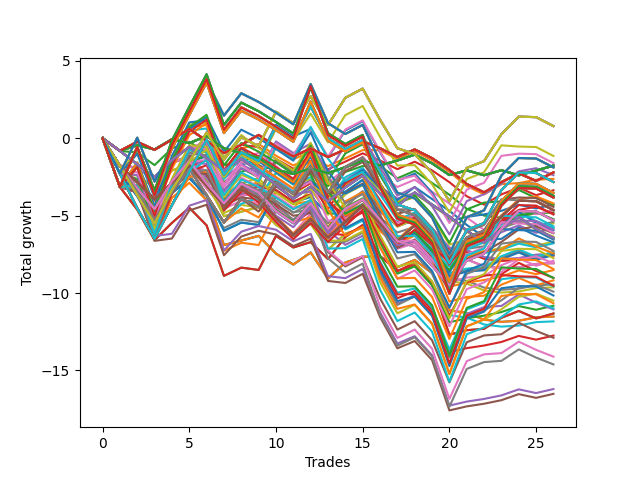

# Long HLT 123 
- Symbol: TSLA
- Date Range: 05/16/2022 - 05/17/2024
- Trading Period: 8:30-12:30
- Number of Trades: 26



| Id. | Name | Win Percent | Profit | Avg Profit / Trade | Avg Time / Trade | Std |      | Name | Win Percent | Profit | Avg Profit / Trade | Avg Time / Trade | Std |
| --- | ---- | ----------- | ------ | ------------------ | ---------------- | --- | ---- | ---- | ----------- | ------ | ------------------ | ---------------- | --- |
| | Sorted By <br> Profit | | | | | | | Sorted By <br> Win Percentage |||||
|0| TP-1.75 180m | 46.15 | 0.78 | 0.03 | 50:20 | 1.58 |     | TP-1.75 45m | 57.69 | -4.28 | -0.16 | 32:18 | 1.36 |
|1| TP-1.75 165m | 46.15 | 0.78 | 0.03 | 50:20 | 1.58 |     | TP-1.5 45m | 53.85 | -6.79 | -0.26 | 30:18 | 1.26 |
|2| TP-1.75 150m | 46.15 | 0.78 | 0.03 | 50:20 | 1.58 |     | TP-2 45m | 53.85 | -8.52 | -0.33 | 33:53 | 1.41 |
|3| TP-1.75 135m | 46.15 | 0.78 | 0.03 | 50:20 | 1.58 |     | TP-1.75 90m | 50.00 | -1.61 | -0.06 | 47:00 | 1.52 |
|4| TP-1.75 120m | 46.15 | 0.78 | 0.03 | 50:20 | 1.58 |     | TP-1.75 75m | 50.00 | -2.39 | -0.09 | 43:06 | 1.45 |
|5| TP-1.75 105m | 46.15 | -1.15 | -0.04 | 48:57 | 1.52 |     | TP-0.5 15m | 50.00 | -2.63 | -0.10 | 07:46 | 0.57 |
|6| TP-1.75 90m | 50.00 | -1.61 | -0.06 | 47:00 | 1.52 |     | TP-1.75 60m | 50.00 | -4.31 | -0.17 | 37:55 | 1.42 |
|7| TP-0.25 180m | 46.15 | -1.77 | -0.07 | 04:13 | 0.45 |     | TP-1.5 75m | 50.00 | -4.88 | -0.19 | 39:39 | 1.34 |
|8| TP-0.25 165m | 46.15 | -1.77 | -0.07 | 04:13 | 0.45 |     | TP-1 45m | 50.00 | -5.40 | -0.21 | 23:48 | 0.99 |
|9| TP-0.25 150m | 46.15 | -1.77 | -0.07 | 04:13 | 0.45 |     | TP-1.75 30m | 50.00 | -5.50 | -0.21 | 24:30 | 1.23 |
|10| TP-0.25 135m | 46.15 | -1.77 | -0.07 | 04:13 | 0.45 |     | TP-2 75m | 50.00 | -6.14 | -0.24 | 45:57 | 1.54 |
|11| TP-0.25 120m | 46.15 | -1.77 | -0.07 | 04:13 | 0.45 |     | TP-1.25 45m | 50.00 | -6.68 | -0.26 | 26:53 | 1.11 |
|12| TP-0.25 105m | 46.15 | -1.77 | -0.07 | 04:13 | 0.45 |     | TP-2 30m | 50.00 | -7.34 | -0.28 | 25:13 | 1.29 |
|13| TP-0.25 90m | 46.15 | -1.77 | -0.07 | 04:13 | 0.45 |     | TP-1.5 30m | 50.00 | -7.42 | -0.29 | 23:30 | 1.18 |
|14| TP-0.25 75m | 46.15 | -1.77 | -0.07 | 04:13 | 0.45 |     | TP-2.25 30m | 50.00 | -7.54 | -0.29 | 25:18 | 1.30 |
|15| TP-0.25 60m | 46.15 | -1.77 | -0.07 | 04:13 | 0.45 |     | TP-2.25 75m | 50.00 | -8.08 | -0.31 | 49:46 | 1.53 |
|16| TP-0.25 45m | 46.15 | -1.77 | -0.07 | 04:13 | 0.45 |     | TP-2.5 30m | 50.00 | -9.18 | -0.35 | 25:36 | 1.49 |
|17| TP-0.25 30m | 46.15 | -1.77 | -0.07 | 04:13 | 0.45 |     | TP-2.5 75m | 50.00 | -9.91 | -0.38 | 50:13 | 1.71 |
|18| TP-0.25 15m | 46.15 | -1.77 | -0.07 | 04:13 | 0.45 |     | TP-2.75 75m | 50.00 | -10.49 | -0.40 | 52:46 | 1.87 |
|19| TP-2.25 180m | 42.31 | -1.89 | -0.07 | 61:53 | 1.80 |     | TP-2.25 45m | 50.00 | -10.82 | -0.42 | 35:36 | 1.37 |
|20| TP-2.25 165m | 42.31 | -1.89 | -0.07 | 61:53 | 1.80 |     | TP-3 75m | 50.00 | -10.99 | -0.42 | 53:09 | 1.90 |
|21| TP-2.25 150m | 42.31 | -1.89 | -0.07 | 61:53 | 1.80 |     | TP-3 30m | 50.00 | -11.32 | -0.44 | 26:36 | 1.43 |
|22| TP-2.25 135m | 42.31 | -1.89 | -0.07 | 61:53 | 1.80 |     | TP-2.75 30m | 50.00 | -11.32 | -0.44 | 26:36 | 1.43 |
|23| TP-2.25 120m | 42.31 | -1.89 | -0.07 | 61:53 | 1.80 |     | TP-2.5 45m | 50.00 | -12.75 | -0.49 | 35:57 | 1.56 |
|24| TP-0.5 180m | 46.15 | -2.21 | -0.09 | 11:02 | 0.62 |     | TP-2.75 45m | 50.00 | -16.20 | -0.62 | 37:43 | 1.48 |
|25| TP-0.5 165m | 46.15 | -2.21 | -0.09 | 11:02 | 0.62 |     | TP-3 45m | 50.00 | -16.51 | -0.64 | 37:57 | 1.50 |
|26| TP-0.5 150m | 46.15 | -2.21 | -0.09 | 11:02 | 0.62 |     | TP-1.75 180m | 46.15 | 0.78 | 0.03 | 50:20 | 1.58 |
|27| TP-0.5 135m | 46.15 | -2.21 | -0.09 | 11:02 | 0.62 |     | TP-1.75 165m | 46.15 | 0.78 | 0.03 | 50:20 | 1.58 |
|28| TP-0.5 120m | 46.15 | -2.21 | -0.09 | 11:02 | 0.62 |     | TP-1.75 150m | 46.15 | 0.78 | 0.03 | 50:20 | 1.58 |
|29| TP-0.5 105m | 46.15 | -2.21 | -0.09 | 11:02 | 0.62 |     | TP-1.75 135m | 46.15 | 0.78 | 0.03 | 50:20 | 1.58 |
|30| TP-0.5 90m | 46.15 | -2.21 | -0.09 | 11:02 | 0.62 |     | TP-1.75 120m | 46.15 | 0.78 | 0.03 | 50:20 | 1.58 |
|31| TP-0.5 75m | 46.15 | -2.21 | -0.09 | 11:02 | 0.62 |     | TP-1.75 105m | 46.15 | -1.15 | -0.04 | 48:57 | 1.52 |
|32| TP-0.5 60m | 46.15 | -2.21 | -0.09 | 11:02 | 0.62 |     | TP-0.25 180m | 46.15 | -1.77 | -0.07 | 04:13 | 0.45 |
|33| TP-0.5 45m | 46.15 | -2.21 | -0.09 | 11:02 | 0.62 |     | TP-0.25 165m | 46.15 | -1.77 | -0.07 | 04:13 | 0.45 |
|34| TP-1.75 75m | 50.00 | -2.39 | -0.09 | 43:06 | 1.45 |     | TP-0.25 150m | 46.15 | -1.77 | -0.07 | 04:13 | 0.45 |
|35| TP-0.5 15m | 50.00 | -2.63 | -0.10 | 07:46 | 0.57 |     | TP-0.25 135m | 46.15 | -1.77 | -0.07 | 04:13 | 0.45 |
|36| TP-2 180m | 42.31 | -2.83 | -0.11 | 55:46 | 1.71 |     | TP-0.25 120m | 46.15 | -1.77 | -0.07 | 04:13 | 0.45 |
|37| TP-2 165m | 42.31 | -2.83 | -0.11 | 55:46 | 1.71 |     | TP-0.25 105m | 46.15 | -1.77 | -0.07 | 04:13 | 0.45 |
|38| TP-2 150m | 42.31 | -2.83 | -0.11 | 55:46 | 1.71 |     | TP-0.25 90m | 46.15 | -1.77 | -0.07 | 04:13 | 0.45 |
|39| TP-2 135m | 42.31 | -2.83 | -0.11 | 55:46 | 1.71 |     | TP-0.25 75m | 46.15 | -1.77 | -0.07 | 04:13 | 0.45 |
|40| TP-2 120m | 42.31 | -2.83 | -0.11 | 55:46 | 1.71 |     | TP-0.25 60m | 46.15 | -1.77 | -0.07 | 04:13 | 0.45 |
|41| TP-0.5 30m | 42.31 | -3.36 | -0.13 | 10:30 | 0.59 |     | TP-0.25 45m | 46.15 | -1.77 | -0.07 | 04:13 | 0.45 |
|42| TP-2.5 180m | 42.31 | -3.53 | -0.14 | 62:27 | 1.98 |     | TP-0.25 30m | 46.15 | -1.77 | -0.07 | 04:13 | 0.45 |
|43| TP-2.5 165m | 42.31 | -3.53 | -0.14 | 62:27 | 1.98 |     | TP-0.25 15m | 46.15 | -1.77 | -0.07 | 04:13 | 0.45 |
|44| TP-2.5 150m | 42.31 | -3.53 | -0.14 | 62:27 | 1.98 |     | TP-0.5 180m | 46.15 | -2.21 | -0.09 | 11:02 | 0.62 |
|45| TP-2.5 135m | 42.31 | -3.53 | -0.14 | 62:27 | 1.98 |     | TP-0.5 165m | 46.15 | -2.21 | -0.09 | 11:02 | 0.62 |
|46| TP-2.5 120m | 42.31 | -3.53 | -0.14 | 62:27 | 1.98 |     | TP-0.5 150m | 46.15 | -2.21 | -0.09 | 11:02 | 0.62 |
|47| TP-2.75 180m | 42.31 | -3.72 | -0.14 | 65:11 | 2.14 |     | TP-0.5 135m | 46.15 | -2.21 | -0.09 | 11:02 | 0.62 |
|48| TP-2.75 165m | 42.31 | -3.72 | -0.14 | 65:11 | 2.14 |     | TP-0.5 120m | 46.15 | -2.21 | -0.09 | 11:02 | 0.62 |
|49| TP-2.75 150m | 42.31 | -3.72 | -0.14 | 65:11 | 2.14 |     | TP-0.5 105m | 46.15 | -2.21 | -0.09 | 11:02 | 0.62 |
|50| TP-2.75 135m | 42.31 | -3.72 | -0.14 | 65:11 | 2.14 |     | TP-0.5 90m | 46.15 | -2.21 | -0.09 | 11:02 | 0.62 |
|51| TP-2.75 120m | 42.31 | -3.72 | -0.14 | 65:11 | 2.14 |     | TP-0.5 75m | 46.15 | -2.21 | -0.09 | 11:02 | 0.62 |
|52| TP-1.5 180m | 42.31 | -3.82 | -0.15 | 44:50 | 1.43 |     | TP-0.5 60m | 46.15 | -2.21 | -0.09 | 11:02 | 0.62 |
|53| TP-1.5 165m | 42.31 | -3.82 | -0.15 | 44:50 | 1.43 |     | TP-0.5 45m | 46.15 | -2.21 | -0.09 | 11:02 | 0.62 |
|54| TP-1.5 150m | 42.31 | -3.82 | -0.15 | 44:50 | 1.43 |     | TP-1 75m | 46.15 | -4.21 | -0.16 | 29:09 | 1.06 |
|55| TP-1.5 135m | 42.31 | -3.82 | -0.15 | 44:50 | 1.43 |     | TP-1.5 90m | 46.15 | -4.44 | -0.17 | 42:27 | 1.41 |
|56| TP-1.5 120m | 42.31 | -3.82 | -0.15 | 44:50 | 1.43 |     | TP-1.25 75m | 46.15 | -5.23 | -0.20 | 34:11 | 1.18 |
|57| TP-3 180m | 42.31 | -3.83 | -0.15 | 65:36 | 2.19 |     | TP-2 90m | 46.15 | -7.28 | -0.28 | 50:53 | 1.62 |
|58| TP-3 165m | 42.31 | -3.83 | -0.15 | 65:36 | 2.19 |     | TP-1.5 60m | 46.15 | -7.44 | -0.29 | 35:18 | 1.30 |
|59| TP-3 150m | 42.31 | -3.83 | -0.15 | 65:36 | 2.19 |     | TP-1 30m | 46.15 | -7.45 | -0.29 | 19:04 | 0.93 |
|60| TP-3 135m | 42.31 | -3.83 | -0.15 | 65:36 | 2.19 |     | TP-2.25 90m | 46.15 | -7.75 | -0.30 | 55:16 | 1.65 |
|61| TP-3 120m | 42.31 | -3.83 | -0.15 | 65:36 | 2.19 |     | TP-1.25 30m | 46.15 | -7.92 | -0.30 | 21:04 | 1.07 |
|62| TP-1 75m | 46.15 | -4.21 | -0.16 | 29:09 | 1.06 |     | TP-2 60m | 46.15 | -9.02 | -0.35 | 40:11 | 1.50 |
|63| TP-1.75 45m | 57.69 | -4.28 | -0.16 | 32:18 | 1.36 |     | TP-2.5 90m | 46.15 | -9.58 | -0.37 | 55:43 | 1.82 |
|64| TP-1.75 60m | 50.00 | -4.31 | -0.17 | 37:55 | 1.42 |     | TP-2.75 90m | 46.15 | -10.16 | -0.39 | 58:16 | 1.97 |
|65| TP-1.5 90m | 46.15 | -4.44 | -0.17 | 42:27 | 1.41 |     | TP-3 90m | 46.15 | -10.66 | -0.41 | 58:39 | 1.99 |
|66| TP-1.5 105m | 42.31 | -4.63 | -0.18 | 43:50 | 1.40 |     | TP-2.25 180m | 42.31 | -1.89 | -0.07 | 61:53 | 1.80 |
|67| TP-1 180m | 42.31 | -4.65 | -0.18 | 30:25 | 1.06 |     | TP-2.25 165m | 42.31 | -1.89 | -0.07 | 61:53 | 1.80 |
|68| TP-1 165m | 42.31 | -4.65 | -0.18 | 30:25 | 1.06 |     | TP-2.25 150m | 42.31 | -1.89 | -0.07 | 61:53 | 1.80 |
|69| TP-1 150m | 42.31 | -4.65 | -0.18 | 30:25 | 1.06 |     | TP-2.25 135m | 42.31 | -1.89 | -0.07 | 61:53 | 1.80 |
|70| TP-1 135m | 42.31 | -4.65 | -0.18 | 30:25 | 1.06 |     | TP-2.25 120m | 42.31 | -1.89 | -0.07 | 61:53 | 1.80 |
|71| TP-1 120m | 42.31 | -4.65 | -0.18 | 30:25 | 1.06 |     | TP-2 180m | 42.31 | -2.83 | -0.11 | 55:46 | 1.71 |
|72| TP-1 105m | 42.31 | -4.65 | -0.18 | 30:25 | 1.06 |     | TP-2 165m | 42.31 | -2.83 | -0.11 | 55:46 | 1.71 |
|73| TP-0.75 45m | 42.31 | -4.65 | -0.18 | 19:13 | 0.77 |     | TP-2 150m | 42.31 | -2.83 | -0.11 | 55:46 | 1.71 |
|74| TP-0.75 15m | 42.31 | -4.80 | -0.18 | 10:27 | 0.63 |     | TP-2 135m | 42.31 | -2.83 | -0.11 | 55:46 | 1.71 |
|75| TP-1.5 75m | 50.00 | -4.88 | -0.19 | 39:39 | 1.34 |     | TP-2 120m | 42.31 | -2.83 | -0.11 | 55:46 | 1.71 |
|76| TP-1 90m | 42.31 | -4.93 | -0.19 | 30:11 | 1.07 |     | TP-0.5 30m | 42.31 | -3.36 | -0.13 | 10:30 | 0.59 |
|77| TP-1.25 75m | 46.15 | -5.23 | -0.20 | 34:11 | 1.18 |     | TP-2.5 180m | 42.31 | -3.53 | -0.14 | 62:27 | 1.98 |
|78| TP-1.25 180m | 38.46 | -5.31 | -0.20 | 39:13 | 1.23 |     | TP-2.5 165m | 42.31 | -3.53 | -0.14 | 62:27 | 1.98 |
|79| TP-1.25 165m | 38.46 | -5.31 | -0.20 | 39:13 | 1.23 |     | TP-2.5 150m | 42.31 | -3.53 | -0.14 | 62:27 | 1.98 |
|80| TP-1.25 150m | 38.46 | -5.31 | -0.20 | 39:13 | 1.23 |     | TP-2.5 135m | 42.31 | -3.53 | -0.14 | 62:27 | 1.98 |
|81| TP-1.25 135m | 38.46 | -5.31 | -0.20 | 39:13 | 1.23 |     | TP-2.5 120m | 42.31 | -3.53 | -0.14 | 62:27 | 1.98 |
|82| TP-1.25 120m | 38.46 | -5.31 | -0.20 | 39:13 | 1.23 |     | TP-2.75 180m | 42.31 | -3.72 | -0.14 | 65:11 | 2.14 |
|83| TP-1 45m | 50.00 | -5.40 | -0.21 | 23:48 | 0.99 |     | TP-2.75 165m | 42.31 | -3.72 | -0.14 | 65:11 | 2.14 |
|84| TP-1.75 30m | 50.00 | -5.50 | -0.21 | 24:30 | 1.23 |     | TP-2.75 150m | 42.31 | -3.72 | -0.14 | 65:11 | 2.14 |
|85| TP-2 105m | 42.31 | -5.69 | -0.22 | 53:36 | 1.66 |     | TP-2.75 135m | 42.31 | -3.72 | -0.14 | 65:11 | 2.14 |
|86| TP-1 60m | 42.31 | -5.79 | -0.22 | 27:02 | 1.03 |     | TP-2.75 120m | 42.31 | -3.72 | -0.14 | 65:11 | 2.14 |
|87| TP-0.75 30m | 38.46 | -5.79 | -0.22 | 16:02 | 0.74 |     | TP-1.5 180m | 42.31 | -3.82 | -0.15 | 44:50 | 1.43 |
|88| TP-1.25 90m | 42.31 | -5.93 | -0.23 | 36:50 | 1.21 |     | TP-1.5 165m | 42.31 | -3.82 | -0.15 | 44:50 | 1.43 |
|89| TP-0.75 75m | 34.62 | -5.95 | -0.23 | 23:06 | 0.80 |     | TP-1.5 150m | 42.31 | -3.82 | -0.15 | 44:50 | 1.43 |
|90| TP-1.25 105m | 38.46 | -6.12 | -0.24 | 38:13 | 1.20 |     | TP-1.5 135m | 42.31 | -3.82 | -0.15 | 44:50 | 1.43 |
|91| TP-2 75m | 50.00 | -6.14 | -0.24 | 45:57 | 1.54 |     | TP-1.5 120m | 42.31 | -3.82 | -0.15 | 44:50 | 1.43 |
|92| TP-0.75 60m | 34.62 | -6.36 | -0.24 | 21:41 | 0.79 |     | TP-3 180m | 42.31 | -3.83 | -0.15 | 65:36 | 2.19 |
|93| TP-0.75 180m | 34.62 | -6.44 | -0.25 | 23:55 | 0.81 |     | TP-3 165m | 42.31 | -3.83 | -0.15 | 65:36 | 2.19 |
|94| TP-0.75 165m | 34.62 | -6.44 | -0.25 | 23:55 | 0.81 |     | TP-3 150m | 42.31 | -3.83 | -0.15 | 65:36 | 2.19 |
|95| TP-0.75 150m | 34.62 | -6.44 | -0.25 | 23:55 | 0.81 |     | TP-3 135m | 42.31 | -3.83 | -0.15 | 65:36 | 2.19 |
|96| TP-0.75 135m | 34.62 | -6.44 | -0.25 | 23:55 | 0.81 |     | TP-3 120m | 42.31 | -3.83 | -0.15 | 65:36 | 2.19 |
|97| TP-0.75 120m | 34.62 | -6.44 | -0.25 | 23:55 | 0.81 |     | TP-1.5 105m | 42.31 | -4.63 | -0.18 | 43:50 | 1.40 |
|98| TP-0.75 105m | 34.62 | -6.44 | -0.25 | 23:55 | 0.81 |     | TP-1 180m | 42.31 | -4.65 | -0.18 | 30:25 | 1.06 |
|99| TP-0.75 90m | 34.62 | -6.44 | -0.25 | 23:55 | 0.81 |     | TP-1 165m | 42.31 | -4.65 | -0.18 | 30:25 | 1.06 |
|100| TP-2.25 105m | 42.31 | -6.55 | -0.25 | 59:09 | 1.67 |     | TP-1 150m | 42.31 | -4.65 | -0.18 | 30:25 | 1.06 |
|101| TP-1.25 45m | 50.00 | -6.68 | -0.26 | 26:53 | 1.11 |     | TP-1 135m | 42.31 | -4.65 | -0.18 | 30:25 | 1.06 |
|102| TP-1.25 60m | 42.31 | -6.73 | -0.26 | 30:43 | 1.17 |     | TP-1 120m | 42.31 | -4.65 | -0.18 | 30:25 | 1.06 |
|103| TP-1.5 45m | 53.85 | -6.79 | -0.26 | 30:18 | 1.26 |     | TP-1 105m | 42.31 | -4.65 | -0.18 | 30:25 | 1.06 |
|104| TP-2 90m | 46.15 | -7.28 | -0.28 | 50:53 | 1.62 |     | TP-0.75 45m | 42.31 | -4.65 | -0.18 | 19:13 | 0.77 |
|105| TP-2 30m | 50.00 | -7.34 | -0.28 | 25:13 | 1.29 |     | TP-0.75 15m | 42.31 | -4.80 | -0.18 | 10:27 | 0.63 |
|106| TP-1.5 30m | 50.00 | -7.42 | -0.29 | 23:30 | 1.18 |     | TP-1 90m | 42.31 | -4.93 | -0.19 | 30:11 | 1.07 |
|107| TP-1.5 60m | 46.15 | -7.44 | -0.29 | 35:18 | 1.30 |     | TP-2 105m | 42.31 | -5.69 | -0.22 | 53:36 | 1.66 |
|108| TP-1 30m | 46.15 | -7.45 | -0.29 | 19:04 | 0.93 |     | TP-1 60m | 42.31 | -5.79 | -0.22 | 27:02 | 1.03 |
|109| TP-1.25 15m | 42.31 | -7.47 | -0.29 | 12:27 | 0.81 |     | TP-1.25 90m | 42.31 | -5.93 | -0.23 | 36:50 | 1.21 |
|110| TP-2.25 30m | 50.00 | -7.54 | -0.29 | 25:18 | 1.30 |     | TP-2.25 105m | 42.31 | -6.55 | -0.25 | 59:09 | 1.67 |
|111| TP-1 15m | 42.31 | -7.59 | -0.29 | 11:36 | 0.79 |     | TP-1.25 60m | 42.31 | -6.73 | -0.26 | 30:43 | 1.17 |
|112| TP-2.25 90m | 46.15 | -7.75 | -0.30 | 55:16 | 1.65 |     | TP-1.25 15m | 42.31 | -7.47 | -0.29 | 12:27 | 0.81 |
|113| TP-1.25 30m | 46.15 | -7.92 | -0.30 | 21:04 | 1.07 |     | TP-1 15m | 42.31 | -7.59 | -0.29 | 11:36 | 0.79 |
|114| TP-1.75 15m | 42.31 | -8.07 | -0.31 | 13:02 | 0.85 |     | TP-1.75 15m | 42.31 | -8.07 | -0.31 | 13:02 | 0.85 |
|115| TP-1.5 15m | 42.31 | -8.07 | -0.31 | 13:02 | 0.85 |     | TP-1.5 15m | 42.31 | -8.07 | -0.31 | 13:02 | 0.85 |
|116| TP-2.25 75m | 50.00 | -8.08 | -0.31 | 49:46 | 1.53 |     | TP-2.5 105m | 42.31 | -8.45 | -0.32 | 59:39 | 1.84 |
|117| TP-2.5 105m | 42.31 | -8.45 | -0.32 | 59:39 | 1.84 |     | TP-2.75 105m | 42.31 | -9.03 | -0.35 | 62:11 | 1.99 |
|118| TP-2 45m | 53.85 | -8.52 | -0.33 | 33:53 | 1.41 |     | TP-2 15m | 42.31 | -9.45 | -0.36 | 13:23 | 0.95 |
|119| TP-2 60m | 46.15 | -9.02 | -0.35 | 40:11 | 1.50 |     | TP-3 105m | 42.31 | -9.53 | -0.37 | 62:34 | 2.01 |
|120| TP-2.75 105m | 42.31 | -9.03 | -0.35 | 62:11 | 1.99 |     | TP-2.25 15m | 42.31 | -9.63 | -0.37 | 13:25 | 0.96 |
|121| TP-2.5 30m | 50.00 | -9.18 | -0.35 | 25:36 | 1.49 |     | TP-2.25 60m | 42.31 | -11.06 | -0.43 | 43:11 | 1.49 |
|122| TP-2 15m | 42.31 | -9.45 | -0.36 | 13:23 | 0.95 |     | TP-3 15m | 42.31 | -11.52 | -0.44 | 13:43 | 1.12 |
|123| TP-3 105m | 42.31 | -9.53 | -0.37 | 62:34 | 2.01 |     | TP-2.75 15m | 42.31 | -11.52 | -0.44 | 13:43 | 1.12 |
|124| TP-2.5 90m | 46.15 | -9.58 | -0.37 | 55:43 | 1.82 |     | TP-2.5 15m | 42.31 | -11.83 | -0.46 | 13:41 | 1.15 |
|125| TP-2.25 15m | 42.31 | -9.63 | -0.37 | 13:25 | 0.96 |     | TP-2.5 60m | 42.31 | -12.89 | -0.50 | 43:39 | 1.67 |
|126| TP-2.5 75m | 50.00 | -9.91 | -0.38 | 50:13 | 1.71 |     | TP-2.75 60m | 42.31 | -14.11 | -0.54 | 46:06 | 1.79 |
|127| TP-2.75 90m | 46.15 | -10.16 | -0.39 | 58:16 | 1.97 |     | TP-3 60m | 42.31 | -14.61 | -0.56 | 46:30 | 1.81 |
|128| TP-2.75 75m | 50.00 | -10.49 | -0.40 | 52:46 | 1.87 |     | TP-1.25 180m | 38.46 | -5.31 | -0.20 | 39:13 | 1.23 |
|129| TP-3 90m | 46.15 | -10.66 | -0.41 | 58:39 | 1.99 |     | TP-1.25 165m | 38.46 | -5.31 | -0.20 | 39:13 | 1.23 |
|130| TP-2.25 45m | 50.00 | -10.82 | -0.42 | 35:36 | 1.37 |     | TP-1.25 150m | 38.46 | -5.31 | -0.20 | 39:13 | 1.23 |
|131| TP-3 75m | 50.00 | -10.99 | -0.42 | 53:09 | 1.90 |     | TP-1.25 135m | 38.46 | -5.31 | -0.20 | 39:13 | 1.23 |
|132| TP-2.25 60m | 42.31 | -11.06 | -0.43 | 43:11 | 1.49 |     | TP-1.25 120m | 38.46 | -5.31 | -0.20 | 39:13 | 1.23 |
|133| TP-3 30m | 50.00 | -11.32 | -0.44 | 26:36 | 1.43 |     | TP-0.75 30m | 38.46 | -5.79 | -0.22 | 16:02 | 0.74 |
|134| TP-2.75 30m | 50.00 | -11.32 | -0.44 | 26:36 | 1.43 |     | TP-1.25 105m | 38.46 | -6.12 | -0.24 | 38:13 | 1.20 |
|135| TP-3 15m | 42.31 | -11.52 | -0.44 | 13:43 | 1.12 |     | TP-0.75 75m | 34.62 | -5.95 | -0.23 | 23:06 | 0.80 |
|136| TP-2.75 15m | 42.31 | -11.52 | -0.44 | 13:43 | 1.12 |     | TP-0.75 60m | 34.62 | -6.36 | -0.24 | 21:41 | 0.79 |
|137| TP-2.5 15m | 42.31 | -11.83 | -0.46 | 13:41 | 1.15 |     | TP-0.75 180m | 34.62 | -6.44 | -0.25 | 23:55 | 0.81 |
|138| TP-2.5 45m | 50.00 | -12.75 | -0.49 | 35:57 | 1.56 |     | TP-0.75 165m | 34.62 | -6.44 | -0.25 | 23:55 | 0.81 |
|139| TP-2.5 60m | 42.31 | -12.89 | -0.50 | 43:39 | 1.67 |     | TP-0.75 150m | 34.62 | -6.44 | -0.25 | 23:55 | 0.81 |
|140| TP-2.75 60m | 42.31 | -14.11 | -0.54 | 46:06 | 1.79 |     | TP-0.75 135m | 34.62 | -6.44 | -0.25 | 23:55 | 0.81 |
|141| TP-3 60m | 42.31 | -14.61 | -0.56 | 46:30 | 1.81 |     | TP-0.75 120m | 34.62 | -6.44 | -0.25 | 23:55 | 0.81 |
|142| TP-2.75 45m | 50.00 | -16.20 | -0.62 | 37:43 | 1.48 |     | TP-0.75 105m | 34.62 | -6.44 | -0.25 | 23:55 | 0.81 |
|143| TP-3 45m | 50.00 | -16.51 | -0.64 | 37:57 | 1.50 |     | TP-0.75 90m | 34.62 | -6.44 | -0.25 | 23:55 | 0.81 |

### Test TP-0.25 15m
* Take Profit of 0.25 Point
* 0.25 Stoploss
* Results:
```
Total Trades: 26
Percent Up: 46.15
Percent Down: 53.85
Total Points Moved Up: -1.77
Potential Profit: -885.00
Total Points Ups: 4.61 Count Ups: 12
Total Points Downs: -6.38 Count Downs: 14
```

<details><summary>Trades</summary>

<code>In: 2022-05-18 08:45:00		Out: 2022-05-18 08:47:00		Total Position Time: 02:00		Total Move Up: -0.82		Total to Date: -0.82</code> <br />
<code>In: 2022-06-23 10:10:00		Out: 2022-06-23 10:13:00		Total Position Time: 03:00		Total Move Up: 0.37		Total to Date: -0.45</code> <br />
<code>In: 2022-07-18 11:20:00		Out: 2022-07-18 11:23:00		Total Position Time: 03:00		Total Move Up: -0.28		Total to Date: -0.73</code> <br />
<code>In: 2022-08-01 11:00:00		Out: 2022-08-01 11:04:00		Total Position Time: 04:00		Total Move Up: 0.66		Total to Date: -0.07</code> <br />
<code>In: 2022-08-25 12:00:00		Out: 2022-08-25 12:02:00		Total Position Time: 02:00		Total Move Up: -0.25		Total to Date: -0.32</code> <br />
<code>In: 2022-09-01 08:35:00		Out: 2022-09-01 08:37:00		Total Position Time: 02:00		Total Move Up: 0.46		Total to Date: 0.14</code> <br />
<code>In: 2022-11-02 12:10:00		Out: 2022-11-02 12:12:00		Total Position Time: 02:00		Total Move Up: -0.79		Total to Date: -0.65</code> <br />
<code>In: 2022-11-22 11:25:00		Out: 2022-11-22 11:31:00		Total Position Time: 06:00		Total Move Up: -0.30		Total to Date: -0.95</code> <br />
<code>In: 2022-12-12 11:15:00		Out: 2022-12-12 11:17:00		Total Position Time: 02:00		Total Move Up: -0.32		Total to Date: -1.27</code> <br />
<code>In: 2022-12-14 11:45:00		Out: 2022-12-14 11:47:00		Total Position Time: 02:00		Total Move Up: -0.76		Total to Date: -2.03</code> <br />
<code>In: 2023-03-09 12:35:00		Out: 2023-03-09 12:37:00		Total Position Time: 02:00		Total Move Up: -0.28		Total to Date: -2.31</code> <br />
<code>In: 2023-03-15 10:10:00		Out: 2023-03-15 10:12:00		Total Position Time: 02:00		Total Move Up: 0.36		Total to Date: -1.95</code> <br />
<code>In: 2023-03-23 10:45:00		Out: 2023-03-23 10:48:00		Total Position Time: 03:00		Total Move Up: -0.31		Total to Date: -2.26</code> <br />
<code>In: 2023-05-23 09:55:00		Out: 2023-05-23 09:57:00		Total Position Time: 02:00		Total Move Up: 0.39		Total to Date: -1.87</code> <br />
<code>In: 2023-05-25 12:10:00		Out: 2023-05-25 12:21:00		Total Position Time: 11:00		Total Move Up: 0.42		Total to Date: -1.45</code> <br />
<code>In: 2023-07-27 10:45:00		Out: 2023-07-27 10:58:00		Total Position Time: 13:00		Total Move Up: -0.31		Total to Date: -1.76</code> <br />
<code>In: 2023-07-27 12:15:00		Out: 2023-07-27 12:20:00		Total Position Time: 05:00		Total Move Up: 0.32		Total to Date: -1.44</code> <br />
<code>In: 2023-08-15 10:55:00		Out: 2023-08-15 10:58:00		Total Position Time: 03:00		Total Move Up: 0.38		Total to Date: -1.06</code> <br />
<code>In: 2023-08-17 12:30:00		Out: 2023-08-17 12:33:00		Total Position Time: 03:00		Total Move Up: -0.56		Total to Date: -1.62</code> <br />
<code>In: 2023-09-08 10:00:00		Out: 2023-09-08 10:02:00		Total Position Time: 02:00		Total Move Up: -0.76		Total to Date: -2.38</code> <br />
<code>In: 2023-09-27 10:35:00		Out: 2023-09-27 10:39:00		Total Position Time: 04:00		Total Move Up: 0.30		Total to Date: -2.08</code> <br />
<code>In: 2023-10-19 12:05:00		Out: 2023-10-19 12:13:00		Total Position Time: 08:00		Total Move Up: -0.31		Total to Date: -2.39</code> <br />
<code>In: 2023-11-16 11:15:00		Out: 2023-11-16 11:19:00		Total Position Time: 04:00		Total Move Up: 0.32		Total to Date: -2.07</code> <br />
<code>In: 2023-12-11 09:05:00		Out: 2023-12-11 09:11:00		Total Position Time: 06:00		Total Move Up: -0.33		Total to Date: -2.40</code> <br />
<code>In: 2024-02-13 11:30:00		Out: 2024-02-13 11:35:00		Total Position Time: 05:00		Total Move Up: 0.31		Total to Date: -2.09</code> <br />
<code>In: 2024-02-23 11:30:00		Out: 2024-02-23 11:39:00		Total Position Time: 09:00		Total Move Up: 0.32		Total to Date: -1.77</code> <br />


</details>

### Test TP-0.5 15m
* Take Profit of 0.5 Point
* 0.5 Stoploss
* Results:
```
Total Trades: 26
Percent Up: 50.00
Percent Down: 50.00
Total Points Moved Up: -2.63
Potential Profit: -1315.00
Total Points Ups: 5.56 Count Ups: 13
Total Points Downs: -8.19 Count Downs: 13
```

<details><summary>Trades</summary>

<code>In: 2022-05-18 08:45:00		Out: 2022-05-18 08:47:00		Total Position Time: 02:00		Total Move Up: -0.82		Total to Date: -0.82</code> <br />
<code>In: 2022-06-23 10:10:00		Out: 2022-06-23 10:18:00		Total Position Time: 08:00		Total Move Up: 0.59		Total to Date: -0.23</code> <br />
<code>In: 2022-07-18 11:20:00		Out: 2022-07-18 11:27:00		Total Position Time: 07:00		Total Move Up: -0.52		Total to Date: -0.75</code> <br />
<code>In: 2022-08-01 11:00:00		Out: 2022-08-01 11:04:00		Total Position Time: 04:00		Total Move Up: 0.66		Total to Date: -0.09</code> <br />
<code>In: 2022-08-25 12:00:00		Out: 2022-08-25 12:07:00		Total Position Time: 07:00		Total Move Up: 0.69		Total to Date: 0.60</code> <br />
<code>In: 2022-09-01 08:35:00		Out: 2022-09-01 08:41:00		Total Position Time: 06:00		Total Move Up: -0.77		Total to Date: -0.17</code> <br />
<code>In: 2022-11-02 12:10:00		Out: 2022-11-02 12:12:00		Total Position Time: 02:00		Total Move Up: -0.79		Total to Date: -0.96</code> <br />
<code>In: 2022-11-22 11:25:00		Out: 2022-11-22 11:39:00		Total Position Time: 14:00		Total Move Up: 0.29		Total to Date: -0.67</code> <br />
<code>In: 2022-12-12 11:15:00		Out: 2022-12-12 11:29:00		Total Position Time: 14:00		Total Move Up: 0.30		Total to Date: -0.37</code> <br />
<code>In: 2022-12-14 11:45:00		Out: 2022-12-14 11:47:00		Total Position Time: 02:00		Total Move Up: -0.76		Total to Date: -1.13</code> <br />
<code>In: 2023-03-09 12:35:00		Out: 2023-03-09 12:41:00		Total Position Time: 06:00		Total Move Up: -0.63		Total to Date: -1.76</code> <br />
<code>In: 2023-03-15 10:10:00		Out: 2023-03-15 10:16:00		Total Position Time: 06:00		Total Move Up: 0.52		Total to Date: -1.24</code> <br />
<code>In: 2023-03-23 10:45:00		Out: 2023-03-23 10:49:00		Total Position Time: 04:00		Total Move Up: -0.56		Total to Date: -1.80</code> <br />
<code>In: 2023-05-23 09:55:00		Out: 2023-05-23 09:58:00		Total Position Time: 03:00		Total Move Up: 0.50		Total to Date: -1.30</code> <br />
<code>In: 2023-05-25 12:10:00		Out: 2023-05-25 12:22:00		Total Position Time: 12:00		Total Move Up: 0.53		Total to Date: -0.77</code> <br />
<code>In: 2023-07-27 10:45:00		Out: 2023-07-27 10:59:00		Total Position Time: 14:00		Total Move Up: -0.01		Total to Date: -0.78</code> <br />
<code>In: 2023-07-27 12:15:00		Out: 2023-07-27 12:24:00		Total Position Time: 09:00		Total Move Up: -0.56		Total to Date: -1.34</code> <br />
<code>In: 2023-08-15 10:55:00		Out: 2023-08-15 11:09:00		Total Position Time: 14:00		Total Move Up: 0.48		Total to Date: -0.86</code> <br />
<code>In: 2023-08-17 12:30:00		Out: 2023-08-17 12:33:00		Total Position Time: 03:00		Total Move Up: -0.56		Total to Date: -1.42</code> <br />
<code>In: 2023-09-08 10:00:00		Out: 2023-09-08 10:02:00		Total Position Time: 02:00		Total Move Up: -0.76		Total to Date: -2.18</code> <br />
<code>In: 2023-09-27 10:35:00		Out: 2023-09-27 10:42:00		Total Position Time: 07:00		Total Move Up: -0.91		Total to Date: -3.09</code> <br />
<code>In: 2023-10-19 12:05:00		Out: 2023-10-19 12:14:00		Total Position Time: 09:00		Total Move Up: -0.54		Total to Date: -3.63</code> <br />
<code>In: 2023-11-16 11:15:00		Out: 2023-11-16 11:20:00		Total Position Time: 05:00		Total Move Up: 0.66		Total to Date: -2.97</code> <br />
<code>In: 2023-12-11 09:05:00		Out: 2023-12-11 09:19:00		Total Position Time: 14:00		Total Move Up: 0.07		Total to Date: -2.90</code> <br />
<code>In: 2024-02-13 11:30:00		Out: 2024-02-13 11:44:00		Total Position Time: 14:00		Total Move Up: 0.22		Total to Date: -2.68</code> <br />
<code>In: 2024-02-23 11:30:00		Out: 2024-02-23 11:44:00		Total Position Time: 14:00		Total Move Up: 0.05		Total to Date: -2.63</code> <br />


</details>

### Test TP-0.75 15m
* Take Profit of 0.75 Point
* 0.75 Stoploss
* Results:
```
Total Trades: 26
Percent Up: 42.31
Percent Down: 57.69
Total Points Moved Up: -4.80
Potential Profit: -2400.00
Total Points Ups: 4.99 Count Ups: 11
Total Points Downs: -9.79 Count Downs: 15
```

<details><summary>Trades</summary>

<code>In: 2022-05-18 08:45:00		Out: 2022-05-18 08:47:00		Total Position Time: 02:00		Total Move Up: -0.82		Total to Date: -0.82</code> <br />
<code>In: 2022-06-23 10:10:00		Out: 2022-06-23 10:24:00		Total Position Time: 14:00		Total Move Up: -0.11		Total to Date: -0.93</code> <br />
<code>In: 2022-07-18 11:20:00		Out: 2022-07-18 11:30:00		Total Position Time: 10:00		Total Move Up: -0.81		Total to Date: -1.74</code> <br />
<code>In: 2022-08-01 11:00:00		Out: 2022-08-01 11:07:00		Total Position Time: 07:00		Total Move Up: 1.08		Total to Date: -0.66</code> <br />
<code>In: 2022-08-25 12:00:00		Out: 2022-08-25 12:14:00		Total Position Time: 14:00		Total Move Up: 0.43		Total to Date: -0.23</code> <br />
<code>In: 2022-09-01 08:35:00		Out: 2022-09-01 08:42:00		Total Position Time: 07:00		Total Move Up: -0.73		Total to Date: -0.96</code> <br />
<code>In: 2022-11-02 12:10:00		Out: 2022-11-02 12:12:00		Total Position Time: 02:00		Total Move Up: -0.79		Total to Date: -1.75</code> <br />
<code>In: 2022-11-22 11:25:00		Out: 2022-11-22 11:39:00		Total Position Time: 14:00		Total Move Up: 0.29		Total to Date: -1.46</code> <br />
<code>In: 2022-12-12 11:15:00		Out: 2022-12-12 11:29:00		Total Position Time: 14:00		Total Move Up: 0.30		Total to Date: -1.16</code> <br />
<code>In: 2022-12-14 11:45:00		Out: 2022-12-14 11:48:00		Total Position Time: 03:00		Total Move Up: -0.85		Total to Date: -2.01</code> <br />
<code>In: 2023-03-09 12:35:00		Out: 2023-03-09 12:42:00		Total Position Time: 07:00		Total Move Up: -0.90		Total to Date: -2.91</code> <br />
<code>In: 2023-03-15 10:10:00		Out: 2023-03-15 10:24:00		Total Position Time: 14:00		Total Move Up: 0.78		Total to Date: -2.13</code> <br />
<code>In: 2023-03-23 10:45:00		Out: 2023-03-23 10:52:00		Total Position Time: 07:00		Total Move Up: -0.96		Total to Date: -3.09</code> <br />
<code>In: 2023-05-23 09:55:00		Out: 2023-05-23 10:08:00		Total Position Time: 13:00		Total Move Up: 0.91		Total to Date: -2.18</code> <br />
<code>In: 2023-05-25 12:10:00		Out: 2023-05-25 12:24:00		Total Position Time: 14:00		Total Move Up: 0.38		Total to Date: -1.80</code> <br />
<code>In: 2023-07-27 10:45:00		Out: 2023-07-27 10:59:00		Total Position Time: 14:00		Total Move Up: -0.01		Total to Date: -1.81</code> <br />
<code>In: 2023-07-27 12:15:00		Out: 2023-07-27 12:25:00		Total Position Time: 10:00		Total Move Up: -0.78		Total to Date: -2.59</code> <br />
<code>In: 2023-08-15 10:55:00		Out: 2023-08-15 11:09:00		Total Position Time: 14:00		Total Move Up: 0.48		Total to Date: -2.11</code> <br />
<code>In: 2023-08-17 12:30:00		Out: 2023-08-17 12:43:00		Total Position Time: 13:00		Total Move Up: -0.78		Total to Date: -2.89</code> <br />
<code>In: 2023-09-08 10:00:00		Out: 2023-09-08 10:02:00		Total Position Time: 02:00		Total Move Up: -0.76		Total to Date: -3.65</code> <br />
<code>In: 2023-09-27 10:35:00		Out: 2023-09-27 10:42:00		Total Position Time: 07:00		Total Move Up: -0.91		Total to Date: -4.56</code> <br />
<code>In: 2023-10-19 12:05:00		Out: 2023-10-19 12:19:00		Total Position Time: 14:00		Total Move Up: -0.44		Total to Date: -5.00</code> <br />
<code>In: 2023-11-16 11:15:00		Out: 2023-11-16 11:29:00		Total Position Time: 14:00		Total Move Up: -0.14		Total to Date: -5.14</code> <br />
<code>In: 2023-12-11 09:05:00		Out: 2023-12-11 09:19:00		Total Position Time: 14:00		Total Move Up: 0.07		Total to Date: -5.07</code> <br />
<code>In: 2024-02-13 11:30:00		Out: 2024-02-13 11:44:00		Total Position Time: 14:00		Total Move Up: 0.22		Total to Date: -4.85</code> <br />
<code>In: 2024-02-23 11:30:00		Out: 2024-02-23 11:44:00		Total Position Time: 14:00		Total Move Up: 0.05		Total to Date: -4.80</code> <br />


</details>

### Test TP-1 15m
* Take Profit of 1 Point
* 1 Stoploss
* Results:
```
Total Trades: 26
Percent Up: 42.31
Percent Down: 57.69
Total Points Moved Up: -7.59
Potential Profit: -3795.00
Total Points Ups: 5.11 Count Ups: 11
Total Points Downs: -12.70 Count Downs: 15
```

<details><summary>Trades</summary>

<code>In: 2022-05-18 08:45:00		Out: 2022-05-18 08:48:00		Total Position Time: 03:00		Total Move Up: -1.78		Total to Date: -1.78</code> <br />
<code>In: 2022-06-23 10:10:00		Out: 2022-06-23 10:24:00		Total Position Time: 14:00		Total Move Up: -0.11		Total to Date: -1.89</code> <br />
<code>In: 2022-07-18 11:20:00		Out: 2022-07-18 11:34:00		Total Position Time: 14:00		Total Move Up: -0.80		Total to Date: -2.69</code> <br />
<code>In: 2022-08-01 11:00:00		Out: 2022-08-01 11:07:00		Total Position Time: 07:00		Total Move Up: 1.08		Total to Date: -1.61</code> <br />
<code>In: 2022-08-25 12:00:00		Out: 2022-08-25 12:14:00		Total Position Time: 14:00		Total Move Up: 0.43		Total to Date: -1.18</code> <br />
<code>In: 2022-09-01 08:35:00		Out: 2022-09-01 08:44:00		Total Position Time: 09:00		Total Move Up: -1.25		Total to Date: -2.43</code> <br />
<code>In: 2022-11-02 12:10:00		Out: 2022-11-02 12:14:00		Total Position Time: 04:00		Total Move Up: -1.29		Total to Date: -3.72</code> <br />
<code>In: 2022-11-22 11:25:00		Out: 2022-11-22 11:39:00		Total Position Time: 14:00		Total Move Up: 0.29		Total to Date: -3.43</code> <br />
<code>In: 2022-12-12 11:15:00		Out: 2022-12-12 11:29:00		Total Position Time: 14:00		Total Move Up: 0.30		Total to Date: -3.13</code> <br />
<code>In: 2022-12-14 11:45:00		Out: 2022-12-14 11:49:00		Total Position Time: 04:00		Total Move Up: -1.26		Total to Date: -4.39</code> <br />
<code>In: 2023-03-09 12:35:00		Out: 2023-03-09 12:47:00		Total Position Time: 12:00		Total Move Up: -1.11		Total to Date: -5.50</code> <br />
<code>In: 2023-03-15 10:10:00		Out: 2023-03-15 10:24:00		Total Position Time: 14:00		Total Move Up: 0.78		Total to Date: -4.72</code> <br />
<code>In: 2023-03-23 10:45:00		Out: 2023-03-23 10:55:00		Total Position Time: 10:00		Total Move Up: -1.21		Total to Date: -5.93</code> <br />
<code>In: 2023-05-23 09:55:00		Out: 2023-05-23 10:09:00		Total Position Time: 14:00		Total Move Up: 1.03		Total to Date: -4.90</code> <br />
<code>In: 2023-05-25 12:10:00		Out: 2023-05-25 12:24:00		Total Position Time: 14:00		Total Move Up: 0.38		Total to Date: -4.52</code> <br />
<code>In: 2023-07-27 10:45:00		Out: 2023-07-27 10:59:00		Total Position Time: 14:00		Total Move Up: -0.01		Total to Date: -4.53</code> <br />
<code>In: 2023-07-27 12:15:00		Out: 2023-07-27 12:27:00		Total Position Time: 12:00		Total Move Up: -1.12		Total to Date: -5.65</code> <br />
<code>In: 2023-08-15 10:55:00		Out: 2023-08-15 11:09:00		Total Position Time: 14:00		Total Move Up: 0.48		Total to Date: -5.17</code> <br />
<code>In: 2023-08-17 12:30:00		Out: 2023-08-17 12:44:00		Total Position Time: 14:00		Total Move Up: -0.85		Total to Date: -6.02</code> <br />
<code>In: 2023-09-08 10:00:00		Out: 2023-09-08 10:03:00		Total Position Time: 03:00		Total Move Up: -1.17		Total to Date: -7.19</code> <br />
<code>In: 2023-09-27 10:35:00		Out: 2023-09-27 10:49:00		Total Position Time: 14:00		Total Move Up: -0.16		Total to Date: -7.35</code> <br />
<code>In: 2023-10-19 12:05:00		Out: 2023-10-19 12:19:00		Total Position Time: 14:00		Total Move Up: -0.44		Total to Date: -7.79</code> <br />
<code>In: 2023-11-16 11:15:00		Out: 2023-11-16 11:29:00		Total Position Time: 14:00		Total Move Up: -0.14		Total to Date: -7.93</code> <br />
<code>In: 2023-12-11 09:05:00		Out: 2023-12-11 09:19:00		Total Position Time: 14:00		Total Move Up: 0.07		Total to Date: -7.86</code> <br />
<code>In: 2024-02-13 11:30:00		Out: 2024-02-13 11:44:00		Total Position Time: 14:00		Total Move Up: 0.22		Total to Date: -7.64</code> <br />
<code>In: 2024-02-23 11:30:00		Out: 2024-02-23 11:44:00		Total Position Time: 14:00		Total Move Up: 0.05		Total to Date: -7.59</code> <br />


</details>

### Test TP-1.25 15m
* Take Profit of 1.25 Point
* 1.25 Stoploss
* Results:
```
Total Trades: 26
Percent Up: 42.31
Percent Down: 57.69
Total Points Moved Up: -7.47
Potential Profit: -3735.00
Total Points Ups: 5.14 Count Ups: 11
Total Points Downs: -12.61 Count Downs: 15
```

<details><summary>Trades</summary>

<code>In: 2022-05-18 08:45:00		Out: 2022-05-18 08:48:00		Total Position Time: 03:00		Total Move Up: -1.78		Total to Date: -1.78</code> <br />
<code>In: 2022-06-23 10:10:00		Out: 2022-06-23 10:24:00		Total Position Time: 14:00		Total Move Up: -0.11		Total to Date: -1.89</code> <br />
<code>In: 2022-07-18 11:20:00		Out: 2022-07-18 11:34:00		Total Position Time: 14:00		Total Move Up: -0.80		Total to Date: -2.69</code> <br />
<code>In: 2022-08-01 11:00:00		Out: 2022-08-01 11:14:00		Total Position Time: 14:00		Total Move Up: 1.11		Total to Date: -1.58</code> <br />
<code>In: 2022-08-25 12:00:00		Out: 2022-08-25 12:14:00		Total Position Time: 14:00		Total Move Up: 0.43		Total to Date: -1.15</code> <br />
<code>In: 2022-09-01 08:35:00		Out: 2022-09-01 08:45:00		Total Position Time: 10:00		Total Move Up: -1.46		Total to Date: -2.61</code> <br />
<code>In: 2022-11-02 12:10:00		Out: 2022-11-02 12:14:00		Total Position Time: 04:00		Total Move Up: -1.29		Total to Date: -3.90</code> <br />
<code>In: 2022-11-22 11:25:00		Out: 2022-11-22 11:39:00		Total Position Time: 14:00		Total Move Up: 0.29		Total to Date: -3.61</code> <br />
<code>In: 2022-12-12 11:15:00		Out: 2022-12-12 11:29:00		Total Position Time: 14:00		Total Move Up: 0.30		Total to Date: -3.31</code> <br />
<code>In: 2022-12-14 11:45:00		Out: 2022-12-14 11:52:00		Total Position Time: 07:00		Total Move Up: -1.22		Total to Date: -4.53</code> <br />
<code>In: 2023-03-09 12:35:00		Out: 2023-03-09 12:49:00		Total Position Time: 14:00		Total Move Up: -0.71		Total to Date: -5.24</code> <br />
<code>In: 2023-03-15 10:10:00		Out: 2023-03-15 10:24:00		Total Position Time: 14:00		Total Move Up: 0.78		Total to Date: -4.46</code> <br />
<code>In: 2023-03-23 10:45:00		Out: 2023-03-23 10:59:00		Total Position Time: 14:00		Total Move Up: -1.68		Total to Date: -6.14</code> <br />
<code>In: 2023-05-23 09:55:00		Out: 2023-05-23 10:09:00		Total Position Time: 14:00		Total Move Up: 1.03		Total to Date: -5.11</code> <br />
<code>In: 2023-05-25 12:10:00		Out: 2023-05-25 12:24:00		Total Position Time: 14:00		Total Move Up: 0.38		Total to Date: -4.73</code> <br />
<code>In: 2023-07-27 10:45:00		Out: 2023-07-27 10:59:00		Total Position Time: 14:00		Total Move Up: -0.01		Total to Date: -4.74</code> <br />
<code>In: 2023-07-27 12:15:00		Out: 2023-07-27 12:29:00		Total Position Time: 14:00		Total Move Up: -0.68		Total to Date: -5.42</code> <br />
<code>In: 2023-08-15 10:55:00		Out: 2023-08-15 11:09:00		Total Position Time: 14:00		Total Move Up: 0.48		Total to Date: -4.94</code> <br />
<code>In: 2023-08-17 12:30:00		Out: 2023-08-17 12:44:00		Total Position Time: 14:00		Total Move Up: -0.85		Total to Date: -5.79</code> <br />
<code>In: 2023-09-08 10:00:00		Out: 2023-09-08 10:06:00		Total Position Time: 06:00		Total Move Up: -1.28		Total to Date: -7.07</code> <br />
<code>In: 2023-09-27 10:35:00		Out: 2023-09-27 10:49:00		Total Position Time: 14:00		Total Move Up: -0.16		Total to Date: -7.23</code> <br />
<code>In: 2023-10-19 12:05:00		Out: 2023-10-19 12:19:00		Total Position Time: 14:00		Total Move Up: -0.44		Total to Date: -7.67</code> <br />
<code>In: 2023-11-16 11:15:00		Out: 2023-11-16 11:29:00		Total Position Time: 14:00		Total Move Up: -0.14		Total to Date: -7.81</code> <br />
<code>In: 2023-12-11 09:05:00		Out: 2023-12-11 09:19:00		Total Position Time: 14:00		Total Move Up: 0.07		Total to Date: -7.74</code> <br />
<code>In: 2024-02-13 11:30:00		Out: 2024-02-13 11:44:00		Total Position Time: 14:00		Total Move Up: 0.22		Total to Date: -7.52</code> <br />
<code>In: 2024-02-23 11:30:00		Out: 2024-02-23 11:44:00		Total Position Time: 14:00		Total Move Up: 0.05		Total to Date: -7.47</code> <br />


</details>

### Test TP-1.5 15m
* Take Profit of 1.5 Point
* 1.5 Stoploss
* Results:
```
Total Trades: 26
Percent Up: 42.31
Percent Down: 57.69
Total Points Moved Up: -8.07
Potential Profit: -4035.00
Total Points Ups: 5.14 Count Ups: 11
Total Points Downs: -13.21 Count Downs: 15
```

<details><summary>Trades</summary>

<code>In: 2022-05-18 08:45:00		Out: 2022-05-18 08:48:00		Total Position Time: 03:00		Total Move Up: -1.78		Total to Date: -1.78</code> <br />
<code>In: 2022-06-23 10:10:00		Out: 2022-06-23 10:24:00		Total Position Time: 14:00		Total Move Up: -0.11		Total to Date: -1.89</code> <br />
<code>In: 2022-07-18 11:20:00		Out: 2022-07-18 11:34:00		Total Position Time: 14:00		Total Move Up: -0.80		Total to Date: -2.69</code> <br />
<code>In: 2022-08-01 11:00:00		Out: 2022-08-01 11:14:00		Total Position Time: 14:00		Total Move Up: 1.11		Total to Date: -1.58</code> <br />
<code>In: 2022-08-25 12:00:00		Out: 2022-08-25 12:14:00		Total Position Time: 14:00		Total Move Up: 0.43		Total to Date: -1.15</code> <br />
<code>In: 2022-09-01 08:35:00		Out: 2022-09-01 08:49:00		Total Position Time: 14:00		Total Move Up: -1.12		Total to Date: -2.27</code> <br />
<code>In: 2022-11-02 12:10:00		Out: 2022-11-02 12:15:00		Total Position Time: 05:00		Total Move Up: -1.76		Total to Date: -4.03</code> <br />
<code>In: 2022-11-22 11:25:00		Out: 2022-11-22 11:39:00		Total Position Time: 14:00		Total Move Up: 0.29		Total to Date: -3.74</code> <br />
<code>In: 2022-12-12 11:15:00		Out: 2022-12-12 11:29:00		Total Position Time: 14:00		Total Move Up: 0.30		Total to Date: -3.44</code> <br />
<code>In: 2022-12-14 11:45:00		Out: 2022-12-14 11:59:00		Total Position Time: 14:00		Total Move Up: -1.14		Total to Date: -4.58</code> <br />
<code>In: 2023-03-09 12:35:00		Out: 2023-03-09 12:49:00		Total Position Time: 14:00		Total Move Up: -0.71		Total to Date: -5.29</code> <br />
<code>In: 2023-03-15 10:10:00		Out: 2023-03-15 10:24:00		Total Position Time: 14:00		Total Move Up: 0.78		Total to Date: -4.51</code> <br />
<code>In: 2023-03-23 10:45:00		Out: 2023-03-23 10:59:00		Total Position Time: 14:00		Total Move Up: -1.68		Total to Date: -6.19</code> <br />
<code>In: 2023-05-23 09:55:00		Out: 2023-05-23 10:09:00		Total Position Time: 14:00		Total Move Up: 1.03		Total to Date: -5.16</code> <br />
<code>In: 2023-05-25 12:10:00		Out: 2023-05-25 12:24:00		Total Position Time: 14:00		Total Move Up: 0.38		Total to Date: -4.78</code> <br />
<code>In: 2023-07-27 10:45:00		Out: 2023-07-27 10:59:00		Total Position Time: 14:00		Total Move Up: -0.01		Total to Date: -4.79</code> <br />
<code>In: 2023-07-27 12:15:00		Out: 2023-07-27 12:29:00		Total Position Time: 14:00		Total Move Up: -0.68		Total to Date: -5.47</code> <br />
<code>In: 2023-08-15 10:55:00		Out: 2023-08-15 11:09:00		Total Position Time: 14:00		Total Move Up: 0.48		Total to Date: -4.99</code> <br />
<code>In: 2023-08-17 12:30:00		Out: 2023-08-17 12:44:00		Total Position Time: 14:00		Total Move Up: -0.85		Total to Date: -5.84</code> <br />
<code>In: 2023-09-08 10:00:00		Out: 2023-09-08 10:09:00		Total Position Time: 09:00		Total Move Up: -1.83		Total to Date: -7.67</code> <br />
<code>In: 2023-09-27 10:35:00		Out: 2023-09-27 10:49:00		Total Position Time: 14:00		Total Move Up: -0.16		Total to Date: -7.83</code> <br />
<code>In: 2023-10-19 12:05:00		Out: 2023-10-19 12:19:00		Total Position Time: 14:00		Total Move Up: -0.44		Total to Date: -8.27</code> <br />
<code>In: 2023-11-16 11:15:00		Out: 2023-11-16 11:29:00		Total Position Time: 14:00		Total Move Up: -0.14		Total to Date: -8.41</code> <br />
<code>In: 2023-12-11 09:05:00		Out: 2023-12-11 09:19:00		Total Position Time: 14:00		Total Move Up: 0.07		Total to Date: -8.34</code> <br />
<code>In: 2024-02-13 11:30:00		Out: 2024-02-13 11:44:00		Total Position Time: 14:00		Total Move Up: 0.22		Total to Date: -8.12</code> <br />
<code>In: 2024-02-23 11:30:00		Out: 2024-02-23 11:44:00		Total Position Time: 14:00		Total Move Up: 0.05		Total to Date: -8.07</code> <br />


</details>

### Test TP-1.75 15m
* Take Profit of 1.75 Point
* 1.75 Stoploss
* Results:
```
Total Trades: 26
Percent Up: 42.31
Percent Down: 57.69
Total Points Moved Up: -8.07
Potential Profit: -4035.00
Total Points Ups: 5.14 Count Ups: 11
Total Points Downs: -13.21 Count Downs: 15
```

<details><summary>Trades</summary>

<code>In: 2022-05-18 08:45:00		Out: 2022-05-18 08:48:00		Total Position Time: 03:00		Total Move Up: -1.78		Total to Date: -1.78</code> <br />
<code>In: 2022-06-23 10:10:00		Out: 2022-06-23 10:24:00		Total Position Time: 14:00		Total Move Up: -0.11		Total to Date: -1.89</code> <br />
<code>In: 2022-07-18 11:20:00		Out: 2022-07-18 11:34:00		Total Position Time: 14:00		Total Move Up: -0.80		Total to Date: -2.69</code> <br />
<code>In: 2022-08-01 11:00:00		Out: 2022-08-01 11:14:00		Total Position Time: 14:00		Total Move Up: 1.11		Total to Date: -1.58</code> <br />
<code>In: 2022-08-25 12:00:00		Out: 2022-08-25 12:14:00		Total Position Time: 14:00		Total Move Up: 0.43		Total to Date: -1.15</code> <br />
<code>In: 2022-09-01 08:35:00		Out: 2022-09-01 08:49:00		Total Position Time: 14:00		Total Move Up: -1.12		Total to Date: -2.27</code> <br />
<code>In: 2022-11-02 12:10:00		Out: 2022-11-02 12:15:00		Total Position Time: 05:00		Total Move Up: -1.76		Total to Date: -4.03</code> <br />
<code>In: 2022-11-22 11:25:00		Out: 2022-11-22 11:39:00		Total Position Time: 14:00		Total Move Up: 0.29		Total to Date: -3.74</code> <br />
<code>In: 2022-12-12 11:15:00		Out: 2022-12-12 11:29:00		Total Position Time: 14:00		Total Move Up: 0.30		Total to Date: -3.44</code> <br />
<code>In: 2022-12-14 11:45:00		Out: 2022-12-14 11:59:00		Total Position Time: 14:00		Total Move Up: -1.14		Total to Date: -4.58</code> <br />
<code>In: 2023-03-09 12:35:00		Out: 2023-03-09 12:49:00		Total Position Time: 14:00		Total Move Up: -0.71		Total to Date: -5.29</code> <br />
<code>In: 2023-03-15 10:10:00		Out: 2023-03-15 10:24:00		Total Position Time: 14:00		Total Move Up: 0.78		Total to Date: -4.51</code> <br />
<code>In: 2023-03-23 10:45:00		Out: 2023-03-23 10:59:00		Total Position Time: 14:00		Total Move Up: -1.68		Total to Date: -6.19</code> <br />
<code>In: 2023-05-23 09:55:00		Out: 2023-05-23 10:09:00		Total Position Time: 14:00		Total Move Up: 1.03		Total to Date: -5.16</code> <br />
<code>In: 2023-05-25 12:10:00		Out: 2023-05-25 12:24:00		Total Position Time: 14:00		Total Move Up: 0.38		Total to Date: -4.78</code> <br />
<code>In: 2023-07-27 10:45:00		Out: 2023-07-27 10:59:00		Total Position Time: 14:00		Total Move Up: -0.01		Total to Date: -4.79</code> <br />
<code>In: 2023-07-27 12:15:00		Out: 2023-07-27 12:29:00		Total Position Time: 14:00		Total Move Up: -0.68		Total to Date: -5.47</code> <br />
<code>In: 2023-08-15 10:55:00		Out: 2023-08-15 11:09:00		Total Position Time: 14:00		Total Move Up: 0.48		Total to Date: -4.99</code> <br />
<code>In: 2023-08-17 12:30:00		Out: 2023-08-17 12:44:00		Total Position Time: 14:00		Total Move Up: -0.85		Total to Date: -5.84</code> <br />
<code>In: 2023-09-08 10:00:00		Out: 2023-09-08 10:09:00		Total Position Time: 09:00		Total Move Up: -1.83		Total to Date: -7.67</code> <br />
<code>In: 2023-09-27 10:35:00		Out: 2023-09-27 10:49:00		Total Position Time: 14:00		Total Move Up: -0.16		Total to Date: -7.83</code> <br />
<code>In: 2023-10-19 12:05:00		Out: 2023-10-19 12:19:00		Total Position Time: 14:00		Total Move Up: -0.44		Total to Date: -8.27</code> <br />
<code>In: 2023-11-16 11:15:00		Out: 2023-11-16 11:29:00		Total Position Time: 14:00		Total Move Up: -0.14		Total to Date: -8.41</code> <br />
<code>In: 2023-12-11 09:05:00		Out: 2023-12-11 09:19:00		Total Position Time: 14:00		Total Move Up: 0.07		Total to Date: -8.34</code> <br />
<code>In: 2024-02-13 11:30:00		Out: 2024-02-13 11:44:00		Total Position Time: 14:00		Total Move Up: 0.22		Total to Date: -8.12</code> <br />
<code>In: 2024-02-23 11:30:00		Out: 2024-02-23 11:44:00		Total Position Time: 14:00		Total Move Up: 0.05		Total to Date: -8.07</code> <br />


</details>

### Test TP-2 15m
* Take Profit of 2 Point
* 2 Stoploss
* Results:
```
Total Trades: 26
Percent Up: 42.31
Percent Down: 57.69
Total Points Moved Up: -9.45
Potential Profit: -4725.00
Total Points Ups: 5.14 Count Ups: 11
Total Points Downs: -14.59 Count Downs: 15
```

<details><summary>Trades</summary>

<code>In: 2022-05-18 08:45:00		Out: 2022-05-18 08:54:00		Total Position Time: 09:00		Total Move Up: -2.29		Total to Date: -2.29</code> <br />
<code>In: 2022-06-23 10:10:00		Out: 2022-06-23 10:24:00		Total Position Time: 14:00		Total Move Up: -0.11		Total to Date: -2.40</code> <br />
<code>In: 2022-07-18 11:20:00		Out: 2022-07-18 11:34:00		Total Position Time: 14:00		Total Move Up: -0.80		Total to Date: -3.20</code> <br />
<code>In: 2022-08-01 11:00:00		Out: 2022-08-01 11:14:00		Total Position Time: 14:00		Total Move Up: 1.11		Total to Date: -2.09</code> <br />
<code>In: 2022-08-25 12:00:00		Out: 2022-08-25 12:14:00		Total Position Time: 14:00		Total Move Up: 0.43		Total to Date: -1.66</code> <br />
<code>In: 2022-09-01 08:35:00		Out: 2022-09-01 08:49:00		Total Position Time: 14:00		Total Move Up: -1.12		Total to Date: -2.78</code> <br />
<code>In: 2022-11-02 12:10:00		Out: 2022-11-02 12:16:00		Total Position Time: 06:00		Total Move Up: -2.26		Total to Date: -5.04</code> <br />
<code>In: 2022-11-22 11:25:00		Out: 2022-11-22 11:39:00		Total Position Time: 14:00		Total Move Up: 0.29		Total to Date: -4.75</code> <br />
<code>In: 2022-12-12 11:15:00		Out: 2022-12-12 11:29:00		Total Position Time: 14:00		Total Move Up: 0.30		Total to Date: -4.45</code> <br />
<code>In: 2022-12-14 11:45:00		Out: 2022-12-14 11:59:00		Total Position Time: 14:00		Total Move Up: -1.14		Total to Date: -5.59</code> <br />
<code>In: 2023-03-09 12:35:00		Out: 2023-03-09 12:49:00		Total Position Time: 14:00		Total Move Up: -0.71		Total to Date: -6.30</code> <br />
<code>In: 2023-03-15 10:10:00		Out: 2023-03-15 10:24:00		Total Position Time: 14:00		Total Move Up: 0.78		Total to Date: -5.52</code> <br />
<code>In: 2023-03-23 10:45:00		Out: 2023-03-23 10:59:00		Total Position Time: 14:00		Total Move Up: -1.68		Total to Date: -7.20</code> <br />
<code>In: 2023-05-23 09:55:00		Out: 2023-05-23 10:09:00		Total Position Time: 14:00		Total Move Up: 1.03		Total to Date: -6.17</code> <br />
<code>In: 2023-05-25 12:10:00		Out: 2023-05-25 12:24:00		Total Position Time: 14:00		Total Move Up: 0.38		Total to Date: -5.79</code> <br />
<code>In: 2023-07-27 10:45:00		Out: 2023-07-27 10:59:00		Total Position Time: 14:00		Total Move Up: -0.01		Total to Date: -5.80</code> <br />
<code>In: 2023-07-27 12:15:00		Out: 2023-07-27 12:29:00		Total Position Time: 14:00		Total Move Up: -0.68		Total to Date: -6.48</code> <br />
<code>In: 2023-08-15 10:55:00		Out: 2023-08-15 11:09:00		Total Position Time: 14:00		Total Move Up: 0.48		Total to Date: -6.00</code> <br />
<code>In: 2023-08-17 12:30:00		Out: 2023-08-17 12:44:00		Total Position Time: 14:00		Total Move Up: -0.85		Total to Date: -6.85</code> <br />
<code>In: 2023-09-08 10:00:00		Out: 2023-09-08 10:11:00		Total Position Time: 11:00		Total Move Up: -2.20		Total to Date: -9.05</code> <br />
<code>In: 2023-09-27 10:35:00		Out: 2023-09-27 10:49:00		Total Position Time: 14:00		Total Move Up: -0.16		Total to Date: -9.21</code> <br />
<code>In: 2023-10-19 12:05:00		Out: 2023-10-19 12:19:00		Total Position Time: 14:00		Total Move Up: -0.44		Total to Date: -9.65</code> <br />
<code>In: 2023-11-16 11:15:00		Out: 2023-11-16 11:29:00		Total Position Time: 14:00		Total Move Up: -0.14		Total to Date: -9.79</code> <br />
<code>In: 2023-12-11 09:05:00		Out: 2023-12-11 09:19:00		Total Position Time: 14:00		Total Move Up: 0.07		Total to Date: -9.72</code> <br />
<code>In: 2024-02-13 11:30:00		Out: 2024-02-13 11:44:00		Total Position Time: 14:00		Total Move Up: 0.22		Total to Date: -9.50</code> <br />
<code>In: 2024-02-23 11:30:00		Out: 2024-02-23 11:44:00		Total Position Time: 14:00		Total Move Up: 0.05		Total to Date: -9.45</code> <br />


</details>

### Test TP-2.25 15m
* Take Profit of 2.25 Point
* 2.25 Stoploss
* Results:
```
Total Trades: 26
Percent Up: 42.31
Percent Down: 57.69
Total Points Moved Up: -9.63
Potential Profit: -4815.00
Total Points Ups: 5.14 Count Ups: 11
Total Points Downs: -14.77 Count Downs: 15
```

<details><summary>Trades</summary>

<code>In: 2022-05-18 08:45:00		Out: 2022-05-18 08:54:00		Total Position Time: 09:00		Total Move Up: -2.29		Total to Date: -2.29</code> <br />
<code>In: 2022-06-23 10:10:00		Out: 2022-06-23 10:24:00		Total Position Time: 14:00		Total Move Up: -0.11		Total to Date: -2.40</code> <br />
<code>In: 2022-07-18 11:20:00		Out: 2022-07-18 11:34:00		Total Position Time: 14:00		Total Move Up: -0.80		Total to Date: -3.20</code> <br />
<code>In: 2022-08-01 11:00:00		Out: 2022-08-01 11:14:00		Total Position Time: 14:00		Total Move Up: 1.11		Total to Date: -2.09</code> <br />
<code>In: 2022-08-25 12:00:00		Out: 2022-08-25 12:14:00		Total Position Time: 14:00		Total Move Up: 0.43		Total to Date: -1.66</code> <br />
<code>In: 2022-09-01 08:35:00		Out: 2022-09-01 08:49:00		Total Position Time: 14:00		Total Move Up: -1.12		Total to Date: -2.78</code> <br />
<code>In: 2022-11-02 12:10:00		Out: 2022-11-02 12:16:00		Total Position Time: 06:00		Total Move Up: -2.26		Total to Date: -5.04</code> <br />
<code>In: 2022-11-22 11:25:00		Out: 2022-11-22 11:39:00		Total Position Time: 14:00		Total Move Up: 0.29		Total to Date: -4.75</code> <br />
<code>In: 2022-12-12 11:15:00		Out: 2022-12-12 11:29:00		Total Position Time: 14:00		Total Move Up: 0.30		Total to Date: -4.45</code> <br />
<code>In: 2022-12-14 11:45:00		Out: 2022-12-14 11:59:00		Total Position Time: 14:00		Total Move Up: -1.14		Total to Date: -5.59</code> <br />
<code>In: 2023-03-09 12:35:00		Out: 2023-03-09 12:49:00		Total Position Time: 14:00		Total Move Up: -0.71		Total to Date: -6.30</code> <br />
<code>In: 2023-03-15 10:10:00		Out: 2023-03-15 10:24:00		Total Position Time: 14:00		Total Move Up: 0.78		Total to Date: -5.52</code> <br />
<code>In: 2023-03-23 10:45:00		Out: 2023-03-23 10:59:00		Total Position Time: 14:00		Total Move Up: -1.68		Total to Date: -7.20</code> <br />
<code>In: 2023-05-23 09:55:00		Out: 2023-05-23 10:09:00		Total Position Time: 14:00		Total Move Up: 1.03		Total to Date: -6.17</code> <br />
<code>In: 2023-05-25 12:10:00		Out: 2023-05-25 12:24:00		Total Position Time: 14:00		Total Move Up: 0.38		Total to Date: -5.79</code> <br />
<code>In: 2023-07-27 10:45:00		Out: 2023-07-27 10:59:00		Total Position Time: 14:00		Total Move Up: -0.01		Total to Date: -5.80</code> <br />
<code>In: 2023-07-27 12:15:00		Out: 2023-07-27 12:29:00		Total Position Time: 14:00		Total Move Up: -0.68		Total to Date: -6.48</code> <br />
<code>In: 2023-08-15 10:55:00		Out: 2023-08-15 11:09:00		Total Position Time: 14:00		Total Move Up: 0.48		Total to Date: -6.00</code> <br />
<code>In: 2023-08-17 12:30:00		Out: 2023-08-17 12:44:00		Total Position Time: 14:00		Total Move Up: -0.85		Total to Date: -6.85</code> <br />
<code>In: 2023-09-08 10:00:00		Out: 2023-09-08 10:12:00		Total Position Time: 12:00		Total Move Up: -2.38		Total to Date: -9.23</code> <br />
<code>In: 2023-09-27 10:35:00		Out: 2023-09-27 10:49:00		Total Position Time: 14:00		Total Move Up: -0.16		Total to Date: -9.39</code> <br />
<code>In: 2023-10-19 12:05:00		Out: 2023-10-19 12:19:00		Total Position Time: 14:00		Total Move Up: -0.44		Total to Date: -9.83</code> <br />
<code>In: 2023-11-16 11:15:00		Out: 2023-11-16 11:29:00		Total Position Time: 14:00		Total Move Up: -0.14		Total to Date: -9.97</code> <br />
<code>In: 2023-12-11 09:05:00		Out: 2023-12-11 09:19:00		Total Position Time: 14:00		Total Move Up: 0.07		Total to Date: -9.90</code> <br />
<code>In: 2024-02-13 11:30:00		Out: 2024-02-13 11:44:00		Total Position Time: 14:00		Total Move Up: 0.22		Total to Date: -9.68</code> <br />
<code>In: 2024-02-23 11:30:00		Out: 2024-02-23 11:44:00		Total Position Time: 14:00		Total Move Up: 0.05		Total to Date: -9.63</code> <br />


</details>

### Test TP-2.5 15m
* Take Profit of 2.5 Point
* 2.5 Stoploss
* Results:
```
Total Trades: 26
Percent Up: 42.31
Percent Down: 57.69
Total Points Moved Up: -11.83
Potential Profit: -5915.00
Total Points Ups: 5.14 Count Ups: 11
Total Points Downs: -16.97 Count Downs: 15
```

<details><summary>Trades</summary>

<code>In: 2022-05-18 08:45:00		Out: 2022-05-18 08:55:00		Total Position Time: 10:00		Total Move Up: -3.15		Total to Date: -3.15</code> <br />
<code>In: 2022-06-23 10:10:00		Out: 2022-06-23 10:24:00		Total Position Time: 14:00		Total Move Up: -0.11		Total to Date: -3.26</code> <br />
<code>In: 2022-07-18 11:20:00		Out: 2022-07-18 11:34:00		Total Position Time: 14:00		Total Move Up: -0.80		Total to Date: -4.06</code> <br />
<code>In: 2022-08-01 11:00:00		Out: 2022-08-01 11:14:00		Total Position Time: 14:00		Total Move Up: 1.11		Total to Date: -2.95</code> <br />
<code>In: 2022-08-25 12:00:00		Out: 2022-08-25 12:14:00		Total Position Time: 14:00		Total Move Up: 0.43		Total to Date: -2.52</code> <br />
<code>In: 2022-09-01 08:35:00		Out: 2022-09-01 08:49:00		Total Position Time: 14:00		Total Move Up: -1.12		Total to Date: -3.64</code> <br />
<code>In: 2022-11-02 12:10:00		Out: 2022-11-02 12:21:00		Total Position Time: 11:00		Total Move Up: -3.26		Total to Date: -6.90</code> <br />
<code>In: 2022-11-22 11:25:00		Out: 2022-11-22 11:39:00		Total Position Time: 14:00		Total Move Up: 0.29		Total to Date: -6.61</code> <br />
<code>In: 2022-12-12 11:15:00		Out: 2022-12-12 11:29:00		Total Position Time: 14:00		Total Move Up: 0.30		Total to Date: -6.31</code> <br />
<code>In: 2022-12-14 11:45:00		Out: 2022-12-14 11:59:00		Total Position Time: 14:00		Total Move Up: -1.14		Total to Date: -7.45</code> <br />
<code>In: 2023-03-09 12:35:00		Out: 2023-03-09 12:49:00		Total Position Time: 14:00		Total Move Up: -0.71		Total to Date: -8.16</code> <br />
<code>In: 2023-03-15 10:10:00		Out: 2023-03-15 10:24:00		Total Position Time: 14:00		Total Move Up: 0.78		Total to Date: -7.38</code> <br />
<code>In: 2023-03-23 10:45:00		Out: 2023-03-23 10:59:00		Total Position Time: 14:00		Total Move Up: -1.68		Total to Date: -9.06</code> <br />
<code>In: 2023-05-23 09:55:00		Out: 2023-05-23 10:09:00		Total Position Time: 14:00		Total Move Up: 1.03		Total to Date: -8.03</code> <br />
<code>In: 2023-05-25 12:10:00		Out: 2023-05-25 12:24:00		Total Position Time: 14:00		Total Move Up: 0.38		Total to Date: -7.65</code> <br />
<code>In: 2023-07-27 10:45:00		Out: 2023-07-27 10:59:00		Total Position Time: 14:00		Total Move Up: -0.01		Total to Date: -7.66</code> <br />
<code>In: 2023-07-27 12:15:00		Out: 2023-07-27 12:29:00		Total Position Time: 14:00		Total Move Up: -0.68		Total to Date: -8.34</code> <br />
<code>In: 2023-08-15 10:55:00		Out: 2023-08-15 11:09:00		Total Position Time: 14:00		Total Move Up: 0.48		Total to Date: -7.86</code> <br />
<code>In: 2023-08-17 12:30:00		Out: 2023-08-17 12:44:00		Total Position Time: 14:00		Total Move Up: -0.85		Total to Date: -8.71</code> <br />
<code>In: 2023-09-08 10:00:00		Out: 2023-09-08 10:13:00		Total Position Time: 13:00		Total Move Up: -2.72		Total to Date: -11.43</code> <br />
<code>In: 2023-09-27 10:35:00		Out: 2023-09-27 10:49:00		Total Position Time: 14:00		Total Move Up: -0.16		Total to Date: -11.59</code> <br />
<code>In: 2023-10-19 12:05:00		Out: 2023-10-19 12:19:00		Total Position Time: 14:00		Total Move Up: -0.44		Total to Date: -12.03</code> <br />
<code>In: 2023-11-16 11:15:00		Out: 2023-11-16 11:29:00		Total Position Time: 14:00		Total Move Up: -0.14		Total to Date: -12.17</code> <br />
<code>In: 2023-12-11 09:05:00		Out: 2023-12-11 09:19:00		Total Position Time: 14:00		Total Move Up: 0.07		Total to Date: -12.10</code> <br />
<code>In: 2024-02-13 11:30:00		Out: 2024-02-13 11:44:00		Total Position Time: 14:00		Total Move Up: 0.22		Total to Date: -11.88</code> <br />
<code>In: 2024-02-23 11:30:00		Out: 2024-02-23 11:44:00		Total Position Time: 14:00		Total Move Up: 0.05		Total to Date: -11.83</code> <br />


</details>

### Test TP-2.75 15m
* Take Profit of 2.75 Point
* 2.75 Stoploss
* Results:
```
Total Trades: 26
Percent Up: 42.31
Percent Down: 57.69
Total Points Moved Up: -11.52
Potential Profit: -5760.00
Total Points Ups: 5.14 Count Ups: 11
Total Points Downs: -16.66 Count Downs: 15
```

<details><summary>Trades</summary>

<code>In: 2022-05-18 08:45:00		Out: 2022-05-18 08:55:00		Total Position Time: 10:00		Total Move Up: -3.15		Total to Date: -3.15</code> <br />
<code>In: 2022-06-23 10:10:00		Out: 2022-06-23 10:24:00		Total Position Time: 14:00		Total Move Up: -0.11		Total to Date: -3.26</code> <br />
<code>In: 2022-07-18 11:20:00		Out: 2022-07-18 11:34:00		Total Position Time: 14:00		Total Move Up: -0.80		Total to Date: -4.06</code> <br />
<code>In: 2022-08-01 11:00:00		Out: 2022-08-01 11:14:00		Total Position Time: 14:00		Total Move Up: 1.11		Total to Date: -2.95</code> <br />
<code>In: 2022-08-25 12:00:00		Out: 2022-08-25 12:14:00		Total Position Time: 14:00		Total Move Up: 0.43		Total to Date: -2.52</code> <br />
<code>In: 2022-09-01 08:35:00		Out: 2022-09-01 08:49:00		Total Position Time: 14:00		Total Move Up: -1.12		Total to Date: -3.64</code> <br />
<code>In: 2022-11-02 12:10:00		Out: 2022-11-02 12:21:00		Total Position Time: 11:00		Total Move Up: -3.26		Total to Date: -6.90</code> <br />
<code>In: 2022-11-22 11:25:00		Out: 2022-11-22 11:39:00		Total Position Time: 14:00		Total Move Up: 0.29		Total to Date: -6.61</code> <br />
<code>In: 2022-12-12 11:15:00		Out: 2022-12-12 11:29:00		Total Position Time: 14:00		Total Move Up: 0.30		Total to Date: -6.31</code> <br />
<code>In: 2022-12-14 11:45:00		Out: 2022-12-14 11:59:00		Total Position Time: 14:00		Total Move Up: -1.14		Total to Date: -7.45</code> <br />
<code>In: 2023-03-09 12:35:00		Out: 2023-03-09 12:49:00		Total Position Time: 14:00		Total Move Up: -0.71		Total to Date: -8.16</code> <br />
<code>In: 2023-03-15 10:10:00		Out: 2023-03-15 10:24:00		Total Position Time: 14:00		Total Move Up: 0.78		Total to Date: -7.38</code> <br />
<code>In: 2023-03-23 10:45:00		Out: 2023-03-23 10:59:00		Total Position Time: 14:00		Total Move Up: -1.68		Total to Date: -9.06</code> <br />
<code>In: 2023-05-23 09:55:00		Out: 2023-05-23 10:09:00		Total Position Time: 14:00		Total Move Up: 1.03		Total to Date: -8.03</code> <br />
<code>In: 2023-05-25 12:10:00		Out: 2023-05-25 12:24:00		Total Position Time: 14:00		Total Move Up: 0.38		Total to Date: -7.65</code> <br />
<code>In: 2023-07-27 10:45:00		Out: 2023-07-27 10:59:00		Total Position Time: 14:00		Total Move Up: -0.01		Total to Date: -7.66</code> <br />
<code>In: 2023-07-27 12:15:00		Out: 2023-07-27 12:29:00		Total Position Time: 14:00		Total Move Up: -0.68		Total to Date: -8.34</code> <br />
<code>In: 2023-08-15 10:55:00		Out: 2023-08-15 11:09:00		Total Position Time: 14:00		Total Move Up: 0.48		Total to Date: -7.86</code> <br />
<code>In: 2023-08-17 12:30:00		Out: 2023-08-17 12:44:00		Total Position Time: 14:00		Total Move Up: -0.85		Total to Date: -8.71</code> <br />
<code>In: 2023-09-08 10:00:00		Out: 2023-09-08 10:14:00		Total Position Time: 14:00		Total Move Up: -2.41		Total to Date: -11.12</code> <br />
<code>In: 2023-09-27 10:35:00		Out: 2023-09-27 10:49:00		Total Position Time: 14:00		Total Move Up: -0.16		Total to Date: -11.28</code> <br />
<code>In: 2023-10-19 12:05:00		Out: 2023-10-19 12:19:00		Total Position Time: 14:00		Total Move Up: -0.44		Total to Date: -11.72</code> <br />
<code>In: 2023-11-16 11:15:00		Out: 2023-11-16 11:29:00		Total Position Time: 14:00		Total Move Up: -0.14		Total to Date: -11.86</code> <br />
<code>In: 2023-12-11 09:05:00		Out: 2023-12-11 09:19:00		Total Position Time: 14:00		Total Move Up: 0.07		Total to Date: -11.79</code> <br />
<code>In: 2024-02-13 11:30:00		Out: 2024-02-13 11:44:00		Total Position Time: 14:00		Total Move Up: 0.22		Total to Date: -11.57</code> <br />
<code>In: 2024-02-23 11:30:00		Out: 2024-02-23 11:44:00		Total Position Time: 14:00		Total Move Up: 0.05		Total to Date: -11.52</code> <br />


</details>

### Test TP-3 15m
* Take Profit of 3 Point
* 3 Stoploss
* Results:
```
Total Trades: 26
Percent Up: 42.31
Percent Down: 57.69
Total Points Moved Up: -11.52
Potential Profit: -5760.00
Total Points Ups: 5.14 Count Ups: 11
Total Points Downs: -16.66 Count Downs: 15
```

<details><summary>Trades</summary>

<code>In: 2022-05-18 08:45:00		Out: 2022-05-18 08:55:00		Total Position Time: 10:00		Total Move Up: -3.15		Total to Date: -3.15</code> <br />
<code>In: 2022-06-23 10:10:00		Out: 2022-06-23 10:24:00		Total Position Time: 14:00		Total Move Up: -0.11		Total to Date: -3.26</code> <br />
<code>In: 2022-07-18 11:20:00		Out: 2022-07-18 11:34:00		Total Position Time: 14:00		Total Move Up: -0.80		Total to Date: -4.06</code> <br />
<code>In: 2022-08-01 11:00:00		Out: 2022-08-01 11:14:00		Total Position Time: 14:00		Total Move Up: 1.11		Total to Date: -2.95</code> <br />
<code>In: 2022-08-25 12:00:00		Out: 2022-08-25 12:14:00		Total Position Time: 14:00		Total Move Up: 0.43		Total to Date: -2.52</code> <br />
<code>In: 2022-09-01 08:35:00		Out: 2022-09-01 08:49:00		Total Position Time: 14:00		Total Move Up: -1.12		Total to Date: -3.64</code> <br />
<code>In: 2022-11-02 12:10:00		Out: 2022-11-02 12:21:00		Total Position Time: 11:00		Total Move Up: -3.26		Total to Date: -6.90</code> <br />
<code>In: 2022-11-22 11:25:00		Out: 2022-11-22 11:39:00		Total Position Time: 14:00		Total Move Up: 0.29		Total to Date: -6.61</code> <br />
<code>In: 2022-12-12 11:15:00		Out: 2022-12-12 11:29:00		Total Position Time: 14:00		Total Move Up: 0.30		Total to Date: -6.31</code> <br />
<code>In: 2022-12-14 11:45:00		Out: 2022-12-14 11:59:00		Total Position Time: 14:00		Total Move Up: -1.14		Total to Date: -7.45</code> <br />
<code>In: 2023-03-09 12:35:00		Out: 2023-03-09 12:49:00		Total Position Time: 14:00		Total Move Up: -0.71		Total to Date: -8.16</code> <br />
<code>In: 2023-03-15 10:10:00		Out: 2023-03-15 10:24:00		Total Position Time: 14:00		Total Move Up: 0.78		Total to Date: -7.38</code> <br />
<code>In: 2023-03-23 10:45:00		Out: 2023-03-23 10:59:00		Total Position Time: 14:00		Total Move Up: -1.68		Total to Date: -9.06</code> <br />
<code>In: 2023-05-23 09:55:00		Out: 2023-05-23 10:09:00		Total Position Time: 14:00		Total Move Up: 1.03		Total to Date: -8.03</code> <br />
<code>In: 2023-05-25 12:10:00		Out: 2023-05-25 12:24:00		Total Position Time: 14:00		Total Move Up: 0.38		Total to Date: -7.65</code> <br />
<code>In: 2023-07-27 10:45:00		Out: 2023-07-27 10:59:00		Total Position Time: 14:00		Total Move Up: -0.01		Total to Date: -7.66</code> <br />
<code>In: 2023-07-27 12:15:00		Out: 2023-07-27 12:29:00		Total Position Time: 14:00		Total Move Up: -0.68		Total to Date: -8.34</code> <br />
<code>In: 2023-08-15 10:55:00		Out: 2023-08-15 11:09:00		Total Position Time: 14:00		Total Move Up: 0.48		Total to Date: -7.86</code> <br />
<code>In: 2023-08-17 12:30:00		Out: 2023-08-17 12:44:00		Total Position Time: 14:00		Total Move Up: -0.85		Total to Date: -8.71</code> <br />
<code>In: 2023-09-08 10:00:00		Out: 2023-09-08 10:14:00		Total Position Time: 14:00		Total Move Up: -2.41		Total to Date: -11.12</code> <br />
<code>In: 2023-09-27 10:35:00		Out: 2023-09-27 10:49:00		Total Position Time: 14:00		Total Move Up: -0.16		Total to Date: -11.28</code> <br />
<code>In: 2023-10-19 12:05:00		Out: 2023-10-19 12:19:00		Total Position Time: 14:00		Total Move Up: -0.44		Total to Date: -11.72</code> <br />
<code>In: 2023-11-16 11:15:00		Out: 2023-11-16 11:29:00		Total Position Time: 14:00		Total Move Up: -0.14		Total to Date: -11.86</code> <br />
<code>In: 2023-12-11 09:05:00		Out: 2023-12-11 09:19:00		Total Position Time: 14:00		Total Move Up: 0.07		Total to Date: -11.79</code> <br />
<code>In: 2024-02-13 11:30:00		Out: 2024-02-13 11:44:00		Total Position Time: 14:00		Total Move Up: 0.22		Total to Date: -11.57</code> <br />
<code>In: 2024-02-23 11:30:00		Out: 2024-02-23 11:44:00		Total Position Time: 14:00		Total Move Up: 0.05		Total to Date: -11.52</code> <br />


</details>

### Test TP-0.25 30m
* Take Profit of 0.25 Point
* 0.25 Stoploss
* Results:
```
Total Trades: 26
Percent Up: 46.15
Percent Down: 53.85
Total Points Moved Up: -1.77
Potential Profit: -885.00
Total Points Ups: 4.61 Count Ups: 12
Total Points Downs: -6.38 Count Downs: 14
```

<details><summary>Trades</summary>

<code>In: 2022-05-18 08:45:00		Out: 2022-05-18 08:47:00		Total Position Time: 02:00		Total Move Up: -0.82		Total to Date: -0.82</code> <br />
<code>In: 2022-06-23 10:10:00		Out: 2022-06-23 10:13:00		Total Position Time: 03:00		Total Move Up: 0.37		Total to Date: -0.45</code> <br />
<code>In: 2022-07-18 11:20:00		Out: 2022-07-18 11:23:00		Total Position Time: 03:00		Total Move Up: -0.28		Total to Date: -0.73</code> <br />
<code>In: 2022-08-01 11:00:00		Out: 2022-08-01 11:04:00		Total Position Time: 04:00		Total Move Up: 0.66		Total to Date: -0.07</code> <br />
<code>In: 2022-08-25 12:00:00		Out: 2022-08-25 12:02:00		Total Position Time: 02:00		Total Move Up: -0.25		Total to Date: -0.32</code> <br />
<code>In: 2022-09-01 08:35:00		Out: 2022-09-01 08:37:00		Total Position Time: 02:00		Total Move Up: 0.46		Total to Date: 0.14</code> <br />
<code>In: 2022-11-02 12:10:00		Out: 2022-11-02 12:12:00		Total Position Time: 02:00		Total Move Up: -0.79		Total to Date: -0.65</code> <br />
<code>In: 2022-11-22 11:25:00		Out: 2022-11-22 11:31:00		Total Position Time: 06:00		Total Move Up: -0.30		Total to Date: -0.95</code> <br />
<code>In: 2022-12-12 11:15:00		Out: 2022-12-12 11:17:00		Total Position Time: 02:00		Total Move Up: -0.32		Total to Date: -1.27</code> <br />
<code>In: 2022-12-14 11:45:00		Out: 2022-12-14 11:47:00		Total Position Time: 02:00		Total Move Up: -0.76		Total to Date: -2.03</code> <br />
<code>In: 2023-03-09 12:35:00		Out: 2023-03-09 12:37:00		Total Position Time: 02:00		Total Move Up: -0.28		Total to Date: -2.31</code> <br />
<code>In: 2023-03-15 10:10:00		Out: 2023-03-15 10:12:00		Total Position Time: 02:00		Total Move Up: 0.36		Total to Date: -1.95</code> <br />
<code>In: 2023-03-23 10:45:00		Out: 2023-03-23 10:48:00		Total Position Time: 03:00		Total Move Up: -0.31		Total to Date: -2.26</code> <br />
<code>In: 2023-05-23 09:55:00		Out: 2023-05-23 09:57:00		Total Position Time: 02:00		Total Move Up: 0.39		Total to Date: -1.87</code> <br />
<code>In: 2023-05-25 12:10:00		Out: 2023-05-25 12:21:00		Total Position Time: 11:00		Total Move Up: 0.42		Total to Date: -1.45</code> <br />
<code>In: 2023-07-27 10:45:00		Out: 2023-07-27 10:58:00		Total Position Time: 13:00		Total Move Up: -0.31		Total to Date: -1.76</code> <br />
<code>In: 2023-07-27 12:15:00		Out: 2023-07-27 12:20:00		Total Position Time: 05:00		Total Move Up: 0.32		Total to Date: -1.44</code> <br />
<code>In: 2023-08-15 10:55:00		Out: 2023-08-15 10:58:00		Total Position Time: 03:00		Total Move Up: 0.38		Total to Date: -1.06</code> <br />
<code>In: 2023-08-17 12:30:00		Out: 2023-08-17 12:33:00		Total Position Time: 03:00		Total Move Up: -0.56		Total to Date: -1.62</code> <br />
<code>In: 2023-09-08 10:00:00		Out: 2023-09-08 10:02:00		Total Position Time: 02:00		Total Move Up: -0.76		Total to Date: -2.38</code> <br />
<code>In: 2023-09-27 10:35:00		Out: 2023-09-27 10:39:00		Total Position Time: 04:00		Total Move Up: 0.30		Total to Date: -2.08</code> <br />
<code>In: 2023-10-19 12:05:00		Out: 2023-10-19 12:13:00		Total Position Time: 08:00		Total Move Up: -0.31		Total to Date: -2.39</code> <br />
<code>In: 2023-11-16 11:15:00		Out: 2023-11-16 11:19:00		Total Position Time: 04:00		Total Move Up: 0.32		Total to Date: -2.07</code> <br />
<code>In: 2023-12-11 09:05:00		Out: 2023-12-11 09:11:00		Total Position Time: 06:00		Total Move Up: -0.33		Total to Date: -2.40</code> <br />
<code>In: 2024-02-13 11:30:00		Out: 2024-02-13 11:35:00		Total Position Time: 05:00		Total Move Up: 0.31		Total to Date: -2.09</code> <br />
<code>In: 2024-02-23 11:30:00		Out: 2024-02-23 11:39:00		Total Position Time: 09:00		Total Move Up: 0.32		Total to Date: -1.77</code> <br />


</details>

### Test TP-0.5 30m
* Take Profit of 0.5 Point
* 0.5 Stoploss
* Results:
```
Total Trades: 26
Percent Up: 42.31
Percent Down: 57.69
Total Points Moved Up: -3.36
Potential Profit: -1680.00
Total Points Ups: 5.92 Count Ups: 11
Total Points Downs: -9.28 Count Downs: 15
```

<details><summary>Trades</summary>

<code>In: 2022-05-18 08:45:00		Out: 2022-05-18 08:47:00		Total Position Time: 02:00		Total Move Up: -0.82		Total to Date: -0.82</code> <br />
<code>In: 2022-06-23 10:10:00		Out: 2022-06-23 10:18:00		Total Position Time: 08:00		Total Move Up: 0.59		Total to Date: -0.23</code> <br />
<code>In: 2022-07-18 11:20:00		Out: 2022-07-18 11:27:00		Total Position Time: 07:00		Total Move Up: -0.52		Total to Date: -0.75</code> <br />
<code>In: 2022-08-01 11:00:00		Out: 2022-08-01 11:04:00		Total Position Time: 04:00		Total Move Up: 0.66		Total to Date: -0.09</code> <br />
<code>In: 2022-08-25 12:00:00		Out: 2022-08-25 12:07:00		Total Position Time: 07:00		Total Move Up: 0.69		Total to Date: 0.60</code> <br />
<code>In: 2022-09-01 08:35:00		Out: 2022-09-01 08:41:00		Total Position Time: 06:00		Total Move Up: -0.77		Total to Date: -0.17</code> <br />
<code>In: 2022-11-02 12:10:00		Out: 2022-11-02 12:12:00		Total Position Time: 02:00		Total Move Up: -0.79		Total to Date: -0.96</code> <br />
<code>In: 2022-11-22 11:25:00		Out: 2022-11-22 11:54:00		Total Position Time: 29:00		Total Move Up: 0.53		Total to Date: -0.43</code> <br />
<code>In: 2022-12-12 11:15:00		Out: 2022-12-12 11:44:00		Total Position Time: 29:00		Total Move Up: -0.15		Total to Date: -0.58</code> <br />
<code>In: 2022-12-14 11:45:00		Out: 2022-12-14 11:47:00		Total Position Time: 02:00		Total Move Up: -0.76		Total to Date: -1.34</code> <br />
<code>In: 2023-03-09 12:35:00		Out: 2023-03-09 12:41:00		Total Position Time: 06:00		Total Move Up: -0.63		Total to Date: -1.97</code> <br />
<code>In: 2023-03-15 10:10:00		Out: 2023-03-15 10:16:00		Total Position Time: 06:00		Total Move Up: 0.52		Total to Date: -1.45</code> <br />
<code>In: 2023-03-23 10:45:00		Out: 2023-03-23 10:49:00		Total Position Time: 04:00		Total Move Up: -0.56		Total to Date: -2.01</code> <br />
<code>In: 2023-05-23 09:55:00		Out: 2023-05-23 09:58:00		Total Position Time: 03:00		Total Move Up: 0.50		Total to Date: -1.51</code> <br />
<code>In: 2023-05-25 12:10:00		Out: 2023-05-25 12:22:00		Total Position Time: 12:00		Total Move Up: 0.53		Total to Date: -0.98</code> <br />
<code>In: 2023-07-27 10:45:00		Out: 2023-07-27 11:01:00		Total Position Time: 16:00		Total Move Up: -0.46		Total to Date: -1.44</code> <br />
<code>In: 2023-07-27 12:15:00		Out: 2023-07-27 12:24:00		Total Position Time: 09:00		Total Move Up: -0.56		Total to Date: -2.00</code> <br />
<code>In: 2023-08-15 10:55:00		Out: 2023-08-15 11:09:00		Total Position Time: 14:00		Total Move Up: 0.48		Total to Date: -1.52</code> <br />
<code>In: 2023-08-17 12:30:00		Out: 2023-08-17 12:33:00		Total Position Time: 03:00		Total Move Up: -0.56		Total to Date: -2.08</code> <br />
<code>In: 2023-09-08 10:00:00		Out: 2023-09-08 10:02:00		Total Position Time: 02:00		Total Move Up: -0.76		Total to Date: -2.84</code> <br />
<code>In: 2023-09-27 10:35:00		Out: 2023-09-27 10:42:00		Total Position Time: 07:00		Total Move Up: -0.91		Total to Date: -3.75</code> <br />
<code>In: 2023-10-19 12:05:00		Out: 2023-10-19 12:14:00		Total Position Time: 09:00		Total Move Up: -0.54		Total to Date: -4.29</code> <br />
<code>In: 2023-11-16 11:15:00		Out: 2023-11-16 11:20:00		Total Position Time: 05:00		Total Move Up: 0.66		Total to Date: -3.63</code> <br />
<code>In: 2023-12-11 09:05:00		Out: 2023-12-11 09:34:00		Total Position Time: 29:00		Total Move Up: 0.44		Total to Date: -3.19</code> <br />
<code>In: 2024-02-13 11:30:00		Out: 2024-02-13 11:53:00		Total Position Time: 23:00		Total Move Up: -0.49		Total to Date: -3.68</code> <br />
<code>In: 2024-02-23 11:30:00		Out: 2024-02-23 11:59:00		Total Position Time: 29:00		Total Move Up: 0.32		Total to Date: -3.36</code> <br />


</details>

### Test TP-0.75 30m
* Take Profit of 0.75 Point
* 0.75 Stoploss
* Results:
```
Total Trades: 26
Percent Up: 38.46
Percent Down: 61.54
Total Points Moved Up: -5.79
Potential Profit: -2895.00
Total Points Ups: 6.76 Count Ups: 10
Total Points Downs: -12.55 Count Downs: 16
```

<details><summary>Trades</summary>

<code>In: 2022-05-18 08:45:00		Out: 2022-05-18 08:47:00		Total Position Time: 02:00		Total Move Up: -0.82		Total to Date: -0.82</code> <br />
<code>In: 2022-06-23 10:10:00		Out: 2022-06-23 10:27:00		Total Position Time: 17:00		Total Move Up: -0.87		Total to Date: -1.69</code> <br />
<code>In: 2022-07-18 11:20:00		Out: 2022-07-18 11:30:00		Total Position Time: 10:00		Total Move Up: -0.81		Total to Date: -2.50</code> <br />
<code>In: 2022-08-01 11:00:00		Out: 2022-08-01 11:07:00		Total Position Time: 07:00		Total Move Up: 1.08		Total to Date: -1.42</code> <br />
<code>In: 2022-08-25 12:00:00		Out: 2022-08-25 12:21:00		Total Position Time: 21:00		Total Move Up: 0.86		Total to Date: -0.56</code> <br />
<code>In: 2022-09-01 08:35:00		Out: 2022-09-01 08:42:00		Total Position Time: 07:00		Total Move Up: -0.73		Total to Date: -1.29</code> <br />
<code>In: 2022-11-02 12:10:00		Out: 2022-11-02 12:12:00		Total Position Time: 02:00		Total Move Up: -0.79		Total to Date: -2.08</code> <br />
<code>In: 2022-11-22 11:25:00		Out: 2022-11-22 11:54:00		Total Position Time: 29:00		Total Move Up: 0.53		Total to Date: -1.55</code> <br />
<code>In: 2022-12-12 11:15:00		Out: 2022-12-12 11:44:00		Total Position Time: 29:00		Total Move Up: -0.15		Total to Date: -1.70</code> <br />
<code>In: 2022-12-14 11:45:00		Out: 2022-12-14 11:48:00		Total Position Time: 03:00		Total Move Up: -0.85		Total to Date: -2.55</code> <br />
<code>In: 2023-03-09 12:35:00		Out: 2023-03-09 12:42:00		Total Position Time: 07:00		Total Move Up: -0.90		Total to Date: -3.45</code> <br />
<code>In: 2023-03-15 10:10:00		Out: 2023-03-15 10:24:00		Total Position Time: 14:00		Total Move Up: 0.78		Total to Date: -2.67</code> <br />
<code>In: 2023-03-23 10:45:00		Out: 2023-03-23 10:52:00		Total Position Time: 07:00		Total Move Up: -0.96		Total to Date: -3.63</code> <br />
<code>In: 2023-05-23 09:55:00		Out: 2023-05-23 10:08:00		Total Position Time: 13:00		Total Move Up: 0.91		Total to Date: -2.72</code> <br />
<code>In: 2023-05-25 12:10:00		Out: 2023-05-25 12:39:00		Total Position Time: 29:00		Total Move Up: 0.77		Total to Date: -1.95</code> <br />
<code>In: 2023-07-27 10:45:00		Out: 2023-07-27 11:09:00		Total Position Time: 24:00		Total Move Up: -1.17		Total to Date: -3.12</code> <br />
<code>In: 2023-07-27 12:15:00		Out: 2023-07-27 12:25:00		Total Position Time: 10:00		Total Move Up: -0.78		Total to Date: -3.90</code> <br />
<code>In: 2023-08-15 10:55:00		Out: 2023-08-15 11:24:00		Total Position Time: 29:00		Total Move Up: 0.36		Total to Date: -3.54</code> <br />
<code>In: 2023-08-17 12:30:00		Out: 2023-08-17 12:43:00		Total Position Time: 13:00		Total Move Up: -0.78		Total to Date: -4.32</code> <br />
<code>In: 2023-09-08 10:00:00		Out: 2023-09-08 10:02:00		Total Position Time: 02:00		Total Move Up: -0.76		Total to Date: -5.08</code> <br />
<code>In: 2023-09-27 10:35:00		Out: 2023-09-27 10:42:00		Total Position Time: 07:00		Total Move Up: -0.91		Total to Date: -5.99</code> <br />
<code>In: 2023-10-19 12:05:00		Out: 2023-10-19 12:24:00		Total Position Time: 19:00		Total Move Up: -0.79		Total to Date: -6.78</code> <br />
<code>In: 2023-11-16 11:15:00		Out: 2023-11-16 11:44:00		Total Position Time: 29:00		Total Move Up: 0.71		Total to Date: -6.07</code> <br />
<code>In: 2023-12-11 09:05:00		Out: 2023-12-11 09:34:00		Total Position Time: 29:00		Total Move Up: 0.44		Total to Date: -5.63</code> <br />
<code>In: 2024-02-13 11:30:00		Out: 2024-02-13 11:59:00		Total Position Time: 29:00		Total Move Up: -0.48		Total to Date: -6.11</code> <br />
<code>In: 2024-02-23 11:30:00		Out: 2024-02-23 11:59:00		Total Position Time: 29:00		Total Move Up: 0.32		Total to Date: -5.79</code> <br />


</details>

### Test TP-1 30m
* Take Profit of 1 Point
* 1 Stoploss
* Results:
```
Total Trades: 26
Percent Up: 46.15
Percent Down: 53.85
Total Points Moved Up: -7.45
Potential Profit: -3725.00
Total Points Ups: 7.71 Count Ups: 12
Total Points Downs: -15.16 Count Downs: 14
```

<details><summary>Trades</summary>

<code>In: 2022-05-18 08:45:00		Out: 2022-05-18 08:48:00		Total Position Time: 03:00		Total Move Up: -1.78		Total to Date: -1.78</code> <br />
<code>In: 2022-06-23 10:10:00		Out: 2022-06-23 10:36:00		Total Position Time: 26:00		Total Move Up: -1.07		Total to Date: -2.85</code> <br />
<code>In: 2022-07-18 11:20:00		Out: 2022-07-18 11:41:00		Total Position Time: 21:00		Total Move Up: -1.10		Total to Date: -3.95</code> <br />
<code>In: 2022-08-01 11:00:00		Out: 2022-08-01 11:07:00		Total Position Time: 07:00		Total Move Up: 1.08		Total to Date: -2.87</code> <br />
<code>In: 2022-08-25 12:00:00		Out: 2022-08-25 12:24:00		Total Position Time: 24:00		Total Move Up: 1.06		Total to Date: -1.81</code> <br />
<code>In: 2022-09-01 08:35:00		Out: 2022-09-01 08:44:00		Total Position Time: 09:00		Total Move Up: -1.25		Total to Date: -3.06</code> <br />
<code>In: 2022-11-02 12:10:00		Out: 2022-11-02 12:14:00		Total Position Time: 04:00		Total Move Up: -1.29		Total to Date: -4.35</code> <br />
<code>In: 2022-11-22 11:25:00		Out: 2022-11-22 11:54:00		Total Position Time: 29:00		Total Move Up: 0.53		Total to Date: -3.82</code> <br />
<code>In: 2022-12-12 11:15:00		Out: 2022-12-12 11:44:00		Total Position Time: 29:00		Total Move Up: -0.15		Total to Date: -3.97</code> <br />
<code>In: 2022-12-14 11:45:00		Out: 2022-12-14 11:49:00		Total Position Time: 04:00		Total Move Up: -1.26		Total to Date: -5.23</code> <br />
<code>In: 2023-03-09 12:35:00		Out: 2023-03-09 12:47:00		Total Position Time: 12:00		Total Move Up: -1.11		Total to Date: -6.34</code> <br />
<code>In: 2023-03-15 10:10:00		Out: 2023-03-15 10:27:00		Total Position Time: 17:00		Total Move Up: 1.03		Total to Date: -5.31</code> <br />
<code>In: 2023-03-23 10:45:00		Out: 2023-03-23 10:55:00		Total Position Time: 10:00		Total Move Up: -1.21		Total to Date: -6.52</code> <br />
<code>In: 2023-05-23 09:55:00		Out: 2023-05-23 10:09:00		Total Position Time: 14:00		Total Move Up: 1.03		Total to Date: -5.49</code> <br />
<code>In: 2023-05-25 12:10:00		Out: 2023-05-25 12:39:00		Total Position Time: 29:00		Total Move Up: 0.77		Total to Date: -4.72</code> <br />
<code>In: 2023-07-27 10:45:00		Out: 2023-07-27 11:09:00		Total Position Time: 24:00		Total Move Up: -1.17		Total to Date: -5.89</code> <br />
<code>In: 2023-07-27 12:15:00		Out: 2023-07-27 12:27:00		Total Position Time: 12:00		Total Move Up: -1.12		Total to Date: -7.01</code> <br />
<code>In: 2023-08-15 10:55:00		Out: 2023-08-15 11:24:00		Total Position Time: 29:00		Total Move Up: 0.36		Total to Date: -6.65</code> <br />
<code>In: 2023-08-17 12:30:00		Out: 2023-08-17 12:46:00		Total Position Time: 16:00		Total Move Up: -1.00		Total to Date: -7.65</code> <br />
<code>In: 2023-09-08 10:00:00		Out: 2023-09-08 10:03:00		Total Position Time: 03:00		Total Move Up: -1.17		Total to Date: -8.82</code> <br />
<code>In: 2023-09-27 10:35:00		Out: 2023-09-27 11:04:00		Total Position Time: 29:00		Total Move Up: 0.29		Total to Date: -8.53</code> <br />
<code>In: 2023-10-19 12:05:00		Out: 2023-10-19 12:34:00		Total Position Time: 29:00		Total Move Up: 0.09		Total to Date: -8.44</code> <br />
<code>In: 2023-11-16 11:15:00		Out: 2023-11-16 11:44:00		Total Position Time: 29:00		Total Move Up: 0.71		Total to Date: -7.73</code> <br />
<code>In: 2023-12-11 09:05:00		Out: 2023-12-11 09:34:00		Total Position Time: 29:00		Total Move Up: 0.44		Total to Date: -7.29</code> <br />
<code>In: 2024-02-13 11:30:00		Out: 2024-02-13 11:59:00		Total Position Time: 29:00		Total Move Up: -0.48		Total to Date: -7.77</code> <br />
<code>In: 2024-02-23 11:30:00		Out: 2024-02-23 11:59:00		Total Position Time: 29:00		Total Move Up: 0.32		Total to Date: -7.45</code> <br />


</details>

### Test TP-1.25 30m
* Take Profit of 1.25 Point
* 1.25 Stoploss
* Results:
```
Total Trades: 26
Percent Up: 46.15
Percent Down: 53.85
Total Points Moved Up: -7.92
Potential Profit: -3960.00
Total Points Ups: 8.87 Count Ups: 12
Total Points Downs: -16.79 Count Downs: 14
```

<details><summary>Trades</summary>

<code>In: 2022-05-18 08:45:00		Out: 2022-05-18 08:48:00		Total Position Time: 03:00		Total Move Up: -1.78		Total to Date: -1.78</code> <br />
<code>In: 2022-06-23 10:10:00		Out: 2022-06-23 10:39:00		Total Position Time: 29:00		Total Move Up: -1.46		Total to Date: -3.24</code> <br />
<code>In: 2022-07-18 11:20:00		Out: 2022-07-18 11:43:00		Total Position Time: 23:00		Total Move Up: -1.33		Total to Date: -4.57</code> <br />
<code>In: 2022-08-01 11:00:00		Out: 2022-08-01 11:15:00		Total Position Time: 15:00		Total Move Up: 1.78		Total to Date: -2.79</code> <br />
<code>In: 2022-08-25 12:00:00		Out: 2022-08-25 12:29:00		Total Position Time: 29:00		Total Move Up: 0.98		Total to Date: -1.81</code> <br />
<code>In: 2022-09-01 08:35:00		Out: 2022-09-01 08:45:00		Total Position Time: 10:00		Total Move Up: -1.46		Total to Date: -3.27</code> <br />
<code>In: 2022-11-02 12:10:00		Out: 2022-11-02 12:14:00		Total Position Time: 04:00		Total Move Up: -1.29		Total to Date: -4.56</code> <br />
<code>In: 2022-11-22 11:25:00		Out: 2022-11-22 11:54:00		Total Position Time: 29:00		Total Move Up: 0.53		Total to Date: -4.03</code> <br />
<code>In: 2022-12-12 11:15:00		Out: 2022-12-12 11:44:00		Total Position Time: 29:00		Total Move Up: -0.15		Total to Date: -4.18</code> <br />
<code>In: 2022-12-14 11:45:00		Out: 2022-12-14 11:52:00		Total Position Time: 07:00		Total Move Up: -1.22		Total to Date: -5.40</code> <br />
<code>In: 2023-03-09 12:35:00		Out: 2023-03-09 12:50:00		Total Position Time: 15:00		Total Move Up: -0.75		Total to Date: -6.15</code> <br />
<code>In: 2023-03-15 10:10:00		Out: 2023-03-15 10:28:00		Total Position Time: 18:00		Total Move Up: 1.28		Total to Date: -4.87</code> <br />
<code>In: 2023-03-23 10:45:00		Out: 2023-03-23 10:59:00		Total Position Time: 14:00		Total Move Up: -1.68		Total to Date: -6.55</code> <br />
<code>In: 2023-05-23 09:55:00		Out: 2023-05-23 10:13:00		Total Position Time: 18:00		Total Move Up: 1.32		Total to Date: -5.23</code> <br />
<code>In: 2023-05-25 12:10:00		Out: 2023-05-25 12:39:00		Total Position Time: 29:00		Total Move Up: 0.77		Total to Date: -4.46</code> <br />
<code>In: 2023-07-27 10:45:00		Out: 2023-07-27 11:11:00		Total Position Time: 26:00		Total Move Up: -1.31		Total to Date: -5.77</code> <br />
<code>In: 2023-07-27 12:15:00		Out: 2023-07-27 12:36:00		Total Position Time: 21:00		Total Move Up: -1.37		Total to Date: -7.14</code> <br />
<code>In: 2023-08-15 10:55:00		Out: 2023-08-15 11:24:00		Total Position Time: 29:00		Total Move Up: 0.36		Total to Date: -6.78</code> <br />
<code>In: 2023-08-17 12:30:00		Out: 2023-08-17 12:50:00		Total Position Time: 20:00		Total Move Up: -1.23		Total to Date: -8.01</code> <br />
<code>In: 2023-09-08 10:00:00		Out: 2023-09-08 10:06:00		Total Position Time: 06:00		Total Move Up: -1.28		Total to Date: -9.29</code> <br />
<code>In: 2023-09-27 10:35:00		Out: 2023-09-27 11:04:00		Total Position Time: 29:00		Total Move Up: 0.29		Total to Date: -9.00</code> <br />
<code>In: 2023-10-19 12:05:00		Out: 2023-10-19 12:34:00		Total Position Time: 29:00		Total Move Up: 0.09		Total to Date: -8.91</code> <br />
<code>In: 2023-11-16 11:15:00		Out: 2023-11-16 11:44:00		Total Position Time: 29:00		Total Move Up: 0.71		Total to Date: -8.20</code> <br />
<code>In: 2023-12-11 09:05:00		Out: 2023-12-11 09:34:00		Total Position Time: 29:00		Total Move Up: 0.44		Total to Date: -7.76</code> <br />
<code>In: 2024-02-13 11:30:00		Out: 2024-02-13 11:59:00		Total Position Time: 29:00		Total Move Up: -0.48		Total to Date: -8.24</code> <br />
<code>In: 2024-02-23 11:30:00		Out: 2024-02-23 11:59:00		Total Position Time: 29:00		Total Move Up: 0.32		Total to Date: -7.92</code> <br />


</details>

### Test TP-1.5 30m
* Take Profit of 1.5 Point
* 1.5 Stoploss
* Results:
```
Total Trades: 26
Percent Up: 50.00
Percent Down: 50.00
Total Points Moved Up: -7.42
Potential Profit: -3710.00
Total Points Ups: 9.91 Count Ups: 13
Total Points Downs: -17.33 Count Downs: 13
```

<details><summary>Trades</summary>

<code>In: 2022-05-18 08:45:00		Out: 2022-05-18 08:48:00		Total Position Time: 03:00		Total Move Up: -1.78		Total to Date: -1.78</code> <br />
<code>In: 2022-06-23 10:10:00		Out: 2022-06-23 10:39:00		Total Position Time: 29:00		Total Move Up: -1.46		Total to Date: -3.24</code> <br />
<code>In: 2022-07-18 11:20:00		Out: 2022-07-18 11:44:00		Total Position Time: 24:00		Total Move Up: -1.84		Total to Date: -5.08</code> <br />
<code>In: 2022-08-01 11:00:00		Out: 2022-08-01 11:15:00		Total Position Time: 15:00		Total Move Up: 1.78		Total to Date: -3.30</code> <br />
<code>In: 2022-08-25 12:00:00		Out: 2022-08-25 12:29:00		Total Position Time: 29:00		Total Move Up: 0.98		Total to Date: -2.32</code> <br />
<code>In: 2022-09-01 08:35:00		Out: 2022-09-01 08:58:00		Total Position Time: 23:00		Total Move Up: -1.72		Total to Date: -4.04</code> <br />
<code>In: 2022-11-02 12:10:00		Out: 2022-11-02 12:15:00		Total Position Time: 05:00		Total Move Up: -1.76		Total to Date: -5.80</code> <br />
<code>In: 2022-11-22 11:25:00		Out: 2022-11-22 11:54:00		Total Position Time: 29:00		Total Move Up: 0.53		Total to Date: -5.27</code> <br />
<code>In: 2022-12-12 11:15:00		Out: 2022-12-12 11:44:00		Total Position Time: 29:00		Total Move Up: -0.15		Total to Date: -5.42</code> <br />
<code>In: 2022-12-14 11:45:00		Out: 2022-12-14 12:12:00		Total Position Time: 27:00		Total Move Up: 1.62		Total to Date: -3.80</code> <br />
<code>In: 2023-03-09 12:35:00		Out: 2023-03-09 12:50:00		Total Position Time: 15:00		Total Move Up: -0.75		Total to Date: -4.55</code> <br />
<code>In: 2023-03-15 10:10:00		Out: 2023-03-15 10:39:00		Total Position Time: 29:00		Total Move Up: 0.35		Total to Date: -4.20</code> <br />
<code>In: 2023-03-23 10:45:00		Out: 2023-03-23 10:59:00		Total Position Time: 14:00		Total Move Up: -1.68		Total to Date: -5.88</code> <br />
<code>In: 2023-05-23 09:55:00		Out: 2023-05-23 10:18:00		Total Position Time: 23:00		Total Move Up: 1.67		Total to Date: -4.21</code> <br />
<code>In: 2023-05-25 12:10:00		Out: 2023-05-25 12:39:00		Total Position Time: 29:00		Total Move Up: 0.77		Total to Date: -3.44</code> <br />
<code>In: 2023-07-27 10:45:00		Out: 2023-07-27 11:12:00		Total Position Time: 27:00		Total Move Up: -1.69		Total to Date: -5.13</code> <br />
<code>In: 2023-07-27 12:15:00		Out: 2023-07-27 12:44:00		Total Position Time: 29:00		Total Move Up: -0.96		Total to Date: -6.09</code> <br />
<code>In: 2023-08-15 10:55:00		Out: 2023-08-15 11:24:00		Total Position Time: 29:00		Total Move Up: 0.36		Total to Date: -5.73</code> <br />
<code>In: 2023-08-17 12:30:00		Out: 2023-08-17 12:50:00		Total Position Time: 20:00		Total Move Up: -1.23		Total to Date: -6.96</code> <br />
<code>In: 2023-09-08 10:00:00		Out: 2023-09-08 10:09:00		Total Position Time: 09:00		Total Move Up: -1.83		Total to Date: -8.79</code> <br />
<code>In: 2023-09-27 10:35:00		Out: 2023-09-27 11:04:00		Total Position Time: 29:00		Total Move Up: 0.29		Total to Date: -8.50</code> <br />
<code>In: 2023-10-19 12:05:00		Out: 2023-10-19 12:34:00		Total Position Time: 29:00		Total Move Up: 0.09		Total to Date: -8.41</code> <br />
<code>In: 2023-11-16 11:15:00		Out: 2023-11-16 11:44:00		Total Position Time: 29:00		Total Move Up: 0.71		Total to Date: -7.70</code> <br />
<code>In: 2023-12-11 09:05:00		Out: 2023-12-11 09:34:00		Total Position Time: 29:00		Total Move Up: 0.44		Total to Date: -7.26</code> <br />
<code>In: 2024-02-13 11:30:00		Out: 2024-02-13 11:59:00		Total Position Time: 29:00		Total Move Up: -0.48		Total to Date: -7.74</code> <br />
<code>In: 2024-02-23 11:30:00		Out: 2024-02-23 11:59:00		Total Position Time: 29:00		Total Move Up: 0.32		Total to Date: -7.42</code> <br />


</details>

### Test TP-1.75 30m
* Take Profit of 1.75 Point
* 1.75 Stoploss
* Results:
```
Total Trades: 26
Percent Up: 50.00
Percent Down: 50.00
Total Points Moved Up: -5.50
Potential Profit: -2750.00
Total Points Ups: 10.98 Count Ups: 13
Total Points Downs: -16.48 Count Downs: 13
```

<details><summary>Trades</summary>

<code>In: 2022-05-18 08:45:00		Out: 2022-05-18 08:48:00		Total Position Time: 03:00		Total Move Up: -1.78		Total to Date: -1.78</code> <br />
<code>In: 2022-06-23 10:10:00		Out: 2022-06-23 10:39:00		Total Position Time: 29:00		Total Move Up: -1.46		Total to Date: -3.24</code> <br />
<code>In: 2022-07-18 11:20:00		Out: 2022-07-18 11:44:00		Total Position Time: 24:00		Total Move Up: -1.84		Total to Date: -5.08</code> <br />
<code>In: 2022-08-01 11:00:00		Out: 2022-08-01 11:16:00		Total Position Time: 16:00		Total Move Up: 2.16		Total to Date: -2.92</code> <br />
<code>In: 2022-08-25 12:00:00		Out: 2022-08-25 12:29:00		Total Position Time: 29:00		Total Move Up: 0.98		Total to Date: -1.94</code> <br />
<code>In: 2022-09-01 08:35:00		Out: 2022-09-01 09:04:00		Total Position Time: 29:00		Total Move Up: -1.14		Total to Date: -3.08</code> <br />
<code>In: 2022-11-02 12:10:00		Out: 2022-11-02 12:15:00		Total Position Time: 05:00		Total Move Up: -1.76		Total to Date: -4.84</code> <br />
<code>In: 2022-11-22 11:25:00		Out: 2022-11-22 11:54:00		Total Position Time: 29:00		Total Move Up: 0.53		Total to Date: -4.31</code> <br />
<code>In: 2022-12-12 11:15:00		Out: 2022-12-12 11:44:00		Total Position Time: 29:00		Total Move Up: -0.15		Total to Date: -4.46</code> <br />
<code>In: 2022-12-14 11:45:00		Out: 2022-12-14 12:13:00		Total Position Time: 28:00		Total Move Up: 2.22		Total to Date: -2.24</code> <br />
<code>In: 2023-03-09 12:35:00		Out: 2023-03-09 12:50:00		Total Position Time: 15:00		Total Move Up: -0.75		Total to Date: -2.99</code> <br />
<code>In: 2023-03-15 10:10:00		Out: 2023-03-15 10:39:00		Total Position Time: 29:00		Total Move Up: 0.35		Total to Date: -2.64</code> <br />
<code>In: 2023-03-23 10:45:00		Out: 2023-03-23 11:14:00		Total Position Time: 29:00		Total Move Up: -1.10		Total to Date: -3.74</code> <br />
<code>In: 2023-05-23 09:55:00		Out: 2023-05-23 10:19:00		Total Position Time: 24:00		Total Move Up: 1.76		Total to Date: -1.98</code> <br />
<code>In: 2023-05-25 12:10:00		Out: 2023-05-25 12:39:00		Total Position Time: 29:00		Total Move Up: 0.77		Total to Date: -1.21</code> <br />
<code>In: 2023-07-27 10:45:00		Out: 2023-07-27 11:14:00		Total Position Time: 29:00		Total Move Up: -2.00		Total to Date: -3.21</code> <br />
<code>In: 2023-07-27 12:15:00		Out: 2023-07-27 12:44:00		Total Position Time: 29:00		Total Move Up: -0.96		Total to Date: -4.17</code> <br />
<code>In: 2023-08-15 10:55:00		Out: 2023-08-15 11:24:00		Total Position Time: 29:00		Total Move Up: 0.36		Total to Date: -3.81</code> <br />
<code>In: 2023-08-17 12:30:00		Out: 2023-08-17 12:50:00		Total Position Time: 20:00		Total Move Up: -1.23		Total to Date: -5.04</code> <br />
<code>In: 2023-09-08 10:00:00		Out: 2023-09-08 10:09:00		Total Position Time: 09:00		Total Move Up: -1.83		Total to Date: -6.87</code> <br />
<code>In: 2023-09-27 10:35:00		Out: 2023-09-27 11:04:00		Total Position Time: 29:00		Total Move Up: 0.29		Total to Date: -6.58</code> <br />
<code>In: 2023-10-19 12:05:00		Out: 2023-10-19 12:34:00		Total Position Time: 29:00		Total Move Up: 0.09		Total to Date: -6.49</code> <br />
<code>In: 2023-11-16 11:15:00		Out: 2023-11-16 11:44:00		Total Position Time: 29:00		Total Move Up: 0.71		Total to Date: -5.78</code> <br />
<code>In: 2023-12-11 09:05:00		Out: 2023-12-11 09:34:00		Total Position Time: 29:00		Total Move Up: 0.44		Total to Date: -5.34</code> <br />
<code>In: 2024-02-13 11:30:00		Out: 2024-02-13 11:59:00		Total Position Time: 29:00		Total Move Up: -0.48		Total to Date: -5.82</code> <br />
<code>In: 2024-02-23 11:30:00		Out: 2024-02-23 11:59:00		Total Position Time: 29:00		Total Move Up: 0.32		Total to Date: -5.50</code> <br />


</details>

### Test TP-2 30m
* Take Profit of 2 Point
* 2 Stoploss
* Results:
```
Total Trades: 26
Percent Up: 50.00
Percent Down: 50.00
Total Points Moved Up: -7.34
Potential Profit: -3670.00
Total Points Ups: 10.65 Count Ups: 13
Total Points Downs: -17.99 Count Downs: 13
```

<details><summary>Trades</summary>

<code>In: 2022-05-18 08:45:00		Out: 2022-05-18 08:54:00		Total Position Time: 09:00		Total Move Up: -2.29		Total to Date: -2.29</code> <br />
<code>In: 2022-06-23 10:10:00		Out: 2022-06-23 10:39:00		Total Position Time: 29:00		Total Move Up: -1.46		Total to Date: -3.75</code> <br />
<code>In: 2022-07-18 11:20:00		Out: 2022-07-18 11:49:00		Total Position Time: 29:00		Total Move Up: -1.97		Total to Date: -5.72</code> <br />
<code>In: 2022-08-01 11:00:00		Out: 2022-08-01 11:16:00		Total Position Time: 16:00		Total Move Up: 2.16		Total to Date: -3.56</code> <br />
<code>In: 2022-08-25 12:00:00		Out: 2022-08-25 12:29:00		Total Position Time: 29:00		Total Move Up: 0.98		Total to Date: -2.58</code> <br />
<code>In: 2022-09-01 08:35:00		Out: 2022-09-01 09:04:00		Total Position Time: 29:00		Total Move Up: -1.14		Total to Date: -3.72</code> <br />
<code>In: 2022-11-02 12:10:00		Out: 2022-11-02 12:16:00		Total Position Time: 06:00		Total Move Up: -2.26		Total to Date: -5.98</code> <br />
<code>In: 2022-11-22 11:25:00		Out: 2022-11-22 11:54:00		Total Position Time: 29:00		Total Move Up: 0.53		Total to Date: -5.45</code> <br />
<code>In: 2022-12-12 11:15:00		Out: 2022-12-12 11:44:00		Total Position Time: 29:00		Total Move Up: -0.15		Total to Date: -5.60</code> <br />
<code>In: 2022-12-14 11:45:00		Out: 2022-12-14 12:13:00		Total Position Time: 28:00		Total Move Up: 2.22		Total to Date: -3.38</code> <br />
<code>In: 2023-03-09 12:35:00		Out: 2023-03-09 12:50:00		Total Position Time: 15:00		Total Move Up: -0.75		Total to Date: -4.13</code> <br />
<code>In: 2023-03-15 10:10:00		Out: 2023-03-15 10:39:00		Total Position Time: 29:00		Total Move Up: 0.35		Total to Date: -3.78</code> <br />
<code>In: 2023-03-23 10:45:00		Out: 2023-03-23 11:14:00		Total Position Time: 29:00		Total Move Up: -1.10		Total to Date: -4.88</code> <br />
<code>In: 2023-05-23 09:55:00		Out: 2023-05-23 10:24:00		Total Position Time: 29:00		Total Move Up: 1.43		Total to Date: -3.45</code> <br />
<code>In: 2023-05-25 12:10:00		Out: 2023-05-25 12:39:00		Total Position Time: 29:00		Total Move Up: 0.77		Total to Date: -2.68</code> <br />
<code>In: 2023-07-27 10:45:00		Out: 2023-07-27 11:14:00		Total Position Time: 29:00		Total Move Up: -2.00		Total to Date: -4.68</code> <br />
<code>In: 2023-07-27 12:15:00		Out: 2023-07-27 12:44:00		Total Position Time: 29:00		Total Move Up: -0.96		Total to Date: -5.64</code> <br />
<code>In: 2023-08-15 10:55:00		Out: 2023-08-15 11:24:00		Total Position Time: 29:00		Total Move Up: 0.36		Total to Date: -5.28</code> <br />
<code>In: 2023-08-17 12:30:00		Out: 2023-08-17 12:50:00		Total Position Time: 20:00		Total Move Up: -1.23		Total to Date: -6.51</code> <br />
<code>In: 2023-09-08 10:00:00		Out: 2023-09-08 10:11:00		Total Position Time: 11:00		Total Move Up: -2.20		Total to Date: -8.71</code> <br />
<code>In: 2023-09-27 10:35:00		Out: 2023-09-27 11:04:00		Total Position Time: 29:00		Total Move Up: 0.29		Total to Date: -8.42</code> <br />
<code>In: 2023-10-19 12:05:00		Out: 2023-10-19 12:34:00		Total Position Time: 29:00		Total Move Up: 0.09		Total to Date: -8.33</code> <br />
<code>In: 2023-11-16 11:15:00		Out: 2023-11-16 11:44:00		Total Position Time: 29:00		Total Move Up: 0.71		Total to Date: -7.62</code> <br />
<code>In: 2023-12-11 09:05:00		Out: 2023-12-11 09:34:00		Total Position Time: 29:00		Total Move Up: 0.44		Total to Date: -7.18</code> <br />
<code>In: 2024-02-13 11:30:00		Out: 2024-02-13 11:59:00		Total Position Time: 29:00		Total Move Up: -0.48		Total to Date: -7.66</code> <br />
<code>In: 2024-02-23 11:30:00		Out: 2024-02-23 11:59:00		Total Position Time: 29:00		Total Move Up: 0.32		Total to Date: -7.34</code> <br />


</details>

### Test TP-2.25 30m
* Take Profit of 2.25 Point
* 2.25 Stoploss
* Results:
```
Total Trades: 26
Percent Up: 50.00
Percent Down: 50.00
Total Points Moved Up: -7.54
Potential Profit: -3770.00
Total Points Ups: 10.63 Count Ups: 13
Total Points Downs: -18.17 Count Downs: 13
```

<details><summary>Trades</summary>

<code>In: 2022-05-18 08:45:00		Out: 2022-05-18 08:54:00		Total Position Time: 09:00		Total Move Up: -2.29		Total to Date: -2.29</code> <br />
<code>In: 2022-06-23 10:10:00		Out: 2022-06-23 10:39:00		Total Position Time: 29:00		Total Move Up: -1.46		Total to Date: -3.75</code> <br />
<code>In: 2022-07-18 11:20:00		Out: 2022-07-18 11:49:00		Total Position Time: 29:00		Total Move Up: -1.97		Total to Date: -5.72</code> <br />
<code>In: 2022-08-01 11:00:00		Out: 2022-08-01 11:16:00		Total Position Time: 16:00		Total Move Up: 2.16		Total to Date: -3.56</code> <br />
<code>In: 2022-08-25 12:00:00		Out: 2022-08-25 12:29:00		Total Position Time: 29:00		Total Move Up: 0.98		Total to Date: -2.58</code> <br />
<code>In: 2022-09-01 08:35:00		Out: 2022-09-01 09:04:00		Total Position Time: 29:00		Total Move Up: -1.14		Total to Date: -3.72</code> <br />
<code>In: 2022-11-02 12:10:00		Out: 2022-11-02 12:16:00		Total Position Time: 06:00		Total Move Up: -2.26		Total to Date: -5.98</code> <br />
<code>In: 2022-11-22 11:25:00		Out: 2022-11-22 11:54:00		Total Position Time: 29:00		Total Move Up: 0.53		Total to Date: -5.45</code> <br />
<code>In: 2022-12-12 11:15:00		Out: 2022-12-12 11:44:00		Total Position Time: 29:00		Total Move Up: -0.15		Total to Date: -5.60</code> <br />
<code>In: 2022-12-14 11:45:00		Out: 2022-12-14 12:14:00		Total Position Time: 29:00		Total Move Up: 2.20		Total to Date: -3.40</code> <br />
<code>In: 2023-03-09 12:35:00		Out: 2023-03-09 12:50:00		Total Position Time: 15:00		Total Move Up: -0.75		Total to Date: -4.15</code> <br />
<code>In: 2023-03-15 10:10:00		Out: 2023-03-15 10:39:00		Total Position Time: 29:00		Total Move Up: 0.35		Total to Date: -3.80</code> <br />
<code>In: 2023-03-23 10:45:00		Out: 2023-03-23 11:14:00		Total Position Time: 29:00		Total Move Up: -1.10		Total to Date: -4.90</code> <br />
<code>In: 2023-05-23 09:55:00		Out: 2023-05-23 10:24:00		Total Position Time: 29:00		Total Move Up: 1.43		Total to Date: -3.47</code> <br />
<code>In: 2023-05-25 12:10:00		Out: 2023-05-25 12:39:00		Total Position Time: 29:00		Total Move Up: 0.77		Total to Date: -2.70</code> <br />
<code>In: 2023-07-27 10:45:00		Out: 2023-07-27 11:14:00		Total Position Time: 29:00		Total Move Up: -2.00		Total to Date: -4.70</code> <br />
<code>In: 2023-07-27 12:15:00		Out: 2023-07-27 12:44:00		Total Position Time: 29:00		Total Move Up: -0.96		Total to Date: -5.66</code> <br />
<code>In: 2023-08-15 10:55:00		Out: 2023-08-15 11:24:00		Total Position Time: 29:00		Total Move Up: 0.36		Total to Date: -5.30</code> <br />
<code>In: 2023-08-17 12:30:00		Out: 2023-08-17 12:50:00		Total Position Time: 20:00		Total Move Up: -1.23		Total to Date: -6.53</code> <br />
<code>In: 2023-09-08 10:00:00		Out: 2023-09-08 10:12:00		Total Position Time: 12:00		Total Move Up: -2.38		Total to Date: -8.91</code> <br />
<code>In: 2023-09-27 10:35:00		Out: 2023-09-27 11:04:00		Total Position Time: 29:00		Total Move Up: 0.29		Total to Date: -8.62</code> <br />
<code>In: 2023-10-19 12:05:00		Out: 2023-10-19 12:34:00		Total Position Time: 29:00		Total Move Up: 0.09		Total to Date: -8.53</code> <br />
<code>In: 2023-11-16 11:15:00		Out: 2023-11-16 11:44:00		Total Position Time: 29:00		Total Move Up: 0.71		Total to Date: -7.82</code> <br />
<code>In: 2023-12-11 09:05:00		Out: 2023-12-11 09:34:00		Total Position Time: 29:00		Total Move Up: 0.44		Total to Date: -7.38</code> <br />
<code>In: 2024-02-13 11:30:00		Out: 2024-02-13 11:59:00		Total Position Time: 29:00		Total Move Up: -0.48		Total to Date: -7.86</code> <br />
<code>In: 2024-02-23 11:30:00		Out: 2024-02-23 11:59:00		Total Position Time: 29:00		Total Move Up: 0.32		Total to Date: -7.54</code> <br />


</details>

### Test TP-2.5 30m
* Take Profit of 2.5 Point
* 2.5 Stoploss
* Results:
```
Total Trades: 26
Percent Up: 50.00
Percent Down: 50.00
Total Points Moved Up: -9.18
Potential Profit: -4590.00
Total Points Ups: 11.19 Count Ups: 13
Total Points Downs: -20.37 Count Downs: 13
```

<details><summary>Trades</summary>

<code>In: 2022-05-18 08:45:00		Out: 2022-05-18 08:55:00		Total Position Time: 10:00		Total Move Up: -3.15		Total to Date: -3.15</code> <br />
<code>In: 2022-06-23 10:10:00		Out: 2022-06-23 10:39:00		Total Position Time: 29:00		Total Move Up: -1.46		Total to Date: -4.61</code> <br />
<code>In: 2022-07-18 11:20:00		Out: 2022-07-18 11:49:00		Total Position Time: 29:00		Total Move Up: -1.97		Total to Date: -6.58</code> <br />
<code>In: 2022-08-01 11:00:00		Out: 2022-08-01 11:17:00		Total Position Time: 17:00		Total Move Up: 2.72		Total to Date: -3.86</code> <br />
<code>In: 2022-08-25 12:00:00		Out: 2022-08-25 12:29:00		Total Position Time: 29:00		Total Move Up: 0.98		Total to Date: -2.88</code> <br />
<code>In: 2022-09-01 08:35:00		Out: 2022-09-01 09:04:00		Total Position Time: 29:00		Total Move Up: -1.14		Total to Date: -4.02</code> <br />
<code>In: 2022-11-02 12:10:00		Out: 2022-11-02 12:21:00		Total Position Time: 11:00		Total Move Up: -3.26		Total to Date: -7.28</code> <br />
<code>In: 2022-11-22 11:25:00		Out: 2022-11-22 11:54:00		Total Position Time: 29:00		Total Move Up: 0.53		Total to Date: -6.75</code> <br />
<code>In: 2022-12-12 11:15:00		Out: 2022-12-12 11:44:00		Total Position Time: 29:00		Total Move Up: -0.15		Total to Date: -6.90</code> <br />
<code>In: 2022-12-14 11:45:00		Out: 2022-12-14 12:14:00		Total Position Time: 29:00		Total Move Up: 2.20		Total to Date: -4.70</code> <br />
<code>In: 2023-03-09 12:35:00		Out: 2023-03-09 12:50:00		Total Position Time: 15:00		Total Move Up: -0.75		Total to Date: -5.45</code> <br />
<code>In: 2023-03-15 10:10:00		Out: 2023-03-15 10:39:00		Total Position Time: 29:00		Total Move Up: 0.35		Total to Date: -5.10</code> <br />
<code>In: 2023-03-23 10:45:00		Out: 2023-03-23 11:14:00		Total Position Time: 29:00		Total Move Up: -1.10		Total to Date: -6.20</code> <br />
<code>In: 2023-05-23 09:55:00		Out: 2023-05-23 10:24:00		Total Position Time: 29:00		Total Move Up: 1.43		Total to Date: -4.77</code> <br />
<code>In: 2023-05-25 12:10:00		Out: 2023-05-25 12:39:00		Total Position Time: 29:00		Total Move Up: 0.77		Total to Date: -4.00</code> <br />
<code>In: 2023-07-27 10:45:00		Out: 2023-07-27 11:14:00		Total Position Time: 29:00		Total Move Up: -2.00		Total to Date: -6.00</code> <br />
<code>In: 2023-07-27 12:15:00		Out: 2023-07-27 12:44:00		Total Position Time: 29:00		Total Move Up: -0.96		Total to Date: -6.96</code> <br />
<code>In: 2023-08-15 10:55:00		Out: 2023-08-15 11:24:00		Total Position Time: 29:00		Total Move Up: 0.36		Total to Date: -6.60</code> <br />
<code>In: 2023-08-17 12:30:00		Out: 2023-08-17 12:50:00		Total Position Time: 20:00		Total Move Up: -1.23		Total to Date: -7.83</code> <br />
<code>In: 2023-09-08 10:00:00		Out: 2023-09-08 10:13:00		Total Position Time: 13:00		Total Move Up: -2.72		Total to Date: -10.55</code> <br />
<code>In: 2023-09-27 10:35:00		Out: 2023-09-27 11:04:00		Total Position Time: 29:00		Total Move Up: 0.29		Total to Date: -10.26</code> <br />
<code>In: 2023-10-19 12:05:00		Out: 2023-10-19 12:34:00		Total Position Time: 29:00		Total Move Up: 0.09		Total to Date: -10.17</code> <br />
<code>In: 2023-11-16 11:15:00		Out: 2023-11-16 11:44:00		Total Position Time: 29:00		Total Move Up: 0.71		Total to Date: -9.46</code> <br />
<code>In: 2023-12-11 09:05:00		Out: 2023-12-11 09:34:00		Total Position Time: 29:00		Total Move Up: 0.44		Total to Date: -9.02</code> <br />
<code>In: 2024-02-13 11:30:00		Out: 2024-02-13 11:59:00		Total Position Time: 29:00		Total Move Up: -0.48		Total to Date: -9.50</code> <br />
<code>In: 2024-02-23 11:30:00		Out: 2024-02-23 11:59:00		Total Position Time: 29:00		Total Move Up: 0.32		Total to Date: -9.18</code> <br />


</details>

### Test TP-2.75 30m
* Take Profit of 2.75 Point
* 2.75 Stoploss
* Results:
```
Total Trades: 26
Percent Up: 50.00
Percent Down: 50.00
Total Points Moved Up: -11.32
Potential Profit: -5660.00
Total Points Ups: 9.58 Count Ups: 13
Total Points Downs: -20.90 Count Downs: 13
```

<details><summary>Trades</summary>

<code>In: 2022-05-18 08:45:00		Out: 2022-05-18 08:55:00		Total Position Time: 10:00		Total Move Up: -3.15		Total to Date: -3.15</code> <br />
<code>In: 2022-06-23 10:10:00		Out: 2022-06-23 10:39:00		Total Position Time: 29:00		Total Move Up: -1.46		Total to Date: -4.61</code> <br />
<code>In: 2022-07-18 11:20:00		Out: 2022-07-18 11:49:00		Total Position Time: 29:00		Total Move Up: -1.97		Total to Date: -6.58</code> <br />
<code>In: 2022-08-01 11:00:00		Out: 2022-08-01 11:29:00		Total Position Time: 29:00		Total Move Up: 1.11		Total to Date: -5.47</code> <br />
<code>In: 2022-08-25 12:00:00		Out: 2022-08-25 12:29:00		Total Position Time: 29:00		Total Move Up: 0.98		Total to Date: -4.49</code> <br />
<code>In: 2022-09-01 08:35:00		Out: 2022-09-01 09:04:00		Total Position Time: 29:00		Total Move Up: -1.14		Total to Date: -5.63</code> <br />
<code>In: 2022-11-02 12:10:00		Out: 2022-11-02 12:21:00		Total Position Time: 11:00		Total Move Up: -3.26		Total to Date: -8.89</code> <br />
<code>In: 2022-11-22 11:25:00		Out: 2022-11-22 11:54:00		Total Position Time: 29:00		Total Move Up: 0.53		Total to Date: -8.36</code> <br />
<code>In: 2022-12-12 11:15:00		Out: 2022-12-12 11:44:00		Total Position Time: 29:00		Total Move Up: -0.15		Total to Date: -8.51</code> <br />
<code>In: 2022-12-14 11:45:00		Out: 2022-12-14 12:14:00		Total Position Time: 29:00		Total Move Up: 2.20		Total to Date: -6.31</code> <br />
<code>In: 2023-03-09 12:35:00		Out: 2023-03-09 12:50:00		Total Position Time: 15:00		Total Move Up: -0.75		Total to Date: -7.06</code> <br />
<code>In: 2023-03-15 10:10:00		Out: 2023-03-15 10:39:00		Total Position Time: 29:00		Total Move Up: 0.35		Total to Date: -6.71</code> <br />
<code>In: 2023-03-23 10:45:00		Out: 2023-03-23 11:14:00		Total Position Time: 29:00		Total Move Up: -1.10		Total to Date: -7.81</code> <br />
<code>In: 2023-05-23 09:55:00		Out: 2023-05-23 10:24:00		Total Position Time: 29:00		Total Move Up: 1.43		Total to Date: -6.38</code> <br />
<code>In: 2023-05-25 12:10:00		Out: 2023-05-25 12:39:00		Total Position Time: 29:00		Total Move Up: 0.77		Total to Date: -5.61</code> <br />
<code>In: 2023-07-27 10:45:00		Out: 2023-07-27 11:14:00		Total Position Time: 29:00		Total Move Up: -2.00		Total to Date: -7.61</code> <br />
<code>In: 2023-07-27 12:15:00		Out: 2023-07-27 12:44:00		Total Position Time: 29:00		Total Move Up: -0.96		Total to Date: -8.57</code> <br />
<code>In: 2023-08-15 10:55:00		Out: 2023-08-15 11:24:00		Total Position Time: 29:00		Total Move Up: 0.36		Total to Date: -8.21</code> <br />
<code>In: 2023-08-17 12:30:00		Out: 2023-08-17 12:50:00		Total Position Time: 20:00		Total Move Up: -1.23		Total to Date: -9.44</code> <br />
<code>In: 2023-09-08 10:00:00		Out: 2023-09-08 10:27:00		Total Position Time: 27:00		Total Move Up: -3.25		Total to Date: -12.69</code> <br />
<code>In: 2023-09-27 10:35:00		Out: 2023-09-27 11:04:00		Total Position Time: 29:00		Total Move Up: 0.29		Total to Date: -12.40</code> <br />
<code>In: 2023-10-19 12:05:00		Out: 2023-10-19 12:34:00		Total Position Time: 29:00		Total Move Up: 0.09		Total to Date: -12.31</code> <br />
<code>In: 2023-11-16 11:15:00		Out: 2023-11-16 11:44:00		Total Position Time: 29:00		Total Move Up: 0.71		Total to Date: -11.60</code> <br />
<code>In: 2023-12-11 09:05:00		Out: 2023-12-11 09:34:00		Total Position Time: 29:00		Total Move Up: 0.44		Total to Date: -11.16</code> <br />
<code>In: 2024-02-13 11:30:00		Out: 2024-02-13 11:59:00		Total Position Time: 29:00		Total Move Up: -0.48		Total to Date: -11.64</code> <br />
<code>In: 2024-02-23 11:30:00		Out: 2024-02-23 11:59:00		Total Position Time: 29:00		Total Move Up: 0.32		Total to Date: -11.32</code> <br />


</details>

### Test TP-3 30m
* Take Profit of 3 Point
* 3 Stoploss
* Results:
```
Total Trades: 26
Percent Up: 50.00
Percent Down: 50.00
Total Points Moved Up: -11.32
Potential Profit: -5660.00
Total Points Ups: 9.58 Count Ups: 13
Total Points Downs: -20.90 Count Downs: 13
```

<details><summary>Trades</summary>

<code>In: 2022-05-18 08:45:00		Out: 2022-05-18 08:55:00		Total Position Time: 10:00		Total Move Up: -3.15		Total to Date: -3.15</code> <br />
<code>In: 2022-06-23 10:10:00		Out: 2022-06-23 10:39:00		Total Position Time: 29:00		Total Move Up: -1.46		Total to Date: -4.61</code> <br />
<code>In: 2022-07-18 11:20:00		Out: 2022-07-18 11:49:00		Total Position Time: 29:00		Total Move Up: -1.97		Total to Date: -6.58</code> <br />
<code>In: 2022-08-01 11:00:00		Out: 2022-08-01 11:29:00		Total Position Time: 29:00		Total Move Up: 1.11		Total to Date: -5.47</code> <br />
<code>In: 2022-08-25 12:00:00		Out: 2022-08-25 12:29:00		Total Position Time: 29:00		Total Move Up: 0.98		Total to Date: -4.49</code> <br />
<code>In: 2022-09-01 08:35:00		Out: 2022-09-01 09:04:00		Total Position Time: 29:00		Total Move Up: -1.14		Total to Date: -5.63</code> <br />
<code>In: 2022-11-02 12:10:00		Out: 2022-11-02 12:21:00		Total Position Time: 11:00		Total Move Up: -3.26		Total to Date: -8.89</code> <br />
<code>In: 2022-11-22 11:25:00		Out: 2022-11-22 11:54:00		Total Position Time: 29:00		Total Move Up: 0.53		Total to Date: -8.36</code> <br />
<code>In: 2022-12-12 11:15:00		Out: 2022-12-12 11:44:00		Total Position Time: 29:00		Total Move Up: -0.15		Total to Date: -8.51</code> <br />
<code>In: 2022-12-14 11:45:00		Out: 2022-12-14 12:14:00		Total Position Time: 29:00		Total Move Up: 2.20		Total to Date: -6.31</code> <br />
<code>In: 2023-03-09 12:35:00		Out: 2023-03-09 12:50:00		Total Position Time: 15:00		Total Move Up: -0.75		Total to Date: -7.06</code> <br />
<code>In: 2023-03-15 10:10:00		Out: 2023-03-15 10:39:00		Total Position Time: 29:00		Total Move Up: 0.35		Total to Date: -6.71</code> <br />
<code>In: 2023-03-23 10:45:00		Out: 2023-03-23 11:14:00		Total Position Time: 29:00		Total Move Up: -1.10		Total to Date: -7.81</code> <br />
<code>In: 2023-05-23 09:55:00		Out: 2023-05-23 10:24:00		Total Position Time: 29:00		Total Move Up: 1.43		Total to Date: -6.38</code> <br />
<code>In: 2023-05-25 12:10:00		Out: 2023-05-25 12:39:00		Total Position Time: 29:00		Total Move Up: 0.77		Total to Date: -5.61</code> <br />
<code>In: 2023-07-27 10:45:00		Out: 2023-07-27 11:14:00		Total Position Time: 29:00		Total Move Up: -2.00		Total to Date: -7.61</code> <br />
<code>In: 2023-07-27 12:15:00		Out: 2023-07-27 12:44:00		Total Position Time: 29:00		Total Move Up: -0.96		Total to Date: -8.57</code> <br />
<code>In: 2023-08-15 10:55:00		Out: 2023-08-15 11:24:00		Total Position Time: 29:00		Total Move Up: 0.36		Total to Date: -8.21</code> <br />
<code>In: 2023-08-17 12:30:00		Out: 2023-08-17 12:50:00		Total Position Time: 20:00		Total Move Up: -1.23		Total to Date: -9.44</code> <br />
<code>In: 2023-09-08 10:00:00		Out: 2023-09-08 10:27:00		Total Position Time: 27:00		Total Move Up: -3.25		Total to Date: -12.69</code> <br />
<code>In: 2023-09-27 10:35:00		Out: 2023-09-27 11:04:00		Total Position Time: 29:00		Total Move Up: 0.29		Total to Date: -12.40</code> <br />
<code>In: 2023-10-19 12:05:00		Out: 2023-10-19 12:34:00		Total Position Time: 29:00		Total Move Up: 0.09		Total to Date: -12.31</code> <br />
<code>In: 2023-11-16 11:15:00		Out: 2023-11-16 11:44:00		Total Position Time: 29:00		Total Move Up: 0.71		Total to Date: -11.60</code> <br />
<code>In: 2023-12-11 09:05:00		Out: 2023-12-11 09:34:00		Total Position Time: 29:00		Total Move Up: 0.44		Total to Date: -11.16</code> <br />
<code>In: 2024-02-13 11:30:00		Out: 2024-02-13 11:59:00		Total Position Time: 29:00		Total Move Up: -0.48		Total to Date: -11.64</code> <br />
<code>In: 2024-02-23 11:30:00		Out: 2024-02-23 11:59:00		Total Position Time: 29:00		Total Move Up: 0.32		Total to Date: -11.32</code> <br />


</details>

### Test TP-0.25 45m
* Take Profit of 0.25 Point
* 0.25 Stoploss
* Results:
```
Total Trades: 26
Percent Up: 46.15
Percent Down: 53.85
Total Points Moved Up: -1.77
Potential Profit: -885.00
Total Points Ups: 4.61 Count Ups: 12
Total Points Downs: -6.38 Count Downs: 14
```

<details><summary>Trades</summary>

<code>In: 2022-05-18 08:45:00		Out: 2022-05-18 08:47:00		Total Position Time: 02:00		Total Move Up: -0.82		Total to Date: -0.82</code> <br />
<code>In: 2022-06-23 10:10:00		Out: 2022-06-23 10:13:00		Total Position Time: 03:00		Total Move Up: 0.37		Total to Date: -0.45</code> <br />
<code>In: 2022-07-18 11:20:00		Out: 2022-07-18 11:23:00		Total Position Time: 03:00		Total Move Up: -0.28		Total to Date: -0.73</code> <br />
<code>In: 2022-08-01 11:00:00		Out: 2022-08-01 11:04:00		Total Position Time: 04:00		Total Move Up: 0.66		Total to Date: -0.07</code> <br />
<code>In: 2022-08-25 12:00:00		Out: 2022-08-25 12:02:00		Total Position Time: 02:00		Total Move Up: -0.25		Total to Date: -0.32</code> <br />
<code>In: 2022-09-01 08:35:00		Out: 2022-09-01 08:37:00		Total Position Time: 02:00		Total Move Up: 0.46		Total to Date: 0.14</code> <br />
<code>In: 2022-11-02 12:10:00		Out: 2022-11-02 12:12:00		Total Position Time: 02:00		Total Move Up: -0.79		Total to Date: -0.65</code> <br />
<code>In: 2022-11-22 11:25:00		Out: 2022-11-22 11:31:00		Total Position Time: 06:00		Total Move Up: -0.30		Total to Date: -0.95</code> <br />
<code>In: 2022-12-12 11:15:00		Out: 2022-12-12 11:17:00		Total Position Time: 02:00		Total Move Up: -0.32		Total to Date: -1.27</code> <br />
<code>In: 2022-12-14 11:45:00		Out: 2022-12-14 11:47:00		Total Position Time: 02:00		Total Move Up: -0.76		Total to Date: -2.03</code> <br />
<code>In: 2023-03-09 12:35:00		Out: 2023-03-09 12:37:00		Total Position Time: 02:00		Total Move Up: -0.28		Total to Date: -2.31</code> <br />
<code>In: 2023-03-15 10:10:00		Out: 2023-03-15 10:12:00		Total Position Time: 02:00		Total Move Up: 0.36		Total to Date: -1.95</code> <br />
<code>In: 2023-03-23 10:45:00		Out: 2023-03-23 10:48:00		Total Position Time: 03:00		Total Move Up: -0.31		Total to Date: -2.26</code> <br />
<code>In: 2023-05-23 09:55:00		Out: 2023-05-23 09:57:00		Total Position Time: 02:00		Total Move Up: 0.39		Total to Date: -1.87</code> <br />
<code>In: 2023-05-25 12:10:00		Out: 2023-05-25 12:21:00		Total Position Time: 11:00		Total Move Up: 0.42		Total to Date: -1.45</code> <br />
<code>In: 2023-07-27 10:45:00		Out: 2023-07-27 10:58:00		Total Position Time: 13:00		Total Move Up: -0.31		Total to Date: -1.76</code> <br />
<code>In: 2023-07-27 12:15:00		Out: 2023-07-27 12:20:00		Total Position Time: 05:00		Total Move Up: 0.32		Total to Date: -1.44</code> <br />
<code>In: 2023-08-15 10:55:00		Out: 2023-08-15 10:58:00		Total Position Time: 03:00		Total Move Up: 0.38		Total to Date: -1.06</code> <br />
<code>In: 2023-08-17 12:30:00		Out: 2023-08-17 12:33:00		Total Position Time: 03:00		Total Move Up: -0.56		Total to Date: -1.62</code> <br />
<code>In: 2023-09-08 10:00:00		Out: 2023-09-08 10:02:00		Total Position Time: 02:00		Total Move Up: -0.76		Total to Date: -2.38</code> <br />
<code>In: 2023-09-27 10:35:00		Out: 2023-09-27 10:39:00		Total Position Time: 04:00		Total Move Up: 0.30		Total to Date: -2.08</code> <br />
<code>In: 2023-10-19 12:05:00		Out: 2023-10-19 12:13:00		Total Position Time: 08:00		Total Move Up: -0.31		Total to Date: -2.39</code> <br />
<code>In: 2023-11-16 11:15:00		Out: 2023-11-16 11:19:00		Total Position Time: 04:00		Total Move Up: 0.32		Total to Date: -2.07</code> <br />
<code>In: 2023-12-11 09:05:00		Out: 2023-12-11 09:11:00		Total Position Time: 06:00		Total Move Up: -0.33		Total to Date: -2.40</code> <br />
<code>In: 2024-02-13 11:30:00		Out: 2024-02-13 11:35:00		Total Position Time: 05:00		Total Move Up: 0.31		Total to Date: -2.09</code> <br />
<code>In: 2024-02-23 11:30:00		Out: 2024-02-23 11:39:00		Total Position Time: 09:00		Total Move Up: 0.32		Total to Date: -1.77</code> <br />


</details>

### Test TP-0.5 45m
* Take Profit of 0.5 Point
* 0.5 Stoploss
* Results:
```
Total Trades: 26
Percent Up: 46.15
Percent Down: 53.85
Total Points Moved Up: -2.21
Potential Profit: -1105.00
Total Points Ups: 6.92 Count Ups: 12
Total Points Downs: -9.13 Count Downs: 14
```

<details><summary>Trades</summary>

<code>In: 2022-05-18 08:45:00		Out: 2022-05-18 08:47:00		Total Position Time: 02:00		Total Move Up: -0.82		Total to Date: -0.82</code> <br />
<code>In: 2022-06-23 10:10:00		Out: 2022-06-23 10:18:00		Total Position Time: 08:00		Total Move Up: 0.59		Total to Date: -0.23</code> <br />
<code>In: 2022-07-18 11:20:00		Out: 2022-07-18 11:27:00		Total Position Time: 07:00		Total Move Up: -0.52		Total to Date: -0.75</code> <br />
<code>In: 2022-08-01 11:00:00		Out: 2022-08-01 11:04:00		Total Position Time: 04:00		Total Move Up: 0.66		Total to Date: -0.09</code> <br />
<code>In: 2022-08-25 12:00:00		Out: 2022-08-25 12:07:00		Total Position Time: 07:00		Total Move Up: 0.69		Total to Date: 0.60</code> <br />
<code>In: 2022-09-01 08:35:00		Out: 2022-09-01 08:41:00		Total Position Time: 06:00		Total Move Up: -0.77		Total to Date: -0.17</code> <br />
<code>In: 2022-11-02 12:10:00		Out: 2022-11-02 12:12:00		Total Position Time: 02:00		Total Move Up: -0.79		Total to Date: -0.96</code> <br />
<code>In: 2022-11-22 11:25:00		Out: 2022-11-22 11:54:00		Total Position Time: 29:00		Total Move Up: 0.53		Total to Date: -0.43</code> <br />
<code>In: 2022-12-12 11:15:00		Out: 2022-12-12 11:55:00		Total Position Time: 40:00		Total Move Up: 0.64		Total to Date: 0.21</code> <br />
<code>In: 2022-12-14 11:45:00		Out: 2022-12-14 11:47:00		Total Position Time: 02:00		Total Move Up: -0.76		Total to Date: -0.55</code> <br />
<code>In: 2023-03-09 12:35:00		Out: 2023-03-09 12:41:00		Total Position Time: 06:00		Total Move Up: -0.63		Total to Date: -1.18</code> <br />
<code>In: 2023-03-15 10:10:00		Out: 2023-03-15 10:16:00		Total Position Time: 06:00		Total Move Up: 0.52		Total to Date: -0.66</code> <br />
<code>In: 2023-03-23 10:45:00		Out: 2023-03-23 10:49:00		Total Position Time: 04:00		Total Move Up: -0.56		Total to Date: -1.22</code> <br />
<code>In: 2023-05-23 09:55:00		Out: 2023-05-23 09:58:00		Total Position Time: 03:00		Total Move Up: 0.50		Total to Date: -0.72</code> <br />
<code>In: 2023-05-25 12:10:00		Out: 2023-05-25 12:22:00		Total Position Time: 12:00		Total Move Up: 0.53		Total to Date: -0.19</code> <br />
<code>In: 2023-07-27 10:45:00		Out: 2023-07-27 11:01:00		Total Position Time: 16:00		Total Move Up: -0.46		Total to Date: -0.65</code> <br />
<code>In: 2023-07-27 12:15:00		Out: 2023-07-27 12:24:00		Total Position Time: 09:00		Total Move Up: -0.56		Total to Date: -1.21</code> <br />
<code>In: 2023-08-15 10:55:00		Out: 2023-08-15 11:09:00		Total Position Time: 14:00		Total Move Up: 0.48		Total to Date: -0.73</code> <br />
<code>In: 2023-08-17 12:30:00		Out: 2023-08-17 12:33:00		Total Position Time: 03:00		Total Move Up: -0.56		Total to Date: -1.29</code> <br />
<code>In: 2023-09-08 10:00:00		Out: 2023-09-08 10:02:00		Total Position Time: 02:00		Total Move Up: -0.76		Total to Date: -2.05</code> <br />
<code>In: 2023-09-27 10:35:00		Out: 2023-09-27 10:42:00		Total Position Time: 07:00		Total Move Up: -0.91		Total to Date: -2.96</code> <br />
<code>In: 2023-10-19 12:05:00		Out: 2023-10-19 12:14:00		Total Position Time: 09:00		Total Move Up: -0.54		Total to Date: -3.50</code> <br />
<code>In: 2023-11-16 11:15:00		Out: 2023-11-16 11:20:00		Total Position Time: 05:00		Total Move Up: 0.66		Total to Date: -2.84</code> <br />
<code>In: 2023-12-11 09:05:00		Out: 2023-12-11 09:36:00		Total Position Time: 31:00		Total Move Up: 0.57		Total to Date: -2.27</code> <br />
<code>In: 2024-02-13 11:30:00		Out: 2024-02-13 11:53:00		Total Position Time: 23:00		Total Move Up: -0.49		Total to Date: -2.76</code> <br />
<code>In: 2024-02-23 11:30:00		Out: 2024-02-23 12:00:00		Total Position Time: 30:00		Total Move Up: 0.55		Total to Date: -2.21</code> <br />


</details>

### Test TP-0.75 45m
* Take Profit of 0.75 Point
* 0.75 Stoploss
* Results:
```
Total Trades: 26
Percent Up: 42.31
Percent Down: 57.69
Total Points Moved Up: -4.65
Potential Profit: -2325.00
Total Points Ups: 7.51 Count Ups: 11
Total Points Downs: -12.16 Count Downs: 15
```

<details><summary>Trades</summary>

<code>In: 2022-05-18 08:45:00		Out: 2022-05-18 08:47:00		Total Position Time: 02:00		Total Move Up: -0.82		Total to Date: -0.82</code> <br />
<code>In: 2022-06-23 10:10:00		Out: 2022-06-23 10:27:00		Total Position Time: 17:00		Total Move Up: -0.87		Total to Date: -1.69</code> <br />
<code>In: 2022-07-18 11:20:00		Out: 2022-07-18 11:30:00		Total Position Time: 10:00		Total Move Up: -0.81		Total to Date: -2.50</code> <br />
<code>In: 2022-08-01 11:00:00		Out: 2022-08-01 11:07:00		Total Position Time: 07:00		Total Move Up: 1.08		Total to Date: -1.42</code> <br />
<code>In: 2022-08-25 12:00:00		Out: 2022-08-25 12:21:00		Total Position Time: 21:00		Total Move Up: 0.86		Total to Date: -0.56</code> <br />
<code>In: 2022-09-01 08:35:00		Out: 2022-09-01 08:42:00		Total Position Time: 07:00		Total Move Up: -0.73		Total to Date: -1.29</code> <br />
<code>In: 2022-11-02 12:10:00		Out: 2022-11-02 12:12:00		Total Position Time: 02:00		Total Move Up: -0.79		Total to Date: -2.08</code> <br />
<code>In: 2022-11-22 11:25:00		Out: 2022-11-22 12:01:00		Total Position Time: 36:00		Total Move Up: 0.76		Total to Date: -1.32</code> <br />
<code>In: 2022-12-12 11:15:00		Out: 2022-12-12 11:59:00		Total Position Time: 44:00		Total Move Up: 0.37		Total to Date: -0.95</code> <br />
<code>In: 2022-12-14 11:45:00		Out: 2022-12-14 11:48:00		Total Position Time: 03:00		Total Move Up: -0.85		Total to Date: -1.80</code> <br />
<code>In: 2023-03-09 12:35:00		Out: 2023-03-09 12:42:00		Total Position Time: 07:00		Total Move Up: -0.90		Total to Date: -2.70</code> <br />
<code>In: 2023-03-15 10:10:00		Out: 2023-03-15 10:24:00		Total Position Time: 14:00		Total Move Up: 0.78		Total to Date: -1.92</code> <br />
<code>In: 2023-03-23 10:45:00		Out: 2023-03-23 10:52:00		Total Position Time: 07:00		Total Move Up: -0.96		Total to Date: -2.88</code> <br />
<code>In: 2023-05-23 09:55:00		Out: 2023-05-23 10:08:00		Total Position Time: 13:00		Total Move Up: 0.91		Total to Date: -1.97</code> <br />
<code>In: 2023-05-25 12:10:00		Out: 2023-05-25 12:39:00		Total Position Time: 29:00		Total Move Up: 0.77		Total to Date: -1.20</code> <br />
<code>In: 2023-07-27 10:45:00		Out: 2023-07-27 11:09:00		Total Position Time: 24:00		Total Move Up: -1.17		Total to Date: -2.37</code> <br />
<code>In: 2023-07-27 12:15:00		Out: 2023-07-27 12:25:00		Total Position Time: 10:00		Total Move Up: -0.78		Total to Date: -3.15</code> <br />
<code>In: 2023-08-15 10:55:00		Out: 2023-08-15 11:39:00		Total Position Time: 44:00		Total Move Up: 0.47		Total to Date: -2.68</code> <br />
<code>In: 2023-08-17 12:30:00		Out: 2023-08-17 12:43:00		Total Position Time: 13:00		Total Move Up: -0.78		Total to Date: -3.46</code> <br />
<code>In: 2023-09-08 10:00:00		Out: 2023-09-08 10:02:00		Total Position Time: 02:00		Total Move Up: -0.76		Total to Date: -4.22</code> <br />
<code>In: 2023-09-27 10:35:00		Out: 2023-09-27 10:42:00		Total Position Time: 07:00		Total Move Up: -0.91		Total to Date: -5.13</code> <br />
<code>In: 2023-10-19 12:05:00		Out: 2023-10-19 12:24:00		Total Position Time: 19:00		Total Move Up: -0.79		Total to Date: -5.92</code> <br />
<code>In: 2023-11-16 11:15:00		Out: 2023-11-16 11:45:00		Total Position Time: 30:00		Total Move Up: 0.86		Total to Date: -5.06</code> <br />
<code>In: 2023-12-11 09:05:00		Out: 2023-12-11 09:49:00		Total Position Time: 44:00		Total Move Up: 0.39		Total to Date: -4.67</code> <br />
<code>In: 2024-02-13 11:30:00		Out: 2024-02-13 12:14:00		Total Position Time: 44:00		Total Move Up: -0.24		Total to Date: -4.91</code> <br />
<code>In: 2024-02-23 11:30:00		Out: 2024-02-23 12:14:00		Total Position Time: 44:00		Total Move Up: 0.26		Total to Date: -4.65</code> <br />


</details>

### Test TP-1 45m
* Take Profit of 1 Point
* 1 Stoploss
* Results:
```
Total Trades: 26
Percent Up: 50.00
Percent Down: 50.00
Total Points Moved Up: -5.40
Potential Profit: -2700.00
Total Points Ups: 9.37 Count Ups: 13
Total Points Downs: -14.77 Count Downs: 13
```

<details><summary>Trades</summary>

<code>In: 2022-05-18 08:45:00		Out: 2022-05-18 08:48:00		Total Position Time: 03:00		Total Move Up: -1.78		Total to Date: -1.78</code> <br />
<code>In: 2022-06-23 10:10:00		Out: 2022-06-23 10:36:00		Total Position Time: 26:00		Total Move Up: -1.07		Total to Date: -2.85</code> <br />
<code>In: 2022-07-18 11:20:00		Out: 2022-07-18 11:41:00		Total Position Time: 21:00		Total Move Up: -1.10		Total to Date: -3.95</code> <br />
<code>In: 2022-08-01 11:00:00		Out: 2022-08-01 11:07:00		Total Position Time: 07:00		Total Move Up: 1.08		Total to Date: -2.87</code> <br />
<code>In: 2022-08-25 12:00:00		Out: 2022-08-25 12:24:00		Total Position Time: 24:00		Total Move Up: 1.06		Total to Date: -1.81</code> <br />
<code>In: 2022-09-01 08:35:00		Out: 2022-09-01 08:44:00		Total Position Time: 09:00		Total Move Up: -1.25		Total to Date: -3.06</code> <br />
<code>In: 2022-11-02 12:10:00		Out: 2022-11-02 12:14:00		Total Position Time: 04:00		Total Move Up: -1.29		Total to Date: -4.35</code> <br />
<code>In: 2022-11-22 11:25:00		Out: 2022-11-22 12:02:00		Total Position Time: 37:00		Total Move Up: 1.04		Total to Date: -3.31</code> <br />
<code>In: 2022-12-12 11:15:00		Out: 2022-12-12 11:59:00		Total Position Time: 44:00		Total Move Up: 0.37		Total to Date: -2.94</code> <br />
<code>In: 2022-12-14 11:45:00		Out: 2022-12-14 11:49:00		Total Position Time: 04:00		Total Move Up: -1.26		Total to Date: -4.20</code> <br />
<code>In: 2023-03-09 12:35:00		Out: 2023-03-09 12:47:00		Total Position Time: 12:00		Total Move Up: -1.11		Total to Date: -5.31</code> <br />
<code>In: 2023-03-15 10:10:00		Out: 2023-03-15 10:27:00		Total Position Time: 17:00		Total Move Up: 1.03		Total to Date: -4.28</code> <br />
<code>In: 2023-03-23 10:45:00		Out: 2023-03-23 10:55:00		Total Position Time: 10:00		Total Move Up: -1.21		Total to Date: -5.49</code> <br />
<code>In: 2023-05-23 09:55:00		Out: 2023-05-23 10:09:00		Total Position Time: 14:00		Total Move Up: 1.03		Total to Date: -4.46</code> <br />
<code>In: 2023-05-25 12:10:00		Out: 2023-05-25 12:47:00		Total Position Time: 37:00		Total Move Up: 1.04		Total to Date: -3.42</code> <br />
<code>In: 2023-07-27 10:45:00		Out: 2023-07-27 11:09:00		Total Position Time: 24:00		Total Move Up: -1.17		Total to Date: -4.59</code> <br />
<code>In: 2023-07-27 12:15:00		Out: 2023-07-27 12:27:00		Total Position Time: 12:00		Total Move Up: -1.12		Total to Date: -5.71</code> <br />
<code>In: 2023-08-15 10:55:00		Out: 2023-08-15 11:39:00		Total Position Time: 44:00		Total Move Up: 0.47		Total to Date: -5.24</code> <br />
<code>In: 2023-08-17 12:30:00		Out: 2023-08-17 12:46:00		Total Position Time: 16:00		Total Move Up: -1.00		Total to Date: -6.24</code> <br />
<code>In: 2023-09-08 10:00:00		Out: 2023-09-08 10:03:00		Total Position Time: 03:00		Total Move Up: -1.17		Total to Date: -7.41</code> <br />
<code>In: 2023-09-27 10:35:00		Out: 2023-09-27 11:19:00		Total Position Time: 44:00		Total Move Up: 0.26		Total to Date: -7.15</code> <br />
<code>In: 2023-10-19 12:05:00		Out: 2023-10-19 12:49:00		Total Position Time: 44:00		Total Move Up: 0.17		Total to Date: -6.98</code> <br />
<code>In: 2023-11-16 11:15:00		Out: 2023-11-16 11:46:00		Total Position Time: 31:00		Total Move Up: 1.17		Total to Date: -5.81</code> <br />
<code>In: 2023-12-11 09:05:00		Out: 2023-12-11 09:49:00		Total Position Time: 44:00		Total Move Up: 0.39		Total to Date: -5.42</code> <br />
<code>In: 2024-02-13 11:30:00		Out: 2024-02-13 12:14:00		Total Position Time: 44:00		Total Move Up: -0.24		Total to Date: -5.66</code> <br />
<code>In: 2024-02-23 11:30:00		Out: 2024-02-23 12:14:00		Total Position Time: 44:00		Total Move Up: 0.26		Total to Date: -5.40</code> <br />


</details>

### Test TP-1.25 45m
* Take Profit of 1.25 Point
* 1.25 Stoploss
* Results:
```
Total Trades: 26
Percent Up: 50.00
Percent Down: 50.00
Total Points Moved Up: -6.68
Potential Profit: -3340.00
Total Points Ups: 9.72 Count Ups: 13
Total Points Downs: -16.40 Count Downs: 13
```

<details><summary>Trades</summary>

<code>In: 2022-05-18 08:45:00		Out: 2022-05-18 08:48:00		Total Position Time: 03:00		Total Move Up: -1.78		Total to Date: -1.78</code> <br />
<code>In: 2022-06-23 10:10:00		Out: 2022-06-23 10:39:00		Total Position Time: 29:00		Total Move Up: -1.46		Total to Date: -3.24</code> <br />
<code>In: 2022-07-18 11:20:00		Out: 2022-07-18 11:43:00		Total Position Time: 23:00		Total Move Up: -1.33		Total to Date: -4.57</code> <br />
<code>In: 2022-08-01 11:00:00		Out: 2022-08-01 11:15:00		Total Position Time: 15:00		Total Move Up: 1.78		Total to Date: -2.79</code> <br />
<code>In: 2022-08-25 12:00:00		Out: 2022-08-25 12:38:00		Total Position Time: 38:00		Total Move Up: 1.33		Total to Date: -1.46</code> <br />
<code>In: 2022-09-01 08:35:00		Out: 2022-09-01 08:45:00		Total Position Time: 10:00		Total Move Up: -1.46		Total to Date: -2.92</code> <br />
<code>In: 2022-11-02 12:10:00		Out: 2022-11-02 12:14:00		Total Position Time: 04:00		Total Move Up: -1.29		Total to Date: -4.21</code> <br />
<code>In: 2022-11-22 11:25:00		Out: 2022-11-22 12:05:00		Total Position Time: 40:00		Total Move Up: 1.27		Total to Date: -2.94</code> <br />
<code>In: 2022-12-12 11:15:00		Out: 2022-12-12 11:59:00		Total Position Time: 44:00		Total Move Up: 0.37		Total to Date: -2.57</code> <br />
<code>In: 2022-12-14 11:45:00		Out: 2022-12-14 11:52:00		Total Position Time: 07:00		Total Move Up: -1.22		Total to Date: -3.79</code> <br />
<code>In: 2023-03-09 12:35:00		Out: 2023-03-09 12:50:00		Total Position Time: 15:00		Total Move Up: -0.75		Total to Date: -4.54</code> <br />
<code>In: 2023-03-15 10:10:00		Out: 2023-03-15 10:28:00		Total Position Time: 18:00		Total Move Up: 1.28		Total to Date: -3.26</code> <br />
<code>In: 2023-03-23 10:45:00		Out: 2023-03-23 10:59:00		Total Position Time: 14:00		Total Move Up: -1.68		Total to Date: -4.94</code> <br />
<code>In: 2023-05-23 09:55:00		Out: 2023-05-23 10:13:00		Total Position Time: 18:00		Total Move Up: 1.32		Total to Date: -3.62</code> <br />
<code>In: 2023-05-25 12:10:00		Out: 2023-05-25 12:50:00		Total Position Time: 40:00		Total Move Up: 0.59		Total to Date: -3.03</code> <br />
<code>In: 2023-07-27 10:45:00		Out: 2023-07-27 11:11:00		Total Position Time: 26:00		Total Move Up: -1.31		Total to Date: -4.34</code> <br />
<code>In: 2023-07-27 12:15:00		Out: 2023-07-27 12:36:00		Total Position Time: 21:00		Total Move Up: -1.37		Total to Date: -5.71</code> <br />
<code>In: 2023-08-15 10:55:00		Out: 2023-08-15 11:39:00		Total Position Time: 44:00		Total Move Up: 0.47		Total to Date: -5.24</code> <br />
<code>In: 2023-08-17 12:30:00		Out: 2023-08-17 12:50:00		Total Position Time: 20:00		Total Move Up: -1.23		Total to Date: -6.47</code> <br />
<code>In: 2023-09-08 10:00:00		Out: 2023-09-08 10:06:00		Total Position Time: 06:00		Total Move Up: -1.28		Total to Date: -7.75</code> <br />
<code>In: 2023-09-27 10:35:00		Out: 2023-09-27 11:19:00		Total Position Time: 44:00		Total Move Up: 0.26		Total to Date: -7.49</code> <br />
<code>In: 2023-10-19 12:05:00		Out: 2023-10-19 12:49:00		Total Position Time: 44:00		Total Move Up: 0.17		Total to Date: -7.32</code> <br />
<code>In: 2023-11-16 11:15:00		Out: 2023-11-16 11:59:00		Total Position Time: 44:00		Total Move Up: 0.23		Total to Date: -7.09</code> <br />
<code>In: 2023-12-11 09:05:00		Out: 2023-12-11 09:49:00		Total Position Time: 44:00		Total Move Up: 0.39		Total to Date: -6.70</code> <br />
<code>In: 2024-02-13 11:30:00		Out: 2024-02-13 12:14:00		Total Position Time: 44:00		Total Move Up: -0.24		Total to Date: -6.94</code> <br />
<code>In: 2024-02-23 11:30:00		Out: 2024-02-23 12:14:00		Total Position Time: 44:00		Total Move Up: 0.26		Total to Date: -6.68</code> <br />


</details>

### Test TP-1.5 45m
* Take Profit of 1.5 Point
* 1.5 Stoploss
* Results:
```
Total Trades: 26
Percent Up: 53.85
Percent Down: 46.15
Total Points Moved Up: -6.79
Potential Profit: -3395.00
Total Points Ups: 11.04 Count Ups: 14
Total Points Downs: -17.83 Count Downs: 12
```

<details><summary>Trades</summary>

<code>In: 2022-05-18 08:45:00		Out: 2022-05-18 08:48:00		Total Position Time: 03:00		Total Move Up: -1.78		Total to Date: -1.78</code> <br />
<code>In: 2022-06-23 10:10:00		Out: 2022-06-23 10:40:00		Total Position Time: 30:00		Total Move Up: -1.66		Total to Date: -3.44</code> <br />
<code>In: 2022-07-18 11:20:00		Out: 2022-07-18 11:44:00		Total Position Time: 24:00		Total Move Up: -1.84		Total to Date: -5.28</code> <br />
<code>In: 2022-08-01 11:00:00		Out: 2022-08-01 11:15:00		Total Position Time: 15:00		Total Move Up: 1.78		Total to Date: -3.50</code> <br />
<code>In: 2022-08-25 12:00:00		Out: 2022-08-25 12:42:00		Total Position Time: 42:00		Total Move Up: 1.54		Total to Date: -1.96</code> <br />
<code>In: 2022-09-01 08:35:00		Out: 2022-09-01 08:58:00		Total Position Time: 23:00		Total Move Up: -1.72		Total to Date: -3.68</code> <br />
<code>In: 2022-11-02 12:10:00		Out: 2022-11-02 12:15:00		Total Position Time: 05:00		Total Move Up: -1.76		Total to Date: -5.44</code> <br />
<code>In: 2022-11-22 11:25:00		Out: 2022-11-22 12:09:00		Total Position Time: 44:00		Total Move Up: 1.21		Total to Date: -4.23</code> <br />
<code>In: 2022-12-12 11:15:00		Out: 2022-12-12 11:59:00		Total Position Time: 44:00		Total Move Up: 0.37		Total to Date: -3.86</code> <br />
<code>In: 2022-12-14 11:45:00		Out: 2022-12-14 12:12:00		Total Position Time: 27:00		Total Move Up: 1.62		Total to Date: -2.24</code> <br />
<code>In: 2023-03-09 12:35:00		Out: 2023-03-09 12:50:00		Total Position Time: 15:00		Total Move Up: -0.75		Total to Date: -2.99</code> <br />
<code>In: 2023-03-15 10:10:00		Out: 2023-03-15 10:54:00		Total Position Time: 44:00		Total Move Up: 0.48		Total to Date: -2.51</code> <br />
<code>In: 2023-03-23 10:45:00		Out: 2023-03-23 10:59:00		Total Position Time: 14:00		Total Move Up: -1.68		Total to Date: -4.19</code> <br />
<code>In: 2023-05-23 09:55:00		Out: 2023-05-23 10:18:00		Total Position Time: 23:00		Total Move Up: 1.67		Total to Date: -2.52</code> <br />
<code>In: 2023-05-25 12:10:00		Out: 2023-05-25 12:50:00		Total Position Time: 40:00		Total Move Up: 0.59		Total to Date: -1.93</code> <br />
<code>In: 2023-07-27 10:45:00		Out: 2023-07-27 11:12:00		Total Position Time: 27:00		Total Move Up: -1.69		Total to Date: -3.62</code> <br />
<code>In: 2023-07-27 12:15:00		Out: 2023-07-27 12:46:00		Total Position Time: 31:00		Total Move Up: -1.65		Total to Date: -5.27</code> <br />
<code>In: 2023-08-15 10:55:00		Out: 2023-08-15 11:39:00		Total Position Time: 44:00		Total Move Up: 0.47		Total to Date: -4.80</code> <br />
<code>In: 2023-08-17 12:30:00		Out: 2023-08-17 12:50:00		Total Position Time: 20:00		Total Move Up: -1.23		Total to Date: -6.03</code> <br />
<code>In: 2023-09-08 10:00:00		Out: 2023-09-08 10:09:00		Total Position Time: 09:00		Total Move Up: -1.83		Total to Date: -7.86</code> <br />
<code>In: 2023-09-27 10:35:00		Out: 2023-09-27 11:19:00		Total Position Time: 44:00		Total Move Up: 0.26		Total to Date: -7.60</code> <br />
<code>In: 2023-10-19 12:05:00		Out: 2023-10-19 12:49:00		Total Position Time: 44:00		Total Move Up: 0.17		Total to Date: -7.43</code> <br />
<code>In: 2023-11-16 11:15:00		Out: 2023-11-16 11:59:00		Total Position Time: 44:00		Total Move Up: 0.23		Total to Date: -7.20</code> <br />
<code>In: 2023-12-11 09:05:00		Out: 2023-12-11 09:49:00		Total Position Time: 44:00		Total Move Up: 0.39		Total to Date: -6.81</code> <br />
<code>In: 2024-02-13 11:30:00		Out: 2024-02-13 12:14:00		Total Position Time: 44:00		Total Move Up: -0.24		Total to Date: -7.05</code> <br />
<code>In: 2024-02-23 11:30:00		Out: 2024-02-23 12:14:00		Total Position Time: 44:00		Total Move Up: 0.26		Total to Date: -6.79</code> <br />


</details>

### Test TP-1.75 45m
* Take Profit of 1.75 Point
* 1.75 Stoploss
* Results:
```
Total Trades: 26
Percent Up: 57.69
Percent Down: 42.31
Total Points Moved Up: -4.28
Potential Profit: -2140.00
Total Points Ups: 12.75 Count Ups: 15
Total Points Downs: -17.03 Count Downs: 11
```

<details><summary>Trades</summary>

<code>In: 2022-05-18 08:45:00		Out: 2022-05-18 08:48:00		Total Position Time: 03:00		Total Move Up: -1.78		Total to Date: -1.78</code> <br />
<code>In: 2022-06-23 10:10:00		Out: 2022-06-23 10:41:00		Total Position Time: 31:00		Total Move Up: -1.89		Total to Date: -3.67</code> <br />
<code>In: 2022-07-18 11:20:00		Out: 2022-07-18 11:44:00		Total Position Time: 24:00		Total Move Up: -1.84		Total to Date: -5.51</code> <br />
<code>In: 2022-08-01 11:00:00		Out: 2022-08-01 11:16:00		Total Position Time: 16:00		Total Move Up: 2.16		Total to Date: -3.35</code> <br />
<code>In: 2022-08-25 12:00:00		Out: 2022-08-25 12:44:00		Total Position Time: 44:00		Total Move Up: 1.81		Total to Date: -1.54</code> <br />
<code>In: 2022-09-01 08:35:00		Out: 2022-09-01 09:19:00		Total Position Time: 44:00		Total Move Up: 0.37		Total to Date: -1.17</code> <br />
<code>In: 2022-11-02 12:10:00		Out: 2022-11-02 12:15:00		Total Position Time: 05:00		Total Move Up: -1.76		Total to Date: -2.93</code> <br />
<code>In: 2022-11-22 11:25:00		Out: 2022-11-22 12:09:00		Total Position Time: 44:00		Total Move Up: 1.21		Total to Date: -1.72</code> <br />
<code>In: 2022-12-12 11:15:00		Out: 2022-12-12 11:59:00		Total Position Time: 44:00		Total Move Up: 0.37		Total to Date: -1.35</code> <br />
<code>In: 2022-12-14 11:45:00		Out: 2022-12-14 12:13:00		Total Position Time: 28:00		Total Move Up: 2.22		Total to Date: 0.87</code> <br />
<code>In: 2023-03-09 12:35:00		Out: 2023-03-09 12:50:00		Total Position Time: 15:00		Total Move Up: -0.75		Total to Date: 0.12</code> <br />
<code>In: 2023-03-15 10:10:00		Out: 2023-03-15 10:54:00		Total Position Time: 44:00		Total Move Up: 0.48		Total to Date: 0.60</code> <br />
<code>In: 2023-03-23 10:45:00		Out: 2023-03-23 11:21:00		Total Position Time: 36:00		Total Move Up: -1.86		Total to Date: -1.26</code> <br />
<code>In: 2023-05-23 09:55:00		Out: 2023-05-23 10:19:00		Total Position Time: 24:00		Total Move Up: 1.76		Total to Date: 0.50</code> <br />
<code>In: 2023-05-25 12:10:00		Out: 2023-05-25 12:50:00		Total Position Time: 40:00		Total Move Up: 0.59		Total to Date: 1.09</code> <br />
<code>In: 2023-07-27 10:45:00		Out: 2023-07-27 11:14:00		Total Position Time: 29:00		Total Move Up: -2.00		Total to Date: -0.91</code> <br />
<code>In: 2023-07-27 12:15:00		Out: 2023-07-27 12:47:00		Total Position Time: 32:00		Total Move Up: -1.85		Total to Date: -2.76</code> <br />
<code>In: 2023-08-15 10:55:00		Out: 2023-08-15 11:39:00		Total Position Time: 44:00		Total Move Up: 0.47		Total to Date: -2.29</code> <br />
<code>In: 2023-08-17 12:30:00		Out: 2023-08-17 12:50:00		Total Position Time: 20:00		Total Move Up: -1.23		Total to Date: -3.52</code> <br />
<code>In: 2023-09-08 10:00:00		Out: 2023-09-08 10:09:00		Total Position Time: 09:00		Total Move Up: -1.83		Total to Date: -5.35</code> <br />
<code>In: 2023-09-27 10:35:00		Out: 2023-09-27 11:19:00		Total Position Time: 44:00		Total Move Up: 0.26		Total to Date: -5.09</code> <br />
<code>In: 2023-10-19 12:05:00		Out: 2023-10-19 12:49:00		Total Position Time: 44:00		Total Move Up: 0.17		Total to Date: -4.92</code> <br />
<code>In: 2023-11-16 11:15:00		Out: 2023-11-16 11:59:00		Total Position Time: 44:00		Total Move Up: 0.23		Total to Date: -4.69</code> <br />
<code>In: 2023-12-11 09:05:00		Out: 2023-12-11 09:49:00		Total Position Time: 44:00		Total Move Up: 0.39		Total to Date: -4.30</code> <br />
<code>In: 2024-02-13 11:30:00		Out: 2024-02-13 12:14:00		Total Position Time: 44:00		Total Move Up: -0.24		Total to Date: -4.54</code> <br />
<code>In: 2024-02-23 11:30:00		Out: 2024-02-23 12:14:00		Total Position Time: 44:00		Total Move Up: 0.26		Total to Date: -4.28</code> <br />


</details>

### Test TP-2 45m
* Take Profit of 2 Point
* 2 Stoploss
* Results:
```
Total Trades: 26
Percent Up: 53.85
Percent Down: 46.15
Total Points Moved Up: -8.52
Potential Profit: -4260.00
Total Points Ups: 10.99 Count Ups: 14
Total Points Downs: -19.51 Count Downs: 12
```

<details><summary>Trades</summary>

<code>In: 2022-05-18 08:45:00		Out: 2022-05-18 08:54:00		Total Position Time: 09:00		Total Move Up: -2.29		Total to Date: -2.29</code> <br />
<code>In: 2022-06-23 10:10:00		Out: 2022-06-23 10:42:00		Total Position Time: 32:00		Total Move Up: -2.23		Total to Date: -4.52</code> <br />
<code>In: 2022-07-18 11:20:00		Out: 2022-07-18 11:49:00		Total Position Time: 29:00		Total Move Up: -1.97		Total to Date: -6.49</code> <br />
<code>In: 2022-08-01 11:00:00		Out: 2022-08-01 11:16:00		Total Position Time: 16:00		Total Move Up: 2.16		Total to Date: -4.33</code> <br />
<code>In: 2022-08-25 12:00:00		Out: 2022-08-25 12:44:00		Total Position Time: 44:00		Total Move Up: 1.81		Total to Date: -2.52</code> <br />
<code>In: 2022-09-01 08:35:00		Out: 2022-09-01 09:19:00		Total Position Time: 44:00		Total Move Up: 0.37		Total to Date: -2.15</code> <br />
<code>In: 2022-11-02 12:10:00		Out: 2022-11-02 12:16:00		Total Position Time: 06:00		Total Move Up: -2.26		Total to Date: -4.41</code> <br />
<code>In: 2022-11-22 11:25:00		Out: 2022-11-22 12:09:00		Total Position Time: 44:00		Total Move Up: 1.21		Total to Date: -3.20</code> <br />
<code>In: 2022-12-12 11:15:00		Out: 2022-12-12 11:59:00		Total Position Time: 44:00		Total Move Up: 0.37		Total to Date: -2.83</code> <br />
<code>In: 2022-12-14 11:45:00		Out: 2022-12-14 12:13:00		Total Position Time: 28:00		Total Move Up: 2.22		Total to Date: -0.61</code> <br />
<code>In: 2023-03-09 12:35:00		Out: 2023-03-09 12:50:00		Total Position Time: 15:00		Total Move Up: -0.75		Total to Date: -1.36</code> <br />
<code>In: 2023-03-15 10:10:00		Out: 2023-03-15 10:54:00		Total Position Time: 44:00		Total Move Up: 0.48		Total to Date: -0.88</code> <br />
<code>In: 2023-03-23 10:45:00		Out: 2023-03-23 11:25:00		Total Position Time: 40:00		Total Move Up: -2.05		Total to Date: -2.93</code> <br />
<code>In: 2023-05-23 09:55:00		Out: 2023-05-23 10:39:00		Total Position Time: 44:00		Total Move Up: -0.13		Total to Date: -3.06</code> <br />
<code>In: 2023-05-25 12:10:00		Out: 2023-05-25 12:50:00		Total Position Time: 40:00		Total Move Up: 0.59		Total to Date: -2.47</code> <br />
<code>In: 2023-07-27 10:45:00		Out: 2023-07-27 11:15:00		Total Position Time: 30:00		Total Move Up: -2.03		Total to Date: -4.50</code> <br />
<code>In: 2023-07-27 12:15:00		Out: 2023-07-27 12:48:00		Total Position Time: 33:00		Total Move Up: -2.13		Total to Date: -6.63</code> <br />
<code>In: 2023-08-15 10:55:00		Out: 2023-08-15 11:39:00		Total Position Time: 44:00		Total Move Up: 0.47		Total to Date: -6.16</code> <br />
<code>In: 2023-08-17 12:30:00		Out: 2023-08-17 12:50:00		Total Position Time: 20:00		Total Move Up: -1.23		Total to Date: -7.39</code> <br />
<code>In: 2023-09-08 10:00:00		Out: 2023-09-08 10:11:00		Total Position Time: 11:00		Total Move Up: -2.20		Total to Date: -9.59</code> <br />
<code>In: 2023-09-27 10:35:00		Out: 2023-09-27 11:19:00		Total Position Time: 44:00		Total Move Up: 0.26		Total to Date: -9.33</code> <br />
<code>In: 2023-10-19 12:05:00		Out: 2023-10-19 12:49:00		Total Position Time: 44:00		Total Move Up: 0.17		Total to Date: -9.16</code> <br />
<code>In: 2023-11-16 11:15:00		Out: 2023-11-16 11:59:00		Total Position Time: 44:00		Total Move Up: 0.23		Total to Date: -8.93</code> <br />
<code>In: 2023-12-11 09:05:00		Out: 2023-12-11 09:49:00		Total Position Time: 44:00		Total Move Up: 0.39		Total to Date: -8.54</code> <br />
<code>In: 2024-02-13 11:30:00		Out: 2024-02-13 12:14:00		Total Position Time: 44:00		Total Move Up: -0.24		Total to Date: -8.78</code> <br />
<code>In: 2024-02-23 11:30:00		Out: 2024-02-23 12:14:00		Total Position Time: 44:00		Total Move Up: 0.26		Total to Date: -8.52</code> <br />


</details>

### Test TP-2.25 45m
* Take Profit of 2.25 Point
* 2.25 Stoploss
* Results:
```
Total Trades: 26
Percent Up: 50.00
Percent Down: 50.00
Total Points Moved Up: -10.82
Potential Profit: -5410.00
Total Points Ups: 8.77 Count Ups: 13
Total Points Downs: -19.59 Count Downs: 13
```

<details><summary>Trades</summary>

<code>In: 2022-05-18 08:45:00		Out: 2022-05-18 08:54:00		Total Position Time: 09:00		Total Move Up: -2.29		Total to Date: -2.29</code> <br />
<code>In: 2022-06-23 10:10:00		Out: 2022-06-23 10:54:00		Total Position Time: 44:00		Total Move Up: -0.34		Total to Date: -2.63</code> <br />
<code>In: 2022-07-18 11:20:00		Out: 2022-07-18 11:51:00		Total Position Time: 31:00		Total Move Up: -2.83		Total to Date: -5.46</code> <br />
<code>In: 2022-08-01 11:00:00		Out: 2022-08-01 11:16:00		Total Position Time: 16:00		Total Move Up: 2.16		Total to Date: -3.30</code> <br />
<code>In: 2022-08-25 12:00:00		Out: 2022-08-25 12:44:00		Total Position Time: 44:00		Total Move Up: 1.81		Total to Date: -1.49</code> <br />
<code>In: 2022-09-01 08:35:00		Out: 2022-09-01 09:19:00		Total Position Time: 44:00		Total Move Up: 0.37		Total to Date: -1.12</code> <br />
<code>In: 2022-11-02 12:10:00		Out: 2022-11-02 12:16:00		Total Position Time: 06:00		Total Move Up: -2.26		Total to Date: -3.38</code> <br />
<code>In: 2022-11-22 11:25:00		Out: 2022-11-22 12:09:00		Total Position Time: 44:00		Total Move Up: 1.21		Total to Date: -2.17</code> <br />
<code>In: 2022-12-12 11:15:00		Out: 2022-12-12 11:59:00		Total Position Time: 44:00		Total Move Up: 0.37		Total to Date: -1.80</code> <br />
<code>In: 2022-12-14 11:45:00		Out: 2022-12-14 12:29:00		Total Position Time: 44:00		Total Move Up: -0.24		Total to Date: -2.04</code> <br />
<code>In: 2023-03-09 12:35:00		Out: 2023-03-09 12:50:00		Total Position Time: 15:00		Total Move Up: -0.75		Total to Date: -2.79</code> <br />
<code>In: 2023-03-15 10:10:00		Out: 2023-03-15 10:54:00		Total Position Time: 44:00		Total Move Up: 0.48		Total to Date: -2.31</code> <br />
<code>In: 2023-03-23 10:45:00		Out: 2023-03-23 11:26:00		Total Position Time: 41:00		Total Move Up: -2.52		Total to Date: -4.83</code> <br />
<code>In: 2023-05-23 09:55:00		Out: 2023-05-23 10:39:00		Total Position Time: 44:00		Total Move Up: -0.13		Total to Date: -4.96</code> <br />
<code>In: 2023-05-25 12:10:00		Out: 2023-05-25 12:50:00		Total Position Time: 40:00		Total Move Up: 0.59		Total to Date: -4.37</code> <br />
<code>In: 2023-07-27 10:45:00		Out: 2023-07-27 11:26:00		Total Position Time: 41:00		Total Move Up: -2.36		Total to Date: -6.73</code> <br />
<code>In: 2023-07-27 12:15:00		Out: 2023-07-27 12:50:00		Total Position Time: 35:00		Total Move Up: -2.02		Total to Date: -8.75</code> <br />
<code>In: 2023-08-15 10:55:00		Out: 2023-08-15 11:39:00		Total Position Time: 44:00		Total Move Up: 0.47		Total to Date: -8.28</code> <br />
<code>In: 2023-08-17 12:30:00		Out: 2023-08-17 12:50:00		Total Position Time: 20:00		Total Move Up: -1.23		Total to Date: -9.51</code> <br />
<code>In: 2023-09-08 10:00:00		Out: 2023-09-08 10:12:00		Total Position Time: 12:00		Total Move Up: -2.38		Total to Date: -11.89</code> <br />
<code>In: 2023-09-27 10:35:00		Out: 2023-09-27 11:19:00		Total Position Time: 44:00		Total Move Up: 0.26		Total to Date: -11.63</code> <br />
<code>In: 2023-10-19 12:05:00		Out: 2023-10-19 12:49:00		Total Position Time: 44:00		Total Move Up: 0.17		Total to Date: -11.46</code> <br />
<code>In: 2023-11-16 11:15:00		Out: 2023-11-16 11:59:00		Total Position Time: 44:00		Total Move Up: 0.23		Total to Date: -11.23</code> <br />
<code>In: 2023-12-11 09:05:00		Out: 2023-12-11 09:49:00		Total Position Time: 44:00		Total Move Up: 0.39		Total to Date: -10.84</code> <br />
<code>In: 2024-02-13 11:30:00		Out: 2024-02-13 12:14:00		Total Position Time: 44:00		Total Move Up: -0.24		Total to Date: -11.08</code> <br />
<code>In: 2024-02-23 11:30:00		Out: 2024-02-23 12:14:00		Total Position Time: 44:00		Total Move Up: 0.26		Total to Date: -10.82</code> <br />


</details>

### Test TP-2.5 45m
* Take Profit of 2.5 Point
* 2.5 Stoploss
* Results:
```
Total Trades: 26
Percent Up: 50.00
Percent Down: 50.00
Total Points Moved Up: -12.75
Potential Profit: -6375.00
Total Points Ups: 9.33 Count Ups: 13
Total Points Downs: -22.08 Count Downs: 13
```

<details><summary>Trades</summary>

<code>In: 2022-05-18 08:45:00		Out: 2022-05-18 08:55:00		Total Position Time: 10:00		Total Move Up: -3.15		Total to Date: -3.15</code> <br />
<code>In: 2022-06-23 10:10:00		Out: 2022-06-23 10:54:00		Total Position Time: 44:00		Total Move Up: -0.34		Total to Date: -3.49</code> <br />
<code>In: 2022-07-18 11:20:00		Out: 2022-07-18 11:51:00		Total Position Time: 31:00		Total Move Up: -2.83		Total to Date: -6.32</code> <br />
<code>In: 2022-08-01 11:00:00		Out: 2022-08-01 11:17:00		Total Position Time: 17:00		Total Move Up: 2.72		Total to Date: -3.60</code> <br />
<code>In: 2022-08-25 12:00:00		Out: 2022-08-25 12:44:00		Total Position Time: 44:00		Total Move Up: 1.81		Total to Date: -1.79</code> <br />
<code>In: 2022-09-01 08:35:00		Out: 2022-09-01 09:19:00		Total Position Time: 44:00		Total Move Up: 0.37		Total to Date: -1.42</code> <br />
<code>In: 2022-11-02 12:10:00		Out: 2022-11-02 12:21:00		Total Position Time: 11:00		Total Move Up: -3.26		Total to Date: -4.68</code> <br />
<code>In: 2022-11-22 11:25:00		Out: 2022-11-22 12:09:00		Total Position Time: 44:00		Total Move Up: 1.21		Total to Date: -3.47</code> <br />
<code>In: 2022-12-12 11:15:00		Out: 2022-12-12 11:59:00		Total Position Time: 44:00		Total Move Up: 0.37		Total to Date: -3.10</code> <br />
<code>In: 2022-12-14 11:45:00		Out: 2022-12-14 12:29:00		Total Position Time: 44:00		Total Move Up: -0.24		Total to Date: -3.34</code> <br />
<code>In: 2023-03-09 12:35:00		Out: 2023-03-09 12:50:00		Total Position Time: 15:00		Total Move Up: -0.75		Total to Date: -4.09</code> <br />
<code>In: 2023-03-15 10:10:00		Out: 2023-03-15 10:54:00		Total Position Time: 44:00		Total Move Up: 0.48		Total to Date: -3.61</code> <br />
<code>In: 2023-03-23 10:45:00		Out: 2023-03-23 11:26:00		Total Position Time: 41:00		Total Move Up: -2.52		Total to Date: -6.13</code> <br />
<code>In: 2023-05-23 09:55:00		Out: 2023-05-23 10:39:00		Total Position Time: 44:00		Total Move Up: -0.13		Total to Date: -6.26</code> <br />
<code>In: 2023-05-25 12:10:00		Out: 2023-05-25 12:50:00		Total Position Time: 40:00		Total Move Up: 0.59		Total to Date: -5.67</code> <br />
<code>In: 2023-07-27 10:45:00		Out: 2023-07-27 11:27:00		Total Position Time: 42:00		Total Move Up: -2.65		Total to Date: -8.32</code> <br />
<code>In: 2023-07-27 12:15:00		Out: 2023-07-27 12:50:00		Total Position Time: 35:00		Total Move Up: -2.02		Total to Date: -10.34</code> <br />
<code>In: 2023-08-15 10:55:00		Out: 2023-08-15 11:39:00		Total Position Time: 44:00		Total Move Up: 0.47		Total to Date: -9.87</code> <br />
<code>In: 2023-08-17 12:30:00		Out: 2023-08-17 12:50:00		Total Position Time: 20:00		Total Move Up: -1.23		Total to Date: -11.10</code> <br />
<code>In: 2023-09-08 10:00:00		Out: 2023-09-08 10:13:00		Total Position Time: 13:00		Total Move Up: -2.72		Total to Date: -13.82</code> <br />
<code>In: 2023-09-27 10:35:00		Out: 2023-09-27 11:19:00		Total Position Time: 44:00		Total Move Up: 0.26		Total to Date: -13.56</code> <br />
<code>In: 2023-10-19 12:05:00		Out: 2023-10-19 12:49:00		Total Position Time: 44:00		Total Move Up: 0.17		Total to Date: -13.39</code> <br />
<code>In: 2023-11-16 11:15:00		Out: 2023-11-16 11:59:00		Total Position Time: 44:00		Total Move Up: 0.23		Total to Date: -13.16</code> <br />
<code>In: 2023-12-11 09:05:00		Out: 2023-12-11 09:49:00		Total Position Time: 44:00		Total Move Up: 0.39		Total to Date: -12.77</code> <br />
<code>In: 2024-02-13 11:30:00		Out: 2024-02-13 12:14:00		Total Position Time: 44:00		Total Move Up: -0.24		Total to Date: -13.01</code> <br />
<code>In: 2024-02-23 11:30:00		Out: 2024-02-23 12:14:00		Total Position Time: 44:00		Total Move Up: 0.26		Total to Date: -12.75</code> <br />


</details>

### Test TP-2.75 45m
* Take Profit of 2.75 Point
* 2.75 Stoploss
* Results:
```
Total Trades: 26
Percent Up: 50.00
Percent Down: 50.00
Total Points Moved Up: -16.20
Potential Profit: -8100.00
Total Points Ups: 6.76 Count Ups: 13
Total Points Downs: -22.96 Count Downs: 13
```

<details><summary>Trades</summary>

<code>In: 2022-05-18 08:45:00		Out: 2022-05-18 08:55:00		Total Position Time: 10:00		Total Move Up: -3.15		Total to Date: -3.15</code> <br />
<code>In: 2022-06-23 10:10:00		Out: 2022-06-23 10:54:00		Total Position Time: 44:00		Total Move Up: -0.34		Total to Date: -3.49</code> <br />
<code>In: 2022-07-18 11:20:00		Out: 2022-07-18 11:51:00		Total Position Time: 31:00		Total Move Up: -2.83		Total to Date: -6.32</code> <br />
<code>In: 2022-08-01 11:00:00		Out: 2022-08-01 11:44:00		Total Position Time: 44:00		Total Move Up: 0.15		Total to Date: -6.17</code> <br />
<code>In: 2022-08-25 12:00:00		Out: 2022-08-25 12:44:00		Total Position Time: 44:00		Total Move Up: 1.81		Total to Date: -4.36</code> <br />
<code>In: 2022-09-01 08:35:00		Out: 2022-09-01 09:19:00		Total Position Time: 44:00		Total Move Up: 0.37		Total to Date: -3.99</code> <br />
<code>In: 2022-11-02 12:10:00		Out: 2022-11-02 12:21:00		Total Position Time: 11:00		Total Move Up: -3.26		Total to Date: -7.25</code> <br />
<code>In: 2022-11-22 11:25:00		Out: 2022-11-22 12:09:00		Total Position Time: 44:00		Total Move Up: 1.21		Total to Date: -6.04</code> <br />
<code>In: 2022-12-12 11:15:00		Out: 2022-12-12 11:59:00		Total Position Time: 44:00		Total Move Up: 0.37		Total to Date: -5.67</code> <br />
<code>In: 2022-12-14 11:45:00		Out: 2022-12-14 12:29:00		Total Position Time: 44:00		Total Move Up: -0.24		Total to Date: -5.91</code> <br />
<code>In: 2023-03-09 12:35:00		Out: 2023-03-09 12:50:00		Total Position Time: 15:00		Total Move Up: -0.75		Total to Date: -6.66</code> <br />
<code>In: 2023-03-15 10:10:00		Out: 2023-03-15 10:54:00		Total Position Time: 44:00		Total Move Up: 0.48		Total to Date: -6.18</code> <br />
<code>In: 2023-03-23 10:45:00		Out: 2023-03-23 11:29:00		Total Position Time: 44:00		Total Move Up: -2.73		Total to Date: -8.91</code> <br />
<code>In: 2023-05-23 09:55:00		Out: 2023-05-23 10:39:00		Total Position Time: 44:00		Total Move Up: -0.13		Total to Date: -9.04</code> <br />
<code>In: 2023-05-25 12:10:00		Out: 2023-05-25 12:50:00		Total Position Time: 40:00		Total Move Up: 0.59		Total to Date: -8.45</code> <br />
<code>In: 2023-07-27 10:45:00		Out: 2023-07-27 11:29:00		Total Position Time: 44:00		Total Move Up: -2.79		Total to Date: -11.24</code> <br />
<code>In: 2023-07-27 12:15:00		Out: 2023-07-27 12:50:00		Total Position Time: 35:00		Total Move Up: -2.02		Total to Date: -13.26</code> <br />
<code>In: 2023-08-15 10:55:00		Out: 2023-08-15 11:39:00		Total Position Time: 44:00		Total Move Up: 0.47		Total to Date: -12.79</code> <br />
<code>In: 2023-08-17 12:30:00		Out: 2023-08-17 12:50:00		Total Position Time: 20:00		Total Move Up: -1.23		Total to Date: -14.02</code> <br />
<code>In: 2023-09-08 10:00:00		Out: 2023-09-08 10:27:00		Total Position Time: 27:00		Total Move Up: -3.25		Total to Date: -17.27</code> <br />
<code>In: 2023-09-27 10:35:00		Out: 2023-09-27 11:19:00		Total Position Time: 44:00		Total Move Up: 0.26		Total to Date: -17.01</code> <br />
<code>In: 2023-10-19 12:05:00		Out: 2023-10-19 12:49:00		Total Position Time: 44:00		Total Move Up: 0.17		Total to Date: -16.84</code> <br />
<code>In: 2023-11-16 11:15:00		Out: 2023-11-16 11:59:00		Total Position Time: 44:00		Total Move Up: 0.23		Total to Date: -16.61</code> <br />
<code>In: 2023-12-11 09:05:00		Out: 2023-12-11 09:49:00		Total Position Time: 44:00		Total Move Up: 0.39		Total to Date: -16.22</code> <br />
<code>In: 2024-02-13 11:30:00		Out: 2024-02-13 12:14:00		Total Position Time: 44:00		Total Move Up: -0.24		Total to Date: -16.46</code> <br />
<code>In: 2024-02-23 11:30:00		Out: 2024-02-23 12:14:00		Total Position Time: 44:00		Total Move Up: 0.26		Total to Date: -16.20</code> <br />


</details>

### Test TP-3 45m
* Take Profit of 3 Point
* 3 Stoploss
* Results:
```
Total Trades: 26
Percent Up: 50.00
Percent Down: 50.00
Total Points Moved Up: -16.51
Potential Profit: -8255.00
Total Points Ups: 6.76 Count Ups: 13
Total Points Downs: -23.27 Count Downs: 13
```

<details><summary>Trades</summary>

<code>In: 2022-05-18 08:45:00		Out: 2022-05-18 08:55:00		Total Position Time: 10:00		Total Move Up: -3.15		Total to Date: -3.15</code> <br />
<code>In: 2022-06-23 10:10:00		Out: 2022-06-23 10:54:00		Total Position Time: 44:00		Total Move Up: -0.34		Total to Date: -3.49</code> <br />
<code>In: 2022-07-18 11:20:00		Out: 2022-07-18 11:57:00		Total Position Time: 37:00		Total Move Up: -3.14		Total to Date: -6.63</code> <br />
<code>In: 2022-08-01 11:00:00		Out: 2022-08-01 11:44:00		Total Position Time: 44:00		Total Move Up: 0.15		Total to Date: -6.48</code> <br />
<code>In: 2022-08-25 12:00:00		Out: 2022-08-25 12:44:00		Total Position Time: 44:00		Total Move Up: 1.81		Total to Date: -4.67</code> <br />
<code>In: 2022-09-01 08:35:00		Out: 2022-09-01 09:19:00		Total Position Time: 44:00		Total Move Up: 0.37		Total to Date: -4.30</code> <br />
<code>In: 2022-11-02 12:10:00		Out: 2022-11-02 12:21:00		Total Position Time: 11:00		Total Move Up: -3.26		Total to Date: -7.56</code> <br />
<code>In: 2022-11-22 11:25:00		Out: 2022-11-22 12:09:00		Total Position Time: 44:00		Total Move Up: 1.21		Total to Date: -6.35</code> <br />
<code>In: 2022-12-12 11:15:00		Out: 2022-12-12 11:59:00		Total Position Time: 44:00		Total Move Up: 0.37		Total to Date: -5.98</code> <br />
<code>In: 2022-12-14 11:45:00		Out: 2022-12-14 12:29:00		Total Position Time: 44:00		Total Move Up: -0.24		Total to Date: -6.22</code> <br />
<code>In: 2023-03-09 12:35:00		Out: 2023-03-09 12:50:00		Total Position Time: 15:00		Total Move Up: -0.75		Total to Date: -6.97</code> <br />
<code>In: 2023-03-15 10:10:00		Out: 2023-03-15 10:54:00		Total Position Time: 44:00		Total Move Up: 0.48		Total to Date: -6.49</code> <br />
<code>In: 2023-03-23 10:45:00		Out: 2023-03-23 11:29:00		Total Position Time: 44:00		Total Move Up: -2.73		Total to Date: -9.22</code> <br />
<code>In: 2023-05-23 09:55:00		Out: 2023-05-23 10:39:00		Total Position Time: 44:00		Total Move Up: -0.13		Total to Date: -9.35</code> <br />
<code>In: 2023-05-25 12:10:00		Out: 2023-05-25 12:50:00		Total Position Time: 40:00		Total Move Up: 0.59		Total to Date: -8.76</code> <br />
<code>In: 2023-07-27 10:45:00		Out: 2023-07-27 11:29:00		Total Position Time: 44:00		Total Move Up: -2.79		Total to Date: -11.55</code> <br />
<code>In: 2023-07-27 12:15:00		Out: 2023-07-27 12:50:00		Total Position Time: 35:00		Total Move Up: -2.02		Total to Date: -13.57</code> <br />
<code>In: 2023-08-15 10:55:00		Out: 2023-08-15 11:39:00		Total Position Time: 44:00		Total Move Up: 0.47		Total to Date: -13.10</code> <br />
<code>In: 2023-08-17 12:30:00		Out: 2023-08-17 12:50:00		Total Position Time: 20:00		Total Move Up: -1.23		Total to Date: -14.33</code> <br />
<code>In: 2023-09-08 10:00:00		Out: 2023-09-08 10:27:00		Total Position Time: 27:00		Total Move Up: -3.25		Total to Date: -17.58</code> <br />
<code>In: 2023-09-27 10:35:00		Out: 2023-09-27 11:19:00		Total Position Time: 44:00		Total Move Up: 0.26		Total to Date: -17.32</code> <br />
<code>In: 2023-10-19 12:05:00		Out: 2023-10-19 12:49:00		Total Position Time: 44:00		Total Move Up: 0.17		Total to Date: -17.15</code> <br />
<code>In: 2023-11-16 11:15:00		Out: 2023-11-16 11:59:00		Total Position Time: 44:00		Total Move Up: 0.23		Total to Date: -16.92</code> <br />
<code>In: 2023-12-11 09:05:00		Out: 2023-12-11 09:49:00		Total Position Time: 44:00		Total Move Up: 0.39		Total to Date: -16.53</code> <br />
<code>In: 2024-02-13 11:30:00		Out: 2024-02-13 12:14:00		Total Position Time: 44:00		Total Move Up: -0.24		Total to Date: -16.77</code> <br />
<code>In: 2024-02-23 11:30:00		Out: 2024-02-23 12:14:00		Total Position Time: 44:00		Total Move Up: 0.26		Total to Date: -16.51</code> <br />


</details>

### Test TP-0.25 60m
* Take Profit of 0.25 Point
* 0.25 Stoploss
* Results:
```
Total Trades: 26
Percent Up: 46.15
Percent Down: 53.85
Total Points Moved Up: -1.77
Potential Profit: -885.00
Total Points Ups: 4.61 Count Ups: 12
Total Points Downs: -6.38 Count Downs: 14
```

<details><summary>Trades</summary>

<code>In: 2022-05-18 08:45:00		Out: 2022-05-18 08:47:00		Total Position Time: 02:00		Total Move Up: -0.82		Total to Date: -0.82</code> <br />
<code>In: 2022-06-23 10:10:00		Out: 2022-06-23 10:13:00		Total Position Time: 03:00		Total Move Up: 0.37		Total to Date: -0.45</code> <br />
<code>In: 2022-07-18 11:20:00		Out: 2022-07-18 11:23:00		Total Position Time: 03:00		Total Move Up: -0.28		Total to Date: -0.73</code> <br />
<code>In: 2022-08-01 11:00:00		Out: 2022-08-01 11:04:00		Total Position Time: 04:00		Total Move Up: 0.66		Total to Date: -0.07</code> <br />
<code>In: 2022-08-25 12:00:00		Out: 2022-08-25 12:02:00		Total Position Time: 02:00		Total Move Up: -0.25		Total to Date: -0.32</code> <br />
<code>In: 2022-09-01 08:35:00		Out: 2022-09-01 08:37:00		Total Position Time: 02:00		Total Move Up: 0.46		Total to Date: 0.14</code> <br />
<code>In: 2022-11-02 12:10:00		Out: 2022-11-02 12:12:00		Total Position Time: 02:00		Total Move Up: -0.79		Total to Date: -0.65</code> <br />
<code>In: 2022-11-22 11:25:00		Out: 2022-11-22 11:31:00		Total Position Time: 06:00		Total Move Up: -0.30		Total to Date: -0.95</code> <br />
<code>In: 2022-12-12 11:15:00		Out: 2022-12-12 11:17:00		Total Position Time: 02:00		Total Move Up: -0.32		Total to Date: -1.27</code> <br />
<code>In: 2022-12-14 11:45:00		Out: 2022-12-14 11:47:00		Total Position Time: 02:00		Total Move Up: -0.76		Total to Date: -2.03</code> <br />
<code>In: 2023-03-09 12:35:00		Out: 2023-03-09 12:37:00		Total Position Time: 02:00		Total Move Up: -0.28		Total to Date: -2.31</code> <br />
<code>In: 2023-03-15 10:10:00		Out: 2023-03-15 10:12:00		Total Position Time: 02:00		Total Move Up: 0.36		Total to Date: -1.95</code> <br />
<code>In: 2023-03-23 10:45:00		Out: 2023-03-23 10:48:00		Total Position Time: 03:00		Total Move Up: -0.31		Total to Date: -2.26</code> <br />
<code>In: 2023-05-23 09:55:00		Out: 2023-05-23 09:57:00		Total Position Time: 02:00		Total Move Up: 0.39		Total to Date: -1.87</code> <br />
<code>In: 2023-05-25 12:10:00		Out: 2023-05-25 12:21:00		Total Position Time: 11:00		Total Move Up: 0.42		Total to Date: -1.45</code> <br />
<code>In: 2023-07-27 10:45:00		Out: 2023-07-27 10:58:00		Total Position Time: 13:00		Total Move Up: -0.31		Total to Date: -1.76</code> <br />
<code>In: 2023-07-27 12:15:00		Out: 2023-07-27 12:20:00		Total Position Time: 05:00		Total Move Up: 0.32		Total to Date: -1.44</code> <br />
<code>In: 2023-08-15 10:55:00		Out: 2023-08-15 10:58:00		Total Position Time: 03:00		Total Move Up: 0.38		Total to Date: -1.06</code> <br />
<code>In: 2023-08-17 12:30:00		Out: 2023-08-17 12:33:00		Total Position Time: 03:00		Total Move Up: -0.56		Total to Date: -1.62</code> <br />
<code>In: 2023-09-08 10:00:00		Out: 2023-09-08 10:02:00		Total Position Time: 02:00		Total Move Up: -0.76		Total to Date: -2.38</code> <br />
<code>In: 2023-09-27 10:35:00		Out: 2023-09-27 10:39:00		Total Position Time: 04:00		Total Move Up: 0.30		Total to Date: -2.08</code> <br />
<code>In: 2023-10-19 12:05:00		Out: 2023-10-19 12:13:00		Total Position Time: 08:00		Total Move Up: -0.31		Total to Date: -2.39</code> <br />
<code>In: 2023-11-16 11:15:00		Out: 2023-11-16 11:19:00		Total Position Time: 04:00		Total Move Up: 0.32		Total to Date: -2.07</code> <br />
<code>In: 2023-12-11 09:05:00		Out: 2023-12-11 09:11:00		Total Position Time: 06:00		Total Move Up: -0.33		Total to Date: -2.40</code> <br />
<code>In: 2024-02-13 11:30:00		Out: 2024-02-13 11:35:00		Total Position Time: 05:00		Total Move Up: 0.31		Total to Date: -2.09</code> <br />
<code>In: 2024-02-23 11:30:00		Out: 2024-02-23 11:39:00		Total Position Time: 09:00		Total Move Up: 0.32		Total to Date: -1.77</code> <br />


</details>

### Test TP-0.5 60m
* Take Profit of 0.5 Point
* 0.5 Stoploss
* Results:
```
Total Trades: 26
Percent Up: 46.15
Percent Down: 53.85
Total Points Moved Up: -2.21
Potential Profit: -1105.00
Total Points Ups: 6.92 Count Ups: 12
Total Points Downs: -9.13 Count Downs: 14
```

<details><summary>Trades</summary>

<code>In: 2022-05-18 08:45:00		Out: 2022-05-18 08:47:00		Total Position Time: 02:00		Total Move Up: -0.82		Total to Date: -0.82</code> <br />
<code>In: 2022-06-23 10:10:00		Out: 2022-06-23 10:18:00		Total Position Time: 08:00		Total Move Up: 0.59		Total to Date: -0.23</code> <br />
<code>In: 2022-07-18 11:20:00		Out: 2022-07-18 11:27:00		Total Position Time: 07:00		Total Move Up: -0.52		Total to Date: -0.75</code> <br />
<code>In: 2022-08-01 11:00:00		Out: 2022-08-01 11:04:00		Total Position Time: 04:00		Total Move Up: 0.66		Total to Date: -0.09</code> <br />
<code>In: 2022-08-25 12:00:00		Out: 2022-08-25 12:07:00		Total Position Time: 07:00		Total Move Up: 0.69		Total to Date: 0.60</code> <br />
<code>In: 2022-09-01 08:35:00		Out: 2022-09-01 08:41:00		Total Position Time: 06:00		Total Move Up: -0.77		Total to Date: -0.17</code> <br />
<code>In: 2022-11-02 12:10:00		Out: 2022-11-02 12:12:00		Total Position Time: 02:00		Total Move Up: -0.79		Total to Date: -0.96</code> <br />
<code>In: 2022-11-22 11:25:00		Out: 2022-11-22 11:54:00		Total Position Time: 29:00		Total Move Up: 0.53		Total to Date: -0.43</code> <br />
<code>In: 2022-12-12 11:15:00		Out: 2022-12-12 11:55:00		Total Position Time: 40:00		Total Move Up: 0.64		Total to Date: 0.21</code> <br />
<code>In: 2022-12-14 11:45:00		Out: 2022-12-14 11:47:00		Total Position Time: 02:00		Total Move Up: -0.76		Total to Date: -0.55</code> <br />
<code>In: 2023-03-09 12:35:00		Out: 2023-03-09 12:41:00		Total Position Time: 06:00		Total Move Up: -0.63		Total to Date: -1.18</code> <br />
<code>In: 2023-03-15 10:10:00		Out: 2023-03-15 10:16:00		Total Position Time: 06:00		Total Move Up: 0.52		Total to Date: -0.66</code> <br />
<code>In: 2023-03-23 10:45:00		Out: 2023-03-23 10:49:00		Total Position Time: 04:00		Total Move Up: -0.56		Total to Date: -1.22</code> <br />
<code>In: 2023-05-23 09:55:00		Out: 2023-05-23 09:58:00		Total Position Time: 03:00		Total Move Up: 0.50		Total to Date: -0.72</code> <br />
<code>In: 2023-05-25 12:10:00		Out: 2023-05-25 12:22:00		Total Position Time: 12:00		Total Move Up: 0.53		Total to Date: -0.19</code> <br />
<code>In: 2023-07-27 10:45:00		Out: 2023-07-27 11:01:00		Total Position Time: 16:00		Total Move Up: -0.46		Total to Date: -0.65</code> <br />
<code>In: 2023-07-27 12:15:00		Out: 2023-07-27 12:24:00		Total Position Time: 09:00		Total Move Up: -0.56		Total to Date: -1.21</code> <br />
<code>In: 2023-08-15 10:55:00		Out: 2023-08-15 11:09:00		Total Position Time: 14:00		Total Move Up: 0.48		Total to Date: -0.73</code> <br />
<code>In: 2023-08-17 12:30:00		Out: 2023-08-17 12:33:00		Total Position Time: 03:00		Total Move Up: -0.56		Total to Date: -1.29</code> <br />
<code>In: 2023-09-08 10:00:00		Out: 2023-09-08 10:02:00		Total Position Time: 02:00		Total Move Up: -0.76		Total to Date: -2.05</code> <br />
<code>In: 2023-09-27 10:35:00		Out: 2023-09-27 10:42:00		Total Position Time: 07:00		Total Move Up: -0.91		Total to Date: -2.96</code> <br />
<code>In: 2023-10-19 12:05:00		Out: 2023-10-19 12:14:00		Total Position Time: 09:00		Total Move Up: -0.54		Total to Date: -3.50</code> <br />
<code>In: 2023-11-16 11:15:00		Out: 2023-11-16 11:20:00		Total Position Time: 05:00		Total Move Up: 0.66		Total to Date: -2.84</code> <br />
<code>In: 2023-12-11 09:05:00		Out: 2023-12-11 09:36:00		Total Position Time: 31:00		Total Move Up: 0.57		Total to Date: -2.27</code> <br />
<code>In: 2024-02-13 11:30:00		Out: 2024-02-13 11:53:00		Total Position Time: 23:00		Total Move Up: -0.49		Total to Date: -2.76</code> <br />
<code>In: 2024-02-23 11:30:00		Out: 2024-02-23 12:00:00		Total Position Time: 30:00		Total Move Up: 0.55		Total to Date: -2.21</code> <br />


</details>

### Test TP-0.75 60m
* Take Profit of 0.75 Point
* 0.75 Stoploss
* Results:
```
Total Trades: 26
Percent Up: 34.62
Percent Down: 65.38
Total Points Moved Up: -6.36
Potential Profit: -3180.00
Total Points Ups: 7.36 Count Ups: 9
Total Points Downs: -13.72 Count Downs: 17
```

<details><summary>Trades</summary>

<code>In: 2022-05-18 08:45:00		Out: 2022-05-18 08:47:00		Total Position Time: 02:00		Total Move Up: -0.82		Total to Date: -0.82</code> <br />
<code>In: 2022-06-23 10:10:00		Out: 2022-06-23 10:27:00		Total Position Time: 17:00		Total Move Up: -0.87		Total to Date: -1.69</code> <br />
<code>In: 2022-07-18 11:20:00		Out: 2022-07-18 11:30:00		Total Position Time: 10:00		Total Move Up: -0.81		Total to Date: -2.50</code> <br />
<code>In: 2022-08-01 11:00:00		Out: 2022-08-01 11:07:00		Total Position Time: 07:00		Total Move Up: 1.08		Total to Date: -1.42</code> <br />
<code>In: 2022-08-25 12:00:00		Out: 2022-08-25 12:21:00		Total Position Time: 21:00		Total Move Up: 0.86		Total to Date: -0.56</code> <br />
<code>In: 2022-09-01 08:35:00		Out: 2022-09-01 08:42:00		Total Position Time: 07:00		Total Move Up: -0.73		Total to Date: -1.29</code> <br />
<code>In: 2022-11-02 12:10:00		Out: 2022-11-02 12:12:00		Total Position Time: 02:00		Total Move Up: -0.79		Total to Date: -2.08</code> <br />
<code>In: 2022-11-22 11:25:00		Out: 2022-11-22 12:01:00		Total Position Time: 36:00		Total Move Up: 0.76		Total to Date: -1.32</code> <br />
<code>In: 2022-12-12 11:15:00		Out: 2022-12-12 12:14:00		Total Position Time: 59:00		Total Move Up: -0.59		Total to Date: -1.91</code> <br />
<code>In: 2022-12-14 11:45:00		Out: 2022-12-14 11:48:00		Total Position Time: 03:00		Total Move Up: -0.85		Total to Date: -2.76</code> <br />
<code>In: 2023-03-09 12:35:00		Out: 2023-03-09 12:42:00		Total Position Time: 07:00		Total Move Up: -0.90		Total to Date: -3.66</code> <br />
<code>In: 2023-03-15 10:10:00		Out: 2023-03-15 10:24:00		Total Position Time: 14:00		Total Move Up: 0.78		Total to Date: -2.88</code> <br />
<code>In: 2023-03-23 10:45:00		Out: 2023-03-23 10:52:00		Total Position Time: 07:00		Total Move Up: -0.96		Total to Date: -3.84</code> <br />
<code>In: 2023-05-23 09:55:00		Out: 2023-05-23 10:08:00		Total Position Time: 13:00		Total Move Up: 0.91		Total to Date: -2.93</code> <br />
<code>In: 2023-05-25 12:10:00		Out: 2023-05-25 12:39:00		Total Position Time: 29:00		Total Move Up: 0.77		Total to Date: -2.16</code> <br />
<code>In: 2023-07-27 10:45:00		Out: 2023-07-27 11:09:00		Total Position Time: 24:00		Total Move Up: -1.17		Total to Date: -3.33</code> <br />
<code>In: 2023-07-27 12:15:00		Out: 2023-07-27 12:25:00		Total Position Time: 10:00		Total Move Up: -0.78		Total to Date: -4.11</code> <br />
<code>In: 2023-08-15 10:55:00		Out: 2023-08-15 11:54:00		Total Position Time: 59:00		Total Move Up: 0.54		Total to Date: -3.57</code> <br />
<code>In: 2023-08-17 12:30:00		Out: 2023-08-17 12:43:00		Total Position Time: 13:00		Total Move Up: -0.78		Total to Date: -4.35</code> <br />
<code>In: 2023-09-08 10:00:00		Out: 2023-09-08 10:02:00		Total Position Time: 02:00		Total Move Up: -0.76		Total to Date: -5.11</code> <br />
<code>In: 2023-09-27 10:35:00		Out: 2023-09-27 10:42:00		Total Position Time: 07:00		Total Move Up: -0.91		Total to Date: -6.02</code> <br />
<code>In: 2023-10-19 12:05:00		Out: 2023-10-19 12:24:00		Total Position Time: 19:00		Total Move Up: -0.79		Total to Date: -6.81</code> <br />
<code>In: 2023-11-16 11:15:00		Out: 2023-11-16 11:45:00		Total Position Time: 30:00		Total Move Up: 0.86		Total to Date: -5.95</code> <br />
<code>In: 2023-12-11 09:05:00		Out: 2023-12-11 09:55:00		Total Position Time: 50:00		Total Move Up: 0.80		Total to Date: -5.15</code> <br />
<code>In: 2024-02-13 11:30:00		Out: 2024-02-13 12:27:00		Total Position Time: 57:00		Total Move Up: -0.77		Total to Date: -5.92</code> <br />
<code>In: 2024-02-23 11:30:00		Out: 2024-02-23 12:29:00		Total Position Time: 59:00		Total Move Up: -0.44		Total to Date: -6.36</code> <br />


</details>

### Test TP-1 60m
* Take Profit of 1 Point
* 1 Stoploss
* Results:
```
Total Trades: 26
Percent Up: 42.31
Percent Down: 57.69
Total Points Moved Up: -5.79
Potential Profit: -2895.00
Total Points Ups: 10.30 Count Ups: 11
Total Points Downs: -16.09 Count Downs: 15
```

<details><summary>Trades</summary>

<code>In: 2022-05-18 08:45:00		Out: 2022-05-18 08:48:00		Total Position Time: 03:00		Total Move Up: -1.78		Total to Date: -1.78</code> <br />
<code>In: 2022-06-23 10:10:00		Out: 2022-06-23 10:36:00		Total Position Time: 26:00		Total Move Up: -1.07		Total to Date: -2.85</code> <br />
<code>In: 2022-07-18 11:20:00		Out: 2022-07-18 11:41:00		Total Position Time: 21:00		Total Move Up: -1.10		Total to Date: -3.95</code> <br />
<code>In: 2022-08-01 11:00:00		Out: 2022-08-01 11:07:00		Total Position Time: 07:00		Total Move Up: 1.08		Total to Date: -2.87</code> <br />
<code>In: 2022-08-25 12:00:00		Out: 2022-08-25 12:24:00		Total Position Time: 24:00		Total Move Up: 1.06		Total to Date: -1.81</code> <br />
<code>In: 2022-09-01 08:35:00		Out: 2022-09-01 08:44:00		Total Position Time: 09:00		Total Move Up: -1.25		Total to Date: -3.06</code> <br />
<code>In: 2022-11-02 12:10:00		Out: 2022-11-02 12:14:00		Total Position Time: 04:00		Total Move Up: -1.29		Total to Date: -4.35</code> <br />
<code>In: 2022-11-22 11:25:00		Out: 2022-11-22 12:02:00		Total Position Time: 37:00		Total Move Up: 1.04		Total to Date: -3.31</code> <br />
<code>In: 2022-12-12 11:15:00		Out: 2022-12-12 12:14:00		Total Position Time: 59:00		Total Move Up: -0.59		Total to Date: -3.90</code> <br />
<code>In: 2022-12-14 11:45:00		Out: 2022-12-14 11:49:00		Total Position Time: 04:00		Total Move Up: -1.26		Total to Date: -5.16</code> <br />
<code>In: 2023-03-09 12:35:00		Out: 2023-03-09 12:47:00		Total Position Time: 12:00		Total Move Up: -1.11		Total to Date: -6.27</code> <br />
<code>In: 2023-03-15 10:10:00		Out: 2023-03-15 10:27:00		Total Position Time: 17:00		Total Move Up: 1.03		Total to Date: -5.24</code> <br />
<code>In: 2023-03-23 10:45:00		Out: 2023-03-23 10:55:00		Total Position Time: 10:00		Total Move Up: -1.21		Total to Date: -6.45</code> <br />
<code>In: 2023-05-23 09:55:00		Out: 2023-05-23 10:09:00		Total Position Time: 14:00		Total Move Up: 1.03		Total to Date: -5.42</code> <br />
<code>In: 2023-05-25 12:10:00		Out: 2023-05-25 12:47:00		Total Position Time: 37:00		Total Move Up: 1.04		Total to Date: -4.38</code> <br />
<code>In: 2023-07-27 10:45:00		Out: 2023-07-27 11:09:00		Total Position Time: 24:00		Total Move Up: -1.17		Total to Date: -5.55</code> <br />
<code>In: 2023-07-27 12:15:00		Out: 2023-07-27 12:27:00		Total Position Time: 12:00		Total Move Up: -1.12		Total to Date: -6.67</code> <br />
<code>In: 2023-08-15 10:55:00		Out: 2023-08-15 11:54:00		Total Position Time: 59:00		Total Move Up: 0.54		Total to Date: -6.13</code> <br />
<code>In: 2023-08-17 12:30:00		Out: 2023-08-17 12:46:00		Total Position Time: 16:00		Total Move Up: -1.00		Total to Date: -7.13</code> <br />
<code>In: 2023-09-08 10:00:00		Out: 2023-09-08 10:03:00		Total Position Time: 03:00		Total Move Up: -1.17		Total to Date: -8.30</code> <br />
<code>In: 2023-09-27 10:35:00		Out: 2023-09-27 11:27:00		Total Position Time: 52:00		Total Move Up: 1.13		Total to Date: -7.17</code> <br />
<code>In: 2023-10-19 12:05:00		Out: 2023-10-19 12:50:00		Total Position Time: 45:00		Total Move Up: 0.44		Total to Date: -6.73</code> <br />
<code>In: 2023-11-16 11:15:00		Out: 2023-11-16 11:46:00		Total Position Time: 31:00		Total Move Up: 1.17		Total to Date: -5.56</code> <br />
<code>In: 2023-12-11 09:05:00		Out: 2023-12-11 10:04:00		Total Position Time: 59:00		Total Move Up: 0.74		Total to Date: -4.82</code> <br />
<code>In: 2024-02-13 11:30:00		Out: 2024-02-13 12:29:00		Total Position Time: 59:00		Total Move Up: -0.53		Total to Date: -5.35</code> <br />
<code>In: 2024-02-23 11:30:00		Out: 2024-02-23 12:29:00		Total Position Time: 59:00		Total Move Up: -0.44		Total to Date: -5.79</code> <br />


</details>

### Test TP-1.25 60m
* Take Profit of 1.25 Point
* 1.25 Stoploss
* Results:
```
Total Trades: 26
Percent Up: 42.31
Percent Down: 57.69
Total Points Moved Up: -6.73
Potential Profit: -3365.00
Total Points Ups: 10.99 Count Ups: 11
Total Points Downs: -17.72 Count Downs: 15
```

<details><summary>Trades</summary>

<code>In: 2022-05-18 08:45:00		Out: 2022-05-18 08:48:00		Total Position Time: 03:00		Total Move Up: -1.78		Total to Date: -1.78</code> <br />
<code>In: 2022-06-23 10:10:00		Out: 2022-06-23 10:39:00		Total Position Time: 29:00		Total Move Up: -1.46		Total to Date: -3.24</code> <br />
<code>In: 2022-07-18 11:20:00		Out: 2022-07-18 11:43:00		Total Position Time: 23:00		Total Move Up: -1.33		Total to Date: -4.57</code> <br />
<code>In: 2022-08-01 11:00:00		Out: 2022-08-01 11:15:00		Total Position Time: 15:00		Total Move Up: 1.78		Total to Date: -2.79</code> <br />
<code>In: 2022-08-25 12:00:00		Out: 2022-08-25 12:38:00		Total Position Time: 38:00		Total Move Up: 1.33		Total to Date: -1.46</code> <br />
<code>In: 2022-09-01 08:35:00		Out: 2022-09-01 08:45:00		Total Position Time: 10:00		Total Move Up: -1.46		Total to Date: -2.92</code> <br />
<code>In: 2022-11-02 12:10:00		Out: 2022-11-02 12:14:00		Total Position Time: 04:00		Total Move Up: -1.29		Total to Date: -4.21</code> <br />
<code>In: 2022-11-22 11:25:00		Out: 2022-11-22 12:05:00		Total Position Time: 40:00		Total Move Up: 1.27		Total to Date: -2.94</code> <br />
<code>In: 2022-12-12 11:15:00		Out: 2022-12-12 12:14:00		Total Position Time: 59:00		Total Move Up: -0.59		Total to Date: -3.53</code> <br />
<code>In: 2022-12-14 11:45:00		Out: 2022-12-14 11:52:00		Total Position Time: 07:00		Total Move Up: -1.22		Total to Date: -4.75</code> <br />
<code>In: 2023-03-09 12:35:00		Out: 2023-03-09 12:50:00		Total Position Time: 15:00		Total Move Up: -0.75		Total to Date: -5.50</code> <br />
<code>In: 2023-03-15 10:10:00		Out: 2023-03-15 10:28:00		Total Position Time: 18:00		Total Move Up: 1.28		Total to Date: -4.22</code> <br />
<code>In: 2023-03-23 10:45:00		Out: 2023-03-23 10:59:00		Total Position Time: 14:00		Total Move Up: -1.68		Total to Date: -5.90</code> <br />
<code>In: 2023-05-23 09:55:00		Out: 2023-05-23 10:13:00		Total Position Time: 18:00		Total Move Up: 1.32		Total to Date: -4.58</code> <br />
<code>In: 2023-05-25 12:10:00		Out: 2023-05-25 12:50:00		Total Position Time: 40:00		Total Move Up: 0.59		Total to Date: -3.99</code> <br />
<code>In: 2023-07-27 10:45:00		Out: 2023-07-27 11:11:00		Total Position Time: 26:00		Total Move Up: -1.31		Total to Date: -5.30</code> <br />
<code>In: 2023-07-27 12:15:00		Out: 2023-07-27 12:36:00		Total Position Time: 21:00		Total Move Up: -1.37		Total to Date: -6.67</code> <br />
<code>In: 2023-08-15 10:55:00		Out: 2023-08-15 11:54:00		Total Position Time: 59:00		Total Move Up: 0.54		Total to Date: -6.13</code> <br />
<code>In: 2023-08-17 12:30:00		Out: 2023-08-17 12:50:00		Total Position Time: 20:00		Total Move Up: -1.23		Total to Date: -7.36</code> <br />
<code>In: 2023-09-08 10:00:00		Out: 2023-09-08 10:06:00		Total Position Time: 06:00		Total Move Up: -1.28		Total to Date: -8.64</code> <br />
<code>In: 2023-09-27 10:35:00		Out: 2023-09-27 11:28:00		Total Position Time: 53:00		Total Move Up: 1.62		Total to Date: -7.02</code> <br />
<code>In: 2023-10-19 12:05:00		Out: 2023-10-19 12:50:00		Total Position Time: 45:00		Total Move Up: 0.44		Total to Date: -6.58</code> <br />
<code>In: 2023-11-16 11:15:00		Out: 2023-11-16 12:14:00		Total Position Time: 59:00		Total Move Up: 0.08		Total to Date: -6.50</code> <br />
<code>In: 2023-12-11 09:05:00		Out: 2023-12-11 10:04:00		Total Position Time: 59:00		Total Move Up: 0.74		Total to Date: -5.76</code> <br />
<code>In: 2024-02-13 11:30:00		Out: 2024-02-13 12:29:00		Total Position Time: 59:00		Total Move Up: -0.53		Total to Date: -6.29</code> <br />
<code>In: 2024-02-23 11:30:00		Out: 2024-02-23 12:29:00		Total Position Time: 59:00		Total Move Up: -0.44		Total to Date: -6.73</code> <br />


</details>

### Test TP-1.5 60m
* Take Profit of 1.5 Point
* 1.5 Stoploss
* Results:
```
Total Trades: 26
Percent Up: 46.15
Percent Down: 53.85
Total Points Moved Up: -7.44
Potential Profit: -3720.00
Total Points Ups: 11.71 Count Ups: 12
Total Points Downs: -19.15 Count Downs: 14
```

<details><summary>Trades</summary>

<code>In: 2022-05-18 08:45:00		Out: 2022-05-18 08:48:00		Total Position Time: 03:00		Total Move Up: -1.78		Total to Date: -1.78</code> <br />
<code>In: 2022-06-23 10:10:00		Out: 2022-06-23 10:40:00		Total Position Time: 30:00		Total Move Up: -1.66		Total to Date: -3.44</code> <br />
<code>In: 2022-07-18 11:20:00		Out: 2022-07-18 11:44:00		Total Position Time: 24:00		Total Move Up: -1.84		Total to Date: -5.28</code> <br />
<code>In: 2022-08-01 11:00:00		Out: 2022-08-01 11:15:00		Total Position Time: 15:00		Total Move Up: 1.78		Total to Date: -3.50</code> <br />
<code>In: 2022-08-25 12:00:00		Out: 2022-08-25 12:42:00		Total Position Time: 42:00		Total Move Up: 1.54		Total to Date: -1.96</code> <br />
<code>In: 2022-09-01 08:35:00		Out: 2022-09-01 08:58:00		Total Position Time: 23:00		Total Move Up: -1.72		Total to Date: -3.68</code> <br />
<code>In: 2022-11-02 12:10:00		Out: 2022-11-02 12:15:00		Total Position Time: 05:00		Total Move Up: -1.76		Total to Date: -5.44</code> <br />
<code>In: 2022-11-22 11:25:00		Out: 2022-11-22 12:24:00		Total Position Time: 59:00		Total Move Up: 0.91		Total to Date: -4.53</code> <br />
<code>In: 2022-12-12 11:15:00		Out: 2022-12-12 12:14:00		Total Position Time: 59:00		Total Move Up: -0.59		Total to Date: -5.12</code> <br />
<code>In: 2022-12-14 11:45:00		Out: 2022-12-14 12:12:00		Total Position Time: 27:00		Total Move Up: 1.62		Total to Date: -3.50</code> <br />
<code>In: 2023-03-09 12:35:00		Out: 2023-03-09 12:50:00		Total Position Time: 15:00		Total Move Up: -0.75		Total to Date: -4.25</code> <br />
<code>In: 2023-03-15 10:10:00		Out: 2023-03-15 11:09:00		Total Position Time: 59:00		Total Move Up: 0.18		Total to Date: -4.07</code> <br />
<code>In: 2023-03-23 10:45:00		Out: 2023-03-23 10:59:00		Total Position Time: 14:00		Total Move Up: -1.68		Total to Date: -5.75</code> <br />
<code>In: 2023-05-23 09:55:00		Out: 2023-05-23 10:18:00		Total Position Time: 23:00		Total Move Up: 1.67		Total to Date: -4.08</code> <br />
<code>In: 2023-05-25 12:10:00		Out: 2023-05-25 12:50:00		Total Position Time: 40:00		Total Move Up: 0.59		Total to Date: -3.49</code> <br />
<code>In: 2023-07-27 10:45:00		Out: 2023-07-27 11:12:00		Total Position Time: 27:00		Total Move Up: -1.69		Total to Date: -5.18</code> <br />
<code>In: 2023-07-27 12:15:00		Out: 2023-07-27 12:46:00		Total Position Time: 31:00		Total Move Up: -1.65		Total to Date: -6.83</code> <br />
<code>In: 2023-08-15 10:55:00		Out: 2023-08-15 11:54:00		Total Position Time: 59:00		Total Move Up: 0.54		Total to Date: -6.29</code> <br />
<code>In: 2023-08-17 12:30:00		Out: 2023-08-17 12:50:00		Total Position Time: 20:00		Total Move Up: -1.23		Total to Date: -7.52</code> <br />
<code>In: 2023-09-08 10:00:00		Out: 2023-09-08 10:09:00		Total Position Time: 09:00		Total Move Up: -1.83		Total to Date: -9.35</code> <br />
<code>In: 2023-09-27 10:35:00		Out: 2023-09-27 11:28:00		Total Position Time: 53:00		Total Move Up: 1.62		Total to Date: -7.73</code> <br />
<code>In: 2023-10-19 12:05:00		Out: 2023-10-19 12:50:00		Total Position Time: 45:00		Total Move Up: 0.44		Total to Date: -7.29</code> <br />
<code>In: 2023-11-16 11:15:00		Out: 2023-11-16 12:14:00		Total Position Time: 59:00		Total Move Up: 0.08		Total to Date: -7.21</code> <br />
<code>In: 2023-12-11 09:05:00		Out: 2023-12-11 10:04:00		Total Position Time: 59:00		Total Move Up: 0.74		Total to Date: -6.47</code> <br />
<code>In: 2024-02-13 11:30:00		Out: 2024-02-13 12:29:00		Total Position Time: 59:00		Total Move Up: -0.53		Total to Date: -7.00</code> <br />
<code>In: 2024-02-23 11:30:00		Out: 2024-02-23 12:29:00		Total Position Time: 59:00		Total Move Up: -0.44		Total to Date: -7.44</code> <br />


</details>

### Test TP-1.75 60m
* Take Profit of 1.75 Point
* 1.75 Stoploss
* Results:
```
Total Trades: 26
Percent Up: 50.00
Percent Down: 50.00
Total Points Moved Up: -4.31
Potential Profit: -2155.00
Total Points Ups: 14.04 Count Ups: 13
Total Points Downs: -18.35 Count Downs: 13
```

<details><summary>Trades</summary>

<code>In: 2022-05-18 08:45:00		Out: 2022-05-18 08:48:00		Total Position Time: 03:00		Total Move Up: -1.78		Total to Date: -1.78</code> <br />
<code>In: 2022-06-23 10:10:00		Out: 2022-06-23 10:41:00		Total Position Time: 31:00		Total Move Up: -1.89		Total to Date: -3.67</code> <br />
<code>In: 2022-07-18 11:20:00		Out: 2022-07-18 11:44:00		Total Position Time: 24:00		Total Move Up: -1.84		Total to Date: -5.51</code> <br />
<code>In: 2022-08-01 11:00:00		Out: 2022-08-01 11:16:00		Total Position Time: 16:00		Total Move Up: 2.16		Total to Date: -3.35</code> <br />
<code>In: 2022-08-25 12:00:00		Out: 2022-08-25 12:44:00		Total Position Time: 44:00		Total Move Up: 1.81		Total to Date: -1.54</code> <br />
<code>In: 2022-09-01 08:35:00		Out: 2022-09-01 09:34:00		Total Position Time: 59:00		Total Move Up: 0.45		Total to Date: -1.09</code> <br />
<code>In: 2022-11-02 12:10:00		Out: 2022-11-02 12:15:00		Total Position Time: 05:00		Total Move Up: -1.76		Total to Date: -2.85</code> <br />
<code>In: 2022-11-22 11:25:00		Out: 2022-11-22 12:24:00		Total Position Time: 59:00		Total Move Up: 0.91		Total to Date: -1.94</code> <br />
<code>In: 2022-12-12 11:15:00		Out: 2022-12-12 12:14:00		Total Position Time: 59:00		Total Move Up: -0.59		Total to Date: -2.53</code> <br />
<code>In: 2022-12-14 11:45:00		Out: 2022-12-14 12:13:00		Total Position Time: 28:00		Total Move Up: 2.22		Total to Date: -0.31</code> <br />
<code>In: 2023-03-09 12:35:00		Out: 2023-03-09 12:50:00		Total Position Time: 15:00		Total Move Up: -0.75		Total to Date: -1.06</code> <br />
<code>In: 2023-03-15 10:10:00		Out: 2023-03-15 11:09:00		Total Position Time: 59:00		Total Move Up: 0.18		Total to Date: -0.88</code> <br />
<code>In: 2023-03-23 10:45:00		Out: 2023-03-23 11:21:00		Total Position Time: 36:00		Total Move Up: -1.86		Total to Date: -2.74</code> <br />
<code>In: 2023-05-23 09:55:00		Out: 2023-05-23 10:19:00		Total Position Time: 24:00		Total Move Up: 1.76		Total to Date: -0.98</code> <br />
<code>In: 2023-05-25 12:10:00		Out: 2023-05-25 12:50:00		Total Position Time: 40:00		Total Move Up: 0.59		Total to Date: -0.39</code> <br />
<code>In: 2023-07-27 10:45:00		Out: 2023-07-27 11:14:00		Total Position Time: 29:00		Total Move Up: -2.00		Total to Date: -2.39</code> <br />
<code>In: 2023-07-27 12:15:00		Out: 2023-07-27 12:47:00		Total Position Time: 32:00		Total Move Up: -1.85		Total to Date: -4.24</code> <br />
<code>In: 2023-08-15 10:55:00		Out: 2023-08-15 11:54:00		Total Position Time: 59:00		Total Move Up: 0.54		Total to Date: -3.70</code> <br />
<code>In: 2023-08-17 12:30:00		Out: 2023-08-17 12:50:00		Total Position Time: 20:00		Total Move Up: -1.23		Total to Date: -4.93</code> <br />
<code>In: 2023-09-08 10:00:00		Out: 2023-09-08 10:09:00		Total Position Time: 09:00		Total Move Up: -1.83		Total to Date: -6.76</code> <br />
<code>In: 2023-09-27 10:35:00		Out: 2023-09-27 11:29:00		Total Position Time: 54:00		Total Move Up: 2.16		Total to Date: -4.60</code> <br />
<code>In: 2023-10-19 12:05:00		Out: 2023-10-19 12:50:00		Total Position Time: 45:00		Total Move Up: 0.44		Total to Date: -4.16</code> <br />
<code>In: 2023-11-16 11:15:00		Out: 2023-11-16 12:14:00		Total Position Time: 59:00		Total Move Up: 0.08		Total to Date: -4.08</code> <br />
<code>In: 2023-12-11 09:05:00		Out: 2023-12-11 10:04:00		Total Position Time: 59:00		Total Move Up: 0.74		Total to Date: -3.34</code> <br />
<code>In: 2024-02-13 11:30:00		Out: 2024-02-13 12:29:00		Total Position Time: 59:00		Total Move Up: -0.53		Total to Date: -3.87</code> <br />
<code>In: 2024-02-23 11:30:00		Out: 2024-02-23 12:29:00		Total Position Time: 59:00		Total Move Up: -0.44		Total to Date: -4.31</code> <br />


</details>

### Test TP-2 60m
* Take Profit of 2 Point
* 2 Stoploss
* Results:
```
Total Trades: 26
Percent Up: 46.15
Percent Down: 53.85
Total Points Moved Up: -9.02
Potential Profit: -4510.00
Total Points Ups: 12.61 Count Ups: 12
Total Points Downs: -21.63 Count Downs: 14
```

<details><summary>Trades</summary>

<code>In: 2022-05-18 08:45:00		Out: 2022-05-18 08:54:00		Total Position Time: 09:00		Total Move Up: -2.29		Total to Date: -2.29</code> <br />
<code>In: 2022-06-23 10:10:00		Out: 2022-06-23 10:42:00		Total Position Time: 32:00		Total Move Up: -2.23		Total to Date: -4.52</code> <br />
<code>In: 2022-07-18 11:20:00		Out: 2022-07-18 11:49:00		Total Position Time: 29:00		Total Move Up: -1.97		Total to Date: -6.49</code> <br />
<code>In: 2022-08-01 11:00:00		Out: 2022-08-01 11:16:00		Total Position Time: 16:00		Total Move Up: 2.16		Total to Date: -4.33</code> <br />
<code>In: 2022-08-25 12:00:00		Out: 2022-08-25 12:47:00		Total Position Time: 47:00		Total Move Up: 2.14		Total to Date: -2.19</code> <br />
<code>In: 2022-09-01 08:35:00		Out: 2022-09-01 09:34:00		Total Position Time: 59:00		Total Move Up: 0.45		Total to Date: -1.74</code> <br />
<code>In: 2022-11-02 12:10:00		Out: 2022-11-02 12:16:00		Total Position Time: 06:00		Total Move Up: -2.26		Total to Date: -4.00</code> <br />
<code>In: 2022-11-22 11:25:00		Out: 2022-11-22 12:24:00		Total Position Time: 59:00		Total Move Up: 0.91		Total to Date: -3.09</code> <br />
<code>In: 2022-12-12 11:15:00		Out: 2022-12-12 12:14:00		Total Position Time: 59:00		Total Move Up: -0.59		Total to Date: -3.68</code> <br />
<code>In: 2022-12-14 11:45:00		Out: 2022-12-14 12:13:00		Total Position Time: 28:00		Total Move Up: 2.22		Total to Date: -1.46</code> <br />
<code>In: 2023-03-09 12:35:00		Out: 2023-03-09 12:50:00		Total Position Time: 15:00		Total Move Up: -0.75		Total to Date: -2.21</code> <br />
<code>In: 2023-03-15 10:10:00		Out: 2023-03-15 11:09:00		Total Position Time: 59:00		Total Move Up: 0.18		Total to Date: -2.03</code> <br />
<code>In: 2023-03-23 10:45:00		Out: 2023-03-23 11:25:00		Total Position Time: 40:00		Total Move Up: -2.05		Total to Date: -4.08</code> <br />
<code>In: 2023-05-23 09:55:00		Out: 2023-05-23 10:54:00		Total Position Time: 59:00		Total Move Up: -0.93		Total to Date: -5.01</code> <br />
<code>In: 2023-05-25 12:10:00		Out: 2023-05-25 12:50:00		Total Position Time: 40:00		Total Move Up: 0.59		Total to Date: -4.42</code> <br />
<code>In: 2023-07-27 10:45:00		Out: 2023-07-27 11:15:00		Total Position Time: 30:00		Total Move Up: -2.03		Total to Date: -6.45</code> <br />
<code>In: 2023-07-27 12:15:00		Out: 2023-07-27 12:48:00		Total Position Time: 33:00		Total Move Up: -2.13		Total to Date: -8.58</code> <br />
<code>In: 2023-08-15 10:55:00		Out: 2023-08-15 11:54:00		Total Position Time: 59:00		Total Move Up: 0.54		Total to Date: -8.04</code> <br />
<code>In: 2023-08-17 12:30:00		Out: 2023-08-17 12:50:00		Total Position Time: 20:00		Total Move Up: -1.23		Total to Date: -9.27</code> <br />
<code>In: 2023-09-08 10:00:00		Out: 2023-09-08 10:11:00		Total Position Time: 11:00		Total Move Up: -2.20		Total to Date: -11.47</code> <br />
<code>In: 2023-09-27 10:35:00		Out: 2023-09-27 11:29:00		Total Position Time: 54:00		Total Move Up: 2.16		Total to Date: -9.31</code> <br />
<code>In: 2023-10-19 12:05:00		Out: 2023-10-19 12:50:00		Total Position Time: 45:00		Total Move Up: 0.44		Total to Date: -8.87</code> <br />
<code>In: 2023-11-16 11:15:00		Out: 2023-11-16 12:14:00		Total Position Time: 59:00		Total Move Up: 0.08		Total to Date: -8.79</code> <br />
<code>In: 2023-12-11 09:05:00		Out: 2023-12-11 10:04:00		Total Position Time: 59:00		Total Move Up: 0.74		Total to Date: -8.05</code> <br />
<code>In: 2024-02-13 11:30:00		Out: 2024-02-13 12:29:00		Total Position Time: 59:00		Total Move Up: -0.53		Total to Date: -8.58</code> <br />
<code>In: 2024-02-23 11:30:00		Out: 2024-02-23 12:29:00		Total Position Time: 59:00		Total Move Up: -0.44		Total to Date: -9.02</code> <br />


</details>

### Test TP-2.25 60m
* Take Profit of 2.25 Point
* 2.25 Stoploss
* Results:
```
Total Trades: 26
Percent Up: 42.31
Percent Down: 57.69
Total Points Moved Up: -11.06
Potential Profit: -5530.00
Total Points Ups: 10.75 Count Ups: 11
Total Points Downs: -21.81 Count Downs: 15
```

<details><summary>Trades</summary>

<code>In: 2022-05-18 08:45:00		Out: 2022-05-18 08:54:00		Total Position Time: 09:00		Total Move Up: -2.29		Total to Date: -2.29</code> <br />
<code>In: 2022-06-23 10:10:00		Out: 2022-06-23 11:09:00		Total Position Time: 59:00		Total Move Up: -0.09		Total to Date: -2.38</code> <br />
<code>In: 2022-07-18 11:20:00		Out: 2022-07-18 11:51:00		Total Position Time: 31:00		Total Move Up: -2.83		Total to Date: -5.21</code> <br />
<code>In: 2022-08-01 11:00:00		Out: 2022-08-01 11:16:00		Total Position Time: 16:00		Total Move Up: 2.16		Total to Date: -3.05</code> <br />
<code>In: 2022-08-25 12:00:00		Out: 2022-08-25 12:48:00		Total Position Time: 48:00		Total Move Up: 2.26		Total to Date: -0.79</code> <br />
<code>In: 2022-09-01 08:35:00		Out: 2022-09-01 09:34:00		Total Position Time: 59:00		Total Move Up: 0.45		Total to Date: -0.34</code> <br />
<code>In: 2022-11-02 12:10:00		Out: 2022-11-02 12:16:00		Total Position Time: 06:00		Total Move Up: -2.26		Total to Date: -2.60</code> <br />
<code>In: 2022-11-22 11:25:00		Out: 2022-11-22 12:24:00		Total Position Time: 59:00		Total Move Up: 0.91		Total to Date: -1.69</code> <br />
<code>In: 2022-12-12 11:15:00		Out: 2022-12-12 12:14:00		Total Position Time: 59:00		Total Move Up: -0.59		Total to Date: -2.28</code> <br />
<code>In: 2022-12-14 11:45:00		Out: 2022-12-14 12:44:00		Total Position Time: 59:00		Total Move Up: -0.59		Total to Date: -2.87</code> <br />
<code>In: 2023-03-09 12:35:00		Out: 2023-03-09 12:50:00		Total Position Time: 15:00		Total Move Up: -0.75		Total to Date: -3.62</code> <br />
<code>In: 2023-03-15 10:10:00		Out: 2023-03-15 11:09:00		Total Position Time: 59:00		Total Move Up: 0.18		Total to Date: -3.44</code> <br />
<code>In: 2023-03-23 10:45:00		Out: 2023-03-23 11:26:00		Total Position Time: 41:00		Total Move Up: -2.52		Total to Date: -5.96</code> <br />
<code>In: 2023-05-23 09:55:00		Out: 2023-05-23 10:54:00		Total Position Time: 59:00		Total Move Up: -0.93		Total to Date: -6.89</code> <br />
<code>In: 2023-05-25 12:10:00		Out: 2023-05-25 12:50:00		Total Position Time: 40:00		Total Move Up: 0.59		Total to Date: -6.30</code> <br />
<code>In: 2023-07-27 10:45:00		Out: 2023-07-27 11:26:00		Total Position Time: 41:00		Total Move Up: -2.36		Total to Date: -8.66</code> <br />
<code>In: 2023-07-27 12:15:00		Out: 2023-07-27 12:50:00		Total Position Time: 35:00		Total Move Up: -2.02		Total to Date: -10.68</code> <br />
<code>In: 2023-08-15 10:55:00		Out: 2023-08-15 11:54:00		Total Position Time: 59:00		Total Move Up: 0.54		Total to Date: -10.14</code> <br />
<code>In: 2023-08-17 12:30:00		Out: 2023-08-17 12:50:00		Total Position Time: 20:00		Total Move Up: -1.23		Total to Date: -11.37</code> <br />
<code>In: 2023-09-08 10:00:00		Out: 2023-09-08 10:12:00		Total Position Time: 12:00		Total Move Up: -2.38		Total to Date: -13.75</code> <br />
<code>In: 2023-09-27 10:35:00		Out: 2023-09-27 11:31:00		Total Position Time: 56:00		Total Move Up: 2.40		Total to Date: -11.35</code> <br />
<code>In: 2023-10-19 12:05:00		Out: 2023-10-19 12:50:00		Total Position Time: 45:00		Total Move Up: 0.44		Total to Date: -10.91</code> <br />
<code>In: 2023-11-16 11:15:00		Out: 2023-11-16 12:14:00		Total Position Time: 59:00		Total Move Up: 0.08		Total to Date: -10.83</code> <br />
<code>In: 2023-12-11 09:05:00		Out: 2023-12-11 10:04:00		Total Position Time: 59:00		Total Move Up: 0.74		Total to Date: -10.09</code> <br />
<code>In: 2024-02-13 11:30:00		Out: 2024-02-13 12:29:00		Total Position Time: 59:00		Total Move Up: -0.53		Total to Date: -10.62</code> <br />
<code>In: 2024-02-23 11:30:00		Out: 2024-02-23 12:29:00		Total Position Time: 59:00		Total Move Up: -0.44		Total to Date: -11.06</code> <br />


</details>

### Test TP-2.5 60m
* Take Profit of 2.5 Point
* 2.5 Stoploss
* Results:
```
Total Trades: 26
Percent Up: 42.31
Percent Down: 57.69
Total Points Moved Up: -12.89
Potential Profit: -6445.00
Total Points Ups: 11.41 Count Ups: 11
Total Points Downs: -24.30 Count Downs: 15
```

<details><summary>Trades</summary>

<code>In: 2022-05-18 08:45:00		Out: 2022-05-18 08:55:00		Total Position Time: 10:00		Total Move Up: -3.15		Total to Date: -3.15</code> <br />
<code>In: 2022-06-23 10:10:00		Out: 2022-06-23 11:09:00		Total Position Time: 59:00		Total Move Up: -0.09		Total to Date: -3.24</code> <br />
<code>In: 2022-07-18 11:20:00		Out: 2022-07-18 11:51:00		Total Position Time: 31:00		Total Move Up: -2.83		Total to Date: -6.07</code> <br />
<code>In: 2022-08-01 11:00:00		Out: 2022-08-01 11:17:00		Total Position Time: 17:00		Total Move Up: 2.72		Total to Date: -3.35</code> <br />
<code>In: 2022-08-25 12:00:00		Out: 2022-08-25 12:50:00		Total Position Time: 50:00		Total Move Up: 2.17		Total to Date: -1.18</code> <br />
<code>In: 2022-09-01 08:35:00		Out: 2022-09-01 09:34:00		Total Position Time: 59:00		Total Move Up: 0.45		Total to Date: -0.73</code> <br />
<code>In: 2022-11-02 12:10:00		Out: 2022-11-02 12:21:00		Total Position Time: 11:00		Total Move Up: -3.26		Total to Date: -3.99</code> <br />
<code>In: 2022-11-22 11:25:00		Out: 2022-11-22 12:24:00		Total Position Time: 59:00		Total Move Up: 0.91		Total to Date: -3.08</code> <br />
<code>In: 2022-12-12 11:15:00		Out: 2022-12-12 12:14:00		Total Position Time: 59:00		Total Move Up: -0.59		Total to Date: -3.67</code> <br />
<code>In: 2022-12-14 11:45:00		Out: 2022-12-14 12:44:00		Total Position Time: 59:00		Total Move Up: -0.59		Total to Date: -4.26</code> <br />
<code>In: 2023-03-09 12:35:00		Out: 2023-03-09 12:50:00		Total Position Time: 15:00		Total Move Up: -0.75		Total to Date: -5.01</code> <br />
<code>In: 2023-03-15 10:10:00		Out: 2023-03-15 11:09:00		Total Position Time: 59:00		Total Move Up: 0.18		Total to Date: -4.83</code> <br />
<code>In: 2023-03-23 10:45:00		Out: 2023-03-23 11:26:00		Total Position Time: 41:00		Total Move Up: -2.52		Total to Date: -7.35</code> <br />
<code>In: 2023-05-23 09:55:00		Out: 2023-05-23 10:54:00		Total Position Time: 59:00		Total Move Up: -0.93		Total to Date: -8.28</code> <br />
<code>In: 2023-05-25 12:10:00		Out: 2023-05-25 12:50:00		Total Position Time: 40:00		Total Move Up: 0.59		Total to Date: -7.69</code> <br />
<code>In: 2023-07-27 10:45:00		Out: 2023-07-27 11:27:00		Total Position Time: 42:00		Total Move Up: -2.65		Total to Date: -10.34</code> <br />
<code>In: 2023-07-27 12:15:00		Out: 2023-07-27 12:50:00		Total Position Time: 35:00		Total Move Up: -2.02		Total to Date: -12.36</code> <br />
<code>In: 2023-08-15 10:55:00		Out: 2023-08-15 11:54:00		Total Position Time: 59:00		Total Move Up: 0.54		Total to Date: -11.82</code> <br />
<code>In: 2023-08-17 12:30:00		Out: 2023-08-17 12:50:00		Total Position Time: 20:00		Total Move Up: -1.23		Total to Date: -13.05</code> <br />
<code>In: 2023-09-08 10:00:00		Out: 2023-09-08 10:13:00		Total Position Time: 13:00		Total Move Up: -2.72		Total to Date: -15.77</code> <br />
<code>In: 2023-09-27 10:35:00		Out: 2023-09-27 11:32:00		Total Position Time: 57:00		Total Move Up: 2.59		Total to Date: -13.18</code> <br />
<code>In: 2023-10-19 12:05:00		Out: 2023-10-19 12:50:00		Total Position Time: 45:00		Total Move Up: 0.44		Total to Date: -12.74</code> <br />
<code>In: 2023-11-16 11:15:00		Out: 2023-11-16 12:14:00		Total Position Time: 59:00		Total Move Up: 0.08		Total to Date: -12.66</code> <br />
<code>In: 2023-12-11 09:05:00		Out: 2023-12-11 10:04:00		Total Position Time: 59:00		Total Move Up: 0.74		Total to Date: -11.92</code> <br />
<code>In: 2024-02-13 11:30:00		Out: 2024-02-13 12:29:00		Total Position Time: 59:00		Total Move Up: -0.53		Total to Date: -12.45</code> <br />
<code>In: 2024-02-23 11:30:00		Out: 2024-02-23 12:29:00		Total Position Time: 59:00		Total Move Up: -0.44		Total to Date: -12.89</code> <br />


</details>

### Test TP-2.75 60m
* Take Profit of 2.75 Point
* 2.75 Stoploss
* Results:
```
Total Trades: 26
Percent Up: 42.31
Percent Down: 57.69
Total Points Moved Up: -14.11
Potential Profit: -7055.00
Total Points Ups: 11.79 Count Ups: 11
Total Points Downs: -25.90 Count Downs: 15
```

<details><summary>Trades</summary>

<code>In: 2022-05-18 08:45:00		Out: 2022-05-18 08:55:00		Total Position Time: 10:00		Total Move Up: -3.15		Total to Date: -3.15</code> <br />
<code>In: 2022-06-23 10:10:00		Out: 2022-06-23 11:09:00		Total Position Time: 59:00		Total Move Up: -0.09		Total to Date: -3.24</code> <br />
<code>In: 2022-07-18 11:20:00		Out: 2022-07-18 11:51:00		Total Position Time: 31:00		Total Move Up: -2.83		Total to Date: -6.07</code> <br />
<code>In: 2022-08-01 11:00:00		Out: 2022-08-01 11:58:00		Total Position Time: 58:00		Total Move Up: 3.25		Total to Date: -2.82</code> <br />
<code>In: 2022-08-25 12:00:00		Out: 2022-08-25 12:50:00		Total Position Time: 50:00		Total Move Up: 2.17		Total to Date: -0.65</code> <br />
<code>In: 2022-09-01 08:35:00		Out: 2022-09-01 09:34:00		Total Position Time: 59:00		Total Move Up: 0.45		Total to Date: -0.20</code> <br />
<code>In: 2022-11-02 12:10:00		Out: 2022-11-02 12:21:00		Total Position Time: 11:00		Total Move Up: -3.26		Total to Date: -3.46</code> <br />
<code>In: 2022-11-22 11:25:00		Out: 2022-11-22 12:24:00		Total Position Time: 59:00		Total Move Up: 0.91		Total to Date: -2.55</code> <br />
<code>In: 2022-12-12 11:15:00		Out: 2022-12-12 12:14:00		Total Position Time: 59:00		Total Move Up: -0.59		Total to Date: -3.14</code> <br />
<code>In: 2022-12-14 11:45:00		Out: 2022-12-14 12:44:00		Total Position Time: 59:00		Total Move Up: -0.59		Total to Date: -3.73</code> <br />
<code>In: 2023-03-09 12:35:00		Out: 2023-03-09 12:50:00		Total Position Time: 15:00		Total Move Up: -0.75		Total to Date: -4.48</code> <br />
<code>In: 2023-03-15 10:10:00		Out: 2023-03-15 11:09:00		Total Position Time: 59:00		Total Move Up: 0.18		Total to Date: -4.30</code> <br />
<code>In: 2023-03-23 10:45:00		Out: 2023-03-23 11:30:00		Total Position Time: 45:00		Total Move Up: -2.96		Total to Date: -7.26</code> <br />
<code>In: 2023-05-23 09:55:00		Out: 2023-05-23 10:54:00		Total Position Time: 59:00		Total Move Up: -0.93		Total to Date: -8.19</code> <br />
<code>In: 2023-05-25 12:10:00		Out: 2023-05-25 12:50:00		Total Position Time: 40:00		Total Move Up: 0.59		Total to Date: -7.60</code> <br />
<code>In: 2023-07-27 10:45:00		Out: 2023-07-27 11:30:00		Total Position Time: 45:00		Total Move Up: -3.28		Total to Date: -10.88</code> <br />
<code>In: 2023-07-27 12:15:00		Out: 2023-07-27 12:50:00		Total Position Time: 35:00		Total Move Up: -2.02		Total to Date: -12.90</code> <br />
<code>In: 2023-08-15 10:55:00		Out: 2023-08-15 11:54:00		Total Position Time: 59:00		Total Move Up: 0.54		Total to Date: -12.36</code> <br />
<code>In: 2023-08-17 12:30:00		Out: 2023-08-17 12:50:00		Total Position Time: 20:00		Total Move Up: -1.23		Total to Date: -13.59</code> <br />
<code>In: 2023-09-08 10:00:00		Out: 2023-09-08 10:27:00		Total Position Time: 27:00		Total Move Up: -3.25		Total to Date: -16.84</code> <br />
<code>In: 2023-09-27 10:35:00		Out: 2023-09-27 11:34:00		Total Position Time: 59:00		Total Move Up: 2.44		Total to Date: -14.40</code> <br />
<code>In: 2023-10-19 12:05:00		Out: 2023-10-19 12:50:00		Total Position Time: 45:00		Total Move Up: 0.44		Total to Date: -13.96</code> <br />
<code>In: 2023-11-16 11:15:00		Out: 2023-11-16 12:14:00		Total Position Time: 59:00		Total Move Up: 0.08		Total to Date: -13.88</code> <br />
<code>In: 2023-12-11 09:05:00		Out: 2023-12-11 10:04:00		Total Position Time: 59:00		Total Move Up: 0.74		Total to Date: -13.14</code> <br />
<code>In: 2024-02-13 11:30:00		Out: 2024-02-13 12:29:00		Total Position Time: 59:00		Total Move Up: -0.53		Total to Date: -13.67</code> <br />
<code>In: 2024-02-23 11:30:00		Out: 2024-02-23 12:29:00		Total Position Time: 59:00		Total Move Up: -0.44		Total to Date: -14.11</code> <br />


</details>

### Test TP-3 60m
* Take Profit of 3 Point
* 3 Stoploss
* Results:
```
Total Trades: 26
Percent Up: 42.31
Percent Down: 57.69
Total Points Moved Up: -14.61
Potential Profit: -7305.00
Total Points Ups: 11.79 Count Ups: 11
Total Points Downs: -26.40 Count Downs: 15
```

<details><summary>Trades</summary>

<code>In: 2022-05-18 08:45:00		Out: 2022-05-18 08:55:00		Total Position Time: 10:00		Total Move Up: -3.15		Total to Date: -3.15</code> <br />
<code>In: 2022-06-23 10:10:00		Out: 2022-06-23 11:09:00		Total Position Time: 59:00		Total Move Up: -0.09		Total to Date: -3.24</code> <br />
<code>In: 2022-07-18 11:20:00		Out: 2022-07-18 11:57:00		Total Position Time: 37:00		Total Move Up: -3.14		Total to Date: -6.38</code> <br />
<code>In: 2022-08-01 11:00:00		Out: 2022-08-01 11:58:00		Total Position Time: 58:00		Total Move Up: 3.25		Total to Date: -3.13</code> <br />
<code>In: 2022-08-25 12:00:00		Out: 2022-08-25 12:50:00		Total Position Time: 50:00		Total Move Up: 2.17		Total to Date: -0.96</code> <br />
<code>In: 2022-09-01 08:35:00		Out: 2022-09-01 09:34:00		Total Position Time: 59:00		Total Move Up: 0.45		Total to Date: -0.51</code> <br />
<code>In: 2022-11-02 12:10:00		Out: 2022-11-02 12:21:00		Total Position Time: 11:00		Total Move Up: -3.26		Total to Date: -3.77</code> <br />
<code>In: 2022-11-22 11:25:00		Out: 2022-11-22 12:24:00		Total Position Time: 59:00		Total Move Up: 0.91		Total to Date: -2.86</code> <br />
<code>In: 2022-12-12 11:15:00		Out: 2022-12-12 12:14:00		Total Position Time: 59:00		Total Move Up: -0.59		Total to Date: -3.45</code> <br />
<code>In: 2022-12-14 11:45:00		Out: 2022-12-14 12:44:00		Total Position Time: 59:00		Total Move Up: -0.59		Total to Date: -4.04</code> <br />
<code>In: 2023-03-09 12:35:00		Out: 2023-03-09 12:50:00		Total Position Time: 15:00		Total Move Up: -0.75		Total to Date: -4.79</code> <br />
<code>In: 2023-03-15 10:10:00		Out: 2023-03-15 11:09:00		Total Position Time: 59:00		Total Move Up: 0.18		Total to Date: -4.61</code> <br />
<code>In: 2023-03-23 10:45:00		Out: 2023-03-23 11:34:00		Total Position Time: 49:00		Total Move Up: -3.15		Total to Date: -7.76</code> <br />
<code>In: 2023-05-23 09:55:00		Out: 2023-05-23 10:54:00		Total Position Time: 59:00		Total Move Up: -0.93		Total to Date: -8.69</code> <br />
<code>In: 2023-05-25 12:10:00		Out: 2023-05-25 12:50:00		Total Position Time: 40:00		Total Move Up: 0.59		Total to Date: -8.10</code> <br />
<code>In: 2023-07-27 10:45:00		Out: 2023-07-27 11:30:00		Total Position Time: 45:00		Total Move Up: -3.28		Total to Date: -11.38</code> <br />
<code>In: 2023-07-27 12:15:00		Out: 2023-07-27 12:50:00		Total Position Time: 35:00		Total Move Up: -2.02		Total to Date: -13.40</code> <br />
<code>In: 2023-08-15 10:55:00		Out: 2023-08-15 11:54:00		Total Position Time: 59:00		Total Move Up: 0.54		Total to Date: -12.86</code> <br />
<code>In: 2023-08-17 12:30:00		Out: 2023-08-17 12:50:00		Total Position Time: 20:00		Total Move Up: -1.23		Total to Date: -14.09</code> <br />
<code>In: 2023-09-08 10:00:00		Out: 2023-09-08 10:27:00		Total Position Time: 27:00		Total Move Up: -3.25		Total to Date: -17.34</code> <br />
<code>In: 2023-09-27 10:35:00		Out: 2023-09-27 11:34:00		Total Position Time: 59:00		Total Move Up: 2.44		Total to Date: -14.90</code> <br />
<code>In: 2023-10-19 12:05:00		Out: 2023-10-19 12:50:00		Total Position Time: 45:00		Total Move Up: 0.44		Total to Date: -14.46</code> <br />
<code>In: 2023-11-16 11:15:00		Out: 2023-11-16 12:14:00		Total Position Time: 59:00		Total Move Up: 0.08		Total to Date: -14.38</code> <br />
<code>In: 2023-12-11 09:05:00		Out: 2023-12-11 10:04:00		Total Position Time: 59:00		Total Move Up: 0.74		Total to Date: -13.64</code> <br />
<code>In: 2024-02-13 11:30:00		Out: 2024-02-13 12:29:00		Total Position Time: 59:00		Total Move Up: -0.53		Total to Date: -14.17</code> <br />
<code>In: 2024-02-23 11:30:00		Out: 2024-02-23 12:29:00		Total Position Time: 59:00		Total Move Up: -0.44		Total to Date: -14.61</code> <br />


</details>

### Test TP-0.25 75m
* Take Profit of 0.25 Point
* 0.25 Stoploss
* Results:
```
Total Trades: 26
Percent Up: 46.15
Percent Down: 53.85
Total Points Moved Up: -1.77
Potential Profit: -885.00
Total Points Ups: 4.61 Count Ups: 12
Total Points Downs: -6.38 Count Downs: 14
```

<details><summary>Trades</summary>

<code>In: 2022-05-18 08:45:00		Out: 2022-05-18 08:47:00		Total Position Time: 02:00		Total Move Up: -0.82		Total to Date: -0.82</code> <br />
<code>In: 2022-06-23 10:10:00		Out: 2022-06-23 10:13:00		Total Position Time: 03:00		Total Move Up: 0.37		Total to Date: -0.45</code> <br />
<code>In: 2022-07-18 11:20:00		Out: 2022-07-18 11:23:00		Total Position Time: 03:00		Total Move Up: -0.28		Total to Date: -0.73</code> <br />
<code>In: 2022-08-01 11:00:00		Out: 2022-08-01 11:04:00		Total Position Time: 04:00		Total Move Up: 0.66		Total to Date: -0.07</code> <br />
<code>In: 2022-08-25 12:00:00		Out: 2022-08-25 12:02:00		Total Position Time: 02:00		Total Move Up: -0.25		Total to Date: -0.32</code> <br />
<code>In: 2022-09-01 08:35:00		Out: 2022-09-01 08:37:00		Total Position Time: 02:00		Total Move Up: 0.46		Total to Date: 0.14</code> <br />
<code>In: 2022-11-02 12:10:00		Out: 2022-11-02 12:12:00		Total Position Time: 02:00		Total Move Up: -0.79		Total to Date: -0.65</code> <br />
<code>In: 2022-11-22 11:25:00		Out: 2022-11-22 11:31:00		Total Position Time: 06:00		Total Move Up: -0.30		Total to Date: -0.95</code> <br />
<code>In: 2022-12-12 11:15:00		Out: 2022-12-12 11:17:00		Total Position Time: 02:00		Total Move Up: -0.32		Total to Date: -1.27</code> <br />
<code>In: 2022-12-14 11:45:00		Out: 2022-12-14 11:47:00		Total Position Time: 02:00		Total Move Up: -0.76		Total to Date: -2.03</code> <br />
<code>In: 2023-03-09 12:35:00		Out: 2023-03-09 12:37:00		Total Position Time: 02:00		Total Move Up: -0.28		Total to Date: -2.31</code> <br />
<code>In: 2023-03-15 10:10:00		Out: 2023-03-15 10:12:00		Total Position Time: 02:00		Total Move Up: 0.36		Total to Date: -1.95</code> <br />
<code>In: 2023-03-23 10:45:00		Out: 2023-03-23 10:48:00		Total Position Time: 03:00		Total Move Up: -0.31		Total to Date: -2.26</code> <br />
<code>In: 2023-05-23 09:55:00		Out: 2023-05-23 09:57:00		Total Position Time: 02:00		Total Move Up: 0.39		Total to Date: -1.87</code> <br />
<code>In: 2023-05-25 12:10:00		Out: 2023-05-25 12:21:00		Total Position Time: 11:00		Total Move Up: 0.42		Total to Date: -1.45</code> <br />
<code>In: 2023-07-27 10:45:00		Out: 2023-07-27 10:58:00		Total Position Time: 13:00		Total Move Up: -0.31		Total to Date: -1.76</code> <br />
<code>In: 2023-07-27 12:15:00		Out: 2023-07-27 12:20:00		Total Position Time: 05:00		Total Move Up: 0.32		Total to Date: -1.44</code> <br />
<code>In: 2023-08-15 10:55:00		Out: 2023-08-15 10:58:00		Total Position Time: 03:00		Total Move Up: 0.38		Total to Date: -1.06</code> <br />
<code>In: 2023-08-17 12:30:00		Out: 2023-08-17 12:33:00		Total Position Time: 03:00		Total Move Up: -0.56		Total to Date: -1.62</code> <br />
<code>In: 2023-09-08 10:00:00		Out: 2023-09-08 10:02:00		Total Position Time: 02:00		Total Move Up: -0.76		Total to Date: -2.38</code> <br />
<code>In: 2023-09-27 10:35:00		Out: 2023-09-27 10:39:00		Total Position Time: 04:00		Total Move Up: 0.30		Total to Date: -2.08</code> <br />
<code>In: 2023-10-19 12:05:00		Out: 2023-10-19 12:13:00		Total Position Time: 08:00		Total Move Up: -0.31		Total to Date: -2.39</code> <br />
<code>In: 2023-11-16 11:15:00		Out: 2023-11-16 11:19:00		Total Position Time: 04:00		Total Move Up: 0.32		Total to Date: -2.07</code> <br />
<code>In: 2023-12-11 09:05:00		Out: 2023-12-11 09:11:00		Total Position Time: 06:00		Total Move Up: -0.33		Total to Date: -2.40</code> <br />
<code>In: 2024-02-13 11:30:00		Out: 2024-02-13 11:35:00		Total Position Time: 05:00		Total Move Up: 0.31		Total to Date: -2.09</code> <br />
<code>In: 2024-02-23 11:30:00		Out: 2024-02-23 11:39:00		Total Position Time: 09:00		Total Move Up: 0.32		Total to Date: -1.77</code> <br />


</details>

### Test TP-0.5 75m
* Take Profit of 0.5 Point
* 0.5 Stoploss
* Results:
```
Total Trades: 26
Percent Up: 46.15
Percent Down: 53.85
Total Points Moved Up: -2.21
Potential Profit: -1105.00
Total Points Ups: 6.92 Count Ups: 12
Total Points Downs: -9.13 Count Downs: 14
```

<details><summary>Trades</summary>

<code>In: 2022-05-18 08:45:00		Out: 2022-05-18 08:47:00		Total Position Time: 02:00		Total Move Up: -0.82		Total to Date: -0.82</code> <br />
<code>In: 2022-06-23 10:10:00		Out: 2022-06-23 10:18:00		Total Position Time: 08:00		Total Move Up: 0.59		Total to Date: -0.23</code> <br />
<code>In: 2022-07-18 11:20:00		Out: 2022-07-18 11:27:00		Total Position Time: 07:00		Total Move Up: -0.52		Total to Date: -0.75</code> <br />
<code>In: 2022-08-01 11:00:00		Out: 2022-08-01 11:04:00		Total Position Time: 04:00		Total Move Up: 0.66		Total to Date: -0.09</code> <br />
<code>In: 2022-08-25 12:00:00		Out: 2022-08-25 12:07:00		Total Position Time: 07:00		Total Move Up: 0.69		Total to Date: 0.60</code> <br />
<code>In: 2022-09-01 08:35:00		Out: 2022-09-01 08:41:00		Total Position Time: 06:00		Total Move Up: -0.77		Total to Date: -0.17</code> <br />
<code>In: 2022-11-02 12:10:00		Out: 2022-11-02 12:12:00		Total Position Time: 02:00		Total Move Up: -0.79		Total to Date: -0.96</code> <br />
<code>In: 2022-11-22 11:25:00		Out: 2022-11-22 11:54:00		Total Position Time: 29:00		Total Move Up: 0.53		Total to Date: -0.43</code> <br />
<code>In: 2022-12-12 11:15:00		Out: 2022-12-12 11:55:00		Total Position Time: 40:00		Total Move Up: 0.64		Total to Date: 0.21</code> <br />
<code>In: 2022-12-14 11:45:00		Out: 2022-12-14 11:47:00		Total Position Time: 02:00		Total Move Up: -0.76		Total to Date: -0.55</code> <br />
<code>In: 2023-03-09 12:35:00		Out: 2023-03-09 12:41:00		Total Position Time: 06:00		Total Move Up: -0.63		Total to Date: -1.18</code> <br />
<code>In: 2023-03-15 10:10:00		Out: 2023-03-15 10:16:00		Total Position Time: 06:00		Total Move Up: 0.52		Total to Date: -0.66</code> <br />
<code>In: 2023-03-23 10:45:00		Out: 2023-03-23 10:49:00		Total Position Time: 04:00		Total Move Up: -0.56		Total to Date: -1.22</code> <br />
<code>In: 2023-05-23 09:55:00		Out: 2023-05-23 09:58:00		Total Position Time: 03:00		Total Move Up: 0.50		Total to Date: -0.72</code> <br />
<code>In: 2023-05-25 12:10:00		Out: 2023-05-25 12:22:00		Total Position Time: 12:00		Total Move Up: 0.53		Total to Date: -0.19</code> <br />
<code>In: 2023-07-27 10:45:00		Out: 2023-07-27 11:01:00		Total Position Time: 16:00		Total Move Up: -0.46		Total to Date: -0.65</code> <br />
<code>In: 2023-07-27 12:15:00		Out: 2023-07-27 12:24:00		Total Position Time: 09:00		Total Move Up: -0.56		Total to Date: -1.21</code> <br />
<code>In: 2023-08-15 10:55:00		Out: 2023-08-15 11:09:00		Total Position Time: 14:00		Total Move Up: 0.48		Total to Date: -0.73</code> <br />
<code>In: 2023-08-17 12:30:00		Out: 2023-08-17 12:33:00		Total Position Time: 03:00		Total Move Up: -0.56		Total to Date: -1.29</code> <br />
<code>In: 2023-09-08 10:00:00		Out: 2023-09-08 10:02:00		Total Position Time: 02:00		Total Move Up: -0.76		Total to Date: -2.05</code> <br />
<code>In: 2023-09-27 10:35:00		Out: 2023-09-27 10:42:00		Total Position Time: 07:00		Total Move Up: -0.91		Total to Date: -2.96</code> <br />
<code>In: 2023-10-19 12:05:00		Out: 2023-10-19 12:14:00		Total Position Time: 09:00		Total Move Up: -0.54		Total to Date: -3.50</code> <br />
<code>In: 2023-11-16 11:15:00		Out: 2023-11-16 11:20:00		Total Position Time: 05:00		Total Move Up: 0.66		Total to Date: -2.84</code> <br />
<code>In: 2023-12-11 09:05:00		Out: 2023-12-11 09:36:00		Total Position Time: 31:00		Total Move Up: 0.57		Total to Date: -2.27</code> <br />
<code>In: 2024-02-13 11:30:00		Out: 2024-02-13 11:53:00		Total Position Time: 23:00		Total Move Up: -0.49		Total to Date: -2.76</code> <br />
<code>In: 2024-02-23 11:30:00		Out: 2024-02-23 12:00:00		Total Position Time: 30:00		Total Move Up: 0.55		Total to Date: -2.21</code> <br />


</details>

### Test TP-0.75 75m
* Take Profit of 0.75 Point
* 0.75 Stoploss
* Results:
```
Total Trades: 26
Percent Up: 34.62
Percent Down: 65.38
Total Points Moved Up: -5.95
Potential Profit: -2975.00
Total Points Ups: 7.67 Count Ups: 9
Total Points Downs: -13.62 Count Downs: 17
```

<details><summary>Trades</summary>

<code>In: 2022-05-18 08:45:00		Out: 2022-05-18 08:47:00		Total Position Time: 02:00		Total Move Up: -0.82		Total to Date: -0.82</code> <br />
<code>In: 2022-06-23 10:10:00		Out: 2022-06-23 10:27:00		Total Position Time: 17:00		Total Move Up: -0.87		Total to Date: -1.69</code> <br />
<code>In: 2022-07-18 11:20:00		Out: 2022-07-18 11:30:00		Total Position Time: 10:00		Total Move Up: -0.81		Total to Date: -2.50</code> <br />
<code>In: 2022-08-01 11:00:00		Out: 2022-08-01 11:07:00		Total Position Time: 07:00		Total Move Up: 1.08		Total to Date: -1.42</code> <br />
<code>In: 2022-08-25 12:00:00		Out: 2022-08-25 12:21:00		Total Position Time: 21:00		Total Move Up: 0.86		Total to Date: -0.56</code> <br />
<code>In: 2022-09-01 08:35:00		Out: 2022-09-01 08:42:00		Total Position Time: 07:00		Total Move Up: -0.73		Total to Date: -1.29</code> <br />
<code>In: 2022-11-02 12:10:00		Out: 2022-11-02 12:12:00		Total Position Time: 02:00		Total Move Up: -0.79		Total to Date: -2.08</code> <br />
<code>In: 2022-11-22 11:25:00		Out: 2022-11-22 12:01:00		Total Position Time: 36:00		Total Move Up: 0.76		Total to Date: -1.32</code> <br />
<code>In: 2022-12-12 11:15:00		Out: 2022-12-12 12:29:00		Total Position Time: 74:00		Total Move Up: -0.48		Total to Date: -1.80</code> <br />
<code>In: 2022-12-14 11:45:00		Out: 2022-12-14 11:48:00		Total Position Time: 03:00		Total Move Up: -0.85		Total to Date: -2.65</code> <br />
<code>In: 2023-03-09 12:35:00		Out: 2023-03-09 12:42:00		Total Position Time: 07:00		Total Move Up: -0.90		Total to Date: -3.55</code> <br />
<code>In: 2023-03-15 10:10:00		Out: 2023-03-15 10:24:00		Total Position Time: 14:00		Total Move Up: 0.78		Total to Date: -2.77</code> <br />
<code>In: 2023-03-23 10:45:00		Out: 2023-03-23 10:52:00		Total Position Time: 07:00		Total Move Up: -0.96		Total to Date: -3.73</code> <br />
<code>In: 2023-05-23 09:55:00		Out: 2023-05-23 10:08:00		Total Position Time: 13:00		Total Move Up: 0.91		Total to Date: -2.82</code> <br />
<code>In: 2023-05-25 12:10:00		Out: 2023-05-25 12:39:00		Total Position Time: 29:00		Total Move Up: 0.77		Total to Date: -2.05</code> <br />
<code>In: 2023-07-27 10:45:00		Out: 2023-07-27 11:09:00		Total Position Time: 24:00		Total Move Up: -1.17		Total to Date: -3.22</code> <br />
<code>In: 2023-07-27 12:15:00		Out: 2023-07-27 12:25:00		Total Position Time: 10:00		Total Move Up: -0.78		Total to Date: -4.00</code> <br />
<code>In: 2023-08-15 10:55:00		Out: 2023-08-15 12:01:00		Total Position Time: 66:00		Total Move Up: 0.85		Total to Date: -3.15</code> <br />
<code>In: 2023-08-17 12:30:00		Out: 2023-08-17 12:43:00		Total Position Time: 13:00		Total Move Up: -0.78		Total to Date: -3.93</code> <br />
<code>In: 2023-09-08 10:00:00		Out: 2023-09-08 10:02:00		Total Position Time: 02:00		Total Move Up: -0.76		Total to Date: -4.69</code> <br />
<code>In: 2023-09-27 10:35:00		Out: 2023-09-27 10:42:00		Total Position Time: 07:00		Total Move Up: -0.91		Total to Date: -5.60</code> <br />
<code>In: 2023-10-19 12:05:00		Out: 2023-10-19 12:24:00		Total Position Time: 19:00		Total Move Up: -0.79		Total to Date: -6.39</code> <br />
<code>In: 2023-11-16 11:15:00		Out: 2023-11-16 11:45:00		Total Position Time: 30:00		Total Move Up: 0.86		Total to Date: -5.53</code> <br />
<code>In: 2023-12-11 09:05:00		Out: 2023-12-11 09:55:00		Total Position Time: 50:00		Total Move Up: 0.80		Total to Date: -4.73</code> <br />
<code>In: 2024-02-13 11:30:00		Out: 2024-02-13 12:27:00		Total Position Time: 57:00		Total Move Up: -0.77		Total to Date: -5.50</code> <br />
<code>In: 2024-02-23 11:30:00		Out: 2024-02-23 12:44:00		Total Position Time: 74:00		Total Move Up: -0.45		Total to Date: -5.95</code> <br />


</details>

### Test TP-1 75m
* Take Profit of 1 Point
* 1 Stoploss
* Results:
```
Total Trades: 26
Percent Up: 46.15
Percent Down: 53.85
Total Points Moved Up: -4.21
Potential Profit: -2105.00
Total Points Ups: 11.25 Count Ups: 12
Total Points Downs: -15.46 Count Downs: 14
```

<details><summary>Trades</summary>

<code>In: 2022-05-18 08:45:00		Out: 2022-05-18 08:48:00		Total Position Time: 03:00		Total Move Up: -1.78		Total to Date: -1.78</code> <br />
<code>In: 2022-06-23 10:10:00		Out: 2022-06-23 10:36:00		Total Position Time: 26:00		Total Move Up: -1.07		Total to Date: -2.85</code> <br />
<code>In: 2022-07-18 11:20:00		Out: 2022-07-18 11:41:00		Total Position Time: 21:00		Total Move Up: -1.10		Total to Date: -3.95</code> <br />
<code>In: 2022-08-01 11:00:00		Out: 2022-08-01 11:07:00		Total Position Time: 07:00		Total Move Up: 1.08		Total to Date: -2.87</code> <br />
<code>In: 2022-08-25 12:00:00		Out: 2022-08-25 12:24:00		Total Position Time: 24:00		Total Move Up: 1.06		Total to Date: -1.81</code> <br />
<code>In: 2022-09-01 08:35:00		Out: 2022-09-01 08:44:00		Total Position Time: 09:00		Total Move Up: -1.25		Total to Date: -3.06</code> <br />
<code>In: 2022-11-02 12:10:00		Out: 2022-11-02 12:14:00		Total Position Time: 04:00		Total Move Up: -1.29		Total to Date: -4.35</code> <br />
<code>In: 2022-11-22 11:25:00		Out: 2022-11-22 12:02:00		Total Position Time: 37:00		Total Move Up: 1.04		Total to Date: -3.31</code> <br />
<code>In: 2022-12-12 11:15:00		Out: 2022-12-12 12:29:00		Total Position Time: 74:00		Total Move Up: -0.48		Total to Date: -3.79</code> <br />
<code>In: 2022-12-14 11:45:00		Out: 2022-12-14 11:49:00		Total Position Time: 04:00		Total Move Up: -1.26		Total to Date: -5.05</code> <br />
<code>In: 2023-03-09 12:35:00		Out: 2023-03-09 12:47:00		Total Position Time: 12:00		Total Move Up: -1.11		Total to Date: -6.16</code> <br />
<code>In: 2023-03-15 10:10:00		Out: 2023-03-15 10:27:00		Total Position Time: 17:00		Total Move Up: 1.03		Total to Date: -5.13</code> <br />
<code>In: 2023-03-23 10:45:00		Out: 2023-03-23 10:55:00		Total Position Time: 10:00		Total Move Up: -1.21		Total to Date: -6.34</code> <br />
<code>In: 2023-05-23 09:55:00		Out: 2023-05-23 10:09:00		Total Position Time: 14:00		Total Move Up: 1.03		Total to Date: -5.31</code> <br />
<code>In: 2023-05-25 12:10:00		Out: 2023-05-25 12:47:00		Total Position Time: 37:00		Total Move Up: 1.04		Total to Date: -4.27</code> <br />
<code>In: 2023-07-27 10:45:00		Out: 2023-07-27 11:09:00		Total Position Time: 24:00		Total Move Up: -1.17		Total to Date: -5.44</code> <br />
<code>In: 2023-07-27 12:15:00		Out: 2023-07-27 12:27:00		Total Position Time: 12:00		Total Move Up: -1.12		Total to Date: -6.56</code> <br />
<code>In: 2023-08-15 10:55:00		Out: 2023-08-15 12:03:00		Total Position Time: 68:00		Total Move Up: 1.02		Total to Date: -5.54</code> <br />
<code>In: 2023-08-17 12:30:00		Out: 2023-08-17 12:46:00		Total Position Time: 16:00		Total Move Up: -1.00		Total to Date: -6.54</code> <br />
<code>In: 2023-09-08 10:00:00		Out: 2023-09-08 10:03:00		Total Position Time: 03:00		Total Move Up: -1.17		Total to Date: -7.71</code> <br />
<code>In: 2023-09-27 10:35:00		Out: 2023-09-27 11:27:00		Total Position Time: 52:00		Total Move Up: 1.13		Total to Date: -6.58</code> <br />
<code>In: 2023-10-19 12:05:00		Out: 2023-10-19 12:50:00		Total Position Time: 45:00		Total Move Up: 0.44		Total to Date: -6.14</code> <br />
<code>In: 2023-11-16 11:15:00		Out: 2023-11-16 11:46:00		Total Position Time: 31:00		Total Move Up: 1.17		Total to Date: -4.97</code> <br />
<code>In: 2023-12-11 09:05:00		Out: 2023-12-11 10:05:00		Total Position Time: 60:00		Total Move Up: 1.01		Total to Date: -3.96</code> <br />
<code>In: 2024-02-13 11:30:00		Out: 2024-02-13 12:44:00		Total Position Time: 74:00		Total Move Up: 0.20		Total to Date: -3.76</code> <br />
<code>In: 2024-02-23 11:30:00		Out: 2024-02-23 12:44:00		Total Position Time: 74:00		Total Move Up: -0.45		Total to Date: -4.21</code> <br />


</details>

### Test TP-1.25 75m
* Take Profit of 1.25 Point
* 1.25 Stoploss
* Results:
```
Total Trades: 26
Percent Up: 46.15
Percent Down: 53.85
Total Points Moved Up: -5.23
Potential Profit: -2615.00
Total Points Ups: 11.86 Count Ups: 12
Total Points Downs: -17.09 Count Downs: 14
```

<details><summary>Trades</summary>

<code>In: 2022-05-18 08:45:00		Out: 2022-05-18 08:48:00		Total Position Time: 03:00		Total Move Up: -1.78		Total to Date: -1.78</code> <br />
<code>In: 2022-06-23 10:10:00		Out: 2022-06-23 10:39:00		Total Position Time: 29:00		Total Move Up: -1.46		Total to Date: -3.24</code> <br />
<code>In: 2022-07-18 11:20:00		Out: 2022-07-18 11:43:00		Total Position Time: 23:00		Total Move Up: -1.33		Total to Date: -4.57</code> <br />
<code>In: 2022-08-01 11:00:00		Out: 2022-08-01 11:15:00		Total Position Time: 15:00		Total Move Up: 1.78		Total to Date: -2.79</code> <br />
<code>In: 2022-08-25 12:00:00		Out: 2022-08-25 12:38:00		Total Position Time: 38:00		Total Move Up: 1.33		Total to Date: -1.46</code> <br />
<code>In: 2022-09-01 08:35:00		Out: 2022-09-01 08:45:00		Total Position Time: 10:00		Total Move Up: -1.46		Total to Date: -2.92</code> <br />
<code>In: 2022-11-02 12:10:00		Out: 2022-11-02 12:14:00		Total Position Time: 04:00		Total Move Up: -1.29		Total to Date: -4.21</code> <br />
<code>In: 2022-11-22 11:25:00		Out: 2022-11-22 12:05:00		Total Position Time: 40:00		Total Move Up: 1.27		Total to Date: -2.94</code> <br />
<code>In: 2022-12-12 11:15:00		Out: 2022-12-12 12:29:00		Total Position Time: 74:00		Total Move Up: -0.48		Total to Date: -3.42</code> <br />
<code>In: 2022-12-14 11:45:00		Out: 2022-12-14 11:52:00		Total Position Time: 07:00		Total Move Up: -1.22		Total to Date: -4.64</code> <br />
<code>In: 2023-03-09 12:35:00		Out: 2023-03-09 12:50:00		Total Position Time: 15:00		Total Move Up: -0.75		Total to Date: -5.39</code> <br />
<code>In: 2023-03-15 10:10:00		Out: 2023-03-15 10:28:00		Total Position Time: 18:00		Total Move Up: 1.28		Total to Date: -4.11</code> <br />
<code>In: 2023-03-23 10:45:00		Out: 2023-03-23 10:59:00		Total Position Time: 14:00		Total Move Up: -1.68		Total to Date: -5.79</code> <br />
<code>In: 2023-05-23 09:55:00		Out: 2023-05-23 10:13:00		Total Position Time: 18:00		Total Move Up: 1.32		Total to Date: -4.47</code> <br />
<code>In: 2023-05-25 12:10:00		Out: 2023-05-25 12:50:00		Total Position Time: 40:00		Total Move Up: 0.59		Total to Date: -3.88</code> <br />
<code>In: 2023-07-27 10:45:00		Out: 2023-07-27 11:11:00		Total Position Time: 26:00		Total Move Up: -1.31		Total to Date: -5.19</code> <br />
<code>In: 2023-07-27 12:15:00		Out: 2023-07-27 12:36:00		Total Position Time: 21:00		Total Move Up: -1.37		Total to Date: -6.56</code> <br />
<code>In: 2023-08-15 10:55:00		Out: 2023-08-15 12:09:00		Total Position Time: 74:00		Total Move Up: 0.55		Total to Date: -6.01</code> <br />
<code>In: 2023-08-17 12:30:00		Out: 2023-08-17 12:50:00		Total Position Time: 20:00		Total Move Up: -1.23		Total to Date: -7.24</code> <br />
<code>In: 2023-09-08 10:00:00		Out: 2023-09-08 10:06:00		Total Position Time: 06:00		Total Move Up: -1.28		Total to Date: -8.52</code> <br />
<code>In: 2023-09-27 10:35:00		Out: 2023-09-27 11:28:00		Total Position Time: 53:00		Total Move Up: 1.62		Total to Date: -6.90</code> <br />
<code>In: 2023-10-19 12:05:00		Out: 2023-10-19 12:50:00		Total Position Time: 45:00		Total Move Up: 0.44		Total to Date: -6.46</code> <br />
<code>In: 2023-11-16 11:15:00		Out: 2023-11-16 12:29:00		Total Position Time: 74:00		Total Move Up: 0.67		Total to Date: -5.79</code> <br />
<code>In: 2023-12-11 09:05:00		Out: 2023-12-11 10:19:00		Total Position Time: 74:00		Total Move Up: 0.81		Total to Date: -4.98</code> <br />
<code>In: 2024-02-13 11:30:00		Out: 2024-02-13 12:44:00		Total Position Time: 74:00		Total Move Up: 0.20		Total to Date: -4.78</code> <br />
<code>In: 2024-02-23 11:30:00		Out: 2024-02-23 12:44:00		Total Position Time: 74:00		Total Move Up: -0.45		Total to Date: -5.23</code> <br />


</details>

### Test TP-1.5 75m
* Take Profit of 1.5 Point
* 1.5 Stoploss
* Results:
```
Total Trades: 26
Percent Up: 50.00
Percent Down: 50.00
Total Points Moved Up: -4.88
Potential Profit: -2440.00
Total Points Ups: 13.64 Count Ups: 13
Total Points Downs: -18.52 Count Downs: 13
```

<details><summary>Trades</summary>

<code>In: 2022-05-18 08:45:00		Out: 2022-05-18 08:48:00		Total Position Time: 03:00		Total Move Up: -1.78		Total to Date: -1.78</code> <br />
<code>In: 2022-06-23 10:10:00		Out: 2022-06-23 10:40:00		Total Position Time: 30:00		Total Move Up: -1.66		Total to Date: -3.44</code> <br />
<code>In: 2022-07-18 11:20:00		Out: 2022-07-18 11:44:00		Total Position Time: 24:00		Total Move Up: -1.84		Total to Date: -5.28</code> <br />
<code>In: 2022-08-01 11:00:00		Out: 2022-08-01 11:15:00		Total Position Time: 15:00		Total Move Up: 1.78		Total to Date: -3.50</code> <br />
<code>In: 2022-08-25 12:00:00		Out: 2022-08-25 12:42:00		Total Position Time: 42:00		Total Move Up: 1.54		Total to Date: -1.96</code> <br />
<code>In: 2022-09-01 08:35:00		Out: 2022-09-01 08:58:00		Total Position Time: 23:00		Total Move Up: -1.72		Total to Date: -3.68</code> <br />
<code>In: 2022-11-02 12:10:00		Out: 2022-11-02 12:15:00		Total Position Time: 05:00		Total Move Up: -1.76		Total to Date: -5.44</code> <br />
<code>In: 2022-11-22 11:25:00		Out: 2022-11-22 12:32:00		Total Position Time: 67:00		Total Move Up: 1.54		Total to Date: -3.90</code> <br />
<code>In: 2022-12-12 11:15:00		Out: 2022-12-12 12:29:00		Total Position Time: 74:00		Total Move Up: -0.48		Total to Date: -4.38</code> <br />
<code>In: 2022-12-14 11:45:00		Out: 2022-12-14 12:12:00		Total Position Time: 27:00		Total Move Up: 1.62		Total to Date: -2.76</code> <br />
<code>In: 2023-03-09 12:35:00		Out: 2023-03-09 12:50:00		Total Position Time: 15:00		Total Move Up: -0.75		Total to Date: -3.51</code> <br />
<code>In: 2023-03-15 10:10:00		Out: 2023-03-15 11:24:00		Total Position Time: 74:00		Total Move Up: 0.61		Total to Date: -2.90</code> <br />
<code>In: 2023-03-23 10:45:00		Out: 2023-03-23 10:59:00		Total Position Time: 14:00		Total Move Up: -1.68		Total to Date: -4.58</code> <br />
<code>In: 2023-05-23 09:55:00		Out: 2023-05-23 10:18:00		Total Position Time: 23:00		Total Move Up: 1.67		Total to Date: -2.91</code> <br />
<code>In: 2023-05-25 12:10:00		Out: 2023-05-25 12:50:00		Total Position Time: 40:00		Total Move Up: 0.59		Total to Date: -2.32</code> <br />
<code>In: 2023-07-27 10:45:00		Out: 2023-07-27 11:12:00		Total Position Time: 27:00		Total Move Up: -1.69		Total to Date: -4.01</code> <br />
<code>In: 2023-07-27 12:15:00		Out: 2023-07-27 12:46:00		Total Position Time: 31:00		Total Move Up: -1.65		Total to Date: -5.66</code> <br />
<code>In: 2023-08-15 10:55:00		Out: 2023-08-15 12:09:00		Total Position Time: 74:00		Total Move Up: 0.55		Total to Date: -5.11</code> <br />
<code>In: 2023-08-17 12:30:00		Out: 2023-08-17 12:50:00		Total Position Time: 20:00		Total Move Up: -1.23		Total to Date: -6.34</code> <br />
<code>In: 2023-09-08 10:00:00		Out: 2023-09-08 10:09:00		Total Position Time: 09:00		Total Move Up: -1.83		Total to Date: -8.17</code> <br />
<code>In: 2023-09-27 10:35:00		Out: 2023-09-27 11:28:00		Total Position Time: 53:00		Total Move Up: 1.62		Total to Date: -6.55</code> <br />
<code>In: 2023-10-19 12:05:00		Out: 2023-10-19 12:50:00		Total Position Time: 45:00		Total Move Up: 0.44		Total to Date: -6.11</code> <br />
<code>In: 2023-11-16 11:15:00		Out: 2023-11-16 12:29:00		Total Position Time: 74:00		Total Move Up: 0.67		Total to Date: -5.44</code> <br />
<code>In: 2023-12-11 09:05:00		Out: 2023-12-11 10:19:00		Total Position Time: 74:00		Total Move Up: 0.81		Total to Date: -4.63</code> <br />
<code>In: 2024-02-13 11:30:00		Out: 2024-02-13 12:44:00		Total Position Time: 74:00		Total Move Up: 0.20		Total to Date: -4.43</code> <br />
<code>In: 2024-02-23 11:30:00		Out: 2024-02-23 12:44:00		Total Position Time: 74:00		Total Move Up: -0.45		Total to Date: -4.88</code> <br />


</details>

### Test TP-1.75 75m
* Take Profit of 1.75 Point
* 1.75 Stoploss
* Results:
```
Total Trades: 26
Percent Up: 50.00
Percent Down: 50.00
Total Points Moved Up: -2.39
Potential Profit: -1195.00
Total Points Ups: 15.45 Count Ups: 13
Total Points Downs: -17.84 Count Downs: 13
```

<details><summary>Trades</summary>

<code>In: 2022-05-18 08:45:00		Out: 2022-05-18 08:48:00		Total Position Time: 03:00		Total Move Up: -1.78		Total to Date: -1.78</code> <br />
<code>In: 2022-06-23 10:10:00		Out: 2022-06-23 10:41:00		Total Position Time: 31:00		Total Move Up: -1.89		Total to Date: -3.67</code> <br />
<code>In: 2022-07-18 11:20:00		Out: 2022-07-18 11:44:00		Total Position Time: 24:00		Total Move Up: -1.84		Total to Date: -5.51</code> <br />
<code>In: 2022-08-01 11:00:00		Out: 2022-08-01 11:16:00		Total Position Time: 16:00		Total Move Up: 2.16		Total to Date: -3.35</code> <br />
<code>In: 2022-08-25 12:00:00		Out: 2022-08-25 12:44:00		Total Position Time: 44:00		Total Move Up: 1.81		Total to Date: -1.54</code> <br />
<code>In: 2022-09-01 08:35:00		Out: 2022-09-01 09:49:00		Total Position Time: 74:00		Total Move Up: -0.12		Total to Date: -1.66</code> <br />
<code>In: 2022-11-02 12:10:00		Out: 2022-11-02 12:15:00		Total Position Time: 05:00		Total Move Up: -1.76		Total to Date: -3.42</code> <br />
<code>In: 2022-11-22 11:25:00		Out: 2022-11-22 12:39:00		Total Position Time: 74:00		Total Move Up: 1.47		Total to Date: -1.95</code> <br />
<code>In: 2022-12-12 11:15:00		Out: 2022-12-12 12:29:00		Total Position Time: 74:00		Total Move Up: -0.48		Total to Date: -2.43</code> <br />
<code>In: 2022-12-14 11:45:00		Out: 2022-12-14 12:13:00		Total Position Time: 28:00		Total Move Up: 2.22		Total to Date: -0.21</code> <br />
<code>In: 2023-03-09 12:35:00		Out: 2023-03-09 12:50:00		Total Position Time: 15:00		Total Move Up: -0.75		Total to Date: -0.96</code> <br />
<code>In: 2023-03-15 10:10:00		Out: 2023-03-15 11:24:00		Total Position Time: 74:00		Total Move Up: 0.61		Total to Date: -0.35</code> <br />
<code>In: 2023-03-23 10:45:00		Out: 2023-03-23 11:21:00		Total Position Time: 36:00		Total Move Up: -1.86		Total to Date: -2.21</code> <br />
<code>In: 2023-05-23 09:55:00		Out: 2023-05-23 10:19:00		Total Position Time: 24:00		Total Move Up: 1.76		Total to Date: -0.45</code> <br />
<code>In: 2023-05-25 12:10:00		Out: 2023-05-25 12:50:00		Total Position Time: 40:00		Total Move Up: 0.59		Total to Date: 0.14</code> <br />
<code>In: 2023-07-27 10:45:00		Out: 2023-07-27 11:14:00		Total Position Time: 29:00		Total Move Up: -2.00		Total to Date: -1.86</code> <br />
<code>In: 2023-07-27 12:15:00		Out: 2023-07-27 12:47:00		Total Position Time: 32:00		Total Move Up: -1.85		Total to Date: -3.71</code> <br />
<code>In: 2023-08-15 10:55:00		Out: 2023-08-15 12:09:00		Total Position Time: 74:00		Total Move Up: 0.55		Total to Date: -3.16</code> <br />
<code>In: 2023-08-17 12:30:00		Out: 2023-08-17 12:50:00		Total Position Time: 20:00		Total Move Up: -1.23		Total to Date: -4.39</code> <br />
<code>In: 2023-09-08 10:00:00		Out: 2023-09-08 10:09:00		Total Position Time: 09:00		Total Move Up: -1.83		Total to Date: -6.22</code> <br />
<code>In: 2023-09-27 10:35:00		Out: 2023-09-27 11:29:00		Total Position Time: 54:00		Total Move Up: 2.16		Total to Date: -4.06</code> <br />
<code>In: 2023-10-19 12:05:00		Out: 2023-10-19 12:50:00		Total Position Time: 45:00		Total Move Up: 0.44		Total to Date: -3.62</code> <br />
<code>In: 2023-11-16 11:15:00		Out: 2023-11-16 12:29:00		Total Position Time: 74:00		Total Move Up: 0.67		Total to Date: -2.95</code> <br />
<code>In: 2023-12-11 09:05:00		Out: 2023-12-11 10:19:00		Total Position Time: 74:00		Total Move Up: 0.81		Total to Date: -2.14</code> <br />
<code>In: 2024-02-13 11:30:00		Out: 2024-02-13 12:44:00		Total Position Time: 74:00		Total Move Up: 0.20		Total to Date: -1.94</code> <br />
<code>In: 2024-02-23 11:30:00		Out: 2024-02-23 12:44:00		Total Position Time: 74:00		Total Move Up: -0.45		Total to Date: -2.39</code> <br />


</details>

### Test TP-2 75m
* Take Profit of 2 Point
* 2 Stoploss
* Results:
```
Total Trades: 26
Percent Up: 50.00
Percent Down: 50.00
Total Points Moved Up: -6.14
Potential Profit: -3070.00
Total Points Ups: 14.05 Count Ups: 13
Total Points Downs: -20.19 Count Downs: 13
```

<details><summary>Trades</summary>

<code>In: 2022-05-18 08:45:00		Out: 2022-05-18 08:54:00		Total Position Time: 09:00		Total Move Up: -2.29		Total to Date: -2.29</code> <br />
<code>In: 2022-06-23 10:10:00		Out: 2022-06-23 10:42:00		Total Position Time: 32:00		Total Move Up: -2.23		Total to Date: -4.52</code> <br />
<code>In: 2022-07-18 11:20:00		Out: 2022-07-18 11:49:00		Total Position Time: 29:00		Total Move Up: -1.97		Total to Date: -6.49</code> <br />
<code>In: 2022-08-01 11:00:00		Out: 2022-08-01 11:16:00		Total Position Time: 16:00		Total Move Up: 2.16		Total to Date: -4.33</code> <br />
<code>In: 2022-08-25 12:00:00		Out: 2022-08-25 12:47:00		Total Position Time: 47:00		Total Move Up: 2.14		Total to Date: -2.19</code> <br />
<code>In: 2022-09-01 08:35:00		Out: 2022-09-01 09:49:00		Total Position Time: 74:00		Total Move Up: -0.12		Total to Date: -2.31</code> <br />
<code>In: 2022-11-02 12:10:00		Out: 2022-11-02 12:16:00		Total Position Time: 06:00		Total Move Up: -2.26		Total to Date: -4.57</code> <br />
<code>In: 2022-11-22 11:25:00		Out: 2022-11-22 12:39:00		Total Position Time: 74:00		Total Move Up: 1.47		Total to Date: -3.10</code> <br />
<code>In: 2022-12-12 11:15:00		Out: 2022-12-12 12:29:00		Total Position Time: 74:00		Total Move Up: -0.48		Total to Date: -3.58</code> <br />
<code>In: 2022-12-14 11:45:00		Out: 2022-12-14 12:13:00		Total Position Time: 28:00		Total Move Up: 2.22		Total to Date: -1.36</code> <br />
<code>In: 2023-03-09 12:35:00		Out: 2023-03-09 12:50:00		Total Position Time: 15:00		Total Move Up: -0.75		Total to Date: -2.11</code> <br />
<code>In: 2023-03-15 10:10:00		Out: 2023-03-15 11:24:00		Total Position Time: 74:00		Total Move Up: 0.61		Total to Date: -1.50</code> <br />
<code>In: 2023-03-23 10:45:00		Out: 2023-03-23 11:25:00		Total Position Time: 40:00		Total Move Up: -2.05		Total to Date: -3.55</code> <br />
<code>In: 2023-05-23 09:55:00		Out: 2023-05-23 11:09:00		Total Position Time: 74:00		Total Move Up: 0.03		Total to Date: -3.52</code> <br />
<code>In: 2023-05-25 12:10:00		Out: 2023-05-25 12:50:00		Total Position Time: 40:00		Total Move Up: 0.59		Total to Date: -2.93</code> <br />
<code>In: 2023-07-27 10:45:00		Out: 2023-07-27 11:15:00		Total Position Time: 30:00		Total Move Up: -2.03		Total to Date: -4.96</code> <br />
<code>In: 2023-07-27 12:15:00		Out: 2023-07-27 12:48:00		Total Position Time: 33:00		Total Move Up: -2.13		Total to Date: -7.09</code> <br />
<code>In: 2023-08-15 10:55:00		Out: 2023-08-15 12:09:00		Total Position Time: 74:00		Total Move Up: 0.55		Total to Date: -6.54</code> <br />
<code>In: 2023-08-17 12:30:00		Out: 2023-08-17 12:50:00		Total Position Time: 20:00		Total Move Up: -1.23		Total to Date: -7.77</code> <br />
<code>In: 2023-09-08 10:00:00		Out: 2023-09-08 10:11:00		Total Position Time: 11:00		Total Move Up: -2.20		Total to Date: -9.97</code> <br />
<code>In: 2023-09-27 10:35:00		Out: 2023-09-27 11:29:00		Total Position Time: 54:00		Total Move Up: 2.16		Total to Date: -7.81</code> <br />
<code>In: 2023-10-19 12:05:00		Out: 2023-10-19 12:50:00		Total Position Time: 45:00		Total Move Up: 0.44		Total to Date: -7.37</code> <br />
<code>In: 2023-11-16 11:15:00		Out: 2023-11-16 12:29:00		Total Position Time: 74:00		Total Move Up: 0.67		Total to Date: -6.70</code> <br />
<code>In: 2023-12-11 09:05:00		Out: 2023-12-11 10:19:00		Total Position Time: 74:00		Total Move Up: 0.81		Total to Date: -5.89</code> <br />
<code>In: 2024-02-13 11:30:00		Out: 2024-02-13 12:44:00		Total Position Time: 74:00		Total Move Up: 0.20		Total to Date: -5.69</code> <br />
<code>In: 2024-02-23 11:30:00		Out: 2024-02-23 12:44:00		Total Position Time: 74:00		Total Move Up: -0.45		Total to Date: -6.14</code> <br />


</details>

### Test TP-2.25 75m
* Take Profit of 2.25 Point
* 2.25 Stoploss
* Results:
```
Total Trades: 26
Percent Up: 50.00
Percent Down: 50.00
Total Points Moved Up: -8.08
Potential Profit: -4040.00
Total Points Ups: 12.30 Count Ups: 13
Total Points Downs: -20.38 Count Downs: 13
```

<details><summary>Trades</summary>

<code>In: 2022-05-18 08:45:00		Out: 2022-05-18 08:54:00		Total Position Time: 09:00		Total Move Up: -2.29		Total to Date: -2.29</code> <br />
<code>In: 2022-06-23 10:10:00		Out: 2022-06-23 11:24:00		Total Position Time: 74:00		Total Move Up: 0.11		Total to Date: -2.18</code> <br />
<code>In: 2022-07-18 11:20:00		Out: 2022-07-18 11:51:00		Total Position Time: 31:00		Total Move Up: -2.83		Total to Date: -5.01</code> <br />
<code>In: 2022-08-01 11:00:00		Out: 2022-08-01 11:16:00		Total Position Time: 16:00		Total Move Up: 2.16		Total to Date: -2.85</code> <br />
<code>In: 2022-08-25 12:00:00		Out: 2022-08-25 12:48:00		Total Position Time: 48:00		Total Move Up: 2.26		Total to Date: -0.59</code> <br />
<code>In: 2022-09-01 08:35:00		Out: 2022-09-01 09:49:00		Total Position Time: 74:00		Total Move Up: -0.12		Total to Date: -0.71</code> <br />
<code>In: 2022-11-02 12:10:00		Out: 2022-11-02 12:16:00		Total Position Time: 06:00		Total Move Up: -2.26		Total to Date: -2.97</code> <br />
<code>In: 2022-11-22 11:25:00		Out: 2022-11-22 12:39:00		Total Position Time: 74:00		Total Move Up: 1.47		Total to Date: -1.50</code> <br />
<code>In: 2022-12-12 11:15:00		Out: 2022-12-12 12:29:00		Total Position Time: 74:00		Total Move Up: -0.48		Total to Date: -1.98</code> <br />
<code>In: 2022-12-14 11:45:00		Out: 2022-12-14 12:50:00		Total Position Time: 65:00		Total Move Up: -0.69		Total to Date: -2.67</code> <br />
<code>In: 2023-03-09 12:35:00		Out: 2023-03-09 12:50:00		Total Position Time: 15:00		Total Move Up: -0.75		Total to Date: -3.42</code> <br />
<code>In: 2023-03-15 10:10:00		Out: 2023-03-15 11:24:00		Total Position Time: 74:00		Total Move Up: 0.61		Total to Date: -2.81</code> <br />
<code>In: 2023-03-23 10:45:00		Out: 2023-03-23 11:26:00		Total Position Time: 41:00		Total Move Up: -2.52		Total to Date: -5.33</code> <br />
<code>In: 2023-05-23 09:55:00		Out: 2023-05-23 11:09:00		Total Position Time: 74:00		Total Move Up: 0.03		Total to Date: -5.30</code> <br />
<code>In: 2023-05-25 12:10:00		Out: 2023-05-25 12:50:00		Total Position Time: 40:00		Total Move Up: 0.59		Total to Date: -4.71</code> <br />
<code>In: 2023-07-27 10:45:00		Out: 2023-07-27 11:26:00		Total Position Time: 41:00		Total Move Up: -2.36		Total to Date: -7.07</code> <br />
<code>In: 2023-07-27 12:15:00		Out: 2023-07-27 12:50:00		Total Position Time: 35:00		Total Move Up: -2.02		Total to Date: -9.09</code> <br />
<code>In: 2023-08-15 10:55:00		Out: 2023-08-15 12:09:00		Total Position Time: 74:00		Total Move Up: 0.55		Total to Date: -8.54</code> <br />
<code>In: 2023-08-17 12:30:00		Out: 2023-08-17 12:50:00		Total Position Time: 20:00		Total Move Up: -1.23		Total to Date: -9.77</code> <br />
<code>In: 2023-09-08 10:00:00		Out: 2023-09-08 10:12:00		Total Position Time: 12:00		Total Move Up: -2.38		Total to Date: -12.15</code> <br />
<code>In: 2023-09-27 10:35:00		Out: 2023-09-27 11:31:00		Total Position Time: 56:00		Total Move Up: 2.40		Total to Date: -9.75</code> <br />
<code>In: 2023-10-19 12:05:00		Out: 2023-10-19 12:50:00		Total Position Time: 45:00		Total Move Up: 0.44		Total to Date: -9.31</code> <br />
<code>In: 2023-11-16 11:15:00		Out: 2023-11-16 12:29:00		Total Position Time: 74:00		Total Move Up: 0.67		Total to Date: -8.64</code> <br />
<code>In: 2023-12-11 09:05:00		Out: 2023-12-11 10:19:00		Total Position Time: 74:00		Total Move Up: 0.81		Total to Date: -7.83</code> <br />
<code>In: 2024-02-13 11:30:00		Out: 2024-02-13 12:44:00		Total Position Time: 74:00		Total Move Up: 0.20		Total to Date: -7.63</code> <br />
<code>In: 2024-02-23 11:30:00		Out: 2024-02-23 12:44:00		Total Position Time: 74:00		Total Move Up: -0.45		Total to Date: -8.08</code> <br />


</details>

### Test TP-2.5 75m
* Take Profit of 2.5 Point
* 2.5 Stoploss
* Results:
```
Total Trades: 26
Percent Up: 50.00
Percent Down: 50.00
Total Points Moved Up: -9.91
Potential Profit: -4955.00
Total Points Ups: 12.96 Count Ups: 13
Total Points Downs: -22.87 Count Downs: 13
```

<details><summary>Trades</summary>

<code>In: 2022-05-18 08:45:00		Out: 2022-05-18 08:55:00		Total Position Time: 10:00		Total Move Up: -3.15		Total to Date: -3.15</code> <br />
<code>In: 2022-06-23 10:10:00		Out: 2022-06-23 11:24:00		Total Position Time: 74:00		Total Move Up: 0.11		Total to Date: -3.04</code> <br />
<code>In: 2022-07-18 11:20:00		Out: 2022-07-18 11:51:00		Total Position Time: 31:00		Total Move Up: -2.83		Total to Date: -5.87</code> <br />
<code>In: 2022-08-01 11:00:00		Out: 2022-08-01 11:17:00		Total Position Time: 17:00		Total Move Up: 2.72		Total to Date: -3.15</code> <br />
<code>In: 2022-08-25 12:00:00		Out: 2022-08-25 12:50:00		Total Position Time: 50:00		Total Move Up: 2.17		Total to Date: -0.98</code> <br />
<code>In: 2022-09-01 08:35:00		Out: 2022-09-01 09:49:00		Total Position Time: 74:00		Total Move Up: -0.12		Total to Date: -1.10</code> <br />
<code>In: 2022-11-02 12:10:00		Out: 2022-11-02 12:21:00		Total Position Time: 11:00		Total Move Up: -3.26		Total to Date: -4.36</code> <br />
<code>In: 2022-11-22 11:25:00		Out: 2022-11-22 12:39:00		Total Position Time: 74:00		Total Move Up: 1.47		Total to Date: -2.89</code> <br />
<code>In: 2022-12-12 11:15:00		Out: 2022-12-12 12:29:00		Total Position Time: 74:00		Total Move Up: -0.48		Total to Date: -3.37</code> <br />
<code>In: 2022-12-14 11:45:00		Out: 2022-12-14 12:50:00		Total Position Time: 65:00		Total Move Up: -0.69		Total to Date: -4.06</code> <br />
<code>In: 2023-03-09 12:35:00		Out: 2023-03-09 12:50:00		Total Position Time: 15:00		Total Move Up: -0.75		Total to Date: -4.81</code> <br />
<code>In: 2023-03-15 10:10:00		Out: 2023-03-15 11:24:00		Total Position Time: 74:00		Total Move Up: 0.61		Total to Date: -4.20</code> <br />
<code>In: 2023-03-23 10:45:00		Out: 2023-03-23 11:26:00		Total Position Time: 41:00		Total Move Up: -2.52		Total to Date: -6.72</code> <br />
<code>In: 2023-05-23 09:55:00		Out: 2023-05-23 11:09:00		Total Position Time: 74:00		Total Move Up: 0.03		Total to Date: -6.69</code> <br />
<code>In: 2023-05-25 12:10:00		Out: 2023-05-25 12:50:00		Total Position Time: 40:00		Total Move Up: 0.59		Total to Date: -6.10</code> <br />
<code>In: 2023-07-27 10:45:00		Out: 2023-07-27 11:27:00		Total Position Time: 42:00		Total Move Up: -2.65		Total to Date: -8.75</code> <br />
<code>In: 2023-07-27 12:15:00		Out: 2023-07-27 12:50:00		Total Position Time: 35:00		Total Move Up: -2.02		Total to Date: -10.77</code> <br />
<code>In: 2023-08-15 10:55:00		Out: 2023-08-15 12:09:00		Total Position Time: 74:00		Total Move Up: 0.55		Total to Date: -10.22</code> <br />
<code>In: 2023-08-17 12:30:00		Out: 2023-08-17 12:50:00		Total Position Time: 20:00		Total Move Up: -1.23		Total to Date: -11.45</code> <br />
<code>In: 2023-09-08 10:00:00		Out: 2023-09-08 10:13:00		Total Position Time: 13:00		Total Move Up: -2.72		Total to Date: -14.17</code> <br />
<code>In: 2023-09-27 10:35:00		Out: 2023-09-27 11:32:00		Total Position Time: 57:00		Total Move Up: 2.59		Total to Date: -11.58</code> <br />
<code>In: 2023-10-19 12:05:00		Out: 2023-10-19 12:50:00		Total Position Time: 45:00		Total Move Up: 0.44		Total to Date: -11.14</code> <br />
<code>In: 2023-11-16 11:15:00		Out: 2023-11-16 12:29:00		Total Position Time: 74:00		Total Move Up: 0.67		Total to Date: -10.47</code> <br />
<code>In: 2023-12-11 09:05:00		Out: 2023-12-11 10:19:00		Total Position Time: 74:00		Total Move Up: 0.81		Total to Date: -9.66</code> <br />
<code>In: 2024-02-13 11:30:00		Out: 2024-02-13 12:44:00		Total Position Time: 74:00		Total Move Up: 0.20		Total to Date: -9.46</code> <br />
<code>In: 2024-02-23 11:30:00		Out: 2024-02-23 12:44:00		Total Position Time: 74:00		Total Move Up: -0.45		Total to Date: -9.91</code> <br />


</details>

### Test TP-2.75 75m
* Take Profit of 2.75 Point
* 2.75 Stoploss
* Results:
```
Total Trades: 26
Percent Up: 50.00
Percent Down: 50.00
Total Points Moved Up: -10.49
Potential Profit: -5245.00
Total Points Ups: 13.98 Count Ups: 13
Total Points Downs: -24.47 Count Downs: 13
```

<details><summary>Trades</summary>

<code>In: 2022-05-18 08:45:00		Out: 2022-05-18 08:55:00		Total Position Time: 10:00		Total Move Up: -3.15		Total to Date: -3.15</code> <br />
<code>In: 2022-06-23 10:10:00		Out: 2022-06-23 11:24:00		Total Position Time: 74:00		Total Move Up: 0.11		Total to Date: -3.04</code> <br />
<code>In: 2022-07-18 11:20:00		Out: 2022-07-18 11:51:00		Total Position Time: 31:00		Total Move Up: -2.83		Total to Date: -5.87</code> <br />
<code>In: 2022-08-01 11:00:00		Out: 2022-08-01 11:58:00		Total Position Time: 58:00		Total Move Up: 3.25		Total to Date: -2.62</code> <br />
<code>In: 2022-08-25 12:00:00		Out: 2022-08-25 12:50:00		Total Position Time: 50:00		Total Move Up: 2.17		Total to Date: -0.45</code> <br />
<code>In: 2022-09-01 08:35:00		Out: 2022-09-01 09:49:00		Total Position Time: 74:00		Total Move Up: -0.12		Total to Date: -0.57</code> <br />
<code>In: 2022-11-02 12:10:00		Out: 2022-11-02 12:21:00		Total Position Time: 11:00		Total Move Up: -3.26		Total to Date: -3.83</code> <br />
<code>In: 2022-11-22 11:25:00		Out: 2022-11-22 12:39:00		Total Position Time: 74:00		Total Move Up: 1.47		Total to Date: -2.36</code> <br />
<code>In: 2022-12-12 11:15:00		Out: 2022-12-12 12:29:00		Total Position Time: 74:00		Total Move Up: -0.48		Total to Date: -2.84</code> <br />
<code>In: 2022-12-14 11:45:00		Out: 2022-12-14 12:50:00		Total Position Time: 65:00		Total Move Up: -0.69		Total to Date: -3.53</code> <br />
<code>In: 2023-03-09 12:35:00		Out: 2023-03-09 12:50:00		Total Position Time: 15:00		Total Move Up: -0.75		Total to Date: -4.28</code> <br />
<code>In: 2023-03-15 10:10:00		Out: 2023-03-15 11:24:00		Total Position Time: 74:00		Total Move Up: 0.61		Total to Date: -3.67</code> <br />
<code>In: 2023-03-23 10:45:00		Out: 2023-03-23 11:30:00		Total Position Time: 45:00		Total Move Up: -2.96		Total to Date: -6.63</code> <br />
<code>In: 2023-05-23 09:55:00		Out: 2023-05-23 11:09:00		Total Position Time: 74:00		Total Move Up: 0.03		Total to Date: -6.60</code> <br />
<code>In: 2023-05-25 12:10:00		Out: 2023-05-25 12:50:00		Total Position Time: 40:00		Total Move Up: 0.59		Total to Date: -6.01</code> <br />
<code>In: 2023-07-27 10:45:00		Out: 2023-07-27 11:30:00		Total Position Time: 45:00		Total Move Up: -3.28		Total to Date: -9.29</code> <br />
<code>In: 2023-07-27 12:15:00		Out: 2023-07-27 12:50:00		Total Position Time: 35:00		Total Move Up: -2.02		Total to Date: -11.31</code> <br />
<code>In: 2023-08-15 10:55:00		Out: 2023-08-15 12:09:00		Total Position Time: 74:00		Total Move Up: 0.55		Total to Date: -10.76</code> <br />
<code>In: 2023-08-17 12:30:00		Out: 2023-08-17 12:50:00		Total Position Time: 20:00		Total Move Up: -1.23		Total to Date: -11.99</code> <br />
<code>In: 2023-09-08 10:00:00		Out: 2023-09-08 10:27:00		Total Position Time: 27:00		Total Move Up: -3.25		Total to Date: -15.24</code> <br />
<code>In: 2023-09-27 10:35:00		Out: 2023-09-27 11:36:00		Total Position Time: 61:00		Total Move Up: 3.08		Total to Date: -12.16</code> <br />
<code>In: 2023-10-19 12:05:00		Out: 2023-10-19 12:50:00		Total Position Time: 45:00		Total Move Up: 0.44		Total to Date: -11.72</code> <br />
<code>In: 2023-11-16 11:15:00		Out: 2023-11-16 12:29:00		Total Position Time: 74:00		Total Move Up: 0.67		Total to Date: -11.05</code> <br />
<code>In: 2023-12-11 09:05:00		Out: 2023-12-11 10:19:00		Total Position Time: 74:00		Total Move Up: 0.81		Total to Date: -10.24</code> <br />
<code>In: 2024-02-13 11:30:00		Out: 2024-02-13 12:44:00		Total Position Time: 74:00		Total Move Up: 0.20		Total to Date: -10.04</code> <br />
<code>In: 2024-02-23 11:30:00		Out: 2024-02-23 12:44:00		Total Position Time: 74:00		Total Move Up: -0.45		Total to Date: -10.49</code> <br />


</details>

### Test TP-3 75m
* Take Profit of 3 Point
* 3 Stoploss
* Results:
```
Total Trades: 26
Percent Up: 50.00
Percent Down: 50.00
Total Points Moved Up: -10.99
Potential Profit: -5495.00
Total Points Ups: 13.98 Count Ups: 13
Total Points Downs: -24.97 Count Downs: 13
```

<details><summary>Trades</summary>

<code>In: 2022-05-18 08:45:00		Out: 2022-05-18 08:55:00		Total Position Time: 10:00		Total Move Up: -3.15		Total to Date: -3.15</code> <br />
<code>In: 2022-06-23 10:10:00		Out: 2022-06-23 11:24:00		Total Position Time: 74:00		Total Move Up: 0.11		Total to Date: -3.04</code> <br />
<code>In: 2022-07-18 11:20:00		Out: 2022-07-18 11:57:00		Total Position Time: 37:00		Total Move Up: -3.14		Total to Date: -6.18</code> <br />
<code>In: 2022-08-01 11:00:00		Out: 2022-08-01 11:58:00		Total Position Time: 58:00		Total Move Up: 3.25		Total to Date: -2.93</code> <br />
<code>In: 2022-08-25 12:00:00		Out: 2022-08-25 12:50:00		Total Position Time: 50:00		Total Move Up: 2.17		Total to Date: -0.76</code> <br />
<code>In: 2022-09-01 08:35:00		Out: 2022-09-01 09:49:00		Total Position Time: 74:00		Total Move Up: -0.12		Total to Date: -0.88</code> <br />
<code>In: 2022-11-02 12:10:00		Out: 2022-11-02 12:21:00		Total Position Time: 11:00		Total Move Up: -3.26		Total to Date: -4.14</code> <br />
<code>In: 2022-11-22 11:25:00		Out: 2022-11-22 12:39:00		Total Position Time: 74:00		Total Move Up: 1.47		Total to Date: -2.67</code> <br />
<code>In: 2022-12-12 11:15:00		Out: 2022-12-12 12:29:00		Total Position Time: 74:00		Total Move Up: -0.48		Total to Date: -3.15</code> <br />
<code>In: 2022-12-14 11:45:00		Out: 2022-12-14 12:50:00		Total Position Time: 65:00		Total Move Up: -0.69		Total to Date: -3.84</code> <br />
<code>In: 2023-03-09 12:35:00		Out: 2023-03-09 12:50:00		Total Position Time: 15:00		Total Move Up: -0.75		Total to Date: -4.59</code> <br />
<code>In: 2023-03-15 10:10:00		Out: 2023-03-15 11:24:00		Total Position Time: 74:00		Total Move Up: 0.61		Total to Date: -3.98</code> <br />
<code>In: 2023-03-23 10:45:00		Out: 2023-03-23 11:34:00		Total Position Time: 49:00		Total Move Up: -3.15		Total to Date: -7.13</code> <br />
<code>In: 2023-05-23 09:55:00		Out: 2023-05-23 11:09:00		Total Position Time: 74:00		Total Move Up: 0.03		Total to Date: -7.10</code> <br />
<code>In: 2023-05-25 12:10:00		Out: 2023-05-25 12:50:00		Total Position Time: 40:00		Total Move Up: 0.59		Total to Date: -6.51</code> <br />
<code>In: 2023-07-27 10:45:00		Out: 2023-07-27 11:30:00		Total Position Time: 45:00		Total Move Up: -3.28		Total to Date: -9.79</code> <br />
<code>In: 2023-07-27 12:15:00		Out: 2023-07-27 12:50:00		Total Position Time: 35:00		Total Move Up: -2.02		Total to Date: -11.81</code> <br />
<code>In: 2023-08-15 10:55:00		Out: 2023-08-15 12:09:00		Total Position Time: 74:00		Total Move Up: 0.55		Total to Date: -11.26</code> <br />
<code>In: 2023-08-17 12:30:00		Out: 2023-08-17 12:50:00		Total Position Time: 20:00		Total Move Up: -1.23		Total to Date: -12.49</code> <br />
<code>In: 2023-09-08 10:00:00		Out: 2023-09-08 10:27:00		Total Position Time: 27:00		Total Move Up: -3.25		Total to Date: -15.74</code> <br />
<code>In: 2023-09-27 10:35:00		Out: 2023-09-27 11:36:00		Total Position Time: 61:00		Total Move Up: 3.08		Total to Date: -12.66</code> <br />
<code>In: 2023-10-19 12:05:00		Out: 2023-10-19 12:50:00		Total Position Time: 45:00		Total Move Up: 0.44		Total to Date: -12.22</code> <br />
<code>In: 2023-11-16 11:15:00		Out: 2023-11-16 12:29:00		Total Position Time: 74:00		Total Move Up: 0.67		Total to Date: -11.55</code> <br />
<code>In: 2023-12-11 09:05:00		Out: 2023-12-11 10:19:00		Total Position Time: 74:00		Total Move Up: 0.81		Total to Date: -10.74</code> <br />
<code>In: 2024-02-13 11:30:00		Out: 2024-02-13 12:44:00		Total Position Time: 74:00		Total Move Up: 0.20		Total to Date: -10.54</code> <br />
<code>In: 2024-02-23 11:30:00		Out: 2024-02-23 12:44:00		Total Position Time: 74:00		Total Move Up: -0.45		Total to Date: -10.99</code> <br />


</details>

### Test TP-0.25 90m
* Take Profit of 0.25 Point
* 0.25 Stoploss
* Results:
```
Total Trades: 26
Percent Up: 46.15
Percent Down: 53.85
Total Points Moved Up: -1.77
Potential Profit: -885.00
Total Points Ups: 4.61 Count Ups: 12
Total Points Downs: -6.38 Count Downs: 14
```

<details><summary>Trades</summary>

<code>In: 2022-05-18 08:45:00		Out: 2022-05-18 08:47:00		Total Position Time: 02:00		Total Move Up: -0.82		Total to Date: -0.82</code> <br />
<code>In: 2022-06-23 10:10:00		Out: 2022-06-23 10:13:00		Total Position Time: 03:00		Total Move Up: 0.37		Total to Date: -0.45</code> <br />
<code>In: 2022-07-18 11:20:00		Out: 2022-07-18 11:23:00		Total Position Time: 03:00		Total Move Up: -0.28		Total to Date: -0.73</code> <br />
<code>In: 2022-08-01 11:00:00		Out: 2022-08-01 11:04:00		Total Position Time: 04:00		Total Move Up: 0.66		Total to Date: -0.07</code> <br />
<code>In: 2022-08-25 12:00:00		Out: 2022-08-25 12:02:00		Total Position Time: 02:00		Total Move Up: -0.25		Total to Date: -0.32</code> <br />
<code>In: 2022-09-01 08:35:00		Out: 2022-09-01 08:37:00		Total Position Time: 02:00		Total Move Up: 0.46		Total to Date: 0.14</code> <br />
<code>In: 2022-11-02 12:10:00		Out: 2022-11-02 12:12:00		Total Position Time: 02:00		Total Move Up: -0.79		Total to Date: -0.65</code> <br />
<code>In: 2022-11-22 11:25:00		Out: 2022-11-22 11:31:00		Total Position Time: 06:00		Total Move Up: -0.30		Total to Date: -0.95</code> <br />
<code>In: 2022-12-12 11:15:00		Out: 2022-12-12 11:17:00		Total Position Time: 02:00		Total Move Up: -0.32		Total to Date: -1.27</code> <br />
<code>In: 2022-12-14 11:45:00		Out: 2022-12-14 11:47:00		Total Position Time: 02:00		Total Move Up: -0.76		Total to Date: -2.03</code> <br />
<code>In: 2023-03-09 12:35:00		Out: 2023-03-09 12:37:00		Total Position Time: 02:00		Total Move Up: -0.28		Total to Date: -2.31</code> <br />
<code>In: 2023-03-15 10:10:00		Out: 2023-03-15 10:12:00		Total Position Time: 02:00		Total Move Up: 0.36		Total to Date: -1.95</code> <br />
<code>In: 2023-03-23 10:45:00		Out: 2023-03-23 10:48:00		Total Position Time: 03:00		Total Move Up: -0.31		Total to Date: -2.26</code> <br />
<code>In: 2023-05-23 09:55:00		Out: 2023-05-23 09:57:00		Total Position Time: 02:00		Total Move Up: 0.39		Total to Date: -1.87</code> <br />
<code>In: 2023-05-25 12:10:00		Out: 2023-05-25 12:21:00		Total Position Time: 11:00		Total Move Up: 0.42		Total to Date: -1.45</code> <br />
<code>In: 2023-07-27 10:45:00		Out: 2023-07-27 10:58:00		Total Position Time: 13:00		Total Move Up: -0.31		Total to Date: -1.76</code> <br />
<code>In: 2023-07-27 12:15:00		Out: 2023-07-27 12:20:00		Total Position Time: 05:00		Total Move Up: 0.32		Total to Date: -1.44</code> <br />
<code>In: 2023-08-15 10:55:00		Out: 2023-08-15 10:58:00		Total Position Time: 03:00		Total Move Up: 0.38		Total to Date: -1.06</code> <br />
<code>In: 2023-08-17 12:30:00		Out: 2023-08-17 12:33:00		Total Position Time: 03:00		Total Move Up: -0.56		Total to Date: -1.62</code> <br />
<code>In: 2023-09-08 10:00:00		Out: 2023-09-08 10:02:00		Total Position Time: 02:00		Total Move Up: -0.76		Total to Date: -2.38</code> <br />
<code>In: 2023-09-27 10:35:00		Out: 2023-09-27 10:39:00		Total Position Time: 04:00		Total Move Up: 0.30		Total to Date: -2.08</code> <br />
<code>In: 2023-10-19 12:05:00		Out: 2023-10-19 12:13:00		Total Position Time: 08:00		Total Move Up: -0.31		Total to Date: -2.39</code> <br />
<code>In: 2023-11-16 11:15:00		Out: 2023-11-16 11:19:00		Total Position Time: 04:00		Total Move Up: 0.32		Total to Date: -2.07</code> <br />
<code>In: 2023-12-11 09:05:00		Out: 2023-12-11 09:11:00		Total Position Time: 06:00		Total Move Up: -0.33		Total to Date: -2.40</code> <br />
<code>In: 2024-02-13 11:30:00		Out: 2024-02-13 11:35:00		Total Position Time: 05:00		Total Move Up: 0.31		Total to Date: -2.09</code> <br />
<code>In: 2024-02-23 11:30:00		Out: 2024-02-23 11:39:00		Total Position Time: 09:00		Total Move Up: 0.32		Total to Date: -1.77</code> <br />


</details>

### Test TP-0.5 90m
* Take Profit of 0.5 Point
* 0.5 Stoploss
* Results:
```
Total Trades: 26
Percent Up: 46.15
Percent Down: 53.85
Total Points Moved Up: -2.21
Potential Profit: -1105.00
Total Points Ups: 6.92 Count Ups: 12
Total Points Downs: -9.13 Count Downs: 14
```

<details><summary>Trades</summary>

<code>In: 2022-05-18 08:45:00		Out: 2022-05-18 08:47:00		Total Position Time: 02:00		Total Move Up: -0.82		Total to Date: -0.82</code> <br />
<code>In: 2022-06-23 10:10:00		Out: 2022-06-23 10:18:00		Total Position Time: 08:00		Total Move Up: 0.59		Total to Date: -0.23</code> <br />
<code>In: 2022-07-18 11:20:00		Out: 2022-07-18 11:27:00		Total Position Time: 07:00		Total Move Up: -0.52		Total to Date: -0.75</code> <br />
<code>In: 2022-08-01 11:00:00		Out: 2022-08-01 11:04:00		Total Position Time: 04:00		Total Move Up: 0.66		Total to Date: -0.09</code> <br />
<code>In: 2022-08-25 12:00:00		Out: 2022-08-25 12:07:00		Total Position Time: 07:00		Total Move Up: 0.69		Total to Date: 0.60</code> <br />
<code>In: 2022-09-01 08:35:00		Out: 2022-09-01 08:41:00		Total Position Time: 06:00		Total Move Up: -0.77		Total to Date: -0.17</code> <br />
<code>In: 2022-11-02 12:10:00		Out: 2022-11-02 12:12:00		Total Position Time: 02:00		Total Move Up: -0.79		Total to Date: -0.96</code> <br />
<code>In: 2022-11-22 11:25:00		Out: 2022-11-22 11:54:00		Total Position Time: 29:00		Total Move Up: 0.53		Total to Date: -0.43</code> <br />
<code>In: 2022-12-12 11:15:00		Out: 2022-12-12 11:55:00		Total Position Time: 40:00		Total Move Up: 0.64		Total to Date: 0.21</code> <br />
<code>In: 2022-12-14 11:45:00		Out: 2022-12-14 11:47:00		Total Position Time: 02:00		Total Move Up: -0.76		Total to Date: -0.55</code> <br />
<code>In: 2023-03-09 12:35:00		Out: 2023-03-09 12:41:00		Total Position Time: 06:00		Total Move Up: -0.63		Total to Date: -1.18</code> <br />
<code>In: 2023-03-15 10:10:00		Out: 2023-03-15 10:16:00		Total Position Time: 06:00		Total Move Up: 0.52		Total to Date: -0.66</code> <br />
<code>In: 2023-03-23 10:45:00		Out: 2023-03-23 10:49:00		Total Position Time: 04:00		Total Move Up: -0.56		Total to Date: -1.22</code> <br />
<code>In: 2023-05-23 09:55:00		Out: 2023-05-23 09:58:00		Total Position Time: 03:00		Total Move Up: 0.50		Total to Date: -0.72</code> <br />
<code>In: 2023-05-25 12:10:00		Out: 2023-05-25 12:22:00		Total Position Time: 12:00		Total Move Up: 0.53		Total to Date: -0.19</code> <br />
<code>In: 2023-07-27 10:45:00		Out: 2023-07-27 11:01:00		Total Position Time: 16:00		Total Move Up: -0.46		Total to Date: -0.65</code> <br />
<code>In: 2023-07-27 12:15:00		Out: 2023-07-27 12:24:00		Total Position Time: 09:00		Total Move Up: -0.56		Total to Date: -1.21</code> <br />
<code>In: 2023-08-15 10:55:00		Out: 2023-08-15 11:09:00		Total Position Time: 14:00		Total Move Up: 0.48		Total to Date: -0.73</code> <br />
<code>In: 2023-08-17 12:30:00		Out: 2023-08-17 12:33:00		Total Position Time: 03:00		Total Move Up: -0.56		Total to Date: -1.29</code> <br />
<code>In: 2023-09-08 10:00:00		Out: 2023-09-08 10:02:00		Total Position Time: 02:00		Total Move Up: -0.76		Total to Date: -2.05</code> <br />
<code>In: 2023-09-27 10:35:00		Out: 2023-09-27 10:42:00		Total Position Time: 07:00		Total Move Up: -0.91		Total to Date: -2.96</code> <br />
<code>In: 2023-10-19 12:05:00		Out: 2023-10-19 12:14:00		Total Position Time: 09:00		Total Move Up: -0.54		Total to Date: -3.50</code> <br />
<code>In: 2023-11-16 11:15:00		Out: 2023-11-16 11:20:00		Total Position Time: 05:00		Total Move Up: 0.66		Total to Date: -2.84</code> <br />
<code>In: 2023-12-11 09:05:00		Out: 2023-12-11 09:36:00		Total Position Time: 31:00		Total Move Up: 0.57		Total to Date: -2.27</code> <br />
<code>In: 2024-02-13 11:30:00		Out: 2024-02-13 11:53:00		Total Position Time: 23:00		Total Move Up: -0.49		Total to Date: -2.76</code> <br />
<code>In: 2024-02-23 11:30:00		Out: 2024-02-23 12:00:00		Total Position Time: 30:00		Total Move Up: 0.55		Total to Date: -2.21</code> <br />


</details>

### Test TP-0.75 90m
* Take Profit of 0.75 Point
* 0.75 Stoploss
* Results:
```
Total Trades: 26
Percent Up: 34.62
Percent Down: 65.38
Total Points Moved Up: -6.44
Potential Profit: -3220.00
Total Points Ups: 7.67 Count Ups: 9
Total Points Downs: -14.11 Count Downs: 17
```

<details><summary>Trades</summary>

<code>In: 2022-05-18 08:45:00		Out: 2022-05-18 08:47:00		Total Position Time: 02:00		Total Move Up: -0.82		Total to Date: -0.82</code> <br />
<code>In: 2022-06-23 10:10:00		Out: 2022-06-23 10:27:00		Total Position Time: 17:00		Total Move Up: -0.87		Total to Date: -1.69</code> <br />
<code>In: 2022-07-18 11:20:00		Out: 2022-07-18 11:30:00		Total Position Time: 10:00		Total Move Up: -0.81		Total to Date: -2.50</code> <br />
<code>In: 2022-08-01 11:00:00		Out: 2022-08-01 11:07:00		Total Position Time: 07:00		Total Move Up: 1.08		Total to Date: -1.42</code> <br />
<code>In: 2022-08-25 12:00:00		Out: 2022-08-25 12:21:00		Total Position Time: 21:00		Total Move Up: 0.86		Total to Date: -0.56</code> <br />
<code>In: 2022-09-01 08:35:00		Out: 2022-09-01 08:42:00		Total Position Time: 07:00		Total Move Up: -0.73		Total to Date: -1.29</code> <br />
<code>In: 2022-11-02 12:10:00		Out: 2022-11-02 12:12:00		Total Position Time: 02:00		Total Move Up: -0.79		Total to Date: -2.08</code> <br />
<code>In: 2022-11-22 11:25:00		Out: 2022-11-22 12:01:00		Total Position Time: 36:00		Total Move Up: 0.76		Total to Date: -1.32</code> <br />
<code>In: 2022-12-12 11:15:00		Out: 2022-12-12 12:44:00		Total Position Time: 89:00		Total Move Up: -0.84		Total to Date: -2.16</code> <br />
<code>In: 2022-12-14 11:45:00		Out: 2022-12-14 11:48:00		Total Position Time: 03:00		Total Move Up: -0.85		Total to Date: -3.01</code> <br />
<code>In: 2023-03-09 12:35:00		Out: 2023-03-09 12:42:00		Total Position Time: 07:00		Total Move Up: -0.90		Total to Date: -3.91</code> <br />
<code>In: 2023-03-15 10:10:00		Out: 2023-03-15 10:24:00		Total Position Time: 14:00		Total Move Up: 0.78		Total to Date: -3.13</code> <br />
<code>In: 2023-03-23 10:45:00		Out: 2023-03-23 10:52:00		Total Position Time: 07:00		Total Move Up: -0.96		Total to Date: -4.09</code> <br />
<code>In: 2023-05-23 09:55:00		Out: 2023-05-23 10:08:00		Total Position Time: 13:00		Total Move Up: 0.91		Total to Date: -3.18</code> <br />
<code>In: 2023-05-25 12:10:00		Out: 2023-05-25 12:39:00		Total Position Time: 29:00		Total Move Up: 0.77		Total to Date: -2.41</code> <br />
<code>In: 2023-07-27 10:45:00		Out: 2023-07-27 11:09:00		Total Position Time: 24:00		Total Move Up: -1.17		Total to Date: -3.58</code> <br />
<code>In: 2023-07-27 12:15:00		Out: 2023-07-27 12:25:00		Total Position Time: 10:00		Total Move Up: -0.78		Total to Date: -4.36</code> <br />
<code>In: 2023-08-15 10:55:00		Out: 2023-08-15 12:01:00		Total Position Time: 66:00		Total Move Up: 0.85		Total to Date: -3.51</code> <br />
<code>In: 2023-08-17 12:30:00		Out: 2023-08-17 12:43:00		Total Position Time: 13:00		Total Move Up: -0.78		Total to Date: -4.29</code> <br />
<code>In: 2023-09-08 10:00:00		Out: 2023-09-08 10:02:00		Total Position Time: 02:00		Total Move Up: -0.76		Total to Date: -5.05</code> <br />
<code>In: 2023-09-27 10:35:00		Out: 2023-09-27 10:42:00		Total Position Time: 07:00		Total Move Up: -0.91		Total to Date: -5.96</code> <br />
<code>In: 2023-10-19 12:05:00		Out: 2023-10-19 12:24:00		Total Position Time: 19:00		Total Move Up: -0.79		Total to Date: -6.75</code> <br />
<code>In: 2023-11-16 11:15:00		Out: 2023-11-16 11:45:00		Total Position Time: 30:00		Total Move Up: 0.86		Total to Date: -5.89</code> <br />
<code>In: 2023-12-11 09:05:00		Out: 2023-12-11 09:55:00		Total Position Time: 50:00		Total Move Up: 0.80		Total to Date: -5.09</code> <br />
<code>In: 2024-02-13 11:30:00		Out: 2024-02-13 12:27:00		Total Position Time: 57:00		Total Move Up: -0.77		Total to Date: -5.86</code> <br />
<code>In: 2024-02-23 11:30:00		Out: 2024-02-23 12:50:00		Total Position Time: 80:00		Total Move Up: -0.58		Total to Date: -6.44</code> <br />


</details>

### Test TP-1 90m
* Take Profit of 1 Point
* 1 Stoploss
* Results:
```
Total Trades: 26
Percent Up: 42.31
Percent Down: 57.69
Total Points Moved Up: -4.93
Potential Profit: -2465.00
Total Points Ups: 11.05 Count Ups: 11
Total Points Downs: -15.98 Count Downs: 15
```

<details><summary>Trades</summary>

<code>In: 2022-05-18 08:45:00		Out: 2022-05-18 08:48:00		Total Position Time: 03:00		Total Move Up: -1.78		Total to Date: -1.78</code> <br />
<code>In: 2022-06-23 10:10:00		Out: 2022-06-23 10:36:00		Total Position Time: 26:00		Total Move Up: -1.07		Total to Date: -2.85</code> <br />
<code>In: 2022-07-18 11:20:00		Out: 2022-07-18 11:41:00		Total Position Time: 21:00		Total Move Up: -1.10		Total to Date: -3.95</code> <br />
<code>In: 2022-08-01 11:00:00		Out: 2022-08-01 11:07:00		Total Position Time: 07:00		Total Move Up: 1.08		Total to Date: -2.87</code> <br />
<code>In: 2022-08-25 12:00:00		Out: 2022-08-25 12:24:00		Total Position Time: 24:00		Total Move Up: 1.06		Total to Date: -1.81</code> <br />
<code>In: 2022-09-01 08:35:00		Out: 2022-09-01 08:44:00		Total Position Time: 09:00		Total Move Up: -1.25		Total to Date: -3.06</code> <br />
<code>In: 2022-11-02 12:10:00		Out: 2022-11-02 12:14:00		Total Position Time: 04:00		Total Move Up: -1.29		Total to Date: -4.35</code> <br />
<code>In: 2022-11-22 11:25:00		Out: 2022-11-22 12:02:00		Total Position Time: 37:00		Total Move Up: 1.04		Total to Date: -3.31</code> <br />
<code>In: 2022-12-12 11:15:00		Out: 2022-12-12 12:44:00		Total Position Time: 89:00		Total Move Up: -0.84		Total to Date: -4.15</code> <br />
<code>In: 2022-12-14 11:45:00		Out: 2022-12-14 11:49:00		Total Position Time: 04:00		Total Move Up: -1.26		Total to Date: -5.41</code> <br />
<code>In: 2023-03-09 12:35:00		Out: 2023-03-09 12:47:00		Total Position Time: 12:00		Total Move Up: -1.11		Total to Date: -6.52</code> <br />
<code>In: 2023-03-15 10:10:00		Out: 2023-03-15 10:27:00		Total Position Time: 17:00		Total Move Up: 1.03		Total to Date: -5.49</code> <br />
<code>In: 2023-03-23 10:45:00		Out: 2023-03-23 10:55:00		Total Position Time: 10:00		Total Move Up: -1.21		Total to Date: -6.70</code> <br />
<code>In: 2023-05-23 09:55:00		Out: 2023-05-23 10:09:00		Total Position Time: 14:00		Total Move Up: 1.03		Total to Date: -5.67</code> <br />
<code>In: 2023-05-25 12:10:00		Out: 2023-05-25 12:47:00		Total Position Time: 37:00		Total Move Up: 1.04		Total to Date: -4.63</code> <br />
<code>In: 2023-07-27 10:45:00		Out: 2023-07-27 11:09:00		Total Position Time: 24:00		Total Move Up: -1.17		Total to Date: -5.80</code> <br />
<code>In: 2023-07-27 12:15:00		Out: 2023-07-27 12:27:00		Total Position Time: 12:00		Total Move Up: -1.12		Total to Date: -6.92</code> <br />
<code>In: 2023-08-15 10:55:00		Out: 2023-08-15 12:03:00		Total Position Time: 68:00		Total Move Up: 1.02		Total to Date: -5.90</code> <br />
<code>In: 2023-08-17 12:30:00		Out: 2023-08-17 12:46:00		Total Position Time: 16:00		Total Move Up: -1.00		Total to Date: -6.90</code> <br />
<code>In: 2023-09-08 10:00:00		Out: 2023-09-08 10:03:00		Total Position Time: 03:00		Total Move Up: -1.17		Total to Date: -8.07</code> <br />
<code>In: 2023-09-27 10:35:00		Out: 2023-09-27 11:27:00		Total Position Time: 52:00		Total Move Up: 1.13		Total to Date: -6.94</code> <br />
<code>In: 2023-10-19 12:05:00		Out: 2023-10-19 12:50:00		Total Position Time: 45:00		Total Move Up: 0.44		Total to Date: -6.50</code> <br />
<code>In: 2023-11-16 11:15:00		Out: 2023-11-16 11:46:00		Total Position Time: 31:00		Total Move Up: 1.17		Total to Date: -5.33</code> <br />
<code>In: 2023-12-11 09:05:00		Out: 2023-12-11 10:05:00		Total Position Time: 60:00		Total Move Up: 1.01		Total to Date: -4.32</code> <br />
<code>In: 2024-02-13 11:30:00		Out: 2024-02-13 12:50:00		Total Position Time: 80:00		Total Move Up: -0.03		Total to Date: -4.35</code> <br />
<code>In: 2024-02-23 11:30:00		Out: 2024-02-23 12:50:00		Total Position Time: 80:00		Total Move Up: -0.58		Total to Date: -4.93</code> <br />


</details>

### Test TP-1.25 90m
* Take Profit of 1.25 Point
* 1.25 Stoploss
* Results:
```
Total Trades: 26
Percent Up: 42.31
Percent Down: 57.69
Total Points Moved Up: -5.93
Potential Profit: -2965.00
Total Points Ups: 11.68 Count Ups: 11
Total Points Downs: -17.61 Count Downs: 15
```

<details><summary>Trades</summary>

<code>In: 2022-05-18 08:45:00		Out: 2022-05-18 08:48:00		Total Position Time: 03:00		Total Move Up: -1.78		Total to Date: -1.78</code> <br />
<code>In: 2022-06-23 10:10:00		Out: 2022-06-23 10:39:00		Total Position Time: 29:00		Total Move Up: -1.46		Total to Date: -3.24</code> <br />
<code>In: 2022-07-18 11:20:00		Out: 2022-07-18 11:43:00		Total Position Time: 23:00		Total Move Up: -1.33		Total to Date: -4.57</code> <br />
<code>In: 2022-08-01 11:00:00		Out: 2022-08-01 11:15:00		Total Position Time: 15:00		Total Move Up: 1.78		Total to Date: -2.79</code> <br />
<code>In: 2022-08-25 12:00:00		Out: 2022-08-25 12:38:00		Total Position Time: 38:00		Total Move Up: 1.33		Total to Date: -1.46</code> <br />
<code>In: 2022-09-01 08:35:00		Out: 2022-09-01 08:45:00		Total Position Time: 10:00		Total Move Up: -1.46		Total to Date: -2.92</code> <br />
<code>In: 2022-11-02 12:10:00		Out: 2022-11-02 12:14:00		Total Position Time: 04:00		Total Move Up: -1.29		Total to Date: -4.21</code> <br />
<code>In: 2022-11-22 11:25:00		Out: 2022-11-22 12:05:00		Total Position Time: 40:00		Total Move Up: 1.27		Total to Date: -2.94</code> <br />
<code>In: 2022-12-12 11:15:00		Out: 2022-12-12 12:44:00		Total Position Time: 89:00		Total Move Up: -0.84		Total to Date: -3.78</code> <br />
<code>In: 2022-12-14 11:45:00		Out: 2022-12-14 11:52:00		Total Position Time: 07:00		Total Move Up: -1.22		Total to Date: -5.00</code> <br />
<code>In: 2023-03-09 12:35:00		Out: 2023-03-09 12:50:00		Total Position Time: 15:00		Total Move Up: -0.75		Total to Date: -5.75</code> <br />
<code>In: 2023-03-15 10:10:00		Out: 2023-03-15 10:28:00		Total Position Time: 18:00		Total Move Up: 1.28		Total to Date: -4.47</code> <br />
<code>In: 2023-03-23 10:45:00		Out: 2023-03-23 10:59:00		Total Position Time: 14:00		Total Move Up: -1.68		Total to Date: -6.15</code> <br />
<code>In: 2023-05-23 09:55:00		Out: 2023-05-23 10:13:00		Total Position Time: 18:00		Total Move Up: 1.32		Total to Date: -4.83</code> <br />
<code>In: 2023-05-25 12:10:00		Out: 2023-05-25 12:50:00		Total Position Time: 40:00		Total Move Up: 0.59		Total to Date: -4.24</code> <br />
<code>In: 2023-07-27 10:45:00		Out: 2023-07-27 11:11:00		Total Position Time: 26:00		Total Move Up: -1.31		Total to Date: -5.55</code> <br />
<code>In: 2023-07-27 12:15:00		Out: 2023-07-27 12:36:00		Total Position Time: 21:00		Total Move Up: -1.37		Total to Date: -6.92</code> <br />
<code>In: 2023-08-15 10:55:00		Out: 2023-08-15 12:24:00		Total Position Time: 89:00		Total Move Up: 0.28		Total to Date: -6.64</code> <br />
<code>In: 2023-08-17 12:30:00		Out: 2023-08-17 12:50:00		Total Position Time: 20:00		Total Move Up: -1.23		Total to Date: -7.87</code> <br />
<code>In: 2023-09-08 10:00:00		Out: 2023-09-08 10:06:00		Total Position Time: 06:00		Total Move Up: -1.28		Total to Date: -9.15</code> <br />
<code>In: 2023-09-27 10:35:00		Out: 2023-09-27 11:28:00		Total Position Time: 53:00		Total Move Up: 1.62		Total to Date: -7.53</code> <br />
<code>In: 2023-10-19 12:05:00		Out: 2023-10-19 12:50:00		Total Position Time: 45:00		Total Move Up: 0.44		Total to Date: -7.09</code> <br />
<code>In: 2023-11-16 11:15:00		Out: 2023-11-16 12:41:00		Total Position Time: 86:00		Total Move Up: 1.63		Total to Date: -5.46</code> <br />
<code>In: 2023-12-11 09:05:00		Out: 2023-12-11 10:34:00		Total Position Time: 89:00		Total Move Up: 0.14		Total to Date: -5.32</code> <br />
<code>In: 2024-02-13 11:30:00		Out: 2024-02-13 12:50:00		Total Position Time: 80:00		Total Move Up: -0.03		Total to Date: -5.35</code> <br />
<code>In: 2024-02-23 11:30:00		Out: 2024-02-23 12:50:00		Total Position Time: 80:00		Total Move Up: -0.58		Total to Date: -5.93</code> <br />


</details>

### Test TP-1.5 90m
* Take Profit of 1.5 Point
* 1.5 Stoploss
* Results:
```
Total Trades: 26
Percent Up: 46.15
Percent Down: 53.85
Total Points Moved Up: -4.44
Potential Profit: -2220.00
Total Points Ups: 14.60 Count Ups: 12
Total Points Downs: -19.04 Count Downs: 14
```

<details><summary>Trades</summary>

<code>In: 2022-05-18 08:45:00		Out: 2022-05-18 08:48:00		Total Position Time: 03:00		Total Move Up: -1.78		Total to Date: -1.78</code> <br />
<code>In: 2022-06-23 10:10:00		Out: 2022-06-23 10:40:00		Total Position Time: 30:00		Total Move Up: -1.66		Total to Date: -3.44</code> <br />
<code>In: 2022-07-18 11:20:00		Out: 2022-07-18 11:44:00		Total Position Time: 24:00		Total Move Up: -1.84		Total to Date: -5.28</code> <br />
<code>In: 2022-08-01 11:00:00		Out: 2022-08-01 11:15:00		Total Position Time: 15:00		Total Move Up: 1.78		Total to Date: -3.50</code> <br />
<code>In: 2022-08-25 12:00:00		Out: 2022-08-25 12:42:00		Total Position Time: 42:00		Total Move Up: 1.54		Total to Date: -1.96</code> <br />
<code>In: 2022-09-01 08:35:00		Out: 2022-09-01 08:58:00		Total Position Time: 23:00		Total Move Up: -1.72		Total to Date: -3.68</code> <br />
<code>In: 2022-11-02 12:10:00		Out: 2022-11-02 12:15:00		Total Position Time: 05:00		Total Move Up: -1.76		Total to Date: -5.44</code> <br />
<code>In: 2022-11-22 11:25:00		Out: 2022-11-22 12:32:00		Total Position Time: 67:00		Total Move Up: 1.54		Total to Date: -3.90</code> <br />
<code>In: 2022-12-12 11:15:00		Out: 2022-12-12 12:44:00		Total Position Time: 89:00		Total Move Up: -0.84		Total to Date: -4.74</code> <br />
<code>In: 2022-12-14 11:45:00		Out: 2022-12-14 12:12:00		Total Position Time: 27:00		Total Move Up: 1.62		Total to Date: -3.12</code> <br />
<code>In: 2023-03-09 12:35:00		Out: 2023-03-09 12:50:00		Total Position Time: 15:00		Total Move Up: -0.75		Total to Date: -3.87</code> <br />
<code>In: 2023-03-15 10:10:00		Out: 2023-03-15 11:28:00		Total Position Time: 78:00		Total Move Up: 1.75		Total to Date: -2.12</code> <br />
<code>In: 2023-03-23 10:45:00		Out: 2023-03-23 10:59:00		Total Position Time: 14:00		Total Move Up: -1.68		Total to Date: -3.80</code> <br />
<code>In: 2023-05-23 09:55:00		Out: 2023-05-23 10:18:00		Total Position Time: 23:00		Total Move Up: 1.67		Total to Date: -2.13</code> <br />
<code>In: 2023-05-25 12:10:00		Out: 2023-05-25 12:50:00		Total Position Time: 40:00		Total Move Up: 0.59		Total to Date: -1.54</code> <br />
<code>In: 2023-07-27 10:45:00		Out: 2023-07-27 11:12:00		Total Position Time: 27:00		Total Move Up: -1.69		Total to Date: -3.23</code> <br />
<code>In: 2023-07-27 12:15:00		Out: 2023-07-27 12:46:00		Total Position Time: 31:00		Total Move Up: -1.65		Total to Date: -4.88</code> <br />
<code>In: 2023-08-15 10:55:00		Out: 2023-08-15 12:24:00		Total Position Time: 89:00		Total Move Up: 0.28		Total to Date: -4.60</code> <br />
<code>In: 2023-08-17 12:30:00		Out: 2023-08-17 12:50:00		Total Position Time: 20:00		Total Move Up: -1.23		Total to Date: -5.83</code> <br />
<code>In: 2023-09-08 10:00:00		Out: 2023-09-08 10:09:00		Total Position Time: 09:00		Total Move Up: -1.83		Total to Date: -7.66</code> <br />
<code>In: 2023-09-27 10:35:00		Out: 2023-09-27 11:28:00		Total Position Time: 53:00		Total Move Up: 1.62		Total to Date: -6.04</code> <br />
<code>In: 2023-10-19 12:05:00		Out: 2023-10-19 12:50:00		Total Position Time: 45:00		Total Move Up: 0.44		Total to Date: -5.60</code> <br />
<code>In: 2023-11-16 11:15:00		Out: 2023-11-16 12:41:00		Total Position Time: 86:00		Total Move Up: 1.63		Total to Date: -3.97</code> <br />
<code>In: 2023-12-11 09:05:00		Out: 2023-12-11 10:34:00		Total Position Time: 89:00		Total Move Up: 0.14		Total to Date: -3.83</code> <br />
<code>In: 2024-02-13 11:30:00		Out: 2024-02-13 12:50:00		Total Position Time: 80:00		Total Move Up: -0.03		Total to Date: -3.86</code> <br />
<code>In: 2024-02-23 11:30:00		Out: 2024-02-23 12:50:00		Total Position Time: 80:00		Total Move Up: -0.58		Total to Date: -4.44</code> <br />


</details>

### Test TP-1.75 90m
* Take Profit of 1.75 Point
* 1.75 Stoploss
* Results:
```
Total Trades: 26
Percent Up: 50.00
Percent Down: 50.00
Total Points Moved Up: -1.61
Potential Profit: -805.00
Total Points Ups: 16.63 Count Ups: 13
Total Points Downs: -18.24 Count Downs: 13
```

<details><summary>Trades</summary>

<code>In: 2022-05-18 08:45:00		Out: 2022-05-18 08:48:00		Total Position Time: 03:00		Total Move Up: -1.78		Total to Date: -1.78</code> <br />
<code>In: 2022-06-23 10:10:00		Out: 2022-06-23 10:41:00		Total Position Time: 31:00		Total Move Up: -1.89		Total to Date: -3.67</code> <br />
<code>In: 2022-07-18 11:20:00		Out: 2022-07-18 11:44:00		Total Position Time: 24:00		Total Move Up: -1.84		Total to Date: -5.51</code> <br />
<code>In: 2022-08-01 11:00:00		Out: 2022-08-01 11:16:00		Total Position Time: 16:00		Total Move Up: 2.16		Total to Date: -3.35</code> <br />
<code>In: 2022-08-25 12:00:00		Out: 2022-08-25 12:44:00		Total Position Time: 44:00		Total Move Up: 1.81		Total to Date: -1.54</code> <br />
<code>In: 2022-09-01 08:35:00		Out: 2022-09-01 10:04:00		Total Position Time: 89:00		Total Move Up: 0.14		Total to Date: -1.40</code> <br />
<code>In: 2022-11-02 12:10:00		Out: 2022-11-02 12:15:00		Total Position Time: 05:00		Total Move Up: -1.76		Total to Date: -3.16</code> <br />
<code>In: 2022-11-22 11:25:00		Out: 2022-11-22 12:50:00		Total Position Time: 85:00		Total Move Up: 1.44		Total to Date: -1.72</code> <br />
<code>In: 2022-12-12 11:15:00		Out: 2022-12-12 12:44:00		Total Position Time: 89:00		Total Move Up: -0.84		Total to Date: -2.56</code> <br />
<code>In: 2022-12-14 11:45:00		Out: 2022-12-14 12:13:00		Total Position Time: 28:00		Total Move Up: 2.22		Total to Date: -0.34</code> <br />
<code>In: 2023-03-09 12:35:00		Out: 2023-03-09 12:50:00		Total Position Time: 15:00		Total Move Up: -0.75		Total to Date: -1.09</code> <br />
<code>In: 2023-03-15 10:10:00		Out: 2023-03-15 11:28:00		Total Position Time: 78:00		Total Move Up: 1.75		Total to Date: 0.66</code> <br />
<code>In: 2023-03-23 10:45:00		Out: 2023-03-23 11:21:00		Total Position Time: 36:00		Total Move Up: -1.86		Total to Date: -1.20</code> <br />
<code>In: 2023-05-23 09:55:00		Out: 2023-05-23 10:19:00		Total Position Time: 24:00		Total Move Up: 1.76		Total to Date: 0.56</code> <br />
<code>In: 2023-05-25 12:10:00		Out: 2023-05-25 12:50:00		Total Position Time: 40:00		Total Move Up: 0.59		Total to Date: 1.15</code> <br />
<code>In: 2023-07-27 10:45:00		Out: 2023-07-27 11:14:00		Total Position Time: 29:00		Total Move Up: -2.00		Total to Date: -0.85</code> <br />
<code>In: 2023-07-27 12:15:00		Out: 2023-07-27 12:47:00		Total Position Time: 32:00		Total Move Up: -1.85		Total to Date: -2.70</code> <br />
<code>In: 2023-08-15 10:55:00		Out: 2023-08-15 12:24:00		Total Position Time: 89:00		Total Move Up: 0.28		Total to Date: -2.42</code> <br />
<code>In: 2023-08-17 12:30:00		Out: 2023-08-17 12:50:00		Total Position Time: 20:00		Total Move Up: -1.23		Total to Date: -3.65</code> <br />
<code>In: 2023-09-08 10:00:00		Out: 2023-09-08 10:09:00		Total Position Time: 09:00		Total Move Up: -1.83		Total to Date: -5.48</code> <br />
<code>In: 2023-09-27 10:35:00		Out: 2023-09-27 11:29:00		Total Position Time: 54:00		Total Move Up: 2.16		Total to Date: -3.32</code> <br />
<code>In: 2023-10-19 12:05:00		Out: 2023-10-19 12:50:00		Total Position Time: 45:00		Total Move Up: 0.44		Total to Date: -2.88</code> <br />
<code>In: 2023-11-16 11:15:00		Out: 2023-11-16 12:43:00		Total Position Time: 88:00		Total Move Up: 1.74		Total to Date: -1.14</code> <br />
<code>In: 2023-12-11 09:05:00		Out: 2023-12-11 10:34:00		Total Position Time: 89:00		Total Move Up: 0.14		Total to Date: -1.00</code> <br />
<code>In: 2024-02-13 11:30:00		Out: 2024-02-13 12:50:00		Total Position Time: 80:00		Total Move Up: -0.03		Total to Date: -1.03</code> <br />
<code>In: 2024-02-23 11:30:00		Out: 2024-02-23 12:50:00		Total Position Time: 80:00		Total Move Up: -0.58		Total to Date: -1.61</code> <br />


</details>

### Test TP-2 90m
* Take Profit of 2 Point
* 2 Stoploss
* Results:
```
Total Trades: 26
Percent Up: 46.15
Percent Down: 53.85
Total Points Moved Up: -7.28
Potential Profit: -3640.00
Total Points Ups: 15.00 Count Ups: 12
Total Points Downs: -22.28 Count Downs: 14
```

<details><summary>Trades</summary>

<code>In: 2022-05-18 08:45:00		Out: 2022-05-18 08:54:00		Total Position Time: 09:00		Total Move Up: -2.29		Total to Date: -2.29</code> <br />
<code>In: 2022-06-23 10:10:00		Out: 2022-06-23 10:42:00		Total Position Time: 32:00		Total Move Up: -2.23		Total to Date: -4.52</code> <br />
<code>In: 2022-07-18 11:20:00		Out: 2022-07-18 11:49:00		Total Position Time: 29:00		Total Move Up: -1.97		Total to Date: -6.49</code> <br />
<code>In: 2022-08-01 11:00:00		Out: 2022-08-01 11:16:00		Total Position Time: 16:00		Total Move Up: 2.16		Total to Date: -4.33</code> <br />
<code>In: 2022-08-25 12:00:00		Out: 2022-08-25 12:47:00		Total Position Time: 47:00		Total Move Up: 2.14		Total to Date: -2.19</code> <br />
<code>In: 2022-09-01 08:35:00		Out: 2022-09-01 10:04:00		Total Position Time: 89:00		Total Move Up: 0.14		Total to Date: -2.05</code> <br />
<code>In: 2022-11-02 12:10:00		Out: 2022-11-02 12:16:00		Total Position Time: 06:00		Total Move Up: -2.26		Total to Date: -4.31</code> <br />
<code>In: 2022-11-22 11:25:00		Out: 2022-11-22 12:50:00		Total Position Time: 85:00		Total Move Up: 1.44		Total to Date: -2.87</code> <br />
<code>In: 2022-12-12 11:15:00		Out: 2022-12-12 12:44:00		Total Position Time: 89:00		Total Move Up: -0.84		Total to Date: -3.71</code> <br />
<code>In: 2022-12-14 11:45:00		Out: 2022-12-14 12:13:00		Total Position Time: 28:00		Total Move Up: 2.22		Total to Date: -1.49</code> <br />
<code>In: 2023-03-09 12:35:00		Out: 2023-03-09 12:50:00		Total Position Time: 15:00		Total Move Up: -0.75		Total to Date: -2.24</code> <br />
<code>In: 2023-03-15 10:10:00		Out: 2023-03-15 11:39:00		Total Position Time: 89:00		Total Move Up: 1.78		Total to Date: -0.46</code> <br />
<code>In: 2023-03-23 10:45:00		Out: 2023-03-23 11:25:00		Total Position Time: 40:00		Total Move Up: -2.05		Total to Date: -2.51</code> <br />
<code>In: 2023-05-23 09:55:00		Out: 2023-05-23 11:24:00		Total Position Time: 89:00		Total Move Up: -1.69		Total to Date: -4.20</code> <br />
<code>In: 2023-05-25 12:10:00		Out: 2023-05-25 12:50:00		Total Position Time: 40:00		Total Move Up: 0.59		Total to Date: -3.61</code> <br />
<code>In: 2023-07-27 10:45:00		Out: 2023-07-27 11:15:00		Total Position Time: 30:00		Total Move Up: -2.03		Total to Date: -5.64</code> <br />
<code>In: 2023-07-27 12:15:00		Out: 2023-07-27 12:48:00		Total Position Time: 33:00		Total Move Up: -2.13		Total to Date: -7.77</code> <br />
<code>In: 2023-08-15 10:55:00		Out: 2023-08-15 12:24:00		Total Position Time: 89:00		Total Move Up: 0.28		Total to Date: -7.49</code> <br />
<code>In: 2023-08-17 12:30:00		Out: 2023-08-17 12:50:00		Total Position Time: 20:00		Total Move Up: -1.23		Total to Date: -8.72</code> <br />
<code>In: 2023-09-08 10:00:00		Out: 2023-09-08 10:11:00		Total Position Time: 11:00		Total Move Up: -2.20		Total to Date: -10.92</code> <br />
<code>In: 2023-09-27 10:35:00		Out: 2023-09-27 11:29:00		Total Position Time: 54:00		Total Move Up: 2.16		Total to Date: -8.76</code> <br />
<code>In: 2023-10-19 12:05:00		Out: 2023-10-19 12:50:00		Total Position Time: 45:00		Total Move Up: 0.44		Total to Date: -8.32</code> <br />
<code>In: 2023-11-16 11:15:00		Out: 2023-11-16 12:44:00		Total Position Time: 89:00		Total Move Up: 1.51		Total to Date: -6.81</code> <br />
<code>In: 2023-12-11 09:05:00		Out: 2023-12-11 10:34:00		Total Position Time: 89:00		Total Move Up: 0.14		Total to Date: -6.67</code> <br />
<code>In: 2024-02-13 11:30:00		Out: 2024-02-13 12:50:00		Total Position Time: 80:00		Total Move Up: -0.03		Total to Date: -6.70</code> <br />
<code>In: 2024-02-23 11:30:00		Out: 2024-02-23 12:50:00		Total Position Time: 80:00		Total Move Up: -0.58		Total to Date: -7.28</code> <br />


</details>

### Test TP-2.25 90m
* Take Profit of 2.25 Point
* 2.25 Stoploss
* Results:
```
Total Trades: 26
Percent Up: 46.15
Percent Down: 53.85
Total Points Moved Up: -7.75
Potential Profit: -3875.00
Total Points Ups: 14.72 Count Ups: 12
Total Points Downs: -22.47 Count Downs: 14
```

<details><summary>Trades</summary>

<code>In: 2022-05-18 08:45:00		Out: 2022-05-18 08:54:00		Total Position Time: 09:00		Total Move Up: -2.29		Total to Date: -2.29</code> <br />
<code>In: 2022-06-23 10:10:00		Out: 2022-06-23 11:39:00		Total Position Time: 89:00		Total Move Up: 1.58		Total to Date: -0.71</code> <br />
<code>In: 2022-07-18 11:20:00		Out: 2022-07-18 11:51:00		Total Position Time: 31:00		Total Move Up: -2.83		Total to Date: -3.54</code> <br />
<code>In: 2022-08-01 11:00:00		Out: 2022-08-01 11:16:00		Total Position Time: 16:00		Total Move Up: 2.16		Total to Date: -1.38</code> <br />
<code>In: 2022-08-25 12:00:00		Out: 2022-08-25 12:48:00		Total Position Time: 48:00		Total Move Up: 2.26		Total to Date: 0.88</code> <br />
<code>In: 2022-09-01 08:35:00		Out: 2022-09-01 10:04:00		Total Position Time: 89:00		Total Move Up: 0.14		Total to Date: 1.02</code> <br />
<code>In: 2022-11-02 12:10:00		Out: 2022-11-02 12:16:00		Total Position Time: 06:00		Total Move Up: -2.26		Total to Date: -1.24</code> <br />
<code>In: 2022-11-22 11:25:00		Out: 2022-11-22 12:50:00		Total Position Time: 85:00		Total Move Up: 1.44		Total to Date: 0.20</code> <br />
<code>In: 2022-12-12 11:15:00		Out: 2022-12-12 12:44:00		Total Position Time: 89:00		Total Move Up: -0.84		Total to Date: -0.64</code> <br />
<code>In: 2022-12-14 11:45:00		Out: 2022-12-14 12:50:00		Total Position Time: 65:00		Total Move Up: -0.69		Total to Date: -1.33</code> <br />
<code>In: 2023-03-09 12:35:00		Out: 2023-03-09 12:50:00		Total Position Time: 15:00		Total Move Up: -0.75		Total to Date: -2.08</code> <br />
<code>In: 2023-03-15 10:10:00		Out: 2023-03-15 11:39:00		Total Position Time: 89:00		Total Move Up: 1.78		Total to Date: -0.30</code> <br />
<code>In: 2023-03-23 10:45:00		Out: 2023-03-23 11:26:00		Total Position Time: 41:00		Total Move Up: -2.52		Total to Date: -2.82</code> <br />
<code>In: 2023-05-23 09:55:00		Out: 2023-05-23 11:24:00		Total Position Time: 89:00		Total Move Up: -1.69		Total to Date: -4.51</code> <br />
<code>In: 2023-05-25 12:10:00		Out: 2023-05-25 12:50:00		Total Position Time: 40:00		Total Move Up: 0.59		Total to Date: -3.92</code> <br />
<code>In: 2023-07-27 10:45:00		Out: 2023-07-27 11:26:00		Total Position Time: 41:00		Total Move Up: -2.36		Total to Date: -6.28</code> <br />
<code>In: 2023-07-27 12:15:00		Out: 2023-07-27 12:50:00		Total Position Time: 35:00		Total Move Up: -2.02		Total to Date: -8.30</code> <br />
<code>In: 2023-08-15 10:55:00		Out: 2023-08-15 12:24:00		Total Position Time: 89:00		Total Move Up: 0.28		Total to Date: -8.02</code> <br />
<code>In: 2023-08-17 12:30:00		Out: 2023-08-17 12:50:00		Total Position Time: 20:00		Total Move Up: -1.23		Total to Date: -9.25</code> <br />
<code>In: 2023-09-08 10:00:00		Out: 2023-09-08 10:12:00		Total Position Time: 12:00		Total Move Up: -2.38		Total to Date: -11.63</code> <br />
<code>In: 2023-09-27 10:35:00		Out: 2023-09-27 11:31:00		Total Position Time: 56:00		Total Move Up: 2.40		Total to Date: -9.23</code> <br />
<code>In: 2023-10-19 12:05:00		Out: 2023-10-19 12:50:00		Total Position Time: 45:00		Total Move Up: 0.44		Total to Date: -8.79</code> <br />
<code>In: 2023-11-16 11:15:00		Out: 2023-11-16 12:44:00		Total Position Time: 89:00		Total Move Up: 1.51		Total to Date: -7.28</code> <br />
<code>In: 2023-12-11 09:05:00		Out: 2023-12-11 10:34:00		Total Position Time: 89:00		Total Move Up: 0.14		Total to Date: -7.14</code> <br />
<code>In: 2024-02-13 11:30:00		Out: 2024-02-13 12:50:00		Total Position Time: 80:00		Total Move Up: -0.03		Total to Date: -7.17</code> <br />
<code>In: 2024-02-23 11:30:00		Out: 2024-02-23 12:50:00		Total Position Time: 80:00		Total Move Up: -0.58		Total to Date: -7.75</code> <br />


</details>

### Test TP-2.5 90m
* Take Profit of 2.5 Point
* 2.5 Stoploss
* Results:
```
Total Trades: 26
Percent Up: 46.15
Percent Down: 53.85
Total Points Moved Up: -9.58
Potential Profit: -4790.00
Total Points Ups: 15.38 Count Ups: 12
Total Points Downs: -24.96 Count Downs: 14
```

<details><summary>Trades</summary>

<code>In: 2022-05-18 08:45:00		Out: 2022-05-18 08:55:00		Total Position Time: 10:00		Total Move Up: -3.15		Total to Date: -3.15</code> <br />
<code>In: 2022-06-23 10:10:00		Out: 2022-06-23 11:39:00		Total Position Time: 89:00		Total Move Up: 1.58		Total to Date: -1.57</code> <br />
<code>In: 2022-07-18 11:20:00		Out: 2022-07-18 11:51:00		Total Position Time: 31:00		Total Move Up: -2.83		Total to Date: -4.40</code> <br />
<code>In: 2022-08-01 11:00:00		Out: 2022-08-01 11:17:00		Total Position Time: 17:00		Total Move Up: 2.72		Total to Date: -1.68</code> <br />
<code>In: 2022-08-25 12:00:00		Out: 2022-08-25 12:50:00		Total Position Time: 50:00		Total Move Up: 2.17		Total to Date: 0.49</code> <br />
<code>In: 2022-09-01 08:35:00		Out: 2022-09-01 10:04:00		Total Position Time: 89:00		Total Move Up: 0.14		Total to Date: 0.63</code> <br />
<code>In: 2022-11-02 12:10:00		Out: 2022-11-02 12:21:00		Total Position Time: 11:00		Total Move Up: -3.26		Total to Date: -2.63</code> <br />
<code>In: 2022-11-22 11:25:00		Out: 2022-11-22 12:50:00		Total Position Time: 85:00		Total Move Up: 1.44		Total to Date: -1.19</code> <br />
<code>In: 2022-12-12 11:15:00		Out: 2022-12-12 12:44:00		Total Position Time: 89:00		Total Move Up: -0.84		Total to Date: -2.03</code> <br />
<code>In: 2022-12-14 11:45:00		Out: 2022-12-14 12:50:00		Total Position Time: 65:00		Total Move Up: -0.69		Total to Date: -2.72</code> <br />
<code>In: 2023-03-09 12:35:00		Out: 2023-03-09 12:50:00		Total Position Time: 15:00		Total Move Up: -0.75		Total to Date: -3.47</code> <br />
<code>In: 2023-03-15 10:10:00		Out: 2023-03-15 11:39:00		Total Position Time: 89:00		Total Move Up: 1.78		Total to Date: -1.69</code> <br />
<code>In: 2023-03-23 10:45:00		Out: 2023-03-23 11:26:00		Total Position Time: 41:00		Total Move Up: -2.52		Total to Date: -4.21</code> <br />
<code>In: 2023-05-23 09:55:00		Out: 2023-05-23 11:24:00		Total Position Time: 89:00		Total Move Up: -1.69		Total to Date: -5.90</code> <br />
<code>In: 2023-05-25 12:10:00		Out: 2023-05-25 12:50:00		Total Position Time: 40:00		Total Move Up: 0.59		Total to Date: -5.31</code> <br />
<code>In: 2023-07-27 10:45:00		Out: 2023-07-27 11:27:00		Total Position Time: 42:00		Total Move Up: -2.65		Total to Date: -7.96</code> <br />
<code>In: 2023-07-27 12:15:00		Out: 2023-07-27 12:50:00		Total Position Time: 35:00		Total Move Up: -2.02		Total to Date: -9.98</code> <br />
<code>In: 2023-08-15 10:55:00		Out: 2023-08-15 12:24:00		Total Position Time: 89:00		Total Move Up: 0.28		Total to Date: -9.70</code> <br />
<code>In: 2023-08-17 12:30:00		Out: 2023-08-17 12:50:00		Total Position Time: 20:00		Total Move Up: -1.23		Total to Date: -10.93</code> <br />
<code>In: 2023-09-08 10:00:00		Out: 2023-09-08 10:13:00		Total Position Time: 13:00		Total Move Up: -2.72		Total to Date: -13.65</code> <br />
<code>In: 2023-09-27 10:35:00		Out: 2023-09-27 11:32:00		Total Position Time: 57:00		Total Move Up: 2.59		Total to Date: -11.06</code> <br />
<code>In: 2023-10-19 12:05:00		Out: 2023-10-19 12:50:00		Total Position Time: 45:00		Total Move Up: 0.44		Total to Date: -10.62</code> <br />
<code>In: 2023-11-16 11:15:00		Out: 2023-11-16 12:44:00		Total Position Time: 89:00		Total Move Up: 1.51		Total to Date: -9.11</code> <br />
<code>In: 2023-12-11 09:05:00		Out: 2023-12-11 10:34:00		Total Position Time: 89:00		Total Move Up: 0.14		Total to Date: -8.97</code> <br />
<code>In: 2024-02-13 11:30:00		Out: 2024-02-13 12:50:00		Total Position Time: 80:00		Total Move Up: -0.03		Total to Date: -9.00</code> <br />
<code>In: 2024-02-23 11:30:00		Out: 2024-02-23 12:50:00		Total Position Time: 80:00		Total Move Up: -0.58		Total to Date: -9.58</code> <br />


</details>

### Test TP-2.75 90m
* Take Profit of 2.75 Point
* 2.75 Stoploss
* Results:
```
Total Trades: 26
Percent Up: 46.15
Percent Down: 53.85
Total Points Moved Up: -10.16
Potential Profit: -5080.00
Total Points Ups: 16.40 Count Ups: 12
Total Points Downs: -26.56 Count Downs: 14
```

<details><summary>Trades</summary>

<code>In: 2022-05-18 08:45:00		Out: 2022-05-18 08:55:00		Total Position Time: 10:00		Total Move Up: -3.15		Total to Date: -3.15</code> <br />
<code>In: 2022-06-23 10:10:00		Out: 2022-06-23 11:39:00		Total Position Time: 89:00		Total Move Up: 1.58		Total to Date: -1.57</code> <br />
<code>In: 2022-07-18 11:20:00		Out: 2022-07-18 11:51:00		Total Position Time: 31:00		Total Move Up: -2.83		Total to Date: -4.40</code> <br />
<code>In: 2022-08-01 11:00:00		Out: 2022-08-01 11:58:00		Total Position Time: 58:00		Total Move Up: 3.25		Total to Date: -1.15</code> <br />
<code>In: 2022-08-25 12:00:00		Out: 2022-08-25 12:50:00		Total Position Time: 50:00		Total Move Up: 2.17		Total to Date: 1.02</code> <br />
<code>In: 2022-09-01 08:35:00		Out: 2022-09-01 10:04:00		Total Position Time: 89:00		Total Move Up: 0.14		Total to Date: 1.16</code> <br />
<code>In: 2022-11-02 12:10:00		Out: 2022-11-02 12:21:00		Total Position Time: 11:00		Total Move Up: -3.26		Total to Date: -2.10</code> <br />
<code>In: 2022-11-22 11:25:00		Out: 2022-11-22 12:50:00		Total Position Time: 85:00		Total Move Up: 1.44		Total to Date: -0.66</code> <br />
<code>In: 2022-12-12 11:15:00		Out: 2022-12-12 12:44:00		Total Position Time: 89:00		Total Move Up: -0.84		Total to Date: -1.50</code> <br />
<code>In: 2022-12-14 11:45:00		Out: 2022-12-14 12:50:00		Total Position Time: 65:00		Total Move Up: -0.69		Total to Date: -2.19</code> <br />
<code>In: 2023-03-09 12:35:00		Out: 2023-03-09 12:50:00		Total Position Time: 15:00		Total Move Up: -0.75		Total to Date: -2.94</code> <br />
<code>In: 2023-03-15 10:10:00		Out: 2023-03-15 11:39:00		Total Position Time: 89:00		Total Move Up: 1.78		Total to Date: -1.16</code> <br />
<code>In: 2023-03-23 10:45:00		Out: 2023-03-23 11:30:00		Total Position Time: 45:00		Total Move Up: -2.96		Total to Date: -4.12</code> <br />
<code>In: 2023-05-23 09:55:00		Out: 2023-05-23 11:24:00		Total Position Time: 89:00		Total Move Up: -1.69		Total to Date: -5.81</code> <br />
<code>In: 2023-05-25 12:10:00		Out: 2023-05-25 12:50:00		Total Position Time: 40:00		Total Move Up: 0.59		Total to Date: -5.22</code> <br />
<code>In: 2023-07-27 10:45:00		Out: 2023-07-27 11:30:00		Total Position Time: 45:00		Total Move Up: -3.28		Total to Date: -8.50</code> <br />
<code>In: 2023-07-27 12:15:00		Out: 2023-07-27 12:50:00		Total Position Time: 35:00		Total Move Up: -2.02		Total to Date: -10.52</code> <br />
<code>In: 2023-08-15 10:55:00		Out: 2023-08-15 12:24:00		Total Position Time: 89:00		Total Move Up: 0.28		Total to Date: -10.24</code> <br />
<code>In: 2023-08-17 12:30:00		Out: 2023-08-17 12:50:00		Total Position Time: 20:00		Total Move Up: -1.23		Total to Date: -11.47</code> <br />
<code>In: 2023-09-08 10:00:00		Out: 2023-09-08 10:27:00		Total Position Time: 27:00		Total Move Up: -3.25		Total to Date: -14.72</code> <br />
<code>In: 2023-09-27 10:35:00		Out: 2023-09-27 11:36:00		Total Position Time: 61:00		Total Move Up: 3.08		Total to Date: -11.64</code> <br />
<code>In: 2023-10-19 12:05:00		Out: 2023-10-19 12:50:00		Total Position Time: 45:00		Total Move Up: 0.44		Total to Date: -11.20</code> <br />
<code>In: 2023-11-16 11:15:00		Out: 2023-11-16 12:44:00		Total Position Time: 89:00		Total Move Up: 1.51		Total to Date: -9.69</code> <br />
<code>In: 2023-12-11 09:05:00		Out: 2023-12-11 10:34:00		Total Position Time: 89:00		Total Move Up: 0.14		Total to Date: -9.55</code> <br />
<code>In: 2024-02-13 11:30:00		Out: 2024-02-13 12:50:00		Total Position Time: 80:00		Total Move Up: -0.03		Total to Date: -9.58</code> <br />
<code>In: 2024-02-23 11:30:00		Out: 2024-02-23 12:50:00		Total Position Time: 80:00		Total Move Up: -0.58		Total to Date: -10.16</code> <br />


</details>

### Test TP-3 90m
* Take Profit of 3 Point
* 3 Stoploss
* Results:
```
Total Trades: 26
Percent Up: 46.15
Percent Down: 53.85
Total Points Moved Up: -10.66
Potential Profit: -5330.00
Total Points Ups: 16.40 Count Ups: 12
Total Points Downs: -27.06 Count Downs: 14
```

<details><summary>Trades</summary>

<code>In: 2022-05-18 08:45:00		Out: 2022-05-18 08:55:00		Total Position Time: 10:00		Total Move Up: -3.15		Total to Date: -3.15</code> <br />
<code>In: 2022-06-23 10:10:00		Out: 2022-06-23 11:39:00		Total Position Time: 89:00		Total Move Up: 1.58		Total to Date: -1.57</code> <br />
<code>In: 2022-07-18 11:20:00		Out: 2022-07-18 11:57:00		Total Position Time: 37:00		Total Move Up: -3.14		Total to Date: -4.71</code> <br />
<code>In: 2022-08-01 11:00:00		Out: 2022-08-01 11:58:00		Total Position Time: 58:00		Total Move Up: 3.25		Total to Date: -1.46</code> <br />
<code>In: 2022-08-25 12:00:00		Out: 2022-08-25 12:50:00		Total Position Time: 50:00		Total Move Up: 2.17		Total to Date: 0.71</code> <br />
<code>In: 2022-09-01 08:35:00		Out: 2022-09-01 10:04:00		Total Position Time: 89:00		Total Move Up: 0.14		Total to Date: 0.85</code> <br />
<code>In: 2022-11-02 12:10:00		Out: 2022-11-02 12:21:00		Total Position Time: 11:00		Total Move Up: -3.26		Total to Date: -2.41</code> <br />
<code>In: 2022-11-22 11:25:00		Out: 2022-11-22 12:50:00		Total Position Time: 85:00		Total Move Up: 1.44		Total to Date: -0.97</code> <br />
<code>In: 2022-12-12 11:15:00		Out: 2022-12-12 12:44:00		Total Position Time: 89:00		Total Move Up: -0.84		Total to Date: -1.81</code> <br />
<code>In: 2022-12-14 11:45:00		Out: 2022-12-14 12:50:00		Total Position Time: 65:00		Total Move Up: -0.69		Total to Date: -2.50</code> <br />
<code>In: 2023-03-09 12:35:00		Out: 2023-03-09 12:50:00		Total Position Time: 15:00		Total Move Up: -0.75		Total to Date: -3.25</code> <br />
<code>In: 2023-03-15 10:10:00		Out: 2023-03-15 11:39:00		Total Position Time: 89:00		Total Move Up: 1.78		Total to Date: -1.47</code> <br />
<code>In: 2023-03-23 10:45:00		Out: 2023-03-23 11:34:00		Total Position Time: 49:00		Total Move Up: -3.15		Total to Date: -4.62</code> <br />
<code>In: 2023-05-23 09:55:00		Out: 2023-05-23 11:24:00		Total Position Time: 89:00		Total Move Up: -1.69		Total to Date: -6.31</code> <br />
<code>In: 2023-05-25 12:10:00		Out: 2023-05-25 12:50:00		Total Position Time: 40:00		Total Move Up: 0.59		Total to Date: -5.72</code> <br />
<code>In: 2023-07-27 10:45:00		Out: 2023-07-27 11:30:00		Total Position Time: 45:00		Total Move Up: -3.28		Total to Date: -9.00</code> <br />
<code>In: 2023-07-27 12:15:00		Out: 2023-07-27 12:50:00		Total Position Time: 35:00		Total Move Up: -2.02		Total to Date: -11.02</code> <br />
<code>In: 2023-08-15 10:55:00		Out: 2023-08-15 12:24:00		Total Position Time: 89:00		Total Move Up: 0.28		Total to Date: -10.74</code> <br />
<code>In: 2023-08-17 12:30:00		Out: 2023-08-17 12:50:00		Total Position Time: 20:00		Total Move Up: -1.23		Total to Date: -11.97</code> <br />
<code>In: 2023-09-08 10:00:00		Out: 2023-09-08 10:27:00		Total Position Time: 27:00		Total Move Up: -3.25		Total to Date: -15.22</code> <br />
<code>In: 2023-09-27 10:35:00		Out: 2023-09-27 11:36:00		Total Position Time: 61:00		Total Move Up: 3.08		Total to Date: -12.14</code> <br />
<code>In: 2023-10-19 12:05:00		Out: 2023-10-19 12:50:00		Total Position Time: 45:00		Total Move Up: 0.44		Total to Date: -11.70</code> <br />
<code>In: 2023-11-16 11:15:00		Out: 2023-11-16 12:44:00		Total Position Time: 89:00		Total Move Up: 1.51		Total to Date: -10.19</code> <br />
<code>In: 2023-12-11 09:05:00		Out: 2023-12-11 10:34:00		Total Position Time: 89:00		Total Move Up: 0.14		Total to Date: -10.05</code> <br />
<code>In: 2024-02-13 11:30:00		Out: 2024-02-13 12:50:00		Total Position Time: 80:00		Total Move Up: -0.03		Total to Date: -10.08</code> <br />
<code>In: 2024-02-23 11:30:00		Out: 2024-02-23 12:50:00		Total Position Time: 80:00		Total Move Up: -0.58		Total to Date: -10.66</code> <br />


</details>

### Test TP-0.25 105m
* Take Profit of 0.25 Point
* 0.25 Stoploss
* Results:
```
Total Trades: 26
Percent Up: 46.15
Percent Down: 53.85
Total Points Moved Up: -1.77
Potential Profit: -885.00
Total Points Ups: 4.61 Count Ups: 12
Total Points Downs: -6.38 Count Downs: 14
```

<details><summary>Trades</summary>

<code>In: 2022-05-18 08:45:00		Out: 2022-05-18 08:47:00		Total Position Time: 02:00		Total Move Up: -0.82		Total to Date: -0.82</code> <br />
<code>In: 2022-06-23 10:10:00		Out: 2022-06-23 10:13:00		Total Position Time: 03:00		Total Move Up: 0.37		Total to Date: -0.45</code> <br />
<code>In: 2022-07-18 11:20:00		Out: 2022-07-18 11:23:00		Total Position Time: 03:00		Total Move Up: -0.28		Total to Date: -0.73</code> <br />
<code>In: 2022-08-01 11:00:00		Out: 2022-08-01 11:04:00		Total Position Time: 04:00		Total Move Up: 0.66		Total to Date: -0.07</code> <br />
<code>In: 2022-08-25 12:00:00		Out: 2022-08-25 12:02:00		Total Position Time: 02:00		Total Move Up: -0.25		Total to Date: -0.32</code> <br />
<code>In: 2022-09-01 08:35:00		Out: 2022-09-01 08:37:00		Total Position Time: 02:00		Total Move Up: 0.46		Total to Date: 0.14</code> <br />
<code>In: 2022-11-02 12:10:00		Out: 2022-11-02 12:12:00		Total Position Time: 02:00		Total Move Up: -0.79		Total to Date: -0.65</code> <br />
<code>In: 2022-11-22 11:25:00		Out: 2022-11-22 11:31:00		Total Position Time: 06:00		Total Move Up: -0.30		Total to Date: -0.95</code> <br />
<code>In: 2022-12-12 11:15:00		Out: 2022-12-12 11:17:00		Total Position Time: 02:00		Total Move Up: -0.32		Total to Date: -1.27</code> <br />
<code>In: 2022-12-14 11:45:00		Out: 2022-12-14 11:47:00		Total Position Time: 02:00		Total Move Up: -0.76		Total to Date: -2.03</code> <br />
<code>In: 2023-03-09 12:35:00		Out: 2023-03-09 12:37:00		Total Position Time: 02:00		Total Move Up: -0.28		Total to Date: -2.31</code> <br />
<code>In: 2023-03-15 10:10:00		Out: 2023-03-15 10:12:00		Total Position Time: 02:00		Total Move Up: 0.36		Total to Date: -1.95</code> <br />
<code>In: 2023-03-23 10:45:00		Out: 2023-03-23 10:48:00		Total Position Time: 03:00		Total Move Up: -0.31		Total to Date: -2.26</code> <br />
<code>In: 2023-05-23 09:55:00		Out: 2023-05-23 09:57:00		Total Position Time: 02:00		Total Move Up: 0.39		Total to Date: -1.87</code> <br />
<code>In: 2023-05-25 12:10:00		Out: 2023-05-25 12:21:00		Total Position Time: 11:00		Total Move Up: 0.42		Total to Date: -1.45</code> <br />
<code>In: 2023-07-27 10:45:00		Out: 2023-07-27 10:58:00		Total Position Time: 13:00		Total Move Up: -0.31		Total to Date: -1.76</code> <br />
<code>In: 2023-07-27 12:15:00		Out: 2023-07-27 12:20:00		Total Position Time: 05:00		Total Move Up: 0.32		Total to Date: -1.44</code> <br />
<code>In: 2023-08-15 10:55:00		Out: 2023-08-15 10:58:00		Total Position Time: 03:00		Total Move Up: 0.38		Total to Date: -1.06</code> <br />
<code>In: 2023-08-17 12:30:00		Out: 2023-08-17 12:33:00		Total Position Time: 03:00		Total Move Up: -0.56		Total to Date: -1.62</code> <br />
<code>In: 2023-09-08 10:00:00		Out: 2023-09-08 10:02:00		Total Position Time: 02:00		Total Move Up: -0.76		Total to Date: -2.38</code> <br />
<code>In: 2023-09-27 10:35:00		Out: 2023-09-27 10:39:00		Total Position Time: 04:00		Total Move Up: 0.30		Total to Date: -2.08</code> <br />
<code>In: 2023-10-19 12:05:00		Out: 2023-10-19 12:13:00		Total Position Time: 08:00		Total Move Up: -0.31		Total to Date: -2.39</code> <br />
<code>In: 2023-11-16 11:15:00		Out: 2023-11-16 11:19:00		Total Position Time: 04:00		Total Move Up: 0.32		Total to Date: -2.07</code> <br />
<code>In: 2023-12-11 09:05:00		Out: 2023-12-11 09:11:00		Total Position Time: 06:00		Total Move Up: -0.33		Total to Date: -2.40</code> <br />
<code>In: 2024-02-13 11:30:00		Out: 2024-02-13 11:35:00		Total Position Time: 05:00		Total Move Up: 0.31		Total to Date: -2.09</code> <br />
<code>In: 2024-02-23 11:30:00		Out: 2024-02-23 11:39:00		Total Position Time: 09:00		Total Move Up: 0.32		Total to Date: -1.77</code> <br />


</details>

### Test TP-0.5 105m
* Take Profit of 0.5 Point
* 0.5 Stoploss
* Results:
```
Total Trades: 26
Percent Up: 46.15
Percent Down: 53.85
Total Points Moved Up: -2.21
Potential Profit: -1105.00
Total Points Ups: 6.92 Count Ups: 12
Total Points Downs: -9.13 Count Downs: 14
```

<details><summary>Trades</summary>

<code>In: 2022-05-18 08:45:00		Out: 2022-05-18 08:47:00		Total Position Time: 02:00		Total Move Up: -0.82		Total to Date: -0.82</code> <br />
<code>In: 2022-06-23 10:10:00		Out: 2022-06-23 10:18:00		Total Position Time: 08:00		Total Move Up: 0.59		Total to Date: -0.23</code> <br />
<code>In: 2022-07-18 11:20:00		Out: 2022-07-18 11:27:00		Total Position Time: 07:00		Total Move Up: -0.52		Total to Date: -0.75</code> <br />
<code>In: 2022-08-01 11:00:00		Out: 2022-08-01 11:04:00		Total Position Time: 04:00		Total Move Up: 0.66		Total to Date: -0.09</code> <br />
<code>In: 2022-08-25 12:00:00		Out: 2022-08-25 12:07:00		Total Position Time: 07:00		Total Move Up: 0.69		Total to Date: 0.60</code> <br />
<code>In: 2022-09-01 08:35:00		Out: 2022-09-01 08:41:00		Total Position Time: 06:00		Total Move Up: -0.77		Total to Date: -0.17</code> <br />
<code>In: 2022-11-02 12:10:00		Out: 2022-11-02 12:12:00		Total Position Time: 02:00		Total Move Up: -0.79		Total to Date: -0.96</code> <br />
<code>In: 2022-11-22 11:25:00		Out: 2022-11-22 11:54:00		Total Position Time: 29:00		Total Move Up: 0.53		Total to Date: -0.43</code> <br />
<code>In: 2022-12-12 11:15:00		Out: 2022-12-12 11:55:00		Total Position Time: 40:00		Total Move Up: 0.64		Total to Date: 0.21</code> <br />
<code>In: 2022-12-14 11:45:00		Out: 2022-12-14 11:47:00		Total Position Time: 02:00		Total Move Up: -0.76		Total to Date: -0.55</code> <br />
<code>In: 2023-03-09 12:35:00		Out: 2023-03-09 12:41:00		Total Position Time: 06:00		Total Move Up: -0.63		Total to Date: -1.18</code> <br />
<code>In: 2023-03-15 10:10:00		Out: 2023-03-15 10:16:00		Total Position Time: 06:00		Total Move Up: 0.52		Total to Date: -0.66</code> <br />
<code>In: 2023-03-23 10:45:00		Out: 2023-03-23 10:49:00		Total Position Time: 04:00		Total Move Up: -0.56		Total to Date: -1.22</code> <br />
<code>In: 2023-05-23 09:55:00		Out: 2023-05-23 09:58:00		Total Position Time: 03:00		Total Move Up: 0.50		Total to Date: -0.72</code> <br />
<code>In: 2023-05-25 12:10:00		Out: 2023-05-25 12:22:00		Total Position Time: 12:00		Total Move Up: 0.53		Total to Date: -0.19</code> <br />
<code>In: 2023-07-27 10:45:00		Out: 2023-07-27 11:01:00		Total Position Time: 16:00		Total Move Up: -0.46		Total to Date: -0.65</code> <br />
<code>In: 2023-07-27 12:15:00		Out: 2023-07-27 12:24:00		Total Position Time: 09:00		Total Move Up: -0.56		Total to Date: -1.21</code> <br />
<code>In: 2023-08-15 10:55:00		Out: 2023-08-15 11:09:00		Total Position Time: 14:00		Total Move Up: 0.48		Total to Date: -0.73</code> <br />
<code>In: 2023-08-17 12:30:00		Out: 2023-08-17 12:33:00		Total Position Time: 03:00		Total Move Up: -0.56		Total to Date: -1.29</code> <br />
<code>In: 2023-09-08 10:00:00		Out: 2023-09-08 10:02:00		Total Position Time: 02:00		Total Move Up: -0.76		Total to Date: -2.05</code> <br />
<code>In: 2023-09-27 10:35:00		Out: 2023-09-27 10:42:00		Total Position Time: 07:00		Total Move Up: -0.91		Total to Date: -2.96</code> <br />
<code>In: 2023-10-19 12:05:00		Out: 2023-10-19 12:14:00		Total Position Time: 09:00		Total Move Up: -0.54		Total to Date: -3.50</code> <br />
<code>In: 2023-11-16 11:15:00		Out: 2023-11-16 11:20:00		Total Position Time: 05:00		Total Move Up: 0.66		Total to Date: -2.84</code> <br />
<code>In: 2023-12-11 09:05:00		Out: 2023-12-11 09:36:00		Total Position Time: 31:00		Total Move Up: 0.57		Total to Date: -2.27</code> <br />
<code>In: 2024-02-13 11:30:00		Out: 2024-02-13 11:53:00		Total Position Time: 23:00		Total Move Up: -0.49		Total to Date: -2.76</code> <br />
<code>In: 2024-02-23 11:30:00		Out: 2024-02-23 12:00:00		Total Position Time: 30:00		Total Move Up: 0.55		Total to Date: -2.21</code> <br />


</details>

### Test TP-0.75 105m
* Take Profit of 0.75 Point
* 0.75 Stoploss
* Results:
```
Total Trades: 26
Percent Up: 34.62
Percent Down: 65.38
Total Points Moved Up: -6.44
Potential Profit: -3220.00
Total Points Ups: 7.67 Count Ups: 9
Total Points Downs: -14.11 Count Downs: 17
```

<details><summary>Trades</summary>

<code>In: 2022-05-18 08:45:00		Out: 2022-05-18 08:47:00		Total Position Time: 02:00		Total Move Up: -0.82		Total to Date: -0.82</code> <br />
<code>In: 2022-06-23 10:10:00		Out: 2022-06-23 10:27:00		Total Position Time: 17:00		Total Move Up: -0.87		Total to Date: -1.69</code> <br />
<code>In: 2022-07-18 11:20:00		Out: 2022-07-18 11:30:00		Total Position Time: 10:00		Total Move Up: -0.81		Total to Date: -2.50</code> <br />
<code>In: 2022-08-01 11:00:00		Out: 2022-08-01 11:07:00		Total Position Time: 07:00		Total Move Up: 1.08		Total to Date: -1.42</code> <br />
<code>In: 2022-08-25 12:00:00		Out: 2022-08-25 12:21:00		Total Position Time: 21:00		Total Move Up: 0.86		Total to Date: -0.56</code> <br />
<code>In: 2022-09-01 08:35:00		Out: 2022-09-01 08:42:00		Total Position Time: 07:00		Total Move Up: -0.73		Total to Date: -1.29</code> <br />
<code>In: 2022-11-02 12:10:00		Out: 2022-11-02 12:12:00		Total Position Time: 02:00		Total Move Up: -0.79		Total to Date: -2.08</code> <br />
<code>In: 2022-11-22 11:25:00		Out: 2022-11-22 12:01:00		Total Position Time: 36:00		Total Move Up: 0.76		Total to Date: -1.32</code> <br />
<code>In: 2022-12-12 11:15:00		Out: 2022-12-12 12:44:00		Total Position Time: 89:00		Total Move Up: -0.84		Total to Date: -2.16</code> <br />
<code>In: 2022-12-14 11:45:00		Out: 2022-12-14 11:48:00		Total Position Time: 03:00		Total Move Up: -0.85		Total to Date: -3.01</code> <br />
<code>In: 2023-03-09 12:35:00		Out: 2023-03-09 12:42:00		Total Position Time: 07:00		Total Move Up: -0.90		Total to Date: -3.91</code> <br />
<code>In: 2023-03-15 10:10:00		Out: 2023-03-15 10:24:00		Total Position Time: 14:00		Total Move Up: 0.78		Total to Date: -3.13</code> <br />
<code>In: 2023-03-23 10:45:00		Out: 2023-03-23 10:52:00		Total Position Time: 07:00		Total Move Up: -0.96		Total to Date: -4.09</code> <br />
<code>In: 2023-05-23 09:55:00		Out: 2023-05-23 10:08:00		Total Position Time: 13:00		Total Move Up: 0.91		Total to Date: -3.18</code> <br />
<code>In: 2023-05-25 12:10:00		Out: 2023-05-25 12:39:00		Total Position Time: 29:00		Total Move Up: 0.77		Total to Date: -2.41</code> <br />
<code>In: 2023-07-27 10:45:00		Out: 2023-07-27 11:09:00		Total Position Time: 24:00		Total Move Up: -1.17		Total to Date: -3.58</code> <br />
<code>In: 2023-07-27 12:15:00		Out: 2023-07-27 12:25:00		Total Position Time: 10:00		Total Move Up: -0.78		Total to Date: -4.36</code> <br />
<code>In: 2023-08-15 10:55:00		Out: 2023-08-15 12:01:00		Total Position Time: 66:00		Total Move Up: 0.85		Total to Date: -3.51</code> <br />
<code>In: 2023-08-17 12:30:00		Out: 2023-08-17 12:43:00		Total Position Time: 13:00		Total Move Up: -0.78		Total to Date: -4.29</code> <br />
<code>In: 2023-09-08 10:00:00		Out: 2023-09-08 10:02:00		Total Position Time: 02:00		Total Move Up: -0.76		Total to Date: -5.05</code> <br />
<code>In: 2023-09-27 10:35:00		Out: 2023-09-27 10:42:00		Total Position Time: 07:00		Total Move Up: -0.91		Total to Date: -5.96</code> <br />
<code>In: 2023-10-19 12:05:00		Out: 2023-10-19 12:24:00		Total Position Time: 19:00		Total Move Up: -0.79		Total to Date: -6.75</code> <br />
<code>In: 2023-11-16 11:15:00		Out: 2023-11-16 11:45:00		Total Position Time: 30:00		Total Move Up: 0.86		Total to Date: -5.89</code> <br />
<code>In: 2023-12-11 09:05:00		Out: 2023-12-11 09:55:00		Total Position Time: 50:00		Total Move Up: 0.80		Total to Date: -5.09</code> <br />
<code>In: 2024-02-13 11:30:00		Out: 2024-02-13 12:27:00		Total Position Time: 57:00		Total Move Up: -0.77		Total to Date: -5.86</code> <br />
<code>In: 2024-02-23 11:30:00		Out: 2024-02-23 12:50:00		Total Position Time: 80:00		Total Move Up: -0.58		Total to Date: -6.44</code> <br />


</details>

### Test TP-1 105m
* Take Profit of 1 Point
* 1 Stoploss
* Results:
```
Total Trades: 26
Percent Up: 42.31
Percent Down: 57.69
Total Points Moved Up: -4.65
Potential Profit: -2325.00
Total Points Ups: 11.05 Count Ups: 11
Total Points Downs: -15.70 Count Downs: 15
```

<details><summary>Trades</summary>

<code>In: 2022-05-18 08:45:00		Out: 2022-05-18 08:48:00		Total Position Time: 03:00		Total Move Up: -1.78		Total to Date: -1.78</code> <br />
<code>In: 2022-06-23 10:10:00		Out: 2022-06-23 10:36:00		Total Position Time: 26:00		Total Move Up: -1.07		Total to Date: -2.85</code> <br />
<code>In: 2022-07-18 11:20:00		Out: 2022-07-18 11:41:00		Total Position Time: 21:00		Total Move Up: -1.10		Total to Date: -3.95</code> <br />
<code>In: 2022-08-01 11:00:00		Out: 2022-08-01 11:07:00		Total Position Time: 07:00		Total Move Up: 1.08		Total to Date: -2.87</code> <br />
<code>In: 2022-08-25 12:00:00		Out: 2022-08-25 12:24:00		Total Position Time: 24:00		Total Move Up: 1.06		Total to Date: -1.81</code> <br />
<code>In: 2022-09-01 08:35:00		Out: 2022-09-01 08:44:00		Total Position Time: 09:00		Total Move Up: -1.25		Total to Date: -3.06</code> <br />
<code>In: 2022-11-02 12:10:00		Out: 2022-11-02 12:14:00		Total Position Time: 04:00		Total Move Up: -1.29		Total to Date: -4.35</code> <br />
<code>In: 2022-11-22 11:25:00		Out: 2022-11-22 12:02:00		Total Position Time: 37:00		Total Move Up: 1.04		Total to Date: -3.31</code> <br />
<code>In: 2022-12-12 11:15:00		Out: 2022-12-12 12:50:00		Total Position Time: 95:00		Total Move Up: -0.56		Total to Date: -3.87</code> <br />
<code>In: 2022-12-14 11:45:00		Out: 2022-12-14 11:49:00		Total Position Time: 04:00		Total Move Up: -1.26		Total to Date: -5.13</code> <br />
<code>In: 2023-03-09 12:35:00		Out: 2023-03-09 12:47:00		Total Position Time: 12:00		Total Move Up: -1.11		Total to Date: -6.24</code> <br />
<code>In: 2023-03-15 10:10:00		Out: 2023-03-15 10:27:00		Total Position Time: 17:00		Total Move Up: 1.03		Total to Date: -5.21</code> <br />
<code>In: 2023-03-23 10:45:00		Out: 2023-03-23 10:55:00		Total Position Time: 10:00		Total Move Up: -1.21		Total to Date: -6.42</code> <br />
<code>In: 2023-05-23 09:55:00		Out: 2023-05-23 10:09:00		Total Position Time: 14:00		Total Move Up: 1.03		Total to Date: -5.39</code> <br />
<code>In: 2023-05-25 12:10:00		Out: 2023-05-25 12:47:00		Total Position Time: 37:00		Total Move Up: 1.04		Total to Date: -4.35</code> <br />
<code>In: 2023-07-27 10:45:00		Out: 2023-07-27 11:09:00		Total Position Time: 24:00		Total Move Up: -1.17		Total to Date: -5.52</code> <br />
<code>In: 2023-07-27 12:15:00		Out: 2023-07-27 12:27:00		Total Position Time: 12:00		Total Move Up: -1.12		Total to Date: -6.64</code> <br />
<code>In: 2023-08-15 10:55:00		Out: 2023-08-15 12:03:00		Total Position Time: 68:00		Total Move Up: 1.02		Total to Date: -5.62</code> <br />
<code>In: 2023-08-17 12:30:00		Out: 2023-08-17 12:46:00		Total Position Time: 16:00		Total Move Up: -1.00		Total to Date: -6.62</code> <br />
<code>In: 2023-09-08 10:00:00		Out: 2023-09-08 10:03:00		Total Position Time: 03:00		Total Move Up: -1.17		Total to Date: -7.79</code> <br />
<code>In: 2023-09-27 10:35:00		Out: 2023-09-27 11:27:00		Total Position Time: 52:00		Total Move Up: 1.13		Total to Date: -6.66</code> <br />
<code>In: 2023-10-19 12:05:00		Out: 2023-10-19 12:50:00		Total Position Time: 45:00		Total Move Up: 0.44		Total to Date: -6.22</code> <br />
<code>In: 2023-11-16 11:15:00		Out: 2023-11-16 11:46:00		Total Position Time: 31:00		Total Move Up: 1.17		Total to Date: -5.05</code> <br />
<code>In: 2023-12-11 09:05:00		Out: 2023-12-11 10:05:00		Total Position Time: 60:00		Total Move Up: 1.01		Total to Date: -4.04</code> <br />
<code>In: 2024-02-13 11:30:00		Out: 2024-02-13 12:50:00		Total Position Time: 80:00		Total Move Up: -0.03		Total to Date: -4.07</code> <br />
<code>In: 2024-02-23 11:30:00		Out: 2024-02-23 12:50:00		Total Position Time: 80:00		Total Move Up: -0.58		Total to Date: -4.65</code> <br />


</details>

### Test TP-1.25 105m
* Take Profit of 1.25 Point
* 1.25 Stoploss
* Results:
```
Total Trades: 26
Percent Up: 38.46
Percent Down: 61.54
Total Points Moved Up: -6.12
Potential Profit: -3060.00
Total Points Ups: 11.29 Count Ups: 10
Total Points Downs: -17.41 Count Downs: 16
```

<details><summary>Trades</summary>

<code>In: 2022-05-18 08:45:00		Out: 2022-05-18 08:48:00		Total Position Time: 03:00		Total Move Up: -1.78		Total to Date: -1.78</code> <br />
<code>In: 2022-06-23 10:10:00		Out: 2022-06-23 10:39:00		Total Position Time: 29:00		Total Move Up: -1.46		Total to Date: -3.24</code> <br />
<code>In: 2022-07-18 11:20:00		Out: 2022-07-18 11:43:00		Total Position Time: 23:00		Total Move Up: -1.33		Total to Date: -4.57</code> <br />
<code>In: 2022-08-01 11:00:00		Out: 2022-08-01 11:15:00		Total Position Time: 15:00		Total Move Up: 1.78		Total to Date: -2.79</code> <br />
<code>In: 2022-08-25 12:00:00		Out: 2022-08-25 12:38:00		Total Position Time: 38:00		Total Move Up: 1.33		Total to Date: -1.46</code> <br />
<code>In: 2022-09-01 08:35:00		Out: 2022-09-01 08:45:00		Total Position Time: 10:00		Total Move Up: -1.46		Total to Date: -2.92</code> <br />
<code>In: 2022-11-02 12:10:00		Out: 2022-11-02 12:14:00		Total Position Time: 04:00		Total Move Up: -1.29		Total to Date: -4.21</code> <br />
<code>In: 2022-11-22 11:25:00		Out: 2022-11-22 12:05:00		Total Position Time: 40:00		Total Move Up: 1.27		Total to Date: -2.94</code> <br />
<code>In: 2022-12-12 11:15:00		Out: 2022-12-12 12:50:00		Total Position Time: 95:00		Total Move Up: -0.56		Total to Date: -3.50</code> <br />
<code>In: 2022-12-14 11:45:00		Out: 2022-12-14 11:52:00		Total Position Time: 07:00		Total Move Up: -1.22		Total to Date: -4.72</code> <br />
<code>In: 2023-03-09 12:35:00		Out: 2023-03-09 12:50:00		Total Position Time: 15:00		Total Move Up: -0.75		Total to Date: -5.47</code> <br />
<code>In: 2023-03-15 10:10:00		Out: 2023-03-15 10:28:00		Total Position Time: 18:00		Total Move Up: 1.28		Total to Date: -4.19</code> <br />
<code>In: 2023-03-23 10:45:00		Out: 2023-03-23 10:59:00		Total Position Time: 14:00		Total Move Up: -1.68		Total to Date: -5.87</code> <br />
<code>In: 2023-05-23 09:55:00		Out: 2023-05-23 10:13:00		Total Position Time: 18:00		Total Move Up: 1.32		Total to Date: -4.55</code> <br />
<code>In: 2023-05-25 12:10:00		Out: 2023-05-25 12:50:00		Total Position Time: 40:00		Total Move Up: 0.59		Total to Date: -3.96</code> <br />
<code>In: 2023-07-27 10:45:00		Out: 2023-07-27 11:11:00		Total Position Time: 26:00		Total Move Up: -1.31		Total to Date: -5.27</code> <br />
<code>In: 2023-07-27 12:15:00		Out: 2023-07-27 12:36:00		Total Position Time: 21:00		Total Move Up: -1.37		Total to Date: -6.64</code> <br />
<code>In: 2023-08-15 10:55:00		Out: 2023-08-15 12:39:00		Total Position Time: 104:00		Total Move Up: 0.03		Total to Date: -6.61</code> <br />
<code>In: 2023-08-17 12:30:00		Out: 2023-08-17 12:50:00		Total Position Time: 20:00		Total Move Up: -1.23		Total to Date: -7.84</code> <br />
<code>In: 2023-09-08 10:00:00		Out: 2023-09-08 10:06:00		Total Position Time: 06:00		Total Move Up: -1.28		Total to Date: -9.12</code> <br />
<code>In: 2023-09-27 10:35:00		Out: 2023-09-27 11:28:00		Total Position Time: 53:00		Total Move Up: 1.62		Total to Date: -7.50</code> <br />
<code>In: 2023-10-19 12:05:00		Out: 2023-10-19 12:50:00		Total Position Time: 45:00		Total Move Up: 0.44		Total to Date: -7.06</code> <br />
<code>In: 2023-11-16 11:15:00		Out: 2023-11-16 12:41:00		Total Position Time: 86:00		Total Move Up: 1.63		Total to Date: -5.43</code> <br />
<code>In: 2023-12-11 09:05:00		Out: 2023-12-11 10:49:00		Total Position Time: 104:00		Total Move Up: -0.08		Total to Date: -5.51</code> <br />
<code>In: 2024-02-13 11:30:00		Out: 2024-02-13 12:50:00		Total Position Time: 80:00		Total Move Up: -0.03		Total to Date: -5.54</code> <br />
<code>In: 2024-02-23 11:30:00		Out: 2024-02-23 12:50:00		Total Position Time: 80:00		Total Move Up: -0.58		Total to Date: -6.12</code> <br />


</details>

### Test TP-1.5 105m
* Take Profit of 1.5 Point
* 1.5 Stoploss
* Results:
```
Total Trades: 26
Percent Up: 42.31
Percent Down: 57.69
Total Points Moved Up: -4.63
Potential Profit: -2315.00
Total Points Ups: 14.21 Count Ups: 11
Total Points Downs: -18.84 Count Downs: 15
```

<details><summary>Trades</summary>

<code>In: 2022-05-18 08:45:00		Out: 2022-05-18 08:48:00		Total Position Time: 03:00		Total Move Up: -1.78		Total to Date: -1.78</code> <br />
<code>In: 2022-06-23 10:10:00		Out: 2022-06-23 10:40:00		Total Position Time: 30:00		Total Move Up: -1.66		Total to Date: -3.44</code> <br />
<code>In: 2022-07-18 11:20:00		Out: 2022-07-18 11:44:00		Total Position Time: 24:00		Total Move Up: -1.84		Total to Date: -5.28</code> <br />
<code>In: 2022-08-01 11:00:00		Out: 2022-08-01 11:15:00		Total Position Time: 15:00		Total Move Up: 1.78		Total to Date: -3.50</code> <br />
<code>In: 2022-08-25 12:00:00		Out: 2022-08-25 12:42:00		Total Position Time: 42:00		Total Move Up: 1.54		Total to Date: -1.96</code> <br />
<code>In: 2022-09-01 08:35:00		Out: 2022-09-01 08:58:00		Total Position Time: 23:00		Total Move Up: -1.72		Total to Date: -3.68</code> <br />
<code>In: 2022-11-02 12:10:00		Out: 2022-11-02 12:15:00		Total Position Time: 05:00		Total Move Up: -1.76		Total to Date: -5.44</code> <br />
<code>In: 2022-11-22 11:25:00		Out: 2022-11-22 12:32:00		Total Position Time: 67:00		Total Move Up: 1.54		Total to Date: -3.90</code> <br />
<code>In: 2022-12-12 11:15:00		Out: 2022-12-12 12:50:00		Total Position Time: 95:00		Total Move Up: -0.56		Total to Date: -4.46</code> <br />
<code>In: 2022-12-14 11:45:00		Out: 2022-12-14 12:12:00		Total Position Time: 27:00		Total Move Up: 1.62		Total to Date: -2.84</code> <br />
<code>In: 2023-03-09 12:35:00		Out: 2023-03-09 12:50:00		Total Position Time: 15:00		Total Move Up: -0.75		Total to Date: -3.59</code> <br />
<code>In: 2023-03-15 10:10:00		Out: 2023-03-15 11:28:00		Total Position Time: 78:00		Total Move Up: 1.75		Total to Date: -1.84</code> <br />
<code>In: 2023-03-23 10:45:00		Out: 2023-03-23 10:59:00		Total Position Time: 14:00		Total Move Up: -1.68		Total to Date: -3.52</code> <br />
<code>In: 2023-05-23 09:55:00		Out: 2023-05-23 10:18:00		Total Position Time: 23:00		Total Move Up: 1.67		Total to Date: -1.85</code> <br />
<code>In: 2023-05-25 12:10:00		Out: 2023-05-25 12:50:00		Total Position Time: 40:00		Total Move Up: 0.59		Total to Date: -1.26</code> <br />
<code>In: 2023-07-27 10:45:00		Out: 2023-07-27 11:12:00		Total Position Time: 27:00		Total Move Up: -1.69		Total to Date: -2.95</code> <br />
<code>In: 2023-07-27 12:15:00		Out: 2023-07-27 12:46:00		Total Position Time: 31:00		Total Move Up: -1.65		Total to Date: -4.60</code> <br />
<code>In: 2023-08-15 10:55:00		Out: 2023-08-15 12:39:00		Total Position Time: 104:00		Total Move Up: 0.03		Total to Date: -4.57</code> <br />
<code>In: 2023-08-17 12:30:00		Out: 2023-08-17 12:50:00		Total Position Time: 20:00		Total Move Up: -1.23		Total to Date: -5.80</code> <br />
<code>In: 2023-09-08 10:00:00		Out: 2023-09-08 10:09:00		Total Position Time: 09:00		Total Move Up: -1.83		Total to Date: -7.63</code> <br />
<code>In: 2023-09-27 10:35:00		Out: 2023-09-27 11:28:00		Total Position Time: 53:00		Total Move Up: 1.62		Total to Date: -6.01</code> <br />
<code>In: 2023-10-19 12:05:00		Out: 2023-10-19 12:50:00		Total Position Time: 45:00		Total Move Up: 0.44		Total to Date: -5.57</code> <br />
<code>In: 2023-11-16 11:15:00		Out: 2023-11-16 12:41:00		Total Position Time: 86:00		Total Move Up: 1.63		Total to Date: -3.94</code> <br />
<code>In: 2023-12-11 09:05:00		Out: 2023-12-11 10:49:00		Total Position Time: 104:00		Total Move Up: -0.08		Total to Date: -4.02</code> <br />
<code>In: 2024-02-13 11:30:00		Out: 2024-02-13 12:50:00		Total Position Time: 80:00		Total Move Up: -0.03		Total to Date: -4.05</code> <br />
<code>In: 2024-02-23 11:30:00		Out: 2024-02-23 12:50:00		Total Position Time: 80:00		Total Move Up: -0.58		Total to Date: -4.63</code> <br />


</details>

### Test TP-1.75 105m
* Take Profit of 1.75 Point
* 1.75 Stoploss
* Results:
```
Total Trades: 26
Percent Up: 46.15
Percent Down: 53.85
Total Points Moved Up: -1.15
Potential Profit: -575.00
Total Points Ups: 16.89 Count Ups: 12
Total Points Downs: -18.04 Count Downs: 14
```

<details><summary>Trades</summary>

<code>In: 2022-05-18 08:45:00		Out: 2022-05-18 08:48:00		Total Position Time: 03:00		Total Move Up: -1.78		Total to Date: -1.78</code> <br />
<code>In: 2022-06-23 10:10:00		Out: 2022-06-23 10:41:00		Total Position Time: 31:00		Total Move Up: -1.89		Total to Date: -3.67</code> <br />
<code>In: 2022-07-18 11:20:00		Out: 2022-07-18 11:44:00		Total Position Time: 24:00		Total Move Up: -1.84		Total to Date: -5.51</code> <br />
<code>In: 2022-08-01 11:00:00		Out: 2022-08-01 11:16:00		Total Position Time: 16:00		Total Move Up: 2.16		Total to Date: -3.35</code> <br />
<code>In: 2022-08-25 12:00:00		Out: 2022-08-25 12:44:00		Total Position Time: 44:00		Total Move Up: 1.81		Total to Date: -1.54</code> <br />
<code>In: 2022-09-01 08:35:00		Out: 2022-09-01 10:19:00		Total Position Time: 104:00		Total Move Up: 0.79		Total to Date: -0.75</code> <br />
<code>In: 2022-11-02 12:10:00		Out: 2022-11-02 12:15:00		Total Position Time: 05:00		Total Move Up: -1.76		Total to Date: -2.51</code> <br />
<code>In: 2022-11-22 11:25:00		Out: 2022-11-22 12:50:00		Total Position Time: 85:00		Total Move Up: 1.44		Total to Date: -1.07</code> <br />
<code>In: 2022-12-12 11:15:00		Out: 2022-12-12 12:50:00		Total Position Time: 95:00		Total Move Up: -0.56		Total to Date: -1.63</code> <br />
<code>In: 2022-12-14 11:45:00		Out: 2022-12-14 12:13:00		Total Position Time: 28:00		Total Move Up: 2.22		Total to Date: 0.59</code> <br />
<code>In: 2023-03-09 12:35:00		Out: 2023-03-09 12:50:00		Total Position Time: 15:00		Total Move Up: -0.75		Total to Date: -0.16</code> <br />
<code>In: 2023-03-15 10:10:00		Out: 2023-03-15 11:28:00		Total Position Time: 78:00		Total Move Up: 1.75		Total to Date: 1.59</code> <br />
<code>In: 2023-03-23 10:45:00		Out: 2023-03-23 11:21:00		Total Position Time: 36:00		Total Move Up: -1.86		Total to Date: -0.27</code> <br />
<code>In: 2023-05-23 09:55:00		Out: 2023-05-23 10:19:00		Total Position Time: 24:00		Total Move Up: 1.76		Total to Date: 1.49</code> <br />
<code>In: 2023-05-25 12:10:00		Out: 2023-05-25 12:50:00		Total Position Time: 40:00		Total Move Up: 0.59		Total to Date: 2.08</code> <br />
<code>In: 2023-07-27 10:45:00		Out: 2023-07-27 11:14:00		Total Position Time: 29:00		Total Move Up: -2.00		Total to Date: 0.08</code> <br />
<code>In: 2023-07-27 12:15:00		Out: 2023-07-27 12:47:00		Total Position Time: 32:00		Total Move Up: -1.85		Total to Date: -1.77</code> <br />
<code>In: 2023-08-15 10:55:00		Out: 2023-08-15 12:39:00		Total Position Time: 104:00		Total Move Up: 0.03		Total to Date: -1.74</code> <br />
<code>In: 2023-08-17 12:30:00		Out: 2023-08-17 12:50:00		Total Position Time: 20:00		Total Move Up: -1.23		Total to Date: -2.97</code> <br />
<code>In: 2023-09-08 10:00:00		Out: 2023-09-08 10:09:00		Total Position Time: 09:00		Total Move Up: -1.83		Total to Date: -4.80</code> <br />
<code>In: 2023-09-27 10:35:00		Out: 2023-09-27 11:29:00		Total Position Time: 54:00		Total Move Up: 2.16		Total to Date: -2.64</code> <br />
<code>In: 2023-10-19 12:05:00		Out: 2023-10-19 12:50:00		Total Position Time: 45:00		Total Move Up: 0.44		Total to Date: -2.20</code> <br />
<code>In: 2023-11-16 11:15:00		Out: 2023-11-16 12:43:00		Total Position Time: 88:00		Total Move Up: 1.74		Total to Date: -0.46</code> <br />
<code>In: 2023-12-11 09:05:00		Out: 2023-12-11 10:49:00		Total Position Time: 104:00		Total Move Up: -0.08		Total to Date: -0.54</code> <br />
<code>In: 2024-02-13 11:30:00		Out: 2024-02-13 12:50:00		Total Position Time: 80:00		Total Move Up: -0.03		Total to Date: -0.57</code> <br />
<code>In: 2024-02-23 11:30:00		Out: 2024-02-23 12:50:00		Total Position Time: 80:00		Total Move Up: -0.58		Total to Date: -1.15</code> <br />


</details>

### Test TP-2 105m
* Take Profit of 2 Point
* 2 Stoploss
* Results:
```
Total Trades: 26
Percent Up: 42.31
Percent Down: 57.69
Total Points Moved Up: -5.69
Potential Profit: -2845.00
Total Points Ups: 16.14 Count Ups: 11
Total Points Downs: -21.83 Count Downs: 15
```

<details><summary>Trades</summary>

<code>In: 2022-05-18 08:45:00		Out: 2022-05-18 08:54:00		Total Position Time: 09:00		Total Move Up: -2.29		Total to Date: -2.29</code> <br />
<code>In: 2022-06-23 10:10:00		Out: 2022-06-23 10:42:00		Total Position Time: 32:00		Total Move Up: -2.23		Total to Date: -4.52</code> <br />
<code>In: 2022-07-18 11:20:00		Out: 2022-07-18 11:49:00		Total Position Time: 29:00		Total Move Up: -1.97		Total to Date: -6.49</code> <br />
<code>In: 2022-08-01 11:00:00		Out: 2022-08-01 11:16:00		Total Position Time: 16:00		Total Move Up: 2.16		Total to Date: -4.33</code> <br />
<code>In: 2022-08-25 12:00:00		Out: 2022-08-25 12:47:00		Total Position Time: 47:00		Total Move Up: 2.14		Total to Date: -2.19</code> <br />
<code>In: 2022-09-01 08:35:00		Out: 2022-09-01 10:19:00		Total Position Time: 104:00		Total Move Up: 0.79		Total to Date: -1.40</code> <br />
<code>In: 2022-11-02 12:10:00		Out: 2022-11-02 12:16:00		Total Position Time: 06:00		Total Move Up: -2.26		Total to Date: -3.66</code> <br />
<code>In: 2022-11-22 11:25:00		Out: 2022-11-22 12:50:00		Total Position Time: 85:00		Total Move Up: 1.44		Total to Date: -2.22</code> <br />
<code>In: 2022-12-12 11:15:00		Out: 2022-12-12 12:50:00		Total Position Time: 95:00		Total Move Up: -0.56		Total to Date: -2.78</code> <br />
<code>In: 2022-12-14 11:45:00		Out: 2022-12-14 12:13:00		Total Position Time: 28:00		Total Move Up: 2.22		Total to Date: -0.56</code> <br />
<code>In: 2023-03-09 12:35:00		Out: 2023-03-09 12:50:00		Total Position Time: 15:00		Total Move Up: -0.75		Total to Date: -1.31</code> <br />
<code>In: 2023-03-15 10:10:00		Out: 2023-03-15 11:41:00		Total Position Time: 91:00		Total Move Up: 2.04		Total to Date: 0.73</code> <br />
<code>In: 2023-03-23 10:45:00		Out: 2023-03-23 11:25:00		Total Position Time: 40:00		Total Move Up: -2.05		Total to Date: -1.32</code> <br />
<code>In: 2023-05-23 09:55:00		Out: 2023-05-23 11:39:00		Total Position Time: 104:00		Total Move Up: -1.44		Total to Date: -2.76</code> <br />
<code>In: 2023-05-25 12:10:00		Out: 2023-05-25 12:50:00		Total Position Time: 40:00		Total Move Up: 0.59		Total to Date: -2.17</code> <br />
<code>In: 2023-07-27 10:45:00		Out: 2023-07-27 11:15:00		Total Position Time: 30:00		Total Move Up: -2.03		Total to Date: -4.20</code> <br />
<code>In: 2023-07-27 12:15:00		Out: 2023-07-27 12:48:00		Total Position Time: 33:00		Total Move Up: -2.13		Total to Date: -6.33</code> <br />
<code>In: 2023-08-15 10:55:00		Out: 2023-08-15 12:39:00		Total Position Time: 104:00		Total Move Up: 0.03		Total to Date: -6.30</code> <br />
<code>In: 2023-08-17 12:30:00		Out: 2023-08-17 12:50:00		Total Position Time: 20:00		Total Move Up: -1.23		Total to Date: -7.53</code> <br />
<code>In: 2023-09-08 10:00:00		Out: 2023-09-08 10:11:00		Total Position Time: 11:00		Total Move Up: -2.20		Total to Date: -9.73</code> <br />
<code>In: 2023-09-27 10:35:00		Out: 2023-09-27 11:29:00		Total Position Time: 54:00		Total Move Up: 2.16		Total to Date: -7.57</code> <br />
<code>In: 2023-10-19 12:05:00		Out: 2023-10-19 12:50:00		Total Position Time: 45:00		Total Move Up: 0.44		Total to Date: -7.13</code> <br />
<code>In: 2023-11-16 11:15:00		Out: 2023-11-16 12:47:00		Total Position Time: 92:00		Total Move Up: 2.13		Total to Date: -5.00</code> <br />
<code>In: 2023-12-11 09:05:00		Out: 2023-12-11 10:49:00		Total Position Time: 104:00		Total Move Up: -0.08		Total to Date: -5.08</code> <br />
<code>In: 2024-02-13 11:30:00		Out: 2024-02-13 12:50:00		Total Position Time: 80:00		Total Move Up: -0.03		Total to Date: -5.11</code> <br />
<code>In: 2024-02-23 11:30:00		Out: 2024-02-23 12:50:00		Total Position Time: 80:00		Total Move Up: -0.58		Total to Date: -5.69</code> <br />


</details>

### Test TP-2.25 105m
* Take Profit of 2.25 Point
* 2.25 Stoploss
* Results:
```
Total Trades: 26
Percent Up: 42.31
Percent Down: 57.69
Total Points Moved Up: -6.55
Potential Profit: -3275.00
Total Points Ups: 15.47 Count Ups: 11
Total Points Downs: -22.02 Count Downs: 15
```

<details><summary>Trades</summary>

<code>In: 2022-05-18 08:45:00		Out: 2022-05-18 08:54:00		Total Position Time: 09:00		Total Move Up: -2.29		Total to Date: -2.29</code> <br />
<code>In: 2022-06-23 10:10:00		Out: 2022-06-23 11:54:00		Total Position Time: 104:00		Total Move Up: 1.28		Total to Date: -1.01</code> <br />
<code>In: 2022-07-18 11:20:00		Out: 2022-07-18 11:51:00		Total Position Time: 31:00		Total Move Up: -2.83		Total to Date: -3.84</code> <br />
<code>In: 2022-08-01 11:00:00		Out: 2022-08-01 11:16:00		Total Position Time: 16:00		Total Move Up: 2.16		Total to Date: -1.68</code> <br />
<code>In: 2022-08-25 12:00:00		Out: 2022-08-25 12:48:00		Total Position Time: 48:00		Total Move Up: 2.26		Total to Date: 0.58</code> <br />
<code>In: 2022-09-01 08:35:00		Out: 2022-09-01 10:19:00		Total Position Time: 104:00		Total Move Up: 0.79		Total to Date: 1.37</code> <br />
<code>In: 2022-11-02 12:10:00		Out: 2022-11-02 12:16:00		Total Position Time: 06:00		Total Move Up: -2.26		Total to Date: -0.89</code> <br />
<code>In: 2022-11-22 11:25:00		Out: 2022-11-22 12:50:00		Total Position Time: 85:00		Total Move Up: 1.44		Total to Date: 0.55</code> <br />
<code>In: 2022-12-12 11:15:00		Out: 2022-12-12 12:50:00		Total Position Time: 95:00		Total Move Up: -0.56		Total to Date: -0.01</code> <br />
<code>In: 2022-12-14 11:45:00		Out: 2022-12-14 12:50:00		Total Position Time: 65:00		Total Move Up: -0.69		Total to Date: -0.70</code> <br />
<code>In: 2023-03-09 12:35:00		Out: 2023-03-09 12:50:00		Total Position Time: 15:00		Total Move Up: -0.75		Total to Date: -1.45</code> <br />
<code>In: 2023-03-15 10:10:00		Out: 2023-03-15 11:54:00		Total Position Time: 104:00		Total Move Up: 1.83		Total to Date: 0.38</code> <br />
<code>In: 2023-03-23 10:45:00		Out: 2023-03-23 11:26:00		Total Position Time: 41:00		Total Move Up: -2.52		Total to Date: -2.14</code> <br />
<code>In: 2023-05-23 09:55:00		Out: 2023-05-23 11:39:00		Total Position Time: 104:00		Total Move Up: -1.44		Total to Date: -3.58</code> <br />
<code>In: 2023-05-25 12:10:00		Out: 2023-05-25 12:50:00		Total Position Time: 40:00		Total Move Up: 0.59		Total to Date: -2.99</code> <br />
<code>In: 2023-07-27 10:45:00		Out: 2023-07-27 11:26:00		Total Position Time: 41:00		Total Move Up: -2.36		Total to Date: -5.35</code> <br />
<code>In: 2023-07-27 12:15:00		Out: 2023-07-27 12:50:00		Total Position Time: 35:00		Total Move Up: -2.02		Total to Date: -7.37</code> <br />
<code>In: 2023-08-15 10:55:00		Out: 2023-08-15 12:39:00		Total Position Time: 104:00		Total Move Up: 0.03		Total to Date: -7.34</code> <br />
<code>In: 2023-08-17 12:30:00		Out: 2023-08-17 12:50:00		Total Position Time: 20:00		Total Move Up: -1.23		Total to Date: -8.57</code> <br />
<code>In: 2023-09-08 10:00:00		Out: 2023-09-08 10:12:00		Total Position Time: 12:00		Total Move Up: -2.38		Total to Date: -10.95</code> <br />
<code>In: 2023-09-27 10:35:00		Out: 2023-09-27 11:31:00		Total Position Time: 56:00		Total Move Up: 2.40		Total to Date: -8.55</code> <br />
<code>In: 2023-10-19 12:05:00		Out: 2023-10-19 12:50:00		Total Position Time: 45:00		Total Move Up: 0.44		Total to Date: -8.11</code> <br />
<code>In: 2023-11-16 11:15:00		Out: 2023-11-16 12:49:00		Total Position Time: 94:00		Total Move Up: 2.25		Total to Date: -5.86</code> <br />
<code>In: 2023-12-11 09:05:00		Out: 2023-12-11 10:49:00		Total Position Time: 104:00		Total Move Up: -0.08		Total to Date: -5.94</code> <br />
<code>In: 2024-02-13 11:30:00		Out: 2024-02-13 12:50:00		Total Position Time: 80:00		Total Move Up: -0.03		Total to Date: -5.97</code> <br />
<code>In: 2024-02-23 11:30:00		Out: 2024-02-23 12:50:00		Total Position Time: 80:00		Total Move Up: -0.58		Total to Date: -6.55</code> <br />


</details>

### Test TP-2.5 105m
* Take Profit of 2.5 Point
* 2.5 Stoploss
* Results:
```
Total Trades: 26
Percent Up: 42.31
Percent Down: 57.69
Total Points Moved Up: -8.45
Potential Profit: -4225.00
Total Points Ups: 16.06 Count Ups: 11
Total Points Downs: -24.51 Count Downs: 15
```

<details><summary>Trades</summary>

<code>In: 2022-05-18 08:45:00		Out: 2022-05-18 08:55:00		Total Position Time: 10:00		Total Move Up: -3.15		Total to Date: -3.15</code> <br />
<code>In: 2022-06-23 10:10:00		Out: 2022-06-23 11:54:00		Total Position Time: 104:00		Total Move Up: 1.28		Total to Date: -1.87</code> <br />
<code>In: 2022-07-18 11:20:00		Out: 2022-07-18 11:51:00		Total Position Time: 31:00		Total Move Up: -2.83		Total to Date: -4.70</code> <br />
<code>In: 2022-08-01 11:00:00		Out: 2022-08-01 11:17:00		Total Position Time: 17:00		Total Move Up: 2.72		Total to Date: -1.98</code> <br />
<code>In: 2022-08-25 12:00:00		Out: 2022-08-25 12:50:00		Total Position Time: 50:00		Total Move Up: 2.17		Total to Date: 0.19</code> <br />
<code>In: 2022-09-01 08:35:00		Out: 2022-09-01 10:19:00		Total Position Time: 104:00		Total Move Up: 0.79		Total to Date: 0.98</code> <br />
<code>In: 2022-11-02 12:10:00		Out: 2022-11-02 12:21:00		Total Position Time: 11:00		Total Move Up: -3.26		Total to Date: -2.28</code> <br />
<code>In: 2022-11-22 11:25:00		Out: 2022-11-22 12:50:00		Total Position Time: 85:00		Total Move Up: 1.44		Total to Date: -0.84</code> <br />
<code>In: 2022-12-12 11:15:00		Out: 2022-12-12 12:50:00		Total Position Time: 95:00		Total Move Up: -0.56		Total to Date: -1.40</code> <br />
<code>In: 2022-12-14 11:45:00		Out: 2022-12-14 12:50:00		Total Position Time: 65:00		Total Move Up: -0.69		Total to Date: -2.09</code> <br />
<code>In: 2023-03-09 12:35:00		Out: 2023-03-09 12:50:00		Total Position Time: 15:00		Total Move Up: -0.75		Total to Date: -2.84</code> <br />
<code>In: 2023-03-15 10:10:00		Out: 2023-03-15 11:54:00		Total Position Time: 104:00		Total Move Up: 1.83		Total to Date: -1.01</code> <br />
<code>In: 2023-03-23 10:45:00		Out: 2023-03-23 11:26:00		Total Position Time: 41:00		Total Move Up: -2.52		Total to Date: -3.53</code> <br />
<code>In: 2023-05-23 09:55:00		Out: 2023-05-23 11:39:00		Total Position Time: 104:00		Total Move Up: -1.44		Total to Date: -4.97</code> <br />
<code>In: 2023-05-25 12:10:00		Out: 2023-05-25 12:50:00		Total Position Time: 40:00		Total Move Up: 0.59		Total to Date: -4.38</code> <br />
<code>In: 2023-07-27 10:45:00		Out: 2023-07-27 11:27:00		Total Position Time: 42:00		Total Move Up: -2.65		Total to Date: -7.03</code> <br />
<code>In: 2023-07-27 12:15:00		Out: 2023-07-27 12:50:00		Total Position Time: 35:00		Total Move Up: -2.02		Total to Date: -9.05</code> <br />
<code>In: 2023-08-15 10:55:00		Out: 2023-08-15 12:39:00		Total Position Time: 104:00		Total Move Up: 0.03		Total to Date: -9.02</code> <br />
<code>In: 2023-08-17 12:30:00		Out: 2023-08-17 12:50:00		Total Position Time: 20:00		Total Move Up: -1.23		Total to Date: -10.25</code> <br />
<code>In: 2023-09-08 10:00:00		Out: 2023-09-08 10:13:00		Total Position Time: 13:00		Total Move Up: -2.72		Total to Date: -12.97</code> <br />
<code>In: 2023-09-27 10:35:00		Out: 2023-09-27 11:32:00		Total Position Time: 57:00		Total Move Up: 2.59		Total to Date: -10.38</code> <br />
<code>In: 2023-10-19 12:05:00		Out: 2023-10-19 12:50:00		Total Position Time: 45:00		Total Move Up: 0.44		Total to Date: -9.94</code> <br />
<code>In: 2023-11-16 11:15:00		Out: 2023-11-16 12:50:00		Total Position Time: 95:00		Total Move Up: 2.18		Total to Date: -7.76</code> <br />
<code>In: 2023-12-11 09:05:00		Out: 2023-12-11 10:49:00		Total Position Time: 104:00		Total Move Up: -0.08		Total to Date: -7.84</code> <br />
<code>In: 2024-02-13 11:30:00		Out: 2024-02-13 12:50:00		Total Position Time: 80:00		Total Move Up: -0.03		Total to Date: -7.87</code> <br />
<code>In: 2024-02-23 11:30:00		Out: 2024-02-23 12:50:00		Total Position Time: 80:00		Total Move Up: -0.58		Total to Date: -8.45</code> <br />


</details>

### Test TP-2.75 105m
* Take Profit of 2.75 Point
* 2.75 Stoploss
* Results:
```
Total Trades: 26
Percent Up: 42.31
Percent Down: 57.69
Total Points Moved Up: -9.03
Potential Profit: -4515.00
Total Points Ups: 17.08 Count Ups: 11
Total Points Downs: -26.11 Count Downs: 15
```

<details><summary>Trades</summary>

<code>In: 2022-05-18 08:45:00		Out: 2022-05-18 08:55:00		Total Position Time: 10:00		Total Move Up: -3.15		Total to Date: -3.15</code> <br />
<code>In: 2022-06-23 10:10:00		Out: 2022-06-23 11:54:00		Total Position Time: 104:00		Total Move Up: 1.28		Total to Date: -1.87</code> <br />
<code>In: 2022-07-18 11:20:00		Out: 2022-07-18 11:51:00		Total Position Time: 31:00		Total Move Up: -2.83		Total to Date: -4.70</code> <br />
<code>In: 2022-08-01 11:00:00		Out: 2022-08-01 11:58:00		Total Position Time: 58:00		Total Move Up: 3.25		Total to Date: -1.45</code> <br />
<code>In: 2022-08-25 12:00:00		Out: 2022-08-25 12:50:00		Total Position Time: 50:00		Total Move Up: 2.17		Total to Date: 0.72</code> <br />
<code>In: 2022-09-01 08:35:00		Out: 2022-09-01 10:19:00		Total Position Time: 104:00		Total Move Up: 0.79		Total to Date: 1.51</code> <br />
<code>In: 2022-11-02 12:10:00		Out: 2022-11-02 12:21:00		Total Position Time: 11:00		Total Move Up: -3.26		Total to Date: -1.75</code> <br />
<code>In: 2022-11-22 11:25:00		Out: 2022-11-22 12:50:00		Total Position Time: 85:00		Total Move Up: 1.44		Total to Date: -0.31</code> <br />
<code>In: 2022-12-12 11:15:00		Out: 2022-12-12 12:50:00		Total Position Time: 95:00		Total Move Up: -0.56		Total to Date: -0.87</code> <br />
<code>In: 2022-12-14 11:45:00		Out: 2022-12-14 12:50:00		Total Position Time: 65:00		Total Move Up: -0.69		Total to Date: -1.56</code> <br />
<code>In: 2023-03-09 12:35:00		Out: 2023-03-09 12:50:00		Total Position Time: 15:00		Total Move Up: -0.75		Total to Date: -2.31</code> <br />
<code>In: 2023-03-15 10:10:00		Out: 2023-03-15 11:54:00		Total Position Time: 104:00		Total Move Up: 1.83		Total to Date: -0.48</code> <br />
<code>In: 2023-03-23 10:45:00		Out: 2023-03-23 11:30:00		Total Position Time: 45:00		Total Move Up: -2.96		Total to Date: -3.44</code> <br />
<code>In: 2023-05-23 09:55:00		Out: 2023-05-23 11:39:00		Total Position Time: 104:00		Total Move Up: -1.44		Total to Date: -4.88</code> <br />
<code>In: 2023-05-25 12:10:00		Out: 2023-05-25 12:50:00		Total Position Time: 40:00		Total Move Up: 0.59		Total to Date: -4.29</code> <br />
<code>In: 2023-07-27 10:45:00		Out: 2023-07-27 11:30:00		Total Position Time: 45:00		Total Move Up: -3.28		Total to Date: -7.57</code> <br />
<code>In: 2023-07-27 12:15:00		Out: 2023-07-27 12:50:00		Total Position Time: 35:00		Total Move Up: -2.02		Total to Date: -9.59</code> <br />
<code>In: 2023-08-15 10:55:00		Out: 2023-08-15 12:39:00		Total Position Time: 104:00		Total Move Up: 0.03		Total to Date: -9.56</code> <br />
<code>In: 2023-08-17 12:30:00		Out: 2023-08-17 12:50:00		Total Position Time: 20:00		Total Move Up: -1.23		Total to Date: -10.79</code> <br />
<code>In: 2023-09-08 10:00:00		Out: 2023-09-08 10:27:00		Total Position Time: 27:00		Total Move Up: -3.25		Total to Date: -14.04</code> <br />
<code>In: 2023-09-27 10:35:00		Out: 2023-09-27 11:36:00		Total Position Time: 61:00		Total Move Up: 3.08		Total to Date: -10.96</code> <br />
<code>In: 2023-10-19 12:05:00		Out: 2023-10-19 12:50:00		Total Position Time: 45:00		Total Move Up: 0.44		Total to Date: -10.52</code> <br />
<code>In: 2023-11-16 11:15:00		Out: 2023-11-16 12:50:00		Total Position Time: 95:00		Total Move Up: 2.18		Total to Date: -8.34</code> <br />
<code>In: 2023-12-11 09:05:00		Out: 2023-12-11 10:49:00		Total Position Time: 104:00		Total Move Up: -0.08		Total to Date: -8.42</code> <br />
<code>In: 2024-02-13 11:30:00		Out: 2024-02-13 12:50:00		Total Position Time: 80:00		Total Move Up: -0.03		Total to Date: -8.45</code> <br />
<code>In: 2024-02-23 11:30:00		Out: 2024-02-23 12:50:00		Total Position Time: 80:00		Total Move Up: -0.58		Total to Date: -9.03</code> <br />


</details>

### Test TP-3 105m
* Take Profit of 3 Point
* 3 Stoploss
* Results:
```
Total Trades: 26
Percent Up: 42.31
Percent Down: 57.69
Total Points Moved Up: -9.53
Potential Profit: -4765.00
Total Points Ups: 17.08 Count Ups: 11
Total Points Downs: -26.61 Count Downs: 15
```

<details><summary>Trades</summary>

<code>In: 2022-05-18 08:45:00		Out: 2022-05-18 08:55:00		Total Position Time: 10:00		Total Move Up: -3.15		Total to Date: -3.15</code> <br />
<code>In: 2022-06-23 10:10:00		Out: 2022-06-23 11:54:00		Total Position Time: 104:00		Total Move Up: 1.28		Total to Date: -1.87</code> <br />
<code>In: 2022-07-18 11:20:00		Out: 2022-07-18 11:57:00		Total Position Time: 37:00		Total Move Up: -3.14		Total to Date: -5.01</code> <br />
<code>In: 2022-08-01 11:00:00		Out: 2022-08-01 11:58:00		Total Position Time: 58:00		Total Move Up: 3.25		Total to Date: -1.76</code> <br />
<code>In: 2022-08-25 12:00:00		Out: 2022-08-25 12:50:00		Total Position Time: 50:00		Total Move Up: 2.17		Total to Date: 0.41</code> <br />
<code>In: 2022-09-01 08:35:00		Out: 2022-09-01 10:19:00		Total Position Time: 104:00		Total Move Up: 0.79		Total to Date: 1.20</code> <br />
<code>In: 2022-11-02 12:10:00		Out: 2022-11-02 12:21:00		Total Position Time: 11:00		Total Move Up: -3.26		Total to Date: -2.06</code> <br />
<code>In: 2022-11-22 11:25:00		Out: 2022-11-22 12:50:00		Total Position Time: 85:00		Total Move Up: 1.44		Total to Date: -0.62</code> <br />
<code>In: 2022-12-12 11:15:00		Out: 2022-12-12 12:50:00		Total Position Time: 95:00		Total Move Up: -0.56		Total to Date: -1.18</code> <br />
<code>In: 2022-12-14 11:45:00		Out: 2022-12-14 12:50:00		Total Position Time: 65:00		Total Move Up: -0.69		Total to Date: -1.87</code> <br />
<code>In: 2023-03-09 12:35:00		Out: 2023-03-09 12:50:00		Total Position Time: 15:00		Total Move Up: -0.75		Total to Date: -2.62</code> <br />
<code>In: 2023-03-15 10:10:00		Out: 2023-03-15 11:54:00		Total Position Time: 104:00		Total Move Up: 1.83		Total to Date: -0.79</code> <br />
<code>In: 2023-03-23 10:45:00		Out: 2023-03-23 11:34:00		Total Position Time: 49:00		Total Move Up: -3.15		Total to Date: -3.94</code> <br />
<code>In: 2023-05-23 09:55:00		Out: 2023-05-23 11:39:00		Total Position Time: 104:00		Total Move Up: -1.44		Total to Date: -5.38</code> <br />
<code>In: 2023-05-25 12:10:00		Out: 2023-05-25 12:50:00		Total Position Time: 40:00		Total Move Up: 0.59		Total to Date: -4.79</code> <br />
<code>In: 2023-07-27 10:45:00		Out: 2023-07-27 11:30:00		Total Position Time: 45:00		Total Move Up: -3.28		Total to Date: -8.07</code> <br />
<code>In: 2023-07-27 12:15:00		Out: 2023-07-27 12:50:00		Total Position Time: 35:00		Total Move Up: -2.02		Total to Date: -10.09</code> <br />
<code>In: 2023-08-15 10:55:00		Out: 2023-08-15 12:39:00		Total Position Time: 104:00		Total Move Up: 0.03		Total to Date: -10.06</code> <br />
<code>In: 2023-08-17 12:30:00		Out: 2023-08-17 12:50:00		Total Position Time: 20:00		Total Move Up: -1.23		Total to Date: -11.29</code> <br />
<code>In: 2023-09-08 10:00:00		Out: 2023-09-08 10:27:00		Total Position Time: 27:00		Total Move Up: -3.25		Total to Date: -14.54</code> <br />
<code>In: 2023-09-27 10:35:00		Out: 2023-09-27 11:36:00		Total Position Time: 61:00		Total Move Up: 3.08		Total to Date: -11.46</code> <br />
<code>In: 2023-10-19 12:05:00		Out: 2023-10-19 12:50:00		Total Position Time: 45:00		Total Move Up: 0.44		Total to Date: -11.02</code> <br />
<code>In: 2023-11-16 11:15:00		Out: 2023-11-16 12:50:00		Total Position Time: 95:00		Total Move Up: 2.18		Total to Date: -8.84</code> <br />
<code>In: 2023-12-11 09:05:00		Out: 2023-12-11 10:49:00		Total Position Time: 104:00		Total Move Up: -0.08		Total to Date: -8.92</code> <br />
<code>In: 2024-02-13 11:30:00		Out: 2024-02-13 12:50:00		Total Position Time: 80:00		Total Move Up: -0.03		Total to Date: -8.95</code> <br />
<code>In: 2024-02-23 11:30:00		Out: 2024-02-23 12:50:00		Total Position Time: 80:00		Total Move Up: -0.58		Total to Date: -9.53</code> <br />


</details>

### Test TP-0.25 120m
* Take Profit of 0.25 Point
* 0.25 Stoploss
* Results:
```
Total Trades: 26
Percent Up: 46.15
Percent Down: 53.85
Total Points Moved Up: -1.77
Potential Profit: -885.00
Total Points Ups: 4.61 Count Ups: 12
Total Points Downs: -6.38 Count Downs: 14
```

<details><summary>Trades</summary>

<code>In: 2022-05-18 08:45:00		Out: 2022-05-18 08:47:00		Total Position Time: 02:00		Total Move Up: -0.82		Total to Date: -0.82</code> <br />
<code>In: 2022-06-23 10:10:00		Out: 2022-06-23 10:13:00		Total Position Time: 03:00		Total Move Up: 0.37		Total to Date: -0.45</code> <br />
<code>In: 2022-07-18 11:20:00		Out: 2022-07-18 11:23:00		Total Position Time: 03:00		Total Move Up: -0.28		Total to Date: -0.73</code> <br />
<code>In: 2022-08-01 11:00:00		Out: 2022-08-01 11:04:00		Total Position Time: 04:00		Total Move Up: 0.66		Total to Date: -0.07</code> <br />
<code>In: 2022-08-25 12:00:00		Out: 2022-08-25 12:02:00		Total Position Time: 02:00		Total Move Up: -0.25		Total to Date: -0.32</code> <br />
<code>In: 2022-09-01 08:35:00		Out: 2022-09-01 08:37:00		Total Position Time: 02:00		Total Move Up: 0.46		Total to Date: 0.14</code> <br />
<code>In: 2022-11-02 12:10:00		Out: 2022-11-02 12:12:00		Total Position Time: 02:00		Total Move Up: -0.79		Total to Date: -0.65</code> <br />
<code>In: 2022-11-22 11:25:00		Out: 2022-11-22 11:31:00		Total Position Time: 06:00		Total Move Up: -0.30		Total to Date: -0.95</code> <br />
<code>In: 2022-12-12 11:15:00		Out: 2022-12-12 11:17:00		Total Position Time: 02:00		Total Move Up: -0.32		Total to Date: -1.27</code> <br />
<code>In: 2022-12-14 11:45:00		Out: 2022-12-14 11:47:00		Total Position Time: 02:00		Total Move Up: -0.76		Total to Date: -2.03</code> <br />
<code>In: 2023-03-09 12:35:00		Out: 2023-03-09 12:37:00		Total Position Time: 02:00		Total Move Up: -0.28		Total to Date: -2.31</code> <br />
<code>In: 2023-03-15 10:10:00		Out: 2023-03-15 10:12:00		Total Position Time: 02:00		Total Move Up: 0.36		Total to Date: -1.95</code> <br />
<code>In: 2023-03-23 10:45:00		Out: 2023-03-23 10:48:00		Total Position Time: 03:00		Total Move Up: -0.31		Total to Date: -2.26</code> <br />
<code>In: 2023-05-23 09:55:00		Out: 2023-05-23 09:57:00		Total Position Time: 02:00		Total Move Up: 0.39		Total to Date: -1.87</code> <br />
<code>In: 2023-05-25 12:10:00		Out: 2023-05-25 12:21:00		Total Position Time: 11:00		Total Move Up: 0.42		Total to Date: -1.45</code> <br />
<code>In: 2023-07-27 10:45:00		Out: 2023-07-27 10:58:00		Total Position Time: 13:00		Total Move Up: -0.31		Total to Date: -1.76</code> <br />
<code>In: 2023-07-27 12:15:00		Out: 2023-07-27 12:20:00		Total Position Time: 05:00		Total Move Up: 0.32		Total to Date: -1.44</code> <br />
<code>In: 2023-08-15 10:55:00		Out: 2023-08-15 10:58:00		Total Position Time: 03:00		Total Move Up: 0.38		Total to Date: -1.06</code> <br />
<code>In: 2023-08-17 12:30:00		Out: 2023-08-17 12:33:00		Total Position Time: 03:00		Total Move Up: -0.56		Total to Date: -1.62</code> <br />
<code>In: 2023-09-08 10:00:00		Out: 2023-09-08 10:02:00		Total Position Time: 02:00		Total Move Up: -0.76		Total to Date: -2.38</code> <br />
<code>In: 2023-09-27 10:35:00		Out: 2023-09-27 10:39:00		Total Position Time: 04:00		Total Move Up: 0.30		Total to Date: -2.08</code> <br />
<code>In: 2023-10-19 12:05:00		Out: 2023-10-19 12:13:00		Total Position Time: 08:00		Total Move Up: -0.31		Total to Date: -2.39</code> <br />
<code>In: 2023-11-16 11:15:00		Out: 2023-11-16 11:19:00		Total Position Time: 04:00		Total Move Up: 0.32		Total to Date: -2.07</code> <br />
<code>In: 2023-12-11 09:05:00		Out: 2023-12-11 09:11:00		Total Position Time: 06:00		Total Move Up: -0.33		Total to Date: -2.40</code> <br />
<code>In: 2024-02-13 11:30:00		Out: 2024-02-13 11:35:00		Total Position Time: 05:00		Total Move Up: 0.31		Total to Date: -2.09</code> <br />
<code>In: 2024-02-23 11:30:00		Out: 2024-02-23 11:39:00		Total Position Time: 09:00		Total Move Up: 0.32		Total to Date: -1.77</code> <br />


</details>

### Test TP-0.5 120m
* Take Profit of 0.5 Point
* 0.5 Stoploss
* Results:
```
Total Trades: 26
Percent Up: 46.15
Percent Down: 53.85
Total Points Moved Up: -2.21
Potential Profit: -1105.00
Total Points Ups: 6.92 Count Ups: 12
Total Points Downs: -9.13 Count Downs: 14
```

<details><summary>Trades</summary>

<code>In: 2022-05-18 08:45:00		Out: 2022-05-18 08:47:00		Total Position Time: 02:00		Total Move Up: -0.82		Total to Date: -0.82</code> <br />
<code>In: 2022-06-23 10:10:00		Out: 2022-06-23 10:18:00		Total Position Time: 08:00		Total Move Up: 0.59		Total to Date: -0.23</code> <br />
<code>In: 2022-07-18 11:20:00		Out: 2022-07-18 11:27:00		Total Position Time: 07:00		Total Move Up: -0.52		Total to Date: -0.75</code> <br />
<code>In: 2022-08-01 11:00:00		Out: 2022-08-01 11:04:00		Total Position Time: 04:00		Total Move Up: 0.66		Total to Date: -0.09</code> <br />
<code>In: 2022-08-25 12:00:00		Out: 2022-08-25 12:07:00		Total Position Time: 07:00		Total Move Up: 0.69		Total to Date: 0.60</code> <br />
<code>In: 2022-09-01 08:35:00		Out: 2022-09-01 08:41:00		Total Position Time: 06:00		Total Move Up: -0.77		Total to Date: -0.17</code> <br />
<code>In: 2022-11-02 12:10:00		Out: 2022-11-02 12:12:00		Total Position Time: 02:00		Total Move Up: -0.79		Total to Date: -0.96</code> <br />
<code>In: 2022-11-22 11:25:00		Out: 2022-11-22 11:54:00		Total Position Time: 29:00		Total Move Up: 0.53		Total to Date: -0.43</code> <br />
<code>In: 2022-12-12 11:15:00		Out: 2022-12-12 11:55:00		Total Position Time: 40:00		Total Move Up: 0.64		Total to Date: 0.21</code> <br />
<code>In: 2022-12-14 11:45:00		Out: 2022-12-14 11:47:00		Total Position Time: 02:00		Total Move Up: -0.76		Total to Date: -0.55</code> <br />
<code>In: 2023-03-09 12:35:00		Out: 2023-03-09 12:41:00		Total Position Time: 06:00		Total Move Up: -0.63		Total to Date: -1.18</code> <br />
<code>In: 2023-03-15 10:10:00		Out: 2023-03-15 10:16:00		Total Position Time: 06:00		Total Move Up: 0.52		Total to Date: -0.66</code> <br />
<code>In: 2023-03-23 10:45:00		Out: 2023-03-23 10:49:00		Total Position Time: 04:00		Total Move Up: -0.56		Total to Date: -1.22</code> <br />
<code>In: 2023-05-23 09:55:00		Out: 2023-05-23 09:58:00		Total Position Time: 03:00		Total Move Up: 0.50		Total to Date: -0.72</code> <br />
<code>In: 2023-05-25 12:10:00		Out: 2023-05-25 12:22:00		Total Position Time: 12:00		Total Move Up: 0.53		Total to Date: -0.19</code> <br />
<code>In: 2023-07-27 10:45:00		Out: 2023-07-27 11:01:00		Total Position Time: 16:00		Total Move Up: -0.46		Total to Date: -0.65</code> <br />
<code>In: 2023-07-27 12:15:00		Out: 2023-07-27 12:24:00		Total Position Time: 09:00		Total Move Up: -0.56		Total to Date: -1.21</code> <br />
<code>In: 2023-08-15 10:55:00		Out: 2023-08-15 11:09:00		Total Position Time: 14:00		Total Move Up: 0.48		Total to Date: -0.73</code> <br />
<code>In: 2023-08-17 12:30:00		Out: 2023-08-17 12:33:00		Total Position Time: 03:00		Total Move Up: -0.56		Total to Date: -1.29</code> <br />
<code>In: 2023-09-08 10:00:00		Out: 2023-09-08 10:02:00		Total Position Time: 02:00		Total Move Up: -0.76		Total to Date: -2.05</code> <br />
<code>In: 2023-09-27 10:35:00		Out: 2023-09-27 10:42:00		Total Position Time: 07:00		Total Move Up: -0.91		Total to Date: -2.96</code> <br />
<code>In: 2023-10-19 12:05:00		Out: 2023-10-19 12:14:00		Total Position Time: 09:00		Total Move Up: -0.54		Total to Date: -3.50</code> <br />
<code>In: 2023-11-16 11:15:00		Out: 2023-11-16 11:20:00		Total Position Time: 05:00		Total Move Up: 0.66		Total to Date: -2.84</code> <br />
<code>In: 2023-12-11 09:05:00		Out: 2023-12-11 09:36:00		Total Position Time: 31:00		Total Move Up: 0.57		Total to Date: -2.27</code> <br />
<code>In: 2024-02-13 11:30:00		Out: 2024-02-13 11:53:00		Total Position Time: 23:00		Total Move Up: -0.49		Total to Date: -2.76</code> <br />
<code>In: 2024-02-23 11:30:00		Out: 2024-02-23 12:00:00		Total Position Time: 30:00		Total Move Up: 0.55		Total to Date: -2.21</code> <br />


</details>

### Test TP-0.75 120m
* Take Profit of 0.75 Point
* 0.75 Stoploss
* Results:
```
Total Trades: 26
Percent Up: 34.62
Percent Down: 65.38
Total Points Moved Up: -6.44
Potential Profit: -3220.00
Total Points Ups: 7.67 Count Ups: 9
Total Points Downs: -14.11 Count Downs: 17
```

<details><summary>Trades</summary>

<code>In: 2022-05-18 08:45:00		Out: 2022-05-18 08:47:00		Total Position Time: 02:00		Total Move Up: -0.82		Total to Date: -0.82</code> <br />
<code>In: 2022-06-23 10:10:00		Out: 2022-06-23 10:27:00		Total Position Time: 17:00		Total Move Up: -0.87		Total to Date: -1.69</code> <br />
<code>In: 2022-07-18 11:20:00		Out: 2022-07-18 11:30:00		Total Position Time: 10:00		Total Move Up: -0.81		Total to Date: -2.50</code> <br />
<code>In: 2022-08-01 11:00:00		Out: 2022-08-01 11:07:00		Total Position Time: 07:00		Total Move Up: 1.08		Total to Date: -1.42</code> <br />
<code>In: 2022-08-25 12:00:00		Out: 2022-08-25 12:21:00		Total Position Time: 21:00		Total Move Up: 0.86		Total to Date: -0.56</code> <br />
<code>In: 2022-09-01 08:35:00		Out: 2022-09-01 08:42:00		Total Position Time: 07:00		Total Move Up: -0.73		Total to Date: -1.29</code> <br />
<code>In: 2022-11-02 12:10:00		Out: 2022-11-02 12:12:00		Total Position Time: 02:00		Total Move Up: -0.79		Total to Date: -2.08</code> <br />
<code>In: 2022-11-22 11:25:00		Out: 2022-11-22 12:01:00		Total Position Time: 36:00		Total Move Up: 0.76		Total to Date: -1.32</code> <br />
<code>In: 2022-12-12 11:15:00		Out: 2022-12-12 12:44:00		Total Position Time: 89:00		Total Move Up: -0.84		Total to Date: -2.16</code> <br />
<code>In: 2022-12-14 11:45:00		Out: 2022-12-14 11:48:00		Total Position Time: 03:00		Total Move Up: -0.85		Total to Date: -3.01</code> <br />
<code>In: 2023-03-09 12:35:00		Out: 2023-03-09 12:42:00		Total Position Time: 07:00		Total Move Up: -0.90		Total to Date: -3.91</code> <br />
<code>In: 2023-03-15 10:10:00		Out: 2023-03-15 10:24:00		Total Position Time: 14:00		Total Move Up: 0.78		Total to Date: -3.13</code> <br />
<code>In: 2023-03-23 10:45:00		Out: 2023-03-23 10:52:00		Total Position Time: 07:00		Total Move Up: -0.96		Total to Date: -4.09</code> <br />
<code>In: 2023-05-23 09:55:00		Out: 2023-05-23 10:08:00		Total Position Time: 13:00		Total Move Up: 0.91		Total to Date: -3.18</code> <br />
<code>In: 2023-05-25 12:10:00		Out: 2023-05-25 12:39:00		Total Position Time: 29:00		Total Move Up: 0.77		Total to Date: -2.41</code> <br />
<code>In: 2023-07-27 10:45:00		Out: 2023-07-27 11:09:00		Total Position Time: 24:00		Total Move Up: -1.17		Total to Date: -3.58</code> <br />
<code>In: 2023-07-27 12:15:00		Out: 2023-07-27 12:25:00		Total Position Time: 10:00		Total Move Up: -0.78		Total to Date: -4.36</code> <br />
<code>In: 2023-08-15 10:55:00		Out: 2023-08-15 12:01:00		Total Position Time: 66:00		Total Move Up: 0.85		Total to Date: -3.51</code> <br />
<code>In: 2023-08-17 12:30:00		Out: 2023-08-17 12:43:00		Total Position Time: 13:00		Total Move Up: -0.78		Total to Date: -4.29</code> <br />
<code>In: 2023-09-08 10:00:00		Out: 2023-09-08 10:02:00		Total Position Time: 02:00		Total Move Up: -0.76		Total to Date: -5.05</code> <br />
<code>In: 2023-09-27 10:35:00		Out: 2023-09-27 10:42:00		Total Position Time: 07:00		Total Move Up: -0.91		Total to Date: -5.96</code> <br />
<code>In: 2023-10-19 12:05:00		Out: 2023-10-19 12:24:00		Total Position Time: 19:00		Total Move Up: -0.79		Total to Date: -6.75</code> <br />
<code>In: 2023-11-16 11:15:00		Out: 2023-11-16 11:45:00		Total Position Time: 30:00		Total Move Up: 0.86		Total to Date: -5.89</code> <br />
<code>In: 2023-12-11 09:05:00		Out: 2023-12-11 09:55:00		Total Position Time: 50:00		Total Move Up: 0.80		Total to Date: -5.09</code> <br />
<code>In: 2024-02-13 11:30:00		Out: 2024-02-13 12:27:00		Total Position Time: 57:00		Total Move Up: -0.77		Total to Date: -5.86</code> <br />
<code>In: 2024-02-23 11:30:00		Out: 2024-02-23 12:50:00		Total Position Time: 80:00		Total Move Up: -0.58		Total to Date: -6.44</code> <br />


</details>

### Test TP-1 120m
* Take Profit of 1 Point
* 1 Stoploss
* Results:
```
Total Trades: 26
Percent Up: 42.31
Percent Down: 57.69
Total Points Moved Up: -4.65
Potential Profit: -2325.00
Total Points Ups: 11.05 Count Ups: 11
Total Points Downs: -15.70 Count Downs: 15
```

<details><summary>Trades</summary>

<code>In: 2022-05-18 08:45:00		Out: 2022-05-18 08:48:00		Total Position Time: 03:00		Total Move Up: -1.78		Total to Date: -1.78</code> <br />
<code>In: 2022-06-23 10:10:00		Out: 2022-06-23 10:36:00		Total Position Time: 26:00		Total Move Up: -1.07		Total to Date: -2.85</code> <br />
<code>In: 2022-07-18 11:20:00		Out: 2022-07-18 11:41:00		Total Position Time: 21:00		Total Move Up: -1.10		Total to Date: -3.95</code> <br />
<code>In: 2022-08-01 11:00:00		Out: 2022-08-01 11:07:00		Total Position Time: 07:00		Total Move Up: 1.08		Total to Date: -2.87</code> <br />
<code>In: 2022-08-25 12:00:00		Out: 2022-08-25 12:24:00		Total Position Time: 24:00		Total Move Up: 1.06		Total to Date: -1.81</code> <br />
<code>In: 2022-09-01 08:35:00		Out: 2022-09-01 08:44:00		Total Position Time: 09:00		Total Move Up: -1.25		Total to Date: -3.06</code> <br />
<code>In: 2022-11-02 12:10:00		Out: 2022-11-02 12:14:00		Total Position Time: 04:00		Total Move Up: -1.29		Total to Date: -4.35</code> <br />
<code>In: 2022-11-22 11:25:00		Out: 2022-11-22 12:02:00		Total Position Time: 37:00		Total Move Up: 1.04		Total to Date: -3.31</code> <br />
<code>In: 2022-12-12 11:15:00		Out: 2022-12-12 12:50:00		Total Position Time: 95:00		Total Move Up: -0.56		Total to Date: -3.87</code> <br />
<code>In: 2022-12-14 11:45:00		Out: 2022-12-14 11:49:00		Total Position Time: 04:00		Total Move Up: -1.26		Total to Date: -5.13</code> <br />
<code>In: 2023-03-09 12:35:00		Out: 2023-03-09 12:47:00		Total Position Time: 12:00		Total Move Up: -1.11		Total to Date: -6.24</code> <br />
<code>In: 2023-03-15 10:10:00		Out: 2023-03-15 10:27:00		Total Position Time: 17:00		Total Move Up: 1.03		Total to Date: -5.21</code> <br />
<code>In: 2023-03-23 10:45:00		Out: 2023-03-23 10:55:00		Total Position Time: 10:00		Total Move Up: -1.21		Total to Date: -6.42</code> <br />
<code>In: 2023-05-23 09:55:00		Out: 2023-05-23 10:09:00		Total Position Time: 14:00		Total Move Up: 1.03		Total to Date: -5.39</code> <br />
<code>In: 2023-05-25 12:10:00		Out: 2023-05-25 12:47:00		Total Position Time: 37:00		Total Move Up: 1.04		Total to Date: -4.35</code> <br />
<code>In: 2023-07-27 10:45:00		Out: 2023-07-27 11:09:00		Total Position Time: 24:00		Total Move Up: -1.17		Total to Date: -5.52</code> <br />
<code>In: 2023-07-27 12:15:00		Out: 2023-07-27 12:27:00		Total Position Time: 12:00		Total Move Up: -1.12		Total to Date: -6.64</code> <br />
<code>In: 2023-08-15 10:55:00		Out: 2023-08-15 12:03:00		Total Position Time: 68:00		Total Move Up: 1.02		Total to Date: -5.62</code> <br />
<code>In: 2023-08-17 12:30:00		Out: 2023-08-17 12:46:00		Total Position Time: 16:00		Total Move Up: -1.00		Total to Date: -6.62</code> <br />
<code>In: 2023-09-08 10:00:00		Out: 2023-09-08 10:03:00		Total Position Time: 03:00		Total Move Up: -1.17		Total to Date: -7.79</code> <br />
<code>In: 2023-09-27 10:35:00		Out: 2023-09-27 11:27:00		Total Position Time: 52:00		Total Move Up: 1.13		Total to Date: -6.66</code> <br />
<code>In: 2023-10-19 12:05:00		Out: 2023-10-19 12:50:00		Total Position Time: 45:00		Total Move Up: 0.44		Total to Date: -6.22</code> <br />
<code>In: 2023-11-16 11:15:00		Out: 2023-11-16 11:46:00		Total Position Time: 31:00		Total Move Up: 1.17		Total to Date: -5.05</code> <br />
<code>In: 2023-12-11 09:05:00		Out: 2023-12-11 10:05:00		Total Position Time: 60:00		Total Move Up: 1.01		Total to Date: -4.04</code> <br />
<code>In: 2024-02-13 11:30:00		Out: 2024-02-13 12:50:00		Total Position Time: 80:00		Total Move Up: -0.03		Total to Date: -4.07</code> <br />
<code>In: 2024-02-23 11:30:00		Out: 2024-02-23 12:50:00		Total Position Time: 80:00		Total Move Up: -0.58		Total to Date: -4.65</code> <br />


</details>

### Test TP-1.25 120m
* Take Profit of 1.25 Point
* 1.25 Stoploss
* Results:
```
Total Trades: 26
Percent Up: 38.46
Percent Down: 61.54
Total Points Moved Up: -5.31
Potential Profit: -2655.00
Total Points Ups: 12.39 Count Ups: 10
Total Points Downs: -17.70 Count Downs: 16
```

<details><summary>Trades</summary>

<code>In: 2022-05-18 08:45:00		Out: 2022-05-18 08:48:00		Total Position Time: 03:00		Total Move Up: -1.78		Total to Date: -1.78</code> <br />
<code>In: 2022-06-23 10:10:00		Out: 2022-06-23 10:39:00		Total Position Time: 29:00		Total Move Up: -1.46		Total to Date: -3.24</code> <br />
<code>In: 2022-07-18 11:20:00		Out: 2022-07-18 11:43:00		Total Position Time: 23:00		Total Move Up: -1.33		Total to Date: -4.57</code> <br />
<code>In: 2022-08-01 11:00:00		Out: 2022-08-01 11:15:00		Total Position Time: 15:00		Total Move Up: 1.78		Total to Date: -2.79</code> <br />
<code>In: 2022-08-25 12:00:00		Out: 2022-08-25 12:38:00		Total Position Time: 38:00		Total Move Up: 1.33		Total to Date: -1.46</code> <br />
<code>In: 2022-09-01 08:35:00		Out: 2022-09-01 08:45:00		Total Position Time: 10:00		Total Move Up: -1.46		Total to Date: -2.92</code> <br />
<code>In: 2022-11-02 12:10:00		Out: 2022-11-02 12:14:00		Total Position Time: 04:00		Total Move Up: -1.29		Total to Date: -4.21</code> <br />
<code>In: 2022-11-22 11:25:00		Out: 2022-11-22 12:05:00		Total Position Time: 40:00		Total Move Up: 1.27		Total to Date: -2.94</code> <br />
<code>In: 2022-12-12 11:15:00		Out: 2022-12-12 12:50:00		Total Position Time: 95:00		Total Move Up: -0.56		Total to Date: -3.50</code> <br />
<code>In: 2022-12-14 11:45:00		Out: 2022-12-14 11:52:00		Total Position Time: 07:00		Total Move Up: -1.22		Total to Date: -4.72</code> <br />
<code>In: 2023-03-09 12:35:00		Out: 2023-03-09 12:50:00		Total Position Time: 15:00		Total Move Up: -0.75		Total to Date: -5.47</code> <br />
<code>In: 2023-03-15 10:10:00		Out: 2023-03-15 10:28:00		Total Position Time: 18:00		Total Move Up: 1.28		Total to Date: -4.19</code> <br />
<code>In: 2023-03-23 10:45:00		Out: 2023-03-23 10:59:00		Total Position Time: 14:00		Total Move Up: -1.68		Total to Date: -5.87</code> <br />
<code>In: 2023-05-23 09:55:00		Out: 2023-05-23 10:13:00		Total Position Time: 18:00		Total Move Up: 1.32		Total to Date: -4.55</code> <br />
<code>In: 2023-05-25 12:10:00		Out: 2023-05-25 12:50:00		Total Position Time: 40:00		Total Move Up: 0.59		Total to Date: -3.96</code> <br />
<code>In: 2023-07-27 10:45:00		Out: 2023-07-27 11:11:00		Total Position Time: 26:00		Total Move Up: -1.31		Total to Date: -5.27</code> <br />
<code>In: 2023-07-27 12:15:00		Out: 2023-07-27 12:36:00		Total Position Time: 21:00		Total Move Up: -1.37		Total to Date: -6.64</code> <br />
<code>In: 2023-08-15 10:55:00		Out: 2023-08-15 12:50:00		Total Position Time: 115:00		Total Move Up: -0.37		Total to Date: -7.01</code> <br />
<code>In: 2023-08-17 12:30:00		Out: 2023-08-17 12:50:00		Total Position Time: 20:00		Total Move Up: -1.23		Total to Date: -8.24</code> <br />
<code>In: 2023-09-08 10:00:00		Out: 2023-09-08 10:06:00		Total Position Time: 06:00		Total Move Up: -1.28		Total to Date: -9.52</code> <br />
<code>In: 2023-09-27 10:35:00		Out: 2023-09-27 11:28:00		Total Position Time: 53:00		Total Move Up: 1.62		Total to Date: -7.90</code> <br />
<code>In: 2023-10-19 12:05:00		Out: 2023-10-19 12:50:00		Total Position Time: 45:00		Total Move Up: 0.44		Total to Date: -7.46</code> <br />
<code>In: 2023-11-16 11:15:00		Out: 2023-11-16 12:41:00		Total Position Time: 86:00		Total Move Up: 1.63		Total to Date: -5.83</code> <br />
<code>In: 2023-12-11 09:05:00		Out: 2023-12-11 11:04:00		Total Position Time: 119:00		Total Move Up: 1.13		Total to Date: -4.70</code> <br />
<code>In: 2024-02-13 11:30:00		Out: 2024-02-13 12:50:00		Total Position Time: 80:00		Total Move Up: -0.03		Total to Date: -4.73</code> <br />
<code>In: 2024-02-23 11:30:00		Out: 2024-02-23 12:50:00		Total Position Time: 80:00		Total Move Up: -0.58		Total to Date: -5.31</code> <br />


</details>

### Test TP-1.5 120m
* Take Profit of 1.5 Point
* 1.5 Stoploss
* Results:
```
Total Trades: 26
Percent Up: 42.31
Percent Down: 57.69
Total Points Moved Up: -3.82
Potential Profit: -1910.00
Total Points Ups: 15.31 Count Ups: 11
Total Points Downs: -19.13 Count Downs: 15
```

<details><summary>Trades</summary>

<code>In: 2022-05-18 08:45:00		Out: 2022-05-18 08:48:00		Total Position Time: 03:00		Total Move Up: -1.78		Total to Date: -1.78</code> <br />
<code>In: 2022-06-23 10:10:00		Out: 2022-06-23 10:40:00		Total Position Time: 30:00		Total Move Up: -1.66		Total to Date: -3.44</code> <br />
<code>In: 2022-07-18 11:20:00		Out: 2022-07-18 11:44:00		Total Position Time: 24:00		Total Move Up: -1.84		Total to Date: -5.28</code> <br />
<code>In: 2022-08-01 11:00:00		Out: 2022-08-01 11:15:00		Total Position Time: 15:00		Total Move Up: 1.78		Total to Date: -3.50</code> <br />
<code>In: 2022-08-25 12:00:00		Out: 2022-08-25 12:42:00		Total Position Time: 42:00		Total Move Up: 1.54		Total to Date: -1.96</code> <br />
<code>In: 2022-09-01 08:35:00		Out: 2022-09-01 08:58:00		Total Position Time: 23:00		Total Move Up: -1.72		Total to Date: -3.68</code> <br />
<code>In: 2022-11-02 12:10:00		Out: 2022-11-02 12:15:00		Total Position Time: 05:00		Total Move Up: -1.76		Total to Date: -5.44</code> <br />
<code>In: 2022-11-22 11:25:00		Out: 2022-11-22 12:32:00		Total Position Time: 67:00		Total Move Up: 1.54		Total to Date: -3.90</code> <br />
<code>In: 2022-12-12 11:15:00		Out: 2022-12-12 12:50:00		Total Position Time: 95:00		Total Move Up: -0.56		Total to Date: -4.46</code> <br />
<code>In: 2022-12-14 11:45:00		Out: 2022-12-14 12:12:00		Total Position Time: 27:00		Total Move Up: 1.62		Total to Date: -2.84</code> <br />
<code>In: 2023-03-09 12:35:00		Out: 2023-03-09 12:50:00		Total Position Time: 15:00		Total Move Up: -0.75		Total to Date: -3.59</code> <br />
<code>In: 2023-03-15 10:10:00		Out: 2023-03-15 11:28:00		Total Position Time: 78:00		Total Move Up: 1.75		Total to Date: -1.84</code> <br />
<code>In: 2023-03-23 10:45:00		Out: 2023-03-23 10:59:00		Total Position Time: 14:00		Total Move Up: -1.68		Total to Date: -3.52</code> <br />
<code>In: 2023-05-23 09:55:00		Out: 2023-05-23 10:18:00		Total Position Time: 23:00		Total Move Up: 1.67		Total to Date: -1.85</code> <br />
<code>In: 2023-05-25 12:10:00		Out: 2023-05-25 12:50:00		Total Position Time: 40:00		Total Move Up: 0.59		Total to Date: -1.26</code> <br />
<code>In: 2023-07-27 10:45:00		Out: 2023-07-27 11:12:00		Total Position Time: 27:00		Total Move Up: -1.69		Total to Date: -2.95</code> <br />
<code>In: 2023-07-27 12:15:00		Out: 2023-07-27 12:46:00		Total Position Time: 31:00		Total Move Up: -1.65		Total to Date: -4.60</code> <br />
<code>In: 2023-08-15 10:55:00		Out: 2023-08-15 12:50:00		Total Position Time: 115:00		Total Move Up: -0.37		Total to Date: -4.97</code> <br />
<code>In: 2023-08-17 12:30:00		Out: 2023-08-17 12:50:00		Total Position Time: 20:00		Total Move Up: -1.23		Total to Date: -6.20</code> <br />
<code>In: 2023-09-08 10:00:00		Out: 2023-09-08 10:09:00		Total Position Time: 09:00		Total Move Up: -1.83		Total to Date: -8.03</code> <br />
<code>In: 2023-09-27 10:35:00		Out: 2023-09-27 11:28:00		Total Position Time: 53:00		Total Move Up: 1.62		Total to Date: -6.41</code> <br />
<code>In: 2023-10-19 12:05:00		Out: 2023-10-19 12:50:00		Total Position Time: 45:00		Total Move Up: 0.44		Total to Date: -5.97</code> <br />
<code>In: 2023-11-16 11:15:00		Out: 2023-11-16 12:41:00		Total Position Time: 86:00		Total Move Up: 1.63		Total to Date: -4.34</code> <br />
<code>In: 2023-12-11 09:05:00		Out: 2023-12-11 11:04:00		Total Position Time: 119:00		Total Move Up: 1.13		Total to Date: -3.21</code> <br />
<code>In: 2024-02-13 11:30:00		Out: 2024-02-13 12:50:00		Total Position Time: 80:00		Total Move Up: -0.03		Total to Date: -3.24</code> <br />
<code>In: 2024-02-23 11:30:00		Out: 2024-02-23 12:50:00		Total Position Time: 80:00		Total Move Up: -0.58		Total to Date: -3.82</code> <br />


</details>

### Test TP-1.75 120m
* Take Profit of 1.75 Point
* 1.75 Stoploss
* Results:
```
Total Trades: 26
Percent Up: 46.15
Percent Down: 53.85
Total Points Moved Up: 0.78
Potential Profit: 390.00
Total Points Ups: 19.11 Count Ups: 12
Total Points Downs: -18.33 Count Downs: 14
```

<details><summary>Trades</summary>

<code>In: 2022-05-18 08:45:00		Out: 2022-05-18 08:48:00		Total Position Time: 03:00		Total Move Up: -1.78		Total to Date: -1.78</code> <br />
<code>In: 2022-06-23 10:10:00		Out: 2022-06-23 10:41:00		Total Position Time: 31:00		Total Move Up: -1.89		Total to Date: -3.67</code> <br />
<code>In: 2022-07-18 11:20:00		Out: 2022-07-18 11:44:00		Total Position Time: 24:00		Total Move Up: -1.84		Total to Date: -5.51</code> <br />
<code>In: 2022-08-01 11:00:00		Out: 2022-08-01 11:16:00		Total Position Time: 16:00		Total Move Up: 2.16		Total to Date: -3.35</code> <br />
<code>In: 2022-08-25 12:00:00		Out: 2022-08-25 12:44:00		Total Position Time: 44:00		Total Move Up: 1.81		Total to Date: -1.54</code> <br />
<code>In: 2022-09-01 08:35:00		Out: 2022-09-01 10:29:00		Total Position Time: 114:00		Total Move Up: 1.91		Total to Date: 0.37</code> <br />
<code>In: 2022-11-02 12:10:00		Out: 2022-11-02 12:15:00		Total Position Time: 05:00		Total Move Up: -1.76		Total to Date: -1.39</code> <br />
<code>In: 2022-11-22 11:25:00		Out: 2022-11-22 12:50:00		Total Position Time: 85:00		Total Move Up: 1.44		Total to Date: 0.05</code> <br />
<code>In: 2022-12-12 11:15:00		Out: 2022-12-12 12:50:00		Total Position Time: 95:00		Total Move Up: -0.56		Total to Date: -0.51</code> <br />
<code>In: 2022-12-14 11:45:00		Out: 2022-12-14 12:13:00		Total Position Time: 28:00		Total Move Up: 2.22		Total to Date: 1.71</code> <br />
<code>In: 2023-03-09 12:35:00		Out: 2023-03-09 12:50:00		Total Position Time: 15:00		Total Move Up: -0.75		Total to Date: 0.96</code> <br />
<code>In: 2023-03-15 10:10:00		Out: 2023-03-15 11:28:00		Total Position Time: 78:00		Total Move Up: 1.75		Total to Date: 2.71</code> <br />
<code>In: 2023-03-23 10:45:00		Out: 2023-03-23 11:21:00		Total Position Time: 36:00		Total Move Up: -1.86		Total to Date: 0.85</code> <br />
<code>In: 2023-05-23 09:55:00		Out: 2023-05-23 10:19:00		Total Position Time: 24:00		Total Move Up: 1.76		Total to Date: 2.61</code> <br />
<code>In: 2023-05-25 12:10:00		Out: 2023-05-25 12:50:00		Total Position Time: 40:00		Total Move Up: 0.59		Total to Date: 3.20</code> <br />
<code>In: 2023-07-27 10:45:00		Out: 2023-07-27 11:14:00		Total Position Time: 29:00		Total Move Up: -2.00		Total to Date: 1.20</code> <br />
<code>In: 2023-07-27 12:15:00		Out: 2023-07-27 12:47:00		Total Position Time: 32:00		Total Move Up: -1.85		Total to Date: -0.65</code> <br />
<code>In: 2023-08-15 10:55:00		Out: 2023-08-15 12:50:00		Total Position Time: 115:00		Total Move Up: -0.37		Total to Date: -1.02</code> <br />
<code>In: 2023-08-17 12:30:00		Out: 2023-08-17 12:50:00		Total Position Time: 20:00		Total Move Up: -1.23		Total to Date: -2.25</code> <br />
<code>In: 2023-09-08 10:00:00		Out: 2023-09-08 10:09:00		Total Position Time: 09:00		Total Move Up: -1.83		Total to Date: -4.08</code> <br />
<code>In: 2023-09-27 10:35:00		Out: 2023-09-27 11:29:00		Total Position Time: 54:00		Total Move Up: 2.16		Total to Date: -1.92</code> <br />
<code>In: 2023-10-19 12:05:00		Out: 2023-10-19 12:50:00		Total Position Time: 45:00		Total Move Up: 0.44		Total to Date: -1.48</code> <br />
<code>In: 2023-11-16 11:15:00		Out: 2023-11-16 12:43:00		Total Position Time: 88:00		Total Move Up: 1.74		Total to Date: 0.26</code> <br />
<code>In: 2023-12-11 09:05:00		Out: 2023-12-11 11:04:00		Total Position Time: 119:00		Total Move Up: 1.13		Total to Date: 1.39</code> <br />
<code>In: 2024-02-13 11:30:00		Out: 2024-02-13 12:50:00		Total Position Time: 80:00		Total Move Up: -0.03		Total to Date: 1.36</code> <br />
<code>In: 2024-02-23 11:30:00		Out: 2024-02-23 12:50:00		Total Position Time: 80:00		Total Move Up: -0.58		Total to Date: 0.78</code> <br />


</details>

### Test TP-2 120m
* Take Profit of 2 Point
* 2 Stoploss
* Results:
```
Total Trades: 26
Percent Up: 42.31
Percent Down: 57.69
Total Points Moved Up: -2.83
Potential Profit: -1415.00
Total Points Ups: 18.55 Count Ups: 11
Total Points Downs: -21.38 Count Downs: 15
```

<details><summary>Trades</summary>

<code>In: 2022-05-18 08:45:00		Out: 2022-05-18 08:54:00		Total Position Time: 09:00		Total Move Up: -2.29		Total to Date: -2.29</code> <br />
<code>In: 2022-06-23 10:10:00		Out: 2022-06-23 10:42:00		Total Position Time: 32:00		Total Move Up: -2.23		Total to Date: -4.52</code> <br />
<code>In: 2022-07-18 11:20:00		Out: 2022-07-18 11:49:00		Total Position Time: 29:00		Total Move Up: -1.97		Total to Date: -6.49</code> <br />
<code>In: 2022-08-01 11:00:00		Out: 2022-08-01 11:16:00		Total Position Time: 16:00		Total Move Up: 2.16		Total to Date: -4.33</code> <br />
<code>In: 2022-08-25 12:00:00		Out: 2022-08-25 12:47:00		Total Position Time: 47:00		Total Move Up: 2.14		Total to Date: -2.19</code> <br />
<code>In: 2022-09-01 08:35:00		Out: 2022-09-01 10:34:00		Total Position Time: 119:00		Total Move Up: 2.10		Total to Date: -0.09</code> <br />
<code>In: 2022-11-02 12:10:00		Out: 2022-11-02 12:16:00		Total Position Time: 06:00		Total Move Up: -2.26		Total to Date: -2.35</code> <br />
<code>In: 2022-11-22 11:25:00		Out: 2022-11-22 12:50:00		Total Position Time: 85:00		Total Move Up: 1.44		Total to Date: -0.91</code> <br />
<code>In: 2022-12-12 11:15:00		Out: 2022-12-12 12:50:00		Total Position Time: 95:00		Total Move Up: -0.56		Total to Date: -1.47</code> <br />
<code>In: 2022-12-14 11:45:00		Out: 2022-12-14 12:13:00		Total Position Time: 28:00		Total Move Up: 2.22		Total to Date: 0.75</code> <br />
<code>In: 2023-03-09 12:35:00		Out: 2023-03-09 12:50:00		Total Position Time: 15:00		Total Move Up: -0.75		Total to Date: -0.00</code> <br />
<code>In: 2023-03-15 10:10:00		Out: 2023-03-15 11:41:00		Total Position Time: 91:00		Total Move Up: 2.04		Total to Date: 2.04</code> <br />
<code>In: 2023-03-23 10:45:00		Out: 2023-03-23 11:25:00		Total Position Time: 40:00		Total Move Up: -2.05		Total to Date: -0.01</code> <br />
<code>In: 2023-05-23 09:55:00		Out: 2023-05-23 11:54:00		Total Position Time: 119:00		Total Move Up: -0.70		Total to Date: -0.71</code> <br />
<code>In: 2023-05-25 12:10:00		Out: 2023-05-25 12:50:00		Total Position Time: 40:00		Total Move Up: 0.59		Total to Date: -0.12</code> <br />
<code>In: 2023-07-27 10:45:00		Out: 2023-07-27 11:15:00		Total Position Time: 30:00		Total Move Up: -2.03		Total to Date: -2.15</code> <br />
<code>In: 2023-07-27 12:15:00		Out: 2023-07-27 12:48:00		Total Position Time: 33:00		Total Move Up: -2.13		Total to Date: -4.28</code> <br />
<code>In: 2023-08-15 10:55:00		Out: 2023-08-15 12:50:00		Total Position Time: 115:00		Total Move Up: -0.37		Total to Date: -4.65</code> <br />
<code>In: 2023-08-17 12:30:00		Out: 2023-08-17 12:50:00		Total Position Time: 20:00		Total Move Up: -1.23		Total to Date: -5.88</code> <br />
<code>In: 2023-09-08 10:00:00		Out: 2023-09-08 10:11:00		Total Position Time: 11:00		Total Move Up: -2.20		Total to Date: -8.08</code> <br />
<code>In: 2023-09-27 10:35:00		Out: 2023-09-27 11:29:00		Total Position Time: 54:00		Total Move Up: 2.16		Total to Date: -5.92</code> <br />
<code>In: 2023-10-19 12:05:00		Out: 2023-10-19 12:50:00		Total Position Time: 45:00		Total Move Up: 0.44		Total to Date: -5.48</code> <br />
<code>In: 2023-11-16 11:15:00		Out: 2023-11-16 12:47:00		Total Position Time: 92:00		Total Move Up: 2.13		Total to Date: -3.35</code> <br />
<code>In: 2023-12-11 09:05:00		Out: 2023-12-11 11:04:00		Total Position Time: 119:00		Total Move Up: 1.13		Total to Date: -2.22</code> <br />
<code>In: 2024-02-13 11:30:00		Out: 2024-02-13 12:50:00		Total Position Time: 80:00		Total Move Up: -0.03		Total to Date: -2.25</code> <br />
<code>In: 2024-02-23 11:30:00		Out: 2024-02-23 12:50:00		Total Position Time: 80:00		Total Move Up: -0.58		Total to Date: -2.83</code> <br />


</details>

### Test TP-2.25 120m
* Take Profit of 2.25 Point
* 2.25 Stoploss
* Results:
```
Total Trades: 26
Percent Up: 42.31
Percent Down: 57.69
Total Points Moved Up: -1.89
Potential Profit: -945.00
Total Points Ups: 19.68 Count Ups: 11
Total Points Downs: -21.57 Count Downs: 15
```

<details><summary>Trades</summary>

<code>In: 2022-05-18 08:45:00		Out: 2022-05-18 08:54:00		Total Position Time: 09:00		Total Move Up: -2.29		Total to Date: -2.29</code> <br />
<code>In: 2022-06-23 10:10:00		Out: 2022-06-23 12:07:00		Total Position Time: 117:00		Total Move Up: 2.32		Total to Date: 0.03</code> <br />
<code>In: 2022-07-18 11:20:00		Out: 2022-07-18 11:51:00		Total Position Time: 31:00		Total Move Up: -2.83		Total to Date: -2.80</code> <br />
<code>In: 2022-08-01 11:00:00		Out: 2022-08-01 11:16:00		Total Position Time: 16:00		Total Move Up: 2.16		Total to Date: -0.64</code> <br />
<code>In: 2022-08-25 12:00:00		Out: 2022-08-25 12:48:00		Total Position Time: 48:00		Total Move Up: 2.26		Total to Date: 1.62</code> <br />
<code>In: 2022-09-01 08:35:00		Out: 2022-09-01 10:34:00		Total Position Time: 119:00		Total Move Up: 2.10		Total to Date: 3.72</code> <br />
<code>In: 2022-11-02 12:10:00		Out: 2022-11-02 12:16:00		Total Position Time: 06:00		Total Move Up: -2.26		Total to Date: 1.46</code> <br />
<code>In: 2022-11-22 11:25:00		Out: 2022-11-22 12:50:00		Total Position Time: 85:00		Total Move Up: 1.44		Total to Date: 2.90</code> <br />
<code>In: 2022-12-12 11:15:00		Out: 2022-12-12 12:50:00		Total Position Time: 95:00		Total Move Up: -0.56		Total to Date: 2.34</code> <br />
<code>In: 2022-12-14 11:45:00		Out: 2022-12-14 12:50:00		Total Position Time: 65:00		Total Move Up: -0.69		Total to Date: 1.65</code> <br />
<code>In: 2023-03-09 12:35:00		Out: 2023-03-09 12:50:00		Total Position Time: 15:00		Total Move Up: -0.75		Total to Date: 0.90</code> <br />
<code>In: 2023-03-15 10:10:00		Out: 2023-03-15 11:56:00		Total Position Time: 106:00		Total Move Up: 2.59		Total to Date: 3.49</code> <br />
<code>In: 2023-03-23 10:45:00		Out: 2023-03-23 11:26:00		Total Position Time: 41:00		Total Move Up: -2.52		Total to Date: 0.97</code> <br />
<code>In: 2023-05-23 09:55:00		Out: 2023-05-23 11:54:00		Total Position Time: 119:00		Total Move Up: -0.70		Total to Date: 0.27</code> <br />
<code>In: 2023-05-25 12:10:00		Out: 2023-05-25 12:50:00		Total Position Time: 40:00		Total Move Up: 0.59		Total to Date: 0.86</code> <br />
<code>In: 2023-07-27 10:45:00		Out: 2023-07-27 11:26:00		Total Position Time: 41:00		Total Move Up: -2.36		Total to Date: -1.50</code> <br />
<code>In: 2023-07-27 12:15:00		Out: 2023-07-27 12:50:00		Total Position Time: 35:00		Total Move Up: -2.02		Total to Date: -3.52</code> <br />
<code>In: 2023-08-15 10:55:00		Out: 2023-08-15 12:50:00		Total Position Time: 115:00		Total Move Up: -0.37		Total to Date: -3.89</code> <br />
<code>In: 2023-08-17 12:30:00		Out: 2023-08-17 12:50:00		Total Position Time: 20:00		Total Move Up: -1.23		Total to Date: -5.12</code> <br />
<code>In: 2023-09-08 10:00:00		Out: 2023-09-08 10:12:00		Total Position Time: 12:00		Total Move Up: -2.38		Total to Date: -7.50</code> <br />
<code>In: 2023-09-27 10:35:00		Out: 2023-09-27 11:31:00		Total Position Time: 56:00		Total Move Up: 2.40		Total to Date: -5.10</code> <br />
<code>In: 2023-10-19 12:05:00		Out: 2023-10-19 12:50:00		Total Position Time: 45:00		Total Move Up: 0.44		Total to Date: -4.66</code> <br />
<code>In: 2023-11-16 11:15:00		Out: 2023-11-16 12:49:00		Total Position Time: 94:00		Total Move Up: 2.25		Total to Date: -2.41</code> <br />
<code>In: 2023-12-11 09:05:00		Out: 2023-12-11 11:04:00		Total Position Time: 119:00		Total Move Up: 1.13		Total to Date: -1.28</code> <br />
<code>In: 2024-02-13 11:30:00		Out: 2024-02-13 12:50:00		Total Position Time: 80:00		Total Move Up: -0.03		Total to Date: -1.31</code> <br />
<code>In: 2024-02-23 11:30:00		Out: 2024-02-23 12:50:00		Total Position Time: 80:00		Total Move Up: -0.58		Total to Date: -1.89</code> <br />


</details>

### Test TP-2.5 120m
* Take Profit of 2.5 Point
* 2.5 Stoploss
* Results:
```
Total Trades: 26
Percent Up: 42.31
Percent Down: 57.69
Total Points Moved Up: -3.53
Potential Profit: -1765.00
Total Points Ups: 20.53 Count Ups: 11
Total Points Downs: -24.06 Count Downs: 15
```

<details><summary>Trades</summary>

<code>In: 2022-05-18 08:45:00		Out: 2022-05-18 08:55:00		Total Position Time: 10:00		Total Move Up: -3.15		Total to Date: -3.15</code> <br />
<code>In: 2022-06-23 10:10:00		Out: 2022-06-23 12:09:00		Total Position Time: 119:00		Total Move Up: 2.58		Total to Date: -0.57</code> <br />
<code>In: 2022-07-18 11:20:00		Out: 2022-07-18 11:51:00		Total Position Time: 31:00		Total Move Up: -2.83		Total to Date: -3.40</code> <br />
<code>In: 2022-08-01 11:00:00		Out: 2022-08-01 11:17:00		Total Position Time: 17:00		Total Move Up: 2.72		Total to Date: -0.68</code> <br />
<code>In: 2022-08-25 12:00:00		Out: 2022-08-25 12:50:00		Total Position Time: 50:00		Total Move Up: 2.17		Total to Date: 1.49</code> <br />
<code>In: 2022-09-01 08:35:00		Out: 2022-09-01 10:34:00		Total Position Time: 119:00		Total Move Up: 2.10		Total to Date: 3.59</code> <br />
<code>In: 2022-11-02 12:10:00		Out: 2022-11-02 12:21:00		Total Position Time: 11:00		Total Move Up: -3.26		Total to Date: 0.33</code> <br />
<code>In: 2022-11-22 11:25:00		Out: 2022-11-22 12:50:00		Total Position Time: 85:00		Total Move Up: 1.44		Total to Date: 1.77</code> <br />
<code>In: 2022-12-12 11:15:00		Out: 2022-12-12 12:50:00		Total Position Time: 95:00		Total Move Up: -0.56		Total to Date: 1.21</code> <br />
<code>In: 2022-12-14 11:45:00		Out: 2022-12-14 12:50:00		Total Position Time: 65:00		Total Move Up: -0.69		Total to Date: 0.52</code> <br />
<code>In: 2023-03-09 12:35:00		Out: 2023-03-09 12:50:00		Total Position Time: 15:00		Total Move Up: -0.75		Total to Date: -0.23</code> <br />
<code>In: 2023-03-15 10:10:00		Out: 2023-03-15 11:56:00		Total Position Time: 106:00		Total Move Up: 2.59		Total to Date: 2.36</code> <br />
<code>In: 2023-03-23 10:45:00		Out: 2023-03-23 11:26:00		Total Position Time: 41:00		Total Move Up: -2.52		Total to Date: -0.16</code> <br />
<code>In: 2023-05-23 09:55:00		Out: 2023-05-23 11:54:00		Total Position Time: 119:00		Total Move Up: -0.70		Total to Date: -0.86</code> <br />
<code>In: 2023-05-25 12:10:00		Out: 2023-05-25 12:50:00		Total Position Time: 40:00		Total Move Up: 0.59		Total to Date: -0.27</code> <br />
<code>In: 2023-07-27 10:45:00		Out: 2023-07-27 11:27:00		Total Position Time: 42:00		Total Move Up: -2.65		Total to Date: -2.92</code> <br />
<code>In: 2023-07-27 12:15:00		Out: 2023-07-27 12:50:00		Total Position Time: 35:00		Total Move Up: -2.02		Total to Date: -4.94</code> <br />
<code>In: 2023-08-15 10:55:00		Out: 2023-08-15 12:50:00		Total Position Time: 115:00		Total Move Up: -0.37		Total to Date: -5.31</code> <br />
<code>In: 2023-08-17 12:30:00		Out: 2023-08-17 12:50:00		Total Position Time: 20:00		Total Move Up: -1.23		Total to Date: -6.54</code> <br />
<code>In: 2023-09-08 10:00:00		Out: 2023-09-08 10:13:00		Total Position Time: 13:00		Total Move Up: -2.72		Total to Date: -9.26</code> <br />
<code>In: 2023-09-27 10:35:00		Out: 2023-09-27 11:32:00		Total Position Time: 57:00		Total Move Up: 2.59		Total to Date: -6.67</code> <br />
<code>In: 2023-10-19 12:05:00		Out: 2023-10-19 12:50:00		Total Position Time: 45:00		Total Move Up: 0.44		Total to Date: -6.23</code> <br />
<code>In: 2023-11-16 11:15:00		Out: 2023-11-16 12:50:00		Total Position Time: 95:00		Total Move Up: 2.18		Total to Date: -4.05</code> <br />
<code>In: 2023-12-11 09:05:00		Out: 2023-12-11 11:04:00		Total Position Time: 119:00		Total Move Up: 1.13		Total to Date: -2.92</code> <br />
<code>In: 2024-02-13 11:30:00		Out: 2024-02-13 12:50:00		Total Position Time: 80:00		Total Move Up: -0.03		Total to Date: -2.95</code> <br />
<code>In: 2024-02-23 11:30:00		Out: 2024-02-23 12:50:00		Total Position Time: 80:00		Total Move Up: -0.58		Total to Date: -3.53</code> <br />


</details>

### Test TP-2.75 120m
* Take Profit of 2.75 Point
* 2.75 Stoploss
* Results:
```
Total Trades: 26
Percent Up: 42.31
Percent Down: 57.69
Total Points Moved Up: -3.72
Potential Profit: -1860.00
Total Points Ups: 21.94 Count Ups: 11
Total Points Downs: -25.66 Count Downs: 15
```

<details><summary>Trades</summary>

<code>In: 2022-05-18 08:45:00		Out: 2022-05-18 08:55:00		Total Position Time: 10:00		Total Move Up: -3.15		Total to Date: -3.15</code> <br />
<code>In: 2022-06-23 10:10:00		Out: 2022-06-23 12:09:00		Total Position Time: 119:00		Total Move Up: 2.58		Total to Date: -0.57</code> <br />
<code>In: 2022-07-18 11:20:00		Out: 2022-07-18 11:51:00		Total Position Time: 31:00		Total Move Up: -2.83		Total to Date: -3.40</code> <br />
<code>In: 2022-08-01 11:00:00		Out: 2022-08-01 11:58:00		Total Position Time: 58:00		Total Move Up: 3.25		Total to Date: -0.15</code> <br />
<code>In: 2022-08-25 12:00:00		Out: 2022-08-25 12:50:00		Total Position Time: 50:00		Total Move Up: 2.17		Total to Date: 2.02</code> <br />
<code>In: 2022-09-01 08:35:00		Out: 2022-09-01 10:34:00		Total Position Time: 119:00		Total Move Up: 2.10		Total to Date: 4.12</code> <br />
<code>In: 2022-11-02 12:10:00		Out: 2022-11-02 12:21:00		Total Position Time: 11:00		Total Move Up: -3.26		Total to Date: 0.86</code> <br />
<code>In: 2022-11-22 11:25:00		Out: 2022-11-22 12:50:00		Total Position Time: 85:00		Total Move Up: 1.44		Total to Date: 2.30</code> <br />
<code>In: 2022-12-12 11:15:00		Out: 2022-12-12 12:50:00		Total Position Time: 95:00		Total Move Up: -0.56		Total to Date: 1.74</code> <br />
<code>In: 2022-12-14 11:45:00		Out: 2022-12-14 12:50:00		Total Position Time: 65:00		Total Move Up: -0.69		Total to Date: 1.05</code> <br />
<code>In: 2023-03-09 12:35:00		Out: 2023-03-09 12:50:00		Total Position Time: 15:00		Total Move Up: -0.75		Total to Date: 0.30</code> <br />
<code>In: 2023-03-15 10:10:00		Out: 2023-03-15 12:01:00		Total Position Time: 111:00		Total Move Up: 2.98		Total to Date: 3.28</code> <br />
<code>In: 2023-03-23 10:45:00		Out: 2023-03-23 11:30:00		Total Position Time: 45:00		Total Move Up: -2.96		Total to Date: 0.32</code> <br />
<code>In: 2023-05-23 09:55:00		Out: 2023-05-23 11:54:00		Total Position Time: 119:00		Total Move Up: -0.70		Total to Date: -0.38</code> <br />
<code>In: 2023-05-25 12:10:00		Out: 2023-05-25 12:50:00		Total Position Time: 40:00		Total Move Up: 0.59		Total to Date: 0.21</code> <br />
<code>In: 2023-07-27 10:45:00		Out: 2023-07-27 11:30:00		Total Position Time: 45:00		Total Move Up: -3.28		Total to Date: -3.07</code> <br />
<code>In: 2023-07-27 12:15:00		Out: 2023-07-27 12:50:00		Total Position Time: 35:00		Total Move Up: -2.02		Total to Date: -5.09</code> <br />
<code>In: 2023-08-15 10:55:00		Out: 2023-08-15 12:50:00		Total Position Time: 115:00		Total Move Up: -0.37		Total to Date: -5.46</code> <br />
<code>In: 2023-08-17 12:30:00		Out: 2023-08-17 12:50:00		Total Position Time: 20:00		Total Move Up: -1.23		Total to Date: -6.69</code> <br />
<code>In: 2023-09-08 10:00:00		Out: 2023-09-08 10:27:00		Total Position Time: 27:00		Total Move Up: -3.25		Total to Date: -9.94</code> <br />
<code>In: 2023-09-27 10:35:00		Out: 2023-09-27 11:36:00		Total Position Time: 61:00		Total Move Up: 3.08		Total to Date: -6.86</code> <br />
<code>In: 2023-10-19 12:05:00		Out: 2023-10-19 12:50:00		Total Position Time: 45:00		Total Move Up: 0.44		Total to Date: -6.42</code> <br />
<code>In: 2023-11-16 11:15:00		Out: 2023-11-16 12:50:00		Total Position Time: 95:00		Total Move Up: 2.18		Total to Date: -4.24</code> <br />
<code>In: 2023-12-11 09:05:00		Out: 2023-12-11 11:04:00		Total Position Time: 119:00		Total Move Up: 1.13		Total to Date: -3.11</code> <br />
<code>In: 2024-02-13 11:30:00		Out: 2024-02-13 12:50:00		Total Position Time: 80:00		Total Move Up: -0.03		Total to Date: -3.14</code> <br />
<code>In: 2024-02-23 11:30:00		Out: 2024-02-23 12:50:00		Total Position Time: 80:00		Total Move Up: -0.58		Total to Date: -3.72</code> <br />


</details>

### Test TP-3 120m
* Take Profit of 3 Point
* 3 Stoploss
* Results:
```
Total Trades: 26
Percent Up: 42.31
Percent Down: 57.69
Total Points Moved Up: -3.83
Potential Profit: -1915.00
Total Points Ups: 22.33 Count Ups: 11
Total Points Downs: -26.16 Count Downs: 15
```

<details><summary>Trades</summary>

<code>In: 2022-05-18 08:45:00		Out: 2022-05-18 08:55:00		Total Position Time: 10:00		Total Move Up: -3.15		Total to Date: -3.15</code> <br />
<code>In: 2022-06-23 10:10:00		Out: 2022-06-23 12:09:00		Total Position Time: 119:00		Total Move Up: 2.58		Total to Date: -0.57</code> <br />
<code>In: 2022-07-18 11:20:00		Out: 2022-07-18 11:57:00		Total Position Time: 37:00		Total Move Up: -3.14		Total to Date: -3.71</code> <br />
<code>In: 2022-08-01 11:00:00		Out: 2022-08-01 11:58:00		Total Position Time: 58:00		Total Move Up: 3.25		Total to Date: -0.46</code> <br />
<code>In: 2022-08-25 12:00:00		Out: 2022-08-25 12:50:00		Total Position Time: 50:00		Total Move Up: 2.17		Total to Date: 1.71</code> <br />
<code>In: 2022-09-01 08:35:00		Out: 2022-09-01 10:34:00		Total Position Time: 119:00		Total Move Up: 2.10		Total to Date: 3.81</code> <br />
<code>In: 2022-11-02 12:10:00		Out: 2022-11-02 12:21:00		Total Position Time: 11:00		Total Move Up: -3.26		Total to Date: 0.55</code> <br />
<code>In: 2022-11-22 11:25:00		Out: 2022-11-22 12:50:00		Total Position Time: 85:00		Total Move Up: 1.44		Total to Date: 1.99</code> <br />
<code>In: 2022-12-12 11:15:00		Out: 2022-12-12 12:50:00		Total Position Time: 95:00		Total Move Up: -0.56		Total to Date: 1.43</code> <br />
<code>In: 2022-12-14 11:45:00		Out: 2022-12-14 12:50:00		Total Position Time: 65:00		Total Move Up: -0.69		Total to Date: 0.74</code> <br />
<code>In: 2023-03-09 12:35:00		Out: 2023-03-09 12:50:00		Total Position Time: 15:00		Total Move Up: -0.75		Total to Date: -0.01</code> <br />
<code>In: 2023-03-15 10:10:00		Out: 2023-03-15 12:02:00		Total Position Time: 112:00		Total Move Up: 3.37		Total to Date: 3.36</code> <br />
<code>In: 2023-03-23 10:45:00		Out: 2023-03-23 11:34:00		Total Position Time: 49:00		Total Move Up: -3.15		Total to Date: 0.21</code> <br />
<code>In: 2023-05-23 09:55:00		Out: 2023-05-23 11:54:00		Total Position Time: 119:00		Total Move Up: -0.70		Total to Date: -0.49</code> <br />
<code>In: 2023-05-25 12:10:00		Out: 2023-05-25 12:50:00		Total Position Time: 40:00		Total Move Up: 0.59		Total to Date: 0.10</code> <br />
<code>In: 2023-07-27 10:45:00		Out: 2023-07-27 11:30:00		Total Position Time: 45:00		Total Move Up: -3.28		Total to Date: -3.18</code> <br />
<code>In: 2023-07-27 12:15:00		Out: 2023-07-27 12:50:00		Total Position Time: 35:00		Total Move Up: -2.02		Total to Date: -5.20</code> <br />
<code>In: 2023-08-15 10:55:00		Out: 2023-08-15 12:50:00		Total Position Time: 115:00		Total Move Up: -0.37		Total to Date: -5.57</code> <br />
<code>In: 2023-08-17 12:30:00		Out: 2023-08-17 12:50:00		Total Position Time: 20:00		Total Move Up: -1.23		Total to Date: -6.80</code> <br />
<code>In: 2023-09-08 10:00:00		Out: 2023-09-08 10:27:00		Total Position Time: 27:00		Total Move Up: -3.25		Total to Date: -10.05</code> <br />
<code>In: 2023-09-27 10:35:00		Out: 2023-09-27 11:36:00		Total Position Time: 61:00		Total Move Up: 3.08		Total to Date: -6.97</code> <br />
<code>In: 2023-10-19 12:05:00		Out: 2023-10-19 12:50:00		Total Position Time: 45:00		Total Move Up: 0.44		Total to Date: -6.53</code> <br />
<code>In: 2023-11-16 11:15:00		Out: 2023-11-16 12:50:00		Total Position Time: 95:00		Total Move Up: 2.18		Total to Date: -4.35</code> <br />
<code>In: 2023-12-11 09:05:00		Out: 2023-12-11 11:04:00		Total Position Time: 119:00		Total Move Up: 1.13		Total to Date: -3.22</code> <br />
<code>In: 2024-02-13 11:30:00		Out: 2024-02-13 12:50:00		Total Position Time: 80:00		Total Move Up: -0.03		Total to Date: -3.25</code> <br />
<code>In: 2024-02-23 11:30:00		Out: 2024-02-23 12:50:00		Total Position Time: 80:00		Total Move Up: -0.58		Total to Date: -3.83</code> <br />


</details>

### Test TP-0.25 135m
* Take Profit of 0.25 Point
* 0.25 Stoploss
* Results:
```
Total Trades: 26
Percent Up: 46.15
Percent Down: 53.85
Total Points Moved Up: -1.77
Potential Profit: -885.00
Total Points Ups: 4.61 Count Ups: 12
Total Points Downs: -6.38 Count Downs: 14
```

<details><summary>Trades</summary>

<code>In: 2022-05-18 08:45:00		Out: 2022-05-18 08:47:00		Total Position Time: 02:00		Total Move Up: -0.82		Total to Date: -0.82</code> <br />
<code>In: 2022-06-23 10:10:00		Out: 2022-06-23 10:13:00		Total Position Time: 03:00		Total Move Up: 0.37		Total to Date: -0.45</code> <br />
<code>In: 2022-07-18 11:20:00		Out: 2022-07-18 11:23:00		Total Position Time: 03:00		Total Move Up: -0.28		Total to Date: -0.73</code> <br />
<code>In: 2022-08-01 11:00:00		Out: 2022-08-01 11:04:00		Total Position Time: 04:00		Total Move Up: 0.66		Total to Date: -0.07</code> <br />
<code>In: 2022-08-25 12:00:00		Out: 2022-08-25 12:02:00		Total Position Time: 02:00		Total Move Up: -0.25		Total to Date: -0.32</code> <br />
<code>In: 2022-09-01 08:35:00		Out: 2022-09-01 08:37:00		Total Position Time: 02:00		Total Move Up: 0.46		Total to Date: 0.14</code> <br />
<code>In: 2022-11-02 12:10:00		Out: 2022-11-02 12:12:00		Total Position Time: 02:00		Total Move Up: -0.79		Total to Date: -0.65</code> <br />
<code>In: 2022-11-22 11:25:00		Out: 2022-11-22 11:31:00		Total Position Time: 06:00		Total Move Up: -0.30		Total to Date: -0.95</code> <br />
<code>In: 2022-12-12 11:15:00		Out: 2022-12-12 11:17:00		Total Position Time: 02:00		Total Move Up: -0.32		Total to Date: -1.27</code> <br />
<code>In: 2022-12-14 11:45:00		Out: 2022-12-14 11:47:00		Total Position Time: 02:00		Total Move Up: -0.76		Total to Date: -2.03</code> <br />
<code>In: 2023-03-09 12:35:00		Out: 2023-03-09 12:37:00		Total Position Time: 02:00		Total Move Up: -0.28		Total to Date: -2.31</code> <br />
<code>In: 2023-03-15 10:10:00		Out: 2023-03-15 10:12:00		Total Position Time: 02:00		Total Move Up: 0.36		Total to Date: -1.95</code> <br />
<code>In: 2023-03-23 10:45:00		Out: 2023-03-23 10:48:00		Total Position Time: 03:00		Total Move Up: -0.31		Total to Date: -2.26</code> <br />
<code>In: 2023-05-23 09:55:00		Out: 2023-05-23 09:57:00		Total Position Time: 02:00		Total Move Up: 0.39		Total to Date: -1.87</code> <br />
<code>In: 2023-05-25 12:10:00		Out: 2023-05-25 12:21:00		Total Position Time: 11:00		Total Move Up: 0.42		Total to Date: -1.45</code> <br />
<code>In: 2023-07-27 10:45:00		Out: 2023-07-27 10:58:00		Total Position Time: 13:00		Total Move Up: -0.31		Total to Date: -1.76</code> <br />
<code>In: 2023-07-27 12:15:00		Out: 2023-07-27 12:20:00		Total Position Time: 05:00		Total Move Up: 0.32		Total to Date: -1.44</code> <br />
<code>In: 2023-08-15 10:55:00		Out: 2023-08-15 10:58:00		Total Position Time: 03:00		Total Move Up: 0.38		Total to Date: -1.06</code> <br />
<code>In: 2023-08-17 12:30:00		Out: 2023-08-17 12:33:00		Total Position Time: 03:00		Total Move Up: -0.56		Total to Date: -1.62</code> <br />
<code>In: 2023-09-08 10:00:00		Out: 2023-09-08 10:02:00		Total Position Time: 02:00		Total Move Up: -0.76		Total to Date: -2.38</code> <br />
<code>In: 2023-09-27 10:35:00		Out: 2023-09-27 10:39:00		Total Position Time: 04:00		Total Move Up: 0.30		Total to Date: -2.08</code> <br />
<code>In: 2023-10-19 12:05:00		Out: 2023-10-19 12:13:00		Total Position Time: 08:00		Total Move Up: -0.31		Total to Date: -2.39</code> <br />
<code>In: 2023-11-16 11:15:00		Out: 2023-11-16 11:19:00		Total Position Time: 04:00		Total Move Up: 0.32		Total to Date: -2.07</code> <br />
<code>In: 2023-12-11 09:05:00		Out: 2023-12-11 09:11:00		Total Position Time: 06:00		Total Move Up: -0.33		Total to Date: -2.40</code> <br />
<code>In: 2024-02-13 11:30:00		Out: 2024-02-13 11:35:00		Total Position Time: 05:00		Total Move Up: 0.31		Total to Date: -2.09</code> <br />
<code>In: 2024-02-23 11:30:00		Out: 2024-02-23 11:39:00		Total Position Time: 09:00		Total Move Up: 0.32		Total to Date: -1.77</code> <br />


</details>

### Test TP-0.5 135m
* Take Profit of 0.5 Point
* 0.5 Stoploss
* Results:
```
Total Trades: 26
Percent Up: 46.15
Percent Down: 53.85
Total Points Moved Up: -2.21
Potential Profit: -1105.00
Total Points Ups: 6.92 Count Ups: 12
Total Points Downs: -9.13 Count Downs: 14
```

<details><summary>Trades</summary>

<code>In: 2022-05-18 08:45:00		Out: 2022-05-18 08:47:00		Total Position Time: 02:00		Total Move Up: -0.82		Total to Date: -0.82</code> <br />
<code>In: 2022-06-23 10:10:00		Out: 2022-06-23 10:18:00		Total Position Time: 08:00		Total Move Up: 0.59		Total to Date: -0.23</code> <br />
<code>In: 2022-07-18 11:20:00		Out: 2022-07-18 11:27:00		Total Position Time: 07:00		Total Move Up: -0.52		Total to Date: -0.75</code> <br />
<code>In: 2022-08-01 11:00:00		Out: 2022-08-01 11:04:00		Total Position Time: 04:00		Total Move Up: 0.66		Total to Date: -0.09</code> <br />
<code>In: 2022-08-25 12:00:00		Out: 2022-08-25 12:07:00		Total Position Time: 07:00		Total Move Up: 0.69		Total to Date: 0.60</code> <br />
<code>In: 2022-09-01 08:35:00		Out: 2022-09-01 08:41:00		Total Position Time: 06:00		Total Move Up: -0.77		Total to Date: -0.17</code> <br />
<code>In: 2022-11-02 12:10:00		Out: 2022-11-02 12:12:00		Total Position Time: 02:00		Total Move Up: -0.79		Total to Date: -0.96</code> <br />
<code>In: 2022-11-22 11:25:00		Out: 2022-11-22 11:54:00		Total Position Time: 29:00		Total Move Up: 0.53		Total to Date: -0.43</code> <br />
<code>In: 2022-12-12 11:15:00		Out: 2022-12-12 11:55:00		Total Position Time: 40:00		Total Move Up: 0.64		Total to Date: 0.21</code> <br />
<code>In: 2022-12-14 11:45:00		Out: 2022-12-14 11:47:00		Total Position Time: 02:00		Total Move Up: -0.76		Total to Date: -0.55</code> <br />
<code>In: 2023-03-09 12:35:00		Out: 2023-03-09 12:41:00		Total Position Time: 06:00		Total Move Up: -0.63		Total to Date: -1.18</code> <br />
<code>In: 2023-03-15 10:10:00		Out: 2023-03-15 10:16:00		Total Position Time: 06:00		Total Move Up: 0.52		Total to Date: -0.66</code> <br />
<code>In: 2023-03-23 10:45:00		Out: 2023-03-23 10:49:00		Total Position Time: 04:00		Total Move Up: -0.56		Total to Date: -1.22</code> <br />
<code>In: 2023-05-23 09:55:00		Out: 2023-05-23 09:58:00		Total Position Time: 03:00		Total Move Up: 0.50		Total to Date: -0.72</code> <br />
<code>In: 2023-05-25 12:10:00		Out: 2023-05-25 12:22:00		Total Position Time: 12:00		Total Move Up: 0.53		Total to Date: -0.19</code> <br />
<code>In: 2023-07-27 10:45:00		Out: 2023-07-27 11:01:00		Total Position Time: 16:00		Total Move Up: -0.46		Total to Date: -0.65</code> <br />
<code>In: 2023-07-27 12:15:00		Out: 2023-07-27 12:24:00		Total Position Time: 09:00		Total Move Up: -0.56		Total to Date: -1.21</code> <br />
<code>In: 2023-08-15 10:55:00		Out: 2023-08-15 11:09:00		Total Position Time: 14:00		Total Move Up: 0.48		Total to Date: -0.73</code> <br />
<code>In: 2023-08-17 12:30:00		Out: 2023-08-17 12:33:00		Total Position Time: 03:00		Total Move Up: -0.56		Total to Date: -1.29</code> <br />
<code>In: 2023-09-08 10:00:00		Out: 2023-09-08 10:02:00		Total Position Time: 02:00		Total Move Up: -0.76		Total to Date: -2.05</code> <br />
<code>In: 2023-09-27 10:35:00		Out: 2023-09-27 10:42:00		Total Position Time: 07:00		Total Move Up: -0.91		Total to Date: -2.96</code> <br />
<code>In: 2023-10-19 12:05:00		Out: 2023-10-19 12:14:00		Total Position Time: 09:00		Total Move Up: -0.54		Total to Date: -3.50</code> <br />
<code>In: 2023-11-16 11:15:00		Out: 2023-11-16 11:20:00		Total Position Time: 05:00		Total Move Up: 0.66		Total to Date: -2.84</code> <br />
<code>In: 2023-12-11 09:05:00		Out: 2023-12-11 09:36:00		Total Position Time: 31:00		Total Move Up: 0.57		Total to Date: -2.27</code> <br />
<code>In: 2024-02-13 11:30:00		Out: 2024-02-13 11:53:00		Total Position Time: 23:00		Total Move Up: -0.49		Total to Date: -2.76</code> <br />
<code>In: 2024-02-23 11:30:00		Out: 2024-02-23 12:00:00		Total Position Time: 30:00		Total Move Up: 0.55		Total to Date: -2.21</code> <br />


</details>

### Test TP-0.75 135m
* Take Profit of 0.75 Point
* 0.75 Stoploss
* Results:
```
Total Trades: 26
Percent Up: 34.62
Percent Down: 65.38
Total Points Moved Up: -6.44
Potential Profit: -3220.00
Total Points Ups: 7.67 Count Ups: 9
Total Points Downs: -14.11 Count Downs: 17
```

<details><summary>Trades</summary>

<code>In: 2022-05-18 08:45:00		Out: 2022-05-18 08:47:00		Total Position Time: 02:00		Total Move Up: -0.82		Total to Date: -0.82</code> <br />
<code>In: 2022-06-23 10:10:00		Out: 2022-06-23 10:27:00		Total Position Time: 17:00		Total Move Up: -0.87		Total to Date: -1.69</code> <br />
<code>In: 2022-07-18 11:20:00		Out: 2022-07-18 11:30:00		Total Position Time: 10:00		Total Move Up: -0.81		Total to Date: -2.50</code> <br />
<code>In: 2022-08-01 11:00:00		Out: 2022-08-01 11:07:00		Total Position Time: 07:00		Total Move Up: 1.08		Total to Date: -1.42</code> <br />
<code>In: 2022-08-25 12:00:00		Out: 2022-08-25 12:21:00		Total Position Time: 21:00		Total Move Up: 0.86		Total to Date: -0.56</code> <br />
<code>In: 2022-09-01 08:35:00		Out: 2022-09-01 08:42:00		Total Position Time: 07:00		Total Move Up: -0.73		Total to Date: -1.29</code> <br />
<code>In: 2022-11-02 12:10:00		Out: 2022-11-02 12:12:00		Total Position Time: 02:00		Total Move Up: -0.79		Total to Date: -2.08</code> <br />
<code>In: 2022-11-22 11:25:00		Out: 2022-11-22 12:01:00		Total Position Time: 36:00		Total Move Up: 0.76		Total to Date: -1.32</code> <br />
<code>In: 2022-12-12 11:15:00		Out: 2022-12-12 12:44:00		Total Position Time: 89:00		Total Move Up: -0.84		Total to Date: -2.16</code> <br />
<code>In: 2022-12-14 11:45:00		Out: 2022-12-14 11:48:00		Total Position Time: 03:00		Total Move Up: -0.85		Total to Date: -3.01</code> <br />
<code>In: 2023-03-09 12:35:00		Out: 2023-03-09 12:42:00		Total Position Time: 07:00		Total Move Up: -0.90		Total to Date: -3.91</code> <br />
<code>In: 2023-03-15 10:10:00		Out: 2023-03-15 10:24:00		Total Position Time: 14:00		Total Move Up: 0.78		Total to Date: -3.13</code> <br />
<code>In: 2023-03-23 10:45:00		Out: 2023-03-23 10:52:00		Total Position Time: 07:00		Total Move Up: -0.96		Total to Date: -4.09</code> <br />
<code>In: 2023-05-23 09:55:00		Out: 2023-05-23 10:08:00		Total Position Time: 13:00		Total Move Up: 0.91		Total to Date: -3.18</code> <br />
<code>In: 2023-05-25 12:10:00		Out: 2023-05-25 12:39:00		Total Position Time: 29:00		Total Move Up: 0.77		Total to Date: -2.41</code> <br />
<code>In: 2023-07-27 10:45:00		Out: 2023-07-27 11:09:00		Total Position Time: 24:00		Total Move Up: -1.17		Total to Date: -3.58</code> <br />
<code>In: 2023-07-27 12:15:00		Out: 2023-07-27 12:25:00		Total Position Time: 10:00		Total Move Up: -0.78		Total to Date: -4.36</code> <br />
<code>In: 2023-08-15 10:55:00		Out: 2023-08-15 12:01:00		Total Position Time: 66:00		Total Move Up: 0.85		Total to Date: -3.51</code> <br />
<code>In: 2023-08-17 12:30:00		Out: 2023-08-17 12:43:00		Total Position Time: 13:00		Total Move Up: -0.78		Total to Date: -4.29</code> <br />
<code>In: 2023-09-08 10:00:00		Out: 2023-09-08 10:02:00		Total Position Time: 02:00		Total Move Up: -0.76		Total to Date: -5.05</code> <br />
<code>In: 2023-09-27 10:35:00		Out: 2023-09-27 10:42:00		Total Position Time: 07:00		Total Move Up: -0.91		Total to Date: -5.96</code> <br />
<code>In: 2023-10-19 12:05:00		Out: 2023-10-19 12:24:00		Total Position Time: 19:00		Total Move Up: -0.79		Total to Date: -6.75</code> <br />
<code>In: 2023-11-16 11:15:00		Out: 2023-11-16 11:45:00		Total Position Time: 30:00		Total Move Up: 0.86		Total to Date: -5.89</code> <br />
<code>In: 2023-12-11 09:05:00		Out: 2023-12-11 09:55:00		Total Position Time: 50:00		Total Move Up: 0.80		Total to Date: -5.09</code> <br />
<code>In: 2024-02-13 11:30:00		Out: 2024-02-13 12:27:00		Total Position Time: 57:00		Total Move Up: -0.77		Total to Date: -5.86</code> <br />
<code>In: 2024-02-23 11:30:00		Out: 2024-02-23 12:50:00		Total Position Time: 80:00		Total Move Up: -0.58		Total to Date: -6.44</code> <br />


</details>

### Test TP-1 135m
* Take Profit of 1 Point
* 1 Stoploss
* Results:
```
Total Trades: 26
Percent Up: 42.31
Percent Down: 57.69
Total Points Moved Up: -4.65
Potential Profit: -2325.00
Total Points Ups: 11.05 Count Ups: 11
Total Points Downs: -15.70 Count Downs: 15
```

<details><summary>Trades</summary>

<code>In: 2022-05-18 08:45:00		Out: 2022-05-18 08:48:00		Total Position Time: 03:00		Total Move Up: -1.78		Total to Date: -1.78</code> <br />
<code>In: 2022-06-23 10:10:00		Out: 2022-06-23 10:36:00		Total Position Time: 26:00		Total Move Up: -1.07		Total to Date: -2.85</code> <br />
<code>In: 2022-07-18 11:20:00		Out: 2022-07-18 11:41:00		Total Position Time: 21:00		Total Move Up: -1.10		Total to Date: -3.95</code> <br />
<code>In: 2022-08-01 11:00:00		Out: 2022-08-01 11:07:00		Total Position Time: 07:00		Total Move Up: 1.08		Total to Date: -2.87</code> <br />
<code>In: 2022-08-25 12:00:00		Out: 2022-08-25 12:24:00		Total Position Time: 24:00		Total Move Up: 1.06		Total to Date: -1.81</code> <br />
<code>In: 2022-09-01 08:35:00		Out: 2022-09-01 08:44:00		Total Position Time: 09:00		Total Move Up: -1.25		Total to Date: -3.06</code> <br />
<code>In: 2022-11-02 12:10:00		Out: 2022-11-02 12:14:00		Total Position Time: 04:00		Total Move Up: -1.29		Total to Date: -4.35</code> <br />
<code>In: 2022-11-22 11:25:00		Out: 2022-11-22 12:02:00		Total Position Time: 37:00		Total Move Up: 1.04		Total to Date: -3.31</code> <br />
<code>In: 2022-12-12 11:15:00		Out: 2022-12-12 12:50:00		Total Position Time: 95:00		Total Move Up: -0.56		Total to Date: -3.87</code> <br />
<code>In: 2022-12-14 11:45:00		Out: 2022-12-14 11:49:00		Total Position Time: 04:00		Total Move Up: -1.26		Total to Date: -5.13</code> <br />
<code>In: 2023-03-09 12:35:00		Out: 2023-03-09 12:47:00		Total Position Time: 12:00		Total Move Up: -1.11		Total to Date: -6.24</code> <br />
<code>In: 2023-03-15 10:10:00		Out: 2023-03-15 10:27:00		Total Position Time: 17:00		Total Move Up: 1.03		Total to Date: -5.21</code> <br />
<code>In: 2023-03-23 10:45:00		Out: 2023-03-23 10:55:00		Total Position Time: 10:00		Total Move Up: -1.21		Total to Date: -6.42</code> <br />
<code>In: 2023-05-23 09:55:00		Out: 2023-05-23 10:09:00		Total Position Time: 14:00		Total Move Up: 1.03		Total to Date: -5.39</code> <br />
<code>In: 2023-05-25 12:10:00		Out: 2023-05-25 12:47:00		Total Position Time: 37:00		Total Move Up: 1.04		Total to Date: -4.35</code> <br />
<code>In: 2023-07-27 10:45:00		Out: 2023-07-27 11:09:00		Total Position Time: 24:00		Total Move Up: -1.17		Total to Date: -5.52</code> <br />
<code>In: 2023-07-27 12:15:00		Out: 2023-07-27 12:27:00		Total Position Time: 12:00		Total Move Up: -1.12		Total to Date: -6.64</code> <br />
<code>In: 2023-08-15 10:55:00		Out: 2023-08-15 12:03:00		Total Position Time: 68:00		Total Move Up: 1.02		Total to Date: -5.62</code> <br />
<code>In: 2023-08-17 12:30:00		Out: 2023-08-17 12:46:00		Total Position Time: 16:00		Total Move Up: -1.00		Total to Date: -6.62</code> <br />
<code>In: 2023-09-08 10:00:00		Out: 2023-09-08 10:03:00		Total Position Time: 03:00		Total Move Up: -1.17		Total to Date: -7.79</code> <br />
<code>In: 2023-09-27 10:35:00		Out: 2023-09-27 11:27:00		Total Position Time: 52:00		Total Move Up: 1.13		Total to Date: -6.66</code> <br />
<code>In: 2023-10-19 12:05:00		Out: 2023-10-19 12:50:00		Total Position Time: 45:00		Total Move Up: 0.44		Total to Date: -6.22</code> <br />
<code>In: 2023-11-16 11:15:00		Out: 2023-11-16 11:46:00		Total Position Time: 31:00		Total Move Up: 1.17		Total to Date: -5.05</code> <br />
<code>In: 2023-12-11 09:05:00		Out: 2023-12-11 10:05:00		Total Position Time: 60:00		Total Move Up: 1.01		Total to Date: -4.04</code> <br />
<code>In: 2024-02-13 11:30:00		Out: 2024-02-13 12:50:00		Total Position Time: 80:00		Total Move Up: -0.03		Total to Date: -4.07</code> <br />
<code>In: 2024-02-23 11:30:00		Out: 2024-02-23 12:50:00		Total Position Time: 80:00		Total Move Up: -0.58		Total to Date: -4.65</code> <br />


</details>

### Test TP-1.25 135m
* Take Profit of 1.25 Point
* 1.25 Stoploss
* Results:
```
Total Trades: 26
Percent Up: 38.46
Percent Down: 61.54
Total Points Moved Up: -5.31
Potential Profit: -2655.00
Total Points Ups: 12.39 Count Ups: 10
Total Points Downs: -17.70 Count Downs: 16
```

<details><summary>Trades</summary>

<code>In: 2022-05-18 08:45:00		Out: 2022-05-18 08:48:00		Total Position Time: 03:00		Total Move Up: -1.78		Total to Date: -1.78</code> <br />
<code>In: 2022-06-23 10:10:00		Out: 2022-06-23 10:39:00		Total Position Time: 29:00		Total Move Up: -1.46		Total to Date: -3.24</code> <br />
<code>In: 2022-07-18 11:20:00		Out: 2022-07-18 11:43:00		Total Position Time: 23:00		Total Move Up: -1.33		Total to Date: -4.57</code> <br />
<code>In: 2022-08-01 11:00:00		Out: 2022-08-01 11:15:00		Total Position Time: 15:00		Total Move Up: 1.78		Total to Date: -2.79</code> <br />
<code>In: 2022-08-25 12:00:00		Out: 2022-08-25 12:38:00		Total Position Time: 38:00		Total Move Up: 1.33		Total to Date: -1.46</code> <br />
<code>In: 2022-09-01 08:35:00		Out: 2022-09-01 08:45:00		Total Position Time: 10:00		Total Move Up: -1.46		Total to Date: -2.92</code> <br />
<code>In: 2022-11-02 12:10:00		Out: 2022-11-02 12:14:00		Total Position Time: 04:00		Total Move Up: -1.29		Total to Date: -4.21</code> <br />
<code>In: 2022-11-22 11:25:00		Out: 2022-11-22 12:05:00		Total Position Time: 40:00		Total Move Up: 1.27		Total to Date: -2.94</code> <br />
<code>In: 2022-12-12 11:15:00		Out: 2022-12-12 12:50:00		Total Position Time: 95:00		Total Move Up: -0.56		Total to Date: -3.50</code> <br />
<code>In: 2022-12-14 11:45:00		Out: 2022-12-14 11:52:00		Total Position Time: 07:00		Total Move Up: -1.22		Total to Date: -4.72</code> <br />
<code>In: 2023-03-09 12:35:00		Out: 2023-03-09 12:50:00		Total Position Time: 15:00		Total Move Up: -0.75		Total to Date: -5.47</code> <br />
<code>In: 2023-03-15 10:10:00		Out: 2023-03-15 10:28:00		Total Position Time: 18:00		Total Move Up: 1.28		Total to Date: -4.19</code> <br />
<code>In: 2023-03-23 10:45:00		Out: 2023-03-23 10:59:00		Total Position Time: 14:00		Total Move Up: -1.68		Total to Date: -5.87</code> <br />
<code>In: 2023-05-23 09:55:00		Out: 2023-05-23 10:13:00		Total Position Time: 18:00		Total Move Up: 1.32		Total to Date: -4.55</code> <br />
<code>In: 2023-05-25 12:10:00		Out: 2023-05-25 12:50:00		Total Position Time: 40:00		Total Move Up: 0.59		Total to Date: -3.96</code> <br />
<code>In: 2023-07-27 10:45:00		Out: 2023-07-27 11:11:00		Total Position Time: 26:00		Total Move Up: -1.31		Total to Date: -5.27</code> <br />
<code>In: 2023-07-27 12:15:00		Out: 2023-07-27 12:36:00		Total Position Time: 21:00		Total Move Up: -1.37		Total to Date: -6.64</code> <br />
<code>In: 2023-08-15 10:55:00		Out: 2023-08-15 12:50:00		Total Position Time: 115:00		Total Move Up: -0.37		Total to Date: -7.01</code> <br />
<code>In: 2023-08-17 12:30:00		Out: 2023-08-17 12:50:00		Total Position Time: 20:00		Total Move Up: -1.23		Total to Date: -8.24</code> <br />
<code>In: 2023-09-08 10:00:00		Out: 2023-09-08 10:06:00		Total Position Time: 06:00		Total Move Up: -1.28		Total to Date: -9.52</code> <br />
<code>In: 2023-09-27 10:35:00		Out: 2023-09-27 11:28:00		Total Position Time: 53:00		Total Move Up: 1.62		Total to Date: -7.90</code> <br />
<code>In: 2023-10-19 12:05:00		Out: 2023-10-19 12:50:00		Total Position Time: 45:00		Total Move Up: 0.44		Total to Date: -7.46</code> <br />
<code>In: 2023-11-16 11:15:00		Out: 2023-11-16 12:41:00		Total Position Time: 86:00		Total Move Up: 1.63		Total to Date: -5.83</code> <br />
<code>In: 2023-12-11 09:05:00		Out: 2023-12-11 11:04:00		Total Position Time: 119:00		Total Move Up: 1.13		Total to Date: -4.70</code> <br />
<code>In: 2024-02-13 11:30:00		Out: 2024-02-13 12:50:00		Total Position Time: 80:00		Total Move Up: -0.03		Total to Date: -4.73</code> <br />
<code>In: 2024-02-23 11:30:00		Out: 2024-02-23 12:50:00		Total Position Time: 80:00		Total Move Up: -0.58		Total to Date: -5.31</code> <br />


</details>

### Test TP-1.5 135m
* Take Profit of 1.5 Point
* 1.5 Stoploss
* Results:
```
Total Trades: 26
Percent Up: 42.31
Percent Down: 57.69
Total Points Moved Up: -3.82
Potential Profit: -1910.00
Total Points Ups: 15.31 Count Ups: 11
Total Points Downs: -19.13 Count Downs: 15
```

<details><summary>Trades</summary>

<code>In: 2022-05-18 08:45:00		Out: 2022-05-18 08:48:00		Total Position Time: 03:00		Total Move Up: -1.78		Total to Date: -1.78</code> <br />
<code>In: 2022-06-23 10:10:00		Out: 2022-06-23 10:40:00		Total Position Time: 30:00		Total Move Up: -1.66		Total to Date: -3.44</code> <br />
<code>In: 2022-07-18 11:20:00		Out: 2022-07-18 11:44:00		Total Position Time: 24:00		Total Move Up: -1.84		Total to Date: -5.28</code> <br />
<code>In: 2022-08-01 11:00:00		Out: 2022-08-01 11:15:00		Total Position Time: 15:00		Total Move Up: 1.78		Total to Date: -3.50</code> <br />
<code>In: 2022-08-25 12:00:00		Out: 2022-08-25 12:42:00		Total Position Time: 42:00		Total Move Up: 1.54		Total to Date: -1.96</code> <br />
<code>In: 2022-09-01 08:35:00		Out: 2022-09-01 08:58:00		Total Position Time: 23:00		Total Move Up: -1.72		Total to Date: -3.68</code> <br />
<code>In: 2022-11-02 12:10:00		Out: 2022-11-02 12:15:00		Total Position Time: 05:00		Total Move Up: -1.76		Total to Date: -5.44</code> <br />
<code>In: 2022-11-22 11:25:00		Out: 2022-11-22 12:32:00		Total Position Time: 67:00		Total Move Up: 1.54		Total to Date: -3.90</code> <br />
<code>In: 2022-12-12 11:15:00		Out: 2022-12-12 12:50:00		Total Position Time: 95:00		Total Move Up: -0.56		Total to Date: -4.46</code> <br />
<code>In: 2022-12-14 11:45:00		Out: 2022-12-14 12:12:00		Total Position Time: 27:00		Total Move Up: 1.62		Total to Date: -2.84</code> <br />
<code>In: 2023-03-09 12:35:00		Out: 2023-03-09 12:50:00		Total Position Time: 15:00		Total Move Up: -0.75		Total to Date: -3.59</code> <br />
<code>In: 2023-03-15 10:10:00		Out: 2023-03-15 11:28:00		Total Position Time: 78:00		Total Move Up: 1.75		Total to Date: -1.84</code> <br />
<code>In: 2023-03-23 10:45:00		Out: 2023-03-23 10:59:00		Total Position Time: 14:00		Total Move Up: -1.68		Total to Date: -3.52</code> <br />
<code>In: 2023-05-23 09:55:00		Out: 2023-05-23 10:18:00		Total Position Time: 23:00		Total Move Up: 1.67		Total to Date: -1.85</code> <br />
<code>In: 2023-05-25 12:10:00		Out: 2023-05-25 12:50:00		Total Position Time: 40:00		Total Move Up: 0.59		Total to Date: -1.26</code> <br />
<code>In: 2023-07-27 10:45:00		Out: 2023-07-27 11:12:00		Total Position Time: 27:00		Total Move Up: -1.69		Total to Date: -2.95</code> <br />
<code>In: 2023-07-27 12:15:00		Out: 2023-07-27 12:46:00		Total Position Time: 31:00		Total Move Up: -1.65		Total to Date: -4.60</code> <br />
<code>In: 2023-08-15 10:55:00		Out: 2023-08-15 12:50:00		Total Position Time: 115:00		Total Move Up: -0.37		Total to Date: -4.97</code> <br />
<code>In: 2023-08-17 12:30:00		Out: 2023-08-17 12:50:00		Total Position Time: 20:00		Total Move Up: -1.23		Total to Date: -6.20</code> <br />
<code>In: 2023-09-08 10:00:00		Out: 2023-09-08 10:09:00		Total Position Time: 09:00		Total Move Up: -1.83		Total to Date: -8.03</code> <br />
<code>In: 2023-09-27 10:35:00		Out: 2023-09-27 11:28:00		Total Position Time: 53:00		Total Move Up: 1.62		Total to Date: -6.41</code> <br />
<code>In: 2023-10-19 12:05:00		Out: 2023-10-19 12:50:00		Total Position Time: 45:00		Total Move Up: 0.44		Total to Date: -5.97</code> <br />
<code>In: 2023-11-16 11:15:00		Out: 2023-11-16 12:41:00		Total Position Time: 86:00		Total Move Up: 1.63		Total to Date: -4.34</code> <br />
<code>In: 2023-12-11 09:05:00		Out: 2023-12-11 11:04:00		Total Position Time: 119:00		Total Move Up: 1.13		Total to Date: -3.21</code> <br />
<code>In: 2024-02-13 11:30:00		Out: 2024-02-13 12:50:00		Total Position Time: 80:00		Total Move Up: -0.03		Total to Date: -3.24</code> <br />
<code>In: 2024-02-23 11:30:00		Out: 2024-02-23 12:50:00		Total Position Time: 80:00		Total Move Up: -0.58		Total to Date: -3.82</code> <br />


</details>

### Test TP-1.75 135m
* Take Profit of 1.75 Point
* 1.75 Stoploss
* Results:
```
Total Trades: 26
Percent Up: 46.15
Percent Down: 53.85
Total Points Moved Up: 0.78
Potential Profit: 390.00
Total Points Ups: 19.11 Count Ups: 12
Total Points Downs: -18.33 Count Downs: 14
```

<details><summary>Trades</summary>

<code>In: 2022-05-18 08:45:00		Out: 2022-05-18 08:48:00		Total Position Time: 03:00		Total Move Up: -1.78		Total to Date: -1.78</code> <br />
<code>In: 2022-06-23 10:10:00		Out: 2022-06-23 10:41:00		Total Position Time: 31:00		Total Move Up: -1.89		Total to Date: -3.67</code> <br />
<code>In: 2022-07-18 11:20:00		Out: 2022-07-18 11:44:00		Total Position Time: 24:00		Total Move Up: -1.84		Total to Date: -5.51</code> <br />
<code>In: 2022-08-01 11:00:00		Out: 2022-08-01 11:16:00		Total Position Time: 16:00		Total Move Up: 2.16		Total to Date: -3.35</code> <br />
<code>In: 2022-08-25 12:00:00		Out: 2022-08-25 12:44:00		Total Position Time: 44:00		Total Move Up: 1.81		Total to Date: -1.54</code> <br />
<code>In: 2022-09-01 08:35:00		Out: 2022-09-01 10:29:00		Total Position Time: 114:00		Total Move Up: 1.91		Total to Date: 0.37</code> <br />
<code>In: 2022-11-02 12:10:00		Out: 2022-11-02 12:15:00		Total Position Time: 05:00		Total Move Up: -1.76		Total to Date: -1.39</code> <br />
<code>In: 2022-11-22 11:25:00		Out: 2022-11-22 12:50:00		Total Position Time: 85:00		Total Move Up: 1.44		Total to Date: 0.05</code> <br />
<code>In: 2022-12-12 11:15:00		Out: 2022-12-12 12:50:00		Total Position Time: 95:00		Total Move Up: -0.56		Total to Date: -0.51</code> <br />
<code>In: 2022-12-14 11:45:00		Out: 2022-12-14 12:13:00		Total Position Time: 28:00		Total Move Up: 2.22		Total to Date: 1.71</code> <br />
<code>In: 2023-03-09 12:35:00		Out: 2023-03-09 12:50:00		Total Position Time: 15:00		Total Move Up: -0.75		Total to Date: 0.96</code> <br />
<code>In: 2023-03-15 10:10:00		Out: 2023-03-15 11:28:00		Total Position Time: 78:00		Total Move Up: 1.75		Total to Date: 2.71</code> <br />
<code>In: 2023-03-23 10:45:00		Out: 2023-03-23 11:21:00		Total Position Time: 36:00		Total Move Up: -1.86		Total to Date: 0.85</code> <br />
<code>In: 2023-05-23 09:55:00		Out: 2023-05-23 10:19:00		Total Position Time: 24:00		Total Move Up: 1.76		Total to Date: 2.61</code> <br />
<code>In: 2023-05-25 12:10:00		Out: 2023-05-25 12:50:00		Total Position Time: 40:00		Total Move Up: 0.59		Total to Date: 3.20</code> <br />
<code>In: 2023-07-27 10:45:00		Out: 2023-07-27 11:14:00		Total Position Time: 29:00		Total Move Up: -2.00		Total to Date: 1.20</code> <br />
<code>In: 2023-07-27 12:15:00		Out: 2023-07-27 12:47:00		Total Position Time: 32:00		Total Move Up: -1.85		Total to Date: -0.65</code> <br />
<code>In: 2023-08-15 10:55:00		Out: 2023-08-15 12:50:00		Total Position Time: 115:00		Total Move Up: -0.37		Total to Date: -1.02</code> <br />
<code>In: 2023-08-17 12:30:00		Out: 2023-08-17 12:50:00		Total Position Time: 20:00		Total Move Up: -1.23		Total to Date: -2.25</code> <br />
<code>In: 2023-09-08 10:00:00		Out: 2023-09-08 10:09:00		Total Position Time: 09:00		Total Move Up: -1.83		Total to Date: -4.08</code> <br />
<code>In: 2023-09-27 10:35:00		Out: 2023-09-27 11:29:00		Total Position Time: 54:00		Total Move Up: 2.16		Total to Date: -1.92</code> <br />
<code>In: 2023-10-19 12:05:00		Out: 2023-10-19 12:50:00		Total Position Time: 45:00		Total Move Up: 0.44		Total to Date: -1.48</code> <br />
<code>In: 2023-11-16 11:15:00		Out: 2023-11-16 12:43:00		Total Position Time: 88:00		Total Move Up: 1.74		Total to Date: 0.26</code> <br />
<code>In: 2023-12-11 09:05:00		Out: 2023-12-11 11:04:00		Total Position Time: 119:00		Total Move Up: 1.13		Total to Date: 1.39</code> <br />
<code>In: 2024-02-13 11:30:00		Out: 2024-02-13 12:50:00		Total Position Time: 80:00		Total Move Up: -0.03		Total to Date: 1.36</code> <br />
<code>In: 2024-02-23 11:30:00		Out: 2024-02-23 12:50:00		Total Position Time: 80:00		Total Move Up: -0.58		Total to Date: 0.78</code> <br />


</details>

### Test TP-2 135m
* Take Profit of 2 Point
* 2 Stoploss
* Results:
```
Total Trades: 26
Percent Up: 42.31
Percent Down: 57.69
Total Points Moved Up: -2.83
Potential Profit: -1415.00
Total Points Ups: 18.55 Count Ups: 11
Total Points Downs: -21.38 Count Downs: 15
```

<details><summary>Trades</summary>

<code>In: 2022-05-18 08:45:00		Out: 2022-05-18 08:54:00		Total Position Time: 09:00		Total Move Up: -2.29		Total to Date: -2.29</code> <br />
<code>In: 2022-06-23 10:10:00		Out: 2022-06-23 10:42:00		Total Position Time: 32:00		Total Move Up: -2.23		Total to Date: -4.52</code> <br />
<code>In: 2022-07-18 11:20:00		Out: 2022-07-18 11:49:00		Total Position Time: 29:00		Total Move Up: -1.97		Total to Date: -6.49</code> <br />
<code>In: 2022-08-01 11:00:00		Out: 2022-08-01 11:16:00		Total Position Time: 16:00		Total Move Up: 2.16		Total to Date: -4.33</code> <br />
<code>In: 2022-08-25 12:00:00		Out: 2022-08-25 12:47:00		Total Position Time: 47:00		Total Move Up: 2.14		Total to Date: -2.19</code> <br />
<code>In: 2022-09-01 08:35:00		Out: 2022-09-01 10:34:00		Total Position Time: 119:00		Total Move Up: 2.10		Total to Date: -0.09</code> <br />
<code>In: 2022-11-02 12:10:00		Out: 2022-11-02 12:16:00		Total Position Time: 06:00		Total Move Up: -2.26		Total to Date: -2.35</code> <br />
<code>In: 2022-11-22 11:25:00		Out: 2022-11-22 12:50:00		Total Position Time: 85:00		Total Move Up: 1.44		Total to Date: -0.91</code> <br />
<code>In: 2022-12-12 11:15:00		Out: 2022-12-12 12:50:00		Total Position Time: 95:00		Total Move Up: -0.56		Total to Date: -1.47</code> <br />
<code>In: 2022-12-14 11:45:00		Out: 2022-12-14 12:13:00		Total Position Time: 28:00		Total Move Up: 2.22		Total to Date: 0.75</code> <br />
<code>In: 2023-03-09 12:35:00		Out: 2023-03-09 12:50:00		Total Position Time: 15:00		Total Move Up: -0.75		Total to Date: -0.00</code> <br />
<code>In: 2023-03-15 10:10:00		Out: 2023-03-15 11:41:00		Total Position Time: 91:00		Total Move Up: 2.04		Total to Date: 2.04</code> <br />
<code>In: 2023-03-23 10:45:00		Out: 2023-03-23 11:25:00		Total Position Time: 40:00		Total Move Up: -2.05		Total to Date: -0.01</code> <br />
<code>In: 2023-05-23 09:55:00		Out: 2023-05-23 11:54:00		Total Position Time: 119:00		Total Move Up: -0.70		Total to Date: -0.71</code> <br />
<code>In: 2023-05-25 12:10:00		Out: 2023-05-25 12:50:00		Total Position Time: 40:00		Total Move Up: 0.59		Total to Date: -0.12</code> <br />
<code>In: 2023-07-27 10:45:00		Out: 2023-07-27 11:15:00		Total Position Time: 30:00		Total Move Up: -2.03		Total to Date: -2.15</code> <br />
<code>In: 2023-07-27 12:15:00		Out: 2023-07-27 12:48:00		Total Position Time: 33:00		Total Move Up: -2.13		Total to Date: -4.28</code> <br />
<code>In: 2023-08-15 10:55:00		Out: 2023-08-15 12:50:00		Total Position Time: 115:00		Total Move Up: -0.37		Total to Date: -4.65</code> <br />
<code>In: 2023-08-17 12:30:00		Out: 2023-08-17 12:50:00		Total Position Time: 20:00		Total Move Up: -1.23		Total to Date: -5.88</code> <br />
<code>In: 2023-09-08 10:00:00		Out: 2023-09-08 10:11:00		Total Position Time: 11:00		Total Move Up: -2.20		Total to Date: -8.08</code> <br />
<code>In: 2023-09-27 10:35:00		Out: 2023-09-27 11:29:00		Total Position Time: 54:00		Total Move Up: 2.16		Total to Date: -5.92</code> <br />
<code>In: 2023-10-19 12:05:00		Out: 2023-10-19 12:50:00		Total Position Time: 45:00		Total Move Up: 0.44		Total to Date: -5.48</code> <br />
<code>In: 2023-11-16 11:15:00		Out: 2023-11-16 12:47:00		Total Position Time: 92:00		Total Move Up: 2.13		Total to Date: -3.35</code> <br />
<code>In: 2023-12-11 09:05:00		Out: 2023-12-11 11:04:00		Total Position Time: 119:00		Total Move Up: 1.13		Total to Date: -2.22</code> <br />
<code>In: 2024-02-13 11:30:00		Out: 2024-02-13 12:50:00		Total Position Time: 80:00		Total Move Up: -0.03		Total to Date: -2.25</code> <br />
<code>In: 2024-02-23 11:30:00		Out: 2024-02-23 12:50:00		Total Position Time: 80:00		Total Move Up: -0.58		Total to Date: -2.83</code> <br />


</details>

### Test TP-2.25 135m
* Take Profit of 2.25 Point
* 2.25 Stoploss
* Results:
```
Total Trades: 26
Percent Up: 42.31
Percent Down: 57.69
Total Points Moved Up: -1.89
Potential Profit: -945.00
Total Points Ups: 19.68 Count Ups: 11
Total Points Downs: -21.57 Count Downs: 15
```

<details><summary>Trades</summary>

<code>In: 2022-05-18 08:45:00		Out: 2022-05-18 08:54:00		Total Position Time: 09:00		Total Move Up: -2.29		Total to Date: -2.29</code> <br />
<code>In: 2022-06-23 10:10:00		Out: 2022-06-23 12:07:00		Total Position Time: 117:00		Total Move Up: 2.32		Total to Date: 0.03</code> <br />
<code>In: 2022-07-18 11:20:00		Out: 2022-07-18 11:51:00		Total Position Time: 31:00		Total Move Up: -2.83		Total to Date: -2.80</code> <br />
<code>In: 2022-08-01 11:00:00		Out: 2022-08-01 11:16:00		Total Position Time: 16:00		Total Move Up: 2.16		Total to Date: -0.64</code> <br />
<code>In: 2022-08-25 12:00:00		Out: 2022-08-25 12:48:00		Total Position Time: 48:00		Total Move Up: 2.26		Total to Date: 1.62</code> <br />
<code>In: 2022-09-01 08:35:00		Out: 2022-09-01 10:34:00		Total Position Time: 119:00		Total Move Up: 2.10		Total to Date: 3.72</code> <br />
<code>In: 2022-11-02 12:10:00		Out: 2022-11-02 12:16:00		Total Position Time: 06:00		Total Move Up: -2.26		Total to Date: 1.46</code> <br />
<code>In: 2022-11-22 11:25:00		Out: 2022-11-22 12:50:00		Total Position Time: 85:00		Total Move Up: 1.44		Total to Date: 2.90</code> <br />
<code>In: 2022-12-12 11:15:00		Out: 2022-12-12 12:50:00		Total Position Time: 95:00		Total Move Up: -0.56		Total to Date: 2.34</code> <br />
<code>In: 2022-12-14 11:45:00		Out: 2022-12-14 12:50:00		Total Position Time: 65:00		Total Move Up: -0.69		Total to Date: 1.65</code> <br />
<code>In: 2023-03-09 12:35:00		Out: 2023-03-09 12:50:00		Total Position Time: 15:00		Total Move Up: -0.75		Total to Date: 0.90</code> <br />
<code>In: 2023-03-15 10:10:00		Out: 2023-03-15 11:56:00		Total Position Time: 106:00		Total Move Up: 2.59		Total to Date: 3.49</code> <br />
<code>In: 2023-03-23 10:45:00		Out: 2023-03-23 11:26:00		Total Position Time: 41:00		Total Move Up: -2.52		Total to Date: 0.97</code> <br />
<code>In: 2023-05-23 09:55:00		Out: 2023-05-23 11:54:00		Total Position Time: 119:00		Total Move Up: -0.70		Total to Date: 0.27</code> <br />
<code>In: 2023-05-25 12:10:00		Out: 2023-05-25 12:50:00		Total Position Time: 40:00		Total Move Up: 0.59		Total to Date: 0.86</code> <br />
<code>In: 2023-07-27 10:45:00		Out: 2023-07-27 11:26:00		Total Position Time: 41:00		Total Move Up: -2.36		Total to Date: -1.50</code> <br />
<code>In: 2023-07-27 12:15:00		Out: 2023-07-27 12:50:00		Total Position Time: 35:00		Total Move Up: -2.02		Total to Date: -3.52</code> <br />
<code>In: 2023-08-15 10:55:00		Out: 2023-08-15 12:50:00		Total Position Time: 115:00		Total Move Up: -0.37		Total to Date: -3.89</code> <br />
<code>In: 2023-08-17 12:30:00		Out: 2023-08-17 12:50:00		Total Position Time: 20:00		Total Move Up: -1.23		Total to Date: -5.12</code> <br />
<code>In: 2023-09-08 10:00:00		Out: 2023-09-08 10:12:00		Total Position Time: 12:00		Total Move Up: -2.38		Total to Date: -7.50</code> <br />
<code>In: 2023-09-27 10:35:00		Out: 2023-09-27 11:31:00		Total Position Time: 56:00		Total Move Up: 2.40		Total to Date: -5.10</code> <br />
<code>In: 2023-10-19 12:05:00		Out: 2023-10-19 12:50:00		Total Position Time: 45:00		Total Move Up: 0.44		Total to Date: -4.66</code> <br />
<code>In: 2023-11-16 11:15:00		Out: 2023-11-16 12:49:00		Total Position Time: 94:00		Total Move Up: 2.25		Total to Date: -2.41</code> <br />
<code>In: 2023-12-11 09:05:00		Out: 2023-12-11 11:04:00		Total Position Time: 119:00		Total Move Up: 1.13		Total to Date: -1.28</code> <br />
<code>In: 2024-02-13 11:30:00		Out: 2024-02-13 12:50:00		Total Position Time: 80:00		Total Move Up: -0.03		Total to Date: -1.31</code> <br />
<code>In: 2024-02-23 11:30:00		Out: 2024-02-23 12:50:00		Total Position Time: 80:00		Total Move Up: -0.58		Total to Date: -1.89</code> <br />


</details>

### Test TP-2.5 135m
* Take Profit of 2.5 Point
* 2.5 Stoploss
* Results:
```
Total Trades: 26
Percent Up: 42.31
Percent Down: 57.69
Total Points Moved Up: -3.53
Potential Profit: -1765.00
Total Points Ups: 20.53 Count Ups: 11
Total Points Downs: -24.06 Count Downs: 15
```

<details><summary>Trades</summary>

<code>In: 2022-05-18 08:45:00		Out: 2022-05-18 08:55:00		Total Position Time: 10:00		Total Move Up: -3.15		Total to Date: -3.15</code> <br />
<code>In: 2022-06-23 10:10:00		Out: 2022-06-23 12:09:00		Total Position Time: 119:00		Total Move Up: 2.58		Total to Date: -0.57</code> <br />
<code>In: 2022-07-18 11:20:00		Out: 2022-07-18 11:51:00		Total Position Time: 31:00		Total Move Up: -2.83		Total to Date: -3.40</code> <br />
<code>In: 2022-08-01 11:00:00		Out: 2022-08-01 11:17:00		Total Position Time: 17:00		Total Move Up: 2.72		Total to Date: -0.68</code> <br />
<code>In: 2022-08-25 12:00:00		Out: 2022-08-25 12:50:00		Total Position Time: 50:00		Total Move Up: 2.17		Total to Date: 1.49</code> <br />
<code>In: 2022-09-01 08:35:00		Out: 2022-09-01 10:34:00		Total Position Time: 119:00		Total Move Up: 2.10		Total to Date: 3.59</code> <br />
<code>In: 2022-11-02 12:10:00		Out: 2022-11-02 12:21:00		Total Position Time: 11:00		Total Move Up: -3.26		Total to Date: 0.33</code> <br />
<code>In: 2022-11-22 11:25:00		Out: 2022-11-22 12:50:00		Total Position Time: 85:00		Total Move Up: 1.44		Total to Date: 1.77</code> <br />
<code>In: 2022-12-12 11:15:00		Out: 2022-12-12 12:50:00		Total Position Time: 95:00		Total Move Up: -0.56		Total to Date: 1.21</code> <br />
<code>In: 2022-12-14 11:45:00		Out: 2022-12-14 12:50:00		Total Position Time: 65:00		Total Move Up: -0.69		Total to Date: 0.52</code> <br />
<code>In: 2023-03-09 12:35:00		Out: 2023-03-09 12:50:00		Total Position Time: 15:00		Total Move Up: -0.75		Total to Date: -0.23</code> <br />
<code>In: 2023-03-15 10:10:00		Out: 2023-03-15 11:56:00		Total Position Time: 106:00		Total Move Up: 2.59		Total to Date: 2.36</code> <br />
<code>In: 2023-03-23 10:45:00		Out: 2023-03-23 11:26:00		Total Position Time: 41:00		Total Move Up: -2.52		Total to Date: -0.16</code> <br />
<code>In: 2023-05-23 09:55:00		Out: 2023-05-23 11:54:00		Total Position Time: 119:00		Total Move Up: -0.70		Total to Date: -0.86</code> <br />
<code>In: 2023-05-25 12:10:00		Out: 2023-05-25 12:50:00		Total Position Time: 40:00		Total Move Up: 0.59		Total to Date: -0.27</code> <br />
<code>In: 2023-07-27 10:45:00		Out: 2023-07-27 11:27:00		Total Position Time: 42:00		Total Move Up: -2.65		Total to Date: -2.92</code> <br />
<code>In: 2023-07-27 12:15:00		Out: 2023-07-27 12:50:00		Total Position Time: 35:00		Total Move Up: -2.02		Total to Date: -4.94</code> <br />
<code>In: 2023-08-15 10:55:00		Out: 2023-08-15 12:50:00		Total Position Time: 115:00		Total Move Up: -0.37		Total to Date: -5.31</code> <br />
<code>In: 2023-08-17 12:30:00		Out: 2023-08-17 12:50:00		Total Position Time: 20:00		Total Move Up: -1.23		Total to Date: -6.54</code> <br />
<code>In: 2023-09-08 10:00:00		Out: 2023-09-08 10:13:00		Total Position Time: 13:00		Total Move Up: -2.72		Total to Date: -9.26</code> <br />
<code>In: 2023-09-27 10:35:00		Out: 2023-09-27 11:32:00		Total Position Time: 57:00		Total Move Up: 2.59		Total to Date: -6.67</code> <br />
<code>In: 2023-10-19 12:05:00		Out: 2023-10-19 12:50:00		Total Position Time: 45:00		Total Move Up: 0.44		Total to Date: -6.23</code> <br />
<code>In: 2023-11-16 11:15:00		Out: 2023-11-16 12:50:00		Total Position Time: 95:00		Total Move Up: 2.18		Total to Date: -4.05</code> <br />
<code>In: 2023-12-11 09:05:00		Out: 2023-12-11 11:04:00		Total Position Time: 119:00		Total Move Up: 1.13		Total to Date: -2.92</code> <br />
<code>In: 2024-02-13 11:30:00		Out: 2024-02-13 12:50:00		Total Position Time: 80:00		Total Move Up: -0.03		Total to Date: -2.95</code> <br />
<code>In: 2024-02-23 11:30:00		Out: 2024-02-23 12:50:00		Total Position Time: 80:00		Total Move Up: -0.58		Total to Date: -3.53</code> <br />


</details>

### Test TP-2.75 135m
* Take Profit of 2.75 Point
* 2.75 Stoploss
* Results:
```
Total Trades: 26
Percent Up: 42.31
Percent Down: 57.69
Total Points Moved Up: -3.72
Potential Profit: -1860.00
Total Points Ups: 21.94 Count Ups: 11
Total Points Downs: -25.66 Count Downs: 15
```

<details><summary>Trades</summary>

<code>In: 2022-05-18 08:45:00		Out: 2022-05-18 08:55:00		Total Position Time: 10:00		Total Move Up: -3.15		Total to Date: -3.15</code> <br />
<code>In: 2022-06-23 10:10:00		Out: 2022-06-23 12:09:00		Total Position Time: 119:00		Total Move Up: 2.58		Total to Date: -0.57</code> <br />
<code>In: 2022-07-18 11:20:00		Out: 2022-07-18 11:51:00		Total Position Time: 31:00		Total Move Up: -2.83		Total to Date: -3.40</code> <br />
<code>In: 2022-08-01 11:00:00		Out: 2022-08-01 11:58:00		Total Position Time: 58:00		Total Move Up: 3.25		Total to Date: -0.15</code> <br />
<code>In: 2022-08-25 12:00:00		Out: 2022-08-25 12:50:00		Total Position Time: 50:00		Total Move Up: 2.17		Total to Date: 2.02</code> <br />
<code>In: 2022-09-01 08:35:00		Out: 2022-09-01 10:34:00		Total Position Time: 119:00		Total Move Up: 2.10		Total to Date: 4.12</code> <br />
<code>In: 2022-11-02 12:10:00		Out: 2022-11-02 12:21:00		Total Position Time: 11:00		Total Move Up: -3.26		Total to Date: 0.86</code> <br />
<code>In: 2022-11-22 11:25:00		Out: 2022-11-22 12:50:00		Total Position Time: 85:00		Total Move Up: 1.44		Total to Date: 2.30</code> <br />
<code>In: 2022-12-12 11:15:00		Out: 2022-12-12 12:50:00		Total Position Time: 95:00		Total Move Up: -0.56		Total to Date: 1.74</code> <br />
<code>In: 2022-12-14 11:45:00		Out: 2022-12-14 12:50:00		Total Position Time: 65:00		Total Move Up: -0.69		Total to Date: 1.05</code> <br />
<code>In: 2023-03-09 12:35:00		Out: 2023-03-09 12:50:00		Total Position Time: 15:00		Total Move Up: -0.75		Total to Date: 0.30</code> <br />
<code>In: 2023-03-15 10:10:00		Out: 2023-03-15 12:01:00		Total Position Time: 111:00		Total Move Up: 2.98		Total to Date: 3.28</code> <br />
<code>In: 2023-03-23 10:45:00		Out: 2023-03-23 11:30:00		Total Position Time: 45:00		Total Move Up: -2.96		Total to Date: 0.32</code> <br />
<code>In: 2023-05-23 09:55:00		Out: 2023-05-23 11:54:00		Total Position Time: 119:00		Total Move Up: -0.70		Total to Date: -0.38</code> <br />
<code>In: 2023-05-25 12:10:00		Out: 2023-05-25 12:50:00		Total Position Time: 40:00		Total Move Up: 0.59		Total to Date: 0.21</code> <br />
<code>In: 2023-07-27 10:45:00		Out: 2023-07-27 11:30:00		Total Position Time: 45:00		Total Move Up: -3.28		Total to Date: -3.07</code> <br />
<code>In: 2023-07-27 12:15:00		Out: 2023-07-27 12:50:00		Total Position Time: 35:00		Total Move Up: -2.02		Total to Date: -5.09</code> <br />
<code>In: 2023-08-15 10:55:00		Out: 2023-08-15 12:50:00		Total Position Time: 115:00		Total Move Up: -0.37		Total to Date: -5.46</code> <br />
<code>In: 2023-08-17 12:30:00		Out: 2023-08-17 12:50:00		Total Position Time: 20:00		Total Move Up: -1.23		Total to Date: -6.69</code> <br />
<code>In: 2023-09-08 10:00:00		Out: 2023-09-08 10:27:00		Total Position Time: 27:00		Total Move Up: -3.25		Total to Date: -9.94</code> <br />
<code>In: 2023-09-27 10:35:00		Out: 2023-09-27 11:36:00		Total Position Time: 61:00		Total Move Up: 3.08		Total to Date: -6.86</code> <br />
<code>In: 2023-10-19 12:05:00		Out: 2023-10-19 12:50:00		Total Position Time: 45:00		Total Move Up: 0.44		Total to Date: -6.42</code> <br />
<code>In: 2023-11-16 11:15:00		Out: 2023-11-16 12:50:00		Total Position Time: 95:00		Total Move Up: 2.18		Total to Date: -4.24</code> <br />
<code>In: 2023-12-11 09:05:00		Out: 2023-12-11 11:04:00		Total Position Time: 119:00		Total Move Up: 1.13		Total to Date: -3.11</code> <br />
<code>In: 2024-02-13 11:30:00		Out: 2024-02-13 12:50:00		Total Position Time: 80:00		Total Move Up: -0.03		Total to Date: -3.14</code> <br />
<code>In: 2024-02-23 11:30:00		Out: 2024-02-23 12:50:00		Total Position Time: 80:00		Total Move Up: -0.58		Total to Date: -3.72</code> <br />


</details>

### Test TP-3 135m
* Take Profit of 3 Point
* 3 Stoploss
* Results:
```
Total Trades: 26
Percent Up: 42.31
Percent Down: 57.69
Total Points Moved Up: -3.83
Potential Profit: -1915.00
Total Points Ups: 22.33 Count Ups: 11
Total Points Downs: -26.16 Count Downs: 15
```

<details><summary>Trades</summary>

<code>In: 2022-05-18 08:45:00		Out: 2022-05-18 08:55:00		Total Position Time: 10:00		Total Move Up: -3.15		Total to Date: -3.15</code> <br />
<code>In: 2022-06-23 10:10:00		Out: 2022-06-23 12:09:00		Total Position Time: 119:00		Total Move Up: 2.58		Total to Date: -0.57</code> <br />
<code>In: 2022-07-18 11:20:00		Out: 2022-07-18 11:57:00		Total Position Time: 37:00		Total Move Up: -3.14		Total to Date: -3.71</code> <br />
<code>In: 2022-08-01 11:00:00		Out: 2022-08-01 11:58:00		Total Position Time: 58:00		Total Move Up: 3.25		Total to Date: -0.46</code> <br />
<code>In: 2022-08-25 12:00:00		Out: 2022-08-25 12:50:00		Total Position Time: 50:00		Total Move Up: 2.17		Total to Date: 1.71</code> <br />
<code>In: 2022-09-01 08:35:00		Out: 2022-09-01 10:34:00		Total Position Time: 119:00		Total Move Up: 2.10		Total to Date: 3.81</code> <br />
<code>In: 2022-11-02 12:10:00		Out: 2022-11-02 12:21:00		Total Position Time: 11:00		Total Move Up: -3.26		Total to Date: 0.55</code> <br />
<code>In: 2022-11-22 11:25:00		Out: 2022-11-22 12:50:00		Total Position Time: 85:00		Total Move Up: 1.44		Total to Date: 1.99</code> <br />
<code>In: 2022-12-12 11:15:00		Out: 2022-12-12 12:50:00		Total Position Time: 95:00		Total Move Up: -0.56		Total to Date: 1.43</code> <br />
<code>In: 2022-12-14 11:45:00		Out: 2022-12-14 12:50:00		Total Position Time: 65:00		Total Move Up: -0.69		Total to Date: 0.74</code> <br />
<code>In: 2023-03-09 12:35:00		Out: 2023-03-09 12:50:00		Total Position Time: 15:00		Total Move Up: -0.75		Total to Date: -0.01</code> <br />
<code>In: 2023-03-15 10:10:00		Out: 2023-03-15 12:02:00		Total Position Time: 112:00		Total Move Up: 3.37		Total to Date: 3.36</code> <br />
<code>In: 2023-03-23 10:45:00		Out: 2023-03-23 11:34:00		Total Position Time: 49:00		Total Move Up: -3.15		Total to Date: 0.21</code> <br />
<code>In: 2023-05-23 09:55:00		Out: 2023-05-23 11:54:00		Total Position Time: 119:00		Total Move Up: -0.70		Total to Date: -0.49</code> <br />
<code>In: 2023-05-25 12:10:00		Out: 2023-05-25 12:50:00		Total Position Time: 40:00		Total Move Up: 0.59		Total to Date: 0.10</code> <br />
<code>In: 2023-07-27 10:45:00		Out: 2023-07-27 11:30:00		Total Position Time: 45:00		Total Move Up: -3.28		Total to Date: -3.18</code> <br />
<code>In: 2023-07-27 12:15:00		Out: 2023-07-27 12:50:00		Total Position Time: 35:00		Total Move Up: -2.02		Total to Date: -5.20</code> <br />
<code>In: 2023-08-15 10:55:00		Out: 2023-08-15 12:50:00		Total Position Time: 115:00		Total Move Up: -0.37		Total to Date: -5.57</code> <br />
<code>In: 2023-08-17 12:30:00		Out: 2023-08-17 12:50:00		Total Position Time: 20:00		Total Move Up: -1.23		Total to Date: -6.80</code> <br />
<code>In: 2023-09-08 10:00:00		Out: 2023-09-08 10:27:00		Total Position Time: 27:00		Total Move Up: -3.25		Total to Date: -10.05</code> <br />
<code>In: 2023-09-27 10:35:00		Out: 2023-09-27 11:36:00		Total Position Time: 61:00		Total Move Up: 3.08		Total to Date: -6.97</code> <br />
<code>In: 2023-10-19 12:05:00		Out: 2023-10-19 12:50:00		Total Position Time: 45:00		Total Move Up: 0.44		Total to Date: -6.53</code> <br />
<code>In: 2023-11-16 11:15:00		Out: 2023-11-16 12:50:00		Total Position Time: 95:00		Total Move Up: 2.18		Total to Date: -4.35</code> <br />
<code>In: 2023-12-11 09:05:00		Out: 2023-12-11 11:04:00		Total Position Time: 119:00		Total Move Up: 1.13		Total to Date: -3.22</code> <br />
<code>In: 2024-02-13 11:30:00		Out: 2024-02-13 12:50:00		Total Position Time: 80:00		Total Move Up: -0.03		Total to Date: -3.25</code> <br />
<code>In: 2024-02-23 11:30:00		Out: 2024-02-23 12:50:00		Total Position Time: 80:00		Total Move Up: -0.58		Total to Date: -3.83</code> <br />


</details>

### Test TP-0.25 150m
* Take Profit of 0.25 Point
* 0.25 Stoploss
* Results:
```
Total Trades: 26
Percent Up: 46.15
Percent Down: 53.85
Total Points Moved Up: -1.77
Potential Profit: -885.00
Total Points Ups: 4.61 Count Ups: 12
Total Points Downs: -6.38 Count Downs: 14
```

<details><summary>Trades</summary>

<code>In: 2022-05-18 08:45:00		Out: 2022-05-18 08:47:00		Total Position Time: 02:00		Total Move Up: -0.82		Total to Date: -0.82</code> <br />
<code>In: 2022-06-23 10:10:00		Out: 2022-06-23 10:13:00		Total Position Time: 03:00		Total Move Up: 0.37		Total to Date: -0.45</code> <br />
<code>In: 2022-07-18 11:20:00		Out: 2022-07-18 11:23:00		Total Position Time: 03:00		Total Move Up: -0.28		Total to Date: -0.73</code> <br />
<code>In: 2022-08-01 11:00:00		Out: 2022-08-01 11:04:00		Total Position Time: 04:00		Total Move Up: 0.66		Total to Date: -0.07</code> <br />
<code>In: 2022-08-25 12:00:00		Out: 2022-08-25 12:02:00		Total Position Time: 02:00		Total Move Up: -0.25		Total to Date: -0.32</code> <br />
<code>In: 2022-09-01 08:35:00		Out: 2022-09-01 08:37:00		Total Position Time: 02:00		Total Move Up: 0.46		Total to Date: 0.14</code> <br />
<code>In: 2022-11-02 12:10:00		Out: 2022-11-02 12:12:00		Total Position Time: 02:00		Total Move Up: -0.79		Total to Date: -0.65</code> <br />
<code>In: 2022-11-22 11:25:00		Out: 2022-11-22 11:31:00		Total Position Time: 06:00		Total Move Up: -0.30		Total to Date: -0.95</code> <br />
<code>In: 2022-12-12 11:15:00		Out: 2022-12-12 11:17:00		Total Position Time: 02:00		Total Move Up: -0.32		Total to Date: -1.27</code> <br />
<code>In: 2022-12-14 11:45:00		Out: 2022-12-14 11:47:00		Total Position Time: 02:00		Total Move Up: -0.76		Total to Date: -2.03</code> <br />
<code>In: 2023-03-09 12:35:00		Out: 2023-03-09 12:37:00		Total Position Time: 02:00		Total Move Up: -0.28		Total to Date: -2.31</code> <br />
<code>In: 2023-03-15 10:10:00		Out: 2023-03-15 10:12:00		Total Position Time: 02:00		Total Move Up: 0.36		Total to Date: -1.95</code> <br />
<code>In: 2023-03-23 10:45:00		Out: 2023-03-23 10:48:00		Total Position Time: 03:00		Total Move Up: -0.31		Total to Date: -2.26</code> <br />
<code>In: 2023-05-23 09:55:00		Out: 2023-05-23 09:57:00		Total Position Time: 02:00		Total Move Up: 0.39		Total to Date: -1.87</code> <br />
<code>In: 2023-05-25 12:10:00		Out: 2023-05-25 12:21:00		Total Position Time: 11:00		Total Move Up: 0.42		Total to Date: -1.45</code> <br />
<code>In: 2023-07-27 10:45:00		Out: 2023-07-27 10:58:00		Total Position Time: 13:00		Total Move Up: -0.31		Total to Date: -1.76</code> <br />
<code>In: 2023-07-27 12:15:00		Out: 2023-07-27 12:20:00		Total Position Time: 05:00		Total Move Up: 0.32		Total to Date: -1.44</code> <br />
<code>In: 2023-08-15 10:55:00		Out: 2023-08-15 10:58:00		Total Position Time: 03:00		Total Move Up: 0.38		Total to Date: -1.06</code> <br />
<code>In: 2023-08-17 12:30:00		Out: 2023-08-17 12:33:00		Total Position Time: 03:00		Total Move Up: -0.56		Total to Date: -1.62</code> <br />
<code>In: 2023-09-08 10:00:00		Out: 2023-09-08 10:02:00		Total Position Time: 02:00		Total Move Up: -0.76		Total to Date: -2.38</code> <br />
<code>In: 2023-09-27 10:35:00		Out: 2023-09-27 10:39:00		Total Position Time: 04:00		Total Move Up: 0.30		Total to Date: -2.08</code> <br />
<code>In: 2023-10-19 12:05:00		Out: 2023-10-19 12:13:00		Total Position Time: 08:00		Total Move Up: -0.31		Total to Date: -2.39</code> <br />
<code>In: 2023-11-16 11:15:00		Out: 2023-11-16 11:19:00		Total Position Time: 04:00		Total Move Up: 0.32		Total to Date: -2.07</code> <br />
<code>In: 2023-12-11 09:05:00		Out: 2023-12-11 09:11:00		Total Position Time: 06:00		Total Move Up: -0.33		Total to Date: -2.40</code> <br />
<code>In: 2024-02-13 11:30:00		Out: 2024-02-13 11:35:00		Total Position Time: 05:00		Total Move Up: 0.31		Total to Date: -2.09</code> <br />
<code>In: 2024-02-23 11:30:00		Out: 2024-02-23 11:39:00		Total Position Time: 09:00		Total Move Up: 0.32		Total to Date: -1.77</code> <br />


</details>

### Test TP-0.5 150m
* Take Profit of 0.5 Point
* 0.5 Stoploss
* Results:
```
Total Trades: 26
Percent Up: 46.15
Percent Down: 53.85
Total Points Moved Up: -2.21
Potential Profit: -1105.00
Total Points Ups: 6.92 Count Ups: 12
Total Points Downs: -9.13 Count Downs: 14
```

<details><summary>Trades</summary>

<code>In: 2022-05-18 08:45:00		Out: 2022-05-18 08:47:00		Total Position Time: 02:00		Total Move Up: -0.82		Total to Date: -0.82</code> <br />
<code>In: 2022-06-23 10:10:00		Out: 2022-06-23 10:18:00		Total Position Time: 08:00		Total Move Up: 0.59		Total to Date: -0.23</code> <br />
<code>In: 2022-07-18 11:20:00		Out: 2022-07-18 11:27:00		Total Position Time: 07:00		Total Move Up: -0.52		Total to Date: -0.75</code> <br />
<code>In: 2022-08-01 11:00:00		Out: 2022-08-01 11:04:00		Total Position Time: 04:00		Total Move Up: 0.66		Total to Date: -0.09</code> <br />
<code>In: 2022-08-25 12:00:00		Out: 2022-08-25 12:07:00		Total Position Time: 07:00		Total Move Up: 0.69		Total to Date: 0.60</code> <br />
<code>In: 2022-09-01 08:35:00		Out: 2022-09-01 08:41:00		Total Position Time: 06:00		Total Move Up: -0.77		Total to Date: -0.17</code> <br />
<code>In: 2022-11-02 12:10:00		Out: 2022-11-02 12:12:00		Total Position Time: 02:00		Total Move Up: -0.79		Total to Date: -0.96</code> <br />
<code>In: 2022-11-22 11:25:00		Out: 2022-11-22 11:54:00		Total Position Time: 29:00		Total Move Up: 0.53		Total to Date: -0.43</code> <br />
<code>In: 2022-12-12 11:15:00		Out: 2022-12-12 11:55:00		Total Position Time: 40:00		Total Move Up: 0.64		Total to Date: 0.21</code> <br />
<code>In: 2022-12-14 11:45:00		Out: 2022-12-14 11:47:00		Total Position Time: 02:00		Total Move Up: -0.76		Total to Date: -0.55</code> <br />
<code>In: 2023-03-09 12:35:00		Out: 2023-03-09 12:41:00		Total Position Time: 06:00		Total Move Up: -0.63		Total to Date: -1.18</code> <br />
<code>In: 2023-03-15 10:10:00		Out: 2023-03-15 10:16:00		Total Position Time: 06:00		Total Move Up: 0.52		Total to Date: -0.66</code> <br />
<code>In: 2023-03-23 10:45:00		Out: 2023-03-23 10:49:00		Total Position Time: 04:00		Total Move Up: -0.56		Total to Date: -1.22</code> <br />
<code>In: 2023-05-23 09:55:00		Out: 2023-05-23 09:58:00		Total Position Time: 03:00		Total Move Up: 0.50		Total to Date: -0.72</code> <br />
<code>In: 2023-05-25 12:10:00		Out: 2023-05-25 12:22:00		Total Position Time: 12:00		Total Move Up: 0.53		Total to Date: -0.19</code> <br />
<code>In: 2023-07-27 10:45:00		Out: 2023-07-27 11:01:00		Total Position Time: 16:00		Total Move Up: -0.46		Total to Date: -0.65</code> <br />
<code>In: 2023-07-27 12:15:00		Out: 2023-07-27 12:24:00		Total Position Time: 09:00		Total Move Up: -0.56		Total to Date: -1.21</code> <br />
<code>In: 2023-08-15 10:55:00		Out: 2023-08-15 11:09:00		Total Position Time: 14:00		Total Move Up: 0.48		Total to Date: -0.73</code> <br />
<code>In: 2023-08-17 12:30:00		Out: 2023-08-17 12:33:00		Total Position Time: 03:00		Total Move Up: -0.56		Total to Date: -1.29</code> <br />
<code>In: 2023-09-08 10:00:00		Out: 2023-09-08 10:02:00		Total Position Time: 02:00		Total Move Up: -0.76		Total to Date: -2.05</code> <br />
<code>In: 2023-09-27 10:35:00		Out: 2023-09-27 10:42:00		Total Position Time: 07:00		Total Move Up: -0.91		Total to Date: -2.96</code> <br />
<code>In: 2023-10-19 12:05:00		Out: 2023-10-19 12:14:00		Total Position Time: 09:00		Total Move Up: -0.54		Total to Date: -3.50</code> <br />
<code>In: 2023-11-16 11:15:00		Out: 2023-11-16 11:20:00		Total Position Time: 05:00		Total Move Up: 0.66		Total to Date: -2.84</code> <br />
<code>In: 2023-12-11 09:05:00		Out: 2023-12-11 09:36:00		Total Position Time: 31:00		Total Move Up: 0.57		Total to Date: -2.27</code> <br />
<code>In: 2024-02-13 11:30:00		Out: 2024-02-13 11:53:00		Total Position Time: 23:00		Total Move Up: -0.49		Total to Date: -2.76</code> <br />
<code>In: 2024-02-23 11:30:00		Out: 2024-02-23 12:00:00		Total Position Time: 30:00		Total Move Up: 0.55		Total to Date: -2.21</code> <br />


</details>

### Test TP-0.75 150m
* Take Profit of 0.75 Point
* 0.75 Stoploss
* Results:
```
Total Trades: 26
Percent Up: 34.62
Percent Down: 65.38
Total Points Moved Up: -6.44
Potential Profit: -3220.00
Total Points Ups: 7.67 Count Ups: 9
Total Points Downs: -14.11 Count Downs: 17
```

<details><summary>Trades</summary>

<code>In: 2022-05-18 08:45:00		Out: 2022-05-18 08:47:00		Total Position Time: 02:00		Total Move Up: -0.82		Total to Date: -0.82</code> <br />
<code>In: 2022-06-23 10:10:00		Out: 2022-06-23 10:27:00		Total Position Time: 17:00		Total Move Up: -0.87		Total to Date: -1.69</code> <br />
<code>In: 2022-07-18 11:20:00		Out: 2022-07-18 11:30:00		Total Position Time: 10:00		Total Move Up: -0.81		Total to Date: -2.50</code> <br />
<code>In: 2022-08-01 11:00:00		Out: 2022-08-01 11:07:00		Total Position Time: 07:00		Total Move Up: 1.08		Total to Date: -1.42</code> <br />
<code>In: 2022-08-25 12:00:00		Out: 2022-08-25 12:21:00		Total Position Time: 21:00		Total Move Up: 0.86		Total to Date: -0.56</code> <br />
<code>In: 2022-09-01 08:35:00		Out: 2022-09-01 08:42:00		Total Position Time: 07:00		Total Move Up: -0.73		Total to Date: -1.29</code> <br />
<code>In: 2022-11-02 12:10:00		Out: 2022-11-02 12:12:00		Total Position Time: 02:00		Total Move Up: -0.79		Total to Date: -2.08</code> <br />
<code>In: 2022-11-22 11:25:00		Out: 2022-11-22 12:01:00		Total Position Time: 36:00		Total Move Up: 0.76		Total to Date: -1.32</code> <br />
<code>In: 2022-12-12 11:15:00		Out: 2022-12-12 12:44:00		Total Position Time: 89:00		Total Move Up: -0.84		Total to Date: -2.16</code> <br />
<code>In: 2022-12-14 11:45:00		Out: 2022-12-14 11:48:00		Total Position Time: 03:00		Total Move Up: -0.85		Total to Date: -3.01</code> <br />
<code>In: 2023-03-09 12:35:00		Out: 2023-03-09 12:42:00		Total Position Time: 07:00		Total Move Up: -0.90		Total to Date: -3.91</code> <br />
<code>In: 2023-03-15 10:10:00		Out: 2023-03-15 10:24:00		Total Position Time: 14:00		Total Move Up: 0.78		Total to Date: -3.13</code> <br />
<code>In: 2023-03-23 10:45:00		Out: 2023-03-23 10:52:00		Total Position Time: 07:00		Total Move Up: -0.96		Total to Date: -4.09</code> <br />
<code>In: 2023-05-23 09:55:00		Out: 2023-05-23 10:08:00		Total Position Time: 13:00		Total Move Up: 0.91		Total to Date: -3.18</code> <br />
<code>In: 2023-05-25 12:10:00		Out: 2023-05-25 12:39:00		Total Position Time: 29:00		Total Move Up: 0.77		Total to Date: -2.41</code> <br />
<code>In: 2023-07-27 10:45:00		Out: 2023-07-27 11:09:00		Total Position Time: 24:00		Total Move Up: -1.17		Total to Date: -3.58</code> <br />
<code>In: 2023-07-27 12:15:00		Out: 2023-07-27 12:25:00		Total Position Time: 10:00		Total Move Up: -0.78		Total to Date: -4.36</code> <br />
<code>In: 2023-08-15 10:55:00		Out: 2023-08-15 12:01:00		Total Position Time: 66:00		Total Move Up: 0.85		Total to Date: -3.51</code> <br />
<code>In: 2023-08-17 12:30:00		Out: 2023-08-17 12:43:00		Total Position Time: 13:00		Total Move Up: -0.78		Total to Date: -4.29</code> <br />
<code>In: 2023-09-08 10:00:00		Out: 2023-09-08 10:02:00		Total Position Time: 02:00		Total Move Up: -0.76		Total to Date: -5.05</code> <br />
<code>In: 2023-09-27 10:35:00		Out: 2023-09-27 10:42:00		Total Position Time: 07:00		Total Move Up: -0.91		Total to Date: -5.96</code> <br />
<code>In: 2023-10-19 12:05:00		Out: 2023-10-19 12:24:00		Total Position Time: 19:00		Total Move Up: -0.79		Total to Date: -6.75</code> <br />
<code>In: 2023-11-16 11:15:00		Out: 2023-11-16 11:45:00		Total Position Time: 30:00		Total Move Up: 0.86		Total to Date: -5.89</code> <br />
<code>In: 2023-12-11 09:05:00		Out: 2023-12-11 09:55:00		Total Position Time: 50:00		Total Move Up: 0.80		Total to Date: -5.09</code> <br />
<code>In: 2024-02-13 11:30:00		Out: 2024-02-13 12:27:00		Total Position Time: 57:00		Total Move Up: -0.77		Total to Date: -5.86</code> <br />
<code>In: 2024-02-23 11:30:00		Out: 2024-02-23 12:50:00		Total Position Time: 80:00		Total Move Up: -0.58		Total to Date: -6.44</code> <br />


</details>

### Test TP-1 150m
* Take Profit of 1 Point
* 1 Stoploss
* Results:
```
Total Trades: 26
Percent Up: 42.31
Percent Down: 57.69
Total Points Moved Up: -4.65
Potential Profit: -2325.00
Total Points Ups: 11.05 Count Ups: 11
Total Points Downs: -15.70 Count Downs: 15
```

<details><summary>Trades</summary>

<code>In: 2022-05-18 08:45:00		Out: 2022-05-18 08:48:00		Total Position Time: 03:00		Total Move Up: -1.78		Total to Date: -1.78</code> <br />
<code>In: 2022-06-23 10:10:00		Out: 2022-06-23 10:36:00		Total Position Time: 26:00		Total Move Up: -1.07		Total to Date: -2.85</code> <br />
<code>In: 2022-07-18 11:20:00		Out: 2022-07-18 11:41:00		Total Position Time: 21:00		Total Move Up: -1.10		Total to Date: -3.95</code> <br />
<code>In: 2022-08-01 11:00:00		Out: 2022-08-01 11:07:00		Total Position Time: 07:00		Total Move Up: 1.08		Total to Date: -2.87</code> <br />
<code>In: 2022-08-25 12:00:00		Out: 2022-08-25 12:24:00		Total Position Time: 24:00		Total Move Up: 1.06		Total to Date: -1.81</code> <br />
<code>In: 2022-09-01 08:35:00		Out: 2022-09-01 08:44:00		Total Position Time: 09:00		Total Move Up: -1.25		Total to Date: -3.06</code> <br />
<code>In: 2022-11-02 12:10:00		Out: 2022-11-02 12:14:00		Total Position Time: 04:00		Total Move Up: -1.29		Total to Date: -4.35</code> <br />
<code>In: 2022-11-22 11:25:00		Out: 2022-11-22 12:02:00		Total Position Time: 37:00		Total Move Up: 1.04		Total to Date: -3.31</code> <br />
<code>In: 2022-12-12 11:15:00		Out: 2022-12-12 12:50:00		Total Position Time: 95:00		Total Move Up: -0.56		Total to Date: -3.87</code> <br />
<code>In: 2022-12-14 11:45:00		Out: 2022-12-14 11:49:00		Total Position Time: 04:00		Total Move Up: -1.26		Total to Date: -5.13</code> <br />
<code>In: 2023-03-09 12:35:00		Out: 2023-03-09 12:47:00		Total Position Time: 12:00		Total Move Up: -1.11		Total to Date: -6.24</code> <br />
<code>In: 2023-03-15 10:10:00		Out: 2023-03-15 10:27:00		Total Position Time: 17:00		Total Move Up: 1.03		Total to Date: -5.21</code> <br />
<code>In: 2023-03-23 10:45:00		Out: 2023-03-23 10:55:00		Total Position Time: 10:00		Total Move Up: -1.21		Total to Date: -6.42</code> <br />
<code>In: 2023-05-23 09:55:00		Out: 2023-05-23 10:09:00		Total Position Time: 14:00		Total Move Up: 1.03		Total to Date: -5.39</code> <br />
<code>In: 2023-05-25 12:10:00		Out: 2023-05-25 12:47:00		Total Position Time: 37:00		Total Move Up: 1.04		Total to Date: -4.35</code> <br />
<code>In: 2023-07-27 10:45:00		Out: 2023-07-27 11:09:00		Total Position Time: 24:00		Total Move Up: -1.17		Total to Date: -5.52</code> <br />
<code>In: 2023-07-27 12:15:00		Out: 2023-07-27 12:27:00		Total Position Time: 12:00		Total Move Up: -1.12		Total to Date: -6.64</code> <br />
<code>In: 2023-08-15 10:55:00		Out: 2023-08-15 12:03:00		Total Position Time: 68:00		Total Move Up: 1.02		Total to Date: -5.62</code> <br />
<code>In: 2023-08-17 12:30:00		Out: 2023-08-17 12:46:00		Total Position Time: 16:00		Total Move Up: -1.00		Total to Date: -6.62</code> <br />
<code>In: 2023-09-08 10:00:00		Out: 2023-09-08 10:03:00		Total Position Time: 03:00		Total Move Up: -1.17		Total to Date: -7.79</code> <br />
<code>In: 2023-09-27 10:35:00		Out: 2023-09-27 11:27:00		Total Position Time: 52:00		Total Move Up: 1.13		Total to Date: -6.66</code> <br />
<code>In: 2023-10-19 12:05:00		Out: 2023-10-19 12:50:00		Total Position Time: 45:00		Total Move Up: 0.44		Total to Date: -6.22</code> <br />
<code>In: 2023-11-16 11:15:00		Out: 2023-11-16 11:46:00		Total Position Time: 31:00		Total Move Up: 1.17		Total to Date: -5.05</code> <br />
<code>In: 2023-12-11 09:05:00		Out: 2023-12-11 10:05:00		Total Position Time: 60:00		Total Move Up: 1.01		Total to Date: -4.04</code> <br />
<code>In: 2024-02-13 11:30:00		Out: 2024-02-13 12:50:00		Total Position Time: 80:00		Total Move Up: -0.03		Total to Date: -4.07</code> <br />
<code>In: 2024-02-23 11:30:00		Out: 2024-02-23 12:50:00		Total Position Time: 80:00		Total Move Up: -0.58		Total to Date: -4.65</code> <br />


</details>

### Test TP-1.25 150m
* Take Profit of 1.25 Point
* 1.25 Stoploss
* Results:
```
Total Trades: 26
Percent Up: 38.46
Percent Down: 61.54
Total Points Moved Up: -5.31
Potential Profit: -2655.00
Total Points Ups: 12.39 Count Ups: 10
Total Points Downs: -17.70 Count Downs: 16
```

<details><summary>Trades</summary>

<code>In: 2022-05-18 08:45:00		Out: 2022-05-18 08:48:00		Total Position Time: 03:00		Total Move Up: -1.78		Total to Date: -1.78</code> <br />
<code>In: 2022-06-23 10:10:00		Out: 2022-06-23 10:39:00		Total Position Time: 29:00		Total Move Up: -1.46		Total to Date: -3.24</code> <br />
<code>In: 2022-07-18 11:20:00		Out: 2022-07-18 11:43:00		Total Position Time: 23:00		Total Move Up: -1.33		Total to Date: -4.57</code> <br />
<code>In: 2022-08-01 11:00:00		Out: 2022-08-01 11:15:00		Total Position Time: 15:00		Total Move Up: 1.78		Total to Date: -2.79</code> <br />
<code>In: 2022-08-25 12:00:00		Out: 2022-08-25 12:38:00		Total Position Time: 38:00		Total Move Up: 1.33		Total to Date: -1.46</code> <br />
<code>In: 2022-09-01 08:35:00		Out: 2022-09-01 08:45:00		Total Position Time: 10:00		Total Move Up: -1.46		Total to Date: -2.92</code> <br />
<code>In: 2022-11-02 12:10:00		Out: 2022-11-02 12:14:00		Total Position Time: 04:00		Total Move Up: -1.29		Total to Date: -4.21</code> <br />
<code>In: 2022-11-22 11:25:00		Out: 2022-11-22 12:05:00		Total Position Time: 40:00		Total Move Up: 1.27		Total to Date: -2.94</code> <br />
<code>In: 2022-12-12 11:15:00		Out: 2022-12-12 12:50:00		Total Position Time: 95:00		Total Move Up: -0.56		Total to Date: -3.50</code> <br />
<code>In: 2022-12-14 11:45:00		Out: 2022-12-14 11:52:00		Total Position Time: 07:00		Total Move Up: -1.22		Total to Date: -4.72</code> <br />
<code>In: 2023-03-09 12:35:00		Out: 2023-03-09 12:50:00		Total Position Time: 15:00		Total Move Up: -0.75		Total to Date: -5.47</code> <br />
<code>In: 2023-03-15 10:10:00		Out: 2023-03-15 10:28:00		Total Position Time: 18:00		Total Move Up: 1.28		Total to Date: -4.19</code> <br />
<code>In: 2023-03-23 10:45:00		Out: 2023-03-23 10:59:00		Total Position Time: 14:00		Total Move Up: -1.68		Total to Date: -5.87</code> <br />
<code>In: 2023-05-23 09:55:00		Out: 2023-05-23 10:13:00		Total Position Time: 18:00		Total Move Up: 1.32		Total to Date: -4.55</code> <br />
<code>In: 2023-05-25 12:10:00		Out: 2023-05-25 12:50:00		Total Position Time: 40:00		Total Move Up: 0.59		Total to Date: -3.96</code> <br />
<code>In: 2023-07-27 10:45:00		Out: 2023-07-27 11:11:00		Total Position Time: 26:00		Total Move Up: -1.31		Total to Date: -5.27</code> <br />
<code>In: 2023-07-27 12:15:00		Out: 2023-07-27 12:36:00		Total Position Time: 21:00		Total Move Up: -1.37		Total to Date: -6.64</code> <br />
<code>In: 2023-08-15 10:55:00		Out: 2023-08-15 12:50:00		Total Position Time: 115:00		Total Move Up: -0.37		Total to Date: -7.01</code> <br />
<code>In: 2023-08-17 12:30:00		Out: 2023-08-17 12:50:00		Total Position Time: 20:00		Total Move Up: -1.23		Total to Date: -8.24</code> <br />
<code>In: 2023-09-08 10:00:00		Out: 2023-09-08 10:06:00		Total Position Time: 06:00		Total Move Up: -1.28		Total to Date: -9.52</code> <br />
<code>In: 2023-09-27 10:35:00		Out: 2023-09-27 11:28:00		Total Position Time: 53:00		Total Move Up: 1.62		Total to Date: -7.90</code> <br />
<code>In: 2023-10-19 12:05:00		Out: 2023-10-19 12:50:00		Total Position Time: 45:00		Total Move Up: 0.44		Total to Date: -7.46</code> <br />
<code>In: 2023-11-16 11:15:00		Out: 2023-11-16 12:41:00		Total Position Time: 86:00		Total Move Up: 1.63		Total to Date: -5.83</code> <br />
<code>In: 2023-12-11 09:05:00		Out: 2023-12-11 11:04:00		Total Position Time: 119:00		Total Move Up: 1.13		Total to Date: -4.70</code> <br />
<code>In: 2024-02-13 11:30:00		Out: 2024-02-13 12:50:00		Total Position Time: 80:00		Total Move Up: -0.03		Total to Date: -4.73</code> <br />
<code>In: 2024-02-23 11:30:00		Out: 2024-02-23 12:50:00		Total Position Time: 80:00		Total Move Up: -0.58		Total to Date: -5.31</code> <br />


</details>

### Test TP-1.5 150m
* Take Profit of 1.5 Point
* 1.5 Stoploss
* Results:
```
Total Trades: 26
Percent Up: 42.31
Percent Down: 57.69
Total Points Moved Up: -3.82
Potential Profit: -1910.00
Total Points Ups: 15.31 Count Ups: 11
Total Points Downs: -19.13 Count Downs: 15
```

<details><summary>Trades</summary>

<code>In: 2022-05-18 08:45:00		Out: 2022-05-18 08:48:00		Total Position Time: 03:00		Total Move Up: -1.78		Total to Date: -1.78</code> <br />
<code>In: 2022-06-23 10:10:00		Out: 2022-06-23 10:40:00		Total Position Time: 30:00		Total Move Up: -1.66		Total to Date: -3.44</code> <br />
<code>In: 2022-07-18 11:20:00		Out: 2022-07-18 11:44:00		Total Position Time: 24:00		Total Move Up: -1.84		Total to Date: -5.28</code> <br />
<code>In: 2022-08-01 11:00:00		Out: 2022-08-01 11:15:00		Total Position Time: 15:00		Total Move Up: 1.78		Total to Date: -3.50</code> <br />
<code>In: 2022-08-25 12:00:00		Out: 2022-08-25 12:42:00		Total Position Time: 42:00		Total Move Up: 1.54		Total to Date: -1.96</code> <br />
<code>In: 2022-09-01 08:35:00		Out: 2022-09-01 08:58:00		Total Position Time: 23:00		Total Move Up: -1.72		Total to Date: -3.68</code> <br />
<code>In: 2022-11-02 12:10:00		Out: 2022-11-02 12:15:00		Total Position Time: 05:00		Total Move Up: -1.76		Total to Date: -5.44</code> <br />
<code>In: 2022-11-22 11:25:00		Out: 2022-11-22 12:32:00		Total Position Time: 67:00		Total Move Up: 1.54		Total to Date: -3.90</code> <br />
<code>In: 2022-12-12 11:15:00		Out: 2022-12-12 12:50:00		Total Position Time: 95:00		Total Move Up: -0.56		Total to Date: -4.46</code> <br />
<code>In: 2022-12-14 11:45:00		Out: 2022-12-14 12:12:00		Total Position Time: 27:00		Total Move Up: 1.62		Total to Date: -2.84</code> <br />
<code>In: 2023-03-09 12:35:00		Out: 2023-03-09 12:50:00		Total Position Time: 15:00		Total Move Up: -0.75		Total to Date: -3.59</code> <br />
<code>In: 2023-03-15 10:10:00		Out: 2023-03-15 11:28:00		Total Position Time: 78:00		Total Move Up: 1.75		Total to Date: -1.84</code> <br />
<code>In: 2023-03-23 10:45:00		Out: 2023-03-23 10:59:00		Total Position Time: 14:00		Total Move Up: -1.68		Total to Date: -3.52</code> <br />
<code>In: 2023-05-23 09:55:00		Out: 2023-05-23 10:18:00		Total Position Time: 23:00		Total Move Up: 1.67		Total to Date: -1.85</code> <br />
<code>In: 2023-05-25 12:10:00		Out: 2023-05-25 12:50:00		Total Position Time: 40:00		Total Move Up: 0.59		Total to Date: -1.26</code> <br />
<code>In: 2023-07-27 10:45:00		Out: 2023-07-27 11:12:00		Total Position Time: 27:00		Total Move Up: -1.69		Total to Date: -2.95</code> <br />
<code>In: 2023-07-27 12:15:00		Out: 2023-07-27 12:46:00		Total Position Time: 31:00		Total Move Up: -1.65		Total to Date: -4.60</code> <br />
<code>In: 2023-08-15 10:55:00		Out: 2023-08-15 12:50:00		Total Position Time: 115:00		Total Move Up: -0.37		Total to Date: -4.97</code> <br />
<code>In: 2023-08-17 12:30:00		Out: 2023-08-17 12:50:00		Total Position Time: 20:00		Total Move Up: -1.23		Total to Date: -6.20</code> <br />
<code>In: 2023-09-08 10:00:00		Out: 2023-09-08 10:09:00		Total Position Time: 09:00		Total Move Up: -1.83		Total to Date: -8.03</code> <br />
<code>In: 2023-09-27 10:35:00		Out: 2023-09-27 11:28:00		Total Position Time: 53:00		Total Move Up: 1.62		Total to Date: -6.41</code> <br />
<code>In: 2023-10-19 12:05:00		Out: 2023-10-19 12:50:00		Total Position Time: 45:00		Total Move Up: 0.44		Total to Date: -5.97</code> <br />
<code>In: 2023-11-16 11:15:00		Out: 2023-11-16 12:41:00		Total Position Time: 86:00		Total Move Up: 1.63		Total to Date: -4.34</code> <br />
<code>In: 2023-12-11 09:05:00		Out: 2023-12-11 11:04:00		Total Position Time: 119:00		Total Move Up: 1.13		Total to Date: -3.21</code> <br />
<code>In: 2024-02-13 11:30:00		Out: 2024-02-13 12:50:00		Total Position Time: 80:00		Total Move Up: -0.03		Total to Date: -3.24</code> <br />
<code>In: 2024-02-23 11:30:00		Out: 2024-02-23 12:50:00		Total Position Time: 80:00		Total Move Up: -0.58		Total to Date: -3.82</code> <br />


</details>

### Test TP-1.75 150m
* Take Profit of 1.75 Point
* 1.75 Stoploss
* Results:
```
Total Trades: 26
Percent Up: 46.15
Percent Down: 53.85
Total Points Moved Up: 0.78
Potential Profit: 390.00
Total Points Ups: 19.11 Count Ups: 12
Total Points Downs: -18.33 Count Downs: 14
```

<details><summary>Trades</summary>

<code>In: 2022-05-18 08:45:00		Out: 2022-05-18 08:48:00		Total Position Time: 03:00		Total Move Up: -1.78		Total to Date: -1.78</code> <br />
<code>In: 2022-06-23 10:10:00		Out: 2022-06-23 10:41:00		Total Position Time: 31:00		Total Move Up: -1.89		Total to Date: -3.67</code> <br />
<code>In: 2022-07-18 11:20:00		Out: 2022-07-18 11:44:00		Total Position Time: 24:00		Total Move Up: -1.84		Total to Date: -5.51</code> <br />
<code>In: 2022-08-01 11:00:00		Out: 2022-08-01 11:16:00		Total Position Time: 16:00		Total Move Up: 2.16		Total to Date: -3.35</code> <br />
<code>In: 2022-08-25 12:00:00		Out: 2022-08-25 12:44:00		Total Position Time: 44:00		Total Move Up: 1.81		Total to Date: -1.54</code> <br />
<code>In: 2022-09-01 08:35:00		Out: 2022-09-01 10:29:00		Total Position Time: 114:00		Total Move Up: 1.91		Total to Date: 0.37</code> <br />
<code>In: 2022-11-02 12:10:00		Out: 2022-11-02 12:15:00		Total Position Time: 05:00		Total Move Up: -1.76		Total to Date: -1.39</code> <br />
<code>In: 2022-11-22 11:25:00		Out: 2022-11-22 12:50:00		Total Position Time: 85:00		Total Move Up: 1.44		Total to Date: 0.05</code> <br />
<code>In: 2022-12-12 11:15:00		Out: 2022-12-12 12:50:00		Total Position Time: 95:00		Total Move Up: -0.56		Total to Date: -0.51</code> <br />
<code>In: 2022-12-14 11:45:00		Out: 2022-12-14 12:13:00		Total Position Time: 28:00		Total Move Up: 2.22		Total to Date: 1.71</code> <br />
<code>In: 2023-03-09 12:35:00		Out: 2023-03-09 12:50:00		Total Position Time: 15:00		Total Move Up: -0.75		Total to Date: 0.96</code> <br />
<code>In: 2023-03-15 10:10:00		Out: 2023-03-15 11:28:00		Total Position Time: 78:00		Total Move Up: 1.75		Total to Date: 2.71</code> <br />
<code>In: 2023-03-23 10:45:00		Out: 2023-03-23 11:21:00		Total Position Time: 36:00		Total Move Up: -1.86		Total to Date: 0.85</code> <br />
<code>In: 2023-05-23 09:55:00		Out: 2023-05-23 10:19:00		Total Position Time: 24:00		Total Move Up: 1.76		Total to Date: 2.61</code> <br />
<code>In: 2023-05-25 12:10:00		Out: 2023-05-25 12:50:00		Total Position Time: 40:00		Total Move Up: 0.59		Total to Date: 3.20</code> <br />
<code>In: 2023-07-27 10:45:00		Out: 2023-07-27 11:14:00		Total Position Time: 29:00		Total Move Up: -2.00		Total to Date: 1.20</code> <br />
<code>In: 2023-07-27 12:15:00		Out: 2023-07-27 12:47:00		Total Position Time: 32:00		Total Move Up: -1.85		Total to Date: -0.65</code> <br />
<code>In: 2023-08-15 10:55:00		Out: 2023-08-15 12:50:00		Total Position Time: 115:00		Total Move Up: -0.37		Total to Date: -1.02</code> <br />
<code>In: 2023-08-17 12:30:00		Out: 2023-08-17 12:50:00		Total Position Time: 20:00		Total Move Up: -1.23		Total to Date: -2.25</code> <br />
<code>In: 2023-09-08 10:00:00		Out: 2023-09-08 10:09:00		Total Position Time: 09:00		Total Move Up: -1.83		Total to Date: -4.08</code> <br />
<code>In: 2023-09-27 10:35:00		Out: 2023-09-27 11:29:00		Total Position Time: 54:00		Total Move Up: 2.16		Total to Date: -1.92</code> <br />
<code>In: 2023-10-19 12:05:00		Out: 2023-10-19 12:50:00		Total Position Time: 45:00		Total Move Up: 0.44		Total to Date: -1.48</code> <br />
<code>In: 2023-11-16 11:15:00		Out: 2023-11-16 12:43:00		Total Position Time: 88:00		Total Move Up: 1.74		Total to Date: 0.26</code> <br />
<code>In: 2023-12-11 09:05:00		Out: 2023-12-11 11:04:00		Total Position Time: 119:00		Total Move Up: 1.13		Total to Date: 1.39</code> <br />
<code>In: 2024-02-13 11:30:00		Out: 2024-02-13 12:50:00		Total Position Time: 80:00		Total Move Up: -0.03		Total to Date: 1.36</code> <br />
<code>In: 2024-02-23 11:30:00		Out: 2024-02-23 12:50:00		Total Position Time: 80:00		Total Move Up: -0.58		Total to Date: 0.78</code> <br />


</details>

### Test TP-2 150m
* Take Profit of 2 Point
* 2 Stoploss
* Results:
```
Total Trades: 26
Percent Up: 42.31
Percent Down: 57.69
Total Points Moved Up: -2.83
Potential Profit: -1415.00
Total Points Ups: 18.55 Count Ups: 11
Total Points Downs: -21.38 Count Downs: 15
```

<details><summary>Trades</summary>

<code>In: 2022-05-18 08:45:00		Out: 2022-05-18 08:54:00		Total Position Time: 09:00		Total Move Up: -2.29		Total to Date: -2.29</code> <br />
<code>In: 2022-06-23 10:10:00		Out: 2022-06-23 10:42:00		Total Position Time: 32:00		Total Move Up: -2.23		Total to Date: -4.52</code> <br />
<code>In: 2022-07-18 11:20:00		Out: 2022-07-18 11:49:00		Total Position Time: 29:00		Total Move Up: -1.97		Total to Date: -6.49</code> <br />
<code>In: 2022-08-01 11:00:00		Out: 2022-08-01 11:16:00		Total Position Time: 16:00		Total Move Up: 2.16		Total to Date: -4.33</code> <br />
<code>In: 2022-08-25 12:00:00		Out: 2022-08-25 12:47:00		Total Position Time: 47:00		Total Move Up: 2.14		Total to Date: -2.19</code> <br />
<code>In: 2022-09-01 08:35:00		Out: 2022-09-01 10:34:00		Total Position Time: 119:00		Total Move Up: 2.10		Total to Date: -0.09</code> <br />
<code>In: 2022-11-02 12:10:00		Out: 2022-11-02 12:16:00		Total Position Time: 06:00		Total Move Up: -2.26		Total to Date: -2.35</code> <br />
<code>In: 2022-11-22 11:25:00		Out: 2022-11-22 12:50:00		Total Position Time: 85:00		Total Move Up: 1.44		Total to Date: -0.91</code> <br />
<code>In: 2022-12-12 11:15:00		Out: 2022-12-12 12:50:00		Total Position Time: 95:00		Total Move Up: -0.56		Total to Date: -1.47</code> <br />
<code>In: 2022-12-14 11:45:00		Out: 2022-12-14 12:13:00		Total Position Time: 28:00		Total Move Up: 2.22		Total to Date: 0.75</code> <br />
<code>In: 2023-03-09 12:35:00		Out: 2023-03-09 12:50:00		Total Position Time: 15:00		Total Move Up: -0.75		Total to Date: -0.00</code> <br />
<code>In: 2023-03-15 10:10:00		Out: 2023-03-15 11:41:00		Total Position Time: 91:00		Total Move Up: 2.04		Total to Date: 2.04</code> <br />
<code>In: 2023-03-23 10:45:00		Out: 2023-03-23 11:25:00		Total Position Time: 40:00		Total Move Up: -2.05		Total to Date: -0.01</code> <br />
<code>In: 2023-05-23 09:55:00		Out: 2023-05-23 11:54:00		Total Position Time: 119:00		Total Move Up: -0.70		Total to Date: -0.71</code> <br />
<code>In: 2023-05-25 12:10:00		Out: 2023-05-25 12:50:00		Total Position Time: 40:00		Total Move Up: 0.59		Total to Date: -0.12</code> <br />
<code>In: 2023-07-27 10:45:00		Out: 2023-07-27 11:15:00		Total Position Time: 30:00		Total Move Up: -2.03		Total to Date: -2.15</code> <br />
<code>In: 2023-07-27 12:15:00		Out: 2023-07-27 12:48:00		Total Position Time: 33:00		Total Move Up: -2.13		Total to Date: -4.28</code> <br />
<code>In: 2023-08-15 10:55:00		Out: 2023-08-15 12:50:00		Total Position Time: 115:00		Total Move Up: -0.37		Total to Date: -4.65</code> <br />
<code>In: 2023-08-17 12:30:00		Out: 2023-08-17 12:50:00		Total Position Time: 20:00		Total Move Up: -1.23		Total to Date: -5.88</code> <br />
<code>In: 2023-09-08 10:00:00		Out: 2023-09-08 10:11:00		Total Position Time: 11:00		Total Move Up: -2.20		Total to Date: -8.08</code> <br />
<code>In: 2023-09-27 10:35:00		Out: 2023-09-27 11:29:00		Total Position Time: 54:00		Total Move Up: 2.16		Total to Date: -5.92</code> <br />
<code>In: 2023-10-19 12:05:00		Out: 2023-10-19 12:50:00		Total Position Time: 45:00		Total Move Up: 0.44		Total to Date: -5.48</code> <br />
<code>In: 2023-11-16 11:15:00		Out: 2023-11-16 12:47:00		Total Position Time: 92:00		Total Move Up: 2.13		Total to Date: -3.35</code> <br />
<code>In: 2023-12-11 09:05:00		Out: 2023-12-11 11:04:00		Total Position Time: 119:00		Total Move Up: 1.13		Total to Date: -2.22</code> <br />
<code>In: 2024-02-13 11:30:00		Out: 2024-02-13 12:50:00		Total Position Time: 80:00		Total Move Up: -0.03		Total to Date: -2.25</code> <br />
<code>In: 2024-02-23 11:30:00		Out: 2024-02-23 12:50:00		Total Position Time: 80:00		Total Move Up: -0.58		Total to Date: -2.83</code> <br />


</details>

### Test TP-2.25 150m
* Take Profit of 2.25 Point
* 2.25 Stoploss
* Results:
```
Total Trades: 26
Percent Up: 42.31
Percent Down: 57.69
Total Points Moved Up: -1.89
Potential Profit: -945.00
Total Points Ups: 19.68 Count Ups: 11
Total Points Downs: -21.57 Count Downs: 15
```

<details><summary>Trades</summary>

<code>In: 2022-05-18 08:45:00		Out: 2022-05-18 08:54:00		Total Position Time: 09:00		Total Move Up: -2.29		Total to Date: -2.29</code> <br />
<code>In: 2022-06-23 10:10:00		Out: 2022-06-23 12:07:00		Total Position Time: 117:00		Total Move Up: 2.32		Total to Date: 0.03</code> <br />
<code>In: 2022-07-18 11:20:00		Out: 2022-07-18 11:51:00		Total Position Time: 31:00		Total Move Up: -2.83		Total to Date: -2.80</code> <br />
<code>In: 2022-08-01 11:00:00		Out: 2022-08-01 11:16:00		Total Position Time: 16:00		Total Move Up: 2.16		Total to Date: -0.64</code> <br />
<code>In: 2022-08-25 12:00:00		Out: 2022-08-25 12:48:00		Total Position Time: 48:00		Total Move Up: 2.26		Total to Date: 1.62</code> <br />
<code>In: 2022-09-01 08:35:00		Out: 2022-09-01 10:34:00		Total Position Time: 119:00		Total Move Up: 2.10		Total to Date: 3.72</code> <br />
<code>In: 2022-11-02 12:10:00		Out: 2022-11-02 12:16:00		Total Position Time: 06:00		Total Move Up: -2.26		Total to Date: 1.46</code> <br />
<code>In: 2022-11-22 11:25:00		Out: 2022-11-22 12:50:00		Total Position Time: 85:00		Total Move Up: 1.44		Total to Date: 2.90</code> <br />
<code>In: 2022-12-12 11:15:00		Out: 2022-12-12 12:50:00		Total Position Time: 95:00		Total Move Up: -0.56		Total to Date: 2.34</code> <br />
<code>In: 2022-12-14 11:45:00		Out: 2022-12-14 12:50:00		Total Position Time: 65:00		Total Move Up: -0.69		Total to Date: 1.65</code> <br />
<code>In: 2023-03-09 12:35:00		Out: 2023-03-09 12:50:00		Total Position Time: 15:00		Total Move Up: -0.75		Total to Date: 0.90</code> <br />
<code>In: 2023-03-15 10:10:00		Out: 2023-03-15 11:56:00		Total Position Time: 106:00		Total Move Up: 2.59		Total to Date: 3.49</code> <br />
<code>In: 2023-03-23 10:45:00		Out: 2023-03-23 11:26:00		Total Position Time: 41:00		Total Move Up: -2.52		Total to Date: 0.97</code> <br />
<code>In: 2023-05-23 09:55:00		Out: 2023-05-23 11:54:00		Total Position Time: 119:00		Total Move Up: -0.70		Total to Date: 0.27</code> <br />
<code>In: 2023-05-25 12:10:00		Out: 2023-05-25 12:50:00		Total Position Time: 40:00		Total Move Up: 0.59		Total to Date: 0.86</code> <br />
<code>In: 2023-07-27 10:45:00		Out: 2023-07-27 11:26:00		Total Position Time: 41:00		Total Move Up: -2.36		Total to Date: -1.50</code> <br />
<code>In: 2023-07-27 12:15:00		Out: 2023-07-27 12:50:00		Total Position Time: 35:00		Total Move Up: -2.02		Total to Date: -3.52</code> <br />
<code>In: 2023-08-15 10:55:00		Out: 2023-08-15 12:50:00		Total Position Time: 115:00		Total Move Up: -0.37		Total to Date: -3.89</code> <br />
<code>In: 2023-08-17 12:30:00		Out: 2023-08-17 12:50:00		Total Position Time: 20:00		Total Move Up: -1.23		Total to Date: -5.12</code> <br />
<code>In: 2023-09-08 10:00:00		Out: 2023-09-08 10:12:00		Total Position Time: 12:00		Total Move Up: -2.38		Total to Date: -7.50</code> <br />
<code>In: 2023-09-27 10:35:00		Out: 2023-09-27 11:31:00		Total Position Time: 56:00		Total Move Up: 2.40		Total to Date: -5.10</code> <br />
<code>In: 2023-10-19 12:05:00		Out: 2023-10-19 12:50:00		Total Position Time: 45:00		Total Move Up: 0.44		Total to Date: -4.66</code> <br />
<code>In: 2023-11-16 11:15:00		Out: 2023-11-16 12:49:00		Total Position Time: 94:00		Total Move Up: 2.25		Total to Date: -2.41</code> <br />
<code>In: 2023-12-11 09:05:00		Out: 2023-12-11 11:04:00		Total Position Time: 119:00		Total Move Up: 1.13		Total to Date: -1.28</code> <br />
<code>In: 2024-02-13 11:30:00		Out: 2024-02-13 12:50:00		Total Position Time: 80:00		Total Move Up: -0.03		Total to Date: -1.31</code> <br />
<code>In: 2024-02-23 11:30:00		Out: 2024-02-23 12:50:00		Total Position Time: 80:00		Total Move Up: -0.58		Total to Date: -1.89</code> <br />


</details>

### Test TP-2.5 150m
* Take Profit of 2.5 Point
* 2.5 Stoploss
* Results:
```
Total Trades: 26
Percent Up: 42.31
Percent Down: 57.69
Total Points Moved Up: -3.53
Potential Profit: -1765.00
Total Points Ups: 20.53 Count Ups: 11
Total Points Downs: -24.06 Count Downs: 15
```

<details><summary>Trades</summary>

<code>In: 2022-05-18 08:45:00		Out: 2022-05-18 08:55:00		Total Position Time: 10:00		Total Move Up: -3.15		Total to Date: -3.15</code> <br />
<code>In: 2022-06-23 10:10:00		Out: 2022-06-23 12:09:00		Total Position Time: 119:00		Total Move Up: 2.58		Total to Date: -0.57</code> <br />
<code>In: 2022-07-18 11:20:00		Out: 2022-07-18 11:51:00		Total Position Time: 31:00		Total Move Up: -2.83		Total to Date: -3.40</code> <br />
<code>In: 2022-08-01 11:00:00		Out: 2022-08-01 11:17:00		Total Position Time: 17:00		Total Move Up: 2.72		Total to Date: -0.68</code> <br />
<code>In: 2022-08-25 12:00:00		Out: 2022-08-25 12:50:00		Total Position Time: 50:00		Total Move Up: 2.17		Total to Date: 1.49</code> <br />
<code>In: 2022-09-01 08:35:00		Out: 2022-09-01 10:34:00		Total Position Time: 119:00		Total Move Up: 2.10		Total to Date: 3.59</code> <br />
<code>In: 2022-11-02 12:10:00		Out: 2022-11-02 12:21:00		Total Position Time: 11:00		Total Move Up: -3.26		Total to Date: 0.33</code> <br />
<code>In: 2022-11-22 11:25:00		Out: 2022-11-22 12:50:00		Total Position Time: 85:00		Total Move Up: 1.44		Total to Date: 1.77</code> <br />
<code>In: 2022-12-12 11:15:00		Out: 2022-12-12 12:50:00		Total Position Time: 95:00		Total Move Up: -0.56		Total to Date: 1.21</code> <br />
<code>In: 2022-12-14 11:45:00		Out: 2022-12-14 12:50:00		Total Position Time: 65:00		Total Move Up: -0.69		Total to Date: 0.52</code> <br />
<code>In: 2023-03-09 12:35:00		Out: 2023-03-09 12:50:00		Total Position Time: 15:00		Total Move Up: -0.75		Total to Date: -0.23</code> <br />
<code>In: 2023-03-15 10:10:00		Out: 2023-03-15 11:56:00		Total Position Time: 106:00		Total Move Up: 2.59		Total to Date: 2.36</code> <br />
<code>In: 2023-03-23 10:45:00		Out: 2023-03-23 11:26:00		Total Position Time: 41:00		Total Move Up: -2.52		Total to Date: -0.16</code> <br />
<code>In: 2023-05-23 09:55:00		Out: 2023-05-23 11:54:00		Total Position Time: 119:00		Total Move Up: -0.70		Total to Date: -0.86</code> <br />
<code>In: 2023-05-25 12:10:00		Out: 2023-05-25 12:50:00		Total Position Time: 40:00		Total Move Up: 0.59		Total to Date: -0.27</code> <br />
<code>In: 2023-07-27 10:45:00		Out: 2023-07-27 11:27:00		Total Position Time: 42:00		Total Move Up: -2.65		Total to Date: -2.92</code> <br />
<code>In: 2023-07-27 12:15:00		Out: 2023-07-27 12:50:00		Total Position Time: 35:00		Total Move Up: -2.02		Total to Date: -4.94</code> <br />
<code>In: 2023-08-15 10:55:00		Out: 2023-08-15 12:50:00		Total Position Time: 115:00		Total Move Up: -0.37		Total to Date: -5.31</code> <br />
<code>In: 2023-08-17 12:30:00		Out: 2023-08-17 12:50:00		Total Position Time: 20:00		Total Move Up: -1.23		Total to Date: -6.54</code> <br />
<code>In: 2023-09-08 10:00:00		Out: 2023-09-08 10:13:00		Total Position Time: 13:00		Total Move Up: -2.72		Total to Date: -9.26</code> <br />
<code>In: 2023-09-27 10:35:00		Out: 2023-09-27 11:32:00		Total Position Time: 57:00		Total Move Up: 2.59		Total to Date: -6.67</code> <br />
<code>In: 2023-10-19 12:05:00		Out: 2023-10-19 12:50:00		Total Position Time: 45:00		Total Move Up: 0.44		Total to Date: -6.23</code> <br />
<code>In: 2023-11-16 11:15:00		Out: 2023-11-16 12:50:00		Total Position Time: 95:00		Total Move Up: 2.18		Total to Date: -4.05</code> <br />
<code>In: 2023-12-11 09:05:00		Out: 2023-12-11 11:04:00		Total Position Time: 119:00		Total Move Up: 1.13		Total to Date: -2.92</code> <br />
<code>In: 2024-02-13 11:30:00		Out: 2024-02-13 12:50:00		Total Position Time: 80:00		Total Move Up: -0.03		Total to Date: -2.95</code> <br />
<code>In: 2024-02-23 11:30:00		Out: 2024-02-23 12:50:00		Total Position Time: 80:00		Total Move Up: -0.58		Total to Date: -3.53</code> <br />


</details>

### Test TP-2.75 150m
* Take Profit of 2.75 Point
* 2.75 Stoploss
* Results:
```
Total Trades: 26
Percent Up: 42.31
Percent Down: 57.69
Total Points Moved Up: -3.72
Potential Profit: -1860.00
Total Points Ups: 21.94 Count Ups: 11
Total Points Downs: -25.66 Count Downs: 15
```

<details><summary>Trades</summary>

<code>In: 2022-05-18 08:45:00		Out: 2022-05-18 08:55:00		Total Position Time: 10:00		Total Move Up: -3.15		Total to Date: -3.15</code> <br />
<code>In: 2022-06-23 10:10:00		Out: 2022-06-23 12:09:00		Total Position Time: 119:00		Total Move Up: 2.58		Total to Date: -0.57</code> <br />
<code>In: 2022-07-18 11:20:00		Out: 2022-07-18 11:51:00		Total Position Time: 31:00		Total Move Up: -2.83		Total to Date: -3.40</code> <br />
<code>In: 2022-08-01 11:00:00		Out: 2022-08-01 11:58:00		Total Position Time: 58:00		Total Move Up: 3.25		Total to Date: -0.15</code> <br />
<code>In: 2022-08-25 12:00:00		Out: 2022-08-25 12:50:00		Total Position Time: 50:00		Total Move Up: 2.17		Total to Date: 2.02</code> <br />
<code>In: 2022-09-01 08:35:00		Out: 2022-09-01 10:34:00		Total Position Time: 119:00		Total Move Up: 2.10		Total to Date: 4.12</code> <br />
<code>In: 2022-11-02 12:10:00		Out: 2022-11-02 12:21:00		Total Position Time: 11:00		Total Move Up: -3.26		Total to Date: 0.86</code> <br />
<code>In: 2022-11-22 11:25:00		Out: 2022-11-22 12:50:00		Total Position Time: 85:00		Total Move Up: 1.44		Total to Date: 2.30</code> <br />
<code>In: 2022-12-12 11:15:00		Out: 2022-12-12 12:50:00		Total Position Time: 95:00		Total Move Up: -0.56		Total to Date: 1.74</code> <br />
<code>In: 2022-12-14 11:45:00		Out: 2022-12-14 12:50:00		Total Position Time: 65:00		Total Move Up: -0.69		Total to Date: 1.05</code> <br />
<code>In: 2023-03-09 12:35:00		Out: 2023-03-09 12:50:00		Total Position Time: 15:00		Total Move Up: -0.75		Total to Date: 0.30</code> <br />
<code>In: 2023-03-15 10:10:00		Out: 2023-03-15 12:01:00		Total Position Time: 111:00		Total Move Up: 2.98		Total to Date: 3.28</code> <br />
<code>In: 2023-03-23 10:45:00		Out: 2023-03-23 11:30:00		Total Position Time: 45:00		Total Move Up: -2.96		Total to Date: 0.32</code> <br />
<code>In: 2023-05-23 09:55:00		Out: 2023-05-23 11:54:00		Total Position Time: 119:00		Total Move Up: -0.70		Total to Date: -0.38</code> <br />
<code>In: 2023-05-25 12:10:00		Out: 2023-05-25 12:50:00		Total Position Time: 40:00		Total Move Up: 0.59		Total to Date: 0.21</code> <br />
<code>In: 2023-07-27 10:45:00		Out: 2023-07-27 11:30:00		Total Position Time: 45:00		Total Move Up: -3.28		Total to Date: -3.07</code> <br />
<code>In: 2023-07-27 12:15:00		Out: 2023-07-27 12:50:00		Total Position Time: 35:00		Total Move Up: -2.02		Total to Date: -5.09</code> <br />
<code>In: 2023-08-15 10:55:00		Out: 2023-08-15 12:50:00		Total Position Time: 115:00		Total Move Up: -0.37		Total to Date: -5.46</code> <br />
<code>In: 2023-08-17 12:30:00		Out: 2023-08-17 12:50:00		Total Position Time: 20:00		Total Move Up: -1.23		Total to Date: -6.69</code> <br />
<code>In: 2023-09-08 10:00:00		Out: 2023-09-08 10:27:00		Total Position Time: 27:00		Total Move Up: -3.25		Total to Date: -9.94</code> <br />
<code>In: 2023-09-27 10:35:00		Out: 2023-09-27 11:36:00		Total Position Time: 61:00		Total Move Up: 3.08		Total to Date: -6.86</code> <br />
<code>In: 2023-10-19 12:05:00		Out: 2023-10-19 12:50:00		Total Position Time: 45:00		Total Move Up: 0.44		Total to Date: -6.42</code> <br />
<code>In: 2023-11-16 11:15:00		Out: 2023-11-16 12:50:00		Total Position Time: 95:00		Total Move Up: 2.18		Total to Date: -4.24</code> <br />
<code>In: 2023-12-11 09:05:00		Out: 2023-12-11 11:04:00		Total Position Time: 119:00		Total Move Up: 1.13		Total to Date: -3.11</code> <br />
<code>In: 2024-02-13 11:30:00		Out: 2024-02-13 12:50:00		Total Position Time: 80:00		Total Move Up: -0.03		Total to Date: -3.14</code> <br />
<code>In: 2024-02-23 11:30:00		Out: 2024-02-23 12:50:00		Total Position Time: 80:00		Total Move Up: -0.58		Total to Date: -3.72</code> <br />


</details>

### Test TP-3 150m
* Take Profit of 3 Point
* 3 Stoploss
* Results:
```
Total Trades: 26
Percent Up: 42.31
Percent Down: 57.69
Total Points Moved Up: -3.83
Potential Profit: -1915.00
Total Points Ups: 22.33 Count Ups: 11
Total Points Downs: -26.16 Count Downs: 15
```

<details><summary>Trades</summary>

<code>In: 2022-05-18 08:45:00		Out: 2022-05-18 08:55:00		Total Position Time: 10:00		Total Move Up: -3.15		Total to Date: -3.15</code> <br />
<code>In: 2022-06-23 10:10:00		Out: 2022-06-23 12:09:00		Total Position Time: 119:00		Total Move Up: 2.58		Total to Date: -0.57</code> <br />
<code>In: 2022-07-18 11:20:00		Out: 2022-07-18 11:57:00		Total Position Time: 37:00		Total Move Up: -3.14		Total to Date: -3.71</code> <br />
<code>In: 2022-08-01 11:00:00		Out: 2022-08-01 11:58:00		Total Position Time: 58:00		Total Move Up: 3.25		Total to Date: -0.46</code> <br />
<code>In: 2022-08-25 12:00:00		Out: 2022-08-25 12:50:00		Total Position Time: 50:00		Total Move Up: 2.17		Total to Date: 1.71</code> <br />
<code>In: 2022-09-01 08:35:00		Out: 2022-09-01 10:34:00		Total Position Time: 119:00		Total Move Up: 2.10		Total to Date: 3.81</code> <br />
<code>In: 2022-11-02 12:10:00		Out: 2022-11-02 12:21:00		Total Position Time: 11:00		Total Move Up: -3.26		Total to Date: 0.55</code> <br />
<code>In: 2022-11-22 11:25:00		Out: 2022-11-22 12:50:00		Total Position Time: 85:00		Total Move Up: 1.44		Total to Date: 1.99</code> <br />
<code>In: 2022-12-12 11:15:00		Out: 2022-12-12 12:50:00		Total Position Time: 95:00		Total Move Up: -0.56		Total to Date: 1.43</code> <br />
<code>In: 2022-12-14 11:45:00		Out: 2022-12-14 12:50:00		Total Position Time: 65:00		Total Move Up: -0.69		Total to Date: 0.74</code> <br />
<code>In: 2023-03-09 12:35:00		Out: 2023-03-09 12:50:00		Total Position Time: 15:00		Total Move Up: -0.75		Total to Date: -0.01</code> <br />
<code>In: 2023-03-15 10:10:00		Out: 2023-03-15 12:02:00		Total Position Time: 112:00		Total Move Up: 3.37		Total to Date: 3.36</code> <br />
<code>In: 2023-03-23 10:45:00		Out: 2023-03-23 11:34:00		Total Position Time: 49:00		Total Move Up: -3.15		Total to Date: 0.21</code> <br />
<code>In: 2023-05-23 09:55:00		Out: 2023-05-23 11:54:00		Total Position Time: 119:00		Total Move Up: -0.70		Total to Date: -0.49</code> <br />
<code>In: 2023-05-25 12:10:00		Out: 2023-05-25 12:50:00		Total Position Time: 40:00		Total Move Up: 0.59		Total to Date: 0.10</code> <br />
<code>In: 2023-07-27 10:45:00		Out: 2023-07-27 11:30:00		Total Position Time: 45:00		Total Move Up: -3.28		Total to Date: -3.18</code> <br />
<code>In: 2023-07-27 12:15:00		Out: 2023-07-27 12:50:00		Total Position Time: 35:00		Total Move Up: -2.02		Total to Date: -5.20</code> <br />
<code>In: 2023-08-15 10:55:00		Out: 2023-08-15 12:50:00		Total Position Time: 115:00		Total Move Up: -0.37		Total to Date: -5.57</code> <br />
<code>In: 2023-08-17 12:30:00		Out: 2023-08-17 12:50:00		Total Position Time: 20:00		Total Move Up: -1.23		Total to Date: -6.80</code> <br />
<code>In: 2023-09-08 10:00:00		Out: 2023-09-08 10:27:00		Total Position Time: 27:00		Total Move Up: -3.25		Total to Date: -10.05</code> <br />
<code>In: 2023-09-27 10:35:00		Out: 2023-09-27 11:36:00		Total Position Time: 61:00		Total Move Up: 3.08		Total to Date: -6.97</code> <br />
<code>In: 2023-10-19 12:05:00		Out: 2023-10-19 12:50:00		Total Position Time: 45:00		Total Move Up: 0.44		Total to Date: -6.53</code> <br />
<code>In: 2023-11-16 11:15:00		Out: 2023-11-16 12:50:00		Total Position Time: 95:00		Total Move Up: 2.18		Total to Date: -4.35</code> <br />
<code>In: 2023-12-11 09:05:00		Out: 2023-12-11 11:04:00		Total Position Time: 119:00		Total Move Up: 1.13		Total to Date: -3.22</code> <br />
<code>In: 2024-02-13 11:30:00		Out: 2024-02-13 12:50:00		Total Position Time: 80:00		Total Move Up: -0.03		Total to Date: -3.25</code> <br />
<code>In: 2024-02-23 11:30:00		Out: 2024-02-23 12:50:00		Total Position Time: 80:00		Total Move Up: -0.58		Total to Date: -3.83</code> <br />


</details>

### Test TP-0.25 165m
* Take Profit of 0.25 Point
* 0.25 Stoploss
* Results:
```
Total Trades: 26
Percent Up: 46.15
Percent Down: 53.85
Total Points Moved Up: -1.77
Potential Profit: -885.00
Total Points Ups: 4.61 Count Ups: 12
Total Points Downs: -6.38 Count Downs: 14
```

<details><summary>Trades</summary>

<code>In: 2022-05-18 08:45:00		Out: 2022-05-18 08:47:00		Total Position Time: 02:00		Total Move Up: -0.82		Total to Date: -0.82</code> <br />
<code>In: 2022-06-23 10:10:00		Out: 2022-06-23 10:13:00		Total Position Time: 03:00		Total Move Up: 0.37		Total to Date: -0.45</code> <br />
<code>In: 2022-07-18 11:20:00		Out: 2022-07-18 11:23:00		Total Position Time: 03:00		Total Move Up: -0.28		Total to Date: -0.73</code> <br />
<code>In: 2022-08-01 11:00:00		Out: 2022-08-01 11:04:00		Total Position Time: 04:00		Total Move Up: 0.66		Total to Date: -0.07</code> <br />
<code>In: 2022-08-25 12:00:00		Out: 2022-08-25 12:02:00		Total Position Time: 02:00		Total Move Up: -0.25		Total to Date: -0.32</code> <br />
<code>In: 2022-09-01 08:35:00		Out: 2022-09-01 08:37:00		Total Position Time: 02:00		Total Move Up: 0.46		Total to Date: 0.14</code> <br />
<code>In: 2022-11-02 12:10:00		Out: 2022-11-02 12:12:00		Total Position Time: 02:00		Total Move Up: -0.79		Total to Date: -0.65</code> <br />
<code>In: 2022-11-22 11:25:00		Out: 2022-11-22 11:31:00		Total Position Time: 06:00		Total Move Up: -0.30		Total to Date: -0.95</code> <br />
<code>In: 2022-12-12 11:15:00		Out: 2022-12-12 11:17:00		Total Position Time: 02:00		Total Move Up: -0.32		Total to Date: -1.27</code> <br />
<code>In: 2022-12-14 11:45:00		Out: 2022-12-14 11:47:00		Total Position Time: 02:00		Total Move Up: -0.76		Total to Date: -2.03</code> <br />
<code>In: 2023-03-09 12:35:00		Out: 2023-03-09 12:37:00		Total Position Time: 02:00		Total Move Up: -0.28		Total to Date: -2.31</code> <br />
<code>In: 2023-03-15 10:10:00		Out: 2023-03-15 10:12:00		Total Position Time: 02:00		Total Move Up: 0.36		Total to Date: -1.95</code> <br />
<code>In: 2023-03-23 10:45:00		Out: 2023-03-23 10:48:00		Total Position Time: 03:00		Total Move Up: -0.31		Total to Date: -2.26</code> <br />
<code>In: 2023-05-23 09:55:00		Out: 2023-05-23 09:57:00		Total Position Time: 02:00		Total Move Up: 0.39		Total to Date: -1.87</code> <br />
<code>In: 2023-05-25 12:10:00		Out: 2023-05-25 12:21:00		Total Position Time: 11:00		Total Move Up: 0.42		Total to Date: -1.45</code> <br />
<code>In: 2023-07-27 10:45:00		Out: 2023-07-27 10:58:00		Total Position Time: 13:00		Total Move Up: -0.31		Total to Date: -1.76</code> <br />
<code>In: 2023-07-27 12:15:00		Out: 2023-07-27 12:20:00		Total Position Time: 05:00		Total Move Up: 0.32		Total to Date: -1.44</code> <br />
<code>In: 2023-08-15 10:55:00		Out: 2023-08-15 10:58:00		Total Position Time: 03:00		Total Move Up: 0.38		Total to Date: -1.06</code> <br />
<code>In: 2023-08-17 12:30:00		Out: 2023-08-17 12:33:00		Total Position Time: 03:00		Total Move Up: -0.56		Total to Date: -1.62</code> <br />
<code>In: 2023-09-08 10:00:00		Out: 2023-09-08 10:02:00		Total Position Time: 02:00		Total Move Up: -0.76		Total to Date: -2.38</code> <br />
<code>In: 2023-09-27 10:35:00		Out: 2023-09-27 10:39:00		Total Position Time: 04:00		Total Move Up: 0.30		Total to Date: -2.08</code> <br />
<code>In: 2023-10-19 12:05:00		Out: 2023-10-19 12:13:00		Total Position Time: 08:00		Total Move Up: -0.31		Total to Date: -2.39</code> <br />
<code>In: 2023-11-16 11:15:00		Out: 2023-11-16 11:19:00		Total Position Time: 04:00		Total Move Up: 0.32		Total to Date: -2.07</code> <br />
<code>In: 2023-12-11 09:05:00		Out: 2023-12-11 09:11:00		Total Position Time: 06:00		Total Move Up: -0.33		Total to Date: -2.40</code> <br />
<code>In: 2024-02-13 11:30:00		Out: 2024-02-13 11:35:00		Total Position Time: 05:00		Total Move Up: 0.31		Total to Date: -2.09</code> <br />
<code>In: 2024-02-23 11:30:00		Out: 2024-02-23 11:39:00		Total Position Time: 09:00		Total Move Up: 0.32		Total to Date: -1.77</code> <br />


</details>

### Test TP-0.5 165m
* Take Profit of 0.5 Point
* 0.5 Stoploss
* Results:
```
Total Trades: 26
Percent Up: 46.15
Percent Down: 53.85
Total Points Moved Up: -2.21
Potential Profit: -1105.00
Total Points Ups: 6.92 Count Ups: 12
Total Points Downs: -9.13 Count Downs: 14
```

<details><summary>Trades</summary>

<code>In: 2022-05-18 08:45:00		Out: 2022-05-18 08:47:00		Total Position Time: 02:00		Total Move Up: -0.82		Total to Date: -0.82</code> <br />
<code>In: 2022-06-23 10:10:00		Out: 2022-06-23 10:18:00		Total Position Time: 08:00		Total Move Up: 0.59		Total to Date: -0.23</code> <br />
<code>In: 2022-07-18 11:20:00		Out: 2022-07-18 11:27:00		Total Position Time: 07:00		Total Move Up: -0.52		Total to Date: -0.75</code> <br />
<code>In: 2022-08-01 11:00:00		Out: 2022-08-01 11:04:00		Total Position Time: 04:00		Total Move Up: 0.66		Total to Date: -0.09</code> <br />
<code>In: 2022-08-25 12:00:00		Out: 2022-08-25 12:07:00		Total Position Time: 07:00		Total Move Up: 0.69		Total to Date: 0.60</code> <br />
<code>In: 2022-09-01 08:35:00		Out: 2022-09-01 08:41:00		Total Position Time: 06:00		Total Move Up: -0.77		Total to Date: -0.17</code> <br />
<code>In: 2022-11-02 12:10:00		Out: 2022-11-02 12:12:00		Total Position Time: 02:00		Total Move Up: -0.79		Total to Date: -0.96</code> <br />
<code>In: 2022-11-22 11:25:00		Out: 2022-11-22 11:54:00		Total Position Time: 29:00		Total Move Up: 0.53		Total to Date: -0.43</code> <br />
<code>In: 2022-12-12 11:15:00		Out: 2022-12-12 11:55:00		Total Position Time: 40:00		Total Move Up: 0.64		Total to Date: 0.21</code> <br />
<code>In: 2022-12-14 11:45:00		Out: 2022-12-14 11:47:00		Total Position Time: 02:00		Total Move Up: -0.76		Total to Date: -0.55</code> <br />
<code>In: 2023-03-09 12:35:00		Out: 2023-03-09 12:41:00		Total Position Time: 06:00		Total Move Up: -0.63		Total to Date: -1.18</code> <br />
<code>In: 2023-03-15 10:10:00		Out: 2023-03-15 10:16:00		Total Position Time: 06:00		Total Move Up: 0.52		Total to Date: -0.66</code> <br />
<code>In: 2023-03-23 10:45:00		Out: 2023-03-23 10:49:00		Total Position Time: 04:00		Total Move Up: -0.56		Total to Date: -1.22</code> <br />
<code>In: 2023-05-23 09:55:00		Out: 2023-05-23 09:58:00		Total Position Time: 03:00		Total Move Up: 0.50		Total to Date: -0.72</code> <br />
<code>In: 2023-05-25 12:10:00		Out: 2023-05-25 12:22:00		Total Position Time: 12:00		Total Move Up: 0.53		Total to Date: -0.19</code> <br />
<code>In: 2023-07-27 10:45:00		Out: 2023-07-27 11:01:00		Total Position Time: 16:00		Total Move Up: -0.46		Total to Date: -0.65</code> <br />
<code>In: 2023-07-27 12:15:00		Out: 2023-07-27 12:24:00		Total Position Time: 09:00		Total Move Up: -0.56		Total to Date: -1.21</code> <br />
<code>In: 2023-08-15 10:55:00		Out: 2023-08-15 11:09:00		Total Position Time: 14:00		Total Move Up: 0.48		Total to Date: -0.73</code> <br />
<code>In: 2023-08-17 12:30:00		Out: 2023-08-17 12:33:00		Total Position Time: 03:00		Total Move Up: -0.56		Total to Date: -1.29</code> <br />
<code>In: 2023-09-08 10:00:00		Out: 2023-09-08 10:02:00		Total Position Time: 02:00		Total Move Up: -0.76		Total to Date: -2.05</code> <br />
<code>In: 2023-09-27 10:35:00		Out: 2023-09-27 10:42:00		Total Position Time: 07:00		Total Move Up: -0.91		Total to Date: -2.96</code> <br />
<code>In: 2023-10-19 12:05:00		Out: 2023-10-19 12:14:00		Total Position Time: 09:00		Total Move Up: -0.54		Total to Date: -3.50</code> <br />
<code>In: 2023-11-16 11:15:00		Out: 2023-11-16 11:20:00		Total Position Time: 05:00		Total Move Up: 0.66		Total to Date: -2.84</code> <br />
<code>In: 2023-12-11 09:05:00		Out: 2023-12-11 09:36:00		Total Position Time: 31:00		Total Move Up: 0.57		Total to Date: -2.27</code> <br />
<code>In: 2024-02-13 11:30:00		Out: 2024-02-13 11:53:00		Total Position Time: 23:00		Total Move Up: -0.49		Total to Date: -2.76</code> <br />
<code>In: 2024-02-23 11:30:00		Out: 2024-02-23 12:00:00		Total Position Time: 30:00		Total Move Up: 0.55		Total to Date: -2.21</code> <br />


</details>

### Test TP-0.75 165m
* Take Profit of 0.75 Point
* 0.75 Stoploss
* Results:
```
Total Trades: 26
Percent Up: 34.62
Percent Down: 65.38
Total Points Moved Up: -6.44
Potential Profit: -3220.00
Total Points Ups: 7.67 Count Ups: 9
Total Points Downs: -14.11 Count Downs: 17
```

<details><summary>Trades</summary>

<code>In: 2022-05-18 08:45:00		Out: 2022-05-18 08:47:00		Total Position Time: 02:00		Total Move Up: -0.82		Total to Date: -0.82</code> <br />
<code>In: 2022-06-23 10:10:00		Out: 2022-06-23 10:27:00		Total Position Time: 17:00		Total Move Up: -0.87		Total to Date: -1.69</code> <br />
<code>In: 2022-07-18 11:20:00		Out: 2022-07-18 11:30:00		Total Position Time: 10:00		Total Move Up: -0.81		Total to Date: -2.50</code> <br />
<code>In: 2022-08-01 11:00:00		Out: 2022-08-01 11:07:00		Total Position Time: 07:00		Total Move Up: 1.08		Total to Date: -1.42</code> <br />
<code>In: 2022-08-25 12:00:00		Out: 2022-08-25 12:21:00		Total Position Time: 21:00		Total Move Up: 0.86		Total to Date: -0.56</code> <br />
<code>In: 2022-09-01 08:35:00		Out: 2022-09-01 08:42:00		Total Position Time: 07:00		Total Move Up: -0.73		Total to Date: -1.29</code> <br />
<code>In: 2022-11-02 12:10:00		Out: 2022-11-02 12:12:00		Total Position Time: 02:00		Total Move Up: -0.79		Total to Date: -2.08</code> <br />
<code>In: 2022-11-22 11:25:00		Out: 2022-11-22 12:01:00		Total Position Time: 36:00		Total Move Up: 0.76		Total to Date: -1.32</code> <br />
<code>In: 2022-12-12 11:15:00		Out: 2022-12-12 12:44:00		Total Position Time: 89:00		Total Move Up: -0.84		Total to Date: -2.16</code> <br />
<code>In: 2022-12-14 11:45:00		Out: 2022-12-14 11:48:00		Total Position Time: 03:00		Total Move Up: -0.85		Total to Date: -3.01</code> <br />
<code>In: 2023-03-09 12:35:00		Out: 2023-03-09 12:42:00		Total Position Time: 07:00		Total Move Up: -0.90		Total to Date: -3.91</code> <br />
<code>In: 2023-03-15 10:10:00		Out: 2023-03-15 10:24:00		Total Position Time: 14:00		Total Move Up: 0.78		Total to Date: -3.13</code> <br />
<code>In: 2023-03-23 10:45:00		Out: 2023-03-23 10:52:00		Total Position Time: 07:00		Total Move Up: -0.96		Total to Date: -4.09</code> <br />
<code>In: 2023-05-23 09:55:00		Out: 2023-05-23 10:08:00		Total Position Time: 13:00		Total Move Up: 0.91		Total to Date: -3.18</code> <br />
<code>In: 2023-05-25 12:10:00		Out: 2023-05-25 12:39:00		Total Position Time: 29:00		Total Move Up: 0.77		Total to Date: -2.41</code> <br />
<code>In: 2023-07-27 10:45:00		Out: 2023-07-27 11:09:00		Total Position Time: 24:00		Total Move Up: -1.17		Total to Date: -3.58</code> <br />
<code>In: 2023-07-27 12:15:00		Out: 2023-07-27 12:25:00		Total Position Time: 10:00		Total Move Up: -0.78		Total to Date: -4.36</code> <br />
<code>In: 2023-08-15 10:55:00		Out: 2023-08-15 12:01:00		Total Position Time: 66:00		Total Move Up: 0.85		Total to Date: -3.51</code> <br />
<code>In: 2023-08-17 12:30:00		Out: 2023-08-17 12:43:00		Total Position Time: 13:00		Total Move Up: -0.78		Total to Date: -4.29</code> <br />
<code>In: 2023-09-08 10:00:00		Out: 2023-09-08 10:02:00		Total Position Time: 02:00		Total Move Up: -0.76		Total to Date: -5.05</code> <br />
<code>In: 2023-09-27 10:35:00		Out: 2023-09-27 10:42:00		Total Position Time: 07:00		Total Move Up: -0.91		Total to Date: -5.96</code> <br />
<code>In: 2023-10-19 12:05:00		Out: 2023-10-19 12:24:00		Total Position Time: 19:00		Total Move Up: -0.79		Total to Date: -6.75</code> <br />
<code>In: 2023-11-16 11:15:00		Out: 2023-11-16 11:45:00		Total Position Time: 30:00		Total Move Up: 0.86		Total to Date: -5.89</code> <br />
<code>In: 2023-12-11 09:05:00		Out: 2023-12-11 09:55:00		Total Position Time: 50:00		Total Move Up: 0.80		Total to Date: -5.09</code> <br />
<code>In: 2024-02-13 11:30:00		Out: 2024-02-13 12:27:00		Total Position Time: 57:00		Total Move Up: -0.77		Total to Date: -5.86</code> <br />
<code>In: 2024-02-23 11:30:00		Out: 2024-02-23 12:50:00		Total Position Time: 80:00		Total Move Up: -0.58		Total to Date: -6.44</code> <br />


</details>

### Test TP-1 165m
* Take Profit of 1 Point
* 1 Stoploss
* Results:
```
Total Trades: 26
Percent Up: 42.31
Percent Down: 57.69
Total Points Moved Up: -4.65
Potential Profit: -2325.00
Total Points Ups: 11.05 Count Ups: 11
Total Points Downs: -15.70 Count Downs: 15
```

<details><summary>Trades</summary>

<code>In: 2022-05-18 08:45:00		Out: 2022-05-18 08:48:00		Total Position Time: 03:00		Total Move Up: -1.78		Total to Date: -1.78</code> <br />
<code>In: 2022-06-23 10:10:00		Out: 2022-06-23 10:36:00		Total Position Time: 26:00		Total Move Up: -1.07		Total to Date: -2.85</code> <br />
<code>In: 2022-07-18 11:20:00		Out: 2022-07-18 11:41:00		Total Position Time: 21:00		Total Move Up: -1.10		Total to Date: -3.95</code> <br />
<code>In: 2022-08-01 11:00:00		Out: 2022-08-01 11:07:00		Total Position Time: 07:00		Total Move Up: 1.08		Total to Date: -2.87</code> <br />
<code>In: 2022-08-25 12:00:00		Out: 2022-08-25 12:24:00		Total Position Time: 24:00		Total Move Up: 1.06		Total to Date: -1.81</code> <br />
<code>In: 2022-09-01 08:35:00		Out: 2022-09-01 08:44:00		Total Position Time: 09:00		Total Move Up: -1.25		Total to Date: -3.06</code> <br />
<code>In: 2022-11-02 12:10:00		Out: 2022-11-02 12:14:00		Total Position Time: 04:00		Total Move Up: -1.29		Total to Date: -4.35</code> <br />
<code>In: 2022-11-22 11:25:00		Out: 2022-11-22 12:02:00		Total Position Time: 37:00		Total Move Up: 1.04		Total to Date: -3.31</code> <br />
<code>In: 2022-12-12 11:15:00		Out: 2022-12-12 12:50:00		Total Position Time: 95:00		Total Move Up: -0.56		Total to Date: -3.87</code> <br />
<code>In: 2022-12-14 11:45:00		Out: 2022-12-14 11:49:00		Total Position Time: 04:00		Total Move Up: -1.26		Total to Date: -5.13</code> <br />
<code>In: 2023-03-09 12:35:00		Out: 2023-03-09 12:47:00		Total Position Time: 12:00		Total Move Up: -1.11		Total to Date: -6.24</code> <br />
<code>In: 2023-03-15 10:10:00		Out: 2023-03-15 10:27:00		Total Position Time: 17:00		Total Move Up: 1.03		Total to Date: -5.21</code> <br />
<code>In: 2023-03-23 10:45:00		Out: 2023-03-23 10:55:00		Total Position Time: 10:00		Total Move Up: -1.21		Total to Date: -6.42</code> <br />
<code>In: 2023-05-23 09:55:00		Out: 2023-05-23 10:09:00		Total Position Time: 14:00		Total Move Up: 1.03		Total to Date: -5.39</code> <br />
<code>In: 2023-05-25 12:10:00		Out: 2023-05-25 12:47:00		Total Position Time: 37:00		Total Move Up: 1.04		Total to Date: -4.35</code> <br />
<code>In: 2023-07-27 10:45:00		Out: 2023-07-27 11:09:00		Total Position Time: 24:00		Total Move Up: -1.17		Total to Date: -5.52</code> <br />
<code>In: 2023-07-27 12:15:00		Out: 2023-07-27 12:27:00		Total Position Time: 12:00		Total Move Up: -1.12		Total to Date: -6.64</code> <br />
<code>In: 2023-08-15 10:55:00		Out: 2023-08-15 12:03:00		Total Position Time: 68:00		Total Move Up: 1.02		Total to Date: -5.62</code> <br />
<code>In: 2023-08-17 12:30:00		Out: 2023-08-17 12:46:00		Total Position Time: 16:00		Total Move Up: -1.00		Total to Date: -6.62</code> <br />
<code>In: 2023-09-08 10:00:00		Out: 2023-09-08 10:03:00		Total Position Time: 03:00		Total Move Up: -1.17		Total to Date: -7.79</code> <br />
<code>In: 2023-09-27 10:35:00		Out: 2023-09-27 11:27:00		Total Position Time: 52:00		Total Move Up: 1.13		Total to Date: -6.66</code> <br />
<code>In: 2023-10-19 12:05:00		Out: 2023-10-19 12:50:00		Total Position Time: 45:00		Total Move Up: 0.44		Total to Date: -6.22</code> <br />
<code>In: 2023-11-16 11:15:00		Out: 2023-11-16 11:46:00		Total Position Time: 31:00		Total Move Up: 1.17		Total to Date: -5.05</code> <br />
<code>In: 2023-12-11 09:05:00		Out: 2023-12-11 10:05:00		Total Position Time: 60:00		Total Move Up: 1.01		Total to Date: -4.04</code> <br />
<code>In: 2024-02-13 11:30:00		Out: 2024-02-13 12:50:00		Total Position Time: 80:00		Total Move Up: -0.03		Total to Date: -4.07</code> <br />
<code>In: 2024-02-23 11:30:00		Out: 2024-02-23 12:50:00		Total Position Time: 80:00		Total Move Up: -0.58		Total to Date: -4.65</code> <br />


</details>

### Test TP-1.25 165m
* Take Profit of 1.25 Point
* 1.25 Stoploss
* Results:
```
Total Trades: 26
Percent Up: 38.46
Percent Down: 61.54
Total Points Moved Up: -5.31
Potential Profit: -2655.00
Total Points Ups: 12.39 Count Ups: 10
Total Points Downs: -17.70 Count Downs: 16
```

<details><summary>Trades</summary>

<code>In: 2022-05-18 08:45:00		Out: 2022-05-18 08:48:00		Total Position Time: 03:00		Total Move Up: -1.78		Total to Date: -1.78</code> <br />
<code>In: 2022-06-23 10:10:00		Out: 2022-06-23 10:39:00		Total Position Time: 29:00		Total Move Up: -1.46		Total to Date: -3.24</code> <br />
<code>In: 2022-07-18 11:20:00		Out: 2022-07-18 11:43:00		Total Position Time: 23:00		Total Move Up: -1.33		Total to Date: -4.57</code> <br />
<code>In: 2022-08-01 11:00:00		Out: 2022-08-01 11:15:00		Total Position Time: 15:00		Total Move Up: 1.78		Total to Date: -2.79</code> <br />
<code>In: 2022-08-25 12:00:00		Out: 2022-08-25 12:38:00		Total Position Time: 38:00		Total Move Up: 1.33		Total to Date: -1.46</code> <br />
<code>In: 2022-09-01 08:35:00		Out: 2022-09-01 08:45:00		Total Position Time: 10:00		Total Move Up: -1.46		Total to Date: -2.92</code> <br />
<code>In: 2022-11-02 12:10:00		Out: 2022-11-02 12:14:00		Total Position Time: 04:00		Total Move Up: -1.29		Total to Date: -4.21</code> <br />
<code>In: 2022-11-22 11:25:00		Out: 2022-11-22 12:05:00		Total Position Time: 40:00		Total Move Up: 1.27		Total to Date: -2.94</code> <br />
<code>In: 2022-12-12 11:15:00		Out: 2022-12-12 12:50:00		Total Position Time: 95:00		Total Move Up: -0.56		Total to Date: -3.50</code> <br />
<code>In: 2022-12-14 11:45:00		Out: 2022-12-14 11:52:00		Total Position Time: 07:00		Total Move Up: -1.22		Total to Date: -4.72</code> <br />
<code>In: 2023-03-09 12:35:00		Out: 2023-03-09 12:50:00		Total Position Time: 15:00		Total Move Up: -0.75		Total to Date: -5.47</code> <br />
<code>In: 2023-03-15 10:10:00		Out: 2023-03-15 10:28:00		Total Position Time: 18:00		Total Move Up: 1.28		Total to Date: -4.19</code> <br />
<code>In: 2023-03-23 10:45:00		Out: 2023-03-23 10:59:00		Total Position Time: 14:00		Total Move Up: -1.68		Total to Date: -5.87</code> <br />
<code>In: 2023-05-23 09:55:00		Out: 2023-05-23 10:13:00		Total Position Time: 18:00		Total Move Up: 1.32		Total to Date: -4.55</code> <br />
<code>In: 2023-05-25 12:10:00		Out: 2023-05-25 12:50:00		Total Position Time: 40:00		Total Move Up: 0.59		Total to Date: -3.96</code> <br />
<code>In: 2023-07-27 10:45:00		Out: 2023-07-27 11:11:00		Total Position Time: 26:00		Total Move Up: -1.31		Total to Date: -5.27</code> <br />
<code>In: 2023-07-27 12:15:00		Out: 2023-07-27 12:36:00		Total Position Time: 21:00		Total Move Up: -1.37		Total to Date: -6.64</code> <br />
<code>In: 2023-08-15 10:55:00		Out: 2023-08-15 12:50:00		Total Position Time: 115:00		Total Move Up: -0.37		Total to Date: -7.01</code> <br />
<code>In: 2023-08-17 12:30:00		Out: 2023-08-17 12:50:00		Total Position Time: 20:00		Total Move Up: -1.23		Total to Date: -8.24</code> <br />
<code>In: 2023-09-08 10:00:00		Out: 2023-09-08 10:06:00		Total Position Time: 06:00		Total Move Up: -1.28		Total to Date: -9.52</code> <br />
<code>In: 2023-09-27 10:35:00		Out: 2023-09-27 11:28:00		Total Position Time: 53:00		Total Move Up: 1.62		Total to Date: -7.90</code> <br />
<code>In: 2023-10-19 12:05:00		Out: 2023-10-19 12:50:00		Total Position Time: 45:00		Total Move Up: 0.44		Total to Date: -7.46</code> <br />
<code>In: 2023-11-16 11:15:00		Out: 2023-11-16 12:41:00		Total Position Time: 86:00		Total Move Up: 1.63		Total to Date: -5.83</code> <br />
<code>In: 2023-12-11 09:05:00		Out: 2023-12-11 11:04:00		Total Position Time: 119:00		Total Move Up: 1.13		Total to Date: -4.70</code> <br />
<code>In: 2024-02-13 11:30:00		Out: 2024-02-13 12:50:00		Total Position Time: 80:00		Total Move Up: -0.03		Total to Date: -4.73</code> <br />
<code>In: 2024-02-23 11:30:00		Out: 2024-02-23 12:50:00		Total Position Time: 80:00		Total Move Up: -0.58		Total to Date: -5.31</code> <br />


</details>

### Test TP-1.5 165m
* Take Profit of 1.5 Point
* 1.5 Stoploss
* Results:
```
Total Trades: 26
Percent Up: 42.31
Percent Down: 57.69
Total Points Moved Up: -3.82
Potential Profit: -1910.00
Total Points Ups: 15.31 Count Ups: 11
Total Points Downs: -19.13 Count Downs: 15
```

<details><summary>Trades</summary>

<code>In: 2022-05-18 08:45:00		Out: 2022-05-18 08:48:00		Total Position Time: 03:00		Total Move Up: -1.78		Total to Date: -1.78</code> <br />
<code>In: 2022-06-23 10:10:00		Out: 2022-06-23 10:40:00		Total Position Time: 30:00		Total Move Up: -1.66		Total to Date: -3.44</code> <br />
<code>In: 2022-07-18 11:20:00		Out: 2022-07-18 11:44:00		Total Position Time: 24:00		Total Move Up: -1.84		Total to Date: -5.28</code> <br />
<code>In: 2022-08-01 11:00:00		Out: 2022-08-01 11:15:00		Total Position Time: 15:00		Total Move Up: 1.78		Total to Date: -3.50</code> <br />
<code>In: 2022-08-25 12:00:00		Out: 2022-08-25 12:42:00		Total Position Time: 42:00		Total Move Up: 1.54		Total to Date: -1.96</code> <br />
<code>In: 2022-09-01 08:35:00		Out: 2022-09-01 08:58:00		Total Position Time: 23:00		Total Move Up: -1.72		Total to Date: -3.68</code> <br />
<code>In: 2022-11-02 12:10:00		Out: 2022-11-02 12:15:00		Total Position Time: 05:00		Total Move Up: -1.76		Total to Date: -5.44</code> <br />
<code>In: 2022-11-22 11:25:00		Out: 2022-11-22 12:32:00		Total Position Time: 67:00		Total Move Up: 1.54		Total to Date: -3.90</code> <br />
<code>In: 2022-12-12 11:15:00		Out: 2022-12-12 12:50:00		Total Position Time: 95:00		Total Move Up: -0.56		Total to Date: -4.46</code> <br />
<code>In: 2022-12-14 11:45:00		Out: 2022-12-14 12:12:00		Total Position Time: 27:00		Total Move Up: 1.62		Total to Date: -2.84</code> <br />
<code>In: 2023-03-09 12:35:00		Out: 2023-03-09 12:50:00		Total Position Time: 15:00		Total Move Up: -0.75		Total to Date: -3.59</code> <br />
<code>In: 2023-03-15 10:10:00		Out: 2023-03-15 11:28:00		Total Position Time: 78:00		Total Move Up: 1.75		Total to Date: -1.84</code> <br />
<code>In: 2023-03-23 10:45:00		Out: 2023-03-23 10:59:00		Total Position Time: 14:00		Total Move Up: -1.68		Total to Date: -3.52</code> <br />
<code>In: 2023-05-23 09:55:00		Out: 2023-05-23 10:18:00		Total Position Time: 23:00		Total Move Up: 1.67		Total to Date: -1.85</code> <br />
<code>In: 2023-05-25 12:10:00		Out: 2023-05-25 12:50:00		Total Position Time: 40:00		Total Move Up: 0.59		Total to Date: -1.26</code> <br />
<code>In: 2023-07-27 10:45:00		Out: 2023-07-27 11:12:00		Total Position Time: 27:00		Total Move Up: -1.69		Total to Date: -2.95</code> <br />
<code>In: 2023-07-27 12:15:00		Out: 2023-07-27 12:46:00		Total Position Time: 31:00		Total Move Up: -1.65		Total to Date: -4.60</code> <br />
<code>In: 2023-08-15 10:55:00		Out: 2023-08-15 12:50:00		Total Position Time: 115:00		Total Move Up: -0.37		Total to Date: -4.97</code> <br />
<code>In: 2023-08-17 12:30:00		Out: 2023-08-17 12:50:00		Total Position Time: 20:00		Total Move Up: -1.23		Total to Date: -6.20</code> <br />
<code>In: 2023-09-08 10:00:00		Out: 2023-09-08 10:09:00		Total Position Time: 09:00		Total Move Up: -1.83		Total to Date: -8.03</code> <br />
<code>In: 2023-09-27 10:35:00		Out: 2023-09-27 11:28:00		Total Position Time: 53:00		Total Move Up: 1.62		Total to Date: -6.41</code> <br />
<code>In: 2023-10-19 12:05:00		Out: 2023-10-19 12:50:00		Total Position Time: 45:00		Total Move Up: 0.44		Total to Date: -5.97</code> <br />
<code>In: 2023-11-16 11:15:00		Out: 2023-11-16 12:41:00		Total Position Time: 86:00		Total Move Up: 1.63		Total to Date: -4.34</code> <br />
<code>In: 2023-12-11 09:05:00		Out: 2023-12-11 11:04:00		Total Position Time: 119:00		Total Move Up: 1.13		Total to Date: -3.21</code> <br />
<code>In: 2024-02-13 11:30:00		Out: 2024-02-13 12:50:00		Total Position Time: 80:00		Total Move Up: -0.03		Total to Date: -3.24</code> <br />
<code>In: 2024-02-23 11:30:00		Out: 2024-02-23 12:50:00		Total Position Time: 80:00		Total Move Up: -0.58		Total to Date: -3.82</code> <br />


</details>

### Test TP-1.75 165m
* Take Profit of 1.75 Point
* 1.75 Stoploss
* Results:
```
Total Trades: 26
Percent Up: 46.15
Percent Down: 53.85
Total Points Moved Up: 0.78
Potential Profit: 390.00
Total Points Ups: 19.11 Count Ups: 12
Total Points Downs: -18.33 Count Downs: 14
```

<details><summary>Trades</summary>

<code>In: 2022-05-18 08:45:00		Out: 2022-05-18 08:48:00		Total Position Time: 03:00		Total Move Up: -1.78		Total to Date: -1.78</code> <br />
<code>In: 2022-06-23 10:10:00		Out: 2022-06-23 10:41:00		Total Position Time: 31:00		Total Move Up: -1.89		Total to Date: -3.67</code> <br />
<code>In: 2022-07-18 11:20:00		Out: 2022-07-18 11:44:00		Total Position Time: 24:00		Total Move Up: -1.84		Total to Date: -5.51</code> <br />
<code>In: 2022-08-01 11:00:00		Out: 2022-08-01 11:16:00		Total Position Time: 16:00		Total Move Up: 2.16		Total to Date: -3.35</code> <br />
<code>In: 2022-08-25 12:00:00		Out: 2022-08-25 12:44:00		Total Position Time: 44:00		Total Move Up: 1.81		Total to Date: -1.54</code> <br />
<code>In: 2022-09-01 08:35:00		Out: 2022-09-01 10:29:00		Total Position Time: 114:00		Total Move Up: 1.91		Total to Date: 0.37</code> <br />
<code>In: 2022-11-02 12:10:00		Out: 2022-11-02 12:15:00		Total Position Time: 05:00		Total Move Up: -1.76		Total to Date: -1.39</code> <br />
<code>In: 2022-11-22 11:25:00		Out: 2022-11-22 12:50:00		Total Position Time: 85:00		Total Move Up: 1.44		Total to Date: 0.05</code> <br />
<code>In: 2022-12-12 11:15:00		Out: 2022-12-12 12:50:00		Total Position Time: 95:00		Total Move Up: -0.56		Total to Date: -0.51</code> <br />
<code>In: 2022-12-14 11:45:00		Out: 2022-12-14 12:13:00		Total Position Time: 28:00		Total Move Up: 2.22		Total to Date: 1.71</code> <br />
<code>In: 2023-03-09 12:35:00		Out: 2023-03-09 12:50:00		Total Position Time: 15:00		Total Move Up: -0.75		Total to Date: 0.96</code> <br />
<code>In: 2023-03-15 10:10:00		Out: 2023-03-15 11:28:00		Total Position Time: 78:00		Total Move Up: 1.75		Total to Date: 2.71</code> <br />
<code>In: 2023-03-23 10:45:00		Out: 2023-03-23 11:21:00		Total Position Time: 36:00		Total Move Up: -1.86		Total to Date: 0.85</code> <br />
<code>In: 2023-05-23 09:55:00		Out: 2023-05-23 10:19:00		Total Position Time: 24:00		Total Move Up: 1.76		Total to Date: 2.61</code> <br />
<code>In: 2023-05-25 12:10:00		Out: 2023-05-25 12:50:00		Total Position Time: 40:00		Total Move Up: 0.59		Total to Date: 3.20</code> <br />
<code>In: 2023-07-27 10:45:00		Out: 2023-07-27 11:14:00		Total Position Time: 29:00		Total Move Up: -2.00		Total to Date: 1.20</code> <br />
<code>In: 2023-07-27 12:15:00		Out: 2023-07-27 12:47:00		Total Position Time: 32:00		Total Move Up: -1.85		Total to Date: -0.65</code> <br />
<code>In: 2023-08-15 10:55:00		Out: 2023-08-15 12:50:00		Total Position Time: 115:00		Total Move Up: -0.37		Total to Date: -1.02</code> <br />
<code>In: 2023-08-17 12:30:00		Out: 2023-08-17 12:50:00		Total Position Time: 20:00		Total Move Up: -1.23		Total to Date: -2.25</code> <br />
<code>In: 2023-09-08 10:00:00		Out: 2023-09-08 10:09:00		Total Position Time: 09:00		Total Move Up: -1.83		Total to Date: -4.08</code> <br />
<code>In: 2023-09-27 10:35:00		Out: 2023-09-27 11:29:00		Total Position Time: 54:00		Total Move Up: 2.16		Total to Date: -1.92</code> <br />
<code>In: 2023-10-19 12:05:00		Out: 2023-10-19 12:50:00		Total Position Time: 45:00		Total Move Up: 0.44		Total to Date: -1.48</code> <br />
<code>In: 2023-11-16 11:15:00		Out: 2023-11-16 12:43:00		Total Position Time: 88:00		Total Move Up: 1.74		Total to Date: 0.26</code> <br />
<code>In: 2023-12-11 09:05:00		Out: 2023-12-11 11:04:00		Total Position Time: 119:00		Total Move Up: 1.13		Total to Date: 1.39</code> <br />
<code>In: 2024-02-13 11:30:00		Out: 2024-02-13 12:50:00		Total Position Time: 80:00		Total Move Up: -0.03		Total to Date: 1.36</code> <br />
<code>In: 2024-02-23 11:30:00		Out: 2024-02-23 12:50:00		Total Position Time: 80:00		Total Move Up: -0.58		Total to Date: 0.78</code> <br />


</details>

### Test TP-2 165m
* Take Profit of 2 Point
* 2 Stoploss
* Results:
```
Total Trades: 26
Percent Up: 42.31
Percent Down: 57.69
Total Points Moved Up: -2.83
Potential Profit: -1415.00
Total Points Ups: 18.55 Count Ups: 11
Total Points Downs: -21.38 Count Downs: 15
```

<details><summary>Trades</summary>

<code>In: 2022-05-18 08:45:00		Out: 2022-05-18 08:54:00		Total Position Time: 09:00		Total Move Up: -2.29		Total to Date: -2.29</code> <br />
<code>In: 2022-06-23 10:10:00		Out: 2022-06-23 10:42:00		Total Position Time: 32:00		Total Move Up: -2.23		Total to Date: -4.52</code> <br />
<code>In: 2022-07-18 11:20:00		Out: 2022-07-18 11:49:00		Total Position Time: 29:00		Total Move Up: -1.97		Total to Date: -6.49</code> <br />
<code>In: 2022-08-01 11:00:00		Out: 2022-08-01 11:16:00		Total Position Time: 16:00		Total Move Up: 2.16		Total to Date: -4.33</code> <br />
<code>In: 2022-08-25 12:00:00		Out: 2022-08-25 12:47:00		Total Position Time: 47:00		Total Move Up: 2.14		Total to Date: -2.19</code> <br />
<code>In: 2022-09-01 08:35:00		Out: 2022-09-01 10:34:00		Total Position Time: 119:00		Total Move Up: 2.10		Total to Date: -0.09</code> <br />
<code>In: 2022-11-02 12:10:00		Out: 2022-11-02 12:16:00		Total Position Time: 06:00		Total Move Up: -2.26		Total to Date: -2.35</code> <br />
<code>In: 2022-11-22 11:25:00		Out: 2022-11-22 12:50:00		Total Position Time: 85:00		Total Move Up: 1.44		Total to Date: -0.91</code> <br />
<code>In: 2022-12-12 11:15:00		Out: 2022-12-12 12:50:00		Total Position Time: 95:00		Total Move Up: -0.56		Total to Date: -1.47</code> <br />
<code>In: 2022-12-14 11:45:00		Out: 2022-12-14 12:13:00		Total Position Time: 28:00		Total Move Up: 2.22		Total to Date: 0.75</code> <br />
<code>In: 2023-03-09 12:35:00		Out: 2023-03-09 12:50:00		Total Position Time: 15:00		Total Move Up: -0.75		Total to Date: -0.00</code> <br />
<code>In: 2023-03-15 10:10:00		Out: 2023-03-15 11:41:00		Total Position Time: 91:00		Total Move Up: 2.04		Total to Date: 2.04</code> <br />
<code>In: 2023-03-23 10:45:00		Out: 2023-03-23 11:25:00		Total Position Time: 40:00		Total Move Up: -2.05		Total to Date: -0.01</code> <br />
<code>In: 2023-05-23 09:55:00		Out: 2023-05-23 11:54:00		Total Position Time: 119:00		Total Move Up: -0.70		Total to Date: -0.71</code> <br />
<code>In: 2023-05-25 12:10:00		Out: 2023-05-25 12:50:00		Total Position Time: 40:00		Total Move Up: 0.59		Total to Date: -0.12</code> <br />
<code>In: 2023-07-27 10:45:00		Out: 2023-07-27 11:15:00		Total Position Time: 30:00		Total Move Up: -2.03		Total to Date: -2.15</code> <br />
<code>In: 2023-07-27 12:15:00		Out: 2023-07-27 12:48:00		Total Position Time: 33:00		Total Move Up: -2.13		Total to Date: -4.28</code> <br />
<code>In: 2023-08-15 10:55:00		Out: 2023-08-15 12:50:00		Total Position Time: 115:00		Total Move Up: -0.37		Total to Date: -4.65</code> <br />
<code>In: 2023-08-17 12:30:00		Out: 2023-08-17 12:50:00		Total Position Time: 20:00		Total Move Up: -1.23		Total to Date: -5.88</code> <br />
<code>In: 2023-09-08 10:00:00		Out: 2023-09-08 10:11:00		Total Position Time: 11:00		Total Move Up: -2.20		Total to Date: -8.08</code> <br />
<code>In: 2023-09-27 10:35:00		Out: 2023-09-27 11:29:00		Total Position Time: 54:00		Total Move Up: 2.16		Total to Date: -5.92</code> <br />
<code>In: 2023-10-19 12:05:00		Out: 2023-10-19 12:50:00		Total Position Time: 45:00		Total Move Up: 0.44		Total to Date: -5.48</code> <br />
<code>In: 2023-11-16 11:15:00		Out: 2023-11-16 12:47:00		Total Position Time: 92:00		Total Move Up: 2.13		Total to Date: -3.35</code> <br />
<code>In: 2023-12-11 09:05:00		Out: 2023-12-11 11:04:00		Total Position Time: 119:00		Total Move Up: 1.13		Total to Date: -2.22</code> <br />
<code>In: 2024-02-13 11:30:00		Out: 2024-02-13 12:50:00		Total Position Time: 80:00		Total Move Up: -0.03		Total to Date: -2.25</code> <br />
<code>In: 2024-02-23 11:30:00		Out: 2024-02-23 12:50:00		Total Position Time: 80:00		Total Move Up: -0.58		Total to Date: -2.83</code> <br />


</details>

### Test TP-2.25 165m
* Take Profit of 2.25 Point
* 2.25 Stoploss
* Results:
```
Total Trades: 26
Percent Up: 42.31
Percent Down: 57.69
Total Points Moved Up: -1.89
Potential Profit: -945.00
Total Points Ups: 19.68 Count Ups: 11
Total Points Downs: -21.57 Count Downs: 15
```

<details><summary>Trades</summary>

<code>In: 2022-05-18 08:45:00		Out: 2022-05-18 08:54:00		Total Position Time: 09:00		Total Move Up: -2.29		Total to Date: -2.29</code> <br />
<code>In: 2022-06-23 10:10:00		Out: 2022-06-23 12:07:00		Total Position Time: 117:00		Total Move Up: 2.32		Total to Date: 0.03</code> <br />
<code>In: 2022-07-18 11:20:00		Out: 2022-07-18 11:51:00		Total Position Time: 31:00		Total Move Up: -2.83		Total to Date: -2.80</code> <br />
<code>In: 2022-08-01 11:00:00		Out: 2022-08-01 11:16:00		Total Position Time: 16:00		Total Move Up: 2.16		Total to Date: -0.64</code> <br />
<code>In: 2022-08-25 12:00:00		Out: 2022-08-25 12:48:00		Total Position Time: 48:00		Total Move Up: 2.26		Total to Date: 1.62</code> <br />
<code>In: 2022-09-01 08:35:00		Out: 2022-09-01 10:34:00		Total Position Time: 119:00		Total Move Up: 2.10		Total to Date: 3.72</code> <br />
<code>In: 2022-11-02 12:10:00		Out: 2022-11-02 12:16:00		Total Position Time: 06:00		Total Move Up: -2.26		Total to Date: 1.46</code> <br />
<code>In: 2022-11-22 11:25:00		Out: 2022-11-22 12:50:00		Total Position Time: 85:00		Total Move Up: 1.44		Total to Date: 2.90</code> <br />
<code>In: 2022-12-12 11:15:00		Out: 2022-12-12 12:50:00		Total Position Time: 95:00		Total Move Up: -0.56		Total to Date: 2.34</code> <br />
<code>In: 2022-12-14 11:45:00		Out: 2022-12-14 12:50:00		Total Position Time: 65:00		Total Move Up: -0.69		Total to Date: 1.65</code> <br />
<code>In: 2023-03-09 12:35:00		Out: 2023-03-09 12:50:00		Total Position Time: 15:00		Total Move Up: -0.75		Total to Date: 0.90</code> <br />
<code>In: 2023-03-15 10:10:00		Out: 2023-03-15 11:56:00		Total Position Time: 106:00		Total Move Up: 2.59		Total to Date: 3.49</code> <br />
<code>In: 2023-03-23 10:45:00		Out: 2023-03-23 11:26:00		Total Position Time: 41:00		Total Move Up: -2.52		Total to Date: 0.97</code> <br />
<code>In: 2023-05-23 09:55:00		Out: 2023-05-23 11:54:00		Total Position Time: 119:00		Total Move Up: -0.70		Total to Date: 0.27</code> <br />
<code>In: 2023-05-25 12:10:00		Out: 2023-05-25 12:50:00		Total Position Time: 40:00		Total Move Up: 0.59		Total to Date: 0.86</code> <br />
<code>In: 2023-07-27 10:45:00		Out: 2023-07-27 11:26:00		Total Position Time: 41:00		Total Move Up: -2.36		Total to Date: -1.50</code> <br />
<code>In: 2023-07-27 12:15:00		Out: 2023-07-27 12:50:00		Total Position Time: 35:00		Total Move Up: -2.02		Total to Date: -3.52</code> <br />
<code>In: 2023-08-15 10:55:00		Out: 2023-08-15 12:50:00		Total Position Time: 115:00		Total Move Up: -0.37		Total to Date: -3.89</code> <br />
<code>In: 2023-08-17 12:30:00		Out: 2023-08-17 12:50:00		Total Position Time: 20:00		Total Move Up: -1.23		Total to Date: -5.12</code> <br />
<code>In: 2023-09-08 10:00:00		Out: 2023-09-08 10:12:00		Total Position Time: 12:00		Total Move Up: -2.38		Total to Date: -7.50</code> <br />
<code>In: 2023-09-27 10:35:00		Out: 2023-09-27 11:31:00		Total Position Time: 56:00		Total Move Up: 2.40		Total to Date: -5.10</code> <br />
<code>In: 2023-10-19 12:05:00		Out: 2023-10-19 12:50:00		Total Position Time: 45:00		Total Move Up: 0.44		Total to Date: -4.66</code> <br />
<code>In: 2023-11-16 11:15:00		Out: 2023-11-16 12:49:00		Total Position Time: 94:00		Total Move Up: 2.25		Total to Date: -2.41</code> <br />
<code>In: 2023-12-11 09:05:00		Out: 2023-12-11 11:04:00		Total Position Time: 119:00		Total Move Up: 1.13		Total to Date: -1.28</code> <br />
<code>In: 2024-02-13 11:30:00		Out: 2024-02-13 12:50:00		Total Position Time: 80:00		Total Move Up: -0.03		Total to Date: -1.31</code> <br />
<code>In: 2024-02-23 11:30:00		Out: 2024-02-23 12:50:00		Total Position Time: 80:00		Total Move Up: -0.58		Total to Date: -1.89</code> <br />


</details>

### Test TP-2.5 165m
* Take Profit of 2.5 Point
* 2.5 Stoploss
* Results:
```
Total Trades: 26
Percent Up: 42.31
Percent Down: 57.69
Total Points Moved Up: -3.53
Potential Profit: -1765.00
Total Points Ups: 20.53 Count Ups: 11
Total Points Downs: -24.06 Count Downs: 15
```

<details><summary>Trades</summary>

<code>In: 2022-05-18 08:45:00		Out: 2022-05-18 08:55:00		Total Position Time: 10:00		Total Move Up: -3.15		Total to Date: -3.15</code> <br />
<code>In: 2022-06-23 10:10:00		Out: 2022-06-23 12:09:00		Total Position Time: 119:00		Total Move Up: 2.58		Total to Date: -0.57</code> <br />
<code>In: 2022-07-18 11:20:00		Out: 2022-07-18 11:51:00		Total Position Time: 31:00		Total Move Up: -2.83		Total to Date: -3.40</code> <br />
<code>In: 2022-08-01 11:00:00		Out: 2022-08-01 11:17:00		Total Position Time: 17:00		Total Move Up: 2.72		Total to Date: -0.68</code> <br />
<code>In: 2022-08-25 12:00:00		Out: 2022-08-25 12:50:00		Total Position Time: 50:00		Total Move Up: 2.17		Total to Date: 1.49</code> <br />
<code>In: 2022-09-01 08:35:00		Out: 2022-09-01 10:34:00		Total Position Time: 119:00		Total Move Up: 2.10		Total to Date: 3.59</code> <br />
<code>In: 2022-11-02 12:10:00		Out: 2022-11-02 12:21:00		Total Position Time: 11:00		Total Move Up: -3.26		Total to Date: 0.33</code> <br />
<code>In: 2022-11-22 11:25:00		Out: 2022-11-22 12:50:00		Total Position Time: 85:00		Total Move Up: 1.44		Total to Date: 1.77</code> <br />
<code>In: 2022-12-12 11:15:00		Out: 2022-12-12 12:50:00		Total Position Time: 95:00		Total Move Up: -0.56		Total to Date: 1.21</code> <br />
<code>In: 2022-12-14 11:45:00		Out: 2022-12-14 12:50:00		Total Position Time: 65:00		Total Move Up: -0.69		Total to Date: 0.52</code> <br />
<code>In: 2023-03-09 12:35:00		Out: 2023-03-09 12:50:00		Total Position Time: 15:00		Total Move Up: -0.75		Total to Date: -0.23</code> <br />
<code>In: 2023-03-15 10:10:00		Out: 2023-03-15 11:56:00		Total Position Time: 106:00		Total Move Up: 2.59		Total to Date: 2.36</code> <br />
<code>In: 2023-03-23 10:45:00		Out: 2023-03-23 11:26:00		Total Position Time: 41:00		Total Move Up: -2.52		Total to Date: -0.16</code> <br />
<code>In: 2023-05-23 09:55:00		Out: 2023-05-23 11:54:00		Total Position Time: 119:00		Total Move Up: -0.70		Total to Date: -0.86</code> <br />
<code>In: 2023-05-25 12:10:00		Out: 2023-05-25 12:50:00		Total Position Time: 40:00		Total Move Up: 0.59		Total to Date: -0.27</code> <br />
<code>In: 2023-07-27 10:45:00		Out: 2023-07-27 11:27:00		Total Position Time: 42:00		Total Move Up: -2.65		Total to Date: -2.92</code> <br />
<code>In: 2023-07-27 12:15:00		Out: 2023-07-27 12:50:00		Total Position Time: 35:00		Total Move Up: -2.02		Total to Date: -4.94</code> <br />
<code>In: 2023-08-15 10:55:00		Out: 2023-08-15 12:50:00		Total Position Time: 115:00		Total Move Up: -0.37		Total to Date: -5.31</code> <br />
<code>In: 2023-08-17 12:30:00		Out: 2023-08-17 12:50:00		Total Position Time: 20:00		Total Move Up: -1.23		Total to Date: -6.54</code> <br />
<code>In: 2023-09-08 10:00:00		Out: 2023-09-08 10:13:00		Total Position Time: 13:00		Total Move Up: -2.72		Total to Date: -9.26</code> <br />
<code>In: 2023-09-27 10:35:00		Out: 2023-09-27 11:32:00		Total Position Time: 57:00		Total Move Up: 2.59		Total to Date: -6.67</code> <br />
<code>In: 2023-10-19 12:05:00		Out: 2023-10-19 12:50:00		Total Position Time: 45:00		Total Move Up: 0.44		Total to Date: -6.23</code> <br />
<code>In: 2023-11-16 11:15:00		Out: 2023-11-16 12:50:00		Total Position Time: 95:00		Total Move Up: 2.18		Total to Date: -4.05</code> <br />
<code>In: 2023-12-11 09:05:00		Out: 2023-12-11 11:04:00		Total Position Time: 119:00		Total Move Up: 1.13		Total to Date: -2.92</code> <br />
<code>In: 2024-02-13 11:30:00		Out: 2024-02-13 12:50:00		Total Position Time: 80:00		Total Move Up: -0.03		Total to Date: -2.95</code> <br />
<code>In: 2024-02-23 11:30:00		Out: 2024-02-23 12:50:00		Total Position Time: 80:00		Total Move Up: -0.58		Total to Date: -3.53</code> <br />


</details>

### Test TP-2.75 165m
* Take Profit of 2.75 Point
* 2.75 Stoploss
* Results:
```
Total Trades: 26
Percent Up: 42.31
Percent Down: 57.69
Total Points Moved Up: -3.72
Potential Profit: -1860.00
Total Points Ups: 21.94 Count Ups: 11
Total Points Downs: -25.66 Count Downs: 15
```

<details><summary>Trades</summary>

<code>In: 2022-05-18 08:45:00		Out: 2022-05-18 08:55:00		Total Position Time: 10:00		Total Move Up: -3.15		Total to Date: -3.15</code> <br />
<code>In: 2022-06-23 10:10:00		Out: 2022-06-23 12:09:00		Total Position Time: 119:00		Total Move Up: 2.58		Total to Date: -0.57</code> <br />
<code>In: 2022-07-18 11:20:00		Out: 2022-07-18 11:51:00		Total Position Time: 31:00		Total Move Up: -2.83		Total to Date: -3.40</code> <br />
<code>In: 2022-08-01 11:00:00		Out: 2022-08-01 11:58:00		Total Position Time: 58:00		Total Move Up: 3.25		Total to Date: -0.15</code> <br />
<code>In: 2022-08-25 12:00:00		Out: 2022-08-25 12:50:00		Total Position Time: 50:00		Total Move Up: 2.17		Total to Date: 2.02</code> <br />
<code>In: 2022-09-01 08:35:00		Out: 2022-09-01 10:34:00		Total Position Time: 119:00		Total Move Up: 2.10		Total to Date: 4.12</code> <br />
<code>In: 2022-11-02 12:10:00		Out: 2022-11-02 12:21:00		Total Position Time: 11:00		Total Move Up: -3.26		Total to Date: 0.86</code> <br />
<code>In: 2022-11-22 11:25:00		Out: 2022-11-22 12:50:00		Total Position Time: 85:00		Total Move Up: 1.44		Total to Date: 2.30</code> <br />
<code>In: 2022-12-12 11:15:00		Out: 2022-12-12 12:50:00		Total Position Time: 95:00		Total Move Up: -0.56		Total to Date: 1.74</code> <br />
<code>In: 2022-12-14 11:45:00		Out: 2022-12-14 12:50:00		Total Position Time: 65:00		Total Move Up: -0.69		Total to Date: 1.05</code> <br />
<code>In: 2023-03-09 12:35:00		Out: 2023-03-09 12:50:00		Total Position Time: 15:00		Total Move Up: -0.75		Total to Date: 0.30</code> <br />
<code>In: 2023-03-15 10:10:00		Out: 2023-03-15 12:01:00		Total Position Time: 111:00		Total Move Up: 2.98		Total to Date: 3.28</code> <br />
<code>In: 2023-03-23 10:45:00		Out: 2023-03-23 11:30:00		Total Position Time: 45:00		Total Move Up: -2.96		Total to Date: 0.32</code> <br />
<code>In: 2023-05-23 09:55:00		Out: 2023-05-23 11:54:00		Total Position Time: 119:00		Total Move Up: -0.70		Total to Date: -0.38</code> <br />
<code>In: 2023-05-25 12:10:00		Out: 2023-05-25 12:50:00		Total Position Time: 40:00		Total Move Up: 0.59		Total to Date: 0.21</code> <br />
<code>In: 2023-07-27 10:45:00		Out: 2023-07-27 11:30:00		Total Position Time: 45:00		Total Move Up: -3.28		Total to Date: -3.07</code> <br />
<code>In: 2023-07-27 12:15:00		Out: 2023-07-27 12:50:00		Total Position Time: 35:00		Total Move Up: -2.02		Total to Date: -5.09</code> <br />
<code>In: 2023-08-15 10:55:00		Out: 2023-08-15 12:50:00		Total Position Time: 115:00		Total Move Up: -0.37		Total to Date: -5.46</code> <br />
<code>In: 2023-08-17 12:30:00		Out: 2023-08-17 12:50:00		Total Position Time: 20:00		Total Move Up: -1.23		Total to Date: -6.69</code> <br />
<code>In: 2023-09-08 10:00:00		Out: 2023-09-08 10:27:00		Total Position Time: 27:00		Total Move Up: -3.25		Total to Date: -9.94</code> <br />
<code>In: 2023-09-27 10:35:00		Out: 2023-09-27 11:36:00		Total Position Time: 61:00		Total Move Up: 3.08		Total to Date: -6.86</code> <br />
<code>In: 2023-10-19 12:05:00		Out: 2023-10-19 12:50:00		Total Position Time: 45:00		Total Move Up: 0.44		Total to Date: -6.42</code> <br />
<code>In: 2023-11-16 11:15:00		Out: 2023-11-16 12:50:00		Total Position Time: 95:00		Total Move Up: 2.18		Total to Date: -4.24</code> <br />
<code>In: 2023-12-11 09:05:00		Out: 2023-12-11 11:04:00		Total Position Time: 119:00		Total Move Up: 1.13		Total to Date: -3.11</code> <br />
<code>In: 2024-02-13 11:30:00		Out: 2024-02-13 12:50:00		Total Position Time: 80:00		Total Move Up: -0.03		Total to Date: -3.14</code> <br />
<code>In: 2024-02-23 11:30:00		Out: 2024-02-23 12:50:00		Total Position Time: 80:00		Total Move Up: -0.58		Total to Date: -3.72</code> <br />


</details>

### Test TP-3 165m
* Take Profit of 3 Point
* 3 Stoploss
* Results:
```
Total Trades: 26
Percent Up: 42.31
Percent Down: 57.69
Total Points Moved Up: -3.83
Potential Profit: -1915.00
Total Points Ups: 22.33 Count Ups: 11
Total Points Downs: -26.16 Count Downs: 15
```

<details><summary>Trades</summary>

<code>In: 2022-05-18 08:45:00		Out: 2022-05-18 08:55:00		Total Position Time: 10:00		Total Move Up: -3.15		Total to Date: -3.15</code> <br />
<code>In: 2022-06-23 10:10:00		Out: 2022-06-23 12:09:00		Total Position Time: 119:00		Total Move Up: 2.58		Total to Date: -0.57</code> <br />
<code>In: 2022-07-18 11:20:00		Out: 2022-07-18 11:57:00		Total Position Time: 37:00		Total Move Up: -3.14		Total to Date: -3.71</code> <br />
<code>In: 2022-08-01 11:00:00		Out: 2022-08-01 11:58:00		Total Position Time: 58:00		Total Move Up: 3.25		Total to Date: -0.46</code> <br />
<code>In: 2022-08-25 12:00:00		Out: 2022-08-25 12:50:00		Total Position Time: 50:00		Total Move Up: 2.17		Total to Date: 1.71</code> <br />
<code>In: 2022-09-01 08:35:00		Out: 2022-09-01 10:34:00		Total Position Time: 119:00		Total Move Up: 2.10		Total to Date: 3.81</code> <br />
<code>In: 2022-11-02 12:10:00		Out: 2022-11-02 12:21:00		Total Position Time: 11:00		Total Move Up: -3.26		Total to Date: 0.55</code> <br />
<code>In: 2022-11-22 11:25:00		Out: 2022-11-22 12:50:00		Total Position Time: 85:00		Total Move Up: 1.44		Total to Date: 1.99</code> <br />
<code>In: 2022-12-12 11:15:00		Out: 2022-12-12 12:50:00		Total Position Time: 95:00		Total Move Up: -0.56		Total to Date: 1.43</code> <br />
<code>In: 2022-12-14 11:45:00		Out: 2022-12-14 12:50:00		Total Position Time: 65:00		Total Move Up: -0.69		Total to Date: 0.74</code> <br />
<code>In: 2023-03-09 12:35:00		Out: 2023-03-09 12:50:00		Total Position Time: 15:00		Total Move Up: -0.75		Total to Date: -0.01</code> <br />
<code>In: 2023-03-15 10:10:00		Out: 2023-03-15 12:02:00		Total Position Time: 112:00		Total Move Up: 3.37		Total to Date: 3.36</code> <br />
<code>In: 2023-03-23 10:45:00		Out: 2023-03-23 11:34:00		Total Position Time: 49:00		Total Move Up: -3.15		Total to Date: 0.21</code> <br />
<code>In: 2023-05-23 09:55:00		Out: 2023-05-23 11:54:00		Total Position Time: 119:00		Total Move Up: -0.70		Total to Date: -0.49</code> <br />
<code>In: 2023-05-25 12:10:00		Out: 2023-05-25 12:50:00		Total Position Time: 40:00		Total Move Up: 0.59		Total to Date: 0.10</code> <br />
<code>In: 2023-07-27 10:45:00		Out: 2023-07-27 11:30:00		Total Position Time: 45:00		Total Move Up: -3.28		Total to Date: -3.18</code> <br />
<code>In: 2023-07-27 12:15:00		Out: 2023-07-27 12:50:00		Total Position Time: 35:00		Total Move Up: -2.02		Total to Date: -5.20</code> <br />
<code>In: 2023-08-15 10:55:00		Out: 2023-08-15 12:50:00		Total Position Time: 115:00		Total Move Up: -0.37		Total to Date: -5.57</code> <br />
<code>In: 2023-08-17 12:30:00		Out: 2023-08-17 12:50:00		Total Position Time: 20:00		Total Move Up: -1.23		Total to Date: -6.80</code> <br />
<code>In: 2023-09-08 10:00:00		Out: 2023-09-08 10:27:00		Total Position Time: 27:00		Total Move Up: -3.25		Total to Date: -10.05</code> <br />
<code>In: 2023-09-27 10:35:00		Out: 2023-09-27 11:36:00		Total Position Time: 61:00		Total Move Up: 3.08		Total to Date: -6.97</code> <br />
<code>In: 2023-10-19 12:05:00		Out: 2023-10-19 12:50:00		Total Position Time: 45:00		Total Move Up: 0.44		Total to Date: -6.53</code> <br />
<code>In: 2023-11-16 11:15:00		Out: 2023-11-16 12:50:00		Total Position Time: 95:00		Total Move Up: 2.18		Total to Date: -4.35</code> <br />
<code>In: 2023-12-11 09:05:00		Out: 2023-12-11 11:04:00		Total Position Time: 119:00		Total Move Up: 1.13		Total to Date: -3.22</code> <br />
<code>In: 2024-02-13 11:30:00		Out: 2024-02-13 12:50:00		Total Position Time: 80:00		Total Move Up: -0.03		Total to Date: -3.25</code> <br />
<code>In: 2024-02-23 11:30:00		Out: 2024-02-23 12:50:00		Total Position Time: 80:00		Total Move Up: -0.58		Total to Date: -3.83</code> <br />


</details>

### Test TP-0.25 180m
* Take Profit of 0.25 Point
* 0.25 Stoploss
* Results:
```
Total Trades: 26
Percent Up: 46.15
Percent Down: 53.85
Total Points Moved Up: -1.77
Potential Profit: -885.00
Total Points Ups: 4.61 Count Ups: 12
Total Points Downs: -6.38 Count Downs: 14
```

<details><summary>Trades</summary>

<code>In: 2022-05-18 08:45:00		Out: 2022-05-18 08:47:00		Total Position Time: 02:00		Total Move Up: -0.82		Total to Date: -0.82</code> <br />
<code>In: 2022-06-23 10:10:00		Out: 2022-06-23 10:13:00		Total Position Time: 03:00		Total Move Up: 0.37		Total to Date: -0.45</code> <br />
<code>In: 2022-07-18 11:20:00		Out: 2022-07-18 11:23:00		Total Position Time: 03:00		Total Move Up: -0.28		Total to Date: -0.73</code> <br />
<code>In: 2022-08-01 11:00:00		Out: 2022-08-01 11:04:00		Total Position Time: 04:00		Total Move Up: 0.66		Total to Date: -0.07</code> <br />
<code>In: 2022-08-25 12:00:00		Out: 2022-08-25 12:02:00		Total Position Time: 02:00		Total Move Up: -0.25		Total to Date: -0.32</code> <br />
<code>In: 2022-09-01 08:35:00		Out: 2022-09-01 08:37:00		Total Position Time: 02:00		Total Move Up: 0.46		Total to Date: 0.14</code> <br />
<code>In: 2022-11-02 12:10:00		Out: 2022-11-02 12:12:00		Total Position Time: 02:00		Total Move Up: -0.79		Total to Date: -0.65</code> <br />
<code>In: 2022-11-22 11:25:00		Out: 2022-11-22 11:31:00		Total Position Time: 06:00		Total Move Up: -0.30		Total to Date: -0.95</code> <br />
<code>In: 2022-12-12 11:15:00		Out: 2022-12-12 11:17:00		Total Position Time: 02:00		Total Move Up: -0.32		Total to Date: -1.27</code> <br />
<code>In: 2022-12-14 11:45:00		Out: 2022-12-14 11:47:00		Total Position Time: 02:00		Total Move Up: -0.76		Total to Date: -2.03</code> <br />
<code>In: 2023-03-09 12:35:00		Out: 2023-03-09 12:37:00		Total Position Time: 02:00		Total Move Up: -0.28		Total to Date: -2.31</code> <br />
<code>In: 2023-03-15 10:10:00		Out: 2023-03-15 10:12:00		Total Position Time: 02:00		Total Move Up: 0.36		Total to Date: -1.95</code> <br />
<code>In: 2023-03-23 10:45:00		Out: 2023-03-23 10:48:00		Total Position Time: 03:00		Total Move Up: -0.31		Total to Date: -2.26</code> <br />
<code>In: 2023-05-23 09:55:00		Out: 2023-05-23 09:57:00		Total Position Time: 02:00		Total Move Up: 0.39		Total to Date: -1.87</code> <br />
<code>In: 2023-05-25 12:10:00		Out: 2023-05-25 12:21:00		Total Position Time: 11:00		Total Move Up: 0.42		Total to Date: -1.45</code> <br />
<code>In: 2023-07-27 10:45:00		Out: 2023-07-27 10:58:00		Total Position Time: 13:00		Total Move Up: -0.31		Total to Date: -1.76</code> <br />
<code>In: 2023-07-27 12:15:00		Out: 2023-07-27 12:20:00		Total Position Time: 05:00		Total Move Up: 0.32		Total to Date: -1.44</code> <br />
<code>In: 2023-08-15 10:55:00		Out: 2023-08-15 10:58:00		Total Position Time: 03:00		Total Move Up: 0.38		Total to Date: -1.06</code> <br />
<code>In: 2023-08-17 12:30:00		Out: 2023-08-17 12:33:00		Total Position Time: 03:00		Total Move Up: -0.56		Total to Date: -1.62</code> <br />
<code>In: 2023-09-08 10:00:00		Out: 2023-09-08 10:02:00		Total Position Time: 02:00		Total Move Up: -0.76		Total to Date: -2.38</code> <br />
<code>In: 2023-09-27 10:35:00		Out: 2023-09-27 10:39:00		Total Position Time: 04:00		Total Move Up: 0.30		Total to Date: -2.08</code> <br />
<code>In: 2023-10-19 12:05:00		Out: 2023-10-19 12:13:00		Total Position Time: 08:00		Total Move Up: -0.31		Total to Date: -2.39</code> <br />
<code>In: 2023-11-16 11:15:00		Out: 2023-11-16 11:19:00		Total Position Time: 04:00		Total Move Up: 0.32		Total to Date: -2.07</code> <br />
<code>In: 2023-12-11 09:05:00		Out: 2023-12-11 09:11:00		Total Position Time: 06:00		Total Move Up: -0.33		Total to Date: -2.40</code> <br />
<code>In: 2024-02-13 11:30:00		Out: 2024-02-13 11:35:00		Total Position Time: 05:00		Total Move Up: 0.31		Total to Date: -2.09</code> <br />
<code>In: 2024-02-23 11:30:00		Out: 2024-02-23 11:39:00		Total Position Time: 09:00		Total Move Up: 0.32		Total to Date: -1.77</code> <br />


</details>

### Test TP-0.5 180m
* Take Profit of 0.5 Point
* 0.5 Stoploss
* Results:
```
Total Trades: 26
Percent Up: 46.15
Percent Down: 53.85
Total Points Moved Up: -2.21
Potential Profit: -1105.00
Total Points Ups: 6.92 Count Ups: 12
Total Points Downs: -9.13 Count Downs: 14
```

<details><summary>Trades</summary>

<code>In: 2022-05-18 08:45:00		Out: 2022-05-18 08:47:00		Total Position Time: 02:00		Total Move Up: -0.82		Total to Date: -0.82</code> <br />
<code>In: 2022-06-23 10:10:00		Out: 2022-06-23 10:18:00		Total Position Time: 08:00		Total Move Up: 0.59		Total to Date: -0.23</code> <br />
<code>In: 2022-07-18 11:20:00		Out: 2022-07-18 11:27:00		Total Position Time: 07:00		Total Move Up: -0.52		Total to Date: -0.75</code> <br />
<code>In: 2022-08-01 11:00:00		Out: 2022-08-01 11:04:00		Total Position Time: 04:00		Total Move Up: 0.66		Total to Date: -0.09</code> <br />
<code>In: 2022-08-25 12:00:00		Out: 2022-08-25 12:07:00		Total Position Time: 07:00		Total Move Up: 0.69		Total to Date: 0.60</code> <br />
<code>In: 2022-09-01 08:35:00		Out: 2022-09-01 08:41:00		Total Position Time: 06:00		Total Move Up: -0.77		Total to Date: -0.17</code> <br />
<code>In: 2022-11-02 12:10:00		Out: 2022-11-02 12:12:00		Total Position Time: 02:00		Total Move Up: -0.79		Total to Date: -0.96</code> <br />
<code>In: 2022-11-22 11:25:00		Out: 2022-11-22 11:54:00		Total Position Time: 29:00		Total Move Up: 0.53		Total to Date: -0.43</code> <br />
<code>In: 2022-12-12 11:15:00		Out: 2022-12-12 11:55:00		Total Position Time: 40:00		Total Move Up: 0.64		Total to Date: 0.21</code> <br />
<code>In: 2022-12-14 11:45:00		Out: 2022-12-14 11:47:00		Total Position Time: 02:00		Total Move Up: -0.76		Total to Date: -0.55</code> <br />
<code>In: 2023-03-09 12:35:00		Out: 2023-03-09 12:41:00		Total Position Time: 06:00		Total Move Up: -0.63		Total to Date: -1.18</code> <br />
<code>In: 2023-03-15 10:10:00		Out: 2023-03-15 10:16:00		Total Position Time: 06:00		Total Move Up: 0.52		Total to Date: -0.66</code> <br />
<code>In: 2023-03-23 10:45:00		Out: 2023-03-23 10:49:00		Total Position Time: 04:00		Total Move Up: -0.56		Total to Date: -1.22</code> <br />
<code>In: 2023-05-23 09:55:00		Out: 2023-05-23 09:58:00		Total Position Time: 03:00		Total Move Up: 0.50		Total to Date: -0.72</code> <br />
<code>In: 2023-05-25 12:10:00		Out: 2023-05-25 12:22:00		Total Position Time: 12:00		Total Move Up: 0.53		Total to Date: -0.19</code> <br />
<code>In: 2023-07-27 10:45:00		Out: 2023-07-27 11:01:00		Total Position Time: 16:00		Total Move Up: -0.46		Total to Date: -0.65</code> <br />
<code>In: 2023-07-27 12:15:00		Out: 2023-07-27 12:24:00		Total Position Time: 09:00		Total Move Up: -0.56		Total to Date: -1.21</code> <br />
<code>In: 2023-08-15 10:55:00		Out: 2023-08-15 11:09:00		Total Position Time: 14:00		Total Move Up: 0.48		Total to Date: -0.73</code> <br />
<code>In: 2023-08-17 12:30:00		Out: 2023-08-17 12:33:00		Total Position Time: 03:00		Total Move Up: -0.56		Total to Date: -1.29</code> <br />
<code>In: 2023-09-08 10:00:00		Out: 2023-09-08 10:02:00		Total Position Time: 02:00		Total Move Up: -0.76		Total to Date: -2.05</code> <br />
<code>In: 2023-09-27 10:35:00		Out: 2023-09-27 10:42:00		Total Position Time: 07:00		Total Move Up: -0.91		Total to Date: -2.96</code> <br />
<code>In: 2023-10-19 12:05:00		Out: 2023-10-19 12:14:00		Total Position Time: 09:00		Total Move Up: -0.54		Total to Date: -3.50</code> <br />
<code>In: 2023-11-16 11:15:00		Out: 2023-11-16 11:20:00		Total Position Time: 05:00		Total Move Up: 0.66		Total to Date: -2.84</code> <br />
<code>In: 2023-12-11 09:05:00		Out: 2023-12-11 09:36:00		Total Position Time: 31:00		Total Move Up: 0.57		Total to Date: -2.27</code> <br />
<code>In: 2024-02-13 11:30:00		Out: 2024-02-13 11:53:00		Total Position Time: 23:00		Total Move Up: -0.49		Total to Date: -2.76</code> <br />
<code>In: 2024-02-23 11:30:00		Out: 2024-02-23 12:00:00		Total Position Time: 30:00		Total Move Up: 0.55		Total to Date: -2.21</code> <br />


</details>

### Test TP-0.75 180m
* Take Profit of 0.75 Point
* 0.75 Stoploss
* Results:
```
Total Trades: 26
Percent Up: 34.62
Percent Down: 65.38
Total Points Moved Up: -6.44
Potential Profit: -3220.00
Total Points Ups: 7.67 Count Ups: 9
Total Points Downs: -14.11 Count Downs: 17
```

<details><summary>Trades</summary>

<code>In: 2022-05-18 08:45:00		Out: 2022-05-18 08:47:00		Total Position Time: 02:00		Total Move Up: -0.82		Total to Date: -0.82</code> <br />
<code>In: 2022-06-23 10:10:00		Out: 2022-06-23 10:27:00		Total Position Time: 17:00		Total Move Up: -0.87		Total to Date: -1.69</code> <br />
<code>In: 2022-07-18 11:20:00		Out: 2022-07-18 11:30:00		Total Position Time: 10:00		Total Move Up: -0.81		Total to Date: -2.50</code> <br />
<code>In: 2022-08-01 11:00:00		Out: 2022-08-01 11:07:00		Total Position Time: 07:00		Total Move Up: 1.08		Total to Date: -1.42</code> <br />
<code>In: 2022-08-25 12:00:00		Out: 2022-08-25 12:21:00		Total Position Time: 21:00		Total Move Up: 0.86		Total to Date: -0.56</code> <br />
<code>In: 2022-09-01 08:35:00		Out: 2022-09-01 08:42:00		Total Position Time: 07:00		Total Move Up: -0.73		Total to Date: -1.29</code> <br />
<code>In: 2022-11-02 12:10:00		Out: 2022-11-02 12:12:00		Total Position Time: 02:00		Total Move Up: -0.79		Total to Date: -2.08</code> <br />
<code>In: 2022-11-22 11:25:00		Out: 2022-11-22 12:01:00		Total Position Time: 36:00		Total Move Up: 0.76		Total to Date: -1.32</code> <br />
<code>In: 2022-12-12 11:15:00		Out: 2022-12-12 12:44:00		Total Position Time: 89:00		Total Move Up: -0.84		Total to Date: -2.16</code> <br />
<code>In: 2022-12-14 11:45:00		Out: 2022-12-14 11:48:00		Total Position Time: 03:00		Total Move Up: -0.85		Total to Date: -3.01</code> <br />
<code>In: 2023-03-09 12:35:00		Out: 2023-03-09 12:42:00		Total Position Time: 07:00		Total Move Up: -0.90		Total to Date: -3.91</code> <br />
<code>In: 2023-03-15 10:10:00		Out: 2023-03-15 10:24:00		Total Position Time: 14:00		Total Move Up: 0.78		Total to Date: -3.13</code> <br />
<code>In: 2023-03-23 10:45:00		Out: 2023-03-23 10:52:00		Total Position Time: 07:00		Total Move Up: -0.96		Total to Date: -4.09</code> <br />
<code>In: 2023-05-23 09:55:00		Out: 2023-05-23 10:08:00		Total Position Time: 13:00		Total Move Up: 0.91		Total to Date: -3.18</code> <br />
<code>In: 2023-05-25 12:10:00		Out: 2023-05-25 12:39:00		Total Position Time: 29:00		Total Move Up: 0.77		Total to Date: -2.41</code> <br />
<code>In: 2023-07-27 10:45:00		Out: 2023-07-27 11:09:00		Total Position Time: 24:00		Total Move Up: -1.17		Total to Date: -3.58</code> <br />
<code>In: 2023-07-27 12:15:00		Out: 2023-07-27 12:25:00		Total Position Time: 10:00		Total Move Up: -0.78		Total to Date: -4.36</code> <br />
<code>In: 2023-08-15 10:55:00		Out: 2023-08-15 12:01:00		Total Position Time: 66:00		Total Move Up: 0.85		Total to Date: -3.51</code> <br />
<code>In: 2023-08-17 12:30:00		Out: 2023-08-17 12:43:00		Total Position Time: 13:00		Total Move Up: -0.78		Total to Date: -4.29</code> <br />
<code>In: 2023-09-08 10:00:00		Out: 2023-09-08 10:02:00		Total Position Time: 02:00		Total Move Up: -0.76		Total to Date: -5.05</code> <br />
<code>In: 2023-09-27 10:35:00		Out: 2023-09-27 10:42:00		Total Position Time: 07:00		Total Move Up: -0.91		Total to Date: -5.96</code> <br />
<code>In: 2023-10-19 12:05:00		Out: 2023-10-19 12:24:00		Total Position Time: 19:00		Total Move Up: -0.79		Total to Date: -6.75</code> <br />
<code>In: 2023-11-16 11:15:00		Out: 2023-11-16 11:45:00		Total Position Time: 30:00		Total Move Up: 0.86		Total to Date: -5.89</code> <br />
<code>In: 2023-12-11 09:05:00		Out: 2023-12-11 09:55:00		Total Position Time: 50:00		Total Move Up: 0.80		Total to Date: -5.09</code> <br />
<code>In: 2024-02-13 11:30:00		Out: 2024-02-13 12:27:00		Total Position Time: 57:00		Total Move Up: -0.77		Total to Date: -5.86</code> <br />
<code>In: 2024-02-23 11:30:00		Out: 2024-02-23 12:50:00		Total Position Time: 80:00		Total Move Up: -0.58		Total to Date: -6.44</code> <br />


</details>

### Test TP-1 180m
* Take Profit of 1 Point
* 1 Stoploss
* Results:
```
Total Trades: 26
Percent Up: 42.31
Percent Down: 57.69
Total Points Moved Up: -4.65
Potential Profit: -2325.00
Total Points Ups: 11.05 Count Ups: 11
Total Points Downs: -15.70 Count Downs: 15
```

<details><summary>Trades</summary>

<code>In: 2022-05-18 08:45:00		Out: 2022-05-18 08:48:00		Total Position Time: 03:00		Total Move Up: -1.78		Total to Date: -1.78</code> <br />
<code>In: 2022-06-23 10:10:00		Out: 2022-06-23 10:36:00		Total Position Time: 26:00		Total Move Up: -1.07		Total to Date: -2.85</code> <br />
<code>In: 2022-07-18 11:20:00		Out: 2022-07-18 11:41:00		Total Position Time: 21:00		Total Move Up: -1.10		Total to Date: -3.95</code> <br />
<code>In: 2022-08-01 11:00:00		Out: 2022-08-01 11:07:00		Total Position Time: 07:00		Total Move Up: 1.08		Total to Date: -2.87</code> <br />
<code>In: 2022-08-25 12:00:00		Out: 2022-08-25 12:24:00		Total Position Time: 24:00		Total Move Up: 1.06		Total to Date: -1.81</code> <br />
<code>In: 2022-09-01 08:35:00		Out: 2022-09-01 08:44:00		Total Position Time: 09:00		Total Move Up: -1.25		Total to Date: -3.06</code> <br />
<code>In: 2022-11-02 12:10:00		Out: 2022-11-02 12:14:00		Total Position Time: 04:00		Total Move Up: -1.29		Total to Date: -4.35</code> <br />
<code>In: 2022-11-22 11:25:00		Out: 2022-11-22 12:02:00		Total Position Time: 37:00		Total Move Up: 1.04		Total to Date: -3.31</code> <br />
<code>In: 2022-12-12 11:15:00		Out: 2022-12-12 12:50:00		Total Position Time: 95:00		Total Move Up: -0.56		Total to Date: -3.87</code> <br />
<code>In: 2022-12-14 11:45:00		Out: 2022-12-14 11:49:00		Total Position Time: 04:00		Total Move Up: -1.26		Total to Date: -5.13</code> <br />
<code>In: 2023-03-09 12:35:00		Out: 2023-03-09 12:47:00		Total Position Time: 12:00		Total Move Up: -1.11		Total to Date: -6.24</code> <br />
<code>In: 2023-03-15 10:10:00		Out: 2023-03-15 10:27:00		Total Position Time: 17:00		Total Move Up: 1.03		Total to Date: -5.21</code> <br />
<code>In: 2023-03-23 10:45:00		Out: 2023-03-23 10:55:00		Total Position Time: 10:00		Total Move Up: -1.21		Total to Date: -6.42</code> <br />
<code>In: 2023-05-23 09:55:00		Out: 2023-05-23 10:09:00		Total Position Time: 14:00		Total Move Up: 1.03		Total to Date: -5.39</code> <br />
<code>In: 2023-05-25 12:10:00		Out: 2023-05-25 12:47:00		Total Position Time: 37:00		Total Move Up: 1.04		Total to Date: -4.35</code> <br />
<code>In: 2023-07-27 10:45:00		Out: 2023-07-27 11:09:00		Total Position Time: 24:00		Total Move Up: -1.17		Total to Date: -5.52</code> <br />
<code>In: 2023-07-27 12:15:00		Out: 2023-07-27 12:27:00		Total Position Time: 12:00		Total Move Up: -1.12		Total to Date: -6.64</code> <br />
<code>In: 2023-08-15 10:55:00		Out: 2023-08-15 12:03:00		Total Position Time: 68:00		Total Move Up: 1.02		Total to Date: -5.62</code> <br />
<code>In: 2023-08-17 12:30:00		Out: 2023-08-17 12:46:00		Total Position Time: 16:00		Total Move Up: -1.00		Total to Date: -6.62</code> <br />
<code>In: 2023-09-08 10:00:00		Out: 2023-09-08 10:03:00		Total Position Time: 03:00		Total Move Up: -1.17		Total to Date: -7.79</code> <br />
<code>In: 2023-09-27 10:35:00		Out: 2023-09-27 11:27:00		Total Position Time: 52:00		Total Move Up: 1.13		Total to Date: -6.66</code> <br />
<code>In: 2023-10-19 12:05:00		Out: 2023-10-19 12:50:00		Total Position Time: 45:00		Total Move Up: 0.44		Total to Date: -6.22</code> <br />
<code>In: 2023-11-16 11:15:00		Out: 2023-11-16 11:46:00		Total Position Time: 31:00		Total Move Up: 1.17		Total to Date: -5.05</code> <br />
<code>In: 2023-12-11 09:05:00		Out: 2023-12-11 10:05:00		Total Position Time: 60:00		Total Move Up: 1.01		Total to Date: -4.04</code> <br />
<code>In: 2024-02-13 11:30:00		Out: 2024-02-13 12:50:00		Total Position Time: 80:00		Total Move Up: -0.03		Total to Date: -4.07</code> <br />
<code>In: 2024-02-23 11:30:00		Out: 2024-02-23 12:50:00		Total Position Time: 80:00		Total Move Up: -0.58		Total to Date: -4.65</code> <br />


</details>

### Test TP-1.25 180m
* Take Profit of 1.25 Point
* 1.25 Stoploss
* Results:
```
Total Trades: 26
Percent Up: 38.46
Percent Down: 61.54
Total Points Moved Up: -5.31
Potential Profit: -2655.00
Total Points Ups: 12.39 Count Ups: 10
Total Points Downs: -17.70 Count Downs: 16
```

<details><summary>Trades</summary>

<code>In: 2022-05-18 08:45:00		Out: 2022-05-18 08:48:00		Total Position Time: 03:00		Total Move Up: -1.78		Total to Date: -1.78</code> <br />
<code>In: 2022-06-23 10:10:00		Out: 2022-06-23 10:39:00		Total Position Time: 29:00		Total Move Up: -1.46		Total to Date: -3.24</code> <br />
<code>In: 2022-07-18 11:20:00		Out: 2022-07-18 11:43:00		Total Position Time: 23:00		Total Move Up: -1.33		Total to Date: -4.57</code> <br />
<code>In: 2022-08-01 11:00:00		Out: 2022-08-01 11:15:00		Total Position Time: 15:00		Total Move Up: 1.78		Total to Date: -2.79</code> <br />
<code>In: 2022-08-25 12:00:00		Out: 2022-08-25 12:38:00		Total Position Time: 38:00		Total Move Up: 1.33		Total to Date: -1.46</code> <br />
<code>In: 2022-09-01 08:35:00		Out: 2022-09-01 08:45:00		Total Position Time: 10:00		Total Move Up: -1.46		Total to Date: -2.92</code> <br />
<code>In: 2022-11-02 12:10:00		Out: 2022-11-02 12:14:00		Total Position Time: 04:00		Total Move Up: -1.29		Total to Date: -4.21</code> <br />
<code>In: 2022-11-22 11:25:00		Out: 2022-11-22 12:05:00		Total Position Time: 40:00		Total Move Up: 1.27		Total to Date: -2.94</code> <br />
<code>In: 2022-12-12 11:15:00		Out: 2022-12-12 12:50:00		Total Position Time: 95:00		Total Move Up: -0.56		Total to Date: -3.50</code> <br />
<code>In: 2022-12-14 11:45:00		Out: 2022-12-14 11:52:00		Total Position Time: 07:00		Total Move Up: -1.22		Total to Date: -4.72</code> <br />
<code>In: 2023-03-09 12:35:00		Out: 2023-03-09 12:50:00		Total Position Time: 15:00		Total Move Up: -0.75		Total to Date: -5.47</code> <br />
<code>In: 2023-03-15 10:10:00		Out: 2023-03-15 10:28:00		Total Position Time: 18:00		Total Move Up: 1.28		Total to Date: -4.19</code> <br />
<code>In: 2023-03-23 10:45:00		Out: 2023-03-23 10:59:00		Total Position Time: 14:00		Total Move Up: -1.68		Total to Date: -5.87</code> <br />
<code>In: 2023-05-23 09:55:00		Out: 2023-05-23 10:13:00		Total Position Time: 18:00		Total Move Up: 1.32		Total to Date: -4.55</code> <br />
<code>In: 2023-05-25 12:10:00		Out: 2023-05-25 12:50:00		Total Position Time: 40:00		Total Move Up: 0.59		Total to Date: -3.96</code> <br />
<code>In: 2023-07-27 10:45:00		Out: 2023-07-27 11:11:00		Total Position Time: 26:00		Total Move Up: -1.31		Total to Date: -5.27</code> <br />
<code>In: 2023-07-27 12:15:00		Out: 2023-07-27 12:36:00		Total Position Time: 21:00		Total Move Up: -1.37		Total to Date: -6.64</code> <br />
<code>In: 2023-08-15 10:55:00		Out: 2023-08-15 12:50:00		Total Position Time: 115:00		Total Move Up: -0.37		Total to Date: -7.01</code> <br />
<code>In: 2023-08-17 12:30:00		Out: 2023-08-17 12:50:00		Total Position Time: 20:00		Total Move Up: -1.23		Total to Date: -8.24</code> <br />
<code>In: 2023-09-08 10:00:00		Out: 2023-09-08 10:06:00		Total Position Time: 06:00		Total Move Up: -1.28		Total to Date: -9.52</code> <br />
<code>In: 2023-09-27 10:35:00		Out: 2023-09-27 11:28:00		Total Position Time: 53:00		Total Move Up: 1.62		Total to Date: -7.90</code> <br />
<code>In: 2023-10-19 12:05:00		Out: 2023-10-19 12:50:00		Total Position Time: 45:00		Total Move Up: 0.44		Total to Date: -7.46</code> <br />
<code>In: 2023-11-16 11:15:00		Out: 2023-11-16 12:41:00		Total Position Time: 86:00		Total Move Up: 1.63		Total to Date: -5.83</code> <br />
<code>In: 2023-12-11 09:05:00		Out: 2023-12-11 11:04:00		Total Position Time: 119:00		Total Move Up: 1.13		Total to Date: -4.70</code> <br />
<code>In: 2024-02-13 11:30:00		Out: 2024-02-13 12:50:00		Total Position Time: 80:00		Total Move Up: -0.03		Total to Date: -4.73</code> <br />
<code>In: 2024-02-23 11:30:00		Out: 2024-02-23 12:50:00		Total Position Time: 80:00		Total Move Up: -0.58		Total to Date: -5.31</code> <br />


</details>

### Test TP-1.5 180m
* Take Profit of 1.5 Point
* 1.5 Stoploss
* Results:
```
Total Trades: 26
Percent Up: 42.31
Percent Down: 57.69
Total Points Moved Up: -3.82
Potential Profit: -1910.00
Total Points Ups: 15.31 Count Ups: 11
Total Points Downs: -19.13 Count Downs: 15
```

<details><summary>Trades</summary>

<code>In: 2022-05-18 08:45:00		Out: 2022-05-18 08:48:00		Total Position Time: 03:00		Total Move Up: -1.78		Total to Date: -1.78</code> <br />
<code>In: 2022-06-23 10:10:00		Out: 2022-06-23 10:40:00		Total Position Time: 30:00		Total Move Up: -1.66		Total to Date: -3.44</code> <br />
<code>In: 2022-07-18 11:20:00		Out: 2022-07-18 11:44:00		Total Position Time: 24:00		Total Move Up: -1.84		Total to Date: -5.28</code> <br />
<code>In: 2022-08-01 11:00:00		Out: 2022-08-01 11:15:00		Total Position Time: 15:00		Total Move Up: 1.78		Total to Date: -3.50</code> <br />
<code>In: 2022-08-25 12:00:00		Out: 2022-08-25 12:42:00		Total Position Time: 42:00		Total Move Up: 1.54		Total to Date: -1.96</code> <br />
<code>In: 2022-09-01 08:35:00		Out: 2022-09-01 08:58:00		Total Position Time: 23:00		Total Move Up: -1.72		Total to Date: -3.68</code> <br />
<code>In: 2022-11-02 12:10:00		Out: 2022-11-02 12:15:00		Total Position Time: 05:00		Total Move Up: -1.76		Total to Date: -5.44</code> <br />
<code>In: 2022-11-22 11:25:00		Out: 2022-11-22 12:32:00		Total Position Time: 67:00		Total Move Up: 1.54		Total to Date: -3.90</code> <br />
<code>In: 2022-12-12 11:15:00		Out: 2022-12-12 12:50:00		Total Position Time: 95:00		Total Move Up: -0.56		Total to Date: -4.46</code> <br />
<code>In: 2022-12-14 11:45:00		Out: 2022-12-14 12:12:00		Total Position Time: 27:00		Total Move Up: 1.62		Total to Date: -2.84</code> <br />
<code>In: 2023-03-09 12:35:00		Out: 2023-03-09 12:50:00		Total Position Time: 15:00		Total Move Up: -0.75		Total to Date: -3.59</code> <br />
<code>In: 2023-03-15 10:10:00		Out: 2023-03-15 11:28:00		Total Position Time: 78:00		Total Move Up: 1.75		Total to Date: -1.84</code> <br />
<code>In: 2023-03-23 10:45:00		Out: 2023-03-23 10:59:00		Total Position Time: 14:00		Total Move Up: -1.68		Total to Date: -3.52</code> <br />
<code>In: 2023-05-23 09:55:00		Out: 2023-05-23 10:18:00		Total Position Time: 23:00		Total Move Up: 1.67		Total to Date: -1.85</code> <br />
<code>In: 2023-05-25 12:10:00		Out: 2023-05-25 12:50:00		Total Position Time: 40:00		Total Move Up: 0.59		Total to Date: -1.26</code> <br />
<code>In: 2023-07-27 10:45:00		Out: 2023-07-27 11:12:00		Total Position Time: 27:00		Total Move Up: -1.69		Total to Date: -2.95</code> <br />
<code>In: 2023-07-27 12:15:00		Out: 2023-07-27 12:46:00		Total Position Time: 31:00		Total Move Up: -1.65		Total to Date: -4.60</code> <br />
<code>In: 2023-08-15 10:55:00		Out: 2023-08-15 12:50:00		Total Position Time: 115:00		Total Move Up: -0.37		Total to Date: -4.97</code> <br />
<code>In: 2023-08-17 12:30:00		Out: 2023-08-17 12:50:00		Total Position Time: 20:00		Total Move Up: -1.23		Total to Date: -6.20</code> <br />
<code>In: 2023-09-08 10:00:00		Out: 2023-09-08 10:09:00		Total Position Time: 09:00		Total Move Up: -1.83		Total to Date: -8.03</code> <br />
<code>In: 2023-09-27 10:35:00		Out: 2023-09-27 11:28:00		Total Position Time: 53:00		Total Move Up: 1.62		Total to Date: -6.41</code> <br />
<code>In: 2023-10-19 12:05:00		Out: 2023-10-19 12:50:00		Total Position Time: 45:00		Total Move Up: 0.44		Total to Date: -5.97</code> <br />
<code>In: 2023-11-16 11:15:00		Out: 2023-11-16 12:41:00		Total Position Time: 86:00		Total Move Up: 1.63		Total to Date: -4.34</code> <br />
<code>In: 2023-12-11 09:05:00		Out: 2023-12-11 11:04:00		Total Position Time: 119:00		Total Move Up: 1.13		Total to Date: -3.21</code> <br />
<code>In: 2024-02-13 11:30:00		Out: 2024-02-13 12:50:00		Total Position Time: 80:00		Total Move Up: -0.03		Total to Date: -3.24</code> <br />
<code>In: 2024-02-23 11:30:00		Out: 2024-02-23 12:50:00		Total Position Time: 80:00		Total Move Up: -0.58		Total to Date: -3.82</code> <br />


</details>

### Test TP-1.75 180m
* Take Profit of 1.75 Point
* 1.75 Stoploss
* Results:
```
Total Trades: 26
Percent Up: 46.15
Percent Down: 53.85
Total Points Moved Up: 0.78
Potential Profit: 390.00
Total Points Ups: 19.11 Count Ups: 12
Total Points Downs: -18.33 Count Downs: 14
```

<details><summary>Trades</summary>

<code>In: 2022-05-18 08:45:00		Out: 2022-05-18 08:48:00		Total Position Time: 03:00		Total Move Up: -1.78		Total to Date: -1.78</code> <br />
<code>In: 2022-06-23 10:10:00		Out: 2022-06-23 10:41:00		Total Position Time: 31:00		Total Move Up: -1.89		Total to Date: -3.67</code> <br />
<code>In: 2022-07-18 11:20:00		Out: 2022-07-18 11:44:00		Total Position Time: 24:00		Total Move Up: -1.84		Total to Date: -5.51</code> <br />
<code>In: 2022-08-01 11:00:00		Out: 2022-08-01 11:16:00		Total Position Time: 16:00		Total Move Up: 2.16		Total to Date: -3.35</code> <br />
<code>In: 2022-08-25 12:00:00		Out: 2022-08-25 12:44:00		Total Position Time: 44:00		Total Move Up: 1.81		Total to Date: -1.54</code> <br />
<code>In: 2022-09-01 08:35:00		Out: 2022-09-01 10:29:00		Total Position Time: 114:00		Total Move Up: 1.91		Total to Date: 0.37</code> <br />
<code>In: 2022-11-02 12:10:00		Out: 2022-11-02 12:15:00		Total Position Time: 05:00		Total Move Up: -1.76		Total to Date: -1.39</code> <br />
<code>In: 2022-11-22 11:25:00		Out: 2022-11-22 12:50:00		Total Position Time: 85:00		Total Move Up: 1.44		Total to Date: 0.05</code> <br />
<code>In: 2022-12-12 11:15:00		Out: 2022-12-12 12:50:00		Total Position Time: 95:00		Total Move Up: -0.56		Total to Date: -0.51</code> <br />
<code>In: 2022-12-14 11:45:00		Out: 2022-12-14 12:13:00		Total Position Time: 28:00		Total Move Up: 2.22		Total to Date: 1.71</code> <br />
<code>In: 2023-03-09 12:35:00		Out: 2023-03-09 12:50:00		Total Position Time: 15:00		Total Move Up: -0.75		Total to Date: 0.96</code> <br />
<code>In: 2023-03-15 10:10:00		Out: 2023-03-15 11:28:00		Total Position Time: 78:00		Total Move Up: 1.75		Total to Date: 2.71</code> <br />
<code>In: 2023-03-23 10:45:00		Out: 2023-03-23 11:21:00		Total Position Time: 36:00		Total Move Up: -1.86		Total to Date: 0.85</code> <br />
<code>In: 2023-05-23 09:55:00		Out: 2023-05-23 10:19:00		Total Position Time: 24:00		Total Move Up: 1.76		Total to Date: 2.61</code> <br />
<code>In: 2023-05-25 12:10:00		Out: 2023-05-25 12:50:00		Total Position Time: 40:00		Total Move Up: 0.59		Total to Date: 3.20</code> <br />
<code>In: 2023-07-27 10:45:00		Out: 2023-07-27 11:14:00		Total Position Time: 29:00		Total Move Up: -2.00		Total to Date: 1.20</code> <br />
<code>In: 2023-07-27 12:15:00		Out: 2023-07-27 12:47:00		Total Position Time: 32:00		Total Move Up: -1.85		Total to Date: -0.65</code> <br />
<code>In: 2023-08-15 10:55:00		Out: 2023-08-15 12:50:00		Total Position Time: 115:00		Total Move Up: -0.37		Total to Date: -1.02</code> <br />
<code>In: 2023-08-17 12:30:00		Out: 2023-08-17 12:50:00		Total Position Time: 20:00		Total Move Up: -1.23		Total to Date: -2.25</code> <br />
<code>In: 2023-09-08 10:00:00		Out: 2023-09-08 10:09:00		Total Position Time: 09:00		Total Move Up: -1.83		Total to Date: -4.08</code> <br />
<code>In: 2023-09-27 10:35:00		Out: 2023-09-27 11:29:00		Total Position Time: 54:00		Total Move Up: 2.16		Total to Date: -1.92</code> <br />
<code>In: 2023-10-19 12:05:00		Out: 2023-10-19 12:50:00		Total Position Time: 45:00		Total Move Up: 0.44		Total to Date: -1.48</code> <br />
<code>In: 2023-11-16 11:15:00		Out: 2023-11-16 12:43:00		Total Position Time: 88:00		Total Move Up: 1.74		Total to Date: 0.26</code> <br />
<code>In: 2023-12-11 09:05:00		Out: 2023-12-11 11:04:00		Total Position Time: 119:00		Total Move Up: 1.13		Total to Date: 1.39</code> <br />
<code>In: 2024-02-13 11:30:00		Out: 2024-02-13 12:50:00		Total Position Time: 80:00		Total Move Up: -0.03		Total to Date: 1.36</code> <br />
<code>In: 2024-02-23 11:30:00		Out: 2024-02-23 12:50:00		Total Position Time: 80:00		Total Move Up: -0.58		Total to Date: 0.78</code> <br />


</details>

### Test TP-2 180m
* Take Profit of 2 Point
* 2 Stoploss
* Results:
```
Total Trades: 26
Percent Up: 42.31
Percent Down: 57.69
Total Points Moved Up: -2.83
Potential Profit: -1415.00
Total Points Ups: 18.55 Count Ups: 11
Total Points Downs: -21.38 Count Downs: 15
```

<details><summary>Trades</summary>

<code>In: 2022-05-18 08:45:00		Out: 2022-05-18 08:54:00		Total Position Time: 09:00		Total Move Up: -2.29		Total to Date: -2.29</code> <br />
<code>In: 2022-06-23 10:10:00		Out: 2022-06-23 10:42:00		Total Position Time: 32:00		Total Move Up: -2.23		Total to Date: -4.52</code> <br />
<code>In: 2022-07-18 11:20:00		Out: 2022-07-18 11:49:00		Total Position Time: 29:00		Total Move Up: -1.97		Total to Date: -6.49</code> <br />
<code>In: 2022-08-01 11:00:00		Out: 2022-08-01 11:16:00		Total Position Time: 16:00		Total Move Up: 2.16		Total to Date: -4.33</code> <br />
<code>In: 2022-08-25 12:00:00		Out: 2022-08-25 12:47:00		Total Position Time: 47:00		Total Move Up: 2.14		Total to Date: -2.19</code> <br />
<code>In: 2022-09-01 08:35:00		Out: 2022-09-01 10:34:00		Total Position Time: 119:00		Total Move Up: 2.10		Total to Date: -0.09</code> <br />
<code>In: 2022-11-02 12:10:00		Out: 2022-11-02 12:16:00		Total Position Time: 06:00		Total Move Up: -2.26		Total to Date: -2.35</code> <br />
<code>In: 2022-11-22 11:25:00		Out: 2022-11-22 12:50:00		Total Position Time: 85:00		Total Move Up: 1.44		Total to Date: -0.91</code> <br />
<code>In: 2022-12-12 11:15:00		Out: 2022-12-12 12:50:00		Total Position Time: 95:00		Total Move Up: -0.56		Total to Date: -1.47</code> <br />
<code>In: 2022-12-14 11:45:00		Out: 2022-12-14 12:13:00		Total Position Time: 28:00		Total Move Up: 2.22		Total to Date: 0.75</code> <br />
<code>In: 2023-03-09 12:35:00		Out: 2023-03-09 12:50:00		Total Position Time: 15:00		Total Move Up: -0.75		Total to Date: -0.00</code> <br />
<code>In: 2023-03-15 10:10:00		Out: 2023-03-15 11:41:00		Total Position Time: 91:00		Total Move Up: 2.04		Total to Date: 2.04</code> <br />
<code>In: 2023-03-23 10:45:00		Out: 2023-03-23 11:25:00		Total Position Time: 40:00		Total Move Up: -2.05		Total to Date: -0.01</code> <br />
<code>In: 2023-05-23 09:55:00		Out: 2023-05-23 11:54:00		Total Position Time: 119:00		Total Move Up: -0.70		Total to Date: -0.71</code> <br />
<code>In: 2023-05-25 12:10:00		Out: 2023-05-25 12:50:00		Total Position Time: 40:00		Total Move Up: 0.59		Total to Date: -0.12</code> <br />
<code>In: 2023-07-27 10:45:00		Out: 2023-07-27 11:15:00		Total Position Time: 30:00		Total Move Up: -2.03		Total to Date: -2.15</code> <br />
<code>In: 2023-07-27 12:15:00		Out: 2023-07-27 12:48:00		Total Position Time: 33:00		Total Move Up: -2.13		Total to Date: -4.28</code> <br />
<code>In: 2023-08-15 10:55:00		Out: 2023-08-15 12:50:00		Total Position Time: 115:00		Total Move Up: -0.37		Total to Date: -4.65</code> <br />
<code>In: 2023-08-17 12:30:00		Out: 2023-08-17 12:50:00		Total Position Time: 20:00		Total Move Up: -1.23		Total to Date: -5.88</code> <br />
<code>In: 2023-09-08 10:00:00		Out: 2023-09-08 10:11:00		Total Position Time: 11:00		Total Move Up: -2.20		Total to Date: -8.08</code> <br />
<code>In: 2023-09-27 10:35:00		Out: 2023-09-27 11:29:00		Total Position Time: 54:00		Total Move Up: 2.16		Total to Date: -5.92</code> <br />
<code>In: 2023-10-19 12:05:00		Out: 2023-10-19 12:50:00		Total Position Time: 45:00		Total Move Up: 0.44		Total to Date: -5.48</code> <br />
<code>In: 2023-11-16 11:15:00		Out: 2023-11-16 12:47:00		Total Position Time: 92:00		Total Move Up: 2.13		Total to Date: -3.35</code> <br />
<code>In: 2023-12-11 09:05:00		Out: 2023-12-11 11:04:00		Total Position Time: 119:00		Total Move Up: 1.13		Total to Date: -2.22</code> <br />
<code>In: 2024-02-13 11:30:00		Out: 2024-02-13 12:50:00		Total Position Time: 80:00		Total Move Up: -0.03		Total to Date: -2.25</code> <br />
<code>In: 2024-02-23 11:30:00		Out: 2024-02-23 12:50:00		Total Position Time: 80:00		Total Move Up: -0.58		Total to Date: -2.83</code> <br />


</details>

### Test TP-2.25 180m
* Take Profit of 2.25 Point
* 2.25 Stoploss
* Results:
```
Total Trades: 26
Percent Up: 42.31
Percent Down: 57.69
Total Points Moved Up: -1.89
Potential Profit: -945.00
Total Points Ups: 19.68 Count Ups: 11
Total Points Downs: -21.57 Count Downs: 15
```

<details><summary>Trades</summary>

<code>In: 2022-05-18 08:45:00		Out: 2022-05-18 08:54:00		Total Position Time: 09:00		Total Move Up: -2.29		Total to Date: -2.29</code> <br />
<code>In: 2022-06-23 10:10:00		Out: 2022-06-23 12:07:00		Total Position Time: 117:00		Total Move Up: 2.32		Total to Date: 0.03</code> <br />
<code>In: 2022-07-18 11:20:00		Out: 2022-07-18 11:51:00		Total Position Time: 31:00		Total Move Up: -2.83		Total to Date: -2.80</code> <br />
<code>In: 2022-08-01 11:00:00		Out: 2022-08-01 11:16:00		Total Position Time: 16:00		Total Move Up: 2.16		Total to Date: -0.64</code> <br />
<code>In: 2022-08-25 12:00:00		Out: 2022-08-25 12:48:00		Total Position Time: 48:00		Total Move Up: 2.26		Total to Date: 1.62</code> <br />
<code>In: 2022-09-01 08:35:00		Out: 2022-09-01 10:34:00		Total Position Time: 119:00		Total Move Up: 2.10		Total to Date: 3.72</code> <br />
<code>In: 2022-11-02 12:10:00		Out: 2022-11-02 12:16:00		Total Position Time: 06:00		Total Move Up: -2.26		Total to Date: 1.46</code> <br />
<code>In: 2022-11-22 11:25:00		Out: 2022-11-22 12:50:00		Total Position Time: 85:00		Total Move Up: 1.44		Total to Date: 2.90</code> <br />
<code>In: 2022-12-12 11:15:00		Out: 2022-12-12 12:50:00		Total Position Time: 95:00		Total Move Up: -0.56		Total to Date: 2.34</code> <br />
<code>In: 2022-12-14 11:45:00		Out: 2022-12-14 12:50:00		Total Position Time: 65:00		Total Move Up: -0.69		Total to Date: 1.65</code> <br />
<code>In: 2023-03-09 12:35:00		Out: 2023-03-09 12:50:00		Total Position Time: 15:00		Total Move Up: -0.75		Total to Date: 0.90</code> <br />
<code>In: 2023-03-15 10:10:00		Out: 2023-03-15 11:56:00		Total Position Time: 106:00		Total Move Up: 2.59		Total to Date: 3.49</code> <br />
<code>In: 2023-03-23 10:45:00		Out: 2023-03-23 11:26:00		Total Position Time: 41:00		Total Move Up: -2.52		Total to Date: 0.97</code> <br />
<code>In: 2023-05-23 09:55:00		Out: 2023-05-23 11:54:00		Total Position Time: 119:00		Total Move Up: -0.70		Total to Date: 0.27</code> <br />
<code>In: 2023-05-25 12:10:00		Out: 2023-05-25 12:50:00		Total Position Time: 40:00		Total Move Up: 0.59		Total to Date: 0.86</code> <br />
<code>In: 2023-07-27 10:45:00		Out: 2023-07-27 11:26:00		Total Position Time: 41:00		Total Move Up: -2.36		Total to Date: -1.50</code> <br />
<code>In: 2023-07-27 12:15:00		Out: 2023-07-27 12:50:00		Total Position Time: 35:00		Total Move Up: -2.02		Total to Date: -3.52</code> <br />
<code>In: 2023-08-15 10:55:00		Out: 2023-08-15 12:50:00		Total Position Time: 115:00		Total Move Up: -0.37		Total to Date: -3.89</code> <br />
<code>In: 2023-08-17 12:30:00		Out: 2023-08-17 12:50:00		Total Position Time: 20:00		Total Move Up: -1.23		Total to Date: -5.12</code> <br />
<code>In: 2023-09-08 10:00:00		Out: 2023-09-08 10:12:00		Total Position Time: 12:00		Total Move Up: -2.38		Total to Date: -7.50</code> <br />
<code>In: 2023-09-27 10:35:00		Out: 2023-09-27 11:31:00		Total Position Time: 56:00		Total Move Up: 2.40		Total to Date: -5.10</code> <br />
<code>In: 2023-10-19 12:05:00		Out: 2023-10-19 12:50:00		Total Position Time: 45:00		Total Move Up: 0.44		Total to Date: -4.66</code> <br />
<code>In: 2023-11-16 11:15:00		Out: 2023-11-16 12:49:00		Total Position Time: 94:00		Total Move Up: 2.25		Total to Date: -2.41</code> <br />
<code>In: 2023-12-11 09:05:00		Out: 2023-12-11 11:04:00		Total Position Time: 119:00		Total Move Up: 1.13		Total to Date: -1.28</code> <br />
<code>In: 2024-02-13 11:30:00		Out: 2024-02-13 12:50:00		Total Position Time: 80:00		Total Move Up: -0.03		Total to Date: -1.31</code> <br />
<code>In: 2024-02-23 11:30:00		Out: 2024-02-23 12:50:00		Total Position Time: 80:00		Total Move Up: -0.58		Total to Date: -1.89</code> <br />


</details>

### Test TP-2.5 180m
* Take Profit of 2.5 Point
* 2.5 Stoploss
* Results:
```
Total Trades: 26
Percent Up: 42.31
Percent Down: 57.69
Total Points Moved Up: -3.53
Potential Profit: -1765.00
Total Points Ups: 20.53 Count Ups: 11
Total Points Downs: -24.06 Count Downs: 15
```

<details><summary>Trades</summary>

<code>In: 2022-05-18 08:45:00		Out: 2022-05-18 08:55:00		Total Position Time: 10:00		Total Move Up: -3.15		Total to Date: -3.15</code> <br />
<code>In: 2022-06-23 10:10:00		Out: 2022-06-23 12:09:00		Total Position Time: 119:00		Total Move Up: 2.58		Total to Date: -0.57</code> <br />
<code>In: 2022-07-18 11:20:00		Out: 2022-07-18 11:51:00		Total Position Time: 31:00		Total Move Up: -2.83		Total to Date: -3.40</code> <br />
<code>In: 2022-08-01 11:00:00		Out: 2022-08-01 11:17:00		Total Position Time: 17:00		Total Move Up: 2.72		Total to Date: -0.68</code> <br />
<code>In: 2022-08-25 12:00:00		Out: 2022-08-25 12:50:00		Total Position Time: 50:00		Total Move Up: 2.17		Total to Date: 1.49</code> <br />
<code>In: 2022-09-01 08:35:00		Out: 2022-09-01 10:34:00		Total Position Time: 119:00		Total Move Up: 2.10		Total to Date: 3.59</code> <br />
<code>In: 2022-11-02 12:10:00		Out: 2022-11-02 12:21:00		Total Position Time: 11:00		Total Move Up: -3.26		Total to Date: 0.33</code> <br />
<code>In: 2022-11-22 11:25:00		Out: 2022-11-22 12:50:00		Total Position Time: 85:00		Total Move Up: 1.44		Total to Date: 1.77</code> <br />
<code>In: 2022-12-12 11:15:00		Out: 2022-12-12 12:50:00		Total Position Time: 95:00		Total Move Up: -0.56		Total to Date: 1.21</code> <br />
<code>In: 2022-12-14 11:45:00		Out: 2022-12-14 12:50:00		Total Position Time: 65:00		Total Move Up: -0.69		Total to Date: 0.52</code> <br />
<code>In: 2023-03-09 12:35:00		Out: 2023-03-09 12:50:00		Total Position Time: 15:00		Total Move Up: -0.75		Total to Date: -0.23</code> <br />
<code>In: 2023-03-15 10:10:00		Out: 2023-03-15 11:56:00		Total Position Time: 106:00		Total Move Up: 2.59		Total to Date: 2.36</code> <br />
<code>In: 2023-03-23 10:45:00		Out: 2023-03-23 11:26:00		Total Position Time: 41:00		Total Move Up: -2.52		Total to Date: -0.16</code> <br />
<code>In: 2023-05-23 09:55:00		Out: 2023-05-23 11:54:00		Total Position Time: 119:00		Total Move Up: -0.70		Total to Date: -0.86</code> <br />
<code>In: 2023-05-25 12:10:00		Out: 2023-05-25 12:50:00		Total Position Time: 40:00		Total Move Up: 0.59		Total to Date: -0.27</code> <br />
<code>In: 2023-07-27 10:45:00		Out: 2023-07-27 11:27:00		Total Position Time: 42:00		Total Move Up: -2.65		Total to Date: -2.92</code> <br />
<code>In: 2023-07-27 12:15:00		Out: 2023-07-27 12:50:00		Total Position Time: 35:00		Total Move Up: -2.02		Total to Date: -4.94</code> <br />
<code>In: 2023-08-15 10:55:00		Out: 2023-08-15 12:50:00		Total Position Time: 115:00		Total Move Up: -0.37		Total to Date: -5.31</code> <br />
<code>In: 2023-08-17 12:30:00		Out: 2023-08-17 12:50:00		Total Position Time: 20:00		Total Move Up: -1.23		Total to Date: -6.54</code> <br />
<code>In: 2023-09-08 10:00:00		Out: 2023-09-08 10:13:00		Total Position Time: 13:00		Total Move Up: -2.72		Total to Date: -9.26</code> <br />
<code>In: 2023-09-27 10:35:00		Out: 2023-09-27 11:32:00		Total Position Time: 57:00		Total Move Up: 2.59		Total to Date: -6.67</code> <br />
<code>In: 2023-10-19 12:05:00		Out: 2023-10-19 12:50:00		Total Position Time: 45:00		Total Move Up: 0.44		Total to Date: -6.23</code> <br />
<code>In: 2023-11-16 11:15:00		Out: 2023-11-16 12:50:00		Total Position Time: 95:00		Total Move Up: 2.18		Total to Date: -4.05</code> <br />
<code>In: 2023-12-11 09:05:00		Out: 2023-12-11 11:04:00		Total Position Time: 119:00		Total Move Up: 1.13		Total to Date: -2.92</code> <br />
<code>In: 2024-02-13 11:30:00		Out: 2024-02-13 12:50:00		Total Position Time: 80:00		Total Move Up: -0.03		Total to Date: -2.95</code> <br />
<code>In: 2024-02-23 11:30:00		Out: 2024-02-23 12:50:00		Total Position Time: 80:00		Total Move Up: -0.58		Total to Date: -3.53</code> <br />


</details>

### Test TP-2.75 180m
* Take Profit of 2.75 Point
* 2.75 Stoploss
* Results:
```
Total Trades: 26
Percent Up: 42.31
Percent Down: 57.69
Total Points Moved Up: -3.72
Potential Profit: -1860.00
Total Points Ups: 21.94 Count Ups: 11
Total Points Downs: -25.66 Count Downs: 15
```

<details><summary>Trades</summary>

<code>In: 2022-05-18 08:45:00		Out: 2022-05-18 08:55:00		Total Position Time: 10:00		Total Move Up: -3.15		Total to Date: -3.15</code> <br />
<code>In: 2022-06-23 10:10:00		Out: 2022-06-23 12:09:00		Total Position Time: 119:00		Total Move Up: 2.58		Total to Date: -0.57</code> <br />
<code>In: 2022-07-18 11:20:00		Out: 2022-07-18 11:51:00		Total Position Time: 31:00		Total Move Up: -2.83		Total to Date: -3.40</code> <br />
<code>In: 2022-08-01 11:00:00		Out: 2022-08-01 11:58:00		Total Position Time: 58:00		Total Move Up: 3.25		Total to Date: -0.15</code> <br />
<code>In: 2022-08-25 12:00:00		Out: 2022-08-25 12:50:00		Total Position Time: 50:00		Total Move Up: 2.17		Total to Date: 2.02</code> <br />
<code>In: 2022-09-01 08:35:00		Out: 2022-09-01 10:34:00		Total Position Time: 119:00		Total Move Up: 2.10		Total to Date: 4.12</code> <br />
<code>In: 2022-11-02 12:10:00		Out: 2022-11-02 12:21:00		Total Position Time: 11:00		Total Move Up: -3.26		Total to Date: 0.86</code> <br />
<code>In: 2022-11-22 11:25:00		Out: 2022-11-22 12:50:00		Total Position Time: 85:00		Total Move Up: 1.44		Total to Date: 2.30</code> <br />
<code>In: 2022-12-12 11:15:00		Out: 2022-12-12 12:50:00		Total Position Time: 95:00		Total Move Up: -0.56		Total to Date: 1.74</code> <br />
<code>In: 2022-12-14 11:45:00		Out: 2022-12-14 12:50:00		Total Position Time: 65:00		Total Move Up: -0.69		Total to Date: 1.05</code> <br />
<code>In: 2023-03-09 12:35:00		Out: 2023-03-09 12:50:00		Total Position Time: 15:00		Total Move Up: -0.75		Total to Date: 0.30</code> <br />
<code>In: 2023-03-15 10:10:00		Out: 2023-03-15 12:01:00		Total Position Time: 111:00		Total Move Up: 2.98		Total to Date: 3.28</code> <br />
<code>In: 2023-03-23 10:45:00		Out: 2023-03-23 11:30:00		Total Position Time: 45:00		Total Move Up: -2.96		Total to Date: 0.32</code> <br />
<code>In: 2023-05-23 09:55:00		Out: 2023-05-23 11:54:00		Total Position Time: 119:00		Total Move Up: -0.70		Total to Date: -0.38</code> <br />
<code>In: 2023-05-25 12:10:00		Out: 2023-05-25 12:50:00		Total Position Time: 40:00		Total Move Up: 0.59		Total to Date: 0.21</code> <br />
<code>In: 2023-07-27 10:45:00		Out: 2023-07-27 11:30:00		Total Position Time: 45:00		Total Move Up: -3.28		Total to Date: -3.07</code> <br />
<code>In: 2023-07-27 12:15:00		Out: 2023-07-27 12:50:00		Total Position Time: 35:00		Total Move Up: -2.02		Total to Date: -5.09</code> <br />
<code>In: 2023-08-15 10:55:00		Out: 2023-08-15 12:50:00		Total Position Time: 115:00		Total Move Up: -0.37		Total to Date: -5.46</code> <br />
<code>In: 2023-08-17 12:30:00		Out: 2023-08-17 12:50:00		Total Position Time: 20:00		Total Move Up: -1.23		Total to Date: -6.69</code> <br />
<code>In: 2023-09-08 10:00:00		Out: 2023-09-08 10:27:00		Total Position Time: 27:00		Total Move Up: -3.25		Total to Date: -9.94</code> <br />
<code>In: 2023-09-27 10:35:00		Out: 2023-09-27 11:36:00		Total Position Time: 61:00		Total Move Up: 3.08		Total to Date: -6.86</code> <br />
<code>In: 2023-10-19 12:05:00		Out: 2023-10-19 12:50:00		Total Position Time: 45:00		Total Move Up: 0.44		Total to Date: -6.42</code> <br />
<code>In: 2023-11-16 11:15:00		Out: 2023-11-16 12:50:00		Total Position Time: 95:00		Total Move Up: 2.18		Total to Date: -4.24</code> <br />
<code>In: 2023-12-11 09:05:00		Out: 2023-12-11 11:04:00		Total Position Time: 119:00		Total Move Up: 1.13		Total to Date: -3.11</code> <br />
<code>In: 2024-02-13 11:30:00		Out: 2024-02-13 12:50:00		Total Position Time: 80:00		Total Move Up: -0.03		Total to Date: -3.14</code> <br />
<code>In: 2024-02-23 11:30:00		Out: 2024-02-23 12:50:00		Total Position Time: 80:00		Total Move Up: -0.58		Total to Date: -3.72</code> <br />


</details>

### Test TP-3 180m
* Take Profit of 3 Point
* 3 Stoploss
* Results:
```
Total Trades: 26
Percent Up: 42.31
Percent Down: 57.69
Total Points Moved Up: -3.83
Potential Profit: -1915.00
Total Points Ups: 22.33 Count Ups: 11
Total Points Downs: -26.16 Count Downs: 15
```

<details><summary>Trades</summary>

<code>In: 2022-05-18 08:45:00		Out: 2022-05-18 08:55:00		Total Position Time: 10:00		Total Move Up: -3.15		Total to Date: -3.15</code> <br />
<code>In: 2022-06-23 10:10:00		Out: 2022-06-23 12:09:00		Total Position Time: 119:00		Total Move Up: 2.58		Total to Date: -0.57</code> <br />
<code>In: 2022-07-18 11:20:00		Out: 2022-07-18 11:57:00		Total Position Time: 37:00		Total Move Up: -3.14		Total to Date: -3.71</code> <br />
<code>In: 2022-08-01 11:00:00		Out: 2022-08-01 11:58:00		Total Position Time: 58:00		Total Move Up: 3.25		Total to Date: -0.46</code> <br />
<code>In: 2022-08-25 12:00:00		Out: 2022-08-25 12:50:00		Total Position Time: 50:00		Total Move Up: 2.17		Total to Date: 1.71</code> <br />
<code>In: 2022-09-01 08:35:00		Out: 2022-09-01 10:34:00		Total Position Time: 119:00		Total Move Up: 2.10		Total to Date: 3.81</code> <br />
<code>In: 2022-11-02 12:10:00		Out: 2022-11-02 12:21:00		Total Position Time: 11:00		Total Move Up: -3.26		Total to Date: 0.55</code> <br />
<code>In: 2022-11-22 11:25:00		Out: 2022-11-22 12:50:00		Total Position Time: 85:00		Total Move Up: 1.44		Total to Date: 1.99</code> <br />
<code>In: 2022-12-12 11:15:00		Out: 2022-12-12 12:50:00		Total Position Time: 95:00		Total Move Up: -0.56		Total to Date: 1.43</code> <br />
<code>In: 2022-12-14 11:45:00		Out: 2022-12-14 12:50:00		Total Position Time: 65:00		Total Move Up: -0.69		Total to Date: 0.74</code> <br />
<code>In: 2023-03-09 12:35:00		Out: 2023-03-09 12:50:00		Total Position Time: 15:00		Total Move Up: -0.75		Total to Date: -0.01</code> <br />
<code>In: 2023-03-15 10:10:00		Out: 2023-03-15 12:02:00		Total Position Time: 112:00		Total Move Up: 3.37		Total to Date: 3.36</code> <br />
<code>In: 2023-03-23 10:45:00		Out: 2023-03-23 11:34:00		Total Position Time: 49:00		Total Move Up: -3.15		Total to Date: 0.21</code> <br />
<code>In: 2023-05-23 09:55:00		Out: 2023-05-23 11:54:00		Total Position Time: 119:00		Total Move Up: -0.70		Total to Date: -0.49</code> <br />
<code>In: 2023-05-25 12:10:00		Out: 2023-05-25 12:50:00		Total Position Time: 40:00		Total Move Up: 0.59		Total to Date: 0.10</code> <br />
<code>In: 2023-07-27 10:45:00		Out: 2023-07-27 11:30:00		Total Position Time: 45:00		Total Move Up: -3.28		Total to Date: -3.18</code> <br />
<code>In: 2023-07-27 12:15:00		Out: 2023-07-27 12:50:00		Total Position Time: 35:00		Total Move Up: -2.02		Total to Date: -5.20</code> <br />
<code>In: 2023-08-15 10:55:00		Out: 2023-08-15 12:50:00		Total Position Time: 115:00		Total Move Up: -0.37		Total to Date: -5.57</code> <br />
<code>In: 2023-08-17 12:30:00		Out: 2023-08-17 12:50:00		Total Position Time: 20:00		Total Move Up: -1.23		Total to Date: -6.80</code> <br />
<code>In: 2023-09-08 10:00:00		Out: 2023-09-08 10:27:00		Total Position Time: 27:00		Total Move Up: -3.25		Total to Date: -10.05</code> <br />
<code>In: 2023-09-27 10:35:00		Out: 2023-09-27 11:36:00		Total Position Time: 61:00		Total Move Up: 3.08		Total to Date: -6.97</code> <br />
<code>In: 2023-10-19 12:05:00		Out: 2023-10-19 12:50:00		Total Position Time: 45:00		Total Move Up: 0.44		Total to Date: -6.53</code> <br />
<code>In: 2023-11-16 11:15:00		Out: 2023-11-16 12:50:00		Total Position Time: 95:00		Total Move Up: 2.18		Total to Date: -4.35</code> <br />
<code>In: 2023-12-11 09:05:00		Out: 2023-12-11 11:04:00		Total Position Time: 119:00		Total Move Up: 1.13		Total to Date: -3.22</code> <br />
<code>In: 2024-02-13 11:30:00		Out: 2024-02-13 12:50:00		Total Position Time: 80:00		Total Move Up: -0.03		Total to Date: -3.25</code> <br />
<code>In: 2024-02-23 11:30:00		Out: 2024-02-23 12:50:00		Total Position Time: 80:00		Total Move Up: -0.58		Total to Date: -3.83</code> <br />


</details>