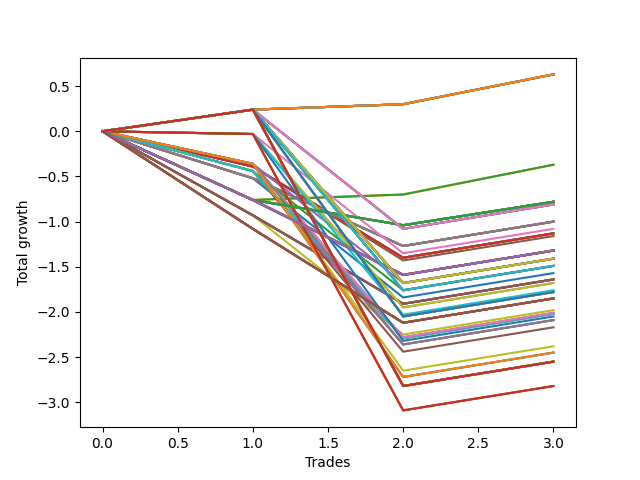

# Long HLT 147 
- Symbol: TSLA
- Date Range: 05/16/2022 - 05/17/2024
- Trading Period: 8:30-12:30
- Number of Trades: 3



| Id. | Name | Win Percent | Profit | Avg Profit / Trade | Avg Time / Trade | Std |      | Name | Win Percent | Profit | Avg Profit / Trade | Avg Time / Trade | Std |
| --- | ---- | ----------- | ------ | ------------------ | ---------------- | --- | ---- | ---- | ----------- | ------ | ------------------ | ---------------- | --- |
| | Sorted By <br> Profit | | | | | | | Sorted By <br> Win Percentage |||||
|0| TP-3 15m | 100.00 | 0.63 | 0.21 | 14:00 | 0.11 |     | TP-3 15m | 100.00 | 0.63 | 0.21 | 14:00 | 0.11 |
|1| TP-2.75 15m | 100.00 | 0.63 | 0.21 | 14:00 | 0.11 |     | TP-2.75 15m | 100.00 | 0.63 | 0.21 | 14:00 | 0.11 |
|2| TP-2.5 15m | 100.00 | 0.63 | 0.21 | 14:00 | 0.11 |     | TP-2.5 15m | 100.00 | 0.63 | 0.21 | 14:00 | 0.11 |
|3| TP-2.25 15m | 100.00 | 0.63 | 0.21 | 14:00 | 0.11 |     | TP-2.25 15m | 100.00 | 0.63 | 0.21 | 14:00 | 0.11 |
|4| TP-2 15m | 100.00 | 0.63 | 0.21 | 14:00 | 0.11 |     | TP-2 15m | 100.00 | 0.63 | 0.21 | 14:00 | 0.11 |
|5| TP-1.75 15m | 100.00 | 0.63 | 0.21 | 14:00 | 0.11 |     | TP-1.75 15m | 100.00 | 0.63 | 0.21 | 14:00 | 0.11 |
|6| TP-1.5 15m | 100.00 | 0.63 | 0.21 | 14:00 | 0.11 |     | TP-1.5 15m | 100.00 | 0.63 | 0.21 | 14:00 | 0.11 |
|7| TP-1.25 15m | 100.00 | 0.63 | 0.21 | 14:00 | 0.11 |     | TP-1.25 15m | 100.00 | 0.63 | 0.21 | 14:00 | 0.11 |
|8| TP-1 15m | 100.00 | 0.63 | 0.21 | 14:00 | 0.11 |     | TP-1 15m | 100.00 | 0.63 | 0.21 | 14:00 | 0.11 |
|9| TP-0.75 15m | 66.67 | -0.37 | -0.12 | 10:00 | 0.46 |     | TP-0.75 15m | 66.67 | -0.37 | -0.12 | 10:00 | 0.46 |
|10| TP-0.5 15m | 66.67 | -0.37 | -0.12 | 10:00 | 0.46 |     | TP-0.5 15m | 66.67 | -0.37 | -0.12 | 10:00 | 0.46 |
|11| TP-0.25 180m | 33.33 | -0.78 | -0.26 | 04:00 | 0.42 |     | TP-1.25 180m | 66.67 | -0.81 | -0.27 | 56:00 | 0.74 |
|12| TP-0.25 165m | 33.33 | -0.78 | -0.26 | 04:00 | 0.42 |     | TP-1.25 165m | 66.67 | -0.81 | -0.27 | 56:00 | 0.74 |
|13| TP-0.25 150m | 33.33 | -0.78 | -0.26 | 04:00 | 0.42 |     | TP-1.25 150m | 66.67 | -0.81 | -0.27 | 56:00 | 0.74 |
|14| TP-0.25 135m | 33.33 | -0.78 | -0.26 | 04:00 | 0.42 |     | TP-1.25 135m | 66.67 | -0.81 | -0.27 | 56:00 | 0.74 |
|15| TP-0.25 120m | 33.33 | -0.78 | -0.26 | 04:00 | 0.42 |     | TP-1.25 120m | 66.67 | -0.81 | -0.27 | 56:00 | 0.74 |
|16| TP-0.25 105m | 33.33 | -0.78 | -0.26 | 04:00 | 0.42 |     | TP-1.75 180m | 66.67 | -1.41 | -0.47 | 67:40 | 1.03 |
|17| TP-0.25 90m | 33.33 | -0.78 | -0.26 | 04:00 | 0.42 |     | TP-1.5 180m | 66.67 | -1.41 | -0.47 | 67:40 | 1.03 |
|18| TP-0.25 75m | 33.33 | -0.78 | -0.26 | 04:00 | 0.42 |     | TP-1.75 165m | 66.67 | -1.41 | -0.47 | 67:40 | 1.03 |
|19| TP-0.25 60m | 33.33 | -0.78 | -0.26 | 04:00 | 0.42 |     | TP-1.5 165m | 66.67 | -1.41 | -0.47 | 67:40 | 1.03 |
|20| TP-0.25 45m | 33.33 | -0.78 | -0.26 | 04:00 | 0.42 |     | TP-1.75 150m | 66.67 | -1.41 | -0.47 | 67:40 | 1.03 |
|21| TP-0.25 30m | 33.33 | -0.78 | -0.26 | 04:00 | 0.42 |     | TP-1.5 150m | 66.67 | -1.41 | -0.47 | 67:40 | 1.03 |
|22| TP-0.25 15m | 33.33 | -0.78 | -0.26 | 04:00 | 0.42 |     | TP-1.75 135m | 66.67 | -1.41 | -0.47 | 67:40 | 1.03 |
|23| TP-1.25 180m | 66.67 | -0.81 | -0.27 | 56:00 | 0.74 |     | TP-1.5 135m | 66.67 | -1.41 | -0.47 | 67:40 | 1.03 |
|24| TP-1.25 165m | 66.67 | -0.81 | -0.27 | 56:00 | 0.74 |     | TP-1.75 120m | 66.67 | -1.41 | -0.47 | 67:40 | 1.03 |
|25| TP-1.25 150m | 66.67 | -0.81 | -0.27 | 56:00 | 0.74 |     | TP-1.5 120m | 66.67 | -1.41 | -0.47 | 67:40 | 1.03 |
|26| TP-1.25 135m | 66.67 | -0.81 | -0.27 | 56:00 | 0.74 |     | TP-2 180m | 66.67 | -1.49 | -0.50 | 68:00 | 1.06 |
|27| TP-1.25 120m | 66.67 | -0.81 | -0.27 | 56:00 | 0.74 |     | TP-2 165m | 66.67 | -1.49 | -0.50 | 68:00 | 1.06 |
|28| TP-3 60m | 33.33 | -1.00 | -0.33 | 44:20 | 0.44 |     | TP-2 150m | 66.67 | -1.49 | -0.50 | 68:00 | 1.06 |
|29| TP-2.75 60m | 33.33 | -1.00 | -0.33 | 44:20 | 0.44 |     | TP-2 135m | 66.67 | -1.49 | -0.50 | 68:00 | 1.06 |
|30| TP-2.5 60m | 33.33 | -1.00 | -0.33 | 44:20 | 0.44 |     | TP-2 120m | 66.67 | -1.49 | -0.50 | 68:00 | 1.06 |
|31| TP-2.25 60m | 33.33 | -1.00 | -0.33 | 44:20 | 0.44 |     | TP-2.25 180m | 66.67 | -1.78 | -0.59 | 71:40 | 1.20 |
|32| TP-2 60m | 33.33 | -1.00 | -0.33 | 44:20 | 0.44 |     | TP-2.25 165m | 66.67 | -1.78 | -0.59 | 71:40 | 1.20 |
|33| TP-1.75 60m | 33.33 | -1.00 | -0.33 | 44:20 | 0.44 |     | TP-2.25 150m | 66.67 | -1.78 | -0.59 | 71:40 | 1.20 |
|34| TP-1.5 60m | 33.33 | -1.00 | -0.33 | 44:20 | 0.44 |     | TP-2.25 135m | 66.67 | -1.78 | -0.59 | 71:40 | 1.20 |
|35| TP-1.25 105m | 33.33 | -1.08 | -0.36 | 51:00 | 0.69 |     | TP-2.25 120m | 66.67 | -1.78 | -0.59 | 71:40 | 1.20 |
|36| TP-3 30m | 33.33 | -1.13 | -0.38 | 24:20 | 0.52 |     | TP-3 180m | 66.67 | -2.55 | -0.85 | 74:40 | 1.56 |
|37| TP-2.75 30m | 33.33 | -1.13 | -0.38 | 24:20 | 0.52 |     | TP-2.75 180m | 66.67 | -2.55 | -0.85 | 74:40 | 1.56 |
|38| TP-2.5 30m | 33.33 | -1.13 | -0.38 | 24:20 | 0.52 |     | TP-2.5 180m | 66.67 | -2.55 | -0.85 | 74:40 | 1.56 |
|39| TP-2.25 30m | 33.33 | -1.13 | -0.38 | 24:20 | 0.52 |     | TP-3 165m | 66.67 | -2.55 | -0.85 | 74:40 | 1.56 |
|40| TP-2 30m | 33.33 | -1.13 | -0.38 | 24:20 | 0.52 |     | TP-2.75 165m | 66.67 | -2.55 | -0.85 | 74:40 | 1.56 |
|41| TP-1.75 30m | 33.33 | -1.13 | -0.38 | 24:20 | 0.52 |     | TP-2.5 165m | 66.67 | -2.55 | -0.85 | 74:40 | 1.56 |
|42| TP-1.5 30m | 33.33 | -1.13 | -0.38 | 24:20 | 0.52 |     | TP-3 150m | 66.67 | -2.55 | -0.85 | 74:40 | 1.56 |
|43| TP-1.25 30m | 33.33 | -1.13 | -0.38 | 24:20 | 0.52 |     | TP-2.75 150m | 66.67 | -2.55 | -0.85 | 74:40 | 1.56 |
|44| TP-1 30m | 33.33 | -1.16 | -0.39 | 22:40 | 0.53 |     | TP-2.5 150m | 66.67 | -2.55 | -0.85 | 74:40 | 1.56 |
|45| TP-0.75 180m | 33.33 | -1.32 | -0.44 | 13:00 | 0.50 |     | TP-3 135m | 66.67 | -2.55 | -0.85 | 74:40 | 1.56 |
|46| TP-0.5 180m | 33.33 | -1.32 | -0.44 | 13:00 | 0.50 |     | TP-2.75 135m | 66.67 | -2.55 | -0.85 | 74:40 | 1.56 |
|47| TP-0.75 165m | 33.33 | -1.32 | -0.44 | 13:00 | 0.50 |     | TP-2.5 135m | 66.67 | -2.55 | -0.85 | 74:40 | 1.56 |
|48| TP-0.5 165m | 33.33 | -1.32 | -0.44 | 13:00 | 0.50 |     | TP-3 120m | 66.67 | -2.55 | -0.85 | 74:40 | 1.56 |
|49| TP-0.75 150m | 33.33 | -1.32 | -0.44 | 13:00 | 0.50 |     | TP-2.75 120m | 66.67 | -2.55 | -0.85 | 74:40 | 1.56 |
|50| TP-0.5 150m | 33.33 | -1.32 | -0.44 | 13:00 | 0.50 |     | TP-2.5 120m | 66.67 | -2.55 | -0.85 | 74:40 | 1.56 |
|51| TP-0.75 135m | 33.33 | -1.32 | -0.44 | 13:00 | 0.50 |     | TP-0.25 180m | 33.33 | -0.78 | -0.26 | 04:00 | 0.42 |
|52| TP-0.5 135m | 33.33 | -1.32 | -0.44 | 13:00 | 0.50 |     | TP-0.25 165m | 33.33 | -0.78 | -0.26 | 04:00 | 0.42 |
|53| TP-0.75 120m | 33.33 | -1.32 | -0.44 | 13:00 | 0.50 |     | TP-0.25 150m | 33.33 | -0.78 | -0.26 | 04:00 | 0.42 |
|54| TP-0.5 120m | 33.33 | -1.32 | -0.44 | 13:00 | 0.50 |     | TP-0.25 135m | 33.33 | -0.78 | -0.26 | 04:00 | 0.42 |
|55| TP-0.75 105m | 33.33 | -1.32 | -0.44 | 13:00 | 0.50 |     | TP-0.25 120m | 33.33 | -0.78 | -0.26 | 04:00 | 0.42 |
|56| TP-0.5 105m | 33.33 | -1.32 | -0.44 | 13:00 | 0.50 |     | TP-0.25 105m | 33.33 | -0.78 | -0.26 | 04:00 | 0.42 |
|57| TP-0.75 90m | 33.33 | -1.32 | -0.44 | 13:00 | 0.50 |     | TP-0.25 90m | 33.33 | -0.78 | -0.26 | 04:00 | 0.42 |
|58| TP-0.5 90m | 33.33 | -1.32 | -0.44 | 13:00 | 0.50 |     | TP-0.25 75m | 33.33 | -0.78 | -0.26 | 04:00 | 0.42 |
|59| TP-0.75 75m | 33.33 | -1.32 | -0.44 | 13:00 | 0.50 |     | TP-0.25 60m | 33.33 | -0.78 | -0.26 | 04:00 | 0.42 |
|60| TP-0.5 75m | 33.33 | -1.32 | -0.44 | 13:00 | 0.50 |     | TP-0.25 45m | 33.33 | -0.78 | -0.26 | 04:00 | 0.42 |
|61| TP-0.75 60m | 33.33 | -1.32 | -0.44 | 13:00 | 0.50 |     | TP-0.25 30m | 33.33 | -0.78 | -0.26 | 04:00 | 0.42 |
|62| TP-0.5 60m | 33.33 | -1.32 | -0.44 | 13:00 | 0.50 |     | TP-0.25 15m | 33.33 | -0.78 | -0.26 | 04:00 | 0.42 |
|63| TP-0.75 45m | 33.33 | -1.32 | -0.44 | 13:00 | 0.50 |     | TP-3 60m | 33.33 | -1.00 | -0.33 | 44:20 | 0.44 |
|64| TP-0.5 45m | 33.33 | -1.32 | -0.44 | 13:00 | 0.50 |     | TP-2.75 60m | 33.33 | -1.00 | -0.33 | 44:20 | 0.44 |
|65| TP-0.75 30m | 33.33 | -1.32 | -0.44 | 13:00 | 0.50 |     | TP-2.5 60m | 33.33 | -1.00 | -0.33 | 44:20 | 0.44 |
|66| TP-0.5 30m | 33.33 | -1.32 | -0.44 | 13:00 | 0.50 |     | TP-2.25 60m | 33.33 | -1.00 | -0.33 | 44:20 | 0.44 |
|67| TP-1.75 180m | 66.67 | -1.41 | -0.47 | 67:40 | 1.03 |     | TP-2 60m | 33.33 | -1.00 | -0.33 | 44:20 | 0.44 |
|68| TP-1.5 180m | 66.67 | -1.41 | -0.47 | 67:40 | 1.03 |     | TP-1.75 60m | 33.33 | -1.00 | -0.33 | 44:20 | 0.44 |
|69| TP-1.75 165m | 66.67 | -1.41 | -0.47 | 67:40 | 1.03 |     | TP-1.5 60m | 33.33 | -1.00 | -0.33 | 44:20 | 0.44 |
|70| TP-1.5 165m | 66.67 | -1.41 | -0.47 | 67:40 | 1.03 |     | TP-1.25 105m | 33.33 | -1.08 | -0.36 | 51:00 | 0.69 |
|71| TP-1.75 150m | 66.67 | -1.41 | -0.47 | 67:40 | 1.03 |     | TP-3 30m | 33.33 | -1.13 | -0.38 | 24:20 | 0.52 |
|72| TP-1.5 150m | 66.67 | -1.41 | -0.47 | 67:40 | 1.03 |     | TP-2.75 30m | 33.33 | -1.13 | -0.38 | 24:20 | 0.52 |
|73| TP-1.75 135m | 66.67 | -1.41 | -0.47 | 67:40 | 1.03 |     | TP-2.5 30m | 33.33 | -1.13 | -0.38 | 24:20 | 0.52 |
|74| TP-1.5 135m | 66.67 | -1.41 | -0.47 | 67:40 | 1.03 |     | TP-2.25 30m | 33.33 | -1.13 | -0.38 | 24:20 | 0.52 |
|75| TP-1.75 120m | 66.67 | -1.41 | -0.47 | 67:40 | 1.03 |     | TP-2 30m | 33.33 | -1.13 | -0.38 | 24:20 | 0.52 |
|76| TP-1.5 120m | 66.67 | -1.41 | -0.47 | 67:40 | 1.03 |     | TP-1.75 30m | 33.33 | -1.13 | -0.38 | 24:20 | 0.52 |
|77| TP-1.25 90m | 33.33 | -1.41 | -0.47 | 46:00 | 0.65 |     | TP-1.5 30m | 33.33 | -1.13 | -0.38 | 24:20 | 0.52 |
|78| TP-2 180m | 66.67 | -1.49 | -0.50 | 68:00 | 1.06 |     | TP-1.25 30m | 33.33 | -1.13 | -0.38 | 24:20 | 0.52 |
|79| TP-2 165m | 66.67 | -1.49 | -0.50 | 68:00 | 1.06 |     | TP-1 30m | 33.33 | -1.16 | -0.39 | 22:40 | 0.53 |
|80| TP-2 150m | 66.67 | -1.49 | -0.50 | 68:00 | 1.06 |     | TP-0.75 180m | 33.33 | -1.32 | -0.44 | 13:00 | 0.50 |
|81| TP-2 135m | 66.67 | -1.49 | -0.50 | 68:00 | 1.06 |     | TP-0.5 180m | 33.33 | -1.32 | -0.44 | 13:00 | 0.50 |
|82| TP-2 120m | 66.67 | -1.49 | -0.50 | 68:00 | 1.06 |     | TP-0.75 165m | 33.33 | -1.32 | -0.44 | 13:00 | 0.50 |
|83| TP-1.25 75m | 33.33 | -1.49 | -0.50 | 41:00 | 0.65 |     | TP-0.5 165m | 33.33 | -1.32 | -0.44 | 13:00 | 0.50 |
|84| TP-1.25 60m | 33.33 | -1.57 | -0.52 | 36:00 | 0.65 |     | TP-0.75 150m | 33.33 | -1.32 | -0.44 | 13:00 | 0.50 |
|85| TP-3 45m | 33.33 | -1.64 | -0.55 | 34:20 | 0.58 |     | TP-0.5 150m | 33.33 | -1.32 | -0.44 | 13:00 | 0.50 |
|86| TP-2.75 45m | 33.33 | -1.64 | -0.55 | 34:20 | 0.58 |     | TP-0.75 135m | 33.33 | -1.32 | -0.44 | 13:00 | 0.50 |
|87| TP-2.5 45m | 33.33 | -1.64 | -0.55 | 34:20 | 0.58 |     | TP-0.5 135m | 33.33 | -1.32 | -0.44 | 13:00 | 0.50 |
|88| TP-2.25 45m | 33.33 | -1.64 | -0.55 | 34:20 | 0.58 |     | TP-0.75 120m | 33.33 | -1.32 | -0.44 | 13:00 | 0.50 |
|89| TP-2 45m | 33.33 | -1.64 | -0.55 | 34:20 | 0.58 |     | TP-0.5 120m | 33.33 | -1.32 | -0.44 | 13:00 | 0.50 |
|90| TP-1.75 45m | 33.33 | -1.64 | -0.55 | 34:20 | 0.58 |     | TP-0.75 105m | 33.33 | -1.32 | -0.44 | 13:00 | 0.50 |
|91| TP-1.5 45m | 33.33 | -1.64 | -0.55 | 34:20 | 0.58 |     | TP-0.5 105m | 33.33 | -1.32 | -0.44 | 13:00 | 0.50 |
|92| TP-1.75 105m | 33.33 | -1.68 | -0.56 | 62:40 | 0.97 |     | TP-0.75 90m | 33.33 | -1.32 | -0.44 | 13:00 | 0.50 |
|93| TP-1.5 105m | 33.33 | -1.68 | -0.56 | 62:40 | 0.97 |     | TP-0.5 90m | 33.33 | -1.32 | -0.44 | 13:00 | 0.50 |
|94| TP-2 105m | 33.33 | -1.76 | -0.59 | 63:00 | 1.01 |     | TP-0.75 75m | 33.33 | -1.32 | -0.44 | 13:00 | 0.50 |
|95| TP-2.25 180m | 66.67 | -1.78 | -0.59 | 71:40 | 1.20 |     | TP-0.5 75m | 33.33 | -1.32 | -0.44 | 13:00 | 0.50 |
|96| TP-2.25 165m | 66.67 | -1.78 | -0.59 | 71:40 | 1.20 |     | TP-0.75 60m | 33.33 | -1.32 | -0.44 | 13:00 | 0.50 |
|97| TP-2.25 150m | 66.67 | -1.78 | -0.59 | 71:40 | 1.20 |     | TP-0.5 60m | 33.33 | -1.32 | -0.44 | 13:00 | 0.50 |
|98| TP-2.25 135m | 66.67 | -1.78 | -0.59 | 71:40 | 1.20 |     | TP-0.75 45m | 33.33 | -1.32 | -0.44 | 13:00 | 0.50 |
|99| TP-2.25 120m | 66.67 | -1.78 | -0.59 | 71:40 | 1.20 |     | TP-0.5 45m | 33.33 | -1.32 | -0.44 | 13:00 | 0.50 |
|100| TP-1 180m | 33.33 | -1.85 | -0.62 | 25:40 | 0.63 |     | TP-0.75 30m | 33.33 | -1.32 | -0.44 | 13:00 | 0.50 |
|101| TP-1 165m | 33.33 | -1.85 | -0.62 | 25:40 | 0.63 |     | TP-0.5 30m | 33.33 | -1.32 | -0.44 | 13:00 | 0.50 |
|102| TP-1 150m | 33.33 | -1.85 | -0.62 | 25:40 | 0.63 |     | TP-1.25 90m | 33.33 | -1.41 | -0.47 | 46:00 | 0.65 |
|103| TP-1 135m | 33.33 | -1.85 | -0.62 | 25:40 | 0.63 |     | TP-1.25 75m | 33.33 | -1.49 | -0.50 | 41:00 | 0.65 |
|104| TP-1 120m | 33.33 | -1.85 | -0.62 | 25:40 | 0.63 |     | TP-1.25 60m | 33.33 | -1.57 | -0.52 | 36:00 | 0.65 |
|105| TP-1 105m | 33.33 | -1.85 | -0.62 | 25:40 | 0.63 |     | TP-3 45m | 33.33 | -1.64 | -0.55 | 34:20 | 0.58 |
|106| TP-1 90m | 33.33 | -1.85 | -0.62 | 25:40 | 0.63 |     | TP-2.75 45m | 33.33 | -1.64 | -0.55 | 34:20 | 0.58 |
|107| TP-1 75m | 33.33 | -1.85 | -0.62 | 25:40 | 0.63 |     | TP-2.5 45m | 33.33 | -1.64 | -0.55 | 34:20 | 0.58 |
|108| TP-1 60m | 33.33 | -1.85 | -0.62 | 25:40 | 0.63 |     | TP-2.25 45m | 33.33 | -1.64 | -0.55 | 34:20 | 0.58 |
|109| TP-1 45m | 33.33 | -1.85 | -0.62 | 25:40 | 0.63 |     | TP-2 45m | 33.33 | -1.64 | -0.55 | 34:20 | 0.58 |
|110| TP-1.25 45m | 33.33 | -1.98 | -0.66 | 31:00 | 0.68 |     | TP-1.75 45m | 33.33 | -1.64 | -0.55 | 34:20 | 0.58 |
|111| TP-1.75 90m | 33.33 | -2.01 | -0.67 | 57:40 | 0.92 |     | TP-1.5 45m | 33.33 | -1.64 | -0.55 | 34:20 | 0.58 |
|112| TP-1.5 90m | 33.33 | -2.01 | -0.67 | 57:40 | 0.92 |     | TP-1.75 105m | 33.33 | -1.68 | -0.56 | 62:40 | 0.97 |
|113| TP-3 75m | 33.33 | -2.02 | -0.67 | 54:20 | 0.88 |     | TP-1.5 105m | 33.33 | -1.68 | -0.56 | 62:40 | 0.97 |
|114| TP-2.75 75m | 33.33 | -2.02 | -0.67 | 54:20 | 0.88 |     | TP-2 105m | 33.33 | -1.76 | -0.59 | 63:00 | 1.01 |
|115| TP-2.5 75m | 33.33 | -2.02 | -0.67 | 54:20 | 0.88 |     | TP-1 180m | 33.33 | -1.85 | -0.62 | 25:40 | 0.63 |
|116| TP-2.25 75m | 33.33 | -2.02 | -0.67 | 54:20 | 0.88 |     | TP-1 165m | 33.33 | -1.85 | -0.62 | 25:40 | 0.63 |
|117| TP-2.25 105m | 33.33 | -2.05 | -0.68 | 66:40 | 1.14 |     | TP-1 150m | 33.33 | -1.85 | -0.62 | 25:40 | 0.63 |
|118| TP-2 90m | 33.33 | -2.09 | -0.70 | 58:00 | 0.96 |     | TP-1 135m | 33.33 | -1.85 | -0.62 | 25:40 | 0.63 |
|119| TP-1.75 75m | 33.33 | -2.09 | -0.70 | 52:40 | 0.91 |     | TP-1 120m | 33.33 | -1.85 | -0.62 | 25:40 | 0.63 |
|120| TP-1.5 75m | 33.33 | -2.09 | -0.70 | 52:40 | 0.91 |     | TP-1 105m | 33.33 | -1.85 | -0.62 | 25:40 | 0.63 |
|121| TP-2 75m | 33.33 | -2.17 | -0.72 | 53:00 | 0.95 |     | TP-1 90m | 33.33 | -1.85 | -0.62 | 25:40 | 0.63 |
|122| TP-2.25 90m | 33.33 | -2.38 | -0.79 | 61:40 | 1.09 |     | TP-1 75m | 33.33 | -1.85 | -0.62 | 25:40 | 0.63 |
|123| TP-3 90m | 33.33 | -2.45 | -0.82 | 64:20 | 1.12 |     | TP-1 60m | 33.33 | -1.85 | -0.62 | 25:40 | 0.63 |
|124| TP-2.75 90m | 33.33 | -2.45 | -0.82 | 64:20 | 1.12 |     | TP-1 45m | 33.33 | -1.85 | -0.62 | 25:40 | 0.63 |
|125| TP-2.5 90m | 33.33 | -2.45 | -0.82 | 64:20 | 1.12 |     | TP-1.25 45m | 33.33 | -1.98 | -0.66 | 31:00 | 0.68 |
|126| TP-3 180m | 66.67 | -2.55 | -0.85 | 74:40 | 1.56 |     | TP-1.75 90m | 33.33 | -2.01 | -0.67 | 57:40 | 0.92 |
|127| TP-2.75 180m | 66.67 | -2.55 | -0.85 | 74:40 | 1.56 |     | TP-1.5 90m | 33.33 | -2.01 | -0.67 | 57:40 | 0.92 |
|128| TP-2.5 180m | 66.67 | -2.55 | -0.85 | 74:40 | 1.56 |     | TP-3 75m | 33.33 | -2.02 | -0.67 | 54:20 | 0.88 |
|129| TP-3 165m | 66.67 | -2.55 | -0.85 | 74:40 | 1.56 |     | TP-2.75 75m | 33.33 | -2.02 | -0.67 | 54:20 | 0.88 |
|130| TP-2.75 165m | 66.67 | -2.55 | -0.85 | 74:40 | 1.56 |     | TP-2.5 75m | 33.33 | -2.02 | -0.67 | 54:20 | 0.88 |
|131| TP-2.5 165m | 66.67 | -2.55 | -0.85 | 74:40 | 1.56 |     | TP-2.25 75m | 33.33 | -2.02 | -0.67 | 54:20 | 0.88 |
|132| TP-3 150m | 66.67 | -2.55 | -0.85 | 74:40 | 1.56 |     | TP-2.25 105m | 33.33 | -2.05 | -0.68 | 66:40 | 1.14 |
|133| TP-2.75 150m | 66.67 | -2.55 | -0.85 | 74:40 | 1.56 |     | TP-2 90m | 33.33 | -2.09 | -0.70 | 58:00 | 0.96 |
|134| TP-2.5 150m | 66.67 | -2.55 | -0.85 | 74:40 | 1.56 |     | TP-1.75 75m | 33.33 | -2.09 | -0.70 | 52:40 | 0.91 |
|135| TP-3 135m | 66.67 | -2.55 | -0.85 | 74:40 | 1.56 |     | TP-1.5 75m | 33.33 | -2.09 | -0.70 | 52:40 | 0.91 |
|136| TP-2.75 135m | 66.67 | -2.55 | -0.85 | 74:40 | 1.56 |     | TP-2 75m | 33.33 | -2.17 | -0.72 | 53:00 | 0.95 |
|137| TP-2.5 135m | 66.67 | -2.55 | -0.85 | 74:40 | 1.56 |     | TP-2.25 90m | 33.33 | -2.38 | -0.79 | 61:40 | 1.09 |
|138| TP-3 120m | 66.67 | -2.55 | -0.85 | 74:40 | 1.56 |     | TP-3 90m | 33.33 | -2.45 | -0.82 | 64:20 | 1.12 |
|139| TP-2.75 120m | 66.67 | -2.55 | -0.85 | 74:40 | 1.56 |     | TP-2.75 90m | 33.33 | -2.45 | -0.82 | 64:20 | 1.12 |
|140| TP-2.5 120m | 66.67 | -2.55 | -0.85 | 74:40 | 1.56 |     | TP-2.5 90m | 33.33 | -2.45 | -0.82 | 64:20 | 1.12 |
|141| TP-3 105m | 33.33 | -2.82 | -0.94 | 69:40 | 1.50 |     | TP-3 105m | 33.33 | -2.82 | -0.94 | 69:40 | 1.50 |
|142| TP-2.75 105m | 33.33 | -2.82 | -0.94 | 69:40 | 1.50 |     | TP-2.75 105m | 33.33 | -2.82 | -0.94 | 69:40 | 1.50 |
|143| TP-2.5 105m | 33.33 | -2.82 | -0.94 | 69:40 | 1.50 |     | TP-2.5 105m | 33.33 | -2.82 | -0.94 | 69:40 | 1.50 |

### Test TP-0.25 15m
* Take Profit of 0.25 Point
* 0.25 Stoploss
* Results:
```
Total Trades: 3
Percent Up: 33.33
Percent Down: 66.67
Total Points Moved Up: -0.78
Potential Profit: -390.00
Total Points Ups: 0.26 Count Ups: 1
Total Points Downs: -1.04 Count Downs: 2
```

<details><summary>Trades</summary>

<code>In: 2023-08-15 10:05:00		Out: 2023-08-15 10:07:00		Total Position Time: 02:00		Total Move Up: -0.76		Total to Date: -0.76</code> <br />
<code>In: 2023-12-28 10:25:00		Out: 2023-12-28 10:29:00		Total Position Time: 04:00		Total Move Up: -0.28		Total to Date: -1.04</code> <br />
<code>In: 2024-03-11 12:35:00		Out: 2024-03-11 12:41:00		Total Position Time: 06:00		Total Move Up: 0.26		Total to Date: -0.78</code> <br />


</details>

### Test TP-0.5 15m
* Take Profit of 0.5 Point
* 0.5 Stoploss
* Results:
```
Total Trades: 3
Percent Up: 66.67
Percent Down: 33.33
Total Points Moved Up: -0.37
Potential Profit: -185.00
Total Points Ups: 0.39 Count Ups: 2
Total Points Downs: -0.76 Count Downs: 1
```

<details><summary>Trades</summary>

<code>In: 2023-08-15 10:05:00		Out: 2023-08-15 10:07:00		Total Position Time: 02:00		Total Move Up: -0.76		Total to Date: -0.76</code> <br />
<code>In: 2023-12-28 10:25:00		Out: 2023-12-28 10:39:00		Total Position Time: 14:00		Total Move Up: 0.06		Total to Date: -0.70</code> <br />
<code>In: 2024-03-11 12:35:00		Out: 2024-03-11 12:49:00		Total Position Time: 14:00		Total Move Up: 0.33		Total to Date: -0.37</code> <br />


</details>

### Test TP-0.75 15m
* Take Profit of 0.75 Point
* 0.75 Stoploss
* Results:
```
Total Trades: 3
Percent Up: 66.67
Percent Down: 33.33
Total Points Moved Up: -0.37
Potential Profit: -185.00
Total Points Ups: 0.39 Count Ups: 2
Total Points Downs: -0.76 Count Downs: 1
```

<details><summary>Trades</summary>

<code>In: 2023-08-15 10:05:00		Out: 2023-08-15 10:07:00		Total Position Time: 02:00		Total Move Up: -0.76		Total to Date: -0.76</code> <br />
<code>In: 2023-12-28 10:25:00		Out: 2023-12-28 10:39:00		Total Position Time: 14:00		Total Move Up: 0.06		Total to Date: -0.70</code> <br />
<code>In: 2024-03-11 12:35:00		Out: 2024-03-11 12:49:00		Total Position Time: 14:00		Total Move Up: 0.33		Total to Date: -0.37</code> <br />


</details>

### Test TP-1 15m
* Take Profit of 1 Point
* 1 Stoploss
* Results:
```
Total Trades: 3
Percent Up: 100.00
Percent Down: 0.00
Total Points Moved Up: 0.63
Potential Profit: 315.00
Total Points Ups: 0.63 Count Ups: 3
Total Points Downs: 0.00 Count Downs: 0
```

<details><summary>Trades</summary>

<code>In: 2023-08-15 10:05:00		Out: 2023-08-15 10:19:00		Total Position Time: 14:00		Total Move Up: 0.24		Total to Date: 0.24</code> <br />
<code>In: 2023-12-28 10:25:00		Out: 2023-12-28 10:39:00		Total Position Time: 14:00		Total Move Up: 0.06		Total to Date: 0.30</code> <br />
<code>In: 2024-03-11 12:35:00		Out: 2024-03-11 12:49:00		Total Position Time: 14:00		Total Move Up: 0.33		Total to Date: 0.63</code> <br />


</details>

### Test TP-1.25 15m
* Take Profit of 1.25 Point
* 1.25 Stoploss
* Results:
```
Total Trades: 3
Percent Up: 100.00
Percent Down: 0.00
Total Points Moved Up: 0.63
Potential Profit: 315.00
Total Points Ups: 0.63 Count Ups: 3
Total Points Downs: 0.00 Count Downs: 0
```

<details><summary>Trades</summary>

<code>In: 2023-08-15 10:05:00		Out: 2023-08-15 10:19:00		Total Position Time: 14:00		Total Move Up: 0.24		Total to Date: 0.24</code> <br />
<code>In: 2023-12-28 10:25:00		Out: 2023-12-28 10:39:00		Total Position Time: 14:00		Total Move Up: 0.06		Total to Date: 0.30</code> <br />
<code>In: 2024-03-11 12:35:00		Out: 2024-03-11 12:49:00		Total Position Time: 14:00		Total Move Up: 0.33		Total to Date: 0.63</code> <br />


</details>

### Test TP-1.5 15m
* Take Profit of 1.5 Point
* 1.5 Stoploss
* Results:
```
Total Trades: 3
Percent Up: 100.00
Percent Down: 0.00
Total Points Moved Up: 0.63
Potential Profit: 315.00
Total Points Ups: 0.63 Count Ups: 3
Total Points Downs: 0.00 Count Downs: 0
```

<details><summary>Trades</summary>

<code>In: 2023-08-15 10:05:00		Out: 2023-08-15 10:19:00		Total Position Time: 14:00		Total Move Up: 0.24		Total to Date: 0.24</code> <br />
<code>In: 2023-12-28 10:25:00		Out: 2023-12-28 10:39:00		Total Position Time: 14:00		Total Move Up: 0.06		Total to Date: 0.30</code> <br />
<code>In: 2024-03-11 12:35:00		Out: 2024-03-11 12:49:00		Total Position Time: 14:00		Total Move Up: 0.33		Total to Date: 0.63</code> <br />


</details>

### Test TP-1.75 15m
* Take Profit of 1.75 Point
* 1.75 Stoploss
* Results:
```
Total Trades: 3
Percent Up: 100.00
Percent Down: 0.00
Total Points Moved Up: 0.63
Potential Profit: 315.00
Total Points Ups: 0.63 Count Ups: 3
Total Points Downs: 0.00 Count Downs: 0
```

<details><summary>Trades</summary>

<code>In: 2023-08-15 10:05:00		Out: 2023-08-15 10:19:00		Total Position Time: 14:00		Total Move Up: 0.24		Total to Date: 0.24</code> <br />
<code>In: 2023-12-28 10:25:00		Out: 2023-12-28 10:39:00		Total Position Time: 14:00		Total Move Up: 0.06		Total to Date: 0.30</code> <br />
<code>In: 2024-03-11 12:35:00		Out: 2024-03-11 12:49:00		Total Position Time: 14:00		Total Move Up: 0.33		Total to Date: 0.63</code> <br />


</details>

### Test TP-2 15m
* Take Profit of 2 Point
* 2 Stoploss
* Results:
```
Total Trades: 3
Percent Up: 100.00
Percent Down: 0.00
Total Points Moved Up: 0.63
Potential Profit: 315.00
Total Points Ups: 0.63 Count Ups: 3
Total Points Downs: 0.00 Count Downs: 0
```

<details><summary>Trades</summary>

<code>In: 2023-08-15 10:05:00		Out: 2023-08-15 10:19:00		Total Position Time: 14:00		Total Move Up: 0.24		Total to Date: 0.24</code> <br />
<code>In: 2023-12-28 10:25:00		Out: 2023-12-28 10:39:00		Total Position Time: 14:00		Total Move Up: 0.06		Total to Date: 0.30</code> <br />
<code>In: 2024-03-11 12:35:00		Out: 2024-03-11 12:49:00		Total Position Time: 14:00		Total Move Up: 0.33		Total to Date: 0.63</code> <br />


</details>

### Test TP-2.25 15m
* Take Profit of 2.25 Point
* 2.25 Stoploss
* Results:
```
Total Trades: 3
Percent Up: 100.00
Percent Down: 0.00
Total Points Moved Up: 0.63
Potential Profit: 315.00
Total Points Ups: 0.63 Count Ups: 3
Total Points Downs: 0.00 Count Downs: 0
```

<details><summary>Trades</summary>

<code>In: 2023-08-15 10:05:00		Out: 2023-08-15 10:19:00		Total Position Time: 14:00		Total Move Up: 0.24		Total to Date: 0.24</code> <br />
<code>In: 2023-12-28 10:25:00		Out: 2023-12-28 10:39:00		Total Position Time: 14:00		Total Move Up: 0.06		Total to Date: 0.30</code> <br />
<code>In: 2024-03-11 12:35:00		Out: 2024-03-11 12:49:00		Total Position Time: 14:00		Total Move Up: 0.33		Total to Date: 0.63</code> <br />


</details>

### Test TP-2.5 15m
* Take Profit of 2.5 Point
* 2.5 Stoploss
* Results:
```
Total Trades: 3
Percent Up: 100.00
Percent Down: 0.00
Total Points Moved Up: 0.63
Potential Profit: 315.00
Total Points Ups: 0.63 Count Ups: 3
Total Points Downs: 0.00 Count Downs: 0
```

<details><summary>Trades</summary>

<code>In: 2023-08-15 10:05:00		Out: 2023-08-15 10:19:00		Total Position Time: 14:00		Total Move Up: 0.24		Total to Date: 0.24</code> <br />
<code>In: 2023-12-28 10:25:00		Out: 2023-12-28 10:39:00		Total Position Time: 14:00		Total Move Up: 0.06		Total to Date: 0.30</code> <br />
<code>In: 2024-03-11 12:35:00		Out: 2024-03-11 12:49:00		Total Position Time: 14:00		Total Move Up: 0.33		Total to Date: 0.63</code> <br />


</details>

### Test TP-2.75 15m
* Take Profit of 2.75 Point
* 2.75 Stoploss
* Results:
```
Total Trades: 3
Percent Up: 100.00
Percent Down: 0.00
Total Points Moved Up: 0.63
Potential Profit: 315.00
Total Points Ups: 0.63 Count Ups: 3
Total Points Downs: 0.00 Count Downs: 0
```

<details><summary>Trades</summary>

<code>In: 2023-08-15 10:05:00		Out: 2023-08-15 10:19:00		Total Position Time: 14:00		Total Move Up: 0.24		Total to Date: 0.24</code> <br />
<code>In: 2023-12-28 10:25:00		Out: 2023-12-28 10:39:00		Total Position Time: 14:00		Total Move Up: 0.06		Total to Date: 0.30</code> <br />
<code>In: 2024-03-11 12:35:00		Out: 2024-03-11 12:49:00		Total Position Time: 14:00		Total Move Up: 0.33		Total to Date: 0.63</code> <br />


</details>

### Test TP-3 15m
* Take Profit of 3 Point
* 3 Stoploss
* Results:
```
Total Trades: 3
Percent Up: 100.00
Percent Down: 0.00
Total Points Moved Up: 0.63
Potential Profit: 315.00
Total Points Ups: 0.63 Count Ups: 3
Total Points Downs: 0.00 Count Downs: 0
```

<details><summary>Trades</summary>

<code>In: 2023-08-15 10:05:00		Out: 2023-08-15 10:19:00		Total Position Time: 14:00		Total Move Up: 0.24		Total to Date: 0.24</code> <br />
<code>In: 2023-12-28 10:25:00		Out: 2023-12-28 10:39:00		Total Position Time: 14:00		Total Move Up: 0.06		Total to Date: 0.30</code> <br />
<code>In: 2024-03-11 12:35:00		Out: 2024-03-11 12:49:00		Total Position Time: 14:00		Total Move Up: 0.33		Total to Date: 0.63</code> <br />


</details>

### Test TP-0.25 30m
* Take Profit of 0.25 Point
* 0.25 Stoploss
* Results:
```
Total Trades: 3
Percent Up: 33.33
Percent Down: 66.67
Total Points Moved Up: -0.78
Potential Profit: -390.00
Total Points Ups: 0.26 Count Ups: 1
Total Points Downs: -1.04 Count Downs: 2
```

<details><summary>Trades</summary>

<code>In: 2023-08-15 10:05:00		Out: 2023-08-15 10:07:00		Total Position Time: 02:00		Total Move Up: -0.76		Total to Date: -0.76</code> <br />
<code>In: 2023-12-28 10:25:00		Out: 2023-12-28 10:29:00		Total Position Time: 04:00		Total Move Up: -0.28		Total to Date: -1.04</code> <br />
<code>In: 2024-03-11 12:35:00		Out: 2024-03-11 12:41:00		Total Position Time: 06:00		Total Move Up: 0.26		Total to Date: -0.78</code> <br />


</details>

### Test TP-0.5 30m
* Take Profit of 0.5 Point
* 0.5 Stoploss
* Results:
```
Total Trades: 3
Percent Up: 33.33
Percent Down: 66.67
Total Points Moved Up: -1.32
Potential Profit: -660.00
Total Points Ups: 0.27 Count Ups: 1
Total Points Downs: -1.59 Count Downs: 2
```

<details><summary>Trades</summary>

<code>In: 2023-08-15 10:05:00		Out: 2023-08-15 10:07:00		Total Position Time: 02:00		Total Move Up: -0.76		Total to Date: -0.76</code> <br />
<code>In: 2023-12-28 10:25:00		Out: 2023-12-28 10:47:00		Total Position Time: 22:00		Total Move Up: -0.83		Total to Date: -1.59</code> <br />
<code>In: 2024-03-11 12:35:00		Out: 2024-03-11 12:50:00		Total Position Time: 15:00		Total Move Up: 0.27		Total to Date: -1.32</code> <br />


</details>

### Test TP-0.75 30m
* Take Profit of 0.75 Point
* 0.75 Stoploss
* Results:
```
Total Trades: 3
Percent Up: 33.33
Percent Down: 66.67
Total Points Moved Up: -1.32
Potential Profit: -660.00
Total Points Ups: 0.27 Count Ups: 1
Total Points Downs: -1.59 Count Downs: 2
```

<details><summary>Trades</summary>

<code>In: 2023-08-15 10:05:00		Out: 2023-08-15 10:07:00		Total Position Time: 02:00		Total Move Up: -0.76		Total to Date: -0.76</code> <br />
<code>In: 2023-12-28 10:25:00		Out: 2023-12-28 10:47:00		Total Position Time: 22:00		Total Move Up: -0.83		Total to Date: -1.59</code> <br />
<code>In: 2024-03-11 12:35:00		Out: 2024-03-11 12:50:00		Total Position Time: 15:00		Total Move Up: 0.27		Total to Date: -1.32</code> <br />


</details>

### Test TP-1 30m
* Take Profit of 1 Point
* 1 Stoploss
* Results:
```
Total Trades: 3
Percent Up: 33.33
Percent Down: 66.67
Total Points Moved Up: -1.16
Potential Profit: -580.00
Total Points Ups: 0.27 Count Ups: 1
Total Points Downs: -1.43 Count Downs: 2
```

<details><summary>Trades</summary>

<code>In: 2023-08-15 10:05:00		Out: 2023-08-15 10:34:00		Total Position Time: 29:00		Total Move Up: -0.39		Total to Date: -0.39</code> <br />
<code>In: 2023-12-28 10:25:00		Out: 2023-12-28 10:49:00		Total Position Time: 24:00		Total Move Up: -1.04		Total to Date: -1.43</code> <br />
<code>In: 2024-03-11 12:35:00		Out: 2024-03-11 12:50:00		Total Position Time: 15:00		Total Move Up: 0.27		Total to Date: -1.16</code> <br />


</details>

### Test TP-1.25 30m
* Take Profit of 1.25 Point
* 1.25 Stoploss
* Results:
```
Total Trades: 3
Percent Up: 33.33
Percent Down: 66.67
Total Points Moved Up: -1.13
Potential Profit: -565.00
Total Points Ups: 0.27 Count Ups: 1
Total Points Downs: -1.40 Count Downs: 2
```

<details><summary>Trades</summary>

<code>In: 2023-08-15 10:05:00		Out: 2023-08-15 10:34:00		Total Position Time: 29:00		Total Move Up: -0.39		Total to Date: -0.39</code> <br />
<code>In: 2023-12-28 10:25:00		Out: 2023-12-28 10:54:00		Total Position Time: 29:00		Total Move Up: -1.01		Total to Date: -1.40</code> <br />
<code>In: 2024-03-11 12:35:00		Out: 2024-03-11 12:50:00		Total Position Time: 15:00		Total Move Up: 0.27		Total to Date: -1.13</code> <br />


</details>

### Test TP-1.5 30m
* Take Profit of 1.5 Point
* 1.5 Stoploss
* Results:
```
Total Trades: 3
Percent Up: 33.33
Percent Down: 66.67
Total Points Moved Up: -1.13
Potential Profit: -565.00
Total Points Ups: 0.27 Count Ups: 1
Total Points Downs: -1.40 Count Downs: 2
```

<details><summary>Trades</summary>

<code>In: 2023-08-15 10:05:00		Out: 2023-08-15 10:34:00		Total Position Time: 29:00		Total Move Up: -0.39		Total to Date: -0.39</code> <br />
<code>In: 2023-12-28 10:25:00		Out: 2023-12-28 10:54:00		Total Position Time: 29:00		Total Move Up: -1.01		Total to Date: -1.40</code> <br />
<code>In: 2024-03-11 12:35:00		Out: 2024-03-11 12:50:00		Total Position Time: 15:00		Total Move Up: 0.27		Total to Date: -1.13</code> <br />


</details>

### Test TP-1.75 30m
* Take Profit of 1.75 Point
* 1.75 Stoploss
* Results:
```
Total Trades: 3
Percent Up: 33.33
Percent Down: 66.67
Total Points Moved Up: -1.13
Potential Profit: -565.00
Total Points Ups: 0.27 Count Ups: 1
Total Points Downs: -1.40 Count Downs: 2
```

<details><summary>Trades</summary>

<code>In: 2023-08-15 10:05:00		Out: 2023-08-15 10:34:00		Total Position Time: 29:00		Total Move Up: -0.39		Total to Date: -0.39</code> <br />
<code>In: 2023-12-28 10:25:00		Out: 2023-12-28 10:54:00		Total Position Time: 29:00		Total Move Up: -1.01		Total to Date: -1.40</code> <br />
<code>In: 2024-03-11 12:35:00		Out: 2024-03-11 12:50:00		Total Position Time: 15:00		Total Move Up: 0.27		Total to Date: -1.13</code> <br />


</details>

### Test TP-2 30m
* Take Profit of 2 Point
* 2 Stoploss
* Results:
```
Total Trades: 3
Percent Up: 33.33
Percent Down: 66.67
Total Points Moved Up: -1.13
Potential Profit: -565.00
Total Points Ups: 0.27 Count Ups: 1
Total Points Downs: -1.40 Count Downs: 2
```

<details><summary>Trades</summary>

<code>In: 2023-08-15 10:05:00		Out: 2023-08-15 10:34:00		Total Position Time: 29:00		Total Move Up: -0.39		Total to Date: -0.39</code> <br />
<code>In: 2023-12-28 10:25:00		Out: 2023-12-28 10:54:00		Total Position Time: 29:00		Total Move Up: -1.01		Total to Date: -1.40</code> <br />
<code>In: 2024-03-11 12:35:00		Out: 2024-03-11 12:50:00		Total Position Time: 15:00		Total Move Up: 0.27		Total to Date: -1.13</code> <br />


</details>

### Test TP-2.25 30m
* Take Profit of 2.25 Point
* 2.25 Stoploss
* Results:
```
Total Trades: 3
Percent Up: 33.33
Percent Down: 66.67
Total Points Moved Up: -1.13
Potential Profit: -565.00
Total Points Ups: 0.27 Count Ups: 1
Total Points Downs: -1.40 Count Downs: 2
```

<details><summary>Trades</summary>

<code>In: 2023-08-15 10:05:00		Out: 2023-08-15 10:34:00		Total Position Time: 29:00		Total Move Up: -0.39		Total to Date: -0.39</code> <br />
<code>In: 2023-12-28 10:25:00		Out: 2023-12-28 10:54:00		Total Position Time: 29:00		Total Move Up: -1.01		Total to Date: -1.40</code> <br />
<code>In: 2024-03-11 12:35:00		Out: 2024-03-11 12:50:00		Total Position Time: 15:00		Total Move Up: 0.27		Total to Date: -1.13</code> <br />


</details>

### Test TP-2.5 30m
* Take Profit of 2.5 Point
* 2.5 Stoploss
* Results:
```
Total Trades: 3
Percent Up: 33.33
Percent Down: 66.67
Total Points Moved Up: -1.13
Potential Profit: -565.00
Total Points Ups: 0.27 Count Ups: 1
Total Points Downs: -1.40 Count Downs: 2
```

<details><summary>Trades</summary>

<code>In: 2023-08-15 10:05:00		Out: 2023-08-15 10:34:00		Total Position Time: 29:00		Total Move Up: -0.39		Total to Date: -0.39</code> <br />
<code>In: 2023-12-28 10:25:00		Out: 2023-12-28 10:54:00		Total Position Time: 29:00		Total Move Up: -1.01		Total to Date: -1.40</code> <br />
<code>In: 2024-03-11 12:35:00		Out: 2024-03-11 12:50:00		Total Position Time: 15:00		Total Move Up: 0.27		Total to Date: -1.13</code> <br />


</details>

### Test TP-2.75 30m
* Take Profit of 2.75 Point
* 2.75 Stoploss
* Results:
```
Total Trades: 3
Percent Up: 33.33
Percent Down: 66.67
Total Points Moved Up: -1.13
Potential Profit: -565.00
Total Points Ups: 0.27 Count Ups: 1
Total Points Downs: -1.40 Count Downs: 2
```

<details><summary>Trades</summary>

<code>In: 2023-08-15 10:05:00		Out: 2023-08-15 10:34:00		Total Position Time: 29:00		Total Move Up: -0.39		Total to Date: -0.39</code> <br />
<code>In: 2023-12-28 10:25:00		Out: 2023-12-28 10:54:00		Total Position Time: 29:00		Total Move Up: -1.01		Total to Date: -1.40</code> <br />
<code>In: 2024-03-11 12:35:00		Out: 2024-03-11 12:50:00		Total Position Time: 15:00		Total Move Up: 0.27		Total to Date: -1.13</code> <br />


</details>

### Test TP-3 30m
* Take Profit of 3 Point
* 3 Stoploss
* Results:
```
Total Trades: 3
Percent Up: 33.33
Percent Down: 66.67
Total Points Moved Up: -1.13
Potential Profit: -565.00
Total Points Ups: 0.27 Count Ups: 1
Total Points Downs: -1.40 Count Downs: 2
```

<details><summary>Trades</summary>

<code>In: 2023-08-15 10:05:00		Out: 2023-08-15 10:34:00		Total Position Time: 29:00		Total Move Up: -0.39		Total to Date: -0.39</code> <br />
<code>In: 2023-12-28 10:25:00		Out: 2023-12-28 10:54:00		Total Position Time: 29:00		Total Move Up: -1.01		Total to Date: -1.40</code> <br />
<code>In: 2024-03-11 12:35:00		Out: 2024-03-11 12:50:00		Total Position Time: 15:00		Total Move Up: 0.27		Total to Date: -1.13</code> <br />


</details>

### Test TP-0.25 45m
* Take Profit of 0.25 Point
* 0.25 Stoploss
* Results:
```
Total Trades: 3
Percent Up: 33.33
Percent Down: 66.67
Total Points Moved Up: -0.78
Potential Profit: -390.00
Total Points Ups: 0.26 Count Ups: 1
Total Points Downs: -1.04 Count Downs: 2
```

<details><summary>Trades</summary>

<code>In: 2023-08-15 10:05:00		Out: 2023-08-15 10:07:00		Total Position Time: 02:00		Total Move Up: -0.76		Total to Date: -0.76</code> <br />
<code>In: 2023-12-28 10:25:00		Out: 2023-12-28 10:29:00		Total Position Time: 04:00		Total Move Up: -0.28		Total to Date: -1.04</code> <br />
<code>In: 2024-03-11 12:35:00		Out: 2024-03-11 12:41:00		Total Position Time: 06:00		Total Move Up: 0.26		Total to Date: -0.78</code> <br />


</details>

### Test TP-0.5 45m
* Take Profit of 0.5 Point
* 0.5 Stoploss
* Results:
```
Total Trades: 3
Percent Up: 33.33
Percent Down: 66.67
Total Points Moved Up: -1.32
Potential Profit: -660.00
Total Points Ups: 0.27 Count Ups: 1
Total Points Downs: -1.59 Count Downs: 2
```

<details><summary>Trades</summary>

<code>In: 2023-08-15 10:05:00		Out: 2023-08-15 10:07:00		Total Position Time: 02:00		Total Move Up: -0.76		Total to Date: -0.76</code> <br />
<code>In: 2023-12-28 10:25:00		Out: 2023-12-28 10:47:00		Total Position Time: 22:00		Total Move Up: -0.83		Total to Date: -1.59</code> <br />
<code>In: 2024-03-11 12:35:00		Out: 2024-03-11 12:50:00		Total Position Time: 15:00		Total Move Up: 0.27		Total to Date: -1.32</code> <br />


</details>

### Test TP-0.75 45m
* Take Profit of 0.75 Point
* 0.75 Stoploss
* Results:
```
Total Trades: 3
Percent Up: 33.33
Percent Down: 66.67
Total Points Moved Up: -1.32
Potential Profit: -660.00
Total Points Ups: 0.27 Count Ups: 1
Total Points Downs: -1.59 Count Downs: 2
```

<details><summary>Trades</summary>

<code>In: 2023-08-15 10:05:00		Out: 2023-08-15 10:07:00		Total Position Time: 02:00		Total Move Up: -0.76		Total to Date: -0.76</code> <br />
<code>In: 2023-12-28 10:25:00		Out: 2023-12-28 10:47:00		Total Position Time: 22:00		Total Move Up: -0.83		Total to Date: -1.59</code> <br />
<code>In: 2024-03-11 12:35:00		Out: 2024-03-11 12:50:00		Total Position Time: 15:00		Total Move Up: 0.27		Total to Date: -1.32</code> <br />


</details>

### Test TP-1 45m
* Take Profit of 1 Point
* 1 Stoploss
* Results:
```
Total Trades: 3
Percent Up: 33.33
Percent Down: 66.67
Total Points Moved Up: -1.85
Potential Profit: -925.00
Total Points Ups: 0.27 Count Ups: 1
Total Points Downs: -2.12 Count Downs: 2
```

<details><summary>Trades</summary>

<code>In: 2023-08-15 10:05:00		Out: 2023-08-15 10:43:00		Total Position Time: 38:00		Total Move Up: -1.08		Total to Date: -1.08</code> <br />
<code>In: 2023-12-28 10:25:00		Out: 2023-12-28 10:49:00		Total Position Time: 24:00		Total Move Up: -1.04		Total to Date: -2.12</code> <br />
<code>In: 2024-03-11 12:35:00		Out: 2024-03-11 12:50:00		Total Position Time: 15:00		Total Move Up: 0.27		Total to Date: -1.85</code> <br />


</details>

### Test TP-1.25 45m
* Take Profit of 1.25 Point
* 1.25 Stoploss
* Results:
```
Total Trades: 3
Percent Up: 33.33
Percent Down: 66.67
Total Points Moved Up: -1.98
Potential Profit: -990.00
Total Points Ups: 0.27 Count Ups: 1
Total Points Downs: -2.25 Count Downs: 2
```

<details><summary>Trades</summary>

<code>In: 2023-08-15 10:05:00		Out: 2023-08-15 10:49:00		Total Position Time: 44:00		Total Move Up: -0.93		Total to Date: -0.93</code> <br />
<code>In: 2023-12-28 10:25:00		Out: 2023-12-28 10:59:00		Total Position Time: 34:00		Total Move Up: -1.32		Total to Date: -2.25</code> <br />
<code>In: 2024-03-11 12:35:00		Out: 2024-03-11 12:50:00		Total Position Time: 15:00		Total Move Up: 0.27		Total to Date: -1.98</code> <br />


</details>

### Test TP-1.5 45m
* Take Profit of 1.5 Point
* 1.5 Stoploss
* Results:
```
Total Trades: 3
Percent Up: 33.33
Percent Down: 66.67
Total Points Moved Up: -1.64
Potential Profit: -820.00
Total Points Ups: 0.27 Count Ups: 1
Total Points Downs: -1.91 Count Downs: 2
```

<details><summary>Trades</summary>

<code>In: 2023-08-15 10:05:00		Out: 2023-08-15 10:49:00		Total Position Time: 44:00		Total Move Up: -0.93		Total to Date: -0.93</code> <br />
<code>In: 2023-12-28 10:25:00		Out: 2023-12-28 11:09:00		Total Position Time: 44:00		Total Move Up: -0.98		Total to Date: -1.91</code> <br />
<code>In: 2024-03-11 12:35:00		Out: 2024-03-11 12:50:00		Total Position Time: 15:00		Total Move Up: 0.27		Total to Date: -1.64</code> <br />


</details>

### Test TP-1.75 45m
* Take Profit of 1.75 Point
* 1.75 Stoploss
* Results:
```
Total Trades: 3
Percent Up: 33.33
Percent Down: 66.67
Total Points Moved Up: -1.64
Potential Profit: -820.00
Total Points Ups: 0.27 Count Ups: 1
Total Points Downs: -1.91 Count Downs: 2
```

<details><summary>Trades</summary>

<code>In: 2023-08-15 10:05:00		Out: 2023-08-15 10:49:00		Total Position Time: 44:00		Total Move Up: -0.93		Total to Date: -0.93</code> <br />
<code>In: 2023-12-28 10:25:00		Out: 2023-12-28 11:09:00		Total Position Time: 44:00		Total Move Up: -0.98		Total to Date: -1.91</code> <br />
<code>In: 2024-03-11 12:35:00		Out: 2024-03-11 12:50:00		Total Position Time: 15:00		Total Move Up: 0.27		Total to Date: -1.64</code> <br />


</details>

### Test TP-2 45m
* Take Profit of 2 Point
* 2 Stoploss
* Results:
```
Total Trades: 3
Percent Up: 33.33
Percent Down: 66.67
Total Points Moved Up: -1.64
Potential Profit: -820.00
Total Points Ups: 0.27 Count Ups: 1
Total Points Downs: -1.91 Count Downs: 2
```

<details><summary>Trades</summary>

<code>In: 2023-08-15 10:05:00		Out: 2023-08-15 10:49:00		Total Position Time: 44:00		Total Move Up: -0.93		Total to Date: -0.93</code> <br />
<code>In: 2023-12-28 10:25:00		Out: 2023-12-28 11:09:00		Total Position Time: 44:00		Total Move Up: -0.98		Total to Date: -1.91</code> <br />
<code>In: 2024-03-11 12:35:00		Out: 2024-03-11 12:50:00		Total Position Time: 15:00		Total Move Up: 0.27		Total to Date: -1.64</code> <br />


</details>

### Test TP-2.25 45m
* Take Profit of 2.25 Point
* 2.25 Stoploss
* Results:
```
Total Trades: 3
Percent Up: 33.33
Percent Down: 66.67
Total Points Moved Up: -1.64
Potential Profit: -820.00
Total Points Ups: 0.27 Count Ups: 1
Total Points Downs: -1.91 Count Downs: 2
```

<details><summary>Trades</summary>

<code>In: 2023-08-15 10:05:00		Out: 2023-08-15 10:49:00		Total Position Time: 44:00		Total Move Up: -0.93		Total to Date: -0.93</code> <br />
<code>In: 2023-12-28 10:25:00		Out: 2023-12-28 11:09:00		Total Position Time: 44:00		Total Move Up: -0.98		Total to Date: -1.91</code> <br />
<code>In: 2024-03-11 12:35:00		Out: 2024-03-11 12:50:00		Total Position Time: 15:00		Total Move Up: 0.27		Total to Date: -1.64</code> <br />


</details>

### Test TP-2.5 45m
* Take Profit of 2.5 Point
* 2.5 Stoploss
* Results:
```
Total Trades: 3
Percent Up: 33.33
Percent Down: 66.67
Total Points Moved Up: -1.64
Potential Profit: -820.00
Total Points Ups: 0.27 Count Ups: 1
Total Points Downs: -1.91 Count Downs: 2
```

<details><summary>Trades</summary>

<code>In: 2023-08-15 10:05:00		Out: 2023-08-15 10:49:00		Total Position Time: 44:00		Total Move Up: -0.93		Total to Date: -0.93</code> <br />
<code>In: 2023-12-28 10:25:00		Out: 2023-12-28 11:09:00		Total Position Time: 44:00		Total Move Up: -0.98		Total to Date: -1.91</code> <br />
<code>In: 2024-03-11 12:35:00		Out: 2024-03-11 12:50:00		Total Position Time: 15:00		Total Move Up: 0.27		Total to Date: -1.64</code> <br />


</details>

### Test TP-2.75 45m
* Take Profit of 2.75 Point
* 2.75 Stoploss
* Results:
```
Total Trades: 3
Percent Up: 33.33
Percent Down: 66.67
Total Points Moved Up: -1.64
Potential Profit: -820.00
Total Points Ups: 0.27 Count Ups: 1
Total Points Downs: -1.91 Count Downs: 2
```

<details><summary>Trades</summary>

<code>In: 2023-08-15 10:05:00		Out: 2023-08-15 10:49:00		Total Position Time: 44:00		Total Move Up: -0.93		Total to Date: -0.93</code> <br />
<code>In: 2023-12-28 10:25:00		Out: 2023-12-28 11:09:00		Total Position Time: 44:00		Total Move Up: -0.98		Total to Date: -1.91</code> <br />
<code>In: 2024-03-11 12:35:00		Out: 2024-03-11 12:50:00		Total Position Time: 15:00		Total Move Up: 0.27		Total to Date: -1.64</code> <br />


</details>

### Test TP-3 45m
* Take Profit of 3 Point
* 3 Stoploss
* Results:
```
Total Trades: 3
Percent Up: 33.33
Percent Down: 66.67
Total Points Moved Up: -1.64
Potential Profit: -820.00
Total Points Ups: 0.27 Count Ups: 1
Total Points Downs: -1.91 Count Downs: 2
```

<details><summary>Trades</summary>

<code>In: 2023-08-15 10:05:00		Out: 2023-08-15 10:49:00		Total Position Time: 44:00		Total Move Up: -0.93		Total to Date: -0.93</code> <br />
<code>In: 2023-12-28 10:25:00		Out: 2023-12-28 11:09:00		Total Position Time: 44:00		Total Move Up: -0.98		Total to Date: -1.91</code> <br />
<code>In: 2024-03-11 12:35:00		Out: 2024-03-11 12:50:00		Total Position Time: 15:00		Total Move Up: 0.27		Total to Date: -1.64</code> <br />


</details>

### Test TP-0.25 60m
* Take Profit of 0.25 Point
* 0.25 Stoploss
* Results:
```
Total Trades: 3
Percent Up: 33.33
Percent Down: 66.67
Total Points Moved Up: -0.78
Potential Profit: -390.00
Total Points Ups: 0.26 Count Ups: 1
Total Points Downs: -1.04 Count Downs: 2
```

<details><summary>Trades</summary>

<code>In: 2023-08-15 10:05:00		Out: 2023-08-15 10:07:00		Total Position Time: 02:00		Total Move Up: -0.76		Total to Date: -0.76</code> <br />
<code>In: 2023-12-28 10:25:00		Out: 2023-12-28 10:29:00		Total Position Time: 04:00		Total Move Up: -0.28		Total to Date: -1.04</code> <br />
<code>In: 2024-03-11 12:35:00		Out: 2024-03-11 12:41:00		Total Position Time: 06:00		Total Move Up: 0.26		Total to Date: -0.78</code> <br />


</details>

### Test TP-0.5 60m
* Take Profit of 0.5 Point
* 0.5 Stoploss
* Results:
```
Total Trades: 3
Percent Up: 33.33
Percent Down: 66.67
Total Points Moved Up: -1.32
Potential Profit: -660.00
Total Points Ups: 0.27 Count Ups: 1
Total Points Downs: -1.59 Count Downs: 2
```

<details><summary>Trades</summary>

<code>In: 2023-08-15 10:05:00		Out: 2023-08-15 10:07:00		Total Position Time: 02:00		Total Move Up: -0.76		Total to Date: -0.76</code> <br />
<code>In: 2023-12-28 10:25:00		Out: 2023-12-28 10:47:00		Total Position Time: 22:00		Total Move Up: -0.83		Total to Date: -1.59</code> <br />
<code>In: 2024-03-11 12:35:00		Out: 2024-03-11 12:50:00		Total Position Time: 15:00		Total Move Up: 0.27		Total to Date: -1.32</code> <br />


</details>

### Test TP-0.75 60m
* Take Profit of 0.75 Point
* 0.75 Stoploss
* Results:
```
Total Trades: 3
Percent Up: 33.33
Percent Down: 66.67
Total Points Moved Up: -1.32
Potential Profit: -660.00
Total Points Ups: 0.27 Count Ups: 1
Total Points Downs: -1.59 Count Downs: 2
```

<details><summary>Trades</summary>

<code>In: 2023-08-15 10:05:00		Out: 2023-08-15 10:07:00		Total Position Time: 02:00		Total Move Up: -0.76		Total to Date: -0.76</code> <br />
<code>In: 2023-12-28 10:25:00		Out: 2023-12-28 10:47:00		Total Position Time: 22:00		Total Move Up: -0.83		Total to Date: -1.59</code> <br />
<code>In: 2024-03-11 12:35:00		Out: 2024-03-11 12:50:00		Total Position Time: 15:00		Total Move Up: 0.27		Total to Date: -1.32</code> <br />


</details>

### Test TP-1 60m
* Take Profit of 1 Point
* 1 Stoploss
* Results:
```
Total Trades: 3
Percent Up: 33.33
Percent Down: 66.67
Total Points Moved Up: -1.85
Potential Profit: -925.00
Total Points Ups: 0.27 Count Ups: 1
Total Points Downs: -2.12 Count Downs: 2
```

<details><summary>Trades</summary>

<code>In: 2023-08-15 10:05:00		Out: 2023-08-15 10:43:00		Total Position Time: 38:00		Total Move Up: -1.08		Total to Date: -1.08</code> <br />
<code>In: 2023-12-28 10:25:00		Out: 2023-12-28 10:49:00		Total Position Time: 24:00		Total Move Up: -1.04		Total to Date: -2.12</code> <br />
<code>In: 2024-03-11 12:35:00		Out: 2024-03-11 12:50:00		Total Position Time: 15:00		Total Move Up: 0.27		Total to Date: -1.85</code> <br />


</details>

### Test TP-1.25 60m
* Take Profit of 1.25 Point
* 1.25 Stoploss
* Results:
```
Total Trades: 3
Percent Up: 33.33
Percent Down: 66.67
Total Points Moved Up: -1.57
Potential Profit: -785.00
Total Points Ups: 0.27 Count Ups: 1
Total Points Downs: -1.84 Count Downs: 2
```

<details><summary>Trades</summary>

<code>In: 2023-08-15 10:05:00		Out: 2023-08-15 11:04:00		Total Position Time: 59:00		Total Move Up: -0.52		Total to Date: -0.52</code> <br />
<code>In: 2023-12-28 10:25:00		Out: 2023-12-28 10:59:00		Total Position Time: 34:00		Total Move Up: -1.32		Total to Date: -1.84</code> <br />
<code>In: 2024-03-11 12:35:00		Out: 2024-03-11 12:50:00		Total Position Time: 15:00		Total Move Up: 0.27		Total to Date: -1.57</code> <br />


</details>

### Test TP-1.5 60m
* Take Profit of 1.5 Point
* 1.5 Stoploss
* Results:
```
Total Trades: 3
Percent Up: 33.33
Percent Down: 66.67
Total Points Moved Up: -1.00
Potential Profit: -500.00
Total Points Ups: 0.27 Count Ups: 1
Total Points Downs: -1.27 Count Downs: 2
```

<details><summary>Trades</summary>

<code>In: 2023-08-15 10:05:00		Out: 2023-08-15 11:04:00		Total Position Time: 59:00		Total Move Up: -0.52		Total to Date: -0.52</code> <br />
<code>In: 2023-12-28 10:25:00		Out: 2023-12-28 11:24:00		Total Position Time: 59:00		Total Move Up: -0.75		Total to Date: -1.27</code> <br />
<code>In: 2024-03-11 12:35:00		Out: 2024-03-11 12:50:00		Total Position Time: 15:00		Total Move Up: 0.27		Total to Date: -1.00</code> <br />


</details>

### Test TP-1.75 60m
* Take Profit of 1.75 Point
* 1.75 Stoploss
* Results:
```
Total Trades: 3
Percent Up: 33.33
Percent Down: 66.67
Total Points Moved Up: -1.00
Potential Profit: -500.00
Total Points Ups: 0.27 Count Ups: 1
Total Points Downs: -1.27 Count Downs: 2
```

<details><summary>Trades</summary>

<code>In: 2023-08-15 10:05:00		Out: 2023-08-15 11:04:00		Total Position Time: 59:00		Total Move Up: -0.52		Total to Date: -0.52</code> <br />
<code>In: 2023-12-28 10:25:00		Out: 2023-12-28 11:24:00		Total Position Time: 59:00		Total Move Up: -0.75		Total to Date: -1.27</code> <br />
<code>In: 2024-03-11 12:35:00		Out: 2024-03-11 12:50:00		Total Position Time: 15:00		Total Move Up: 0.27		Total to Date: -1.00</code> <br />


</details>

### Test TP-2 60m
* Take Profit of 2 Point
* 2 Stoploss
* Results:
```
Total Trades: 3
Percent Up: 33.33
Percent Down: 66.67
Total Points Moved Up: -1.00
Potential Profit: -500.00
Total Points Ups: 0.27 Count Ups: 1
Total Points Downs: -1.27 Count Downs: 2
```

<details><summary>Trades</summary>

<code>In: 2023-08-15 10:05:00		Out: 2023-08-15 11:04:00		Total Position Time: 59:00		Total Move Up: -0.52		Total to Date: -0.52</code> <br />
<code>In: 2023-12-28 10:25:00		Out: 2023-12-28 11:24:00		Total Position Time: 59:00		Total Move Up: -0.75		Total to Date: -1.27</code> <br />
<code>In: 2024-03-11 12:35:00		Out: 2024-03-11 12:50:00		Total Position Time: 15:00		Total Move Up: 0.27		Total to Date: -1.00</code> <br />


</details>

### Test TP-2.25 60m
* Take Profit of 2.25 Point
* 2.25 Stoploss
* Results:
```
Total Trades: 3
Percent Up: 33.33
Percent Down: 66.67
Total Points Moved Up: -1.00
Potential Profit: -500.00
Total Points Ups: 0.27 Count Ups: 1
Total Points Downs: -1.27 Count Downs: 2
```

<details><summary>Trades</summary>

<code>In: 2023-08-15 10:05:00		Out: 2023-08-15 11:04:00		Total Position Time: 59:00		Total Move Up: -0.52		Total to Date: -0.52</code> <br />
<code>In: 2023-12-28 10:25:00		Out: 2023-12-28 11:24:00		Total Position Time: 59:00		Total Move Up: -0.75		Total to Date: -1.27</code> <br />
<code>In: 2024-03-11 12:35:00		Out: 2024-03-11 12:50:00		Total Position Time: 15:00		Total Move Up: 0.27		Total to Date: -1.00</code> <br />


</details>

### Test TP-2.5 60m
* Take Profit of 2.5 Point
* 2.5 Stoploss
* Results:
```
Total Trades: 3
Percent Up: 33.33
Percent Down: 66.67
Total Points Moved Up: -1.00
Potential Profit: -500.00
Total Points Ups: 0.27 Count Ups: 1
Total Points Downs: -1.27 Count Downs: 2
```

<details><summary>Trades</summary>

<code>In: 2023-08-15 10:05:00		Out: 2023-08-15 11:04:00		Total Position Time: 59:00		Total Move Up: -0.52		Total to Date: -0.52</code> <br />
<code>In: 2023-12-28 10:25:00		Out: 2023-12-28 11:24:00		Total Position Time: 59:00		Total Move Up: -0.75		Total to Date: -1.27</code> <br />
<code>In: 2024-03-11 12:35:00		Out: 2024-03-11 12:50:00		Total Position Time: 15:00		Total Move Up: 0.27		Total to Date: -1.00</code> <br />


</details>

### Test TP-2.75 60m
* Take Profit of 2.75 Point
* 2.75 Stoploss
* Results:
```
Total Trades: 3
Percent Up: 33.33
Percent Down: 66.67
Total Points Moved Up: -1.00
Potential Profit: -500.00
Total Points Ups: 0.27 Count Ups: 1
Total Points Downs: -1.27 Count Downs: 2
```

<details><summary>Trades</summary>

<code>In: 2023-08-15 10:05:00		Out: 2023-08-15 11:04:00		Total Position Time: 59:00		Total Move Up: -0.52		Total to Date: -0.52</code> <br />
<code>In: 2023-12-28 10:25:00		Out: 2023-12-28 11:24:00		Total Position Time: 59:00		Total Move Up: -0.75		Total to Date: -1.27</code> <br />
<code>In: 2024-03-11 12:35:00		Out: 2024-03-11 12:50:00		Total Position Time: 15:00		Total Move Up: 0.27		Total to Date: -1.00</code> <br />


</details>

### Test TP-3 60m
* Take Profit of 3 Point
* 3 Stoploss
* Results:
```
Total Trades: 3
Percent Up: 33.33
Percent Down: 66.67
Total Points Moved Up: -1.00
Potential Profit: -500.00
Total Points Ups: 0.27 Count Ups: 1
Total Points Downs: -1.27 Count Downs: 2
```

<details><summary>Trades</summary>

<code>In: 2023-08-15 10:05:00		Out: 2023-08-15 11:04:00		Total Position Time: 59:00		Total Move Up: -0.52		Total to Date: -0.52</code> <br />
<code>In: 2023-12-28 10:25:00		Out: 2023-12-28 11:24:00		Total Position Time: 59:00		Total Move Up: -0.75		Total to Date: -1.27</code> <br />
<code>In: 2024-03-11 12:35:00		Out: 2024-03-11 12:50:00		Total Position Time: 15:00		Total Move Up: 0.27		Total to Date: -1.00</code> <br />


</details>

### Test TP-0.25 75m
* Take Profit of 0.25 Point
* 0.25 Stoploss
* Results:
```
Total Trades: 3
Percent Up: 33.33
Percent Down: 66.67
Total Points Moved Up: -0.78
Potential Profit: -390.00
Total Points Ups: 0.26 Count Ups: 1
Total Points Downs: -1.04 Count Downs: 2
```

<details><summary>Trades</summary>

<code>In: 2023-08-15 10:05:00		Out: 2023-08-15 10:07:00		Total Position Time: 02:00		Total Move Up: -0.76		Total to Date: -0.76</code> <br />
<code>In: 2023-12-28 10:25:00		Out: 2023-12-28 10:29:00		Total Position Time: 04:00		Total Move Up: -0.28		Total to Date: -1.04</code> <br />
<code>In: 2024-03-11 12:35:00		Out: 2024-03-11 12:41:00		Total Position Time: 06:00		Total Move Up: 0.26		Total to Date: -0.78</code> <br />


</details>

### Test TP-0.5 75m
* Take Profit of 0.5 Point
* 0.5 Stoploss
* Results:
```
Total Trades: 3
Percent Up: 33.33
Percent Down: 66.67
Total Points Moved Up: -1.32
Potential Profit: -660.00
Total Points Ups: 0.27 Count Ups: 1
Total Points Downs: -1.59 Count Downs: 2
```

<details><summary>Trades</summary>

<code>In: 2023-08-15 10:05:00		Out: 2023-08-15 10:07:00		Total Position Time: 02:00		Total Move Up: -0.76		Total to Date: -0.76</code> <br />
<code>In: 2023-12-28 10:25:00		Out: 2023-12-28 10:47:00		Total Position Time: 22:00		Total Move Up: -0.83		Total to Date: -1.59</code> <br />
<code>In: 2024-03-11 12:35:00		Out: 2024-03-11 12:50:00		Total Position Time: 15:00		Total Move Up: 0.27		Total to Date: -1.32</code> <br />


</details>

### Test TP-0.75 75m
* Take Profit of 0.75 Point
* 0.75 Stoploss
* Results:
```
Total Trades: 3
Percent Up: 33.33
Percent Down: 66.67
Total Points Moved Up: -1.32
Potential Profit: -660.00
Total Points Ups: 0.27 Count Ups: 1
Total Points Downs: -1.59 Count Downs: 2
```

<details><summary>Trades</summary>

<code>In: 2023-08-15 10:05:00		Out: 2023-08-15 10:07:00		Total Position Time: 02:00		Total Move Up: -0.76		Total to Date: -0.76</code> <br />
<code>In: 2023-12-28 10:25:00		Out: 2023-12-28 10:47:00		Total Position Time: 22:00		Total Move Up: -0.83		Total to Date: -1.59</code> <br />
<code>In: 2024-03-11 12:35:00		Out: 2024-03-11 12:50:00		Total Position Time: 15:00		Total Move Up: 0.27		Total to Date: -1.32</code> <br />


</details>

### Test TP-1 75m
* Take Profit of 1 Point
* 1 Stoploss
* Results:
```
Total Trades: 3
Percent Up: 33.33
Percent Down: 66.67
Total Points Moved Up: -1.85
Potential Profit: -925.00
Total Points Ups: 0.27 Count Ups: 1
Total Points Downs: -2.12 Count Downs: 2
```

<details><summary>Trades</summary>

<code>In: 2023-08-15 10:05:00		Out: 2023-08-15 10:43:00		Total Position Time: 38:00		Total Move Up: -1.08		Total to Date: -1.08</code> <br />
<code>In: 2023-12-28 10:25:00		Out: 2023-12-28 10:49:00		Total Position Time: 24:00		Total Move Up: -1.04		Total to Date: -2.12</code> <br />
<code>In: 2024-03-11 12:35:00		Out: 2024-03-11 12:50:00		Total Position Time: 15:00		Total Move Up: 0.27		Total to Date: -1.85</code> <br />


</details>

### Test TP-1.25 75m
* Take Profit of 1.25 Point
* 1.25 Stoploss
* Results:
```
Total Trades: 3
Percent Up: 33.33
Percent Down: 66.67
Total Points Moved Up: -1.49
Potential Profit: -745.00
Total Points Ups: 0.27 Count Ups: 1
Total Points Downs: -1.76 Count Downs: 2
```

<details><summary>Trades</summary>

<code>In: 2023-08-15 10:05:00		Out: 2023-08-15 11:19:00		Total Position Time: 74:00		Total Move Up: -0.44		Total to Date: -0.44</code> <br />
<code>In: 2023-12-28 10:25:00		Out: 2023-12-28 10:59:00		Total Position Time: 34:00		Total Move Up: -1.32		Total to Date: -1.76</code> <br />
<code>In: 2024-03-11 12:35:00		Out: 2024-03-11 12:50:00		Total Position Time: 15:00		Total Move Up: 0.27		Total to Date: -1.49</code> <br />


</details>

### Test TP-1.5 75m
* Take Profit of 1.5 Point
* 1.5 Stoploss
* Results:
```
Total Trades: 3
Percent Up: 33.33
Percent Down: 66.67
Total Points Moved Up: -2.09
Potential Profit: -1045.00
Total Points Ups: 0.27 Count Ups: 1
Total Points Downs: -2.36 Count Downs: 2
```

<details><summary>Trades</summary>

<code>In: 2023-08-15 10:05:00		Out: 2023-08-15 11:19:00		Total Position Time: 74:00		Total Move Up: -0.44		Total to Date: -0.44</code> <br />
<code>In: 2023-12-28 10:25:00		Out: 2023-12-28 11:34:00		Total Position Time: 69:00		Total Move Up: -1.92		Total to Date: -2.36</code> <br />
<code>In: 2024-03-11 12:35:00		Out: 2024-03-11 12:50:00		Total Position Time: 15:00		Total Move Up: 0.27		Total to Date: -2.09</code> <br />


</details>

### Test TP-1.75 75m
* Take Profit of 1.75 Point
* 1.75 Stoploss
* Results:
```
Total Trades: 3
Percent Up: 33.33
Percent Down: 66.67
Total Points Moved Up: -2.09
Potential Profit: -1045.00
Total Points Ups: 0.27 Count Ups: 1
Total Points Downs: -2.36 Count Downs: 2
```

<details><summary>Trades</summary>

<code>In: 2023-08-15 10:05:00		Out: 2023-08-15 11:19:00		Total Position Time: 74:00		Total Move Up: -0.44		Total to Date: -0.44</code> <br />
<code>In: 2023-12-28 10:25:00		Out: 2023-12-28 11:34:00		Total Position Time: 69:00		Total Move Up: -1.92		Total to Date: -2.36</code> <br />
<code>In: 2024-03-11 12:35:00		Out: 2024-03-11 12:50:00		Total Position Time: 15:00		Total Move Up: 0.27		Total to Date: -2.09</code> <br />


</details>

### Test TP-2 75m
* Take Profit of 2 Point
* 2 Stoploss
* Results:
```
Total Trades: 3
Percent Up: 33.33
Percent Down: 66.67
Total Points Moved Up: -2.17
Potential Profit: -1085.00
Total Points Ups: 0.27 Count Ups: 1
Total Points Downs: -2.44 Count Downs: 2
```

<details><summary>Trades</summary>

<code>In: 2023-08-15 10:05:00		Out: 2023-08-15 11:19:00		Total Position Time: 74:00		Total Move Up: -0.44		Total to Date: -0.44</code> <br />
<code>In: 2023-12-28 10:25:00		Out: 2023-12-28 11:35:00		Total Position Time: 70:00		Total Move Up: -2.00		Total to Date: -2.44</code> <br />
<code>In: 2024-03-11 12:35:00		Out: 2024-03-11 12:50:00		Total Position Time: 15:00		Total Move Up: 0.27		Total to Date: -2.17</code> <br />


</details>

### Test TP-2.25 75m
* Take Profit of 2.25 Point
* 2.25 Stoploss
* Results:
```
Total Trades: 3
Percent Up: 33.33
Percent Down: 66.67
Total Points Moved Up: -2.02
Potential Profit: -1010.00
Total Points Ups: 0.27 Count Ups: 1
Total Points Downs: -2.29 Count Downs: 2
```

<details><summary>Trades</summary>

<code>In: 2023-08-15 10:05:00		Out: 2023-08-15 11:19:00		Total Position Time: 74:00		Total Move Up: -0.44		Total to Date: -0.44</code> <br />
<code>In: 2023-12-28 10:25:00		Out: 2023-12-28 11:39:00		Total Position Time: 74:00		Total Move Up: -1.85		Total to Date: -2.29</code> <br />
<code>In: 2024-03-11 12:35:00		Out: 2024-03-11 12:50:00		Total Position Time: 15:00		Total Move Up: 0.27		Total to Date: -2.02</code> <br />


</details>

### Test TP-2.5 75m
* Take Profit of 2.5 Point
* 2.5 Stoploss
* Results:
```
Total Trades: 3
Percent Up: 33.33
Percent Down: 66.67
Total Points Moved Up: -2.02
Potential Profit: -1010.00
Total Points Ups: 0.27 Count Ups: 1
Total Points Downs: -2.29 Count Downs: 2
```

<details><summary>Trades</summary>

<code>In: 2023-08-15 10:05:00		Out: 2023-08-15 11:19:00		Total Position Time: 74:00		Total Move Up: -0.44		Total to Date: -0.44</code> <br />
<code>In: 2023-12-28 10:25:00		Out: 2023-12-28 11:39:00		Total Position Time: 74:00		Total Move Up: -1.85		Total to Date: -2.29</code> <br />
<code>In: 2024-03-11 12:35:00		Out: 2024-03-11 12:50:00		Total Position Time: 15:00		Total Move Up: 0.27		Total to Date: -2.02</code> <br />


</details>

### Test TP-2.75 75m
* Take Profit of 2.75 Point
* 2.75 Stoploss
* Results:
```
Total Trades: 3
Percent Up: 33.33
Percent Down: 66.67
Total Points Moved Up: -2.02
Potential Profit: -1010.00
Total Points Ups: 0.27 Count Ups: 1
Total Points Downs: -2.29 Count Downs: 2
```

<details><summary>Trades</summary>

<code>In: 2023-08-15 10:05:00		Out: 2023-08-15 11:19:00		Total Position Time: 74:00		Total Move Up: -0.44		Total to Date: -0.44</code> <br />
<code>In: 2023-12-28 10:25:00		Out: 2023-12-28 11:39:00		Total Position Time: 74:00		Total Move Up: -1.85		Total to Date: -2.29</code> <br />
<code>In: 2024-03-11 12:35:00		Out: 2024-03-11 12:50:00		Total Position Time: 15:00		Total Move Up: 0.27		Total to Date: -2.02</code> <br />


</details>

### Test TP-3 75m
* Take Profit of 3 Point
* 3 Stoploss
* Results:
```
Total Trades: 3
Percent Up: 33.33
Percent Down: 66.67
Total Points Moved Up: -2.02
Potential Profit: -1010.00
Total Points Ups: 0.27 Count Ups: 1
Total Points Downs: -2.29 Count Downs: 2
```

<details><summary>Trades</summary>

<code>In: 2023-08-15 10:05:00		Out: 2023-08-15 11:19:00		Total Position Time: 74:00		Total Move Up: -0.44		Total to Date: -0.44</code> <br />
<code>In: 2023-12-28 10:25:00		Out: 2023-12-28 11:39:00		Total Position Time: 74:00		Total Move Up: -1.85		Total to Date: -2.29</code> <br />
<code>In: 2024-03-11 12:35:00		Out: 2024-03-11 12:50:00		Total Position Time: 15:00		Total Move Up: 0.27		Total to Date: -2.02</code> <br />


</details>

### Test TP-0.25 90m
* Take Profit of 0.25 Point
* 0.25 Stoploss
* Results:
```
Total Trades: 3
Percent Up: 33.33
Percent Down: 66.67
Total Points Moved Up: -0.78
Potential Profit: -390.00
Total Points Ups: 0.26 Count Ups: 1
Total Points Downs: -1.04 Count Downs: 2
```

<details><summary>Trades</summary>

<code>In: 2023-08-15 10:05:00		Out: 2023-08-15 10:07:00		Total Position Time: 02:00		Total Move Up: -0.76		Total to Date: -0.76</code> <br />
<code>In: 2023-12-28 10:25:00		Out: 2023-12-28 10:29:00		Total Position Time: 04:00		Total Move Up: -0.28		Total to Date: -1.04</code> <br />
<code>In: 2024-03-11 12:35:00		Out: 2024-03-11 12:41:00		Total Position Time: 06:00		Total Move Up: 0.26		Total to Date: -0.78</code> <br />


</details>

### Test TP-0.5 90m
* Take Profit of 0.5 Point
* 0.5 Stoploss
* Results:
```
Total Trades: 3
Percent Up: 33.33
Percent Down: 66.67
Total Points Moved Up: -1.32
Potential Profit: -660.00
Total Points Ups: 0.27 Count Ups: 1
Total Points Downs: -1.59 Count Downs: 2
```

<details><summary>Trades</summary>

<code>In: 2023-08-15 10:05:00		Out: 2023-08-15 10:07:00		Total Position Time: 02:00		Total Move Up: -0.76		Total to Date: -0.76</code> <br />
<code>In: 2023-12-28 10:25:00		Out: 2023-12-28 10:47:00		Total Position Time: 22:00		Total Move Up: -0.83		Total to Date: -1.59</code> <br />
<code>In: 2024-03-11 12:35:00		Out: 2024-03-11 12:50:00		Total Position Time: 15:00		Total Move Up: 0.27		Total to Date: -1.32</code> <br />


</details>

### Test TP-0.75 90m
* Take Profit of 0.75 Point
* 0.75 Stoploss
* Results:
```
Total Trades: 3
Percent Up: 33.33
Percent Down: 66.67
Total Points Moved Up: -1.32
Potential Profit: -660.00
Total Points Ups: 0.27 Count Ups: 1
Total Points Downs: -1.59 Count Downs: 2
```

<details><summary>Trades</summary>

<code>In: 2023-08-15 10:05:00		Out: 2023-08-15 10:07:00		Total Position Time: 02:00		Total Move Up: -0.76		Total to Date: -0.76</code> <br />
<code>In: 2023-12-28 10:25:00		Out: 2023-12-28 10:47:00		Total Position Time: 22:00		Total Move Up: -0.83		Total to Date: -1.59</code> <br />
<code>In: 2024-03-11 12:35:00		Out: 2024-03-11 12:50:00		Total Position Time: 15:00		Total Move Up: 0.27		Total to Date: -1.32</code> <br />


</details>

### Test TP-1 90m
* Take Profit of 1 Point
* 1 Stoploss
* Results:
```
Total Trades: 3
Percent Up: 33.33
Percent Down: 66.67
Total Points Moved Up: -1.85
Potential Profit: -925.00
Total Points Ups: 0.27 Count Ups: 1
Total Points Downs: -2.12 Count Downs: 2
```

<details><summary>Trades</summary>

<code>In: 2023-08-15 10:05:00		Out: 2023-08-15 10:43:00		Total Position Time: 38:00		Total Move Up: -1.08		Total to Date: -1.08</code> <br />
<code>In: 2023-12-28 10:25:00		Out: 2023-12-28 10:49:00		Total Position Time: 24:00		Total Move Up: -1.04		Total to Date: -2.12</code> <br />
<code>In: 2024-03-11 12:35:00		Out: 2024-03-11 12:50:00		Total Position Time: 15:00		Total Move Up: 0.27		Total to Date: -1.85</code> <br />


</details>

### Test TP-1.25 90m
* Take Profit of 1.25 Point
* 1.25 Stoploss
* Results:
```
Total Trades: 3
Percent Up: 33.33
Percent Down: 66.67
Total Points Moved Up: -1.41
Potential Profit: -705.00
Total Points Ups: 0.27 Count Ups: 1
Total Points Downs: -1.68 Count Downs: 2
```

<details><summary>Trades</summary>

<code>In: 2023-08-15 10:05:00		Out: 2023-08-15 11:34:00		Total Position Time: 89:00		Total Move Up: -0.36		Total to Date: -0.36</code> <br />
<code>In: 2023-12-28 10:25:00		Out: 2023-12-28 10:59:00		Total Position Time: 34:00		Total Move Up: -1.32		Total to Date: -1.68</code> <br />
<code>In: 2024-03-11 12:35:00		Out: 2024-03-11 12:50:00		Total Position Time: 15:00		Total Move Up: 0.27		Total to Date: -1.41</code> <br />


</details>

### Test TP-1.5 90m
* Take Profit of 1.5 Point
* 1.5 Stoploss
* Results:
```
Total Trades: 3
Percent Up: 33.33
Percent Down: 66.67
Total Points Moved Up: -2.01
Potential Profit: -1005.00
Total Points Ups: 0.27 Count Ups: 1
Total Points Downs: -2.28 Count Downs: 2
```

<details><summary>Trades</summary>

<code>In: 2023-08-15 10:05:00		Out: 2023-08-15 11:34:00		Total Position Time: 89:00		Total Move Up: -0.36		Total to Date: -0.36</code> <br />
<code>In: 2023-12-28 10:25:00		Out: 2023-12-28 11:34:00		Total Position Time: 69:00		Total Move Up: -1.92		Total to Date: -2.28</code> <br />
<code>In: 2024-03-11 12:35:00		Out: 2024-03-11 12:50:00		Total Position Time: 15:00		Total Move Up: 0.27		Total to Date: -2.01</code> <br />


</details>

### Test TP-1.75 90m
* Take Profit of 1.75 Point
* 1.75 Stoploss
* Results:
```
Total Trades: 3
Percent Up: 33.33
Percent Down: 66.67
Total Points Moved Up: -2.01
Potential Profit: -1005.00
Total Points Ups: 0.27 Count Ups: 1
Total Points Downs: -2.28 Count Downs: 2
```

<details><summary>Trades</summary>

<code>In: 2023-08-15 10:05:00		Out: 2023-08-15 11:34:00		Total Position Time: 89:00		Total Move Up: -0.36		Total to Date: -0.36</code> <br />
<code>In: 2023-12-28 10:25:00		Out: 2023-12-28 11:34:00		Total Position Time: 69:00		Total Move Up: -1.92		Total to Date: -2.28</code> <br />
<code>In: 2024-03-11 12:35:00		Out: 2024-03-11 12:50:00		Total Position Time: 15:00		Total Move Up: 0.27		Total to Date: -2.01</code> <br />


</details>

### Test TP-2 90m
* Take Profit of 2 Point
* 2 Stoploss
* Results:
```
Total Trades: 3
Percent Up: 33.33
Percent Down: 66.67
Total Points Moved Up: -2.09
Potential Profit: -1045.00
Total Points Ups: 0.27 Count Ups: 1
Total Points Downs: -2.36 Count Downs: 2
```

<details><summary>Trades</summary>

<code>In: 2023-08-15 10:05:00		Out: 2023-08-15 11:34:00		Total Position Time: 89:00		Total Move Up: -0.36		Total to Date: -0.36</code> <br />
<code>In: 2023-12-28 10:25:00		Out: 2023-12-28 11:35:00		Total Position Time: 70:00		Total Move Up: -2.00		Total to Date: -2.36</code> <br />
<code>In: 2024-03-11 12:35:00		Out: 2024-03-11 12:50:00		Total Position Time: 15:00		Total Move Up: 0.27		Total to Date: -2.09</code> <br />


</details>

### Test TP-2.25 90m
* Take Profit of 2.25 Point
* 2.25 Stoploss
* Results:
```
Total Trades: 3
Percent Up: 33.33
Percent Down: 66.67
Total Points Moved Up: -2.38
Potential Profit: -1190.00
Total Points Ups: 0.27 Count Ups: 1
Total Points Downs: -2.65 Count Downs: 2
```

<details><summary>Trades</summary>

<code>In: 2023-08-15 10:05:00		Out: 2023-08-15 11:34:00		Total Position Time: 89:00		Total Move Up: -0.36		Total to Date: -0.36</code> <br />
<code>In: 2023-12-28 10:25:00		Out: 2023-12-28 11:46:00		Total Position Time: 81:00		Total Move Up: -2.29		Total to Date: -2.65</code> <br />
<code>In: 2024-03-11 12:35:00		Out: 2024-03-11 12:50:00		Total Position Time: 15:00		Total Move Up: 0.27		Total to Date: -2.38</code> <br />


</details>

### Test TP-2.5 90m
* Take Profit of 2.5 Point
* 2.5 Stoploss
* Results:
```
Total Trades: 3
Percent Up: 33.33
Percent Down: 66.67
Total Points Moved Up: -2.45
Potential Profit: -1225.00
Total Points Ups: 0.27 Count Ups: 1
Total Points Downs: -2.72 Count Downs: 2
```

<details><summary>Trades</summary>

<code>In: 2023-08-15 10:05:00		Out: 2023-08-15 11:34:00		Total Position Time: 89:00		Total Move Up: -0.36		Total to Date: -0.36</code> <br />
<code>In: 2023-12-28 10:25:00		Out: 2023-12-28 11:54:00		Total Position Time: 89:00		Total Move Up: -2.36		Total to Date: -2.72</code> <br />
<code>In: 2024-03-11 12:35:00		Out: 2024-03-11 12:50:00		Total Position Time: 15:00		Total Move Up: 0.27		Total to Date: -2.45</code> <br />


</details>

### Test TP-2.75 90m
* Take Profit of 2.75 Point
* 2.75 Stoploss
* Results:
```
Total Trades: 3
Percent Up: 33.33
Percent Down: 66.67
Total Points Moved Up: -2.45
Potential Profit: -1225.00
Total Points Ups: 0.27 Count Ups: 1
Total Points Downs: -2.72 Count Downs: 2
```

<details><summary>Trades</summary>

<code>In: 2023-08-15 10:05:00		Out: 2023-08-15 11:34:00		Total Position Time: 89:00		Total Move Up: -0.36		Total to Date: -0.36</code> <br />
<code>In: 2023-12-28 10:25:00		Out: 2023-12-28 11:54:00		Total Position Time: 89:00		Total Move Up: -2.36		Total to Date: -2.72</code> <br />
<code>In: 2024-03-11 12:35:00		Out: 2024-03-11 12:50:00		Total Position Time: 15:00		Total Move Up: 0.27		Total to Date: -2.45</code> <br />


</details>

### Test TP-3 90m
* Take Profit of 3 Point
* 3 Stoploss
* Results:
```
Total Trades: 3
Percent Up: 33.33
Percent Down: 66.67
Total Points Moved Up: -2.45
Potential Profit: -1225.00
Total Points Ups: 0.27 Count Ups: 1
Total Points Downs: -2.72 Count Downs: 2
```

<details><summary>Trades</summary>

<code>In: 2023-08-15 10:05:00		Out: 2023-08-15 11:34:00		Total Position Time: 89:00		Total Move Up: -0.36		Total to Date: -0.36</code> <br />
<code>In: 2023-12-28 10:25:00		Out: 2023-12-28 11:54:00		Total Position Time: 89:00		Total Move Up: -2.36		Total to Date: -2.72</code> <br />
<code>In: 2024-03-11 12:35:00		Out: 2024-03-11 12:50:00		Total Position Time: 15:00		Total Move Up: 0.27		Total to Date: -2.45</code> <br />


</details>

### Test TP-0.25 105m
* Take Profit of 0.25 Point
* 0.25 Stoploss
* Results:
```
Total Trades: 3
Percent Up: 33.33
Percent Down: 66.67
Total Points Moved Up: -0.78
Potential Profit: -390.00
Total Points Ups: 0.26 Count Ups: 1
Total Points Downs: -1.04 Count Downs: 2
```

<details><summary>Trades</summary>

<code>In: 2023-08-15 10:05:00		Out: 2023-08-15 10:07:00		Total Position Time: 02:00		Total Move Up: -0.76		Total to Date: -0.76</code> <br />
<code>In: 2023-12-28 10:25:00		Out: 2023-12-28 10:29:00		Total Position Time: 04:00		Total Move Up: -0.28		Total to Date: -1.04</code> <br />
<code>In: 2024-03-11 12:35:00		Out: 2024-03-11 12:41:00		Total Position Time: 06:00		Total Move Up: 0.26		Total to Date: -0.78</code> <br />


</details>

### Test TP-0.5 105m
* Take Profit of 0.5 Point
* 0.5 Stoploss
* Results:
```
Total Trades: 3
Percent Up: 33.33
Percent Down: 66.67
Total Points Moved Up: -1.32
Potential Profit: -660.00
Total Points Ups: 0.27 Count Ups: 1
Total Points Downs: -1.59 Count Downs: 2
```

<details><summary>Trades</summary>

<code>In: 2023-08-15 10:05:00		Out: 2023-08-15 10:07:00		Total Position Time: 02:00		Total Move Up: -0.76		Total to Date: -0.76</code> <br />
<code>In: 2023-12-28 10:25:00		Out: 2023-12-28 10:47:00		Total Position Time: 22:00		Total Move Up: -0.83		Total to Date: -1.59</code> <br />
<code>In: 2024-03-11 12:35:00		Out: 2024-03-11 12:50:00		Total Position Time: 15:00		Total Move Up: 0.27		Total to Date: -1.32</code> <br />


</details>

### Test TP-0.75 105m
* Take Profit of 0.75 Point
* 0.75 Stoploss
* Results:
```
Total Trades: 3
Percent Up: 33.33
Percent Down: 66.67
Total Points Moved Up: -1.32
Potential Profit: -660.00
Total Points Ups: 0.27 Count Ups: 1
Total Points Downs: -1.59 Count Downs: 2
```

<details><summary>Trades</summary>

<code>In: 2023-08-15 10:05:00		Out: 2023-08-15 10:07:00		Total Position Time: 02:00		Total Move Up: -0.76		Total to Date: -0.76</code> <br />
<code>In: 2023-12-28 10:25:00		Out: 2023-12-28 10:47:00		Total Position Time: 22:00		Total Move Up: -0.83		Total to Date: -1.59</code> <br />
<code>In: 2024-03-11 12:35:00		Out: 2024-03-11 12:50:00		Total Position Time: 15:00		Total Move Up: 0.27		Total to Date: -1.32</code> <br />


</details>

### Test TP-1 105m
* Take Profit of 1 Point
* 1 Stoploss
* Results:
```
Total Trades: 3
Percent Up: 33.33
Percent Down: 66.67
Total Points Moved Up: -1.85
Potential Profit: -925.00
Total Points Ups: 0.27 Count Ups: 1
Total Points Downs: -2.12 Count Downs: 2
```

<details><summary>Trades</summary>

<code>In: 2023-08-15 10:05:00		Out: 2023-08-15 10:43:00		Total Position Time: 38:00		Total Move Up: -1.08		Total to Date: -1.08</code> <br />
<code>In: 2023-12-28 10:25:00		Out: 2023-12-28 10:49:00		Total Position Time: 24:00		Total Move Up: -1.04		Total to Date: -2.12</code> <br />
<code>In: 2024-03-11 12:35:00		Out: 2024-03-11 12:50:00		Total Position Time: 15:00		Total Move Up: 0.27		Total to Date: -1.85</code> <br />


</details>

### Test TP-1.25 105m
* Take Profit of 1.25 Point
* 1.25 Stoploss
* Results:
```
Total Trades: 3
Percent Up: 33.33
Percent Down: 66.67
Total Points Moved Up: -1.08
Potential Profit: -540.00
Total Points Ups: 0.27 Count Ups: 1
Total Points Downs: -1.35 Count Downs: 2
```

<details><summary>Trades</summary>

<code>In: 2023-08-15 10:05:00		Out: 2023-08-15 11:49:00		Total Position Time: 104:00		Total Move Up: -0.03		Total to Date: -0.03</code> <br />
<code>In: 2023-12-28 10:25:00		Out: 2023-12-28 10:59:00		Total Position Time: 34:00		Total Move Up: -1.32		Total to Date: -1.35</code> <br />
<code>In: 2024-03-11 12:35:00		Out: 2024-03-11 12:50:00		Total Position Time: 15:00		Total Move Up: 0.27		Total to Date: -1.08</code> <br />


</details>

### Test TP-1.5 105m
* Take Profit of 1.5 Point
* 1.5 Stoploss
* Results:
```
Total Trades: 3
Percent Up: 33.33
Percent Down: 66.67
Total Points Moved Up: -1.68
Potential Profit: -840.00
Total Points Ups: 0.27 Count Ups: 1
Total Points Downs: -1.95 Count Downs: 2
```

<details><summary>Trades</summary>

<code>In: 2023-08-15 10:05:00		Out: 2023-08-15 11:49:00		Total Position Time: 104:00		Total Move Up: -0.03		Total to Date: -0.03</code> <br />
<code>In: 2023-12-28 10:25:00		Out: 2023-12-28 11:34:00		Total Position Time: 69:00		Total Move Up: -1.92		Total to Date: -1.95</code> <br />
<code>In: 2024-03-11 12:35:00		Out: 2024-03-11 12:50:00		Total Position Time: 15:00		Total Move Up: 0.27		Total to Date: -1.68</code> <br />


</details>

### Test TP-1.75 105m
* Take Profit of 1.75 Point
* 1.75 Stoploss
* Results:
```
Total Trades: 3
Percent Up: 33.33
Percent Down: 66.67
Total Points Moved Up: -1.68
Potential Profit: -840.00
Total Points Ups: 0.27 Count Ups: 1
Total Points Downs: -1.95 Count Downs: 2
```

<details><summary>Trades</summary>

<code>In: 2023-08-15 10:05:00		Out: 2023-08-15 11:49:00		Total Position Time: 104:00		Total Move Up: -0.03		Total to Date: -0.03</code> <br />
<code>In: 2023-12-28 10:25:00		Out: 2023-12-28 11:34:00		Total Position Time: 69:00		Total Move Up: -1.92		Total to Date: -1.95</code> <br />
<code>In: 2024-03-11 12:35:00		Out: 2024-03-11 12:50:00		Total Position Time: 15:00		Total Move Up: 0.27		Total to Date: -1.68</code> <br />


</details>

### Test TP-2 105m
* Take Profit of 2 Point
* 2 Stoploss
* Results:
```
Total Trades: 3
Percent Up: 33.33
Percent Down: 66.67
Total Points Moved Up: -1.76
Potential Profit: -880.00
Total Points Ups: 0.27 Count Ups: 1
Total Points Downs: -2.03 Count Downs: 2
```

<details><summary>Trades</summary>

<code>In: 2023-08-15 10:05:00		Out: 2023-08-15 11:49:00		Total Position Time: 104:00		Total Move Up: -0.03		Total to Date: -0.03</code> <br />
<code>In: 2023-12-28 10:25:00		Out: 2023-12-28 11:35:00		Total Position Time: 70:00		Total Move Up: -2.00		Total to Date: -2.03</code> <br />
<code>In: 2024-03-11 12:35:00		Out: 2024-03-11 12:50:00		Total Position Time: 15:00		Total Move Up: 0.27		Total to Date: -1.76</code> <br />


</details>

### Test TP-2.25 105m
* Take Profit of 2.25 Point
* 2.25 Stoploss
* Results:
```
Total Trades: 3
Percent Up: 33.33
Percent Down: 66.67
Total Points Moved Up: -2.05
Potential Profit: -1025.00
Total Points Ups: 0.27 Count Ups: 1
Total Points Downs: -2.32 Count Downs: 2
```

<details><summary>Trades</summary>

<code>In: 2023-08-15 10:05:00		Out: 2023-08-15 11:49:00		Total Position Time: 104:00		Total Move Up: -0.03		Total to Date: -0.03</code> <br />
<code>In: 2023-12-28 10:25:00		Out: 2023-12-28 11:46:00		Total Position Time: 81:00		Total Move Up: -2.29		Total to Date: -2.32</code> <br />
<code>In: 2024-03-11 12:35:00		Out: 2024-03-11 12:50:00		Total Position Time: 15:00		Total Move Up: 0.27		Total to Date: -2.05</code> <br />


</details>

### Test TP-2.5 105m
* Take Profit of 2.5 Point
* 2.5 Stoploss
* Results:
```
Total Trades: 3
Percent Up: 33.33
Percent Down: 66.67
Total Points Moved Up: -2.82
Potential Profit: -1410.00
Total Points Ups: 0.27 Count Ups: 1
Total Points Downs: -3.09 Count Downs: 2
```

<details><summary>Trades</summary>

<code>In: 2023-08-15 10:05:00		Out: 2023-08-15 11:49:00		Total Position Time: 104:00		Total Move Up: -0.03		Total to Date: -0.03</code> <br />
<code>In: 2023-12-28 10:25:00		Out: 2023-12-28 11:55:00		Total Position Time: 90:00		Total Move Up: -3.06		Total to Date: -3.09</code> <br />
<code>In: 2024-03-11 12:35:00		Out: 2024-03-11 12:50:00		Total Position Time: 15:00		Total Move Up: 0.27		Total to Date: -2.82</code> <br />


</details>

### Test TP-2.75 105m
* Take Profit of 2.75 Point
* 2.75 Stoploss
* Results:
```
Total Trades: 3
Percent Up: 33.33
Percent Down: 66.67
Total Points Moved Up: -2.82
Potential Profit: -1410.00
Total Points Ups: 0.27 Count Ups: 1
Total Points Downs: -3.09 Count Downs: 2
```

<details><summary>Trades</summary>

<code>In: 2023-08-15 10:05:00		Out: 2023-08-15 11:49:00		Total Position Time: 104:00		Total Move Up: -0.03		Total to Date: -0.03</code> <br />
<code>In: 2023-12-28 10:25:00		Out: 2023-12-28 11:55:00		Total Position Time: 90:00		Total Move Up: -3.06		Total to Date: -3.09</code> <br />
<code>In: 2024-03-11 12:35:00		Out: 2024-03-11 12:50:00		Total Position Time: 15:00		Total Move Up: 0.27		Total to Date: -2.82</code> <br />


</details>

### Test TP-3 105m
* Take Profit of 3 Point
* 3 Stoploss
* Results:
```
Total Trades: 3
Percent Up: 33.33
Percent Down: 66.67
Total Points Moved Up: -2.82
Potential Profit: -1410.00
Total Points Ups: 0.27 Count Ups: 1
Total Points Downs: -3.09 Count Downs: 2
```

<details><summary>Trades</summary>

<code>In: 2023-08-15 10:05:00		Out: 2023-08-15 11:49:00		Total Position Time: 104:00		Total Move Up: -0.03		Total to Date: -0.03</code> <br />
<code>In: 2023-12-28 10:25:00		Out: 2023-12-28 11:55:00		Total Position Time: 90:00		Total Move Up: -3.06		Total to Date: -3.09</code> <br />
<code>In: 2024-03-11 12:35:00		Out: 2024-03-11 12:50:00		Total Position Time: 15:00		Total Move Up: 0.27		Total to Date: -2.82</code> <br />


</details>

### Test TP-0.25 120m
* Take Profit of 0.25 Point
* 0.25 Stoploss
* Results:
```
Total Trades: 3
Percent Up: 33.33
Percent Down: 66.67
Total Points Moved Up: -0.78
Potential Profit: -390.00
Total Points Ups: 0.26 Count Ups: 1
Total Points Downs: -1.04 Count Downs: 2
```

<details><summary>Trades</summary>

<code>In: 2023-08-15 10:05:00		Out: 2023-08-15 10:07:00		Total Position Time: 02:00		Total Move Up: -0.76		Total to Date: -0.76</code> <br />
<code>In: 2023-12-28 10:25:00		Out: 2023-12-28 10:29:00		Total Position Time: 04:00		Total Move Up: -0.28		Total to Date: -1.04</code> <br />
<code>In: 2024-03-11 12:35:00		Out: 2024-03-11 12:41:00		Total Position Time: 06:00		Total Move Up: 0.26		Total to Date: -0.78</code> <br />


</details>

### Test TP-0.5 120m
* Take Profit of 0.5 Point
* 0.5 Stoploss
* Results:
```
Total Trades: 3
Percent Up: 33.33
Percent Down: 66.67
Total Points Moved Up: -1.32
Potential Profit: -660.00
Total Points Ups: 0.27 Count Ups: 1
Total Points Downs: -1.59 Count Downs: 2
```

<details><summary>Trades</summary>

<code>In: 2023-08-15 10:05:00		Out: 2023-08-15 10:07:00		Total Position Time: 02:00		Total Move Up: -0.76		Total to Date: -0.76</code> <br />
<code>In: 2023-12-28 10:25:00		Out: 2023-12-28 10:47:00		Total Position Time: 22:00		Total Move Up: -0.83		Total to Date: -1.59</code> <br />
<code>In: 2024-03-11 12:35:00		Out: 2024-03-11 12:50:00		Total Position Time: 15:00		Total Move Up: 0.27		Total to Date: -1.32</code> <br />


</details>

### Test TP-0.75 120m
* Take Profit of 0.75 Point
* 0.75 Stoploss
* Results:
```
Total Trades: 3
Percent Up: 33.33
Percent Down: 66.67
Total Points Moved Up: -1.32
Potential Profit: -660.00
Total Points Ups: 0.27 Count Ups: 1
Total Points Downs: -1.59 Count Downs: 2
```

<details><summary>Trades</summary>

<code>In: 2023-08-15 10:05:00		Out: 2023-08-15 10:07:00		Total Position Time: 02:00		Total Move Up: -0.76		Total to Date: -0.76</code> <br />
<code>In: 2023-12-28 10:25:00		Out: 2023-12-28 10:47:00		Total Position Time: 22:00		Total Move Up: -0.83		Total to Date: -1.59</code> <br />
<code>In: 2024-03-11 12:35:00		Out: 2024-03-11 12:50:00		Total Position Time: 15:00		Total Move Up: 0.27		Total to Date: -1.32</code> <br />


</details>

### Test TP-1 120m
* Take Profit of 1 Point
* 1 Stoploss
* Results:
```
Total Trades: 3
Percent Up: 33.33
Percent Down: 66.67
Total Points Moved Up: -1.85
Potential Profit: -925.00
Total Points Ups: 0.27 Count Ups: 1
Total Points Downs: -2.12 Count Downs: 2
```

<details><summary>Trades</summary>

<code>In: 2023-08-15 10:05:00		Out: 2023-08-15 10:43:00		Total Position Time: 38:00		Total Move Up: -1.08		Total to Date: -1.08</code> <br />
<code>In: 2023-12-28 10:25:00		Out: 2023-12-28 10:49:00		Total Position Time: 24:00		Total Move Up: -1.04		Total to Date: -2.12</code> <br />
<code>In: 2024-03-11 12:35:00		Out: 2024-03-11 12:50:00		Total Position Time: 15:00		Total Move Up: 0.27		Total to Date: -1.85</code> <br />


</details>

### Test TP-1.25 120m
* Take Profit of 1.25 Point
* 1.25 Stoploss
* Results:
```
Total Trades: 3
Percent Up: 66.67
Percent Down: 33.33
Total Points Moved Up: -0.81
Potential Profit: -405.00
Total Points Ups: 0.51 Count Ups: 2
Total Points Downs: -1.32 Count Downs: 1
```

<details><summary>Trades</summary>

<code>In: 2023-08-15 10:05:00		Out: 2023-08-15 12:04:00		Total Position Time: 119:00		Total Move Up: 0.24		Total to Date: 0.24</code> <br />
<code>In: 2023-12-28 10:25:00		Out: 2023-12-28 10:59:00		Total Position Time: 34:00		Total Move Up: -1.32		Total to Date: -1.08</code> <br />
<code>In: 2024-03-11 12:35:00		Out: 2024-03-11 12:50:00		Total Position Time: 15:00		Total Move Up: 0.27		Total to Date: -0.81</code> <br />


</details>

### Test TP-1.5 120m
* Take Profit of 1.5 Point
* 1.5 Stoploss
* Results:
```
Total Trades: 3
Percent Up: 66.67
Percent Down: 33.33
Total Points Moved Up: -1.41
Potential Profit: -705.00
Total Points Ups: 0.51 Count Ups: 2
Total Points Downs: -1.92 Count Downs: 1
```

<details><summary>Trades</summary>

<code>In: 2023-08-15 10:05:00		Out: 2023-08-15 12:04:00		Total Position Time: 119:00		Total Move Up: 0.24		Total to Date: 0.24</code> <br />
<code>In: 2023-12-28 10:25:00		Out: 2023-12-28 11:34:00		Total Position Time: 69:00		Total Move Up: -1.92		Total to Date: -1.68</code> <br />
<code>In: 2024-03-11 12:35:00		Out: 2024-03-11 12:50:00		Total Position Time: 15:00		Total Move Up: 0.27		Total to Date: -1.41</code> <br />


</details>

### Test TP-1.75 120m
* Take Profit of 1.75 Point
* 1.75 Stoploss
* Results:
```
Total Trades: 3
Percent Up: 66.67
Percent Down: 33.33
Total Points Moved Up: -1.41
Potential Profit: -705.00
Total Points Ups: 0.51 Count Ups: 2
Total Points Downs: -1.92 Count Downs: 1
```

<details><summary>Trades</summary>

<code>In: 2023-08-15 10:05:00		Out: 2023-08-15 12:04:00		Total Position Time: 119:00		Total Move Up: 0.24		Total to Date: 0.24</code> <br />
<code>In: 2023-12-28 10:25:00		Out: 2023-12-28 11:34:00		Total Position Time: 69:00		Total Move Up: -1.92		Total to Date: -1.68</code> <br />
<code>In: 2024-03-11 12:35:00		Out: 2024-03-11 12:50:00		Total Position Time: 15:00		Total Move Up: 0.27		Total to Date: -1.41</code> <br />


</details>

### Test TP-2 120m
* Take Profit of 2 Point
* 2 Stoploss
* Results:
```
Total Trades: 3
Percent Up: 66.67
Percent Down: 33.33
Total Points Moved Up: -1.49
Potential Profit: -745.00
Total Points Ups: 0.51 Count Ups: 2
Total Points Downs: -2.00 Count Downs: 1
```

<details><summary>Trades</summary>

<code>In: 2023-08-15 10:05:00		Out: 2023-08-15 12:04:00		Total Position Time: 119:00		Total Move Up: 0.24		Total to Date: 0.24</code> <br />
<code>In: 2023-12-28 10:25:00		Out: 2023-12-28 11:35:00		Total Position Time: 70:00		Total Move Up: -2.00		Total to Date: -1.76</code> <br />
<code>In: 2024-03-11 12:35:00		Out: 2024-03-11 12:50:00		Total Position Time: 15:00		Total Move Up: 0.27		Total to Date: -1.49</code> <br />


</details>

### Test TP-2.25 120m
* Take Profit of 2.25 Point
* 2.25 Stoploss
* Results:
```
Total Trades: 3
Percent Up: 66.67
Percent Down: 33.33
Total Points Moved Up: -1.78
Potential Profit: -890.00
Total Points Ups: 0.51 Count Ups: 2
Total Points Downs: -2.29 Count Downs: 1
```

<details><summary>Trades</summary>

<code>In: 2023-08-15 10:05:00		Out: 2023-08-15 12:04:00		Total Position Time: 119:00		Total Move Up: 0.24		Total to Date: 0.24</code> <br />
<code>In: 2023-12-28 10:25:00		Out: 2023-12-28 11:46:00		Total Position Time: 81:00		Total Move Up: -2.29		Total to Date: -2.05</code> <br />
<code>In: 2024-03-11 12:35:00		Out: 2024-03-11 12:50:00		Total Position Time: 15:00		Total Move Up: 0.27		Total to Date: -1.78</code> <br />


</details>

### Test TP-2.5 120m
* Take Profit of 2.5 Point
* 2.5 Stoploss
* Results:
```
Total Trades: 3
Percent Up: 66.67
Percent Down: 33.33
Total Points Moved Up: -2.55
Potential Profit: -1275.00
Total Points Ups: 0.51 Count Ups: 2
Total Points Downs: -3.06 Count Downs: 1
```

<details><summary>Trades</summary>

<code>In: 2023-08-15 10:05:00		Out: 2023-08-15 12:04:00		Total Position Time: 119:00		Total Move Up: 0.24		Total to Date: 0.24</code> <br />
<code>In: 2023-12-28 10:25:00		Out: 2023-12-28 11:55:00		Total Position Time: 90:00		Total Move Up: -3.06		Total to Date: -2.82</code> <br />
<code>In: 2024-03-11 12:35:00		Out: 2024-03-11 12:50:00		Total Position Time: 15:00		Total Move Up: 0.27		Total to Date: -2.55</code> <br />


</details>

### Test TP-2.75 120m
* Take Profit of 2.75 Point
* 2.75 Stoploss
* Results:
```
Total Trades: 3
Percent Up: 66.67
Percent Down: 33.33
Total Points Moved Up: -2.55
Potential Profit: -1275.00
Total Points Ups: 0.51 Count Ups: 2
Total Points Downs: -3.06 Count Downs: 1
```

<details><summary>Trades</summary>

<code>In: 2023-08-15 10:05:00		Out: 2023-08-15 12:04:00		Total Position Time: 119:00		Total Move Up: 0.24		Total to Date: 0.24</code> <br />
<code>In: 2023-12-28 10:25:00		Out: 2023-12-28 11:55:00		Total Position Time: 90:00		Total Move Up: -3.06		Total to Date: -2.82</code> <br />
<code>In: 2024-03-11 12:35:00		Out: 2024-03-11 12:50:00		Total Position Time: 15:00		Total Move Up: 0.27		Total to Date: -2.55</code> <br />


</details>

### Test TP-3 120m
* Take Profit of 3 Point
* 3 Stoploss
* Results:
```
Total Trades: 3
Percent Up: 66.67
Percent Down: 33.33
Total Points Moved Up: -2.55
Potential Profit: -1275.00
Total Points Ups: 0.51 Count Ups: 2
Total Points Downs: -3.06 Count Downs: 1
```

<details><summary>Trades</summary>

<code>In: 2023-08-15 10:05:00		Out: 2023-08-15 12:04:00		Total Position Time: 119:00		Total Move Up: 0.24		Total to Date: 0.24</code> <br />
<code>In: 2023-12-28 10:25:00		Out: 2023-12-28 11:55:00		Total Position Time: 90:00		Total Move Up: -3.06		Total to Date: -2.82</code> <br />
<code>In: 2024-03-11 12:35:00		Out: 2024-03-11 12:50:00		Total Position Time: 15:00		Total Move Up: 0.27		Total to Date: -2.55</code> <br />


</details>

### Test TP-0.25 135m
* Take Profit of 0.25 Point
* 0.25 Stoploss
* Results:
```
Total Trades: 3
Percent Up: 33.33
Percent Down: 66.67
Total Points Moved Up: -0.78
Potential Profit: -390.00
Total Points Ups: 0.26 Count Ups: 1
Total Points Downs: -1.04 Count Downs: 2
```

<details><summary>Trades</summary>

<code>In: 2023-08-15 10:05:00		Out: 2023-08-15 10:07:00		Total Position Time: 02:00		Total Move Up: -0.76		Total to Date: -0.76</code> <br />
<code>In: 2023-12-28 10:25:00		Out: 2023-12-28 10:29:00		Total Position Time: 04:00		Total Move Up: -0.28		Total to Date: -1.04</code> <br />
<code>In: 2024-03-11 12:35:00		Out: 2024-03-11 12:41:00		Total Position Time: 06:00		Total Move Up: 0.26		Total to Date: -0.78</code> <br />


</details>

### Test TP-0.5 135m
* Take Profit of 0.5 Point
* 0.5 Stoploss
* Results:
```
Total Trades: 3
Percent Up: 33.33
Percent Down: 66.67
Total Points Moved Up: -1.32
Potential Profit: -660.00
Total Points Ups: 0.27 Count Ups: 1
Total Points Downs: -1.59 Count Downs: 2
```

<details><summary>Trades</summary>

<code>In: 2023-08-15 10:05:00		Out: 2023-08-15 10:07:00		Total Position Time: 02:00		Total Move Up: -0.76		Total to Date: -0.76</code> <br />
<code>In: 2023-12-28 10:25:00		Out: 2023-12-28 10:47:00		Total Position Time: 22:00		Total Move Up: -0.83		Total to Date: -1.59</code> <br />
<code>In: 2024-03-11 12:35:00		Out: 2024-03-11 12:50:00		Total Position Time: 15:00		Total Move Up: 0.27		Total to Date: -1.32</code> <br />


</details>

### Test TP-0.75 135m
* Take Profit of 0.75 Point
* 0.75 Stoploss
* Results:
```
Total Trades: 3
Percent Up: 33.33
Percent Down: 66.67
Total Points Moved Up: -1.32
Potential Profit: -660.00
Total Points Ups: 0.27 Count Ups: 1
Total Points Downs: -1.59 Count Downs: 2
```

<details><summary>Trades</summary>

<code>In: 2023-08-15 10:05:00		Out: 2023-08-15 10:07:00		Total Position Time: 02:00		Total Move Up: -0.76		Total to Date: -0.76</code> <br />
<code>In: 2023-12-28 10:25:00		Out: 2023-12-28 10:47:00		Total Position Time: 22:00		Total Move Up: -0.83		Total to Date: -1.59</code> <br />
<code>In: 2024-03-11 12:35:00		Out: 2024-03-11 12:50:00		Total Position Time: 15:00		Total Move Up: 0.27		Total to Date: -1.32</code> <br />


</details>

### Test TP-1 135m
* Take Profit of 1 Point
* 1 Stoploss
* Results:
```
Total Trades: 3
Percent Up: 33.33
Percent Down: 66.67
Total Points Moved Up: -1.85
Potential Profit: -925.00
Total Points Ups: 0.27 Count Ups: 1
Total Points Downs: -2.12 Count Downs: 2
```

<details><summary>Trades</summary>

<code>In: 2023-08-15 10:05:00		Out: 2023-08-15 10:43:00		Total Position Time: 38:00		Total Move Up: -1.08		Total to Date: -1.08</code> <br />
<code>In: 2023-12-28 10:25:00		Out: 2023-12-28 10:49:00		Total Position Time: 24:00		Total Move Up: -1.04		Total to Date: -2.12</code> <br />
<code>In: 2024-03-11 12:35:00		Out: 2024-03-11 12:50:00		Total Position Time: 15:00		Total Move Up: 0.27		Total to Date: -1.85</code> <br />


</details>

### Test TP-1.25 135m
* Take Profit of 1.25 Point
* 1.25 Stoploss
* Results:
```
Total Trades: 3
Percent Up: 66.67
Percent Down: 33.33
Total Points Moved Up: -0.81
Potential Profit: -405.00
Total Points Ups: 0.51 Count Ups: 2
Total Points Downs: -1.32 Count Downs: 1
```

<details><summary>Trades</summary>

<code>In: 2023-08-15 10:05:00		Out: 2023-08-15 12:04:00		Total Position Time: 119:00		Total Move Up: 0.24		Total to Date: 0.24</code> <br />
<code>In: 2023-12-28 10:25:00		Out: 2023-12-28 10:59:00		Total Position Time: 34:00		Total Move Up: -1.32		Total to Date: -1.08</code> <br />
<code>In: 2024-03-11 12:35:00		Out: 2024-03-11 12:50:00		Total Position Time: 15:00		Total Move Up: 0.27		Total to Date: -0.81</code> <br />


</details>

### Test TP-1.5 135m
* Take Profit of 1.5 Point
* 1.5 Stoploss
* Results:
```
Total Trades: 3
Percent Up: 66.67
Percent Down: 33.33
Total Points Moved Up: -1.41
Potential Profit: -705.00
Total Points Ups: 0.51 Count Ups: 2
Total Points Downs: -1.92 Count Downs: 1
```

<details><summary>Trades</summary>

<code>In: 2023-08-15 10:05:00		Out: 2023-08-15 12:04:00		Total Position Time: 119:00		Total Move Up: 0.24		Total to Date: 0.24</code> <br />
<code>In: 2023-12-28 10:25:00		Out: 2023-12-28 11:34:00		Total Position Time: 69:00		Total Move Up: -1.92		Total to Date: -1.68</code> <br />
<code>In: 2024-03-11 12:35:00		Out: 2024-03-11 12:50:00		Total Position Time: 15:00		Total Move Up: 0.27		Total to Date: -1.41</code> <br />


</details>

### Test TP-1.75 135m
* Take Profit of 1.75 Point
* 1.75 Stoploss
* Results:
```
Total Trades: 3
Percent Up: 66.67
Percent Down: 33.33
Total Points Moved Up: -1.41
Potential Profit: -705.00
Total Points Ups: 0.51 Count Ups: 2
Total Points Downs: -1.92 Count Downs: 1
```

<details><summary>Trades</summary>

<code>In: 2023-08-15 10:05:00		Out: 2023-08-15 12:04:00		Total Position Time: 119:00		Total Move Up: 0.24		Total to Date: 0.24</code> <br />
<code>In: 2023-12-28 10:25:00		Out: 2023-12-28 11:34:00		Total Position Time: 69:00		Total Move Up: -1.92		Total to Date: -1.68</code> <br />
<code>In: 2024-03-11 12:35:00		Out: 2024-03-11 12:50:00		Total Position Time: 15:00		Total Move Up: 0.27		Total to Date: -1.41</code> <br />


</details>

### Test TP-2 135m
* Take Profit of 2 Point
* 2 Stoploss
* Results:
```
Total Trades: 3
Percent Up: 66.67
Percent Down: 33.33
Total Points Moved Up: -1.49
Potential Profit: -745.00
Total Points Ups: 0.51 Count Ups: 2
Total Points Downs: -2.00 Count Downs: 1
```

<details><summary>Trades</summary>

<code>In: 2023-08-15 10:05:00		Out: 2023-08-15 12:04:00		Total Position Time: 119:00		Total Move Up: 0.24		Total to Date: 0.24</code> <br />
<code>In: 2023-12-28 10:25:00		Out: 2023-12-28 11:35:00		Total Position Time: 70:00		Total Move Up: -2.00		Total to Date: -1.76</code> <br />
<code>In: 2024-03-11 12:35:00		Out: 2024-03-11 12:50:00		Total Position Time: 15:00		Total Move Up: 0.27		Total to Date: -1.49</code> <br />


</details>

### Test TP-2.25 135m
* Take Profit of 2.25 Point
* 2.25 Stoploss
* Results:
```
Total Trades: 3
Percent Up: 66.67
Percent Down: 33.33
Total Points Moved Up: -1.78
Potential Profit: -890.00
Total Points Ups: 0.51 Count Ups: 2
Total Points Downs: -2.29 Count Downs: 1
```

<details><summary>Trades</summary>

<code>In: 2023-08-15 10:05:00		Out: 2023-08-15 12:04:00		Total Position Time: 119:00		Total Move Up: 0.24		Total to Date: 0.24</code> <br />
<code>In: 2023-12-28 10:25:00		Out: 2023-12-28 11:46:00		Total Position Time: 81:00		Total Move Up: -2.29		Total to Date: -2.05</code> <br />
<code>In: 2024-03-11 12:35:00		Out: 2024-03-11 12:50:00		Total Position Time: 15:00		Total Move Up: 0.27		Total to Date: -1.78</code> <br />


</details>

### Test TP-2.5 135m
* Take Profit of 2.5 Point
* 2.5 Stoploss
* Results:
```
Total Trades: 3
Percent Up: 66.67
Percent Down: 33.33
Total Points Moved Up: -2.55
Potential Profit: -1275.00
Total Points Ups: 0.51 Count Ups: 2
Total Points Downs: -3.06 Count Downs: 1
```

<details><summary>Trades</summary>

<code>In: 2023-08-15 10:05:00		Out: 2023-08-15 12:04:00		Total Position Time: 119:00		Total Move Up: 0.24		Total to Date: 0.24</code> <br />
<code>In: 2023-12-28 10:25:00		Out: 2023-12-28 11:55:00		Total Position Time: 90:00		Total Move Up: -3.06		Total to Date: -2.82</code> <br />
<code>In: 2024-03-11 12:35:00		Out: 2024-03-11 12:50:00		Total Position Time: 15:00		Total Move Up: 0.27		Total to Date: -2.55</code> <br />


</details>

### Test TP-2.75 135m
* Take Profit of 2.75 Point
* 2.75 Stoploss
* Results:
```
Total Trades: 3
Percent Up: 66.67
Percent Down: 33.33
Total Points Moved Up: -2.55
Potential Profit: -1275.00
Total Points Ups: 0.51 Count Ups: 2
Total Points Downs: -3.06 Count Downs: 1
```

<details><summary>Trades</summary>

<code>In: 2023-08-15 10:05:00		Out: 2023-08-15 12:04:00		Total Position Time: 119:00		Total Move Up: 0.24		Total to Date: 0.24</code> <br />
<code>In: 2023-12-28 10:25:00		Out: 2023-12-28 11:55:00		Total Position Time: 90:00		Total Move Up: -3.06		Total to Date: -2.82</code> <br />
<code>In: 2024-03-11 12:35:00		Out: 2024-03-11 12:50:00		Total Position Time: 15:00		Total Move Up: 0.27		Total to Date: -2.55</code> <br />


</details>

### Test TP-3 135m
* Take Profit of 3 Point
* 3 Stoploss
* Results:
```
Total Trades: 3
Percent Up: 66.67
Percent Down: 33.33
Total Points Moved Up: -2.55
Potential Profit: -1275.00
Total Points Ups: 0.51 Count Ups: 2
Total Points Downs: -3.06 Count Downs: 1
```

<details><summary>Trades</summary>

<code>In: 2023-08-15 10:05:00		Out: 2023-08-15 12:04:00		Total Position Time: 119:00		Total Move Up: 0.24		Total to Date: 0.24</code> <br />
<code>In: 2023-12-28 10:25:00		Out: 2023-12-28 11:55:00		Total Position Time: 90:00		Total Move Up: -3.06		Total to Date: -2.82</code> <br />
<code>In: 2024-03-11 12:35:00		Out: 2024-03-11 12:50:00		Total Position Time: 15:00		Total Move Up: 0.27		Total to Date: -2.55</code> <br />


</details>

### Test TP-0.25 150m
* Take Profit of 0.25 Point
* 0.25 Stoploss
* Results:
```
Total Trades: 3
Percent Up: 33.33
Percent Down: 66.67
Total Points Moved Up: -0.78
Potential Profit: -390.00
Total Points Ups: 0.26 Count Ups: 1
Total Points Downs: -1.04 Count Downs: 2
```

<details><summary>Trades</summary>

<code>In: 2023-08-15 10:05:00		Out: 2023-08-15 10:07:00		Total Position Time: 02:00		Total Move Up: -0.76		Total to Date: -0.76</code> <br />
<code>In: 2023-12-28 10:25:00		Out: 2023-12-28 10:29:00		Total Position Time: 04:00		Total Move Up: -0.28		Total to Date: -1.04</code> <br />
<code>In: 2024-03-11 12:35:00		Out: 2024-03-11 12:41:00		Total Position Time: 06:00		Total Move Up: 0.26		Total to Date: -0.78</code> <br />


</details>

### Test TP-0.5 150m
* Take Profit of 0.5 Point
* 0.5 Stoploss
* Results:
```
Total Trades: 3
Percent Up: 33.33
Percent Down: 66.67
Total Points Moved Up: -1.32
Potential Profit: -660.00
Total Points Ups: 0.27 Count Ups: 1
Total Points Downs: -1.59 Count Downs: 2
```

<details><summary>Trades</summary>

<code>In: 2023-08-15 10:05:00		Out: 2023-08-15 10:07:00		Total Position Time: 02:00		Total Move Up: -0.76		Total to Date: -0.76</code> <br />
<code>In: 2023-12-28 10:25:00		Out: 2023-12-28 10:47:00		Total Position Time: 22:00		Total Move Up: -0.83		Total to Date: -1.59</code> <br />
<code>In: 2024-03-11 12:35:00		Out: 2024-03-11 12:50:00		Total Position Time: 15:00		Total Move Up: 0.27		Total to Date: -1.32</code> <br />


</details>

### Test TP-0.75 150m
* Take Profit of 0.75 Point
* 0.75 Stoploss
* Results:
```
Total Trades: 3
Percent Up: 33.33
Percent Down: 66.67
Total Points Moved Up: -1.32
Potential Profit: -660.00
Total Points Ups: 0.27 Count Ups: 1
Total Points Downs: -1.59 Count Downs: 2
```

<details><summary>Trades</summary>

<code>In: 2023-08-15 10:05:00		Out: 2023-08-15 10:07:00		Total Position Time: 02:00		Total Move Up: -0.76		Total to Date: -0.76</code> <br />
<code>In: 2023-12-28 10:25:00		Out: 2023-12-28 10:47:00		Total Position Time: 22:00		Total Move Up: -0.83		Total to Date: -1.59</code> <br />
<code>In: 2024-03-11 12:35:00		Out: 2024-03-11 12:50:00		Total Position Time: 15:00		Total Move Up: 0.27		Total to Date: -1.32</code> <br />


</details>

### Test TP-1 150m
* Take Profit of 1 Point
* 1 Stoploss
* Results:
```
Total Trades: 3
Percent Up: 33.33
Percent Down: 66.67
Total Points Moved Up: -1.85
Potential Profit: -925.00
Total Points Ups: 0.27 Count Ups: 1
Total Points Downs: -2.12 Count Downs: 2
```

<details><summary>Trades</summary>

<code>In: 2023-08-15 10:05:00		Out: 2023-08-15 10:43:00		Total Position Time: 38:00		Total Move Up: -1.08		Total to Date: -1.08</code> <br />
<code>In: 2023-12-28 10:25:00		Out: 2023-12-28 10:49:00		Total Position Time: 24:00		Total Move Up: -1.04		Total to Date: -2.12</code> <br />
<code>In: 2024-03-11 12:35:00		Out: 2024-03-11 12:50:00		Total Position Time: 15:00		Total Move Up: 0.27		Total to Date: -1.85</code> <br />


</details>

### Test TP-1.25 150m
* Take Profit of 1.25 Point
* 1.25 Stoploss
* Results:
```
Total Trades: 3
Percent Up: 66.67
Percent Down: 33.33
Total Points Moved Up: -0.81
Potential Profit: -405.00
Total Points Ups: 0.51 Count Ups: 2
Total Points Downs: -1.32 Count Downs: 1
```

<details><summary>Trades</summary>

<code>In: 2023-08-15 10:05:00		Out: 2023-08-15 12:04:00		Total Position Time: 119:00		Total Move Up: 0.24		Total to Date: 0.24</code> <br />
<code>In: 2023-12-28 10:25:00		Out: 2023-12-28 10:59:00		Total Position Time: 34:00		Total Move Up: -1.32		Total to Date: -1.08</code> <br />
<code>In: 2024-03-11 12:35:00		Out: 2024-03-11 12:50:00		Total Position Time: 15:00		Total Move Up: 0.27		Total to Date: -0.81</code> <br />


</details>

### Test TP-1.5 150m
* Take Profit of 1.5 Point
* 1.5 Stoploss
* Results:
```
Total Trades: 3
Percent Up: 66.67
Percent Down: 33.33
Total Points Moved Up: -1.41
Potential Profit: -705.00
Total Points Ups: 0.51 Count Ups: 2
Total Points Downs: -1.92 Count Downs: 1
```

<details><summary>Trades</summary>

<code>In: 2023-08-15 10:05:00		Out: 2023-08-15 12:04:00		Total Position Time: 119:00		Total Move Up: 0.24		Total to Date: 0.24</code> <br />
<code>In: 2023-12-28 10:25:00		Out: 2023-12-28 11:34:00		Total Position Time: 69:00		Total Move Up: -1.92		Total to Date: -1.68</code> <br />
<code>In: 2024-03-11 12:35:00		Out: 2024-03-11 12:50:00		Total Position Time: 15:00		Total Move Up: 0.27		Total to Date: -1.41</code> <br />


</details>

### Test TP-1.75 150m
* Take Profit of 1.75 Point
* 1.75 Stoploss
* Results:
```
Total Trades: 3
Percent Up: 66.67
Percent Down: 33.33
Total Points Moved Up: -1.41
Potential Profit: -705.00
Total Points Ups: 0.51 Count Ups: 2
Total Points Downs: -1.92 Count Downs: 1
```

<details><summary>Trades</summary>

<code>In: 2023-08-15 10:05:00		Out: 2023-08-15 12:04:00		Total Position Time: 119:00		Total Move Up: 0.24		Total to Date: 0.24</code> <br />
<code>In: 2023-12-28 10:25:00		Out: 2023-12-28 11:34:00		Total Position Time: 69:00		Total Move Up: -1.92		Total to Date: -1.68</code> <br />
<code>In: 2024-03-11 12:35:00		Out: 2024-03-11 12:50:00		Total Position Time: 15:00		Total Move Up: 0.27		Total to Date: -1.41</code> <br />


</details>

### Test TP-2 150m
* Take Profit of 2 Point
* 2 Stoploss
* Results:
```
Total Trades: 3
Percent Up: 66.67
Percent Down: 33.33
Total Points Moved Up: -1.49
Potential Profit: -745.00
Total Points Ups: 0.51 Count Ups: 2
Total Points Downs: -2.00 Count Downs: 1
```

<details><summary>Trades</summary>

<code>In: 2023-08-15 10:05:00		Out: 2023-08-15 12:04:00		Total Position Time: 119:00		Total Move Up: 0.24		Total to Date: 0.24</code> <br />
<code>In: 2023-12-28 10:25:00		Out: 2023-12-28 11:35:00		Total Position Time: 70:00		Total Move Up: -2.00		Total to Date: -1.76</code> <br />
<code>In: 2024-03-11 12:35:00		Out: 2024-03-11 12:50:00		Total Position Time: 15:00		Total Move Up: 0.27		Total to Date: -1.49</code> <br />


</details>

### Test TP-2.25 150m
* Take Profit of 2.25 Point
* 2.25 Stoploss
* Results:
```
Total Trades: 3
Percent Up: 66.67
Percent Down: 33.33
Total Points Moved Up: -1.78
Potential Profit: -890.00
Total Points Ups: 0.51 Count Ups: 2
Total Points Downs: -2.29 Count Downs: 1
```

<details><summary>Trades</summary>

<code>In: 2023-08-15 10:05:00		Out: 2023-08-15 12:04:00		Total Position Time: 119:00		Total Move Up: 0.24		Total to Date: 0.24</code> <br />
<code>In: 2023-12-28 10:25:00		Out: 2023-12-28 11:46:00		Total Position Time: 81:00		Total Move Up: -2.29		Total to Date: -2.05</code> <br />
<code>In: 2024-03-11 12:35:00		Out: 2024-03-11 12:50:00		Total Position Time: 15:00		Total Move Up: 0.27		Total to Date: -1.78</code> <br />


</details>

### Test TP-2.5 150m
* Take Profit of 2.5 Point
* 2.5 Stoploss
* Results:
```
Total Trades: 3
Percent Up: 66.67
Percent Down: 33.33
Total Points Moved Up: -2.55
Potential Profit: -1275.00
Total Points Ups: 0.51 Count Ups: 2
Total Points Downs: -3.06 Count Downs: 1
```

<details><summary>Trades</summary>

<code>In: 2023-08-15 10:05:00		Out: 2023-08-15 12:04:00		Total Position Time: 119:00		Total Move Up: 0.24		Total to Date: 0.24</code> <br />
<code>In: 2023-12-28 10:25:00		Out: 2023-12-28 11:55:00		Total Position Time: 90:00		Total Move Up: -3.06		Total to Date: -2.82</code> <br />
<code>In: 2024-03-11 12:35:00		Out: 2024-03-11 12:50:00		Total Position Time: 15:00		Total Move Up: 0.27		Total to Date: -2.55</code> <br />


</details>

### Test TP-2.75 150m
* Take Profit of 2.75 Point
* 2.75 Stoploss
* Results:
```
Total Trades: 3
Percent Up: 66.67
Percent Down: 33.33
Total Points Moved Up: -2.55
Potential Profit: -1275.00
Total Points Ups: 0.51 Count Ups: 2
Total Points Downs: -3.06 Count Downs: 1
```

<details><summary>Trades</summary>

<code>In: 2023-08-15 10:05:00		Out: 2023-08-15 12:04:00		Total Position Time: 119:00		Total Move Up: 0.24		Total to Date: 0.24</code> <br />
<code>In: 2023-12-28 10:25:00		Out: 2023-12-28 11:55:00		Total Position Time: 90:00		Total Move Up: -3.06		Total to Date: -2.82</code> <br />
<code>In: 2024-03-11 12:35:00		Out: 2024-03-11 12:50:00		Total Position Time: 15:00		Total Move Up: 0.27		Total to Date: -2.55</code> <br />


</details>

### Test TP-3 150m
* Take Profit of 3 Point
* 3 Stoploss
* Results:
```
Total Trades: 3
Percent Up: 66.67
Percent Down: 33.33
Total Points Moved Up: -2.55
Potential Profit: -1275.00
Total Points Ups: 0.51 Count Ups: 2
Total Points Downs: -3.06 Count Downs: 1
```

<details><summary>Trades</summary>

<code>In: 2023-08-15 10:05:00		Out: 2023-08-15 12:04:00		Total Position Time: 119:00		Total Move Up: 0.24		Total to Date: 0.24</code> <br />
<code>In: 2023-12-28 10:25:00		Out: 2023-12-28 11:55:00		Total Position Time: 90:00		Total Move Up: -3.06		Total to Date: -2.82</code> <br />
<code>In: 2024-03-11 12:35:00		Out: 2024-03-11 12:50:00		Total Position Time: 15:00		Total Move Up: 0.27		Total to Date: -2.55</code> <br />


</details>

### Test TP-0.25 165m
* Take Profit of 0.25 Point
* 0.25 Stoploss
* Results:
```
Total Trades: 3
Percent Up: 33.33
Percent Down: 66.67
Total Points Moved Up: -0.78
Potential Profit: -390.00
Total Points Ups: 0.26 Count Ups: 1
Total Points Downs: -1.04 Count Downs: 2
```

<details><summary>Trades</summary>

<code>In: 2023-08-15 10:05:00		Out: 2023-08-15 10:07:00		Total Position Time: 02:00		Total Move Up: -0.76		Total to Date: -0.76</code> <br />
<code>In: 2023-12-28 10:25:00		Out: 2023-12-28 10:29:00		Total Position Time: 04:00		Total Move Up: -0.28		Total to Date: -1.04</code> <br />
<code>In: 2024-03-11 12:35:00		Out: 2024-03-11 12:41:00		Total Position Time: 06:00		Total Move Up: 0.26		Total to Date: -0.78</code> <br />


</details>

### Test TP-0.5 165m
* Take Profit of 0.5 Point
* 0.5 Stoploss
* Results:
```
Total Trades: 3
Percent Up: 33.33
Percent Down: 66.67
Total Points Moved Up: -1.32
Potential Profit: -660.00
Total Points Ups: 0.27 Count Ups: 1
Total Points Downs: -1.59 Count Downs: 2
```

<details><summary>Trades</summary>

<code>In: 2023-08-15 10:05:00		Out: 2023-08-15 10:07:00		Total Position Time: 02:00		Total Move Up: -0.76		Total to Date: -0.76</code> <br />
<code>In: 2023-12-28 10:25:00		Out: 2023-12-28 10:47:00		Total Position Time: 22:00		Total Move Up: -0.83		Total to Date: -1.59</code> <br />
<code>In: 2024-03-11 12:35:00		Out: 2024-03-11 12:50:00		Total Position Time: 15:00		Total Move Up: 0.27		Total to Date: -1.32</code> <br />


</details>

### Test TP-0.75 165m
* Take Profit of 0.75 Point
* 0.75 Stoploss
* Results:
```
Total Trades: 3
Percent Up: 33.33
Percent Down: 66.67
Total Points Moved Up: -1.32
Potential Profit: -660.00
Total Points Ups: 0.27 Count Ups: 1
Total Points Downs: -1.59 Count Downs: 2
```

<details><summary>Trades</summary>

<code>In: 2023-08-15 10:05:00		Out: 2023-08-15 10:07:00		Total Position Time: 02:00		Total Move Up: -0.76		Total to Date: -0.76</code> <br />
<code>In: 2023-12-28 10:25:00		Out: 2023-12-28 10:47:00		Total Position Time: 22:00		Total Move Up: -0.83		Total to Date: -1.59</code> <br />
<code>In: 2024-03-11 12:35:00		Out: 2024-03-11 12:50:00		Total Position Time: 15:00		Total Move Up: 0.27		Total to Date: -1.32</code> <br />


</details>

### Test TP-1 165m
* Take Profit of 1 Point
* 1 Stoploss
* Results:
```
Total Trades: 3
Percent Up: 33.33
Percent Down: 66.67
Total Points Moved Up: -1.85
Potential Profit: -925.00
Total Points Ups: 0.27 Count Ups: 1
Total Points Downs: -2.12 Count Downs: 2
```

<details><summary>Trades</summary>

<code>In: 2023-08-15 10:05:00		Out: 2023-08-15 10:43:00		Total Position Time: 38:00		Total Move Up: -1.08		Total to Date: -1.08</code> <br />
<code>In: 2023-12-28 10:25:00		Out: 2023-12-28 10:49:00		Total Position Time: 24:00		Total Move Up: -1.04		Total to Date: -2.12</code> <br />
<code>In: 2024-03-11 12:35:00		Out: 2024-03-11 12:50:00		Total Position Time: 15:00		Total Move Up: 0.27		Total to Date: -1.85</code> <br />


</details>

### Test TP-1.25 165m
* Take Profit of 1.25 Point
* 1.25 Stoploss
* Results:
```
Total Trades: 3
Percent Up: 66.67
Percent Down: 33.33
Total Points Moved Up: -0.81
Potential Profit: -405.00
Total Points Ups: 0.51 Count Ups: 2
Total Points Downs: -1.32 Count Downs: 1
```

<details><summary>Trades</summary>

<code>In: 2023-08-15 10:05:00		Out: 2023-08-15 12:04:00		Total Position Time: 119:00		Total Move Up: 0.24		Total to Date: 0.24</code> <br />
<code>In: 2023-12-28 10:25:00		Out: 2023-12-28 10:59:00		Total Position Time: 34:00		Total Move Up: -1.32		Total to Date: -1.08</code> <br />
<code>In: 2024-03-11 12:35:00		Out: 2024-03-11 12:50:00		Total Position Time: 15:00		Total Move Up: 0.27		Total to Date: -0.81</code> <br />


</details>

### Test TP-1.5 165m
* Take Profit of 1.5 Point
* 1.5 Stoploss
* Results:
```
Total Trades: 3
Percent Up: 66.67
Percent Down: 33.33
Total Points Moved Up: -1.41
Potential Profit: -705.00
Total Points Ups: 0.51 Count Ups: 2
Total Points Downs: -1.92 Count Downs: 1
```

<details><summary>Trades</summary>

<code>In: 2023-08-15 10:05:00		Out: 2023-08-15 12:04:00		Total Position Time: 119:00		Total Move Up: 0.24		Total to Date: 0.24</code> <br />
<code>In: 2023-12-28 10:25:00		Out: 2023-12-28 11:34:00		Total Position Time: 69:00		Total Move Up: -1.92		Total to Date: -1.68</code> <br />
<code>In: 2024-03-11 12:35:00		Out: 2024-03-11 12:50:00		Total Position Time: 15:00		Total Move Up: 0.27		Total to Date: -1.41</code> <br />


</details>

### Test TP-1.75 165m
* Take Profit of 1.75 Point
* 1.75 Stoploss
* Results:
```
Total Trades: 3
Percent Up: 66.67
Percent Down: 33.33
Total Points Moved Up: -1.41
Potential Profit: -705.00
Total Points Ups: 0.51 Count Ups: 2
Total Points Downs: -1.92 Count Downs: 1
```

<details><summary>Trades</summary>

<code>In: 2023-08-15 10:05:00		Out: 2023-08-15 12:04:00		Total Position Time: 119:00		Total Move Up: 0.24		Total to Date: 0.24</code> <br />
<code>In: 2023-12-28 10:25:00		Out: 2023-12-28 11:34:00		Total Position Time: 69:00		Total Move Up: -1.92		Total to Date: -1.68</code> <br />
<code>In: 2024-03-11 12:35:00		Out: 2024-03-11 12:50:00		Total Position Time: 15:00		Total Move Up: 0.27		Total to Date: -1.41</code> <br />


</details>

### Test TP-2 165m
* Take Profit of 2 Point
* 2 Stoploss
* Results:
```
Total Trades: 3
Percent Up: 66.67
Percent Down: 33.33
Total Points Moved Up: -1.49
Potential Profit: -745.00
Total Points Ups: 0.51 Count Ups: 2
Total Points Downs: -2.00 Count Downs: 1
```

<details><summary>Trades</summary>

<code>In: 2023-08-15 10:05:00		Out: 2023-08-15 12:04:00		Total Position Time: 119:00		Total Move Up: 0.24		Total to Date: 0.24</code> <br />
<code>In: 2023-12-28 10:25:00		Out: 2023-12-28 11:35:00		Total Position Time: 70:00		Total Move Up: -2.00		Total to Date: -1.76</code> <br />
<code>In: 2024-03-11 12:35:00		Out: 2024-03-11 12:50:00		Total Position Time: 15:00		Total Move Up: 0.27		Total to Date: -1.49</code> <br />


</details>

### Test TP-2.25 165m
* Take Profit of 2.25 Point
* 2.25 Stoploss
* Results:
```
Total Trades: 3
Percent Up: 66.67
Percent Down: 33.33
Total Points Moved Up: -1.78
Potential Profit: -890.00
Total Points Ups: 0.51 Count Ups: 2
Total Points Downs: -2.29 Count Downs: 1
```

<details><summary>Trades</summary>

<code>In: 2023-08-15 10:05:00		Out: 2023-08-15 12:04:00		Total Position Time: 119:00		Total Move Up: 0.24		Total to Date: 0.24</code> <br />
<code>In: 2023-12-28 10:25:00		Out: 2023-12-28 11:46:00		Total Position Time: 81:00		Total Move Up: -2.29		Total to Date: -2.05</code> <br />
<code>In: 2024-03-11 12:35:00		Out: 2024-03-11 12:50:00		Total Position Time: 15:00		Total Move Up: 0.27		Total to Date: -1.78</code> <br />


</details>

### Test TP-2.5 165m
* Take Profit of 2.5 Point
* 2.5 Stoploss
* Results:
```
Total Trades: 3
Percent Up: 66.67
Percent Down: 33.33
Total Points Moved Up: -2.55
Potential Profit: -1275.00
Total Points Ups: 0.51 Count Ups: 2
Total Points Downs: -3.06 Count Downs: 1
```

<details><summary>Trades</summary>

<code>In: 2023-08-15 10:05:00		Out: 2023-08-15 12:04:00		Total Position Time: 119:00		Total Move Up: 0.24		Total to Date: 0.24</code> <br />
<code>In: 2023-12-28 10:25:00		Out: 2023-12-28 11:55:00		Total Position Time: 90:00		Total Move Up: -3.06		Total to Date: -2.82</code> <br />
<code>In: 2024-03-11 12:35:00		Out: 2024-03-11 12:50:00		Total Position Time: 15:00		Total Move Up: 0.27		Total to Date: -2.55</code> <br />


</details>

### Test TP-2.75 165m
* Take Profit of 2.75 Point
* 2.75 Stoploss
* Results:
```
Total Trades: 3
Percent Up: 66.67
Percent Down: 33.33
Total Points Moved Up: -2.55
Potential Profit: -1275.00
Total Points Ups: 0.51 Count Ups: 2
Total Points Downs: -3.06 Count Downs: 1
```

<details><summary>Trades</summary>

<code>In: 2023-08-15 10:05:00		Out: 2023-08-15 12:04:00		Total Position Time: 119:00		Total Move Up: 0.24		Total to Date: 0.24</code> <br />
<code>In: 2023-12-28 10:25:00		Out: 2023-12-28 11:55:00		Total Position Time: 90:00		Total Move Up: -3.06		Total to Date: -2.82</code> <br />
<code>In: 2024-03-11 12:35:00		Out: 2024-03-11 12:50:00		Total Position Time: 15:00		Total Move Up: 0.27		Total to Date: -2.55</code> <br />


</details>

### Test TP-3 165m
* Take Profit of 3 Point
* 3 Stoploss
* Results:
```
Total Trades: 3
Percent Up: 66.67
Percent Down: 33.33
Total Points Moved Up: -2.55
Potential Profit: -1275.00
Total Points Ups: 0.51 Count Ups: 2
Total Points Downs: -3.06 Count Downs: 1
```

<details><summary>Trades</summary>

<code>In: 2023-08-15 10:05:00		Out: 2023-08-15 12:04:00		Total Position Time: 119:00		Total Move Up: 0.24		Total to Date: 0.24</code> <br />
<code>In: 2023-12-28 10:25:00		Out: 2023-12-28 11:55:00		Total Position Time: 90:00		Total Move Up: -3.06		Total to Date: -2.82</code> <br />
<code>In: 2024-03-11 12:35:00		Out: 2024-03-11 12:50:00		Total Position Time: 15:00		Total Move Up: 0.27		Total to Date: -2.55</code> <br />


</details>

### Test TP-0.25 180m
* Take Profit of 0.25 Point
* 0.25 Stoploss
* Results:
```
Total Trades: 3
Percent Up: 33.33
Percent Down: 66.67
Total Points Moved Up: -0.78
Potential Profit: -390.00
Total Points Ups: 0.26 Count Ups: 1
Total Points Downs: -1.04 Count Downs: 2
```

<details><summary>Trades</summary>

<code>In: 2023-08-15 10:05:00		Out: 2023-08-15 10:07:00		Total Position Time: 02:00		Total Move Up: -0.76		Total to Date: -0.76</code> <br />
<code>In: 2023-12-28 10:25:00		Out: 2023-12-28 10:29:00		Total Position Time: 04:00		Total Move Up: -0.28		Total to Date: -1.04</code> <br />
<code>In: 2024-03-11 12:35:00		Out: 2024-03-11 12:41:00		Total Position Time: 06:00		Total Move Up: 0.26		Total to Date: -0.78</code> <br />


</details>

### Test TP-0.5 180m
* Take Profit of 0.5 Point
* 0.5 Stoploss
* Results:
```
Total Trades: 3
Percent Up: 33.33
Percent Down: 66.67
Total Points Moved Up: -1.32
Potential Profit: -660.00
Total Points Ups: 0.27 Count Ups: 1
Total Points Downs: -1.59 Count Downs: 2
```

<details><summary>Trades</summary>

<code>In: 2023-08-15 10:05:00		Out: 2023-08-15 10:07:00		Total Position Time: 02:00		Total Move Up: -0.76		Total to Date: -0.76</code> <br />
<code>In: 2023-12-28 10:25:00		Out: 2023-12-28 10:47:00		Total Position Time: 22:00		Total Move Up: -0.83		Total to Date: -1.59</code> <br />
<code>In: 2024-03-11 12:35:00		Out: 2024-03-11 12:50:00		Total Position Time: 15:00		Total Move Up: 0.27		Total to Date: -1.32</code> <br />


</details>

### Test TP-0.75 180m
* Take Profit of 0.75 Point
* 0.75 Stoploss
* Results:
```
Total Trades: 3
Percent Up: 33.33
Percent Down: 66.67
Total Points Moved Up: -1.32
Potential Profit: -660.00
Total Points Ups: 0.27 Count Ups: 1
Total Points Downs: -1.59 Count Downs: 2
```

<details><summary>Trades</summary>

<code>In: 2023-08-15 10:05:00		Out: 2023-08-15 10:07:00		Total Position Time: 02:00		Total Move Up: -0.76		Total to Date: -0.76</code> <br />
<code>In: 2023-12-28 10:25:00		Out: 2023-12-28 10:47:00		Total Position Time: 22:00		Total Move Up: -0.83		Total to Date: -1.59</code> <br />
<code>In: 2024-03-11 12:35:00		Out: 2024-03-11 12:50:00		Total Position Time: 15:00		Total Move Up: 0.27		Total to Date: -1.32</code> <br />


</details>

### Test TP-1 180m
* Take Profit of 1 Point
* 1 Stoploss
* Results:
```
Total Trades: 3
Percent Up: 33.33
Percent Down: 66.67
Total Points Moved Up: -1.85
Potential Profit: -925.00
Total Points Ups: 0.27 Count Ups: 1
Total Points Downs: -2.12 Count Downs: 2
```

<details><summary>Trades</summary>

<code>In: 2023-08-15 10:05:00		Out: 2023-08-15 10:43:00		Total Position Time: 38:00		Total Move Up: -1.08		Total to Date: -1.08</code> <br />
<code>In: 2023-12-28 10:25:00		Out: 2023-12-28 10:49:00		Total Position Time: 24:00		Total Move Up: -1.04		Total to Date: -2.12</code> <br />
<code>In: 2024-03-11 12:35:00		Out: 2024-03-11 12:50:00		Total Position Time: 15:00		Total Move Up: 0.27		Total to Date: -1.85</code> <br />


</details>

### Test TP-1.25 180m
* Take Profit of 1.25 Point
* 1.25 Stoploss
* Results:
```
Total Trades: 3
Percent Up: 66.67
Percent Down: 33.33
Total Points Moved Up: -0.81
Potential Profit: -405.00
Total Points Ups: 0.51 Count Ups: 2
Total Points Downs: -1.32 Count Downs: 1
```

<details><summary>Trades</summary>

<code>In: 2023-08-15 10:05:00		Out: 2023-08-15 12:04:00		Total Position Time: 119:00		Total Move Up: 0.24		Total to Date: 0.24</code> <br />
<code>In: 2023-12-28 10:25:00		Out: 2023-12-28 10:59:00		Total Position Time: 34:00		Total Move Up: -1.32		Total to Date: -1.08</code> <br />
<code>In: 2024-03-11 12:35:00		Out: 2024-03-11 12:50:00		Total Position Time: 15:00		Total Move Up: 0.27		Total to Date: -0.81</code> <br />


</details>

### Test TP-1.5 180m
* Take Profit of 1.5 Point
* 1.5 Stoploss
* Results:
```
Total Trades: 3
Percent Up: 66.67
Percent Down: 33.33
Total Points Moved Up: -1.41
Potential Profit: -705.00
Total Points Ups: 0.51 Count Ups: 2
Total Points Downs: -1.92 Count Downs: 1
```

<details><summary>Trades</summary>

<code>In: 2023-08-15 10:05:00		Out: 2023-08-15 12:04:00		Total Position Time: 119:00		Total Move Up: 0.24		Total to Date: 0.24</code> <br />
<code>In: 2023-12-28 10:25:00		Out: 2023-12-28 11:34:00		Total Position Time: 69:00		Total Move Up: -1.92		Total to Date: -1.68</code> <br />
<code>In: 2024-03-11 12:35:00		Out: 2024-03-11 12:50:00		Total Position Time: 15:00		Total Move Up: 0.27		Total to Date: -1.41</code> <br />


</details>

### Test TP-1.75 180m
* Take Profit of 1.75 Point
* 1.75 Stoploss
* Results:
```
Total Trades: 3
Percent Up: 66.67
Percent Down: 33.33
Total Points Moved Up: -1.41
Potential Profit: -705.00
Total Points Ups: 0.51 Count Ups: 2
Total Points Downs: -1.92 Count Downs: 1
```

<details><summary>Trades</summary>

<code>In: 2023-08-15 10:05:00		Out: 2023-08-15 12:04:00		Total Position Time: 119:00		Total Move Up: 0.24		Total to Date: 0.24</code> <br />
<code>In: 2023-12-28 10:25:00		Out: 2023-12-28 11:34:00		Total Position Time: 69:00		Total Move Up: -1.92		Total to Date: -1.68</code> <br />
<code>In: 2024-03-11 12:35:00		Out: 2024-03-11 12:50:00		Total Position Time: 15:00		Total Move Up: 0.27		Total to Date: -1.41</code> <br />


</details>

### Test TP-2 180m
* Take Profit of 2 Point
* 2 Stoploss
* Results:
```
Total Trades: 3
Percent Up: 66.67
Percent Down: 33.33
Total Points Moved Up: -1.49
Potential Profit: -745.00
Total Points Ups: 0.51 Count Ups: 2
Total Points Downs: -2.00 Count Downs: 1
```

<details><summary>Trades</summary>

<code>In: 2023-08-15 10:05:00		Out: 2023-08-15 12:04:00		Total Position Time: 119:00		Total Move Up: 0.24		Total to Date: 0.24</code> <br />
<code>In: 2023-12-28 10:25:00		Out: 2023-12-28 11:35:00		Total Position Time: 70:00		Total Move Up: -2.00		Total to Date: -1.76</code> <br />
<code>In: 2024-03-11 12:35:00		Out: 2024-03-11 12:50:00		Total Position Time: 15:00		Total Move Up: 0.27		Total to Date: -1.49</code> <br />


</details>

### Test TP-2.25 180m
* Take Profit of 2.25 Point
* 2.25 Stoploss
* Results:
```
Total Trades: 3
Percent Up: 66.67
Percent Down: 33.33
Total Points Moved Up: -1.78
Potential Profit: -890.00
Total Points Ups: 0.51 Count Ups: 2
Total Points Downs: -2.29 Count Downs: 1
```

<details><summary>Trades</summary>

<code>In: 2023-08-15 10:05:00		Out: 2023-08-15 12:04:00		Total Position Time: 119:00		Total Move Up: 0.24		Total to Date: 0.24</code> <br />
<code>In: 2023-12-28 10:25:00		Out: 2023-12-28 11:46:00		Total Position Time: 81:00		Total Move Up: -2.29		Total to Date: -2.05</code> <br />
<code>In: 2024-03-11 12:35:00		Out: 2024-03-11 12:50:00		Total Position Time: 15:00		Total Move Up: 0.27		Total to Date: -1.78</code> <br />


</details>

### Test TP-2.5 180m
* Take Profit of 2.5 Point
* 2.5 Stoploss
* Results:
```
Total Trades: 3
Percent Up: 66.67
Percent Down: 33.33
Total Points Moved Up: -2.55
Potential Profit: -1275.00
Total Points Ups: 0.51 Count Ups: 2
Total Points Downs: -3.06 Count Downs: 1
```

<details><summary>Trades</summary>

<code>In: 2023-08-15 10:05:00		Out: 2023-08-15 12:04:00		Total Position Time: 119:00		Total Move Up: 0.24		Total to Date: 0.24</code> <br />
<code>In: 2023-12-28 10:25:00		Out: 2023-12-28 11:55:00		Total Position Time: 90:00		Total Move Up: -3.06		Total to Date: -2.82</code> <br />
<code>In: 2024-03-11 12:35:00		Out: 2024-03-11 12:50:00		Total Position Time: 15:00		Total Move Up: 0.27		Total to Date: -2.55</code> <br />


</details>

### Test TP-2.75 180m
* Take Profit of 2.75 Point
* 2.75 Stoploss
* Results:
```
Total Trades: 3
Percent Up: 66.67
Percent Down: 33.33
Total Points Moved Up: -2.55
Potential Profit: -1275.00
Total Points Ups: 0.51 Count Ups: 2
Total Points Downs: -3.06 Count Downs: 1
```

<details><summary>Trades</summary>

<code>In: 2023-08-15 10:05:00		Out: 2023-08-15 12:04:00		Total Position Time: 119:00		Total Move Up: 0.24		Total to Date: 0.24</code> <br />
<code>In: 2023-12-28 10:25:00		Out: 2023-12-28 11:55:00		Total Position Time: 90:00		Total Move Up: -3.06		Total to Date: -2.82</code> <br />
<code>In: 2024-03-11 12:35:00		Out: 2024-03-11 12:50:00		Total Position Time: 15:00		Total Move Up: 0.27		Total to Date: -2.55</code> <br />


</details>

### Test TP-3 180m
* Take Profit of 3 Point
* 3 Stoploss
* Results:
```
Total Trades: 3
Percent Up: 66.67
Percent Down: 33.33
Total Points Moved Up: -2.55
Potential Profit: -1275.00
Total Points Ups: 0.51 Count Ups: 2
Total Points Downs: -3.06 Count Downs: 1
```

<details><summary>Trades</summary>

<code>In: 2023-08-15 10:05:00		Out: 2023-08-15 12:04:00		Total Position Time: 119:00		Total Move Up: 0.24		Total to Date: 0.24</code> <br />
<code>In: 2023-12-28 10:25:00		Out: 2023-12-28 11:55:00		Total Position Time: 90:00		Total Move Up: -3.06		Total to Date: -2.82</code> <br />
<code>In: 2024-03-11 12:35:00		Out: 2024-03-11 12:50:00		Total Position Time: 15:00		Total Move Up: 0.27		Total to Date: -2.55</code> <br />


</details>