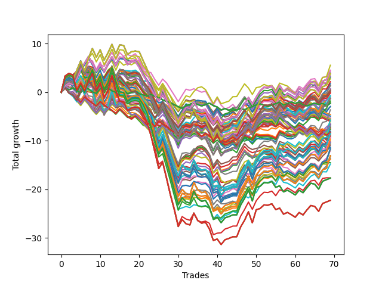

# Long HLT 206 
- Symbol: TSLA
- Date Range: 05/16/2022 - 05/17/2024
- Trading Period: 8:30-12:30
- Number of Trades: 69



| Id. | Name | Win Percent | Profit | Avg Profit / Trade | Avg Time / Trade | Std |      | Name | Win Percent | Profit | Avg Profit / Trade | Avg Time / Trade | Std |
| --- | ---- | ----------- | ------ | ------------------ | ---------------- | --- | ---- | ---- | ----------- | ------ | ------------------ | ---------------- | --- |
| | Sorted By <br> Profit | | | | | | | Sorted By <br> Win Percentage |||||
|0| TP-1.75 105m | 53.62 | 5.57 | 0.08 | 59:10 | 1.46 |     | TP-1.25 105m | 55.07 | 4.54 | 0.07 | 44:13 | 1.17 |
|1| TP-1.25 105m | 55.07 | 4.54 | 0.07 | 44:13 | 1.17 |     | TP-1.75 105m | 53.62 | 5.57 | 0.08 | 59:10 | 1.46 |
|2| TP-1.75 90m | 52.17 | 4.35 | 0.06 | 55:37 | 1.37 |     | TP-1.25 180m | 53.62 | 3.94 | 0.06 | 45:18 | 1.17 |
|3| TP-1.25 180m | 53.62 | 3.94 | 0.06 | 45:18 | 1.17 |     | TP-1.25 165m | 53.62 | 3.94 | 0.06 | 45:18 | 1.17 |
|4| TP-1.25 165m | 53.62 | 3.94 | 0.06 | 45:18 | 1.17 |     | TP-1.25 150m | 53.62 | 3.94 | 0.06 | 45:18 | 1.17 |
|5| TP-1.25 150m | 53.62 | 3.94 | 0.06 | 45:18 | 1.17 |     | TP-1.25 135m | 53.62 | 3.94 | 0.06 | 45:18 | 1.17 |
|6| TP-1.25 135m | 53.62 | 3.94 | 0.06 | 45:18 | 1.17 |     | TP-1.25 120m | 53.62 | 3.94 | 0.06 | 45:18 | 1.17 |
|7| TP-1.25 120m | 53.62 | 3.94 | 0.06 | 45:18 | 1.17 |     | TP-1.75 90m | 52.17 | 4.35 | 0.06 | 55:37 | 1.37 |
|8| TP-1.75 180m | 52.17 | 3.84 | 0.06 | 61:40 | 1.51 |     | TP-1.75 180m | 52.17 | 3.84 | 0.06 | 61:40 | 1.51 |
|9| TP-1.75 165m | 52.17 | 3.84 | 0.06 | 61:40 | 1.51 |     | TP-1.75 165m | 52.17 | 3.84 | 0.06 | 61:40 | 1.51 |
|10| TP-1.75 150m | 52.17 | 3.84 | 0.06 | 61:40 | 1.51 |     | TP-1.75 150m | 52.17 | 3.84 | 0.06 | 61:40 | 1.51 |
|11| TP-1.75 135m | 52.17 | 3.84 | 0.06 | 61:40 | 1.51 |     | TP-1.75 135m | 52.17 | 3.84 | 0.06 | 61:40 | 1.51 |
|12| TP-1.75 120m | 52.17 | 3.84 | 0.06 | 61:40 | 1.51 |     | TP-1.75 120m | 52.17 | 3.84 | 0.06 | 61:40 | 1.51 |
|13| TP-1.25 90m | 52.17 | 3.27 | 0.05 | 42:22 | 1.12 |     | TP-1.25 90m | 52.17 | 3.27 | 0.05 | 42:22 | 1.12 |
|14| TP-1.25 75m | 49.28 | 3.10 | 0.04 | 39:48 | 1.11 |     | TP-1.5 105m | 52.17 | 1.35 | 0.02 | 54:39 | 1.30 |
|15| TP-1.25 45m | 50.72 | 2.77 | 0.04 | 30:37 | 1.08 |     | TP-2.5 105m | 52.17 | -9.64 | -0.14 | 72:33 | 1.58 |
|16| TP-1.5 75m | 49.28 | 2.17 | 0.03 | 47:23 | 1.22 |     | TP-1.25 45m | 50.72 | 2.77 | 0.04 | 30:37 | 1.08 |
|17| TP-1.25 60m | 47.83 | 1.76 | 0.03 | 35:57 | 1.10 |     | TP-1.5 90m | 50.72 | 1.37 | 0.02 | 51:26 | 1.24 |
|18| TP-1.5 90m | 50.72 | 1.37 | 0.02 | 51:26 | 1.24 |     | TP-1 105m | 50.72 | 0.44 | 0.01 | 34:13 | 1.03 |
|19| TP-1.5 105m | 52.17 | 1.35 | 0.02 | 54:39 | 1.30 |     | TP-1.5 180m | 50.72 | -1.25 | -0.02 | 56:49 | 1.33 |
|20| TP-1.75 75m | 47.83 | 0.72 | 0.01 | 51:01 | 1.32 |     | TP-1.5 165m | 50.72 | -1.25 | -0.02 | 56:49 | 1.33 |
|21| TP-1 75m | 46.38 | 0.54 | 0.01 | 31:41 | 1.01 |     | TP-1.5 150m | 50.72 | -1.25 | -0.02 | 56:49 | 1.33 |
|22| TP-1 105m | 50.72 | 0.44 | 0.01 | 34:13 | 1.03 |     | TP-1.5 135m | 50.72 | -1.25 | -0.02 | 56:49 | 1.33 |
|23| TP-1 180m | 49.28 | 0.26 | 0.00 | 34:56 | 1.04 |     | TP-1.5 120m | 50.72 | -1.25 | -0.02 | 56:49 | 1.33 |
|24| TP-1 165m | 49.28 | 0.26 | 0.00 | 34:56 | 1.04 |     | TP-2 90m | 50.72 | -3.62 | -0.05 | 62:15 | 1.39 |
|25| TP-1 150m | 49.28 | 0.26 | 0.00 | 34:56 | 1.04 |     | TP-2 105m | 50.72 | -5.72 | -0.08 | 67:25 | 1.49 |
|26| TP-1 135m | 49.28 | 0.26 | 0.00 | 34:56 | 1.04 |     | TP-2.25 90m | 50.72 | -5.89 | -0.09 | 63:54 | 1.45 |
|27| TP-1 120m | 49.28 | 0.26 | 0.00 | 34:56 | 1.04 |     | TP-2.5 90m | 50.72 | -6.68 | -0.10 | 66:25 | 1.48 |
|28| TP-1.5 60m | 49.28 | -0.05 | -0.00 | 41:50 | 1.20 |     | TP-2.25 105m | 50.72 | -8.17 | -0.12 | 69:20 | 1.55 |
|29| TP-1 90m | 47.83 | -0.13 | -0.00 | 33:06 | 1.01 |     | TP-2.75 90m | 50.72 | -11.32 | -0.16 | 67:35 | 1.51 |
|30| TP-1.25 30m | 46.38 | -0.26 | -0.00 | 23:22 | 1.00 |     | TP-3 90m | 50.72 | -13.84 | -0.20 | 69:00 | 1.60 |
|31| TP-1 60m | 46.38 | -0.69 | -0.01 | 29:16 | 1.01 |     | TP-2.75 105m | 50.72 | -14.50 | -0.21 | 74:12 | 1.61 |
|32| TP-1.5 45m | 49.28 | -0.95 | -0.01 | 35:01 | 1.20 |     | TP-3 105m | 50.72 | -17.61 | -0.26 | 76:00 | 1.68 |
|33| TP-1.5 180m | 50.72 | -1.25 | -0.02 | 56:49 | 1.33 |     | TP-1.25 75m | 49.28 | 3.10 | 0.04 | 39:48 | 1.11 |
|34| TP-1.5 165m | 50.72 | -1.25 | -0.02 | 56:49 | 1.33 |     | TP-1.5 75m | 49.28 | 2.17 | 0.03 | 47:23 | 1.22 |
|35| TP-1.5 150m | 50.72 | -1.25 | -0.02 | 56:49 | 1.33 |     | TP-1 180m | 49.28 | 0.26 | 0.00 | 34:56 | 1.04 |
|36| TP-1.5 135m | 50.72 | -1.25 | -0.02 | 56:49 | 1.33 |     | TP-1 165m | 49.28 | 0.26 | 0.00 | 34:56 | 1.04 |
|37| TP-1.5 120m | 50.72 | -1.25 | -0.02 | 56:49 | 1.33 |     | TP-1 150m | 49.28 | 0.26 | 0.00 | 34:56 | 1.04 |
|38| TP-1 45m | 49.28 | -1.26 | -0.02 | 25:32 | 0.98 |     | TP-1 135m | 49.28 | 0.26 | 0.00 | 34:56 | 1.04 |
|39| TP-1.75 60m | 47.83 | -1.79 | -0.03 | 44:46 | 1.27 |     | TP-1 120m | 49.28 | 0.26 | 0.00 | 34:56 | 1.04 |
|40| TP-1.75 30m | 44.93 | -1.98 | -0.03 | 26:33 | 1.06 |     | TP-1.5 60m | 49.28 | -0.05 | -0.00 | 41:50 | 1.20 |
|41| TP-1 30m | 43.48 | -2.19 | -0.03 | 20:26 | 0.92 |     | TP-1.5 45m | 49.28 | -0.95 | -0.01 | 35:01 | 1.20 |
|42| TP-0.25 180m | 44.93 | -2.25 | -0.03 | 04:18 | 0.44 |     | TP-1 45m | 49.28 | -1.26 | -0.02 | 25:32 | 0.98 |
|43| TP-0.25 165m | 44.93 | -2.25 | -0.03 | 04:18 | 0.44 |     | TP-1.75 45m | 49.28 | -2.91 | -0.04 | 36:46 | 1.22 |
|44| TP-0.25 150m | 44.93 | -2.25 | -0.03 | 04:18 | 0.44 |     | TP-2 180m | 49.28 | -8.45 | -0.12 | 71:38 | 1.58 |
|45| TP-0.25 135m | 44.93 | -2.25 | -0.03 | 04:18 | 0.44 |     | TP-2 165m | 49.28 | -8.45 | -0.12 | 71:38 | 1.58 |
|46| TP-0.25 120m | 44.93 | -2.25 | -0.03 | 04:18 | 0.44 |     | TP-2 150m | 49.28 | -8.45 | -0.12 | 71:38 | 1.58 |
|47| TP-0.25 105m | 44.93 | -2.25 | -0.03 | 04:18 | 0.44 |     | TP-2 135m | 49.28 | -8.45 | -0.12 | 71:38 | 1.58 |
|48| TP-0.25 90m | 44.93 | -2.25 | -0.03 | 04:18 | 0.44 |     | TP-2 120m | 49.28 | -8.45 | -0.12 | 71:38 | 1.58 |
|49| TP-0.25 75m | 44.93 | -2.25 | -0.03 | 04:18 | 0.44 |     | TP-3 45m | 49.28 | -8.74 | -0.13 | 40:55 | 1.21 |
|50| TP-0.25 60m | 44.93 | -2.25 | -0.03 | 04:18 | 0.44 |     | TP-2.5 45m | 49.28 | -9.39 | -0.14 | 40:13 | 1.19 |
|51| TP-0.25 45m | 44.93 | -2.25 | -0.03 | 04:18 | 0.44 |     | TP-2 45m | 49.28 | -10.07 | -0.15 | 38:50 | 1.15 |
|52| TP-0.25 30m | 44.93 | -2.25 | -0.03 | 04:18 | 0.44 |     | TP-2.75 45m | 49.28 | -10.24 | -0.15 | 40:23 | 1.22 |
|53| TP-0.25 15m | 44.93 | -2.27 | -0.03 | 04:16 | 0.44 |     | TP-2.25 45m | 49.28 | -10.45 | -0.15 | 39:25 | 1.17 |
|54| TP-1.75 45m | 49.28 | -2.91 | -0.04 | 36:46 | 1.22 |     | TP-2.25 180m | 49.28 | -11.63 | -0.17 | 74:06 | 1.62 |
|55| TP-1.5 30m | 44.93 | -3.00 | -0.04 | 25:56 | 1.02 |     | TP-2.25 165m | 49.28 | -11.63 | -0.17 | 74:06 | 1.62 |
|56| TP-2 90m | 50.72 | -3.62 | -0.05 | 62:15 | 1.39 |     | TP-2.25 150m | 49.28 | -11.63 | -0.17 | 74:06 | 1.62 |
|57| TP-3 15m | 40.58 | -4.56 | -0.07 | 13:59 | 0.84 |     | TP-2.25 135m | 49.28 | -11.63 | -0.17 | 74:06 | 1.62 |
|58| TP-2.75 15m | 40.58 | -4.90 | -0.07 | 13:55 | 0.82 |     | TP-2.25 120m | 49.28 | -11.63 | -0.17 | 74:06 | 1.62 |
|59| TP-2.5 15m | 40.58 | -4.90 | -0.07 | 13:55 | 0.82 |     | TP-2.5 180m | 49.28 | -13.05 | -0.19 | 78:08 | 1.66 |
|60| TP-1.75 15m | 40.58 | -5.23 | -0.08 | 13:49 | 0.81 |     | TP-2.5 165m | 49.28 | -13.05 | -0.19 | 78:08 | 1.66 |
|61| TP-1.25 15m | 42.03 | -5.40 | -0.08 | 13:08 | 0.79 |     | TP-2.5 150m | 49.28 | -13.05 | -0.19 | 78:08 | 1.66 |
|62| TP-2.25 15m | 40.58 | -5.51 | -0.08 | 13:52 | 0.79 |     | TP-2.5 135m | 49.28 | -13.05 | -0.19 | 78:08 | 1.66 |
|63| TP-2 15m | 40.58 | -5.51 | -0.08 | 13:52 | 0.79 |     | TP-2.5 120m | 49.28 | -13.05 | -0.19 | 78:08 | 1.66 |
|64| TP-1.5 15m | 40.58 | -5.71 | -0.08 | 13:47 | 0.78 |     | TP-2.75 180m | 49.28 | -17.67 | -0.26 | 80:15 | 1.69 |
|65| TP-2 105m | 50.72 | -5.72 | -0.08 | 67:25 | 1.49 |     | TP-2.75 165m | 49.28 | -17.67 | -0.26 | 80:15 | 1.69 |
|66| TP-2.25 90m | 50.72 | -5.89 | -0.09 | 63:54 | 1.45 |     | TP-2.75 150m | 49.28 | -17.67 | -0.26 | 80:15 | 1.69 |
|67| TP-1 15m | 42.03 | -5.98 | -0.09 | 12:07 | 0.76 |     | TP-2.75 135m | 49.28 | -17.67 | -0.26 | 80:15 | 1.69 |
|68| TP-0.75 30m | 43.48 | -6.48 | -0.09 | 16:54 | 0.78 |     | TP-2.75 120m | 49.28 | -17.67 | -0.26 | 80:15 | 1.69 |
|69| TP-0.75 75m | 43.48 | -6.67 | -0.10 | 20:57 | 0.85 |     | TP-3 180m | 49.28 | -22.25 | -0.32 | 82:25 | 1.76 |
|70| TP-2.5 90m | 50.72 | -6.68 | -0.10 | 66:25 | 1.48 |     | TP-3 165m | 49.28 | -22.25 | -0.32 | 82:25 | 1.76 |
|71| TP-0.75 180m | 43.48 | -6.69 | -0.10 | 20:58 | 0.85 |     | TP-3 150m | 49.28 | -22.25 | -0.32 | 82:25 | 1.76 |
|72| TP-0.75 165m | 43.48 | -6.69 | -0.10 | 20:58 | 0.85 |     | TP-3 135m | 49.28 | -22.25 | -0.32 | 82:25 | 1.76 |
|73| TP-0.75 150m | 43.48 | -6.69 | -0.10 | 20:58 | 0.85 |     | TP-3 120m | 49.28 | -22.25 | -0.32 | 82:25 | 1.76 |
|74| TP-0.75 135m | 43.48 | -6.69 | -0.10 | 20:58 | 0.85 |     | TP-1.25 60m | 47.83 | 1.76 | 0.03 | 35:57 | 1.10 |
|75| TP-0.75 120m | 43.48 | -6.69 | -0.10 | 20:58 | 0.85 |     | TP-1.75 75m | 47.83 | 0.72 | 0.01 | 51:01 | 1.32 |
|76| TP-0.75 105m | 43.48 | -6.69 | -0.10 | 20:58 | 0.85 |     | TP-1 90m | 47.83 | -0.13 | -0.00 | 33:06 | 1.01 |
|77| TP-0.75 90m | 43.48 | -6.69 | -0.10 | 20:58 | 0.85 |     | TP-1.75 60m | 47.83 | -1.79 | -0.03 | 44:46 | 1.27 |
|78| TP-0.75 45m | 43.48 | -6.89 | -0.10 | 19:37 | 0.82 |     | TP-1 75m | 46.38 | 0.54 | 0.01 | 31:41 | 1.01 |
|79| TP-2.5 30m | 43.48 | -7.11 | -0.10 | 27:43 | 1.06 |     | TP-1.25 30m | 46.38 | -0.26 | -0.00 | 23:22 | 1.00 |
|80| TP-2 75m | 46.38 | -7.14 | -0.10 | 56:13 | 1.32 |     | TP-1 60m | 46.38 | -0.69 | -0.01 | 29:16 | 1.01 |
|81| TP-3 30m | 43.48 | -7.32 | -0.11 | 27:58 | 1.10 |     | TP-2 75m | 46.38 | -7.14 | -0.10 | 56:13 | 1.32 |
|82| TP-0.75 60m | 43.48 | -7.34 | -0.11 | 20:33 | 0.85 |     | TP-2 60m | 46.38 | -8.96 | -0.13 | 48:36 | 1.25 |
|83| TP-0.5 15m | 37.68 | -7.52 | -0.11 | 08:22 | 0.59 |     | TP-2.25 75m | 46.38 | -9.31 | -0.13 | 57:39 | 1.38 |
|84| TP-2 30m | 43.48 | -7.55 | -0.11 | 27:06 | 1.02 |     | TP-2.25 60m | 46.38 | -10.27 | -0.15 | 49:34 | 1.30 |
|85| TP-2.75 30m | 43.48 | -7.60 | -0.11 | 27:52 | 1.08 |     | TP-2.5 60m | 46.38 | -10.85 | -0.16 | 51:03 | 1.34 |
|86| TP-0.5 30m | 40.58 | -7.61 | -0.11 | 10:47 | 0.62 |     | TP-2.5 75m | 46.38 | -11.70 | -0.17 | 59:39 | 1.42 |
|87| TP-2.25 30m | 43.48 | -8.00 | -0.12 | 27:23 | 1.04 |     | TP-2.75 60m | 46.38 | -12.04 | -0.17 | 51:19 | 1.40 |
|88| TP-0.5 45m | 39.13 | -8.14 | -0.12 | 11:39 | 0.64 |     | TP-2.75 75m | 46.38 | -13.22 | -0.19 | 60:21 | 1.44 |
|89| TP-2.25 105m | 50.72 | -8.17 | -0.12 | 69:20 | 1.55 |     | TP-3 60m | 46.38 | -13.67 | -0.20 | 52:12 | 1.47 |
|90| TP-0.5 180m | 39.13 | -8.29 | -0.12 | 11:41 | 0.64 |     | TP-3 75m | 46.38 | -14.79 | -0.21 | 61:32 | 1.51 |
|91| TP-0.5 165m | 39.13 | -8.29 | -0.12 | 11:41 | 0.64 |     | TP-1.75 30m | 44.93 | -1.98 | -0.03 | 26:33 | 1.06 |
|92| TP-0.5 150m | 39.13 | -8.29 | -0.12 | 11:41 | 0.64 |     | TP-0.25 180m | 44.93 | -2.25 | -0.03 | 04:18 | 0.44 |
|93| TP-0.5 135m | 39.13 | -8.29 | -0.12 | 11:41 | 0.64 |     | TP-0.25 165m | 44.93 | -2.25 | -0.03 | 04:18 | 0.44 |
|94| TP-0.5 120m | 39.13 | -8.29 | -0.12 | 11:41 | 0.64 |     | TP-0.25 150m | 44.93 | -2.25 | -0.03 | 04:18 | 0.44 |
|95| TP-0.5 105m | 39.13 | -8.29 | -0.12 | 11:41 | 0.64 |     | TP-0.25 135m | 44.93 | -2.25 | -0.03 | 04:18 | 0.44 |
|96| TP-0.5 90m | 39.13 | -8.29 | -0.12 | 11:41 | 0.64 |     | TP-0.25 120m | 44.93 | -2.25 | -0.03 | 04:18 | 0.44 |
|97| TP-0.5 75m | 39.13 | -8.29 | -0.12 | 11:41 | 0.64 |     | TP-0.25 105m | 44.93 | -2.25 | -0.03 | 04:18 | 0.44 |
|98| TP-0.5 60m | 39.13 | -8.29 | -0.12 | 11:41 | 0.64 |     | TP-0.25 90m | 44.93 | -2.25 | -0.03 | 04:18 | 0.44 |
|99| TP-2 180m | 49.28 | -8.45 | -0.12 | 71:38 | 1.58 |     | TP-0.25 75m | 44.93 | -2.25 | -0.03 | 04:18 | 0.44 |
|100| TP-2 165m | 49.28 | -8.45 | -0.12 | 71:38 | 1.58 |     | TP-0.25 60m | 44.93 | -2.25 | -0.03 | 04:18 | 0.44 |
|101| TP-2 150m | 49.28 | -8.45 | -0.12 | 71:38 | 1.58 |     | TP-0.25 45m | 44.93 | -2.25 | -0.03 | 04:18 | 0.44 |
|102| TP-2 135m | 49.28 | -8.45 | -0.12 | 71:38 | 1.58 |     | TP-0.25 30m | 44.93 | -2.25 | -0.03 | 04:18 | 0.44 |
|103| TP-2 120m | 49.28 | -8.45 | -0.12 | 71:38 | 1.58 |     | TP-0.25 15m | 44.93 | -2.27 | -0.03 | 04:16 | 0.44 |
|104| TP-3 45m | 49.28 | -8.74 | -0.13 | 40:55 | 1.21 |     | TP-1.5 30m | 44.93 | -3.00 | -0.04 | 25:56 | 1.02 |
|105| TP-2 60m | 46.38 | -8.96 | -0.13 | 48:36 | 1.25 |     | TP-1 30m | 43.48 | -2.19 | -0.03 | 20:26 | 0.92 |
|106| TP-0.75 15m | 39.13 | -9.14 | -0.13 | 11:05 | 0.65 |     | TP-0.75 30m | 43.48 | -6.48 | -0.09 | 16:54 | 0.78 |
|107| TP-2.25 75m | 46.38 | -9.31 | -0.13 | 57:39 | 1.38 |     | TP-0.75 75m | 43.48 | -6.67 | -0.10 | 20:57 | 0.85 |
|108| TP-2.5 45m | 49.28 | -9.39 | -0.14 | 40:13 | 1.19 |     | TP-0.75 180m | 43.48 | -6.69 | -0.10 | 20:58 | 0.85 |
|109| TP-2.5 105m | 52.17 | -9.64 | -0.14 | 72:33 | 1.58 |     | TP-0.75 165m | 43.48 | -6.69 | -0.10 | 20:58 | 0.85 |
|110| TP-2 45m | 49.28 | -10.07 | -0.15 | 38:50 | 1.15 |     | TP-0.75 150m | 43.48 | -6.69 | -0.10 | 20:58 | 0.85 |
|111| TP-2.75 45m | 49.28 | -10.24 | -0.15 | 40:23 | 1.22 |     | TP-0.75 135m | 43.48 | -6.69 | -0.10 | 20:58 | 0.85 |
|112| TP-2.25 60m | 46.38 | -10.27 | -0.15 | 49:34 | 1.30 |     | TP-0.75 120m | 43.48 | -6.69 | -0.10 | 20:58 | 0.85 |
|113| TP-2.25 45m | 49.28 | -10.45 | -0.15 | 39:25 | 1.17 |     | TP-0.75 105m | 43.48 | -6.69 | -0.10 | 20:58 | 0.85 |
|114| TP-2.5 60m | 46.38 | -10.85 | -0.16 | 51:03 | 1.34 |     | TP-0.75 90m | 43.48 | -6.69 | -0.10 | 20:58 | 0.85 |
|115| TP-2.75 90m | 50.72 | -11.32 | -0.16 | 67:35 | 1.51 |     | TP-0.75 45m | 43.48 | -6.89 | -0.10 | 19:37 | 0.82 |
|116| TP-2.25 180m | 49.28 | -11.63 | -0.17 | 74:06 | 1.62 |     | TP-2.5 30m | 43.48 | -7.11 | -0.10 | 27:43 | 1.06 |
|117| TP-2.25 165m | 49.28 | -11.63 | -0.17 | 74:06 | 1.62 |     | TP-3 30m | 43.48 | -7.32 | -0.11 | 27:58 | 1.10 |
|118| TP-2.25 150m | 49.28 | -11.63 | -0.17 | 74:06 | 1.62 |     | TP-0.75 60m | 43.48 | -7.34 | -0.11 | 20:33 | 0.85 |
|119| TP-2.25 135m | 49.28 | -11.63 | -0.17 | 74:06 | 1.62 |     | TP-2 30m | 43.48 | -7.55 | -0.11 | 27:06 | 1.02 |
|120| TP-2.25 120m | 49.28 | -11.63 | -0.17 | 74:06 | 1.62 |     | TP-2.75 30m | 43.48 | -7.60 | -0.11 | 27:52 | 1.08 |
|121| TP-2.5 75m | 46.38 | -11.70 | -0.17 | 59:39 | 1.42 |     | TP-2.25 30m | 43.48 | -8.00 | -0.12 | 27:23 | 1.04 |
|122| TP-2.75 60m | 46.38 | -12.04 | -0.17 | 51:19 | 1.40 |     | TP-1.25 15m | 42.03 | -5.40 | -0.08 | 13:08 | 0.79 |
|123| TP-2.5 180m | 49.28 | -13.05 | -0.19 | 78:08 | 1.66 |     | TP-1 15m | 42.03 | -5.98 | -0.09 | 12:07 | 0.76 |
|124| TP-2.5 165m | 49.28 | -13.05 | -0.19 | 78:08 | 1.66 |     | TP-3 15m | 40.58 | -4.56 | -0.07 | 13:59 | 0.84 |
|125| TP-2.5 150m | 49.28 | -13.05 | -0.19 | 78:08 | 1.66 |     | TP-2.75 15m | 40.58 | -4.90 | -0.07 | 13:55 | 0.82 |
|126| TP-2.5 135m | 49.28 | -13.05 | -0.19 | 78:08 | 1.66 |     | TP-2.5 15m | 40.58 | -4.90 | -0.07 | 13:55 | 0.82 |
|127| TP-2.5 120m | 49.28 | -13.05 | -0.19 | 78:08 | 1.66 |     | TP-1.75 15m | 40.58 | -5.23 | -0.08 | 13:49 | 0.81 |
|128| TP-2.75 75m | 46.38 | -13.22 | -0.19 | 60:21 | 1.44 |     | TP-2.25 15m | 40.58 | -5.51 | -0.08 | 13:52 | 0.79 |
|129| TP-3 60m | 46.38 | -13.67 | -0.20 | 52:12 | 1.47 |     | TP-2 15m | 40.58 | -5.51 | -0.08 | 13:52 | 0.79 |
|130| TP-3 90m | 50.72 | -13.84 | -0.20 | 69:00 | 1.60 |     | TP-1.5 15m | 40.58 | -5.71 | -0.08 | 13:47 | 0.78 |
|131| TP-2.75 105m | 50.72 | -14.50 | -0.21 | 74:12 | 1.61 |     | TP-0.5 30m | 40.58 | -7.61 | -0.11 | 10:47 | 0.62 |
|132| TP-3 75m | 46.38 | -14.79 | -0.21 | 61:32 | 1.51 |     | TP-0.5 45m | 39.13 | -8.14 | -0.12 | 11:39 | 0.64 |
|133| TP-3 105m | 50.72 | -17.61 | -0.26 | 76:00 | 1.68 |     | TP-0.5 180m | 39.13 | -8.29 | -0.12 | 11:41 | 0.64 |
|134| TP-2.75 180m | 49.28 | -17.67 | -0.26 | 80:15 | 1.69 |     | TP-0.5 165m | 39.13 | -8.29 | -0.12 | 11:41 | 0.64 |
|135| TP-2.75 165m | 49.28 | -17.67 | -0.26 | 80:15 | 1.69 |     | TP-0.5 150m | 39.13 | -8.29 | -0.12 | 11:41 | 0.64 |
|136| TP-2.75 150m | 49.28 | -17.67 | -0.26 | 80:15 | 1.69 |     | TP-0.5 135m | 39.13 | -8.29 | -0.12 | 11:41 | 0.64 |
|137| TP-2.75 135m | 49.28 | -17.67 | -0.26 | 80:15 | 1.69 |     | TP-0.5 120m | 39.13 | -8.29 | -0.12 | 11:41 | 0.64 |
|138| TP-2.75 120m | 49.28 | -17.67 | -0.26 | 80:15 | 1.69 |     | TP-0.5 105m | 39.13 | -8.29 | -0.12 | 11:41 | 0.64 |
|139| TP-3 180m | 49.28 | -22.25 | -0.32 | 82:25 | 1.76 |     | TP-0.5 90m | 39.13 | -8.29 | -0.12 | 11:41 | 0.64 |
|140| TP-3 165m | 49.28 | -22.25 | -0.32 | 82:25 | 1.76 |     | TP-0.5 75m | 39.13 | -8.29 | -0.12 | 11:41 | 0.64 |
|141| TP-3 150m | 49.28 | -22.25 | -0.32 | 82:25 | 1.76 |     | TP-0.5 60m | 39.13 | -8.29 | -0.12 | 11:41 | 0.64 |
|142| TP-3 135m | 49.28 | -22.25 | -0.32 | 82:25 | 1.76 |     | TP-0.75 15m | 39.13 | -9.14 | -0.13 | 11:05 | 0.65 |
|143| TP-3 120m | 49.28 | -22.25 | -0.32 | 82:25 | 1.76 |     | TP-0.5 15m | 37.68 | -7.52 | -0.11 | 08:22 | 0.59 |

### Test TP-0.25 15m
* Take Profit of 0.25 Point
* 0.25 Stoploss
* Results:
```
Total Trades: 69
Percent Up: 44.93
Percent Down: 55.07
Total Points Moved Up: -2.27
Potential Profit: -1135.00
Total Points Ups: 12.79 Count Ups: 31
Total Points Downs: -15.06 Count Downs: 38
```

<details><summary>Trades</summary>

<code>In: 2022-05-20 12:25:00		Out: 2022-05-20 12:27:00		Total Position Time: 02:00		Total Move Up: 0.92		Total to Date: 0.92</code> <br />
<code>In: 2022-06-16 12:05:00		Out: 2022-06-16 12:09:00		Total Position Time: 04:00		Total Move Up: -0.44		Total to Date: 0.48</code> <br />
<code>In: 2022-07-26 11:50:00		Out: 2022-07-26 11:52:00		Total Position Time: 02:00		Total Move Up: 0.42		Total to Date: 0.90</code> <br />
<code>In: 2022-08-05 09:50:00		Out: 2022-08-05 09:52:00		Total Position Time: 02:00		Total Move Up: -0.63		Total to Date: 0.27</code> <br />
<code>In: 2022-08-05 12:35:00		Out: 2022-08-05 12:37:00		Total Position Time: 02:00		Total Move Up: -0.33		Total to Date: -0.06</code> <br />
<code>In: 2022-08-08 12:10:00		Out: 2022-08-08 12:13:00		Total Position Time: 03:00		Total Move Up: 1.13		Total to Date: 1.07</code> <br />
<code>In: 2022-08-30 10:40:00		Out: 2022-08-30 10:43:00		Total Position Time: 03:00		Total Move Up: -0.36		Total to Date: 0.71</code> <br />
<code>In: 2022-09-01 08:40:00		Out: 2022-09-01 08:42:00		Total Position Time: 02:00		Total Move Up: -0.65		Total to Date: 0.06</code> <br />
<code>In: 2022-09-22 11:00:00		Out: 2022-09-22 11:02:00		Total Position Time: 02:00		Total Move Up: -0.28		Total to Date: -0.22</code> <br />
<code>In: 2022-10-18 12:30:00		Out: 2022-10-18 12:32:00		Total Position Time: 02:00		Total Move Up: 0.91		Total to Date: 0.69</code> <br />
<code>In: 2022-10-20 10:10:00		Out: 2022-10-20 10:12:00		Total Position Time: 02:00		Total Move Up: 0.45		Total to Date: 1.14</code> <br />
<code>In: 2022-10-20 11:40:00		Out: 2022-10-20 11:43:00		Total Position Time: 03:00		Total Move Up: -0.30		Total to Date: 0.84</code> <br />
<code>In: 2022-11-04 11:20:00		Out: 2022-11-04 11:22:00		Total Position Time: 02:00		Total Move Up: -0.53		Total to Date: 0.31</code> <br />
<code>In: 2022-11-09 08:50:00		Out: 2022-11-09 08:52:00		Total Position Time: 02:00		Total Move Up: -0.33		Total to Date: -0.02</code> <br />
<code>In: 2022-11-09 11:10:00		Out: 2022-11-09 11:19:00		Total Position Time: 09:00		Total Move Up: 0.93		Total to Date: 0.91</code> <br />
<code>In: 2022-11-16 12:05:00		Out: 2022-11-16 12:07:00		Total Position Time: 02:00		Total Move Up: -0.39		Total to Date: 0.52</code> <br />
<code>In: 2022-11-21 09:45:00		Out: 2022-11-21 09:51:00		Total Position Time: 06:00		Total Move Up: -0.82		Total to Date: -0.30</code> <br />
<code>In: 2022-11-29 11:10:00		Out: 2022-11-29 11:21:00		Total Position Time: 11:00		Total Move Up: 0.26		Total to Date: -0.04</code> <br />
<code>In: 2022-12-05 12:05:00		Out: 2022-12-05 12:08:00		Total Position Time: 03:00		Total Move Up: 0.28		Total to Date: 0.24</code> <br />
<code>In: 2022-12-16 08:45:00		Out: 2022-12-16 08:47:00		Total Position Time: 02:00		Total Move Up: -0.53		Total to Date: -0.29</code> <br />
<code>In: 2022-12-20 09:15:00		Out: 2022-12-20 09:18:00		Total Position Time: 03:00		Total Move Up: -0.25		Total to Date: -0.54</code> <br />
<code>In: 2022-12-20 09:55:00		Out: 2022-12-20 09:57:00		Total Position Time: 02:00		Total Move Up: -0.28		Total to Date: -0.82</code> <br />
<code>In: 2022-12-20 11:10:00		Out: 2022-12-20 11:12:00		Total Position Time: 02:00		Total Move Up: 0.40		Total to Date: -0.42</code> <br />
<code>In: 2023-01-30 10:25:00		Out: 2023-01-30 10:30:00		Total Position Time: 05:00		Total Move Up: -0.42		Total to Date: -0.84</code> <br />
<code>In: 2023-02-03 11:00:00		Out: 2023-02-03 11:03:00		Total Position Time: 03:00		Total Move Up: -0.22		Total to Date: -1.06</code> <br />
<code>In: 2023-03-02 09:10:00		Out: 2023-03-02 09:12:00		Total Position Time: 02:00		Total Move Up: -0.51		Total to Date: -1.57</code> <br />
<code>In: 2023-03-06 09:00:00		Out: 2023-03-06 09:09:00		Total Position Time: 09:00		Total Move Up: -0.31		Total to Date: -1.88</code> <br />
<code>In: 2023-03-06 09:05:00		Out: 2023-03-06 09:08:00		Total Position Time: 03:00		Total Move Up: -0.27		Total to Date: -2.15</code> <br />
<code>In: 2023-03-09 10:10:00		Out: 2023-03-09 10:12:00		Total Position Time: 02:00		Total Move Up: -0.41		Total to Date: -2.56</code> <br />
<code>In: 2023-03-09 11:25:00		Out: 2023-03-09 11:27:00		Total Position Time: 02:00		Total Move Up: -0.41		Total to Date: -2.97</code> <br />
<code>In: 2023-03-17 08:40:00		Out: 2023-03-17 08:44:00		Total Position Time: 04:00		Total Move Up: -0.32		Total to Date: -3.29</code> <br />
<code>In: 2023-04-12 08:55:00		Out: 2023-04-12 08:57:00		Total Position Time: 02:00		Total Move Up: 0.50		Total to Date: -2.79</code> <br />
<code>In: 2023-04-12 12:35:00		Out: 2023-04-12 12:42:00		Total Position Time: 07:00		Total Move Up: 0.32		Total to Date: -2.47</code> <br />
<code>In: 2023-04-14 09:35:00		Out: 2023-04-14 09:42:00		Total Position Time: 07:00		Total Move Up: 0.30		Total to Date: -2.17</code> <br />
<code>In: 2023-04-20 09:35:00		Out: 2023-04-20 09:38:00		Total Position Time: 03:00		Total Move Up: -0.35		Total to Date: -2.52</code> <br />
<code>In: 2023-05-12 09:40:00		Out: 2023-05-12 09:44:00		Total Position Time: 04:00		Total Move Up: -0.28		Total to Date: -2.80</code> <br />
<code>In: 2023-05-23 11:40:00		Out: 2023-05-23 11:44:00		Total Position Time: 04:00		Total Move Up: 0.26		Total to Date: -2.54</code> <br />
<code>In: 2023-07-11 08:55:00		Out: 2023-07-11 08:59:00		Total Position Time: 04:00		Total Move Up: 0.31		Total to Date: -2.23</code> <br />
<code>In: 2023-07-27 12:20:00		Out: 2023-07-27 12:22:00		Total Position Time: 02:00		Total Move Up: -0.50		Total to Date: -2.73</code> <br />
<code>In: 2023-08-14 09:15:00		Out: 2023-08-14 09:17:00		Total Position Time: 02:00		Total Move Up: -0.32		Total to Date: -3.05</code> <br />
<code>In: 2023-08-16 09:05:00		Out: 2023-08-16 09:11:00		Total Position Time: 06:00		Total Move Up: -0.61		Total to Date: -3.66</code> <br />
<code>In: 2023-08-16 09:40:00		Out: 2023-08-16 09:43:00		Total Position Time: 03:00		Total Move Up: 0.32		Total to Date: -3.34</code> <br />
<code>In: 2023-09-21 12:30:00		Out: 2023-09-21 12:35:00		Total Position Time: 05:00		Total Move Up: -0.38		Total to Date: -3.72</code> <br />
<code>In: 2023-09-26 11:30:00		Out: 2023-09-26 11:32:00		Total Position Time: 02:00		Total Move Up: 0.39		Total to Date: -3.33</code> <br />
<code>In: 2023-10-12 11:30:00		Out: 2023-10-12 11:41:00		Total Position Time: 11:00		Total Move Up: -0.32		Total to Date: -3.65</code> <br />
<code>In: 2023-11-08 09:50:00		Out: 2023-11-08 10:03:00		Total Position Time: 13:00		Total Move Up: 0.34		Total to Date: -3.31</code> <br />
<code>In: 2023-11-09 12:15:00		Out: 2023-11-09 12:17:00		Total Position Time: 02:00		Total Move Up: -0.28		Total to Date: -3.59</code> <br />
<code>In: 2023-11-22 08:50:00		Out: 2023-11-22 08:53:00		Total Position Time: 03:00		Total Move Up: 0.35		Total to Date: -3.24</code> <br />
<code>In: 2023-11-30 08:50:00		Out: 2023-11-30 08:52:00		Total Position Time: 02:00		Total Move Up: 0.29		Total to Date: -2.95</code> <br />
<code>In: 2023-12-29 08:40:00		Out: 2023-12-29 08:42:00		Total Position Time: 02:00		Total Move Up: 0.34		Total to Date: -2.61</code> <br />
<code>In: 2024-01-05 09:45:00		Out: 2024-01-05 09:53:00		Total Position Time: 08:00		Total Move Up: 0.23		Total to Date: -2.38</code> <br />
<code>In: 2024-01-12 11:50:00		Out: 2024-01-12 11:54:00		Total Position Time: 04:00		Total Move Up: -0.29		Total to Date: -2.67</code> <br />
<code>In: 2024-01-26 11:40:00		Out: 2024-01-26 11:43:00		Total Position Time: 03:00		Total Move Up: -0.27		Total to Date: -2.94</code> <br />
<code>In: 2024-02-12 11:35:00		Out: 2024-02-12 11:40:00		Total Position Time: 05:00		Total Move Up: 0.33		Total to Date: -2.61</code> <br />
<code>In: 2024-02-23 10:25:00		Out: 2024-02-23 10:27:00		Total Position Time: 02:00		Total Move Up: 0.27		Total to Date: -2.34</code> <br />
<code>In: 2024-02-27 10:45:00		Out: 2024-02-27 10:49:00		Total Position Time: 04:00		Total Move Up: 0.30		Total to Date: -2.04</code> <br />
<code>In: 2024-03-08 08:45:00		Out: 2024-03-08 08:47:00		Total Position Time: 02:00		Total Move Up: -0.60		Total to Date: -2.64</code> <br />
<code>In: 2024-03-08 10:15:00		Out: 2024-03-08 10:17:00		Total Position Time: 02:00		Total Move Up: 0.33		Total to Date: -2.31</code> <br />
<code>In: 2024-03-13 11:45:00		Out: 2024-03-13 11:53:00		Total Position Time: 08:00		Total Move Up: 0.30		Total to Date: -2.01</code> <br />
<code>In: 2024-03-13 11:50:00		Out: 2024-03-13 11:58:00		Total Position Time: 08:00		Total Move Up: -0.28		Total to Date: -2.29</code> <br />
<code>In: 2024-03-21 11:40:00		Out: 2024-03-21 11:45:00		Total Position Time: 05:00		Total Move Up: 0.25		Total to Date: -2.04</code> <br />
<code>In: 2024-03-28 12:25:00		Out: 2024-03-28 12:32:00		Total Position Time: 07:00		Total Move Up: -0.52		Total to Date: -2.56</code> <br />
<code>In: 2024-04-10 11:45:00		Out: 2024-04-10 11:52:00		Total Position Time: 07:00		Total Move Up: -0.24		Total to Date: -2.80</code> <br />
<code>In: 2024-04-10 12:15:00		Out: 2024-04-10 12:20:00		Total Position Time: 05:00		Total Move Up: 0.30		Total to Date: -2.50</code> <br />
<code>In: 2024-04-12 10:05:00		Out: 2024-04-12 10:08:00		Total Position Time: 03:00		Total Move Up: 0.28		Total to Date: -2.22</code> <br />
<code>In: 2024-04-15 11:40:00		Out: 2024-04-15 11:45:00		Total Position Time: 05:00		Total Move Up: -0.30		Total to Date: -2.52</code> <br />
<code>In: 2024-04-22 08:35:00		Out: 2024-04-22 08:49:00		Total Position Time: 14:00		Total Move Up: 0.24		Total to Date: -2.28</code> <br />
<code>In: 2024-04-30 09:05:00		Out: 2024-04-30 09:09:00		Total Position Time: 04:00		Total Move Up: -0.53		Total to Date: -2.81</code> <br />
<code>In: 2024-05-01 08:35:00		Out: 2024-05-01 08:47:00		Total Position Time: 12:00		Total Move Up: 0.54		Total to Date: -2.27</code> <br />


</details>

### Test TP-0.5 15m
* Take Profit of 0.5 Point
* 0.5 Stoploss
* Results:
```
Total Trades: 69
Percent Up: 37.68
Percent Down: 62.32
Total Points Moved Up: -7.52
Potential Profit: -3760.00
Total Points Ups: 15.32 Count Ups: 26
Total Points Downs: -22.84 Count Downs: 43
```

<details><summary>Trades</summary>

<code>In: 2022-05-20 12:25:00		Out: 2022-05-20 12:27:00		Total Position Time: 02:00		Total Move Up: 0.92		Total to Date: 0.92</code> <br />
<code>In: 2022-06-16 12:05:00		Out: 2022-06-16 12:14:00		Total Position Time: 09:00		Total Move Up: -0.92		Total to Date: 0.00</code> <br />
<code>In: 2022-07-26 11:50:00		Out: 2022-07-26 12:04:00		Total Position Time: 14:00		Total Move Up: 0.02		Total to Date: 0.02</code> <br />
<code>In: 2022-08-05 09:50:00		Out: 2022-08-05 09:52:00		Total Position Time: 02:00		Total Move Up: -0.63		Total to Date: -0.61</code> <br />
<code>In: 2022-08-05 12:35:00		Out: 2022-08-05 12:40:00		Total Position Time: 05:00		Total Move Up: -0.96		Total to Date: -1.57</code> <br />
<code>In: 2022-08-08 12:10:00		Out: 2022-08-08 12:13:00		Total Position Time: 03:00		Total Move Up: 1.13		Total to Date: -0.44</code> <br />
<code>In: 2022-08-30 10:40:00		Out: 2022-08-30 10:44:00		Total Position Time: 04:00		Total Move Up: -0.59		Total to Date: -1.03</code> <br />
<code>In: 2022-09-01 08:40:00		Out: 2022-09-01 08:42:00		Total Position Time: 02:00		Total Move Up: -0.65		Total to Date: -1.68</code> <br />
<code>In: 2022-09-22 11:00:00		Out: 2022-09-22 11:03:00		Total Position Time: 03:00		Total Move Up: -0.56		Total to Date: -2.24</code> <br />
<code>In: 2022-10-18 12:30:00		Out: 2022-10-18 12:32:00		Total Position Time: 02:00		Total Move Up: 0.91		Total to Date: -1.33</code> <br />
<code>In: 2022-10-20 10:10:00		Out: 2022-10-20 10:21:00		Total Position Time: 11:00		Total Move Up: -0.75		Total to Date: -2.08</code> <br />
<code>In: 2022-10-20 11:40:00		Out: 2022-10-20 11:45:00		Total Position Time: 05:00		Total Move Up: -0.55		Total to Date: -2.63</code> <br />
<code>In: 2022-11-04 11:20:00		Out: 2022-11-04 11:22:00		Total Position Time: 02:00		Total Move Up: -0.53		Total to Date: -3.16</code> <br />
<code>In: 2022-11-09 08:50:00		Out: 2022-11-09 08:54:00		Total Position Time: 04:00		Total Move Up: -0.61		Total to Date: -3.77</code> <br />
<code>In: 2022-11-09 11:10:00		Out: 2022-11-09 11:19:00		Total Position Time: 09:00		Total Move Up: 0.93		Total to Date: -2.84</code> <br />
<code>In: 2022-11-16 12:05:00		Out: 2022-11-16 12:08:00		Total Position Time: 03:00		Total Move Up: -0.76		Total to Date: -3.60</code> <br />
<code>In: 2022-11-21 09:45:00		Out: 2022-11-21 09:51:00		Total Position Time: 06:00		Total Move Up: -0.82		Total to Date: -4.42</code> <br />
<code>In: 2022-11-29 11:10:00		Out: 2022-11-29 11:24:00		Total Position Time: 14:00		Total Move Up: 0.26		Total to Date: -4.16</code> <br />
<code>In: 2022-12-05 12:05:00		Out: 2022-12-05 12:19:00		Total Position Time: 14:00		Total Move Up: -0.14		Total to Date: -4.30</code> <br />
<code>In: 2022-12-16 08:45:00		Out: 2022-12-16 08:47:00		Total Position Time: 02:00		Total Move Up: -0.53		Total to Date: -4.83</code> <br />
<code>In: 2022-12-20 09:15:00		Out: 2022-12-20 09:20:00		Total Position Time: 05:00		Total Move Up: -0.70		Total to Date: -5.53</code> <br />
<code>In: 2022-12-20 09:55:00		Out: 2022-12-20 10:07:00		Total Position Time: 12:00		Total Move Up: -0.55		Total to Date: -6.08</code> <br />
<code>In: 2022-12-20 11:10:00		Out: 2022-12-20 11:13:00		Total Position Time: 03:00		Total Move Up: 0.51		Total to Date: -5.57</code> <br />
<code>In: 2023-01-30 10:25:00		Out: 2023-01-30 10:31:00		Total Position Time: 06:00		Total Move Up: -0.91		Total to Date: -6.48</code> <br />
<code>In: 2023-02-03 11:00:00		Out: 2023-02-03 11:09:00		Total Position Time: 09:00		Total Move Up: 1.09		Total to Date: -5.39</code> <br />
<code>In: 2023-03-02 09:10:00		Out: 2023-03-02 09:13:00		Total Position Time: 03:00		Total Move Up: -0.57		Total to Date: -5.96</code> <br />
<code>In: 2023-03-06 09:00:00		Out: 2023-03-06 09:12:00		Total Position Time: 12:00		Total Move Up: -0.55		Total to Date: -6.51</code> <br />
<code>In: 2023-03-06 09:05:00		Out: 2023-03-06 09:11:00		Total Position Time: 06:00		Total Move Up: -0.62		Total to Date: -7.13</code> <br />
<code>In: 2023-03-09 10:10:00		Out: 2023-03-09 10:14:00		Total Position Time: 04:00		Total Move Up: -0.51		Total to Date: -7.64</code> <br />
<code>In: 2023-03-09 11:25:00		Out: 2023-03-09 11:31:00		Total Position Time: 06:00		Total Move Up: -0.87		Total to Date: -8.51</code> <br />
<code>In: 2023-03-17 08:40:00		Out: 2023-03-17 08:49:00		Total Position Time: 09:00		Total Move Up: 0.52		Total to Date: -7.99</code> <br />
<code>In: 2023-04-12 08:55:00		Out: 2023-04-12 08:57:00		Total Position Time: 02:00		Total Move Up: 0.50		Total to Date: -7.49</code> <br />
<code>In: 2023-04-12 12:35:00		Out: 2023-04-12 12:49:00		Total Position Time: 14:00		Total Move Up: -0.14		Total to Date: -7.63</code> <br />
<code>In: 2023-04-14 09:35:00		Out: 2023-04-14 09:49:00		Total Position Time: 14:00		Total Move Up: -0.42		Total to Date: -8.05</code> <br />
<code>In: 2023-04-20 09:35:00		Out: 2023-04-20 09:40:00		Total Position Time: 05:00		Total Move Up: -0.66		Total to Date: -8.71</code> <br />
<code>In: 2023-05-12 09:40:00		Out: 2023-05-12 09:47:00		Total Position Time: 07:00		Total Move Up: -0.68		Total to Date: -9.39</code> <br />
<code>In: 2023-05-23 11:40:00		Out: 2023-05-23 11:51:00		Total Position Time: 11:00		Total Move Up: 0.63		Total to Date: -8.76</code> <br />
<code>In: 2023-07-11 08:55:00		Out: 2023-07-11 09:09:00		Total Position Time: 14:00		Total Move Up: -0.42		Total to Date: -9.18</code> <br />
<code>In: 2023-07-27 12:20:00		Out: 2023-07-27 12:23:00		Total Position Time: 03:00		Total Move Up: -0.67		Total to Date: -9.85</code> <br />
<code>In: 2023-08-14 09:15:00		Out: 2023-08-14 09:22:00		Total Position Time: 07:00		Total Move Up: 0.53		Total to Date: -9.32</code> <br />
<code>In: 2023-08-16 09:05:00		Out: 2023-08-16 09:11:00		Total Position Time: 06:00		Total Move Up: -0.61		Total to Date: -9.93</code> <br />
<code>In: 2023-08-16 09:40:00		Out: 2023-08-16 09:54:00		Total Position Time: 14:00		Total Move Up: -0.20		Total to Date: -10.13</code> <br />
<code>In: 2023-09-21 12:30:00		Out: 2023-09-21 12:37:00		Total Position Time: 07:00		Total Move Up: 0.49		Total to Date: -9.64</code> <br />
<code>In: 2023-09-26 11:30:00		Out: 2023-09-26 11:37:00		Total Position Time: 07:00		Total Move Up: 0.61		Total to Date: -9.03</code> <br />
<code>In: 2023-10-12 11:30:00		Out: 2023-10-12 11:44:00		Total Position Time: 14:00		Total Move Up: -0.20		Total to Date: -9.23</code> <br />
<code>In: 2023-11-08 09:50:00		Out: 2023-11-08 10:04:00		Total Position Time: 14:00		Total Move Up: 0.83		Total to Date: -8.40</code> <br />
<code>In: 2023-11-09 12:15:00		Out: 2023-11-09 12:29:00		Total Position Time: 14:00		Total Move Up: -0.32		Total to Date: -8.72</code> <br />
<code>In: 2023-11-22 08:50:00		Out: 2023-11-22 09:02:00		Total Position Time: 12:00		Total Move Up: 0.67		Total to Date: -8.05</code> <br />
<code>In: 2023-11-30 08:50:00		Out: 2023-11-30 08:57:00		Total Position Time: 07:00		Total Move Up: -0.63		Total to Date: -8.68</code> <br />
<code>In: 2023-12-29 08:40:00		Out: 2023-12-29 08:43:00		Total Position Time: 03:00		Total Move Up: 0.65		Total to Date: -8.03</code> <br />
<code>In: 2024-01-05 09:45:00		Out: 2024-01-05 09:57:00		Total Position Time: 12:00		Total Move Up: 0.57		Total to Date: -7.46</code> <br />
<code>In: 2024-01-12 11:50:00		Out: 2024-01-12 12:04:00		Total Position Time: 14:00		Total Move Up: -0.29		Total to Date: -7.75</code> <br />
<code>In: 2024-01-26 11:40:00		Out: 2024-01-26 11:54:00		Total Position Time: 14:00		Total Move Up: -0.11		Total to Date: -7.86</code> <br />
<code>In: 2024-02-12 11:35:00		Out: 2024-02-12 11:42:00		Total Position Time: 07:00		Total Move Up: 0.53		Total to Date: -7.33</code> <br />
<code>In: 2024-02-23 10:25:00		Out: 2024-02-23 10:39:00		Total Position Time: 14:00		Total Move Up: -0.22		Total to Date: -7.55</code> <br />
<code>In: 2024-02-27 10:45:00		Out: 2024-02-27 10:58:00		Total Position Time: 13:00		Total Move Up: 0.59		Total to Date: -6.96</code> <br />
<code>In: 2024-03-08 08:45:00		Out: 2024-03-08 08:47:00		Total Position Time: 02:00		Total Move Up: -0.60		Total to Date: -7.56</code> <br />
<code>In: 2024-03-08 10:15:00		Out: 2024-03-08 10:29:00		Total Position Time: 14:00		Total Move Up: 0.49		Total to Date: -7.07</code> <br />
<code>In: 2024-03-13 11:45:00		Out: 2024-03-13 11:59:00		Total Position Time: 14:00		Total Move Up: -0.18		Total to Date: -7.25</code> <br />
<code>In: 2024-03-13 11:50:00		Out: 2024-03-13 12:04:00		Total Position Time: 14:00		Total Move Up: -0.14		Total to Date: -7.39</code> <br />
<code>In: 2024-03-21 11:40:00		Out: 2024-03-21 11:49:00		Total Position Time: 09:00		Total Move Up: 0.52		Total to Date: -6.87</code> <br />
<code>In: 2024-03-28 12:25:00		Out: 2024-03-28 12:32:00		Total Position Time: 07:00		Total Move Up: -0.52		Total to Date: -7.39</code> <br />
<code>In: 2024-04-10 11:45:00		Out: 2024-04-10 11:56:00		Total Position Time: 11:00		Total Move Up: -0.50		Total to Date: -7.89</code> <br />
<code>In: 2024-04-10 12:15:00		Out: 2024-04-10 12:25:00		Total Position Time: 10:00		Total Move Up: 0.54		Total to Date: -7.35</code> <br />
<code>In: 2024-04-12 10:05:00		Out: 2024-04-12 10:19:00		Total Position Time: 14:00		Total Move Up: 0.10		Total to Date: -7.25</code> <br />
<code>In: 2024-04-15 11:40:00		Out: 2024-04-15 11:53:00		Total Position Time: 13:00		Total Move Up: -0.52		Total to Date: -7.77</code> <br />
<code>In: 2024-04-22 08:35:00		Out: 2024-04-22 08:49:00		Total Position Time: 14:00		Total Move Up: 0.24		Total to Date: -7.53</code> <br />
<code>In: 2024-04-30 09:05:00		Out: 2024-04-30 09:09:00		Total Position Time: 04:00		Total Move Up: -0.53		Total to Date: -8.06</code> <br />
<code>In: 2024-05-01 08:35:00		Out: 2024-05-01 08:47:00		Total Position Time: 12:00		Total Move Up: 0.54		Total to Date: -7.52</code> <br />


</details>

### Test TP-0.75 15m
* Take Profit of 0.75 Point
* 0.75 Stoploss
* Results:
```
Total Trades: 69
Percent Up: 39.13
Percent Down: 60.87
Total Points Moved Up: -9.14
Potential Profit: -4570.00
Total Points Ups: 15.26 Count Ups: 27
Total Points Downs: -24.40 Count Downs: 42
```

<details><summary>Trades</summary>

<code>In: 2022-05-20 12:25:00		Out: 2022-05-20 12:27:00		Total Position Time: 02:00		Total Move Up: 0.92		Total to Date: 0.92</code> <br />
<code>In: 2022-06-16 12:05:00		Out: 2022-06-16 12:14:00		Total Position Time: 09:00		Total Move Up: -0.92		Total to Date: 0.00</code> <br />
<code>In: 2022-07-26 11:50:00		Out: 2022-07-26 12:04:00		Total Position Time: 14:00		Total Move Up: 0.02		Total to Date: 0.02</code> <br />
<code>In: 2022-08-05 09:50:00		Out: 2022-08-05 09:54:00		Total Position Time: 04:00		Total Move Up: -1.11		Total to Date: -1.09</code> <br />
<code>In: 2022-08-05 12:35:00		Out: 2022-08-05 12:40:00		Total Position Time: 05:00		Total Move Up: -0.96		Total to Date: -2.05</code> <br />
<code>In: 2022-08-08 12:10:00		Out: 2022-08-08 12:13:00		Total Position Time: 03:00		Total Move Up: 1.13		Total to Date: -0.92</code> <br />
<code>In: 2022-08-30 10:40:00		Out: 2022-08-30 10:45:00		Total Position Time: 05:00		Total Move Up: -0.90		Total to Date: -1.82</code> <br />
<code>In: 2022-09-01 08:40:00		Out: 2022-09-01 08:44:00		Total Position Time: 04:00		Total Move Up: -1.17		Total to Date: -2.99</code> <br />
<code>In: 2022-09-22 11:00:00		Out: 2022-09-22 11:05:00		Total Position Time: 05:00		Total Move Up: -0.87		Total to Date: -3.86</code> <br />
<code>In: 2022-10-18 12:30:00		Out: 2022-10-18 12:32:00		Total Position Time: 02:00		Total Move Up: 0.91		Total to Date: -2.95</code> <br />
<code>In: 2022-10-20 10:10:00		Out: 2022-10-20 10:21:00		Total Position Time: 11:00		Total Move Up: -0.75		Total to Date: -3.70</code> <br />
<code>In: 2022-10-20 11:40:00		Out: 2022-10-20 11:54:00		Total Position Time: 14:00		Total Move Up: 0.20		Total to Date: -3.50</code> <br />
<code>In: 2022-11-04 11:20:00		Out: 2022-11-04 11:34:00		Total Position Time: 14:00		Total Move Up: -0.31		Total to Date: -3.81</code> <br />
<code>In: 2022-11-09 08:50:00		Out: 2022-11-09 08:58:00		Total Position Time: 08:00		Total Move Up: -0.73		Total to Date: -4.54</code> <br />
<code>In: 2022-11-09 11:10:00		Out: 2022-11-09 11:19:00		Total Position Time: 09:00		Total Move Up: 0.93		Total to Date: -3.61</code> <br />
<code>In: 2022-11-16 12:05:00		Out: 2022-11-16 12:08:00		Total Position Time: 03:00		Total Move Up: -0.76		Total to Date: -4.37</code> <br />
<code>In: 2022-11-21 09:45:00		Out: 2022-11-21 09:51:00		Total Position Time: 06:00		Total Move Up: -0.82		Total to Date: -5.19</code> <br />
<code>In: 2022-11-29 11:10:00		Out: 2022-11-29 11:24:00		Total Position Time: 14:00		Total Move Up: 0.26		Total to Date: -4.93</code> <br />
<code>In: 2022-12-05 12:05:00		Out: 2022-12-05 12:19:00		Total Position Time: 14:00		Total Move Up: -0.14		Total to Date: -5.07</code> <br />
<code>In: 2022-12-16 08:45:00		Out: 2022-12-16 08:49:00		Total Position Time: 04:00		Total Move Up: -0.82		Total to Date: -5.89</code> <br />
<code>In: 2022-12-20 09:15:00		Out: 2022-12-20 09:21:00		Total Position Time: 06:00		Total Move Up: -0.90		Total to Date: -6.79</code> <br />
<code>In: 2022-12-20 09:55:00		Out: 2022-12-20 10:09:00		Total Position Time: 14:00		Total Move Up: -0.28		Total to Date: -7.07</code> <br />
<code>In: 2022-12-20 11:10:00		Out: 2022-12-20 11:24:00		Total Position Time: 14:00		Total Move Up: -0.27		Total to Date: -7.34</code> <br />
<code>In: 2023-01-30 10:25:00		Out: 2023-01-30 10:31:00		Total Position Time: 06:00		Total Move Up: -0.91		Total to Date: -8.25</code> <br />
<code>In: 2023-02-03 11:00:00		Out: 2023-02-03 11:09:00		Total Position Time: 09:00		Total Move Up: 1.09		Total to Date: -7.16</code> <br />
<code>In: 2023-03-02 09:10:00		Out: 2023-03-02 09:24:00		Total Position Time: 14:00		Total Move Up: 0.41		Total to Date: -6.75</code> <br />
<code>In: 2023-03-06 09:00:00		Out: 2023-03-06 09:14:00		Total Position Time: 14:00		Total Move Up: -0.42		Total to Date: -7.17</code> <br />
<code>In: 2023-03-06 09:05:00		Out: 2023-03-06 09:19:00		Total Position Time: 14:00		Total Move Up: -0.81		Total to Date: -7.98</code> <br />
<code>In: 2023-03-09 10:10:00		Out: 2023-03-09 10:16:00		Total Position Time: 06:00		Total Move Up: -0.83		Total to Date: -8.81</code> <br />
<code>In: 2023-03-09 11:25:00		Out: 2023-03-09 11:31:00		Total Position Time: 06:00		Total Move Up: -0.87		Total to Date: -9.68</code> <br />
<code>In: 2023-03-17 08:40:00		Out: 2023-03-17 08:51:00		Total Position Time: 11:00		Total Move Up: 0.78		Total to Date: -8.90</code> <br />
<code>In: 2023-04-12 08:55:00		Out: 2023-04-12 09:04:00		Total Position Time: 09:00		Total Move Up: 0.91		Total to Date: -7.99</code> <br />
<code>In: 2023-04-12 12:35:00		Out: 2023-04-12 12:49:00		Total Position Time: 14:00		Total Move Up: -0.14		Total to Date: -8.13</code> <br />
<code>In: 2023-04-14 09:35:00		Out: 2023-04-14 09:49:00		Total Position Time: 14:00		Total Move Up: -0.42		Total to Date: -8.55</code> <br />
<code>In: 2023-04-20 09:35:00		Out: 2023-04-20 09:49:00		Total Position Time: 14:00		Total Move Up: -0.25		Total to Date: -8.80</code> <br />
<code>In: 2023-05-12 09:40:00		Out: 2023-05-12 09:54:00		Total Position Time: 14:00		Total Move Up: -0.97		Total to Date: -9.77</code> <br />
<code>In: 2023-05-23 11:40:00		Out: 2023-05-23 11:54:00		Total Position Time: 14:00		Total Move Up: 0.57		Total to Date: -9.20</code> <br />
<code>In: 2023-07-11 08:55:00		Out: 2023-07-11 09:09:00		Total Position Time: 14:00		Total Move Up: -0.42		Total to Date: -9.62</code> <br />
<code>In: 2023-07-27 12:20:00		Out: 2023-07-27 12:24:00		Total Position Time: 04:00		Total Move Up: -0.88		Total to Date: -10.50</code> <br />
<code>In: 2023-08-14 09:15:00		Out: 2023-08-14 09:29:00		Total Position Time: 14:00		Total Move Up: 0.67		Total to Date: -9.83</code> <br />
<code>In: 2023-08-16 09:05:00		Out: 2023-08-16 09:15:00		Total Position Time: 10:00		Total Move Up: -0.78		Total to Date: -10.61</code> <br />
<code>In: 2023-08-16 09:40:00		Out: 2023-08-16 09:54:00		Total Position Time: 14:00		Total Move Up: -0.20		Total to Date: -10.81</code> <br />
<code>In: 2023-09-21 12:30:00		Out: 2023-09-21 12:44:00		Total Position Time: 14:00		Total Move Up: 0.37		Total to Date: -10.44</code> <br />
<code>In: 2023-09-26 11:30:00		Out: 2023-09-26 11:44:00		Total Position Time: 14:00		Total Move Up: 0.08		Total to Date: -10.36</code> <br />
<code>In: 2023-10-12 11:30:00		Out: 2023-10-12 11:44:00		Total Position Time: 14:00		Total Move Up: -0.20		Total to Date: -10.56</code> <br />
<code>In: 2023-11-08 09:50:00		Out: 2023-11-08 10:04:00		Total Position Time: 14:00		Total Move Up: 0.83		Total to Date: -9.73</code> <br />
<code>In: 2023-11-09 12:15:00		Out: 2023-11-09 12:29:00		Total Position Time: 14:00		Total Move Up: -0.32		Total to Date: -10.05</code> <br />
<code>In: 2023-11-22 08:50:00		Out: 2023-11-22 09:04:00		Total Position Time: 14:00		Total Move Up: 0.28		Total to Date: -9.77</code> <br />
<code>In: 2023-11-30 08:50:00		Out: 2023-11-30 09:00:00		Total Position Time: 10:00		Total Move Up: -0.90		Total to Date: -10.67</code> <br />
<code>In: 2023-12-29 08:40:00		Out: 2023-12-29 08:46:00		Total Position Time: 06:00		Total Move Up: 0.96		Total to Date: -9.71</code> <br />
<code>In: 2024-01-05 09:45:00		Out: 2024-01-05 09:59:00		Total Position Time: 14:00		Total Move Up: 0.38		Total to Date: -9.33</code> <br />
<code>In: 2024-01-12 11:50:00		Out: 2024-01-12 12:04:00		Total Position Time: 14:00		Total Move Up: -0.29		Total to Date: -9.62</code> <br />
<code>In: 2024-01-26 11:40:00		Out: 2024-01-26 11:54:00		Total Position Time: 14:00		Total Move Up: -0.11		Total to Date: -9.73</code> <br />
<code>In: 2024-02-12 11:35:00		Out: 2024-02-12 11:49:00		Total Position Time: 14:00		Total Move Up: 0.29		Total to Date: -9.44</code> <br />
<code>In: 2024-02-23 10:25:00		Out: 2024-02-23 10:39:00		Total Position Time: 14:00		Total Move Up: -0.22		Total to Date: -9.66</code> <br />
<code>In: 2024-02-27 10:45:00		Out: 2024-02-27 10:59:00		Total Position Time: 14:00		Total Move Up: 1.22		Total to Date: -8.44</code> <br />
<code>In: 2024-03-08 08:45:00		Out: 2024-03-08 08:59:00		Total Position Time: 14:00		Total Move Up: 0.00		Total to Date: -8.44</code> <br />
<code>In: 2024-03-08 10:15:00		Out: 2024-03-08 10:29:00		Total Position Time: 14:00		Total Move Up: 0.49		Total to Date: -7.95</code> <br />
<code>In: 2024-03-13 11:45:00		Out: 2024-03-13 11:59:00		Total Position Time: 14:00		Total Move Up: -0.18		Total to Date: -8.13</code> <br />
<code>In: 2024-03-13 11:50:00		Out: 2024-03-13 12:04:00		Total Position Time: 14:00		Total Move Up: -0.14		Total to Date: -8.27</code> <br />
<code>In: 2024-03-21 11:40:00		Out: 2024-03-21 11:54:00		Total Position Time: 14:00		Total Move Up: 0.65		Total to Date: -7.62</code> <br />
<code>In: 2024-03-28 12:25:00		Out: 2024-03-28 12:39:00		Total Position Time: 14:00		Total Move Up: -0.64		Total to Date: -8.26</code> <br />
<code>In: 2024-04-10 11:45:00		Out: 2024-04-10 11:59:00		Total Position Time: 14:00		Total Move Up: -0.60		Total to Date: -8.86</code> <br />
<code>In: 2024-04-10 12:15:00		Out: 2024-04-10 12:29:00		Total Position Time: 14:00		Total Move Up: 0.57		Total to Date: -8.29</code> <br />
<code>In: 2024-04-12 10:05:00		Out: 2024-04-12 10:19:00		Total Position Time: 14:00		Total Move Up: 0.10		Total to Date: -8.19</code> <br />
<code>In: 2024-04-15 11:40:00		Out: 2024-04-15 11:54:00		Total Position Time: 14:00		Total Move Up: -0.48		Total to Date: -8.67</code> <br />
<code>In: 2024-04-22 08:35:00		Out: 2024-04-22 08:49:00		Total Position Time: 14:00		Total Move Up: 0.24		Total to Date: -8.43</code> <br />
<code>In: 2024-04-30 09:05:00		Out: 2024-04-30 09:19:00		Total Position Time: 14:00		Total Move Up: -0.42		Total to Date: -8.85</code> <br />
<code>In: 2024-05-01 08:35:00		Out: 2024-05-01 08:49:00		Total Position Time: 14:00		Total Move Up: -0.29		Total to Date: -9.14</code> <br />


</details>

### Test TP-1 15m
* Take Profit of 1 Point
* 1 Stoploss
* Results:
```
Total Trades: 69
Percent Up: 42.03
Percent Down: 57.97
Total Points Moved Up: -5.98
Potential Profit: -2990.00
Total Points Ups: 18.95 Count Ups: 29
Total Points Downs: -24.93 Count Downs: 40
```

<details><summary>Trades</summary>

<code>In: 2022-05-20 12:25:00		Out: 2022-05-20 12:27:00		Total Position Time: 02:00		Total Move Up: 0.92		Total to Date: 0.92</code> <br />
<code>In: 2022-06-16 12:05:00		Out: 2022-06-16 12:16:00		Total Position Time: 11:00		Total Move Up: -1.09		Total to Date: -0.17</code> <br />
<code>In: 2022-07-26 11:50:00		Out: 2022-07-26 12:04:00		Total Position Time: 14:00		Total Move Up: 0.02		Total to Date: -0.15</code> <br />
<code>In: 2022-08-05 09:50:00		Out: 2022-08-05 09:54:00		Total Position Time: 04:00		Total Move Up: -1.11		Total to Date: -1.26</code> <br />
<code>In: 2022-08-05 12:35:00		Out: 2022-08-05 12:47:00		Total Position Time: 12:00		Total Move Up: 1.89		Total to Date: 0.63</code> <br />
<code>In: 2022-08-08 12:10:00		Out: 2022-08-08 12:13:00		Total Position Time: 03:00		Total Move Up: 1.13		Total to Date: 1.76</code> <br />
<code>In: 2022-08-30 10:40:00		Out: 2022-08-30 10:53:00		Total Position Time: 13:00		Total Move Up: 1.11		Total to Date: 2.87</code> <br />
<code>In: 2022-09-01 08:40:00		Out: 2022-09-01 08:44:00		Total Position Time: 04:00		Total Move Up: -1.17		Total to Date: 1.70</code> <br />
<code>In: 2022-09-22 11:00:00		Out: 2022-09-22 11:10:00		Total Position Time: 10:00		Total Move Up: -1.06		Total to Date: 0.64</code> <br />
<code>In: 2022-10-18 12:30:00		Out: 2022-10-18 12:33:00		Total Position Time: 03:00		Total Move Up: 1.31		Total to Date: 1.95</code> <br />
<code>In: 2022-10-20 10:10:00		Out: 2022-10-20 10:24:00		Total Position Time: 14:00		Total Move Up: -0.28		Total to Date: 1.67</code> <br />
<code>In: 2022-10-20 11:40:00		Out: 2022-10-20 11:54:00		Total Position Time: 14:00		Total Move Up: 0.20		Total to Date: 1.87</code> <br />
<code>In: 2022-11-04 11:20:00		Out: 2022-11-04 11:34:00		Total Position Time: 14:00		Total Move Up: -0.31		Total to Date: 1.56</code> <br />
<code>In: 2022-11-09 08:50:00		Out: 2022-11-09 09:04:00		Total Position Time: 14:00		Total Move Up: -0.55		Total to Date: 1.01</code> <br />
<code>In: 2022-11-09 11:10:00		Out: 2022-11-09 11:24:00		Total Position Time: 14:00		Total Move Up: 0.88		Total to Date: 1.89</code> <br />
<code>In: 2022-11-16 12:05:00		Out: 2022-11-16 12:09:00		Total Position Time: 04:00		Total Move Up: -1.02		Total to Date: 0.87</code> <br />
<code>In: 2022-11-21 09:45:00		Out: 2022-11-21 09:52:00		Total Position Time: 07:00		Total Move Up: -1.03		Total to Date: -0.16</code> <br />
<code>In: 2022-11-29 11:10:00		Out: 2022-11-29 11:24:00		Total Position Time: 14:00		Total Move Up: 0.26		Total to Date: 0.10</code> <br />
<code>In: 2022-12-05 12:05:00		Out: 2022-12-05 12:19:00		Total Position Time: 14:00		Total Move Up: -0.14		Total to Date: -0.04</code> <br />
<code>In: 2022-12-16 08:45:00		Out: 2022-12-16 08:50:00		Total Position Time: 05:00		Total Move Up: -1.21		Total to Date: -1.25</code> <br />
<code>In: 2022-12-20 09:15:00		Out: 2022-12-20 09:29:00		Total Position Time: 14:00		Total Move Up: -0.95		Total to Date: -2.20</code> <br />
<code>In: 2022-12-20 09:55:00		Out: 2022-12-20 10:09:00		Total Position Time: 14:00		Total Move Up: -0.28		Total to Date: -2.48</code> <br />
<code>In: 2022-12-20 11:10:00		Out: 2022-12-20 11:24:00		Total Position Time: 14:00		Total Move Up: -0.27		Total to Date: -2.75</code> <br />
<code>In: 2023-01-30 10:25:00		Out: 2023-01-30 10:32:00		Total Position Time: 07:00		Total Move Up: -1.21		Total to Date: -3.96</code> <br />
<code>In: 2023-02-03 11:00:00		Out: 2023-02-03 11:09:00		Total Position Time: 09:00		Total Move Up: 1.09		Total to Date: -2.87</code> <br />
<code>In: 2023-03-02 09:10:00		Out: 2023-03-02 09:24:00		Total Position Time: 14:00		Total Move Up: 0.41		Total to Date: -2.46</code> <br />
<code>In: 2023-03-06 09:00:00		Out: 2023-03-06 09:14:00		Total Position Time: 14:00		Total Move Up: -0.42		Total to Date: -2.88</code> <br />
<code>In: 2023-03-06 09:05:00		Out: 2023-03-06 09:19:00		Total Position Time: 14:00		Total Move Up: -0.81		Total to Date: -3.69</code> <br />
<code>In: 2023-03-09 10:10:00		Out: 2023-03-09 10:24:00		Total Position Time: 14:00		Total Move Up: -1.01		Total to Date: -4.70</code> <br />
<code>In: 2023-03-09 11:25:00		Out: 2023-03-09 11:33:00		Total Position Time: 08:00		Total Move Up: -1.07		Total to Date: -5.77</code> <br />
<code>In: 2023-03-17 08:40:00		Out: 2023-03-17 08:54:00		Total Position Time: 14:00		Total Move Up: 0.70		Total to Date: -5.07</code> <br />
<code>In: 2023-04-12 08:55:00		Out: 2023-04-12 09:09:00		Total Position Time: 14:00		Total Move Up: 1.27		Total to Date: -3.80</code> <br />
<code>In: 2023-04-12 12:35:00		Out: 2023-04-12 12:49:00		Total Position Time: 14:00		Total Move Up: -0.14		Total to Date: -3.94</code> <br />
<code>In: 2023-04-14 09:35:00		Out: 2023-04-14 09:49:00		Total Position Time: 14:00		Total Move Up: -0.42		Total to Date: -4.36</code> <br />
<code>In: 2023-04-20 09:35:00		Out: 2023-04-20 09:49:00		Total Position Time: 14:00		Total Move Up: -0.25		Total to Date: -4.61</code> <br />
<code>In: 2023-05-12 09:40:00		Out: 2023-05-12 09:54:00		Total Position Time: 14:00		Total Move Up: -0.97		Total to Date: -5.58</code> <br />
<code>In: 2023-05-23 11:40:00		Out: 2023-05-23 11:54:00		Total Position Time: 14:00		Total Move Up: 0.57		Total to Date: -5.01</code> <br />
<code>In: 2023-07-11 08:55:00		Out: 2023-07-11 09:09:00		Total Position Time: 14:00		Total Move Up: -0.42		Total to Date: -5.43</code> <br />
<code>In: 2023-07-27 12:20:00		Out: 2023-07-27 12:25:00		Total Position Time: 05:00		Total Move Up: -1.10		Total to Date: -6.53</code> <br />
<code>In: 2023-08-14 09:15:00		Out: 2023-08-14 09:29:00		Total Position Time: 14:00		Total Move Up: 0.67		Total to Date: -5.86</code> <br />
<code>In: 2023-08-16 09:05:00		Out: 2023-08-16 09:17:00		Total Position Time: 12:00		Total Move Up: -1.22		Total to Date: -7.08</code> <br />
<code>In: 2023-08-16 09:40:00		Out: 2023-08-16 09:54:00		Total Position Time: 14:00		Total Move Up: -0.20		Total to Date: -7.28</code> <br />
<code>In: 2023-09-21 12:30:00		Out: 2023-09-21 12:44:00		Total Position Time: 14:00		Total Move Up: 0.37		Total to Date: -6.91</code> <br />
<code>In: 2023-09-26 11:30:00		Out: 2023-09-26 11:44:00		Total Position Time: 14:00		Total Move Up: 0.08		Total to Date: -6.83</code> <br />
<code>In: 2023-10-12 11:30:00		Out: 2023-10-12 11:44:00		Total Position Time: 14:00		Total Move Up: -0.20		Total to Date: -7.03</code> <br />
<code>In: 2023-11-08 09:50:00		Out: 2023-11-08 10:04:00		Total Position Time: 14:00		Total Move Up: 0.83		Total to Date: -6.20</code> <br />
<code>In: 2023-11-09 12:15:00		Out: 2023-11-09 12:29:00		Total Position Time: 14:00		Total Move Up: -0.32		Total to Date: -6.52</code> <br />
<code>In: 2023-11-22 08:50:00		Out: 2023-11-22 09:04:00		Total Position Time: 14:00		Total Move Up: 0.28		Total to Date: -6.24</code> <br />
<code>In: 2023-11-30 08:50:00		Out: 2023-11-30 09:01:00		Total Position Time: 11:00		Total Move Up: -1.33		Total to Date: -7.57</code> <br />
<code>In: 2023-12-29 08:40:00		Out: 2023-12-29 08:47:00		Total Position Time: 07:00		Total Move Up: 1.02		Total to Date: -6.55</code> <br />
<code>In: 2024-01-05 09:45:00		Out: 2024-01-05 09:59:00		Total Position Time: 14:00		Total Move Up: 0.38		Total to Date: -6.17</code> <br />
<code>In: 2024-01-12 11:50:00		Out: 2024-01-12 12:04:00		Total Position Time: 14:00		Total Move Up: -0.29		Total to Date: -6.46</code> <br />
<code>In: 2024-01-26 11:40:00		Out: 2024-01-26 11:54:00		Total Position Time: 14:00		Total Move Up: -0.11		Total to Date: -6.57</code> <br />
<code>In: 2024-02-12 11:35:00		Out: 2024-02-12 11:49:00		Total Position Time: 14:00		Total Move Up: 0.29		Total to Date: -6.28</code> <br />
<code>In: 2024-02-23 10:25:00		Out: 2024-02-23 10:39:00		Total Position Time: 14:00		Total Move Up: -0.22		Total to Date: -6.50</code> <br />
<code>In: 2024-02-27 10:45:00		Out: 2024-02-27 10:59:00		Total Position Time: 14:00		Total Move Up: 1.22		Total to Date: -5.28</code> <br />
<code>In: 2024-03-08 08:45:00		Out: 2024-03-08 08:59:00		Total Position Time: 14:00		Total Move Up: 0.00		Total to Date: -5.28</code> <br />
<code>In: 2024-03-08 10:15:00		Out: 2024-03-08 10:29:00		Total Position Time: 14:00		Total Move Up: 0.49		Total to Date: -4.79</code> <br />
<code>In: 2024-03-13 11:45:00		Out: 2024-03-13 11:59:00		Total Position Time: 14:00		Total Move Up: -0.18		Total to Date: -4.97</code> <br />
<code>In: 2024-03-13 11:50:00		Out: 2024-03-13 12:04:00		Total Position Time: 14:00		Total Move Up: -0.14		Total to Date: -5.11</code> <br />
<code>In: 2024-03-21 11:40:00		Out: 2024-03-21 11:54:00		Total Position Time: 14:00		Total Move Up: 0.65		Total to Date: -4.46</code> <br />
<code>In: 2024-03-28 12:25:00		Out: 2024-03-28 12:39:00		Total Position Time: 14:00		Total Move Up: -0.64		Total to Date: -5.10</code> <br />
<code>In: 2024-04-10 11:45:00		Out: 2024-04-10 11:59:00		Total Position Time: 14:00		Total Move Up: -0.60		Total to Date: -5.70</code> <br />
<code>In: 2024-04-10 12:15:00		Out: 2024-04-10 12:29:00		Total Position Time: 14:00		Total Move Up: 0.57		Total to Date: -5.13</code> <br />
<code>In: 2024-04-12 10:05:00		Out: 2024-04-12 10:19:00		Total Position Time: 14:00		Total Move Up: 0.10		Total to Date: -5.03</code> <br />
<code>In: 2024-04-15 11:40:00		Out: 2024-04-15 11:54:00		Total Position Time: 14:00		Total Move Up: -0.48		Total to Date: -5.51</code> <br />
<code>In: 2024-04-22 08:35:00		Out: 2024-04-22 08:49:00		Total Position Time: 14:00		Total Move Up: 0.24		Total to Date: -5.27</code> <br />
<code>In: 2024-04-30 09:05:00		Out: 2024-04-30 09:19:00		Total Position Time: 14:00		Total Move Up: -0.42		Total to Date: -5.69</code> <br />
<code>In: 2024-05-01 08:35:00		Out: 2024-05-01 08:49:00		Total Position Time: 14:00		Total Move Up: -0.29		Total to Date: -5.98</code> <br />


</details>

### Test TP-1.25 15m
* Take Profit of 1.25 Point
* 1.25 Stoploss
* Results:
```
Total Trades: 69
Percent Up: 42.03
Percent Down: 57.97
Total Points Moved Up: -5.40
Potential Profit: -2700.00
Total Points Ups: 19.64 Count Ups: 29
Total Points Downs: -25.04 Count Downs: 40
```

<details><summary>Trades</summary>

<code>In: 2022-05-20 12:25:00		Out: 2022-05-20 12:28:00		Total Position Time: 03:00		Total Move Up: 1.34		Total to Date: 1.34</code> <br />
<code>In: 2022-06-16 12:05:00		Out: 2022-06-16 12:19:00		Total Position Time: 14:00		Total Move Up: -0.67		Total to Date: 0.67</code> <br />
<code>In: 2022-07-26 11:50:00		Out: 2022-07-26 12:04:00		Total Position Time: 14:00		Total Move Up: 0.02		Total to Date: 0.69</code> <br />
<code>In: 2022-08-05 09:50:00		Out: 2022-08-05 10:04:00		Total Position Time: 14:00		Total Move Up: -0.87		Total to Date: -0.18</code> <br />
<code>In: 2022-08-05 12:35:00		Out: 2022-08-05 12:47:00		Total Position Time: 12:00		Total Move Up: 1.89		Total to Date: 1.71</code> <br />
<code>In: 2022-08-08 12:10:00		Out: 2022-08-08 12:15:00		Total Position Time: 05:00		Total Move Up: 1.29		Total to Date: 3.00</code> <br />
<code>In: 2022-08-30 10:40:00		Out: 2022-08-30 10:54:00		Total Position Time: 14:00		Total Move Up: 1.35		Total to Date: 4.35</code> <br />
<code>In: 2022-09-01 08:40:00		Out: 2022-09-01 08:45:00		Total Position Time: 05:00		Total Move Up: -1.38		Total to Date: 2.97</code> <br />
<code>In: 2022-09-22 11:00:00		Out: 2022-09-22 11:12:00		Total Position Time: 12:00		Total Move Up: -1.61		Total to Date: 1.36</code> <br />
<code>In: 2022-10-18 12:30:00		Out: 2022-10-18 12:33:00		Total Position Time: 03:00		Total Move Up: 1.31		Total to Date: 2.67</code> <br />
<code>In: 2022-10-20 10:10:00		Out: 2022-10-20 10:24:00		Total Position Time: 14:00		Total Move Up: -0.28		Total to Date: 2.39</code> <br />
<code>In: 2022-10-20 11:40:00		Out: 2022-10-20 11:54:00		Total Position Time: 14:00		Total Move Up: 0.20		Total to Date: 2.59</code> <br />
<code>In: 2022-11-04 11:20:00		Out: 2022-11-04 11:34:00		Total Position Time: 14:00		Total Move Up: -0.31		Total to Date: 2.28</code> <br />
<code>In: 2022-11-09 08:50:00		Out: 2022-11-09 09:04:00		Total Position Time: 14:00		Total Move Up: -0.55		Total to Date: 1.73</code> <br />
<code>In: 2022-11-09 11:10:00		Out: 2022-11-09 11:24:00		Total Position Time: 14:00		Total Move Up: 0.88		Total to Date: 2.61</code> <br />
<code>In: 2022-11-16 12:05:00		Out: 2022-11-16 12:19:00		Total Position Time: 14:00		Total Move Up: -0.86		Total to Date: 1.75</code> <br />
<code>In: 2022-11-21 09:45:00		Out: 2022-11-21 09:59:00		Total Position Time: 14:00		Total Move Up: -0.98		Total to Date: 0.77</code> <br />
<code>In: 2022-11-29 11:10:00		Out: 2022-11-29 11:24:00		Total Position Time: 14:00		Total Move Up: 0.26		Total to Date: 1.03</code> <br />
<code>In: 2022-12-05 12:05:00		Out: 2022-12-05 12:19:00		Total Position Time: 14:00		Total Move Up: -0.14		Total to Date: 0.89</code> <br />
<code>In: 2022-12-16 08:45:00		Out: 2022-12-16 08:58:00		Total Position Time: 13:00		Total Move Up: -1.26		Total to Date: -0.37</code> <br />
<code>In: 2022-12-20 09:15:00		Out: 2022-12-20 09:29:00		Total Position Time: 14:00		Total Move Up: -0.95		Total to Date: -1.32</code> <br />
<code>In: 2022-12-20 09:55:00		Out: 2022-12-20 10:09:00		Total Position Time: 14:00		Total Move Up: -0.28		Total to Date: -1.60</code> <br />
<code>In: 2022-12-20 11:10:00		Out: 2022-12-20 11:24:00		Total Position Time: 14:00		Total Move Up: -0.27		Total to Date: -1.87</code> <br />
<code>In: 2023-01-30 10:25:00		Out: 2023-01-30 10:37:00		Total Position Time: 12:00		Total Move Up: -1.39		Total to Date: -3.26</code> <br />
<code>In: 2023-02-03 11:00:00		Out: 2023-02-03 11:14:00		Total Position Time: 14:00		Total Move Up: 0.58		Total to Date: -2.68</code> <br />
<code>In: 2023-03-02 09:10:00		Out: 2023-03-02 09:24:00		Total Position Time: 14:00		Total Move Up: 0.41		Total to Date: -2.27</code> <br />
<code>In: 2023-03-06 09:00:00		Out: 2023-03-06 09:14:00		Total Position Time: 14:00		Total Move Up: -0.42		Total to Date: -2.69</code> <br />
<code>In: 2023-03-06 09:05:00		Out: 2023-03-06 09:19:00		Total Position Time: 14:00		Total Move Up: -0.81		Total to Date: -3.50</code> <br />
<code>In: 2023-03-09 10:10:00		Out: 2023-03-09 10:24:00		Total Position Time: 14:00		Total Move Up: -1.01		Total to Date: -4.51</code> <br />
<code>In: 2023-03-09 11:25:00		Out: 2023-03-09 11:39:00		Total Position Time: 14:00		Total Move Up: -0.53		Total to Date: -5.04</code> <br />
<code>In: 2023-03-17 08:40:00		Out: 2023-03-17 08:54:00		Total Position Time: 14:00		Total Move Up: 0.70		Total to Date: -4.34</code> <br />
<code>In: 2023-04-12 08:55:00		Out: 2023-04-12 09:09:00		Total Position Time: 14:00		Total Move Up: 1.27		Total to Date: -3.07</code> <br />
<code>In: 2023-04-12 12:35:00		Out: 2023-04-12 12:49:00		Total Position Time: 14:00		Total Move Up: -0.14		Total to Date: -3.21</code> <br />
<code>In: 2023-04-14 09:35:00		Out: 2023-04-14 09:49:00		Total Position Time: 14:00		Total Move Up: -0.42		Total to Date: -3.63</code> <br />
<code>In: 2023-04-20 09:35:00		Out: 2023-04-20 09:49:00		Total Position Time: 14:00		Total Move Up: -0.25		Total to Date: -3.88</code> <br />
<code>In: 2023-05-12 09:40:00		Out: 2023-05-12 09:54:00		Total Position Time: 14:00		Total Move Up: -0.97		Total to Date: -4.85</code> <br />
<code>In: 2023-05-23 11:40:00		Out: 2023-05-23 11:54:00		Total Position Time: 14:00		Total Move Up: 0.57		Total to Date: -4.28</code> <br />
<code>In: 2023-07-11 08:55:00		Out: 2023-07-11 09:09:00		Total Position Time: 14:00		Total Move Up: -0.42		Total to Date: -4.70</code> <br />
<code>In: 2023-07-27 12:20:00		Out: 2023-07-27 12:27:00		Total Position Time: 07:00		Total Move Up: -1.44		Total to Date: -6.14</code> <br />
<code>In: 2023-08-14 09:15:00		Out: 2023-08-14 09:29:00		Total Position Time: 14:00		Total Move Up: 0.67		Total to Date: -5.47</code> <br />
<code>In: 2023-08-16 09:05:00		Out: 2023-08-16 09:18:00		Total Position Time: 13:00		Total Move Up: -1.41		Total to Date: -6.88</code> <br />
<code>In: 2023-08-16 09:40:00		Out: 2023-08-16 09:54:00		Total Position Time: 14:00		Total Move Up: -0.20		Total to Date: -7.08</code> <br />
<code>In: 2023-09-21 12:30:00		Out: 2023-09-21 12:44:00		Total Position Time: 14:00		Total Move Up: 0.37		Total to Date: -6.71</code> <br />
<code>In: 2023-09-26 11:30:00		Out: 2023-09-26 11:44:00		Total Position Time: 14:00		Total Move Up: 0.08		Total to Date: -6.63</code> <br />
<code>In: 2023-10-12 11:30:00		Out: 2023-10-12 11:44:00		Total Position Time: 14:00		Total Move Up: -0.20		Total to Date: -6.83</code> <br />
<code>In: 2023-11-08 09:50:00		Out: 2023-11-08 10:04:00		Total Position Time: 14:00		Total Move Up: 0.83		Total to Date: -6.00</code> <br />
<code>In: 2023-11-09 12:15:00		Out: 2023-11-09 12:29:00		Total Position Time: 14:00		Total Move Up: -0.32		Total to Date: -6.32</code> <br />
<code>In: 2023-11-22 08:50:00		Out: 2023-11-22 09:04:00		Total Position Time: 14:00		Total Move Up: 0.28		Total to Date: -6.04</code> <br />
<code>In: 2023-11-30 08:50:00		Out: 2023-11-30 09:01:00		Total Position Time: 11:00		Total Move Up: -1.33		Total to Date: -7.37</code> <br />
<code>In: 2023-12-29 08:40:00		Out: 2023-12-29 08:53:00		Total Position Time: 13:00		Total Move Up: 1.40		Total to Date: -5.97</code> <br />
<code>In: 2024-01-05 09:45:00		Out: 2024-01-05 09:59:00		Total Position Time: 14:00		Total Move Up: 0.38		Total to Date: -5.59</code> <br />
<code>In: 2024-01-12 11:50:00		Out: 2024-01-12 12:04:00		Total Position Time: 14:00		Total Move Up: -0.29		Total to Date: -5.88</code> <br />
<code>In: 2024-01-26 11:40:00		Out: 2024-01-26 11:54:00		Total Position Time: 14:00		Total Move Up: -0.11		Total to Date: -5.99</code> <br />
<code>In: 2024-02-12 11:35:00		Out: 2024-02-12 11:49:00		Total Position Time: 14:00		Total Move Up: 0.29		Total to Date: -5.70</code> <br />
<code>In: 2024-02-23 10:25:00		Out: 2024-02-23 10:39:00		Total Position Time: 14:00		Total Move Up: -0.22		Total to Date: -5.92</code> <br />
<code>In: 2024-02-27 10:45:00		Out: 2024-02-27 10:59:00		Total Position Time: 14:00		Total Move Up: 1.22		Total to Date: -4.70</code> <br />
<code>In: 2024-03-08 08:45:00		Out: 2024-03-08 08:59:00		Total Position Time: 14:00		Total Move Up: 0.00		Total to Date: -4.70</code> <br />
<code>In: 2024-03-08 10:15:00		Out: 2024-03-08 10:29:00		Total Position Time: 14:00		Total Move Up: 0.49		Total to Date: -4.21</code> <br />
<code>In: 2024-03-13 11:45:00		Out: 2024-03-13 11:59:00		Total Position Time: 14:00		Total Move Up: -0.18		Total to Date: -4.39</code> <br />
<code>In: 2024-03-13 11:50:00		Out: 2024-03-13 12:04:00		Total Position Time: 14:00		Total Move Up: -0.14		Total to Date: -4.53</code> <br />
<code>In: 2024-03-21 11:40:00		Out: 2024-03-21 11:54:00		Total Position Time: 14:00		Total Move Up: 0.65		Total to Date: -3.88</code> <br />
<code>In: 2024-03-28 12:25:00		Out: 2024-03-28 12:39:00		Total Position Time: 14:00		Total Move Up: -0.64		Total to Date: -4.52</code> <br />
<code>In: 2024-04-10 11:45:00		Out: 2024-04-10 11:59:00		Total Position Time: 14:00		Total Move Up: -0.60		Total to Date: -5.12</code> <br />
<code>In: 2024-04-10 12:15:00		Out: 2024-04-10 12:29:00		Total Position Time: 14:00		Total Move Up: 0.57		Total to Date: -4.55</code> <br />
<code>In: 2024-04-12 10:05:00		Out: 2024-04-12 10:19:00		Total Position Time: 14:00		Total Move Up: 0.10		Total to Date: -4.45</code> <br />
<code>In: 2024-04-15 11:40:00		Out: 2024-04-15 11:54:00		Total Position Time: 14:00		Total Move Up: -0.48		Total to Date: -4.93</code> <br />
<code>In: 2024-04-22 08:35:00		Out: 2024-04-22 08:49:00		Total Position Time: 14:00		Total Move Up: 0.24		Total to Date: -4.69</code> <br />
<code>In: 2024-04-30 09:05:00		Out: 2024-04-30 09:19:00		Total Position Time: 14:00		Total Move Up: -0.42		Total to Date: -5.11</code> <br />
<code>In: 2024-05-01 08:35:00		Out: 2024-05-01 08:49:00		Total Position Time: 14:00		Total Move Up: -0.29		Total to Date: -5.40</code> <br />


</details>

### Test TP-1.5 15m
* Take Profit of 1.5 Point
* 1.5 Stoploss
* Results:
```
Total Trades: 69
Percent Up: 40.58
Percent Down: 59.42
Total Points Moved Up: -5.71
Potential Profit: -2855.00
Total Points Ups: 18.75 Count Ups: 28
Total Points Downs: -24.46 Count Downs: 41
```

<details><summary>Trades</summary>

<code>In: 2022-05-20 12:25:00		Out: 2022-05-20 12:29:00		Total Position Time: 04:00		Total Move Up: 1.72		Total to Date: 1.72</code> <br />
<code>In: 2022-06-16 12:05:00		Out: 2022-06-16 12:19:00		Total Position Time: 14:00		Total Move Up: -0.67		Total to Date: 1.05</code> <br />
<code>In: 2022-07-26 11:50:00		Out: 2022-07-26 12:04:00		Total Position Time: 14:00		Total Move Up: 0.02		Total to Date: 1.07</code> <br />
<code>In: 2022-08-05 09:50:00		Out: 2022-08-05 10:04:00		Total Position Time: 14:00		Total Move Up: -0.87		Total to Date: 0.20</code> <br />
<code>In: 2022-08-05 12:35:00		Out: 2022-08-05 12:47:00		Total Position Time: 12:00		Total Move Up: 1.89		Total to Date: 2.09</code> <br />
<code>In: 2022-08-08 12:10:00		Out: 2022-08-08 12:24:00		Total Position Time: 14:00		Total Move Up: -0.33		Total to Date: 1.76</code> <br />
<code>In: 2022-08-30 10:40:00		Out: 2022-08-30 10:54:00		Total Position Time: 14:00		Total Move Up: 1.35		Total to Date: 3.11</code> <br />
<code>In: 2022-09-01 08:40:00		Out: 2022-09-01 08:54:00		Total Position Time: 14:00		Total Move Up: -1.10		Total to Date: 2.01</code> <br />
<code>In: 2022-09-22 11:00:00		Out: 2022-09-22 11:12:00		Total Position Time: 12:00		Total Move Up: -1.61		Total to Date: 0.40</code> <br />
<code>In: 2022-10-18 12:30:00		Out: 2022-10-18 12:44:00		Total Position Time: 14:00		Total Move Up: 1.44		Total to Date: 1.84</code> <br />
<code>In: 2022-10-20 10:10:00		Out: 2022-10-20 10:24:00		Total Position Time: 14:00		Total Move Up: -0.28		Total to Date: 1.56</code> <br />
<code>In: 2022-10-20 11:40:00		Out: 2022-10-20 11:54:00		Total Position Time: 14:00		Total Move Up: 0.20		Total to Date: 1.76</code> <br />
<code>In: 2022-11-04 11:20:00		Out: 2022-11-04 11:34:00		Total Position Time: 14:00		Total Move Up: -0.31		Total to Date: 1.45</code> <br />
<code>In: 2022-11-09 08:50:00		Out: 2022-11-09 09:04:00		Total Position Time: 14:00		Total Move Up: -0.55		Total to Date: 0.90</code> <br />
<code>In: 2022-11-09 11:10:00		Out: 2022-11-09 11:24:00		Total Position Time: 14:00		Total Move Up: 0.88		Total to Date: 1.78</code> <br />
<code>In: 2022-11-16 12:05:00		Out: 2022-11-16 12:19:00		Total Position Time: 14:00		Total Move Up: -0.86		Total to Date: 0.92</code> <br />
<code>In: 2022-11-21 09:45:00		Out: 2022-11-21 09:59:00		Total Position Time: 14:00		Total Move Up: -0.98		Total to Date: -0.06</code> <br />
<code>In: 2022-11-29 11:10:00		Out: 2022-11-29 11:24:00		Total Position Time: 14:00		Total Move Up: 0.26		Total to Date: 0.20</code> <br />
<code>In: 2022-12-05 12:05:00		Out: 2022-12-05 12:19:00		Total Position Time: 14:00		Total Move Up: -0.14		Total to Date: 0.06</code> <br />
<code>In: 2022-12-16 08:45:00		Out: 2022-12-16 08:59:00		Total Position Time: 14:00		Total Move Up: -1.16		Total to Date: -1.10</code> <br />
<code>In: 2022-12-20 09:15:00		Out: 2022-12-20 09:29:00		Total Position Time: 14:00		Total Move Up: -0.95		Total to Date: -2.05</code> <br />
<code>In: 2022-12-20 09:55:00		Out: 2022-12-20 10:09:00		Total Position Time: 14:00		Total Move Up: -0.28		Total to Date: -2.33</code> <br />
<code>In: 2022-12-20 11:10:00		Out: 2022-12-20 11:24:00		Total Position Time: 14:00		Total Move Up: -0.27		Total to Date: -2.60</code> <br />
<code>In: 2023-01-30 10:25:00		Out: 2023-01-30 10:39:00		Total Position Time: 14:00		Total Move Up: -1.73		Total to Date: -4.33</code> <br />
<code>In: 2023-02-03 11:00:00		Out: 2023-02-03 11:14:00		Total Position Time: 14:00		Total Move Up: 0.58		Total to Date: -3.75</code> <br />
<code>In: 2023-03-02 09:10:00		Out: 2023-03-02 09:24:00		Total Position Time: 14:00		Total Move Up: 0.41		Total to Date: -3.34</code> <br />
<code>In: 2023-03-06 09:00:00		Out: 2023-03-06 09:14:00		Total Position Time: 14:00		Total Move Up: -0.42		Total to Date: -3.76</code> <br />
<code>In: 2023-03-06 09:05:00		Out: 2023-03-06 09:19:00		Total Position Time: 14:00		Total Move Up: -0.81		Total to Date: -4.57</code> <br />
<code>In: 2023-03-09 10:10:00		Out: 2023-03-09 10:24:00		Total Position Time: 14:00		Total Move Up: -1.01		Total to Date: -5.58</code> <br />
<code>In: 2023-03-09 11:25:00		Out: 2023-03-09 11:39:00		Total Position Time: 14:00		Total Move Up: -0.53		Total to Date: -6.11</code> <br />
<code>In: 2023-03-17 08:40:00		Out: 2023-03-17 08:54:00		Total Position Time: 14:00		Total Move Up: 0.70		Total to Date: -5.41</code> <br />
<code>In: 2023-04-12 08:55:00		Out: 2023-04-12 09:09:00		Total Position Time: 14:00		Total Move Up: 1.27		Total to Date: -4.14</code> <br />
<code>In: 2023-04-12 12:35:00		Out: 2023-04-12 12:49:00		Total Position Time: 14:00		Total Move Up: -0.14		Total to Date: -4.28</code> <br />
<code>In: 2023-04-14 09:35:00		Out: 2023-04-14 09:49:00		Total Position Time: 14:00		Total Move Up: -0.42		Total to Date: -4.70</code> <br />
<code>In: 2023-04-20 09:35:00		Out: 2023-04-20 09:49:00		Total Position Time: 14:00		Total Move Up: -0.25		Total to Date: -4.95</code> <br />
<code>In: 2023-05-12 09:40:00		Out: 2023-05-12 09:54:00		Total Position Time: 14:00		Total Move Up: -0.97		Total to Date: -5.92</code> <br />
<code>In: 2023-05-23 11:40:00		Out: 2023-05-23 11:54:00		Total Position Time: 14:00		Total Move Up: 0.57		Total to Date: -5.35</code> <br />
<code>In: 2023-07-11 08:55:00		Out: 2023-07-11 09:09:00		Total Position Time: 14:00		Total Move Up: -0.42		Total to Date: -5.77</code> <br />
<code>In: 2023-07-27 12:20:00		Out: 2023-07-27 12:34:00		Total Position Time: 14:00		Total Move Up: -1.01		Total to Date: -6.78</code> <br />
<code>In: 2023-08-14 09:15:00		Out: 2023-08-14 09:29:00		Total Position Time: 14:00		Total Move Up: 0.67		Total to Date: -6.11</code> <br />
<code>In: 2023-08-16 09:05:00		Out: 2023-08-16 09:19:00		Total Position Time: 14:00		Total Move Up: -1.63		Total to Date: -7.74</code> <br />
<code>In: 2023-08-16 09:40:00		Out: 2023-08-16 09:54:00		Total Position Time: 14:00		Total Move Up: -0.20		Total to Date: -7.94</code> <br />
<code>In: 2023-09-21 12:30:00		Out: 2023-09-21 12:44:00		Total Position Time: 14:00		Total Move Up: 0.37		Total to Date: -7.57</code> <br />
<code>In: 2023-09-26 11:30:00		Out: 2023-09-26 11:44:00		Total Position Time: 14:00		Total Move Up: 0.08		Total to Date: -7.49</code> <br />
<code>In: 2023-10-12 11:30:00		Out: 2023-10-12 11:44:00		Total Position Time: 14:00		Total Move Up: -0.20		Total to Date: -7.69</code> <br />
<code>In: 2023-11-08 09:50:00		Out: 2023-11-08 10:04:00		Total Position Time: 14:00		Total Move Up: 0.83		Total to Date: -6.86</code> <br />
<code>In: 2023-11-09 12:15:00		Out: 2023-11-09 12:29:00		Total Position Time: 14:00		Total Move Up: -0.32		Total to Date: -7.18</code> <br />
<code>In: 2023-11-22 08:50:00		Out: 2023-11-22 09:04:00		Total Position Time: 14:00		Total Move Up: 0.28		Total to Date: -6.90</code> <br />
<code>In: 2023-11-30 08:50:00		Out: 2023-11-30 09:04:00		Total Position Time: 14:00		Total Move Up: -0.67		Total to Date: -7.57</code> <br />
<code>In: 2023-12-29 08:40:00		Out: 2023-12-29 08:54:00		Total Position Time: 14:00		Total Move Up: 1.29		Total to Date: -6.28</code> <br />
<code>In: 2024-01-05 09:45:00		Out: 2024-01-05 09:59:00		Total Position Time: 14:00		Total Move Up: 0.38		Total to Date: -5.90</code> <br />
<code>In: 2024-01-12 11:50:00		Out: 2024-01-12 12:04:00		Total Position Time: 14:00		Total Move Up: -0.29		Total to Date: -6.19</code> <br />
<code>In: 2024-01-26 11:40:00		Out: 2024-01-26 11:54:00		Total Position Time: 14:00		Total Move Up: -0.11		Total to Date: -6.30</code> <br />
<code>In: 2024-02-12 11:35:00		Out: 2024-02-12 11:49:00		Total Position Time: 14:00		Total Move Up: 0.29		Total to Date: -6.01</code> <br />
<code>In: 2024-02-23 10:25:00		Out: 2024-02-23 10:39:00		Total Position Time: 14:00		Total Move Up: -0.22		Total to Date: -6.23</code> <br />
<code>In: 2024-02-27 10:45:00		Out: 2024-02-27 10:59:00		Total Position Time: 14:00		Total Move Up: 1.22		Total to Date: -5.01</code> <br />
<code>In: 2024-03-08 08:45:00		Out: 2024-03-08 08:59:00		Total Position Time: 14:00		Total Move Up: 0.00		Total to Date: -5.01</code> <br />
<code>In: 2024-03-08 10:15:00		Out: 2024-03-08 10:29:00		Total Position Time: 14:00		Total Move Up: 0.49		Total to Date: -4.52</code> <br />
<code>In: 2024-03-13 11:45:00		Out: 2024-03-13 11:59:00		Total Position Time: 14:00		Total Move Up: -0.18		Total to Date: -4.70</code> <br />
<code>In: 2024-03-13 11:50:00		Out: 2024-03-13 12:04:00		Total Position Time: 14:00		Total Move Up: -0.14		Total to Date: -4.84</code> <br />
<code>In: 2024-03-21 11:40:00		Out: 2024-03-21 11:54:00		Total Position Time: 14:00		Total Move Up: 0.65		Total to Date: -4.19</code> <br />
<code>In: 2024-03-28 12:25:00		Out: 2024-03-28 12:39:00		Total Position Time: 14:00		Total Move Up: -0.64		Total to Date: -4.83</code> <br />
<code>In: 2024-04-10 11:45:00		Out: 2024-04-10 11:59:00		Total Position Time: 14:00		Total Move Up: -0.60		Total to Date: -5.43</code> <br />
<code>In: 2024-04-10 12:15:00		Out: 2024-04-10 12:29:00		Total Position Time: 14:00		Total Move Up: 0.57		Total to Date: -4.86</code> <br />
<code>In: 2024-04-12 10:05:00		Out: 2024-04-12 10:19:00		Total Position Time: 14:00		Total Move Up: 0.10		Total to Date: -4.76</code> <br />
<code>In: 2024-04-15 11:40:00		Out: 2024-04-15 11:54:00		Total Position Time: 14:00		Total Move Up: -0.48		Total to Date: -5.24</code> <br />
<code>In: 2024-04-22 08:35:00		Out: 2024-04-22 08:49:00		Total Position Time: 14:00		Total Move Up: 0.24		Total to Date: -5.00</code> <br />
<code>In: 2024-04-30 09:05:00		Out: 2024-04-30 09:19:00		Total Position Time: 14:00		Total Move Up: -0.42		Total to Date: -5.42</code> <br />
<code>In: 2024-05-01 08:35:00		Out: 2024-05-01 08:49:00		Total Position Time: 14:00		Total Move Up: -0.29		Total to Date: -5.71</code> <br />


</details>

### Test TP-1.75 15m
* Take Profit of 1.75 Point
* 1.75 Stoploss
* Results:
```
Total Trades: 69
Percent Up: 40.58
Percent Down: 59.42
Total Points Moved Up: -5.23
Potential Profit: -2615.00
Total Points Ups: 19.41 Count Ups: 28
Total Points Downs: -24.64 Count Downs: 41
```

<details><summary>Trades</summary>

<code>In: 2022-05-20 12:25:00		Out: 2022-05-20 12:30:00		Total Position Time: 05:00		Total Move Up: 2.38		Total to Date: 2.38</code> <br />
<code>In: 2022-06-16 12:05:00		Out: 2022-06-16 12:19:00		Total Position Time: 14:00		Total Move Up: -0.67		Total to Date: 1.71</code> <br />
<code>In: 2022-07-26 11:50:00		Out: 2022-07-26 12:04:00		Total Position Time: 14:00		Total Move Up: 0.02		Total to Date: 1.73</code> <br />
<code>In: 2022-08-05 09:50:00		Out: 2022-08-05 10:04:00		Total Position Time: 14:00		Total Move Up: -0.87		Total to Date: 0.86</code> <br />
<code>In: 2022-08-05 12:35:00		Out: 2022-08-05 12:47:00		Total Position Time: 12:00		Total Move Up: 1.89		Total to Date: 2.75</code> <br />
<code>In: 2022-08-08 12:10:00		Out: 2022-08-08 12:24:00		Total Position Time: 14:00		Total Move Up: -0.33		Total to Date: 2.42</code> <br />
<code>In: 2022-08-30 10:40:00		Out: 2022-08-30 10:54:00		Total Position Time: 14:00		Total Move Up: 1.35		Total to Date: 3.77</code> <br />
<code>In: 2022-09-01 08:40:00		Out: 2022-09-01 08:54:00		Total Position Time: 14:00		Total Move Up: -1.10		Total to Date: 2.67</code> <br />
<code>In: 2022-09-22 11:00:00		Out: 2022-09-22 11:13:00		Total Position Time: 13:00		Total Move Up: -1.79		Total to Date: 0.88</code> <br />
<code>In: 2022-10-18 12:30:00		Out: 2022-10-18 12:44:00		Total Position Time: 14:00		Total Move Up: 1.44		Total to Date: 2.32</code> <br />
<code>In: 2022-10-20 10:10:00		Out: 2022-10-20 10:24:00		Total Position Time: 14:00		Total Move Up: -0.28		Total to Date: 2.04</code> <br />
<code>In: 2022-10-20 11:40:00		Out: 2022-10-20 11:54:00		Total Position Time: 14:00		Total Move Up: 0.20		Total to Date: 2.24</code> <br />
<code>In: 2022-11-04 11:20:00		Out: 2022-11-04 11:34:00		Total Position Time: 14:00		Total Move Up: -0.31		Total to Date: 1.93</code> <br />
<code>In: 2022-11-09 08:50:00		Out: 2022-11-09 09:04:00		Total Position Time: 14:00		Total Move Up: -0.55		Total to Date: 1.38</code> <br />
<code>In: 2022-11-09 11:10:00		Out: 2022-11-09 11:24:00		Total Position Time: 14:00		Total Move Up: 0.88		Total to Date: 2.26</code> <br />
<code>In: 2022-11-16 12:05:00		Out: 2022-11-16 12:19:00		Total Position Time: 14:00		Total Move Up: -0.86		Total to Date: 1.40</code> <br />
<code>In: 2022-11-21 09:45:00		Out: 2022-11-21 09:59:00		Total Position Time: 14:00		Total Move Up: -0.98		Total to Date: 0.42</code> <br />
<code>In: 2022-11-29 11:10:00		Out: 2022-11-29 11:24:00		Total Position Time: 14:00		Total Move Up: 0.26		Total to Date: 0.68</code> <br />
<code>In: 2022-12-05 12:05:00		Out: 2022-12-05 12:19:00		Total Position Time: 14:00		Total Move Up: -0.14		Total to Date: 0.54</code> <br />
<code>In: 2022-12-16 08:45:00		Out: 2022-12-16 08:59:00		Total Position Time: 14:00		Total Move Up: -1.16		Total to Date: -0.62</code> <br />
<code>In: 2022-12-20 09:15:00		Out: 2022-12-20 09:29:00		Total Position Time: 14:00		Total Move Up: -0.95		Total to Date: -1.57</code> <br />
<code>In: 2022-12-20 09:55:00		Out: 2022-12-20 10:09:00		Total Position Time: 14:00		Total Move Up: -0.28		Total to Date: -1.85</code> <br />
<code>In: 2022-12-20 11:10:00		Out: 2022-12-20 11:24:00		Total Position Time: 14:00		Total Move Up: -0.27		Total to Date: -2.12</code> <br />
<code>In: 2023-01-30 10:25:00		Out: 2023-01-30 10:39:00		Total Position Time: 14:00		Total Move Up: -1.73		Total to Date: -3.85</code> <br />
<code>In: 2023-02-03 11:00:00		Out: 2023-02-03 11:14:00		Total Position Time: 14:00		Total Move Up: 0.58		Total to Date: -3.27</code> <br />
<code>In: 2023-03-02 09:10:00		Out: 2023-03-02 09:24:00		Total Position Time: 14:00		Total Move Up: 0.41		Total to Date: -2.86</code> <br />
<code>In: 2023-03-06 09:00:00		Out: 2023-03-06 09:14:00		Total Position Time: 14:00		Total Move Up: -0.42		Total to Date: -3.28</code> <br />
<code>In: 2023-03-06 09:05:00		Out: 2023-03-06 09:19:00		Total Position Time: 14:00		Total Move Up: -0.81		Total to Date: -4.09</code> <br />
<code>In: 2023-03-09 10:10:00		Out: 2023-03-09 10:24:00		Total Position Time: 14:00		Total Move Up: -1.01		Total to Date: -5.10</code> <br />
<code>In: 2023-03-09 11:25:00		Out: 2023-03-09 11:39:00		Total Position Time: 14:00		Total Move Up: -0.53		Total to Date: -5.63</code> <br />
<code>In: 2023-03-17 08:40:00		Out: 2023-03-17 08:54:00		Total Position Time: 14:00		Total Move Up: 0.70		Total to Date: -4.93</code> <br />
<code>In: 2023-04-12 08:55:00		Out: 2023-04-12 09:09:00		Total Position Time: 14:00		Total Move Up: 1.27		Total to Date: -3.66</code> <br />
<code>In: 2023-04-12 12:35:00		Out: 2023-04-12 12:49:00		Total Position Time: 14:00		Total Move Up: -0.14		Total to Date: -3.80</code> <br />
<code>In: 2023-04-14 09:35:00		Out: 2023-04-14 09:49:00		Total Position Time: 14:00		Total Move Up: -0.42		Total to Date: -4.22</code> <br />
<code>In: 2023-04-20 09:35:00		Out: 2023-04-20 09:49:00		Total Position Time: 14:00		Total Move Up: -0.25		Total to Date: -4.47</code> <br />
<code>In: 2023-05-12 09:40:00		Out: 2023-05-12 09:54:00		Total Position Time: 14:00		Total Move Up: -0.97		Total to Date: -5.44</code> <br />
<code>In: 2023-05-23 11:40:00		Out: 2023-05-23 11:54:00		Total Position Time: 14:00		Total Move Up: 0.57		Total to Date: -4.87</code> <br />
<code>In: 2023-07-11 08:55:00		Out: 2023-07-11 09:09:00		Total Position Time: 14:00		Total Move Up: -0.42		Total to Date: -5.29</code> <br />
<code>In: 2023-07-27 12:20:00		Out: 2023-07-27 12:34:00		Total Position Time: 14:00		Total Move Up: -1.01		Total to Date: -6.30</code> <br />
<code>In: 2023-08-14 09:15:00		Out: 2023-08-14 09:29:00		Total Position Time: 14:00		Total Move Up: 0.67		Total to Date: -5.63</code> <br />
<code>In: 2023-08-16 09:05:00		Out: 2023-08-16 09:19:00		Total Position Time: 14:00		Total Move Up: -1.63		Total to Date: -7.26</code> <br />
<code>In: 2023-08-16 09:40:00		Out: 2023-08-16 09:54:00		Total Position Time: 14:00		Total Move Up: -0.20		Total to Date: -7.46</code> <br />
<code>In: 2023-09-21 12:30:00		Out: 2023-09-21 12:44:00		Total Position Time: 14:00		Total Move Up: 0.37		Total to Date: -7.09</code> <br />
<code>In: 2023-09-26 11:30:00		Out: 2023-09-26 11:44:00		Total Position Time: 14:00		Total Move Up: 0.08		Total to Date: -7.01</code> <br />
<code>In: 2023-10-12 11:30:00		Out: 2023-10-12 11:44:00		Total Position Time: 14:00		Total Move Up: -0.20		Total to Date: -7.21</code> <br />
<code>In: 2023-11-08 09:50:00		Out: 2023-11-08 10:04:00		Total Position Time: 14:00		Total Move Up: 0.83		Total to Date: -6.38</code> <br />
<code>In: 2023-11-09 12:15:00		Out: 2023-11-09 12:29:00		Total Position Time: 14:00		Total Move Up: -0.32		Total to Date: -6.70</code> <br />
<code>In: 2023-11-22 08:50:00		Out: 2023-11-22 09:04:00		Total Position Time: 14:00		Total Move Up: 0.28		Total to Date: -6.42</code> <br />
<code>In: 2023-11-30 08:50:00		Out: 2023-11-30 09:04:00		Total Position Time: 14:00		Total Move Up: -0.67		Total to Date: -7.09</code> <br />
<code>In: 2023-12-29 08:40:00		Out: 2023-12-29 08:54:00		Total Position Time: 14:00		Total Move Up: 1.29		Total to Date: -5.80</code> <br />
<code>In: 2024-01-05 09:45:00		Out: 2024-01-05 09:59:00		Total Position Time: 14:00		Total Move Up: 0.38		Total to Date: -5.42</code> <br />
<code>In: 2024-01-12 11:50:00		Out: 2024-01-12 12:04:00		Total Position Time: 14:00		Total Move Up: -0.29		Total to Date: -5.71</code> <br />
<code>In: 2024-01-26 11:40:00		Out: 2024-01-26 11:54:00		Total Position Time: 14:00		Total Move Up: -0.11		Total to Date: -5.82</code> <br />
<code>In: 2024-02-12 11:35:00		Out: 2024-02-12 11:49:00		Total Position Time: 14:00		Total Move Up: 0.29		Total to Date: -5.53</code> <br />
<code>In: 2024-02-23 10:25:00		Out: 2024-02-23 10:39:00		Total Position Time: 14:00		Total Move Up: -0.22		Total to Date: -5.75</code> <br />
<code>In: 2024-02-27 10:45:00		Out: 2024-02-27 10:59:00		Total Position Time: 14:00		Total Move Up: 1.22		Total to Date: -4.53</code> <br />
<code>In: 2024-03-08 08:45:00		Out: 2024-03-08 08:59:00		Total Position Time: 14:00		Total Move Up: 0.00		Total to Date: -4.53</code> <br />
<code>In: 2024-03-08 10:15:00		Out: 2024-03-08 10:29:00		Total Position Time: 14:00		Total Move Up: 0.49		Total to Date: -4.04</code> <br />
<code>In: 2024-03-13 11:45:00		Out: 2024-03-13 11:59:00		Total Position Time: 14:00		Total Move Up: -0.18		Total to Date: -4.22</code> <br />
<code>In: 2024-03-13 11:50:00		Out: 2024-03-13 12:04:00		Total Position Time: 14:00		Total Move Up: -0.14		Total to Date: -4.36</code> <br />
<code>In: 2024-03-21 11:40:00		Out: 2024-03-21 11:54:00		Total Position Time: 14:00		Total Move Up: 0.65		Total to Date: -3.71</code> <br />
<code>In: 2024-03-28 12:25:00		Out: 2024-03-28 12:39:00		Total Position Time: 14:00		Total Move Up: -0.64		Total to Date: -4.35</code> <br />
<code>In: 2024-04-10 11:45:00		Out: 2024-04-10 11:59:00		Total Position Time: 14:00		Total Move Up: -0.60		Total to Date: -4.95</code> <br />
<code>In: 2024-04-10 12:15:00		Out: 2024-04-10 12:29:00		Total Position Time: 14:00		Total Move Up: 0.57		Total to Date: -4.38</code> <br />
<code>In: 2024-04-12 10:05:00		Out: 2024-04-12 10:19:00		Total Position Time: 14:00		Total Move Up: 0.10		Total to Date: -4.28</code> <br />
<code>In: 2024-04-15 11:40:00		Out: 2024-04-15 11:54:00		Total Position Time: 14:00		Total Move Up: -0.48		Total to Date: -4.76</code> <br />
<code>In: 2024-04-22 08:35:00		Out: 2024-04-22 08:49:00		Total Position Time: 14:00		Total Move Up: 0.24		Total to Date: -4.52</code> <br />
<code>In: 2024-04-30 09:05:00		Out: 2024-04-30 09:19:00		Total Position Time: 14:00		Total Move Up: -0.42		Total to Date: -4.94</code> <br />
<code>In: 2024-05-01 08:35:00		Out: 2024-05-01 08:49:00		Total Position Time: 14:00		Total Move Up: -0.29		Total to Date: -5.23</code> <br />


</details>

### Test TP-2 15m
* Take Profit of 2 Point
* 2 Stoploss
* Results:
```
Total Trades: 69
Percent Up: 40.58
Percent Down: 59.42
Total Points Moved Up: -5.51
Potential Profit: -2755.00
Total Points Ups: 19.02 Count Ups: 28
Total Points Downs: -24.53 Count Downs: 41
```

<details><summary>Trades</summary>

<code>In: 2022-05-20 12:25:00		Out: 2022-05-20 12:30:00		Total Position Time: 05:00		Total Move Up: 2.38		Total to Date: 2.38</code> <br />
<code>In: 2022-06-16 12:05:00		Out: 2022-06-16 12:19:00		Total Position Time: 14:00		Total Move Up: -0.67		Total to Date: 1.71</code> <br />
<code>In: 2022-07-26 11:50:00		Out: 2022-07-26 12:04:00		Total Position Time: 14:00		Total Move Up: 0.02		Total to Date: 1.73</code> <br />
<code>In: 2022-08-05 09:50:00		Out: 2022-08-05 10:04:00		Total Position Time: 14:00		Total Move Up: -0.87		Total to Date: 0.86</code> <br />
<code>In: 2022-08-05 12:35:00		Out: 2022-08-05 12:49:00		Total Position Time: 14:00		Total Move Up: 1.50		Total to Date: 2.36</code> <br />
<code>In: 2022-08-08 12:10:00		Out: 2022-08-08 12:24:00		Total Position Time: 14:00		Total Move Up: -0.33		Total to Date: 2.03</code> <br />
<code>In: 2022-08-30 10:40:00		Out: 2022-08-30 10:54:00		Total Position Time: 14:00		Total Move Up: 1.35		Total to Date: 3.38</code> <br />
<code>In: 2022-09-01 08:40:00		Out: 2022-09-01 08:54:00		Total Position Time: 14:00		Total Move Up: -1.10		Total to Date: 2.28</code> <br />
<code>In: 2022-09-22 11:00:00		Out: 2022-09-22 11:14:00		Total Position Time: 14:00		Total Move Up: -1.68		Total to Date: 0.60</code> <br />
<code>In: 2022-10-18 12:30:00		Out: 2022-10-18 12:44:00		Total Position Time: 14:00		Total Move Up: 1.44		Total to Date: 2.04</code> <br />
<code>In: 2022-10-20 10:10:00		Out: 2022-10-20 10:24:00		Total Position Time: 14:00		Total Move Up: -0.28		Total to Date: 1.76</code> <br />
<code>In: 2022-10-20 11:40:00		Out: 2022-10-20 11:54:00		Total Position Time: 14:00		Total Move Up: 0.20		Total to Date: 1.96</code> <br />
<code>In: 2022-11-04 11:20:00		Out: 2022-11-04 11:34:00		Total Position Time: 14:00		Total Move Up: -0.31		Total to Date: 1.65</code> <br />
<code>In: 2022-11-09 08:50:00		Out: 2022-11-09 09:04:00		Total Position Time: 14:00		Total Move Up: -0.55		Total to Date: 1.10</code> <br />
<code>In: 2022-11-09 11:10:00		Out: 2022-11-09 11:24:00		Total Position Time: 14:00		Total Move Up: 0.88		Total to Date: 1.98</code> <br />
<code>In: 2022-11-16 12:05:00		Out: 2022-11-16 12:19:00		Total Position Time: 14:00		Total Move Up: -0.86		Total to Date: 1.12</code> <br />
<code>In: 2022-11-21 09:45:00		Out: 2022-11-21 09:59:00		Total Position Time: 14:00		Total Move Up: -0.98		Total to Date: 0.14</code> <br />
<code>In: 2022-11-29 11:10:00		Out: 2022-11-29 11:24:00		Total Position Time: 14:00		Total Move Up: 0.26		Total to Date: 0.40</code> <br />
<code>In: 2022-12-05 12:05:00		Out: 2022-12-05 12:19:00		Total Position Time: 14:00		Total Move Up: -0.14		Total to Date: 0.26</code> <br />
<code>In: 2022-12-16 08:45:00		Out: 2022-12-16 08:59:00		Total Position Time: 14:00		Total Move Up: -1.16		Total to Date: -0.90</code> <br />
<code>In: 2022-12-20 09:15:00		Out: 2022-12-20 09:29:00		Total Position Time: 14:00		Total Move Up: -0.95		Total to Date: -1.85</code> <br />
<code>In: 2022-12-20 09:55:00		Out: 2022-12-20 10:09:00		Total Position Time: 14:00		Total Move Up: -0.28		Total to Date: -2.13</code> <br />
<code>In: 2022-12-20 11:10:00		Out: 2022-12-20 11:24:00		Total Position Time: 14:00		Total Move Up: -0.27		Total to Date: -2.40</code> <br />
<code>In: 2023-01-30 10:25:00		Out: 2023-01-30 10:39:00		Total Position Time: 14:00		Total Move Up: -1.73		Total to Date: -4.13</code> <br />
<code>In: 2023-02-03 11:00:00		Out: 2023-02-03 11:14:00		Total Position Time: 14:00		Total Move Up: 0.58		Total to Date: -3.55</code> <br />
<code>In: 2023-03-02 09:10:00		Out: 2023-03-02 09:24:00		Total Position Time: 14:00		Total Move Up: 0.41		Total to Date: -3.14</code> <br />
<code>In: 2023-03-06 09:00:00		Out: 2023-03-06 09:14:00		Total Position Time: 14:00		Total Move Up: -0.42		Total to Date: -3.56</code> <br />
<code>In: 2023-03-06 09:05:00		Out: 2023-03-06 09:19:00		Total Position Time: 14:00		Total Move Up: -0.81		Total to Date: -4.37</code> <br />
<code>In: 2023-03-09 10:10:00		Out: 2023-03-09 10:24:00		Total Position Time: 14:00		Total Move Up: -1.01		Total to Date: -5.38</code> <br />
<code>In: 2023-03-09 11:25:00		Out: 2023-03-09 11:39:00		Total Position Time: 14:00		Total Move Up: -0.53		Total to Date: -5.91</code> <br />
<code>In: 2023-03-17 08:40:00		Out: 2023-03-17 08:54:00		Total Position Time: 14:00		Total Move Up: 0.70		Total to Date: -5.21</code> <br />
<code>In: 2023-04-12 08:55:00		Out: 2023-04-12 09:09:00		Total Position Time: 14:00		Total Move Up: 1.27		Total to Date: -3.94</code> <br />
<code>In: 2023-04-12 12:35:00		Out: 2023-04-12 12:49:00		Total Position Time: 14:00		Total Move Up: -0.14		Total to Date: -4.08</code> <br />
<code>In: 2023-04-14 09:35:00		Out: 2023-04-14 09:49:00		Total Position Time: 14:00		Total Move Up: -0.42		Total to Date: -4.50</code> <br />
<code>In: 2023-04-20 09:35:00		Out: 2023-04-20 09:49:00		Total Position Time: 14:00		Total Move Up: -0.25		Total to Date: -4.75</code> <br />
<code>In: 2023-05-12 09:40:00		Out: 2023-05-12 09:54:00		Total Position Time: 14:00		Total Move Up: -0.97		Total to Date: -5.72</code> <br />
<code>In: 2023-05-23 11:40:00		Out: 2023-05-23 11:54:00		Total Position Time: 14:00		Total Move Up: 0.57		Total to Date: -5.15</code> <br />
<code>In: 2023-07-11 08:55:00		Out: 2023-07-11 09:09:00		Total Position Time: 14:00		Total Move Up: -0.42		Total to Date: -5.57</code> <br />
<code>In: 2023-07-27 12:20:00		Out: 2023-07-27 12:34:00		Total Position Time: 14:00		Total Move Up: -1.01		Total to Date: -6.58</code> <br />
<code>In: 2023-08-14 09:15:00		Out: 2023-08-14 09:29:00		Total Position Time: 14:00		Total Move Up: 0.67		Total to Date: -5.91</code> <br />
<code>In: 2023-08-16 09:05:00		Out: 2023-08-16 09:19:00		Total Position Time: 14:00		Total Move Up: -1.63		Total to Date: -7.54</code> <br />
<code>In: 2023-08-16 09:40:00		Out: 2023-08-16 09:54:00		Total Position Time: 14:00		Total Move Up: -0.20		Total to Date: -7.74</code> <br />
<code>In: 2023-09-21 12:30:00		Out: 2023-09-21 12:44:00		Total Position Time: 14:00		Total Move Up: 0.37		Total to Date: -7.37</code> <br />
<code>In: 2023-09-26 11:30:00		Out: 2023-09-26 11:44:00		Total Position Time: 14:00		Total Move Up: 0.08		Total to Date: -7.29</code> <br />
<code>In: 2023-10-12 11:30:00		Out: 2023-10-12 11:44:00		Total Position Time: 14:00		Total Move Up: -0.20		Total to Date: -7.49</code> <br />
<code>In: 2023-11-08 09:50:00		Out: 2023-11-08 10:04:00		Total Position Time: 14:00		Total Move Up: 0.83		Total to Date: -6.66</code> <br />
<code>In: 2023-11-09 12:15:00		Out: 2023-11-09 12:29:00		Total Position Time: 14:00		Total Move Up: -0.32		Total to Date: -6.98</code> <br />
<code>In: 2023-11-22 08:50:00		Out: 2023-11-22 09:04:00		Total Position Time: 14:00		Total Move Up: 0.28		Total to Date: -6.70</code> <br />
<code>In: 2023-11-30 08:50:00		Out: 2023-11-30 09:04:00		Total Position Time: 14:00		Total Move Up: -0.67		Total to Date: -7.37</code> <br />
<code>In: 2023-12-29 08:40:00		Out: 2023-12-29 08:54:00		Total Position Time: 14:00		Total Move Up: 1.29		Total to Date: -6.08</code> <br />
<code>In: 2024-01-05 09:45:00		Out: 2024-01-05 09:59:00		Total Position Time: 14:00		Total Move Up: 0.38		Total to Date: -5.70</code> <br />
<code>In: 2024-01-12 11:50:00		Out: 2024-01-12 12:04:00		Total Position Time: 14:00		Total Move Up: -0.29		Total to Date: -5.99</code> <br />
<code>In: 2024-01-26 11:40:00		Out: 2024-01-26 11:54:00		Total Position Time: 14:00		Total Move Up: -0.11		Total to Date: -6.10</code> <br />
<code>In: 2024-02-12 11:35:00		Out: 2024-02-12 11:49:00		Total Position Time: 14:00		Total Move Up: 0.29		Total to Date: -5.81</code> <br />
<code>In: 2024-02-23 10:25:00		Out: 2024-02-23 10:39:00		Total Position Time: 14:00		Total Move Up: -0.22		Total to Date: -6.03</code> <br />
<code>In: 2024-02-27 10:45:00		Out: 2024-02-27 10:59:00		Total Position Time: 14:00		Total Move Up: 1.22		Total to Date: -4.81</code> <br />
<code>In: 2024-03-08 08:45:00		Out: 2024-03-08 08:59:00		Total Position Time: 14:00		Total Move Up: 0.00		Total to Date: -4.81</code> <br />
<code>In: 2024-03-08 10:15:00		Out: 2024-03-08 10:29:00		Total Position Time: 14:00		Total Move Up: 0.49		Total to Date: -4.32</code> <br />
<code>In: 2024-03-13 11:45:00		Out: 2024-03-13 11:59:00		Total Position Time: 14:00		Total Move Up: -0.18		Total to Date: -4.50</code> <br />
<code>In: 2024-03-13 11:50:00		Out: 2024-03-13 12:04:00		Total Position Time: 14:00		Total Move Up: -0.14		Total to Date: -4.64</code> <br />
<code>In: 2024-03-21 11:40:00		Out: 2024-03-21 11:54:00		Total Position Time: 14:00		Total Move Up: 0.65		Total to Date: -3.99</code> <br />
<code>In: 2024-03-28 12:25:00		Out: 2024-03-28 12:39:00		Total Position Time: 14:00		Total Move Up: -0.64		Total to Date: -4.63</code> <br />
<code>In: 2024-04-10 11:45:00		Out: 2024-04-10 11:59:00		Total Position Time: 14:00		Total Move Up: -0.60		Total to Date: -5.23</code> <br />
<code>In: 2024-04-10 12:15:00		Out: 2024-04-10 12:29:00		Total Position Time: 14:00		Total Move Up: 0.57		Total to Date: -4.66</code> <br />
<code>In: 2024-04-12 10:05:00		Out: 2024-04-12 10:19:00		Total Position Time: 14:00		Total Move Up: 0.10		Total to Date: -4.56</code> <br />
<code>In: 2024-04-15 11:40:00		Out: 2024-04-15 11:54:00		Total Position Time: 14:00		Total Move Up: -0.48		Total to Date: -5.04</code> <br />
<code>In: 2024-04-22 08:35:00		Out: 2024-04-22 08:49:00		Total Position Time: 14:00		Total Move Up: 0.24		Total to Date: -4.80</code> <br />
<code>In: 2024-04-30 09:05:00		Out: 2024-04-30 09:19:00		Total Position Time: 14:00		Total Move Up: -0.42		Total to Date: -5.22</code> <br />
<code>In: 2024-05-01 08:35:00		Out: 2024-05-01 08:49:00		Total Position Time: 14:00		Total Move Up: -0.29		Total to Date: -5.51</code> <br />


</details>

### Test TP-2.25 15m
* Take Profit of 2.25 Point
* 2.25 Stoploss
* Results:
```
Total Trades: 69
Percent Up: 40.58
Percent Down: 59.42
Total Points Moved Up: -5.51
Potential Profit: -2755.00
Total Points Ups: 19.02 Count Ups: 28
Total Points Downs: -24.53 Count Downs: 41
```

<details><summary>Trades</summary>

<code>In: 2022-05-20 12:25:00		Out: 2022-05-20 12:30:00		Total Position Time: 05:00		Total Move Up: 2.38		Total to Date: 2.38</code> <br />
<code>In: 2022-06-16 12:05:00		Out: 2022-06-16 12:19:00		Total Position Time: 14:00		Total Move Up: -0.67		Total to Date: 1.71</code> <br />
<code>In: 2022-07-26 11:50:00		Out: 2022-07-26 12:04:00		Total Position Time: 14:00		Total Move Up: 0.02		Total to Date: 1.73</code> <br />
<code>In: 2022-08-05 09:50:00		Out: 2022-08-05 10:04:00		Total Position Time: 14:00		Total Move Up: -0.87		Total to Date: 0.86</code> <br />
<code>In: 2022-08-05 12:35:00		Out: 2022-08-05 12:49:00		Total Position Time: 14:00		Total Move Up: 1.50		Total to Date: 2.36</code> <br />
<code>In: 2022-08-08 12:10:00		Out: 2022-08-08 12:24:00		Total Position Time: 14:00		Total Move Up: -0.33		Total to Date: 2.03</code> <br />
<code>In: 2022-08-30 10:40:00		Out: 2022-08-30 10:54:00		Total Position Time: 14:00		Total Move Up: 1.35		Total to Date: 3.38</code> <br />
<code>In: 2022-09-01 08:40:00		Out: 2022-09-01 08:54:00		Total Position Time: 14:00		Total Move Up: -1.10		Total to Date: 2.28</code> <br />
<code>In: 2022-09-22 11:00:00		Out: 2022-09-22 11:14:00		Total Position Time: 14:00		Total Move Up: -1.68		Total to Date: 0.60</code> <br />
<code>In: 2022-10-18 12:30:00		Out: 2022-10-18 12:44:00		Total Position Time: 14:00		Total Move Up: 1.44		Total to Date: 2.04</code> <br />
<code>In: 2022-10-20 10:10:00		Out: 2022-10-20 10:24:00		Total Position Time: 14:00		Total Move Up: -0.28		Total to Date: 1.76</code> <br />
<code>In: 2022-10-20 11:40:00		Out: 2022-10-20 11:54:00		Total Position Time: 14:00		Total Move Up: 0.20		Total to Date: 1.96</code> <br />
<code>In: 2022-11-04 11:20:00		Out: 2022-11-04 11:34:00		Total Position Time: 14:00		Total Move Up: -0.31		Total to Date: 1.65</code> <br />
<code>In: 2022-11-09 08:50:00		Out: 2022-11-09 09:04:00		Total Position Time: 14:00		Total Move Up: -0.55		Total to Date: 1.10</code> <br />
<code>In: 2022-11-09 11:10:00		Out: 2022-11-09 11:24:00		Total Position Time: 14:00		Total Move Up: 0.88		Total to Date: 1.98</code> <br />
<code>In: 2022-11-16 12:05:00		Out: 2022-11-16 12:19:00		Total Position Time: 14:00		Total Move Up: -0.86		Total to Date: 1.12</code> <br />
<code>In: 2022-11-21 09:45:00		Out: 2022-11-21 09:59:00		Total Position Time: 14:00		Total Move Up: -0.98		Total to Date: 0.14</code> <br />
<code>In: 2022-11-29 11:10:00		Out: 2022-11-29 11:24:00		Total Position Time: 14:00		Total Move Up: 0.26		Total to Date: 0.40</code> <br />
<code>In: 2022-12-05 12:05:00		Out: 2022-12-05 12:19:00		Total Position Time: 14:00		Total Move Up: -0.14		Total to Date: 0.26</code> <br />
<code>In: 2022-12-16 08:45:00		Out: 2022-12-16 08:59:00		Total Position Time: 14:00		Total Move Up: -1.16		Total to Date: -0.90</code> <br />
<code>In: 2022-12-20 09:15:00		Out: 2022-12-20 09:29:00		Total Position Time: 14:00		Total Move Up: -0.95		Total to Date: -1.85</code> <br />
<code>In: 2022-12-20 09:55:00		Out: 2022-12-20 10:09:00		Total Position Time: 14:00		Total Move Up: -0.28		Total to Date: -2.13</code> <br />
<code>In: 2022-12-20 11:10:00		Out: 2022-12-20 11:24:00		Total Position Time: 14:00		Total Move Up: -0.27		Total to Date: -2.40</code> <br />
<code>In: 2023-01-30 10:25:00		Out: 2023-01-30 10:39:00		Total Position Time: 14:00		Total Move Up: -1.73		Total to Date: -4.13</code> <br />
<code>In: 2023-02-03 11:00:00		Out: 2023-02-03 11:14:00		Total Position Time: 14:00		Total Move Up: 0.58		Total to Date: -3.55</code> <br />
<code>In: 2023-03-02 09:10:00		Out: 2023-03-02 09:24:00		Total Position Time: 14:00		Total Move Up: 0.41		Total to Date: -3.14</code> <br />
<code>In: 2023-03-06 09:00:00		Out: 2023-03-06 09:14:00		Total Position Time: 14:00		Total Move Up: -0.42		Total to Date: -3.56</code> <br />
<code>In: 2023-03-06 09:05:00		Out: 2023-03-06 09:19:00		Total Position Time: 14:00		Total Move Up: -0.81		Total to Date: -4.37</code> <br />
<code>In: 2023-03-09 10:10:00		Out: 2023-03-09 10:24:00		Total Position Time: 14:00		Total Move Up: -1.01		Total to Date: -5.38</code> <br />
<code>In: 2023-03-09 11:25:00		Out: 2023-03-09 11:39:00		Total Position Time: 14:00		Total Move Up: -0.53		Total to Date: -5.91</code> <br />
<code>In: 2023-03-17 08:40:00		Out: 2023-03-17 08:54:00		Total Position Time: 14:00		Total Move Up: 0.70		Total to Date: -5.21</code> <br />
<code>In: 2023-04-12 08:55:00		Out: 2023-04-12 09:09:00		Total Position Time: 14:00		Total Move Up: 1.27		Total to Date: -3.94</code> <br />
<code>In: 2023-04-12 12:35:00		Out: 2023-04-12 12:49:00		Total Position Time: 14:00		Total Move Up: -0.14		Total to Date: -4.08</code> <br />
<code>In: 2023-04-14 09:35:00		Out: 2023-04-14 09:49:00		Total Position Time: 14:00		Total Move Up: -0.42		Total to Date: -4.50</code> <br />
<code>In: 2023-04-20 09:35:00		Out: 2023-04-20 09:49:00		Total Position Time: 14:00		Total Move Up: -0.25		Total to Date: -4.75</code> <br />
<code>In: 2023-05-12 09:40:00		Out: 2023-05-12 09:54:00		Total Position Time: 14:00		Total Move Up: -0.97		Total to Date: -5.72</code> <br />
<code>In: 2023-05-23 11:40:00		Out: 2023-05-23 11:54:00		Total Position Time: 14:00		Total Move Up: 0.57		Total to Date: -5.15</code> <br />
<code>In: 2023-07-11 08:55:00		Out: 2023-07-11 09:09:00		Total Position Time: 14:00		Total Move Up: -0.42		Total to Date: -5.57</code> <br />
<code>In: 2023-07-27 12:20:00		Out: 2023-07-27 12:34:00		Total Position Time: 14:00		Total Move Up: -1.01		Total to Date: -6.58</code> <br />
<code>In: 2023-08-14 09:15:00		Out: 2023-08-14 09:29:00		Total Position Time: 14:00		Total Move Up: 0.67		Total to Date: -5.91</code> <br />
<code>In: 2023-08-16 09:05:00		Out: 2023-08-16 09:19:00		Total Position Time: 14:00		Total Move Up: -1.63		Total to Date: -7.54</code> <br />
<code>In: 2023-08-16 09:40:00		Out: 2023-08-16 09:54:00		Total Position Time: 14:00		Total Move Up: -0.20		Total to Date: -7.74</code> <br />
<code>In: 2023-09-21 12:30:00		Out: 2023-09-21 12:44:00		Total Position Time: 14:00		Total Move Up: 0.37		Total to Date: -7.37</code> <br />
<code>In: 2023-09-26 11:30:00		Out: 2023-09-26 11:44:00		Total Position Time: 14:00		Total Move Up: 0.08		Total to Date: -7.29</code> <br />
<code>In: 2023-10-12 11:30:00		Out: 2023-10-12 11:44:00		Total Position Time: 14:00		Total Move Up: -0.20		Total to Date: -7.49</code> <br />
<code>In: 2023-11-08 09:50:00		Out: 2023-11-08 10:04:00		Total Position Time: 14:00		Total Move Up: 0.83		Total to Date: -6.66</code> <br />
<code>In: 2023-11-09 12:15:00		Out: 2023-11-09 12:29:00		Total Position Time: 14:00		Total Move Up: -0.32		Total to Date: -6.98</code> <br />
<code>In: 2023-11-22 08:50:00		Out: 2023-11-22 09:04:00		Total Position Time: 14:00		Total Move Up: 0.28		Total to Date: -6.70</code> <br />
<code>In: 2023-11-30 08:50:00		Out: 2023-11-30 09:04:00		Total Position Time: 14:00		Total Move Up: -0.67		Total to Date: -7.37</code> <br />
<code>In: 2023-12-29 08:40:00		Out: 2023-12-29 08:54:00		Total Position Time: 14:00		Total Move Up: 1.29		Total to Date: -6.08</code> <br />
<code>In: 2024-01-05 09:45:00		Out: 2024-01-05 09:59:00		Total Position Time: 14:00		Total Move Up: 0.38		Total to Date: -5.70</code> <br />
<code>In: 2024-01-12 11:50:00		Out: 2024-01-12 12:04:00		Total Position Time: 14:00		Total Move Up: -0.29		Total to Date: -5.99</code> <br />
<code>In: 2024-01-26 11:40:00		Out: 2024-01-26 11:54:00		Total Position Time: 14:00		Total Move Up: -0.11		Total to Date: -6.10</code> <br />
<code>In: 2024-02-12 11:35:00		Out: 2024-02-12 11:49:00		Total Position Time: 14:00		Total Move Up: 0.29		Total to Date: -5.81</code> <br />
<code>In: 2024-02-23 10:25:00		Out: 2024-02-23 10:39:00		Total Position Time: 14:00		Total Move Up: -0.22		Total to Date: -6.03</code> <br />
<code>In: 2024-02-27 10:45:00		Out: 2024-02-27 10:59:00		Total Position Time: 14:00		Total Move Up: 1.22		Total to Date: -4.81</code> <br />
<code>In: 2024-03-08 08:45:00		Out: 2024-03-08 08:59:00		Total Position Time: 14:00		Total Move Up: 0.00		Total to Date: -4.81</code> <br />
<code>In: 2024-03-08 10:15:00		Out: 2024-03-08 10:29:00		Total Position Time: 14:00		Total Move Up: 0.49		Total to Date: -4.32</code> <br />
<code>In: 2024-03-13 11:45:00		Out: 2024-03-13 11:59:00		Total Position Time: 14:00		Total Move Up: -0.18		Total to Date: -4.50</code> <br />
<code>In: 2024-03-13 11:50:00		Out: 2024-03-13 12:04:00		Total Position Time: 14:00		Total Move Up: -0.14		Total to Date: -4.64</code> <br />
<code>In: 2024-03-21 11:40:00		Out: 2024-03-21 11:54:00		Total Position Time: 14:00		Total Move Up: 0.65		Total to Date: -3.99</code> <br />
<code>In: 2024-03-28 12:25:00		Out: 2024-03-28 12:39:00		Total Position Time: 14:00		Total Move Up: -0.64		Total to Date: -4.63</code> <br />
<code>In: 2024-04-10 11:45:00		Out: 2024-04-10 11:59:00		Total Position Time: 14:00		Total Move Up: -0.60		Total to Date: -5.23</code> <br />
<code>In: 2024-04-10 12:15:00		Out: 2024-04-10 12:29:00		Total Position Time: 14:00		Total Move Up: 0.57		Total to Date: -4.66</code> <br />
<code>In: 2024-04-12 10:05:00		Out: 2024-04-12 10:19:00		Total Position Time: 14:00		Total Move Up: 0.10		Total to Date: -4.56</code> <br />
<code>In: 2024-04-15 11:40:00		Out: 2024-04-15 11:54:00		Total Position Time: 14:00		Total Move Up: -0.48		Total to Date: -5.04</code> <br />
<code>In: 2024-04-22 08:35:00		Out: 2024-04-22 08:49:00		Total Position Time: 14:00		Total Move Up: 0.24		Total to Date: -4.80</code> <br />
<code>In: 2024-04-30 09:05:00		Out: 2024-04-30 09:19:00		Total Position Time: 14:00		Total Move Up: -0.42		Total to Date: -5.22</code> <br />
<code>In: 2024-05-01 08:35:00		Out: 2024-05-01 08:49:00		Total Position Time: 14:00		Total Move Up: -0.29		Total to Date: -5.51</code> <br />


</details>

### Test TP-2.5 15m
* Take Profit of 2.5 Point
* 2.5 Stoploss
* Results:
```
Total Trades: 69
Percent Up: 40.58
Percent Down: 59.42
Total Points Moved Up: -4.90
Potential Profit: -2450.00
Total Points Ups: 19.63 Count Ups: 28
Total Points Downs: -24.53 Count Downs: 41
```

<details><summary>Trades</summary>

<code>In: 2022-05-20 12:25:00		Out: 2022-05-20 12:34:00		Total Position Time: 09:00		Total Move Up: 2.99		Total to Date: 2.99</code> <br />
<code>In: 2022-06-16 12:05:00		Out: 2022-06-16 12:19:00		Total Position Time: 14:00		Total Move Up: -0.67		Total to Date: 2.32</code> <br />
<code>In: 2022-07-26 11:50:00		Out: 2022-07-26 12:04:00		Total Position Time: 14:00		Total Move Up: 0.02		Total to Date: 2.34</code> <br />
<code>In: 2022-08-05 09:50:00		Out: 2022-08-05 10:04:00		Total Position Time: 14:00		Total Move Up: -0.87		Total to Date: 1.47</code> <br />
<code>In: 2022-08-05 12:35:00		Out: 2022-08-05 12:49:00		Total Position Time: 14:00		Total Move Up: 1.50		Total to Date: 2.97</code> <br />
<code>In: 2022-08-08 12:10:00		Out: 2022-08-08 12:24:00		Total Position Time: 14:00		Total Move Up: -0.33		Total to Date: 2.64</code> <br />
<code>In: 2022-08-30 10:40:00		Out: 2022-08-30 10:54:00		Total Position Time: 14:00		Total Move Up: 1.35		Total to Date: 3.99</code> <br />
<code>In: 2022-09-01 08:40:00		Out: 2022-09-01 08:54:00		Total Position Time: 14:00		Total Move Up: -1.10		Total to Date: 2.89</code> <br />
<code>In: 2022-09-22 11:00:00		Out: 2022-09-22 11:14:00		Total Position Time: 14:00		Total Move Up: -1.68		Total to Date: 1.21</code> <br />
<code>In: 2022-10-18 12:30:00		Out: 2022-10-18 12:44:00		Total Position Time: 14:00		Total Move Up: 1.44		Total to Date: 2.65</code> <br />
<code>In: 2022-10-20 10:10:00		Out: 2022-10-20 10:24:00		Total Position Time: 14:00		Total Move Up: -0.28		Total to Date: 2.37</code> <br />
<code>In: 2022-10-20 11:40:00		Out: 2022-10-20 11:54:00		Total Position Time: 14:00		Total Move Up: 0.20		Total to Date: 2.57</code> <br />
<code>In: 2022-11-04 11:20:00		Out: 2022-11-04 11:34:00		Total Position Time: 14:00		Total Move Up: -0.31		Total to Date: 2.26</code> <br />
<code>In: 2022-11-09 08:50:00		Out: 2022-11-09 09:04:00		Total Position Time: 14:00		Total Move Up: -0.55		Total to Date: 1.71</code> <br />
<code>In: 2022-11-09 11:10:00		Out: 2022-11-09 11:24:00		Total Position Time: 14:00		Total Move Up: 0.88		Total to Date: 2.59</code> <br />
<code>In: 2022-11-16 12:05:00		Out: 2022-11-16 12:19:00		Total Position Time: 14:00		Total Move Up: -0.86		Total to Date: 1.73</code> <br />
<code>In: 2022-11-21 09:45:00		Out: 2022-11-21 09:59:00		Total Position Time: 14:00		Total Move Up: -0.98		Total to Date: 0.75</code> <br />
<code>In: 2022-11-29 11:10:00		Out: 2022-11-29 11:24:00		Total Position Time: 14:00		Total Move Up: 0.26		Total to Date: 1.01</code> <br />
<code>In: 2022-12-05 12:05:00		Out: 2022-12-05 12:19:00		Total Position Time: 14:00		Total Move Up: -0.14		Total to Date: 0.87</code> <br />
<code>In: 2022-12-16 08:45:00		Out: 2022-12-16 08:59:00		Total Position Time: 14:00		Total Move Up: -1.16		Total to Date: -0.29</code> <br />
<code>In: 2022-12-20 09:15:00		Out: 2022-12-20 09:29:00		Total Position Time: 14:00		Total Move Up: -0.95		Total to Date: -1.24</code> <br />
<code>In: 2022-12-20 09:55:00		Out: 2022-12-20 10:09:00		Total Position Time: 14:00		Total Move Up: -0.28		Total to Date: -1.52</code> <br />
<code>In: 2022-12-20 11:10:00		Out: 2022-12-20 11:24:00		Total Position Time: 14:00		Total Move Up: -0.27		Total to Date: -1.79</code> <br />
<code>In: 2023-01-30 10:25:00		Out: 2023-01-30 10:39:00		Total Position Time: 14:00		Total Move Up: -1.73		Total to Date: -3.52</code> <br />
<code>In: 2023-02-03 11:00:00		Out: 2023-02-03 11:14:00		Total Position Time: 14:00		Total Move Up: 0.58		Total to Date: -2.94</code> <br />
<code>In: 2023-03-02 09:10:00		Out: 2023-03-02 09:24:00		Total Position Time: 14:00		Total Move Up: 0.41		Total to Date: -2.53</code> <br />
<code>In: 2023-03-06 09:00:00		Out: 2023-03-06 09:14:00		Total Position Time: 14:00		Total Move Up: -0.42		Total to Date: -2.95</code> <br />
<code>In: 2023-03-06 09:05:00		Out: 2023-03-06 09:19:00		Total Position Time: 14:00		Total Move Up: -0.81		Total to Date: -3.76</code> <br />
<code>In: 2023-03-09 10:10:00		Out: 2023-03-09 10:24:00		Total Position Time: 14:00		Total Move Up: -1.01		Total to Date: -4.77</code> <br />
<code>In: 2023-03-09 11:25:00		Out: 2023-03-09 11:39:00		Total Position Time: 14:00		Total Move Up: -0.53		Total to Date: -5.30</code> <br />
<code>In: 2023-03-17 08:40:00		Out: 2023-03-17 08:54:00		Total Position Time: 14:00		Total Move Up: 0.70		Total to Date: -4.60</code> <br />
<code>In: 2023-04-12 08:55:00		Out: 2023-04-12 09:09:00		Total Position Time: 14:00		Total Move Up: 1.27		Total to Date: -3.33</code> <br />
<code>In: 2023-04-12 12:35:00		Out: 2023-04-12 12:49:00		Total Position Time: 14:00		Total Move Up: -0.14		Total to Date: -3.47</code> <br />
<code>In: 2023-04-14 09:35:00		Out: 2023-04-14 09:49:00		Total Position Time: 14:00		Total Move Up: -0.42		Total to Date: -3.89</code> <br />
<code>In: 2023-04-20 09:35:00		Out: 2023-04-20 09:49:00		Total Position Time: 14:00		Total Move Up: -0.25		Total to Date: -4.14</code> <br />
<code>In: 2023-05-12 09:40:00		Out: 2023-05-12 09:54:00		Total Position Time: 14:00		Total Move Up: -0.97		Total to Date: -5.11</code> <br />
<code>In: 2023-05-23 11:40:00		Out: 2023-05-23 11:54:00		Total Position Time: 14:00		Total Move Up: 0.57		Total to Date: -4.54</code> <br />
<code>In: 2023-07-11 08:55:00		Out: 2023-07-11 09:09:00		Total Position Time: 14:00		Total Move Up: -0.42		Total to Date: -4.96</code> <br />
<code>In: 2023-07-27 12:20:00		Out: 2023-07-27 12:34:00		Total Position Time: 14:00		Total Move Up: -1.01		Total to Date: -5.97</code> <br />
<code>In: 2023-08-14 09:15:00		Out: 2023-08-14 09:29:00		Total Position Time: 14:00		Total Move Up: 0.67		Total to Date: -5.30</code> <br />
<code>In: 2023-08-16 09:05:00		Out: 2023-08-16 09:19:00		Total Position Time: 14:00		Total Move Up: -1.63		Total to Date: -6.93</code> <br />
<code>In: 2023-08-16 09:40:00		Out: 2023-08-16 09:54:00		Total Position Time: 14:00		Total Move Up: -0.20		Total to Date: -7.13</code> <br />
<code>In: 2023-09-21 12:30:00		Out: 2023-09-21 12:44:00		Total Position Time: 14:00		Total Move Up: 0.37		Total to Date: -6.76</code> <br />
<code>In: 2023-09-26 11:30:00		Out: 2023-09-26 11:44:00		Total Position Time: 14:00		Total Move Up: 0.08		Total to Date: -6.68</code> <br />
<code>In: 2023-10-12 11:30:00		Out: 2023-10-12 11:44:00		Total Position Time: 14:00		Total Move Up: -0.20		Total to Date: -6.88</code> <br />
<code>In: 2023-11-08 09:50:00		Out: 2023-11-08 10:04:00		Total Position Time: 14:00		Total Move Up: 0.83		Total to Date: -6.05</code> <br />
<code>In: 2023-11-09 12:15:00		Out: 2023-11-09 12:29:00		Total Position Time: 14:00		Total Move Up: -0.32		Total to Date: -6.37</code> <br />
<code>In: 2023-11-22 08:50:00		Out: 2023-11-22 09:04:00		Total Position Time: 14:00		Total Move Up: 0.28		Total to Date: -6.09</code> <br />
<code>In: 2023-11-30 08:50:00		Out: 2023-11-30 09:04:00		Total Position Time: 14:00		Total Move Up: -0.67		Total to Date: -6.76</code> <br />
<code>In: 2023-12-29 08:40:00		Out: 2023-12-29 08:54:00		Total Position Time: 14:00		Total Move Up: 1.29		Total to Date: -5.47</code> <br />
<code>In: 2024-01-05 09:45:00		Out: 2024-01-05 09:59:00		Total Position Time: 14:00		Total Move Up: 0.38		Total to Date: -5.09</code> <br />
<code>In: 2024-01-12 11:50:00		Out: 2024-01-12 12:04:00		Total Position Time: 14:00		Total Move Up: -0.29		Total to Date: -5.38</code> <br />
<code>In: 2024-01-26 11:40:00		Out: 2024-01-26 11:54:00		Total Position Time: 14:00		Total Move Up: -0.11		Total to Date: -5.49</code> <br />
<code>In: 2024-02-12 11:35:00		Out: 2024-02-12 11:49:00		Total Position Time: 14:00		Total Move Up: 0.29		Total to Date: -5.20</code> <br />
<code>In: 2024-02-23 10:25:00		Out: 2024-02-23 10:39:00		Total Position Time: 14:00		Total Move Up: -0.22		Total to Date: -5.42</code> <br />
<code>In: 2024-02-27 10:45:00		Out: 2024-02-27 10:59:00		Total Position Time: 14:00		Total Move Up: 1.22		Total to Date: -4.20</code> <br />
<code>In: 2024-03-08 08:45:00		Out: 2024-03-08 08:59:00		Total Position Time: 14:00		Total Move Up: 0.00		Total to Date: -4.20</code> <br />
<code>In: 2024-03-08 10:15:00		Out: 2024-03-08 10:29:00		Total Position Time: 14:00		Total Move Up: 0.49		Total to Date: -3.71</code> <br />
<code>In: 2024-03-13 11:45:00		Out: 2024-03-13 11:59:00		Total Position Time: 14:00		Total Move Up: -0.18		Total to Date: -3.89</code> <br />
<code>In: 2024-03-13 11:50:00		Out: 2024-03-13 12:04:00		Total Position Time: 14:00		Total Move Up: -0.14		Total to Date: -4.03</code> <br />
<code>In: 2024-03-21 11:40:00		Out: 2024-03-21 11:54:00		Total Position Time: 14:00		Total Move Up: 0.65		Total to Date: -3.38</code> <br />
<code>In: 2024-03-28 12:25:00		Out: 2024-03-28 12:39:00		Total Position Time: 14:00		Total Move Up: -0.64		Total to Date: -4.02</code> <br />
<code>In: 2024-04-10 11:45:00		Out: 2024-04-10 11:59:00		Total Position Time: 14:00		Total Move Up: -0.60		Total to Date: -4.62</code> <br />
<code>In: 2024-04-10 12:15:00		Out: 2024-04-10 12:29:00		Total Position Time: 14:00		Total Move Up: 0.57		Total to Date: -4.05</code> <br />
<code>In: 2024-04-12 10:05:00		Out: 2024-04-12 10:19:00		Total Position Time: 14:00		Total Move Up: 0.10		Total to Date: -3.95</code> <br />
<code>In: 2024-04-15 11:40:00		Out: 2024-04-15 11:54:00		Total Position Time: 14:00		Total Move Up: -0.48		Total to Date: -4.43</code> <br />
<code>In: 2024-04-22 08:35:00		Out: 2024-04-22 08:49:00		Total Position Time: 14:00		Total Move Up: 0.24		Total to Date: -4.19</code> <br />
<code>In: 2024-04-30 09:05:00		Out: 2024-04-30 09:19:00		Total Position Time: 14:00		Total Move Up: -0.42		Total to Date: -4.61</code> <br />
<code>In: 2024-05-01 08:35:00		Out: 2024-05-01 08:49:00		Total Position Time: 14:00		Total Move Up: -0.29		Total to Date: -4.90</code> <br />


</details>

### Test TP-2.75 15m
* Take Profit of 2.75 Point
* 2.75 Stoploss
* Results:
```
Total Trades: 69
Percent Up: 40.58
Percent Down: 59.42
Total Points Moved Up: -4.90
Potential Profit: -2450.00
Total Points Ups: 19.63 Count Ups: 28
Total Points Downs: -24.53 Count Downs: 41
```

<details><summary>Trades</summary>

<code>In: 2022-05-20 12:25:00		Out: 2022-05-20 12:34:00		Total Position Time: 09:00		Total Move Up: 2.99		Total to Date: 2.99</code> <br />
<code>In: 2022-06-16 12:05:00		Out: 2022-06-16 12:19:00		Total Position Time: 14:00		Total Move Up: -0.67		Total to Date: 2.32</code> <br />
<code>In: 2022-07-26 11:50:00		Out: 2022-07-26 12:04:00		Total Position Time: 14:00		Total Move Up: 0.02		Total to Date: 2.34</code> <br />
<code>In: 2022-08-05 09:50:00		Out: 2022-08-05 10:04:00		Total Position Time: 14:00		Total Move Up: -0.87		Total to Date: 1.47</code> <br />
<code>In: 2022-08-05 12:35:00		Out: 2022-08-05 12:49:00		Total Position Time: 14:00		Total Move Up: 1.50		Total to Date: 2.97</code> <br />
<code>In: 2022-08-08 12:10:00		Out: 2022-08-08 12:24:00		Total Position Time: 14:00		Total Move Up: -0.33		Total to Date: 2.64</code> <br />
<code>In: 2022-08-30 10:40:00		Out: 2022-08-30 10:54:00		Total Position Time: 14:00		Total Move Up: 1.35		Total to Date: 3.99</code> <br />
<code>In: 2022-09-01 08:40:00		Out: 2022-09-01 08:54:00		Total Position Time: 14:00		Total Move Up: -1.10		Total to Date: 2.89</code> <br />
<code>In: 2022-09-22 11:00:00		Out: 2022-09-22 11:14:00		Total Position Time: 14:00		Total Move Up: -1.68		Total to Date: 1.21</code> <br />
<code>In: 2022-10-18 12:30:00		Out: 2022-10-18 12:44:00		Total Position Time: 14:00		Total Move Up: 1.44		Total to Date: 2.65</code> <br />
<code>In: 2022-10-20 10:10:00		Out: 2022-10-20 10:24:00		Total Position Time: 14:00		Total Move Up: -0.28		Total to Date: 2.37</code> <br />
<code>In: 2022-10-20 11:40:00		Out: 2022-10-20 11:54:00		Total Position Time: 14:00		Total Move Up: 0.20		Total to Date: 2.57</code> <br />
<code>In: 2022-11-04 11:20:00		Out: 2022-11-04 11:34:00		Total Position Time: 14:00		Total Move Up: -0.31		Total to Date: 2.26</code> <br />
<code>In: 2022-11-09 08:50:00		Out: 2022-11-09 09:04:00		Total Position Time: 14:00		Total Move Up: -0.55		Total to Date: 1.71</code> <br />
<code>In: 2022-11-09 11:10:00		Out: 2022-11-09 11:24:00		Total Position Time: 14:00		Total Move Up: 0.88		Total to Date: 2.59</code> <br />
<code>In: 2022-11-16 12:05:00		Out: 2022-11-16 12:19:00		Total Position Time: 14:00		Total Move Up: -0.86		Total to Date: 1.73</code> <br />
<code>In: 2022-11-21 09:45:00		Out: 2022-11-21 09:59:00		Total Position Time: 14:00		Total Move Up: -0.98		Total to Date: 0.75</code> <br />
<code>In: 2022-11-29 11:10:00		Out: 2022-11-29 11:24:00		Total Position Time: 14:00		Total Move Up: 0.26		Total to Date: 1.01</code> <br />
<code>In: 2022-12-05 12:05:00		Out: 2022-12-05 12:19:00		Total Position Time: 14:00		Total Move Up: -0.14		Total to Date: 0.87</code> <br />
<code>In: 2022-12-16 08:45:00		Out: 2022-12-16 08:59:00		Total Position Time: 14:00		Total Move Up: -1.16		Total to Date: -0.29</code> <br />
<code>In: 2022-12-20 09:15:00		Out: 2022-12-20 09:29:00		Total Position Time: 14:00		Total Move Up: -0.95		Total to Date: -1.24</code> <br />
<code>In: 2022-12-20 09:55:00		Out: 2022-12-20 10:09:00		Total Position Time: 14:00		Total Move Up: -0.28		Total to Date: -1.52</code> <br />
<code>In: 2022-12-20 11:10:00		Out: 2022-12-20 11:24:00		Total Position Time: 14:00		Total Move Up: -0.27		Total to Date: -1.79</code> <br />
<code>In: 2023-01-30 10:25:00		Out: 2023-01-30 10:39:00		Total Position Time: 14:00		Total Move Up: -1.73		Total to Date: -3.52</code> <br />
<code>In: 2023-02-03 11:00:00		Out: 2023-02-03 11:14:00		Total Position Time: 14:00		Total Move Up: 0.58		Total to Date: -2.94</code> <br />
<code>In: 2023-03-02 09:10:00		Out: 2023-03-02 09:24:00		Total Position Time: 14:00		Total Move Up: 0.41		Total to Date: -2.53</code> <br />
<code>In: 2023-03-06 09:00:00		Out: 2023-03-06 09:14:00		Total Position Time: 14:00		Total Move Up: -0.42		Total to Date: -2.95</code> <br />
<code>In: 2023-03-06 09:05:00		Out: 2023-03-06 09:19:00		Total Position Time: 14:00		Total Move Up: -0.81		Total to Date: -3.76</code> <br />
<code>In: 2023-03-09 10:10:00		Out: 2023-03-09 10:24:00		Total Position Time: 14:00		Total Move Up: -1.01		Total to Date: -4.77</code> <br />
<code>In: 2023-03-09 11:25:00		Out: 2023-03-09 11:39:00		Total Position Time: 14:00		Total Move Up: -0.53		Total to Date: -5.30</code> <br />
<code>In: 2023-03-17 08:40:00		Out: 2023-03-17 08:54:00		Total Position Time: 14:00		Total Move Up: 0.70		Total to Date: -4.60</code> <br />
<code>In: 2023-04-12 08:55:00		Out: 2023-04-12 09:09:00		Total Position Time: 14:00		Total Move Up: 1.27		Total to Date: -3.33</code> <br />
<code>In: 2023-04-12 12:35:00		Out: 2023-04-12 12:49:00		Total Position Time: 14:00		Total Move Up: -0.14		Total to Date: -3.47</code> <br />
<code>In: 2023-04-14 09:35:00		Out: 2023-04-14 09:49:00		Total Position Time: 14:00		Total Move Up: -0.42		Total to Date: -3.89</code> <br />
<code>In: 2023-04-20 09:35:00		Out: 2023-04-20 09:49:00		Total Position Time: 14:00		Total Move Up: -0.25		Total to Date: -4.14</code> <br />
<code>In: 2023-05-12 09:40:00		Out: 2023-05-12 09:54:00		Total Position Time: 14:00		Total Move Up: -0.97		Total to Date: -5.11</code> <br />
<code>In: 2023-05-23 11:40:00		Out: 2023-05-23 11:54:00		Total Position Time: 14:00		Total Move Up: 0.57		Total to Date: -4.54</code> <br />
<code>In: 2023-07-11 08:55:00		Out: 2023-07-11 09:09:00		Total Position Time: 14:00		Total Move Up: -0.42		Total to Date: -4.96</code> <br />
<code>In: 2023-07-27 12:20:00		Out: 2023-07-27 12:34:00		Total Position Time: 14:00		Total Move Up: -1.01		Total to Date: -5.97</code> <br />
<code>In: 2023-08-14 09:15:00		Out: 2023-08-14 09:29:00		Total Position Time: 14:00		Total Move Up: 0.67		Total to Date: -5.30</code> <br />
<code>In: 2023-08-16 09:05:00		Out: 2023-08-16 09:19:00		Total Position Time: 14:00		Total Move Up: -1.63		Total to Date: -6.93</code> <br />
<code>In: 2023-08-16 09:40:00		Out: 2023-08-16 09:54:00		Total Position Time: 14:00		Total Move Up: -0.20		Total to Date: -7.13</code> <br />
<code>In: 2023-09-21 12:30:00		Out: 2023-09-21 12:44:00		Total Position Time: 14:00		Total Move Up: 0.37		Total to Date: -6.76</code> <br />
<code>In: 2023-09-26 11:30:00		Out: 2023-09-26 11:44:00		Total Position Time: 14:00		Total Move Up: 0.08		Total to Date: -6.68</code> <br />
<code>In: 2023-10-12 11:30:00		Out: 2023-10-12 11:44:00		Total Position Time: 14:00		Total Move Up: -0.20		Total to Date: -6.88</code> <br />
<code>In: 2023-11-08 09:50:00		Out: 2023-11-08 10:04:00		Total Position Time: 14:00		Total Move Up: 0.83		Total to Date: -6.05</code> <br />
<code>In: 2023-11-09 12:15:00		Out: 2023-11-09 12:29:00		Total Position Time: 14:00		Total Move Up: -0.32		Total to Date: -6.37</code> <br />
<code>In: 2023-11-22 08:50:00		Out: 2023-11-22 09:04:00		Total Position Time: 14:00		Total Move Up: 0.28		Total to Date: -6.09</code> <br />
<code>In: 2023-11-30 08:50:00		Out: 2023-11-30 09:04:00		Total Position Time: 14:00		Total Move Up: -0.67		Total to Date: -6.76</code> <br />
<code>In: 2023-12-29 08:40:00		Out: 2023-12-29 08:54:00		Total Position Time: 14:00		Total Move Up: 1.29		Total to Date: -5.47</code> <br />
<code>In: 2024-01-05 09:45:00		Out: 2024-01-05 09:59:00		Total Position Time: 14:00		Total Move Up: 0.38		Total to Date: -5.09</code> <br />
<code>In: 2024-01-12 11:50:00		Out: 2024-01-12 12:04:00		Total Position Time: 14:00		Total Move Up: -0.29		Total to Date: -5.38</code> <br />
<code>In: 2024-01-26 11:40:00		Out: 2024-01-26 11:54:00		Total Position Time: 14:00		Total Move Up: -0.11		Total to Date: -5.49</code> <br />
<code>In: 2024-02-12 11:35:00		Out: 2024-02-12 11:49:00		Total Position Time: 14:00		Total Move Up: 0.29		Total to Date: -5.20</code> <br />
<code>In: 2024-02-23 10:25:00		Out: 2024-02-23 10:39:00		Total Position Time: 14:00		Total Move Up: -0.22		Total to Date: -5.42</code> <br />
<code>In: 2024-02-27 10:45:00		Out: 2024-02-27 10:59:00		Total Position Time: 14:00		Total Move Up: 1.22		Total to Date: -4.20</code> <br />
<code>In: 2024-03-08 08:45:00		Out: 2024-03-08 08:59:00		Total Position Time: 14:00		Total Move Up: 0.00		Total to Date: -4.20</code> <br />
<code>In: 2024-03-08 10:15:00		Out: 2024-03-08 10:29:00		Total Position Time: 14:00		Total Move Up: 0.49		Total to Date: -3.71</code> <br />
<code>In: 2024-03-13 11:45:00		Out: 2024-03-13 11:59:00		Total Position Time: 14:00		Total Move Up: -0.18		Total to Date: -3.89</code> <br />
<code>In: 2024-03-13 11:50:00		Out: 2024-03-13 12:04:00		Total Position Time: 14:00		Total Move Up: -0.14		Total to Date: -4.03</code> <br />
<code>In: 2024-03-21 11:40:00		Out: 2024-03-21 11:54:00		Total Position Time: 14:00		Total Move Up: 0.65		Total to Date: -3.38</code> <br />
<code>In: 2024-03-28 12:25:00		Out: 2024-03-28 12:39:00		Total Position Time: 14:00		Total Move Up: -0.64		Total to Date: -4.02</code> <br />
<code>In: 2024-04-10 11:45:00		Out: 2024-04-10 11:59:00		Total Position Time: 14:00		Total Move Up: -0.60		Total to Date: -4.62</code> <br />
<code>In: 2024-04-10 12:15:00		Out: 2024-04-10 12:29:00		Total Position Time: 14:00		Total Move Up: 0.57		Total to Date: -4.05</code> <br />
<code>In: 2024-04-12 10:05:00		Out: 2024-04-12 10:19:00		Total Position Time: 14:00		Total Move Up: 0.10		Total to Date: -3.95</code> <br />
<code>In: 2024-04-15 11:40:00		Out: 2024-04-15 11:54:00		Total Position Time: 14:00		Total Move Up: -0.48		Total to Date: -4.43</code> <br />
<code>In: 2024-04-22 08:35:00		Out: 2024-04-22 08:49:00		Total Position Time: 14:00		Total Move Up: 0.24		Total to Date: -4.19</code> <br />
<code>In: 2024-04-30 09:05:00		Out: 2024-04-30 09:19:00		Total Position Time: 14:00		Total Move Up: -0.42		Total to Date: -4.61</code> <br />
<code>In: 2024-05-01 08:35:00		Out: 2024-05-01 08:49:00		Total Position Time: 14:00		Total Move Up: -0.29		Total to Date: -4.90</code> <br />


</details>

### Test TP-3 15m
* Take Profit of 3 Point
* 3 Stoploss
* Results:
```
Total Trades: 69
Percent Up: 40.58
Percent Down: 59.42
Total Points Moved Up: -4.56
Potential Profit: -2280.00
Total Points Ups: 19.97 Count Ups: 28
Total Points Downs: -24.53 Count Downs: 41
```

<details><summary>Trades</summary>

<code>In: 2022-05-20 12:25:00		Out: 2022-05-20 12:38:00		Total Position Time: 13:00		Total Move Up: 3.33		Total to Date: 3.33</code> <br />
<code>In: 2022-06-16 12:05:00		Out: 2022-06-16 12:19:00		Total Position Time: 14:00		Total Move Up: -0.67		Total to Date: 2.66</code> <br />
<code>In: 2022-07-26 11:50:00		Out: 2022-07-26 12:04:00		Total Position Time: 14:00		Total Move Up: 0.02		Total to Date: 2.68</code> <br />
<code>In: 2022-08-05 09:50:00		Out: 2022-08-05 10:04:00		Total Position Time: 14:00		Total Move Up: -0.87		Total to Date: 1.81</code> <br />
<code>In: 2022-08-05 12:35:00		Out: 2022-08-05 12:49:00		Total Position Time: 14:00		Total Move Up: 1.50		Total to Date: 3.31</code> <br />
<code>In: 2022-08-08 12:10:00		Out: 2022-08-08 12:24:00		Total Position Time: 14:00		Total Move Up: -0.33		Total to Date: 2.98</code> <br />
<code>In: 2022-08-30 10:40:00		Out: 2022-08-30 10:54:00		Total Position Time: 14:00		Total Move Up: 1.35		Total to Date: 4.33</code> <br />
<code>In: 2022-09-01 08:40:00		Out: 2022-09-01 08:54:00		Total Position Time: 14:00		Total Move Up: -1.10		Total to Date: 3.23</code> <br />
<code>In: 2022-09-22 11:00:00		Out: 2022-09-22 11:14:00		Total Position Time: 14:00		Total Move Up: -1.68		Total to Date: 1.55</code> <br />
<code>In: 2022-10-18 12:30:00		Out: 2022-10-18 12:44:00		Total Position Time: 14:00		Total Move Up: 1.44		Total to Date: 2.99</code> <br />
<code>In: 2022-10-20 10:10:00		Out: 2022-10-20 10:24:00		Total Position Time: 14:00		Total Move Up: -0.28		Total to Date: 2.71</code> <br />
<code>In: 2022-10-20 11:40:00		Out: 2022-10-20 11:54:00		Total Position Time: 14:00		Total Move Up: 0.20		Total to Date: 2.91</code> <br />
<code>In: 2022-11-04 11:20:00		Out: 2022-11-04 11:34:00		Total Position Time: 14:00		Total Move Up: -0.31		Total to Date: 2.60</code> <br />
<code>In: 2022-11-09 08:50:00		Out: 2022-11-09 09:04:00		Total Position Time: 14:00		Total Move Up: -0.55		Total to Date: 2.05</code> <br />
<code>In: 2022-11-09 11:10:00		Out: 2022-11-09 11:24:00		Total Position Time: 14:00		Total Move Up: 0.88		Total to Date: 2.93</code> <br />
<code>In: 2022-11-16 12:05:00		Out: 2022-11-16 12:19:00		Total Position Time: 14:00		Total Move Up: -0.86		Total to Date: 2.07</code> <br />
<code>In: 2022-11-21 09:45:00		Out: 2022-11-21 09:59:00		Total Position Time: 14:00		Total Move Up: -0.98		Total to Date: 1.09</code> <br />
<code>In: 2022-11-29 11:10:00		Out: 2022-11-29 11:24:00		Total Position Time: 14:00		Total Move Up: 0.26		Total to Date: 1.35</code> <br />
<code>In: 2022-12-05 12:05:00		Out: 2022-12-05 12:19:00		Total Position Time: 14:00		Total Move Up: -0.14		Total to Date: 1.21</code> <br />
<code>In: 2022-12-16 08:45:00		Out: 2022-12-16 08:59:00		Total Position Time: 14:00		Total Move Up: -1.16		Total to Date: 0.05</code> <br />
<code>In: 2022-12-20 09:15:00		Out: 2022-12-20 09:29:00		Total Position Time: 14:00		Total Move Up: -0.95		Total to Date: -0.90</code> <br />
<code>In: 2022-12-20 09:55:00		Out: 2022-12-20 10:09:00		Total Position Time: 14:00		Total Move Up: -0.28		Total to Date: -1.18</code> <br />
<code>In: 2022-12-20 11:10:00		Out: 2022-12-20 11:24:00		Total Position Time: 14:00		Total Move Up: -0.27		Total to Date: -1.45</code> <br />
<code>In: 2023-01-30 10:25:00		Out: 2023-01-30 10:39:00		Total Position Time: 14:00		Total Move Up: -1.73		Total to Date: -3.18</code> <br />
<code>In: 2023-02-03 11:00:00		Out: 2023-02-03 11:14:00		Total Position Time: 14:00		Total Move Up: 0.58		Total to Date: -2.60</code> <br />
<code>In: 2023-03-02 09:10:00		Out: 2023-03-02 09:24:00		Total Position Time: 14:00		Total Move Up: 0.41		Total to Date: -2.19</code> <br />
<code>In: 2023-03-06 09:00:00		Out: 2023-03-06 09:14:00		Total Position Time: 14:00		Total Move Up: -0.42		Total to Date: -2.61</code> <br />
<code>In: 2023-03-06 09:05:00		Out: 2023-03-06 09:19:00		Total Position Time: 14:00		Total Move Up: -0.81		Total to Date: -3.42</code> <br />
<code>In: 2023-03-09 10:10:00		Out: 2023-03-09 10:24:00		Total Position Time: 14:00		Total Move Up: -1.01		Total to Date: -4.43</code> <br />
<code>In: 2023-03-09 11:25:00		Out: 2023-03-09 11:39:00		Total Position Time: 14:00		Total Move Up: -0.53		Total to Date: -4.96</code> <br />
<code>In: 2023-03-17 08:40:00		Out: 2023-03-17 08:54:00		Total Position Time: 14:00		Total Move Up: 0.70		Total to Date: -4.26</code> <br />
<code>In: 2023-04-12 08:55:00		Out: 2023-04-12 09:09:00		Total Position Time: 14:00		Total Move Up: 1.27		Total to Date: -2.99</code> <br />
<code>In: 2023-04-12 12:35:00		Out: 2023-04-12 12:49:00		Total Position Time: 14:00		Total Move Up: -0.14		Total to Date: -3.13</code> <br />
<code>In: 2023-04-14 09:35:00		Out: 2023-04-14 09:49:00		Total Position Time: 14:00		Total Move Up: -0.42		Total to Date: -3.55</code> <br />
<code>In: 2023-04-20 09:35:00		Out: 2023-04-20 09:49:00		Total Position Time: 14:00		Total Move Up: -0.25		Total to Date: -3.80</code> <br />
<code>In: 2023-05-12 09:40:00		Out: 2023-05-12 09:54:00		Total Position Time: 14:00		Total Move Up: -0.97		Total to Date: -4.77</code> <br />
<code>In: 2023-05-23 11:40:00		Out: 2023-05-23 11:54:00		Total Position Time: 14:00		Total Move Up: 0.57		Total to Date: -4.20</code> <br />
<code>In: 2023-07-11 08:55:00		Out: 2023-07-11 09:09:00		Total Position Time: 14:00		Total Move Up: -0.42		Total to Date: -4.62</code> <br />
<code>In: 2023-07-27 12:20:00		Out: 2023-07-27 12:34:00		Total Position Time: 14:00		Total Move Up: -1.01		Total to Date: -5.63</code> <br />
<code>In: 2023-08-14 09:15:00		Out: 2023-08-14 09:29:00		Total Position Time: 14:00		Total Move Up: 0.67		Total to Date: -4.96</code> <br />
<code>In: 2023-08-16 09:05:00		Out: 2023-08-16 09:19:00		Total Position Time: 14:00		Total Move Up: -1.63		Total to Date: -6.59</code> <br />
<code>In: 2023-08-16 09:40:00		Out: 2023-08-16 09:54:00		Total Position Time: 14:00		Total Move Up: -0.20		Total to Date: -6.79</code> <br />
<code>In: 2023-09-21 12:30:00		Out: 2023-09-21 12:44:00		Total Position Time: 14:00		Total Move Up: 0.37		Total to Date: -6.42</code> <br />
<code>In: 2023-09-26 11:30:00		Out: 2023-09-26 11:44:00		Total Position Time: 14:00		Total Move Up: 0.08		Total to Date: -6.34</code> <br />
<code>In: 2023-10-12 11:30:00		Out: 2023-10-12 11:44:00		Total Position Time: 14:00		Total Move Up: -0.20		Total to Date: -6.54</code> <br />
<code>In: 2023-11-08 09:50:00		Out: 2023-11-08 10:04:00		Total Position Time: 14:00		Total Move Up: 0.83		Total to Date: -5.71</code> <br />
<code>In: 2023-11-09 12:15:00		Out: 2023-11-09 12:29:00		Total Position Time: 14:00		Total Move Up: -0.32		Total to Date: -6.03</code> <br />
<code>In: 2023-11-22 08:50:00		Out: 2023-11-22 09:04:00		Total Position Time: 14:00		Total Move Up: 0.28		Total to Date: -5.75</code> <br />
<code>In: 2023-11-30 08:50:00		Out: 2023-11-30 09:04:00		Total Position Time: 14:00		Total Move Up: -0.67		Total to Date: -6.42</code> <br />
<code>In: 2023-12-29 08:40:00		Out: 2023-12-29 08:54:00		Total Position Time: 14:00		Total Move Up: 1.29		Total to Date: -5.13</code> <br />
<code>In: 2024-01-05 09:45:00		Out: 2024-01-05 09:59:00		Total Position Time: 14:00		Total Move Up: 0.38		Total to Date: -4.75</code> <br />
<code>In: 2024-01-12 11:50:00		Out: 2024-01-12 12:04:00		Total Position Time: 14:00		Total Move Up: -0.29		Total to Date: -5.04</code> <br />
<code>In: 2024-01-26 11:40:00		Out: 2024-01-26 11:54:00		Total Position Time: 14:00		Total Move Up: -0.11		Total to Date: -5.15</code> <br />
<code>In: 2024-02-12 11:35:00		Out: 2024-02-12 11:49:00		Total Position Time: 14:00		Total Move Up: 0.29		Total to Date: -4.86</code> <br />
<code>In: 2024-02-23 10:25:00		Out: 2024-02-23 10:39:00		Total Position Time: 14:00		Total Move Up: -0.22		Total to Date: -5.08</code> <br />
<code>In: 2024-02-27 10:45:00		Out: 2024-02-27 10:59:00		Total Position Time: 14:00		Total Move Up: 1.22		Total to Date: -3.86</code> <br />
<code>In: 2024-03-08 08:45:00		Out: 2024-03-08 08:59:00		Total Position Time: 14:00		Total Move Up: 0.00		Total to Date: -3.86</code> <br />
<code>In: 2024-03-08 10:15:00		Out: 2024-03-08 10:29:00		Total Position Time: 14:00		Total Move Up: 0.49		Total to Date: -3.37</code> <br />
<code>In: 2024-03-13 11:45:00		Out: 2024-03-13 11:59:00		Total Position Time: 14:00		Total Move Up: -0.18		Total to Date: -3.55</code> <br />
<code>In: 2024-03-13 11:50:00		Out: 2024-03-13 12:04:00		Total Position Time: 14:00		Total Move Up: -0.14		Total to Date: -3.69</code> <br />
<code>In: 2024-03-21 11:40:00		Out: 2024-03-21 11:54:00		Total Position Time: 14:00		Total Move Up: 0.65		Total to Date: -3.04</code> <br />
<code>In: 2024-03-28 12:25:00		Out: 2024-03-28 12:39:00		Total Position Time: 14:00		Total Move Up: -0.64		Total to Date: -3.68</code> <br />
<code>In: 2024-04-10 11:45:00		Out: 2024-04-10 11:59:00		Total Position Time: 14:00		Total Move Up: -0.60		Total to Date: -4.28</code> <br />
<code>In: 2024-04-10 12:15:00		Out: 2024-04-10 12:29:00		Total Position Time: 14:00		Total Move Up: 0.57		Total to Date: -3.71</code> <br />
<code>In: 2024-04-12 10:05:00		Out: 2024-04-12 10:19:00		Total Position Time: 14:00		Total Move Up: 0.10		Total to Date: -3.61</code> <br />
<code>In: 2024-04-15 11:40:00		Out: 2024-04-15 11:54:00		Total Position Time: 14:00		Total Move Up: -0.48		Total to Date: -4.09</code> <br />
<code>In: 2024-04-22 08:35:00		Out: 2024-04-22 08:49:00		Total Position Time: 14:00		Total Move Up: 0.24		Total to Date: -3.85</code> <br />
<code>In: 2024-04-30 09:05:00		Out: 2024-04-30 09:19:00		Total Position Time: 14:00		Total Move Up: -0.42		Total to Date: -4.27</code> <br />
<code>In: 2024-05-01 08:35:00		Out: 2024-05-01 08:49:00		Total Position Time: 14:00		Total Move Up: -0.29		Total to Date: -4.56</code> <br />


</details>

### Test TP-0.25 30m
* Take Profit of 0.25 Point
* 0.25 Stoploss
* Results:
```
Total Trades: 69
Percent Up: 44.93
Percent Down: 55.07
Total Points Moved Up: -2.25
Potential Profit: -1125.00
Total Points Ups: 12.81 Count Ups: 31
Total Points Downs: -15.06 Count Downs: 38
```

<details><summary>Trades</summary>

<code>In: 2022-05-20 12:25:00		Out: 2022-05-20 12:27:00		Total Position Time: 02:00		Total Move Up: 0.92		Total to Date: 0.92</code> <br />
<code>In: 2022-06-16 12:05:00		Out: 2022-06-16 12:09:00		Total Position Time: 04:00		Total Move Up: -0.44		Total to Date: 0.48</code> <br />
<code>In: 2022-07-26 11:50:00		Out: 2022-07-26 11:52:00		Total Position Time: 02:00		Total Move Up: 0.42		Total to Date: 0.90</code> <br />
<code>In: 2022-08-05 09:50:00		Out: 2022-08-05 09:52:00		Total Position Time: 02:00		Total Move Up: -0.63		Total to Date: 0.27</code> <br />
<code>In: 2022-08-05 12:35:00		Out: 2022-08-05 12:37:00		Total Position Time: 02:00		Total Move Up: -0.33		Total to Date: -0.06</code> <br />
<code>In: 2022-08-08 12:10:00		Out: 2022-08-08 12:13:00		Total Position Time: 03:00		Total Move Up: 1.13		Total to Date: 1.07</code> <br />
<code>In: 2022-08-30 10:40:00		Out: 2022-08-30 10:43:00		Total Position Time: 03:00		Total Move Up: -0.36		Total to Date: 0.71</code> <br />
<code>In: 2022-09-01 08:40:00		Out: 2022-09-01 08:42:00		Total Position Time: 02:00		Total Move Up: -0.65		Total to Date: 0.06</code> <br />
<code>In: 2022-09-22 11:00:00		Out: 2022-09-22 11:02:00		Total Position Time: 02:00		Total Move Up: -0.28		Total to Date: -0.22</code> <br />
<code>In: 2022-10-18 12:30:00		Out: 2022-10-18 12:32:00		Total Position Time: 02:00		Total Move Up: 0.91		Total to Date: 0.69</code> <br />
<code>In: 2022-10-20 10:10:00		Out: 2022-10-20 10:12:00		Total Position Time: 02:00		Total Move Up: 0.45		Total to Date: 1.14</code> <br />
<code>In: 2022-10-20 11:40:00		Out: 2022-10-20 11:43:00		Total Position Time: 03:00		Total Move Up: -0.30		Total to Date: 0.84</code> <br />
<code>In: 2022-11-04 11:20:00		Out: 2022-11-04 11:22:00		Total Position Time: 02:00		Total Move Up: -0.53		Total to Date: 0.31</code> <br />
<code>In: 2022-11-09 08:50:00		Out: 2022-11-09 08:52:00		Total Position Time: 02:00		Total Move Up: -0.33		Total to Date: -0.02</code> <br />
<code>In: 2022-11-09 11:10:00		Out: 2022-11-09 11:19:00		Total Position Time: 09:00		Total Move Up: 0.93		Total to Date: 0.91</code> <br />
<code>In: 2022-11-16 12:05:00		Out: 2022-11-16 12:07:00		Total Position Time: 02:00		Total Move Up: -0.39		Total to Date: 0.52</code> <br />
<code>In: 2022-11-21 09:45:00		Out: 2022-11-21 09:51:00		Total Position Time: 06:00		Total Move Up: -0.82		Total to Date: -0.30</code> <br />
<code>In: 2022-11-29 11:10:00		Out: 2022-11-29 11:21:00		Total Position Time: 11:00		Total Move Up: 0.26		Total to Date: -0.04</code> <br />
<code>In: 2022-12-05 12:05:00		Out: 2022-12-05 12:08:00		Total Position Time: 03:00		Total Move Up: 0.28		Total to Date: 0.24</code> <br />
<code>In: 2022-12-16 08:45:00		Out: 2022-12-16 08:47:00		Total Position Time: 02:00		Total Move Up: -0.53		Total to Date: -0.29</code> <br />
<code>In: 2022-12-20 09:15:00		Out: 2022-12-20 09:18:00		Total Position Time: 03:00		Total Move Up: -0.25		Total to Date: -0.54</code> <br />
<code>In: 2022-12-20 09:55:00		Out: 2022-12-20 09:57:00		Total Position Time: 02:00		Total Move Up: -0.28		Total to Date: -0.82</code> <br />
<code>In: 2022-12-20 11:10:00		Out: 2022-12-20 11:12:00		Total Position Time: 02:00		Total Move Up: 0.40		Total to Date: -0.42</code> <br />
<code>In: 2023-01-30 10:25:00		Out: 2023-01-30 10:30:00		Total Position Time: 05:00		Total Move Up: -0.42		Total to Date: -0.84</code> <br />
<code>In: 2023-02-03 11:00:00		Out: 2023-02-03 11:03:00		Total Position Time: 03:00		Total Move Up: -0.22		Total to Date: -1.06</code> <br />
<code>In: 2023-03-02 09:10:00		Out: 2023-03-02 09:12:00		Total Position Time: 02:00		Total Move Up: -0.51		Total to Date: -1.57</code> <br />
<code>In: 2023-03-06 09:00:00		Out: 2023-03-06 09:09:00		Total Position Time: 09:00		Total Move Up: -0.31		Total to Date: -1.88</code> <br />
<code>In: 2023-03-06 09:05:00		Out: 2023-03-06 09:08:00		Total Position Time: 03:00		Total Move Up: -0.27		Total to Date: -2.15</code> <br />
<code>In: 2023-03-09 10:10:00		Out: 2023-03-09 10:12:00		Total Position Time: 02:00		Total Move Up: -0.41		Total to Date: -2.56</code> <br />
<code>In: 2023-03-09 11:25:00		Out: 2023-03-09 11:27:00		Total Position Time: 02:00		Total Move Up: -0.41		Total to Date: -2.97</code> <br />
<code>In: 2023-03-17 08:40:00		Out: 2023-03-17 08:44:00		Total Position Time: 04:00		Total Move Up: -0.32		Total to Date: -3.29</code> <br />
<code>In: 2023-04-12 08:55:00		Out: 2023-04-12 08:57:00		Total Position Time: 02:00		Total Move Up: 0.50		Total to Date: -2.79</code> <br />
<code>In: 2023-04-12 12:35:00		Out: 2023-04-12 12:42:00		Total Position Time: 07:00		Total Move Up: 0.32		Total to Date: -2.47</code> <br />
<code>In: 2023-04-14 09:35:00		Out: 2023-04-14 09:42:00		Total Position Time: 07:00		Total Move Up: 0.30		Total to Date: -2.17</code> <br />
<code>In: 2023-04-20 09:35:00		Out: 2023-04-20 09:38:00		Total Position Time: 03:00		Total Move Up: -0.35		Total to Date: -2.52</code> <br />
<code>In: 2023-05-12 09:40:00		Out: 2023-05-12 09:44:00		Total Position Time: 04:00		Total Move Up: -0.28		Total to Date: -2.80</code> <br />
<code>In: 2023-05-23 11:40:00		Out: 2023-05-23 11:44:00		Total Position Time: 04:00		Total Move Up: 0.26		Total to Date: -2.54</code> <br />
<code>In: 2023-07-11 08:55:00		Out: 2023-07-11 08:59:00		Total Position Time: 04:00		Total Move Up: 0.31		Total to Date: -2.23</code> <br />
<code>In: 2023-07-27 12:20:00		Out: 2023-07-27 12:22:00		Total Position Time: 02:00		Total Move Up: -0.50		Total to Date: -2.73</code> <br />
<code>In: 2023-08-14 09:15:00		Out: 2023-08-14 09:17:00		Total Position Time: 02:00		Total Move Up: -0.32		Total to Date: -3.05</code> <br />
<code>In: 2023-08-16 09:05:00		Out: 2023-08-16 09:11:00		Total Position Time: 06:00		Total Move Up: -0.61		Total to Date: -3.66</code> <br />
<code>In: 2023-08-16 09:40:00		Out: 2023-08-16 09:43:00		Total Position Time: 03:00		Total Move Up: 0.32		Total to Date: -3.34</code> <br />
<code>In: 2023-09-21 12:30:00		Out: 2023-09-21 12:35:00		Total Position Time: 05:00		Total Move Up: -0.38		Total to Date: -3.72</code> <br />
<code>In: 2023-09-26 11:30:00		Out: 2023-09-26 11:32:00		Total Position Time: 02:00		Total Move Up: 0.39		Total to Date: -3.33</code> <br />
<code>In: 2023-10-12 11:30:00		Out: 2023-10-12 11:41:00		Total Position Time: 11:00		Total Move Up: -0.32		Total to Date: -3.65</code> <br />
<code>In: 2023-11-08 09:50:00		Out: 2023-11-08 10:03:00		Total Position Time: 13:00		Total Move Up: 0.34		Total to Date: -3.31</code> <br />
<code>In: 2023-11-09 12:15:00		Out: 2023-11-09 12:17:00		Total Position Time: 02:00		Total Move Up: -0.28		Total to Date: -3.59</code> <br />
<code>In: 2023-11-22 08:50:00		Out: 2023-11-22 08:53:00		Total Position Time: 03:00		Total Move Up: 0.35		Total to Date: -3.24</code> <br />
<code>In: 2023-11-30 08:50:00		Out: 2023-11-30 08:52:00		Total Position Time: 02:00		Total Move Up: 0.29		Total to Date: -2.95</code> <br />
<code>In: 2023-12-29 08:40:00		Out: 2023-12-29 08:42:00		Total Position Time: 02:00		Total Move Up: 0.34		Total to Date: -2.61</code> <br />
<code>In: 2024-01-05 09:45:00		Out: 2024-01-05 09:53:00		Total Position Time: 08:00		Total Move Up: 0.23		Total to Date: -2.38</code> <br />
<code>In: 2024-01-12 11:50:00		Out: 2024-01-12 11:54:00		Total Position Time: 04:00		Total Move Up: -0.29		Total to Date: -2.67</code> <br />
<code>In: 2024-01-26 11:40:00		Out: 2024-01-26 11:43:00		Total Position Time: 03:00		Total Move Up: -0.27		Total to Date: -2.94</code> <br />
<code>In: 2024-02-12 11:35:00		Out: 2024-02-12 11:40:00		Total Position Time: 05:00		Total Move Up: 0.33		Total to Date: -2.61</code> <br />
<code>In: 2024-02-23 10:25:00		Out: 2024-02-23 10:27:00		Total Position Time: 02:00		Total Move Up: 0.27		Total to Date: -2.34</code> <br />
<code>In: 2024-02-27 10:45:00		Out: 2024-02-27 10:49:00		Total Position Time: 04:00		Total Move Up: 0.30		Total to Date: -2.04</code> <br />
<code>In: 2024-03-08 08:45:00		Out: 2024-03-08 08:47:00		Total Position Time: 02:00		Total Move Up: -0.60		Total to Date: -2.64</code> <br />
<code>In: 2024-03-08 10:15:00		Out: 2024-03-08 10:17:00		Total Position Time: 02:00		Total Move Up: 0.33		Total to Date: -2.31</code> <br />
<code>In: 2024-03-13 11:45:00		Out: 2024-03-13 11:53:00		Total Position Time: 08:00		Total Move Up: 0.30		Total to Date: -2.01</code> <br />
<code>In: 2024-03-13 11:50:00		Out: 2024-03-13 11:58:00		Total Position Time: 08:00		Total Move Up: -0.28		Total to Date: -2.29</code> <br />
<code>In: 2024-03-21 11:40:00		Out: 2024-03-21 11:45:00		Total Position Time: 05:00		Total Move Up: 0.25		Total to Date: -2.04</code> <br />
<code>In: 2024-03-28 12:25:00		Out: 2024-03-28 12:32:00		Total Position Time: 07:00		Total Move Up: -0.52		Total to Date: -2.56</code> <br />
<code>In: 2024-04-10 11:45:00		Out: 2024-04-10 11:52:00		Total Position Time: 07:00		Total Move Up: -0.24		Total to Date: -2.80</code> <br />
<code>In: 2024-04-10 12:15:00		Out: 2024-04-10 12:20:00		Total Position Time: 05:00		Total Move Up: 0.30		Total to Date: -2.50</code> <br />
<code>In: 2024-04-12 10:05:00		Out: 2024-04-12 10:08:00		Total Position Time: 03:00		Total Move Up: 0.28		Total to Date: -2.22</code> <br />
<code>In: 2024-04-15 11:40:00		Out: 2024-04-15 11:45:00		Total Position Time: 05:00		Total Move Up: -0.30		Total to Date: -2.52</code> <br />
<code>In: 2024-04-22 08:35:00		Out: 2024-04-22 08:51:00		Total Position Time: 16:00		Total Move Up: 0.26		Total to Date: -2.26</code> <br />
<code>In: 2024-04-30 09:05:00		Out: 2024-04-30 09:09:00		Total Position Time: 04:00		Total Move Up: -0.53		Total to Date: -2.79</code> <br />
<code>In: 2024-05-01 08:35:00		Out: 2024-05-01 08:47:00		Total Position Time: 12:00		Total Move Up: 0.54		Total to Date: -2.25</code> <br />


</details>

### Test TP-0.5 30m
* Take Profit of 0.5 Point
* 0.5 Stoploss
* Results:
```
Total Trades: 69
Percent Up: 40.58
Percent Down: 59.42
Total Points Moved Up: -7.61
Potential Profit: -3805.00
Total Points Ups: 16.80 Count Ups: 28
Total Points Downs: -24.41 Count Downs: 41
```

<details><summary>Trades</summary>

<code>In: 2022-05-20 12:25:00		Out: 2022-05-20 12:27:00		Total Position Time: 02:00		Total Move Up: 0.92		Total to Date: 0.92</code> <br />
<code>In: 2022-06-16 12:05:00		Out: 2022-06-16 12:14:00		Total Position Time: 09:00		Total Move Up: -0.92		Total to Date: 0.00</code> <br />
<code>In: 2022-07-26 11:50:00		Out: 2022-07-26 12:10:00		Total Position Time: 20:00		Total Move Up: -0.55		Total to Date: -0.55</code> <br />
<code>In: 2022-08-05 09:50:00		Out: 2022-08-05 09:52:00		Total Position Time: 02:00		Total Move Up: -0.63		Total to Date: -1.18</code> <br />
<code>In: 2022-08-05 12:35:00		Out: 2022-08-05 12:40:00		Total Position Time: 05:00		Total Move Up: -0.96		Total to Date: -2.14</code> <br />
<code>In: 2022-08-08 12:10:00		Out: 2022-08-08 12:13:00		Total Position Time: 03:00		Total Move Up: 1.13		Total to Date: -1.01</code> <br />
<code>In: 2022-08-30 10:40:00		Out: 2022-08-30 10:44:00		Total Position Time: 04:00		Total Move Up: -0.59		Total to Date: -1.60</code> <br />
<code>In: 2022-09-01 08:40:00		Out: 2022-09-01 08:42:00		Total Position Time: 02:00		Total Move Up: -0.65		Total to Date: -2.25</code> <br />
<code>In: 2022-09-22 11:00:00		Out: 2022-09-22 11:03:00		Total Position Time: 03:00		Total Move Up: -0.56		Total to Date: -2.81</code> <br />
<code>In: 2022-10-18 12:30:00		Out: 2022-10-18 12:32:00		Total Position Time: 02:00		Total Move Up: 0.91		Total to Date: -1.90</code> <br />
<code>In: 2022-10-20 10:10:00		Out: 2022-10-20 10:21:00		Total Position Time: 11:00		Total Move Up: -0.75		Total to Date: -2.65</code> <br />
<code>In: 2022-10-20 11:40:00		Out: 2022-10-20 11:45:00		Total Position Time: 05:00		Total Move Up: -0.55		Total to Date: -3.20</code> <br />
<code>In: 2022-11-04 11:20:00		Out: 2022-11-04 11:22:00		Total Position Time: 02:00		Total Move Up: -0.53		Total to Date: -3.73</code> <br />
<code>In: 2022-11-09 08:50:00		Out: 2022-11-09 08:54:00		Total Position Time: 04:00		Total Move Up: -0.61		Total to Date: -4.34</code> <br />
<code>In: 2022-11-09 11:10:00		Out: 2022-11-09 11:19:00		Total Position Time: 09:00		Total Move Up: 0.93		Total to Date: -3.41</code> <br />
<code>In: 2022-11-16 12:05:00		Out: 2022-11-16 12:08:00		Total Position Time: 03:00		Total Move Up: -0.76		Total to Date: -4.17</code> <br />
<code>In: 2022-11-21 09:45:00		Out: 2022-11-21 09:51:00		Total Position Time: 06:00		Total Move Up: -0.82		Total to Date: -4.99</code> <br />
<code>In: 2022-11-29 11:10:00		Out: 2022-11-29 11:39:00		Total Position Time: 29:00		Total Move Up: -0.30		Total to Date: -5.29</code> <br />
<code>In: 2022-12-05 12:05:00		Out: 2022-12-05 12:33:00		Total Position Time: 28:00		Total Move Up: 0.62		Total to Date: -4.67</code> <br />
<code>In: 2022-12-16 08:45:00		Out: 2022-12-16 08:47:00		Total Position Time: 02:00		Total Move Up: -0.53		Total to Date: -5.20</code> <br />
<code>In: 2022-12-20 09:15:00		Out: 2022-12-20 09:20:00		Total Position Time: 05:00		Total Move Up: -0.70		Total to Date: -5.90</code> <br />
<code>In: 2022-12-20 09:55:00		Out: 2022-12-20 10:07:00		Total Position Time: 12:00		Total Move Up: -0.55		Total to Date: -6.45</code> <br />
<code>In: 2022-12-20 11:10:00		Out: 2022-12-20 11:13:00		Total Position Time: 03:00		Total Move Up: 0.51		Total to Date: -5.94</code> <br />
<code>In: 2023-01-30 10:25:00		Out: 2023-01-30 10:31:00		Total Position Time: 06:00		Total Move Up: -0.91		Total to Date: -6.85</code> <br />
<code>In: 2023-02-03 11:00:00		Out: 2023-02-03 11:09:00		Total Position Time: 09:00		Total Move Up: 1.09		Total to Date: -5.76</code> <br />
<code>In: 2023-03-02 09:10:00		Out: 2023-03-02 09:13:00		Total Position Time: 03:00		Total Move Up: -0.57		Total to Date: -6.33</code> <br />
<code>In: 2023-03-06 09:00:00		Out: 2023-03-06 09:12:00		Total Position Time: 12:00		Total Move Up: -0.55		Total to Date: -6.88</code> <br />
<code>In: 2023-03-06 09:05:00		Out: 2023-03-06 09:11:00		Total Position Time: 06:00		Total Move Up: -0.62		Total to Date: -7.50</code> <br />
<code>In: 2023-03-09 10:10:00		Out: 2023-03-09 10:14:00		Total Position Time: 04:00		Total Move Up: -0.51		Total to Date: -8.01</code> <br />
<code>In: 2023-03-09 11:25:00		Out: 2023-03-09 11:31:00		Total Position Time: 06:00		Total Move Up: -0.87		Total to Date: -8.88</code> <br />
<code>In: 2023-03-17 08:40:00		Out: 2023-03-17 08:49:00		Total Position Time: 09:00		Total Move Up: 0.52		Total to Date: -8.36</code> <br />
<code>In: 2023-04-12 08:55:00		Out: 2023-04-12 08:57:00		Total Position Time: 02:00		Total Move Up: 0.50		Total to Date: -7.86</code> <br />
<code>In: 2023-04-12 12:35:00		Out: 2023-04-12 12:50:00		Total Position Time: 15:00		Total Move Up: -0.24		Total to Date: -8.10</code> <br />
<code>In: 2023-04-14 09:35:00		Out: 2023-04-14 10:04:00		Total Position Time: 29:00		Total Move Up: 0.32		Total to Date: -7.78</code> <br />
<code>In: 2023-04-20 09:35:00		Out: 2023-04-20 09:40:00		Total Position Time: 05:00		Total Move Up: -0.66		Total to Date: -8.44</code> <br />
<code>In: 2023-05-12 09:40:00		Out: 2023-05-12 09:47:00		Total Position Time: 07:00		Total Move Up: -0.68		Total to Date: -9.12</code> <br />
<code>In: 2023-05-23 11:40:00		Out: 2023-05-23 11:51:00		Total Position Time: 11:00		Total Move Up: 0.63		Total to Date: -8.49</code> <br />
<code>In: 2023-07-11 08:55:00		Out: 2023-07-11 09:10:00		Total Position Time: 15:00		Total Move Up: -0.51		Total to Date: -9.00</code> <br />
<code>In: 2023-07-27 12:20:00		Out: 2023-07-27 12:23:00		Total Position Time: 03:00		Total Move Up: -0.67		Total to Date: -9.67</code> <br />
<code>In: 2023-08-14 09:15:00		Out: 2023-08-14 09:22:00		Total Position Time: 07:00		Total Move Up: 0.53		Total to Date: -9.14</code> <br />
<code>In: 2023-08-16 09:05:00		Out: 2023-08-16 09:11:00		Total Position Time: 06:00		Total Move Up: -0.61		Total to Date: -9.75</code> <br />
<code>In: 2023-08-16 09:40:00		Out: 2023-08-16 09:58:00		Total Position Time: 18:00		Total Move Up: -0.58		Total to Date: -10.33</code> <br />
<code>In: 2023-09-21 12:30:00		Out: 2023-09-21 12:37:00		Total Position Time: 07:00		Total Move Up: 0.49		Total to Date: -9.84</code> <br />
<code>In: 2023-09-26 11:30:00		Out: 2023-09-26 11:37:00		Total Position Time: 07:00		Total Move Up: 0.61		Total to Date: -9.23</code> <br />
<code>In: 2023-10-12 11:30:00		Out: 2023-10-12 11:53:00		Total Position Time: 23:00		Total Move Up: -0.61		Total to Date: -9.84</code> <br />
<code>In: 2023-11-08 09:50:00		Out: 2023-11-08 10:04:00		Total Position Time: 14:00		Total Move Up: 0.83		Total to Date: -9.01</code> <br />
<code>In: 2023-11-09 12:15:00		Out: 2023-11-09 12:35:00		Total Position Time: 20:00		Total Move Up: 0.63		Total to Date: -8.38</code> <br />
<code>In: 2023-11-22 08:50:00		Out: 2023-11-22 09:02:00		Total Position Time: 12:00		Total Move Up: 0.67		Total to Date: -7.71</code> <br />
<code>In: 2023-11-30 08:50:00		Out: 2023-11-30 08:57:00		Total Position Time: 07:00		Total Move Up: -0.63		Total to Date: -8.34</code> <br />
<code>In: 2023-12-29 08:40:00		Out: 2023-12-29 08:43:00		Total Position Time: 03:00		Total Move Up: 0.65		Total to Date: -7.69</code> <br />
<code>In: 2024-01-05 09:45:00		Out: 2024-01-05 09:57:00		Total Position Time: 12:00		Total Move Up: 0.57		Total to Date: -7.12</code> <br />
<code>In: 2024-01-12 11:50:00		Out: 2024-01-12 12:19:00		Total Position Time: 29:00		Total Move Up: 0.02		Total to Date: -7.10</code> <br />
<code>In: 2024-01-26 11:40:00		Out: 2024-01-26 12:09:00		Total Position Time: 29:00		Total Move Up: 0.04		Total to Date: -7.06</code> <br />
<code>In: 2024-02-12 11:35:00		Out: 2024-02-12 11:42:00		Total Position Time: 07:00		Total Move Up: 0.53		Total to Date: -6.53</code> <br />
<code>In: 2024-02-23 10:25:00		Out: 2024-02-23 10:54:00		Total Position Time: 29:00		Total Move Up: -0.38		Total to Date: -6.91</code> <br />
<code>In: 2024-02-27 10:45:00		Out: 2024-02-27 10:58:00		Total Position Time: 13:00		Total Move Up: 0.59		Total to Date: -6.32</code> <br />
<code>In: 2024-03-08 08:45:00		Out: 2024-03-08 08:47:00		Total Position Time: 02:00		Total Move Up: -0.60		Total to Date: -6.92</code> <br />
<code>In: 2024-03-08 10:15:00		Out: 2024-03-08 10:40:00		Total Position Time: 25:00		Total Move Up: -0.55		Total to Date: -7.47</code> <br />
<code>In: 2024-03-13 11:45:00		Out: 2024-03-13 12:14:00		Total Position Time: 29:00		Total Move Up: -0.08		Total to Date: -7.55</code> <br />
<code>In: 2024-03-13 11:50:00		Out: 2024-03-13 12:19:00		Total Position Time: 29:00		Total Move Up: 0.33		Total to Date: -7.22</code> <br />
<code>In: 2024-03-21 11:40:00		Out: 2024-03-21 11:49:00		Total Position Time: 09:00		Total Move Up: 0.52		Total to Date: -6.70</code> <br />
<code>In: 2024-03-28 12:25:00		Out: 2024-03-28 12:32:00		Total Position Time: 07:00		Total Move Up: -0.52		Total to Date: -7.22</code> <br />
<code>In: 2024-04-10 11:45:00		Out: 2024-04-10 11:56:00		Total Position Time: 11:00		Total Move Up: -0.50		Total to Date: -7.72</code> <br />
<code>In: 2024-04-10 12:15:00		Out: 2024-04-10 12:25:00		Total Position Time: 10:00		Total Move Up: 0.54		Total to Date: -7.18</code> <br />
<code>In: 2024-04-12 10:05:00		Out: 2024-04-12 10:25:00		Total Position Time: 20:00		Total Move Up: -0.55		Total to Date: -7.73</code> <br />
<code>In: 2024-04-15 11:40:00		Out: 2024-04-15 11:53:00		Total Position Time: 13:00		Total Move Up: -0.52		Total to Date: -8.25</code> <br />
<code>In: 2024-04-22 08:35:00		Out: 2024-04-22 08:53:00		Total Position Time: 18:00		Total Move Up: 0.63		Total to Date: -7.62</code> <br />
<code>In: 2024-04-30 09:05:00		Out: 2024-04-30 09:09:00		Total Position Time: 04:00		Total Move Up: -0.53		Total to Date: -8.15</code> <br />
<code>In: 2024-05-01 08:35:00		Out: 2024-05-01 08:47:00		Total Position Time: 12:00		Total Move Up: 0.54		Total to Date: -7.61</code> <br />


</details>

### Test TP-0.75 30m
* Take Profit of 0.75 Point
* 0.75 Stoploss
* Results:
```
Total Trades: 69
Percent Up: 43.48
Percent Down: 56.52
Total Points Moved Up: -6.48
Potential Profit: -3240.00
Total Points Ups: 21.93 Count Ups: 30
Total Points Downs: -28.41 Count Downs: 39
```

<details><summary>Trades</summary>

<code>In: 2022-05-20 12:25:00		Out: 2022-05-20 12:27:00		Total Position Time: 02:00		Total Move Up: 0.92		Total to Date: 0.92</code> <br />
<code>In: 2022-06-16 12:05:00		Out: 2022-06-16 12:14:00		Total Position Time: 09:00		Total Move Up: -0.92		Total to Date: 0.00</code> <br />
<code>In: 2022-07-26 11:50:00		Out: 2022-07-26 12:19:00		Total Position Time: 29:00		Total Move Up: 0.17		Total to Date: 0.17</code> <br />
<code>In: 2022-08-05 09:50:00		Out: 2022-08-05 09:54:00		Total Position Time: 04:00		Total Move Up: -1.11		Total to Date: -0.94</code> <br />
<code>In: 2022-08-05 12:35:00		Out: 2022-08-05 12:40:00		Total Position Time: 05:00		Total Move Up: -0.96		Total to Date: -1.90</code> <br />
<code>In: 2022-08-08 12:10:00		Out: 2022-08-08 12:13:00		Total Position Time: 03:00		Total Move Up: 1.13		Total to Date: -0.77</code> <br />
<code>In: 2022-08-30 10:40:00		Out: 2022-08-30 10:45:00		Total Position Time: 05:00		Total Move Up: -0.90		Total to Date: -1.67</code> <br />
<code>In: 2022-09-01 08:40:00		Out: 2022-09-01 08:44:00		Total Position Time: 04:00		Total Move Up: -1.17		Total to Date: -2.84</code> <br />
<code>In: 2022-09-22 11:00:00		Out: 2022-09-22 11:05:00		Total Position Time: 05:00		Total Move Up: -0.87		Total to Date: -3.71</code> <br />
<code>In: 2022-10-18 12:30:00		Out: 2022-10-18 12:32:00		Total Position Time: 02:00		Total Move Up: 0.91		Total to Date: -2.80</code> <br />
<code>In: 2022-10-20 10:10:00		Out: 2022-10-20 10:21:00		Total Position Time: 11:00		Total Move Up: -0.75		Total to Date: -3.55</code> <br />
<code>In: 2022-10-20 11:40:00		Out: 2022-10-20 11:58:00		Total Position Time: 18:00		Total Move Up: 0.75		Total to Date: -2.80</code> <br />
<code>In: 2022-11-04 11:20:00		Out: 2022-11-04 11:44:00		Total Position Time: 24:00		Total Move Up: 1.18		Total to Date: -1.62</code> <br />
<code>In: 2022-11-09 08:50:00		Out: 2022-11-09 08:58:00		Total Position Time: 08:00		Total Move Up: -0.73		Total to Date: -2.35</code> <br />
<code>In: 2022-11-09 11:10:00		Out: 2022-11-09 11:19:00		Total Position Time: 09:00		Total Move Up: 0.93		Total to Date: -1.42</code> <br />
<code>In: 2022-11-16 12:05:00		Out: 2022-11-16 12:08:00		Total Position Time: 03:00		Total Move Up: -0.76		Total to Date: -2.18</code> <br />
<code>In: 2022-11-21 09:45:00		Out: 2022-11-21 09:51:00		Total Position Time: 06:00		Total Move Up: -0.82		Total to Date: -3.00</code> <br />
<code>In: 2022-11-29 11:10:00		Out: 2022-11-29 11:39:00		Total Position Time: 29:00		Total Move Up: -0.30		Total to Date: -3.30</code> <br />
<code>In: 2022-12-05 12:05:00		Out: 2022-12-05 12:34:00		Total Position Time: 29:00		Total Move Up: 0.49		Total to Date: -2.81</code> <br />
<code>In: 2022-12-16 08:45:00		Out: 2022-12-16 08:49:00		Total Position Time: 04:00		Total Move Up: -0.82		Total to Date: -3.63</code> <br />
<code>In: 2022-12-20 09:15:00		Out: 2022-12-20 09:21:00		Total Position Time: 06:00		Total Move Up: -0.90		Total to Date: -4.53</code> <br />
<code>In: 2022-12-20 09:55:00		Out: 2022-12-20 10:13:00		Total Position Time: 18:00		Total Move Up: -0.89		Total to Date: -5.42</code> <br />
<code>In: 2022-12-20 11:10:00		Out: 2022-12-20 11:39:00		Total Position Time: 29:00		Total Move Up: -0.25		Total to Date: -5.67</code> <br />
<code>In: 2023-01-30 10:25:00		Out: 2023-01-30 10:31:00		Total Position Time: 06:00		Total Move Up: -0.91		Total to Date: -6.58</code> <br />
<code>In: 2023-02-03 11:00:00		Out: 2023-02-03 11:09:00		Total Position Time: 09:00		Total Move Up: 1.09		Total to Date: -5.49</code> <br />
<code>In: 2023-03-02 09:10:00		Out: 2023-03-02 09:27:00		Total Position Time: 17:00		Total Move Up: 0.86		Total to Date: -4.63</code> <br />
<code>In: 2023-03-06 09:00:00		Out: 2023-03-06 09:21:00		Total Position Time: 21:00		Total Move Up: -0.77		Total to Date: -5.40</code> <br />
<code>In: 2023-03-06 09:05:00		Out: 2023-03-06 09:19:00		Total Position Time: 14:00		Total Move Up: -0.81		Total to Date: -6.21</code> <br />
<code>In: 2023-03-09 10:10:00		Out: 2023-03-09 10:16:00		Total Position Time: 06:00		Total Move Up: -0.83		Total to Date: -7.04</code> <br />
<code>In: 2023-03-09 11:25:00		Out: 2023-03-09 11:31:00		Total Position Time: 06:00		Total Move Up: -0.87		Total to Date: -7.91</code> <br />
<code>In: 2023-03-17 08:40:00		Out: 2023-03-17 08:51:00		Total Position Time: 11:00		Total Move Up: 0.78		Total to Date: -7.13</code> <br />
<code>In: 2023-04-12 08:55:00		Out: 2023-04-12 09:04:00		Total Position Time: 09:00		Total Move Up: 0.91		Total to Date: -6.22</code> <br />
<code>In: 2023-04-12 12:35:00		Out: 2023-04-12 12:50:00		Total Position Time: 15:00		Total Move Up: -0.24		Total to Date: -6.46</code> <br />
<code>In: 2023-04-14 09:35:00		Out: 2023-04-14 10:04:00		Total Position Time: 29:00		Total Move Up: 0.32		Total to Date: -6.14</code> <br />
<code>In: 2023-04-20 09:35:00		Out: 2023-04-20 10:04:00		Total Position Time: 29:00		Total Move Up: -0.36		Total to Date: -6.50</code> <br />
<code>In: 2023-05-12 09:40:00		Out: 2023-05-12 09:54:00		Total Position Time: 14:00		Total Move Up: -0.97		Total to Date: -7.47</code> <br />
<code>In: 2023-05-23 11:40:00		Out: 2023-05-23 12:01:00		Total Position Time: 21:00		Total Move Up: 0.87		Total to Date: -6.60</code> <br />
<code>In: 2023-07-11 08:55:00		Out: 2023-07-11 09:13:00		Total Position Time: 18:00		Total Move Up: -0.94		Total to Date: -7.54</code> <br />
<code>In: 2023-07-27 12:20:00		Out: 2023-07-27 12:24:00		Total Position Time: 04:00		Total Move Up: -0.88		Total to Date: -8.42</code> <br />
<code>In: 2023-08-14 09:15:00		Out: 2023-08-14 09:31:00		Total Position Time: 16:00		Total Move Up: 0.81		Total to Date: -7.61</code> <br />
<code>In: 2023-08-16 09:05:00		Out: 2023-08-16 09:15:00		Total Position Time: 10:00		Total Move Up: -0.78		Total to Date: -8.39</code> <br />
<code>In: 2023-08-16 09:40:00		Out: 2023-08-16 10:09:00		Total Position Time: 29:00		Total Move Up: -0.75		Total to Date: -9.14</code> <br />
<code>In: 2023-09-21 12:30:00		Out: 2023-09-21 12:50:00		Total Position Time: 20:00		Total Move Up: 0.27		Total to Date: -8.87</code> <br />
<code>In: 2023-09-26 11:30:00		Out: 2023-09-26 11:51:00		Total Position Time: 21:00		Total Move Up: 0.87		Total to Date: -8.00</code> <br />
<code>In: 2023-10-12 11:30:00		Out: 2023-10-12 11:54:00		Total Position Time: 24:00		Total Move Up: -0.92		Total to Date: -8.92</code> <br />
<code>In: 2023-11-08 09:50:00		Out: 2023-11-08 10:04:00		Total Position Time: 14:00		Total Move Up: 0.83		Total to Date: -8.09</code> <br />
<code>In: 2023-11-09 12:15:00		Out: 2023-11-09 12:41:00		Total Position Time: 26:00		Total Move Up: 0.83		Total to Date: -7.26</code> <br />
<code>In: 2023-11-22 08:50:00		Out: 2023-11-22 09:08:00		Total Position Time: 18:00		Total Move Up: 0.83		Total to Date: -6.43</code> <br />
<code>In: 2023-11-30 08:50:00		Out: 2023-11-30 09:00:00		Total Position Time: 10:00		Total Move Up: -0.90		Total to Date: -7.33</code> <br />
<code>In: 2023-12-29 08:40:00		Out: 2023-12-29 08:46:00		Total Position Time: 06:00		Total Move Up: 0.96		Total to Date: -6.37</code> <br />
<code>In: 2024-01-05 09:45:00		Out: 2024-01-05 10:14:00		Total Position Time: 29:00		Total Move Up: -0.24		Total to Date: -6.61</code> <br />
<code>In: 2024-01-12 11:50:00		Out: 2024-01-12 12:19:00		Total Position Time: 29:00		Total Move Up: 0.02		Total to Date: -6.59</code> <br />
<code>In: 2024-01-26 11:40:00		Out: 2024-01-26 12:09:00		Total Position Time: 29:00		Total Move Up: 0.04		Total to Date: -6.55</code> <br />
<code>In: 2024-02-12 11:35:00		Out: 2024-02-12 12:04:00		Total Position Time: 29:00		Total Move Up: -0.22		Total to Date: -6.77</code> <br />
<code>In: 2024-02-23 10:25:00		Out: 2024-02-23 10:54:00		Total Position Time: 29:00		Total Move Up: -0.38		Total to Date: -7.15</code> <br />
<code>In: 2024-02-27 10:45:00		Out: 2024-02-27 10:59:00		Total Position Time: 14:00		Total Move Up: 1.22		Total to Date: -5.93</code> <br />
<code>In: 2024-03-08 08:45:00		Out: 2024-03-08 09:11:00		Total Position Time: 26:00		Total Move Up: -0.93		Total to Date: -6.86</code> <br />
<code>In: 2024-03-08 10:15:00		Out: 2024-03-08 10:44:00		Total Position Time: 29:00		Total Move Up: -0.47		Total to Date: -7.33</code> <br />
<code>In: 2024-03-13 11:45:00		Out: 2024-03-13 12:14:00		Total Position Time: 29:00		Total Move Up: -0.08		Total to Date: -7.41</code> <br />
<code>In: 2024-03-13 11:50:00		Out: 2024-03-13 12:19:00		Total Position Time: 29:00		Total Move Up: 0.33		Total to Date: -7.08</code> <br />
<code>In: 2024-03-21 11:40:00		Out: 2024-03-21 11:58:00		Total Position Time: 18:00		Total Move Up: 0.75		Total to Date: -6.33</code> <br />
<code>In: 2024-03-28 12:25:00		Out: 2024-03-28 12:50:00		Total Position Time: 25:00		Total Move Up: -0.50		Total to Date: -6.83</code> <br />
<code>In: 2024-04-10 11:45:00		Out: 2024-04-10 12:02:00		Total Position Time: 17:00		Total Move Up: -0.85		Total to Date: -7.68</code> <br />
<code>In: 2024-04-10 12:15:00		Out: 2024-04-10 12:44:00		Total Position Time: 29:00		Total Move Up: 0.58		Total to Date: -7.10</code> <br />
<code>In: 2024-04-12 10:05:00		Out: 2024-04-12 10:27:00		Total Position Time: 22:00		Total Move Up: -0.80		Total to Date: -7.90</code> <br />
<code>In: 2024-04-15 11:40:00		Out: 2024-04-15 12:04:00		Total Position Time: 24:00		Total Move Up: -0.86		Total to Date: -8.76</code> <br />
<code>In: 2024-04-22 08:35:00		Out: 2024-04-22 08:57:00		Total Position Time: 22:00		Total Move Up: 0.77		Total to Date: -7.99</code> <br />
<code>In: 2024-04-30 09:05:00		Out: 2024-04-30 09:29:00		Total Position Time: 24:00		Total Move Up: 0.85		Total to Date: -7.14</code> <br />
<code>In: 2024-05-01 08:35:00		Out: 2024-05-01 09:04:00		Total Position Time: 29:00		Total Move Up: 0.66		Total to Date: -6.48</code> <br />


</details>

### Test TP-1 30m
* Take Profit of 1 Point
* 1 Stoploss
* Results:
```
Total Trades: 69
Percent Up: 43.48
Percent Down: 56.52
Total Points Moved Up: -2.19
Potential Profit: -1095.00
Total Points Ups: 26.89 Count Ups: 30
Total Points Downs: -29.08 Count Downs: 39
```

<details><summary>Trades</summary>

<code>In: 2022-05-20 12:25:00		Out: 2022-05-20 12:27:00		Total Position Time: 02:00		Total Move Up: 0.92		Total to Date: 0.92</code> <br />
<code>In: 2022-06-16 12:05:00		Out: 2022-06-16 12:16:00		Total Position Time: 11:00		Total Move Up: -1.09		Total to Date: -0.17</code> <br />
<code>In: 2022-07-26 11:50:00		Out: 2022-07-26 12:19:00		Total Position Time: 29:00		Total Move Up: 0.17		Total to Date: 0.00</code> <br />
<code>In: 2022-08-05 09:50:00		Out: 2022-08-05 09:54:00		Total Position Time: 04:00		Total Move Up: -1.11		Total to Date: -1.11</code> <br />
<code>In: 2022-08-05 12:35:00		Out: 2022-08-05 12:47:00		Total Position Time: 12:00		Total Move Up: 1.89		Total to Date: 0.78</code> <br />
<code>In: 2022-08-08 12:10:00		Out: 2022-08-08 12:13:00		Total Position Time: 03:00		Total Move Up: 1.13		Total to Date: 1.91</code> <br />
<code>In: 2022-08-30 10:40:00		Out: 2022-08-30 10:53:00		Total Position Time: 13:00		Total Move Up: 1.11		Total to Date: 3.02</code> <br />
<code>In: 2022-09-01 08:40:00		Out: 2022-09-01 08:44:00		Total Position Time: 04:00		Total Move Up: -1.17		Total to Date: 1.85</code> <br />
<code>In: 2022-09-22 11:00:00		Out: 2022-09-22 11:10:00		Total Position Time: 10:00		Total Move Up: -1.06		Total to Date: 0.79</code> <br />
<code>In: 2022-10-18 12:30:00		Out: 2022-10-18 12:33:00		Total Position Time: 03:00		Total Move Up: 1.31		Total to Date: 2.10</code> <br />
<code>In: 2022-10-20 10:10:00		Out: 2022-10-20 10:39:00		Total Position Time: 29:00		Total Move Up: -0.44		Total to Date: 1.66</code> <br />
<code>In: 2022-10-20 11:40:00		Out: 2022-10-20 12:07:00		Total Position Time: 27:00		Total Move Up: 1.53		Total to Date: 3.19</code> <br />
<code>In: 2022-11-04 11:20:00		Out: 2022-11-04 11:44:00		Total Position Time: 24:00		Total Move Up: 1.18		Total to Date: 4.37</code> <br />
<code>In: 2022-11-09 08:50:00		Out: 2022-11-09 09:06:00		Total Position Time: 16:00		Total Move Up: -1.21		Total to Date: 3.16</code> <br />
<code>In: 2022-11-09 11:10:00		Out: 2022-11-09 11:26:00		Total Position Time: 16:00		Total Move Up: 1.51		Total to Date: 4.67</code> <br />
<code>In: 2022-11-16 12:05:00		Out: 2022-11-16 12:09:00		Total Position Time: 04:00		Total Move Up: -1.02		Total to Date: 3.65</code> <br />
<code>In: 2022-11-21 09:45:00		Out: 2022-11-21 09:52:00		Total Position Time: 07:00		Total Move Up: -1.03		Total to Date: 2.62</code> <br />
<code>In: 2022-11-29 11:10:00		Out: 2022-11-29 11:39:00		Total Position Time: 29:00		Total Move Up: -0.30		Total to Date: 2.32</code> <br />
<code>In: 2022-12-05 12:05:00		Out: 2022-12-05 12:34:00		Total Position Time: 29:00		Total Move Up: 0.49		Total to Date: 2.81</code> <br />
<code>In: 2022-12-16 08:45:00		Out: 2022-12-16 08:50:00		Total Position Time: 05:00		Total Move Up: -1.21		Total to Date: 1.60</code> <br />
<code>In: 2022-12-20 09:15:00		Out: 2022-12-20 09:34:00		Total Position Time: 19:00		Total Move Up: -1.13		Total to Date: 0.47</code> <br />
<code>In: 2022-12-20 09:55:00		Out: 2022-12-20 10:20:00		Total Position Time: 25:00		Total Move Up: -0.99		Total to Date: -0.52</code> <br />
<code>In: 2022-12-20 11:10:00		Out: 2022-12-20 11:39:00		Total Position Time: 29:00		Total Move Up: -0.25		Total to Date: -0.77</code> <br />
<code>In: 2023-01-30 10:25:00		Out: 2023-01-30 10:32:00		Total Position Time: 07:00		Total Move Up: -1.21		Total to Date: -1.98</code> <br />
<code>In: 2023-02-03 11:00:00		Out: 2023-02-03 11:09:00		Total Position Time: 09:00		Total Move Up: 1.09		Total to Date: -0.89</code> <br />
<code>In: 2023-03-02 09:10:00		Out: 2023-03-02 09:32:00		Total Position Time: 22:00		Total Move Up: 1.09		Total to Date: 0.20</code> <br />
<code>In: 2023-03-06 09:00:00		Out: 2023-03-06 09:26:00		Total Position Time: 26:00		Total Move Up: -1.00		Total to Date: -0.80</code> <br />
<code>In: 2023-03-06 09:05:00		Out: 2023-03-06 09:26:00		Total Position Time: 21:00		Total Move Up: -1.13		Total to Date: -1.93</code> <br />
<code>In: 2023-03-09 10:10:00		Out: 2023-03-09 10:24:00		Total Position Time: 14:00		Total Move Up: -1.01		Total to Date: -2.94</code> <br />
<code>In: 2023-03-09 11:25:00		Out: 2023-03-09 11:33:00		Total Position Time: 08:00		Total Move Up: -1.07		Total to Date: -4.01</code> <br />
<code>In: 2023-03-17 08:40:00		Out: 2023-03-17 09:08:00		Total Position Time: 28:00		Total Move Up: 1.18		Total to Date: -2.83</code> <br />
<code>In: 2023-04-12 08:55:00		Out: 2023-04-12 09:09:00		Total Position Time: 14:00		Total Move Up: 1.27		Total to Date: -1.56</code> <br />
<code>In: 2023-04-12 12:35:00		Out: 2023-04-12 12:50:00		Total Position Time: 15:00		Total Move Up: -0.24		Total to Date: -1.80</code> <br />
<code>In: 2023-04-14 09:35:00		Out: 2023-04-14 10:04:00		Total Position Time: 29:00		Total Move Up: 0.32		Total to Date: -1.48</code> <br />
<code>In: 2023-04-20 09:35:00		Out: 2023-04-20 10:04:00		Total Position Time: 29:00		Total Move Up: -0.36		Total to Date: -1.84</code> <br />
<code>In: 2023-05-12 09:40:00		Out: 2023-05-12 10:09:00		Total Position Time: 29:00		Total Move Up: -0.35		Total to Date: -2.19</code> <br />
<code>In: 2023-05-23 11:40:00		Out: 2023-05-23 12:09:00		Total Position Time: 29:00		Total Move Up: 0.24		Total to Date: -1.95</code> <br />
<code>In: 2023-07-11 08:55:00		Out: 2023-07-11 09:18:00		Total Position Time: 23:00		Total Move Up: -1.09		Total to Date: -3.04</code> <br />
<code>In: 2023-07-27 12:20:00		Out: 2023-07-27 12:25:00		Total Position Time: 05:00		Total Move Up: -1.10		Total to Date: -4.14</code> <br />
<code>In: 2023-08-14 09:15:00		Out: 2023-08-14 09:39:00		Total Position Time: 24:00		Total Move Up: 1.00		Total to Date: -3.14</code> <br />
<code>In: 2023-08-16 09:05:00		Out: 2023-08-16 09:17:00		Total Position Time: 12:00		Total Move Up: -1.22		Total to Date: -4.36</code> <br />
<code>In: 2023-08-16 09:40:00		Out: 2023-08-16 10:09:00		Total Position Time: 29:00		Total Move Up: -0.75		Total to Date: -5.11</code> <br />
<code>In: 2023-09-21 12:30:00		Out: 2023-09-21 12:50:00		Total Position Time: 20:00		Total Move Up: 0.27		Total to Date: -4.84</code> <br />
<code>In: 2023-09-26 11:30:00		Out: 2023-09-26 11:53:00		Total Position Time: 23:00		Total Move Up: 1.05		Total to Date: -3.79</code> <br />
<code>In: 2023-10-12 11:30:00		Out: 2023-10-12 11:59:00		Total Position Time: 29:00		Total Move Up: -0.91		Total to Date: -4.70</code> <br />
<code>In: 2023-11-08 09:50:00		Out: 2023-11-08 10:10:00		Total Position Time: 20:00		Total Move Up: 1.07		Total to Date: -3.63</code> <br />
<code>In: 2023-11-09 12:15:00		Out: 2023-11-09 12:42:00		Total Position Time: 27:00		Total Move Up: 1.14		Total to Date: -2.49</code> <br />
<code>In: 2023-11-22 08:50:00		Out: 2023-11-22 09:19:00		Total Position Time: 29:00		Total Move Up: -0.29		Total to Date: -2.78</code> <br />
<code>In: 2023-11-30 08:50:00		Out: 2023-11-30 09:01:00		Total Position Time: 11:00		Total Move Up: -1.33		Total to Date: -4.11</code> <br />
<code>In: 2023-12-29 08:40:00		Out: 2023-12-29 08:47:00		Total Position Time: 07:00		Total Move Up: 1.02		Total to Date: -3.09</code> <br />
<code>In: 2024-01-05 09:45:00		Out: 2024-01-05 10:14:00		Total Position Time: 29:00		Total Move Up: -0.24		Total to Date: -3.33</code> <br />
<code>In: 2024-01-12 11:50:00		Out: 2024-01-12 12:19:00		Total Position Time: 29:00		Total Move Up: 0.02		Total to Date: -3.31</code> <br />
<code>In: 2024-01-26 11:40:00		Out: 2024-01-26 12:09:00		Total Position Time: 29:00		Total Move Up: 0.04		Total to Date: -3.27</code> <br />
<code>In: 2024-02-12 11:35:00		Out: 2024-02-12 12:04:00		Total Position Time: 29:00		Total Move Up: -0.22		Total to Date: -3.49</code> <br />
<code>In: 2024-02-23 10:25:00		Out: 2024-02-23 10:54:00		Total Position Time: 29:00		Total Move Up: -0.38		Total to Date: -3.87</code> <br />
<code>In: 2024-02-27 10:45:00		Out: 2024-02-27 10:59:00		Total Position Time: 14:00		Total Move Up: 1.22		Total to Date: -2.65</code> <br />
<code>In: 2024-03-08 08:45:00		Out: 2024-03-08 09:14:00		Total Position Time: 29:00		Total Move Up: -0.35		Total to Date: -3.00</code> <br />
<code>In: 2024-03-08 10:15:00		Out: 2024-03-08 10:44:00		Total Position Time: 29:00		Total Move Up: -0.47		Total to Date: -3.47</code> <br />
<code>In: 2024-03-13 11:45:00		Out: 2024-03-13 12:14:00		Total Position Time: 29:00		Total Move Up: -0.08		Total to Date: -3.55</code> <br />
<code>In: 2024-03-13 11:50:00		Out: 2024-03-13 12:19:00		Total Position Time: 29:00		Total Move Up: 0.33		Total to Date: -3.22</code> <br />
<code>In: 2024-03-21 11:40:00		Out: 2024-03-21 11:59:00		Total Position Time: 19:00		Total Move Up: 1.00		Total to Date: -2.22</code> <br />
<code>In: 2024-03-28 12:25:00		Out: 2024-03-28 12:50:00		Total Position Time: 25:00		Total Move Up: -0.50		Total to Date: -2.72</code> <br />
<code>In: 2024-04-10 11:45:00		Out: 2024-04-10 12:14:00		Total Position Time: 29:00		Total Move Up: -0.07		Total to Date: -2.79</code> <br />
<code>In: 2024-04-10 12:15:00		Out: 2024-04-10 12:44:00		Total Position Time: 29:00		Total Move Up: 0.58		Total to Date: -2.21</code> <br />
<code>In: 2024-04-12 10:05:00		Out: 2024-04-12 10:34:00		Total Position Time: 29:00		Total Move Up: -0.60		Total to Date: -2.81</code> <br />
<code>In: 2024-04-15 11:40:00		Out: 2024-04-15 12:09:00		Total Position Time: 29:00		Total Move Up: -1.03		Total to Date: -3.84</code> <br />
<code>In: 2024-04-22 08:35:00		Out: 2024-04-22 09:03:00		Total Position Time: 28:00		Total Move Up: 1.06		Total to Date: -2.78</code> <br />
<code>In: 2024-04-30 09:05:00		Out: 2024-04-30 09:34:00		Total Position Time: 29:00		Total Move Up: -0.07		Total to Date: -2.85</code> <br />
<code>In: 2024-05-01 08:35:00		Out: 2024-05-01 09:04:00		Total Position Time: 29:00		Total Move Up: 0.66		Total to Date: -2.19</code> <br />


</details>

### Test TP-1.25 30m
* Take Profit of 1.25 Point
* 1.25 Stoploss
* Results:
```
Total Trades: 69
Percent Up: 46.38
Percent Down: 53.62
Total Points Moved Up: -0.26
Potential Profit: -130.00
Total Points Ups: 29.47 Count Ups: 32
Total Points Downs: -29.73 Count Downs: 37
```

<details><summary>Trades</summary>

<code>In: 2022-05-20 12:25:00		Out: 2022-05-20 12:28:00		Total Position Time: 03:00		Total Move Up: 1.34		Total to Date: 1.34</code> <br />
<code>In: 2022-06-16 12:05:00		Out: 2022-06-16 12:34:00		Total Position Time: 29:00		Total Move Up: 0.14		Total to Date: 1.48</code> <br />
<code>In: 2022-07-26 11:50:00		Out: 2022-07-26 12:19:00		Total Position Time: 29:00		Total Move Up: 0.17		Total to Date: 1.65</code> <br />
<code>In: 2022-08-05 09:50:00		Out: 2022-08-05 10:14:00		Total Position Time: 24:00		Total Move Up: 1.25		Total to Date: 2.90</code> <br />
<code>In: 2022-08-05 12:35:00		Out: 2022-08-05 12:47:00		Total Position Time: 12:00		Total Move Up: 1.89		Total to Date: 4.79</code> <br />
<code>In: 2022-08-08 12:10:00		Out: 2022-08-08 12:15:00		Total Position Time: 05:00		Total Move Up: 1.29		Total to Date: 6.08</code> <br />
<code>In: 2022-08-30 10:40:00		Out: 2022-08-30 10:54:00		Total Position Time: 14:00		Total Move Up: 1.35		Total to Date: 7.43</code> <br />
<code>In: 2022-09-01 08:40:00		Out: 2022-09-01 08:45:00		Total Position Time: 05:00		Total Move Up: -1.38		Total to Date: 6.05</code> <br />
<code>In: 2022-09-22 11:00:00		Out: 2022-09-22 11:12:00		Total Position Time: 12:00		Total Move Up: -1.61		Total to Date: 4.44</code> <br />
<code>In: 2022-10-18 12:30:00		Out: 2022-10-18 12:33:00		Total Position Time: 03:00		Total Move Up: 1.31		Total to Date: 5.75</code> <br />
<code>In: 2022-10-20 10:10:00		Out: 2022-10-20 10:39:00		Total Position Time: 29:00		Total Move Up: -0.44		Total to Date: 5.31</code> <br />
<code>In: 2022-10-20 11:40:00		Out: 2022-10-20 12:07:00		Total Position Time: 27:00		Total Move Up: 1.53		Total to Date: 6.84</code> <br />
<code>In: 2022-11-04 11:20:00		Out: 2022-11-04 11:45:00		Total Position Time: 25:00		Total Move Up: 1.37		Total to Date: 8.21</code> <br />
<code>In: 2022-11-09 08:50:00		Out: 2022-11-09 09:08:00		Total Position Time: 18:00		Total Move Up: -1.54		Total to Date: 6.67</code> <br />
<code>In: 2022-11-09 11:10:00		Out: 2022-11-09 11:26:00		Total Position Time: 16:00		Total Move Up: 1.51		Total to Date: 8.18</code> <br />
<code>In: 2022-11-16 12:05:00		Out: 2022-11-16 12:34:00		Total Position Time: 29:00		Total Move Up: -0.80		Total to Date: 7.38</code> <br />
<code>In: 2022-11-21 09:45:00		Out: 2022-11-21 10:14:00		Total Position Time: 29:00		Total Move Up: 0.38		Total to Date: 7.76</code> <br />
<code>In: 2022-11-29 11:10:00		Out: 2022-11-29 11:39:00		Total Position Time: 29:00		Total Move Up: -0.30		Total to Date: 7.46</code> <br />
<code>In: 2022-12-05 12:05:00		Out: 2022-12-05 12:34:00		Total Position Time: 29:00		Total Move Up: 0.49		Total to Date: 7.95</code> <br />
<code>In: 2022-12-16 08:45:00		Out: 2022-12-16 08:58:00		Total Position Time: 13:00		Total Move Up: -1.26		Total to Date: 6.69</code> <br />
<code>In: 2022-12-20 09:15:00		Out: 2022-12-20 09:35:00		Total Position Time: 20:00		Total Move Up: -1.60		Total to Date: 5.09</code> <br />
<code>In: 2022-12-20 09:55:00		Out: 2022-12-20 10:24:00		Total Position Time: 29:00		Total Move Up: -0.80		Total to Date: 4.29</code> <br />
<code>In: 2022-12-20 11:10:00		Out: 2022-12-20 11:39:00		Total Position Time: 29:00		Total Move Up: -0.25		Total to Date: 4.04</code> <br />
<code>In: 2023-01-30 10:25:00		Out: 2023-01-30 10:37:00		Total Position Time: 12:00		Total Move Up: -1.39		Total to Date: 2.65</code> <br />
<code>In: 2023-02-03 11:00:00		Out: 2023-02-03 11:22:00		Total Position Time: 22:00		Total Move Up: -1.20		Total to Date: 1.45</code> <br />
<code>In: 2023-03-02 09:10:00		Out: 2023-03-02 09:35:00		Total Position Time: 25:00		Total Move Up: 1.27		Total to Date: 2.72</code> <br />
<code>In: 2023-03-06 09:00:00		Out: 2023-03-06 09:29:00		Total Position Time: 29:00		Total Move Up: -0.78		Total to Date: 1.94</code> <br />
<code>In: 2023-03-06 09:05:00		Out: 2023-03-06 09:31:00		Total Position Time: 26:00		Total Move Up: -1.29		Total to Date: 0.65</code> <br />
<code>In: 2023-03-09 10:10:00		Out: 2023-03-09 10:27:00		Total Position Time: 17:00		Total Move Up: -1.27		Total to Date: -0.62</code> <br />
<code>In: 2023-03-09 11:25:00		Out: 2023-03-09 11:51:00		Total Position Time: 26:00		Total Move Up: -1.31		Total to Date: -1.93</code> <br />
<code>In: 2023-03-17 08:40:00		Out: 2023-03-17 09:09:00		Total Position Time: 29:00		Total Move Up: 1.30		Total to Date: -0.63</code> <br />
<code>In: 2023-04-12 08:55:00		Out: 2023-04-12 09:09:00		Total Position Time: 14:00		Total Move Up: 1.27		Total to Date: 0.64</code> <br />
<code>In: 2023-04-12 12:35:00		Out: 2023-04-12 12:50:00		Total Position Time: 15:00		Total Move Up: -0.24		Total to Date: 0.40</code> <br />
<code>In: 2023-04-14 09:35:00		Out: 2023-04-14 10:04:00		Total Position Time: 29:00		Total Move Up: 0.32		Total to Date: 0.72</code> <br />
<code>In: 2023-04-20 09:35:00		Out: 2023-04-20 10:04:00		Total Position Time: 29:00		Total Move Up: -0.36		Total to Date: 0.36</code> <br />
<code>In: 2023-05-12 09:40:00		Out: 2023-05-12 10:09:00		Total Position Time: 29:00		Total Move Up: -0.35		Total to Date: 0.01</code> <br />
<code>In: 2023-05-23 11:40:00		Out: 2023-05-23 12:09:00		Total Position Time: 29:00		Total Move Up: 0.24		Total to Date: 0.25</code> <br />
<code>In: 2023-07-11 08:55:00		Out: 2023-07-11 09:19:00		Total Position Time: 24:00		Total Move Up: -1.42		Total to Date: -1.17</code> <br />
<code>In: 2023-07-27 12:20:00		Out: 2023-07-27 12:27:00		Total Position Time: 07:00		Total Move Up: -1.44		Total to Date: -2.61</code> <br />
<code>In: 2023-08-14 09:15:00		Out: 2023-08-14 09:44:00		Total Position Time: 29:00		Total Move Up: 1.36		Total to Date: -1.25</code> <br />
<code>In: 2023-08-16 09:05:00		Out: 2023-08-16 09:18:00		Total Position Time: 13:00		Total Move Up: -1.41		Total to Date: -2.66</code> <br />
<code>In: 2023-08-16 09:40:00		Out: 2023-08-16 10:09:00		Total Position Time: 29:00		Total Move Up: -0.75		Total to Date: -3.41</code> <br />
<code>In: 2023-09-21 12:30:00		Out: 2023-09-21 12:50:00		Total Position Time: 20:00		Total Move Up: 0.27		Total to Date: -3.14</code> <br />
<code>In: 2023-09-26 11:30:00		Out: 2023-09-26 11:59:00		Total Position Time: 29:00		Total Move Up: 0.64		Total to Date: -2.50</code> <br />
<code>In: 2023-10-12 11:30:00		Out: 2023-10-12 11:59:00		Total Position Time: 29:00		Total Move Up: -0.91		Total to Date: -3.41</code> <br />
<code>In: 2023-11-08 09:50:00		Out: 2023-11-08 10:19:00		Total Position Time: 29:00		Total Move Up: 0.97		Total to Date: -2.44</code> <br />
<code>In: 2023-11-09 12:15:00		Out: 2023-11-09 12:44:00		Total Position Time: 29:00		Total Move Up: 1.00		Total to Date: -1.44</code> <br />
<code>In: 2023-11-22 08:50:00		Out: 2023-11-22 09:19:00		Total Position Time: 29:00		Total Move Up: -0.29		Total to Date: -1.73</code> <br />
<code>In: 2023-11-30 08:50:00		Out: 2023-11-30 09:01:00		Total Position Time: 11:00		Total Move Up: -1.33		Total to Date: -3.06</code> <br />
<code>In: 2023-12-29 08:40:00		Out: 2023-12-29 08:53:00		Total Position Time: 13:00		Total Move Up: 1.40		Total to Date: -1.66</code> <br />
<code>In: 2024-01-05 09:45:00		Out: 2024-01-05 10:14:00		Total Position Time: 29:00		Total Move Up: -0.24		Total to Date: -1.90</code> <br />
<code>In: 2024-01-12 11:50:00		Out: 2024-01-12 12:19:00		Total Position Time: 29:00		Total Move Up: 0.02		Total to Date: -1.88</code> <br />
<code>In: 2024-01-26 11:40:00		Out: 2024-01-26 12:09:00		Total Position Time: 29:00		Total Move Up: 0.04		Total to Date: -1.84</code> <br />
<code>In: 2024-02-12 11:35:00		Out: 2024-02-12 12:04:00		Total Position Time: 29:00		Total Move Up: -0.22		Total to Date: -2.06</code> <br />
<code>In: 2024-02-23 10:25:00		Out: 2024-02-23 10:54:00		Total Position Time: 29:00		Total Move Up: -0.38		Total to Date: -2.44</code> <br />
<code>In: 2024-02-27 10:45:00		Out: 2024-02-27 11:00:00		Total Position Time: 15:00		Total Move Up: 1.48		Total to Date: -0.96</code> <br />
<code>In: 2024-03-08 08:45:00		Out: 2024-03-08 09:14:00		Total Position Time: 29:00		Total Move Up: -0.35		Total to Date: -1.31</code> <br />
<code>In: 2024-03-08 10:15:00		Out: 2024-03-08 10:44:00		Total Position Time: 29:00		Total Move Up: -0.47		Total to Date: -1.78</code> <br />
<code>In: 2024-03-13 11:45:00		Out: 2024-03-13 12:14:00		Total Position Time: 29:00		Total Move Up: -0.08		Total to Date: -1.86</code> <br />
<code>In: 2024-03-13 11:50:00		Out: 2024-03-13 12:19:00		Total Position Time: 29:00		Total Move Up: 0.33		Total to Date: -1.53</code> <br />
<code>In: 2024-03-21 11:40:00		Out: 2024-03-21 12:09:00		Total Position Time: 29:00		Total Move Up: 1.14		Total to Date: -0.39</code> <br />
<code>In: 2024-03-28 12:25:00		Out: 2024-03-28 12:50:00		Total Position Time: 25:00		Total Move Up: -0.50		Total to Date: -0.89</code> <br />
<code>In: 2024-04-10 11:45:00		Out: 2024-04-10 12:14:00		Total Position Time: 29:00		Total Move Up: -0.07		Total to Date: -0.96</code> <br />
<code>In: 2024-04-10 12:15:00		Out: 2024-04-10 12:44:00		Total Position Time: 29:00		Total Move Up: 0.58		Total to Date: -0.38</code> <br />
<code>In: 2024-04-12 10:05:00		Out: 2024-04-12 10:34:00		Total Position Time: 29:00		Total Move Up: -0.60		Total to Date: -0.98</code> <br />
<code>In: 2024-04-15 11:40:00		Out: 2024-04-15 12:09:00		Total Position Time: 29:00		Total Move Up: -1.03		Total to Date: -2.01</code> <br />
<code>In: 2024-04-22 08:35:00		Out: 2024-04-22 09:04:00		Total Position Time: 29:00		Total Move Up: 1.16		Total to Date: -0.85</code> <br />
<code>In: 2024-04-30 09:05:00		Out: 2024-04-30 09:34:00		Total Position Time: 29:00		Total Move Up: -0.07		Total to Date: -0.92</code> <br />
<code>In: 2024-05-01 08:35:00		Out: 2024-05-01 09:04:00		Total Position Time: 29:00		Total Move Up: 0.66		Total to Date: -0.26</code> <br />


</details>

### Test TP-1.5 30m
* Take Profit of 1.5 Point
* 1.5 Stoploss
* Results:
```
Total Trades: 69
Percent Up: 44.93
Percent Down: 55.07
Total Points Moved Up: -3.00
Potential Profit: -1500.00
Total Points Ups: 27.68 Count Ups: 31
Total Points Downs: -30.68 Count Downs: 38
```

<details><summary>Trades</summary>

<code>In: 2022-05-20 12:25:00		Out: 2022-05-20 12:29:00		Total Position Time: 04:00		Total Move Up: 1.72		Total to Date: 1.72</code> <br />
<code>In: 2022-06-16 12:05:00		Out: 2022-06-16 12:34:00		Total Position Time: 29:00		Total Move Up: 0.14		Total to Date: 1.86</code> <br />
<code>In: 2022-07-26 11:50:00		Out: 2022-07-26 12:19:00		Total Position Time: 29:00		Total Move Up: 0.17		Total to Date: 2.03</code> <br />
<code>In: 2022-08-05 09:50:00		Out: 2022-08-05 10:16:00		Total Position Time: 26:00		Total Move Up: 1.93		Total to Date: 3.96</code> <br />
<code>In: 2022-08-05 12:35:00		Out: 2022-08-05 12:47:00		Total Position Time: 12:00		Total Move Up: 1.89		Total to Date: 5.85</code> <br />
<code>In: 2022-08-08 12:10:00		Out: 2022-08-08 12:32:00		Total Position Time: 22:00		Total Move Up: -2.01		Total to Date: 3.84</code> <br />
<code>In: 2022-08-30 10:40:00		Out: 2022-08-30 11:09:00		Total Position Time: 29:00		Total Move Up: 0.85		Total to Date: 4.69</code> <br />
<code>In: 2022-09-01 08:40:00		Out: 2022-09-01 08:58:00		Total Position Time: 18:00		Total Move Up: -1.64		Total to Date: 3.05</code> <br />
<code>In: 2022-09-22 11:00:00		Out: 2022-09-22 11:12:00		Total Position Time: 12:00		Total Move Up: -1.61		Total to Date: 1.44</code> <br />
<code>In: 2022-10-18 12:30:00		Out: 2022-10-18 12:50:00		Total Position Time: 20:00		Total Move Up: 1.51		Total to Date: 2.95</code> <br />
<code>In: 2022-10-20 10:10:00		Out: 2022-10-20 10:39:00		Total Position Time: 29:00		Total Move Up: -0.44		Total to Date: 2.51</code> <br />
<code>In: 2022-10-20 11:40:00		Out: 2022-10-20 12:07:00		Total Position Time: 27:00		Total Move Up: 1.53		Total to Date: 4.04</code> <br />
<code>In: 2022-11-04 11:20:00		Out: 2022-11-04 11:49:00		Total Position Time: 29:00		Total Move Up: 0.72		Total to Date: 4.76</code> <br />
<code>In: 2022-11-09 08:50:00		Out: 2022-11-09 09:08:00		Total Position Time: 18:00		Total Move Up: -1.54		Total to Date: 3.22</code> <br />
<code>In: 2022-11-09 11:10:00		Out: 2022-11-09 11:26:00		Total Position Time: 16:00		Total Move Up: 1.51		Total to Date: 4.73</code> <br />
<code>In: 2022-11-16 12:05:00		Out: 2022-11-16 12:34:00		Total Position Time: 29:00		Total Move Up: -0.80		Total to Date: 3.93</code> <br />
<code>In: 2022-11-21 09:45:00		Out: 2022-11-21 10:14:00		Total Position Time: 29:00		Total Move Up: 0.38		Total to Date: 4.31</code> <br />
<code>In: 2022-11-29 11:10:00		Out: 2022-11-29 11:39:00		Total Position Time: 29:00		Total Move Up: -0.30		Total to Date: 4.01</code> <br />
<code>In: 2022-12-05 12:05:00		Out: 2022-12-05 12:34:00		Total Position Time: 29:00		Total Move Up: 0.49		Total to Date: 4.50</code> <br />
<code>In: 2022-12-16 08:45:00		Out: 2022-12-16 09:14:00		Total Position Time: 29:00		Total Move Up: -0.82		Total to Date: 3.68</code> <br />
<code>In: 2022-12-20 09:15:00		Out: 2022-12-20 09:35:00		Total Position Time: 20:00		Total Move Up: -1.60		Total to Date: 2.08</code> <br />
<code>In: 2022-12-20 09:55:00		Out: 2022-12-20 10:24:00		Total Position Time: 29:00		Total Move Up: -0.80		Total to Date: 1.28</code> <br />
<code>In: 2022-12-20 11:10:00		Out: 2022-12-20 11:39:00		Total Position Time: 29:00		Total Move Up: -0.25		Total to Date: 1.03</code> <br />
<code>In: 2023-01-30 10:25:00		Out: 2023-01-30 10:39:00		Total Position Time: 14:00		Total Move Up: -1.73		Total to Date: -0.70</code> <br />
<code>In: 2023-02-03 11:00:00		Out: 2023-02-03 11:29:00		Total Position Time: 29:00		Total Move Up: -0.95		Total to Date: -1.65</code> <br />
<code>In: 2023-03-02 09:10:00		Out: 2023-03-02 09:39:00		Total Position Time: 29:00		Total Move Up: 0.85		Total to Date: -0.80</code> <br />
<code>In: 2023-03-06 09:00:00		Out: 2023-03-06 09:29:00		Total Position Time: 29:00		Total Move Up: -0.78		Total to Date: -1.58</code> <br />
<code>In: 2023-03-06 09:05:00		Out: 2023-03-06 09:34:00		Total Position Time: 29:00		Total Move Up: -1.24		Total to Date: -2.82</code> <br />
<code>In: 2023-03-09 10:10:00		Out: 2023-03-09 10:34:00		Total Position Time: 24:00		Total Move Up: -1.67		Total to Date: -4.49</code> <br />
<code>In: 2023-03-09 11:25:00		Out: 2023-03-09 11:54:00		Total Position Time: 29:00		Total Move Up: -1.07		Total to Date: -5.56</code> <br />
<code>In: 2023-03-17 08:40:00		Out: 2023-03-17 09:09:00		Total Position Time: 29:00		Total Move Up: 1.30		Total to Date: -4.26</code> <br />
<code>In: 2023-04-12 08:55:00		Out: 2023-04-12 09:24:00		Total Position Time: 29:00		Total Move Up: 0.75		Total to Date: -3.51</code> <br />
<code>In: 2023-04-12 12:35:00		Out: 2023-04-12 12:50:00		Total Position Time: 15:00		Total Move Up: -0.24		Total to Date: -3.75</code> <br />
<code>In: 2023-04-14 09:35:00		Out: 2023-04-14 10:04:00		Total Position Time: 29:00		Total Move Up: 0.32		Total to Date: -3.43</code> <br />
<code>In: 2023-04-20 09:35:00		Out: 2023-04-20 10:04:00		Total Position Time: 29:00		Total Move Up: -0.36		Total to Date: -3.79</code> <br />
<code>In: 2023-05-12 09:40:00		Out: 2023-05-12 10:09:00		Total Position Time: 29:00		Total Move Up: -0.35		Total to Date: -4.14</code> <br />
<code>In: 2023-05-23 11:40:00		Out: 2023-05-23 12:09:00		Total Position Time: 29:00		Total Move Up: 0.24		Total to Date: -3.90</code> <br />
<code>In: 2023-07-11 08:55:00		Out: 2023-07-11 09:24:00		Total Position Time: 29:00		Total Move Up: -0.70		Total to Date: -4.60</code> <br />
<code>In: 2023-07-27 12:20:00		Out: 2023-07-27 12:36:00		Total Position Time: 16:00		Total Move Up: -1.69		Total to Date: -6.29</code> <br />
<code>In: 2023-08-14 09:15:00		Out: 2023-08-14 09:44:00		Total Position Time: 29:00		Total Move Up: 1.36		Total to Date: -4.93</code> <br />
<code>In: 2023-08-16 09:05:00		Out: 2023-08-16 09:19:00		Total Position Time: 14:00		Total Move Up: -1.63		Total to Date: -6.56</code> <br />
<code>In: 2023-08-16 09:40:00		Out: 2023-08-16 10:09:00		Total Position Time: 29:00		Total Move Up: -0.75		Total to Date: -7.31</code> <br />
<code>In: 2023-09-21 12:30:00		Out: 2023-09-21 12:50:00		Total Position Time: 20:00		Total Move Up: 0.27		Total to Date: -7.04</code> <br />
<code>In: 2023-09-26 11:30:00		Out: 2023-09-26 11:59:00		Total Position Time: 29:00		Total Move Up: 0.64		Total to Date: -6.40</code> <br />
<code>In: 2023-10-12 11:30:00		Out: 2023-10-12 11:59:00		Total Position Time: 29:00		Total Move Up: -0.91		Total to Date: -7.31</code> <br />
<code>In: 2023-11-08 09:50:00		Out: 2023-11-08 10:19:00		Total Position Time: 29:00		Total Move Up: 0.97		Total to Date: -6.34</code> <br />
<code>In: 2023-11-09 12:15:00		Out: 2023-11-09 12:44:00		Total Position Time: 29:00		Total Move Up: 1.00		Total to Date: -5.34</code> <br />
<code>In: 2023-11-22 08:50:00		Out: 2023-11-22 09:19:00		Total Position Time: 29:00		Total Move Up: -0.29		Total to Date: -5.63</code> <br />
<code>In: 2023-11-30 08:50:00		Out: 2023-11-30 09:19:00		Total Position Time: 29:00		Total Move Up: -0.50		Total to Date: -6.13</code> <br />
<code>In: 2023-12-29 08:40:00		Out: 2023-12-29 08:57:00		Total Position Time: 17:00		Total Move Up: 1.74		Total to Date: -4.39</code> <br />
<code>In: 2024-01-05 09:45:00		Out: 2024-01-05 10:14:00		Total Position Time: 29:00		Total Move Up: -0.24		Total to Date: -4.63</code> <br />
<code>In: 2024-01-12 11:50:00		Out: 2024-01-12 12:19:00		Total Position Time: 29:00		Total Move Up: 0.02		Total to Date: -4.61</code> <br />
<code>In: 2024-01-26 11:40:00		Out: 2024-01-26 12:09:00		Total Position Time: 29:00		Total Move Up: 0.04		Total to Date: -4.57</code> <br />
<code>In: 2024-02-12 11:35:00		Out: 2024-02-12 12:04:00		Total Position Time: 29:00		Total Move Up: -0.22		Total to Date: -4.79</code> <br />
<code>In: 2024-02-23 10:25:00		Out: 2024-02-23 10:54:00		Total Position Time: 29:00		Total Move Up: -0.38		Total to Date: -5.17</code> <br />
<code>In: 2024-02-27 10:45:00		Out: 2024-02-27 11:14:00		Total Position Time: 29:00		Total Move Up: 1.47		Total to Date: -3.70</code> <br />
<code>In: 2024-03-08 08:45:00		Out: 2024-03-08 09:14:00		Total Position Time: 29:00		Total Move Up: -0.35		Total to Date: -4.05</code> <br />
<code>In: 2024-03-08 10:15:00		Out: 2024-03-08 10:44:00		Total Position Time: 29:00		Total Move Up: -0.47		Total to Date: -4.52</code> <br />
<code>In: 2024-03-13 11:45:00		Out: 2024-03-13 12:14:00		Total Position Time: 29:00		Total Move Up: -0.08		Total to Date: -4.60</code> <br />
<code>In: 2024-03-13 11:50:00		Out: 2024-03-13 12:19:00		Total Position Time: 29:00		Total Move Up: 0.33		Total to Date: -4.27</code> <br />
<code>In: 2024-03-21 11:40:00		Out: 2024-03-21 12:09:00		Total Position Time: 29:00		Total Move Up: 1.14		Total to Date: -3.13</code> <br />
<code>In: 2024-03-28 12:25:00		Out: 2024-03-28 12:50:00		Total Position Time: 25:00		Total Move Up: -0.50		Total to Date: -3.63</code> <br />
<code>In: 2024-04-10 11:45:00		Out: 2024-04-10 12:14:00		Total Position Time: 29:00		Total Move Up: -0.07		Total to Date: -3.70</code> <br />
<code>In: 2024-04-10 12:15:00		Out: 2024-04-10 12:44:00		Total Position Time: 29:00		Total Move Up: 0.58		Total to Date: -3.12</code> <br />
<code>In: 2024-04-12 10:05:00		Out: 2024-04-12 10:34:00		Total Position Time: 29:00		Total Move Up: -0.60		Total to Date: -3.72</code> <br />
<code>In: 2024-04-15 11:40:00		Out: 2024-04-15 12:09:00		Total Position Time: 29:00		Total Move Up: -1.03		Total to Date: -4.75</code> <br />
<code>In: 2024-04-22 08:35:00		Out: 2024-04-22 09:04:00		Total Position Time: 29:00		Total Move Up: 1.16		Total to Date: -3.59</code> <br />
<code>In: 2024-04-30 09:05:00		Out: 2024-04-30 09:34:00		Total Position Time: 29:00		Total Move Up: -0.07		Total to Date: -3.66</code> <br />
<code>In: 2024-05-01 08:35:00		Out: 2024-05-01 09:04:00		Total Position Time: 29:00		Total Move Up: 0.66		Total to Date: -3.00</code> <br />


</details>

### Test TP-1.75 30m
* Take Profit of 1.75 Point
* 1.75 Stoploss
* Results:
```
Total Trades: 69
Percent Up: 44.93
Percent Down: 55.07
Total Points Moved Up: -1.98
Potential Profit: -990.00
Total Points Ups: 28.50 Count Ups: 31
Total Points Downs: -30.48 Count Downs: 38
```

<details><summary>Trades</summary>

<code>In: 2022-05-20 12:25:00		Out: 2022-05-20 12:30:00		Total Position Time: 05:00		Total Move Up: 2.38		Total to Date: 2.38</code> <br />
<code>In: 2022-06-16 12:05:00		Out: 2022-06-16 12:34:00		Total Position Time: 29:00		Total Move Up: 0.14		Total to Date: 2.52</code> <br />
<code>In: 2022-07-26 11:50:00		Out: 2022-07-26 12:19:00		Total Position Time: 29:00		Total Move Up: 0.17		Total to Date: 2.69</code> <br />
<code>In: 2022-08-05 09:50:00		Out: 2022-08-05 10:16:00		Total Position Time: 26:00		Total Move Up: 1.93		Total to Date: 4.62</code> <br />
<code>In: 2022-08-05 12:35:00		Out: 2022-08-05 12:47:00		Total Position Time: 12:00		Total Move Up: 1.89		Total to Date: 6.51</code> <br />
<code>In: 2022-08-08 12:10:00		Out: 2022-08-08 12:32:00		Total Position Time: 22:00		Total Move Up: -2.01		Total to Date: 4.50</code> <br />
<code>In: 2022-08-30 10:40:00		Out: 2022-08-30 11:09:00		Total Position Time: 29:00		Total Move Up: 0.85		Total to Date: 5.35</code> <br />
<code>In: 2022-09-01 08:40:00		Out: 2022-09-01 09:09:00		Total Position Time: 29:00		Total Move Up: -0.23		Total to Date: 5.12</code> <br />
<code>In: 2022-09-22 11:00:00		Out: 2022-09-22 11:13:00		Total Position Time: 13:00		Total Move Up: -1.79		Total to Date: 3.33</code> <br />
<code>In: 2022-10-18 12:30:00		Out: 2022-10-18 12:50:00		Total Position Time: 20:00		Total Move Up: 1.51		Total to Date: 4.84</code> <br />
<code>In: 2022-10-20 10:10:00		Out: 2022-10-20 10:39:00		Total Position Time: 29:00		Total Move Up: -0.44		Total to Date: 4.40</code> <br />
<code>In: 2022-10-20 11:40:00		Out: 2022-10-20 12:09:00		Total Position Time: 29:00		Total Move Up: 1.37		Total to Date: 5.77</code> <br />
<code>In: 2022-11-04 11:20:00		Out: 2022-11-04 11:49:00		Total Position Time: 29:00		Total Move Up: 0.72		Total to Date: 6.49</code> <br />
<code>In: 2022-11-09 08:50:00		Out: 2022-11-09 09:09:00		Total Position Time: 19:00		Total Move Up: -1.95		Total to Date: 4.54</code> <br />
<code>In: 2022-11-09 11:10:00		Out: 2022-11-09 11:29:00		Total Position Time: 19:00		Total Move Up: 1.83		Total to Date: 6.37</code> <br />
<code>In: 2022-11-16 12:05:00		Out: 2022-11-16 12:34:00		Total Position Time: 29:00		Total Move Up: -0.80		Total to Date: 5.57</code> <br />
<code>In: 2022-11-21 09:45:00		Out: 2022-11-21 10:14:00		Total Position Time: 29:00		Total Move Up: 0.38		Total to Date: 5.95</code> <br />
<code>In: 2022-11-29 11:10:00		Out: 2022-11-29 11:39:00		Total Position Time: 29:00		Total Move Up: -0.30		Total to Date: 5.65</code> <br />
<code>In: 2022-12-05 12:05:00		Out: 2022-12-05 12:34:00		Total Position Time: 29:00		Total Move Up: 0.49		Total to Date: 6.14</code> <br />
<code>In: 2022-12-16 08:45:00		Out: 2022-12-16 09:14:00		Total Position Time: 29:00		Total Move Up: -0.82		Total to Date: 5.32</code> <br />
<code>In: 2022-12-20 09:15:00		Out: 2022-12-20 09:44:00		Total Position Time: 29:00		Total Move Up: -1.19		Total to Date: 4.13</code> <br />
<code>In: 2022-12-20 09:55:00		Out: 2022-12-20 10:24:00		Total Position Time: 29:00		Total Move Up: -0.80		Total to Date: 3.33</code> <br />
<code>In: 2022-12-20 11:10:00		Out: 2022-12-20 11:39:00		Total Position Time: 29:00		Total Move Up: -0.25		Total to Date: 3.08</code> <br />
<code>In: 2023-01-30 10:25:00		Out: 2023-01-30 10:40:00		Total Position Time: 15:00		Total Move Up: -1.80		Total to Date: 1.28</code> <br />
<code>In: 2023-02-03 11:00:00		Out: 2023-02-03 11:29:00		Total Position Time: 29:00		Total Move Up: -0.95		Total to Date: 0.33</code> <br />
<code>In: 2023-03-02 09:10:00		Out: 2023-03-02 09:39:00		Total Position Time: 29:00		Total Move Up: 0.85		Total to Date: 1.18</code> <br />
<code>In: 2023-03-06 09:00:00		Out: 2023-03-06 09:29:00		Total Position Time: 29:00		Total Move Up: -0.78		Total to Date: 0.40</code> <br />
<code>In: 2023-03-06 09:05:00		Out: 2023-03-06 09:34:00		Total Position Time: 29:00		Total Move Up: -1.24		Total to Date: -0.84</code> <br />
<code>In: 2023-03-09 10:10:00		Out: 2023-03-09 10:35:00		Total Position Time: 25:00		Total Move Up: -1.92		Total to Date: -2.76</code> <br />
<code>In: 2023-03-09 11:25:00		Out: 2023-03-09 11:54:00		Total Position Time: 29:00		Total Move Up: -1.07		Total to Date: -3.83</code> <br />
<code>In: 2023-03-17 08:40:00		Out: 2023-03-17 09:09:00		Total Position Time: 29:00		Total Move Up: 1.30		Total to Date: -2.53</code> <br />
<code>In: 2023-04-12 08:55:00		Out: 2023-04-12 09:24:00		Total Position Time: 29:00		Total Move Up: 0.75		Total to Date: -1.78</code> <br />
<code>In: 2023-04-12 12:35:00		Out: 2023-04-12 12:50:00		Total Position Time: 15:00		Total Move Up: -0.24		Total to Date: -2.02</code> <br />
<code>In: 2023-04-14 09:35:00		Out: 2023-04-14 10:04:00		Total Position Time: 29:00		Total Move Up: 0.32		Total to Date: -1.70</code> <br />
<code>In: 2023-04-20 09:35:00		Out: 2023-04-20 10:04:00		Total Position Time: 29:00		Total Move Up: -0.36		Total to Date: -2.06</code> <br />
<code>In: 2023-05-12 09:40:00		Out: 2023-05-12 10:09:00		Total Position Time: 29:00		Total Move Up: -0.35		Total to Date: -2.41</code> <br />
<code>In: 2023-05-23 11:40:00		Out: 2023-05-23 12:09:00		Total Position Time: 29:00		Total Move Up: 0.24		Total to Date: -2.17</code> <br />
<code>In: 2023-07-11 08:55:00		Out: 2023-07-11 09:24:00		Total Position Time: 29:00		Total Move Up: -0.70		Total to Date: -2.87</code> <br />
<code>In: 2023-07-27 12:20:00		Out: 2023-07-27 12:46:00		Total Position Time: 26:00		Total Move Up: -1.97		Total to Date: -4.84</code> <br />
<code>In: 2023-08-14 09:15:00		Out: 2023-08-14 09:44:00		Total Position Time: 29:00		Total Move Up: 1.36		Total to Date: -3.48</code> <br />
<code>In: 2023-08-16 09:05:00		Out: 2023-08-16 09:21:00		Total Position Time: 16:00		Total Move Up: -2.06		Total to Date: -5.54</code> <br />
<code>In: 2023-08-16 09:40:00		Out: 2023-08-16 10:09:00		Total Position Time: 29:00		Total Move Up: -0.75		Total to Date: -6.29</code> <br />
<code>In: 2023-09-21 12:30:00		Out: 2023-09-21 12:50:00		Total Position Time: 20:00		Total Move Up: 0.27		Total to Date: -6.02</code> <br />
<code>In: 2023-09-26 11:30:00		Out: 2023-09-26 11:59:00		Total Position Time: 29:00		Total Move Up: 0.64		Total to Date: -5.38</code> <br />
<code>In: 2023-10-12 11:30:00		Out: 2023-10-12 11:59:00		Total Position Time: 29:00		Total Move Up: -0.91		Total to Date: -6.29</code> <br />
<code>In: 2023-11-08 09:50:00		Out: 2023-11-08 10:19:00		Total Position Time: 29:00		Total Move Up: 0.97		Total to Date: -5.32</code> <br />
<code>In: 2023-11-09 12:15:00		Out: 2023-11-09 12:44:00		Total Position Time: 29:00		Total Move Up: 1.00		Total to Date: -4.32</code> <br />
<code>In: 2023-11-22 08:50:00		Out: 2023-11-22 09:19:00		Total Position Time: 29:00		Total Move Up: -0.29		Total to Date: -4.61</code> <br />
<code>In: 2023-11-30 08:50:00		Out: 2023-11-30 09:19:00		Total Position Time: 29:00		Total Move Up: -0.50		Total to Date: -5.11</code> <br />
<code>In: 2023-12-29 08:40:00		Out: 2023-12-29 08:57:00		Total Position Time: 17:00		Total Move Up: 1.74		Total to Date: -3.37</code> <br />
<code>In: 2024-01-05 09:45:00		Out: 2024-01-05 10:14:00		Total Position Time: 29:00		Total Move Up: -0.24		Total to Date: -3.61</code> <br />
<code>In: 2024-01-12 11:50:00		Out: 2024-01-12 12:19:00		Total Position Time: 29:00		Total Move Up: 0.02		Total to Date: -3.59</code> <br />
<code>In: 2024-01-26 11:40:00		Out: 2024-01-26 12:09:00		Total Position Time: 29:00		Total Move Up: 0.04		Total to Date: -3.55</code> <br />
<code>In: 2024-02-12 11:35:00		Out: 2024-02-12 12:04:00		Total Position Time: 29:00		Total Move Up: -0.22		Total to Date: -3.77</code> <br />
<code>In: 2024-02-23 10:25:00		Out: 2024-02-23 10:54:00		Total Position Time: 29:00		Total Move Up: -0.38		Total to Date: -4.15</code> <br />
<code>In: 2024-02-27 10:45:00		Out: 2024-02-27 11:14:00		Total Position Time: 29:00		Total Move Up: 1.47		Total to Date: -2.68</code> <br />
<code>In: 2024-03-08 08:45:00		Out: 2024-03-08 09:14:00		Total Position Time: 29:00		Total Move Up: -0.35		Total to Date: -3.03</code> <br />
<code>In: 2024-03-08 10:15:00		Out: 2024-03-08 10:44:00		Total Position Time: 29:00		Total Move Up: -0.47		Total to Date: -3.50</code> <br />
<code>In: 2024-03-13 11:45:00		Out: 2024-03-13 12:14:00		Total Position Time: 29:00		Total Move Up: -0.08		Total to Date: -3.58</code> <br />
<code>In: 2024-03-13 11:50:00		Out: 2024-03-13 12:19:00		Total Position Time: 29:00		Total Move Up: 0.33		Total to Date: -3.25</code> <br />
<code>In: 2024-03-21 11:40:00		Out: 2024-03-21 12:09:00		Total Position Time: 29:00		Total Move Up: 1.14		Total to Date: -2.11</code> <br />
<code>In: 2024-03-28 12:25:00		Out: 2024-03-28 12:50:00		Total Position Time: 25:00		Total Move Up: -0.50		Total to Date: -2.61</code> <br />
<code>In: 2024-04-10 11:45:00		Out: 2024-04-10 12:14:00		Total Position Time: 29:00		Total Move Up: -0.07		Total to Date: -2.68</code> <br />
<code>In: 2024-04-10 12:15:00		Out: 2024-04-10 12:44:00		Total Position Time: 29:00		Total Move Up: 0.58		Total to Date: -2.10</code> <br />
<code>In: 2024-04-12 10:05:00		Out: 2024-04-12 10:34:00		Total Position Time: 29:00		Total Move Up: -0.60		Total to Date: -2.70</code> <br />
<code>In: 2024-04-15 11:40:00		Out: 2024-04-15 12:09:00		Total Position Time: 29:00		Total Move Up: -1.03		Total to Date: -3.73</code> <br />
<code>In: 2024-04-22 08:35:00		Out: 2024-04-22 09:04:00		Total Position Time: 29:00		Total Move Up: 1.16		Total to Date: -2.57</code> <br />
<code>In: 2024-04-30 09:05:00		Out: 2024-04-30 09:34:00		Total Position Time: 29:00		Total Move Up: -0.07		Total to Date: -2.64</code> <br />
<code>In: 2024-05-01 08:35:00		Out: 2024-05-01 09:04:00		Total Position Time: 29:00		Total Move Up: 0.66		Total to Date: -1.98</code> <br />


</details>

### Test TP-2 30m
* Take Profit of 2 Point
* 2 Stoploss
* Results:
```
Total Trades: 69
Percent Up: 43.48
Percent Down: 56.52
Total Points Moved Up: -7.55
Potential Profit: -3775.00
Total Points Ups: 24.28 Count Ups: 30
Total Points Downs: -31.83 Count Downs: 39
```

<details><summary>Trades</summary>

<code>In: 2022-05-20 12:25:00		Out: 2022-05-20 12:30:00		Total Position Time: 05:00		Total Move Up: 2.38		Total to Date: 2.38</code> <br />
<code>In: 2022-06-16 12:05:00		Out: 2022-06-16 12:34:00		Total Position Time: 29:00		Total Move Up: 0.14		Total to Date: 2.52</code> <br />
<code>In: 2022-07-26 11:50:00		Out: 2022-07-26 12:19:00		Total Position Time: 29:00		Total Move Up: 0.17		Total to Date: 2.69</code> <br />
<code>In: 2022-08-05 09:50:00		Out: 2022-08-05 10:19:00		Total Position Time: 29:00		Total Move Up: 0.70		Total to Date: 3.39</code> <br />
<code>In: 2022-08-05 12:35:00		Out: 2022-08-05 12:50:00		Total Position Time: 15:00		Total Move Up: 1.51		Total to Date: 4.90</code> <br />
<code>In: 2022-08-08 12:10:00		Out: 2022-08-08 12:32:00		Total Position Time: 22:00		Total Move Up: -2.01		Total to Date: 2.89</code> <br />
<code>In: 2022-08-30 10:40:00		Out: 2022-08-30 11:09:00		Total Position Time: 29:00		Total Move Up: 0.85		Total to Date: 3.74</code> <br />
<code>In: 2022-09-01 08:40:00		Out: 2022-09-01 09:09:00		Total Position Time: 29:00		Total Move Up: -0.23		Total to Date: 3.51</code> <br />
<code>In: 2022-09-22 11:00:00		Out: 2022-09-22 11:16:00		Total Position Time: 16:00		Total Move Up: -2.27		Total to Date: 1.24</code> <br />
<code>In: 2022-10-18 12:30:00		Out: 2022-10-18 12:50:00		Total Position Time: 20:00		Total Move Up: 1.51		Total to Date: 2.75</code> <br />
<code>In: 2022-10-20 10:10:00		Out: 2022-10-20 10:39:00		Total Position Time: 29:00		Total Move Up: -0.44		Total to Date: 2.31</code> <br />
<code>In: 2022-10-20 11:40:00		Out: 2022-10-20 12:09:00		Total Position Time: 29:00		Total Move Up: 1.37		Total to Date: 3.68</code> <br />
<code>In: 2022-11-04 11:20:00		Out: 2022-11-04 11:49:00		Total Position Time: 29:00		Total Move Up: 0.72		Total to Date: 4.40</code> <br />
<code>In: 2022-11-09 08:50:00		Out: 2022-11-09 09:11:00		Total Position Time: 21:00		Total Move Up: -2.06		Total to Date: 2.34</code> <br />
<code>In: 2022-11-09 11:10:00		Out: 2022-11-09 11:39:00		Total Position Time: 29:00		Total Move Up: -0.15		Total to Date: 2.19</code> <br />
<code>In: 2022-11-16 12:05:00		Out: 2022-11-16 12:34:00		Total Position Time: 29:00		Total Move Up: -0.80		Total to Date: 1.39</code> <br />
<code>In: 2022-11-21 09:45:00		Out: 2022-11-21 10:14:00		Total Position Time: 29:00		Total Move Up: 0.38		Total to Date: 1.77</code> <br />
<code>In: 2022-11-29 11:10:00		Out: 2022-11-29 11:39:00		Total Position Time: 29:00		Total Move Up: -0.30		Total to Date: 1.47</code> <br />
<code>In: 2022-12-05 12:05:00		Out: 2022-12-05 12:34:00		Total Position Time: 29:00		Total Move Up: 0.49		Total to Date: 1.96</code> <br />
<code>In: 2022-12-16 08:45:00		Out: 2022-12-16 09:14:00		Total Position Time: 29:00		Total Move Up: -0.82		Total to Date: 1.14</code> <br />
<code>In: 2022-12-20 09:15:00		Out: 2022-12-20 09:44:00		Total Position Time: 29:00		Total Move Up: -1.19		Total to Date: -0.05</code> <br />
<code>In: 2022-12-20 09:55:00		Out: 2022-12-20 10:24:00		Total Position Time: 29:00		Total Move Up: -0.80		Total to Date: -0.85</code> <br />
<code>In: 2022-12-20 11:10:00		Out: 2022-12-20 11:39:00		Total Position Time: 29:00		Total Move Up: -0.25		Total to Date: -1.10</code> <br />
<code>In: 2023-01-30 10:25:00		Out: 2023-01-30 10:41:00		Total Position Time: 16:00		Total Move Up: -2.18		Total to Date: -3.28</code> <br />
<code>In: 2023-02-03 11:00:00		Out: 2023-02-03 11:29:00		Total Position Time: 29:00		Total Move Up: -0.95		Total to Date: -4.23</code> <br />
<code>In: 2023-03-02 09:10:00		Out: 2023-03-02 09:39:00		Total Position Time: 29:00		Total Move Up: 0.85		Total to Date: -3.38</code> <br />
<code>In: 2023-03-06 09:00:00		Out: 2023-03-06 09:29:00		Total Position Time: 29:00		Total Move Up: -0.78		Total to Date: -4.16</code> <br />
<code>In: 2023-03-06 09:05:00		Out: 2023-03-06 09:34:00		Total Position Time: 29:00		Total Move Up: -1.24		Total to Date: -5.40</code> <br />
<code>In: 2023-03-09 10:10:00		Out: 2023-03-09 10:39:00		Total Position Time: 29:00		Total Move Up: -1.95		Total to Date: -7.35</code> <br />
<code>In: 2023-03-09 11:25:00		Out: 2023-03-09 11:54:00		Total Position Time: 29:00		Total Move Up: -1.07		Total to Date: -8.42</code> <br />
<code>In: 2023-03-17 08:40:00		Out: 2023-03-17 09:09:00		Total Position Time: 29:00		Total Move Up: 1.30		Total to Date: -7.12</code> <br />
<code>In: 2023-04-12 08:55:00		Out: 2023-04-12 09:24:00		Total Position Time: 29:00		Total Move Up: 0.75		Total to Date: -6.37</code> <br />
<code>In: 2023-04-12 12:35:00		Out: 2023-04-12 12:50:00		Total Position Time: 15:00		Total Move Up: -0.24		Total to Date: -6.61</code> <br />
<code>In: 2023-04-14 09:35:00		Out: 2023-04-14 10:04:00		Total Position Time: 29:00		Total Move Up: 0.32		Total to Date: -6.29</code> <br />
<code>In: 2023-04-20 09:35:00		Out: 2023-04-20 10:04:00		Total Position Time: 29:00		Total Move Up: -0.36		Total to Date: -6.65</code> <br />
<code>In: 2023-05-12 09:40:00		Out: 2023-05-12 10:09:00		Total Position Time: 29:00		Total Move Up: -0.35		Total to Date: -7.00</code> <br />
<code>In: 2023-05-23 11:40:00		Out: 2023-05-23 12:09:00		Total Position Time: 29:00		Total Move Up: 0.24		Total to Date: -6.76</code> <br />
<code>In: 2023-07-11 08:55:00		Out: 2023-07-11 09:24:00		Total Position Time: 29:00		Total Move Up: -0.70		Total to Date: -7.46</code> <br />
<code>In: 2023-07-27 12:20:00		Out: 2023-07-27 12:47:00		Total Position Time: 27:00		Total Move Up: -2.17		Total to Date: -9.63</code> <br />
<code>In: 2023-08-14 09:15:00		Out: 2023-08-14 09:44:00		Total Position Time: 29:00		Total Move Up: 1.36		Total to Date: -8.27</code> <br />
<code>In: 2023-08-16 09:05:00		Out: 2023-08-16 09:21:00		Total Position Time: 16:00		Total Move Up: -2.06		Total to Date: -10.33</code> <br />
<code>In: 2023-08-16 09:40:00		Out: 2023-08-16 10:09:00		Total Position Time: 29:00		Total Move Up: -0.75		Total to Date: -11.08</code> <br />
<code>In: 2023-09-21 12:30:00		Out: 2023-09-21 12:50:00		Total Position Time: 20:00		Total Move Up: 0.27		Total to Date: -10.81</code> <br />
<code>In: 2023-09-26 11:30:00		Out: 2023-09-26 11:59:00		Total Position Time: 29:00		Total Move Up: 0.64		Total to Date: -10.17</code> <br />
<code>In: 2023-10-12 11:30:00		Out: 2023-10-12 11:59:00		Total Position Time: 29:00		Total Move Up: -0.91		Total to Date: -11.08</code> <br />
<code>In: 2023-11-08 09:50:00		Out: 2023-11-08 10:19:00		Total Position Time: 29:00		Total Move Up: 0.97		Total to Date: -10.11</code> <br />
<code>In: 2023-11-09 12:15:00		Out: 2023-11-09 12:44:00		Total Position Time: 29:00		Total Move Up: 1.00		Total to Date: -9.11</code> <br />
<code>In: 2023-11-22 08:50:00		Out: 2023-11-22 09:19:00		Total Position Time: 29:00		Total Move Up: -0.29		Total to Date: -9.40</code> <br />
<code>In: 2023-11-30 08:50:00		Out: 2023-11-30 09:19:00		Total Position Time: 29:00		Total Move Up: -0.50		Total to Date: -9.90</code> <br />
<code>In: 2023-12-29 08:40:00		Out: 2023-12-29 09:09:00		Total Position Time: 29:00		Total Move Up: 0.96		Total to Date: -8.94</code> <br />
<code>In: 2024-01-05 09:45:00		Out: 2024-01-05 10:14:00		Total Position Time: 29:00		Total Move Up: -0.24		Total to Date: -9.18</code> <br />
<code>In: 2024-01-12 11:50:00		Out: 2024-01-12 12:19:00		Total Position Time: 29:00		Total Move Up: 0.02		Total to Date: -9.16</code> <br />
<code>In: 2024-01-26 11:40:00		Out: 2024-01-26 12:09:00		Total Position Time: 29:00		Total Move Up: 0.04		Total to Date: -9.12</code> <br />
<code>In: 2024-02-12 11:35:00		Out: 2024-02-12 12:04:00		Total Position Time: 29:00		Total Move Up: -0.22		Total to Date: -9.34</code> <br />
<code>In: 2024-02-23 10:25:00		Out: 2024-02-23 10:54:00		Total Position Time: 29:00		Total Move Up: -0.38		Total to Date: -9.72</code> <br />
<code>In: 2024-02-27 10:45:00		Out: 2024-02-27 11:14:00		Total Position Time: 29:00		Total Move Up: 1.47		Total to Date: -8.25</code> <br />
<code>In: 2024-03-08 08:45:00		Out: 2024-03-08 09:14:00		Total Position Time: 29:00		Total Move Up: -0.35		Total to Date: -8.60</code> <br />
<code>In: 2024-03-08 10:15:00		Out: 2024-03-08 10:44:00		Total Position Time: 29:00		Total Move Up: -0.47		Total to Date: -9.07</code> <br />
<code>In: 2024-03-13 11:45:00		Out: 2024-03-13 12:14:00		Total Position Time: 29:00		Total Move Up: -0.08		Total to Date: -9.15</code> <br />
<code>In: 2024-03-13 11:50:00		Out: 2024-03-13 12:19:00		Total Position Time: 29:00		Total Move Up: 0.33		Total to Date: -8.82</code> <br />
<code>In: 2024-03-21 11:40:00		Out: 2024-03-21 12:09:00		Total Position Time: 29:00		Total Move Up: 1.14		Total to Date: -7.68</code> <br />
<code>In: 2024-03-28 12:25:00		Out: 2024-03-28 12:50:00		Total Position Time: 25:00		Total Move Up: -0.50		Total to Date: -8.18</code> <br />
<code>In: 2024-04-10 11:45:00		Out: 2024-04-10 12:14:00		Total Position Time: 29:00		Total Move Up: -0.07		Total to Date: -8.25</code> <br />
<code>In: 2024-04-10 12:15:00		Out: 2024-04-10 12:44:00		Total Position Time: 29:00		Total Move Up: 0.58		Total to Date: -7.67</code> <br />
<code>In: 2024-04-12 10:05:00		Out: 2024-04-12 10:34:00		Total Position Time: 29:00		Total Move Up: -0.60		Total to Date: -8.27</code> <br />
<code>In: 2024-04-15 11:40:00		Out: 2024-04-15 12:09:00		Total Position Time: 29:00		Total Move Up: -1.03		Total to Date: -9.30</code> <br />
<code>In: 2024-04-22 08:35:00		Out: 2024-04-22 09:04:00		Total Position Time: 29:00		Total Move Up: 1.16		Total to Date: -8.14</code> <br />
<code>In: 2024-04-30 09:05:00		Out: 2024-04-30 09:34:00		Total Position Time: 29:00		Total Move Up: -0.07		Total to Date: -8.21</code> <br />
<code>In: 2024-05-01 08:35:00		Out: 2024-05-01 09:04:00		Total Position Time: 29:00		Total Move Up: 0.66		Total to Date: -7.55</code> <br />


</details>

### Test TP-2.25 30m
* Take Profit of 2.25 Point
* 2.25 Stoploss
* Results:
```
Total Trades: 69
Percent Up: 43.48
Percent Down: 56.52
Total Points Moved Up: -8.00
Potential Profit: -4000.00
Total Points Ups: 24.28 Count Ups: 30
Total Points Downs: -32.28 Count Downs: 39
```

<details><summary>Trades</summary>

<code>In: 2022-05-20 12:25:00		Out: 2022-05-20 12:30:00		Total Position Time: 05:00		Total Move Up: 2.38		Total to Date: 2.38</code> <br />
<code>In: 2022-06-16 12:05:00		Out: 2022-06-16 12:34:00		Total Position Time: 29:00		Total Move Up: 0.14		Total to Date: 2.52</code> <br />
<code>In: 2022-07-26 11:50:00		Out: 2022-07-26 12:19:00		Total Position Time: 29:00		Total Move Up: 0.17		Total to Date: 2.69</code> <br />
<code>In: 2022-08-05 09:50:00		Out: 2022-08-05 10:19:00		Total Position Time: 29:00		Total Move Up: 0.70		Total to Date: 3.39</code> <br />
<code>In: 2022-08-05 12:35:00		Out: 2022-08-05 12:50:00		Total Position Time: 15:00		Total Move Up: 1.51		Total to Date: 4.90</code> <br />
<code>In: 2022-08-08 12:10:00		Out: 2022-08-08 12:39:00		Total Position Time: 29:00		Total Move Up: -1.32		Total to Date: 3.58</code> <br />
<code>In: 2022-08-30 10:40:00		Out: 2022-08-30 11:09:00		Total Position Time: 29:00		Total Move Up: 0.85		Total to Date: 4.43</code> <br />
<code>In: 2022-09-01 08:40:00		Out: 2022-09-01 09:09:00		Total Position Time: 29:00		Total Move Up: -0.23		Total to Date: 4.20</code> <br />
<code>In: 2022-09-22 11:00:00		Out: 2022-09-22 11:16:00		Total Position Time: 16:00		Total Move Up: -2.27		Total to Date: 1.93</code> <br />
<code>In: 2022-10-18 12:30:00		Out: 2022-10-18 12:50:00		Total Position Time: 20:00		Total Move Up: 1.51		Total to Date: 3.44</code> <br />
<code>In: 2022-10-20 10:10:00		Out: 2022-10-20 10:39:00		Total Position Time: 29:00		Total Move Up: -0.44		Total to Date: 3.00</code> <br />
<code>In: 2022-10-20 11:40:00		Out: 2022-10-20 12:09:00		Total Position Time: 29:00		Total Move Up: 1.37		Total to Date: 4.37</code> <br />
<code>In: 2022-11-04 11:20:00		Out: 2022-11-04 11:49:00		Total Position Time: 29:00		Total Move Up: 0.72		Total to Date: 5.09</code> <br />
<code>In: 2022-11-09 08:50:00		Out: 2022-11-09 09:14:00		Total Position Time: 24:00		Total Move Up: -2.31		Total to Date: 2.78</code> <br />
<code>In: 2022-11-09 11:10:00		Out: 2022-11-09 11:39:00		Total Position Time: 29:00		Total Move Up: -0.15		Total to Date: 2.63</code> <br />
<code>In: 2022-11-16 12:05:00		Out: 2022-11-16 12:34:00		Total Position Time: 29:00		Total Move Up: -0.80		Total to Date: 1.83</code> <br />
<code>In: 2022-11-21 09:45:00		Out: 2022-11-21 10:14:00		Total Position Time: 29:00		Total Move Up: 0.38		Total to Date: 2.21</code> <br />
<code>In: 2022-11-29 11:10:00		Out: 2022-11-29 11:39:00		Total Position Time: 29:00		Total Move Up: -0.30		Total to Date: 1.91</code> <br />
<code>In: 2022-12-05 12:05:00		Out: 2022-12-05 12:34:00		Total Position Time: 29:00		Total Move Up: 0.49		Total to Date: 2.40</code> <br />
<code>In: 2022-12-16 08:45:00		Out: 2022-12-16 09:14:00		Total Position Time: 29:00		Total Move Up: -0.82		Total to Date: 1.58</code> <br />
<code>In: 2022-12-20 09:15:00		Out: 2022-12-20 09:44:00		Total Position Time: 29:00		Total Move Up: -1.19		Total to Date: 0.39</code> <br />
<code>In: 2022-12-20 09:55:00		Out: 2022-12-20 10:24:00		Total Position Time: 29:00		Total Move Up: -0.80		Total to Date: -0.41</code> <br />
<code>In: 2022-12-20 11:10:00		Out: 2022-12-20 11:39:00		Total Position Time: 29:00		Total Move Up: -0.25		Total to Date: -0.66</code> <br />
<code>In: 2023-01-30 10:25:00		Out: 2023-01-30 10:48:00		Total Position Time: 23:00		Total Move Up: -2.63		Total to Date: -3.29</code> <br />
<code>In: 2023-02-03 11:00:00		Out: 2023-02-03 11:29:00		Total Position Time: 29:00		Total Move Up: -0.95		Total to Date: -4.24</code> <br />
<code>In: 2023-03-02 09:10:00		Out: 2023-03-02 09:39:00		Total Position Time: 29:00		Total Move Up: 0.85		Total to Date: -3.39</code> <br />
<code>In: 2023-03-06 09:00:00		Out: 2023-03-06 09:29:00		Total Position Time: 29:00		Total Move Up: -0.78		Total to Date: -4.17</code> <br />
<code>In: 2023-03-06 09:05:00		Out: 2023-03-06 09:34:00		Total Position Time: 29:00		Total Move Up: -1.24		Total to Date: -5.41</code> <br />
<code>In: 2023-03-09 10:10:00		Out: 2023-03-09 10:39:00		Total Position Time: 29:00		Total Move Up: -1.95		Total to Date: -7.36</code> <br />
<code>In: 2023-03-09 11:25:00		Out: 2023-03-09 11:54:00		Total Position Time: 29:00		Total Move Up: -1.07		Total to Date: -8.43</code> <br />
<code>In: 2023-03-17 08:40:00		Out: 2023-03-17 09:09:00		Total Position Time: 29:00		Total Move Up: 1.30		Total to Date: -7.13</code> <br />
<code>In: 2023-04-12 08:55:00		Out: 2023-04-12 09:24:00		Total Position Time: 29:00		Total Move Up: 0.75		Total to Date: -6.38</code> <br />
<code>In: 2023-04-12 12:35:00		Out: 2023-04-12 12:50:00		Total Position Time: 15:00		Total Move Up: -0.24		Total to Date: -6.62</code> <br />
<code>In: 2023-04-14 09:35:00		Out: 2023-04-14 10:04:00		Total Position Time: 29:00		Total Move Up: 0.32		Total to Date: -6.30</code> <br />
<code>In: 2023-04-20 09:35:00		Out: 2023-04-20 10:04:00		Total Position Time: 29:00		Total Move Up: -0.36		Total to Date: -6.66</code> <br />
<code>In: 2023-05-12 09:40:00		Out: 2023-05-12 10:09:00		Total Position Time: 29:00		Total Move Up: -0.35		Total to Date: -7.01</code> <br />
<code>In: 2023-05-23 11:40:00		Out: 2023-05-23 12:09:00		Total Position Time: 29:00		Total Move Up: 0.24		Total to Date: -6.77</code> <br />
<code>In: 2023-07-11 08:55:00		Out: 2023-07-11 09:24:00		Total Position Time: 29:00		Total Move Up: -0.70		Total to Date: -7.47</code> <br />
<code>In: 2023-07-27 12:20:00		Out: 2023-07-27 12:48:00		Total Position Time: 28:00		Total Move Up: -2.45		Total to Date: -9.92</code> <br />
<code>In: 2023-08-14 09:15:00		Out: 2023-08-14 09:44:00		Total Position Time: 29:00		Total Move Up: 1.36		Total to Date: -8.56</code> <br />
<code>In: 2023-08-16 09:05:00		Out: 2023-08-16 09:22:00		Total Position Time: 17:00		Total Move Up: -2.22		Total to Date: -10.78</code> <br />
<code>In: 2023-08-16 09:40:00		Out: 2023-08-16 10:09:00		Total Position Time: 29:00		Total Move Up: -0.75		Total to Date: -11.53</code> <br />
<code>In: 2023-09-21 12:30:00		Out: 2023-09-21 12:50:00		Total Position Time: 20:00		Total Move Up: 0.27		Total to Date: -11.26</code> <br />
<code>In: 2023-09-26 11:30:00		Out: 2023-09-26 11:59:00		Total Position Time: 29:00		Total Move Up: 0.64		Total to Date: -10.62</code> <br />
<code>In: 2023-10-12 11:30:00		Out: 2023-10-12 11:59:00		Total Position Time: 29:00		Total Move Up: -0.91		Total to Date: -11.53</code> <br />
<code>In: 2023-11-08 09:50:00		Out: 2023-11-08 10:19:00		Total Position Time: 29:00		Total Move Up: 0.97		Total to Date: -10.56</code> <br />
<code>In: 2023-11-09 12:15:00		Out: 2023-11-09 12:44:00		Total Position Time: 29:00		Total Move Up: 1.00		Total to Date: -9.56</code> <br />
<code>In: 2023-11-22 08:50:00		Out: 2023-11-22 09:19:00		Total Position Time: 29:00		Total Move Up: -0.29		Total to Date: -9.85</code> <br />
<code>In: 2023-11-30 08:50:00		Out: 2023-11-30 09:19:00		Total Position Time: 29:00		Total Move Up: -0.50		Total to Date: -10.35</code> <br />
<code>In: 2023-12-29 08:40:00		Out: 2023-12-29 09:09:00		Total Position Time: 29:00		Total Move Up: 0.96		Total to Date: -9.39</code> <br />
<code>In: 2024-01-05 09:45:00		Out: 2024-01-05 10:14:00		Total Position Time: 29:00		Total Move Up: -0.24		Total to Date: -9.63</code> <br />
<code>In: 2024-01-12 11:50:00		Out: 2024-01-12 12:19:00		Total Position Time: 29:00		Total Move Up: 0.02		Total to Date: -9.61</code> <br />
<code>In: 2024-01-26 11:40:00		Out: 2024-01-26 12:09:00		Total Position Time: 29:00		Total Move Up: 0.04		Total to Date: -9.57</code> <br />
<code>In: 2024-02-12 11:35:00		Out: 2024-02-12 12:04:00		Total Position Time: 29:00		Total Move Up: -0.22		Total to Date: -9.79</code> <br />
<code>In: 2024-02-23 10:25:00		Out: 2024-02-23 10:54:00		Total Position Time: 29:00		Total Move Up: -0.38		Total to Date: -10.17</code> <br />
<code>In: 2024-02-27 10:45:00		Out: 2024-02-27 11:14:00		Total Position Time: 29:00		Total Move Up: 1.47		Total to Date: -8.70</code> <br />
<code>In: 2024-03-08 08:45:00		Out: 2024-03-08 09:14:00		Total Position Time: 29:00		Total Move Up: -0.35		Total to Date: -9.05</code> <br />
<code>In: 2024-03-08 10:15:00		Out: 2024-03-08 10:44:00		Total Position Time: 29:00		Total Move Up: -0.47		Total to Date: -9.52</code> <br />
<code>In: 2024-03-13 11:45:00		Out: 2024-03-13 12:14:00		Total Position Time: 29:00		Total Move Up: -0.08		Total to Date: -9.60</code> <br />
<code>In: 2024-03-13 11:50:00		Out: 2024-03-13 12:19:00		Total Position Time: 29:00		Total Move Up: 0.33		Total to Date: -9.27</code> <br />
<code>In: 2024-03-21 11:40:00		Out: 2024-03-21 12:09:00		Total Position Time: 29:00		Total Move Up: 1.14		Total to Date: -8.13</code> <br />
<code>In: 2024-03-28 12:25:00		Out: 2024-03-28 12:50:00		Total Position Time: 25:00		Total Move Up: -0.50		Total to Date: -8.63</code> <br />
<code>In: 2024-04-10 11:45:00		Out: 2024-04-10 12:14:00		Total Position Time: 29:00		Total Move Up: -0.07		Total to Date: -8.70</code> <br />
<code>In: 2024-04-10 12:15:00		Out: 2024-04-10 12:44:00		Total Position Time: 29:00		Total Move Up: 0.58		Total to Date: -8.12</code> <br />
<code>In: 2024-04-12 10:05:00		Out: 2024-04-12 10:34:00		Total Position Time: 29:00		Total Move Up: -0.60		Total to Date: -8.72</code> <br />
<code>In: 2024-04-15 11:40:00		Out: 2024-04-15 12:09:00		Total Position Time: 29:00		Total Move Up: -1.03		Total to Date: -9.75</code> <br />
<code>In: 2024-04-22 08:35:00		Out: 2024-04-22 09:04:00		Total Position Time: 29:00		Total Move Up: 1.16		Total to Date: -8.59</code> <br />
<code>In: 2024-04-30 09:05:00		Out: 2024-04-30 09:34:00		Total Position Time: 29:00		Total Move Up: -0.07		Total to Date: -8.66</code> <br />
<code>In: 2024-05-01 08:35:00		Out: 2024-05-01 09:04:00		Total Position Time: 29:00		Total Move Up: 0.66		Total to Date: -8.00</code> <br />


</details>

### Test TP-2.5 30m
* Take Profit of 2.5 Point
* 2.5 Stoploss
* Results:
```
Total Trades: 69
Percent Up: 43.48
Percent Down: 56.52
Total Points Moved Up: -7.11
Potential Profit: -3555.00
Total Points Ups: 24.89 Count Ups: 30
Total Points Downs: -32.00 Count Downs: 39
```

<details><summary>Trades</summary>

<code>In: 2022-05-20 12:25:00		Out: 2022-05-20 12:34:00		Total Position Time: 09:00		Total Move Up: 2.99		Total to Date: 2.99</code> <br />
<code>In: 2022-06-16 12:05:00		Out: 2022-06-16 12:34:00		Total Position Time: 29:00		Total Move Up: 0.14		Total to Date: 3.13</code> <br />
<code>In: 2022-07-26 11:50:00		Out: 2022-07-26 12:19:00		Total Position Time: 29:00		Total Move Up: 0.17		Total to Date: 3.30</code> <br />
<code>In: 2022-08-05 09:50:00		Out: 2022-08-05 10:19:00		Total Position Time: 29:00		Total Move Up: 0.70		Total to Date: 4.00</code> <br />
<code>In: 2022-08-05 12:35:00		Out: 2022-08-05 12:50:00		Total Position Time: 15:00		Total Move Up: 1.51		Total to Date: 5.51</code> <br />
<code>In: 2022-08-08 12:10:00		Out: 2022-08-08 12:39:00		Total Position Time: 29:00		Total Move Up: -1.32		Total to Date: 4.19</code> <br />
<code>In: 2022-08-30 10:40:00		Out: 2022-08-30 11:09:00		Total Position Time: 29:00		Total Move Up: 0.85		Total to Date: 5.04</code> <br />
<code>In: 2022-09-01 08:40:00		Out: 2022-09-01 09:09:00		Total Position Time: 29:00		Total Move Up: -0.23		Total to Date: 4.81</code> <br />
<code>In: 2022-09-22 11:00:00		Out: 2022-09-22 11:21:00		Total Position Time: 21:00		Total Move Up: -2.69		Total to Date: 2.12</code> <br />
<code>In: 2022-10-18 12:30:00		Out: 2022-10-18 12:50:00		Total Position Time: 20:00		Total Move Up: 1.51		Total to Date: 3.63</code> <br />
<code>In: 2022-10-20 10:10:00		Out: 2022-10-20 10:39:00		Total Position Time: 29:00		Total Move Up: -0.44		Total to Date: 3.19</code> <br />
<code>In: 2022-10-20 11:40:00		Out: 2022-10-20 12:09:00		Total Position Time: 29:00		Total Move Up: 1.37		Total to Date: 4.56</code> <br />
<code>In: 2022-11-04 11:20:00		Out: 2022-11-04 11:49:00		Total Position Time: 29:00		Total Move Up: 0.72		Total to Date: 5.28</code> <br />
<code>In: 2022-11-09 08:50:00		Out: 2022-11-09 09:15:00		Total Position Time: 25:00		Total Move Up: -2.53		Total to Date: 2.75</code> <br />
<code>In: 2022-11-09 11:10:00		Out: 2022-11-09 11:39:00		Total Position Time: 29:00		Total Move Up: -0.15		Total to Date: 2.60</code> <br />
<code>In: 2022-11-16 12:05:00		Out: 2022-11-16 12:34:00		Total Position Time: 29:00		Total Move Up: -0.80		Total to Date: 1.80</code> <br />
<code>In: 2022-11-21 09:45:00		Out: 2022-11-21 10:14:00		Total Position Time: 29:00		Total Move Up: 0.38		Total to Date: 2.18</code> <br />
<code>In: 2022-11-29 11:10:00		Out: 2022-11-29 11:39:00		Total Position Time: 29:00		Total Move Up: -0.30		Total to Date: 1.88</code> <br />
<code>In: 2022-12-05 12:05:00		Out: 2022-12-05 12:34:00		Total Position Time: 29:00		Total Move Up: 0.49		Total to Date: 2.37</code> <br />
<code>In: 2022-12-16 08:45:00		Out: 2022-12-16 09:14:00		Total Position Time: 29:00		Total Move Up: -0.82		Total to Date: 1.55</code> <br />
<code>In: 2022-12-20 09:15:00		Out: 2022-12-20 09:44:00		Total Position Time: 29:00		Total Move Up: -1.19		Total to Date: 0.36</code> <br />
<code>In: 2022-12-20 09:55:00		Out: 2022-12-20 10:24:00		Total Position Time: 29:00		Total Move Up: -0.80		Total to Date: -0.44</code> <br />
<code>In: 2022-12-20 11:10:00		Out: 2022-12-20 11:39:00		Total Position Time: 29:00		Total Move Up: -0.25		Total to Date: -0.69</code> <br />
<code>In: 2023-01-30 10:25:00		Out: 2023-01-30 10:48:00		Total Position Time: 23:00		Total Move Up: -2.63		Total to Date: -3.32</code> <br />
<code>In: 2023-02-03 11:00:00		Out: 2023-02-03 11:29:00		Total Position Time: 29:00		Total Move Up: -0.95		Total to Date: -4.27</code> <br />
<code>In: 2023-03-02 09:10:00		Out: 2023-03-02 09:39:00		Total Position Time: 29:00		Total Move Up: 0.85		Total to Date: -3.42</code> <br />
<code>In: 2023-03-06 09:00:00		Out: 2023-03-06 09:29:00		Total Position Time: 29:00		Total Move Up: -0.78		Total to Date: -4.20</code> <br />
<code>In: 2023-03-06 09:05:00		Out: 2023-03-06 09:34:00		Total Position Time: 29:00		Total Move Up: -1.24		Total to Date: -5.44</code> <br />
<code>In: 2023-03-09 10:10:00		Out: 2023-03-09 10:39:00		Total Position Time: 29:00		Total Move Up: -1.95		Total to Date: -7.39</code> <br />
<code>In: 2023-03-09 11:25:00		Out: 2023-03-09 11:54:00		Total Position Time: 29:00		Total Move Up: -1.07		Total to Date: -8.46</code> <br />
<code>In: 2023-03-17 08:40:00		Out: 2023-03-17 09:09:00		Total Position Time: 29:00		Total Move Up: 1.30		Total to Date: -7.16</code> <br />
<code>In: 2023-04-12 08:55:00		Out: 2023-04-12 09:24:00		Total Position Time: 29:00		Total Move Up: 0.75		Total to Date: -6.41</code> <br />
<code>In: 2023-04-12 12:35:00		Out: 2023-04-12 12:50:00		Total Position Time: 15:00		Total Move Up: -0.24		Total to Date: -6.65</code> <br />
<code>In: 2023-04-14 09:35:00		Out: 2023-04-14 10:04:00		Total Position Time: 29:00		Total Move Up: 0.32		Total to Date: -6.33</code> <br />
<code>In: 2023-04-20 09:35:00		Out: 2023-04-20 10:04:00		Total Position Time: 29:00		Total Move Up: -0.36		Total to Date: -6.69</code> <br />
<code>In: 2023-05-12 09:40:00		Out: 2023-05-12 10:09:00		Total Position Time: 29:00		Total Move Up: -0.35		Total to Date: -7.04</code> <br />
<code>In: 2023-05-23 11:40:00		Out: 2023-05-23 12:09:00		Total Position Time: 29:00		Total Move Up: 0.24		Total to Date: -6.80</code> <br />
<code>In: 2023-07-11 08:55:00		Out: 2023-07-11 09:24:00		Total Position Time: 29:00		Total Move Up: -0.70		Total to Date: -7.50</code> <br />
<code>In: 2023-07-27 12:20:00		Out: 2023-07-27 12:49:00		Total Position Time: 29:00		Total Move Up: -2.38		Total to Date: -9.88</code> <br />
<code>In: 2023-08-14 09:15:00		Out: 2023-08-14 09:44:00		Total Position Time: 29:00		Total Move Up: 1.36		Total to Date: -8.52</code> <br />
<code>In: 2023-08-16 09:05:00		Out: 2023-08-16 09:34:00		Total Position Time: 29:00		Total Move Up: -1.37		Total to Date: -9.89</code> <br />
<code>In: 2023-08-16 09:40:00		Out: 2023-08-16 10:09:00		Total Position Time: 29:00		Total Move Up: -0.75		Total to Date: -10.64</code> <br />
<code>In: 2023-09-21 12:30:00		Out: 2023-09-21 12:50:00		Total Position Time: 20:00		Total Move Up: 0.27		Total to Date: -10.37</code> <br />
<code>In: 2023-09-26 11:30:00		Out: 2023-09-26 11:59:00		Total Position Time: 29:00		Total Move Up: 0.64		Total to Date: -9.73</code> <br />
<code>In: 2023-10-12 11:30:00		Out: 2023-10-12 11:59:00		Total Position Time: 29:00		Total Move Up: -0.91		Total to Date: -10.64</code> <br />
<code>In: 2023-11-08 09:50:00		Out: 2023-11-08 10:19:00		Total Position Time: 29:00		Total Move Up: 0.97		Total to Date: -9.67</code> <br />
<code>In: 2023-11-09 12:15:00		Out: 2023-11-09 12:44:00		Total Position Time: 29:00		Total Move Up: 1.00		Total to Date: -8.67</code> <br />
<code>In: 2023-11-22 08:50:00		Out: 2023-11-22 09:19:00		Total Position Time: 29:00		Total Move Up: -0.29		Total to Date: -8.96</code> <br />
<code>In: 2023-11-30 08:50:00		Out: 2023-11-30 09:19:00		Total Position Time: 29:00		Total Move Up: -0.50		Total to Date: -9.46</code> <br />
<code>In: 2023-12-29 08:40:00		Out: 2023-12-29 09:09:00		Total Position Time: 29:00		Total Move Up: 0.96		Total to Date: -8.50</code> <br />
<code>In: 2024-01-05 09:45:00		Out: 2024-01-05 10:14:00		Total Position Time: 29:00		Total Move Up: -0.24		Total to Date: -8.74</code> <br />
<code>In: 2024-01-12 11:50:00		Out: 2024-01-12 12:19:00		Total Position Time: 29:00		Total Move Up: 0.02		Total to Date: -8.72</code> <br />
<code>In: 2024-01-26 11:40:00		Out: 2024-01-26 12:09:00		Total Position Time: 29:00		Total Move Up: 0.04		Total to Date: -8.68</code> <br />
<code>In: 2024-02-12 11:35:00		Out: 2024-02-12 12:04:00		Total Position Time: 29:00		Total Move Up: -0.22		Total to Date: -8.90</code> <br />
<code>In: 2024-02-23 10:25:00		Out: 2024-02-23 10:54:00		Total Position Time: 29:00		Total Move Up: -0.38		Total to Date: -9.28</code> <br />
<code>In: 2024-02-27 10:45:00		Out: 2024-02-27 11:14:00		Total Position Time: 29:00		Total Move Up: 1.47		Total to Date: -7.81</code> <br />
<code>In: 2024-03-08 08:45:00		Out: 2024-03-08 09:14:00		Total Position Time: 29:00		Total Move Up: -0.35		Total to Date: -8.16</code> <br />
<code>In: 2024-03-08 10:15:00		Out: 2024-03-08 10:44:00		Total Position Time: 29:00		Total Move Up: -0.47		Total to Date: -8.63</code> <br />
<code>In: 2024-03-13 11:45:00		Out: 2024-03-13 12:14:00		Total Position Time: 29:00		Total Move Up: -0.08		Total to Date: -8.71</code> <br />
<code>In: 2024-03-13 11:50:00		Out: 2024-03-13 12:19:00		Total Position Time: 29:00		Total Move Up: 0.33		Total to Date: -8.38</code> <br />
<code>In: 2024-03-21 11:40:00		Out: 2024-03-21 12:09:00		Total Position Time: 29:00		Total Move Up: 1.14		Total to Date: -7.24</code> <br />
<code>In: 2024-03-28 12:25:00		Out: 2024-03-28 12:50:00		Total Position Time: 25:00		Total Move Up: -0.50		Total to Date: -7.74</code> <br />
<code>In: 2024-04-10 11:45:00		Out: 2024-04-10 12:14:00		Total Position Time: 29:00		Total Move Up: -0.07		Total to Date: -7.81</code> <br />
<code>In: 2024-04-10 12:15:00		Out: 2024-04-10 12:44:00		Total Position Time: 29:00		Total Move Up: 0.58		Total to Date: -7.23</code> <br />
<code>In: 2024-04-12 10:05:00		Out: 2024-04-12 10:34:00		Total Position Time: 29:00		Total Move Up: -0.60		Total to Date: -7.83</code> <br />
<code>In: 2024-04-15 11:40:00		Out: 2024-04-15 12:09:00		Total Position Time: 29:00		Total Move Up: -1.03		Total to Date: -8.86</code> <br />
<code>In: 2024-04-22 08:35:00		Out: 2024-04-22 09:04:00		Total Position Time: 29:00		Total Move Up: 1.16		Total to Date: -7.70</code> <br />
<code>In: 2024-04-30 09:05:00		Out: 2024-04-30 09:34:00		Total Position Time: 29:00		Total Move Up: -0.07		Total to Date: -7.77</code> <br />
<code>In: 2024-05-01 08:35:00		Out: 2024-05-01 09:04:00		Total Position Time: 29:00		Total Move Up: 0.66		Total to Date: -7.11</code> <br />


</details>

### Test TP-2.75 30m
* Take Profit of 2.75 Point
* 2.75 Stoploss
* Results:
```
Total Trades: 69
Percent Up: 43.48
Percent Down: 56.52
Total Points Moved Up: -7.60
Potential Profit: -3800.00
Total Points Ups: 24.89 Count Ups: 30
Total Points Downs: -32.49 Count Downs: 39
```

<details><summary>Trades</summary>

<code>In: 2022-05-20 12:25:00		Out: 2022-05-20 12:34:00		Total Position Time: 09:00		Total Move Up: 2.99		Total to Date: 2.99</code> <br />
<code>In: 2022-06-16 12:05:00		Out: 2022-06-16 12:34:00		Total Position Time: 29:00		Total Move Up: 0.14		Total to Date: 3.13</code> <br />
<code>In: 2022-07-26 11:50:00		Out: 2022-07-26 12:19:00		Total Position Time: 29:00		Total Move Up: 0.17		Total to Date: 3.30</code> <br />
<code>In: 2022-08-05 09:50:00		Out: 2022-08-05 10:19:00		Total Position Time: 29:00		Total Move Up: 0.70		Total to Date: 4.00</code> <br />
<code>In: 2022-08-05 12:35:00		Out: 2022-08-05 12:50:00		Total Position Time: 15:00		Total Move Up: 1.51		Total to Date: 5.51</code> <br />
<code>In: 2022-08-08 12:10:00		Out: 2022-08-08 12:39:00		Total Position Time: 29:00		Total Move Up: -1.32		Total to Date: 4.19</code> <br />
<code>In: 2022-08-30 10:40:00		Out: 2022-08-30 11:09:00		Total Position Time: 29:00		Total Move Up: 0.85		Total to Date: 5.04</code> <br />
<code>In: 2022-09-01 08:40:00		Out: 2022-09-01 09:09:00		Total Position Time: 29:00		Total Move Up: -0.23		Total to Date: 4.81</code> <br />
<code>In: 2022-09-22 11:00:00		Out: 2022-09-22 11:22:00		Total Position Time: 22:00		Total Move Up: -2.80		Total to Date: 2.01</code> <br />
<code>In: 2022-10-18 12:30:00		Out: 2022-10-18 12:50:00		Total Position Time: 20:00		Total Move Up: 1.51		Total to Date: 3.52</code> <br />
<code>In: 2022-10-20 10:10:00		Out: 2022-10-20 10:39:00		Total Position Time: 29:00		Total Move Up: -0.44		Total to Date: 3.08</code> <br />
<code>In: 2022-10-20 11:40:00		Out: 2022-10-20 12:09:00		Total Position Time: 29:00		Total Move Up: 1.37		Total to Date: 4.45</code> <br />
<code>In: 2022-11-04 11:20:00		Out: 2022-11-04 11:49:00		Total Position Time: 29:00		Total Move Up: 0.72		Total to Date: 5.17</code> <br />
<code>In: 2022-11-09 08:50:00		Out: 2022-11-09 09:19:00		Total Position Time: 29:00		Total Move Up: -2.60		Total to Date: 2.57</code> <br />
<code>In: 2022-11-09 11:10:00		Out: 2022-11-09 11:39:00		Total Position Time: 29:00		Total Move Up: -0.15		Total to Date: 2.42</code> <br />
<code>In: 2022-11-16 12:05:00		Out: 2022-11-16 12:34:00		Total Position Time: 29:00		Total Move Up: -0.80		Total to Date: 1.62</code> <br />
<code>In: 2022-11-21 09:45:00		Out: 2022-11-21 10:14:00		Total Position Time: 29:00		Total Move Up: 0.38		Total to Date: 2.00</code> <br />
<code>In: 2022-11-29 11:10:00		Out: 2022-11-29 11:39:00		Total Position Time: 29:00		Total Move Up: -0.30		Total to Date: 1.70</code> <br />
<code>In: 2022-12-05 12:05:00		Out: 2022-12-05 12:34:00		Total Position Time: 29:00		Total Move Up: 0.49		Total to Date: 2.19</code> <br />
<code>In: 2022-12-16 08:45:00		Out: 2022-12-16 09:14:00		Total Position Time: 29:00		Total Move Up: -0.82		Total to Date: 1.37</code> <br />
<code>In: 2022-12-20 09:15:00		Out: 2022-12-20 09:44:00		Total Position Time: 29:00		Total Move Up: -1.19		Total to Date: 0.18</code> <br />
<code>In: 2022-12-20 09:55:00		Out: 2022-12-20 10:24:00		Total Position Time: 29:00		Total Move Up: -0.80		Total to Date: -0.62</code> <br />
<code>In: 2022-12-20 11:10:00		Out: 2022-12-20 11:39:00		Total Position Time: 29:00		Total Move Up: -0.25		Total to Date: -0.87</code> <br />
<code>In: 2023-01-30 10:25:00		Out: 2023-01-30 10:53:00		Total Position Time: 28:00		Total Move Up: -2.94		Total to Date: -3.81</code> <br />
<code>In: 2023-02-03 11:00:00		Out: 2023-02-03 11:29:00		Total Position Time: 29:00		Total Move Up: -0.95		Total to Date: -4.76</code> <br />
<code>In: 2023-03-02 09:10:00		Out: 2023-03-02 09:39:00		Total Position Time: 29:00		Total Move Up: 0.85		Total to Date: -3.91</code> <br />
<code>In: 2023-03-06 09:00:00		Out: 2023-03-06 09:29:00		Total Position Time: 29:00		Total Move Up: -0.78		Total to Date: -4.69</code> <br />
<code>In: 2023-03-06 09:05:00		Out: 2023-03-06 09:34:00		Total Position Time: 29:00		Total Move Up: -1.24		Total to Date: -5.93</code> <br />
<code>In: 2023-03-09 10:10:00		Out: 2023-03-09 10:39:00		Total Position Time: 29:00		Total Move Up: -1.95		Total to Date: -7.88</code> <br />
<code>In: 2023-03-09 11:25:00		Out: 2023-03-09 11:54:00		Total Position Time: 29:00		Total Move Up: -1.07		Total to Date: -8.95</code> <br />
<code>In: 2023-03-17 08:40:00		Out: 2023-03-17 09:09:00		Total Position Time: 29:00		Total Move Up: 1.30		Total to Date: -7.65</code> <br />
<code>In: 2023-04-12 08:55:00		Out: 2023-04-12 09:24:00		Total Position Time: 29:00		Total Move Up: 0.75		Total to Date: -6.90</code> <br />
<code>In: 2023-04-12 12:35:00		Out: 2023-04-12 12:50:00		Total Position Time: 15:00		Total Move Up: -0.24		Total to Date: -7.14</code> <br />
<code>In: 2023-04-14 09:35:00		Out: 2023-04-14 10:04:00		Total Position Time: 29:00		Total Move Up: 0.32		Total to Date: -6.82</code> <br />
<code>In: 2023-04-20 09:35:00		Out: 2023-04-20 10:04:00		Total Position Time: 29:00		Total Move Up: -0.36		Total to Date: -7.18</code> <br />
<code>In: 2023-05-12 09:40:00		Out: 2023-05-12 10:09:00		Total Position Time: 29:00		Total Move Up: -0.35		Total to Date: -7.53</code> <br />
<code>In: 2023-05-23 11:40:00		Out: 2023-05-23 12:09:00		Total Position Time: 29:00		Total Move Up: 0.24		Total to Date: -7.29</code> <br />
<code>In: 2023-07-11 08:55:00		Out: 2023-07-11 09:24:00		Total Position Time: 29:00		Total Move Up: -0.70		Total to Date: -7.99</code> <br />
<code>In: 2023-07-27 12:20:00		Out: 2023-07-27 12:49:00		Total Position Time: 29:00		Total Move Up: -2.38		Total to Date: -10.37</code> <br />
<code>In: 2023-08-14 09:15:00		Out: 2023-08-14 09:44:00		Total Position Time: 29:00		Total Move Up: 1.36		Total to Date: -9.01</code> <br />
<code>In: 2023-08-16 09:05:00		Out: 2023-08-16 09:34:00		Total Position Time: 29:00		Total Move Up: -1.37		Total to Date: -10.38</code> <br />
<code>In: 2023-08-16 09:40:00		Out: 2023-08-16 10:09:00		Total Position Time: 29:00		Total Move Up: -0.75		Total to Date: -11.13</code> <br />
<code>In: 2023-09-21 12:30:00		Out: 2023-09-21 12:50:00		Total Position Time: 20:00		Total Move Up: 0.27		Total to Date: -10.86</code> <br />
<code>In: 2023-09-26 11:30:00		Out: 2023-09-26 11:59:00		Total Position Time: 29:00		Total Move Up: 0.64		Total to Date: -10.22</code> <br />
<code>In: 2023-10-12 11:30:00		Out: 2023-10-12 11:59:00		Total Position Time: 29:00		Total Move Up: -0.91		Total to Date: -11.13</code> <br />
<code>In: 2023-11-08 09:50:00		Out: 2023-11-08 10:19:00		Total Position Time: 29:00		Total Move Up: 0.97		Total to Date: -10.16</code> <br />
<code>In: 2023-11-09 12:15:00		Out: 2023-11-09 12:44:00		Total Position Time: 29:00		Total Move Up: 1.00		Total to Date: -9.16</code> <br />
<code>In: 2023-11-22 08:50:00		Out: 2023-11-22 09:19:00		Total Position Time: 29:00		Total Move Up: -0.29		Total to Date: -9.45</code> <br />
<code>In: 2023-11-30 08:50:00		Out: 2023-11-30 09:19:00		Total Position Time: 29:00		Total Move Up: -0.50		Total to Date: -9.95</code> <br />
<code>In: 2023-12-29 08:40:00		Out: 2023-12-29 09:09:00		Total Position Time: 29:00		Total Move Up: 0.96		Total to Date: -8.99</code> <br />
<code>In: 2024-01-05 09:45:00		Out: 2024-01-05 10:14:00		Total Position Time: 29:00		Total Move Up: -0.24		Total to Date: -9.23</code> <br />
<code>In: 2024-01-12 11:50:00		Out: 2024-01-12 12:19:00		Total Position Time: 29:00		Total Move Up: 0.02		Total to Date: -9.21</code> <br />
<code>In: 2024-01-26 11:40:00		Out: 2024-01-26 12:09:00		Total Position Time: 29:00		Total Move Up: 0.04		Total to Date: -9.17</code> <br />
<code>In: 2024-02-12 11:35:00		Out: 2024-02-12 12:04:00		Total Position Time: 29:00		Total Move Up: -0.22		Total to Date: -9.39</code> <br />
<code>In: 2024-02-23 10:25:00		Out: 2024-02-23 10:54:00		Total Position Time: 29:00		Total Move Up: -0.38		Total to Date: -9.77</code> <br />
<code>In: 2024-02-27 10:45:00		Out: 2024-02-27 11:14:00		Total Position Time: 29:00		Total Move Up: 1.47		Total to Date: -8.30</code> <br />
<code>In: 2024-03-08 08:45:00		Out: 2024-03-08 09:14:00		Total Position Time: 29:00		Total Move Up: -0.35		Total to Date: -8.65</code> <br />
<code>In: 2024-03-08 10:15:00		Out: 2024-03-08 10:44:00		Total Position Time: 29:00		Total Move Up: -0.47		Total to Date: -9.12</code> <br />
<code>In: 2024-03-13 11:45:00		Out: 2024-03-13 12:14:00		Total Position Time: 29:00		Total Move Up: -0.08		Total to Date: -9.20</code> <br />
<code>In: 2024-03-13 11:50:00		Out: 2024-03-13 12:19:00		Total Position Time: 29:00		Total Move Up: 0.33		Total to Date: -8.87</code> <br />
<code>In: 2024-03-21 11:40:00		Out: 2024-03-21 12:09:00		Total Position Time: 29:00		Total Move Up: 1.14		Total to Date: -7.73</code> <br />
<code>In: 2024-03-28 12:25:00		Out: 2024-03-28 12:50:00		Total Position Time: 25:00		Total Move Up: -0.50		Total to Date: -8.23</code> <br />
<code>In: 2024-04-10 11:45:00		Out: 2024-04-10 12:14:00		Total Position Time: 29:00		Total Move Up: -0.07		Total to Date: -8.30</code> <br />
<code>In: 2024-04-10 12:15:00		Out: 2024-04-10 12:44:00		Total Position Time: 29:00		Total Move Up: 0.58		Total to Date: -7.72</code> <br />
<code>In: 2024-04-12 10:05:00		Out: 2024-04-12 10:34:00		Total Position Time: 29:00		Total Move Up: -0.60		Total to Date: -8.32</code> <br />
<code>In: 2024-04-15 11:40:00		Out: 2024-04-15 12:09:00		Total Position Time: 29:00		Total Move Up: -1.03		Total to Date: -9.35</code> <br />
<code>In: 2024-04-22 08:35:00		Out: 2024-04-22 09:04:00		Total Position Time: 29:00		Total Move Up: 1.16		Total to Date: -8.19</code> <br />
<code>In: 2024-04-30 09:05:00		Out: 2024-04-30 09:34:00		Total Position Time: 29:00		Total Move Up: -0.07		Total to Date: -8.26</code> <br />
<code>In: 2024-05-01 08:35:00		Out: 2024-05-01 09:04:00		Total Position Time: 29:00		Total Move Up: 0.66		Total to Date: -7.60</code> <br />


</details>

### Test TP-3 30m
* Take Profit of 3 Point
* 3 Stoploss
* Results:
```
Total Trades: 69
Percent Up: 43.48
Percent Down: 56.52
Total Points Moved Up: -7.32
Potential Profit: -3660.00
Total Points Ups: 25.23 Count Ups: 30
Total Points Downs: -32.55 Count Downs: 39
```

<details><summary>Trades</summary>

<code>In: 2022-05-20 12:25:00		Out: 2022-05-20 12:38:00		Total Position Time: 13:00		Total Move Up: 3.33		Total to Date: 3.33</code> <br />
<code>In: 2022-06-16 12:05:00		Out: 2022-06-16 12:34:00		Total Position Time: 29:00		Total Move Up: 0.14		Total to Date: 3.47</code> <br />
<code>In: 2022-07-26 11:50:00		Out: 2022-07-26 12:19:00		Total Position Time: 29:00		Total Move Up: 0.17		Total to Date: 3.64</code> <br />
<code>In: 2022-08-05 09:50:00		Out: 2022-08-05 10:19:00		Total Position Time: 29:00		Total Move Up: 0.70		Total to Date: 4.34</code> <br />
<code>In: 2022-08-05 12:35:00		Out: 2022-08-05 12:50:00		Total Position Time: 15:00		Total Move Up: 1.51		Total to Date: 5.85</code> <br />
<code>In: 2022-08-08 12:10:00		Out: 2022-08-08 12:39:00		Total Position Time: 29:00		Total Move Up: -1.32		Total to Date: 4.53</code> <br />
<code>In: 2022-08-30 10:40:00		Out: 2022-08-30 11:09:00		Total Position Time: 29:00		Total Move Up: 0.85		Total to Date: 5.38</code> <br />
<code>In: 2022-09-01 08:40:00		Out: 2022-09-01 09:09:00		Total Position Time: 29:00		Total Move Up: -0.23		Total to Date: 5.15</code> <br />
<code>In: 2022-09-22 11:00:00		Out: 2022-09-22 11:24:00		Total Position Time: 24:00		Total Move Up: -3.40		Total to Date: 1.75</code> <br />
<code>In: 2022-10-18 12:30:00		Out: 2022-10-18 12:50:00		Total Position Time: 20:00		Total Move Up: 1.51		Total to Date: 3.26</code> <br />
<code>In: 2022-10-20 10:10:00		Out: 2022-10-20 10:39:00		Total Position Time: 29:00		Total Move Up: -0.44		Total to Date: 2.82</code> <br />
<code>In: 2022-10-20 11:40:00		Out: 2022-10-20 12:09:00		Total Position Time: 29:00		Total Move Up: 1.37		Total to Date: 4.19</code> <br />
<code>In: 2022-11-04 11:20:00		Out: 2022-11-04 11:49:00		Total Position Time: 29:00		Total Move Up: 0.72		Total to Date: 4.91</code> <br />
<code>In: 2022-11-09 08:50:00		Out: 2022-11-09 09:19:00		Total Position Time: 29:00		Total Move Up: -2.60		Total to Date: 2.31</code> <br />
<code>In: 2022-11-09 11:10:00		Out: 2022-11-09 11:39:00		Total Position Time: 29:00		Total Move Up: -0.15		Total to Date: 2.16</code> <br />
<code>In: 2022-11-16 12:05:00		Out: 2022-11-16 12:34:00		Total Position Time: 29:00		Total Move Up: -0.80		Total to Date: 1.36</code> <br />
<code>In: 2022-11-21 09:45:00		Out: 2022-11-21 10:14:00		Total Position Time: 29:00		Total Move Up: 0.38		Total to Date: 1.74</code> <br />
<code>In: 2022-11-29 11:10:00		Out: 2022-11-29 11:39:00		Total Position Time: 29:00		Total Move Up: -0.30		Total to Date: 1.44</code> <br />
<code>In: 2022-12-05 12:05:00		Out: 2022-12-05 12:34:00		Total Position Time: 29:00		Total Move Up: 0.49		Total to Date: 1.93</code> <br />
<code>In: 2022-12-16 08:45:00		Out: 2022-12-16 09:14:00		Total Position Time: 29:00		Total Move Up: -0.82		Total to Date: 1.11</code> <br />
<code>In: 2022-12-20 09:15:00		Out: 2022-12-20 09:44:00		Total Position Time: 29:00		Total Move Up: -1.19		Total to Date: -0.08</code> <br />
<code>In: 2022-12-20 09:55:00		Out: 2022-12-20 10:24:00		Total Position Time: 29:00		Total Move Up: -0.80		Total to Date: -0.88</code> <br />
<code>In: 2022-12-20 11:10:00		Out: 2022-12-20 11:39:00		Total Position Time: 29:00		Total Move Up: -0.25		Total to Date: -1.13</code> <br />
<code>In: 2023-01-30 10:25:00		Out: 2023-01-30 10:54:00		Total Position Time: 29:00		Total Move Up: -2.40		Total to Date: -3.53</code> <br />
<code>In: 2023-02-03 11:00:00		Out: 2023-02-03 11:29:00		Total Position Time: 29:00		Total Move Up: -0.95		Total to Date: -4.48</code> <br />
<code>In: 2023-03-02 09:10:00		Out: 2023-03-02 09:39:00		Total Position Time: 29:00		Total Move Up: 0.85		Total to Date: -3.63</code> <br />
<code>In: 2023-03-06 09:00:00		Out: 2023-03-06 09:29:00		Total Position Time: 29:00		Total Move Up: -0.78		Total to Date: -4.41</code> <br />
<code>In: 2023-03-06 09:05:00		Out: 2023-03-06 09:34:00		Total Position Time: 29:00		Total Move Up: -1.24		Total to Date: -5.65</code> <br />
<code>In: 2023-03-09 10:10:00		Out: 2023-03-09 10:39:00		Total Position Time: 29:00		Total Move Up: -1.95		Total to Date: -7.60</code> <br />
<code>In: 2023-03-09 11:25:00		Out: 2023-03-09 11:54:00		Total Position Time: 29:00		Total Move Up: -1.07		Total to Date: -8.67</code> <br />
<code>In: 2023-03-17 08:40:00		Out: 2023-03-17 09:09:00		Total Position Time: 29:00		Total Move Up: 1.30		Total to Date: -7.37</code> <br />
<code>In: 2023-04-12 08:55:00		Out: 2023-04-12 09:24:00		Total Position Time: 29:00		Total Move Up: 0.75		Total to Date: -6.62</code> <br />
<code>In: 2023-04-12 12:35:00		Out: 2023-04-12 12:50:00		Total Position Time: 15:00		Total Move Up: -0.24		Total to Date: -6.86</code> <br />
<code>In: 2023-04-14 09:35:00		Out: 2023-04-14 10:04:00		Total Position Time: 29:00		Total Move Up: 0.32		Total to Date: -6.54</code> <br />
<code>In: 2023-04-20 09:35:00		Out: 2023-04-20 10:04:00		Total Position Time: 29:00		Total Move Up: -0.36		Total to Date: -6.90</code> <br />
<code>In: 2023-05-12 09:40:00		Out: 2023-05-12 10:09:00		Total Position Time: 29:00		Total Move Up: -0.35		Total to Date: -7.25</code> <br />
<code>In: 2023-05-23 11:40:00		Out: 2023-05-23 12:09:00		Total Position Time: 29:00		Total Move Up: 0.24		Total to Date: -7.01</code> <br />
<code>In: 2023-07-11 08:55:00		Out: 2023-07-11 09:24:00		Total Position Time: 29:00		Total Move Up: -0.70		Total to Date: -7.71</code> <br />
<code>In: 2023-07-27 12:20:00		Out: 2023-07-27 12:49:00		Total Position Time: 29:00		Total Move Up: -2.38		Total to Date: -10.09</code> <br />
<code>In: 2023-08-14 09:15:00		Out: 2023-08-14 09:44:00		Total Position Time: 29:00		Total Move Up: 1.36		Total to Date: -8.73</code> <br />
<code>In: 2023-08-16 09:05:00		Out: 2023-08-16 09:34:00		Total Position Time: 29:00		Total Move Up: -1.37		Total to Date: -10.10</code> <br />
<code>In: 2023-08-16 09:40:00		Out: 2023-08-16 10:09:00		Total Position Time: 29:00		Total Move Up: -0.75		Total to Date: -10.85</code> <br />
<code>In: 2023-09-21 12:30:00		Out: 2023-09-21 12:50:00		Total Position Time: 20:00		Total Move Up: 0.27		Total to Date: -10.58</code> <br />
<code>In: 2023-09-26 11:30:00		Out: 2023-09-26 11:59:00		Total Position Time: 29:00		Total Move Up: 0.64		Total to Date: -9.94</code> <br />
<code>In: 2023-10-12 11:30:00		Out: 2023-10-12 11:59:00		Total Position Time: 29:00		Total Move Up: -0.91		Total to Date: -10.85</code> <br />
<code>In: 2023-11-08 09:50:00		Out: 2023-11-08 10:19:00		Total Position Time: 29:00		Total Move Up: 0.97		Total to Date: -9.88</code> <br />
<code>In: 2023-11-09 12:15:00		Out: 2023-11-09 12:44:00		Total Position Time: 29:00		Total Move Up: 1.00		Total to Date: -8.88</code> <br />
<code>In: 2023-11-22 08:50:00		Out: 2023-11-22 09:19:00		Total Position Time: 29:00		Total Move Up: -0.29		Total to Date: -9.17</code> <br />
<code>In: 2023-11-30 08:50:00		Out: 2023-11-30 09:19:00		Total Position Time: 29:00		Total Move Up: -0.50		Total to Date: -9.67</code> <br />
<code>In: 2023-12-29 08:40:00		Out: 2023-12-29 09:09:00		Total Position Time: 29:00		Total Move Up: 0.96		Total to Date: -8.71</code> <br />
<code>In: 2024-01-05 09:45:00		Out: 2024-01-05 10:14:00		Total Position Time: 29:00		Total Move Up: -0.24		Total to Date: -8.95</code> <br />
<code>In: 2024-01-12 11:50:00		Out: 2024-01-12 12:19:00		Total Position Time: 29:00		Total Move Up: 0.02		Total to Date: -8.93</code> <br />
<code>In: 2024-01-26 11:40:00		Out: 2024-01-26 12:09:00		Total Position Time: 29:00		Total Move Up: 0.04		Total to Date: -8.89</code> <br />
<code>In: 2024-02-12 11:35:00		Out: 2024-02-12 12:04:00		Total Position Time: 29:00		Total Move Up: -0.22		Total to Date: -9.11</code> <br />
<code>In: 2024-02-23 10:25:00		Out: 2024-02-23 10:54:00		Total Position Time: 29:00		Total Move Up: -0.38		Total to Date: -9.49</code> <br />
<code>In: 2024-02-27 10:45:00		Out: 2024-02-27 11:14:00		Total Position Time: 29:00		Total Move Up: 1.47		Total to Date: -8.02</code> <br />
<code>In: 2024-03-08 08:45:00		Out: 2024-03-08 09:14:00		Total Position Time: 29:00		Total Move Up: -0.35		Total to Date: -8.37</code> <br />
<code>In: 2024-03-08 10:15:00		Out: 2024-03-08 10:44:00		Total Position Time: 29:00		Total Move Up: -0.47		Total to Date: -8.84</code> <br />
<code>In: 2024-03-13 11:45:00		Out: 2024-03-13 12:14:00		Total Position Time: 29:00		Total Move Up: -0.08		Total to Date: -8.92</code> <br />
<code>In: 2024-03-13 11:50:00		Out: 2024-03-13 12:19:00		Total Position Time: 29:00		Total Move Up: 0.33		Total to Date: -8.59</code> <br />
<code>In: 2024-03-21 11:40:00		Out: 2024-03-21 12:09:00		Total Position Time: 29:00		Total Move Up: 1.14		Total to Date: -7.45</code> <br />
<code>In: 2024-03-28 12:25:00		Out: 2024-03-28 12:50:00		Total Position Time: 25:00		Total Move Up: -0.50		Total to Date: -7.95</code> <br />
<code>In: 2024-04-10 11:45:00		Out: 2024-04-10 12:14:00		Total Position Time: 29:00		Total Move Up: -0.07		Total to Date: -8.02</code> <br />
<code>In: 2024-04-10 12:15:00		Out: 2024-04-10 12:44:00		Total Position Time: 29:00		Total Move Up: 0.58		Total to Date: -7.44</code> <br />
<code>In: 2024-04-12 10:05:00		Out: 2024-04-12 10:34:00		Total Position Time: 29:00		Total Move Up: -0.60		Total to Date: -8.04</code> <br />
<code>In: 2024-04-15 11:40:00		Out: 2024-04-15 12:09:00		Total Position Time: 29:00		Total Move Up: -1.03		Total to Date: -9.07</code> <br />
<code>In: 2024-04-22 08:35:00		Out: 2024-04-22 09:04:00		Total Position Time: 29:00		Total Move Up: 1.16		Total to Date: -7.91</code> <br />
<code>In: 2024-04-30 09:05:00		Out: 2024-04-30 09:34:00		Total Position Time: 29:00		Total Move Up: -0.07		Total to Date: -7.98</code> <br />
<code>In: 2024-05-01 08:35:00		Out: 2024-05-01 09:04:00		Total Position Time: 29:00		Total Move Up: 0.66		Total to Date: -7.32</code> <br />


</details>

### Test TP-0.25 45m
* Take Profit of 0.25 Point
* 0.25 Stoploss
* Results:
```
Total Trades: 69
Percent Up: 44.93
Percent Down: 55.07
Total Points Moved Up: -2.25
Potential Profit: -1125.00
Total Points Ups: 12.81 Count Ups: 31
Total Points Downs: -15.06 Count Downs: 38
```

<details><summary>Trades</summary>

<code>In: 2022-05-20 12:25:00		Out: 2022-05-20 12:27:00		Total Position Time: 02:00		Total Move Up: 0.92		Total to Date: 0.92</code> <br />
<code>In: 2022-06-16 12:05:00		Out: 2022-06-16 12:09:00		Total Position Time: 04:00		Total Move Up: -0.44		Total to Date: 0.48</code> <br />
<code>In: 2022-07-26 11:50:00		Out: 2022-07-26 11:52:00		Total Position Time: 02:00		Total Move Up: 0.42		Total to Date: 0.90</code> <br />
<code>In: 2022-08-05 09:50:00		Out: 2022-08-05 09:52:00		Total Position Time: 02:00		Total Move Up: -0.63		Total to Date: 0.27</code> <br />
<code>In: 2022-08-05 12:35:00		Out: 2022-08-05 12:37:00		Total Position Time: 02:00		Total Move Up: -0.33		Total to Date: -0.06</code> <br />
<code>In: 2022-08-08 12:10:00		Out: 2022-08-08 12:13:00		Total Position Time: 03:00		Total Move Up: 1.13		Total to Date: 1.07</code> <br />
<code>In: 2022-08-30 10:40:00		Out: 2022-08-30 10:43:00		Total Position Time: 03:00		Total Move Up: -0.36		Total to Date: 0.71</code> <br />
<code>In: 2022-09-01 08:40:00		Out: 2022-09-01 08:42:00		Total Position Time: 02:00		Total Move Up: -0.65		Total to Date: 0.06</code> <br />
<code>In: 2022-09-22 11:00:00		Out: 2022-09-22 11:02:00		Total Position Time: 02:00		Total Move Up: -0.28		Total to Date: -0.22</code> <br />
<code>In: 2022-10-18 12:30:00		Out: 2022-10-18 12:32:00		Total Position Time: 02:00		Total Move Up: 0.91		Total to Date: 0.69</code> <br />
<code>In: 2022-10-20 10:10:00		Out: 2022-10-20 10:12:00		Total Position Time: 02:00		Total Move Up: 0.45		Total to Date: 1.14</code> <br />
<code>In: 2022-10-20 11:40:00		Out: 2022-10-20 11:43:00		Total Position Time: 03:00		Total Move Up: -0.30		Total to Date: 0.84</code> <br />
<code>In: 2022-11-04 11:20:00		Out: 2022-11-04 11:22:00		Total Position Time: 02:00		Total Move Up: -0.53		Total to Date: 0.31</code> <br />
<code>In: 2022-11-09 08:50:00		Out: 2022-11-09 08:52:00		Total Position Time: 02:00		Total Move Up: -0.33		Total to Date: -0.02</code> <br />
<code>In: 2022-11-09 11:10:00		Out: 2022-11-09 11:19:00		Total Position Time: 09:00		Total Move Up: 0.93		Total to Date: 0.91</code> <br />
<code>In: 2022-11-16 12:05:00		Out: 2022-11-16 12:07:00		Total Position Time: 02:00		Total Move Up: -0.39		Total to Date: 0.52</code> <br />
<code>In: 2022-11-21 09:45:00		Out: 2022-11-21 09:51:00		Total Position Time: 06:00		Total Move Up: -0.82		Total to Date: -0.30</code> <br />
<code>In: 2022-11-29 11:10:00		Out: 2022-11-29 11:21:00		Total Position Time: 11:00		Total Move Up: 0.26		Total to Date: -0.04</code> <br />
<code>In: 2022-12-05 12:05:00		Out: 2022-12-05 12:08:00		Total Position Time: 03:00		Total Move Up: 0.28		Total to Date: 0.24</code> <br />
<code>In: 2022-12-16 08:45:00		Out: 2022-12-16 08:47:00		Total Position Time: 02:00		Total Move Up: -0.53		Total to Date: -0.29</code> <br />
<code>In: 2022-12-20 09:15:00		Out: 2022-12-20 09:18:00		Total Position Time: 03:00		Total Move Up: -0.25		Total to Date: -0.54</code> <br />
<code>In: 2022-12-20 09:55:00		Out: 2022-12-20 09:57:00		Total Position Time: 02:00		Total Move Up: -0.28		Total to Date: -0.82</code> <br />
<code>In: 2022-12-20 11:10:00		Out: 2022-12-20 11:12:00		Total Position Time: 02:00		Total Move Up: 0.40		Total to Date: -0.42</code> <br />
<code>In: 2023-01-30 10:25:00		Out: 2023-01-30 10:30:00		Total Position Time: 05:00		Total Move Up: -0.42		Total to Date: -0.84</code> <br />
<code>In: 2023-02-03 11:00:00		Out: 2023-02-03 11:03:00		Total Position Time: 03:00		Total Move Up: -0.22		Total to Date: -1.06</code> <br />
<code>In: 2023-03-02 09:10:00		Out: 2023-03-02 09:12:00		Total Position Time: 02:00		Total Move Up: -0.51		Total to Date: -1.57</code> <br />
<code>In: 2023-03-06 09:00:00		Out: 2023-03-06 09:09:00		Total Position Time: 09:00		Total Move Up: -0.31		Total to Date: -1.88</code> <br />
<code>In: 2023-03-06 09:05:00		Out: 2023-03-06 09:08:00		Total Position Time: 03:00		Total Move Up: -0.27		Total to Date: -2.15</code> <br />
<code>In: 2023-03-09 10:10:00		Out: 2023-03-09 10:12:00		Total Position Time: 02:00		Total Move Up: -0.41		Total to Date: -2.56</code> <br />
<code>In: 2023-03-09 11:25:00		Out: 2023-03-09 11:27:00		Total Position Time: 02:00		Total Move Up: -0.41		Total to Date: -2.97</code> <br />
<code>In: 2023-03-17 08:40:00		Out: 2023-03-17 08:44:00		Total Position Time: 04:00		Total Move Up: -0.32		Total to Date: -3.29</code> <br />
<code>In: 2023-04-12 08:55:00		Out: 2023-04-12 08:57:00		Total Position Time: 02:00		Total Move Up: 0.50		Total to Date: -2.79</code> <br />
<code>In: 2023-04-12 12:35:00		Out: 2023-04-12 12:42:00		Total Position Time: 07:00		Total Move Up: 0.32		Total to Date: -2.47</code> <br />
<code>In: 2023-04-14 09:35:00		Out: 2023-04-14 09:42:00		Total Position Time: 07:00		Total Move Up: 0.30		Total to Date: -2.17</code> <br />
<code>In: 2023-04-20 09:35:00		Out: 2023-04-20 09:38:00		Total Position Time: 03:00		Total Move Up: -0.35		Total to Date: -2.52</code> <br />
<code>In: 2023-05-12 09:40:00		Out: 2023-05-12 09:44:00		Total Position Time: 04:00		Total Move Up: -0.28		Total to Date: -2.80</code> <br />
<code>In: 2023-05-23 11:40:00		Out: 2023-05-23 11:44:00		Total Position Time: 04:00		Total Move Up: 0.26		Total to Date: -2.54</code> <br />
<code>In: 2023-07-11 08:55:00		Out: 2023-07-11 08:59:00		Total Position Time: 04:00		Total Move Up: 0.31		Total to Date: -2.23</code> <br />
<code>In: 2023-07-27 12:20:00		Out: 2023-07-27 12:22:00		Total Position Time: 02:00		Total Move Up: -0.50		Total to Date: -2.73</code> <br />
<code>In: 2023-08-14 09:15:00		Out: 2023-08-14 09:17:00		Total Position Time: 02:00		Total Move Up: -0.32		Total to Date: -3.05</code> <br />
<code>In: 2023-08-16 09:05:00		Out: 2023-08-16 09:11:00		Total Position Time: 06:00		Total Move Up: -0.61		Total to Date: -3.66</code> <br />
<code>In: 2023-08-16 09:40:00		Out: 2023-08-16 09:43:00		Total Position Time: 03:00		Total Move Up: 0.32		Total to Date: -3.34</code> <br />
<code>In: 2023-09-21 12:30:00		Out: 2023-09-21 12:35:00		Total Position Time: 05:00		Total Move Up: -0.38		Total to Date: -3.72</code> <br />
<code>In: 2023-09-26 11:30:00		Out: 2023-09-26 11:32:00		Total Position Time: 02:00		Total Move Up: 0.39		Total to Date: -3.33</code> <br />
<code>In: 2023-10-12 11:30:00		Out: 2023-10-12 11:41:00		Total Position Time: 11:00		Total Move Up: -0.32		Total to Date: -3.65</code> <br />
<code>In: 2023-11-08 09:50:00		Out: 2023-11-08 10:03:00		Total Position Time: 13:00		Total Move Up: 0.34		Total to Date: -3.31</code> <br />
<code>In: 2023-11-09 12:15:00		Out: 2023-11-09 12:17:00		Total Position Time: 02:00		Total Move Up: -0.28		Total to Date: -3.59</code> <br />
<code>In: 2023-11-22 08:50:00		Out: 2023-11-22 08:53:00		Total Position Time: 03:00		Total Move Up: 0.35		Total to Date: -3.24</code> <br />
<code>In: 2023-11-30 08:50:00		Out: 2023-11-30 08:52:00		Total Position Time: 02:00		Total Move Up: 0.29		Total to Date: -2.95</code> <br />
<code>In: 2023-12-29 08:40:00		Out: 2023-12-29 08:42:00		Total Position Time: 02:00		Total Move Up: 0.34		Total to Date: -2.61</code> <br />
<code>In: 2024-01-05 09:45:00		Out: 2024-01-05 09:53:00		Total Position Time: 08:00		Total Move Up: 0.23		Total to Date: -2.38</code> <br />
<code>In: 2024-01-12 11:50:00		Out: 2024-01-12 11:54:00		Total Position Time: 04:00		Total Move Up: -0.29		Total to Date: -2.67</code> <br />
<code>In: 2024-01-26 11:40:00		Out: 2024-01-26 11:43:00		Total Position Time: 03:00		Total Move Up: -0.27		Total to Date: -2.94</code> <br />
<code>In: 2024-02-12 11:35:00		Out: 2024-02-12 11:40:00		Total Position Time: 05:00		Total Move Up: 0.33		Total to Date: -2.61</code> <br />
<code>In: 2024-02-23 10:25:00		Out: 2024-02-23 10:27:00		Total Position Time: 02:00		Total Move Up: 0.27		Total to Date: -2.34</code> <br />
<code>In: 2024-02-27 10:45:00		Out: 2024-02-27 10:49:00		Total Position Time: 04:00		Total Move Up: 0.30		Total to Date: -2.04</code> <br />
<code>In: 2024-03-08 08:45:00		Out: 2024-03-08 08:47:00		Total Position Time: 02:00		Total Move Up: -0.60		Total to Date: -2.64</code> <br />
<code>In: 2024-03-08 10:15:00		Out: 2024-03-08 10:17:00		Total Position Time: 02:00		Total Move Up: 0.33		Total to Date: -2.31</code> <br />
<code>In: 2024-03-13 11:45:00		Out: 2024-03-13 11:53:00		Total Position Time: 08:00		Total Move Up: 0.30		Total to Date: -2.01</code> <br />
<code>In: 2024-03-13 11:50:00		Out: 2024-03-13 11:58:00		Total Position Time: 08:00		Total Move Up: -0.28		Total to Date: -2.29</code> <br />
<code>In: 2024-03-21 11:40:00		Out: 2024-03-21 11:45:00		Total Position Time: 05:00		Total Move Up: 0.25		Total to Date: -2.04</code> <br />
<code>In: 2024-03-28 12:25:00		Out: 2024-03-28 12:32:00		Total Position Time: 07:00		Total Move Up: -0.52		Total to Date: -2.56</code> <br />
<code>In: 2024-04-10 11:45:00		Out: 2024-04-10 11:52:00		Total Position Time: 07:00		Total Move Up: -0.24		Total to Date: -2.80</code> <br />
<code>In: 2024-04-10 12:15:00		Out: 2024-04-10 12:20:00		Total Position Time: 05:00		Total Move Up: 0.30		Total to Date: -2.50</code> <br />
<code>In: 2024-04-12 10:05:00		Out: 2024-04-12 10:08:00		Total Position Time: 03:00		Total Move Up: 0.28		Total to Date: -2.22</code> <br />
<code>In: 2024-04-15 11:40:00		Out: 2024-04-15 11:45:00		Total Position Time: 05:00		Total Move Up: -0.30		Total to Date: -2.52</code> <br />
<code>In: 2024-04-22 08:35:00		Out: 2024-04-22 08:51:00		Total Position Time: 16:00		Total Move Up: 0.26		Total to Date: -2.26</code> <br />
<code>In: 2024-04-30 09:05:00		Out: 2024-04-30 09:09:00		Total Position Time: 04:00		Total Move Up: -0.53		Total to Date: -2.79</code> <br />
<code>In: 2024-05-01 08:35:00		Out: 2024-05-01 08:47:00		Total Position Time: 12:00		Total Move Up: 0.54		Total to Date: -2.25</code> <br />


</details>

### Test TP-0.5 45m
* Take Profit of 0.5 Point
* 0.5 Stoploss
* Results:
```
Total Trades: 69
Percent Up: 39.13
Percent Down: 60.87
Total Points Moved Up: -8.14
Potential Profit: -4070.00
Total Points Ups: 17.76 Count Ups: 27
Total Points Downs: -25.90 Count Downs: 42
```

<details><summary>Trades</summary>

<code>In: 2022-05-20 12:25:00		Out: 2022-05-20 12:27:00		Total Position Time: 02:00		Total Move Up: 0.92		Total to Date: 0.92</code> <br />
<code>In: 2022-06-16 12:05:00		Out: 2022-06-16 12:14:00		Total Position Time: 09:00		Total Move Up: -0.92		Total to Date: 0.00</code> <br />
<code>In: 2022-07-26 11:50:00		Out: 2022-07-26 12:10:00		Total Position Time: 20:00		Total Move Up: -0.55		Total to Date: -0.55</code> <br />
<code>In: 2022-08-05 09:50:00		Out: 2022-08-05 09:52:00		Total Position Time: 02:00		Total Move Up: -0.63		Total to Date: -1.18</code> <br />
<code>In: 2022-08-05 12:35:00		Out: 2022-08-05 12:40:00		Total Position Time: 05:00		Total Move Up: -0.96		Total to Date: -2.14</code> <br />
<code>In: 2022-08-08 12:10:00		Out: 2022-08-08 12:13:00		Total Position Time: 03:00		Total Move Up: 1.13		Total to Date: -1.01</code> <br />
<code>In: 2022-08-30 10:40:00		Out: 2022-08-30 10:44:00		Total Position Time: 04:00		Total Move Up: -0.59		Total to Date: -1.60</code> <br />
<code>In: 2022-09-01 08:40:00		Out: 2022-09-01 08:42:00		Total Position Time: 02:00		Total Move Up: -0.65		Total to Date: -2.25</code> <br />
<code>In: 2022-09-22 11:00:00		Out: 2022-09-22 11:03:00		Total Position Time: 03:00		Total Move Up: -0.56		Total to Date: -2.81</code> <br />
<code>In: 2022-10-18 12:30:00		Out: 2022-10-18 12:32:00		Total Position Time: 02:00		Total Move Up: 0.91		Total to Date: -1.90</code> <br />
<code>In: 2022-10-20 10:10:00		Out: 2022-10-20 10:21:00		Total Position Time: 11:00		Total Move Up: -0.75		Total to Date: -2.65</code> <br />
<code>In: 2022-10-20 11:40:00		Out: 2022-10-20 11:45:00		Total Position Time: 05:00		Total Move Up: -0.55		Total to Date: -3.20</code> <br />
<code>In: 2022-11-04 11:20:00		Out: 2022-11-04 11:22:00		Total Position Time: 02:00		Total Move Up: -0.53		Total to Date: -3.73</code> <br />
<code>In: 2022-11-09 08:50:00		Out: 2022-11-09 08:54:00		Total Position Time: 04:00		Total Move Up: -0.61		Total to Date: -4.34</code> <br />
<code>In: 2022-11-09 11:10:00		Out: 2022-11-09 11:19:00		Total Position Time: 09:00		Total Move Up: 0.93		Total to Date: -3.41</code> <br />
<code>In: 2022-11-16 12:05:00		Out: 2022-11-16 12:08:00		Total Position Time: 03:00		Total Move Up: -0.76		Total to Date: -4.17</code> <br />
<code>In: 2022-11-21 09:45:00		Out: 2022-11-21 09:51:00		Total Position Time: 06:00		Total Move Up: -0.82		Total to Date: -4.99</code> <br />
<code>In: 2022-11-29 11:10:00		Out: 2022-11-29 11:47:00		Total Position Time: 37:00		Total Move Up: -0.52		Total to Date: -5.51</code> <br />
<code>In: 2022-12-05 12:05:00		Out: 2022-12-05 12:33:00		Total Position Time: 28:00		Total Move Up: 0.62		Total to Date: -4.89</code> <br />
<code>In: 2022-12-16 08:45:00		Out: 2022-12-16 08:47:00		Total Position Time: 02:00		Total Move Up: -0.53		Total to Date: -5.42</code> <br />
<code>In: 2022-12-20 09:15:00		Out: 2022-12-20 09:20:00		Total Position Time: 05:00		Total Move Up: -0.70		Total to Date: -6.12</code> <br />
<code>In: 2022-12-20 09:55:00		Out: 2022-12-20 10:07:00		Total Position Time: 12:00		Total Move Up: -0.55		Total to Date: -6.67</code> <br />
<code>In: 2022-12-20 11:10:00		Out: 2022-12-20 11:13:00		Total Position Time: 03:00		Total Move Up: 0.51		Total to Date: -6.16</code> <br />
<code>In: 2023-01-30 10:25:00		Out: 2023-01-30 10:31:00		Total Position Time: 06:00		Total Move Up: -0.91		Total to Date: -7.07</code> <br />
<code>In: 2023-02-03 11:00:00		Out: 2023-02-03 11:09:00		Total Position Time: 09:00		Total Move Up: 1.09		Total to Date: -5.98</code> <br />
<code>In: 2023-03-02 09:10:00		Out: 2023-03-02 09:13:00		Total Position Time: 03:00		Total Move Up: -0.57		Total to Date: -6.55</code> <br />
<code>In: 2023-03-06 09:00:00		Out: 2023-03-06 09:12:00		Total Position Time: 12:00		Total Move Up: -0.55		Total to Date: -7.10</code> <br />
<code>In: 2023-03-06 09:05:00		Out: 2023-03-06 09:11:00		Total Position Time: 06:00		Total Move Up: -0.62		Total to Date: -7.72</code> <br />
<code>In: 2023-03-09 10:10:00		Out: 2023-03-09 10:14:00		Total Position Time: 04:00		Total Move Up: -0.51		Total to Date: -8.23</code> <br />
<code>In: 2023-03-09 11:25:00		Out: 2023-03-09 11:31:00		Total Position Time: 06:00		Total Move Up: -0.87		Total to Date: -9.10</code> <br />
<code>In: 2023-03-17 08:40:00		Out: 2023-03-17 08:49:00		Total Position Time: 09:00		Total Move Up: 0.52		Total to Date: -8.58</code> <br />
<code>In: 2023-04-12 08:55:00		Out: 2023-04-12 08:57:00		Total Position Time: 02:00		Total Move Up: 0.50		Total to Date: -8.08</code> <br />
<code>In: 2023-04-12 12:35:00		Out: 2023-04-12 12:50:00		Total Position Time: 15:00		Total Move Up: -0.24		Total to Date: -8.32</code> <br />
<code>In: 2023-04-14 09:35:00		Out: 2023-04-14 10:06:00		Total Position Time: 31:00		Total Move Up: 0.58		Total to Date: -7.74</code> <br />
<code>In: 2023-04-20 09:35:00		Out: 2023-04-20 09:40:00		Total Position Time: 05:00		Total Move Up: -0.66		Total to Date: -8.40</code> <br />
<code>In: 2023-05-12 09:40:00		Out: 2023-05-12 09:47:00		Total Position Time: 07:00		Total Move Up: -0.68		Total to Date: -9.08</code> <br />
<code>In: 2023-05-23 11:40:00		Out: 2023-05-23 11:51:00		Total Position Time: 11:00		Total Move Up: 0.63		Total to Date: -8.45</code> <br />
<code>In: 2023-07-11 08:55:00		Out: 2023-07-11 09:10:00		Total Position Time: 15:00		Total Move Up: -0.51		Total to Date: -8.96</code> <br />
<code>In: 2023-07-27 12:20:00		Out: 2023-07-27 12:23:00		Total Position Time: 03:00		Total Move Up: -0.67		Total to Date: -9.63</code> <br />
<code>In: 2023-08-14 09:15:00		Out: 2023-08-14 09:22:00		Total Position Time: 07:00		Total Move Up: 0.53		Total to Date: -9.10</code> <br />
<code>In: 2023-08-16 09:05:00		Out: 2023-08-16 09:11:00		Total Position Time: 06:00		Total Move Up: -0.61		Total to Date: -9.71</code> <br />
<code>In: 2023-08-16 09:40:00		Out: 2023-08-16 09:58:00		Total Position Time: 18:00		Total Move Up: -0.58		Total to Date: -10.29</code> <br />
<code>In: 2023-09-21 12:30:00		Out: 2023-09-21 12:37:00		Total Position Time: 07:00		Total Move Up: 0.49		Total to Date: -9.80</code> <br />
<code>In: 2023-09-26 11:30:00		Out: 2023-09-26 11:37:00		Total Position Time: 07:00		Total Move Up: 0.61		Total to Date: -9.19</code> <br />
<code>In: 2023-10-12 11:30:00		Out: 2023-10-12 11:53:00		Total Position Time: 23:00		Total Move Up: -0.61		Total to Date: -9.80</code> <br />
<code>In: 2023-11-08 09:50:00		Out: 2023-11-08 10:04:00		Total Position Time: 14:00		Total Move Up: 0.83		Total to Date: -8.97</code> <br />
<code>In: 2023-11-09 12:15:00		Out: 2023-11-09 12:35:00		Total Position Time: 20:00		Total Move Up: 0.63		Total to Date: -8.34</code> <br />
<code>In: 2023-11-22 08:50:00		Out: 2023-11-22 09:02:00		Total Position Time: 12:00		Total Move Up: 0.67		Total to Date: -7.67</code> <br />
<code>In: 2023-11-30 08:50:00		Out: 2023-11-30 08:57:00		Total Position Time: 07:00		Total Move Up: -0.63		Total to Date: -8.30</code> <br />
<code>In: 2023-12-29 08:40:00		Out: 2023-12-29 08:43:00		Total Position Time: 03:00		Total Move Up: 0.65		Total to Date: -7.65</code> <br />
<code>In: 2024-01-05 09:45:00		Out: 2024-01-05 09:57:00		Total Position Time: 12:00		Total Move Up: 0.57		Total to Date: -7.08</code> <br />
<code>In: 2024-01-12 11:50:00		Out: 2024-01-12 12:29:00		Total Position Time: 39:00		Total Move Up: 0.54		Total to Date: -6.54</code> <br />
<code>In: 2024-01-26 11:40:00		Out: 2024-01-26 12:24:00		Total Position Time: 44:00		Total Move Up: -0.35		Total to Date: -6.89</code> <br />
<code>In: 2024-02-12 11:35:00		Out: 2024-02-12 11:42:00		Total Position Time: 07:00		Total Move Up: 0.53		Total to Date: -6.36</code> <br />
<code>In: 2024-02-23 10:25:00		Out: 2024-02-23 11:01:00		Total Position Time: 36:00		Total Move Up: -0.55		Total to Date: -6.91</code> <br />
<code>In: 2024-02-27 10:45:00		Out: 2024-02-27 10:58:00		Total Position Time: 13:00		Total Move Up: 0.59		Total to Date: -6.32</code> <br />
<code>In: 2024-03-08 08:45:00		Out: 2024-03-08 08:47:00		Total Position Time: 02:00		Total Move Up: -0.60		Total to Date: -6.92</code> <br />
<code>In: 2024-03-08 10:15:00		Out: 2024-03-08 10:40:00		Total Position Time: 25:00		Total Move Up: -0.55		Total to Date: -7.47</code> <br />
<code>In: 2024-03-13 11:45:00		Out: 2024-03-13 12:21:00		Total Position Time: 36:00		Total Move Up: 0.55		Total to Date: -6.92</code> <br />
<code>In: 2024-03-13 11:50:00		Out: 2024-03-13 12:29:00		Total Position Time: 39:00		Total Move Up: -0.83		Total to Date: -7.75</code> <br />
<code>In: 2024-03-21 11:40:00		Out: 2024-03-21 11:49:00		Total Position Time: 09:00		Total Move Up: 0.52		Total to Date: -7.23</code> <br />
<code>In: 2024-03-28 12:25:00		Out: 2024-03-28 12:32:00		Total Position Time: 07:00		Total Move Up: -0.52		Total to Date: -7.75</code> <br />
<code>In: 2024-04-10 11:45:00		Out: 2024-04-10 11:56:00		Total Position Time: 11:00		Total Move Up: -0.50		Total to Date: -8.25</code> <br />
<code>In: 2024-04-10 12:15:00		Out: 2024-04-10 12:25:00		Total Position Time: 10:00		Total Move Up: 0.54		Total to Date: -7.71</code> <br />
<code>In: 2024-04-12 10:05:00		Out: 2024-04-12 10:25:00		Total Position Time: 20:00		Total Move Up: -0.55		Total to Date: -8.26</code> <br />
<code>In: 2024-04-15 11:40:00		Out: 2024-04-15 11:53:00		Total Position Time: 13:00		Total Move Up: -0.52		Total to Date: -8.78</code> <br />
<code>In: 2024-04-22 08:35:00		Out: 2024-04-22 08:53:00		Total Position Time: 18:00		Total Move Up: 0.63		Total to Date: -8.15</code> <br />
<code>In: 2024-04-30 09:05:00		Out: 2024-04-30 09:09:00		Total Position Time: 04:00		Total Move Up: -0.53		Total to Date: -8.68</code> <br />
<code>In: 2024-05-01 08:35:00		Out: 2024-05-01 08:47:00		Total Position Time: 12:00		Total Move Up: 0.54		Total to Date: -8.14</code> <br />


</details>

### Test TP-0.75 45m
* Take Profit of 0.75 Point
* 0.75 Stoploss
* Results:
```
Total Trades: 69
Percent Up: 43.48
Percent Down: 56.52
Total Points Moved Up: -6.89
Potential Profit: -3445.00
Total Points Ups: 23.88 Count Ups: 30
Total Points Downs: -30.77 Count Downs: 39
```

<details><summary>Trades</summary>

<code>In: 2022-05-20 12:25:00		Out: 2022-05-20 12:27:00		Total Position Time: 02:00		Total Move Up: 0.92		Total to Date: 0.92</code> <br />
<code>In: 2022-06-16 12:05:00		Out: 2022-06-16 12:14:00		Total Position Time: 09:00		Total Move Up: -0.92		Total to Date: 0.00</code> <br />
<code>In: 2022-07-26 11:50:00		Out: 2022-07-26 12:34:00		Total Position Time: 44:00		Total Move Up: -0.18		Total to Date: -0.18</code> <br />
<code>In: 2022-08-05 09:50:00		Out: 2022-08-05 09:54:00		Total Position Time: 04:00		Total Move Up: -1.11		Total to Date: -1.29</code> <br />
<code>In: 2022-08-05 12:35:00		Out: 2022-08-05 12:40:00		Total Position Time: 05:00		Total Move Up: -0.96		Total to Date: -2.25</code> <br />
<code>In: 2022-08-08 12:10:00		Out: 2022-08-08 12:13:00		Total Position Time: 03:00		Total Move Up: 1.13		Total to Date: -1.12</code> <br />
<code>In: 2022-08-30 10:40:00		Out: 2022-08-30 10:45:00		Total Position Time: 05:00		Total Move Up: -0.90		Total to Date: -2.02</code> <br />
<code>In: 2022-09-01 08:40:00		Out: 2022-09-01 08:44:00		Total Position Time: 04:00		Total Move Up: -1.17		Total to Date: -3.19</code> <br />
<code>In: 2022-09-22 11:00:00		Out: 2022-09-22 11:05:00		Total Position Time: 05:00		Total Move Up: -0.87		Total to Date: -4.06</code> <br />
<code>In: 2022-10-18 12:30:00		Out: 2022-10-18 12:32:00		Total Position Time: 02:00		Total Move Up: 0.91		Total to Date: -3.15</code> <br />
<code>In: 2022-10-20 10:10:00		Out: 2022-10-20 10:21:00		Total Position Time: 11:00		Total Move Up: -0.75		Total to Date: -3.90</code> <br />
<code>In: 2022-10-20 11:40:00		Out: 2022-10-20 11:58:00		Total Position Time: 18:00		Total Move Up: 0.75		Total to Date: -3.15</code> <br />
<code>In: 2022-11-04 11:20:00		Out: 2022-11-04 11:44:00		Total Position Time: 24:00		Total Move Up: 1.18		Total to Date: -1.97</code> <br />
<code>In: 2022-11-09 08:50:00		Out: 2022-11-09 08:58:00		Total Position Time: 08:00		Total Move Up: -0.73		Total to Date: -2.70</code> <br />
<code>In: 2022-11-09 11:10:00		Out: 2022-11-09 11:19:00		Total Position Time: 09:00		Total Move Up: 0.93		Total to Date: -1.77</code> <br />
<code>In: 2022-11-16 12:05:00		Out: 2022-11-16 12:08:00		Total Position Time: 03:00		Total Move Up: -0.76		Total to Date: -2.53</code> <br />
<code>In: 2022-11-21 09:45:00		Out: 2022-11-21 09:51:00		Total Position Time: 06:00		Total Move Up: -0.82		Total to Date: -3.35</code> <br />
<code>In: 2022-11-29 11:10:00		Out: 2022-11-29 11:54:00		Total Position Time: 44:00		Total Move Up: -0.07		Total to Date: -3.42</code> <br />
<code>In: 2022-12-05 12:05:00		Out: 2022-12-05 12:49:00		Total Position Time: 44:00		Total Move Up: 0.20		Total to Date: -3.22</code> <br />
<code>In: 2022-12-16 08:45:00		Out: 2022-12-16 08:49:00		Total Position Time: 04:00		Total Move Up: -0.82		Total to Date: -4.04</code> <br />
<code>In: 2022-12-20 09:15:00		Out: 2022-12-20 09:21:00		Total Position Time: 06:00		Total Move Up: -0.90		Total to Date: -4.94</code> <br />
<code>In: 2022-12-20 09:55:00		Out: 2022-12-20 10:13:00		Total Position Time: 18:00		Total Move Up: -0.89		Total to Date: -5.83</code> <br />
<code>In: 2022-12-20 11:10:00		Out: 2022-12-20 11:51:00		Total Position Time: 41:00		Total Move Up: -0.82		Total to Date: -6.65</code> <br />
<code>In: 2023-01-30 10:25:00		Out: 2023-01-30 10:31:00		Total Position Time: 06:00		Total Move Up: -0.91		Total to Date: -7.56</code> <br />
<code>In: 2023-02-03 11:00:00		Out: 2023-02-03 11:09:00		Total Position Time: 09:00		Total Move Up: 1.09		Total to Date: -6.47</code> <br />
<code>In: 2023-03-02 09:10:00		Out: 2023-03-02 09:27:00		Total Position Time: 17:00		Total Move Up: 0.86		Total to Date: -5.61</code> <br />
<code>In: 2023-03-06 09:00:00		Out: 2023-03-06 09:21:00		Total Position Time: 21:00		Total Move Up: -0.77		Total to Date: -6.38</code> <br />
<code>In: 2023-03-06 09:05:00		Out: 2023-03-06 09:19:00		Total Position Time: 14:00		Total Move Up: -0.81		Total to Date: -7.19</code> <br />
<code>In: 2023-03-09 10:10:00		Out: 2023-03-09 10:16:00		Total Position Time: 06:00		Total Move Up: -0.83		Total to Date: -8.02</code> <br />
<code>In: 2023-03-09 11:25:00		Out: 2023-03-09 11:31:00		Total Position Time: 06:00		Total Move Up: -0.87		Total to Date: -8.89</code> <br />
<code>In: 2023-03-17 08:40:00		Out: 2023-03-17 08:51:00		Total Position Time: 11:00		Total Move Up: 0.78		Total to Date: -8.11</code> <br />
<code>In: 2023-04-12 08:55:00		Out: 2023-04-12 09:04:00		Total Position Time: 09:00		Total Move Up: 0.91		Total to Date: -7.20</code> <br />
<code>In: 2023-04-12 12:35:00		Out: 2023-04-12 12:50:00		Total Position Time: 15:00		Total Move Up: -0.24		Total to Date: -7.44</code> <br />
<code>In: 2023-04-14 09:35:00		Out: 2023-04-14 10:17:00		Total Position Time: 42:00		Total Move Up: 0.89		Total to Date: -6.55</code> <br />
<code>In: 2023-04-20 09:35:00		Out: 2023-04-20 10:17:00		Total Position Time: 42:00		Total Move Up: 0.80		Total to Date: -5.75</code> <br />
<code>In: 2023-05-12 09:40:00		Out: 2023-05-12 09:54:00		Total Position Time: 14:00		Total Move Up: -0.97		Total to Date: -6.72</code> <br />
<code>In: 2023-05-23 11:40:00		Out: 2023-05-23 12:01:00		Total Position Time: 21:00		Total Move Up: 0.87		Total to Date: -5.85</code> <br />
<code>In: 2023-07-11 08:55:00		Out: 2023-07-11 09:13:00		Total Position Time: 18:00		Total Move Up: -0.94		Total to Date: -6.79</code> <br />
<code>In: 2023-07-27 12:20:00		Out: 2023-07-27 12:24:00		Total Position Time: 04:00		Total Move Up: -0.88		Total to Date: -7.67</code> <br />
<code>In: 2023-08-14 09:15:00		Out: 2023-08-14 09:31:00		Total Position Time: 16:00		Total Move Up: 0.81		Total to Date: -6.86</code> <br />
<code>In: 2023-08-16 09:05:00		Out: 2023-08-16 09:15:00		Total Position Time: 10:00		Total Move Up: -0.78		Total to Date: -7.64</code> <br />
<code>In: 2023-08-16 09:40:00		Out: 2023-08-16 10:09:00		Total Position Time: 29:00		Total Move Up: -0.75		Total to Date: -8.39</code> <br />
<code>In: 2023-09-21 12:30:00		Out: 2023-09-21 12:50:00		Total Position Time: 20:00		Total Move Up: 0.27		Total to Date: -8.12</code> <br />
<code>In: 2023-09-26 11:30:00		Out: 2023-09-26 11:51:00		Total Position Time: 21:00		Total Move Up: 0.87		Total to Date: -7.25</code> <br />
<code>In: 2023-10-12 11:30:00		Out: 2023-10-12 11:54:00		Total Position Time: 24:00		Total Move Up: -0.92		Total to Date: -8.17</code> <br />
<code>In: 2023-11-08 09:50:00		Out: 2023-11-08 10:04:00		Total Position Time: 14:00		Total Move Up: 0.83		Total to Date: -7.34</code> <br />
<code>In: 2023-11-09 12:15:00		Out: 2023-11-09 12:41:00		Total Position Time: 26:00		Total Move Up: 0.83		Total to Date: -6.51</code> <br />
<code>In: 2023-11-22 08:50:00		Out: 2023-11-22 09:08:00		Total Position Time: 18:00		Total Move Up: 0.83		Total to Date: -5.68</code> <br />
<code>In: 2023-11-30 08:50:00		Out: 2023-11-30 09:00:00		Total Position Time: 10:00		Total Move Up: -0.90		Total to Date: -6.58</code> <br />
<code>In: 2023-12-29 08:40:00		Out: 2023-12-29 08:46:00		Total Position Time: 06:00		Total Move Up: 0.96		Total to Date: -5.62</code> <br />
<code>In: 2024-01-05 09:45:00		Out: 2024-01-05 10:29:00		Total Position Time: 44:00		Total Move Up: 0.16		Total to Date: -5.46</code> <br />
<code>In: 2024-01-12 11:50:00		Out: 2024-01-12 12:34:00		Total Position Time: 44:00		Total Move Up: 0.51		Total to Date: -4.95</code> <br />
<code>In: 2024-01-26 11:40:00		Out: 2024-01-26 12:24:00		Total Position Time: 44:00		Total Move Up: -0.35		Total to Date: -5.30</code> <br />
<code>In: 2024-02-12 11:35:00		Out: 2024-02-12 12:19:00		Total Position Time: 44:00		Total Move Up: 0.14		Total to Date: -5.16</code> <br />
<code>In: 2024-02-23 10:25:00		Out: 2024-02-23 11:02:00		Total Position Time: 37:00		Total Move Up: -0.91		Total to Date: -6.07</code> <br />
<code>In: 2024-02-27 10:45:00		Out: 2024-02-27 10:59:00		Total Position Time: 14:00		Total Move Up: 1.22		Total to Date: -4.85</code> <br />
<code>In: 2024-03-08 08:45:00		Out: 2024-03-08 09:11:00		Total Position Time: 26:00		Total Move Up: -0.93		Total to Date: -5.78</code> <br />
<code>In: 2024-03-08 10:15:00		Out: 2024-03-08 10:51:00		Total Position Time: 36:00		Total Move Up: -0.74		Total to Date: -6.52</code> <br />
<code>In: 2024-03-13 11:45:00		Out: 2024-03-13 12:29:00		Total Position Time: 44:00		Total Move Up: -0.76		Total to Date: -7.28</code> <br />
<code>In: 2024-03-13 11:50:00		Out: 2024-03-13 12:29:00		Total Position Time: 39:00		Total Move Up: -0.83		Total to Date: -8.11</code> <br />
<code>In: 2024-03-21 11:40:00		Out: 2024-03-21 11:58:00		Total Position Time: 18:00		Total Move Up: 0.75		Total to Date: -7.36</code> <br />
<code>In: 2024-03-28 12:25:00		Out: 2024-03-28 12:50:00		Total Position Time: 25:00		Total Move Up: -0.50		Total to Date: -7.86</code> <br />
<code>In: 2024-04-10 11:45:00		Out: 2024-04-10 12:02:00		Total Position Time: 17:00		Total Move Up: -0.85		Total to Date: -8.71</code> <br />
<code>In: 2024-04-10 12:15:00		Out: 2024-04-10 12:47:00		Total Position Time: 32:00		Total Move Up: 0.79		Total to Date: -7.92</code> <br />
<code>In: 2024-04-12 10:05:00		Out: 2024-04-12 10:27:00		Total Position Time: 22:00		Total Move Up: -0.80		Total to Date: -8.72</code> <br />
<code>In: 2024-04-15 11:40:00		Out: 2024-04-15 12:04:00		Total Position Time: 24:00		Total Move Up: -0.86		Total to Date: -9.58</code> <br />
<code>In: 2024-04-22 08:35:00		Out: 2024-04-22 08:57:00		Total Position Time: 22:00		Total Move Up: 0.77		Total to Date: -8.81</code> <br />
<code>In: 2024-04-30 09:05:00		Out: 2024-04-30 09:29:00		Total Position Time: 24:00		Total Move Up: 0.85		Total to Date: -7.96</code> <br />
<code>In: 2024-05-01 08:35:00		Out: 2024-05-01 09:05:00		Total Position Time: 30:00		Total Move Up: 1.07		Total to Date: -6.89</code> <br />


</details>

### Test TP-1 45m
* Take Profit of 1 Point
* 1 Stoploss
* Results:
```
Total Trades: 69
Percent Up: 49.28
Percent Down: 50.72
Total Points Moved Up: -1.26
Potential Profit: -630.00
Total Points Ups: 30.24 Count Ups: 34
Total Points Downs: -31.50 Count Downs: 35
```

<details><summary>Trades</summary>

<code>In: 2022-05-20 12:25:00		Out: 2022-05-20 12:27:00		Total Position Time: 02:00		Total Move Up: 0.92		Total to Date: 0.92</code> <br />
<code>In: 2022-06-16 12:05:00		Out: 2022-06-16 12:16:00		Total Position Time: 11:00		Total Move Up: -1.09		Total to Date: -0.17</code> <br />
<code>In: 2022-07-26 11:50:00		Out: 2022-07-26 12:34:00		Total Position Time: 44:00		Total Move Up: -0.18		Total to Date: -0.35</code> <br />
<code>In: 2022-08-05 09:50:00		Out: 2022-08-05 09:54:00		Total Position Time: 04:00		Total Move Up: -1.11		Total to Date: -1.46</code> <br />
<code>In: 2022-08-05 12:35:00		Out: 2022-08-05 12:47:00		Total Position Time: 12:00		Total Move Up: 1.89		Total to Date: 0.43</code> <br />
<code>In: 2022-08-08 12:10:00		Out: 2022-08-08 12:13:00		Total Position Time: 03:00		Total Move Up: 1.13		Total to Date: 1.56</code> <br />
<code>In: 2022-08-30 10:40:00		Out: 2022-08-30 10:53:00		Total Position Time: 13:00		Total Move Up: 1.11		Total to Date: 2.67</code> <br />
<code>In: 2022-09-01 08:40:00		Out: 2022-09-01 08:44:00		Total Position Time: 04:00		Total Move Up: -1.17		Total to Date: 1.50</code> <br />
<code>In: 2022-09-22 11:00:00		Out: 2022-09-22 11:10:00		Total Position Time: 10:00		Total Move Up: -1.06		Total to Date: 0.44</code> <br />
<code>In: 2022-10-18 12:30:00		Out: 2022-10-18 12:33:00		Total Position Time: 03:00		Total Move Up: 1.31		Total to Date: 1.75</code> <br />
<code>In: 2022-10-20 10:10:00		Out: 2022-10-20 10:47:00		Total Position Time: 37:00		Total Move Up: -1.28		Total to Date: 0.47</code> <br />
<code>In: 2022-10-20 11:40:00		Out: 2022-10-20 12:07:00		Total Position Time: 27:00		Total Move Up: 1.53		Total to Date: 2.00</code> <br />
<code>In: 2022-11-04 11:20:00		Out: 2022-11-04 11:44:00		Total Position Time: 24:00		Total Move Up: 1.18		Total to Date: 3.18</code> <br />
<code>In: 2022-11-09 08:50:00		Out: 2022-11-09 09:06:00		Total Position Time: 16:00		Total Move Up: -1.21		Total to Date: 1.97</code> <br />
<code>In: 2022-11-09 11:10:00		Out: 2022-11-09 11:26:00		Total Position Time: 16:00		Total Move Up: 1.51		Total to Date: 3.48</code> <br />
<code>In: 2022-11-16 12:05:00		Out: 2022-11-16 12:09:00		Total Position Time: 04:00		Total Move Up: -1.02		Total to Date: 2.46</code> <br />
<code>In: 2022-11-21 09:45:00		Out: 2022-11-21 09:52:00		Total Position Time: 07:00		Total Move Up: -1.03		Total to Date: 1.43</code> <br />
<code>In: 2022-11-29 11:10:00		Out: 2022-11-29 11:54:00		Total Position Time: 44:00		Total Move Up: -0.07		Total to Date: 1.36</code> <br />
<code>In: 2022-12-05 12:05:00		Out: 2022-12-05 12:49:00		Total Position Time: 44:00		Total Move Up: 0.20		Total to Date: 1.56</code> <br />
<code>In: 2022-12-16 08:45:00		Out: 2022-12-16 08:50:00		Total Position Time: 05:00		Total Move Up: -1.21		Total to Date: 0.35</code> <br />
<code>In: 2022-12-20 09:15:00		Out: 2022-12-20 09:34:00		Total Position Time: 19:00		Total Move Up: -1.13		Total to Date: -0.78</code> <br />
<code>In: 2022-12-20 09:55:00		Out: 2022-12-20 10:20:00		Total Position Time: 25:00		Total Move Up: -0.99		Total to Date: -1.77</code> <br />
<code>In: 2022-12-20 11:10:00		Out: 2022-12-20 11:54:00		Total Position Time: 44:00		Total Move Up: -1.02		Total to Date: -2.79</code> <br />
<code>In: 2023-01-30 10:25:00		Out: 2023-01-30 10:32:00		Total Position Time: 07:00		Total Move Up: -1.21		Total to Date: -4.00</code> <br />
<code>In: 2023-02-03 11:00:00		Out: 2023-02-03 11:09:00		Total Position Time: 09:00		Total Move Up: 1.09		Total to Date: -2.91</code> <br />
<code>In: 2023-03-02 09:10:00		Out: 2023-03-02 09:32:00		Total Position Time: 22:00		Total Move Up: 1.09		Total to Date: -1.82</code> <br />
<code>In: 2023-03-06 09:00:00		Out: 2023-03-06 09:26:00		Total Position Time: 26:00		Total Move Up: -1.00		Total to Date: -2.82</code> <br />
<code>In: 2023-03-06 09:05:00		Out: 2023-03-06 09:26:00		Total Position Time: 21:00		Total Move Up: -1.13		Total to Date: -3.95</code> <br />
<code>In: 2023-03-09 10:10:00		Out: 2023-03-09 10:24:00		Total Position Time: 14:00		Total Move Up: -1.01		Total to Date: -4.96</code> <br />
<code>In: 2023-03-09 11:25:00		Out: 2023-03-09 11:33:00		Total Position Time: 08:00		Total Move Up: -1.07		Total to Date: -6.03</code> <br />
<code>In: 2023-03-17 08:40:00		Out: 2023-03-17 09:08:00		Total Position Time: 28:00		Total Move Up: 1.18		Total to Date: -4.85</code> <br />
<code>In: 2023-04-12 08:55:00		Out: 2023-04-12 09:09:00		Total Position Time: 14:00		Total Move Up: 1.27		Total to Date: -3.58</code> <br />
<code>In: 2023-04-12 12:35:00		Out: 2023-04-12 12:50:00		Total Position Time: 15:00		Total Move Up: -0.24		Total to Date: -3.82</code> <br />
<code>In: 2023-04-14 09:35:00		Out: 2023-04-14 10:18:00		Total Position Time: 43:00		Total Move Up: 1.08		Total to Date: -2.74</code> <br />
<code>In: 2023-04-20 09:35:00		Out: 2023-04-20 10:19:00		Total Position Time: 44:00		Total Move Up: 0.80		Total to Date: -1.94</code> <br />
<code>In: 2023-05-12 09:40:00		Out: 2023-05-12 10:24:00		Total Position Time: 44:00		Total Move Up: 0.20		Total to Date: -1.74</code> <br />
<code>In: 2023-05-23 11:40:00		Out: 2023-05-23 12:24:00		Total Position Time: 44:00		Total Move Up: -0.59		Total to Date: -2.33</code> <br />
<code>In: 2023-07-11 08:55:00		Out: 2023-07-11 09:18:00		Total Position Time: 23:00		Total Move Up: -1.09		Total to Date: -3.42</code> <br />
<code>In: 2023-07-27 12:20:00		Out: 2023-07-27 12:25:00		Total Position Time: 05:00		Total Move Up: -1.10		Total to Date: -4.52</code> <br />
<code>In: 2023-08-14 09:15:00		Out: 2023-08-14 09:39:00		Total Position Time: 24:00		Total Move Up: 1.00		Total to Date: -3.52</code> <br />
<code>In: 2023-08-16 09:05:00		Out: 2023-08-16 09:17:00		Total Position Time: 12:00		Total Move Up: -1.22		Total to Date: -4.74</code> <br />
<code>In: 2023-08-16 09:40:00		Out: 2023-08-16 10:24:00		Total Position Time: 44:00		Total Move Up: 0.28		Total to Date: -4.46</code> <br />
<code>In: 2023-09-21 12:30:00		Out: 2023-09-21 12:50:00		Total Position Time: 20:00		Total Move Up: 0.27		Total to Date: -4.19</code> <br />
<code>In: 2023-09-26 11:30:00		Out: 2023-09-26 11:53:00		Total Position Time: 23:00		Total Move Up: 1.05		Total to Date: -3.14</code> <br />
<code>In: 2023-10-12 11:30:00		Out: 2023-10-12 12:14:00		Total Position Time: 44:00		Total Move Up: 0.03		Total to Date: -3.11</code> <br />
<code>In: 2023-11-08 09:50:00		Out: 2023-11-08 10:10:00		Total Position Time: 20:00		Total Move Up: 1.07		Total to Date: -2.04</code> <br />
<code>In: 2023-11-09 12:15:00		Out: 2023-11-09 12:42:00		Total Position Time: 27:00		Total Move Up: 1.14		Total to Date: -0.90</code> <br />
<code>In: 2023-11-22 08:50:00		Out: 2023-11-22 09:33:00		Total Position Time: 43:00		Total Move Up: -1.01		Total to Date: -1.91</code> <br />
<code>In: 2023-11-30 08:50:00		Out: 2023-11-30 09:01:00		Total Position Time: 11:00		Total Move Up: -1.33		Total to Date: -3.24</code> <br />
<code>In: 2023-12-29 08:40:00		Out: 2023-12-29 08:47:00		Total Position Time: 07:00		Total Move Up: 1.02		Total to Date: -2.22</code> <br />
<code>In: 2024-01-05 09:45:00		Out: 2024-01-05 10:29:00		Total Position Time: 44:00		Total Move Up: 0.16		Total to Date: -2.06</code> <br />
<code>In: 2024-01-12 11:50:00		Out: 2024-01-12 12:34:00		Total Position Time: 44:00		Total Move Up: 0.51		Total to Date: -1.55</code> <br />
<code>In: 2024-01-26 11:40:00		Out: 2024-01-26 12:24:00		Total Position Time: 44:00		Total Move Up: -0.35		Total to Date: -1.90</code> <br />
<code>In: 2024-02-12 11:35:00		Out: 2024-02-12 12:19:00		Total Position Time: 44:00		Total Move Up: 0.14		Total to Date: -1.76</code> <br />
<code>In: 2024-02-23 10:25:00		Out: 2024-02-23 11:03:00		Total Position Time: 38:00		Total Move Up: -1.10		Total to Date: -2.86</code> <br />
<code>In: 2024-02-27 10:45:00		Out: 2024-02-27 10:59:00		Total Position Time: 14:00		Total Move Up: 1.22		Total to Date: -1.64</code> <br />
<code>In: 2024-03-08 08:45:00		Out: 2024-03-08 09:29:00		Total Position Time: 44:00		Total Move Up: -0.31		Total to Date: -1.95</code> <br />
<code>In: 2024-03-08 10:15:00		Out: 2024-03-08 10:59:00		Total Position Time: 44:00		Total Move Up: -0.30		Total to Date: -2.25</code> <br />
<code>In: 2024-03-13 11:45:00		Out: 2024-03-13 12:29:00		Total Position Time: 44:00		Total Move Up: -0.76		Total to Date: -3.01</code> <br />
<code>In: 2024-03-13 11:50:00		Out: 2024-03-13 12:34:00		Total Position Time: 44:00		Total Move Up: -0.76		Total to Date: -3.77</code> <br />
<code>In: 2024-03-21 11:40:00		Out: 2024-03-21 11:59:00		Total Position Time: 19:00		Total Move Up: 1.00		Total to Date: -2.77</code> <br />
<code>In: 2024-03-28 12:25:00		Out: 2024-03-28 12:50:00		Total Position Time: 25:00		Total Move Up: -0.50		Total to Date: -3.27</code> <br />
<code>In: 2024-04-10 11:45:00		Out: 2024-04-10 12:29:00		Total Position Time: 44:00		Total Move Up: 0.70		Total to Date: -2.57</code> <br />
<code>In: 2024-04-10 12:15:00		Out: 2024-04-10 12:50:00		Total Position Time: 35:00		Total Move Up: 0.91		Total to Date: -1.66</code> <br />
<code>In: 2024-04-12 10:05:00		Out: 2024-04-12 10:49:00		Total Position Time: 44:00		Total Move Up: 0.12		Total to Date: -1.54</code> <br />
<code>In: 2024-04-15 11:40:00		Out: 2024-04-15 12:09:00		Total Position Time: 29:00		Total Move Up: -1.03		Total to Date: -2.57</code> <br />
<code>In: 2024-04-22 08:35:00		Out: 2024-04-22 09:03:00		Total Position Time: 28:00		Total Move Up: 1.06		Total to Date: -1.51</code> <br />
<code>In: 2024-04-30 09:05:00		Out: 2024-04-30 09:49:00		Total Position Time: 44:00		Total Move Up: -0.82		Total to Date: -2.33</code> <br />
<code>In: 2024-05-01 08:35:00		Out: 2024-05-01 09:05:00		Total Position Time: 30:00		Total Move Up: 1.07		Total to Date: -1.26</code> <br />


</details>

### Test TP-1.25 45m
* Take Profit of 1.25 Point
* 1.25 Stoploss
* Results:
```
Total Trades: 69
Percent Up: 50.72
Percent Down: 49.28
Total Points Moved Up: 2.77
Potential Profit: 1385.00
Total Points Ups: 34.30 Count Ups: 35
Total Points Downs: -31.53 Count Downs: 34
```

<details><summary>Trades</summary>

<code>In: 2022-05-20 12:25:00		Out: 2022-05-20 12:28:00		Total Position Time: 03:00		Total Move Up: 1.34		Total to Date: 1.34</code> <br />
<code>In: 2022-06-16 12:05:00		Out: 2022-06-16 12:49:00		Total Position Time: 44:00		Total Move Up: 0.45		Total to Date: 1.79</code> <br />
<code>In: 2022-07-26 11:50:00		Out: 2022-07-26 12:34:00		Total Position Time: 44:00		Total Move Up: -0.18		Total to Date: 1.61</code> <br />
<code>In: 2022-08-05 09:50:00		Out: 2022-08-05 10:14:00		Total Position Time: 24:00		Total Move Up: 1.25		Total to Date: 2.86</code> <br />
<code>In: 2022-08-05 12:35:00		Out: 2022-08-05 12:47:00		Total Position Time: 12:00		Total Move Up: 1.89		Total to Date: 4.75</code> <br />
<code>In: 2022-08-08 12:10:00		Out: 2022-08-08 12:15:00		Total Position Time: 05:00		Total Move Up: 1.29		Total to Date: 6.04</code> <br />
<code>In: 2022-08-30 10:40:00		Out: 2022-08-30 10:54:00		Total Position Time: 14:00		Total Move Up: 1.35		Total to Date: 7.39</code> <br />
<code>In: 2022-09-01 08:40:00		Out: 2022-09-01 08:45:00		Total Position Time: 05:00		Total Move Up: -1.38		Total to Date: 6.01</code> <br />
<code>In: 2022-09-22 11:00:00		Out: 2022-09-22 11:12:00		Total Position Time: 12:00		Total Move Up: -1.61		Total to Date: 4.40</code> <br />
<code>In: 2022-10-18 12:30:00		Out: 2022-10-18 12:33:00		Total Position Time: 03:00		Total Move Up: 1.31		Total to Date: 5.71</code> <br />
<code>In: 2022-10-20 10:10:00		Out: 2022-10-20 10:47:00		Total Position Time: 37:00		Total Move Up: -1.28		Total to Date: 4.43</code> <br />
<code>In: 2022-10-20 11:40:00		Out: 2022-10-20 12:07:00		Total Position Time: 27:00		Total Move Up: 1.53		Total to Date: 5.96</code> <br />
<code>In: 2022-11-04 11:20:00		Out: 2022-11-04 11:45:00		Total Position Time: 25:00		Total Move Up: 1.37		Total to Date: 7.33</code> <br />
<code>In: 2022-11-09 08:50:00		Out: 2022-11-09 09:08:00		Total Position Time: 18:00		Total Move Up: -1.54		Total to Date: 5.79</code> <br />
<code>In: 2022-11-09 11:10:00		Out: 2022-11-09 11:26:00		Total Position Time: 16:00		Total Move Up: 1.51		Total to Date: 7.30</code> <br />
<code>In: 2022-11-16 12:05:00		Out: 2022-11-16 12:49:00		Total Position Time: 44:00		Total Move Up: -0.22		Total to Date: 7.08</code> <br />
<code>In: 2022-11-21 09:45:00		Out: 2022-11-21 10:29:00		Total Position Time: 44:00		Total Move Up: -0.09		Total to Date: 6.99</code> <br />
<code>In: 2022-11-29 11:10:00		Out: 2022-11-29 11:54:00		Total Position Time: 44:00		Total Move Up: -0.07		Total to Date: 6.92</code> <br />
<code>In: 2022-12-05 12:05:00		Out: 2022-12-05 12:49:00		Total Position Time: 44:00		Total Move Up: 0.20		Total to Date: 7.12</code> <br />
<code>In: 2022-12-16 08:45:00		Out: 2022-12-16 08:58:00		Total Position Time: 13:00		Total Move Up: -1.26		Total to Date: 5.86</code> <br />
<code>In: 2022-12-20 09:15:00		Out: 2022-12-20 09:35:00		Total Position Time: 20:00		Total Move Up: -1.60		Total to Date: 4.26</code> <br />
<code>In: 2022-12-20 09:55:00		Out: 2022-12-20 10:39:00		Total Position Time: 44:00		Total Move Up: -0.08		Total to Date: 4.18</code> <br />
<code>In: 2022-12-20 11:10:00		Out: 2022-12-20 11:54:00		Total Position Time: 44:00		Total Move Up: -1.02		Total to Date: 3.16</code> <br />
<code>In: 2023-01-30 10:25:00		Out: 2023-01-30 10:37:00		Total Position Time: 12:00		Total Move Up: -1.39		Total to Date: 1.77</code> <br />
<code>In: 2023-02-03 11:00:00		Out: 2023-02-03 11:22:00		Total Position Time: 22:00		Total Move Up: -1.20		Total to Date: 0.57</code> <br />
<code>In: 2023-03-02 09:10:00		Out: 2023-03-02 09:35:00		Total Position Time: 25:00		Total Move Up: 1.27		Total to Date: 1.84</code> <br />
<code>In: 2023-03-06 09:00:00		Out: 2023-03-06 09:35:00		Total Position Time: 35:00		Total Move Up: -1.27		Total to Date: 0.57</code> <br />
<code>In: 2023-03-06 09:05:00		Out: 2023-03-06 09:31:00		Total Position Time: 26:00		Total Move Up: -1.29		Total to Date: -0.72</code> <br />
<code>In: 2023-03-09 10:10:00		Out: 2023-03-09 10:27:00		Total Position Time: 17:00		Total Move Up: -1.27		Total to Date: -1.99</code> <br />
<code>In: 2023-03-09 11:25:00		Out: 2023-03-09 11:51:00		Total Position Time: 26:00		Total Move Up: -1.31		Total to Date: -3.30</code> <br />
<code>In: 2023-03-17 08:40:00		Out: 2023-03-17 09:09:00		Total Position Time: 29:00		Total Move Up: 1.30		Total to Date: -2.00</code> <br />
<code>In: 2023-04-12 08:55:00		Out: 2023-04-12 09:09:00		Total Position Time: 14:00		Total Move Up: 1.27		Total to Date: -0.73</code> <br />
<code>In: 2023-04-12 12:35:00		Out: 2023-04-12 12:50:00		Total Position Time: 15:00		Total Move Up: -0.24		Total to Date: -0.97</code> <br />
<code>In: 2023-04-14 09:35:00		Out: 2023-04-14 10:19:00		Total Position Time: 44:00		Total Move Up: 1.10		Total to Date: 0.13</code> <br />
<code>In: 2023-04-20 09:35:00		Out: 2023-04-20 10:19:00		Total Position Time: 44:00		Total Move Up: 0.80		Total to Date: 0.93</code> <br />
<code>In: 2023-05-12 09:40:00		Out: 2023-05-12 10:24:00		Total Position Time: 44:00		Total Move Up: 0.20		Total to Date: 1.13</code> <br />
<code>In: 2023-05-23 11:40:00		Out: 2023-05-23 12:24:00		Total Position Time: 44:00		Total Move Up: -0.59		Total to Date: 0.54</code> <br />
<code>In: 2023-07-11 08:55:00		Out: 2023-07-11 09:19:00		Total Position Time: 24:00		Total Move Up: -1.42		Total to Date: -0.88</code> <br />
<code>In: 2023-07-27 12:20:00		Out: 2023-07-27 12:27:00		Total Position Time: 07:00		Total Move Up: -1.44		Total to Date: -2.32</code> <br />
<code>In: 2023-08-14 09:15:00		Out: 2023-08-14 09:44:00		Total Position Time: 29:00		Total Move Up: 1.36		Total to Date: -0.96</code> <br />
<code>In: 2023-08-16 09:05:00		Out: 2023-08-16 09:18:00		Total Position Time: 13:00		Total Move Up: -1.41		Total to Date: -2.37</code> <br />
<code>In: 2023-08-16 09:40:00		Out: 2023-08-16 10:24:00		Total Position Time: 44:00		Total Move Up: 0.28		Total to Date: -2.09</code> <br />
<code>In: 2023-09-21 12:30:00		Out: 2023-09-21 12:50:00		Total Position Time: 20:00		Total Move Up: 0.27		Total to Date: -1.82</code> <br />
<code>In: 2023-09-26 11:30:00		Out: 2023-09-26 12:14:00		Total Position Time: 44:00		Total Move Up: 0.91		Total to Date: -0.91</code> <br />
<code>In: 2023-10-12 11:30:00		Out: 2023-10-12 12:14:00		Total Position Time: 44:00		Total Move Up: 0.03		Total to Date: -0.88</code> <br />
<code>In: 2023-11-08 09:50:00		Out: 2023-11-08 10:29:00		Total Position Time: 39:00		Total Move Up: 1.33		Total to Date: 0.45</code> <br />
<code>In: 2023-11-09 12:15:00		Out: 2023-11-09 12:46:00		Total Position Time: 31:00		Total Move Up: 1.29		Total to Date: 1.74</code> <br />
<code>In: 2023-11-22 08:50:00		Out: 2023-11-22 09:34:00		Total Position Time: 44:00		Total Move Up: -0.86		Total to Date: 0.88</code> <br />
<code>In: 2023-11-30 08:50:00		Out: 2023-11-30 09:01:00		Total Position Time: 11:00		Total Move Up: -1.33		Total to Date: -0.45</code> <br />
<code>In: 2023-12-29 08:40:00		Out: 2023-12-29 08:53:00		Total Position Time: 13:00		Total Move Up: 1.40		Total to Date: 0.95</code> <br />
<code>In: 2024-01-05 09:45:00		Out: 2024-01-05 10:29:00		Total Position Time: 44:00		Total Move Up: 0.16		Total to Date: 1.11</code> <br />
<code>In: 2024-01-12 11:50:00		Out: 2024-01-12 12:34:00		Total Position Time: 44:00		Total Move Up: 0.51		Total to Date: 1.62</code> <br />
<code>In: 2024-01-26 11:40:00		Out: 2024-01-26 12:24:00		Total Position Time: 44:00		Total Move Up: -0.35		Total to Date: 1.27</code> <br />
<code>In: 2024-02-12 11:35:00		Out: 2024-02-12 12:19:00		Total Position Time: 44:00		Total Move Up: 0.14		Total to Date: 1.41</code> <br />
<code>In: 2024-02-23 10:25:00		Out: 2024-02-23 11:09:00		Total Position Time: 44:00		Total Move Up: -1.00		Total to Date: 0.41</code> <br />
<code>In: 2024-02-27 10:45:00		Out: 2024-02-27 11:00:00		Total Position Time: 15:00		Total Move Up: 1.48		Total to Date: 1.89</code> <br />
<code>In: 2024-03-08 08:45:00		Out: 2024-03-08 09:29:00		Total Position Time: 44:00		Total Move Up: -0.31		Total to Date: 1.58</code> <br />
<code>In: 2024-03-08 10:15:00		Out: 2024-03-08 10:59:00		Total Position Time: 44:00		Total Move Up: -0.30		Total to Date: 1.28</code> <br />
<code>In: 2024-03-13 11:45:00		Out: 2024-03-13 12:29:00		Total Position Time: 44:00		Total Move Up: -0.76		Total to Date: 0.52</code> <br />
<code>In: 2024-03-13 11:50:00		Out: 2024-03-13 12:34:00		Total Position Time: 44:00		Total Move Up: -0.76		Total to Date: -0.24</code> <br />
<code>In: 2024-03-21 11:40:00		Out: 2024-03-21 12:24:00		Total Position Time: 44:00		Total Move Up: 1.01		Total to Date: 0.77</code> <br />
<code>In: 2024-03-28 12:25:00		Out: 2024-03-28 12:50:00		Total Position Time: 25:00		Total Move Up: -0.50		Total to Date: 0.27</code> <br />
<code>In: 2024-04-10 11:45:00		Out: 2024-04-10 12:29:00		Total Position Time: 44:00		Total Move Up: 0.70		Total to Date: 0.97</code> <br />
<code>In: 2024-04-10 12:15:00		Out: 2024-04-10 12:50:00		Total Position Time: 35:00		Total Move Up: 0.91		Total to Date: 1.88</code> <br />
<code>In: 2024-04-12 10:05:00		Out: 2024-04-12 10:49:00		Total Position Time: 44:00		Total Move Up: 0.12		Total to Date: 2.00</code> <br />
<code>In: 2024-04-15 11:40:00		Out: 2024-04-15 12:18:00		Total Position Time: 38:00		Total Move Up: -1.38		Total to Date: 0.62</code> <br />
<code>In: 2024-04-22 08:35:00		Out: 2024-04-22 09:18:00		Total Position Time: 43:00		Total Move Up: 1.65		Total to Date: 2.27</code> <br />
<code>In: 2024-04-30 09:05:00		Out: 2024-04-30 09:49:00		Total Position Time: 44:00		Total Move Up: -0.82		Total to Date: 1.45</code> <br />
<code>In: 2024-05-01 08:35:00		Out: 2024-05-01 09:14:00		Total Position Time: 39:00		Total Move Up: 1.32		Total to Date: 2.77</code> <br />


</details>

### Test TP-1.5 45m
* Take Profit of 1.5 Point
* 1.5 Stoploss
* Results:
```
Total Trades: 69
Percent Up: 49.28
Percent Down: 50.72
Total Points Moved Up: -0.95
Potential Profit: -475.00
Total Points Ups: 34.59 Count Ups: 34
Total Points Downs: -35.54 Count Downs: 35
```

<details><summary>Trades</summary>

<code>In: 2022-05-20 12:25:00		Out: 2022-05-20 12:29:00		Total Position Time: 04:00		Total Move Up: 1.72		Total to Date: 1.72</code> <br />
<code>In: 2022-06-16 12:05:00		Out: 2022-06-16 12:49:00		Total Position Time: 44:00		Total Move Up: 0.45		Total to Date: 2.17</code> <br />
<code>In: 2022-07-26 11:50:00		Out: 2022-07-26 12:34:00		Total Position Time: 44:00		Total Move Up: -0.18		Total to Date: 1.99</code> <br />
<code>In: 2022-08-05 09:50:00		Out: 2022-08-05 10:16:00		Total Position Time: 26:00		Total Move Up: 1.93		Total to Date: 3.92</code> <br />
<code>In: 2022-08-05 12:35:00		Out: 2022-08-05 12:47:00		Total Position Time: 12:00		Total Move Up: 1.89		Total to Date: 5.81</code> <br />
<code>In: 2022-08-08 12:10:00		Out: 2022-08-08 12:32:00		Total Position Time: 22:00		Total Move Up: -2.01		Total to Date: 3.80</code> <br />
<code>In: 2022-08-30 10:40:00		Out: 2022-08-30 11:14:00		Total Position Time: 34:00		Total Move Up: 1.53		Total to Date: 5.33</code> <br />
<code>In: 2022-09-01 08:40:00		Out: 2022-09-01 08:58:00		Total Position Time: 18:00		Total Move Up: -1.64		Total to Date: 3.69</code> <br />
<code>In: 2022-09-22 11:00:00		Out: 2022-09-22 11:12:00		Total Position Time: 12:00		Total Move Up: -1.61		Total to Date: 2.08</code> <br />
<code>In: 2022-10-18 12:30:00		Out: 2022-10-18 12:50:00		Total Position Time: 20:00		Total Move Up: 1.51		Total to Date: 3.59</code> <br />
<code>In: 2022-10-20 10:10:00		Out: 2022-10-20 10:49:00		Total Position Time: 39:00		Total Move Up: -2.11		Total to Date: 1.48</code> <br />
<code>In: 2022-10-20 11:40:00		Out: 2022-10-20 12:07:00		Total Position Time: 27:00		Total Move Up: 1.53		Total to Date: 3.01</code> <br />
<code>In: 2022-11-04 11:20:00		Out: 2022-11-04 11:57:00		Total Position Time: 37:00		Total Move Up: 1.76		Total to Date: 4.77</code> <br />
<code>In: 2022-11-09 08:50:00		Out: 2022-11-09 09:08:00		Total Position Time: 18:00		Total Move Up: -1.54		Total to Date: 3.23</code> <br />
<code>In: 2022-11-09 11:10:00		Out: 2022-11-09 11:26:00		Total Position Time: 16:00		Total Move Up: 1.51		Total to Date: 4.74</code> <br />
<code>In: 2022-11-16 12:05:00		Out: 2022-11-16 12:49:00		Total Position Time: 44:00		Total Move Up: -0.22		Total to Date: 4.52</code> <br />
<code>In: 2022-11-21 09:45:00		Out: 2022-11-21 10:29:00		Total Position Time: 44:00		Total Move Up: -0.09		Total to Date: 4.43</code> <br />
<code>In: 2022-11-29 11:10:00		Out: 2022-11-29 11:54:00		Total Position Time: 44:00		Total Move Up: -0.07		Total to Date: 4.36</code> <br />
<code>In: 2022-12-05 12:05:00		Out: 2022-12-05 12:49:00		Total Position Time: 44:00		Total Move Up: 0.20		Total to Date: 4.56</code> <br />
<code>In: 2022-12-16 08:45:00		Out: 2022-12-16 09:29:00		Total Position Time: 44:00		Total Move Up: -0.61		Total to Date: 3.95</code> <br />
<code>In: 2022-12-20 09:15:00		Out: 2022-12-20 09:35:00		Total Position Time: 20:00		Total Move Up: -1.60		Total to Date: 2.35</code> <br />
<code>In: 2022-12-20 09:55:00		Out: 2022-12-20 10:39:00		Total Position Time: 44:00		Total Move Up: -0.08		Total to Date: 2.27</code> <br />
<code>In: 2022-12-20 11:10:00		Out: 2022-12-20 11:54:00		Total Position Time: 44:00		Total Move Up: -1.02		Total to Date: 1.25</code> <br />
<code>In: 2023-01-30 10:25:00		Out: 2023-01-30 10:39:00		Total Position Time: 14:00		Total Move Up: -1.73		Total to Date: -0.48</code> <br />
<code>In: 2023-02-03 11:00:00		Out: 2023-02-03 11:33:00		Total Position Time: 33:00		Total Move Up: -1.72		Total to Date: -2.20</code> <br />
<code>In: 2023-03-02 09:10:00		Out: 2023-03-02 09:54:00		Total Position Time: 44:00		Total Move Up: 0.27		Total to Date: -1.93</code> <br />
<code>In: 2023-03-06 09:00:00		Out: 2023-03-06 09:42:00		Total Position Time: 42:00		Total Move Up: -1.71		Total to Date: -3.64</code> <br />
<code>In: 2023-03-06 09:05:00		Out: 2023-03-06 09:40:00		Total Position Time: 35:00		Total Move Up: -1.60		Total to Date: -5.24</code> <br />
<code>In: 2023-03-09 10:10:00		Out: 2023-03-09 10:34:00		Total Position Time: 24:00		Total Move Up: -1.67		Total to Date: -6.91</code> <br />
<code>In: 2023-03-09 11:25:00		Out: 2023-03-09 11:57:00		Total Position Time: 32:00		Total Move Up: -1.55		Total to Date: -8.46</code> <br />
<code>In: 2023-03-17 08:40:00		Out: 2023-03-17 09:13:00		Total Position Time: 33:00		Total Move Up: 1.59		Total to Date: -6.87</code> <br />
<code>In: 2023-04-12 08:55:00		Out: 2023-04-12 09:39:00		Total Position Time: 44:00		Total Move Up: 0.73		Total to Date: -6.14</code> <br />
<code>In: 2023-04-12 12:35:00		Out: 2023-04-12 12:50:00		Total Position Time: 15:00		Total Move Up: -0.24		Total to Date: -6.38</code> <br />
<code>In: 2023-04-14 09:35:00		Out: 2023-04-14 10:19:00		Total Position Time: 44:00		Total Move Up: 1.10		Total to Date: -5.28</code> <br />
<code>In: 2023-04-20 09:35:00		Out: 2023-04-20 10:19:00		Total Position Time: 44:00		Total Move Up: 0.80		Total to Date: -4.48</code> <br />
<code>In: 2023-05-12 09:40:00		Out: 2023-05-12 10:24:00		Total Position Time: 44:00		Total Move Up: 0.20		Total to Date: -4.28</code> <br />
<code>In: 2023-05-23 11:40:00		Out: 2023-05-23 12:24:00		Total Position Time: 44:00		Total Move Up: -0.59		Total to Date: -4.87</code> <br />
<code>In: 2023-07-11 08:55:00		Out: 2023-07-11 09:29:00		Total Position Time: 34:00		Total Move Up: -1.75		Total to Date: -6.62</code> <br />
<code>In: 2023-07-27 12:20:00		Out: 2023-07-27 12:36:00		Total Position Time: 16:00		Total Move Up: -1.69		Total to Date: -8.31</code> <br />
<code>In: 2023-08-14 09:15:00		Out: 2023-08-14 09:48:00		Total Position Time: 33:00		Total Move Up: 1.51		Total to Date: -6.80</code> <br />
<code>In: 2023-08-16 09:05:00		Out: 2023-08-16 09:19:00		Total Position Time: 14:00		Total Move Up: -1.63		Total to Date: -8.43</code> <br />
<code>In: 2023-08-16 09:40:00		Out: 2023-08-16 10:24:00		Total Position Time: 44:00		Total Move Up: 0.28		Total to Date: -8.15</code> <br />
<code>In: 2023-09-21 12:30:00		Out: 2023-09-21 12:50:00		Total Position Time: 20:00		Total Move Up: 0.27		Total to Date: -7.88</code> <br />
<code>In: 2023-09-26 11:30:00		Out: 2023-09-26 12:14:00		Total Position Time: 44:00		Total Move Up: 0.91		Total to Date: -6.97</code> <br />
<code>In: 2023-10-12 11:30:00		Out: 2023-10-12 12:14:00		Total Position Time: 44:00		Total Move Up: 0.03		Total to Date: -6.94</code> <br />
<code>In: 2023-11-08 09:50:00		Out: 2023-11-08 10:34:00		Total Position Time: 44:00		Total Move Up: 1.43		Total to Date: -5.51</code> <br />
<code>In: 2023-11-09 12:15:00		Out: 2023-11-09 12:50:00		Total Position Time: 35:00		Total Move Up: 1.36		Total to Date: -4.15</code> <br />
<code>In: 2023-11-22 08:50:00		Out: 2023-11-22 09:34:00		Total Position Time: 44:00		Total Move Up: -0.86		Total to Date: -5.01</code> <br />
<code>In: 2023-11-30 08:50:00		Out: 2023-11-30 09:34:00		Total Position Time: 44:00		Total Move Up: -0.43		Total to Date: -5.44</code> <br />
<code>In: 2023-12-29 08:40:00		Out: 2023-12-29 08:57:00		Total Position Time: 17:00		Total Move Up: 1.74		Total to Date: -3.70</code> <br />
<code>In: 2024-01-05 09:45:00		Out: 2024-01-05 10:29:00		Total Position Time: 44:00		Total Move Up: 0.16		Total to Date: -3.54</code> <br />
<code>In: 2024-01-12 11:50:00		Out: 2024-01-12 12:34:00		Total Position Time: 44:00		Total Move Up: 0.51		Total to Date: -3.03</code> <br />
<code>In: 2024-01-26 11:40:00		Out: 2024-01-26 12:24:00		Total Position Time: 44:00		Total Move Up: -0.35		Total to Date: -3.38</code> <br />
<code>In: 2024-02-12 11:35:00		Out: 2024-02-12 12:19:00		Total Position Time: 44:00		Total Move Up: 0.14		Total to Date: -3.24</code> <br />
<code>In: 2024-02-23 10:25:00		Out: 2024-02-23 11:09:00		Total Position Time: 44:00		Total Move Up: -1.00		Total to Date: -4.24</code> <br />
<code>In: 2024-02-27 10:45:00		Out: 2024-02-27 11:15:00		Total Position Time: 30:00		Total Move Up: 1.63		Total to Date: -2.61</code> <br />
<code>In: 2024-03-08 08:45:00		Out: 2024-03-08 09:29:00		Total Position Time: 44:00		Total Move Up: -0.31		Total to Date: -2.92</code> <br />
<code>In: 2024-03-08 10:15:00		Out: 2024-03-08 10:59:00		Total Position Time: 44:00		Total Move Up: -0.30		Total to Date: -3.22</code> <br />
<code>In: 2024-03-13 11:45:00		Out: 2024-03-13 12:29:00		Total Position Time: 44:00		Total Move Up: -0.76		Total to Date: -3.98</code> <br />
<code>In: 2024-03-13 11:50:00		Out: 2024-03-13 12:34:00		Total Position Time: 44:00		Total Move Up: -0.76		Total to Date: -4.74</code> <br />
<code>In: 2024-03-21 11:40:00		Out: 2024-03-21 12:24:00		Total Position Time: 44:00		Total Move Up: 1.01		Total to Date: -3.73</code> <br />
<code>In: 2024-03-28 12:25:00		Out: 2024-03-28 12:50:00		Total Position Time: 25:00		Total Move Up: -0.50		Total to Date: -4.23</code> <br />
<code>In: 2024-04-10 11:45:00		Out: 2024-04-10 12:29:00		Total Position Time: 44:00		Total Move Up: 0.70		Total to Date: -3.53</code> <br />
<code>In: 2024-04-10 12:15:00		Out: 2024-04-10 12:50:00		Total Position Time: 35:00		Total Move Up: 0.91		Total to Date: -2.62</code> <br />
<code>In: 2024-04-12 10:05:00		Out: 2024-04-12 10:49:00		Total Position Time: 44:00		Total Move Up: 0.12		Total to Date: -2.50</code> <br />
<code>In: 2024-04-15 11:40:00		Out: 2024-04-15 12:24:00		Total Position Time: 44:00		Total Move Up: -0.79		Total to Date: -3.29</code> <br />
<code>In: 2024-04-22 08:35:00		Out: 2024-04-22 09:18:00		Total Position Time: 43:00		Total Move Up: 1.65		Total to Date: -1.64</code> <br />
<code>In: 2024-04-30 09:05:00		Out: 2024-04-30 09:49:00		Total Position Time: 44:00		Total Move Up: -0.82		Total to Date: -2.46</code> <br />
<code>In: 2024-05-01 08:35:00		Out: 2024-05-01 09:17:00		Total Position Time: 42:00		Total Move Up: 1.51		Total to Date: -0.95</code> <br />


</details>

### Test TP-1.75 45m
* Take Profit of 1.75 Point
* 1.75 Stoploss
* Results:
```
Total Trades: 69
Percent Up: 49.28
Percent Down: 50.72
Total Points Moved Up: -2.91
Potential Profit: -1455.00
Total Points Ups: 32.72 Count Ups: 34
Total Points Downs: -35.63 Count Downs: 35
```

<details><summary>Trades</summary>

<code>In: 2022-05-20 12:25:00		Out: 2022-05-20 12:30:00		Total Position Time: 05:00		Total Move Up: 2.38		Total to Date: 2.38</code> <br />
<code>In: 2022-06-16 12:05:00		Out: 2022-06-16 12:49:00		Total Position Time: 44:00		Total Move Up: 0.45		Total to Date: 2.83</code> <br />
<code>In: 2022-07-26 11:50:00		Out: 2022-07-26 12:34:00		Total Position Time: 44:00		Total Move Up: -0.18		Total to Date: 2.65</code> <br />
<code>In: 2022-08-05 09:50:00		Out: 2022-08-05 10:16:00		Total Position Time: 26:00		Total Move Up: 1.93		Total to Date: 4.58</code> <br />
<code>In: 2022-08-05 12:35:00		Out: 2022-08-05 12:47:00		Total Position Time: 12:00		Total Move Up: 1.89		Total to Date: 6.47</code> <br />
<code>In: 2022-08-08 12:10:00		Out: 2022-08-08 12:32:00		Total Position Time: 22:00		Total Move Up: -2.01		Total to Date: 4.46</code> <br />
<code>In: 2022-08-30 10:40:00		Out: 2022-08-30 11:24:00		Total Position Time: 44:00		Total Move Up: 0.14		Total to Date: 4.60</code> <br />
<code>In: 2022-09-01 08:40:00		Out: 2022-09-01 09:24:00		Total Position Time: 44:00		Total Move Up: 0.21		Total to Date: 4.81</code> <br />
<code>In: 2022-09-22 11:00:00		Out: 2022-09-22 11:13:00		Total Position Time: 13:00		Total Move Up: -1.79		Total to Date: 3.02</code> <br />
<code>In: 2022-10-18 12:30:00		Out: 2022-10-18 12:50:00		Total Position Time: 20:00		Total Move Up: 1.51		Total to Date: 4.53</code> <br />
<code>In: 2022-10-20 10:10:00		Out: 2022-10-20 10:49:00		Total Position Time: 39:00		Total Move Up: -2.11		Total to Date: 2.42</code> <br />
<code>In: 2022-10-20 11:40:00		Out: 2022-10-20 12:24:00		Total Position Time: 44:00		Total Move Up: -0.10		Total to Date: 2.32</code> <br />
<code>In: 2022-11-04 11:20:00		Out: 2022-11-04 11:57:00		Total Position Time: 37:00		Total Move Up: 1.76		Total to Date: 4.08</code> <br />
<code>In: 2022-11-09 08:50:00		Out: 2022-11-09 09:09:00		Total Position Time: 19:00		Total Move Up: -1.95		Total to Date: 2.13</code> <br />
<code>In: 2022-11-09 11:10:00		Out: 2022-11-09 11:29:00		Total Position Time: 19:00		Total Move Up: 1.83		Total to Date: 3.96</code> <br />
<code>In: 2022-11-16 12:05:00		Out: 2022-11-16 12:49:00		Total Position Time: 44:00		Total Move Up: -0.22		Total to Date: 3.74</code> <br />
<code>In: 2022-11-21 09:45:00		Out: 2022-11-21 10:29:00		Total Position Time: 44:00		Total Move Up: -0.09		Total to Date: 3.65</code> <br />
<code>In: 2022-11-29 11:10:00		Out: 2022-11-29 11:54:00		Total Position Time: 44:00		Total Move Up: -0.07		Total to Date: 3.58</code> <br />
<code>In: 2022-12-05 12:05:00		Out: 2022-12-05 12:49:00		Total Position Time: 44:00		Total Move Up: 0.20		Total to Date: 3.78</code> <br />
<code>In: 2022-12-16 08:45:00		Out: 2022-12-16 09:29:00		Total Position Time: 44:00		Total Move Up: -0.61		Total to Date: 3.17</code> <br />
<code>In: 2022-12-20 09:15:00		Out: 2022-12-20 09:45:00		Total Position Time: 30:00		Total Move Up: -1.79		Total to Date: 1.38</code> <br />
<code>In: 2022-12-20 09:55:00		Out: 2022-12-20 10:39:00		Total Position Time: 44:00		Total Move Up: -0.08		Total to Date: 1.30</code> <br />
<code>In: 2022-12-20 11:10:00		Out: 2022-12-20 11:54:00		Total Position Time: 44:00		Total Move Up: -1.02		Total to Date: 0.28</code> <br />
<code>In: 2023-01-30 10:25:00		Out: 2023-01-30 10:40:00		Total Position Time: 15:00		Total Move Up: -1.80		Total to Date: -1.52</code> <br />
<code>In: 2023-02-03 11:00:00		Out: 2023-02-03 11:44:00		Total Position Time: 44:00		Total Move Up: -0.67		Total to Date: -2.19</code> <br />
<code>In: 2023-03-02 09:10:00		Out: 2023-03-02 09:54:00		Total Position Time: 44:00		Total Move Up: 0.27		Total to Date: -1.92</code> <br />
<code>In: 2023-03-06 09:00:00		Out: 2023-03-06 09:43:00		Total Position Time: 43:00		Total Move Up: -1.86		Total to Date: -3.78</code> <br />
<code>In: 2023-03-06 09:05:00		Out: 2023-03-06 09:42:00		Total Position Time: 37:00		Total Move Up: -1.84		Total to Date: -5.62</code> <br />
<code>In: 2023-03-09 10:10:00		Out: 2023-03-09 10:35:00		Total Position Time: 25:00		Total Move Up: -1.92		Total to Date: -7.54</code> <br />
<code>In: 2023-03-09 11:25:00		Out: 2023-03-09 12:05:00		Total Position Time: 40:00		Total Move Up: -2.03		Total to Date: -9.57</code> <br />
<code>In: 2023-03-17 08:40:00		Out: 2023-03-17 09:24:00		Total Position Time: 44:00		Total Move Up: 1.21		Total to Date: -8.36</code> <br />
<code>In: 2023-04-12 08:55:00		Out: 2023-04-12 09:39:00		Total Position Time: 44:00		Total Move Up: 0.73		Total to Date: -7.63</code> <br />
<code>In: 2023-04-12 12:35:00		Out: 2023-04-12 12:50:00		Total Position Time: 15:00		Total Move Up: -0.24		Total to Date: -7.87</code> <br />
<code>In: 2023-04-14 09:35:00		Out: 2023-04-14 10:19:00		Total Position Time: 44:00		Total Move Up: 1.10		Total to Date: -6.77</code> <br />
<code>In: 2023-04-20 09:35:00		Out: 2023-04-20 10:19:00		Total Position Time: 44:00		Total Move Up: 0.80		Total to Date: -5.97</code> <br />
<code>In: 2023-05-12 09:40:00		Out: 2023-05-12 10:24:00		Total Position Time: 44:00		Total Move Up: 0.20		Total to Date: -5.77</code> <br />
<code>In: 2023-05-23 11:40:00		Out: 2023-05-23 12:24:00		Total Position Time: 44:00		Total Move Up: -0.59		Total to Date: -6.36</code> <br />
<code>In: 2023-07-11 08:55:00		Out: 2023-07-11 09:29:00		Total Position Time: 34:00		Total Move Up: -1.75		Total to Date: -8.11</code> <br />
<code>In: 2023-07-27 12:20:00		Out: 2023-07-27 12:46:00		Total Position Time: 26:00		Total Move Up: -1.97		Total to Date: -10.08</code> <br />
<code>In: 2023-08-14 09:15:00		Out: 2023-08-14 09:49:00		Total Position Time: 34:00		Total Move Up: 1.75		Total to Date: -8.33</code> <br />
<code>In: 2023-08-16 09:05:00		Out: 2023-08-16 09:21:00		Total Position Time: 16:00		Total Move Up: -2.06		Total to Date: -10.39</code> <br />
<code>In: 2023-08-16 09:40:00		Out: 2023-08-16 10:24:00		Total Position Time: 44:00		Total Move Up: 0.28		Total to Date: -10.11</code> <br />
<code>In: 2023-09-21 12:30:00		Out: 2023-09-21 12:50:00		Total Position Time: 20:00		Total Move Up: 0.27		Total to Date: -9.84</code> <br />
<code>In: 2023-09-26 11:30:00		Out: 2023-09-26 12:14:00		Total Position Time: 44:00		Total Move Up: 0.91		Total to Date: -8.93</code> <br />
<code>In: 2023-10-12 11:30:00		Out: 2023-10-12 12:14:00		Total Position Time: 44:00		Total Move Up: 0.03		Total to Date: -8.90</code> <br />
<code>In: 2023-11-08 09:50:00		Out: 2023-11-08 10:34:00		Total Position Time: 44:00		Total Move Up: 1.43		Total to Date: -7.47</code> <br />
<code>In: 2023-11-09 12:15:00		Out: 2023-11-09 12:50:00		Total Position Time: 35:00		Total Move Up: 1.36		Total to Date: -6.11</code> <br />
<code>In: 2023-11-22 08:50:00		Out: 2023-11-22 09:34:00		Total Position Time: 44:00		Total Move Up: -0.86		Total to Date: -6.97</code> <br />
<code>In: 2023-11-30 08:50:00		Out: 2023-11-30 09:34:00		Total Position Time: 44:00		Total Move Up: -0.43		Total to Date: -7.40</code> <br />
<code>In: 2023-12-29 08:40:00		Out: 2023-12-29 08:57:00		Total Position Time: 17:00		Total Move Up: 1.74		Total to Date: -5.66</code> <br />
<code>In: 2024-01-05 09:45:00		Out: 2024-01-05 10:29:00		Total Position Time: 44:00		Total Move Up: 0.16		Total to Date: -5.50</code> <br />
<code>In: 2024-01-12 11:50:00		Out: 2024-01-12 12:34:00		Total Position Time: 44:00		Total Move Up: 0.51		Total to Date: -4.99</code> <br />
<code>In: 2024-01-26 11:40:00		Out: 2024-01-26 12:24:00		Total Position Time: 44:00		Total Move Up: -0.35		Total to Date: -5.34</code> <br />
<code>In: 2024-02-12 11:35:00		Out: 2024-02-12 12:19:00		Total Position Time: 44:00		Total Move Up: 0.14		Total to Date: -5.20</code> <br />
<code>In: 2024-02-23 10:25:00		Out: 2024-02-23 11:09:00		Total Position Time: 44:00		Total Move Up: -1.00		Total to Date: -6.20</code> <br />
<code>In: 2024-02-27 10:45:00		Out: 2024-02-27 11:16:00		Total Position Time: 31:00		Total Move Up: 1.90		Total to Date: -4.30</code> <br />
<code>In: 2024-03-08 08:45:00		Out: 2024-03-08 09:29:00		Total Position Time: 44:00		Total Move Up: -0.31		Total to Date: -4.61</code> <br />
<code>In: 2024-03-08 10:15:00		Out: 2024-03-08 10:59:00		Total Position Time: 44:00		Total Move Up: -0.30		Total to Date: -4.91</code> <br />
<code>In: 2024-03-13 11:45:00		Out: 2024-03-13 12:29:00		Total Position Time: 44:00		Total Move Up: -0.76		Total to Date: -5.67</code> <br />
<code>In: 2024-03-13 11:50:00		Out: 2024-03-13 12:34:00		Total Position Time: 44:00		Total Move Up: -0.76		Total to Date: -6.43</code> <br />
<code>In: 2024-03-21 11:40:00		Out: 2024-03-21 12:24:00		Total Position Time: 44:00		Total Move Up: 1.01		Total to Date: -5.42</code> <br />
<code>In: 2024-03-28 12:25:00		Out: 2024-03-28 12:50:00		Total Position Time: 25:00		Total Move Up: -0.50		Total to Date: -5.92</code> <br />
<code>In: 2024-04-10 11:45:00		Out: 2024-04-10 12:29:00		Total Position Time: 44:00		Total Move Up: 0.70		Total to Date: -5.22</code> <br />
<code>In: 2024-04-10 12:15:00		Out: 2024-04-10 12:50:00		Total Position Time: 35:00		Total Move Up: 0.91		Total to Date: -4.31</code> <br />
<code>In: 2024-04-12 10:05:00		Out: 2024-04-12 10:49:00		Total Position Time: 44:00		Total Move Up: 0.12		Total to Date: -4.19</code> <br />
<code>In: 2024-04-15 11:40:00		Out: 2024-04-15 12:24:00		Total Position Time: 44:00		Total Move Up: -0.79		Total to Date: -4.98</code> <br />
<code>In: 2024-04-22 08:35:00		Out: 2024-04-22 09:19:00		Total Position Time: 44:00		Total Move Up: 1.76		Total to Date: -3.22</code> <br />
<code>In: 2024-04-30 09:05:00		Out: 2024-04-30 09:49:00		Total Position Time: 44:00		Total Move Up: -0.82		Total to Date: -4.04</code> <br />
<code>In: 2024-05-01 08:35:00		Out: 2024-05-01 09:19:00		Total Position Time: 44:00		Total Move Up: 1.13		Total to Date: -2.91</code> <br />


</details>

### Test TP-2 45m
* Take Profit of 2 Point
* 2 Stoploss
* Results:
```
Total Trades: 69
Percent Up: 49.28
Percent Down: 50.72
Total Points Moved Up: -10.07
Potential Profit: -5035.00
Total Points Ups: 26.52 Count Ups: 34
Total Points Downs: -36.59 Count Downs: 35
```

<details><summary>Trades</summary>

<code>In: 2022-05-20 12:25:00		Out: 2022-05-20 12:30:00		Total Position Time: 05:00		Total Move Up: 2.38		Total to Date: 2.38</code> <br />
<code>In: 2022-06-16 12:05:00		Out: 2022-06-16 12:49:00		Total Position Time: 44:00		Total Move Up: 0.45		Total to Date: 2.83</code> <br />
<code>In: 2022-07-26 11:50:00		Out: 2022-07-26 12:34:00		Total Position Time: 44:00		Total Move Up: -0.18		Total to Date: 2.65</code> <br />
<code>In: 2022-08-05 09:50:00		Out: 2022-08-05 10:34:00		Total Position Time: 44:00		Total Move Up: 0.45		Total to Date: 3.10</code> <br />
<code>In: 2022-08-05 12:35:00		Out: 2022-08-05 12:50:00		Total Position Time: 15:00		Total Move Up: 1.51		Total to Date: 4.61</code> <br />
<code>In: 2022-08-08 12:10:00		Out: 2022-08-08 12:32:00		Total Position Time: 22:00		Total Move Up: -2.01		Total to Date: 2.60</code> <br />
<code>In: 2022-08-30 10:40:00		Out: 2022-08-30 11:24:00		Total Position Time: 44:00		Total Move Up: 0.14		Total to Date: 2.74</code> <br />
<code>In: 2022-09-01 08:40:00		Out: 2022-09-01 09:24:00		Total Position Time: 44:00		Total Move Up: 0.21		Total to Date: 2.95</code> <br />
<code>In: 2022-09-22 11:00:00		Out: 2022-09-22 11:16:00		Total Position Time: 16:00		Total Move Up: -2.27		Total to Date: 0.68</code> <br />
<code>In: 2022-10-18 12:30:00		Out: 2022-10-18 12:50:00		Total Position Time: 20:00		Total Move Up: 1.51		Total to Date: 2.19</code> <br />
<code>In: 2022-10-20 10:10:00		Out: 2022-10-20 10:49:00		Total Position Time: 39:00		Total Move Up: -2.11		Total to Date: 0.08</code> <br />
<code>In: 2022-10-20 11:40:00		Out: 2022-10-20 12:24:00		Total Position Time: 44:00		Total Move Up: -0.10		Total to Date: -0.02</code> <br />
<code>In: 2022-11-04 11:20:00		Out: 2022-11-04 12:04:00		Total Position Time: 44:00		Total Move Up: 1.10		Total to Date: 1.08</code> <br />
<code>In: 2022-11-09 08:50:00		Out: 2022-11-09 09:11:00		Total Position Time: 21:00		Total Move Up: -2.06		Total to Date: -0.98</code> <br />
<code>In: 2022-11-09 11:10:00		Out: 2022-11-09 11:54:00		Total Position Time: 44:00		Total Move Up: 0.13		Total to Date: -0.85</code> <br />
<code>In: 2022-11-16 12:05:00		Out: 2022-11-16 12:49:00		Total Position Time: 44:00		Total Move Up: -0.22		Total to Date: -1.07</code> <br />
<code>In: 2022-11-21 09:45:00		Out: 2022-11-21 10:29:00		Total Position Time: 44:00		Total Move Up: -0.09		Total to Date: -1.16</code> <br />
<code>In: 2022-11-29 11:10:00		Out: 2022-11-29 11:54:00		Total Position Time: 44:00		Total Move Up: -0.07		Total to Date: -1.23</code> <br />
<code>In: 2022-12-05 12:05:00		Out: 2022-12-05 12:49:00		Total Position Time: 44:00		Total Move Up: 0.20		Total to Date: -1.03</code> <br />
<code>In: 2022-12-16 08:45:00		Out: 2022-12-16 09:29:00		Total Position Time: 44:00		Total Move Up: -0.61		Total to Date: -1.64</code> <br />
<code>In: 2022-12-20 09:15:00		Out: 2022-12-20 09:59:00		Total Position Time: 44:00		Total Move Up: -1.30		Total to Date: -2.94</code> <br />
<code>In: 2022-12-20 09:55:00		Out: 2022-12-20 10:39:00		Total Position Time: 44:00		Total Move Up: -0.08		Total to Date: -3.02</code> <br />
<code>In: 2022-12-20 11:10:00		Out: 2022-12-20 11:54:00		Total Position Time: 44:00		Total Move Up: -1.02		Total to Date: -4.04</code> <br />
<code>In: 2023-01-30 10:25:00		Out: 2023-01-30 10:41:00		Total Position Time: 16:00		Total Move Up: -2.18		Total to Date: -6.22</code> <br />
<code>In: 2023-02-03 11:00:00		Out: 2023-02-03 11:44:00		Total Position Time: 44:00		Total Move Up: -0.67		Total to Date: -6.89</code> <br />
<code>In: 2023-03-02 09:10:00		Out: 2023-03-02 09:54:00		Total Position Time: 44:00		Total Move Up: 0.27		Total to Date: -6.62</code> <br />
<code>In: 2023-03-06 09:00:00		Out: 2023-03-06 09:44:00		Total Position Time: 44:00		Total Move Up: -2.01		Total to Date: -8.63</code> <br />
<code>In: 2023-03-06 09:05:00		Out: 2023-03-06 09:44:00		Total Position Time: 39:00		Total Move Up: -2.14		Total to Date: -10.77</code> <br />
<code>In: 2023-03-09 10:10:00		Out: 2023-03-09 10:40:00		Total Position Time: 30:00		Total Move Up: -2.32		Total to Date: -13.09</code> <br />
<code>In: 2023-03-09 11:25:00		Out: 2023-03-09 12:05:00		Total Position Time: 40:00		Total Move Up: -2.03		Total to Date: -15.12</code> <br />
<code>In: 2023-03-17 08:40:00		Out: 2023-03-17 09:24:00		Total Position Time: 44:00		Total Move Up: 1.21		Total to Date: -13.91</code> <br />
<code>In: 2023-04-12 08:55:00		Out: 2023-04-12 09:39:00		Total Position Time: 44:00		Total Move Up: 0.73		Total to Date: -13.18</code> <br />
<code>In: 2023-04-12 12:35:00		Out: 2023-04-12 12:50:00		Total Position Time: 15:00		Total Move Up: -0.24		Total to Date: -13.42</code> <br />
<code>In: 2023-04-14 09:35:00		Out: 2023-04-14 10:19:00		Total Position Time: 44:00		Total Move Up: 1.10		Total to Date: -12.32</code> <br />
<code>In: 2023-04-20 09:35:00		Out: 2023-04-20 10:19:00		Total Position Time: 44:00		Total Move Up: 0.80		Total to Date: -11.52</code> <br />
<code>In: 2023-05-12 09:40:00		Out: 2023-05-12 10:24:00		Total Position Time: 44:00		Total Move Up: 0.20		Total to Date: -11.32</code> <br />
<code>In: 2023-05-23 11:40:00		Out: 2023-05-23 12:24:00		Total Position Time: 44:00		Total Move Up: -0.59		Total to Date: -11.91</code> <br />
<code>In: 2023-07-11 08:55:00		Out: 2023-07-11 09:39:00		Total Position Time: 44:00		Total Move Up: -1.18		Total to Date: -13.09</code> <br />
<code>In: 2023-07-27 12:20:00		Out: 2023-07-27 12:47:00		Total Position Time: 27:00		Total Move Up: -2.17		Total to Date: -15.26</code> <br />
<code>In: 2023-08-14 09:15:00		Out: 2023-08-14 09:59:00		Total Position Time: 44:00		Total Move Up: 1.21		Total to Date: -14.05</code> <br />
<code>In: 2023-08-16 09:05:00		Out: 2023-08-16 09:21:00		Total Position Time: 16:00		Total Move Up: -2.06		Total to Date: -16.11</code> <br />
<code>In: 2023-08-16 09:40:00		Out: 2023-08-16 10:24:00		Total Position Time: 44:00		Total Move Up: 0.28		Total to Date: -15.83</code> <br />
<code>In: 2023-09-21 12:30:00		Out: 2023-09-21 12:50:00		Total Position Time: 20:00		Total Move Up: 0.27		Total to Date: -15.56</code> <br />
<code>In: 2023-09-26 11:30:00		Out: 2023-09-26 12:14:00		Total Position Time: 44:00		Total Move Up: 0.91		Total to Date: -14.65</code> <br />
<code>In: 2023-10-12 11:30:00		Out: 2023-10-12 12:14:00		Total Position Time: 44:00		Total Move Up: 0.03		Total to Date: -14.62</code> <br />
<code>In: 2023-11-08 09:50:00		Out: 2023-11-08 10:34:00		Total Position Time: 44:00		Total Move Up: 1.43		Total to Date: -13.19</code> <br />
<code>In: 2023-11-09 12:15:00		Out: 2023-11-09 12:50:00		Total Position Time: 35:00		Total Move Up: 1.36		Total to Date: -11.83</code> <br />
<code>In: 2023-11-22 08:50:00		Out: 2023-11-22 09:34:00		Total Position Time: 44:00		Total Move Up: -0.86		Total to Date: -12.69</code> <br />
<code>In: 2023-11-30 08:50:00		Out: 2023-11-30 09:34:00		Total Position Time: 44:00		Total Move Up: -0.43		Total to Date: -13.12</code> <br />
<code>In: 2023-12-29 08:40:00		Out: 2023-12-29 09:24:00		Total Position Time: 44:00		Total Move Up: 0.25		Total to Date: -12.87</code> <br />
<code>In: 2024-01-05 09:45:00		Out: 2024-01-05 10:29:00		Total Position Time: 44:00		Total Move Up: 0.16		Total to Date: -12.71</code> <br />
<code>In: 2024-01-12 11:50:00		Out: 2024-01-12 12:34:00		Total Position Time: 44:00		Total Move Up: 0.51		Total to Date: -12.20</code> <br />
<code>In: 2024-01-26 11:40:00		Out: 2024-01-26 12:24:00		Total Position Time: 44:00		Total Move Up: -0.35		Total to Date: -12.55</code> <br />
<code>In: 2024-02-12 11:35:00		Out: 2024-02-12 12:19:00		Total Position Time: 44:00		Total Move Up: 0.14		Total to Date: -12.41</code> <br />
<code>In: 2024-02-23 10:25:00		Out: 2024-02-23 11:09:00		Total Position Time: 44:00		Total Move Up: -1.00		Total to Date: -13.41</code> <br />
<code>In: 2024-02-27 10:45:00		Out: 2024-02-27 11:29:00		Total Position Time: 44:00		Total Move Up: 1.95		Total to Date: -11.46</code> <br />
<code>In: 2024-03-08 08:45:00		Out: 2024-03-08 09:29:00		Total Position Time: 44:00		Total Move Up: -0.31		Total to Date: -11.77</code> <br />
<code>In: 2024-03-08 10:15:00		Out: 2024-03-08 10:59:00		Total Position Time: 44:00		Total Move Up: -0.30		Total to Date: -12.07</code> <br />
<code>In: 2024-03-13 11:45:00		Out: 2024-03-13 12:29:00		Total Position Time: 44:00		Total Move Up: -0.76		Total to Date: -12.83</code> <br />
<code>In: 2024-03-13 11:50:00		Out: 2024-03-13 12:34:00		Total Position Time: 44:00		Total Move Up: -0.76		Total to Date: -13.59</code> <br />
<code>In: 2024-03-21 11:40:00		Out: 2024-03-21 12:24:00		Total Position Time: 44:00		Total Move Up: 1.01		Total to Date: -12.58</code> <br />
<code>In: 2024-03-28 12:25:00		Out: 2024-03-28 12:50:00		Total Position Time: 25:00		Total Move Up: -0.50		Total to Date: -13.08</code> <br />
<code>In: 2024-04-10 11:45:00		Out: 2024-04-10 12:29:00		Total Position Time: 44:00		Total Move Up: 0.70		Total to Date: -12.38</code> <br />
<code>In: 2024-04-10 12:15:00		Out: 2024-04-10 12:50:00		Total Position Time: 35:00		Total Move Up: 0.91		Total to Date: -11.47</code> <br />
<code>In: 2024-04-12 10:05:00		Out: 2024-04-12 10:49:00		Total Position Time: 44:00		Total Move Up: 0.12		Total to Date: -11.35</code> <br />
<code>In: 2024-04-15 11:40:00		Out: 2024-04-15 12:24:00		Total Position Time: 44:00		Total Move Up: -0.79		Total to Date: -12.14</code> <br />
<code>In: 2024-04-22 08:35:00		Out: 2024-04-22 09:19:00		Total Position Time: 44:00		Total Move Up: 1.76		Total to Date: -10.38</code> <br />
<code>In: 2024-04-30 09:05:00		Out: 2024-04-30 09:49:00		Total Position Time: 44:00		Total Move Up: -0.82		Total to Date: -11.20</code> <br />
<code>In: 2024-05-01 08:35:00		Out: 2024-05-01 09:19:00		Total Position Time: 44:00		Total Move Up: 1.13		Total to Date: -10.07</code> <br />


</details>

### Test TP-2.25 45m
* Take Profit of 2.25 Point
* 2.25 Stoploss
* Results:
```
Total Trades: 69
Percent Up: 49.28
Percent Down: 50.72
Total Points Moved Up: -10.45
Potential Profit: -5225.00
Total Points Ups: 26.52 Count Ups: 34
Total Points Downs: -36.97 Count Downs: 35
```

<details><summary>Trades</summary>

<code>In: 2022-05-20 12:25:00		Out: 2022-05-20 12:30:00		Total Position Time: 05:00		Total Move Up: 2.38		Total to Date: 2.38</code> <br />
<code>In: 2022-06-16 12:05:00		Out: 2022-06-16 12:49:00		Total Position Time: 44:00		Total Move Up: 0.45		Total to Date: 2.83</code> <br />
<code>In: 2022-07-26 11:50:00		Out: 2022-07-26 12:34:00		Total Position Time: 44:00		Total Move Up: -0.18		Total to Date: 2.65</code> <br />
<code>In: 2022-08-05 09:50:00		Out: 2022-08-05 10:34:00		Total Position Time: 44:00		Total Move Up: 0.45		Total to Date: 3.10</code> <br />
<code>In: 2022-08-05 12:35:00		Out: 2022-08-05 12:50:00		Total Position Time: 15:00		Total Move Up: 1.51		Total to Date: 4.61</code> <br />
<code>In: 2022-08-08 12:10:00		Out: 2022-08-08 12:50:00		Total Position Time: 40:00		Total Move Up: -1.62		Total to Date: 2.99</code> <br />
<code>In: 2022-08-30 10:40:00		Out: 2022-08-30 11:24:00		Total Position Time: 44:00		Total Move Up: 0.14		Total to Date: 3.13</code> <br />
<code>In: 2022-09-01 08:40:00		Out: 2022-09-01 09:24:00		Total Position Time: 44:00		Total Move Up: 0.21		Total to Date: 3.34</code> <br />
<code>In: 2022-09-22 11:00:00		Out: 2022-09-22 11:16:00		Total Position Time: 16:00		Total Move Up: -2.27		Total to Date: 1.07</code> <br />
<code>In: 2022-10-18 12:30:00		Out: 2022-10-18 12:50:00		Total Position Time: 20:00		Total Move Up: 1.51		Total to Date: 2.58</code> <br />
<code>In: 2022-10-20 10:10:00		Out: 2022-10-20 10:54:00		Total Position Time: 44:00		Total Move Up: -1.81		Total to Date: 0.77</code> <br />
<code>In: 2022-10-20 11:40:00		Out: 2022-10-20 12:24:00		Total Position Time: 44:00		Total Move Up: -0.10		Total to Date: 0.67</code> <br />
<code>In: 2022-11-04 11:20:00		Out: 2022-11-04 12:04:00		Total Position Time: 44:00		Total Move Up: 1.10		Total to Date: 1.77</code> <br />
<code>In: 2022-11-09 08:50:00		Out: 2022-11-09 09:14:00		Total Position Time: 24:00		Total Move Up: -2.31		Total to Date: -0.54</code> <br />
<code>In: 2022-11-09 11:10:00		Out: 2022-11-09 11:54:00		Total Position Time: 44:00		Total Move Up: 0.13		Total to Date: -0.41</code> <br />
<code>In: 2022-11-16 12:05:00		Out: 2022-11-16 12:49:00		Total Position Time: 44:00		Total Move Up: -0.22		Total to Date: -0.63</code> <br />
<code>In: 2022-11-21 09:45:00		Out: 2022-11-21 10:29:00		Total Position Time: 44:00		Total Move Up: -0.09		Total to Date: -0.72</code> <br />
<code>In: 2022-11-29 11:10:00		Out: 2022-11-29 11:54:00		Total Position Time: 44:00		Total Move Up: -0.07		Total to Date: -0.79</code> <br />
<code>In: 2022-12-05 12:05:00		Out: 2022-12-05 12:49:00		Total Position Time: 44:00		Total Move Up: 0.20		Total to Date: -0.59</code> <br />
<code>In: 2022-12-16 08:45:00		Out: 2022-12-16 09:29:00		Total Position Time: 44:00		Total Move Up: -0.61		Total to Date: -1.20</code> <br />
<code>In: 2022-12-20 09:15:00		Out: 2022-12-20 09:59:00		Total Position Time: 44:00		Total Move Up: -1.30		Total to Date: -2.50</code> <br />
<code>In: 2022-12-20 09:55:00		Out: 2022-12-20 10:39:00		Total Position Time: 44:00		Total Move Up: -0.08		Total to Date: -2.58</code> <br />
<code>In: 2022-12-20 11:10:00		Out: 2022-12-20 11:54:00		Total Position Time: 44:00		Total Move Up: -1.02		Total to Date: -3.60</code> <br />
<code>In: 2023-01-30 10:25:00		Out: 2023-01-30 10:48:00		Total Position Time: 23:00		Total Move Up: -2.63		Total to Date: -6.23</code> <br />
<code>In: 2023-02-03 11:00:00		Out: 2023-02-03 11:44:00		Total Position Time: 44:00		Total Move Up: -0.67		Total to Date: -6.90</code> <br />
<code>In: 2023-03-02 09:10:00		Out: 2023-03-02 09:54:00		Total Position Time: 44:00		Total Move Up: 0.27		Total to Date: -6.63</code> <br />
<code>In: 2023-03-06 09:00:00		Out: 2023-03-06 09:44:00		Total Position Time: 44:00		Total Move Up: -2.01		Total to Date: -8.64</code> <br />
<code>In: 2023-03-06 09:05:00		Out: 2023-03-06 09:45:00		Total Position Time: 40:00		Total Move Up: -2.27		Total to Date: -10.91</code> <br />
<code>In: 2023-03-09 10:10:00		Out: 2023-03-09 10:40:00		Total Position Time: 30:00		Total Move Up: -2.32		Total to Date: -13.23</code> <br />
<code>In: 2023-03-09 11:25:00		Out: 2023-03-09 12:09:00		Total Position Time: 44:00		Total Move Up: -1.83		Total to Date: -15.06</code> <br />
<code>In: 2023-03-17 08:40:00		Out: 2023-03-17 09:24:00		Total Position Time: 44:00		Total Move Up: 1.21		Total to Date: -13.85</code> <br />
<code>In: 2023-04-12 08:55:00		Out: 2023-04-12 09:39:00		Total Position Time: 44:00		Total Move Up: 0.73		Total to Date: -13.12</code> <br />
<code>In: 2023-04-12 12:35:00		Out: 2023-04-12 12:50:00		Total Position Time: 15:00		Total Move Up: -0.24		Total to Date: -13.36</code> <br />
<code>In: 2023-04-14 09:35:00		Out: 2023-04-14 10:19:00		Total Position Time: 44:00		Total Move Up: 1.10		Total to Date: -12.26</code> <br />
<code>In: 2023-04-20 09:35:00		Out: 2023-04-20 10:19:00		Total Position Time: 44:00		Total Move Up: 0.80		Total to Date: -11.46</code> <br />
<code>In: 2023-05-12 09:40:00		Out: 2023-05-12 10:24:00		Total Position Time: 44:00		Total Move Up: 0.20		Total to Date: -11.26</code> <br />
<code>In: 2023-05-23 11:40:00		Out: 2023-05-23 12:24:00		Total Position Time: 44:00		Total Move Up: -0.59		Total to Date: -11.85</code> <br />
<code>In: 2023-07-11 08:55:00		Out: 2023-07-11 09:39:00		Total Position Time: 44:00		Total Move Up: -1.18		Total to Date: -13.03</code> <br />
<code>In: 2023-07-27 12:20:00		Out: 2023-07-27 12:48:00		Total Position Time: 28:00		Total Move Up: -2.45		Total to Date: -15.48</code> <br />
<code>In: 2023-08-14 09:15:00		Out: 2023-08-14 09:59:00		Total Position Time: 44:00		Total Move Up: 1.21		Total to Date: -14.27</code> <br />
<code>In: 2023-08-16 09:05:00		Out: 2023-08-16 09:22:00		Total Position Time: 17:00		Total Move Up: -2.22		Total to Date: -16.49</code> <br />
<code>In: 2023-08-16 09:40:00		Out: 2023-08-16 10:24:00		Total Position Time: 44:00		Total Move Up: 0.28		Total to Date: -16.21</code> <br />
<code>In: 2023-09-21 12:30:00		Out: 2023-09-21 12:50:00		Total Position Time: 20:00		Total Move Up: 0.27		Total to Date: -15.94</code> <br />
<code>In: 2023-09-26 11:30:00		Out: 2023-09-26 12:14:00		Total Position Time: 44:00		Total Move Up: 0.91		Total to Date: -15.03</code> <br />
<code>In: 2023-10-12 11:30:00		Out: 2023-10-12 12:14:00		Total Position Time: 44:00		Total Move Up: 0.03		Total to Date: -15.00</code> <br />
<code>In: 2023-11-08 09:50:00		Out: 2023-11-08 10:34:00		Total Position Time: 44:00		Total Move Up: 1.43		Total to Date: -13.57</code> <br />
<code>In: 2023-11-09 12:15:00		Out: 2023-11-09 12:50:00		Total Position Time: 35:00		Total Move Up: 1.36		Total to Date: -12.21</code> <br />
<code>In: 2023-11-22 08:50:00		Out: 2023-11-22 09:34:00		Total Position Time: 44:00		Total Move Up: -0.86		Total to Date: -13.07</code> <br />
<code>In: 2023-11-30 08:50:00		Out: 2023-11-30 09:34:00		Total Position Time: 44:00		Total Move Up: -0.43		Total to Date: -13.50</code> <br />
<code>In: 2023-12-29 08:40:00		Out: 2023-12-29 09:24:00		Total Position Time: 44:00		Total Move Up: 0.25		Total to Date: -13.25</code> <br />
<code>In: 2024-01-05 09:45:00		Out: 2024-01-05 10:29:00		Total Position Time: 44:00		Total Move Up: 0.16		Total to Date: -13.09</code> <br />
<code>In: 2024-01-12 11:50:00		Out: 2024-01-12 12:34:00		Total Position Time: 44:00		Total Move Up: 0.51		Total to Date: -12.58</code> <br />
<code>In: 2024-01-26 11:40:00		Out: 2024-01-26 12:24:00		Total Position Time: 44:00		Total Move Up: -0.35		Total to Date: -12.93</code> <br />
<code>In: 2024-02-12 11:35:00		Out: 2024-02-12 12:19:00		Total Position Time: 44:00		Total Move Up: 0.14		Total to Date: -12.79</code> <br />
<code>In: 2024-02-23 10:25:00		Out: 2024-02-23 11:09:00		Total Position Time: 44:00		Total Move Up: -1.00		Total to Date: -13.79</code> <br />
<code>In: 2024-02-27 10:45:00		Out: 2024-02-27 11:29:00		Total Position Time: 44:00		Total Move Up: 1.95		Total to Date: -11.84</code> <br />
<code>In: 2024-03-08 08:45:00		Out: 2024-03-08 09:29:00		Total Position Time: 44:00		Total Move Up: -0.31		Total to Date: -12.15</code> <br />
<code>In: 2024-03-08 10:15:00		Out: 2024-03-08 10:59:00		Total Position Time: 44:00		Total Move Up: -0.30		Total to Date: -12.45</code> <br />
<code>In: 2024-03-13 11:45:00		Out: 2024-03-13 12:29:00		Total Position Time: 44:00		Total Move Up: -0.76		Total to Date: -13.21</code> <br />
<code>In: 2024-03-13 11:50:00		Out: 2024-03-13 12:34:00		Total Position Time: 44:00		Total Move Up: -0.76		Total to Date: -13.97</code> <br />
<code>In: 2024-03-21 11:40:00		Out: 2024-03-21 12:24:00		Total Position Time: 44:00		Total Move Up: 1.01		Total to Date: -12.96</code> <br />
<code>In: 2024-03-28 12:25:00		Out: 2024-03-28 12:50:00		Total Position Time: 25:00		Total Move Up: -0.50		Total to Date: -13.46</code> <br />
<code>In: 2024-04-10 11:45:00		Out: 2024-04-10 12:29:00		Total Position Time: 44:00		Total Move Up: 0.70		Total to Date: -12.76</code> <br />
<code>In: 2024-04-10 12:15:00		Out: 2024-04-10 12:50:00		Total Position Time: 35:00		Total Move Up: 0.91		Total to Date: -11.85</code> <br />
<code>In: 2024-04-12 10:05:00		Out: 2024-04-12 10:49:00		Total Position Time: 44:00		Total Move Up: 0.12		Total to Date: -11.73</code> <br />
<code>In: 2024-04-15 11:40:00		Out: 2024-04-15 12:24:00		Total Position Time: 44:00		Total Move Up: -0.79		Total to Date: -12.52</code> <br />
<code>In: 2024-04-22 08:35:00		Out: 2024-04-22 09:19:00		Total Position Time: 44:00		Total Move Up: 1.76		Total to Date: -10.76</code> <br />
<code>In: 2024-04-30 09:05:00		Out: 2024-04-30 09:49:00		Total Position Time: 44:00		Total Move Up: -0.82		Total to Date: -11.58</code> <br />
<code>In: 2024-05-01 08:35:00		Out: 2024-05-01 09:19:00		Total Position Time: 44:00		Total Move Up: 1.13		Total to Date: -10.45</code> <br />


</details>

### Test TP-2.5 45m
* Take Profit of 2.5 Point
* 2.5 Stoploss
* Results:
```
Total Trades: 69
Percent Up: 49.28
Percent Down: 50.72
Total Points Moved Up: -9.39
Potential Profit: -4695.00
Total Points Ups: 27.13 Count Ups: 34
Total Points Downs: -36.52 Count Downs: 35
```

<details><summary>Trades</summary>

<code>In: 2022-05-20 12:25:00		Out: 2022-05-20 12:34:00		Total Position Time: 09:00		Total Move Up: 2.99		Total to Date: 2.99</code> <br />
<code>In: 2022-06-16 12:05:00		Out: 2022-06-16 12:49:00		Total Position Time: 44:00		Total Move Up: 0.45		Total to Date: 3.44</code> <br />
<code>In: 2022-07-26 11:50:00		Out: 2022-07-26 12:34:00		Total Position Time: 44:00		Total Move Up: -0.18		Total to Date: 3.26</code> <br />
<code>In: 2022-08-05 09:50:00		Out: 2022-08-05 10:34:00		Total Position Time: 44:00		Total Move Up: 0.45		Total to Date: 3.71</code> <br />
<code>In: 2022-08-05 12:35:00		Out: 2022-08-05 12:50:00		Total Position Time: 15:00		Total Move Up: 1.51		Total to Date: 5.22</code> <br />
<code>In: 2022-08-08 12:10:00		Out: 2022-08-08 12:50:00		Total Position Time: 40:00		Total Move Up: -1.62		Total to Date: 3.60</code> <br />
<code>In: 2022-08-30 10:40:00		Out: 2022-08-30 11:24:00		Total Position Time: 44:00		Total Move Up: 0.14		Total to Date: 3.74</code> <br />
<code>In: 2022-09-01 08:40:00		Out: 2022-09-01 09:24:00		Total Position Time: 44:00		Total Move Up: 0.21		Total to Date: 3.95</code> <br />
<code>In: 2022-09-22 11:00:00		Out: 2022-09-22 11:21:00		Total Position Time: 21:00		Total Move Up: -2.69		Total to Date: 1.26</code> <br />
<code>In: 2022-10-18 12:30:00		Out: 2022-10-18 12:50:00		Total Position Time: 20:00		Total Move Up: 1.51		Total to Date: 2.77</code> <br />
<code>In: 2022-10-20 10:10:00		Out: 2022-10-20 10:54:00		Total Position Time: 44:00		Total Move Up: -1.81		Total to Date: 0.96</code> <br />
<code>In: 2022-10-20 11:40:00		Out: 2022-10-20 12:24:00		Total Position Time: 44:00		Total Move Up: -0.10		Total to Date: 0.86</code> <br />
<code>In: 2022-11-04 11:20:00		Out: 2022-11-04 12:04:00		Total Position Time: 44:00		Total Move Up: 1.10		Total to Date: 1.96</code> <br />
<code>In: 2022-11-09 08:50:00		Out: 2022-11-09 09:15:00		Total Position Time: 25:00		Total Move Up: -2.53		Total to Date: -0.57</code> <br />
<code>In: 2022-11-09 11:10:00		Out: 2022-11-09 11:54:00		Total Position Time: 44:00		Total Move Up: 0.13		Total to Date: -0.44</code> <br />
<code>In: 2022-11-16 12:05:00		Out: 2022-11-16 12:49:00		Total Position Time: 44:00		Total Move Up: -0.22		Total to Date: -0.66</code> <br />
<code>In: 2022-11-21 09:45:00		Out: 2022-11-21 10:29:00		Total Position Time: 44:00		Total Move Up: -0.09		Total to Date: -0.75</code> <br />
<code>In: 2022-11-29 11:10:00		Out: 2022-11-29 11:54:00		Total Position Time: 44:00		Total Move Up: -0.07		Total to Date: -0.82</code> <br />
<code>In: 2022-12-05 12:05:00		Out: 2022-12-05 12:49:00		Total Position Time: 44:00		Total Move Up: 0.20		Total to Date: -0.62</code> <br />
<code>In: 2022-12-16 08:45:00		Out: 2022-12-16 09:29:00		Total Position Time: 44:00		Total Move Up: -0.61		Total to Date: -1.23</code> <br />
<code>In: 2022-12-20 09:15:00		Out: 2022-12-20 09:59:00		Total Position Time: 44:00		Total Move Up: -1.30		Total to Date: -2.53</code> <br />
<code>In: 2022-12-20 09:55:00		Out: 2022-12-20 10:39:00		Total Position Time: 44:00		Total Move Up: -0.08		Total to Date: -2.61</code> <br />
<code>In: 2022-12-20 11:10:00		Out: 2022-12-20 11:54:00		Total Position Time: 44:00		Total Move Up: -1.02		Total to Date: -3.63</code> <br />
<code>In: 2023-01-30 10:25:00		Out: 2023-01-30 10:48:00		Total Position Time: 23:00		Total Move Up: -2.63		Total to Date: -6.26</code> <br />
<code>In: 2023-02-03 11:00:00		Out: 2023-02-03 11:44:00		Total Position Time: 44:00		Total Move Up: -0.67		Total to Date: -6.93</code> <br />
<code>In: 2023-03-02 09:10:00		Out: 2023-03-02 09:54:00		Total Position Time: 44:00		Total Move Up: 0.27		Total to Date: -6.66</code> <br />
<code>In: 2023-03-06 09:00:00		Out: 2023-03-06 09:44:00		Total Position Time: 44:00		Total Move Up: -2.01		Total to Date: -8.67</code> <br />
<code>In: 2023-03-06 09:05:00		Out: 2023-03-06 09:47:00		Total Position Time: 42:00		Total Move Up: -2.74		Total to Date: -11.41</code> <br />
<code>In: 2023-03-09 10:10:00		Out: 2023-03-09 10:54:00		Total Position Time: 44:00		Total Move Up: -2.17		Total to Date: -13.58</code> <br />
<code>In: 2023-03-09 11:25:00		Out: 2023-03-09 12:09:00		Total Position Time: 44:00		Total Move Up: -1.83		Total to Date: -15.41</code> <br />
<code>In: 2023-03-17 08:40:00		Out: 2023-03-17 09:24:00		Total Position Time: 44:00		Total Move Up: 1.21		Total to Date: -14.20</code> <br />
<code>In: 2023-04-12 08:55:00		Out: 2023-04-12 09:39:00		Total Position Time: 44:00		Total Move Up: 0.73		Total to Date: -13.47</code> <br />
<code>In: 2023-04-12 12:35:00		Out: 2023-04-12 12:50:00		Total Position Time: 15:00		Total Move Up: -0.24		Total to Date: -13.71</code> <br />
<code>In: 2023-04-14 09:35:00		Out: 2023-04-14 10:19:00		Total Position Time: 44:00		Total Move Up: 1.10		Total to Date: -12.61</code> <br />
<code>In: 2023-04-20 09:35:00		Out: 2023-04-20 10:19:00		Total Position Time: 44:00		Total Move Up: 0.80		Total to Date: -11.81</code> <br />
<code>In: 2023-05-12 09:40:00		Out: 2023-05-12 10:24:00		Total Position Time: 44:00		Total Move Up: 0.20		Total to Date: -11.61</code> <br />
<code>In: 2023-05-23 11:40:00		Out: 2023-05-23 12:24:00		Total Position Time: 44:00		Total Move Up: -0.59		Total to Date: -12.20</code> <br />
<code>In: 2023-07-11 08:55:00		Out: 2023-07-11 09:39:00		Total Position Time: 44:00		Total Move Up: -1.18		Total to Date: -13.38</code> <br />
<code>In: 2023-07-27 12:20:00		Out: 2023-07-27 12:50:00		Total Position Time: 30:00		Total Move Up: -2.34		Total to Date: -15.72</code> <br />
<code>In: 2023-08-14 09:15:00		Out: 2023-08-14 09:59:00		Total Position Time: 44:00		Total Move Up: 1.21		Total to Date: -14.51</code> <br />
<code>In: 2023-08-16 09:05:00		Out: 2023-08-16 09:49:00		Total Position Time: 44:00		Total Move Up: -0.92		Total to Date: -15.43</code> <br />
<code>In: 2023-08-16 09:40:00		Out: 2023-08-16 10:24:00		Total Position Time: 44:00		Total Move Up: 0.28		Total to Date: -15.15</code> <br />
<code>In: 2023-09-21 12:30:00		Out: 2023-09-21 12:50:00		Total Position Time: 20:00		Total Move Up: 0.27		Total to Date: -14.88</code> <br />
<code>In: 2023-09-26 11:30:00		Out: 2023-09-26 12:14:00		Total Position Time: 44:00		Total Move Up: 0.91		Total to Date: -13.97</code> <br />
<code>In: 2023-10-12 11:30:00		Out: 2023-10-12 12:14:00		Total Position Time: 44:00		Total Move Up: 0.03		Total to Date: -13.94</code> <br />
<code>In: 2023-11-08 09:50:00		Out: 2023-11-08 10:34:00		Total Position Time: 44:00		Total Move Up: 1.43		Total to Date: -12.51</code> <br />
<code>In: 2023-11-09 12:15:00		Out: 2023-11-09 12:50:00		Total Position Time: 35:00		Total Move Up: 1.36		Total to Date: -11.15</code> <br />
<code>In: 2023-11-22 08:50:00		Out: 2023-11-22 09:34:00		Total Position Time: 44:00		Total Move Up: -0.86		Total to Date: -12.01</code> <br />
<code>In: 2023-11-30 08:50:00		Out: 2023-11-30 09:34:00		Total Position Time: 44:00		Total Move Up: -0.43		Total to Date: -12.44</code> <br />
<code>In: 2023-12-29 08:40:00		Out: 2023-12-29 09:24:00		Total Position Time: 44:00		Total Move Up: 0.25		Total to Date: -12.19</code> <br />
<code>In: 2024-01-05 09:45:00		Out: 2024-01-05 10:29:00		Total Position Time: 44:00		Total Move Up: 0.16		Total to Date: -12.03</code> <br />
<code>In: 2024-01-12 11:50:00		Out: 2024-01-12 12:34:00		Total Position Time: 44:00		Total Move Up: 0.51		Total to Date: -11.52</code> <br />
<code>In: 2024-01-26 11:40:00		Out: 2024-01-26 12:24:00		Total Position Time: 44:00		Total Move Up: -0.35		Total to Date: -11.87</code> <br />
<code>In: 2024-02-12 11:35:00		Out: 2024-02-12 12:19:00		Total Position Time: 44:00		Total Move Up: 0.14		Total to Date: -11.73</code> <br />
<code>In: 2024-02-23 10:25:00		Out: 2024-02-23 11:09:00		Total Position Time: 44:00		Total Move Up: -1.00		Total to Date: -12.73</code> <br />
<code>In: 2024-02-27 10:45:00		Out: 2024-02-27 11:29:00		Total Position Time: 44:00		Total Move Up: 1.95		Total to Date: -10.78</code> <br />
<code>In: 2024-03-08 08:45:00		Out: 2024-03-08 09:29:00		Total Position Time: 44:00		Total Move Up: -0.31		Total to Date: -11.09</code> <br />
<code>In: 2024-03-08 10:15:00		Out: 2024-03-08 10:59:00		Total Position Time: 44:00		Total Move Up: -0.30		Total to Date: -11.39</code> <br />
<code>In: 2024-03-13 11:45:00		Out: 2024-03-13 12:29:00		Total Position Time: 44:00		Total Move Up: -0.76		Total to Date: -12.15</code> <br />
<code>In: 2024-03-13 11:50:00		Out: 2024-03-13 12:34:00		Total Position Time: 44:00		Total Move Up: -0.76		Total to Date: -12.91</code> <br />
<code>In: 2024-03-21 11:40:00		Out: 2024-03-21 12:24:00		Total Position Time: 44:00		Total Move Up: 1.01		Total to Date: -11.90</code> <br />
<code>In: 2024-03-28 12:25:00		Out: 2024-03-28 12:50:00		Total Position Time: 25:00		Total Move Up: -0.50		Total to Date: -12.40</code> <br />
<code>In: 2024-04-10 11:45:00		Out: 2024-04-10 12:29:00		Total Position Time: 44:00		Total Move Up: 0.70		Total to Date: -11.70</code> <br />
<code>In: 2024-04-10 12:15:00		Out: 2024-04-10 12:50:00		Total Position Time: 35:00		Total Move Up: 0.91		Total to Date: -10.79</code> <br />
<code>In: 2024-04-12 10:05:00		Out: 2024-04-12 10:49:00		Total Position Time: 44:00		Total Move Up: 0.12		Total to Date: -10.67</code> <br />
<code>In: 2024-04-15 11:40:00		Out: 2024-04-15 12:24:00		Total Position Time: 44:00		Total Move Up: -0.79		Total to Date: -11.46</code> <br />
<code>In: 2024-04-22 08:35:00		Out: 2024-04-22 09:19:00		Total Position Time: 44:00		Total Move Up: 1.76		Total to Date: -9.70</code> <br />
<code>In: 2024-04-30 09:05:00		Out: 2024-04-30 09:49:00		Total Position Time: 44:00		Total Move Up: -0.82		Total to Date: -10.52</code> <br />
<code>In: 2024-05-01 08:35:00		Out: 2024-05-01 09:19:00		Total Position Time: 44:00		Total Move Up: 1.13		Total to Date: -9.39</code> <br />


</details>

### Test TP-2.75 45m
* Take Profit of 2.75 Point
* 2.75 Stoploss
* Results:
```
Total Trades: 69
Percent Up: 49.28
Percent Down: 50.72
Total Points Moved Up: -10.24
Potential Profit: -5120.00
Total Points Ups: 27.13 Count Ups: 34
Total Points Downs: -37.37 Count Downs: 35
```

<details><summary>Trades</summary>

<code>In: 2022-05-20 12:25:00		Out: 2022-05-20 12:34:00		Total Position Time: 09:00		Total Move Up: 2.99		Total to Date: 2.99</code> <br />
<code>In: 2022-06-16 12:05:00		Out: 2022-06-16 12:49:00		Total Position Time: 44:00		Total Move Up: 0.45		Total to Date: 3.44</code> <br />
<code>In: 2022-07-26 11:50:00		Out: 2022-07-26 12:34:00		Total Position Time: 44:00		Total Move Up: -0.18		Total to Date: 3.26</code> <br />
<code>In: 2022-08-05 09:50:00		Out: 2022-08-05 10:34:00		Total Position Time: 44:00		Total Move Up: 0.45		Total to Date: 3.71</code> <br />
<code>In: 2022-08-05 12:35:00		Out: 2022-08-05 12:50:00		Total Position Time: 15:00		Total Move Up: 1.51		Total to Date: 5.22</code> <br />
<code>In: 2022-08-08 12:10:00		Out: 2022-08-08 12:50:00		Total Position Time: 40:00		Total Move Up: -1.62		Total to Date: 3.60</code> <br />
<code>In: 2022-08-30 10:40:00		Out: 2022-08-30 11:24:00		Total Position Time: 44:00		Total Move Up: 0.14		Total to Date: 3.74</code> <br />
<code>In: 2022-09-01 08:40:00		Out: 2022-09-01 09:24:00		Total Position Time: 44:00		Total Move Up: 0.21		Total to Date: 3.95</code> <br />
<code>In: 2022-09-22 11:00:00		Out: 2022-09-22 11:22:00		Total Position Time: 22:00		Total Move Up: -2.80		Total to Date: 1.15</code> <br />
<code>In: 2022-10-18 12:30:00		Out: 2022-10-18 12:50:00		Total Position Time: 20:00		Total Move Up: 1.51		Total to Date: 2.66</code> <br />
<code>In: 2022-10-20 10:10:00		Out: 2022-10-20 10:54:00		Total Position Time: 44:00		Total Move Up: -1.81		Total to Date: 0.85</code> <br />
<code>In: 2022-10-20 11:40:00		Out: 2022-10-20 12:24:00		Total Position Time: 44:00		Total Move Up: -0.10		Total to Date: 0.75</code> <br />
<code>In: 2022-11-04 11:20:00		Out: 2022-11-04 12:04:00		Total Position Time: 44:00		Total Move Up: 1.10		Total to Date: 1.85</code> <br />
<code>In: 2022-11-09 08:50:00		Out: 2022-11-09 09:20:00		Total Position Time: 30:00		Total Move Up: -2.80		Total to Date: -0.95</code> <br />
<code>In: 2022-11-09 11:10:00		Out: 2022-11-09 11:54:00		Total Position Time: 44:00		Total Move Up: 0.13		Total to Date: -0.82</code> <br />
<code>In: 2022-11-16 12:05:00		Out: 2022-11-16 12:49:00		Total Position Time: 44:00		Total Move Up: -0.22		Total to Date: -1.04</code> <br />
<code>In: 2022-11-21 09:45:00		Out: 2022-11-21 10:29:00		Total Position Time: 44:00		Total Move Up: -0.09		Total to Date: -1.13</code> <br />
<code>In: 2022-11-29 11:10:00		Out: 2022-11-29 11:54:00		Total Position Time: 44:00		Total Move Up: -0.07		Total to Date: -1.20</code> <br />
<code>In: 2022-12-05 12:05:00		Out: 2022-12-05 12:49:00		Total Position Time: 44:00		Total Move Up: 0.20		Total to Date: -1.00</code> <br />
<code>In: 2022-12-16 08:45:00		Out: 2022-12-16 09:29:00		Total Position Time: 44:00		Total Move Up: -0.61		Total to Date: -1.61</code> <br />
<code>In: 2022-12-20 09:15:00		Out: 2022-12-20 09:59:00		Total Position Time: 44:00		Total Move Up: -1.30		Total to Date: -2.91</code> <br />
<code>In: 2022-12-20 09:55:00		Out: 2022-12-20 10:39:00		Total Position Time: 44:00		Total Move Up: -0.08		Total to Date: -2.99</code> <br />
<code>In: 2022-12-20 11:10:00		Out: 2022-12-20 11:54:00		Total Position Time: 44:00		Total Move Up: -1.02		Total to Date: -4.01</code> <br />
<code>In: 2023-01-30 10:25:00		Out: 2023-01-30 10:53:00		Total Position Time: 28:00		Total Move Up: -2.94		Total to Date: -6.95</code> <br />
<code>In: 2023-02-03 11:00:00		Out: 2023-02-03 11:44:00		Total Position Time: 44:00		Total Move Up: -0.67		Total to Date: -7.62</code> <br />
<code>In: 2023-03-02 09:10:00		Out: 2023-03-02 09:54:00		Total Position Time: 44:00		Total Move Up: 0.27		Total to Date: -7.35</code> <br />
<code>In: 2023-03-06 09:00:00		Out: 2023-03-06 09:44:00		Total Position Time: 44:00		Total Move Up: -2.01		Total to Date: -9.36</code> <br />
<code>In: 2023-03-06 09:05:00		Out: 2023-03-06 09:48:00		Total Position Time: 43:00		Total Move Up: -2.90		Total to Date: -12.26</code> <br />
<code>In: 2023-03-09 10:10:00		Out: 2023-03-09 10:54:00		Total Position Time: 44:00		Total Move Up: -2.17		Total to Date: -14.43</code> <br />
<code>In: 2023-03-09 11:25:00		Out: 2023-03-09 12:09:00		Total Position Time: 44:00		Total Move Up: -1.83		Total to Date: -16.26</code> <br />
<code>In: 2023-03-17 08:40:00		Out: 2023-03-17 09:24:00		Total Position Time: 44:00		Total Move Up: 1.21		Total to Date: -15.05</code> <br />
<code>In: 2023-04-12 08:55:00		Out: 2023-04-12 09:39:00		Total Position Time: 44:00		Total Move Up: 0.73		Total to Date: -14.32</code> <br />
<code>In: 2023-04-12 12:35:00		Out: 2023-04-12 12:50:00		Total Position Time: 15:00		Total Move Up: -0.24		Total to Date: -14.56</code> <br />
<code>In: 2023-04-14 09:35:00		Out: 2023-04-14 10:19:00		Total Position Time: 44:00		Total Move Up: 1.10		Total to Date: -13.46</code> <br />
<code>In: 2023-04-20 09:35:00		Out: 2023-04-20 10:19:00		Total Position Time: 44:00		Total Move Up: 0.80		Total to Date: -12.66</code> <br />
<code>In: 2023-05-12 09:40:00		Out: 2023-05-12 10:24:00		Total Position Time: 44:00		Total Move Up: 0.20		Total to Date: -12.46</code> <br />
<code>In: 2023-05-23 11:40:00		Out: 2023-05-23 12:24:00		Total Position Time: 44:00		Total Move Up: -0.59		Total to Date: -13.05</code> <br />
<code>In: 2023-07-11 08:55:00		Out: 2023-07-11 09:39:00		Total Position Time: 44:00		Total Move Up: -1.18		Total to Date: -14.23</code> <br />
<code>In: 2023-07-27 12:20:00		Out: 2023-07-27 12:50:00		Total Position Time: 30:00		Total Move Up: -2.34		Total to Date: -16.57</code> <br />
<code>In: 2023-08-14 09:15:00		Out: 2023-08-14 09:59:00		Total Position Time: 44:00		Total Move Up: 1.21		Total to Date: -15.36</code> <br />
<code>In: 2023-08-16 09:05:00		Out: 2023-08-16 09:49:00		Total Position Time: 44:00		Total Move Up: -0.92		Total to Date: -16.28</code> <br />
<code>In: 2023-08-16 09:40:00		Out: 2023-08-16 10:24:00		Total Position Time: 44:00		Total Move Up: 0.28		Total to Date: -16.00</code> <br />
<code>In: 2023-09-21 12:30:00		Out: 2023-09-21 12:50:00		Total Position Time: 20:00		Total Move Up: 0.27		Total to Date: -15.73</code> <br />
<code>In: 2023-09-26 11:30:00		Out: 2023-09-26 12:14:00		Total Position Time: 44:00		Total Move Up: 0.91		Total to Date: -14.82</code> <br />
<code>In: 2023-10-12 11:30:00		Out: 2023-10-12 12:14:00		Total Position Time: 44:00		Total Move Up: 0.03		Total to Date: -14.79</code> <br />
<code>In: 2023-11-08 09:50:00		Out: 2023-11-08 10:34:00		Total Position Time: 44:00		Total Move Up: 1.43		Total to Date: -13.36</code> <br />
<code>In: 2023-11-09 12:15:00		Out: 2023-11-09 12:50:00		Total Position Time: 35:00		Total Move Up: 1.36		Total to Date: -12.00</code> <br />
<code>In: 2023-11-22 08:50:00		Out: 2023-11-22 09:34:00		Total Position Time: 44:00		Total Move Up: -0.86		Total to Date: -12.86</code> <br />
<code>In: 2023-11-30 08:50:00		Out: 2023-11-30 09:34:00		Total Position Time: 44:00		Total Move Up: -0.43		Total to Date: -13.29</code> <br />
<code>In: 2023-12-29 08:40:00		Out: 2023-12-29 09:24:00		Total Position Time: 44:00		Total Move Up: 0.25		Total to Date: -13.04</code> <br />
<code>In: 2024-01-05 09:45:00		Out: 2024-01-05 10:29:00		Total Position Time: 44:00		Total Move Up: 0.16		Total to Date: -12.88</code> <br />
<code>In: 2024-01-12 11:50:00		Out: 2024-01-12 12:34:00		Total Position Time: 44:00		Total Move Up: 0.51		Total to Date: -12.37</code> <br />
<code>In: 2024-01-26 11:40:00		Out: 2024-01-26 12:24:00		Total Position Time: 44:00		Total Move Up: -0.35		Total to Date: -12.72</code> <br />
<code>In: 2024-02-12 11:35:00		Out: 2024-02-12 12:19:00		Total Position Time: 44:00		Total Move Up: 0.14		Total to Date: -12.58</code> <br />
<code>In: 2024-02-23 10:25:00		Out: 2024-02-23 11:09:00		Total Position Time: 44:00		Total Move Up: -1.00		Total to Date: -13.58</code> <br />
<code>In: 2024-02-27 10:45:00		Out: 2024-02-27 11:29:00		Total Position Time: 44:00		Total Move Up: 1.95		Total to Date: -11.63</code> <br />
<code>In: 2024-03-08 08:45:00		Out: 2024-03-08 09:29:00		Total Position Time: 44:00		Total Move Up: -0.31		Total to Date: -11.94</code> <br />
<code>In: 2024-03-08 10:15:00		Out: 2024-03-08 10:59:00		Total Position Time: 44:00		Total Move Up: -0.30		Total to Date: -12.24</code> <br />
<code>In: 2024-03-13 11:45:00		Out: 2024-03-13 12:29:00		Total Position Time: 44:00		Total Move Up: -0.76		Total to Date: -13.00</code> <br />
<code>In: 2024-03-13 11:50:00		Out: 2024-03-13 12:34:00		Total Position Time: 44:00		Total Move Up: -0.76		Total to Date: -13.76</code> <br />
<code>In: 2024-03-21 11:40:00		Out: 2024-03-21 12:24:00		Total Position Time: 44:00		Total Move Up: 1.01		Total to Date: -12.75</code> <br />
<code>In: 2024-03-28 12:25:00		Out: 2024-03-28 12:50:00		Total Position Time: 25:00		Total Move Up: -0.50		Total to Date: -13.25</code> <br />
<code>In: 2024-04-10 11:45:00		Out: 2024-04-10 12:29:00		Total Position Time: 44:00		Total Move Up: 0.70		Total to Date: -12.55</code> <br />
<code>In: 2024-04-10 12:15:00		Out: 2024-04-10 12:50:00		Total Position Time: 35:00		Total Move Up: 0.91		Total to Date: -11.64</code> <br />
<code>In: 2024-04-12 10:05:00		Out: 2024-04-12 10:49:00		Total Position Time: 44:00		Total Move Up: 0.12		Total to Date: -11.52</code> <br />
<code>In: 2024-04-15 11:40:00		Out: 2024-04-15 12:24:00		Total Position Time: 44:00		Total Move Up: -0.79		Total to Date: -12.31</code> <br />
<code>In: 2024-04-22 08:35:00		Out: 2024-04-22 09:19:00		Total Position Time: 44:00		Total Move Up: 1.76		Total to Date: -10.55</code> <br />
<code>In: 2024-04-30 09:05:00		Out: 2024-04-30 09:49:00		Total Position Time: 44:00		Total Move Up: -0.82		Total to Date: -11.37</code> <br />
<code>In: 2024-05-01 08:35:00		Out: 2024-05-01 09:19:00		Total Position Time: 44:00		Total Move Up: 1.13		Total to Date: -10.24</code> <br />


</details>

### Test TP-3 45m
* Take Profit of 3 Point
* 3 Stoploss
* Results:
```
Total Trades: 69
Percent Up: 49.28
Percent Down: 50.72
Total Points Moved Up: -8.74
Potential Profit: -4370.00
Total Points Ups: 27.47 Count Ups: 34
Total Points Downs: -36.21 Count Downs: 35
```

<details><summary>Trades</summary>

<code>In: 2022-05-20 12:25:00		Out: 2022-05-20 12:38:00		Total Position Time: 13:00		Total Move Up: 3.33		Total to Date: 3.33</code> <br />
<code>In: 2022-06-16 12:05:00		Out: 2022-06-16 12:49:00		Total Position Time: 44:00		Total Move Up: 0.45		Total to Date: 3.78</code> <br />
<code>In: 2022-07-26 11:50:00		Out: 2022-07-26 12:34:00		Total Position Time: 44:00		Total Move Up: -0.18		Total to Date: 3.60</code> <br />
<code>In: 2022-08-05 09:50:00		Out: 2022-08-05 10:34:00		Total Position Time: 44:00		Total Move Up: 0.45		Total to Date: 4.05</code> <br />
<code>In: 2022-08-05 12:35:00		Out: 2022-08-05 12:50:00		Total Position Time: 15:00		Total Move Up: 1.51		Total to Date: 5.56</code> <br />
<code>In: 2022-08-08 12:10:00		Out: 2022-08-08 12:50:00		Total Position Time: 40:00		Total Move Up: -1.62		Total to Date: 3.94</code> <br />
<code>In: 2022-08-30 10:40:00		Out: 2022-08-30 11:24:00		Total Position Time: 44:00		Total Move Up: 0.14		Total to Date: 4.08</code> <br />
<code>In: 2022-09-01 08:40:00		Out: 2022-09-01 09:24:00		Total Position Time: 44:00		Total Move Up: 0.21		Total to Date: 4.29</code> <br />
<code>In: 2022-09-22 11:00:00		Out: 2022-09-22 11:24:00		Total Position Time: 24:00		Total Move Up: -3.40		Total to Date: 0.89</code> <br />
<code>In: 2022-10-18 12:30:00		Out: 2022-10-18 12:50:00		Total Position Time: 20:00		Total Move Up: 1.51		Total to Date: 2.40</code> <br />
<code>In: 2022-10-20 10:10:00		Out: 2022-10-20 10:54:00		Total Position Time: 44:00		Total Move Up: -1.81		Total to Date: 0.59</code> <br />
<code>In: 2022-10-20 11:40:00		Out: 2022-10-20 12:24:00		Total Position Time: 44:00		Total Move Up: -0.10		Total to Date: 0.49</code> <br />
<code>In: 2022-11-04 11:20:00		Out: 2022-11-04 12:04:00		Total Position Time: 44:00		Total Move Up: 1.10		Total to Date: 1.59</code> <br />
<code>In: 2022-11-09 08:50:00		Out: 2022-11-09 09:34:00		Total Position Time: 44:00		Total Move Up: -2.36		Total to Date: -0.77</code> <br />
<code>In: 2022-11-09 11:10:00		Out: 2022-11-09 11:54:00		Total Position Time: 44:00		Total Move Up: 0.13		Total to Date: -0.64</code> <br />
<code>In: 2022-11-16 12:05:00		Out: 2022-11-16 12:49:00		Total Position Time: 44:00		Total Move Up: -0.22		Total to Date: -0.86</code> <br />
<code>In: 2022-11-21 09:45:00		Out: 2022-11-21 10:29:00		Total Position Time: 44:00		Total Move Up: -0.09		Total to Date: -0.95</code> <br />
<code>In: 2022-11-29 11:10:00		Out: 2022-11-29 11:54:00		Total Position Time: 44:00		Total Move Up: -0.07		Total to Date: -1.02</code> <br />
<code>In: 2022-12-05 12:05:00		Out: 2022-12-05 12:49:00		Total Position Time: 44:00		Total Move Up: 0.20		Total to Date: -0.82</code> <br />
<code>In: 2022-12-16 08:45:00		Out: 2022-12-16 09:29:00		Total Position Time: 44:00		Total Move Up: -0.61		Total to Date: -1.43</code> <br />
<code>In: 2022-12-20 09:15:00		Out: 2022-12-20 09:59:00		Total Position Time: 44:00		Total Move Up: -1.30		Total to Date: -2.73</code> <br />
<code>In: 2022-12-20 09:55:00		Out: 2022-12-20 10:39:00		Total Position Time: 44:00		Total Move Up: -0.08		Total to Date: -2.81</code> <br />
<code>In: 2022-12-20 11:10:00		Out: 2022-12-20 11:54:00		Total Position Time: 44:00		Total Move Up: -1.02		Total to Date: -3.83</code> <br />
<code>In: 2023-01-30 10:25:00		Out: 2023-01-30 11:09:00		Total Position Time: 44:00		Total Move Up: -1.62		Total to Date: -5.45</code> <br />
<code>In: 2023-02-03 11:00:00		Out: 2023-02-03 11:44:00		Total Position Time: 44:00		Total Move Up: -0.67		Total to Date: -6.12</code> <br />
<code>In: 2023-03-02 09:10:00		Out: 2023-03-02 09:54:00		Total Position Time: 44:00		Total Move Up: 0.27		Total to Date: -5.85</code> <br />
<code>In: 2023-03-06 09:00:00		Out: 2023-03-06 09:44:00		Total Position Time: 44:00		Total Move Up: -2.01		Total to Date: -7.86</code> <br />
<code>In: 2023-03-06 09:05:00		Out: 2023-03-06 09:49:00		Total Position Time: 44:00		Total Move Up: -2.90		Total to Date: -10.76</code> <br />
<code>In: 2023-03-09 10:10:00		Out: 2023-03-09 10:54:00		Total Position Time: 44:00		Total Move Up: -2.17		Total to Date: -12.93</code> <br />
<code>In: 2023-03-09 11:25:00		Out: 2023-03-09 12:09:00		Total Position Time: 44:00		Total Move Up: -1.83		Total to Date: -14.76</code> <br />
<code>In: 2023-03-17 08:40:00		Out: 2023-03-17 09:24:00		Total Position Time: 44:00		Total Move Up: 1.21		Total to Date: -13.55</code> <br />
<code>In: 2023-04-12 08:55:00		Out: 2023-04-12 09:39:00		Total Position Time: 44:00		Total Move Up: 0.73		Total to Date: -12.82</code> <br />
<code>In: 2023-04-12 12:35:00		Out: 2023-04-12 12:50:00		Total Position Time: 15:00		Total Move Up: -0.24		Total to Date: -13.06</code> <br />
<code>In: 2023-04-14 09:35:00		Out: 2023-04-14 10:19:00		Total Position Time: 44:00		Total Move Up: 1.10		Total to Date: -11.96</code> <br />
<code>In: 2023-04-20 09:35:00		Out: 2023-04-20 10:19:00		Total Position Time: 44:00		Total Move Up: 0.80		Total to Date: -11.16</code> <br />
<code>In: 2023-05-12 09:40:00		Out: 2023-05-12 10:24:00		Total Position Time: 44:00		Total Move Up: 0.20		Total to Date: -10.96</code> <br />
<code>In: 2023-05-23 11:40:00		Out: 2023-05-23 12:24:00		Total Position Time: 44:00		Total Move Up: -0.59		Total to Date: -11.55</code> <br />
<code>In: 2023-07-11 08:55:00		Out: 2023-07-11 09:39:00		Total Position Time: 44:00		Total Move Up: -1.18		Total to Date: -12.73</code> <br />
<code>In: 2023-07-27 12:20:00		Out: 2023-07-27 12:50:00		Total Position Time: 30:00		Total Move Up: -2.34		Total to Date: -15.07</code> <br />
<code>In: 2023-08-14 09:15:00		Out: 2023-08-14 09:59:00		Total Position Time: 44:00		Total Move Up: 1.21		Total to Date: -13.86</code> <br />
<code>In: 2023-08-16 09:05:00		Out: 2023-08-16 09:49:00		Total Position Time: 44:00		Total Move Up: -0.92		Total to Date: -14.78</code> <br />
<code>In: 2023-08-16 09:40:00		Out: 2023-08-16 10:24:00		Total Position Time: 44:00		Total Move Up: 0.28		Total to Date: -14.50</code> <br />
<code>In: 2023-09-21 12:30:00		Out: 2023-09-21 12:50:00		Total Position Time: 20:00		Total Move Up: 0.27		Total to Date: -14.23</code> <br />
<code>In: 2023-09-26 11:30:00		Out: 2023-09-26 12:14:00		Total Position Time: 44:00		Total Move Up: 0.91		Total to Date: -13.32</code> <br />
<code>In: 2023-10-12 11:30:00		Out: 2023-10-12 12:14:00		Total Position Time: 44:00		Total Move Up: 0.03		Total to Date: -13.29</code> <br />
<code>In: 2023-11-08 09:50:00		Out: 2023-11-08 10:34:00		Total Position Time: 44:00		Total Move Up: 1.43		Total to Date: -11.86</code> <br />
<code>In: 2023-11-09 12:15:00		Out: 2023-11-09 12:50:00		Total Position Time: 35:00		Total Move Up: 1.36		Total to Date: -10.50</code> <br />
<code>In: 2023-11-22 08:50:00		Out: 2023-11-22 09:34:00		Total Position Time: 44:00		Total Move Up: -0.86		Total to Date: -11.36</code> <br />
<code>In: 2023-11-30 08:50:00		Out: 2023-11-30 09:34:00		Total Position Time: 44:00		Total Move Up: -0.43		Total to Date: -11.79</code> <br />
<code>In: 2023-12-29 08:40:00		Out: 2023-12-29 09:24:00		Total Position Time: 44:00		Total Move Up: 0.25		Total to Date: -11.54</code> <br />
<code>In: 2024-01-05 09:45:00		Out: 2024-01-05 10:29:00		Total Position Time: 44:00		Total Move Up: 0.16		Total to Date: -11.38</code> <br />
<code>In: 2024-01-12 11:50:00		Out: 2024-01-12 12:34:00		Total Position Time: 44:00		Total Move Up: 0.51		Total to Date: -10.87</code> <br />
<code>In: 2024-01-26 11:40:00		Out: 2024-01-26 12:24:00		Total Position Time: 44:00		Total Move Up: -0.35		Total to Date: -11.22</code> <br />
<code>In: 2024-02-12 11:35:00		Out: 2024-02-12 12:19:00		Total Position Time: 44:00		Total Move Up: 0.14		Total to Date: -11.08</code> <br />
<code>In: 2024-02-23 10:25:00		Out: 2024-02-23 11:09:00		Total Position Time: 44:00		Total Move Up: -1.00		Total to Date: -12.08</code> <br />
<code>In: 2024-02-27 10:45:00		Out: 2024-02-27 11:29:00		Total Position Time: 44:00		Total Move Up: 1.95		Total to Date: -10.13</code> <br />
<code>In: 2024-03-08 08:45:00		Out: 2024-03-08 09:29:00		Total Position Time: 44:00		Total Move Up: -0.31		Total to Date: -10.44</code> <br />
<code>In: 2024-03-08 10:15:00		Out: 2024-03-08 10:59:00		Total Position Time: 44:00		Total Move Up: -0.30		Total to Date: -10.74</code> <br />
<code>In: 2024-03-13 11:45:00		Out: 2024-03-13 12:29:00		Total Position Time: 44:00		Total Move Up: -0.76		Total to Date: -11.50</code> <br />
<code>In: 2024-03-13 11:50:00		Out: 2024-03-13 12:34:00		Total Position Time: 44:00		Total Move Up: -0.76		Total to Date: -12.26</code> <br />
<code>In: 2024-03-21 11:40:00		Out: 2024-03-21 12:24:00		Total Position Time: 44:00		Total Move Up: 1.01		Total to Date: -11.25</code> <br />
<code>In: 2024-03-28 12:25:00		Out: 2024-03-28 12:50:00		Total Position Time: 25:00		Total Move Up: -0.50		Total to Date: -11.75</code> <br />
<code>In: 2024-04-10 11:45:00		Out: 2024-04-10 12:29:00		Total Position Time: 44:00		Total Move Up: 0.70		Total to Date: -11.05</code> <br />
<code>In: 2024-04-10 12:15:00		Out: 2024-04-10 12:50:00		Total Position Time: 35:00		Total Move Up: 0.91		Total to Date: -10.14</code> <br />
<code>In: 2024-04-12 10:05:00		Out: 2024-04-12 10:49:00		Total Position Time: 44:00		Total Move Up: 0.12		Total to Date: -10.02</code> <br />
<code>In: 2024-04-15 11:40:00		Out: 2024-04-15 12:24:00		Total Position Time: 44:00		Total Move Up: -0.79		Total to Date: -10.81</code> <br />
<code>In: 2024-04-22 08:35:00		Out: 2024-04-22 09:19:00		Total Position Time: 44:00		Total Move Up: 1.76		Total to Date: -9.05</code> <br />
<code>In: 2024-04-30 09:05:00		Out: 2024-04-30 09:49:00		Total Position Time: 44:00		Total Move Up: -0.82		Total to Date: -9.87</code> <br />
<code>In: 2024-05-01 08:35:00		Out: 2024-05-01 09:19:00		Total Position Time: 44:00		Total Move Up: 1.13		Total to Date: -8.74</code> <br />


</details>

### Test TP-0.25 60m
* Take Profit of 0.25 Point
* 0.25 Stoploss
* Results:
```
Total Trades: 69
Percent Up: 44.93
Percent Down: 55.07
Total Points Moved Up: -2.25
Potential Profit: -1125.00
Total Points Ups: 12.81 Count Ups: 31
Total Points Downs: -15.06 Count Downs: 38
```

<details><summary>Trades</summary>

<code>In: 2022-05-20 12:25:00		Out: 2022-05-20 12:27:00		Total Position Time: 02:00		Total Move Up: 0.92		Total to Date: 0.92</code> <br />
<code>In: 2022-06-16 12:05:00		Out: 2022-06-16 12:09:00		Total Position Time: 04:00		Total Move Up: -0.44		Total to Date: 0.48</code> <br />
<code>In: 2022-07-26 11:50:00		Out: 2022-07-26 11:52:00		Total Position Time: 02:00		Total Move Up: 0.42		Total to Date: 0.90</code> <br />
<code>In: 2022-08-05 09:50:00		Out: 2022-08-05 09:52:00		Total Position Time: 02:00		Total Move Up: -0.63		Total to Date: 0.27</code> <br />
<code>In: 2022-08-05 12:35:00		Out: 2022-08-05 12:37:00		Total Position Time: 02:00		Total Move Up: -0.33		Total to Date: -0.06</code> <br />
<code>In: 2022-08-08 12:10:00		Out: 2022-08-08 12:13:00		Total Position Time: 03:00		Total Move Up: 1.13		Total to Date: 1.07</code> <br />
<code>In: 2022-08-30 10:40:00		Out: 2022-08-30 10:43:00		Total Position Time: 03:00		Total Move Up: -0.36		Total to Date: 0.71</code> <br />
<code>In: 2022-09-01 08:40:00		Out: 2022-09-01 08:42:00		Total Position Time: 02:00		Total Move Up: -0.65		Total to Date: 0.06</code> <br />
<code>In: 2022-09-22 11:00:00		Out: 2022-09-22 11:02:00		Total Position Time: 02:00		Total Move Up: -0.28		Total to Date: -0.22</code> <br />
<code>In: 2022-10-18 12:30:00		Out: 2022-10-18 12:32:00		Total Position Time: 02:00		Total Move Up: 0.91		Total to Date: 0.69</code> <br />
<code>In: 2022-10-20 10:10:00		Out: 2022-10-20 10:12:00		Total Position Time: 02:00		Total Move Up: 0.45		Total to Date: 1.14</code> <br />
<code>In: 2022-10-20 11:40:00		Out: 2022-10-20 11:43:00		Total Position Time: 03:00		Total Move Up: -0.30		Total to Date: 0.84</code> <br />
<code>In: 2022-11-04 11:20:00		Out: 2022-11-04 11:22:00		Total Position Time: 02:00		Total Move Up: -0.53		Total to Date: 0.31</code> <br />
<code>In: 2022-11-09 08:50:00		Out: 2022-11-09 08:52:00		Total Position Time: 02:00		Total Move Up: -0.33		Total to Date: -0.02</code> <br />
<code>In: 2022-11-09 11:10:00		Out: 2022-11-09 11:19:00		Total Position Time: 09:00		Total Move Up: 0.93		Total to Date: 0.91</code> <br />
<code>In: 2022-11-16 12:05:00		Out: 2022-11-16 12:07:00		Total Position Time: 02:00		Total Move Up: -0.39		Total to Date: 0.52</code> <br />
<code>In: 2022-11-21 09:45:00		Out: 2022-11-21 09:51:00		Total Position Time: 06:00		Total Move Up: -0.82		Total to Date: -0.30</code> <br />
<code>In: 2022-11-29 11:10:00		Out: 2022-11-29 11:21:00		Total Position Time: 11:00		Total Move Up: 0.26		Total to Date: -0.04</code> <br />
<code>In: 2022-12-05 12:05:00		Out: 2022-12-05 12:08:00		Total Position Time: 03:00		Total Move Up: 0.28		Total to Date: 0.24</code> <br />
<code>In: 2022-12-16 08:45:00		Out: 2022-12-16 08:47:00		Total Position Time: 02:00		Total Move Up: -0.53		Total to Date: -0.29</code> <br />
<code>In: 2022-12-20 09:15:00		Out: 2022-12-20 09:18:00		Total Position Time: 03:00		Total Move Up: -0.25		Total to Date: -0.54</code> <br />
<code>In: 2022-12-20 09:55:00		Out: 2022-12-20 09:57:00		Total Position Time: 02:00		Total Move Up: -0.28		Total to Date: -0.82</code> <br />
<code>In: 2022-12-20 11:10:00		Out: 2022-12-20 11:12:00		Total Position Time: 02:00		Total Move Up: 0.40		Total to Date: -0.42</code> <br />
<code>In: 2023-01-30 10:25:00		Out: 2023-01-30 10:30:00		Total Position Time: 05:00		Total Move Up: -0.42		Total to Date: -0.84</code> <br />
<code>In: 2023-02-03 11:00:00		Out: 2023-02-03 11:03:00		Total Position Time: 03:00		Total Move Up: -0.22		Total to Date: -1.06</code> <br />
<code>In: 2023-03-02 09:10:00		Out: 2023-03-02 09:12:00		Total Position Time: 02:00		Total Move Up: -0.51		Total to Date: -1.57</code> <br />
<code>In: 2023-03-06 09:00:00		Out: 2023-03-06 09:09:00		Total Position Time: 09:00		Total Move Up: -0.31		Total to Date: -1.88</code> <br />
<code>In: 2023-03-06 09:05:00		Out: 2023-03-06 09:08:00		Total Position Time: 03:00		Total Move Up: -0.27		Total to Date: -2.15</code> <br />
<code>In: 2023-03-09 10:10:00		Out: 2023-03-09 10:12:00		Total Position Time: 02:00		Total Move Up: -0.41		Total to Date: -2.56</code> <br />
<code>In: 2023-03-09 11:25:00		Out: 2023-03-09 11:27:00		Total Position Time: 02:00		Total Move Up: -0.41		Total to Date: -2.97</code> <br />
<code>In: 2023-03-17 08:40:00		Out: 2023-03-17 08:44:00		Total Position Time: 04:00		Total Move Up: -0.32		Total to Date: -3.29</code> <br />
<code>In: 2023-04-12 08:55:00		Out: 2023-04-12 08:57:00		Total Position Time: 02:00		Total Move Up: 0.50		Total to Date: -2.79</code> <br />
<code>In: 2023-04-12 12:35:00		Out: 2023-04-12 12:42:00		Total Position Time: 07:00		Total Move Up: 0.32		Total to Date: -2.47</code> <br />
<code>In: 2023-04-14 09:35:00		Out: 2023-04-14 09:42:00		Total Position Time: 07:00		Total Move Up: 0.30		Total to Date: -2.17</code> <br />
<code>In: 2023-04-20 09:35:00		Out: 2023-04-20 09:38:00		Total Position Time: 03:00		Total Move Up: -0.35		Total to Date: -2.52</code> <br />
<code>In: 2023-05-12 09:40:00		Out: 2023-05-12 09:44:00		Total Position Time: 04:00		Total Move Up: -0.28		Total to Date: -2.80</code> <br />
<code>In: 2023-05-23 11:40:00		Out: 2023-05-23 11:44:00		Total Position Time: 04:00		Total Move Up: 0.26		Total to Date: -2.54</code> <br />
<code>In: 2023-07-11 08:55:00		Out: 2023-07-11 08:59:00		Total Position Time: 04:00		Total Move Up: 0.31		Total to Date: -2.23</code> <br />
<code>In: 2023-07-27 12:20:00		Out: 2023-07-27 12:22:00		Total Position Time: 02:00		Total Move Up: -0.50		Total to Date: -2.73</code> <br />
<code>In: 2023-08-14 09:15:00		Out: 2023-08-14 09:17:00		Total Position Time: 02:00		Total Move Up: -0.32		Total to Date: -3.05</code> <br />
<code>In: 2023-08-16 09:05:00		Out: 2023-08-16 09:11:00		Total Position Time: 06:00		Total Move Up: -0.61		Total to Date: -3.66</code> <br />
<code>In: 2023-08-16 09:40:00		Out: 2023-08-16 09:43:00		Total Position Time: 03:00		Total Move Up: 0.32		Total to Date: -3.34</code> <br />
<code>In: 2023-09-21 12:30:00		Out: 2023-09-21 12:35:00		Total Position Time: 05:00		Total Move Up: -0.38		Total to Date: -3.72</code> <br />
<code>In: 2023-09-26 11:30:00		Out: 2023-09-26 11:32:00		Total Position Time: 02:00		Total Move Up: 0.39		Total to Date: -3.33</code> <br />
<code>In: 2023-10-12 11:30:00		Out: 2023-10-12 11:41:00		Total Position Time: 11:00		Total Move Up: -0.32		Total to Date: -3.65</code> <br />
<code>In: 2023-11-08 09:50:00		Out: 2023-11-08 10:03:00		Total Position Time: 13:00		Total Move Up: 0.34		Total to Date: -3.31</code> <br />
<code>In: 2023-11-09 12:15:00		Out: 2023-11-09 12:17:00		Total Position Time: 02:00		Total Move Up: -0.28		Total to Date: -3.59</code> <br />
<code>In: 2023-11-22 08:50:00		Out: 2023-11-22 08:53:00		Total Position Time: 03:00		Total Move Up: 0.35		Total to Date: -3.24</code> <br />
<code>In: 2023-11-30 08:50:00		Out: 2023-11-30 08:52:00		Total Position Time: 02:00		Total Move Up: 0.29		Total to Date: -2.95</code> <br />
<code>In: 2023-12-29 08:40:00		Out: 2023-12-29 08:42:00		Total Position Time: 02:00		Total Move Up: 0.34		Total to Date: -2.61</code> <br />
<code>In: 2024-01-05 09:45:00		Out: 2024-01-05 09:53:00		Total Position Time: 08:00		Total Move Up: 0.23		Total to Date: -2.38</code> <br />
<code>In: 2024-01-12 11:50:00		Out: 2024-01-12 11:54:00		Total Position Time: 04:00		Total Move Up: -0.29		Total to Date: -2.67</code> <br />
<code>In: 2024-01-26 11:40:00		Out: 2024-01-26 11:43:00		Total Position Time: 03:00		Total Move Up: -0.27		Total to Date: -2.94</code> <br />
<code>In: 2024-02-12 11:35:00		Out: 2024-02-12 11:40:00		Total Position Time: 05:00		Total Move Up: 0.33		Total to Date: -2.61</code> <br />
<code>In: 2024-02-23 10:25:00		Out: 2024-02-23 10:27:00		Total Position Time: 02:00		Total Move Up: 0.27		Total to Date: -2.34</code> <br />
<code>In: 2024-02-27 10:45:00		Out: 2024-02-27 10:49:00		Total Position Time: 04:00		Total Move Up: 0.30		Total to Date: -2.04</code> <br />
<code>In: 2024-03-08 08:45:00		Out: 2024-03-08 08:47:00		Total Position Time: 02:00		Total Move Up: -0.60		Total to Date: -2.64</code> <br />
<code>In: 2024-03-08 10:15:00		Out: 2024-03-08 10:17:00		Total Position Time: 02:00		Total Move Up: 0.33		Total to Date: -2.31</code> <br />
<code>In: 2024-03-13 11:45:00		Out: 2024-03-13 11:53:00		Total Position Time: 08:00		Total Move Up: 0.30		Total to Date: -2.01</code> <br />
<code>In: 2024-03-13 11:50:00		Out: 2024-03-13 11:58:00		Total Position Time: 08:00		Total Move Up: -0.28		Total to Date: -2.29</code> <br />
<code>In: 2024-03-21 11:40:00		Out: 2024-03-21 11:45:00		Total Position Time: 05:00		Total Move Up: 0.25		Total to Date: -2.04</code> <br />
<code>In: 2024-03-28 12:25:00		Out: 2024-03-28 12:32:00		Total Position Time: 07:00		Total Move Up: -0.52		Total to Date: -2.56</code> <br />
<code>In: 2024-04-10 11:45:00		Out: 2024-04-10 11:52:00		Total Position Time: 07:00		Total Move Up: -0.24		Total to Date: -2.80</code> <br />
<code>In: 2024-04-10 12:15:00		Out: 2024-04-10 12:20:00		Total Position Time: 05:00		Total Move Up: 0.30		Total to Date: -2.50</code> <br />
<code>In: 2024-04-12 10:05:00		Out: 2024-04-12 10:08:00		Total Position Time: 03:00		Total Move Up: 0.28		Total to Date: -2.22</code> <br />
<code>In: 2024-04-15 11:40:00		Out: 2024-04-15 11:45:00		Total Position Time: 05:00		Total Move Up: -0.30		Total to Date: -2.52</code> <br />
<code>In: 2024-04-22 08:35:00		Out: 2024-04-22 08:51:00		Total Position Time: 16:00		Total Move Up: 0.26		Total to Date: -2.26</code> <br />
<code>In: 2024-04-30 09:05:00		Out: 2024-04-30 09:09:00		Total Position Time: 04:00		Total Move Up: -0.53		Total to Date: -2.79</code> <br />
<code>In: 2024-05-01 08:35:00		Out: 2024-05-01 08:47:00		Total Position Time: 12:00		Total Move Up: 0.54		Total to Date: -2.25</code> <br />


</details>

### Test TP-0.5 60m
* Take Profit of 0.5 Point
* 0.5 Stoploss
* Results:
```
Total Trades: 69
Percent Up: 39.13
Percent Down: 60.87
Total Points Moved Up: -8.29
Potential Profit: -4145.00
Total Points Ups: 17.76 Count Ups: 27
Total Points Downs: -26.05 Count Downs: 42
```

<details><summary>Trades</summary>

<code>In: 2022-05-20 12:25:00		Out: 2022-05-20 12:27:00		Total Position Time: 02:00		Total Move Up: 0.92		Total to Date: 0.92</code> <br />
<code>In: 2022-06-16 12:05:00		Out: 2022-06-16 12:14:00		Total Position Time: 09:00		Total Move Up: -0.92		Total to Date: 0.00</code> <br />
<code>In: 2022-07-26 11:50:00		Out: 2022-07-26 12:10:00		Total Position Time: 20:00		Total Move Up: -0.55		Total to Date: -0.55</code> <br />
<code>In: 2022-08-05 09:50:00		Out: 2022-08-05 09:52:00		Total Position Time: 02:00		Total Move Up: -0.63		Total to Date: -1.18</code> <br />
<code>In: 2022-08-05 12:35:00		Out: 2022-08-05 12:40:00		Total Position Time: 05:00		Total Move Up: -0.96		Total to Date: -2.14</code> <br />
<code>In: 2022-08-08 12:10:00		Out: 2022-08-08 12:13:00		Total Position Time: 03:00		Total Move Up: 1.13		Total to Date: -1.01</code> <br />
<code>In: 2022-08-30 10:40:00		Out: 2022-08-30 10:44:00		Total Position Time: 04:00		Total Move Up: -0.59		Total to Date: -1.60</code> <br />
<code>In: 2022-09-01 08:40:00		Out: 2022-09-01 08:42:00		Total Position Time: 02:00		Total Move Up: -0.65		Total to Date: -2.25</code> <br />
<code>In: 2022-09-22 11:00:00		Out: 2022-09-22 11:03:00		Total Position Time: 03:00		Total Move Up: -0.56		Total to Date: -2.81</code> <br />
<code>In: 2022-10-18 12:30:00		Out: 2022-10-18 12:32:00		Total Position Time: 02:00		Total Move Up: 0.91		Total to Date: -1.90</code> <br />
<code>In: 2022-10-20 10:10:00		Out: 2022-10-20 10:21:00		Total Position Time: 11:00		Total Move Up: -0.75		Total to Date: -2.65</code> <br />
<code>In: 2022-10-20 11:40:00		Out: 2022-10-20 11:45:00		Total Position Time: 05:00		Total Move Up: -0.55		Total to Date: -3.20</code> <br />
<code>In: 2022-11-04 11:20:00		Out: 2022-11-04 11:22:00		Total Position Time: 02:00		Total Move Up: -0.53		Total to Date: -3.73</code> <br />
<code>In: 2022-11-09 08:50:00		Out: 2022-11-09 08:54:00		Total Position Time: 04:00		Total Move Up: -0.61		Total to Date: -4.34</code> <br />
<code>In: 2022-11-09 11:10:00		Out: 2022-11-09 11:19:00		Total Position Time: 09:00		Total Move Up: 0.93		Total to Date: -3.41</code> <br />
<code>In: 2022-11-16 12:05:00		Out: 2022-11-16 12:08:00		Total Position Time: 03:00		Total Move Up: -0.76		Total to Date: -4.17</code> <br />
<code>In: 2022-11-21 09:45:00		Out: 2022-11-21 09:51:00		Total Position Time: 06:00		Total Move Up: -0.82		Total to Date: -4.99</code> <br />
<code>In: 2022-11-29 11:10:00		Out: 2022-11-29 11:47:00		Total Position Time: 37:00		Total Move Up: -0.52		Total to Date: -5.51</code> <br />
<code>In: 2022-12-05 12:05:00		Out: 2022-12-05 12:33:00		Total Position Time: 28:00		Total Move Up: 0.62		Total to Date: -4.89</code> <br />
<code>In: 2022-12-16 08:45:00		Out: 2022-12-16 08:47:00		Total Position Time: 02:00		Total Move Up: -0.53		Total to Date: -5.42</code> <br />
<code>In: 2022-12-20 09:15:00		Out: 2022-12-20 09:20:00		Total Position Time: 05:00		Total Move Up: -0.70		Total to Date: -6.12</code> <br />
<code>In: 2022-12-20 09:55:00		Out: 2022-12-20 10:07:00		Total Position Time: 12:00		Total Move Up: -0.55		Total to Date: -6.67</code> <br />
<code>In: 2022-12-20 11:10:00		Out: 2022-12-20 11:13:00		Total Position Time: 03:00		Total Move Up: 0.51		Total to Date: -6.16</code> <br />
<code>In: 2023-01-30 10:25:00		Out: 2023-01-30 10:31:00		Total Position Time: 06:00		Total Move Up: -0.91		Total to Date: -7.07</code> <br />
<code>In: 2023-02-03 11:00:00		Out: 2023-02-03 11:09:00		Total Position Time: 09:00		Total Move Up: 1.09		Total to Date: -5.98</code> <br />
<code>In: 2023-03-02 09:10:00		Out: 2023-03-02 09:13:00		Total Position Time: 03:00		Total Move Up: -0.57		Total to Date: -6.55</code> <br />
<code>In: 2023-03-06 09:00:00		Out: 2023-03-06 09:12:00		Total Position Time: 12:00		Total Move Up: -0.55		Total to Date: -7.10</code> <br />
<code>In: 2023-03-06 09:05:00		Out: 2023-03-06 09:11:00		Total Position Time: 06:00		Total Move Up: -0.62		Total to Date: -7.72</code> <br />
<code>In: 2023-03-09 10:10:00		Out: 2023-03-09 10:14:00		Total Position Time: 04:00		Total Move Up: -0.51		Total to Date: -8.23</code> <br />
<code>In: 2023-03-09 11:25:00		Out: 2023-03-09 11:31:00		Total Position Time: 06:00		Total Move Up: -0.87		Total to Date: -9.10</code> <br />
<code>In: 2023-03-17 08:40:00		Out: 2023-03-17 08:49:00		Total Position Time: 09:00		Total Move Up: 0.52		Total to Date: -8.58</code> <br />
<code>In: 2023-04-12 08:55:00		Out: 2023-04-12 08:57:00		Total Position Time: 02:00		Total Move Up: 0.50		Total to Date: -8.08</code> <br />
<code>In: 2023-04-12 12:35:00		Out: 2023-04-12 12:50:00		Total Position Time: 15:00		Total Move Up: -0.24		Total to Date: -8.32</code> <br />
<code>In: 2023-04-14 09:35:00		Out: 2023-04-14 10:06:00		Total Position Time: 31:00		Total Move Up: 0.58		Total to Date: -7.74</code> <br />
<code>In: 2023-04-20 09:35:00		Out: 2023-04-20 09:40:00		Total Position Time: 05:00		Total Move Up: -0.66		Total to Date: -8.40</code> <br />
<code>In: 2023-05-12 09:40:00		Out: 2023-05-12 09:47:00		Total Position Time: 07:00		Total Move Up: -0.68		Total to Date: -9.08</code> <br />
<code>In: 2023-05-23 11:40:00		Out: 2023-05-23 11:51:00		Total Position Time: 11:00		Total Move Up: 0.63		Total to Date: -8.45</code> <br />
<code>In: 2023-07-11 08:55:00		Out: 2023-07-11 09:10:00		Total Position Time: 15:00		Total Move Up: -0.51		Total to Date: -8.96</code> <br />
<code>In: 2023-07-27 12:20:00		Out: 2023-07-27 12:23:00		Total Position Time: 03:00		Total Move Up: -0.67		Total to Date: -9.63</code> <br />
<code>In: 2023-08-14 09:15:00		Out: 2023-08-14 09:22:00		Total Position Time: 07:00		Total Move Up: 0.53		Total to Date: -9.10</code> <br />
<code>In: 2023-08-16 09:05:00		Out: 2023-08-16 09:11:00		Total Position Time: 06:00		Total Move Up: -0.61		Total to Date: -9.71</code> <br />
<code>In: 2023-08-16 09:40:00		Out: 2023-08-16 09:58:00		Total Position Time: 18:00		Total Move Up: -0.58		Total to Date: -10.29</code> <br />
<code>In: 2023-09-21 12:30:00		Out: 2023-09-21 12:37:00		Total Position Time: 07:00		Total Move Up: 0.49		Total to Date: -9.80</code> <br />
<code>In: 2023-09-26 11:30:00		Out: 2023-09-26 11:37:00		Total Position Time: 07:00		Total Move Up: 0.61		Total to Date: -9.19</code> <br />
<code>In: 2023-10-12 11:30:00		Out: 2023-10-12 11:53:00		Total Position Time: 23:00		Total Move Up: -0.61		Total to Date: -9.80</code> <br />
<code>In: 2023-11-08 09:50:00		Out: 2023-11-08 10:04:00		Total Position Time: 14:00		Total Move Up: 0.83		Total to Date: -8.97</code> <br />
<code>In: 2023-11-09 12:15:00		Out: 2023-11-09 12:35:00		Total Position Time: 20:00		Total Move Up: 0.63		Total to Date: -8.34</code> <br />
<code>In: 2023-11-22 08:50:00		Out: 2023-11-22 09:02:00		Total Position Time: 12:00		Total Move Up: 0.67		Total to Date: -7.67</code> <br />
<code>In: 2023-11-30 08:50:00		Out: 2023-11-30 08:57:00		Total Position Time: 07:00		Total Move Up: -0.63		Total to Date: -8.30</code> <br />
<code>In: 2023-12-29 08:40:00		Out: 2023-12-29 08:43:00		Total Position Time: 03:00		Total Move Up: 0.65		Total to Date: -7.65</code> <br />
<code>In: 2024-01-05 09:45:00		Out: 2024-01-05 09:57:00		Total Position Time: 12:00		Total Move Up: 0.57		Total to Date: -7.08</code> <br />
<code>In: 2024-01-12 11:50:00		Out: 2024-01-12 12:29:00		Total Position Time: 39:00		Total Move Up: 0.54		Total to Date: -6.54</code> <br />
<code>In: 2024-01-26 11:40:00		Out: 2024-01-26 12:27:00		Total Position Time: 47:00		Total Move Up: -0.50		Total to Date: -7.04</code> <br />
<code>In: 2024-02-12 11:35:00		Out: 2024-02-12 11:42:00		Total Position Time: 07:00		Total Move Up: 0.53		Total to Date: -6.51</code> <br />
<code>In: 2024-02-23 10:25:00		Out: 2024-02-23 11:01:00		Total Position Time: 36:00		Total Move Up: -0.55		Total to Date: -7.06</code> <br />
<code>In: 2024-02-27 10:45:00		Out: 2024-02-27 10:58:00		Total Position Time: 13:00		Total Move Up: 0.59		Total to Date: -6.47</code> <br />
<code>In: 2024-03-08 08:45:00		Out: 2024-03-08 08:47:00		Total Position Time: 02:00		Total Move Up: -0.60		Total to Date: -7.07</code> <br />
<code>In: 2024-03-08 10:15:00		Out: 2024-03-08 10:40:00		Total Position Time: 25:00		Total Move Up: -0.55		Total to Date: -7.62</code> <br />
<code>In: 2024-03-13 11:45:00		Out: 2024-03-13 12:21:00		Total Position Time: 36:00		Total Move Up: 0.55		Total to Date: -7.07</code> <br />
<code>In: 2024-03-13 11:50:00		Out: 2024-03-13 12:29:00		Total Position Time: 39:00		Total Move Up: -0.83		Total to Date: -7.90</code> <br />
<code>In: 2024-03-21 11:40:00		Out: 2024-03-21 11:49:00		Total Position Time: 09:00		Total Move Up: 0.52		Total to Date: -7.38</code> <br />
<code>In: 2024-03-28 12:25:00		Out: 2024-03-28 12:32:00		Total Position Time: 07:00		Total Move Up: -0.52		Total to Date: -7.90</code> <br />
<code>In: 2024-04-10 11:45:00		Out: 2024-04-10 11:56:00		Total Position Time: 11:00		Total Move Up: -0.50		Total to Date: -8.40</code> <br />
<code>In: 2024-04-10 12:15:00		Out: 2024-04-10 12:25:00		Total Position Time: 10:00		Total Move Up: 0.54		Total to Date: -7.86</code> <br />
<code>In: 2024-04-12 10:05:00		Out: 2024-04-12 10:25:00		Total Position Time: 20:00		Total Move Up: -0.55		Total to Date: -8.41</code> <br />
<code>In: 2024-04-15 11:40:00		Out: 2024-04-15 11:53:00		Total Position Time: 13:00		Total Move Up: -0.52		Total to Date: -8.93</code> <br />
<code>In: 2024-04-22 08:35:00		Out: 2024-04-22 08:53:00		Total Position Time: 18:00		Total Move Up: 0.63		Total to Date: -8.30</code> <br />
<code>In: 2024-04-30 09:05:00		Out: 2024-04-30 09:09:00		Total Position Time: 04:00		Total Move Up: -0.53		Total to Date: -8.83</code> <br />
<code>In: 2024-05-01 08:35:00		Out: 2024-05-01 08:47:00		Total Position Time: 12:00		Total Move Up: 0.54		Total to Date: -8.29</code> <br />


</details>

### Test TP-0.75 60m
* Take Profit of 0.75 Point
* 0.75 Stoploss
* Results:
```
Total Trades: 69
Percent Up: 43.48
Percent Down: 56.52
Total Points Moved Up: -7.34
Potential Profit: -3670.00
Total Points Ups: 24.85 Count Ups: 30
Total Points Downs: -32.19 Count Downs: 39
```

<details><summary>Trades</summary>

<code>In: 2022-05-20 12:25:00		Out: 2022-05-20 12:27:00		Total Position Time: 02:00		Total Move Up: 0.92		Total to Date: 0.92</code> <br />
<code>In: 2022-06-16 12:05:00		Out: 2022-06-16 12:14:00		Total Position Time: 09:00		Total Move Up: -0.92		Total to Date: 0.00</code> <br />
<code>In: 2022-07-26 11:50:00		Out: 2022-07-26 12:49:00		Total Position Time: 59:00		Total Move Up: -0.69		Total to Date: -0.69</code> <br />
<code>In: 2022-08-05 09:50:00		Out: 2022-08-05 09:54:00		Total Position Time: 04:00		Total Move Up: -1.11		Total to Date: -1.80</code> <br />
<code>In: 2022-08-05 12:35:00		Out: 2022-08-05 12:40:00		Total Position Time: 05:00		Total Move Up: -0.96		Total to Date: -2.76</code> <br />
<code>In: 2022-08-08 12:10:00		Out: 2022-08-08 12:13:00		Total Position Time: 03:00		Total Move Up: 1.13		Total to Date: -1.63</code> <br />
<code>In: 2022-08-30 10:40:00		Out: 2022-08-30 10:45:00		Total Position Time: 05:00		Total Move Up: -0.90		Total to Date: -2.53</code> <br />
<code>In: 2022-09-01 08:40:00		Out: 2022-09-01 08:44:00		Total Position Time: 04:00		Total Move Up: -1.17		Total to Date: -3.70</code> <br />
<code>In: 2022-09-22 11:00:00		Out: 2022-09-22 11:05:00		Total Position Time: 05:00		Total Move Up: -0.87		Total to Date: -4.57</code> <br />
<code>In: 2022-10-18 12:30:00		Out: 2022-10-18 12:32:00		Total Position Time: 02:00		Total Move Up: 0.91		Total to Date: -3.66</code> <br />
<code>In: 2022-10-20 10:10:00		Out: 2022-10-20 10:21:00		Total Position Time: 11:00		Total Move Up: -0.75		Total to Date: -4.41</code> <br />
<code>In: 2022-10-20 11:40:00		Out: 2022-10-20 11:58:00		Total Position Time: 18:00		Total Move Up: 0.75		Total to Date: -3.66</code> <br />
<code>In: 2022-11-04 11:20:00		Out: 2022-11-04 11:44:00		Total Position Time: 24:00		Total Move Up: 1.18		Total to Date: -2.48</code> <br />
<code>In: 2022-11-09 08:50:00		Out: 2022-11-09 08:58:00		Total Position Time: 08:00		Total Move Up: -0.73		Total to Date: -3.21</code> <br />
<code>In: 2022-11-09 11:10:00		Out: 2022-11-09 11:19:00		Total Position Time: 09:00		Total Move Up: 0.93		Total to Date: -2.28</code> <br />
<code>In: 2022-11-16 12:05:00		Out: 2022-11-16 12:08:00		Total Position Time: 03:00		Total Move Up: -0.76		Total to Date: -3.04</code> <br />
<code>In: 2022-11-21 09:45:00		Out: 2022-11-21 09:51:00		Total Position Time: 06:00		Total Move Up: -0.82		Total to Date: -3.86</code> <br />
<code>In: 2022-11-29 11:10:00		Out: 2022-11-29 12:05:00		Total Position Time: 55:00		Total Move Up: -1.08		Total to Date: -4.94</code> <br />
<code>In: 2022-12-05 12:05:00		Out: 2022-12-05 12:50:00		Total Position Time: 45:00		Total Move Up: 0.15		Total to Date: -4.79</code> <br />
<code>In: 2022-12-16 08:45:00		Out: 2022-12-16 08:49:00		Total Position Time: 04:00		Total Move Up: -0.82		Total to Date: -5.61</code> <br />
<code>In: 2022-12-20 09:15:00		Out: 2022-12-20 09:21:00		Total Position Time: 06:00		Total Move Up: -0.90		Total to Date: -6.51</code> <br />
<code>In: 2022-12-20 09:55:00		Out: 2022-12-20 10:13:00		Total Position Time: 18:00		Total Move Up: -0.89		Total to Date: -7.40</code> <br />
<code>In: 2022-12-20 11:10:00		Out: 2022-12-20 11:51:00		Total Position Time: 41:00		Total Move Up: -0.82		Total to Date: -8.22</code> <br />
<code>In: 2023-01-30 10:25:00		Out: 2023-01-30 10:31:00		Total Position Time: 06:00		Total Move Up: -0.91		Total to Date: -9.13</code> <br />
<code>In: 2023-02-03 11:00:00		Out: 2023-02-03 11:09:00		Total Position Time: 09:00		Total Move Up: 1.09		Total to Date: -8.04</code> <br />
<code>In: 2023-03-02 09:10:00		Out: 2023-03-02 09:27:00		Total Position Time: 17:00		Total Move Up: 0.86		Total to Date: -7.18</code> <br />
<code>In: 2023-03-06 09:00:00		Out: 2023-03-06 09:21:00		Total Position Time: 21:00		Total Move Up: -0.77		Total to Date: -7.95</code> <br />
<code>In: 2023-03-06 09:05:00		Out: 2023-03-06 09:19:00		Total Position Time: 14:00		Total Move Up: -0.81		Total to Date: -8.76</code> <br />
<code>In: 2023-03-09 10:10:00		Out: 2023-03-09 10:16:00		Total Position Time: 06:00		Total Move Up: -0.83		Total to Date: -9.59</code> <br />
<code>In: 2023-03-09 11:25:00		Out: 2023-03-09 11:31:00		Total Position Time: 06:00		Total Move Up: -0.87		Total to Date: -10.46</code> <br />
<code>In: 2023-03-17 08:40:00		Out: 2023-03-17 08:51:00		Total Position Time: 11:00		Total Move Up: 0.78		Total to Date: -9.68</code> <br />
<code>In: 2023-04-12 08:55:00		Out: 2023-04-12 09:04:00		Total Position Time: 09:00		Total Move Up: 0.91		Total to Date: -8.77</code> <br />
<code>In: 2023-04-12 12:35:00		Out: 2023-04-12 12:50:00		Total Position Time: 15:00		Total Move Up: -0.24		Total to Date: -9.01</code> <br />
<code>In: 2023-04-14 09:35:00		Out: 2023-04-14 10:17:00		Total Position Time: 42:00		Total Move Up: 0.89		Total to Date: -8.12</code> <br />
<code>In: 2023-04-20 09:35:00		Out: 2023-04-20 10:17:00		Total Position Time: 42:00		Total Move Up: 0.80		Total to Date: -7.32</code> <br />
<code>In: 2023-05-12 09:40:00		Out: 2023-05-12 09:54:00		Total Position Time: 14:00		Total Move Up: -0.97		Total to Date: -8.29</code> <br />
<code>In: 2023-05-23 11:40:00		Out: 2023-05-23 12:01:00		Total Position Time: 21:00		Total Move Up: 0.87		Total to Date: -7.42</code> <br />
<code>In: 2023-07-11 08:55:00		Out: 2023-07-11 09:13:00		Total Position Time: 18:00		Total Move Up: -0.94		Total to Date: -8.36</code> <br />
<code>In: 2023-07-27 12:20:00		Out: 2023-07-27 12:24:00		Total Position Time: 04:00		Total Move Up: -0.88		Total to Date: -9.24</code> <br />
<code>In: 2023-08-14 09:15:00		Out: 2023-08-14 09:31:00		Total Position Time: 16:00		Total Move Up: 0.81		Total to Date: -8.43</code> <br />
<code>In: 2023-08-16 09:05:00		Out: 2023-08-16 09:15:00		Total Position Time: 10:00		Total Move Up: -0.78		Total to Date: -9.21</code> <br />
<code>In: 2023-08-16 09:40:00		Out: 2023-08-16 10:09:00		Total Position Time: 29:00		Total Move Up: -0.75		Total to Date: -9.96</code> <br />
<code>In: 2023-09-21 12:30:00		Out: 2023-09-21 12:50:00		Total Position Time: 20:00		Total Move Up: 0.27		Total to Date: -9.69</code> <br />
<code>In: 2023-09-26 11:30:00		Out: 2023-09-26 11:51:00		Total Position Time: 21:00		Total Move Up: 0.87		Total to Date: -8.82</code> <br />
<code>In: 2023-10-12 11:30:00		Out: 2023-10-12 11:54:00		Total Position Time: 24:00		Total Move Up: -0.92		Total to Date: -9.74</code> <br />
<code>In: 2023-11-08 09:50:00		Out: 2023-11-08 10:04:00		Total Position Time: 14:00		Total Move Up: 0.83		Total to Date: -8.91</code> <br />
<code>In: 2023-11-09 12:15:00		Out: 2023-11-09 12:41:00		Total Position Time: 26:00		Total Move Up: 0.83		Total to Date: -8.08</code> <br />
<code>In: 2023-11-22 08:50:00		Out: 2023-11-22 09:08:00		Total Position Time: 18:00		Total Move Up: 0.83		Total to Date: -7.25</code> <br />
<code>In: 2023-11-30 08:50:00		Out: 2023-11-30 09:00:00		Total Position Time: 10:00		Total Move Up: -0.90		Total to Date: -8.15</code> <br />
<code>In: 2023-12-29 08:40:00		Out: 2023-12-29 08:46:00		Total Position Time: 06:00		Total Move Up: 0.96		Total to Date: -7.19</code> <br />
<code>In: 2024-01-05 09:45:00		Out: 2024-01-05 10:32:00		Total Position Time: 47:00		Total Move Up: 0.94		Total to Date: -6.25</code> <br />
<code>In: 2024-01-12 11:50:00		Out: 2024-01-12 12:39:00		Total Position Time: 49:00		Total Move Up: 0.76		Total to Date: -5.49</code> <br />
<code>In: 2024-01-26 11:40:00		Out: 2024-01-26 12:39:00		Total Position Time: 59:00		Total Move Up: -0.25		Total to Date: -5.74</code> <br />
<code>In: 2024-02-12 11:35:00		Out: 2024-02-12 12:34:00		Total Position Time: 59:00		Total Move Up: 0.13		Total to Date: -5.61</code> <br />
<code>In: 2024-02-23 10:25:00		Out: 2024-02-23 11:02:00		Total Position Time: 37:00		Total Move Up: -0.91		Total to Date: -6.52</code> <br />
<code>In: 2024-02-27 10:45:00		Out: 2024-02-27 10:59:00		Total Position Time: 14:00		Total Move Up: 1.22		Total to Date: -5.30</code> <br />
<code>In: 2024-03-08 08:45:00		Out: 2024-03-08 09:11:00		Total Position Time: 26:00		Total Move Up: -0.93		Total to Date: -6.23</code> <br />
<code>In: 2024-03-08 10:15:00		Out: 2024-03-08 10:51:00		Total Position Time: 36:00		Total Move Up: -0.74		Total to Date: -6.97</code> <br />
<code>In: 2024-03-13 11:45:00		Out: 2024-03-13 12:29:00		Total Position Time: 44:00		Total Move Up: -0.76		Total to Date: -7.73</code> <br />
<code>In: 2024-03-13 11:50:00		Out: 2024-03-13 12:29:00		Total Position Time: 39:00		Total Move Up: -0.83		Total to Date: -8.56</code> <br />
<code>In: 2024-03-21 11:40:00		Out: 2024-03-21 11:58:00		Total Position Time: 18:00		Total Move Up: 0.75		Total to Date: -7.81</code> <br />
<code>In: 2024-03-28 12:25:00		Out: 2024-03-28 12:50:00		Total Position Time: 25:00		Total Move Up: -0.50		Total to Date: -8.31</code> <br />
<code>In: 2024-04-10 11:45:00		Out: 2024-04-10 12:02:00		Total Position Time: 17:00		Total Move Up: -0.85		Total to Date: -9.16</code> <br />
<code>In: 2024-04-10 12:15:00		Out: 2024-04-10 12:47:00		Total Position Time: 32:00		Total Move Up: 0.79		Total to Date: -8.37</code> <br />
<code>In: 2024-04-12 10:05:00		Out: 2024-04-12 10:27:00		Total Position Time: 22:00		Total Move Up: -0.80		Total to Date: -9.17</code> <br />
<code>In: 2024-04-15 11:40:00		Out: 2024-04-15 12:04:00		Total Position Time: 24:00		Total Move Up: -0.86		Total to Date: -10.03</code> <br />
<code>In: 2024-04-22 08:35:00		Out: 2024-04-22 08:57:00		Total Position Time: 22:00		Total Move Up: 0.77		Total to Date: -9.26</code> <br />
<code>In: 2024-04-30 09:05:00		Out: 2024-04-30 09:29:00		Total Position Time: 24:00		Total Move Up: 0.85		Total to Date: -8.41</code> <br />
<code>In: 2024-05-01 08:35:00		Out: 2024-05-01 09:05:00		Total Position Time: 30:00		Total Move Up: 1.07		Total to Date: -7.34</code> <br />


</details>

### Test TP-1 60m
* Take Profit of 1 Point
* 1 Stoploss
* Results:
```
Total Trades: 69
Percent Up: 46.38
Percent Down: 53.62
Total Points Moved Up: -0.69
Potential Profit: -345.00
Total Points Ups: 31.61 Count Ups: 32
Total Points Downs: -32.30 Count Downs: 37
```

<details><summary>Trades</summary>

<code>In: 2022-05-20 12:25:00		Out: 2022-05-20 12:27:00		Total Position Time: 02:00		Total Move Up: 0.92		Total to Date: 0.92</code> <br />
<code>In: 2022-06-16 12:05:00		Out: 2022-06-16 12:16:00		Total Position Time: 11:00		Total Move Up: -1.09		Total to Date: -0.17</code> <br />
<code>In: 2022-07-26 11:50:00		Out: 2022-07-26 12:49:00		Total Position Time: 59:00		Total Move Up: -0.69		Total to Date: -0.86</code> <br />
<code>In: 2022-08-05 09:50:00		Out: 2022-08-05 09:54:00		Total Position Time: 04:00		Total Move Up: -1.11		Total to Date: -1.97</code> <br />
<code>In: 2022-08-05 12:35:00		Out: 2022-08-05 12:47:00		Total Position Time: 12:00		Total Move Up: 1.89		Total to Date: -0.08</code> <br />
<code>In: 2022-08-08 12:10:00		Out: 2022-08-08 12:13:00		Total Position Time: 03:00		Total Move Up: 1.13		Total to Date: 1.05</code> <br />
<code>In: 2022-08-30 10:40:00		Out: 2022-08-30 10:53:00		Total Position Time: 13:00		Total Move Up: 1.11		Total to Date: 2.16</code> <br />
<code>In: 2022-09-01 08:40:00		Out: 2022-09-01 08:44:00		Total Position Time: 04:00		Total Move Up: -1.17		Total to Date: 0.99</code> <br />
<code>In: 2022-09-22 11:00:00		Out: 2022-09-22 11:10:00		Total Position Time: 10:00		Total Move Up: -1.06		Total to Date: -0.07</code> <br />
<code>In: 2022-10-18 12:30:00		Out: 2022-10-18 12:33:00		Total Position Time: 03:00		Total Move Up: 1.31		Total to Date: 1.24</code> <br />
<code>In: 2022-10-20 10:10:00		Out: 2022-10-20 10:47:00		Total Position Time: 37:00		Total Move Up: -1.28		Total to Date: -0.04</code> <br />
<code>In: 2022-10-20 11:40:00		Out: 2022-10-20 12:07:00		Total Position Time: 27:00		Total Move Up: 1.53		Total to Date: 1.49</code> <br />
<code>In: 2022-11-04 11:20:00		Out: 2022-11-04 11:44:00		Total Position Time: 24:00		Total Move Up: 1.18		Total to Date: 2.67</code> <br />
<code>In: 2022-11-09 08:50:00		Out: 2022-11-09 09:06:00		Total Position Time: 16:00		Total Move Up: -1.21		Total to Date: 1.46</code> <br />
<code>In: 2022-11-09 11:10:00		Out: 2022-11-09 11:26:00		Total Position Time: 16:00		Total Move Up: 1.51		Total to Date: 2.97</code> <br />
<code>In: 2022-11-16 12:05:00		Out: 2022-11-16 12:09:00		Total Position Time: 04:00		Total Move Up: -1.02		Total to Date: 1.95</code> <br />
<code>In: 2022-11-21 09:45:00		Out: 2022-11-21 09:52:00		Total Position Time: 07:00		Total Move Up: -1.03		Total to Date: 0.92</code> <br />
<code>In: 2022-11-29 11:10:00		Out: 2022-11-29 12:05:00		Total Position Time: 55:00		Total Move Up: -1.08		Total to Date: -0.16</code> <br />
<code>In: 2022-12-05 12:05:00		Out: 2022-12-05 12:50:00		Total Position Time: 45:00		Total Move Up: 0.15		Total to Date: -0.01</code> <br />
<code>In: 2022-12-16 08:45:00		Out: 2022-12-16 08:50:00		Total Position Time: 05:00		Total Move Up: -1.21		Total to Date: -1.22</code> <br />
<code>In: 2022-12-20 09:15:00		Out: 2022-12-20 09:34:00		Total Position Time: 19:00		Total Move Up: -1.13		Total to Date: -2.35</code> <br />
<code>In: 2022-12-20 09:55:00		Out: 2022-12-20 10:20:00		Total Position Time: 25:00		Total Move Up: -0.99		Total to Date: -3.34</code> <br />
<code>In: 2022-12-20 11:10:00		Out: 2022-12-20 11:54:00		Total Position Time: 44:00		Total Move Up: -1.02		Total to Date: -4.36</code> <br />
<code>In: 2023-01-30 10:25:00		Out: 2023-01-30 10:32:00		Total Position Time: 07:00		Total Move Up: -1.21		Total to Date: -5.57</code> <br />
<code>In: 2023-02-03 11:00:00		Out: 2023-02-03 11:09:00		Total Position Time: 09:00		Total Move Up: 1.09		Total to Date: -4.48</code> <br />
<code>In: 2023-03-02 09:10:00		Out: 2023-03-02 09:32:00		Total Position Time: 22:00		Total Move Up: 1.09		Total to Date: -3.39</code> <br />
<code>In: 2023-03-06 09:00:00		Out: 2023-03-06 09:26:00		Total Position Time: 26:00		Total Move Up: -1.00		Total to Date: -4.39</code> <br />
<code>In: 2023-03-06 09:05:00		Out: 2023-03-06 09:26:00		Total Position Time: 21:00		Total Move Up: -1.13		Total to Date: -5.52</code> <br />
<code>In: 2023-03-09 10:10:00		Out: 2023-03-09 10:24:00		Total Position Time: 14:00		Total Move Up: -1.01		Total to Date: -6.53</code> <br />
<code>In: 2023-03-09 11:25:00		Out: 2023-03-09 11:33:00		Total Position Time: 08:00		Total Move Up: -1.07		Total to Date: -7.60</code> <br />
<code>In: 2023-03-17 08:40:00		Out: 2023-03-17 09:08:00		Total Position Time: 28:00		Total Move Up: 1.18		Total to Date: -6.42</code> <br />
<code>In: 2023-04-12 08:55:00		Out: 2023-04-12 09:09:00		Total Position Time: 14:00		Total Move Up: 1.27		Total to Date: -5.15</code> <br />
<code>In: 2023-04-12 12:35:00		Out: 2023-04-12 12:50:00		Total Position Time: 15:00		Total Move Up: -0.24		Total to Date: -5.39</code> <br />
<code>In: 2023-04-14 09:35:00		Out: 2023-04-14 10:18:00		Total Position Time: 43:00		Total Move Up: 1.08		Total to Date: -4.31</code> <br />
<code>In: 2023-04-20 09:35:00		Out: 2023-04-20 10:34:00		Total Position Time: 59:00		Total Move Up: 0.38		Total to Date: -3.93</code> <br />
<code>In: 2023-05-12 09:40:00		Out: 2023-05-12 10:39:00		Total Position Time: 59:00		Total Move Up: -0.16		Total to Date: -4.09</code> <br />
<code>In: 2023-05-23 11:40:00		Out: 2023-05-23 12:39:00		Total Position Time: 59:00		Total Move Up: -0.04		Total to Date: -4.13</code> <br />
<code>In: 2023-07-11 08:55:00		Out: 2023-07-11 09:18:00		Total Position Time: 23:00		Total Move Up: -1.09		Total to Date: -5.22</code> <br />
<code>In: 2023-07-27 12:20:00		Out: 2023-07-27 12:25:00		Total Position Time: 05:00		Total Move Up: -1.10		Total to Date: -6.32</code> <br />
<code>In: 2023-08-14 09:15:00		Out: 2023-08-14 09:39:00		Total Position Time: 24:00		Total Move Up: 1.00		Total to Date: -5.32</code> <br />
<code>In: 2023-08-16 09:05:00		Out: 2023-08-16 09:17:00		Total Position Time: 12:00		Total Move Up: -1.22		Total to Date: -6.54</code> <br />
<code>In: 2023-08-16 09:40:00		Out: 2023-08-16 10:39:00		Total Position Time: 59:00		Total Move Up: 0.01		Total to Date: -6.53</code> <br />
<code>In: 2023-09-21 12:30:00		Out: 2023-09-21 12:50:00		Total Position Time: 20:00		Total Move Up: 0.27		Total to Date: -6.26</code> <br />
<code>In: 2023-09-26 11:30:00		Out: 2023-09-26 11:53:00		Total Position Time: 23:00		Total Move Up: 1.05		Total to Date: -5.21</code> <br />
<code>In: 2023-10-12 11:30:00		Out: 2023-10-12 12:29:00		Total Position Time: 59:00		Total Move Up: -0.62		Total to Date: -5.83</code> <br />
<code>In: 2023-11-08 09:50:00		Out: 2023-11-08 10:10:00		Total Position Time: 20:00		Total Move Up: 1.07		Total to Date: -4.76</code> <br />
<code>In: 2023-11-09 12:15:00		Out: 2023-11-09 12:42:00		Total Position Time: 27:00		Total Move Up: 1.14		Total to Date: -3.62</code> <br />
<code>In: 2023-11-22 08:50:00		Out: 2023-11-22 09:33:00		Total Position Time: 43:00		Total Move Up: -1.01		Total to Date: -4.63</code> <br />
<code>In: 2023-11-30 08:50:00		Out: 2023-11-30 09:01:00		Total Position Time: 11:00		Total Move Up: -1.33		Total to Date: -5.96</code> <br />
<code>In: 2023-12-29 08:40:00		Out: 2023-12-29 08:47:00		Total Position Time: 07:00		Total Move Up: 1.02		Total to Date: -4.94</code> <br />
<code>In: 2024-01-05 09:45:00		Out: 2024-01-05 10:40:00		Total Position Time: 55:00		Total Move Up: 1.12		Total to Date: -3.82</code> <br />
<code>In: 2024-01-12 11:50:00		Out: 2024-01-12 12:44:00		Total Position Time: 54:00		Total Move Up: 1.24		Total to Date: -2.58</code> <br />
<code>In: 2024-01-26 11:40:00		Out: 2024-01-26 12:39:00		Total Position Time: 59:00		Total Move Up: -0.25		Total to Date: -2.83</code> <br />
<code>In: 2024-02-12 11:35:00		Out: 2024-02-12 12:34:00		Total Position Time: 59:00		Total Move Up: 0.13		Total to Date: -2.70</code> <br />
<code>In: 2024-02-23 10:25:00		Out: 2024-02-23 11:03:00		Total Position Time: 38:00		Total Move Up: -1.10		Total to Date: -3.80</code> <br />
<code>In: 2024-02-27 10:45:00		Out: 2024-02-27 10:59:00		Total Position Time: 14:00		Total Move Up: 1.22		Total to Date: -2.58</code> <br />
<code>In: 2024-03-08 08:45:00		Out: 2024-03-08 09:44:00		Total Position Time: 59:00		Total Move Up: -0.69		Total to Date: -3.27</code> <br />
<code>In: 2024-03-08 10:15:00		Out: 2024-03-08 11:14:00		Total Position Time: 59:00		Total Move Up: -0.14		Total to Date: -3.41</code> <br />
<code>In: 2024-03-13 11:45:00		Out: 2024-03-13 12:44:00		Total Position Time: 59:00		Total Move Up: -0.72		Total to Date: -4.13</code> <br />
<code>In: 2024-03-13 11:50:00		Out: 2024-03-13 12:49:00		Total Position Time: 59:00		Total Move Up: -0.51		Total to Date: -4.64</code> <br />
<code>In: 2024-03-21 11:40:00		Out: 2024-03-21 11:59:00		Total Position Time: 19:00		Total Move Up: 1.00		Total to Date: -3.64</code> <br />
<code>In: 2024-03-28 12:25:00		Out: 2024-03-28 12:50:00		Total Position Time: 25:00		Total Move Up: -0.50		Total to Date: -4.14</code> <br />
<code>In: 2024-04-10 11:45:00		Out: 2024-04-10 12:44:00		Total Position Time: 59:00		Total Move Up: 0.71		Total to Date: -3.43</code> <br />
<code>In: 2024-04-10 12:15:00		Out: 2024-04-10 12:50:00		Total Position Time: 35:00		Total Move Up: 0.91		Total to Date: -2.52</code> <br />
<code>In: 2024-04-12 10:05:00		Out: 2024-04-12 11:04:00		Total Position Time: 59:00		Total Move Up: -0.04		Total to Date: -2.56</code> <br />
<code>In: 2024-04-15 11:40:00		Out: 2024-04-15 12:09:00		Total Position Time: 29:00		Total Move Up: -1.03		Total to Date: -3.59</code> <br />
<code>In: 2024-04-22 08:35:00		Out: 2024-04-22 09:03:00		Total Position Time: 28:00		Total Move Up: 1.06		Total to Date: -2.53</code> <br />
<code>In: 2024-04-30 09:05:00		Out: 2024-04-30 10:04:00		Total Position Time: 59:00		Total Move Up: 0.77		Total to Date: -1.76</code> <br />
<code>In: 2024-05-01 08:35:00		Out: 2024-05-01 09:05:00		Total Position Time: 30:00		Total Move Up: 1.07		Total to Date: -0.69</code> <br />


</details>

### Test TP-1.25 60m
* Take Profit of 1.25 Point
* 1.25 Stoploss
* Results:
```
Total Trades: 69
Percent Up: 47.83
Percent Down: 52.17
Total Points Moved Up: 1.76
Potential Profit: 880.00
Total Points Ups: 34.30 Count Ups: 33
Total Points Downs: -32.54 Count Downs: 36
```

<details><summary>Trades</summary>

<code>In: 2022-05-20 12:25:00		Out: 2022-05-20 12:28:00		Total Position Time: 03:00		Total Move Up: 1.34		Total to Date: 1.34</code> <br />
<code>In: 2022-06-16 12:05:00		Out: 2022-06-16 12:50:00		Total Position Time: 45:00		Total Move Up: 0.58		Total to Date: 1.92</code> <br />
<code>In: 2022-07-26 11:50:00		Out: 2022-07-26 12:49:00		Total Position Time: 59:00		Total Move Up: -0.69		Total to Date: 1.23</code> <br />
<code>In: 2022-08-05 09:50:00		Out: 2022-08-05 10:14:00		Total Position Time: 24:00		Total Move Up: 1.25		Total to Date: 2.48</code> <br />
<code>In: 2022-08-05 12:35:00		Out: 2022-08-05 12:47:00		Total Position Time: 12:00		Total Move Up: 1.89		Total to Date: 4.37</code> <br />
<code>In: 2022-08-08 12:10:00		Out: 2022-08-08 12:15:00		Total Position Time: 05:00		Total Move Up: 1.29		Total to Date: 5.66</code> <br />
<code>In: 2022-08-30 10:40:00		Out: 2022-08-30 10:54:00		Total Position Time: 14:00		Total Move Up: 1.35		Total to Date: 7.01</code> <br />
<code>In: 2022-09-01 08:40:00		Out: 2022-09-01 08:45:00		Total Position Time: 05:00		Total Move Up: -1.38		Total to Date: 5.63</code> <br />
<code>In: 2022-09-22 11:00:00		Out: 2022-09-22 11:12:00		Total Position Time: 12:00		Total Move Up: -1.61		Total to Date: 4.02</code> <br />
<code>In: 2022-10-18 12:30:00		Out: 2022-10-18 12:33:00		Total Position Time: 03:00		Total Move Up: 1.31		Total to Date: 5.33</code> <br />
<code>In: 2022-10-20 10:10:00		Out: 2022-10-20 10:47:00		Total Position Time: 37:00		Total Move Up: -1.28		Total to Date: 4.05</code> <br />
<code>In: 2022-10-20 11:40:00		Out: 2022-10-20 12:07:00		Total Position Time: 27:00		Total Move Up: 1.53		Total to Date: 5.58</code> <br />
<code>In: 2022-11-04 11:20:00		Out: 2022-11-04 11:45:00		Total Position Time: 25:00		Total Move Up: 1.37		Total to Date: 6.95</code> <br />
<code>In: 2022-11-09 08:50:00		Out: 2022-11-09 09:08:00		Total Position Time: 18:00		Total Move Up: -1.54		Total to Date: 5.41</code> <br />
<code>In: 2022-11-09 11:10:00		Out: 2022-11-09 11:26:00		Total Position Time: 16:00		Total Move Up: 1.51		Total to Date: 6.92</code> <br />
<code>In: 2022-11-16 12:05:00		Out: 2022-11-16 12:50:00		Total Position Time: 45:00		Total Move Up: -0.11		Total to Date: 6.81</code> <br />
<code>In: 2022-11-21 09:45:00		Out: 2022-11-21 10:44:00		Total Position Time: 59:00		Total Move Up: -0.09		Total to Date: 6.72</code> <br />
<code>In: 2022-11-29 11:10:00		Out: 2022-11-29 12:09:00		Total Position Time: 59:00		Total Move Up: -0.41		Total to Date: 6.31</code> <br />
<code>In: 2022-12-05 12:05:00		Out: 2022-12-05 12:50:00		Total Position Time: 45:00		Total Move Up: 0.15		Total to Date: 6.46</code> <br />
<code>In: 2022-12-16 08:45:00		Out: 2022-12-16 08:58:00		Total Position Time: 13:00		Total Move Up: -1.26		Total to Date: 5.20</code> <br />
<code>In: 2022-12-20 09:15:00		Out: 2022-12-20 09:35:00		Total Position Time: 20:00		Total Move Up: -1.60		Total to Date: 3.60</code> <br />
<code>In: 2022-12-20 09:55:00		Out: 2022-12-20 10:54:00		Total Position Time: 59:00		Total Move Up: -1.06		Total to Date: 2.54</code> <br />
<code>In: 2022-12-20 11:10:00		Out: 2022-12-20 12:09:00		Total Position Time: 59:00		Total Move Up: -1.04		Total to Date: 1.50</code> <br />
<code>In: 2023-01-30 10:25:00		Out: 2023-01-30 10:37:00		Total Position Time: 12:00		Total Move Up: -1.39		Total to Date: 0.11</code> <br />
<code>In: 2023-02-03 11:00:00		Out: 2023-02-03 11:22:00		Total Position Time: 22:00		Total Move Up: -1.20		Total to Date: -1.09</code> <br />
<code>In: 2023-03-02 09:10:00		Out: 2023-03-02 09:35:00		Total Position Time: 25:00		Total Move Up: 1.27		Total to Date: 0.18</code> <br />
<code>In: 2023-03-06 09:00:00		Out: 2023-03-06 09:35:00		Total Position Time: 35:00		Total Move Up: -1.27		Total to Date: -1.09</code> <br />
<code>In: 2023-03-06 09:05:00		Out: 2023-03-06 09:31:00		Total Position Time: 26:00		Total Move Up: -1.29		Total to Date: -2.38</code> <br />
<code>In: 2023-03-09 10:10:00		Out: 2023-03-09 10:27:00		Total Position Time: 17:00		Total Move Up: -1.27		Total to Date: -3.65</code> <br />
<code>In: 2023-03-09 11:25:00		Out: 2023-03-09 11:51:00		Total Position Time: 26:00		Total Move Up: -1.31		Total to Date: -4.96</code> <br />
<code>In: 2023-03-17 08:40:00		Out: 2023-03-17 09:09:00		Total Position Time: 29:00		Total Move Up: 1.30		Total to Date: -3.66</code> <br />
<code>In: 2023-04-12 08:55:00		Out: 2023-04-12 09:09:00		Total Position Time: 14:00		Total Move Up: 1.27		Total to Date: -2.39</code> <br />
<code>In: 2023-04-12 12:35:00		Out: 2023-04-12 12:50:00		Total Position Time: 15:00		Total Move Up: -0.24		Total to Date: -2.63</code> <br />
<code>In: 2023-04-14 09:35:00		Out: 2023-04-14 10:34:00		Total Position Time: 59:00		Total Move Up: 0.62		Total to Date: -2.01</code> <br />
<code>In: 2023-04-20 09:35:00		Out: 2023-04-20 10:34:00		Total Position Time: 59:00		Total Move Up: 0.38		Total to Date: -1.63</code> <br />
<code>In: 2023-05-12 09:40:00		Out: 2023-05-12 10:39:00		Total Position Time: 59:00		Total Move Up: -0.16		Total to Date: -1.79</code> <br />
<code>In: 2023-05-23 11:40:00		Out: 2023-05-23 12:39:00		Total Position Time: 59:00		Total Move Up: -0.04		Total to Date: -1.83</code> <br />
<code>In: 2023-07-11 08:55:00		Out: 2023-07-11 09:19:00		Total Position Time: 24:00		Total Move Up: -1.42		Total to Date: -3.25</code> <br />
<code>In: 2023-07-27 12:20:00		Out: 2023-07-27 12:27:00		Total Position Time: 07:00		Total Move Up: -1.44		Total to Date: -4.69</code> <br />
<code>In: 2023-08-14 09:15:00		Out: 2023-08-14 09:44:00		Total Position Time: 29:00		Total Move Up: 1.36		Total to Date: -3.33</code> <br />
<code>In: 2023-08-16 09:05:00		Out: 2023-08-16 09:18:00		Total Position Time: 13:00		Total Move Up: -1.41		Total to Date: -4.74</code> <br />
<code>In: 2023-08-16 09:40:00		Out: 2023-08-16 10:39:00		Total Position Time: 59:00		Total Move Up: 0.01		Total to Date: -4.73</code> <br />
<code>In: 2023-09-21 12:30:00		Out: 2023-09-21 12:50:00		Total Position Time: 20:00		Total Move Up: 0.27		Total to Date: -4.46</code> <br />
<code>In: 2023-09-26 11:30:00		Out: 2023-09-26 12:29:00		Total Position Time: 59:00		Total Move Up: 0.28		Total to Date: -4.18</code> <br />
<code>In: 2023-10-12 11:30:00		Out: 2023-10-12 12:29:00		Total Position Time: 59:00		Total Move Up: -0.62		Total to Date: -4.80</code> <br />
<code>In: 2023-11-08 09:50:00		Out: 2023-11-08 10:29:00		Total Position Time: 39:00		Total Move Up: 1.33		Total to Date: -3.47</code> <br />
<code>In: 2023-11-09 12:15:00		Out: 2023-11-09 12:46:00		Total Position Time: 31:00		Total Move Up: 1.29		Total to Date: -2.18</code> <br />
<code>In: 2023-11-22 08:50:00		Out: 2023-11-22 09:49:00		Total Position Time: 59:00		Total Move Up: -0.53		Total to Date: -2.71</code> <br />
<code>In: 2023-11-30 08:50:00		Out: 2023-11-30 09:01:00		Total Position Time: 11:00		Total Move Up: -1.33		Total to Date: -4.04</code> <br />
<code>In: 2023-12-29 08:40:00		Out: 2023-12-29 08:53:00		Total Position Time: 13:00		Total Move Up: 1.40		Total to Date: -2.64</code> <br />
<code>In: 2024-01-05 09:45:00		Out: 2024-01-05 10:44:00		Total Position Time: 59:00		Total Move Up: 1.14		Total to Date: -1.50</code> <br />
<code>In: 2024-01-12 11:50:00		Out: 2024-01-12 12:49:00		Total Position Time: 59:00		Total Move Up: 0.58		Total to Date: -0.92</code> <br />
<code>In: 2024-01-26 11:40:00		Out: 2024-01-26 12:39:00		Total Position Time: 59:00		Total Move Up: -0.25		Total to Date: -1.17</code> <br />
<code>In: 2024-02-12 11:35:00		Out: 2024-02-12 12:34:00		Total Position Time: 59:00		Total Move Up: 0.13		Total to Date: -1.04</code> <br />
<code>In: 2024-02-23 10:25:00		Out: 2024-02-23 11:13:00		Total Position Time: 48:00		Total Move Up: -1.32		Total to Date: -2.36</code> <br />
<code>In: 2024-02-27 10:45:00		Out: 2024-02-27 11:00:00		Total Position Time: 15:00		Total Move Up: 1.48		Total to Date: -0.88</code> <br />
<code>In: 2024-03-08 08:45:00		Out: 2024-03-08 09:44:00		Total Position Time: 59:00		Total Move Up: -0.69		Total to Date: -1.57</code> <br />
<code>In: 2024-03-08 10:15:00		Out: 2024-03-08 11:14:00		Total Position Time: 59:00		Total Move Up: -0.14		Total to Date: -1.71</code> <br />
<code>In: 2024-03-13 11:45:00		Out: 2024-03-13 12:44:00		Total Position Time: 59:00		Total Move Up: -0.72		Total to Date: -2.43</code> <br />
<code>In: 2024-03-13 11:50:00		Out: 2024-03-13 12:49:00		Total Position Time: 59:00		Total Move Up: -0.51		Total to Date: -2.94</code> <br />
<code>In: 2024-03-21 11:40:00		Out: 2024-03-21 12:25:00		Total Position Time: 45:00		Total Move Up: 1.26		Total to Date: -1.68</code> <br />
<code>In: 2024-03-28 12:25:00		Out: 2024-03-28 12:50:00		Total Position Time: 25:00		Total Move Up: -0.50		Total to Date: -2.18</code> <br />
<code>In: 2024-04-10 11:45:00		Out: 2024-04-10 12:44:00		Total Position Time: 59:00		Total Move Up: 0.71		Total to Date: -1.47</code> <br />
<code>In: 2024-04-10 12:15:00		Out: 2024-04-10 12:50:00		Total Position Time: 35:00		Total Move Up: 0.91		Total to Date: -0.56</code> <br />
<code>In: 2024-04-12 10:05:00		Out: 2024-04-12 11:04:00		Total Position Time: 59:00		Total Move Up: -0.04		Total to Date: -0.60</code> <br />
<code>In: 2024-04-15 11:40:00		Out: 2024-04-15 12:18:00		Total Position Time: 38:00		Total Move Up: -1.38		Total to Date: -1.98</code> <br />
<code>In: 2024-04-22 08:35:00		Out: 2024-04-22 09:18:00		Total Position Time: 43:00		Total Move Up: 1.65		Total to Date: -0.33</code> <br />
<code>In: 2024-04-30 09:05:00		Out: 2024-04-30 10:04:00		Total Position Time: 59:00		Total Move Up: 0.77		Total to Date: 0.44</code> <br />
<code>In: 2024-05-01 08:35:00		Out: 2024-05-01 09:14:00		Total Position Time: 39:00		Total Move Up: 1.32		Total to Date: 1.76</code> <br />


</details>

### Test TP-1.5 60m
* Take Profit of 1.5 Point
* 1.5 Stoploss
* Results:
```
Total Trades: 69
Percent Up: 49.28
Percent Down: 50.72
Total Points Moved Up: -0.05
Potential Profit: -25.00
Total Points Ups: 35.14 Count Ups: 34
Total Points Downs: -35.19 Count Downs: 35
```

<details><summary>Trades</summary>

<code>In: 2022-05-20 12:25:00		Out: 2022-05-20 12:29:00		Total Position Time: 04:00		Total Move Up: 1.72		Total to Date: 1.72</code> <br />
<code>In: 2022-06-16 12:05:00		Out: 2022-06-16 12:50:00		Total Position Time: 45:00		Total Move Up: 0.58		Total to Date: 2.30</code> <br />
<code>In: 2022-07-26 11:50:00		Out: 2022-07-26 12:49:00		Total Position Time: 59:00		Total Move Up: -0.69		Total to Date: 1.61</code> <br />
<code>In: 2022-08-05 09:50:00		Out: 2022-08-05 10:16:00		Total Position Time: 26:00		Total Move Up: 1.93		Total to Date: 3.54</code> <br />
<code>In: 2022-08-05 12:35:00		Out: 2022-08-05 12:47:00		Total Position Time: 12:00		Total Move Up: 1.89		Total to Date: 5.43</code> <br />
<code>In: 2022-08-08 12:10:00		Out: 2022-08-08 12:32:00		Total Position Time: 22:00		Total Move Up: -2.01		Total to Date: 3.42</code> <br />
<code>In: 2022-08-30 10:40:00		Out: 2022-08-30 11:14:00		Total Position Time: 34:00		Total Move Up: 1.53		Total to Date: 4.95</code> <br />
<code>In: 2022-09-01 08:40:00		Out: 2022-09-01 08:58:00		Total Position Time: 18:00		Total Move Up: -1.64		Total to Date: 3.31</code> <br />
<code>In: 2022-09-22 11:00:00		Out: 2022-09-22 11:12:00		Total Position Time: 12:00		Total Move Up: -1.61		Total to Date: 1.70</code> <br />
<code>In: 2022-10-18 12:30:00		Out: 2022-10-18 12:50:00		Total Position Time: 20:00		Total Move Up: 1.51		Total to Date: 3.21</code> <br />
<code>In: 2022-10-20 10:10:00		Out: 2022-10-20 10:49:00		Total Position Time: 39:00		Total Move Up: -2.11		Total to Date: 1.10</code> <br />
<code>In: 2022-10-20 11:40:00		Out: 2022-10-20 12:07:00		Total Position Time: 27:00		Total Move Up: 1.53		Total to Date: 2.63</code> <br />
<code>In: 2022-11-04 11:20:00		Out: 2022-11-04 11:57:00		Total Position Time: 37:00		Total Move Up: 1.76		Total to Date: 4.39</code> <br />
<code>In: 2022-11-09 08:50:00		Out: 2022-11-09 09:08:00		Total Position Time: 18:00		Total Move Up: -1.54		Total to Date: 2.85</code> <br />
<code>In: 2022-11-09 11:10:00		Out: 2022-11-09 11:26:00		Total Position Time: 16:00		Total Move Up: 1.51		Total to Date: 4.36</code> <br />
<code>In: 2022-11-16 12:05:00		Out: 2022-11-16 12:50:00		Total Position Time: 45:00		Total Move Up: -0.11		Total to Date: 4.25</code> <br />
<code>In: 2022-11-21 09:45:00		Out: 2022-11-21 10:44:00		Total Position Time: 59:00		Total Move Up: -0.09		Total to Date: 4.16</code> <br />
<code>In: 2022-11-29 11:10:00		Out: 2022-11-29 12:09:00		Total Position Time: 59:00		Total Move Up: -0.41		Total to Date: 3.75</code> <br />
<code>In: 2022-12-05 12:05:00		Out: 2022-12-05 12:50:00		Total Position Time: 45:00		Total Move Up: 0.15		Total to Date: 3.90</code> <br />
<code>In: 2022-12-16 08:45:00		Out: 2022-12-16 09:44:00		Total Position Time: 59:00		Total Move Up: 0.04		Total to Date: 3.94</code> <br />
<code>In: 2022-12-20 09:15:00		Out: 2022-12-20 09:35:00		Total Position Time: 20:00		Total Move Up: -1.60		Total to Date: 2.34</code> <br />
<code>In: 2022-12-20 09:55:00		Out: 2022-12-20 10:54:00		Total Position Time: 59:00		Total Move Up: -1.06		Total to Date: 1.28</code> <br />
<code>In: 2022-12-20 11:10:00		Out: 2022-12-20 12:09:00		Total Position Time: 59:00		Total Move Up: -1.04		Total to Date: 0.24</code> <br />
<code>In: 2023-01-30 10:25:00		Out: 2023-01-30 10:39:00		Total Position Time: 14:00		Total Move Up: -1.73		Total to Date: -1.49</code> <br />
<code>In: 2023-02-03 11:00:00		Out: 2023-02-03 11:33:00		Total Position Time: 33:00		Total Move Up: -1.72		Total to Date: -3.21</code> <br />
<code>In: 2023-03-02 09:10:00		Out: 2023-03-02 10:09:00		Total Position Time: 59:00		Total Move Up: 1.03		Total to Date: -2.18</code> <br />
<code>In: 2023-03-06 09:00:00		Out: 2023-03-06 09:42:00		Total Position Time: 42:00		Total Move Up: -1.71		Total to Date: -3.89</code> <br />
<code>In: 2023-03-06 09:05:00		Out: 2023-03-06 09:40:00		Total Position Time: 35:00		Total Move Up: -1.60		Total to Date: -5.49</code> <br />
<code>In: 2023-03-09 10:10:00		Out: 2023-03-09 10:34:00		Total Position Time: 24:00		Total Move Up: -1.67		Total to Date: -7.16</code> <br />
<code>In: 2023-03-09 11:25:00		Out: 2023-03-09 11:57:00		Total Position Time: 32:00		Total Move Up: -1.55		Total to Date: -8.71</code> <br />
<code>In: 2023-03-17 08:40:00		Out: 2023-03-17 09:13:00		Total Position Time: 33:00		Total Move Up: 1.59		Total to Date: -7.12</code> <br />
<code>In: 2023-04-12 08:55:00		Out: 2023-04-12 09:54:00		Total Position Time: 59:00		Total Move Up: 0.10		Total to Date: -7.02</code> <br />
<code>In: 2023-04-12 12:35:00		Out: 2023-04-12 12:50:00		Total Position Time: 15:00		Total Move Up: -0.24		Total to Date: -7.26</code> <br />
<code>In: 2023-04-14 09:35:00		Out: 2023-04-14 10:34:00		Total Position Time: 59:00		Total Move Up: 0.62		Total to Date: -6.64</code> <br />
<code>In: 2023-04-20 09:35:00		Out: 2023-04-20 10:34:00		Total Position Time: 59:00		Total Move Up: 0.38		Total to Date: -6.26</code> <br />
<code>In: 2023-05-12 09:40:00		Out: 2023-05-12 10:39:00		Total Position Time: 59:00		Total Move Up: -0.16		Total to Date: -6.42</code> <br />
<code>In: 2023-05-23 11:40:00		Out: 2023-05-23 12:39:00		Total Position Time: 59:00		Total Move Up: -0.04		Total to Date: -6.46</code> <br />
<code>In: 2023-07-11 08:55:00		Out: 2023-07-11 09:29:00		Total Position Time: 34:00		Total Move Up: -1.75		Total to Date: -8.21</code> <br />
<code>In: 2023-07-27 12:20:00		Out: 2023-07-27 12:36:00		Total Position Time: 16:00		Total Move Up: -1.69		Total to Date: -9.90</code> <br />
<code>In: 2023-08-14 09:15:00		Out: 2023-08-14 09:48:00		Total Position Time: 33:00		Total Move Up: 1.51		Total to Date: -8.39</code> <br />
<code>In: 2023-08-16 09:05:00		Out: 2023-08-16 09:19:00		Total Position Time: 14:00		Total Move Up: -1.63		Total to Date: -10.02</code> <br />
<code>In: 2023-08-16 09:40:00		Out: 2023-08-16 10:39:00		Total Position Time: 59:00		Total Move Up: 0.01		Total to Date: -10.01</code> <br />
<code>In: 2023-09-21 12:30:00		Out: 2023-09-21 12:50:00		Total Position Time: 20:00		Total Move Up: 0.27		Total to Date: -9.74</code> <br />
<code>In: 2023-09-26 11:30:00		Out: 2023-09-26 12:29:00		Total Position Time: 59:00		Total Move Up: 0.28		Total to Date: -9.46</code> <br />
<code>In: 2023-10-12 11:30:00		Out: 2023-10-12 12:29:00		Total Position Time: 59:00		Total Move Up: -0.62		Total to Date: -10.08</code> <br />
<code>In: 2023-11-08 09:50:00		Out: 2023-11-08 10:36:00		Total Position Time: 46:00		Total Move Up: 1.56		Total to Date: -8.52</code> <br />
<code>In: 2023-11-09 12:15:00		Out: 2023-11-09 12:50:00		Total Position Time: 35:00		Total Move Up: 1.36		Total to Date: -7.16</code> <br />
<code>In: 2023-11-22 08:50:00		Out: 2023-11-22 09:49:00		Total Position Time: 59:00		Total Move Up: -0.53		Total to Date: -7.69</code> <br />
<code>In: 2023-11-30 08:50:00		Out: 2023-11-30 09:49:00		Total Position Time: 59:00		Total Move Up: 0.49		Total to Date: -7.20</code> <br />
<code>In: 2023-12-29 08:40:00		Out: 2023-12-29 08:57:00		Total Position Time: 17:00		Total Move Up: 1.74		Total to Date: -5.46</code> <br />
<code>In: 2024-01-05 09:45:00		Out: 2024-01-05 10:44:00		Total Position Time: 59:00		Total Move Up: 1.14		Total to Date: -4.32</code> <br />
<code>In: 2024-01-12 11:50:00		Out: 2024-01-12 12:49:00		Total Position Time: 59:00		Total Move Up: 0.58		Total to Date: -3.74</code> <br />
<code>In: 2024-01-26 11:40:00		Out: 2024-01-26 12:39:00		Total Position Time: 59:00		Total Move Up: -0.25		Total to Date: -3.99</code> <br />
<code>In: 2024-02-12 11:35:00		Out: 2024-02-12 12:34:00		Total Position Time: 59:00		Total Move Up: 0.13		Total to Date: -3.86</code> <br />
<code>In: 2024-02-23 10:25:00		Out: 2024-02-23 11:24:00		Total Position Time: 59:00		Total Move Up: -1.14		Total to Date: -5.00</code> <br />
<code>In: 2024-02-27 10:45:00		Out: 2024-02-27 11:15:00		Total Position Time: 30:00		Total Move Up: 1.63		Total to Date: -3.37</code> <br />
<code>In: 2024-03-08 08:45:00		Out: 2024-03-08 09:44:00		Total Position Time: 59:00		Total Move Up: -0.69		Total to Date: -4.06</code> <br />
<code>In: 2024-03-08 10:15:00		Out: 2024-03-08 11:14:00		Total Position Time: 59:00		Total Move Up: -0.14		Total to Date: -4.20</code> <br />
<code>In: 2024-03-13 11:45:00		Out: 2024-03-13 12:44:00		Total Position Time: 59:00		Total Move Up: -0.72		Total to Date: -4.92</code> <br />
<code>In: 2024-03-13 11:50:00		Out: 2024-03-13 12:49:00		Total Position Time: 59:00		Total Move Up: -0.51		Total to Date: -5.43</code> <br />
<code>In: 2024-03-21 11:40:00		Out: 2024-03-21 12:39:00		Total Position Time: 59:00		Total Move Up: 1.02		Total to Date: -4.41</code> <br />
<code>In: 2024-03-28 12:25:00		Out: 2024-03-28 12:50:00		Total Position Time: 25:00		Total Move Up: -0.50		Total to Date: -4.91</code> <br />
<code>In: 2024-04-10 11:45:00		Out: 2024-04-10 12:44:00		Total Position Time: 59:00		Total Move Up: 0.71		Total to Date: -4.20</code> <br />
<code>In: 2024-04-10 12:15:00		Out: 2024-04-10 12:50:00		Total Position Time: 35:00		Total Move Up: 0.91		Total to Date: -3.29</code> <br />
<code>In: 2024-04-12 10:05:00		Out: 2024-04-12 11:04:00		Total Position Time: 59:00		Total Move Up: -0.04		Total to Date: -3.33</code> <br />
<code>In: 2024-04-15 11:40:00		Out: 2024-04-15 12:39:00		Total Position Time: 59:00		Total Move Up: -0.65		Total to Date: -3.98</code> <br />
<code>In: 2024-04-22 08:35:00		Out: 2024-04-22 09:18:00		Total Position Time: 43:00		Total Move Up: 1.65		Total to Date: -2.33</code> <br />
<code>In: 2024-04-30 09:05:00		Out: 2024-04-30 10:04:00		Total Position Time: 59:00		Total Move Up: 0.77		Total to Date: -1.56</code> <br />
<code>In: 2024-05-01 08:35:00		Out: 2024-05-01 09:17:00		Total Position Time: 42:00		Total Move Up: 1.51		Total to Date: -0.05</code> <br />


</details>

### Test TP-1.75 60m
* Take Profit of 1.75 Point
* 1.75 Stoploss
* Results:
```
Total Trades: 69
Percent Up: 47.83
Percent Down: 52.17
Total Points Moved Up: -1.79
Potential Profit: -895.00
Total Points Ups: 34.91 Count Ups: 33
Total Points Downs: -36.70 Count Downs: 36
```

<details><summary>Trades</summary>

<code>In: 2022-05-20 12:25:00		Out: 2022-05-20 12:30:00		Total Position Time: 05:00		Total Move Up: 2.38		Total to Date: 2.38</code> <br />
<code>In: 2022-06-16 12:05:00		Out: 2022-06-16 12:50:00		Total Position Time: 45:00		Total Move Up: 0.58		Total to Date: 2.96</code> <br />
<code>In: 2022-07-26 11:50:00		Out: 2022-07-26 12:49:00		Total Position Time: 59:00		Total Move Up: -0.69		Total to Date: 2.27</code> <br />
<code>In: 2022-08-05 09:50:00		Out: 2022-08-05 10:16:00		Total Position Time: 26:00		Total Move Up: 1.93		Total to Date: 4.20</code> <br />
<code>In: 2022-08-05 12:35:00		Out: 2022-08-05 12:47:00		Total Position Time: 12:00		Total Move Up: 1.89		Total to Date: 6.09</code> <br />
<code>In: 2022-08-08 12:10:00		Out: 2022-08-08 12:32:00		Total Position Time: 22:00		Total Move Up: -2.01		Total to Date: 4.08</code> <br />
<code>In: 2022-08-30 10:40:00		Out: 2022-08-30 11:39:00		Total Position Time: 59:00		Total Move Up: -0.02		Total to Date: 4.06</code> <br />
<code>In: 2022-09-01 08:40:00		Out: 2022-09-01 09:39:00		Total Position Time: 59:00		Total Move Up: -0.16		Total to Date: 3.90</code> <br />
<code>In: 2022-09-22 11:00:00		Out: 2022-09-22 11:13:00		Total Position Time: 13:00		Total Move Up: -1.79		Total to Date: 2.11</code> <br />
<code>In: 2022-10-18 12:30:00		Out: 2022-10-18 12:50:00		Total Position Time: 20:00		Total Move Up: 1.51		Total to Date: 3.62</code> <br />
<code>In: 2022-10-20 10:10:00		Out: 2022-10-20 10:49:00		Total Position Time: 39:00		Total Move Up: -2.11		Total to Date: 1.51</code> <br />
<code>In: 2022-10-20 11:40:00		Out: 2022-10-20 12:39:00		Total Position Time: 59:00		Total Move Up: 0.65		Total to Date: 2.16</code> <br />
<code>In: 2022-11-04 11:20:00		Out: 2022-11-04 11:57:00		Total Position Time: 37:00		Total Move Up: 1.76		Total to Date: 3.92</code> <br />
<code>In: 2022-11-09 08:50:00		Out: 2022-11-09 09:09:00		Total Position Time: 19:00		Total Move Up: -1.95		Total to Date: 1.97</code> <br />
<code>In: 2022-11-09 11:10:00		Out: 2022-11-09 11:29:00		Total Position Time: 19:00		Total Move Up: 1.83		Total to Date: 3.80</code> <br />
<code>In: 2022-11-16 12:05:00		Out: 2022-11-16 12:50:00		Total Position Time: 45:00		Total Move Up: -0.11		Total to Date: 3.69</code> <br />
<code>In: 2022-11-21 09:45:00		Out: 2022-11-21 10:44:00		Total Position Time: 59:00		Total Move Up: -0.09		Total to Date: 3.60</code> <br />
<code>In: 2022-11-29 11:10:00		Out: 2022-11-29 12:09:00		Total Position Time: 59:00		Total Move Up: -0.41		Total to Date: 3.19</code> <br />
<code>In: 2022-12-05 12:05:00		Out: 2022-12-05 12:50:00		Total Position Time: 45:00		Total Move Up: 0.15		Total to Date: 3.34</code> <br />
<code>In: 2022-12-16 08:45:00		Out: 2022-12-16 09:44:00		Total Position Time: 59:00		Total Move Up: 0.04		Total to Date: 3.38</code> <br />
<code>In: 2022-12-20 09:15:00		Out: 2022-12-20 09:45:00		Total Position Time: 30:00		Total Move Up: -1.79		Total to Date: 1.59</code> <br />
<code>In: 2022-12-20 09:55:00		Out: 2022-12-20 10:54:00		Total Position Time: 59:00		Total Move Up: -1.06		Total to Date: 0.53</code> <br />
<code>In: 2022-12-20 11:10:00		Out: 2022-12-20 12:09:00		Total Position Time: 59:00		Total Move Up: -1.04		Total to Date: -0.51</code> <br />
<code>In: 2023-01-30 10:25:00		Out: 2023-01-30 10:40:00		Total Position Time: 15:00		Total Move Up: -1.80		Total to Date: -2.31</code> <br />
<code>In: 2023-02-03 11:00:00		Out: 2023-02-03 11:58:00		Total Position Time: 58:00		Total Move Up: -2.01		Total to Date: -4.32</code> <br />
<code>In: 2023-03-02 09:10:00		Out: 2023-03-02 10:09:00		Total Position Time: 59:00		Total Move Up: 1.03		Total to Date: -3.29</code> <br />
<code>In: 2023-03-06 09:00:00		Out: 2023-03-06 09:43:00		Total Position Time: 43:00		Total Move Up: -1.86		Total to Date: -5.15</code> <br />
<code>In: 2023-03-06 09:05:00		Out: 2023-03-06 09:42:00		Total Position Time: 37:00		Total Move Up: -1.84		Total to Date: -6.99</code> <br />
<code>In: 2023-03-09 10:10:00		Out: 2023-03-09 10:35:00		Total Position Time: 25:00		Total Move Up: -1.92		Total to Date: -8.91</code> <br />
<code>In: 2023-03-09 11:25:00		Out: 2023-03-09 12:05:00		Total Position Time: 40:00		Total Move Up: -2.03		Total to Date: -10.94</code> <br />
<code>In: 2023-03-17 08:40:00		Out: 2023-03-17 09:30:00		Total Position Time: 50:00		Total Move Up: 1.94		Total to Date: -9.00</code> <br />
<code>In: 2023-04-12 08:55:00		Out: 2023-04-12 09:54:00		Total Position Time: 59:00		Total Move Up: 0.10		Total to Date: -8.90</code> <br />
<code>In: 2023-04-12 12:35:00		Out: 2023-04-12 12:50:00		Total Position Time: 15:00		Total Move Up: -0.24		Total to Date: -9.14</code> <br />
<code>In: 2023-04-14 09:35:00		Out: 2023-04-14 10:34:00		Total Position Time: 59:00		Total Move Up: 0.62		Total to Date: -8.52</code> <br />
<code>In: 2023-04-20 09:35:00		Out: 2023-04-20 10:34:00		Total Position Time: 59:00		Total Move Up: 0.38		Total to Date: -8.14</code> <br />
<code>In: 2023-05-12 09:40:00		Out: 2023-05-12 10:39:00		Total Position Time: 59:00		Total Move Up: -0.16		Total to Date: -8.30</code> <br />
<code>In: 2023-05-23 11:40:00		Out: 2023-05-23 12:39:00		Total Position Time: 59:00		Total Move Up: -0.04		Total to Date: -8.34</code> <br />
<code>In: 2023-07-11 08:55:00		Out: 2023-07-11 09:29:00		Total Position Time: 34:00		Total Move Up: -1.75		Total to Date: -10.09</code> <br />
<code>In: 2023-07-27 12:20:00		Out: 2023-07-27 12:46:00		Total Position Time: 26:00		Total Move Up: -1.97		Total to Date: -12.06</code> <br />
<code>In: 2023-08-14 09:15:00		Out: 2023-08-14 09:49:00		Total Position Time: 34:00		Total Move Up: 1.75		Total to Date: -10.31</code> <br />
<code>In: 2023-08-16 09:05:00		Out: 2023-08-16 09:21:00		Total Position Time: 16:00		Total Move Up: -2.06		Total to Date: -12.37</code> <br />
<code>In: 2023-08-16 09:40:00		Out: 2023-08-16 10:39:00		Total Position Time: 59:00		Total Move Up: 0.01		Total to Date: -12.36</code> <br />
<code>In: 2023-09-21 12:30:00		Out: 2023-09-21 12:50:00		Total Position Time: 20:00		Total Move Up: 0.27		Total to Date: -12.09</code> <br />
<code>In: 2023-09-26 11:30:00		Out: 2023-09-26 12:29:00		Total Position Time: 59:00		Total Move Up: 0.28		Total to Date: -11.81</code> <br />
<code>In: 2023-10-12 11:30:00		Out: 2023-10-12 12:29:00		Total Position Time: 59:00		Total Move Up: -0.62		Total to Date: -12.43</code> <br />
<code>In: 2023-11-08 09:50:00		Out: 2023-11-08 10:37:00		Total Position Time: 47:00		Total Move Up: 1.79		Total to Date: -10.64</code> <br />
<code>In: 2023-11-09 12:15:00		Out: 2023-11-09 12:50:00		Total Position Time: 35:00		Total Move Up: 1.36		Total to Date: -9.28</code> <br />
<code>In: 2023-11-22 08:50:00		Out: 2023-11-22 09:49:00		Total Position Time: 59:00		Total Move Up: -0.53		Total to Date: -9.81</code> <br />
<code>In: 2023-11-30 08:50:00		Out: 2023-11-30 09:49:00		Total Position Time: 59:00		Total Move Up: 0.49		Total to Date: -9.32</code> <br />
<code>In: 2023-12-29 08:40:00		Out: 2023-12-29 08:57:00		Total Position Time: 17:00		Total Move Up: 1.74		Total to Date: -7.58</code> <br />
<code>In: 2024-01-05 09:45:00		Out: 2024-01-05 10:44:00		Total Position Time: 59:00		Total Move Up: 1.14		Total to Date: -6.44</code> <br />
<code>In: 2024-01-12 11:50:00		Out: 2024-01-12 12:49:00		Total Position Time: 59:00		Total Move Up: 0.58		Total to Date: -5.86</code> <br />
<code>In: 2024-01-26 11:40:00		Out: 2024-01-26 12:39:00		Total Position Time: 59:00		Total Move Up: -0.25		Total to Date: -6.11</code> <br />
<code>In: 2024-02-12 11:35:00		Out: 2024-02-12 12:34:00		Total Position Time: 59:00		Total Move Up: 0.13		Total to Date: -5.98</code> <br />
<code>In: 2024-02-23 10:25:00		Out: 2024-02-23 11:24:00		Total Position Time: 59:00		Total Move Up: -1.14		Total to Date: -7.12</code> <br />
<code>In: 2024-02-27 10:45:00		Out: 2024-02-27 11:16:00		Total Position Time: 31:00		Total Move Up: 1.90		Total to Date: -5.22</code> <br />
<code>In: 2024-03-08 08:45:00		Out: 2024-03-08 09:44:00		Total Position Time: 59:00		Total Move Up: -0.69		Total to Date: -5.91</code> <br />
<code>In: 2024-03-08 10:15:00		Out: 2024-03-08 11:14:00		Total Position Time: 59:00		Total Move Up: -0.14		Total to Date: -6.05</code> <br />
<code>In: 2024-03-13 11:45:00		Out: 2024-03-13 12:44:00		Total Position Time: 59:00		Total Move Up: -0.72		Total to Date: -6.77</code> <br />
<code>In: 2024-03-13 11:50:00		Out: 2024-03-13 12:49:00		Total Position Time: 59:00		Total Move Up: -0.51		Total to Date: -7.28</code> <br />
<code>In: 2024-03-21 11:40:00		Out: 2024-03-21 12:39:00		Total Position Time: 59:00		Total Move Up: 1.02		Total to Date: -6.26</code> <br />
<code>In: 2024-03-28 12:25:00		Out: 2024-03-28 12:50:00		Total Position Time: 25:00		Total Move Up: -0.50		Total to Date: -6.76</code> <br />
<code>In: 2024-04-10 11:45:00		Out: 2024-04-10 12:44:00		Total Position Time: 59:00		Total Move Up: 0.71		Total to Date: -6.05</code> <br />
<code>In: 2024-04-10 12:15:00		Out: 2024-04-10 12:50:00		Total Position Time: 35:00		Total Move Up: 0.91		Total to Date: -5.14</code> <br />
<code>In: 2024-04-12 10:05:00		Out: 2024-04-12 11:04:00		Total Position Time: 59:00		Total Move Up: -0.04		Total to Date: -5.18</code> <br />
<code>In: 2024-04-15 11:40:00		Out: 2024-04-15 12:39:00		Total Position Time: 59:00		Total Move Up: -0.65		Total to Date: -5.83</code> <br />
<code>In: 2024-04-22 08:35:00		Out: 2024-04-22 09:19:00		Total Position Time: 44:00		Total Move Up: 1.76		Total to Date: -4.07</code> <br />
<code>In: 2024-04-30 09:05:00		Out: 2024-04-30 10:04:00		Total Position Time: 59:00		Total Move Up: 0.77		Total to Date: -3.30</code> <br />
<code>In: 2024-05-01 08:35:00		Out: 2024-05-01 09:34:00		Total Position Time: 59:00		Total Move Up: 1.51		Total to Date: -1.79</code> <br />


</details>

### Test TP-2 60m
* Take Profit of 2 Point
* 2 Stoploss
* Results:
```
Total Trades: 69
Percent Up: 46.38
Percent Down: 53.62
Total Points Moved Up: -8.96
Potential Profit: -4480.00
Total Points Ups: 30.02 Count Ups: 32
Total Points Downs: -38.98 Count Downs: 37
```

<details><summary>Trades</summary>

<code>In: 2022-05-20 12:25:00		Out: 2022-05-20 12:30:00		Total Position Time: 05:00		Total Move Up: 2.38		Total to Date: 2.38</code> <br />
<code>In: 2022-06-16 12:05:00		Out: 2022-06-16 12:50:00		Total Position Time: 45:00		Total Move Up: 0.58		Total to Date: 2.96</code> <br />
<code>In: 2022-07-26 11:50:00		Out: 2022-07-26 12:49:00		Total Position Time: 59:00		Total Move Up: -0.69		Total to Date: 2.27</code> <br />
<code>In: 2022-08-05 09:50:00		Out: 2022-08-05 10:49:00		Total Position Time: 59:00		Total Move Up: -1.66		Total to Date: 0.61</code> <br />
<code>In: 2022-08-05 12:35:00		Out: 2022-08-05 12:50:00		Total Position Time: 15:00		Total Move Up: 1.51		Total to Date: 2.12</code> <br />
<code>In: 2022-08-08 12:10:00		Out: 2022-08-08 12:32:00		Total Position Time: 22:00		Total Move Up: -2.01		Total to Date: 0.11</code> <br />
<code>In: 2022-08-30 10:40:00		Out: 2022-08-30 11:39:00		Total Position Time: 59:00		Total Move Up: -0.02		Total to Date: 0.09</code> <br />
<code>In: 2022-09-01 08:40:00		Out: 2022-09-01 09:39:00		Total Position Time: 59:00		Total Move Up: -0.16		Total to Date: -0.07</code> <br />
<code>In: 2022-09-22 11:00:00		Out: 2022-09-22 11:16:00		Total Position Time: 16:00		Total Move Up: -2.27		Total to Date: -2.34</code> <br />
<code>In: 2022-10-18 12:30:00		Out: 2022-10-18 12:50:00		Total Position Time: 20:00		Total Move Up: 1.51		Total to Date: -0.83</code> <br />
<code>In: 2022-10-20 10:10:00		Out: 2022-10-20 10:49:00		Total Position Time: 39:00		Total Move Up: -2.11		Total to Date: -2.94</code> <br />
<code>In: 2022-10-20 11:40:00		Out: 2022-10-20 12:39:00		Total Position Time: 59:00		Total Move Up: 0.65		Total to Date: -2.29</code> <br />
<code>In: 2022-11-04 11:20:00		Out: 2022-11-04 12:10:00		Total Position Time: 50:00		Total Move Up: 2.13		Total to Date: -0.16</code> <br />
<code>In: 2022-11-09 08:50:00		Out: 2022-11-09 09:11:00		Total Position Time: 21:00		Total Move Up: -2.06		Total to Date: -2.22</code> <br />
<code>In: 2022-11-09 11:10:00		Out: 2022-11-09 12:09:00		Total Position Time: 59:00		Total Move Up: 0.33		Total to Date: -1.89</code> <br />
<code>In: 2022-11-16 12:05:00		Out: 2022-11-16 12:50:00		Total Position Time: 45:00		Total Move Up: -0.11		Total to Date: -2.00</code> <br />
<code>In: 2022-11-21 09:45:00		Out: 2022-11-21 10:44:00		Total Position Time: 59:00		Total Move Up: -0.09		Total to Date: -2.09</code> <br />
<code>In: 2022-11-29 11:10:00		Out: 2022-11-29 12:09:00		Total Position Time: 59:00		Total Move Up: -0.41		Total to Date: -2.50</code> <br />
<code>In: 2022-12-05 12:05:00		Out: 2022-12-05 12:50:00		Total Position Time: 45:00		Total Move Up: 0.15		Total to Date: -2.35</code> <br />
<code>In: 2022-12-16 08:45:00		Out: 2022-12-16 09:44:00		Total Position Time: 59:00		Total Move Up: 0.04		Total to Date: -2.31</code> <br />
<code>In: 2022-12-20 09:15:00		Out: 2022-12-20 10:14:00		Total Position Time: 59:00		Total Move Up: -1.60		Total to Date: -3.91</code> <br />
<code>In: 2022-12-20 09:55:00		Out: 2022-12-20 10:54:00		Total Position Time: 59:00		Total Move Up: -1.06		Total to Date: -4.97</code> <br />
<code>In: 2022-12-20 11:10:00		Out: 2022-12-20 12:09:00		Total Position Time: 59:00		Total Move Up: -1.04		Total to Date: -6.01</code> <br />
<code>In: 2023-01-30 10:25:00		Out: 2023-01-30 10:41:00		Total Position Time: 16:00		Total Move Up: -2.18		Total to Date: -8.19</code> <br />
<code>In: 2023-02-03 11:00:00		Out: 2023-02-03 11:59:00		Total Position Time: 59:00		Total Move Up: -1.98		Total to Date: -10.17</code> <br />
<code>In: 2023-03-02 09:10:00		Out: 2023-03-02 10:09:00		Total Position Time: 59:00		Total Move Up: 1.03		Total to Date: -9.14</code> <br />
<code>In: 2023-03-06 09:00:00		Out: 2023-03-06 09:44:00		Total Position Time: 44:00		Total Move Up: -2.01		Total to Date: -11.15</code> <br />
<code>In: 2023-03-06 09:05:00		Out: 2023-03-06 09:44:00		Total Position Time: 39:00		Total Move Up: -2.14		Total to Date: -13.29</code> <br />
<code>In: 2023-03-09 10:10:00		Out: 2023-03-09 10:40:00		Total Position Time: 30:00		Total Move Up: -2.32		Total to Date: -15.61</code> <br />
<code>In: 2023-03-09 11:25:00		Out: 2023-03-09 12:05:00		Total Position Time: 40:00		Total Move Up: -2.03		Total to Date: -17.64</code> <br />
<code>In: 2023-03-17 08:40:00		Out: 2023-03-17 09:31:00		Total Position Time: 51:00		Total Move Up: 2.25		Total to Date: -15.39</code> <br />
<code>In: 2023-04-12 08:55:00		Out: 2023-04-12 09:54:00		Total Position Time: 59:00		Total Move Up: 0.10		Total to Date: -15.29</code> <br />
<code>In: 2023-04-12 12:35:00		Out: 2023-04-12 12:50:00		Total Position Time: 15:00		Total Move Up: -0.24		Total to Date: -15.53</code> <br />
<code>In: 2023-04-14 09:35:00		Out: 2023-04-14 10:34:00		Total Position Time: 59:00		Total Move Up: 0.62		Total to Date: -14.91</code> <br />
<code>In: 2023-04-20 09:35:00		Out: 2023-04-20 10:34:00		Total Position Time: 59:00		Total Move Up: 0.38		Total to Date: -14.53</code> <br />
<code>In: 2023-05-12 09:40:00		Out: 2023-05-12 10:39:00		Total Position Time: 59:00		Total Move Up: -0.16		Total to Date: -14.69</code> <br />
<code>In: 2023-05-23 11:40:00		Out: 2023-05-23 12:39:00		Total Position Time: 59:00		Total Move Up: -0.04		Total to Date: -14.73</code> <br />
<code>In: 2023-07-11 08:55:00		Out: 2023-07-11 09:54:00		Total Position Time: 59:00		Total Move Up: -0.57		Total to Date: -15.30</code> <br />
<code>In: 2023-07-27 12:20:00		Out: 2023-07-27 12:47:00		Total Position Time: 27:00		Total Move Up: -2.17		Total to Date: -17.47</code> <br />
<code>In: 2023-08-14 09:15:00		Out: 2023-08-14 10:14:00		Total Position Time: 59:00		Total Move Up: 0.99		Total to Date: -16.48</code> <br />
<code>In: 2023-08-16 09:05:00		Out: 2023-08-16 09:21:00		Total Position Time: 16:00		Total Move Up: -2.06		Total to Date: -18.54</code> <br />
<code>In: 2023-08-16 09:40:00		Out: 2023-08-16 10:39:00		Total Position Time: 59:00		Total Move Up: 0.01		Total to Date: -18.53</code> <br />
<code>In: 2023-09-21 12:30:00		Out: 2023-09-21 12:50:00		Total Position Time: 20:00		Total Move Up: 0.27		Total to Date: -18.26</code> <br />
<code>In: 2023-09-26 11:30:00		Out: 2023-09-26 12:29:00		Total Position Time: 59:00		Total Move Up: 0.28		Total to Date: -17.98</code> <br />
<code>In: 2023-10-12 11:30:00		Out: 2023-10-12 12:29:00		Total Position Time: 59:00		Total Move Up: -0.62		Total to Date: -18.60</code> <br />
<code>In: 2023-11-08 09:50:00		Out: 2023-11-08 10:45:00		Total Position Time: 55:00		Total Move Up: 2.01		Total to Date: -16.59</code> <br />
<code>In: 2023-11-09 12:15:00		Out: 2023-11-09 12:50:00		Total Position Time: 35:00		Total Move Up: 1.36		Total to Date: -15.23</code> <br />
<code>In: 2023-11-22 08:50:00		Out: 2023-11-22 09:49:00		Total Position Time: 59:00		Total Move Up: -0.53		Total to Date: -15.76</code> <br />
<code>In: 2023-11-30 08:50:00		Out: 2023-11-30 09:49:00		Total Position Time: 59:00		Total Move Up: 0.49		Total to Date: -15.27</code> <br />
<code>In: 2023-12-29 08:40:00		Out: 2023-12-29 09:39:00		Total Position Time: 59:00		Total Move Up: 1.03		Total to Date: -14.24</code> <br />
<code>In: 2024-01-05 09:45:00		Out: 2024-01-05 10:44:00		Total Position Time: 59:00		Total Move Up: 1.14		Total to Date: -13.10</code> <br />
<code>In: 2024-01-12 11:50:00		Out: 2024-01-12 12:49:00		Total Position Time: 59:00		Total Move Up: 0.58		Total to Date: -12.52</code> <br />
<code>In: 2024-01-26 11:40:00		Out: 2024-01-26 12:39:00		Total Position Time: 59:00		Total Move Up: -0.25		Total to Date: -12.77</code> <br />
<code>In: 2024-02-12 11:35:00		Out: 2024-02-12 12:34:00		Total Position Time: 59:00		Total Move Up: 0.13		Total to Date: -12.64</code> <br />
<code>In: 2024-02-23 10:25:00		Out: 2024-02-23 11:24:00		Total Position Time: 59:00		Total Move Up: -1.14		Total to Date: -13.78</code> <br />
<code>In: 2024-02-27 10:45:00		Out: 2024-02-27 11:31:00		Total Position Time: 46:00		Total Move Up: 2.12		Total to Date: -11.66</code> <br />
<code>In: 2024-03-08 08:45:00		Out: 2024-03-08 09:44:00		Total Position Time: 59:00		Total Move Up: -0.69		Total to Date: -12.35</code> <br />
<code>In: 2024-03-08 10:15:00		Out: 2024-03-08 11:14:00		Total Position Time: 59:00		Total Move Up: -0.14		Total to Date: -12.49</code> <br />
<code>In: 2024-03-13 11:45:00		Out: 2024-03-13 12:44:00		Total Position Time: 59:00		Total Move Up: -0.72		Total to Date: -13.21</code> <br />
<code>In: 2024-03-13 11:50:00		Out: 2024-03-13 12:49:00		Total Position Time: 59:00		Total Move Up: -0.51		Total to Date: -13.72</code> <br />
<code>In: 2024-03-21 11:40:00		Out: 2024-03-21 12:39:00		Total Position Time: 59:00		Total Move Up: 1.02		Total to Date: -12.70</code> <br />
<code>In: 2024-03-28 12:25:00		Out: 2024-03-28 12:50:00		Total Position Time: 25:00		Total Move Up: -0.50		Total to Date: -13.20</code> <br />
<code>In: 2024-04-10 11:45:00		Out: 2024-04-10 12:44:00		Total Position Time: 59:00		Total Move Up: 0.71		Total to Date: -12.49</code> <br />
<code>In: 2024-04-10 12:15:00		Out: 2024-04-10 12:50:00		Total Position Time: 35:00		Total Move Up: 0.91		Total to Date: -11.58</code> <br />
<code>In: 2024-04-12 10:05:00		Out: 2024-04-12 11:04:00		Total Position Time: 59:00		Total Move Up: -0.04		Total to Date: -11.62</code> <br />
<code>In: 2024-04-15 11:40:00		Out: 2024-04-15 12:39:00		Total Position Time: 59:00		Total Move Up: -0.65		Total to Date: -12.27</code> <br />
<code>In: 2024-04-22 08:35:00		Out: 2024-04-22 09:34:00		Total Position Time: 59:00		Total Move Up: 1.03		Total to Date: -11.24</code> <br />
<code>In: 2024-04-30 09:05:00		Out: 2024-04-30 10:04:00		Total Position Time: 59:00		Total Move Up: 0.77		Total to Date: -10.47</code> <br />
<code>In: 2024-05-01 08:35:00		Out: 2024-05-01 09:34:00		Total Position Time: 59:00		Total Move Up: 1.51		Total to Date: -8.96</code> <br />


</details>

### Test TP-2.25 60m
* Take Profit of 2.25 Point
* 2.25 Stoploss
* Results:
```
Total Trades: 69
Percent Up: 46.38
Percent Down: 53.62
Total Points Moved Up: -10.27
Potential Profit: -5135.00
Total Points Ups: 30.24 Count Ups: 32
Total Points Downs: -40.51 Count Downs: 37
```

<details><summary>Trades</summary>

<code>In: 2022-05-20 12:25:00		Out: 2022-05-20 12:30:00		Total Position Time: 05:00		Total Move Up: 2.38		Total to Date: 2.38</code> <br />
<code>In: 2022-06-16 12:05:00		Out: 2022-06-16 12:50:00		Total Position Time: 45:00		Total Move Up: 0.58		Total to Date: 2.96</code> <br />
<code>In: 2022-07-26 11:50:00		Out: 2022-07-26 12:49:00		Total Position Time: 59:00		Total Move Up: -0.69		Total to Date: 2.27</code> <br />
<code>In: 2022-08-05 09:50:00		Out: 2022-08-05 10:49:00		Total Position Time: 59:00		Total Move Up: -1.66		Total to Date: 0.61</code> <br />
<code>In: 2022-08-05 12:35:00		Out: 2022-08-05 12:50:00		Total Position Time: 15:00		Total Move Up: 1.51		Total to Date: 2.12</code> <br />
<code>In: 2022-08-08 12:10:00		Out: 2022-08-08 12:50:00		Total Position Time: 40:00		Total Move Up: -1.62		Total to Date: 0.50</code> <br />
<code>In: 2022-08-30 10:40:00		Out: 2022-08-30 11:39:00		Total Position Time: 59:00		Total Move Up: -0.02		Total to Date: 0.48</code> <br />
<code>In: 2022-09-01 08:40:00		Out: 2022-09-01 09:39:00		Total Position Time: 59:00		Total Move Up: -0.16		Total to Date: 0.32</code> <br />
<code>In: 2022-09-22 11:00:00		Out: 2022-09-22 11:16:00		Total Position Time: 16:00		Total Move Up: -2.27		Total to Date: -1.95</code> <br />
<code>In: 2022-10-18 12:30:00		Out: 2022-10-18 12:50:00		Total Position Time: 20:00		Total Move Up: 1.51		Total to Date: -0.44</code> <br />
<code>In: 2022-10-20 10:10:00		Out: 2022-10-20 10:57:00		Total Position Time: 47:00		Total Move Up: -2.25		Total to Date: -2.69</code> <br />
<code>In: 2022-10-20 11:40:00		Out: 2022-10-20 12:39:00		Total Position Time: 59:00		Total Move Up: 0.65		Total to Date: -2.04</code> <br />
<code>In: 2022-11-04 11:20:00		Out: 2022-11-04 12:11:00		Total Position Time: 51:00		Total Move Up: 2.64		Total to Date: 0.60</code> <br />
<code>In: 2022-11-09 08:50:00		Out: 2022-11-09 09:14:00		Total Position Time: 24:00		Total Move Up: -2.31		Total to Date: -1.71</code> <br />
<code>In: 2022-11-09 11:10:00		Out: 2022-11-09 12:09:00		Total Position Time: 59:00		Total Move Up: 0.33		Total to Date: -1.38</code> <br />
<code>In: 2022-11-16 12:05:00		Out: 2022-11-16 12:50:00		Total Position Time: 45:00		Total Move Up: -0.11		Total to Date: -1.49</code> <br />
<code>In: 2022-11-21 09:45:00		Out: 2022-11-21 10:44:00		Total Position Time: 59:00		Total Move Up: -0.09		Total to Date: -1.58</code> <br />
<code>In: 2022-11-29 11:10:00		Out: 2022-11-29 12:09:00		Total Position Time: 59:00		Total Move Up: -0.41		Total to Date: -1.99</code> <br />
<code>In: 2022-12-05 12:05:00		Out: 2022-12-05 12:50:00		Total Position Time: 45:00		Total Move Up: 0.15		Total to Date: -1.84</code> <br />
<code>In: 2022-12-16 08:45:00		Out: 2022-12-16 09:44:00		Total Position Time: 59:00		Total Move Up: 0.04		Total to Date: -1.80</code> <br />
<code>In: 2022-12-20 09:15:00		Out: 2022-12-20 10:14:00		Total Position Time: 59:00		Total Move Up: -1.60		Total to Date: -3.40</code> <br />
<code>In: 2022-12-20 09:55:00		Out: 2022-12-20 10:54:00		Total Position Time: 59:00		Total Move Up: -1.06		Total to Date: -4.46</code> <br />
<code>In: 2022-12-20 11:10:00		Out: 2022-12-20 12:09:00		Total Position Time: 59:00		Total Move Up: -1.04		Total to Date: -5.50</code> <br />
<code>In: 2023-01-30 10:25:00		Out: 2023-01-30 10:48:00		Total Position Time: 23:00		Total Move Up: -2.63		Total to Date: -8.13</code> <br />
<code>In: 2023-02-03 11:00:00		Out: 2023-02-03 11:59:00		Total Position Time: 59:00		Total Move Up: -1.98		Total to Date: -10.11</code> <br />
<code>In: 2023-03-02 09:10:00		Out: 2023-03-02 10:09:00		Total Position Time: 59:00		Total Move Up: 1.03		Total to Date: -9.08</code> <br />
<code>In: 2023-03-06 09:00:00		Out: 2023-03-06 09:46:00		Total Position Time: 46:00		Total Move Up: -2.30		Total to Date: -11.38</code> <br />
<code>In: 2023-03-06 09:05:00		Out: 2023-03-06 09:45:00		Total Position Time: 40:00		Total Move Up: -2.27		Total to Date: -13.65</code> <br />
<code>In: 2023-03-09 10:10:00		Out: 2023-03-09 10:40:00		Total Position Time: 30:00		Total Move Up: -2.32		Total to Date: -15.97</code> <br />
<code>In: 2023-03-09 11:25:00		Out: 2023-03-09 12:13:00		Total Position Time: 48:00		Total Move Up: -2.25		Total to Date: -18.22</code> <br />
<code>In: 2023-03-17 08:40:00		Out: 2023-03-17 09:31:00		Total Position Time: 51:00		Total Move Up: 2.25		Total to Date: -15.97</code> <br />
<code>In: 2023-04-12 08:55:00		Out: 2023-04-12 09:54:00		Total Position Time: 59:00		Total Move Up: 0.10		Total to Date: -15.87</code> <br />
<code>In: 2023-04-12 12:35:00		Out: 2023-04-12 12:50:00		Total Position Time: 15:00		Total Move Up: -0.24		Total to Date: -16.11</code> <br />
<code>In: 2023-04-14 09:35:00		Out: 2023-04-14 10:34:00		Total Position Time: 59:00		Total Move Up: 0.62		Total to Date: -15.49</code> <br />
<code>In: 2023-04-20 09:35:00		Out: 2023-04-20 10:34:00		Total Position Time: 59:00		Total Move Up: 0.38		Total to Date: -15.11</code> <br />
<code>In: 2023-05-12 09:40:00		Out: 2023-05-12 10:39:00		Total Position Time: 59:00		Total Move Up: -0.16		Total to Date: -15.27</code> <br />
<code>In: 2023-05-23 11:40:00		Out: 2023-05-23 12:39:00		Total Position Time: 59:00		Total Move Up: -0.04		Total to Date: -15.31</code> <br />
<code>In: 2023-07-11 08:55:00		Out: 2023-07-11 09:54:00		Total Position Time: 59:00		Total Move Up: -0.57		Total to Date: -15.88</code> <br />
<code>In: 2023-07-27 12:20:00		Out: 2023-07-27 12:48:00		Total Position Time: 28:00		Total Move Up: -2.45		Total to Date: -18.33</code> <br />
<code>In: 2023-08-14 09:15:00		Out: 2023-08-14 10:14:00		Total Position Time: 59:00		Total Move Up: 0.99		Total to Date: -17.34</code> <br />
<code>In: 2023-08-16 09:05:00		Out: 2023-08-16 09:22:00		Total Position Time: 17:00		Total Move Up: -2.22		Total to Date: -19.56</code> <br />
<code>In: 2023-08-16 09:40:00		Out: 2023-08-16 10:39:00		Total Position Time: 59:00		Total Move Up: 0.01		Total to Date: -19.55</code> <br />
<code>In: 2023-09-21 12:30:00		Out: 2023-09-21 12:50:00		Total Position Time: 20:00		Total Move Up: 0.27		Total to Date: -19.28</code> <br />
<code>In: 2023-09-26 11:30:00		Out: 2023-09-26 12:29:00		Total Position Time: 59:00		Total Move Up: 0.28		Total to Date: -19.00</code> <br />
<code>In: 2023-10-12 11:30:00		Out: 2023-10-12 12:29:00		Total Position Time: 59:00		Total Move Up: -0.62		Total to Date: -19.62</code> <br />
<code>In: 2023-11-08 09:50:00		Out: 2023-11-08 10:49:00		Total Position Time: 59:00		Total Move Up: 1.91		Total to Date: -17.71</code> <br />
<code>In: 2023-11-09 12:15:00		Out: 2023-11-09 12:50:00		Total Position Time: 35:00		Total Move Up: 1.36		Total to Date: -16.35</code> <br />
<code>In: 2023-11-22 08:50:00		Out: 2023-11-22 09:49:00		Total Position Time: 59:00		Total Move Up: -0.53		Total to Date: -16.88</code> <br />
<code>In: 2023-11-30 08:50:00		Out: 2023-11-30 09:49:00		Total Position Time: 59:00		Total Move Up: 0.49		Total to Date: -16.39</code> <br />
<code>In: 2023-12-29 08:40:00		Out: 2023-12-29 09:39:00		Total Position Time: 59:00		Total Move Up: 1.03		Total to Date: -15.36</code> <br />
<code>In: 2024-01-05 09:45:00		Out: 2024-01-05 10:44:00		Total Position Time: 59:00		Total Move Up: 1.14		Total to Date: -14.22</code> <br />
<code>In: 2024-01-12 11:50:00		Out: 2024-01-12 12:49:00		Total Position Time: 59:00		Total Move Up: 0.58		Total to Date: -13.64</code> <br />
<code>In: 2024-01-26 11:40:00		Out: 2024-01-26 12:39:00		Total Position Time: 59:00		Total Move Up: -0.25		Total to Date: -13.89</code> <br />
<code>In: 2024-02-12 11:35:00		Out: 2024-02-12 12:34:00		Total Position Time: 59:00		Total Move Up: 0.13		Total to Date: -13.76</code> <br />
<code>In: 2024-02-23 10:25:00		Out: 2024-02-23 11:24:00		Total Position Time: 59:00		Total Move Up: -1.14		Total to Date: -14.90</code> <br />
<code>In: 2024-02-27 10:45:00		Out: 2024-02-27 11:44:00		Total Position Time: 59:00		Total Move Up: 1.93		Total to Date: -12.97</code> <br />
<code>In: 2024-03-08 08:45:00		Out: 2024-03-08 09:44:00		Total Position Time: 59:00		Total Move Up: -0.69		Total to Date: -13.66</code> <br />
<code>In: 2024-03-08 10:15:00		Out: 2024-03-08 11:14:00		Total Position Time: 59:00		Total Move Up: -0.14		Total to Date: -13.80</code> <br />
<code>In: 2024-03-13 11:45:00		Out: 2024-03-13 12:44:00		Total Position Time: 59:00		Total Move Up: -0.72		Total to Date: -14.52</code> <br />
<code>In: 2024-03-13 11:50:00		Out: 2024-03-13 12:49:00		Total Position Time: 59:00		Total Move Up: -0.51		Total to Date: -15.03</code> <br />
<code>In: 2024-03-21 11:40:00		Out: 2024-03-21 12:39:00		Total Position Time: 59:00		Total Move Up: 1.02		Total to Date: -14.01</code> <br />
<code>In: 2024-03-28 12:25:00		Out: 2024-03-28 12:50:00		Total Position Time: 25:00		Total Move Up: -0.50		Total to Date: -14.51</code> <br />
<code>In: 2024-04-10 11:45:00		Out: 2024-04-10 12:44:00		Total Position Time: 59:00		Total Move Up: 0.71		Total to Date: -13.80</code> <br />
<code>In: 2024-04-10 12:15:00		Out: 2024-04-10 12:50:00		Total Position Time: 35:00		Total Move Up: 0.91		Total to Date: -12.89</code> <br />
<code>In: 2024-04-12 10:05:00		Out: 2024-04-12 11:04:00		Total Position Time: 59:00		Total Move Up: -0.04		Total to Date: -12.93</code> <br />
<code>In: 2024-04-15 11:40:00		Out: 2024-04-15 12:39:00		Total Position Time: 59:00		Total Move Up: -0.65		Total to Date: -13.58</code> <br />
<code>In: 2024-04-22 08:35:00		Out: 2024-04-22 09:34:00		Total Position Time: 59:00		Total Move Up: 1.03		Total to Date: -12.55</code> <br />
<code>In: 2024-04-30 09:05:00		Out: 2024-04-30 10:04:00		Total Position Time: 59:00		Total Move Up: 0.77		Total to Date: -11.78</code> <br />
<code>In: 2024-05-01 08:35:00		Out: 2024-05-01 09:34:00		Total Position Time: 59:00		Total Move Up: 1.51		Total to Date: -10.27</code> <br />


</details>

### Test TP-2.5 60m
* Take Profit of 2.5 Point
* 2.5 Stoploss
* Results:
```
Total Trades: 69
Percent Up: 46.38
Percent Down: 53.62
Total Points Moved Up: -10.85
Potential Profit: -5425.00
Total Points Ups: 30.50 Count Ups: 32
Total Points Downs: -41.35 Count Downs: 37
```

<details><summary>Trades</summary>

<code>In: 2022-05-20 12:25:00		Out: 2022-05-20 12:34:00		Total Position Time: 09:00		Total Move Up: 2.99		Total to Date: 2.99</code> <br />
<code>In: 2022-06-16 12:05:00		Out: 2022-06-16 12:50:00		Total Position Time: 45:00		Total Move Up: 0.58		Total to Date: 3.57</code> <br />
<code>In: 2022-07-26 11:50:00		Out: 2022-07-26 12:49:00		Total Position Time: 59:00		Total Move Up: -0.69		Total to Date: 2.88</code> <br />
<code>In: 2022-08-05 09:50:00		Out: 2022-08-05 10:49:00		Total Position Time: 59:00		Total Move Up: -1.66		Total to Date: 1.22</code> <br />
<code>In: 2022-08-05 12:35:00		Out: 2022-08-05 12:50:00		Total Position Time: 15:00		Total Move Up: 1.51		Total to Date: 2.73</code> <br />
<code>In: 2022-08-08 12:10:00		Out: 2022-08-08 12:50:00		Total Position Time: 40:00		Total Move Up: -1.62		Total to Date: 1.11</code> <br />
<code>In: 2022-08-30 10:40:00		Out: 2022-08-30 11:39:00		Total Position Time: 59:00		Total Move Up: -0.02		Total to Date: 1.09</code> <br />
<code>In: 2022-09-01 08:40:00		Out: 2022-09-01 09:39:00		Total Position Time: 59:00		Total Move Up: -0.16		Total to Date: 0.93</code> <br />
<code>In: 2022-09-22 11:00:00		Out: 2022-09-22 11:21:00		Total Position Time: 21:00		Total Move Up: -2.69		Total to Date: -1.76</code> <br />
<code>In: 2022-10-18 12:30:00		Out: 2022-10-18 12:50:00		Total Position Time: 20:00		Total Move Up: 1.51		Total to Date: -0.25</code> <br />
<code>In: 2022-10-20 10:10:00		Out: 2022-10-20 11:09:00		Total Position Time: 59:00		Total Move Up: -2.39		Total to Date: -2.64</code> <br />
<code>In: 2022-10-20 11:40:00		Out: 2022-10-20 12:39:00		Total Position Time: 59:00		Total Move Up: 0.65		Total to Date: -1.99</code> <br />
<code>In: 2022-11-04 11:20:00		Out: 2022-11-04 12:11:00		Total Position Time: 51:00		Total Move Up: 2.64		Total to Date: 0.65</code> <br />
<code>In: 2022-11-09 08:50:00		Out: 2022-11-09 09:15:00		Total Position Time: 25:00		Total Move Up: -2.53		Total to Date: -1.88</code> <br />
<code>In: 2022-11-09 11:10:00		Out: 2022-11-09 12:09:00		Total Position Time: 59:00		Total Move Up: 0.33		Total to Date: -1.55</code> <br />
<code>In: 2022-11-16 12:05:00		Out: 2022-11-16 12:50:00		Total Position Time: 45:00		Total Move Up: -0.11		Total to Date: -1.66</code> <br />
<code>In: 2022-11-21 09:45:00		Out: 2022-11-21 10:44:00		Total Position Time: 59:00		Total Move Up: -0.09		Total to Date: -1.75</code> <br />
<code>In: 2022-11-29 11:10:00		Out: 2022-11-29 12:09:00		Total Position Time: 59:00		Total Move Up: -0.41		Total to Date: -2.16</code> <br />
<code>In: 2022-12-05 12:05:00		Out: 2022-12-05 12:50:00		Total Position Time: 45:00		Total Move Up: 0.15		Total to Date: -2.01</code> <br />
<code>In: 2022-12-16 08:45:00		Out: 2022-12-16 09:44:00		Total Position Time: 59:00		Total Move Up: 0.04		Total to Date: -1.97</code> <br />
<code>In: 2022-12-20 09:15:00		Out: 2022-12-20 10:14:00		Total Position Time: 59:00		Total Move Up: -1.60		Total to Date: -3.57</code> <br />
<code>In: 2022-12-20 09:55:00		Out: 2022-12-20 10:54:00		Total Position Time: 59:00		Total Move Up: -1.06		Total to Date: -4.63</code> <br />
<code>In: 2022-12-20 11:10:00		Out: 2022-12-20 12:09:00		Total Position Time: 59:00		Total Move Up: -1.04		Total to Date: -5.67</code> <br />
<code>In: 2023-01-30 10:25:00		Out: 2023-01-30 10:48:00		Total Position Time: 23:00		Total Move Up: -2.63		Total to Date: -8.30</code> <br />
<code>In: 2023-02-03 11:00:00		Out: 2023-02-03 11:59:00		Total Position Time: 59:00		Total Move Up: -1.98		Total to Date: -10.28</code> <br />
<code>In: 2023-03-02 09:10:00		Out: 2023-03-02 10:09:00		Total Position Time: 59:00		Total Move Up: 1.03		Total to Date: -9.25</code> <br />
<code>In: 2023-03-06 09:00:00		Out: 2023-03-06 09:47:00		Total Position Time: 47:00		Total Move Up: -2.61		Total to Date: -11.86</code> <br />
<code>In: 2023-03-06 09:05:00		Out: 2023-03-06 09:47:00		Total Position Time: 42:00		Total Move Up: -2.74		Total to Date: -14.60</code> <br />
<code>In: 2023-03-09 10:10:00		Out: 2023-03-09 11:02:00		Total Position Time: 52:00		Total Move Up: -2.70		Total to Date: -17.30</code> <br />
<code>In: 2023-03-09 11:25:00		Out: 2023-03-09 12:16:00		Total Position Time: 51:00		Total Move Up: -2.66		Total to Date: -19.96</code> <br />
<code>In: 2023-03-17 08:40:00		Out: 2023-03-17 09:39:00		Total Position Time: 59:00		Total Move Up: 1.90		Total to Date: -18.06</code> <br />
<code>In: 2023-04-12 08:55:00		Out: 2023-04-12 09:54:00		Total Position Time: 59:00		Total Move Up: 0.10		Total to Date: -17.96</code> <br />
<code>In: 2023-04-12 12:35:00		Out: 2023-04-12 12:50:00		Total Position Time: 15:00		Total Move Up: -0.24		Total to Date: -18.20</code> <br />
<code>In: 2023-04-14 09:35:00		Out: 2023-04-14 10:34:00		Total Position Time: 59:00		Total Move Up: 0.62		Total to Date: -17.58</code> <br />
<code>In: 2023-04-20 09:35:00		Out: 2023-04-20 10:34:00		Total Position Time: 59:00		Total Move Up: 0.38		Total to Date: -17.20</code> <br />
<code>In: 2023-05-12 09:40:00		Out: 2023-05-12 10:39:00		Total Position Time: 59:00		Total Move Up: -0.16		Total to Date: -17.36</code> <br />
<code>In: 2023-05-23 11:40:00		Out: 2023-05-23 12:39:00		Total Position Time: 59:00		Total Move Up: -0.04		Total to Date: -17.40</code> <br />
<code>In: 2023-07-11 08:55:00		Out: 2023-07-11 09:54:00		Total Position Time: 59:00		Total Move Up: -0.57		Total to Date: -17.97</code> <br />
<code>In: 2023-07-27 12:20:00		Out: 2023-07-27 12:50:00		Total Position Time: 30:00		Total Move Up: -2.34		Total to Date: -20.31</code> <br />
<code>In: 2023-08-14 09:15:00		Out: 2023-08-14 10:14:00		Total Position Time: 59:00		Total Move Up: 0.99		Total to Date: -19.32</code> <br />
<code>In: 2023-08-16 09:05:00		Out: 2023-08-16 10:04:00		Total Position Time: 59:00		Total Move Up: -0.82		Total to Date: -20.14</code> <br />
<code>In: 2023-08-16 09:40:00		Out: 2023-08-16 10:39:00		Total Position Time: 59:00		Total Move Up: 0.01		Total to Date: -20.13</code> <br />
<code>In: 2023-09-21 12:30:00		Out: 2023-09-21 12:50:00		Total Position Time: 20:00		Total Move Up: 0.27		Total to Date: -19.86</code> <br />
<code>In: 2023-09-26 11:30:00		Out: 2023-09-26 12:29:00		Total Position Time: 59:00		Total Move Up: 0.28		Total to Date: -19.58</code> <br />
<code>In: 2023-10-12 11:30:00		Out: 2023-10-12 12:29:00		Total Position Time: 59:00		Total Move Up: -0.62		Total to Date: -20.20</code> <br />
<code>In: 2023-11-08 09:50:00		Out: 2023-11-08 10:49:00		Total Position Time: 59:00		Total Move Up: 1.91		Total to Date: -18.29</code> <br />
<code>In: 2023-11-09 12:15:00		Out: 2023-11-09 12:50:00		Total Position Time: 35:00		Total Move Up: 1.36		Total to Date: -16.93</code> <br />
<code>In: 2023-11-22 08:50:00		Out: 2023-11-22 09:49:00		Total Position Time: 59:00		Total Move Up: -0.53		Total to Date: -17.46</code> <br />
<code>In: 2023-11-30 08:50:00		Out: 2023-11-30 09:49:00		Total Position Time: 59:00		Total Move Up: 0.49		Total to Date: -16.97</code> <br />
<code>In: 2023-12-29 08:40:00		Out: 2023-12-29 09:39:00		Total Position Time: 59:00		Total Move Up: 1.03		Total to Date: -15.94</code> <br />
<code>In: 2024-01-05 09:45:00		Out: 2024-01-05 10:44:00		Total Position Time: 59:00		Total Move Up: 1.14		Total to Date: -14.80</code> <br />
<code>In: 2024-01-12 11:50:00		Out: 2024-01-12 12:49:00		Total Position Time: 59:00		Total Move Up: 0.58		Total to Date: -14.22</code> <br />
<code>In: 2024-01-26 11:40:00		Out: 2024-01-26 12:39:00		Total Position Time: 59:00		Total Move Up: -0.25		Total to Date: -14.47</code> <br />
<code>In: 2024-02-12 11:35:00		Out: 2024-02-12 12:34:00		Total Position Time: 59:00		Total Move Up: 0.13		Total to Date: -14.34</code> <br />
<code>In: 2024-02-23 10:25:00		Out: 2024-02-23 11:24:00		Total Position Time: 59:00		Total Move Up: -1.14		Total to Date: -15.48</code> <br />
<code>In: 2024-02-27 10:45:00		Out: 2024-02-27 11:44:00		Total Position Time: 59:00		Total Move Up: 1.93		Total to Date: -13.55</code> <br />
<code>In: 2024-03-08 08:45:00		Out: 2024-03-08 09:44:00		Total Position Time: 59:00		Total Move Up: -0.69		Total to Date: -14.24</code> <br />
<code>In: 2024-03-08 10:15:00		Out: 2024-03-08 11:14:00		Total Position Time: 59:00		Total Move Up: -0.14		Total to Date: -14.38</code> <br />
<code>In: 2024-03-13 11:45:00		Out: 2024-03-13 12:44:00		Total Position Time: 59:00		Total Move Up: -0.72		Total to Date: -15.10</code> <br />
<code>In: 2024-03-13 11:50:00		Out: 2024-03-13 12:49:00		Total Position Time: 59:00		Total Move Up: -0.51		Total to Date: -15.61</code> <br />
<code>In: 2024-03-21 11:40:00		Out: 2024-03-21 12:39:00		Total Position Time: 59:00		Total Move Up: 1.02		Total to Date: -14.59</code> <br />
<code>In: 2024-03-28 12:25:00		Out: 2024-03-28 12:50:00		Total Position Time: 25:00		Total Move Up: -0.50		Total to Date: -15.09</code> <br />
<code>In: 2024-04-10 11:45:00		Out: 2024-04-10 12:44:00		Total Position Time: 59:00		Total Move Up: 0.71		Total to Date: -14.38</code> <br />
<code>In: 2024-04-10 12:15:00		Out: 2024-04-10 12:50:00		Total Position Time: 35:00		Total Move Up: 0.91		Total to Date: -13.47</code> <br />
<code>In: 2024-04-12 10:05:00		Out: 2024-04-12 11:04:00		Total Position Time: 59:00		Total Move Up: -0.04		Total to Date: -13.51</code> <br />
<code>In: 2024-04-15 11:40:00		Out: 2024-04-15 12:39:00		Total Position Time: 59:00		Total Move Up: -0.65		Total to Date: -14.16</code> <br />
<code>In: 2024-04-22 08:35:00		Out: 2024-04-22 09:34:00		Total Position Time: 59:00		Total Move Up: 1.03		Total to Date: -13.13</code> <br />
<code>In: 2024-04-30 09:05:00		Out: 2024-04-30 10:04:00		Total Position Time: 59:00		Total Move Up: 0.77		Total to Date: -12.36</code> <br />
<code>In: 2024-05-01 08:35:00		Out: 2024-05-01 09:34:00		Total Position Time: 59:00		Total Move Up: 1.51		Total to Date: -10.85</code> <br />


</details>

### Test TP-2.75 60m
* Take Profit of 2.75 Point
* 2.75 Stoploss
* Results:
```
Total Trades: 69
Percent Up: 46.38
Percent Down: 53.62
Total Points Moved Up: -12.04
Potential Profit: -6020.00
Total Points Ups: 30.94 Count Ups: 32
Total Points Downs: -42.98 Count Downs: 37
```

<details><summary>Trades</summary>

<code>In: 2022-05-20 12:25:00		Out: 2022-05-20 12:34:00		Total Position Time: 09:00		Total Move Up: 2.99		Total to Date: 2.99</code> <br />
<code>In: 2022-06-16 12:05:00		Out: 2022-06-16 12:50:00		Total Position Time: 45:00		Total Move Up: 0.58		Total to Date: 3.57</code> <br />
<code>In: 2022-07-26 11:50:00		Out: 2022-07-26 12:49:00		Total Position Time: 59:00		Total Move Up: -0.69		Total to Date: 2.88</code> <br />
<code>In: 2022-08-05 09:50:00		Out: 2022-08-05 10:49:00		Total Position Time: 59:00		Total Move Up: -1.66		Total to Date: 1.22</code> <br />
<code>In: 2022-08-05 12:35:00		Out: 2022-08-05 12:50:00		Total Position Time: 15:00		Total Move Up: 1.51		Total to Date: 2.73</code> <br />
<code>In: 2022-08-08 12:10:00		Out: 2022-08-08 12:50:00		Total Position Time: 40:00		Total Move Up: -1.62		Total to Date: 1.11</code> <br />
<code>In: 2022-08-30 10:40:00		Out: 2022-08-30 11:39:00		Total Position Time: 59:00		Total Move Up: -0.02		Total to Date: 1.09</code> <br />
<code>In: 2022-09-01 08:40:00		Out: 2022-09-01 09:39:00		Total Position Time: 59:00		Total Move Up: -0.16		Total to Date: 0.93</code> <br />
<code>In: 2022-09-22 11:00:00		Out: 2022-09-22 11:22:00		Total Position Time: 22:00		Total Move Up: -2.80		Total to Date: -1.87</code> <br />
<code>In: 2022-10-18 12:30:00		Out: 2022-10-18 12:50:00		Total Position Time: 20:00		Total Move Up: 1.51		Total to Date: -0.36</code> <br />
<code>In: 2022-10-20 10:10:00		Out: 2022-10-20 11:09:00		Total Position Time: 59:00		Total Move Up: -2.39		Total to Date: -2.75</code> <br />
<code>In: 2022-10-20 11:40:00		Out: 2022-10-20 12:39:00		Total Position Time: 59:00		Total Move Up: 0.65		Total to Date: -2.10</code> <br />
<code>In: 2022-11-04 11:20:00		Out: 2022-11-04 12:13:00		Total Position Time: 53:00		Total Move Up: 3.08		Total to Date: 0.98</code> <br />
<code>In: 2022-11-09 08:50:00		Out: 2022-11-09 09:20:00		Total Position Time: 30:00		Total Move Up: -2.80		Total to Date: -1.82</code> <br />
<code>In: 2022-11-09 11:10:00		Out: 2022-11-09 12:09:00		Total Position Time: 59:00		Total Move Up: 0.33		Total to Date: -1.49</code> <br />
<code>In: 2022-11-16 12:05:00		Out: 2022-11-16 12:50:00		Total Position Time: 45:00		Total Move Up: -0.11		Total to Date: -1.60</code> <br />
<code>In: 2022-11-21 09:45:00		Out: 2022-11-21 10:44:00		Total Position Time: 59:00		Total Move Up: -0.09		Total to Date: -1.69</code> <br />
<code>In: 2022-11-29 11:10:00		Out: 2022-11-29 12:09:00		Total Position Time: 59:00		Total Move Up: -0.41		Total to Date: -2.10</code> <br />
<code>In: 2022-12-05 12:05:00		Out: 2022-12-05 12:50:00		Total Position Time: 45:00		Total Move Up: 0.15		Total to Date: -1.95</code> <br />
<code>In: 2022-12-16 08:45:00		Out: 2022-12-16 09:44:00		Total Position Time: 59:00		Total Move Up: 0.04		Total to Date: -1.91</code> <br />
<code>In: 2022-12-20 09:15:00		Out: 2022-12-20 10:14:00		Total Position Time: 59:00		Total Move Up: -1.60		Total to Date: -3.51</code> <br />
<code>In: 2022-12-20 09:55:00		Out: 2022-12-20 10:54:00		Total Position Time: 59:00		Total Move Up: -1.06		Total to Date: -4.57</code> <br />
<code>In: 2022-12-20 11:10:00		Out: 2022-12-20 12:09:00		Total Position Time: 59:00		Total Move Up: -1.04		Total to Date: -5.61</code> <br />
<code>In: 2023-01-30 10:25:00		Out: 2023-01-30 10:53:00		Total Position Time: 28:00		Total Move Up: -2.94		Total to Date: -8.55</code> <br />
<code>In: 2023-02-03 11:00:00		Out: 2023-02-03 11:59:00		Total Position Time: 59:00		Total Move Up: -1.98		Total to Date: -10.53</code> <br />
<code>In: 2023-03-02 09:10:00		Out: 2023-03-02 10:09:00		Total Position Time: 59:00		Total Move Up: 1.03		Total to Date: -9.50</code> <br />
<code>In: 2023-03-06 09:00:00		Out: 2023-03-06 09:48:00		Total Position Time: 48:00		Total Move Up: -2.77		Total to Date: -12.27</code> <br />
<code>In: 2023-03-06 09:05:00		Out: 2023-03-06 09:48:00		Total Position Time: 43:00		Total Move Up: -2.90		Total to Date: -15.17</code> <br />
<code>In: 2023-03-09 10:10:00		Out: 2023-03-09 11:04:00		Total Position Time: 54:00		Total Move Up: -3.01		Total to Date: -18.18</code> <br />
<code>In: 2023-03-09 11:25:00		Out: 2023-03-09 12:17:00		Total Position Time: 52:00		Total Move Up: -2.97		Total to Date: -21.15</code> <br />
<code>In: 2023-03-17 08:40:00		Out: 2023-03-17 09:39:00		Total Position Time: 59:00		Total Move Up: 1.90		Total to Date: -19.25</code> <br />
<code>In: 2023-04-12 08:55:00		Out: 2023-04-12 09:54:00		Total Position Time: 59:00		Total Move Up: 0.10		Total to Date: -19.15</code> <br />
<code>In: 2023-04-12 12:35:00		Out: 2023-04-12 12:50:00		Total Position Time: 15:00		Total Move Up: -0.24		Total to Date: -19.39</code> <br />
<code>In: 2023-04-14 09:35:00		Out: 2023-04-14 10:34:00		Total Position Time: 59:00		Total Move Up: 0.62		Total to Date: -18.77</code> <br />
<code>In: 2023-04-20 09:35:00		Out: 2023-04-20 10:34:00		Total Position Time: 59:00		Total Move Up: 0.38		Total to Date: -18.39</code> <br />
<code>In: 2023-05-12 09:40:00		Out: 2023-05-12 10:39:00		Total Position Time: 59:00		Total Move Up: -0.16		Total to Date: -18.55</code> <br />
<code>In: 2023-05-23 11:40:00		Out: 2023-05-23 12:39:00		Total Position Time: 59:00		Total Move Up: -0.04		Total to Date: -18.59</code> <br />
<code>In: 2023-07-11 08:55:00		Out: 2023-07-11 09:54:00		Total Position Time: 59:00		Total Move Up: -0.57		Total to Date: -19.16</code> <br />
<code>In: 2023-07-27 12:20:00		Out: 2023-07-27 12:50:00		Total Position Time: 30:00		Total Move Up: -2.34		Total to Date: -21.50</code> <br />
<code>In: 2023-08-14 09:15:00		Out: 2023-08-14 10:14:00		Total Position Time: 59:00		Total Move Up: 0.99		Total to Date: -20.51</code> <br />
<code>In: 2023-08-16 09:05:00		Out: 2023-08-16 10:04:00		Total Position Time: 59:00		Total Move Up: -0.82		Total to Date: -21.33</code> <br />
<code>In: 2023-08-16 09:40:00		Out: 2023-08-16 10:39:00		Total Position Time: 59:00		Total Move Up: 0.01		Total to Date: -21.32</code> <br />
<code>In: 2023-09-21 12:30:00		Out: 2023-09-21 12:50:00		Total Position Time: 20:00		Total Move Up: 0.27		Total to Date: -21.05</code> <br />
<code>In: 2023-09-26 11:30:00		Out: 2023-09-26 12:29:00		Total Position Time: 59:00		Total Move Up: 0.28		Total to Date: -20.77</code> <br />
<code>In: 2023-10-12 11:30:00		Out: 2023-10-12 12:29:00		Total Position Time: 59:00		Total Move Up: -0.62		Total to Date: -21.39</code> <br />
<code>In: 2023-11-08 09:50:00		Out: 2023-11-08 10:49:00		Total Position Time: 59:00		Total Move Up: 1.91		Total to Date: -19.48</code> <br />
<code>In: 2023-11-09 12:15:00		Out: 2023-11-09 12:50:00		Total Position Time: 35:00		Total Move Up: 1.36		Total to Date: -18.12</code> <br />
<code>In: 2023-11-22 08:50:00		Out: 2023-11-22 09:49:00		Total Position Time: 59:00		Total Move Up: -0.53		Total to Date: -18.65</code> <br />
<code>In: 2023-11-30 08:50:00		Out: 2023-11-30 09:49:00		Total Position Time: 59:00		Total Move Up: 0.49		Total to Date: -18.16</code> <br />
<code>In: 2023-12-29 08:40:00		Out: 2023-12-29 09:39:00		Total Position Time: 59:00		Total Move Up: 1.03		Total to Date: -17.13</code> <br />
<code>In: 2024-01-05 09:45:00		Out: 2024-01-05 10:44:00		Total Position Time: 59:00		Total Move Up: 1.14		Total to Date: -15.99</code> <br />
<code>In: 2024-01-12 11:50:00		Out: 2024-01-12 12:49:00		Total Position Time: 59:00		Total Move Up: 0.58		Total to Date: -15.41</code> <br />
<code>In: 2024-01-26 11:40:00		Out: 2024-01-26 12:39:00		Total Position Time: 59:00		Total Move Up: -0.25		Total to Date: -15.66</code> <br />
<code>In: 2024-02-12 11:35:00		Out: 2024-02-12 12:34:00		Total Position Time: 59:00		Total Move Up: 0.13		Total to Date: -15.53</code> <br />
<code>In: 2024-02-23 10:25:00		Out: 2024-02-23 11:24:00		Total Position Time: 59:00		Total Move Up: -1.14		Total to Date: -16.67</code> <br />
<code>In: 2024-02-27 10:45:00		Out: 2024-02-27 11:44:00		Total Position Time: 59:00		Total Move Up: 1.93		Total to Date: -14.74</code> <br />
<code>In: 2024-03-08 08:45:00		Out: 2024-03-08 09:44:00		Total Position Time: 59:00		Total Move Up: -0.69		Total to Date: -15.43</code> <br />
<code>In: 2024-03-08 10:15:00		Out: 2024-03-08 11:14:00		Total Position Time: 59:00		Total Move Up: -0.14		Total to Date: -15.57</code> <br />
<code>In: 2024-03-13 11:45:00		Out: 2024-03-13 12:44:00		Total Position Time: 59:00		Total Move Up: -0.72		Total to Date: -16.29</code> <br />
<code>In: 2024-03-13 11:50:00		Out: 2024-03-13 12:49:00		Total Position Time: 59:00		Total Move Up: -0.51		Total to Date: -16.80</code> <br />
<code>In: 2024-03-21 11:40:00		Out: 2024-03-21 12:39:00		Total Position Time: 59:00		Total Move Up: 1.02		Total to Date: -15.78</code> <br />
<code>In: 2024-03-28 12:25:00		Out: 2024-03-28 12:50:00		Total Position Time: 25:00		Total Move Up: -0.50		Total to Date: -16.28</code> <br />
<code>In: 2024-04-10 11:45:00		Out: 2024-04-10 12:44:00		Total Position Time: 59:00		Total Move Up: 0.71		Total to Date: -15.57</code> <br />
<code>In: 2024-04-10 12:15:00		Out: 2024-04-10 12:50:00		Total Position Time: 35:00		Total Move Up: 0.91		Total to Date: -14.66</code> <br />
<code>In: 2024-04-12 10:05:00		Out: 2024-04-12 11:04:00		Total Position Time: 59:00		Total Move Up: -0.04		Total to Date: -14.70</code> <br />
<code>In: 2024-04-15 11:40:00		Out: 2024-04-15 12:39:00		Total Position Time: 59:00		Total Move Up: -0.65		Total to Date: -15.35</code> <br />
<code>In: 2024-04-22 08:35:00		Out: 2024-04-22 09:34:00		Total Position Time: 59:00		Total Move Up: 1.03		Total to Date: -14.32</code> <br />
<code>In: 2024-04-30 09:05:00		Out: 2024-04-30 10:04:00		Total Position Time: 59:00		Total Move Up: 0.77		Total to Date: -13.55</code> <br />
<code>In: 2024-05-01 08:35:00		Out: 2024-05-01 09:34:00		Total Position Time: 59:00		Total Move Up: 1.51		Total to Date: -12.04</code> <br />


</details>

### Test TP-3 60m
* Take Profit of 3 Point
* 3 Stoploss
* Results:
```
Total Trades: 69
Percent Up: 46.38
Percent Down: 53.62
Total Points Moved Up: -13.67
Potential Profit: -6835.00
Total Points Ups: 31.28 Count Ups: 32
Total Points Downs: -44.95 Count Downs: 37
```

<details><summary>Trades</summary>

<code>In: 2022-05-20 12:25:00		Out: 2022-05-20 12:38:00		Total Position Time: 13:00		Total Move Up: 3.33		Total to Date: 3.33</code> <br />
<code>In: 2022-06-16 12:05:00		Out: 2022-06-16 12:50:00		Total Position Time: 45:00		Total Move Up: 0.58		Total to Date: 3.91</code> <br />
<code>In: 2022-07-26 11:50:00		Out: 2022-07-26 12:49:00		Total Position Time: 59:00		Total Move Up: -0.69		Total to Date: 3.22</code> <br />
<code>In: 2022-08-05 09:50:00		Out: 2022-08-05 10:49:00		Total Position Time: 59:00		Total Move Up: -1.66		Total to Date: 1.56</code> <br />
<code>In: 2022-08-05 12:35:00		Out: 2022-08-05 12:50:00		Total Position Time: 15:00		Total Move Up: 1.51		Total to Date: 3.07</code> <br />
<code>In: 2022-08-08 12:10:00		Out: 2022-08-08 12:50:00		Total Position Time: 40:00		Total Move Up: -1.62		Total to Date: 1.45</code> <br />
<code>In: 2022-08-30 10:40:00		Out: 2022-08-30 11:39:00		Total Position Time: 59:00		Total Move Up: -0.02		Total to Date: 1.43</code> <br />
<code>In: 2022-09-01 08:40:00		Out: 2022-09-01 09:39:00		Total Position Time: 59:00		Total Move Up: -0.16		Total to Date: 1.27</code> <br />
<code>In: 2022-09-22 11:00:00		Out: 2022-09-22 11:24:00		Total Position Time: 24:00		Total Move Up: -3.40		Total to Date: -2.13</code> <br />
<code>In: 2022-10-18 12:30:00		Out: 2022-10-18 12:50:00		Total Position Time: 20:00		Total Move Up: 1.51		Total to Date: -0.62</code> <br />
<code>In: 2022-10-20 10:10:00		Out: 2022-10-20 11:09:00		Total Position Time: 59:00		Total Move Up: -2.39		Total to Date: -3.01</code> <br />
<code>In: 2022-10-20 11:40:00		Out: 2022-10-20 12:39:00		Total Position Time: 59:00		Total Move Up: 0.65		Total to Date: -2.36</code> <br />
<code>In: 2022-11-04 11:20:00		Out: 2022-11-04 12:13:00		Total Position Time: 53:00		Total Move Up: 3.08		Total to Date: 0.72</code> <br />
<code>In: 2022-11-09 08:50:00		Out: 2022-11-09 09:37:00		Total Position Time: 47:00		Total Move Up: -3.10		Total to Date: -2.38</code> <br />
<code>In: 2022-11-09 11:10:00		Out: 2022-11-09 12:09:00		Total Position Time: 59:00		Total Move Up: 0.33		Total to Date: -2.05</code> <br />
<code>In: 2022-11-16 12:05:00		Out: 2022-11-16 12:50:00		Total Position Time: 45:00		Total Move Up: -0.11		Total to Date: -2.16</code> <br />
<code>In: 2022-11-21 09:45:00		Out: 2022-11-21 10:44:00		Total Position Time: 59:00		Total Move Up: -0.09		Total to Date: -2.25</code> <br />
<code>In: 2022-11-29 11:10:00		Out: 2022-11-29 12:09:00		Total Position Time: 59:00		Total Move Up: -0.41		Total to Date: -2.66</code> <br />
<code>In: 2022-12-05 12:05:00		Out: 2022-12-05 12:50:00		Total Position Time: 45:00		Total Move Up: 0.15		Total to Date: -2.51</code> <br />
<code>In: 2022-12-16 08:45:00		Out: 2022-12-16 09:44:00		Total Position Time: 59:00		Total Move Up: 0.04		Total to Date: -2.47</code> <br />
<code>In: 2022-12-20 09:15:00		Out: 2022-12-20 10:14:00		Total Position Time: 59:00		Total Move Up: -1.60		Total to Date: -4.07</code> <br />
<code>In: 2022-12-20 09:55:00		Out: 2022-12-20 10:54:00		Total Position Time: 59:00		Total Move Up: -1.06		Total to Date: -5.13</code> <br />
<code>In: 2022-12-20 11:10:00		Out: 2022-12-20 12:09:00		Total Position Time: 59:00		Total Move Up: -1.04		Total to Date: -6.17</code> <br />
<code>In: 2023-01-30 10:25:00		Out: 2023-01-30 11:24:00		Total Position Time: 59:00		Total Move Up: -2.43		Total to Date: -8.60</code> <br />
<code>In: 2023-02-03 11:00:00		Out: 2023-02-03 11:59:00		Total Position Time: 59:00		Total Move Up: -1.98		Total to Date: -10.58</code> <br />
<code>In: 2023-03-02 09:10:00		Out: 2023-03-02 10:09:00		Total Position Time: 59:00		Total Move Up: 1.03		Total to Date: -9.55</code> <br />
<code>In: 2023-03-06 09:00:00		Out: 2023-03-06 09:51:00		Total Position Time: 51:00		Total Move Up: -3.32		Total to Date: -12.87</code> <br />
<code>In: 2023-03-06 09:05:00		Out: 2023-03-06 09:51:00		Total Position Time: 46:00		Total Move Up: -3.45		Total to Date: -16.32</code> <br />
<code>In: 2023-03-09 10:10:00		Out: 2023-03-09 11:04:00		Total Position Time: 54:00		Total Move Up: -3.01		Total to Date: -19.33</code> <br />
<code>In: 2023-03-09 11:25:00		Out: 2023-03-09 12:18:00		Total Position Time: 53:00		Total Move Up: -3.45		Total to Date: -22.78</code> <br />
<code>In: 2023-03-17 08:40:00		Out: 2023-03-17 09:39:00		Total Position Time: 59:00		Total Move Up: 1.90		Total to Date: -20.88</code> <br />
<code>In: 2023-04-12 08:55:00		Out: 2023-04-12 09:54:00		Total Position Time: 59:00		Total Move Up: 0.10		Total to Date: -20.78</code> <br />
<code>In: 2023-04-12 12:35:00		Out: 2023-04-12 12:50:00		Total Position Time: 15:00		Total Move Up: -0.24		Total to Date: -21.02</code> <br />
<code>In: 2023-04-14 09:35:00		Out: 2023-04-14 10:34:00		Total Position Time: 59:00		Total Move Up: 0.62		Total to Date: -20.40</code> <br />
<code>In: 2023-04-20 09:35:00		Out: 2023-04-20 10:34:00		Total Position Time: 59:00		Total Move Up: 0.38		Total to Date: -20.02</code> <br />
<code>In: 2023-05-12 09:40:00		Out: 2023-05-12 10:39:00		Total Position Time: 59:00		Total Move Up: -0.16		Total to Date: -20.18</code> <br />
<code>In: 2023-05-23 11:40:00		Out: 2023-05-23 12:39:00		Total Position Time: 59:00		Total Move Up: -0.04		Total to Date: -20.22</code> <br />
<code>In: 2023-07-11 08:55:00		Out: 2023-07-11 09:54:00		Total Position Time: 59:00		Total Move Up: -0.57		Total to Date: -20.79</code> <br />
<code>In: 2023-07-27 12:20:00		Out: 2023-07-27 12:50:00		Total Position Time: 30:00		Total Move Up: -2.34		Total to Date: -23.13</code> <br />
<code>In: 2023-08-14 09:15:00		Out: 2023-08-14 10:14:00		Total Position Time: 59:00		Total Move Up: 0.99		Total to Date: -22.14</code> <br />
<code>In: 2023-08-16 09:05:00		Out: 2023-08-16 10:04:00		Total Position Time: 59:00		Total Move Up: -0.82		Total to Date: -22.96</code> <br />
<code>In: 2023-08-16 09:40:00		Out: 2023-08-16 10:39:00		Total Position Time: 59:00		Total Move Up: 0.01		Total to Date: -22.95</code> <br />
<code>In: 2023-09-21 12:30:00		Out: 2023-09-21 12:50:00		Total Position Time: 20:00		Total Move Up: 0.27		Total to Date: -22.68</code> <br />
<code>In: 2023-09-26 11:30:00		Out: 2023-09-26 12:29:00		Total Position Time: 59:00		Total Move Up: 0.28		Total to Date: -22.40</code> <br />
<code>In: 2023-10-12 11:30:00		Out: 2023-10-12 12:29:00		Total Position Time: 59:00		Total Move Up: -0.62		Total to Date: -23.02</code> <br />
<code>In: 2023-11-08 09:50:00		Out: 2023-11-08 10:49:00		Total Position Time: 59:00		Total Move Up: 1.91		Total to Date: -21.11</code> <br />
<code>In: 2023-11-09 12:15:00		Out: 2023-11-09 12:50:00		Total Position Time: 35:00		Total Move Up: 1.36		Total to Date: -19.75</code> <br />
<code>In: 2023-11-22 08:50:00		Out: 2023-11-22 09:49:00		Total Position Time: 59:00		Total Move Up: -0.53		Total to Date: -20.28</code> <br />
<code>In: 2023-11-30 08:50:00		Out: 2023-11-30 09:49:00		Total Position Time: 59:00		Total Move Up: 0.49		Total to Date: -19.79</code> <br />
<code>In: 2023-12-29 08:40:00		Out: 2023-12-29 09:39:00		Total Position Time: 59:00		Total Move Up: 1.03		Total to Date: -18.76</code> <br />
<code>In: 2024-01-05 09:45:00		Out: 2024-01-05 10:44:00		Total Position Time: 59:00		Total Move Up: 1.14		Total to Date: -17.62</code> <br />
<code>In: 2024-01-12 11:50:00		Out: 2024-01-12 12:49:00		Total Position Time: 59:00		Total Move Up: 0.58		Total to Date: -17.04</code> <br />
<code>In: 2024-01-26 11:40:00		Out: 2024-01-26 12:39:00		Total Position Time: 59:00		Total Move Up: -0.25		Total to Date: -17.29</code> <br />
<code>In: 2024-02-12 11:35:00		Out: 2024-02-12 12:34:00		Total Position Time: 59:00		Total Move Up: 0.13		Total to Date: -17.16</code> <br />
<code>In: 2024-02-23 10:25:00		Out: 2024-02-23 11:24:00		Total Position Time: 59:00		Total Move Up: -1.14		Total to Date: -18.30</code> <br />
<code>In: 2024-02-27 10:45:00		Out: 2024-02-27 11:44:00		Total Position Time: 59:00		Total Move Up: 1.93		Total to Date: -16.37</code> <br />
<code>In: 2024-03-08 08:45:00		Out: 2024-03-08 09:44:00		Total Position Time: 59:00		Total Move Up: -0.69		Total to Date: -17.06</code> <br />
<code>In: 2024-03-08 10:15:00		Out: 2024-03-08 11:14:00		Total Position Time: 59:00		Total Move Up: -0.14		Total to Date: -17.20</code> <br />
<code>In: 2024-03-13 11:45:00		Out: 2024-03-13 12:44:00		Total Position Time: 59:00		Total Move Up: -0.72		Total to Date: -17.92</code> <br />
<code>In: 2024-03-13 11:50:00		Out: 2024-03-13 12:49:00		Total Position Time: 59:00		Total Move Up: -0.51		Total to Date: -18.43</code> <br />
<code>In: 2024-03-21 11:40:00		Out: 2024-03-21 12:39:00		Total Position Time: 59:00		Total Move Up: 1.02		Total to Date: -17.41</code> <br />
<code>In: 2024-03-28 12:25:00		Out: 2024-03-28 12:50:00		Total Position Time: 25:00		Total Move Up: -0.50		Total to Date: -17.91</code> <br />
<code>In: 2024-04-10 11:45:00		Out: 2024-04-10 12:44:00		Total Position Time: 59:00		Total Move Up: 0.71		Total to Date: -17.20</code> <br />
<code>In: 2024-04-10 12:15:00		Out: 2024-04-10 12:50:00		Total Position Time: 35:00		Total Move Up: 0.91		Total to Date: -16.29</code> <br />
<code>In: 2024-04-12 10:05:00		Out: 2024-04-12 11:04:00		Total Position Time: 59:00		Total Move Up: -0.04		Total to Date: -16.33</code> <br />
<code>In: 2024-04-15 11:40:00		Out: 2024-04-15 12:39:00		Total Position Time: 59:00		Total Move Up: -0.65		Total to Date: -16.98</code> <br />
<code>In: 2024-04-22 08:35:00		Out: 2024-04-22 09:34:00		Total Position Time: 59:00		Total Move Up: 1.03		Total to Date: -15.95</code> <br />
<code>In: 2024-04-30 09:05:00		Out: 2024-04-30 10:04:00		Total Position Time: 59:00		Total Move Up: 0.77		Total to Date: -15.18</code> <br />
<code>In: 2024-05-01 08:35:00		Out: 2024-05-01 09:34:00		Total Position Time: 59:00		Total Move Up: 1.51		Total to Date: -13.67</code> <br />


</details>

### Test TP-0.25 75m
* Take Profit of 0.25 Point
* 0.25 Stoploss
* Results:
```
Total Trades: 69
Percent Up: 44.93
Percent Down: 55.07
Total Points Moved Up: -2.25
Potential Profit: -1125.00
Total Points Ups: 12.81 Count Ups: 31
Total Points Downs: -15.06 Count Downs: 38
```

<details><summary>Trades</summary>

<code>In: 2022-05-20 12:25:00		Out: 2022-05-20 12:27:00		Total Position Time: 02:00		Total Move Up: 0.92		Total to Date: 0.92</code> <br />
<code>In: 2022-06-16 12:05:00		Out: 2022-06-16 12:09:00		Total Position Time: 04:00		Total Move Up: -0.44		Total to Date: 0.48</code> <br />
<code>In: 2022-07-26 11:50:00		Out: 2022-07-26 11:52:00		Total Position Time: 02:00		Total Move Up: 0.42		Total to Date: 0.90</code> <br />
<code>In: 2022-08-05 09:50:00		Out: 2022-08-05 09:52:00		Total Position Time: 02:00		Total Move Up: -0.63		Total to Date: 0.27</code> <br />
<code>In: 2022-08-05 12:35:00		Out: 2022-08-05 12:37:00		Total Position Time: 02:00		Total Move Up: -0.33		Total to Date: -0.06</code> <br />
<code>In: 2022-08-08 12:10:00		Out: 2022-08-08 12:13:00		Total Position Time: 03:00		Total Move Up: 1.13		Total to Date: 1.07</code> <br />
<code>In: 2022-08-30 10:40:00		Out: 2022-08-30 10:43:00		Total Position Time: 03:00		Total Move Up: -0.36		Total to Date: 0.71</code> <br />
<code>In: 2022-09-01 08:40:00		Out: 2022-09-01 08:42:00		Total Position Time: 02:00		Total Move Up: -0.65		Total to Date: 0.06</code> <br />
<code>In: 2022-09-22 11:00:00		Out: 2022-09-22 11:02:00		Total Position Time: 02:00		Total Move Up: -0.28		Total to Date: -0.22</code> <br />
<code>In: 2022-10-18 12:30:00		Out: 2022-10-18 12:32:00		Total Position Time: 02:00		Total Move Up: 0.91		Total to Date: 0.69</code> <br />
<code>In: 2022-10-20 10:10:00		Out: 2022-10-20 10:12:00		Total Position Time: 02:00		Total Move Up: 0.45		Total to Date: 1.14</code> <br />
<code>In: 2022-10-20 11:40:00		Out: 2022-10-20 11:43:00		Total Position Time: 03:00		Total Move Up: -0.30		Total to Date: 0.84</code> <br />
<code>In: 2022-11-04 11:20:00		Out: 2022-11-04 11:22:00		Total Position Time: 02:00		Total Move Up: -0.53		Total to Date: 0.31</code> <br />
<code>In: 2022-11-09 08:50:00		Out: 2022-11-09 08:52:00		Total Position Time: 02:00		Total Move Up: -0.33		Total to Date: -0.02</code> <br />
<code>In: 2022-11-09 11:10:00		Out: 2022-11-09 11:19:00		Total Position Time: 09:00		Total Move Up: 0.93		Total to Date: 0.91</code> <br />
<code>In: 2022-11-16 12:05:00		Out: 2022-11-16 12:07:00		Total Position Time: 02:00		Total Move Up: -0.39		Total to Date: 0.52</code> <br />
<code>In: 2022-11-21 09:45:00		Out: 2022-11-21 09:51:00		Total Position Time: 06:00		Total Move Up: -0.82		Total to Date: -0.30</code> <br />
<code>In: 2022-11-29 11:10:00		Out: 2022-11-29 11:21:00		Total Position Time: 11:00		Total Move Up: 0.26		Total to Date: -0.04</code> <br />
<code>In: 2022-12-05 12:05:00		Out: 2022-12-05 12:08:00		Total Position Time: 03:00		Total Move Up: 0.28		Total to Date: 0.24</code> <br />
<code>In: 2022-12-16 08:45:00		Out: 2022-12-16 08:47:00		Total Position Time: 02:00		Total Move Up: -0.53		Total to Date: -0.29</code> <br />
<code>In: 2022-12-20 09:15:00		Out: 2022-12-20 09:18:00		Total Position Time: 03:00		Total Move Up: -0.25		Total to Date: -0.54</code> <br />
<code>In: 2022-12-20 09:55:00		Out: 2022-12-20 09:57:00		Total Position Time: 02:00		Total Move Up: -0.28		Total to Date: -0.82</code> <br />
<code>In: 2022-12-20 11:10:00		Out: 2022-12-20 11:12:00		Total Position Time: 02:00		Total Move Up: 0.40		Total to Date: -0.42</code> <br />
<code>In: 2023-01-30 10:25:00		Out: 2023-01-30 10:30:00		Total Position Time: 05:00		Total Move Up: -0.42		Total to Date: -0.84</code> <br />
<code>In: 2023-02-03 11:00:00		Out: 2023-02-03 11:03:00		Total Position Time: 03:00		Total Move Up: -0.22		Total to Date: -1.06</code> <br />
<code>In: 2023-03-02 09:10:00		Out: 2023-03-02 09:12:00		Total Position Time: 02:00		Total Move Up: -0.51		Total to Date: -1.57</code> <br />
<code>In: 2023-03-06 09:00:00		Out: 2023-03-06 09:09:00		Total Position Time: 09:00		Total Move Up: -0.31		Total to Date: -1.88</code> <br />
<code>In: 2023-03-06 09:05:00		Out: 2023-03-06 09:08:00		Total Position Time: 03:00		Total Move Up: -0.27		Total to Date: -2.15</code> <br />
<code>In: 2023-03-09 10:10:00		Out: 2023-03-09 10:12:00		Total Position Time: 02:00		Total Move Up: -0.41		Total to Date: -2.56</code> <br />
<code>In: 2023-03-09 11:25:00		Out: 2023-03-09 11:27:00		Total Position Time: 02:00		Total Move Up: -0.41		Total to Date: -2.97</code> <br />
<code>In: 2023-03-17 08:40:00		Out: 2023-03-17 08:44:00		Total Position Time: 04:00		Total Move Up: -0.32		Total to Date: -3.29</code> <br />
<code>In: 2023-04-12 08:55:00		Out: 2023-04-12 08:57:00		Total Position Time: 02:00		Total Move Up: 0.50		Total to Date: -2.79</code> <br />
<code>In: 2023-04-12 12:35:00		Out: 2023-04-12 12:42:00		Total Position Time: 07:00		Total Move Up: 0.32		Total to Date: -2.47</code> <br />
<code>In: 2023-04-14 09:35:00		Out: 2023-04-14 09:42:00		Total Position Time: 07:00		Total Move Up: 0.30		Total to Date: -2.17</code> <br />
<code>In: 2023-04-20 09:35:00		Out: 2023-04-20 09:38:00		Total Position Time: 03:00		Total Move Up: -0.35		Total to Date: -2.52</code> <br />
<code>In: 2023-05-12 09:40:00		Out: 2023-05-12 09:44:00		Total Position Time: 04:00		Total Move Up: -0.28		Total to Date: -2.80</code> <br />
<code>In: 2023-05-23 11:40:00		Out: 2023-05-23 11:44:00		Total Position Time: 04:00		Total Move Up: 0.26		Total to Date: -2.54</code> <br />
<code>In: 2023-07-11 08:55:00		Out: 2023-07-11 08:59:00		Total Position Time: 04:00		Total Move Up: 0.31		Total to Date: -2.23</code> <br />
<code>In: 2023-07-27 12:20:00		Out: 2023-07-27 12:22:00		Total Position Time: 02:00		Total Move Up: -0.50		Total to Date: -2.73</code> <br />
<code>In: 2023-08-14 09:15:00		Out: 2023-08-14 09:17:00		Total Position Time: 02:00		Total Move Up: -0.32		Total to Date: -3.05</code> <br />
<code>In: 2023-08-16 09:05:00		Out: 2023-08-16 09:11:00		Total Position Time: 06:00		Total Move Up: -0.61		Total to Date: -3.66</code> <br />
<code>In: 2023-08-16 09:40:00		Out: 2023-08-16 09:43:00		Total Position Time: 03:00		Total Move Up: 0.32		Total to Date: -3.34</code> <br />
<code>In: 2023-09-21 12:30:00		Out: 2023-09-21 12:35:00		Total Position Time: 05:00		Total Move Up: -0.38		Total to Date: -3.72</code> <br />
<code>In: 2023-09-26 11:30:00		Out: 2023-09-26 11:32:00		Total Position Time: 02:00		Total Move Up: 0.39		Total to Date: -3.33</code> <br />
<code>In: 2023-10-12 11:30:00		Out: 2023-10-12 11:41:00		Total Position Time: 11:00		Total Move Up: -0.32		Total to Date: -3.65</code> <br />
<code>In: 2023-11-08 09:50:00		Out: 2023-11-08 10:03:00		Total Position Time: 13:00		Total Move Up: 0.34		Total to Date: -3.31</code> <br />
<code>In: 2023-11-09 12:15:00		Out: 2023-11-09 12:17:00		Total Position Time: 02:00		Total Move Up: -0.28		Total to Date: -3.59</code> <br />
<code>In: 2023-11-22 08:50:00		Out: 2023-11-22 08:53:00		Total Position Time: 03:00		Total Move Up: 0.35		Total to Date: -3.24</code> <br />
<code>In: 2023-11-30 08:50:00		Out: 2023-11-30 08:52:00		Total Position Time: 02:00		Total Move Up: 0.29		Total to Date: -2.95</code> <br />
<code>In: 2023-12-29 08:40:00		Out: 2023-12-29 08:42:00		Total Position Time: 02:00		Total Move Up: 0.34		Total to Date: -2.61</code> <br />
<code>In: 2024-01-05 09:45:00		Out: 2024-01-05 09:53:00		Total Position Time: 08:00		Total Move Up: 0.23		Total to Date: -2.38</code> <br />
<code>In: 2024-01-12 11:50:00		Out: 2024-01-12 11:54:00		Total Position Time: 04:00		Total Move Up: -0.29		Total to Date: -2.67</code> <br />
<code>In: 2024-01-26 11:40:00		Out: 2024-01-26 11:43:00		Total Position Time: 03:00		Total Move Up: -0.27		Total to Date: -2.94</code> <br />
<code>In: 2024-02-12 11:35:00		Out: 2024-02-12 11:40:00		Total Position Time: 05:00		Total Move Up: 0.33		Total to Date: -2.61</code> <br />
<code>In: 2024-02-23 10:25:00		Out: 2024-02-23 10:27:00		Total Position Time: 02:00		Total Move Up: 0.27		Total to Date: -2.34</code> <br />
<code>In: 2024-02-27 10:45:00		Out: 2024-02-27 10:49:00		Total Position Time: 04:00		Total Move Up: 0.30		Total to Date: -2.04</code> <br />
<code>In: 2024-03-08 08:45:00		Out: 2024-03-08 08:47:00		Total Position Time: 02:00		Total Move Up: -0.60		Total to Date: -2.64</code> <br />
<code>In: 2024-03-08 10:15:00		Out: 2024-03-08 10:17:00		Total Position Time: 02:00		Total Move Up: 0.33		Total to Date: -2.31</code> <br />
<code>In: 2024-03-13 11:45:00		Out: 2024-03-13 11:53:00		Total Position Time: 08:00		Total Move Up: 0.30		Total to Date: -2.01</code> <br />
<code>In: 2024-03-13 11:50:00		Out: 2024-03-13 11:58:00		Total Position Time: 08:00		Total Move Up: -0.28		Total to Date: -2.29</code> <br />
<code>In: 2024-03-21 11:40:00		Out: 2024-03-21 11:45:00		Total Position Time: 05:00		Total Move Up: 0.25		Total to Date: -2.04</code> <br />
<code>In: 2024-03-28 12:25:00		Out: 2024-03-28 12:32:00		Total Position Time: 07:00		Total Move Up: -0.52		Total to Date: -2.56</code> <br />
<code>In: 2024-04-10 11:45:00		Out: 2024-04-10 11:52:00		Total Position Time: 07:00		Total Move Up: -0.24		Total to Date: -2.80</code> <br />
<code>In: 2024-04-10 12:15:00		Out: 2024-04-10 12:20:00		Total Position Time: 05:00		Total Move Up: 0.30		Total to Date: -2.50</code> <br />
<code>In: 2024-04-12 10:05:00		Out: 2024-04-12 10:08:00		Total Position Time: 03:00		Total Move Up: 0.28		Total to Date: -2.22</code> <br />
<code>In: 2024-04-15 11:40:00		Out: 2024-04-15 11:45:00		Total Position Time: 05:00		Total Move Up: -0.30		Total to Date: -2.52</code> <br />
<code>In: 2024-04-22 08:35:00		Out: 2024-04-22 08:51:00		Total Position Time: 16:00		Total Move Up: 0.26		Total to Date: -2.26</code> <br />
<code>In: 2024-04-30 09:05:00		Out: 2024-04-30 09:09:00		Total Position Time: 04:00		Total Move Up: -0.53		Total to Date: -2.79</code> <br />
<code>In: 2024-05-01 08:35:00		Out: 2024-05-01 08:47:00		Total Position Time: 12:00		Total Move Up: 0.54		Total to Date: -2.25</code> <br />


</details>

### Test TP-0.5 75m
* Take Profit of 0.5 Point
* 0.5 Stoploss
* Results:
```
Total Trades: 69
Percent Up: 39.13
Percent Down: 60.87
Total Points Moved Up: -8.29
Potential Profit: -4145.00
Total Points Ups: 17.76 Count Ups: 27
Total Points Downs: -26.05 Count Downs: 42
```

<details><summary>Trades</summary>

<code>In: 2022-05-20 12:25:00		Out: 2022-05-20 12:27:00		Total Position Time: 02:00		Total Move Up: 0.92		Total to Date: 0.92</code> <br />
<code>In: 2022-06-16 12:05:00		Out: 2022-06-16 12:14:00		Total Position Time: 09:00		Total Move Up: -0.92		Total to Date: 0.00</code> <br />
<code>In: 2022-07-26 11:50:00		Out: 2022-07-26 12:10:00		Total Position Time: 20:00		Total Move Up: -0.55		Total to Date: -0.55</code> <br />
<code>In: 2022-08-05 09:50:00		Out: 2022-08-05 09:52:00		Total Position Time: 02:00		Total Move Up: -0.63		Total to Date: -1.18</code> <br />
<code>In: 2022-08-05 12:35:00		Out: 2022-08-05 12:40:00		Total Position Time: 05:00		Total Move Up: -0.96		Total to Date: -2.14</code> <br />
<code>In: 2022-08-08 12:10:00		Out: 2022-08-08 12:13:00		Total Position Time: 03:00		Total Move Up: 1.13		Total to Date: -1.01</code> <br />
<code>In: 2022-08-30 10:40:00		Out: 2022-08-30 10:44:00		Total Position Time: 04:00		Total Move Up: -0.59		Total to Date: -1.60</code> <br />
<code>In: 2022-09-01 08:40:00		Out: 2022-09-01 08:42:00		Total Position Time: 02:00		Total Move Up: -0.65		Total to Date: -2.25</code> <br />
<code>In: 2022-09-22 11:00:00		Out: 2022-09-22 11:03:00		Total Position Time: 03:00		Total Move Up: -0.56		Total to Date: -2.81</code> <br />
<code>In: 2022-10-18 12:30:00		Out: 2022-10-18 12:32:00		Total Position Time: 02:00		Total Move Up: 0.91		Total to Date: -1.90</code> <br />
<code>In: 2022-10-20 10:10:00		Out: 2022-10-20 10:21:00		Total Position Time: 11:00		Total Move Up: -0.75		Total to Date: -2.65</code> <br />
<code>In: 2022-10-20 11:40:00		Out: 2022-10-20 11:45:00		Total Position Time: 05:00		Total Move Up: -0.55		Total to Date: -3.20</code> <br />
<code>In: 2022-11-04 11:20:00		Out: 2022-11-04 11:22:00		Total Position Time: 02:00		Total Move Up: -0.53		Total to Date: -3.73</code> <br />
<code>In: 2022-11-09 08:50:00		Out: 2022-11-09 08:54:00		Total Position Time: 04:00		Total Move Up: -0.61		Total to Date: -4.34</code> <br />
<code>In: 2022-11-09 11:10:00		Out: 2022-11-09 11:19:00		Total Position Time: 09:00		Total Move Up: 0.93		Total to Date: -3.41</code> <br />
<code>In: 2022-11-16 12:05:00		Out: 2022-11-16 12:08:00		Total Position Time: 03:00		Total Move Up: -0.76		Total to Date: -4.17</code> <br />
<code>In: 2022-11-21 09:45:00		Out: 2022-11-21 09:51:00		Total Position Time: 06:00		Total Move Up: -0.82		Total to Date: -4.99</code> <br />
<code>In: 2022-11-29 11:10:00		Out: 2022-11-29 11:47:00		Total Position Time: 37:00		Total Move Up: -0.52		Total to Date: -5.51</code> <br />
<code>In: 2022-12-05 12:05:00		Out: 2022-12-05 12:33:00		Total Position Time: 28:00		Total Move Up: 0.62		Total to Date: -4.89</code> <br />
<code>In: 2022-12-16 08:45:00		Out: 2022-12-16 08:47:00		Total Position Time: 02:00		Total Move Up: -0.53		Total to Date: -5.42</code> <br />
<code>In: 2022-12-20 09:15:00		Out: 2022-12-20 09:20:00		Total Position Time: 05:00		Total Move Up: -0.70		Total to Date: -6.12</code> <br />
<code>In: 2022-12-20 09:55:00		Out: 2022-12-20 10:07:00		Total Position Time: 12:00		Total Move Up: -0.55		Total to Date: -6.67</code> <br />
<code>In: 2022-12-20 11:10:00		Out: 2022-12-20 11:13:00		Total Position Time: 03:00		Total Move Up: 0.51		Total to Date: -6.16</code> <br />
<code>In: 2023-01-30 10:25:00		Out: 2023-01-30 10:31:00		Total Position Time: 06:00		Total Move Up: -0.91		Total to Date: -7.07</code> <br />
<code>In: 2023-02-03 11:00:00		Out: 2023-02-03 11:09:00		Total Position Time: 09:00		Total Move Up: 1.09		Total to Date: -5.98</code> <br />
<code>In: 2023-03-02 09:10:00		Out: 2023-03-02 09:13:00		Total Position Time: 03:00		Total Move Up: -0.57		Total to Date: -6.55</code> <br />
<code>In: 2023-03-06 09:00:00		Out: 2023-03-06 09:12:00		Total Position Time: 12:00		Total Move Up: -0.55		Total to Date: -7.10</code> <br />
<code>In: 2023-03-06 09:05:00		Out: 2023-03-06 09:11:00		Total Position Time: 06:00		Total Move Up: -0.62		Total to Date: -7.72</code> <br />
<code>In: 2023-03-09 10:10:00		Out: 2023-03-09 10:14:00		Total Position Time: 04:00		Total Move Up: -0.51		Total to Date: -8.23</code> <br />
<code>In: 2023-03-09 11:25:00		Out: 2023-03-09 11:31:00		Total Position Time: 06:00		Total Move Up: -0.87		Total to Date: -9.10</code> <br />
<code>In: 2023-03-17 08:40:00		Out: 2023-03-17 08:49:00		Total Position Time: 09:00		Total Move Up: 0.52		Total to Date: -8.58</code> <br />
<code>In: 2023-04-12 08:55:00		Out: 2023-04-12 08:57:00		Total Position Time: 02:00		Total Move Up: 0.50		Total to Date: -8.08</code> <br />
<code>In: 2023-04-12 12:35:00		Out: 2023-04-12 12:50:00		Total Position Time: 15:00		Total Move Up: -0.24		Total to Date: -8.32</code> <br />
<code>In: 2023-04-14 09:35:00		Out: 2023-04-14 10:06:00		Total Position Time: 31:00		Total Move Up: 0.58		Total to Date: -7.74</code> <br />
<code>In: 2023-04-20 09:35:00		Out: 2023-04-20 09:40:00		Total Position Time: 05:00		Total Move Up: -0.66		Total to Date: -8.40</code> <br />
<code>In: 2023-05-12 09:40:00		Out: 2023-05-12 09:47:00		Total Position Time: 07:00		Total Move Up: -0.68		Total to Date: -9.08</code> <br />
<code>In: 2023-05-23 11:40:00		Out: 2023-05-23 11:51:00		Total Position Time: 11:00		Total Move Up: 0.63		Total to Date: -8.45</code> <br />
<code>In: 2023-07-11 08:55:00		Out: 2023-07-11 09:10:00		Total Position Time: 15:00		Total Move Up: -0.51		Total to Date: -8.96</code> <br />
<code>In: 2023-07-27 12:20:00		Out: 2023-07-27 12:23:00		Total Position Time: 03:00		Total Move Up: -0.67		Total to Date: -9.63</code> <br />
<code>In: 2023-08-14 09:15:00		Out: 2023-08-14 09:22:00		Total Position Time: 07:00		Total Move Up: 0.53		Total to Date: -9.10</code> <br />
<code>In: 2023-08-16 09:05:00		Out: 2023-08-16 09:11:00		Total Position Time: 06:00		Total Move Up: -0.61		Total to Date: -9.71</code> <br />
<code>In: 2023-08-16 09:40:00		Out: 2023-08-16 09:58:00		Total Position Time: 18:00		Total Move Up: -0.58		Total to Date: -10.29</code> <br />
<code>In: 2023-09-21 12:30:00		Out: 2023-09-21 12:37:00		Total Position Time: 07:00		Total Move Up: 0.49		Total to Date: -9.80</code> <br />
<code>In: 2023-09-26 11:30:00		Out: 2023-09-26 11:37:00		Total Position Time: 07:00		Total Move Up: 0.61		Total to Date: -9.19</code> <br />
<code>In: 2023-10-12 11:30:00		Out: 2023-10-12 11:53:00		Total Position Time: 23:00		Total Move Up: -0.61		Total to Date: -9.80</code> <br />
<code>In: 2023-11-08 09:50:00		Out: 2023-11-08 10:04:00		Total Position Time: 14:00		Total Move Up: 0.83		Total to Date: -8.97</code> <br />
<code>In: 2023-11-09 12:15:00		Out: 2023-11-09 12:35:00		Total Position Time: 20:00		Total Move Up: 0.63		Total to Date: -8.34</code> <br />
<code>In: 2023-11-22 08:50:00		Out: 2023-11-22 09:02:00		Total Position Time: 12:00		Total Move Up: 0.67		Total to Date: -7.67</code> <br />
<code>In: 2023-11-30 08:50:00		Out: 2023-11-30 08:57:00		Total Position Time: 07:00		Total Move Up: -0.63		Total to Date: -8.30</code> <br />
<code>In: 2023-12-29 08:40:00		Out: 2023-12-29 08:43:00		Total Position Time: 03:00		Total Move Up: 0.65		Total to Date: -7.65</code> <br />
<code>In: 2024-01-05 09:45:00		Out: 2024-01-05 09:57:00		Total Position Time: 12:00		Total Move Up: 0.57		Total to Date: -7.08</code> <br />
<code>In: 2024-01-12 11:50:00		Out: 2024-01-12 12:29:00		Total Position Time: 39:00		Total Move Up: 0.54		Total to Date: -6.54</code> <br />
<code>In: 2024-01-26 11:40:00		Out: 2024-01-26 12:27:00		Total Position Time: 47:00		Total Move Up: -0.50		Total to Date: -7.04</code> <br />
<code>In: 2024-02-12 11:35:00		Out: 2024-02-12 11:42:00		Total Position Time: 07:00		Total Move Up: 0.53		Total to Date: -6.51</code> <br />
<code>In: 2024-02-23 10:25:00		Out: 2024-02-23 11:01:00		Total Position Time: 36:00		Total Move Up: -0.55		Total to Date: -7.06</code> <br />
<code>In: 2024-02-27 10:45:00		Out: 2024-02-27 10:58:00		Total Position Time: 13:00		Total Move Up: 0.59		Total to Date: -6.47</code> <br />
<code>In: 2024-03-08 08:45:00		Out: 2024-03-08 08:47:00		Total Position Time: 02:00		Total Move Up: -0.60		Total to Date: -7.07</code> <br />
<code>In: 2024-03-08 10:15:00		Out: 2024-03-08 10:40:00		Total Position Time: 25:00		Total Move Up: -0.55		Total to Date: -7.62</code> <br />
<code>In: 2024-03-13 11:45:00		Out: 2024-03-13 12:21:00		Total Position Time: 36:00		Total Move Up: 0.55		Total to Date: -7.07</code> <br />
<code>In: 2024-03-13 11:50:00		Out: 2024-03-13 12:29:00		Total Position Time: 39:00		Total Move Up: -0.83		Total to Date: -7.90</code> <br />
<code>In: 2024-03-21 11:40:00		Out: 2024-03-21 11:49:00		Total Position Time: 09:00		Total Move Up: 0.52		Total to Date: -7.38</code> <br />
<code>In: 2024-03-28 12:25:00		Out: 2024-03-28 12:32:00		Total Position Time: 07:00		Total Move Up: -0.52		Total to Date: -7.90</code> <br />
<code>In: 2024-04-10 11:45:00		Out: 2024-04-10 11:56:00		Total Position Time: 11:00		Total Move Up: -0.50		Total to Date: -8.40</code> <br />
<code>In: 2024-04-10 12:15:00		Out: 2024-04-10 12:25:00		Total Position Time: 10:00		Total Move Up: 0.54		Total to Date: -7.86</code> <br />
<code>In: 2024-04-12 10:05:00		Out: 2024-04-12 10:25:00		Total Position Time: 20:00		Total Move Up: -0.55		Total to Date: -8.41</code> <br />
<code>In: 2024-04-15 11:40:00		Out: 2024-04-15 11:53:00		Total Position Time: 13:00		Total Move Up: -0.52		Total to Date: -8.93</code> <br />
<code>In: 2024-04-22 08:35:00		Out: 2024-04-22 08:53:00		Total Position Time: 18:00		Total Move Up: 0.63		Total to Date: -8.30</code> <br />
<code>In: 2024-04-30 09:05:00		Out: 2024-04-30 09:09:00		Total Position Time: 04:00		Total Move Up: -0.53		Total to Date: -8.83</code> <br />
<code>In: 2024-05-01 08:35:00		Out: 2024-05-01 08:47:00		Total Position Time: 12:00		Total Move Up: 0.54		Total to Date: -8.29</code> <br />


</details>

### Test TP-0.75 75m
* Take Profit of 0.75 Point
* 0.75 Stoploss
* Results:
```
Total Trades: 69
Percent Up: 43.48
Percent Down: 56.52
Total Points Moved Up: -6.67
Potential Profit: -3335.00
Total Points Ups: 25.04 Count Ups: 30
Total Points Downs: -31.71 Count Downs: 39
```

<details><summary>Trades</summary>

<code>In: 2022-05-20 12:25:00		Out: 2022-05-20 12:27:00		Total Position Time: 02:00		Total Move Up: 0.92		Total to Date: 0.92</code> <br />
<code>In: 2022-06-16 12:05:00		Out: 2022-06-16 12:14:00		Total Position Time: 09:00		Total Move Up: -0.92		Total to Date: 0.00</code> <br />
<code>In: 2022-07-26 11:50:00		Out: 2022-07-26 12:50:00		Total Position Time: 60:00		Total Move Up: -0.39		Total to Date: -0.39</code> <br />
<code>In: 2022-08-05 09:50:00		Out: 2022-08-05 09:54:00		Total Position Time: 04:00		Total Move Up: -1.11		Total to Date: -1.50</code> <br />
<code>In: 2022-08-05 12:35:00		Out: 2022-08-05 12:40:00		Total Position Time: 05:00		Total Move Up: -0.96		Total to Date: -2.46</code> <br />
<code>In: 2022-08-08 12:10:00		Out: 2022-08-08 12:13:00		Total Position Time: 03:00		Total Move Up: 1.13		Total to Date: -1.33</code> <br />
<code>In: 2022-08-30 10:40:00		Out: 2022-08-30 10:45:00		Total Position Time: 05:00		Total Move Up: -0.90		Total to Date: -2.23</code> <br />
<code>In: 2022-09-01 08:40:00		Out: 2022-09-01 08:44:00		Total Position Time: 04:00		Total Move Up: -1.17		Total to Date: -3.40</code> <br />
<code>In: 2022-09-22 11:00:00		Out: 2022-09-22 11:05:00		Total Position Time: 05:00		Total Move Up: -0.87		Total to Date: -4.27</code> <br />
<code>In: 2022-10-18 12:30:00		Out: 2022-10-18 12:32:00		Total Position Time: 02:00		Total Move Up: 0.91		Total to Date: -3.36</code> <br />
<code>In: 2022-10-20 10:10:00		Out: 2022-10-20 10:21:00		Total Position Time: 11:00		Total Move Up: -0.75		Total to Date: -4.11</code> <br />
<code>In: 2022-10-20 11:40:00		Out: 2022-10-20 11:58:00		Total Position Time: 18:00		Total Move Up: 0.75		Total to Date: -3.36</code> <br />
<code>In: 2022-11-04 11:20:00		Out: 2022-11-04 11:44:00		Total Position Time: 24:00		Total Move Up: 1.18		Total to Date: -2.18</code> <br />
<code>In: 2022-11-09 08:50:00		Out: 2022-11-09 08:58:00		Total Position Time: 08:00		Total Move Up: -0.73		Total to Date: -2.91</code> <br />
<code>In: 2022-11-09 11:10:00		Out: 2022-11-09 11:19:00		Total Position Time: 09:00		Total Move Up: 0.93		Total to Date: -1.98</code> <br />
<code>In: 2022-11-16 12:05:00		Out: 2022-11-16 12:08:00		Total Position Time: 03:00		Total Move Up: -0.76		Total to Date: -2.74</code> <br />
<code>In: 2022-11-21 09:45:00		Out: 2022-11-21 09:51:00		Total Position Time: 06:00		Total Move Up: -0.82		Total to Date: -3.56</code> <br />
<code>In: 2022-11-29 11:10:00		Out: 2022-11-29 12:05:00		Total Position Time: 55:00		Total Move Up: -1.08		Total to Date: -4.64</code> <br />
<code>In: 2022-12-05 12:05:00		Out: 2022-12-05 12:50:00		Total Position Time: 45:00		Total Move Up: 0.15		Total to Date: -4.49</code> <br />
<code>In: 2022-12-16 08:45:00		Out: 2022-12-16 08:49:00		Total Position Time: 04:00		Total Move Up: -0.82		Total to Date: -5.31</code> <br />
<code>In: 2022-12-20 09:15:00		Out: 2022-12-20 09:21:00		Total Position Time: 06:00		Total Move Up: -0.90		Total to Date: -6.21</code> <br />
<code>In: 2022-12-20 09:55:00		Out: 2022-12-20 10:13:00		Total Position Time: 18:00		Total Move Up: -0.89		Total to Date: -7.10</code> <br />
<code>In: 2022-12-20 11:10:00		Out: 2022-12-20 11:51:00		Total Position Time: 41:00		Total Move Up: -0.82		Total to Date: -7.92</code> <br />
<code>In: 2023-01-30 10:25:00		Out: 2023-01-30 10:31:00		Total Position Time: 06:00		Total Move Up: -0.91		Total to Date: -8.83</code> <br />
<code>In: 2023-02-03 11:00:00		Out: 2023-02-03 11:09:00		Total Position Time: 09:00		Total Move Up: 1.09		Total to Date: -7.74</code> <br />
<code>In: 2023-03-02 09:10:00		Out: 2023-03-02 09:27:00		Total Position Time: 17:00		Total Move Up: 0.86		Total to Date: -6.88</code> <br />
<code>In: 2023-03-06 09:00:00		Out: 2023-03-06 09:21:00		Total Position Time: 21:00		Total Move Up: -0.77		Total to Date: -7.65</code> <br />
<code>In: 2023-03-06 09:05:00		Out: 2023-03-06 09:19:00		Total Position Time: 14:00		Total Move Up: -0.81		Total to Date: -8.46</code> <br />
<code>In: 2023-03-09 10:10:00		Out: 2023-03-09 10:16:00		Total Position Time: 06:00		Total Move Up: -0.83		Total to Date: -9.29</code> <br />
<code>In: 2023-03-09 11:25:00		Out: 2023-03-09 11:31:00		Total Position Time: 06:00		Total Move Up: -0.87		Total to Date: -10.16</code> <br />
<code>In: 2023-03-17 08:40:00		Out: 2023-03-17 08:51:00		Total Position Time: 11:00		Total Move Up: 0.78		Total to Date: -9.38</code> <br />
<code>In: 2023-04-12 08:55:00		Out: 2023-04-12 09:04:00		Total Position Time: 09:00		Total Move Up: 0.91		Total to Date: -8.47</code> <br />
<code>In: 2023-04-12 12:35:00		Out: 2023-04-12 12:50:00		Total Position Time: 15:00		Total Move Up: -0.24		Total to Date: -8.71</code> <br />
<code>In: 2023-04-14 09:35:00		Out: 2023-04-14 10:17:00		Total Position Time: 42:00		Total Move Up: 0.89		Total to Date: -7.82</code> <br />
<code>In: 2023-04-20 09:35:00		Out: 2023-04-20 10:17:00		Total Position Time: 42:00		Total Move Up: 0.80		Total to Date: -7.02</code> <br />
<code>In: 2023-05-12 09:40:00		Out: 2023-05-12 09:54:00		Total Position Time: 14:00		Total Move Up: -0.97		Total to Date: -7.99</code> <br />
<code>In: 2023-05-23 11:40:00		Out: 2023-05-23 12:01:00		Total Position Time: 21:00		Total Move Up: 0.87		Total to Date: -7.12</code> <br />
<code>In: 2023-07-11 08:55:00		Out: 2023-07-11 09:13:00		Total Position Time: 18:00		Total Move Up: -0.94		Total to Date: -8.06</code> <br />
<code>In: 2023-07-27 12:20:00		Out: 2023-07-27 12:24:00		Total Position Time: 04:00		Total Move Up: -0.88		Total to Date: -8.94</code> <br />
<code>In: 2023-08-14 09:15:00		Out: 2023-08-14 09:31:00		Total Position Time: 16:00		Total Move Up: 0.81		Total to Date: -8.13</code> <br />
<code>In: 2023-08-16 09:05:00		Out: 2023-08-16 09:15:00		Total Position Time: 10:00		Total Move Up: -0.78		Total to Date: -8.91</code> <br />
<code>In: 2023-08-16 09:40:00		Out: 2023-08-16 10:09:00		Total Position Time: 29:00		Total Move Up: -0.75		Total to Date: -9.66</code> <br />
<code>In: 2023-09-21 12:30:00		Out: 2023-09-21 12:50:00		Total Position Time: 20:00		Total Move Up: 0.27		Total to Date: -9.39</code> <br />
<code>In: 2023-09-26 11:30:00		Out: 2023-09-26 11:51:00		Total Position Time: 21:00		Total Move Up: 0.87		Total to Date: -8.52</code> <br />
<code>In: 2023-10-12 11:30:00		Out: 2023-10-12 11:54:00		Total Position Time: 24:00		Total Move Up: -0.92		Total to Date: -9.44</code> <br />
<code>In: 2023-11-08 09:50:00		Out: 2023-11-08 10:04:00		Total Position Time: 14:00		Total Move Up: 0.83		Total to Date: -8.61</code> <br />
<code>In: 2023-11-09 12:15:00		Out: 2023-11-09 12:41:00		Total Position Time: 26:00		Total Move Up: 0.83		Total to Date: -7.78</code> <br />
<code>In: 2023-11-22 08:50:00		Out: 2023-11-22 09:08:00		Total Position Time: 18:00		Total Move Up: 0.83		Total to Date: -6.95</code> <br />
<code>In: 2023-11-30 08:50:00		Out: 2023-11-30 09:00:00		Total Position Time: 10:00		Total Move Up: -0.90		Total to Date: -7.85</code> <br />
<code>In: 2023-12-29 08:40:00		Out: 2023-12-29 08:46:00		Total Position Time: 06:00		Total Move Up: 0.96		Total to Date: -6.89</code> <br />
<code>In: 2024-01-05 09:45:00		Out: 2024-01-05 10:32:00		Total Position Time: 47:00		Total Move Up: 0.94		Total to Date: -5.95</code> <br />
<code>In: 2024-01-12 11:50:00		Out: 2024-01-12 12:39:00		Total Position Time: 49:00		Total Move Up: 0.76		Total to Date: -5.19</code> <br />
<code>In: 2024-01-26 11:40:00		Out: 2024-01-26 12:50:00		Total Position Time: 70:00		Total Move Up: -0.07		Total to Date: -5.26</code> <br />
<code>In: 2024-02-12 11:35:00		Out: 2024-02-12 12:49:00		Total Position Time: 74:00		Total Move Up: 0.32		Total to Date: -4.94</code> <br />
<code>In: 2024-02-23 10:25:00		Out: 2024-02-23 11:02:00		Total Position Time: 37:00		Total Move Up: -0.91		Total to Date: -5.85</code> <br />
<code>In: 2024-02-27 10:45:00		Out: 2024-02-27 10:59:00		Total Position Time: 14:00		Total Move Up: 1.22		Total to Date: -4.63</code> <br />
<code>In: 2024-03-08 08:45:00		Out: 2024-03-08 09:11:00		Total Position Time: 26:00		Total Move Up: -0.93		Total to Date: -5.56</code> <br />
<code>In: 2024-03-08 10:15:00		Out: 2024-03-08 10:51:00		Total Position Time: 36:00		Total Move Up: -0.74		Total to Date: -6.30</code> <br />
<code>In: 2024-03-13 11:45:00		Out: 2024-03-13 12:29:00		Total Position Time: 44:00		Total Move Up: -0.76		Total to Date: -7.06</code> <br />
<code>In: 2024-03-13 11:50:00		Out: 2024-03-13 12:29:00		Total Position Time: 39:00		Total Move Up: -0.83		Total to Date: -7.89</code> <br />
<code>In: 2024-03-21 11:40:00		Out: 2024-03-21 11:58:00		Total Position Time: 18:00		Total Move Up: 0.75		Total to Date: -7.14</code> <br />
<code>In: 2024-03-28 12:25:00		Out: 2024-03-28 12:50:00		Total Position Time: 25:00		Total Move Up: -0.50		Total to Date: -7.64</code> <br />
<code>In: 2024-04-10 11:45:00		Out: 2024-04-10 12:02:00		Total Position Time: 17:00		Total Move Up: -0.85		Total to Date: -8.49</code> <br />
<code>In: 2024-04-10 12:15:00		Out: 2024-04-10 12:47:00		Total Position Time: 32:00		Total Move Up: 0.79		Total to Date: -7.70</code> <br />
<code>In: 2024-04-12 10:05:00		Out: 2024-04-12 10:27:00		Total Position Time: 22:00		Total Move Up: -0.80		Total to Date: -8.50</code> <br />
<code>In: 2024-04-15 11:40:00		Out: 2024-04-15 12:04:00		Total Position Time: 24:00		Total Move Up: -0.86		Total to Date: -9.36</code> <br />
<code>In: 2024-04-22 08:35:00		Out: 2024-04-22 08:57:00		Total Position Time: 22:00		Total Move Up: 0.77		Total to Date: -8.59</code> <br />
<code>In: 2024-04-30 09:05:00		Out: 2024-04-30 09:29:00		Total Position Time: 24:00		Total Move Up: 0.85		Total to Date: -7.74</code> <br />
<code>In: 2024-05-01 08:35:00		Out: 2024-05-01 09:05:00		Total Position Time: 30:00		Total Move Up: 1.07		Total to Date: -6.67</code> <br />


</details>

### Test TP-1 75m
* Take Profit of 1 Point
* 1 Stoploss
* Results:
```
Total Trades: 69
Percent Up: 46.38
Percent Down: 53.62
Total Points Moved Up: 0.54
Potential Profit: 270.00
Total Points Ups: 32.42 Count Ups: 32
Total Points Downs: -31.88 Count Downs: 37
```

<details><summary>Trades</summary>

<code>In: 2022-05-20 12:25:00		Out: 2022-05-20 12:27:00		Total Position Time: 02:00		Total Move Up: 0.92		Total to Date: 0.92</code> <br />
<code>In: 2022-06-16 12:05:00		Out: 2022-06-16 12:16:00		Total Position Time: 11:00		Total Move Up: -1.09		Total to Date: -0.17</code> <br />
<code>In: 2022-07-26 11:50:00		Out: 2022-07-26 12:50:00		Total Position Time: 60:00		Total Move Up: -0.39		Total to Date: -0.56</code> <br />
<code>In: 2022-08-05 09:50:00		Out: 2022-08-05 09:54:00		Total Position Time: 04:00		Total Move Up: -1.11		Total to Date: -1.67</code> <br />
<code>In: 2022-08-05 12:35:00		Out: 2022-08-05 12:47:00		Total Position Time: 12:00		Total Move Up: 1.89		Total to Date: 0.22</code> <br />
<code>In: 2022-08-08 12:10:00		Out: 2022-08-08 12:13:00		Total Position Time: 03:00		Total Move Up: 1.13		Total to Date: 1.35</code> <br />
<code>In: 2022-08-30 10:40:00		Out: 2022-08-30 10:53:00		Total Position Time: 13:00		Total Move Up: 1.11		Total to Date: 2.46</code> <br />
<code>In: 2022-09-01 08:40:00		Out: 2022-09-01 08:44:00		Total Position Time: 04:00		Total Move Up: -1.17		Total to Date: 1.29</code> <br />
<code>In: 2022-09-22 11:00:00		Out: 2022-09-22 11:10:00		Total Position Time: 10:00		Total Move Up: -1.06		Total to Date: 0.23</code> <br />
<code>In: 2022-10-18 12:30:00		Out: 2022-10-18 12:33:00		Total Position Time: 03:00		Total Move Up: 1.31		Total to Date: 1.54</code> <br />
<code>In: 2022-10-20 10:10:00		Out: 2022-10-20 10:47:00		Total Position Time: 37:00		Total Move Up: -1.28		Total to Date: 0.26</code> <br />
<code>In: 2022-10-20 11:40:00		Out: 2022-10-20 12:07:00		Total Position Time: 27:00		Total Move Up: 1.53		Total to Date: 1.79</code> <br />
<code>In: 2022-11-04 11:20:00		Out: 2022-11-04 11:44:00		Total Position Time: 24:00		Total Move Up: 1.18		Total to Date: 2.97</code> <br />
<code>In: 2022-11-09 08:50:00		Out: 2022-11-09 09:06:00		Total Position Time: 16:00		Total Move Up: -1.21		Total to Date: 1.76</code> <br />
<code>In: 2022-11-09 11:10:00		Out: 2022-11-09 11:26:00		Total Position Time: 16:00		Total Move Up: 1.51		Total to Date: 3.27</code> <br />
<code>In: 2022-11-16 12:05:00		Out: 2022-11-16 12:09:00		Total Position Time: 04:00		Total Move Up: -1.02		Total to Date: 2.25</code> <br />
<code>In: 2022-11-21 09:45:00		Out: 2022-11-21 09:52:00		Total Position Time: 07:00		Total Move Up: -1.03		Total to Date: 1.22</code> <br />
<code>In: 2022-11-29 11:10:00		Out: 2022-11-29 12:05:00		Total Position Time: 55:00		Total Move Up: -1.08		Total to Date: 0.14</code> <br />
<code>In: 2022-12-05 12:05:00		Out: 2022-12-05 12:50:00		Total Position Time: 45:00		Total Move Up: 0.15		Total to Date: 0.29</code> <br />
<code>In: 2022-12-16 08:45:00		Out: 2022-12-16 08:50:00		Total Position Time: 05:00		Total Move Up: -1.21		Total to Date: -0.92</code> <br />
<code>In: 2022-12-20 09:15:00		Out: 2022-12-20 09:34:00		Total Position Time: 19:00		Total Move Up: -1.13		Total to Date: -2.05</code> <br />
<code>In: 2022-12-20 09:55:00		Out: 2022-12-20 10:20:00		Total Position Time: 25:00		Total Move Up: -0.99		Total to Date: -3.04</code> <br />
<code>In: 2022-12-20 11:10:00		Out: 2022-12-20 11:54:00		Total Position Time: 44:00		Total Move Up: -1.02		Total to Date: -4.06</code> <br />
<code>In: 2023-01-30 10:25:00		Out: 2023-01-30 10:32:00		Total Position Time: 07:00		Total Move Up: -1.21		Total to Date: -5.27</code> <br />
<code>In: 2023-02-03 11:00:00		Out: 2023-02-03 11:09:00		Total Position Time: 09:00		Total Move Up: 1.09		Total to Date: -4.18</code> <br />
<code>In: 2023-03-02 09:10:00		Out: 2023-03-02 09:32:00		Total Position Time: 22:00		Total Move Up: 1.09		Total to Date: -3.09</code> <br />
<code>In: 2023-03-06 09:00:00		Out: 2023-03-06 09:26:00		Total Position Time: 26:00		Total Move Up: -1.00		Total to Date: -4.09</code> <br />
<code>In: 2023-03-06 09:05:00		Out: 2023-03-06 09:26:00		Total Position Time: 21:00		Total Move Up: -1.13		Total to Date: -5.22</code> <br />
<code>In: 2023-03-09 10:10:00		Out: 2023-03-09 10:24:00		Total Position Time: 14:00		Total Move Up: -1.01		Total to Date: -6.23</code> <br />
<code>In: 2023-03-09 11:25:00		Out: 2023-03-09 11:33:00		Total Position Time: 08:00		Total Move Up: -1.07		Total to Date: -7.30</code> <br />
<code>In: 2023-03-17 08:40:00		Out: 2023-03-17 09:08:00		Total Position Time: 28:00		Total Move Up: 1.18		Total to Date: -6.12</code> <br />
<code>In: 2023-04-12 08:55:00		Out: 2023-04-12 09:09:00		Total Position Time: 14:00		Total Move Up: 1.27		Total to Date: -4.85</code> <br />
<code>In: 2023-04-12 12:35:00		Out: 2023-04-12 12:50:00		Total Position Time: 15:00		Total Move Up: -0.24		Total to Date: -5.09</code> <br />
<code>In: 2023-04-14 09:35:00		Out: 2023-04-14 10:18:00		Total Position Time: 43:00		Total Move Up: 1.08		Total to Date: -4.01</code> <br />
<code>In: 2023-04-20 09:35:00		Out: 2023-04-20 10:49:00		Total Position Time: 74:00		Total Move Up: -0.15		Total to Date: -4.16</code> <br />
<code>In: 2023-05-12 09:40:00		Out: 2023-05-12 10:54:00		Total Position Time: 74:00		Total Move Up: -0.18		Total to Date: -4.34</code> <br />
<code>In: 2023-05-23 11:40:00		Out: 2023-05-23 12:50:00		Total Position Time: 70:00		Total Move Up: 0.18		Total to Date: -4.16</code> <br />
<code>In: 2023-07-11 08:55:00		Out: 2023-07-11 09:18:00		Total Position Time: 23:00		Total Move Up: -1.09		Total to Date: -5.25</code> <br />
<code>In: 2023-07-27 12:20:00		Out: 2023-07-27 12:25:00		Total Position Time: 05:00		Total Move Up: -1.10		Total to Date: -6.35</code> <br />
<code>In: 2023-08-14 09:15:00		Out: 2023-08-14 09:39:00		Total Position Time: 24:00		Total Move Up: 1.00		Total to Date: -5.35</code> <br />
<code>In: 2023-08-16 09:05:00		Out: 2023-08-16 09:17:00		Total Position Time: 12:00		Total Move Up: -1.22		Total to Date: -6.57</code> <br />
<code>In: 2023-08-16 09:40:00		Out: 2023-08-16 10:54:00		Total Position Time: 74:00		Total Move Up: 0.83		Total to Date: -5.74</code> <br />
<code>In: 2023-09-21 12:30:00		Out: 2023-09-21 12:50:00		Total Position Time: 20:00		Total Move Up: 0.27		Total to Date: -5.47</code> <br />
<code>In: 2023-09-26 11:30:00		Out: 2023-09-26 11:53:00		Total Position Time: 23:00		Total Move Up: 1.05		Total to Date: -4.42</code> <br />
<code>In: 2023-10-12 11:30:00		Out: 2023-10-12 12:44:00		Total Position Time: 74:00		Total Move Up: -0.26		Total to Date: -4.68</code> <br />
<code>In: 2023-11-08 09:50:00		Out: 2023-11-08 10:10:00		Total Position Time: 20:00		Total Move Up: 1.07		Total to Date: -3.61</code> <br />
<code>In: 2023-11-09 12:15:00		Out: 2023-11-09 12:42:00		Total Position Time: 27:00		Total Move Up: 1.14		Total to Date: -2.47</code> <br />
<code>In: 2023-11-22 08:50:00		Out: 2023-11-22 09:33:00		Total Position Time: 43:00		Total Move Up: -1.01		Total to Date: -3.48</code> <br />
<code>In: 2023-11-30 08:50:00		Out: 2023-11-30 09:01:00		Total Position Time: 11:00		Total Move Up: -1.33		Total to Date: -4.81</code> <br />
<code>In: 2023-12-29 08:40:00		Out: 2023-12-29 08:47:00		Total Position Time: 07:00		Total Move Up: 1.02		Total to Date: -3.79</code> <br />
<code>In: 2024-01-05 09:45:00		Out: 2024-01-05 10:40:00		Total Position Time: 55:00		Total Move Up: 1.12		Total to Date: -2.67</code> <br />
<code>In: 2024-01-12 11:50:00		Out: 2024-01-12 12:44:00		Total Position Time: 54:00		Total Move Up: 1.24		Total to Date: -1.43</code> <br />
<code>In: 2024-01-26 11:40:00		Out: 2024-01-26 12:50:00		Total Position Time: 70:00		Total Move Up: -0.07		Total to Date: -1.50</code> <br />
<code>In: 2024-02-12 11:35:00		Out: 2024-02-12 12:49:00		Total Position Time: 74:00		Total Move Up: 0.32		Total to Date: -1.18</code> <br />
<code>In: 2024-02-23 10:25:00		Out: 2024-02-23 11:03:00		Total Position Time: 38:00		Total Move Up: -1.10		Total to Date: -2.28</code> <br />
<code>In: 2024-02-27 10:45:00		Out: 2024-02-27 10:59:00		Total Position Time: 14:00		Total Move Up: 1.22		Total to Date: -1.06</code> <br />
<code>In: 2024-03-08 08:45:00		Out: 2024-03-08 09:55:00		Total Position Time: 70:00		Total Move Up: -1.18		Total to Date: -2.24</code> <br />
<code>In: 2024-03-08 10:15:00		Out: 2024-03-08 11:29:00		Total Position Time: 74:00		Total Move Up: -0.18		Total to Date: -2.42</code> <br />
<code>In: 2024-03-13 11:45:00		Out: 2024-03-13 12:50:00		Total Position Time: 65:00		Total Move Up: -0.46		Total to Date: -2.88</code> <br />
<code>In: 2024-03-13 11:50:00		Out: 2024-03-13 12:50:00		Total Position Time: 60:00		Total Move Up: -0.53		Total to Date: -3.41</code> <br />
<code>In: 2024-03-21 11:40:00		Out: 2024-03-21 11:59:00		Total Position Time: 19:00		Total Move Up: 1.00		Total to Date: -2.41</code> <br />
<code>In: 2024-03-28 12:25:00		Out: 2024-03-28 12:50:00		Total Position Time: 25:00		Total Move Up: -0.50		Total to Date: -2.91</code> <br />
<code>In: 2024-04-10 11:45:00		Out: 2024-04-10 12:50:00		Total Position Time: 65:00		Total Move Up: 1.04		Total to Date: -1.87</code> <br />
<code>In: 2024-04-10 12:15:00		Out: 2024-04-10 12:50:00		Total Position Time: 35:00		Total Move Up: 0.91		Total to Date: -0.96</code> <br />
<code>In: 2024-04-12 10:05:00		Out: 2024-04-12 11:19:00		Total Position Time: 74:00		Total Move Up: 0.44		Total to Date: -0.52</code> <br />
<code>In: 2024-04-15 11:40:00		Out: 2024-04-15 12:09:00		Total Position Time: 29:00		Total Move Up: -1.03		Total to Date: -1.55</code> <br />
<code>In: 2024-04-22 08:35:00		Out: 2024-04-22 09:03:00		Total Position Time: 28:00		Total Move Up: 1.06		Total to Date: -0.49</code> <br />
<code>In: 2024-04-30 09:05:00		Out: 2024-04-30 10:19:00		Total Position Time: 74:00		Total Move Up: -0.04		Total to Date: -0.53</code> <br />
<code>In: 2024-05-01 08:35:00		Out: 2024-05-01 09:05:00		Total Position Time: 30:00		Total Move Up: 1.07		Total to Date: 0.54</code> <br />


</details>

### Test TP-1.25 75m
* Take Profit of 1.25 Point
* 1.25 Stoploss
* Results:
```
Total Trades: 69
Percent Up: 49.28
Percent Down: 50.72
Total Points Moved Up: 3.10
Potential Profit: 1550.00
Total Points Ups: 35.76 Count Ups: 34
Total Points Downs: -32.66 Count Downs: 35
```

<details><summary>Trades</summary>

<code>In: 2022-05-20 12:25:00		Out: 2022-05-20 12:28:00		Total Position Time: 03:00		Total Move Up: 1.34		Total to Date: 1.34</code> <br />
<code>In: 2022-06-16 12:05:00		Out: 2022-06-16 12:50:00		Total Position Time: 45:00		Total Move Up: 0.58		Total to Date: 1.92</code> <br />
<code>In: 2022-07-26 11:50:00		Out: 2022-07-26 12:50:00		Total Position Time: 60:00		Total Move Up: -0.39		Total to Date: 1.53</code> <br />
<code>In: 2022-08-05 09:50:00		Out: 2022-08-05 10:14:00		Total Position Time: 24:00		Total Move Up: 1.25		Total to Date: 2.78</code> <br />
<code>In: 2022-08-05 12:35:00		Out: 2022-08-05 12:47:00		Total Position Time: 12:00		Total Move Up: 1.89		Total to Date: 4.67</code> <br />
<code>In: 2022-08-08 12:10:00		Out: 2022-08-08 12:15:00		Total Position Time: 05:00		Total Move Up: 1.29		Total to Date: 5.96</code> <br />
<code>In: 2022-08-30 10:40:00		Out: 2022-08-30 10:54:00		Total Position Time: 14:00		Total Move Up: 1.35		Total to Date: 7.31</code> <br />
<code>In: 2022-09-01 08:40:00		Out: 2022-09-01 08:45:00		Total Position Time: 05:00		Total Move Up: -1.38		Total to Date: 5.93</code> <br />
<code>In: 2022-09-22 11:00:00		Out: 2022-09-22 11:12:00		Total Position Time: 12:00		Total Move Up: -1.61		Total to Date: 4.32</code> <br />
<code>In: 2022-10-18 12:30:00		Out: 2022-10-18 12:33:00		Total Position Time: 03:00		Total Move Up: 1.31		Total to Date: 5.63</code> <br />
<code>In: 2022-10-20 10:10:00		Out: 2022-10-20 10:47:00		Total Position Time: 37:00		Total Move Up: -1.28		Total to Date: 4.35</code> <br />
<code>In: 2022-10-20 11:40:00		Out: 2022-10-20 12:07:00		Total Position Time: 27:00		Total Move Up: 1.53		Total to Date: 5.88</code> <br />
<code>In: 2022-11-04 11:20:00		Out: 2022-11-04 11:45:00		Total Position Time: 25:00		Total Move Up: 1.37		Total to Date: 7.25</code> <br />
<code>In: 2022-11-09 08:50:00		Out: 2022-11-09 09:08:00		Total Position Time: 18:00		Total Move Up: -1.54		Total to Date: 5.71</code> <br />
<code>In: 2022-11-09 11:10:00		Out: 2022-11-09 11:26:00		Total Position Time: 16:00		Total Move Up: 1.51		Total to Date: 7.22</code> <br />
<code>In: 2022-11-16 12:05:00		Out: 2022-11-16 12:50:00		Total Position Time: 45:00		Total Move Up: -0.11		Total to Date: 7.11</code> <br />
<code>In: 2022-11-21 09:45:00		Out: 2022-11-21 10:59:00		Total Position Time: 74:00		Total Move Up: -0.72		Total to Date: 6.39</code> <br />
<code>In: 2022-11-29 11:10:00		Out: 2022-11-29 12:24:00		Total Position Time: 74:00		Total Move Up: 0.07		Total to Date: 6.46</code> <br />
<code>In: 2022-12-05 12:05:00		Out: 2022-12-05 12:50:00		Total Position Time: 45:00		Total Move Up: 0.15		Total to Date: 6.61</code> <br />
<code>In: 2022-12-16 08:45:00		Out: 2022-12-16 08:58:00		Total Position Time: 13:00		Total Move Up: -1.26		Total to Date: 5.35</code> <br />
<code>In: 2022-12-20 09:15:00		Out: 2022-12-20 09:35:00		Total Position Time: 20:00		Total Move Up: -1.60		Total to Date: 3.75</code> <br />
<code>In: 2022-12-20 09:55:00		Out: 2022-12-20 10:58:00		Total Position Time: 63:00		Total Move Up: -1.25		Total to Date: 2.50</code> <br />
<code>In: 2022-12-20 11:10:00		Out: 2022-12-20 12:24:00		Total Position Time: 74:00		Total Move Up: -1.19		Total to Date: 1.31</code> <br />
<code>In: 2023-01-30 10:25:00		Out: 2023-01-30 10:37:00		Total Position Time: 12:00		Total Move Up: -1.39		Total to Date: -0.08</code> <br />
<code>In: 2023-02-03 11:00:00		Out: 2023-02-03 11:22:00		Total Position Time: 22:00		Total Move Up: -1.20		Total to Date: -1.28</code> <br />
<code>In: 2023-03-02 09:10:00		Out: 2023-03-02 09:35:00		Total Position Time: 25:00		Total Move Up: 1.27		Total to Date: -0.01</code> <br />
<code>In: 2023-03-06 09:00:00		Out: 2023-03-06 09:35:00		Total Position Time: 35:00		Total Move Up: -1.27		Total to Date: -1.28</code> <br />
<code>In: 2023-03-06 09:05:00		Out: 2023-03-06 09:31:00		Total Position Time: 26:00		Total Move Up: -1.29		Total to Date: -2.57</code> <br />
<code>In: 2023-03-09 10:10:00		Out: 2023-03-09 10:27:00		Total Position Time: 17:00		Total Move Up: -1.27		Total to Date: -3.84</code> <br />
<code>In: 2023-03-09 11:25:00		Out: 2023-03-09 11:51:00		Total Position Time: 26:00		Total Move Up: -1.31		Total to Date: -5.15</code> <br />
<code>In: 2023-03-17 08:40:00		Out: 2023-03-17 09:09:00		Total Position Time: 29:00		Total Move Up: 1.30		Total to Date: -3.85</code> <br />
<code>In: 2023-04-12 08:55:00		Out: 2023-04-12 09:09:00		Total Position Time: 14:00		Total Move Up: 1.27		Total to Date: -2.58</code> <br />
<code>In: 2023-04-12 12:35:00		Out: 2023-04-12 12:50:00		Total Position Time: 15:00		Total Move Up: -0.24		Total to Date: -2.82</code> <br />
<code>In: 2023-04-14 09:35:00		Out: 2023-04-14 10:49:00		Total Position Time: 74:00		Total Move Up: 0.58		Total to Date: -2.24</code> <br />
<code>In: 2023-04-20 09:35:00		Out: 2023-04-20 10:49:00		Total Position Time: 74:00		Total Move Up: -0.15		Total to Date: -2.39</code> <br />
<code>In: 2023-05-12 09:40:00		Out: 2023-05-12 10:54:00		Total Position Time: 74:00		Total Move Up: -0.18		Total to Date: -2.57</code> <br />
<code>In: 2023-05-23 11:40:00		Out: 2023-05-23 12:50:00		Total Position Time: 70:00		Total Move Up: 0.18		Total to Date: -2.39</code> <br />
<code>In: 2023-07-11 08:55:00		Out: 2023-07-11 09:19:00		Total Position Time: 24:00		Total Move Up: -1.42		Total to Date: -3.81</code> <br />
<code>In: 2023-07-27 12:20:00		Out: 2023-07-27 12:27:00		Total Position Time: 07:00		Total Move Up: -1.44		Total to Date: -5.25</code> <br />
<code>In: 2023-08-14 09:15:00		Out: 2023-08-14 09:44:00		Total Position Time: 29:00		Total Move Up: 1.36		Total to Date: -3.89</code> <br />
<code>In: 2023-08-16 09:05:00		Out: 2023-08-16 09:18:00		Total Position Time: 13:00		Total Move Up: -1.41		Total to Date: -5.30</code> <br />
<code>In: 2023-08-16 09:40:00		Out: 2023-08-16 10:54:00		Total Position Time: 74:00		Total Move Up: 0.83		Total to Date: -4.47</code> <br />
<code>In: 2023-09-21 12:30:00		Out: 2023-09-21 12:50:00		Total Position Time: 20:00		Total Move Up: 0.27		Total to Date: -4.20</code> <br />
<code>In: 2023-09-26 11:30:00		Out: 2023-09-26 12:44:00		Total Position Time: 74:00		Total Move Up: 0.59		Total to Date: -3.61</code> <br />
<code>In: 2023-10-12 11:30:00		Out: 2023-10-12 12:44:00		Total Position Time: 74:00		Total Move Up: -0.26		Total to Date: -3.87</code> <br />
<code>In: 2023-11-08 09:50:00		Out: 2023-11-08 10:29:00		Total Position Time: 39:00		Total Move Up: 1.33		Total to Date: -2.54</code> <br />
<code>In: 2023-11-09 12:15:00		Out: 2023-11-09 12:46:00		Total Position Time: 31:00		Total Move Up: 1.29		Total to Date: -1.25</code> <br />
<code>In: 2023-11-22 08:50:00		Out: 2023-11-22 10:04:00		Total Position Time: 74:00		Total Move Up: -0.46		Total to Date: -1.71</code> <br />
<code>In: 2023-11-30 08:50:00		Out: 2023-11-30 09:01:00		Total Position Time: 11:00		Total Move Up: -1.33		Total to Date: -3.04</code> <br />
<code>In: 2023-12-29 08:40:00		Out: 2023-12-29 08:53:00		Total Position Time: 13:00		Total Move Up: 1.40		Total to Date: -1.64</code> <br />
<code>In: 2024-01-05 09:45:00		Out: 2024-01-05 10:46:00		Total Position Time: 61:00		Total Move Up: 1.29		Total to Date: -0.35</code> <br />
<code>In: 2024-01-12 11:50:00		Out: 2024-01-12 12:50:00		Total Position Time: 60:00		Total Move Up: 0.74		Total to Date: 0.39</code> <br />
<code>In: 2024-01-26 11:40:00		Out: 2024-01-26 12:50:00		Total Position Time: 70:00		Total Move Up: -0.07		Total to Date: 0.32</code> <br />
<code>In: 2024-02-12 11:35:00		Out: 2024-02-12 12:49:00		Total Position Time: 74:00		Total Move Up: 0.32		Total to Date: 0.64</code> <br />
<code>In: 2024-02-23 10:25:00		Out: 2024-02-23 11:13:00		Total Position Time: 48:00		Total Move Up: -1.32		Total to Date: -0.68</code> <br />
<code>In: 2024-02-27 10:45:00		Out: 2024-02-27 11:00:00		Total Position Time: 15:00		Total Move Up: 1.48		Total to Date: 0.80</code> <br />
<code>In: 2024-03-08 08:45:00		Out: 2024-03-08 09:57:00		Total Position Time: 72:00		Total Move Up: -1.23		Total to Date: -0.43</code> <br />
<code>In: 2024-03-08 10:15:00		Out: 2024-03-08 11:29:00		Total Position Time: 74:00		Total Move Up: -0.18		Total to Date: -0.61</code> <br />
<code>In: 2024-03-13 11:45:00		Out: 2024-03-13 12:50:00		Total Position Time: 65:00		Total Move Up: -0.46		Total to Date: -1.07</code> <br />
<code>In: 2024-03-13 11:50:00		Out: 2024-03-13 12:50:00		Total Position Time: 60:00		Total Move Up: -0.53		Total to Date: -1.60</code> <br />
<code>In: 2024-03-21 11:40:00		Out: 2024-03-21 12:25:00		Total Position Time: 45:00		Total Move Up: 1.26		Total to Date: -0.34</code> <br />
<code>In: 2024-03-28 12:25:00		Out: 2024-03-28 12:50:00		Total Position Time: 25:00		Total Move Up: -0.50		Total to Date: -0.84</code> <br />
<code>In: 2024-04-10 11:45:00		Out: 2024-04-10 12:50:00		Total Position Time: 65:00		Total Move Up: 1.04		Total to Date: 0.20</code> <br />
<code>In: 2024-04-10 12:15:00		Out: 2024-04-10 12:50:00		Total Position Time: 35:00		Total Move Up: 0.91		Total to Date: 1.11</code> <br />
<code>In: 2024-04-12 10:05:00		Out: 2024-04-12 11:19:00		Total Position Time: 74:00		Total Move Up: 0.44		Total to Date: 1.55</code> <br />
<code>In: 2024-04-15 11:40:00		Out: 2024-04-15 12:18:00		Total Position Time: 38:00		Total Move Up: -1.38		Total to Date: 0.17</code> <br />
<code>In: 2024-04-22 08:35:00		Out: 2024-04-22 09:18:00		Total Position Time: 43:00		Total Move Up: 1.65		Total to Date: 1.82</code> <br />
<code>In: 2024-04-30 09:05:00		Out: 2024-04-30 10:19:00		Total Position Time: 74:00		Total Move Up: -0.04		Total to Date: 1.78</code> <br />
<code>In: 2024-05-01 08:35:00		Out: 2024-05-01 09:14:00		Total Position Time: 39:00		Total Move Up: 1.32		Total to Date: 3.10</code> <br />


</details>

### Test TP-1.5 75m
* Take Profit of 1.5 Point
* 1.5 Stoploss
* Results:
```
Total Trades: 69
Percent Up: 49.28
Percent Down: 50.72
Total Points Moved Up: 2.17
Potential Profit: 1085.00
Total Points Ups: 37.29 Count Ups: 34
Total Points Downs: -35.12 Count Downs: 35
```

<details><summary>Trades</summary>

<code>In: 2022-05-20 12:25:00		Out: 2022-05-20 12:29:00		Total Position Time: 04:00		Total Move Up: 1.72		Total to Date: 1.72</code> <br />
<code>In: 2022-06-16 12:05:00		Out: 2022-06-16 12:50:00		Total Position Time: 45:00		Total Move Up: 0.58		Total to Date: 2.30</code> <br />
<code>In: 2022-07-26 11:50:00		Out: 2022-07-26 12:50:00		Total Position Time: 60:00		Total Move Up: -0.39		Total to Date: 1.91</code> <br />
<code>In: 2022-08-05 09:50:00		Out: 2022-08-05 10:16:00		Total Position Time: 26:00		Total Move Up: 1.93		Total to Date: 3.84</code> <br />
<code>In: 2022-08-05 12:35:00		Out: 2022-08-05 12:47:00		Total Position Time: 12:00		Total Move Up: 1.89		Total to Date: 5.73</code> <br />
<code>In: 2022-08-08 12:10:00		Out: 2022-08-08 12:32:00		Total Position Time: 22:00		Total Move Up: -2.01		Total to Date: 3.72</code> <br />
<code>In: 2022-08-30 10:40:00		Out: 2022-08-30 11:14:00		Total Position Time: 34:00		Total Move Up: 1.53		Total to Date: 5.25</code> <br />
<code>In: 2022-09-01 08:40:00		Out: 2022-09-01 08:58:00		Total Position Time: 18:00		Total Move Up: -1.64		Total to Date: 3.61</code> <br />
<code>In: 2022-09-22 11:00:00		Out: 2022-09-22 11:12:00		Total Position Time: 12:00		Total Move Up: -1.61		Total to Date: 2.00</code> <br />
<code>In: 2022-10-18 12:30:00		Out: 2022-10-18 12:50:00		Total Position Time: 20:00		Total Move Up: 1.51		Total to Date: 3.51</code> <br />
<code>In: 2022-10-20 10:10:00		Out: 2022-10-20 10:49:00		Total Position Time: 39:00		Total Move Up: -2.11		Total to Date: 1.40</code> <br />
<code>In: 2022-10-20 11:40:00		Out: 2022-10-20 12:07:00		Total Position Time: 27:00		Total Move Up: 1.53		Total to Date: 2.93</code> <br />
<code>In: 2022-11-04 11:20:00		Out: 2022-11-04 11:57:00		Total Position Time: 37:00		Total Move Up: 1.76		Total to Date: 4.69</code> <br />
<code>In: 2022-11-09 08:50:00		Out: 2022-11-09 09:08:00		Total Position Time: 18:00		Total Move Up: -1.54		Total to Date: 3.15</code> <br />
<code>In: 2022-11-09 11:10:00		Out: 2022-11-09 11:26:00		Total Position Time: 16:00		Total Move Up: 1.51		Total to Date: 4.66</code> <br />
<code>In: 2022-11-16 12:05:00		Out: 2022-11-16 12:50:00		Total Position Time: 45:00		Total Move Up: -0.11		Total to Date: 4.55</code> <br />
<code>In: 2022-11-21 09:45:00		Out: 2022-11-21 10:59:00		Total Position Time: 74:00		Total Move Up: -0.72		Total to Date: 3.83</code> <br />
<code>In: 2022-11-29 11:10:00		Out: 2022-11-29 12:24:00		Total Position Time: 74:00		Total Move Up: 0.07		Total to Date: 3.90</code> <br />
<code>In: 2022-12-05 12:05:00		Out: 2022-12-05 12:50:00		Total Position Time: 45:00		Total Move Up: 0.15		Total to Date: 4.05</code> <br />
<code>In: 2022-12-16 08:45:00		Out: 2022-12-16 09:59:00		Total Position Time: 74:00		Total Move Up: -0.52		Total to Date: 3.53</code> <br />
<code>In: 2022-12-20 09:15:00		Out: 2022-12-20 09:35:00		Total Position Time: 20:00		Total Move Up: -1.60		Total to Date: 1.93</code> <br />
<code>In: 2022-12-20 09:55:00		Out: 2022-12-20 11:09:00		Total Position Time: 74:00		Total Move Up: -0.72		Total to Date: 1.21</code> <br />
<code>In: 2022-12-20 11:10:00		Out: 2022-12-20 12:24:00		Total Position Time: 74:00		Total Move Up: -1.19		Total to Date: 0.02</code> <br />
<code>In: 2023-01-30 10:25:00		Out: 2023-01-30 10:39:00		Total Position Time: 14:00		Total Move Up: -1.73		Total to Date: -1.71</code> <br />
<code>In: 2023-02-03 11:00:00		Out: 2023-02-03 11:33:00		Total Position Time: 33:00		Total Move Up: -1.72		Total to Date: -3.43</code> <br />
<code>In: 2023-03-02 09:10:00		Out: 2023-03-02 10:24:00		Total Position Time: 74:00		Total Move Up: 1.07		Total to Date: -2.36</code> <br />
<code>In: 2023-03-06 09:00:00		Out: 2023-03-06 09:42:00		Total Position Time: 42:00		Total Move Up: -1.71		Total to Date: -4.07</code> <br />
<code>In: 2023-03-06 09:05:00		Out: 2023-03-06 09:40:00		Total Position Time: 35:00		Total Move Up: -1.60		Total to Date: -5.67</code> <br />
<code>In: 2023-03-09 10:10:00		Out: 2023-03-09 10:34:00		Total Position Time: 24:00		Total Move Up: -1.67		Total to Date: -7.34</code> <br />
<code>In: 2023-03-09 11:25:00		Out: 2023-03-09 11:57:00		Total Position Time: 32:00		Total Move Up: -1.55		Total to Date: -8.89</code> <br />
<code>In: 2023-03-17 08:40:00		Out: 2023-03-17 09:13:00		Total Position Time: 33:00		Total Move Up: 1.59		Total to Date: -7.30</code> <br />
<code>In: 2023-04-12 08:55:00		Out: 2023-04-12 10:09:00		Total Position Time: 74:00		Total Move Up: 0.30		Total to Date: -7.00</code> <br />
<code>In: 2023-04-12 12:35:00		Out: 2023-04-12 12:50:00		Total Position Time: 15:00		Total Move Up: -0.24		Total to Date: -7.24</code> <br />
<code>In: 2023-04-14 09:35:00		Out: 2023-04-14 10:49:00		Total Position Time: 74:00		Total Move Up: 0.58		Total to Date: -6.66</code> <br />
<code>In: 2023-04-20 09:35:00		Out: 2023-04-20 10:49:00		Total Position Time: 74:00		Total Move Up: -0.15		Total to Date: -6.81</code> <br />
<code>In: 2023-05-12 09:40:00		Out: 2023-05-12 10:54:00		Total Position Time: 74:00		Total Move Up: -0.18		Total to Date: -6.99</code> <br />
<code>In: 2023-05-23 11:40:00		Out: 2023-05-23 12:50:00		Total Position Time: 70:00		Total Move Up: 0.18		Total to Date: -6.81</code> <br />
<code>In: 2023-07-11 08:55:00		Out: 2023-07-11 09:29:00		Total Position Time: 34:00		Total Move Up: -1.75		Total to Date: -8.56</code> <br />
<code>In: 2023-07-27 12:20:00		Out: 2023-07-27 12:36:00		Total Position Time: 16:00		Total Move Up: -1.69		Total to Date: -10.25</code> <br />
<code>In: 2023-08-14 09:15:00		Out: 2023-08-14 09:48:00		Total Position Time: 33:00		Total Move Up: 1.51		Total to Date: -8.74</code> <br />
<code>In: 2023-08-16 09:05:00		Out: 2023-08-16 09:19:00		Total Position Time: 14:00		Total Move Up: -1.63		Total to Date: -10.37</code> <br />
<code>In: 2023-08-16 09:40:00		Out: 2023-08-16 10:54:00		Total Position Time: 74:00		Total Move Up: 0.83		Total to Date: -9.54</code> <br />
<code>In: 2023-09-21 12:30:00		Out: 2023-09-21 12:50:00		Total Position Time: 20:00		Total Move Up: 0.27		Total to Date: -9.27</code> <br />
<code>In: 2023-09-26 11:30:00		Out: 2023-09-26 12:44:00		Total Position Time: 74:00		Total Move Up: 0.59		Total to Date: -8.68</code> <br />
<code>In: 2023-10-12 11:30:00		Out: 2023-10-12 12:44:00		Total Position Time: 74:00		Total Move Up: -0.26		Total to Date: -8.94</code> <br />
<code>In: 2023-11-08 09:50:00		Out: 2023-11-08 10:36:00		Total Position Time: 46:00		Total Move Up: 1.56		Total to Date: -7.38</code> <br />
<code>In: 2023-11-09 12:15:00		Out: 2023-11-09 12:50:00		Total Position Time: 35:00		Total Move Up: 1.36		Total to Date: -6.02</code> <br />
<code>In: 2023-11-22 08:50:00		Out: 2023-11-22 10:04:00		Total Position Time: 74:00		Total Move Up: -0.46		Total to Date: -6.48</code> <br />
<code>In: 2023-11-30 08:50:00		Out: 2023-11-30 10:04:00		Total Position Time: 74:00		Total Move Up: 0.74		Total to Date: -5.74</code> <br />
<code>In: 2023-12-29 08:40:00		Out: 2023-12-29 08:57:00		Total Position Time: 17:00		Total Move Up: 1.74		Total to Date: -4.00</code> <br />
<code>In: 2024-01-05 09:45:00		Out: 2024-01-05 10:53:00		Total Position Time: 68:00		Total Move Up: 1.58		Total to Date: -2.42</code> <br />
<code>In: 2024-01-12 11:50:00		Out: 2024-01-12 12:50:00		Total Position Time: 60:00		Total Move Up: 0.74		Total to Date: -1.68</code> <br />
<code>In: 2024-01-26 11:40:00		Out: 2024-01-26 12:50:00		Total Position Time: 70:00		Total Move Up: -0.07		Total to Date: -1.75</code> <br />
<code>In: 2024-02-12 11:35:00		Out: 2024-02-12 12:49:00		Total Position Time: 74:00		Total Move Up: 0.32		Total to Date: -1.43</code> <br />
<code>In: 2024-02-23 10:25:00		Out: 2024-02-23 11:39:00		Total Position Time: 74:00		Total Move Up: -0.73		Total to Date: -2.16</code> <br />
<code>In: 2024-02-27 10:45:00		Out: 2024-02-27 11:15:00		Total Position Time: 30:00		Total Move Up: 1.63		Total to Date: -0.53</code> <br />
<code>In: 2024-03-08 08:45:00		Out: 2024-03-08 09:59:00		Total Position Time: 74:00		Total Move Up: -1.10		Total to Date: -1.63</code> <br />
<code>In: 2024-03-08 10:15:00		Out: 2024-03-08 11:29:00		Total Position Time: 74:00		Total Move Up: -0.18		Total to Date: -1.81</code> <br />
<code>In: 2024-03-13 11:45:00		Out: 2024-03-13 12:50:00		Total Position Time: 65:00		Total Move Up: -0.46		Total to Date: -2.27</code> <br />
<code>In: 2024-03-13 11:50:00		Out: 2024-03-13 12:50:00		Total Position Time: 60:00		Total Move Up: -0.53		Total to Date: -2.80</code> <br />
<code>In: 2024-03-21 11:40:00		Out: 2024-03-21 12:50:00		Total Position Time: 70:00		Total Move Up: 0.97		Total to Date: -1.83</code> <br />
<code>In: 2024-03-28 12:25:00		Out: 2024-03-28 12:50:00		Total Position Time: 25:00		Total Move Up: -0.50		Total to Date: -2.33</code> <br />
<code>In: 2024-04-10 11:45:00		Out: 2024-04-10 12:50:00		Total Position Time: 65:00		Total Move Up: 1.04		Total to Date: -1.29</code> <br />
<code>In: 2024-04-10 12:15:00		Out: 2024-04-10 12:50:00		Total Position Time: 35:00		Total Move Up: 0.91		Total to Date: -0.38</code> <br />
<code>In: 2024-04-12 10:05:00		Out: 2024-04-12 11:19:00		Total Position Time: 74:00		Total Move Up: 0.44		Total to Date: 0.06</code> <br />
<code>In: 2024-04-15 11:40:00		Out: 2024-04-15 12:50:00		Total Position Time: 70:00		Total Move Up: -1.01		Total to Date: -0.95</code> <br />
<code>In: 2024-04-22 08:35:00		Out: 2024-04-22 09:18:00		Total Position Time: 43:00		Total Move Up: 1.65		Total to Date: 0.70</code> <br />
<code>In: 2024-04-30 09:05:00		Out: 2024-04-30 10:19:00		Total Position Time: 74:00		Total Move Up: -0.04		Total to Date: 0.66</code> <br />
<code>In: 2024-05-01 08:35:00		Out: 2024-05-01 09:17:00		Total Position Time: 42:00		Total Move Up: 1.51		Total to Date: 2.17</code> <br />


</details>

### Test TP-1.75 75m
* Take Profit of 1.75 Point
* 1.75 Stoploss
* Results:
```
Total Trades: 69
Percent Up: 47.83
Percent Down: 52.17
Total Points Moved Up: 0.72
Potential Profit: 360.00
Total Points Ups: 38.58 Count Ups: 33
Total Points Downs: -37.86 Count Downs: 36
```

<details><summary>Trades</summary>

<code>In: 2022-05-20 12:25:00		Out: 2022-05-20 12:30:00		Total Position Time: 05:00		Total Move Up: 2.38		Total to Date: 2.38</code> <br />
<code>In: 2022-06-16 12:05:00		Out: 2022-06-16 12:50:00		Total Position Time: 45:00		Total Move Up: 0.58		Total to Date: 2.96</code> <br />
<code>In: 2022-07-26 11:50:00		Out: 2022-07-26 12:50:00		Total Position Time: 60:00		Total Move Up: -0.39		Total to Date: 2.57</code> <br />
<code>In: 2022-08-05 09:50:00		Out: 2022-08-05 10:16:00		Total Position Time: 26:00		Total Move Up: 1.93		Total to Date: 4.50</code> <br />
<code>In: 2022-08-05 12:35:00		Out: 2022-08-05 12:47:00		Total Position Time: 12:00		Total Move Up: 1.89		Total to Date: 6.39</code> <br />
<code>In: 2022-08-08 12:10:00		Out: 2022-08-08 12:32:00		Total Position Time: 22:00		Total Move Up: -2.01		Total to Date: 4.38</code> <br />
<code>In: 2022-08-30 10:40:00		Out: 2022-08-30 11:54:00		Total Position Time: 74:00		Total Move Up: -1.28		Total to Date: 3.10</code> <br />
<code>In: 2022-09-01 08:40:00		Out: 2022-09-01 09:54:00		Total Position Time: 74:00		Total Move Up: -0.13		Total to Date: 2.97</code> <br />
<code>In: 2022-09-22 11:00:00		Out: 2022-09-22 11:13:00		Total Position Time: 13:00		Total Move Up: -1.79		Total to Date: 1.18</code> <br />
<code>In: 2022-10-18 12:30:00		Out: 2022-10-18 12:50:00		Total Position Time: 20:00		Total Move Up: 1.51		Total to Date: 2.69</code> <br />
<code>In: 2022-10-20 10:10:00		Out: 2022-10-20 10:49:00		Total Position Time: 39:00		Total Move Up: -2.11		Total to Date: 0.58</code> <br />
<code>In: 2022-10-20 11:40:00		Out: 2022-10-20 12:50:00		Total Position Time: 70:00		Total Move Up: 1.48		Total to Date: 2.06</code> <br />
<code>In: 2022-11-04 11:20:00		Out: 2022-11-04 11:57:00		Total Position Time: 37:00		Total Move Up: 1.76		Total to Date: 3.82</code> <br />
<code>In: 2022-11-09 08:50:00		Out: 2022-11-09 09:09:00		Total Position Time: 19:00		Total Move Up: -1.95		Total to Date: 1.87</code> <br />
<code>In: 2022-11-09 11:10:00		Out: 2022-11-09 11:29:00		Total Position Time: 19:00		Total Move Up: 1.83		Total to Date: 3.70</code> <br />
<code>In: 2022-11-16 12:05:00		Out: 2022-11-16 12:50:00		Total Position Time: 45:00		Total Move Up: -0.11		Total to Date: 3.59</code> <br />
<code>In: 2022-11-21 09:45:00		Out: 2022-11-21 10:59:00		Total Position Time: 74:00		Total Move Up: -0.72		Total to Date: 2.87</code> <br />
<code>In: 2022-11-29 11:10:00		Out: 2022-11-29 12:24:00		Total Position Time: 74:00		Total Move Up: 0.07		Total to Date: 2.94</code> <br />
<code>In: 2022-12-05 12:05:00		Out: 2022-12-05 12:50:00		Total Position Time: 45:00		Total Move Up: 0.15		Total to Date: 3.09</code> <br />
<code>In: 2022-12-16 08:45:00		Out: 2022-12-16 09:59:00		Total Position Time: 74:00		Total Move Up: -0.52		Total to Date: 2.57</code> <br />
<code>In: 2022-12-20 09:15:00		Out: 2022-12-20 09:45:00		Total Position Time: 30:00		Total Move Up: -1.79		Total to Date: 0.78</code> <br />
<code>In: 2022-12-20 09:55:00		Out: 2022-12-20 11:09:00		Total Position Time: 74:00		Total Move Up: -0.72		Total to Date: 0.06</code> <br />
<code>In: 2022-12-20 11:10:00		Out: 2022-12-20 12:24:00		Total Position Time: 74:00		Total Move Up: -1.19		Total to Date: -1.13</code> <br />
<code>In: 2023-01-30 10:25:00		Out: 2023-01-30 10:40:00		Total Position Time: 15:00		Total Move Up: -1.80		Total to Date: -2.93</code> <br />
<code>In: 2023-02-03 11:00:00		Out: 2023-02-03 11:58:00		Total Position Time: 58:00		Total Move Up: -2.01		Total to Date: -4.94</code> <br />
<code>In: 2023-03-02 09:10:00		Out: 2023-03-02 10:24:00		Total Position Time: 74:00		Total Move Up: 1.07		Total to Date: -3.87</code> <br />
<code>In: 2023-03-06 09:00:00		Out: 2023-03-06 09:43:00		Total Position Time: 43:00		Total Move Up: -1.86		Total to Date: -5.73</code> <br />
<code>In: 2023-03-06 09:05:00		Out: 2023-03-06 09:42:00		Total Position Time: 37:00		Total Move Up: -1.84		Total to Date: -7.57</code> <br />
<code>In: 2023-03-09 10:10:00		Out: 2023-03-09 10:35:00		Total Position Time: 25:00		Total Move Up: -1.92		Total to Date: -9.49</code> <br />
<code>In: 2023-03-09 11:25:00		Out: 2023-03-09 12:05:00		Total Position Time: 40:00		Total Move Up: -2.03		Total to Date: -11.52</code> <br />
<code>In: 2023-03-17 08:40:00		Out: 2023-03-17 09:30:00		Total Position Time: 50:00		Total Move Up: 1.94		Total to Date: -9.58</code> <br />
<code>In: 2023-04-12 08:55:00		Out: 2023-04-12 10:09:00		Total Position Time: 74:00		Total Move Up: 0.30		Total to Date: -9.28</code> <br />
<code>In: 2023-04-12 12:35:00		Out: 2023-04-12 12:50:00		Total Position Time: 15:00		Total Move Up: -0.24		Total to Date: -9.52</code> <br />
<code>In: 2023-04-14 09:35:00		Out: 2023-04-14 10:49:00		Total Position Time: 74:00		Total Move Up: 0.58		Total to Date: -8.94</code> <br />
<code>In: 2023-04-20 09:35:00		Out: 2023-04-20 10:49:00		Total Position Time: 74:00		Total Move Up: -0.15		Total to Date: -9.09</code> <br />
<code>In: 2023-05-12 09:40:00		Out: 2023-05-12 10:54:00		Total Position Time: 74:00		Total Move Up: -0.18		Total to Date: -9.27</code> <br />
<code>In: 2023-05-23 11:40:00		Out: 2023-05-23 12:50:00		Total Position Time: 70:00		Total Move Up: 0.18		Total to Date: -9.09</code> <br />
<code>In: 2023-07-11 08:55:00		Out: 2023-07-11 09:29:00		Total Position Time: 34:00		Total Move Up: -1.75		Total to Date: -10.84</code> <br />
<code>In: 2023-07-27 12:20:00		Out: 2023-07-27 12:46:00		Total Position Time: 26:00		Total Move Up: -1.97		Total to Date: -12.81</code> <br />
<code>In: 2023-08-14 09:15:00		Out: 2023-08-14 09:49:00		Total Position Time: 34:00		Total Move Up: 1.75		Total to Date: -11.06</code> <br />
<code>In: 2023-08-16 09:05:00		Out: 2023-08-16 09:21:00		Total Position Time: 16:00		Total Move Up: -2.06		Total to Date: -13.12</code> <br />
<code>In: 2023-08-16 09:40:00		Out: 2023-08-16 10:54:00		Total Position Time: 74:00		Total Move Up: 0.83		Total to Date: -12.29</code> <br />
<code>In: 2023-09-21 12:30:00		Out: 2023-09-21 12:50:00		Total Position Time: 20:00		Total Move Up: 0.27		Total to Date: -12.02</code> <br />
<code>In: 2023-09-26 11:30:00		Out: 2023-09-26 12:44:00		Total Position Time: 74:00		Total Move Up: 0.59		Total to Date: -11.43</code> <br />
<code>In: 2023-10-12 11:30:00		Out: 2023-10-12 12:44:00		Total Position Time: 74:00		Total Move Up: -0.26		Total to Date: -11.69</code> <br />
<code>In: 2023-11-08 09:50:00		Out: 2023-11-08 10:37:00		Total Position Time: 47:00		Total Move Up: 1.79		Total to Date: -9.90</code> <br />
<code>In: 2023-11-09 12:15:00		Out: 2023-11-09 12:50:00		Total Position Time: 35:00		Total Move Up: 1.36		Total to Date: -8.54</code> <br />
<code>In: 2023-11-22 08:50:00		Out: 2023-11-22 10:04:00		Total Position Time: 74:00		Total Move Up: -0.46		Total to Date: -9.00</code> <br />
<code>In: 2023-11-30 08:50:00		Out: 2023-11-30 10:04:00		Total Position Time: 74:00		Total Move Up: 0.74		Total to Date: -8.26</code> <br />
<code>In: 2023-12-29 08:40:00		Out: 2023-12-29 08:57:00		Total Position Time: 17:00		Total Move Up: 1.74		Total to Date: -6.52</code> <br />
<code>In: 2024-01-05 09:45:00		Out: 2024-01-05 10:59:00		Total Position Time: 74:00		Total Move Up: 1.40		Total to Date: -5.12</code> <br />
<code>In: 2024-01-12 11:50:00		Out: 2024-01-12 12:50:00		Total Position Time: 60:00		Total Move Up: 0.74		Total to Date: -4.38</code> <br />
<code>In: 2024-01-26 11:40:00		Out: 2024-01-26 12:50:00		Total Position Time: 70:00		Total Move Up: -0.07		Total to Date: -4.45</code> <br />
<code>In: 2024-02-12 11:35:00		Out: 2024-02-12 12:49:00		Total Position Time: 74:00		Total Move Up: 0.32		Total to Date: -4.13</code> <br />
<code>In: 2024-02-23 10:25:00		Out: 2024-02-23 11:39:00		Total Position Time: 74:00		Total Move Up: -0.73		Total to Date: -4.86</code> <br />
<code>In: 2024-02-27 10:45:00		Out: 2024-02-27 11:16:00		Total Position Time: 31:00		Total Move Up: 1.90		Total to Date: -2.96</code> <br />
<code>In: 2024-03-08 08:45:00		Out: 2024-03-08 09:59:00		Total Position Time: 74:00		Total Move Up: -1.10		Total to Date: -4.06</code> <br />
<code>In: 2024-03-08 10:15:00		Out: 2024-03-08 11:29:00		Total Position Time: 74:00		Total Move Up: -0.18		Total to Date: -4.24</code> <br />
<code>In: 2024-03-13 11:45:00		Out: 2024-03-13 12:50:00		Total Position Time: 65:00		Total Move Up: -0.46		Total to Date: -4.70</code> <br />
<code>In: 2024-03-13 11:50:00		Out: 2024-03-13 12:50:00		Total Position Time: 60:00		Total Move Up: -0.53		Total to Date: -5.23</code> <br />
<code>In: 2024-03-21 11:40:00		Out: 2024-03-21 12:50:00		Total Position Time: 70:00		Total Move Up: 0.97		Total to Date: -4.26</code> <br />
<code>In: 2024-03-28 12:25:00		Out: 2024-03-28 12:50:00		Total Position Time: 25:00		Total Move Up: -0.50		Total to Date: -4.76</code> <br />
<code>In: 2024-04-10 11:45:00		Out: 2024-04-10 12:50:00		Total Position Time: 65:00		Total Move Up: 1.04		Total to Date: -3.72</code> <br />
<code>In: 2024-04-10 12:15:00		Out: 2024-04-10 12:50:00		Total Position Time: 35:00		Total Move Up: 0.91		Total to Date: -2.81</code> <br />
<code>In: 2024-04-12 10:05:00		Out: 2024-04-12 11:19:00		Total Position Time: 74:00		Total Move Up: 0.44		Total to Date: -2.37</code> <br />
<code>In: 2024-04-15 11:40:00		Out: 2024-04-15 12:50:00		Total Position Time: 70:00		Total Move Up: -1.01		Total to Date: -3.38</code> <br />
<code>In: 2024-04-22 08:35:00		Out: 2024-04-22 09:19:00		Total Position Time: 44:00		Total Move Up: 1.76		Total to Date: -1.62</code> <br />
<code>In: 2024-04-30 09:05:00		Out: 2024-04-30 10:19:00		Total Position Time: 74:00		Total Move Up: -0.04		Total to Date: -1.66</code> <br />
<code>In: 2024-05-01 08:35:00		Out: 2024-05-01 09:36:00		Total Position Time: 61:00		Total Move Up: 2.38		Total to Date: 0.72</code> <br />


</details>

### Test TP-2 75m
* Take Profit of 2 Point
* 2 Stoploss
* Results:
```
Total Trades: 69
Percent Up: 46.38
Percent Down: 53.62
Total Points Moved Up: -7.14
Potential Profit: -3570.00
Total Points Ups: 33.45 Count Ups: 32
Total Points Downs: -40.59 Count Downs: 37
```

<details><summary>Trades</summary>

<code>In: 2022-05-20 12:25:00		Out: 2022-05-20 12:30:00		Total Position Time: 05:00		Total Move Up: 2.38		Total to Date: 2.38</code> <br />
<code>In: 2022-06-16 12:05:00		Out: 2022-06-16 12:50:00		Total Position Time: 45:00		Total Move Up: 0.58		Total to Date: 2.96</code> <br />
<code>In: 2022-07-26 11:50:00		Out: 2022-07-26 12:50:00		Total Position Time: 60:00		Total Move Up: -0.39		Total to Date: 2.57</code> <br />
<code>In: 2022-08-05 09:50:00		Out: 2022-08-05 10:52:00		Total Position Time: 62:00		Total Move Up: -2.53		Total to Date: 0.04</code> <br />
<code>In: 2022-08-05 12:35:00		Out: 2022-08-05 12:50:00		Total Position Time: 15:00		Total Move Up: 1.51		Total to Date: 1.55</code> <br />
<code>In: 2022-08-08 12:10:00		Out: 2022-08-08 12:32:00		Total Position Time: 22:00		Total Move Up: -2.01		Total to Date: -0.46</code> <br />
<code>In: 2022-08-30 10:40:00		Out: 2022-08-30 11:54:00		Total Position Time: 74:00		Total Move Up: -1.28		Total to Date: -1.74</code> <br />
<code>In: 2022-09-01 08:40:00		Out: 2022-09-01 09:54:00		Total Position Time: 74:00		Total Move Up: -0.13		Total to Date: -1.87</code> <br />
<code>In: 2022-09-22 11:00:00		Out: 2022-09-22 11:16:00		Total Position Time: 16:00		Total Move Up: -2.27		Total to Date: -4.14</code> <br />
<code>In: 2022-10-18 12:30:00		Out: 2022-10-18 12:50:00		Total Position Time: 20:00		Total Move Up: 1.51		Total to Date: -2.63</code> <br />
<code>In: 2022-10-20 10:10:00		Out: 2022-10-20 10:49:00		Total Position Time: 39:00		Total Move Up: -2.11		Total to Date: -4.74</code> <br />
<code>In: 2022-10-20 11:40:00		Out: 2022-10-20 12:50:00		Total Position Time: 70:00		Total Move Up: 1.48		Total to Date: -3.26</code> <br />
<code>In: 2022-11-04 11:20:00		Out: 2022-11-04 12:10:00		Total Position Time: 50:00		Total Move Up: 2.13		Total to Date: -1.13</code> <br />
<code>In: 2022-11-09 08:50:00		Out: 2022-11-09 09:11:00		Total Position Time: 21:00		Total Move Up: -2.06		Total to Date: -3.19</code> <br />
<code>In: 2022-11-09 11:10:00		Out: 2022-11-09 12:24:00		Total Position Time: 74:00		Total Move Up: 0.28		Total to Date: -2.91</code> <br />
<code>In: 2022-11-16 12:05:00		Out: 2022-11-16 12:50:00		Total Position Time: 45:00		Total Move Up: -0.11		Total to Date: -3.02</code> <br />
<code>In: 2022-11-21 09:45:00		Out: 2022-11-21 10:59:00		Total Position Time: 74:00		Total Move Up: -0.72		Total to Date: -3.74</code> <br />
<code>In: 2022-11-29 11:10:00		Out: 2022-11-29 12:24:00		Total Position Time: 74:00		Total Move Up: 0.07		Total to Date: -3.67</code> <br />
<code>In: 2022-12-05 12:05:00		Out: 2022-12-05 12:50:00		Total Position Time: 45:00		Total Move Up: 0.15		Total to Date: -3.52</code> <br />
<code>In: 2022-12-16 08:45:00		Out: 2022-12-16 09:59:00		Total Position Time: 74:00		Total Move Up: -0.52		Total to Date: -4.04</code> <br />
<code>In: 2022-12-20 09:15:00		Out: 2022-12-20 10:29:00		Total Position Time: 74:00		Total Move Up: -1.11		Total to Date: -5.15</code> <br />
<code>In: 2022-12-20 09:55:00		Out: 2022-12-20 11:09:00		Total Position Time: 74:00		Total Move Up: -0.72		Total to Date: -5.87</code> <br />
<code>In: 2022-12-20 11:10:00		Out: 2022-12-20 12:24:00		Total Position Time: 74:00		Total Move Up: -1.19		Total to Date: -7.06</code> <br />
<code>In: 2023-01-30 10:25:00		Out: 2023-01-30 10:41:00		Total Position Time: 16:00		Total Move Up: -2.18		Total to Date: -9.24</code> <br />
<code>In: 2023-02-03 11:00:00		Out: 2023-02-03 12:00:00		Total Position Time: 60:00		Total Move Up: -2.13		Total to Date: -11.37</code> <br />
<code>In: 2023-03-02 09:10:00		Out: 2023-03-02 10:24:00		Total Position Time: 74:00		Total Move Up: 1.07		Total to Date: -10.30</code> <br />
<code>In: 2023-03-06 09:00:00		Out: 2023-03-06 09:44:00		Total Position Time: 44:00		Total Move Up: -2.01		Total to Date: -12.31</code> <br />
<code>In: 2023-03-06 09:05:00		Out: 2023-03-06 09:44:00		Total Position Time: 39:00		Total Move Up: -2.14		Total to Date: -14.45</code> <br />
<code>In: 2023-03-09 10:10:00		Out: 2023-03-09 10:40:00		Total Position Time: 30:00		Total Move Up: -2.32		Total to Date: -16.77</code> <br />
<code>In: 2023-03-09 11:25:00		Out: 2023-03-09 12:05:00		Total Position Time: 40:00		Total Move Up: -2.03		Total to Date: -18.80</code> <br />
<code>In: 2023-03-17 08:40:00		Out: 2023-03-17 09:31:00		Total Position Time: 51:00		Total Move Up: 2.25		Total to Date: -16.55</code> <br />
<code>In: 2023-04-12 08:55:00		Out: 2023-04-12 10:09:00		Total Position Time: 74:00		Total Move Up: 0.30		Total to Date: -16.25</code> <br />
<code>In: 2023-04-12 12:35:00		Out: 2023-04-12 12:50:00		Total Position Time: 15:00		Total Move Up: -0.24		Total to Date: -16.49</code> <br />
<code>In: 2023-04-14 09:35:00		Out: 2023-04-14 10:49:00		Total Position Time: 74:00		Total Move Up: 0.58		Total to Date: -15.91</code> <br />
<code>In: 2023-04-20 09:35:00		Out: 2023-04-20 10:49:00		Total Position Time: 74:00		Total Move Up: -0.15		Total to Date: -16.06</code> <br />
<code>In: 2023-05-12 09:40:00		Out: 2023-05-12 10:54:00		Total Position Time: 74:00		Total Move Up: -0.18		Total to Date: -16.24</code> <br />
<code>In: 2023-05-23 11:40:00		Out: 2023-05-23 12:50:00		Total Position Time: 70:00		Total Move Up: 0.18		Total to Date: -16.06</code> <br />
<code>In: 2023-07-11 08:55:00		Out: 2023-07-11 10:09:00		Total Position Time: 74:00		Total Move Up: -0.49		Total to Date: -16.55</code> <br />
<code>In: 2023-07-27 12:20:00		Out: 2023-07-27 12:47:00		Total Position Time: 27:00		Total Move Up: -2.17		Total to Date: -18.72</code> <br />
<code>In: 2023-08-14 09:15:00		Out: 2023-08-14 10:29:00		Total Position Time: 74:00		Total Move Up: 1.00		Total to Date: -17.72</code> <br />
<code>In: 2023-08-16 09:05:00		Out: 2023-08-16 09:21:00		Total Position Time: 16:00		Total Move Up: -2.06		Total to Date: -19.78</code> <br />
<code>In: 2023-08-16 09:40:00		Out: 2023-08-16 10:54:00		Total Position Time: 74:00		Total Move Up: 0.83		Total to Date: -18.95</code> <br />
<code>In: 2023-09-21 12:30:00		Out: 2023-09-21 12:50:00		Total Position Time: 20:00		Total Move Up: 0.27		Total to Date: -18.68</code> <br />
<code>In: 2023-09-26 11:30:00		Out: 2023-09-26 12:44:00		Total Position Time: 74:00		Total Move Up: 0.59		Total to Date: -18.09</code> <br />
<code>In: 2023-10-12 11:30:00		Out: 2023-10-12 12:44:00		Total Position Time: 74:00		Total Move Up: -0.26		Total to Date: -18.35</code> <br />
<code>In: 2023-11-08 09:50:00		Out: 2023-11-08 10:45:00		Total Position Time: 55:00		Total Move Up: 2.01		Total to Date: -16.34</code> <br />
<code>In: 2023-11-09 12:15:00		Out: 2023-11-09 12:50:00		Total Position Time: 35:00		Total Move Up: 1.36		Total to Date: -14.98</code> <br />
<code>In: 2023-11-22 08:50:00		Out: 2023-11-22 10:04:00		Total Position Time: 74:00		Total Move Up: -0.46		Total to Date: -15.44</code> <br />
<code>In: 2023-11-30 08:50:00		Out: 2023-11-30 10:04:00		Total Position Time: 74:00		Total Move Up: 0.74		Total to Date: -14.70</code> <br />
<code>In: 2023-12-29 08:40:00		Out: 2023-12-29 09:54:00		Total Position Time: 74:00		Total Move Up: 0.36		Total to Date: -14.34</code> <br />
<code>In: 2024-01-05 09:45:00		Out: 2024-01-05 10:59:00		Total Position Time: 74:00		Total Move Up: 1.40		Total to Date: -12.94</code> <br />
<code>In: 2024-01-12 11:50:00		Out: 2024-01-12 12:50:00		Total Position Time: 60:00		Total Move Up: 0.74		Total to Date: -12.20</code> <br />
<code>In: 2024-01-26 11:40:00		Out: 2024-01-26 12:50:00		Total Position Time: 70:00		Total Move Up: -0.07		Total to Date: -12.27</code> <br />
<code>In: 2024-02-12 11:35:00		Out: 2024-02-12 12:49:00		Total Position Time: 74:00		Total Move Up: 0.32		Total to Date: -11.95</code> <br />
<code>In: 2024-02-23 10:25:00		Out: 2024-02-23 11:39:00		Total Position Time: 74:00		Total Move Up: -0.73		Total to Date: -12.68</code> <br />
<code>In: 2024-02-27 10:45:00		Out: 2024-02-27 11:31:00		Total Position Time: 46:00		Total Move Up: 2.12		Total to Date: -10.56</code> <br />
<code>In: 2024-03-08 08:45:00		Out: 2024-03-08 09:59:00		Total Position Time: 74:00		Total Move Up: -1.10		Total to Date: -11.66</code> <br />
<code>In: 2024-03-08 10:15:00		Out: 2024-03-08 11:29:00		Total Position Time: 74:00		Total Move Up: -0.18		Total to Date: -11.84</code> <br />
<code>In: 2024-03-13 11:45:00		Out: 2024-03-13 12:50:00		Total Position Time: 65:00		Total Move Up: -0.46		Total to Date: -12.30</code> <br />
<code>In: 2024-03-13 11:50:00		Out: 2024-03-13 12:50:00		Total Position Time: 60:00		Total Move Up: -0.53		Total to Date: -12.83</code> <br />
<code>In: 2024-03-21 11:40:00		Out: 2024-03-21 12:50:00		Total Position Time: 70:00		Total Move Up: 0.97		Total to Date: -11.86</code> <br />
<code>In: 2024-03-28 12:25:00		Out: 2024-03-28 12:50:00		Total Position Time: 25:00		Total Move Up: -0.50		Total to Date: -12.36</code> <br />
<code>In: 2024-04-10 11:45:00		Out: 2024-04-10 12:50:00		Total Position Time: 65:00		Total Move Up: 1.04		Total to Date: -11.32</code> <br />
<code>In: 2024-04-10 12:15:00		Out: 2024-04-10 12:50:00		Total Position Time: 35:00		Total Move Up: 0.91		Total to Date: -10.41</code> <br />
<code>In: 2024-04-12 10:05:00		Out: 2024-04-12 11:19:00		Total Position Time: 74:00		Total Move Up: 0.44		Total to Date: -9.97</code> <br />
<code>In: 2024-04-15 11:40:00		Out: 2024-04-15 12:50:00		Total Position Time: 70:00		Total Move Up: -1.01		Total to Date: -10.98</code> <br />
<code>In: 2024-04-22 08:35:00		Out: 2024-04-22 09:49:00		Total Position Time: 74:00		Total Move Up: 1.50		Total to Date: -9.48</code> <br />
<code>In: 2024-04-30 09:05:00		Out: 2024-04-30 10:19:00		Total Position Time: 74:00		Total Move Up: -0.04		Total to Date: -9.52</code> <br />
<code>In: 2024-05-01 08:35:00		Out: 2024-05-01 09:36:00		Total Position Time: 61:00		Total Move Up: 2.38		Total to Date: -7.14</code> <br />


</details>

### Test TP-2.25 75m
* Take Profit of 2.25 Point
* 2.25 Stoploss
* Results:
```
Total Trades: 69
Percent Up: 46.38
Percent Down: 53.62
Total Points Moved Up: -9.31
Potential Profit: -4655.00
Total Points Ups: 33.52 Count Ups: 32
Total Points Downs: -42.83 Count Downs: 37
```

<details><summary>Trades</summary>

<code>In: 2022-05-20 12:25:00		Out: 2022-05-20 12:30:00		Total Position Time: 05:00		Total Move Up: 2.38		Total to Date: 2.38</code> <br />
<code>In: 2022-06-16 12:05:00		Out: 2022-06-16 12:50:00		Total Position Time: 45:00		Total Move Up: 0.58		Total to Date: 2.96</code> <br />
<code>In: 2022-07-26 11:50:00		Out: 2022-07-26 12:50:00		Total Position Time: 60:00		Total Move Up: -0.39		Total to Date: 2.57</code> <br />
<code>In: 2022-08-05 09:50:00		Out: 2022-08-05 10:52:00		Total Position Time: 62:00		Total Move Up: -2.53		Total to Date: 0.04</code> <br />
<code>In: 2022-08-05 12:35:00		Out: 2022-08-05 12:50:00		Total Position Time: 15:00		Total Move Up: 1.51		Total to Date: 1.55</code> <br />
<code>In: 2022-08-08 12:10:00		Out: 2022-08-08 12:50:00		Total Position Time: 40:00		Total Move Up: -1.62		Total to Date: -0.07</code> <br />
<code>In: 2022-08-30 10:40:00		Out: 2022-08-30 11:54:00		Total Position Time: 74:00		Total Move Up: -1.28		Total to Date: -1.35</code> <br />
<code>In: 2022-09-01 08:40:00		Out: 2022-09-01 09:54:00		Total Position Time: 74:00		Total Move Up: -0.13		Total to Date: -1.48</code> <br />
<code>In: 2022-09-22 11:00:00		Out: 2022-09-22 11:16:00		Total Position Time: 16:00		Total Move Up: -2.27		Total to Date: -3.75</code> <br />
<code>In: 2022-10-18 12:30:00		Out: 2022-10-18 12:50:00		Total Position Time: 20:00		Total Move Up: 1.51		Total to Date: -2.24</code> <br />
<code>In: 2022-10-20 10:10:00		Out: 2022-10-20 10:57:00		Total Position Time: 47:00		Total Move Up: -2.25		Total to Date: -4.49</code> <br />
<code>In: 2022-10-20 11:40:00		Out: 2022-10-20 12:50:00		Total Position Time: 70:00		Total Move Up: 1.48		Total to Date: -3.01</code> <br />
<code>In: 2022-11-04 11:20:00		Out: 2022-11-04 12:11:00		Total Position Time: 51:00		Total Move Up: 2.64		Total to Date: -0.37</code> <br />
<code>In: 2022-11-09 08:50:00		Out: 2022-11-09 09:14:00		Total Position Time: 24:00		Total Move Up: -2.31		Total to Date: -2.68</code> <br />
<code>In: 2022-11-09 11:10:00		Out: 2022-11-09 12:24:00		Total Position Time: 74:00		Total Move Up: 0.28		Total to Date: -2.40</code> <br />
<code>In: 2022-11-16 12:05:00		Out: 2022-11-16 12:50:00		Total Position Time: 45:00		Total Move Up: -0.11		Total to Date: -2.51</code> <br />
<code>In: 2022-11-21 09:45:00		Out: 2022-11-21 10:59:00		Total Position Time: 74:00		Total Move Up: -0.72		Total to Date: -3.23</code> <br />
<code>In: 2022-11-29 11:10:00		Out: 2022-11-29 12:24:00		Total Position Time: 74:00		Total Move Up: 0.07		Total to Date: -3.16</code> <br />
<code>In: 2022-12-05 12:05:00		Out: 2022-12-05 12:50:00		Total Position Time: 45:00		Total Move Up: 0.15		Total to Date: -3.01</code> <br />
<code>In: 2022-12-16 08:45:00		Out: 2022-12-16 09:59:00		Total Position Time: 74:00		Total Move Up: -0.52		Total to Date: -3.53</code> <br />
<code>In: 2022-12-20 09:15:00		Out: 2022-12-20 10:29:00		Total Position Time: 74:00		Total Move Up: -1.11		Total to Date: -4.64</code> <br />
<code>In: 2022-12-20 09:55:00		Out: 2022-12-20 11:09:00		Total Position Time: 74:00		Total Move Up: -0.72		Total to Date: -5.36</code> <br />
<code>In: 2022-12-20 11:10:00		Out: 2022-12-20 12:24:00		Total Position Time: 74:00		Total Move Up: -1.19		Total to Date: -6.55</code> <br />
<code>In: 2023-01-30 10:25:00		Out: 2023-01-30 10:48:00		Total Position Time: 23:00		Total Move Up: -2.63		Total to Date: -9.18</code> <br />
<code>In: 2023-02-03 11:00:00		Out: 2023-02-03 12:01:00		Total Position Time: 61:00		Total Move Up: -2.84		Total to Date: -12.02</code> <br />
<code>In: 2023-03-02 09:10:00		Out: 2023-03-02 10:24:00		Total Position Time: 74:00		Total Move Up: 1.07		Total to Date: -10.95</code> <br />
<code>In: 2023-03-06 09:00:00		Out: 2023-03-06 09:46:00		Total Position Time: 46:00		Total Move Up: -2.30		Total to Date: -13.25</code> <br />
<code>In: 2023-03-06 09:05:00		Out: 2023-03-06 09:45:00		Total Position Time: 40:00		Total Move Up: -2.27		Total to Date: -15.52</code> <br />
<code>In: 2023-03-09 10:10:00		Out: 2023-03-09 10:40:00		Total Position Time: 30:00		Total Move Up: -2.32		Total to Date: -17.84</code> <br />
<code>In: 2023-03-09 11:25:00		Out: 2023-03-09 12:13:00		Total Position Time: 48:00		Total Move Up: -2.25		Total to Date: -20.09</code> <br />
<code>In: 2023-03-17 08:40:00		Out: 2023-03-17 09:31:00		Total Position Time: 51:00		Total Move Up: 2.25		Total to Date: -17.84</code> <br />
<code>In: 2023-04-12 08:55:00		Out: 2023-04-12 10:09:00		Total Position Time: 74:00		Total Move Up: 0.30		Total to Date: -17.54</code> <br />
<code>In: 2023-04-12 12:35:00		Out: 2023-04-12 12:50:00		Total Position Time: 15:00		Total Move Up: -0.24		Total to Date: -17.78</code> <br />
<code>In: 2023-04-14 09:35:00		Out: 2023-04-14 10:49:00		Total Position Time: 74:00		Total Move Up: 0.58		Total to Date: -17.20</code> <br />
<code>In: 2023-04-20 09:35:00		Out: 2023-04-20 10:49:00		Total Position Time: 74:00		Total Move Up: -0.15		Total to Date: -17.35</code> <br />
<code>In: 2023-05-12 09:40:00		Out: 2023-05-12 10:54:00		Total Position Time: 74:00		Total Move Up: -0.18		Total to Date: -17.53</code> <br />
<code>In: 2023-05-23 11:40:00		Out: 2023-05-23 12:50:00		Total Position Time: 70:00		Total Move Up: 0.18		Total to Date: -17.35</code> <br />
<code>In: 2023-07-11 08:55:00		Out: 2023-07-11 10:09:00		Total Position Time: 74:00		Total Move Up: -0.49		Total to Date: -17.84</code> <br />
<code>In: 2023-07-27 12:20:00		Out: 2023-07-27 12:48:00		Total Position Time: 28:00		Total Move Up: -2.45		Total to Date: -20.29</code> <br />
<code>In: 2023-08-14 09:15:00		Out: 2023-08-14 10:29:00		Total Position Time: 74:00		Total Move Up: 1.00		Total to Date: -19.29</code> <br />
<code>In: 2023-08-16 09:05:00		Out: 2023-08-16 09:22:00		Total Position Time: 17:00		Total Move Up: -2.22		Total to Date: -21.51</code> <br />
<code>In: 2023-08-16 09:40:00		Out: 2023-08-16 10:54:00		Total Position Time: 74:00		Total Move Up: 0.83		Total to Date: -20.68</code> <br />
<code>In: 2023-09-21 12:30:00		Out: 2023-09-21 12:50:00		Total Position Time: 20:00		Total Move Up: 0.27		Total to Date: -20.41</code> <br />
<code>In: 2023-09-26 11:30:00		Out: 2023-09-26 12:44:00		Total Position Time: 74:00		Total Move Up: 0.59		Total to Date: -19.82</code> <br />
<code>In: 2023-10-12 11:30:00		Out: 2023-10-12 12:44:00		Total Position Time: 74:00		Total Move Up: -0.26		Total to Date: -20.08</code> <br />
<code>In: 2023-11-08 09:50:00		Out: 2023-11-08 11:04:00		Total Position Time: 74:00		Total Move Up: 2.14		Total to Date: -17.94</code> <br />
<code>In: 2023-11-09 12:15:00		Out: 2023-11-09 12:50:00		Total Position Time: 35:00		Total Move Up: 1.36		Total to Date: -16.58</code> <br />
<code>In: 2023-11-22 08:50:00		Out: 2023-11-22 10:04:00		Total Position Time: 74:00		Total Move Up: -0.46		Total to Date: -17.04</code> <br />
<code>In: 2023-11-30 08:50:00		Out: 2023-11-30 10:04:00		Total Position Time: 74:00		Total Move Up: 0.74		Total to Date: -16.30</code> <br />
<code>In: 2023-12-29 08:40:00		Out: 2023-12-29 09:54:00		Total Position Time: 74:00		Total Move Up: 0.36		Total to Date: -15.94</code> <br />
<code>In: 2024-01-05 09:45:00		Out: 2024-01-05 10:59:00		Total Position Time: 74:00		Total Move Up: 1.40		Total to Date: -14.54</code> <br />
<code>In: 2024-01-12 11:50:00		Out: 2024-01-12 12:50:00		Total Position Time: 60:00		Total Move Up: 0.74		Total to Date: -13.80</code> <br />
<code>In: 2024-01-26 11:40:00		Out: 2024-01-26 12:50:00		Total Position Time: 70:00		Total Move Up: -0.07		Total to Date: -13.87</code> <br />
<code>In: 2024-02-12 11:35:00		Out: 2024-02-12 12:49:00		Total Position Time: 74:00		Total Move Up: 0.32		Total to Date: -13.55</code> <br />
<code>In: 2024-02-23 10:25:00		Out: 2024-02-23 11:39:00		Total Position Time: 74:00		Total Move Up: -0.73		Total to Date: -14.28</code> <br />
<code>In: 2024-02-27 10:45:00		Out: 2024-02-27 11:59:00		Total Position Time: 74:00		Total Move Up: 1.55		Total to Date: -12.73</code> <br />
<code>In: 2024-03-08 08:45:00		Out: 2024-03-08 09:59:00		Total Position Time: 74:00		Total Move Up: -1.10		Total to Date: -13.83</code> <br />
<code>In: 2024-03-08 10:15:00		Out: 2024-03-08 11:29:00		Total Position Time: 74:00		Total Move Up: -0.18		Total to Date: -14.01</code> <br />
<code>In: 2024-03-13 11:45:00		Out: 2024-03-13 12:50:00		Total Position Time: 65:00		Total Move Up: -0.46		Total to Date: -14.47</code> <br />
<code>In: 2024-03-13 11:50:00		Out: 2024-03-13 12:50:00		Total Position Time: 60:00		Total Move Up: -0.53		Total to Date: -15.00</code> <br />
<code>In: 2024-03-21 11:40:00		Out: 2024-03-21 12:50:00		Total Position Time: 70:00		Total Move Up: 0.97		Total to Date: -14.03</code> <br />
<code>In: 2024-03-28 12:25:00		Out: 2024-03-28 12:50:00		Total Position Time: 25:00		Total Move Up: -0.50		Total to Date: -14.53</code> <br />
<code>In: 2024-04-10 11:45:00		Out: 2024-04-10 12:50:00		Total Position Time: 65:00		Total Move Up: 1.04		Total to Date: -13.49</code> <br />
<code>In: 2024-04-10 12:15:00		Out: 2024-04-10 12:50:00		Total Position Time: 35:00		Total Move Up: 0.91		Total to Date: -12.58</code> <br />
<code>In: 2024-04-12 10:05:00		Out: 2024-04-12 11:19:00		Total Position Time: 74:00		Total Move Up: 0.44		Total to Date: -12.14</code> <br />
<code>In: 2024-04-15 11:40:00		Out: 2024-04-15 12:50:00		Total Position Time: 70:00		Total Move Up: -1.01		Total to Date: -13.15</code> <br />
<code>In: 2024-04-22 08:35:00		Out: 2024-04-22 09:49:00		Total Position Time: 74:00		Total Move Up: 1.50		Total to Date: -11.65</code> <br />
<code>In: 2024-04-30 09:05:00		Out: 2024-04-30 10:19:00		Total Position Time: 74:00		Total Move Up: -0.04		Total to Date: -11.69</code> <br />
<code>In: 2024-05-01 08:35:00		Out: 2024-05-01 09:36:00		Total Position Time: 61:00		Total Move Up: 2.38		Total to Date: -9.31</code> <br />


</details>

### Test TP-2.5 75m
* Take Profit of 2.5 Point
* 2.5 Stoploss
* Results:
```
Total Trades: 69
Percent Up: 46.38
Percent Down: 53.62
Total Points Moved Up: -11.70
Potential Profit: -5850.00
Total Points Ups: 32.40 Count Ups: 32
Total Points Downs: -44.10 Count Downs: 37
```

<details><summary>Trades</summary>

<code>In: 2022-05-20 12:25:00		Out: 2022-05-20 12:34:00		Total Position Time: 09:00		Total Move Up: 2.99		Total to Date: 2.99</code> <br />
<code>In: 2022-06-16 12:05:00		Out: 2022-06-16 12:50:00		Total Position Time: 45:00		Total Move Up: 0.58		Total to Date: 3.57</code> <br />
<code>In: 2022-07-26 11:50:00		Out: 2022-07-26 12:50:00		Total Position Time: 60:00		Total Move Up: -0.39		Total to Date: 3.18</code> <br />
<code>In: 2022-08-05 09:50:00		Out: 2022-08-05 10:52:00		Total Position Time: 62:00		Total Move Up: -2.53		Total to Date: 0.65</code> <br />
<code>In: 2022-08-05 12:35:00		Out: 2022-08-05 12:50:00		Total Position Time: 15:00		Total Move Up: 1.51		Total to Date: 2.16</code> <br />
<code>In: 2022-08-08 12:10:00		Out: 2022-08-08 12:50:00		Total Position Time: 40:00		Total Move Up: -1.62		Total to Date: 0.54</code> <br />
<code>In: 2022-08-30 10:40:00		Out: 2022-08-30 11:54:00		Total Position Time: 74:00		Total Move Up: -1.28		Total to Date: -0.74</code> <br />
<code>In: 2022-09-01 08:40:00		Out: 2022-09-01 09:54:00		Total Position Time: 74:00		Total Move Up: -0.13		Total to Date: -0.87</code> <br />
<code>In: 2022-09-22 11:00:00		Out: 2022-09-22 11:21:00		Total Position Time: 21:00		Total Move Up: -2.69		Total to Date: -3.56</code> <br />
<code>In: 2022-10-18 12:30:00		Out: 2022-10-18 12:50:00		Total Position Time: 20:00		Total Move Up: 1.51		Total to Date: -2.05</code> <br />
<code>In: 2022-10-20 10:10:00		Out: 2022-10-20 11:14:00		Total Position Time: 64:00		Total Move Up: -2.57		Total to Date: -4.62</code> <br />
<code>In: 2022-10-20 11:40:00		Out: 2022-10-20 12:50:00		Total Position Time: 70:00		Total Move Up: 1.48		Total to Date: -3.14</code> <br />
<code>In: 2022-11-04 11:20:00		Out: 2022-11-04 12:11:00		Total Position Time: 51:00		Total Move Up: 2.64		Total to Date: -0.50</code> <br />
<code>In: 2022-11-09 08:50:00		Out: 2022-11-09 09:15:00		Total Position Time: 25:00		Total Move Up: -2.53		Total to Date: -3.03</code> <br />
<code>In: 2022-11-09 11:10:00		Out: 2022-11-09 12:24:00		Total Position Time: 74:00		Total Move Up: 0.28		Total to Date: -2.75</code> <br />
<code>In: 2022-11-16 12:05:00		Out: 2022-11-16 12:50:00		Total Position Time: 45:00		Total Move Up: -0.11		Total to Date: -2.86</code> <br />
<code>In: 2022-11-21 09:45:00		Out: 2022-11-21 10:59:00		Total Position Time: 74:00		Total Move Up: -0.72		Total to Date: -3.58</code> <br />
<code>In: 2022-11-29 11:10:00		Out: 2022-11-29 12:24:00		Total Position Time: 74:00		Total Move Up: 0.07		Total to Date: -3.51</code> <br />
<code>In: 2022-12-05 12:05:00		Out: 2022-12-05 12:50:00		Total Position Time: 45:00		Total Move Up: 0.15		Total to Date: -3.36</code> <br />
<code>In: 2022-12-16 08:45:00		Out: 2022-12-16 09:59:00		Total Position Time: 74:00		Total Move Up: -0.52		Total to Date: -3.88</code> <br />
<code>In: 2022-12-20 09:15:00		Out: 2022-12-20 10:29:00		Total Position Time: 74:00		Total Move Up: -1.11		Total to Date: -4.99</code> <br />
<code>In: 2022-12-20 09:55:00		Out: 2022-12-20 11:09:00		Total Position Time: 74:00		Total Move Up: -0.72		Total to Date: -5.71</code> <br />
<code>In: 2022-12-20 11:10:00		Out: 2022-12-20 12:24:00		Total Position Time: 74:00		Total Move Up: -1.19		Total to Date: -6.90</code> <br />
<code>In: 2023-01-30 10:25:00		Out: 2023-01-30 10:48:00		Total Position Time: 23:00		Total Move Up: -2.63		Total to Date: -9.53</code> <br />
<code>In: 2023-02-03 11:00:00		Out: 2023-02-03 12:01:00		Total Position Time: 61:00		Total Move Up: -2.84		Total to Date: -12.37</code> <br />
<code>In: 2023-03-02 09:10:00		Out: 2023-03-02 10:24:00		Total Position Time: 74:00		Total Move Up: 1.07		Total to Date: -11.30</code> <br />
<code>In: 2023-03-06 09:00:00		Out: 2023-03-06 09:47:00		Total Position Time: 47:00		Total Move Up: -2.61		Total to Date: -13.91</code> <br />
<code>In: 2023-03-06 09:05:00		Out: 2023-03-06 09:47:00		Total Position Time: 42:00		Total Move Up: -2.74		Total to Date: -16.65</code> <br />
<code>In: 2023-03-09 10:10:00		Out: 2023-03-09 11:02:00		Total Position Time: 52:00		Total Move Up: -2.70		Total to Date: -19.35</code> <br />
<code>In: 2023-03-09 11:25:00		Out: 2023-03-09 12:16:00		Total Position Time: 51:00		Total Move Up: -2.66		Total to Date: -22.01</code> <br />
<code>In: 2023-03-17 08:40:00		Out: 2023-03-17 09:54:00		Total Position Time: 74:00		Total Move Up: 0.30		Total to Date: -21.71</code> <br />
<code>In: 2023-04-12 08:55:00		Out: 2023-04-12 10:09:00		Total Position Time: 74:00		Total Move Up: 0.30		Total to Date: -21.41</code> <br />
<code>In: 2023-04-12 12:35:00		Out: 2023-04-12 12:50:00		Total Position Time: 15:00		Total Move Up: -0.24		Total to Date: -21.65</code> <br />
<code>In: 2023-04-14 09:35:00		Out: 2023-04-14 10:49:00		Total Position Time: 74:00		Total Move Up: 0.58		Total to Date: -21.07</code> <br />
<code>In: 2023-04-20 09:35:00		Out: 2023-04-20 10:49:00		Total Position Time: 74:00		Total Move Up: -0.15		Total to Date: -21.22</code> <br />
<code>In: 2023-05-12 09:40:00		Out: 2023-05-12 10:54:00		Total Position Time: 74:00		Total Move Up: -0.18		Total to Date: -21.40</code> <br />
<code>In: 2023-05-23 11:40:00		Out: 2023-05-23 12:50:00		Total Position Time: 70:00		Total Move Up: 0.18		Total to Date: -21.22</code> <br />
<code>In: 2023-07-11 08:55:00		Out: 2023-07-11 10:09:00		Total Position Time: 74:00		Total Move Up: -0.49		Total to Date: -21.71</code> <br />
<code>In: 2023-07-27 12:20:00		Out: 2023-07-27 12:50:00		Total Position Time: 30:00		Total Move Up: -2.34		Total to Date: -24.05</code> <br />
<code>In: 2023-08-14 09:15:00		Out: 2023-08-14 10:29:00		Total Position Time: 74:00		Total Move Up: 1.00		Total to Date: -23.05</code> <br />
<code>In: 2023-08-16 09:05:00		Out: 2023-08-16 10:19:00		Total Position Time: 74:00		Total Move Up: -1.07		Total to Date: -24.12</code> <br />
<code>In: 2023-08-16 09:40:00		Out: 2023-08-16 10:54:00		Total Position Time: 74:00		Total Move Up: 0.83		Total to Date: -23.29</code> <br />
<code>In: 2023-09-21 12:30:00		Out: 2023-09-21 12:50:00		Total Position Time: 20:00		Total Move Up: 0.27		Total to Date: -23.02</code> <br />
<code>In: 2023-09-26 11:30:00		Out: 2023-09-26 12:44:00		Total Position Time: 74:00		Total Move Up: 0.59		Total to Date: -22.43</code> <br />
<code>In: 2023-10-12 11:30:00		Out: 2023-10-12 12:44:00		Total Position Time: 74:00		Total Move Up: -0.26		Total to Date: -22.69</code> <br />
<code>In: 2023-11-08 09:50:00		Out: 2023-11-08 11:04:00		Total Position Time: 74:00		Total Move Up: 2.14		Total to Date: -20.55</code> <br />
<code>In: 2023-11-09 12:15:00		Out: 2023-11-09 12:50:00		Total Position Time: 35:00		Total Move Up: 1.36		Total to Date: -19.19</code> <br />
<code>In: 2023-11-22 08:50:00		Out: 2023-11-22 10:04:00		Total Position Time: 74:00		Total Move Up: -0.46		Total to Date: -19.65</code> <br />
<code>In: 2023-11-30 08:50:00		Out: 2023-11-30 10:04:00		Total Position Time: 74:00		Total Move Up: 0.74		Total to Date: -18.91</code> <br />
<code>In: 2023-12-29 08:40:00		Out: 2023-12-29 09:54:00		Total Position Time: 74:00		Total Move Up: 0.36		Total to Date: -18.55</code> <br />
<code>In: 2024-01-05 09:45:00		Out: 2024-01-05 10:59:00		Total Position Time: 74:00		Total Move Up: 1.40		Total to Date: -17.15</code> <br />
<code>In: 2024-01-12 11:50:00		Out: 2024-01-12 12:50:00		Total Position Time: 60:00		Total Move Up: 0.74		Total to Date: -16.41</code> <br />
<code>In: 2024-01-26 11:40:00		Out: 2024-01-26 12:50:00		Total Position Time: 70:00		Total Move Up: -0.07		Total to Date: -16.48</code> <br />
<code>In: 2024-02-12 11:35:00		Out: 2024-02-12 12:49:00		Total Position Time: 74:00		Total Move Up: 0.32		Total to Date: -16.16</code> <br />
<code>In: 2024-02-23 10:25:00		Out: 2024-02-23 11:39:00		Total Position Time: 74:00		Total Move Up: -0.73		Total to Date: -16.89</code> <br />
<code>In: 2024-02-27 10:45:00		Out: 2024-02-27 11:59:00		Total Position Time: 74:00		Total Move Up: 1.55		Total to Date: -15.34</code> <br />
<code>In: 2024-03-08 08:45:00		Out: 2024-03-08 09:59:00		Total Position Time: 74:00		Total Move Up: -1.10		Total to Date: -16.44</code> <br />
<code>In: 2024-03-08 10:15:00		Out: 2024-03-08 11:29:00		Total Position Time: 74:00		Total Move Up: -0.18		Total to Date: -16.62</code> <br />
<code>In: 2024-03-13 11:45:00		Out: 2024-03-13 12:50:00		Total Position Time: 65:00		Total Move Up: -0.46		Total to Date: -17.08</code> <br />
<code>In: 2024-03-13 11:50:00		Out: 2024-03-13 12:50:00		Total Position Time: 60:00		Total Move Up: -0.53		Total to Date: -17.61</code> <br />
<code>In: 2024-03-21 11:40:00		Out: 2024-03-21 12:50:00		Total Position Time: 70:00		Total Move Up: 0.97		Total to Date: -16.64</code> <br />
<code>In: 2024-03-28 12:25:00		Out: 2024-03-28 12:50:00		Total Position Time: 25:00		Total Move Up: -0.50		Total to Date: -17.14</code> <br />
<code>In: 2024-04-10 11:45:00		Out: 2024-04-10 12:50:00		Total Position Time: 65:00		Total Move Up: 1.04		Total to Date: -16.10</code> <br />
<code>In: 2024-04-10 12:15:00		Out: 2024-04-10 12:50:00		Total Position Time: 35:00		Total Move Up: 0.91		Total to Date: -15.19</code> <br />
<code>In: 2024-04-12 10:05:00		Out: 2024-04-12 11:19:00		Total Position Time: 74:00		Total Move Up: 0.44		Total to Date: -14.75</code> <br />
<code>In: 2024-04-15 11:40:00		Out: 2024-04-15 12:50:00		Total Position Time: 70:00		Total Move Up: -1.01		Total to Date: -15.76</code> <br />
<code>In: 2024-04-22 08:35:00		Out: 2024-04-22 09:49:00		Total Position Time: 74:00		Total Move Up: 1.50		Total to Date: -14.26</code> <br />
<code>In: 2024-04-30 09:05:00		Out: 2024-04-30 10:19:00		Total Position Time: 74:00		Total Move Up: -0.04		Total to Date: -14.30</code> <br />
<code>In: 2024-05-01 08:35:00		Out: 2024-05-01 09:37:00		Total Position Time: 62:00		Total Move Up: 2.60		Total to Date: -11.70</code> <br />


</details>

### Test TP-2.75 75m
* Take Profit of 2.75 Point
* 2.75 Stoploss
* Results:
```
Total Trades: 69
Percent Up: 46.38
Percent Down: 53.62
Total Points Moved Up: -13.22
Potential Profit: -6610.00
Total Points Ups: 31.84 Count Ups: 32
Total Points Downs: -45.06 Count Downs: 37
```

<details><summary>Trades</summary>

<code>In: 2022-05-20 12:25:00		Out: 2022-05-20 12:34:00		Total Position Time: 09:00		Total Move Up: 2.99		Total to Date: 2.99</code> <br />
<code>In: 2022-06-16 12:05:00		Out: 2022-06-16 12:50:00		Total Position Time: 45:00		Total Move Up: 0.58		Total to Date: 3.57</code> <br />
<code>In: 2022-07-26 11:50:00		Out: 2022-07-26 12:50:00		Total Position Time: 60:00		Total Move Up: -0.39		Total to Date: 3.18</code> <br />
<code>In: 2022-08-05 09:50:00		Out: 2022-08-05 11:04:00		Total Position Time: 74:00		Total Move Up: -1.58		Total to Date: 1.60</code> <br />
<code>In: 2022-08-05 12:35:00		Out: 2022-08-05 12:50:00		Total Position Time: 15:00		Total Move Up: 1.51		Total to Date: 3.11</code> <br />
<code>In: 2022-08-08 12:10:00		Out: 2022-08-08 12:50:00		Total Position Time: 40:00		Total Move Up: -1.62		Total to Date: 1.49</code> <br />
<code>In: 2022-08-30 10:40:00		Out: 2022-08-30 11:54:00		Total Position Time: 74:00		Total Move Up: -1.28		Total to Date: 0.21</code> <br />
<code>In: 2022-09-01 08:40:00		Out: 2022-09-01 09:54:00		Total Position Time: 74:00		Total Move Up: -0.13		Total to Date: 0.08</code> <br />
<code>In: 2022-09-22 11:00:00		Out: 2022-09-22 11:22:00		Total Position Time: 22:00		Total Move Up: -2.80		Total to Date: -2.72</code> <br />
<code>In: 2022-10-18 12:30:00		Out: 2022-10-18 12:50:00		Total Position Time: 20:00		Total Move Up: 1.51		Total to Date: -1.21</code> <br />
<code>In: 2022-10-20 10:10:00		Out: 2022-10-20 11:21:00		Total Position Time: 71:00		Total Move Up: -2.85		Total to Date: -4.06</code> <br />
<code>In: 2022-10-20 11:40:00		Out: 2022-10-20 12:50:00		Total Position Time: 70:00		Total Move Up: 1.48		Total to Date: -2.58</code> <br />
<code>In: 2022-11-04 11:20:00		Out: 2022-11-04 12:13:00		Total Position Time: 53:00		Total Move Up: 3.08		Total to Date: 0.50</code> <br />
<code>In: 2022-11-09 08:50:00		Out: 2022-11-09 09:20:00		Total Position Time: 30:00		Total Move Up: -2.80		Total to Date: -2.30</code> <br />
<code>In: 2022-11-09 11:10:00		Out: 2022-11-09 12:24:00		Total Position Time: 74:00		Total Move Up: 0.28		Total to Date: -2.02</code> <br />
<code>In: 2022-11-16 12:05:00		Out: 2022-11-16 12:50:00		Total Position Time: 45:00		Total Move Up: -0.11		Total to Date: -2.13</code> <br />
<code>In: 2022-11-21 09:45:00		Out: 2022-11-21 10:59:00		Total Position Time: 74:00		Total Move Up: -0.72		Total to Date: -2.85</code> <br />
<code>In: 2022-11-29 11:10:00		Out: 2022-11-29 12:24:00		Total Position Time: 74:00		Total Move Up: 0.07		Total to Date: -2.78</code> <br />
<code>In: 2022-12-05 12:05:00		Out: 2022-12-05 12:50:00		Total Position Time: 45:00		Total Move Up: 0.15		Total to Date: -2.63</code> <br />
<code>In: 2022-12-16 08:45:00		Out: 2022-12-16 09:59:00		Total Position Time: 74:00		Total Move Up: -0.52		Total to Date: -3.15</code> <br />
<code>In: 2022-12-20 09:15:00		Out: 2022-12-20 10:29:00		Total Position Time: 74:00		Total Move Up: -1.11		Total to Date: -4.26</code> <br />
<code>In: 2022-12-20 09:55:00		Out: 2022-12-20 11:09:00		Total Position Time: 74:00		Total Move Up: -0.72		Total to Date: -4.98</code> <br />
<code>In: 2022-12-20 11:10:00		Out: 2022-12-20 12:24:00		Total Position Time: 74:00		Total Move Up: -1.19		Total to Date: -6.17</code> <br />
<code>In: 2023-01-30 10:25:00		Out: 2023-01-30 10:53:00		Total Position Time: 28:00		Total Move Up: -2.94		Total to Date: -9.11</code> <br />
<code>In: 2023-02-03 11:00:00		Out: 2023-02-03 12:01:00		Total Position Time: 61:00		Total Move Up: -2.84		Total to Date: -11.95</code> <br />
<code>In: 2023-03-02 09:10:00		Out: 2023-03-02 10:24:00		Total Position Time: 74:00		Total Move Up: 1.07		Total to Date: -10.88</code> <br />
<code>In: 2023-03-06 09:00:00		Out: 2023-03-06 09:48:00		Total Position Time: 48:00		Total Move Up: -2.77		Total to Date: -13.65</code> <br />
<code>In: 2023-03-06 09:05:00		Out: 2023-03-06 09:48:00		Total Position Time: 43:00		Total Move Up: -2.90		Total to Date: -16.55</code> <br />
<code>In: 2023-03-09 10:10:00		Out: 2023-03-09 11:04:00		Total Position Time: 54:00		Total Move Up: -3.01		Total to Date: -19.56</code> <br />
<code>In: 2023-03-09 11:25:00		Out: 2023-03-09 12:17:00		Total Position Time: 52:00		Total Move Up: -2.97		Total to Date: -22.53</code> <br />
<code>In: 2023-03-17 08:40:00		Out: 2023-03-17 09:54:00		Total Position Time: 74:00		Total Move Up: 0.30		Total to Date: -22.23</code> <br />
<code>In: 2023-04-12 08:55:00		Out: 2023-04-12 10:09:00		Total Position Time: 74:00		Total Move Up: 0.30		Total to Date: -21.93</code> <br />
<code>In: 2023-04-12 12:35:00		Out: 2023-04-12 12:50:00		Total Position Time: 15:00		Total Move Up: -0.24		Total to Date: -22.17</code> <br />
<code>In: 2023-04-14 09:35:00		Out: 2023-04-14 10:49:00		Total Position Time: 74:00		Total Move Up: 0.58		Total to Date: -21.59</code> <br />
<code>In: 2023-04-20 09:35:00		Out: 2023-04-20 10:49:00		Total Position Time: 74:00		Total Move Up: -0.15		Total to Date: -21.74</code> <br />
<code>In: 2023-05-12 09:40:00		Out: 2023-05-12 10:54:00		Total Position Time: 74:00		Total Move Up: -0.18		Total to Date: -21.92</code> <br />
<code>In: 2023-05-23 11:40:00		Out: 2023-05-23 12:50:00		Total Position Time: 70:00		Total Move Up: 0.18		Total to Date: -21.74</code> <br />
<code>In: 2023-07-11 08:55:00		Out: 2023-07-11 10:09:00		Total Position Time: 74:00		Total Move Up: -0.49		Total to Date: -22.23</code> <br />
<code>In: 2023-07-27 12:20:00		Out: 2023-07-27 12:50:00		Total Position Time: 30:00		Total Move Up: -2.34		Total to Date: -24.57</code> <br />
<code>In: 2023-08-14 09:15:00		Out: 2023-08-14 10:29:00		Total Position Time: 74:00		Total Move Up: 1.00		Total to Date: -23.57</code> <br />
<code>In: 2023-08-16 09:05:00		Out: 2023-08-16 10:19:00		Total Position Time: 74:00		Total Move Up: -1.07		Total to Date: -24.64</code> <br />
<code>In: 2023-08-16 09:40:00		Out: 2023-08-16 10:54:00		Total Position Time: 74:00		Total Move Up: 0.83		Total to Date: -23.81</code> <br />
<code>In: 2023-09-21 12:30:00		Out: 2023-09-21 12:50:00		Total Position Time: 20:00		Total Move Up: 0.27		Total to Date: -23.54</code> <br />
<code>In: 2023-09-26 11:30:00		Out: 2023-09-26 12:44:00		Total Position Time: 74:00		Total Move Up: 0.59		Total to Date: -22.95</code> <br />
<code>In: 2023-10-12 11:30:00		Out: 2023-10-12 12:44:00		Total Position Time: 74:00		Total Move Up: -0.26		Total to Date: -23.21</code> <br />
<code>In: 2023-11-08 09:50:00		Out: 2023-11-08 11:04:00		Total Position Time: 74:00		Total Move Up: 2.14		Total to Date: -21.07</code> <br />
<code>In: 2023-11-09 12:15:00		Out: 2023-11-09 12:50:00		Total Position Time: 35:00		Total Move Up: 1.36		Total to Date: -19.71</code> <br />
<code>In: 2023-11-22 08:50:00		Out: 2023-11-22 10:04:00		Total Position Time: 74:00		Total Move Up: -0.46		Total to Date: -20.17</code> <br />
<code>In: 2023-11-30 08:50:00		Out: 2023-11-30 10:04:00		Total Position Time: 74:00		Total Move Up: 0.74		Total to Date: -19.43</code> <br />
<code>In: 2023-12-29 08:40:00		Out: 2023-12-29 09:54:00		Total Position Time: 74:00		Total Move Up: 0.36		Total to Date: -19.07</code> <br />
<code>In: 2024-01-05 09:45:00		Out: 2024-01-05 10:59:00		Total Position Time: 74:00		Total Move Up: 1.40		Total to Date: -17.67</code> <br />
<code>In: 2024-01-12 11:50:00		Out: 2024-01-12 12:50:00		Total Position Time: 60:00		Total Move Up: 0.74		Total to Date: -16.93</code> <br />
<code>In: 2024-01-26 11:40:00		Out: 2024-01-26 12:50:00		Total Position Time: 70:00		Total Move Up: -0.07		Total to Date: -17.00</code> <br />
<code>In: 2024-02-12 11:35:00		Out: 2024-02-12 12:49:00		Total Position Time: 74:00		Total Move Up: 0.32		Total to Date: -16.68</code> <br />
<code>In: 2024-02-23 10:25:00		Out: 2024-02-23 11:39:00		Total Position Time: 74:00		Total Move Up: -0.73		Total to Date: -17.41</code> <br />
<code>In: 2024-02-27 10:45:00		Out: 2024-02-27 11:59:00		Total Position Time: 74:00		Total Move Up: 1.55		Total to Date: -15.86</code> <br />
<code>In: 2024-03-08 08:45:00		Out: 2024-03-08 09:59:00		Total Position Time: 74:00		Total Move Up: -1.10		Total to Date: -16.96</code> <br />
<code>In: 2024-03-08 10:15:00		Out: 2024-03-08 11:29:00		Total Position Time: 74:00		Total Move Up: -0.18		Total to Date: -17.14</code> <br />
<code>In: 2024-03-13 11:45:00		Out: 2024-03-13 12:50:00		Total Position Time: 65:00		Total Move Up: -0.46		Total to Date: -17.60</code> <br />
<code>In: 2024-03-13 11:50:00		Out: 2024-03-13 12:50:00		Total Position Time: 60:00		Total Move Up: -0.53		Total to Date: -18.13</code> <br />
<code>In: 2024-03-21 11:40:00		Out: 2024-03-21 12:50:00		Total Position Time: 70:00		Total Move Up: 0.97		Total to Date: -17.16</code> <br />
<code>In: 2024-03-28 12:25:00		Out: 2024-03-28 12:50:00		Total Position Time: 25:00		Total Move Up: -0.50		Total to Date: -17.66</code> <br />
<code>In: 2024-04-10 11:45:00		Out: 2024-04-10 12:50:00		Total Position Time: 65:00		Total Move Up: 1.04		Total to Date: -16.62</code> <br />
<code>In: 2024-04-10 12:15:00		Out: 2024-04-10 12:50:00		Total Position Time: 35:00		Total Move Up: 0.91		Total to Date: -15.71</code> <br />
<code>In: 2024-04-12 10:05:00		Out: 2024-04-12 11:19:00		Total Position Time: 74:00		Total Move Up: 0.44		Total to Date: -15.27</code> <br />
<code>In: 2024-04-15 11:40:00		Out: 2024-04-15 12:50:00		Total Position Time: 70:00		Total Move Up: -1.01		Total to Date: -16.28</code> <br />
<code>In: 2024-04-22 08:35:00		Out: 2024-04-22 09:49:00		Total Position Time: 74:00		Total Move Up: 1.50		Total to Date: -14.78</code> <br />
<code>In: 2024-04-30 09:05:00		Out: 2024-04-30 10:19:00		Total Position Time: 74:00		Total Move Up: -0.04		Total to Date: -14.82</code> <br />
<code>In: 2024-05-01 08:35:00		Out: 2024-05-01 09:49:00		Total Position Time: 74:00		Total Move Up: 1.60		Total to Date: -13.22</code> <br />


</details>

### Test TP-3 75m
* Take Profit of 3 Point
* 3 Stoploss
* Results:
```
Total Trades: 69
Percent Up: 46.38
Percent Down: 53.62
Total Points Moved Up: -14.79
Potential Profit: -7395.00
Total Points Ups: 32.18 Count Ups: 32
Total Points Downs: -46.97 Count Downs: 37
```

<details><summary>Trades</summary>

<code>In: 2022-05-20 12:25:00		Out: 2022-05-20 12:38:00		Total Position Time: 13:00		Total Move Up: 3.33		Total to Date: 3.33</code> <br />
<code>In: 2022-06-16 12:05:00		Out: 2022-06-16 12:50:00		Total Position Time: 45:00		Total Move Up: 0.58		Total to Date: 3.91</code> <br />
<code>In: 2022-07-26 11:50:00		Out: 2022-07-26 12:50:00		Total Position Time: 60:00		Total Move Up: -0.39		Total to Date: 3.52</code> <br />
<code>In: 2022-08-05 09:50:00		Out: 2022-08-05 11:04:00		Total Position Time: 74:00		Total Move Up: -1.58		Total to Date: 1.94</code> <br />
<code>In: 2022-08-05 12:35:00		Out: 2022-08-05 12:50:00		Total Position Time: 15:00		Total Move Up: 1.51		Total to Date: 3.45</code> <br />
<code>In: 2022-08-08 12:10:00		Out: 2022-08-08 12:50:00		Total Position Time: 40:00		Total Move Up: -1.62		Total to Date: 1.83</code> <br />
<code>In: 2022-08-30 10:40:00		Out: 2022-08-30 11:54:00		Total Position Time: 74:00		Total Move Up: -1.28		Total to Date: 0.55</code> <br />
<code>In: 2022-09-01 08:40:00		Out: 2022-09-01 09:54:00		Total Position Time: 74:00		Total Move Up: -0.13		Total to Date: 0.42</code> <br />
<code>In: 2022-09-22 11:00:00		Out: 2022-09-22 11:24:00		Total Position Time: 24:00		Total Move Up: -3.40		Total to Date: -2.98</code> <br />
<code>In: 2022-10-18 12:30:00		Out: 2022-10-18 12:50:00		Total Position Time: 20:00		Total Move Up: 1.51		Total to Date: -1.47</code> <br />
<code>In: 2022-10-20 10:10:00		Out: 2022-10-20 11:24:00		Total Position Time: 74:00		Total Move Up: -2.69		Total to Date: -4.16</code> <br />
<code>In: 2022-10-20 11:40:00		Out: 2022-10-20 12:50:00		Total Position Time: 70:00		Total Move Up: 1.48		Total to Date: -2.68</code> <br />
<code>In: 2022-11-04 11:20:00		Out: 2022-11-04 12:13:00		Total Position Time: 53:00		Total Move Up: 3.08		Total to Date: 0.40</code> <br />
<code>In: 2022-11-09 08:50:00		Out: 2022-11-09 09:37:00		Total Position Time: 47:00		Total Move Up: -3.10		Total to Date: -2.70</code> <br />
<code>In: 2022-11-09 11:10:00		Out: 2022-11-09 12:24:00		Total Position Time: 74:00		Total Move Up: 0.28		Total to Date: -2.42</code> <br />
<code>In: 2022-11-16 12:05:00		Out: 2022-11-16 12:50:00		Total Position Time: 45:00		Total Move Up: -0.11		Total to Date: -2.53</code> <br />
<code>In: 2022-11-21 09:45:00		Out: 2022-11-21 10:59:00		Total Position Time: 74:00		Total Move Up: -0.72		Total to Date: -3.25</code> <br />
<code>In: 2022-11-29 11:10:00		Out: 2022-11-29 12:24:00		Total Position Time: 74:00		Total Move Up: 0.07		Total to Date: -3.18</code> <br />
<code>In: 2022-12-05 12:05:00		Out: 2022-12-05 12:50:00		Total Position Time: 45:00		Total Move Up: 0.15		Total to Date: -3.03</code> <br />
<code>In: 2022-12-16 08:45:00		Out: 2022-12-16 09:59:00		Total Position Time: 74:00		Total Move Up: -0.52		Total to Date: -3.55</code> <br />
<code>In: 2022-12-20 09:15:00		Out: 2022-12-20 10:29:00		Total Position Time: 74:00		Total Move Up: -1.11		Total to Date: -4.66</code> <br />
<code>In: 2022-12-20 09:55:00		Out: 2022-12-20 11:09:00		Total Position Time: 74:00		Total Move Up: -0.72		Total to Date: -5.38</code> <br />
<code>In: 2022-12-20 11:10:00		Out: 2022-12-20 12:24:00		Total Position Time: 74:00		Total Move Up: -1.19		Total to Date: -6.57</code> <br />
<code>In: 2023-01-30 10:25:00		Out: 2023-01-30 11:39:00		Total Position Time: 74:00		Total Move Up: -1.94		Total to Date: -8.51</code> <br />
<code>In: 2023-02-03 11:00:00		Out: 2023-02-03 12:03:00		Total Position Time: 63:00		Total Move Up: -3.43		Total to Date: -11.94</code> <br />
<code>In: 2023-03-02 09:10:00		Out: 2023-03-02 10:24:00		Total Position Time: 74:00		Total Move Up: 1.07		Total to Date: -10.87</code> <br />
<code>In: 2023-03-06 09:00:00		Out: 2023-03-06 09:51:00		Total Position Time: 51:00		Total Move Up: -3.32		Total to Date: -14.19</code> <br />
<code>In: 2023-03-06 09:05:00		Out: 2023-03-06 09:51:00		Total Position Time: 46:00		Total Move Up: -3.45		Total to Date: -17.64</code> <br />
<code>In: 2023-03-09 10:10:00		Out: 2023-03-09 11:04:00		Total Position Time: 54:00		Total Move Up: -3.01		Total to Date: -20.65</code> <br />
<code>In: 2023-03-09 11:25:00		Out: 2023-03-09 12:18:00		Total Position Time: 53:00		Total Move Up: -3.45		Total to Date: -24.10</code> <br />
<code>In: 2023-03-17 08:40:00		Out: 2023-03-17 09:54:00		Total Position Time: 74:00		Total Move Up: 0.30		Total to Date: -23.80</code> <br />
<code>In: 2023-04-12 08:55:00		Out: 2023-04-12 10:09:00		Total Position Time: 74:00		Total Move Up: 0.30		Total to Date: -23.50</code> <br />
<code>In: 2023-04-12 12:35:00		Out: 2023-04-12 12:50:00		Total Position Time: 15:00		Total Move Up: -0.24		Total to Date: -23.74</code> <br />
<code>In: 2023-04-14 09:35:00		Out: 2023-04-14 10:49:00		Total Position Time: 74:00		Total Move Up: 0.58		Total to Date: -23.16</code> <br />
<code>In: 2023-04-20 09:35:00		Out: 2023-04-20 10:49:00		Total Position Time: 74:00		Total Move Up: -0.15		Total to Date: -23.31</code> <br />
<code>In: 2023-05-12 09:40:00		Out: 2023-05-12 10:54:00		Total Position Time: 74:00		Total Move Up: -0.18		Total to Date: -23.49</code> <br />
<code>In: 2023-05-23 11:40:00		Out: 2023-05-23 12:50:00		Total Position Time: 70:00		Total Move Up: 0.18		Total to Date: -23.31</code> <br />
<code>In: 2023-07-11 08:55:00		Out: 2023-07-11 10:09:00		Total Position Time: 74:00		Total Move Up: -0.49		Total to Date: -23.80</code> <br />
<code>In: 2023-07-27 12:20:00		Out: 2023-07-27 12:50:00		Total Position Time: 30:00		Total Move Up: -2.34		Total to Date: -26.14</code> <br />
<code>In: 2023-08-14 09:15:00		Out: 2023-08-14 10:29:00		Total Position Time: 74:00		Total Move Up: 1.00		Total to Date: -25.14</code> <br />
<code>In: 2023-08-16 09:05:00		Out: 2023-08-16 10:19:00		Total Position Time: 74:00		Total Move Up: -1.07		Total to Date: -26.21</code> <br />
<code>In: 2023-08-16 09:40:00		Out: 2023-08-16 10:54:00		Total Position Time: 74:00		Total Move Up: 0.83		Total to Date: -25.38</code> <br />
<code>In: 2023-09-21 12:30:00		Out: 2023-09-21 12:50:00		Total Position Time: 20:00		Total Move Up: 0.27		Total to Date: -25.11</code> <br />
<code>In: 2023-09-26 11:30:00		Out: 2023-09-26 12:44:00		Total Position Time: 74:00		Total Move Up: 0.59		Total to Date: -24.52</code> <br />
<code>In: 2023-10-12 11:30:00		Out: 2023-10-12 12:44:00		Total Position Time: 74:00		Total Move Up: -0.26		Total to Date: -24.78</code> <br />
<code>In: 2023-11-08 09:50:00		Out: 2023-11-08 11:04:00		Total Position Time: 74:00		Total Move Up: 2.14		Total to Date: -22.64</code> <br />
<code>In: 2023-11-09 12:15:00		Out: 2023-11-09 12:50:00		Total Position Time: 35:00		Total Move Up: 1.36		Total to Date: -21.28</code> <br />
<code>In: 2023-11-22 08:50:00		Out: 2023-11-22 10:04:00		Total Position Time: 74:00		Total Move Up: -0.46		Total to Date: -21.74</code> <br />
<code>In: 2023-11-30 08:50:00		Out: 2023-11-30 10:04:00		Total Position Time: 74:00		Total Move Up: 0.74		Total to Date: -21.00</code> <br />
<code>In: 2023-12-29 08:40:00		Out: 2023-12-29 09:54:00		Total Position Time: 74:00		Total Move Up: 0.36		Total to Date: -20.64</code> <br />
<code>In: 2024-01-05 09:45:00		Out: 2024-01-05 10:59:00		Total Position Time: 74:00		Total Move Up: 1.40		Total to Date: -19.24</code> <br />
<code>In: 2024-01-12 11:50:00		Out: 2024-01-12 12:50:00		Total Position Time: 60:00		Total Move Up: 0.74		Total to Date: -18.50</code> <br />
<code>In: 2024-01-26 11:40:00		Out: 2024-01-26 12:50:00		Total Position Time: 70:00		Total Move Up: -0.07		Total to Date: -18.57</code> <br />
<code>In: 2024-02-12 11:35:00		Out: 2024-02-12 12:49:00		Total Position Time: 74:00		Total Move Up: 0.32		Total to Date: -18.25</code> <br />
<code>In: 2024-02-23 10:25:00		Out: 2024-02-23 11:39:00		Total Position Time: 74:00		Total Move Up: -0.73		Total to Date: -18.98</code> <br />
<code>In: 2024-02-27 10:45:00		Out: 2024-02-27 11:59:00		Total Position Time: 74:00		Total Move Up: 1.55		Total to Date: -17.43</code> <br />
<code>In: 2024-03-08 08:45:00		Out: 2024-03-08 09:59:00		Total Position Time: 74:00		Total Move Up: -1.10		Total to Date: -18.53</code> <br />
<code>In: 2024-03-08 10:15:00		Out: 2024-03-08 11:29:00		Total Position Time: 74:00		Total Move Up: -0.18		Total to Date: -18.71</code> <br />
<code>In: 2024-03-13 11:45:00		Out: 2024-03-13 12:50:00		Total Position Time: 65:00		Total Move Up: -0.46		Total to Date: -19.17</code> <br />
<code>In: 2024-03-13 11:50:00		Out: 2024-03-13 12:50:00		Total Position Time: 60:00		Total Move Up: -0.53		Total to Date: -19.70</code> <br />
<code>In: 2024-03-21 11:40:00		Out: 2024-03-21 12:50:00		Total Position Time: 70:00		Total Move Up: 0.97		Total to Date: -18.73</code> <br />
<code>In: 2024-03-28 12:25:00		Out: 2024-03-28 12:50:00		Total Position Time: 25:00		Total Move Up: -0.50		Total to Date: -19.23</code> <br />
<code>In: 2024-04-10 11:45:00		Out: 2024-04-10 12:50:00		Total Position Time: 65:00		Total Move Up: 1.04		Total to Date: -18.19</code> <br />
<code>In: 2024-04-10 12:15:00		Out: 2024-04-10 12:50:00		Total Position Time: 35:00		Total Move Up: 0.91		Total to Date: -17.28</code> <br />
<code>In: 2024-04-12 10:05:00		Out: 2024-04-12 11:19:00		Total Position Time: 74:00		Total Move Up: 0.44		Total to Date: -16.84</code> <br />
<code>In: 2024-04-15 11:40:00		Out: 2024-04-15 12:50:00		Total Position Time: 70:00		Total Move Up: -1.01		Total to Date: -17.85</code> <br />
<code>In: 2024-04-22 08:35:00		Out: 2024-04-22 09:49:00		Total Position Time: 74:00		Total Move Up: 1.50		Total to Date: -16.35</code> <br />
<code>In: 2024-04-30 09:05:00		Out: 2024-04-30 10:19:00		Total Position Time: 74:00		Total Move Up: -0.04		Total to Date: -16.39</code> <br />
<code>In: 2024-05-01 08:35:00		Out: 2024-05-01 09:49:00		Total Position Time: 74:00		Total Move Up: 1.60		Total to Date: -14.79</code> <br />


</details>

### Test TP-0.25 90m
* Take Profit of 0.25 Point
* 0.25 Stoploss
* Results:
```
Total Trades: 69
Percent Up: 44.93
Percent Down: 55.07
Total Points Moved Up: -2.25
Potential Profit: -1125.00
Total Points Ups: 12.81 Count Ups: 31
Total Points Downs: -15.06 Count Downs: 38
```

<details><summary>Trades</summary>

<code>In: 2022-05-20 12:25:00		Out: 2022-05-20 12:27:00		Total Position Time: 02:00		Total Move Up: 0.92		Total to Date: 0.92</code> <br />
<code>In: 2022-06-16 12:05:00		Out: 2022-06-16 12:09:00		Total Position Time: 04:00		Total Move Up: -0.44		Total to Date: 0.48</code> <br />
<code>In: 2022-07-26 11:50:00		Out: 2022-07-26 11:52:00		Total Position Time: 02:00		Total Move Up: 0.42		Total to Date: 0.90</code> <br />
<code>In: 2022-08-05 09:50:00		Out: 2022-08-05 09:52:00		Total Position Time: 02:00		Total Move Up: -0.63		Total to Date: 0.27</code> <br />
<code>In: 2022-08-05 12:35:00		Out: 2022-08-05 12:37:00		Total Position Time: 02:00		Total Move Up: -0.33		Total to Date: -0.06</code> <br />
<code>In: 2022-08-08 12:10:00		Out: 2022-08-08 12:13:00		Total Position Time: 03:00		Total Move Up: 1.13		Total to Date: 1.07</code> <br />
<code>In: 2022-08-30 10:40:00		Out: 2022-08-30 10:43:00		Total Position Time: 03:00		Total Move Up: -0.36		Total to Date: 0.71</code> <br />
<code>In: 2022-09-01 08:40:00		Out: 2022-09-01 08:42:00		Total Position Time: 02:00		Total Move Up: -0.65		Total to Date: 0.06</code> <br />
<code>In: 2022-09-22 11:00:00		Out: 2022-09-22 11:02:00		Total Position Time: 02:00		Total Move Up: -0.28		Total to Date: -0.22</code> <br />
<code>In: 2022-10-18 12:30:00		Out: 2022-10-18 12:32:00		Total Position Time: 02:00		Total Move Up: 0.91		Total to Date: 0.69</code> <br />
<code>In: 2022-10-20 10:10:00		Out: 2022-10-20 10:12:00		Total Position Time: 02:00		Total Move Up: 0.45		Total to Date: 1.14</code> <br />
<code>In: 2022-10-20 11:40:00		Out: 2022-10-20 11:43:00		Total Position Time: 03:00		Total Move Up: -0.30		Total to Date: 0.84</code> <br />
<code>In: 2022-11-04 11:20:00		Out: 2022-11-04 11:22:00		Total Position Time: 02:00		Total Move Up: -0.53		Total to Date: 0.31</code> <br />
<code>In: 2022-11-09 08:50:00		Out: 2022-11-09 08:52:00		Total Position Time: 02:00		Total Move Up: -0.33		Total to Date: -0.02</code> <br />
<code>In: 2022-11-09 11:10:00		Out: 2022-11-09 11:19:00		Total Position Time: 09:00		Total Move Up: 0.93		Total to Date: 0.91</code> <br />
<code>In: 2022-11-16 12:05:00		Out: 2022-11-16 12:07:00		Total Position Time: 02:00		Total Move Up: -0.39		Total to Date: 0.52</code> <br />
<code>In: 2022-11-21 09:45:00		Out: 2022-11-21 09:51:00		Total Position Time: 06:00		Total Move Up: -0.82		Total to Date: -0.30</code> <br />
<code>In: 2022-11-29 11:10:00		Out: 2022-11-29 11:21:00		Total Position Time: 11:00		Total Move Up: 0.26		Total to Date: -0.04</code> <br />
<code>In: 2022-12-05 12:05:00		Out: 2022-12-05 12:08:00		Total Position Time: 03:00		Total Move Up: 0.28		Total to Date: 0.24</code> <br />
<code>In: 2022-12-16 08:45:00		Out: 2022-12-16 08:47:00		Total Position Time: 02:00		Total Move Up: -0.53		Total to Date: -0.29</code> <br />
<code>In: 2022-12-20 09:15:00		Out: 2022-12-20 09:18:00		Total Position Time: 03:00		Total Move Up: -0.25		Total to Date: -0.54</code> <br />
<code>In: 2022-12-20 09:55:00		Out: 2022-12-20 09:57:00		Total Position Time: 02:00		Total Move Up: -0.28		Total to Date: -0.82</code> <br />
<code>In: 2022-12-20 11:10:00		Out: 2022-12-20 11:12:00		Total Position Time: 02:00		Total Move Up: 0.40		Total to Date: -0.42</code> <br />
<code>In: 2023-01-30 10:25:00		Out: 2023-01-30 10:30:00		Total Position Time: 05:00		Total Move Up: -0.42		Total to Date: -0.84</code> <br />
<code>In: 2023-02-03 11:00:00		Out: 2023-02-03 11:03:00		Total Position Time: 03:00		Total Move Up: -0.22		Total to Date: -1.06</code> <br />
<code>In: 2023-03-02 09:10:00		Out: 2023-03-02 09:12:00		Total Position Time: 02:00		Total Move Up: -0.51		Total to Date: -1.57</code> <br />
<code>In: 2023-03-06 09:00:00		Out: 2023-03-06 09:09:00		Total Position Time: 09:00		Total Move Up: -0.31		Total to Date: -1.88</code> <br />
<code>In: 2023-03-06 09:05:00		Out: 2023-03-06 09:08:00		Total Position Time: 03:00		Total Move Up: -0.27		Total to Date: -2.15</code> <br />
<code>In: 2023-03-09 10:10:00		Out: 2023-03-09 10:12:00		Total Position Time: 02:00		Total Move Up: -0.41		Total to Date: -2.56</code> <br />
<code>In: 2023-03-09 11:25:00		Out: 2023-03-09 11:27:00		Total Position Time: 02:00		Total Move Up: -0.41		Total to Date: -2.97</code> <br />
<code>In: 2023-03-17 08:40:00		Out: 2023-03-17 08:44:00		Total Position Time: 04:00		Total Move Up: -0.32		Total to Date: -3.29</code> <br />
<code>In: 2023-04-12 08:55:00		Out: 2023-04-12 08:57:00		Total Position Time: 02:00		Total Move Up: 0.50		Total to Date: -2.79</code> <br />
<code>In: 2023-04-12 12:35:00		Out: 2023-04-12 12:42:00		Total Position Time: 07:00		Total Move Up: 0.32		Total to Date: -2.47</code> <br />
<code>In: 2023-04-14 09:35:00		Out: 2023-04-14 09:42:00		Total Position Time: 07:00		Total Move Up: 0.30		Total to Date: -2.17</code> <br />
<code>In: 2023-04-20 09:35:00		Out: 2023-04-20 09:38:00		Total Position Time: 03:00		Total Move Up: -0.35		Total to Date: -2.52</code> <br />
<code>In: 2023-05-12 09:40:00		Out: 2023-05-12 09:44:00		Total Position Time: 04:00		Total Move Up: -0.28		Total to Date: -2.80</code> <br />
<code>In: 2023-05-23 11:40:00		Out: 2023-05-23 11:44:00		Total Position Time: 04:00		Total Move Up: 0.26		Total to Date: -2.54</code> <br />
<code>In: 2023-07-11 08:55:00		Out: 2023-07-11 08:59:00		Total Position Time: 04:00		Total Move Up: 0.31		Total to Date: -2.23</code> <br />
<code>In: 2023-07-27 12:20:00		Out: 2023-07-27 12:22:00		Total Position Time: 02:00		Total Move Up: -0.50		Total to Date: -2.73</code> <br />
<code>In: 2023-08-14 09:15:00		Out: 2023-08-14 09:17:00		Total Position Time: 02:00		Total Move Up: -0.32		Total to Date: -3.05</code> <br />
<code>In: 2023-08-16 09:05:00		Out: 2023-08-16 09:11:00		Total Position Time: 06:00		Total Move Up: -0.61		Total to Date: -3.66</code> <br />
<code>In: 2023-08-16 09:40:00		Out: 2023-08-16 09:43:00		Total Position Time: 03:00		Total Move Up: 0.32		Total to Date: -3.34</code> <br />
<code>In: 2023-09-21 12:30:00		Out: 2023-09-21 12:35:00		Total Position Time: 05:00		Total Move Up: -0.38		Total to Date: -3.72</code> <br />
<code>In: 2023-09-26 11:30:00		Out: 2023-09-26 11:32:00		Total Position Time: 02:00		Total Move Up: 0.39		Total to Date: -3.33</code> <br />
<code>In: 2023-10-12 11:30:00		Out: 2023-10-12 11:41:00		Total Position Time: 11:00		Total Move Up: -0.32		Total to Date: -3.65</code> <br />
<code>In: 2023-11-08 09:50:00		Out: 2023-11-08 10:03:00		Total Position Time: 13:00		Total Move Up: 0.34		Total to Date: -3.31</code> <br />
<code>In: 2023-11-09 12:15:00		Out: 2023-11-09 12:17:00		Total Position Time: 02:00		Total Move Up: -0.28		Total to Date: -3.59</code> <br />
<code>In: 2023-11-22 08:50:00		Out: 2023-11-22 08:53:00		Total Position Time: 03:00		Total Move Up: 0.35		Total to Date: -3.24</code> <br />
<code>In: 2023-11-30 08:50:00		Out: 2023-11-30 08:52:00		Total Position Time: 02:00		Total Move Up: 0.29		Total to Date: -2.95</code> <br />
<code>In: 2023-12-29 08:40:00		Out: 2023-12-29 08:42:00		Total Position Time: 02:00		Total Move Up: 0.34		Total to Date: -2.61</code> <br />
<code>In: 2024-01-05 09:45:00		Out: 2024-01-05 09:53:00		Total Position Time: 08:00		Total Move Up: 0.23		Total to Date: -2.38</code> <br />
<code>In: 2024-01-12 11:50:00		Out: 2024-01-12 11:54:00		Total Position Time: 04:00		Total Move Up: -0.29		Total to Date: -2.67</code> <br />
<code>In: 2024-01-26 11:40:00		Out: 2024-01-26 11:43:00		Total Position Time: 03:00		Total Move Up: -0.27		Total to Date: -2.94</code> <br />
<code>In: 2024-02-12 11:35:00		Out: 2024-02-12 11:40:00		Total Position Time: 05:00		Total Move Up: 0.33		Total to Date: -2.61</code> <br />
<code>In: 2024-02-23 10:25:00		Out: 2024-02-23 10:27:00		Total Position Time: 02:00		Total Move Up: 0.27		Total to Date: -2.34</code> <br />
<code>In: 2024-02-27 10:45:00		Out: 2024-02-27 10:49:00		Total Position Time: 04:00		Total Move Up: 0.30		Total to Date: -2.04</code> <br />
<code>In: 2024-03-08 08:45:00		Out: 2024-03-08 08:47:00		Total Position Time: 02:00		Total Move Up: -0.60		Total to Date: -2.64</code> <br />
<code>In: 2024-03-08 10:15:00		Out: 2024-03-08 10:17:00		Total Position Time: 02:00		Total Move Up: 0.33		Total to Date: -2.31</code> <br />
<code>In: 2024-03-13 11:45:00		Out: 2024-03-13 11:53:00		Total Position Time: 08:00		Total Move Up: 0.30		Total to Date: -2.01</code> <br />
<code>In: 2024-03-13 11:50:00		Out: 2024-03-13 11:58:00		Total Position Time: 08:00		Total Move Up: -0.28		Total to Date: -2.29</code> <br />
<code>In: 2024-03-21 11:40:00		Out: 2024-03-21 11:45:00		Total Position Time: 05:00		Total Move Up: 0.25		Total to Date: -2.04</code> <br />
<code>In: 2024-03-28 12:25:00		Out: 2024-03-28 12:32:00		Total Position Time: 07:00		Total Move Up: -0.52		Total to Date: -2.56</code> <br />
<code>In: 2024-04-10 11:45:00		Out: 2024-04-10 11:52:00		Total Position Time: 07:00		Total Move Up: -0.24		Total to Date: -2.80</code> <br />
<code>In: 2024-04-10 12:15:00		Out: 2024-04-10 12:20:00		Total Position Time: 05:00		Total Move Up: 0.30		Total to Date: -2.50</code> <br />
<code>In: 2024-04-12 10:05:00		Out: 2024-04-12 10:08:00		Total Position Time: 03:00		Total Move Up: 0.28		Total to Date: -2.22</code> <br />
<code>In: 2024-04-15 11:40:00		Out: 2024-04-15 11:45:00		Total Position Time: 05:00		Total Move Up: -0.30		Total to Date: -2.52</code> <br />
<code>In: 2024-04-22 08:35:00		Out: 2024-04-22 08:51:00		Total Position Time: 16:00		Total Move Up: 0.26		Total to Date: -2.26</code> <br />
<code>In: 2024-04-30 09:05:00		Out: 2024-04-30 09:09:00		Total Position Time: 04:00		Total Move Up: -0.53		Total to Date: -2.79</code> <br />
<code>In: 2024-05-01 08:35:00		Out: 2024-05-01 08:47:00		Total Position Time: 12:00		Total Move Up: 0.54		Total to Date: -2.25</code> <br />


</details>

### Test TP-0.5 90m
* Take Profit of 0.5 Point
* 0.5 Stoploss
* Results:
```
Total Trades: 69
Percent Up: 39.13
Percent Down: 60.87
Total Points Moved Up: -8.29
Potential Profit: -4145.00
Total Points Ups: 17.76 Count Ups: 27
Total Points Downs: -26.05 Count Downs: 42
```

<details><summary>Trades</summary>

<code>In: 2022-05-20 12:25:00		Out: 2022-05-20 12:27:00		Total Position Time: 02:00		Total Move Up: 0.92		Total to Date: 0.92</code> <br />
<code>In: 2022-06-16 12:05:00		Out: 2022-06-16 12:14:00		Total Position Time: 09:00		Total Move Up: -0.92		Total to Date: 0.00</code> <br />
<code>In: 2022-07-26 11:50:00		Out: 2022-07-26 12:10:00		Total Position Time: 20:00		Total Move Up: -0.55		Total to Date: -0.55</code> <br />
<code>In: 2022-08-05 09:50:00		Out: 2022-08-05 09:52:00		Total Position Time: 02:00		Total Move Up: -0.63		Total to Date: -1.18</code> <br />
<code>In: 2022-08-05 12:35:00		Out: 2022-08-05 12:40:00		Total Position Time: 05:00		Total Move Up: -0.96		Total to Date: -2.14</code> <br />
<code>In: 2022-08-08 12:10:00		Out: 2022-08-08 12:13:00		Total Position Time: 03:00		Total Move Up: 1.13		Total to Date: -1.01</code> <br />
<code>In: 2022-08-30 10:40:00		Out: 2022-08-30 10:44:00		Total Position Time: 04:00		Total Move Up: -0.59		Total to Date: -1.60</code> <br />
<code>In: 2022-09-01 08:40:00		Out: 2022-09-01 08:42:00		Total Position Time: 02:00		Total Move Up: -0.65		Total to Date: -2.25</code> <br />
<code>In: 2022-09-22 11:00:00		Out: 2022-09-22 11:03:00		Total Position Time: 03:00		Total Move Up: -0.56		Total to Date: -2.81</code> <br />
<code>In: 2022-10-18 12:30:00		Out: 2022-10-18 12:32:00		Total Position Time: 02:00		Total Move Up: 0.91		Total to Date: -1.90</code> <br />
<code>In: 2022-10-20 10:10:00		Out: 2022-10-20 10:21:00		Total Position Time: 11:00		Total Move Up: -0.75		Total to Date: -2.65</code> <br />
<code>In: 2022-10-20 11:40:00		Out: 2022-10-20 11:45:00		Total Position Time: 05:00		Total Move Up: -0.55		Total to Date: -3.20</code> <br />
<code>In: 2022-11-04 11:20:00		Out: 2022-11-04 11:22:00		Total Position Time: 02:00		Total Move Up: -0.53		Total to Date: -3.73</code> <br />
<code>In: 2022-11-09 08:50:00		Out: 2022-11-09 08:54:00		Total Position Time: 04:00		Total Move Up: -0.61		Total to Date: -4.34</code> <br />
<code>In: 2022-11-09 11:10:00		Out: 2022-11-09 11:19:00		Total Position Time: 09:00		Total Move Up: 0.93		Total to Date: -3.41</code> <br />
<code>In: 2022-11-16 12:05:00		Out: 2022-11-16 12:08:00		Total Position Time: 03:00		Total Move Up: -0.76		Total to Date: -4.17</code> <br />
<code>In: 2022-11-21 09:45:00		Out: 2022-11-21 09:51:00		Total Position Time: 06:00		Total Move Up: -0.82		Total to Date: -4.99</code> <br />
<code>In: 2022-11-29 11:10:00		Out: 2022-11-29 11:47:00		Total Position Time: 37:00		Total Move Up: -0.52		Total to Date: -5.51</code> <br />
<code>In: 2022-12-05 12:05:00		Out: 2022-12-05 12:33:00		Total Position Time: 28:00		Total Move Up: 0.62		Total to Date: -4.89</code> <br />
<code>In: 2022-12-16 08:45:00		Out: 2022-12-16 08:47:00		Total Position Time: 02:00		Total Move Up: -0.53		Total to Date: -5.42</code> <br />
<code>In: 2022-12-20 09:15:00		Out: 2022-12-20 09:20:00		Total Position Time: 05:00		Total Move Up: -0.70		Total to Date: -6.12</code> <br />
<code>In: 2022-12-20 09:55:00		Out: 2022-12-20 10:07:00		Total Position Time: 12:00		Total Move Up: -0.55		Total to Date: -6.67</code> <br />
<code>In: 2022-12-20 11:10:00		Out: 2022-12-20 11:13:00		Total Position Time: 03:00		Total Move Up: 0.51		Total to Date: -6.16</code> <br />
<code>In: 2023-01-30 10:25:00		Out: 2023-01-30 10:31:00		Total Position Time: 06:00		Total Move Up: -0.91		Total to Date: -7.07</code> <br />
<code>In: 2023-02-03 11:00:00		Out: 2023-02-03 11:09:00		Total Position Time: 09:00		Total Move Up: 1.09		Total to Date: -5.98</code> <br />
<code>In: 2023-03-02 09:10:00		Out: 2023-03-02 09:13:00		Total Position Time: 03:00		Total Move Up: -0.57		Total to Date: -6.55</code> <br />
<code>In: 2023-03-06 09:00:00		Out: 2023-03-06 09:12:00		Total Position Time: 12:00		Total Move Up: -0.55		Total to Date: -7.10</code> <br />
<code>In: 2023-03-06 09:05:00		Out: 2023-03-06 09:11:00		Total Position Time: 06:00		Total Move Up: -0.62		Total to Date: -7.72</code> <br />
<code>In: 2023-03-09 10:10:00		Out: 2023-03-09 10:14:00		Total Position Time: 04:00		Total Move Up: -0.51		Total to Date: -8.23</code> <br />
<code>In: 2023-03-09 11:25:00		Out: 2023-03-09 11:31:00		Total Position Time: 06:00		Total Move Up: -0.87		Total to Date: -9.10</code> <br />
<code>In: 2023-03-17 08:40:00		Out: 2023-03-17 08:49:00		Total Position Time: 09:00		Total Move Up: 0.52		Total to Date: -8.58</code> <br />
<code>In: 2023-04-12 08:55:00		Out: 2023-04-12 08:57:00		Total Position Time: 02:00		Total Move Up: 0.50		Total to Date: -8.08</code> <br />
<code>In: 2023-04-12 12:35:00		Out: 2023-04-12 12:50:00		Total Position Time: 15:00		Total Move Up: -0.24		Total to Date: -8.32</code> <br />
<code>In: 2023-04-14 09:35:00		Out: 2023-04-14 10:06:00		Total Position Time: 31:00		Total Move Up: 0.58		Total to Date: -7.74</code> <br />
<code>In: 2023-04-20 09:35:00		Out: 2023-04-20 09:40:00		Total Position Time: 05:00		Total Move Up: -0.66		Total to Date: -8.40</code> <br />
<code>In: 2023-05-12 09:40:00		Out: 2023-05-12 09:47:00		Total Position Time: 07:00		Total Move Up: -0.68		Total to Date: -9.08</code> <br />
<code>In: 2023-05-23 11:40:00		Out: 2023-05-23 11:51:00		Total Position Time: 11:00		Total Move Up: 0.63		Total to Date: -8.45</code> <br />
<code>In: 2023-07-11 08:55:00		Out: 2023-07-11 09:10:00		Total Position Time: 15:00		Total Move Up: -0.51		Total to Date: -8.96</code> <br />
<code>In: 2023-07-27 12:20:00		Out: 2023-07-27 12:23:00		Total Position Time: 03:00		Total Move Up: -0.67		Total to Date: -9.63</code> <br />
<code>In: 2023-08-14 09:15:00		Out: 2023-08-14 09:22:00		Total Position Time: 07:00		Total Move Up: 0.53		Total to Date: -9.10</code> <br />
<code>In: 2023-08-16 09:05:00		Out: 2023-08-16 09:11:00		Total Position Time: 06:00		Total Move Up: -0.61		Total to Date: -9.71</code> <br />
<code>In: 2023-08-16 09:40:00		Out: 2023-08-16 09:58:00		Total Position Time: 18:00		Total Move Up: -0.58		Total to Date: -10.29</code> <br />
<code>In: 2023-09-21 12:30:00		Out: 2023-09-21 12:37:00		Total Position Time: 07:00		Total Move Up: 0.49		Total to Date: -9.80</code> <br />
<code>In: 2023-09-26 11:30:00		Out: 2023-09-26 11:37:00		Total Position Time: 07:00		Total Move Up: 0.61		Total to Date: -9.19</code> <br />
<code>In: 2023-10-12 11:30:00		Out: 2023-10-12 11:53:00		Total Position Time: 23:00		Total Move Up: -0.61		Total to Date: -9.80</code> <br />
<code>In: 2023-11-08 09:50:00		Out: 2023-11-08 10:04:00		Total Position Time: 14:00		Total Move Up: 0.83		Total to Date: -8.97</code> <br />
<code>In: 2023-11-09 12:15:00		Out: 2023-11-09 12:35:00		Total Position Time: 20:00		Total Move Up: 0.63		Total to Date: -8.34</code> <br />
<code>In: 2023-11-22 08:50:00		Out: 2023-11-22 09:02:00		Total Position Time: 12:00		Total Move Up: 0.67		Total to Date: -7.67</code> <br />
<code>In: 2023-11-30 08:50:00		Out: 2023-11-30 08:57:00		Total Position Time: 07:00		Total Move Up: -0.63		Total to Date: -8.30</code> <br />
<code>In: 2023-12-29 08:40:00		Out: 2023-12-29 08:43:00		Total Position Time: 03:00		Total Move Up: 0.65		Total to Date: -7.65</code> <br />
<code>In: 2024-01-05 09:45:00		Out: 2024-01-05 09:57:00		Total Position Time: 12:00		Total Move Up: 0.57		Total to Date: -7.08</code> <br />
<code>In: 2024-01-12 11:50:00		Out: 2024-01-12 12:29:00		Total Position Time: 39:00		Total Move Up: 0.54		Total to Date: -6.54</code> <br />
<code>In: 2024-01-26 11:40:00		Out: 2024-01-26 12:27:00		Total Position Time: 47:00		Total Move Up: -0.50		Total to Date: -7.04</code> <br />
<code>In: 2024-02-12 11:35:00		Out: 2024-02-12 11:42:00		Total Position Time: 07:00		Total Move Up: 0.53		Total to Date: -6.51</code> <br />
<code>In: 2024-02-23 10:25:00		Out: 2024-02-23 11:01:00		Total Position Time: 36:00		Total Move Up: -0.55		Total to Date: -7.06</code> <br />
<code>In: 2024-02-27 10:45:00		Out: 2024-02-27 10:58:00		Total Position Time: 13:00		Total Move Up: 0.59		Total to Date: -6.47</code> <br />
<code>In: 2024-03-08 08:45:00		Out: 2024-03-08 08:47:00		Total Position Time: 02:00		Total Move Up: -0.60		Total to Date: -7.07</code> <br />
<code>In: 2024-03-08 10:15:00		Out: 2024-03-08 10:40:00		Total Position Time: 25:00		Total Move Up: -0.55		Total to Date: -7.62</code> <br />
<code>In: 2024-03-13 11:45:00		Out: 2024-03-13 12:21:00		Total Position Time: 36:00		Total Move Up: 0.55		Total to Date: -7.07</code> <br />
<code>In: 2024-03-13 11:50:00		Out: 2024-03-13 12:29:00		Total Position Time: 39:00		Total Move Up: -0.83		Total to Date: -7.90</code> <br />
<code>In: 2024-03-21 11:40:00		Out: 2024-03-21 11:49:00		Total Position Time: 09:00		Total Move Up: 0.52		Total to Date: -7.38</code> <br />
<code>In: 2024-03-28 12:25:00		Out: 2024-03-28 12:32:00		Total Position Time: 07:00		Total Move Up: -0.52		Total to Date: -7.90</code> <br />
<code>In: 2024-04-10 11:45:00		Out: 2024-04-10 11:56:00		Total Position Time: 11:00		Total Move Up: -0.50		Total to Date: -8.40</code> <br />
<code>In: 2024-04-10 12:15:00		Out: 2024-04-10 12:25:00		Total Position Time: 10:00		Total Move Up: 0.54		Total to Date: -7.86</code> <br />
<code>In: 2024-04-12 10:05:00		Out: 2024-04-12 10:25:00		Total Position Time: 20:00		Total Move Up: -0.55		Total to Date: -8.41</code> <br />
<code>In: 2024-04-15 11:40:00		Out: 2024-04-15 11:53:00		Total Position Time: 13:00		Total Move Up: -0.52		Total to Date: -8.93</code> <br />
<code>In: 2024-04-22 08:35:00		Out: 2024-04-22 08:53:00		Total Position Time: 18:00		Total Move Up: 0.63		Total to Date: -8.30</code> <br />
<code>In: 2024-04-30 09:05:00		Out: 2024-04-30 09:09:00		Total Position Time: 04:00		Total Move Up: -0.53		Total to Date: -8.83</code> <br />
<code>In: 2024-05-01 08:35:00		Out: 2024-05-01 08:47:00		Total Position Time: 12:00		Total Move Up: 0.54		Total to Date: -8.29</code> <br />


</details>

### Test TP-0.75 90m
* Take Profit of 0.75 Point
* 0.75 Stoploss
* Results:
```
Total Trades: 69
Percent Up: 43.48
Percent Down: 56.52
Total Points Moved Up: -6.69
Potential Profit: -3345.00
Total Points Ups: 25.02 Count Ups: 30
Total Points Downs: -31.71 Count Downs: 39
```

<details><summary>Trades</summary>

<code>In: 2022-05-20 12:25:00		Out: 2022-05-20 12:27:00		Total Position Time: 02:00		Total Move Up: 0.92		Total to Date: 0.92</code> <br />
<code>In: 2022-06-16 12:05:00		Out: 2022-06-16 12:14:00		Total Position Time: 09:00		Total Move Up: -0.92		Total to Date: 0.00</code> <br />
<code>In: 2022-07-26 11:50:00		Out: 2022-07-26 12:50:00		Total Position Time: 60:00		Total Move Up: -0.39		Total to Date: -0.39</code> <br />
<code>In: 2022-08-05 09:50:00		Out: 2022-08-05 09:54:00		Total Position Time: 04:00		Total Move Up: -1.11		Total to Date: -1.50</code> <br />
<code>In: 2022-08-05 12:35:00		Out: 2022-08-05 12:40:00		Total Position Time: 05:00		Total Move Up: -0.96		Total to Date: -2.46</code> <br />
<code>In: 2022-08-08 12:10:00		Out: 2022-08-08 12:13:00		Total Position Time: 03:00		Total Move Up: 1.13		Total to Date: -1.33</code> <br />
<code>In: 2022-08-30 10:40:00		Out: 2022-08-30 10:45:00		Total Position Time: 05:00		Total Move Up: -0.90		Total to Date: -2.23</code> <br />
<code>In: 2022-09-01 08:40:00		Out: 2022-09-01 08:44:00		Total Position Time: 04:00		Total Move Up: -1.17		Total to Date: -3.40</code> <br />
<code>In: 2022-09-22 11:00:00		Out: 2022-09-22 11:05:00		Total Position Time: 05:00		Total Move Up: -0.87		Total to Date: -4.27</code> <br />
<code>In: 2022-10-18 12:30:00		Out: 2022-10-18 12:32:00		Total Position Time: 02:00		Total Move Up: 0.91		Total to Date: -3.36</code> <br />
<code>In: 2022-10-20 10:10:00		Out: 2022-10-20 10:21:00		Total Position Time: 11:00		Total Move Up: -0.75		Total to Date: -4.11</code> <br />
<code>In: 2022-10-20 11:40:00		Out: 2022-10-20 11:58:00		Total Position Time: 18:00		Total Move Up: 0.75		Total to Date: -3.36</code> <br />
<code>In: 2022-11-04 11:20:00		Out: 2022-11-04 11:44:00		Total Position Time: 24:00		Total Move Up: 1.18		Total to Date: -2.18</code> <br />
<code>In: 2022-11-09 08:50:00		Out: 2022-11-09 08:58:00		Total Position Time: 08:00		Total Move Up: -0.73		Total to Date: -2.91</code> <br />
<code>In: 2022-11-09 11:10:00		Out: 2022-11-09 11:19:00		Total Position Time: 09:00		Total Move Up: 0.93		Total to Date: -1.98</code> <br />
<code>In: 2022-11-16 12:05:00		Out: 2022-11-16 12:08:00		Total Position Time: 03:00		Total Move Up: -0.76		Total to Date: -2.74</code> <br />
<code>In: 2022-11-21 09:45:00		Out: 2022-11-21 09:51:00		Total Position Time: 06:00		Total Move Up: -0.82		Total to Date: -3.56</code> <br />
<code>In: 2022-11-29 11:10:00		Out: 2022-11-29 12:05:00		Total Position Time: 55:00		Total Move Up: -1.08		Total to Date: -4.64</code> <br />
<code>In: 2022-12-05 12:05:00		Out: 2022-12-05 12:50:00		Total Position Time: 45:00		Total Move Up: 0.15		Total to Date: -4.49</code> <br />
<code>In: 2022-12-16 08:45:00		Out: 2022-12-16 08:49:00		Total Position Time: 04:00		Total Move Up: -0.82		Total to Date: -5.31</code> <br />
<code>In: 2022-12-20 09:15:00		Out: 2022-12-20 09:21:00		Total Position Time: 06:00		Total Move Up: -0.90		Total to Date: -6.21</code> <br />
<code>In: 2022-12-20 09:55:00		Out: 2022-12-20 10:13:00		Total Position Time: 18:00		Total Move Up: -0.89		Total to Date: -7.10</code> <br />
<code>In: 2022-12-20 11:10:00		Out: 2022-12-20 11:51:00		Total Position Time: 41:00		Total Move Up: -0.82		Total to Date: -7.92</code> <br />
<code>In: 2023-01-30 10:25:00		Out: 2023-01-30 10:31:00		Total Position Time: 06:00		Total Move Up: -0.91		Total to Date: -8.83</code> <br />
<code>In: 2023-02-03 11:00:00		Out: 2023-02-03 11:09:00		Total Position Time: 09:00		Total Move Up: 1.09		Total to Date: -7.74</code> <br />
<code>In: 2023-03-02 09:10:00		Out: 2023-03-02 09:27:00		Total Position Time: 17:00		Total Move Up: 0.86		Total to Date: -6.88</code> <br />
<code>In: 2023-03-06 09:00:00		Out: 2023-03-06 09:21:00		Total Position Time: 21:00		Total Move Up: -0.77		Total to Date: -7.65</code> <br />
<code>In: 2023-03-06 09:05:00		Out: 2023-03-06 09:19:00		Total Position Time: 14:00		Total Move Up: -0.81		Total to Date: -8.46</code> <br />
<code>In: 2023-03-09 10:10:00		Out: 2023-03-09 10:16:00		Total Position Time: 06:00		Total Move Up: -0.83		Total to Date: -9.29</code> <br />
<code>In: 2023-03-09 11:25:00		Out: 2023-03-09 11:31:00		Total Position Time: 06:00		Total Move Up: -0.87		Total to Date: -10.16</code> <br />
<code>In: 2023-03-17 08:40:00		Out: 2023-03-17 08:51:00		Total Position Time: 11:00		Total Move Up: 0.78		Total to Date: -9.38</code> <br />
<code>In: 2023-04-12 08:55:00		Out: 2023-04-12 09:04:00		Total Position Time: 09:00		Total Move Up: 0.91		Total to Date: -8.47</code> <br />
<code>In: 2023-04-12 12:35:00		Out: 2023-04-12 12:50:00		Total Position Time: 15:00		Total Move Up: -0.24		Total to Date: -8.71</code> <br />
<code>In: 2023-04-14 09:35:00		Out: 2023-04-14 10:17:00		Total Position Time: 42:00		Total Move Up: 0.89		Total to Date: -7.82</code> <br />
<code>In: 2023-04-20 09:35:00		Out: 2023-04-20 10:17:00		Total Position Time: 42:00		Total Move Up: 0.80		Total to Date: -7.02</code> <br />
<code>In: 2023-05-12 09:40:00		Out: 2023-05-12 09:54:00		Total Position Time: 14:00		Total Move Up: -0.97		Total to Date: -7.99</code> <br />
<code>In: 2023-05-23 11:40:00		Out: 2023-05-23 12:01:00		Total Position Time: 21:00		Total Move Up: 0.87		Total to Date: -7.12</code> <br />
<code>In: 2023-07-11 08:55:00		Out: 2023-07-11 09:13:00		Total Position Time: 18:00		Total Move Up: -0.94		Total to Date: -8.06</code> <br />
<code>In: 2023-07-27 12:20:00		Out: 2023-07-27 12:24:00		Total Position Time: 04:00		Total Move Up: -0.88		Total to Date: -8.94</code> <br />
<code>In: 2023-08-14 09:15:00		Out: 2023-08-14 09:31:00		Total Position Time: 16:00		Total Move Up: 0.81		Total to Date: -8.13</code> <br />
<code>In: 2023-08-16 09:05:00		Out: 2023-08-16 09:15:00		Total Position Time: 10:00		Total Move Up: -0.78		Total to Date: -8.91</code> <br />
<code>In: 2023-08-16 09:40:00		Out: 2023-08-16 10:09:00		Total Position Time: 29:00		Total Move Up: -0.75		Total to Date: -9.66</code> <br />
<code>In: 2023-09-21 12:30:00		Out: 2023-09-21 12:50:00		Total Position Time: 20:00		Total Move Up: 0.27		Total to Date: -9.39</code> <br />
<code>In: 2023-09-26 11:30:00		Out: 2023-09-26 11:51:00		Total Position Time: 21:00		Total Move Up: 0.87		Total to Date: -8.52</code> <br />
<code>In: 2023-10-12 11:30:00		Out: 2023-10-12 11:54:00		Total Position Time: 24:00		Total Move Up: -0.92		Total to Date: -9.44</code> <br />
<code>In: 2023-11-08 09:50:00		Out: 2023-11-08 10:04:00		Total Position Time: 14:00		Total Move Up: 0.83		Total to Date: -8.61</code> <br />
<code>In: 2023-11-09 12:15:00		Out: 2023-11-09 12:41:00		Total Position Time: 26:00		Total Move Up: 0.83		Total to Date: -7.78</code> <br />
<code>In: 2023-11-22 08:50:00		Out: 2023-11-22 09:08:00		Total Position Time: 18:00		Total Move Up: 0.83		Total to Date: -6.95</code> <br />
<code>In: 2023-11-30 08:50:00		Out: 2023-11-30 09:00:00		Total Position Time: 10:00		Total Move Up: -0.90		Total to Date: -7.85</code> <br />
<code>In: 2023-12-29 08:40:00		Out: 2023-12-29 08:46:00		Total Position Time: 06:00		Total Move Up: 0.96		Total to Date: -6.89</code> <br />
<code>In: 2024-01-05 09:45:00		Out: 2024-01-05 10:32:00		Total Position Time: 47:00		Total Move Up: 0.94		Total to Date: -5.95</code> <br />
<code>In: 2024-01-12 11:50:00		Out: 2024-01-12 12:39:00		Total Position Time: 49:00		Total Move Up: 0.76		Total to Date: -5.19</code> <br />
<code>In: 2024-01-26 11:40:00		Out: 2024-01-26 12:50:00		Total Position Time: 70:00		Total Move Up: -0.07		Total to Date: -5.26</code> <br />
<code>In: 2024-02-12 11:35:00		Out: 2024-02-12 12:50:00		Total Position Time: 75:00		Total Move Up: 0.30		Total to Date: -4.96</code> <br />
<code>In: 2024-02-23 10:25:00		Out: 2024-02-23 11:02:00		Total Position Time: 37:00		Total Move Up: -0.91		Total to Date: -5.87</code> <br />
<code>In: 2024-02-27 10:45:00		Out: 2024-02-27 10:59:00		Total Position Time: 14:00		Total Move Up: 1.22		Total to Date: -4.65</code> <br />
<code>In: 2024-03-08 08:45:00		Out: 2024-03-08 09:11:00		Total Position Time: 26:00		Total Move Up: -0.93		Total to Date: -5.58</code> <br />
<code>In: 2024-03-08 10:15:00		Out: 2024-03-08 10:51:00		Total Position Time: 36:00		Total Move Up: -0.74		Total to Date: -6.32</code> <br />
<code>In: 2024-03-13 11:45:00		Out: 2024-03-13 12:29:00		Total Position Time: 44:00		Total Move Up: -0.76		Total to Date: -7.08</code> <br />
<code>In: 2024-03-13 11:50:00		Out: 2024-03-13 12:29:00		Total Position Time: 39:00		Total Move Up: -0.83		Total to Date: -7.91</code> <br />
<code>In: 2024-03-21 11:40:00		Out: 2024-03-21 11:58:00		Total Position Time: 18:00		Total Move Up: 0.75		Total to Date: -7.16</code> <br />
<code>In: 2024-03-28 12:25:00		Out: 2024-03-28 12:50:00		Total Position Time: 25:00		Total Move Up: -0.50		Total to Date: -7.66</code> <br />
<code>In: 2024-04-10 11:45:00		Out: 2024-04-10 12:02:00		Total Position Time: 17:00		Total Move Up: -0.85		Total to Date: -8.51</code> <br />
<code>In: 2024-04-10 12:15:00		Out: 2024-04-10 12:47:00		Total Position Time: 32:00		Total Move Up: 0.79		Total to Date: -7.72</code> <br />
<code>In: 2024-04-12 10:05:00		Out: 2024-04-12 10:27:00		Total Position Time: 22:00		Total Move Up: -0.80		Total to Date: -8.52</code> <br />
<code>In: 2024-04-15 11:40:00		Out: 2024-04-15 12:04:00		Total Position Time: 24:00		Total Move Up: -0.86		Total to Date: -9.38</code> <br />
<code>In: 2024-04-22 08:35:00		Out: 2024-04-22 08:57:00		Total Position Time: 22:00		Total Move Up: 0.77		Total to Date: -8.61</code> <br />
<code>In: 2024-04-30 09:05:00		Out: 2024-04-30 09:29:00		Total Position Time: 24:00		Total Move Up: 0.85		Total to Date: -7.76</code> <br />
<code>In: 2024-05-01 08:35:00		Out: 2024-05-01 09:05:00		Total Position Time: 30:00		Total Move Up: 1.07		Total to Date: -6.69</code> <br />


</details>

### Test TP-1 90m
* Take Profit of 1 Point
* 1 Stoploss
* Results:
```
Total Trades: 69
Percent Up: 47.83
Percent Down: 52.17
Total Points Moved Up: -0.13
Potential Profit: -65.00
Total Points Ups: 32.12 Count Ups: 33
Total Points Downs: -32.25 Count Downs: 36
```

<details><summary>Trades</summary>

<code>In: 2022-05-20 12:25:00		Out: 2022-05-20 12:27:00		Total Position Time: 02:00		Total Move Up: 0.92		Total to Date: 0.92</code> <br />
<code>In: 2022-06-16 12:05:00		Out: 2022-06-16 12:16:00		Total Position Time: 11:00		Total Move Up: -1.09		Total to Date: -0.17</code> <br />
<code>In: 2022-07-26 11:50:00		Out: 2022-07-26 12:50:00		Total Position Time: 60:00		Total Move Up: -0.39		Total to Date: -0.56</code> <br />
<code>In: 2022-08-05 09:50:00		Out: 2022-08-05 09:54:00		Total Position Time: 04:00		Total Move Up: -1.11		Total to Date: -1.67</code> <br />
<code>In: 2022-08-05 12:35:00		Out: 2022-08-05 12:47:00		Total Position Time: 12:00		Total Move Up: 1.89		Total to Date: 0.22</code> <br />
<code>In: 2022-08-08 12:10:00		Out: 2022-08-08 12:13:00		Total Position Time: 03:00		Total Move Up: 1.13		Total to Date: 1.35</code> <br />
<code>In: 2022-08-30 10:40:00		Out: 2022-08-30 10:53:00		Total Position Time: 13:00		Total Move Up: 1.11		Total to Date: 2.46</code> <br />
<code>In: 2022-09-01 08:40:00		Out: 2022-09-01 08:44:00		Total Position Time: 04:00		Total Move Up: -1.17		Total to Date: 1.29</code> <br />
<code>In: 2022-09-22 11:00:00		Out: 2022-09-22 11:10:00		Total Position Time: 10:00		Total Move Up: -1.06		Total to Date: 0.23</code> <br />
<code>In: 2022-10-18 12:30:00		Out: 2022-10-18 12:33:00		Total Position Time: 03:00		Total Move Up: 1.31		Total to Date: 1.54</code> <br />
<code>In: 2022-10-20 10:10:00		Out: 2022-10-20 10:47:00		Total Position Time: 37:00		Total Move Up: -1.28		Total to Date: 0.26</code> <br />
<code>In: 2022-10-20 11:40:00		Out: 2022-10-20 12:07:00		Total Position Time: 27:00		Total Move Up: 1.53		Total to Date: 1.79</code> <br />
<code>In: 2022-11-04 11:20:00		Out: 2022-11-04 11:44:00		Total Position Time: 24:00		Total Move Up: 1.18		Total to Date: 2.97</code> <br />
<code>In: 2022-11-09 08:50:00		Out: 2022-11-09 09:06:00		Total Position Time: 16:00		Total Move Up: -1.21		Total to Date: 1.76</code> <br />
<code>In: 2022-11-09 11:10:00		Out: 2022-11-09 11:26:00		Total Position Time: 16:00		Total Move Up: 1.51		Total to Date: 3.27</code> <br />
<code>In: 2022-11-16 12:05:00		Out: 2022-11-16 12:09:00		Total Position Time: 04:00		Total Move Up: -1.02		Total to Date: 2.25</code> <br />
<code>In: 2022-11-21 09:45:00		Out: 2022-11-21 09:52:00		Total Position Time: 07:00		Total Move Up: -1.03		Total to Date: 1.22</code> <br />
<code>In: 2022-11-29 11:10:00		Out: 2022-11-29 12:05:00		Total Position Time: 55:00		Total Move Up: -1.08		Total to Date: 0.14</code> <br />
<code>In: 2022-12-05 12:05:00		Out: 2022-12-05 12:50:00		Total Position Time: 45:00		Total Move Up: 0.15		Total to Date: 0.29</code> <br />
<code>In: 2022-12-16 08:45:00		Out: 2022-12-16 08:50:00		Total Position Time: 05:00		Total Move Up: -1.21		Total to Date: -0.92</code> <br />
<code>In: 2022-12-20 09:15:00		Out: 2022-12-20 09:34:00		Total Position Time: 19:00		Total Move Up: -1.13		Total to Date: -2.05</code> <br />
<code>In: 2022-12-20 09:55:00		Out: 2022-12-20 10:20:00		Total Position Time: 25:00		Total Move Up: -0.99		Total to Date: -3.04</code> <br />
<code>In: 2022-12-20 11:10:00		Out: 2022-12-20 11:54:00		Total Position Time: 44:00		Total Move Up: -1.02		Total to Date: -4.06</code> <br />
<code>In: 2023-01-30 10:25:00		Out: 2023-01-30 10:32:00		Total Position Time: 07:00		Total Move Up: -1.21		Total to Date: -5.27</code> <br />
<code>In: 2023-02-03 11:00:00		Out: 2023-02-03 11:09:00		Total Position Time: 09:00		Total Move Up: 1.09		Total to Date: -4.18</code> <br />
<code>In: 2023-03-02 09:10:00		Out: 2023-03-02 09:32:00		Total Position Time: 22:00		Total Move Up: 1.09		Total to Date: -3.09</code> <br />
<code>In: 2023-03-06 09:00:00		Out: 2023-03-06 09:26:00		Total Position Time: 26:00		Total Move Up: -1.00		Total to Date: -4.09</code> <br />
<code>In: 2023-03-06 09:05:00		Out: 2023-03-06 09:26:00		Total Position Time: 21:00		Total Move Up: -1.13		Total to Date: -5.22</code> <br />
<code>In: 2023-03-09 10:10:00		Out: 2023-03-09 10:24:00		Total Position Time: 14:00		Total Move Up: -1.01		Total to Date: -6.23</code> <br />
<code>In: 2023-03-09 11:25:00		Out: 2023-03-09 11:33:00		Total Position Time: 08:00		Total Move Up: -1.07		Total to Date: -7.30</code> <br />
<code>In: 2023-03-17 08:40:00		Out: 2023-03-17 09:08:00		Total Position Time: 28:00		Total Move Up: 1.18		Total to Date: -6.12</code> <br />
<code>In: 2023-04-12 08:55:00		Out: 2023-04-12 09:09:00		Total Position Time: 14:00		Total Move Up: 1.27		Total to Date: -4.85</code> <br />
<code>In: 2023-04-12 12:35:00		Out: 2023-04-12 12:50:00		Total Position Time: 15:00		Total Move Up: -0.24		Total to Date: -5.09</code> <br />
<code>In: 2023-04-14 09:35:00		Out: 2023-04-14 10:18:00		Total Position Time: 43:00		Total Move Up: 1.08		Total to Date: -4.01</code> <br />
<code>In: 2023-04-20 09:35:00		Out: 2023-04-20 11:04:00		Total Position Time: 89:00		Total Move Up: -0.24		Total to Date: -4.25</code> <br />
<code>In: 2023-05-12 09:40:00		Out: 2023-05-12 11:09:00		Total Position Time: 89:00		Total Move Up: -0.35		Total to Date: -4.60</code> <br />
<code>In: 2023-05-23 11:40:00		Out: 2023-05-23 12:50:00		Total Position Time: 70:00		Total Move Up: 0.18		Total to Date: -4.42</code> <br />
<code>In: 2023-07-11 08:55:00		Out: 2023-07-11 09:18:00		Total Position Time: 23:00		Total Move Up: -1.09		Total to Date: -5.51</code> <br />
<code>In: 2023-07-27 12:20:00		Out: 2023-07-27 12:25:00		Total Position Time: 05:00		Total Move Up: -1.10		Total to Date: -6.61</code> <br />
<code>In: 2023-08-14 09:15:00		Out: 2023-08-14 09:39:00		Total Position Time: 24:00		Total Move Up: 1.00		Total to Date: -5.61</code> <br />
<code>In: 2023-08-16 09:05:00		Out: 2023-08-16 09:17:00		Total Position Time: 12:00		Total Move Up: -1.22		Total to Date: -6.83</code> <br />
<code>In: 2023-08-16 09:40:00		Out: 2023-08-16 11:09:00		Total Position Time: 89:00		Total Move Up: -0.50		Total to Date: -7.33</code> <br />
<code>In: 2023-09-21 12:30:00		Out: 2023-09-21 12:50:00		Total Position Time: 20:00		Total Move Up: 0.27		Total to Date: -7.06</code> <br />
<code>In: 2023-09-26 11:30:00		Out: 2023-09-26 11:53:00		Total Position Time: 23:00		Total Move Up: 1.05		Total to Date: -6.01</code> <br />
<code>In: 2023-10-12 11:30:00		Out: 2023-10-12 12:50:00		Total Position Time: 80:00		Total Move Up: 0.01		Total to Date: -6.00</code> <br />
<code>In: 2023-11-08 09:50:00		Out: 2023-11-08 10:10:00		Total Position Time: 20:00		Total Move Up: 1.07		Total to Date: -4.93</code> <br />
<code>In: 2023-11-09 12:15:00		Out: 2023-11-09 12:42:00		Total Position Time: 27:00		Total Move Up: 1.14		Total to Date: -3.79</code> <br />
<code>In: 2023-11-22 08:50:00		Out: 2023-11-22 09:33:00		Total Position Time: 43:00		Total Move Up: -1.01		Total to Date: -4.80</code> <br />
<code>In: 2023-11-30 08:50:00		Out: 2023-11-30 09:01:00		Total Position Time: 11:00		Total Move Up: -1.33		Total to Date: -6.13</code> <br />
<code>In: 2023-12-29 08:40:00		Out: 2023-12-29 08:47:00		Total Position Time: 07:00		Total Move Up: 1.02		Total to Date: -5.11</code> <br />
<code>In: 2024-01-05 09:45:00		Out: 2024-01-05 10:40:00		Total Position Time: 55:00		Total Move Up: 1.12		Total to Date: -3.99</code> <br />
<code>In: 2024-01-12 11:50:00		Out: 2024-01-12 12:44:00		Total Position Time: 54:00		Total Move Up: 1.24		Total to Date: -2.75</code> <br />
<code>In: 2024-01-26 11:40:00		Out: 2024-01-26 12:50:00		Total Position Time: 70:00		Total Move Up: -0.07		Total to Date: -2.82</code> <br />
<code>In: 2024-02-12 11:35:00		Out: 2024-02-12 12:50:00		Total Position Time: 75:00		Total Move Up: 0.30		Total to Date: -2.52</code> <br />
<code>In: 2024-02-23 10:25:00		Out: 2024-02-23 11:03:00		Total Position Time: 38:00		Total Move Up: -1.10		Total to Date: -3.62</code> <br />
<code>In: 2024-02-27 10:45:00		Out: 2024-02-27 10:59:00		Total Position Time: 14:00		Total Move Up: 1.22		Total to Date: -2.40</code> <br />
<code>In: 2024-03-08 08:45:00		Out: 2024-03-08 09:55:00		Total Position Time: 70:00		Total Move Up: -1.18		Total to Date: -3.58</code> <br />
<code>In: 2024-03-08 10:15:00		Out: 2024-03-08 11:44:00		Total Position Time: 89:00		Total Move Up: 0.79		Total to Date: -2.79</code> <br />
<code>In: 2024-03-13 11:45:00		Out: 2024-03-13 12:50:00		Total Position Time: 65:00		Total Move Up: -0.46		Total to Date: -3.25</code> <br />
<code>In: 2024-03-13 11:50:00		Out: 2024-03-13 12:50:00		Total Position Time: 60:00		Total Move Up: -0.53		Total to Date: -3.78</code> <br />
<code>In: 2024-03-21 11:40:00		Out: 2024-03-21 11:59:00		Total Position Time: 19:00		Total Move Up: 1.00		Total to Date: -2.78</code> <br />
<code>In: 2024-03-28 12:25:00		Out: 2024-03-28 12:50:00		Total Position Time: 25:00		Total Move Up: -0.50		Total to Date: -3.28</code> <br />
<code>In: 2024-04-10 11:45:00		Out: 2024-04-10 12:50:00		Total Position Time: 65:00		Total Move Up: 1.04		Total to Date: -2.24</code> <br />
<code>In: 2024-04-10 12:15:00		Out: 2024-04-10 12:50:00		Total Position Time: 35:00		Total Move Up: 0.91		Total to Date: -1.33</code> <br />
<code>In: 2024-04-12 10:05:00		Out: 2024-04-12 11:34:00		Total Position Time: 89:00		Total Move Up: -0.09		Total to Date: -1.42</code> <br />
<code>In: 2024-04-15 11:40:00		Out: 2024-04-15 12:09:00		Total Position Time: 29:00		Total Move Up: -1.03		Total to Date: -2.45</code> <br />
<code>In: 2024-04-22 08:35:00		Out: 2024-04-22 09:03:00		Total Position Time: 28:00		Total Move Up: 1.06		Total to Date: -1.39</code> <br />
<code>In: 2024-04-30 09:05:00		Out: 2024-04-30 10:34:00		Total Position Time: 89:00		Total Move Up: 0.19		Total to Date: -1.20</code> <br />
<code>In: 2024-05-01 08:35:00		Out: 2024-05-01 09:05:00		Total Position Time: 30:00		Total Move Up: 1.07		Total to Date: -0.13</code> <br />


</details>

### Test TP-1.25 90m
* Take Profit of 1.25 Point
* 1.25 Stoploss
* Results:
```
Total Trades: 69
Percent Up: 52.17
Percent Down: 47.83
Total Points Moved Up: 3.27
Potential Profit: 1635.00
Total Points Ups: 36.29 Count Ups: 36
Total Points Downs: -33.02 Count Downs: 33
```

<details><summary>Trades</summary>

<code>In: 2022-05-20 12:25:00		Out: 2022-05-20 12:28:00		Total Position Time: 03:00		Total Move Up: 1.34		Total to Date: 1.34</code> <br />
<code>In: 2022-06-16 12:05:00		Out: 2022-06-16 12:50:00		Total Position Time: 45:00		Total Move Up: 0.58		Total to Date: 1.92</code> <br />
<code>In: 2022-07-26 11:50:00		Out: 2022-07-26 12:50:00		Total Position Time: 60:00		Total Move Up: -0.39		Total to Date: 1.53</code> <br />
<code>In: 2022-08-05 09:50:00		Out: 2022-08-05 10:14:00		Total Position Time: 24:00		Total Move Up: 1.25		Total to Date: 2.78</code> <br />
<code>In: 2022-08-05 12:35:00		Out: 2022-08-05 12:47:00		Total Position Time: 12:00		Total Move Up: 1.89		Total to Date: 4.67</code> <br />
<code>In: 2022-08-08 12:10:00		Out: 2022-08-08 12:15:00		Total Position Time: 05:00		Total Move Up: 1.29		Total to Date: 5.96</code> <br />
<code>In: 2022-08-30 10:40:00		Out: 2022-08-30 10:54:00		Total Position Time: 14:00		Total Move Up: 1.35		Total to Date: 7.31</code> <br />
<code>In: 2022-09-01 08:40:00		Out: 2022-09-01 08:45:00		Total Position Time: 05:00		Total Move Up: -1.38		Total to Date: 5.93</code> <br />
<code>In: 2022-09-22 11:00:00		Out: 2022-09-22 11:12:00		Total Position Time: 12:00		Total Move Up: -1.61		Total to Date: 4.32</code> <br />
<code>In: 2022-10-18 12:30:00		Out: 2022-10-18 12:33:00		Total Position Time: 03:00		Total Move Up: 1.31		Total to Date: 5.63</code> <br />
<code>In: 2022-10-20 10:10:00		Out: 2022-10-20 10:47:00		Total Position Time: 37:00		Total Move Up: -1.28		Total to Date: 4.35</code> <br />
<code>In: 2022-10-20 11:40:00		Out: 2022-10-20 12:07:00		Total Position Time: 27:00		Total Move Up: 1.53		Total to Date: 5.88</code> <br />
<code>In: 2022-11-04 11:20:00		Out: 2022-11-04 11:45:00		Total Position Time: 25:00		Total Move Up: 1.37		Total to Date: 7.25</code> <br />
<code>In: 2022-11-09 08:50:00		Out: 2022-11-09 09:08:00		Total Position Time: 18:00		Total Move Up: -1.54		Total to Date: 5.71</code> <br />
<code>In: 2022-11-09 11:10:00		Out: 2022-11-09 11:26:00		Total Position Time: 16:00		Total Move Up: 1.51		Total to Date: 7.22</code> <br />
<code>In: 2022-11-16 12:05:00		Out: 2022-11-16 12:50:00		Total Position Time: 45:00		Total Move Up: -0.11		Total to Date: 7.11</code> <br />
<code>In: 2022-11-21 09:45:00		Out: 2022-11-21 11:14:00		Total Position Time: 89:00		Total Move Up: -0.85		Total to Date: 6.26</code> <br />
<code>In: 2022-11-29 11:10:00		Out: 2022-11-29 12:39:00		Total Position Time: 89:00		Total Move Up: 0.29		Total to Date: 6.55</code> <br />
<code>In: 2022-12-05 12:05:00		Out: 2022-12-05 12:50:00		Total Position Time: 45:00		Total Move Up: 0.15		Total to Date: 6.70</code> <br />
<code>In: 2022-12-16 08:45:00		Out: 2022-12-16 08:58:00		Total Position Time: 13:00		Total Move Up: -1.26		Total to Date: 5.44</code> <br />
<code>In: 2022-12-20 09:15:00		Out: 2022-12-20 09:35:00		Total Position Time: 20:00		Total Move Up: -1.60		Total to Date: 3.84</code> <br />
<code>In: 2022-12-20 09:55:00		Out: 2022-12-20 10:58:00		Total Position Time: 63:00		Total Move Up: -1.25		Total to Date: 2.59</code> <br />
<code>In: 2022-12-20 11:10:00		Out: 2022-12-20 12:38:00		Total Position Time: 88:00		Total Move Up: -1.51		Total to Date: 1.08</code> <br />
<code>In: 2023-01-30 10:25:00		Out: 2023-01-30 10:37:00		Total Position Time: 12:00		Total Move Up: -1.39		Total to Date: -0.31</code> <br />
<code>In: 2023-02-03 11:00:00		Out: 2023-02-03 11:22:00		Total Position Time: 22:00		Total Move Up: -1.20		Total to Date: -1.51</code> <br />
<code>In: 2023-03-02 09:10:00		Out: 2023-03-02 09:35:00		Total Position Time: 25:00		Total Move Up: 1.27		Total to Date: -0.24</code> <br />
<code>In: 2023-03-06 09:00:00		Out: 2023-03-06 09:35:00		Total Position Time: 35:00		Total Move Up: -1.27		Total to Date: -1.51</code> <br />
<code>In: 2023-03-06 09:05:00		Out: 2023-03-06 09:31:00		Total Position Time: 26:00		Total Move Up: -1.29		Total to Date: -2.80</code> <br />
<code>In: 2023-03-09 10:10:00		Out: 2023-03-09 10:27:00		Total Position Time: 17:00		Total Move Up: -1.27		Total to Date: -4.07</code> <br />
<code>In: 2023-03-09 11:25:00		Out: 2023-03-09 11:51:00		Total Position Time: 26:00		Total Move Up: -1.31		Total to Date: -5.38</code> <br />
<code>In: 2023-03-17 08:40:00		Out: 2023-03-17 09:09:00		Total Position Time: 29:00		Total Move Up: 1.30		Total to Date: -4.08</code> <br />
<code>In: 2023-04-12 08:55:00		Out: 2023-04-12 09:09:00		Total Position Time: 14:00		Total Move Up: 1.27		Total to Date: -2.81</code> <br />
<code>In: 2023-04-12 12:35:00		Out: 2023-04-12 12:50:00		Total Position Time: 15:00		Total Move Up: -0.24		Total to Date: -3.05</code> <br />
<code>In: 2023-04-14 09:35:00		Out: 2023-04-14 11:04:00		Total Position Time: 89:00		Total Move Up: 1.03		Total to Date: -2.02</code> <br />
<code>In: 2023-04-20 09:35:00		Out: 2023-04-20 11:04:00		Total Position Time: 89:00		Total Move Up: -0.24		Total to Date: -2.26</code> <br />
<code>In: 2023-05-12 09:40:00		Out: 2023-05-12 11:09:00		Total Position Time: 89:00		Total Move Up: -0.35		Total to Date: -2.61</code> <br />
<code>In: 2023-05-23 11:40:00		Out: 2023-05-23 12:50:00		Total Position Time: 70:00		Total Move Up: 0.18		Total to Date: -2.43</code> <br />
<code>In: 2023-07-11 08:55:00		Out: 2023-07-11 09:19:00		Total Position Time: 24:00		Total Move Up: -1.42		Total to Date: -3.85</code> <br />
<code>In: 2023-07-27 12:20:00		Out: 2023-07-27 12:27:00		Total Position Time: 07:00		Total Move Up: -1.44		Total to Date: -5.29</code> <br />
<code>In: 2023-08-14 09:15:00		Out: 2023-08-14 09:44:00		Total Position Time: 29:00		Total Move Up: 1.36		Total to Date: -3.93</code> <br />
<code>In: 2023-08-16 09:05:00		Out: 2023-08-16 09:18:00		Total Position Time: 13:00		Total Move Up: -1.41		Total to Date: -5.34</code> <br />
<code>In: 2023-08-16 09:40:00		Out: 2023-08-16 11:09:00		Total Position Time: 89:00		Total Move Up: -0.50		Total to Date: -5.84</code> <br />
<code>In: 2023-09-21 12:30:00		Out: 2023-09-21 12:50:00		Total Position Time: 20:00		Total Move Up: 0.27		Total to Date: -5.57</code> <br />
<code>In: 2023-09-26 11:30:00		Out: 2023-09-26 12:50:00		Total Position Time: 80:00		Total Move Up: 0.34		Total to Date: -5.23</code> <br />
<code>In: 2023-10-12 11:30:00		Out: 2023-10-12 12:50:00		Total Position Time: 80:00		Total Move Up: 0.01		Total to Date: -5.22</code> <br />
<code>In: 2023-11-08 09:50:00		Out: 2023-11-08 10:29:00		Total Position Time: 39:00		Total Move Up: 1.33		Total to Date: -3.89</code> <br />
<code>In: 2023-11-09 12:15:00		Out: 2023-11-09 12:46:00		Total Position Time: 31:00		Total Move Up: 1.29		Total to Date: -2.60</code> <br />
<code>In: 2023-11-22 08:50:00		Out: 2023-11-22 10:19:00		Total Position Time: 89:00		Total Move Up: 0.41		Total to Date: -2.19</code> <br />
<code>In: 2023-11-30 08:50:00		Out: 2023-11-30 09:01:00		Total Position Time: 11:00		Total Move Up: -1.33		Total to Date: -3.52</code> <br />
<code>In: 2023-12-29 08:40:00		Out: 2023-12-29 08:53:00		Total Position Time: 13:00		Total Move Up: 1.40		Total to Date: -2.12</code> <br />
<code>In: 2024-01-05 09:45:00		Out: 2024-01-05 10:46:00		Total Position Time: 61:00		Total Move Up: 1.29		Total to Date: -0.83</code> <br />
<code>In: 2024-01-12 11:50:00		Out: 2024-01-12 12:50:00		Total Position Time: 60:00		Total Move Up: 0.74		Total to Date: -0.09</code> <br />
<code>In: 2024-01-26 11:40:00		Out: 2024-01-26 12:50:00		Total Position Time: 70:00		Total Move Up: -0.07		Total to Date: -0.16</code> <br />
<code>In: 2024-02-12 11:35:00		Out: 2024-02-12 12:50:00		Total Position Time: 75:00		Total Move Up: 0.30		Total to Date: 0.14</code> <br />
<code>In: 2024-02-23 10:25:00		Out: 2024-02-23 11:13:00		Total Position Time: 48:00		Total Move Up: -1.32		Total to Date: -1.18</code> <br />
<code>In: 2024-02-27 10:45:00		Out: 2024-02-27 11:00:00		Total Position Time: 15:00		Total Move Up: 1.48		Total to Date: 0.30</code> <br />
<code>In: 2024-03-08 08:45:00		Out: 2024-03-08 09:57:00		Total Position Time: 72:00		Total Move Up: -1.23		Total to Date: -0.93</code> <br />
<code>In: 2024-03-08 10:15:00		Out: 2024-03-08 11:44:00		Total Position Time: 89:00		Total Move Up: 0.79		Total to Date: -0.14</code> <br />
<code>In: 2024-03-13 11:45:00		Out: 2024-03-13 12:50:00		Total Position Time: 65:00		Total Move Up: -0.46		Total to Date: -0.60</code> <br />
<code>In: 2024-03-13 11:50:00		Out: 2024-03-13 12:50:00		Total Position Time: 60:00		Total Move Up: -0.53		Total to Date: -1.13</code> <br />
<code>In: 2024-03-21 11:40:00		Out: 2024-03-21 12:25:00		Total Position Time: 45:00		Total Move Up: 1.26		Total to Date: 0.13</code> <br />
<code>In: 2024-03-28 12:25:00		Out: 2024-03-28 12:50:00		Total Position Time: 25:00		Total Move Up: -0.50		Total to Date: -0.37</code> <br />
<code>In: 2024-04-10 11:45:00		Out: 2024-04-10 12:50:00		Total Position Time: 65:00		Total Move Up: 1.04		Total to Date: 0.67</code> <br />
<code>In: 2024-04-10 12:15:00		Out: 2024-04-10 12:50:00		Total Position Time: 35:00		Total Move Up: 0.91		Total to Date: 1.58</code> <br />
<code>In: 2024-04-12 10:05:00		Out: 2024-04-12 11:34:00		Total Position Time: 89:00		Total Move Up: -0.09		Total to Date: 1.49</code> <br />
<code>In: 2024-04-15 11:40:00		Out: 2024-04-15 12:18:00		Total Position Time: 38:00		Total Move Up: -1.38		Total to Date: 0.11</code> <br />
<code>In: 2024-04-22 08:35:00		Out: 2024-04-22 09:18:00		Total Position Time: 43:00		Total Move Up: 1.65		Total to Date: 1.76</code> <br />
<code>In: 2024-04-30 09:05:00		Out: 2024-04-30 10:34:00		Total Position Time: 89:00		Total Move Up: 0.19		Total to Date: 1.95</code> <br />
<code>In: 2024-05-01 08:35:00		Out: 2024-05-01 09:14:00		Total Position Time: 39:00		Total Move Up: 1.32		Total to Date: 3.27</code> <br />


</details>

### Test TP-1.5 90m
* Take Profit of 1.5 Point
* 1.5 Stoploss
* Results:
```
Total Trades: 69
Percent Up: 50.72
Percent Down: 49.28
Total Points Moved Up: 1.37
Potential Profit: 685.00
Total Points Ups: 37.61 Count Ups: 35
Total Points Downs: -36.24 Count Downs: 34
```

<details><summary>Trades</summary>

<code>In: 2022-05-20 12:25:00		Out: 2022-05-20 12:29:00		Total Position Time: 04:00		Total Move Up: 1.72		Total to Date: 1.72</code> <br />
<code>In: 2022-06-16 12:05:00		Out: 2022-06-16 12:50:00		Total Position Time: 45:00		Total Move Up: 0.58		Total to Date: 2.30</code> <br />
<code>In: 2022-07-26 11:50:00		Out: 2022-07-26 12:50:00		Total Position Time: 60:00		Total Move Up: -0.39		Total to Date: 1.91</code> <br />
<code>In: 2022-08-05 09:50:00		Out: 2022-08-05 10:16:00		Total Position Time: 26:00		Total Move Up: 1.93		Total to Date: 3.84</code> <br />
<code>In: 2022-08-05 12:35:00		Out: 2022-08-05 12:47:00		Total Position Time: 12:00		Total Move Up: 1.89		Total to Date: 5.73</code> <br />
<code>In: 2022-08-08 12:10:00		Out: 2022-08-08 12:32:00		Total Position Time: 22:00		Total Move Up: -2.01		Total to Date: 3.72</code> <br />
<code>In: 2022-08-30 10:40:00		Out: 2022-08-30 11:14:00		Total Position Time: 34:00		Total Move Up: 1.53		Total to Date: 5.25</code> <br />
<code>In: 2022-09-01 08:40:00		Out: 2022-09-01 08:58:00		Total Position Time: 18:00		Total Move Up: -1.64		Total to Date: 3.61</code> <br />
<code>In: 2022-09-22 11:00:00		Out: 2022-09-22 11:12:00		Total Position Time: 12:00		Total Move Up: -1.61		Total to Date: 2.00</code> <br />
<code>In: 2022-10-18 12:30:00		Out: 2022-10-18 12:50:00		Total Position Time: 20:00		Total Move Up: 1.51		Total to Date: 3.51</code> <br />
<code>In: 2022-10-20 10:10:00		Out: 2022-10-20 10:49:00		Total Position Time: 39:00		Total Move Up: -2.11		Total to Date: 1.40</code> <br />
<code>In: 2022-10-20 11:40:00		Out: 2022-10-20 12:07:00		Total Position Time: 27:00		Total Move Up: 1.53		Total to Date: 2.93</code> <br />
<code>In: 2022-11-04 11:20:00		Out: 2022-11-04 11:57:00		Total Position Time: 37:00		Total Move Up: 1.76		Total to Date: 4.69</code> <br />
<code>In: 2022-11-09 08:50:00		Out: 2022-11-09 09:08:00		Total Position Time: 18:00		Total Move Up: -1.54		Total to Date: 3.15</code> <br />
<code>In: 2022-11-09 11:10:00		Out: 2022-11-09 11:26:00		Total Position Time: 16:00		Total Move Up: 1.51		Total to Date: 4.66</code> <br />
<code>In: 2022-11-16 12:05:00		Out: 2022-11-16 12:50:00		Total Position Time: 45:00		Total Move Up: -0.11		Total to Date: 4.55</code> <br />
<code>In: 2022-11-21 09:45:00		Out: 2022-11-21 11:14:00		Total Position Time: 89:00		Total Move Up: -0.85		Total to Date: 3.70</code> <br />
<code>In: 2022-11-29 11:10:00		Out: 2022-11-29 12:39:00		Total Position Time: 89:00		Total Move Up: 0.29		Total to Date: 3.99</code> <br />
<code>In: 2022-12-05 12:05:00		Out: 2022-12-05 12:50:00		Total Position Time: 45:00		Total Move Up: 0.15		Total to Date: 4.14</code> <br />
<code>In: 2022-12-16 08:45:00		Out: 2022-12-16 10:14:00		Total Position Time: 89:00		Total Move Up: -0.26		Total to Date: 3.88</code> <br />
<code>In: 2022-12-20 09:15:00		Out: 2022-12-20 09:35:00		Total Position Time: 20:00		Total Move Up: -1.60		Total to Date: 2.28</code> <br />
<code>In: 2022-12-20 09:55:00		Out: 2022-12-20 11:24:00		Total Position Time: 89:00		Total Move Up: -1.03		Total to Date: 1.25</code> <br />
<code>In: 2022-12-20 11:10:00		Out: 2022-12-20 12:38:00		Total Position Time: 88:00		Total Move Up: -1.51		Total to Date: -0.26</code> <br />
<code>In: 2023-01-30 10:25:00		Out: 2023-01-30 10:39:00		Total Position Time: 14:00		Total Move Up: -1.73		Total to Date: -1.99</code> <br />
<code>In: 2023-02-03 11:00:00		Out: 2023-02-03 11:33:00		Total Position Time: 33:00		Total Move Up: -1.72		Total to Date: -3.71</code> <br />
<code>In: 2023-03-02 09:10:00		Out: 2023-03-02 10:36:00		Total Position Time: 86:00		Total Move Up: 1.74		Total to Date: -1.97</code> <br />
<code>In: 2023-03-06 09:00:00		Out: 2023-03-06 09:42:00		Total Position Time: 42:00		Total Move Up: -1.71		Total to Date: -3.68</code> <br />
<code>In: 2023-03-06 09:05:00		Out: 2023-03-06 09:40:00		Total Position Time: 35:00		Total Move Up: -1.60		Total to Date: -5.28</code> <br />
<code>In: 2023-03-09 10:10:00		Out: 2023-03-09 10:34:00		Total Position Time: 24:00		Total Move Up: -1.67		Total to Date: -6.95</code> <br />
<code>In: 2023-03-09 11:25:00		Out: 2023-03-09 11:57:00		Total Position Time: 32:00		Total Move Up: -1.55		Total to Date: -8.50</code> <br />
<code>In: 2023-03-17 08:40:00		Out: 2023-03-17 09:13:00		Total Position Time: 33:00		Total Move Up: 1.59		Total to Date: -6.91</code> <br />
<code>In: 2023-04-12 08:55:00		Out: 2023-04-12 10:24:00		Total Position Time: 89:00		Total Move Up: 0.16		Total to Date: -6.75</code> <br />
<code>In: 2023-04-12 12:35:00		Out: 2023-04-12 12:50:00		Total Position Time: 15:00		Total Move Up: -0.24		Total to Date: -6.99</code> <br />
<code>In: 2023-04-14 09:35:00		Out: 2023-04-14 11:04:00		Total Position Time: 89:00		Total Move Up: 1.03		Total to Date: -5.96</code> <br />
<code>In: 2023-04-20 09:35:00		Out: 2023-04-20 11:04:00		Total Position Time: 89:00		Total Move Up: -0.24		Total to Date: -6.20</code> <br />
<code>In: 2023-05-12 09:40:00		Out: 2023-05-12 11:09:00		Total Position Time: 89:00		Total Move Up: -0.35		Total to Date: -6.55</code> <br />
<code>In: 2023-05-23 11:40:00		Out: 2023-05-23 12:50:00		Total Position Time: 70:00		Total Move Up: 0.18		Total to Date: -6.37</code> <br />
<code>In: 2023-07-11 08:55:00		Out: 2023-07-11 09:29:00		Total Position Time: 34:00		Total Move Up: -1.75		Total to Date: -8.12</code> <br />
<code>In: 2023-07-27 12:20:00		Out: 2023-07-27 12:36:00		Total Position Time: 16:00		Total Move Up: -1.69		Total to Date: -9.81</code> <br />
<code>In: 2023-08-14 09:15:00		Out: 2023-08-14 09:48:00		Total Position Time: 33:00		Total Move Up: 1.51		Total to Date: -8.30</code> <br />
<code>In: 2023-08-16 09:05:00		Out: 2023-08-16 09:19:00		Total Position Time: 14:00		Total Move Up: -1.63		Total to Date: -9.93</code> <br />
<code>In: 2023-08-16 09:40:00		Out: 2023-08-16 11:09:00		Total Position Time: 89:00		Total Move Up: -0.50		Total to Date: -10.43</code> <br />
<code>In: 2023-09-21 12:30:00		Out: 2023-09-21 12:50:00		Total Position Time: 20:00		Total Move Up: 0.27		Total to Date: -10.16</code> <br />
<code>In: 2023-09-26 11:30:00		Out: 2023-09-26 12:50:00		Total Position Time: 80:00		Total Move Up: 0.34		Total to Date: -9.82</code> <br />
<code>In: 2023-10-12 11:30:00		Out: 2023-10-12 12:50:00		Total Position Time: 80:00		Total Move Up: 0.01		Total to Date: -9.81</code> <br />
<code>In: 2023-11-08 09:50:00		Out: 2023-11-08 10:36:00		Total Position Time: 46:00		Total Move Up: 1.56		Total to Date: -8.25</code> <br />
<code>In: 2023-11-09 12:15:00		Out: 2023-11-09 12:50:00		Total Position Time: 35:00		Total Move Up: 1.36		Total to Date: -6.89</code> <br />
<code>In: 2023-11-22 08:50:00		Out: 2023-11-22 10:19:00		Total Position Time: 89:00		Total Move Up: 0.41		Total to Date: -6.48</code> <br />
<code>In: 2023-11-30 08:50:00		Out: 2023-11-30 10:19:00		Total Position Time: 89:00		Total Move Up: -1.18		Total to Date: -7.66</code> <br />
<code>In: 2023-12-29 08:40:00		Out: 2023-12-29 08:57:00		Total Position Time: 17:00		Total Move Up: 1.74		Total to Date: -5.92</code> <br />
<code>In: 2024-01-05 09:45:00		Out: 2024-01-05 10:53:00		Total Position Time: 68:00		Total Move Up: 1.58		Total to Date: -4.34</code> <br />
<code>In: 2024-01-12 11:50:00		Out: 2024-01-12 12:50:00		Total Position Time: 60:00		Total Move Up: 0.74		Total to Date: -3.60</code> <br />
<code>In: 2024-01-26 11:40:00		Out: 2024-01-26 12:50:00		Total Position Time: 70:00		Total Move Up: -0.07		Total to Date: -3.67</code> <br />
<code>In: 2024-02-12 11:35:00		Out: 2024-02-12 12:50:00		Total Position Time: 75:00		Total Move Up: 0.30		Total to Date: -3.37</code> <br />
<code>In: 2024-02-23 10:25:00		Out: 2024-02-23 11:54:00		Total Position Time: 89:00		Total Move Up: -0.82		Total to Date: -4.19</code> <br />
<code>In: 2024-02-27 10:45:00		Out: 2024-02-27 11:15:00		Total Position Time: 30:00		Total Move Up: 1.63		Total to Date: -2.56</code> <br />
<code>In: 2024-03-08 08:45:00		Out: 2024-03-08 10:14:00		Total Position Time: 89:00		Total Move Up: -0.54		Total to Date: -3.10</code> <br />
<code>In: 2024-03-08 10:15:00		Out: 2024-03-08 11:44:00		Total Position Time: 89:00		Total Move Up: 0.79		Total to Date: -2.31</code> <br />
<code>In: 2024-03-13 11:45:00		Out: 2024-03-13 12:50:00		Total Position Time: 65:00		Total Move Up: -0.46		Total to Date: -2.77</code> <br />
<code>In: 2024-03-13 11:50:00		Out: 2024-03-13 12:50:00		Total Position Time: 60:00		Total Move Up: -0.53		Total to Date: -3.30</code> <br />
<code>In: 2024-03-21 11:40:00		Out: 2024-03-21 12:50:00		Total Position Time: 70:00		Total Move Up: 0.97		Total to Date: -2.33</code> <br />
<code>In: 2024-03-28 12:25:00		Out: 2024-03-28 12:50:00		Total Position Time: 25:00		Total Move Up: -0.50		Total to Date: -2.83</code> <br />
<code>In: 2024-04-10 11:45:00		Out: 2024-04-10 12:50:00		Total Position Time: 65:00		Total Move Up: 1.04		Total to Date: -1.79</code> <br />
<code>In: 2024-04-10 12:15:00		Out: 2024-04-10 12:50:00		Total Position Time: 35:00		Total Move Up: 0.91		Total to Date: -0.88</code> <br />
<code>In: 2024-04-12 10:05:00		Out: 2024-04-12 11:34:00		Total Position Time: 89:00		Total Move Up: -0.09		Total to Date: -0.97</code> <br />
<code>In: 2024-04-15 11:40:00		Out: 2024-04-15 12:50:00		Total Position Time: 70:00		Total Move Up: -1.01		Total to Date: -1.98</code> <br />
<code>In: 2024-04-22 08:35:00		Out: 2024-04-22 09:18:00		Total Position Time: 43:00		Total Move Up: 1.65		Total to Date: -0.33</code> <br />
<code>In: 2024-04-30 09:05:00		Out: 2024-04-30 10:34:00		Total Position Time: 89:00		Total Move Up: 0.19		Total to Date: -0.14</code> <br />
<code>In: 2024-05-01 08:35:00		Out: 2024-05-01 09:17:00		Total Position Time: 42:00		Total Move Up: 1.51		Total to Date: 1.37</code> <br />


</details>

### Test TP-1.75 90m
* Take Profit of 1.75 Point
* 1.75 Stoploss
* Results:
```
Total Trades: 69
Percent Up: 52.17
Percent Down: 47.83
Total Points Moved Up: 4.35
Potential Profit: 2175.00
Total Points Ups: 41.95 Count Ups: 36
Total Points Downs: -37.60 Count Downs: 33
```

<details><summary>Trades</summary>

<code>In: 2022-05-20 12:25:00		Out: 2022-05-20 12:30:00		Total Position Time: 05:00		Total Move Up: 2.38		Total to Date: 2.38</code> <br />
<code>In: 2022-06-16 12:05:00		Out: 2022-06-16 12:50:00		Total Position Time: 45:00		Total Move Up: 0.58		Total to Date: 2.96</code> <br />
<code>In: 2022-07-26 11:50:00		Out: 2022-07-26 12:50:00		Total Position Time: 60:00		Total Move Up: -0.39		Total to Date: 2.57</code> <br />
<code>In: 2022-08-05 09:50:00		Out: 2022-08-05 10:16:00		Total Position Time: 26:00		Total Move Up: 1.93		Total to Date: 4.50</code> <br />
<code>In: 2022-08-05 12:35:00		Out: 2022-08-05 12:47:00		Total Position Time: 12:00		Total Move Up: 1.89		Total to Date: 6.39</code> <br />
<code>In: 2022-08-08 12:10:00		Out: 2022-08-08 12:32:00		Total Position Time: 22:00		Total Move Up: -2.01		Total to Date: 4.38</code> <br />
<code>In: 2022-08-30 10:40:00		Out: 2022-08-30 12:09:00		Total Position Time: 89:00		Total Move Up: 1.73		Total to Date: 6.11</code> <br />
<code>In: 2022-09-01 08:40:00		Out: 2022-09-01 10:09:00		Total Position Time: 89:00		Total Move Up: 0.37		Total to Date: 6.48</code> <br />
<code>In: 2022-09-22 11:00:00		Out: 2022-09-22 11:13:00		Total Position Time: 13:00		Total Move Up: -1.79		Total to Date: 4.69</code> <br />
<code>In: 2022-10-18 12:30:00		Out: 2022-10-18 12:50:00		Total Position Time: 20:00		Total Move Up: 1.51		Total to Date: 6.20</code> <br />
<code>In: 2022-10-20 10:10:00		Out: 2022-10-20 10:49:00		Total Position Time: 39:00		Total Move Up: -2.11		Total to Date: 4.09</code> <br />
<code>In: 2022-10-20 11:40:00		Out: 2022-10-20 12:50:00		Total Position Time: 70:00		Total Move Up: 1.48		Total to Date: 5.57</code> <br />
<code>In: 2022-11-04 11:20:00		Out: 2022-11-04 11:57:00		Total Position Time: 37:00		Total Move Up: 1.76		Total to Date: 7.33</code> <br />
<code>In: 2022-11-09 08:50:00		Out: 2022-11-09 09:09:00		Total Position Time: 19:00		Total Move Up: -1.95		Total to Date: 5.38</code> <br />
<code>In: 2022-11-09 11:10:00		Out: 2022-11-09 11:29:00		Total Position Time: 19:00		Total Move Up: 1.83		Total to Date: 7.21</code> <br />
<code>In: 2022-11-16 12:05:00		Out: 2022-11-16 12:50:00		Total Position Time: 45:00		Total Move Up: -0.11		Total to Date: 7.10</code> <br />
<code>In: 2022-11-21 09:45:00		Out: 2022-11-21 11:14:00		Total Position Time: 89:00		Total Move Up: -0.85		Total to Date: 6.25</code> <br />
<code>In: 2022-11-29 11:10:00		Out: 2022-11-29 12:39:00		Total Position Time: 89:00		Total Move Up: 0.29		Total to Date: 6.54</code> <br />
<code>In: 2022-12-05 12:05:00		Out: 2022-12-05 12:50:00		Total Position Time: 45:00		Total Move Up: 0.15		Total to Date: 6.69</code> <br />
<code>In: 2022-12-16 08:45:00		Out: 2022-12-16 10:14:00		Total Position Time: 89:00		Total Move Up: -0.26		Total to Date: 6.43</code> <br />
<code>In: 2022-12-20 09:15:00		Out: 2022-12-20 09:45:00		Total Position Time: 30:00		Total Move Up: -1.79		Total to Date: 4.64</code> <br />
<code>In: 2022-12-20 09:55:00		Out: 2022-12-20 11:24:00		Total Position Time: 89:00		Total Move Up: -1.03		Total to Date: 3.61</code> <br />
<code>In: 2022-12-20 11:10:00		Out: 2022-12-20 12:39:00		Total Position Time: 89:00		Total Move Up: -1.54		Total to Date: 2.07</code> <br />
<code>In: 2023-01-30 10:25:00		Out: 2023-01-30 10:40:00		Total Position Time: 15:00		Total Move Up: -1.80		Total to Date: 0.27</code> <br />
<code>In: 2023-02-03 11:00:00		Out: 2023-02-03 11:58:00		Total Position Time: 58:00		Total Move Up: -2.01		Total to Date: -1.74</code> <br />
<code>In: 2023-03-02 09:10:00		Out: 2023-03-02 10:37:00		Total Position Time: 87:00		Total Move Up: 2.35		Total to Date: 0.61</code> <br />
<code>In: 2023-03-06 09:00:00		Out: 2023-03-06 09:43:00		Total Position Time: 43:00		Total Move Up: -1.86		Total to Date: -1.25</code> <br />
<code>In: 2023-03-06 09:05:00		Out: 2023-03-06 09:42:00		Total Position Time: 37:00		Total Move Up: -1.84		Total to Date: -3.09</code> <br />
<code>In: 2023-03-09 10:10:00		Out: 2023-03-09 10:35:00		Total Position Time: 25:00		Total Move Up: -1.92		Total to Date: -5.01</code> <br />
<code>In: 2023-03-09 11:25:00		Out: 2023-03-09 12:05:00		Total Position Time: 40:00		Total Move Up: -2.03		Total to Date: -7.04</code> <br />
<code>In: 2023-03-17 08:40:00		Out: 2023-03-17 09:30:00		Total Position Time: 50:00		Total Move Up: 1.94		Total to Date: -5.10</code> <br />
<code>In: 2023-04-12 08:55:00		Out: 2023-04-12 10:24:00		Total Position Time: 89:00		Total Move Up: 0.16		Total to Date: -4.94</code> <br />
<code>In: 2023-04-12 12:35:00		Out: 2023-04-12 12:50:00		Total Position Time: 15:00		Total Move Up: -0.24		Total to Date: -5.18</code> <br />
<code>In: 2023-04-14 09:35:00		Out: 2023-04-14 11:04:00		Total Position Time: 89:00		Total Move Up: 1.03		Total to Date: -4.15</code> <br />
<code>In: 2023-04-20 09:35:00		Out: 2023-04-20 11:04:00		Total Position Time: 89:00		Total Move Up: -0.24		Total to Date: -4.39</code> <br />
<code>In: 2023-05-12 09:40:00		Out: 2023-05-12 11:09:00		Total Position Time: 89:00		Total Move Up: -0.35		Total to Date: -4.74</code> <br />
<code>In: 2023-05-23 11:40:00		Out: 2023-05-23 12:50:00		Total Position Time: 70:00		Total Move Up: 0.18		Total to Date: -4.56</code> <br />
<code>In: 2023-07-11 08:55:00		Out: 2023-07-11 09:29:00		Total Position Time: 34:00		Total Move Up: -1.75		Total to Date: -6.31</code> <br />
<code>In: 2023-07-27 12:20:00		Out: 2023-07-27 12:46:00		Total Position Time: 26:00		Total Move Up: -1.97		Total to Date: -8.28</code> <br />
<code>In: 2023-08-14 09:15:00		Out: 2023-08-14 09:49:00		Total Position Time: 34:00		Total Move Up: 1.75		Total to Date: -6.53</code> <br />
<code>In: 2023-08-16 09:05:00		Out: 2023-08-16 09:21:00		Total Position Time: 16:00		Total Move Up: -2.06		Total to Date: -8.59</code> <br />
<code>In: 2023-08-16 09:40:00		Out: 2023-08-16 11:09:00		Total Position Time: 89:00		Total Move Up: -0.50		Total to Date: -9.09</code> <br />
<code>In: 2023-09-21 12:30:00		Out: 2023-09-21 12:50:00		Total Position Time: 20:00		Total Move Up: 0.27		Total to Date: -8.82</code> <br />
<code>In: 2023-09-26 11:30:00		Out: 2023-09-26 12:50:00		Total Position Time: 80:00		Total Move Up: 0.34		Total to Date: -8.48</code> <br />
<code>In: 2023-10-12 11:30:00		Out: 2023-10-12 12:50:00		Total Position Time: 80:00		Total Move Up: 0.01		Total to Date: -8.47</code> <br />
<code>In: 2023-11-08 09:50:00		Out: 2023-11-08 10:37:00		Total Position Time: 47:00		Total Move Up: 1.79		Total to Date: -6.68</code> <br />
<code>In: 2023-11-09 12:15:00		Out: 2023-11-09 12:50:00		Total Position Time: 35:00		Total Move Up: 1.36		Total to Date: -5.32</code> <br />
<code>In: 2023-11-22 08:50:00		Out: 2023-11-22 10:19:00		Total Position Time: 89:00		Total Move Up: 0.41		Total to Date: -4.91</code> <br />
<code>In: 2023-11-30 08:50:00		Out: 2023-11-30 10:19:00		Total Position Time: 89:00		Total Move Up: -1.18		Total to Date: -6.09</code> <br />
<code>In: 2023-12-29 08:40:00		Out: 2023-12-29 08:57:00		Total Position Time: 17:00		Total Move Up: 1.74		Total to Date: -4.35</code> <br />
<code>In: 2024-01-05 09:45:00		Out: 2024-01-05 11:05:00		Total Position Time: 80:00		Total Move Up: 1.74		Total to Date: -2.61</code> <br />
<code>In: 2024-01-12 11:50:00		Out: 2024-01-12 12:50:00		Total Position Time: 60:00		Total Move Up: 0.74		Total to Date: -1.87</code> <br />
<code>In: 2024-01-26 11:40:00		Out: 2024-01-26 12:50:00		Total Position Time: 70:00		Total Move Up: -0.07		Total to Date: -1.94</code> <br />
<code>In: 2024-02-12 11:35:00		Out: 2024-02-12 12:50:00		Total Position Time: 75:00		Total Move Up: 0.30		Total to Date: -1.64</code> <br />
<code>In: 2024-02-23 10:25:00		Out: 2024-02-23 11:54:00		Total Position Time: 89:00		Total Move Up: -0.82		Total to Date: -2.46</code> <br />
<code>In: 2024-02-27 10:45:00		Out: 2024-02-27 11:16:00		Total Position Time: 31:00		Total Move Up: 1.90		Total to Date: -0.56</code> <br />
<code>In: 2024-03-08 08:45:00		Out: 2024-03-08 10:14:00		Total Position Time: 89:00		Total Move Up: -0.54		Total to Date: -1.10</code> <br />
<code>In: 2024-03-08 10:15:00		Out: 2024-03-08 11:44:00		Total Position Time: 89:00		Total Move Up: 0.79		Total to Date: -0.31</code> <br />
<code>In: 2024-03-13 11:45:00		Out: 2024-03-13 12:50:00		Total Position Time: 65:00		Total Move Up: -0.46		Total to Date: -0.77</code> <br />
<code>In: 2024-03-13 11:50:00		Out: 2024-03-13 12:50:00		Total Position Time: 60:00		Total Move Up: -0.53		Total to Date: -1.30</code> <br />
<code>In: 2024-03-21 11:40:00		Out: 2024-03-21 12:50:00		Total Position Time: 70:00		Total Move Up: 0.97		Total to Date: -0.33</code> <br />
<code>In: 2024-03-28 12:25:00		Out: 2024-03-28 12:50:00		Total Position Time: 25:00		Total Move Up: -0.50		Total to Date: -0.83</code> <br />
<code>In: 2024-04-10 11:45:00		Out: 2024-04-10 12:50:00		Total Position Time: 65:00		Total Move Up: 1.04		Total to Date: 0.21</code> <br />
<code>In: 2024-04-10 12:15:00		Out: 2024-04-10 12:50:00		Total Position Time: 35:00		Total Move Up: 0.91		Total to Date: 1.12</code> <br />
<code>In: 2024-04-12 10:05:00		Out: 2024-04-12 11:34:00		Total Position Time: 89:00		Total Move Up: -0.09		Total to Date: 1.03</code> <br />
<code>In: 2024-04-15 11:40:00		Out: 2024-04-15 12:50:00		Total Position Time: 70:00		Total Move Up: -1.01		Total to Date: 0.02</code> <br />
<code>In: 2024-04-22 08:35:00		Out: 2024-04-22 09:19:00		Total Position Time: 44:00		Total Move Up: 1.76		Total to Date: 1.78</code> <br />
<code>In: 2024-04-30 09:05:00		Out: 2024-04-30 10:34:00		Total Position Time: 89:00		Total Move Up: 0.19		Total to Date: 1.97</code> <br />
<code>In: 2024-05-01 08:35:00		Out: 2024-05-01 09:36:00		Total Position Time: 61:00		Total Move Up: 2.38		Total to Date: 4.35</code> <br />


</details>

### Test TP-2 90m
* Take Profit of 2 Point
* 2 Stoploss
* Results:
```
Total Trades: 69
Percent Up: 50.72
Percent Down: 49.28
Total Points Moved Up: -3.62
Potential Profit: -1810.00
Total Points Ups: 37.52 Count Ups: 35
Total Points Downs: -41.14 Count Downs: 34
```

<details><summary>Trades</summary>

<code>In: 2022-05-20 12:25:00		Out: 2022-05-20 12:30:00		Total Position Time: 05:00		Total Move Up: 2.38		Total to Date: 2.38</code> <br />
<code>In: 2022-06-16 12:05:00		Out: 2022-06-16 12:50:00		Total Position Time: 45:00		Total Move Up: 0.58		Total to Date: 2.96</code> <br />
<code>In: 2022-07-26 11:50:00		Out: 2022-07-26 12:50:00		Total Position Time: 60:00		Total Move Up: -0.39		Total to Date: 2.57</code> <br />
<code>In: 2022-08-05 09:50:00		Out: 2022-08-05 10:52:00		Total Position Time: 62:00		Total Move Up: -2.53		Total to Date: 0.04</code> <br />
<code>In: 2022-08-05 12:35:00		Out: 2022-08-05 12:50:00		Total Position Time: 15:00		Total Move Up: 1.51		Total to Date: 1.55</code> <br />
<code>In: 2022-08-08 12:10:00		Out: 2022-08-08 12:32:00		Total Position Time: 22:00		Total Move Up: -2.01		Total to Date: -0.46</code> <br />
<code>In: 2022-08-30 10:40:00		Out: 2022-08-30 12:09:00		Total Position Time: 89:00		Total Move Up: 1.73		Total to Date: 1.27</code> <br />
<code>In: 2022-09-01 08:40:00		Out: 2022-09-01 10:09:00		Total Position Time: 89:00		Total Move Up: 0.37		Total to Date: 1.64</code> <br />
<code>In: 2022-09-22 11:00:00		Out: 2022-09-22 11:16:00		Total Position Time: 16:00		Total Move Up: -2.27		Total to Date: -0.63</code> <br />
<code>In: 2022-10-18 12:30:00		Out: 2022-10-18 12:50:00		Total Position Time: 20:00		Total Move Up: 1.51		Total to Date: 0.88</code> <br />
<code>In: 2022-10-20 10:10:00		Out: 2022-10-20 10:49:00		Total Position Time: 39:00		Total Move Up: -2.11		Total to Date: -1.23</code> <br />
<code>In: 2022-10-20 11:40:00		Out: 2022-10-20 12:50:00		Total Position Time: 70:00		Total Move Up: 1.48		Total to Date: 0.25</code> <br />
<code>In: 2022-11-04 11:20:00		Out: 2022-11-04 12:10:00		Total Position Time: 50:00		Total Move Up: 2.13		Total to Date: 2.38</code> <br />
<code>In: 2022-11-09 08:50:00		Out: 2022-11-09 09:11:00		Total Position Time: 21:00		Total Move Up: -2.06		Total to Date: 0.32</code> <br />
<code>In: 2022-11-09 11:10:00		Out: 2022-11-09 12:39:00		Total Position Time: 89:00		Total Move Up: 0.21		Total to Date: 0.53</code> <br />
<code>In: 2022-11-16 12:05:00		Out: 2022-11-16 12:50:00		Total Position Time: 45:00		Total Move Up: -0.11		Total to Date: 0.42</code> <br />
<code>In: 2022-11-21 09:45:00		Out: 2022-11-21 11:14:00		Total Position Time: 89:00		Total Move Up: -0.85		Total to Date: -0.43</code> <br />
<code>In: 2022-11-29 11:10:00		Out: 2022-11-29 12:39:00		Total Position Time: 89:00		Total Move Up: 0.29		Total to Date: -0.14</code> <br />
<code>In: 2022-12-05 12:05:00		Out: 2022-12-05 12:50:00		Total Position Time: 45:00		Total Move Up: 0.15		Total to Date: 0.01</code> <br />
<code>In: 2022-12-16 08:45:00		Out: 2022-12-16 10:14:00		Total Position Time: 89:00		Total Move Up: -0.26		Total to Date: -0.25</code> <br />
<code>In: 2022-12-20 09:15:00		Out: 2022-12-20 10:44:00		Total Position Time: 89:00		Total Move Up: -1.54		Total to Date: -1.79</code> <br />
<code>In: 2022-12-20 09:55:00		Out: 2022-12-20 11:24:00		Total Position Time: 89:00		Total Move Up: -1.03		Total to Date: -2.82</code> <br />
<code>In: 2022-12-20 11:10:00		Out: 2022-12-20 12:39:00		Total Position Time: 89:00		Total Move Up: -1.54		Total to Date: -4.36</code> <br />
<code>In: 2023-01-30 10:25:00		Out: 2023-01-30 10:41:00		Total Position Time: 16:00		Total Move Up: -2.18		Total to Date: -6.54</code> <br />
<code>In: 2023-02-03 11:00:00		Out: 2023-02-03 12:00:00		Total Position Time: 60:00		Total Move Up: -2.13		Total to Date: -8.67</code> <br />
<code>In: 2023-03-02 09:10:00		Out: 2023-03-02 10:37:00		Total Position Time: 87:00		Total Move Up: 2.35		Total to Date: -6.32</code> <br />
<code>In: 2023-03-06 09:00:00		Out: 2023-03-06 09:44:00		Total Position Time: 44:00		Total Move Up: -2.01		Total to Date: -8.33</code> <br />
<code>In: 2023-03-06 09:05:00		Out: 2023-03-06 09:44:00		Total Position Time: 39:00		Total Move Up: -2.14		Total to Date: -10.47</code> <br />
<code>In: 2023-03-09 10:10:00		Out: 2023-03-09 10:40:00		Total Position Time: 30:00		Total Move Up: -2.32		Total to Date: -12.79</code> <br />
<code>In: 2023-03-09 11:25:00		Out: 2023-03-09 12:05:00		Total Position Time: 40:00		Total Move Up: -2.03		Total to Date: -14.82</code> <br />
<code>In: 2023-03-17 08:40:00		Out: 2023-03-17 09:31:00		Total Position Time: 51:00		Total Move Up: 2.25		Total to Date: -12.57</code> <br />
<code>In: 2023-04-12 08:55:00		Out: 2023-04-12 10:24:00		Total Position Time: 89:00		Total Move Up: 0.16		Total to Date: -12.41</code> <br />
<code>In: 2023-04-12 12:35:00		Out: 2023-04-12 12:50:00		Total Position Time: 15:00		Total Move Up: -0.24		Total to Date: -12.65</code> <br />
<code>In: 2023-04-14 09:35:00		Out: 2023-04-14 11:04:00		Total Position Time: 89:00		Total Move Up: 1.03		Total to Date: -11.62</code> <br />
<code>In: 2023-04-20 09:35:00		Out: 2023-04-20 11:04:00		Total Position Time: 89:00		Total Move Up: -0.24		Total to Date: -11.86</code> <br />
<code>In: 2023-05-12 09:40:00		Out: 2023-05-12 11:09:00		Total Position Time: 89:00		Total Move Up: -0.35		Total to Date: -12.21</code> <br />
<code>In: 2023-05-23 11:40:00		Out: 2023-05-23 12:50:00		Total Position Time: 70:00		Total Move Up: 0.18		Total to Date: -12.03</code> <br />
<code>In: 2023-07-11 08:55:00		Out: 2023-07-11 10:24:00		Total Position Time: 89:00		Total Move Up: -0.87		Total to Date: -12.90</code> <br />
<code>In: 2023-07-27 12:20:00		Out: 2023-07-27 12:47:00		Total Position Time: 27:00		Total Move Up: -2.17		Total to Date: -15.07</code> <br />
<code>In: 2023-08-14 09:15:00		Out: 2023-08-14 10:44:00		Total Position Time: 89:00		Total Move Up: 0.73		Total to Date: -14.34</code> <br />
<code>In: 2023-08-16 09:05:00		Out: 2023-08-16 09:21:00		Total Position Time: 16:00		Total Move Up: -2.06		Total to Date: -16.40</code> <br />
<code>In: 2023-08-16 09:40:00		Out: 2023-08-16 11:09:00		Total Position Time: 89:00		Total Move Up: -0.50		Total to Date: -16.90</code> <br />
<code>In: 2023-09-21 12:30:00		Out: 2023-09-21 12:50:00		Total Position Time: 20:00		Total Move Up: 0.27		Total to Date: -16.63</code> <br />
<code>In: 2023-09-26 11:30:00		Out: 2023-09-26 12:50:00		Total Position Time: 80:00		Total Move Up: 0.34		Total to Date: -16.29</code> <br />
<code>In: 2023-10-12 11:30:00		Out: 2023-10-12 12:50:00		Total Position Time: 80:00		Total Move Up: 0.01		Total to Date: -16.28</code> <br />
<code>In: 2023-11-08 09:50:00		Out: 2023-11-08 10:45:00		Total Position Time: 55:00		Total Move Up: 2.01		Total to Date: -14.27</code> <br />
<code>In: 2023-11-09 12:15:00		Out: 2023-11-09 12:50:00		Total Position Time: 35:00		Total Move Up: 1.36		Total to Date: -12.91</code> <br />
<code>In: 2023-11-22 08:50:00		Out: 2023-11-22 10:19:00		Total Position Time: 89:00		Total Move Up: 0.41		Total to Date: -12.50</code> <br />
<code>In: 2023-11-30 08:50:00		Out: 2023-11-30 10:19:00		Total Position Time: 89:00		Total Move Up: -1.18		Total to Date: -13.68</code> <br />
<code>In: 2023-12-29 08:40:00		Out: 2023-12-29 10:09:00		Total Position Time: 89:00		Total Move Up: 1.54		Total to Date: -12.14</code> <br />
<code>In: 2024-01-05 09:45:00		Out: 2024-01-05 11:14:00		Total Position Time: 89:00		Total Move Up: 1.35		Total to Date: -10.79</code> <br />
<code>In: 2024-01-12 11:50:00		Out: 2024-01-12 12:50:00		Total Position Time: 60:00		Total Move Up: 0.74		Total to Date: -10.05</code> <br />
<code>In: 2024-01-26 11:40:00		Out: 2024-01-26 12:50:00		Total Position Time: 70:00		Total Move Up: -0.07		Total to Date: -10.12</code> <br />
<code>In: 2024-02-12 11:35:00		Out: 2024-02-12 12:50:00		Total Position Time: 75:00		Total Move Up: 0.30		Total to Date: -9.82</code> <br />
<code>In: 2024-02-23 10:25:00		Out: 2024-02-23 11:54:00		Total Position Time: 89:00		Total Move Up: -0.82		Total to Date: -10.64</code> <br />
<code>In: 2024-02-27 10:45:00		Out: 2024-02-27 11:31:00		Total Position Time: 46:00		Total Move Up: 2.12		Total to Date: -8.52</code> <br />
<code>In: 2024-03-08 08:45:00		Out: 2024-03-08 10:14:00		Total Position Time: 89:00		Total Move Up: -0.54		Total to Date: -9.06</code> <br />
<code>In: 2024-03-08 10:15:00		Out: 2024-03-08 11:44:00		Total Position Time: 89:00		Total Move Up: 0.79		Total to Date: -8.27</code> <br />
<code>In: 2024-03-13 11:45:00		Out: 2024-03-13 12:50:00		Total Position Time: 65:00		Total Move Up: -0.46		Total to Date: -8.73</code> <br />
<code>In: 2024-03-13 11:50:00		Out: 2024-03-13 12:50:00		Total Position Time: 60:00		Total Move Up: -0.53		Total to Date: -9.26</code> <br />
<code>In: 2024-03-21 11:40:00		Out: 2024-03-21 12:50:00		Total Position Time: 70:00		Total Move Up: 0.97		Total to Date: -8.29</code> <br />
<code>In: 2024-03-28 12:25:00		Out: 2024-03-28 12:50:00		Total Position Time: 25:00		Total Move Up: -0.50		Total to Date: -8.79</code> <br />
<code>In: 2024-04-10 11:45:00		Out: 2024-04-10 12:50:00		Total Position Time: 65:00		Total Move Up: 1.04		Total to Date: -7.75</code> <br />
<code>In: 2024-04-10 12:15:00		Out: 2024-04-10 12:50:00		Total Position Time: 35:00		Total Move Up: 0.91		Total to Date: -6.84</code> <br />
<code>In: 2024-04-12 10:05:00		Out: 2024-04-12 11:34:00		Total Position Time: 89:00		Total Move Up: -0.09		Total to Date: -6.93</code> <br />
<code>In: 2024-04-15 11:40:00		Out: 2024-04-15 12:50:00		Total Position Time: 70:00		Total Move Up: -1.01		Total to Date: -7.94</code> <br />
<code>In: 2024-04-22 08:35:00		Out: 2024-04-22 10:04:00		Total Position Time: 89:00		Total Move Up: 1.75		Total to Date: -6.19</code> <br />
<code>In: 2024-04-30 09:05:00		Out: 2024-04-30 10:34:00		Total Position Time: 89:00		Total Move Up: 0.19		Total to Date: -6.00</code> <br />
<code>In: 2024-05-01 08:35:00		Out: 2024-05-01 09:36:00		Total Position Time: 61:00		Total Move Up: 2.38		Total to Date: -3.62</code> <br />


</details>

### Test TP-2.25 90m
* Take Profit of 2.25 Point
* 2.25 Stoploss
* Results:
```
Total Trades: 69
Percent Up: 50.72
Percent Down: 49.28
Total Points Moved Up: -5.89
Potential Profit: -2945.00
Total Points Ups: 37.49 Count Ups: 35
Total Points Downs: -43.38 Count Downs: 34
```

<details><summary>Trades</summary>

<code>In: 2022-05-20 12:25:00		Out: 2022-05-20 12:30:00		Total Position Time: 05:00		Total Move Up: 2.38		Total to Date: 2.38</code> <br />
<code>In: 2022-06-16 12:05:00		Out: 2022-06-16 12:50:00		Total Position Time: 45:00		Total Move Up: 0.58		Total to Date: 2.96</code> <br />
<code>In: 2022-07-26 11:50:00		Out: 2022-07-26 12:50:00		Total Position Time: 60:00		Total Move Up: -0.39		Total to Date: 2.57</code> <br />
<code>In: 2022-08-05 09:50:00		Out: 2022-08-05 10:52:00		Total Position Time: 62:00		Total Move Up: -2.53		Total to Date: 0.04</code> <br />
<code>In: 2022-08-05 12:35:00		Out: 2022-08-05 12:50:00		Total Position Time: 15:00		Total Move Up: 1.51		Total to Date: 1.55</code> <br />
<code>In: 2022-08-08 12:10:00		Out: 2022-08-08 12:50:00		Total Position Time: 40:00		Total Move Up: -1.62		Total to Date: -0.07</code> <br />
<code>In: 2022-08-30 10:40:00		Out: 2022-08-30 12:09:00		Total Position Time: 89:00		Total Move Up: 1.73		Total to Date: 1.66</code> <br />
<code>In: 2022-09-01 08:40:00		Out: 2022-09-01 10:09:00		Total Position Time: 89:00		Total Move Up: 0.37		Total to Date: 2.03</code> <br />
<code>In: 2022-09-22 11:00:00		Out: 2022-09-22 11:16:00		Total Position Time: 16:00		Total Move Up: -2.27		Total to Date: -0.24</code> <br />
<code>In: 2022-10-18 12:30:00		Out: 2022-10-18 12:50:00		Total Position Time: 20:00		Total Move Up: 1.51		Total to Date: 1.27</code> <br />
<code>In: 2022-10-20 10:10:00		Out: 2022-10-20 10:57:00		Total Position Time: 47:00		Total Move Up: -2.25		Total to Date: -0.98</code> <br />
<code>In: 2022-10-20 11:40:00		Out: 2022-10-20 12:50:00		Total Position Time: 70:00		Total Move Up: 1.48		Total to Date: 0.50</code> <br />
<code>In: 2022-11-04 11:20:00		Out: 2022-11-04 12:11:00		Total Position Time: 51:00		Total Move Up: 2.64		Total to Date: 3.14</code> <br />
<code>In: 2022-11-09 08:50:00		Out: 2022-11-09 09:14:00		Total Position Time: 24:00		Total Move Up: -2.31		Total to Date: 0.83</code> <br />
<code>In: 2022-11-09 11:10:00		Out: 2022-11-09 12:39:00		Total Position Time: 89:00		Total Move Up: 0.21		Total to Date: 1.04</code> <br />
<code>In: 2022-11-16 12:05:00		Out: 2022-11-16 12:50:00		Total Position Time: 45:00		Total Move Up: -0.11		Total to Date: 0.93</code> <br />
<code>In: 2022-11-21 09:45:00		Out: 2022-11-21 11:14:00		Total Position Time: 89:00		Total Move Up: -0.85		Total to Date: 0.08</code> <br />
<code>In: 2022-11-29 11:10:00		Out: 2022-11-29 12:39:00		Total Position Time: 89:00		Total Move Up: 0.29		Total to Date: 0.37</code> <br />
<code>In: 2022-12-05 12:05:00		Out: 2022-12-05 12:50:00		Total Position Time: 45:00		Total Move Up: 0.15		Total to Date: 0.52</code> <br />
<code>In: 2022-12-16 08:45:00		Out: 2022-12-16 10:14:00		Total Position Time: 89:00		Total Move Up: -0.26		Total to Date: 0.26</code> <br />
<code>In: 2022-12-20 09:15:00		Out: 2022-12-20 10:44:00		Total Position Time: 89:00		Total Move Up: -1.54		Total to Date: -1.28</code> <br />
<code>In: 2022-12-20 09:55:00		Out: 2022-12-20 11:24:00		Total Position Time: 89:00		Total Move Up: -1.03		Total to Date: -2.31</code> <br />
<code>In: 2022-12-20 11:10:00		Out: 2022-12-20 12:39:00		Total Position Time: 89:00		Total Move Up: -1.54		Total to Date: -3.85</code> <br />
<code>In: 2023-01-30 10:25:00		Out: 2023-01-30 10:48:00		Total Position Time: 23:00		Total Move Up: -2.63		Total to Date: -6.48</code> <br />
<code>In: 2023-02-03 11:00:00		Out: 2023-02-03 12:01:00		Total Position Time: 61:00		Total Move Up: -2.84		Total to Date: -9.32</code> <br />
<code>In: 2023-03-02 09:10:00		Out: 2023-03-02 10:37:00		Total Position Time: 87:00		Total Move Up: 2.35		Total to Date: -6.97</code> <br />
<code>In: 2023-03-06 09:00:00		Out: 2023-03-06 09:46:00		Total Position Time: 46:00		Total Move Up: -2.30		Total to Date: -9.27</code> <br />
<code>In: 2023-03-06 09:05:00		Out: 2023-03-06 09:45:00		Total Position Time: 40:00		Total Move Up: -2.27		Total to Date: -11.54</code> <br />
<code>In: 2023-03-09 10:10:00		Out: 2023-03-09 10:40:00		Total Position Time: 30:00		Total Move Up: -2.32		Total to Date: -13.86</code> <br />
<code>In: 2023-03-09 11:25:00		Out: 2023-03-09 12:13:00		Total Position Time: 48:00		Total Move Up: -2.25		Total to Date: -16.11</code> <br />
<code>In: 2023-03-17 08:40:00		Out: 2023-03-17 09:31:00		Total Position Time: 51:00		Total Move Up: 2.25		Total to Date: -13.86</code> <br />
<code>In: 2023-04-12 08:55:00		Out: 2023-04-12 10:24:00		Total Position Time: 89:00		Total Move Up: 0.16		Total to Date: -13.70</code> <br />
<code>In: 2023-04-12 12:35:00		Out: 2023-04-12 12:50:00		Total Position Time: 15:00		Total Move Up: -0.24		Total to Date: -13.94</code> <br />
<code>In: 2023-04-14 09:35:00		Out: 2023-04-14 11:04:00		Total Position Time: 89:00		Total Move Up: 1.03		Total to Date: -12.91</code> <br />
<code>In: 2023-04-20 09:35:00		Out: 2023-04-20 11:04:00		Total Position Time: 89:00		Total Move Up: -0.24		Total to Date: -13.15</code> <br />
<code>In: 2023-05-12 09:40:00		Out: 2023-05-12 11:09:00		Total Position Time: 89:00		Total Move Up: -0.35		Total to Date: -13.50</code> <br />
<code>In: 2023-05-23 11:40:00		Out: 2023-05-23 12:50:00		Total Position Time: 70:00		Total Move Up: 0.18		Total to Date: -13.32</code> <br />
<code>In: 2023-07-11 08:55:00		Out: 2023-07-11 10:24:00		Total Position Time: 89:00		Total Move Up: -0.87		Total to Date: -14.19</code> <br />
<code>In: 2023-07-27 12:20:00		Out: 2023-07-27 12:48:00		Total Position Time: 28:00		Total Move Up: -2.45		Total to Date: -16.64</code> <br />
<code>In: 2023-08-14 09:15:00		Out: 2023-08-14 10:44:00		Total Position Time: 89:00		Total Move Up: 0.73		Total to Date: -15.91</code> <br />
<code>In: 2023-08-16 09:05:00		Out: 2023-08-16 09:22:00		Total Position Time: 17:00		Total Move Up: -2.22		Total to Date: -18.13</code> <br />
<code>In: 2023-08-16 09:40:00		Out: 2023-08-16 11:09:00		Total Position Time: 89:00		Total Move Up: -0.50		Total to Date: -18.63</code> <br />
<code>In: 2023-09-21 12:30:00		Out: 2023-09-21 12:50:00		Total Position Time: 20:00		Total Move Up: 0.27		Total to Date: -18.36</code> <br />
<code>In: 2023-09-26 11:30:00		Out: 2023-09-26 12:50:00		Total Position Time: 80:00		Total Move Up: 0.34		Total to Date: -18.02</code> <br />
<code>In: 2023-10-12 11:30:00		Out: 2023-10-12 12:50:00		Total Position Time: 80:00		Total Move Up: 0.01		Total to Date: -18.01</code> <br />
<code>In: 2023-11-08 09:50:00		Out: 2023-11-08 11:05:00		Total Position Time: 75:00		Total Move Up: 2.30		Total to Date: -15.71</code> <br />
<code>In: 2023-11-09 12:15:00		Out: 2023-11-09 12:50:00		Total Position Time: 35:00		Total Move Up: 1.36		Total to Date: -14.35</code> <br />
<code>In: 2023-11-22 08:50:00		Out: 2023-11-22 10:19:00		Total Position Time: 89:00		Total Move Up: 0.41		Total to Date: -13.94</code> <br />
<code>In: 2023-11-30 08:50:00		Out: 2023-11-30 10:19:00		Total Position Time: 89:00		Total Move Up: -1.18		Total to Date: -15.12</code> <br />
<code>In: 2023-12-29 08:40:00		Out: 2023-12-29 10:09:00		Total Position Time: 89:00		Total Move Up: 1.54		Total to Date: -13.58</code> <br />
<code>In: 2024-01-05 09:45:00		Out: 2024-01-05 11:14:00		Total Position Time: 89:00		Total Move Up: 1.35		Total to Date: -12.23</code> <br />
<code>In: 2024-01-12 11:50:00		Out: 2024-01-12 12:50:00		Total Position Time: 60:00		Total Move Up: 0.74		Total to Date: -11.49</code> <br />
<code>In: 2024-01-26 11:40:00		Out: 2024-01-26 12:50:00		Total Position Time: 70:00		Total Move Up: -0.07		Total to Date: -11.56</code> <br />
<code>In: 2024-02-12 11:35:00		Out: 2024-02-12 12:50:00		Total Position Time: 75:00		Total Move Up: 0.30		Total to Date: -11.26</code> <br />
<code>In: 2024-02-23 10:25:00		Out: 2024-02-23 11:54:00		Total Position Time: 89:00		Total Move Up: -0.82		Total to Date: -12.08</code> <br />
<code>In: 2024-02-27 10:45:00		Out: 2024-02-27 12:14:00		Total Position Time: 89:00		Total Move Up: 1.29		Total to Date: -10.79</code> <br />
<code>In: 2024-03-08 08:45:00		Out: 2024-03-08 10:14:00		Total Position Time: 89:00		Total Move Up: -0.54		Total to Date: -11.33</code> <br />
<code>In: 2024-03-08 10:15:00		Out: 2024-03-08 11:44:00		Total Position Time: 89:00		Total Move Up: 0.79		Total to Date: -10.54</code> <br />
<code>In: 2024-03-13 11:45:00		Out: 2024-03-13 12:50:00		Total Position Time: 65:00		Total Move Up: -0.46		Total to Date: -11.00</code> <br />
<code>In: 2024-03-13 11:50:00		Out: 2024-03-13 12:50:00		Total Position Time: 60:00		Total Move Up: -0.53		Total to Date: -11.53</code> <br />
<code>In: 2024-03-21 11:40:00		Out: 2024-03-21 12:50:00		Total Position Time: 70:00		Total Move Up: 0.97		Total to Date: -10.56</code> <br />
<code>In: 2024-03-28 12:25:00		Out: 2024-03-28 12:50:00		Total Position Time: 25:00		Total Move Up: -0.50		Total to Date: -11.06</code> <br />
<code>In: 2024-04-10 11:45:00		Out: 2024-04-10 12:50:00		Total Position Time: 65:00		Total Move Up: 1.04		Total to Date: -10.02</code> <br />
<code>In: 2024-04-10 12:15:00		Out: 2024-04-10 12:50:00		Total Position Time: 35:00		Total Move Up: 0.91		Total to Date: -9.11</code> <br />
<code>In: 2024-04-12 10:05:00		Out: 2024-04-12 11:34:00		Total Position Time: 89:00		Total Move Up: -0.09		Total to Date: -9.20</code> <br />
<code>In: 2024-04-15 11:40:00		Out: 2024-04-15 12:50:00		Total Position Time: 70:00		Total Move Up: -1.01		Total to Date: -10.21</code> <br />
<code>In: 2024-04-22 08:35:00		Out: 2024-04-22 10:04:00		Total Position Time: 89:00		Total Move Up: 1.75		Total to Date: -8.46</code> <br />
<code>In: 2024-04-30 09:05:00		Out: 2024-04-30 10:34:00		Total Position Time: 89:00		Total Move Up: 0.19		Total to Date: -8.27</code> <br />
<code>In: 2024-05-01 08:35:00		Out: 2024-05-01 09:36:00		Total Position Time: 61:00		Total Move Up: 2.38		Total to Date: -5.89</code> <br />


</details>

### Test TP-2.5 90m
* Take Profit of 2.5 Point
* 2.5 Stoploss
* Results:
```
Total Trades: 69
Percent Up: 50.72
Percent Down: 49.28
Total Points Moved Up: -6.68
Potential Profit: -3340.00
Total Points Ups: 37.09 Count Ups: 35
Total Points Downs: -43.77 Count Downs: 34
```

<details><summary>Trades</summary>

<code>In: 2022-05-20 12:25:00		Out: 2022-05-20 12:34:00		Total Position Time: 09:00		Total Move Up: 2.99		Total to Date: 2.99</code> <br />
<code>In: 2022-06-16 12:05:00		Out: 2022-06-16 12:50:00		Total Position Time: 45:00		Total Move Up: 0.58		Total to Date: 3.57</code> <br />
<code>In: 2022-07-26 11:50:00		Out: 2022-07-26 12:50:00		Total Position Time: 60:00		Total Move Up: -0.39		Total to Date: 3.18</code> <br />
<code>In: 2022-08-05 09:50:00		Out: 2022-08-05 10:52:00		Total Position Time: 62:00		Total Move Up: -2.53		Total to Date: 0.65</code> <br />
<code>In: 2022-08-05 12:35:00		Out: 2022-08-05 12:50:00		Total Position Time: 15:00		Total Move Up: 1.51		Total to Date: 2.16</code> <br />
<code>In: 2022-08-08 12:10:00		Out: 2022-08-08 12:50:00		Total Position Time: 40:00		Total Move Up: -1.62		Total to Date: 0.54</code> <br />
<code>In: 2022-08-30 10:40:00		Out: 2022-08-30 12:09:00		Total Position Time: 89:00		Total Move Up: 1.73		Total to Date: 2.27</code> <br />
<code>In: 2022-09-01 08:40:00		Out: 2022-09-01 10:09:00		Total Position Time: 89:00		Total Move Up: 0.37		Total to Date: 2.64</code> <br />
<code>In: 2022-09-22 11:00:00		Out: 2022-09-22 11:21:00		Total Position Time: 21:00		Total Move Up: -2.69		Total to Date: -0.05</code> <br />
<code>In: 2022-10-18 12:30:00		Out: 2022-10-18 12:50:00		Total Position Time: 20:00		Total Move Up: 1.51		Total to Date: 1.46</code> <br />
<code>In: 2022-10-20 10:10:00		Out: 2022-10-20 11:14:00		Total Position Time: 64:00		Total Move Up: -2.57		Total to Date: -1.11</code> <br />
<code>In: 2022-10-20 11:40:00		Out: 2022-10-20 12:50:00		Total Position Time: 70:00		Total Move Up: 1.48		Total to Date: 0.37</code> <br />
<code>In: 2022-11-04 11:20:00		Out: 2022-11-04 12:11:00		Total Position Time: 51:00		Total Move Up: 2.64		Total to Date: 3.01</code> <br />
<code>In: 2022-11-09 08:50:00		Out: 2022-11-09 09:15:00		Total Position Time: 25:00		Total Move Up: -2.53		Total to Date: 0.48</code> <br />
<code>In: 2022-11-09 11:10:00		Out: 2022-11-09 12:39:00		Total Position Time: 89:00		Total Move Up: 0.21		Total to Date: 0.69</code> <br />
<code>In: 2022-11-16 12:05:00		Out: 2022-11-16 12:50:00		Total Position Time: 45:00		Total Move Up: -0.11		Total to Date: 0.58</code> <br />
<code>In: 2022-11-21 09:45:00		Out: 2022-11-21 11:14:00		Total Position Time: 89:00		Total Move Up: -0.85		Total to Date: -0.27</code> <br />
<code>In: 2022-11-29 11:10:00		Out: 2022-11-29 12:39:00		Total Position Time: 89:00		Total Move Up: 0.29		Total to Date: 0.02</code> <br />
<code>In: 2022-12-05 12:05:00		Out: 2022-12-05 12:50:00		Total Position Time: 45:00		Total Move Up: 0.15		Total to Date: 0.17</code> <br />
<code>In: 2022-12-16 08:45:00		Out: 2022-12-16 10:14:00		Total Position Time: 89:00		Total Move Up: -0.26		Total to Date: -0.09</code> <br />
<code>In: 2022-12-20 09:15:00		Out: 2022-12-20 10:44:00		Total Position Time: 89:00		Total Move Up: -1.54		Total to Date: -1.63</code> <br />
<code>In: 2022-12-20 09:55:00		Out: 2022-12-20 11:24:00		Total Position Time: 89:00		Total Move Up: -1.03		Total to Date: -2.66</code> <br />
<code>In: 2022-12-20 11:10:00		Out: 2022-12-20 12:39:00		Total Position Time: 89:00		Total Move Up: -1.54		Total to Date: -4.20</code> <br />
<code>In: 2023-01-30 10:25:00		Out: 2023-01-30 10:48:00		Total Position Time: 23:00		Total Move Up: -2.63		Total to Date: -6.83</code> <br />
<code>In: 2023-02-03 11:00:00		Out: 2023-02-03 12:01:00		Total Position Time: 61:00		Total Move Up: -2.84		Total to Date: -9.67</code> <br />
<code>In: 2023-03-02 09:10:00		Out: 2023-03-02 10:39:00		Total Position Time: 89:00		Total Move Up: 1.73		Total to Date: -7.94</code> <br />
<code>In: 2023-03-06 09:00:00		Out: 2023-03-06 09:47:00		Total Position Time: 47:00		Total Move Up: -2.61		Total to Date: -10.55</code> <br />
<code>In: 2023-03-06 09:05:00		Out: 2023-03-06 09:47:00		Total Position Time: 42:00		Total Move Up: -2.74		Total to Date: -13.29</code> <br />
<code>In: 2023-03-09 10:10:00		Out: 2023-03-09 11:02:00		Total Position Time: 52:00		Total Move Up: -2.70		Total to Date: -15.99</code> <br />
<code>In: 2023-03-09 11:25:00		Out: 2023-03-09 12:16:00		Total Position Time: 51:00		Total Move Up: -2.66		Total to Date: -18.65</code> <br />
<code>In: 2023-03-17 08:40:00		Out: 2023-03-17 10:09:00		Total Position Time: 89:00		Total Move Up: 1.38		Total to Date: -17.27</code> <br />
<code>In: 2023-04-12 08:55:00		Out: 2023-04-12 10:24:00		Total Position Time: 89:00		Total Move Up: 0.16		Total to Date: -17.11</code> <br />
<code>In: 2023-04-12 12:35:00		Out: 2023-04-12 12:50:00		Total Position Time: 15:00		Total Move Up: -0.24		Total to Date: -17.35</code> <br />
<code>In: 2023-04-14 09:35:00		Out: 2023-04-14 11:04:00		Total Position Time: 89:00		Total Move Up: 1.03		Total to Date: -16.32</code> <br />
<code>In: 2023-04-20 09:35:00		Out: 2023-04-20 11:04:00		Total Position Time: 89:00		Total Move Up: -0.24		Total to Date: -16.56</code> <br />
<code>In: 2023-05-12 09:40:00		Out: 2023-05-12 11:09:00		Total Position Time: 89:00		Total Move Up: -0.35		Total to Date: -16.91</code> <br />
<code>In: 2023-05-23 11:40:00		Out: 2023-05-23 12:50:00		Total Position Time: 70:00		Total Move Up: 0.18		Total to Date: -16.73</code> <br />
<code>In: 2023-07-11 08:55:00		Out: 2023-07-11 10:24:00		Total Position Time: 89:00		Total Move Up: -0.87		Total to Date: -17.60</code> <br />
<code>In: 2023-07-27 12:20:00		Out: 2023-07-27 12:50:00		Total Position Time: 30:00		Total Move Up: -2.34		Total to Date: -19.94</code> <br />
<code>In: 2023-08-14 09:15:00		Out: 2023-08-14 10:44:00		Total Position Time: 89:00		Total Move Up: 0.73		Total to Date: -19.21</code> <br />
<code>In: 2023-08-16 09:05:00		Out: 2023-08-16 10:34:00		Total Position Time: 89:00		Total Move Up: -0.19		Total to Date: -19.40</code> <br />
<code>In: 2023-08-16 09:40:00		Out: 2023-08-16 11:09:00		Total Position Time: 89:00		Total Move Up: -0.50		Total to Date: -19.90</code> <br />
<code>In: 2023-09-21 12:30:00		Out: 2023-09-21 12:50:00		Total Position Time: 20:00		Total Move Up: 0.27		Total to Date: -19.63</code> <br />
<code>In: 2023-09-26 11:30:00		Out: 2023-09-26 12:50:00		Total Position Time: 80:00		Total Move Up: 0.34		Total to Date: -19.29</code> <br />
<code>In: 2023-10-12 11:30:00		Out: 2023-10-12 12:50:00		Total Position Time: 80:00		Total Move Up: 0.01		Total to Date: -19.28</code> <br />
<code>In: 2023-11-08 09:50:00		Out: 2023-11-08 11:08:00		Total Position Time: 78:00		Total Move Up: 2.56		Total to Date: -16.72</code> <br />
<code>In: 2023-11-09 12:15:00		Out: 2023-11-09 12:50:00		Total Position Time: 35:00		Total Move Up: 1.36		Total to Date: -15.36</code> <br />
<code>In: 2023-11-22 08:50:00		Out: 2023-11-22 10:19:00		Total Position Time: 89:00		Total Move Up: 0.41		Total to Date: -14.95</code> <br />
<code>In: 2023-11-30 08:50:00		Out: 2023-11-30 10:19:00		Total Position Time: 89:00		Total Move Up: -1.18		Total to Date: -16.13</code> <br />
<code>In: 2023-12-29 08:40:00		Out: 2023-12-29 10:09:00		Total Position Time: 89:00		Total Move Up: 1.54		Total to Date: -14.59</code> <br />
<code>In: 2024-01-05 09:45:00		Out: 2024-01-05 11:14:00		Total Position Time: 89:00		Total Move Up: 1.35		Total to Date: -13.24</code> <br />
<code>In: 2024-01-12 11:50:00		Out: 2024-01-12 12:50:00		Total Position Time: 60:00		Total Move Up: 0.74		Total to Date: -12.50</code> <br />
<code>In: 2024-01-26 11:40:00		Out: 2024-01-26 12:50:00		Total Position Time: 70:00		Total Move Up: -0.07		Total to Date: -12.57</code> <br />
<code>In: 2024-02-12 11:35:00		Out: 2024-02-12 12:50:00		Total Position Time: 75:00		Total Move Up: 0.30		Total to Date: -12.27</code> <br />
<code>In: 2024-02-23 10:25:00		Out: 2024-02-23 11:54:00		Total Position Time: 89:00		Total Move Up: -0.82		Total to Date: -13.09</code> <br />
<code>In: 2024-02-27 10:45:00		Out: 2024-02-27 12:14:00		Total Position Time: 89:00		Total Move Up: 1.29		Total to Date: -11.80</code> <br />
<code>In: 2024-03-08 08:45:00		Out: 2024-03-08 10:14:00		Total Position Time: 89:00		Total Move Up: -0.54		Total to Date: -12.34</code> <br />
<code>In: 2024-03-08 10:15:00		Out: 2024-03-08 11:44:00		Total Position Time: 89:00		Total Move Up: 0.79		Total to Date: -11.55</code> <br />
<code>In: 2024-03-13 11:45:00		Out: 2024-03-13 12:50:00		Total Position Time: 65:00		Total Move Up: -0.46		Total to Date: -12.01</code> <br />
<code>In: 2024-03-13 11:50:00		Out: 2024-03-13 12:50:00		Total Position Time: 60:00		Total Move Up: -0.53		Total to Date: -12.54</code> <br />
<code>In: 2024-03-21 11:40:00		Out: 2024-03-21 12:50:00		Total Position Time: 70:00		Total Move Up: 0.97		Total to Date: -11.57</code> <br />
<code>In: 2024-03-28 12:25:00		Out: 2024-03-28 12:50:00		Total Position Time: 25:00		Total Move Up: -0.50		Total to Date: -12.07</code> <br />
<code>In: 2024-04-10 11:45:00		Out: 2024-04-10 12:50:00		Total Position Time: 65:00		Total Move Up: 1.04		Total to Date: -11.03</code> <br />
<code>In: 2024-04-10 12:15:00		Out: 2024-04-10 12:50:00		Total Position Time: 35:00		Total Move Up: 0.91		Total to Date: -10.12</code> <br />
<code>In: 2024-04-12 10:05:00		Out: 2024-04-12 11:34:00		Total Position Time: 89:00		Total Move Up: -0.09		Total to Date: -10.21</code> <br />
<code>In: 2024-04-15 11:40:00		Out: 2024-04-15 12:50:00		Total Position Time: 70:00		Total Move Up: -1.01		Total to Date: -11.22</code> <br />
<code>In: 2024-04-22 08:35:00		Out: 2024-04-22 10:04:00		Total Position Time: 89:00		Total Move Up: 1.75		Total to Date: -9.47</code> <br />
<code>In: 2024-04-30 09:05:00		Out: 2024-04-30 10:34:00		Total Position Time: 89:00		Total Move Up: 0.19		Total to Date: -9.28</code> <br />
<code>In: 2024-05-01 08:35:00		Out: 2024-05-01 09:37:00		Total Position Time: 62:00		Total Move Up: 2.60		Total to Date: -6.68</code> <br />


</details>

### Test TP-2.75 90m
* Take Profit of 2.75 Point
* 2.75 Stoploss
* Results:
```
Total Trades: 69
Percent Up: 50.72
Percent Down: 49.28
Total Points Moved Up: -11.32
Potential Profit: -5660.00
Total Points Ups: 34.92 Count Ups: 35
Total Points Downs: -46.24 Count Downs: 34
```

<details><summary>Trades</summary>

<code>In: 2022-05-20 12:25:00		Out: 2022-05-20 12:34:00		Total Position Time: 09:00		Total Move Up: 2.99		Total to Date: 2.99</code> <br />
<code>In: 2022-06-16 12:05:00		Out: 2022-06-16 12:50:00		Total Position Time: 45:00		Total Move Up: 0.58		Total to Date: 3.57</code> <br />
<code>In: 2022-07-26 11:50:00		Out: 2022-07-26 12:50:00		Total Position Time: 60:00		Total Move Up: -0.39		Total to Date: 3.18</code> <br />
<code>In: 2022-08-05 09:50:00		Out: 2022-08-05 11:10:00		Total Position Time: 80:00		Total Move Up: -3.09		Total to Date: 0.09</code> <br />
<code>In: 2022-08-05 12:35:00		Out: 2022-08-05 12:50:00		Total Position Time: 15:00		Total Move Up: 1.51		Total to Date: 1.60</code> <br />
<code>In: 2022-08-08 12:10:00		Out: 2022-08-08 12:50:00		Total Position Time: 40:00		Total Move Up: -1.62		Total to Date: -0.02</code> <br />
<code>In: 2022-08-30 10:40:00		Out: 2022-08-30 12:09:00		Total Position Time: 89:00		Total Move Up: 1.73		Total to Date: 1.71</code> <br />
<code>In: 2022-09-01 08:40:00		Out: 2022-09-01 10:09:00		Total Position Time: 89:00		Total Move Up: 0.37		Total to Date: 2.08</code> <br />
<code>In: 2022-09-22 11:00:00		Out: 2022-09-22 11:22:00		Total Position Time: 22:00		Total Move Up: -2.80		Total to Date: -0.72</code> <br />
<code>In: 2022-10-18 12:30:00		Out: 2022-10-18 12:50:00		Total Position Time: 20:00		Total Move Up: 1.51		Total to Date: 0.79</code> <br />
<code>In: 2022-10-20 10:10:00		Out: 2022-10-20 11:21:00		Total Position Time: 71:00		Total Move Up: -2.85		Total to Date: -2.06</code> <br />
<code>In: 2022-10-20 11:40:00		Out: 2022-10-20 12:50:00		Total Position Time: 70:00		Total Move Up: 1.48		Total to Date: -0.58</code> <br />
<code>In: 2022-11-04 11:20:00		Out: 2022-11-04 12:13:00		Total Position Time: 53:00		Total Move Up: 3.08		Total to Date: 2.50</code> <br />
<code>In: 2022-11-09 08:50:00		Out: 2022-11-09 09:20:00		Total Position Time: 30:00		Total Move Up: -2.80		Total to Date: -0.30</code> <br />
<code>In: 2022-11-09 11:10:00		Out: 2022-11-09 12:39:00		Total Position Time: 89:00		Total Move Up: 0.21		Total to Date: -0.09</code> <br />
<code>In: 2022-11-16 12:05:00		Out: 2022-11-16 12:50:00		Total Position Time: 45:00		Total Move Up: -0.11		Total to Date: -0.20</code> <br />
<code>In: 2022-11-21 09:45:00		Out: 2022-11-21 11:14:00		Total Position Time: 89:00		Total Move Up: -0.85		Total to Date: -1.05</code> <br />
<code>In: 2022-11-29 11:10:00		Out: 2022-11-29 12:39:00		Total Position Time: 89:00		Total Move Up: 0.29		Total to Date: -0.76</code> <br />
<code>In: 2022-12-05 12:05:00		Out: 2022-12-05 12:50:00		Total Position Time: 45:00		Total Move Up: 0.15		Total to Date: -0.61</code> <br />
<code>In: 2022-12-16 08:45:00		Out: 2022-12-16 10:14:00		Total Position Time: 89:00		Total Move Up: -0.26		Total to Date: -0.87</code> <br />
<code>In: 2022-12-20 09:15:00		Out: 2022-12-20 10:44:00		Total Position Time: 89:00		Total Move Up: -1.54		Total to Date: -2.41</code> <br />
<code>In: 2022-12-20 09:55:00		Out: 2022-12-20 11:24:00		Total Position Time: 89:00		Total Move Up: -1.03		Total to Date: -3.44</code> <br />
<code>In: 2022-12-20 11:10:00		Out: 2022-12-20 12:39:00		Total Position Time: 89:00		Total Move Up: -1.54		Total to Date: -4.98</code> <br />
<code>In: 2023-01-30 10:25:00		Out: 2023-01-30 10:53:00		Total Position Time: 28:00		Total Move Up: -2.94		Total to Date: -7.92</code> <br />
<code>In: 2023-02-03 11:00:00		Out: 2023-02-03 12:01:00		Total Position Time: 61:00		Total Move Up: -2.84		Total to Date: -10.76</code> <br />
<code>In: 2023-03-02 09:10:00		Out: 2023-03-02 10:39:00		Total Position Time: 89:00		Total Move Up: 1.73		Total to Date: -9.03</code> <br />
<code>In: 2023-03-06 09:00:00		Out: 2023-03-06 09:48:00		Total Position Time: 48:00		Total Move Up: -2.77		Total to Date: -11.80</code> <br />
<code>In: 2023-03-06 09:05:00		Out: 2023-03-06 09:48:00		Total Position Time: 43:00		Total Move Up: -2.90		Total to Date: -14.70</code> <br />
<code>In: 2023-03-09 10:10:00		Out: 2023-03-09 11:04:00		Total Position Time: 54:00		Total Move Up: -3.01		Total to Date: -17.71</code> <br />
<code>In: 2023-03-09 11:25:00		Out: 2023-03-09 12:17:00		Total Position Time: 52:00		Total Move Up: -2.97		Total to Date: -20.68</code> <br />
<code>In: 2023-03-17 08:40:00		Out: 2023-03-17 10:09:00		Total Position Time: 89:00		Total Move Up: 1.38		Total to Date: -19.30</code> <br />
<code>In: 2023-04-12 08:55:00		Out: 2023-04-12 10:24:00		Total Position Time: 89:00		Total Move Up: 0.16		Total to Date: -19.14</code> <br />
<code>In: 2023-04-12 12:35:00		Out: 2023-04-12 12:50:00		Total Position Time: 15:00		Total Move Up: -0.24		Total to Date: -19.38</code> <br />
<code>In: 2023-04-14 09:35:00		Out: 2023-04-14 11:04:00		Total Position Time: 89:00		Total Move Up: 1.03		Total to Date: -18.35</code> <br />
<code>In: 2023-04-20 09:35:00		Out: 2023-04-20 11:04:00		Total Position Time: 89:00		Total Move Up: -0.24		Total to Date: -18.59</code> <br />
<code>In: 2023-05-12 09:40:00		Out: 2023-05-12 11:09:00		Total Position Time: 89:00		Total Move Up: -0.35		Total to Date: -18.94</code> <br />
<code>In: 2023-05-23 11:40:00		Out: 2023-05-23 12:50:00		Total Position Time: 70:00		Total Move Up: 0.18		Total to Date: -18.76</code> <br />
<code>In: 2023-07-11 08:55:00		Out: 2023-07-11 10:24:00		Total Position Time: 89:00		Total Move Up: -0.87		Total to Date: -19.63</code> <br />
<code>In: 2023-07-27 12:20:00		Out: 2023-07-27 12:50:00		Total Position Time: 30:00		Total Move Up: -2.34		Total to Date: -21.97</code> <br />
<code>In: 2023-08-14 09:15:00		Out: 2023-08-14 10:44:00		Total Position Time: 89:00		Total Move Up: 0.73		Total to Date: -21.24</code> <br />
<code>In: 2023-08-16 09:05:00		Out: 2023-08-16 10:34:00		Total Position Time: 89:00		Total Move Up: -0.19		Total to Date: -21.43</code> <br />
<code>In: 2023-08-16 09:40:00		Out: 2023-08-16 11:09:00		Total Position Time: 89:00		Total Move Up: -0.50		Total to Date: -21.93</code> <br />
<code>In: 2023-09-21 12:30:00		Out: 2023-09-21 12:50:00		Total Position Time: 20:00		Total Move Up: 0.27		Total to Date: -21.66</code> <br />
<code>In: 2023-09-26 11:30:00		Out: 2023-09-26 12:50:00		Total Position Time: 80:00		Total Move Up: 0.34		Total to Date: -21.32</code> <br />
<code>In: 2023-10-12 11:30:00		Out: 2023-10-12 12:50:00		Total Position Time: 80:00		Total Move Up: 0.01		Total to Date: -21.31</code> <br />
<code>In: 2023-11-08 09:50:00		Out: 2023-11-08 11:19:00		Total Position Time: 89:00		Total Move Up: 1.99		Total to Date: -19.32</code> <br />
<code>In: 2023-11-09 12:15:00		Out: 2023-11-09 12:50:00		Total Position Time: 35:00		Total Move Up: 1.36		Total to Date: -17.96</code> <br />
<code>In: 2023-11-22 08:50:00		Out: 2023-11-22 10:19:00		Total Position Time: 89:00		Total Move Up: 0.41		Total to Date: -17.55</code> <br />
<code>In: 2023-11-30 08:50:00		Out: 2023-11-30 10:19:00		Total Position Time: 89:00		Total Move Up: -1.18		Total to Date: -18.73</code> <br />
<code>In: 2023-12-29 08:40:00		Out: 2023-12-29 10:09:00		Total Position Time: 89:00		Total Move Up: 1.54		Total to Date: -17.19</code> <br />
<code>In: 2024-01-05 09:45:00		Out: 2024-01-05 11:14:00		Total Position Time: 89:00		Total Move Up: 1.35		Total to Date: -15.84</code> <br />
<code>In: 2024-01-12 11:50:00		Out: 2024-01-12 12:50:00		Total Position Time: 60:00		Total Move Up: 0.74		Total to Date: -15.10</code> <br />
<code>In: 2024-01-26 11:40:00		Out: 2024-01-26 12:50:00		Total Position Time: 70:00		Total Move Up: -0.07		Total to Date: -15.17</code> <br />
<code>In: 2024-02-12 11:35:00		Out: 2024-02-12 12:50:00		Total Position Time: 75:00		Total Move Up: 0.30		Total to Date: -14.87</code> <br />
<code>In: 2024-02-23 10:25:00		Out: 2024-02-23 11:54:00		Total Position Time: 89:00		Total Move Up: -0.82		Total to Date: -15.69</code> <br />
<code>In: 2024-02-27 10:45:00		Out: 2024-02-27 12:14:00		Total Position Time: 89:00		Total Move Up: 1.29		Total to Date: -14.40</code> <br />
<code>In: 2024-03-08 08:45:00		Out: 2024-03-08 10:14:00		Total Position Time: 89:00		Total Move Up: -0.54		Total to Date: -14.94</code> <br />
<code>In: 2024-03-08 10:15:00		Out: 2024-03-08 11:44:00		Total Position Time: 89:00		Total Move Up: 0.79		Total to Date: -14.15</code> <br />
<code>In: 2024-03-13 11:45:00		Out: 2024-03-13 12:50:00		Total Position Time: 65:00		Total Move Up: -0.46		Total to Date: -14.61</code> <br />
<code>In: 2024-03-13 11:50:00		Out: 2024-03-13 12:50:00		Total Position Time: 60:00		Total Move Up: -0.53		Total to Date: -15.14</code> <br />
<code>In: 2024-03-21 11:40:00		Out: 2024-03-21 12:50:00		Total Position Time: 70:00		Total Move Up: 0.97		Total to Date: -14.17</code> <br />
<code>In: 2024-03-28 12:25:00		Out: 2024-03-28 12:50:00		Total Position Time: 25:00		Total Move Up: -0.50		Total to Date: -14.67</code> <br />
<code>In: 2024-04-10 11:45:00		Out: 2024-04-10 12:50:00		Total Position Time: 65:00		Total Move Up: 1.04		Total to Date: -13.63</code> <br />
<code>In: 2024-04-10 12:15:00		Out: 2024-04-10 12:50:00		Total Position Time: 35:00		Total Move Up: 0.91		Total to Date: -12.72</code> <br />
<code>In: 2024-04-12 10:05:00		Out: 2024-04-12 11:34:00		Total Position Time: 89:00		Total Move Up: -0.09		Total to Date: -12.81</code> <br />
<code>In: 2024-04-15 11:40:00		Out: 2024-04-15 12:50:00		Total Position Time: 70:00		Total Move Up: -1.01		Total to Date: -13.82</code> <br />
<code>In: 2024-04-22 08:35:00		Out: 2024-04-22 10:04:00		Total Position Time: 89:00		Total Move Up: 1.75		Total to Date: -12.07</code> <br />
<code>In: 2024-04-30 09:05:00		Out: 2024-04-30 10:34:00		Total Position Time: 89:00		Total Move Up: 0.19		Total to Date: -11.88</code> <br />
<code>In: 2024-05-01 08:35:00		Out: 2024-05-01 10:04:00		Total Position Time: 89:00		Total Move Up: 0.56		Total to Date: -11.32</code> <br />


</details>

### Test TP-3 90m
* Take Profit of 3 Point
* 3 Stoploss
* Results:
```
Total Trades: 69
Percent Up: 50.72
Percent Down: 49.28
Total Points Moved Up: -13.84
Potential Profit: -6920.00
Total Points Ups: 35.26 Count Ups: 35
Total Points Downs: -49.10 Count Downs: 34
```

<details><summary>Trades</summary>

<code>In: 2022-05-20 12:25:00		Out: 2022-05-20 12:38:00		Total Position Time: 13:00		Total Move Up: 3.33		Total to Date: 3.33</code> <br />
<code>In: 2022-06-16 12:05:00		Out: 2022-06-16 12:50:00		Total Position Time: 45:00		Total Move Up: 0.58		Total to Date: 3.91</code> <br />
<code>In: 2022-07-26 11:50:00		Out: 2022-07-26 12:50:00		Total Position Time: 60:00		Total Move Up: -0.39		Total to Date: 3.52</code> <br />
<code>In: 2022-08-05 09:50:00		Out: 2022-08-05 11:10:00		Total Position Time: 80:00		Total Move Up: -3.09		Total to Date: 0.43</code> <br />
<code>In: 2022-08-05 12:35:00		Out: 2022-08-05 12:50:00		Total Position Time: 15:00		Total Move Up: 1.51		Total to Date: 1.94</code> <br />
<code>In: 2022-08-08 12:10:00		Out: 2022-08-08 12:50:00		Total Position Time: 40:00		Total Move Up: -1.62		Total to Date: 0.32</code> <br />
<code>In: 2022-08-30 10:40:00		Out: 2022-08-30 12:09:00		Total Position Time: 89:00		Total Move Up: 1.73		Total to Date: 2.05</code> <br />
<code>In: 2022-09-01 08:40:00		Out: 2022-09-01 10:09:00		Total Position Time: 89:00		Total Move Up: 0.37		Total to Date: 2.42</code> <br />
<code>In: 2022-09-22 11:00:00		Out: 2022-09-22 11:24:00		Total Position Time: 24:00		Total Move Up: -3.40		Total to Date: -0.98</code> <br />
<code>In: 2022-10-18 12:30:00		Out: 2022-10-18 12:50:00		Total Position Time: 20:00		Total Move Up: 1.51		Total to Date: 0.53</code> <br />
<code>In: 2022-10-20 10:10:00		Out: 2022-10-20 11:26:00		Total Position Time: 76:00		Total Move Up: -3.09		Total to Date: -2.56</code> <br />
<code>In: 2022-10-20 11:40:00		Out: 2022-10-20 12:50:00		Total Position Time: 70:00		Total Move Up: 1.48		Total to Date: -1.08</code> <br />
<code>In: 2022-11-04 11:20:00		Out: 2022-11-04 12:13:00		Total Position Time: 53:00		Total Move Up: 3.08		Total to Date: 2.00</code> <br />
<code>In: 2022-11-09 08:50:00		Out: 2022-11-09 09:37:00		Total Position Time: 47:00		Total Move Up: -3.10		Total to Date: -1.10</code> <br />
<code>In: 2022-11-09 11:10:00		Out: 2022-11-09 12:39:00		Total Position Time: 89:00		Total Move Up: 0.21		Total to Date: -0.89</code> <br />
<code>In: 2022-11-16 12:05:00		Out: 2022-11-16 12:50:00		Total Position Time: 45:00		Total Move Up: -0.11		Total to Date: -1.00</code> <br />
<code>In: 2022-11-21 09:45:00		Out: 2022-11-21 11:14:00		Total Position Time: 89:00		Total Move Up: -0.85		Total to Date: -1.85</code> <br />
<code>In: 2022-11-29 11:10:00		Out: 2022-11-29 12:39:00		Total Position Time: 89:00		Total Move Up: 0.29		Total to Date: -1.56</code> <br />
<code>In: 2022-12-05 12:05:00		Out: 2022-12-05 12:50:00		Total Position Time: 45:00		Total Move Up: 0.15		Total to Date: -1.41</code> <br />
<code>In: 2022-12-16 08:45:00		Out: 2022-12-16 10:14:00		Total Position Time: 89:00		Total Move Up: -0.26		Total to Date: -1.67</code> <br />
<code>In: 2022-12-20 09:15:00		Out: 2022-12-20 10:44:00		Total Position Time: 89:00		Total Move Up: -1.54		Total to Date: -3.21</code> <br />
<code>In: 2022-12-20 09:55:00		Out: 2022-12-20 11:24:00		Total Position Time: 89:00		Total Move Up: -1.03		Total to Date: -4.24</code> <br />
<code>In: 2022-12-20 11:10:00		Out: 2022-12-20 12:39:00		Total Position Time: 89:00		Total Move Up: -1.54		Total to Date: -5.78</code> <br />
<code>In: 2023-01-30 10:25:00		Out: 2023-01-30 11:54:00		Total Position Time: 89:00		Total Move Up: -2.49		Total to Date: -8.27</code> <br />
<code>In: 2023-02-03 11:00:00		Out: 2023-02-03 12:03:00		Total Position Time: 63:00		Total Move Up: -3.43		Total to Date: -11.70</code> <br />
<code>In: 2023-03-02 09:10:00		Out: 2023-03-02 10:39:00		Total Position Time: 89:00		Total Move Up: 1.73		Total to Date: -9.97</code> <br />
<code>In: 2023-03-06 09:00:00		Out: 2023-03-06 09:51:00		Total Position Time: 51:00		Total Move Up: -3.32		Total to Date: -13.29</code> <br />
<code>In: 2023-03-06 09:05:00		Out: 2023-03-06 09:51:00		Total Position Time: 46:00		Total Move Up: -3.45		Total to Date: -16.74</code> <br />
<code>In: 2023-03-09 10:10:00		Out: 2023-03-09 11:04:00		Total Position Time: 54:00		Total Move Up: -3.01		Total to Date: -19.75</code> <br />
<code>In: 2023-03-09 11:25:00		Out: 2023-03-09 12:18:00		Total Position Time: 53:00		Total Move Up: -3.45		Total to Date: -23.20</code> <br />
<code>In: 2023-03-17 08:40:00		Out: 2023-03-17 10:09:00		Total Position Time: 89:00		Total Move Up: 1.38		Total to Date: -21.82</code> <br />
<code>In: 2023-04-12 08:55:00		Out: 2023-04-12 10:24:00		Total Position Time: 89:00		Total Move Up: 0.16		Total to Date: -21.66</code> <br />
<code>In: 2023-04-12 12:35:00		Out: 2023-04-12 12:50:00		Total Position Time: 15:00		Total Move Up: -0.24		Total to Date: -21.90</code> <br />
<code>In: 2023-04-14 09:35:00		Out: 2023-04-14 11:04:00		Total Position Time: 89:00		Total Move Up: 1.03		Total to Date: -20.87</code> <br />
<code>In: 2023-04-20 09:35:00		Out: 2023-04-20 11:04:00		Total Position Time: 89:00		Total Move Up: -0.24		Total to Date: -21.11</code> <br />
<code>In: 2023-05-12 09:40:00		Out: 2023-05-12 11:09:00		Total Position Time: 89:00		Total Move Up: -0.35		Total to Date: -21.46</code> <br />
<code>In: 2023-05-23 11:40:00		Out: 2023-05-23 12:50:00		Total Position Time: 70:00		Total Move Up: 0.18		Total to Date: -21.28</code> <br />
<code>In: 2023-07-11 08:55:00		Out: 2023-07-11 10:24:00		Total Position Time: 89:00		Total Move Up: -0.87		Total to Date: -22.15</code> <br />
<code>In: 2023-07-27 12:20:00		Out: 2023-07-27 12:50:00		Total Position Time: 30:00		Total Move Up: -2.34		Total to Date: -24.49</code> <br />
<code>In: 2023-08-14 09:15:00		Out: 2023-08-14 10:44:00		Total Position Time: 89:00		Total Move Up: 0.73		Total to Date: -23.76</code> <br />
<code>In: 2023-08-16 09:05:00		Out: 2023-08-16 10:34:00		Total Position Time: 89:00		Total Move Up: -0.19		Total to Date: -23.95</code> <br />
<code>In: 2023-08-16 09:40:00		Out: 2023-08-16 11:09:00		Total Position Time: 89:00		Total Move Up: -0.50		Total to Date: -24.45</code> <br />
<code>In: 2023-09-21 12:30:00		Out: 2023-09-21 12:50:00		Total Position Time: 20:00		Total Move Up: 0.27		Total to Date: -24.18</code> <br />
<code>In: 2023-09-26 11:30:00		Out: 2023-09-26 12:50:00		Total Position Time: 80:00		Total Move Up: 0.34		Total to Date: -23.84</code> <br />
<code>In: 2023-10-12 11:30:00		Out: 2023-10-12 12:50:00		Total Position Time: 80:00		Total Move Up: 0.01		Total to Date: -23.83</code> <br />
<code>In: 2023-11-08 09:50:00		Out: 2023-11-08 11:19:00		Total Position Time: 89:00		Total Move Up: 1.99		Total to Date: -21.84</code> <br />
<code>In: 2023-11-09 12:15:00		Out: 2023-11-09 12:50:00		Total Position Time: 35:00		Total Move Up: 1.36		Total to Date: -20.48</code> <br />
<code>In: 2023-11-22 08:50:00		Out: 2023-11-22 10:19:00		Total Position Time: 89:00		Total Move Up: 0.41		Total to Date: -20.07</code> <br />
<code>In: 2023-11-30 08:50:00		Out: 2023-11-30 10:19:00		Total Position Time: 89:00		Total Move Up: -1.18		Total to Date: -21.25</code> <br />
<code>In: 2023-12-29 08:40:00		Out: 2023-12-29 10:09:00		Total Position Time: 89:00		Total Move Up: 1.54		Total to Date: -19.71</code> <br />
<code>In: 2024-01-05 09:45:00		Out: 2024-01-05 11:14:00		Total Position Time: 89:00		Total Move Up: 1.35		Total to Date: -18.36</code> <br />
<code>In: 2024-01-12 11:50:00		Out: 2024-01-12 12:50:00		Total Position Time: 60:00		Total Move Up: 0.74		Total to Date: -17.62</code> <br />
<code>In: 2024-01-26 11:40:00		Out: 2024-01-26 12:50:00		Total Position Time: 70:00		Total Move Up: -0.07		Total to Date: -17.69</code> <br />
<code>In: 2024-02-12 11:35:00		Out: 2024-02-12 12:50:00		Total Position Time: 75:00		Total Move Up: 0.30		Total to Date: -17.39</code> <br />
<code>In: 2024-02-23 10:25:00		Out: 2024-02-23 11:54:00		Total Position Time: 89:00		Total Move Up: -0.82		Total to Date: -18.21</code> <br />
<code>In: 2024-02-27 10:45:00		Out: 2024-02-27 12:14:00		Total Position Time: 89:00		Total Move Up: 1.29		Total to Date: -16.92</code> <br />
<code>In: 2024-03-08 08:45:00		Out: 2024-03-08 10:14:00		Total Position Time: 89:00		Total Move Up: -0.54		Total to Date: -17.46</code> <br />
<code>In: 2024-03-08 10:15:00		Out: 2024-03-08 11:44:00		Total Position Time: 89:00		Total Move Up: 0.79		Total to Date: -16.67</code> <br />
<code>In: 2024-03-13 11:45:00		Out: 2024-03-13 12:50:00		Total Position Time: 65:00		Total Move Up: -0.46		Total to Date: -17.13</code> <br />
<code>In: 2024-03-13 11:50:00		Out: 2024-03-13 12:50:00		Total Position Time: 60:00		Total Move Up: -0.53		Total to Date: -17.66</code> <br />
<code>In: 2024-03-21 11:40:00		Out: 2024-03-21 12:50:00		Total Position Time: 70:00		Total Move Up: 0.97		Total to Date: -16.69</code> <br />
<code>In: 2024-03-28 12:25:00		Out: 2024-03-28 12:50:00		Total Position Time: 25:00		Total Move Up: -0.50		Total to Date: -17.19</code> <br />
<code>In: 2024-04-10 11:45:00		Out: 2024-04-10 12:50:00		Total Position Time: 65:00		Total Move Up: 1.04		Total to Date: -16.15</code> <br />
<code>In: 2024-04-10 12:15:00		Out: 2024-04-10 12:50:00		Total Position Time: 35:00		Total Move Up: 0.91		Total to Date: -15.24</code> <br />
<code>In: 2024-04-12 10:05:00		Out: 2024-04-12 11:34:00		Total Position Time: 89:00		Total Move Up: -0.09		Total to Date: -15.33</code> <br />
<code>In: 2024-04-15 11:40:00		Out: 2024-04-15 12:50:00		Total Position Time: 70:00		Total Move Up: -1.01		Total to Date: -16.34</code> <br />
<code>In: 2024-04-22 08:35:00		Out: 2024-04-22 10:04:00		Total Position Time: 89:00		Total Move Up: 1.75		Total to Date: -14.59</code> <br />
<code>In: 2024-04-30 09:05:00		Out: 2024-04-30 10:34:00		Total Position Time: 89:00		Total Move Up: 0.19		Total to Date: -14.40</code> <br />
<code>In: 2024-05-01 08:35:00		Out: 2024-05-01 10:04:00		Total Position Time: 89:00		Total Move Up: 0.56		Total to Date: -13.84</code> <br />


</details>

### Test TP-0.25 105m
* Take Profit of 0.25 Point
* 0.25 Stoploss
* Results:
```
Total Trades: 69
Percent Up: 44.93
Percent Down: 55.07
Total Points Moved Up: -2.25
Potential Profit: -1125.00
Total Points Ups: 12.81 Count Ups: 31
Total Points Downs: -15.06 Count Downs: 38
```

<details><summary>Trades</summary>

<code>In: 2022-05-20 12:25:00		Out: 2022-05-20 12:27:00		Total Position Time: 02:00		Total Move Up: 0.92		Total to Date: 0.92</code> <br />
<code>In: 2022-06-16 12:05:00		Out: 2022-06-16 12:09:00		Total Position Time: 04:00		Total Move Up: -0.44		Total to Date: 0.48</code> <br />
<code>In: 2022-07-26 11:50:00		Out: 2022-07-26 11:52:00		Total Position Time: 02:00		Total Move Up: 0.42		Total to Date: 0.90</code> <br />
<code>In: 2022-08-05 09:50:00		Out: 2022-08-05 09:52:00		Total Position Time: 02:00		Total Move Up: -0.63		Total to Date: 0.27</code> <br />
<code>In: 2022-08-05 12:35:00		Out: 2022-08-05 12:37:00		Total Position Time: 02:00		Total Move Up: -0.33		Total to Date: -0.06</code> <br />
<code>In: 2022-08-08 12:10:00		Out: 2022-08-08 12:13:00		Total Position Time: 03:00		Total Move Up: 1.13		Total to Date: 1.07</code> <br />
<code>In: 2022-08-30 10:40:00		Out: 2022-08-30 10:43:00		Total Position Time: 03:00		Total Move Up: -0.36		Total to Date: 0.71</code> <br />
<code>In: 2022-09-01 08:40:00		Out: 2022-09-01 08:42:00		Total Position Time: 02:00		Total Move Up: -0.65		Total to Date: 0.06</code> <br />
<code>In: 2022-09-22 11:00:00		Out: 2022-09-22 11:02:00		Total Position Time: 02:00		Total Move Up: -0.28		Total to Date: -0.22</code> <br />
<code>In: 2022-10-18 12:30:00		Out: 2022-10-18 12:32:00		Total Position Time: 02:00		Total Move Up: 0.91		Total to Date: 0.69</code> <br />
<code>In: 2022-10-20 10:10:00		Out: 2022-10-20 10:12:00		Total Position Time: 02:00		Total Move Up: 0.45		Total to Date: 1.14</code> <br />
<code>In: 2022-10-20 11:40:00		Out: 2022-10-20 11:43:00		Total Position Time: 03:00		Total Move Up: -0.30		Total to Date: 0.84</code> <br />
<code>In: 2022-11-04 11:20:00		Out: 2022-11-04 11:22:00		Total Position Time: 02:00		Total Move Up: -0.53		Total to Date: 0.31</code> <br />
<code>In: 2022-11-09 08:50:00		Out: 2022-11-09 08:52:00		Total Position Time: 02:00		Total Move Up: -0.33		Total to Date: -0.02</code> <br />
<code>In: 2022-11-09 11:10:00		Out: 2022-11-09 11:19:00		Total Position Time: 09:00		Total Move Up: 0.93		Total to Date: 0.91</code> <br />
<code>In: 2022-11-16 12:05:00		Out: 2022-11-16 12:07:00		Total Position Time: 02:00		Total Move Up: -0.39		Total to Date: 0.52</code> <br />
<code>In: 2022-11-21 09:45:00		Out: 2022-11-21 09:51:00		Total Position Time: 06:00		Total Move Up: -0.82		Total to Date: -0.30</code> <br />
<code>In: 2022-11-29 11:10:00		Out: 2022-11-29 11:21:00		Total Position Time: 11:00		Total Move Up: 0.26		Total to Date: -0.04</code> <br />
<code>In: 2022-12-05 12:05:00		Out: 2022-12-05 12:08:00		Total Position Time: 03:00		Total Move Up: 0.28		Total to Date: 0.24</code> <br />
<code>In: 2022-12-16 08:45:00		Out: 2022-12-16 08:47:00		Total Position Time: 02:00		Total Move Up: -0.53		Total to Date: -0.29</code> <br />
<code>In: 2022-12-20 09:15:00		Out: 2022-12-20 09:18:00		Total Position Time: 03:00		Total Move Up: -0.25		Total to Date: -0.54</code> <br />
<code>In: 2022-12-20 09:55:00		Out: 2022-12-20 09:57:00		Total Position Time: 02:00		Total Move Up: -0.28		Total to Date: -0.82</code> <br />
<code>In: 2022-12-20 11:10:00		Out: 2022-12-20 11:12:00		Total Position Time: 02:00		Total Move Up: 0.40		Total to Date: -0.42</code> <br />
<code>In: 2023-01-30 10:25:00		Out: 2023-01-30 10:30:00		Total Position Time: 05:00		Total Move Up: -0.42		Total to Date: -0.84</code> <br />
<code>In: 2023-02-03 11:00:00		Out: 2023-02-03 11:03:00		Total Position Time: 03:00		Total Move Up: -0.22		Total to Date: -1.06</code> <br />
<code>In: 2023-03-02 09:10:00		Out: 2023-03-02 09:12:00		Total Position Time: 02:00		Total Move Up: -0.51		Total to Date: -1.57</code> <br />
<code>In: 2023-03-06 09:00:00		Out: 2023-03-06 09:09:00		Total Position Time: 09:00		Total Move Up: -0.31		Total to Date: -1.88</code> <br />
<code>In: 2023-03-06 09:05:00		Out: 2023-03-06 09:08:00		Total Position Time: 03:00		Total Move Up: -0.27		Total to Date: -2.15</code> <br />
<code>In: 2023-03-09 10:10:00		Out: 2023-03-09 10:12:00		Total Position Time: 02:00		Total Move Up: -0.41		Total to Date: -2.56</code> <br />
<code>In: 2023-03-09 11:25:00		Out: 2023-03-09 11:27:00		Total Position Time: 02:00		Total Move Up: -0.41		Total to Date: -2.97</code> <br />
<code>In: 2023-03-17 08:40:00		Out: 2023-03-17 08:44:00		Total Position Time: 04:00		Total Move Up: -0.32		Total to Date: -3.29</code> <br />
<code>In: 2023-04-12 08:55:00		Out: 2023-04-12 08:57:00		Total Position Time: 02:00		Total Move Up: 0.50		Total to Date: -2.79</code> <br />
<code>In: 2023-04-12 12:35:00		Out: 2023-04-12 12:42:00		Total Position Time: 07:00		Total Move Up: 0.32		Total to Date: -2.47</code> <br />
<code>In: 2023-04-14 09:35:00		Out: 2023-04-14 09:42:00		Total Position Time: 07:00		Total Move Up: 0.30		Total to Date: -2.17</code> <br />
<code>In: 2023-04-20 09:35:00		Out: 2023-04-20 09:38:00		Total Position Time: 03:00		Total Move Up: -0.35		Total to Date: -2.52</code> <br />
<code>In: 2023-05-12 09:40:00		Out: 2023-05-12 09:44:00		Total Position Time: 04:00		Total Move Up: -0.28		Total to Date: -2.80</code> <br />
<code>In: 2023-05-23 11:40:00		Out: 2023-05-23 11:44:00		Total Position Time: 04:00		Total Move Up: 0.26		Total to Date: -2.54</code> <br />
<code>In: 2023-07-11 08:55:00		Out: 2023-07-11 08:59:00		Total Position Time: 04:00		Total Move Up: 0.31		Total to Date: -2.23</code> <br />
<code>In: 2023-07-27 12:20:00		Out: 2023-07-27 12:22:00		Total Position Time: 02:00		Total Move Up: -0.50		Total to Date: -2.73</code> <br />
<code>In: 2023-08-14 09:15:00		Out: 2023-08-14 09:17:00		Total Position Time: 02:00		Total Move Up: -0.32		Total to Date: -3.05</code> <br />
<code>In: 2023-08-16 09:05:00		Out: 2023-08-16 09:11:00		Total Position Time: 06:00		Total Move Up: -0.61		Total to Date: -3.66</code> <br />
<code>In: 2023-08-16 09:40:00		Out: 2023-08-16 09:43:00		Total Position Time: 03:00		Total Move Up: 0.32		Total to Date: -3.34</code> <br />
<code>In: 2023-09-21 12:30:00		Out: 2023-09-21 12:35:00		Total Position Time: 05:00		Total Move Up: -0.38		Total to Date: -3.72</code> <br />
<code>In: 2023-09-26 11:30:00		Out: 2023-09-26 11:32:00		Total Position Time: 02:00		Total Move Up: 0.39		Total to Date: -3.33</code> <br />
<code>In: 2023-10-12 11:30:00		Out: 2023-10-12 11:41:00		Total Position Time: 11:00		Total Move Up: -0.32		Total to Date: -3.65</code> <br />
<code>In: 2023-11-08 09:50:00		Out: 2023-11-08 10:03:00		Total Position Time: 13:00		Total Move Up: 0.34		Total to Date: -3.31</code> <br />
<code>In: 2023-11-09 12:15:00		Out: 2023-11-09 12:17:00		Total Position Time: 02:00		Total Move Up: -0.28		Total to Date: -3.59</code> <br />
<code>In: 2023-11-22 08:50:00		Out: 2023-11-22 08:53:00		Total Position Time: 03:00		Total Move Up: 0.35		Total to Date: -3.24</code> <br />
<code>In: 2023-11-30 08:50:00		Out: 2023-11-30 08:52:00		Total Position Time: 02:00		Total Move Up: 0.29		Total to Date: -2.95</code> <br />
<code>In: 2023-12-29 08:40:00		Out: 2023-12-29 08:42:00		Total Position Time: 02:00		Total Move Up: 0.34		Total to Date: -2.61</code> <br />
<code>In: 2024-01-05 09:45:00		Out: 2024-01-05 09:53:00		Total Position Time: 08:00		Total Move Up: 0.23		Total to Date: -2.38</code> <br />
<code>In: 2024-01-12 11:50:00		Out: 2024-01-12 11:54:00		Total Position Time: 04:00		Total Move Up: -0.29		Total to Date: -2.67</code> <br />
<code>In: 2024-01-26 11:40:00		Out: 2024-01-26 11:43:00		Total Position Time: 03:00		Total Move Up: -0.27		Total to Date: -2.94</code> <br />
<code>In: 2024-02-12 11:35:00		Out: 2024-02-12 11:40:00		Total Position Time: 05:00		Total Move Up: 0.33		Total to Date: -2.61</code> <br />
<code>In: 2024-02-23 10:25:00		Out: 2024-02-23 10:27:00		Total Position Time: 02:00		Total Move Up: 0.27		Total to Date: -2.34</code> <br />
<code>In: 2024-02-27 10:45:00		Out: 2024-02-27 10:49:00		Total Position Time: 04:00		Total Move Up: 0.30		Total to Date: -2.04</code> <br />
<code>In: 2024-03-08 08:45:00		Out: 2024-03-08 08:47:00		Total Position Time: 02:00		Total Move Up: -0.60		Total to Date: -2.64</code> <br />
<code>In: 2024-03-08 10:15:00		Out: 2024-03-08 10:17:00		Total Position Time: 02:00		Total Move Up: 0.33		Total to Date: -2.31</code> <br />
<code>In: 2024-03-13 11:45:00		Out: 2024-03-13 11:53:00		Total Position Time: 08:00		Total Move Up: 0.30		Total to Date: -2.01</code> <br />
<code>In: 2024-03-13 11:50:00		Out: 2024-03-13 11:58:00		Total Position Time: 08:00		Total Move Up: -0.28		Total to Date: -2.29</code> <br />
<code>In: 2024-03-21 11:40:00		Out: 2024-03-21 11:45:00		Total Position Time: 05:00		Total Move Up: 0.25		Total to Date: -2.04</code> <br />
<code>In: 2024-03-28 12:25:00		Out: 2024-03-28 12:32:00		Total Position Time: 07:00		Total Move Up: -0.52		Total to Date: -2.56</code> <br />
<code>In: 2024-04-10 11:45:00		Out: 2024-04-10 11:52:00		Total Position Time: 07:00		Total Move Up: -0.24		Total to Date: -2.80</code> <br />
<code>In: 2024-04-10 12:15:00		Out: 2024-04-10 12:20:00		Total Position Time: 05:00		Total Move Up: 0.30		Total to Date: -2.50</code> <br />
<code>In: 2024-04-12 10:05:00		Out: 2024-04-12 10:08:00		Total Position Time: 03:00		Total Move Up: 0.28		Total to Date: -2.22</code> <br />
<code>In: 2024-04-15 11:40:00		Out: 2024-04-15 11:45:00		Total Position Time: 05:00		Total Move Up: -0.30		Total to Date: -2.52</code> <br />
<code>In: 2024-04-22 08:35:00		Out: 2024-04-22 08:51:00		Total Position Time: 16:00		Total Move Up: 0.26		Total to Date: -2.26</code> <br />
<code>In: 2024-04-30 09:05:00		Out: 2024-04-30 09:09:00		Total Position Time: 04:00		Total Move Up: -0.53		Total to Date: -2.79</code> <br />
<code>In: 2024-05-01 08:35:00		Out: 2024-05-01 08:47:00		Total Position Time: 12:00		Total Move Up: 0.54		Total to Date: -2.25</code> <br />


</details>

### Test TP-0.5 105m
* Take Profit of 0.5 Point
* 0.5 Stoploss
* Results:
```
Total Trades: 69
Percent Up: 39.13
Percent Down: 60.87
Total Points Moved Up: -8.29
Potential Profit: -4145.00
Total Points Ups: 17.76 Count Ups: 27
Total Points Downs: -26.05 Count Downs: 42
```

<details><summary>Trades</summary>

<code>In: 2022-05-20 12:25:00		Out: 2022-05-20 12:27:00		Total Position Time: 02:00		Total Move Up: 0.92		Total to Date: 0.92</code> <br />
<code>In: 2022-06-16 12:05:00		Out: 2022-06-16 12:14:00		Total Position Time: 09:00		Total Move Up: -0.92		Total to Date: 0.00</code> <br />
<code>In: 2022-07-26 11:50:00		Out: 2022-07-26 12:10:00		Total Position Time: 20:00		Total Move Up: -0.55		Total to Date: -0.55</code> <br />
<code>In: 2022-08-05 09:50:00		Out: 2022-08-05 09:52:00		Total Position Time: 02:00		Total Move Up: -0.63		Total to Date: -1.18</code> <br />
<code>In: 2022-08-05 12:35:00		Out: 2022-08-05 12:40:00		Total Position Time: 05:00		Total Move Up: -0.96		Total to Date: -2.14</code> <br />
<code>In: 2022-08-08 12:10:00		Out: 2022-08-08 12:13:00		Total Position Time: 03:00		Total Move Up: 1.13		Total to Date: -1.01</code> <br />
<code>In: 2022-08-30 10:40:00		Out: 2022-08-30 10:44:00		Total Position Time: 04:00		Total Move Up: -0.59		Total to Date: -1.60</code> <br />
<code>In: 2022-09-01 08:40:00		Out: 2022-09-01 08:42:00		Total Position Time: 02:00		Total Move Up: -0.65		Total to Date: -2.25</code> <br />
<code>In: 2022-09-22 11:00:00		Out: 2022-09-22 11:03:00		Total Position Time: 03:00		Total Move Up: -0.56		Total to Date: -2.81</code> <br />
<code>In: 2022-10-18 12:30:00		Out: 2022-10-18 12:32:00		Total Position Time: 02:00		Total Move Up: 0.91		Total to Date: -1.90</code> <br />
<code>In: 2022-10-20 10:10:00		Out: 2022-10-20 10:21:00		Total Position Time: 11:00		Total Move Up: -0.75		Total to Date: -2.65</code> <br />
<code>In: 2022-10-20 11:40:00		Out: 2022-10-20 11:45:00		Total Position Time: 05:00		Total Move Up: -0.55		Total to Date: -3.20</code> <br />
<code>In: 2022-11-04 11:20:00		Out: 2022-11-04 11:22:00		Total Position Time: 02:00		Total Move Up: -0.53		Total to Date: -3.73</code> <br />
<code>In: 2022-11-09 08:50:00		Out: 2022-11-09 08:54:00		Total Position Time: 04:00		Total Move Up: -0.61		Total to Date: -4.34</code> <br />
<code>In: 2022-11-09 11:10:00		Out: 2022-11-09 11:19:00		Total Position Time: 09:00		Total Move Up: 0.93		Total to Date: -3.41</code> <br />
<code>In: 2022-11-16 12:05:00		Out: 2022-11-16 12:08:00		Total Position Time: 03:00		Total Move Up: -0.76		Total to Date: -4.17</code> <br />
<code>In: 2022-11-21 09:45:00		Out: 2022-11-21 09:51:00		Total Position Time: 06:00		Total Move Up: -0.82		Total to Date: -4.99</code> <br />
<code>In: 2022-11-29 11:10:00		Out: 2022-11-29 11:47:00		Total Position Time: 37:00		Total Move Up: -0.52		Total to Date: -5.51</code> <br />
<code>In: 2022-12-05 12:05:00		Out: 2022-12-05 12:33:00		Total Position Time: 28:00		Total Move Up: 0.62		Total to Date: -4.89</code> <br />
<code>In: 2022-12-16 08:45:00		Out: 2022-12-16 08:47:00		Total Position Time: 02:00		Total Move Up: -0.53		Total to Date: -5.42</code> <br />
<code>In: 2022-12-20 09:15:00		Out: 2022-12-20 09:20:00		Total Position Time: 05:00		Total Move Up: -0.70		Total to Date: -6.12</code> <br />
<code>In: 2022-12-20 09:55:00		Out: 2022-12-20 10:07:00		Total Position Time: 12:00		Total Move Up: -0.55		Total to Date: -6.67</code> <br />
<code>In: 2022-12-20 11:10:00		Out: 2022-12-20 11:13:00		Total Position Time: 03:00		Total Move Up: 0.51		Total to Date: -6.16</code> <br />
<code>In: 2023-01-30 10:25:00		Out: 2023-01-30 10:31:00		Total Position Time: 06:00		Total Move Up: -0.91		Total to Date: -7.07</code> <br />
<code>In: 2023-02-03 11:00:00		Out: 2023-02-03 11:09:00		Total Position Time: 09:00		Total Move Up: 1.09		Total to Date: -5.98</code> <br />
<code>In: 2023-03-02 09:10:00		Out: 2023-03-02 09:13:00		Total Position Time: 03:00		Total Move Up: -0.57		Total to Date: -6.55</code> <br />
<code>In: 2023-03-06 09:00:00		Out: 2023-03-06 09:12:00		Total Position Time: 12:00		Total Move Up: -0.55		Total to Date: -7.10</code> <br />
<code>In: 2023-03-06 09:05:00		Out: 2023-03-06 09:11:00		Total Position Time: 06:00		Total Move Up: -0.62		Total to Date: -7.72</code> <br />
<code>In: 2023-03-09 10:10:00		Out: 2023-03-09 10:14:00		Total Position Time: 04:00		Total Move Up: -0.51		Total to Date: -8.23</code> <br />
<code>In: 2023-03-09 11:25:00		Out: 2023-03-09 11:31:00		Total Position Time: 06:00		Total Move Up: -0.87		Total to Date: -9.10</code> <br />
<code>In: 2023-03-17 08:40:00		Out: 2023-03-17 08:49:00		Total Position Time: 09:00		Total Move Up: 0.52		Total to Date: -8.58</code> <br />
<code>In: 2023-04-12 08:55:00		Out: 2023-04-12 08:57:00		Total Position Time: 02:00		Total Move Up: 0.50		Total to Date: -8.08</code> <br />
<code>In: 2023-04-12 12:35:00		Out: 2023-04-12 12:50:00		Total Position Time: 15:00		Total Move Up: -0.24		Total to Date: -8.32</code> <br />
<code>In: 2023-04-14 09:35:00		Out: 2023-04-14 10:06:00		Total Position Time: 31:00		Total Move Up: 0.58		Total to Date: -7.74</code> <br />
<code>In: 2023-04-20 09:35:00		Out: 2023-04-20 09:40:00		Total Position Time: 05:00		Total Move Up: -0.66		Total to Date: -8.40</code> <br />
<code>In: 2023-05-12 09:40:00		Out: 2023-05-12 09:47:00		Total Position Time: 07:00		Total Move Up: -0.68		Total to Date: -9.08</code> <br />
<code>In: 2023-05-23 11:40:00		Out: 2023-05-23 11:51:00		Total Position Time: 11:00		Total Move Up: 0.63		Total to Date: -8.45</code> <br />
<code>In: 2023-07-11 08:55:00		Out: 2023-07-11 09:10:00		Total Position Time: 15:00		Total Move Up: -0.51		Total to Date: -8.96</code> <br />
<code>In: 2023-07-27 12:20:00		Out: 2023-07-27 12:23:00		Total Position Time: 03:00		Total Move Up: -0.67		Total to Date: -9.63</code> <br />
<code>In: 2023-08-14 09:15:00		Out: 2023-08-14 09:22:00		Total Position Time: 07:00		Total Move Up: 0.53		Total to Date: -9.10</code> <br />
<code>In: 2023-08-16 09:05:00		Out: 2023-08-16 09:11:00		Total Position Time: 06:00		Total Move Up: -0.61		Total to Date: -9.71</code> <br />
<code>In: 2023-08-16 09:40:00		Out: 2023-08-16 09:58:00		Total Position Time: 18:00		Total Move Up: -0.58		Total to Date: -10.29</code> <br />
<code>In: 2023-09-21 12:30:00		Out: 2023-09-21 12:37:00		Total Position Time: 07:00		Total Move Up: 0.49		Total to Date: -9.80</code> <br />
<code>In: 2023-09-26 11:30:00		Out: 2023-09-26 11:37:00		Total Position Time: 07:00		Total Move Up: 0.61		Total to Date: -9.19</code> <br />
<code>In: 2023-10-12 11:30:00		Out: 2023-10-12 11:53:00		Total Position Time: 23:00		Total Move Up: -0.61		Total to Date: -9.80</code> <br />
<code>In: 2023-11-08 09:50:00		Out: 2023-11-08 10:04:00		Total Position Time: 14:00		Total Move Up: 0.83		Total to Date: -8.97</code> <br />
<code>In: 2023-11-09 12:15:00		Out: 2023-11-09 12:35:00		Total Position Time: 20:00		Total Move Up: 0.63		Total to Date: -8.34</code> <br />
<code>In: 2023-11-22 08:50:00		Out: 2023-11-22 09:02:00		Total Position Time: 12:00		Total Move Up: 0.67		Total to Date: -7.67</code> <br />
<code>In: 2023-11-30 08:50:00		Out: 2023-11-30 08:57:00		Total Position Time: 07:00		Total Move Up: -0.63		Total to Date: -8.30</code> <br />
<code>In: 2023-12-29 08:40:00		Out: 2023-12-29 08:43:00		Total Position Time: 03:00		Total Move Up: 0.65		Total to Date: -7.65</code> <br />
<code>In: 2024-01-05 09:45:00		Out: 2024-01-05 09:57:00		Total Position Time: 12:00		Total Move Up: 0.57		Total to Date: -7.08</code> <br />
<code>In: 2024-01-12 11:50:00		Out: 2024-01-12 12:29:00		Total Position Time: 39:00		Total Move Up: 0.54		Total to Date: -6.54</code> <br />
<code>In: 2024-01-26 11:40:00		Out: 2024-01-26 12:27:00		Total Position Time: 47:00		Total Move Up: -0.50		Total to Date: -7.04</code> <br />
<code>In: 2024-02-12 11:35:00		Out: 2024-02-12 11:42:00		Total Position Time: 07:00		Total Move Up: 0.53		Total to Date: -6.51</code> <br />
<code>In: 2024-02-23 10:25:00		Out: 2024-02-23 11:01:00		Total Position Time: 36:00		Total Move Up: -0.55		Total to Date: -7.06</code> <br />
<code>In: 2024-02-27 10:45:00		Out: 2024-02-27 10:58:00		Total Position Time: 13:00		Total Move Up: 0.59		Total to Date: -6.47</code> <br />
<code>In: 2024-03-08 08:45:00		Out: 2024-03-08 08:47:00		Total Position Time: 02:00		Total Move Up: -0.60		Total to Date: -7.07</code> <br />
<code>In: 2024-03-08 10:15:00		Out: 2024-03-08 10:40:00		Total Position Time: 25:00		Total Move Up: -0.55		Total to Date: -7.62</code> <br />
<code>In: 2024-03-13 11:45:00		Out: 2024-03-13 12:21:00		Total Position Time: 36:00		Total Move Up: 0.55		Total to Date: -7.07</code> <br />
<code>In: 2024-03-13 11:50:00		Out: 2024-03-13 12:29:00		Total Position Time: 39:00		Total Move Up: -0.83		Total to Date: -7.90</code> <br />
<code>In: 2024-03-21 11:40:00		Out: 2024-03-21 11:49:00		Total Position Time: 09:00		Total Move Up: 0.52		Total to Date: -7.38</code> <br />
<code>In: 2024-03-28 12:25:00		Out: 2024-03-28 12:32:00		Total Position Time: 07:00		Total Move Up: -0.52		Total to Date: -7.90</code> <br />
<code>In: 2024-04-10 11:45:00		Out: 2024-04-10 11:56:00		Total Position Time: 11:00		Total Move Up: -0.50		Total to Date: -8.40</code> <br />
<code>In: 2024-04-10 12:15:00		Out: 2024-04-10 12:25:00		Total Position Time: 10:00		Total Move Up: 0.54		Total to Date: -7.86</code> <br />
<code>In: 2024-04-12 10:05:00		Out: 2024-04-12 10:25:00		Total Position Time: 20:00		Total Move Up: -0.55		Total to Date: -8.41</code> <br />
<code>In: 2024-04-15 11:40:00		Out: 2024-04-15 11:53:00		Total Position Time: 13:00		Total Move Up: -0.52		Total to Date: -8.93</code> <br />
<code>In: 2024-04-22 08:35:00		Out: 2024-04-22 08:53:00		Total Position Time: 18:00		Total Move Up: 0.63		Total to Date: -8.30</code> <br />
<code>In: 2024-04-30 09:05:00		Out: 2024-04-30 09:09:00		Total Position Time: 04:00		Total Move Up: -0.53		Total to Date: -8.83</code> <br />
<code>In: 2024-05-01 08:35:00		Out: 2024-05-01 08:47:00		Total Position Time: 12:00		Total Move Up: 0.54		Total to Date: -8.29</code> <br />


</details>

### Test TP-0.75 105m
* Take Profit of 0.75 Point
* 0.75 Stoploss
* Results:
```
Total Trades: 69
Percent Up: 43.48
Percent Down: 56.52
Total Points Moved Up: -6.69
Potential Profit: -3345.00
Total Points Ups: 25.02 Count Ups: 30
Total Points Downs: -31.71 Count Downs: 39
```

<details><summary>Trades</summary>

<code>In: 2022-05-20 12:25:00		Out: 2022-05-20 12:27:00		Total Position Time: 02:00		Total Move Up: 0.92		Total to Date: 0.92</code> <br />
<code>In: 2022-06-16 12:05:00		Out: 2022-06-16 12:14:00		Total Position Time: 09:00		Total Move Up: -0.92		Total to Date: 0.00</code> <br />
<code>In: 2022-07-26 11:50:00		Out: 2022-07-26 12:50:00		Total Position Time: 60:00		Total Move Up: -0.39		Total to Date: -0.39</code> <br />
<code>In: 2022-08-05 09:50:00		Out: 2022-08-05 09:54:00		Total Position Time: 04:00		Total Move Up: -1.11		Total to Date: -1.50</code> <br />
<code>In: 2022-08-05 12:35:00		Out: 2022-08-05 12:40:00		Total Position Time: 05:00		Total Move Up: -0.96		Total to Date: -2.46</code> <br />
<code>In: 2022-08-08 12:10:00		Out: 2022-08-08 12:13:00		Total Position Time: 03:00		Total Move Up: 1.13		Total to Date: -1.33</code> <br />
<code>In: 2022-08-30 10:40:00		Out: 2022-08-30 10:45:00		Total Position Time: 05:00		Total Move Up: -0.90		Total to Date: -2.23</code> <br />
<code>In: 2022-09-01 08:40:00		Out: 2022-09-01 08:44:00		Total Position Time: 04:00		Total Move Up: -1.17		Total to Date: -3.40</code> <br />
<code>In: 2022-09-22 11:00:00		Out: 2022-09-22 11:05:00		Total Position Time: 05:00		Total Move Up: -0.87		Total to Date: -4.27</code> <br />
<code>In: 2022-10-18 12:30:00		Out: 2022-10-18 12:32:00		Total Position Time: 02:00		Total Move Up: 0.91		Total to Date: -3.36</code> <br />
<code>In: 2022-10-20 10:10:00		Out: 2022-10-20 10:21:00		Total Position Time: 11:00		Total Move Up: -0.75		Total to Date: -4.11</code> <br />
<code>In: 2022-10-20 11:40:00		Out: 2022-10-20 11:58:00		Total Position Time: 18:00		Total Move Up: 0.75		Total to Date: -3.36</code> <br />
<code>In: 2022-11-04 11:20:00		Out: 2022-11-04 11:44:00		Total Position Time: 24:00		Total Move Up: 1.18		Total to Date: -2.18</code> <br />
<code>In: 2022-11-09 08:50:00		Out: 2022-11-09 08:58:00		Total Position Time: 08:00		Total Move Up: -0.73		Total to Date: -2.91</code> <br />
<code>In: 2022-11-09 11:10:00		Out: 2022-11-09 11:19:00		Total Position Time: 09:00		Total Move Up: 0.93		Total to Date: -1.98</code> <br />
<code>In: 2022-11-16 12:05:00		Out: 2022-11-16 12:08:00		Total Position Time: 03:00		Total Move Up: -0.76		Total to Date: -2.74</code> <br />
<code>In: 2022-11-21 09:45:00		Out: 2022-11-21 09:51:00		Total Position Time: 06:00		Total Move Up: -0.82		Total to Date: -3.56</code> <br />
<code>In: 2022-11-29 11:10:00		Out: 2022-11-29 12:05:00		Total Position Time: 55:00		Total Move Up: -1.08		Total to Date: -4.64</code> <br />
<code>In: 2022-12-05 12:05:00		Out: 2022-12-05 12:50:00		Total Position Time: 45:00		Total Move Up: 0.15		Total to Date: -4.49</code> <br />
<code>In: 2022-12-16 08:45:00		Out: 2022-12-16 08:49:00		Total Position Time: 04:00		Total Move Up: -0.82		Total to Date: -5.31</code> <br />
<code>In: 2022-12-20 09:15:00		Out: 2022-12-20 09:21:00		Total Position Time: 06:00		Total Move Up: -0.90		Total to Date: -6.21</code> <br />
<code>In: 2022-12-20 09:55:00		Out: 2022-12-20 10:13:00		Total Position Time: 18:00		Total Move Up: -0.89		Total to Date: -7.10</code> <br />
<code>In: 2022-12-20 11:10:00		Out: 2022-12-20 11:51:00		Total Position Time: 41:00		Total Move Up: -0.82		Total to Date: -7.92</code> <br />
<code>In: 2023-01-30 10:25:00		Out: 2023-01-30 10:31:00		Total Position Time: 06:00		Total Move Up: -0.91		Total to Date: -8.83</code> <br />
<code>In: 2023-02-03 11:00:00		Out: 2023-02-03 11:09:00		Total Position Time: 09:00		Total Move Up: 1.09		Total to Date: -7.74</code> <br />
<code>In: 2023-03-02 09:10:00		Out: 2023-03-02 09:27:00		Total Position Time: 17:00		Total Move Up: 0.86		Total to Date: -6.88</code> <br />
<code>In: 2023-03-06 09:00:00		Out: 2023-03-06 09:21:00		Total Position Time: 21:00		Total Move Up: -0.77		Total to Date: -7.65</code> <br />
<code>In: 2023-03-06 09:05:00		Out: 2023-03-06 09:19:00		Total Position Time: 14:00		Total Move Up: -0.81		Total to Date: -8.46</code> <br />
<code>In: 2023-03-09 10:10:00		Out: 2023-03-09 10:16:00		Total Position Time: 06:00		Total Move Up: -0.83		Total to Date: -9.29</code> <br />
<code>In: 2023-03-09 11:25:00		Out: 2023-03-09 11:31:00		Total Position Time: 06:00		Total Move Up: -0.87		Total to Date: -10.16</code> <br />
<code>In: 2023-03-17 08:40:00		Out: 2023-03-17 08:51:00		Total Position Time: 11:00		Total Move Up: 0.78		Total to Date: -9.38</code> <br />
<code>In: 2023-04-12 08:55:00		Out: 2023-04-12 09:04:00		Total Position Time: 09:00		Total Move Up: 0.91		Total to Date: -8.47</code> <br />
<code>In: 2023-04-12 12:35:00		Out: 2023-04-12 12:50:00		Total Position Time: 15:00		Total Move Up: -0.24		Total to Date: -8.71</code> <br />
<code>In: 2023-04-14 09:35:00		Out: 2023-04-14 10:17:00		Total Position Time: 42:00		Total Move Up: 0.89		Total to Date: -7.82</code> <br />
<code>In: 2023-04-20 09:35:00		Out: 2023-04-20 10:17:00		Total Position Time: 42:00		Total Move Up: 0.80		Total to Date: -7.02</code> <br />
<code>In: 2023-05-12 09:40:00		Out: 2023-05-12 09:54:00		Total Position Time: 14:00		Total Move Up: -0.97		Total to Date: -7.99</code> <br />
<code>In: 2023-05-23 11:40:00		Out: 2023-05-23 12:01:00		Total Position Time: 21:00		Total Move Up: 0.87		Total to Date: -7.12</code> <br />
<code>In: 2023-07-11 08:55:00		Out: 2023-07-11 09:13:00		Total Position Time: 18:00		Total Move Up: -0.94		Total to Date: -8.06</code> <br />
<code>In: 2023-07-27 12:20:00		Out: 2023-07-27 12:24:00		Total Position Time: 04:00		Total Move Up: -0.88		Total to Date: -8.94</code> <br />
<code>In: 2023-08-14 09:15:00		Out: 2023-08-14 09:31:00		Total Position Time: 16:00		Total Move Up: 0.81		Total to Date: -8.13</code> <br />
<code>In: 2023-08-16 09:05:00		Out: 2023-08-16 09:15:00		Total Position Time: 10:00		Total Move Up: -0.78		Total to Date: -8.91</code> <br />
<code>In: 2023-08-16 09:40:00		Out: 2023-08-16 10:09:00		Total Position Time: 29:00		Total Move Up: -0.75		Total to Date: -9.66</code> <br />
<code>In: 2023-09-21 12:30:00		Out: 2023-09-21 12:50:00		Total Position Time: 20:00		Total Move Up: 0.27		Total to Date: -9.39</code> <br />
<code>In: 2023-09-26 11:30:00		Out: 2023-09-26 11:51:00		Total Position Time: 21:00		Total Move Up: 0.87		Total to Date: -8.52</code> <br />
<code>In: 2023-10-12 11:30:00		Out: 2023-10-12 11:54:00		Total Position Time: 24:00		Total Move Up: -0.92		Total to Date: -9.44</code> <br />
<code>In: 2023-11-08 09:50:00		Out: 2023-11-08 10:04:00		Total Position Time: 14:00		Total Move Up: 0.83		Total to Date: -8.61</code> <br />
<code>In: 2023-11-09 12:15:00		Out: 2023-11-09 12:41:00		Total Position Time: 26:00		Total Move Up: 0.83		Total to Date: -7.78</code> <br />
<code>In: 2023-11-22 08:50:00		Out: 2023-11-22 09:08:00		Total Position Time: 18:00		Total Move Up: 0.83		Total to Date: -6.95</code> <br />
<code>In: 2023-11-30 08:50:00		Out: 2023-11-30 09:00:00		Total Position Time: 10:00		Total Move Up: -0.90		Total to Date: -7.85</code> <br />
<code>In: 2023-12-29 08:40:00		Out: 2023-12-29 08:46:00		Total Position Time: 06:00		Total Move Up: 0.96		Total to Date: -6.89</code> <br />
<code>In: 2024-01-05 09:45:00		Out: 2024-01-05 10:32:00		Total Position Time: 47:00		Total Move Up: 0.94		Total to Date: -5.95</code> <br />
<code>In: 2024-01-12 11:50:00		Out: 2024-01-12 12:39:00		Total Position Time: 49:00		Total Move Up: 0.76		Total to Date: -5.19</code> <br />
<code>In: 2024-01-26 11:40:00		Out: 2024-01-26 12:50:00		Total Position Time: 70:00		Total Move Up: -0.07		Total to Date: -5.26</code> <br />
<code>In: 2024-02-12 11:35:00		Out: 2024-02-12 12:50:00		Total Position Time: 75:00		Total Move Up: 0.30		Total to Date: -4.96</code> <br />
<code>In: 2024-02-23 10:25:00		Out: 2024-02-23 11:02:00		Total Position Time: 37:00		Total Move Up: -0.91		Total to Date: -5.87</code> <br />
<code>In: 2024-02-27 10:45:00		Out: 2024-02-27 10:59:00		Total Position Time: 14:00		Total Move Up: 1.22		Total to Date: -4.65</code> <br />
<code>In: 2024-03-08 08:45:00		Out: 2024-03-08 09:11:00		Total Position Time: 26:00		Total Move Up: -0.93		Total to Date: -5.58</code> <br />
<code>In: 2024-03-08 10:15:00		Out: 2024-03-08 10:51:00		Total Position Time: 36:00		Total Move Up: -0.74		Total to Date: -6.32</code> <br />
<code>In: 2024-03-13 11:45:00		Out: 2024-03-13 12:29:00		Total Position Time: 44:00		Total Move Up: -0.76		Total to Date: -7.08</code> <br />
<code>In: 2024-03-13 11:50:00		Out: 2024-03-13 12:29:00		Total Position Time: 39:00		Total Move Up: -0.83		Total to Date: -7.91</code> <br />
<code>In: 2024-03-21 11:40:00		Out: 2024-03-21 11:58:00		Total Position Time: 18:00		Total Move Up: 0.75		Total to Date: -7.16</code> <br />
<code>In: 2024-03-28 12:25:00		Out: 2024-03-28 12:50:00		Total Position Time: 25:00		Total Move Up: -0.50		Total to Date: -7.66</code> <br />
<code>In: 2024-04-10 11:45:00		Out: 2024-04-10 12:02:00		Total Position Time: 17:00		Total Move Up: -0.85		Total to Date: -8.51</code> <br />
<code>In: 2024-04-10 12:15:00		Out: 2024-04-10 12:47:00		Total Position Time: 32:00		Total Move Up: 0.79		Total to Date: -7.72</code> <br />
<code>In: 2024-04-12 10:05:00		Out: 2024-04-12 10:27:00		Total Position Time: 22:00		Total Move Up: -0.80		Total to Date: -8.52</code> <br />
<code>In: 2024-04-15 11:40:00		Out: 2024-04-15 12:04:00		Total Position Time: 24:00		Total Move Up: -0.86		Total to Date: -9.38</code> <br />
<code>In: 2024-04-22 08:35:00		Out: 2024-04-22 08:57:00		Total Position Time: 22:00		Total Move Up: 0.77		Total to Date: -8.61</code> <br />
<code>In: 2024-04-30 09:05:00		Out: 2024-04-30 09:29:00		Total Position Time: 24:00		Total Move Up: 0.85		Total to Date: -7.76</code> <br />
<code>In: 2024-05-01 08:35:00		Out: 2024-05-01 09:05:00		Total Position Time: 30:00		Total Move Up: 1.07		Total to Date: -6.69</code> <br />


</details>

### Test TP-1 105m
* Take Profit of 1 Point
* 1 Stoploss
* Results:
```
Total Trades: 69
Percent Up: 50.72
Percent Down: 49.28
Total Points Moved Up: 0.44
Potential Profit: 220.00
Total Points Ups: 33.22 Count Ups: 35
Total Points Downs: -32.78 Count Downs: 34
```

<details><summary>Trades</summary>

<code>In: 2022-05-20 12:25:00		Out: 2022-05-20 12:27:00		Total Position Time: 02:00		Total Move Up: 0.92		Total to Date: 0.92</code> <br />
<code>In: 2022-06-16 12:05:00		Out: 2022-06-16 12:16:00		Total Position Time: 11:00		Total Move Up: -1.09		Total to Date: -0.17</code> <br />
<code>In: 2022-07-26 11:50:00		Out: 2022-07-26 12:50:00		Total Position Time: 60:00		Total Move Up: -0.39		Total to Date: -0.56</code> <br />
<code>In: 2022-08-05 09:50:00		Out: 2022-08-05 09:54:00		Total Position Time: 04:00		Total Move Up: -1.11		Total to Date: -1.67</code> <br />
<code>In: 2022-08-05 12:35:00		Out: 2022-08-05 12:47:00		Total Position Time: 12:00		Total Move Up: 1.89		Total to Date: 0.22</code> <br />
<code>In: 2022-08-08 12:10:00		Out: 2022-08-08 12:13:00		Total Position Time: 03:00		Total Move Up: 1.13		Total to Date: 1.35</code> <br />
<code>In: 2022-08-30 10:40:00		Out: 2022-08-30 10:53:00		Total Position Time: 13:00		Total Move Up: 1.11		Total to Date: 2.46</code> <br />
<code>In: 2022-09-01 08:40:00		Out: 2022-09-01 08:44:00		Total Position Time: 04:00		Total Move Up: -1.17		Total to Date: 1.29</code> <br />
<code>In: 2022-09-22 11:00:00		Out: 2022-09-22 11:10:00		Total Position Time: 10:00		Total Move Up: -1.06		Total to Date: 0.23</code> <br />
<code>In: 2022-10-18 12:30:00		Out: 2022-10-18 12:33:00		Total Position Time: 03:00		Total Move Up: 1.31		Total to Date: 1.54</code> <br />
<code>In: 2022-10-20 10:10:00		Out: 2022-10-20 10:47:00		Total Position Time: 37:00		Total Move Up: -1.28		Total to Date: 0.26</code> <br />
<code>In: 2022-10-20 11:40:00		Out: 2022-10-20 12:07:00		Total Position Time: 27:00		Total Move Up: 1.53		Total to Date: 1.79</code> <br />
<code>In: 2022-11-04 11:20:00		Out: 2022-11-04 11:44:00		Total Position Time: 24:00		Total Move Up: 1.18		Total to Date: 2.97</code> <br />
<code>In: 2022-11-09 08:50:00		Out: 2022-11-09 09:06:00		Total Position Time: 16:00		Total Move Up: -1.21		Total to Date: 1.76</code> <br />
<code>In: 2022-11-09 11:10:00		Out: 2022-11-09 11:26:00		Total Position Time: 16:00		Total Move Up: 1.51		Total to Date: 3.27</code> <br />
<code>In: 2022-11-16 12:05:00		Out: 2022-11-16 12:09:00		Total Position Time: 04:00		Total Move Up: -1.02		Total to Date: 2.25</code> <br />
<code>In: 2022-11-21 09:45:00		Out: 2022-11-21 09:52:00		Total Position Time: 07:00		Total Move Up: -1.03		Total to Date: 1.22</code> <br />
<code>In: 2022-11-29 11:10:00		Out: 2022-11-29 12:05:00		Total Position Time: 55:00		Total Move Up: -1.08		Total to Date: 0.14</code> <br />
<code>In: 2022-12-05 12:05:00		Out: 2022-12-05 12:50:00		Total Position Time: 45:00		Total Move Up: 0.15		Total to Date: 0.29</code> <br />
<code>In: 2022-12-16 08:45:00		Out: 2022-12-16 08:50:00		Total Position Time: 05:00		Total Move Up: -1.21		Total to Date: -0.92</code> <br />
<code>In: 2022-12-20 09:15:00		Out: 2022-12-20 09:34:00		Total Position Time: 19:00		Total Move Up: -1.13		Total to Date: -2.05</code> <br />
<code>In: 2022-12-20 09:55:00		Out: 2022-12-20 10:20:00		Total Position Time: 25:00		Total Move Up: -0.99		Total to Date: -3.04</code> <br />
<code>In: 2022-12-20 11:10:00		Out: 2022-12-20 11:54:00		Total Position Time: 44:00		Total Move Up: -1.02		Total to Date: -4.06</code> <br />
<code>In: 2023-01-30 10:25:00		Out: 2023-01-30 10:32:00		Total Position Time: 07:00		Total Move Up: -1.21		Total to Date: -5.27</code> <br />
<code>In: 2023-02-03 11:00:00		Out: 2023-02-03 11:09:00		Total Position Time: 09:00		Total Move Up: 1.09		Total to Date: -4.18</code> <br />
<code>In: 2023-03-02 09:10:00		Out: 2023-03-02 09:32:00		Total Position Time: 22:00		Total Move Up: 1.09		Total to Date: -3.09</code> <br />
<code>In: 2023-03-06 09:00:00		Out: 2023-03-06 09:26:00		Total Position Time: 26:00		Total Move Up: -1.00		Total to Date: -4.09</code> <br />
<code>In: 2023-03-06 09:05:00		Out: 2023-03-06 09:26:00		Total Position Time: 21:00		Total Move Up: -1.13		Total to Date: -5.22</code> <br />
<code>In: 2023-03-09 10:10:00		Out: 2023-03-09 10:24:00		Total Position Time: 14:00		Total Move Up: -1.01		Total to Date: -6.23</code> <br />
<code>In: 2023-03-09 11:25:00		Out: 2023-03-09 11:33:00		Total Position Time: 08:00		Total Move Up: -1.07		Total to Date: -7.30</code> <br />
<code>In: 2023-03-17 08:40:00		Out: 2023-03-17 09:08:00		Total Position Time: 28:00		Total Move Up: 1.18		Total to Date: -6.12</code> <br />
<code>In: 2023-04-12 08:55:00		Out: 2023-04-12 09:09:00		Total Position Time: 14:00		Total Move Up: 1.27		Total to Date: -4.85</code> <br />
<code>In: 2023-04-12 12:35:00		Out: 2023-04-12 12:50:00		Total Position Time: 15:00		Total Move Up: -0.24		Total to Date: -5.09</code> <br />
<code>In: 2023-04-14 09:35:00		Out: 2023-04-14 10:18:00		Total Position Time: 43:00		Total Move Up: 1.08		Total to Date: -4.01</code> <br />
<code>In: 2023-04-20 09:35:00		Out: 2023-04-20 11:14:00		Total Position Time: 99:00		Total Move Up: -1.48		Total to Date: -5.49</code> <br />
<code>In: 2023-05-12 09:40:00		Out: 2023-05-12 11:24:00		Total Position Time: 104:00		Total Move Up: -0.23		Total to Date: -5.72</code> <br />
<code>In: 2023-05-23 11:40:00		Out: 2023-05-23 12:50:00		Total Position Time: 70:00		Total Move Up: 0.18		Total to Date: -5.54</code> <br />
<code>In: 2023-07-11 08:55:00		Out: 2023-07-11 09:18:00		Total Position Time: 23:00		Total Move Up: -1.09		Total to Date: -6.63</code> <br />
<code>In: 2023-07-27 12:20:00		Out: 2023-07-27 12:25:00		Total Position Time: 05:00		Total Move Up: -1.10		Total to Date: -7.73</code> <br />
<code>In: 2023-08-14 09:15:00		Out: 2023-08-14 09:39:00		Total Position Time: 24:00		Total Move Up: 1.00		Total to Date: -6.73</code> <br />
<code>In: 2023-08-16 09:05:00		Out: 2023-08-16 09:17:00		Total Position Time: 12:00		Total Move Up: -1.22		Total to Date: -7.95</code> <br />
<code>In: 2023-08-16 09:40:00		Out: 2023-08-16 11:24:00		Total Position Time: 104:00		Total Move Up: 0.77		Total to Date: -7.18</code> <br />
<code>In: 2023-09-21 12:30:00		Out: 2023-09-21 12:50:00		Total Position Time: 20:00		Total Move Up: 0.27		Total to Date: -6.91</code> <br />
<code>In: 2023-09-26 11:30:00		Out: 2023-09-26 11:53:00		Total Position Time: 23:00		Total Move Up: 1.05		Total to Date: -5.86</code> <br />
<code>In: 2023-10-12 11:30:00		Out: 2023-10-12 12:50:00		Total Position Time: 80:00		Total Move Up: 0.01		Total to Date: -5.85</code> <br />
<code>In: 2023-11-08 09:50:00		Out: 2023-11-08 10:10:00		Total Position Time: 20:00		Total Move Up: 1.07		Total to Date: -4.78</code> <br />
<code>In: 2023-11-09 12:15:00		Out: 2023-11-09 12:42:00		Total Position Time: 27:00		Total Move Up: 1.14		Total to Date: -3.64</code> <br />
<code>In: 2023-11-22 08:50:00		Out: 2023-11-22 09:33:00		Total Position Time: 43:00		Total Move Up: -1.01		Total to Date: -4.65</code> <br />
<code>In: 2023-11-30 08:50:00		Out: 2023-11-30 09:01:00		Total Position Time: 11:00		Total Move Up: -1.33		Total to Date: -5.98</code> <br />
<code>In: 2023-12-29 08:40:00		Out: 2023-12-29 08:47:00		Total Position Time: 07:00		Total Move Up: 1.02		Total to Date: -4.96</code> <br />
<code>In: 2024-01-05 09:45:00		Out: 2024-01-05 10:40:00		Total Position Time: 55:00		Total Move Up: 1.12		Total to Date: -3.84</code> <br />
<code>In: 2024-01-12 11:50:00		Out: 2024-01-12 12:44:00		Total Position Time: 54:00		Total Move Up: 1.24		Total to Date: -2.60</code> <br />
<code>In: 2024-01-26 11:40:00		Out: 2024-01-26 12:50:00		Total Position Time: 70:00		Total Move Up: -0.07		Total to Date: -2.67</code> <br />
<code>In: 2024-02-12 11:35:00		Out: 2024-02-12 12:50:00		Total Position Time: 75:00		Total Move Up: 0.30		Total to Date: -2.37</code> <br />
<code>In: 2024-02-23 10:25:00		Out: 2024-02-23 11:03:00		Total Position Time: 38:00		Total Move Up: -1.10		Total to Date: -3.47</code> <br />
<code>In: 2024-02-27 10:45:00		Out: 2024-02-27 10:59:00		Total Position Time: 14:00		Total Move Up: 1.22		Total to Date: -2.25</code> <br />
<code>In: 2024-03-08 08:45:00		Out: 2024-03-08 09:55:00		Total Position Time: 70:00		Total Move Up: -1.18		Total to Date: -3.43</code> <br />
<code>In: 2024-03-08 10:15:00		Out: 2024-03-08 11:51:00		Total Position Time: 96:00		Total Move Up: 1.03		Total to Date: -2.40</code> <br />
<code>In: 2024-03-13 11:45:00		Out: 2024-03-13 12:50:00		Total Position Time: 65:00		Total Move Up: -0.46		Total to Date: -2.86</code> <br />
<code>In: 2024-03-13 11:50:00		Out: 2024-03-13 12:50:00		Total Position Time: 60:00		Total Move Up: -0.53		Total to Date: -3.39</code> <br />
<code>In: 2024-03-21 11:40:00		Out: 2024-03-21 11:59:00		Total Position Time: 19:00		Total Move Up: 1.00		Total to Date: -2.39</code> <br />
<code>In: 2024-03-28 12:25:00		Out: 2024-03-28 12:50:00		Total Position Time: 25:00		Total Move Up: -0.50		Total to Date: -2.89</code> <br />
<code>In: 2024-04-10 11:45:00		Out: 2024-04-10 12:50:00		Total Position Time: 65:00		Total Move Up: 1.04		Total to Date: -1.85</code> <br />
<code>In: 2024-04-10 12:15:00		Out: 2024-04-10 12:50:00		Total Position Time: 35:00		Total Move Up: 0.91		Total to Date: -0.94</code> <br />
<code>In: 2024-04-12 10:05:00		Out: 2024-04-12 11:49:00		Total Position Time: 104:00		Total Move Up: 0.14		Total to Date: -0.80</code> <br />
<code>In: 2024-04-15 11:40:00		Out: 2024-04-15 12:09:00		Total Position Time: 29:00		Total Move Up: -1.03		Total to Date: -1.83</code> <br />
<code>In: 2024-04-22 08:35:00		Out: 2024-04-22 09:03:00		Total Position Time: 28:00		Total Move Up: 1.06		Total to Date: -0.77</code> <br />
<code>In: 2024-04-30 09:05:00		Out: 2024-04-30 10:49:00		Total Position Time: 104:00		Total Move Up: 0.14		Total to Date: -0.63</code> <br />
<code>In: 2024-05-01 08:35:00		Out: 2024-05-01 09:05:00		Total Position Time: 30:00		Total Move Up: 1.07		Total to Date: 0.44</code> <br />


</details>

### Test TP-1.25 105m
* Take Profit of 1.25 Point
* 1.25 Stoploss
* Results:
```
Total Trades: 69
Percent Up: 55.07
Percent Down: 44.93
Total Points Moved Up: 4.54
Potential Profit: 2270.00
Total Points Ups: 38.68 Count Ups: 38
Total Points Downs: -34.14 Count Downs: 31
```

<details><summary>Trades</summary>

<code>In: 2022-05-20 12:25:00		Out: 2022-05-20 12:28:00		Total Position Time: 03:00		Total Move Up: 1.34		Total to Date: 1.34</code> <br />
<code>In: 2022-06-16 12:05:00		Out: 2022-06-16 12:50:00		Total Position Time: 45:00		Total Move Up: 0.58		Total to Date: 1.92</code> <br />
<code>In: 2022-07-26 11:50:00		Out: 2022-07-26 12:50:00		Total Position Time: 60:00		Total Move Up: -0.39		Total to Date: 1.53</code> <br />
<code>In: 2022-08-05 09:50:00		Out: 2022-08-05 10:14:00		Total Position Time: 24:00		Total Move Up: 1.25		Total to Date: 2.78</code> <br />
<code>In: 2022-08-05 12:35:00		Out: 2022-08-05 12:47:00		Total Position Time: 12:00		Total Move Up: 1.89		Total to Date: 4.67</code> <br />
<code>In: 2022-08-08 12:10:00		Out: 2022-08-08 12:15:00		Total Position Time: 05:00		Total Move Up: 1.29		Total to Date: 5.96</code> <br />
<code>In: 2022-08-30 10:40:00		Out: 2022-08-30 10:54:00		Total Position Time: 14:00		Total Move Up: 1.35		Total to Date: 7.31</code> <br />
<code>In: 2022-09-01 08:40:00		Out: 2022-09-01 08:45:00		Total Position Time: 05:00		Total Move Up: -1.38		Total to Date: 5.93</code> <br />
<code>In: 2022-09-22 11:00:00		Out: 2022-09-22 11:12:00		Total Position Time: 12:00		Total Move Up: -1.61		Total to Date: 4.32</code> <br />
<code>In: 2022-10-18 12:30:00		Out: 2022-10-18 12:33:00		Total Position Time: 03:00		Total Move Up: 1.31		Total to Date: 5.63</code> <br />
<code>In: 2022-10-20 10:10:00		Out: 2022-10-20 10:47:00		Total Position Time: 37:00		Total Move Up: -1.28		Total to Date: 4.35</code> <br />
<code>In: 2022-10-20 11:40:00		Out: 2022-10-20 12:07:00		Total Position Time: 27:00		Total Move Up: 1.53		Total to Date: 5.88</code> <br />
<code>In: 2022-11-04 11:20:00		Out: 2022-11-04 11:45:00		Total Position Time: 25:00		Total Move Up: 1.37		Total to Date: 7.25</code> <br />
<code>In: 2022-11-09 08:50:00		Out: 2022-11-09 09:08:00		Total Position Time: 18:00		Total Move Up: -1.54		Total to Date: 5.71</code> <br />
<code>In: 2022-11-09 11:10:00		Out: 2022-11-09 11:26:00		Total Position Time: 16:00		Total Move Up: 1.51		Total to Date: 7.22</code> <br />
<code>In: 2022-11-16 12:05:00		Out: 2022-11-16 12:50:00		Total Position Time: 45:00		Total Move Up: -0.11		Total to Date: 7.11</code> <br />
<code>In: 2022-11-21 09:45:00		Out: 2022-11-21 11:22:00		Total Position Time: 97:00		Total Move Up: -1.44		Total to Date: 5.67</code> <br />
<code>In: 2022-11-29 11:10:00		Out: 2022-11-29 12:50:00		Total Position Time: 100:00		Total Move Up: 0.56		Total to Date: 6.23</code> <br />
<code>In: 2022-12-05 12:05:00		Out: 2022-12-05 12:50:00		Total Position Time: 45:00		Total Move Up: 0.15		Total to Date: 6.38</code> <br />
<code>In: 2022-12-16 08:45:00		Out: 2022-12-16 08:58:00		Total Position Time: 13:00		Total Move Up: -1.26		Total to Date: 5.12</code> <br />
<code>In: 2022-12-20 09:15:00		Out: 2022-12-20 09:35:00		Total Position Time: 20:00		Total Move Up: -1.60		Total to Date: 3.52</code> <br />
<code>In: 2022-12-20 09:55:00		Out: 2022-12-20 10:58:00		Total Position Time: 63:00		Total Move Up: -1.25		Total to Date: 2.27</code> <br />
<code>In: 2022-12-20 11:10:00		Out: 2022-12-20 12:38:00		Total Position Time: 88:00		Total Move Up: -1.51		Total to Date: 0.76</code> <br />
<code>In: 2023-01-30 10:25:00		Out: 2023-01-30 10:37:00		Total Position Time: 12:00		Total Move Up: -1.39		Total to Date: -0.63</code> <br />
<code>In: 2023-02-03 11:00:00		Out: 2023-02-03 11:22:00		Total Position Time: 22:00		Total Move Up: -1.20		Total to Date: -1.83</code> <br />
<code>In: 2023-03-02 09:10:00		Out: 2023-03-02 09:35:00		Total Position Time: 25:00		Total Move Up: 1.27		Total to Date: -0.56</code> <br />
<code>In: 2023-03-06 09:00:00		Out: 2023-03-06 09:35:00		Total Position Time: 35:00		Total Move Up: -1.27		Total to Date: -1.83</code> <br />
<code>In: 2023-03-06 09:05:00		Out: 2023-03-06 09:31:00		Total Position Time: 26:00		Total Move Up: -1.29		Total to Date: -3.12</code> <br />
<code>In: 2023-03-09 10:10:00		Out: 2023-03-09 10:27:00		Total Position Time: 17:00		Total Move Up: -1.27		Total to Date: -4.39</code> <br />
<code>In: 2023-03-09 11:25:00		Out: 2023-03-09 11:51:00		Total Position Time: 26:00		Total Move Up: -1.31		Total to Date: -5.70</code> <br />
<code>In: 2023-03-17 08:40:00		Out: 2023-03-17 09:09:00		Total Position Time: 29:00		Total Move Up: 1.30		Total to Date: -4.40</code> <br />
<code>In: 2023-04-12 08:55:00		Out: 2023-04-12 09:09:00		Total Position Time: 14:00		Total Move Up: 1.27		Total to Date: -3.13</code> <br />
<code>In: 2023-04-12 12:35:00		Out: 2023-04-12 12:50:00		Total Position Time: 15:00		Total Move Up: -0.24		Total to Date: -3.37</code> <br />
<code>In: 2023-04-14 09:35:00		Out: 2023-04-14 11:17:00		Total Position Time: 102:00		Total Move Up: 1.46		Total to Date: -1.91</code> <br />
<code>In: 2023-04-20 09:35:00		Out: 2023-04-20 11:14:00		Total Position Time: 99:00		Total Move Up: -1.48		Total to Date: -3.39</code> <br />
<code>In: 2023-05-12 09:40:00		Out: 2023-05-12 11:24:00		Total Position Time: 104:00		Total Move Up: -0.23		Total to Date: -3.62</code> <br />
<code>In: 2023-05-23 11:40:00		Out: 2023-05-23 12:50:00		Total Position Time: 70:00		Total Move Up: 0.18		Total to Date: -3.44</code> <br />
<code>In: 2023-07-11 08:55:00		Out: 2023-07-11 09:19:00		Total Position Time: 24:00		Total Move Up: -1.42		Total to Date: -4.86</code> <br />
<code>In: 2023-07-27 12:20:00		Out: 2023-07-27 12:27:00		Total Position Time: 07:00		Total Move Up: -1.44		Total to Date: -6.30</code> <br />
<code>In: 2023-08-14 09:15:00		Out: 2023-08-14 09:44:00		Total Position Time: 29:00		Total Move Up: 1.36		Total to Date: -4.94</code> <br />
<code>In: 2023-08-16 09:05:00		Out: 2023-08-16 09:18:00		Total Position Time: 13:00		Total Move Up: -1.41		Total to Date: -6.35</code> <br />
<code>In: 2023-08-16 09:40:00		Out: 2023-08-16 11:24:00		Total Position Time: 104:00		Total Move Up: 0.77		Total to Date: -5.58</code> <br />
<code>In: 2023-09-21 12:30:00		Out: 2023-09-21 12:50:00		Total Position Time: 20:00		Total Move Up: 0.27		Total to Date: -5.31</code> <br />
<code>In: 2023-09-26 11:30:00		Out: 2023-09-26 12:50:00		Total Position Time: 80:00		Total Move Up: 0.34		Total to Date: -4.97</code> <br />
<code>In: 2023-10-12 11:30:00		Out: 2023-10-12 12:50:00		Total Position Time: 80:00		Total Move Up: 0.01		Total to Date: -4.96</code> <br />
<code>In: 2023-11-08 09:50:00		Out: 2023-11-08 10:29:00		Total Position Time: 39:00		Total Move Up: 1.33		Total to Date: -3.63</code> <br />
<code>In: 2023-11-09 12:15:00		Out: 2023-11-09 12:46:00		Total Position Time: 31:00		Total Move Up: 1.29		Total to Date: -2.34</code> <br />
<code>In: 2023-11-22 08:50:00		Out: 2023-11-22 10:29:00		Total Position Time: 99:00		Total Move Up: 1.35		Total to Date: -0.99</code> <br />
<code>In: 2023-11-30 08:50:00		Out: 2023-11-30 09:01:00		Total Position Time: 11:00		Total Move Up: -1.33		Total to Date: -2.32</code> <br />
<code>In: 2023-12-29 08:40:00		Out: 2023-12-29 08:53:00		Total Position Time: 13:00		Total Move Up: 1.40		Total to Date: -0.92</code> <br />
<code>In: 2024-01-05 09:45:00		Out: 2024-01-05 10:46:00		Total Position Time: 61:00		Total Move Up: 1.29		Total to Date: 0.37</code> <br />
<code>In: 2024-01-12 11:50:00		Out: 2024-01-12 12:50:00		Total Position Time: 60:00		Total Move Up: 0.74		Total to Date: 1.11</code> <br />
<code>In: 2024-01-26 11:40:00		Out: 2024-01-26 12:50:00		Total Position Time: 70:00		Total Move Up: -0.07		Total to Date: 1.04</code> <br />
<code>In: 2024-02-12 11:35:00		Out: 2024-02-12 12:50:00		Total Position Time: 75:00		Total Move Up: 0.30		Total to Date: 1.34</code> <br />
<code>In: 2024-02-23 10:25:00		Out: 2024-02-23 11:13:00		Total Position Time: 48:00		Total Move Up: -1.32		Total to Date: 0.02</code> <br />
<code>In: 2024-02-27 10:45:00		Out: 2024-02-27 11:00:00		Total Position Time: 15:00		Total Move Up: 1.48		Total to Date: 1.50</code> <br />
<code>In: 2024-03-08 08:45:00		Out: 2024-03-08 09:57:00		Total Position Time: 72:00		Total Move Up: -1.23		Total to Date: 0.27</code> <br />
<code>In: 2024-03-08 10:15:00		Out: 2024-03-08 11:59:00		Total Position Time: 104:00		Total Move Up: 0.68		Total to Date: 0.95</code> <br />
<code>In: 2024-03-13 11:45:00		Out: 2024-03-13 12:50:00		Total Position Time: 65:00		Total Move Up: -0.46		Total to Date: 0.49</code> <br />
<code>In: 2024-03-13 11:50:00		Out: 2024-03-13 12:50:00		Total Position Time: 60:00		Total Move Up: -0.53		Total to Date: -0.04</code> <br />
<code>In: 2024-03-21 11:40:00		Out: 2024-03-21 12:25:00		Total Position Time: 45:00		Total Move Up: 1.26		Total to Date: 1.22</code> <br />
<code>In: 2024-03-28 12:25:00		Out: 2024-03-28 12:50:00		Total Position Time: 25:00		Total Move Up: -0.50		Total to Date: 0.72</code> <br />
<code>In: 2024-04-10 11:45:00		Out: 2024-04-10 12:50:00		Total Position Time: 65:00		Total Move Up: 1.04		Total to Date: 1.76</code> <br />
<code>In: 2024-04-10 12:15:00		Out: 2024-04-10 12:50:00		Total Position Time: 35:00		Total Move Up: 0.91		Total to Date: 2.67</code> <br />
<code>In: 2024-04-12 10:05:00		Out: 2024-04-12 11:49:00		Total Position Time: 104:00		Total Move Up: 0.14		Total to Date: 2.81</code> <br />
<code>In: 2024-04-15 11:40:00		Out: 2024-04-15 12:18:00		Total Position Time: 38:00		Total Move Up: -1.38		Total to Date: 1.43</code> <br />
<code>In: 2024-04-22 08:35:00		Out: 2024-04-22 09:18:00		Total Position Time: 43:00		Total Move Up: 1.65		Total to Date: 3.08</code> <br />
<code>In: 2024-04-30 09:05:00		Out: 2024-04-30 10:49:00		Total Position Time: 104:00		Total Move Up: 0.14		Total to Date: 3.22</code> <br />
<code>In: 2024-05-01 08:35:00		Out: 2024-05-01 09:14:00		Total Position Time: 39:00		Total Move Up: 1.32		Total to Date: 4.54</code> <br />


</details>

### Test TP-1.5 105m
* Take Profit of 1.5 Point
* 1.5 Stoploss
* Results:
```
Total Trades: 69
Percent Up: 52.17
Percent Down: 47.83
Total Points Moved Up: 1.35
Potential Profit: 675.00
Total Points Ups: 40.01 Count Ups: 36
Total Points Downs: -38.66 Count Downs: 33
```

<details><summary>Trades</summary>

<code>In: 2022-05-20 12:25:00		Out: 2022-05-20 12:29:00		Total Position Time: 04:00		Total Move Up: 1.72		Total to Date: 1.72</code> <br />
<code>In: 2022-06-16 12:05:00		Out: 2022-06-16 12:50:00		Total Position Time: 45:00		Total Move Up: 0.58		Total to Date: 2.30</code> <br />
<code>In: 2022-07-26 11:50:00		Out: 2022-07-26 12:50:00		Total Position Time: 60:00		Total Move Up: -0.39		Total to Date: 1.91</code> <br />
<code>In: 2022-08-05 09:50:00		Out: 2022-08-05 10:16:00		Total Position Time: 26:00		Total Move Up: 1.93		Total to Date: 3.84</code> <br />
<code>In: 2022-08-05 12:35:00		Out: 2022-08-05 12:47:00		Total Position Time: 12:00		Total Move Up: 1.89		Total to Date: 5.73</code> <br />
<code>In: 2022-08-08 12:10:00		Out: 2022-08-08 12:32:00		Total Position Time: 22:00		Total Move Up: -2.01		Total to Date: 3.72</code> <br />
<code>In: 2022-08-30 10:40:00		Out: 2022-08-30 11:14:00		Total Position Time: 34:00		Total Move Up: 1.53		Total to Date: 5.25</code> <br />
<code>In: 2022-09-01 08:40:00		Out: 2022-09-01 08:58:00		Total Position Time: 18:00		Total Move Up: -1.64		Total to Date: 3.61</code> <br />
<code>In: 2022-09-22 11:00:00		Out: 2022-09-22 11:12:00		Total Position Time: 12:00		Total Move Up: -1.61		Total to Date: 2.00</code> <br />
<code>In: 2022-10-18 12:30:00		Out: 2022-10-18 12:50:00		Total Position Time: 20:00		Total Move Up: 1.51		Total to Date: 3.51</code> <br />
<code>In: 2022-10-20 10:10:00		Out: 2022-10-20 10:49:00		Total Position Time: 39:00		Total Move Up: -2.11		Total to Date: 1.40</code> <br />
<code>In: 2022-10-20 11:40:00		Out: 2022-10-20 12:07:00		Total Position Time: 27:00		Total Move Up: 1.53		Total to Date: 2.93</code> <br />
<code>In: 2022-11-04 11:20:00		Out: 2022-11-04 11:57:00		Total Position Time: 37:00		Total Move Up: 1.76		Total to Date: 4.69</code> <br />
<code>In: 2022-11-09 08:50:00		Out: 2022-11-09 09:08:00		Total Position Time: 18:00		Total Move Up: -1.54		Total to Date: 3.15</code> <br />
<code>In: 2022-11-09 11:10:00		Out: 2022-11-09 11:26:00		Total Position Time: 16:00		Total Move Up: 1.51		Total to Date: 4.66</code> <br />
<code>In: 2022-11-16 12:05:00		Out: 2022-11-16 12:50:00		Total Position Time: 45:00		Total Move Up: -0.11		Total to Date: 4.55</code> <br />
<code>In: 2022-11-21 09:45:00		Out: 2022-11-21 11:23:00		Total Position Time: 98:00		Total Move Up: -1.68		Total to Date: 2.87</code> <br />
<code>In: 2022-11-29 11:10:00		Out: 2022-11-29 12:50:00		Total Position Time: 100:00		Total Move Up: 0.56		Total to Date: 3.43</code> <br />
<code>In: 2022-12-05 12:05:00		Out: 2022-12-05 12:50:00		Total Position Time: 45:00		Total Move Up: 0.15		Total to Date: 3.58</code> <br />
<code>In: 2022-12-16 08:45:00		Out: 2022-12-16 10:29:00		Total Position Time: 104:00		Total Move Up: -0.20		Total to Date: 3.38</code> <br />
<code>In: 2022-12-20 09:15:00		Out: 2022-12-20 09:35:00		Total Position Time: 20:00		Total Move Up: -1.60		Total to Date: 1.78</code> <br />
<code>In: 2022-12-20 09:55:00		Out: 2022-12-20 11:39:00		Total Position Time: 104:00		Total Move Up: -1.01		Total to Date: 0.77</code> <br />
<code>In: 2022-12-20 11:10:00		Out: 2022-12-20 12:38:00		Total Position Time: 88:00		Total Move Up: -1.51		Total to Date: -0.74</code> <br />
<code>In: 2023-01-30 10:25:00		Out: 2023-01-30 10:39:00		Total Position Time: 14:00		Total Move Up: -1.73		Total to Date: -2.47</code> <br />
<code>In: 2023-02-03 11:00:00		Out: 2023-02-03 11:33:00		Total Position Time: 33:00		Total Move Up: -1.72		Total to Date: -4.19</code> <br />
<code>In: 2023-03-02 09:10:00		Out: 2023-03-02 10:36:00		Total Position Time: 86:00		Total Move Up: 1.74		Total to Date: -2.45</code> <br />
<code>In: 2023-03-06 09:00:00		Out: 2023-03-06 09:42:00		Total Position Time: 42:00		Total Move Up: -1.71		Total to Date: -4.16</code> <br />
<code>In: 2023-03-06 09:05:00		Out: 2023-03-06 09:40:00		Total Position Time: 35:00		Total Move Up: -1.60		Total to Date: -5.76</code> <br />
<code>In: 2023-03-09 10:10:00		Out: 2023-03-09 10:34:00		Total Position Time: 24:00		Total Move Up: -1.67		Total to Date: -7.43</code> <br />
<code>In: 2023-03-09 11:25:00		Out: 2023-03-09 11:57:00		Total Position Time: 32:00		Total Move Up: -1.55		Total to Date: -8.98</code> <br />
<code>In: 2023-03-17 08:40:00		Out: 2023-03-17 09:13:00		Total Position Time: 33:00		Total Move Up: 1.59		Total to Date: -7.39</code> <br />
<code>In: 2023-04-12 08:55:00		Out: 2023-04-12 10:39:00		Total Position Time: 104:00		Total Move Up: -0.52		Total to Date: -7.91</code> <br />
<code>In: 2023-04-12 12:35:00		Out: 2023-04-12 12:50:00		Total Position Time: 15:00		Total Move Up: -0.24		Total to Date: -8.15</code> <br />
<code>In: 2023-04-14 09:35:00		Out: 2023-04-14 11:19:00		Total Position Time: 104:00		Total Move Up: 1.46		Total to Date: -6.69</code> <br />
<code>In: 2023-04-20 09:35:00		Out: 2023-04-20 11:17:00		Total Position Time: 102:00		Total Move Up: -1.57		Total to Date: -8.26</code> <br />
<code>In: 2023-05-12 09:40:00		Out: 2023-05-12 11:24:00		Total Position Time: 104:00		Total Move Up: -0.23		Total to Date: -8.49</code> <br />
<code>In: 2023-05-23 11:40:00		Out: 2023-05-23 12:50:00		Total Position Time: 70:00		Total Move Up: 0.18		Total to Date: -8.31</code> <br />
<code>In: 2023-07-11 08:55:00		Out: 2023-07-11 09:29:00		Total Position Time: 34:00		Total Move Up: -1.75		Total to Date: -10.06</code> <br />
<code>In: 2023-07-27 12:20:00		Out: 2023-07-27 12:36:00		Total Position Time: 16:00		Total Move Up: -1.69		Total to Date: -11.75</code> <br />
<code>In: 2023-08-14 09:15:00		Out: 2023-08-14 09:48:00		Total Position Time: 33:00		Total Move Up: 1.51		Total to Date: -10.24</code> <br />
<code>In: 2023-08-16 09:05:00		Out: 2023-08-16 09:19:00		Total Position Time: 14:00		Total Move Up: -1.63		Total to Date: -11.87</code> <br />
<code>In: 2023-08-16 09:40:00		Out: 2023-08-16 11:24:00		Total Position Time: 104:00		Total Move Up: 0.77		Total to Date: -11.10</code> <br />
<code>In: 2023-09-21 12:30:00		Out: 2023-09-21 12:50:00		Total Position Time: 20:00		Total Move Up: 0.27		Total to Date: -10.83</code> <br />
<code>In: 2023-09-26 11:30:00		Out: 2023-09-26 12:50:00		Total Position Time: 80:00		Total Move Up: 0.34		Total to Date: -10.49</code> <br />
<code>In: 2023-10-12 11:30:00		Out: 2023-10-12 12:50:00		Total Position Time: 80:00		Total Move Up: 0.01		Total to Date: -10.48</code> <br />
<code>In: 2023-11-08 09:50:00		Out: 2023-11-08 10:36:00		Total Position Time: 46:00		Total Move Up: 1.56		Total to Date: -8.92</code> <br />
<code>In: 2023-11-09 12:15:00		Out: 2023-11-09 12:50:00		Total Position Time: 35:00		Total Move Up: 1.36		Total to Date: -7.56</code> <br />
<code>In: 2023-11-22 08:50:00		Out: 2023-11-22 10:30:00		Total Position Time: 100:00		Total Move Up: 1.52		Total to Date: -6.04</code> <br />
<code>In: 2023-11-30 08:50:00		Out: 2023-11-30 10:32:00		Total Position Time: 102:00		Total Move Up: -1.83		Total to Date: -7.87</code> <br />
<code>In: 2023-12-29 08:40:00		Out: 2023-12-29 08:57:00		Total Position Time: 17:00		Total Move Up: 1.74		Total to Date: -6.13</code> <br />
<code>In: 2024-01-05 09:45:00		Out: 2024-01-05 10:53:00		Total Position Time: 68:00		Total Move Up: 1.58		Total to Date: -4.55</code> <br />
<code>In: 2024-01-12 11:50:00		Out: 2024-01-12 12:50:00		Total Position Time: 60:00		Total Move Up: 0.74		Total to Date: -3.81</code> <br />
<code>In: 2024-01-26 11:40:00		Out: 2024-01-26 12:50:00		Total Position Time: 70:00		Total Move Up: -0.07		Total to Date: -3.88</code> <br />
<code>In: 2024-02-12 11:35:00		Out: 2024-02-12 12:50:00		Total Position Time: 75:00		Total Move Up: 0.30		Total to Date: -3.58</code> <br />
<code>In: 2024-02-23 10:25:00		Out: 2024-02-23 12:09:00		Total Position Time: 104:00		Total Move Up: -0.95		Total to Date: -4.53</code> <br />
<code>In: 2024-02-27 10:45:00		Out: 2024-02-27 11:15:00		Total Position Time: 30:00		Total Move Up: 1.63		Total to Date: -2.90</code> <br />
<code>In: 2024-03-08 08:45:00		Out: 2024-03-08 10:29:00		Total Position Time: 104:00		Total Move Up: -0.29		Total to Date: -3.19</code> <br />
<code>In: 2024-03-08 10:15:00		Out: 2024-03-08 11:59:00		Total Position Time: 104:00		Total Move Up: 0.68		Total to Date: -2.51</code> <br />
<code>In: 2024-03-13 11:45:00		Out: 2024-03-13 12:50:00		Total Position Time: 65:00		Total Move Up: -0.46		Total to Date: -2.97</code> <br />
<code>In: 2024-03-13 11:50:00		Out: 2024-03-13 12:50:00		Total Position Time: 60:00		Total Move Up: -0.53		Total to Date: -3.50</code> <br />
<code>In: 2024-03-21 11:40:00		Out: 2024-03-21 12:50:00		Total Position Time: 70:00		Total Move Up: 0.97		Total to Date: -2.53</code> <br />
<code>In: 2024-03-28 12:25:00		Out: 2024-03-28 12:50:00		Total Position Time: 25:00		Total Move Up: -0.50		Total to Date: -3.03</code> <br />
<code>In: 2024-04-10 11:45:00		Out: 2024-04-10 12:50:00		Total Position Time: 65:00		Total Move Up: 1.04		Total to Date: -1.99</code> <br />
<code>In: 2024-04-10 12:15:00		Out: 2024-04-10 12:50:00		Total Position Time: 35:00		Total Move Up: 0.91		Total to Date: -1.08</code> <br />
<code>In: 2024-04-12 10:05:00		Out: 2024-04-12 11:49:00		Total Position Time: 104:00		Total Move Up: 0.14		Total to Date: -0.94</code> <br />
<code>In: 2024-04-15 11:40:00		Out: 2024-04-15 12:50:00		Total Position Time: 70:00		Total Move Up: -1.01		Total to Date: -1.95</code> <br />
<code>In: 2024-04-22 08:35:00		Out: 2024-04-22 09:18:00		Total Position Time: 43:00		Total Move Up: 1.65		Total to Date: -0.30</code> <br />
<code>In: 2024-04-30 09:05:00		Out: 2024-04-30 10:49:00		Total Position Time: 104:00		Total Move Up: 0.14		Total to Date: -0.16</code> <br />
<code>In: 2024-05-01 08:35:00		Out: 2024-05-01 09:17:00		Total Position Time: 42:00		Total Move Up: 1.51		Total to Date: 1.35</code> <br />


</details>

### Test TP-1.75 105m
* Take Profit of 1.75 Point
* 1.75 Stoploss
* Results:
```
Total Trades: 69
Percent Up: 53.62
Percent Down: 46.38
Total Points Moved Up: 5.57
Potential Profit: 2785.00
Total Points Ups: 46.14 Count Ups: 37
Total Points Downs: -40.57 Count Downs: 32
```

<details><summary>Trades</summary>

<code>In: 2022-05-20 12:25:00		Out: 2022-05-20 12:30:00		Total Position Time: 05:00		Total Move Up: 2.38		Total to Date: 2.38</code> <br />
<code>In: 2022-06-16 12:05:00		Out: 2022-06-16 12:50:00		Total Position Time: 45:00		Total Move Up: 0.58		Total to Date: 2.96</code> <br />
<code>In: 2022-07-26 11:50:00		Out: 2022-07-26 12:50:00		Total Position Time: 60:00		Total Move Up: -0.39		Total to Date: 2.57</code> <br />
<code>In: 2022-08-05 09:50:00		Out: 2022-08-05 10:16:00		Total Position Time: 26:00		Total Move Up: 1.93		Total to Date: 4.50</code> <br />
<code>In: 2022-08-05 12:35:00		Out: 2022-08-05 12:47:00		Total Position Time: 12:00		Total Move Up: 1.89		Total to Date: 6.39</code> <br />
<code>In: 2022-08-08 12:10:00		Out: 2022-08-08 12:32:00		Total Position Time: 22:00		Total Move Up: -2.01		Total to Date: 4.38</code> <br />
<code>In: 2022-08-30 10:40:00		Out: 2022-08-30 12:10:00		Total Position Time: 90:00		Total Move Up: 2.65		Total to Date: 7.03</code> <br />
<code>In: 2022-09-01 08:40:00		Out: 2022-09-01 10:24:00		Total Position Time: 104:00		Total Move Up: 1.01		Total to Date: 8.04</code> <br />
<code>In: 2022-09-22 11:00:00		Out: 2022-09-22 11:13:00		Total Position Time: 13:00		Total Move Up: -1.79		Total to Date: 6.25</code> <br />
<code>In: 2022-10-18 12:30:00		Out: 2022-10-18 12:50:00		Total Position Time: 20:00		Total Move Up: 1.51		Total to Date: 7.76</code> <br />
<code>In: 2022-10-20 10:10:00		Out: 2022-10-20 10:49:00		Total Position Time: 39:00		Total Move Up: -2.11		Total to Date: 5.65</code> <br />
<code>In: 2022-10-20 11:40:00		Out: 2022-10-20 12:50:00		Total Position Time: 70:00		Total Move Up: 1.48		Total to Date: 7.13</code> <br />
<code>In: 2022-11-04 11:20:00		Out: 2022-11-04 11:57:00		Total Position Time: 37:00		Total Move Up: 1.76		Total to Date: 8.89</code> <br />
<code>In: 2022-11-09 08:50:00		Out: 2022-11-09 09:09:00		Total Position Time: 19:00		Total Move Up: -1.95		Total to Date: 6.94</code> <br />
<code>In: 2022-11-09 11:10:00		Out: 2022-11-09 11:29:00		Total Position Time: 19:00		Total Move Up: 1.83		Total to Date: 8.77</code> <br />
<code>In: 2022-11-16 12:05:00		Out: 2022-11-16 12:50:00		Total Position Time: 45:00		Total Move Up: -0.11		Total to Date: 8.66</code> <br />
<code>In: 2022-11-21 09:45:00		Out: 2022-11-21 11:25:00		Total Position Time: 100:00		Total Move Up: -1.86		Total to Date: 6.80</code> <br />
<code>In: 2022-11-29 11:10:00		Out: 2022-11-29 12:50:00		Total Position Time: 100:00		Total Move Up: 0.56		Total to Date: 7.36</code> <br />
<code>In: 2022-12-05 12:05:00		Out: 2022-12-05 12:50:00		Total Position Time: 45:00		Total Move Up: 0.15		Total to Date: 7.51</code> <br />
<code>In: 2022-12-16 08:45:00		Out: 2022-12-16 10:29:00		Total Position Time: 104:00		Total Move Up: -0.20		Total to Date: 7.31</code> <br />
<code>In: 2022-12-20 09:15:00		Out: 2022-12-20 09:45:00		Total Position Time: 30:00		Total Move Up: -1.79		Total to Date: 5.52</code> <br />
<code>In: 2022-12-20 09:55:00		Out: 2022-12-20 11:39:00		Total Position Time: 104:00		Total Move Up: -1.01		Total to Date: 4.51</code> <br />
<code>In: 2022-12-20 11:10:00		Out: 2022-12-20 12:41:00		Total Position Time: 91:00		Total Move Up: -1.89		Total to Date: 2.62</code> <br />
<code>In: 2023-01-30 10:25:00		Out: 2023-01-30 10:40:00		Total Position Time: 15:00		Total Move Up: -1.80		Total to Date: 0.82</code> <br />
<code>In: 2023-02-03 11:00:00		Out: 2023-02-03 11:58:00		Total Position Time: 58:00		Total Move Up: -2.01		Total to Date: -1.19</code> <br />
<code>In: 2023-03-02 09:10:00		Out: 2023-03-02 10:37:00		Total Position Time: 87:00		Total Move Up: 2.35		Total to Date: 1.16</code> <br />
<code>In: 2023-03-06 09:00:00		Out: 2023-03-06 09:43:00		Total Position Time: 43:00		Total Move Up: -1.86		Total to Date: -0.70</code> <br />
<code>In: 2023-03-06 09:05:00		Out: 2023-03-06 09:42:00		Total Position Time: 37:00		Total Move Up: -1.84		Total to Date: -2.54</code> <br />
<code>In: 2023-03-09 10:10:00		Out: 2023-03-09 10:35:00		Total Position Time: 25:00		Total Move Up: -1.92		Total to Date: -4.46</code> <br />
<code>In: 2023-03-09 11:25:00		Out: 2023-03-09 12:05:00		Total Position Time: 40:00		Total Move Up: -2.03		Total to Date: -6.49</code> <br />
<code>In: 2023-03-17 08:40:00		Out: 2023-03-17 09:30:00		Total Position Time: 50:00		Total Move Up: 1.94		Total to Date: -4.55</code> <br />
<code>In: 2023-04-12 08:55:00		Out: 2023-04-12 10:39:00		Total Position Time: 104:00		Total Move Up: -0.52		Total to Date: -5.07</code> <br />
<code>In: 2023-04-12 12:35:00		Out: 2023-04-12 12:50:00		Total Position Time: 15:00		Total Move Up: -0.24		Total to Date: -5.31</code> <br />
<code>In: 2023-04-14 09:35:00		Out: 2023-04-14 11:19:00		Total Position Time: 104:00		Total Move Up: 1.46		Total to Date: -3.85</code> <br />
<code>In: 2023-04-20 09:35:00		Out: 2023-04-20 11:19:00		Total Position Time: 104:00		Total Move Up: -1.59		Total to Date: -5.44</code> <br />
<code>In: 2023-05-12 09:40:00		Out: 2023-05-12 11:24:00		Total Position Time: 104:00		Total Move Up: -0.23		Total to Date: -5.67</code> <br />
<code>In: 2023-05-23 11:40:00		Out: 2023-05-23 12:50:00		Total Position Time: 70:00		Total Move Up: 0.18		Total to Date: -5.49</code> <br />
<code>In: 2023-07-11 08:55:00		Out: 2023-07-11 09:29:00		Total Position Time: 34:00		Total Move Up: -1.75		Total to Date: -7.24</code> <br />
<code>In: 2023-07-27 12:20:00		Out: 2023-07-27 12:46:00		Total Position Time: 26:00		Total Move Up: -1.97		Total to Date: -9.21</code> <br />
<code>In: 2023-08-14 09:15:00		Out: 2023-08-14 09:49:00		Total Position Time: 34:00		Total Move Up: 1.75		Total to Date: -7.46</code> <br />
<code>In: 2023-08-16 09:05:00		Out: 2023-08-16 09:21:00		Total Position Time: 16:00		Total Move Up: -2.06		Total to Date: -9.52</code> <br />
<code>In: 2023-08-16 09:40:00		Out: 2023-08-16 11:24:00		Total Position Time: 104:00		Total Move Up: 0.77		Total to Date: -8.75</code> <br />
<code>In: 2023-09-21 12:30:00		Out: 2023-09-21 12:50:00		Total Position Time: 20:00		Total Move Up: 0.27		Total to Date: -8.48</code> <br />
<code>In: 2023-09-26 11:30:00		Out: 2023-09-26 12:50:00		Total Position Time: 80:00		Total Move Up: 0.34		Total to Date: -8.14</code> <br />
<code>In: 2023-10-12 11:30:00		Out: 2023-10-12 12:50:00		Total Position Time: 80:00		Total Move Up: 0.01		Total to Date: -8.13</code> <br />
<code>In: 2023-11-08 09:50:00		Out: 2023-11-08 10:37:00		Total Position Time: 47:00		Total Move Up: 1.79		Total to Date: -6.34</code> <br />
<code>In: 2023-11-09 12:15:00		Out: 2023-11-09 12:50:00		Total Position Time: 35:00		Total Move Up: 1.36		Total to Date: -4.98</code> <br />
<code>In: 2023-11-22 08:50:00		Out: 2023-11-22 10:31:00		Total Position Time: 101:00		Total Move Up: 1.75		Total to Date: -3.23</code> <br />
<code>In: 2023-11-30 08:50:00		Out: 2023-11-30 10:32:00		Total Position Time: 102:00		Total Move Up: -1.83		Total to Date: -5.06</code> <br />
<code>In: 2023-12-29 08:40:00		Out: 2023-12-29 08:57:00		Total Position Time: 17:00		Total Move Up: 1.74		Total to Date: -3.32</code> <br />
<code>In: 2024-01-05 09:45:00		Out: 2024-01-05 11:05:00		Total Position Time: 80:00		Total Move Up: 1.74		Total to Date: -1.58</code> <br />
<code>In: 2024-01-12 11:50:00		Out: 2024-01-12 12:50:00		Total Position Time: 60:00		Total Move Up: 0.74		Total to Date: -0.84</code> <br />
<code>In: 2024-01-26 11:40:00		Out: 2024-01-26 12:50:00		Total Position Time: 70:00		Total Move Up: -0.07		Total to Date: -0.91</code> <br />
<code>In: 2024-02-12 11:35:00		Out: 2024-02-12 12:50:00		Total Position Time: 75:00		Total Move Up: 0.30		Total to Date: -0.61</code> <br />
<code>In: 2024-02-23 10:25:00		Out: 2024-02-23 12:09:00		Total Position Time: 104:00		Total Move Up: -0.95		Total to Date: -1.56</code> <br />
<code>In: 2024-02-27 10:45:00		Out: 2024-02-27 11:16:00		Total Position Time: 31:00		Total Move Up: 1.90		Total to Date: 0.34</code> <br />
<code>In: 2024-03-08 08:45:00		Out: 2024-03-08 10:29:00		Total Position Time: 104:00		Total Move Up: -0.29		Total to Date: 0.05</code> <br />
<code>In: 2024-03-08 10:15:00		Out: 2024-03-08 11:59:00		Total Position Time: 104:00		Total Move Up: 0.68		Total to Date: 0.73</code> <br />
<code>In: 2024-03-13 11:45:00		Out: 2024-03-13 12:50:00		Total Position Time: 65:00		Total Move Up: -0.46		Total to Date: 0.27</code> <br />
<code>In: 2024-03-13 11:50:00		Out: 2024-03-13 12:50:00		Total Position Time: 60:00		Total Move Up: -0.53		Total to Date: -0.26</code> <br />
<code>In: 2024-03-21 11:40:00		Out: 2024-03-21 12:50:00		Total Position Time: 70:00		Total Move Up: 0.97		Total to Date: 0.71</code> <br />
<code>In: 2024-03-28 12:25:00		Out: 2024-03-28 12:50:00		Total Position Time: 25:00		Total Move Up: -0.50		Total to Date: 0.21</code> <br />
<code>In: 2024-04-10 11:45:00		Out: 2024-04-10 12:50:00		Total Position Time: 65:00		Total Move Up: 1.04		Total to Date: 1.25</code> <br />
<code>In: 2024-04-10 12:15:00		Out: 2024-04-10 12:50:00		Total Position Time: 35:00		Total Move Up: 0.91		Total to Date: 2.16</code> <br />
<code>In: 2024-04-12 10:05:00		Out: 2024-04-12 11:49:00		Total Position Time: 104:00		Total Move Up: 0.14		Total to Date: 2.30</code> <br />
<code>In: 2024-04-15 11:40:00		Out: 2024-04-15 12:50:00		Total Position Time: 70:00		Total Move Up: -1.01		Total to Date: 1.29</code> <br />
<code>In: 2024-04-22 08:35:00		Out: 2024-04-22 09:19:00		Total Position Time: 44:00		Total Move Up: 1.76		Total to Date: 3.05</code> <br />
<code>In: 2024-04-30 09:05:00		Out: 2024-04-30 10:49:00		Total Position Time: 104:00		Total Move Up: 0.14		Total to Date: 3.19</code> <br />
<code>In: 2024-05-01 08:35:00		Out: 2024-05-01 09:36:00		Total Position Time: 61:00		Total Move Up: 2.38		Total to Date: 5.57</code> <br />


</details>

### Test TP-2 105m
* Take Profit of 2 Point
* 2 Stoploss
* Results:
```
Total Trades: 69
Percent Up: 50.72
Percent Down: 49.28
Total Points Moved Up: -5.72
Potential Profit: -2860.00
Total Points Ups: 40.42 Count Ups: 35
Total Points Downs: -46.14 Count Downs: 34
```

<details><summary>Trades</summary>

<code>In: 2022-05-20 12:25:00		Out: 2022-05-20 12:30:00		Total Position Time: 05:00		Total Move Up: 2.38		Total to Date: 2.38</code> <br />
<code>In: 2022-06-16 12:05:00		Out: 2022-06-16 12:50:00		Total Position Time: 45:00		Total Move Up: 0.58		Total to Date: 2.96</code> <br />
<code>In: 2022-07-26 11:50:00		Out: 2022-07-26 12:50:00		Total Position Time: 60:00		Total Move Up: -0.39		Total to Date: 2.57</code> <br />
<code>In: 2022-08-05 09:50:00		Out: 2022-08-05 10:52:00		Total Position Time: 62:00		Total Move Up: -2.53		Total to Date: 0.04</code> <br />
<code>In: 2022-08-05 12:35:00		Out: 2022-08-05 12:50:00		Total Position Time: 15:00		Total Move Up: 1.51		Total to Date: 1.55</code> <br />
<code>In: 2022-08-08 12:10:00		Out: 2022-08-08 12:32:00		Total Position Time: 22:00		Total Move Up: -2.01		Total to Date: -0.46</code> <br />
<code>In: 2022-08-30 10:40:00		Out: 2022-08-30 12:10:00		Total Position Time: 90:00		Total Move Up: 2.65		Total to Date: 2.19</code> <br />
<code>In: 2022-09-01 08:40:00		Out: 2022-09-01 10:24:00		Total Position Time: 104:00		Total Move Up: 1.01		Total to Date: 3.20</code> <br />
<code>In: 2022-09-22 11:00:00		Out: 2022-09-22 11:16:00		Total Position Time: 16:00		Total Move Up: -2.27		Total to Date: 0.93</code> <br />
<code>In: 2022-10-18 12:30:00		Out: 2022-10-18 12:50:00		Total Position Time: 20:00		Total Move Up: 1.51		Total to Date: 2.44</code> <br />
<code>In: 2022-10-20 10:10:00		Out: 2022-10-20 10:49:00		Total Position Time: 39:00		Total Move Up: -2.11		Total to Date: 0.33</code> <br />
<code>In: 2022-10-20 11:40:00		Out: 2022-10-20 12:50:00		Total Position Time: 70:00		Total Move Up: 1.48		Total to Date: 1.81</code> <br />
<code>In: 2022-11-04 11:20:00		Out: 2022-11-04 12:10:00		Total Position Time: 50:00		Total Move Up: 2.13		Total to Date: 3.94</code> <br />
<code>In: 2022-11-09 08:50:00		Out: 2022-11-09 09:11:00		Total Position Time: 21:00		Total Move Up: -2.06		Total to Date: 1.88</code> <br />
<code>In: 2022-11-09 11:10:00		Out: 2022-11-09 12:49:00		Total Position Time: 99:00		Total Move Up: -2.29		Total to Date: -0.41</code> <br />
<code>In: 2022-11-16 12:05:00		Out: 2022-11-16 12:50:00		Total Position Time: 45:00		Total Move Up: -0.11		Total to Date: -0.52</code> <br />
<code>In: 2022-11-21 09:45:00		Out: 2022-11-21 11:29:00		Total Position Time: 104:00		Total Move Up: -1.65		Total to Date: -2.17</code> <br />
<code>In: 2022-11-29 11:10:00		Out: 2022-11-29 12:50:00		Total Position Time: 100:00		Total Move Up: 0.56		Total to Date: -1.61</code> <br />
<code>In: 2022-12-05 12:05:00		Out: 2022-12-05 12:50:00		Total Position Time: 45:00		Total Move Up: 0.15		Total to Date: -1.46</code> <br />
<code>In: 2022-12-16 08:45:00		Out: 2022-12-16 10:29:00		Total Position Time: 104:00		Total Move Up: -0.20		Total to Date: -1.66</code> <br />
<code>In: 2022-12-20 09:15:00		Out: 2022-12-20 10:58:00		Total Position Time: 103:00		Total Move Up: -2.07		Total to Date: -3.73</code> <br />
<code>In: 2022-12-20 09:55:00		Out: 2022-12-20 11:39:00		Total Position Time: 104:00		Total Move Up: -1.01		Total to Date: -4.74</code> <br />
<code>In: 2022-12-20 11:10:00		Out: 2022-12-20 12:44:00		Total Position Time: 94:00		Total Move Up: -2.04		Total to Date: -6.78</code> <br />
<code>In: 2023-01-30 10:25:00		Out: 2023-01-30 10:41:00		Total Position Time: 16:00		Total Move Up: -2.18		Total to Date: -8.96</code> <br />
<code>In: 2023-02-03 11:00:00		Out: 2023-02-03 12:00:00		Total Position Time: 60:00		Total Move Up: -2.13		Total to Date: -11.09</code> <br />
<code>In: 2023-03-02 09:10:00		Out: 2023-03-02 10:37:00		Total Position Time: 87:00		Total Move Up: 2.35		Total to Date: -8.74</code> <br />
<code>In: 2023-03-06 09:00:00		Out: 2023-03-06 09:44:00		Total Position Time: 44:00		Total Move Up: -2.01		Total to Date: -10.75</code> <br />
<code>In: 2023-03-06 09:05:00		Out: 2023-03-06 09:44:00		Total Position Time: 39:00		Total Move Up: -2.14		Total to Date: -12.89</code> <br />
<code>In: 2023-03-09 10:10:00		Out: 2023-03-09 10:40:00		Total Position Time: 30:00		Total Move Up: -2.32		Total to Date: -15.21</code> <br />
<code>In: 2023-03-09 11:25:00		Out: 2023-03-09 12:05:00		Total Position Time: 40:00		Total Move Up: -2.03		Total to Date: -17.24</code> <br />
<code>In: 2023-03-17 08:40:00		Out: 2023-03-17 09:31:00		Total Position Time: 51:00		Total Move Up: 2.25		Total to Date: -14.99</code> <br />
<code>In: 2023-04-12 08:55:00		Out: 2023-04-12 10:39:00		Total Position Time: 104:00		Total Move Up: -0.52		Total to Date: -15.51</code> <br />
<code>In: 2023-04-12 12:35:00		Out: 2023-04-12 12:50:00		Total Position Time: 15:00		Total Move Up: -0.24		Total to Date: -15.75</code> <br />
<code>In: 2023-04-14 09:35:00		Out: 2023-04-14 11:19:00		Total Position Time: 104:00		Total Move Up: 1.46		Total to Date: -14.29</code> <br />
<code>In: 2023-04-20 09:35:00		Out: 2023-04-20 11:19:00		Total Position Time: 104:00		Total Move Up: -1.59		Total to Date: -15.88</code> <br />
<code>In: 2023-05-12 09:40:00		Out: 2023-05-12 11:24:00		Total Position Time: 104:00		Total Move Up: -0.23		Total to Date: -16.11</code> <br />
<code>In: 2023-05-23 11:40:00		Out: 2023-05-23 12:50:00		Total Position Time: 70:00		Total Move Up: 0.18		Total to Date: -15.93</code> <br />
<code>In: 2023-07-11 08:55:00		Out: 2023-07-11 10:39:00		Total Position Time: 104:00		Total Move Up: -0.46		Total to Date: -16.39</code> <br />
<code>In: 2023-07-27 12:20:00		Out: 2023-07-27 12:47:00		Total Position Time: 27:00		Total Move Up: -2.17		Total to Date: -18.56</code> <br />
<code>In: 2023-08-14 09:15:00		Out: 2023-08-14 10:59:00		Total Position Time: 104:00		Total Move Up: 0.32		Total to Date: -18.24</code> <br />
<code>In: 2023-08-16 09:05:00		Out: 2023-08-16 09:21:00		Total Position Time: 16:00		Total Move Up: -2.06		Total to Date: -20.30</code> <br />
<code>In: 2023-08-16 09:40:00		Out: 2023-08-16 11:24:00		Total Position Time: 104:00		Total Move Up: 0.77		Total to Date: -19.53</code> <br />
<code>In: 2023-09-21 12:30:00		Out: 2023-09-21 12:50:00		Total Position Time: 20:00		Total Move Up: 0.27		Total to Date: -19.26</code> <br />
<code>In: 2023-09-26 11:30:00		Out: 2023-09-26 12:50:00		Total Position Time: 80:00		Total Move Up: 0.34		Total to Date: -18.92</code> <br />
<code>In: 2023-10-12 11:30:00		Out: 2023-10-12 12:50:00		Total Position Time: 80:00		Total Move Up: 0.01		Total to Date: -18.91</code> <br />
<code>In: 2023-11-08 09:50:00		Out: 2023-11-08 10:45:00		Total Position Time: 55:00		Total Move Up: 2.01		Total to Date: -16.90</code> <br />
<code>In: 2023-11-09 12:15:00		Out: 2023-11-09 12:50:00		Total Position Time: 35:00		Total Move Up: 1.36		Total to Date: -15.54</code> <br />
<code>In: 2023-11-22 08:50:00		Out: 2023-11-22 10:34:00		Total Position Time: 104:00		Total Move Up: 1.55		Total to Date: -13.99</code> <br />
<code>In: 2023-11-30 08:50:00		Out: 2023-11-30 10:34:00		Total Position Time: 104:00		Total Move Up: -1.51		Total to Date: -15.50</code> <br />
<code>In: 2023-12-29 08:40:00		Out: 2023-12-29 10:24:00		Total Position Time: 104:00		Total Move Up: 1.77		Total to Date: -13.73</code> <br />
<code>In: 2024-01-05 09:45:00		Out: 2024-01-05 11:29:00		Total Position Time: 104:00		Total Move Up: 1.02		Total to Date: -12.71</code> <br />
<code>In: 2024-01-12 11:50:00		Out: 2024-01-12 12:50:00		Total Position Time: 60:00		Total Move Up: 0.74		Total to Date: -11.97</code> <br />
<code>In: 2024-01-26 11:40:00		Out: 2024-01-26 12:50:00		Total Position Time: 70:00		Total Move Up: -0.07		Total to Date: -12.04</code> <br />
<code>In: 2024-02-12 11:35:00		Out: 2024-02-12 12:50:00		Total Position Time: 75:00		Total Move Up: 0.30		Total to Date: -11.74</code> <br />
<code>In: 2024-02-23 10:25:00		Out: 2024-02-23 12:09:00		Total Position Time: 104:00		Total Move Up: -0.95		Total to Date: -12.69</code> <br />
<code>In: 2024-02-27 10:45:00		Out: 2024-02-27 11:31:00		Total Position Time: 46:00		Total Move Up: 2.12		Total to Date: -10.57</code> <br />
<code>In: 2024-03-08 08:45:00		Out: 2024-03-08 10:29:00		Total Position Time: 104:00		Total Move Up: -0.29		Total to Date: -10.86</code> <br />
<code>In: 2024-03-08 10:15:00		Out: 2024-03-08 11:59:00		Total Position Time: 104:00		Total Move Up: 0.68		Total to Date: -10.18</code> <br />
<code>In: 2024-03-13 11:45:00		Out: 2024-03-13 12:50:00		Total Position Time: 65:00		Total Move Up: -0.46		Total to Date: -10.64</code> <br />
<code>In: 2024-03-13 11:50:00		Out: 2024-03-13 12:50:00		Total Position Time: 60:00		Total Move Up: -0.53		Total to Date: -11.17</code> <br />
<code>In: 2024-03-21 11:40:00		Out: 2024-03-21 12:50:00		Total Position Time: 70:00		Total Move Up: 0.97		Total to Date: -10.20</code> <br />
<code>In: 2024-03-28 12:25:00		Out: 2024-03-28 12:50:00		Total Position Time: 25:00		Total Move Up: -0.50		Total to Date: -10.70</code> <br />
<code>In: 2024-04-10 11:45:00		Out: 2024-04-10 12:50:00		Total Position Time: 65:00		Total Move Up: 1.04		Total to Date: -9.66</code> <br />
<code>In: 2024-04-10 12:15:00		Out: 2024-04-10 12:50:00		Total Position Time: 35:00		Total Move Up: 0.91		Total to Date: -8.75</code> <br />
<code>In: 2024-04-12 10:05:00		Out: 2024-04-12 11:49:00		Total Position Time: 104:00		Total Move Up: 0.14		Total to Date: -8.61</code> <br />
<code>In: 2024-04-15 11:40:00		Out: 2024-04-15 12:50:00		Total Position Time: 70:00		Total Move Up: -1.01		Total to Date: -9.62</code> <br />
<code>In: 2024-04-22 08:35:00		Out: 2024-04-22 10:19:00		Total Position Time: 104:00		Total Move Up: 1.38		Total to Date: -8.24</code> <br />
<code>In: 2024-04-30 09:05:00		Out: 2024-04-30 10:49:00		Total Position Time: 104:00		Total Move Up: 0.14		Total to Date: -8.10</code> <br />
<code>In: 2024-05-01 08:35:00		Out: 2024-05-01 09:36:00		Total Position Time: 61:00		Total Move Up: 2.38		Total to Date: -5.72</code> <br />


</details>

### Test TP-2.25 105m
* Take Profit of 2.25 Point
* 2.25 Stoploss
* Results:
```
Total Trades: 69
Percent Up: 50.72
Percent Down: 49.28
Total Points Moved Up: -8.17
Potential Profit: -4085.00
Total Points Ups: 40.32 Count Ups: 35
Total Points Downs: -48.49 Count Downs: 34
```

<details><summary>Trades</summary>

<code>In: 2022-05-20 12:25:00		Out: 2022-05-20 12:30:00		Total Position Time: 05:00		Total Move Up: 2.38		Total to Date: 2.38</code> <br />
<code>In: 2022-06-16 12:05:00		Out: 2022-06-16 12:50:00		Total Position Time: 45:00		Total Move Up: 0.58		Total to Date: 2.96</code> <br />
<code>In: 2022-07-26 11:50:00		Out: 2022-07-26 12:50:00		Total Position Time: 60:00		Total Move Up: -0.39		Total to Date: 2.57</code> <br />
<code>In: 2022-08-05 09:50:00		Out: 2022-08-05 10:52:00		Total Position Time: 62:00		Total Move Up: -2.53		Total to Date: 0.04</code> <br />
<code>In: 2022-08-05 12:35:00		Out: 2022-08-05 12:50:00		Total Position Time: 15:00		Total Move Up: 1.51		Total to Date: 1.55</code> <br />
<code>In: 2022-08-08 12:10:00		Out: 2022-08-08 12:50:00		Total Position Time: 40:00		Total Move Up: -1.62		Total to Date: -0.07</code> <br />
<code>In: 2022-08-30 10:40:00		Out: 2022-08-30 12:10:00		Total Position Time: 90:00		Total Move Up: 2.65		Total to Date: 2.58</code> <br />
<code>In: 2022-09-01 08:40:00		Out: 2022-09-01 10:24:00		Total Position Time: 104:00		Total Move Up: 1.01		Total to Date: 3.59</code> <br />
<code>In: 2022-09-22 11:00:00		Out: 2022-09-22 11:16:00		Total Position Time: 16:00		Total Move Up: -2.27		Total to Date: 1.32</code> <br />
<code>In: 2022-10-18 12:30:00		Out: 2022-10-18 12:50:00		Total Position Time: 20:00		Total Move Up: 1.51		Total to Date: 2.83</code> <br />
<code>In: 2022-10-20 10:10:00		Out: 2022-10-20 10:57:00		Total Position Time: 47:00		Total Move Up: -2.25		Total to Date: 0.58</code> <br />
<code>In: 2022-10-20 11:40:00		Out: 2022-10-20 12:50:00		Total Position Time: 70:00		Total Move Up: 1.48		Total to Date: 2.06</code> <br />
<code>In: 2022-11-04 11:20:00		Out: 2022-11-04 12:11:00		Total Position Time: 51:00		Total Move Up: 2.64		Total to Date: 4.70</code> <br />
<code>In: 2022-11-09 08:50:00		Out: 2022-11-09 09:14:00		Total Position Time: 24:00		Total Move Up: -2.31		Total to Date: 2.39</code> <br />
<code>In: 2022-11-09 11:10:00		Out: 2022-11-09 12:49:00		Total Position Time: 99:00		Total Move Up: -2.29		Total to Date: 0.10</code> <br />
<code>In: 2022-11-16 12:05:00		Out: 2022-11-16 12:50:00		Total Position Time: 45:00		Total Move Up: -0.11		Total to Date: -0.01</code> <br />
<code>In: 2022-11-21 09:45:00		Out: 2022-11-21 11:29:00		Total Position Time: 104:00		Total Move Up: -1.65		Total to Date: -1.66</code> <br />
<code>In: 2022-11-29 11:10:00		Out: 2022-11-29 12:50:00		Total Position Time: 100:00		Total Move Up: 0.56		Total to Date: -1.10</code> <br />
<code>In: 2022-12-05 12:05:00		Out: 2022-12-05 12:50:00		Total Position Time: 45:00		Total Move Up: 0.15		Total to Date: -0.95</code> <br />
<code>In: 2022-12-16 08:45:00		Out: 2022-12-16 10:29:00		Total Position Time: 104:00		Total Move Up: -0.20		Total to Date: -1.15</code> <br />
<code>In: 2022-12-20 09:15:00		Out: 2022-12-20 10:59:00		Total Position Time: 104:00		Total Move Up: -1.94		Total to Date: -3.09</code> <br />
<code>In: 2022-12-20 09:55:00		Out: 2022-12-20 11:39:00		Total Position Time: 104:00		Total Move Up: -1.01		Total to Date: -4.10</code> <br />
<code>In: 2022-12-20 11:10:00		Out: 2022-12-20 12:46:00		Total Position Time: 96:00		Total Move Up: -2.28		Total to Date: -6.38</code> <br />
<code>In: 2023-01-30 10:25:00		Out: 2023-01-30 10:48:00		Total Position Time: 23:00		Total Move Up: -2.63		Total to Date: -9.01</code> <br />
<code>In: 2023-02-03 11:00:00		Out: 2023-02-03 12:01:00		Total Position Time: 61:00		Total Move Up: -2.84		Total to Date: -11.85</code> <br />
<code>In: 2023-03-02 09:10:00		Out: 2023-03-02 10:37:00		Total Position Time: 87:00		Total Move Up: 2.35		Total to Date: -9.50</code> <br />
<code>In: 2023-03-06 09:00:00		Out: 2023-03-06 09:46:00		Total Position Time: 46:00		Total Move Up: -2.30		Total to Date: -11.80</code> <br />
<code>In: 2023-03-06 09:05:00		Out: 2023-03-06 09:45:00		Total Position Time: 40:00		Total Move Up: -2.27		Total to Date: -14.07</code> <br />
<code>In: 2023-03-09 10:10:00		Out: 2023-03-09 10:40:00		Total Position Time: 30:00		Total Move Up: -2.32		Total to Date: -16.39</code> <br />
<code>In: 2023-03-09 11:25:00		Out: 2023-03-09 12:13:00		Total Position Time: 48:00		Total Move Up: -2.25		Total to Date: -18.64</code> <br />
<code>In: 2023-03-17 08:40:00		Out: 2023-03-17 09:31:00		Total Position Time: 51:00		Total Move Up: 2.25		Total to Date: -16.39</code> <br />
<code>In: 2023-04-12 08:55:00		Out: 2023-04-12 10:39:00		Total Position Time: 104:00		Total Move Up: -0.52		Total to Date: -16.91</code> <br />
<code>In: 2023-04-12 12:35:00		Out: 2023-04-12 12:50:00		Total Position Time: 15:00		Total Move Up: -0.24		Total to Date: -17.15</code> <br />
<code>In: 2023-04-14 09:35:00		Out: 2023-04-14 11:19:00		Total Position Time: 104:00		Total Move Up: 1.46		Total to Date: -15.69</code> <br />
<code>In: 2023-04-20 09:35:00		Out: 2023-04-20 11:19:00		Total Position Time: 104:00		Total Move Up: -1.59		Total to Date: -17.28</code> <br />
<code>In: 2023-05-12 09:40:00		Out: 2023-05-12 11:24:00		Total Position Time: 104:00		Total Move Up: -0.23		Total to Date: -17.51</code> <br />
<code>In: 2023-05-23 11:40:00		Out: 2023-05-23 12:50:00		Total Position Time: 70:00		Total Move Up: 0.18		Total to Date: -17.33</code> <br />
<code>In: 2023-07-11 08:55:00		Out: 2023-07-11 10:39:00		Total Position Time: 104:00		Total Move Up: -0.46		Total to Date: -17.79</code> <br />
<code>In: 2023-07-27 12:20:00		Out: 2023-07-27 12:48:00		Total Position Time: 28:00		Total Move Up: -2.45		Total to Date: -20.24</code> <br />
<code>In: 2023-08-14 09:15:00		Out: 2023-08-14 10:59:00		Total Position Time: 104:00		Total Move Up: 0.32		Total to Date: -19.92</code> <br />
<code>In: 2023-08-16 09:05:00		Out: 2023-08-16 09:22:00		Total Position Time: 17:00		Total Move Up: -2.22		Total to Date: -22.14</code> <br />
<code>In: 2023-08-16 09:40:00		Out: 2023-08-16 11:24:00		Total Position Time: 104:00		Total Move Up: 0.77		Total to Date: -21.37</code> <br />
<code>In: 2023-09-21 12:30:00		Out: 2023-09-21 12:50:00		Total Position Time: 20:00		Total Move Up: 0.27		Total to Date: -21.10</code> <br />
<code>In: 2023-09-26 11:30:00		Out: 2023-09-26 12:50:00		Total Position Time: 80:00		Total Move Up: 0.34		Total to Date: -20.76</code> <br />
<code>In: 2023-10-12 11:30:00		Out: 2023-10-12 12:50:00		Total Position Time: 80:00		Total Move Up: 0.01		Total to Date: -20.75</code> <br />
<code>In: 2023-11-08 09:50:00		Out: 2023-11-08 11:05:00		Total Position Time: 75:00		Total Move Up: 2.30		Total to Date: -18.45</code> <br />
<code>In: 2023-11-09 12:15:00		Out: 2023-11-09 12:50:00		Total Position Time: 35:00		Total Move Up: 1.36		Total to Date: -17.09</code> <br />
<code>In: 2023-11-22 08:50:00		Out: 2023-11-22 10:34:00		Total Position Time: 104:00		Total Move Up: 1.55		Total to Date: -15.54</code> <br />
<code>In: 2023-11-30 08:50:00		Out: 2023-11-30 10:34:00		Total Position Time: 104:00		Total Move Up: -1.51		Total to Date: -17.05</code> <br />
<code>In: 2023-12-29 08:40:00		Out: 2023-12-29 10:24:00		Total Position Time: 104:00		Total Move Up: 1.77		Total to Date: -15.28</code> <br />
<code>In: 2024-01-05 09:45:00		Out: 2024-01-05 11:29:00		Total Position Time: 104:00		Total Move Up: 1.02		Total to Date: -14.26</code> <br />
<code>In: 2024-01-12 11:50:00		Out: 2024-01-12 12:50:00		Total Position Time: 60:00		Total Move Up: 0.74		Total to Date: -13.52</code> <br />
<code>In: 2024-01-26 11:40:00		Out: 2024-01-26 12:50:00		Total Position Time: 70:00		Total Move Up: -0.07		Total to Date: -13.59</code> <br />
<code>In: 2024-02-12 11:35:00		Out: 2024-02-12 12:50:00		Total Position Time: 75:00		Total Move Up: 0.30		Total to Date: -13.29</code> <br />
<code>In: 2024-02-23 10:25:00		Out: 2024-02-23 12:09:00		Total Position Time: 104:00		Total Move Up: -0.95		Total to Date: -14.24</code> <br />
<code>In: 2024-02-27 10:45:00		Out: 2024-02-27 12:29:00		Total Position Time: 104:00		Total Move Up: 1.22		Total to Date: -13.02</code> <br />
<code>In: 2024-03-08 08:45:00		Out: 2024-03-08 10:29:00		Total Position Time: 104:00		Total Move Up: -0.29		Total to Date: -13.31</code> <br />
<code>In: 2024-03-08 10:15:00		Out: 2024-03-08 11:59:00		Total Position Time: 104:00		Total Move Up: 0.68		Total to Date: -12.63</code> <br />
<code>In: 2024-03-13 11:45:00		Out: 2024-03-13 12:50:00		Total Position Time: 65:00		Total Move Up: -0.46		Total to Date: -13.09</code> <br />
<code>In: 2024-03-13 11:50:00		Out: 2024-03-13 12:50:00		Total Position Time: 60:00		Total Move Up: -0.53		Total to Date: -13.62</code> <br />
<code>In: 2024-03-21 11:40:00		Out: 2024-03-21 12:50:00		Total Position Time: 70:00		Total Move Up: 0.97		Total to Date: -12.65</code> <br />
<code>In: 2024-03-28 12:25:00		Out: 2024-03-28 12:50:00		Total Position Time: 25:00		Total Move Up: -0.50		Total to Date: -13.15</code> <br />
<code>In: 2024-04-10 11:45:00		Out: 2024-04-10 12:50:00		Total Position Time: 65:00		Total Move Up: 1.04		Total to Date: -12.11</code> <br />
<code>In: 2024-04-10 12:15:00		Out: 2024-04-10 12:50:00		Total Position Time: 35:00		Total Move Up: 0.91		Total to Date: -11.20</code> <br />
<code>In: 2024-04-12 10:05:00		Out: 2024-04-12 11:49:00		Total Position Time: 104:00		Total Move Up: 0.14		Total to Date: -11.06</code> <br />
<code>In: 2024-04-15 11:40:00		Out: 2024-04-15 12:50:00		Total Position Time: 70:00		Total Move Up: -1.01		Total to Date: -12.07</code> <br />
<code>In: 2024-04-22 08:35:00		Out: 2024-04-22 10:19:00		Total Position Time: 104:00		Total Move Up: 1.38		Total to Date: -10.69</code> <br />
<code>In: 2024-04-30 09:05:00		Out: 2024-04-30 10:49:00		Total Position Time: 104:00		Total Move Up: 0.14		Total to Date: -10.55</code> <br />
<code>In: 2024-05-01 08:35:00		Out: 2024-05-01 09:36:00		Total Position Time: 61:00		Total Move Up: 2.38		Total to Date: -8.17</code> <br />


</details>

### Test TP-2.5 105m
* Take Profit of 2.5 Point
* 2.5 Stoploss
* Results:
```
Total Trades: 69
Percent Up: 52.17
Percent Down: 47.83
Total Points Moved Up: -9.64
Potential Profit: -4820.00
Total Points Ups: 39.39 Count Ups: 36
Total Points Downs: -49.03 Count Downs: 33
```

<details><summary>Trades</summary>

<code>In: 2022-05-20 12:25:00		Out: 2022-05-20 12:34:00		Total Position Time: 09:00		Total Move Up: 2.99		Total to Date: 2.99</code> <br />
<code>In: 2022-06-16 12:05:00		Out: 2022-06-16 12:50:00		Total Position Time: 45:00		Total Move Up: 0.58		Total to Date: 3.57</code> <br />
<code>In: 2022-07-26 11:50:00		Out: 2022-07-26 12:50:00		Total Position Time: 60:00		Total Move Up: -0.39		Total to Date: 3.18</code> <br />
<code>In: 2022-08-05 09:50:00		Out: 2022-08-05 10:52:00		Total Position Time: 62:00		Total Move Up: -2.53		Total to Date: 0.65</code> <br />
<code>In: 2022-08-05 12:35:00		Out: 2022-08-05 12:50:00		Total Position Time: 15:00		Total Move Up: 1.51		Total to Date: 2.16</code> <br />
<code>In: 2022-08-08 12:10:00		Out: 2022-08-08 12:50:00		Total Position Time: 40:00		Total Move Up: -1.62		Total to Date: 0.54</code> <br />
<code>In: 2022-08-30 10:40:00		Out: 2022-08-30 12:10:00		Total Position Time: 90:00		Total Move Up: 2.65		Total to Date: 3.19</code> <br />
<code>In: 2022-09-01 08:40:00		Out: 2022-09-01 10:24:00		Total Position Time: 104:00		Total Move Up: 1.01		Total to Date: 4.20</code> <br />
<code>In: 2022-09-22 11:00:00		Out: 2022-09-22 11:21:00		Total Position Time: 21:00		Total Move Up: -2.69		Total to Date: 1.51</code> <br />
<code>In: 2022-10-18 12:30:00		Out: 2022-10-18 12:50:00		Total Position Time: 20:00		Total Move Up: 1.51		Total to Date: 3.02</code> <br />
<code>In: 2022-10-20 10:10:00		Out: 2022-10-20 11:14:00		Total Position Time: 64:00		Total Move Up: -2.57		Total to Date: 0.45</code> <br />
<code>In: 2022-10-20 11:40:00		Out: 2022-10-20 12:50:00		Total Position Time: 70:00		Total Move Up: 1.48		Total to Date: 1.93</code> <br />
<code>In: 2022-11-04 11:20:00		Out: 2022-11-04 12:11:00		Total Position Time: 51:00		Total Move Up: 2.64		Total to Date: 4.57</code> <br />
<code>In: 2022-11-09 08:50:00		Out: 2022-11-09 09:15:00		Total Position Time: 25:00		Total Move Up: -2.53		Total to Date: 2.04</code> <br />
<code>In: 2022-11-09 11:10:00		Out: 2022-11-09 12:50:00		Total Position Time: 100:00		Total Move Up: -2.21		Total to Date: -0.17</code> <br />
<code>In: 2022-11-16 12:05:00		Out: 2022-11-16 12:50:00		Total Position Time: 45:00		Total Move Up: -0.11		Total to Date: -0.28</code> <br />
<code>In: 2022-11-21 09:45:00		Out: 2022-11-21 11:29:00		Total Position Time: 104:00		Total Move Up: -1.65		Total to Date: -1.93</code> <br />
<code>In: 2022-11-29 11:10:00		Out: 2022-11-29 12:50:00		Total Position Time: 100:00		Total Move Up: 0.56		Total to Date: -1.37</code> <br />
<code>In: 2022-12-05 12:05:00		Out: 2022-12-05 12:50:00		Total Position Time: 45:00		Total Move Up: 0.15		Total to Date: -1.22</code> <br />
<code>In: 2022-12-16 08:45:00		Out: 2022-12-16 10:29:00		Total Position Time: 104:00		Total Move Up: -0.20		Total to Date: -1.42</code> <br />
<code>In: 2022-12-20 09:15:00		Out: 2022-12-20 10:59:00		Total Position Time: 104:00		Total Move Up: -1.94		Total to Date: -3.36</code> <br />
<code>In: 2022-12-20 09:55:00		Out: 2022-12-20 11:39:00		Total Position Time: 104:00		Total Move Up: -1.01		Total to Date: -4.37</code> <br />
<code>In: 2022-12-20 11:10:00		Out: 2022-12-20 12:50:00		Total Position Time: 100:00		Total Move Up: -2.70		Total to Date: -7.07</code> <br />
<code>In: 2023-01-30 10:25:00		Out: 2023-01-30 10:48:00		Total Position Time: 23:00		Total Move Up: -2.63		Total to Date: -9.70</code> <br />
<code>In: 2023-02-03 11:00:00		Out: 2023-02-03 12:01:00		Total Position Time: 61:00		Total Move Up: -2.84		Total to Date: -12.54</code> <br />
<code>In: 2023-03-02 09:10:00		Out: 2023-03-02 10:54:00		Total Position Time: 104:00		Total Move Up: 0.68		Total to Date: -11.86</code> <br />
<code>In: 2023-03-06 09:00:00		Out: 2023-03-06 09:47:00		Total Position Time: 47:00		Total Move Up: -2.61		Total to Date: -14.47</code> <br />
<code>In: 2023-03-06 09:05:00		Out: 2023-03-06 09:47:00		Total Position Time: 42:00		Total Move Up: -2.74		Total to Date: -17.21</code> <br />
<code>In: 2023-03-09 10:10:00		Out: 2023-03-09 11:02:00		Total Position Time: 52:00		Total Move Up: -2.70		Total to Date: -19.91</code> <br />
<code>In: 2023-03-09 11:25:00		Out: 2023-03-09 12:16:00		Total Position Time: 51:00		Total Move Up: -2.66		Total to Date: -22.57</code> <br />
<code>In: 2023-03-17 08:40:00		Out: 2023-03-17 10:24:00		Total Position Time: 104:00		Total Move Up: 1.82		Total to Date: -20.75</code> <br />
<code>In: 2023-04-12 08:55:00		Out: 2023-04-12 10:39:00		Total Position Time: 104:00		Total Move Up: -0.52		Total to Date: -21.27</code> <br />
<code>In: 2023-04-12 12:35:00		Out: 2023-04-12 12:50:00		Total Position Time: 15:00		Total Move Up: -0.24		Total to Date: -21.51</code> <br />
<code>In: 2023-04-14 09:35:00		Out: 2023-04-14 11:19:00		Total Position Time: 104:00		Total Move Up: 1.46		Total to Date: -20.05</code> <br />
<code>In: 2023-04-20 09:35:00		Out: 2023-04-20 11:19:00		Total Position Time: 104:00		Total Move Up: -1.59		Total to Date: -21.64</code> <br />
<code>In: 2023-05-12 09:40:00		Out: 2023-05-12 11:24:00		Total Position Time: 104:00		Total Move Up: -0.23		Total to Date: -21.87</code> <br />
<code>In: 2023-05-23 11:40:00		Out: 2023-05-23 12:50:00		Total Position Time: 70:00		Total Move Up: 0.18		Total to Date: -21.69</code> <br />
<code>In: 2023-07-11 08:55:00		Out: 2023-07-11 10:39:00		Total Position Time: 104:00		Total Move Up: -0.46		Total to Date: -22.15</code> <br />
<code>In: 2023-07-27 12:20:00		Out: 2023-07-27 12:50:00		Total Position Time: 30:00		Total Move Up: -2.34		Total to Date: -24.49</code> <br />
<code>In: 2023-08-14 09:15:00		Out: 2023-08-14 10:59:00		Total Position Time: 104:00		Total Move Up: 0.32		Total to Date: -24.17</code> <br />
<code>In: 2023-08-16 09:05:00		Out: 2023-08-16 10:49:00		Total Position Time: 104:00		Total Move Up: 0.08		Total to Date: -24.09</code> <br />
<code>In: 2023-08-16 09:40:00		Out: 2023-08-16 11:24:00		Total Position Time: 104:00		Total Move Up: 0.77		Total to Date: -23.32</code> <br />
<code>In: 2023-09-21 12:30:00		Out: 2023-09-21 12:50:00		Total Position Time: 20:00		Total Move Up: 0.27		Total to Date: -23.05</code> <br />
<code>In: 2023-09-26 11:30:00		Out: 2023-09-26 12:50:00		Total Position Time: 80:00		Total Move Up: 0.34		Total to Date: -22.71</code> <br />
<code>In: 2023-10-12 11:30:00		Out: 2023-10-12 12:50:00		Total Position Time: 80:00		Total Move Up: 0.01		Total to Date: -22.70</code> <br />
<code>In: 2023-11-08 09:50:00		Out: 2023-11-08 11:08:00		Total Position Time: 78:00		Total Move Up: 2.56		Total to Date: -20.14</code> <br />
<code>In: 2023-11-09 12:15:00		Out: 2023-11-09 12:50:00		Total Position Time: 35:00		Total Move Up: 1.36		Total to Date: -18.78</code> <br />
<code>In: 2023-11-22 08:50:00		Out: 2023-11-22 10:34:00		Total Position Time: 104:00		Total Move Up: 1.55		Total to Date: -17.23</code> <br />
<code>In: 2023-11-30 08:50:00		Out: 2023-11-30 10:34:00		Total Position Time: 104:00		Total Move Up: -1.51		Total to Date: -18.74</code> <br />
<code>In: 2023-12-29 08:40:00		Out: 2023-12-29 10:24:00		Total Position Time: 104:00		Total Move Up: 1.77		Total to Date: -16.97</code> <br />
<code>In: 2024-01-05 09:45:00		Out: 2024-01-05 11:29:00		Total Position Time: 104:00		Total Move Up: 1.02		Total to Date: -15.95</code> <br />
<code>In: 2024-01-12 11:50:00		Out: 2024-01-12 12:50:00		Total Position Time: 60:00		Total Move Up: 0.74		Total to Date: -15.21</code> <br />
<code>In: 2024-01-26 11:40:00		Out: 2024-01-26 12:50:00		Total Position Time: 70:00		Total Move Up: -0.07		Total to Date: -15.28</code> <br />
<code>In: 2024-02-12 11:35:00		Out: 2024-02-12 12:50:00		Total Position Time: 75:00		Total Move Up: 0.30		Total to Date: -14.98</code> <br />
<code>In: 2024-02-23 10:25:00		Out: 2024-02-23 12:09:00		Total Position Time: 104:00		Total Move Up: -0.95		Total to Date: -15.93</code> <br />
<code>In: 2024-02-27 10:45:00		Out: 2024-02-27 12:29:00		Total Position Time: 104:00		Total Move Up: 1.22		Total to Date: -14.71</code> <br />
<code>In: 2024-03-08 08:45:00		Out: 2024-03-08 10:29:00		Total Position Time: 104:00		Total Move Up: -0.29		Total to Date: -15.00</code> <br />
<code>In: 2024-03-08 10:15:00		Out: 2024-03-08 11:59:00		Total Position Time: 104:00		Total Move Up: 0.68		Total to Date: -14.32</code> <br />
<code>In: 2024-03-13 11:45:00		Out: 2024-03-13 12:50:00		Total Position Time: 65:00		Total Move Up: -0.46		Total to Date: -14.78</code> <br />
<code>In: 2024-03-13 11:50:00		Out: 2024-03-13 12:50:00		Total Position Time: 60:00		Total Move Up: -0.53		Total to Date: -15.31</code> <br />
<code>In: 2024-03-21 11:40:00		Out: 2024-03-21 12:50:00		Total Position Time: 70:00		Total Move Up: 0.97		Total to Date: -14.34</code> <br />
<code>In: 2024-03-28 12:25:00		Out: 2024-03-28 12:50:00		Total Position Time: 25:00		Total Move Up: -0.50		Total to Date: -14.84</code> <br />
<code>In: 2024-04-10 11:45:00		Out: 2024-04-10 12:50:00		Total Position Time: 65:00		Total Move Up: 1.04		Total to Date: -13.80</code> <br />
<code>In: 2024-04-10 12:15:00		Out: 2024-04-10 12:50:00		Total Position Time: 35:00		Total Move Up: 0.91		Total to Date: -12.89</code> <br />
<code>In: 2024-04-12 10:05:00		Out: 2024-04-12 11:49:00		Total Position Time: 104:00		Total Move Up: 0.14		Total to Date: -12.75</code> <br />
<code>In: 2024-04-15 11:40:00		Out: 2024-04-15 12:50:00		Total Position Time: 70:00		Total Move Up: -1.01		Total to Date: -13.76</code> <br />
<code>In: 2024-04-22 08:35:00		Out: 2024-04-22 10:19:00		Total Position Time: 104:00		Total Move Up: 1.38		Total to Date: -12.38</code> <br />
<code>In: 2024-04-30 09:05:00		Out: 2024-04-30 10:49:00		Total Position Time: 104:00		Total Move Up: 0.14		Total to Date: -12.24</code> <br />
<code>In: 2024-05-01 08:35:00		Out: 2024-05-01 09:37:00		Total Position Time: 62:00		Total Move Up: 2.60		Total to Date: -9.64</code> <br />


</details>

### Test TP-2.75 105m
* Take Profit of 2.75 Point
* 2.75 Stoploss
* Results:
```
Total Trades: 69
Percent Up: 50.72
Percent Down: 49.28
Total Points Moved Up: -14.50
Potential Profit: -7250.00
Total Points Ups: 37.01 Count Ups: 35
Total Points Downs: -51.51 Count Downs: 34
```

<details><summary>Trades</summary>

<code>In: 2022-05-20 12:25:00		Out: 2022-05-20 12:34:00		Total Position Time: 09:00		Total Move Up: 2.99		Total to Date: 2.99</code> <br />
<code>In: 2022-06-16 12:05:00		Out: 2022-06-16 12:50:00		Total Position Time: 45:00		Total Move Up: 0.58		Total to Date: 3.57</code> <br />
<code>In: 2022-07-26 11:50:00		Out: 2022-07-26 12:50:00		Total Position Time: 60:00		Total Move Up: -0.39		Total to Date: 3.18</code> <br />
<code>In: 2022-08-05 09:50:00		Out: 2022-08-05 11:10:00		Total Position Time: 80:00		Total Move Up: -3.09		Total to Date: 0.09</code> <br />
<code>In: 2022-08-05 12:35:00		Out: 2022-08-05 12:50:00		Total Position Time: 15:00		Total Move Up: 1.51		Total to Date: 1.60</code> <br />
<code>In: 2022-08-08 12:10:00		Out: 2022-08-08 12:50:00		Total Position Time: 40:00		Total Move Up: -1.62		Total to Date: -0.02</code> <br />
<code>In: 2022-08-30 10:40:00		Out: 2022-08-30 12:12:00		Total Position Time: 92:00		Total Move Up: 2.96		Total to Date: 2.94</code> <br />
<code>In: 2022-09-01 08:40:00		Out: 2022-09-01 10:24:00		Total Position Time: 104:00		Total Move Up: 1.01		Total to Date: 3.95</code> <br />
<code>In: 2022-09-22 11:00:00		Out: 2022-09-22 11:22:00		Total Position Time: 22:00		Total Move Up: -2.80		Total to Date: 1.15</code> <br />
<code>In: 2022-10-18 12:30:00		Out: 2022-10-18 12:50:00		Total Position Time: 20:00		Total Move Up: 1.51		Total to Date: 2.66</code> <br />
<code>In: 2022-10-20 10:10:00		Out: 2022-10-20 11:21:00		Total Position Time: 71:00		Total Move Up: -2.85		Total to Date: -0.19</code> <br />
<code>In: 2022-10-20 11:40:00		Out: 2022-10-20 12:50:00		Total Position Time: 70:00		Total Move Up: 1.48		Total to Date: 1.29</code> <br />
<code>In: 2022-11-04 11:20:00		Out: 2022-11-04 12:13:00		Total Position Time: 53:00		Total Move Up: 3.08		Total to Date: 4.37</code> <br />
<code>In: 2022-11-09 08:50:00		Out: 2022-11-09 09:20:00		Total Position Time: 30:00		Total Move Up: -2.80		Total to Date: 1.57</code> <br />
<code>In: 2022-11-09 11:10:00		Out: 2022-11-09 12:50:00		Total Position Time: 100:00		Total Move Up: -2.21		Total to Date: -0.64</code> <br />
<code>In: 2022-11-16 12:05:00		Out: 2022-11-16 12:50:00		Total Position Time: 45:00		Total Move Up: -0.11		Total to Date: -0.75</code> <br />
<code>In: 2022-11-21 09:45:00		Out: 2022-11-21 11:29:00		Total Position Time: 104:00		Total Move Up: -1.65		Total to Date: -2.40</code> <br />
<code>In: 2022-11-29 11:10:00		Out: 2022-11-29 12:50:00		Total Position Time: 100:00		Total Move Up: 0.56		Total to Date: -1.84</code> <br />
<code>In: 2022-12-05 12:05:00		Out: 2022-12-05 12:50:00		Total Position Time: 45:00		Total Move Up: 0.15		Total to Date: -1.69</code> <br />
<code>In: 2022-12-16 08:45:00		Out: 2022-12-16 10:29:00		Total Position Time: 104:00		Total Move Up: -0.20		Total to Date: -1.89</code> <br />
<code>In: 2022-12-20 09:15:00		Out: 2022-12-20 10:59:00		Total Position Time: 104:00		Total Move Up: -1.94		Total to Date: -3.83</code> <br />
<code>In: 2022-12-20 09:55:00		Out: 2022-12-20 11:39:00		Total Position Time: 104:00		Total Move Up: -1.01		Total to Date: -4.84</code> <br />
<code>In: 2022-12-20 11:10:00		Out: 2022-12-20 12:50:00		Total Position Time: 100:00		Total Move Up: -2.70		Total to Date: -7.54</code> <br />
<code>In: 2023-01-30 10:25:00		Out: 2023-01-30 10:53:00		Total Position Time: 28:00		Total Move Up: -2.94		Total to Date: -10.48</code> <br />
<code>In: 2023-02-03 11:00:00		Out: 2023-02-03 12:01:00		Total Position Time: 61:00		Total Move Up: -2.84		Total to Date: -13.32</code> <br />
<code>In: 2023-03-02 09:10:00		Out: 2023-03-02 10:54:00		Total Position Time: 104:00		Total Move Up: 0.68		Total to Date: -12.64</code> <br />
<code>In: 2023-03-06 09:00:00		Out: 2023-03-06 09:48:00		Total Position Time: 48:00		Total Move Up: -2.77		Total to Date: -15.41</code> <br />
<code>In: 2023-03-06 09:05:00		Out: 2023-03-06 09:48:00		Total Position Time: 43:00		Total Move Up: -2.90		Total to Date: -18.31</code> <br />
<code>In: 2023-03-09 10:10:00		Out: 2023-03-09 11:04:00		Total Position Time: 54:00		Total Move Up: -3.01		Total to Date: -21.32</code> <br />
<code>In: 2023-03-09 11:25:00		Out: 2023-03-09 12:17:00		Total Position Time: 52:00		Total Move Up: -2.97		Total to Date: -24.29</code> <br />
<code>In: 2023-03-17 08:40:00		Out: 2023-03-17 10:24:00		Total Position Time: 104:00		Total Move Up: 1.82		Total to Date: -22.47</code> <br />
<code>In: 2023-04-12 08:55:00		Out: 2023-04-12 10:39:00		Total Position Time: 104:00		Total Move Up: -0.52		Total to Date: -22.99</code> <br />
<code>In: 2023-04-12 12:35:00		Out: 2023-04-12 12:50:00		Total Position Time: 15:00		Total Move Up: -0.24		Total to Date: -23.23</code> <br />
<code>In: 2023-04-14 09:35:00		Out: 2023-04-14 11:19:00		Total Position Time: 104:00		Total Move Up: 1.46		Total to Date: -21.77</code> <br />
<code>In: 2023-04-20 09:35:00		Out: 2023-04-20 11:19:00		Total Position Time: 104:00		Total Move Up: -1.59		Total to Date: -23.36</code> <br />
<code>In: 2023-05-12 09:40:00		Out: 2023-05-12 11:24:00		Total Position Time: 104:00		Total Move Up: -0.23		Total to Date: -23.59</code> <br />
<code>In: 2023-05-23 11:40:00		Out: 2023-05-23 12:50:00		Total Position Time: 70:00		Total Move Up: 0.18		Total to Date: -23.41</code> <br />
<code>In: 2023-07-11 08:55:00		Out: 2023-07-11 10:39:00		Total Position Time: 104:00		Total Move Up: -0.46		Total to Date: -23.87</code> <br />
<code>In: 2023-07-27 12:20:00		Out: 2023-07-27 12:50:00		Total Position Time: 30:00		Total Move Up: -2.34		Total to Date: -26.21</code> <br />
<code>In: 2023-08-14 09:15:00		Out: 2023-08-14 10:59:00		Total Position Time: 104:00		Total Move Up: 0.32		Total to Date: -25.89</code> <br />
<code>In: 2023-08-16 09:05:00		Out: 2023-08-16 10:49:00		Total Position Time: 104:00		Total Move Up: 0.08		Total to Date: -25.81</code> <br />
<code>In: 2023-08-16 09:40:00		Out: 2023-08-16 11:24:00		Total Position Time: 104:00		Total Move Up: 0.77		Total to Date: -25.04</code> <br />
<code>In: 2023-09-21 12:30:00		Out: 2023-09-21 12:50:00		Total Position Time: 20:00		Total Move Up: 0.27		Total to Date: -24.77</code> <br />
<code>In: 2023-09-26 11:30:00		Out: 2023-09-26 12:50:00		Total Position Time: 80:00		Total Move Up: 0.34		Total to Date: -24.43</code> <br />
<code>In: 2023-10-12 11:30:00		Out: 2023-10-12 12:50:00		Total Position Time: 80:00		Total Move Up: 0.01		Total to Date: -24.42</code> <br />
<code>In: 2023-11-08 09:50:00		Out: 2023-11-08 11:34:00		Total Position Time: 104:00		Total Move Up: 2.03		Total to Date: -22.39</code> <br />
<code>In: 2023-11-09 12:15:00		Out: 2023-11-09 12:50:00		Total Position Time: 35:00		Total Move Up: 1.36		Total to Date: -21.03</code> <br />
<code>In: 2023-11-22 08:50:00		Out: 2023-11-22 10:34:00		Total Position Time: 104:00		Total Move Up: 1.55		Total to Date: -19.48</code> <br />
<code>In: 2023-11-30 08:50:00		Out: 2023-11-30 10:34:00		Total Position Time: 104:00		Total Move Up: -1.51		Total to Date: -20.99</code> <br />
<code>In: 2023-12-29 08:40:00		Out: 2023-12-29 10:24:00		Total Position Time: 104:00		Total Move Up: 1.77		Total to Date: -19.22</code> <br />
<code>In: 2024-01-05 09:45:00		Out: 2024-01-05 11:29:00		Total Position Time: 104:00		Total Move Up: 1.02		Total to Date: -18.20</code> <br />
<code>In: 2024-01-12 11:50:00		Out: 2024-01-12 12:50:00		Total Position Time: 60:00		Total Move Up: 0.74		Total to Date: -17.46</code> <br />
<code>In: 2024-01-26 11:40:00		Out: 2024-01-26 12:50:00		Total Position Time: 70:00		Total Move Up: -0.07		Total to Date: -17.53</code> <br />
<code>In: 2024-02-12 11:35:00		Out: 2024-02-12 12:50:00		Total Position Time: 75:00		Total Move Up: 0.30		Total to Date: -17.23</code> <br />
<code>In: 2024-02-23 10:25:00		Out: 2024-02-23 12:09:00		Total Position Time: 104:00		Total Move Up: -0.95		Total to Date: -18.18</code> <br />
<code>In: 2024-02-27 10:45:00		Out: 2024-02-27 12:29:00		Total Position Time: 104:00		Total Move Up: 1.22		Total to Date: -16.96</code> <br />
<code>In: 2024-03-08 08:45:00		Out: 2024-03-08 10:29:00		Total Position Time: 104:00		Total Move Up: -0.29		Total to Date: -17.25</code> <br />
<code>In: 2024-03-08 10:15:00		Out: 2024-03-08 11:59:00		Total Position Time: 104:00		Total Move Up: 0.68		Total to Date: -16.57</code> <br />
<code>In: 2024-03-13 11:45:00		Out: 2024-03-13 12:50:00		Total Position Time: 65:00		Total Move Up: -0.46		Total to Date: -17.03</code> <br />
<code>In: 2024-03-13 11:50:00		Out: 2024-03-13 12:50:00		Total Position Time: 60:00		Total Move Up: -0.53		Total to Date: -17.56</code> <br />
<code>In: 2024-03-21 11:40:00		Out: 2024-03-21 12:50:00		Total Position Time: 70:00		Total Move Up: 0.97		Total to Date: -16.59</code> <br />
<code>In: 2024-03-28 12:25:00		Out: 2024-03-28 12:50:00		Total Position Time: 25:00		Total Move Up: -0.50		Total to Date: -17.09</code> <br />
<code>In: 2024-04-10 11:45:00		Out: 2024-04-10 12:50:00		Total Position Time: 65:00		Total Move Up: 1.04		Total to Date: -16.05</code> <br />
<code>In: 2024-04-10 12:15:00		Out: 2024-04-10 12:50:00		Total Position Time: 35:00		Total Move Up: 0.91		Total to Date: -15.14</code> <br />
<code>In: 2024-04-12 10:05:00		Out: 2024-04-12 11:49:00		Total Position Time: 104:00		Total Move Up: 0.14		Total to Date: -15.00</code> <br />
<code>In: 2024-04-15 11:40:00		Out: 2024-04-15 12:50:00		Total Position Time: 70:00		Total Move Up: -1.01		Total to Date: -16.01</code> <br />
<code>In: 2024-04-22 08:35:00		Out: 2024-04-22 10:19:00		Total Position Time: 104:00		Total Move Up: 1.38		Total to Date: -14.63</code> <br />
<code>In: 2024-04-30 09:05:00		Out: 2024-04-30 10:49:00		Total Position Time: 104:00		Total Move Up: 0.14		Total to Date: -14.49</code> <br />
<code>In: 2024-05-01 08:35:00		Out: 2024-05-01 10:19:00		Total Position Time: 104:00		Total Move Up: -0.01		Total to Date: -14.50</code> <br />


</details>

### Test TP-3 105m
* Take Profit of 3 Point
* 3 Stoploss
* Results:
```
Total Trades: 69
Percent Up: 50.72
Percent Down: 49.28
Total Points Moved Up: -17.61
Potential Profit: -8805.00
Total Points Ups: 36.74 Count Ups: 35
Total Points Downs: -54.35 Count Downs: 34
```

<details><summary>Trades</summary>

<code>In: 2022-05-20 12:25:00		Out: 2022-05-20 12:38:00		Total Position Time: 13:00		Total Move Up: 3.33		Total to Date: 3.33</code> <br />
<code>In: 2022-06-16 12:05:00		Out: 2022-06-16 12:50:00		Total Position Time: 45:00		Total Move Up: 0.58		Total to Date: 3.91</code> <br />
<code>In: 2022-07-26 11:50:00		Out: 2022-07-26 12:50:00		Total Position Time: 60:00		Total Move Up: -0.39		Total to Date: 3.52</code> <br />
<code>In: 2022-08-05 09:50:00		Out: 2022-08-05 11:10:00		Total Position Time: 80:00		Total Move Up: -3.09		Total to Date: 0.43</code> <br />
<code>In: 2022-08-05 12:35:00		Out: 2022-08-05 12:50:00		Total Position Time: 15:00		Total Move Up: 1.51		Total to Date: 1.94</code> <br />
<code>In: 2022-08-08 12:10:00		Out: 2022-08-08 12:50:00		Total Position Time: 40:00		Total Move Up: -1.62		Total to Date: 0.32</code> <br />
<code>In: 2022-08-30 10:40:00		Out: 2022-08-30 12:24:00		Total Position Time: 104:00		Total Move Up: 2.35		Total to Date: 2.67</code> <br />
<code>In: 2022-09-01 08:40:00		Out: 2022-09-01 10:24:00		Total Position Time: 104:00		Total Move Up: 1.01		Total to Date: 3.68</code> <br />
<code>In: 2022-09-22 11:00:00		Out: 2022-09-22 11:24:00		Total Position Time: 24:00		Total Move Up: -3.40		Total to Date: 0.28</code> <br />
<code>In: 2022-10-18 12:30:00		Out: 2022-10-18 12:50:00		Total Position Time: 20:00		Total Move Up: 1.51		Total to Date: 1.79</code> <br />
<code>In: 2022-10-20 10:10:00		Out: 2022-10-20 11:26:00		Total Position Time: 76:00		Total Move Up: -3.09		Total to Date: -1.30</code> <br />
<code>In: 2022-10-20 11:40:00		Out: 2022-10-20 12:50:00		Total Position Time: 70:00		Total Move Up: 1.48		Total to Date: 0.18</code> <br />
<code>In: 2022-11-04 11:20:00		Out: 2022-11-04 12:13:00		Total Position Time: 53:00		Total Move Up: 3.08		Total to Date: 3.26</code> <br />
<code>In: 2022-11-09 08:50:00		Out: 2022-11-09 09:37:00		Total Position Time: 47:00		Total Move Up: -3.10		Total to Date: 0.16</code> <br />
<code>In: 2022-11-09 11:10:00		Out: 2022-11-09 12:50:00		Total Position Time: 100:00		Total Move Up: -2.21		Total to Date: -2.05</code> <br />
<code>In: 2022-11-16 12:05:00		Out: 2022-11-16 12:50:00		Total Position Time: 45:00		Total Move Up: -0.11		Total to Date: -2.16</code> <br />
<code>In: 2022-11-21 09:45:00		Out: 2022-11-21 11:29:00		Total Position Time: 104:00		Total Move Up: -1.65		Total to Date: -3.81</code> <br />
<code>In: 2022-11-29 11:10:00		Out: 2022-11-29 12:50:00		Total Position Time: 100:00		Total Move Up: 0.56		Total to Date: -3.25</code> <br />
<code>In: 2022-12-05 12:05:00		Out: 2022-12-05 12:50:00		Total Position Time: 45:00		Total Move Up: 0.15		Total to Date: -3.10</code> <br />
<code>In: 2022-12-16 08:45:00		Out: 2022-12-16 10:29:00		Total Position Time: 104:00		Total Move Up: -0.20		Total to Date: -3.30</code> <br />
<code>In: 2022-12-20 09:15:00		Out: 2022-12-20 10:59:00		Total Position Time: 104:00		Total Move Up: -1.94		Total to Date: -5.24</code> <br />
<code>In: 2022-12-20 09:55:00		Out: 2022-12-20 11:39:00		Total Position Time: 104:00		Total Move Up: -1.01		Total to Date: -6.25</code> <br />
<code>In: 2022-12-20 11:10:00		Out: 2022-12-20 12:50:00		Total Position Time: 100:00		Total Move Up: -2.70		Total to Date: -8.95</code> <br />
<code>In: 2023-01-30 10:25:00		Out: 2023-01-30 12:09:00		Total Position Time: 104:00		Total Move Up: -2.47		Total to Date: -11.42</code> <br />
<code>In: 2023-02-03 11:00:00		Out: 2023-02-03 12:03:00		Total Position Time: 63:00		Total Move Up: -3.43		Total to Date: -14.85</code> <br />
<code>In: 2023-03-02 09:10:00		Out: 2023-03-02 10:54:00		Total Position Time: 104:00		Total Move Up: 0.68		Total to Date: -14.17</code> <br />
<code>In: 2023-03-06 09:00:00		Out: 2023-03-06 09:51:00		Total Position Time: 51:00		Total Move Up: -3.32		Total to Date: -17.49</code> <br />
<code>In: 2023-03-06 09:05:00		Out: 2023-03-06 09:51:00		Total Position Time: 46:00		Total Move Up: -3.45		Total to Date: -20.94</code> <br />
<code>In: 2023-03-09 10:10:00		Out: 2023-03-09 11:04:00		Total Position Time: 54:00		Total Move Up: -3.01		Total to Date: -23.95</code> <br />
<code>In: 2023-03-09 11:25:00		Out: 2023-03-09 12:18:00		Total Position Time: 53:00		Total Move Up: -3.45		Total to Date: -27.40</code> <br />
<code>In: 2023-03-17 08:40:00		Out: 2023-03-17 10:24:00		Total Position Time: 104:00		Total Move Up: 1.82		Total to Date: -25.58</code> <br />
<code>In: 2023-04-12 08:55:00		Out: 2023-04-12 10:39:00		Total Position Time: 104:00		Total Move Up: -0.52		Total to Date: -26.10</code> <br />
<code>In: 2023-04-12 12:35:00		Out: 2023-04-12 12:50:00		Total Position Time: 15:00		Total Move Up: -0.24		Total to Date: -26.34</code> <br />
<code>In: 2023-04-14 09:35:00		Out: 2023-04-14 11:19:00		Total Position Time: 104:00		Total Move Up: 1.46		Total to Date: -24.88</code> <br />
<code>In: 2023-04-20 09:35:00		Out: 2023-04-20 11:19:00		Total Position Time: 104:00		Total Move Up: -1.59		Total to Date: -26.47</code> <br />
<code>In: 2023-05-12 09:40:00		Out: 2023-05-12 11:24:00		Total Position Time: 104:00		Total Move Up: -0.23		Total to Date: -26.70</code> <br />
<code>In: 2023-05-23 11:40:00		Out: 2023-05-23 12:50:00		Total Position Time: 70:00		Total Move Up: 0.18		Total to Date: -26.52</code> <br />
<code>In: 2023-07-11 08:55:00		Out: 2023-07-11 10:39:00		Total Position Time: 104:00		Total Move Up: -0.46		Total to Date: -26.98</code> <br />
<code>In: 2023-07-27 12:20:00		Out: 2023-07-27 12:50:00		Total Position Time: 30:00		Total Move Up: -2.34		Total to Date: -29.32</code> <br />
<code>In: 2023-08-14 09:15:00		Out: 2023-08-14 10:59:00		Total Position Time: 104:00		Total Move Up: 0.32		Total to Date: -29.00</code> <br />
<code>In: 2023-08-16 09:05:00		Out: 2023-08-16 10:49:00		Total Position Time: 104:00		Total Move Up: 0.08		Total to Date: -28.92</code> <br />
<code>In: 2023-08-16 09:40:00		Out: 2023-08-16 11:24:00		Total Position Time: 104:00		Total Move Up: 0.77		Total to Date: -28.15</code> <br />
<code>In: 2023-09-21 12:30:00		Out: 2023-09-21 12:50:00		Total Position Time: 20:00		Total Move Up: 0.27		Total to Date: -27.88</code> <br />
<code>In: 2023-09-26 11:30:00		Out: 2023-09-26 12:50:00		Total Position Time: 80:00		Total Move Up: 0.34		Total to Date: -27.54</code> <br />
<code>In: 2023-10-12 11:30:00		Out: 2023-10-12 12:50:00		Total Position Time: 80:00		Total Move Up: 0.01		Total to Date: -27.53</code> <br />
<code>In: 2023-11-08 09:50:00		Out: 2023-11-08 11:34:00		Total Position Time: 104:00		Total Move Up: 2.03		Total to Date: -25.50</code> <br />
<code>In: 2023-11-09 12:15:00		Out: 2023-11-09 12:50:00		Total Position Time: 35:00		Total Move Up: 1.36		Total to Date: -24.14</code> <br />
<code>In: 2023-11-22 08:50:00		Out: 2023-11-22 10:34:00		Total Position Time: 104:00		Total Move Up: 1.55		Total to Date: -22.59</code> <br />
<code>In: 2023-11-30 08:50:00		Out: 2023-11-30 10:34:00		Total Position Time: 104:00		Total Move Up: -1.51		Total to Date: -24.10</code> <br />
<code>In: 2023-12-29 08:40:00		Out: 2023-12-29 10:24:00		Total Position Time: 104:00		Total Move Up: 1.77		Total to Date: -22.33</code> <br />
<code>In: 2024-01-05 09:45:00		Out: 2024-01-05 11:29:00		Total Position Time: 104:00		Total Move Up: 1.02		Total to Date: -21.31</code> <br />
<code>In: 2024-01-12 11:50:00		Out: 2024-01-12 12:50:00		Total Position Time: 60:00		Total Move Up: 0.74		Total to Date: -20.57</code> <br />
<code>In: 2024-01-26 11:40:00		Out: 2024-01-26 12:50:00		Total Position Time: 70:00		Total Move Up: -0.07		Total to Date: -20.64</code> <br />
<code>In: 2024-02-12 11:35:00		Out: 2024-02-12 12:50:00		Total Position Time: 75:00		Total Move Up: 0.30		Total to Date: -20.34</code> <br />
<code>In: 2024-02-23 10:25:00		Out: 2024-02-23 12:09:00		Total Position Time: 104:00		Total Move Up: -0.95		Total to Date: -21.29</code> <br />
<code>In: 2024-02-27 10:45:00		Out: 2024-02-27 12:29:00		Total Position Time: 104:00		Total Move Up: 1.22		Total to Date: -20.07</code> <br />
<code>In: 2024-03-08 08:45:00		Out: 2024-03-08 10:29:00		Total Position Time: 104:00		Total Move Up: -0.29		Total to Date: -20.36</code> <br />
<code>In: 2024-03-08 10:15:00		Out: 2024-03-08 11:59:00		Total Position Time: 104:00		Total Move Up: 0.68		Total to Date: -19.68</code> <br />
<code>In: 2024-03-13 11:45:00		Out: 2024-03-13 12:50:00		Total Position Time: 65:00		Total Move Up: -0.46		Total to Date: -20.14</code> <br />
<code>In: 2024-03-13 11:50:00		Out: 2024-03-13 12:50:00		Total Position Time: 60:00		Total Move Up: -0.53		Total to Date: -20.67</code> <br />
<code>In: 2024-03-21 11:40:00		Out: 2024-03-21 12:50:00		Total Position Time: 70:00		Total Move Up: 0.97		Total to Date: -19.70</code> <br />
<code>In: 2024-03-28 12:25:00		Out: 2024-03-28 12:50:00		Total Position Time: 25:00		Total Move Up: -0.50		Total to Date: -20.20</code> <br />
<code>In: 2024-04-10 11:45:00		Out: 2024-04-10 12:50:00		Total Position Time: 65:00		Total Move Up: 1.04		Total to Date: -19.16</code> <br />
<code>In: 2024-04-10 12:15:00		Out: 2024-04-10 12:50:00		Total Position Time: 35:00		Total Move Up: 0.91		Total to Date: -18.25</code> <br />
<code>In: 2024-04-12 10:05:00		Out: 2024-04-12 11:49:00		Total Position Time: 104:00		Total Move Up: 0.14		Total to Date: -18.11</code> <br />
<code>In: 2024-04-15 11:40:00		Out: 2024-04-15 12:50:00		Total Position Time: 70:00		Total Move Up: -1.01		Total to Date: -19.12</code> <br />
<code>In: 2024-04-22 08:35:00		Out: 2024-04-22 10:19:00		Total Position Time: 104:00		Total Move Up: 1.38		Total to Date: -17.74</code> <br />
<code>In: 2024-04-30 09:05:00		Out: 2024-04-30 10:49:00		Total Position Time: 104:00		Total Move Up: 0.14		Total to Date: -17.60</code> <br />
<code>In: 2024-05-01 08:35:00		Out: 2024-05-01 10:19:00		Total Position Time: 104:00		Total Move Up: -0.01		Total to Date: -17.61</code> <br />


</details>

### Test TP-0.25 120m
* Take Profit of 0.25 Point
* 0.25 Stoploss
* Results:
```
Total Trades: 69
Percent Up: 44.93
Percent Down: 55.07
Total Points Moved Up: -2.25
Potential Profit: -1125.00
Total Points Ups: 12.81 Count Ups: 31
Total Points Downs: -15.06 Count Downs: 38
```

<details><summary>Trades</summary>

<code>In: 2022-05-20 12:25:00		Out: 2022-05-20 12:27:00		Total Position Time: 02:00		Total Move Up: 0.92		Total to Date: 0.92</code> <br />
<code>In: 2022-06-16 12:05:00		Out: 2022-06-16 12:09:00		Total Position Time: 04:00		Total Move Up: -0.44		Total to Date: 0.48</code> <br />
<code>In: 2022-07-26 11:50:00		Out: 2022-07-26 11:52:00		Total Position Time: 02:00		Total Move Up: 0.42		Total to Date: 0.90</code> <br />
<code>In: 2022-08-05 09:50:00		Out: 2022-08-05 09:52:00		Total Position Time: 02:00		Total Move Up: -0.63		Total to Date: 0.27</code> <br />
<code>In: 2022-08-05 12:35:00		Out: 2022-08-05 12:37:00		Total Position Time: 02:00		Total Move Up: -0.33		Total to Date: -0.06</code> <br />
<code>In: 2022-08-08 12:10:00		Out: 2022-08-08 12:13:00		Total Position Time: 03:00		Total Move Up: 1.13		Total to Date: 1.07</code> <br />
<code>In: 2022-08-30 10:40:00		Out: 2022-08-30 10:43:00		Total Position Time: 03:00		Total Move Up: -0.36		Total to Date: 0.71</code> <br />
<code>In: 2022-09-01 08:40:00		Out: 2022-09-01 08:42:00		Total Position Time: 02:00		Total Move Up: -0.65		Total to Date: 0.06</code> <br />
<code>In: 2022-09-22 11:00:00		Out: 2022-09-22 11:02:00		Total Position Time: 02:00		Total Move Up: -0.28		Total to Date: -0.22</code> <br />
<code>In: 2022-10-18 12:30:00		Out: 2022-10-18 12:32:00		Total Position Time: 02:00		Total Move Up: 0.91		Total to Date: 0.69</code> <br />
<code>In: 2022-10-20 10:10:00		Out: 2022-10-20 10:12:00		Total Position Time: 02:00		Total Move Up: 0.45		Total to Date: 1.14</code> <br />
<code>In: 2022-10-20 11:40:00		Out: 2022-10-20 11:43:00		Total Position Time: 03:00		Total Move Up: -0.30		Total to Date: 0.84</code> <br />
<code>In: 2022-11-04 11:20:00		Out: 2022-11-04 11:22:00		Total Position Time: 02:00		Total Move Up: -0.53		Total to Date: 0.31</code> <br />
<code>In: 2022-11-09 08:50:00		Out: 2022-11-09 08:52:00		Total Position Time: 02:00		Total Move Up: -0.33		Total to Date: -0.02</code> <br />
<code>In: 2022-11-09 11:10:00		Out: 2022-11-09 11:19:00		Total Position Time: 09:00		Total Move Up: 0.93		Total to Date: 0.91</code> <br />
<code>In: 2022-11-16 12:05:00		Out: 2022-11-16 12:07:00		Total Position Time: 02:00		Total Move Up: -0.39		Total to Date: 0.52</code> <br />
<code>In: 2022-11-21 09:45:00		Out: 2022-11-21 09:51:00		Total Position Time: 06:00		Total Move Up: -0.82		Total to Date: -0.30</code> <br />
<code>In: 2022-11-29 11:10:00		Out: 2022-11-29 11:21:00		Total Position Time: 11:00		Total Move Up: 0.26		Total to Date: -0.04</code> <br />
<code>In: 2022-12-05 12:05:00		Out: 2022-12-05 12:08:00		Total Position Time: 03:00		Total Move Up: 0.28		Total to Date: 0.24</code> <br />
<code>In: 2022-12-16 08:45:00		Out: 2022-12-16 08:47:00		Total Position Time: 02:00		Total Move Up: -0.53		Total to Date: -0.29</code> <br />
<code>In: 2022-12-20 09:15:00		Out: 2022-12-20 09:18:00		Total Position Time: 03:00		Total Move Up: -0.25		Total to Date: -0.54</code> <br />
<code>In: 2022-12-20 09:55:00		Out: 2022-12-20 09:57:00		Total Position Time: 02:00		Total Move Up: -0.28		Total to Date: -0.82</code> <br />
<code>In: 2022-12-20 11:10:00		Out: 2022-12-20 11:12:00		Total Position Time: 02:00		Total Move Up: 0.40		Total to Date: -0.42</code> <br />
<code>In: 2023-01-30 10:25:00		Out: 2023-01-30 10:30:00		Total Position Time: 05:00		Total Move Up: -0.42		Total to Date: -0.84</code> <br />
<code>In: 2023-02-03 11:00:00		Out: 2023-02-03 11:03:00		Total Position Time: 03:00		Total Move Up: -0.22		Total to Date: -1.06</code> <br />
<code>In: 2023-03-02 09:10:00		Out: 2023-03-02 09:12:00		Total Position Time: 02:00		Total Move Up: -0.51		Total to Date: -1.57</code> <br />
<code>In: 2023-03-06 09:00:00		Out: 2023-03-06 09:09:00		Total Position Time: 09:00		Total Move Up: -0.31		Total to Date: -1.88</code> <br />
<code>In: 2023-03-06 09:05:00		Out: 2023-03-06 09:08:00		Total Position Time: 03:00		Total Move Up: -0.27		Total to Date: -2.15</code> <br />
<code>In: 2023-03-09 10:10:00		Out: 2023-03-09 10:12:00		Total Position Time: 02:00		Total Move Up: -0.41		Total to Date: -2.56</code> <br />
<code>In: 2023-03-09 11:25:00		Out: 2023-03-09 11:27:00		Total Position Time: 02:00		Total Move Up: -0.41		Total to Date: -2.97</code> <br />
<code>In: 2023-03-17 08:40:00		Out: 2023-03-17 08:44:00		Total Position Time: 04:00		Total Move Up: -0.32		Total to Date: -3.29</code> <br />
<code>In: 2023-04-12 08:55:00		Out: 2023-04-12 08:57:00		Total Position Time: 02:00		Total Move Up: 0.50		Total to Date: -2.79</code> <br />
<code>In: 2023-04-12 12:35:00		Out: 2023-04-12 12:42:00		Total Position Time: 07:00		Total Move Up: 0.32		Total to Date: -2.47</code> <br />
<code>In: 2023-04-14 09:35:00		Out: 2023-04-14 09:42:00		Total Position Time: 07:00		Total Move Up: 0.30		Total to Date: -2.17</code> <br />
<code>In: 2023-04-20 09:35:00		Out: 2023-04-20 09:38:00		Total Position Time: 03:00		Total Move Up: -0.35		Total to Date: -2.52</code> <br />
<code>In: 2023-05-12 09:40:00		Out: 2023-05-12 09:44:00		Total Position Time: 04:00		Total Move Up: -0.28		Total to Date: -2.80</code> <br />
<code>In: 2023-05-23 11:40:00		Out: 2023-05-23 11:44:00		Total Position Time: 04:00		Total Move Up: 0.26		Total to Date: -2.54</code> <br />
<code>In: 2023-07-11 08:55:00		Out: 2023-07-11 08:59:00		Total Position Time: 04:00		Total Move Up: 0.31		Total to Date: -2.23</code> <br />
<code>In: 2023-07-27 12:20:00		Out: 2023-07-27 12:22:00		Total Position Time: 02:00		Total Move Up: -0.50		Total to Date: -2.73</code> <br />
<code>In: 2023-08-14 09:15:00		Out: 2023-08-14 09:17:00		Total Position Time: 02:00		Total Move Up: -0.32		Total to Date: -3.05</code> <br />
<code>In: 2023-08-16 09:05:00		Out: 2023-08-16 09:11:00		Total Position Time: 06:00		Total Move Up: -0.61		Total to Date: -3.66</code> <br />
<code>In: 2023-08-16 09:40:00		Out: 2023-08-16 09:43:00		Total Position Time: 03:00		Total Move Up: 0.32		Total to Date: -3.34</code> <br />
<code>In: 2023-09-21 12:30:00		Out: 2023-09-21 12:35:00		Total Position Time: 05:00		Total Move Up: -0.38		Total to Date: -3.72</code> <br />
<code>In: 2023-09-26 11:30:00		Out: 2023-09-26 11:32:00		Total Position Time: 02:00		Total Move Up: 0.39		Total to Date: -3.33</code> <br />
<code>In: 2023-10-12 11:30:00		Out: 2023-10-12 11:41:00		Total Position Time: 11:00		Total Move Up: -0.32		Total to Date: -3.65</code> <br />
<code>In: 2023-11-08 09:50:00		Out: 2023-11-08 10:03:00		Total Position Time: 13:00		Total Move Up: 0.34		Total to Date: -3.31</code> <br />
<code>In: 2023-11-09 12:15:00		Out: 2023-11-09 12:17:00		Total Position Time: 02:00		Total Move Up: -0.28		Total to Date: -3.59</code> <br />
<code>In: 2023-11-22 08:50:00		Out: 2023-11-22 08:53:00		Total Position Time: 03:00		Total Move Up: 0.35		Total to Date: -3.24</code> <br />
<code>In: 2023-11-30 08:50:00		Out: 2023-11-30 08:52:00		Total Position Time: 02:00		Total Move Up: 0.29		Total to Date: -2.95</code> <br />
<code>In: 2023-12-29 08:40:00		Out: 2023-12-29 08:42:00		Total Position Time: 02:00		Total Move Up: 0.34		Total to Date: -2.61</code> <br />
<code>In: 2024-01-05 09:45:00		Out: 2024-01-05 09:53:00		Total Position Time: 08:00		Total Move Up: 0.23		Total to Date: -2.38</code> <br />
<code>In: 2024-01-12 11:50:00		Out: 2024-01-12 11:54:00		Total Position Time: 04:00		Total Move Up: -0.29		Total to Date: -2.67</code> <br />
<code>In: 2024-01-26 11:40:00		Out: 2024-01-26 11:43:00		Total Position Time: 03:00		Total Move Up: -0.27		Total to Date: -2.94</code> <br />
<code>In: 2024-02-12 11:35:00		Out: 2024-02-12 11:40:00		Total Position Time: 05:00		Total Move Up: 0.33		Total to Date: -2.61</code> <br />
<code>In: 2024-02-23 10:25:00		Out: 2024-02-23 10:27:00		Total Position Time: 02:00		Total Move Up: 0.27		Total to Date: -2.34</code> <br />
<code>In: 2024-02-27 10:45:00		Out: 2024-02-27 10:49:00		Total Position Time: 04:00		Total Move Up: 0.30		Total to Date: -2.04</code> <br />
<code>In: 2024-03-08 08:45:00		Out: 2024-03-08 08:47:00		Total Position Time: 02:00		Total Move Up: -0.60		Total to Date: -2.64</code> <br />
<code>In: 2024-03-08 10:15:00		Out: 2024-03-08 10:17:00		Total Position Time: 02:00		Total Move Up: 0.33		Total to Date: -2.31</code> <br />
<code>In: 2024-03-13 11:45:00		Out: 2024-03-13 11:53:00		Total Position Time: 08:00		Total Move Up: 0.30		Total to Date: -2.01</code> <br />
<code>In: 2024-03-13 11:50:00		Out: 2024-03-13 11:58:00		Total Position Time: 08:00		Total Move Up: -0.28		Total to Date: -2.29</code> <br />
<code>In: 2024-03-21 11:40:00		Out: 2024-03-21 11:45:00		Total Position Time: 05:00		Total Move Up: 0.25		Total to Date: -2.04</code> <br />
<code>In: 2024-03-28 12:25:00		Out: 2024-03-28 12:32:00		Total Position Time: 07:00		Total Move Up: -0.52		Total to Date: -2.56</code> <br />
<code>In: 2024-04-10 11:45:00		Out: 2024-04-10 11:52:00		Total Position Time: 07:00		Total Move Up: -0.24		Total to Date: -2.80</code> <br />
<code>In: 2024-04-10 12:15:00		Out: 2024-04-10 12:20:00		Total Position Time: 05:00		Total Move Up: 0.30		Total to Date: -2.50</code> <br />
<code>In: 2024-04-12 10:05:00		Out: 2024-04-12 10:08:00		Total Position Time: 03:00		Total Move Up: 0.28		Total to Date: -2.22</code> <br />
<code>In: 2024-04-15 11:40:00		Out: 2024-04-15 11:45:00		Total Position Time: 05:00		Total Move Up: -0.30		Total to Date: -2.52</code> <br />
<code>In: 2024-04-22 08:35:00		Out: 2024-04-22 08:51:00		Total Position Time: 16:00		Total Move Up: 0.26		Total to Date: -2.26</code> <br />
<code>In: 2024-04-30 09:05:00		Out: 2024-04-30 09:09:00		Total Position Time: 04:00		Total Move Up: -0.53		Total to Date: -2.79</code> <br />
<code>In: 2024-05-01 08:35:00		Out: 2024-05-01 08:47:00		Total Position Time: 12:00		Total Move Up: 0.54		Total to Date: -2.25</code> <br />


</details>

### Test TP-0.5 120m
* Take Profit of 0.5 Point
* 0.5 Stoploss
* Results:
```
Total Trades: 69
Percent Up: 39.13
Percent Down: 60.87
Total Points Moved Up: -8.29
Potential Profit: -4145.00
Total Points Ups: 17.76 Count Ups: 27
Total Points Downs: -26.05 Count Downs: 42
```

<details><summary>Trades</summary>

<code>In: 2022-05-20 12:25:00		Out: 2022-05-20 12:27:00		Total Position Time: 02:00		Total Move Up: 0.92		Total to Date: 0.92</code> <br />
<code>In: 2022-06-16 12:05:00		Out: 2022-06-16 12:14:00		Total Position Time: 09:00		Total Move Up: -0.92		Total to Date: 0.00</code> <br />
<code>In: 2022-07-26 11:50:00		Out: 2022-07-26 12:10:00		Total Position Time: 20:00		Total Move Up: -0.55		Total to Date: -0.55</code> <br />
<code>In: 2022-08-05 09:50:00		Out: 2022-08-05 09:52:00		Total Position Time: 02:00		Total Move Up: -0.63		Total to Date: -1.18</code> <br />
<code>In: 2022-08-05 12:35:00		Out: 2022-08-05 12:40:00		Total Position Time: 05:00		Total Move Up: -0.96		Total to Date: -2.14</code> <br />
<code>In: 2022-08-08 12:10:00		Out: 2022-08-08 12:13:00		Total Position Time: 03:00		Total Move Up: 1.13		Total to Date: -1.01</code> <br />
<code>In: 2022-08-30 10:40:00		Out: 2022-08-30 10:44:00		Total Position Time: 04:00		Total Move Up: -0.59		Total to Date: -1.60</code> <br />
<code>In: 2022-09-01 08:40:00		Out: 2022-09-01 08:42:00		Total Position Time: 02:00		Total Move Up: -0.65		Total to Date: -2.25</code> <br />
<code>In: 2022-09-22 11:00:00		Out: 2022-09-22 11:03:00		Total Position Time: 03:00		Total Move Up: -0.56		Total to Date: -2.81</code> <br />
<code>In: 2022-10-18 12:30:00		Out: 2022-10-18 12:32:00		Total Position Time: 02:00		Total Move Up: 0.91		Total to Date: -1.90</code> <br />
<code>In: 2022-10-20 10:10:00		Out: 2022-10-20 10:21:00		Total Position Time: 11:00		Total Move Up: -0.75		Total to Date: -2.65</code> <br />
<code>In: 2022-10-20 11:40:00		Out: 2022-10-20 11:45:00		Total Position Time: 05:00		Total Move Up: -0.55		Total to Date: -3.20</code> <br />
<code>In: 2022-11-04 11:20:00		Out: 2022-11-04 11:22:00		Total Position Time: 02:00		Total Move Up: -0.53		Total to Date: -3.73</code> <br />
<code>In: 2022-11-09 08:50:00		Out: 2022-11-09 08:54:00		Total Position Time: 04:00		Total Move Up: -0.61		Total to Date: -4.34</code> <br />
<code>In: 2022-11-09 11:10:00		Out: 2022-11-09 11:19:00		Total Position Time: 09:00		Total Move Up: 0.93		Total to Date: -3.41</code> <br />
<code>In: 2022-11-16 12:05:00		Out: 2022-11-16 12:08:00		Total Position Time: 03:00		Total Move Up: -0.76		Total to Date: -4.17</code> <br />
<code>In: 2022-11-21 09:45:00		Out: 2022-11-21 09:51:00		Total Position Time: 06:00		Total Move Up: -0.82		Total to Date: -4.99</code> <br />
<code>In: 2022-11-29 11:10:00		Out: 2022-11-29 11:47:00		Total Position Time: 37:00		Total Move Up: -0.52		Total to Date: -5.51</code> <br />
<code>In: 2022-12-05 12:05:00		Out: 2022-12-05 12:33:00		Total Position Time: 28:00		Total Move Up: 0.62		Total to Date: -4.89</code> <br />
<code>In: 2022-12-16 08:45:00		Out: 2022-12-16 08:47:00		Total Position Time: 02:00		Total Move Up: -0.53		Total to Date: -5.42</code> <br />
<code>In: 2022-12-20 09:15:00		Out: 2022-12-20 09:20:00		Total Position Time: 05:00		Total Move Up: -0.70		Total to Date: -6.12</code> <br />
<code>In: 2022-12-20 09:55:00		Out: 2022-12-20 10:07:00		Total Position Time: 12:00		Total Move Up: -0.55		Total to Date: -6.67</code> <br />
<code>In: 2022-12-20 11:10:00		Out: 2022-12-20 11:13:00		Total Position Time: 03:00		Total Move Up: 0.51		Total to Date: -6.16</code> <br />
<code>In: 2023-01-30 10:25:00		Out: 2023-01-30 10:31:00		Total Position Time: 06:00		Total Move Up: -0.91		Total to Date: -7.07</code> <br />
<code>In: 2023-02-03 11:00:00		Out: 2023-02-03 11:09:00		Total Position Time: 09:00		Total Move Up: 1.09		Total to Date: -5.98</code> <br />
<code>In: 2023-03-02 09:10:00		Out: 2023-03-02 09:13:00		Total Position Time: 03:00		Total Move Up: -0.57		Total to Date: -6.55</code> <br />
<code>In: 2023-03-06 09:00:00		Out: 2023-03-06 09:12:00		Total Position Time: 12:00		Total Move Up: -0.55		Total to Date: -7.10</code> <br />
<code>In: 2023-03-06 09:05:00		Out: 2023-03-06 09:11:00		Total Position Time: 06:00		Total Move Up: -0.62		Total to Date: -7.72</code> <br />
<code>In: 2023-03-09 10:10:00		Out: 2023-03-09 10:14:00		Total Position Time: 04:00		Total Move Up: -0.51		Total to Date: -8.23</code> <br />
<code>In: 2023-03-09 11:25:00		Out: 2023-03-09 11:31:00		Total Position Time: 06:00		Total Move Up: -0.87		Total to Date: -9.10</code> <br />
<code>In: 2023-03-17 08:40:00		Out: 2023-03-17 08:49:00		Total Position Time: 09:00		Total Move Up: 0.52		Total to Date: -8.58</code> <br />
<code>In: 2023-04-12 08:55:00		Out: 2023-04-12 08:57:00		Total Position Time: 02:00		Total Move Up: 0.50		Total to Date: -8.08</code> <br />
<code>In: 2023-04-12 12:35:00		Out: 2023-04-12 12:50:00		Total Position Time: 15:00		Total Move Up: -0.24		Total to Date: -8.32</code> <br />
<code>In: 2023-04-14 09:35:00		Out: 2023-04-14 10:06:00		Total Position Time: 31:00		Total Move Up: 0.58		Total to Date: -7.74</code> <br />
<code>In: 2023-04-20 09:35:00		Out: 2023-04-20 09:40:00		Total Position Time: 05:00		Total Move Up: -0.66		Total to Date: -8.40</code> <br />
<code>In: 2023-05-12 09:40:00		Out: 2023-05-12 09:47:00		Total Position Time: 07:00		Total Move Up: -0.68		Total to Date: -9.08</code> <br />
<code>In: 2023-05-23 11:40:00		Out: 2023-05-23 11:51:00		Total Position Time: 11:00		Total Move Up: 0.63		Total to Date: -8.45</code> <br />
<code>In: 2023-07-11 08:55:00		Out: 2023-07-11 09:10:00		Total Position Time: 15:00		Total Move Up: -0.51		Total to Date: -8.96</code> <br />
<code>In: 2023-07-27 12:20:00		Out: 2023-07-27 12:23:00		Total Position Time: 03:00		Total Move Up: -0.67		Total to Date: -9.63</code> <br />
<code>In: 2023-08-14 09:15:00		Out: 2023-08-14 09:22:00		Total Position Time: 07:00		Total Move Up: 0.53		Total to Date: -9.10</code> <br />
<code>In: 2023-08-16 09:05:00		Out: 2023-08-16 09:11:00		Total Position Time: 06:00		Total Move Up: -0.61		Total to Date: -9.71</code> <br />
<code>In: 2023-08-16 09:40:00		Out: 2023-08-16 09:58:00		Total Position Time: 18:00		Total Move Up: -0.58		Total to Date: -10.29</code> <br />
<code>In: 2023-09-21 12:30:00		Out: 2023-09-21 12:37:00		Total Position Time: 07:00		Total Move Up: 0.49		Total to Date: -9.80</code> <br />
<code>In: 2023-09-26 11:30:00		Out: 2023-09-26 11:37:00		Total Position Time: 07:00		Total Move Up: 0.61		Total to Date: -9.19</code> <br />
<code>In: 2023-10-12 11:30:00		Out: 2023-10-12 11:53:00		Total Position Time: 23:00		Total Move Up: -0.61		Total to Date: -9.80</code> <br />
<code>In: 2023-11-08 09:50:00		Out: 2023-11-08 10:04:00		Total Position Time: 14:00		Total Move Up: 0.83		Total to Date: -8.97</code> <br />
<code>In: 2023-11-09 12:15:00		Out: 2023-11-09 12:35:00		Total Position Time: 20:00		Total Move Up: 0.63		Total to Date: -8.34</code> <br />
<code>In: 2023-11-22 08:50:00		Out: 2023-11-22 09:02:00		Total Position Time: 12:00		Total Move Up: 0.67		Total to Date: -7.67</code> <br />
<code>In: 2023-11-30 08:50:00		Out: 2023-11-30 08:57:00		Total Position Time: 07:00		Total Move Up: -0.63		Total to Date: -8.30</code> <br />
<code>In: 2023-12-29 08:40:00		Out: 2023-12-29 08:43:00		Total Position Time: 03:00		Total Move Up: 0.65		Total to Date: -7.65</code> <br />
<code>In: 2024-01-05 09:45:00		Out: 2024-01-05 09:57:00		Total Position Time: 12:00		Total Move Up: 0.57		Total to Date: -7.08</code> <br />
<code>In: 2024-01-12 11:50:00		Out: 2024-01-12 12:29:00		Total Position Time: 39:00		Total Move Up: 0.54		Total to Date: -6.54</code> <br />
<code>In: 2024-01-26 11:40:00		Out: 2024-01-26 12:27:00		Total Position Time: 47:00		Total Move Up: -0.50		Total to Date: -7.04</code> <br />
<code>In: 2024-02-12 11:35:00		Out: 2024-02-12 11:42:00		Total Position Time: 07:00		Total Move Up: 0.53		Total to Date: -6.51</code> <br />
<code>In: 2024-02-23 10:25:00		Out: 2024-02-23 11:01:00		Total Position Time: 36:00		Total Move Up: -0.55		Total to Date: -7.06</code> <br />
<code>In: 2024-02-27 10:45:00		Out: 2024-02-27 10:58:00		Total Position Time: 13:00		Total Move Up: 0.59		Total to Date: -6.47</code> <br />
<code>In: 2024-03-08 08:45:00		Out: 2024-03-08 08:47:00		Total Position Time: 02:00		Total Move Up: -0.60		Total to Date: -7.07</code> <br />
<code>In: 2024-03-08 10:15:00		Out: 2024-03-08 10:40:00		Total Position Time: 25:00		Total Move Up: -0.55		Total to Date: -7.62</code> <br />
<code>In: 2024-03-13 11:45:00		Out: 2024-03-13 12:21:00		Total Position Time: 36:00		Total Move Up: 0.55		Total to Date: -7.07</code> <br />
<code>In: 2024-03-13 11:50:00		Out: 2024-03-13 12:29:00		Total Position Time: 39:00		Total Move Up: -0.83		Total to Date: -7.90</code> <br />
<code>In: 2024-03-21 11:40:00		Out: 2024-03-21 11:49:00		Total Position Time: 09:00		Total Move Up: 0.52		Total to Date: -7.38</code> <br />
<code>In: 2024-03-28 12:25:00		Out: 2024-03-28 12:32:00		Total Position Time: 07:00		Total Move Up: -0.52		Total to Date: -7.90</code> <br />
<code>In: 2024-04-10 11:45:00		Out: 2024-04-10 11:56:00		Total Position Time: 11:00		Total Move Up: -0.50		Total to Date: -8.40</code> <br />
<code>In: 2024-04-10 12:15:00		Out: 2024-04-10 12:25:00		Total Position Time: 10:00		Total Move Up: 0.54		Total to Date: -7.86</code> <br />
<code>In: 2024-04-12 10:05:00		Out: 2024-04-12 10:25:00		Total Position Time: 20:00		Total Move Up: -0.55		Total to Date: -8.41</code> <br />
<code>In: 2024-04-15 11:40:00		Out: 2024-04-15 11:53:00		Total Position Time: 13:00		Total Move Up: -0.52		Total to Date: -8.93</code> <br />
<code>In: 2024-04-22 08:35:00		Out: 2024-04-22 08:53:00		Total Position Time: 18:00		Total Move Up: 0.63		Total to Date: -8.30</code> <br />
<code>In: 2024-04-30 09:05:00		Out: 2024-04-30 09:09:00		Total Position Time: 04:00		Total Move Up: -0.53		Total to Date: -8.83</code> <br />
<code>In: 2024-05-01 08:35:00		Out: 2024-05-01 08:47:00		Total Position Time: 12:00		Total Move Up: 0.54		Total to Date: -8.29</code> <br />


</details>

### Test TP-0.75 120m
* Take Profit of 0.75 Point
* 0.75 Stoploss
* Results:
```
Total Trades: 69
Percent Up: 43.48
Percent Down: 56.52
Total Points Moved Up: -6.69
Potential Profit: -3345.00
Total Points Ups: 25.02 Count Ups: 30
Total Points Downs: -31.71 Count Downs: 39
```

<details><summary>Trades</summary>

<code>In: 2022-05-20 12:25:00		Out: 2022-05-20 12:27:00		Total Position Time: 02:00		Total Move Up: 0.92		Total to Date: 0.92</code> <br />
<code>In: 2022-06-16 12:05:00		Out: 2022-06-16 12:14:00		Total Position Time: 09:00		Total Move Up: -0.92		Total to Date: 0.00</code> <br />
<code>In: 2022-07-26 11:50:00		Out: 2022-07-26 12:50:00		Total Position Time: 60:00		Total Move Up: -0.39		Total to Date: -0.39</code> <br />
<code>In: 2022-08-05 09:50:00		Out: 2022-08-05 09:54:00		Total Position Time: 04:00		Total Move Up: -1.11		Total to Date: -1.50</code> <br />
<code>In: 2022-08-05 12:35:00		Out: 2022-08-05 12:40:00		Total Position Time: 05:00		Total Move Up: -0.96		Total to Date: -2.46</code> <br />
<code>In: 2022-08-08 12:10:00		Out: 2022-08-08 12:13:00		Total Position Time: 03:00		Total Move Up: 1.13		Total to Date: -1.33</code> <br />
<code>In: 2022-08-30 10:40:00		Out: 2022-08-30 10:45:00		Total Position Time: 05:00		Total Move Up: -0.90		Total to Date: -2.23</code> <br />
<code>In: 2022-09-01 08:40:00		Out: 2022-09-01 08:44:00		Total Position Time: 04:00		Total Move Up: -1.17		Total to Date: -3.40</code> <br />
<code>In: 2022-09-22 11:00:00		Out: 2022-09-22 11:05:00		Total Position Time: 05:00		Total Move Up: -0.87		Total to Date: -4.27</code> <br />
<code>In: 2022-10-18 12:30:00		Out: 2022-10-18 12:32:00		Total Position Time: 02:00		Total Move Up: 0.91		Total to Date: -3.36</code> <br />
<code>In: 2022-10-20 10:10:00		Out: 2022-10-20 10:21:00		Total Position Time: 11:00		Total Move Up: -0.75		Total to Date: -4.11</code> <br />
<code>In: 2022-10-20 11:40:00		Out: 2022-10-20 11:58:00		Total Position Time: 18:00		Total Move Up: 0.75		Total to Date: -3.36</code> <br />
<code>In: 2022-11-04 11:20:00		Out: 2022-11-04 11:44:00		Total Position Time: 24:00		Total Move Up: 1.18		Total to Date: -2.18</code> <br />
<code>In: 2022-11-09 08:50:00		Out: 2022-11-09 08:58:00		Total Position Time: 08:00		Total Move Up: -0.73		Total to Date: -2.91</code> <br />
<code>In: 2022-11-09 11:10:00		Out: 2022-11-09 11:19:00		Total Position Time: 09:00		Total Move Up: 0.93		Total to Date: -1.98</code> <br />
<code>In: 2022-11-16 12:05:00		Out: 2022-11-16 12:08:00		Total Position Time: 03:00		Total Move Up: -0.76		Total to Date: -2.74</code> <br />
<code>In: 2022-11-21 09:45:00		Out: 2022-11-21 09:51:00		Total Position Time: 06:00		Total Move Up: -0.82		Total to Date: -3.56</code> <br />
<code>In: 2022-11-29 11:10:00		Out: 2022-11-29 12:05:00		Total Position Time: 55:00		Total Move Up: -1.08		Total to Date: -4.64</code> <br />
<code>In: 2022-12-05 12:05:00		Out: 2022-12-05 12:50:00		Total Position Time: 45:00		Total Move Up: 0.15		Total to Date: -4.49</code> <br />
<code>In: 2022-12-16 08:45:00		Out: 2022-12-16 08:49:00		Total Position Time: 04:00		Total Move Up: -0.82		Total to Date: -5.31</code> <br />
<code>In: 2022-12-20 09:15:00		Out: 2022-12-20 09:21:00		Total Position Time: 06:00		Total Move Up: -0.90		Total to Date: -6.21</code> <br />
<code>In: 2022-12-20 09:55:00		Out: 2022-12-20 10:13:00		Total Position Time: 18:00		Total Move Up: -0.89		Total to Date: -7.10</code> <br />
<code>In: 2022-12-20 11:10:00		Out: 2022-12-20 11:51:00		Total Position Time: 41:00		Total Move Up: -0.82		Total to Date: -7.92</code> <br />
<code>In: 2023-01-30 10:25:00		Out: 2023-01-30 10:31:00		Total Position Time: 06:00		Total Move Up: -0.91		Total to Date: -8.83</code> <br />
<code>In: 2023-02-03 11:00:00		Out: 2023-02-03 11:09:00		Total Position Time: 09:00		Total Move Up: 1.09		Total to Date: -7.74</code> <br />
<code>In: 2023-03-02 09:10:00		Out: 2023-03-02 09:27:00		Total Position Time: 17:00		Total Move Up: 0.86		Total to Date: -6.88</code> <br />
<code>In: 2023-03-06 09:00:00		Out: 2023-03-06 09:21:00		Total Position Time: 21:00		Total Move Up: -0.77		Total to Date: -7.65</code> <br />
<code>In: 2023-03-06 09:05:00		Out: 2023-03-06 09:19:00		Total Position Time: 14:00		Total Move Up: -0.81		Total to Date: -8.46</code> <br />
<code>In: 2023-03-09 10:10:00		Out: 2023-03-09 10:16:00		Total Position Time: 06:00		Total Move Up: -0.83		Total to Date: -9.29</code> <br />
<code>In: 2023-03-09 11:25:00		Out: 2023-03-09 11:31:00		Total Position Time: 06:00		Total Move Up: -0.87		Total to Date: -10.16</code> <br />
<code>In: 2023-03-17 08:40:00		Out: 2023-03-17 08:51:00		Total Position Time: 11:00		Total Move Up: 0.78		Total to Date: -9.38</code> <br />
<code>In: 2023-04-12 08:55:00		Out: 2023-04-12 09:04:00		Total Position Time: 09:00		Total Move Up: 0.91		Total to Date: -8.47</code> <br />
<code>In: 2023-04-12 12:35:00		Out: 2023-04-12 12:50:00		Total Position Time: 15:00		Total Move Up: -0.24		Total to Date: -8.71</code> <br />
<code>In: 2023-04-14 09:35:00		Out: 2023-04-14 10:17:00		Total Position Time: 42:00		Total Move Up: 0.89		Total to Date: -7.82</code> <br />
<code>In: 2023-04-20 09:35:00		Out: 2023-04-20 10:17:00		Total Position Time: 42:00		Total Move Up: 0.80		Total to Date: -7.02</code> <br />
<code>In: 2023-05-12 09:40:00		Out: 2023-05-12 09:54:00		Total Position Time: 14:00		Total Move Up: -0.97		Total to Date: -7.99</code> <br />
<code>In: 2023-05-23 11:40:00		Out: 2023-05-23 12:01:00		Total Position Time: 21:00		Total Move Up: 0.87		Total to Date: -7.12</code> <br />
<code>In: 2023-07-11 08:55:00		Out: 2023-07-11 09:13:00		Total Position Time: 18:00		Total Move Up: -0.94		Total to Date: -8.06</code> <br />
<code>In: 2023-07-27 12:20:00		Out: 2023-07-27 12:24:00		Total Position Time: 04:00		Total Move Up: -0.88		Total to Date: -8.94</code> <br />
<code>In: 2023-08-14 09:15:00		Out: 2023-08-14 09:31:00		Total Position Time: 16:00		Total Move Up: 0.81		Total to Date: -8.13</code> <br />
<code>In: 2023-08-16 09:05:00		Out: 2023-08-16 09:15:00		Total Position Time: 10:00		Total Move Up: -0.78		Total to Date: -8.91</code> <br />
<code>In: 2023-08-16 09:40:00		Out: 2023-08-16 10:09:00		Total Position Time: 29:00		Total Move Up: -0.75		Total to Date: -9.66</code> <br />
<code>In: 2023-09-21 12:30:00		Out: 2023-09-21 12:50:00		Total Position Time: 20:00		Total Move Up: 0.27		Total to Date: -9.39</code> <br />
<code>In: 2023-09-26 11:30:00		Out: 2023-09-26 11:51:00		Total Position Time: 21:00		Total Move Up: 0.87		Total to Date: -8.52</code> <br />
<code>In: 2023-10-12 11:30:00		Out: 2023-10-12 11:54:00		Total Position Time: 24:00		Total Move Up: -0.92		Total to Date: -9.44</code> <br />
<code>In: 2023-11-08 09:50:00		Out: 2023-11-08 10:04:00		Total Position Time: 14:00		Total Move Up: 0.83		Total to Date: -8.61</code> <br />
<code>In: 2023-11-09 12:15:00		Out: 2023-11-09 12:41:00		Total Position Time: 26:00		Total Move Up: 0.83		Total to Date: -7.78</code> <br />
<code>In: 2023-11-22 08:50:00		Out: 2023-11-22 09:08:00		Total Position Time: 18:00		Total Move Up: 0.83		Total to Date: -6.95</code> <br />
<code>In: 2023-11-30 08:50:00		Out: 2023-11-30 09:00:00		Total Position Time: 10:00		Total Move Up: -0.90		Total to Date: -7.85</code> <br />
<code>In: 2023-12-29 08:40:00		Out: 2023-12-29 08:46:00		Total Position Time: 06:00		Total Move Up: 0.96		Total to Date: -6.89</code> <br />
<code>In: 2024-01-05 09:45:00		Out: 2024-01-05 10:32:00		Total Position Time: 47:00		Total Move Up: 0.94		Total to Date: -5.95</code> <br />
<code>In: 2024-01-12 11:50:00		Out: 2024-01-12 12:39:00		Total Position Time: 49:00		Total Move Up: 0.76		Total to Date: -5.19</code> <br />
<code>In: 2024-01-26 11:40:00		Out: 2024-01-26 12:50:00		Total Position Time: 70:00		Total Move Up: -0.07		Total to Date: -5.26</code> <br />
<code>In: 2024-02-12 11:35:00		Out: 2024-02-12 12:50:00		Total Position Time: 75:00		Total Move Up: 0.30		Total to Date: -4.96</code> <br />
<code>In: 2024-02-23 10:25:00		Out: 2024-02-23 11:02:00		Total Position Time: 37:00		Total Move Up: -0.91		Total to Date: -5.87</code> <br />
<code>In: 2024-02-27 10:45:00		Out: 2024-02-27 10:59:00		Total Position Time: 14:00		Total Move Up: 1.22		Total to Date: -4.65</code> <br />
<code>In: 2024-03-08 08:45:00		Out: 2024-03-08 09:11:00		Total Position Time: 26:00		Total Move Up: -0.93		Total to Date: -5.58</code> <br />
<code>In: 2024-03-08 10:15:00		Out: 2024-03-08 10:51:00		Total Position Time: 36:00		Total Move Up: -0.74		Total to Date: -6.32</code> <br />
<code>In: 2024-03-13 11:45:00		Out: 2024-03-13 12:29:00		Total Position Time: 44:00		Total Move Up: -0.76		Total to Date: -7.08</code> <br />
<code>In: 2024-03-13 11:50:00		Out: 2024-03-13 12:29:00		Total Position Time: 39:00		Total Move Up: -0.83		Total to Date: -7.91</code> <br />
<code>In: 2024-03-21 11:40:00		Out: 2024-03-21 11:58:00		Total Position Time: 18:00		Total Move Up: 0.75		Total to Date: -7.16</code> <br />
<code>In: 2024-03-28 12:25:00		Out: 2024-03-28 12:50:00		Total Position Time: 25:00		Total Move Up: -0.50		Total to Date: -7.66</code> <br />
<code>In: 2024-04-10 11:45:00		Out: 2024-04-10 12:02:00		Total Position Time: 17:00		Total Move Up: -0.85		Total to Date: -8.51</code> <br />
<code>In: 2024-04-10 12:15:00		Out: 2024-04-10 12:47:00		Total Position Time: 32:00		Total Move Up: 0.79		Total to Date: -7.72</code> <br />
<code>In: 2024-04-12 10:05:00		Out: 2024-04-12 10:27:00		Total Position Time: 22:00		Total Move Up: -0.80		Total to Date: -8.52</code> <br />
<code>In: 2024-04-15 11:40:00		Out: 2024-04-15 12:04:00		Total Position Time: 24:00		Total Move Up: -0.86		Total to Date: -9.38</code> <br />
<code>In: 2024-04-22 08:35:00		Out: 2024-04-22 08:57:00		Total Position Time: 22:00		Total Move Up: 0.77		Total to Date: -8.61</code> <br />
<code>In: 2024-04-30 09:05:00		Out: 2024-04-30 09:29:00		Total Position Time: 24:00		Total Move Up: 0.85		Total to Date: -7.76</code> <br />
<code>In: 2024-05-01 08:35:00		Out: 2024-05-01 09:05:00		Total Position Time: 30:00		Total Move Up: 1.07		Total to Date: -6.69</code> <br />


</details>

### Test TP-1 120m
* Take Profit of 1 Point
* 1 Stoploss
* Results:
```
Total Trades: 69
Percent Up: 49.28
Percent Down: 50.72
Total Points Moved Up: 0.26
Potential Profit: 130.00
Total Points Ups: 33.59 Count Ups: 34
Total Points Downs: -33.33 Count Downs: 35
```

<details><summary>Trades</summary>

<code>In: 2022-05-20 12:25:00		Out: 2022-05-20 12:27:00		Total Position Time: 02:00		Total Move Up: 0.92		Total to Date: 0.92</code> <br />
<code>In: 2022-06-16 12:05:00		Out: 2022-06-16 12:16:00		Total Position Time: 11:00		Total Move Up: -1.09		Total to Date: -0.17</code> <br />
<code>In: 2022-07-26 11:50:00		Out: 2022-07-26 12:50:00		Total Position Time: 60:00		Total Move Up: -0.39		Total to Date: -0.56</code> <br />
<code>In: 2022-08-05 09:50:00		Out: 2022-08-05 09:54:00		Total Position Time: 04:00		Total Move Up: -1.11		Total to Date: -1.67</code> <br />
<code>In: 2022-08-05 12:35:00		Out: 2022-08-05 12:47:00		Total Position Time: 12:00		Total Move Up: 1.89		Total to Date: 0.22</code> <br />
<code>In: 2022-08-08 12:10:00		Out: 2022-08-08 12:13:00		Total Position Time: 03:00		Total Move Up: 1.13		Total to Date: 1.35</code> <br />
<code>In: 2022-08-30 10:40:00		Out: 2022-08-30 10:53:00		Total Position Time: 13:00		Total Move Up: 1.11		Total to Date: 2.46</code> <br />
<code>In: 2022-09-01 08:40:00		Out: 2022-09-01 08:44:00		Total Position Time: 04:00		Total Move Up: -1.17		Total to Date: 1.29</code> <br />
<code>In: 2022-09-22 11:00:00		Out: 2022-09-22 11:10:00		Total Position Time: 10:00		Total Move Up: -1.06		Total to Date: 0.23</code> <br />
<code>In: 2022-10-18 12:30:00		Out: 2022-10-18 12:33:00		Total Position Time: 03:00		Total Move Up: 1.31		Total to Date: 1.54</code> <br />
<code>In: 2022-10-20 10:10:00		Out: 2022-10-20 10:47:00		Total Position Time: 37:00		Total Move Up: -1.28		Total to Date: 0.26</code> <br />
<code>In: 2022-10-20 11:40:00		Out: 2022-10-20 12:07:00		Total Position Time: 27:00		Total Move Up: 1.53		Total to Date: 1.79</code> <br />
<code>In: 2022-11-04 11:20:00		Out: 2022-11-04 11:44:00		Total Position Time: 24:00		Total Move Up: 1.18		Total to Date: 2.97</code> <br />
<code>In: 2022-11-09 08:50:00		Out: 2022-11-09 09:06:00		Total Position Time: 16:00		Total Move Up: -1.21		Total to Date: 1.76</code> <br />
<code>In: 2022-11-09 11:10:00		Out: 2022-11-09 11:26:00		Total Position Time: 16:00		Total Move Up: 1.51		Total to Date: 3.27</code> <br />
<code>In: 2022-11-16 12:05:00		Out: 2022-11-16 12:09:00		Total Position Time: 04:00		Total Move Up: -1.02		Total to Date: 2.25</code> <br />
<code>In: 2022-11-21 09:45:00		Out: 2022-11-21 09:52:00		Total Position Time: 07:00		Total Move Up: -1.03		Total to Date: 1.22</code> <br />
<code>In: 2022-11-29 11:10:00		Out: 2022-11-29 12:05:00		Total Position Time: 55:00		Total Move Up: -1.08		Total to Date: 0.14</code> <br />
<code>In: 2022-12-05 12:05:00		Out: 2022-12-05 12:50:00		Total Position Time: 45:00		Total Move Up: 0.15		Total to Date: 0.29</code> <br />
<code>In: 2022-12-16 08:45:00		Out: 2022-12-16 08:50:00		Total Position Time: 05:00		Total Move Up: -1.21		Total to Date: -0.92</code> <br />
<code>In: 2022-12-20 09:15:00		Out: 2022-12-20 09:34:00		Total Position Time: 19:00		Total Move Up: -1.13		Total to Date: -2.05</code> <br />
<code>In: 2022-12-20 09:55:00		Out: 2022-12-20 10:20:00		Total Position Time: 25:00		Total Move Up: -0.99		Total to Date: -3.04</code> <br />
<code>In: 2022-12-20 11:10:00		Out: 2022-12-20 11:54:00		Total Position Time: 44:00		Total Move Up: -1.02		Total to Date: -4.06</code> <br />
<code>In: 2023-01-30 10:25:00		Out: 2023-01-30 10:32:00		Total Position Time: 07:00		Total Move Up: -1.21		Total to Date: -5.27</code> <br />
<code>In: 2023-02-03 11:00:00		Out: 2023-02-03 11:09:00		Total Position Time: 09:00		Total Move Up: 1.09		Total to Date: -4.18</code> <br />
<code>In: 2023-03-02 09:10:00		Out: 2023-03-02 09:32:00		Total Position Time: 22:00		Total Move Up: 1.09		Total to Date: -3.09</code> <br />
<code>In: 2023-03-06 09:00:00		Out: 2023-03-06 09:26:00		Total Position Time: 26:00		Total Move Up: -1.00		Total to Date: -4.09</code> <br />
<code>In: 2023-03-06 09:05:00		Out: 2023-03-06 09:26:00		Total Position Time: 21:00		Total Move Up: -1.13		Total to Date: -5.22</code> <br />
<code>In: 2023-03-09 10:10:00		Out: 2023-03-09 10:24:00		Total Position Time: 14:00		Total Move Up: -1.01		Total to Date: -6.23</code> <br />
<code>In: 2023-03-09 11:25:00		Out: 2023-03-09 11:33:00		Total Position Time: 08:00		Total Move Up: -1.07		Total to Date: -7.30</code> <br />
<code>In: 2023-03-17 08:40:00		Out: 2023-03-17 09:08:00		Total Position Time: 28:00		Total Move Up: 1.18		Total to Date: -6.12</code> <br />
<code>In: 2023-04-12 08:55:00		Out: 2023-04-12 09:09:00		Total Position Time: 14:00		Total Move Up: 1.27		Total to Date: -4.85</code> <br />
<code>In: 2023-04-12 12:35:00		Out: 2023-04-12 12:50:00		Total Position Time: 15:00		Total Move Up: -0.24		Total to Date: -5.09</code> <br />
<code>In: 2023-04-14 09:35:00		Out: 2023-04-14 10:18:00		Total Position Time: 43:00		Total Move Up: 1.08		Total to Date: -4.01</code> <br />
<code>In: 2023-04-20 09:35:00		Out: 2023-04-20 11:14:00		Total Position Time: 99:00		Total Move Up: -1.48		Total to Date: -5.49</code> <br />
<code>In: 2023-05-12 09:40:00		Out: 2023-05-12 11:39:00		Total Position Time: 119:00		Total Move Up: -0.58		Total to Date: -6.07</code> <br />
<code>In: 2023-05-23 11:40:00		Out: 2023-05-23 12:50:00		Total Position Time: 70:00		Total Move Up: 0.18		Total to Date: -5.89</code> <br />
<code>In: 2023-07-11 08:55:00		Out: 2023-07-11 09:18:00		Total Position Time: 23:00		Total Move Up: -1.09		Total to Date: -6.98</code> <br />
<code>In: 2023-07-27 12:20:00		Out: 2023-07-27 12:25:00		Total Position Time: 05:00		Total Move Up: -1.10		Total to Date: -8.08</code> <br />
<code>In: 2023-08-14 09:15:00		Out: 2023-08-14 09:39:00		Total Position Time: 24:00		Total Move Up: 1.00		Total to Date: -7.08</code> <br />
<code>In: 2023-08-16 09:05:00		Out: 2023-08-16 09:17:00		Total Position Time: 12:00		Total Move Up: -1.22		Total to Date: -8.30</code> <br />
<code>In: 2023-08-16 09:40:00		Out: 2023-08-16 11:29:00		Total Position Time: 109:00		Total Move Up: 1.09		Total to Date: -7.21</code> <br />
<code>In: 2023-09-21 12:30:00		Out: 2023-09-21 12:50:00		Total Position Time: 20:00		Total Move Up: 0.27		Total to Date: -6.94</code> <br />
<code>In: 2023-09-26 11:30:00		Out: 2023-09-26 11:53:00		Total Position Time: 23:00		Total Move Up: 1.05		Total to Date: -5.89</code> <br />
<code>In: 2023-10-12 11:30:00		Out: 2023-10-12 12:50:00		Total Position Time: 80:00		Total Move Up: 0.01		Total to Date: -5.88</code> <br />
<code>In: 2023-11-08 09:50:00		Out: 2023-11-08 10:10:00		Total Position Time: 20:00		Total Move Up: 1.07		Total to Date: -4.81</code> <br />
<code>In: 2023-11-09 12:15:00		Out: 2023-11-09 12:42:00		Total Position Time: 27:00		Total Move Up: 1.14		Total to Date: -3.67</code> <br />
<code>In: 2023-11-22 08:50:00		Out: 2023-11-22 09:33:00		Total Position Time: 43:00		Total Move Up: -1.01		Total to Date: -4.68</code> <br />
<code>In: 2023-11-30 08:50:00		Out: 2023-11-30 09:01:00		Total Position Time: 11:00		Total Move Up: -1.33		Total to Date: -6.01</code> <br />
<code>In: 2023-12-29 08:40:00		Out: 2023-12-29 08:47:00		Total Position Time: 07:00		Total Move Up: 1.02		Total to Date: -4.99</code> <br />
<code>In: 2024-01-05 09:45:00		Out: 2024-01-05 10:40:00		Total Position Time: 55:00		Total Move Up: 1.12		Total to Date: -3.87</code> <br />
<code>In: 2024-01-12 11:50:00		Out: 2024-01-12 12:44:00		Total Position Time: 54:00		Total Move Up: 1.24		Total to Date: -2.63</code> <br />
<code>In: 2024-01-26 11:40:00		Out: 2024-01-26 12:50:00		Total Position Time: 70:00		Total Move Up: -0.07		Total to Date: -2.70</code> <br />
<code>In: 2024-02-12 11:35:00		Out: 2024-02-12 12:50:00		Total Position Time: 75:00		Total Move Up: 0.30		Total to Date: -2.40</code> <br />
<code>In: 2024-02-23 10:25:00		Out: 2024-02-23 11:03:00		Total Position Time: 38:00		Total Move Up: -1.10		Total to Date: -3.50</code> <br />
<code>In: 2024-02-27 10:45:00		Out: 2024-02-27 10:59:00		Total Position Time: 14:00		Total Move Up: 1.22		Total to Date: -2.28</code> <br />
<code>In: 2024-03-08 08:45:00		Out: 2024-03-08 09:55:00		Total Position Time: 70:00		Total Move Up: -1.18		Total to Date: -3.46</code> <br />
<code>In: 2024-03-08 10:15:00		Out: 2024-03-08 11:51:00		Total Position Time: 96:00		Total Move Up: 1.03		Total to Date: -2.43</code> <br />
<code>In: 2024-03-13 11:45:00		Out: 2024-03-13 12:50:00		Total Position Time: 65:00		Total Move Up: -0.46		Total to Date: -2.89</code> <br />
<code>In: 2024-03-13 11:50:00		Out: 2024-03-13 12:50:00		Total Position Time: 60:00		Total Move Up: -0.53		Total to Date: -3.42</code> <br />
<code>In: 2024-03-21 11:40:00		Out: 2024-03-21 11:59:00		Total Position Time: 19:00		Total Move Up: 1.00		Total to Date: -2.42</code> <br />
<code>In: 2024-03-28 12:25:00		Out: 2024-03-28 12:50:00		Total Position Time: 25:00		Total Move Up: -0.50		Total to Date: -2.92</code> <br />
<code>In: 2024-04-10 11:45:00		Out: 2024-04-10 12:50:00		Total Position Time: 65:00		Total Move Up: 1.04		Total to Date: -1.88</code> <br />
<code>In: 2024-04-10 12:15:00		Out: 2024-04-10 12:50:00		Total Position Time: 35:00		Total Move Up: 0.91		Total to Date: -0.97</code> <br />
<code>In: 2024-04-12 10:05:00		Out: 2024-04-12 12:04:00		Total Position Time: 119:00		Total Move Up: -0.20		Total to Date: -1.17</code> <br />
<code>In: 2024-04-15 11:40:00		Out: 2024-04-15 12:09:00		Total Position Time: 29:00		Total Move Up: -1.03		Total to Date: -2.20</code> <br />
<code>In: 2024-04-22 08:35:00		Out: 2024-04-22 09:03:00		Total Position Time: 28:00		Total Move Up: 1.06		Total to Date: -1.14</code> <br />
<code>In: 2024-04-30 09:05:00		Out: 2024-04-30 11:04:00		Total Position Time: 119:00		Total Move Up: 0.33		Total to Date: -0.81</code> <br />
<code>In: 2024-05-01 08:35:00		Out: 2024-05-01 09:05:00		Total Position Time: 30:00		Total Move Up: 1.07		Total to Date: 0.26</code> <br />


</details>

### Test TP-1.25 120m
* Take Profit of 1.25 Point
* 1.25 Stoploss
* Results:
```
Total Trades: 69
Percent Up: 53.62
Percent Down: 46.38
Total Points Moved Up: 3.94
Potential Profit: 1970.00
Total Points Ups: 38.63 Count Ups: 37
Total Points Downs: -34.69 Count Downs: 32
```

<details><summary>Trades</summary>

<code>In: 2022-05-20 12:25:00		Out: 2022-05-20 12:28:00		Total Position Time: 03:00		Total Move Up: 1.34		Total to Date: 1.34</code> <br />
<code>In: 2022-06-16 12:05:00		Out: 2022-06-16 12:50:00		Total Position Time: 45:00		Total Move Up: 0.58		Total to Date: 1.92</code> <br />
<code>In: 2022-07-26 11:50:00		Out: 2022-07-26 12:50:00		Total Position Time: 60:00		Total Move Up: -0.39		Total to Date: 1.53</code> <br />
<code>In: 2022-08-05 09:50:00		Out: 2022-08-05 10:14:00		Total Position Time: 24:00		Total Move Up: 1.25		Total to Date: 2.78</code> <br />
<code>In: 2022-08-05 12:35:00		Out: 2022-08-05 12:47:00		Total Position Time: 12:00		Total Move Up: 1.89		Total to Date: 4.67</code> <br />
<code>In: 2022-08-08 12:10:00		Out: 2022-08-08 12:15:00		Total Position Time: 05:00		Total Move Up: 1.29		Total to Date: 5.96</code> <br />
<code>In: 2022-08-30 10:40:00		Out: 2022-08-30 10:54:00		Total Position Time: 14:00		Total Move Up: 1.35		Total to Date: 7.31</code> <br />
<code>In: 2022-09-01 08:40:00		Out: 2022-09-01 08:45:00		Total Position Time: 05:00		Total Move Up: -1.38		Total to Date: 5.93</code> <br />
<code>In: 2022-09-22 11:00:00		Out: 2022-09-22 11:12:00		Total Position Time: 12:00		Total Move Up: -1.61		Total to Date: 4.32</code> <br />
<code>In: 2022-10-18 12:30:00		Out: 2022-10-18 12:33:00		Total Position Time: 03:00		Total Move Up: 1.31		Total to Date: 5.63</code> <br />
<code>In: 2022-10-20 10:10:00		Out: 2022-10-20 10:47:00		Total Position Time: 37:00		Total Move Up: -1.28		Total to Date: 4.35</code> <br />
<code>In: 2022-10-20 11:40:00		Out: 2022-10-20 12:07:00		Total Position Time: 27:00		Total Move Up: 1.53		Total to Date: 5.88</code> <br />
<code>In: 2022-11-04 11:20:00		Out: 2022-11-04 11:45:00		Total Position Time: 25:00		Total Move Up: 1.37		Total to Date: 7.25</code> <br />
<code>In: 2022-11-09 08:50:00		Out: 2022-11-09 09:08:00		Total Position Time: 18:00		Total Move Up: -1.54		Total to Date: 5.71</code> <br />
<code>In: 2022-11-09 11:10:00		Out: 2022-11-09 11:26:00		Total Position Time: 16:00		Total Move Up: 1.51		Total to Date: 7.22</code> <br />
<code>In: 2022-11-16 12:05:00		Out: 2022-11-16 12:50:00		Total Position Time: 45:00		Total Move Up: -0.11		Total to Date: 7.11</code> <br />
<code>In: 2022-11-21 09:45:00		Out: 2022-11-21 11:22:00		Total Position Time: 97:00		Total Move Up: -1.44		Total to Date: 5.67</code> <br />
<code>In: 2022-11-29 11:10:00		Out: 2022-11-29 12:50:00		Total Position Time: 100:00		Total Move Up: 0.56		Total to Date: 6.23</code> <br />
<code>In: 2022-12-05 12:05:00		Out: 2022-12-05 12:50:00		Total Position Time: 45:00		Total Move Up: 0.15		Total to Date: 6.38</code> <br />
<code>In: 2022-12-16 08:45:00		Out: 2022-12-16 08:58:00		Total Position Time: 13:00		Total Move Up: -1.26		Total to Date: 5.12</code> <br />
<code>In: 2022-12-20 09:15:00		Out: 2022-12-20 09:35:00		Total Position Time: 20:00		Total Move Up: -1.60		Total to Date: 3.52</code> <br />
<code>In: 2022-12-20 09:55:00		Out: 2022-12-20 10:58:00		Total Position Time: 63:00		Total Move Up: -1.25		Total to Date: 2.27</code> <br />
<code>In: 2022-12-20 11:10:00		Out: 2022-12-20 12:38:00		Total Position Time: 88:00		Total Move Up: -1.51		Total to Date: 0.76</code> <br />
<code>In: 2023-01-30 10:25:00		Out: 2023-01-30 10:37:00		Total Position Time: 12:00		Total Move Up: -1.39		Total to Date: -0.63</code> <br />
<code>In: 2023-02-03 11:00:00		Out: 2023-02-03 11:22:00		Total Position Time: 22:00		Total Move Up: -1.20		Total to Date: -1.83</code> <br />
<code>In: 2023-03-02 09:10:00		Out: 2023-03-02 09:35:00		Total Position Time: 25:00		Total Move Up: 1.27		Total to Date: -0.56</code> <br />
<code>In: 2023-03-06 09:00:00		Out: 2023-03-06 09:35:00		Total Position Time: 35:00		Total Move Up: -1.27		Total to Date: -1.83</code> <br />
<code>In: 2023-03-06 09:05:00		Out: 2023-03-06 09:31:00		Total Position Time: 26:00		Total Move Up: -1.29		Total to Date: -3.12</code> <br />
<code>In: 2023-03-09 10:10:00		Out: 2023-03-09 10:27:00		Total Position Time: 17:00		Total Move Up: -1.27		Total to Date: -4.39</code> <br />
<code>In: 2023-03-09 11:25:00		Out: 2023-03-09 11:51:00		Total Position Time: 26:00		Total Move Up: -1.31		Total to Date: -5.70</code> <br />
<code>In: 2023-03-17 08:40:00		Out: 2023-03-17 09:09:00		Total Position Time: 29:00		Total Move Up: 1.30		Total to Date: -4.40</code> <br />
<code>In: 2023-04-12 08:55:00		Out: 2023-04-12 09:09:00		Total Position Time: 14:00		Total Move Up: 1.27		Total to Date: -3.13</code> <br />
<code>In: 2023-04-12 12:35:00		Out: 2023-04-12 12:50:00		Total Position Time: 15:00		Total Move Up: -0.24		Total to Date: -3.37</code> <br />
<code>In: 2023-04-14 09:35:00		Out: 2023-04-14 11:17:00		Total Position Time: 102:00		Total Move Up: 1.46		Total to Date: -1.91</code> <br />
<code>In: 2023-04-20 09:35:00		Out: 2023-04-20 11:14:00		Total Position Time: 99:00		Total Move Up: -1.48		Total to Date: -3.39</code> <br />
<code>In: 2023-05-12 09:40:00		Out: 2023-05-12 11:39:00		Total Position Time: 119:00		Total Move Up: -0.58		Total to Date: -3.97</code> <br />
<code>In: 2023-05-23 11:40:00		Out: 2023-05-23 12:50:00		Total Position Time: 70:00		Total Move Up: 0.18		Total to Date: -3.79</code> <br />
<code>In: 2023-07-11 08:55:00		Out: 2023-07-11 09:19:00		Total Position Time: 24:00		Total Move Up: -1.42		Total to Date: -5.21</code> <br />
<code>In: 2023-07-27 12:20:00		Out: 2023-07-27 12:27:00		Total Position Time: 07:00		Total Move Up: -1.44		Total to Date: -6.65</code> <br />
<code>In: 2023-08-14 09:15:00		Out: 2023-08-14 09:44:00		Total Position Time: 29:00		Total Move Up: 1.36		Total to Date: -5.29</code> <br />
<code>In: 2023-08-16 09:05:00		Out: 2023-08-16 09:18:00		Total Position Time: 13:00		Total Move Up: -1.41		Total to Date: -6.70</code> <br />
<code>In: 2023-08-16 09:40:00		Out: 2023-08-16 11:39:00		Total Position Time: 119:00		Total Move Up: 0.99		Total to Date: -5.71</code> <br />
<code>In: 2023-09-21 12:30:00		Out: 2023-09-21 12:50:00		Total Position Time: 20:00		Total Move Up: 0.27		Total to Date: -5.44</code> <br />
<code>In: 2023-09-26 11:30:00		Out: 2023-09-26 12:50:00		Total Position Time: 80:00		Total Move Up: 0.34		Total to Date: -5.10</code> <br />
<code>In: 2023-10-12 11:30:00		Out: 2023-10-12 12:50:00		Total Position Time: 80:00		Total Move Up: 0.01		Total to Date: -5.09</code> <br />
<code>In: 2023-11-08 09:50:00		Out: 2023-11-08 10:29:00		Total Position Time: 39:00		Total Move Up: 1.33		Total to Date: -3.76</code> <br />
<code>In: 2023-11-09 12:15:00		Out: 2023-11-09 12:46:00		Total Position Time: 31:00		Total Move Up: 1.29		Total to Date: -2.47</code> <br />
<code>In: 2023-11-22 08:50:00		Out: 2023-11-22 10:29:00		Total Position Time: 99:00		Total Move Up: 1.35		Total to Date: -1.12</code> <br />
<code>In: 2023-11-30 08:50:00		Out: 2023-11-30 09:01:00		Total Position Time: 11:00		Total Move Up: -1.33		Total to Date: -2.45</code> <br />
<code>In: 2023-12-29 08:40:00		Out: 2023-12-29 08:53:00		Total Position Time: 13:00		Total Move Up: 1.40		Total to Date: -1.05</code> <br />
<code>In: 2024-01-05 09:45:00		Out: 2024-01-05 10:46:00		Total Position Time: 61:00		Total Move Up: 1.29		Total to Date: 0.24</code> <br />
<code>In: 2024-01-12 11:50:00		Out: 2024-01-12 12:50:00		Total Position Time: 60:00		Total Move Up: 0.74		Total to Date: 0.98</code> <br />
<code>In: 2024-01-26 11:40:00		Out: 2024-01-26 12:50:00		Total Position Time: 70:00		Total Move Up: -0.07		Total to Date: 0.91</code> <br />
<code>In: 2024-02-12 11:35:00		Out: 2024-02-12 12:50:00		Total Position Time: 75:00		Total Move Up: 0.30		Total to Date: 1.21</code> <br />
<code>In: 2024-02-23 10:25:00		Out: 2024-02-23 11:13:00		Total Position Time: 48:00		Total Move Up: -1.32		Total to Date: -0.11</code> <br />
<code>In: 2024-02-27 10:45:00		Out: 2024-02-27 11:00:00		Total Position Time: 15:00		Total Move Up: 1.48		Total to Date: 1.37</code> <br />
<code>In: 2024-03-08 08:45:00		Out: 2024-03-08 09:57:00		Total Position Time: 72:00		Total Move Up: -1.23		Total to Date: 0.14</code> <br />
<code>In: 2024-03-08 10:15:00		Out: 2024-03-08 12:14:00		Total Position Time: 119:00		Total Move Up: 0.36		Total to Date: 0.50</code> <br />
<code>In: 2024-03-13 11:45:00		Out: 2024-03-13 12:50:00		Total Position Time: 65:00		Total Move Up: -0.46		Total to Date: 0.04</code> <br />
<code>In: 2024-03-13 11:50:00		Out: 2024-03-13 12:50:00		Total Position Time: 60:00		Total Move Up: -0.53		Total to Date: -0.49</code> <br />
<code>In: 2024-03-21 11:40:00		Out: 2024-03-21 12:25:00		Total Position Time: 45:00		Total Move Up: 1.26		Total to Date: 0.77</code> <br />
<code>In: 2024-03-28 12:25:00		Out: 2024-03-28 12:50:00		Total Position Time: 25:00		Total Move Up: -0.50		Total to Date: 0.27</code> <br />
<code>In: 2024-04-10 11:45:00		Out: 2024-04-10 12:50:00		Total Position Time: 65:00		Total Move Up: 1.04		Total to Date: 1.31</code> <br />
<code>In: 2024-04-10 12:15:00		Out: 2024-04-10 12:50:00		Total Position Time: 35:00		Total Move Up: 0.91		Total to Date: 2.22</code> <br />
<code>In: 2024-04-12 10:05:00		Out: 2024-04-12 12:04:00		Total Position Time: 119:00		Total Move Up: -0.20		Total to Date: 2.02</code> <br />
<code>In: 2024-04-15 11:40:00		Out: 2024-04-15 12:18:00		Total Position Time: 38:00		Total Move Up: -1.38		Total to Date: 0.64</code> <br />
<code>In: 2024-04-22 08:35:00		Out: 2024-04-22 09:18:00		Total Position Time: 43:00		Total Move Up: 1.65		Total to Date: 2.29</code> <br />
<code>In: 2024-04-30 09:05:00		Out: 2024-04-30 11:04:00		Total Position Time: 119:00		Total Move Up: 0.33		Total to Date: 2.62</code> <br />
<code>In: 2024-05-01 08:35:00		Out: 2024-05-01 09:14:00		Total Position Time: 39:00		Total Move Up: 1.32		Total to Date: 3.94</code> <br />


</details>

### Test TP-1.5 120m
* Take Profit of 1.5 Point
* 1.5 Stoploss
* Results:
```
Total Trades: 69
Percent Up: 50.72
Percent Down: 49.28
Total Points Moved Up: -1.25
Potential Profit: -625.00
Total Points Ups: 40.03 Count Ups: 35
Total Points Downs: -41.28 Count Downs: 34
```

<details><summary>Trades</summary>

<code>In: 2022-05-20 12:25:00		Out: 2022-05-20 12:29:00		Total Position Time: 04:00		Total Move Up: 1.72		Total to Date: 1.72</code> <br />
<code>In: 2022-06-16 12:05:00		Out: 2022-06-16 12:50:00		Total Position Time: 45:00		Total Move Up: 0.58		Total to Date: 2.30</code> <br />
<code>In: 2022-07-26 11:50:00		Out: 2022-07-26 12:50:00		Total Position Time: 60:00		Total Move Up: -0.39		Total to Date: 1.91</code> <br />
<code>In: 2022-08-05 09:50:00		Out: 2022-08-05 10:16:00		Total Position Time: 26:00		Total Move Up: 1.93		Total to Date: 3.84</code> <br />
<code>In: 2022-08-05 12:35:00		Out: 2022-08-05 12:47:00		Total Position Time: 12:00		Total Move Up: 1.89		Total to Date: 5.73</code> <br />
<code>In: 2022-08-08 12:10:00		Out: 2022-08-08 12:32:00		Total Position Time: 22:00		Total Move Up: -2.01		Total to Date: 3.72</code> <br />
<code>In: 2022-08-30 10:40:00		Out: 2022-08-30 11:14:00		Total Position Time: 34:00		Total Move Up: 1.53		Total to Date: 5.25</code> <br />
<code>In: 2022-09-01 08:40:00		Out: 2022-09-01 08:58:00		Total Position Time: 18:00		Total Move Up: -1.64		Total to Date: 3.61</code> <br />
<code>In: 2022-09-22 11:00:00		Out: 2022-09-22 11:12:00		Total Position Time: 12:00		Total Move Up: -1.61		Total to Date: 2.00</code> <br />
<code>In: 2022-10-18 12:30:00		Out: 2022-10-18 12:50:00		Total Position Time: 20:00		Total Move Up: 1.51		Total to Date: 3.51</code> <br />
<code>In: 2022-10-20 10:10:00		Out: 2022-10-20 10:49:00		Total Position Time: 39:00		Total Move Up: -2.11		Total to Date: 1.40</code> <br />
<code>In: 2022-10-20 11:40:00		Out: 2022-10-20 12:07:00		Total Position Time: 27:00		Total Move Up: 1.53		Total to Date: 2.93</code> <br />
<code>In: 2022-11-04 11:20:00		Out: 2022-11-04 11:57:00		Total Position Time: 37:00		Total Move Up: 1.76		Total to Date: 4.69</code> <br />
<code>In: 2022-11-09 08:50:00		Out: 2022-11-09 09:08:00		Total Position Time: 18:00		Total Move Up: -1.54		Total to Date: 3.15</code> <br />
<code>In: 2022-11-09 11:10:00		Out: 2022-11-09 11:26:00		Total Position Time: 16:00		Total Move Up: 1.51		Total to Date: 4.66</code> <br />
<code>In: 2022-11-16 12:05:00		Out: 2022-11-16 12:50:00		Total Position Time: 45:00		Total Move Up: -0.11		Total to Date: 4.55</code> <br />
<code>In: 2022-11-21 09:45:00		Out: 2022-11-21 11:23:00		Total Position Time: 98:00		Total Move Up: -1.68		Total to Date: 2.87</code> <br />
<code>In: 2022-11-29 11:10:00		Out: 2022-11-29 12:50:00		Total Position Time: 100:00		Total Move Up: 0.56		Total to Date: 3.43</code> <br />
<code>In: 2022-12-05 12:05:00		Out: 2022-12-05 12:50:00		Total Position Time: 45:00		Total Move Up: 0.15		Total to Date: 3.58</code> <br />
<code>In: 2022-12-16 08:45:00		Out: 2022-12-16 10:44:00		Total Position Time: 119:00		Total Move Up: -0.16		Total to Date: 3.42</code> <br />
<code>In: 2022-12-20 09:15:00		Out: 2022-12-20 09:35:00		Total Position Time: 20:00		Total Move Up: -1.60		Total to Date: 1.82</code> <br />
<code>In: 2022-12-20 09:55:00		Out: 2022-12-20 11:51:00		Total Position Time: 116:00		Total Move Up: -1.58		Total to Date: 0.24</code> <br />
<code>In: 2022-12-20 11:10:00		Out: 2022-12-20 12:38:00		Total Position Time: 88:00		Total Move Up: -1.51		Total to Date: -1.27</code> <br />
<code>In: 2023-01-30 10:25:00		Out: 2023-01-30 10:39:00		Total Position Time: 14:00		Total Move Up: -1.73		Total to Date: -3.00</code> <br />
<code>In: 2023-02-03 11:00:00		Out: 2023-02-03 11:33:00		Total Position Time: 33:00		Total Move Up: -1.72		Total to Date: -4.72</code> <br />
<code>In: 2023-03-02 09:10:00		Out: 2023-03-02 10:36:00		Total Position Time: 86:00		Total Move Up: 1.74		Total to Date: -2.98</code> <br />
<code>In: 2023-03-06 09:00:00		Out: 2023-03-06 09:42:00		Total Position Time: 42:00		Total Move Up: -1.71		Total to Date: -4.69</code> <br />
<code>In: 2023-03-06 09:05:00		Out: 2023-03-06 09:40:00		Total Position Time: 35:00		Total Move Up: -1.60		Total to Date: -6.29</code> <br />
<code>In: 2023-03-09 10:10:00		Out: 2023-03-09 10:34:00		Total Position Time: 24:00		Total Move Up: -1.67		Total to Date: -7.96</code> <br />
<code>In: 2023-03-09 11:25:00		Out: 2023-03-09 11:57:00		Total Position Time: 32:00		Total Move Up: -1.55		Total to Date: -9.51</code> <br />
<code>In: 2023-03-17 08:40:00		Out: 2023-03-17 09:13:00		Total Position Time: 33:00		Total Move Up: 1.59		Total to Date: -7.92</code> <br />
<code>In: 2023-04-12 08:55:00		Out: 2023-04-12 10:54:00		Total Position Time: 119:00		Total Move Up: -0.85		Total to Date: -8.77</code> <br />
<code>In: 2023-04-12 12:35:00		Out: 2023-04-12 12:50:00		Total Position Time: 15:00		Total Move Up: -0.24		Total to Date: -9.01</code> <br />
<code>In: 2023-04-14 09:35:00		Out: 2023-04-14 11:22:00		Total Position Time: 107:00		Total Move Up: 1.53		Total to Date: -7.48</code> <br />
<code>In: 2023-04-20 09:35:00		Out: 2023-04-20 11:17:00		Total Position Time: 102:00		Total Move Up: -1.57		Total to Date: -9.05</code> <br />
<code>In: 2023-05-12 09:40:00		Out: 2023-05-12 11:39:00		Total Position Time: 119:00		Total Move Up: -0.58		Total to Date: -9.63</code> <br />
<code>In: 2023-05-23 11:40:00		Out: 2023-05-23 12:50:00		Total Position Time: 70:00		Total Move Up: 0.18		Total to Date: -9.45</code> <br />
<code>In: 2023-07-11 08:55:00		Out: 2023-07-11 09:29:00		Total Position Time: 34:00		Total Move Up: -1.75		Total to Date: -11.20</code> <br />
<code>In: 2023-07-27 12:20:00		Out: 2023-07-27 12:36:00		Total Position Time: 16:00		Total Move Up: -1.69		Total to Date: -12.89</code> <br />
<code>In: 2023-08-14 09:15:00		Out: 2023-08-14 09:48:00		Total Position Time: 33:00		Total Move Up: 1.51		Total to Date: -11.38</code> <br />
<code>In: 2023-08-16 09:05:00		Out: 2023-08-16 09:19:00		Total Position Time: 14:00		Total Move Up: -1.63		Total to Date: -13.01</code> <br />
<code>In: 2023-08-16 09:40:00		Out: 2023-08-16 11:39:00		Total Position Time: 119:00		Total Move Up: 0.99		Total to Date: -12.02</code> <br />
<code>In: 2023-09-21 12:30:00		Out: 2023-09-21 12:50:00		Total Position Time: 20:00		Total Move Up: 0.27		Total to Date: -11.75</code> <br />
<code>In: 2023-09-26 11:30:00		Out: 2023-09-26 12:50:00		Total Position Time: 80:00		Total Move Up: 0.34		Total to Date: -11.41</code> <br />
<code>In: 2023-10-12 11:30:00		Out: 2023-10-12 12:50:00		Total Position Time: 80:00		Total Move Up: 0.01		Total to Date: -11.40</code> <br />
<code>In: 2023-11-08 09:50:00		Out: 2023-11-08 10:36:00		Total Position Time: 46:00		Total Move Up: 1.56		Total to Date: -9.84</code> <br />
<code>In: 2023-11-09 12:15:00		Out: 2023-11-09 12:50:00		Total Position Time: 35:00		Total Move Up: 1.36		Total to Date: -8.48</code> <br />
<code>In: 2023-11-22 08:50:00		Out: 2023-11-22 10:30:00		Total Position Time: 100:00		Total Move Up: 1.52		Total to Date: -6.96</code> <br />
<code>In: 2023-11-30 08:50:00		Out: 2023-11-30 10:32:00		Total Position Time: 102:00		Total Move Up: -1.83		Total to Date: -8.79</code> <br />
<code>In: 2023-12-29 08:40:00		Out: 2023-12-29 08:57:00		Total Position Time: 17:00		Total Move Up: 1.74		Total to Date: -7.05</code> <br />
<code>In: 2024-01-05 09:45:00		Out: 2024-01-05 10:53:00		Total Position Time: 68:00		Total Move Up: 1.58		Total to Date: -5.47</code> <br />
<code>In: 2024-01-12 11:50:00		Out: 2024-01-12 12:50:00		Total Position Time: 60:00		Total Move Up: 0.74		Total to Date: -4.73</code> <br />
<code>In: 2024-01-26 11:40:00		Out: 2024-01-26 12:50:00		Total Position Time: 70:00		Total Move Up: -0.07		Total to Date: -4.80</code> <br />
<code>In: 2024-02-12 11:35:00		Out: 2024-02-12 12:50:00		Total Position Time: 75:00		Total Move Up: 0.30		Total to Date: -4.50</code> <br />
<code>In: 2024-02-23 10:25:00		Out: 2024-02-23 12:24:00		Total Position Time: 119:00		Total Move Up: -1.20		Total to Date: -5.70</code> <br />
<code>In: 2024-02-27 10:45:00		Out: 2024-02-27 11:15:00		Total Position Time: 30:00		Total Move Up: 1.63		Total to Date: -4.07</code> <br />
<code>In: 2024-03-08 08:45:00		Out: 2024-03-08 10:44:00		Total Position Time: 119:00		Total Move Up: -1.25		Total to Date: -5.32</code> <br />
<code>In: 2024-03-08 10:15:00		Out: 2024-03-08 12:14:00		Total Position Time: 119:00		Total Move Up: 0.36		Total to Date: -4.96</code> <br />
<code>In: 2024-03-13 11:45:00		Out: 2024-03-13 12:50:00		Total Position Time: 65:00		Total Move Up: -0.46		Total to Date: -5.42</code> <br />
<code>In: 2024-03-13 11:50:00		Out: 2024-03-13 12:50:00		Total Position Time: 60:00		Total Move Up: -0.53		Total to Date: -5.95</code> <br />
<code>In: 2024-03-21 11:40:00		Out: 2024-03-21 12:50:00		Total Position Time: 70:00		Total Move Up: 0.97		Total to Date: -4.98</code> <br />
<code>In: 2024-03-28 12:25:00		Out: 2024-03-28 12:50:00		Total Position Time: 25:00		Total Move Up: -0.50		Total to Date: -5.48</code> <br />
<code>In: 2024-04-10 11:45:00		Out: 2024-04-10 12:50:00		Total Position Time: 65:00		Total Move Up: 1.04		Total to Date: -4.44</code> <br />
<code>In: 2024-04-10 12:15:00		Out: 2024-04-10 12:50:00		Total Position Time: 35:00		Total Move Up: 0.91		Total to Date: -3.53</code> <br />
<code>In: 2024-04-12 10:05:00		Out: 2024-04-12 12:04:00		Total Position Time: 119:00		Total Move Up: -0.20		Total to Date: -3.73</code> <br />
<code>In: 2024-04-15 11:40:00		Out: 2024-04-15 12:50:00		Total Position Time: 70:00		Total Move Up: -1.01		Total to Date: -4.74</code> <br />
<code>In: 2024-04-22 08:35:00		Out: 2024-04-22 09:18:00		Total Position Time: 43:00		Total Move Up: 1.65		Total to Date: -3.09</code> <br />
<code>In: 2024-04-30 09:05:00		Out: 2024-04-30 11:04:00		Total Position Time: 119:00		Total Move Up: 0.33		Total to Date: -2.76</code> <br />
<code>In: 2024-05-01 08:35:00		Out: 2024-05-01 09:17:00		Total Position Time: 42:00		Total Move Up: 1.51		Total to Date: -1.25</code> <br />


</details>

### Test TP-1.75 120m
* Take Profit of 1.75 Point
* 1.75 Stoploss
* Results:
```
Total Trades: 69
Percent Up: 52.17
Percent Down: 47.83
Total Points Moved Up: 3.84
Potential Profit: 1920.00
Total Points Ups: 47.42 Count Ups: 36
Total Points Downs: -43.58 Count Downs: 33
```

<details><summary>Trades</summary>

<code>In: 2022-05-20 12:25:00		Out: 2022-05-20 12:30:00		Total Position Time: 05:00		Total Move Up: 2.38		Total to Date: 2.38</code> <br />
<code>In: 2022-06-16 12:05:00		Out: 2022-06-16 12:50:00		Total Position Time: 45:00		Total Move Up: 0.58		Total to Date: 2.96</code> <br />
<code>In: 2022-07-26 11:50:00		Out: 2022-07-26 12:50:00		Total Position Time: 60:00		Total Move Up: -0.39		Total to Date: 2.57</code> <br />
<code>In: 2022-08-05 09:50:00		Out: 2022-08-05 10:16:00		Total Position Time: 26:00		Total Move Up: 1.93		Total to Date: 4.50</code> <br />
<code>In: 2022-08-05 12:35:00		Out: 2022-08-05 12:47:00		Total Position Time: 12:00		Total Move Up: 1.89		Total to Date: 6.39</code> <br />
<code>In: 2022-08-08 12:10:00		Out: 2022-08-08 12:32:00		Total Position Time: 22:00		Total Move Up: -2.01		Total to Date: 4.38</code> <br />
<code>In: 2022-08-30 10:40:00		Out: 2022-08-30 12:10:00		Total Position Time: 90:00		Total Move Up: 2.65		Total to Date: 7.03</code> <br />
<code>In: 2022-09-01 08:40:00		Out: 2022-09-01 10:29:00		Total Position Time: 109:00		Total Move Up: 1.99		Total to Date: 9.02</code> <br />
<code>In: 2022-09-22 11:00:00		Out: 2022-09-22 11:13:00		Total Position Time: 13:00		Total Move Up: -1.79		Total to Date: 7.23</code> <br />
<code>In: 2022-10-18 12:30:00		Out: 2022-10-18 12:50:00		Total Position Time: 20:00		Total Move Up: 1.51		Total to Date: 8.74</code> <br />
<code>In: 2022-10-20 10:10:00		Out: 2022-10-20 10:49:00		Total Position Time: 39:00		Total Move Up: -2.11		Total to Date: 6.63</code> <br />
<code>In: 2022-10-20 11:40:00		Out: 2022-10-20 12:50:00		Total Position Time: 70:00		Total Move Up: 1.48		Total to Date: 8.11</code> <br />
<code>In: 2022-11-04 11:20:00		Out: 2022-11-04 11:57:00		Total Position Time: 37:00		Total Move Up: 1.76		Total to Date: 9.87</code> <br />
<code>In: 2022-11-09 08:50:00		Out: 2022-11-09 09:09:00		Total Position Time: 19:00		Total Move Up: -1.95		Total to Date: 7.92</code> <br />
<code>In: 2022-11-09 11:10:00		Out: 2022-11-09 11:29:00		Total Position Time: 19:00		Total Move Up: 1.83		Total to Date: 9.75</code> <br />
<code>In: 2022-11-16 12:05:00		Out: 2022-11-16 12:50:00		Total Position Time: 45:00		Total Move Up: -0.11		Total to Date: 9.64</code> <br />
<code>In: 2022-11-21 09:45:00		Out: 2022-11-21 11:25:00		Total Position Time: 100:00		Total Move Up: -1.86		Total to Date: 7.78</code> <br />
<code>In: 2022-11-29 11:10:00		Out: 2022-11-29 12:50:00		Total Position Time: 100:00		Total Move Up: 0.56		Total to Date: 8.34</code> <br />
<code>In: 2022-12-05 12:05:00		Out: 2022-12-05 12:50:00		Total Position Time: 45:00		Total Move Up: 0.15		Total to Date: 8.49</code> <br />
<code>In: 2022-12-16 08:45:00		Out: 2022-12-16 10:44:00		Total Position Time: 119:00		Total Move Up: -0.16		Total to Date: 8.33</code> <br />
<code>In: 2022-12-20 09:15:00		Out: 2022-12-20 09:45:00		Total Position Time: 30:00		Total Move Up: -1.79		Total to Date: 6.54</code> <br />
<code>In: 2022-12-20 09:55:00		Out: 2022-12-20 11:54:00		Total Position Time: 119:00		Total Move Up: -1.78		Total to Date: 4.76</code> <br />
<code>In: 2022-12-20 11:10:00		Out: 2022-12-20 12:41:00		Total Position Time: 91:00		Total Move Up: -1.89		Total to Date: 2.87</code> <br />
<code>In: 2023-01-30 10:25:00		Out: 2023-01-30 10:40:00		Total Position Time: 15:00		Total Move Up: -1.80		Total to Date: 1.07</code> <br />
<code>In: 2023-02-03 11:00:00		Out: 2023-02-03 11:58:00		Total Position Time: 58:00		Total Move Up: -2.01		Total to Date: -0.94</code> <br />
<code>In: 2023-03-02 09:10:00		Out: 2023-03-02 10:37:00		Total Position Time: 87:00		Total Move Up: 2.35		Total to Date: 1.41</code> <br />
<code>In: 2023-03-06 09:00:00		Out: 2023-03-06 09:43:00		Total Position Time: 43:00		Total Move Up: -1.86		Total to Date: -0.45</code> <br />
<code>In: 2023-03-06 09:05:00		Out: 2023-03-06 09:42:00		Total Position Time: 37:00		Total Move Up: -1.84		Total to Date: -2.29</code> <br />
<code>In: 2023-03-09 10:10:00		Out: 2023-03-09 10:35:00		Total Position Time: 25:00		Total Move Up: -1.92		Total to Date: -4.21</code> <br />
<code>In: 2023-03-09 11:25:00		Out: 2023-03-09 12:05:00		Total Position Time: 40:00		Total Move Up: -2.03		Total to Date: -6.24</code> <br />
<code>In: 2023-03-17 08:40:00		Out: 2023-03-17 09:30:00		Total Position Time: 50:00		Total Move Up: 1.94		Total to Date: -4.30</code> <br />
<code>In: 2023-04-12 08:55:00		Out: 2023-04-12 10:54:00		Total Position Time: 119:00		Total Move Up: -0.85		Total to Date: -5.15</code> <br />
<code>In: 2023-04-12 12:35:00		Out: 2023-04-12 12:50:00		Total Position Time: 15:00		Total Move Up: -0.24		Total to Date: -5.39</code> <br />
<code>In: 2023-04-14 09:35:00		Out: 2023-04-14 11:23:00		Total Position Time: 108:00		Total Move Up: 1.81		Total to Date: -3.58</code> <br />
<code>In: 2023-04-20 09:35:00		Out: 2023-04-20 11:32:00		Total Position Time: 117:00		Total Move Up: -1.78		Total to Date: -5.36</code> <br />
<code>In: 2023-05-12 09:40:00		Out: 2023-05-12 11:39:00		Total Position Time: 119:00		Total Move Up: -0.58		Total to Date: -5.94</code> <br />
<code>In: 2023-05-23 11:40:00		Out: 2023-05-23 12:50:00		Total Position Time: 70:00		Total Move Up: 0.18		Total to Date: -5.76</code> <br />
<code>In: 2023-07-11 08:55:00		Out: 2023-07-11 09:29:00		Total Position Time: 34:00		Total Move Up: -1.75		Total to Date: -7.51</code> <br />
<code>In: 2023-07-27 12:20:00		Out: 2023-07-27 12:46:00		Total Position Time: 26:00		Total Move Up: -1.97		Total to Date: -9.48</code> <br />
<code>In: 2023-08-14 09:15:00		Out: 2023-08-14 09:49:00		Total Position Time: 34:00		Total Move Up: 1.75		Total to Date: -7.73</code> <br />
<code>In: 2023-08-16 09:05:00		Out: 2023-08-16 09:21:00		Total Position Time: 16:00		Total Move Up: -2.06		Total to Date: -9.79</code> <br />
<code>In: 2023-08-16 09:40:00		Out: 2023-08-16 11:39:00		Total Position Time: 119:00		Total Move Up: 0.99		Total to Date: -8.80</code> <br />
<code>In: 2023-09-21 12:30:00		Out: 2023-09-21 12:50:00		Total Position Time: 20:00		Total Move Up: 0.27		Total to Date: -8.53</code> <br />
<code>In: 2023-09-26 11:30:00		Out: 2023-09-26 12:50:00		Total Position Time: 80:00		Total Move Up: 0.34		Total to Date: -8.19</code> <br />
<code>In: 2023-10-12 11:30:00		Out: 2023-10-12 12:50:00		Total Position Time: 80:00		Total Move Up: 0.01		Total to Date: -8.18</code> <br />
<code>In: 2023-11-08 09:50:00		Out: 2023-11-08 10:37:00		Total Position Time: 47:00		Total Move Up: 1.79		Total to Date: -6.39</code> <br />
<code>In: 2023-11-09 12:15:00		Out: 2023-11-09 12:50:00		Total Position Time: 35:00		Total Move Up: 1.36		Total to Date: -5.03</code> <br />
<code>In: 2023-11-22 08:50:00		Out: 2023-11-22 10:31:00		Total Position Time: 101:00		Total Move Up: 1.75		Total to Date: -3.28</code> <br />
<code>In: 2023-11-30 08:50:00		Out: 2023-11-30 10:32:00		Total Position Time: 102:00		Total Move Up: -1.83		Total to Date: -5.11</code> <br />
<code>In: 2023-12-29 08:40:00		Out: 2023-12-29 08:57:00		Total Position Time: 17:00		Total Move Up: 1.74		Total to Date: -3.37</code> <br />
<code>In: 2024-01-05 09:45:00		Out: 2024-01-05 11:05:00		Total Position Time: 80:00		Total Move Up: 1.74		Total to Date: -1.63</code> <br />
<code>In: 2024-01-12 11:50:00		Out: 2024-01-12 12:50:00		Total Position Time: 60:00		Total Move Up: 0.74		Total to Date: -0.89</code> <br />
<code>In: 2024-01-26 11:40:00		Out: 2024-01-26 12:50:00		Total Position Time: 70:00		Total Move Up: -0.07		Total to Date: -0.96</code> <br />
<code>In: 2024-02-12 11:35:00		Out: 2024-02-12 12:50:00		Total Position Time: 75:00		Total Move Up: 0.30		Total to Date: -0.66</code> <br />
<code>In: 2024-02-23 10:25:00		Out: 2024-02-23 12:24:00		Total Position Time: 119:00		Total Move Up: -1.20		Total to Date: -1.86</code> <br />
<code>In: 2024-02-27 10:45:00		Out: 2024-02-27 11:16:00		Total Position Time: 31:00		Total Move Up: 1.90		Total to Date: 0.04</code> <br />
<code>In: 2024-03-08 08:45:00		Out: 2024-03-08 10:44:00		Total Position Time: 119:00		Total Move Up: -1.25		Total to Date: -1.21</code> <br />
<code>In: 2024-03-08 10:15:00		Out: 2024-03-08 12:14:00		Total Position Time: 119:00		Total Move Up: 0.36		Total to Date: -0.85</code> <br />
<code>In: 2024-03-13 11:45:00		Out: 2024-03-13 12:50:00		Total Position Time: 65:00		Total Move Up: -0.46		Total to Date: -1.31</code> <br />
<code>In: 2024-03-13 11:50:00		Out: 2024-03-13 12:50:00		Total Position Time: 60:00		Total Move Up: -0.53		Total to Date: -1.84</code> <br />
<code>In: 2024-03-21 11:40:00		Out: 2024-03-21 12:50:00		Total Position Time: 70:00		Total Move Up: 0.97		Total to Date: -0.87</code> <br />
<code>In: 2024-03-28 12:25:00		Out: 2024-03-28 12:50:00		Total Position Time: 25:00		Total Move Up: -0.50		Total to Date: -1.37</code> <br />
<code>In: 2024-04-10 11:45:00		Out: 2024-04-10 12:50:00		Total Position Time: 65:00		Total Move Up: 1.04		Total to Date: -0.33</code> <br />
<code>In: 2024-04-10 12:15:00		Out: 2024-04-10 12:50:00		Total Position Time: 35:00		Total Move Up: 0.91		Total to Date: 0.58</code> <br />
<code>In: 2024-04-12 10:05:00		Out: 2024-04-12 12:04:00		Total Position Time: 119:00		Total Move Up: -0.20		Total to Date: 0.38</code> <br />
<code>In: 2024-04-15 11:40:00		Out: 2024-04-15 12:50:00		Total Position Time: 70:00		Total Move Up: -1.01		Total to Date: -0.63</code> <br />
<code>In: 2024-04-22 08:35:00		Out: 2024-04-22 09:19:00		Total Position Time: 44:00		Total Move Up: 1.76		Total to Date: 1.13</code> <br />
<code>In: 2024-04-30 09:05:00		Out: 2024-04-30 11:04:00		Total Position Time: 119:00		Total Move Up: 0.33		Total to Date: 1.46</code> <br />
<code>In: 2024-05-01 08:35:00		Out: 2024-05-01 09:36:00		Total Position Time: 61:00		Total Move Up: 2.38		Total to Date: 3.84</code> <br />


</details>

### Test TP-2 120m
* Take Profit of 2 Point
* 2 Stoploss
* Results:
```
Total Trades: 69
Percent Up: 49.28
Percent Down: 50.72
Total Points Moved Up: -8.45
Potential Profit: -4225.00
Total Points Ups: 42.33 Count Ups: 34
Total Points Downs: -50.78 Count Downs: 35
```

<details><summary>Trades</summary>

<code>In: 2022-05-20 12:25:00		Out: 2022-05-20 12:30:00		Total Position Time: 05:00		Total Move Up: 2.38		Total to Date: 2.38</code> <br />
<code>In: 2022-06-16 12:05:00		Out: 2022-06-16 12:50:00		Total Position Time: 45:00		Total Move Up: 0.58		Total to Date: 2.96</code> <br />
<code>In: 2022-07-26 11:50:00		Out: 2022-07-26 12:50:00		Total Position Time: 60:00		Total Move Up: -0.39		Total to Date: 2.57</code> <br />
<code>In: 2022-08-05 09:50:00		Out: 2022-08-05 10:52:00		Total Position Time: 62:00		Total Move Up: -2.53		Total to Date: 0.04</code> <br />
<code>In: 2022-08-05 12:35:00		Out: 2022-08-05 12:50:00		Total Position Time: 15:00		Total Move Up: 1.51		Total to Date: 1.55</code> <br />
<code>In: 2022-08-08 12:10:00		Out: 2022-08-08 12:32:00		Total Position Time: 22:00		Total Move Up: -2.01		Total to Date: -0.46</code> <br />
<code>In: 2022-08-30 10:40:00		Out: 2022-08-30 12:10:00		Total Position Time: 90:00		Total Move Up: 2.65		Total to Date: 2.19</code> <br />
<code>In: 2022-09-01 08:40:00		Out: 2022-09-01 10:34:00		Total Position Time: 114:00		Total Move Up: 2.18		Total to Date: 4.37</code> <br />
<code>In: 2022-09-22 11:00:00		Out: 2022-09-22 11:16:00		Total Position Time: 16:00		Total Move Up: -2.27		Total to Date: 2.10</code> <br />
<code>In: 2022-10-18 12:30:00		Out: 2022-10-18 12:50:00		Total Position Time: 20:00		Total Move Up: 1.51		Total to Date: 3.61</code> <br />
<code>In: 2022-10-20 10:10:00		Out: 2022-10-20 10:49:00		Total Position Time: 39:00		Total Move Up: -2.11		Total to Date: 1.50</code> <br />
<code>In: 2022-10-20 11:40:00		Out: 2022-10-20 12:50:00		Total Position Time: 70:00		Total Move Up: 1.48		Total to Date: 2.98</code> <br />
<code>In: 2022-11-04 11:20:00		Out: 2022-11-04 12:10:00		Total Position Time: 50:00		Total Move Up: 2.13		Total to Date: 5.11</code> <br />
<code>In: 2022-11-09 08:50:00		Out: 2022-11-09 09:11:00		Total Position Time: 21:00		Total Move Up: -2.06		Total to Date: 3.05</code> <br />
<code>In: 2022-11-09 11:10:00		Out: 2022-11-09 12:49:00		Total Position Time: 99:00		Total Move Up: -2.29		Total to Date: 0.76</code> <br />
<code>In: 2022-11-16 12:05:00		Out: 2022-11-16 12:50:00		Total Position Time: 45:00		Total Move Up: -0.11		Total to Date: 0.65</code> <br />
<code>In: 2022-11-21 09:45:00		Out: 2022-11-21 11:35:00		Total Position Time: 110:00		Total Move Up: -2.07		Total to Date: -1.42</code> <br />
<code>In: 2022-11-29 11:10:00		Out: 2022-11-29 12:50:00		Total Position Time: 100:00		Total Move Up: 0.56		Total to Date: -0.86</code> <br />
<code>In: 2022-12-05 12:05:00		Out: 2022-12-05 12:50:00		Total Position Time: 45:00		Total Move Up: 0.15		Total to Date: -0.71</code> <br />
<code>In: 2022-12-16 08:45:00		Out: 2022-12-16 10:44:00		Total Position Time: 119:00		Total Move Up: -0.16		Total to Date: -0.87</code> <br />
<code>In: 2022-12-20 09:15:00		Out: 2022-12-20 10:58:00		Total Position Time: 103:00		Total Move Up: -2.07		Total to Date: -2.94</code> <br />
<code>In: 2022-12-20 09:55:00		Out: 2022-12-20 11:54:00		Total Position Time: 119:00		Total Move Up: -1.78		Total to Date: -4.72</code> <br />
<code>In: 2022-12-20 11:10:00		Out: 2022-12-20 12:44:00		Total Position Time: 94:00		Total Move Up: -2.04		Total to Date: -6.76</code> <br />
<code>In: 2023-01-30 10:25:00		Out: 2023-01-30 10:41:00		Total Position Time: 16:00		Total Move Up: -2.18		Total to Date: -8.94</code> <br />
<code>In: 2023-02-03 11:00:00		Out: 2023-02-03 12:00:00		Total Position Time: 60:00		Total Move Up: -2.13		Total to Date: -11.07</code> <br />
<code>In: 2023-03-02 09:10:00		Out: 2023-03-02 10:37:00		Total Position Time: 87:00		Total Move Up: 2.35		Total to Date: -8.72</code> <br />
<code>In: 2023-03-06 09:00:00		Out: 2023-03-06 09:44:00		Total Position Time: 44:00		Total Move Up: -2.01		Total to Date: -10.73</code> <br />
<code>In: 2023-03-06 09:05:00		Out: 2023-03-06 09:44:00		Total Position Time: 39:00		Total Move Up: -2.14		Total to Date: -12.87</code> <br />
<code>In: 2023-03-09 10:10:00		Out: 2023-03-09 10:40:00		Total Position Time: 30:00		Total Move Up: -2.32		Total to Date: -15.19</code> <br />
<code>In: 2023-03-09 11:25:00		Out: 2023-03-09 12:05:00		Total Position Time: 40:00		Total Move Up: -2.03		Total to Date: -17.22</code> <br />
<code>In: 2023-03-17 08:40:00		Out: 2023-03-17 09:31:00		Total Position Time: 51:00		Total Move Up: 2.25		Total to Date: -14.97</code> <br />
<code>In: 2023-04-12 08:55:00		Out: 2023-04-12 10:54:00		Total Position Time: 119:00		Total Move Up: -0.85		Total to Date: -15.82</code> <br />
<code>In: 2023-04-12 12:35:00		Out: 2023-04-12 12:50:00		Total Position Time: 15:00		Total Move Up: -0.24		Total to Date: -16.06</code> <br />
<code>In: 2023-04-14 09:35:00		Out: 2023-04-14 11:29:00		Total Position Time: 114:00		Total Move Up: 2.11		Total to Date: -13.95</code> <br />
<code>In: 2023-04-20 09:35:00		Out: 2023-04-20 11:34:00		Total Position Time: 119:00		Total Move Up: -1.50		Total to Date: -15.45</code> <br />
<code>In: 2023-05-12 09:40:00		Out: 2023-05-12 11:39:00		Total Position Time: 119:00		Total Move Up: -0.58		Total to Date: -16.03</code> <br />
<code>In: 2023-05-23 11:40:00		Out: 2023-05-23 12:50:00		Total Position Time: 70:00		Total Move Up: 0.18		Total to Date: -15.85</code> <br />
<code>In: 2023-07-11 08:55:00		Out: 2023-07-11 10:54:00		Total Position Time: 119:00		Total Move Up: -1.40		Total to Date: -17.25</code> <br />
<code>In: 2023-07-27 12:20:00		Out: 2023-07-27 12:47:00		Total Position Time: 27:00		Total Move Up: -2.17		Total to Date: -19.42</code> <br />
<code>In: 2023-08-14 09:15:00		Out: 2023-08-14 11:14:00		Total Position Time: 119:00		Total Move Up: 0.29		Total to Date: -19.13</code> <br />
<code>In: 2023-08-16 09:05:00		Out: 2023-08-16 09:21:00		Total Position Time: 16:00		Total Move Up: -2.06		Total to Date: -21.19</code> <br />
<code>In: 2023-08-16 09:40:00		Out: 2023-08-16 11:39:00		Total Position Time: 119:00		Total Move Up: 0.99		Total to Date: -20.20</code> <br />
<code>In: 2023-09-21 12:30:00		Out: 2023-09-21 12:50:00		Total Position Time: 20:00		Total Move Up: 0.27		Total to Date: -19.93</code> <br />
<code>In: 2023-09-26 11:30:00		Out: 2023-09-26 12:50:00		Total Position Time: 80:00		Total Move Up: 0.34		Total to Date: -19.59</code> <br />
<code>In: 2023-10-12 11:30:00		Out: 2023-10-12 12:50:00		Total Position Time: 80:00		Total Move Up: 0.01		Total to Date: -19.58</code> <br />
<code>In: 2023-11-08 09:50:00		Out: 2023-11-08 10:45:00		Total Position Time: 55:00		Total Move Up: 2.01		Total to Date: -17.57</code> <br />
<code>In: 2023-11-09 12:15:00		Out: 2023-11-09 12:50:00		Total Position Time: 35:00		Total Move Up: 1.36		Total to Date: -16.21</code> <br />
<code>In: 2023-11-22 08:50:00		Out: 2023-11-22 10:49:00		Total Position Time: 119:00		Total Move Up: 1.76		Total to Date: -14.45</code> <br />
<code>In: 2023-11-30 08:50:00		Out: 2023-11-30 10:48:00		Total Position Time: 118:00		Total Move Up: -2.06		Total to Date: -16.51</code> <br />
<code>In: 2023-12-29 08:40:00		Out: 2023-12-29 10:35:00		Total Position Time: 115:00		Total Move Up: 2.26		Total to Date: -14.25</code> <br />
<code>In: 2024-01-05 09:45:00		Out: 2024-01-05 11:44:00		Total Position Time: 119:00		Total Move Up: 0.26		Total to Date: -13.99</code> <br />
<code>In: 2024-01-12 11:50:00		Out: 2024-01-12 12:50:00		Total Position Time: 60:00		Total Move Up: 0.74		Total to Date: -13.25</code> <br />
<code>In: 2024-01-26 11:40:00		Out: 2024-01-26 12:50:00		Total Position Time: 70:00		Total Move Up: -0.07		Total to Date: -13.32</code> <br />
<code>In: 2024-02-12 11:35:00		Out: 2024-02-12 12:50:00		Total Position Time: 75:00		Total Move Up: 0.30		Total to Date: -13.02</code> <br />
<code>In: 2024-02-23 10:25:00		Out: 2024-02-23 12:24:00		Total Position Time: 119:00		Total Move Up: -1.20		Total to Date: -14.22</code> <br />
<code>In: 2024-02-27 10:45:00		Out: 2024-02-27 11:31:00		Total Position Time: 46:00		Total Move Up: 2.12		Total to Date: -12.10</code> <br />
<code>In: 2024-03-08 08:45:00		Out: 2024-03-08 10:44:00		Total Position Time: 119:00		Total Move Up: -1.25		Total to Date: -13.35</code> <br />
<code>In: 2024-03-08 10:15:00		Out: 2024-03-08 12:14:00		Total Position Time: 119:00		Total Move Up: 0.36		Total to Date: -12.99</code> <br />
<code>In: 2024-03-13 11:45:00		Out: 2024-03-13 12:50:00		Total Position Time: 65:00		Total Move Up: -0.46		Total to Date: -13.45</code> <br />
<code>In: 2024-03-13 11:50:00		Out: 2024-03-13 12:50:00		Total Position Time: 60:00		Total Move Up: -0.53		Total to Date: -13.98</code> <br />
<code>In: 2024-03-21 11:40:00		Out: 2024-03-21 12:50:00		Total Position Time: 70:00		Total Move Up: 0.97		Total to Date: -13.01</code> <br />
<code>In: 2024-03-28 12:25:00		Out: 2024-03-28 12:50:00		Total Position Time: 25:00		Total Move Up: -0.50		Total to Date: -13.51</code> <br />
<code>In: 2024-04-10 11:45:00		Out: 2024-04-10 12:50:00		Total Position Time: 65:00		Total Move Up: 1.04		Total to Date: -12.47</code> <br />
<code>In: 2024-04-10 12:15:00		Out: 2024-04-10 12:50:00		Total Position Time: 35:00		Total Move Up: 0.91		Total to Date: -11.56</code> <br />
<code>In: 2024-04-12 10:05:00		Out: 2024-04-12 12:04:00		Total Position Time: 119:00		Total Move Up: -0.20		Total to Date: -11.76</code> <br />
<code>In: 2024-04-15 11:40:00		Out: 2024-04-15 12:50:00		Total Position Time: 70:00		Total Move Up: -1.01		Total to Date: -12.77</code> <br />
<code>In: 2024-04-22 08:35:00		Out: 2024-04-22 10:34:00		Total Position Time: 119:00		Total Move Up: 1.61		Total to Date: -11.16</code> <br />
<code>In: 2024-04-30 09:05:00		Out: 2024-04-30 11:04:00		Total Position Time: 119:00		Total Move Up: 0.33		Total to Date: -10.83</code> <br />
<code>In: 2024-05-01 08:35:00		Out: 2024-05-01 09:36:00		Total Position Time: 61:00		Total Move Up: 2.38		Total to Date: -8.45</code> <br />


</details>

### Test TP-2.25 120m
* Take Profit of 2.25 Point
* 2.25 Stoploss
* Results:
```
Total Trades: 69
Percent Up: 49.28
Percent Down: 50.72
Total Points Moved Up: -11.63
Potential Profit: -5815.00
Total Points Ups: 41.27 Count Ups: 34
Total Points Downs: -52.90 Count Downs: 35
```

<details><summary>Trades</summary>

<code>In: 2022-05-20 12:25:00		Out: 2022-05-20 12:30:00		Total Position Time: 05:00		Total Move Up: 2.38		Total to Date: 2.38</code> <br />
<code>In: 2022-06-16 12:05:00		Out: 2022-06-16 12:50:00		Total Position Time: 45:00		Total Move Up: 0.58		Total to Date: 2.96</code> <br />
<code>In: 2022-07-26 11:50:00		Out: 2022-07-26 12:50:00		Total Position Time: 60:00		Total Move Up: -0.39		Total to Date: 2.57</code> <br />
<code>In: 2022-08-05 09:50:00		Out: 2022-08-05 10:52:00		Total Position Time: 62:00		Total Move Up: -2.53		Total to Date: 0.04</code> <br />
<code>In: 2022-08-05 12:35:00		Out: 2022-08-05 12:50:00		Total Position Time: 15:00		Total Move Up: 1.51		Total to Date: 1.55</code> <br />
<code>In: 2022-08-08 12:10:00		Out: 2022-08-08 12:50:00		Total Position Time: 40:00		Total Move Up: -1.62		Total to Date: -0.07</code> <br />
<code>In: 2022-08-30 10:40:00		Out: 2022-08-30 12:10:00		Total Position Time: 90:00		Total Move Up: 2.65		Total to Date: 2.58</code> <br />
<code>In: 2022-09-01 08:40:00		Out: 2022-09-01 10:39:00		Total Position Time: 119:00		Total Move Up: 1.72		Total to Date: 4.30</code> <br />
<code>In: 2022-09-22 11:00:00		Out: 2022-09-22 11:16:00		Total Position Time: 16:00		Total Move Up: -2.27		Total to Date: 2.03</code> <br />
<code>In: 2022-10-18 12:30:00		Out: 2022-10-18 12:50:00		Total Position Time: 20:00		Total Move Up: 1.51		Total to Date: 3.54</code> <br />
<code>In: 2022-10-20 10:10:00		Out: 2022-10-20 10:57:00		Total Position Time: 47:00		Total Move Up: -2.25		Total to Date: 1.29</code> <br />
<code>In: 2022-10-20 11:40:00		Out: 2022-10-20 12:50:00		Total Position Time: 70:00		Total Move Up: 1.48		Total to Date: 2.77</code> <br />
<code>In: 2022-11-04 11:20:00		Out: 2022-11-04 12:11:00		Total Position Time: 51:00		Total Move Up: 2.64		Total to Date: 5.41</code> <br />
<code>In: 2022-11-09 08:50:00		Out: 2022-11-09 09:14:00		Total Position Time: 24:00		Total Move Up: -2.31		Total to Date: 3.10</code> <br />
<code>In: 2022-11-09 11:10:00		Out: 2022-11-09 12:49:00		Total Position Time: 99:00		Total Move Up: -2.29		Total to Date: 0.81</code> <br />
<code>In: 2022-11-16 12:05:00		Out: 2022-11-16 12:50:00		Total Position Time: 45:00		Total Move Up: -0.11		Total to Date: 0.70</code> <br />
<code>In: 2022-11-21 09:45:00		Out: 2022-11-21 11:36:00		Total Position Time: 111:00		Total Move Up: -2.41		Total to Date: -1.71</code> <br />
<code>In: 2022-11-29 11:10:00		Out: 2022-11-29 12:50:00		Total Position Time: 100:00		Total Move Up: 0.56		Total to Date: -1.15</code> <br />
<code>In: 2022-12-05 12:05:00		Out: 2022-12-05 12:50:00		Total Position Time: 45:00		Total Move Up: 0.15		Total to Date: -1.00</code> <br />
<code>In: 2022-12-16 08:45:00		Out: 2022-12-16 10:44:00		Total Position Time: 119:00		Total Move Up: -0.16		Total to Date: -1.16</code> <br />
<code>In: 2022-12-20 09:15:00		Out: 2022-12-20 11:14:00		Total Position Time: 119:00		Total Move Up: -1.16		Total to Date: -2.32</code> <br />
<code>In: 2022-12-20 09:55:00		Out: 2022-12-20 11:54:00		Total Position Time: 119:00		Total Move Up: -1.78		Total to Date: -4.10</code> <br />
<code>In: 2022-12-20 11:10:00		Out: 2022-12-20 12:46:00		Total Position Time: 96:00		Total Move Up: -2.28		Total to Date: -6.38</code> <br />
<code>In: 2023-01-30 10:25:00		Out: 2023-01-30 10:48:00		Total Position Time: 23:00		Total Move Up: -2.63		Total to Date: -9.01</code> <br />
<code>In: 2023-02-03 11:00:00		Out: 2023-02-03 12:01:00		Total Position Time: 61:00		Total Move Up: -2.84		Total to Date: -11.85</code> <br />
<code>In: 2023-03-02 09:10:00		Out: 2023-03-02 10:37:00		Total Position Time: 87:00		Total Move Up: 2.35		Total to Date: -9.50</code> <br />
<code>In: 2023-03-06 09:00:00		Out: 2023-03-06 09:46:00		Total Position Time: 46:00		Total Move Up: -2.30		Total to Date: -11.80</code> <br />
<code>In: 2023-03-06 09:05:00		Out: 2023-03-06 09:45:00		Total Position Time: 40:00		Total Move Up: -2.27		Total to Date: -14.07</code> <br />
<code>In: 2023-03-09 10:10:00		Out: 2023-03-09 10:40:00		Total Position Time: 30:00		Total Move Up: -2.32		Total to Date: -16.39</code> <br />
<code>In: 2023-03-09 11:25:00		Out: 2023-03-09 12:13:00		Total Position Time: 48:00		Total Move Up: -2.25		Total to Date: -18.64</code> <br />
<code>In: 2023-03-17 08:40:00		Out: 2023-03-17 09:31:00		Total Position Time: 51:00		Total Move Up: 2.25		Total to Date: -16.39</code> <br />
<code>In: 2023-04-12 08:55:00		Out: 2023-04-12 10:54:00		Total Position Time: 119:00		Total Move Up: -0.85		Total to Date: -17.24</code> <br />
<code>In: 2023-04-12 12:35:00		Out: 2023-04-12 12:50:00		Total Position Time: 15:00		Total Move Up: -0.24		Total to Date: -17.48</code> <br />
<code>In: 2023-04-14 09:35:00		Out: 2023-04-14 11:31:00		Total Position Time: 116:00		Total Move Up: 2.52		Total to Date: -14.96</code> <br />
<code>In: 2023-04-20 09:35:00		Out: 2023-04-20 11:34:00		Total Position Time: 119:00		Total Move Up: -1.50		Total to Date: -16.46</code> <br />
<code>In: 2023-05-12 09:40:00		Out: 2023-05-12 11:39:00		Total Position Time: 119:00		Total Move Up: -0.58		Total to Date: -17.04</code> <br />
<code>In: 2023-05-23 11:40:00		Out: 2023-05-23 12:50:00		Total Position Time: 70:00		Total Move Up: 0.18		Total to Date: -16.86</code> <br />
<code>In: 2023-07-11 08:55:00		Out: 2023-07-11 10:54:00		Total Position Time: 119:00		Total Move Up: -1.40		Total to Date: -18.26</code> <br />
<code>In: 2023-07-27 12:20:00		Out: 2023-07-27 12:48:00		Total Position Time: 28:00		Total Move Up: -2.45		Total to Date: -20.71</code> <br />
<code>In: 2023-08-14 09:15:00		Out: 2023-08-14 11:14:00		Total Position Time: 119:00		Total Move Up: 0.29		Total to Date: -20.42</code> <br />
<code>In: 2023-08-16 09:05:00		Out: 2023-08-16 09:22:00		Total Position Time: 17:00		Total Move Up: -2.22		Total to Date: -22.64</code> <br />
<code>In: 2023-08-16 09:40:00		Out: 2023-08-16 11:39:00		Total Position Time: 119:00		Total Move Up: 0.99		Total to Date: -21.65</code> <br />
<code>In: 2023-09-21 12:30:00		Out: 2023-09-21 12:50:00		Total Position Time: 20:00		Total Move Up: 0.27		Total to Date: -21.38</code> <br />
<code>In: 2023-09-26 11:30:00		Out: 2023-09-26 12:50:00		Total Position Time: 80:00		Total Move Up: 0.34		Total to Date: -21.04</code> <br />
<code>In: 2023-10-12 11:30:00		Out: 2023-10-12 12:50:00		Total Position Time: 80:00		Total Move Up: 0.01		Total to Date: -21.03</code> <br />
<code>In: 2023-11-08 09:50:00		Out: 2023-11-08 11:05:00		Total Position Time: 75:00		Total Move Up: 2.30		Total to Date: -18.73</code> <br />
<code>In: 2023-11-09 12:15:00		Out: 2023-11-09 12:50:00		Total Position Time: 35:00		Total Move Up: 1.36		Total to Date: -17.37</code> <br />
<code>In: 2023-11-22 08:50:00		Out: 2023-11-22 10:49:00		Total Position Time: 119:00		Total Move Up: 1.76		Total to Date: -15.61</code> <br />
<code>In: 2023-11-30 08:50:00		Out: 2023-11-30 10:49:00		Total Position Time: 119:00		Total Move Up: -2.27		Total to Date: -17.88</code> <br />
<code>In: 2023-12-29 08:40:00		Out: 2023-12-29 10:35:00		Total Position Time: 115:00		Total Move Up: 2.26		Total to Date: -15.62</code> <br />
<code>In: 2024-01-05 09:45:00		Out: 2024-01-05 11:44:00		Total Position Time: 119:00		Total Move Up: 0.26		Total to Date: -15.36</code> <br />
<code>In: 2024-01-12 11:50:00		Out: 2024-01-12 12:50:00		Total Position Time: 60:00		Total Move Up: 0.74		Total to Date: -14.62</code> <br />
<code>In: 2024-01-26 11:40:00		Out: 2024-01-26 12:50:00		Total Position Time: 70:00		Total Move Up: -0.07		Total to Date: -14.69</code> <br />
<code>In: 2024-02-12 11:35:00		Out: 2024-02-12 12:50:00		Total Position Time: 75:00		Total Move Up: 0.30		Total to Date: -14.39</code> <br />
<code>In: 2024-02-23 10:25:00		Out: 2024-02-23 12:24:00		Total Position Time: 119:00		Total Move Up: -1.20		Total to Date: -15.59</code> <br />
<code>In: 2024-02-27 10:45:00		Out: 2024-02-27 12:44:00		Total Position Time: 119:00		Total Move Up: 0.31		Total to Date: -15.28</code> <br />
<code>In: 2024-03-08 08:45:00		Out: 2024-03-08 10:44:00		Total Position Time: 119:00		Total Move Up: -1.25		Total to Date: -16.53</code> <br />
<code>In: 2024-03-08 10:15:00		Out: 2024-03-08 12:14:00		Total Position Time: 119:00		Total Move Up: 0.36		Total to Date: -16.17</code> <br />
<code>In: 2024-03-13 11:45:00		Out: 2024-03-13 12:50:00		Total Position Time: 65:00		Total Move Up: -0.46		Total to Date: -16.63</code> <br />
<code>In: 2024-03-13 11:50:00		Out: 2024-03-13 12:50:00		Total Position Time: 60:00		Total Move Up: -0.53		Total to Date: -17.16</code> <br />
<code>In: 2024-03-21 11:40:00		Out: 2024-03-21 12:50:00		Total Position Time: 70:00		Total Move Up: 0.97		Total to Date: -16.19</code> <br />
<code>In: 2024-03-28 12:25:00		Out: 2024-03-28 12:50:00		Total Position Time: 25:00		Total Move Up: -0.50		Total to Date: -16.69</code> <br />
<code>In: 2024-04-10 11:45:00		Out: 2024-04-10 12:50:00		Total Position Time: 65:00		Total Move Up: 1.04		Total to Date: -15.65</code> <br />
<code>In: 2024-04-10 12:15:00		Out: 2024-04-10 12:50:00		Total Position Time: 35:00		Total Move Up: 0.91		Total to Date: -14.74</code> <br />
<code>In: 2024-04-12 10:05:00		Out: 2024-04-12 12:04:00		Total Position Time: 119:00		Total Move Up: -0.20		Total to Date: -14.94</code> <br />
<code>In: 2024-04-15 11:40:00		Out: 2024-04-15 12:50:00		Total Position Time: 70:00		Total Move Up: -1.01		Total to Date: -15.95</code> <br />
<code>In: 2024-04-22 08:35:00		Out: 2024-04-22 10:34:00		Total Position Time: 119:00		Total Move Up: 1.61		Total to Date: -14.34</code> <br />
<code>In: 2024-04-30 09:05:00		Out: 2024-04-30 11:04:00		Total Position Time: 119:00		Total Move Up: 0.33		Total to Date: -14.01</code> <br />
<code>In: 2024-05-01 08:35:00		Out: 2024-05-01 09:36:00		Total Position Time: 61:00		Total Move Up: 2.38		Total to Date: -11.63</code> <br />


</details>

### Test TP-2.5 120m
* Take Profit of 2.5 Point
* 2.5 Stoploss
* Results:
```
Total Trades: 69
Percent Up: 49.28
Percent Down: 50.72
Total Points Moved Up: -13.05
Potential Profit: -6525.00
Total Points Ups: 40.97 Count Ups: 34
Total Points Downs: -54.02 Count Downs: 35
```

<details><summary>Trades</summary>

<code>In: 2022-05-20 12:25:00		Out: 2022-05-20 12:34:00		Total Position Time: 09:00		Total Move Up: 2.99		Total to Date: 2.99</code> <br />
<code>In: 2022-06-16 12:05:00		Out: 2022-06-16 12:50:00		Total Position Time: 45:00		Total Move Up: 0.58		Total to Date: 3.57</code> <br />
<code>In: 2022-07-26 11:50:00		Out: 2022-07-26 12:50:00		Total Position Time: 60:00		Total Move Up: -0.39		Total to Date: 3.18</code> <br />
<code>In: 2022-08-05 09:50:00		Out: 2022-08-05 10:52:00		Total Position Time: 62:00		Total Move Up: -2.53		Total to Date: 0.65</code> <br />
<code>In: 2022-08-05 12:35:00		Out: 2022-08-05 12:50:00		Total Position Time: 15:00		Total Move Up: 1.51		Total to Date: 2.16</code> <br />
<code>In: 2022-08-08 12:10:00		Out: 2022-08-08 12:50:00		Total Position Time: 40:00		Total Move Up: -1.62		Total to Date: 0.54</code> <br />
<code>In: 2022-08-30 10:40:00		Out: 2022-08-30 12:10:00		Total Position Time: 90:00		Total Move Up: 2.65		Total to Date: 3.19</code> <br />
<code>In: 2022-09-01 08:40:00		Out: 2022-09-01 10:39:00		Total Position Time: 119:00		Total Move Up: 1.72		Total to Date: 4.91</code> <br />
<code>In: 2022-09-22 11:00:00		Out: 2022-09-22 11:21:00		Total Position Time: 21:00		Total Move Up: -2.69		Total to Date: 2.22</code> <br />
<code>In: 2022-10-18 12:30:00		Out: 2022-10-18 12:50:00		Total Position Time: 20:00		Total Move Up: 1.51		Total to Date: 3.73</code> <br />
<code>In: 2022-10-20 10:10:00		Out: 2022-10-20 11:14:00		Total Position Time: 64:00		Total Move Up: -2.57		Total to Date: 1.16</code> <br />
<code>In: 2022-10-20 11:40:00		Out: 2022-10-20 12:50:00		Total Position Time: 70:00		Total Move Up: 1.48		Total to Date: 2.64</code> <br />
<code>In: 2022-11-04 11:20:00		Out: 2022-11-04 12:11:00		Total Position Time: 51:00		Total Move Up: 2.64		Total to Date: 5.28</code> <br />
<code>In: 2022-11-09 08:50:00		Out: 2022-11-09 09:15:00		Total Position Time: 25:00		Total Move Up: -2.53		Total to Date: 2.75</code> <br />
<code>In: 2022-11-09 11:10:00		Out: 2022-11-09 12:50:00		Total Position Time: 100:00		Total Move Up: -2.21		Total to Date: 0.54</code> <br />
<code>In: 2022-11-16 12:05:00		Out: 2022-11-16 12:50:00		Total Position Time: 45:00		Total Move Up: -0.11		Total to Date: 0.43</code> <br />
<code>In: 2022-11-21 09:45:00		Out: 2022-11-21 11:44:00		Total Position Time: 119:00		Total Move Up: -1.86		Total to Date: -1.43</code> <br />
<code>In: 2022-11-29 11:10:00		Out: 2022-11-29 12:50:00		Total Position Time: 100:00		Total Move Up: 0.56		Total to Date: -0.87</code> <br />
<code>In: 2022-12-05 12:05:00		Out: 2022-12-05 12:50:00		Total Position Time: 45:00		Total Move Up: 0.15		Total to Date: -0.72</code> <br />
<code>In: 2022-12-16 08:45:00		Out: 2022-12-16 10:44:00		Total Position Time: 119:00		Total Move Up: -0.16		Total to Date: -0.88</code> <br />
<code>In: 2022-12-20 09:15:00		Out: 2022-12-20 11:14:00		Total Position Time: 119:00		Total Move Up: -1.16		Total to Date: -2.04</code> <br />
<code>In: 2022-12-20 09:55:00		Out: 2022-12-20 11:54:00		Total Position Time: 119:00		Total Move Up: -1.78		Total to Date: -3.82</code> <br />
<code>In: 2022-12-20 11:10:00		Out: 2022-12-20 12:50:00		Total Position Time: 100:00		Total Move Up: -2.70		Total to Date: -6.52</code> <br />
<code>In: 2023-01-30 10:25:00		Out: 2023-01-30 10:48:00		Total Position Time: 23:00		Total Move Up: -2.63		Total to Date: -9.15</code> <br />
<code>In: 2023-02-03 11:00:00		Out: 2023-02-03 12:01:00		Total Position Time: 61:00		Total Move Up: -2.84		Total to Date: -11.99</code> <br />
<code>In: 2023-03-02 09:10:00		Out: 2023-03-02 11:09:00		Total Position Time: 119:00		Total Move Up: 1.29		Total to Date: -10.70</code> <br />
<code>In: 2023-03-06 09:00:00		Out: 2023-03-06 09:47:00		Total Position Time: 47:00		Total Move Up: -2.61		Total to Date: -13.31</code> <br />
<code>In: 2023-03-06 09:05:00		Out: 2023-03-06 09:47:00		Total Position Time: 42:00		Total Move Up: -2.74		Total to Date: -16.05</code> <br />
<code>In: 2023-03-09 10:10:00		Out: 2023-03-09 11:02:00		Total Position Time: 52:00		Total Move Up: -2.70		Total to Date: -18.75</code> <br />
<code>In: 2023-03-09 11:25:00		Out: 2023-03-09 12:16:00		Total Position Time: 51:00		Total Move Up: -2.66		Total to Date: -21.41</code> <br />
<code>In: 2023-03-17 08:40:00		Out: 2023-03-17 10:39:00		Total Position Time: 119:00		Total Move Up: 1.41		Total to Date: -20.00</code> <br />
<code>In: 2023-04-12 08:55:00		Out: 2023-04-12 10:54:00		Total Position Time: 119:00		Total Move Up: -0.85		Total to Date: -20.85</code> <br />
<code>In: 2023-04-12 12:35:00		Out: 2023-04-12 12:50:00		Total Position Time: 15:00		Total Move Up: -0.24		Total to Date: -21.09</code> <br />
<code>In: 2023-04-14 09:35:00		Out: 2023-04-14 11:31:00		Total Position Time: 116:00		Total Move Up: 2.52		Total to Date: -18.57</code> <br />
<code>In: 2023-04-20 09:35:00		Out: 2023-04-20 11:34:00		Total Position Time: 119:00		Total Move Up: -1.50		Total to Date: -20.07</code> <br />
<code>In: 2023-05-12 09:40:00		Out: 2023-05-12 11:39:00		Total Position Time: 119:00		Total Move Up: -0.58		Total to Date: -20.65</code> <br />
<code>In: 2023-05-23 11:40:00		Out: 2023-05-23 12:50:00		Total Position Time: 70:00		Total Move Up: 0.18		Total to Date: -20.47</code> <br />
<code>In: 2023-07-11 08:55:00		Out: 2023-07-11 10:54:00		Total Position Time: 119:00		Total Move Up: -1.40		Total to Date: -21.87</code> <br />
<code>In: 2023-07-27 12:20:00		Out: 2023-07-27 12:50:00		Total Position Time: 30:00		Total Move Up: -2.34		Total to Date: -24.21</code> <br />
<code>In: 2023-08-14 09:15:00		Out: 2023-08-14 11:14:00		Total Position Time: 119:00		Total Move Up: 0.29		Total to Date: -23.92</code> <br />
<code>In: 2023-08-16 09:05:00		Out: 2023-08-16 11:04:00		Total Position Time: 119:00		Total Move Up: -1.13		Total to Date: -25.05</code> <br />
<code>In: 2023-08-16 09:40:00		Out: 2023-08-16 11:39:00		Total Position Time: 119:00		Total Move Up: 0.99		Total to Date: -24.06</code> <br />
<code>In: 2023-09-21 12:30:00		Out: 2023-09-21 12:50:00		Total Position Time: 20:00		Total Move Up: 0.27		Total to Date: -23.79</code> <br />
<code>In: 2023-09-26 11:30:00		Out: 2023-09-26 12:50:00		Total Position Time: 80:00		Total Move Up: 0.34		Total to Date: -23.45</code> <br />
<code>In: 2023-10-12 11:30:00		Out: 2023-10-12 12:50:00		Total Position Time: 80:00		Total Move Up: 0.01		Total to Date: -23.44</code> <br />
<code>In: 2023-11-08 09:50:00		Out: 2023-11-08 11:08:00		Total Position Time: 78:00		Total Move Up: 2.56		Total to Date: -20.88</code> <br />
<code>In: 2023-11-09 12:15:00		Out: 2023-11-09 12:50:00		Total Position Time: 35:00		Total Move Up: 1.36		Total to Date: -19.52</code> <br />
<code>In: 2023-11-22 08:50:00		Out: 2023-11-22 10:49:00		Total Position Time: 119:00		Total Move Up: 1.76		Total to Date: -17.76</code> <br />
<code>In: 2023-11-30 08:50:00		Out: 2023-11-30 10:49:00		Total Position Time: 119:00		Total Move Up: -2.27		Total to Date: -20.03</code> <br />
<code>In: 2023-12-29 08:40:00		Out: 2023-12-29 10:37:00		Total Position Time: 117:00		Total Move Up: 2.77		Total to Date: -17.26</code> <br />
<code>In: 2024-01-05 09:45:00		Out: 2024-01-05 11:44:00		Total Position Time: 119:00		Total Move Up: 0.26		Total to Date: -17.00</code> <br />
<code>In: 2024-01-12 11:50:00		Out: 2024-01-12 12:50:00		Total Position Time: 60:00		Total Move Up: 0.74		Total to Date: -16.26</code> <br />
<code>In: 2024-01-26 11:40:00		Out: 2024-01-26 12:50:00		Total Position Time: 70:00		Total Move Up: -0.07		Total to Date: -16.33</code> <br />
<code>In: 2024-02-12 11:35:00		Out: 2024-02-12 12:50:00		Total Position Time: 75:00		Total Move Up: 0.30		Total to Date: -16.03</code> <br />
<code>In: 2024-02-23 10:25:00		Out: 2024-02-23 12:24:00		Total Position Time: 119:00		Total Move Up: -1.20		Total to Date: -17.23</code> <br />
<code>In: 2024-02-27 10:45:00		Out: 2024-02-27 12:44:00		Total Position Time: 119:00		Total Move Up: 0.31		Total to Date: -16.92</code> <br />
<code>In: 2024-03-08 08:45:00		Out: 2024-03-08 10:44:00		Total Position Time: 119:00		Total Move Up: -1.25		Total to Date: -18.17</code> <br />
<code>In: 2024-03-08 10:15:00		Out: 2024-03-08 12:14:00		Total Position Time: 119:00		Total Move Up: 0.36		Total to Date: -17.81</code> <br />
<code>In: 2024-03-13 11:45:00		Out: 2024-03-13 12:50:00		Total Position Time: 65:00		Total Move Up: -0.46		Total to Date: -18.27</code> <br />
<code>In: 2024-03-13 11:50:00		Out: 2024-03-13 12:50:00		Total Position Time: 60:00		Total Move Up: -0.53		Total to Date: -18.80</code> <br />
<code>In: 2024-03-21 11:40:00		Out: 2024-03-21 12:50:00		Total Position Time: 70:00		Total Move Up: 0.97		Total to Date: -17.83</code> <br />
<code>In: 2024-03-28 12:25:00		Out: 2024-03-28 12:50:00		Total Position Time: 25:00		Total Move Up: -0.50		Total to Date: -18.33</code> <br />
<code>In: 2024-04-10 11:45:00		Out: 2024-04-10 12:50:00		Total Position Time: 65:00		Total Move Up: 1.04		Total to Date: -17.29</code> <br />
<code>In: 2024-04-10 12:15:00		Out: 2024-04-10 12:50:00		Total Position Time: 35:00		Total Move Up: 0.91		Total to Date: -16.38</code> <br />
<code>In: 2024-04-12 10:05:00		Out: 2024-04-12 12:04:00		Total Position Time: 119:00		Total Move Up: -0.20		Total to Date: -16.58</code> <br />
<code>In: 2024-04-15 11:40:00		Out: 2024-04-15 12:50:00		Total Position Time: 70:00		Total Move Up: -1.01		Total to Date: -17.59</code> <br />
<code>In: 2024-04-22 08:35:00		Out: 2024-04-22 10:34:00		Total Position Time: 119:00		Total Move Up: 1.61		Total to Date: -15.98</code> <br />
<code>In: 2024-04-30 09:05:00		Out: 2024-04-30 11:04:00		Total Position Time: 119:00		Total Move Up: 0.33		Total to Date: -15.65</code> <br />
<code>In: 2024-05-01 08:35:00		Out: 2024-05-01 09:37:00		Total Position Time: 62:00		Total Move Up: 2.60		Total to Date: -13.05</code> <br />


</details>

### Test TP-2.75 120m
* Take Profit of 2.75 Point
* 2.75 Stoploss
* Results:
```
Total Trades: 69
Percent Up: 49.28
Percent Down: 50.72
Total Points Moved Up: -17.67
Potential Profit: -8835.00
Total Points Ups: 38.82 Count Ups: 34
Total Points Downs: -56.49 Count Downs: 35
```

<details><summary>Trades</summary>

<code>In: 2022-05-20 12:25:00		Out: 2022-05-20 12:34:00		Total Position Time: 09:00		Total Move Up: 2.99		Total to Date: 2.99</code> <br />
<code>In: 2022-06-16 12:05:00		Out: 2022-06-16 12:50:00		Total Position Time: 45:00		Total Move Up: 0.58		Total to Date: 3.57</code> <br />
<code>In: 2022-07-26 11:50:00		Out: 2022-07-26 12:50:00		Total Position Time: 60:00		Total Move Up: -0.39		Total to Date: 3.18</code> <br />
<code>In: 2022-08-05 09:50:00		Out: 2022-08-05 11:10:00		Total Position Time: 80:00		Total Move Up: -3.09		Total to Date: 0.09</code> <br />
<code>In: 2022-08-05 12:35:00		Out: 2022-08-05 12:50:00		Total Position Time: 15:00		Total Move Up: 1.51		Total to Date: 1.60</code> <br />
<code>In: 2022-08-08 12:10:00		Out: 2022-08-08 12:50:00		Total Position Time: 40:00		Total Move Up: -1.62		Total to Date: -0.02</code> <br />
<code>In: 2022-08-30 10:40:00		Out: 2022-08-30 12:12:00		Total Position Time: 92:00		Total Move Up: 2.96		Total to Date: 2.94</code> <br />
<code>In: 2022-09-01 08:40:00		Out: 2022-09-01 10:39:00		Total Position Time: 119:00		Total Move Up: 1.72		Total to Date: 4.66</code> <br />
<code>In: 2022-09-22 11:00:00		Out: 2022-09-22 11:22:00		Total Position Time: 22:00		Total Move Up: -2.80		Total to Date: 1.86</code> <br />
<code>In: 2022-10-18 12:30:00		Out: 2022-10-18 12:50:00		Total Position Time: 20:00		Total Move Up: 1.51		Total to Date: 3.37</code> <br />
<code>In: 2022-10-20 10:10:00		Out: 2022-10-20 11:21:00		Total Position Time: 71:00		Total Move Up: -2.85		Total to Date: 0.52</code> <br />
<code>In: 2022-10-20 11:40:00		Out: 2022-10-20 12:50:00		Total Position Time: 70:00		Total Move Up: 1.48		Total to Date: 2.00</code> <br />
<code>In: 2022-11-04 11:20:00		Out: 2022-11-04 12:13:00		Total Position Time: 53:00		Total Move Up: 3.08		Total to Date: 5.08</code> <br />
<code>In: 2022-11-09 08:50:00		Out: 2022-11-09 09:20:00		Total Position Time: 30:00		Total Move Up: -2.80		Total to Date: 2.28</code> <br />
<code>In: 2022-11-09 11:10:00		Out: 2022-11-09 12:50:00		Total Position Time: 100:00		Total Move Up: -2.21		Total to Date: 0.07</code> <br />
<code>In: 2022-11-16 12:05:00		Out: 2022-11-16 12:50:00		Total Position Time: 45:00		Total Move Up: -0.11		Total to Date: -0.04</code> <br />
<code>In: 2022-11-21 09:45:00		Out: 2022-11-21 11:44:00		Total Position Time: 119:00		Total Move Up: -1.86		Total to Date: -1.90</code> <br />
<code>In: 2022-11-29 11:10:00		Out: 2022-11-29 12:50:00		Total Position Time: 100:00		Total Move Up: 0.56		Total to Date: -1.34</code> <br />
<code>In: 2022-12-05 12:05:00		Out: 2022-12-05 12:50:00		Total Position Time: 45:00		Total Move Up: 0.15		Total to Date: -1.19</code> <br />
<code>In: 2022-12-16 08:45:00		Out: 2022-12-16 10:44:00		Total Position Time: 119:00		Total Move Up: -0.16		Total to Date: -1.35</code> <br />
<code>In: 2022-12-20 09:15:00		Out: 2022-12-20 11:14:00		Total Position Time: 119:00		Total Move Up: -1.16		Total to Date: -2.51</code> <br />
<code>In: 2022-12-20 09:55:00		Out: 2022-12-20 11:54:00		Total Position Time: 119:00		Total Move Up: -1.78		Total to Date: -4.29</code> <br />
<code>In: 2022-12-20 11:10:00		Out: 2022-12-20 12:50:00		Total Position Time: 100:00		Total Move Up: -2.70		Total to Date: -6.99</code> <br />
<code>In: 2023-01-30 10:25:00		Out: 2023-01-30 10:53:00		Total Position Time: 28:00		Total Move Up: -2.94		Total to Date: -9.93</code> <br />
<code>In: 2023-02-03 11:00:00		Out: 2023-02-03 12:01:00		Total Position Time: 61:00		Total Move Up: -2.84		Total to Date: -12.77</code> <br />
<code>In: 2023-03-02 09:10:00		Out: 2023-03-02 11:09:00		Total Position Time: 119:00		Total Move Up: 1.29		Total to Date: -11.48</code> <br />
<code>In: 2023-03-06 09:00:00		Out: 2023-03-06 09:48:00		Total Position Time: 48:00		Total Move Up: -2.77		Total to Date: -14.25</code> <br />
<code>In: 2023-03-06 09:05:00		Out: 2023-03-06 09:48:00		Total Position Time: 43:00		Total Move Up: -2.90		Total to Date: -17.15</code> <br />
<code>In: 2023-03-09 10:10:00		Out: 2023-03-09 11:04:00		Total Position Time: 54:00		Total Move Up: -3.01		Total to Date: -20.16</code> <br />
<code>In: 2023-03-09 11:25:00		Out: 2023-03-09 12:17:00		Total Position Time: 52:00		Total Move Up: -2.97		Total to Date: -23.13</code> <br />
<code>In: 2023-03-17 08:40:00		Out: 2023-03-17 10:39:00		Total Position Time: 119:00		Total Move Up: 1.41		Total to Date: -21.72</code> <br />
<code>In: 2023-04-12 08:55:00		Out: 2023-04-12 10:54:00		Total Position Time: 119:00		Total Move Up: -0.85		Total to Date: -22.57</code> <br />
<code>In: 2023-04-12 12:35:00		Out: 2023-04-12 12:50:00		Total Position Time: 15:00		Total Move Up: -0.24		Total to Date: -22.81</code> <br />
<code>In: 2023-04-14 09:35:00		Out: 2023-04-14 11:34:00		Total Position Time: 119:00		Total Move Up: 2.45		Total to Date: -20.36</code> <br />
<code>In: 2023-04-20 09:35:00		Out: 2023-04-20 11:34:00		Total Position Time: 119:00		Total Move Up: -1.50		Total to Date: -21.86</code> <br />
<code>In: 2023-05-12 09:40:00		Out: 2023-05-12 11:39:00		Total Position Time: 119:00		Total Move Up: -0.58		Total to Date: -22.44</code> <br />
<code>In: 2023-05-23 11:40:00		Out: 2023-05-23 12:50:00		Total Position Time: 70:00		Total Move Up: 0.18		Total to Date: -22.26</code> <br />
<code>In: 2023-07-11 08:55:00		Out: 2023-07-11 10:54:00		Total Position Time: 119:00		Total Move Up: -1.40		Total to Date: -23.66</code> <br />
<code>In: 2023-07-27 12:20:00		Out: 2023-07-27 12:50:00		Total Position Time: 30:00		Total Move Up: -2.34		Total to Date: -26.00</code> <br />
<code>In: 2023-08-14 09:15:00		Out: 2023-08-14 11:14:00		Total Position Time: 119:00		Total Move Up: 0.29		Total to Date: -25.71</code> <br />
<code>In: 2023-08-16 09:05:00		Out: 2023-08-16 11:04:00		Total Position Time: 119:00		Total Move Up: -1.13		Total to Date: -26.84</code> <br />
<code>In: 2023-08-16 09:40:00		Out: 2023-08-16 11:39:00		Total Position Time: 119:00		Total Move Up: 0.99		Total to Date: -25.85</code> <br />
<code>In: 2023-09-21 12:30:00		Out: 2023-09-21 12:50:00		Total Position Time: 20:00		Total Move Up: 0.27		Total to Date: -25.58</code> <br />
<code>In: 2023-09-26 11:30:00		Out: 2023-09-26 12:50:00		Total Position Time: 80:00		Total Move Up: 0.34		Total to Date: -25.24</code> <br />
<code>In: 2023-10-12 11:30:00		Out: 2023-10-12 12:50:00		Total Position Time: 80:00		Total Move Up: 0.01		Total to Date: -25.23</code> <br />
<code>In: 2023-11-08 09:50:00		Out: 2023-11-08 11:49:00		Total Position Time: 119:00		Total Move Up: 2.01		Total to Date: -23.22</code> <br />
<code>In: 2023-11-09 12:15:00		Out: 2023-11-09 12:50:00		Total Position Time: 35:00		Total Move Up: 1.36		Total to Date: -21.86</code> <br />
<code>In: 2023-11-22 08:50:00		Out: 2023-11-22 10:49:00		Total Position Time: 119:00		Total Move Up: 1.76		Total to Date: -20.10</code> <br />
<code>In: 2023-11-30 08:50:00		Out: 2023-11-30 10:49:00		Total Position Time: 119:00		Total Move Up: -2.27		Total to Date: -22.37</code> <br />
<code>In: 2023-12-29 08:40:00		Out: 2023-12-29 10:37:00		Total Position Time: 117:00		Total Move Up: 2.77		Total to Date: -19.60</code> <br />
<code>In: 2024-01-05 09:45:00		Out: 2024-01-05 11:44:00		Total Position Time: 119:00		Total Move Up: 0.26		Total to Date: -19.34</code> <br />
<code>In: 2024-01-12 11:50:00		Out: 2024-01-12 12:50:00		Total Position Time: 60:00		Total Move Up: 0.74		Total to Date: -18.60</code> <br />
<code>In: 2024-01-26 11:40:00		Out: 2024-01-26 12:50:00		Total Position Time: 70:00		Total Move Up: -0.07		Total to Date: -18.67</code> <br />
<code>In: 2024-02-12 11:35:00		Out: 2024-02-12 12:50:00		Total Position Time: 75:00		Total Move Up: 0.30		Total to Date: -18.37</code> <br />
<code>In: 2024-02-23 10:25:00		Out: 2024-02-23 12:24:00		Total Position Time: 119:00		Total Move Up: -1.20		Total to Date: -19.57</code> <br />
<code>In: 2024-02-27 10:45:00		Out: 2024-02-27 12:44:00		Total Position Time: 119:00		Total Move Up: 0.31		Total to Date: -19.26</code> <br />
<code>In: 2024-03-08 08:45:00		Out: 2024-03-08 10:44:00		Total Position Time: 119:00		Total Move Up: -1.25		Total to Date: -20.51</code> <br />
<code>In: 2024-03-08 10:15:00		Out: 2024-03-08 12:14:00		Total Position Time: 119:00		Total Move Up: 0.36		Total to Date: -20.15</code> <br />
<code>In: 2024-03-13 11:45:00		Out: 2024-03-13 12:50:00		Total Position Time: 65:00		Total Move Up: -0.46		Total to Date: -20.61</code> <br />
<code>In: 2024-03-13 11:50:00		Out: 2024-03-13 12:50:00		Total Position Time: 60:00		Total Move Up: -0.53		Total to Date: -21.14</code> <br />
<code>In: 2024-03-21 11:40:00		Out: 2024-03-21 12:50:00		Total Position Time: 70:00		Total Move Up: 0.97		Total to Date: -20.17</code> <br />
<code>In: 2024-03-28 12:25:00		Out: 2024-03-28 12:50:00		Total Position Time: 25:00		Total Move Up: -0.50		Total to Date: -20.67</code> <br />
<code>In: 2024-04-10 11:45:00		Out: 2024-04-10 12:50:00		Total Position Time: 65:00		Total Move Up: 1.04		Total to Date: -19.63</code> <br />
<code>In: 2024-04-10 12:15:00		Out: 2024-04-10 12:50:00		Total Position Time: 35:00		Total Move Up: 0.91		Total to Date: -18.72</code> <br />
<code>In: 2024-04-12 10:05:00		Out: 2024-04-12 12:04:00		Total Position Time: 119:00		Total Move Up: -0.20		Total to Date: -18.92</code> <br />
<code>In: 2024-04-15 11:40:00		Out: 2024-04-15 12:50:00		Total Position Time: 70:00		Total Move Up: -1.01		Total to Date: -19.93</code> <br />
<code>In: 2024-04-22 08:35:00		Out: 2024-04-22 10:34:00		Total Position Time: 119:00		Total Move Up: 1.61		Total to Date: -18.32</code> <br />
<code>In: 2024-04-30 09:05:00		Out: 2024-04-30 11:04:00		Total Position Time: 119:00		Total Move Up: 0.33		Total to Date: -17.99</code> <br />
<code>In: 2024-05-01 08:35:00		Out: 2024-05-01 10:34:00		Total Position Time: 119:00		Total Move Up: 0.32		Total to Date: -17.67</code> <br />


</details>

### Test TP-3 120m
* Take Profit of 3 Point
* 3 Stoploss
* Results:
```
Total Trades: 69
Percent Up: 49.28
Percent Down: 50.72
Total Points Moved Up: -22.25
Potential Profit: -11125.00
Total Points Ups: 37.99 Count Ups: 34
Total Points Downs: -60.24 Count Downs: 35
```

<details><summary>Trades</summary>

<code>In: 2022-05-20 12:25:00		Out: 2022-05-20 12:38:00		Total Position Time: 13:00		Total Move Up: 3.33		Total to Date: 3.33</code> <br />
<code>In: 2022-06-16 12:05:00		Out: 2022-06-16 12:50:00		Total Position Time: 45:00		Total Move Up: 0.58		Total to Date: 3.91</code> <br />
<code>In: 2022-07-26 11:50:00		Out: 2022-07-26 12:50:00		Total Position Time: 60:00		Total Move Up: -0.39		Total to Date: 3.52</code> <br />
<code>In: 2022-08-05 09:50:00		Out: 2022-08-05 11:10:00		Total Position Time: 80:00		Total Move Up: -3.09		Total to Date: 0.43</code> <br />
<code>In: 2022-08-05 12:35:00		Out: 2022-08-05 12:50:00		Total Position Time: 15:00		Total Move Up: 1.51		Total to Date: 1.94</code> <br />
<code>In: 2022-08-08 12:10:00		Out: 2022-08-08 12:50:00		Total Position Time: 40:00		Total Move Up: -1.62		Total to Date: 0.32</code> <br />
<code>In: 2022-08-30 10:40:00		Out: 2022-08-30 12:39:00		Total Position Time: 119:00		Total Move Up: 1.87		Total to Date: 2.19</code> <br />
<code>In: 2022-09-01 08:40:00		Out: 2022-09-01 10:39:00		Total Position Time: 119:00		Total Move Up: 1.72		Total to Date: 3.91</code> <br />
<code>In: 2022-09-22 11:00:00		Out: 2022-09-22 11:24:00		Total Position Time: 24:00		Total Move Up: -3.40		Total to Date: 0.51</code> <br />
<code>In: 2022-10-18 12:30:00		Out: 2022-10-18 12:50:00		Total Position Time: 20:00		Total Move Up: 1.51		Total to Date: 2.02</code> <br />
<code>In: 2022-10-20 10:10:00		Out: 2022-10-20 11:26:00		Total Position Time: 76:00		Total Move Up: -3.09		Total to Date: -1.07</code> <br />
<code>In: 2022-10-20 11:40:00		Out: 2022-10-20 12:50:00		Total Position Time: 70:00		Total Move Up: 1.48		Total to Date: 0.41</code> <br />
<code>In: 2022-11-04 11:20:00		Out: 2022-11-04 12:13:00		Total Position Time: 53:00		Total Move Up: 3.08		Total to Date: 3.49</code> <br />
<code>In: 2022-11-09 08:50:00		Out: 2022-11-09 09:37:00		Total Position Time: 47:00		Total Move Up: -3.10		Total to Date: 0.39</code> <br />
<code>In: 2022-11-09 11:10:00		Out: 2022-11-09 12:50:00		Total Position Time: 100:00		Total Move Up: -2.21		Total to Date: -1.82</code> <br />
<code>In: 2022-11-16 12:05:00		Out: 2022-11-16 12:50:00		Total Position Time: 45:00		Total Move Up: -0.11		Total to Date: -1.93</code> <br />
<code>In: 2022-11-21 09:45:00		Out: 2022-11-21 11:44:00		Total Position Time: 119:00		Total Move Up: -1.86		Total to Date: -3.79</code> <br />
<code>In: 2022-11-29 11:10:00		Out: 2022-11-29 12:50:00		Total Position Time: 100:00		Total Move Up: 0.56		Total to Date: -3.23</code> <br />
<code>In: 2022-12-05 12:05:00		Out: 2022-12-05 12:50:00		Total Position Time: 45:00		Total Move Up: 0.15		Total to Date: -3.08</code> <br />
<code>In: 2022-12-16 08:45:00		Out: 2022-12-16 10:44:00		Total Position Time: 119:00		Total Move Up: -0.16		Total to Date: -3.24</code> <br />
<code>In: 2022-12-20 09:15:00		Out: 2022-12-20 11:14:00		Total Position Time: 119:00		Total Move Up: -1.16		Total to Date: -4.40</code> <br />
<code>In: 2022-12-20 09:55:00		Out: 2022-12-20 11:54:00		Total Position Time: 119:00		Total Move Up: -1.78		Total to Date: -6.18</code> <br />
<code>In: 2022-12-20 11:10:00		Out: 2022-12-20 12:50:00		Total Position Time: 100:00		Total Move Up: -2.70		Total to Date: -8.88</code> <br />
<code>In: 2023-01-30 10:25:00		Out: 2023-01-30 12:16:00		Total Position Time: 111:00		Total Move Up: -3.38		Total to Date: -12.26</code> <br />
<code>In: 2023-02-03 11:00:00		Out: 2023-02-03 12:03:00		Total Position Time: 63:00		Total Move Up: -3.43		Total to Date: -15.69</code> <br />
<code>In: 2023-03-02 09:10:00		Out: 2023-03-02 11:09:00		Total Position Time: 119:00		Total Move Up: 1.29		Total to Date: -14.40</code> <br />
<code>In: 2023-03-06 09:00:00		Out: 2023-03-06 09:51:00		Total Position Time: 51:00		Total Move Up: -3.32		Total to Date: -17.72</code> <br />
<code>In: 2023-03-06 09:05:00		Out: 2023-03-06 09:51:00		Total Position Time: 46:00		Total Move Up: -3.45		Total to Date: -21.17</code> <br />
<code>In: 2023-03-09 10:10:00		Out: 2023-03-09 11:04:00		Total Position Time: 54:00		Total Move Up: -3.01		Total to Date: -24.18</code> <br />
<code>In: 2023-03-09 11:25:00		Out: 2023-03-09 12:18:00		Total Position Time: 53:00		Total Move Up: -3.45		Total to Date: -27.63</code> <br />
<code>In: 2023-03-17 08:40:00		Out: 2023-03-17 10:39:00		Total Position Time: 119:00		Total Move Up: 1.41		Total to Date: -26.22</code> <br />
<code>In: 2023-04-12 08:55:00		Out: 2023-04-12 10:54:00		Total Position Time: 119:00		Total Move Up: -0.85		Total to Date: -27.07</code> <br />
<code>In: 2023-04-12 12:35:00		Out: 2023-04-12 12:50:00		Total Position Time: 15:00		Total Move Up: -0.24		Total to Date: -27.31</code> <br />
<code>In: 2023-04-14 09:35:00		Out: 2023-04-14 11:34:00		Total Position Time: 119:00		Total Move Up: 2.45		Total to Date: -24.86</code> <br />
<code>In: 2023-04-20 09:35:00		Out: 2023-04-20 11:34:00		Total Position Time: 119:00		Total Move Up: -1.50		Total to Date: -26.36</code> <br />
<code>In: 2023-05-12 09:40:00		Out: 2023-05-12 11:39:00		Total Position Time: 119:00		Total Move Up: -0.58		Total to Date: -26.94</code> <br />
<code>In: 2023-05-23 11:40:00		Out: 2023-05-23 12:50:00		Total Position Time: 70:00		Total Move Up: 0.18		Total to Date: -26.76</code> <br />
<code>In: 2023-07-11 08:55:00		Out: 2023-07-11 10:54:00		Total Position Time: 119:00		Total Move Up: -1.40		Total to Date: -28.16</code> <br />
<code>In: 2023-07-27 12:20:00		Out: 2023-07-27 12:50:00		Total Position Time: 30:00		Total Move Up: -2.34		Total to Date: -30.50</code> <br />
<code>In: 2023-08-14 09:15:00		Out: 2023-08-14 11:14:00		Total Position Time: 119:00		Total Move Up: 0.29		Total to Date: -30.21</code> <br />
<code>In: 2023-08-16 09:05:00		Out: 2023-08-16 11:04:00		Total Position Time: 119:00		Total Move Up: -1.13		Total to Date: -31.34</code> <br />
<code>In: 2023-08-16 09:40:00		Out: 2023-08-16 11:39:00		Total Position Time: 119:00		Total Move Up: 0.99		Total to Date: -30.35</code> <br />
<code>In: 2023-09-21 12:30:00		Out: 2023-09-21 12:50:00		Total Position Time: 20:00		Total Move Up: 0.27		Total to Date: -30.08</code> <br />
<code>In: 2023-09-26 11:30:00		Out: 2023-09-26 12:50:00		Total Position Time: 80:00		Total Move Up: 0.34		Total to Date: -29.74</code> <br />
<code>In: 2023-10-12 11:30:00		Out: 2023-10-12 12:50:00		Total Position Time: 80:00		Total Move Up: 0.01		Total to Date: -29.73</code> <br />
<code>In: 2023-11-08 09:50:00		Out: 2023-11-08 11:49:00		Total Position Time: 119:00		Total Move Up: 2.01		Total to Date: -27.72</code> <br />
<code>In: 2023-11-09 12:15:00		Out: 2023-11-09 12:50:00		Total Position Time: 35:00		Total Move Up: 1.36		Total to Date: -26.36</code> <br />
<code>In: 2023-11-22 08:50:00		Out: 2023-11-22 10:49:00		Total Position Time: 119:00		Total Move Up: 1.76		Total to Date: -24.60</code> <br />
<code>In: 2023-11-30 08:50:00		Out: 2023-11-30 10:49:00		Total Position Time: 119:00		Total Move Up: -2.27		Total to Date: -26.87</code> <br />
<code>In: 2023-12-29 08:40:00		Out: 2023-12-29 10:39:00		Total Position Time: 119:00		Total Move Up: 2.69		Total to Date: -24.18</code> <br />
<code>In: 2024-01-05 09:45:00		Out: 2024-01-05 11:44:00		Total Position Time: 119:00		Total Move Up: 0.26		Total to Date: -23.92</code> <br />
<code>In: 2024-01-12 11:50:00		Out: 2024-01-12 12:50:00		Total Position Time: 60:00		Total Move Up: 0.74		Total to Date: -23.18</code> <br />
<code>In: 2024-01-26 11:40:00		Out: 2024-01-26 12:50:00		Total Position Time: 70:00		Total Move Up: -0.07		Total to Date: -23.25</code> <br />
<code>In: 2024-02-12 11:35:00		Out: 2024-02-12 12:50:00		Total Position Time: 75:00		Total Move Up: 0.30		Total to Date: -22.95</code> <br />
<code>In: 2024-02-23 10:25:00		Out: 2024-02-23 12:24:00		Total Position Time: 119:00		Total Move Up: -1.20		Total to Date: -24.15</code> <br />
<code>In: 2024-02-27 10:45:00		Out: 2024-02-27 12:44:00		Total Position Time: 119:00		Total Move Up: 0.31		Total to Date: -23.84</code> <br />
<code>In: 2024-03-08 08:45:00		Out: 2024-03-08 10:44:00		Total Position Time: 119:00		Total Move Up: -1.25		Total to Date: -25.09</code> <br />
<code>In: 2024-03-08 10:15:00		Out: 2024-03-08 12:14:00		Total Position Time: 119:00		Total Move Up: 0.36		Total to Date: -24.73</code> <br />
<code>In: 2024-03-13 11:45:00		Out: 2024-03-13 12:50:00		Total Position Time: 65:00		Total Move Up: -0.46		Total to Date: -25.19</code> <br />
<code>In: 2024-03-13 11:50:00		Out: 2024-03-13 12:50:00		Total Position Time: 60:00		Total Move Up: -0.53		Total to Date: -25.72</code> <br />
<code>In: 2024-03-21 11:40:00		Out: 2024-03-21 12:50:00		Total Position Time: 70:00		Total Move Up: 0.97		Total to Date: -24.75</code> <br />
<code>In: 2024-03-28 12:25:00		Out: 2024-03-28 12:50:00		Total Position Time: 25:00		Total Move Up: -0.50		Total to Date: -25.25</code> <br />
<code>In: 2024-04-10 11:45:00		Out: 2024-04-10 12:50:00		Total Position Time: 65:00		Total Move Up: 1.04		Total to Date: -24.21</code> <br />
<code>In: 2024-04-10 12:15:00		Out: 2024-04-10 12:50:00		Total Position Time: 35:00		Total Move Up: 0.91		Total to Date: -23.30</code> <br />
<code>In: 2024-04-12 10:05:00		Out: 2024-04-12 12:04:00		Total Position Time: 119:00		Total Move Up: -0.20		Total to Date: -23.50</code> <br />
<code>In: 2024-04-15 11:40:00		Out: 2024-04-15 12:50:00		Total Position Time: 70:00		Total Move Up: -1.01		Total to Date: -24.51</code> <br />
<code>In: 2024-04-22 08:35:00		Out: 2024-04-22 10:34:00		Total Position Time: 119:00		Total Move Up: 1.61		Total to Date: -22.90</code> <br />
<code>In: 2024-04-30 09:05:00		Out: 2024-04-30 11:04:00		Total Position Time: 119:00		Total Move Up: 0.33		Total to Date: -22.57</code> <br />
<code>In: 2024-05-01 08:35:00		Out: 2024-05-01 10:34:00		Total Position Time: 119:00		Total Move Up: 0.32		Total to Date: -22.25</code> <br />


</details>

### Test TP-0.25 135m
* Take Profit of 0.25 Point
* 0.25 Stoploss
* Results:
```
Total Trades: 69
Percent Up: 44.93
Percent Down: 55.07
Total Points Moved Up: -2.25
Potential Profit: -1125.00
Total Points Ups: 12.81 Count Ups: 31
Total Points Downs: -15.06 Count Downs: 38
```

<details><summary>Trades</summary>

<code>In: 2022-05-20 12:25:00		Out: 2022-05-20 12:27:00		Total Position Time: 02:00		Total Move Up: 0.92		Total to Date: 0.92</code> <br />
<code>In: 2022-06-16 12:05:00		Out: 2022-06-16 12:09:00		Total Position Time: 04:00		Total Move Up: -0.44		Total to Date: 0.48</code> <br />
<code>In: 2022-07-26 11:50:00		Out: 2022-07-26 11:52:00		Total Position Time: 02:00		Total Move Up: 0.42		Total to Date: 0.90</code> <br />
<code>In: 2022-08-05 09:50:00		Out: 2022-08-05 09:52:00		Total Position Time: 02:00		Total Move Up: -0.63		Total to Date: 0.27</code> <br />
<code>In: 2022-08-05 12:35:00		Out: 2022-08-05 12:37:00		Total Position Time: 02:00		Total Move Up: -0.33		Total to Date: -0.06</code> <br />
<code>In: 2022-08-08 12:10:00		Out: 2022-08-08 12:13:00		Total Position Time: 03:00		Total Move Up: 1.13		Total to Date: 1.07</code> <br />
<code>In: 2022-08-30 10:40:00		Out: 2022-08-30 10:43:00		Total Position Time: 03:00		Total Move Up: -0.36		Total to Date: 0.71</code> <br />
<code>In: 2022-09-01 08:40:00		Out: 2022-09-01 08:42:00		Total Position Time: 02:00		Total Move Up: -0.65		Total to Date: 0.06</code> <br />
<code>In: 2022-09-22 11:00:00		Out: 2022-09-22 11:02:00		Total Position Time: 02:00		Total Move Up: -0.28		Total to Date: -0.22</code> <br />
<code>In: 2022-10-18 12:30:00		Out: 2022-10-18 12:32:00		Total Position Time: 02:00		Total Move Up: 0.91		Total to Date: 0.69</code> <br />
<code>In: 2022-10-20 10:10:00		Out: 2022-10-20 10:12:00		Total Position Time: 02:00		Total Move Up: 0.45		Total to Date: 1.14</code> <br />
<code>In: 2022-10-20 11:40:00		Out: 2022-10-20 11:43:00		Total Position Time: 03:00		Total Move Up: -0.30		Total to Date: 0.84</code> <br />
<code>In: 2022-11-04 11:20:00		Out: 2022-11-04 11:22:00		Total Position Time: 02:00		Total Move Up: -0.53		Total to Date: 0.31</code> <br />
<code>In: 2022-11-09 08:50:00		Out: 2022-11-09 08:52:00		Total Position Time: 02:00		Total Move Up: -0.33		Total to Date: -0.02</code> <br />
<code>In: 2022-11-09 11:10:00		Out: 2022-11-09 11:19:00		Total Position Time: 09:00		Total Move Up: 0.93		Total to Date: 0.91</code> <br />
<code>In: 2022-11-16 12:05:00		Out: 2022-11-16 12:07:00		Total Position Time: 02:00		Total Move Up: -0.39		Total to Date: 0.52</code> <br />
<code>In: 2022-11-21 09:45:00		Out: 2022-11-21 09:51:00		Total Position Time: 06:00		Total Move Up: -0.82		Total to Date: -0.30</code> <br />
<code>In: 2022-11-29 11:10:00		Out: 2022-11-29 11:21:00		Total Position Time: 11:00		Total Move Up: 0.26		Total to Date: -0.04</code> <br />
<code>In: 2022-12-05 12:05:00		Out: 2022-12-05 12:08:00		Total Position Time: 03:00		Total Move Up: 0.28		Total to Date: 0.24</code> <br />
<code>In: 2022-12-16 08:45:00		Out: 2022-12-16 08:47:00		Total Position Time: 02:00		Total Move Up: -0.53		Total to Date: -0.29</code> <br />
<code>In: 2022-12-20 09:15:00		Out: 2022-12-20 09:18:00		Total Position Time: 03:00		Total Move Up: -0.25		Total to Date: -0.54</code> <br />
<code>In: 2022-12-20 09:55:00		Out: 2022-12-20 09:57:00		Total Position Time: 02:00		Total Move Up: -0.28		Total to Date: -0.82</code> <br />
<code>In: 2022-12-20 11:10:00		Out: 2022-12-20 11:12:00		Total Position Time: 02:00		Total Move Up: 0.40		Total to Date: -0.42</code> <br />
<code>In: 2023-01-30 10:25:00		Out: 2023-01-30 10:30:00		Total Position Time: 05:00		Total Move Up: -0.42		Total to Date: -0.84</code> <br />
<code>In: 2023-02-03 11:00:00		Out: 2023-02-03 11:03:00		Total Position Time: 03:00		Total Move Up: -0.22		Total to Date: -1.06</code> <br />
<code>In: 2023-03-02 09:10:00		Out: 2023-03-02 09:12:00		Total Position Time: 02:00		Total Move Up: -0.51		Total to Date: -1.57</code> <br />
<code>In: 2023-03-06 09:00:00		Out: 2023-03-06 09:09:00		Total Position Time: 09:00		Total Move Up: -0.31		Total to Date: -1.88</code> <br />
<code>In: 2023-03-06 09:05:00		Out: 2023-03-06 09:08:00		Total Position Time: 03:00		Total Move Up: -0.27		Total to Date: -2.15</code> <br />
<code>In: 2023-03-09 10:10:00		Out: 2023-03-09 10:12:00		Total Position Time: 02:00		Total Move Up: -0.41		Total to Date: -2.56</code> <br />
<code>In: 2023-03-09 11:25:00		Out: 2023-03-09 11:27:00		Total Position Time: 02:00		Total Move Up: -0.41		Total to Date: -2.97</code> <br />
<code>In: 2023-03-17 08:40:00		Out: 2023-03-17 08:44:00		Total Position Time: 04:00		Total Move Up: -0.32		Total to Date: -3.29</code> <br />
<code>In: 2023-04-12 08:55:00		Out: 2023-04-12 08:57:00		Total Position Time: 02:00		Total Move Up: 0.50		Total to Date: -2.79</code> <br />
<code>In: 2023-04-12 12:35:00		Out: 2023-04-12 12:42:00		Total Position Time: 07:00		Total Move Up: 0.32		Total to Date: -2.47</code> <br />
<code>In: 2023-04-14 09:35:00		Out: 2023-04-14 09:42:00		Total Position Time: 07:00		Total Move Up: 0.30		Total to Date: -2.17</code> <br />
<code>In: 2023-04-20 09:35:00		Out: 2023-04-20 09:38:00		Total Position Time: 03:00		Total Move Up: -0.35		Total to Date: -2.52</code> <br />
<code>In: 2023-05-12 09:40:00		Out: 2023-05-12 09:44:00		Total Position Time: 04:00		Total Move Up: -0.28		Total to Date: -2.80</code> <br />
<code>In: 2023-05-23 11:40:00		Out: 2023-05-23 11:44:00		Total Position Time: 04:00		Total Move Up: 0.26		Total to Date: -2.54</code> <br />
<code>In: 2023-07-11 08:55:00		Out: 2023-07-11 08:59:00		Total Position Time: 04:00		Total Move Up: 0.31		Total to Date: -2.23</code> <br />
<code>In: 2023-07-27 12:20:00		Out: 2023-07-27 12:22:00		Total Position Time: 02:00		Total Move Up: -0.50		Total to Date: -2.73</code> <br />
<code>In: 2023-08-14 09:15:00		Out: 2023-08-14 09:17:00		Total Position Time: 02:00		Total Move Up: -0.32		Total to Date: -3.05</code> <br />
<code>In: 2023-08-16 09:05:00		Out: 2023-08-16 09:11:00		Total Position Time: 06:00		Total Move Up: -0.61		Total to Date: -3.66</code> <br />
<code>In: 2023-08-16 09:40:00		Out: 2023-08-16 09:43:00		Total Position Time: 03:00		Total Move Up: 0.32		Total to Date: -3.34</code> <br />
<code>In: 2023-09-21 12:30:00		Out: 2023-09-21 12:35:00		Total Position Time: 05:00		Total Move Up: -0.38		Total to Date: -3.72</code> <br />
<code>In: 2023-09-26 11:30:00		Out: 2023-09-26 11:32:00		Total Position Time: 02:00		Total Move Up: 0.39		Total to Date: -3.33</code> <br />
<code>In: 2023-10-12 11:30:00		Out: 2023-10-12 11:41:00		Total Position Time: 11:00		Total Move Up: -0.32		Total to Date: -3.65</code> <br />
<code>In: 2023-11-08 09:50:00		Out: 2023-11-08 10:03:00		Total Position Time: 13:00		Total Move Up: 0.34		Total to Date: -3.31</code> <br />
<code>In: 2023-11-09 12:15:00		Out: 2023-11-09 12:17:00		Total Position Time: 02:00		Total Move Up: -0.28		Total to Date: -3.59</code> <br />
<code>In: 2023-11-22 08:50:00		Out: 2023-11-22 08:53:00		Total Position Time: 03:00		Total Move Up: 0.35		Total to Date: -3.24</code> <br />
<code>In: 2023-11-30 08:50:00		Out: 2023-11-30 08:52:00		Total Position Time: 02:00		Total Move Up: 0.29		Total to Date: -2.95</code> <br />
<code>In: 2023-12-29 08:40:00		Out: 2023-12-29 08:42:00		Total Position Time: 02:00		Total Move Up: 0.34		Total to Date: -2.61</code> <br />
<code>In: 2024-01-05 09:45:00		Out: 2024-01-05 09:53:00		Total Position Time: 08:00		Total Move Up: 0.23		Total to Date: -2.38</code> <br />
<code>In: 2024-01-12 11:50:00		Out: 2024-01-12 11:54:00		Total Position Time: 04:00		Total Move Up: -0.29		Total to Date: -2.67</code> <br />
<code>In: 2024-01-26 11:40:00		Out: 2024-01-26 11:43:00		Total Position Time: 03:00		Total Move Up: -0.27		Total to Date: -2.94</code> <br />
<code>In: 2024-02-12 11:35:00		Out: 2024-02-12 11:40:00		Total Position Time: 05:00		Total Move Up: 0.33		Total to Date: -2.61</code> <br />
<code>In: 2024-02-23 10:25:00		Out: 2024-02-23 10:27:00		Total Position Time: 02:00		Total Move Up: 0.27		Total to Date: -2.34</code> <br />
<code>In: 2024-02-27 10:45:00		Out: 2024-02-27 10:49:00		Total Position Time: 04:00		Total Move Up: 0.30		Total to Date: -2.04</code> <br />
<code>In: 2024-03-08 08:45:00		Out: 2024-03-08 08:47:00		Total Position Time: 02:00		Total Move Up: -0.60		Total to Date: -2.64</code> <br />
<code>In: 2024-03-08 10:15:00		Out: 2024-03-08 10:17:00		Total Position Time: 02:00		Total Move Up: 0.33		Total to Date: -2.31</code> <br />
<code>In: 2024-03-13 11:45:00		Out: 2024-03-13 11:53:00		Total Position Time: 08:00		Total Move Up: 0.30		Total to Date: -2.01</code> <br />
<code>In: 2024-03-13 11:50:00		Out: 2024-03-13 11:58:00		Total Position Time: 08:00		Total Move Up: -0.28		Total to Date: -2.29</code> <br />
<code>In: 2024-03-21 11:40:00		Out: 2024-03-21 11:45:00		Total Position Time: 05:00		Total Move Up: 0.25		Total to Date: -2.04</code> <br />
<code>In: 2024-03-28 12:25:00		Out: 2024-03-28 12:32:00		Total Position Time: 07:00		Total Move Up: -0.52		Total to Date: -2.56</code> <br />
<code>In: 2024-04-10 11:45:00		Out: 2024-04-10 11:52:00		Total Position Time: 07:00		Total Move Up: -0.24		Total to Date: -2.80</code> <br />
<code>In: 2024-04-10 12:15:00		Out: 2024-04-10 12:20:00		Total Position Time: 05:00		Total Move Up: 0.30		Total to Date: -2.50</code> <br />
<code>In: 2024-04-12 10:05:00		Out: 2024-04-12 10:08:00		Total Position Time: 03:00		Total Move Up: 0.28		Total to Date: -2.22</code> <br />
<code>In: 2024-04-15 11:40:00		Out: 2024-04-15 11:45:00		Total Position Time: 05:00		Total Move Up: -0.30		Total to Date: -2.52</code> <br />
<code>In: 2024-04-22 08:35:00		Out: 2024-04-22 08:51:00		Total Position Time: 16:00		Total Move Up: 0.26		Total to Date: -2.26</code> <br />
<code>In: 2024-04-30 09:05:00		Out: 2024-04-30 09:09:00		Total Position Time: 04:00		Total Move Up: -0.53		Total to Date: -2.79</code> <br />
<code>In: 2024-05-01 08:35:00		Out: 2024-05-01 08:47:00		Total Position Time: 12:00		Total Move Up: 0.54		Total to Date: -2.25</code> <br />


</details>

### Test TP-0.5 135m
* Take Profit of 0.5 Point
* 0.5 Stoploss
* Results:
```
Total Trades: 69
Percent Up: 39.13
Percent Down: 60.87
Total Points Moved Up: -8.29
Potential Profit: -4145.00
Total Points Ups: 17.76 Count Ups: 27
Total Points Downs: -26.05 Count Downs: 42
```

<details><summary>Trades</summary>

<code>In: 2022-05-20 12:25:00		Out: 2022-05-20 12:27:00		Total Position Time: 02:00		Total Move Up: 0.92		Total to Date: 0.92</code> <br />
<code>In: 2022-06-16 12:05:00		Out: 2022-06-16 12:14:00		Total Position Time: 09:00		Total Move Up: -0.92		Total to Date: 0.00</code> <br />
<code>In: 2022-07-26 11:50:00		Out: 2022-07-26 12:10:00		Total Position Time: 20:00		Total Move Up: -0.55		Total to Date: -0.55</code> <br />
<code>In: 2022-08-05 09:50:00		Out: 2022-08-05 09:52:00		Total Position Time: 02:00		Total Move Up: -0.63		Total to Date: -1.18</code> <br />
<code>In: 2022-08-05 12:35:00		Out: 2022-08-05 12:40:00		Total Position Time: 05:00		Total Move Up: -0.96		Total to Date: -2.14</code> <br />
<code>In: 2022-08-08 12:10:00		Out: 2022-08-08 12:13:00		Total Position Time: 03:00		Total Move Up: 1.13		Total to Date: -1.01</code> <br />
<code>In: 2022-08-30 10:40:00		Out: 2022-08-30 10:44:00		Total Position Time: 04:00		Total Move Up: -0.59		Total to Date: -1.60</code> <br />
<code>In: 2022-09-01 08:40:00		Out: 2022-09-01 08:42:00		Total Position Time: 02:00		Total Move Up: -0.65		Total to Date: -2.25</code> <br />
<code>In: 2022-09-22 11:00:00		Out: 2022-09-22 11:03:00		Total Position Time: 03:00		Total Move Up: -0.56		Total to Date: -2.81</code> <br />
<code>In: 2022-10-18 12:30:00		Out: 2022-10-18 12:32:00		Total Position Time: 02:00		Total Move Up: 0.91		Total to Date: -1.90</code> <br />
<code>In: 2022-10-20 10:10:00		Out: 2022-10-20 10:21:00		Total Position Time: 11:00		Total Move Up: -0.75		Total to Date: -2.65</code> <br />
<code>In: 2022-10-20 11:40:00		Out: 2022-10-20 11:45:00		Total Position Time: 05:00		Total Move Up: -0.55		Total to Date: -3.20</code> <br />
<code>In: 2022-11-04 11:20:00		Out: 2022-11-04 11:22:00		Total Position Time: 02:00		Total Move Up: -0.53		Total to Date: -3.73</code> <br />
<code>In: 2022-11-09 08:50:00		Out: 2022-11-09 08:54:00		Total Position Time: 04:00		Total Move Up: -0.61		Total to Date: -4.34</code> <br />
<code>In: 2022-11-09 11:10:00		Out: 2022-11-09 11:19:00		Total Position Time: 09:00		Total Move Up: 0.93		Total to Date: -3.41</code> <br />
<code>In: 2022-11-16 12:05:00		Out: 2022-11-16 12:08:00		Total Position Time: 03:00		Total Move Up: -0.76		Total to Date: -4.17</code> <br />
<code>In: 2022-11-21 09:45:00		Out: 2022-11-21 09:51:00		Total Position Time: 06:00		Total Move Up: -0.82		Total to Date: -4.99</code> <br />
<code>In: 2022-11-29 11:10:00		Out: 2022-11-29 11:47:00		Total Position Time: 37:00		Total Move Up: -0.52		Total to Date: -5.51</code> <br />
<code>In: 2022-12-05 12:05:00		Out: 2022-12-05 12:33:00		Total Position Time: 28:00		Total Move Up: 0.62		Total to Date: -4.89</code> <br />
<code>In: 2022-12-16 08:45:00		Out: 2022-12-16 08:47:00		Total Position Time: 02:00		Total Move Up: -0.53		Total to Date: -5.42</code> <br />
<code>In: 2022-12-20 09:15:00		Out: 2022-12-20 09:20:00		Total Position Time: 05:00		Total Move Up: -0.70		Total to Date: -6.12</code> <br />
<code>In: 2022-12-20 09:55:00		Out: 2022-12-20 10:07:00		Total Position Time: 12:00		Total Move Up: -0.55		Total to Date: -6.67</code> <br />
<code>In: 2022-12-20 11:10:00		Out: 2022-12-20 11:13:00		Total Position Time: 03:00		Total Move Up: 0.51		Total to Date: -6.16</code> <br />
<code>In: 2023-01-30 10:25:00		Out: 2023-01-30 10:31:00		Total Position Time: 06:00		Total Move Up: -0.91		Total to Date: -7.07</code> <br />
<code>In: 2023-02-03 11:00:00		Out: 2023-02-03 11:09:00		Total Position Time: 09:00		Total Move Up: 1.09		Total to Date: -5.98</code> <br />
<code>In: 2023-03-02 09:10:00		Out: 2023-03-02 09:13:00		Total Position Time: 03:00		Total Move Up: -0.57		Total to Date: -6.55</code> <br />
<code>In: 2023-03-06 09:00:00		Out: 2023-03-06 09:12:00		Total Position Time: 12:00		Total Move Up: -0.55		Total to Date: -7.10</code> <br />
<code>In: 2023-03-06 09:05:00		Out: 2023-03-06 09:11:00		Total Position Time: 06:00		Total Move Up: -0.62		Total to Date: -7.72</code> <br />
<code>In: 2023-03-09 10:10:00		Out: 2023-03-09 10:14:00		Total Position Time: 04:00		Total Move Up: -0.51		Total to Date: -8.23</code> <br />
<code>In: 2023-03-09 11:25:00		Out: 2023-03-09 11:31:00		Total Position Time: 06:00		Total Move Up: -0.87		Total to Date: -9.10</code> <br />
<code>In: 2023-03-17 08:40:00		Out: 2023-03-17 08:49:00		Total Position Time: 09:00		Total Move Up: 0.52		Total to Date: -8.58</code> <br />
<code>In: 2023-04-12 08:55:00		Out: 2023-04-12 08:57:00		Total Position Time: 02:00		Total Move Up: 0.50		Total to Date: -8.08</code> <br />
<code>In: 2023-04-12 12:35:00		Out: 2023-04-12 12:50:00		Total Position Time: 15:00		Total Move Up: -0.24		Total to Date: -8.32</code> <br />
<code>In: 2023-04-14 09:35:00		Out: 2023-04-14 10:06:00		Total Position Time: 31:00		Total Move Up: 0.58		Total to Date: -7.74</code> <br />
<code>In: 2023-04-20 09:35:00		Out: 2023-04-20 09:40:00		Total Position Time: 05:00		Total Move Up: -0.66		Total to Date: -8.40</code> <br />
<code>In: 2023-05-12 09:40:00		Out: 2023-05-12 09:47:00		Total Position Time: 07:00		Total Move Up: -0.68		Total to Date: -9.08</code> <br />
<code>In: 2023-05-23 11:40:00		Out: 2023-05-23 11:51:00		Total Position Time: 11:00		Total Move Up: 0.63		Total to Date: -8.45</code> <br />
<code>In: 2023-07-11 08:55:00		Out: 2023-07-11 09:10:00		Total Position Time: 15:00		Total Move Up: -0.51		Total to Date: -8.96</code> <br />
<code>In: 2023-07-27 12:20:00		Out: 2023-07-27 12:23:00		Total Position Time: 03:00		Total Move Up: -0.67		Total to Date: -9.63</code> <br />
<code>In: 2023-08-14 09:15:00		Out: 2023-08-14 09:22:00		Total Position Time: 07:00		Total Move Up: 0.53		Total to Date: -9.10</code> <br />
<code>In: 2023-08-16 09:05:00		Out: 2023-08-16 09:11:00		Total Position Time: 06:00		Total Move Up: -0.61		Total to Date: -9.71</code> <br />
<code>In: 2023-08-16 09:40:00		Out: 2023-08-16 09:58:00		Total Position Time: 18:00		Total Move Up: -0.58		Total to Date: -10.29</code> <br />
<code>In: 2023-09-21 12:30:00		Out: 2023-09-21 12:37:00		Total Position Time: 07:00		Total Move Up: 0.49		Total to Date: -9.80</code> <br />
<code>In: 2023-09-26 11:30:00		Out: 2023-09-26 11:37:00		Total Position Time: 07:00		Total Move Up: 0.61		Total to Date: -9.19</code> <br />
<code>In: 2023-10-12 11:30:00		Out: 2023-10-12 11:53:00		Total Position Time: 23:00		Total Move Up: -0.61		Total to Date: -9.80</code> <br />
<code>In: 2023-11-08 09:50:00		Out: 2023-11-08 10:04:00		Total Position Time: 14:00		Total Move Up: 0.83		Total to Date: -8.97</code> <br />
<code>In: 2023-11-09 12:15:00		Out: 2023-11-09 12:35:00		Total Position Time: 20:00		Total Move Up: 0.63		Total to Date: -8.34</code> <br />
<code>In: 2023-11-22 08:50:00		Out: 2023-11-22 09:02:00		Total Position Time: 12:00		Total Move Up: 0.67		Total to Date: -7.67</code> <br />
<code>In: 2023-11-30 08:50:00		Out: 2023-11-30 08:57:00		Total Position Time: 07:00		Total Move Up: -0.63		Total to Date: -8.30</code> <br />
<code>In: 2023-12-29 08:40:00		Out: 2023-12-29 08:43:00		Total Position Time: 03:00		Total Move Up: 0.65		Total to Date: -7.65</code> <br />
<code>In: 2024-01-05 09:45:00		Out: 2024-01-05 09:57:00		Total Position Time: 12:00		Total Move Up: 0.57		Total to Date: -7.08</code> <br />
<code>In: 2024-01-12 11:50:00		Out: 2024-01-12 12:29:00		Total Position Time: 39:00		Total Move Up: 0.54		Total to Date: -6.54</code> <br />
<code>In: 2024-01-26 11:40:00		Out: 2024-01-26 12:27:00		Total Position Time: 47:00		Total Move Up: -0.50		Total to Date: -7.04</code> <br />
<code>In: 2024-02-12 11:35:00		Out: 2024-02-12 11:42:00		Total Position Time: 07:00		Total Move Up: 0.53		Total to Date: -6.51</code> <br />
<code>In: 2024-02-23 10:25:00		Out: 2024-02-23 11:01:00		Total Position Time: 36:00		Total Move Up: -0.55		Total to Date: -7.06</code> <br />
<code>In: 2024-02-27 10:45:00		Out: 2024-02-27 10:58:00		Total Position Time: 13:00		Total Move Up: 0.59		Total to Date: -6.47</code> <br />
<code>In: 2024-03-08 08:45:00		Out: 2024-03-08 08:47:00		Total Position Time: 02:00		Total Move Up: -0.60		Total to Date: -7.07</code> <br />
<code>In: 2024-03-08 10:15:00		Out: 2024-03-08 10:40:00		Total Position Time: 25:00		Total Move Up: -0.55		Total to Date: -7.62</code> <br />
<code>In: 2024-03-13 11:45:00		Out: 2024-03-13 12:21:00		Total Position Time: 36:00		Total Move Up: 0.55		Total to Date: -7.07</code> <br />
<code>In: 2024-03-13 11:50:00		Out: 2024-03-13 12:29:00		Total Position Time: 39:00		Total Move Up: -0.83		Total to Date: -7.90</code> <br />
<code>In: 2024-03-21 11:40:00		Out: 2024-03-21 11:49:00		Total Position Time: 09:00		Total Move Up: 0.52		Total to Date: -7.38</code> <br />
<code>In: 2024-03-28 12:25:00		Out: 2024-03-28 12:32:00		Total Position Time: 07:00		Total Move Up: -0.52		Total to Date: -7.90</code> <br />
<code>In: 2024-04-10 11:45:00		Out: 2024-04-10 11:56:00		Total Position Time: 11:00		Total Move Up: -0.50		Total to Date: -8.40</code> <br />
<code>In: 2024-04-10 12:15:00		Out: 2024-04-10 12:25:00		Total Position Time: 10:00		Total Move Up: 0.54		Total to Date: -7.86</code> <br />
<code>In: 2024-04-12 10:05:00		Out: 2024-04-12 10:25:00		Total Position Time: 20:00		Total Move Up: -0.55		Total to Date: -8.41</code> <br />
<code>In: 2024-04-15 11:40:00		Out: 2024-04-15 11:53:00		Total Position Time: 13:00		Total Move Up: -0.52		Total to Date: -8.93</code> <br />
<code>In: 2024-04-22 08:35:00		Out: 2024-04-22 08:53:00		Total Position Time: 18:00		Total Move Up: 0.63		Total to Date: -8.30</code> <br />
<code>In: 2024-04-30 09:05:00		Out: 2024-04-30 09:09:00		Total Position Time: 04:00		Total Move Up: -0.53		Total to Date: -8.83</code> <br />
<code>In: 2024-05-01 08:35:00		Out: 2024-05-01 08:47:00		Total Position Time: 12:00		Total Move Up: 0.54		Total to Date: -8.29</code> <br />


</details>

### Test TP-0.75 135m
* Take Profit of 0.75 Point
* 0.75 Stoploss
* Results:
```
Total Trades: 69
Percent Up: 43.48
Percent Down: 56.52
Total Points Moved Up: -6.69
Potential Profit: -3345.00
Total Points Ups: 25.02 Count Ups: 30
Total Points Downs: -31.71 Count Downs: 39
```

<details><summary>Trades</summary>

<code>In: 2022-05-20 12:25:00		Out: 2022-05-20 12:27:00		Total Position Time: 02:00		Total Move Up: 0.92		Total to Date: 0.92</code> <br />
<code>In: 2022-06-16 12:05:00		Out: 2022-06-16 12:14:00		Total Position Time: 09:00		Total Move Up: -0.92		Total to Date: 0.00</code> <br />
<code>In: 2022-07-26 11:50:00		Out: 2022-07-26 12:50:00		Total Position Time: 60:00		Total Move Up: -0.39		Total to Date: -0.39</code> <br />
<code>In: 2022-08-05 09:50:00		Out: 2022-08-05 09:54:00		Total Position Time: 04:00		Total Move Up: -1.11		Total to Date: -1.50</code> <br />
<code>In: 2022-08-05 12:35:00		Out: 2022-08-05 12:40:00		Total Position Time: 05:00		Total Move Up: -0.96		Total to Date: -2.46</code> <br />
<code>In: 2022-08-08 12:10:00		Out: 2022-08-08 12:13:00		Total Position Time: 03:00		Total Move Up: 1.13		Total to Date: -1.33</code> <br />
<code>In: 2022-08-30 10:40:00		Out: 2022-08-30 10:45:00		Total Position Time: 05:00		Total Move Up: -0.90		Total to Date: -2.23</code> <br />
<code>In: 2022-09-01 08:40:00		Out: 2022-09-01 08:44:00		Total Position Time: 04:00		Total Move Up: -1.17		Total to Date: -3.40</code> <br />
<code>In: 2022-09-22 11:00:00		Out: 2022-09-22 11:05:00		Total Position Time: 05:00		Total Move Up: -0.87		Total to Date: -4.27</code> <br />
<code>In: 2022-10-18 12:30:00		Out: 2022-10-18 12:32:00		Total Position Time: 02:00		Total Move Up: 0.91		Total to Date: -3.36</code> <br />
<code>In: 2022-10-20 10:10:00		Out: 2022-10-20 10:21:00		Total Position Time: 11:00		Total Move Up: -0.75		Total to Date: -4.11</code> <br />
<code>In: 2022-10-20 11:40:00		Out: 2022-10-20 11:58:00		Total Position Time: 18:00		Total Move Up: 0.75		Total to Date: -3.36</code> <br />
<code>In: 2022-11-04 11:20:00		Out: 2022-11-04 11:44:00		Total Position Time: 24:00		Total Move Up: 1.18		Total to Date: -2.18</code> <br />
<code>In: 2022-11-09 08:50:00		Out: 2022-11-09 08:58:00		Total Position Time: 08:00		Total Move Up: -0.73		Total to Date: -2.91</code> <br />
<code>In: 2022-11-09 11:10:00		Out: 2022-11-09 11:19:00		Total Position Time: 09:00		Total Move Up: 0.93		Total to Date: -1.98</code> <br />
<code>In: 2022-11-16 12:05:00		Out: 2022-11-16 12:08:00		Total Position Time: 03:00		Total Move Up: -0.76		Total to Date: -2.74</code> <br />
<code>In: 2022-11-21 09:45:00		Out: 2022-11-21 09:51:00		Total Position Time: 06:00		Total Move Up: -0.82		Total to Date: -3.56</code> <br />
<code>In: 2022-11-29 11:10:00		Out: 2022-11-29 12:05:00		Total Position Time: 55:00		Total Move Up: -1.08		Total to Date: -4.64</code> <br />
<code>In: 2022-12-05 12:05:00		Out: 2022-12-05 12:50:00		Total Position Time: 45:00		Total Move Up: 0.15		Total to Date: -4.49</code> <br />
<code>In: 2022-12-16 08:45:00		Out: 2022-12-16 08:49:00		Total Position Time: 04:00		Total Move Up: -0.82		Total to Date: -5.31</code> <br />
<code>In: 2022-12-20 09:15:00		Out: 2022-12-20 09:21:00		Total Position Time: 06:00		Total Move Up: -0.90		Total to Date: -6.21</code> <br />
<code>In: 2022-12-20 09:55:00		Out: 2022-12-20 10:13:00		Total Position Time: 18:00		Total Move Up: -0.89		Total to Date: -7.10</code> <br />
<code>In: 2022-12-20 11:10:00		Out: 2022-12-20 11:51:00		Total Position Time: 41:00		Total Move Up: -0.82		Total to Date: -7.92</code> <br />
<code>In: 2023-01-30 10:25:00		Out: 2023-01-30 10:31:00		Total Position Time: 06:00		Total Move Up: -0.91		Total to Date: -8.83</code> <br />
<code>In: 2023-02-03 11:00:00		Out: 2023-02-03 11:09:00		Total Position Time: 09:00		Total Move Up: 1.09		Total to Date: -7.74</code> <br />
<code>In: 2023-03-02 09:10:00		Out: 2023-03-02 09:27:00		Total Position Time: 17:00		Total Move Up: 0.86		Total to Date: -6.88</code> <br />
<code>In: 2023-03-06 09:00:00		Out: 2023-03-06 09:21:00		Total Position Time: 21:00		Total Move Up: -0.77		Total to Date: -7.65</code> <br />
<code>In: 2023-03-06 09:05:00		Out: 2023-03-06 09:19:00		Total Position Time: 14:00		Total Move Up: -0.81		Total to Date: -8.46</code> <br />
<code>In: 2023-03-09 10:10:00		Out: 2023-03-09 10:16:00		Total Position Time: 06:00		Total Move Up: -0.83		Total to Date: -9.29</code> <br />
<code>In: 2023-03-09 11:25:00		Out: 2023-03-09 11:31:00		Total Position Time: 06:00		Total Move Up: -0.87		Total to Date: -10.16</code> <br />
<code>In: 2023-03-17 08:40:00		Out: 2023-03-17 08:51:00		Total Position Time: 11:00		Total Move Up: 0.78		Total to Date: -9.38</code> <br />
<code>In: 2023-04-12 08:55:00		Out: 2023-04-12 09:04:00		Total Position Time: 09:00		Total Move Up: 0.91		Total to Date: -8.47</code> <br />
<code>In: 2023-04-12 12:35:00		Out: 2023-04-12 12:50:00		Total Position Time: 15:00		Total Move Up: -0.24		Total to Date: -8.71</code> <br />
<code>In: 2023-04-14 09:35:00		Out: 2023-04-14 10:17:00		Total Position Time: 42:00		Total Move Up: 0.89		Total to Date: -7.82</code> <br />
<code>In: 2023-04-20 09:35:00		Out: 2023-04-20 10:17:00		Total Position Time: 42:00		Total Move Up: 0.80		Total to Date: -7.02</code> <br />
<code>In: 2023-05-12 09:40:00		Out: 2023-05-12 09:54:00		Total Position Time: 14:00		Total Move Up: -0.97		Total to Date: -7.99</code> <br />
<code>In: 2023-05-23 11:40:00		Out: 2023-05-23 12:01:00		Total Position Time: 21:00		Total Move Up: 0.87		Total to Date: -7.12</code> <br />
<code>In: 2023-07-11 08:55:00		Out: 2023-07-11 09:13:00		Total Position Time: 18:00		Total Move Up: -0.94		Total to Date: -8.06</code> <br />
<code>In: 2023-07-27 12:20:00		Out: 2023-07-27 12:24:00		Total Position Time: 04:00		Total Move Up: -0.88		Total to Date: -8.94</code> <br />
<code>In: 2023-08-14 09:15:00		Out: 2023-08-14 09:31:00		Total Position Time: 16:00		Total Move Up: 0.81		Total to Date: -8.13</code> <br />
<code>In: 2023-08-16 09:05:00		Out: 2023-08-16 09:15:00		Total Position Time: 10:00		Total Move Up: -0.78		Total to Date: -8.91</code> <br />
<code>In: 2023-08-16 09:40:00		Out: 2023-08-16 10:09:00		Total Position Time: 29:00		Total Move Up: -0.75		Total to Date: -9.66</code> <br />
<code>In: 2023-09-21 12:30:00		Out: 2023-09-21 12:50:00		Total Position Time: 20:00		Total Move Up: 0.27		Total to Date: -9.39</code> <br />
<code>In: 2023-09-26 11:30:00		Out: 2023-09-26 11:51:00		Total Position Time: 21:00		Total Move Up: 0.87		Total to Date: -8.52</code> <br />
<code>In: 2023-10-12 11:30:00		Out: 2023-10-12 11:54:00		Total Position Time: 24:00		Total Move Up: -0.92		Total to Date: -9.44</code> <br />
<code>In: 2023-11-08 09:50:00		Out: 2023-11-08 10:04:00		Total Position Time: 14:00		Total Move Up: 0.83		Total to Date: -8.61</code> <br />
<code>In: 2023-11-09 12:15:00		Out: 2023-11-09 12:41:00		Total Position Time: 26:00		Total Move Up: 0.83		Total to Date: -7.78</code> <br />
<code>In: 2023-11-22 08:50:00		Out: 2023-11-22 09:08:00		Total Position Time: 18:00		Total Move Up: 0.83		Total to Date: -6.95</code> <br />
<code>In: 2023-11-30 08:50:00		Out: 2023-11-30 09:00:00		Total Position Time: 10:00		Total Move Up: -0.90		Total to Date: -7.85</code> <br />
<code>In: 2023-12-29 08:40:00		Out: 2023-12-29 08:46:00		Total Position Time: 06:00		Total Move Up: 0.96		Total to Date: -6.89</code> <br />
<code>In: 2024-01-05 09:45:00		Out: 2024-01-05 10:32:00		Total Position Time: 47:00		Total Move Up: 0.94		Total to Date: -5.95</code> <br />
<code>In: 2024-01-12 11:50:00		Out: 2024-01-12 12:39:00		Total Position Time: 49:00		Total Move Up: 0.76		Total to Date: -5.19</code> <br />
<code>In: 2024-01-26 11:40:00		Out: 2024-01-26 12:50:00		Total Position Time: 70:00		Total Move Up: -0.07		Total to Date: -5.26</code> <br />
<code>In: 2024-02-12 11:35:00		Out: 2024-02-12 12:50:00		Total Position Time: 75:00		Total Move Up: 0.30		Total to Date: -4.96</code> <br />
<code>In: 2024-02-23 10:25:00		Out: 2024-02-23 11:02:00		Total Position Time: 37:00		Total Move Up: -0.91		Total to Date: -5.87</code> <br />
<code>In: 2024-02-27 10:45:00		Out: 2024-02-27 10:59:00		Total Position Time: 14:00		Total Move Up: 1.22		Total to Date: -4.65</code> <br />
<code>In: 2024-03-08 08:45:00		Out: 2024-03-08 09:11:00		Total Position Time: 26:00		Total Move Up: -0.93		Total to Date: -5.58</code> <br />
<code>In: 2024-03-08 10:15:00		Out: 2024-03-08 10:51:00		Total Position Time: 36:00		Total Move Up: -0.74		Total to Date: -6.32</code> <br />
<code>In: 2024-03-13 11:45:00		Out: 2024-03-13 12:29:00		Total Position Time: 44:00		Total Move Up: -0.76		Total to Date: -7.08</code> <br />
<code>In: 2024-03-13 11:50:00		Out: 2024-03-13 12:29:00		Total Position Time: 39:00		Total Move Up: -0.83		Total to Date: -7.91</code> <br />
<code>In: 2024-03-21 11:40:00		Out: 2024-03-21 11:58:00		Total Position Time: 18:00		Total Move Up: 0.75		Total to Date: -7.16</code> <br />
<code>In: 2024-03-28 12:25:00		Out: 2024-03-28 12:50:00		Total Position Time: 25:00		Total Move Up: -0.50		Total to Date: -7.66</code> <br />
<code>In: 2024-04-10 11:45:00		Out: 2024-04-10 12:02:00		Total Position Time: 17:00		Total Move Up: -0.85		Total to Date: -8.51</code> <br />
<code>In: 2024-04-10 12:15:00		Out: 2024-04-10 12:47:00		Total Position Time: 32:00		Total Move Up: 0.79		Total to Date: -7.72</code> <br />
<code>In: 2024-04-12 10:05:00		Out: 2024-04-12 10:27:00		Total Position Time: 22:00		Total Move Up: -0.80		Total to Date: -8.52</code> <br />
<code>In: 2024-04-15 11:40:00		Out: 2024-04-15 12:04:00		Total Position Time: 24:00		Total Move Up: -0.86		Total to Date: -9.38</code> <br />
<code>In: 2024-04-22 08:35:00		Out: 2024-04-22 08:57:00		Total Position Time: 22:00		Total Move Up: 0.77		Total to Date: -8.61</code> <br />
<code>In: 2024-04-30 09:05:00		Out: 2024-04-30 09:29:00		Total Position Time: 24:00		Total Move Up: 0.85		Total to Date: -7.76</code> <br />
<code>In: 2024-05-01 08:35:00		Out: 2024-05-01 09:05:00		Total Position Time: 30:00		Total Move Up: 1.07		Total to Date: -6.69</code> <br />


</details>

### Test TP-1 135m
* Take Profit of 1 Point
* 1 Stoploss
* Results:
```
Total Trades: 69
Percent Up: 49.28
Percent Down: 50.72
Total Points Moved Up: 0.26
Potential Profit: 130.00
Total Points Ups: 33.59 Count Ups: 34
Total Points Downs: -33.33 Count Downs: 35
```

<details><summary>Trades</summary>

<code>In: 2022-05-20 12:25:00		Out: 2022-05-20 12:27:00		Total Position Time: 02:00		Total Move Up: 0.92		Total to Date: 0.92</code> <br />
<code>In: 2022-06-16 12:05:00		Out: 2022-06-16 12:16:00		Total Position Time: 11:00		Total Move Up: -1.09		Total to Date: -0.17</code> <br />
<code>In: 2022-07-26 11:50:00		Out: 2022-07-26 12:50:00		Total Position Time: 60:00		Total Move Up: -0.39		Total to Date: -0.56</code> <br />
<code>In: 2022-08-05 09:50:00		Out: 2022-08-05 09:54:00		Total Position Time: 04:00		Total Move Up: -1.11		Total to Date: -1.67</code> <br />
<code>In: 2022-08-05 12:35:00		Out: 2022-08-05 12:47:00		Total Position Time: 12:00		Total Move Up: 1.89		Total to Date: 0.22</code> <br />
<code>In: 2022-08-08 12:10:00		Out: 2022-08-08 12:13:00		Total Position Time: 03:00		Total Move Up: 1.13		Total to Date: 1.35</code> <br />
<code>In: 2022-08-30 10:40:00		Out: 2022-08-30 10:53:00		Total Position Time: 13:00		Total Move Up: 1.11		Total to Date: 2.46</code> <br />
<code>In: 2022-09-01 08:40:00		Out: 2022-09-01 08:44:00		Total Position Time: 04:00		Total Move Up: -1.17		Total to Date: 1.29</code> <br />
<code>In: 2022-09-22 11:00:00		Out: 2022-09-22 11:10:00		Total Position Time: 10:00		Total Move Up: -1.06		Total to Date: 0.23</code> <br />
<code>In: 2022-10-18 12:30:00		Out: 2022-10-18 12:33:00		Total Position Time: 03:00		Total Move Up: 1.31		Total to Date: 1.54</code> <br />
<code>In: 2022-10-20 10:10:00		Out: 2022-10-20 10:47:00		Total Position Time: 37:00		Total Move Up: -1.28		Total to Date: 0.26</code> <br />
<code>In: 2022-10-20 11:40:00		Out: 2022-10-20 12:07:00		Total Position Time: 27:00		Total Move Up: 1.53		Total to Date: 1.79</code> <br />
<code>In: 2022-11-04 11:20:00		Out: 2022-11-04 11:44:00		Total Position Time: 24:00		Total Move Up: 1.18		Total to Date: 2.97</code> <br />
<code>In: 2022-11-09 08:50:00		Out: 2022-11-09 09:06:00		Total Position Time: 16:00		Total Move Up: -1.21		Total to Date: 1.76</code> <br />
<code>In: 2022-11-09 11:10:00		Out: 2022-11-09 11:26:00		Total Position Time: 16:00		Total Move Up: 1.51		Total to Date: 3.27</code> <br />
<code>In: 2022-11-16 12:05:00		Out: 2022-11-16 12:09:00		Total Position Time: 04:00		Total Move Up: -1.02		Total to Date: 2.25</code> <br />
<code>In: 2022-11-21 09:45:00		Out: 2022-11-21 09:52:00		Total Position Time: 07:00		Total Move Up: -1.03		Total to Date: 1.22</code> <br />
<code>In: 2022-11-29 11:10:00		Out: 2022-11-29 12:05:00		Total Position Time: 55:00		Total Move Up: -1.08		Total to Date: 0.14</code> <br />
<code>In: 2022-12-05 12:05:00		Out: 2022-12-05 12:50:00		Total Position Time: 45:00		Total Move Up: 0.15		Total to Date: 0.29</code> <br />
<code>In: 2022-12-16 08:45:00		Out: 2022-12-16 08:50:00		Total Position Time: 05:00		Total Move Up: -1.21		Total to Date: -0.92</code> <br />
<code>In: 2022-12-20 09:15:00		Out: 2022-12-20 09:34:00		Total Position Time: 19:00		Total Move Up: -1.13		Total to Date: -2.05</code> <br />
<code>In: 2022-12-20 09:55:00		Out: 2022-12-20 10:20:00		Total Position Time: 25:00		Total Move Up: -0.99		Total to Date: -3.04</code> <br />
<code>In: 2022-12-20 11:10:00		Out: 2022-12-20 11:54:00		Total Position Time: 44:00		Total Move Up: -1.02		Total to Date: -4.06</code> <br />
<code>In: 2023-01-30 10:25:00		Out: 2023-01-30 10:32:00		Total Position Time: 07:00		Total Move Up: -1.21		Total to Date: -5.27</code> <br />
<code>In: 2023-02-03 11:00:00		Out: 2023-02-03 11:09:00		Total Position Time: 09:00		Total Move Up: 1.09		Total to Date: -4.18</code> <br />
<code>In: 2023-03-02 09:10:00		Out: 2023-03-02 09:32:00		Total Position Time: 22:00		Total Move Up: 1.09		Total to Date: -3.09</code> <br />
<code>In: 2023-03-06 09:00:00		Out: 2023-03-06 09:26:00		Total Position Time: 26:00		Total Move Up: -1.00		Total to Date: -4.09</code> <br />
<code>In: 2023-03-06 09:05:00		Out: 2023-03-06 09:26:00		Total Position Time: 21:00		Total Move Up: -1.13		Total to Date: -5.22</code> <br />
<code>In: 2023-03-09 10:10:00		Out: 2023-03-09 10:24:00		Total Position Time: 14:00		Total Move Up: -1.01		Total to Date: -6.23</code> <br />
<code>In: 2023-03-09 11:25:00		Out: 2023-03-09 11:33:00		Total Position Time: 08:00		Total Move Up: -1.07		Total to Date: -7.30</code> <br />
<code>In: 2023-03-17 08:40:00		Out: 2023-03-17 09:08:00		Total Position Time: 28:00		Total Move Up: 1.18		Total to Date: -6.12</code> <br />
<code>In: 2023-04-12 08:55:00		Out: 2023-04-12 09:09:00		Total Position Time: 14:00		Total Move Up: 1.27		Total to Date: -4.85</code> <br />
<code>In: 2023-04-12 12:35:00		Out: 2023-04-12 12:50:00		Total Position Time: 15:00		Total Move Up: -0.24		Total to Date: -5.09</code> <br />
<code>In: 2023-04-14 09:35:00		Out: 2023-04-14 10:18:00		Total Position Time: 43:00		Total Move Up: 1.08		Total to Date: -4.01</code> <br />
<code>In: 2023-04-20 09:35:00		Out: 2023-04-20 11:14:00		Total Position Time: 99:00		Total Move Up: -1.48		Total to Date: -5.49</code> <br />
<code>In: 2023-05-12 09:40:00		Out: 2023-05-12 11:39:00		Total Position Time: 119:00		Total Move Up: -0.58		Total to Date: -6.07</code> <br />
<code>In: 2023-05-23 11:40:00		Out: 2023-05-23 12:50:00		Total Position Time: 70:00		Total Move Up: 0.18		Total to Date: -5.89</code> <br />
<code>In: 2023-07-11 08:55:00		Out: 2023-07-11 09:18:00		Total Position Time: 23:00		Total Move Up: -1.09		Total to Date: -6.98</code> <br />
<code>In: 2023-07-27 12:20:00		Out: 2023-07-27 12:25:00		Total Position Time: 05:00		Total Move Up: -1.10		Total to Date: -8.08</code> <br />
<code>In: 2023-08-14 09:15:00		Out: 2023-08-14 09:39:00		Total Position Time: 24:00		Total Move Up: 1.00		Total to Date: -7.08</code> <br />
<code>In: 2023-08-16 09:05:00		Out: 2023-08-16 09:17:00		Total Position Time: 12:00		Total Move Up: -1.22		Total to Date: -8.30</code> <br />
<code>In: 2023-08-16 09:40:00		Out: 2023-08-16 11:29:00		Total Position Time: 109:00		Total Move Up: 1.09		Total to Date: -7.21</code> <br />
<code>In: 2023-09-21 12:30:00		Out: 2023-09-21 12:50:00		Total Position Time: 20:00		Total Move Up: 0.27		Total to Date: -6.94</code> <br />
<code>In: 2023-09-26 11:30:00		Out: 2023-09-26 11:53:00		Total Position Time: 23:00		Total Move Up: 1.05		Total to Date: -5.89</code> <br />
<code>In: 2023-10-12 11:30:00		Out: 2023-10-12 12:50:00		Total Position Time: 80:00		Total Move Up: 0.01		Total to Date: -5.88</code> <br />
<code>In: 2023-11-08 09:50:00		Out: 2023-11-08 10:10:00		Total Position Time: 20:00		Total Move Up: 1.07		Total to Date: -4.81</code> <br />
<code>In: 2023-11-09 12:15:00		Out: 2023-11-09 12:42:00		Total Position Time: 27:00		Total Move Up: 1.14		Total to Date: -3.67</code> <br />
<code>In: 2023-11-22 08:50:00		Out: 2023-11-22 09:33:00		Total Position Time: 43:00		Total Move Up: -1.01		Total to Date: -4.68</code> <br />
<code>In: 2023-11-30 08:50:00		Out: 2023-11-30 09:01:00		Total Position Time: 11:00		Total Move Up: -1.33		Total to Date: -6.01</code> <br />
<code>In: 2023-12-29 08:40:00		Out: 2023-12-29 08:47:00		Total Position Time: 07:00		Total Move Up: 1.02		Total to Date: -4.99</code> <br />
<code>In: 2024-01-05 09:45:00		Out: 2024-01-05 10:40:00		Total Position Time: 55:00		Total Move Up: 1.12		Total to Date: -3.87</code> <br />
<code>In: 2024-01-12 11:50:00		Out: 2024-01-12 12:44:00		Total Position Time: 54:00		Total Move Up: 1.24		Total to Date: -2.63</code> <br />
<code>In: 2024-01-26 11:40:00		Out: 2024-01-26 12:50:00		Total Position Time: 70:00		Total Move Up: -0.07		Total to Date: -2.70</code> <br />
<code>In: 2024-02-12 11:35:00		Out: 2024-02-12 12:50:00		Total Position Time: 75:00		Total Move Up: 0.30		Total to Date: -2.40</code> <br />
<code>In: 2024-02-23 10:25:00		Out: 2024-02-23 11:03:00		Total Position Time: 38:00		Total Move Up: -1.10		Total to Date: -3.50</code> <br />
<code>In: 2024-02-27 10:45:00		Out: 2024-02-27 10:59:00		Total Position Time: 14:00		Total Move Up: 1.22		Total to Date: -2.28</code> <br />
<code>In: 2024-03-08 08:45:00		Out: 2024-03-08 09:55:00		Total Position Time: 70:00		Total Move Up: -1.18		Total to Date: -3.46</code> <br />
<code>In: 2024-03-08 10:15:00		Out: 2024-03-08 11:51:00		Total Position Time: 96:00		Total Move Up: 1.03		Total to Date: -2.43</code> <br />
<code>In: 2024-03-13 11:45:00		Out: 2024-03-13 12:50:00		Total Position Time: 65:00		Total Move Up: -0.46		Total to Date: -2.89</code> <br />
<code>In: 2024-03-13 11:50:00		Out: 2024-03-13 12:50:00		Total Position Time: 60:00		Total Move Up: -0.53		Total to Date: -3.42</code> <br />
<code>In: 2024-03-21 11:40:00		Out: 2024-03-21 11:59:00		Total Position Time: 19:00		Total Move Up: 1.00		Total to Date: -2.42</code> <br />
<code>In: 2024-03-28 12:25:00		Out: 2024-03-28 12:50:00		Total Position Time: 25:00		Total Move Up: -0.50		Total to Date: -2.92</code> <br />
<code>In: 2024-04-10 11:45:00		Out: 2024-04-10 12:50:00		Total Position Time: 65:00		Total Move Up: 1.04		Total to Date: -1.88</code> <br />
<code>In: 2024-04-10 12:15:00		Out: 2024-04-10 12:50:00		Total Position Time: 35:00		Total Move Up: 0.91		Total to Date: -0.97</code> <br />
<code>In: 2024-04-12 10:05:00		Out: 2024-04-12 12:04:00		Total Position Time: 119:00		Total Move Up: -0.20		Total to Date: -1.17</code> <br />
<code>In: 2024-04-15 11:40:00		Out: 2024-04-15 12:09:00		Total Position Time: 29:00		Total Move Up: -1.03		Total to Date: -2.20</code> <br />
<code>In: 2024-04-22 08:35:00		Out: 2024-04-22 09:03:00		Total Position Time: 28:00		Total Move Up: 1.06		Total to Date: -1.14</code> <br />
<code>In: 2024-04-30 09:05:00		Out: 2024-04-30 11:04:00		Total Position Time: 119:00		Total Move Up: 0.33		Total to Date: -0.81</code> <br />
<code>In: 2024-05-01 08:35:00		Out: 2024-05-01 09:05:00		Total Position Time: 30:00		Total Move Up: 1.07		Total to Date: 0.26</code> <br />


</details>

### Test TP-1.25 135m
* Take Profit of 1.25 Point
* 1.25 Stoploss
* Results:
```
Total Trades: 69
Percent Up: 53.62
Percent Down: 46.38
Total Points Moved Up: 3.94
Potential Profit: 1970.00
Total Points Ups: 38.63 Count Ups: 37
Total Points Downs: -34.69 Count Downs: 32
```

<details><summary>Trades</summary>

<code>In: 2022-05-20 12:25:00		Out: 2022-05-20 12:28:00		Total Position Time: 03:00		Total Move Up: 1.34		Total to Date: 1.34</code> <br />
<code>In: 2022-06-16 12:05:00		Out: 2022-06-16 12:50:00		Total Position Time: 45:00		Total Move Up: 0.58		Total to Date: 1.92</code> <br />
<code>In: 2022-07-26 11:50:00		Out: 2022-07-26 12:50:00		Total Position Time: 60:00		Total Move Up: -0.39		Total to Date: 1.53</code> <br />
<code>In: 2022-08-05 09:50:00		Out: 2022-08-05 10:14:00		Total Position Time: 24:00		Total Move Up: 1.25		Total to Date: 2.78</code> <br />
<code>In: 2022-08-05 12:35:00		Out: 2022-08-05 12:47:00		Total Position Time: 12:00		Total Move Up: 1.89		Total to Date: 4.67</code> <br />
<code>In: 2022-08-08 12:10:00		Out: 2022-08-08 12:15:00		Total Position Time: 05:00		Total Move Up: 1.29		Total to Date: 5.96</code> <br />
<code>In: 2022-08-30 10:40:00		Out: 2022-08-30 10:54:00		Total Position Time: 14:00		Total Move Up: 1.35		Total to Date: 7.31</code> <br />
<code>In: 2022-09-01 08:40:00		Out: 2022-09-01 08:45:00		Total Position Time: 05:00		Total Move Up: -1.38		Total to Date: 5.93</code> <br />
<code>In: 2022-09-22 11:00:00		Out: 2022-09-22 11:12:00		Total Position Time: 12:00		Total Move Up: -1.61		Total to Date: 4.32</code> <br />
<code>In: 2022-10-18 12:30:00		Out: 2022-10-18 12:33:00		Total Position Time: 03:00		Total Move Up: 1.31		Total to Date: 5.63</code> <br />
<code>In: 2022-10-20 10:10:00		Out: 2022-10-20 10:47:00		Total Position Time: 37:00		Total Move Up: -1.28		Total to Date: 4.35</code> <br />
<code>In: 2022-10-20 11:40:00		Out: 2022-10-20 12:07:00		Total Position Time: 27:00		Total Move Up: 1.53		Total to Date: 5.88</code> <br />
<code>In: 2022-11-04 11:20:00		Out: 2022-11-04 11:45:00		Total Position Time: 25:00		Total Move Up: 1.37		Total to Date: 7.25</code> <br />
<code>In: 2022-11-09 08:50:00		Out: 2022-11-09 09:08:00		Total Position Time: 18:00		Total Move Up: -1.54		Total to Date: 5.71</code> <br />
<code>In: 2022-11-09 11:10:00		Out: 2022-11-09 11:26:00		Total Position Time: 16:00		Total Move Up: 1.51		Total to Date: 7.22</code> <br />
<code>In: 2022-11-16 12:05:00		Out: 2022-11-16 12:50:00		Total Position Time: 45:00		Total Move Up: -0.11		Total to Date: 7.11</code> <br />
<code>In: 2022-11-21 09:45:00		Out: 2022-11-21 11:22:00		Total Position Time: 97:00		Total Move Up: -1.44		Total to Date: 5.67</code> <br />
<code>In: 2022-11-29 11:10:00		Out: 2022-11-29 12:50:00		Total Position Time: 100:00		Total Move Up: 0.56		Total to Date: 6.23</code> <br />
<code>In: 2022-12-05 12:05:00		Out: 2022-12-05 12:50:00		Total Position Time: 45:00		Total Move Up: 0.15		Total to Date: 6.38</code> <br />
<code>In: 2022-12-16 08:45:00		Out: 2022-12-16 08:58:00		Total Position Time: 13:00		Total Move Up: -1.26		Total to Date: 5.12</code> <br />
<code>In: 2022-12-20 09:15:00		Out: 2022-12-20 09:35:00		Total Position Time: 20:00		Total Move Up: -1.60		Total to Date: 3.52</code> <br />
<code>In: 2022-12-20 09:55:00		Out: 2022-12-20 10:58:00		Total Position Time: 63:00		Total Move Up: -1.25		Total to Date: 2.27</code> <br />
<code>In: 2022-12-20 11:10:00		Out: 2022-12-20 12:38:00		Total Position Time: 88:00		Total Move Up: -1.51		Total to Date: 0.76</code> <br />
<code>In: 2023-01-30 10:25:00		Out: 2023-01-30 10:37:00		Total Position Time: 12:00		Total Move Up: -1.39		Total to Date: -0.63</code> <br />
<code>In: 2023-02-03 11:00:00		Out: 2023-02-03 11:22:00		Total Position Time: 22:00		Total Move Up: -1.20		Total to Date: -1.83</code> <br />
<code>In: 2023-03-02 09:10:00		Out: 2023-03-02 09:35:00		Total Position Time: 25:00		Total Move Up: 1.27		Total to Date: -0.56</code> <br />
<code>In: 2023-03-06 09:00:00		Out: 2023-03-06 09:35:00		Total Position Time: 35:00		Total Move Up: -1.27		Total to Date: -1.83</code> <br />
<code>In: 2023-03-06 09:05:00		Out: 2023-03-06 09:31:00		Total Position Time: 26:00		Total Move Up: -1.29		Total to Date: -3.12</code> <br />
<code>In: 2023-03-09 10:10:00		Out: 2023-03-09 10:27:00		Total Position Time: 17:00		Total Move Up: -1.27		Total to Date: -4.39</code> <br />
<code>In: 2023-03-09 11:25:00		Out: 2023-03-09 11:51:00		Total Position Time: 26:00		Total Move Up: -1.31		Total to Date: -5.70</code> <br />
<code>In: 2023-03-17 08:40:00		Out: 2023-03-17 09:09:00		Total Position Time: 29:00		Total Move Up: 1.30		Total to Date: -4.40</code> <br />
<code>In: 2023-04-12 08:55:00		Out: 2023-04-12 09:09:00		Total Position Time: 14:00		Total Move Up: 1.27		Total to Date: -3.13</code> <br />
<code>In: 2023-04-12 12:35:00		Out: 2023-04-12 12:50:00		Total Position Time: 15:00		Total Move Up: -0.24		Total to Date: -3.37</code> <br />
<code>In: 2023-04-14 09:35:00		Out: 2023-04-14 11:17:00		Total Position Time: 102:00		Total Move Up: 1.46		Total to Date: -1.91</code> <br />
<code>In: 2023-04-20 09:35:00		Out: 2023-04-20 11:14:00		Total Position Time: 99:00		Total Move Up: -1.48		Total to Date: -3.39</code> <br />
<code>In: 2023-05-12 09:40:00		Out: 2023-05-12 11:39:00		Total Position Time: 119:00		Total Move Up: -0.58		Total to Date: -3.97</code> <br />
<code>In: 2023-05-23 11:40:00		Out: 2023-05-23 12:50:00		Total Position Time: 70:00		Total Move Up: 0.18		Total to Date: -3.79</code> <br />
<code>In: 2023-07-11 08:55:00		Out: 2023-07-11 09:19:00		Total Position Time: 24:00		Total Move Up: -1.42		Total to Date: -5.21</code> <br />
<code>In: 2023-07-27 12:20:00		Out: 2023-07-27 12:27:00		Total Position Time: 07:00		Total Move Up: -1.44		Total to Date: -6.65</code> <br />
<code>In: 2023-08-14 09:15:00		Out: 2023-08-14 09:44:00		Total Position Time: 29:00		Total Move Up: 1.36		Total to Date: -5.29</code> <br />
<code>In: 2023-08-16 09:05:00		Out: 2023-08-16 09:18:00		Total Position Time: 13:00		Total Move Up: -1.41		Total to Date: -6.70</code> <br />
<code>In: 2023-08-16 09:40:00		Out: 2023-08-16 11:39:00		Total Position Time: 119:00		Total Move Up: 0.99		Total to Date: -5.71</code> <br />
<code>In: 2023-09-21 12:30:00		Out: 2023-09-21 12:50:00		Total Position Time: 20:00		Total Move Up: 0.27		Total to Date: -5.44</code> <br />
<code>In: 2023-09-26 11:30:00		Out: 2023-09-26 12:50:00		Total Position Time: 80:00		Total Move Up: 0.34		Total to Date: -5.10</code> <br />
<code>In: 2023-10-12 11:30:00		Out: 2023-10-12 12:50:00		Total Position Time: 80:00		Total Move Up: 0.01		Total to Date: -5.09</code> <br />
<code>In: 2023-11-08 09:50:00		Out: 2023-11-08 10:29:00		Total Position Time: 39:00		Total Move Up: 1.33		Total to Date: -3.76</code> <br />
<code>In: 2023-11-09 12:15:00		Out: 2023-11-09 12:46:00		Total Position Time: 31:00		Total Move Up: 1.29		Total to Date: -2.47</code> <br />
<code>In: 2023-11-22 08:50:00		Out: 2023-11-22 10:29:00		Total Position Time: 99:00		Total Move Up: 1.35		Total to Date: -1.12</code> <br />
<code>In: 2023-11-30 08:50:00		Out: 2023-11-30 09:01:00		Total Position Time: 11:00		Total Move Up: -1.33		Total to Date: -2.45</code> <br />
<code>In: 2023-12-29 08:40:00		Out: 2023-12-29 08:53:00		Total Position Time: 13:00		Total Move Up: 1.40		Total to Date: -1.05</code> <br />
<code>In: 2024-01-05 09:45:00		Out: 2024-01-05 10:46:00		Total Position Time: 61:00		Total Move Up: 1.29		Total to Date: 0.24</code> <br />
<code>In: 2024-01-12 11:50:00		Out: 2024-01-12 12:50:00		Total Position Time: 60:00		Total Move Up: 0.74		Total to Date: 0.98</code> <br />
<code>In: 2024-01-26 11:40:00		Out: 2024-01-26 12:50:00		Total Position Time: 70:00		Total Move Up: -0.07		Total to Date: 0.91</code> <br />
<code>In: 2024-02-12 11:35:00		Out: 2024-02-12 12:50:00		Total Position Time: 75:00		Total Move Up: 0.30		Total to Date: 1.21</code> <br />
<code>In: 2024-02-23 10:25:00		Out: 2024-02-23 11:13:00		Total Position Time: 48:00		Total Move Up: -1.32		Total to Date: -0.11</code> <br />
<code>In: 2024-02-27 10:45:00		Out: 2024-02-27 11:00:00		Total Position Time: 15:00		Total Move Up: 1.48		Total to Date: 1.37</code> <br />
<code>In: 2024-03-08 08:45:00		Out: 2024-03-08 09:57:00		Total Position Time: 72:00		Total Move Up: -1.23		Total to Date: 0.14</code> <br />
<code>In: 2024-03-08 10:15:00		Out: 2024-03-08 12:14:00		Total Position Time: 119:00		Total Move Up: 0.36		Total to Date: 0.50</code> <br />
<code>In: 2024-03-13 11:45:00		Out: 2024-03-13 12:50:00		Total Position Time: 65:00		Total Move Up: -0.46		Total to Date: 0.04</code> <br />
<code>In: 2024-03-13 11:50:00		Out: 2024-03-13 12:50:00		Total Position Time: 60:00		Total Move Up: -0.53		Total to Date: -0.49</code> <br />
<code>In: 2024-03-21 11:40:00		Out: 2024-03-21 12:25:00		Total Position Time: 45:00		Total Move Up: 1.26		Total to Date: 0.77</code> <br />
<code>In: 2024-03-28 12:25:00		Out: 2024-03-28 12:50:00		Total Position Time: 25:00		Total Move Up: -0.50		Total to Date: 0.27</code> <br />
<code>In: 2024-04-10 11:45:00		Out: 2024-04-10 12:50:00		Total Position Time: 65:00		Total Move Up: 1.04		Total to Date: 1.31</code> <br />
<code>In: 2024-04-10 12:15:00		Out: 2024-04-10 12:50:00		Total Position Time: 35:00		Total Move Up: 0.91		Total to Date: 2.22</code> <br />
<code>In: 2024-04-12 10:05:00		Out: 2024-04-12 12:04:00		Total Position Time: 119:00		Total Move Up: -0.20		Total to Date: 2.02</code> <br />
<code>In: 2024-04-15 11:40:00		Out: 2024-04-15 12:18:00		Total Position Time: 38:00		Total Move Up: -1.38		Total to Date: 0.64</code> <br />
<code>In: 2024-04-22 08:35:00		Out: 2024-04-22 09:18:00		Total Position Time: 43:00		Total Move Up: 1.65		Total to Date: 2.29</code> <br />
<code>In: 2024-04-30 09:05:00		Out: 2024-04-30 11:04:00		Total Position Time: 119:00		Total Move Up: 0.33		Total to Date: 2.62</code> <br />
<code>In: 2024-05-01 08:35:00		Out: 2024-05-01 09:14:00		Total Position Time: 39:00		Total Move Up: 1.32		Total to Date: 3.94</code> <br />


</details>

### Test TP-1.5 135m
* Take Profit of 1.5 Point
* 1.5 Stoploss
* Results:
```
Total Trades: 69
Percent Up: 50.72
Percent Down: 49.28
Total Points Moved Up: -1.25
Potential Profit: -625.00
Total Points Ups: 40.03 Count Ups: 35
Total Points Downs: -41.28 Count Downs: 34
```

<details><summary>Trades</summary>

<code>In: 2022-05-20 12:25:00		Out: 2022-05-20 12:29:00		Total Position Time: 04:00		Total Move Up: 1.72		Total to Date: 1.72</code> <br />
<code>In: 2022-06-16 12:05:00		Out: 2022-06-16 12:50:00		Total Position Time: 45:00		Total Move Up: 0.58		Total to Date: 2.30</code> <br />
<code>In: 2022-07-26 11:50:00		Out: 2022-07-26 12:50:00		Total Position Time: 60:00		Total Move Up: -0.39		Total to Date: 1.91</code> <br />
<code>In: 2022-08-05 09:50:00		Out: 2022-08-05 10:16:00		Total Position Time: 26:00		Total Move Up: 1.93		Total to Date: 3.84</code> <br />
<code>In: 2022-08-05 12:35:00		Out: 2022-08-05 12:47:00		Total Position Time: 12:00		Total Move Up: 1.89		Total to Date: 5.73</code> <br />
<code>In: 2022-08-08 12:10:00		Out: 2022-08-08 12:32:00		Total Position Time: 22:00		Total Move Up: -2.01		Total to Date: 3.72</code> <br />
<code>In: 2022-08-30 10:40:00		Out: 2022-08-30 11:14:00		Total Position Time: 34:00		Total Move Up: 1.53		Total to Date: 5.25</code> <br />
<code>In: 2022-09-01 08:40:00		Out: 2022-09-01 08:58:00		Total Position Time: 18:00		Total Move Up: -1.64		Total to Date: 3.61</code> <br />
<code>In: 2022-09-22 11:00:00		Out: 2022-09-22 11:12:00		Total Position Time: 12:00		Total Move Up: -1.61		Total to Date: 2.00</code> <br />
<code>In: 2022-10-18 12:30:00		Out: 2022-10-18 12:50:00		Total Position Time: 20:00		Total Move Up: 1.51		Total to Date: 3.51</code> <br />
<code>In: 2022-10-20 10:10:00		Out: 2022-10-20 10:49:00		Total Position Time: 39:00		Total Move Up: -2.11		Total to Date: 1.40</code> <br />
<code>In: 2022-10-20 11:40:00		Out: 2022-10-20 12:07:00		Total Position Time: 27:00		Total Move Up: 1.53		Total to Date: 2.93</code> <br />
<code>In: 2022-11-04 11:20:00		Out: 2022-11-04 11:57:00		Total Position Time: 37:00		Total Move Up: 1.76		Total to Date: 4.69</code> <br />
<code>In: 2022-11-09 08:50:00		Out: 2022-11-09 09:08:00		Total Position Time: 18:00		Total Move Up: -1.54		Total to Date: 3.15</code> <br />
<code>In: 2022-11-09 11:10:00		Out: 2022-11-09 11:26:00		Total Position Time: 16:00		Total Move Up: 1.51		Total to Date: 4.66</code> <br />
<code>In: 2022-11-16 12:05:00		Out: 2022-11-16 12:50:00		Total Position Time: 45:00		Total Move Up: -0.11		Total to Date: 4.55</code> <br />
<code>In: 2022-11-21 09:45:00		Out: 2022-11-21 11:23:00		Total Position Time: 98:00		Total Move Up: -1.68		Total to Date: 2.87</code> <br />
<code>In: 2022-11-29 11:10:00		Out: 2022-11-29 12:50:00		Total Position Time: 100:00		Total Move Up: 0.56		Total to Date: 3.43</code> <br />
<code>In: 2022-12-05 12:05:00		Out: 2022-12-05 12:50:00		Total Position Time: 45:00		Total Move Up: 0.15		Total to Date: 3.58</code> <br />
<code>In: 2022-12-16 08:45:00		Out: 2022-12-16 10:44:00		Total Position Time: 119:00		Total Move Up: -0.16		Total to Date: 3.42</code> <br />
<code>In: 2022-12-20 09:15:00		Out: 2022-12-20 09:35:00		Total Position Time: 20:00		Total Move Up: -1.60		Total to Date: 1.82</code> <br />
<code>In: 2022-12-20 09:55:00		Out: 2022-12-20 11:51:00		Total Position Time: 116:00		Total Move Up: -1.58		Total to Date: 0.24</code> <br />
<code>In: 2022-12-20 11:10:00		Out: 2022-12-20 12:38:00		Total Position Time: 88:00		Total Move Up: -1.51		Total to Date: -1.27</code> <br />
<code>In: 2023-01-30 10:25:00		Out: 2023-01-30 10:39:00		Total Position Time: 14:00		Total Move Up: -1.73		Total to Date: -3.00</code> <br />
<code>In: 2023-02-03 11:00:00		Out: 2023-02-03 11:33:00		Total Position Time: 33:00		Total Move Up: -1.72		Total to Date: -4.72</code> <br />
<code>In: 2023-03-02 09:10:00		Out: 2023-03-02 10:36:00		Total Position Time: 86:00		Total Move Up: 1.74		Total to Date: -2.98</code> <br />
<code>In: 2023-03-06 09:00:00		Out: 2023-03-06 09:42:00		Total Position Time: 42:00		Total Move Up: -1.71		Total to Date: -4.69</code> <br />
<code>In: 2023-03-06 09:05:00		Out: 2023-03-06 09:40:00		Total Position Time: 35:00		Total Move Up: -1.60		Total to Date: -6.29</code> <br />
<code>In: 2023-03-09 10:10:00		Out: 2023-03-09 10:34:00		Total Position Time: 24:00		Total Move Up: -1.67		Total to Date: -7.96</code> <br />
<code>In: 2023-03-09 11:25:00		Out: 2023-03-09 11:57:00		Total Position Time: 32:00		Total Move Up: -1.55		Total to Date: -9.51</code> <br />
<code>In: 2023-03-17 08:40:00		Out: 2023-03-17 09:13:00		Total Position Time: 33:00		Total Move Up: 1.59		Total to Date: -7.92</code> <br />
<code>In: 2023-04-12 08:55:00		Out: 2023-04-12 10:54:00		Total Position Time: 119:00		Total Move Up: -0.85		Total to Date: -8.77</code> <br />
<code>In: 2023-04-12 12:35:00		Out: 2023-04-12 12:50:00		Total Position Time: 15:00		Total Move Up: -0.24		Total to Date: -9.01</code> <br />
<code>In: 2023-04-14 09:35:00		Out: 2023-04-14 11:22:00		Total Position Time: 107:00		Total Move Up: 1.53		Total to Date: -7.48</code> <br />
<code>In: 2023-04-20 09:35:00		Out: 2023-04-20 11:17:00		Total Position Time: 102:00		Total Move Up: -1.57		Total to Date: -9.05</code> <br />
<code>In: 2023-05-12 09:40:00		Out: 2023-05-12 11:39:00		Total Position Time: 119:00		Total Move Up: -0.58		Total to Date: -9.63</code> <br />
<code>In: 2023-05-23 11:40:00		Out: 2023-05-23 12:50:00		Total Position Time: 70:00		Total Move Up: 0.18		Total to Date: -9.45</code> <br />
<code>In: 2023-07-11 08:55:00		Out: 2023-07-11 09:29:00		Total Position Time: 34:00		Total Move Up: -1.75		Total to Date: -11.20</code> <br />
<code>In: 2023-07-27 12:20:00		Out: 2023-07-27 12:36:00		Total Position Time: 16:00		Total Move Up: -1.69		Total to Date: -12.89</code> <br />
<code>In: 2023-08-14 09:15:00		Out: 2023-08-14 09:48:00		Total Position Time: 33:00		Total Move Up: 1.51		Total to Date: -11.38</code> <br />
<code>In: 2023-08-16 09:05:00		Out: 2023-08-16 09:19:00		Total Position Time: 14:00		Total Move Up: -1.63		Total to Date: -13.01</code> <br />
<code>In: 2023-08-16 09:40:00		Out: 2023-08-16 11:39:00		Total Position Time: 119:00		Total Move Up: 0.99		Total to Date: -12.02</code> <br />
<code>In: 2023-09-21 12:30:00		Out: 2023-09-21 12:50:00		Total Position Time: 20:00		Total Move Up: 0.27		Total to Date: -11.75</code> <br />
<code>In: 2023-09-26 11:30:00		Out: 2023-09-26 12:50:00		Total Position Time: 80:00		Total Move Up: 0.34		Total to Date: -11.41</code> <br />
<code>In: 2023-10-12 11:30:00		Out: 2023-10-12 12:50:00		Total Position Time: 80:00		Total Move Up: 0.01		Total to Date: -11.40</code> <br />
<code>In: 2023-11-08 09:50:00		Out: 2023-11-08 10:36:00		Total Position Time: 46:00		Total Move Up: 1.56		Total to Date: -9.84</code> <br />
<code>In: 2023-11-09 12:15:00		Out: 2023-11-09 12:50:00		Total Position Time: 35:00		Total Move Up: 1.36		Total to Date: -8.48</code> <br />
<code>In: 2023-11-22 08:50:00		Out: 2023-11-22 10:30:00		Total Position Time: 100:00		Total Move Up: 1.52		Total to Date: -6.96</code> <br />
<code>In: 2023-11-30 08:50:00		Out: 2023-11-30 10:32:00		Total Position Time: 102:00		Total Move Up: -1.83		Total to Date: -8.79</code> <br />
<code>In: 2023-12-29 08:40:00		Out: 2023-12-29 08:57:00		Total Position Time: 17:00		Total Move Up: 1.74		Total to Date: -7.05</code> <br />
<code>In: 2024-01-05 09:45:00		Out: 2024-01-05 10:53:00		Total Position Time: 68:00		Total Move Up: 1.58		Total to Date: -5.47</code> <br />
<code>In: 2024-01-12 11:50:00		Out: 2024-01-12 12:50:00		Total Position Time: 60:00		Total Move Up: 0.74		Total to Date: -4.73</code> <br />
<code>In: 2024-01-26 11:40:00		Out: 2024-01-26 12:50:00		Total Position Time: 70:00		Total Move Up: -0.07		Total to Date: -4.80</code> <br />
<code>In: 2024-02-12 11:35:00		Out: 2024-02-12 12:50:00		Total Position Time: 75:00		Total Move Up: 0.30		Total to Date: -4.50</code> <br />
<code>In: 2024-02-23 10:25:00		Out: 2024-02-23 12:24:00		Total Position Time: 119:00		Total Move Up: -1.20		Total to Date: -5.70</code> <br />
<code>In: 2024-02-27 10:45:00		Out: 2024-02-27 11:15:00		Total Position Time: 30:00		Total Move Up: 1.63		Total to Date: -4.07</code> <br />
<code>In: 2024-03-08 08:45:00		Out: 2024-03-08 10:44:00		Total Position Time: 119:00		Total Move Up: -1.25		Total to Date: -5.32</code> <br />
<code>In: 2024-03-08 10:15:00		Out: 2024-03-08 12:14:00		Total Position Time: 119:00		Total Move Up: 0.36		Total to Date: -4.96</code> <br />
<code>In: 2024-03-13 11:45:00		Out: 2024-03-13 12:50:00		Total Position Time: 65:00		Total Move Up: -0.46		Total to Date: -5.42</code> <br />
<code>In: 2024-03-13 11:50:00		Out: 2024-03-13 12:50:00		Total Position Time: 60:00		Total Move Up: -0.53		Total to Date: -5.95</code> <br />
<code>In: 2024-03-21 11:40:00		Out: 2024-03-21 12:50:00		Total Position Time: 70:00		Total Move Up: 0.97		Total to Date: -4.98</code> <br />
<code>In: 2024-03-28 12:25:00		Out: 2024-03-28 12:50:00		Total Position Time: 25:00		Total Move Up: -0.50		Total to Date: -5.48</code> <br />
<code>In: 2024-04-10 11:45:00		Out: 2024-04-10 12:50:00		Total Position Time: 65:00		Total Move Up: 1.04		Total to Date: -4.44</code> <br />
<code>In: 2024-04-10 12:15:00		Out: 2024-04-10 12:50:00		Total Position Time: 35:00		Total Move Up: 0.91		Total to Date: -3.53</code> <br />
<code>In: 2024-04-12 10:05:00		Out: 2024-04-12 12:04:00		Total Position Time: 119:00		Total Move Up: -0.20		Total to Date: -3.73</code> <br />
<code>In: 2024-04-15 11:40:00		Out: 2024-04-15 12:50:00		Total Position Time: 70:00		Total Move Up: -1.01		Total to Date: -4.74</code> <br />
<code>In: 2024-04-22 08:35:00		Out: 2024-04-22 09:18:00		Total Position Time: 43:00		Total Move Up: 1.65		Total to Date: -3.09</code> <br />
<code>In: 2024-04-30 09:05:00		Out: 2024-04-30 11:04:00		Total Position Time: 119:00		Total Move Up: 0.33		Total to Date: -2.76</code> <br />
<code>In: 2024-05-01 08:35:00		Out: 2024-05-01 09:17:00		Total Position Time: 42:00		Total Move Up: 1.51		Total to Date: -1.25</code> <br />


</details>

### Test TP-1.75 135m
* Take Profit of 1.75 Point
* 1.75 Stoploss
* Results:
```
Total Trades: 69
Percent Up: 52.17
Percent Down: 47.83
Total Points Moved Up: 3.84
Potential Profit: 1920.00
Total Points Ups: 47.42 Count Ups: 36
Total Points Downs: -43.58 Count Downs: 33
```

<details><summary>Trades</summary>

<code>In: 2022-05-20 12:25:00		Out: 2022-05-20 12:30:00		Total Position Time: 05:00		Total Move Up: 2.38		Total to Date: 2.38</code> <br />
<code>In: 2022-06-16 12:05:00		Out: 2022-06-16 12:50:00		Total Position Time: 45:00		Total Move Up: 0.58		Total to Date: 2.96</code> <br />
<code>In: 2022-07-26 11:50:00		Out: 2022-07-26 12:50:00		Total Position Time: 60:00		Total Move Up: -0.39		Total to Date: 2.57</code> <br />
<code>In: 2022-08-05 09:50:00		Out: 2022-08-05 10:16:00		Total Position Time: 26:00		Total Move Up: 1.93		Total to Date: 4.50</code> <br />
<code>In: 2022-08-05 12:35:00		Out: 2022-08-05 12:47:00		Total Position Time: 12:00		Total Move Up: 1.89		Total to Date: 6.39</code> <br />
<code>In: 2022-08-08 12:10:00		Out: 2022-08-08 12:32:00		Total Position Time: 22:00		Total Move Up: -2.01		Total to Date: 4.38</code> <br />
<code>In: 2022-08-30 10:40:00		Out: 2022-08-30 12:10:00		Total Position Time: 90:00		Total Move Up: 2.65		Total to Date: 7.03</code> <br />
<code>In: 2022-09-01 08:40:00		Out: 2022-09-01 10:29:00		Total Position Time: 109:00		Total Move Up: 1.99		Total to Date: 9.02</code> <br />
<code>In: 2022-09-22 11:00:00		Out: 2022-09-22 11:13:00		Total Position Time: 13:00		Total Move Up: -1.79		Total to Date: 7.23</code> <br />
<code>In: 2022-10-18 12:30:00		Out: 2022-10-18 12:50:00		Total Position Time: 20:00		Total Move Up: 1.51		Total to Date: 8.74</code> <br />
<code>In: 2022-10-20 10:10:00		Out: 2022-10-20 10:49:00		Total Position Time: 39:00		Total Move Up: -2.11		Total to Date: 6.63</code> <br />
<code>In: 2022-10-20 11:40:00		Out: 2022-10-20 12:50:00		Total Position Time: 70:00		Total Move Up: 1.48		Total to Date: 8.11</code> <br />
<code>In: 2022-11-04 11:20:00		Out: 2022-11-04 11:57:00		Total Position Time: 37:00		Total Move Up: 1.76		Total to Date: 9.87</code> <br />
<code>In: 2022-11-09 08:50:00		Out: 2022-11-09 09:09:00		Total Position Time: 19:00		Total Move Up: -1.95		Total to Date: 7.92</code> <br />
<code>In: 2022-11-09 11:10:00		Out: 2022-11-09 11:29:00		Total Position Time: 19:00		Total Move Up: 1.83		Total to Date: 9.75</code> <br />
<code>In: 2022-11-16 12:05:00		Out: 2022-11-16 12:50:00		Total Position Time: 45:00		Total Move Up: -0.11		Total to Date: 9.64</code> <br />
<code>In: 2022-11-21 09:45:00		Out: 2022-11-21 11:25:00		Total Position Time: 100:00		Total Move Up: -1.86		Total to Date: 7.78</code> <br />
<code>In: 2022-11-29 11:10:00		Out: 2022-11-29 12:50:00		Total Position Time: 100:00		Total Move Up: 0.56		Total to Date: 8.34</code> <br />
<code>In: 2022-12-05 12:05:00		Out: 2022-12-05 12:50:00		Total Position Time: 45:00		Total Move Up: 0.15		Total to Date: 8.49</code> <br />
<code>In: 2022-12-16 08:45:00		Out: 2022-12-16 10:44:00		Total Position Time: 119:00		Total Move Up: -0.16		Total to Date: 8.33</code> <br />
<code>In: 2022-12-20 09:15:00		Out: 2022-12-20 09:45:00		Total Position Time: 30:00		Total Move Up: -1.79		Total to Date: 6.54</code> <br />
<code>In: 2022-12-20 09:55:00		Out: 2022-12-20 11:54:00		Total Position Time: 119:00		Total Move Up: -1.78		Total to Date: 4.76</code> <br />
<code>In: 2022-12-20 11:10:00		Out: 2022-12-20 12:41:00		Total Position Time: 91:00		Total Move Up: -1.89		Total to Date: 2.87</code> <br />
<code>In: 2023-01-30 10:25:00		Out: 2023-01-30 10:40:00		Total Position Time: 15:00		Total Move Up: -1.80		Total to Date: 1.07</code> <br />
<code>In: 2023-02-03 11:00:00		Out: 2023-02-03 11:58:00		Total Position Time: 58:00		Total Move Up: -2.01		Total to Date: -0.94</code> <br />
<code>In: 2023-03-02 09:10:00		Out: 2023-03-02 10:37:00		Total Position Time: 87:00		Total Move Up: 2.35		Total to Date: 1.41</code> <br />
<code>In: 2023-03-06 09:00:00		Out: 2023-03-06 09:43:00		Total Position Time: 43:00		Total Move Up: -1.86		Total to Date: -0.45</code> <br />
<code>In: 2023-03-06 09:05:00		Out: 2023-03-06 09:42:00		Total Position Time: 37:00		Total Move Up: -1.84		Total to Date: -2.29</code> <br />
<code>In: 2023-03-09 10:10:00		Out: 2023-03-09 10:35:00		Total Position Time: 25:00		Total Move Up: -1.92		Total to Date: -4.21</code> <br />
<code>In: 2023-03-09 11:25:00		Out: 2023-03-09 12:05:00		Total Position Time: 40:00		Total Move Up: -2.03		Total to Date: -6.24</code> <br />
<code>In: 2023-03-17 08:40:00		Out: 2023-03-17 09:30:00		Total Position Time: 50:00		Total Move Up: 1.94		Total to Date: -4.30</code> <br />
<code>In: 2023-04-12 08:55:00		Out: 2023-04-12 10:54:00		Total Position Time: 119:00		Total Move Up: -0.85		Total to Date: -5.15</code> <br />
<code>In: 2023-04-12 12:35:00		Out: 2023-04-12 12:50:00		Total Position Time: 15:00		Total Move Up: -0.24		Total to Date: -5.39</code> <br />
<code>In: 2023-04-14 09:35:00		Out: 2023-04-14 11:23:00		Total Position Time: 108:00		Total Move Up: 1.81		Total to Date: -3.58</code> <br />
<code>In: 2023-04-20 09:35:00		Out: 2023-04-20 11:32:00		Total Position Time: 117:00		Total Move Up: -1.78		Total to Date: -5.36</code> <br />
<code>In: 2023-05-12 09:40:00		Out: 2023-05-12 11:39:00		Total Position Time: 119:00		Total Move Up: -0.58		Total to Date: -5.94</code> <br />
<code>In: 2023-05-23 11:40:00		Out: 2023-05-23 12:50:00		Total Position Time: 70:00		Total Move Up: 0.18		Total to Date: -5.76</code> <br />
<code>In: 2023-07-11 08:55:00		Out: 2023-07-11 09:29:00		Total Position Time: 34:00		Total Move Up: -1.75		Total to Date: -7.51</code> <br />
<code>In: 2023-07-27 12:20:00		Out: 2023-07-27 12:46:00		Total Position Time: 26:00		Total Move Up: -1.97		Total to Date: -9.48</code> <br />
<code>In: 2023-08-14 09:15:00		Out: 2023-08-14 09:49:00		Total Position Time: 34:00		Total Move Up: 1.75		Total to Date: -7.73</code> <br />
<code>In: 2023-08-16 09:05:00		Out: 2023-08-16 09:21:00		Total Position Time: 16:00		Total Move Up: -2.06		Total to Date: -9.79</code> <br />
<code>In: 2023-08-16 09:40:00		Out: 2023-08-16 11:39:00		Total Position Time: 119:00		Total Move Up: 0.99		Total to Date: -8.80</code> <br />
<code>In: 2023-09-21 12:30:00		Out: 2023-09-21 12:50:00		Total Position Time: 20:00		Total Move Up: 0.27		Total to Date: -8.53</code> <br />
<code>In: 2023-09-26 11:30:00		Out: 2023-09-26 12:50:00		Total Position Time: 80:00		Total Move Up: 0.34		Total to Date: -8.19</code> <br />
<code>In: 2023-10-12 11:30:00		Out: 2023-10-12 12:50:00		Total Position Time: 80:00		Total Move Up: 0.01		Total to Date: -8.18</code> <br />
<code>In: 2023-11-08 09:50:00		Out: 2023-11-08 10:37:00		Total Position Time: 47:00		Total Move Up: 1.79		Total to Date: -6.39</code> <br />
<code>In: 2023-11-09 12:15:00		Out: 2023-11-09 12:50:00		Total Position Time: 35:00		Total Move Up: 1.36		Total to Date: -5.03</code> <br />
<code>In: 2023-11-22 08:50:00		Out: 2023-11-22 10:31:00		Total Position Time: 101:00		Total Move Up: 1.75		Total to Date: -3.28</code> <br />
<code>In: 2023-11-30 08:50:00		Out: 2023-11-30 10:32:00		Total Position Time: 102:00		Total Move Up: -1.83		Total to Date: -5.11</code> <br />
<code>In: 2023-12-29 08:40:00		Out: 2023-12-29 08:57:00		Total Position Time: 17:00		Total Move Up: 1.74		Total to Date: -3.37</code> <br />
<code>In: 2024-01-05 09:45:00		Out: 2024-01-05 11:05:00		Total Position Time: 80:00		Total Move Up: 1.74		Total to Date: -1.63</code> <br />
<code>In: 2024-01-12 11:50:00		Out: 2024-01-12 12:50:00		Total Position Time: 60:00		Total Move Up: 0.74		Total to Date: -0.89</code> <br />
<code>In: 2024-01-26 11:40:00		Out: 2024-01-26 12:50:00		Total Position Time: 70:00		Total Move Up: -0.07		Total to Date: -0.96</code> <br />
<code>In: 2024-02-12 11:35:00		Out: 2024-02-12 12:50:00		Total Position Time: 75:00		Total Move Up: 0.30		Total to Date: -0.66</code> <br />
<code>In: 2024-02-23 10:25:00		Out: 2024-02-23 12:24:00		Total Position Time: 119:00		Total Move Up: -1.20		Total to Date: -1.86</code> <br />
<code>In: 2024-02-27 10:45:00		Out: 2024-02-27 11:16:00		Total Position Time: 31:00		Total Move Up: 1.90		Total to Date: 0.04</code> <br />
<code>In: 2024-03-08 08:45:00		Out: 2024-03-08 10:44:00		Total Position Time: 119:00		Total Move Up: -1.25		Total to Date: -1.21</code> <br />
<code>In: 2024-03-08 10:15:00		Out: 2024-03-08 12:14:00		Total Position Time: 119:00		Total Move Up: 0.36		Total to Date: -0.85</code> <br />
<code>In: 2024-03-13 11:45:00		Out: 2024-03-13 12:50:00		Total Position Time: 65:00		Total Move Up: -0.46		Total to Date: -1.31</code> <br />
<code>In: 2024-03-13 11:50:00		Out: 2024-03-13 12:50:00		Total Position Time: 60:00		Total Move Up: -0.53		Total to Date: -1.84</code> <br />
<code>In: 2024-03-21 11:40:00		Out: 2024-03-21 12:50:00		Total Position Time: 70:00		Total Move Up: 0.97		Total to Date: -0.87</code> <br />
<code>In: 2024-03-28 12:25:00		Out: 2024-03-28 12:50:00		Total Position Time: 25:00		Total Move Up: -0.50		Total to Date: -1.37</code> <br />
<code>In: 2024-04-10 11:45:00		Out: 2024-04-10 12:50:00		Total Position Time: 65:00		Total Move Up: 1.04		Total to Date: -0.33</code> <br />
<code>In: 2024-04-10 12:15:00		Out: 2024-04-10 12:50:00		Total Position Time: 35:00		Total Move Up: 0.91		Total to Date: 0.58</code> <br />
<code>In: 2024-04-12 10:05:00		Out: 2024-04-12 12:04:00		Total Position Time: 119:00		Total Move Up: -0.20		Total to Date: 0.38</code> <br />
<code>In: 2024-04-15 11:40:00		Out: 2024-04-15 12:50:00		Total Position Time: 70:00		Total Move Up: -1.01		Total to Date: -0.63</code> <br />
<code>In: 2024-04-22 08:35:00		Out: 2024-04-22 09:19:00		Total Position Time: 44:00		Total Move Up: 1.76		Total to Date: 1.13</code> <br />
<code>In: 2024-04-30 09:05:00		Out: 2024-04-30 11:04:00		Total Position Time: 119:00		Total Move Up: 0.33		Total to Date: 1.46</code> <br />
<code>In: 2024-05-01 08:35:00		Out: 2024-05-01 09:36:00		Total Position Time: 61:00		Total Move Up: 2.38		Total to Date: 3.84</code> <br />


</details>

### Test TP-2 135m
* Take Profit of 2 Point
* 2 Stoploss
* Results:
```
Total Trades: 69
Percent Up: 49.28
Percent Down: 50.72
Total Points Moved Up: -8.45
Potential Profit: -4225.00
Total Points Ups: 42.33 Count Ups: 34
Total Points Downs: -50.78 Count Downs: 35
```

<details><summary>Trades</summary>

<code>In: 2022-05-20 12:25:00		Out: 2022-05-20 12:30:00		Total Position Time: 05:00		Total Move Up: 2.38		Total to Date: 2.38</code> <br />
<code>In: 2022-06-16 12:05:00		Out: 2022-06-16 12:50:00		Total Position Time: 45:00		Total Move Up: 0.58		Total to Date: 2.96</code> <br />
<code>In: 2022-07-26 11:50:00		Out: 2022-07-26 12:50:00		Total Position Time: 60:00		Total Move Up: -0.39		Total to Date: 2.57</code> <br />
<code>In: 2022-08-05 09:50:00		Out: 2022-08-05 10:52:00		Total Position Time: 62:00		Total Move Up: -2.53		Total to Date: 0.04</code> <br />
<code>In: 2022-08-05 12:35:00		Out: 2022-08-05 12:50:00		Total Position Time: 15:00		Total Move Up: 1.51		Total to Date: 1.55</code> <br />
<code>In: 2022-08-08 12:10:00		Out: 2022-08-08 12:32:00		Total Position Time: 22:00		Total Move Up: -2.01		Total to Date: -0.46</code> <br />
<code>In: 2022-08-30 10:40:00		Out: 2022-08-30 12:10:00		Total Position Time: 90:00		Total Move Up: 2.65		Total to Date: 2.19</code> <br />
<code>In: 2022-09-01 08:40:00		Out: 2022-09-01 10:34:00		Total Position Time: 114:00		Total Move Up: 2.18		Total to Date: 4.37</code> <br />
<code>In: 2022-09-22 11:00:00		Out: 2022-09-22 11:16:00		Total Position Time: 16:00		Total Move Up: -2.27		Total to Date: 2.10</code> <br />
<code>In: 2022-10-18 12:30:00		Out: 2022-10-18 12:50:00		Total Position Time: 20:00		Total Move Up: 1.51		Total to Date: 3.61</code> <br />
<code>In: 2022-10-20 10:10:00		Out: 2022-10-20 10:49:00		Total Position Time: 39:00		Total Move Up: -2.11		Total to Date: 1.50</code> <br />
<code>In: 2022-10-20 11:40:00		Out: 2022-10-20 12:50:00		Total Position Time: 70:00		Total Move Up: 1.48		Total to Date: 2.98</code> <br />
<code>In: 2022-11-04 11:20:00		Out: 2022-11-04 12:10:00		Total Position Time: 50:00		Total Move Up: 2.13		Total to Date: 5.11</code> <br />
<code>In: 2022-11-09 08:50:00		Out: 2022-11-09 09:11:00		Total Position Time: 21:00		Total Move Up: -2.06		Total to Date: 3.05</code> <br />
<code>In: 2022-11-09 11:10:00		Out: 2022-11-09 12:49:00		Total Position Time: 99:00		Total Move Up: -2.29		Total to Date: 0.76</code> <br />
<code>In: 2022-11-16 12:05:00		Out: 2022-11-16 12:50:00		Total Position Time: 45:00		Total Move Up: -0.11		Total to Date: 0.65</code> <br />
<code>In: 2022-11-21 09:45:00		Out: 2022-11-21 11:35:00		Total Position Time: 110:00		Total Move Up: -2.07		Total to Date: -1.42</code> <br />
<code>In: 2022-11-29 11:10:00		Out: 2022-11-29 12:50:00		Total Position Time: 100:00		Total Move Up: 0.56		Total to Date: -0.86</code> <br />
<code>In: 2022-12-05 12:05:00		Out: 2022-12-05 12:50:00		Total Position Time: 45:00		Total Move Up: 0.15		Total to Date: -0.71</code> <br />
<code>In: 2022-12-16 08:45:00		Out: 2022-12-16 10:44:00		Total Position Time: 119:00		Total Move Up: -0.16		Total to Date: -0.87</code> <br />
<code>In: 2022-12-20 09:15:00		Out: 2022-12-20 10:58:00		Total Position Time: 103:00		Total Move Up: -2.07		Total to Date: -2.94</code> <br />
<code>In: 2022-12-20 09:55:00		Out: 2022-12-20 11:54:00		Total Position Time: 119:00		Total Move Up: -1.78		Total to Date: -4.72</code> <br />
<code>In: 2022-12-20 11:10:00		Out: 2022-12-20 12:44:00		Total Position Time: 94:00		Total Move Up: -2.04		Total to Date: -6.76</code> <br />
<code>In: 2023-01-30 10:25:00		Out: 2023-01-30 10:41:00		Total Position Time: 16:00		Total Move Up: -2.18		Total to Date: -8.94</code> <br />
<code>In: 2023-02-03 11:00:00		Out: 2023-02-03 12:00:00		Total Position Time: 60:00		Total Move Up: -2.13		Total to Date: -11.07</code> <br />
<code>In: 2023-03-02 09:10:00		Out: 2023-03-02 10:37:00		Total Position Time: 87:00		Total Move Up: 2.35		Total to Date: -8.72</code> <br />
<code>In: 2023-03-06 09:00:00		Out: 2023-03-06 09:44:00		Total Position Time: 44:00		Total Move Up: -2.01		Total to Date: -10.73</code> <br />
<code>In: 2023-03-06 09:05:00		Out: 2023-03-06 09:44:00		Total Position Time: 39:00		Total Move Up: -2.14		Total to Date: -12.87</code> <br />
<code>In: 2023-03-09 10:10:00		Out: 2023-03-09 10:40:00		Total Position Time: 30:00		Total Move Up: -2.32		Total to Date: -15.19</code> <br />
<code>In: 2023-03-09 11:25:00		Out: 2023-03-09 12:05:00		Total Position Time: 40:00		Total Move Up: -2.03		Total to Date: -17.22</code> <br />
<code>In: 2023-03-17 08:40:00		Out: 2023-03-17 09:31:00		Total Position Time: 51:00		Total Move Up: 2.25		Total to Date: -14.97</code> <br />
<code>In: 2023-04-12 08:55:00		Out: 2023-04-12 10:54:00		Total Position Time: 119:00		Total Move Up: -0.85		Total to Date: -15.82</code> <br />
<code>In: 2023-04-12 12:35:00		Out: 2023-04-12 12:50:00		Total Position Time: 15:00		Total Move Up: -0.24		Total to Date: -16.06</code> <br />
<code>In: 2023-04-14 09:35:00		Out: 2023-04-14 11:29:00		Total Position Time: 114:00		Total Move Up: 2.11		Total to Date: -13.95</code> <br />
<code>In: 2023-04-20 09:35:00		Out: 2023-04-20 11:34:00		Total Position Time: 119:00		Total Move Up: -1.50		Total to Date: -15.45</code> <br />
<code>In: 2023-05-12 09:40:00		Out: 2023-05-12 11:39:00		Total Position Time: 119:00		Total Move Up: -0.58		Total to Date: -16.03</code> <br />
<code>In: 2023-05-23 11:40:00		Out: 2023-05-23 12:50:00		Total Position Time: 70:00		Total Move Up: 0.18		Total to Date: -15.85</code> <br />
<code>In: 2023-07-11 08:55:00		Out: 2023-07-11 10:54:00		Total Position Time: 119:00		Total Move Up: -1.40		Total to Date: -17.25</code> <br />
<code>In: 2023-07-27 12:20:00		Out: 2023-07-27 12:47:00		Total Position Time: 27:00		Total Move Up: -2.17		Total to Date: -19.42</code> <br />
<code>In: 2023-08-14 09:15:00		Out: 2023-08-14 11:14:00		Total Position Time: 119:00		Total Move Up: 0.29		Total to Date: -19.13</code> <br />
<code>In: 2023-08-16 09:05:00		Out: 2023-08-16 09:21:00		Total Position Time: 16:00		Total Move Up: -2.06		Total to Date: -21.19</code> <br />
<code>In: 2023-08-16 09:40:00		Out: 2023-08-16 11:39:00		Total Position Time: 119:00		Total Move Up: 0.99		Total to Date: -20.20</code> <br />
<code>In: 2023-09-21 12:30:00		Out: 2023-09-21 12:50:00		Total Position Time: 20:00		Total Move Up: 0.27		Total to Date: -19.93</code> <br />
<code>In: 2023-09-26 11:30:00		Out: 2023-09-26 12:50:00		Total Position Time: 80:00		Total Move Up: 0.34		Total to Date: -19.59</code> <br />
<code>In: 2023-10-12 11:30:00		Out: 2023-10-12 12:50:00		Total Position Time: 80:00		Total Move Up: 0.01		Total to Date: -19.58</code> <br />
<code>In: 2023-11-08 09:50:00		Out: 2023-11-08 10:45:00		Total Position Time: 55:00		Total Move Up: 2.01		Total to Date: -17.57</code> <br />
<code>In: 2023-11-09 12:15:00		Out: 2023-11-09 12:50:00		Total Position Time: 35:00		Total Move Up: 1.36		Total to Date: -16.21</code> <br />
<code>In: 2023-11-22 08:50:00		Out: 2023-11-22 10:49:00		Total Position Time: 119:00		Total Move Up: 1.76		Total to Date: -14.45</code> <br />
<code>In: 2023-11-30 08:50:00		Out: 2023-11-30 10:48:00		Total Position Time: 118:00		Total Move Up: -2.06		Total to Date: -16.51</code> <br />
<code>In: 2023-12-29 08:40:00		Out: 2023-12-29 10:35:00		Total Position Time: 115:00		Total Move Up: 2.26		Total to Date: -14.25</code> <br />
<code>In: 2024-01-05 09:45:00		Out: 2024-01-05 11:44:00		Total Position Time: 119:00		Total Move Up: 0.26		Total to Date: -13.99</code> <br />
<code>In: 2024-01-12 11:50:00		Out: 2024-01-12 12:50:00		Total Position Time: 60:00		Total Move Up: 0.74		Total to Date: -13.25</code> <br />
<code>In: 2024-01-26 11:40:00		Out: 2024-01-26 12:50:00		Total Position Time: 70:00		Total Move Up: -0.07		Total to Date: -13.32</code> <br />
<code>In: 2024-02-12 11:35:00		Out: 2024-02-12 12:50:00		Total Position Time: 75:00		Total Move Up: 0.30		Total to Date: -13.02</code> <br />
<code>In: 2024-02-23 10:25:00		Out: 2024-02-23 12:24:00		Total Position Time: 119:00		Total Move Up: -1.20		Total to Date: -14.22</code> <br />
<code>In: 2024-02-27 10:45:00		Out: 2024-02-27 11:31:00		Total Position Time: 46:00		Total Move Up: 2.12		Total to Date: -12.10</code> <br />
<code>In: 2024-03-08 08:45:00		Out: 2024-03-08 10:44:00		Total Position Time: 119:00		Total Move Up: -1.25		Total to Date: -13.35</code> <br />
<code>In: 2024-03-08 10:15:00		Out: 2024-03-08 12:14:00		Total Position Time: 119:00		Total Move Up: 0.36		Total to Date: -12.99</code> <br />
<code>In: 2024-03-13 11:45:00		Out: 2024-03-13 12:50:00		Total Position Time: 65:00		Total Move Up: -0.46		Total to Date: -13.45</code> <br />
<code>In: 2024-03-13 11:50:00		Out: 2024-03-13 12:50:00		Total Position Time: 60:00		Total Move Up: -0.53		Total to Date: -13.98</code> <br />
<code>In: 2024-03-21 11:40:00		Out: 2024-03-21 12:50:00		Total Position Time: 70:00		Total Move Up: 0.97		Total to Date: -13.01</code> <br />
<code>In: 2024-03-28 12:25:00		Out: 2024-03-28 12:50:00		Total Position Time: 25:00		Total Move Up: -0.50		Total to Date: -13.51</code> <br />
<code>In: 2024-04-10 11:45:00		Out: 2024-04-10 12:50:00		Total Position Time: 65:00		Total Move Up: 1.04		Total to Date: -12.47</code> <br />
<code>In: 2024-04-10 12:15:00		Out: 2024-04-10 12:50:00		Total Position Time: 35:00		Total Move Up: 0.91		Total to Date: -11.56</code> <br />
<code>In: 2024-04-12 10:05:00		Out: 2024-04-12 12:04:00		Total Position Time: 119:00		Total Move Up: -0.20		Total to Date: -11.76</code> <br />
<code>In: 2024-04-15 11:40:00		Out: 2024-04-15 12:50:00		Total Position Time: 70:00		Total Move Up: -1.01		Total to Date: -12.77</code> <br />
<code>In: 2024-04-22 08:35:00		Out: 2024-04-22 10:34:00		Total Position Time: 119:00		Total Move Up: 1.61		Total to Date: -11.16</code> <br />
<code>In: 2024-04-30 09:05:00		Out: 2024-04-30 11:04:00		Total Position Time: 119:00		Total Move Up: 0.33		Total to Date: -10.83</code> <br />
<code>In: 2024-05-01 08:35:00		Out: 2024-05-01 09:36:00		Total Position Time: 61:00		Total Move Up: 2.38		Total to Date: -8.45</code> <br />


</details>

### Test TP-2.25 135m
* Take Profit of 2.25 Point
* 2.25 Stoploss
* Results:
```
Total Trades: 69
Percent Up: 49.28
Percent Down: 50.72
Total Points Moved Up: -11.63
Potential Profit: -5815.00
Total Points Ups: 41.27 Count Ups: 34
Total Points Downs: -52.90 Count Downs: 35
```

<details><summary>Trades</summary>

<code>In: 2022-05-20 12:25:00		Out: 2022-05-20 12:30:00		Total Position Time: 05:00		Total Move Up: 2.38		Total to Date: 2.38</code> <br />
<code>In: 2022-06-16 12:05:00		Out: 2022-06-16 12:50:00		Total Position Time: 45:00		Total Move Up: 0.58		Total to Date: 2.96</code> <br />
<code>In: 2022-07-26 11:50:00		Out: 2022-07-26 12:50:00		Total Position Time: 60:00		Total Move Up: -0.39		Total to Date: 2.57</code> <br />
<code>In: 2022-08-05 09:50:00		Out: 2022-08-05 10:52:00		Total Position Time: 62:00		Total Move Up: -2.53		Total to Date: 0.04</code> <br />
<code>In: 2022-08-05 12:35:00		Out: 2022-08-05 12:50:00		Total Position Time: 15:00		Total Move Up: 1.51		Total to Date: 1.55</code> <br />
<code>In: 2022-08-08 12:10:00		Out: 2022-08-08 12:50:00		Total Position Time: 40:00		Total Move Up: -1.62		Total to Date: -0.07</code> <br />
<code>In: 2022-08-30 10:40:00		Out: 2022-08-30 12:10:00		Total Position Time: 90:00		Total Move Up: 2.65		Total to Date: 2.58</code> <br />
<code>In: 2022-09-01 08:40:00		Out: 2022-09-01 10:39:00		Total Position Time: 119:00		Total Move Up: 1.72		Total to Date: 4.30</code> <br />
<code>In: 2022-09-22 11:00:00		Out: 2022-09-22 11:16:00		Total Position Time: 16:00		Total Move Up: -2.27		Total to Date: 2.03</code> <br />
<code>In: 2022-10-18 12:30:00		Out: 2022-10-18 12:50:00		Total Position Time: 20:00		Total Move Up: 1.51		Total to Date: 3.54</code> <br />
<code>In: 2022-10-20 10:10:00		Out: 2022-10-20 10:57:00		Total Position Time: 47:00		Total Move Up: -2.25		Total to Date: 1.29</code> <br />
<code>In: 2022-10-20 11:40:00		Out: 2022-10-20 12:50:00		Total Position Time: 70:00		Total Move Up: 1.48		Total to Date: 2.77</code> <br />
<code>In: 2022-11-04 11:20:00		Out: 2022-11-04 12:11:00		Total Position Time: 51:00		Total Move Up: 2.64		Total to Date: 5.41</code> <br />
<code>In: 2022-11-09 08:50:00		Out: 2022-11-09 09:14:00		Total Position Time: 24:00		Total Move Up: -2.31		Total to Date: 3.10</code> <br />
<code>In: 2022-11-09 11:10:00		Out: 2022-11-09 12:49:00		Total Position Time: 99:00		Total Move Up: -2.29		Total to Date: 0.81</code> <br />
<code>In: 2022-11-16 12:05:00		Out: 2022-11-16 12:50:00		Total Position Time: 45:00		Total Move Up: -0.11		Total to Date: 0.70</code> <br />
<code>In: 2022-11-21 09:45:00		Out: 2022-11-21 11:36:00		Total Position Time: 111:00		Total Move Up: -2.41		Total to Date: -1.71</code> <br />
<code>In: 2022-11-29 11:10:00		Out: 2022-11-29 12:50:00		Total Position Time: 100:00		Total Move Up: 0.56		Total to Date: -1.15</code> <br />
<code>In: 2022-12-05 12:05:00		Out: 2022-12-05 12:50:00		Total Position Time: 45:00		Total Move Up: 0.15		Total to Date: -1.00</code> <br />
<code>In: 2022-12-16 08:45:00		Out: 2022-12-16 10:44:00		Total Position Time: 119:00		Total Move Up: -0.16		Total to Date: -1.16</code> <br />
<code>In: 2022-12-20 09:15:00		Out: 2022-12-20 11:14:00		Total Position Time: 119:00		Total Move Up: -1.16		Total to Date: -2.32</code> <br />
<code>In: 2022-12-20 09:55:00		Out: 2022-12-20 11:54:00		Total Position Time: 119:00		Total Move Up: -1.78		Total to Date: -4.10</code> <br />
<code>In: 2022-12-20 11:10:00		Out: 2022-12-20 12:46:00		Total Position Time: 96:00		Total Move Up: -2.28		Total to Date: -6.38</code> <br />
<code>In: 2023-01-30 10:25:00		Out: 2023-01-30 10:48:00		Total Position Time: 23:00		Total Move Up: -2.63		Total to Date: -9.01</code> <br />
<code>In: 2023-02-03 11:00:00		Out: 2023-02-03 12:01:00		Total Position Time: 61:00		Total Move Up: -2.84		Total to Date: -11.85</code> <br />
<code>In: 2023-03-02 09:10:00		Out: 2023-03-02 10:37:00		Total Position Time: 87:00		Total Move Up: 2.35		Total to Date: -9.50</code> <br />
<code>In: 2023-03-06 09:00:00		Out: 2023-03-06 09:46:00		Total Position Time: 46:00		Total Move Up: -2.30		Total to Date: -11.80</code> <br />
<code>In: 2023-03-06 09:05:00		Out: 2023-03-06 09:45:00		Total Position Time: 40:00		Total Move Up: -2.27		Total to Date: -14.07</code> <br />
<code>In: 2023-03-09 10:10:00		Out: 2023-03-09 10:40:00		Total Position Time: 30:00		Total Move Up: -2.32		Total to Date: -16.39</code> <br />
<code>In: 2023-03-09 11:25:00		Out: 2023-03-09 12:13:00		Total Position Time: 48:00		Total Move Up: -2.25		Total to Date: -18.64</code> <br />
<code>In: 2023-03-17 08:40:00		Out: 2023-03-17 09:31:00		Total Position Time: 51:00		Total Move Up: 2.25		Total to Date: -16.39</code> <br />
<code>In: 2023-04-12 08:55:00		Out: 2023-04-12 10:54:00		Total Position Time: 119:00		Total Move Up: -0.85		Total to Date: -17.24</code> <br />
<code>In: 2023-04-12 12:35:00		Out: 2023-04-12 12:50:00		Total Position Time: 15:00		Total Move Up: -0.24		Total to Date: -17.48</code> <br />
<code>In: 2023-04-14 09:35:00		Out: 2023-04-14 11:31:00		Total Position Time: 116:00		Total Move Up: 2.52		Total to Date: -14.96</code> <br />
<code>In: 2023-04-20 09:35:00		Out: 2023-04-20 11:34:00		Total Position Time: 119:00		Total Move Up: -1.50		Total to Date: -16.46</code> <br />
<code>In: 2023-05-12 09:40:00		Out: 2023-05-12 11:39:00		Total Position Time: 119:00		Total Move Up: -0.58		Total to Date: -17.04</code> <br />
<code>In: 2023-05-23 11:40:00		Out: 2023-05-23 12:50:00		Total Position Time: 70:00		Total Move Up: 0.18		Total to Date: -16.86</code> <br />
<code>In: 2023-07-11 08:55:00		Out: 2023-07-11 10:54:00		Total Position Time: 119:00		Total Move Up: -1.40		Total to Date: -18.26</code> <br />
<code>In: 2023-07-27 12:20:00		Out: 2023-07-27 12:48:00		Total Position Time: 28:00		Total Move Up: -2.45		Total to Date: -20.71</code> <br />
<code>In: 2023-08-14 09:15:00		Out: 2023-08-14 11:14:00		Total Position Time: 119:00		Total Move Up: 0.29		Total to Date: -20.42</code> <br />
<code>In: 2023-08-16 09:05:00		Out: 2023-08-16 09:22:00		Total Position Time: 17:00		Total Move Up: -2.22		Total to Date: -22.64</code> <br />
<code>In: 2023-08-16 09:40:00		Out: 2023-08-16 11:39:00		Total Position Time: 119:00		Total Move Up: 0.99		Total to Date: -21.65</code> <br />
<code>In: 2023-09-21 12:30:00		Out: 2023-09-21 12:50:00		Total Position Time: 20:00		Total Move Up: 0.27		Total to Date: -21.38</code> <br />
<code>In: 2023-09-26 11:30:00		Out: 2023-09-26 12:50:00		Total Position Time: 80:00		Total Move Up: 0.34		Total to Date: -21.04</code> <br />
<code>In: 2023-10-12 11:30:00		Out: 2023-10-12 12:50:00		Total Position Time: 80:00		Total Move Up: 0.01		Total to Date: -21.03</code> <br />
<code>In: 2023-11-08 09:50:00		Out: 2023-11-08 11:05:00		Total Position Time: 75:00		Total Move Up: 2.30		Total to Date: -18.73</code> <br />
<code>In: 2023-11-09 12:15:00		Out: 2023-11-09 12:50:00		Total Position Time: 35:00		Total Move Up: 1.36		Total to Date: -17.37</code> <br />
<code>In: 2023-11-22 08:50:00		Out: 2023-11-22 10:49:00		Total Position Time: 119:00		Total Move Up: 1.76		Total to Date: -15.61</code> <br />
<code>In: 2023-11-30 08:50:00		Out: 2023-11-30 10:49:00		Total Position Time: 119:00		Total Move Up: -2.27		Total to Date: -17.88</code> <br />
<code>In: 2023-12-29 08:40:00		Out: 2023-12-29 10:35:00		Total Position Time: 115:00		Total Move Up: 2.26		Total to Date: -15.62</code> <br />
<code>In: 2024-01-05 09:45:00		Out: 2024-01-05 11:44:00		Total Position Time: 119:00		Total Move Up: 0.26		Total to Date: -15.36</code> <br />
<code>In: 2024-01-12 11:50:00		Out: 2024-01-12 12:50:00		Total Position Time: 60:00		Total Move Up: 0.74		Total to Date: -14.62</code> <br />
<code>In: 2024-01-26 11:40:00		Out: 2024-01-26 12:50:00		Total Position Time: 70:00		Total Move Up: -0.07		Total to Date: -14.69</code> <br />
<code>In: 2024-02-12 11:35:00		Out: 2024-02-12 12:50:00		Total Position Time: 75:00		Total Move Up: 0.30		Total to Date: -14.39</code> <br />
<code>In: 2024-02-23 10:25:00		Out: 2024-02-23 12:24:00		Total Position Time: 119:00		Total Move Up: -1.20		Total to Date: -15.59</code> <br />
<code>In: 2024-02-27 10:45:00		Out: 2024-02-27 12:44:00		Total Position Time: 119:00		Total Move Up: 0.31		Total to Date: -15.28</code> <br />
<code>In: 2024-03-08 08:45:00		Out: 2024-03-08 10:44:00		Total Position Time: 119:00		Total Move Up: -1.25		Total to Date: -16.53</code> <br />
<code>In: 2024-03-08 10:15:00		Out: 2024-03-08 12:14:00		Total Position Time: 119:00		Total Move Up: 0.36		Total to Date: -16.17</code> <br />
<code>In: 2024-03-13 11:45:00		Out: 2024-03-13 12:50:00		Total Position Time: 65:00		Total Move Up: -0.46		Total to Date: -16.63</code> <br />
<code>In: 2024-03-13 11:50:00		Out: 2024-03-13 12:50:00		Total Position Time: 60:00		Total Move Up: -0.53		Total to Date: -17.16</code> <br />
<code>In: 2024-03-21 11:40:00		Out: 2024-03-21 12:50:00		Total Position Time: 70:00		Total Move Up: 0.97		Total to Date: -16.19</code> <br />
<code>In: 2024-03-28 12:25:00		Out: 2024-03-28 12:50:00		Total Position Time: 25:00		Total Move Up: -0.50		Total to Date: -16.69</code> <br />
<code>In: 2024-04-10 11:45:00		Out: 2024-04-10 12:50:00		Total Position Time: 65:00		Total Move Up: 1.04		Total to Date: -15.65</code> <br />
<code>In: 2024-04-10 12:15:00		Out: 2024-04-10 12:50:00		Total Position Time: 35:00		Total Move Up: 0.91		Total to Date: -14.74</code> <br />
<code>In: 2024-04-12 10:05:00		Out: 2024-04-12 12:04:00		Total Position Time: 119:00		Total Move Up: -0.20		Total to Date: -14.94</code> <br />
<code>In: 2024-04-15 11:40:00		Out: 2024-04-15 12:50:00		Total Position Time: 70:00		Total Move Up: -1.01		Total to Date: -15.95</code> <br />
<code>In: 2024-04-22 08:35:00		Out: 2024-04-22 10:34:00		Total Position Time: 119:00		Total Move Up: 1.61		Total to Date: -14.34</code> <br />
<code>In: 2024-04-30 09:05:00		Out: 2024-04-30 11:04:00		Total Position Time: 119:00		Total Move Up: 0.33		Total to Date: -14.01</code> <br />
<code>In: 2024-05-01 08:35:00		Out: 2024-05-01 09:36:00		Total Position Time: 61:00		Total Move Up: 2.38		Total to Date: -11.63</code> <br />


</details>

### Test TP-2.5 135m
* Take Profit of 2.5 Point
* 2.5 Stoploss
* Results:
```
Total Trades: 69
Percent Up: 49.28
Percent Down: 50.72
Total Points Moved Up: -13.05
Potential Profit: -6525.00
Total Points Ups: 40.97 Count Ups: 34
Total Points Downs: -54.02 Count Downs: 35
```

<details><summary>Trades</summary>

<code>In: 2022-05-20 12:25:00		Out: 2022-05-20 12:34:00		Total Position Time: 09:00		Total Move Up: 2.99		Total to Date: 2.99</code> <br />
<code>In: 2022-06-16 12:05:00		Out: 2022-06-16 12:50:00		Total Position Time: 45:00		Total Move Up: 0.58		Total to Date: 3.57</code> <br />
<code>In: 2022-07-26 11:50:00		Out: 2022-07-26 12:50:00		Total Position Time: 60:00		Total Move Up: -0.39		Total to Date: 3.18</code> <br />
<code>In: 2022-08-05 09:50:00		Out: 2022-08-05 10:52:00		Total Position Time: 62:00		Total Move Up: -2.53		Total to Date: 0.65</code> <br />
<code>In: 2022-08-05 12:35:00		Out: 2022-08-05 12:50:00		Total Position Time: 15:00		Total Move Up: 1.51		Total to Date: 2.16</code> <br />
<code>In: 2022-08-08 12:10:00		Out: 2022-08-08 12:50:00		Total Position Time: 40:00		Total Move Up: -1.62		Total to Date: 0.54</code> <br />
<code>In: 2022-08-30 10:40:00		Out: 2022-08-30 12:10:00		Total Position Time: 90:00		Total Move Up: 2.65		Total to Date: 3.19</code> <br />
<code>In: 2022-09-01 08:40:00		Out: 2022-09-01 10:39:00		Total Position Time: 119:00		Total Move Up: 1.72		Total to Date: 4.91</code> <br />
<code>In: 2022-09-22 11:00:00		Out: 2022-09-22 11:21:00		Total Position Time: 21:00		Total Move Up: -2.69		Total to Date: 2.22</code> <br />
<code>In: 2022-10-18 12:30:00		Out: 2022-10-18 12:50:00		Total Position Time: 20:00		Total Move Up: 1.51		Total to Date: 3.73</code> <br />
<code>In: 2022-10-20 10:10:00		Out: 2022-10-20 11:14:00		Total Position Time: 64:00		Total Move Up: -2.57		Total to Date: 1.16</code> <br />
<code>In: 2022-10-20 11:40:00		Out: 2022-10-20 12:50:00		Total Position Time: 70:00		Total Move Up: 1.48		Total to Date: 2.64</code> <br />
<code>In: 2022-11-04 11:20:00		Out: 2022-11-04 12:11:00		Total Position Time: 51:00		Total Move Up: 2.64		Total to Date: 5.28</code> <br />
<code>In: 2022-11-09 08:50:00		Out: 2022-11-09 09:15:00		Total Position Time: 25:00		Total Move Up: -2.53		Total to Date: 2.75</code> <br />
<code>In: 2022-11-09 11:10:00		Out: 2022-11-09 12:50:00		Total Position Time: 100:00		Total Move Up: -2.21		Total to Date: 0.54</code> <br />
<code>In: 2022-11-16 12:05:00		Out: 2022-11-16 12:50:00		Total Position Time: 45:00		Total Move Up: -0.11		Total to Date: 0.43</code> <br />
<code>In: 2022-11-21 09:45:00		Out: 2022-11-21 11:44:00		Total Position Time: 119:00		Total Move Up: -1.86		Total to Date: -1.43</code> <br />
<code>In: 2022-11-29 11:10:00		Out: 2022-11-29 12:50:00		Total Position Time: 100:00		Total Move Up: 0.56		Total to Date: -0.87</code> <br />
<code>In: 2022-12-05 12:05:00		Out: 2022-12-05 12:50:00		Total Position Time: 45:00		Total Move Up: 0.15		Total to Date: -0.72</code> <br />
<code>In: 2022-12-16 08:45:00		Out: 2022-12-16 10:44:00		Total Position Time: 119:00		Total Move Up: -0.16		Total to Date: -0.88</code> <br />
<code>In: 2022-12-20 09:15:00		Out: 2022-12-20 11:14:00		Total Position Time: 119:00		Total Move Up: -1.16		Total to Date: -2.04</code> <br />
<code>In: 2022-12-20 09:55:00		Out: 2022-12-20 11:54:00		Total Position Time: 119:00		Total Move Up: -1.78		Total to Date: -3.82</code> <br />
<code>In: 2022-12-20 11:10:00		Out: 2022-12-20 12:50:00		Total Position Time: 100:00		Total Move Up: -2.70		Total to Date: -6.52</code> <br />
<code>In: 2023-01-30 10:25:00		Out: 2023-01-30 10:48:00		Total Position Time: 23:00		Total Move Up: -2.63		Total to Date: -9.15</code> <br />
<code>In: 2023-02-03 11:00:00		Out: 2023-02-03 12:01:00		Total Position Time: 61:00		Total Move Up: -2.84		Total to Date: -11.99</code> <br />
<code>In: 2023-03-02 09:10:00		Out: 2023-03-02 11:09:00		Total Position Time: 119:00		Total Move Up: 1.29		Total to Date: -10.70</code> <br />
<code>In: 2023-03-06 09:00:00		Out: 2023-03-06 09:47:00		Total Position Time: 47:00		Total Move Up: -2.61		Total to Date: -13.31</code> <br />
<code>In: 2023-03-06 09:05:00		Out: 2023-03-06 09:47:00		Total Position Time: 42:00		Total Move Up: -2.74		Total to Date: -16.05</code> <br />
<code>In: 2023-03-09 10:10:00		Out: 2023-03-09 11:02:00		Total Position Time: 52:00		Total Move Up: -2.70		Total to Date: -18.75</code> <br />
<code>In: 2023-03-09 11:25:00		Out: 2023-03-09 12:16:00		Total Position Time: 51:00		Total Move Up: -2.66		Total to Date: -21.41</code> <br />
<code>In: 2023-03-17 08:40:00		Out: 2023-03-17 10:39:00		Total Position Time: 119:00		Total Move Up: 1.41		Total to Date: -20.00</code> <br />
<code>In: 2023-04-12 08:55:00		Out: 2023-04-12 10:54:00		Total Position Time: 119:00		Total Move Up: -0.85		Total to Date: -20.85</code> <br />
<code>In: 2023-04-12 12:35:00		Out: 2023-04-12 12:50:00		Total Position Time: 15:00		Total Move Up: -0.24		Total to Date: -21.09</code> <br />
<code>In: 2023-04-14 09:35:00		Out: 2023-04-14 11:31:00		Total Position Time: 116:00		Total Move Up: 2.52		Total to Date: -18.57</code> <br />
<code>In: 2023-04-20 09:35:00		Out: 2023-04-20 11:34:00		Total Position Time: 119:00		Total Move Up: -1.50		Total to Date: -20.07</code> <br />
<code>In: 2023-05-12 09:40:00		Out: 2023-05-12 11:39:00		Total Position Time: 119:00		Total Move Up: -0.58		Total to Date: -20.65</code> <br />
<code>In: 2023-05-23 11:40:00		Out: 2023-05-23 12:50:00		Total Position Time: 70:00		Total Move Up: 0.18		Total to Date: -20.47</code> <br />
<code>In: 2023-07-11 08:55:00		Out: 2023-07-11 10:54:00		Total Position Time: 119:00		Total Move Up: -1.40		Total to Date: -21.87</code> <br />
<code>In: 2023-07-27 12:20:00		Out: 2023-07-27 12:50:00		Total Position Time: 30:00		Total Move Up: -2.34		Total to Date: -24.21</code> <br />
<code>In: 2023-08-14 09:15:00		Out: 2023-08-14 11:14:00		Total Position Time: 119:00		Total Move Up: 0.29		Total to Date: -23.92</code> <br />
<code>In: 2023-08-16 09:05:00		Out: 2023-08-16 11:04:00		Total Position Time: 119:00		Total Move Up: -1.13		Total to Date: -25.05</code> <br />
<code>In: 2023-08-16 09:40:00		Out: 2023-08-16 11:39:00		Total Position Time: 119:00		Total Move Up: 0.99		Total to Date: -24.06</code> <br />
<code>In: 2023-09-21 12:30:00		Out: 2023-09-21 12:50:00		Total Position Time: 20:00		Total Move Up: 0.27		Total to Date: -23.79</code> <br />
<code>In: 2023-09-26 11:30:00		Out: 2023-09-26 12:50:00		Total Position Time: 80:00		Total Move Up: 0.34		Total to Date: -23.45</code> <br />
<code>In: 2023-10-12 11:30:00		Out: 2023-10-12 12:50:00		Total Position Time: 80:00		Total Move Up: 0.01		Total to Date: -23.44</code> <br />
<code>In: 2023-11-08 09:50:00		Out: 2023-11-08 11:08:00		Total Position Time: 78:00		Total Move Up: 2.56		Total to Date: -20.88</code> <br />
<code>In: 2023-11-09 12:15:00		Out: 2023-11-09 12:50:00		Total Position Time: 35:00		Total Move Up: 1.36		Total to Date: -19.52</code> <br />
<code>In: 2023-11-22 08:50:00		Out: 2023-11-22 10:49:00		Total Position Time: 119:00		Total Move Up: 1.76		Total to Date: -17.76</code> <br />
<code>In: 2023-11-30 08:50:00		Out: 2023-11-30 10:49:00		Total Position Time: 119:00		Total Move Up: -2.27		Total to Date: -20.03</code> <br />
<code>In: 2023-12-29 08:40:00		Out: 2023-12-29 10:37:00		Total Position Time: 117:00		Total Move Up: 2.77		Total to Date: -17.26</code> <br />
<code>In: 2024-01-05 09:45:00		Out: 2024-01-05 11:44:00		Total Position Time: 119:00		Total Move Up: 0.26		Total to Date: -17.00</code> <br />
<code>In: 2024-01-12 11:50:00		Out: 2024-01-12 12:50:00		Total Position Time: 60:00		Total Move Up: 0.74		Total to Date: -16.26</code> <br />
<code>In: 2024-01-26 11:40:00		Out: 2024-01-26 12:50:00		Total Position Time: 70:00		Total Move Up: -0.07		Total to Date: -16.33</code> <br />
<code>In: 2024-02-12 11:35:00		Out: 2024-02-12 12:50:00		Total Position Time: 75:00		Total Move Up: 0.30		Total to Date: -16.03</code> <br />
<code>In: 2024-02-23 10:25:00		Out: 2024-02-23 12:24:00		Total Position Time: 119:00		Total Move Up: -1.20		Total to Date: -17.23</code> <br />
<code>In: 2024-02-27 10:45:00		Out: 2024-02-27 12:44:00		Total Position Time: 119:00		Total Move Up: 0.31		Total to Date: -16.92</code> <br />
<code>In: 2024-03-08 08:45:00		Out: 2024-03-08 10:44:00		Total Position Time: 119:00		Total Move Up: -1.25		Total to Date: -18.17</code> <br />
<code>In: 2024-03-08 10:15:00		Out: 2024-03-08 12:14:00		Total Position Time: 119:00		Total Move Up: 0.36		Total to Date: -17.81</code> <br />
<code>In: 2024-03-13 11:45:00		Out: 2024-03-13 12:50:00		Total Position Time: 65:00		Total Move Up: -0.46		Total to Date: -18.27</code> <br />
<code>In: 2024-03-13 11:50:00		Out: 2024-03-13 12:50:00		Total Position Time: 60:00		Total Move Up: -0.53		Total to Date: -18.80</code> <br />
<code>In: 2024-03-21 11:40:00		Out: 2024-03-21 12:50:00		Total Position Time: 70:00		Total Move Up: 0.97		Total to Date: -17.83</code> <br />
<code>In: 2024-03-28 12:25:00		Out: 2024-03-28 12:50:00		Total Position Time: 25:00		Total Move Up: -0.50		Total to Date: -18.33</code> <br />
<code>In: 2024-04-10 11:45:00		Out: 2024-04-10 12:50:00		Total Position Time: 65:00		Total Move Up: 1.04		Total to Date: -17.29</code> <br />
<code>In: 2024-04-10 12:15:00		Out: 2024-04-10 12:50:00		Total Position Time: 35:00		Total Move Up: 0.91		Total to Date: -16.38</code> <br />
<code>In: 2024-04-12 10:05:00		Out: 2024-04-12 12:04:00		Total Position Time: 119:00		Total Move Up: -0.20		Total to Date: -16.58</code> <br />
<code>In: 2024-04-15 11:40:00		Out: 2024-04-15 12:50:00		Total Position Time: 70:00		Total Move Up: -1.01		Total to Date: -17.59</code> <br />
<code>In: 2024-04-22 08:35:00		Out: 2024-04-22 10:34:00		Total Position Time: 119:00		Total Move Up: 1.61		Total to Date: -15.98</code> <br />
<code>In: 2024-04-30 09:05:00		Out: 2024-04-30 11:04:00		Total Position Time: 119:00		Total Move Up: 0.33		Total to Date: -15.65</code> <br />
<code>In: 2024-05-01 08:35:00		Out: 2024-05-01 09:37:00		Total Position Time: 62:00		Total Move Up: 2.60		Total to Date: -13.05</code> <br />


</details>

### Test TP-2.75 135m
* Take Profit of 2.75 Point
* 2.75 Stoploss
* Results:
```
Total Trades: 69
Percent Up: 49.28
Percent Down: 50.72
Total Points Moved Up: -17.67
Potential Profit: -8835.00
Total Points Ups: 38.82 Count Ups: 34
Total Points Downs: -56.49 Count Downs: 35
```

<details><summary>Trades</summary>

<code>In: 2022-05-20 12:25:00		Out: 2022-05-20 12:34:00		Total Position Time: 09:00		Total Move Up: 2.99		Total to Date: 2.99</code> <br />
<code>In: 2022-06-16 12:05:00		Out: 2022-06-16 12:50:00		Total Position Time: 45:00		Total Move Up: 0.58		Total to Date: 3.57</code> <br />
<code>In: 2022-07-26 11:50:00		Out: 2022-07-26 12:50:00		Total Position Time: 60:00		Total Move Up: -0.39		Total to Date: 3.18</code> <br />
<code>In: 2022-08-05 09:50:00		Out: 2022-08-05 11:10:00		Total Position Time: 80:00		Total Move Up: -3.09		Total to Date: 0.09</code> <br />
<code>In: 2022-08-05 12:35:00		Out: 2022-08-05 12:50:00		Total Position Time: 15:00		Total Move Up: 1.51		Total to Date: 1.60</code> <br />
<code>In: 2022-08-08 12:10:00		Out: 2022-08-08 12:50:00		Total Position Time: 40:00		Total Move Up: -1.62		Total to Date: -0.02</code> <br />
<code>In: 2022-08-30 10:40:00		Out: 2022-08-30 12:12:00		Total Position Time: 92:00		Total Move Up: 2.96		Total to Date: 2.94</code> <br />
<code>In: 2022-09-01 08:40:00		Out: 2022-09-01 10:39:00		Total Position Time: 119:00		Total Move Up: 1.72		Total to Date: 4.66</code> <br />
<code>In: 2022-09-22 11:00:00		Out: 2022-09-22 11:22:00		Total Position Time: 22:00		Total Move Up: -2.80		Total to Date: 1.86</code> <br />
<code>In: 2022-10-18 12:30:00		Out: 2022-10-18 12:50:00		Total Position Time: 20:00		Total Move Up: 1.51		Total to Date: 3.37</code> <br />
<code>In: 2022-10-20 10:10:00		Out: 2022-10-20 11:21:00		Total Position Time: 71:00		Total Move Up: -2.85		Total to Date: 0.52</code> <br />
<code>In: 2022-10-20 11:40:00		Out: 2022-10-20 12:50:00		Total Position Time: 70:00		Total Move Up: 1.48		Total to Date: 2.00</code> <br />
<code>In: 2022-11-04 11:20:00		Out: 2022-11-04 12:13:00		Total Position Time: 53:00		Total Move Up: 3.08		Total to Date: 5.08</code> <br />
<code>In: 2022-11-09 08:50:00		Out: 2022-11-09 09:20:00		Total Position Time: 30:00		Total Move Up: -2.80		Total to Date: 2.28</code> <br />
<code>In: 2022-11-09 11:10:00		Out: 2022-11-09 12:50:00		Total Position Time: 100:00		Total Move Up: -2.21		Total to Date: 0.07</code> <br />
<code>In: 2022-11-16 12:05:00		Out: 2022-11-16 12:50:00		Total Position Time: 45:00		Total Move Up: -0.11		Total to Date: -0.04</code> <br />
<code>In: 2022-11-21 09:45:00		Out: 2022-11-21 11:44:00		Total Position Time: 119:00		Total Move Up: -1.86		Total to Date: -1.90</code> <br />
<code>In: 2022-11-29 11:10:00		Out: 2022-11-29 12:50:00		Total Position Time: 100:00		Total Move Up: 0.56		Total to Date: -1.34</code> <br />
<code>In: 2022-12-05 12:05:00		Out: 2022-12-05 12:50:00		Total Position Time: 45:00		Total Move Up: 0.15		Total to Date: -1.19</code> <br />
<code>In: 2022-12-16 08:45:00		Out: 2022-12-16 10:44:00		Total Position Time: 119:00		Total Move Up: -0.16		Total to Date: -1.35</code> <br />
<code>In: 2022-12-20 09:15:00		Out: 2022-12-20 11:14:00		Total Position Time: 119:00		Total Move Up: -1.16		Total to Date: -2.51</code> <br />
<code>In: 2022-12-20 09:55:00		Out: 2022-12-20 11:54:00		Total Position Time: 119:00		Total Move Up: -1.78		Total to Date: -4.29</code> <br />
<code>In: 2022-12-20 11:10:00		Out: 2022-12-20 12:50:00		Total Position Time: 100:00		Total Move Up: -2.70		Total to Date: -6.99</code> <br />
<code>In: 2023-01-30 10:25:00		Out: 2023-01-30 10:53:00		Total Position Time: 28:00		Total Move Up: -2.94		Total to Date: -9.93</code> <br />
<code>In: 2023-02-03 11:00:00		Out: 2023-02-03 12:01:00		Total Position Time: 61:00		Total Move Up: -2.84		Total to Date: -12.77</code> <br />
<code>In: 2023-03-02 09:10:00		Out: 2023-03-02 11:09:00		Total Position Time: 119:00		Total Move Up: 1.29		Total to Date: -11.48</code> <br />
<code>In: 2023-03-06 09:00:00		Out: 2023-03-06 09:48:00		Total Position Time: 48:00		Total Move Up: -2.77		Total to Date: -14.25</code> <br />
<code>In: 2023-03-06 09:05:00		Out: 2023-03-06 09:48:00		Total Position Time: 43:00		Total Move Up: -2.90		Total to Date: -17.15</code> <br />
<code>In: 2023-03-09 10:10:00		Out: 2023-03-09 11:04:00		Total Position Time: 54:00		Total Move Up: -3.01		Total to Date: -20.16</code> <br />
<code>In: 2023-03-09 11:25:00		Out: 2023-03-09 12:17:00		Total Position Time: 52:00		Total Move Up: -2.97		Total to Date: -23.13</code> <br />
<code>In: 2023-03-17 08:40:00		Out: 2023-03-17 10:39:00		Total Position Time: 119:00		Total Move Up: 1.41		Total to Date: -21.72</code> <br />
<code>In: 2023-04-12 08:55:00		Out: 2023-04-12 10:54:00		Total Position Time: 119:00		Total Move Up: -0.85		Total to Date: -22.57</code> <br />
<code>In: 2023-04-12 12:35:00		Out: 2023-04-12 12:50:00		Total Position Time: 15:00		Total Move Up: -0.24		Total to Date: -22.81</code> <br />
<code>In: 2023-04-14 09:35:00		Out: 2023-04-14 11:34:00		Total Position Time: 119:00		Total Move Up: 2.45		Total to Date: -20.36</code> <br />
<code>In: 2023-04-20 09:35:00		Out: 2023-04-20 11:34:00		Total Position Time: 119:00		Total Move Up: -1.50		Total to Date: -21.86</code> <br />
<code>In: 2023-05-12 09:40:00		Out: 2023-05-12 11:39:00		Total Position Time: 119:00		Total Move Up: -0.58		Total to Date: -22.44</code> <br />
<code>In: 2023-05-23 11:40:00		Out: 2023-05-23 12:50:00		Total Position Time: 70:00		Total Move Up: 0.18		Total to Date: -22.26</code> <br />
<code>In: 2023-07-11 08:55:00		Out: 2023-07-11 10:54:00		Total Position Time: 119:00		Total Move Up: -1.40		Total to Date: -23.66</code> <br />
<code>In: 2023-07-27 12:20:00		Out: 2023-07-27 12:50:00		Total Position Time: 30:00		Total Move Up: -2.34		Total to Date: -26.00</code> <br />
<code>In: 2023-08-14 09:15:00		Out: 2023-08-14 11:14:00		Total Position Time: 119:00		Total Move Up: 0.29		Total to Date: -25.71</code> <br />
<code>In: 2023-08-16 09:05:00		Out: 2023-08-16 11:04:00		Total Position Time: 119:00		Total Move Up: -1.13		Total to Date: -26.84</code> <br />
<code>In: 2023-08-16 09:40:00		Out: 2023-08-16 11:39:00		Total Position Time: 119:00		Total Move Up: 0.99		Total to Date: -25.85</code> <br />
<code>In: 2023-09-21 12:30:00		Out: 2023-09-21 12:50:00		Total Position Time: 20:00		Total Move Up: 0.27		Total to Date: -25.58</code> <br />
<code>In: 2023-09-26 11:30:00		Out: 2023-09-26 12:50:00		Total Position Time: 80:00		Total Move Up: 0.34		Total to Date: -25.24</code> <br />
<code>In: 2023-10-12 11:30:00		Out: 2023-10-12 12:50:00		Total Position Time: 80:00		Total Move Up: 0.01		Total to Date: -25.23</code> <br />
<code>In: 2023-11-08 09:50:00		Out: 2023-11-08 11:49:00		Total Position Time: 119:00		Total Move Up: 2.01		Total to Date: -23.22</code> <br />
<code>In: 2023-11-09 12:15:00		Out: 2023-11-09 12:50:00		Total Position Time: 35:00		Total Move Up: 1.36		Total to Date: -21.86</code> <br />
<code>In: 2023-11-22 08:50:00		Out: 2023-11-22 10:49:00		Total Position Time: 119:00		Total Move Up: 1.76		Total to Date: -20.10</code> <br />
<code>In: 2023-11-30 08:50:00		Out: 2023-11-30 10:49:00		Total Position Time: 119:00		Total Move Up: -2.27		Total to Date: -22.37</code> <br />
<code>In: 2023-12-29 08:40:00		Out: 2023-12-29 10:37:00		Total Position Time: 117:00		Total Move Up: 2.77		Total to Date: -19.60</code> <br />
<code>In: 2024-01-05 09:45:00		Out: 2024-01-05 11:44:00		Total Position Time: 119:00		Total Move Up: 0.26		Total to Date: -19.34</code> <br />
<code>In: 2024-01-12 11:50:00		Out: 2024-01-12 12:50:00		Total Position Time: 60:00		Total Move Up: 0.74		Total to Date: -18.60</code> <br />
<code>In: 2024-01-26 11:40:00		Out: 2024-01-26 12:50:00		Total Position Time: 70:00		Total Move Up: -0.07		Total to Date: -18.67</code> <br />
<code>In: 2024-02-12 11:35:00		Out: 2024-02-12 12:50:00		Total Position Time: 75:00		Total Move Up: 0.30		Total to Date: -18.37</code> <br />
<code>In: 2024-02-23 10:25:00		Out: 2024-02-23 12:24:00		Total Position Time: 119:00		Total Move Up: -1.20		Total to Date: -19.57</code> <br />
<code>In: 2024-02-27 10:45:00		Out: 2024-02-27 12:44:00		Total Position Time: 119:00		Total Move Up: 0.31		Total to Date: -19.26</code> <br />
<code>In: 2024-03-08 08:45:00		Out: 2024-03-08 10:44:00		Total Position Time: 119:00		Total Move Up: -1.25		Total to Date: -20.51</code> <br />
<code>In: 2024-03-08 10:15:00		Out: 2024-03-08 12:14:00		Total Position Time: 119:00		Total Move Up: 0.36		Total to Date: -20.15</code> <br />
<code>In: 2024-03-13 11:45:00		Out: 2024-03-13 12:50:00		Total Position Time: 65:00		Total Move Up: -0.46		Total to Date: -20.61</code> <br />
<code>In: 2024-03-13 11:50:00		Out: 2024-03-13 12:50:00		Total Position Time: 60:00		Total Move Up: -0.53		Total to Date: -21.14</code> <br />
<code>In: 2024-03-21 11:40:00		Out: 2024-03-21 12:50:00		Total Position Time: 70:00		Total Move Up: 0.97		Total to Date: -20.17</code> <br />
<code>In: 2024-03-28 12:25:00		Out: 2024-03-28 12:50:00		Total Position Time: 25:00		Total Move Up: -0.50		Total to Date: -20.67</code> <br />
<code>In: 2024-04-10 11:45:00		Out: 2024-04-10 12:50:00		Total Position Time: 65:00		Total Move Up: 1.04		Total to Date: -19.63</code> <br />
<code>In: 2024-04-10 12:15:00		Out: 2024-04-10 12:50:00		Total Position Time: 35:00		Total Move Up: 0.91		Total to Date: -18.72</code> <br />
<code>In: 2024-04-12 10:05:00		Out: 2024-04-12 12:04:00		Total Position Time: 119:00		Total Move Up: -0.20		Total to Date: -18.92</code> <br />
<code>In: 2024-04-15 11:40:00		Out: 2024-04-15 12:50:00		Total Position Time: 70:00		Total Move Up: -1.01		Total to Date: -19.93</code> <br />
<code>In: 2024-04-22 08:35:00		Out: 2024-04-22 10:34:00		Total Position Time: 119:00		Total Move Up: 1.61		Total to Date: -18.32</code> <br />
<code>In: 2024-04-30 09:05:00		Out: 2024-04-30 11:04:00		Total Position Time: 119:00		Total Move Up: 0.33		Total to Date: -17.99</code> <br />
<code>In: 2024-05-01 08:35:00		Out: 2024-05-01 10:34:00		Total Position Time: 119:00		Total Move Up: 0.32		Total to Date: -17.67</code> <br />


</details>

### Test TP-3 135m
* Take Profit of 3 Point
* 3 Stoploss
* Results:
```
Total Trades: 69
Percent Up: 49.28
Percent Down: 50.72
Total Points Moved Up: -22.25
Potential Profit: -11125.00
Total Points Ups: 37.99 Count Ups: 34
Total Points Downs: -60.24 Count Downs: 35
```

<details><summary>Trades</summary>

<code>In: 2022-05-20 12:25:00		Out: 2022-05-20 12:38:00		Total Position Time: 13:00		Total Move Up: 3.33		Total to Date: 3.33</code> <br />
<code>In: 2022-06-16 12:05:00		Out: 2022-06-16 12:50:00		Total Position Time: 45:00		Total Move Up: 0.58		Total to Date: 3.91</code> <br />
<code>In: 2022-07-26 11:50:00		Out: 2022-07-26 12:50:00		Total Position Time: 60:00		Total Move Up: -0.39		Total to Date: 3.52</code> <br />
<code>In: 2022-08-05 09:50:00		Out: 2022-08-05 11:10:00		Total Position Time: 80:00		Total Move Up: -3.09		Total to Date: 0.43</code> <br />
<code>In: 2022-08-05 12:35:00		Out: 2022-08-05 12:50:00		Total Position Time: 15:00		Total Move Up: 1.51		Total to Date: 1.94</code> <br />
<code>In: 2022-08-08 12:10:00		Out: 2022-08-08 12:50:00		Total Position Time: 40:00		Total Move Up: -1.62		Total to Date: 0.32</code> <br />
<code>In: 2022-08-30 10:40:00		Out: 2022-08-30 12:39:00		Total Position Time: 119:00		Total Move Up: 1.87		Total to Date: 2.19</code> <br />
<code>In: 2022-09-01 08:40:00		Out: 2022-09-01 10:39:00		Total Position Time: 119:00		Total Move Up: 1.72		Total to Date: 3.91</code> <br />
<code>In: 2022-09-22 11:00:00		Out: 2022-09-22 11:24:00		Total Position Time: 24:00		Total Move Up: -3.40		Total to Date: 0.51</code> <br />
<code>In: 2022-10-18 12:30:00		Out: 2022-10-18 12:50:00		Total Position Time: 20:00		Total Move Up: 1.51		Total to Date: 2.02</code> <br />
<code>In: 2022-10-20 10:10:00		Out: 2022-10-20 11:26:00		Total Position Time: 76:00		Total Move Up: -3.09		Total to Date: -1.07</code> <br />
<code>In: 2022-10-20 11:40:00		Out: 2022-10-20 12:50:00		Total Position Time: 70:00		Total Move Up: 1.48		Total to Date: 0.41</code> <br />
<code>In: 2022-11-04 11:20:00		Out: 2022-11-04 12:13:00		Total Position Time: 53:00		Total Move Up: 3.08		Total to Date: 3.49</code> <br />
<code>In: 2022-11-09 08:50:00		Out: 2022-11-09 09:37:00		Total Position Time: 47:00		Total Move Up: -3.10		Total to Date: 0.39</code> <br />
<code>In: 2022-11-09 11:10:00		Out: 2022-11-09 12:50:00		Total Position Time: 100:00		Total Move Up: -2.21		Total to Date: -1.82</code> <br />
<code>In: 2022-11-16 12:05:00		Out: 2022-11-16 12:50:00		Total Position Time: 45:00		Total Move Up: -0.11		Total to Date: -1.93</code> <br />
<code>In: 2022-11-21 09:45:00		Out: 2022-11-21 11:44:00		Total Position Time: 119:00		Total Move Up: -1.86		Total to Date: -3.79</code> <br />
<code>In: 2022-11-29 11:10:00		Out: 2022-11-29 12:50:00		Total Position Time: 100:00		Total Move Up: 0.56		Total to Date: -3.23</code> <br />
<code>In: 2022-12-05 12:05:00		Out: 2022-12-05 12:50:00		Total Position Time: 45:00		Total Move Up: 0.15		Total to Date: -3.08</code> <br />
<code>In: 2022-12-16 08:45:00		Out: 2022-12-16 10:44:00		Total Position Time: 119:00		Total Move Up: -0.16		Total to Date: -3.24</code> <br />
<code>In: 2022-12-20 09:15:00		Out: 2022-12-20 11:14:00		Total Position Time: 119:00		Total Move Up: -1.16		Total to Date: -4.40</code> <br />
<code>In: 2022-12-20 09:55:00		Out: 2022-12-20 11:54:00		Total Position Time: 119:00		Total Move Up: -1.78		Total to Date: -6.18</code> <br />
<code>In: 2022-12-20 11:10:00		Out: 2022-12-20 12:50:00		Total Position Time: 100:00		Total Move Up: -2.70		Total to Date: -8.88</code> <br />
<code>In: 2023-01-30 10:25:00		Out: 2023-01-30 12:16:00		Total Position Time: 111:00		Total Move Up: -3.38		Total to Date: -12.26</code> <br />
<code>In: 2023-02-03 11:00:00		Out: 2023-02-03 12:03:00		Total Position Time: 63:00		Total Move Up: -3.43		Total to Date: -15.69</code> <br />
<code>In: 2023-03-02 09:10:00		Out: 2023-03-02 11:09:00		Total Position Time: 119:00		Total Move Up: 1.29		Total to Date: -14.40</code> <br />
<code>In: 2023-03-06 09:00:00		Out: 2023-03-06 09:51:00		Total Position Time: 51:00		Total Move Up: -3.32		Total to Date: -17.72</code> <br />
<code>In: 2023-03-06 09:05:00		Out: 2023-03-06 09:51:00		Total Position Time: 46:00		Total Move Up: -3.45		Total to Date: -21.17</code> <br />
<code>In: 2023-03-09 10:10:00		Out: 2023-03-09 11:04:00		Total Position Time: 54:00		Total Move Up: -3.01		Total to Date: -24.18</code> <br />
<code>In: 2023-03-09 11:25:00		Out: 2023-03-09 12:18:00		Total Position Time: 53:00		Total Move Up: -3.45		Total to Date: -27.63</code> <br />
<code>In: 2023-03-17 08:40:00		Out: 2023-03-17 10:39:00		Total Position Time: 119:00		Total Move Up: 1.41		Total to Date: -26.22</code> <br />
<code>In: 2023-04-12 08:55:00		Out: 2023-04-12 10:54:00		Total Position Time: 119:00		Total Move Up: -0.85		Total to Date: -27.07</code> <br />
<code>In: 2023-04-12 12:35:00		Out: 2023-04-12 12:50:00		Total Position Time: 15:00		Total Move Up: -0.24		Total to Date: -27.31</code> <br />
<code>In: 2023-04-14 09:35:00		Out: 2023-04-14 11:34:00		Total Position Time: 119:00		Total Move Up: 2.45		Total to Date: -24.86</code> <br />
<code>In: 2023-04-20 09:35:00		Out: 2023-04-20 11:34:00		Total Position Time: 119:00		Total Move Up: -1.50		Total to Date: -26.36</code> <br />
<code>In: 2023-05-12 09:40:00		Out: 2023-05-12 11:39:00		Total Position Time: 119:00		Total Move Up: -0.58		Total to Date: -26.94</code> <br />
<code>In: 2023-05-23 11:40:00		Out: 2023-05-23 12:50:00		Total Position Time: 70:00		Total Move Up: 0.18		Total to Date: -26.76</code> <br />
<code>In: 2023-07-11 08:55:00		Out: 2023-07-11 10:54:00		Total Position Time: 119:00		Total Move Up: -1.40		Total to Date: -28.16</code> <br />
<code>In: 2023-07-27 12:20:00		Out: 2023-07-27 12:50:00		Total Position Time: 30:00		Total Move Up: -2.34		Total to Date: -30.50</code> <br />
<code>In: 2023-08-14 09:15:00		Out: 2023-08-14 11:14:00		Total Position Time: 119:00		Total Move Up: 0.29		Total to Date: -30.21</code> <br />
<code>In: 2023-08-16 09:05:00		Out: 2023-08-16 11:04:00		Total Position Time: 119:00		Total Move Up: -1.13		Total to Date: -31.34</code> <br />
<code>In: 2023-08-16 09:40:00		Out: 2023-08-16 11:39:00		Total Position Time: 119:00		Total Move Up: 0.99		Total to Date: -30.35</code> <br />
<code>In: 2023-09-21 12:30:00		Out: 2023-09-21 12:50:00		Total Position Time: 20:00		Total Move Up: 0.27		Total to Date: -30.08</code> <br />
<code>In: 2023-09-26 11:30:00		Out: 2023-09-26 12:50:00		Total Position Time: 80:00		Total Move Up: 0.34		Total to Date: -29.74</code> <br />
<code>In: 2023-10-12 11:30:00		Out: 2023-10-12 12:50:00		Total Position Time: 80:00		Total Move Up: 0.01		Total to Date: -29.73</code> <br />
<code>In: 2023-11-08 09:50:00		Out: 2023-11-08 11:49:00		Total Position Time: 119:00		Total Move Up: 2.01		Total to Date: -27.72</code> <br />
<code>In: 2023-11-09 12:15:00		Out: 2023-11-09 12:50:00		Total Position Time: 35:00		Total Move Up: 1.36		Total to Date: -26.36</code> <br />
<code>In: 2023-11-22 08:50:00		Out: 2023-11-22 10:49:00		Total Position Time: 119:00		Total Move Up: 1.76		Total to Date: -24.60</code> <br />
<code>In: 2023-11-30 08:50:00		Out: 2023-11-30 10:49:00		Total Position Time: 119:00		Total Move Up: -2.27		Total to Date: -26.87</code> <br />
<code>In: 2023-12-29 08:40:00		Out: 2023-12-29 10:39:00		Total Position Time: 119:00		Total Move Up: 2.69		Total to Date: -24.18</code> <br />
<code>In: 2024-01-05 09:45:00		Out: 2024-01-05 11:44:00		Total Position Time: 119:00		Total Move Up: 0.26		Total to Date: -23.92</code> <br />
<code>In: 2024-01-12 11:50:00		Out: 2024-01-12 12:50:00		Total Position Time: 60:00		Total Move Up: 0.74		Total to Date: -23.18</code> <br />
<code>In: 2024-01-26 11:40:00		Out: 2024-01-26 12:50:00		Total Position Time: 70:00		Total Move Up: -0.07		Total to Date: -23.25</code> <br />
<code>In: 2024-02-12 11:35:00		Out: 2024-02-12 12:50:00		Total Position Time: 75:00		Total Move Up: 0.30		Total to Date: -22.95</code> <br />
<code>In: 2024-02-23 10:25:00		Out: 2024-02-23 12:24:00		Total Position Time: 119:00		Total Move Up: -1.20		Total to Date: -24.15</code> <br />
<code>In: 2024-02-27 10:45:00		Out: 2024-02-27 12:44:00		Total Position Time: 119:00		Total Move Up: 0.31		Total to Date: -23.84</code> <br />
<code>In: 2024-03-08 08:45:00		Out: 2024-03-08 10:44:00		Total Position Time: 119:00		Total Move Up: -1.25		Total to Date: -25.09</code> <br />
<code>In: 2024-03-08 10:15:00		Out: 2024-03-08 12:14:00		Total Position Time: 119:00		Total Move Up: 0.36		Total to Date: -24.73</code> <br />
<code>In: 2024-03-13 11:45:00		Out: 2024-03-13 12:50:00		Total Position Time: 65:00		Total Move Up: -0.46		Total to Date: -25.19</code> <br />
<code>In: 2024-03-13 11:50:00		Out: 2024-03-13 12:50:00		Total Position Time: 60:00		Total Move Up: -0.53		Total to Date: -25.72</code> <br />
<code>In: 2024-03-21 11:40:00		Out: 2024-03-21 12:50:00		Total Position Time: 70:00		Total Move Up: 0.97		Total to Date: -24.75</code> <br />
<code>In: 2024-03-28 12:25:00		Out: 2024-03-28 12:50:00		Total Position Time: 25:00		Total Move Up: -0.50		Total to Date: -25.25</code> <br />
<code>In: 2024-04-10 11:45:00		Out: 2024-04-10 12:50:00		Total Position Time: 65:00		Total Move Up: 1.04		Total to Date: -24.21</code> <br />
<code>In: 2024-04-10 12:15:00		Out: 2024-04-10 12:50:00		Total Position Time: 35:00		Total Move Up: 0.91		Total to Date: -23.30</code> <br />
<code>In: 2024-04-12 10:05:00		Out: 2024-04-12 12:04:00		Total Position Time: 119:00		Total Move Up: -0.20		Total to Date: -23.50</code> <br />
<code>In: 2024-04-15 11:40:00		Out: 2024-04-15 12:50:00		Total Position Time: 70:00		Total Move Up: -1.01		Total to Date: -24.51</code> <br />
<code>In: 2024-04-22 08:35:00		Out: 2024-04-22 10:34:00		Total Position Time: 119:00		Total Move Up: 1.61		Total to Date: -22.90</code> <br />
<code>In: 2024-04-30 09:05:00		Out: 2024-04-30 11:04:00		Total Position Time: 119:00		Total Move Up: 0.33		Total to Date: -22.57</code> <br />
<code>In: 2024-05-01 08:35:00		Out: 2024-05-01 10:34:00		Total Position Time: 119:00		Total Move Up: 0.32		Total to Date: -22.25</code> <br />


</details>

### Test TP-0.25 150m
* Take Profit of 0.25 Point
* 0.25 Stoploss
* Results:
```
Total Trades: 69
Percent Up: 44.93
Percent Down: 55.07
Total Points Moved Up: -2.25
Potential Profit: -1125.00
Total Points Ups: 12.81 Count Ups: 31
Total Points Downs: -15.06 Count Downs: 38
```

<details><summary>Trades</summary>

<code>In: 2022-05-20 12:25:00		Out: 2022-05-20 12:27:00		Total Position Time: 02:00		Total Move Up: 0.92		Total to Date: 0.92</code> <br />
<code>In: 2022-06-16 12:05:00		Out: 2022-06-16 12:09:00		Total Position Time: 04:00		Total Move Up: -0.44		Total to Date: 0.48</code> <br />
<code>In: 2022-07-26 11:50:00		Out: 2022-07-26 11:52:00		Total Position Time: 02:00		Total Move Up: 0.42		Total to Date: 0.90</code> <br />
<code>In: 2022-08-05 09:50:00		Out: 2022-08-05 09:52:00		Total Position Time: 02:00		Total Move Up: -0.63		Total to Date: 0.27</code> <br />
<code>In: 2022-08-05 12:35:00		Out: 2022-08-05 12:37:00		Total Position Time: 02:00		Total Move Up: -0.33		Total to Date: -0.06</code> <br />
<code>In: 2022-08-08 12:10:00		Out: 2022-08-08 12:13:00		Total Position Time: 03:00		Total Move Up: 1.13		Total to Date: 1.07</code> <br />
<code>In: 2022-08-30 10:40:00		Out: 2022-08-30 10:43:00		Total Position Time: 03:00		Total Move Up: -0.36		Total to Date: 0.71</code> <br />
<code>In: 2022-09-01 08:40:00		Out: 2022-09-01 08:42:00		Total Position Time: 02:00		Total Move Up: -0.65		Total to Date: 0.06</code> <br />
<code>In: 2022-09-22 11:00:00		Out: 2022-09-22 11:02:00		Total Position Time: 02:00		Total Move Up: -0.28		Total to Date: -0.22</code> <br />
<code>In: 2022-10-18 12:30:00		Out: 2022-10-18 12:32:00		Total Position Time: 02:00		Total Move Up: 0.91		Total to Date: 0.69</code> <br />
<code>In: 2022-10-20 10:10:00		Out: 2022-10-20 10:12:00		Total Position Time: 02:00		Total Move Up: 0.45		Total to Date: 1.14</code> <br />
<code>In: 2022-10-20 11:40:00		Out: 2022-10-20 11:43:00		Total Position Time: 03:00		Total Move Up: -0.30		Total to Date: 0.84</code> <br />
<code>In: 2022-11-04 11:20:00		Out: 2022-11-04 11:22:00		Total Position Time: 02:00		Total Move Up: -0.53		Total to Date: 0.31</code> <br />
<code>In: 2022-11-09 08:50:00		Out: 2022-11-09 08:52:00		Total Position Time: 02:00		Total Move Up: -0.33		Total to Date: -0.02</code> <br />
<code>In: 2022-11-09 11:10:00		Out: 2022-11-09 11:19:00		Total Position Time: 09:00		Total Move Up: 0.93		Total to Date: 0.91</code> <br />
<code>In: 2022-11-16 12:05:00		Out: 2022-11-16 12:07:00		Total Position Time: 02:00		Total Move Up: -0.39		Total to Date: 0.52</code> <br />
<code>In: 2022-11-21 09:45:00		Out: 2022-11-21 09:51:00		Total Position Time: 06:00		Total Move Up: -0.82		Total to Date: -0.30</code> <br />
<code>In: 2022-11-29 11:10:00		Out: 2022-11-29 11:21:00		Total Position Time: 11:00		Total Move Up: 0.26		Total to Date: -0.04</code> <br />
<code>In: 2022-12-05 12:05:00		Out: 2022-12-05 12:08:00		Total Position Time: 03:00		Total Move Up: 0.28		Total to Date: 0.24</code> <br />
<code>In: 2022-12-16 08:45:00		Out: 2022-12-16 08:47:00		Total Position Time: 02:00		Total Move Up: -0.53		Total to Date: -0.29</code> <br />
<code>In: 2022-12-20 09:15:00		Out: 2022-12-20 09:18:00		Total Position Time: 03:00		Total Move Up: -0.25		Total to Date: -0.54</code> <br />
<code>In: 2022-12-20 09:55:00		Out: 2022-12-20 09:57:00		Total Position Time: 02:00		Total Move Up: -0.28		Total to Date: -0.82</code> <br />
<code>In: 2022-12-20 11:10:00		Out: 2022-12-20 11:12:00		Total Position Time: 02:00		Total Move Up: 0.40		Total to Date: -0.42</code> <br />
<code>In: 2023-01-30 10:25:00		Out: 2023-01-30 10:30:00		Total Position Time: 05:00		Total Move Up: -0.42		Total to Date: -0.84</code> <br />
<code>In: 2023-02-03 11:00:00		Out: 2023-02-03 11:03:00		Total Position Time: 03:00		Total Move Up: -0.22		Total to Date: -1.06</code> <br />
<code>In: 2023-03-02 09:10:00		Out: 2023-03-02 09:12:00		Total Position Time: 02:00		Total Move Up: -0.51		Total to Date: -1.57</code> <br />
<code>In: 2023-03-06 09:00:00		Out: 2023-03-06 09:09:00		Total Position Time: 09:00		Total Move Up: -0.31		Total to Date: -1.88</code> <br />
<code>In: 2023-03-06 09:05:00		Out: 2023-03-06 09:08:00		Total Position Time: 03:00		Total Move Up: -0.27		Total to Date: -2.15</code> <br />
<code>In: 2023-03-09 10:10:00		Out: 2023-03-09 10:12:00		Total Position Time: 02:00		Total Move Up: -0.41		Total to Date: -2.56</code> <br />
<code>In: 2023-03-09 11:25:00		Out: 2023-03-09 11:27:00		Total Position Time: 02:00		Total Move Up: -0.41		Total to Date: -2.97</code> <br />
<code>In: 2023-03-17 08:40:00		Out: 2023-03-17 08:44:00		Total Position Time: 04:00		Total Move Up: -0.32		Total to Date: -3.29</code> <br />
<code>In: 2023-04-12 08:55:00		Out: 2023-04-12 08:57:00		Total Position Time: 02:00		Total Move Up: 0.50		Total to Date: -2.79</code> <br />
<code>In: 2023-04-12 12:35:00		Out: 2023-04-12 12:42:00		Total Position Time: 07:00		Total Move Up: 0.32		Total to Date: -2.47</code> <br />
<code>In: 2023-04-14 09:35:00		Out: 2023-04-14 09:42:00		Total Position Time: 07:00		Total Move Up: 0.30		Total to Date: -2.17</code> <br />
<code>In: 2023-04-20 09:35:00		Out: 2023-04-20 09:38:00		Total Position Time: 03:00		Total Move Up: -0.35		Total to Date: -2.52</code> <br />
<code>In: 2023-05-12 09:40:00		Out: 2023-05-12 09:44:00		Total Position Time: 04:00		Total Move Up: -0.28		Total to Date: -2.80</code> <br />
<code>In: 2023-05-23 11:40:00		Out: 2023-05-23 11:44:00		Total Position Time: 04:00		Total Move Up: 0.26		Total to Date: -2.54</code> <br />
<code>In: 2023-07-11 08:55:00		Out: 2023-07-11 08:59:00		Total Position Time: 04:00		Total Move Up: 0.31		Total to Date: -2.23</code> <br />
<code>In: 2023-07-27 12:20:00		Out: 2023-07-27 12:22:00		Total Position Time: 02:00		Total Move Up: -0.50		Total to Date: -2.73</code> <br />
<code>In: 2023-08-14 09:15:00		Out: 2023-08-14 09:17:00		Total Position Time: 02:00		Total Move Up: -0.32		Total to Date: -3.05</code> <br />
<code>In: 2023-08-16 09:05:00		Out: 2023-08-16 09:11:00		Total Position Time: 06:00		Total Move Up: -0.61		Total to Date: -3.66</code> <br />
<code>In: 2023-08-16 09:40:00		Out: 2023-08-16 09:43:00		Total Position Time: 03:00		Total Move Up: 0.32		Total to Date: -3.34</code> <br />
<code>In: 2023-09-21 12:30:00		Out: 2023-09-21 12:35:00		Total Position Time: 05:00		Total Move Up: -0.38		Total to Date: -3.72</code> <br />
<code>In: 2023-09-26 11:30:00		Out: 2023-09-26 11:32:00		Total Position Time: 02:00		Total Move Up: 0.39		Total to Date: -3.33</code> <br />
<code>In: 2023-10-12 11:30:00		Out: 2023-10-12 11:41:00		Total Position Time: 11:00		Total Move Up: -0.32		Total to Date: -3.65</code> <br />
<code>In: 2023-11-08 09:50:00		Out: 2023-11-08 10:03:00		Total Position Time: 13:00		Total Move Up: 0.34		Total to Date: -3.31</code> <br />
<code>In: 2023-11-09 12:15:00		Out: 2023-11-09 12:17:00		Total Position Time: 02:00		Total Move Up: -0.28		Total to Date: -3.59</code> <br />
<code>In: 2023-11-22 08:50:00		Out: 2023-11-22 08:53:00		Total Position Time: 03:00		Total Move Up: 0.35		Total to Date: -3.24</code> <br />
<code>In: 2023-11-30 08:50:00		Out: 2023-11-30 08:52:00		Total Position Time: 02:00		Total Move Up: 0.29		Total to Date: -2.95</code> <br />
<code>In: 2023-12-29 08:40:00		Out: 2023-12-29 08:42:00		Total Position Time: 02:00		Total Move Up: 0.34		Total to Date: -2.61</code> <br />
<code>In: 2024-01-05 09:45:00		Out: 2024-01-05 09:53:00		Total Position Time: 08:00		Total Move Up: 0.23		Total to Date: -2.38</code> <br />
<code>In: 2024-01-12 11:50:00		Out: 2024-01-12 11:54:00		Total Position Time: 04:00		Total Move Up: -0.29		Total to Date: -2.67</code> <br />
<code>In: 2024-01-26 11:40:00		Out: 2024-01-26 11:43:00		Total Position Time: 03:00		Total Move Up: -0.27		Total to Date: -2.94</code> <br />
<code>In: 2024-02-12 11:35:00		Out: 2024-02-12 11:40:00		Total Position Time: 05:00		Total Move Up: 0.33		Total to Date: -2.61</code> <br />
<code>In: 2024-02-23 10:25:00		Out: 2024-02-23 10:27:00		Total Position Time: 02:00		Total Move Up: 0.27		Total to Date: -2.34</code> <br />
<code>In: 2024-02-27 10:45:00		Out: 2024-02-27 10:49:00		Total Position Time: 04:00		Total Move Up: 0.30		Total to Date: -2.04</code> <br />
<code>In: 2024-03-08 08:45:00		Out: 2024-03-08 08:47:00		Total Position Time: 02:00		Total Move Up: -0.60		Total to Date: -2.64</code> <br />
<code>In: 2024-03-08 10:15:00		Out: 2024-03-08 10:17:00		Total Position Time: 02:00		Total Move Up: 0.33		Total to Date: -2.31</code> <br />
<code>In: 2024-03-13 11:45:00		Out: 2024-03-13 11:53:00		Total Position Time: 08:00		Total Move Up: 0.30		Total to Date: -2.01</code> <br />
<code>In: 2024-03-13 11:50:00		Out: 2024-03-13 11:58:00		Total Position Time: 08:00		Total Move Up: -0.28		Total to Date: -2.29</code> <br />
<code>In: 2024-03-21 11:40:00		Out: 2024-03-21 11:45:00		Total Position Time: 05:00		Total Move Up: 0.25		Total to Date: -2.04</code> <br />
<code>In: 2024-03-28 12:25:00		Out: 2024-03-28 12:32:00		Total Position Time: 07:00		Total Move Up: -0.52		Total to Date: -2.56</code> <br />
<code>In: 2024-04-10 11:45:00		Out: 2024-04-10 11:52:00		Total Position Time: 07:00		Total Move Up: -0.24		Total to Date: -2.80</code> <br />
<code>In: 2024-04-10 12:15:00		Out: 2024-04-10 12:20:00		Total Position Time: 05:00		Total Move Up: 0.30		Total to Date: -2.50</code> <br />
<code>In: 2024-04-12 10:05:00		Out: 2024-04-12 10:08:00		Total Position Time: 03:00		Total Move Up: 0.28		Total to Date: -2.22</code> <br />
<code>In: 2024-04-15 11:40:00		Out: 2024-04-15 11:45:00		Total Position Time: 05:00		Total Move Up: -0.30		Total to Date: -2.52</code> <br />
<code>In: 2024-04-22 08:35:00		Out: 2024-04-22 08:51:00		Total Position Time: 16:00		Total Move Up: 0.26		Total to Date: -2.26</code> <br />
<code>In: 2024-04-30 09:05:00		Out: 2024-04-30 09:09:00		Total Position Time: 04:00		Total Move Up: -0.53		Total to Date: -2.79</code> <br />
<code>In: 2024-05-01 08:35:00		Out: 2024-05-01 08:47:00		Total Position Time: 12:00		Total Move Up: 0.54		Total to Date: -2.25</code> <br />


</details>

### Test TP-0.5 150m
* Take Profit of 0.5 Point
* 0.5 Stoploss
* Results:
```
Total Trades: 69
Percent Up: 39.13
Percent Down: 60.87
Total Points Moved Up: -8.29
Potential Profit: -4145.00
Total Points Ups: 17.76 Count Ups: 27
Total Points Downs: -26.05 Count Downs: 42
```

<details><summary>Trades</summary>

<code>In: 2022-05-20 12:25:00		Out: 2022-05-20 12:27:00		Total Position Time: 02:00		Total Move Up: 0.92		Total to Date: 0.92</code> <br />
<code>In: 2022-06-16 12:05:00		Out: 2022-06-16 12:14:00		Total Position Time: 09:00		Total Move Up: -0.92		Total to Date: 0.00</code> <br />
<code>In: 2022-07-26 11:50:00		Out: 2022-07-26 12:10:00		Total Position Time: 20:00		Total Move Up: -0.55		Total to Date: -0.55</code> <br />
<code>In: 2022-08-05 09:50:00		Out: 2022-08-05 09:52:00		Total Position Time: 02:00		Total Move Up: -0.63		Total to Date: -1.18</code> <br />
<code>In: 2022-08-05 12:35:00		Out: 2022-08-05 12:40:00		Total Position Time: 05:00		Total Move Up: -0.96		Total to Date: -2.14</code> <br />
<code>In: 2022-08-08 12:10:00		Out: 2022-08-08 12:13:00		Total Position Time: 03:00		Total Move Up: 1.13		Total to Date: -1.01</code> <br />
<code>In: 2022-08-30 10:40:00		Out: 2022-08-30 10:44:00		Total Position Time: 04:00		Total Move Up: -0.59		Total to Date: -1.60</code> <br />
<code>In: 2022-09-01 08:40:00		Out: 2022-09-01 08:42:00		Total Position Time: 02:00		Total Move Up: -0.65		Total to Date: -2.25</code> <br />
<code>In: 2022-09-22 11:00:00		Out: 2022-09-22 11:03:00		Total Position Time: 03:00		Total Move Up: -0.56		Total to Date: -2.81</code> <br />
<code>In: 2022-10-18 12:30:00		Out: 2022-10-18 12:32:00		Total Position Time: 02:00		Total Move Up: 0.91		Total to Date: -1.90</code> <br />
<code>In: 2022-10-20 10:10:00		Out: 2022-10-20 10:21:00		Total Position Time: 11:00		Total Move Up: -0.75		Total to Date: -2.65</code> <br />
<code>In: 2022-10-20 11:40:00		Out: 2022-10-20 11:45:00		Total Position Time: 05:00		Total Move Up: -0.55		Total to Date: -3.20</code> <br />
<code>In: 2022-11-04 11:20:00		Out: 2022-11-04 11:22:00		Total Position Time: 02:00		Total Move Up: -0.53		Total to Date: -3.73</code> <br />
<code>In: 2022-11-09 08:50:00		Out: 2022-11-09 08:54:00		Total Position Time: 04:00		Total Move Up: -0.61		Total to Date: -4.34</code> <br />
<code>In: 2022-11-09 11:10:00		Out: 2022-11-09 11:19:00		Total Position Time: 09:00		Total Move Up: 0.93		Total to Date: -3.41</code> <br />
<code>In: 2022-11-16 12:05:00		Out: 2022-11-16 12:08:00		Total Position Time: 03:00		Total Move Up: -0.76		Total to Date: -4.17</code> <br />
<code>In: 2022-11-21 09:45:00		Out: 2022-11-21 09:51:00		Total Position Time: 06:00		Total Move Up: -0.82		Total to Date: -4.99</code> <br />
<code>In: 2022-11-29 11:10:00		Out: 2022-11-29 11:47:00		Total Position Time: 37:00		Total Move Up: -0.52		Total to Date: -5.51</code> <br />
<code>In: 2022-12-05 12:05:00		Out: 2022-12-05 12:33:00		Total Position Time: 28:00		Total Move Up: 0.62		Total to Date: -4.89</code> <br />
<code>In: 2022-12-16 08:45:00		Out: 2022-12-16 08:47:00		Total Position Time: 02:00		Total Move Up: -0.53		Total to Date: -5.42</code> <br />
<code>In: 2022-12-20 09:15:00		Out: 2022-12-20 09:20:00		Total Position Time: 05:00		Total Move Up: -0.70		Total to Date: -6.12</code> <br />
<code>In: 2022-12-20 09:55:00		Out: 2022-12-20 10:07:00		Total Position Time: 12:00		Total Move Up: -0.55		Total to Date: -6.67</code> <br />
<code>In: 2022-12-20 11:10:00		Out: 2022-12-20 11:13:00		Total Position Time: 03:00		Total Move Up: 0.51		Total to Date: -6.16</code> <br />
<code>In: 2023-01-30 10:25:00		Out: 2023-01-30 10:31:00		Total Position Time: 06:00		Total Move Up: -0.91		Total to Date: -7.07</code> <br />
<code>In: 2023-02-03 11:00:00		Out: 2023-02-03 11:09:00		Total Position Time: 09:00		Total Move Up: 1.09		Total to Date: -5.98</code> <br />
<code>In: 2023-03-02 09:10:00		Out: 2023-03-02 09:13:00		Total Position Time: 03:00		Total Move Up: -0.57		Total to Date: -6.55</code> <br />
<code>In: 2023-03-06 09:00:00		Out: 2023-03-06 09:12:00		Total Position Time: 12:00		Total Move Up: -0.55		Total to Date: -7.10</code> <br />
<code>In: 2023-03-06 09:05:00		Out: 2023-03-06 09:11:00		Total Position Time: 06:00		Total Move Up: -0.62		Total to Date: -7.72</code> <br />
<code>In: 2023-03-09 10:10:00		Out: 2023-03-09 10:14:00		Total Position Time: 04:00		Total Move Up: -0.51		Total to Date: -8.23</code> <br />
<code>In: 2023-03-09 11:25:00		Out: 2023-03-09 11:31:00		Total Position Time: 06:00		Total Move Up: -0.87		Total to Date: -9.10</code> <br />
<code>In: 2023-03-17 08:40:00		Out: 2023-03-17 08:49:00		Total Position Time: 09:00		Total Move Up: 0.52		Total to Date: -8.58</code> <br />
<code>In: 2023-04-12 08:55:00		Out: 2023-04-12 08:57:00		Total Position Time: 02:00		Total Move Up: 0.50		Total to Date: -8.08</code> <br />
<code>In: 2023-04-12 12:35:00		Out: 2023-04-12 12:50:00		Total Position Time: 15:00		Total Move Up: -0.24		Total to Date: -8.32</code> <br />
<code>In: 2023-04-14 09:35:00		Out: 2023-04-14 10:06:00		Total Position Time: 31:00		Total Move Up: 0.58		Total to Date: -7.74</code> <br />
<code>In: 2023-04-20 09:35:00		Out: 2023-04-20 09:40:00		Total Position Time: 05:00		Total Move Up: -0.66		Total to Date: -8.40</code> <br />
<code>In: 2023-05-12 09:40:00		Out: 2023-05-12 09:47:00		Total Position Time: 07:00		Total Move Up: -0.68		Total to Date: -9.08</code> <br />
<code>In: 2023-05-23 11:40:00		Out: 2023-05-23 11:51:00		Total Position Time: 11:00		Total Move Up: 0.63		Total to Date: -8.45</code> <br />
<code>In: 2023-07-11 08:55:00		Out: 2023-07-11 09:10:00		Total Position Time: 15:00		Total Move Up: -0.51		Total to Date: -8.96</code> <br />
<code>In: 2023-07-27 12:20:00		Out: 2023-07-27 12:23:00		Total Position Time: 03:00		Total Move Up: -0.67		Total to Date: -9.63</code> <br />
<code>In: 2023-08-14 09:15:00		Out: 2023-08-14 09:22:00		Total Position Time: 07:00		Total Move Up: 0.53		Total to Date: -9.10</code> <br />
<code>In: 2023-08-16 09:05:00		Out: 2023-08-16 09:11:00		Total Position Time: 06:00		Total Move Up: -0.61		Total to Date: -9.71</code> <br />
<code>In: 2023-08-16 09:40:00		Out: 2023-08-16 09:58:00		Total Position Time: 18:00		Total Move Up: -0.58		Total to Date: -10.29</code> <br />
<code>In: 2023-09-21 12:30:00		Out: 2023-09-21 12:37:00		Total Position Time: 07:00		Total Move Up: 0.49		Total to Date: -9.80</code> <br />
<code>In: 2023-09-26 11:30:00		Out: 2023-09-26 11:37:00		Total Position Time: 07:00		Total Move Up: 0.61		Total to Date: -9.19</code> <br />
<code>In: 2023-10-12 11:30:00		Out: 2023-10-12 11:53:00		Total Position Time: 23:00		Total Move Up: -0.61		Total to Date: -9.80</code> <br />
<code>In: 2023-11-08 09:50:00		Out: 2023-11-08 10:04:00		Total Position Time: 14:00		Total Move Up: 0.83		Total to Date: -8.97</code> <br />
<code>In: 2023-11-09 12:15:00		Out: 2023-11-09 12:35:00		Total Position Time: 20:00		Total Move Up: 0.63		Total to Date: -8.34</code> <br />
<code>In: 2023-11-22 08:50:00		Out: 2023-11-22 09:02:00		Total Position Time: 12:00		Total Move Up: 0.67		Total to Date: -7.67</code> <br />
<code>In: 2023-11-30 08:50:00		Out: 2023-11-30 08:57:00		Total Position Time: 07:00		Total Move Up: -0.63		Total to Date: -8.30</code> <br />
<code>In: 2023-12-29 08:40:00		Out: 2023-12-29 08:43:00		Total Position Time: 03:00		Total Move Up: 0.65		Total to Date: -7.65</code> <br />
<code>In: 2024-01-05 09:45:00		Out: 2024-01-05 09:57:00		Total Position Time: 12:00		Total Move Up: 0.57		Total to Date: -7.08</code> <br />
<code>In: 2024-01-12 11:50:00		Out: 2024-01-12 12:29:00		Total Position Time: 39:00		Total Move Up: 0.54		Total to Date: -6.54</code> <br />
<code>In: 2024-01-26 11:40:00		Out: 2024-01-26 12:27:00		Total Position Time: 47:00		Total Move Up: -0.50		Total to Date: -7.04</code> <br />
<code>In: 2024-02-12 11:35:00		Out: 2024-02-12 11:42:00		Total Position Time: 07:00		Total Move Up: 0.53		Total to Date: -6.51</code> <br />
<code>In: 2024-02-23 10:25:00		Out: 2024-02-23 11:01:00		Total Position Time: 36:00		Total Move Up: -0.55		Total to Date: -7.06</code> <br />
<code>In: 2024-02-27 10:45:00		Out: 2024-02-27 10:58:00		Total Position Time: 13:00		Total Move Up: 0.59		Total to Date: -6.47</code> <br />
<code>In: 2024-03-08 08:45:00		Out: 2024-03-08 08:47:00		Total Position Time: 02:00		Total Move Up: -0.60		Total to Date: -7.07</code> <br />
<code>In: 2024-03-08 10:15:00		Out: 2024-03-08 10:40:00		Total Position Time: 25:00		Total Move Up: -0.55		Total to Date: -7.62</code> <br />
<code>In: 2024-03-13 11:45:00		Out: 2024-03-13 12:21:00		Total Position Time: 36:00		Total Move Up: 0.55		Total to Date: -7.07</code> <br />
<code>In: 2024-03-13 11:50:00		Out: 2024-03-13 12:29:00		Total Position Time: 39:00		Total Move Up: -0.83		Total to Date: -7.90</code> <br />
<code>In: 2024-03-21 11:40:00		Out: 2024-03-21 11:49:00		Total Position Time: 09:00		Total Move Up: 0.52		Total to Date: -7.38</code> <br />
<code>In: 2024-03-28 12:25:00		Out: 2024-03-28 12:32:00		Total Position Time: 07:00		Total Move Up: -0.52		Total to Date: -7.90</code> <br />
<code>In: 2024-04-10 11:45:00		Out: 2024-04-10 11:56:00		Total Position Time: 11:00		Total Move Up: -0.50		Total to Date: -8.40</code> <br />
<code>In: 2024-04-10 12:15:00		Out: 2024-04-10 12:25:00		Total Position Time: 10:00		Total Move Up: 0.54		Total to Date: -7.86</code> <br />
<code>In: 2024-04-12 10:05:00		Out: 2024-04-12 10:25:00		Total Position Time: 20:00		Total Move Up: -0.55		Total to Date: -8.41</code> <br />
<code>In: 2024-04-15 11:40:00		Out: 2024-04-15 11:53:00		Total Position Time: 13:00		Total Move Up: -0.52		Total to Date: -8.93</code> <br />
<code>In: 2024-04-22 08:35:00		Out: 2024-04-22 08:53:00		Total Position Time: 18:00		Total Move Up: 0.63		Total to Date: -8.30</code> <br />
<code>In: 2024-04-30 09:05:00		Out: 2024-04-30 09:09:00		Total Position Time: 04:00		Total Move Up: -0.53		Total to Date: -8.83</code> <br />
<code>In: 2024-05-01 08:35:00		Out: 2024-05-01 08:47:00		Total Position Time: 12:00		Total Move Up: 0.54		Total to Date: -8.29</code> <br />


</details>

### Test TP-0.75 150m
* Take Profit of 0.75 Point
* 0.75 Stoploss
* Results:
```
Total Trades: 69
Percent Up: 43.48
Percent Down: 56.52
Total Points Moved Up: -6.69
Potential Profit: -3345.00
Total Points Ups: 25.02 Count Ups: 30
Total Points Downs: -31.71 Count Downs: 39
```

<details><summary>Trades</summary>

<code>In: 2022-05-20 12:25:00		Out: 2022-05-20 12:27:00		Total Position Time: 02:00		Total Move Up: 0.92		Total to Date: 0.92</code> <br />
<code>In: 2022-06-16 12:05:00		Out: 2022-06-16 12:14:00		Total Position Time: 09:00		Total Move Up: -0.92		Total to Date: 0.00</code> <br />
<code>In: 2022-07-26 11:50:00		Out: 2022-07-26 12:50:00		Total Position Time: 60:00		Total Move Up: -0.39		Total to Date: -0.39</code> <br />
<code>In: 2022-08-05 09:50:00		Out: 2022-08-05 09:54:00		Total Position Time: 04:00		Total Move Up: -1.11		Total to Date: -1.50</code> <br />
<code>In: 2022-08-05 12:35:00		Out: 2022-08-05 12:40:00		Total Position Time: 05:00		Total Move Up: -0.96		Total to Date: -2.46</code> <br />
<code>In: 2022-08-08 12:10:00		Out: 2022-08-08 12:13:00		Total Position Time: 03:00		Total Move Up: 1.13		Total to Date: -1.33</code> <br />
<code>In: 2022-08-30 10:40:00		Out: 2022-08-30 10:45:00		Total Position Time: 05:00		Total Move Up: -0.90		Total to Date: -2.23</code> <br />
<code>In: 2022-09-01 08:40:00		Out: 2022-09-01 08:44:00		Total Position Time: 04:00		Total Move Up: -1.17		Total to Date: -3.40</code> <br />
<code>In: 2022-09-22 11:00:00		Out: 2022-09-22 11:05:00		Total Position Time: 05:00		Total Move Up: -0.87		Total to Date: -4.27</code> <br />
<code>In: 2022-10-18 12:30:00		Out: 2022-10-18 12:32:00		Total Position Time: 02:00		Total Move Up: 0.91		Total to Date: -3.36</code> <br />
<code>In: 2022-10-20 10:10:00		Out: 2022-10-20 10:21:00		Total Position Time: 11:00		Total Move Up: -0.75		Total to Date: -4.11</code> <br />
<code>In: 2022-10-20 11:40:00		Out: 2022-10-20 11:58:00		Total Position Time: 18:00		Total Move Up: 0.75		Total to Date: -3.36</code> <br />
<code>In: 2022-11-04 11:20:00		Out: 2022-11-04 11:44:00		Total Position Time: 24:00		Total Move Up: 1.18		Total to Date: -2.18</code> <br />
<code>In: 2022-11-09 08:50:00		Out: 2022-11-09 08:58:00		Total Position Time: 08:00		Total Move Up: -0.73		Total to Date: -2.91</code> <br />
<code>In: 2022-11-09 11:10:00		Out: 2022-11-09 11:19:00		Total Position Time: 09:00		Total Move Up: 0.93		Total to Date: -1.98</code> <br />
<code>In: 2022-11-16 12:05:00		Out: 2022-11-16 12:08:00		Total Position Time: 03:00		Total Move Up: -0.76		Total to Date: -2.74</code> <br />
<code>In: 2022-11-21 09:45:00		Out: 2022-11-21 09:51:00		Total Position Time: 06:00		Total Move Up: -0.82		Total to Date: -3.56</code> <br />
<code>In: 2022-11-29 11:10:00		Out: 2022-11-29 12:05:00		Total Position Time: 55:00		Total Move Up: -1.08		Total to Date: -4.64</code> <br />
<code>In: 2022-12-05 12:05:00		Out: 2022-12-05 12:50:00		Total Position Time: 45:00		Total Move Up: 0.15		Total to Date: -4.49</code> <br />
<code>In: 2022-12-16 08:45:00		Out: 2022-12-16 08:49:00		Total Position Time: 04:00		Total Move Up: -0.82		Total to Date: -5.31</code> <br />
<code>In: 2022-12-20 09:15:00		Out: 2022-12-20 09:21:00		Total Position Time: 06:00		Total Move Up: -0.90		Total to Date: -6.21</code> <br />
<code>In: 2022-12-20 09:55:00		Out: 2022-12-20 10:13:00		Total Position Time: 18:00		Total Move Up: -0.89		Total to Date: -7.10</code> <br />
<code>In: 2022-12-20 11:10:00		Out: 2022-12-20 11:51:00		Total Position Time: 41:00		Total Move Up: -0.82		Total to Date: -7.92</code> <br />
<code>In: 2023-01-30 10:25:00		Out: 2023-01-30 10:31:00		Total Position Time: 06:00		Total Move Up: -0.91		Total to Date: -8.83</code> <br />
<code>In: 2023-02-03 11:00:00		Out: 2023-02-03 11:09:00		Total Position Time: 09:00		Total Move Up: 1.09		Total to Date: -7.74</code> <br />
<code>In: 2023-03-02 09:10:00		Out: 2023-03-02 09:27:00		Total Position Time: 17:00		Total Move Up: 0.86		Total to Date: -6.88</code> <br />
<code>In: 2023-03-06 09:00:00		Out: 2023-03-06 09:21:00		Total Position Time: 21:00		Total Move Up: -0.77		Total to Date: -7.65</code> <br />
<code>In: 2023-03-06 09:05:00		Out: 2023-03-06 09:19:00		Total Position Time: 14:00		Total Move Up: -0.81		Total to Date: -8.46</code> <br />
<code>In: 2023-03-09 10:10:00		Out: 2023-03-09 10:16:00		Total Position Time: 06:00		Total Move Up: -0.83		Total to Date: -9.29</code> <br />
<code>In: 2023-03-09 11:25:00		Out: 2023-03-09 11:31:00		Total Position Time: 06:00		Total Move Up: -0.87		Total to Date: -10.16</code> <br />
<code>In: 2023-03-17 08:40:00		Out: 2023-03-17 08:51:00		Total Position Time: 11:00		Total Move Up: 0.78		Total to Date: -9.38</code> <br />
<code>In: 2023-04-12 08:55:00		Out: 2023-04-12 09:04:00		Total Position Time: 09:00		Total Move Up: 0.91		Total to Date: -8.47</code> <br />
<code>In: 2023-04-12 12:35:00		Out: 2023-04-12 12:50:00		Total Position Time: 15:00		Total Move Up: -0.24		Total to Date: -8.71</code> <br />
<code>In: 2023-04-14 09:35:00		Out: 2023-04-14 10:17:00		Total Position Time: 42:00		Total Move Up: 0.89		Total to Date: -7.82</code> <br />
<code>In: 2023-04-20 09:35:00		Out: 2023-04-20 10:17:00		Total Position Time: 42:00		Total Move Up: 0.80		Total to Date: -7.02</code> <br />
<code>In: 2023-05-12 09:40:00		Out: 2023-05-12 09:54:00		Total Position Time: 14:00		Total Move Up: -0.97		Total to Date: -7.99</code> <br />
<code>In: 2023-05-23 11:40:00		Out: 2023-05-23 12:01:00		Total Position Time: 21:00		Total Move Up: 0.87		Total to Date: -7.12</code> <br />
<code>In: 2023-07-11 08:55:00		Out: 2023-07-11 09:13:00		Total Position Time: 18:00		Total Move Up: -0.94		Total to Date: -8.06</code> <br />
<code>In: 2023-07-27 12:20:00		Out: 2023-07-27 12:24:00		Total Position Time: 04:00		Total Move Up: -0.88		Total to Date: -8.94</code> <br />
<code>In: 2023-08-14 09:15:00		Out: 2023-08-14 09:31:00		Total Position Time: 16:00		Total Move Up: 0.81		Total to Date: -8.13</code> <br />
<code>In: 2023-08-16 09:05:00		Out: 2023-08-16 09:15:00		Total Position Time: 10:00		Total Move Up: -0.78		Total to Date: -8.91</code> <br />
<code>In: 2023-08-16 09:40:00		Out: 2023-08-16 10:09:00		Total Position Time: 29:00		Total Move Up: -0.75		Total to Date: -9.66</code> <br />
<code>In: 2023-09-21 12:30:00		Out: 2023-09-21 12:50:00		Total Position Time: 20:00		Total Move Up: 0.27		Total to Date: -9.39</code> <br />
<code>In: 2023-09-26 11:30:00		Out: 2023-09-26 11:51:00		Total Position Time: 21:00		Total Move Up: 0.87		Total to Date: -8.52</code> <br />
<code>In: 2023-10-12 11:30:00		Out: 2023-10-12 11:54:00		Total Position Time: 24:00		Total Move Up: -0.92		Total to Date: -9.44</code> <br />
<code>In: 2023-11-08 09:50:00		Out: 2023-11-08 10:04:00		Total Position Time: 14:00		Total Move Up: 0.83		Total to Date: -8.61</code> <br />
<code>In: 2023-11-09 12:15:00		Out: 2023-11-09 12:41:00		Total Position Time: 26:00		Total Move Up: 0.83		Total to Date: -7.78</code> <br />
<code>In: 2023-11-22 08:50:00		Out: 2023-11-22 09:08:00		Total Position Time: 18:00		Total Move Up: 0.83		Total to Date: -6.95</code> <br />
<code>In: 2023-11-30 08:50:00		Out: 2023-11-30 09:00:00		Total Position Time: 10:00		Total Move Up: -0.90		Total to Date: -7.85</code> <br />
<code>In: 2023-12-29 08:40:00		Out: 2023-12-29 08:46:00		Total Position Time: 06:00		Total Move Up: 0.96		Total to Date: -6.89</code> <br />
<code>In: 2024-01-05 09:45:00		Out: 2024-01-05 10:32:00		Total Position Time: 47:00		Total Move Up: 0.94		Total to Date: -5.95</code> <br />
<code>In: 2024-01-12 11:50:00		Out: 2024-01-12 12:39:00		Total Position Time: 49:00		Total Move Up: 0.76		Total to Date: -5.19</code> <br />
<code>In: 2024-01-26 11:40:00		Out: 2024-01-26 12:50:00		Total Position Time: 70:00		Total Move Up: -0.07		Total to Date: -5.26</code> <br />
<code>In: 2024-02-12 11:35:00		Out: 2024-02-12 12:50:00		Total Position Time: 75:00		Total Move Up: 0.30		Total to Date: -4.96</code> <br />
<code>In: 2024-02-23 10:25:00		Out: 2024-02-23 11:02:00		Total Position Time: 37:00		Total Move Up: -0.91		Total to Date: -5.87</code> <br />
<code>In: 2024-02-27 10:45:00		Out: 2024-02-27 10:59:00		Total Position Time: 14:00		Total Move Up: 1.22		Total to Date: -4.65</code> <br />
<code>In: 2024-03-08 08:45:00		Out: 2024-03-08 09:11:00		Total Position Time: 26:00		Total Move Up: -0.93		Total to Date: -5.58</code> <br />
<code>In: 2024-03-08 10:15:00		Out: 2024-03-08 10:51:00		Total Position Time: 36:00		Total Move Up: -0.74		Total to Date: -6.32</code> <br />
<code>In: 2024-03-13 11:45:00		Out: 2024-03-13 12:29:00		Total Position Time: 44:00		Total Move Up: -0.76		Total to Date: -7.08</code> <br />
<code>In: 2024-03-13 11:50:00		Out: 2024-03-13 12:29:00		Total Position Time: 39:00		Total Move Up: -0.83		Total to Date: -7.91</code> <br />
<code>In: 2024-03-21 11:40:00		Out: 2024-03-21 11:58:00		Total Position Time: 18:00		Total Move Up: 0.75		Total to Date: -7.16</code> <br />
<code>In: 2024-03-28 12:25:00		Out: 2024-03-28 12:50:00		Total Position Time: 25:00		Total Move Up: -0.50		Total to Date: -7.66</code> <br />
<code>In: 2024-04-10 11:45:00		Out: 2024-04-10 12:02:00		Total Position Time: 17:00		Total Move Up: -0.85		Total to Date: -8.51</code> <br />
<code>In: 2024-04-10 12:15:00		Out: 2024-04-10 12:47:00		Total Position Time: 32:00		Total Move Up: 0.79		Total to Date: -7.72</code> <br />
<code>In: 2024-04-12 10:05:00		Out: 2024-04-12 10:27:00		Total Position Time: 22:00		Total Move Up: -0.80		Total to Date: -8.52</code> <br />
<code>In: 2024-04-15 11:40:00		Out: 2024-04-15 12:04:00		Total Position Time: 24:00		Total Move Up: -0.86		Total to Date: -9.38</code> <br />
<code>In: 2024-04-22 08:35:00		Out: 2024-04-22 08:57:00		Total Position Time: 22:00		Total Move Up: 0.77		Total to Date: -8.61</code> <br />
<code>In: 2024-04-30 09:05:00		Out: 2024-04-30 09:29:00		Total Position Time: 24:00		Total Move Up: 0.85		Total to Date: -7.76</code> <br />
<code>In: 2024-05-01 08:35:00		Out: 2024-05-01 09:05:00		Total Position Time: 30:00		Total Move Up: 1.07		Total to Date: -6.69</code> <br />


</details>

### Test TP-1 150m
* Take Profit of 1 Point
* 1 Stoploss
* Results:
```
Total Trades: 69
Percent Up: 49.28
Percent Down: 50.72
Total Points Moved Up: 0.26
Potential Profit: 130.00
Total Points Ups: 33.59 Count Ups: 34
Total Points Downs: -33.33 Count Downs: 35
```

<details><summary>Trades</summary>

<code>In: 2022-05-20 12:25:00		Out: 2022-05-20 12:27:00		Total Position Time: 02:00		Total Move Up: 0.92		Total to Date: 0.92</code> <br />
<code>In: 2022-06-16 12:05:00		Out: 2022-06-16 12:16:00		Total Position Time: 11:00		Total Move Up: -1.09		Total to Date: -0.17</code> <br />
<code>In: 2022-07-26 11:50:00		Out: 2022-07-26 12:50:00		Total Position Time: 60:00		Total Move Up: -0.39		Total to Date: -0.56</code> <br />
<code>In: 2022-08-05 09:50:00		Out: 2022-08-05 09:54:00		Total Position Time: 04:00		Total Move Up: -1.11		Total to Date: -1.67</code> <br />
<code>In: 2022-08-05 12:35:00		Out: 2022-08-05 12:47:00		Total Position Time: 12:00		Total Move Up: 1.89		Total to Date: 0.22</code> <br />
<code>In: 2022-08-08 12:10:00		Out: 2022-08-08 12:13:00		Total Position Time: 03:00		Total Move Up: 1.13		Total to Date: 1.35</code> <br />
<code>In: 2022-08-30 10:40:00		Out: 2022-08-30 10:53:00		Total Position Time: 13:00		Total Move Up: 1.11		Total to Date: 2.46</code> <br />
<code>In: 2022-09-01 08:40:00		Out: 2022-09-01 08:44:00		Total Position Time: 04:00		Total Move Up: -1.17		Total to Date: 1.29</code> <br />
<code>In: 2022-09-22 11:00:00		Out: 2022-09-22 11:10:00		Total Position Time: 10:00		Total Move Up: -1.06		Total to Date: 0.23</code> <br />
<code>In: 2022-10-18 12:30:00		Out: 2022-10-18 12:33:00		Total Position Time: 03:00		Total Move Up: 1.31		Total to Date: 1.54</code> <br />
<code>In: 2022-10-20 10:10:00		Out: 2022-10-20 10:47:00		Total Position Time: 37:00		Total Move Up: -1.28		Total to Date: 0.26</code> <br />
<code>In: 2022-10-20 11:40:00		Out: 2022-10-20 12:07:00		Total Position Time: 27:00		Total Move Up: 1.53		Total to Date: 1.79</code> <br />
<code>In: 2022-11-04 11:20:00		Out: 2022-11-04 11:44:00		Total Position Time: 24:00		Total Move Up: 1.18		Total to Date: 2.97</code> <br />
<code>In: 2022-11-09 08:50:00		Out: 2022-11-09 09:06:00		Total Position Time: 16:00		Total Move Up: -1.21		Total to Date: 1.76</code> <br />
<code>In: 2022-11-09 11:10:00		Out: 2022-11-09 11:26:00		Total Position Time: 16:00		Total Move Up: 1.51		Total to Date: 3.27</code> <br />
<code>In: 2022-11-16 12:05:00		Out: 2022-11-16 12:09:00		Total Position Time: 04:00		Total Move Up: -1.02		Total to Date: 2.25</code> <br />
<code>In: 2022-11-21 09:45:00		Out: 2022-11-21 09:52:00		Total Position Time: 07:00		Total Move Up: -1.03		Total to Date: 1.22</code> <br />
<code>In: 2022-11-29 11:10:00		Out: 2022-11-29 12:05:00		Total Position Time: 55:00		Total Move Up: -1.08		Total to Date: 0.14</code> <br />
<code>In: 2022-12-05 12:05:00		Out: 2022-12-05 12:50:00		Total Position Time: 45:00		Total Move Up: 0.15		Total to Date: 0.29</code> <br />
<code>In: 2022-12-16 08:45:00		Out: 2022-12-16 08:50:00		Total Position Time: 05:00		Total Move Up: -1.21		Total to Date: -0.92</code> <br />
<code>In: 2022-12-20 09:15:00		Out: 2022-12-20 09:34:00		Total Position Time: 19:00		Total Move Up: -1.13		Total to Date: -2.05</code> <br />
<code>In: 2022-12-20 09:55:00		Out: 2022-12-20 10:20:00		Total Position Time: 25:00		Total Move Up: -0.99		Total to Date: -3.04</code> <br />
<code>In: 2022-12-20 11:10:00		Out: 2022-12-20 11:54:00		Total Position Time: 44:00		Total Move Up: -1.02		Total to Date: -4.06</code> <br />
<code>In: 2023-01-30 10:25:00		Out: 2023-01-30 10:32:00		Total Position Time: 07:00		Total Move Up: -1.21		Total to Date: -5.27</code> <br />
<code>In: 2023-02-03 11:00:00		Out: 2023-02-03 11:09:00		Total Position Time: 09:00		Total Move Up: 1.09		Total to Date: -4.18</code> <br />
<code>In: 2023-03-02 09:10:00		Out: 2023-03-02 09:32:00		Total Position Time: 22:00		Total Move Up: 1.09		Total to Date: -3.09</code> <br />
<code>In: 2023-03-06 09:00:00		Out: 2023-03-06 09:26:00		Total Position Time: 26:00		Total Move Up: -1.00		Total to Date: -4.09</code> <br />
<code>In: 2023-03-06 09:05:00		Out: 2023-03-06 09:26:00		Total Position Time: 21:00		Total Move Up: -1.13		Total to Date: -5.22</code> <br />
<code>In: 2023-03-09 10:10:00		Out: 2023-03-09 10:24:00		Total Position Time: 14:00		Total Move Up: -1.01		Total to Date: -6.23</code> <br />
<code>In: 2023-03-09 11:25:00		Out: 2023-03-09 11:33:00		Total Position Time: 08:00		Total Move Up: -1.07		Total to Date: -7.30</code> <br />
<code>In: 2023-03-17 08:40:00		Out: 2023-03-17 09:08:00		Total Position Time: 28:00		Total Move Up: 1.18		Total to Date: -6.12</code> <br />
<code>In: 2023-04-12 08:55:00		Out: 2023-04-12 09:09:00		Total Position Time: 14:00		Total Move Up: 1.27		Total to Date: -4.85</code> <br />
<code>In: 2023-04-12 12:35:00		Out: 2023-04-12 12:50:00		Total Position Time: 15:00		Total Move Up: -0.24		Total to Date: -5.09</code> <br />
<code>In: 2023-04-14 09:35:00		Out: 2023-04-14 10:18:00		Total Position Time: 43:00		Total Move Up: 1.08		Total to Date: -4.01</code> <br />
<code>In: 2023-04-20 09:35:00		Out: 2023-04-20 11:14:00		Total Position Time: 99:00		Total Move Up: -1.48		Total to Date: -5.49</code> <br />
<code>In: 2023-05-12 09:40:00		Out: 2023-05-12 11:39:00		Total Position Time: 119:00		Total Move Up: -0.58		Total to Date: -6.07</code> <br />
<code>In: 2023-05-23 11:40:00		Out: 2023-05-23 12:50:00		Total Position Time: 70:00		Total Move Up: 0.18		Total to Date: -5.89</code> <br />
<code>In: 2023-07-11 08:55:00		Out: 2023-07-11 09:18:00		Total Position Time: 23:00		Total Move Up: -1.09		Total to Date: -6.98</code> <br />
<code>In: 2023-07-27 12:20:00		Out: 2023-07-27 12:25:00		Total Position Time: 05:00		Total Move Up: -1.10		Total to Date: -8.08</code> <br />
<code>In: 2023-08-14 09:15:00		Out: 2023-08-14 09:39:00		Total Position Time: 24:00		Total Move Up: 1.00		Total to Date: -7.08</code> <br />
<code>In: 2023-08-16 09:05:00		Out: 2023-08-16 09:17:00		Total Position Time: 12:00		Total Move Up: -1.22		Total to Date: -8.30</code> <br />
<code>In: 2023-08-16 09:40:00		Out: 2023-08-16 11:29:00		Total Position Time: 109:00		Total Move Up: 1.09		Total to Date: -7.21</code> <br />
<code>In: 2023-09-21 12:30:00		Out: 2023-09-21 12:50:00		Total Position Time: 20:00		Total Move Up: 0.27		Total to Date: -6.94</code> <br />
<code>In: 2023-09-26 11:30:00		Out: 2023-09-26 11:53:00		Total Position Time: 23:00		Total Move Up: 1.05		Total to Date: -5.89</code> <br />
<code>In: 2023-10-12 11:30:00		Out: 2023-10-12 12:50:00		Total Position Time: 80:00		Total Move Up: 0.01		Total to Date: -5.88</code> <br />
<code>In: 2023-11-08 09:50:00		Out: 2023-11-08 10:10:00		Total Position Time: 20:00		Total Move Up: 1.07		Total to Date: -4.81</code> <br />
<code>In: 2023-11-09 12:15:00		Out: 2023-11-09 12:42:00		Total Position Time: 27:00		Total Move Up: 1.14		Total to Date: -3.67</code> <br />
<code>In: 2023-11-22 08:50:00		Out: 2023-11-22 09:33:00		Total Position Time: 43:00		Total Move Up: -1.01		Total to Date: -4.68</code> <br />
<code>In: 2023-11-30 08:50:00		Out: 2023-11-30 09:01:00		Total Position Time: 11:00		Total Move Up: -1.33		Total to Date: -6.01</code> <br />
<code>In: 2023-12-29 08:40:00		Out: 2023-12-29 08:47:00		Total Position Time: 07:00		Total Move Up: 1.02		Total to Date: -4.99</code> <br />
<code>In: 2024-01-05 09:45:00		Out: 2024-01-05 10:40:00		Total Position Time: 55:00		Total Move Up: 1.12		Total to Date: -3.87</code> <br />
<code>In: 2024-01-12 11:50:00		Out: 2024-01-12 12:44:00		Total Position Time: 54:00		Total Move Up: 1.24		Total to Date: -2.63</code> <br />
<code>In: 2024-01-26 11:40:00		Out: 2024-01-26 12:50:00		Total Position Time: 70:00		Total Move Up: -0.07		Total to Date: -2.70</code> <br />
<code>In: 2024-02-12 11:35:00		Out: 2024-02-12 12:50:00		Total Position Time: 75:00		Total Move Up: 0.30		Total to Date: -2.40</code> <br />
<code>In: 2024-02-23 10:25:00		Out: 2024-02-23 11:03:00		Total Position Time: 38:00		Total Move Up: -1.10		Total to Date: -3.50</code> <br />
<code>In: 2024-02-27 10:45:00		Out: 2024-02-27 10:59:00		Total Position Time: 14:00		Total Move Up: 1.22		Total to Date: -2.28</code> <br />
<code>In: 2024-03-08 08:45:00		Out: 2024-03-08 09:55:00		Total Position Time: 70:00		Total Move Up: -1.18		Total to Date: -3.46</code> <br />
<code>In: 2024-03-08 10:15:00		Out: 2024-03-08 11:51:00		Total Position Time: 96:00		Total Move Up: 1.03		Total to Date: -2.43</code> <br />
<code>In: 2024-03-13 11:45:00		Out: 2024-03-13 12:50:00		Total Position Time: 65:00		Total Move Up: -0.46		Total to Date: -2.89</code> <br />
<code>In: 2024-03-13 11:50:00		Out: 2024-03-13 12:50:00		Total Position Time: 60:00		Total Move Up: -0.53		Total to Date: -3.42</code> <br />
<code>In: 2024-03-21 11:40:00		Out: 2024-03-21 11:59:00		Total Position Time: 19:00		Total Move Up: 1.00		Total to Date: -2.42</code> <br />
<code>In: 2024-03-28 12:25:00		Out: 2024-03-28 12:50:00		Total Position Time: 25:00		Total Move Up: -0.50		Total to Date: -2.92</code> <br />
<code>In: 2024-04-10 11:45:00		Out: 2024-04-10 12:50:00		Total Position Time: 65:00		Total Move Up: 1.04		Total to Date: -1.88</code> <br />
<code>In: 2024-04-10 12:15:00		Out: 2024-04-10 12:50:00		Total Position Time: 35:00		Total Move Up: 0.91		Total to Date: -0.97</code> <br />
<code>In: 2024-04-12 10:05:00		Out: 2024-04-12 12:04:00		Total Position Time: 119:00		Total Move Up: -0.20		Total to Date: -1.17</code> <br />
<code>In: 2024-04-15 11:40:00		Out: 2024-04-15 12:09:00		Total Position Time: 29:00		Total Move Up: -1.03		Total to Date: -2.20</code> <br />
<code>In: 2024-04-22 08:35:00		Out: 2024-04-22 09:03:00		Total Position Time: 28:00		Total Move Up: 1.06		Total to Date: -1.14</code> <br />
<code>In: 2024-04-30 09:05:00		Out: 2024-04-30 11:04:00		Total Position Time: 119:00		Total Move Up: 0.33		Total to Date: -0.81</code> <br />
<code>In: 2024-05-01 08:35:00		Out: 2024-05-01 09:05:00		Total Position Time: 30:00		Total Move Up: 1.07		Total to Date: 0.26</code> <br />


</details>

### Test TP-1.25 150m
* Take Profit of 1.25 Point
* 1.25 Stoploss
* Results:
```
Total Trades: 69
Percent Up: 53.62
Percent Down: 46.38
Total Points Moved Up: 3.94
Potential Profit: 1970.00
Total Points Ups: 38.63 Count Ups: 37
Total Points Downs: -34.69 Count Downs: 32
```

<details><summary>Trades</summary>

<code>In: 2022-05-20 12:25:00		Out: 2022-05-20 12:28:00		Total Position Time: 03:00		Total Move Up: 1.34		Total to Date: 1.34</code> <br />
<code>In: 2022-06-16 12:05:00		Out: 2022-06-16 12:50:00		Total Position Time: 45:00		Total Move Up: 0.58		Total to Date: 1.92</code> <br />
<code>In: 2022-07-26 11:50:00		Out: 2022-07-26 12:50:00		Total Position Time: 60:00		Total Move Up: -0.39		Total to Date: 1.53</code> <br />
<code>In: 2022-08-05 09:50:00		Out: 2022-08-05 10:14:00		Total Position Time: 24:00		Total Move Up: 1.25		Total to Date: 2.78</code> <br />
<code>In: 2022-08-05 12:35:00		Out: 2022-08-05 12:47:00		Total Position Time: 12:00		Total Move Up: 1.89		Total to Date: 4.67</code> <br />
<code>In: 2022-08-08 12:10:00		Out: 2022-08-08 12:15:00		Total Position Time: 05:00		Total Move Up: 1.29		Total to Date: 5.96</code> <br />
<code>In: 2022-08-30 10:40:00		Out: 2022-08-30 10:54:00		Total Position Time: 14:00		Total Move Up: 1.35		Total to Date: 7.31</code> <br />
<code>In: 2022-09-01 08:40:00		Out: 2022-09-01 08:45:00		Total Position Time: 05:00		Total Move Up: -1.38		Total to Date: 5.93</code> <br />
<code>In: 2022-09-22 11:00:00		Out: 2022-09-22 11:12:00		Total Position Time: 12:00		Total Move Up: -1.61		Total to Date: 4.32</code> <br />
<code>In: 2022-10-18 12:30:00		Out: 2022-10-18 12:33:00		Total Position Time: 03:00		Total Move Up: 1.31		Total to Date: 5.63</code> <br />
<code>In: 2022-10-20 10:10:00		Out: 2022-10-20 10:47:00		Total Position Time: 37:00		Total Move Up: -1.28		Total to Date: 4.35</code> <br />
<code>In: 2022-10-20 11:40:00		Out: 2022-10-20 12:07:00		Total Position Time: 27:00		Total Move Up: 1.53		Total to Date: 5.88</code> <br />
<code>In: 2022-11-04 11:20:00		Out: 2022-11-04 11:45:00		Total Position Time: 25:00		Total Move Up: 1.37		Total to Date: 7.25</code> <br />
<code>In: 2022-11-09 08:50:00		Out: 2022-11-09 09:08:00		Total Position Time: 18:00		Total Move Up: -1.54		Total to Date: 5.71</code> <br />
<code>In: 2022-11-09 11:10:00		Out: 2022-11-09 11:26:00		Total Position Time: 16:00		Total Move Up: 1.51		Total to Date: 7.22</code> <br />
<code>In: 2022-11-16 12:05:00		Out: 2022-11-16 12:50:00		Total Position Time: 45:00		Total Move Up: -0.11		Total to Date: 7.11</code> <br />
<code>In: 2022-11-21 09:45:00		Out: 2022-11-21 11:22:00		Total Position Time: 97:00		Total Move Up: -1.44		Total to Date: 5.67</code> <br />
<code>In: 2022-11-29 11:10:00		Out: 2022-11-29 12:50:00		Total Position Time: 100:00		Total Move Up: 0.56		Total to Date: 6.23</code> <br />
<code>In: 2022-12-05 12:05:00		Out: 2022-12-05 12:50:00		Total Position Time: 45:00		Total Move Up: 0.15		Total to Date: 6.38</code> <br />
<code>In: 2022-12-16 08:45:00		Out: 2022-12-16 08:58:00		Total Position Time: 13:00		Total Move Up: -1.26		Total to Date: 5.12</code> <br />
<code>In: 2022-12-20 09:15:00		Out: 2022-12-20 09:35:00		Total Position Time: 20:00		Total Move Up: -1.60		Total to Date: 3.52</code> <br />
<code>In: 2022-12-20 09:55:00		Out: 2022-12-20 10:58:00		Total Position Time: 63:00		Total Move Up: -1.25		Total to Date: 2.27</code> <br />
<code>In: 2022-12-20 11:10:00		Out: 2022-12-20 12:38:00		Total Position Time: 88:00		Total Move Up: -1.51		Total to Date: 0.76</code> <br />
<code>In: 2023-01-30 10:25:00		Out: 2023-01-30 10:37:00		Total Position Time: 12:00		Total Move Up: -1.39		Total to Date: -0.63</code> <br />
<code>In: 2023-02-03 11:00:00		Out: 2023-02-03 11:22:00		Total Position Time: 22:00		Total Move Up: -1.20		Total to Date: -1.83</code> <br />
<code>In: 2023-03-02 09:10:00		Out: 2023-03-02 09:35:00		Total Position Time: 25:00		Total Move Up: 1.27		Total to Date: -0.56</code> <br />
<code>In: 2023-03-06 09:00:00		Out: 2023-03-06 09:35:00		Total Position Time: 35:00		Total Move Up: -1.27		Total to Date: -1.83</code> <br />
<code>In: 2023-03-06 09:05:00		Out: 2023-03-06 09:31:00		Total Position Time: 26:00		Total Move Up: -1.29		Total to Date: -3.12</code> <br />
<code>In: 2023-03-09 10:10:00		Out: 2023-03-09 10:27:00		Total Position Time: 17:00		Total Move Up: -1.27		Total to Date: -4.39</code> <br />
<code>In: 2023-03-09 11:25:00		Out: 2023-03-09 11:51:00		Total Position Time: 26:00		Total Move Up: -1.31		Total to Date: -5.70</code> <br />
<code>In: 2023-03-17 08:40:00		Out: 2023-03-17 09:09:00		Total Position Time: 29:00		Total Move Up: 1.30		Total to Date: -4.40</code> <br />
<code>In: 2023-04-12 08:55:00		Out: 2023-04-12 09:09:00		Total Position Time: 14:00		Total Move Up: 1.27		Total to Date: -3.13</code> <br />
<code>In: 2023-04-12 12:35:00		Out: 2023-04-12 12:50:00		Total Position Time: 15:00		Total Move Up: -0.24		Total to Date: -3.37</code> <br />
<code>In: 2023-04-14 09:35:00		Out: 2023-04-14 11:17:00		Total Position Time: 102:00		Total Move Up: 1.46		Total to Date: -1.91</code> <br />
<code>In: 2023-04-20 09:35:00		Out: 2023-04-20 11:14:00		Total Position Time: 99:00		Total Move Up: -1.48		Total to Date: -3.39</code> <br />
<code>In: 2023-05-12 09:40:00		Out: 2023-05-12 11:39:00		Total Position Time: 119:00		Total Move Up: -0.58		Total to Date: -3.97</code> <br />
<code>In: 2023-05-23 11:40:00		Out: 2023-05-23 12:50:00		Total Position Time: 70:00		Total Move Up: 0.18		Total to Date: -3.79</code> <br />
<code>In: 2023-07-11 08:55:00		Out: 2023-07-11 09:19:00		Total Position Time: 24:00		Total Move Up: -1.42		Total to Date: -5.21</code> <br />
<code>In: 2023-07-27 12:20:00		Out: 2023-07-27 12:27:00		Total Position Time: 07:00		Total Move Up: -1.44		Total to Date: -6.65</code> <br />
<code>In: 2023-08-14 09:15:00		Out: 2023-08-14 09:44:00		Total Position Time: 29:00		Total Move Up: 1.36		Total to Date: -5.29</code> <br />
<code>In: 2023-08-16 09:05:00		Out: 2023-08-16 09:18:00		Total Position Time: 13:00		Total Move Up: -1.41		Total to Date: -6.70</code> <br />
<code>In: 2023-08-16 09:40:00		Out: 2023-08-16 11:39:00		Total Position Time: 119:00		Total Move Up: 0.99		Total to Date: -5.71</code> <br />
<code>In: 2023-09-21 12:30:00		Out: 2023-09-21 12:50:00		Total Position Time: 20:00		Total Move Up: 0.27		Total to Date: -5.44</code> <br />
<code>In: 2023-09-26 11:30:00		Out: 2023-09-26 12:50:00		Total Position Time: 80:00		Total Move Up: 0.34		Total to Date: -5.10</code> <br />
<code>In: 2023-10-12 11:30:00		Out: 2023-10-12 12:50:00		Total Position Time: 80:00		Total Move Up: 0.01		Total to Date: -5.09</code> <br />
<code>In: 2023-11-08 09:50:00		Out: 2023-11-08 10:29:00		Total Position Time: 39:00		Total Move Up: 1.33		Total to Date: -3.76</code> <br />
<code>In: 2023-11-09 12:15:00		Out: 2023-11-09 12:46:00		Total Position Time: 31:00		Total Move Up: 1.29		Total to Date: -2.47</code> <br />
<code>In: 2023-11-22 08:50:00		Out: 2023-11-22 10:29:00		Total Position Time: 99:00		Total Move Up: 1.35		Total to Date: -1.12</code> <br />
<code>In: 2023-11-30 08:50:00		Out: 2023-11-30 09:01:00		Total Position Time: 11:00		Total Move Up: -1.33		Total to Date: -2.45</code> <br />
<code>In: 2023-12-29 08:40:00		Out: 2023-12-29 08:53:00		Total Position Time: 13:00		Total Move Up: 1.40		Total to Date: -1.05</code> <br />
<code>In: 2024-01-05 09:45:00		Out: 2024-01-05 10:46:00		Total Position Time: 61:00		Total Move Up: 1.29		Total to Date: 0.24</code> <br />
<code>In: 2024-01-12 11:50:00		Out: 2024-01-12 12:50:00		Total Position Time: 60:00		Total Move Up: 0.74		Total to Date: 0.98</code> <br />
<code>In: 2024-01-26 11:40:00		Out: 2024-01-26 12:50:00		Total Position Time: 70:00		Total Move Up: -0.07		Total to Date: 0.91</code> <br />
<code>In: 2024-02-12 11:35:00		Out: 2024-02-12 12:50:00		Total Position Time: 75:00		Total Move Up: 0.30		Total to Date: 1.21</code> <br />
<code>In: 2024-02-23 10:25:00		Out: 2024-02-23 11:13:00		Total Position Time: 48:00		Total Move Up: -1.32		Total to Date: -0.11</code> <br />
<code>In: 2024-02-27 10:45:00		Out: 2024-02-27 11:00:00		Total Position Time: 15:00		Total Move Up: 1.48		Total to Date: 1.37</code> <br />
<code>In: 2024-03-08 08:45:00		Out: 2024-03-08 09:57:00		Total Position Time: 72:00		Total Move Up: -1.23		Total to Date: 0.14</code> <br />
<code>In: 2024-03-08 10:15:00		Out: 2024-03-08 12:14:00		Total Position Time: 119:00		Total Move Up: 0.36		Total to Date: 0.50</code> <br />
<code>In: 2024-03-13 11:45:00		Out: 2024-03-13 12:50:00		Total Position Time: 65:00		Total Move Up: -0.46		Total to Date: 0.04</code> <br />
<code>In: 2024-03-13 11:50:00		Out: 2024-03-13 12:50:00		Total Position Time: 60:00		Total Move Up: -0.53		Total to Date: -0.49</code> <br />
<code>In: 2024-03-21 11:40:00		Out: 2024-03-21 12:25:00		Total Position Time: 45:00		Total Move Up: 1.26		Total to Date: 0.77</code> <br />
<code>In: 2024-03-28 12:25:00		Out: 2024-03-28 12:50:00		Total Position Time: 25:00		Total Move Up: -0.50		Total to Date: 0.27</code> <br />
<code>In: 2024-04-10 11:45:00		Out: 2024-04-10 12:50:00		Total Position Time: 65:00		Total Move Up: 1.04		Total to Date: 1.31</code> <br />
<code>In: 2024-04-10 12:15:00		Out: 2024-04-10 12:50:00		Total Position Time: 35:00		Total Move Up: 0.91		Total to Date: 2.22</code> <br />
<code>In: 2024-04-12 10:05:00		Out: 2024-04-12 12:04:00		Total Position Time: 119:00		Total Move Up: -0.20		Total to Date: 2.02</code> <br />
<code>In: 2024-04-15 11:40:00		Out: 2024-04-15 12:18:00		Total Position Time: 38:00		Total Move Up: -1.38		Total to Date: 0.64</code> <br />
<code>In: 2024-04-22 08:35:00		Out: 2024-04-22 09:18:00		Total Position Time: 43:00		Total Move Up: 1.65		Total to Date: 2.29</code> <br />
<code>In: 2024-04-30 09:05:00		Out: 2024-04-30 11:04:00		Total Position Time: 119:00		Total Move Up: 0.33		Total to Date: 2.62</code> <br />
<code>In: 2024-05-01 08:35:00		Out: 2024-05-01 09:14:00		Total Position Time: 39:00		Total Move Up: 1.32		Total to Date: 3.94</code> <br />


</details>

### Test TP-1.5 150m
* Take Profit of 1.5 Point
* 1.5 Stoploss
* Results:
```
Total Trades: 69
Percent Up: 50.72
Percent Down: 49.28
Total Points Moved Up: -1.25
Potential Profit: -625.00
Total Points Ups: 40.03 Count Ups: 35
Total Points Downs: -41.28 Count Downs: 34
```

<details><summary>Trades</summary>

<code>In: 2022-05-20 12:25:00		Out: 2022-05-20 12:29:00		Total Position Time: 04:00		Total Move Up: 1.72		Total to Date: 1.72</code> <br />
<code>In: 2022-06-16 12:05:00		Out: 2022-06-16 12:50:00		Total Position Time: 45:00		Total Move Up: 0.58		Total to Date: 2.30</code> <br />
<code>In: 2022-07-26 11:50:00		Out: 2022-07-26 12:50:00		Total Position Time: 60:00		Total Move Up: -0.39		Total to Date: 1.91</code> <br />
<code>In: 2022-08-05 09:50:00		Out: 2022-08-05 10:16:00		Total Position Time: 26:00		Total Move Up: 1.93		Total to Date: 3.84</code> <br />
<code>In: 2022-08-05 12:35:00		Out: 2022-08-05 12:47:00		Total Position Time: 12:00		Total Move Up: 1.89		Total to Date: 5.73</code> <br />
<code>In: 2022-08-08 12:10:00		Out: 2022-08-08 12:32:00		Total Position Time: 22:00		Total Move Up: -2.01		Total to Date: 3.72</code> <br />
<code>In: 2022-08-30 10:40:00		Out: 2022-08-30 11:14:00		Total Position Time: 34:00		Total Move Up: 1.53		Total to Date: 5.25</code> <br />
<code>In: 2022-09-01 08:40:00		Out: 2022-09-01 08:58:00		Total Position Time: 18:00		Total Move Up: -1.64		Total to Date: 3.61</code> <br />
<code>In: 2022-09-22 11:00:00		Out: 2022-09-22 11:12:00		Total Position Time: 12:00		Total Move Up: -1.61		Total to Date: 2.00</code> <br />
<code>In: 2022-10-18 12:30:00		Out: 2022-10-18 12:50:00		Total Position Time: 20:00		Total Move Up: 1.51		Total to Date: 3.51</code> <br />
<code>In: 2022-10-20 10:10:00		Out: 2022-10-20 10:49:00		Total Position Time: 39:00		Total Move Up: -2.11		Total to Date: 1.40</code> <br />
<code>In: 2022-10-20 11:40:00		Out: 2022-10-20 12:07:00		Total Position Time: 27:00		Total Move Up: 1.53		Total to Date: 2.93</code> <br />
<code>In: 2022-11-04 11:20:00		Out: 2022-11-04 11:57:00		Total Position Time: 37:00		Total Move Up: 1.76		Total to Date: 4.69</code> <br />
<code>In: 2022-11-09 08:50:00		Out: 2022-11-09 09:08:00		Total Position Time: 18:00		Total Move Up: -1.54		Total to Date: 3.15</code> <br />
<code>In: 2022-11-09 11:10:00		Out: 2022-11-09 11:26:00		Total Position Time: 16:00		Total Move Up: 1.51		Total to Date: 4.66</code> <br />
<code>In: 2022-11-16 12:05:00		Out: 2022-11-16 12:50:00		Total Position Time: 45:00		Total Move Up: -0.11		Total to Date: 4.55</code> <br />
<code>In: 2022-11-21 09:45:00		Out: 2022-11-21 11:23:00		Total Position Time: 98:00		Total Move Up: -1.68		Total to Date: 2.87</code> <br />
<code>In: 2022-11-29 11:10:00		Out: 2022-11-29 12:50:00		Total Position Time: 100:00		Total Move Up: 0.56		Total to Date: 3.43</code> <br />
<code>In: 2022-12-05 12:05:00		Out: 2022-12-05 12:50:00		Total Position Time: 45:00		Total Move Up: 0.15		Total to Date: 3.58</code> <br />
<code>In: 2022-12-16 08:45:00		Out: 2022-12-16 10:44:00		Total Position Time: 119:00		Total Move Up: -0.16		Total to Date: 3.42</code> <br />
<code>In: 2022-12-20 09:15:00		Out: 2022-12-20 09:35:00		Total Position Time: 20:00		Total Move Up: -1.60		Total to Date: 1.82</code> <br />
<code>In: 2022-12-20 09:55:00		Out: 2022-12-20 11:51:00		Total Position Time: 116:00		Total Move Up: -1.58		Total to Date: 0.24</code> <br />
<code>In: 2022-12-20 11:10:00		Out: 2022-12-20 12:38:00		Total Position Time: 88:00		Total Move Up: -1.51		Total to Date: -1.27</code> <br />
<code>In: 2023-01-30 10:25:00		Out: 2023-01-30 10:39:00		Total Position Time: 14:00		Total Move Up: -1.73		Total to Date: -3.00</code> <br />
<code>In: 2023-02-03 11:00:00		Out: 2023-02-03 11:33:00		Total Position Time: 33:00		Total Move Up: -1.72		Total to Date: -4.72</code> <br />
<code>In: 2023-03-02 09:10:00		Out: 2023-03-02 10:36:00		Total Position Time: 86:00		Total Move Up: 1.74		Total to Date: -2.98</code> <br />
<code>In: 2023-03-06 09:00:00		Out: 2023-03-06 09:42:00		Total Position Time: 42:00		Total Move Up: -1.71		Total to Date: -4.69</code> <br />
<code>In: 2023-03-06 09:05:00		Out: 2023-03-06 09:40:00		Total Position Time: 35:00		Total Move Up: -1.60		Total to Date: -6.29</code> <br />
<code>In: 2023-03-09 10:10:00		Out: 2023-03-09 10:34:00		Total Position Time: 24:00		Total Move Up: -1.67		Total to Date: -7.96</code> <br />
<code>In: 2023-03-09 11:25:00		Out: 2023-03-09 11:57:00		Total Position Time: 32:00		Total Move Up: -1.55		Total to Date: -9.51</code> <br />
<code>In: 2023-03-17 08:40:00		Out: 2023-03-17 09:13:00		Total Position Time: 33:00		Total Move Up: 1.59		Total to Date: -7.92</code> <br />
<code>In: 2023-04-12 08:55:00		Out: 2023-04-12 10:54:00		Total Position Time: 119:00		Total Move Up: -0.85		Total to Date: -8.77</code> <br />
<code>In: 2023-04-12 12:35:00		Out: 2023-04-12 12:50:00		Total Position Time: 15:00		Total Move Up: -0.24		Total to Date: -9.01</code> <br />
<code>In: 2023-04-14 09:35:00		Out: 2023-04-14 11:22:00		Total Position Time: 107:00		Total Move Up: 1.53		Total to Date: -7.48</code> <br />
<code>In: 2023-04-20 09:35:00		Out: 2023-04-20 11:17:00		Total Position Time: 102:00		Total Move Up: -1.57		Total to Date: -9.05</code> <br />
<code>In: 2023-05-12 09:40:00		Out: 2023-05-12 11:39:00		Total Position Time: 119:00		Total Move Up: -0.58		Total to Date: -9.63</code> <br />
<code>In: 2023-05-23 11:40:00		Out: 2023-05-23 12:50:00		Total Position Time: 70:00		Total Move Up: 0.18		Total to Date: -9.45</code> <br />
<code>In: 2023-07-11 08:55:00		Out: 2023-07-11 09:29:00		Total Position Time: 34:00		Total Move Up: -1.75		Total to Date: -11.20</code> <br />
<code>In: 2023-07-27 12:20:00		Out: 2023-07-27 12:36:00		Total Position Time: 16:00		Total Move Up: -1.69		Total to Date: -12.89</code> <br />
<code>In: 2023-08-14 09:15:00		Out: 2023-08-14 09:48:00		Total Position Time: 33:00		Total Move Up: 1.51		Total to Date: -11.38</code> <br />
<code>In: 2023-08-16 09:05:00		Out: 2023-08-16 09:19:00		Total Position Time: 14:00		Total Move Up: -1.63		Total to Date: -13.01</code> <br />
<code>In: 2023-08-16 09:40:00		Out: 2023-08-16 11:39:00		Total Position Time: 119:00		Total Move Up: 0.99		Total to Date: -12.02</code> <br />
<code>In: 2023-09-21 12:30:00		Out: 2023-09-21 12:50:00		Total Position Time: 20:00		Total Move Up: 0.27		Total to Date: -11.75</code> <br />
<code>In: 2023-09-26 11:30:00		Out: 2023-09-26 12:50:00		Total Position Time: 80:00		Total Move Up: 0.34		Total to Date: -11.41</code> <br />
<code>In: 2023-10-12 11:30:00		Out: 2023-10-12 12:50:00		Total Position Time: 80:00		Total Move Up: 0.01		Total to Date: -11.40</code> <br />
<code>In: 2023-11-08 09:50:00		Out: 2023-11-08 10:36:00		Total Position Time: 46:00		Total Move Up: 1.56		Total to Date: -9.84</code> <br />
<code>In: 2023-11-09 12:15:00		Out: 2023-11-09 12:50:00		Total Position Time: 35:00		Total Move Up: 1.36		Total to Date: -8.48</code> <br />
<code>In: 2023-11-22 08:50:00		Out: 2023-11-22 10:30:00		Total Position Time: 100:00		Total Move Up: 1.52		Total to Date: -6.96</code> <br />
<code>In: 2023-11-30 08:50:00		Out: 2023-11-30 10:32:00		Total Position Time: 102:00		Total Move Up: -1.83		Total to Date: -8.79</code> <br />
<code>In: 2023-12-29 08:40:00		Out: 2023-12-29 08:57:00		Total Position Time: 17:00		Total Move Up: 1.74		Total to Date: -7.05</code> <br />
<code>In: 2024-01-05 09:45:00		Out: 2024-01-05 10:53:00		Total Position Time: 68:00		Total Move Up: 1.58		Total to Date: -5.47</code> <br />
<code>In: 2024-01-12 11:50:00		Out: 2024-01-12 12:50:00		Total Position Time: 60:00		Total Move Up: 0.74		Total to Date: -4.73</code> <br />
<code>In: 2024-01-26 11:40:00		Out: 2024-01-26 12:50:00		Total Position Time: 70:00		Total Move Up: -0.07		Total to Date: -4.80</code> <br />
<code>In: 2024-02-12 11:35:00		Out: 2024-02-12 12:50:00		Total Position Time: 75:00		Total Move Up: 0.30		Total to Date: -4.50</code> <br />
<code>In: 2024-02-23 10:25:00		Out: 2024-02-23 12:24:00		Total Position Time: 119:00		Total Move Up: -1.20		Total to Date: -5.70</code> <br />
<code>In: 2024-02-27 10:45:00		Out: 2024-02-27 11:15:00		Total Position Time: 30:00		Total Move Up: 1.63		Total to Date: -4.07</code> <br />
<code>In: 2024-03-08 08:45:00		Out: 2024-03-08 10:44:00		Total Position Time: 119:00		Total Move Up: -1.25		Total to Date: -5.32</code> <br />
<code>In: 2024-03-08 10:15:00		Out: 2024-03-08 12:14:00		Total Position Time: 119:00		Total Move Up: 0.36		Total to Date: -4.96</code> <br />
<code>In: 2024-03-13 11:45:00		Out: 2024-03-13 12:50:00		Total Position Time: 65:00		Total Move Up: -0.46		Total to Date: -5.42</code> <br />
<code>In: 2024-03-13 11:50:00		Out: 2024-03-13 12:50:00		Total Position Time: 60:00		Total Move Up: -0.53		Total to Date: -5.95</code> <br />
<code>In: 2024-03-21 11:40:00		Out: 2024-03-21 12:50:00		Total Position Time: 70:00		Total Move Up: 0.97		Total to Date: -4.98</code> <br />
<code>In: 2024-03-28 12:25:00		Out: 2024-03-28 12:50:00		Total Position Time: 25:00		Total Move Up: -0.50		Total to Date: -5.48</code> <br />
<code>In: 2024-04-10 11:45:00		Out: 2024-04-10 12:50:00		Total Position Time: 65:00		Total Move Up: 1.04		Total to Date: -4.44</code> <br />
<code>In: 2024-04-10 12:15:00		Out: 2024-04-10 12:50:00		Total Position Time: 35:00		Total Move Up: 0.91		Total to Date: -3.53</code> <br />
<code>In: 2024-04-12 10:05:00		Out: 2024-04-12 12:04:00		Total Position Time: 119:00		Total Move Up: -0.20		Total to Date: -3.73</code> <br />
<code>In: 2024-04-15 11:40:00		Out: 2024-04-15 12:50:00		Total Position Time: 70:00		Total Move Up: -1.01		Total to Date: -4.74</code> <br />
<code>In: 2024-04-22 08:35:00		Out: 2024-04-22 09:18:00		Total Position Time: 43:00		Total Move Up: 1.65		Total to Date: -3.09</code> <br />
<code>In: 2024-04-30 09:05:00		Out: 2024-04-30 11:04:00		Total Position Time: 119:00		Total Move Up: 0.33		Total to Date: -2.76</code> <br />
<code>In: 2024-05-01 08:35:00		Out: 2024-05-01 09:17:00		Total Position Time: 42:00		Total Move Up: 1.51		Total to Date: -1.25</code> <br />


</details>

### Test TP-1.75 150m
* Take Profit of 1.75 Point
* 1.75 Stoploss
* Results:
```
Total Trades: 69
Percent Up: 52.17
Percent Down: 47.83
Total Points Moved Up: 3.84
Potential Profit: 1920.00
Total Points Ups: 47.42 Count Ups: 36
Total Points Downs: -43.58 Count Downs: 33
```

<details><summary>Trades</summary>

<code>In: 2022-05-20 12:25:00		Out: 2022-05-20 12:30:00		Total Position Time: 05:00		Total Move Up: 2.38		Total to Date: 2.38</code> <br />
<code>In: 2022-06-16 12:05:00		Out: 2022-06-16 12:50:00		Total Position Time: 45:00		Total Move Up: 0.58		Total to Date: 2.96</code> <br />
<code>In: 2022-07-26 11:50:00		Out: 2022-07-26 12:50:00		Total Position Time: 60:00		Total Move Up: -0.39		Total to Date: 2.57</code> <br />
<code>In: 2022-08-05 09:50:00		Out: 2022-08-05 10:16:00		Total Position Time: 26:00		Total Move Up: 1.93		Total to Date: 4.50</code> <br />
<code>In: 2022-08-05 12:35:00		Out: 2022-08-05 12:47:00		Total Position Time: 12:00		Total Move Up: 1.89		Total to Date: 6.39</code> <br />
<code>In: 2022-08-08 12:10:00		Out: 2022-08-08 12:32:00		Total Position Time: 22:00		Total Move Up: -2.01		Total to Date: 4.38</code> <br />
<code>In: 2022-08-30 10:40:00		Out: 2022-08-30 12:10:00		Total Position Time: 90:00		Total Move Up: 2.65		Total to Date: 7.03</code> <br />
<code>In: 2022-09-01 08:40:00		Out: 2022-09-01 10:29:00		Total Position Time: 109:00		Total Move Up: 1.99		Total to Date: 9.02</code> <br />
<code>In: 2022-09-22 11:00:00		Out: 2022-09-22 11:13:00		Total Position Time: 13:00		Total Move Up: -1.79		Total to Date: 7.23</code> <br />
<code>In: 2022-10-18 12:30:00		Out: 2022-10-18 12:50:00		Total Position Time: 20:00		Total Move Up: 1.51		Total to Date: 8.74</code> <br />
<code>In: 2022-10-20 10:10:00		Out: 2022-10-20 10:49:00		Total Position Time: 39:00		Total Move Up: -2.11		Total to Date: 6.63</code> <br />
<code>In: 2022-10-20 11:40:00		Out: 2022-10-20 12:50:00		Total Position Time: 70:00		Total Move Up: 1.48		Total to Date: 8.11</code> <br />
<code>In: 2022-11-04 11:20:00		Out: 2022-11-04 11:57:00		Total Position Time: 37:00		Total Move Up: 1.76		Total to Date: 9.87</code> <br />
<code>In: 2022-11-09 08:50:00		Out: 2022-11-09 09:09:00		Total Position Time: 19:00		Total Move Up: -1.95		Total to Date: 7.92</code> <br />
<code>In: 2022-11-09 11:10:00		Out: 2022-11-09 11:29:00		Total Position Time: 19:00		Total Move Up: 1.83		Total to Date: 9.75</code> <br />
<code>In: 2022-11-16 12:05:00		Out: 2022-11-16 12:50:00		Total Position Time: 45:00		Total Move Up: -0.11		Total to Date: 9.64</code> <br />
<code>In: 2022-11-21 09:45:00		Out: 2022-11-21 11:25:00		Total Position Time: 100:00		Total Move Up: -1.86		Total to Date: 7.78</code> <br />
<code>In: 2022-11-29 11:10:00		Out: 2022-11-29 12:50:00		Total Position Time: 100:00		Total Move Up: 0.56		Total to Date: 8.34</code> <br />
<code>In: 2022-12-05 12:05:00		Out: 2022-12-05 12:50:00		Total Position Time: 45:00		Total Move Up: 0.15		Total to Date: 8.49</code> <br />
<code>In: 2022-12-16 08:45:00		Out: 2022-12-16 10:44:00		Total Position Time: 119:00		Total Move Up: -0.16		Total to Date: 8.33</code> <br />
<code>In: 2022-12-20 09:15:00		Out: 2022-12-20 09:45:00		Total Position Time: 30:00		Total Move Up: -1.79		Total to Date: 6.54</code> <br />
<code>In: 2022-12-20 09:55:00		Out: 2022-12-20 11:54:00		Total Position Time: 119:00		Total Move Up: -1.78		Total to Date: 4.76</code> <br />
<code>In: 2022-12-20 11:10:00		Out: 2022-12-20 12:41:00		Total Position Time: 91:00		Total Move Up: -1.89		Total to Date: 2.87</code> <br />
<code>In: 2023-01-30 10:25:00		Out: 2023-01-30 10:40:00		Total Position Time: 15:00		Total Move Up: -1.80		Total to Date: 1.07</code> <br />
<code>In: 2023-02-03 11:00:00		Out: 2023-02-03 11:58:00		Total Position Time: 58:00		Total Move Up: -2.01		Total to Date: -0.94</code> <br />
<code>In: 2023-03-02 09:10:00		Out: 2023-03-02 10:37:00		Total Position Time: 87:00		Total Move Up: 2.35		Total to Date: 1.41</code> <br />
<code>In: 2023-03-06 09:00:00		Out: 2023-03-06 09:43:00		Total Position Time: 43:00		Total Move Up: -1.86		Total to Date: -0.45</code> <br />
<code>In: 2023-03-06 09:05:00		Out: 2023-03-06 09:42:00		Total Position Time: 37:00		Total Move Up: -1.84		Total to Date: -2.29</code> <br />
<code>In: 2023-03-09 10:10:00		Out: 2023-03-09 10:35:00		Total Position Time: 25:00		Total Move Up: -1.92		Total to Date: -4.21</code> <br />
<code>In: 2023-03-09 11:25:00		Out: 2023-03-09 12:05:00		Total Position Time: 40:00		Total Move Up: -2.03		Total to Date: -6.24</code> <br />
<code>In: 2023-03-17 08:40:00		Out: 2023-03-17 09:30:00		Total Position Time: 50:00		Total Move Up: 1.94		Total to Date: -4.30</code> <br />
<code>In: 2023-04-12 08:55:00		Out: 2023-04-12 10:54:00		Total Position Time: 119:00		Total Move Up: -0.85		Total to Date: -5.15</code> <br />
<code>In: 2023-04-12 12:35:00		Out: 2023-04-12 12:50:00		Total Position Time: 15:00		Total Move Up: -0.24		Total to Date: -5.39</code> <br />
<code>In: 2023-04-14 09:35:00		Out: 2023-04-14 11:23:00		Total Position Time: 108:00		Total Move Up: 1.81		Total to Date: -3.58</code> <br />
<code>In: 2023-04-20 09:35:00		Out: 2023-04-20 11:32:00		Total Position Time: 117:00		Total Move Up: -1.78		Total to Date: -5.36</code> <br />
<code>In: 2023-05-12 09:40:00		Out: 2023-05-12 11:39:00		Total Position Time: 119:00		Total Move Up: -0.58		Total to Date: -5.94</code> <br />
<code>In: 2023-05-23 11:40:00		Out: 2023-05-23 12:50:00		Total Position Time: 70:00		Total Move Up: 0.18		Total to Date: -5.76</code> <br />
<code>In: 2023-07-11 08:55:00		Out: 2023-07-11 09:29:00		Total Position Time: 34:00		Total Move Up: -1.75		Total to Date: -7.51</code> <br />
<code>In: 2023-07-27 12:20:00		Out: 2023-07-27 12:46:00		Total Position Time: 26:00		Total Move Up: -1.97		Total to Date: -9.48</code> <br />
<code>In: 2023-08-14 09:15:00		Out: 2023-08-14 09:49:00		Total Position Time: 34:00		Total Move Up: 1.75		Total to Date: -7.73</code> <br />
<code>In: 2023-08-16 09:05:00		Out: 2023-08-16 09:21:00		Total Position Time: 16:00		Total Move Up: -2.06		Total to Date: -9.79</code> <br />
<code>In: 2023-08-16 09:40:00		Out: 2023-08-16 11:39:00		Total Position Time: 119:00		Total Move Up: 0.99		Total to Date: -8.80</code> <br />
<code>In: 2023-09-21 12:30:00		Out: 2023-09-21 12:50:00		Total Position Time: 20:00		Total Move Up: 0.27		Total to Date: -8.53</code> <br />
<code>In: 2023-09-26 11:30:00		Out: 2023-09-26 12:50:00		Total Position Time: 80:00		Total Move Up: 0.34		Total to Date: -8.19</code> <br />
<code>In: 2023-10-12 11:30:00		Out: 2023-10-12 12:50:00		Total Position Time: 80:00		Total Move Up: 0.01		Total to Date: -8.18</code> <br />
<code>In: 2023-11-08 09:50:00		Out: 2023-11-08 10:37:00		Total Position Time: 47:00		Total Move Up: 1.79		Total to Date: -6.39</code> <br />
<code>In: 2023-11-09 12:15:00		Out: 2023-11-09 12:50:00		Total Position Time: 35:00		Total Move Up: 1.36		Total to Date: -5.03</code> <br />
<code>In: 2023-11-22 08:50:00		Out: 2023-11-22 10:31:00		Total Position Time: 101:00		Total Move Up: 1.75		Total to Date: -3.28</code> <br />
<code>In: 2023-11-30 08:50:00		Out: 2023-11-30 10:32:00		Total Position Time: 102:00		Total Move Up: -1.83		Total to Date: -5.11</code> <br />
<code>In: 2023-12-29 08:40:00		Out: 2023-12-29 08:57:00		Total Position Time: 17:00		Total Move Up: 1.74		Total to Date: -3.37</code> <br />
<code>In: 2024-01-05 09:45:00		Out: 2024-01-05 11:05:00		Total Position Time: 80:00		Total Move Up: 1.74		Total to Date: -1.63</code> <br />
<code>In: 2024-01-12 11:50:00		Out: 2024-01-12 12:50:00		Total Position Time: 60:00		Total Move Up: 0.74		Total to Date: -0.89</code> <br />
<code>In: 2024-01-26 11:40:00		Out: 2024-01-26 12:50:00		Total Position Time: 70:00		Total Move Up: -0.07		Total to Date: -0.96</code> <br />
<code>In: 2024-02-12 11:35:00		Out: 2024-02-12 12:50:00		Total Position Time: 75:00		Total Move Up: 0.30		Total to Date: -0.66</code> <br />
<code>In: 2024-02-23 10:25:00		Out: 2024-02-23 12:24:00		Total Position Time: 119:00		Total Move Up: -1.20		Total to Date: -1.86</code> <br />
<code>In: 2024-02-27 10:45:00		Out: 2024-02-27 11:16:00		Total Position Time: 31:00		Total Move Up: 1.90		Total to Date: 0.04</code> <br />
<code>In: 2024-03-08 08:45:00		Out: 2024-03-08 10:44:00		Total Position Time: 119:00		Total Move Up: -1.25		Total to Date: -1.21</code> <br />
<code>In: 2024-03-08 10:15:00		Out: 2024-03-08 12:14:00		Total Position Time: 119:00		Total Move Up: 0.36		Total to Date: -0.85</code> <br />
<code>In: 2024-03-13 11:45:00		Out: 2024-03-13 12:50:00		Total Position Time: 65:00		Total Move Up: -0.46		Total to Date: -1.31</code> <br />
<code>In: 2024-03-13 11:50:00		Out: 2024-03-13 12:50:00		Total Position Time: 60:00		Total Move Up: -0.53		Total to Date: -1.84</code> <br />
<code>In: 2024-03-21 11:40:00		Out: 2024-03-21 12:50:00		Total Position Time: 70:00		Total Move Up: 0.97		Total to Date: -0.87</code> <br />
<code>In: 2024-03-28 12:25:00		Out: 2024-03-28 12:50:00		Total Position Time: 25:00		Total Move Up: -0.50		Total to Date: -1.37</code> <br />
<code>In: 2024-04-10 11:45:00		Out: 2024-04-10 12:50:00		Total Position Time: 65:00		Total Move Up: 1.04		Total to Date: -0.33</code> <br />
<code>In: 2024-04-10 12:15:00		Out: 2024-04-10 12:50:00		Total Position Time: 35:00		Total Move Up: 0.91		Total to Date: 0.58</code> <br />
<code>In: 2024-04-12 10:05:00		Out: 2024-04-12 12:04:00		Total Position Time: 119:00		Total Move Up: -0.20		Total to Date: 0.38</code> <br />
<code>In: 2024-04-15 11:40:00		Out: 2024-04-15 12:50:00		Total Position Time: 70:00		Total Move Up: -1.01		Total to Date: -0.63</code> <br />
<code>In: 2024-04-22 08:35:00		Out: 2024-04-22 09:19:00		Total Position Time: 44:00		Total Move Up: 1.76		Total to Date: 1.13</code> <br />
<code>In: 2024-04-30 09:05:00		Out: 2024-04-30 11:04:00		Total Position Time: 119:00		Total Move Up: 0.33		Total to Date: 1.46</code> <br />
<code>In: 2024-05-01 08:35:00		Out: 2024-05-01 09:36:00		Total Position Time: 61:00		Total Move Up: 2.38		Total to Date: 3.84</code> <br />


</details>

### Test TP-2 150m
* Take Profit of 2 Point
* 2 Stoploss
* Results:
```
Total Trades: 69
Percent Up: 49.28
Percent Down: 50.72
Total Points Moved Up: -8.45
Potential Profit: -4225.00
Total Points Ups: 42.33 Count Ups: 34
Total Points Downs: -50.78 Count Downs: 35
```

<details><summary>Trades</summary>

<code>In: 2022-05-20 12:25:00		Out: 2022-05-20 12:30:00		Total Position Time: 05:00		Total Move Up: 2.38		Total to Date: 2.38</code> <br />
<code>In: 2022-06-16 12:05:00		Out: 2022-06-16 12:50:00		Total Position Time: 45:00		Total Move Up: 0.58		Total to Date: 2.96</code> <br />
<code>In: 2022-07-26 11:50:00		Out: 2022-07-26 12:50:00		Total Position Time: 60:00		Total Move Up: -0.39		Total to Date: 2.57</code> <br />
<code>In: 2022-08-05 09:50:00		Out: 2022-08-05 10:52:00		Total Position Time: 62:00		Total Move Up: -2.53		Total to Date: 0.04</code> <br />
<code>In: 2022-08-05 12:35:00		Out: 2022-08-05 12:50:00		Total Position Time: 15:00		Total Move Up: 1.51		Total to Date: 1.55</code> <br />
<code>In: 2022-08-08 12:10:00		Out: 2022-08-08 12:32:00		Total Position Time: 22:00		Total Move Up: -2.01		Total to Date: -0.46</code> <br />
<code>In: 2022-08-30 10:40:00		Out: 2022-08-30 12:10:00		Total Position Time: 90:00		Total Move Up: 2.65		Total to Date: 2.19</code> <br />
<code>In: 2022-09-01 08:40:00		Out: 2022-09-01 10:34:00		Total Position Time: 114:00		Total Move Up: 2.18		Total to Date: 4.37</code> <br />
<code>In: 2022-09-22 11:00:00		Out: 2022-09-22 11:16:00		Total Position Time: 16:00		Total Move Up: -2.27		Total to Date: 2.10</code> <br />
<code>In: 2022-10-18 12:30:00		Out: 2022-10-18 12:50:00		Total Position Time: 20:00		Total Move Up: 1.51		Total to Date: 3.61</code> <br />
<code>In: 2022-10-20 10:10:00		Out: 2022-10-20 10:49:00		Total Position Time: 39:00		Total Move Up: -2.11		Total to Date: 1.50</code> <br />
<code>In: 2022-10-20 11:40:00		Out: 2022-10-20 12:50:00		Total Position Time: 70:00		Total Move Up: 1.48		Total to Date: 2.98</code> <br />
<code>In: 2022-11-04 11:20:00		Out: 2022-11-04 12:10:00		Total Position Time: 50:00		Total Move Up: 2.13		Total to Date: 5.11</code> <br />
<code>In: 2022-11-09 08:50:00		Out: 2022-11-09 09:11:00		Total Position Time: 21:00		Total Move Up: -2.06		Total to Date: 3.05</code> <br />
<code>In: 2022-11-09 11:10:00		Out: 2022-11-09 12:49:00		Total Position Time: 99:00		Total Move Up: -2.29		Total to Date: 0.76</code> <br />
<code>In: 2022-11-16 12:05:00		Out: 2022-11-16 12:50:00		Total Position Time: 45:00		Total Move Up: -0.11		Total to Date: 0.65</code> <br />
<code>In: 2022-11-21 09:45:00		Out: 2022-11-21 11:35:00		Total Position Time: 110:00		Total Move Up: -2.07		Total to Date: -1.42</code> <br />
<code>In: 2022-11-29 11:10:00		Out: 2022-11-29 12:50:00		Total Position Time: 100:00		Total Move Up: 0.56		Total to Date: -0.86</code> <br />
<code>In: 2022-12-05 12:05:00		Out: 2022-12-05 12:50:00		Total Position Time: 45:00		Total Move Up: 0.15		Total to Date: -0.71</code> <br />
<code>In: 2022-12-16 08:45:00		Out: 2022-12-16 10:44:00		Total Position Time: 119:00		Total Move Up: -0.16		Total to Date: -0.87</code> <br />
<code>In: 2022-12-20 09:15:00		Out: 2022-12-20 10:58:00		Total Position Time: 103:00		Total Move Up: -2.07		Total to Date: -2.94</code> <br />
<code>In: 2022-12-20 09:55:00		Out: 2022-12-20 11:54:00		Total Position Time: 119:00		Total Move Up: -1.78		Total to Date: -4.72</code> <br />
<code>In: 2022-12-20 11:10:00		Out: 2022-12-20 12:44:00		Total Position Time: 94:00		Total Move Up: -2.04		Total to Date: -6.76</code> <br />
<code>In: 2023-01-30 10:25:00		Out: 2023-01-30 10:41:00		Total Position Time: 16:00		Total Move Up: -2.18		Total to Date: -8.94</code> <br />
<code>In: 2023-02-03 11:00:00		Out: 2023-02-03 12:00:00		Total Position Time: 60:00		Total Move Up: -2.13		Total to Date: -11.07</code> <br />
<code>In: 2023-03-02 09:10:00		Out: 2023-03-02 10:37:00		Total Position Time: 87:00		Total Move Up: 2.35		Total to Date: -8.72</code> <br />
<code>In: 2023-03-06 09:00:00		Out: 2023-03-06 09:44:00		Total Position Time: 44:00		Total Move Up: -2.01		Total to Date: -10.73</code> <br />
<code>In: 2023-03-06 09:05:00		Out: 2023-03-06 09:44:00		Total Position Time: 39:00		Total Move Up: -2.14		Total to Date: -12.87</code> <br />
<code>In: 2023-03-09 10:10:00		Out: 2023-03-09 10:40:00		Total Position Time: 30:00		Total Move Up: -2.32		Total to Date: -15.19</code> <br />
<code>In: 2023-03-09 11:25:00		Out: 2023-03-09 12:05:00		Total Position Time: 40:00		Total Move Up: -2.03		Total to Date: -17.22</code> <br />
<code>In: 2023-03-17 08:40:00		Out: 2023-03-17 09:31:00		Total Position Time: 51:00		Total Move Up: 2.25		Total to Date: -14.97</code> <br />
<code>In: 2023-04-12 08:55:00		Out: 2023-04-12 10:54:00		Total Position Time: 119:00		Total Move Up: -0.85		Total to Date: -15.82</code> <br />
<code>In: 2023-04-12 12:35:00		Out: 2023-04-12 12:50:00		Total Position Time: 15:00		Total Move Up: -0.24		Total to Date: -16.06</code> <br />
<code>In: 2023-04-14 09:35:00		Out: 2023-04-14 11:29:00		Total Position Time: 114:00		Total Move Up: 2.11		Total to Date: -13.95</code> <br />
<code>In: 2023-04-20 09:35:00		Out: 2023-04-20 11:34:00		Total Position Time: 119:00		Total Move Up: -1.50		Total to Date: -15.45</code> <br />
<code>In: 2023-05-12 09:40:00		Out: 2023-05-12 11:39:00		Total Position Time: 119:00		Total Move Up: -0.58		Total to Date: -16.03</code> <br />
<code>In: 2023-05-23 11:40:00		Out: 2023-05-23 12:50:00		Total Position Time: 70:00		Total Move Up: 0.18		Total to Date: -15.85</code> <br />
<code>In: 2023-07-11 08:55:00		Out: 2023-07-11 10:54:00		Total Position Time: 119:00		Total Move Up: -1.40		Total to Date: -17.25</code> <br />
<code>In: 2023-07-27 12:20:00		Out: 2023-07-27 12:47:00		Total Position Time: 27:00		Total Move Up: -2.17		Total to Date: -19.42</code> <br />
<code>In: 2023-08-14 09:15:00		Out: 2023-08-14 11:14:00		Total Position Time: 119:00		Total Move Up: 0.29		Total to Date: -19.13</code> <br />
<code>In: 2023-08-16 09:05:00		Out: 2023-08-16 09:21:00		Total Position Time: 16:00		Total Move Up: -2.06		Total to Date: -21.19</code> <br />
<code>In: 2023-08-16 09:40:00		Out: 2023-08-16 11:39:00		Total Position Time: 119:00		Total Move Up: 0.99		Total to Date: -20.20</code> <br />
<code>In: 2023-09-21 12:30:00		Out: 2023-09-21 12:50:00		Total Position Time: 20:00		Total Move Up: 0.27		Total to Date: -19.93</code> <br />
<code>In: 2023-09-26 11:30:00		Out: 2023-09-26 12:50:00		Total Position Time: 80:00		Total Move Up: 0.34		Total to Date: -19.59</code> <br />
<code>In: 2023-10-12 11:30:00		Out: 2023-10-12 12:50:00		Total Position Time: 80:00		Total Move Up: 0.01		Total to Date: -19.58</code> <br />
<code>In: 2023-11-08 09:50:00		Out: 2023-11-08 10:45:00		Total Position Time: 55:00		Total Move Up: 2.01		Total to Date: -17.57</code> <br />
<code>In: 2023-11-09 12:15:00		Out: 2023-11-09 12:50:00		Total Position Time: 35:00		Total Move Up: 1.36		Total to Date: -16.21</code> <br />
<code>In: 2023-11-22 08:50:00		Out: 2023-11-22 10:49:00		Total Position Time: 119:00		Total Move Up: 1.76		Total to Date: -14.45</code> <br />
<code>In: 2023-11-30 08:50:00		Out: 2023-11-30 10:48:00		Total Position Time: 118:00		Total Move Up: -2.06		Total to Date: -16.51</code> <br />
<code>In: 2023-12-29 08:40:00		Out: 2023-12-29 10:35:00		Total Position Time: 115:00		Total Move Up: 2.26		Total to Date: -14.25</code> <br />
<code>In: 2024-01-05 09:45:00		Out: 2024-01-05 11:44:00		Total Position Time: 119:00		Total Move Up: 0.26		Total to Date: -13.99</code> <br />
<code>In: 2024-01-12 11:50:00		Out: 2024-01-12 12:50:00		Total Position Time: 60:00		Total Move Up: 0.74		Total to Date: -13.25</code> <br />
<code>In: 2024-01-26 11:40:00		Out: 2024-01-26 12:50:00		Total Position Time: 70:00		Total Move Up: -0.07		Total to Date: -13.32</code> <br />
<code>In: 2024-02-12 11:35:00		Out: 2024-02-12 12:50:00		Total Position Time: 75:00		Total Move Up: 0.30		Total to Date: -13.02</code> <br />
<code>In: 2024-02-23 10:25:00		Out: 2024-02-23 12:24:00		Total Position Time: 119:00		Total Move Up: -1.20		Total to Date: -14.22</code> <br />
<code>In: 2024-02-27 10:45:00		Out: 2024-02-27 11:31:00		Total Position Time: 46:00		Total Move Up: 2.12		Total to Date: -12.10</code> <br />
<code>In: 2024-03-08 08:45:00		Out: 2024-03-08 10:44:00		Total Position Time: 119:00		Total Move Up: -1.25		Total to Date: -13.35</code> <br />
<code>In: 2024-03-08 10:15:00		Out: 2024-03-08 12:14:00		Total Position Time: 119:00		Total Move Up: 0.36		Total to Date: -12.99</code> <br />
<code>In: 2024-03-13 11:45:00		Out: 2024-03-13 12:50:00		Total Position Time: 65:00		Total Move Up: -0.46		Total to Date: -13.45</code> <br />
<code>In: 2024-03-13 11:50:00		Out: 2024-03-13 12:50:00		Total Position Time: 60:00		Total Move Up: -0.53		Total to Date: -13.98</code> <br />
<code>In: 2024-03-21 11:40:00		Out: 2024-03-21 12:50:00		Total Position Time: 70:00		Total Move Up: 0.97		Total to Date: -13.01</code> <br />
<code>In: 2024-03-28 12:25:00		Out: 2024-03-28 12:50:00		Total Position Time: 25:00		Total Move Up: -0.50		Total to Date: -13.51</code> <br />
<code>In: 2024-04-10 11:45:00		Out: 2024-04-10 12:50:00		Total Position Time: 65:00		Total Move Up: 1.04		Total to Date: -12.47</code> <br />
<code>In: 2024-04-10 12:15:00		Out: 2024-04-10 12:50:00		Total Position Time: 35:00		Total Move Up: 0.91		Total to Date: -11.56</code> <br />
<code>In: 2024-04-12 10:05:00		Out: 2024-04-12 12:04:00		Total Position Time: 119:00		Total Move Up: -0.20		Total to Date: -11.76</code> <br />
<code>In: 2024-04-15 11:40:00		Out: 2024-04-15 12:50:00		Total Position Time: 70:00		Total Move Up: -1.01		Total to Date: -12.77</code> <br />
<code>In: 2024-04-22 08:35:00		Out: 2024-04-22 10:34:00		Total Position Time: 119:00		Total Move Up: 1.61		Total to Date: -11.16</code> <br />
<code>In: 2024-04-30 09:05:00		Out: 2024-04-30 11:04:00		Total Position Time: 119:00		Total Move Up: 0.33		Total to Date: -10.83</code> <br />
<code>In: 2024-05-01 08:35:00		Out: 2024-05-01 09:36:00		Total Position Time: 61:00		Total Move Up: 2.38		Total to Date: -8.45</code> <br />


</details>

### Test TP-2.25 150m
* Take Profit of 2.25 Point
* 2.25 Stoploss
* Results:
```
Total Trades: 69
Percent Up: 49.28
Percent Down: 50.72
Total Points Moved Up: -11.63
Potential Profit: -5815.00
Total Points Ups: 41.27 Count Ups: 34
Total Points Downs: -52.90 Count Downs: 35
```

<details><summary>Trades</summary>

<code>In: 2022-05-20 12:25:00		Out: 2022-05-20 12:30:00		Total Position Time: 05:00		Total Move Up: 2.38		Total to Date: 2.38</code> <br />
<code>In: 2022-06-16 12:05:00		Out: 2022-06-16 12:50:00		Total Position Time: 45:00		Total Move Up: 0.58		Total to Date: 2.96</code> <br />
<code>In: 2022-07-26 11:50:00		Out: 2022-07-26 12:50:00		Total Position Time: 60:00		Total Move Up: -0.39		Total to Date: 2.57</code> <br />
<code>In: 2022-08-05 09:50:00		Out: 2022-08-05 10:52:00		Total Position Time: 62:00		Total Move Up: -2.53		Total to Date: 0.04</code> <br />
<code>In: 2022-08-05 12:35:00		Out: 2022-08-05 12:50:00		Total Position Time: 15:00		Total Move Up: 1.51		Total to Date: 1.55</code> <br />
<code>In: 2022-08-08 12:10:00		Out: 2022-08-08 12:50:00		Total Position Time: 40:00		Total Move Up: -1.62		Total to Date: -0.07</code> <br />
<code>In: 2022-08-30 10:40:00		Out: 2022-08-30 12:10:00		Total Position Time: 90:00		Total Move Up: 2.65		Total to Date: 2.58</code> <br />
<code>In: 2022-09-01 08:40:00		Out: 2022-09-01 10:39:00		Total Position Time: 119:00		Total Move Up: 1.72		Total to Date: 4.30</code> <br />
<code>In: 2022-09-22 11:00:00		Out: 2022-09-22 11:16:00		Total Position Time: 16:00		Total Move Up: -2.27		Total to Date: 2.03</code> <br />
<code>In: 2022-10-18 12:30:00		Out: 2022-10-18 12:50:00		Total Position Time: 20:00		Total Move Up: 1.51		Total to Date: 3.54</code> <br />
<code>In: 2022-10-20 10:10:00		Out: 2022-10-20 10:57:00		Total Position Time: 47:00		Total Move Up: -2.25		Total to Date: 1.29</code> <br />
<code>In: 2022-10-20 11:40:00		Out: 2022-10-20 12:50:00		Total Position Time: 70:00		Total Move Up: 1.48		Total to Date: 2.77</code> <br />
<code>In: 2022-11-04 11:20:00		Out: 2022-11-04 12:11:00		Total Position Time: 51:00		Total Move Up: 2.64		Total to Date: 5.41</code> <br />
<code>In: 2022-11-09 08:50:00		Out: 2022-11-09 09:14:00		Total Position Time: 24:00		Total Move Up: -2.31		Total to Date: 3.10</code> <br />
<code>In: 2022-11-09 11:10:00		Out: 2022-11-09 12:49:00		Total Position Time: 99:00		Total Move Up: -2.29		Total to Date: 0.81</code> <br />
<code>In: 2022-11-16 12:05:00		Out: 2022-11-16 12:50:00		Total Position Time: 45:00		Total Move Up: -0.11		Total to Date: 0.70</code> <br />
<code>In: 2022-11-21 09:45:00		Out: 2022-11-21 11:36:00		Total Position Time: 111:00		Total Move Up: -2.41		Total to Date: -1.71</code> <br />
<code>In: 2022-11-29 11:10:00		Out: 2022-11-29 12:50:00		Total Position Time: 100:00		Total Move Up: 0.56		Total to Date: -1.15</code> <br />
<code>In: 2022-12-05 12:05:00		Out: 2022-12-05 12:50:00		Total Position Time: 45:00		Total Move Up: 0.15		Total to Date: -1.00</code> <br />
<code>In: 2022-12-16 08:45:00		Out: 2022-12-16 10:44:00		Total Position Time: 119:00		Total Move Up: -0.16		Total to Date: -1.16</code> <br />
<code>In: 2022-12-20 09:15:00		Out: 2022-12-20 11:14:00		Total Position Time: 119:00		Total Move Up: -1.16		Total to Date: -2.32</code> <br />
<code>In: 2022-12-20 09:55:00		Out: 2022-12-20 11:54:00		Total Position Time: 119:00		Total Move Up: -1.78		Total to Date: -4.10</code> <br />
<code>In: 2022-12-20 11:10:00		Out: 2022-12-20 12:46:00		Total Position Time: 96:00		Total Move Up: -2.28		Total to Date: -6.38</code> <br />
<code>In: 2023-01-30 10:25:00		Out: 2023-01-30 10:48:00		Total Position Time: 23:00		Total Move Up: -2.63		Total to Date: -9.01</code> <br />
<code>In: 2023-02-03 11:00:00		Out: 2023-02-03 12:01:00		Total Position Time: 61:00		Total Move Up: -2.84		Total to Date: -11.85</code> <br />
<code>In: 2023-03-02 09:10:00		Out: 2023-03-02 10:37:00		Total Position Time: 87:00		Total Move Up: 2.35		Total to Date: -9.50</code> <br />
<code>In: 2023-03-06 09:00:00		Out: 2023-03-06 09:46:00		Total Position Time: 46:00		Total Move Up: -2.30		Total to Date: -11.80</code> <br />
<code>In: 2023-03-06 09:05:00		Out: 2023-03-06 09:45:00		Total Position Time: 40:00		Total Move Up: -2.27		Total to Date: -14.07</code> <br />
<code>In: 2023-03-09 10:10:00		Out: 2023-03-09 10:40:00		Total Position Time: 30:00		Total Move Up: -2.32		Total to Date: -16.39</code> <br />
<code>In: 2023-03-09 11:25:00		Out: 2023-03-09 12:13:00		Total Position Time: 48:00		Total Move Up: -2.25		Total to Date: -18.64</code> <br />
<code>In: 2023-03-17 08:40:00		Out: 2023-03-17 09:31:00		Total Position Time: 51:00		Total Move Up: 2.25		Total to Date: -16.39</code> <br />
<code>In: 2023-04-12 08:55:00		Out: 2023-04-12 10:54:00		Total Position Time: 119:00		Total Move Up: -0.85		Total to Date: -17.24</code> <br />
<code>In: 2023-04-12 12:35:00		Out: 2023-04-12 12:50:00		Total Position Time: 15:00		Total Move Up: -0.24		Total to Date: -17.48</code> <br />
<code>In: 2023-04-14 09:35:00		Out: 2023-04-14 11:31:00		Total Position Time: 116:00		Total Move Up: 2.52		Total to Date: -14.96</code> <br />
<code>In: 2023-04-20 09:35:00		Out: 2023-04-20 11:34:00		Total Position Time: 119:00		Total Move Up: -1.50		Total to Date: -16.46</code> <br />
<code>In: 2023-05-12 09:40:00		Out: 2023-05-12 11:39:00		Total Position Time: 119:00		Total Move Up: -0.58		Total to Date: -17.04</code> <br />
<code>In: 2023-05-23 11:40:00		Out: 2023-05-23 12:50:00		Total Position Time: 70:00		Total Move Up: 0.18		Total to Date: -16.86</code> <br />
<code>In: 2023-07-11 08:55:00		Out: 2023-07-11 10:54:00		Total Position Time: 119:00		Total Move Up: -1.40		Total to Date: -18.26</code> <br />
<code>In: 2023-07-27 12:20:00		Out: 2023-07-27 12:48:00		Total Position Time: 28:00		Total Move Up: -2.45		Total to Date: -20.71</code> <br />
<code>In: 2023-08-14 09:15:00		Out: 2023-08-14 11:14:00		Total Position Time: 119:00		Total Move Up: 0.29		Total to Date: -20.42</code> <br />
<code>In: 2023-08-16 09:05:00		Out: 2023-08-16 09:22:00		Total Position Time: 17:00		Total Move Up: -2.22		Total to Date: -22.64</code> <br />
<code>In: 2023-08-16 09:40:00		Out: 2023-08-16 11:39:00		Total Position Time: 119:00		Total Move Up: 0.99		Total to Date: -21.65</code> <br />
<code>In: 2023-09-21 12:30:00		Out: 2023-09-21 12:50:00		Total Position Time: 20:00		Total Move Up: 0.27		Total to Date: -21.38</code> <br />
<code>In: 2023-09-26 11:30:00		Out: 2023-09-26 12:50:00		Total Position Time: 80:00		Total Move Up: 0.34		Total to Date: -21.04</code> <br />
<code>In: 2023-10-12 11:30:00		Out: 2023-10-12 12:50:00		Total Position Time: 80:00		Total Move Up: 0.01		Total to Date: -21.03</code> <br />
<code>In: 2023-11-08 09:50:00		Out: 2023-11-08 11:05:00		Total Position Time: 75:00		Total Move Up: 2.30		Total to Date: -18.73</code> <br />
<code>In: 2023-11-09 12:15:00		Out: 2023-11-09 12:50:00		Total Position Time: 35:00		Total Move Up: 1.36		Total to Date: -17.37</code> <br />
<code>In: 2023-11-22 08:50:00		Out: 2023-11-22 10:49:00		Total Position Time: 119:00		Total Move Up: 1.76		Total to Date: -15.61</code> <br />
<code>In: 2023-11-30 08:50:00		Out: 2023-11-30 10:49:00		Total Position Time: 119:00		Total Move Up: -2.27		Total to Date: -17.88</code> <br />
<code>In: 2023-12-29 08:40:00		Out: 2023-12-29 10:35:00		Total Position Time: 115:00		Total Move Up: 2.26		Total to Date: -15.62</code> <br />
<code>In: 2024-01-05 09:45:00		Out: 2024-01-05 11:44:00		Total Position Time: 119:00		Total Move Up: 0.26		Total to Date: -15.36</code> <br />
<code>In: 2024-01-12 11:50:00		Out: 2024-01-12 12:50:00		Total Position Time: 60:00		Total Move Up: 0.74		Total to Date: -14.62</code> <br />
<code>In: 2024-01-26 11:40:00		Out: 2024-01-26 12:50:00		Total Position Time: 70:00		Total Move Up: -0.07		Total to Date: -14.69</code> <br />
<code>In: 2024-02-12 11:35:00		Out: 2024-02-12 12:50:00		Total Position Time: 75:00		Total Move Up: 0.30		Total to Date: -14.39</code> <br />
<code>In: 2024-02-23 10:25:00		Out: 2024-02-23 12:24:00		Total Position Time: 119:00		Total Move Up: -1.20		Total to Date: -15.59</code> <br />
<code>In: 2024-02-27 10:45:00		Out: 2024-02-27 12:44:00		Total Position Time: 119:00		Total Move Up: 0.31		Total to Date: -15.28</code> <br />
<code>In: 2024-03-08 08:45:00		Out: 2024-03-08 10:44:00		Total Position Time: 119:00		Total Move Up: -1.25		Total to Date: -16.53</code> <br />
<code>In: 2024-03-08 10:15:00		Out: 2024-03-08 12:14:00		Total Position Time: 119:00		Total Move Up: 0.36		Total to Date: -16.17</code> <br />
<code>In: 2024-03-13 11:45:00		Out: 2024-03-13 12:50:00		Total Position Time: 65:00		Total Move Up: -0.46		Total to Date: -16.63</code> <br />
<code>In: 2024-03-13 11:50:00		Out: 2024-03-13 12:50:00		Total Position Time: 60:00		Total Move Up: -0.53		Total to Date: -17.16</code> <br />
<code>In: 2024-03-21 11:40:00		Out: 2024-03-21 12:50:00		Total Position Time: 70:00		Total Move Up: 0.97		Total to Date: -16.19</code> <br />
<code>In: 2024-03-28 12:25:00		Out: 2024-03-28 12:50:00		Total Position Time: 25:00		Total Move Up: -0.50		Total to Date: -16.69</code> <br />
<code>In: 2024-04-10 11:45:00		Out: 2024-04-10 12:50:00		Total Position Time: 65:00		Total Move Up: 1.04		Total to Date: -15.65</code> <br />
<code>In: 2024-04-10 12:15:00		Out: 2024-04-10 12:50:00		Total Position Time: 35:00		Total Move Up: 0.91		Total to Date: -14.74</code> <br />
<code>In: 2024-04-12 10:05:00		Out: 2024-04-12 12:04:00		Total Position Time: 119:00		Total Move Up: -0.20		Total to Date: -14.94</code> <br />
<code>In: 2024-04-15 11:40:00		Out: 2024-04-15 12:50:00		Total Position Time: 70:00		Total Move Up: -1.01		Total to Date: -15.95</code> <br />
<code>In: 2024-04-22 08:35:00		Out: 2024-04-22 10:34:00		Total Position Time: 119:00		Total Move Up: 1.61		Total to Date: -14.34</code> <br />
<code>In: 2024-04-30 09:05:00		Out: 2024-04-30 11:04:00		Total Position Time: 119:00		Total Move Up: 0.33		Total to Date: -14.01</code> <br />
<code>In: 2024-05-01 08:35:00		Out: 2024-05-01 09:36:00		Total Position Time: 61:00		Total Move Up: 2.38		Total to Date: -11.63</code> <br />


</details>

### Test TP-2.5 150m
* Take Profit of 2.5 Point
* 2.5 Stoploss
* Results:
```
Total Trades: 69
Percent Up: 49.28
Percent Down: 50.72
Total Points Moved Up: -13.05
Potential Profit: -6525.00
Total Points Ups: 40.97 Count Ups: 34
Total Points Downs: -54.02 Count Downs: 35
```

<details><summary>Trades</summary>

<code>In: 2022-05-20 12:25:00		Out: 2022-05-20 12:34:00		Total Position Time: 09:00		Total Move Up: 2.99		Total to Date: 2.99</code> <br />
<code>In: 2022-06-16 12:05:00		Out: 2022-06-16 12:50:00		Total Position Time: 45:00		Total Move Up: 0.58		Total to Date: 3.57</code> <br />
<code>In: 2022-07-26 11:50:00		Out: 2022-07-26 12:50:00		Total Position Time: 60:00		Total Move Up: -0.39		Total to Date: 3.18</code> <br />
<code>In: 2022-08-05 09:50:00		Out: 2022-08-05 10:52:00		Total Position Time: 62:00		Total Move Up: -2.53		Total to Date: 0.65</code> <br />
<code>In: 2022-08-05 12:35:00		Out: 2022-08-05 12:50:00		Total Position Time: 15:00		Total Move Up: 1.51		Total to Date: 2.16</code> <br />
<code>In: 2022-08-08 12:10:00		Out: 2022-08-08 12:50:00		Total Position Time: 40:00		Total Move Up: -1.62		Total to Date: 0.54</code> <br />
<code>In: 2022-08-30 10:40:00		Out: 2022-08-30 12:10:00		Total Position Time: 90:00		Total Move Up: 2.65		Total to Date: 3.19</code> <br />
<code>In: 2022-09-01 08:40:00		Out: 2022-09-01 10:39:00		Total Position Time: 119:00		Total Move Up: 1.72		Total to Date: 4.91</code> <br />
<code>In: 2022-09-22 11:00:00		Out: 2022-09-22 11:21:00		Total Position Time: 21:00		Total Move Up: -2.69		Total to Date: 2.22</code> <br />
<code>In: 2022-10-18 12:30:00		Out: 2022-10-18 12:50:00		Total Position Time: 20:00		Total Move Up: 1.51		Total to Date: 3.73</code> <br />
<code>In: 2022-10-20 10:10:00		Out: 2022-10-20 11:14:00		Total Position Time: 64:00		Total Move Up: -2.57		Total to Date: 1.16</code> <br />
<code>In: 2022-10-20 11:40:00		Out: 2022-10-20 12:50:00		Total Position Time: 70:00		Total Move Up: 1.48		Total to Date: 2.64</code> <br />
<code>In: 2022-11-04 11:20:00		Out: 2022-11-04 12:11:00		Total Position Time: 51:00		Total Move Up: 2.64		Total to Date: 5.28</code> <br />
<code>In: 2022-11-09 08:50:00		Out: 2022-11-09 09:15:00		Total Position Time: 25:00		Total Move Up: -2.53		Total to Date: 2.75</code> <br />
<code>In: 2022-11-09 11:10:00		Out: 2022-11-09 12:50:00		Total Position Time: 100:00		Total Move Up: -2.21		Total to Date: 0.54</code> <br />
<code>In: 2022-11-16 12:05:00		Out: 2022-11-16 12:50:00		Total Position Time: 45:00		Total Move Up: -0.11		Total to Date: 0.43</code> <br />
<code>In: 2022-11-21 09:45:00		Out: 2022-11-21 11:44:00		Total Position Time: 119:00		Total Move Up: -1.86		Total to Date: -1.43</code> <br />
<code>In: 2022-11-29 11:10:00		Out: 2022-11-29 12:50:00		Total Position Time: 100:00		Total Move Up: 0.56		Total to Date: -0.87</code> <br />
<code>In: 2022-12-05 12:05:00		Out: 2022-12-05 12:50:00		Total Position Time: 45:00		Total Move Up: 0.15		Total to Date: -0.72</code> <br />
<code>In: 2022-12-16 08:45:00		Out: 2022-12-16 10:44:00		Total Position Time: 119:00		Total Move Up: -0.16		Total to Date: -0.88</code> <br />
<code>In: 2022-12-20 09:15:00		Out: 2022-12-20 11:14:00		Total Position Time: 119:00		Total Move Up: -1.16		Total to Date: -2.04</code> <br />
<code>In: 2022-12-20 09:55:00		Out: 2022-12-20 11:54:00		Total Position Time: 119:00		Total Move Up: -1.78		Total to Date: -3.82</code> <br />
<code>In: 2022-12-20 11:10:00		Out: 2022-12-20 12:50:00		Total Position Time: 100:00		Total Move Up: -2.70		Total to Date: -6.52</code> <br />
<code>In: 2023-01-30 10:25:00		Out: 2023-01-30 10:48:00		Total Position Time: 23:00		Total Move Up: -2.63		Total to Date: -9.15</code> <br />
<code>In: 2023-02-03 11:00:00		Out: 2023-02-03 12:01:00		Total Position Time: 61:00		Total Move Up: -2.84		Total to Date: -11.99</code> <br />
<code>In: 2023-03-02 09:10:00		Out: 2023-03-02 11:09:00		Total Position Time: 119:00		Total Move Up: 1.29		Total to Date: -10.70</code> <br />
<code>In: 2023-03-06 09:00:00		Out: 2023-03-06 09:47:00		Total Position Time: 47:00		Total Move Up: -2.61		Total to Date: -13.31</code> <br />
<code>In: 2023-03-06 09:05:00		Out: 2023-03-06 09:47:00		Total Position Time: 42:00		Total Move Up: -2.74		Total to Date: -16.05</code> <br />
<code>In: 2023-03-09 10:10:00		Out: 2023-03-09 11:02:00		Total Position Time: 52:00		Total Move Up: -2.70		Total to Date: -18.75</code> <br />
<code>In: 2023-03-09 11:25:00		Out: 2023-03-09 12:16:00		Total Position Time: 51:00		Total Move Up: -2.66		Total to Date: -21.41</code> <br />
<code>In: 2023-03-17 08:40:00		Out: 2023-03-17 10:39:00		Total Position Time: 119:00		Total Move Up: 1.41		Total to Date: -20.00</code> <br />
<code>In: 2023-04-12 08:55:00		Out: 2023-04-12 10:54:00		Total Position Time: 119:00		Total Move Up: -0.85		Total to Date: -20.85</code> <br />
<code>In: 2023-04-12 12:35:00		Out: 2023-04-12 12:50:00		Total Position Time: 15:00		Total Move Up: -0.24		Total to Date: -21.09</code> <br />
<code>In: 2023-04-14 09:35:00		Out: 2023-04-14 11:31:00		Total Position Time: 116:00		Total Move Up: 2.52		Total to Date: -18.57</code> <br />
<code>In: 2023-04-20 09:35:00		Out: 2023-04-20 11:34:00		Total Position Time: 119:00		Total Move Up: -1.50		Total to Date: -20.07</code> <br />
<code>In: 2023-05-12 09:40:00		Out: 2023-05-12 11:39:00		Total Position Time: 119:00		Total Move Up: -0.58		Total to Date: -20.65</code> <br />
<code>In: 2023-05-23 11:40:00		Out: 2023-05-23 12:50:00		Total Position Time: 70:00		Total Move Up: 0.18		Total to Date: -20.47</code> <br />
<code>In: 2023-07-11 08:55:00		Out: 2023-07-11 10:54:00		Total Position Time: 119:00		Total Move Up: -1.40		Total to Date: -21.87</code> <br />
<code>In: 2023-07-27 12:20:00		Out: 2023-07-27 12:50:00		Total Position Time: 30:00		Total Move Up: -2.34		Total to Date: -24.21</code> <br />
<code>In: 2023-08-14 09:15:00		Out: 2023-08-14 11:14:00		Total Position Time: 119:00		Total Move Up: 0.29		Total to Date: -23.92</code> <br />
<code>In: 2023-08-16 09:05:00		Out: 2023-08-16 11:04:00		Total Position Time: 119:00		Total Move Up: -1.13		Total to Date: -25.05</code> <br />
<code>In: 2023-08-16 09:40:00		Out: 2023-08-16 11:39:00		Total Position Time: 119:00		Total Move Up: 0.99		Total to Date: -24.06</code> <br />
<code>In: 2023-09-21 12:30:00		Out: 2023-09-21 12:50:00		Total Position Time: 20:00		Total Move Up: 0.27		Total to Date: -23.79</code> <br />
<code>In: 2023-09-26 11:30:00		Out: 2023-09-26 12:50:00		Total Position Time: 80:00		Total Move Up: 0.34		Total to Date: -23.45</code> <br />
<code>In: 2023-10-12 11:30:00		Out: 2023-10-12 12:50:00		Total Position Time: 80:00		Total Move Up: 0.01		Total to Date: -23.44</code> <br />
<code>In: 2023-11-08 09:50:00		Out: 2023-11-08 11:08:00		Total Position Time: 78:00		Total Move Up: 2.56		Total to Date: -20.88</code> <br />
<code>In: 2023-11-09 12:15:00		Out: 2023-11-09 12:50:00		Total Position Time: 35:00		Total Move Up: 1.36		Total to Date: -19.52</code> <br />
<code>In: 2023-11-22 08:50:00		Out: 2023-11-22 10:49:00		Total Position Time: 119:00		Total Move Up: 1.76		Total to Date: -17.76</code> <br />
<code>In: 2023-11-30 08:50:00		Out: 2023-11-30 10:49:00		Total Position Time: 119:00		Total Move Up: -2.27		Total to Date: -20.03</code> <br />
<code>In: 2023-12-29 08:40:00		Out: 2023-12-29 10:37:00		Total Position Time: 117:00		Total Move Up: 2.77		Total to Date: -17.26</code> <br />
<code>In: 2024-01-05 09:45:00		Out: 2024-01-05 11:44:00		Total Position Time: 119:00		Total Move Up: 0.26		Total to Date: -17.00</code> <br />
<code>In: 2024-01-12 11:50:00		Out: 2024-01-12 12:50:00		Total Position Time: 60:00		Total Move Up: 0.74		Total to Date: -16.26</code> <br />
<code>In: 2024-01-26 11:40:00		Out: 2024-01-26 12:50:00		Total Position Time: 70:00		Total Move Up: -0.07		Total to Date: -16.33</code> <br />
<code>In: 2024-02-12 11:35:00		Out: 2024-02-12 12:50:00		Total Position Time: 75:00		Total Move Up: 0.30		Total to Date: -16.03</code> <br />
<code>In: 2024-02-23 10:25:00		Out: 2024-02-23 12:24:00		Total Position Time: 119:00		Total Move Up: -1.20		Total to Date: -17.23</code> <br />
<code>In: 2024-02-27 10:45:00		Out: 2024-02-27 12:44:00		Total Position Time: 119:00		Total Move Up: 0.31		Total to Date: -16.92</code> <br />
<code>In: 2024-03-08 08:45:00		Out: 2024-03-08 10:44:00		Total Position Time: 119:00		Total Move Up: -1.25		Total to Date: -18.17</code> <br />
<code>In: 2024-03-08 10:15:00		Out: 2024-03-08 12:14:00		Total Position Time: 119:00		Total Move Up: 0.36		Total to Date: -17.81</code> <br />
<code>In: 2024-03-13 11:45:00		Out: 2024-03-13 12:50:00		Total Position Time: 65:00		Total Move Up: -0.46		Total to Date: -18.27</code> <br />
<code>In: 2024-03-13 11:50:00		Out: 2024-03-13 12:50:00		Total Position Time: 60:00		Total Move Up: -0.53		Total to Date: -18.80</code> <br />
<code>In: 2024-03-21 11:40:00		Out: 2024-03-21 12:50:00		Total Position Time: 70:00		Total Move Up: 0.97		Total to Date: -17.83</code> <br />
<code>In: 2024-03-28 12:25:00		Out: 2024-03-28 12:50:00		Total Position Time: 25:00		Total Move Up: -0.50		Total to Date: -18.33</code> <br />
<code>In: 2024-04-10 11:45:00		Out: 2024-04-10 12:50:00		Total Position Time: 65:00		Total Move Up: 1.04		Total to Date: -17.29</code> <br />
<code>In: 2024-04-10 12:15:00		Out: 2024-04-10 12:50:00		Total Position Time: 35:00		Total Move Up: 0.91		Total to Date: -16.38</code> <br />
<code>In: 2024-04-12 10:05:00		Out: 2024-04-12 12:04:00		Total Position Time: 119:00		Total Move Up: -0.20		Total to Date: -16.58</code> <br />
<code>In: 2024-04-15 11:40:00		Out: 2024-04-15 12:50:00		Total Position Time: 70:00		Total Move Up: -1.01		Total to Date: -17.59</code> <br />
<code>In: 2024-04-22 08:35:00		Out: 2024-04-22 10:34:00		Total Position Time: 119:00		Total Move Up: 1.61		Total to Date: -15.98</code> <br />
<code>In: 2024-04-30 09:05:00		Out: 2024-04-30 11:04:00		Total Position Time: 119:00		Total Move Up: 0.33		Total to Date: -15.65</code> <br />
<code>In: 2024-05-01 08:35:00		Out: 2024-05-01 09:37:00		Total Position Time: 62:00		Total Move Up: 2.60		Total to Date: -13.05</code> <br />


</details>

### Test TP-2.75 150m
* Take Profit of 2.75 Point
* 2.75 Stoploss
* Results:
```
Total Trades: 69
Percent Up: 49.28
Percent Down: 50.72
Total Points Moved Up: -17.67
Potential Profit: -8835.00
Total Points Ups: 38.82 Count Ups: 34
Total Points Downs: -56.49 Count Downs: 35
```

<details><summary>Trades</summary>

<code>In: 2022-05-20 12:25:00		Out: 2022-05-20 12:34:00		Total Position Time: 09:00		Total Move Up: 2.99		Total to Date: 2.99</code> <br />
<code>In: 2022-06-16 12:05:00		Out: 2022-06-16 12:50:00		Total Position Time: 45:00		Total Move Up: 0.58		Total to Date: 3.57</code> <br />
<code>In: 2022-07-26 11:50:00		Out: 2022-07-26 12:50:00		Total Position Time: 60:00		Total Move Up: -0.39		Total to Date: 3.18</code> <br />
<code>In: 2022-08-05 09:50:00		Out: 2022-08-05 11:10:00		Total Position Time: 80:00		Total Move Up: -3.09		Total to Date: 0.09</code> <br />
<code>In: 2022-08-05 12:35:00		Out: 2022-08-05 12:50:00		Total Position Time: 15:00		Total Move Up: 1.51		Total to Date: 1.60</code> <br />
<code>In: 2022-08-08 12:10:00		Out: 2022-08-08 12:50:00		Total Position Time: 40:00		Total Move Up: -1.62		Total to Date: -0.02</code> <br />
<code>In: 2022-08-30 10:40:00		Out: 2022-08-30 12:12:00		Total Position Time: 92:00		Total Move Up: 2.96		Total to Date: 2.94</code> <br />
<code>In: 2022-09-01 08:40:00		Out: 2022-09-01 10:39:00		Total Position Time: 119:00		Total Move Up: 1.72		Total to Date: 4.66</code> <br />
<code>In: 2022-09-22 11:00:00		Out: 2022-09-22 11:22:00		Total Position Time: 22:00		Total Move Up: -2.80		Total to Date: 1.86</code> <br />
<code>In: 2022-10-18 12:30:00		Out: 2022-10-18 12:50:00		Total Position Time: 20:00		Total Move Up: 1.51		Total to Date: 3.37</code> <br />
<code>In: 2022-10-20 10:10:00		Out: 2022-10-20 11:21:00		Total Position Time: 71:00		Total Move Up: -2.85		Total to Date: 0.52</code> <br />
<code>In: 2022-10-20 11:40:00		Out: 2022-10-20 12:50:00		Total Position Time: 70:00		Total Move Up: 1.48		Total to Date: 2.00</code> <br />
<code>In: 2022-11-04 11:20:00		Out: 2022-11-04 12:13:00		Total Position Time: 53:00		Total Move Up: 3.08		Total to Date: 5.08</code> <br />
<code>In: 2022-11-09 08:50:00		Out: 2022-11-09 09:20:00		Total Position Time: 30:00		Total Move Up: -2.80		Total to Date: 2.28</code> <br />
<code>In: 2022-11-09 11:10:00		Out: 2022-11-09 12:50:00		Total Position Time: 100:00		Total Move Up: -2.21		Total to Date: 0.07</code> <br />
<code>In: 2022-11-16 12:05:00		Out: 2022-11-16 12:50:00		Total Position Time: 45:00		Total Move Up: -0.11		Total to Date: -0.04</code> <br />
<code>In: 2022-11-21 09:45:00		Out: 2022-11-21 11:44:00		Total Position Time: 119:00		Total Move Up: -1.86		Total to Date: -1.90</code> <br />
<code>In: 2022-11-29 11:10:00		Out: 2022-11-29 12:50:00		Total Position Time: 100:00		Total Move Up: 0.56		Total to Date: -1.34</code> <br />
<code>In: 2022-12-05 12:05:00		Out: 2022-12-05 12:50:00		Total Position Time: 45:00		Total Move Up: 0.15		Total to Date: -1.19</code> <br />
<code>In: 2022-12-16 08:45:00		Out: 2022-12-16 10:44:00		Total Position Time: 119:00		Total Move Up: -0.16		Total to Date: -1.35</code> <br />
<code>In: 2022-12-20 09:15:00		Out: 2022-12-20 11:14:00		Total Position Time: 119:00		Total Move Up: -1.16		Total to Date: -2.51</code> <br />
<code>In: 2022-12-20 09:55:00		Out: 2022-12-20 11:54:00		Total Position Time: 119:00		Total Move Up: -1.78		Total to Date: -4.29</code> <br />
<code>In: 2022-12-20 11:10:00		Out: 2022-12-20 12:50:00		Total Position Time: 100:00		Total Move Up: -2.70		Total to Date: -6.99</code> <br />
<code>In: 2023-01-30 10:25:00		Out: 2023-01-30 10:53:00		Total Position Time: 28:00		Total Move Up: -2.94		Total to Date: -9.93</code> <br />
<code>In: 2023-02-03 11:00:00		Out: 2023-02-03 12:01:00		Total Position Time: 61:00		Total Move Up: -2.84		Total to Date: -12.77</code> <br />
<code>In: 2023-03-02 09:10:00		Out: 2023-03-02 11:09:00		Total Position Time: 119:00		Total Move Up: 1.29		Total to Date: -11.48</code> <br />
<code>In: 2023-03-06 09:00:00		Out: 2023-03-06 09:48:00		Total Position Time: 48:00		Total Move Up: -2.77		Total to Date: -14.25</code> <br />
<code>In: 2023-03-06 09:05:00		Out: 2023-03-06 09:48:00		Total Position Time: 43:00		Total Move Up: -2.90		Total to Date: -17.15</code> <br />
<code>In: 2023-03-09 10:10:00		Out: 2023-03-09 11:04:00		Total Position Time: 54:00		Total Move Up: -3.01		Total to Date: -20.16</code> <br />
<code>In: 2023-03-09 11:25:00		Out: 2023-03-09 12:17:00		Total Position Time: 52:00		Total Move Up: -2.97		Total to Date: -23.13</code> <br />
<code>In: 2023-03-17 08:40:00		Out: 2023-03-17 10:39:00		Total Position Time: 119:00		Total Move Up: 1.41		Total to Date: -21.72</code> <br />
<code>In: 2023-04-12 08:55:00		Out: 2023-04-12 10:54:00		Total Position Time: 119:00		Total Move Up: -0.85		Total to Date: -22.57</code> <br />
<code>In: 2023-04-12 12:35:00		Out: 2023-04-12 12:50:00		Total Position Time: 15:00		Total Move Up: -0.24		Total to Date: -22.81</code> <br />
<code>In: 2023-04-14 09:35:00		Out: 2023-04-14 11:34:00		Total Position Time: 119:00		Total Move Up: 2.45		Total to Date: -20.36</code> <br />
<code>In: 2023-04-20 09:35:00		Out: 2023-04-20 11:34:00		Total Position Time: 119:00		Total Move Up: -1.50		Total to Date: -21.86</code> <br />
<code>In: 2023-05-12 09:40:00		Out: 2023-05-12 11:39:00		Total Position Time: 119:00		Total Move Up: -0.58		Total to Date: -22.44</code> <br />
<code>In: 2023-05-23 11:40:00		Out: 2023-05-23 12:50:00		Total Position Time: 70:00		Total Move Up: 0.18		Total to Date: -22.26</code> <br />
<code>In: 2023-07-11 08:55:00		Out: 2023-07-11 10:54:00		Total Position Time: 119:00		Total Move Up: -1.40		Total to Date: -23.66</code> <br />
<code>In: 2023-07-27 12:20:00		Out: 2023-07-27 12:50:00		Total Position Time: 30:00		Total Move Up: -2.34		Total to Date: -26.00</code> <br />
<code>In: 2023-08-14 09:15:00		Out: 2023-08-14 11:14:00		Total Position Time: 119:00		Total Move Up: 0.29		Total to Date: -25.71</code> <br />
<code>In: 2023-08-16 09:05:00		Out: 2023-08-16 11:04:00		Total Position Time: 119:00		Total Move Up: -1.13		Total to Date: -26.84</code> <br />
<code>In: 2023-08-16 09:40:00		Out: 2023-08-16 11:39:00		Total Position Time: 119:00		Total Move Up: 0.99		Total to Date: -25.85</code> <br />
<code>In: 2023-09-21 12:30:00		Out: 2023-09-21 12:50:00		Total Position Time: 20:00		Total Move Up: 0.27		Total to Date: -25.58</code> <br />
<code>In: 2023-09-26 11:30:00		Out: 2023-09-26 12:50:00		Total Position Time: 80:00		Total Move Up: 0.34		Total to Date: -25.24</code> <br />
<code>In: 2023-10-12 11:30:00		Out: 2023-10-12 12:50:00		Total Position Time: 80:00		Total Move Up: 0.01		Total to Date: -25.23</code> <br />
<code>In: 2023-11-08 09:50:00		Out: 2023-11-08 11:49:00		Total Position Time: 119:00		Total Move Up: 2.01		Total to Date: -23.22</code> <br />
<code>In: 2023-11-09 12:15:00		Out: 2023-11-09 12:50:00		Total Position Time: 35:00		Total Move Up: 1.36		Total to Date: -21.86</code> <br />
<code>In: 2023-11-22 08:50:00		Out: 2023-11-22 10:49:00		Total Position Time: 119:00		Total Move Up: 1.76		Total to Date: -20.10</code> <br />
<code>In: 2023-11-30 08:50:00		Out: 2023-11-30 10:49:00		Total Position Time: 119:00		Total Move Up: -2.27		Total to Date: -22.37</code> <br />
<code>In: 2023-12-29 08:40:00		Out: 2023-12-29 10:37:00		Total Position Time: 117:00		Total Move Up: 2.77		Total to Date: -19.60</code> <br />
<code>In: 2024-01-05 09:45:00		Out: 2024-01-05 11:44:00		Total Position Time: 119:00		Total Move Up: 0.26		Total to Date: -19.34</code> <br />
<code>In: 2024-01-12 11:50:00		Out: 2024-01-12 12:50:00		Total Position Time: 60:00		Total Move Up: 0.74		Total to Date: -18.60</code> <br />
<code>In: 2024-01-26 11:40:00		Out: 2024-01-26 12:50:00		Total Position Time: 70:00		Total Move Up: -0.07		Total to Date: -18.67</code> <br />
<code>In: 2024-02-12 11:35:00		Out: 2024-02-12 12:50:00		Total Position Time: 75:00		Total Move Up: 0.30		Total to Date: -18.37</code> <br />
<code>In: 2024-02-23 10:25:00		Out: 2024-02-23 12:24:00		Total Position Time: 119:00		Total Move Up: -1.20		Total to Date: -19.57</code> <br />
<code>In: 2024-02-27 10:45:00		Out: 2024-02-27 12:44:00		Total Position Time: 119:00		Total Move Up: 0.31		Total to Date: -19.26</code> <br />
<code>In: 2024-03-08 08:45:00		Out: 2024-03-08 10:44:00		Total Position Time: 119:00		Total Move Up: -1.25		Total to Date: -20.51</code> <br />
<code>In: 2024-03-08 10:15:00		Out: 2024-03-08 12:14:00		Total Position Time: 119:00		Total Move Up: 0.36		Total to Date: -20.15</code> <br />
<code>In: 2024-03-13 11:45:00		Out: 2024-03-13 12:50:00		Total Position Time: 65:00		Total Move Up: -0.46		Total to Date: -20.61</code> <br />
<code>In: 2024-03-13 11:50:00		Out: 2024-03-13 12:50:00		Total Position Time: 60:00		Total Move Up: -0.53		Total to Date: -21.14</code> <br />
<code>In: 2024-03-21 11:40:00		Out: 2024-03-21 12:50:00		Total Position Time: 70:00		Total Move Up: 0.97		Total to Date: -20.17</code> <br />
<code>In: 2024-03-28 12:25:00		Out: 2024-03-28 12:50:00		Total Position Time: 25:00		Total Move Up: -0.50		Total to Date: -20.67</code> <br />
<code>In: 2024-04-10 11:45:00		Out: 2024-04-10 12:50:00		Total Position Time: 65:00		Total Move Up: 1.04		Total to Date: -19.63</code> <br />
<code>In: 2024-04-10 12:15:00		Out: 2024-04-10 12:50:00		Total Position Time: 35:00		Total Move Up: 0.91		Total to Date: -18.72</code> <br />
<code>In: 2024-04-12 10:05:00		Out: 2024-04-12 12:04:00		Total Position Time: 119:00		Total Move Up: -0.20		Total to Date: -18.92</code> <br />
<code>In: 2024-04-15 11:40:00		Out: 2024-04-15 12:50:00		Total Position Time: 70:00		Total Move Up: -1.01		Total to Date: -19.93</code> <br />
<code>In: 2024-04-22 08:35:00		Out: 2024-04-22 10:34:00		Total Position Time: 119:00		Total Move Up: 1.61		Total to Date: -18.32</code> <br />
<code>In: 2024-04-30 09:05:00		Out: 2024-04-30 11:04:00		Total Position Time: 119:00		Total Move Up: 0.33		Total to Date: -17.99</code> <br />
<code>In: 2024-05-01 08:35:00		Out: 2024-05-01 10:34:00		Total Position Time: 119:00		Total Move Up: 0.32		Total to Date: -17.67</code> <br />


</details>

### Test TP-3 150m
* Take Profit of 3 Point
* 3 Stoploss
* Results:
```
Total Trades: 69
Percent Up: 49.28
Percent Down: 50.72
Total Points Moved Up: -22.25
Potential Profit: -11125.00
Total Points Ups: 37.99 Count Ups: 34
Total Points Downs: -60.24 Count Downs: 35
```

<details><summary>Trades</summary>

<code>In: 2022-05-20 12:25:00		Out: 2022-05-20 12:38:00		Total Position Time: 13:00		Total Move Up: 3.33		Total to Date: 3.33</code> <br />
<code>In: 2022-06-16 12:05:00		Out: 2022-06-16 12:50:00		Total Position Time: 45:00		Total Move Up: 0.58		Total to Date: 3.91</code> <br />
<code>In: 2022-07-26 11:50:00		Out: 2022-07-26 12:50:00		Total Position Time: 60:00		Total Move Up: -0.39		Total to Date: 3.52</code> <br />
<code>In: 2022-08-05 09:50:00		Out: 2022-08-05 11:10:00		Total Position Time: 80:00		Total Move Up: -3.09		Total to Date: 0.43</code> <br />
<code>In: 2022-08-05 12:35:00		Out: 2022-08-05 12:50:00		Total Position Time: 15:00		Total Move Up: 1.51		Total to Date: 1.94</code> <br />
<code>In: 2022-08-08 12:10:00		Out: 2022-08-08 12:50:00		Total Position Time: 40:00		Total Move Up: -1.62		Total to Date: 0.32</code> <br />
<code>In: 2022-08-30 10:40:00		Out: 2022-08-30 12:39:00		Total Position Time: 119:00		Total Move Up: 1.87		Total to Date: 2.19</code> <br />
<code>In: 2022-09-01 08:40:00		Out: 2022-09-01 10:39:00		Total Position Time: 119:00		Total Move Up: 1.72		Total to Date: 3.91</code> <br />
<code>In: 2022-09-22 11:00:00		Out: 2022-09-22 11:24:00		Total Position Time: 24:00		Total Move Up: -3.40		Total to Date: 0.51</code> <br />
<code>In: 2022-10-18 12:30:00		Out: 2022-10-18 12:50:00		Total Position Time: 20:00		Total Move Up: 1.51		Total to Date: 2.02</code> <br />
<code>In: 2022-10-20 10:10:00		Out: 2022-10-20 11:26:00		Total Position Time: 76:00		Total Move Up: -3.09		Total to Date: -1.07</code> <br />
<code>In: 2022-10-20 11:40:00		Out: 2022-10-20 12:50:00		Total Position Time: 70:00		Total Move Up: 1.48		Total to Date: 0.41</code> <br />
<code>In: 2022-11-04 11:20:00		Out: 2022-11-04 12:13:00		Total Position Time: 53:00		Total Move Up: 3.08		Total to Date: 3.49</code> <br />
<code>In: 2022-11-09 08:50:00		Out: 2022-11-09 09:37:00		Total Position Time: 47:00		Total Move Up: -3.10		Total to Date: 0.39</code> <br />
<code>In: 2022-11-09 11:10:00		Out: 2022-11-09 12:50:00		Total Position Time: 100:00		Total Move Up: -2.21		Total to Date: -1.82</code> <br />
<code>In: 2022-11-16 12:05:00		Out: 2022-11-16 12:50:00		Total Position Time: 45:00		Total Move Up: -0.11		Total to Date: -1.93</code> <br />
<code>In: 2022-11-21 09:45:00		Out: 2022-11-21 11:44:00		Total Position Time: 119:00		Total Move Up: -1.86		Total to Date: -3.79</code> <br />
<code>In: 2022-11-29 11:10:00		Out: 2022-11-29 12:50:00		Total Position Time: 100:00		Total Move Up: 0.56		Total to Date: -3.23</code> <br />
<code>In: 2022-12-05 12:05:00		Out: 2022-12-05 12:50:00		Total Position Time: 45:00		Total Move Up: 0.15		Total to Date: -3.08</code> <br />
<code>In: 2022-12-16 08:45:00		Out: 2022-12-16 10:44:00		Total Position Time: 119:00		Total Move Up: -0.16		Total to Date: -3.24</code> <br />
<code>In: 2022-12-20 09:15:00		Out: 2022-12-20 11:14:00		Total Position Time: 119:00		Total Move Up: -1.16		Total to Date: -4.40</code> <br />
<code>In: 2022-12-20 09:55:00		Out: 2022-12-20 11:54:00		Total Position Time: 119:00		Total Move Up: -1.78		Total to Date: -6.18</code> <br />
<code>In: 2022-12-20 11:10:00		Out: 2022-12-20 12:50:00		Total Position Time: 100:00		Total Move Up: -2.70		Total to Date: -8.88</code> <br />
<code>In: 2023-01-30 10:25:00		Out: 2023-01-30 12:16:00		Total Position Time: 111:00		Total Move Up: -3.38		Total to Date: -12.26</code> <br />
<code>In: 2023-02-03 11:00:00		Out: 2023-02-03 12:03:00		Total Position Time: 63:00		Total Move Up: -3.43		Total to Date: -15.69</code> <br />
<code>In: 2023-03-02 09:10:00		Out: 2023-03-02 11:09:00		Total Position Time: 119:00		Total Move Up: 1.29		Total to Date: -14.40</code> <br />
<code>In: 2023-03-06 09:00:00		Out: 2023-03-06 09:51:00		Total Position Time: 51:00		Total Move Up: -3.32		Total to Date: -17.72</code> <br />
<code>In: 2023-03-06 09:05:00		Out: 2023-03-06 09:51:00		Total Position Time: 46:00		Total Move Up: -3.45		Total to Date: -21.17</code> <br />
<code>In: 2023-03-09 10:10:00		Out: 2023-03-09 11:04:00		Total Position Time: 54:00		Total Move Up: -3.01		Total to Date: -24.18</code> <br />
<code>In: 2023-03-09 11:25:00		Out: 2023-03-09 12:18:00		Total Position Time: 53:00		Total Move Up: -3.45		Total to Date: -27.63</code> <br />
<code>In: 2023-03-17 08:40:00		Out: 2023-03-17 10:39:00		Total Position Time: 119:00		Total Move Up: 1.41		Total to Date: -26.22</code> <br />
<code>In: 2023-04-12 08:55:00		Out: 2023-04-12 10:54:00		Total Position Time: 119:00		Total Move Up: -0.85		Total to Date: -27.07</code> <br />
<code>In: 2023-04-12 12:35:00		Out: 2023-04-12 12:50:00		Total Position Time: 15:00		Total Move Up: -0.24		Total to Date: -27.31</code> <br />
<code>In: 2023-04-14 09:35:00		Out: 2023-04-14 11:34:00		Total Position Time: 119:00		Total Move Up: 2.45		Total to Date: -24.86</code> <br />
<code>In: 2023-04-20 09:35:00		Out: 2023-04-20 11:34:00		Total Position Time: 119:00		Total Move Up: -1.50		Total to Date: -26.36</code> <br />
<code>In: 2023-05-12 09:40:00		Out: 2023-05-12 11:39:00		Total Position Time: 119:00		Total Move Up: -0.58		Total to Date: -26.94</code> <br />
<code>In: 2023-05-23 11:40:00		Out: 2023-05-23 12:50:00		Total Position Time: 70:00		Total Move Up: 0.18		Total to Date: -26.76</code> <br />
<code>In: 2023-07-11 08:55:00		Out: 2023-07-11 10:54:00		Total Position Time: 119:00		Total Move Up: -1.40		Total to Date: -28.16</code> <br />
<code>In: 2023-07-27 12:20:00		Out: 2023-07-27 12:50:00		Total Position Time: 30:00		Total Move Up: -2.34		Total to Date: -30.50</code> <br />
<code>In: 2023-08-14 09:15:00		Out: 2023-08-14 11:14:00		Total Position Time: 119:00		Total Move Up: 0.29		Total to Date: -30.21</code> <br />
<code>In: 2023-08-16 09:05:00		Out: 2023-08-16 11:04:00		Total Position Time: 119:00		Total Move Up: -1.13		Total to Date: -31.34</code> <br />
<code>In: 2023-08-16 09:40:00		Out: 2023-08-16 11:39:00		Total Position Time: 119:00		Total Move Up: 0.99		Total to Date: -30.35</code> <br />
<code>In: 2023-09-21 12:30:00		Out: 2023-09-21 12:50:00		Total Position Time: 20:00		Total Move Up: 0.27		Total to Date: -30.08</code> <br />
<code>In: 2023-09-26 11:30:00		Out: 2023-09-26 12:50:00		Total Position Time: 80:00		Total Move Up: 0.34		Total to Date: -29.74</code> <br />
<code>In: 2023-10-12 11:30:00		Out: 2023-10-12 12:50:00		Total Position Time: 80:00		Total Move Up: 0.01		Total to Date: -29.73</code> <br />
<code>In: 2023-11-08 09:50:00		Out: 2023-11-08 11:49:00		Total Position Time: 119:00		Total Move Up: 2.01		Total to Date: -27.72</code> <br />
<code>In: 2023-11-09 12:15:00		Out: 2023-11-09 12:50:00		Total Position Time: 35:00		Total Move Up: 1.36		Total to Date: -26.36</code> <br />
<code>In: 2023-11-22 08:50:00		Out: 2023-11-22 10:49:00		Total Position Time: 119:00		Total Move Up: 1.76		Total to Date: -24.60</code> <br />
<code>In: 2023-11-30 08:50:00		Out: 2023-11-30 10:49:00		Total Position Time: 119:00		Total Move Up: -2.27		Total to Date: -26.87</code> <br />
<code>In: 2023-12-29 08:40:00		Out: 2023-12-29 10:39:00		Total Position Time: 119:00		Total Move Up: 2.69		Total to Date: -24.18</code> <br />
<code>In: 2024-01-05 09:45:00		Out: 2024-01-05 11:44:00		Total Position Time: 119:00		Total Move Up: 0.26		Total to Date: -23.92</code> <br />
<code>In: 2024-01-12 11:50:00		Out: 2024-01-12 12:50:00		Total Position Time: 60:00		Total Move Up: 0.74		Total to Date: -23.18</code> <br />
<code>In: 2024-01-26 11:40:00		Out: 2024-01-26 12:50:00		Total Position Time: 70:00		Total Move Up: -0.07		Total to Date: -23.25</code> <br />
<code>In: 2024-02-12 11:35:00		Out: 2024-02-12 12:50:00		Total Position Time: 75:00		Total Move Up: 0.30		Total to Date: -22.95</code> <br />
<code>In: 2024-02-23 10:25:00		Out: 2024-02-23 12:24:00		Total Position Time: 119:00		Total Move Up: -1.20		Total to Date: -24.15</code> <br />
<code>In: 2024-02-27 10:45:00		Out: 2024-02-27 12:44:00		Total Position Time: 119:00		Total Move Up: 0.31		Total to Date: -23.84</code> <br />
<code>In: 2024-03-08 08:45:00		Out: 2024-03-08 10:44:00		Total Position Time: 119:00		Total Move Up: -1.25		Total to Date: -25.09</code> <br />
<code>In: 2024-03-08 10:15:00		Out: 2024-03-08 12:14:00		Total Position Time: 119:00		Total Move Up: 0.36		Total to Date: -24.73</code> <br />
<code>In: 2024-03-13 11:45:00		Out: 2024-03-13 12:50:00		Total Position Time: 65:00		Total Move Up: -0.46		Total to Date: -25.19</code> <br />
<code>In: 2024-03-13 11:50:00		Out: 2024-03-13 12:50:00		Total Position Time: 60:00		Total Move Up: -0.53		Total to Date: -25.72</code> <br />
<code>In: 2024-03-21 11:40:00		Out: 2024-03-21 12:50:00		Total Position Time: 70:00		Total Move Up: 0.97		Total to Date: -24.75</code> <br />
<code>In: 2024-03-28 12:25:00		Out: 2024-03-28 12:50:00		Total Position Time: 25:00		Total Move Up: -0.50		Total to Date: -25.25</code> <br />
<code>In: 2024-04-10 11:45:00		Out: 2024-04-10 12:50:00		Total Position Time: 65:00		Total Move Up: 1.04		Total to Date: -24.21</code> <br />
<code>In: 2024-04-10 12:15:00		Out: 2024-04-10 12:50:00		Total Position Time: 35:00		Total Move Up: 0.91		Total to Date: -23.30</code> <br />
<code>In: 2024-04-12 10:05:00		Out: 2024-04-12 12:04:00		Total Position Time: 119:00		Total Move Up: -0.20		Total to Date: -23.50</code> <br />
<code>In: 2024-04-15 11:40:00		Out: 2024-04-15 12:50:00		Total Position Time: 70:00		Total Move Up: -1.01		Total to Date: -24.51</code> <br />
<code>In: 2024-04-22 08:35:00		Out: 2024-04-22 10:34:00		Total Position Time: 119:00		Total Move Up: 1.61		Total to Date: -22.90</code> <br />
<code>In: 2024-04-30 09:05:00		Out: 2024-04-30 11:04:00		Total Position Time: 119:00		Total Move Up: 0.33		Total to Date: -22.57</code> <br />
<code>In: 2024-05-01 08:35:00		Out: 2024-05-01 10:34:00		Total Position Time: 119:00		Total Move Up: 0.32		Total to Date: -22.25</code> <br />


</details>

### Test TP-0.25 165m
* Take Profit of 0.25 Point
* 0.25 Stoploss
* Results:
```
Total Trades: 69
Percent Up: 44.93
Percent Down: 55.07
Total Points Moved Up: -2.25
Potential Profit: -1125.00
Total Points Ups: 12.81 Count Ups: 31
Total Points Downs: -15.06 Count Downs: 38
```

<details><summary>Trades</summary>

<code>In: 2022-05-20 12:25:00		Out: 2022-05-20 12:27:00		Total Position Time: 02:00		Total Move Up: 0.92		Total to Date: 0.92</code> <br />
<code>In: 2022-06-16 12:05:00		Out: 2022-06-16 12:09:00		Total Position Time: 04:00		Total Move Up: -0.44		Total to Date: 0.48</code> <br />
<code>In: 2022-07-26 11:50:00		Out: 2022-07-26 11:52:00		Total Position Time: 02:00		Total Move Up: 0.42		Total to Date: 0.90</code> <br />
<code>In: 2022-08-05 09:50:00		Out: 2022-08-05 09:52:00		Total Position Time: 02:00		Total Move Up: -0.63		Total to Date: 0.27</code> <br />
<code>In: 2022-08-05 12:35:00		Out: 2022-08-05 12:37:00		Total Position Time: 02:00		Total Move Up: -0.33		Total to Date: -0.06</code> <br />
<code>In: 2022-08-08 12:10:00		Out: 2022-08-08 12:13:00		Total Position Time: 03:00		Total Move Up: 1.13		Total to Date: 1.07</code> <br />
<code>In: 2022-08-30 10:40:00		Out: 2022-08-30 10:43:00		Total Position Time: 03:00		Total Move Up: -0.36		Total to Date: 0.71</code> <br />
<code>In: 2022-09-01 08:40:00		Out: 2022-09-01 08:42:00		Total Position Time: 02:00		Total Move Up: -0.65		Total to Date: 0.06</code> <br />
<code>In: 2022-09-22 11:00:00		Out: 2022-09-22 11:02:00		Total Position Time: 02:00		Total Move Up: -0.28		Total to Date: -0.22</code> <br />
<code>In: 2022-10-18 12:30:00		Out: 2022-10-18 12:32:00		Total Position Time: 02:00		Total Move Up: 0.91		Total to Date: 0.69</code> <br />
<code>In: 2022-10-20 10:10:00		Out: 2022-10-20 10:12:00		Total Position Time: 02:00		Total Move Up: 0.45		Total to Date: 1.14</code> <br />
<code>In: 2022-10-20 11:40:00		Out: 2022-10-20 11:43:00		Total Position Time: 03:00		Total Move Up: -0.30		Total to Date: 0.84</code> <br />
<code>In: 2022-11-04 11:20:00		Out: 2022-11-04 11:22:00		Total Position Time: 02:00		Total Move Up: -0.53		Total to Date: 0.31</code> <br />
<code>In: 2022-11-09 08:50:00		Out: 2022-11-09 08:52:00		Total Position Time: 02:00		Total Move Up: -0.33		Total to Date: -0.02</code> <br />
<code>In: 2022-11-09 11:10:00		Out: 2022-11-09 11:19:00		Total Position Time: 09:00		Total Move Up: 0.93		Total to Date: 0.91</code> <br />
<code>In: 2022-11-16 12:05:00		Out: 2022-11-16 12:07:00		Total Position Time: 02:00		Total Move Up: -0.39		Total to Date: 0.52</code> <br />
<code>In: 2022-11-21 09:45:00		Out: 2022-11-21 09:51:00		Total Position Time: 06:00		Total Move Up: -0.82		Total to Date: -0.30</code> <br />
<code>In: 2022-11-29 11:10:00		Out: 2022-11-29 11:21:00		Total Position Time: 11:00		Total Move Up: 0.26		Total to Date: -0.04</code> <br />
<code>In: 2022-12-05 12:05:00		Out: 2022-12-05 12:08:00		Total Position Time: 03:00		Total Move Up: 0.28		Total to Date: 0.24</code> <br />
<code>In: 2022-12-16 08:45:00		Out: 2022-12-16 08:47:00		Total Position Time: 02:00		Total Move Up: -0.53		Total to Date: -0.29</code> <br />
<code>In: 2022-12-20 09:15:00		Out: 2022-12-20 09:18:00		Total Position Time: 03:00		Total Move Up: -0.25		Total to Date: -0.54</code> <br />
<code>In: 2022-12-20 09:55:00		Out: 2022-12-20 09:57:00		Total Position Time: 02:00		Total Move Up: -0.28		Total to Date: -0.82</code> <br />
<code>In: 2022-12-20 11:10:00		Out: 2022-12-20 11:12:00		Total Position Time: 02:00		Total Move Up: 0.40		Total to Date: -0.42</code> <br />
<code>In: 2023-01-30 10:25:00		Out: 2023-01-30 10:30:00		Total Position Time: 05:00		Total Move Up: -0.42		Total to Date: -0.84</code> <br />
<code>In: 2023-02-03 11:00:00		Out: 2023-02-03 11:03:00		Total Position Time: 03:00		Total Move Up: -0.22		Total to Date: -1.06</code> <br />
<code>In: 2023-03-02 09:10:00		Out: 2023-03-02 09:12:00		Total Position Time: 02:00		Total Move Up: -0.51		Total to Date: -1.57</code> <br />
<code>In: 2023-03-06 09:00:00		Out: 2023-03-06 09:09:00		Total Position Time: 09:00		Total Move Up: -0.31		Total to Date: -1.88</code> <br />
<code>In: 2023-03-06 09:05:00		Out: 2023-03-06 09:08:00		Total Position Time: 03:00		Total Move Up: -0.27		Total to Date: -2.15</code> <br />
<code>In: 2023-03-09 10:10:00		Out: 2023-03-09 10:12:00		Total Position Time: 02:00		Total Move Up: -0.41		Total to Date: -2.56</code> <br />
<code>In: 2023-03-09 11:25:00		Out: 2023-03-09 11:27:00		Total Position Time: 02:00		Total Move Up: -0.41		Total to Date: -2.97</code> <br />
<code>In: 2023-03-17 08:40:00		Out: 2023-03-17 08:44:00		Total Position Time: 04:00		Total Move Up: -0.32		Total to Date: -3.29</code> <br />
<code>In: 2023-04-12 08:55:00		Out: 2023-04-12 08:57:00		Total Position Time: 02:00		Total Move Up: 0.50		Total to Date: -2.79</code> <br />
<code>In: 2023-04-12 12:35:00		Out: 2023-04-12 12:42:00		Total Position Time: 07:00		Total Move Up: 0.32		Total to Date: -2.47</code> <br />
<code>In: 2023-04-14 09:35:00		Out: 2023-04-14 09:42:00		Total Position Time: 07:00		Total Move Up: 0.30		Total to Date: -2.17</code> <br />
<code>In: 2023-04-20 09:35:00		Out: 2023-04-20 09:38:00		Total Position Time: 03:00		Total Move Up: -0.35		Total to Date: -2.52</code> <br />
<code>In: 2023-05-12 09:40:00		Out: 2023-05-12 09:44:00		Total Position Time: 04:00		Total Move Up: -0.28		Total to Date: -2.80</code> <br />
<code>In: 2023-05-23 11:40:00		Out: 2023-05-23 11:44:00		Total Position Time: 04:00		Total Move Up: 0.26		Total to Date: -2.54</code> <br />
<code>In: 2023-07-11 08:55:00		Out: 2023-07-11 08:59:00		Total Position Time: 04:00		Total Move Up: 0.31		Total to Date: -2.23</code> <br />
<code>In: 2023-07-27 12:20:00		Out: 2023-07-27 12:22:00		Total Position Time: 02:00		Total Move Up: -0.50		Total to Date: -2.73</code> <br />
<code>In: 2023-08-14 09:15:00		Out: 2023-08-14 09:17:00		Total Position Time: 02:00		Total Move Up: -0.32		Total to Date: -3.05</code> <br />
<code>In: 2023-08-16 09:05:00		Out: 2023-08-16 09:11:00		Total Position Time: 06:00		Total Move Up: -0.61		Total to Date: -3.66</code> <br />
<code>In: 2023-08-16 09:40:00		Out: 2023-08-16 09:43:00		Total Position Time: 03:00		Total Move Up: 0.32		Total to Date: -3.34</code> <br />
<code>In: 2023-09-21 12:30:00		Out: 2023-09-21 12:35:00		Total Position Time: 05:00		Total Move Up: -0.38		Total to Date: -3.72</code> <br />
<code>In: 2023-09-26 11:30:00		Out: 2023-09-26 11:32:00		Total Position Time: 02:00		Total Move Up: 0.39		Total to Date: -3.33</code> <br />
<code>In: 2023-10-12 11:30:00		Out: 2023-10-12 11:41:00		Total Position Time: 11:00		Total Move Up: -0.32		Total to Date: -3.65</code> <br />
<code>In: 2023-11-08 09:50:00		Out: 2023-11-08 10:03:00		Total Position Time: 13:00		Total Move Up: 0.34		Total to Date: -3.31</code> <br />
<code>In: 2023-11-09 12:15:00		Out: 2023-11-09 12:17:00		Total Position Time: 02:00		Total Move Up: -0.28		Total to Date: -3.59</code> <br />
<code>In: 2023-11-22 08:50:00		Out: 2023-11-22 08:53:00		Total Position Time: 03:00		Total Move Up: 0.35		Total to Date: -3.24</code> <br />
<code>In: 2023-11-30 08:50:00		Out: 2023-11-30 08:52:00		Total Position Time: 02:00		Total Move Up: 0.29		Total to Date: -2.95</code> <br />
<code>In: 2023-12-29 08:40:00		Out: 2023-12-29 08:42:00		Total Position Time: 02:00		Total Move Up: 0.34		Total to Date: -2.61</code> <br />
<code>In: 2024-01-05 09:45:00		Out: 2024-01-05 09:53:00		Total Position Time: 08:00		Total Move Up: 0.23		Total to Date: -2.38</code> <br />
<code>In: 2024-01-12 11:50:00		Out: 2024-01-12 11:54:00		Total Position Time: 04:00		Total Move Up: -0.29		Total to Date: -2.67</code> <br />
<code>In: 2024-01-26 11:40:00		Out: 2024-01-26 11:43:00		Total Position Time: 03:00		Total Move Up: -0.27		Total to Date: -2.94</code> <br />
<code>In: 2024-02-12 11:35:00		Out: 2024-02-12 11:40:00		Total Position Time: 05:00		Total Move Up: 0.33		Total to Date: -2.61</code> <br />
<code>In: 2024-02-23 10:25:00		Out: 2024-02-23 10:27:00		Total Position Time: 02:00		Total Move Up: 0.27		Total to Date: -2.34</code> <br />
<code>In: 2024-02-27 10:45:00		Out: 2024-02-27 10:49:00		Total Position Time: 04:00		Total Move Up: 0.30		Total to Date: -2.04</code> <br />
<code>In: 2024-03-08 08:45:00		Out: 2024-03-08 08:47:00		Total Position Time: 02:00		Total Move Up: -0.60		Total to Date: -2.64</code> <br />
<code>In: 2024-03-08 10:15:00		Out: 2024-03-08 10:17:00		Total Position Time: 02:00		Total Move Up: 0.33		Total to Date: -2.31</code> <br />
<code>In: 2024-03-13 11:45:00		Out: 2024-03-13 11:53:00		Total Position Time: 08:00		Total Move Up: 0.30		Total to Date: -2.01</code> <br />
<code>In: 2024-03-13 11:50:00		Out: 2024-03-13 11:58:00		Total Position Time: 08:00		Total Move Up: -0.28		Total to Date: -2.29</code> <br />
<code>In: 2024-03-21 11:40:00		Out: 2024-03-21 11:45:00		Total Position Time: 05:00		Total Move Up: 0.25		Total to Date: -2.04</code> <br />
<code>In: 2024-03-28 12:25:00		Out: 2024-03-28 12:32:00		Total Position Time: 07:00		Total Move Up: -0.52		Total to Date: -2.56</code> <br />
<code>In: 2024-04-10 11:45:00		Out: 2024-04-10 11:52:00		Total Position Time: 07:00		Total Move Up: -0.24		Total to Date: -2.80</code> <br />
<code>In: 2024-04-10 12:15:00		Out: 2024-04-10 12:20:00		Total Position Time: 05:00		Total Move Up: 0.30		Total to Date: -2.50</code> <br />
<code>In: 2024-04-12 10:05:00		Out: 2024-04-12 10:08:00		Total Position Time: 03:00		Total Move Up: 0.28		Total to Date: -2.22</code> <br />
<code>In: 2024-04-15 11:40:00		Out: 2024-04-15 11:45:00		Total Position Time: 05:00		Total Move Up: -0.30		Total to Date: -2.52</code> <br />
<code>In: 2024-04-22 08:35:00		Out: 2024-04-22 08:51:00		Total Position Time: 16:00		Total Move Up: 0.26		Total to Date: -2.26</code> <br />
<code>In: 2024-04-30 09:05:00		Out: 2024-04-30 09:09:00		Total Position Time: 04:00		Total Move Up: -0.53		Total to Date: -2.79</code> <br />
<code>In: 2024-05-01 08:35:00		Out: 2024-05-01 08:47:00		Total Position Time: 12:00		Total Move Up: 0.54		Total to Date: -2.25</code> <br />


</details>

### Test TP-0.5 165m
* Take Profit of 0.5 Point
* 0.5 Stoploss
* Results:
```
Total Trades: 69
Percent Up: 39.13
Percent Down: 60.87
Total Points Moved Up: -8.29
Potential Profit: -4145.00
Total Points Ups: 17.76 Count Ups: 27
Total Points Downs: -26.05 Count Downs: 42
```

<details><summary>Trades</summary>

<code>In: 2022-05-20 12:25:00		Out: 2022-05-20 12:27:00		Total Position Time: 02:00		Total Move Up: 0.92		Total to Date: 0.92</code> <br />
<code>In: 2022-06-16 12:05:00		Out: 2022-06-16 12:14:00		Total Position Time: 09:00		Total Move Up: -0.92		Total to Date: 0.00</code> <br />
<code>In: 2022-07-26 11:50:00		Out: 2022-07-26 12:10:00		Total Position Time: 20:00		Total Move Up: -0.55		Total to Date: -0.55</code> <br />
<code>In: 2022-08-05 09:50:00		Out: 2022-08-05 09:52:00		Total Position Time: 02:00		Total Move Up: -0.63		Total to Date: -1.18</code> <br />
<code>In: 2022-08-05 12:35:00		Out: 2022-08-05 12:40:00		Total Position Time: 05:00		Total Move Up: -0.96		Total to Date: -2.14</code> <br />
<code>In: 2022-08-08 12:10:00		Out: 2022-08-08 12:13:00		Total Position Time: 03:00		Total Move Up: 1.13		Total to Date: -1.01</code> <br />
<code>In: 2022-08-30 10:40:00		Out: 2022-08-30 10:44:00		Total Position Time: 04:00		Total Move Up: -0.59		Total to Date: -1.60</code> <br />
<code>In: 2022-09-01 08:40:00		Out: 2022-09-01 08:42:00		Total Position Time: 02:00		Total Move Up: -0.65		Total to Date: -2.25</code> <br />
<code>In: 2022-09-22 11:00:00		Out: 2022-09-22 11:03:00		Total Position Time: 03:00		Total Move Up: -0.56		Total to Date: -2.81</code> <br />
<code>In: 2022-10-18 12:30:00		Out: 2022-10-18 12:32:00		Total Position Time: 02:00		Total Move Up: 0.91		Total to Date: -1.90</code> <br />
<code>In: 2022-10-20 10:10:00		Out: 2022-10-20 10:21:00		Total Position Time: 11:00		Total Move Up: -0.75		Total to Date: -2.65</code> <br />
<code>In: 2022-10-20 11:40:00		Out: 2022-10-20 11:45:00		Total Position Time: 05:00		Total Move Up: -0.55		Total to Date: -3.20</code> <br />
<code>In: 2022-11-04 11:20:00		Out: 2022-11-04 11:22:00		Total Position Time: 02:00		Total Move Up: -0.53		Total to Date: -3.73</code> <br />
<code>In: 2022-11-09 08:50:00		Out: 2022-11-09 08:54:00		Total Position Time: 04:00		Total Move Up: -0.61		Total to Date: -4.34</code> <br />
<code>In: 2022-11-09 11:10:00		Out: 2022-11-09 11:19:00		Total Position Time: 09:00		Total Move Up: 0.93		Total to Date: -3.41</code> <br />
<code>In: 2022-11-16 12:05:00		Out: 2022-11-16 12:08:00		Total Position Time: 03:00		Total Move Up: -0.76		Total to Date: -4.17</code> <br />
<code>In: 2022-11-21 09:45:00		Out: 2022-11-21 09:51:00		Total Position Time: 06:00		Total Move Up: -0.82		Total to Date: -4.99</code> <br />
<code>In: 2022-11-29 11:10:00		Out: 2022-11-29 11:47:00		Total Position Time: 37:00		Total Move Up: -0.52		Total to Date: -5.51</code> <br />
<code>In: 2022-12-05 12:05:00		Out: 2022-12-05 12:33:00		Total Position Time: 28:00		Total Move Up: 0.62		Total to Date: -4.89</code> <br />
<code>In: 2022-12-16 08:45:00		Out: 2022-12-16 08:47:00		Total Position Time: 02:00		Total Move Up: -0.53		Total to Date: -5.42</code> <br />
<code>In: 2022-12-20 09:15:00		Out: 2022-12-20 09:20:00		Total Position Time: 05:00		Total Move Up: -0.70		Total to Date: -6.12</code> <br />
<code>In: 2022-12-20 09:55:00		Out: 2022-12-20 10:07:00		Total Position Time: 12:00		Total Move Up: -0.55		Total to Date: -6.67</code> <br />
<code>In: 2022-12-20 11:10:00		Out: 2022-12-20 11:13:00		Total Position Time: 03:00		Total Move Up: 0.51		Total to Date: -6.16</code> <br />
<code>In: 2023-01-30 10:25:00		Out: 2023-01-30 10:31:00		Total Position Time: 06:00		Total Move Up: -0.91		Total to Date: -7.07</code> <br />
<code>In: 2023-02-03 11:00:00		Out: 2023-02-03 11:09:00		Total Position Time: 09:00		Total Move Up: 1.09		Total to Date: -5.98</code> <br />
<code>In: 2023-03-02 09:10:00		Out: 2023-03-02 09:13:00		Total Position Time: 03:00		Total Move Up: -0.57		Total to Date: -6.55</code> <br />
<code>In: 2023-03-06 09:00:00		Out: 2023-03-06 09:12:00		Total Position Time: 12:00		Total Move Up: -0.55		Total to Date: -7.10</code> <br />
<code>In: 2023-03-06 09:05:00		Out: 2023-03-06 09:11:00		Total Position Time: 06:00		Total Move Up: -0.62		Total to Date: -7.72</code> <br />
<code>In: 2023-03-09 10:10:00		Out: 2023-03-09 10:14:00		Total Position Time: 04:00		Total Move Up: -0.51		Total to Date: -8.23</code> <br />
<code>In: 2023-03-09 11:25:00		Out: 2023-03-09 11:31:00		Total Position Time: 06:00		Total Move Up: -0.87		Total to Date: -9.10</code> <br />
<code>In: 2023-03-17 08:40:00		Out: 2023-03-17 08:49:00		Total Position Time: 09:00		Total Move Up: 0.52		Total to Date: -8.58</code> <br />
<code>In: 2023-04-12 08:55:00		Out: 2023-04-12 08:57:00		Total Position Time: 02:00		Total Move Up: 0.50		Total to Date: -8.08</code> <br />
<code>In: 2023-04-12 12:35:00		Out: 2023-04-12 12:50:00		Total Position Time: 15:00		Total Move Up: -0.24		Total to Date: -8.32</code> <br />
<code>In: 2023-04-14 09:35:00		Out: 2023-04-14 10:06:00		Total Position Time: 31:00		Total Move Up: 0.58		Total to Date: -7.74</code> <br />
<code>In: 2023-04-20 09:35:00		Out: 2023-04-20 09:40:00		Total Position Time: 05:00		Total Move Up: -0.66		Total to Date: -8.40</code> <br />
<code>In: 2023-05-12 09:40:00		Out: 2023-05-12 09:47:00		Total Position Time: 07:00		Total Move Up: -0.68		Total to Date: -9.08</code> <br />
<code>In: 2023-05-23 11:40:00		Out: 2023-05-23 11:51:00		Total Position Time: 11:00		Total Move Up: 0.63		Total to Date: -8.45</code> <br />
<code>In: 2023-07-11 08:55:00		Out: 2023-07-11 09:10:00		Total Position Time: 15:00		Total Move Up: -0.51		Total to Date: -8.96</code> <br />
<code>In: 2023-07-27 12:20:00		Out: 2023-07-27 12:23:00		Total Position Time: 03:00		Total Move Up: -0.67		Total to Date: -9.63</code> <br />
<code>In: 2023-08-14 09:15:00		Out: 2023-08-14 09:22:00		Total Position Time: 07:00		Total Move Up: 0.53		Total to Date: -9.10</code> <br />
<code>In: 2023-08-16 09:05:00		Out: 2023-08-16 09:11:00		Total Position Time: 06:00		Total Move Up: -0.61		Total to Date: -9.71</code> <br />
<code>In: 2023-08-16 09:40:00		Out: 2023-08-16 09:58:00		Total Position Time: 18:00		Total Move Up: -0.58		Total to Date: -10.29</code> <br />
<code>In: 2023-09-21 12:30:00		Out: 2023-09-21 12:37:00		Total Position Time: 07:00		Total Move Up: 0.49		Total to Date: -9.80</code> <br />
<code>In: 2023-09-26 11:30:00		Out: 2023-09-26 11:37:00		Total Position Time: 07:00		Total Move Up: 0.61		Total to Date: -9.19</code> <br />
<code>In: 2023-10-12 11:30:00		Out: 2023-10-12 11:53:00		Total Position Time: 23:00		Total Move Up: -0.61		Total to Date: -9.80</code> <br />
<code>In: 2023-11-08 09:50:00		Out: 2023-11-08 10:04:00		Total Position Time: 14:00		Total Move Up: 0.83		Total to Date: -8.97</code> <br />
<code>In: 2023-11-09 12:15:00		Out: 2023-11-09 12:35:00		Total Position Time: 20:00		Total Move Up: 0.63		Total to Date: -8.34</code> <br />
<code>In: 2023-11-22 08:50:00		Out: 2023-11-22 09:02:00		Total Position Time: 12:00		Total Move Up: 0.67		Total to Date: -7.67</code> <br />
<code>In: 2023-11-30 08:50:00		Out: 2023-11-30 08:57:00		Total Position Time: 07:00		Total Move Up: -0.63		Total to Date: -8.30</code> <br />
<code>In: 2023-12-29 08:40:00		Out: 2023-12-29 08:43:00		Total Position Time: 03:00		Total Move Up: 0.65		Total to Date: -7.65</code> <br />
<code>In: 2024-01-05 09:45:00		Out: 2024-01-05 09:57:00		Total Position Time: 12:00		Total Move Up: 0.57		Total to Date: -7.08</code> <br />
<code>In: 2024-01-12 11:50:00		Out: 2024-01-12 12:29:00		Total Position Time: 39:00		Total Move Up: 0.54		Total to Date: -6.54</code> <br />
<code>In: 2024-01-26 11:40:00		Out: 2024-01-26 12:27:00		Total Position Time: 47:00		Total Move Up: -0.50		Total to Date: -7.04</code> <br />
<code>In: 2024-02-12 11:35:00		Out: 2024-02-12 11:42:00		Total Position Time: 07:00		Total Move Up: 0.53		Total to Date: -6.51</code> <br />
<code>In: 2024-02-23 10:25:00		Out: 2024-02-23 11:01:00		Total Position Time: 36:00		Total Move Up: -0.55		Total to Date: -7.06</code> <br />
<code>In: 2024-02-27 10:45:00		Out: 2024-02-27 10:58:00		Total Position Time: 13:00		Total Move Up: 0.59		Total to Date: -6.47</code> <br />
<code>In: 2024-03-08 08:45:00		Out: 2024-03-08 08:47:00		Total Position Time: 02:00		Total Move Up: -0.60		Total to Date: -7.07</code> <br />
<code>In: 2024-03-08 10:15:00		Out: 2024-03-08 10:40:00		Total Position Time: 25:00		Total Move Up: -0.55		Total to Date: -7.62</code> <br />
<code>In: 2024-03-13 11:45:00		Out: 2024-03-13 12:21:00		Total Position Time: 36:00		Total Move Up: 0.55		Total to Date: -7.07</code> <br />
<code>In: 2024-03-13 11:50:00		Out: 2024-03-13 12:29:00		Total Position Time: 39:00		Total Move Up: -0.83		Total to Date: -7.90</code> <br />
<code>In: 2024-03-21 11:40:00		Out: 2024-03-21 11:49:00		Total Position Time: 09:00		Total Move Up: 0.52		Total to Date: -7.38</code> <br />
<code>In: 2024-03-28 12:25:00		Out: 2024-03-28 12:32:00		Total Position Time: 07:00		Total Move Up: -0.52		Total to Date: -7.90</code> <br />
<code>In: 2024-04-10 11:45:00		Out: 2024-04-10 11:56:00		Total Position Time: 11:00		Total Move Up: -0.50		Total to Date: -8.40</code> <br />
<code>In: 2024-04-10 12:15:00		Out: 2024-04-10 12:25:00		Total Position Time: 10:00		Total Move Up: 0.54		Total to Date: -7.86</code> <br />
<code>In: 2024-04-12 10:05:00		Out: 2024-04-12 10:25:00		Total Position Time: 20:00		Total Move Up: -0.55		Total to Date: -8.41</code> <br />
<code>In: 2024-04-15 11:40:00		Out: 2024-04-15 11:53:00		Total Position Time: 13:00		Total Move Up: -0.52		Total to Date: -8.93</code> <br />
<code>In: 2024-04-22 08:35:00		Out: 2024-04-22 08:53:00		Total Position Time: 18:00		Total Move Up: 0.63		Total to Date: -8.30</code> <br />
<code>In: 2024-04-30 09:05:00		Out: 2024-04-30 09:09:00		Total Position Time: 04:00		Total Move Up: -0.53		Total to Date: -8.83</code> <br />
<code>In: 2024-05-01 08:35:00		Out: 2024-05-01 08:47:00		Total Position Time: 12:00		Total Move Up: 0.54		Total to Date: -8.29</code> <br />


</details>

### Test TP-0.75 165m
* Take Profit of 0.75 Point
* 0.75 Stoploss
* Results:
```
Total Trades: 69
Percent Up: 43.48
Percent Down: 56.52
Total Points Moved Up: -6.69
Potential Profit: -3345.00
Total Points Ups: 25.02 Count Ups: 30
Total Points Downs: -31.71 Count Downs: 39
```

<details><summary>Trades</summary>

<code>In: 2022-05-20 12:25:00		Out: 2022-05-20 12:27:00		Total Position Time: 02:00		Total Move Up: 0.92		Total to Date: 0.92</code> <br />
<code>In: 2022-06-16 12:05:00		Out: 2022-06-16 12:14:00		Total Position Time: 09:00		Total Move Up: -0.92		Total to Date: 0.00</code> <br />
<code>In: 2022-07-26 11:50:00		Out: 2022-07-26 12:50:00		Total Position Time: 60:00		Total Move Up: -0.39		Total to Date: -0.39</code> <br />
<code>In: 2022-08-05 09:50:00		Out: 2022-08-05 09:54:00		Total Position Time: 04:00		Total Move Up: -1.11		Total to Date: -1.50</code> <br />
<code>In: 2022-08-05 12:35:00		Out: 2022-08-05 12:40:00		Total Position Time: 05:00		Total Move Up: -0.96		Total to Date: -2.46</code> <br />
<code>In: 2022-08-08 12:10:00		Out: 2022-08-08 12:13:00		Total Position Time: 03:00		Total Move Up: 1.13		Total to Date: -1.33</code> <br />
<code>In: 2022-08-30 10:40:00		Out: 2022-08-30 10:45:00		Total Position Time: 05:00		Total Move Up: -0.90		Total to Date: -2.23</code> <br />
<code>In: 2022-09-01 08:40:00		Out: 2022-09-01 08:44:00		Total Position Time: 04:00		Total Move Up: -1.17		Total to Date: -3.40</code> <br />
<code>In: 2022-09-22 11:00:00		Out: 2022-09-22 11:05:00		Total Position Time: 05:00		Total Move Up: -0.87		Total to Date: -4.27</code> <br />
<code>In: 2022-10-18 12:30:00		Out: 2022-10-18 12:32:00		Total Position Time: 02:00		Total Move Up: 0.91		Total to Date: -3.36</code> <br />
<code>In: 2022-10-20 10:10:00		Out: 2022-10-20 10:21:00		Total Position Time: 11:00		Total Move Up: -0.75		Total to Date: -4.11</code> <br />
<code>In: 2022-10-20 11:40:00		Out: 2022-10-20 11:58:00		Total Position Time: 18:00		Total Move Up: 0.75		Total to Date: -3.36</code> <br />
<code>In: 2022-11-04 11:20:00		Out: 2022-11-04 11:44:00		Total Position Time: 24:00		Total Move Up: 1.18		Total to Date: -2.18</code> <br />
<code>In: 2022-11-09 08:50:00		Out: 2022-11-09 08:58:00		Total Position Time: 08:00		Total Move Up: -0.73		Total to Date: -2.91</code> <br />
<code>In: 2022-11-09 11:10:00		Out: 2022-11-09 11:19:00		Total Position Time: 09:00		Total Move Up: 0.93		Total to Date: -1.98</code> <br />
<code>In: 2022-11-16 12:05:00		Out: 2022-11-16 12:08:00		Total Position Time: 03:00		Total Move Up: -0.76		Total to Date: -2.74</code> <br />
<code>In: 2022-11-21 09:45:00		Out: 2022-11-21 09:51:00		Total Position Time: 06:00		Total Move Up: -0.82		Total to Date: -3.56</code> <br />
<code>In: 2022-11-29 11:10:00		Out: 2022-11-29 12:05:00		Total Position Time: 55:00		Total Move Up: -1.08		Total to Date: -4.64</code> <br />
<code>In: 2022-12-05 12:05:00		Out: 2022-12-05 12:50:00		Total Position Time: 45:00		Total Move Up: 0.15		Total to Date: -4.49</code> <br />
<code>In: 2022-12-16 08:45:00		Out: 2022-12-16 08:49:00		Total Position Time: 04:00		Total Move Up: -0.82		Total to Date: -5.31</code> <br />
<code>In: 2022-12-20 09:15:00		Out: 2022-12-20 09:21:00		Total Position Time: 06:00		Total Move Up: -0.90		Total to Date: -6.21</code> <br />
<code>In: 2022-12-20 09:55:00		Out: 2022-12-20 10:13:00		Total Position Time: 18:00		Total Move Up: -0.89		Total to Date: -7.10</code> <br />
<code>In: 2022-12-20 11:10:00		Out: 2022-12-20 11:51:00		Total Position Time: 41:00		Total Move Up: -0.82		Total to Date: -7.92</code> <br />
<code>In: 2023-01-30 10:25:00		Out: 2023-01-30 10:31:00		Total Position Time: 06:00		Total Move Up: -0.91		Total to Date: -8.83</code> <br />
<code>In: 2023-02-03 11:00:00		Out: 2023-02-03 11:09:00		Total Position Time: 09:00		Total Move Up: 1.09		Total to Date: -7.74</code> <br />
<code>In: 2023-03-02 09:10:00		Out: 2023-03-02 09:27:00		Total Position Time: 17:00		Total Move Up: 0.86		Total to Date: -6.88</code> <br />
<code>In: 2023-03-06 09:00:00		Out: 2023-03-06 09:21:00		Total Position Time: 21:00		Total Move Up: -0.77		Total to Date: -7.65</code> <br />
<code>In: 2023-03-06 09:05:00		Out: 2023-03-06 09:19:00		Total Position Time: 14:00		Total Move Up: -0.81		Total to Date: -8.46</code> <br />
<code>In: 2023-03-09 10:10:00		Out: 2023-03-09 10:16:00		Total Position Time: 06:00		Total Move Up: -0.83		Total to Date: -9.29</code> <br />
<code>In: 2023-03-09 11:25:00		Out: 2023-03-09 11:31:00		Total Position Time: 06:00		Total Move Up: -0.87		Total to Date: -10.16</code> <br />
<code>In: 2023-03-17 08:40:00		Out: 2023-03-17 08:51:00		Total Position Time: 11:00		Total Move Up: 0.78		Total to Date: -9.38</code> <br />
<code>In: 2023-04-12 08:55:00		Out: 2023-04-12 09:04:00		Total Position Time: 09:00		Total Move Up: 0.91		Total to Date: -8.47</code> <br />
<code>In: 2023-04-12 12:35:00		Out: 2023-04-12 12:50:00		Total Position Time: 15:00		Total Move Up: -0.24		Total to Date: -8.71</code> <br />
<code>In: 2023-04-14 09:35:00		Out: 2023-04-14 10:17:00		Total Position Time: 42:00		Total Move Up: 0.89		Total to Date: -7.82</code> <br />
<code>In: 2023-04-20 09:35:00		Out: 2023-04-20 10:17:00		Total Position Time: 42:00		Total Move Up: 0.80		Total to Date: -7.02</code> <br />
<code>In: 2023-05-12 09:40:00		Out: 2023-05-12 09:54:00		Total Position Time: 14:00		Total Move Up: -0.97		Total to Date: -7.99</code> <br />
<code>In: 2023-05-23 11:40:00		Out: 2023-05-23 12:01:00		Total Position Time: 21:00		Total Move Up: 0.87		Total to Date: -7.12</code> <br />
<code>In: 2023-07-11 08:55:00		Out: 2023-07-11 09:13:00		Total Position Time: 18:00		Total Move Up: -0.94		Total to Date: -8.06</code> <br />
<code>In: 2023-07-27 12:20:00		Out: 2023-07-27 12:24:00		Total Position Time: 04:00		Total Move Up: -0.88		Total to Date: -8.94</code> <br />
<code>In: 2023-08-14 09:15:00		Out: 2023-08-14 09:31:00		Total Position Time: 16:00		Total Move Up: 0.81		Total to Date: -8.13</code> <br />
<code>In: 2023-08-16 09:05:00		Out: 2023-08-16 09:15:00		Total Position Time: 10:00		Total Move Up: -0.78		Total to Date: -8.91</code> <br />
<code>In: 2023-08-16 09:40:00		Out: 2023-08-16 10:09:00		Total Position Time: 29:00		Total Move Up: -0.75		Total to Date: -9.66</code> <br />
<code>In: 2023-09-21 12:30:00		Out: 2023-09-21 12:50:00		Total Position Time: 20:00		Total Move Up: 0.27		Total to Date: -9.39</code> <br />
<code>In: 2023-09-26 11:30:00		Out: 2023-09-26 11:51:00		Total Position Time: 21:00		Total Move Up: 0.87		Total to Date: -8.52</code> <br />
<code>In: 2023-10-12 11:30:00		Out: 2023-10-12 11:54:00		Total Position Time: 24:00		Total Move Up: -0.92		Total to Date: -9.44</code> <br />
<code>In: 2023-11-08 09:50:00		Out: 2023-11-08 10:04:00		Total Position Time: 14:00		Total Move Up: 0.83		Total to Date: -8.61</code> <br />
<code>In: 2023-11-09 12:15:00		Out: 2023-11-09 12:41:00		Total Position Time: 26:00		Total Move Up: 0.83		Total to Date: -7.78</code> <br />
<code>In: 2023-11-22 08:50:00		Out: 2023-11-22 09:08:00		Total Position Time: 18:00		Total Move Up: 0.83		Total to Date: -6.95</code> <br />
<code>In: 2023-11-30 08:50:00		Out: 2023-11-30 09:00:00		Total Position Time: 10:00		Total Move Up: -0.90		Total to Date: -7.85</code> <br />
<code>In: 2023-12-29 08:40:00		Out: 2023-12-29 08:46:00		Total Position Time: 06:00		Total Move Up: 0.96		Total to Date: -6.89</code> <br />
<code>In: 2024-01-05 09:45:00		Out: 2024-01-05 10:32:00		Total Position Time: 47:00		Total Move Up: 0.94		Total to Date: -5.95</code> <br />
<code>In: 2024-01-12 11:50:00		Out: 2024-01-12 12:39:00		Total Position Time: 49:00		Total Move Up: 0.76		Total to Date: -5.19</code> <br />
<code>In: 2024-01-26 11:40:00		Out: 2024-01-26 12:50:00		Total Position Time: 70:00		Total Move Up: -0.07		Total to Date: -5.26</code> <br />
<code>In: 2024-02-12 11:35:00		Out: 2024-02-12 12:50:00		Total Position Time: 75:00		Total Move Up: 0.30		Total to Date: -4.96</code> <br />
<code>In: 2024-02-23 10:25:00		Out: 2024-02-23 11:02:00		Total Position Time: 37:00		Total Move Up: -0.91		Total to Date: -5.87</code> <br />
<code>In: 2024-02-27 10:45:00		Out: 2024-02-27 10:59:00		Total Position Time: 14:00		Total Move Up: 1.22		Total to Date: -4.65</code> <br />
<code>In: 2024-03-08 08:45:00		Out: 2024-03-08 09:11:00		Total Position Time: 26:00		Total Move Up: -0.93		Total to Date: -5.58</code> <br />
<code>In: 2024-03-08 10:15:00		Out: 2024-03-08 10:51:00		Total Position Time: 36:00		Total Move Up: -0.74		Total to Date: -6.32</code> <br />
<code>In: 2024-03-13 11:45:00		Out: 2024-03-13 12:29:00		Total Position Time: 44:00		Total Move Up: -0.76		Total to Date: -7.08</code> <br />
<code>In: 2024-03-13 11:50:00		Out: 2024-03-13 12:29:00		Total Position Time: 39:00		Total Move Up: -0.83		Total to Date: -7.91</code> <br />
<code>In: 2024-03-21 11:40:00		Out: 2024-03-21 11:58:00		Total Position Time: 18:00		Total Move Up: 0.75		Total to Date: -7.16</code> <br />
<code>In: 2024-03-28 12:25:00		Out: 2024-03-28 12:50:00		Total Position Time: 25:00		Total Move Up: -0.50		Total to Date: -7.66</code> <br />
<code>In: 2024-04-10 11:45:00		Out: 2024-04-10 12:02:00		Total Position Time: 17:00		Total Move Up: -0.85		Total to Date: -8.51</code> <br />
<code>In: 2024-04-10 12:15:00		Out: 2024-04-10 12:47:00		Total Position Time: 32:00		Total Move Up: 0.79		Total to Date: -7.72</code> <br />
<code>In: 2024-04-12 10:05:00		Out: 2024-04-12 10:27:00		Total Position Time: 22:00		Total Move Up: -0.80		Total to Date: -8.52</code> <br />
<code>In: 2024-04-15 11:40:00		Out: 2024-04-15 12:04:00		Total Position Time: 24:00		Total Move Up: -0.86		Total to Date: -9.38</code> <br />
<code>In: 2024-04-22 08:35:00		Out: 2024-04-22 08:57:00		Total Position Time: 22:00		Total Move Up: 0.77		Total to Date: -8.61</code> <br />
<code>In: 2024-04-30 09:05:00		Out: 2024-04-30 09:29:00		Total Position Time: 24:00		Total Move Up: 0.85		Total to Date: -7.76</code> <br />
<code>In: 2024-05-01 08:35:00		Out: 2024-05-01 09:05:00		Total Position Time: 30:00		Total Move Up: 1.07		Total to Date: -6.69</code> <br />


</details>

### Test TP-1 165m
* Take Profit of 1 Point
* 1 Stoploss
* Results:
```
Total Trades: 69
Percent Up: 49.28
Percent Down: 50.72
Total Points Moved Up: 0.26
Potential Profit: 130.00
Total Points Ups: 33.59 Count Ups: 34
Total Points Downs: -33.33 Count Downs: 35
```

<details><summary>Trades</summary>

<code>In: 2022-05-20 12:25:00		Out: 2022-05-20 12:27:00		Total Position Time: 02:00		Total Move Up: 0.92		Total to Date: 0.92</code> <br />
<code>In: 2022-06-16 12:05:00		Out: 2022-06-16 12:16:00		Total Position Time: 11:00		Total Move Up: -1.09		Total to Date: -0.17</code> <br />
<code>In: 2022-07-26 11:50:00		Out: 2022-07-26 12:50:00		Total Position Time: 60:00		Total Move Up: -0.39		Total to Date: -0.56</code> <br />
<code>In: 2022-08-05 09:50:00		Out: 2022-08-05 09:54:00		Total Position Time: 04:00		Total Move Up: -1.11		Total to Date: -1.67</code> <br />
<code>In: 2022-08-05 12:35:00		Out: 2022-08-05 12:47:00		Total Position Time: 12:00		Total Move Up: 1.89		Total to Date: 0.22</code> <br />
<code>In: 2022-08-08 12:10:00		Out: 2022-08-08 12:13:00		Total Position Time: 03:00		Total Move Up: 1.13		Total to Date: 1.35</code> <br />
<code>In: 2022-08-30 10:40:00		Out: 2022-08-30 10:53:00		Total Position Time: 13:00		Total Move Up: 1.11		Total to Date: 2.46</code> <br />
<code>In: 2022-09-01 08:40:00		Out: 2022-09-01 08:44:00		Total Position Time: 04:00		Total Move Up: -1.17		Total to Date: 1.29</code> <br />
<code>In: 2022-09-22 11:00:00		Out: 2022-09-22 11:10:00		Total Position Time: 10:00		Total Move Up: -1.06		Total to Date: 0.23</code> <br />
<code>In: 2022-10-18 12:30:00		Out: 2022-10-18 12:33:00		Total Position Time: 03:00		Total Move Up: 1.31		Total to Date: 1.54</code> <br />
<code>In: 2022-10-20 10:10:00		Out: 2022-10-20 10:47:00		Total Position Time: 37:00		Total Move Up: -1.28		Total to Date: 0.26</code> <br />
<code>In: 2022-10-20 11:40:00		Out: 2022-10-20 12:07:00		Total Position Time: 27:00		Total Move Up: 1.53		Total to Date: 1.79</code> <br />
<code>In: 2022-11-04 11:20:00		Out: 2022-11-04 11:44:00		Total Position Time: 24:00		Total Move Up: 1.18		Total to Date: 2.97</code> <br />
<code>In: 2022-11-09 08:50:00		Out: 2022-11-09 09:06:00		Total Position Time: 16:00		Total Move Up: -1.21		Total to Date: 1.76</code> <br />
<code>In: 2022-11-09 11:10:00		Out: 2022-11-09 11:26:00		Total Position Time: 16:00		Total Move Up: 1.51		Total to Date: 3.27</code> <br />
<code>In: 2022-11-16 12:05:00		Out: 2022-11-16 12:09:00		Total Position Time: 04:00		Total Move Up: -1.02		Total to Date: 2.25</code> <br />
<code>In: 2022-11-21 09:45:00		Out: 2022-11-21 09:52:00		Total Position Time: 07:00		Total Move Up: -1.03		Total to Date: 1.22</code> <br />
<code>In: 2022-11-29 11:10:00		Out: 2022-11-29 12:05:00		Total Position Time: 55:00		Total Move Up: -1.08		Total to Date: 0.14</code> <br />
<code>In: 2022-12-05 12:05:00		Out: 2022-12-05 12:50:00		Total Position Time: 45:00		Total Move Up: 0.15		Total to Date: 0.29</code> <br />
<code>In: 2022-12-16 08:45:00		Out: 2022-12-16 08:50:00		Total Position Time: 05:00		Total Move Up: -1.21		Total to Date: -0.92</code> <br />
<code>In: 2022-12-20 09:15:00		Out: 2022-12-20 09:34:00		Total Position Time: 19:00		Total Move Up: -1.13		Total to Date: -2.05</code> <br />
<code>In: 2022-12-20 09:55:00		Out: 2022-12-20 10:20:00		Total Position Time: 25:00		Total Move Up: -0.99		Total to Date: -3.04</code> <br />
<code>In: 2022-12-20 11:10:00		Out: 2022-12-20 11:54:00		Total Position Time: 44:00		Total Move Up: -1.02		Total to Date: -4.06</code> <br />
<code>In: 2023-01-30 10:25:00		Out: 2023-01-30 10:32:00		Total Position Time: 07:00		Total Move Up: -1.21		Total to Date: -5.27</code> <br />
<code>In: 2023-02-03 11:00:00		Out: 2023-02-03 11:09:00		Total Position Time: 09:00		Total Move Up: 1.09		Total to Date: -4.18</code> <br />
<code>In: 2023-03-02 09:10:00		Out: 2023-03-02 09:32:00		Total Position Time: 22:00		Total Move Up: 1.09		Total to Date: -3.09</code> <br />
<code>In: 2023-03-06 09:00:00		Out: 2023-03-06 09:26:00		Total Position Time: 26:00		Total Move Up: -1.00		Total to Date: -4.09</code> <br />
<code>In: 2023-03-06 09:05:00		Out: 2023-03-06 09:26:00		Total Position Time: 21:00		Total Move Up: -1.13		Total to Date: -5.22</code> <br />
<code>In: 2023-03-09 10:10:00		Out: 2023-03-09 10:24:00		Total Position Time: 14:00		Total Move Up: -1.01		Total to Date: -6.23</code> <br />
<code>In: 2023-03-09 11:25:00		Out: 2023-03-09 11:33:00		Total Position Time: 08:00		Total Move Up: -1.07		Total to Date: -7.30</code> <br />
<code>In: 2023-03-17 08:40:00		Out: 2023-03-17 09:08:00		Total Position Time: 28:00		Total Move Up: 1.18		Total to Date: -6.12</code> <br />
<code>In: 2023-04-12 08:55:00		Out: 2023-04-12 09:09:00		Total Position Time: 14:00		Total Move Up: 1.27		Total to Date: -4.85</code> <br />
<code>In: 2023-04-12 12:35:00		Out: 2023-04-12 12:50:00		Total Position Time: 15:00		Total Move Up: -0.24		Total to Date: -5.09</code> <br />
<code>In: 2023-04-14 09:35:00		Out: 2023-04-14 10:18:00		Total Position Time: 43:00		Total Move Up: 1.08		Total to Date: -4.01</code> <br />
<code>In: 2023-04-20 09:35:00		Out: 2023-04-20 11:14:00		Total Position Time: 99:00		Total Move Up: -1.48		Total to Date: -5.49</code> <br />
<code>In: 2023-05-12 09:40:00		Out: 2023-05-12 11:39:00		Total Position Time: 119:00		Total Move Up: -0.58		Total to Date: -6.07</code> <br />
<code>In: 2023-05-23 11:40:00		Out: 2023-05-23 12:50:00		Total Position Time: 70:00		Total Move Up: 0.18		Total to Date: -5.89</code> <br />
<code>In: 2023-07-11 08:55:00		Out: 2023-07-11 09:18:00		Total Position Time: 23:00		Total Move Up: -1.09		Total to Date: -6.98</code> <br />
<code>In: 2023-07-27 12:20:00		Out: 2023-07-27 12:25:00		Total Position Time: 05:00		Total Move Up: -1.10		Total to Date: -8.08</code> <br />
<code>In: 2023-08-14 09:15:00		Out: 2023-08-14 09:39:00		Total Position Time: 24:00		Total Move Up: 1.00		Total to Date: -7.08</code> <br />
<code>In: 2023-08-16 09:05:00		Out: 2023-08-16 09:17:00		Total Position Time: 12:00		Total Move Up: -1.22		Total to Date: -8.30</code> <br />
<code>In: 2023-08-16 09:40:00		Out: 2023-08-16 11:29:00		Total Position Time: 109:00		Total Move Up: 1.09		Total to Date: -7.21</code> <br />
<code>In: 2023-09-21 12:30:00		Out: 2023-09-21 12:50:00		Total Position Time: 20:00		Total Move Up: 0.27		Total to Date: -6.94</code> <br />
<code>In: 2023-09-26 11:30:00		Out: 2023-09-26 11:53:00		Total Position Time: 23:00		Total Move Up: 1.05		Total to Date: -5.89</code> <br />
<code>In: 2023-10-12 11:30:00		Out: 2023-10-12 12:50:00		Total Position Time: 80:00		Total Move Up: 0.01		Total to Date: -5.88</code> <br />
<code>In: 2023-11-08 09:50:00		Out: 2023-11-08 10:10:00		Total Position Time: 20:00		Total Move Up: 1.07		Total to Date: -4.81</code> <br />
<code>In: 2023-11-09 12:15:00		Out: 2023-11-09 12:42:00		Total Position Time: 27:00		Total Move Up: 1.14		Total to Date: -3.67</code> <br />
<code>In: 2023-11-22 08:50:00		Out: 2023-11-22 09:33:00		Total Position Time: 43:00		Total Move Up: -1.01		Total to Date: -4.68</code> <br />
<code>In: 2023-11-30 08:50:00		Out: 2023-11-30 09:01:00		Total Position Time: 11:00		Total Move Up: -1.33		Total to Date: -6.01</code> <br />
<code>In: 2023-12-29 08:40:00		Out: 2023-12-29 08:47:00		Total Position Time: 07:00		Total Move Up: 1.02		Total to Date: -4.99</code> <br />
<code>In: 2024-01-05 09:45:00		Out: 2024-01-05 10:40:00		Total Position Time: 55:00		Total Move Up: 1.12		Total to Date: -3.87</code> <br />
<code>In: 2024-01-12 11:50:00		Out: 2024-01-12 12:44:00		Total Position Time: 54:00		Total Move Up: 1.24		Total to Date: -2.63</code> <br />
<code>In: 2024-01-26 11:40:00		Out: 2024-01-26 12:50:00		Total Position Time: 70:00		Total Move Up: -0.07		Total to Date: -2.70</code> <br />
<code>In: 2024-02-12 11:35:00		Out: 2024-02-12 12:50:00		Total Position Time: 75:00		Total Move Up: 0.30		Total to Date: -2.40</code> <br />
<code>In: 2024-02-23 10:25:00		Out: 2024-02-23 11:03:00		Total Position Time: 38:00		Total Move Up: -1.10		Total to Date: -3.50</code> <br />
<code>In: 2024-02-27 10:45:00		Out: 2024-02-27 10:59:00		Total Position Time: 14:00		Total Move Up: 1.22		Total to Date: -2.28</code> <br />
<code>In: 2024-03-08 08:45:00		Out: 2024-03-08 09:55:00		Total Position Time: 70:00		Total Move Up: -1.18		Total to Date: -3.46</code> <br />
<code>In: 2024-03-08 10:15:00		Out: 2024-03-08 11:51:00		Total Position Time: 96:00		Total Move Up: 1.03		Total to Date: -2.43</code> <br />
<code>In: 2024-03-13 11:45:00		Out: 2024-03-13 12:50:00		Total Position Time: 65:00		Total Move Up: -0.46		Total to Date: -2.89</code> <br />
<code>In: 2024-03-13 11:50:00		Out: 2024-03-13 12:50:00		Total Position Time: 60:00		Total Move Up: -0.53		Total to Date: -3.42</code> <br />
<code>In: 2024-03-21 11:40:00		Out: 2024-03-21 11:59:00		Total Position Time: 19:00		Total Move Up: 1.00		Total to Date: -2.42</code> <br />
<code>In: 2024-03-28 12:25:00		Out: 2024-03-28 12:50:00		Total Position Time: 25:00		Total Move Up: -0.50		Total to Date: -2.92</code> <br />
<code>In: 2024-04-10 11:45:00		Out: 2024-04-10 12:50:00		Total Position Time: 65:00		Total Move Up: 1.04		Total to Date: -1.88</code> <br />
<code>In: 2024-04-10 12:15:00		Out: 2024-04-10 12:50:00		Total Position Time: 35:00		Total Move Up: 0.91		Total to Date: -0.97</code> <br />
<code>In: 2024-04-12 10:05:00		Out: 2024-04-12 12:04:00		Total Position Time: 119:00		Total Move Up: -0.20		Total to Date: -1.17</code> <br />
<code>In: 2024-04-15 11:40:00		Out: 2024-04-15 12:09:00		Total Position Time: 29:00		Total Move Up: -1.03		Total to Date: -2.20</code> <br />
<code>In: 2024-04-22 08:35:00		Out: 2024-04-22 09:03:00		Total Position Time: 28:00		Total Move Up: 1.06		Total to Date: -1.14</code> <br />
<code>In: 2024-04-30 09:05:00		Out: 2024-04-30 11:04:00		Total Position Time: 119:00		Total Move Up: 0.33		Total to Date: -0.81</code> <br />
<code>In: 2024-05-01 08:35:00		Out: 2024-05-01 09:05:00		Total Position Time: 30:00		Total Move Up: 1.07		Total to Date: 0.26</code> <br />


</details>

### Test TP-1.25 165m
* Take Profit of 1.25 Point
* 1.25 Stoploss
* Results:
```
Total Trades: 69
Percent Up: 53.62
Percent Down: 46.38
Total Points Moved Up: 3.94
Potential Profit: 1970.00
Total Points Ups: 38.63 Count Ups: 37
Total Points Downs: -34.69 Count Downs: 32
```

<details><summary>Trades</summary>

<code>In: 2022-05-20 12:25:00		Out: 2022-05-20 12:28:00		Total Position Time: 03:00		Total Move Up: 1.34		Total to Date: 1.34</code> <br />
<code>In: 2022-06-16 12:05:00		Out: 2022-06-16 12:50:00		Total Position Time: 45:00		Total Move Up: 0.58		Total to Date: 1.92</code> <br />
<code>In: 2022-07-26 11:50:00		Out: 2022-07-26 12:50:00		Total Position Time: 60:00		Total Move Up: -0.39		Total to Date: 1.53</code> <br />
<code>In: 2022-08-05 09:50:00		Out: 2022-08-05 10:14:00		Total Position Time: 24:00		Total Move Up: 1.25		Total to Date: 2.78</code> <br />
<code>In: 2022-08-05 12:35:00		Out: 2022-08-05 12:47:00		Total Position Time: 12:00		Total Move Up: 1.89		Total to Date: 4.67</code> <br />
<code>In: 2022-08-08 12:10:00		Out: 2022-08-08 12:15:00		Total Position Time: 05:00		Total Move Up: 1.29		Total to Date: 5.96</code> <br />
<code>In: 2022-08-30 10:40:00		Out: 2022-08-30 10:54:00		Total Position Time: 14:00		Total Move Up: 1.35		Total to Date: 7.31</code> <br />
<code>In: 2022-09-01 08:40:00		Out: 2022-09-01 08:45:00		Total Position Time: 05:00		Total Move Up: -1.38		Total to Date: 5.93</code> <br />
<code>In: 2022-09-22 11:00:00		Out: 2022-09-22 11:12:00		Total Position Time: 12:00		Total Move Up: -1.61		Total to Date: 4.32</code> <br />
<code>In: 2022-10-18 12:30:00		Out: 2022-10-18 12:33:00		Total Position Time: 03:00		Total Move Up: 1.31		Total to Date: 5.63</code> <br />
<code>In: 2022-10-20 10:10:00		Out: 2022-10-20 10:47:00		Total Position Time: 37:00		Total Move Up: -1.28		Total to Date: 4.35</code> <br />
<code>In: 2022-10-20 11:40:00		Out: 2022-10-20 12:07:00		Total Position Time: 27:00		Total Move Up: 1.53		Total to Date: 5.88</code> <br />
<code>In: 2022-11-04 11:20:00		Out: 2022-11-04 11:45:00		Total Position Time: 25:00		Total Move Up: 1.37		Total to Date: 7.25</code> <br />
<code>In: 2022-11-09 08:50:00		Out: 2022-11-09 09:08:00		Total Position Time: 18:00		Total Move Up: -1.54		Total to Date: 5.71</code> <br />
<code>In: 2022-11-09 11:10:00		Out: 2022-11-09 11:26:00		Total Position Time: 16:00		Total Move Up: 1.51		Total to Date: 7.22</code> <br />
<code>In: 2022-11-16 12:05:00		Out: 2022-11-16 12:50:00		Total Position Time: 45:00		Total Move Up: -0.11		Total to Date: 7.11</code> <br />
<code>In: 2022-11-21 09:45:00		Out: 2022-11-21 11:22:00		Total Position Time: 97:00		Total Move Up: -1.44		Total to Date: 5.67</code> <br />
<code>In: 2022-11-29 11:10:00		Out: 2022-11-29 12:50:00		Total Position Time: 100:00		Total Move Up: 0.56		Total to Date: 6.23</code> <br />
<code>In: 2022-12-05 12:05:00		Out: 2022-12-05 12:50:00		Total Position Time: 45:00		Total Move Up: 0.15		Total to Date: 6.38</code> <br />
<code>In: 2022-12-16 08:45:00		Out: 2022-12-16 08:58:00		Total Position Time: 13:00		Total Move Up: -1.26		Total to Date: 5.12</code> <br />
<code>In: 2022-12-20 09:15:00		Out: 2022-12-20 09:35:00		Total Position Time: 20:00		Total Move Up: -1.60		Total to Date: 3.52</code> <br />
<code>In: 2022-12-20 09:55:00		Out: 2022-12-20 10:58:00		Total Position Time: 63:00		Total Move Up: -1.25		Total to Date: 2.27</code> <br />
<code>In: 2022-12-20 11:10:00		Out: 2022-12-20 12:38:00		Total Position Time: 88:00		Total Move Up: -1.51		Total to Date: 0.76</code> <br />
<code>In: 2023-01-30 10:25:00		Out: 2023-01-30 10:37:00		Total Position Time: 12:00		Total Move Up: -1.39		Total to Date: -0.63</code> <br />
<code>In: 2023-02-03 11:00:00		Out: 2023-02-03 11:22:00		Total Position Time: 22:00		Total Move Up: -1.20		Total to Date: -1.83</code> <br />
<code>In: 2023-03-02 09:10:00		Out: 2023-03-02 09:35:00		Total Position Time: 25:00		Total Move Up: 1.27		Total to Date: -0.56</code> <br />
<code>In: 2023-03-06 09:00:00		Out: 2023-03-06 09:35:00		Total Position Time: 35:00		Total Move Up: -1.27		Total to Date: -1.83</code> <br />
<code>In: 2023-03-06 09:05:00		Out: 2023-03-06 09:31:00		Total Position Time: 26:00		Total Move Up: -1.29		Total to Date: -3.12</code> <br />
<code>In: 2023-03-09 10:10:00		Out: 2023-03-09 10:27:00		Total Position Time: 17:00		Total Move Up: -1.27		Total to Date: -4.39</code> <br />
<code>In: 2023-03-09 11:25:00		Out: 2023-03-09 11:51:00		Total Position Time: 26:00		Total Move Up: -1.31		Total to Date: -5.70</code> <br />
<code>In: 2023-03-17 08:40:00		Out: 2023-03-17 09:09:00		Total Position Time: 29:00		Total Move Up: 1.30		Total to Date: -4.40</code> <br />
<code>In: 2023-04-12 08:55:00		Out: 2023-04-12 09:09:00		Total Position Time: 14:00		Total Move Up: 1.27		Total to Date: -3.13</code> <br />
<code>In: 2023-04-12 12:35:00		Out: 2023-04-12 12:50:00		Total Position Time: 15:00		Total Move Up: -0.24		Total to Date: -3.37</code> <br />
<code>In: 2023-04-14 09:35:00		Out: 2023-04-14 11:17:00		Total Position Time: 102:00		Total Move Up: 1.46		Total to Date: -1.91</code> <br />
<code>In: 2023-04-20 09:35:00		Out: 2023-04-20 11:14:00		Total Position Time: 99:00		Total Move Up: -1.48		Total to Date: -3.39</code> <br />
<code>In: 2023-05-12 09:40:00		Out: 2023-05-12 11:39:00		Total Position Time: 119:00		Total Move Up: -0.58		Total to Date: -3.97</code> <br />
<code>In: 2023-05-23 11:40:00		Out: 2023-05-23 12:50:00		Total Position Time: 70:00		Total Move Up: 0.18		Total to Date: -3.79</code> <br />
<code>In: 2023-07-11 08:55:00		Out: 2023-07-11 09:19:00		Total Position Time: 24:00		Total Move Up: -1.42		Total to Date: -5.21</code> <br />
<code>In: 2023-07-27 12:20:00		Out: 2023-07-27 12:27:00		Total Position Time: 07:00		Total Move Up: -1.44		Total to Date: -6.65</code> <br />
<code>In: 2023-08-14 09:15:00		Out: 2023-08-14 09:44:00		Total Position Time: 29:00		Total Move Up: 1.36		Total to Date: -5.29</code> <br />
<code>In: 2023-08-16 09:05:00		Out: 2023-08-16 09:18:00		Total Position Time: 13:00		Total Move Up: -1.41		Total to Date: -6.70</code> <br />
<code>In: 2023-08-16 09:40:00		Out: 2023-08-16 11:39:00		Total Position Time: 119:00		Total Move Up: 0.99		Total to Date: -5.71</code> <br />
<code>In: 2023-09-21 12:30:00		Out: 2023-09-21 12:50:00		Total Position Time: 20:00		Total Move Up: 0.27		Total to Date: -5.44</code> <br />
<code>In: 2023-09-26 11:30:00		Out: 2023-09-26 12:50:00		Total Position Time: 80:00		Total Move Up: 0.34		Total to Date: -5.10</code> <br />
<code>In: 2023-10-12 11:30:00		Out: 2023-10-12 12:50:00		Total Position Time: 80:00		Total Move Up: 0.01		Total to Date: -5.09</code> <br />
<code>In: 2023-11-08 09:50:00		Out: 2023-11-08 10:29:00		Total Position Time: 39:00		Total Move Up: 1.33		Total to Date: -3.76</code> <br />
<code>In: 2023-11-09 12:15:00		Out: 2023-11-09 12:46:00		Total Position Time: 31:00		Total Move Up: 1.29		Total to Date: -2.47</code> <br />
<code>In: 2023-11-22 08:50:00		Out: 2023-11-22 10:29:00		Total Position Time: 99:00		Total Move Up: 1.35		Total to Date: -1.12</code> <br />
<code>In: 2023-11-30 08:50:00		Out: 2023-11-30 09:01:00		Total Position Time: 11:00		Total Move Up: -1.33		Total to Date: -2.45</code> <br />
<code>In: 2023-12-29 08:40:00		Out: 2023-12-29 08:53:00		Total Position Time: 13:00		Total Move Up: 1.40		Total to Date: -1.05</code> <br />
<code>In: 2024-01-05 09:45:00		Out: 2024-01-05 10:46:00		Total Position Time: 61:00		Total Move Up: 1.29		Total to Date: 0.24</code> <br />
<code>In: 2024-01-12 11:50:00		Out: 2024-01-12 12:50:00		Total Position Time: 60:00		Total Move Up: 0.74		Total to Date: 0.98</code> <br />
<code>In: 2024-01-26 11:40:00		Out: 2024-01-26 12:50:00		Total Position Time: 70:00		Total Move Up: -0.07		Total to Date: 0.91</code> <br />
<code>In: 2024-02-12 11:35:00		Out: 2024-02-12 12:50:00		Total Position Time: 75:00		Total Move Up: 0.30		Total to Date: 1.21</code> <br />
<code>In: 2024-02-23 10:25:00		Out: 2024-02-23 11:13:00		Total Position Time: 48:00		Total Move Up: -1.32		Total to Date: -0.11</code> <br />
<code>In: 2024-02-27 10:45:00		Out: 2024-02-27 11:00:00		Total Position Time: 15:00		Total Move Up: 1.48		Total to Date: 1.37</code> <br />
<code>In: 2024-03-08 08:45:00		Out: 2024-03-08 09:57:00		Total Position Time: 72:00		Total Move Up: -1.23		Total to Date: 0.14</code> <br />
<code>In: 2024-03-08 10:15:00		Out: 2024-03-08 12:14:00		Total Position Time: 119:00		Total Move Up: 0.36		Total to Date: 0.50</code> <br />
<code>In: 2024-03-13 11:45:00		Out: 2024-03-13 12:50:00		Total Position Time: 65:00		Total Move Up: -0.46		Total to Date: 0.04</code> <br />
<code>In: 2024-03-13 11:50:00		Out: 2024-03-13 12:50:00		Total Position Time: 60:00		Total Move Up: -0.53		Total to Date: -0.49</code> <br />
<code>In: 2024-03-21 11:40:00		Out: 2024-03-21 12:25:00		Total Position Time: 45:00		Total Move Up: 1.26		Total to Date: 0.77</code> <br />
<code>In: 2024-03-28 12:25:00		Out: 2024-03-28 12:50:00		Total Position Time: 25:00		Total Move Up: -0.50		Total to Date: 0.27</code> <br />
<code>In: 2024-04-10 11:45:00		Out: 2024-04-10 12:50:00		Total Position Time: 65:00		Total Move Up: 1.04		Total to Date: 1.31</code> <br />
<code>In: 2024-04-10 12:15:00		Out: 2024-04-10 12:50:00		Total Position Time: 35:00		Total Move Up: 0.91		Total to Date: 2.22</code> <br />
<code>In: 2024-04-12 10:05:00		Out: 2024-04-12 12:04:00		Total Position Time: 119:00		Total Move Up: -0.20		Total to Date: 2.02</code> <br />
<code>In: 2024-04-15 11:40:00		Out: 2024-04-15 12:18:00		Total Position Time: 38:00		Total Move Up: -1.38		Total to Date: 0.64</code> <br />
<code>In: 2024-04-22 08:35:00		Out: 2024-04-22 09:18:00		Total Position Time: 43:00		Total Move Up: 1.65		Total to Date: 2.29</code> <br />
<code>In: 2024-04-30 09:05:00		Out: 2024-04-30 11:04:00		Total Position Time: 119:00		Total Move Up: 0.33		Total to Date: 2.62</code> <br />
<code>In: 2024-05-01 08:35:00		Out: 2024-05-01 09:14:00		Total Position Time: 39:00		Total Move Up: 1.32		Total to Date: 3.94</code> <br />


</details>

### Test TP-1.5 165m
* Take Profit of 1.5 Point
* 1.5 Stoploss
* Results:
```
Total Trades: 69
Percent Up: 50.72
Percent Down: 49.28
Total Points Moved Up: -1.25
Potential Profit: -625.00
Total Points Ups: 40.03 Count Ups: 35
Total Points Downs: -41.28 Count Downs: 34
```

<details><summary>Trades</summary>

<code>In: 2022-05-20 12:25:00		Out: 2022-05-20 12:29:00		Total Position Time: 04:00		Total Move Up: 1.72		Total to Date: 1.72</code> <br />
<code>In: 2022-06-16 12:05:00		Out: 2022-06-16 12:50:00		Total Position Time: 45:00		Total Move Up: 0.58		Total to Date: 2.30</code> <br />
<code>In: 2022-07-26 11:50:00		Out: 2022-07-26 12:50:00		Total Position Time: 60:00		Total Move Up: -0.39		Total to Date: 1.91</code> <br />
<code>In: 2022-08-05 09:50:00		Out: 2022-08-05 10:16:00		Total Position Time: 26:00		Total Move Up: 1.93		Total to Date: 3.84</code> <br />
<code>In: 2022-08-05 12:35:00		Out: 2022-08-05 12:47:00		Total Position Time: 12:00		Total Move Up: 1.89		Total to Date: 5.73</code> <br />
<code>In: 2022-08-08 12:10:00		Out: 2022-08-08 12:32:00		Total Position Time: 22:00		Total Move Up: -2.01		Total to Date: 3.72</code> <br />
<code>In: 2022-08-30 10:40:00		Out: 2022-08-30 11:14:00		Total Position Time: 34:00		Total Move Up: 1.53		Total to Date: 5.25</code> <br />
<code>In: 2022-09-01 08:40:00		Out: 2022-09-01 08:58:00		Total Position Time: 18:00		Total Move Up: -1.64		Total to Date: 3.61</code> <br />
<code>In: 2022-09-22 11:00:00		Out: 2022-09-22 11:12:00		Total Position Time: 12:00		Total Move Up: -1.61		Total to Date: 2.00</code> <br />
<code>In: 2022-10-18 12:30:00		Out: 2022-10-18 12:50:00		Total Position Time: 20:00		Total Move Up: 1.51		Total to Date: 3.51</code> <br />
<code>In: 2022-10-20 10:10:00		Out: 2022-10-20 10:49:00		Total Position Time: 39:00		Total Move Up: -2.11		Total to Date: 1.40</code> <br />
<code>In: 2022-10-20 11:40:00		Out: 2022-10-20 12:07:00		Total Position Time: 27:00		Total Move Up: 1.53		Total to Date: 2.93</code> <br />
<code>In: 2022-11-04 11:20:00		Out: 2022-11-04 11:57:00		Total Position Time: 37:00		Total Move Up: 1.76		Total to Date: 4.69</code> <br />
<code>In: 2022-11-09 08:50:00		Out: 2022-11-09 09:08:00		Total Position Time: 18:00		Total Move Up: -1.54		Total to Date: 3.15</code> <br />
<code>In: 2022-11-09 11:10:00		Out: 2022-11-09 11:26:00		Total Position Time: 16:00		Total Move Up: 1.51		Total to Date: 4.66</code> <br />
<code>In: 2022-11-16 12:05:00		Out: 2022-11-16 12:50:00		Total Position Time: 45:00		Total Move Up: -0.11		Total to Date: 4.55</code> <br />
<code>In: 2022-11-21 09:45:00		Out: 2022-11-21 11:23:00		Total Position Time: 98:00		Total Move Up: -1.68		Total to Date: 2.87</code> <br />
<code>In: 2022-11-29 11:10:00		Out: 2022-11-29 12:50:00		Total Position Time: 100:00		Total Move Up: 0.56		Total to Date: 3.43</code> <br />
<code>In: 2022-12-05 12:05:00		Out: 2022-12-05 12:50:00		Total Position Time: 45:00		Total Move Up: 0.15		Total to Date: 3.58</code> <br />
<code>In: 2022-12-16 08:45:00		Out: 2022-12-16 10:44:00		Total Position Time: 119:00		Total Move Up: -0.16		Total to Date: 3.42</code> <br />
<code>In: 2022-12-20 09:15:00		Out: 2022-12-20 09:35:00		Total Position Time: 20:00		Total Move Up: -1.60		Total to Date: 1.82</code> <br />
<code>In: 2022-12-20 09:55:00		Out: 2022-12-20 11:51:00		Total Position Time: 116:00		Total Move Up: -1.58		Total to Date: 0.24</code> <br />
<code>In: 2022-12-20 11:10:00		Out: 2022-12-20 12:38:00		Total Position Time: 88:00		Total Move Up: -1.51		Total to Date: -1.27</code> <br />
<code>In: 2023-01-30 10:25:00		Out: 2023-01-30 10:39:00		Total Position Time: 14:00		Total Move Up: -1.73		Total to Date: -3.00</code> <br />
<code>In: 2023-02-03 11:00:00		Out: 2023-02-03 11:33:00		Total Position Time: 33:00		Total Move Up: -1.72		Total to Date: -4.72</code> <br />
<code>In: 2023-03-02 09:10:00		Out: 2023-03-02 10:36:00		Total Position Time: 86:00		Total Move Up: 1.74		Total to Date: -2.98</code> <br />
<code>In: 2023-03-06 09:00:00		Out: 2023-03-06 09:42:00		Total Position Time: 42:00		Total Move Up: -1.71		Total to Date: -4.69</code> <br />
<code>In: 2023-03-06 09:05:00		Out: 2023-03-06 09:40:00		Total Position Time: 35:00		Total Move Up: -1.60		Total to Date: -6.29</code> <br />
<code>In: 2023-03-09 10:10:00		Out: 2023-03-09 10:34:00		Total Position Time: 24:00		Total Move Up: -1.67		Total to Date: -7.96</code> <br />
<code>In: 2023-03-09 11:25:00		Out: 2023-03-09 11:57:00		Total Position Time: 32:00		Total Move Up: -1.55		Total to Date: -9.51</code> <br />
<code>In: 2023-03-17 08:40:00		Out: 2023-03-17 09:13:00		Total Position Time: 33:00		Total Move Up: 1.59		Total to Date: -7.92</code> <br />
<code>In: 2023-04-12 08:55:00		Out: 2023-04-12 10:54:00		Total Position Time: 119:00		Total Move Up: -0.85		Total to Date: -8.77</code> <br />
<code>In: 2023-04-12 12:35:00		Out: 2023-04-12 12:50:00		Total Position Time: 15:00		Total Move Up: -0.24		Total to Date: -9.01</code> <br />
<code>In: 2023-04-14 09:35:00		Out: 2023-04-14 11:22:00		Total Position Time: 107:00		Total Move Up: 1.53		Total to Date: -7.48</code> <br />
<code>In: 2023-04-20 09:35:00		Out: 2023-04-20 11:17:00		Total Position Time: 102:00		Total Move Up: -1.57		Total to Date: -9.05</code> <br />
<code>In: 2023-05-12 09:40:00		Out: 2023-05-12 11:39:00		Total Position Time: 119:00		Total Move Up: -0.58		Total to Date: -9.63</code> <br />
<code>In: 2023-05-23 11:40:00		Out: 2023-05-23 12:50:00		Total Position Time: 70:00		Total Move Up: 0.18		Total to Date: -9.45</code> <br />
<code>In: 2023-07-11 08:55:00		Out: 2023-07-11 09:29:00		Total Position Time: 34:00		Total Move Up: -1.75		Total to Date: -11.20</code> <br />
<code>In: 2023-07-27 12:20:00		Out: 2023-07-27 12:36:00		Total Position Time: 16:00		Total Move Up: -1.69		Total to Date: -12.89</code> <br />
<code>In: 2023-08-14 09:15:00		Out: 2023-08-14 09:48:00		Total Position Time: 33:00		Total Move Up: 1.51		Total to Date: -11.38</code> <br />
<code>In: 2023-08-16 09:05:00		Out: 2023-08-16 09:19:00		Total Position Time: 14:00		Total Move Up: -1.63		Total to Date: -13.01</code> <br />
<code>In: 2023-08-16 09:40:00		Out: 2023-08-16 11:39:00		Total Position Time: 119:00		Total Move Up: 0.99		Total to Date: -12.02</code> <br />
<code>In: 2023-09-21 12:30:00		Out: 2023-09-21 12:50:00		Total Position Time: 20:00		Total Move Up: 0.27		Total to Date: -11.75</code> <br />
<code>In: 2023-09-26 11:30:00		Out: 2023-09-26 12:50:00		Total Position Time: 80:00		Total Move Up: 0.34		Total to Date: -11.41</code> <br />
<code>In: 2023-10-12 11:30:00		Out: 2023-10-12 12:50:00		Total Position Time: 80:00		Total Move Up: 0.01		Total to Date: -11.40</code> <br />
<code>In: 2023-11-08 09:50:00		Out: 2023-11-08 10:36:00		Total Position Time: 46:00		Total Move Up: 1.56		Total to Date: -9.84</code> <br />
<code>In: 2023-11-09 12:15:00		Out: 2023-11-09 12:50:00		Total Position Time: 35:00		Total Move Up: 1.36		Total to Date: -8.48</code> <br />
<code>In: 2023-11-22 08:50:00		Out: 2023-11-22 10:30:00		Total Position Time: 100:00		Total Move Up: 1.52		Total to Date: -6.96</code> <br />
<code>In: 2023-11-30 08:50:00		Out: 2023-11-30 10:32:00		Total Position Time: 102:00		Total Move Up: -1.83		Total to Date: -8.79</code> <br />
<code>In: 2023-12-29 08:40:00		Out: 2023-12-29 08:57:00		Total Position Time: 17:00		Total Move Up: 1.74		Total to Date: -7.05</code> <br />
<code>In: 2024-01-05 09:45:00		Out: 2024-01-05 10:53:00		Total Position Time: 68:00		Total Move Up: 1.58		Total to Date: -5.47</code> <br />
<code>In: 2024-01-12 11:50:00		Out: 2024-01-12 12:50:00		Total Position Time: 60:00		Total Move Up: 0.74		Total to Date: -4.73</code> <br />
<code>In: 2024-01-26 11:40:00		Out: 2024-01-26 12:50:00		Total Position Time: 70:00		Total Move Up: -0.07		Total to Date: -4.80</code> <br />
<code>In: 2024-02-12 11:35:00		Out: 2024-02-12 12:50:00		Total Position Time: 75:00		Total Move Up: 0.30		Total to Date: -4.50</code> <br />
<code>In: 2024-02-23 10:25:00		Out: 2024-02-23 12:24:00		Total Position Time: 119:00		Total Move Up: -1.20		Total to Date: -5.70</code> <br />
<code>In: 2024-02-27 10:45:00		Out: 2024-02-27 11:15:00		Total Position Time: 30:00		Total Move Up: 1.63		Total to Date: -4.07</code> <br />
<code>In: 2024-03-08 08:45:00		Out: 2024-03-08 10:44:00		Total Position Time: 119:00		Total Move Up: -1.25		Total to Date: -5.32</code> <br />
<code>In: 2024-03-08 10:15:00		Out: 2024-03-08 12:14:00		Total Position Time: 119:00		Total Move Up: 0.36		Total to Date: -4.96</code> <br />
<code>In: 2024-03-13 11:45:00		Out: 2024-03-13 12:50:00		Total Position Time: 65:00		Total Move Up: -0.46		Total to Date: -5.42</code> <br />
<code>In: 2024-03-13 11:50:00		Out: 2024-03-13 12:50:00		Total Position Time: 60:00		Total Move Up: -0.53		Total to Date: -5.95</code> <br />
<code>In: 2024-03-21 11:40:00		Out: 2024-03-21 12:50:00		Total Position Time: 70:00		Total Move Up: 0.97		Total to Date: -4.98</code> <br />
<code>In: 2024-03-28 12:25:00		Out: 2024-03-28 12:50:00		Total Position Time: 25:00		Total Move Up: -0.50		Total to Date: -5.48</code> <br />
<code>In: 2024-04-10 11:45:00		Out: 2024-04-10 12:50:00		Total Position Time: 65:00		Total Move Up: 1.04		Total to Date: -4.44</code> <br />
<code>In: 2024-04-10 12:15:00		Out: 2024-04-10 12:50:00		Total Position Time: 35:00		Total Move Up: 0.91		Total to Date: -3.53</code> <br />
<code>In: 2024-04-12 10:05:00		Out: 2024-04-12 12:04:00		Total Position Time: 119:00		Total Move Up: -0.20		Total to Date: -3.73</code> <br />
<code>In: 2024-04-15 11:40:00		Out: 2024-04-15 12:50:00		Total Position Time: 70:00		Total Move Up: -1.01		Total to Date: -4.74</code> <br />
<code>In: 2024-04-22 08:35:00		Out: 2024-04-22 09:18:00		Total Position Time: 43:00		Total Move Up: 1.65		Total to Date: -3.09</code> <br />
<code>In: 2024-04-30 09:05:00		Out: 2024-04-30 11:04:00		Total Position Time: 119:00		Total Move Up: 0.33		Total to Date: -2.76</code> <br />
<code>In: 2024-05-01 08:35:00		Out: 2024-05-01 09:17:00		Total Position Time: 42:00		Total Move Up: 1.51		Total to Date: -1.25</code> <br />


</details>

### Test TP-1.75 165m
* Take Profit of 1.75 Point
* 1.75 Stoploss
* Results:
```
Total Trades: 69
Percent Up: 52.17
Percent Down: 47.83
Total Points Moved Up: 3.84
Potential Profit: 1920.00
Total Points Ups: 47.42 Count Ups: 36
Total Points Downs: -43.58 Count Downs: 33
```

<details><summary>Trades</summary>

<code>In: 2022-05-20 12:25:00		Out: 2022-05-20 12:30:00		Total Position Time: 05:00		Total Move Up: 2.38		Total to Date: 2.38</code> <br />
<code>In: 2022-06-16 12:05:00		Out: 2022-06-16 12:50:00		Total Position Time: 45:00		Total Move Up: 0.58		Total to Date: 2.96</code> <br />
<code>In: 2022-07-26 11:50:00		Out: 2022-07-26 12:50:00		Total Position Time: 60:00		Total Move Up: -0.39		Total to Date: 2.57</code> <br />
<code>In: 2022-08-05 09:50:00		Out: 2022-08-05 10:16:00		Total Position Time: 26:00		Total Move Up: 1.93		Total to Date: 4.50</code> <br />
<code>In: 2022-08-05 12:35:00		Out: 2022-08-05 12:47:00		Total Position Time: 12:00		Total Move Up: 1.89		Total to Date: 6.39</code> <br />
<code>In: 2022-08-08 12:10:00		Out: 2022-08-08 12:32:00		Total Position Time: 22:00		Total Move Up: -2.01		Total to Date: 4.38</code> <br />
<code>In: 2022-08-30 10:40:00		Out: 2022-08-30 12:10:00		Total Position Time: 90:00		Total Move Up: 2.65		Total to Date: 7.03</code> <br />
<code>In: 2022-09-01 08:40:00		Out: 2022-09-01 10:29:00		Total Position Time: 109:00		Total Move Up: 1.99		Total to Date: 9.02</code> <br />
<code>In: 2022-09-22 11:00:00		Out: 2022-09-22 11:13:00		Total Position Time: 13:00		Total Move Up: -1.79		Total to Date: 7.23</code> <br />
<code>In: 2022-10-18 12:30:00		Out: 2022-10-18 12:50:00		Total Position Time: 20:00		Total Move Up: 1.51		Total to Date: 8.74</code> <br />
<code>In: 2022-10-20 10:10:00		Out: 2022-10-20 10:49:00		Total Position Time: 39:00		Total Move Up: -2.11		Total to Date: 6.63</code> <br />
<code>In: 2022-10-20 11:40:00		Out: 2022-10-20 12:50:00		Total Position Time: 70:00		Total Move Up: 1.48		Total to Date: 8.11</code> <br />
<code>In: 2022-11-04 11:20:00		Out: 2022-11-04 11:57:00		Total Position Time: 37:00		Total Move Up: 1.76		Total to Date: 9.87</code> <br />
<code>In: 2022-11-09 08:50:00		Out: 2022-11-09 09:09:00		Total Position Time: 19:00		Total Move Up: -1.95		Total to Date: 7.92</code> <br />
<code>In: 2022-11-09 11:10:00		Out: 2022-11-09 11:29:00		Total Position Time: 19:00		Total Move Up: 1.83		Total to Date: 9.75</code> <br />
<code>In: 2022-11-16 12:05:00		Out: 2022-11-16 12:50:00		Total Position Time: 45:00		Total Move Up: -0.11		Total to Date: 9.64</code> <br />
<code>In: 2022-11-21 09:45:00		Out: 2022-11-21 11:25:00		Total Position Time: 100:00		Total Move Up: -1.86		Total to Date: 7.78</code> <br />
<code>In: 2022-11-29 11:10:00		Out: 2022-11-29 12:50:00		Total Position Time: 100:00		Total Move Up: 0.56		Total to Date: 8.34</code> <br />
<code>In: 2022-12-05 12:05:00		Out: 2022-12-05 12:50:00		Total Position Time: 45:00		Total Move Up: 0.15		Total to Date: 8.49</code> <br />
<code>In: 2022-12-16 08:45:00		Out: 2022-12-16 10:44:00		Total Position Time: 119:00		Total Move Up: -0.16		Total to Date: 8.33</code> <br />
<code>In: 2022-12-20 09:15:00		Out: 2022-12-20 09:45:00		Total Position Time: 30:00		Total Move Up: -1.79		Total to Date: 6.54</code> <br />
<code>In: 2022-12-20 09:55:00		Out: 2022-12-20 11:54:00		Total Position Time: 119:00		Total Move Up: -1.78		Total to Date: 4.76</code> <br />
<code>In: 2022-12-20 11:10:00		Out: 2022-12-20 12:41:00		Total Position Time: 91:00		Total Move Up: -1.89		Total to Date: 2.87</code> <br />
<code>In: 2023-01-30 10:25:00		Out: 2023-01-30 10:40:00		Total Position Time: 15:00		Total Move Up: -1.80		Total to Date: 1.07</code> <br />
<code>In: 2023-02-03 11:00:00		Out: 2023-02-03 11:58:00		Total Position Time: 58:00		Total Move Up: -2.01		Total to Date: -0.94</code> <br />
<code>In: 2023-03-02 09:10:00		Out: 2023-03-02 10:37:00		Total Position Time: 87:00		Total Move Up: 2.35		Total to Date: 1.41</code> <br />
<code>In: 2023-03-06 09:00:00		Out: 2023-03-06 09:43:00		Total Position Time: 43:00		Total Move Up: -1.86		Total to Date: -0.45</code> <br />
<code>In: 2023-03-06 09:05:00		Out: 2023-03-06 09:42:00		Total Position Time: 37:00		Total Move Up: -1.84		Total to Date: -2.29</code> <br />
<code>In: 2023-03-09 10:10:00		Out: 2023-03-09 10:35:00		Total Position Time: 25:00		Total Move Up: -1.92		Total to Date: -4.21</code> <br />
<code>In: 2023-03-09 11:25:00		Out: 2023-03-09 12:05:00		Total Position Time: 40:00		Total Move Up: -2.03		Total to Date: -6.24</code> <br />
<code>In: 2023-03-17 08:40:00		Out: 2023-03-17 09:30:00		Total Position Time: 50:00		Total Move Up: 1.94		Total to Date: -4.30</code> <br />
<code>In: 2023-04-12 08:55:00		Out: 2023-04-12 10:54:00		Total Position Time: 119:00		Total Move Up: -0.85		Total to Date: -5.15</code> <br />
<code>In: 2023-04-12 12:35:00		Out: 2023-04-12 12:50:00		Total Position Time: 15:00		Total Move Up: -0.24		Total to Date: -5.39</code> <br />
<code>In: 2023-04-14 09:35:00		Out: 2023-04-14 11:23:00		Total Position Time: 108:00		Total Move Up: 1.81		Total to Date: -3.58</code> <br />
<code>In: 2023-04-20 09:35:00		Out: 2023-04-20 11:32:00		Total Position Time: 117:00		Total Move Up: -1.78		Total to Date: -5.36</code> <br />
<code>In: 2023-05-12 09:40:00		Out: 2023-05-12 11:39:00		Total Position Time: 119:00		Total Move Up: -0.58		Total to Date: -5.94</code> <br />
<code>In: 2023-05-23 11:40:00		Out: 2023-05-23 12:50:00		Total Position Time: 70:00		Total Move Up: 0.18		Total to Date: -5.76</code> <br />
<code>In: 2023-07-11 08:55:00		Out: 2023-07-11 09:29:00		Total Position Time: 34:00		Total Move Up: -1.75		Total to Date: -7.51</code> <br />
<code>In: 2023-07-27 12:20:00		Out: 2023-07-27 12:46:00		Total Position Time: 26:00		Total Move Up: -1.97		Total to Date: -9.48</code> <br />
<code>In: 2023-08-14 09:15:00		Out: 2023-08-14 09:49:00		Total Position Time: 34:00		Total Move Up: 1.75		Total to Date: -7.73</code> <br />
<code>In: 2023-08-16 09:05:00		Out: 2023-08-16 09:21:00		Total Position Time: 16:00		Total Move Up: -2.06		Total to Date: -9.79</code> <br />
<code>In: 2023-08-16 09:40:00		Out: 2023-08-16 11:39:00		Total Position Time: 119:00		Total Move Up: 0.99		Total to Date: -8.80</code> <br />
<code>In: 2023-09-21 12:30:00		Out: 2023-09-21 12:50:00		Total Position Time: 20:00		Total Move Up: 0.27		Total to Date: -8.53</code> <br />
<code>In: 2023-09-26 11:30:00		Out: 2023-09-26 12:50:00		Total Position Time: 80:00		Total Move Up: 0.34		Total to Date: -8.19</code> <br />
<code>In: 2023-10-12 11:30:00		Out: 2023-10-12 12:50:00		Total Position Time: 80:00		Total Move Up: 0.01		Total to Date: -8.18</code> <br />
<code>In: 2023-11-08 09:50:00		Out: 2023-11-08 10:37:00		Total Position Time: 47:00		Total Move Up: 1.79		Total to Date: -6.39</code> <br />
<code>In: 2023-11-09 12:15:00		Out: 2023-11-09 12:50:00		Total Position Time: 35:00		Total Move Up: 1.36		Total to Date: -5.03</code> <br />
<code>In: 2023-11-22 08:50:00		Out: 2023-11-22 10:31:00		Total Position Time: 101:00		Total Move Up: 1.75		Total to Date: -3.28</code> <br />
<code>In: 2023-11-30 08:50:00		Out: 2023-11-30 10:32:00		Total Position Time: 102:00		Total Move Up: -1.83		Total to Date: -5.11</code> <br />
<code>In: 2023-12-29 08:40:00		Out: 2023-12-29 08:57:00		Total Position Time: 17:00		Total Move Up: 1.74		Total to Date: -3.37</code> <br />
<code>In: 2024-01-05 09:45:00		Out: 2024-01-05 11:05:00		Total Position Time: 80:00		Total Move Up: 1.74		Total to Date: -1.63</code> <br />
<code>In: 2024-01-12 11:50:00		Out: 2024-01-12 12:50:00		Total Position Time: 60:00		Total Move Up: 0.74		Total to Date: -0.89</code> <br />
<code>In: 2024-01-26 11:40:00		Out: 2024-01-26 12:50:00		Total Position Time: 70:00		Total Move Up: -0.07		Total to Date: -0.96</code> <br />
<code>In: 2024-02-12 11:35:00		Out: 2024-02-12 12:50:00		Total Position Time: 75:00		Total Move Up: 0.30		Total to Date: -0.66</code> <br />
<code>In: 2024-02-23 10:25:00		Out: 2024-02-23 12:24:00		Total Position Time: 119:00		Total Move Up: -1.20		Total to Date: -1.86</code> <br />
<code>In: 2024-02-27 10:45:00		Out: 2024-02-27 11:16:00		Total Position Time: 31:00		Total Move Up: 1.90		Total to Date: 0.04</code> <br />
<code>In: 2024-03-08 08:45:00		Out: 2024-03-08 10:44:00		Total Position Time: 119:00		Total Move Up: -1.25		Total to Date: -1.21</code> <br />
<code>In: 2024-03-08 10:15:00		Out: 2024-03-08 12:14:00		Total Position Time: 119:00		Total Move Up: 0.36		Total to Date: -0.85</code> <br />
<code>In: 2024-03-13 11:45:00		Out: 2024-03-13 12:50:00		Total Position Time: 65:00		Total Move Up: -0.46		Total to Date: -1.31</code> <br />
<code>In: 2024-03-13 11:50:00		Out: 2024-03-13 12:50:00		Total Position Time: 60:00		Total Move Up: -0.53		Total to Date: -1.84</code> <br />
<code>In: 2024-03-21 11:40:00		Out: 2024-03-21 12:50:00		Total Position Time: 70:00		Total Move Up: 0.97		Total to Date: -0.87</code> <br />
<code>In: 2024-03-28 12:25:00		Out: 2024-03-28 12:50:00		Total Position Time: 25:00		Total Move Up: -0.50		Total to Date: -1.37</code> <br />
<code>In: 2024-04-10 11:45:00		Out: 2024-04-10 12:50:00		Total Position Time: 65:00		Total Move Up: 1.04		Total to Date: -0.33</code> <br />
<code>In: 2024-04-10 12:15:00		Out: 2024-04-10 12:50:00		Total Position Time: 35:00		Total Move Up: 0.91		Total to Date: 0.58</code> <br />
<code>In: 2024-04-12 10:05:00		Out: 2024-04-12 12:04:00		Total Position Time: 119:00		Total Move Up: -0.20		Total to Date: 0.38</code> <br />
<code>In: 2024-04-15 11:40:00		Out: 2024-04-15 12:50:00		Total Position Time: 70:00		Total Move Up: -1.01		Total to Date: -0.63</code> <br />
<code>In: 2024-04-22 08:35:00		Out: 2024-04-22 09:19:00		Total Position Time: 44:00		Total Move Up: 1.76		Total to Date: 1.13</code> <br />
<code>In: 2024-04-30 09:05:00		Out: 2024-04-30 11:04:00		Total Position Time: 119:00		Total Move Up: 0.33		Total to Date: 1.46</code> <br />
<code>In: 2024-05-01 08:35:00		Out: 2024-05-01 09:36:00		Total Position Time: 61:00		Total Move Up: 2.38		Total to Date: 3.84</code> <br />


</details>

### Test TP-2 165m
* Take Profit of 2 Point
* 2 Stoploss
* Results:
```
Total Trades: 69
Percent Up: 49.28
Percent Down: 50.72
Total Points Moved Up: -8.45
Potential Profit: -4225.00
Total Points Ups: 42.33 Count Ups: 34
Total Points Downs: -50.78 Count Downs: 35
```

<details><summary>Trades</summary>

<code>In: 2022-05-20 12:25:00		Out: 2022-05-20 12:30:00		Total Position Time: 05:00		Total Move Up: 2.38		Total to Date: 2.38</code> <br />
<code>In: 2022-06-16 12:05:00		Out: 2022-06-16 12:50:00		Total Position Time: 45:00		Total Move Up: 0.58		Total to Date: 2.96</code> <br />
<code>In: 2022-07-26 11:50:00		Out: 2022-07-26 12:50:00		Total Position Time: 60:00		Total Move Up: -0.39		Total to Date: 2.57</code> <br />
<code>In: 2022-08-05 09:50:00		Out: 2022-08-05 10:52:00		Total Position Time: 62:00		Total Move Up: -2.53		Total to Date: 0.04</code> <br />
<code>In: 2022-08-05 12:35:00		Out: 2022-08-05 12:50:00		Total Position Time: 15:00		Total Move Up: 1.51		Total to Date: 1.55</code> <br />
<code>In: 2022-08-08 12:10:00		Out: 2022-08-08 12:32:00		Total Position Time: 22:00		Total Move Up: -2.01		Total to Date: -0.46</code> <br />
<code>In: 2022-08-30 10:40:00		Out: 2022-08-30 12:10:00		Total Position Time: 90:00		Total Move Up: 2.65		Total to Date: 2.19</code> <br />
<code>In: 2022-09-01 08:40:00		Out: 2022-09-01 10:34:00		Total Position Time: 114:00		Total Move Up: 2.18		Total to Date: 4.37</code> <br />
<code>In: 2022-09-22 11:00:00		Out: 2022-09-22 11:16:00		Total Position Time: 16:00		Total Move Up: -2.27		Total to Date: 2.10</code> <br />
<code>In: 2022-10-18 12:30:00		Out: 2022-10-18 12:50:00		Total Position Time: 20:00		Total Move Up: 1.51		Total to Date: 3.61</code> <br />
<code>In: 2022-10-20 10:10:00		Out: 2022-10-20 10:49:00		Total Position Time: 39:00		Total Move Up: -2.11		Total to Date: 1.50</code> <br />
<code>In: 2022-10-20 11:40:00		Out: 2022-10-20 12:50:00		Total Position Time: 70:00		Total Move Up: 1.48		Total to Date: 2.98</code> <br />
<code>In: 2022-11-04 11:20:00		Out: 2022-11-04 12:10:00		Total Position Time: 50:00		Total Move Up: 2.13		Total to Date: 5.11</code> <br />
<code>In: 2022-11-09 08:50:00		Out: 2022-11-09 09:11:00		Total Position Time: 21:00		Total Move Up: -2.06		Total to Date: 3.05</code> <br />
<code>In: 2022-11-09 11:10:00		Out: 2022-11-09 12:49:00		Total Position Time: 99:00		Total Move Up: -2.29		Total to Date: 0.76</code> <br />
<code>In: 2022-11-16 12:05:00		Out: 2022-11-16 12:50:00		Total Position Time: 45:00		Total Move Up: -0.11		Total to Date: 0.65</code> <br />
<code>In: 2022-11-21 09:45:00		Out: 2022-11-21 11:35:00		Total Position Time: 110:00		Total Move Up: -2.07		Total to Date: -1.42</code> <br />
<code>In: 2022-11-29 11:10:00		Out: 2022-11-29 12:50:00		Total Position Time: 100:00		Total Move Up: 0.56		Total to Date: -0.86</code> <br />
<code>In: 2022-12-05 12:05:00		Out: 2022-12-05 12:50:00		Total Position Time: 45:00		Total Move Up: 0.15		Total to Date: -0.71</code> <br />
<code>In: 2022-12-16 08:45:00		Out: 2022-12-16 10:44:00		Total Position Time: 119:00		Total Move Up: -0.16		Total to Date: -0.87</code> <br />
<code>In: 2022-12-20 09:15:00		Out: 2022-12-20 10:58:00		Total Position Time: 103:00		Total Move Up: -2.07		Total to Date: -2.94</code> <br />
<code>In: 2022-12-20 09:55:00		Out: 2022-12-20 11:54:00		Total Position Time: 119:00		Total Move Up: -1.78		Total to Date: -4.72</code> <br />
<code>In: 2022-12-20 11:10:00		Out: 2022-12-20 12:44:00		Total Position Time: 94:00		Total Move Up: -2.04		Total to Date: -6.76</code> <br />
<code>In: 2023-01-30 10:25:00		Out: 2023-01-30 10:41:00		Total Position Time: 16:00		Total Move Up: -2.18		Total to Date: -8.94</code> <br />
<code>In: 2023-02-03 11:00:00		Out: 2023-02-03 12:00:00		Total Position Time: 60:00		Total Move Up: -2.13		Total to Date: -11.07</code> <br />
<code>In: 2023-03-02 09:10:00		Out: 2023-03-02 10:37:00		Total Position Time: 87:00		Total Move Up: 2.35		Total to Date: -8.72</code> <br />
<code>In: 2023-03-06 09:00:00		Out: 2023-03-06 09:44:00		Total Position Time: 44:00		Total Move Up: -2.01		Total to Date: -10.73</code> <br />
<code>In: 2023-03-06 09:05:00		Out: 2023-03-06 09:44:00		Total Position Time: 39:00		Total Move Up: -2.14		Total to Date: -12.87</code> <br />
<code>In: 2023-03-09 10:10:00		Out: 2023-03-09 10:40:00		Total Position Time: 30:00		Total Move Up: -2.32		Total to Date: -15.19</code> <br />
<code>In: 2023-03-09 11:25:00		Out: 2023-03-09 12:05:00		Total Position Time: 40:00		Total Move Up: -2.03		Total to Date: -17.22</code> <br />
<code>In: 2023-03-17 08:40:00		Out: 2023-03-17 09:31:00		Total Position Time: 51:00		Total Move Up: 2.25		Total to Date: -14.97</code> <br />
<code>In: 2023-04-12 08:55:00		Out: 2023-04-12 10:54:00		Total Position Time: 119:00		Total Move Up: -0.85		Total to Date: -15.82</code> <br />
<code>In: 2023-04-12 12:35:00		Out: 2023-04-12 12:50:00		Total Position Time: 15:00		Total Move Up: -0.24		Total to Date: -16.06</code> <br />
<code>In: 2023-04-14 09:35:00		Out: 2023-04-14 11:29:00		Total Position Time: 114:00		Total Move Up: 2.11		Total to Date: -13.95</code> <br />
<code>In: 2023-04-20 09:35:00		Out: 2023-04-20 11:34:00		Total Position Time: 119:00		Total Move Up: -1.50		Total to Date: -15.45</code> <br />
<code>In: 2023-05-12 09:40:00		Out: 2023-05-12 11:39:00		Total Position Time: 119:00		Total Move Up: -0.58		Total to Date: -16.03</code> <br />
<code>In: 2023-05-23 11:40:00		Out: 2023-05-23 12:50:00		Total Position Time: 70:00		Total Move Up: 0.18		Total to Date: -15.85</code> <br />
<code>In: 2023-07-11 08:55:00		Out: 2023-07-11 10:54:00		Total Position Time: 119:00		Total Move Up: -1.40		Total to Date: -17.25</code> <br />
<code>In: 2023-07-27 12:20:00		Out: 2023-07-27 12:47:00		Total Position Time: 27:00		Total Move Up: -2.17		Total to Date: -19.42</code> <br />
<code>In: 2023-08-14 09:15:00		Out: 2023-08-14 11:14:00		Total Position Time: 119:00		Total Move Up: 0.29		Total to Date: -19.13</code> <br />
<code>In: 2023-08-16 09:05:00		Out: 2023-08-16 09:21:00		Total Position Time: 16:00		Total Move Up: -2.06		Total to Date: -21.19</code> <br />
<code>In: 2023-08-16 09:40:00		Out: 2023-08-16 11:39:00		Total Position Time: 119:00		Total Move Up: 0.99		Total to Date: -20.20</code> <br />
<code>In: 2023-09-21 12:30:00		Out: 2023-09-21 12:50:00		Total Position Time: 20:00		Total Move Up: 0.27		Total to Date: -19.93</code> <br />
<code>In: 2023-09-26 11:30:00		Out: 2023-09-26 12:50:00		Total Position Time: 80:00		Total Move Up: 0.34		Total to Date: -19.59</code> <br />
<code>In: 2023-10-12 11:30:00		Out: 2023-10-12 12:50:00		Total Position Time: 80:00		Total Move Up: 0.01		Total to Date: -19.58</code> <br />
<code>In: 2023-11-08 09:50:00		Out: 2023-11-08 10:45:00		Total Position Time: 55:00		Total Move Up: 2.01		Total to Date: -17.57</code> <br />
<code>In: 2023-11-09 12:15:00		Out: 2023-11-09 12:50:00		Total Position Time: 35:00		Total Move Up: 1.36		Total to Date: -16.21</code> <br />
<code>In: 2023-11-22 08:50:00		Out: 2023-11-22 10:49:00		Total Position Time: 119:00		Total Move Up: 1.76		Total to Date: -14.45</code> <br />
<code>In: 2023-11-30 08:50:00		Out: 2023-11-30 10:48:00		Total Position Time: 118:00		Total Move Up: -2.06		Total to Date: -16.51</code> <br />
<code>In: 2023-12-29 08:40:00		Out: 2023-12-29 10:35:00		Total Position Time: 115:00		Total Move Up: 2.26		Total to Date: -14.25</code> <br />
<code>In: 2024-01-05 09:45:00		Out: 2024-01-05 11:44:00		Total Position Time: 119:00		Total Move Up: 0.26		Total to Date: -13.99</code> <br />
<code>In: 2024-01-12 11:50:00		Out: 2024-01-12 12:50:00		Total Position Time: 60:00		Total Move Up: 0.74		Total to Date: -13.25</code> <br />
<code>In: 2024-01-26 11:40:00		Out: 2024-01-26 12:50:00		Total Position Time: 70:00		Total Move Up: -0.07		Total to Date: -13.32</code> <br />
<code>In: 2024-02-12 11:35:00		Out: 2024-02-12 12:50:00		Total Position Time: 75:00		Total Move Up: 0.30		Total to Date: -13.02</code> <br />
<code>In: 2024-02-23 10:25:00		Out: 2024-02-23 12:24:00		Total Position Time: 119:00		Total Move Up: -1.20		Total to Date: -14.22</code> <br />
<code>In: 2024-02-27 10:45:00		Out: 2024-02-27 11:31:00		Total Position Time: 46:00		Total Move Up: 2.12		Total to Date: -12.10</code> <br />
<code>In: 2024-03-08 08:45:00		Out: 2024-03-08 10:44:00		Total Position Time: 119:00		Total Move Up: -1.25		Total to Date: -13.35</code> <br />
<code>In: 2024-03-08 10:15:00		Out: 2024-03-08 12:14:00		Total Position Time: 119:00		Total Move Up: 0.36		Total to Date: -12.99</code> <br />
<code>In: 2024-03-13 11:45:00		Out: 2024-03-13 12:50:00		Total Position Time: 65:00		Total Move Up: -0.46		Total to Date: -13.45</code> <br />
<code>In: 2024-03-13 11:50:00		Out: 2024-03-13 12:50:00		Total Position Time: 60:00		Total Move Up: -0.53		Total to Date: -13.98</code> <br />
<code>In: 2024-03-21 11:40:00		Out: 2024-03-21 12:50:00		Total Position Time: 70:00		Total Move Up: 0.97		Total to Date: -13.01</code> <br />
<code>In: 2024-03-28 12:25:00		Out: 2024-03-28 12:50:00		Total Position Time: 25:00		Total Move Up: -0.50		Total to Date: -13.51</code> <br />
<code>In: 2024-04-10 11:45:00		Out: 2024-04-10 12:50:00		Total Position Time: 65:00		Total Move Up: 1.04		Total to Date: -12.47</code> <br />
<code>In: 2024-04-10 12:15:00		Out: 2024-04-10 12:50:00		Total Position Time: 35:00		Total Move Up: 0.91		Total to Date: -11.56</code> <br />
<code>In: 2024-04-12 10:05:00		Out: 2024-04-12 12:04:00		Total Position Time: 119:00		Total Move Up: -0.20		Total to Date: -11.76</code> <br />
<code>In: 2024-04-15 11:40:00		Out: 2024-04-15 12:50:00		Total Position Time: 70:00		Total Move Up: -1.01		Total to Date: -12.77</code> <br />
<code>In: 2024-04-22 08:35:00		Out: 2024-04-22 10:34:00		Total Position Time: 119:00		Total Move Up: 1.61		Total to Date: -11.16</code> <br />
<code>In: 2024-04-30 09:05:00		Out: 2024-04-30 11:04:00		Total Position Time: 119:00		Total Move Up: 0.33		Total to Date: -10.83</code> <br />
<code>In: 2024-05-01 08:35:00		Out: 2024-05-01 09:36:00		Total Position Time: 61:00		Total Move Up: 2.38		Total to Date: -8.45</code> <br />


</details>

### Test TP-2.25 165m
* Take Profit of 2.25 Point
* 2.25 Stoploss
* Results:
```
Total Trades: 69
Percent Up: 49.28
Percent Down: 50.72
Total Points Moved Up: -11.63
Potential Profit: -5815.00
Total Points Ups: 41.27 Count Ups: 34
Total Points Downs: -52.90 Count Downs: 35
```

<details><summary>Trades</summary>

<code>In: 2022-05-20 12:25:00		Out: 2022-05-20 12:30:00		Total Position Time: 05:00		Total Move Up: 2.38		Total to Date: 2.38</code> <br />
<code>In: 2022-06-16 12:05:00		Out: 2022-06-16 12:50:00		Total Position Time: 45:00		Total Move Up: 0.58		Total to Date: 2.96</code> <br />
<code>In: 2022-07-26 11:50:00		Out: 2022-07-26 12:50:00		Total Position Time: 60:00		Total Move Up: -0.39		Total to Date: 2.57</code> <br />
<code>In: 2022-08-05 09:50:00		Out: 2022-08-05 10:52:00		Total Position Time: 62:00		Total Move Up: -2.53		Total to Date: 0.04</code> <br />
<code>In: 2022-08-05 12:35:00		Out: 2022-08-05 12:50:00		Total Position Time: 15:00		Total Move Up: 1.51		Total to Date: 1.55</code> <br />
<code>In: 2022-08-08 12:10:00		Out: 2022-08-08 12:50:00		Total Position Time: 40:00		Total Move Up: -1.62		Total to Date: -0.07</code> <br />
<code>In: 2022-08-30 10:40:00		Out: 2022-08-30 12:10:00		Total Position Time: 90:00		Total Move Up: 2.65		Total to Date: 2.58</code> <br />
<code>In: 2022-09-01 08:40:00		Out: 2022-09-01 10:39:00		Total Position Time: 119:00		Total Move Up: 1.72		Total to Date: 4.30</code> <br />
<code>In: 2022-09-22 11:00:00		Out: 2022-09-22 11:16:00		Total Position Time: 16:00		Total Move Up: -2.27		Total to Date: 2.03</code> <br />
<code>In: 2022-10-18 12:30:00		Out: 2022-10-18 12:50:00		Total Position Time: 20:00		Total Move Up: 1.51		Total to Date: 3.54</code> <br />
<code>In: 2022-10-20 10:10:00		Out: 2022-10-20 10:57:00		Total Position Time: 47:00		Total Move Up: -2.25		Total to Date: 1.29</code> <br />
<code>In: 2022-10-20 11:40:00		Out: 2022-10-20 12:50:00		Total Position Time: 70:00		Total Move Up: 1.48		Total to Date: 2.77</code> <br />
<code>In: 2022-11-04 11:20:00		Out: 2022-11-04 12:11:00		Total Position Time: 51:00		Total Move Up: 2.64		Total to Date: 5.41</code> <br />
<code>In: 2022-11-09 08:50:00		Out: 2022-11-09 09:14:00		Total Position Time: 24:00		Total Move Up: -2.31		Total to Date: 3.10</code> <br />
<code>In: 2022-11-09 11:10:00		Out: 2022-11-09 12:49:00		Total Position Time: 99:00		Total Move Up: -2.29		Total to Date: 0.81</code> <br />
<code>In: 2022-11-16 12:05:00		Out: 2022-11-16 12:50:00		Total Position Time: 45:00		Total Move Up: -0.11		Total to Date: 0.70</code> <br />
<code>In: 2022-11-21 09:45:00		Out: 2022-11-21 11:36:00		Total Position Time: 111:00		Total Move Up: -2.41		Total to Date: -1.71</code> <br />
<code>In: 2022-11-29 11:10:00		Out: 2022-11-29 12:50:00		Total Position Time: 100:00		Total Move Up: 0.56		Total to Date: -1.15</code> <br />
<code>In: 2022-12-05 12:05:00		Out: 2022-12-05 12:50:00		Total Position Time: 45:00		Total Move Up: 0.15		Total to Date: -1.00</code> <br />
<code>In: 2022-12-16 08:45:00		Out: 2022-12-16 10:44:00		Total Position Time: 119:00		Total Move Up: -0.16		Total to Date: -1.16</code> <br />
<code>In: 2022-12-20 09:15:00		Out: 2022-12-20 11:14:00		Total Position Time: 119:00		Total Move Up: -1.16		Total to Date: -2.32</code> <br />
<code>In: 2022-12-20 09:55:00		Out: 2022-12-20 11:54:00		Total Position Time: 119:00		Total Move Up: -1.78		Total to Date: -4.10</code> <br />
<code>In: 2022-12-20 11:10:00		Out: 2022-12-20 12:46:00		Total Position Time: 96:00		Total Move Up: -2.28		Total to Date: -6.38</code> <br />
<code>In: 2023-01-30 10:25:00		Out: 2023-01-30 10:48:00		Total Position Time: 23:00		Total Move Up: -2.63		Total to Date: -9.01</code> <br />
<code>In: 2023-02-03 11:00:00		Out: 2023-02-03 12:01:00		Total Position Time: 61:00		Total Move Up: -2.84		Total to Date: -11.85</code> <br />
<code>In: 2023-03-02 09:10:00		Out: 2023-03-02 10:37:00		Total Position Time: 87:00		Total Move Up: 2.35		Total to Date: -9.50</code> <br />
<code>In: 2023-03-06 09:00:00		Out: 2023-03-06 09:46:00		Total Position Time: 46:00		Total Move Up: -2.30		Total to Date: -11.80</code> <br />
<code>In: 2023-03-06 09:05:00		Out: 2023-03-06 09:45:00		Total Position Time: 40:00		Total Move Up: -2.27		Total to Date: -14.07</code> <br />
<code>In: 2023-03-09 10:10:00		Out: 2023-03-09 10:40:00		Total Position Time: 30:00		Total Move Up: -2.32		Total to Date: -16.39</code> <br />
<code>In: 2023-03-09 11:25:00		Out: 2023-03-09 12:13:00		Total Position Time: 48:00		Total Move Up: -2.25		Total to Date: -18.64</code> <br />
<code>In: 2023-03-17 08:40:00		Out: 2023-03-17 09:31:00		Total Position Time: 51:00		Total Move Up: 2.25		Total to Date: -16.39</code> <br />
<code>In: 2023-04-12 08:55:00		Out: 2023-04-12 10:54:00		Total Position Time: 119:00		Total Move Up: -0.85		Total to Date: -17.24</code> <br />
<code>In: 2023-04-12 12:35:00		Out: 2023-04-12 12:50:00		Total Position Time: 15:00		Total Move Up: -0.24		Total to Date: -17.48</code> <br />
<code>In: 2023-04-14 09:35:00		Out: 2023-04-14 11:31:00		Total Position Time: 116:00		Total Move Up: 2.52		Total to Date: -14.96</code> <br />
<code>In: 2023-04-20 09:35:00		Out: 2023-04-20 11:34:00		Total Position Time: 119:00		Total Move Up: -1.50		Total to Date: -16.46</code> <br />
<code>In: 2023-05-12 09:40:00		Out: 2023-05-12 11:39:00		Total Position Time: 119:00		Total Move Up: -0.58		Total to Date: -17.04</code> <br />
<code>In: 2023-05-23 11:40:00		Out: 2023-05-23 12:50:00		Total Position Time: 70:00		Total Move Up: 0.18		Total to Date: -16.86</code> <br />
<code>In: 2023-07-11 08:55:00		Out: 2023-07-11 10:54:00		Total Position Time: 119:00		Total Move Up: -1.40		Total to Date: -18.26</code> <br />
<code>In: 2023-07-27 12:20:00		Out: 2023-07-27 12:48:00		Total Position Time: 28:00		Total Move Up: -2.45		Total to Date: -20.71</code> <br />
<code>In: 2023-08-14 09:15:00		Out: 2023-08-14 11:14:00		Total Position Time: 119:00		Total Move Up: 0.29		Total to Date: -20.42</code> <br />
<code>In: 2023-08-16 09:05:00		Out: 2023-08-16 09:22:00		Total Position Time: 17:00		Total Move Up: -2.22		Total to Date: -22.64</code> <br />
<code>In: 2023-08-16 09:40:00		Out: 2023-08-16 11:39:00		Total Position Time: 119:00		Total Move Up: 0.99		Total to Date: -21.65</code> <br />
<code>In: 2023-09-21 12:30:00		Out: 2023-09-21 12:50:00		Total Position Time: 20:00		Total Move Up: 0.27		Total to Date: -21.38</code> <br />
<code>In: 2023-09-26 11:30:00		Out: 2023-09-26 12:50:00		Total Position Time: 80:00		Total Move Up: 0.34		Total to Date: -21.04</code> <br />
<code>In: 2023-10-12 11:30:00		Out: 2023-10-12 12:50:00		Total Position Time: 80:00		Total Move Up: 0.01		Total to Date: -21.03</code> <br />
<code>In: 2023-11-08 09:50:00		Out: 2023-11-08 11:05:00		Total Position Time: 75:00		Total Move Up: 2.30		Total to Date: -18.73</code> <br />
<code>In: 2023-11-09 12:15:00		Out: 2023-11-09 12:50:00		Total Position Time: 35:00		Total Move Up: 1.36		Total to Date: -17.37</code> <br />
<code>In: 2023-11-22 08:50:00		Out: 2023-11-22 10:49:00		Total Position Time: 119:00		Total Move Up: 1.76		Total to Date: -15.61</code> <br />
<code>In: 2023-11-30 08:50:00		Out: 2023-11-30 10:49:00		Total Position Time: 119:00		Total Move Up: -2.27		Total to Date: -17.88</code> <br />
<code>In: 2023-12-29 08:40:00		Out: 2023-12-29 10:35:00		Total Position Time: 115:00		Total Move Up: 2.26		Total to Date: -15.62</code> <br />
<code>In: 2024-01-05 09:45:00		Out: 2024-01-05 11:44:00		Total Position Time: 119:00		Total Move Up: 0.26		Total to Date: -15.36</code> <br />
<code>In: 2024-01-12 11:50:00		Out: 2024-01-12 12:50:00		Total Position Time: 60:00		Total Move Up: 0.74		Total to Date: -14.62</code> <br />
<code>In: 2024-01-26 11:40:00		Out: 2024-01-26 12:50:00		Total Position Time: 70:00		Total Move Up: -0.07		Total to Date: -14.69</code> <br />
<code>In: 2024-02-12 11:35:00		Out: 2024-02-12 12:50:00		Total Position Time: 75:00		Total Move Up: 0.30		Total to Date: -14.39</code> <br />
<code>In: 2024-02-23 10:25:00		Out: 2024-02-23 12:24:00		Total Position Time: 119:00		Total Move Up: -1.20		Total to Date: -15.59</code> <br />
<code>In: 2024-02-27 10:45:00		Out: 2024-02-27 12:44:00		Total Position Time: 119:00		Total Move Up: 0.31		Total to Date: -15.28</code> <br />
<code>In: 2024-03-08 08:45:00		Out: 2024-03-08 10:44:00		Total Position Time: 119:00		Total Move Up: -1.25		Total to Date: -16.53</code> <br />
<code>In: 2024-03-08 10:15:00		Out: 2024-03-08 12:14:00		Total Position Time: 119:00		Total Move Up: 0.36		Total to Date: -16.17</code> <br />
<code>In: 2024-03-13 11:45:00		Out: 2024-03-13 12:50:00		Total Position Time: 65:00		Total Move Up: -0.46		Total to Date: -16.63</code> <br />
<code>In: 2024-03-13 11:50:00		Out: 2024-03-13 12:50:00		Total Position Time: 60:00		Total Move Up: -0.53		Total to Date: -17.16</code> <br />
<code>In: 2024-03-21 11:40:00		Out: 2024-03-21 12:50:00		Total Position Time: 70:00		Total Move Up: 0.97		Total to Date: -16.19</code> <br />
<code>In: 2024-03-28 12:25:00		Out: 2024-03-28 12:50:00		Total Position Time: 25:00		Total Move Up: -0.50		Total to Date: -16.69</code> <br />
<code>In: 2024-04-10 11:45:00		Out: 2024-04-10 12:50:00		Total Position Time: 65:00		Total Move Up: 1.04		Total to Date: -15.65</code> <br />
<code>In: 2024-04-10 12:15:00		Out: 2024-04-10 12:50:00		Total Position Time: 35:00		Total Move Up: 0.91		Total to Date: -14.74</code> <br />
<code>In: 2024-04-12 10:05:00		Out: 2024-04-12 12:04:00		Total Position Time: 119:00		Total Move Up: -0.20		Total to Date: -14.94</code> <br />
<code>In: 2024-04-15 11:40:00		Out: 2024-04-15 12:50:00		Total Position Time: 70:00		Total Move Up: -1.01		Total to Date: -15.95</code> <br />
<code>In: 2024-04-22 08:35:00		Out: 2024-04-22 10:34:00		Total Position Time: 119:00		Total Move Up: 1.61		Total to Date: -14.34</code> <br />
<code>In: 2024-04-30 09:05:00		Out: 2024-04-30 11:04:00		Total Position Time: 119:00		Total Move Up: 0.33		Total to Date: -14.01</code> <br />
<code>In: 2024-05-01 08:35:00		Out: 2024-05-01 09:36:00		Total Position Time: 61:00		Total Move Up: 2.38		Total to Date: -11.63</code> <br />


</details>

### Test TP-2.5 165m
* Take Profit of 2.5 Point
* 2.5 Stoploss
* Results:
```
Total Trades: 69
Percent Up: 49.28
Percent Down: 50.72
Total Points Moved Up: -13.05
Potential Profit: -6525.00
Total Points Ups: 40.97 Count Ups: 34
Total Points Downs: -54.02 Count Downs: 35
```

<details><summary>Trades</summary>

<code>In: 2022-05-20 12:25:00		Out: 2022-05-20 12:34:00		Total Position Time: 09:00		Total Move Up: 2.99		Total to Date: 2.99</code> <br />
<code>In: 2022-06-16 12:05:00		Out: 2022-06-16 12:50:00		Total Position Time: 45:00		Total Move Up: 0.58		Total to Date: 3.57</code> <br />
<code>In: 2022-07-26 11:50:00		Out: 2022-07-26 12:50:00		Total Position Time: 60:00		Total Move Up: -0.39		Total to Date: 3.18</code> <br />
<code>In: 2022-08-05 09:50:00		Out: 2022-08-05 10:52:00		Total Position Time: 62:00		Total Move Up: -2.53		Total to Date: 0.65</code> <br />
<code>In: 2022-08-05 12:35:00		Out: 2022-08-05 12:50:00		Total Position Time: 15:00		Total Move Up: 1.51		Total to Date: 2.16</code> <br />
<code>In: 2022-08-08 12:10:00		Out: 2022-08-08 12:50:00		Total Position Time: 40:00		Total Move Up: -1.62		Total to Date: 0.54</code> <br />
<code>In: 2022-08-30 10:40:00		Out: 2022-08-30 12:10:00		Total Position Time: 90:00		Total Move Up: 2.65		Total to Date: 3.19</code> <br />
<code>In: 2022-09-01 08:40:00		Out: 2022-09-01 10:39:00		Total Position Time: 119:00		Total Move Up: 1.72		Total to Date: 4.91</code> <br />
<code>In: 2022-09-22 11:00:00		Out: 2022-09-22 11:21:00		Total Position Time: 21:00		Total Move Up: -2.69		Total to Date: 2.22</code> <br />
<code>In: 2022-10-18 12:30:00		Out: 2022-10-18 12:50:00		Total Position Time: 20:00		Total Move Up: 1.51		Total to Date: 3.73</code> <br />
<code>In: 2022-10-20 10:10:00		Out: 2022-10-20 11:14:00		Total Position Time: 64:00		Total Move Up: -2.57		Total to Date: 1.16</code> <br />
<code>In: 2022-10-20 11:40:00		Out: 2022-10-20 12:50:00		Total Position Time: 70:00		Total Move Up: 1.48		Total to Date: 2.64</code> <br />
<code>In: 2022-11-04 11:20:00		Out: 2022-11-04 12:11:00		Total Position Time: 51:00		Total Move Up: 2.64		Total to Date: 5.28</code> <br />
<code>In: 2022-11-09 08:50:00		Out: 2022-11-09 09:15:00		Total Position Time: 25:00		Total Move Up: -2.53		Total to Date: 2.75</code> <br />
<code>In: 2022-11-09 11:10:00		Out: 2022-11-09 12:50:00		Total Position Time: 100:00		Total Move Up: -2.21		Total to Date: 0.54</code> <br />
<code>In: 2022-11-16 12:05:00		Out: 2022-11-16 12:50:00		Total Position Time: 45:00		Total Move Up: -0.11		Total to Date: 0.43</code> <br />
<code>In: 2022-11-21 09:45:00		Out: 2022-11-21 11:44:00		Total Position Time: 119:00		Total Move Up: -1.86		Total to Date: -1.43</code> <br />
<code>In: 2022-11-29 11:10:00		Out: 2022-11-29 12:50:00		Total Position Time: 100:00		Total Move Up: 0.56		Total to Date: -0.87</code> <br />
<code>In: 2022-12-05 12:05:00		Out: 2022-12-05 12:50:00		Total Position Time: 45:00		Total Move Up: 0.15		Total to Date: -0.72</code> <br />
<code>In: 2022-12-16 08:45:00		Out: 2022-12-16 10:44:00		Total Position Time: 119:00		Total Move Up: -0.16		Total to Date: -0.88</code> <br />
<code>In: 2022-12-20 09:15:00		Out: 2022-12-20 11:14:00		Total Position Time: 119:00		Total Move Up: -1.16		Total to Date: -2.04</code> <br />
<code>In: 2022-12-20 09:55:00		Out: 2022-12-20 11:54:00		Total Position Time: 119:00		Total Move Up: -1.78		Total to Date: -3.82</code> <br />
<code>In: 2022-12-20 11:10:00		Out: 2022-12-20 12:50:00		Total Position Time: 100:00		Total Move Up: -2.70		Total to Date: -6.52</code> <br />
<code>In: 2023-01-30 10:25:00		Out: 2023-01-30 10:48:00		Total Position Time: 23:00		Total Move Up: -2.63		Total to Date: -9.15</code> <br />
<code>In: 2023-02-03 11:00:00		Out: 2023-02-03 12:01:00		Total Position Time: 61:00		Total Move Up: -2.84		Total to Date: -11.99</code> <br />
<code>In: 2023-03-02 09:10:00		Out: 2023-03-02 11:09:00		Total Position Time: 119:00		Total Move Up: 1.29		Total to Date: -10.70</code> <br />
<code>In: 2023-03-06 09:00:00		Out: 2023-03-06 09:47:00		Total Position Time: 47:00		Total Move Up: -2.61		Total to Date: -13.31</code> <br />
<code>In: 2023-03-06 09:05:00		Out: 2023-03-06 09:47:00		Total Position Time: 42:00		Total Move Up: -2.74		Total to Date: -16.05</code> <br />
<code>In: 2023-03-09 10:10:00		Out: 2023-03-09 11:02:00		Total Position Time: 52:00		Total Move Up: -2.70		Total to Date: -18.75</code> <br />
<code>In: 2023-03-09 11:25:00		Out: 2023-03-09 12:16:00		Total Position Time: 51:00		Total Move Up: -2.66		Total to Date: -21.41</code> <br />
<code>In: 2023-03-17 08:40:00		Out: 2023-03-17 10:39:00		Total Position Time: 119:00		Total Move Up: 1.41		Total to Date: -20.00</code> <br />
<code>In: 2023-04-12 08:55:00		Out: 2023-04-12 10:54:00		Total Position Time: 119:00		Total Move Up: -0.85		Total to Date: -20.85</code> <br />
<code>In: 2023-04-12 12:35:00		Out: 2023-04-12 12:50:00		Total Position Time: 15:00		Total Move Up: -0.24		Total to Date: -21.09</code> <br />
<code>In: 2023-04-14 09:35:00		Out: 2023-04-14 11:31:00		Total Position Time: 116:00		Total Move Up: 2.52		Total to Date: -18.57</code> <br />
<code>In: 2023-04-20 09:35:00		Out: 2023-04-20 11:34:00		Total Position Time: 119:00		Total Move Up: -1.50		Total to Date: -20.07</code> <br />
<code>In: 2023-05-12 09:40:00		Out: 2023-05-12 11:39:00		Total Position Time: 119:00		Total Move Up: -0.58		Total to Date: -20.65</code> <br />
<code>In: 2023-05-23 11:40:00		Out: 2023-05-23 12:50:00		Total Position Time: 70:00		Total Move Up: 0.18		Total to Date: -20.47</code> <br />
<code>In: 2023-07-11 08:55:00		Out: 2023-07-11 10:54:00		Total Position Time: 119:00		Total Move Up: -1.40		Total to Date: -21.87</code> <br />
<code>In: 2023-07-27 12:20:00		Out: 2023-07-27 12:50:00		Total Position Time: 30:00		Total Move Up: -2.34		Total to Date: -24.21</code> <br />
<code>In: 2023-08-14 09:15:00		Out: 2023-08-14 11:14:00		Total Position Time: 119:00		Total Move Up: 0.29		Total to Date: -23.92</code> <br />
<code>In: 2023-08-16 09:05:00		Out: 2023-08-16 11:04:00		Total Position Time: 119:00		Total Move Up: -1.13		Total to Date: -25.05</code> <br />
<code>In: 2023-08-16 09:40:00		Out: 2023-08-16 11:39:00		Total Position Time: 119:00		Total Move Up: 0.99		Total to Date: -24.06</code> <br />
<code>In: 2023-09-21 12:30:00		Out: 2023-09-21 12:50:00		Total Position Time: 20:00		Total Move Up: 0.27		Total to Date: -23.79</code> <br />
<code>In: 2023-09-26 11:30:00		Out: 2023-09-26 12:50:00		Total Position Time: 80:00		Total Move Up: 0.34		Total to Date: -23.45</code> <br />
<code>In: 2023-10-12 11:30:00		Out: 2023-10-12 12:50:00		Total Position Time: 80:00		Total Move Up: 0.01		Total to Date: -23.44</code> <br />
<code>In: 2023-11-08 09:50:00		Out: 2023-11-08 11:08:00		Total Position Time: 78:00		Total Move Up: 2.56		Total to Date: -20.88</code> <br />
<code>In: 2023-11-09 12:15:00		Out: 2023-11-09 12:50:00		Total Position Time: 35:00		Total Move Up: 1.36		Total to Date: -19.52</code> <br />
<code>In: 2023-11-22 08:50:00		Out: 2023-11-22 10:49:00		Total Position Time: 119:00		Total Move Up: 1.76		Total to Date: -17.76</code> <br />
<code>In: 2023-11-30 08:50:00		Out: 2023-11-30 10:49:00		Total Position Time: 119:00		Total Move Up: -2.27		Total to Date: -20.03</code> <br />
<code>In: 2023-12-29 08:40:00		Out: 2023-12-29 10:37:00		Total Position Time: 117:00		Total Move Up: 2.77		Total to Date: -17.26</code> <br />
<code>In: 2024-01-05 09:45:00		Out: 2024-01-05 11:44:00		Total Position Time: 119:00		Total Move Up: 0.26		Total to Date: -17.00</code> <br />
<code>In: 2024-01-12 11:50:00		Out: 2024-01-12 12:50:00		Total Position Time: 60:00		Total Move Up: 0.74		Total to Date: -16.26</code> <br />
<code>In: 2024-01-26 11:40:00		Out: 2024-01-26 12:50:00		Total Position Time: 70:00		Total Move Up: -0.07		Total to Date: -16.33</code> <br />
<code>In: 2024-02-12 11:35:00		Out: 2024-02-12 12:50:00		Total Position Time: 75:00		Total Move Up: 0.30		Total to Date: -16.03</code> <br />
<code>In: 2024-02-23 10:25:00		Out: 2024-02-23 12:24:00		Total Position Time: 119:00		Total Move Up: -1.20		Total to Date: -17.23</code> <br />
<code>In: 2024-02-27 10:45:00		Out: 2024-02-27 12:44:00		Total Position Time: 119:00		Total Move Up: 0.31		Total to Date: -16.92</code> <br />
<code>In: 2024-03-08 08:45:00		Out: 2024-03-08 10:44:00		Total Position Time: 119:00		Total Move Up: -1.25		Total to Date: -18.17</code> <br />
<code>In: 2024-03-08 10:15:00		Out: 2024-03-08 12:14:00		Total Position Time: 119:00		Total Move Up: 0.36		Total to Date: -17.81</code> <br />
<code>In: 2024-03-13 11:45:00		Out: 2024-03-13 12:50:00		Total Position Time: 65:00		Total Move Up: -0.46		Total to Date: -18.27</code> <br />
<code>In: 2024-03-13 11:50:00		Out: 2024-03-13 12:50:00		Total Position Time: 60:00		Total Move Up: -0.53		Total to Date: -18.80</code> <br />
<code>In: 2024-03-21 11:40:00		Out: 2024-03-21 12:50:00		Total Position Time: 70:00		Total Move Up: 0.97		Total to Date: -17.83</code> <br />
<code>In: 2024-03-28 12:25:00		Out: 2024-03-28 12:50:00		Total Position Time: 25:00		Total Move Up: -0.50		Total to Date: -18.33</code> <br />
<code>In: 2024-04-10 11:45:00		Out: 2024-04-10 12:50:00		Total Position Time: 65:00		Total Move Up: 1.04		Total to Date: -17.29</code> <br />
<code>In: 2024-04-10 12:15:00		Out: 2024-04-10 12:50:00		Total Position Time: 35:00		Total Move Up: 0.91		Total to Date: -16.38</code> <br />
<code>In: 2024-04-12 10:05:00		Out: 2024-04-12 12:04:00		Total Position Time: 119:00		Total Move Up: -0.20		Total to Date: -16.58</code> <br />
<code>In: 2024-04-15 11:40:00		Out: 2024-04-15 12:50:00		Total Position Time: 70:00		Total Move Up: -1.01		Total to Date: -17.59</code> <br />
<code>In: 2024-04-22 08:35:00		Out: 2024-04-22 10:34:00		Total Position Time: 119:00		Total Move Up: 1.61		Total to Date: -15.98</code> <br />
<code>In: 2024-04-30 09:05:00		Out: 2024-04-30 11:04:00		Total Position Time: 119:00		Total Move Up: 0.33		Total to Date: -15.65</code> <br />
<code>In: 2024-05-01 08:35:00		Out: 2024-05-01 09:37:00		Total Position Time: 62:00		Total Move Up: 2.60		Total to Date: -13.05</code> <br />


</details>

### Test TP-2.75 165m
* Take Profit of 2.75 Point
* 2.75 Stoploss
* Results:
```
Total Trades: 69
Percent Up: 49.28
Percent Down: 50.72
Total Points Moved Up: -17.67
Potential Profit: -8835.00
Total Points Ups: 38.82 Count Ups: 34
Total Points Downs: -56.49 Count Downs: 35
```

<details><summary>Trades</summary>

<code>In: 2022-05-20 12:25:00		Out: 2022-05-20 12:34:00		Total Position Time: 09:00		Total Move Up: 2.99		Total to Date: 2.99</code> <br />
<code>In: 2022-06-16 12:05:00		Out: 2022-06-16 12:50:00		Total Position Time: 45:00		Total Move Up: 0.58		Total to Date: 3.57</code> <br />
<code>In: 2022-07-26 11:50:00		Out: 2022-07-26 12:50:00		Total Position Time: 60:00		Total Move Up: -0.39		Total to Date: 3.18</code> <br />
<code>In: 2022-08-05 09:50:00		Out: 2022-08-05 11:10:00		Total Position Time: 80:00		Total Move Up: -3.09		Total to Date: 0.09</code> <br />
<code>In: 2022-08-05 12:35:00		Out: 2022-08-05 12:50:00		Total Position Time: 15:00		Total Move Up: 1.51		Total to Date: 1.60</code> <br />
<code>In: 2022-08-08 12:10:00		Out: 2022-08-08 12:50:00		Total Position Time: 40:00		Total Move Up: -1.62		Total to Date: -0.02</code> <br />
<code>In: 2022-08-30 10:40:00		Out: 2022-08-30 12:12:00		Total Position Time: 92:00		Total Move Up: 2.96		Total to Date: 2.94</code> <br />
<code>In: 2022-09-01 08:40:00		Out: 2022-09-01 10:39:00		Total Position Time: 119:00		Total Move Up: 1.72		Total to Date: 4.66</code> <br />
<code>In: 2022-09-22 11:00:00		Out: 2022-09-22 11:22:00		Total Position Time: 22:00		Total Move Up: -2.80		Total to Date: 1.86</code> <br />
<code>In: 2022-10-18 12:30:00		Out: 2022-10-18 12:50:00		Total Position Time: 20:00		Total Move Up: 1.51		Total to Date: 3.37</code> <br />
<code>In: 2022-10-20 10:10:00		Out: 2022-10-20 11:21:00		Total Position Time: 71:00		Total Move Up: -2.85		Total to Date: 0.52</code> <br />
<code>In: 2022-10-20 11:40:00		Out: 2022-10-20 12:50:00		Total Position Time: 70:00		Total Move Up: 1.48		Total to Date: 2.00</code> <br />
<code>In: 2022-11-04 11:20:00		Out: 2022-11-04 12:13:00		Total Position Time: 53:00		Total Move Up: 3.08		Total to Date: 5.08</code> <br />
<code>In: 2022-11-09 08:50:00		Out: 2022-11-09 09:20:00		Total Position Time: 30:00		Total Move Up: -2.80		Total to Date: 2.28</code> <br />
<code>In: 2022-11-09 11:10:00		Out: 2022-11-09 12:50:00		Total Position Time: 100:00		Total Move Up: -2.21		Total to Date: 0.07</code> <br />
<code>In: 2022-11-16 12:05:00		Out: 2022-11-16 12:50:00		Total Position Time: 45:00		Total Move Up: -0.11		Total to Date: -0.04</code> <br />
<code>In: 2022-11-21 09:45:00		Out: 2022-11-21 11:44:00		Total Position Time: 119:00		Total Move Up: -1.86		Total to Date: -1.90</code> <br />
<code>In: 2022-11-29 11:10:00		Out: 2022-11-29 12:50:00		Total Position Time: 100:00		Total Move Up: 0.56		Total to Date: -1.34</code> <br />
<code>In: 2022-12-05 12:05:00		Out: 2022-12-05 12:50:00		Total Position Time: 45:00		Total Move Up: 0.15		Total to Date: -1.19</code> <br />
<code>In: 2022-12-16 08:45:00		Out: 2022-12-16 10:44:00		Total Position Time: 119:00		Total Move Up: -0.16		Total to Date: -1.35</code> <br />
<code>In: 2022-12-20 09:15:00		Out: 2022-12-20 11:14:00		Total Position Time: 119:00		Total Move Up: -1.16		Total to Date: -2.51</code> <br />
<code>In: 2022-12-20 09:55:00		Out: 2022-12-20 11:54:00		Total Position Time: 119:00		Total Move Up: -1.78		Total to Date: -4.29</code> <br />
<code>In: 2022-12-20 11:10:00		Out: 2022-12-20 12:50:00		Total Position Time: 100:00		Total Move Up: -2.70		Total to Date: -6.99</code> <br />
<code>In: 2023-01-30 10:25:00		Out: 2023-01-30 10:53:00		Total Position Time: 28:00		Total Move Up: -2.94		Total to Date: -9.93</code> <br />
<code>In: 2023-02-03 11:00:00		Out: 2023-02-03 12:01:00		Total Position Time: 61:00		Total Move Up: -2.84		Total to Date: -12.77</code> <br />
<code>In: 2023-03-02 09:10:00		Out: 2023-03-02 11:09:00		Total Position Time: 119:00		Total Move Up: 1.29		Total to Date: -11.48</code> <br />
<code>In: 2023-03-06 09:00:00		Out: 2023-03-06 09:48:00		Total Position Time: 48:00		Total Move Up: -2.77		Total to Date: -14.25</code> <br />
<code>In: 2023-03-06 09:05:00		Out: 2023-03-06 09:48:00		Total Position Time: 43:00		Total Move Up: -2.90		Total to Date: -17.15</code> <br />
<code>In: 2023-03-09 10:10:00		Out: 2023-03-09 11:04:00		Total Position Time: 54:00		Total Move Up: -3.01		Total to Date: -20.16</code> <br />
<code>In: 2023-03-09 11:25:00		Out: 2023-03-09 12:17:00		Total Position Time: 52:00		Total Move Up: -2.97		Total to Date: -23.13</code> <br />
<code>In: 2023-03-17 08:40:00		Out: 2023-03-17 10:39:00		Total Position Time: 119:00		Total Move Up: 1.41		Total to Date: -21.72</code> <br />
<code>In: 2023-04-12 08:55:00		Out: 2023-04-12 10:54:00		Total Position Time: 119:00		Total Move Up: -0.85		Total to Date: -22.57</code> <br />
<code>In: 2023-04-12 12:35:00		Out: 2023-04-12 12:50:00		Total Position Time: 15:00		Total Move Up: -0.24		Total to Date: -22.81</code> <br />
<code>In: 2023-04-14 09:35:00		Out: 2023-04-14 11:34:00		Total Position Time: 119:00		Total Move Up: 2.45		Total to Date: -20.36</code> <br />
<code>In: 2023-04-20 09:35:00		Out: 2023-04-20 11:34:00		Total Position Time: 119:00		Total Move Up: -1.50		Total to Date: -21.86</code> <br />
<code>In: 2023-05-12 09:40:00		Out: 2023-05-12 11:39:00		Total Position Time: 119:00		Total Move Up: -0.58		Total to Date: -22.44</code> <br />
<code>In: 2023-05-23 11:40:00		Out: 2023-05-23 12:50:00		Total Position Time: 70:00		Total Move Up: 0.18		Total to Date: -22.26</code> <br />
<code>In: 2023-07-11 08:55:00		Out: 2023-07-11 10:54:00		Total Position Time: 119:00		Total Move Up: -1.40		Total to Date: -23.66</code> <br />
<code>In: 2023-07-27 12:20:00		Out: 2023-07-27 12:50:00		Total Position Time: 30:00		Total Move Up: -2.34		Total to Date: -26.00</code> <br />
<code>In: 2023-08-14 09:15:00		Out: 2023-08-14 11:14:00		Total Position Time: 119:00		Total Move Up: 0.29		Total to Date: -25.71</code> <br />
<code>In: 2023-08-16 09:05:00		Out: 2023-08-16 11:04:00		Total Position Time: 119:00		Total Move Up: -1.13		Total to Date: -26.84</code> <br />
<code>In: 2023-08-16 09:40:00		Out: 2023-08-16 11:39:00		Total Position Time: 119:00		Total Move Up: 0.99		Total to Date: -25.85</code> <br />
<code>In: 2023-09-21 12:30:00		Out: 2023-09-21 12:50:00		Total Position Time: 20:00		Total Move Up: 0.27		Total to Date: -25.58</code> <br />
<code>In: 2023-09-26 11:30:00		Out: 2023-09-26 12:50:00		Total Position Time: 80:00		Total Move Up: 0.34		Total to Date: -25.24</code> <br />
<code>In: 2023-10-12 11:30:00		Out: 2023-10-12 12:50:00		Total Position Time: 80:00		Total Move Up: 0.01		Total to Date: -25.23</code> <br />
<code>In: 2023-11-08 09:50:00		Out: 2023-11-08 11:49:00		Total Position Time: 119:00		Total Move Up: 2.01		Total to Date: -23.22</code> <br />
<code>In: 2023-11-09 12:15:00		Out: 2023-11-09 12:50:00		Total Position Time: 35:00		Total Move Up: 1.36		Total to Date: -21.86</code> <br />
<code>In: 2023-11-22 08:50:00		Out: 2023-11-22 10:49:00		Total Position Time: 119:00		Total Move Up: 1.76		Total to Date: -20.10</code> <br />
<code>In: 2023-11-30 08:50:00		Out: 2023-11-30 10:49:00		Total Position Time: 119:00		Total Move Up: -2.27		Total to Date: -22.37</code> <br />
<code>In: 2023-12-29 08:40:00		Out: 2023-12-29 10:37:00		Total Position Time: 117:00		Total Move Up: 2.77		Total to Date: -19.60</code> <br />
<code>In: 2024-01-05 09:45:00		Out: 2024-01-05 11:44:00		Total Position Time: 119:00		Total Move Up: 0.26		Total to Date: -19.34</code> <br />
<code>In: 2024-01-12 11:50:00		Out: 2024-01-12 12:50:00		Total Position Time: 60:00		Total Move Up: 0.74		Total to Date: -18.60</code> <br />
<code>In: 2024-01-26 11:40:00		Out: 2024-01-26 12:50:00		Total Position Time: 70:00		Total Move Up: -0.07		Total to Date: -18.67</code> <br />
<code>In: 2024-02-12 11:35:00		Out: 2024-02-12 12:50:00		Total Position Time: 75:00		Total Move Up: 0.30		Total to Date: -18.37</code> <br />
<code>In: 2024-02-23 10:25:00		Out: 2024-02-23 12:24:00		Total Position Time: 119:00		Total Move Up: -1.20		Total to Date: -19.57</code> <br />
<code>In: 2024-02-27 10:45:00		Out: 2024-02-27 12:44:00		Total Position Time: 119:00		Total Move Up: 0.31		Total to Date: -19.26</code> <br />
<code>In: 2024-03-08 08:45:00		Out: 2024-03-08 10:44:00		Total Position Time: 119:00		Total Move Up: -1.25		Total to Date: -20.51</code> <br />
<code>In: 2024-03-08 10:15:00		Out: 2024-03-08 12:14:00		Total Position Time: 119:00		Total Move Up: 0.36		Total to Date: -20.15</code> <br />
<code>In: 2024-03-13 11:45:00		Out: 2024-03-13 12:50:00		Total Position Time: 65:00		Total Move Up: -0.46		Total to Date: -20.61</code> <br />
<code>In: 2024-03-13 11:50:00		Out: 2024-03-13 12:50:00		Total Position Time: 60:00		Total Move Up: -0.53		Total to Date: -21.14</code> <br />
<code>In: 2024-03-21 11:40:00		Out: 2024-03-21 12:50:00		Total Position Time: 70:00		Total Move Up: 0.97		Total to Date: -20.17</code> <br />
<code>In: 2024-03-28 12:25:00		Out: 2024-03-28 12:50:00		Total Position Time: 25:00		Total Move Up: -0.50		Total to Date: -20.67</code> <br />
<code>In: 2024-04-10 11:45:00		Out: 2024-04-10 12:50:00		Total Position Time: 65:00		Total Move Up: 1.04		Total to Date: -19.63</code> <br />
<code>In: 2024-04-10 12:15:00		Out: 2024-04-10 12:50:00		Total Position Time: 35:00		Total Move Up: 0.91		Total to Date: -18.72</code> <br />
<code>In: 2024-04-12 10:05:00		Out: 2024-04-12 12:04:00		Total Position Time: 119:00		Total Move Up: -0.20		Total to Date: -18.92</code> <br />
<code>In: 2024-04-15 11:40:00		Out: 2024-04-15 12:50:00		Total Position Time: 70:00		Total Move Up: -1.01		Total to Date: -19.93</code> <br />
<code>In: 2024-04-22 08:35:00		Out: 2024-04-22 10:34:00		Total Position Time: 119:00		Total Move Up: 1.61		Total to Date: -18.32</code> <br />
<code>In: 2024-04-30 09:05:00		Out: 2024-04-30 11:04:00		Total Position Time: 119:00		Total Move Up: 0.33		Total to Date: -17.99</code> <br />
<code>In: 2024-05-01 08:35:00		Out: 2024-05-01 10:34:00		Total Position Time: 119:00		Total Move Up: 0.32		Total to Date: -17.67</code> <br />


</details>

### Test TP-3 165m
* Take Profit of 3 Point
* 3 Stoploss
* Results:
```
Total Trades: 69
Percent Up: 49.28
Percent Down: 50.72
Total Points Moved Up: -22.25
Potential Profit: -11125.00
Total Points Ups: 37.99 Count Ups: 34
Total Points Downs: -60.24 Count Downs: 35
```

<details><summary>Trades</summary>

<code>In: 2022-05-20 12:25:00		Out: 2022-05-20 12:38:00		Total Position Time: 13:00		Total Move Up: 3.33		Total to Date: 3.33</code> <br />
<code>In: 2022-06-16 12:05:00		Out: 2022-06-16 12:50:00		Total Position Time: 45:00		Total Move Up: 0.58		Total to Date: 3.91</code> <br />
<code>In: 2022-07-26 11:50:00		Out: 2022-07-26 12:50:00		Total Position Time: 60:00		Total Move Up: -0.39		Total to Date: 3.52</code> <br />
<code>In: 2022-08-05 09:50:00		Out: 2022-08-05 11:10:00		Total Position Time: 80:00		Total Move Up: -3.09		Total to Date: 0.43</code> <br />
<code>In: 2022-08-05 12:35:00		Out: 2022-08-05 12:50:00		Total Position Time: 15:00		Total Move Up: 1.51		Total to Date: 1.94</code> <br />
<code>In: 2022-08-08 12:10:00		Out: 2022-08-08 12:50:00		Total Position Time: 40:00		Total Move Up: -1.62		Total to Date: 0.32</code> <br />
<code>In: 2022-08-30 10:40:00		Out: 2022-08-30 12:39:00		Total Position Time: 119:00		Total Move Up: 1.87		Total to Date: 2.19</code> <br />
<code>In: 2022-09-01 08:40:00		Out: 2022-09-01 10:39:00		Total Position Time: 119:00		Total Move Up: 1.72		Total to Date: 3.91</code> <br />
<code>In: 2022-09-22 11:00:00		Out: 2022-09-22 11:24:00		Total Position Time: 24:00		Total Move Up: -3.40		Total to Date: 0.51</code> <br />
<code>In: 2022-10-18 12:30:00		Out: 2022-10-18 12:50:00		Total Position Time: 20:00		Total Move Up: 1.51		Total to Date: 2.02</code> <br />
<code>In: 2022-10-20 10:10:00		Out: 2022-10-20 11:26:00		Total Position Time: 76:00		Total Move Up: -3.09		Total to Date: -1.07</code> <br />
<code>In: 2022-10-20 11:40:00		Out: 2022-10-20 12:50:00		Total Position Time: 70:00		Total Move Up: 1.48		Total to Date: 0.41</code> <br />
<code>In: 2022-11-04 11:20:00		Out: 2022-11-04 12:13:00		Total Position Time: 53:00		Total Move Up: 3.08		Total to Date: 3.49</code> <br />
<code>In: 2022-11-09 08:50:00		Out: 2022-11-09 09:37:00		Total Position Time: 47:00		Total Move Up: -3.10		Total to Date: 0.39</code> <br />
<code>In: 2022-11-09 11:10:00		Out: 2022-11-09 12:50:00		Total Position Time: 100:00		Total Move Up: -2.21		Total to Date: -1.82</code> <br />
<code>In: 2022-11-16 12:05:00		Out: 2022-11-16 12:50:00		Total Position Time: 45:00		Total Move Up: -0.11		Total to Date: -1.93</code> <br />
<code>In: 2022-11-21 09:45:00		Out: 2022-11-21 11:44:00		Total Position Time: 119:00		Total Move Up: -1.86		Total to Date: -3.79</code> <br />
<code>In: 2022-11-29 11:10:00		Out: 2022-11-29 12:50:00		Total Position Time: 100:00		Total Move Up: 0.56		Total to Date: -3.23</code> <br />
<code>In: 2022-12-05 12:05:00		Out: 2022-12-05 12:50:00		Total Position Time: 45:00		Total Move Up: 0.15		Total to Date: -3.08</code> <br />
<code>In: 2022-12-16 08:45:00		Out: 2022-12-16 10:44:00		Total Position Time: 119:00		Total Move Up: -0.16		Total to Date: -3.24</code> <br />
<code>In: 2022-12-20 09:15:00		Out: 2022-12-20 11:14:00		Total Position Time: 119:00		Total Move Up: -1.16		Total to Date: -4.40</code> <br />
<code>In: 2022-12-20 09:55:00		Out: 2022-12-20 11:54:00		Total Position Time: 119:00		Total Move Up: -1.78		Total to Date: -6.18</code> <br />
<code>In: 2022-12-20 11:10:00		Out: 2022-12-20 12:50:00		Total Position Time: 100:00		Total Move Up: -2.70		Total to Date: -8.88</code> <br />
<code>In: 2023-01-30 10:25:00		Out: 2023-01-30 12:16:00		Total Position Time: 111:00		Total Move Up: -3.38		Total to Date: -12.26</code> <br />
<code>In: 2023-02-03 11:00:00		Out: 2023-02-03 12:03:00		Total Position Time: 63:00		Total Move Up: -3.43		Total to Date: -15.69</code> <br />
<code>In: 2023-03-02 09:10:00		Out: 2023-03-02 11:09:00		Total Position Time: 119:00		Total Move Up: 1.29		Total to Date: -14.40</code> <br />
<code>In: 2023-03-06 09:00:00		Out: 2023-03-06 09:51:00		Total Position Time: 51:00		Total Move Up: -3.32		Total to Date: -17.72</code> <br />
<code>In: 2023-03-06 09:05:00		Out: 2023-03-06 09:51:00		Total Position Time: 46:00		Total Move Up: -3.45		Total to Date: -21.17</code> <br />
<code>In: 2023-03-09 10:10:00		Out: 2023-03-09 11:04:00		Total Position Time: 54:00		Total Move Up: -3.01		Total to Date: -24.18</code> <br />
<code>In: 2023-03-09 11:25:00		Out: 2023-03-09 12:18:00		Total Position Time: 53:00		Total Move Up: -3.45		Total to Date: -27.63</code> <br />
<code>In: 2023-03-17 08:40:00		Out: 2023-03-17 10:39:00		Total Position Time: 119:00		Total Move Up: 1.41		Total to Date: -26.22</code> <br />
<code>In: 2023-04-12 08:55:00		Out: 2023-04-12 10:54:00		Total Position Time: 119:00		Total Move Up: -0.85		Total to Date: -27.07</code> <br />
<code>In: 2023-04-12 12:35:00		Out: 2023-04-12 12:50:00		Total Position Time: 15:00		Total Move Up: -0.24		Total to Date: -27.31</code> <br />
<code>In: 2023-04-14 09:35:00		Out: 2023-04-14 11:34:00		Total Position Time: 119:00		Total Move Up: 2.45		Total to Date: -24.86</code> <br />
<code>In: 2023-04-20 09:35:00		Out: 2023-04-20 11:34:00		Total Position Time: 119:00		Total Move Up: -1.50		Total to Date: -26.36</code> <br />
<code>In: 2023-05-12 09:40:00		Out: 2023-05-12 11:39:00		Total Position Time: 119:00		Total Move Up: -0.58		Total to Date: -26.94</code> <br />
<code>In: 2023-05-23 11:40:00		Out: 2023-05-23 12:50:00		Total Position Time: 70:00		Total Move Up: 0.18		Total to Date: -26.76</code> <br />
<code>In: 2023-07-11 08:55:00		Out: 2023-07-11 10:54:00		Total Position Time: 119:00		Total Move Up: -1.40		Total to Date: -28.16</code> <br />
<code>In: 2023-07-27 12:20:00		Out: 2023-07-27 12:50:00		Total Position Time: 30:00		Total Move Up: -2.34		Total to Date: -30.50</code> <br />
<code>In: 2023-08-14 09:15:00		Out: 2023-08-14 11:14:00		Total Position Time: 119:00		Total Move Up: 0.29		Total to Date: -30.21</code> <br />
<code>In: 2023-08-16 09:05:00		Out: 2023-08-16 11:04:00		Total Position Time: 119:00		Total Move Up: -1.13		Total to Date: -31.34</code> <br />
<code>In: 2023-08-16 09:40:00		Out: 2023-08-16 11:39:00		Total Position Time: 119:00		Total Move Up: 0.99		Total to Date: -30.35</code> <br />
<code>In: 2023-09-21 12:30:00		Out: 2023-09-21 12:50:00		Total Position Time: 20:00		Total Move Up: 0.27		Total to Date: -30.08</code> <br />
<code>In: 2023-09-26 11:30:00		Out: 2023-09-26 12:50:00		Total Position Time: 80:00		Total Move Up: 0.34		Total to Date: -29.74</code> <br />
<code>In: 2023-10-12 11:30:00		Out: 2023-10-12 12:50:00		Total Position Time: 80:00		Total Move Up: 0.01		Total to Date: -29.73</code> <br />
<code>In: 2023-11-08 09:50:00		Out: 2023-11-08 11:49:00		Total Position Time: 119:00		Total Move Up: 2.01		Total to Date: -27.72</code> <br />
<code>In: 2023-11-09 12:15:00		Out: 2023-11-09 12:50:00		Total Position Time: 35:00		Total Move Up: 1.36		Total to Date: -26.36</code> <br />
<code>In: 2023-11-22 08:50:00		Out: 2023-11-22 10:49:00		Total Position Time: 119:00		Total Move Up: 1.76		Total to Date: -24.60</code> <br />
<code>In: 2023-11-30 08:50:00		Out: 2023-11-30 10:49:00		Total Position Time: 119:00		Total Move Up: -2.27		Total to Date: -26.87</code> <br />
<code>In: 2023-12-29 08:40:00		Out: 2023-12-29 10:39:00		Total Position Time: 119:00		Total Move Up: 2.69		Total to Date: -24.18</code> <br />
<code>In: 2024-01-05 09:45:00		Out: 2024-01-05 11:44:00		Total Position Time: 119:00		Total Move Up: 0.26		Total to Date: -23.92</code> <br />
<code>In: 2024-01-12 11:50:00		Out: 2024-01-12 12:50:00		Total Position Time: 60:00		Total Move Up: 0.74		Total to Date: -23.18</code> <br />
<code>In: 2024-01-26 11:40:00		Out: 2024-01-26 12:50:00		Total Position Time: 70:00		Total Move Up: -0.07		Total to Date: -23.25</code> <br />
<code>In: 2024-02-12 11:35:00		Out: 2024-02-12 12:50:00		Total Position Time: 75:00		Total Move Up: 0.30		Total to Date: -22.95</code> <br />
<code>In: 2024-02-23 10:25:00		Out: 2024-02-23 12:24:00		Total Position Time: 119:00		Total Move Up: -1.20		Total to Date: -24.15</code> <br />
<code>In: 2024-02-27 10:45:00		Out: 2024-02-27 12:44:00		Total Position Time: 119:00		Total Move Up: 0.31		Total to Date: -23.84</code> <br />
<code>In: 2024-03-08 08:45:00		Out: 2024-03-08 10:44:00		Total Position Time: 119:00		Total Move Up: -1.25		Total to Date: -25.09</code> <br />
<code>In: 2024-03-08 10:15:00		Out: 2024-03-08 12:14:00		Total Position Time: 119:00		Total Move Up: 0.36		Total to Date: -24.73</code> <br />
<code>In: 2024-03-13 11:45:00		Out: 2024-03-13 12:50:00		Total Position Time: 65:00		Total Move Up: -0.46		Total to Date: -25.19</code> <br />
<code>In: 2024-03-13 11:50:00		Out: 2024-03-13 12:50:00		Total Position Time: 60:00		Total Move Up: -0.53		Total to Date: -25.72</code> <br />
<code>In: 2024-03-21 11:40:00		Out: 2024-03-21 12:50:00		Total Position Time: 70:00		Total Move Up: 0.97		Total to Date: -24.75</code> <br />
<code>In: 2024-03-28 12:25:00		Out: 2024-03-28 12:50:00		Total Position Time: 25:00		Total Move Up: -0.50		Total to Date: -25.25</code> <br />
<code>In: 2024-04-10 11:45:00		Out: 2024-04-10 12:50:00		Total Position Time: 65:00		Total Move Up: 1.04		Total to Date: -24.21</code> <br />
<code>In: 2024-04-10 12:15:00		Out: 2024-04-10 12:50:00		Total Position Time: 35:00		Total Move Up: 0.91		Total to Date: -23.30</code> <br />
<code>In: 2024-04-12 10:05:00		Out: 2024-04-12 12:04:00		Total Position Time: 119:00		Total Move Up: -0.20		Total to Date: -23.50</code> <br />
<code>In: 2024-04-15 11:40:00		Out: 2024-04-15 12:50:00		Total Position Time: 70:00		Total Move Up: -1.01		Total to Date: -24.51</code> <br />
<code>In: 2024-04-22 08:35:00		Out: 2024-04-22 10:34:00		Total Position Time: 119:00		Total Move Up: 1.61		Total to Date: -22.90</code> <br />
<code>In: 2024-04-30 09:05:00		Out: 2024-04-30 11:04:00		Total Position Time: 119:00		Total Move Up: 0.33		Total to Date: -22.57</code> <br />
<code>In: 2024-05-01 08:35:00		Out: 2024-05-01 10:34:00		Total Position Time: 119:00		Total Move Up: 0.32		Total to Date: -22.25</code> <br />


</details>

### Test TP-0.25 180m
* Take Profit of 0.25 Point
* 0.25 Stoploss
* Results:
```
Total Trades: 69
Percent Up: 44.93
Percent Down: 55.07
Total Points Moved Up: -2.25
Potential Profit: -1125.00
Total Points Ups: 12.81 Count Ups: 31
Total Points Downs: -15.06 Count Downs: 38
```

<details><summary>Trades</summary>

<code>In: 2022-05-20 12:25:00		Out: 2022-05-20 12:27:00		Total Position Time: 02:00		Total Move Up: 0.92		Total to Date: 0.92</code> <br />
<code>In: 2022-06-16 12:05:00		Out: 2022-06-16 12:09:00		Total Position Time: 04:00		Total Move Up: -0.44		Total to Date: 0.48</code> <br />
<code>In: 2022-07-26 11:50:00		Out: 2022-07-26 11:52:00		Total Position Time: 02:00		Total Move Up: 0.42		Total to Date: 0.90</code> <br />
<code>In: 2022-08-05 09:50:00		Out: 2022-08-05 09:52:00		Total Position Time: 02:00		Total Move Up: -0.63		Total to Date: 0.27</code> <br />
<code>In: 2022-08-05 12:35:00		Out: 2022-08-05 12:37:00		Total Position Time: 02:00		Total Move Up: -0.33		Total to Date: -0.06</code> <br />
<code>In: 2022-08-08 12:10:00		Out: 2022-08-08 12:13:00		Total Position Time: 03:00		Total Move Up: 1.13		Total to Date: 1.07</code> <br />
<code>In: 2022-08-30 10:40:00		Out: 2022-08-30 10:43:00		Total Position Time: 03:00		Total Move Up: -0.36		Total to Date: 0.71</code> <br />
<code>In: 2022-09-01 08:40:00		Out: 2022-09-01 08:42:00		Total Position Time: 02:00		Total Move Up: -0.65		Total to Date: 0.06</code> <br />
<code>In: 2022-09-22 11:00:00		Out: 2022-09-22 11:02:00		Total Position Time: 02:00		Total Move Up: -0.28		Total to Date: -0.22</code> <br />
<code>In: 2022-10-18 12:30:00		Out: 2022-10-18 12:32:00		Total Position Time: 02:00		Total Move Up: 0.91		Total to Date: 0.69</code> <br />
<code>In: 2022-10-20 10:10:00		Out: 2022-10-20 10:12:00		Total Position Time: 02:00		Total Move Up: 0.45		Total to Date: 1.14</code> <br />
<code>In: 2022-10-20 11:40:00		Out: 2022-10-20 11:43:00		Total Position Time: 03:00		Total Move Up: -0.30		Total to Date: 0.84</code> <br />
<code>In: 2022-11-04 11:20:00		Out: 2022-11-04 11:22:00		Total Position Time: 02:00		Total Move Up: -0.53		Total to Date: 0.31</code> <br />
<code>In: 2022-11-09 08:50:00		Out: 2022-11-09 08:52:00		Total Position Time: 02:00		Total Move Up: -0.33		Total to Date: -0.02</code> <br />
<code>In: 2022-11-09 11:10:00		Out: 2022-11-09 11:19:00		Total Position Time: 09:00		Total Move Up: 0.93		Total to Date: 0.91</code> <br />
<code>In: 2022-11-16 12:05:00		Out: 2022-11-16 12:07:00		Total Position Time: 02:00		Total Move Up: -0.39		Total to Date: 0.52</code> <br />
<code>In: 2022-11-21 09:45:00		Out: 2022-11-21 09:51:00		Total Position Time: 06:00		Total Move Up: -0.82		Total to Date: -0.30</code> <br />
<code>In: 2022-11-29 11:10:00		Out: 2022-11-29 11:21:00		Total Position Time: 11:00		Total Move Up: 0.26		Total to Date: -0.04</code> <br />
<code>In: 2022-12-05 12:05:00		Out: 2022-12-05 12:08:00		Total Position Time: 03:00		Total Move Up: 0.28		Total to Date: 0.24</code> <br />
<code>In: 2022-12-16 08:45:00		Out: 2022-12-16 08:47:00		Total Position Time: 02:00		Total Move Up: -0.53		Total to Date: -0.29</code> <br />
<code>In: 2022-12-20 09:15:00		Out: 2022-12-20 09:18:00		Total Position Time: 03:00		Total Move Up: -0.25		Total to Date: -0.54</code> <br />
<code>In: 2022-12-20 09:55:00		Out: 2022-12-20 09:57:00		Total Position Time: 02:00		Total Move Up: -0.28		Total to Date: -0.82</code> <br />
<code>In: 2022-12-20 11:10:00		Out: 2022-12-20 11:12:00		Total Position Time: 02:00		Total Move Up: 0.40		Total to Date: -0.42</code> <br />
<code>In: 2023-01-30 10:25:00		Out: 2023-01-30 10:30:00		Total Position Time: 05:00		Total Move Up: -0.42		Total to Date: -0.84</code> <br />
<code>In: 2023-02-03 11:00:00		Out: 2023-02-03 11:03:00		Total Position Time: 03:00		Total Move Up: -0.22		Total to Date: -1.06</code> <br />
<code>In: 2023-03-02 09:10:00		Out: 2023-03-02 09:12:00		Total Position Time: 02:00		Total Move Up: -0.51		Total to Date: -1.57</code> <br />
<code>In: 2023-03-06 09:00:00		Out: 2023-03-06 09:09:00		Total Position Time: 09:00		Total Move Up: -0.31		Total to Date: -1.88</code> <br />
<code>In: 2023-03-06 09:05:00		Out: 2023-03-06 09:08:00		Total Position Time: 03:00		Total Move Up: -0.27		Total to Date: -2.15</code> <br />
<code>In: 2023-03-09 10:10:00		Out: 2023-03-09 10:12:00		Total Position Time: 02:00		Total Move Up: -0.41		Total to Date: -2.56</code> <br />
<code>In: 2023-03-09 11:25:00		Out: 2023-03-09 11:27:00		Total Position Time: 02:00		Total Move Up: -0.41		Total to Date: -2.97</code> <br />
<code>In: 2023-03-17 08:40:00		Out: 2023-03-17 08:44:00		Total Position Time: 04:00		Total Move Up: -0.32		Total to Date: -3.29</code> <br />
<code>In: 2023-04-12 08:55:00		Out: 2023-04-12 08:57:00		Total Position Time: 02:00		Total Move Up: 0.50		Total to Date: -2.79</code> <br />
<code>In: 2023-04-12 12:35:00		Out: 2023-04-12 12:42:00		Total Position Time: 07:00		Total Move Up: 0.32		Total to Date: -2.47</code> <br />
<code>In: 2023-04-14 09:35:00		Out: 2023-04-14 09:42:00		Total Position Time: 07:00		Total Move Up: 0.30		Total to Date: -2.17</code> <br />
<code>In: 2023-04-20 09:35:00		Out: 2023-04-20 09:38:00		Total Position Time: 03:00		Total Move Up: -0.35		Total to Date: -2.52</code> <br />
<code>In: 2023-05-12 09:40:00		Out: 2023-05-12 09:44:00		Total Position Time: 04:00		Total Move Up: -0.28		Total to Date: -2.80</code> <br />
<code>In: 2023-05-23 11:40:00		Out: 2023-05-23 11:44:00		Total Position Time: 04:00		Total Move Up: 0.26		Total to Date: -2.54</code> <br />
<code>In: 2023-07-11 08:55:00		Out: 2023-07-11 08:59:00		Total Position Time: 04:00		Total Move Up: 0.31		Total to Date: -2.23</code> <br />
<code>In: 2023-07-27 12:20:00		Out: 2023-07-27 12:22:00		Total Position Time: 02:00		Total Move Up: -0.50		Total to Date: -2.73</code> <br />
<code>In: 2023-08-14 09:15:00		Out: 2023-08-14 09:17:00		Total Position Time: 02:00		Total Move Up: -0.32		Total to Date: -3.05</code> <br />
<code>In: 2023-08-16 09:05:00		Out: 2023-08-16 09:11:00		Total Position Time: 06:00		Total Move Up: -0.61		Total to Date: -3.66</code> <br />
<code>In: 2023-08-16 09:40:00		Out: 2023-08-16 09:43:00		Total Position Time: 03:00		Total Move Up: 0.32		Total to Date: -3.34</code> <br />
<code>In: 2023-09-21 12:30:00		Out: 2023-09-21 12:35:00		Total Position Time: 05:00		Total Move Up: -0.38		Total to Date: -3.72</code> <br />
<code>In: 2023-09-26 11:30:00		Out: 2023-09-26 11:32:00		Total Position Time: 02:00		Total Move Up: 0.39		Total to Date: -3.33</code> <br />
<code>In: 2023-10-12 11:30:00		Out: 2023-10-12 11:41:00		Total Position Time: 11:00		Total Move Up: -0.32		Total to Date: -3.65</code> <br />
<code>In: 2023-11-08 09:50:00		Out: 2023-11-08 10:03:00		Total Position Time: 13:00		Total Move Up: 0.34		Total to Date: -3.31</code> <br />
<code>In: 2023-11-09 12:15:00		Out: 2023-11-09 12:17:00		Total Position Time: 02:00		Total Move Up: -0.28		Total to Date: -3.59</code> <br />
<code>In: 2023-11-22 08:50:00		Out: 2023-11-22 08:53:00		Total Position Time: 03:00		Total Move Up: 0.35		Total to Date: -3.24</code> <br />
<code>In: 2023-11-30 08:50:00		Out: 2023-11-30 08:52:00		Total Position Time: 02:00		Total Move Up: 0.29		Total to Date: -2.95</code> <br />
<code>In: 2023-12-29 08:40:00		Out: 2023-12-29 08:42:00		Total Position Time: 02:00		Total Move Up: 0.34		Total to Date: -2.61</code> <br />
<code>In: 2024-01-05 09:45:00		Out: 2024-01-05 09:53:00		Total Position Time: 08:00		Total Move Up: 0.23		Total to Date: -2.38</code> <br />
<code>In: 2024-01-12 11:50:00		Out: 2024-01-12 11:54:00		Total Position Time: 04:00		Total Move Up: -0.29		Total to Date: -2.67</code> <br />
<code>In: 2024-01-26 11:40:00		Out: 2024-01-26 11:43:00		Total Position Time: 03:00		Total Move Up: -0.27		Total to Date: -2.94</code> <br />
<code>In: 2024-02-12 11:35:00		Out: 2024-02-12 11:40:00		Total Position Time: 05:00		Total Move Up: 0.33		Total to Date: -2.61</code> <br />
<code>In: 2024-02-23 10:25:00		Out: 2024-02-23 10:27:00		Total Position Time: 02:00		Total Move Up: 0.27		Total to Date: -2.34</code> <br />
<code>In: 2024-02-27 10:45:00		Out: 2024-02-27 10:49:00		Total Position Time: 04:00		Total Move Up: 0.30		Total to Date: -2.04</code> <br />
<code>In: 2024-03-08 08:45:00		Out: 2024-03-08 08:47:00		Total Position Time: 02:00		Total Move Up: -0.60		Total to Date: -2.64</code> <br />
<code>In: 2024-03-08 10:15:00		Out: 2024-03-08 10:17:00		Total Position Time: 02:00		Total Move Up: 0.33		Total to Date: -2.31</code> <br />
<code>In: 2024-03-13 11:45:00		Out: 2024-03-13 11:53:00		Total Position Time: 08:00		Total Move Up: 0.30		Total to Date: -2.01</code> <br />
<code>In: 2024-03-13 11:50:00		Out: 2024-03-13 11:58:00		Total Position Time: 08:00		Total Move Up: -0.28		Total to Date: -2.29</code> <br />
<code>In: 2024-03-21 11:40:00		Out: 2024-03-21 11:45:00		Total Position Time: 05:00		Total Move Up: 0.25		Total to Date: -2.04</code> <br />
<code>In: 2024-03-28 12:25:00		Out: 2024-03-28 12:32:00		Total Position Time: 07:00		Total Move Up: -0.52		Total to Date: -2.56</code> <br />
<code>In: 2024-04-10 11:45:00		Out: 2024-04-10 11:52:00		Total Position Time: 07:00		Total Move Up: -0.24		Total to Date: -2.80</code> <br />
<code>In: 2024-04-10 12:15:00		Out: 2024-04-10 12:20:00		Total Position Time: 05:00		Total Move Up: 0.30		Total to Date: -2.50</code> <br />
<code>In: 2024-04-12 10:05:00		Out: 2024-04-12 10:08:00		Total Position Time: 03:00		Total Move Up: 0.28		Total to Date: -2.22</code> <br />
<code>In: 2024-04-15 11:40:00		Out: 2024-04-15 11:45:00		Total Position Time: 05:00		Total Move Up: -0.30		Total to Date: -2.52</code> <br />
<code>In: 2024-04-22 08:35:00		Out: 2024-04-22 08:51:00		Total Position Time: 16:00		Total Move Up: 0.26		Total to Date: -2.26</code> <br />
<code>In: 2024-04-30 09:05:00		Out: 2024-04-30 09:09:00		Total Position Time: 04:00		Total Move Up: -0.53		Total to Date: -2.79</code> <br />
<code>In: 2024-05-01 08:35:00		Out: 2024-05-01 08:47:00		Total Position Time: 12:00		Total Move Up: 0.54		Total to Date: -2.25</code> <br />


</details>

### Test TP-0.5 180m
* Take Profit of 0.5 Point
* 0.5 Stoploss
* Results:
```
Total Trades: 69
Percent Up: 39.13
Percent Down: 60.87
Total Points Moved Up: -8.29
Potential Profit: -4145.00
Total Points Ups: 17.76 Count Ups: 27
Total Points Downs: -26.05 Count Downs: 42
```

<details><summary>Trades</summary>

<code>In: 2022-05-20 12:25:00		Out: 2022-05-20 12:27:00		Total Position Time: 02:00		Total Move Up: 0.92		Total to Date: 0.92</code> <br />
<code>In: 2022-06-16 12:05:00		Out: 2022-06-16 12:14:00		Total Position Time: 09:00		Total Move Up: -0.92		Total to Date: 0.00</code> <br />
<code>In: 2022-07-26 11:50:00		Out: 2022-07-26 12:10:00		Total Position Time: 20:00		Total Move Up: -0.55		Total to Date: -0.55</code> <br />
<code>In: 2022-08-05 09:50:00		Out: 2022-08-05 09:52:00		Total Position Time: 02:00		Total Move Up: -0.63		Total to Date: -1.18</code> <br />
<code>In: 2022-08-05 12:35:00		Out: 2022-08-05 12:40:00		Total Position Time: 05:00		Total Move Up: -0.96		Total to Date: -2.14</code> <br />
<code>In: 2022-08-08 12:10:00		Out: 2022-08-08 12:13:00		Total Position Time: 03:00		Total Move Up: 1.13		Total to Date: -1.01</code> <br />
<code>In: 2022-08-30 10:40:00		Out: 2022-08-30 10:44:00		Total Position Time: 04:00		Total Move Up: -0.59		Total to Date: -1.60</code> <br />
<code>In: 2022-09-01 08:40:00		Out: 2022-09-01 08:42:00		Total Position Time: 02:00		Total Move Up: -0.65		Total to Date: -2.25</code> <br />
<code>In: 2022-09-22 11:00:00		Out: 2022-09-22 11:03:00		Total Position Time: 03:00		Total Move Up: -0.56		Total to Date: -2.81</code> <br />
<code>In: 2022-10-18 12:30:00		Out: 2022-10-18 12:32:00		Total Position Time: 02:00		Total Move Up: 0.91		Total to Date: -1.90</code> <br />
<code>In: 2022-10-20 10:10:00		Out: 2022-10-20 10:21:00		Total Position Time: 11:00		Total Move Up: -0.75		Total to Date: -2.65</code> <br />
<code>In: 2022-10-20 11:40:00		Out: 2022-10-20 11:45:00		Total Position Time: 05:00		Total Move Up: -0.55		Total to Date: -3.20</code> <br />
<code>In: 2022-11-04 11:20:00		Out: 2022-11-04 11:22:00		Total Position Time: 02:00		Total Move Up: -0.53		Total to Date: -3.73</code> <br />
<code>In: 2022-11-09 08:50:00		Out: 2022-11-09 08:54:00		Total Position Time: 04:00		Total Move Up: -0.61		Total to Date: -4.34</code> <br />
<code>In: 2022-11-09 11:10:00		Out: 2022-11-09 11:19:00		Total Position Time: 09:00		Total Move Up: 0.93		Total to Date: -3.41</code> <br />
<code>In: 2022-11-16 12:05:00		Out: 2022-11-16 12:08:00		Total Position Time: 03:00		Total Move Up: -0.76		Total to Date: -4.17</code> <br />
<code>In: 2022-11-21 09:45:00		Out: 2022-11-21 09:51:00		Total Position Time: 06:00		Total Move Up: -0.82		Total to Date: -4.99</code> <br />
<code>In: 2022-11-29 11:10:00		Out: 2022-11-29 11:47:00		Total Position Time: 37:00		Total Move Up: -0.52		Total to Date: -5.51</code> <br />
<code>In: 2022-12-05 12:05:00		Out: 2022-12-05 12:33:00		Total Position Time: 28:00		Total Move Up: 0.62		Total to Date: -4.89</code> <br />
<code>In: 2022-12-16 08:45:00		Out: 2022-12-16 08:47:00		Total Position Time: 02:00		Total Move Up: -0.53		Total to Date: -5.42</code> <br />
<code>In: 2022-12-20 09:15:00		Out: 2022-12-20 09:20:00		Total Position Time: 05:00		Total Move Up: -0.70		Total to Date: -6.12</code> <br />
<code>In: 2022-12-20 09:55:00		Out: 2022-12-20 10:07:00		Total Position Time: 12:00		Total Move Up: -0.55		Total to Date: -6.67</code> <br />
<code>In: 2022-12-20 11:10:00		Out: 2022-12-20 11:13:00		Total Position Time: 03:00		Total Move Up: 0.51		Total to Date: -6.16</code> <br />
<code>In: 2023-01-30 10:25:00		Out: 2023-01-30 10:31:00		Total Position Time: 06:00		Total Move Up: -0.91		Total to Date: -7.07</code> <br />
<code>In: 2023-02-03 11:00:00		Out: 2023-02-03 11:09:00		Total Position Time: 09:00		Total Move Up: 1.09		Total to Date: -5.98</code> <br />
<code>In: 2023-03-02 09:10:00		Out: 2023-03-02 09:13:00		Total Position Time: 03:00		Total Move Up: -0.57		Total to Date: -6.55</code> <br />
<code>In: 2023-03-06 09:00:00		Out: 2023-03-06 09:12:00		Total Position Time: 12:00		Total Move Up: -0.55		Total to Date: -7.10</code> <br />
<code>In: 2023-03-06 09:05:00		Out: 2023-03-06 09:11:00		Total Position Time: 06:00		Total Move Up: -0.62		Total to Date: -7.72</code> <br />
<code>In: 2023-03-09 10:10:00		Out: 2023-03-09 10:14:00		Total Position Time: 04:00		Total Move Up: -0.51		Total to Date: -8.23</code> <br />
<code>In: 2023-03-09 11:25:00		Out: 2023-03-09 11:31:00		Total Position Time: 06:00		Total Move Up: -0.87		Total to Date: -9.10</code> <br />
<code>In: 2023-03-17 08:40:00		Out: 2023-03-17 08:49:00		Total Position Time: 09:00		Total Move Up: 0.52		Total to Date: -8.58</code> <br />
<code>In: 2023-04-12 08:55:00		Out: 2023-04-12 08:57:00		Total Position Time: 02:00		Total Move Up: 0.50		Total to Date: -8.08</code> <br />
<code>In: 2023-04-12 12:35:00		Out: 2023-04-12 12:50:00		Total Position Time: 15:00		Total Move Up: -0.24		Total to Date: -8.32</code> <br />
<code>In: 2023-04-14 09:35:00		Out: 2023-04-14 10:06:00		Total Position Time: 31:00		Total Move Up: 0.58		Total to Date: -7.74</code> <br />
<code>In: 2023-04-20 09:35:00		Out: 2023-04-20 09:40:00		Total Position Time: 05:00		Total Move Up: -0.66		Total to Date: -8.40</code> <br />
<code>In: 2023-05-12 09:40:00		Out: 2023-05-12 09:47:00		Total Position Time: 07:00		Total Move Up: -0.68		Total to Date: -9.08</code> <br />
<code>In: 2023-05-23 11:40:00		Out: 2023-05-23 11:51:00		Total Position Time: 11:00		Total Move Up: 0.63		Total to Date: -8.45</code> <br />
<code>In: 2023-07-11 08:55:00		Out: 2023-07-11 09:10:00		Total Position Time: 15:00		Total Move Up: -0.51		Total to Date: -8.96</code> <br />
<code>In: 2023-07-27 12:20:00		Out: 2023-07-27 12:23:00		Total Position Time: 03:00		Total Move Up: -0.67		Total to Date: -9.63</code> <br />
<code>In: 2023-08-14 09:15:00		Out: 2023-08-14 09:22:00		Total Position Time: 07:00		Total Move Up: 0.53		Total to Date: -9.10</code> <br />
<code>In: 2023-08-16 09:05:00		Out: 2023-08-16 09:11:00		Total Position Time: 06:00		Total Move Up: -0.61		Total to Date: -9.71</code> <br />
<code>In: 2023-08-16 09:40:00		Out: 2023-08-16 09:58:00		Total Position Time: 18:00		Total Move Up: -0.58		Total to Date: -10.29</code> <br />
<code>In: 2023-09-21 12:30:00		Out: 2023-09-21 12:37:00		Total Position Time: 07:00		Total Move Up: 0.49		Total to Date: -9.80</code> <br />
<code>In: 2023-09-26 11:30:00		Out: 2023-09-26 11:37:00		Total Position Time: 07:00		Total Move Up: 0.61		Total to Date: -9.19</code> <br />
<code>In: 2023-10-12 11:30:00		Out: 2023-10-12 11:53:00		Total Position Time: 23:00		Total Move Up: -0.61		Total to Date: -9.80</code> <br />
<code>In: 2023-11-08 09:50:00		Out: 2023-11-08 10:04:00		Total Position Time: 14:00		Total Move Up: 0.83		Total to Date: -8.97</code> <br />
<code>In: 2023-11-09 12:15:00		Out: 2023-11-09 12:35:00		Total Position Time: 20:00		Total Move Up: 0.63		Total to Date: -8.34</code> <br />
<code>In: 2023-11-22 08:50:00		Out: 2023-11-22 09:02:00		Total Position Time: 12:00		Total Move Up: 0.67		Total to Date: -7.67</code> <br />
<code>In: 2023-11-30 08:50:00		Out: 2023-11-30 08:57:00		Total Position Time: 07:00		Total Move Up: -0.63		Total to Date: -8.30</code> <br />
<code>In: 2023-12-29 08:40:00		Out: 2023-12-29 08:43:00		Total Position Time: 03:00		Total Move Up: 0.65		Total to Date: -7.65</code> <br />
<code>In: 2024-01-05 09:45:00		Out: 2024-01-05 09:57:00		Total Position Time: 12:00		Total Move Up: 0.57		Total to Date: -7.08</code> <br />
<code>In: 2024-01-12 11:50:00		Out: 2024-01-12 12:29:00		Total Position Time: 39:00		Total Move Up: 0.54		Total to Date: -6.54</code> <br />
<code>In: 2024-01-26 11:40:00		Out: 2024-01-26 12:27:00		Total Position Time: 47:00		Total Move Up: -0.50		Total to Date: -7.04</code> <br />
<code>In: 2024-02-12 11:35:00		Out: 2024-02-12 11:42:00		Total Position Time: 07:00		Total Move Up: 0.53		Total to Date: -6.51</code> <br />
<code>In: 2024-02-23 10:25:00		Out: 2024-02-23 11:01:00		Total Position Time: 36:00		Total Move Up: -0.55		Total to Date: -7.06</code> <br />
<code>In: 2024-02-27 10:45:00		Out: 2024-02-27 10:58:00		Total Position Time: 13:00		Total Move Up: 0.59		Total to Date: -6.47</code> <br />
<code>In: 2024-03-08 08:45:00		Out: 2024-03-08 08:47:00		Total Position Time: 02:00		Total Move Up: -0.60		Total to Date: -7.07</code> <br />
<code>In: 2024-03-08 10:15:00		Out: 2024-03-08 10:40:00		Total Position Time: 25:00		Total Move Up: -0.55		Total to Date: -7.62</code> <br />
<code>In: 2024-03-13 11:45:00		Out: 2024-03-13 12:21:00		Total Position Time: 36:00		Total Move Up: 0.55		Total to Date: -7.07</code> <br />
<code>In: 2024-03-13 11:50:00		Out: 2024-03-13 12:29:00		Total Position Time: 39:00		Total Move Up: -0.83		Total to Date: -7.90</code> <br />
<code>In: 2024-03-21 11:40:00		Out: 2024-03-21 11:49:00		Total Position Time: 09:00		Total Move Up: 0.52		Total to Date: -7.38</code> <br />
<code>In: 2024-03-28 12:25:00		Out: 2024-03-28 12:32:00		Total Position Time: 07:00		Total Move Up: -0.52		Total to Date: -7.90</code> <br />
<code>In: 2024-04-10 11:45:00		Out: 2024-04-10 11:56:00		Total Position Time: 11:00		Total Move Up: -0.50		Total to Date: -8.40</code> <br />
<code>In: 2024-04-10 12:15:00		Out: 2024-04-10 12:25:00		Total Position Time: 10:00		Total Move Up: 0.54		Total to Date: -7.86</code> <br />
<code>In: 2024-04-12 10:05:00		Out: 2024-04-12 10:25:00		Total Position Time: 20:00		Total Move Up: -0.55		Total to Date: -8.41</code> <br />
<code>In: 2024-04-15 11:40:00		Out: 2024-04-15 11:53:00		Total Position Time: 13:00		Total Move Up: -0.52		Total to Date: -8.93</code> <br />
<code>In: 2024-04-22 08:35:00		Out: 2024-04-22 08:53:00		Total Position Time: 18:00		Total Move Up: 0.63		Total to Date: -8.30</code> <br />
<code>In: 2024-04-30 09:05:00		Out: 2024-04-30 09:09:00		Total Position Time: 04:00		Total Move Up: -0.53		Total to Date: -8.83</code> <br />
<code>In: 2024-05-01 08:35:00		Out: 2024-05-01 08:47:00		Total Position Time: 12:00		Total Move Up: 0.54		Total to Date: -8.29</code> <br />


</details>

### Test TP-0.75 180m
* Take Profit of 0.75 Point
* 0.75 Stoploss
* Results:
```
Total Trades: 69
Percent Up: 43.48
Percent Down: 56.52
Total Points Moved Up: -6.69
Potential Profit: -3345.00
Total Points Ups: 25.02 Count Ups: 30
Total Points Downs: -31.71 Count Downs: 39
```

<details><summary>Trades</summary>

<code>In: 2022-05-20 12:25:00		Out: 2022-05-20 12:27:00		Total Position Time: 02:00		Total Move Up: 0.92		Total to Date: 0.92</code> <br />
<code>In: 2022-06-16 12:05:00		Out: 2022-06-16 12:14:00		Total Position Time: 09:00		Total Move Up: -0.92		Total to Date: 0.00</code> <br />
<code>In: 2022-07-26 11:50:00		Out: 2022-07-26 12:50:00		Total Position Time: 60:00		Total Move Up: -0.39		Total to Date: -0.39</code> <br />
<code>In: 2022-08-05 09:50:00		Out: 2022-08-05 09:54:00		Total Position Time: 04:00		Total Move Up: -1.11		Total to Date: -1.50</code> <br />
<code>In: 2022-08-05 12:35:00		Out: 2022-08-05 12:40:00		Total Position Time: 05:00		Total Move Up: -0.96		Total to Date: -2.46</code> <br />
<code>In: 2022-08-08 12:10:00		Out: 2022-08-08 12:13:00		Total Position Time: 03:00		Total Move Up: 1.13		Total to Date: -1.33</code> <br />
<code>In: 2022-08-30 10:40:00		Out: 2022-08-30 10:45:00		Total Position Time: 05:00		Total Move Up: -0.90		Total to Date: -2.23</code> <br />
<code>In: 2022-09-01 08:40:00		Out: 2022-09-01 08:44:00		Total Position Time: 04:00		Total Move Up: -1.17		Total to Date: -3.40</code> <br />
<code>In: 2022-09-22 11:00:00		Out: 2022-09-22 11:05:00		Total Position Time: 05:00		Total Move Up: -0.87		Total to Date: -4.27</code> <br />
<code>In: 2022-10-18 12:30:00		Out: 2022-10-18 12:32:00		Total Position Time: 02:00		Total Move Up: 0.91		Total to Date: -3.36</code> <br />
<code>In: 2022-10-20 10:10:00		Out: 2022-10-20 10:21:00		Total Position Time: 11:00		Total Move Up: -0.75		Total to Date: -4.11</code> <br />
<code>In: 2022-10-20 11:40:00		Out: 2022-10-20 11:58:00		Total Position Time: 18:00		Total Move Up: 0.75		Total to Date: -3.36</code> <br />
<code>In: 2022-11-04 11:20:00		Out: 2022-11-04 11:44:00		Total Position Time: 24:00		Total Move Up: 1.18		Total to Date: -2.18</code> <br />
<code>In: 2022-11-09 08:50:00		Out: 2022-11-09 08:58:00		Total Position Time: 08:00		Total Move Up: -0.73		Total to Date: -2.91</code> <br />
<code>In: 2022-11-09 11:10:00		Out: 2022-11-09 11:19:00		Total Position Time: 09:00		Total Move Up: 0.93		Total to Date: -1.98</code> <br />
<code>In: 2022-11-16 12:05:00		Out: 2022-11-16 12:08:00		Total Position Time: 03:00		Total Move Up: -0.76		Total to Date: -2.74</code> <br />
<code>In: 2022-11-21 09:45:00		Out: 2022-11-21 09:51:00		Total Position Time: 06:00		Total Move Up: -0.82		Total to Date: -3.56</code> <br />
<code>In: 2022-11-29 11:10:00		Out: 2022-11-29 12:05:00		Total Position Time: 55:00		Total Move Up: -1.08		Total to Date: -4.64</code> <br />
<code>In: 2022-12-05 12:05:00		Out: 2022-12-05 12:50:00		Total Position Time: 45:00		Total Move Up: 0.15		Total to Date: -4.49</code> <br />
<code>In: 2022-12-16 08:45:00		Out: 2022-12-16 08:49:00		Total Position Time: 04:00		Total Move Up: -0.82		Total to Date: -5.31</code> <br />
<code>In: 2022-12-20 09:15:00		Out: 2022-12-20 09:21:00		Total Position Time: 06:00		Total Move Up: -0.90		Total to Date: -6.21</code> <br />
<code>In: 2022-12-20 09:55:00		Out: 2022-12-20 10:13:00		Total Position Time: 18:00		Total Move Up: -0.89		Total to Date: -7.10</code> <br />
<code>In: 2022-12-20 11:10:00		Out: 2022-12-20 11:51:00		Total Position Time: 41:00		Total Move Up: -0.82		Total to Date: -7.92</code> <br />
<code>In: 2023-01-30 10:25:00		Out: 2023-01-30 10:31:00		Total Position Time: 06:00		Total Move Up: -0.91		Total to Date: -8.83</code> <br />
<code>In: 2023-02-03 11:00:00		Out: 2023-02-03 11:09:00		Total Position Time: 09:00		Total Move Up: 1.09		Total to Date: -7.74</code> <br />
<code>In: 2023-03-02 09:10:00		Out: 2023-03-02 09:27:00		Total Position Time: 17:00		Total Move Up: 0.86		Total to Date: -6.88</code> <br />
<code>In: 2023-03-06 09:00:00		Out: 2023-03-06 09:21:00		Total Position Time: 21:00		Total Move Up: -0.77		Total to Date: -7.65</code> <br />
<code>In: 2023-03-06 09:05:00		Out: 2023-03-06 09:19:00		Total Position Time: 14:00		Total Move Up: -0.81		Total to Date: -8.46</code> <br />
<code>In: 2023-03-09 10:10:00		Out: 2023-03-09 10:16:00		Total Position Time: 06:00		Total Move Up: -0.83		Total to Date: -9.29</code> <br />
<code>In: 2023-03-09 11:25:00		Out: 2023-03-09 11:31:00		Total Position Time: 06:00		Total Move Up: -0.87		Total to Date: -10.16</code> <br />
<code>In: 2023-03-17 08:40:00		Out: 2023-03-17 08:51:00		Total Position Time: 11:00		Total Move Up: 0.78		Total to Date: -9.38</code> <br />
<code>In: 2023-04-12 08:55:00		Out: 2023-04-12 09:04:00		Total Position Time: 09:00		Total Move Up: 0.91		Total to Date: -8.47</code> <br />
<code>In: 2023-04-12 12:35:00		Out: 2023-04-12 12:50:00		Total Position Time: 15:00		Total Move Up: -0.24		Total to Date: -8.71</code> <br />
<code>In: 2023-04-14 09:35:00		Out: 2023-04-14 10:17:00		Total Position Time: 42:00		Total Move Up: 0.89		Total to Date: -7.82</code> <br />
<code>In: 2023-04-20 09:35:00		Out: 2023-04-20 10:17:00		Total Position Time: 42:00		Total Move Up: 0.80		Total to Date: -7.02</code> <br />
<code>In: 2023-05-12 09:40:00		Out: 2023-05-12 09:54:00		Total Position Time: 14:00		Total Move Up: -0.97		Total to Date: -7.99</code> <br />
<code>In: 2023-05-23 11:40:00		Out: 2023-05-23 12:01:00		Total Position Time: 21:00		Total Move Up: 0.87		Total to Date: -7.12</code> <br />
<code>In: 2023-07-11 08:55:00		Out: 2023-07-11 09:13:00		Total Position Time: 18:00		Total Move Up: -0.94		Total to Date: -8.06</code> <br />
<code>In: 2023-07-27 12:20:00		Out: 2023-07-27 12:24:00		Total Position Time: 04:00		Total Move Up: -0.88		Total to Date: -8.94</code> <br />
<code>In: 2023-08-14 09:15:00		Out: 2023-08-14 09:31:00		Total Position Time: 16:00		Total Move Up: 0.81		Total to Date: -8.13</code> <br />
<code>In: 2023-08-16 09:05:00		Out: 2023-08-16 09:15:00		Total Position Time: 10:00		Total Move Up: -0.78		Total to Date: -8.91</code> <br />
<code>In: 2023-08-16 09:40:00		Out: 2023-08-16 10:09:00		Total Position Time: 29:00		Total Move Up: -0.75		Total to Date: -9.66</code> <br />
<code>In: 2023-09-21 12:30:00		Out: 2023-09-21 12:50:00		Total Position Time: 20:00		Total Move Up: 0.27		Total to Date: -9.39</code> <br />
<code>In: 2023-09-26 11:30:00		Out: 2023-09-26 11:51:00		Total Position Time: 21:00		Total Move Up: 0.87		Total to Date: -8.52</code> <br />
<code>In: 2023-10-12 11:30:00		Out: 2023-10-12 11:54:00		Total Position Time: 24:00		Total Move Up: -0.92		Total to Date: -9.44</code> <br />
<code>In: 2023-11-08 09:50:00		Out: 2023-11-08 10:04:00		Total Position Time: 14:00		Total Move Up: 0.83		Total to Date: -8.61</code> <br />
<code>In: 2023-11-09 12:15:00		Out: 2023-11-09 12:41:00		Total Position Time: 26:00		Total Move Up: 0.83		Total to Date: -7.78</code> <br />
<code>In: 2023-11-22 08:50:00		Out: 2023-11-22 09:08:00		Total Position Time: 18:00		Total Move Up: 0.83		Total to Date: -6.95</code> <br />
<code>In: 2023-11-30 08:50:00		Out: 2023-11-30 09:00:00		Total Position Time: 10:00		Total Move Up: -0.90		Total to Date: -7.85</code> <br />
<code>In: 2023-12-29 08:40:00		Out: 2023-12-29 08:46:00		Total Position Time: 06:00		Total Move Up: 0.96		Total to Date: -6.89</code> <br />
<code>In: 2024-01-05 09:45:00		Out: 2024-01-05 10:32:00		Total Position Time: 47:00		Total Move Up: 0.94		Total to Date: -5.95</code> <br />
<code>In: 2024-01-12 11:50:00		Out: 2024-01-12 12:39:00		Total Position Time: 49:00		Total Move Up: 0.76		Total to Date: -5.19</code> <br />
<code>In: 2024-01-26 11:40:00		Out: 2024-01-26 12:50:00		Total Position Time: 70:00		Total Move Up: -0.07		Total to Date: -5.26</code> <br />
<code>In: 2024-02-12 11:35:00		Out: 2024-02-12 12:50:00		Total Position Time: 75:00		Total Move Up: 0.30		Total to Date: -4.96</code> <br />
<code>In: 2024-02-23 10:25:00		Out: 2024-02-23 11:02:00		Total Position Time: 37:00		Total Move Up: -0.91		Total to Date: -5.87</code> <br />
<code>In: 2024-02-27 10:45:00		Out: 2024-02-27 10:59:00		Total Position Time: 14:00		Total Move Up: 1.22		Total to Date: -4.65</code> <br />
<code>In: 2024-03-08 08:45:00		Out: 2024-03-08 09:11:00		Total Position Time: 26:00		Total Move Up: -0.93		Total to Date: -5.58</code> <br />
<code>In: 2024-03-08 10:15:00		Out: 2024-03-08 10:51:00		Total Position Time: 36:00		Total Move Up: -0.74		Total to Date: -6.32</code> <br />
<code>In: 2024-03-13 11:45:00		Out: 2024-03-13 12:29:00		Total Position Time: 44:00		Total Move Up: -0.76		Total to Date: -7.08</code> <br />
<code>In: 2024-03-13 11:50:00		Out: 2024-03-13 12:29:00		Total Position Time: 39:00		Total Move Up: -0.83		Total to Date: -7.91</code> <br />
<code>In: 2024-03-21 11:40:00		Out: 2024-03-21 11:58:00		Total Position Time: 18:00		Total Move Up: 0.75		Total to Date: -7.16</code> <br />
<code>In: 2024-03-28 12:25:00		Out: 2024-03-28 12:50:00		Total Position Time: 25:00		Total Move Up: -0.50		Total to Date: -7.66</code> <br />
<code>In: 2024-04-10 11:45:00		Out: 2024-04-10 12:02:00		Total Position Time: 17:00		Total Move Up: -0.85		Total to Date: -8.51</code> <br />
<code>In: 2024-04-10 12:15:00		Out: 2024-04-10 12:47:00		Total Position Time: 32:00		Total Move Up: 0.79		Total to Date: -7.72</code> <br />
<code>In: 2024-04-12 10:05:00		Out: 2024-04-12 10:27:00		Total Position Time: 22:00		Total Move Up: -0.80		Total to Date: -8.52</code> <br />
<code>In: 2024-04-15 11:40:00		Out: 2024-04-15 12:04:00		Total Position Time: 24:00		Total Move Up: -0.86		Total to Date: -9.38</code> <br />
<code>In: 2024-04-22 08:35:00		Out: 2024-04-22 08:57:00		Total Position Time: 22:00		Total Move Up: 0.77		Total to Date: -8.61</code> <br />
<code>In: 2024-04-30 09:05:00		Out: 2024-04-30 09:29:00		Total Position Time: 24:00		Total Move Up: 0.85		Total to Date: -7.76</code> <br />
<code>In: 2024-05-01 08:35:00		Out: 2024-05-01 09:05:00		Total Position Time: 30:00		Total Move Up: 1.07		Total to Date: -6.69</code> <br />


</details>

### Test TP-1 180m
* Take Profit of 1 Point
* 1 Stoploss
* Results:
```
Total Trades: 69
Percent Up: 49.28
Percent Down: 50.72
Total Points Moved Up: 0.26
Potential Profit: 130.00
Total Points Ups: 33.59 Count Ups: 34
Total Points Downs: -33.33 Count Downs: 35
```

<details><summary>Trades</summary>

<code>In: 2022-05-20 12:25:00		Out: 2022-05-20 12:27:00		Total Position Time: 02:00		Total Move Up: 0.92		Total to Date: 0.92</code> <br />
<code>In: 2022-06-16 12:05:00		Out: 2022-06-16 12:16:00		Total Position Time: 11:00		Total Move Up: -1.09		Total to Date: -0.17</code> <br />
<code>In: 2022-07-26 11:50:00		Out: 2022-07-26 12:50:00		Total Position Time: 60:00		Total Move Up: -0.39		Total to Date: -0.56</code> <br />
<code>In: 2022-08-05 09:50:00		Out: 2022-08-05 09:54:00		Total Position Time: 04:00		Total Move Up: -1.11		Total to Date: -1.67</code> <br />
<code>In: 2022-08-05 12:35:00		Out: 2022-08-05 12:47:00		Total Position Time: 12:00		Total Move Up: 1.89		Total to Date: 0.22</code> <br />
<code>In: 2022-08-08 12:10:00		Out: 2022-08-08 12:13:00		Total Position Time: 03:00		Total Move Up: 1.13		Total to Date: 1.35</code> <br />
<code>In: 2022-08-30 10:40:00		Out: 2022-08-30 10:53:00		Total Position Time: 13:00		Total Move Up: 1.11		Total to Date: 2.46</code> <br />
<code>In: 2022-09-01 08:40:00		Out: 2022-09-01 08:44:00		Total Position Time: 04:00		Total Move Up: -1.17		Total to Date: 1.29</code> <br />
<code>In: 2022-09-22 11:00:00		Out: 2022-09-22 11:10:00		Total Position Time: 10:00		Total Move Up: -1.06		Total to Date: 0.23</code> <br />
<code>In: 2022-10-18 12:30:00		Out: 2022-10-18 12:33:00		Total Position Time: 03:00		Total Move Up: 1.31		Total to Date: 1.54</code> <br />
<code>In: 2022-10-20 10:10:00		Out: 2022-10-20 10:47:00		Total Position Time: 37:00		Total Move Up: -1.28		Total to Date: 0.26</code> <br />
<code>In: 2022-10-20 11:40:00		Out: 2022-10-20 12:07:00		Total Position Time: 27:00		Total Move Up: 1.53		Total to Date: 1.79</code> <br />
<code>In: 2022-11-04 11:20:00		Out: 2022-11-04 11:44:00		Total Position Time: 24:00		Total Move Up: 1.18		Total to Date: 2.97</code> <br />
<code>In: 2022-11-09 08:50:00		Out: 2022-11-09 09:06:00		Total Position Time: 16:00		Total Move Up: -1.21		Total to Date: 1.76</code> <br />
<code>In: 2022-11-09 11:10:00		Out: 2022-11-09 11:26:00		Total Position Time: 16:00		Total Move Up: 1.51		Total to Date: 3.27</code> <br />
<code>In: 2022-11-16 12:05:00		Out: 2022-11-16 12:09:00		Total Position Time: 04:00		Total Move Up: -1.02		Total to Date: 2.25</code> <br />
<code>In: 2022-11-21 09:45:00		Out: 2022-11-21 09:52:00		Total Position Time: 07:00		Total Move Up: -1.03		Total to Date: 1.22</code> <br />
<code>In: 2022-11-29 11:10:00		Out: 2022-11-29 12:05:00		Total Position Time: 55:00		Total Move Up: -1.08		Total to Date: 0.14</code> <br />
<code>In: 2022-12-05 12:05:00		Out: 2022-12-05 12:50:00		Total Position Time: 45:00		Total Move Up: 0.15		Total to Date: 0.29</code> <br />
<code>In: 2022-12-16 08:45:00		Out: 2022-12-16 08:50:00		Total Position Time: 05:00		Total Move Up: -1.21		Total to Date: -0.92</code> <br />
<code>In: 2022-12-20 09:15:00		Out: 2022-12-20 09:34:00		Total Position Time: 19:00		Total Move Up: -1.13		Total to Date: -2.05</code> <br />
<code>In: 2022-12-20 09:55:00		Out: 2022-12-20 10:20:00		Total Position Time: 25:00		Total Move Up: -0.99		Total to Date: -3.04</code> <br />
<code>In: 2022-12-20 11:10:00		Out: 2022-12-20 11:54:00		Total Position Time: 44:00		Total Move Up: -1.02		Total to Date: -4.06</code> <br />
<code>In: 2023-01-30 10:25:00		Out: 2023-01-30 10:32:00		Total Position Time: 07:00		Total Move Up: -1.21		Total to Date: -5.27</code> <br />
<code>In: 2023-02-03 11:00:00		Out: 2023-02-03 11:09:00		Total Position Time: 09:00		Total Move Up: 1.09		Total to Date: -4.18</code> <br />
<code>In: 2023-03-02 09:10:00		Out: 2023-03-02 09:32:00		Total Position Time: 22:00		Total Move Up: 1.09		Total to Date: -3.09</code> <br />
<code>In: 2023-03-06 09:00:00		Out: 2023-03-06 09:26:00		Total Position Time: 26:00		Total Move Up: -1.00		Total to Date: -4.09</code> <br />
<code>In: 2023-03-06 09:05:00		Out: 2023-03-06 09:26:00		Total Position Time: 21:00		Total Move Up: -1.13		Total to Date: -5.22</code> <br />
<code>In: 2023-03-09 10:10:00		Out: 2023-03-09 10:24:00		Total Position Time: 14:00		Total Move Up: -1.01		Total to Date: -6.23</code> <br />
<code>In: 2023-03-09 11:25:00		Out: 2023-03-09 11:33:00		Total Position Time: 08:00		Total Move Up: -1.07		Total to Date: -7.30</code> <br />
<code>In: 2023-03-17 08:40:00		Out: 2023-03-17 09:08:00		Total Position Time: 28:00		Total Move Up: 1.18		Total to Date: -6.12</code> <br />
<code>In: 2023-04-12 08:55:00		Out: 2023-04-12 09:09:00		Total Position Time: 14:00		Total Move Up: 1.27		Total to Date: -4.85</code> <br />
<code>In: 2023-04-12 12:35:00		Out: 2023-04-12 12:50:00		Total Position Time: 15:00		Total Move Up: -0.24		Total to Date: -5.09</code> <br />
<code>In: 2023-04-14 09:35:00		Out: 2023-04-14 10:18:00		Total Position Time: 43:00		Total Move Up: 1.08		Total to Date: -4.01</code> <br />
<code>In: 2023-04-20 09:35:00		Out: 2023-04-20 11:14:00		Total Position Time: 99:00		Total Move Up: -1.48		Total to Date: -5.49</code> <br />
<code>In: 2023-05-12 09:40:00		Out: 2023-05-12 11:39:00		Total Position Time: 119:00		Total Move Up: -0.58		Total to Date: -6.07</code> <br />
<code>In: 2023-05-23 11:40:00		Out: 2023-05-23 12:50:00		Total Position Time: 70:00		Total Move Up: 0.18		Total to Date: -5.89</code> <br />
<code>In: 2023-07-11 08:55:00		Out: 2023-07-11 09:18:00		Total Position Time: 23:00		Total Move Up: -1.09		Total to Date: -6.98</code> <br />
<code>In: 2023-07-27 12:20:00		Out: 2023-07-27 12:25:00		Total Position Time: 05:00		Total Move Up: -1.10		Total to Date: -8.08</code> <br />
<code>In: 2023-08-14 09:15:00		Out: 2023-08-14 09:39:00		Total Position Time: 24:00		Total Move Up: 1.00		Total to Date: -7.08</code> <br />
<code>In: 2023-08-16 09:05:00		Out: 2023-08-16 09:17:00		Total Position Time: 12:00		Total Move Up: -1.22		Total to Date: -8.30</code> <br />
<code>In: 2023-08-16 09:40:00		Out: 2023-08-16 11:29:00		Total Position Time: 109:00		Total Move Up: 1.09		Total to Date: -7.21</code> <br />
<code>In: 2023-09-21 12:30:00		Out: 2023-09-21 12:50:00		Total Position Time: 20:00		Total Move Up: 0.27		Total to Date: -6.94</code> <br />
<code>In: 2023-09-26 11:30:00		Out: 2023-09-26 11:53:00		Total Position Time: 23:00		Total Move Up: 1.05		Total to Date: -5.89</code> <br />
<code>In: 2023-10-12 11:30:00		Out: 2023-10-12 12:50:00		Total Position Time: 80:00		Total Move Up: 0.01		Total to Date: -5.88</code> <br />
<code>In: 2023-11-08 09:50:00		Out: 2023-11-08 10:10:00		Total Position Time: 20:00		Total Move Up: 1.07		Total to Date: -4.81</code> <br />
<code>In: 2023-11-09 12:15:00		Out: 2023-11-09 12:42:00		Total Position Time: 27:00		Total Move Up: 1.14		Total to Date: -3.67</code> <br />
<code>In: 2023-11-22 08:50:00		Out: 2023-11-22 09:33:00		Total Position Time: 43:00		Total Move Up: -1.01		Total to Date: -4.68</code> <br />
<code>In: 2023-11-30 08:50:00		Out: 2023-11-30 09:01:00		Total Position Time: 11:00		Total Move Up: -1.33		Total to Date: -6.01</code> <br />
<code>In: 2023-12-29 08:40:00		Out: 2023-12-29 08:47:00		Total Position Time: 07:00		Total Move Up: 1.02		Total to Date: -4.99</code> <br />
<code>In: 2024-01-05 09:45:00		Out: 2024-01-05 10:40:00		Total Position Time: 55:00		Total Move Up: 1.12		Total to Date: -3.87</code> <br />
<code>In: 2024-01-12 11:50:00		Out: 2024-01-12 12:44:00		Total Position Time: 54:00		Total Move Up: 1.24		Total to Date: -2.63</code> <br />
<code>In: 2024-01-26 11:40:00		Out: 2024-01-26 12:50:00		Total Position Time: 70:00		Total Move Up: -0.07		Total to Date: -2.70</code> <br />
<code>In: 2024-02-12 11:35:00		Out: 2024-02-12 12:50:00		Total Position Time: 75:00		Total Move Up: 0.30		Total to Date: -2.40</code> <br />
<code>In: 2024-02-23 10:25:00		Out: 2024-02-23 11:03:00		Total Position Time: 38:00		Total Move Up: -1.10		Total to Date: -3.50</code> <br />
<code>In: 2024-02-27 10:45:00		Out: 2024-02-27 10:59:00		Total Position Time: 14:00		Total Move Up: 1.22		Total to Date: -2.28</code> <br />
<code>In: 2024-03-08 08:45:00		Out: 2024-03-08 09:55:00		Total Position Time: 70:00		Total Move Up: -1.18		Total to Date: -3.46</code> <br />
<code>In: 2024-03-08 10:15:00		Out: 2024-03-08 11:51:00		Total Position Time: 96:00		Total Move Up: 1.03		Total to Date: -2.43</code> <br />
<code>In: 2024-03-13 11:45:00		Out: 2024-03-13 12:50:00		Total Position Time: 65:00		Total Move Up: -0.46		Total to Date: -2.89</code> <br />
<code>In: 2024-03-13 11:50:00		Out: 2024-03-13 12:50:00		Total Position Time: 60:00		Total Move Up: -0.53		Total to Date: -3.42</code> <br />
<code>In: 2024-03-21 11:40:00		Out: 2024-03-21 11:59:00		Total Position Time: 19:00		Total Move Up: 1.00		Total to Date: -2.42</code> <br />
<code>In: 2024-03-28 12:25:00		Out: 2024-03-28 12:50:00		Total Position Time: 25:00		Total Move Up: -0.50		Total to Date: -2.92</code> <br />
<code>In: 2024-04-10 11:45:00		Out: 2024-04-10 12:50:00		Total Position Time: 65:00		Total Move Up: 1.04		Total to Date: -1.88</code> <br />
<code>In: 2024-04-10 12:15:00		Out: 2024-04-10 12:50:00		Total Position Time: 35:00		Total Move Up: 0.91		Total to Date: -0.97</code> <br />
<code>In: 2024-04-12 10:05:00		Out: 2024-04-12 12:04:00		Total Position Time: 119:00		Total Move Up: -0.20		Total to Date: -1.17</code> <br />
<code>In: 2024-04-15 11:40:00		Out: 2024-04-15 12:09:00		Total Position Time: 29:00		Total Move Up: -1.03		Total to Date: -2.20</code> <br />
<code>In: 2024-04-22 08:35:00		Out: 2024-04-22 09:03:00		Total Position Time: 28:00		Total Move Up: 1.06		Total to Date: -1.14</code> <br />
<code>In: 2024-04-30 09:05:00		Out: 2024-04-30 11:04:00		Total Position Time: 119:00		Total Move Up: 0.33		Total to Date: -0.81</code> <br />
<code>In: 2024-05-01 08:35:00		Out: 2024-05-01 09:05:00		Total Position Time: 30:00		Total Move Up: 1.07		Total to Date: 0.26</code> <br />


</details>

### Test TP-1.25 180m
* Take Profit of 1.25 Point
* 1.25 Stoploss
* Results:
```
Total Trades: 69
Percent Up: 53.62
Percent Down: 46.38
Total Points Moved Up: 3.94
Potential Profit: 1970.00
Total Points Ups: 38.63 Count Ups: 37
Total Points Downs: -34.69 Count Downs: 32
```

<details><summary>Trades</summary>

<code>In: 2022-05-20 12:25:00		Out: 2022-05-20 12:28:00		Total Position Time: 03:00		Total Move Up: 1.34		Total to Date: 1.34</code> <br />
<code>In: 2022-06-16 12:05:00		Out: 2022-06-16 12:50:00		Total Position Time: 45:00		Total Move Up: 0.58		Total to Date: 1.92</code> <br />
<code>In: 2022-07-26 11:50:00		Out: 2022-07-26 12:50:00		Total Position Time: 60:00		Total Move Up: -0.39		Total to Date: 1.53</code> <br />
<code>In: 2022-08-05 09:50:00		Out: 2022-08-05 10:14:00		Total Position Time: 24:00		Total Move Up: 1.25		Total to Date: 2.78</code> <br />
<code>In: 2022-08-05 12:35:00		Out: 2022-08-05 12:47:00		Total Position Time: 12:00		Total Move Up: 1.89		Total to Date: 4.67</code> <br />
<code>In: 2022-08-08 12:10:00		Out: 2022-08-08 12:15:00		Total Position Time: 05:00		Total Move Up: 1.29		Total to Date: 5.96</code> <br />
<code>In: 2022-08-30 10:40:00		Out: 2022-08-30 10:54:00		Total Position Time: 14:00		Total Move Up: 1.35		Total to Date: 7.31</code> <br />
<code>In: 2022-09-01 08:40:00		Out: 2022-09-01 08:45:00		Total Position Time: 05:00		Total Move Up: -1.38		Total to Date: 5.93</code> <br />
<code>In: 2022-09-22 11:00:00		Out: 2022-09-22 11:12:00		Total Position Time: 12:00		Total Move Up: -1.61		Total to Date: 4.32</code> <br />
<code>In: 2022-10-18 12:30:00		Out: 2022-10-18 12:33:00		Total Position Time: 03:00		Total Move Up: 1.31		Total to Date: 5.63</code> <br />
<code>In: 2022-10-20 10:10:00		Out: 2022-10-20 10:47:00		Total Position Time: 37:00		Total Move Up: -1.28		Total to Date: 4.35</code> <br />
<code>In: 2022-10-20 11:40:00		Out: 2022-10-20 12:07:00		Total Position Time: 27:00		Total Move Up: 1.53		Total to Date: 5.88</code> <br />
<code>In: 2022-11-04 11:20:00		Out: 2022-11-04 11:45:00		Total Position Time: 25:00		Total Move Up: 1.37		Total to Date: 7.25</code> <br />
<code>In: 2022-11-09 08:50:00		Out: 2022-11-09 09:08:00		Total Position Time: 18:00		Total Move Up: -1.54		Total to Date: 5.71</code> <br />
<code>In: 2022-11-09 11:10:00		Out: 2022-11-09 11:26:00		Total Position Time: 16:00		Total Move Up: 1.51		Total to Date: 7.22</code> <br />
<code>In: 2022-11-16 12:05:00		Out: 2022-11-16 12:50:00		Total Position Time: 45:00		Total Move Up: -0.11		Total to Date: 7.11</code> <br />
<code>In: 2022-11-21 09:45:00		Out: 2022-11-21 11:22:00		Total Position Time: 97:00		Total Move Up: -1.44		Total to Date: 5.67</code> <br />
<code>In: 2022-11-29 11:10:00		Out: 2022-11-29 12:50:00		Total Position Time: 100:00		Total Move Up: 0.56		Total to Date: 6.23</code> <br />
<code>In: 2022-12-05 12:05:00		Out: 2022-12-05 12:50:00		Total Position Time: 45:00		Total Move Up: 0.15		Total to Date: 6.38</code> <br />
<code>In: 2022-12-16 08:45:00		Out: 2022-12-16 08:58:00		Total Position Time: 13:00		Total Move Up: -1.26		Total to Date: 5.12</code> <br />
<code>In: 2022-12-20 09:15:00		Out: 2022-12-20 09:35:00		Total Position Time: 20:00		Total Move Up: -1.60		Total to Date: 3.52</code> <br />
<code>In: 2022-12-20 09:55:00		Out: 2022-12-20 10:58:00		Total Position Time: 63:00		Total Move Up: -1.25		Total to Date: 2.27</code> <br />
<code>In: 2022-12-20 11:10:00		Out: 2022-12-20 12:38:00		Total Position Time: 88:00		Total Move Up: -1.51		Total to Date: 0.76</code> <br />
<code>In: 2023-01-30 10:25:00		Out: 2023-01-30 10:37:00		Total Position Time: 12:00		Total Move Up: -1.39		Total to Date: -0.63</code> <br />
<code>In: 2023-02-03 11:00:00		Out: 2023-02-03 11:22:00		Total Position Time: 22:00		Total Move Up: -1.20		Total to Date: -1.83</code> <br />
<code>In: 2023-03-02 09:10:00		Out: 2023-03-02 09:35:00		Total Position Time: 25:00		Total Move Up: 1.27		Total to Date: -0.56</code> <br />
<code>In: 2023-03-06 09:00:00		Out: 2023-03-06 09:35:00		Total Position Time: 35:00		Total Move Up: -1.27		Total to Date: -1.83</code> <br />
<code>In: 2023-03-06 09:05:00		Out: 2023-03-06 09:31:00		Total Position Time: 26:00		Total Move Up: -1.29		Total to Date: -3.12</code> <br />
<code>In: 2023-03-09 10:10:00		Out: 2023-03-09 10:27:00		Total Position Time: 17:00		Total Move Up: -1.27		Total to Date: -4.39</code> <br />
<code>In: 2023-03-09 11:25:00		Out: 2023-03-09 11:51:00		Total Position Time: 26:00		Total Move Up: -1.31		Total to Date: -5.70</code> <br />
<code>In: 2023-03-17 08:40:00		Out: 2023-03-17 09:09:00		Total Position Time: 29:00		Total Move Up: 1.30		Total to Date: -4.40</code> <br />
<code>In: 2023-04-12 08:55:00		Out: 2023-04-12 09:09:00		Total Position Time: 14:00		Total Move Up: 1.27		Total to Date: -3.13</code> <br />
<code>In: 2023-04-12 12:35:00		Out: 2023-04-12 12:50:00		Total Position Time: 15:00		Total Move Up: -0.24		Total to Date: -3.37</code> <br />
<code>In: 2023-04-14 09:35:00		Out: 2023-04-14 11:17:00		Total Position Time: 102:00		Total Move Up: 1.46		Total to Date: -1.91</code> <br />
<code>In: 2023-04-20 09:35:00		Out: 2023-04-20 11:14:00		Total Position Time: 99:00		Total Move Up: -1.48		Total to Date: -3.39</code> <br />
<code>In: 2023-05-12 09:40:00		Out: 2023-05-12 11:39:00		Total Position Time: 119:00		Total Move Up: -0.58		Total to Date: -3.97</code> <br />
<code>In: 2023-05-23 11:40:00		Out: 2023-05-23 12:50:00		Total Position Time: 70:00		Total Move Up: 0.18		Total to Date: -3.79</code> <br />
<code>In: 2023-07-11 08:55:00		Out: 2023-07-11 09:19:00		Total Position Time: 24:00		Total Move Up: -1.42		Total to Date: -5.21</code> <br />
<code>In: 2023-07-27 12:20:00		Out: 2023-07-27 12:27:00		Total Position Time: 07:00		Total Move Up: -1.44		Total to Date: -6.65</code> <br />
<code>In: 2023-08-14 09:15:00		Out: 2023-08-14 09:44:00		Total Position Time: 29:00		Total Move Up: 1.36		Total to Date: -5.29</code> <br />
<code>In: 2023-08-16 09:05:00		Out: 2023-08-16 09:18:00		Total Position Time: 13:00		Total Move Up: -1.41		Total to Date: -6.70</code> <br />
<code>In: 2023-08-16 09:40:00		Out: 2023-08-16 11:39:00		Total Position Time: 119:00		Total Move Up: 0.99		Total to Date: -5.71</code> <br />
<code>In: 2023-09-21 12:30:00		Out: 2023-09-21 12:50:00		Total Position Time: 20:00		Total Move Up: 0.27		Total to Date: -5.44</code> <br />
<code>In: 2023-09-26 11:30:00		Out: 2023-09-26 12:50:00		Total Position Time: 80:00		Total Move Up: 0.34		Total to Date: -5.10</code> <br />
<code>In: 2023-10-12 11:30:00		Out: 2023-10-12 12:50:00		Total Position Time: 80:00		Total Move Up: 0.01		Total to Date: -5.09</code> <br />
<code>In: 2023-11-08 09:50:00		Out: 2023-11-08 10:29:00		Total Position Time: 39:00		Total Move Up: 1.33		Total to Date: -3.76</code> <br />
<code>In: 2023-11-09 12:15:00		Out: 2023-11-09 12:46:00		Total Position Time: 31:00		Total Move Up: 1.29		Total to Date: -2.47</code> <br />
<code>In: 2023-11-22 08:50:00		Out: 2023-11-22 10:29:00		Total Position Time: 99:00		Total Move Up: 1.35		Total to Date: -1.12</code> <br />
<code>In: 2023-11-30 08:50:00		Out: 2023-11-30 09:01:00		Total Position Time: 11:00		Total Move Up: -1.33		Total to Date: -2.45</code> <br />
<code>In: 2023-12-29 08:40:00		Out: 2023-12-29 08:53:00		Total Position Time: 13:00		Total Move Up: 1.40		Total to Date: -1.05</code> <br />
<code>In: 2024-01-05 09:45:00		Out: 2024-01-05 10:46:00		Total Position Time: 61:00		Total Move Up: 1.29		Total to Date: 0.24</code> <br />
<code>In: 2024-01-12 11:50:00		Out: 2024-01-12 12:50:00		Total Position Time: 60:00		Total Move Up: 0.74		Total to Date: 0.98</code> <br />
<code>In: 2024-01-26 11:40:00		Out: 2024-01-26 12:50:00		Total Position Time: 70:00		Total Move Up: -0.07		Total to Date: 0.91</code> <br />
<code>In: 2024-02-12 11:35:00		Out: 2024-02-12 12:50:00		Total Position Time: 75:00		Total Move Up: 0.30		Total to Date: 1.21</code> <br />
<code>In: 2024-02-23 10:25:00		Out: 2024-02-23 11:13:00		Total Position Time: 48:00		Total Move Up: -1.32		Total to Date: -0.11</code> <br />
<code>In: 2024-02-27 10:45:00		Out: 2024-02-27 11:00:00		Total Position Time: 15:00		Total Move Up: 1.48		Total to Date: 1.37</code> <br />
<code>In: 2024-03-08 08:45:00		Out: 2024-03-08 09:57:00		Total Position Time: 72:00		Total Move Up: -1.23		Total to Date: 0.14</code> <br />
<code>In: 2024-03-08 10:15:00		Out: 2024-03-08 12:14:00		Total Position Time: 119:00		Total Move Up: 0.36		Total to Date: 0.50</code> <br />
<code>In: 2024-03-13 11:45:00		Out: 2024-03-13 12:50:00		Total Position Time: 65:00		Total Move Up: -0.46		Total to Date: 0.04</code> <br />
<code>In: 2024-03-13 11:50:00		Out: 2024-03-13 12:50:00		Total Position Time: 60:00		Total Move Up: -0.53		Total to Date: -0.49</code> <br />
<code>In: 2024-03-21 11:40:00		Out: 2024-03-21 12:25:00		Total Position Time: 45:00		Total Move Up: 1.26		Total to Date: 0.77</code> <br />
<code>In: 2024-03-28 12:25:00		Out: 2024-03-28 12:50:00		Total Position Time: 25:00		Total Move Up: -0.50		Total to Date: 0.27</code> <br />
<code>In: 2024-04-10 11:45:00		Out: 2024-04-10 12:50:00		Total Position Time: 65:00		Total Move Up: 1.04		Total to Date: 1.31</code> <br />
<code>In: 2024-04-10 12:15:00		Out: 2024-04-10 12:50:00		Total Position Time: 35:00		Total Move Up: 0.91		Total to Date: 2.22</code> <br />
<code>In: 2024-04-12 10:05:00		Out: 2024-04-12 12:04:00		Total Position Time: 119:00		Total Move Up: -0.20		Total to Date: 2.02</code> <br />
<code>In: 2024-04-15 11:40:00		Out: 2024-04-15 12:18:00		Total Position Time: 38:00		Total Move Up: -1.38		Total to Date: 0.64</code> <br />
<code>In: 2024-04-22 08:35:00		Out: 2024-04-22 09:18:00		Total Position Time: 43:00		Total Move Up: 1.65		Total to Date: 2.29</code> <br />
<code>In: 2024-04-30 09:05:00		Out: 2024-04-30 11:04:00		Total Position Time: 119:00		Total Move Up: 0.33		Total to Date: 2.62</code> <br />
<code>In: 2024-05-01 08:35:00		Out: 2024-05-01 09:14:00		Total Position Time: 39:00		Total Move Up: 1.32		Total to Date: 3.94</code> <br />


</details>

### Test TP-1.5 180m
* Take Profit of 1.5 Point
* 1.5 Stoploss
* Results:
```
Total Trades: 69
Percent Up: 50.72
Percent Down: 49.28
Total Points Moved Up: -1.25
Potential Profit: -625.00
Total Points Ups: 40.03 Count Ups: 35
Total Points Downs: -41.28 Count Downs: 34
```

<details><summary>Trades</summary>

<code>In: 2022-05-20 12:25:00		Out: 2022-05-20 12:29:00		Total Position Time: 04:00		Total Move Up: 1.72		Total to Date: 1.72</code> <br />
<code>In: 2022-06-16 12:05:00		Out: 2022-06-16 12:50:00		Total Position Time: 45:00		Total Move Up: 0.58		Total to Date: 2.30</code> <br />
<code>In: 2022-07-26 11:50:00		Out: 2022-07-26 12:50:00		Total Position Time: 60:00		Total Move Up: -0.39		Total to Date: 1.91</code> <br />
<code>In: 2022-08-05 09:50:00		Out: 2022-08-05 10:16:00		Total Position Time: 26:00		Total Move Up: 1.93		Total to Date: 3.84</code> <br />
<code>In: 2022-08-05 12:35:00		Out: 2022-08-05 12:47:00		Total Position Time: 12:00		Total Move Up: 1.89		Total to Date: 5.73</code> <br />
<code>In: 2022-08-08 12:10:00		Out: 2022-08-08 12:32:00		Total Position Time: 22:00		Total Move Up: -2.01		Total to Date: 3.72</code> <br />
<code>In: 2022-08-30 10:40:00		Out: 2022-08-30 11:14:00		Total Position Time: 34:00		Total Move Up: 1.53		Total to Date: 5.25</code> <br />
<code>In: 2022-09-01 08:40:00		Out: 2022-09-01 08:58:00		Total Position Time: 18:00		Total Move Up: -1.64		Total to Date: 3.61</code> <br />
<code>In: 2022-09-22 11:00:00		Out: 2022-09-22 11:12:00		Total Position Time: 12:00		Total Move Up: -1.61		Total to Date: 2.00</code> <br />
<code>In: 2022-10-18 12:30:00		Out: 2022-10-18 12:50:00		Total Position Time: 20:00		Total Move Up: 1.51		Total to Date: 3.51</code> <br />
<code>In: 2022-10-20 10:10:00		Out: 2022-10-20 10:49:00		Total Position Time: 39:00		Total Move Up: -2.11		Total to Date: 1.40</code> <br />
<code>In: 2022-10-20 11:40:00		Out: 2022-10-20 12:07:00		Total Position Time: 27:00		Total Move Up: 1.53		Total to Date: 2.93</code> <br />
<code>In: 2022-11-04 11:20:00		Out: 2022-11-04 11:57:00		Total Position Time: 37:00		Total Move Up: 1.76		Total to Date: 4.69</code> <br />
<code>In: 2022-11-09 08:50:00		Out: 2022-11-09 09:08:00		Total Position Time: 18:00		Total Move Up: -1.54		Total to Date: 3.15</code> <br />
<code>In: 2022-11-09 11:10:00		Out: 2022-11-09 11:26:00		Total Position Time: 16:00		Total Move Up: 1.51		Total to Date: 4.66</code> <br />
<code>In: 2022-11-16 12:05:00		Out: 2022-11-16 12:50:00		Total Position Time: 45:00		Total Move Up: -0.11		Total to Date: 4.55</code> <br />
<code>In: 2022-11-21 09:45:00		Out: 2022-11-21 11:23:00		Total Position Time: 98:00		Total Move Up: -1.68		Total to Date: 2.87</code> <br />
<code>In: 2022-11-29 11:10:00		Out: 2022-11-29 12:50:00		Total Position Time: 100:00		Total Move Up: 0.56		Total to Date: 3.43</code> <br />
<code>In: 2022-12-05 12:05:00		Out: 2022-12-05 12:50:00		Total Position Time: 45:00		Total Move Up: 0.15		Total to Date: 3.58</code> <br />
<code>In: 2022-12-16 08:45:00		Out: 2022-12-16 10:44:00		Total Position Time: 119:00		Total Move Up: -0.16		Total to Date: 3.42</code> <br />
<code>In: 2022-12-20 09:15:00		Out: 2022-12-20 09:35:00		Total Position Time: 20:00		Total Move Up: -1.60		Total to Date: 1.82</code> <br />
<code>In: 2022-12-20 09:55:00		Out: 2022-12-20 11:51:00		Total Position Time: 116:00		Total Move Up: -1.58		Total to Date: 0.24</code> <br />
<code>In: 2022-12-20 11:10:00		Out: 2022-12-20 12:38:00		Total Position Time: 88:00		Total Move Up: -1.51		Total to Date: -1.27</code> <br />
<code>In: 2023-01-30 10:25:00		Out: 2023-01-30 10:39:00		Total Position Time: 14:00		Total Move Up: -1.73		Total to Date: -3.00</code> <br />
<code>In: 2023-02-03 11:00:00		Out: 2023-02-03 11:33:00		Total Position Time: 33:00		Total Move Up: -1.72		Total to Date: -4.72</code> <br />
<code>In: 2023-03-02 09:10:00		Out: 2023-03-02 10:36:00		Total Position Time: 86:00		Total Move Up: 1.74		Total to Date: -2.98</code> <br />
<code>In: 2023-03-06 09:00:00		Out: 2023-03-06 09:42:00		Total Position Time: 42:00		Total Move Up: -1.71		Total to Date: -4.69</code> <br />
<code>In: 2023-03-06 09:05:00		Out: 2023-03-06 09:40:00		Total Position Time: 35:00		Total Move Up: -1.60		Total to Date: -6.29</code> <br />
<code>In: 2023-03-09 10:10:00		Out: 2023-03-09 10:34:00		Total Position Time: 24:00		Total Move Up: -1.67		Total to Date: -7.96</code> <br />
<code>In: 2023-03-09 11:25:00		Out: 2023-03-09 11:57:00		Total Position Time: 32:00		Total Move Up: -1.55		Total to Date: -9.51</code> <br />
<code>In: 2023-03-17 08:40:00		Out: 2023-03-17 09:13:00		Total Position Time: 33:00		Total Move Up: 1.59		Total to Date: -7.92</code> <br />
<code>In: 2023-04-12 08:55:00		Out: 2023-04-12 10:54:00		Total Position Time: 119:00		Total Move Up: -0.85		Total to Date: -8.77</code> <br />
<code>In: 2023-04-12 12:35:00		Out: 2023-04-12 12:50:00		Total Position Time: 15:00		Total Move Up: -0.24		Total to Date: -9.01</code> <br />
<code>In: 2023-04-14 09:35:00		Out: 2023-04-14 11:22:00		Total Position Time: 107:00		Total Move Up: 1.53		Total to Date: -7.48</code> <br />
<code>In: 2023-04-20 09:35:00		Out: 2023-04-20 11:17:00		Total Position Time: 102:00		Total Move Up: -1.57		Total to Date: -9.05</code> <br />
<code>In: 2023-05-12 09:40:00		Out: 2023-05-12 11:39:00		Total Position Time: 119:00		Total Move Up: -0.58		Total to Date: -9.63</code> <br />
<code>In: 2023-05-23 11:40:00		Out: 2023-05-23 12:50:00		Total Position Time: 70:00		Total Move Up: 0.18		Total to Date: -9.45</code> <br />
<code>In: 2023-07-11 08:55:00		Out: 2023-07-11 09:29:00		Total Position Time: 34:00		Total Move Up: -1.75		Total to Date: -11.20</code> <br />
<code>In: 2023-07-27 12:20:00		Out: 2023-07-27 12:36:00		Total Position Time: 16:00		Total Move Up: -1.69		Total to Date: -12.89</code> <br />
<code>In: 2023-08-14 09:15:00		Out: 2023-08-14 09:48:00		Total Position Time: 33:00		Total Move Up: 1.51		Total to Date: -11.38</code> <br />
<code>In: 2023-08-16 09:05:00		Out: 2023-08-16 09:19:00		Total Position Time: 14:00		Total Move Up: -1.63		Total to Date: -13.01</code> <br />
<code>In: 2023-08-16 09:40:00		Out: 2023-08-16 11:39:00		Total Position Time: 119:00		Total Move Up: 0.99		Total to Date: -12.02</code> <br />
<code>In: 2023-09-21 12:30:00		Out: 2023-09-21 12:50:00		Total Position Time: 20:00		Total Move Up: 0.27		Total to Date: -11.75</code> <br />
<code>In: 2023-09-26 11:30:00		Out: 2023-09-26 12:50:00		Total Position Time: 80:00		Total Move Up: 0.34		Total to Date: -11.41</code> <br />
<code>In: 2023-10-12 11:30:00		Out: 2023-10-12 12:50:00		Total Position Time: 80:00		Total Move Up: 0.01		Total to Date: -11.40</code> <br />
<code>In: 2023-11-08 09:50:00		Out: 2023-11-08 10:36:00		Total Position Time: 46:00		Total Move Up: 1.56		Total to Date: -9.84</code> <br />
<code>In: 2023-11-09 12:15:00		Out: 2023-11-09 12:50:00		Total Position Time: 35:00		Total Move Up: 1.36		Total to Date: -8.48</code> <br />
<code>In: 2023-11-22 08:50:00		Out: 2023-11-22 10:30:00		Total Position Time: 100:00		Total Move Up: 1.52		Total to Date: -6.96</code> <br />
<code>In: 2023-11-30 08:50:00		Out: 2023-11-30 10:32:00		Total Position Time: 102:00		Total Move Up: -1.83		Total to Date: -8.79</code> <br />
<code>In: 2023-12-29 08:40:00		Out: 2023-12-29 08:57:00		Total Position Time: 17:00		Total Move Up: 1.74		Total to Date: -7.05</code> <br />
<code>In: 2024-01-05 09:45:00		Out: 2024-01-05 10:53:00		Total Position Time: 68:00		Total Move Up: 1.58		Total to Date: -5.47</code> <br />
<code>In: 2024-01-12 11:50:00		Out: 2024-01-12 12:50:00		Total Position Time: 60:00		Total Move Up: 0.74		Total to Date: -4.73</code> <br />
<code>In: 2024-01-26 11:40:00		Out: 2024-01-26 12:50:00		Total Position Time: 70:00		Total Move Up: -0.07		Total to Date: -4.80</code> <br />
<code>In: 2024-02-12 11:35:00		Out: 2024-02-12 12:50:00		Total Position Time: 75:00		Total Move Up: 0.30		Total to Date: -4.50</code> <br />
<code>In: 2024-02-23 10:25:00		Out: 2024-02-23 12:24:00		Total Position Time: 119:00		Total Move Up: -1.20		Total to Date: -5.70</code> <br />
<code>In: 2024-02-27 10:45:00		Out: 2024-02-27 11:15:00		Total Position Time: 30:00		Total Move Up: 1.63		Total to Date: -4.07</code> <br />
<code>In: 2024-03-08 08:45:00		Out: 2024-03-08 10:44:00		Total Position Time: 119:00		Total Move Up: -1.25		Total to Date: -5.32</code> <br />
<code>In: 2024-03-08 10:15:00		Out: 2024-03-08 12:14:00		Total Position Time: 119:00		Total Move Up: 0.36		Total to Date: -4.96</code> <br />
<code>In: 2024-03-13 11:45:00		Out: 2024-03-13 12:50:00		Total Position Time: 65:00		Total Move Up: -0.46		Total to Date: -5.42</code> <br />
<code>In: 2024-03-13 11:50:00		Out: 2024-03-13 12:50:00		Total Position Time: 60:00		Total Move Up: -0.53		Total to Date: -5.95</code> <br />
<code>In: 2024-03-21 11:40:00		Out: 2024-03-21 12:50:00		Total Position Time: 70:00		Total Move Up: 0.97		Total to Date: -4.98</code> <br />
<code>In: 2024-03-28 12:25:00		Out: 2024-03-28 12:50:00		Total Position Time: 25:00		Total Move Up: -0.50		Total to Date: -5.48</code> <br />
<code>In: 2024-04-10 11:45:00		Out: 2024-04-10 12:50:00		Total Position Time: 65:00		Total Move Up: 1.04		Total to Date: -4.44</code> <br />
<code>In: 2024-04-10 12:15:00		Out: 2024-04-10 12:50:00		Total Position Time: 35:00		Total Move Up: 0.91		Total to Date: -3.53</code> <br />
<code>In: 2024-04-12 10:05:00		Out: 2024-04-12 12:04:00		Total Position Time: 119:00		Total Move Up: -0.20		Total to Date: -3.73</code> <br />
<code>In: 2024-04-15 11:40:00		Out: 2024-04-15 12:50:00		Total Position Time: 70:00		Total Move Up: -1.01		Total to Date: -4.74</code> <br />
<code>In: 2024-04-22 08:35:00		Out: 2024-04-22 09:18:00		Total Position Time: 43:00		Total Move Up: 1.65		Total to Date: -3.09</code> <br />
<code>In: 2024-04-30 09:05:00		Out: 2024-04-30 11:04:00		Total Position Time: 119:00		Total Move Up: 0.33		Total to Date: -2.76</code> <br />
<code>In: 2024-05-01 08:35:00		Out: 2024-05-01 09:17:00		Total Position Time: 42:00		Total Move Up: 1.51		Total to Date: -1.25</code> <br />


</details>

### Test TP-1.75 180m
* Take Profit of 1.75 Point
* 1.75 Stoploss
* Results:
```
Total Trades: 69
Percent Up: 52.17
Percent Down: 47.83
Total Points Moved Up: 3.84
Potential Profit: 1920.00
Total Points Ups: 47.42 Count Ups: 36
Total Points Downs: -43.58 Count Downs: 33
```

<details><summary>Trades</summary>

<code>In: 2022-05-20 12:25:00		Out: 2022-05-20 12:30:00		Total Position Time: 05:00		Total Move Up: 2.38		Total to Date: 2.38</code> <br />
<code>In: 2022-06-16 12:05:00		Out: 2022-06-16 12:50:00		Total Position Time: 45:00		Total Move Up: 0.58		Total to Date: 2.96</code> <br />
<code>In: 2022-07-26 11:50:00		Out: 2022-07-26 12:50:00		Total Position Time: 60:00		Total Move Up: -0.39		Total to Date: 2.57</code> <br />
<code>In: 2022-08-05 09:50:00		Out: 2022-08-05 10:16:00		Total Position Time: 26:00		Total Move Up: 1.93		Total to Date: 4.50</code> <br />
<code>In: 2022-08-05 12:35:00		Out: 2022-08-05 12:47:00		Total Position Time: 12:00		Total Move Up: 1.89		Total to Date: 6.39</code> <br />
<code>In: 2022-08-08 12:10:00		Out: 2022-08-08 12:32:00		Total Position Time: 22:00		Total Move Up: -2.01		Total to Date: 4.38</code> <br />
<code>In: 2022-08-30 10:40:00		Out: 2022-08-30 12:10:00		Total Position Time: 90:00		Total Move Up: 2.65		Total to Date: 7.03</code> <br />
<code>In: 2022-09-01 08:40:00		Out: 2022-09-01 10:29:00		Total Position Time: 109:00		Total Move Up: 1.99		Total to Date: 9.02</code> <br />
<code>In: 2022-09-22 11:00:00		Out: 2022-09-22 11:13:00		Total Position Time: 13:00		Total Move Up: -1.79		Total to Date: 7.23</code> <br />
<code>In: 2022-10-18 12:30:00		Out: 2022-10-18 12:50:00		Total Position Time: 20:00		Total Move Up: 1.51		Total to Date: 8.74</code> <br />
<code>In: 2022-10-20 10:10:00		Out: 2022-10-20 10:49:00		Total Position Time: 39:00		Total Move Up: -2.11		Total to Date: 6.63</code> <br />
<code>In: 2022-10-20 11:40:00		Out: 2022-10-20 12:50:00		Total Position Time: 70:00		Total Move Up: 1.48		Total to Date: 8.11</code> <br />
<code>In: 2022-11-04 11:20:00		Out: 2022-11-04 11:57:00		Total Position Time: 37:00		Total Move Up: 1.76		Total to Date: 9.87</code> <br />
<code>In: 2022-11-09 08:50:00		Out: 2022-11-09 09:09:00		Total Position Time: 19:00		Total Move Up: -1.95		Total to Date: 7.92</code> <br />
<code>In: 2022-11-09 11:10:00		Out: 2022-11-09 11:29:00		Total Position Time: 19:00		Total Move Up: 1.83		Total to Date: 9.75</code> <br />
<code>In: 2022-11-16 12:05:00		Out: 2022-11-16 12:50:00		Total Position Time: 45:00		Total Move Up: -0.11		Total to Date: 9.64</code> <br />
<code>In: 2022-11-21 09:45:00		Out: 2022-11-21 11:25:00		Total Position Time: 100:00		Total Move Up: -1.86		Total to Date: 7.78</code> <br />
<code>In: 2022-11-29 11:10:00		Out: 2022-11-29 12:50:00		Total Position Time: 100:00		Total Move Up: 0.56		Total to Date: 8.34</code> <br />
<code>In: 2022-12-05 12:05:00		Out: 2022-12-05 12:50:00		Total Position Time: 45:00		Total Move Up: 0.15		Total to Date: 8.49</code> <br />
<code>In: 2022-12-16 08:45:00		Out: 2022-12-16 10:44:00		Total Position Time: 119:00		Total Move Up: -0.16		Total to Date: 8.33</code> <br />
<code>In: 2022-12-20 09:15:00		Out: 2022-12-20 09:45:00		Total Position Time: 30:00		Total Move Up: -1.79		Total to Date: 6.54</code> <br />
<code>In: 2022-12-20 09:55:00		Out: 2022-12-20 11:54:00		Total Position Time: 119:00		Total Move Up: -1.78		Total to Date: 4.76</code> <br />
<code>In: 2022-12-20 11:10:00		Out: 2022-12-20 12:41:00		Total Position Time: 91:00		Total Move Up: -1.89		Total to Date: 2.87</code> <br />
<code>In: 2023-01-30 10:25:00		Out: 2023-01-30 10:40:00		Total Position Time: 15:00		Total Move Up: -1.80		Total to Date: 1.07</code> <br />
<code>In: 2023-02-03 11:00:00		Out: 2023-02-03 11:58:00		Total Position Time: 58:00		Total Move Up: -2.01		Total to Date: -0.94</code> <br />
<code>In: 2023-03-02 09:10:00		Out: 2023-03-02 10:37:00		Total Position Time: 87:00		Total Move Up: 2.35		Total to Date: 1.41</code> <br />
<code>In: 2023-03-06 09:00:00		Out: 2023-03-06 09:43:00		Total Position Time: 43:00		Total Move Up: -1.86		Total to Date: -0.45</code> <br />
<code>In: 2023-03-06 09:05:00		Out: 2023-03-06 09:42:00		Total Position Time: 37:00		Total Move Up: -1.84		Total to Date: -2.29</code> <br />
<code>In: 2023-03-09 10:10:00		Out: 2023-03-09 10:35:00		Total Position Time: 25:00		Total Move Up: -1.92		Total to Date: -4.21</code> <br />
<code>In: 2023-03-09 11:25:00		Out: 2023-03-09 12:05:00		Total Position Time: 40:00		Total Move Up: -2.03		Total to Date: -6.24</code> <br />
<code>In: 2023-03-17 08:40:00		Out: 2023-03-17 09:30:00		Total Position Time: 50:00		Total Move Up: 1.94		Total to Date: -4.30</code> <br />
<code>In: 2023-04-12 08:55:00		Out: 2023-04-12 10:54:00		Total Position Time: 119:00		Total Move Up: -0.85		Total to Date: -5.15</code> <br />
<code>In: 2023-04-12 12:35:00		Out: 2023-04-12 12:50:00		Total Position Time: 15:00		Total Move Up: -0.24		Total to Date: -5.39</code> <br />
<code>In: 2023-04-14 09:35:00		Out: 2023-04-14 11:23:00		Total Position Time: 108:00		Total Move Up: 1.81		Total to Date: -3.58</code> <br />
<code>In: 2023-04-20 09:35:00		Out: 2023-04-20 11:32:00		Total Position Time: 117:00		Total Move Up: -1.78		Total to Date: -5.36</code> <br />
<code>In: 2023-05-12 09:40:00		Out: 2023-05-12 11:39:00		Total Position Time: 119:00		Total Move Up: -0.58		Total to Date: -5.94</code> <br />
<code>In: 2023-05-23 11:40:00		Out: 2023-05-23 12:50:00		Total Position Time: 70:00		Total Move Up: 0.18		Total to Date: -5.76</code> <br />
<code>In: 2023-07-11 08:55:00		Out: 2023-07-11 09:29:00		Total Position Time: 34:00		Total Move Up: -1.75		Total to Date: -7.51</code> <br />
<code>In: 2023-07-27 12:20:00		Out: 2023-07-27 12:46:00		Total Position Time: 26:00		Total Move Up: -1.97		Total to Date: -9.48</code> <br />
<code>In: 2023-08-14 09:15:00		Out: 2023-08-14 09:49:00		Total Position Time: 34:00		Total Move Up: 1.75		Total to Date: -7.73</code> <br />
<code>In: 2023-08-16 09:05:00		Out: 2023-08-16 09:21:00		Total Position Time: 16:00		Total Move Up: -2.06		Total to Date: -9.79</code> <br />
<code>In: 2023-08-16 09:40:00		Out: 2023-08-16 11:39:00		Total Position Time: 119:00		Total Move Up: 0.99		Total to Date: -8.80</code> <br />
<code>In: 2023-09-21 12:30:00		Out: 2023-09-21 12:50:00		Total Position Time: 20:00		Total Move Up: 0.27		Total to Date: -8.53</code> <br />
<code>In: 2023-09-26 11:30:00		Out: 2023-09-26 12:50:00		Total Position Time: 80:00		Total Move Up: 0.34		Total to Date: -8.19</code> <br />
<code>In: 2023-10-12 11:30:00		Out: 2023-10-12 12:50:00		Total Position Time: 80:00		Total Move Up: 0.01		Total to Date: -8.18</code> <br />
<code>In: 2023-11-08 09:50:00		Out: 2023-11-08 10:37:00		Total Position Time: 47:00		Total Move Up: 1.79		Total to Date: -6.39</code> <br />
<code>In: 2023-11-09 12:15:00		Out: 2023-11-09 12:50:00		Total Position Time: 35:00		Total Move Up: 1.36		Total to Date: -5.03</code> <br />
<code>In: 2023-11-22 08:50:00		Out: 2023-11-22 10:31:00		Total Position Time: 101:00		Total Move Up: 1.75		Total to Date: -3.28</code> <br />
<code>In: 2023-11-30 08:50:00		Out: 2023-11-30 10:32:00		Total Position Time: 102:00		Total Move Up: -1.83		Total to Date: -5.11</code> <br />
<code>In: 2023-12-29 08:40:00		Out: 2023-12-29 08:57:00		Total Position Time: 17:00		Total Move Up: 1.74		Total to Date: -3.37</code> <br />
<code>In: 2024-01-05 09:45:00		Out: 2024-01-05 11:05:00		Total Position Time: 80:00		Total Move Up: 1.74		Total to Date: -1.63</code> <br />
<code>In: 2024-01-12 11:50:00		Out: 2024-01-12 12:50:00		Total Position Time: 60:00		Total Move Up: 0.74		Total to Date: -0.89</code> <br />
<code>In: 2024-01-26 11:40:00		Out: 2024-01-26 12:50:00		Total Position Time: 70:00		Total Move Up: -0.07		Total to Date: -0.96</code> <br />
<code>In: 2024-02-12 11:35:00		Out: 2024-02-12 12:50:00		Total Position Time: 75:00		Total Move Up: 0.30		Total to Date: -0.66</code> <br />
<code>In: 2024-02-23 10:25:00		Out: 2024-02-23 12:24:00		Total Position Time: 119:00		Total Move Up: -1.20		Total to Date: -1.86</code> <br />
<code>In: 2024-02-27 10:45:00		Out: 2024-02-27 11:16:00		Total Position Time: 31:00		Total Move Up: 1.90		Total to Date: 0.04</code> <br />
<code>In: 2024-03-08 08:45:00		Out: 2024-03-08 10:44:00		Total Position Time: 119:00		Total Move Up: -1.25		Total to Date: -1.21</code> <br />
<code>In: 2024-03-08 10:15:00		Out: 2024-03-08 12:14:00		Total Position Time: 119:00		Total Move Up: 0.36		Total to Date: -0.85</code> <br />
<code>In: 2024-03-13 11:45:00		Out: 2024-03-13 12:50:00		Total Position Time: 65:00		Total Move Up: -0.46		Total to Date: -1.31</code> <br />
<code>In: 2024-03-13 11:50:00		Out: 2024-03-13 12:50:00		Total Position Time: 60:00		Total Move Up: -0.53		Total to Date: -1.84</code> <br />
<code>In: 2024-03-21 11:40:00		Out: 2024-03-21 12:50:00		Total Position Time: 70:00		Total Move Up: 0.97		Total to Date: -0.87</code> <br />
<code>In: 2024-03-28 12:25:00		Out: 2024-03-28 12:50:00		Total Position Time: 25:00		Total Move Up: -0.50		Total to Date: -1.37</code> <br />
<code>In: 2024-04-10 11:45:00		Out: 2024-04-10 12:50:00		Total Position Time: 65:00		Total Move Up: 1.04		Total to Date: -0.33</code> <br />
<code>In: 2024-04-10 12:15:00		Out: 2024-04-10 12:50:00		Total Position Time: 35:00		Total Move Up: 0.91		Total to Date: 0.58</code> <br />
<code>In: 2024-04-12 10:05:00		Out: 2024-04-12 12:04:00		Total Position Time: 119:00		Total Move Up: -0.20		Total to Date: 0.38</code> <br />
<code>In: 2024-04-15 11:40:00		Out: 2024-04-15 12:50:00		Total Position Time: 70:00		Total Move Up: -1.01		Total to Date: -0.63</code> <br />
<code>In: 2024-04-22 08:35:00		Out: 2024-04-22 09:19:00		Total Position Time: 44:00		Total Move Up: 1.76		Total to Date: 1.13</code> <br />
<code>In: 2024-04-30 09:05:00		Out: 2024-04-30 11:04:00		Total Position Time: 119:00		Total Move Up: 0.33		Total to Date: 1.46</code> <br />
<code>In: 2024-05-01 08:35:00		Out: 2024-05-01 09:36:00		Total Position Time: 61:00		Total Move Up: 2.38		Total to Date: 3.84</code> <br />


</details>

### Test TP-2 180m
* Take Profit of 2 Point
* 2 Stoploss
* Results:
```
Total Trades: 69
Percent Up: 49.28
Percent Down: 50.72
Total Points Moved Up: -8.45
Potential Profit: -4225.00
Total Points Ups: 42.33 Count Ups: 34
Total Points Downs: -50.78 Count Downs: 35
```

<details><summary>Trades</summary>

<code>In: 2022-05-20 12:25:00		Out: 2022-05-20 12:30:00		Total Position Time: 05:00		Total Move Up: 2.38		Total to Date: 2.38</code> <br />
<code>In: 2022-06-16 12:05:00		Out: 2022-06-16 12:50:00		Total Position Time: 45:00		Total Move Up: 0.58		Total to Date: 2.96</code> <br />
<code>In: 2022-07-26 11:50:00		Out: 2022-07-26 12:50:00		Total Position Time: 60:00		Total Move Up: -0.39		Total to Date: 2.57</code> <br />
<code>In: 2022-08-05 09:50:00		Out: 2022-08-05 10:52:00		Total Position Time: 62:00		Total Move Up: -2.53		Total to Date: 0.04</code> <br />
<code>In: 2022-08-05 12:35:00		Out: 2022-08-05 12:50:00		Total Position Time: 15:00		Total Move Up: 1.51		Total to Date: 1.55</code> <br />
<code>In: 2022-08-08 12:10:00		Out: 2022-08-08 12:32:00		Total Position Time: 22:00		Total Move Up: -2.01		Total to Date: -0.46</code> <br />
<code>In: 2022-08-30 10:40:00		Out: 2022-08-30 12:10:00		Total Position Time: 90:00		Total Move Up: 2.65		Total to Date: 2.19</code> <br />
<code>In: 2022-09-01 08:40:00		Out: 2022-09-01 10:34:00		Total Position Time: 114:00		Total Move Up: 2.18		Total to Date: 4.37</code> <br />
<code>In: 2022-09-22 11:00:00		Out: 2022-09-22 11:16:00		Total Position Time: 16:00		Total Move Up: -2.27		Total to Date: 2.10</code> <br />
<code>In: 2022-10-18 12:30:00		Out: 2022-10-18 12:50:00		Total Position Time: 20:00		Total Move Up: 1.51		Total to Date: 3.61</code> <br />
<code>In: 2022-10-20 10:10:00		Out: 2022-10-20 10:49:00		Total Position Time: 39:00		Total Move Up: -2.11		Total to Date: 1.50</code> <br />
<code>In: 2022-10-20 11:40:00		Out: 2022-10-20 12:50:00		Total Position Time: 70:00		Total Move Up: 1.48		Total to Date: 2.98</code> <br />
<code>In: 2022-11-04 11:20:00		Out: 2022-11-04 12:10:00		Total Position Time: 50:00		Total Move Up: 2.13		Total to Date: 5.11</code> <br />
<code>In: 2022-11-09 08:50:00		Out: 2022-11-09 09:11:00		Total Position Time: 21:00		Total Move Up: -2.06		Total to Date: 3.05</code> <br />
<code>In: 2022-11-09 11:10:00		Out: 2022-11-09 12:49:00		Total Position Time: 99:00		Total Move Up: -2.29		Total to Date: 0.76</code> <br />
<code>In: 2022-11-16 12:05:00		Out: 2022-11-16 12:50:00		Total Position Time: 45:00		Total Move Up: -0.11		Total to Date: 0.65</code> <br />
<code>In: 2022-11-21 09:45:00		Out: 2022-11-21 11:35:00		Total Position Time: 110:00		Total Move Up: -2.07		Total to Date: -1.42</code> <br />
<code>In: 2022-11-29 11:10:00		Out: 2022-11-29 12:50:00		Total Position Time: 100:00		Total Move Up: 0.56		Total to Date: -0.86</code> <br />
<code>In: 2022-12-05 12:05:00		Out: 2022-12-05 12:50:00		Total Position Time: 45:00		Total Move Up: 0.15		Total to Date: -0.71</code> <br />
<code>In: 2022-12-16 08:45:00		Out: 2022-12-16 10:44:00		Total Position Time: 119:00		Total Move Up: -0.16		Total to Date: -0.87</code> <br />
<code>In: 2022-12-20 09:15:00		Out: 2022-12-20 10:58:00		Total Position Time: 103:00		Total Move Up: -2.07		Total to Date: -2.94</code> <br />
<code>In: 2022-12-20 09:55:00		Out: 2022-12-20 11:54:00		Total Position Time: 119:00		Total Move Up: -1.78		Total to Date: -4.72</code> <br />
<code>In: 2022-12-20 11:10:00		Out: 2022-12-20 12:44:00		Total Position Time: 94:00		Total Move Up: -2.04		Total to Date: -6.76</code> <br />
<code>In: 2023-01-30 10:25:00		Out: 2023-01-30 10:41:00		Total Position Time: 16:00		Total Move Up: -2.18		Total to Date: -8.94</code> <br />
<code>In: 2023-02-03 11:00:00		Out: 2023-02-03 12:00:00		Total Position Time: 60:00		Total Move Up: -2.13		Total to Date: -11.07</code> <br />
<code>In: 2023-03-02 09:10:00		Out: 2023-03-02 10:37:00		Total Position Time: 87:00		Total Move Up: 2.35		Total to Date: -8.72</code> <br />
<code>In: 2023-03-06 09:00:00		Out: 2023-03-06 09:44:00		Total Position Time: 44:00		Total Move Up: -2.01		Total to Date: -10.73</code> <br />
<code>In: 2023-03-06 09:05:00		Out: 2023-03-06 09:44:00		Total Position Time: 39:00		Total Move Up: -2.14		Total to Date: -12.87</code> <br />
<code>In: 2023-03-09 10:10:00		Out: 2023-03-09 10:40:00		Total Position Time: 30:00		Total Move Up: -2.32		Total to Date: -15.19</code> <br />
<code>In: 2023-03-09 11:25:00		Out: 2023-03-09 12:05:00		Total Position Time: 40:00		Total Move Up: -2.03		Total to Date: -17.22</code> <br />
<code>In: 2023-03-17 08:40:00		Out: 2023-03-17 09:31:00		Total Position Time: 51:00		Total Move Up: 2.25		Total to Date: -14.97</code> <br />
<code>In: 2023-04-12 08:55:00		Out: 2023-04-12 10:54:00		Total Position Time: 119:00		Total Move Up: -0.85		Total to Date: -15.82</code> <br />
<code>In: 2023-04-12 12:35:00		Out: 2023-04-12 12:50:00		Total Position Time: 15:00		Total Move Up: -0.24		Total to Date: -16.06</code> <br />
<code>In: 2023-04-14 09:35:00		Out: 2023-04-14 11:29:00		Total Position Time: 114:00		Total Move Up: 2.11		Total to Date: -13.95</code> <br />
<code>In: 2023-04-20 09:35:00		Out: 2023-04-20 11:34:00		Total Position Time: 119:00		Total Move Up: -1.50		Total to Date: -15.45</code> <br />
<code>In: 2023-05-12 09:40:00		Out: 2023-05-12 11:39:00		Total Position Time: 119:00		Total Move Up: -0.58		Total to Date: -16.03</code> <br />
<code>In: 2023-05-23 11:40:00		Out: 2023-05-23 12:50:00		Total Position Time: 70:00		Total Move Up: 0.18		Total to Date: -15.85</code> <br />
<code>In: 2023-07-11 08:55:00		Out: 2023-07-11 10:54:00		Total Position Time: 119:00		Total Move Up: -1.40		Total to Date: -17.25</code> <br />
<code>In: 2023-07-27 12:20:00		Out: 2023-07-27 12:47:00		Total Position Time: 27:00		Total Move Up: -2.17		Total to Date: -19.42</code> <br />
<code>In: 2023-08-14 09:15:00		Out: 2023-08-14 11:14:00		Total Position Time: 119:00		Total Move Up: 0.29		Total to Date: -19.13</code> <br />
<code>In: 2023-08-16 09:05:00		Out: 2023-08-16 09:21:00		Total Position Time: 16:00		Total Move Up: -2.06		Total to Date: -21.19</code> <br />
<code>In: 2023-08-16 09:40:00		Out: 2023-08-16 11:39:00		Total Position Time: 119:00		Total Move Up: 0.99		Total to Date: -20.20</code> <br />
<code>In: 2023-09-21 12:30:00		Out: 2023-09-21 12:50:00		Total Position Time: 20:00		Total Move Up: 0.27		Total to Date: -19.93</code> <br />
<code>In: 2023-09-26 11:30:00		Out: 2023-09-26 12:50:00		Total Position Time: 80:00		Total Move Up: 0.34		Total to Date: -19.59</code> <br />
<code>In: 2023-10-12 11:30:00		Out: 2023-10-12 12:50:00		Total Position Time: 80:00		Total Move Up: 0.01		Total to Date: -19.58</code> <br />
<code>In: 2023-11-08 09:50:00		Out: 2023-11-08 10:45:00		Total Position Time: 55:00		Total Move Up: 2.01		Total to Date: -17.57</code> <br />
<code>In: 2023-11-09 12:15:00		Out: 2023-11-09 12:50:00		Total Position Time: 35:00		Total Move Up: 1.36		Total to Date: -16.21</code> <br />
<code>In: 2023-11-22 08:50:00		Out: 2023-11-22 10:49:00		Total Position Time: 119:00		Total Move Up: 1.76		Total to Date: -14.45</code> <br />
<code>In: 2023-11-30 08:50:00		Out: 2023-11-30 10:48:00		Total Position Time: 118:00		Total Move Up: -2.06		Total to Date: -16.51</code> <br />
<code>In: 2023-12-29 08:40:00		Out: 2023-12-29 10:35:00		Total Position Time: 115:00		Total Move Up: 2.26		Total to Date: -14.25</code> <br />
<code>In: 2024-01-05 09:45:00		Out: 2024-01-05 11:44:00		Total Position Time: 119:00		Total Move Up: 0.26		Total to Date: -13.99</code> <br />
<code>In: 2024-01-12 11:50:00		Out: 2024-01-12 12:50:00		Total Position Time: 60:00		Total Move Up: 0.74		Total to Date: -13.25</code> <br />
<code>In: 2024-01-26 11:40:00		Out: 2024-01-26 12:50:00		Total Position Time: 70:00		Total Move Up: -0.07		Total to Date: -13.32</code> <br />
<code>In: 2024-02-12 11:35:00		Out: 2024-02-12 12:50:00		Total Position Time: 75:00		Total Move Up: 0.30		Total to Date: -13.02</code> <br />
<code>In: 2024-02-23 10:25:00		Out: 2024-02-23 12:24:00		Total Position Time: 119:00		Total Move Up: -1.20		Total to Date: -14.22</code> <br />
<code>In: 2024-02-27 10:45:00		Out: 2024-02-27 11:31:00		Total Position Time: 46:00		Total Move Up: 2.12		Total to Date: -12.10</code> <br />
<code>In: 2024-03-08 08:45:00		Out: 2024-03-08 10:44:00		Total Position Time: 119:00		Total Move Up: -1.25		Total to Date: -13.35</code> <br />
<code>In: 2024-03-08 10:15:00		Out: 2024-03-08 12:14:00		Total Position Time: 119:00		Total Move Up: 0.36		Total to Date: -12.99</code> <br />
<code>In: 2024-03-13 11:45:00		Out: 2024-03-13 12:50:00		Total Position Time: 65:00		Total Move Up: -0.46		Total to Date: -13.45</code> <br />
<code>In: 2024-03-13 11:50:00		Out: 2024-03-13 12:50:00		Total Position Time: 60:00		Total Move Up: -0.53		Total to Date: -13.98</code> <br />
<code>In: 2024-03-21 11:40:00		Out: 2024-03-21 12:50:00		Total Position Time: 70:00		Total Move Up: 0.97		Total to Date: -13.01</code> <br />
<code>In: 2024-03-28 12:25:00		Out: 2024-03-28 12:50:00		Total Position Time: 25:00		Total Move Up: -0.50		Total to Date: -13.51</code> <br />
<code>In: 2024-04-10 11:45:00		Out: 2024-04-10 12:50:00		Total Position Time: 65:00		Total Move Up: 1.04		Total to Date: -12.47</code> <br />
<code>In: 2024-04-10 12:15:00		Out: 2024-04-10 12:50:00		Total Position Time: 35:00		Total Move Up: 0.91		Total to Date: -11.56</code> <br />
<code>In: 2024-04-12 10:05:00		Out: 2024-04-12 12:04:00		Total Position Time: 119:00		Total Move Up: -0.20		Total to Date: -11.76</code> <br />
<code>In: 2024-04-15 11:40:00		Out: 2024-04-15 12:50:00		Total Position Time: 70:00		Total Move Up: -1.01		Total to Date: -12.77</code> <br />
<code>In: 2024-04-22 08:35:00		Out: 2024-04-22 10:34:00		Total Position Time: 119:00		Total Move Up: 1.61		Total to Date: -11.16</code> <br />
<code>In: 2024-04-30 09:05:00		Out: 2024-04-30 11:04:00		Total Position Time: 119:00		Total Move Up: 0.33		Total to Date: -10.83</code> <br />
<code>In: 2024-05-01 08:35:00		Out: 2024-05-01 09:36:00		Total Position Time: 61:00		Total Move Up: 2.38		Total to Date: -8.45</code> <br />


</details>

### Test TP-2.25 180m
* Take Profit of 2.25 Point
* 2.25 Stoploss
* Results:
```
Total Trades: 69
Percent Up: 49.28
Percent Down: 50.72
Total Points Moved Up: -11.63
Potential Profit: -5815.00
Total Points Ups: 41.27 Count Ups: 34
Total Points Downs: -52.90 Count Downs: 35
```

<details><summary>Trades</summary>

<code>In: 2022-05-20 12:25:00		Out: 2022-05-20 12:30:00		Total Position Time: 05:00		Total Move Up: 2.38		Total to Date: 2.38</code> <br />
<code>In: 2022-06-16 12:05:00		Out: 2022-06-16 12:50:00		Total Position Time: 45:00		Total Move Up: 0.58		Total to Date: 2.96</code> <br />
<code>In: 2022-07-26 11:50:00		Out: 2022-07-26 12:50:00		Total Position Time: 60:00		Total Move Up: -0.39		Total to Date: 2.57</code> <br />
<code>In: 2022-08-05 09:50:00		Out: 2022-08-05 10:52:00		Total Position Time: 62:00		Total Move Up: -2.53		Total to Date: 0.04</code> <br />
<code>In: 2022-08-05 12:35:00		Out: 2022-08-05 12:50:00		Total Position Time: 15:00		Total Move Up: 1.51		Total to Date: 1.55</code> <br />
<code>In: 2022-08-08 12:10:00		Out: 2022-08-08 12:50:00		Total Position Time: 40:00		Total Move Up: -1.62		Total to Date: -0.07</code> <br />
<code>In: 2022-08-30 10:40:00		Out: 2022-08-30 12:10:00		Total Position Time: 90:00		Total Move Up: 2.65		Total to Date: 2.58</code> <br />
<code>In: 2022-09-01 08:40:00		Out: 2022-09-01 10:39:00		Total Position Time: 119:00		Total Move Up: 1.72		Total to Date: 4.30</code> <br />
<code>In: 2022-09-22 11:00:00		Out: 2022-09-22 11:16:00		Total Position Time: 16:00		Total Move Up: -2.27		Total to Date: 2.03</code> <br />
<code>In: 2022-10-18 12:30:00		Out: 2022-10-18 12:50:00		Total Position Time: 20:00		Total Move Up: 1.51		Total to Date: 3.54</code> <br />
<code>In: 2022-10-20 10:10:00		Out: 2022-10-20 10:57:00		Total Position Time: 47:00		Total Move Up: -2.25		Total to Date: 1.29</code> <br />
<code>In: 2022-10-20 11:40:00		Out: 2022-10-20 12:50:00		Total Position Time: 70:00		Total Move Up: 1.48		Total to Date: 2.77</code> <br />
<code>In: 2022-11-04 11:20:00		Out: 2022-11-04 12:11:00		Total Position Time: 51:00		Total Move Up: 2.64		Total to Date: 5.41</code> <br />
<code>In: 2022-11-09 08:50:00		Out: 2022-11-09 09:14:00		Total Position Time: 24:00		Total Move Up: -2.31		Total to Date: 3.10</code> <br />
<code>In: 2022-11-09 11:10:00		Out: 2022-11-09 12:49:00		Total Position Time: 99:00		Total Move Up: -2.29		Total to Date: 0.81</code> <br />
<code>In: 2022-11-16 12:05:00		Out: 2022-11-16 12:50:00		Total Position Time: 45:00		Total Move Up: -0.11		Total to Date: 0.70</code> <br />
<code>In: 2022-11-21 09:45:00		Out: 2022-11-21 11:36:00		Total Position Time: 111:00		Total Move Up: -2.41		Total to Date: -1.71</code> <br />
<code>In: 2022-11-29 11:10:00		Out: 2022-11-29 12:50:00		Total Position Time: 100:00		Total Move Up: 0.56		Total to Date: -1.15</code> <br />
<code>In: 2022-12-05 12:05:00		Out: 2022-12-05 12:50:00		Total Position Time: 45:00		Total Move Up: 0.15		Total to Date: -1.00</code> <br />
<code>In: 2022-12-16 08:45:00		Out: 2022-12-16 10:44:00		Total Position Time: 119:00		Total Move Up: -0.16		Total to Date: -1.16</code> <br />
<code>In: 2022-12-20 09:15:00		Out: 2022-12-20 11:14:00		Total Position Time: 119:00		Total Move Up: -1.16		Total to Date: -2.32</code> <br />
<code>In: 2022-12-20 09:55:00		Out: 2022-12-20 11:54:00		Total Position Time: 119:00		Total Move Up: -1.78		Total to Date: -4.10</code> <br />
<code>In: 2022-12-20 11:10:00		Out: 2022-12-20 12:46:00		Total Position Time: 96:00		Total Move Up: -2.28		Total to Date: -6.38</code> <br />
<code>In: 2023-01-30 10:25:00		Out: 2023-01-30 10:48:00		Total Position Time: 23:00		Total Move Up: -2.63		Total to Date: -9.01</code> <br />
<code>In: 2023-02-03 11:00:00		Out: 2023-02-03 12:01:00		Total Position Time: 61:00		Total Move Up: -2.84		Total to Date: -11.85</code> <br />
<code>In: 2023-03-02 09:10:00		Out: 2023-03-02 10:37:00		Total Position Time: 87:00		Total Move Up: 2.35		Total to Date: -9.50</code> <br />
<code>In: 2023-03-06 09:00:00		Out: 2023-03-06 09:46:00		Total Position Time: 46:00		Total Move Up: -2.30		Total to Date: -11.80</code> <br />
<code>In: 2023-03-06 09:05:00		Out: 2023-03-06 09:45:00		Total Position Time: 40:00		Total Move Up: -2.27		Total to Date: -14.07</code> <br />
<code>In: 2023-03-09 10:10:00		Out: 2023-03-09 10:40:00		Total Position Time: 30:00		Total Move Up: -2.32		Total to Date: -16.39</code> <br />
<code>In: 2023-03-09 11:25:00		Out: 2023-03-09 12:13:00		Total Position Time: 48:00		Total Move Up: -2.25		Total to Date: -18.64</code> <br />
<code>In: 2023-03-17 08:40:00		Out: 2023-03-17 09:31:00		Total Position Time: 51:00		Total Move Up: 2.25		Total to Date: -16.39</code> <br />
<code>In: 2023-04-12 08:55:00		Out: 2023-04-12 10:54:00		Total Position Time: 119:00		Total Move Up: -0.85		Total to Date: -17.24</code> <br />
<code>In: 2023-04-12 12:35:00		Out: 2023-04-12 12:50:00		Total Position Time: 15:00		Total Move Up: -0.24		Total to Date: -17.48</code> <br />
<code>In: 2023-04-14 09:35:00		Out: 2023-04-14 11:31:00		Total Position Time: 116:00		Total Move Up: 2.52		Total to Date: -14.96</code> <br />
<code>In: 2023-04-20 09:35:00		Out: 2023-04-20 11:34:00		Total Position Time: 119:00		Total Move Up: -1.50		Total to Date: -16.46</code> <br />
<code>In: 2023-05-12 09:40:00		Out: 2023-05-12 11:39:00		Total Position Time: 119:00		Total Move Up: -0.58		Total to Date: -17.04</code> <br />
<code>In: 2023-05-23 11:40:00		Out: 2023-05-23 12:50:00		Total Position Time: 70:00		Total Move Up: 0.18		Total to Date: -16.86</code> <br />
<code>In: 2023-07-11 08:55:00		Out: 2023-07-11 10:54:00		Total Position Time: 119:00		Total Move Up: -1.40		Total to Date: -18.26</code> <br />
<code>In: 2023-07-27 12:20:00		Out: 2023-07-27 12:48:00		Total Position Time: 28:00		Total Move Up: -2.45		Total to Date: -20.71</code> <br />
<code>In: 2023-08-14 09:15:00		Out: 2023-08-14 11:14:00		Total Position Time: 119:00		Total Move Up: 0.29		Total to Date: -20.42</code> <br />
<code>In: 2023-08-16 09:05:00		Out: 2023-08-16 09:22:00		Total Position Time: 17:00		Total Move Up: -2.22		Total to Date: -22.64</code> <br />
<code>In: 2023-08-16 09:40:00		Out: 2023-08-16 11:39:00		Total Position Time: 119:00		Total Move Up: 0.99		Total to Date: -21.65</code> <br />
<code>In: 2023-09-21 12:30:00		Out: 2023-09-21 12:50:00		Total Position Time: 20:00		Total Move Up: 0.27		Total to Date: -21.38</code> <br />
<code>In: 2023-09-26 11:30:00		Out: 2023-09-26 12:50:00		Total Position Time: 80:00		Total Move Up: 0.34		Total to Date: -21.04</code> <br />
<code>In: 2023-10-12 11:30:00		Out: 2023-10-12 12:50:00		Total Position Time: 80:00		Total Move Up: 0.01		Total to Date: -21.03</code> <br />
<code>In: 2023-11-08 09:50:00		Out: 2023-11-08 11:05:00		Total Position Time: 75:00		Total Move Up: 2.30		Total to Date: -18.73</code> <br />
<code>In: 2023-11-09 12:15:00		Out: 2023-11-09 12:50:00		Total Position Time: 35:00		Total Move Up: 1.36		Total to Date: -17.37</code> <br />
<code>In: 2023-11-22 08:50:00		Out: 2023-11-22 10:49:00		Total Position Time: 119:00		Total Move Up: 1.76		Total to Date: -15.61</code> <br />
<code>In: 2023-11-30 08:50:00		Out: 2023-11-30 10:49:00		Total Position Time: 119:00		Total Move Up: -2.27		Total to Date: -17.88</code> <br />
<code>In: 2023-12-29 08:40:00		Out: 2023-12-29 10:35:00		Total Position Time: 115:00		Total Move Up: 2.26		Total to Date: -15.62</code> <br />
<code>In: 2024-01-05 09:45:00		Out: 2024-01-05 11:44:00		Total Position Time: 119:00		Total Move Up: 0.26		Total to Date: -15.36</code> <br />
<code>In: 2024-01-12 11:50:00		Out: 2024-01-12 12:50:00		Total Position Time: 60:00		Total Move Up: 0.74		Total to Date: -14.62</code> <br />
<code>In: 2024-01-26 11:40:00		Out: 2024-01-26 12:50:00		Total Position Time: 70:00		Total Move Up: -0.07		Total to Date: -14.69</code> <br />
<code>In: 2024-02-12 11:35:00		Out: 2024-02-12 12:50:00		Total Position Time: 75:00		Total Move Up: 0.30		Total to Date: -14.39</code> <br />
<code>In: 2024-02-23 10:25:00		Out: 2024-02-23 12:24:00		Total Position Time: 119:00		Total Move Up: -1.20		Total to Date: -15.59</code> <br />
<code>In: 2024-02-27 10:45:00		Out: 2024-02-27 12:44:00		Total Position Time: 119:00		Total Move Up: 0.31		Total to Date: -15.28</code> <br />
<code>In: 2024-03-08 08:45:00		Out: 2024-03-08 10:44:00		Total Position Time: 119:00		Total Move Up: -1.25		Total to Date: -16.53</code> <br />
<code>In: 2024-03-08 10:15:00		Out: 2024-03-08 12:14:00		Total Position Time: 119:00		Total Move Up: 0.36		Total to Date: -16.17</code> <br />
<code>In: 2024-03-13 11:45:00		Out: 2024-03-13 12:50:00		Total Position Time: 65:00		Total Move Up: -0.46		Total to Date: -16.63</code> <br />
<code>In: 2024-03-13 11:50:00		Out: 2024-03-13 12:50:00		Total Position Time: 60:00		Total Move Up: -0.53		Total to Date: -17.16</code> <br />
<code>In: 2024-03-21 11:40:00		Out: 2024-03-21 12:50:00		Total Position Time: 70:00		Total Move Up: 0.97		Total to Date: -16.19</code> <br />
<code>In: 2024-03-28 12:25:00		Out: 2024-03-28 12:50:00		Total Position Time: 25:00		Total Move Up: -0.50		Total to Date: -16.69</code> <br />
<code>In: 2024-04-10 11:45:00		Out: 2024-04-10 12:50:00		Total Position Time: 65:00		Total Move Up: 1.04		Total to Date: -15.65</code> <br />
<code>In: 2024-04-10 12:15:00		Out: 2024-04-10 12:50:00		Total Position Time: 35:00		Total Move Up: 0.91		Total to Date: -14.74</code> <br />
<code>In: 2024-04-12 10:05:00		Out: 2024-04-12 12:04:00		Total Position Time: 119:00		Total Move Up: -0.20		Total to Date: -14.94</code> <br />
<code>In: 2024-04-15 11:40:00		Out: 2024-04-15 12:50:00		Total Position Time: 70:00		Total Move Up: -1.01		Total to Date: -15.95</code> <br />
<code>In: 2024-04-22 08:35:00		Out: 2024-04-22 10:34:00		Total Position Time: 119:00		Total Move Up: 1.61		Total to Date: -14.34</code> <br />
<code>In: 2024-04-30 09:05:00		Out: 2024-04-30 11:04:00		Total Position Time: 119:00		Total Move Up: 0.33		Total to Date: -14.01</code> <br />
<code>In: 2024-05-01 08:35:00		Out: 2024-05-01 09:36:00		Total Position Time: 61:00		Total Move Up: 2.38		Total to Date: -11.63</code> <br />


</details>

### Test TP-2.5 180m
* Take Profit of 2.5 Point
* 2.5 Stoploss
* Results:
```
Total Trades: 69
Percent Up: 49.28
Percent Down: 50.72
Total Points Moved Up: -13.05
Potential Profit: -6525.00
Total Points Ups: 40.97 Count Ups: 34
Total Points Downs: -54.02 Count Downs: 35
```

<details><summary>Trades</summary>

<code>In: 2022-05-20 12:25:00		Out: 2022-05-20 12:34:00		Total Position Time: 09:00		Total Move Up: 2.99		Total to Date: 2.99</code> <br />
<code>In: 2022-06-16 12:05:00		Out: 2022-06-16 12:50:00		Total Position Time: 45:00		Total Move Up: 0.58		Total to Date: 3.57</code> <br />
<code>In: 2022-07-26 11:50:00		Out: 2022-07-26 12:50:00		Total Position Time: 60:00		Total Move Up: -0.39		Total to Date: 3.18</code> <br />
<code>In: 2022-08-05 09:50:00		Out: 2022-08-05 10:52:00		Total Position Time: 62:00		Total Move Up: -2.53		Total to Date: 0.65</code> <br />
<code>In: 2022-08-05 12:35:00		Out: 2022-08-05 12:50:00		Total Position Time: 15:00		Total Move Up: 1.51		Total to Date: 2.16</code> <br />
<code>In: 2022-08-08 12:10:00		Out: 2022-08-08 12:50:00		Total Position Time: 40:00		Total Move Up: -1.62		Total to Date: 0.54</code> <br />
<code>In: 2022-08-30 10:40:00		Out: 2022-08-30 12:10:00		Total Position Time: 90:00		Total Move Up: 2.65		Total to Date: 3.19</code> <br />
<code>In: 2022-09-01 08:40:00		Out: 2022-09-01 10:39:00		Total Position Time: 119:00		Total Move Up: 1.72		Total to Date: 4.91</code> <br />
<code>In: 2022-09-22 11:00:00		Out: 2022-09-22 11:21:00		Total Position Time: 21:00		Total Move Up: -2.69		Total to Date: 2.22</code> <br />
<code>In: 2022-10-18 12:30:00		Out: 2022-10-18 12:50:00		Total Position Time: 20:00		Total Move Up: 1.51		Total to Date: 3.73</code> <br />
<code>In: 2022-10-20 10:10:00		Out: 2022-10-20 11:14:00		Total Position Time: 64:00		Total Move Up: -2.57		Total to Date: 1.16</code> <br />
<code>In: 2022-10-20 11:40:00		Out: 2022-10-20 12:50:00		Total Position Time: 70:00		Total Move Up: 1.48		Total to Date: 2.64</code> <br />
<code>In: 2022-11-04 11:20:00		Out: 2022-11-04 12:11:00		Total Position Time: 51:00		Total Move Up: 2.64		Total to Date: 5.28</code> <br />
<code>In: 2022-11-09 08:50:00		Out: 2022-11-09 09:15:00		Total Position Time: 25:00		Total Move Up: -2.53		Total to Date: 2.75</code> <br />
<code>In: 2022-11-09 11:10:00		Out: 2022-11-09 12:50:00		Total Position Time: 100:00		Total Move Up: -2.21		Total to Date: 0.54</code> <br />
<code>In: 2022-11-16 12:05:00		Out: 2022-11-16 12:50:00		Total Position Time: 45:00		Total Move Up: -0.11		Total to Date: 0.43</code> <br />
<code>In: 2022-11-21 09:45:00		Out: 2022-11-21 11:44:00		Total Position Time: 119:00		Total Move Up: -1.86		Total to Date: -1.43</code> <br />
<code>In: 2022-11-29 11:10:00		Out: 2022-11-29 12:50:00		Total Position Time: 100:00		Total Move Up: 0.56		Total to Date: -0.87</code> <br />
<code>In: 2022-12-05 12:05:00		Out: 2022-12-05 12:50:00		Total Position Time: 45:00		Total Move Up: 0.15		Total to Date: -0.72</code> <br />
<code>In: 2022-12-16 08:45:00		Out: 2022-12-16 10:44:00		Total Position Time: 119:00		Total Move Up: -0.16		Total to Date: -0.88</code> <br />
<code>In: 2022-12-20 09:15:00		Out: 2022-12-20 11:14:00		Total Position Time: 119:00		Total Move Up: -1.16		Total to Date: -2.04</code> <br />
<code>In: 2022-12-20 09:55:00		Out: 2022-12-20 11:54:00		Total Position Time: 119:00		Total Move Up: -1.78		Total to Date: -3.82</code> <br />
<code>In: 2022-12-20 11:10:00		Out: 2022-12-20 12:50:00		Total Position Time: 100:00		Total Move Up: -2.70		Total to Date: -6.52</code> <br />
<code>In: 2023-01-30 10:25:00		Out: 2023-01-30 10:48:00		Total Position Time: 23:00		Total Move Up: -2.63		Total to Date: -9.15</code> <br />
<code>In: 2023-02-03 11:00:00		Out: 2023-02-03 12:01:00		Total Position Time: 61:00		Total Move Up: -2.84		Total to Date: -11.99</code> <br />
<code>In: 2023-03-02 09:10:00		Out: 2023-03-02 11:09:00		Total Position Time: 119:00		Total Move Up: 1.29		Total to Date: -10.70</code> <br />
<code>In: 2023-03-06 09:00:00		Out: 2023-03-06 09:47:00		Total Position Time: 47:00		Total Move Up: -2.61		Total to Date: -13.31</code> <br />
<code>In: 2023-03-06 09:05:00		Out: 2023-03-06 09:47:00		Total Position Time: 42:00		Total Move Up: -2.74		Total to Date: -16.05</code> <br />
<code>In: 2023-03-09 10:10:00		Out: 2023-03-09 11:02:00		Total Position Time: 52:00		Total Move Up: -2.70		Total to Date: -18.75</code> <br />
<code>In: 2023-03-09 11:25:00		Out: 2023-03-09 12:16:00		Total Position Time: 51:00		Total Move Up: -2.66		Total to Date: -21.41</code> <br />
<code>In: 2023-03-17 08:40:00		Out: 2023-03-17 10:39:00		Total Position Time: 119:00		Total Move Up: 1.41		Total to Date: -20.00</code> <br />
<code>In: 2023-04-12 08:55:00		Out: 2023-04-12 10:54:00		Total Position Time: 119:00		Total Move Up: -0.85		Total to Date: -20.85</code> <br />
<code>In: 2023-04-12 12:35:00		Out: 2023-04-12 12:50:00		Total Position Time: 15:00		Total Move Up: -0.24		Total to Date: -21.09</code> <br />
<code>In: 2023-04-14 09:35:00		Out: 2023-04-14 11:31:00		Total Position Time: 116:00		Total Move Up: 2.52		Total to Date: -18.57</code> <br />
<code>In: 2023-04-20 09:35:00		Out: 2023-04-20 11:34:00		Total Position Time: 119:00		Total Move Up: -1.50		Total to Date: -20.07</code> <br />
<code>In: 2023-05-12 09:40:00		Out: 2023-05-12 11:39:00		Total Position Time: 119:00		Total Move Up: -0.58		Total to Date: -20.65</code> <br />
<code>In: 2023-05-23 11:40:00		Out: 2023-05-23 12:50:00		Total Position Time: 70:00		Total Move Up: 0.18		Total to Date: -20.47</code> <br />
<code>In: 2023-07-11 08:55:00		Out: 2023-07-11 10:54:00		Total Position Time: 119:00		Total Move Up: -1.40		Total to Date: -21.87</code> <br />
<code>In: 2023-07-27 12:20:00		Out: 2023-07-27 12:50:00		Total Position Time: 30:00		Total Move Up: -2.34		Total to Date: -24.21</code> <br />
<code>In: 2023-08-14 09:15:00		Out: 2023-08-14 11:14:00		Total Position Time: 119:00		Total Move Up: 0.29		Total to Date: -23.92</code> <br />
<code>In: 2023-08-16 09:05:00		Out: 2023-08-16 11:04:00		Total Position Time: 119:00		Total Move Up: -1.13		Total to Date: -25.05</code> <br />
<code>In: 2023-08-16 09:40:00		Out: 2023-08-16 11:39:00		Total Position Time: 119:00		Total Move Up: 0.99		Total to Date: -24.06</code> <br />
<code>In: 2023-09-21 12:30:00		Out: 2023-09-21 12:50:00		Total Position Time: 20:00		Total Move Up: 0.27		Total to Date: -23.79</code> <br />
<code>In: 2023-09-26 11:30:00		Out: 2023-09-26 12:50:00		Total Position Time: 80:00		Total Move Up: 0.34		Total to Date: -23.45</code> <br />
<code>In: 2023-10-12 11:30:00		Out: 2023-10-12 12:50:00		Total Position Time: 80:00		Total Move Up: 0.01		Total to Date: -23.44</code> <br />
<code>In: 2023-11-08 09:50:00		Out: 2023-11-08 11:08:00		Total Position Time: 78:00		Total Move Up: 2.56		Total to Date: -20.88</code> <br />
<code>In: 2023-11-09 12:15:00		Out: 2023-11-09 12:50:00		Total Position Time: 35:00		Total Move Up: 1.36		Total to Date: -19.52</code> <br />
<code>In: 2023-11-22 08:50:00		Out: 2023-11-22 10:49:00		Total Position Time: 119:00		Total Move Up: 1.76		Total to Date: -17.76</code> <br />
<code>In: 2023-11-30 08:50:00		Out: 2023-11-30 10:49:00		Total Position Time: 119:00		Total Move Up: -2.27		Total to Date: -20.03</code> <br />
<code>In: 2023-12-29 08:40:00		Out: 2023-12-29 10:37:00		Total Position Time: 117:00		Total Move Up: 2.77		Total to Date: -17.26</code> <br />
<code>In: 2024-01-05 09:45:00		Out: 2024-01-05 11:44:00		Total Position Time: 119:00		Total Move Up: 0.26		Total to Date: -17.00</code> <br />
<code>In: 2024-01-12 11:50:00		Out: 2024-01-12 12:50:00		Total Position Time: 60:00		Total Move Up: 0.74		Total to Date: -16.26</code> <br />
<code>In: 2024-01-26 11:40:00		Out: 2024-01-26 12:50:00		Total Position Time: 70:00		Total Move Up: -0.07		Total to Date: -16.33</code> <br />
<code>In: 2024-02-12 11:35:00		Out: 2024-02-12 12:50:00		Total Position Time: 75:00		Total Move Up: 0.30		Total to Date: -16.03</code> <br />
<code>In: 2024-02-23 10:25:00		Out: 2024-02-23 12:24:00		Total Position Time: 119:00		Total Move Up: -1.20		Total to Date: -17.23</code> <br />
<code>In: 2024-02-27 10:45:00		Out: 2024-02-27 12:44:00		Total Position Time: 119:00		Total Move Up: 0.31		Total to Date: -16.92</code> <br />
<code>In: 2024-03-08 08:45:00		Out: 2024-03-08 10:44:00		Total Position Time: 119:00		Total Move Up: -1.25		Total to Date: -18.17</code> <br />
<code>In: 2024-03-08 10:15:00		Out: 2024-03-08 12:14:00		Total Position Time: 119:00		Total Move Up: 0.36		Total to Date: -17.81</code> <br />
<code>In: 2024-03-13 11:45:00		Out: 2024-03-13 12:50:00		Total Position Time: 65:00		Total Move Up: -0.46		Total to Date: -18.27</code> <br />
<code>In: 2024-03-13 11:50:00		Out: 2024-03-13 12:50:00		Total Position Time: 60:00		Total Move Up: -0.53		Total to Date: -18.80</code> <br />
<code>In: 2024-03-21 11:40:00		Out: 2024-03-21 12:50:00		Total Position Time: 70:00		Total Move Up: 0.97		Total to Date: -17.83</code> <br />
<code>In: 2024-03-28 12:25:00		Out: 2024-03-28 12:50:00		Total Position Time: 25:00		Total Move Up: -0.50		Total to Date: -18.33</code> <br />
<code>In: 2024-04-10 11:45:00		Out: 2024-04-10 12:50:00		Total Position Time: 65:00		Total Move Up: 1.04		Total to Date: -17.29</code> <br />
<code>In: 2024-04-10 12:15:00		Out: 2024-04-10 12:50:00		Total Position Time: 35:00		Total Move Up: 0.91		Total to Date: -16.38</code> <br />
<code>In: 2024-04-12 10:05:00		Out: 2024-04-12 12:04:00		Total Position Time: 119:00		Total Move Up: -0.20		Total to Date: -16.58</code> <br />
<code>In: 2024-04-15 11:40:00		Out: 2024-04-15 12:50:00		Total Position Time: 70:00		Total Move Up: -1.01		Total to Date: -17.59</code> <br />
<code>In: 2024-04-22 08:35:00		Out: 2024-04-22 10:34:00		Total Position Time: 119:00		Total Move Up: 1.61		Total to Date: -15.98</code> <br />
<code>In: 2024-04-30 09:05:00		Out: 2024-04-30 11:04:00		Total Position Time: 119:00		Total Move Up: 0.33		Total to Date: -15.65</code> <br />
<code>In: 2024-05-01 08:35:00		Out: 2024-05-01 09:37:00		Total Position Time: 62:00		Total Move Up: 2.60		Total to Date: -13.05</code> <br />


</details>

### Test TP-2.75 180m
* Take Profit of 2.75 Point
* 2.75 Stoploss
* Results:
```
Total Trades: 69
Percent Up: 49.28
Percent Down: 50.72
Total Points Moved Up: -17.67
Potential Profit: -8835.00
Total Points Ups: 38.82 Count Ups: 34
Total Points Downs: -56.49 Count Downs: 35
```

<details><summary>Trades</summary>

<code>In: 2022-05-20 12:25:00		Out: 2022-05-20 12:34:00		Total Position Time: 09:00		Total Move Up: 2.99		Total to Date: 2.99</code> <br />
<code>In: 2022-06-16 12:05:00		Out: 2022-06-16 12:50:00		Total Position Time: 45:00		Total Move Up: 0.58		Total to Date: 3.57</code> <br />
<code>In: 2022-07-26 11:50:00		Out: 2022-07-26 12:50:00		Total Position Time: 60:00		Total Move Up: -0.39		Total to Date: 3.18</code> <br />
<code>In: 2022-08-05 09:50:00		Out: 2022-08-05 11:10:00		Total Position Time: 80:00		Total Move Up: -3.09		Total to Date: 0.09</code> <br />
<code>In: 2022-08-05 12:35:00		Out: 2022-08-05 12:50:00		Total Position Time: 15:00		Total Move Up: 1.51		Total to Date: 1.60</code> <br />
<code>In: 2022-08-08 12:10:00		Out: 2022-08-08 12:50:00		Total Position Time: 40:00		Total Move Up: -1.62		Total to Date: -0.02</code> <br />
<code>In: 2022-08-30 10:40:00		Out: 2022-08-30 12:12:00		Total Position Time: 92:00		Total Move Up: 2.96		Total to Date: 2.94</code> <br />
<code>In: 2022-09-01 08:40:00		Out: 2022-09-01 10:39:00		Total Position Time: 119:00		Total Move Up: 1.72		Total to Date: 4.66</code> <br />
<code>In: 2022-09-22 11:00:00		Out: 2022-09-22 11:22:00		Total Position Time: 22:00		Total Move Up: -2.80		Total to Date: 1.86</code> <br />
<code>In: 2022-10-18 12:30:00		Out: 2022-10-18 12:50:00		Total Position Time: 20:00		Total Move Up: 1.51		Total to Date: 3.37</code> <br />
<code>In: 2022-10-20 10:10:00		Out: 2022-10-20 11:21:00		Total Position Time: 71:00		Total Move Up: -2.85		Total to Date: 0.52</code> <br />
<code>In: 2022-10-20 11:40:00		Out: 2022-10-20 12:50:00		Total Position Time: 70:00		Total Move Up: 1.48		Total to Date: 2.00</code> <br />
<code>In: 2022-11-04 11:20:00		Out: 2022-11-04 12:13:00		Total Position Time: 53:00		Total Move Up: 3.08		Total to Date: 5.08</code> <br />
<code>In: 2022-11-09 08:50:00		Out: 2022-11-09 09:20:00		Total Position Time: 30:00		Total Move Up: -2.80		Total to Date: 2.28</code> <br />
<code>In: 2022-11-09 11:10:00		Out: 2022-11-09 12:50:00		Total Position Time: 100:00		Total Move Up: -2.21		Total to Date: 0.07</code> <br />
<code>In: 2022-11-16 12:05:00		Out: 2022-11-16 12:50:00		Total Position Time: 45:00		Total Move Up: -0.11		Total to Date: -0.04</code> <br />
<code>In: 2022-11-21 09:45:00		Out: 2022-11-21 11:44:00		Total Position Time: 119:00		Total Move Up: -1.86		Total to Date: -1.90</code> <br />
<code>In: 2022-11-29 11:10:00		Out: 2022-11-29 12:50:00		Total Position Time: 100:00		Total Move Up: 0.56		Total to Date: -1.34</code> <br />
<code>In: 2022-12-05 12:05:00		Out: 2022-12-05 12:50:00		Total Position Time: 45:00		Total Move Up: 0.15		Total to Date: -1.19</code> <br />
<code>In: 2022-12-16 08:45:00		Out: 2022-12-16 10:44:00		Total Position Time: 119:00		Total Move Up: -0.16		Total to Date: -1.35</code> <br />
<code>In: 2022-12-20 09:15:00		Out: 2022-12-20 11:14:00		Total Position Time: 119:00		Total Move Up: -1.16		Total to Date: -2.51</code> <br />
<code>In: 2022-12-20 09:55:00		Out: 2022-12-20 11:54:00		Total Position Time: 119:00		Total Move Up: -1.78		Total to Date: -4.29</code> <br />
<code>In: 2022-12-20 11:10:00		Out: 2022-12-20 12:50:00		Total Position Time: 100:00		Total Move Up: -2.70		Total to Date: -6.99</code> <br />
<code>In: 2023-01-30 10:25:00		Out: 2023-01-30 10:53:00		Total Position Time: 28:00		Total Move Up: -2.94		Total to Date: -9.93</code> <br />
<code>In: 2023-02-03 11:00:00		Out: 2023-02-03 12:01:00		Total Position Time: 61:00		Total Move Up: -2.84		Total to Date: -12.77</code> <br />
<code>In: 2023-03-02 09:10:00		Out: 2023-03-02 11:09:00		Total Position Time: 119:00		Total Move Up: 1.29		Total to Date: -11.48</code> <br />
<code>In: 2023-03-06 09:00:00		Out: 2023-03-06 09:48:00		Total Position Time: 48:00		Total Move Up: -2.77		Total to Date: -14.25</code> <br />
<code>In: 2023-03-06 09:05:00		Out: 2023-03-06 09:48:00		Total Position Time: 43:00		Total Move Up: -2.90		Total to Date: -17.15</code> <br />
<code>In: 2023-03-09 10:10:00		Out: 2023-03-09 11:04:00		Total Position Time: 54:00		Total Move Up: -3.01		Total to Date: -20.16</code> <br />
<code>In: 2023-03-09 11:25:00		Out: 2023-03-09 12:17:00		Total Position Time: 52:00		Total Move Up: -2.97		Total to Date: -23.13</code> <br />
<code>In: 2023-03-17 08:40:00		Out: 2023-03-17 10:39:00		Total Position Time: 119:00		Total Move Up: 1.41		Total to Date: -21.72</code> <br />
<code>In: 2023-04-12 08:55:00		Out: 2023-04-12 10:54:00		Total Position Time: 119:00		Total Move Up: -0.85		Total to Date: -22.57</code> <br />
<code>In: 2023-04-12 12:35:00		Out: 2023-04-12 12:50:00		Total Position Time: 15:00		Total Move Up: -0.24		Total to Date: -22.81</code> <br />
<code>In: 2023-04-14 09:35:00		Out: 2023-04-14 11:34:00		Total Position Time: 119:00		Total Move Up: 2.45		Total to Date: -20.36</code> <br />
<code>In: 2023-04-20 09:35:00		Out: 2023-04-20 11:34:00		Total Position Time: 119:00		Total Move Up: -1.50		Total to Date: -21.86</code> <br />
<code>In: 2023-05-12 09:40:00		Out: 2023-05-12 11:39:00		Total Position Time: 119:00		Total Move Up: -0.58		Total to Date: -22.44</code> <br />
<code>In: 2023-05-23 11:40:00		Out: 2023-05-23 12:50:00		Total Position Time: 70:00		Total Move Up: 0.18		Total to Date: -22.26</code> <br />
<code>In: 2023-07-11 08:55:00		Out: 2023-07-11 10:54:00		Total Position Time: 119:00		Total Move Up: -1.40		Total to Date: -23.66</code> <br />
<code>In: 2023-07-27 12:20:00		Out: 2023-07-27 12:50:00		Total Position Time: 30:00		Total Move Up: -2.34		Total to Date: -26.00</code> <br />
<code>In: 2023-08-14 09:15:00		Out: 2023-08-14 11:14:00		Total Position Time: 119:00		Total Move Up: 0.29		Total to Date: -25.71</code> <br />
<code>In: 2023-08-16 09:05:00		Out: 2023-08-16 11:04:00		Total Position Time: 119:00		Total Move Up: -1.13		Total to Date: -26.84</code> <br />
<code>In: 2023-08-16 09:40:00		Out: 2023-08-16 11:39:00		Total Position Time: 119:00		Total Move Up: 0.99		Total to Date: -25.85</code> <br />
<code>In: 2023-09-21 12:30:00		Out: 2023-09-21 12:50:00		Total Position Time: 20:00		Total Move Up: 0.27		Total to Date: -25.58</code> <br />
<code>In: 2023-09-26 11:30:00		Out: 2023-09-26 12:50:00		Total Position Time: 80:00		Total Move Up: 0.34		Total to Date: -25.24</code> <br />
<code>In: 2023-10-12 11:30:00		Out: 2023-10-12 12:50:00		Total Position Time: 80:00		Total Move Up: 0.01		Total to Date: -25.23</code> <br />
<code>In: 2023-11-08 09:50:00		Out: 2023-11-08 11:49:00		Total Position Time: 119:00		Total Move Up: 2.01		Total to Date: -23.22</code> <br />
<code>In: 2023-11-09 12:15:00		Out: 2023-11-09 12:50:00		Total Position Time: 35:00		Total Move Up: 1.36		Total to Date: -21.86</code> <br />
<code>In: 2023-11-22 08:50:00		Out: 2023-11-22 10:49:00		Total Position Time: 119:00		Total Move Up: 1.76		Total to Date: -20.10</code> <br />
<code>In: 2023-11-30 08:50:00		Out: 2023-11-30 10:49:00		Total Position Time: 119:00		Total Move Up: -2.27		Total to Date: -22.37</code> <br />
<code>In: 2023-12-29 08:40:00		Out: 2023-12-29 10:37:00		Total Position Time: 117:00		Total Move Up: 2.77		Total to Date: -19.60</code> <br />
<code>In: 2024-01-05 09:45:00		Out: 2024-01-05 11:44:00		Total Position Time: 119:00		Total Move Up: 0.26		Total to Date: -19.34</code> <br />
<code>In: 2024-01-12 11:50:00		Out: 2024-01-12 12:50:00		Total Position Time: 60:00		Total Move Up: 0.74		Total to Date: -18.60</code> <br />
<code>In: 2024-01-26 11:40:00		Out: 2024-01-26 12:50:00		Total Position Time: 70:00		Total Move Up: -0.07		Total to Date: -18.67</code> <br />
<code>In: 2024-02-12 11:35:00		Out: 2024-02-12 12:50:00		Total Position Time: 75:00		Total Move Up: 0.30		Total to Date: -18.37</code> <br />
<code>In: 2024-02-23 10:25:00		Out: 2024-02-23 12:24:00		Total Position Time: 119:00		Total Move Up: -1.20		Total to Date: -19.57</code> <br />
<code>In: 2024-02-27 10:45:00		Out: 2024-02-27 12:44:00		Total Position Time: 119:00		Total Move Up: 0.31		Total to Date: -19.26</code> <br />
<code>In: 2024-03-08 08:45:00		Out: 2024-03-08 10:44:00		Total Position Time: 119:00		Total Move Up: -1.25		Total to Date: -20.51</code> <br />
<code>In: 2024-03-08 10:15:00		Out: 2024-03-08 12:14:00		Total Position Time: 119:00		Total Move Up: 0.36		Total to Date: -20.15</code> <br />
<code>In: 2024-03-13 11:45:00		Out: 2024-03-13 12:50:00		Total Position Time: 65:00		Total Move Up: -0.46		Total to Date: -20.61</code> <br />
<code>In: 2024-03-13 11:50:00		Out: 2024-03-13 12:50:00		Total Position Time: 60:00		Total Move Up: -0.53		Total to Date: -21.14</code> <br />
<code>In: 2024-03-21 11:40:00		Out: 2024-03-21 12:50:00		Total Position Time: 70:00		Total Move Up: 0.97		Total to Date: -20.17</code> <br />
<code>In: 2024-03-28 12:25:00		Out: 2024-03-28 12:50:00		Total Position Time: 25:00		Total Move Up: -0.50		Total to Date: -20.67</code> <br />
<code>In: 2024-04-10 11:45:00		Out: 2024-04-10 12:50:00		Total Position Time: 65:00		Total Move Up: 1.04		Total to Date: -19.63</code> <br />
<code>In: 2024-04-10 12:15:00		Out: 2024-04-10 12:50:00		Total Position Time: 35:00		Total Move Up: 0.91		Total to Date: -18.72</code> <br />
<code>In: 2024-04-12 10:05:00		Out: 2024-04-12 12:04:00		Total Position Time: 119:00		Total Move Up: -0.20		Total to Date: -18.92</code> <br />
<code>In: 2024-04-15 11:40:00		Out: 2024-04-15 12:50:00		Total Position Time: 70:00		Total Move Up: -1.01		Total to Date: -19.93</code> <br />
<code>In: 2024-04-22 08:35:00		Out: 2024-04-22 10:34:00		Total Position Time: 119:00		Total Move Up: 1.61		Total to Date: -18.32</code> <br />
<code>In: 2024-04-30 09:05:00		Out: 2024-04-30 11:04:00		Total Position Time: 119:00		Total Move Up: 0.33		Total to Date: -17.99</code> <br />
<code>In: 2024-05-01 08:35:00		Out: 2024-05-01 10:34:00		Total Position Time: 119:00		Total Move Up: 0.32		Total to Date: -17.67</code> <br />


</details>

### Test TP-3 180m
* Take Profit of 3 Point
* 3 Stoploss
* Results:
```
Total Trades: 69
Percent Up: 49.28
Percent Down: 50.72
Total Points Moved Up: -22.25
Potential Profit: -11125.00
Total Points Ups: 37.99 Count Ups: 34
Total Points Downs: -60.24 Count Downs: 35
```

<details><summary>Trades</summary>

<code>In: 2022-05-20 12:25:00		Out: 2022-05-20 12:38:00		Total Position Time: 13:00		Total Move Up: 3.33		Total to Date: 3.33</code> <br />
<code>In: 2022-06-16 12:05:00		Out: 2022-06-16 12:50:00		Total Position Time: 45:00		Total Move Up: 0.58		Total to Date: 3.91</code> <br />
<code>In: 2022-07-26 11:50:00		Out: 2022-07-26 12:50:00		Total Position Time: 60:00		Total Move Up: -0.39		Total to Date: 3.52</code> <br />
<code>In: 2022-08-05 09:50:00		Out: 2022-08-05 11:10:00		Total Position Time: 80:00		Total Move Up: -3.09		Total to Date: 0.43</code> <br />
<code>In: 2022-08-05 12:35:00		Out: 2022-08-05 12:50:00		Total Position Time: 15:00		Total Move Up: 1.51		Total to Date: 1.94</code> <br />
<code>In: 2022-08-08 12:10:00		Out: 2022-08-08 12:50:00		Total Position Time: 40:00		Total Move Up: -1.62		Total to Date: 0.32</code> <br />
<code>In: 2022-08-30 10:40:00		Out: 2022-08-30 12:39:00		Total Position Time: 119:00		Total Move Up: 1.87		Total to Date: 2.19</code> <br />
<code>In: 2022-09-01 08:40:00		Out: 2022-09-01 10:39:00		Total Position Time: 119:00		Total Move Up: 1.72		Total to Date: 3.91</code> <br />
<code>In: 2022-09-22 11:00:00		Out: 2022-09-22 11:24:00		Total Position Time: 24:00		Total Move Up: -3.40		Total to Date: 0.51</code> <br />
<code>In: 2022-10-18 12:30:00		Out: 2022-10-18 12:50:00		Total Position Time: 20:00		Total Move Up: 1.51		Total to Date: 2.02</code> <br />
<code>In: 2022-10-20 10:10:00		Out: 2022-10-20 11:26:00		Total Position Time: 76:00		Total Move Up: -3.09		Total to Date: -1.07</code> <br />
<code>In: 2022-10-20 11:40:00		Out: 2022-10-20 12:50:00		Total Position Time: 70:00		Total Move Up: 1.48		Total to Date: 0.41</code> <br />
<code>In: 2022-11-04 11:20:00		Out: 2022-11-04 12:13:00		Total Position Time: 53:00		Total Move Up: 3.08		Total to Date: 3.49</code> <br />
<code>In: 2022-11-09 08:50:00		Out: 2022-11-09 09:37:00		Total Position Time: 47:00		Total Move Up: -3.10		Total to Date: 0.39</code> <br />
<code>In: 2022-11-09 11:10:00		Out: 2022-11-09 12:50:00		Total Position Time: 100:00		Total Move Up: -2.21		Total to Date: -1.82</code> <br />
<code>In: 2022-11-16 12:05:00		Out: 2022-11-16 12:50:00		Total Position Time: 45:00		Total Move Up: -0.11		Total to Date: -1.93</code> <br />
<code>In: 2022-11-21 09:45:00		Out: 2022-11-21 11:44:00		Total Position Time: 119:00		Total Move Up: -1.86		Total to Date: -3.79</code> <br />
<code>In: 2022-11-29 11:10:00		Out: 2022-11-29 12:50:00		Total Position Time: 100:00		Total Move Up: 0.56		Total to Date: -3.23</code> <br />
<code>In: 2022-12-05 12:05:00		Out: 2022-12-05 12:50:00		Total Position Time: 45:00		Total Move Up: 0.15		Total to Date: -3.08</code> <br />
<code>In: 2022-12-16 08:45:00		Out: 2022-12-16 10:44:00		Total Position Time: 119:00		Total Move Up: -0.16		Total to Date: -3.24</code> <br />
<code>In: 2022-12-20 09:15:00		Out: 2022-12-20 11:14:00		Total Position Time: 119:00		Total Move Up: -1.16		Total to Date: -4.40</code> <br />
<code>In: 2022-12-20 09:55:00		Out: 2022-12-20 11:54:00		Total Position Time: 119:00		Total Move Up: -1.78		Total to Date: -6.18</code> <br />
<code>In: 2022-12-20 11:10:00		Out: 2022-12-20 12:50:00		Total Position Time: 100:00		Total Move Up: -2.70		Total to Date: -8.88</code> <br />
<code>In: 2023-01-30 10:25:00		Out: 2023-01-30 12:16:00		Total Position Time: 111:00		Total Move Up: -3.38		Total to Date: -12.26</code> <br />
<code>In: 2023-02-03 11:00:00		Out: 2023-02-03 12:03:00		Total Position Time: 63:00		Total Move Up: -3.43		Total to Date: -15.69</code> <br />
<code>In: 2023-03-02 09:10:00		Out: 2023-03-02 11:09:00		Total Position Time: 119:00		Total Move Up: 1.29		Total to Date: -14.40</code> <br />
<code>In: 2023-03-06 09:00:00		Out: 2023-03-06 09:51:00		Total Position Time: 51:00		Total Move Up: -3.32		Total to Date: -17.72</code> <br />
<code>In: 2023-03-06 09:05:00		Out: 2023-03-06 09:51:00		Total Position Time: 46:00		Total Move Up: -3.45		Total to Date: -21.17</code> <br />
<code>In: 2023-03-09 10:10:00		Out: 2023-03-09 11:04:00		Total Position Time: 54:00		Total Move Up: -3.01		Total to Date: -24.18</code> <br />
<code>In: 2023-03-09 11:25:00		Out: 2023-03-09 12:18:00		Total Position Time: 53:00		Total Move Up: -3.45		Total to Date: -27.63</code> <br />
<code>In: 2023-03-17 08:40:00		Out: 2023-03-17 10:39:00		Total Position Time: 119:00		Total Move Up: 1.41		Total to Date: -26.22</code> <br />
<code>In: 2023-04-12 08:55:00		Out: 2023-04-12 10:54:00		Total Position Time: 119:00		Total Move Up: -0.85		Total to Date: -27.07</code> <br />
<code>In: 2023-04-12 12:35:00		Out: 2023-04-12 12:50:00		Total Position Time: 15:00		Total Move Up: -0.24		Total to Date: -27.31</code> <br />
<code>In: 2023-04-14 09:35:00		Out: 2023-04-14 11:34:00		Total Position Time: 119:00		Total Move Up: 2.45		Total to Date: -24.86</code> <br />
<code>In: 2023-04-20 09:35:00		Out: 2023-04-20 11:34:00		Total Position Time: 119:00		Total Move Up: -1.50		Total to Date: -26.36</code> <br />
<code>In: 2023-05-12 09:40:00		Out: 2023-05-12 11:39:00		Total Position Time: 119:00		Total Move Up: -0.58		Total to Date: -26.94</code> <br />
<code>In: 2023-05-23 11:40:00		Out: 2023-05-23 12:50:00		Total Position Time: 70:00		Total Move Up: 0.18		Total to Date: -26.76</code> <br />
<code>In: 2023-07-11 08:55:00		Out: 2023-07-11 10:54:00		Total Position Time: 119:00		Total Move Up: -1.40		Total to Date: -28.16</code> <br />
<code>In: 2023-07-27 12:20:00		Out: 2023-07-27 12:50:00		Total Position Time: 30:00		Total Move Up: -2.34		Total to Date: -30.50</code> <br />
<code>In: 2023-08-14 09:15:00		Out: 2023-08-14 11:14:00		Total Position Time: 119:00		Total Move Up: 0.29		Total to Date: -30.21</code> <br />
<code>In: 2023-08-16 09:05:00		Out: 2023-08-16 11:04:00		Total Position Time: 119:00		Total Move Up: -1.13		Total to Date: -31.34</code> <br />
<code>In: 2023-08-16 09:40:00		Out: 2023-08-16 11:39:00		Total Position Time: 119:00		Total Move Up: 0.99		Total to Date: -30.35</code> <br />
<code>In: 2023-09-21 12:30:00		Out: 2023-09-21 12:50:00		Total Position Time: 20:00		Total Move Up: 0.27		Total to Date: -30.08</code> <br />
<code>In: 2023-09-26 11:30:00		Out: 2023-09-26 12:50:00		Total Position Time: 80:00		Total Move Up: 0.34		Total to Date: -29.74</code> <br />
<code>In: 2023-10-12 11:30:00		Out: 2023-10-12 12:50:00		Total Position Time: 80:00		Total Move Up: 0.01		Total to Date: -29.73</code> <br />
<code>In: 2023-11-08 09:50:00		Out: 2023-11-08 11:49:00		Total Position Time: 119:00		Total Move Up: 2.01		Total to Date: -27.72</code> <br />
<code>In: 2023-11-09 12:15:00		Out: 2023-11-09 12:50:00		Total Position Time: 35:00		Total Move Up: 1.36		Total to Date: -26.36</code> <br />
<code>In: 2023-11-22 08:50:00		Out: 2023-11-22 10:49:00		Total Position Time: 119:00		Total Move Up: 1.76		Total to Date: -24.60</code> <br />
<code>In: 2023-11-30 08:50:00		Out: 2023-11-30 10:49:00		Total Position Time: 119:00		Total Move Up: -2.27		Total to Date: -26.87</code> <br />
<code>In: 2023-12-29 08:40:00		Out: 2023-12-29 10:39:00		Total Position Time: 119:00		Total Move Up: 2.69		Total to Date: -24.18</code> <br />
<code>In: 2024-01-05 09:45:00		Out: 2024-01-05 11:44:00		Total Position Time: 119:00		Total Move Up: 0.26		Total to Date: -23.92</code> <br />
<code>In: 2024-01-12 11:50:00		Out: 2024-01-12 12:50:00		Total Position Time: 60:00		Total Move Up: 0.74		Total to Date: -23.18</code> <br />
<code>In: 2024-01-26 11:40:00		Out: 2024-01-26 12:50:00		Total Position Time: 70:00		Total Move Up: -0.07		Total to Date: -23.25</code> <br />
<code>In: 2024-02-12 11:35:00		Out: 2024-02-12 12:50:00		Total Position Time: 75:00		Total Move Up: 0.30		Total to Date: -22.95</code> <br />
<code>In: 2024-02-23 10:25:00		Out: 2024-02-23 12:24:00		Total Position Time: 119:00		Total Move Up: -1.20		Total to Date: -24.15</code> <br />
<code>In: 2024-02-27 10:45:00		Out: 2024-02-27 12:44:00		Total Position Time: 119:00		Total Move Up: 0.31		Total to Date: -23.84</code> <br />
<code>In: 2024-03-08 08:45:00		Out: 2024-03-08 10:44:00		Total Position Time: 119:00		Total Move Up: -1.25		Total to Date: -25.09</code> <br />
<code>In: 2024-03-08 10:15:00		Out: 2024-03-08 12:14:00		Total Position Time: 119:00		Total Move Up: 0.36		Total to Date: -24.73</code> <br />
<code>In: 2024-03-13 11:45:00		Out: 2024-03-13 12:50:00		Total Position Time: 65:00		Total Move Up: -0.46		Total to Date: -25.19</code> <br />
<code>In: 2024-03-13 11:50:00		Out: 2024-03-13 12:50:00		Total Position Time: 60:00		Total Move Up: -0.53		Total to Date: -25.72</code> <br />
<code>In: 2024-03-21 11:40:00		Out: 2024-03-21 12:50:00		Total Position Time: 70:00		Total Move Up: 0.97		Total to Date: -24.75</code> <br />
<code>In: 2024-03-28 12:25:00		Out: 2024-03-28 12:50:00		Total Position Time: 25:00		Total Move Up: -0.50		Total to Date: -25.25</code> <br />
<code>In: 2024-04-10 11:45:00		Out: 2024-04-10 12:50:00		Total Position Time: 65:00		Total Move Up: 1.04		Total to Date: -24.21</code> <br />
<code>In: 2024-04-10 12:15:00		Out: 2024-04-10 12:50:00		Total Position Time: 35:00		Total Move Up: 0.91		Total to Date: -23.30</code> <br />
<code>In: 2024-04-12 10:05:00		Out: 2024-04-12 12:04:00		Total Position Time: 119:00		Total Move Up: -0.20		Total to Date: -23.50</code> <br />
<code>In: 2024-04-15 11:40:00		Out: 2024-04-15 12:50:00		Total Position Time: 70:00		Total Move Up: -1.01		Total to Date: -24.51</code> <br />
<code>In: 2024-04-22 08:35:00		Out: 2024-04-22 10:34:00		Total Position Time: 119:00		Total Move Up: 1.61		Total to Date: -22.90</code> <br />
<code>In: 2024-04-30 09:05:00		Out: 2024-04-30 11:04:00		Total Position Time: 119:00		Total Move Up: 0.33		Total to Date: -22.57</code> <br />
<code>In: 2024-05-01 08:35:00		Out: 2024-05-01 10:34:00		Total Position Time: 119:00		Total Move Up: 0.32		Total to Date: -22.25</code> <br />


</details>