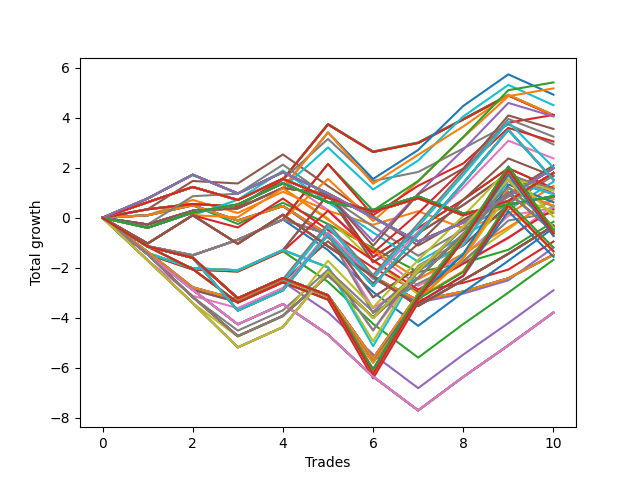

# Long HLT 213 
- Symbol: TSLA
- Date Range: 05/16/2022 - 05/17/2024
- Trading Period: 8:30-12:30
- Number of Trades: 10



| Id. | Name | Win Percent | Profit | Avg Profit / Trade | Avg Time / Trade | Std |      | Name | Win Percent | Profit | Avg Profit / Trade | Avg Time / Trade | Std |
| --- | ---- | ----------- | ------ | ------------------ | ---------------- | --- | ---- | ---- | ----------- | ------ | ------------------ | ---------------- | --- |
| | Sorted By <br> Profit | | | | | | | Sorted By <br> Win Percentage |||||
|0| TP-1.75 60m | 70.00 | 5.41 | 0.54 | 48:18 | 1.27 |     | TP-1.75 60m | 70.00 | 5.41 | 0.54 | 48:18 | 1.27 |
|1| TP-1.5 60m | 70.00 | 5.17 | 0.52 | 45:18 | 1.17 |     | TP-1.5 60m | 70.00 | 5.17 | 0.52 | 45:18 | 1.17 |
|2| TP-1.75 45m | 70.00 | 4.92 | 0.49 | 39:42 | 1.17 |     | TP-1.75 45m | 70.00 | 4.92 | 0.49 | 39:42 | 1.17 |
|3| TP-1.5 45m | 70.00 | 4.50 | 0.45 | 37:24 | 1.06 |     | TP-1.5 45m | 70.00 | 4.50 | 0.45 | 37:24 | 1.06 |
|4| TP-2 60m | 70.00 | 4.11 | 0.41 | 51:36 | 1.22 |     | TP-2 60m | 70.00 | 4.11 | 0.41 | 51:36 | 1.22 |
|5| TP-2 30m | 70.00 | 4.11 | 0.41 | 28:54 | 0.91 |     | TP-2 30m | 70.00 | 4.11 | 0.41 | 28:54 | 0.91 |
|6| TP-1.75 30m | 70.00 | 4.11 | 0.41 | 28:54 | 0.91 |     | TP-1.75 30m | 70.00 | 4.11 | 0.41 | 28:54 | 0.91 |
|7| TP-2 45m | 70.00 | 4.10 | 0.41 | 41:06 | 1.16 |     | TP-2 45m | 70.00 | 4.10 | 0.41 | 41:06 | 1.16 |
|8| TP-3 30m | 70.00 | 4.09 | 0.41 | 29:00 | 0.91 |     | TP-3 30m | 70.00 | 4.09 | 0.41 | 29:00 | 0.91 |
|9| TP-2.75 30m | 70.00 | 4.09 | 0.41 | 29:00 | 0.91 |     | TP-2.75 30m | 70.00 | 4.09 | 0.41 | 29:00 | 0.91 |
|10| TP-2.5 30m | 70.00 | 4.09 | 0.41 | 29:00 | 0.91 |     | TP-2.5 30m | 70.00 | 4.09 | 0.41 | 29:00 | 0.91 |
|11| TP-2.25 30m | 70.00 | 4.09 | 0.41 | 29:00 | 0.91 |     | TP-2.25 30m | 70.00 | 4.09 | 0.41 | 29:00 | 0.91 |
|12| TP-1.75 75m | 50.00 | 4.05 | 0.40 | 54:54 | 1.42 |     | TP-1.5 30m | 70.00 | 2.93 | 0.29 | 27:18 | 0.92 |
|13| TP-2 75m | 50.00 | 3.55 | 0.35 | 60:36 | 1.45 |     | TP-1 30m | 60.00 | 2.09 | 0.21 | 18:18 | 1.01 |
|14| TP-2 90m | 50.00 | 3.24 | 0.32 | 67:54 | 1.62 |     | TP-0.75 180m | 60.00 | 1.98 | 0.20 | 13:06 | 0.89 |
|15| TP-1.5 75m | 50.00 | 3.05 | 0.30 | 50:12 | 1.28 |     | TP-0.75 165m | 60.00 | 1.98 | 0.20 | 13:06 | 0.89 |
|16| TP-1.5 30m | 70.00 | 2.93 | 0.29 | 27:18 | 0.92 |     | TP-0.75 150m | 60.00 | 1.98 | 0.20 | 13:06 | 0.89 |
|17| TP-1.75 90m | 50.00 | 2.37 | 0.24 | 59:48 | 1.56 |     | TP-0.75 135m | 60.00 | 1.98 | 0.20 | 13:06 | 0.89 |
|18| TP-1 30m | 60.00 | 2.09 | 0.21 | 18:18 | 1.01 |     | TP-0.75 120m | 60.00 | 1.98 | 0.20 | 13:06 | 0.89 |
|19| TP-2 105m | 50.00 | 2.01 | 0.20 | 73:00 | 1.72 |     | TP-0.75 105m | 60.00 | 1.98 | 0.20 | 13:06 | 0.89 |
|20| TP-0.75 180m | 60.00 | 1.98 | 0.20 | 13:06 | 0.89 |     | TP-0.75 90m | 60.00 | 1.98 | 0.20 | 13:06 | 0.89 |
|21| TP-0.75 165m | 60.00 | 1.98 | 0.20 | 13:06 | 0.89 |     | TP-0.75 75m | 60.00 | 1.98 | 0.20 | 13:06 | 0.89 |
|22| TP-0.75 150m | 60.00 | 1.98 | 0.20 | 13:06 | 0.89 |     | TP-0.75 60m | 60.00 | 1.98 | 0.20 | 13:06 | 0.89 |
|23| TP-0.75 135m | 60.00 | 1.98 | 0.20 | 13:06 | 0.89 |     | TP-0.75 45m | 60.00 | 1.98 | 0.20 | 13:06 | 0.89 |
|24| TP-0.75 120m | 60.00 | 1.98 | 0.20 | 13:06 | 0.89 |     | TP-0.75 30m | 60.00 | 1.98 | 0.20 | 13:06 | 0.89 |
|25| TP-0.75 105m | 60.00 | 1.98 | 0.20 | 13:06 | 0.89 |     | TP-0.5 180m | 60.00 | 1.79 | 0.18 | 07:12 | 0.68 |
|26| TP-0.75 90m | 60.00 | 1.98 | 0.20 | 13:06 | 0.89 |     | TP-0.5 165m | 60.00 | 1.79 | 0.18 | 07:12 | 0.68 |
|27| TP-0.75 75m | 60.00 | 1.98 | 0.20 | 13:06 | 0.89 |     | TP-0.5 150m | 60.00 | 1.79 | 0.18 | 07:12 | 0.68 |
|28| TP-0.75 60m | 60.00 | 1.98 | 0.20 | 13:06 | 0.89 |     | TP-0.5 135m | 60.00 | 1.79 | 0.18 | 07:12 | 0.68 |
|29| TP-0.75 45m | 60.00 | 1.98 | 0.20 | 13:06 | 0.89 |     | TP-0.5 120m | 60.00 | 1.79 | 0.18 | 07:12 | 0.68 |
|30| TP-0.75 30m | 60.00 | 1.98 | 0.20 | 13:06 | 0.89 |     | TP-0.5 105m | 60.00 | 1.79 | 0.18 | 07:12 | 0.68 |
|31| TP-0.5 180m | 60.00 | 1.79 | 0.18 | 07:12 | 0.68 |     | TP-0.5 90m | 60.00 | 1.79 | 0.18 | 07:12 | 0.68 |
|32| TP-0.5 165m | 60.00 | 1.79 | 0.18 | 07:12 | 0.68 |     | TP-0.5 75m | 60.00 | 1.79 | 0.18 | 07:12 | 0.68 |
|33| TP-0.5 150m | 60.00 | 1.79 | 0.18 | 07:12 | 0.68 |     | TP-0.5 60m | 60.00 | 1.79 | 0.18 | 07:12 | 0.68 |
|34| TP-0.5 135m | 60.00 | 1.79 | 0.18 | 07:12 | 0.68 |     | TP-0.5 45m | 60.00 | 1.79 | 0.18 | 07:12 | 0.68 |
|35| TP-0.5 120m | 60.00 | 1.79 | 0.18 | 07:12 | 0.68 |     | TP-0.5 30m | 60.00 | 1.79 | 0.18 | 07:12 | 0.68 |
|36| TP-0.5 105m | 60.00 | 1.79 | 0.18 | 07:12 | 0.68 |     | TP-1 45m | 60.00 | 1.68 | 0.17 | 21:18 | 1.01 |
|37| TP-0.5 90m | 60.00 | 1.79 | 0.18 | 07:12 | 0.68 |     | TP-1 60m | 60.00 | 1.44 | 0.14 | 23:30 | 1.08 |
|38| TP-0.5 75m | 60.00 | 1.79 | 0.18 | 07:12 | 0.68 |     | TP-0.5 15m | 60.00 | 1.27 | 0.13 | 06:30 | 0.67 |
|39| TP-0.5 60m | 60.00 | 1.79 | 0.18 | 07:12 | 0.68 |     | TP-2.5 45m | 60.00 | 1.17 | 0.12 | 42:48 | 1.10 |
|40| TP-0.5 45m | 60.00 | 1.79 | 0.18 | 07:12 | 0.68 |     | TP-2.25 45m | 60.00 | 1.17 | 0.12 | 42:48 | 1.10 |
|41| TP-0.5 30m | 60.00 | 1.79 | 0.18 | 07:12 | 0.68 |     | TP-3 45m | 60.00 | 0.96 | 0.10 | 43:06 | 1.15 |
|42| TP-1 45m | 60.00 | 1.68 | 0.17 | 21:18 | 1.01 |     | TP-2.75 45m | 60.00 | 0.96 | 0.10 | 43:06 | 1.15 |
|43| TP-1.5 90m | 50.00 | 1.66 | 0.17 | 54:42 | 1.38 |     | TP-0.25 180m | 60.00 | 0.86 | 0.09 | 03:36 | 0.54 |
|44| TP-2 180m | 50.00 | 1.52 | 0.15 | 75:54 | 1.80 |     | TP-0.25 165m | 60.00 | 0.86 | 0.09 | 03:36 | 0.54 |
|45| TP-2 165m | 50.00 | 1.52 | 0.15 | 75:54 | 1.80 |     | TP-0.25 150m | 60.00 | 0.86 | 0.09 | 03:36 | 0.54 |
|46| TP-2 150m | 50.00 | 1.52 | 0.15 | 75:54 | 1.80 |     | TP-0.25 135m | 60.00 | 0.86 | 0.09 | 03:36 | 0.54 |
|47| TP-2 135m | 50.00 | 1.52 | 0.15 | 75:54 | 1.80 |     | TP-0.25 120m | 60.00 | 0.86 | 0.09 | 03:36 | 0.54 |
|48| TP-2 120m | 50.00 | 1.52 | 0.15 | 75:54 | 1.80 |     | TP-0.25 105m | 60.00 | 0.86 | 0.09 | 03:36 | 0.54 |
|49| TP-1 60m | 60.00 | 1.44 | 0.14 | 23:30 | 1.08 |     | TP-0.25 90m | 60.00 | 0.86 | 0.09 | 03:36 | 0.54 |
|50| TP-0.5 15m | 60.00 | 1.27 | 0.13 | 06:30 | 0.67 |     | TP-0.25 75m | 60.00 | 0.86 | 0.09 | 03:36 | 0.54 |
|51| TP-2.5 45m | 60.00 | 1.17 | 0.12 | 42:48 | 1.10 |     | TP-0.25 60m | 60.00 | 0.86 | 0.09 | 03:36 | 0.54 |
|52| TP-2.25 45m | 60.00 | 1.17 | 0.12 | 42:48 | 1.10 |     | TP-0.25 45m | 60.00 | 0.86 | 0.09 | 03:36 | 0.54 |
|53| TP-2.5 75m | 40.00 | 1.16 | 0.12 | 64:48 | 1.56 |     | TP-0.25 30m | 60.00 | 0.86 | 0.09 | 03:36 | 0.54 |
|54| TP-2.75 75m | 40.00 | 1.08 | 0.11 | 65:54 | 1.70 |     | TP-0.25 15m | 60.00 | 0.86 | 0.09 | 03:36 | 0.54 |
|55| TP-3 45m | 60.00 | 0.96 | 0.10 | 43:06 | 1.15 |     | TP-1.25 45m | 60.00 | 0.85 | 0.08 | 29:12 | 1.10 |
|56| TP-2.75 45m | 60.00 | 0.96 | 0.10 | 43:06 | 1.15 |     | TP-2.5 60m | 60.00 | 0.83 | 0.08 | 54:48 | 1.18 |
|57| TP-2.25 75m | 40.00 | 0.96 | 0.10 | 64:42 | 1.53 |     | TP-2.25 60m | 60.00 | 0.83 | 0.08 | 54:48 | 1.18 |
|58| TP-3 75m | 40.00 | 0.94 | 0.09 | 66:24 | 1.74 |     | TP-1.25 30m | 60.00 | 0.49 | 0.05 | 22:12 | 1.05 |
|59| TP-0.25 180m | 60.00 | 0.86 | 0.09 | 03:36 | 0.54 |     | TP-2.75 60m | 60.00 | 0.39 | 0.04 | 55:12 | 1.28 |
|60| TP-0.25 165m | 60.00 | 0.86 | 0.09 | 03:36 | 0.54 |     | TP-3 60m | 60.00 | 0.20 | 0.02 | 55:36 | 1.33 |
|61| TP-0.25 150m | 60.00 | 0.86 | 0.09 | 03:36 | 0.54 |     | TP-0.75 15m | 60.00 | -0.16 | -0.02 | 10:18 | 0.75 |
|62| TP-0.25 135m | 60.00 | 0.86 | 0.09 | 03:36 | 0.54 |     | TP-1 15m | 60.00 | -0.95 | -0.10 | 11:36 | 0.80 |
|63| TP-0.25 120m | 60.00 | 0.86 | 0.09 | 03:36 | 0.54 |     | TP-1.25 15m | 60.00 | -1.19 | -0.12 | 12:36 | 0.90 |
|64| TP-0.25 105m | 60.00 | 0.86 | 0.09 | 03:36 | 0.54 |     | TP-3 15m | 60.00 | -1.48 | -0.15 | 14:00 | 0.84 |
|65| TP-0.25 90m | 60.00 | 0.86 | 0.09 | 03:36 | 0.54 |     | TP-2.75 15m | 60.00 | -1.48 | -0.15 | 14:00 | 0.84 |
|66| TP-0.25 75m | 60.00 | 0.86 | 0.09 | 03:36 | 0.54 |     | TP-2.5 15m | 60.00 | -1.48 | -0.15 | 14:00 | 0.84 |
|67| TP-0.25 60m | 60.00 | 0.86 | 0.09 | 03:36 | 0.54 |     | TP-2.25 15m | 60.00 | -1.48 | -0.15 | 14:00 | 0.84 |
|68| TP-0.25 45m | 60.00 | 0.86 | 0.09 | 03:36 | 0.54 |     | TP-2 15m | 60.00 | -1.48 | -0.15 | 14:00 | 0.84 |
|69| TP-0.25 30m | 60.00 | 0.86 | 0.09 | 03:36 | 0.54 |     | TP-1.75 15m | 60.00 | -1.48 | -0.15 | 14:00 | 0.84 |
|70| TP-0.25 15m | 60.00 | 0.86 | 0.09 | 03:36 | 0.54 |     | TP-1.5 15m | 60.00 | -1.48 | -0.15 | 14:00 | 0.84 |
|71| TP-1.25 45m | 60.00 | 0.85 | 0.08 | 29:12 | 1.10 |     | TP-1.75 75m | 50.00 | 4.05 | 0.40 | 54:54 | 1.42 |
|72| TP-2.5 60m | 60.00 | 0.83 | 0.08 | 54:48 | 1.18 |     | TP-2 75m | 50.00 | 3.55 | 0.35 | 60:36 | 1.45 |
|73| TP-2.25 60m | 60.00 | 0.83 | 0.08 | 54:48 | 1.18 |     | TP-2 90m | 50.00 | 3.24 | 0.32 | 67:54 | 1.62 |
|74| TP-1 75m | 50.00 | 0.74 | 0.07 | 25:00 | 1.07 |     | TP-1.5 75m | 50.00 | 3.05 | 0.30 | 50:12 | 1.28 |
|75| TP-2.75 90m | 40.00 | 0.62 | 0.06 | 73:30 | 1.84 |     | TP-1.75 90m | 50.00 | 2.37 | 0.24 | 59:48 | 1.56 |
|76| TP-1.25 30m | 60.00 | 0.49 | 0.05 | 22:12 | 1.05 |     | TP-2 105m | 50.00 | 2.01 | 0.20 | 73:00 | 1.72 |
|77| TP-3 90m | 40.00 | 0.48 | 0.05 | 74:00 | 1.88 |     | TP-1.5 90m | 50.00 | 1.66 | 0.17 | 54:42 | 1.38 |
|78| TP-2.5 90m | 40.00 | 0.45 | 0.04 | 72:18 | 1.68 |     | TP-2 180m | 50.00 | 1.52 | 0.15 | 75:54 | 1.80 |
|79| TP-2.75 60m | 60.00 | 0.39 | 0.04 | 55:12 | 1.28 |     | TP-2 165m | 50.00 | 1.52 | 0.15 | 75:54 | 1.80 |
|80| TP-1 90m | 50.00 | 0.33 | 0.03 | 26:30 | 1.08 |     | TP-2 150m | 50.00 | 1.52 | 0.15 | 75:54 | 1.80 |
|81| TP-2.25 90m | 40.00 | 0.25 | 0.02 | 72:12 | 1.65 |     | TP-2 135m | 50.00 | 1.52 | 0.15 | 75:54 | 1.80 |
|82| TP-3 60m | 60.00 | 0.20 | 0.02 | 55:36 | 1.33 |     | TP-2 120m | 50.00 | 1.52 | 0.15 | 75:54 | 1.80 |
|83| TP-1.75 105m | 50.00 | 0.04 | 0.00 | 63:06 | 1.74 |     | TP-1 75m | 50.00 | 0.74 | 0.07 | 25:00 | 1.07 |
|84| TP-0.75 15m | 60.00 | -0.16 | -0.02 | 10:18 | 0.75 |     | TP-1 90m | 50.00 | 0.33 | 0.03 | 26:30 | 1.08 |
|85| TP-1 180m | 50.00 | -0.32 | -0.03 | 27:48 | 1.13 |     | TP-1.75 105m | 50.00 | 0.04 | 0.00 | 63:06 | 1.74 |
|86| TP-1 165m | 50.00 | -0.32 | -0.03 | 27:48 | 1.13 |     | TP-1 180m | 50.00 | -0.32 | -0.03 | 27:48 | 1.13 |
|87| TP-1 150m | 50.00 | -0.32 | -0.03 | 27:48 | 1.13 |     | TP-1 165m | 50.00 | -0.32 | -0.03 | 27:48 | 1.13 |
|88| TP-1 135m | 50.00 | -0.32 | -0.03 | 27:48 | 1.13 |     | TP-1 150m | 50.00 | -0.32 | -0.03 | 27:48 | 1.13 |
|89| TP-1 120m | 50.00 | -0.32 | -0.03 | 27:48 | 1.13 |     | TP-1 135m | 50.00 | -0.32 | -0.03 | 27:48 | 1.13 |
|90| TP-1 105m | 50.00 | -0.32 | -0.03 | 27:48 | 1.13 |     | TP-1 120m | 50.00 | -0.32 | -0.03 | 27:48 | 1.13 |
|91| TP-1.5 105m | 50.00 | -0.34 | -0.03 | 57:30 | 1.54 |     | TP-1 105m | 50.00 | -0.32 | -0.03 | 27:48 | 1.13 |
|92| TP-1.75 180m | 50.00 | -0.39 | -0.04 | 64:12 | 1.78 |     | TP-1.5 105m | 50.00 | -0.34 | -0.03 | 57:30 | 1.54 |
|93| TP-1.75 165m | 50.00 | -0.39 | -0.04 | 64:12 | 1.78 |     | TP-1.75 180m | 50.00 | -0.39 | -0.04 | 64:12 | 1.78 |
|94| TP-1.75 150m | 50.00 | -0.39 | -0.04 | 64:12 | 1.78 |     | TP-1.75 165m | 50.00 | -0.39 | -0.04 | 64:12 | 1.78 |
|95| TP-1.75 135m | 50.00 | -0.39 | -0.04 | 64:12 | 1.78 |     | TP-1.75 150m | 50.00 | -0.39 | -0.04 | 64:12 | 1.78 |
|96| TP-1.75 120m | 50.00 | -0.39 | -0.04 | 64:12 | 1.78 |     | TP-1.75 135m | 50.00 | -0.39 | -0.04 | 64:12 | 1.78 |
|97| TP-1.25 60m | 50.00 | -0.41 | -0.04 | 33:42 | 1.17 |     | TP-1.75 120m | 50.00 | -0.39 | -0.04 | 64:12 | 1.78 |
|98| TP-2.75 180m | 40.00 | -0.49 | -0.05 | 86:06 | 2.06 |     | TP-1.25 60m | 50.00 | -0.41 | -0.04 | 33:42 | 1.17 |
|99| TP-2.75 165m | 40.00 | -0.49 | -0.05 | 86:06 | 2.06 |     | TP-1.5 180m | 50.00 | -0.56 | -0.06 | 57:36 | 1.56 |
|100| TP-2.75 150m | 40.00 | -0.49 | -0.05 | 86:06 | 2.06 |     | TP-1.5 165m | 50.00 | -0.56 | -0.06 | 57:36 | 1.56 |
|101| TP-2.75 135m | 40.00 | -0.49 | -0.05 | 86:06 | 2.06 |     | TP-1.5 150m | 50.00 | -0.56 | -0.06 | 57:36 | 1.56 |
|102| TP-2.75 120m | 40.00 | -0.49 | -0.05 | 86:06 | 2.06 |     | TP-1.5 135m | 50.00 | -0.56 | -0.06 | 57:36 | 1.56 |
|103| TP-1.5 180m | 50.00 | -0.56 | -0.06 | 57:36 | 1.56 |     | TP-1.5 120m | 50.00 | -0.56 | -0.06 | 57:36 | 1.56 |
|104| TP-1.5 165m | 50.00 | -0.56 | -0.06 | 57:36 | 1.56 |     | TP-2.5 75m | 40.00 | 1.16 | 0.12 | 64:48 | 1.56 |
|105| TP-1.5 150m | 50.00 | -0.56 | -0.06 | 57:36 | 1.56 |     | TP-2.75 75m | 40.00 | 1.08 | 0.11 | 65:54 | 1.70 |
|106| TP-1.5 135m | 50.00 | -0.56 | -0.06 | 57:36 | 1.56 |     | TP-2.25 75m | 40.00 | 0.96 | 0.10 | 64:42 | 1.53 |
|107| TP-1.5 120m | 50.00 | -0.56 | -0.06 | 57:36 | 1.56 |     | TP-3 75m | 40.00 | 0.94 | 0.09 | 66:24 | 1.74 |
|108| TP-2.5 180m | 40.00 | -0.61 | -0.06 | 84:42 | 1.91 |     | TP-2.75 90m | 40.00 | 0.62 | 0.06 | 73:30 | 1.84 |
|109| TP-2.5 165m | 40.00 | -0.61 | -0.06 | 84:42 | 1.91 |     | TP-3 90m | 40.00 | 0.48 | 0.05 | 74:00 | 1.88 |
|110| TP-2.5 150m | 40.00 | -0.61 | -0.06 | 84:42 | 1.91 |     | TP-2.5 90m | 40.00 | 0.45 | 0.04 | 72:18 | 1.68 |
|111| TP-2.5 135m | 40.00 | -0.61 | -0.06 | 84:42 | 1.91 |     | TP-2.25 90m | 40.00 | 0.25 | 0.02 | 72:12 | 1.65 |
|112| TP-2.5 120m | 40.00 | -0.61 | -0.06 | 84:42 | 1.91 |     | TP-2.75 180m | 40.00 | -0.49 | -0.05 | 86:06 | 2.06 |
|113| TP-3 180m | 40.00 | -0.63 | -0.06 | 86:36 | 2.10 |     | TP-2.75 165m | 40.00 | -0.49 | -0.05 | 86:06 | 2.06 |
|114| TP-3 165m | 40.00 | -0.63 | -0.06 | 86:36 | 2.10 |     | TP-2.75 150m | 40.00 | -0.49 | -0.05 | 86:06 | 2.06 |
|115| TP-3 150m | 40.00 | -0.63 | -0.06 | 86:36 | 2.10 |     | TP-2.75 135m | 40.00 | -0.49 | -0.05 | 86:06 | 2.06 |
|116| TP-3 135m | 40.00 | -0.63 | -0.06 | 86:36 | 2.10 |     | TP-2.75 120m | 40.00 | -0.49 | -0.05 | 86:06 | 2.06 |
|117| TP-3 120m | 40.00 | -0.63 | -0.06 | 86:36 | 2.10 |     | TP-2.5 180m | 40.00 | -0.61 | -0.06 | 84:42 | 1.91 |
|118| TP-2.25 180m | 40.00 | -0.72 | -0.07 | 84:00 | 1.89 |     | TP-2.5 165m | 40.00 | -0.61 | -0.06 | 84:42 | 1.91 |
|119| TP-2.25 165m | 40.00 | -0.72 | -0.07 | 84:00 | 1.89 |     | TP-2.5 150m | 40.00 | -0.61 | -0.06 | 84:42 | 1.91 |
|120| TP-2.25 150m | 40.00 | -0.72 | -0.07 | 84:00 | 1.89 |     | TP-2.5 135m | 40.00 | -0.61 | -0.06 | 84:42 | 1.91 |
|121| TP-2.25 135m | 40.00 | -0.72 | -0.07 | 84:00 | 1.89 |     | TP-2.5 120m | 40.00 | -0.61 | -0.06 | 84:42 | 1.91 |
|122| TP-2.25 120m | 40.00 | -0.72 | -0.07 | 84:00 | 1.89 |     | TP-3 180m | 40.00 | -0.63 | -0.06 | 86:36 | 2.10 |
|123| TP-1 15m | 60.00 | -0.95 | -0.10 | 11:36 | 0.80 |     | TP-3 165m | 40.00 | -0.63 | -0.06 | 86:36 | 2.10 |
|124| TP-1.25 15m | 60.00 | -1.19 | -0.12 | 12:36 | 0.90 |     | TP-3 150m | 40.00 | -0.63 | -0.06 | 86:36 | 2.10 |
|125| TP-2.75 105m | 40.00 | -1.19 | -0.12 | 80:06 | 1.87 |     | TP-3 135m | 40.00 | -0.63 | -0.06 | 86:36 | 2.10 |
|126| TP-3 105m | 40.00 | -1.33 | -0.13 | 80:36 | 1.91 |     | TP-3 120m | 40.00 | -0.63 | -0.06 | 86:36 | 2.10 |
|127| TP-2.5 105m | 40.00 | -1.36 | -0.14 | 78:54 | 1.70 |     | TP-2.25 180m | 40.00 | -0.72 | -0.07 | 84:00 | 1.89 |
|128| TP-3 15m | 60.00 | -1.48 | -0.15 | 14:00 | 0.84 |     | TP-2.25 165m | 40.00 | -0.72 | -0.07 | 84:00 | 1.89 |
|129| TP-2.75 15m | 60.00 | -1.48 | -0.15 | 14:00 | 0.84 |     | TP-2.25 150m | 40.00 | -0.72 | -0.07 | 84:00 | 1.89 |
|130| TP-2.5 15m | 60.00 | -1.48 | -0.15 | 14:00 | 0.84 |     | TP-2.25 135m | 40.00 | -0.72 | -0.07 | 84:00 | 1.89 |
|131| TP-2.25 15m | 60.00 | -1.48 | -0.15 | 14:00 | 0.84 |     | TP-2.25 120m | 40.00 | -0.72 | -0.07 | 84:00 | 1.89 |
|132| TP-2 15m | 60.00 | -1.48 | -0.15 | 14:00 | 0.84 |     | TP-2.75 105m | 40.00 | -1.19 | -0.12 | 80:06 | 1.87 |
|133| TP-1.75 15m | 60.00 | -1.48 | -0.15 | 14:00 | 0.84 |     | TP-3 105m | 40.00 | -1.33 | -0.13 | 80:36 | 1.91 |
|134| TP-1.5 15m | 60.00 | -1.48 | -0.15 | 14:00 | 0.84 |     | TP-2.5 105m | 40.00 | -1.36 | -0.14 | 78:54 | 1.70 |
|135| TP-2.25 105m | 40.00 | -1.56 | -0.16 | 78:48 | 1.67 |     | TP-2.25 105m | 40.00 | -1.56 | -0.16 | 78:48 | 1.67 |
|136| TP-1.25 75m | 40.00 | -1.68 | -0.17 | 37:06 | 1.19 |     | TP-1.25 75m | 40.00 | -1.68 | -0.17 | 37:06 | 1.19 |
|137| TP-1.25 90m | 40.00 | -2.90 | -0.29 | 40:06 | 1.24 |     | TP-1.25 90m | 40.00 | -2.90 | -0.29 | 40:06 | 1.24 |
|138| TP-1.25 180m | 40.00 | -3.79 | -0.38 | 41:30 | 1.28 |     | TP-1.25 180m | 40.00 | -3.79 | -0.38 | 41:30 | 1.28 |
|139| TP-1.25 165m | 40.00 | -3.79 | -0.38 | 41:30 | 1.28 |     | TP-1.25 165m | 40.00 | -3.79 | -0.38 | 41:30 | 1.28 |
|140| TP-1.25 150m | 40.00 | -3.79 | -0.38 | 41:30 | 1.28 |     | TP-1.25 150m | 40.00 | -3.79 | -0.38 | 41:30 | 1.28 |
|141| TP-1.25 135m | 40.00 | -3.79 | -0.38 | 41:30 | 1.28 |     | TP-1.25 135m | 40.00 | -3.79 | -0.38 | 41:30 | 1.28 |
|142| TP-1.25 120m | 40.00 | -3.79 | -0.38 | 41:30 | 1.28 |     | TP-1.25 120m | 40.00 | -3.79 | -0.38 | 41:30 | 1.28 |
|143| TP-1.25 105m | 40.00 | -3.79 | -0.38 | 41:30 | 1.28 |     | TP-1.25 105m | 40.00 | -3.79 | -0.38 | 41:30 | 1.28 |

### Test TP-0.25 15m
* Take Profit of 0.25 Point
* 0.25 Stoploss
* Results:
```
Total Trades: 10
Percent Up: 60.00
Percent Down: 40.00
Total Points Moved Up: 0.86
Potential Profit: 430.00
Total Points Ups: 3.01 Count Ups: 6
Total Points Downs: -2.15 Count Downs: 4
```

<details><summary>Trades</summary>

<code>In: 2022-07-25 11:15:00		Out: 2022-07-25 11:17:00		Total Position Time: 02:00		Total Move Up: -0.40		Total to Date: -0.40</code> <br />
<code>In: 2022-08-26 09:45:00		Out: 2022-08-26 09:48:00		Total Position Time: 03:00		Total Move Up: 0.61		Total to Date: 0.21</code> <br />
<code>In: 2022-11-21 09:40:00		Out: 2022-11-21 09:44:00		Total Position Time: 04:00		Total Move Up: 0.32		Total to Date: 0.53</code> <br />
<code>In: 2022-11-29 12:15:00		Out: 2022-11-29 12:21:00		Total Position Time: 06:00		Total Move Up: 0.85		Total to Date: 1.38</code> <br />
<code>In: 2022-12-14 11:45:00		Out: 2022-12-14 11:47:00		Total Position Time: 02:00		Total Move Up: -0.76		Total to Date: 0.62</code> <br />
<code>In: 2023-03-23 10:45:00		Out: 2023-03-23 10:48:00		Total Position Time: 03:00		Total Move Up: -0.31		Total to Date: 0.31</code> <br />
<code>In: 2023-06-21 10:10:00		Out: 2023-06-21 10:12:00		Total Position Time: 02:00		Total Move Up: 0.54		Total to Date: 0.85</code> <br />
<code>In: 2023-07-10 09:25:00		Out: 2023-07-10 09:31:00		Total Position Time: 06:00		Total Move Up: -0.68		Total to Date: 0.17</code> <br />
<code>In: 2023-07-11 11:35:00		Out: 2023-07-11 11:41:00		Total Position Time: 06:00		Total Move Up: 0.36		Total to Date: 0.53</code> <br />
<code>In: 2023-10-18 10:10:00		Out: 2023-10-18 10:12:00		Total Position Time: 02:00		Total Move Up: 0.33		Total to Date: 0.86</code> <br />


</details>

### Test TP-0.5 15m
* Take Profit of 0.5 Point
* 0.5 Stoploss
* Results:
```
Total Trades: 10
Percent Up: 60.00
Percent Down: 40.00
Total Points Moved Up: 1.27
Potential Profit: 635.00
Total Points Ups: 3.79 Count Ups: 6
Total Points Downs: -2.52 Count Downs: 4
```

<details><summary>Trades</summary>

<code>In: 2022-07-25 11:15:00		Out: 2022-07-25 11:29:00		Total Position Time: 14:00		Total Move Up: 0.10		Total to Date: 0.10</code> <br />
<code>In: 2022-08-26 09:45:00		Out: 2022-08-26 09:48:00		Total Position Time: 03:00		Total Move Up: 0.61		Total to Date: 0.71</code> <br />
<code>In: 2022-11-21 09:40:00		Out: 2022-11-21 09:51:00		Total Position Time: 11:00		Total Move Up: -0.52		Total to Date: 0.19</code> <br />
<code>In: 2022-11-29 12:15:00		Out: 2022-11-29 12:21:00		Total Position Time: 06:00		Total Move Up: 0.85		Total to Date: 1.04</code> <br />
<code>In: 2022-12-14 11:45:00		Out: 2022-12-14 11:47:00		Total Position Time: 02:00		Total Move Up: -0.76		Total to Date: 0.28</code> <br />
<code>In: 2023-03-23 10:45:00		Out: 2023-03-23 10:49:00		Total Position Time: 04:00		Total Move Up: -0.56		Total to Date: -0.28</code> <br />
<code>In: 2023-06-21 10:10:00		Out: 2023-06-21 10:12:00		Total Position Time: 02:00		Total Move Up: 0.54		Total to Date: 0.26</code> <br />
<code>In: 2023-07-10 09:25:00		Out: 2023-07-10 09:31:00		Total Position Time: 06:00		Total Move Up: -0.68		Total to Date: -0.42</code> <br />
<code>In: 2023-07-11 11:35:00		Out: 2023-07-11 11:48:00		Total Position Time: 13:00		Total Move Up: 0.57		Total to Date: 0.15</code> <br />
<code>In: 2023-10-18 10:10:00		Out: 2023-10-18 10:14:00		Total Position Time: 04:00		Total Move Up: 1.12		Total to Date: 1.27</code> <br />


</details>

### Test TP-0.75 15m
* Take Profit of 0.75 Point
* 0.75 Stoploss
* Results:
```
Total Trades: 10
Percent Up: 60.00
Percent Down: 40.00
Total Points Moved Up: -0.16
Potential Profit: -80.00
Total Points Ups: 3.36 Count Ups: 6
Total Points Downs: -3.52 Count Downs: 4
```

<details><summary>Trades</summary>

<code>In: 2022-07-25 11:15:00		Out: 2022-07-25 11:29:00		Total Position Time: 14:00		Total Move Up: 0.10		Total to Date: 0.10</code> <br />
<code>In: 2022-08-26 09:45:00		Out: 2022-08-26 09:59:00		Total Position Time: 14:00		Total Move Up: 0.40		Total to Date: 0.50</code> <br />
<code>In: 2022-11-21 09:40:00		Out: 2022-11-21 09:53:00		Total Position Time: 13:00		Total Move Up: -0.75		Total to Date: -0.25</code> <br />
<code>In: 2022-11-29 12:15:00		Out: 2022-11-29 12:21:00		Total Position Time: 06:00		Total Move Up: 0.85		Total to Date: 0.60</code> <br />
<code>In: 2022-12-14 11:45:00		Out: 2022-12-14 11:48:00		Total Position Time: 03:00		Total Move Up: -0.85		Total to Date: -0.25</code> <br />
<code>In: 2023-03-23 10:45:00		Out: 2023-03-23 10:52:00		Total Position Time: 07:00		Total Move Up: -0.96		Total to Date: -1.21</code> <br />
<code>In: 2023-06-21 10:10:00		Out: 2023-06-21 10:24:00		Total Position Time: 14:00		Total Move Up: -0.96		Total to Date: -2.17</code> <br />
<code>In: 2023-07-10 09:25:00		Out: 2023-07-10 09:39:00		Total Position Time: 14:00		Total Move Up: 0.36		Total to Date: -1.81</code> <br />
<code>In: 2023-07-11 11:35:00		Out: 2023-07-11 11:49:00		Total Position Time: 14:00		Total Move Up: 0.53		Total to Date: -1.28</code> <br />
<code>In: 2023-10-18 10:10:00		Out: 2023-10-18 10:14:00		Total Position Time: 04:00		Total Move Up: 1.12		Total to Date: -0.16</code> <br />


</details>

### Test TP-1 15m
* Take Profit of 1 Point
* 1 Stoploss
* Results:
```
Total Trades: 10
Percent Up: 60.00
Percent Down: 40.00
Total Points Moved Up: -0.95
Potential Profit: -475.00
Total Points Ups: 3.09 Count Ups: 6
Total Points Downs: -4.04 Count Downs: 4
```

<details><summary>Trades</summary>

<code>In: 2022-07-25 11:15:00		Out: 2022-07-25 11:29:00		Total Position Time: 14:00		Total Move Up: 0.10		Total to Date: 0.10</code> <br />
<code>In: 2022-08-26 09:45:00		Out: 2022-08-26 09:59:00		Total Position Time: 14:00		Total Move Up: 0.40		Total to Date: 0.50</code> <br />
<code>In: 2022-11-21 09:40:00		Out: 2022-11-21 09:54:00		Total Position Time: 14:00		Total Move Up: -0.61		Total to Date: -0.11</code> <br />
<code>In: 2022-11-29 12:15:00		Out: 2022-11-29 12:29:00		Total Position Time: 14:00		Total Move Up: 0.58		Total to Date: 0.47</code> <br />
<code>In: 2022-12-14 11:45:00		Out: 2022-12-14 11:49:00		Total Position Time: 04:00		Total Move Up: -1.26		Total to Date: -0.79</code> <br />
<code>In: 2023-03-23 10:45:00		Out: 2023-03-23 10:55:00		Total Position Time: 10:00		Total Move Up: -1.21		Total to Date: -2.00</code> <br />
<code>In: 2023-06-21 10:10:00		Out: 2023-06-21 10:24:00		Total Position Time: 14:00		Total Move Up: -0.96		Total to Date: -2.96</code> <br />
<code>In: 2023-07-10 09:25:00		Out: 2023-07-10 09:39:00		Total Position Time: 14:00		Total Move Up: 0.36		Total to Date: -2.60</code> <br />
<code>In: 2023-07-11 11:35:00		Out: 2023-07-11 11:49:00		Total Position Time: 14:00		Total Move Up: 0.53		Total to Date: -2.07</code> <br />
<code>In: 2023-10-18 10:10:00		Out: 2023-10-18 10:14:00		Total Position Time: 04:00		Total Move Up: 1.12		Total to Date: -0.95</code> <br />


</details>

### Test TP-1.25 15m
* Take Profit of 1.25 Point
* 1.25 Stoploss
* Results:
```
Total Trades: 10
Percent Up: 60.00
Percent Down: 40.00
Total Points Moved Up: -1.19
Potential Profit: -595.00
Total Points Ups: 3.28 Count Ups: 6
Total Points Downs: -4.47 Count Downs: 4
```

<details><summary>Trades</summary>

<code>In: 2022-07-25 11:15:00		Out: 2022-07-25 11:29:00		Total Position Time: 14:00		Total Move Up: 0.10		Total to Date: 0.10</code> <br />
<code>In: 2022-08-26 09:45:00		Out: 2022-08-26 09:59:00		Total Position Time: 14:00		Total Move Up: 0.40		Total to Date: 0.50</code> <br />
<code>In: 2022-11-21 09:40:00		Out: 2022-11-21 09:54:00		Total Position Time: 14:00		Total Move Up: -0.61		Total to Date: -0.11</code> <br />
<code>In: 2022-11-29 12:15:00		Out: 2022-11-29 12:29:00		Total Position Time: 14:00		Total Move Up: 0.58		Total to Date: 0.47</code> <br />
<code>In: 2022-12-14 11:45:00		Out: 2022-12-14 11:52:00		Total Position Time: 07:00		Total Move Up: -1.22		Total to Date: -0.75</code> <br />
<code>In: 2023-03-23 10:45:00		Out: 2023-03-23 10:59:00		Total Position Time: 14:00		Total Move Up: -1.68		Total to Date: -2.43</code> <br />
<code>In: 2023-06-21 10:10:00		Out: 2023-06-21 10:24:00		Total Position Time: 14:00		Total Move Up: -0.96		Total to Date: -3.39</code> <br />
<code>In: 2023-07-10 09:25:00		Out: 2023-07-10 09:39:00		Total Position Time: 14:00		Total Move Up: 0.36		Total to Date: -3.03</code> <br />
<code>In: 2023-07-11 11:35:00		Out: 2023-07-11 11:49:00		Total Position Time: 14:00		Total Move Up: 0.53		Total to Date: -2.50</code> <br />
<code>In: 2023-10-18 10:10:00		Out: 2023-10-18 10:17:00		Total Position Time: 07:00		Total Move Up: 1.31		Total to Date: -1.19</code> <br />


</details>

### Test TP-1.5 15m
* Take Profit of 1.5 Point
* 1.5 Stoploss
* Results:
```
Total Trades: 10
Percent Up: 60.00
Percent Down: 40.00
Total Points Moved Up: -1.48
Potential Profit: -740.00
Total Points Ups: 2.91 Count Ups: 6
Total Points Downs: -4.39 Count Downs: 4
```

<details><summary>Trades</summary>

<code>In: 2022-07-25 11:15:00		Out: 2022-07-25 11:29:00		Total Position Time: 14:00		Total Move Up: 0.10		Total to Date: 0.10</code> <br />
<code>In: 2022-08-26 09:45:00		Out: 2022-08-26 09:59:00		Total Position Time: 14:00		Total Move Up: 0.40		Total to Date: 0.50</code> <br />
<code>In: 2022-11-21 09:40:00		Out: 2022-11-21 09:54:00		Total Position Time: 14:00		Total Move Up: -0.61		Total to Date: -0.11</code> <br />
<code>In: 2022-11-29 12:15:00		Out: 2022-11-29 12:29:00		Total Position Time: 14:00		Total Move Up: 0.58		Total to Date: 0.47</code> <br />
<code>In: 2022-12-14 11:45:00		Out: 2022-12-14 11:59:00		Total Position Time: 14:00		Total Move Up: -1.14		Total to Date: -0.67</code> <br />
<code>In: 2023-03-23 10:45:00		Out: 2023-03-23 10:59:00		Total Position Time: 14:00		Total Move Up: -1.68		Total to Date: -2.35</code> <br />
<code>In: 2023-06-21 10:10:00		Out: 2023-06-21 10:24:00		Total Position Time: 14:00		Total Move Up: -0.96		Total to Date: -3.31</code> <br />
<code>In: 2023-07-10 09:25:00		Out: 2023-07-10 09:39:00		Total Position Time: 14:00		Total Move Up: 0.36		Total to Date: -2.95</code> <br />
<code>In: 2023-07-11 11:35:00		Out: 2023-07-11 11:49:00		Total Position Time: 14:00		Total Move Up: 0.53		Total to Date: -2.42</code> <br />
<code>In: 2023-10-18 10:10:00		Out: 2023-10-18 10:24:00		Total Position Time: 14:00		Total Move Up: 0.94		Total to Date: -1.48</code> <br />


</details>

### Test TP-1.75 15m
* Take Profit of 1.75 Point
* 1.75 Stoploss
* Results:
```
Total Trades: 10
Percent Up: 60.00
Percent Down: 40.00
Total Points Moved Up: -1.48
Potential Profit: -740.00
Total Points Ups: 2.91 Count Ups: 6
Total Points Downs: -4.39 Count Downs: 4
```

<details><summary>Trades</summary>

<code>In: 2022-07-25 11:15:00		Out: 2022-07-25 11:29:00		Total Position Time: 14:00		Total Move Up: 0.10		Total to Date: 0.10</code> <br />
<code>In: 2022-08-26 09:45:00		Out: 2022-08-26 09:59:00		Total Position Time: 14:00		Total Move Up: 0.40		Total to Date: 0.50</code> <br />
<code>In: 2022-11-21 09:40:00		Out: 2022-11-21 09:54:00		Total Position Time: 14:00		Total Move Up: -0.61		Total to Date: -0.11</code> <br />
<code>In: 2022-11-29 12:15:00		Out: 2022-11-29 12:29:00		Total Position Time: 14:00		Total Move Up: 0.58		Total to Date: 0.47</code> <br />
<code>In: 2022-12-14 11:45:00		Out: 2022-12-14 11:59:00		Total Position Time: 14:00		Total Move Up: -1.14		Total to Date: -0.67</code> <br />
<code>In: 2023-03-23 10:45:00		Out: 2023-03-23 10:59:00		Total Position Time: 14:00		Total Move Up: -1.68		Total to Date: -2.35</code> <br />
<code>In: 2023-06-21 10:10:00		Out: 2023-06-21 10:24:00		Total Position Time: 14:00		Total Move Up: -0.96		Total to Date: -3.31</code> <br />
<code>In: 2023-07-10 09:25:00		Out: 2023-07-10 09:39:00		Total Position Time: 14:00		Total Move Up: 0.36		Total to Date: -2.95</code> <br />
<code>In: 2023-07-11 11:35:00		Out: 2023-07-11 11:49:00		Total Position Time: 14:00		Total Move Up: 0.53		Total to Date: -2.42</code> <br />
<code>In: 2023-10-18 10:10:00		Out: 2023-10-18 10:24:00		Total Position Time: 14:00		Total Move Up: 0.94		Total to Date: -1.48</code> <br />


</details>

### Test TP-2 15m
* Take Profit of 2 Point
* 2 Stoploss
* Results:
```
Total Trades: 10
Percent Up: 60.00
Percent Down: 40.00
Total Points Moved Up: -1.48
Potential Profit: -740.00
Total Points Ups: 2.91 Count Ups: 6
Total Points Downs: -4.39 Count Downs: 4
```

<details><summary>Trades</summary>

<code>In: 2022-07-25 11:15:00		Out: 2022-07-25 11:29:00		Total Position Time: 14:00		Total Move Up: 0.10		Total to Date: 0.10</code> <br />
<code>In: 2022-08-26 09:45:00		Out: 2022-08-26 09:59:00		Total Position Time: 14:00		Total Move Up: 0.40		Total to Date: 0.50</code> <br />
<code>In: 2022-11-21 09:40:00		Out: 2022-11-21 09:54:00		Total Position Time: 14:00		Total Move Up: -0.61		Total to Date: -0.11</code> <br />
<code>In: 2022-11-29 12:15:00		Out: 2022-11-29 12:29:00		Total Position Time: 14:00		Total Move Up: 0.58		Total to Date: 0.47</code> <br />
<code>In: 2022-12-14 11:45:00		Out: 2022-12-14 11:59:00		Total Position Time: 14:00		Total Move Up: -1.14		Total to Date: -0.67</code> <br />
<code>In: 2023-03-23 10:45:00		Out: 2023-03-23 10:59:00		Total Position Time: 14:00		Total Move Up: -1.68		Total to Date: -2.35</code> <br />
<code>In: 2023-06-21 10:10:00		Out: 2023-06-21 10:24:00		Total Position Time: 14:00		Total Move Up: -0.96		Total to Date: -3.31</code> <br />
<code>In: 2023-07-10 09:25:00		Out: 2023-07-10 09:39:00		Total Position Time: 14:00		Total Move Up: 0.36		Total to Date: -2.95</code> <br />
<code>In: 2023-07-11 11:35:00		Out: 2023-07-11 11:49:00		Total Position Time: 14:00		Total Move Up: 0.53		Total to Date: -2.42</code> <br />
<code>In: 2023-10-18 10:10:00		Out: 2023-10-18 10:24:00		Total Position Time: 14:00		Total Move Up: 0.94		Total to Date: -1.48</code> <br />


</details>

### Test TP-2.25 15m
* Take Profit of 2.25 Point
* 2.25 Stoploss
* Results:
```
Total Trades: 10
Percent Up: 60.00
Percent Down: 40.00
Total Points Moved Up: -1.48
Potential Profit: -740.00
Total Points Ups: 2.91 Count Ups: 6
Total Points Downs: -4.39 Count Downs: 4
```

<details><summary>Trades</summary>

<code>In: 2022-07-25 11:15:00		Out: 2022-07-25 11:29:00		Total Position Time: 14:00		Total Move Up: 0.10		Total to Date: 0.10</code> <br />
<code>In: 2022-08-26 09:45:00		Out: 2022-08-26 09:59:00		Total Position Time: 14:00		Total Move Up: 0.40		Total to Date: 0.50</code> <br />
<code>In: 2022-11-21 09:40:00		Out: 2022-11-21 09:54:00		Total Position Time: 14:00		Total Move Up: -0.61		Total to Date: -0.11</code> <br />
<code>In: 2022-11-29 12:15:00		Out: 2022-11-29 12:29:00		Total Position Time: 14:00		Total Move Up: 0.58		Total to Date: 0.47</code> <br />
<code>In: 2022-12-14 11:45:00		Out: 2022-12-14 11:59:00		Total Position Time: 14:00		Total Move Up: -1.14		Total to Date: -0.67</code> <br />
<code>In: 2023-03-23 10:45:00		Out: 2023-03-23 10:59:00		Total Position Time: 14:00		Total Move Up: -1.68		Total to Date: -2.35</code> <br />
<code>In: 2023-06-21 10:10:00		Out: 2023-06-21 10:24:00		Total Position Time: 14:00		Total Move Up: -0.96		Total to Date: -3.31</code> <br />
<code>In: 2023-07-10 09:25:00		Out: 2023-07-10 09:39:00		Total Position Time: 14:00		Total Move Up: 0.36		Total to Date: -2.95</code> <br />
<code>In: 2023-07-11 11:35:00		Out: 2023-07-11 11:49:00		Total Position Time: 14:00		Total Move Up: 0.53		Total to Date: -2.42</code> <br />
<code>In: 2023-10-18 10:10:00		Out: 2023-10-18 10:24:00		Total Position Time: 14:00		Total Move Up: 0.94		Total to Date: -1.48</code> <br />


</details>

### Test TP-2.5 15m
* Take Profit of 2.5 Point
* 2.5 Stoploss
* Results:
```
Total Trades: 10
Percent Up: 60.00
Percent Down: 40.00
Total Points Moved Up: -1.48
Potential Profit: -740.00
Total Points Ups: 2.91 Count Ups: 6
Total Points Downs: -4.39 Count Downs: 4
```

<details><summary>Trades</summary>

<code>In: 2022-07-25 11:15:00		Out: 2022-07-25 11:29:00		Total Position Time: 14:00		Total Move Up: 0.10		Total to Date: 0.10</code> <br />
<code>In: 2022-08-26 09:45:00		Out: 2022-08-26 09:59:00		Total Position Time: 14:00		Total Move Up: 0.40		Total to Date: 0.50</code> <br />
<code>In: 2022-11-21 09:40:00		Out: 2022-11-21 09:54:00		Total Position Time: 14:00		Total Move Up: -0.61		Total to Date: -0.11</code> <br />
<code>In: 2022-11-29 12:15:00		Out: 2022-11-29 12:29:00		Total Position Time: 14:00		Total Move Up: 0.58		Total to Date: 0.47</code> <br />
<code>In: 2022-12-14 11:45:00		Out: 2022-12-14 11:59:00		Total Position Time: 14:00		Total Move Up: -1.14		Total to Date: -0.67</code> <br />
<code>In: 2023-03-23 10:45:00		Out: 2023-03-23 10:59:00		Total Position Time: 14:00		Total Move Up: -1.68		Total to Date: -2.35</code> <br />
<code>In: 2023-06-21 10:10:00		Out: 2023-06-21 10:24:00		Total Position Time: 14:00		Total Move Up: -0.96		Total to Date: -3.31</code> <br />
<code>In: 2023-07-10 09:25:00		Out: 2023-07-10 09:39:00		Total Position Time: 14:00		Total Move Up: 0.36		Total to Date: -2.95</code> <br />
<code>In: 2023-07-11 11:35:00		Out: 2023-07-11 11:49:00		Total Position Time: 14:00		Total Move Up: 0.53		Total to Date: -2.42</code> <br />
<code>In: 2023-10-18 10:10:00		Out: 2023-10-18 10:24:00		Total Position Time: 14:00		Total Move Up: 0.94		Total to Date: -1.48</code> <br />


</details>

### Test TP-2.75 15m
* Take Profit of 2.75 Point
* 2.75 Stoploss
* Results:
```
Total Trades: 10
Percent Up: 60.00
Percent Down: 40.00
Total Points Moved Up: -1.48
Potential Profit: -740.00
Total Points Ups: 2.91 Count Ups: 6
Total Points Downs: -4.39 Count Downs: 4
```

<details><summary>Trades</summary>

<code>In: 2022-07-25 11:15:00		Out: 2022-07-25 11:29:00		Total Position Time: 14:00		Total Move Up: 0.10		Total to Date: 0.10</code> <br />
<code>In: 2022-08-26 09:45:00		Out: 2022-08-26 09:59:00		Total Position Time: 14:00		Total Move Up: 0.40		Total to Date: 0.50</code> <br />
<code>In: 2022-11-21 09:40:00		Out: 2022-11-21 09:54:00		Total Position Time: 14:00		Total Move Up: -0.61		Total to Date: -0.11</code> <br />
<code>In: 2022-11-29 12:15:00		Out: 2022-11-29 12:29:00		Total Position Time: 14:00		Total Move Up: 0.58		Total to Date: 0.47</code> <br />
<code>In: 2022-12-14 11:45:00		Out: 2022-12-14 11:59:00		Total Position Time: 14:00		Total Move Up: -1.14		Total to Date: -0.67</code> <br />
<code>In: 2023-03-23 10:45:00		Out: 2023-03-23 10:59:00		Total Position Time: 14:00		Total Move Up: -1.68		Total to Date: -2.35</code> <br />
<code>In: 2023-06-21 10:10:00		Out: 2023-06-21 10:24:00		Total Position Time: 14:00		Total Move Up: -0.96		Total to Date: -3.31</code> <br />
<code>In: 2023-07-10 09:25:00		Out: 2023-07-10 09:39:00		Total Position Time: 14:00		Total Move Up: 0.36		Total to Date: -2.95</code> <br />
<code>In: 2023-07-11 11:35:00		Out: 2023-07-11 11:49:00		Total Position Time: 14:00		Total Move Up: 0.53		Total to Date: -2.42</code> <br />
<code>In: 2023-10-18 10:10:00		Out: 2023-10-18 10:24:00		Total Position Time: 14:00		Total Move Up: 0.94		Total to Date: -1.48</code> <br />


</details>

### Test TP-3 15m
* Take Profit of 3 Point
* 3 Stoploss
* Results:
```
Total Trades: 10
Percent Up: 60.00
Percent Down: 40.00
Total Points Moved Up: -1.48
Potential Profit: -740.00
Total Points Ups: 2.91 Count Ups: 6
Total Points Downs: -4.39 Count Downs: 4
```

<details><summary>Trades</summary>

<code>In: 2022-07-25 11:15:00		Out: 2022-07-25 11:29:00		Total Position Time: 14:00		Total Move Up: 0.10		Total to Date: 0.10</code> <br />
<code>In: 2022-08-26 09:45:00		Out: 2022-08-26 09:59:00		Total Position Time: 14:00		Total Move Up: 0.40		Total to Date: 0.50</code> <br />
<code>In: 2022-11-21 09:40:00		Out: 2022-11-21 09:54:00		Total Position Time: 14:00		Total Move Up: -0.61		Total to Date: -0.11</code> <br />
<code>In: 2022-11-29 12:15:00		Out: 2022-11-29 12:29:00		Total Position Time: 14:00		Total Move Up: 0.58		Total to Date: 0.47</code> <br />
<code>In: 2022-12-14 11:45:00		Out: 2022-12-14 11:59:00		Total Position Time: 14:00		Total Move Up: -1.14		Total to Date: -0.67</code> <br />
<code>In: 2023-03-23 10:45:00		Out: 2023-03-23 10:59:00		Total Position Time: 14:00		Total Move Up: -1.68		Total to Date: -2.35</code> <br />
<code>In: 2023-06-21 10:10:00		Out: 2023-06-21 10:24:00		Total Position Time: 14:00		Total Move Up: -0.96		Total to Date: -3.31</code> <br />
<code>In: 2023-07-10 09:25:00		Out: 2023-07-10 09:39:00		Total Position Time: 14:00		Total Move Up: 0.36		Total to Date: -2.95</code> <br />
<code>In: 2023-07-11 11:35:00		Out: 2023-07-11 11:49:00		Total Position Time: 14:00		Total Move Up: 0.53		Total to Date: -2.42</code> <br />
<code>In: 2023-10-18 10:10:00		Out: 2023-10-18 10:24:00		Total Position Time: 14:00		Total Move Up: 0.94		Total to Date: -1.48</code> <br />


</details>

### Test TP-0.25 30m
* Take Profit of 0.25 Point
* 0.25 Stoploss
* Results:
```
Total Trades: 10
Percent Up: 60.00
Percent Down: 40.00
Total Points Moved Up: 0.86
Potential Profit: 430.00
Total Points Ups: 3.01 Count Ups: 6
Total Points Downs: -2.15 Count Downs: 4
```

<details><summary>Trades</summary>

<code>In: 2022-07-25 11:15:00		Out: 2022-07-25 11:17:00		Total Position Time: 02:00		Total Move Up: -0.40		Total to Date: -0.40</code> <br />
<code>In: 2022-08-26 09:45:00		Out: 2022-08-26 09:48:00		Total Position Time: 03:00		Total Move Up: 0.61		Total to Date: 0.21</code> <br />
<code>In: 2022-11-21 09:40:00		Out: 2022-11-21 09:44:00		Total Position Time: 04:00		Total Move Up: 0.32		Total to Date: 0.53</code> <br />
<code>In: 2022-11-29 12:15:00		Out: 2022-11-29 12:21:00		Total Position Time: 06:00		Total Move Up: 0.85		Total to Date: 1.38</code> <br />
<code>In: 2022-12-14 11:45:00		Out: 2022-12-14 11:47:00		Total Position Time: 02:00		Total Move Up: -0.76		Total to Date: 0.62</code> <br />
<code>In: 2023-03-23 10:45:00		Out: 2023-03-23 10:48:00		Total Position Time: 03:00		Total Move Up: -0.31		Total to Date: 0.31</code> <br />
<code>In: 2023-06-21 10:10:00		Out: 2023-06-21 10:12:00		Total Position Time: 02:00		Total Move Up: 0.54		Total to Date: 0.85</code> <br />
<code>In: 2023-07-10 09:25:00		Out: 2023-07-10 09:31:00		Total Position Time: 06:00		Total Move Up: -0.68		Total to Date: 0.17</code> <br />
<code>In: 2023-07-11 11:35:00		Out: 2023-07-11 11:41:00		Total Position Time: 06:00		Total Move Up: 0.36		Total to Date: 0.53</code> <br />
<code>In: 2023-10-18 10:10:00		Out: 2023-10-18 10:12:00		Total Position Time: 02:00		Total Move Up: 0.33		Total to Date: 0.86</code> <br />


</details>

### Test TP-0.5 30m
* Take Profit of 0.5 Point
* 0.5 Stoploss
* Results:
```
Total Trades: 10
Percent Up: 60.00
Percent Down: 40.00
Total Points Moved Up: 1.79
Potential Profit: 895.00
Total Points Ups: 4.31 Count Ups: 6
Total Points Downs: -2.52 Count Downs: 4
```

<details><summary>Trades</summary>

<code>In: 2022-07-25 11:15:00		Out: 2022-07-25 11:36:00		Total Position Time: 21:00		Total Move Up: 0.62		Total to Date: 0.62</code> <br />
<code>In: 2022-08-26 09:45:00		Out: 2022-08-26 09:48:00		Total Position Time: 03:00		Total Move Up: 0.61		Total to Date: 1.23</code> <br />
<code>In: 2022-11-21 09:40:00		Out: 2022-11-21 09:51:00		Total Position Time: 11:00		Total Move Up: -0.52		Total to Date: 0.71</code> <br />
<code>In: 2022-11-29 12:15:00		Out: 2022-11-29 12:21:00		Total Position Time: 06:00		Total Move Up: 0.85		Total to Date: 1.56</code> <br />
<code>In: 2022-12-14 11:45:00		Out: 2022-12-14 11:47:00		Total Position Time: 02:00		Total Move Up: -0.76		Total to Date: 0.80</code> <br />
<code>In: 2023-03-23 10:45:00		Out: 2023-03-23 10:49:00		Total Position Time: 04:00		Total Move Up: -0.56		Total to Date: 0.24</code> <br />
<code>In: 2023-06-21 10:10:00		Out: 2023-06-21 10:12:00		Total Position Time: 02:00		Total Move Up: 0.54		Total to Date: 0.78</code> <br />
<code>In: 2023-07-10 09:25:00		Out: 2023-07-10 09:31:00		Total Position Time: 06:00		Total Move Up: -0.68		Total to Date: 0.10</code> <br />
<code>In: 2023-07-11 11:35:00		Out: 2023-07-11 11:48:00		Total Position Time: 13:00		Total Move Up: 0.57		Total to Date: 0.67</code> <br />
<code>In: 2023-10-18 10:10:00		Out: 2023-10-18 10:14:00		Total Position Time: 04:00		Total Move Up: 1.12		Total to Date: 1.79</code> <br />


</details>

### Test TP-0.75 30m
* Take Profit of 0.75 Point
* 0.75 Stoploss
* Results:
```
Total Trades: 10
Percent Up: 60.00
Percent Down: 40.00
Total Points Moved Up: 1.98
Potential Profit: 990.00
Total Points Ups: 5.50 Count Ups: 6
Total Points Downs: -3.52 Count Downs: 4
```

<details><summary>Trades</summary>

<code>In: 2022-07-25 11:15:00		Out: 2022-07-25 11:37:00		Total Position Time: 22:00		Total Move Up: 0.77		Total to Date: 0.77</code> <br />
<code>In: 2022-08-26 09:45:00		Out: 2022-08-26 10:03:00		Total Position Time: 18:00		Total Move Up: 0.95		Total to Date: 1.72</code> <br />
<code>In: 2022-11-21 09:40:00		Out: 2022-11-21 09:53:00		Total Position Time: 13:00		Total Move Up: -0.75		Total to Date: 0.97</code> <br />
<code>In: 2022-11-29 12:15:00		Out: 2022-11-29 12:21:00		Total Position Time: 06:00		Total Move Up: 0.85		Total to Date: 1.82</code> <br />
<code>In: 2022-12-14 11:45:00		Out: 2022-12-14 11:48:00		Total Position Time: 03:00		Total Move Up: -0.85		Total to Date: 0.97</code> <br />
<code>In: 2023-03-23 10:45:00		Out: 2023-03-23 10:52:00		Total Position Time: 07:00		Total Move Up: -0.96		Total to Date: 0.01</code> <br />
<code>In: 2023-06-21 10:10:00		Out: 2023-06-21 10:24:00		Total Position Time: 14:00		Total Move Up: -0.96		Total to Date: -0.95</code> <br />
<code>In: 2023-07-10 09:25:00		Out: 2023-07-10 09:47:00		Total Position Time: 22:00		Total Move Up: 0.76		Total to Date: -0.19</code> <br />
<code>In: 2023-07-11 11:35:00		Out: 2023-07-11 11:57:00		Total Position Time: 22:00		Total Move Up: 1.05		Total to Date: 0.86</code> <br />
<code>In: 2023-10-18 10:10:00		Out: 2023-10-18 10:14:00		Total Position Time: 04:00		Total Move Up: 1.12		Total to Date: 1.98</code> <br />


</details>

### Test TP-1 30m
* Take Profit of 1 Point
* 1 Stoploss
* Results:
```
Total Trades: 10
Percent Up: 60.00
Percent Down: 40.00
Total Points Moved Up: 2.09
Potential Profit: 1045.00
Total Points Ups: 5.83 Count Ups: 6
Total Points Downs: -3.74 Count Downs: 4
```

<details><summary>Trades</summary>

<code>In: 2022-07-25 11:15:00		Out: 2022-07-25 11:44:00		Total Position Time: 29:00		Total Move Up: 0.34		Total to Date: 0.34</code> <br />
<code>In: 2022-08-26 09:45:00		Out: 2022-08-26 10:04:00		Total Position Time: 19:00		Total Move Up: 1.13		Total to Date: 1.47</code> <br />
<code>In: 2022-11-21 09:40:00		Out: 2022-11-21 10:09:00		Total Position Time: 29:00		Total Move Up: -0.10		Total to Date: 1.37</code> <br />
<code>In: 2022-11-29 12:15:00		Out: 2022-11-29 12:43:00		Total Position Time: 28:00		Total Move Up: 1.16		Total to Date: 2.53</code> <br />
<code>In: 2022-12-14 11:45:00		Out: 2022-12-14 11:49:00		Total Position Time: 04:00		Total Move Up: -1.26		Total to Date: 1.27</code> <br />
<code>In: 2023-03-23 10:45:00		Out: 2023-03-23 10:55:00		Total Position Time: 10:00		Total Move Up: -1.21		Total to Date: 0.06</code> <br />
<code>In: 2023-06-21 10:10:00		Out: 2023-06-21 10:25:00		Total Position Time: 15:00		Total Move Up: -1.17		Total to Date: -1.11</code> <br />
<code>In: 2023-07-10 09:25:00		Out: 2023-07-10 09:48:00		Total Position Time: 23:00		Total Move Up: 1.03		Total to Date: -0.08</code> <br />
<code>In: 2023-07-11 11:35:00		Out: 2023-07-11 11:57:00		Total Position Time: 22:00		Total Move Up: 1.05		Total to Date: 0.97</code> <br />
<code>In: 2023-10-18 10:10:00		Out: 2023-10-18 10:14:00		Total Position Time: 04:00		Total Move Up: 1.12		Total to Date: 2.09</code> <br />


</details>

### Test TP-1.25 30m
* Take Profit of 1.25 Point
* 1.25 Stoploss
* Results:
```
Total Trades: 10
Percent Up: 60.00
Percent Down: 40.00
Total Points Moved Up: 0.49
Potential Profit: 245.00
Total Points Ups: 4.84 Count Ups: 6
Total Points Downs: -4.35 Count Downs: 4
```

<details><summary>Trades</summary>

<code>In: 2022-07-25 11:15:00		Out: 2022-07-25 11:44:00		Total Position Time: 29:00		Total Move Up: 0.34		Total to Date: 0.34</code> <br />
<code>In: 2022-08-26 09:45:00		Out: 2022-08-26 10:14:00		Total Position Time: 29:00		Total Move Up: 0.21		Total to Date: 0.55</code> <br />
<code>In: 2022-11-21 09:40:00		Out: 2022-11-21 10:09:00		Total Position Time: 29:00		Total Move Up: -0.10		Total to Date: 0.45</code> <br />
<code>In: 2022-11-29 12:15:00		Out: 2022-11-29 12:44:00		Total Position Time: 29:00		Total Move Up: 1.08		Total to Date: 1.53</code> <br />
<code>In: 2022-12-14 11:45:00		Out: 2022-12-14 11:52:00		Total Position Time: 07:00		Total Move Up: -1.22		Total to Date: 0.31</code> <br />
<code>In: 2023-03-23 10:45:00		Out: 2023-03-23 10:59:00		Total Position Time: 14:00		Total Move Up: -1.68		Total to Date: -1.37</code> <br />
<code>In: 2023-06-21 10:10:00		Out: 2023-06-21 10:30:00		Total Position Time: 20:00		Total Move Up: -1.35		Total to Date: -2.72</code> <br />
<code>In: 2023-07-10 09:25:00		Out: 2023-07-10 09:54:00		Total Position Time: 29:00		Total Move Up: 0.94		Total to Date: -1.78</code> <br />
<code>In: 2023-07-11 11:35:00		Out: 2023-07-11 12:04:00		Total Position Time: 29:00		Total Move Up: 0.96		Total to Date: -0.82</code> <br />
<code>In: 2023-10-18 10:10:00		Out: 2023-10-18 10:17:00		Total Position Time: 07:00		Total Move Up: 1.31		Total to Date: 0.49</code> <br />


</details>

### Test TP-1.5 30m
* Take Profit of 1.5 Point
* 1.5 Stoploss
* Results:
```
Total Trades: 10
Percent Up: 70.00
Percent Down: 30.00
Total Points Moved Up: 2.93
Potential Profit: 1465.00
Total Points Ups: 5.51 Count Ups: 7
Total Points Downs: -2.58 Count Downs: 3
```

<details><summary>Trades</summary>

<code>In: 2022-07-25 11:15:00		Out: 2022-07-25 11:44:00		Total Position Time: 29:00		Total Move Up: 0.34		Total to Date: 0.34</code> <br />
<code>In: 2022-08-26 09:45:00		Out: 2022-08-26 10:14:00		Total Position Time: 29:00		Total Move Up: 0.21		Total to Date: 0.55</code> <br />
<code>In: 2022-11-21 09:40:00		Out: 2022-11-21 10:09:00		Total Position Time: 29:00		Total Move Up: -0.10		Total to Date: 0.45</code> <br />
<code>In: 2022-11-29 12:15:00		Out: 2022-11-29 12:44:00		Total Position Time: 29:00		Total Move Up: 1.08		Total to Date: 1.53</code> <br />
<code>In: 2022-12-14 11:45:00		Out: 2022-12-14 12:12:00		Total Position Time: 27:00		Total Move Up: 1.62		Total to Date: 3.15</code> <br />
<code>In: 2023-03-23 10:45:00		Out: 2023-03-23 10:59:00		Total Position Time: 14:00		Total Move Up: -1.68		Total to Date: 1.47</code> <br />
<code>In: 2023-06-21 10:10:00		Out: 2023-06-21 10:39:00		Total Position Time: 29:00		Total Move Up: 0.36		Total to Date: 1.83</code> <br />
<code>In: 2023-07-10 09:25:00		Out: 2023-07-10 09:54:00		Total Position Time: 29:00		Total Move Up: 0.94		Total to Date: 2.77</code> <br />
<code>In: 2023-07-11 11:35:00		Out: 2023-07-11 12:04:00		Total Position Time: 29:00		Total Move Up: 0.96		Total to Date: 3.73</code> <br />
<code>In: 2023-10-18 10:10:00		Out: 2023-10-18 10:39:00		Total Position Time: 29:00		Total Move Up: -0.80		Total to Date: 2.93</code> <br />


</details>

### Test TP-1.75 30m
* Take Profit of 1.75 Point
* 1.75 Stoploss
* Results:
```
Total Trades: 10
Percent Up: 70.00
Percent Down: 30.00
Total Points Moved Up: 4.11
Potential Profit: 2055.00
Total Points Ups: 6.11 Count Ups: 7
Total Points Downs: -2.00 Count Downs: 3
```

<details><summary>Trades</summary>

<code>In: 2022-07-25 11:15:00		Out: 2022-07-25 11:44:00		Total Position Time: 29:00		Total Move Up: 0.34		Total to Date: 0.34</code> <br />
<code>In: 2022-08-26 09:45:00		Out: 2022-08-26 10:14:00		Total Position Time: 29:00		Total Move Up: 0.21		Total to Date: 0.55</code> <br />
<code>In: 2022-11-21 09:40:00		Out: 2022-11-21 10:09:00		Total Position Time: 29:00		Total Move Up: -0.10		Total to Date: 0.45</code> <br />
<code>In: 2022-11-29 12:15:00		Out: 2022-11-29 12:44:00		Total Position Time: 29:00		Total Move Up: 1.08		Total to Date: 1.53</code> <br />
<code>In: 2022-12-14 11:45:00		Out: 2022-12-14 12:13:00		Total Position Time: 28:00		Total Move Up: 2.22		Total to Date: 3.75</code> <br />
<code>In: 2023-03-23 10:45:00		Out: 2023-03-23 11:14:00		Total Position Time: 29:00		Total Move Up: -1.10		Total to Date: 2.65</code> <br />
<code>In: 2023-06-21 10:10:00		Out: 2023-06-21 10:39:00		Total Position Time: 29:00		Total Move Up: 0.36		Total to Date: 3.01</code> <br />
<code>In: 2023-07-10 09:25:00		Out: 2023-07-10 09:54:00		Total Position Time: 29:00		Total Move Up: 0.94		Total to Date: 3.95</code> <br />
<code>In: 2023-07-11 11:35:00		Out: 2023-07-11 12:04:00		Total Position Time: 29:00		Total Move Up: 0.96		Total to Date: 4.91</code> <br />
<code>In: 2023-10-18 10:10:00		Out: 2023-10-18 10:39:00		Total Position Time: 29:00		Total Move Up: -0.80		Total to Date: 4.11</code> <br />


</details>

### Test TP-2 30m
* Take Profit of 2 Point
* 2 Stoploss
* Results:
```
Total Trades: 10
Percent Up: 70.00
Percent Down: 30.00
Total Points Moved Up: 4.11
Potential Profit: 2055.00
Total Points Ups: 6.11 Count Ups: 7
Total Points Downs: -2.00 Count Downs: 3
```

<details><summary>Trades</summary>

<code>In: 2022-07-25 11:15:00		Out: 2022-07-25 11:44:00		Total Position Time: 29:00		Total Move Up: 0.34		Total to Date: 0.34</code> <br />
<code>In: 2022-08-26 09:45:00		Out: 2022-08-26 10:14:00		Total Position Time: 29:00		Total Move Up: 0.21		Total to Date: 0.55</code> <br />
<code>In: 2022-11-21 09:40:00		Out: 2022-11-21 10:09:00		Total Position Time: 29:00		Total Move Up: -0.10		Total to Date: 0.45</code> <br />
<code>In: 2022-11-29 12:15:00		Out: 2022-11-29 12:44:00		Total Position Time: 29:00		Total Move Up: 1.08		Total to Date: 1.53</code> <br />
<code>In: 2022-12-14 11:45:00		Out: 2022-12-14 12:13:00		Total Position Time: 28:00		Total Move Up: 2.22		Total to Date: 3.75</code> <br />
<code>In: 2023-03-23 10:45:00		Out: 2023-03-23 11:14:00		Total Position Time: 29:00		Total Move Up: -1.10		Total to Date: 2.65</code> <br />
<code>In: 2023-06-21 10:10:00		Out: 2023-06-21 10:39:00		Total Position Time: 29:00		Total Move Up: 0.36		Total to Date: 3.01</code> <br />
<code>In: 2023-07-10 09:25:00		Out: 2023-07-10 09:54:00		Total Position Time: 29:00		Total Move Up: 0.94		Total to Date: 3.95</code> <br />
<code>In: 2023-07-11 11:35:00		Out: 2023-07-11 12:04:00		Total Position Time: 29:00		Total Move Up: 0.96		Total to Date: 4.91</code> <br />
<code>In: 2023-10-18 10:10:00		Out: 2023-10-18 10:39:00		Total Position Time: 29:00		Total Move Up: -0.80		Total to Date: 4.11</code> <br />


</details>

### Test TP-2.25 30m
* Take Profit of 2.25 Point
* 2.25 Stoploss
* Results:
```
Total Trades: 10
Percent Up: 70.00
Percent Down: 30.00
Total Points Moved Up: 4.09
Potential Profit: 2045.00
Total Points Ups: 6.09 Count Ups: 7
Total Points Downs: -2.00 Count Downs: 3
```

<details><summary>Trades</summary>

<code>In: 2022-07-25 11:15:00		Out: 2022-07-25 11:44:00		Total Position Time: 29:00		Total Move Up: 0.34		Total to Date: 0.34</code> <br />
<code>In: 2022-08-26 09:45:00		Out: 2022-08-26 10:14:00		Total Position Time: 29:00		Total Move Up: 0.21		Total to Date: 0.55</code> <br />
<code>In: 2022-11-21 09:40:00		Out: 2022-11-21 10:09:00		Total Position Time: 29:00		Total Move Up: -0.10		Total to Date: 0.45</code> <br />
<code>In: 2022-11-29 12:15:00		Out: 2022-11-29 12:44:00		Total Position Time: 29:00		Total Move Up: 1.08		Total to Date: 1.53</code> <br />
<code>In: 2022-12-14 11:45:00		Out: 2022-12-14 12:14:00		Total Position Time: 29:00		Total Move Up: 2.20		Total to Date: 3.73</code> <br />
<code>In: 2023-03-23 10:45:00		Out: 2023-03-23 11:14:00		Total Position Time: 29:00		Total Move Up: -1.10		Total to Date: 2.63</code> <br />
<code>In: 2023-06-21 10:10:00		Out: 2023-06-21 10:39:00		Total Position Time: 29:00		Total Move Up: 0.36		Total to Date: 2.99</code> <br />
<code>In: 2023-07-10 09:25:00		Out: 2023-07-10 09:54:00		Total Position Time: 29:00		Total Move Up: 0.94		Total to Date: 3.93</code> <br />
<code>In: 2023-07-11 11:35:00		Out: 2023-07-11 12:04:00		Total Position Time: 29:00		Total Move Up: 0.96		Total to Date: 4.89</code> <br />
<code>In: 2023-10-18 10:10:00		Out: 2023-10-18 10:39:00		Total Position Time: 29:00		Total Move Up: -0.80		Total to Date: 4.09</code> <br />


</details>

### Test TP-2.5 30m
* Take Profit of 2.5 Point
* 2.5 Stoploss
* Results:
```
Total Trades: 10
Percent Up: 70.00
Percent Down: 30.00
Total Points Moved Up: 4.09
Potential Profit: 2045.00
Total Points Ups: 6.09 Count Ups: 7
Total Points Downs: -2.00 Count Downs: 3
```

<details><summary>Trades</summary>

<code>In: 2022-07-25 11:15:00		Out: 2022-07-25 11:44:00		Total Position Time: 29:00		Total Move Up: 0.34		Total to Date: 0.34</code> <br />
<code>In: 2022-08-26 09:45:00		Out: 2022-08-26 10:14:00		Total Position Time: 29:00		Total Move Up: 0.21		Total to Date: 0.55</code> <br />
<code>In: 2022-11-21 09:40:00		Out: 2022-11-21 10:09:00		Total Position Time: 29:00		Total Move Up: -0.10		Total to Date: 0.45</code> <br />
<code>In: 2022-11-29 12:15:00		Out: 2022-11-29 12:44:00		Total Position Time: 29:00		Total Move Up: 1.08		Total to Date: 1.53</code> <br />
<code>In: 2022-12-14 11:45:00		Out: 2022-12-14 12:14:00		Total Position Time: 29:00		Total Move Up: 2.20		Total to Date: 3.73</code> <br />
<code>In: 2023-03-23 10:45:00		Out: 2023-03-23 11:14:00		Total Position Time: 29:00		Total Move Up: -1.10		Total to Date: 2.63</code> <br />
<code>In: 2023-06-21 10:10:00		Out: 2023-06-21 10:39:00		Total Position Time: 29:00		Total Move Up: 0.36		Total to Date: 2.99</code> <br />
<code>In: 2023-07-10 09:25:00		Out: 2023-07-10 09:54:00		Total Position Time: 29:00		Total Move Up: 0.94		Total to Date: 3.93</code> <br />
<code>In: 2023-07-11 11:35:00		Out: 2023-07-11 12:04:00		Total Position Time: 29:00		Total Move Up: 0.96		Total to Date: 4.89</code> <br />
<code>In: 2023-10-18 10:10:00		Out: 2023-10-18 10:39:00		Total Position Time: 29:00		Total Move Up: -0.80		Total to Date: 4.09</code> <br />


</details>

### Test TP-2.75 30m
* Take Profit of 2.75 Point
* 2.75 Stoploss
* Results:
```
Total Trades: 10
Percent Up: 70.00
Percent Down: 30.00
Total Points Moved Up: 4.09
Potential Profit: 2045.00
Total Points Ups: 6.09 Count Ups: 7
Total Points Downs: -2.00 Count Downs: 3
```

<details><summary>Trades</summary>

<code>In: 2022-07-25 11:15:00		Out: 2022-07-25 11:44:00		Total Position Time: 29:00		Total Move Up: 0.34		Total to Date: 0.34</code> <br />
<code>In: 2022-08-26 09:45:00		Out: 2022-08-26 10:14:00		Total Position Time: 29:00		Total Move Up: 0.21		Total to Date: 0.55</code> <br />
<code>In: 2022-11-21 09:40:00		Out: 2022-11-21 10:09:00		Total Position Time: 29:00		Total Move Up: -0.10		Total to Date: 0.45</code> <br />
<code>In: 2022-11-29 12:15:00		Out: 2022-11-29 12:44:00		Total Position Time: 29:00		Total Move Up: 1.08		Total to Date: 1.53</code> <br />
<code>In: 2022-12-14 11:45:00		Out: 2022-12-14 12:14:00		Total Position Time: 29:00		Total Move Up: 2.20		Total to Date: 3.73</code> <br />
<code>In: 2023-03-23 10:45:00		Out: 2023-03-23 11:14:00		Total Position Time: 29:00		Total Move Up: -1.10		Total to Date: 2.63</code> <br />
<code>In: 2023-06-21 10:10:00		Out: 2023-06-21 10:39:00		Total Position Time: 29:00		Total Move Up: 0.36		Total to Date: 2.99</code> <br />
<code>In: 2023-07-10 09:25:00		Out: 2023-07-10 09:54:00		Total Position Time: 29:00		Total Move Up: 0.94		Total to Date: 3.93</code> <br />
<code>In: 2023-07-11 11:35:00		Out: 2023-07-11 12:04:00		Total Position Time: 29:00		Total Move Up: 0.96		Total to Date: 4.89</code> <br />
<code>In: 2023-10-18 10:10:00		Out: 2023-10-18 10:39:00		Total Position Time: 29:00		Total Move Up: -0.80		Total to Date: 4.09</code> <br />


</details>

### Test TP-3 30m
* Take Profit of 3 Point
* 3 Stoploss
* Results:
```
Total Trades: 10
Percent Up: 70.00
Percent Down: 30.00
Total Points Moved Up: 4.09
Potential Profit: 2045.00
Total Points Ups: 6.09 Count Ups: 7
Total Points Downs: -2.00 Count Downs: 3
```

<details><summary>Trades</summary>

<code>In: 2022-07-25 11:15:00		Out: 2022-07-25 11:44:00		Total Position Time: 29:00		Total Move Up: 0.34		Total to Date: 0.34</code> <br />
<code>In: 2022-08-26 09:45:00		Out: 2022-08-26 10:14:00		Total Position Time: 29:00		Total Move Up: 0.21		Total to Date: 0.55</code> <br />
<code>In: 2022-11-21 09:40:00		Out: 2022-11-21 10:09:00		Total Position Time: 29:00		Total Move Up: -0.10		Total to Date: 0.45</code> <br />
<code>In: 2022-11-29 12:15:00		Out: 2022-11-29 12:44:00		Total Position Time: 29:00		Total Move Up: 1.08		Total to Date: 1.53</code> <br />
<code>In: 2022-12-14 11:45:00		Out: 2022-12-14 12:14:00		Total Position Time: 29:00		Total Move Up: 2.20		Total to Date: 3.73</code> <br />
<code>In: 2023-03-23 10:45:00		Out: 2023-03-23 11:14:00		Total Position Time: 29:00		Total Move Up: -1.10		Total to Date: 2.63</code> <br />
<code>In: 2023-06-21 10:10:00		Out: 2023-06-21 10:39:00		Total Position Time: 29:00		Total Move Up: 0.36		Total to Date: 2.99</code> <br />
<code>In: 2023-07-10 09:25:00		Out: 2023-07-10 09:54:00		Total Position Time: 29:00		Total Move Up: 0.94		Total to Date: 3.93</code> <br />
<code>In: 2023-07-11 11:35:00		Out: 2023-07-11 12:04:00		Total Position Time: 29:00		Total Move Up: 0.96		Total to Date: 4.89</code> <br />
<code>In: 2023-10-18 10:10:00		Out: 2023-10-18 10:39:00		Total Position Time: 29:00		Total Move Up: -0.80		Total to Date: 4.09</code> <br />


</details>

### Test TP-0.25 45m
* Take Profit of 0.25 Point
* 0.25 Stoploss
* Results:
```
Total Trades: 10
Percent Up: 60.00
Percent Down: 40.00
Total Points Moved Up: 0.86
Potential Profit: 430.00
Total Points Ups: 3.01 Count Ups: 6
Total Points Downs: -2.15 Count Downs: 4
```

<details><summary>Trades</summary>

<code>In: 2022-07-25 11:15:00		Out: 2022-07-25 11:17:00		Total Position Time: 02:00		Total Move Up: -0.40		Total to Date: -0.40</code> <br />
<code>In: 2022-08-26 09:45:00		Out: 2022-08-26 09:48:00		Total Position Time: 03:00		Total Move Up: 0.61		Total to Date: 0.21</code> <br />
<code>In: 2022-11-21 09:40:00		Out: 2022-11-21 09:44:00		Total Position Time: 04:00		Total Move Up: 0.32		Total to Date: 0.53</code> <br />
<code>In: 2022-11-29 12:15:00		Out: 2022-11-29 12:21:00		Total Position Time: 06:00		Total Move Up: 0.85		Total to Date: 1.38</code> <br />
<code>In: 2022-12-14 11:45:00		Out: 2022-12-14 11:47:00		Total Position Time: 02:00		Total Move Up: -0.76		Total to Date: 0.62</code> <br />
<code>In: 2023-03-23 10:45:00		Out: 2023-03-23 10:48:00		Total Position Time: 03:00		Total Move Up: -0.31		Total to Date: 0.31</code> <br />
<code>In: 2023-06-21 10:10:00		Out: 2023-06-21 10:12:00		Total Position Time: 02:00		Total Move Up: 0.54		Total to Date: 0.85</code> <br />
<code>In: 2023-07-10 09:25:00		Out: 2023-07-10 09:31:00		Total Position Time: 06:00		Total Move Up: -0.68		Total to Date: 0.17</code> <br />
<code>In: 2023-07-11 11:35:00		Out: 2023-07-11 11:41:00		Total Position Time: 06:00		Total Move Up: 0.36		Total to Date: 0.53</code> <br />
<code>In: 2023-10-18 10:10:00		Out: 2023-10-18 10:12:00		Total Position Time: 02:00		Total Move Up: 0.33		Total to Date: 0.86</code> <br />


</details>

### Test TP-0.5 45m
* Take Profit of 0.5 Point
* 0.5 Stoploss
* Results:
```
Total Trades: 10
Percent Up: 60.00
Percent Down: 40.00
Total Points Moved Up: 1.79
Potential Profit: 895.00
Total Points Ups: 4.31 Count Ups: 6
Total Points Downs: -2.52 Count Downs: 4
```

<details><summary>Trades</summary>

<code>In: 2022-07-25 11:15:00		Out: 2022-07-25 11:36:00		Total Position Time: 21:00		Total Move Up: 0.62		Total to Date: 0.62</code> <br />
<code>In: 2022-08-26 09:45:00		Out: 2022-08-26 09:48:00		Total Position Time: 03:00		Total Move Up: 0.61		Total to Date: 1.23</code> <br />
<code>In: 2022-11-21 09:40:00		Out: 2022-11-21 09:51:00		Total Position Time: 11:00		Total Move Up: -0.52		Total to Date: 0.71</code> <br />
<code>In: 2022-11-29 12:15:00		Out: 2022-11-29 12:21:00		Total Position Time: 06:00		Total Move Up: 0.85		Total to Date: 1.56</code> <br />
<code>In: 2022-12-14 11:45:00		Out: 2022-12-14 11:47:00		Total Position Time: 02:00		Total Move Up: -0.76		Total to Date: 0.80</code> <br />
<code>In: 2023-03-23 10:45:00		Out: 2023-03-23 10:49:00		Total Position Time: 04:00		Total Move Up: -0.56		Total to Date: 0.24</code> <br />
<code>In: 2023-06-21 10:10:00		Out: 2023-06-21 10:12:00		Total Position Time: 02:00		Total Move Up: 0.54		Total to Date: 0.78</code> <br />
<code>In: 2023-07-10 09:25:00		Out: 2023-07-10 09:31:00		Total Position Time: 06:00		Total Move Up: -0.68		Total to Date: 0.10</code> <br />
<code>In: 2023-07-11 11:35:00		Out: 2023-07-11 11:48:00		Total Position Time: 13:00		Total Move Up: 0.57		Total to Date: 0.67</code> <br />
<code>In: 2023-10-18 10:10:00		Out: 2023-10-18 10:14:00		Total Position Time: 04:00		Total Move Up: 1.12		Total to Date: 1.79</code> <br />


</details>

### Test TP-0.75 45m
* Take Profit of 0.75 Point
* 0.75 Stoploss
* Results:
```
Total Trades: 10
Percent Up: 60.00
Percent Down: 40.00
Total Points Moved Up: 1.98
Potential Profit: 990.00
Total Points Ups: 5.50 Count Ups: 6
Total Points Downs: -3.52 Count Downs: 4
```

<details><summary>Trades</summary>

<code>In: 2022-07-25 11:15:00		Out: 2022-07-25 11:37:00		Total Position Time: 22:00		Total Move Up: 0.77		Total to Date: 0.77</code> <br />
<code>In: 2022-08-26 09:45:00		Out: 2022-08-26 10:03:00		Total Position Time: 18:00		Total Move Up: 0.95		Total to Date: 1.72</code> <br />
<code>In: 2022-11-21 09:40:00		Out: 2022-11-21 09:53:00		Total Position Time: 13:00		Total Move Up: -0.75		Total to Date: 0.97</code> <br />
<code>In: 2022-11-29 12:15:00		Out: 2022-11-29 12:21:00		Total Position Time: 06:00		Total Move Up: 0.85		Total to Date: 1.82</code> <br />
<code>In: 2022-12-14 11:45:00		Out: 2022-12-14 11:48:00		Total Position Time: 03:00		Total Move Up: -0.85		Total to Date: 0.97</code> <br />
<code>In: 2023-03-23 10:45:00		Out: 2023-03-23 10:52:00		Total Position Time: 07:00		Total Move Up: -0.96		Total to Date: 0.01</code> <br />
<code>In: 2023-06-21 10:10:00		Out: 2023-06-21 10:24:00		Total Position Time: 14:00		Total Move Up: -0.96		Total to Date: -0.95</code> <br />
<code>In: 2023-07-10 09:25:00		Out: 2023-07-10 09:47:00		Total Position Time: 22:00		Total Move Up: 0.76		Total to Date: -0.19</code> <br />
<code>In: 2023-07-11 11:35:00		Out: 2023-07-11 11:57:00		Total Position Time: 22:00		Total Move Up: 1.05		Total to Date: 0.86</code> <br />
<code>In: 2023-10-18 10:10:00		Out: 2023-10-18 10:14:00		Total Position Time: 04:00		Total Move Up: 1.12		Total to Date: 1.98</code> <br />


</details>

### Test TP-1 45m
* Take Profit of 1 Point
* 1 Stoploss
* Results:
```
Total Trades: 10
Percent Up: 60.00
Percent Down: 40.00
Total Points Moved Up: 1.68
Potential Profit: 840.00
Total Points Ups: 5.59 Count Ups: 6
Total Points Downs: -3.91 Count Downs: 4
```

<details><summary>Trades</summary>

<code>In: 2022-07-25 11:15:00		Out: 2022-07-25 11:59:00		Total Position Time: 44:00		Total Move Up: -0.27		Total to Date: -0.27</code> <br />
<code>In: 2022-08-26 09:45:00		Out: 2022-08-26 10:04:00		Total Position Time: 19:00		Total Move Up: 1.13		Total to Date: 0.86</code> <br />
<code>In: 2022-11-21 09:40:00		Out: 2022-11-21 10:24:00		Total Position Time: 44:00		Total Move Up: 0.10		Total to Date: 0.96</code> <br />
<code>In: 2022-11-29 12:15:00		Out: 2022-11-29 12:43:00		Total Position Time: 28:00		Total Move Up: 1.16		Total to Date: 2.12</code> <br />
<code>In: 2022-12-14 11:45:00		Out: 2022-12-14 11:49:00		Total Position Time: 04:00		Total Move Up: -1.26		Total to Date: 0.86</code> <br />
<code>In: 2023-03-23 10:45:00		Out: 2023-03-23 10:55:00		Total Position Time: 10:00		Total Move Up: -1.21		Total to Date: -0.35</code> <br />
<code>In: 2023-06-21 10:10:00		Out: 2023-06-21 10:25:00		Total Position Time: 15:00		Total Move Up: -1.17		Total to Date: -1.52</code> <br />
<code>In: 2023-07-10 09:25:00		Out: 2023-07-10 09:48:00		Total Position Time: 23:00		Total Move Up: 1.03		Total to Date: -0.49</code> <br />
<code>In: 2023-07-11 11:35:00		Out: 2023-07-11 11:57:00		Total Position Time: 22:00		Total Move Up: 1.05		Total to Date: 0.56</code> <br />
<code>In: 2023-10-18 10:10:00		Out: 2023-10-18 10:14:00		Total Position Time: 04:00		Total Move Up: 1.12		Total to Date: 1.68</code> <br />


</details>

### Test TP-1.25 45m
* Take Profit of 1.25 Point
* 1.25 Stoploss
* Results:
```
Total Trades: 10
Percent Up: 60.00
Percent Down: 40.00
Total Points Moved Up: 0.85
Potential Profit: 425.00
Total Points Ups: 5.37 Count Ups: 6
Total Points Downs: -4.52 Count Downs: 4
```

<details><summary>Trades</summary>

<code>In: 2022-07-25 11:15:00		Out: 2022-07-25 11:59:00		Total Position Time: 44:00		Total Move Up: -0.27		Total to Date: -0.27</code> <br />
<code>In: 2022-08-26 09:45:00		Out: 2022-08-26 10:29:00		Total Position Time: 44:00		Total Move Up: 0.55		Total to Date: 0.28</code> <br />
<code>In: 2022-11-21 09:40:00		Out: 2022-11-21 10:24:00		Total Position Time: 44:00		Total Move Up: 0.10		Total to Date: 0.38</code> <br />
<code>In: 2022-11-29 12:15:00		Out: 2022-11-29 12:50:00		Total Position Time: 35:00		Total Move Up: 0.81		Total to Date: 1.19</code> <br />
<code>In: 2022-12-14 11:45:00		Out: 2022-12-14 11:52:00		Total Position Time: 07:00		Total Move Up: -1.22		Total to Date: -0.03</code> <br />
<code>In: 2023-03-23 10:45:00		Out: 2023-03-23 10:59:00		Total Position Time: 14:00		Total Move Up: -1.68		Total to Date: -1.71</code> <br />
<code>In: 2023-06-21 10:10:00		Out: 2023-06-21 10:30:00		Total Position Time: 20:00		Total Move Up: -1.35		Total to Date: -3.06</code> <br />
<code>In: 2023-07-10 09:25:00		Out: 2023-07-10 09:58:00		Total Position Time: 33:00		Total Move Up: 1.34		Total to Date: -1.72</code> <br />
<code>In: 2023-07-11 11:35:00		Out: 2023-07-11 12:19:00		Total Position Time: 44:00		Total Move Up: 1.26		Total to Date: -0.46</code> <br />
<code>In: 2023-10-18 10:10:00		Out: 2023-10-18 10:17:00		Total Position Time: 07:00		Total Move Up: 1.31		Total to Date: 0.85</code> <br />


</details>

### Test TP-1.5 45m
* Take Profit of 1.5 Point
* 1.5 Stoploss
* Results:
```
Total Trades: 10
Percent Up: 70.00
Percent Down: 30.00
Total Points Moved Up: 4.50
Potential Profit: 2250.00
Total Points Ups: 7.26 Count Ups: 7
Total Points Downs: -2.76 Count Downs: 3
```

<details><summary>Trades</summary>

<code>In: 2022-07-25 11:15:00		Out: 2022-07-25 11:59:00		Total Position Time: 44:00		Total Move Up: -0.27		Total to Date: -0.27</code> <br />
<code>In: 2022-08-26 09:45:00		Out: 2022-08-26 10:29:00		Total Position Time: 44:00		Total Move Up: 0.55		Total to Date: 0.28</code> <br />
<code>In: 2022-11-21 09:40:00		Out: 2022-11-21 10:24:00		Total Position Time: 44:00		Total Move Up: 0.10		Total to Date: 0.38</code> <br />
<code>In: 2022-11-29 12:15:00		Out: 2022-11-29 12:50:00		Total Position Time: 35:00		Total Move Up: 0.81		Total to Date: 1.19</code> <br />
<code>In: 2022-12-14 11:45:00		Out: 2022-12-14 12:12:00		Total Position Time: 27:00		Total Move Up: 1.62		Total to Date: 2.81</code> <br />
<code>In: 2023-03-23 10:45:00		Out: 2023-03-23 10:59:00		Total Position Time: 14:00		Total Move Up: -1.68		Total to Date: 1.13</code> <br />
<code>In: 2023-06-21 10:10:00		Out: 2023-06-21 10:54:00		Total Position Time: 44:00		Total Move Up: 1.16		Total to Date: 2.29</code> <br />
<code>In: 2023-07-10 09:25:00		Out: 2023-07-10 09:59:00		Total Position Time: 34:00		Total Move Up: 1.76		Total to Date: 4.05</code> <br />
<code>In: 2023-07-11 11:35:00		Out: 2023-07-11 12:19:00		Total Position Time: 44:00		Total Move Up: 1.26		Total to Date: 5.31</code> <br />
<code>In: 2023-10-18 10:10:00		Out: 2023-10-18 10:54:00		Total Position Time: 44:00		Total Move Up: -0.81		Total to Date: 4.50</code> <br />


</details>

### Test TP-1.75 45m
* Take Profit of 1.75 Point
* 1.75 Stoploss
* Results:
```
Total Trades: 10
Percent Up: 70.00
Percent Down: 30.00
Total Points Moved Up: 4.92
Potential Profit: 2460.00
Total Points Ups: 7.86 Count Ups: 7
Total Points Downs: -2.94 Count Downs: 3
```

<details><summary>Trades</summary>

<code>In: 2022-07-25 11:15:00		Out: 2022-07-25 11:59:00		Total Position Time: 44:00		Total Move Up: -0.27		Total to Date: -0.27</code> <br />
<code>In: 2022-08-26 09:45:00		Out: 2022-08-26 10:29:00		Total Position Time: 44:00		Total Move Up: 0.55		Total to Date: 0.28</code> <br />
<code>In: 2022-11-21 09:40:00		Out: 2022-11-21 10:24:00		Total Position Time: 44:00		Total Move Up: 0.10		Total to Date: 0.38</code> <br />
<code>In: 2022-11-29 12:15:00		Out: 2022-11-29 12:50:00		Total Position Time: 35:00		Total Move Up: 0.81		Total to Date: 1.19</code> <br />
<code>In: 2022-12-14 11:45:00		Out: 2022-12-14 12:13:00		Total Position Time: 28:00		Total Move Up: 2.22		Total to Date: 3.41</code> <br />
<code>In: 2023-03-23 10:45:00		Out: 2023-03-23 11:21:00		Total Position Time: 36:00		Total Move Up: -1.86		Total to Date: 1.55</code> <br />
<code>In: 2023-06-21 10:10:00		Out: 2023-06-21 10:54:00		Total Position Time: 44:00		Total Move Up: 1.16		Total to Date: 2.71</code> <br />
<code>In: 2023-07-10 09:25:00		Out: 2023-07-10 09:59:00		Total Position Time: 34:00		Total Move Up: 1.76		Total to Date: 4.47</code> <br />
<code>In: 2023-07-11 11:35:00		Out: 2023-07-11 12:19:00		Total Position Time: 44:00		Total Move Up: 1.26		Total to Date: 5.73</code> <br />
<code>In: 2023-10-18 10:10:00		Out: 2023-10-18 10:54:00		Total Position Time: 44:00		Total Move Up: -0.81		Total to Date: 4.92</code> <br />


</details>

### Test TP-2 45m
* Take Profit of 2 Point
* 2 Stoploss
* Results:
```
Total Trades: 10
Percent Up: 70.00
Percent Down: 30.00
Total Points Moved Up: 4.10
Potential Profit: 2050.00
Total Points Ups: 7.23 Count Ups: 7
Total Points Downs: -3.13 Count Downs: 3
```

<details><summary>Trades</summary>

<code>In: 2022-07-25 11:15:00		Out: 2022-07-25 11:59:00		Total Position Time: 44:00		Total Move Up: -0.27		Total to Date: -0.27</code> <br />
<code>In: 2022-08-26 09:45:00		Out: 2022-08-26 10:29:00		Total Position Time: 44:00		Total Move Up: 0.55		Total to Date: 0.28</code> <br />
<code>In: 2022-11-21 09:40:00		Out: 2022-11-21 10:24:00		Total Position Time: 44:00		Total Move Up: 0.10		Total to Date: 0.38</code> <br />
<code>In: 2022-11-29 12:15:00		Out: 2022-11-29 12:50:00		Total Position Time: 35:00		Total Move Up: 0.81		Total to Date: 1.19</code> <br />
<code>In: 2022-12-14 11:45:00		Out: 2022-12-14 12:13:00		Total Position Time: 28:00		Total Move Up: 2.22		Total to Date: 3.41</code> <br />
<code>In: 2023-03-23 10:45:00		Out: 2023-03-23 11:25:00		Total Position Time: 40:00		Total Move Up: -2.05		Total to Date: 1.36</code> <br />
<code>In: 2023-06-21 10:10:00		Out: 2023-06-21 10:54:00		Total Position Time: 44:00		Total Move Up: 1.16		Total to Date: 2.52</code> <br />
<code>In: 2023-07-10 09:25:00		Out: 2023-07-10 10:09:00		Total Position Time: 44:00		Total Move Up: 1.13		Total to Date: 3.65</code> <br />
<code>In: 2023-07-11 11:35:00		Out: 2023-07-11 12:19:00		Total Position Time: 44:00		Total Move Up: 1.26		Total to Date: 4.91</code> <br />
<code>In: 2023-10-18 10:10:00		Out: 2023-10-18 10:54:00		Total Position Time: 44:00		Total Move Up: -0.81		Total to Date: 4.10</code> <br />


</details>

### Test TP-2.25 45m
* Take Profit of 2.25 Point
* 2.25 Stoploss
* Results:
```
Total Trades: 10
Percent Up: 60.00
Percent Down: 40.00
Total Points Moved Up: 1.17
Potential Profit: 585.00
Total Points Ups: 5.01 Count Ups: 6
Total Points Downs: -3.84 Count Downs: 4
```

<details><summary>Trades</summary>

<code>In: 2022-07-25 11:15:00		Out: 2022-07-25 11:59:00		Total Position Time: 44:00		Total Move Up: -0.27		Total to Date: -0.27</code> <br />
<code>In: 2022-08-26 09:45:00		Out: 2022-08-26 10:29:00		Total Position Time: 44:00		Total Move Up: 0.55		Total to Date: 0.28</code> <br />
<code>In: 2022-11-21 09:40:00		Out: 2022-11-21 10:24:00		Total Position Time: 44:00		Total Move Up: 0.10		Total to Date: 0.38</code> <br />
<code>In: 2022-11-29 12:15:00		Out: 2022-11-29 12:50:00		Total Position Time: 35:00		Total Move Up: 0.81		Total to Date: 1.19</code> <br />
<code>In: 2022-12-14 11:45:00		Out: 2022-12-14 12:29:00		Total Position Time: 44:00		Total Move Up: -0.24		Total to Date: 0.95</code> <br />
<code>In: 2023-03-23 10:45:00		Out: 2023-03-23 11:26:00		Total Position Time: 41:00		Total Move Up: -2.52		Total to Date: -1.57</code> <br />
<code>In: 2023-06-21 10:10:00		Out: 2023-06-21 10:54:00		Total Position Time: 44:00		Total Move Up: 1.16		Total to Date: -0.41</code> <br />
<code>In: 2023-07-10 09:25:00		Out: 2023-07-10 10:09:00		Total Position Time: 44:00		Total Move Up: 1.13		Total to Date: 0.72</code> <br />
<code>In: 2023-07-11 11:35:00		Out: 2023-07-11 12:19:00		Total Position Time: 44:00		Total Move Up: 1.26		Total to Date: 1.98</code> <br />
<code>In: 2023-10-18 10:10:00		Out: 2023-10-18 10:54:00		Total Position Time: 44:00		Total Move Up: -0.81		Total to Date: 1.17</code> <br />


</details>

### Test TP-2.5 45m
* Take Profit of 2.5 Point
* 2.5 Stoploss
* Results:
```
Total Trades: 10
Percent Up: 60.00
Percent Down: 40.00
Total Points Moved Up: 1.17
Potential Profit: 585.00
Total Points Ups: 5.01 Count Ups: 6
Total Points Downs: -3.84 Count Downs: 4
```

<details><summary>Trades</summary>

<code>In: 2022-07-25 11:15:00		Out: 2022-07-25 11:59:00		Total Position Time: 44:00		Total Move Up: -0.27		Total to Date: -0.27</code> <br />
<code>In: 2022-08-26 09:45:00		Out: 2022-08-26 10:29:00		Total Position Time: 44:00		Total Move Up: 0.55		Total to Date: 0.28</code> <br />
<code>In: 2022-11-21 09:40:00		Out: 2022-11-21 10:24:00		Total Position Time: 44:00		Total Move Up: 0.10		Total to Date: 0.38</code> <br />
<code>In: 2022-11-29 12:15:00		Out: 2022-11-29 12:50:00		Total Position Time: 35:00		Total Move Up: 0.81		Total to Date: 1.19</code> <br />
<code>In: 2022-12-14 11:45:00		Out: 2022-12-14 12:29:00		Total Position Time: 44:00		Total Move Up: -0.24		Total to Date: 0.95</code> <br />
<code>In: 2023-03-23 10:45:00		Out: 2023-03-23 11:26:00		Total Position Time: 41:00		Total Move Up: -2.52		Total to Date: -1.57</code> <br />
<code>In: 2023-06-21 10:10:00		Out: 2023-06-21 10:54:00		Total Position Time: 44:00		Total Move Up: 1.16		Total to Date: -0.41</code> <br />
<code>In: 2023-07-10 09:25:00		Out: 2023-07-10 10:09:00		Total Position Time: 44:00		Total Move Up: 1.13		Total to Date: 0.72</code> <br />
<code>In: 2023-07-11 11:35:00		Out: 2023-07-11 12:19:00		Total Position Time: 44:00		Total Move Up: 1.26		Total to Date: 1.98</code> <br />
<code>In: 2023-10-18 10:10:00		Out: 2023-10-18 10:54:00		Total Position Time: 44:00		Total Move Up: -0.81		Total to Date: 1.17</code> <br />


</details>

### Test TP-2.75 45m
* Take Profit of 2.75 Point
* 2.75 Stoploss
* Results:
```
Total Trades: 10
Percent Up: 60.00
Percent Down: 40.00
Total Points Moved Up: 0.96
Potential Profit: 480.00
Total Points Ups: 5.01 Count Ups: 6
Total Points Downs: -4.05 Count Downs: 4
```

<details><summary>Trades</summary>

<code>In: 2022-07-25 11:15:00		Out: 2022-07-25 11:59:00		Total Position Time: 44:00		Total Move Up: -0.27		Total to Date: -0.27</code> <br />
<code>In: 2022-08-26 09:45:00		Out: 2022-08-26 10:29:00		Total Position Time: 44:00		Total Move Up: 0.55		Total to Date: 0.28</code> <br />
<code>In: 2022-11-21 09:40:00		Out: 2022-11-21 10:24:00		Total Position Time: 44:00		Total Move Up: 0.10		Total to Date: 0.38</code> <br />
<code>In: 2022-11-29 12:15:00		Out: 2022-11-29 12:50:00		Total Position Time: 35:00		Total Move Up: 0.81		Total to Date: 1.19</code> <br />
<code>In: 2022-12-14 11:45:00		Out: 2022-12-14 12:29:00		Total Position Time: 44:00		Total Move Up: -0.24		Total to Date: 0.95</code> <br />
<code>In: 2023-03-23 10:45:00		Out: 2023-03-23 11:29:00		Total Position Time: 44:00		Total Move Up: -2.73		Total to Date: -1.78</code> <br />
<code>In: 2023-06-21 10:10:00		Out: 2023-06-21 10:54:00		Total Position Time: 44:00		Total Move Up: 1.16		Total to Date: -0.62</code> <br />
<code>In: 2023-07-10 09:25:00		Out: 2023-07-10 10:09:00		Total Position Time: 44:00		Total Move Up: 1.13		Total to Date: 0.51</code> <br />
<code>In: 2023-07-11 11:35:00		Out: 2023-07-11 12:19:00		Total Position Time: 44:00		Total Move Up: 1.26		Total to Date: 1.77</code> <br />
<code>In: 2023-10-18 10:10:00		Out: 2023-10-18 10:54:00		Total Position Time: 44:00		Total Move Up: -0.81		Total to Date: 0.96</code> <br />


</details>

### Test TP-3 45m
* Take Profit of 3 Point
* 3 Stoploss
* Results:
```
Total Trades: 10
Percent Up: 60.00
Percent Down: 40.00
Total Points Moved Up: 0.96
Potential Profit: 480.00
Total Points Ups: 5.01 Count Ups: 6
Total Points Downs: -4.05 Count Downs: 4
```

<details><summary>Trades</summary>

<code>In: 2022-07-25 11:15:00		Out: 2022-07-25 11:59:00		Total Position Time: 44:00		Total Move Up: -0.27		Total to Date: -0.27</code> <br />
<code>In: 2022-08-26 09:45:00		Out: 2022-08-26 10:29:00		Total Position Time: 44:00		Total Move Up: 0.55		Total to Date: 0.28</code> <br />
<code>In: 2022-11-21 09:40:00		Out: 2022-11-21 10:24:00		Total Position Time: 44:00		Total Move Up: 0.10		Total to Date: 0.38</code> <br />
<code>In: 2022-11-29 12:15:00		Out: 2022-11-29 12:50:00		Total Position Time: 35:00		Total Move Up: 0.81		Total to Date: 1.19</code> <br />
<code>In: 2022-12-14 11:45:00		Out: 2022-12-14 12:29:00		Total Position Time: 44:00		Total Move Up: -0.24		Total to Date: 0.95</code> <br />
<code>In: 2023-03-23 10:45:00		Out: 2023-03-23 11:29:00		Total Position Time: 44:00		Total Move Up: -2.73		Total to Date: -1.78</code> <br />
<code>In: 2023-06-21 10:10:00		Out: 2023-06-21 10:54:00		Total Position Time: 44:00		Total Move Up: 1.16		Total to Date: -0.62</code> <br />
<code>In: 2023-07-10 09:25:00		Out: 2023-07-10 10:09:00		Total Position Time: 44:00		Total Move Up: 1.13		Total to Date: 0.51</code> <br />
<code>In: 2023-07-11 11:35:00		Out: 2023-07-11 12:19:00		Total Position Time: 44:00		Total Move Up: 1.26		Total to Date: 1.77</code> <br />
<code>In: 2023-10-18 10:10:00		Out: 2023-10-18 10:54:00		Total Position Time: 44:00		Total Move Up: -0.81		Total to Date: 0.96</code> <br />


</details>

### Test TP-0.25 60m
* Take Profit of 0.25 Point
* 0.25 Stoploss
* Results:
```
Total Trades: 10
Percent Up: 60.00
Percent Down: 40.00
Total Points Moved Up: 0.86
Potential Profit: 430.00
Total Points Ups: 3.01 Count Ups: 6
Total Points Downs: -2.15 Count Downs: 4
```

<details><summary>Trades</summary>

<code>In: 2022-07-25 11:15:00		Out: 2022-07-25 11:17:00		Total Position Time: 02:00		Total Move Up: -0.40		Total to Date: -0.40</code> <br />
<code>In: 2022-08-26 09:45:00		Out: 2022-08-26 09:48:00		Total Position Time: 03:00		Total Move Up: 0.61		Total to Date: 0.21</code> <br />
<code>In: 2022-11-21 09:40:00		Out: 2022-11-21 09:44:00		Total Position Time: 04:00		Total Move Up: 0.32		Total to Date: 0.53</code> <br />
<code>In: 2022-11-29 12:15:00		Out: 2022-11-29 12:21:00		Total Position Time: 06:00		Total Move Up: 0.85		Total to Date: 1.38</code> <br />
<code>In: 2022-12-14 11:45:00		Out: 2022-12-14 11:47:00		Total Position Time: 02:00		Total Move Up: -0.76		Total to Date: 0.62</code> <br />
<code>In: 2023-03-23 10:45:00		Out: 2023-03-23 10:48:00		Total Position Time: 03:00		Total Move Up: -0.31		Total to Date: 0.31</code> <br />
<code>In: 2023-06-21 10:10:00		Out: 2023-06-21 10:12:00		Total Position Time: 02:00		Total Move Up: 0.54		Total to Date: 0.85</code> <br />
<code>In: 2023-07-10 09:25:00		Out: 2023-07-10 09:31:00		Total Position Time: 06:00		Total Move Up: -0.68		Total to Date: 0.17</code> <br />
<code>In: 2023-07-11 11:35:00		Out: 2023-07-11 11:41:00		Total Position Time: 06:00		Total Move Up: 0.36		Total to Date: 0.53</code> <br />
<code>In: 2023-10-18 10:10:00		Out: 2023-10-18 10:12:00		Total Position Time: 02:00		Total Move Up: 0.33		Total to Date: 0.86</code> <br />


</details>

### Test TP-0.5 60m
* Take Profit of 0.5 Point
* 0.5 Stoploss
* Results:
```
Total Trades: 10
Percent Up: 60.00
Percent Down: 40.00
Total Points Moved Up: 1.79
Potential Profit: 895.00
Total Points Ups: 4.31 Count Ups: 6
Total Points Downs: -2.52 Count Downs: 4
```

<details><summary>Trades</summary>

<code>In: 2022-07-25 11:15:00		Out: 2022-07-25 11:36:00		Total Position Time: 21:00		Total Move Up: 0.62		Total to Date: 0.62</code> <br />
<code>In: 2022-08-26 09:45:00		Out: 2022-08-26 09:48:00		Total Position Time: 03:00		Total Move Up: 0.61		Total to Date: 1.23</code> <br />
<code>In: 2022-11-21 09:40:00		Out: 2022-11-21 09:51:00		Total Position Time: 11:00		Total Move Up: -0.52		Total to Date: 0.71</code> <br />
<code>In: 2022-11-29 12:15:00		Out: 2022-11-29 12:21:00		Total Position Time: 06:00		Total Move Up: 0.85		Total to Date: 1.56</code> <br />
<code>In: 2022-12-14 11:45:00		Out: 2022-12-14 11:47:00		Total Position Time: 02:00		Total Move Up: -0.76		Total to Date: 0.80</code> <br />
<code>In: 2023-03-23 10:45:00		Out: 2023-03-23 10:49:00		Total Position Time: 04:00		Total Move Up: -0.56		Total to Date: 0.24</code> <br />
<code>In: 2023-06-21 10:10:00		Out: 2023-06-21 10:12:00		Total Position Time: 02:00		Total Move Up: 0.54		Total to Date: 0.78</code> <br />
<code>In: 2023-07-10 09:25:00		Out: 2023-07-10 09:31:00		Total Position Time: 06:00		Total Move Up: -0.68		Total to Date: 0.10</code> <br />
<code>In: 2023-07-11 11:35:00		Out: 2023-07-11 11:48:00		Total Position Time: 13:00		Total Move Up: 0.57		Total to Date: 0.67</code> <br />
<code>In: 2023-10-18 10:10:00		Out: 2023-10-18 10:14:00		Total Position Time: 04:00		Total Move Up: 1.12		Total to Date: 1.79</code> <br />


</details>

### Test TP-0.75 60m
* Take Profit of 0.75 Point
* 0.75 Stoploss
* Results:
```
Total Trades: 10
Percent Up: 60.00
Percent Down: 40.00
Total Points Moved Up: 1.98
Potential Profit: 990.00
Total Points Ups: 5.50 Count Ups: 6
Total Points Downs: -3.52 Count Downs: 4
```

<details><summary>Trades</summary>

<code>In: 2022-07-25 11:15:00		Out: 2022-07-25 11:37:00		Total Position Time: 22:00		Total Move Up: 0.77		Total to Date: 0.77</code> <br />
<code>In: 2022-08-26 09:45:00		Out: 2022-08-26 10:03:00		Total Position Time: 18:00		Total Move Up: 0.95		Total to Date: 1.72</code> <br />
<code>In: 2022-11-21 09:40:00		Out: 2022-11-21 09:53:00		Total Position Time: 13:00		Total Move Up: -0.75		Total to Date: 0.97</code> <br />
<code>In: 2022-11-29 12:15:00		Out: 2022-11-29 12:21:00		Total Position Time: 06:00		Total Move Up: 0.85		Total to Date: 1.82</code> <br />
<code>In: 2022-12-14 11:45:00		Out: 2022-12-14 11:48:00		Total Position Time: 03:00		Total Move Up: -0.85		Total to Date: 0.97</code> <br />
<code>In: 2023-03-23 10:45:00		Out: 2023-03-23 10:52:00		Total Position Time: 07:00		Total Move Up: -0.96		Total to Date: 0.01</code> <br />
<code>In: 2023-06-21 10:10:00		Out: 2023-06-21 10:24:00		Total Position Time: 14:00		Total Move Up: -0.96		Total to Date: -0.95</code> <br />
<code>In: 2023-07-10 09:25:00		Out: 2023-07-10 09:47:00		Total Position Time: 22:00		Total Move Up: 0.76		Total to Date: -0.19</code> <br />
<code>In: 2023-07-11 11:35:00		Out: 2023-07-11 11:57:00		Total Position Time: 22:00		Total Move Up: 1.05		Total to Date: 0.86</code> <br />
<code>In: 2023-10-18 10:10:00		Out: 2023-10-18 10:14:00		Total Position Time: 04:00		Total Move Up: 1.12		Total to Date: 1.98</code> <br />


</details>

### Test TP-1 60m
* Take Profit of 1 Point
* 1 Stoploss
* Results:
```
Total Trades: 10
Percent Up: 60.00
Percent Down: 40.00
Total Points Moved Up: 1.44
Potential Profit: 720.00
Total Points Ups: 6.11 Count Ups: 6
Total Points Downs: -4.67 Count Downs: 4
```

<details><summary>Trades</summary>

<code>In: 2022-07-25 11:15:00		Out: 2022-07-25 12:06:00		Total Position Time: 51:00		Total Move Up: -1.03		Total to Date: -1.03</code> <br />
<code>In: 2022-08-26 09:45:00		Out: 2022-08-26 10:04:00		Total Position Time: 19:00		Total Move Up: 1.13		Total to Date: 0.10</code> <br />
<code>In: 2022-11-21 09:40:00		Out: 2022-11-21 10:39:00		Total Position Time: 59:00		Total Move Up: 0.62		Total to Date: 0.72</code> <br />
<code>In: 2022-11-29 12:15:00		Out: 2022-11-29 12:43:00		Total Position Time: 28:00		Total Move Up: 1.16		Total to Date: 1.88</code> <br />
<code>In: 2022-12-14 11:45:00		Out: 2022-12-14 11:49:00		Total Position Time: 04:00		Total Move Up: -1.26		Total to Date: 0.62</code> <br />
<code>In: 2023-03-23 10:45:00		Out: 2023-03-23 10:55:00		Total Position Time: 10:00		Total Move Up: -1.21		Total to Date: -0.59</code> <br />
<code>In: 2023-06-21 10:10:00		Out: 2023-06-21 10:25:00		Total Position Time: 15:00		Total Move Up: -1.17		Total to Date: -1.76</code> <br />
<code>In: 2023-07-10 09:25:00		Out: 2023-07-10 09:48:00		Total Position Time: 23:00		Total Move Up: 1.03		Total to Date: -0.73</code> <br />
<code>In: 2023-07-11 11:35:00		Out: 2023-07-11 11:57:00		Total Position Time: 22:00		Total Move Up: 1.05		Total to Date: 0.32</code> <br />
<code>In: 2023-10-18 10:10:00		Out: 2023-10-18 10:14:00		Total Position Time: 04:00		Total Move Up: 1.12		Total to Date: 1.44</code> <br />


</details>

### Test TP-1.25 60m
* Take Profit of 1.25 Point
* 1.25 Stoploss
* Results:
```
Total Trades: 10
Percent Up: 50.00
Percent Down: 50.00
Total Points Moved Up: -0.41
Potential Profit: -205.00
Total Points Ups: 5.34 Count Ups: 5
Total Points Downs: -5.75 Count Downs: 5
```

<details><summary>Trades</summary>

<code>In: 2022-07-25 11:15:00		Out: 2022-07-25 12:14:00		Total Position Time: 59:00		Total Move Up: -1.14		Total to Date: -1.14</code> <br />
<code>In: 2022-08-26 09:45:00		Out: 2022-08-26 10:44:00		Total Position Time: 59:00		Total Move Up: -0.36		Total to Date: -1.50</code> <br />
<code>In: 2022-11-21 09:40:00		Out: 2022-11-21 10:39:00		Total Position Time: 59:00		Total Move Up: 0.62		Total to Date: -0.88</code> <br />
<code>In: 2022-11-29 12:15:00		Out: 2022-11-29 12:50:00		Total Position Time: 35:00		Total Move Up: 0.81		Total to Date: -0.07</code> <br />
<code>In: 2022-12-14 11:45:00		Out: 2022-12-14 11:52:00		Total Position Time: 07:00		Total Move Up: -1.22		Total to Date: -1.29</code> <br />
<code>In: 2023-03-23 10:45:00		Out: 2023-03-23 10:59:00		Total Position Time: 14:00		Total Move Up: -1.68		Total to Date: -2.97</code> <br />
<code>In: 2023-06-21 10:10:00		Out: 2023-06-21 10:30:00		Total Position Time: 20:00		Total Move Up: -1.35		Total to Date: -4.32</code> <br />
<code>In: 2023-07-10 09:25:00		Out: 2023-07-10 09:58:00		Total Position Time: 33:00		Total Move Up: 1.34		Total to Date: -2.98</code> <br />
<code>In: 2023-07-11 11:35:00		Out: 2023-07-11 12:19:00		Total Position Time: 44:00		Total Move Up: 1.26		Total to Date: -1.72</code> <br />
<code>In: 2023-10-18 10:10:00		Out: 2023-10-18 10:17:00		Total Position Time: 07:00		Total Move Up: 1.31		Total to Date: -0.41</code> <br />


</details>

### Test TP-1.5 60m
* Take Profit of 1.5 Point
* 1.5 Stoploss
* Results:
```
Total Trades: 10
Percent Up: 70.00
Percent Down: 30.00
Total Points Moved Up: 5.17
Potential Profit: 2585.00
Total Points Ups: 8.35 Count Ups: 7
Total Points Downs: -3.18 Count Downs: 3
```

<details><summary>Trades</summary>

<code>In: 2022-07-25 11:15:00		Out: 2022-07-25 12:14:00		Total Position Time: 59:00		Total Move Up: -1.14		Total to Date: -1.14</code> <br />
<code>In: 2022-08-26 09:45:00		Out: 2022-08-26 10:44:00		Total Position Time: 59:00		Total Move Up: -0.36		Total to Date: -1.50</code> <br />
<code>In: 2022-11-21 09:40:00		Out: 2022-11-21 10:39:00		Total Position Time: 59:00		Total Move Up: 0.62		Total to Date: -0.88</code> <br />
<code>In: 2022-11-29 12:15:00		Out: 2022-11-29 12:50:00		Total Position Time: 35:00		Total Move Up: 0.81		Total to Date: -0.07</code> <br />
<code>In: 2022-12-14 11:45:00		Out: 2022-12-14 12:12:00		Total Position Time: 27:00		Total Move Up: 1.62		Total to Date: 1.55</code> <br />
<code>In: 2023-03-23 10:45:00		Out: 2023-03-23 10:59:00		Total Position Time: 14:00		Total Move Up: -1.68		Total to Date: -0.13</code> <br />
<code>In: 2023-06-21 10:10:00		Out: 2023-06-21 11:08:00		Total Position Time: 58:00		Total Move Up: 1.58		Total to Date: 1.45</code> <br />
<code>In: 2023-07-10 09:25:00		Out: 2023-07-10 09:59:00		Total Position Time: 34:00		Total Move Up: 1.76		Total to Date: 3.21</code> <br />
<code>In: 2023-07-11 11:35:00		Out: 2023-07-11 12:24:00		Total Position Time: 49:00		Total Move Up: 1.65		Total to Date: 4.86</code> <br />
<code>In: 2023-10-18 10:10:00		Out: 2023-10-18 11:09:00		Total Position Time: 59:00		Total Move Up: 0.31		Total to Date: 5.17</code> <br />


</details>

### Test TP-1.75 60m
* Take Profit of 1.75 Point
* 1.75 Stoploss
* Results:
```
Total Trades: 10
Percent Up: 70.00
Percent Down: 30.00
Total Points Moved Up: 5.41
Potential Profit: 2705.00
Total Points Ups: 8.77 Count Ups: 7
Total Points Downs: -3.36 Count Downs: 3
```

<details><summary>Trades</summary>

<code>In: 2022-07-25 11:15:00		Out: 2022-07-25 12:14:00		Total Position Time: 59:00		Total Move Up: -1.14		Total to Date: -1.14</code> <br />
<code>In: 2022-08-26 09:45:00		Out: 2022-08-26 10:44:00		Total Position Time: 59:00		Total Move Up: -0.36		Total to Date: -1.50</code> <br />
<code>In: 2022-11-21 09:40:00		Out: 2022-11-21 10:39:00		Total Position Time: 59:00		Total Move Up: 0.62		Total to Date: -0.88</code> <br />
<code>In: 2022-11-29 12:15:00		Out: 2022-11-29 12:50:00		Total Position Time: 35:00		Total Move Up: 0.81		Total to Date: -0.07</code> <br />
<code>In: 2022-12-14 11:45:00		Out: 2022-12-14 12:13:00		Total Position Time: 28:00		Total Move Up: 2.22		Total to Date: 2.15</code> <br />
<code>In: 2023-03-23 10:45:00		Out: 2023-03-23 11:21:00		Total Position Time: 36:00		Total Move Up: -1.86		Total to Date: 0.29</code> <br />
<code>In: 2023-06-21 10:10:00		Out: 2023-06-21 11:09:00		Total Position Time: 59:00		Total Move Up: 1.18		Total to Date: 1.47</code> <br />
<code>In: 2023-07-10 09:25:00		Out: 2023-07-10 09:59:00		Total Position Time: 34:00		Total Move Up: 1.76		Total to Date: 3.23</code> <br />
<code>In: 2023-07-11 11:35:00		Out: 2023-07-11 12:30:00		Total Position Time: 55:00		Total Move Up: 1.87		Total to Date: 5.10</code> <br />
<code>In: 2023-10-18 10:10:00		Out: 2023-10-18 11:09:00		Total Position Time: 59:00		Total Move Up: 0.31		Total to Date: 5.41</code> <br />


</details>

### Test TP-2 60m
* Take Profit of 2 Point
* 2 Stoploss
* Results:
```
Total Trades: 10
Percent Up: 70.00
Percent Down: 30.00
Total Points Moved Up: 4.11
Potential Profit: 2055.00
Total Points Ups: 7.66 Count Ups: 7
Total Points Downs: -3.55 Count Downs: 3
```

<details><summary>Trades</summary>

<code>In: 2022-07-25 11:15:00		Out: 2022-07-25 12:14:00		Total Position Time: 59:00		Total Move Up: -1.14		Total to Date: -1.14</code> <br />
<code>In: 2022-08-26 09:45:00		Out: 2022-08-26 10:44:00		Total Position Time: 59:00		Total Move Up: -0.36		Total to Date: -1.50</code> <br />
<code>In: 2022-11-21 09:40:00		Out: 2022-11-21 10:39:00		Total Position Time: 59:00		Total Move Up: 0.62		Total to Date: -0.88</code> <br />
<code>In: 2022-11-29 12:15:00		Out: 2022-11-29 12:50:00		Total Position Time: 35:00		Total Move Up: 0.81		Total to Date: -0.07</code> <br />
<code>In: 2022-12-14 11:45:00		Out: 2022-12-14 12:13:00		Total Position Time: 28:00		Total Move Up: 2.22		Total to Date: 2.15</code> <br />
<code>In: 2023-03-23 10:45:00		Out: 2023-03-23 11:25:00		Total Position Time: 40:00		Total Move Up: -2.05		Total to Date: 0.10</code> <br />
<code>In: 2023-06-21 10:10:00		Out: 2023-06-21 11:09:00		Total Position Time: 59:00		Total Move Up: 1.18		Total to Date: 1.28</code> <br />
<code>In: 2023-07-10 09:25:00		Out: 2023-07-10 10:24:00		Total Position Time: 59:00		Total Move Up: 0.89		Total to Date: 2.17</code> <br />
<code>In: 2023-07-11 11:35:00		Out: 2023-07-11 12:34:00		Total Position Time: 59:00		Total Move Up: 1.63		Total to Date: 3.80</code> <br />
<code>In: 2023-10-18 10:10:00		Out: 2023-10-18 11:09:00		Total Position Time: 59:00		Total Move Up: 0.31		Total to Date: 4.11</code> <br />


</details>

### Test TP-2.25 60m
* Take Profit of 2.25 Point
* 2.25 Stoploss
* Results:
```
Total Trades: 10
Percent Up: 60.00
Percent Down: 40.00
Total Points Moved Up: 0.83
Potential Profit: 415.00
Total Points Ups: 5.44 Count Ups: 6
Total Points Downs: -4.61 Count Downs: 4
```

<details><summary>Trades</summary>

<code>In: 2022-07-25 11:15:00		Out: 2022-07-25 12:14:00		Total Position Time: 59:00		Total Move Up: -1.14		Total to Date: -1.14</code> <br />
<code>In: 2022-08-26 09:45:00		Out: 2022-08-26 10:44:00		Total Position Time: 59:00		Total Move Up: -0.36		Total to Date: -1.50</code> <br />
<code>In: 2022-11-21 09:40:00		Out: 2022-11-21 10:39:00		Total Position Time: 59:00		Total Move Up: 0.62		Total to Date: -0.88</code> <br />
<code>In: 2022-11-29 12:15:00		Out: 2022-11-29 12:50:00		Total Position Time: 35:00		Total Move Up: 0.81		Total to Date: -0.07</code> <br />
<code>In: 2022-12-14 11:45:00		Out: 2022-12-14 12:44:00		Total Position Time: 59:00		Total Move Up: -0.59		Total to Date: -0.66</code> <br />
<code>In: 2023-03-23 10:45:00		Out: 2023-03-23 11:26:00		Total Position Time: 41:00		Total Move Up: -2.52		Total to Date: -3.18</code> <br />
<code>In: 2023-06-21 10:10:00		Out: 2023-06-21 11:09:00		Total Position Time: 59:00		Total Move Up: 1.18		Total to Date: -2.00</code> <br />
<code>In: 2023-07-10 09:25:00		Out: 2023-07-10 10:24:00		Total Position Time: 59:00		Total Move Up: 0.89		Total to Date: -1.11</code> <br />
<code>In: 2023-07-11 11:35:00		Out: 2023-07-11 12:34:00		Total Position Time: 59:00		Total Move Up: 1.63		Total to Date: 0.52</code> <br />
<code>In: 2023-10-18 10:10:00		Out: 2023-10-18 11:09:00		Total Position Time: 59:00		Total Move Up: 0.31		Total to Date: 0.83</code> <br />


</details>

### Test TP-2.5 60m
* Take Profit of 2.5 Point
* 2.5 Stoploss
* Results:
```
Total Trades: 10
Percent Up: 60.00
Percent Down: 40.00
Total Points Moved Up: 0.83
Potential Profit: 415.00
Total Points Ups: 5.44 Count Ups: 6
Total Points Downs: -4.61 Count Downs: 4
```

<details><summary>Trades</summary>

<code>In: 2022-07-25 11:15:00		Out: 2022-07-25 12:14:00		Total Position Time: 59:00		Total Move Up: -1.14		Total to Date: -1.14</code> <br />
<code>In: 2022-08-26 09:45:00		Out: 2022-08-26 10:44:00		Total Position Time: 59:00		Total Move Up: -0.36		Total to Date: -1.50</code> <br />
<code>In: 2022-11-21 09:40:00		Out: 2022-11-21 10:39:00		Total Position Time: 59:00		Total Move Up: 0.62		Total to Date: -0.88</code> <br />
<code>In: 2022-11-29 12:15:00		Out: 2022-11-29 12:50:00		Total Position Time: 35:00		Total Move Up: 0.81		Total to Date: -0.07</code> <br />
<code>In: 2022-12-14 11:45:00		Out: 2022-12-14 12:44:00		Total Position Time: 59:00		Total Move Up: -0.59		Total to Date: -0.66</code> <br />
<code>In: 2023-03-23 10:45:00		Out: 2023-03-23 11:26:00		Total Position Time: 41:00		Total Move Up: -2.52		Total to Date: -3.18</code> <br />
<code>In: 2023-06-21 10:10:00		Out: 2023-06-21 11:09:00		Total Position Time: 59:00		Total Move Up: 1.18		Total to Date: -2.00</code> <br />
<code>In: 2023-07-10 09:25:00		Out: 2023-07-10 10:24:00		Total Position Time: 59:00		Total Move Up: 0.89		Total to Date: -1.11</code> <br />
<code>In: 2023-07-11 11:35:00		Out: 2023-07-11 12:34:00		Total Position Time: 59:00		Total Move Up: 1.63		Total to Date: 0.52</code> <br />
<code>In: 2023-10-18 10:10:00		Out: 2023-10-18 11:09:00		Total Position Time: 59:00		Total Move Up: 0.31		Total to Date: 0.83</code> <br />


</details>

### Test TP-2.75 60m
* Take Profit of 2.75 Point
* 2.75 Stoploss
* Results:
```
Total Trades: 10
Percent Up: 60.00
Percent Down: 40.00
Total Points Moved Up: 0.39
Potential Profit: 195.00
Total Points Ups: 5.44 Count Ups: 6
Total Points Downs: -5.05 Count Downs: 4
```

<details><summary>Trades</summary>

<code>In: 2022-07-25 11:15:00		Out: 2022-07-25 12:14:00		Total Position Time: 59:00		Total Move Up: -1.14		Total to Date: -1.14</code> <br />
<code>In: 2022-08-26 09:45:00		Out: 2022-08-26 10:44:00		Total Position Time: 59:00		Total Move Up: -0.36		Total to Date: -1.50</code> <br />
<code>In: 2022-11-21 09:40:00		Out: 2022-11-21 10:39:00		Total Position Time: 59:00		Total Move Up: 0.62		Total to Date: -0.88</code> <br />
<code>In: 2022-11-29 12:15:00		Out: 2022-11-29 12:50:00		Total Position Time: 35:00		Total Move Up: 0.81		Total to Date: -0.07</code> <br />
<code>In: 2022-12-14 11:45:00		Out: 2022-12-14 12:44:00		Total Position Time: 59:00		Total Move Up: -0.59		Total to Date: -0.66</code> <br />
<code>In: 2023-03-23 10:45:00		Out: 2023-03-23 11:30:00		Total Position Time: 45:00		Total Move Up: -2.96		Total to Date: -3.62</code> <br />
<code>In: 2023-06-21 10:10:00		Out: 2023-06-21 11:09:00		Total Position Time: 59:00		Total Move Up: 1.18		Total to Date: -2.44</code> <br />
<code>In: 2023-07-10 09:25:00		Out: 2023-07-10 10:24:00		Total Position Time: 59:00		Total Move Up: 0.89		Total to Date: -1.55</code> <br />
<code>In: 2023-07-11 11:35:00		Out: 2023-07-11 12:34:00		Total Position Time: 59:00		Total Move Up: 1.63		Total to Date: 0.08</code> <br />
<code>In: 2023-10-18 10:10:00		Out: 2023-10-18 11:09:00		Total Position Time: 59:00		Total Move Up: 0.31		Total to Date: 0.39</code> <br />


</details>

### Test TP-3 60m
* Take Profit of 3 Point
* 3 Stoploss
* Results:
```
Total Trades: 10
Percent Up: 60.00
Percent Down: 40.00
Total Points Moved Up: 0.20
Potential Profit: 100.00
Total Points Ups: 5.44 Count Ups: 6
Total Points Downs: -5.24 Count Downs: 4
```

<details><summary>Trades</summary>

<code>In: 2022-07-25 11:15:00		Out: 2022-07-25 12:14:00		Total Position Time: 59:00		Total Move Up: -1.14		Total to Date: -1.14</code> <br />
<code>In: 2022-08-26 09:45:00		Out: 2022-08-26 10:44:00		Total Position Time: 59:00		Total Move Up: -0.36		Total to Date: -1.50</code> <br />
<code>In: 2022-11-21 09:40:00		Out: 2022-11-21 10:39:00		Total Position Time: 59:00		Total Move Up: 0.62		Total to Date: -0.88</code> <br />
<code>In: 2022-11-29 12:15:00		Out: 2022-11-29 12:50:00		Total Position Time: 35:00		Total Move Up: 0.81		Total to Date: -0.07</code> <br />
<code>In: 2022-12-14 11:45:00		Out: 2022-12-14 12:44:00		Total Position Time: 59:00		Total Move Up: -0.59		Total to Date: -0.66</code> <br />
<code>In: 2023-03-23 10:45:00		Out: 2023-03-23 11:34:00		Total Position Time: 49:00		Total Move Up: -3.15		Total to Date: -3.81</code> <br />
<code>In: 2023-06-21 10:10:00		Out: 2023-06-21 11:09:00		Total Position Time: 59:00		Total Move Up: 1.18		Total to Date: -2.63</code> <br />
<code>In: 2023-07-10 09:25:00		Out: 2023-07-10 10:24:00		Total Position Time: 59:00		Total Move Up: 0.89		Total to Date: -1.74</code> <br />
<code>In: 2023-07-11 11:35:00		Out: 2023-07-11 12:34:00		Total Position Time: 59:00		Total Move Up: 1.63		Total to Date: -0.11</code> <br />
<code>In: 2023-10-18 10:10:00		Out: 2023-10-18 11:09:00		Total Position Time: 59:00		Total Move Up: 0.31		Total to Date: 0.20</code> <br />


</details>

### Test TP-0.25 75m
* Take Profit of 0.25 Point
* 0.25 Stoploss
* Results:
```
Total Trades: 10
Percent Up: 60.00
Percent Down: 40.00
Total Points Moved Up: 0.86
Potential Profit: 430.00
Total Points Ups: 3.01 Count Ups: 6
Total Points Downs: -2.15 Count Downs: 4
```

<details><summary>Trades</summary>

<code>In: 2022-07-25 11:15:00		Out: 2022-07-25 11:17:00		Total Position Time: 02:00		Total Move Up: -0.40		Total to Date: -0.40</code> <br />
<code>In: 2022-08-26 09:45:00		Out: 2022-08-26 09:48:00		Total Position Time: 03:00		Total Move Up: 0.61		Total to Date: 0.21</code> <br />
<code>In: 2022-11-21 09:40:00		Out: 2022-11-21 09:44:00		Total Position Time: 04:00		Total Move Up: 0.32		Total to Date: 0.53</code> <br />
<code>In: 2022-11-29 12:15:00		Out: 2022-11-29 12:21:00		Total Position Time: 06:00		Total Move Up: 0.85		Total to Date: 1.38</code> <br />
<code>In: 2022-12-14 11:45:00		Out: 2022-12-14 11:47:00		Total Position Time: 02:00		Total Move Up: -0.76		Total to Date: 0.62</code> <br />
<code>In: 2023-03-23 10:45:00		Out: 2023-03-23 10:48:00		Total Position Time: 03:00		Total Move Up: -0.31		Total to Date: 0.31</code> <br />
<code>In: 2023-06-21 10:10:00		Out: 2023-06-21 10:12:00		Total Position Time: 02:00		Total Move Up: 0.54		Total to Date: 0.85</code> <br />
<code>In: 2023-07-10 09:25:00		Out: 2023-07-10 09:31:00		Total Position Time: 06:00		Total Move Up: -0.68		Total to Date: 0.17</code> <br />
<code>In: 2023-07-11 11:35:00		Out: 2023-07-11 11:41:00		Total Position Time: 06:00		Total Move Up: 0.36		Total to Date: 0.53</code> <br />
<code>In: 2023-10-18 10:10:00		Out: 2023-10-18 10:12:00		Total Position Time: 02:00		Total Move Up: 0.33		Total to Date: 0.86</code> <br />


</details>

### Test TP-0.5 75m
* Take Profit of 0.5 Point
* 0.5 Stoploss
* Results:
```
Total Trades: 10
Percent Up: 60.00
Percent Down: 40.00
Total Points Moved Up: 1.79
Potential Profit: 895.00
Total Points Ups: 4.31 Count Ups: 6
Total Points Downs: -2.52 Count Downs: 4
```

<details><summary>Trades</summary>

<code>In: 2022-07-25 11:15:00		Out: 2022-07-25 11:36:00		Total Position Time: 21:00		Total Move Up: 0.62		Total to Date: 0.62</code> <br />
<code>In: 2022-08-26 09:45:00		Out: 2022-08-26 09:48:00		Total Position Time: 03:00		Total Move Up: 0.61		Total to Date: 1.23</code> <br />
<code>In: 2022-11-21 09:40:00		Out: 2022-11-21 09:51:00		Total Position Time: 11:00		Total Move Up: -0.52		Total to Date: 0.71</code> <br />
<code>In: 2022-11-29 12:15:00		Out: 2022-11-29 12:21:00		Total Position Time: 06:00		Total Move Up: 0.85		Total to Date: 1.56</code> <br />
<code>In: 2022-12-14 11:45:00		Out: 2022-12-14 11:47:00		Total Position Time: 02:00		Total Move Up: -0.76		Total to Date: 0.80</code> <br />
<code>In: 2023-03-23 10:45:00		Out: 2023-03-23 10:49:00		Total Position Time: 04:00		Total Move Up: -0.56		Total to Date: 0.24</code> <br />
<code>In: 2023-06-21 10:10:00		Out: 2023-06-21 10:12:00		Total Position Time: 02:00		Total Move Up: 0.54		Total to Date: 0.78</code> <br />
<code>In: 2023-07-10 09:25:00		Out: 2023-07-10 09:31:00		Total Position Time: 06:00		Total Move Up: -0.68		Total to Date: 0.10</code> <br />
<code>In: 2023-07-11 11:35:00		Out: 2023-07-11 11:48:00		Total Position Time: 13:00		Total Move Up: 0.57		Total to Date: 0.67</code> <br />
<code>In: 2023-10-18 10:10:00		Out: 2023-10-18 10:14:00		Total Position Time: 04:00		Total Move Up: 1.12		Total to Date: 1.79</code> <br />


</details>

### Test TP-0.75 75m
* Take Profit of 0.75 Point
* 0.75 Stoploss
* Results:
```
Total Trades: 10
Percent Up: 60.00
Percent Down: 40.00
Total Points Moved Up: 1.98
Potential Profit: 990.00
Total Points Ups: 5.50 Count Ups: 6
Total Points Downs: -3.52 Count Downs: 4
```

<details><summary>Trades</summary>

<code>In: 2022-07-25 11:15:00		Out: 2022-07-25 11:37:00		Total Position Time: 22:00		Total Move Up: 0.77		Total to Date: 0.77</code> <br />
<code>In: 2022-08-26 09:45:00		Out: 2022-08-26 10:03:00		Total Position Time: 18:00		Total Move Up: 0.95		Total to Date: 1.72</code> <br />
<code>In: 2022-11-21 09:40:00		Out: 2022-11-21 09:53:00		Total Position Time: 13:00		Total Move Up: -0.75		Total to Date: 0.97</code> <br />
<code>In: 2022-11-29 12:15:00		Out: 2022-11-29 12:21:00		Total Position Time: 06:00		Total Move Up: 0.85		Total to Date: 1.82</code> <br />
<code>In: 2022-12-14 11:45:00		Out: 2022-12-14 11:48:00		Total Position Time: 03:00		Total Move Up: -0.85		Total to Date: 0.97</code> <br />
<code>In: 2023-03-23 10:45:00		Out: 2023-03-23 10:52:00		Total Position Time: 07:00		Total Move Up: -0.96		Total to Date: 0.01</code> <br />
<code>In: 2023-06-21 10:10:00		Out: 2023-06-21 10:24:00		Total Position Time: 14:00		Total Move Up: -0.96		Total to Date: -0.95</code> <br />
<code>In: 2023-07-10 09:25:00		Out: 2023-07-10 09:47:00		Total Position Time: 22:00		Total Move Up: 0.76		Total to Date: -0.19</code> <br />
<code>In: 2023-07-11 11:35:00		Out: 2023-07-11 11:57:00		Total Position Time: 22:00		Total Move Up: 1.05		Total to Date: 0.86</code> <br />
<code>In: 2023-10-18 10:10:00		Out: 2023-10-18 10:14:00		Total Position Time: 04:00		Total Move Up: 1.12		Total to Date: 1.98</code> <br />


</details>

### Test TP-1 75m
* Take Profit of 1 Point
* 1 Stoploss
* Results:
```
Total Trades: 10
Percent Up: 50.00
Percent Down: 50.00
Total Points Moved Up: 0.74
Potential Profit: 370.00
Total Points Ups: 5.49 Count Ups: 5
Total Points Downs: -4.75 Count Downs: 5
```

<details><summary>Trades</summary>

<code>In: 2022-07-25 11:15:00		Out: 2022-07-25 12:06:00		Total Position Time: 51:00		Total Move Up: -1.03		Total to Date: -1.03</code> <br />
<code>In: 2022-08-26 09:45:00		Out: 2022-08-26 10:04:00		Total Position Time: 19:00		Total Move Up: 1.13		Total to Date: 0.10</code> <br />
<code>In: 2022-11-21 09:40:00		Out: 2022-11-21 10:54:00		Total Position Time: 74:00		Total Move Up: -0.08		Total to Date: 0.02</code> <br />
<code>In: 2022-11-29 12:15:00		Out: 2022-11-29 12:43:00		Total Position Time: 28:00		Total Move Up: 1.16		Total to Date: 1.18</code> <br />
<code>In: 2022-12-14 11:45:00		Out: 2022-12-14 11:49:00		Total Position Time: 04:00		Total Move Up: -1.26		Total to Date: -0.08</code> <br />
<code>In: 2023-03-23 10:45:00		Out: 2023-03-23 10:55:00		Total Position Time: 10:00		Total Move Up: -1.21		Total to Date: -1.29</code> <br />
<code>In: 2023-06-21 10:10:00		Out: 2023-06-21 10:25:00		Total Position Time: 15:00		Total Move Up: -1.17		Total to Date: -2.46</code> <br />
<code>In: 2023-07-10 09:25:00		Out: 2023-07-10 09:48:00		Total Position Time: 23:00		Total Move Up: 1.03		Total to Date: -1.43</code> <br />
<code>In: 2023-07-11 11:35:00		Out: 2023-07-11 11:57:00		Total Position Time: 22:00		Total Move Up: 1.05		Total to Date: -0.38</code> <br />
<code>In: 2023-10-18 10:10:00		Out: 2023-10-18 10:14:00		Total Position Time: 04:00		Total Move Up: 1.12		Total to Date: 0.74</code> <br />


</details>

### Test TP-1.25 75m
* Take Profit of 1.25 Point
* 1.25 Stoploss
* Results:
```
Total Trades: 10
Percent Up: 40.00
Percent Down: 60.00
Total Points Moved Up: -1.68
Potential Profit: -840.00
Total Points Ups: 4.72 Count Ups: 4
Total Points Downs: -6.40 Count Downs: 6
```

<details><summary>Trades</summary>

<code>In: 2022-07-25 11:15:00		Out: 2022-07-25 12:18:00		Total Position Time: 63:00		Total Move Up: -1.46		Total to Date: -1.46</code> <br />
<code>In: 2022-08-26 09:45:00		Out: 2022-08-26 10:59:00		Total Position Time: 74:00		Total Move Up: -0.61		Total to Date: -2.07</code> <br />
<code>In: 2022-11-21 09:40:00		Out: 2022-11-21 10:54:00		Total Position Time: 74:00		Total Move Up: -0.08		Total to Date: -2.15</code> <br />
<code>In: 2022-11-29 12:15:00		Out: 2022-11-29 12:50:00		Total Position Time: 35:00		Total Move Up: 0.81		Total to Date: -1.34</code> <br />
<code>In: 2022-12-14 11:45:00		Out: 2022-12-14 11:52:00		Total Position Time: 07:00		Total Move Up: -1.22		Total to Date: -2.56</code> <br />
<code>In: 2023-03-23 10:45:00		Out: 2023-03-23 10:59:00		Total Position Time: 14:00		Total Move Up: -1.68		Total to Date: -4.24</code> <br />
<code>In: 2023-06-21 10:10:00		Out: 2023-06-21 10:30:00		Total Position Time: 20:00		Total Move Up: -1.35		Total to Date: -5.59</code> <br />
<code>In: 2023-07-10 09:25:00		Out: 2023-07-10 09:58:00		Total Position Time: 33:00		Total Move Up: 1.34		Total to Date: -4.25</code> <br />
<code>In: 2023-07-11 11:35:00		Out: 2023-07-11 12:19:00		Total Position Time: 44:00		Total Move Up: 1.26		Total to Date: -2.99</code> <br />
<code>In: 2023-10-18 10:10:00		Out: 2023-10-18 10:17:00		Total Position Time: 07:00		Total Move Up: 1.31		Total to Date: -1.68</code> <br />


</details>

### Test TP-1.5 75m
* Take Profit of 1.5 Point
* 1.5 Stoploss
* Results:
```
Total Trades: 10
Percent Up: 50.00
Percent Down: 50.00
Total Points Moved Up: 3.05
Potential Profit: 1525.00
Total Points Ups: 7.42 Count Ups: 5
Total Points Downs: -4.37 Count Downs: 5
```

<details><summary>Trades</summary>

<code>In: 2022-07-25 11:15:00		Out: 2022-07-25 12:18:00		Total Position Time: 63:00		Total Move Up: -1.46		Total to Date: -1.46</code> <br />
<code>In: 2022-08-26 09:45:00		Out: 2022-08-26 10:59:00		Total Position Time: 74:00		Total Move Up: -0.61		Total to Date: -2.07</code> <br />
<code>In: 2022-11-21 09:40:00		Out: 2022-11-21 10:54:00		Total Position Time: 74:00		Total Move Up: -0.08		Total to Date: -2.15</code> <br />
<code>In: 2022-11-29 12:15:00		Out: 2022-11-29 12:50:00		Total Position Time: 35:00		Total Move Up: 0.81		Total to Date: -1.34</code> <br />
<code>In: 2022-12-14 11:45:00		Out: 2022-12-14 12:12:00		Total Position Time: 27:00		Total Move Up: 1.62		Total to Date: 0.28</code> <br />
<code>In: 2023-03-23 10:45:00		Out: 2023-03-23 10:59:00		Total Position Time: 14:00		Total Move Up: -1.68		Total to Date: -1.40</code> <br />
<code>In: 2023-06-21 10:10:00		Out: 2023-06-21 11:08:00		Total Position Time: 58:00		Total Move Up: 1.58		Total to Date: 0.18</code> <br />
<code>In: 2023-07-10 09:25:00		Out: 2023-07-10 09:59:00		Total Position Time: 34:00		Total Move Up: 1.76		Total to Date: 1.94</code> <br />
<code>In: 2023-07-11 11:35:00		Out: 2023-07-11 12:24:00		Total Position Time: 49:00		Total Move Up: 1.65		Total to Date: 3.59</code> <br />
<code>In: 2023-10-18 10:10:00		Out: 2023-10-18 11:24:00		Total Position Time: 74:00		Total Move Up: -0.54		Total to Date: 3.05</code> <br />


</details>

### Test TP-1.75 75m
* Take Profit of 1.75 Point
* 1.75 Stoploss
* Results:
```
Total Trades: 10
Percent Up: 50.00
Percent Down: 50.00
Total Points Moved Up: 4.05
Potential Profit: 2025.00
Total Points Ups: 8.55 Count Ups: 5
Total Points Downs: -4.50 Count Downs: 5
```

<details><summary>Trades</summary>

<code>In: 2022-07-25 11:15:00		Out: 2022-07-25 12:29:00		Total Position Time: 74:00		Total Move Up: -1.41		Total to Date: -1.41</code> <br />
<code>In: 2022-08-26 09:45:00		Out: 2022-08-26 10:59:00		Total Position Time: 74:00		Total Move Up: -0.61		Total to Date: -2.02</code> <br />
<code>In: 2022-11-21 09:40:00		Out: 2022-11-21 10:54:00		Total Position Time: 74:00		Total Move Up: -0.08		Total to Date: -2.10</code> <br />
<code>In: 2022-11-29 12:15:00		Out: 2022-11-29 12:50:00		Total Position Time: 35:00		Total Move Up: 0.81		Total to Date: -1.29</code> <br />
<code>In: 2022-12-14 11:45:00		Out: 2022-12-14 12:13:00		Total Position Time: 28:00		Total Move Up: 2.22		Total to Date: 0.93</code> <br />
<code>In: 2023-03-23 10:45:00		Out: 2023-03-23 11:21:00		Total Position Time: 36:00		Total Move Up: -1.86		Total to Date: -0.93</code> <br />
<code>In: 2023-06-21 10:10:00		Out: 2023-06-21 11:15:00		Total Position Time: 65:00		Total Move Up: 1.89		Total to Date: 0.96</code> <br />
<code>In: 2023-07-10 09:25:00		Out: 2023-07-10 09:59:00		Total Position Time: 34:00		Total Move Up: 1.76		Total to Date: 2.72</code> <br />
<code>In: 2023-07-11 11:35:00		Out: 2023-07-11 12:30:00		Total Position Time: 55:00		Total Move Up: 1.87		Total to Date: 4.59</code> <br />
<code>In: 2023-10-18 10:10:00		Out: 2023-10-18 11:24:00		Total Position Time: 74:00		Total Move Up: -0.54		Total to Date: 4.05</code> <br />


</details>

### Test TP-2 75m
* Take Profit of 2 Point
* 2 Stoploss
* Results:
```
Total Trades: 10
Percent Up: 50.00
Percent Down: 50.00
Total Points Moved Up: 3.55
Potential Profit: 1775.00
Total Points Ups: 8.24 Count Ups: 5
Total Points Downs: -4.69 Count Downs: 5
```

<details><summary>Trades</summary>

<code>In: 2022-07-25 11:15:00		Out: 2022-07-25 12:29:00		Total Position Time: 74:00		Total Move Up: -1.41		Total to Date: -1.41</code> <br />
<code>In: 2022-08-26 09:45:00		Out: 2022-08-26 10:59:00		Total Position Time: 74:00		Total Move Up: -0.61		Total to Date: -2.02</code> <br />
<code>In: 2022-11-21 09:40:00		Out: 2022-11-21 10:54:00		Total Position Time: 74:00		Total Move Up: -0.08		Total to Date: -2.10</code> <br />
<code>In: 2022-11-29 12:15:00		Out: 2022-11-29 12:50:00		Total Position Time: 35:00		Total Move Up: 0.81		Total to Date: -1.29</code> <br />
<code>In: 2022-12-14 11:45:00		Out: 2022-12-14 12:13:00		Total Position Time: 28:00		Total Move Up: 2.22		Total to Date: 0.93</code> <br />
<code>In: 2023-03-23 10:45:00		Out: 2023-03-23 11:25:00		Total Position Time: 40:00		Total Move Up: -2.05		Total to Date: -1.12</code> <br />
<code>In: 2023-06-21 10:10:00		Out: 2023-06-21 11:16:00		Total Position Time: 66:00		Total Move Up: 2.06		Total to Date: 0.94</code> <br />
<code>In: 2023-07-10 09:25:00		Out: 2023-07-10 10:39:00		Total Position Time: 74:00		Total Move Up: 1.03		Total to Date: 1.97</code> <br />
<code>In: 2023-07-11 11:35:00		Out: 2023-07-11 12:42:00		Total Position Time: 67:00		Total Move Up: 2.12		Total to Date: 4.09</code> <br />
<code>In: 2023-10-18 10:10:00		Out: 2023-10-18 11:24:00		Total Position Time: 74:00		Total Move Up: -0.54		Total to Date: 3.55</code> <br />


</details>

### Test TP-2.25 75m
* Take Profit of 2.25 Point
* 2.25 Stoploss
* Results:
```
Total Trades: 10
Percent Up: 40.00
Percent Down: 60.00
Total Points Moved Up: 0.96
Potential Profit: 480.00
Total Points Ups: 6.81 Count Ups: 4
Total Points Downs: -5.85 Count Downs: 6
```

<details><summary>Trades</summary>

<code>In: 2022-07-25 11:15:00		Out: 2022-07-25 12:29:00		Total Position Time: 74:00		Total Move Up: -1.41		Total to Date: -1.41</code> <br />
<code>In: 2022-08-26 09:45:00		Out: 2022-08-26 10:59:00		Total Position Time: 74:00		Total Move Up: -0.61		Total to Date: -2.02</code> <br />
<code>In: 2022-11-21 09:40:00		Out: 2022-11-21 10:54:00		Total Position Time: 74:00		Total Move Up: -0.08		Total to Date: -2.10</code> <br />
<code>In: 2022-11-29 12:15:00		Out: 2022-11-29 12:50:00		Total Position Time: 35:00		Total Move Up: 0.81		Total to Date: -1.29</code> <br />
<code>In: 2022-12-14 11:45:00		Out: 2022-12-14 12:50:00		Total Position Time: 65:00		Total Move Up: -0.69		Total to Date: -1.98</code> <br />
<code>In: 2023-03-23 10:45:00		Out: 2023-03-23 11:26:00		Total Position Time: 41:00		Total Move Up: -2.52		Total to Date: -4.50</code> <br />
<code>In: 2023-06-21 10:10:00		Out: 2023-06-21 11:18:00		Total Position Time: 68:00		Total Move Up: 2.38		Total to Date: -2.12</code> <br />
<code>In: 2023-07-10 09:25:00		Out: 2023-07-10 10:39:00		Total Position Time: 74:00		Total Move Up: 1.03		Total to Date: -1.09</code> <br />
<code>In: 2023-07-11 11:35:00		Out: 2023-07-11 12:43:00		Total Position Time: 68:00		Total Move Up: 2.59		Total to Date: 1.50</code> <br />
<code>In: 2023-10-18 10:10:00		Out: 2023-10-18 11:24:00		Total Position Time: 74:00		Total Move Up: -0.54		Total to Date: 0.96</code> <br />


</details>

### Test TP-2.5 75m
* Take Profit of 2.5 Point
* 2.5 Stoploss
* Results:
```
Total Trades: 10
Percent Up: 40.00
Percent Down: 60.00
Total Points Moved Up: 1.16
Potential Profit: 580.00
Total Points Ups: 7.01 Count Ups: 4
Total Points Downs: -5.85 Count Downs: 6
```

<details><summary>Trades</summary>

<code>In: 2022-07-25 11:15:00		Out: 2022-07-25 12:29:00		Total Position Time: 74:00		Total Move Up: -1.41		Total to Date: -1.41</code> <br />
<code>In: 2022-08-26 09:45:00		Out: 2022-08-26 10:59:00		Total Position Time: 74:00		Total Move Up: -0.61		Total to Date: -2.02</code> <br />
<code>In: 2022-11-21 09:40:00		Out: 2022-11-21 10:54:00		Total Position Time: 74:00		Total Move Up: -0.08		Total to Date: -2.10</code> <br />
<code>In: 2022-11-29 12:15:00		Out: 2022-11-29 12:50:00		Total Position Time: 35:00		Total Move Up: 0.81		Total to Date: -1.29</code> <br />
<code>In: 2022-12-14 11:45:00		Out: 2022-12-14 12:50:00		Total Position Time: 65:00		Total Move Up: -0.69		Total to Date: -1.98</code> <br />
<code>In: 2023-03-23 10:45:00		Out: 2023-03-23 11:26:00		Total Position Time: 41:00		Total Move Up: -2.52		Total to Date: -4.50</code> <br />
<code>In: 2023-06-21 10:10:00		Out: 2023-06-21 11:19:00		Total Position Time: 69:00		Total Move Up: 2.58		Total to Date: -1.92</code> <br />
<code>In: 2023-07-10 09:25:00		Out: 2023-07-10 10:39:00		Total Position Time: 74:00		Total Move Up: 1.03		Total to Date: -0.89</code> <br />
<code>In: 2023-07-11 11:35:00		Out: 2023-07-11 12:43:00		Total Position Time: 68:00		Total Move Up: 2.59		Total to Date: 1.70</code> <br />
<code>In: 2023-10-18 10:10:00		Out: 2023-10-18 11:24:00		Total Position Time: 74:00		Total Move Up: -0.54		Total to Date: 1.16</code> <br />


</details>

### Test TP-2.75 75m
* Take Profit of 2.75 Point
* 2.75 Stoploss
* Results:
```
Total Trades: 10
Percent Up: 40.00
Percent Down: 60.00
Total Points Moved Up: 1.08
Potential Profit: 540.00
Total Points Ups: 7.37 Count Ups: 4
Total Points Downs: -6.29 Count Downs: 6
```

<details><summary>Trades</summary>

<code>In: 2022-07-25 11:15:00		Out: 2022-07-25 12:29:00		Total Position Time: 74:00		Total Move Up: -1.41		Total to Date: -1.41</code> <br />
<code>In: 2022-08-26 09:45:00		Out: 2022-08-26 10:59:00		Total Position Time: 74:00		Total Move Up: -0.61		Total to Date: -2.02</code> <br />
<code>In: 2022-11-21 09:40:00		Out: 2022-11-21 10:54:00		Total Position Time: 74:00		Total Move Up: -0.08		Total to Date: -2.10</code> <br />
<code>In: 2022-11-29 12:15:00		Out: 2022-11-29 12:50:00		Total Position Time: 35:00		Total Move Up: 0.81		Total to Date: -1.29</code> <br />
<code>In: 2022-12-14 11:45:00		Out: 2022-12-14 12:50:00		Total Position Time: 65:00		Total Move Up: -0.69		Total to Date: -1.98</code> <br />
<code>In: 2023-03-23 10:45:00		Out: 2023-03-23 11:30:00		Total Position Time: 45:00		Total Move Up: -2.96		Total to Date: -4.94</code> <br />
<code>In: 2023-06-21 10:10:00		Out: 2023-06-21 11:20:00		Total Position Time: 70:00		Total Move Up: 2.98		Total to Date: -1.96</code> <br />
<code>In: 2023-07-10 09:25:00		Out: 2023-07-10 10:39:00		Total Position Time: 74:00		Total Move Up: 1.03		Total to Date: -0.93</code> <br />
<code>In: 2023-07-11 11:35:00		Out: 2023-07-11 12:49:00		Total Position Time: 74:00		Total Move Up: 2.55		Total to Date: 1.62</code> <br />
<code>In: 2023-10-18 10:10:00		Out: 2023-10-18 11:24:00		Total Position Time: 74:00		Total Move Up: -0.54		Total to Date: 1.08</code> <br />


</details>

### Test TP-3 75m
* Take Profit of 3 Point
* 3 Stoploss
* Results:
```
Total Trades: 10
Percent Up: 40.00
Percent Down: 60.00
Total Points Moved Up: 0.94
Potential Profit: 470.00
Total Points Ups: 7.42 Count Ups: 4
Total Points Downs: -6.48 Count Downs: 6
```

<details><summary>Trades</summary>

<code>In: 2022-07-25 11:15:00		Out: 2022-07-25 12:29:00		Total Position Time: 74:00		Total Move Up: -1.41		Total to Date: -1.41</code> <br />
<code>In: 2022-08-26 09:45:00		Out: 2022-08-26 10:59:00		Total Position Time: 74:00		Total Move Up: -0.61		Total to Date: -2.02</code> <br />
<code>In: 2022-11-21 09:40:00		Out: 2022-11-21 10:54:00		Total Position Time: 74:00		Total Move Up: -0.08		Total to Date: -2.10</code> <br />
<code>In: 2022-11-29 12:15:00		Out: 2022-11-29 12:50:00		Total Position Time: 35:00		Total Move Up: 0.81		Total to Date: -1.29</code> <br />
<code>In: 2022-12-14 11:45:00		Out: 2022-12-14 12:50:00		Total Position Time: 65:00		Total Move Up: -0.69		Total to Date: -1.98</code> <br />
<code>In: 2023-03-23 10:45:00		Out: 2023-03-23 11:34:00		Total Position Time: 49:00		Total Move Up: -3.15		Total to Date: -5.13</code> <br />
<code>In: 2023-06-21 10:10:00		Out: 2023-06-21 11:21:00		Total Position Time: 71:00		Total Move Up: 3.03		Total to Date: -2.10</code> <br />
<code>In: 2023-07-10 09:25:00		Out: 2023-07-10 10:39:00		Total Position Time: 74:00		Total Move Up: 1.03		Total to Date: -1.07</code> <br />
<code>In: 2023-07-11 11:35:00		Out: 2023-07-11 12:49:00		Total Position Time: 74:00		Total Move Up: 2.55		Total to Date: 1.48</code> <br />
<code>In: 2023-10-18 10:10:00		Out: 2023-10-18 11:24:00		Total Position Time: 74:00		Total Move Up: -0.54		Total to Date: 0.94</code> <br />


</details>

### Test TP-0.25 90m
* Take Profit of 0.25 Point
* 0.25 Stoploss
* Results:
```
Total Trades: 10
Percent Up: 60.00
Percent Down: 40.00
Total Points Moved Up: 0.86
Potential Profit: 430.00
Total Points Ups: 3.01 Count Ups: 6
Total Points Downs: -2.15 Count Downs: 4
```

<details><summary>Trades</summary>

<code>In: 2022-07-25 11:15:00		Out: 2022-07-25 11:17:00		Total Position Time: 02:00		Total Move Up: -0.40		Total to Date: -0.40</code> <br />
<code>In: 2022-08-26 09:45:00		Out: 2022-08-26 09:48:00		Total Position Time: 03:00		Total Move Up: 0.61		Total to Date: 0.21</code> <br />
<code>In: 2022-11-21 09:40:00		Out: 2022-11-21 09:44:00		Total Position Time: 04:00		Total Move Up: 0.32		Total to Date: 0.53</code> <br />
<code>In: 2022-11-29 12:15:00		Out: 2022-11-29 12:21:00		Total Position Time: 06:00		Total Move Up: 0.85		Total to Date: 1.38</code> <br />
<code>In: 2022-12-14 11:45:00		Out: 2022-12-14 11:47:00		Total Position Time: 02:00		Total Move Up: -0.76		Total to Date: 0.62</code> <br />
<code>In: 2023-03-23 10:45:00		Out: 2023-03-23 10:48:00		Total Position Time: 03:00		Total Move Up: -0.31		Total to Date: 0.31</code> <br />
<code>In: 2023-06-21 10:10:00		Out: 2023-06-21 10:12:00		Total Position Time: 02:00		Total Move Up: 0.54		Total to Date: 0.85</code> <br />
<code>In: 2023-07-10 09:25:00		Out: 2023-07-10 09:31:00		Total Position Time: 06:00		Total Move Up: -0.68		Total to Date: 0.17</code> <br />
<code>In: 2023-07-11 11:35:00		Out: 2023-07-11 11:41:00		Total Position Time: 06:00		Total Move Up: 0.36		Total to Date: 0.53</code> <br />
<code>In: 2023-10-18 10:10:00		Out: 2023-10-18 10:12:00		Total Position Time: 02:00		Total Move Up: 0.33		Total to Date: 0.86</code> <br />


</details>

### Test TP-0.5 90m
* Take Profit of 0.5 Point
* 0.5 Stoploss
* Results:
```
Total Trades: 10
Percent Up: 60.00
Percent Down: 40.00
Total Points Moved Up: 1.79
Potential Profit: 895.00
Total Points Ups: 4.31 Count Ups: 6
Total Points Downs: -2.52 Count Downs: 4
```

<details><summary>Trades</summary>

<code>In: 2022-07-25 11:15:00		Out: 2022-07-25 11:36:00		Total Position Time: 21:00		Total Move Up: 0.62		Total to Date: 0.62</code> <br />
<code>In: 2022-08-26 09:45:00		Out: 2022-08-26 09:48:00		Total Position Time: 03:00		Total Move Up: 0.61		Total to Date: 1.23</code> <br />
<code>In: 2022-11-21 09:40:00		Out: 2022-11-21 09:51:00		Total Position Time: 11:00		Total Move Up: -0.52		Total to Date: 0.71</code> <br />
<code>In: 2022-11-29 12:15:00		Out: 2022-11-29 12:21:00		Total Position Time: 06:00		Total Move Up: 0.85		Total to Date: 1.56</code> <br />
<code>In: 2022-12-14 11:45:00		Out: 2022-12-14 11:47:00		Total Position Time: 02:00		Total Move Up: -0.76		Total to Date: 0.80</code> <br />
<code>In: 2023-03-23 10:45:00		Out: 2023-03-23 10:49:00		Total Position Time: 04:00		Total Move Up: -0.56		Total to Date: 0.24</code> <br />
<code>In: 2023-06-21 10:10:00		Out: 2023-06-21 10:12:00		Total Position Time: 02:00		Total Move Up: 0.54		Total to Date: 0.78</code> <br />
<code>In: 2023-07-10 09:25:00		Out: 2023-07-10 09:31:00		Total Position Time: 06:00		Total Move Up: -0.68		Total to Date: 0.10</code> <br />
<code>In: 2023-07-11 11:35:00		Out: 2023-07-11 11:48:00		Total Position Time: 13:00		Total Move Up: 0.57		Total to Date: 0.67</code> <br />
<code>In: 2023-10-18 10:10:00		Out: 2023-10-18 10:14:00		Total Position Time: 04:00		Total Move Up: 1.12		Total to Date: 1.79</code> <br />


</details>

### Test TP-0.75 90m
* Take Profit of 0.75 Point
* 0.75 Stoploss
* Results:
```
Total Trades: 10
Percent Up: 60.00
Percent Down: 40.00
Total Points Moved Up: 1.98
Potential Profit: 990.00
Total Points Ups: 5.50 Count Ups: 6
Total Points Downs: -3.52 Count Downs: 4
```

<details><summary>Trades</summary>

<code>In: 2022-07-25 11:15:00		Out: 2022-07-25 11:37:00		Total Position Time: 22:00		Total Move Up: 0.77		Total to Date: 0.77</code> <br />
<code>In: 2022-08-26 09:45:00		Out: 2022-08-26 10:03:00		Total Position Time: 18:00		Total Move Up: 0.95		Total to Date: 1.72</code> <br />
<code>In: 2022-11-21 09:40:00		Out: 2022-11-21 09:53:00		Total Position Time: 13:00		Total Move Up: -0.75		Total to Date: 0.97</code> <br />
<code>In: 2022-11-29 12:15:00		Out: 2022-11-29 12:21:00		Total Position Time: 06:00		Total Move Up: 0.85		Total to Date: 1.82</code> <br />
<code>In: 2022-12-14 11:45:00		Out: 2022-12-14 11:48:00		Total Position Time: 03:00		Total Move Up: -0.85		Total to Date: 0.97</code> <br />
<code>In: 2023-03-23 10:45:00		Out: 2023-03-23 10:52:00		Total Position Time: 07:00		Total Move Up: -0.96		Total to Date: 0.01</code> <br />
<code>In: 2023-06-21 10:10:00		Out: 2023-06-21 10:24:00		Total Position Time: 14:00		Total Move Up: -0.96		Total to Date: -0.95</code> <br />
<code>In: 2023-07-10 09:25:00		Out: 2023-07-10 09:47:00		Total Position Time: 22:00		Total Move Up: 0.76		Total to Date: -0.19</code> <br />
<code>In: 2023-07-11 11:35:00		Out: 2023-07-11 11:57:00		Total Position Time: 22:00		Total Move Up: 1.05		Total to Date: 0.86</code> <br />
<code>In: 2023-10-18 10:10:00		Out: 2023-10-18 10:14:00		Total Position Time: 04:00		Total Move Up: 1.12		Total to Date: 1.98</code> <br />


</details>

### Test TP-1 90m
* Take Profit of 1 Point
* 1 Stoploss
* Results:
```
Total Trades: 10
Percent Up: 50.00
Percent Down: 50.00
Total Points Moved Up: 0.33
Potential Profit: 165.00
Total Points Ups: 5.49 Count Ups: 5
Total Points Downs: -5.16 Count Downs: 5
```

<details><summary>Trades</summary>

<code>In: 2022-07-25 11:15:00		Out: 2022-07-25 12:06:00		Total Position Time: 51:00		Total Move Up: -1.03		Total to Date: -1.03</code> <br />
<code>In: 2022-08-26 09:45:00		Out: 2022-08-26 10:04:00		Total Position Time: 19:00		Total Move Up: 1.13		Total to Date: 0.10</code> <br />
<code>In: 2022-11-21 09:40:00		Out: 2022-11-21 11:09:00		Total Position Time: 89:00		Total Move Up: -0.49		Total to Date: -0.39</code> <br />
<code>In: 2022-11-29 12:15:00		Out: 2022-11-29 12:43:00		Total Position Time: 28:00		Total Move Up: 1.16		Total to Date: 0.77</code> <br />
<code>In: 2022-12-14 11:45:00		Out: 2022-12-14 11:49:00		Total Position Time: 04:00		Total Move Up: -1.26		Total to Date: -0.49</code> <br />
<code>In: 2023-03-23 10:45:00		Out: 2023-03-23 10:55:00		Total Position Time: 10:00		Total Move Up: -1.21		Total to Date: -1.70</code> <br />
<code>In: 2023-06-21 10:10:00		Out: 2023-06-21 10:25:00		Total Position Time: 15:00		Total Move Up: -1.17		Total to Date: -2.87</code> <br />
<code>In: 2023-07-10 09:25:00		Out: 2023-07-10 09:48:00		Total Position Time: 23:00		Total Move Up: 1.03		Total to Date: -1.84</code> <br />
<code>In: 2023-07-11 11:35:00		Out: 2023-07-11 11:57:00		Total Position Time: 22:00		Total Move Up: 1.05		Total to Date: -0.79</code> <br />
<code>In: 2023-10-18 10:10:00		Out: 2023-10-18 10:14:00		Total Position Time: 04:00		Total Move Up: 1.12		Total to Date: 0.33</code> <br />


</details>

### Test TP-1.25 90m
* Take Profit of 1.25 Point
* 1.25 Stoploss
* Results:
```
Total Trades: 10
Percent Up: 40.00
Percent Down: 60.00
Total Points Moved Up: -2.90
Potential Profit: -1450.00
Total Points Ups: 4.72 Count Ups: 4
Total Points Downs: -7.62 Count Downs: 6
```

<details><summary>Trades</summary>

<code>In: 2022-07-25 11:15:00		Out: 2022-07-25 12:18:00		Total Position Time: 63:00		Total Move Up: -1.46		Total to Date: -1.46</code> <br />
<code>In: 2022-08-26 09:45:00		Out: 2022-08-26 11:14:00		Total Position Time: 89:00		Total Move Up: -1.42		Total to Date: -2.88</code> <br />
<code>In: 2022-11-21 09:40:00		Out: 2022-11-21 11:09:00		Total Position Time: 89:00		Total Move Up: -0.49		Total to Date: -3.37</code> <br />
<code>In: 2022-11-29 12:15:00		Out: 2022-11-29 12:50:00		Total Position Time: 35:00		Total Move Up: 0.81		Total to Date: -2.56</code> <br />
<code>In: 2022-12-14 11:45:00		Out: 2022-12-14 11:52:00		Total Position Time: 07:00		Total Move Up: -1.22		Total to Date: -3.78</code> <br />
<code>In: 2023-03-23 10:45:00		Out: 2023-03-23 10:59:00		Total Position Time: 14:00		Total Move Up: -1.68		Total to Date: -5.46</code> <br />
<code>In: 2023-06-21 10:10:00		Out: 2023-06-21 10:30:00		Total Position Time: 20:00		Total Move Up: -1.35		Total to Date: -6.81</code> <br />
<code>In: 2023-07-10 09:25:00		Out: 2023-07-10 09:58:00		Total Position Time: 33:00		Total Move Up: 1.34		Total to Date: -5.47</code> <br />
<code>In: 2023-07-11 11:35:00		Out: 2023-07-11 12:19:00		Total Position Time: 44:00		Total Move Up: 1.26		Total to Date: -4.21</code> <br />
<code>In: 2023-10-18 10:10:00		Out: 2023-10-18 10:17:00		Total Position Time: 07:00		Total Move Up: 1.31		Total to Date: -2.90</code> <br />


</details>

### Test TP-1.5 90m
* Take Profit of 1.5 Point
* 1.5 Stoploss
* Results:
```
Total Trades: 10
Percent Up: 50.00
Percent Down: 50.00
Total Points Moved Up: 1.66
Potential Profit: 830.00
Total Points Ups: 7.42 Count Ups: 5
Total Points Downs: -5.76 Count Downs: 5
```

<details><summary>Trades</summary>

<code>In: 2022-07-25 11:15:00		Out: 2022-07-25 12:18:00		Total Position Time: 63:00		Total Move Up: -1.46		Total to Date: -1.46</code> <br />
<code>In: 2022-08-26 09:45:00		Out: 2022-08-26 11:14:00		Total Position Time: 89:00		Total Move Up: -1.42		Total to Date: -2.88</code> <br />
<code>In: 2022-11-21 09:40:00		Out: 2022-11-21 11:09:00		Total Position Time: 89:00		Total Move Up: -0.49		Total to Date: -3.37</code> <br />
<code>In: 2022-11-29 12:15:00		Out: 2022-11-29 12:50:00		Total Position Time: 35:00		Total Move Up: 0.81		Total to Date: -2.56</code> <br />
<code>In: 2022-12-14 11:45:00		Out: 2022-12-14 12:12:00		Total Position Time: 27:00		Total Move Up: 1.62		Total to Date: -0.94</code> <br />
<code>In: 2023-03-23 10:45:00		Out: 2023-03-23 10:59:00		Total Position Time: 14:00		Total Move Up: -1.68		Total to Date: -2.62</code> <br />
<code>In: 2023-06-21 10:10:00		Out: 2023-06-21 11:08:00		Total Position Time: 58:00		Total Move Up: 1.58		Total to Date: -1.04</code> <br />
<code>In: 2023-07-10 09:25:00		Out: 2023-07-10 09:59:00		Total Position Time: 34:00		Total Move Up: 1.76		Total to Date: 0.72</code> <br />
<code>In: 2023-07-11 11:35:00		Out: 2023-07-11 12:24:00		Total Position Time: 49:00		Total Move Up: 1.65		Total to Date: 2.37</code> <br />
<code>In: 2023-10-18 10:10:00		Out: 2023-10-18 11:39:00		Total Position Time: 89:00		Total Move Up: -0.71		Total to Date: 1.66</code> <br />


</details>

### Test TP-1.75 90m
* Take Profit of 1.75 Point
* 1.75 Stoploss
* Results:
```
Total Trades: 10
Percent Up: 50.00
Percent Down: 50.00
Total Points Moved Up: 2.37
Potential Profit: 1185.00
Total Points Ups: 8.55 Count Ups: 5
Total Points Downs: -6.18 Count Downs: 5
```

<details><summary>Trades</summary>

<code>In: 2022-07-25 11:15:00		Out: 2022-07-25 12:33:00		Total Position Time: 78:00		Total Move Up: -1.70		Total to Date: -1.70</code> <br />
<code>In: 2022-08-26 09:45:00		Out: 2022-08-26 11:14:00		Total Position Time: 89:00		Total Move Up: -1.42		Total to Date: -3.12</code> <br />
<code>In: 2022-11-21 09:40:00		Out: 2022-11-21 11:09:00		Total Position Time: 89:00		Total Move Up: -0.49		Total to Date: -3.61</code> <br />
<code>In: 2022-11-29 12:15:00		Out: 2022-11-29 12:50:00		Total Position Time: 35:00		Total Move Up: 0.81		Total to Date: -2.80</code> <br />
<code>In: 2022-12-14 11:45:00		Out: 2022-12-14 12:13:00		Total Position Time: 28:00		Total Move Up: 2.22		Total to Date: -0.58</code> <br />
<code>In: 2023-03-23 10:45:00		Out: 2023-03-23 11:21:00		Total Position Time: 36:00		Total Move Up: -1.86		Total to Date: -2.44</code> <br />
<code>In: 2023-06-21 10:10:00		Out: 2023-06-21 11:15:00		Total Position Time: 65:00		Total Move Up: 1.89		Total to Date: -0.55</code> <br />
<code>In: 2023-07-10 09:25:00		Out: 2023-07-10 09:59:00		Total Position Time: 34:00		Total Move Up: 1.76		Total to Date: 1.21</code> <br />
<code>In: 2023-07-11 11:35:00		Out: 2023-07-11 12:30:00		Total Position Time: 55:00		Total Move Up: 1.87		Total to Date: 3.08</code> <br />
<code>In: 2023-10-18 10:10:00		Out: 2023-10-18 11:39:00		Total Position Time: 89:00		Total Move Up: -0.71		Total to Date: 2.37</code> <br />


</details>

### Test TP-2 90m
* Take Profit of 2 Point
* 2 Stoploss
* Results:
```
Total Trades: 10
Percent Up: 50.00
Percent Down: 50.00
Total Points Moved Up: 3.24
Potential Profit: 1620.00
Total Points Ups: 9.27 Count Ups: 5
Total Points Downs: -6.03 Count Downs: 5
```

<details><summary>Trades</summary>

<code>In: 2022-07-25 11:15:00		Out: 2022-07-25 12:44:00		Total Position Time: 89:00		Total Move Up: -1.36		Total to Date: -1.36</code> <br />
<code>In: 2022-08-26 09:45:00		Out: 2022-08-26 11:14:00		Total Position Time: 89:00		Total Move Up: -1.42		Total to Date: -2.78</code> <br />
<code>In: 2022-11-21 09:40:00		Out: 2022-11-21 11:09:00		Total Position Time: 89:00		Total Move Up: -0.49		Total to Date: -3.27</code> <br />
<code>In: 2022-11-29 12:15:00		Out: 2022-11-29 12:50:00		Total Position Time: 35:00		Total Move Up: 0.81		Total to Date: -2.46</code> <br />
<code>In: 2022-12-14 11:45:00		Out: 2022-12-14 12:13:00		Total Position Time: 28:00		Total Move Up: 2.22		Total to Date: -0.24</code> <br />
<code>In: 2023-03-23 10:45:00		Out: 2023-03-23 11:25:00		Total Position Time: 40:00		Total Move Up: -2.05		Total to Date: -2.29</code> <br />
<code>In: 2023-06-21 10:10:00		Out: 2023-06-21 11:16:00		Total Position Time: 66:00		Total Move Up: 2.06		Total to Date: -0.23</code> <br />
<code>In: 2023-07-10 09:25:00		Out: 2023-07-10 10:52:00		Total Position Time: 87:00		Total Move Up: 2.06		Total to Date: 1.83</code> <br />
<code>In: 2023-07-11 11:35:00		Out: 2023-07-11 12:42:00		Total Position Time: 67:00		Total Move Up: 2.12		Total to Date: 3.95</code> <br />
<code>In: 2023-10-18 10:10:00		Out: 2023-10-18 11:39:00		Total Position Time: 89:00		Total Move Up: -0.71		Total to Date: 3.24</code> <br />


</details>

### Test TP-2.25 90m
* Take Profit of 2.25 Point
* 2.25 Stoploss
* Results:
```
Total Trades: 10
Percent Up: 40.00
Percent Down: 60.00
Total Points Moved Up: 0.25
Potential Profit: 125.00
Total Points Ups: 7.44 Count Ups: 4
Total Points Downs: -7.19 Count Downs: 6
```

<details><summary>Trades</summary>

<code>In: 2022-07-25 11:15:00		Out: 2022-07-25 12:44:00		Total Position Time: 89:00		Total Move Up: -1.36		Total to Date: -1.36</code> <br />
<code>In: 2022-08-26 09:45:00		Out: 2022-08-26 11:14:00		Total Position Time: 89:00		Total Move Up: -1.42		Total to Date: -2.78</code> <br />
<code>In: 2022-11-21 09:40:00		Out: 2022-11-21 11:09:00		Total Position Time: 89:00		Total Move Up: -0.49		Total to Date: -3.27</code> <br />
<code>In: 2022-11-29 12:15:00		Out: 2022-11-29 12:50:00		Total Position Time: 35:00		Total Move Up: 0.81		Total to Date: -2.46</code> <br />
<code>In: 2022-12-14 11:45:00		Out: 2022-12-14 12:50:00		Total Position Time: 65:00		Total Move Up: -0.69		Total to Date: -3.15</code> <br />
<code>In: 2023-03-23 10:45:00		Out: 2023-03-23 11:26:00		Total Position Time: 41:00		Total Move Up: -2.52		Total to Date: -5.67</code> <br />
<code>In: 2023-06-21 10:10:00		Out: 2023-06-21 11:18:00		Total Position Time: 68:00		Total Move Up: 2.38		Total to Date: -3.29</code> <br />
<code>In: 2023-07-10 09:25:00		Out: 2023-07-10 10:54:00		Total Position Time: 89:00		Total Move Up: 1.66		Total to Date: -1.63</code> <br />
<code>In: 2023-07-11 11:35:00		Out: 2023-07-11 12:43:00		Total Position Time: 68:00		Total Move Up: 2.59		Total to Date: 0.96</code> <br />
<code>In: 2023-10-18 10:10:00		Out: 2023-10-18 11:39:00		Total Position Time: 89:00		Total Move Up: -0.71		Total to Date: 0.25</code> <br />


</details>

### Test TP-2.5 90m
* Take Profit of 2.5 Point
* 2.5 Stoploss
* Results:
```
Total Trades: 10
Percent Up: 40.00
Percent Down: 60.00
Total Points Moved Up: 0.45
Potential Profit: 225.00
Total Points Ups: 7.64 Count Ups: 4
Total Points Downs: -7.19 Count Downs: 6
```

<details><summary>Trades</summary>

<code>In: 2022-07-25 11:15:00		Out: 2022-07-25 12:44:00		Total Position Time: 89:00		Total Move Up: -1.36		Total to Date: -1.36</code> <br />
<code>In: 2022-08-26 09:45:00		Out: 2022-08-26 11:14:00		Total Position Time: 89:00		Total Move Up: -1.42		Total to Date: -2.78</code> <br />
<code>In: 2022-11-21 09:40:00		Out: 2022-11-21 11:09:00		Total Position Time: 89:00		Total Move Up: -0.49		Total to Date: -3.27</code> <br />
<code>In: 2022-11-29 12:15:00		Out: 2022-11-29 12:50:00		Total Position Time: 35:00		Total Move Up: 0.81		Total to Date: -2.46</code> <br />
<code>In: 2022-12-14 11:45:00		Out: 2022-12-14 12:50:00		Total Position Time: 65:00		Total Move Up: -0.69		Total to Date: -3.15</code> <br />
<code>In: 2023-03-23 10:45:00		Out: 2023-03-23 11:26:00		Total Position Time: 41:00		Total Move Up: -2.52		Total to Date: -5.67</code> <br />
<code>In: 2023-06-21 10:10:00		Out: 2023-06-21 11:19:00		Total Position Time: 69:00		Total Move Up: 2.58		Total to Date: -3.09</code> <br />
<code>In: 2023-07-10 09:25:00		Out: 2023-07-10 10:54:00		Total Position Time: 89:00		Total Move Up: 1.66		Total to Date: -1.43</code> <br />
<code>In: 2023-07-11 11:35:00		Out: 2023-07-11 12:43:00		Total Position Time: 68:00		Total Move Up: 2.59		Total to Date: 1.16</code> <br />
<code>In: 2023-10-18 10:10:00		Out: 2023-10-18 11:39:00		Total Position Time: 89:00		Total Move Up: -0.71		Total to Date: 0.45</code> <br />


</details>

### Test TP-2.75 90m
* Take Profit of 2.75 Point
* 2.75 Stoploss
* Results:
```
Total Trades: 10
Percent Up: 40.00
Percent Down: 60.00
Total Points Moved Up: 0.62
Potential Profit: 310.00
Total Points Ups: 8.25 Count Ups: 4
Total Points Downs: -7.63 Count Downs: 6
```

<details><summary>Trades</summary>

<code>In: 2022-07-25 11:15:00		Out: 2022-07-25 12:44:00		Total Position Time: 89:00		Total Move Up: -1.36		Total to Date: -1.36</code> <br />
<code>In: 2022-08-26 09:45:00		Out: 2022-08-26 11:14:00		Total Position Time: 89:00		Total Move Up: -1.42		Total to Date: -2.78</code> <br />
<code>In: 2022-11-21 09:40:00		Out: 2022-11-21 11:09:00		Total Position Time: 89:00		Total Move Up: -0.49		Total to Date: -3.27</code> <br />
<code>In: 2022-11-29 12:15:00		Out: 2022-11-29 12:50:00		Total Position Time: 35:00		Total Move Up: 0.81		Total to Date: -2.46</code> <br />
<code>In: 2022-12-14 11:45:00		Out: 2022-12-14 12:50:00		Total Position Time: 65:00		Total Move Up: -0.69		Total to Date: -3.15</code> <br />
<code>In: 2023-03-23 10:45:00		Out: 2023-03-23 11:30:00		Total Position Time: 45:00		Total Move Up: -2.96		Total to Date: -6.11</code> <br />
<code>In: 2023-06-21 10:10:00		Out: 2023-06-21 11:20:00		Total Position Time: 70:00		Total Move Up: 2.98		Total to Date: -3.13</code> <br />
<code>In: 2023-07-10 09:25:00		Out: 2023-07-10 10:54:00		Total Position Time: 89:00		Total Move Up: 1.66		Total to Date: -1.47</code> <br />
<code>In: 2023-07-11 11:35:00		Out: 2023-07-11 12:50:00		Total Position Time: 75:00		Total Move Up: 2.80		Total to Date: 1.33</code> <br />
<code>In: 2023-10-18 10:10:00		Out: 2023-10-18 11:39:00		Total Position Time: 89:00		Total Move Up: -0.71		Total to Date: 0.62</code> <br />


</details>

### Test TP-3 90m
* Take Profit of 3 Point
* 3 Stoploss
* Results:
```
Total Trades: 10
Percent Up: 40.00
Percent Down: 60.00
Total Points Moved Up: 0.48
Potential Profit: 240.00
Total Points Ups: 8.30 Count Ups: 4
Total Points Downs: -7.82 Count Downs: 6
```

<details><summary>Trades</summary>

<code>In: 2022-07-25 11:15:00		Out: 2022-07-25 12:44:00		Total Position Time: 89:00		Total Move Up: -1.36		Total to Date: -1.36</code> <br />
<code>In: 2022-08-26 09:45:00		Out: 2022-08-26 11:14:00		Total Position Time: 89:00		Total Move Up: -1.42		Total to Date: -2.78</code> <br />
<code>In: 2022-11-21 09:40:00		Out: 2022-11-21 11:09:00		Total Position Time: 89:00		Total Move Up: -0.49		Total to Date: -3.27</code> <br />
<code>In: 2022-11-29 12:15:00		Out: 2022-11-29 12:50:00		Total Position Time: 35:00		Total Move Up: 0.81		Total to Date: -2.46</code> <br />
<code>In: 2022-12-14 11:45:00		Out: 2022-12-14 12:50:00		Total Position Time: 65:00		Total Move Up: -0.69		Total to Date: -3.15</code> <br />
<code>In: 2023-03-23 10:45:00		Out: 2023-03-23 11:34:00		Total Position Time: 49:00		Total Move Up: -3.15		Total to Date: -6.30</code> <br />
<code>In: 2023-06-21 10:10:00		Out: 2023-06-21 11:21:00		Total Position Time: 71:00		Total Move Up: 3.03		Total to Date: -3.27</code> <br />
<code>In: 2023-07-10 09:25:00		Out: 2023-07-10 10:54:00		Total Position Time: 89:00		Total Move Up: 1.66		Total to Date: -1.61</code> <br />
<code>In: 2023-07-11 11:35:00		Out: 2023-07-11 12:50:00		Total Position Time: 75:00		Total Move Up: 2.80		Total to Date: 1.19</code> <br />
<code>In: 2023-10-18 10:10:00		Out: 2023-10-18 11:39:00		Total Position Time: 89:00		Total Move Up: -0.71		Total to Date: 0.48</code> <br />


</details>

### Test TP-0.25 105m
* Take Profit of 0.25 Point
* 0.25 Stoploss
* Results:
```
Total Trades: 10
Percent Up: 60.00
Percent Down: 40.00
Total Points Moved Up: 0.86
Potential Profit: 430.00
Total Points Ups: 3.01 Count Ups: 6
Total Points Downs: -2.15 Count Downs: 4
```

<details><summary>Trades</summary>

<code>In: 2022-07-25 11:15:00		Out: 2022-07-25 11:17:00		Total Position Time: 02:00		Total Move Up: -0.40		Total to Date: -0.40</code> <br />
<code>In: 2022-08-26 09:45:00		Out: 2022-08-26 09:48:00		Total Position Time: 03:00		Total Move Up: 0.61		Total to Date: 0.21</code> <br />
<code>In: 2022-11-21 09:40:00		Out: 2022-11-21 09:44:00		Total Position Time: 04:00		Total Move Up: 0.32		Total to Date: 0.53</code> <br />
<code>In: 2022-11-29 12:15:00		Out: 2022-11-29 12:21:00		Total Position Time: 06:00		Total Move Up: 0.85		Total to Date: 1.38</code> <br />
<code>In: 2022-12-14 11:45:00		Out: 2022-12-14 11:47:00		Total Position Time: 02:00		Total Move Up: -0.76		Total to Date: 0.62</code> <br />
<code>In: 2023-03-23 10:45:00		Out: 2023-03-23 10:48:00		Total Position Time: 03:00		Total Move Up: -0.31		Total to Date: 0.31</code> <br />
<code>In: 2023-06-21 10:10:00		Out: 2023-06-21 10:12:00		Total Position Time: 02:00		Total Move Up: 0.54		Total to Date: 0.85</code> <br />
<code>In: 2023-07-10 09:25:00		Out: 2023-07-10 09:31:00		Total Position Time: 06:00		Total Move Up: -0.68		Total to Date: 0.17</code> <br />
<code>In: 2023-07-11 11:35:00		Out: 2023-07-11 11:41:00		Total Position Time: 06:00		Total Move Up: 0.36		Total to Date: 0.53</code> <br />
<code>In: 2023-10-18 10:10:00		Out: 2023-10-18 10:12:00		Total Position Time: 02:00		Total Move Up: 0.33		Total to Date: 0.86</code> <br />


</details>

### Test TP-0.5 105m
* Take Profit of 0.5 Point
* 0.5 Stoploss
* Results:
```
Total Trades: 10
Percent Up: 60.00
Percent Down: 40.00
Total Points Moved Up: 1.79
Potential Profit: 895.00
Total Points Ups: 4.31 Count Ups: 6
Total Points Downs: -2.52 Count Downs: 4
```

<details><summary>Trades</summary>

<code>In: 2022-07-25 11:15:00		Out: 2022-07-25 11:36:00		Total Position Time: 21:00		Total Move Up: 0.62		Total to Date: 0.62</code> <br />
<code>In: 2022-08-26 09:45:00		Out: 2022-08-26 09:48:00		Total Position Time: 03:00		Total Move Up: 0.61		Total to Date: 1.23</code> <br />
<code>In: 2022-11-21 09:40:00		Out: 2022-11-21 09:51:00		Total Position Time: 11:00		Total Move Up: -0.52		Total to Date: 0.71</code> <br />
<code>In: 2022-11-29 12:15:00		Out: 2022-11-29 12:21:00		Total Position Time: 06:00		Total Move Up: 0.85		Total to Date: 1.56</code> <br />
<code>In: 2022-12-14 11:45:00		Out: 2022-12-14 11:47:00		Total Position Time: 02:00		Total Move Up: -0.76		Total to Date: 0.80</code> <br />
<code>In: 2023-03-23 10:45:00		Out: 2023-03-23 10:49:00		Total Position Time: 04:00		Total Move Up: -0.56		Total to Date: 0.24</code> <br />
<code>In: 2023-06-21 10:10:00		Out: 2023-06-21 10:12:00		Total Position Time: 02:00		Total Move Up: 0.54		Total to Date: 0.78</code> <br />
<code>In: 2023-07-10 09:25:00		Out: 2023-07-10 09:31:00		Total Position Time: 06:00		Total Move Up: -0.68		Total to Date: 0.10</code> <br />
<code>In: 2023-07-11 11:35:00		Out: 2023-07-11 11:48:00		Total Position Time: 13:00		Total Move Up: 0.57		Total to Date: 0.67</code> <br />
<code>In: 2023-10-18 10:10:00		Out: 2023-10-18 10:14:00		Total Position Time: 04:00		Total Move Up: 1.12		Total to Date: 1.79</code> <br />


</details>

### Test TP-0.75 105m
* Take Profit of 0.75 Point
* 0.75 Stoploss
* Results:
```
Total Trades: 10
Percent Up: 60.00
Percent Down: 40.00
Total Points Moved Up: 1.98
Potential Profit: 990.00
Total Points Ups: 5.50 Count Ups: 6
Total Points Downs: -3.52 Count Downs: 4
```

<details><summary>Trades</summary>

<code>In: 2022-07-25 11:15:00		Out: 2022-07-25 11:37:00		Total Position Time: 22:00		Total Move Up: 0.77		Total to Date: 0.77</code> <br />
<code>In: 2022-08-26 09:45:00		Out: 2022-08-26 10:03:00		Total Position Time: 18:00		Total Move Up: 0.95		Total to Date: 1.72</code> <br />
<code>In: 2022-11-21 09:40:00		Out: 2022-11-21 09:53:00		Total Position Time: 13:00		Total Move Up: -0.75		Total to Date: 0.97</code> <br />
<code>In: 2022-11-29 12:15:00		Out: 2022-11-29 12:21:00		Total Position Time: 06:00		Total Move Up: 0.85		Total to Date: 1.82</code> <br />
<code>In: 2022-12-14 11:45:00		Out: 2022-12-14 11:48:00		Total Position Time: 03:00		Total Move Up: -0.85		Total to Date: 0.97</code> <br />
<code>In: 2023-03-23 10:45:00		Out: 2023-03-23 10:52:00		Total Position Time: 07:00		Total Move Up: -0.96		Total to Date: 0.01</code> <br />
<code>In: 2023-06-21 10:10:00		Out: 2023-06-21 10:24:00		Total Position Time: 14:00		Total Move Up: -0.96		Total to Date: -0.95</code> <br />
<code>In: 2023-07-10 09:25:00		Out: 2023-07-10 09:47:00		Total Position Time: 22:00		Total Move Up: 0.76		Total to Date: -0.19</code> <br />
<code>In: 2023-07-11 11:35:00		Out: 2023-07-11 11:57:00		Total Position Time: 22:00		Total Move Up: 1.05		Total to Date: 0.86</code> <br />
<code>In: 2023-10-18 10:10:00		Out: 2023-10-18 10:14:00		Total Position Time: 04:00		Total Move Up: 1.12		Total to Date: 1.98</code> <br />


</details>

### Test TP-1 105m
* Take Profit of 1 Point
* 1 Stoploss
* Results:
```
Total Trades: 10
Percent Up: 50.00
Percent Down: 50.00
Total Points Moved Up: -0.32
Potential Profit: -160.00
Total Points Ups: 5.49 Count Ups: 5
Total Points Downs: -5.81 Count Downs: 5
```

<details><summary>Trades</summary>

<code>In: 2022-07-25 11:15:00		Out: 2022-07-25 12:06:00		Total Position Time: 51:00		Total Move Up: -1.03		Total to Date: -1.03</code> <br />
<code>In: 2022-08-26 09:45:00		Out: 2022-08-26 10:04:00		Total Position Time: 19:00		Total Move Up: 1.13		Total to Date: 0.10</code> <br />
<code>In: 2022-11-21 09:40:00		Out: 2022-11-21 11:22:00		Total Position Time: 102:00		Total Move Up: -1.14		Total to Date: -1.04</code> <br />
<code>In: 2022-11-29 12:15:00		Out: 2022-11-29 12:43:00		Total Position Time: 28:00		Total Move Up: 1.16		Total to Date: 0.12</code> <br />
<code>In: 2022-12-14 11:45:00		Out: 2022-12-14 11:49:00		Total Position Time: 04:00		Total Move Up: -1.26		Total to Date: -1.14</code> <br />
<code>In: 2023-03-23 10:45:00		Out: 2023-03-23 10:55:00		Total Position Time: 10:00		Total Move Up: -1.21		Total to Date: -2.35</code> <br />
<code>In: 2023-06-21 10:10:00		Out: 2023-06-21 10:25:00		Total Position Time: 15:00		Total Move Up: -1.17		Total to Date: -3.52</code> <br />
<code>In: 2023-07-10 09:25:00		Out: 2023-07-10 09:48:00		Total Position Time: 23:00		Total Move Up: 1.03		Total to Date: -2.49</code> <br />
<code>In: 2023-07-11 11:35:00		Out: 2023-07-11 11:57:00		Total Position Time: 22:00		Total Move Up: 1.05		Total to Date: -1.44</code> <br />
<code>In: 2023-10-18 10:10:00		Out: 2023-10-18 10:14:00		Total Position Time: 04:00		Total Move Up: 1.12		Total to Date: -0.32</code> <br />


</details>

### Test TP-1.25 105m
* Take Profit of 1.25 Point
* 1.25 Stoploss
* Results:
```
Total Trades: 10
Percent Up: 40.00
Percent Down: 60.00
Total Points Moved Up: -3.79
Potential Profit: -1895.00
Total Points Ups: 4.72 Count Ups: 4
Total Points Downs: -8.51 Count Downs: 6
```

<details><summary>Trades</summary>

<code>In: 2022-07-25 11:15:00		Out: 2022-07-25 12:18:00		Total Position Time: 63:00		Total Move Up: -1.46		Total to Date: -1.46</code> <br />
<code>In: 2022-08-26 09:45:00		Out: 2022-08-26 11:14:00		Total Position Time: 89:00		Total Move Up: -1.42		Total to Date: -2.88</code> <br />
<code>In: 2022-11-21 09:40:00		Out: 2022-11-21 11:23:00		Total Position Time: 103:00		Total Move Up: -1.38		Total to Date: -4.26</code> <br />
<code>In: 2022-11-29 12:15:00		Out: 2022-11-29 12:50:00		Total Position Time: 35:00		Total Move Up: 0.81		Total to Date: -3.45</code> <br />
<code>In: 2022-12-14 11:45:00		Out: 2022-12-14 11:52:00		Total Position Time: 07:00		Total Move Up: -1.22		Total to Date: -4.67</code> <br />
<code>In: 2023-03-23 10:45:00		Out: 2023-03-23 10:59:00		Total Position Time: 14:00		Total Move Up: -1.68		Total to Date: -6.35</code> <br />
<code>In: 2023-06-21 10:10:00		Out: 2023-06-21 10:30:00		Total Position Time: 20:00		Total Move Up: -1.35		Total to Date: -7.70</code> <br />
<code>In: 2023-07-10 09:25:00		Out: 2023-07-10 09:58:00		Total Position Time: 33:00		Total Move Up: 1.34		Total to Date: -6.36</code> <br />
<code>In: 2023-07-11 11:35:00		Out: 2023-07-11 12:19:00		Total Position Time: 44:00		Total Move Up: 1.26		Total to Date: -5.10</code> <br />
<code>In: 2023-10-18 10:10:00		Out: 2023-10-18 10:17:00		Total Position Time: 07:00		Total Move Up: 1.31		Total to Date: -3.79</code> <br />


</details>

### Test TP-1.5 105m
* Take Profit of 1.5 Point
* 1.5 Stoploss
* Results:
```
Total Trades: 10
Percent Up: 50.00
Percent Down: 50.00
Total Points Moved Up: -0.34
Potential Profit: -170.00
Total Points Ups: 7.42 Count Ups: 5
Total Points Downs: -7.76 Count Downs: 5
```

<details><summary>Trades</summary>

<code>In: 2022-07-25 11:15:00		Out: 2022-07-25 12:18:00		Total Position Time: 63:00		Total Move Up: -1.46		Total to Date: -1.46</code> <br />
<code>In: 2022-08-26 09:45:00		Out: 2022-08-26 11:19:00		Total Position Time: 94:00		Total Move Up: -1.71		Total to Date: -3.17</code> <br />
<code>In: 2022-11-21 09:40:00		Out: 2022-11-21 11:24:00		Total Position Time: 104:00		Total Move Up: -1.34		Total to Date: -4.51</code> <br />
<code>In: 2022-11-29 12:15:00		Out: 2022-11-29 12:50:00		Total Position Time: 35:00		Total Move Up: 0.81		Total to Date: -3.70</code> <br />
<code>In: 2022-12-14 11:45:00		Out: 2022-12-14 12:12:00		Total Position Time: 27:00		Total Move Up: 1.62		Total to Date: -2.08</code> <br />
<code>In: 2023-03-23 10:45:00		Out: 2023-03-23 10:59:00		Total Position Time: 14:00		Total Move Up: -1.68		Total to Date: -3.76</code> <br />
<code>In: 2023-06-21 10:10:00		Out: 2023-06-21 11:08:00		Total Position Time: 58:00		Total Move Up: 1.58		Total to Date: -2.18</code> <br />
<code>In: 2023-07-10 09:25:00		Out: 2023-07-10 09:59:00		Total Position Time: 34:00		Total Move Up: 1.76		Total to Date: -0.42</code> <br />
<code>In: 2023-07-11 11:35:00		Out: 2023-07-11 12:24:00		Total Position Time: 49:00		Total Move Up: 1.65		Total to Date: 1.23</code> <br />
<code>In: 2023-10-18 10:10:00		Out: 2023-10-18 11:47:00		Total Position Time: 97:00		Total Move Up: -1.57		Total to Date: -0.34</code> <br />


</details>

### Test TP-1.75 105m
* Take Profit of 1.75 Point
* 1.75 Stoploss
* Results:
```
Total Trades: 10
Percent Up: 50.00
Percent Down: 50.00
Total Points Moved Up: 0.04
Potential Profit: 20.00
Total Points Ups: 8.55 Count Ups: 5
Total Points Downs: -8.51 Count Downs: 5
```

<details><summary>Trades</summary>

<code>In: 2022-07-25 11:15:00		Out: 2022-07-25 12:33:00		Total Position Time: 78:00		Total Move Up: -1.70		Total to Date: -1.70</code> <br />
<code>In: 2022-08-26 09:45:00		Out: 2022-08-26 11:19:00		Total Position Time: 94:00		Total Move Up: -1.71		Total to Date: -3.41</code> <br />
<code>In: 2022-11-21 09:40:00		Out: 2022-11-21 11:24:00		Total Position Time: 104:00		Total Move Up: -1.34		Total to Date: -4.75</code> <br />
<code>In: 2022-11-29 12:15:00		Out: 2022-11-29 12:50:00		Total Position Time: 35:00		Total Move Up: 0.81		Total to Date: -3.94</code> <br />
<code>In: 2022-12-14 11:45:00		Out: 2022-12-14 12:13:00		Total Position Time: 28:00		Total Move Up: 2.22		Total to Date: -1.72</code> <br />
<code>In: 2023-03-23 10:45:00		Out: 2023-03-23 11:21:00		Total Position Time: 36:00		Total Move Up: -1.86		Total to Date: -3.58</code> <br />
<code>In: 2023-06-21 10:10:00		Out: 2023-06-21 11:15:00		Total Position Time: 65:00		Total Move Up: 1.89		Total to Date: -1.69</code> <br />
<code>In: 2023-07-10 09:25:00		Out: 2023-07-10 09:59:00		Total Position Time: 34:00		Total Move Up: 1.76		Total to Date: 0.07</code> <br />
<code>In: 2023-07-11 11:35:00		Out: 2023-07-11 12:30:00		Total Position Time: 55:00		Total Move Up: 1.87		Total to Date: 1.94</code> <br />
<code>In: 2023-10-18 10:10:00		Out: 2023-10-18 11:52:00		Total Position Time: 102:00		Total Move Up: -1.90		Total to Date: 0.04</code> <br />


</details>

### Test TP-2 105m
* Take Profit of 2 Point
* 2 Stoploss
* Results:
```
Total Trades: 10
Percent Up: 50.00
Percent Down: 50.00
Total Points Moved Up: 2.01
Potential Profit: 1005.00
Total Points Ups: 9.27 Count Ups: 5
Total Points Downs: -7.26 Count Downs: 5
```

<details><summary>Trades</summary>

<code>In: 2022-07-25 11:15:00		Out: 2022-07-25 12:50:00		Total Position Time: 95:00		Total Move Up: -1.15		Total to Date: -1.15</code> <br />
<code>In: 2022-08-26 09:45:00		Out: 2022-08-26 11:29:00		Total Position Time: 104:00		Total Move Up: -0.90		Total to Date: -2.05</code> <br />
<code>In: 2022-11-21 09:40:00		Out: 2022-11-21 11:24:00		Total Position Time: 104:00		Total Move Up: -1.34		Total to Date: -3.39</code> <br />
<code>In: 2022-11-29 12:15:00		Out: 2022-11-29 12:50:00		Total Position Time: 35:00		Total Move Up: 0.81		Total to Date: -2.58</code> <br />
<code>In: 2022-12-14 11:45:00		Out: 2022-12-14 12:13:00		Total Position Time: 28:00		Total Move Up: 2.22		Total to Date: -0.36</code> <br />
<code>In: 2023-03-23 10:45:00		Out: 2023-03-23 11:25:00		Total Position Time: 40:00		Total Move Up: -2.05		Total to Date: -2.41</code> <br />
<code>In: 2023-06-21 10:10:00		Out: 2023-06-21 11:16:00		Total Position Time: 66:00		Total Move Up: 2.06		Total to Date: -0.35</code> <br />
<code>In: 2023-07-10 09:25:00		Out: 2023-07-10 10:52:00		Total Position Time: 87:00		Total Move Up: 2.06		Total to Date: 1.71</code> <br />
<code>In: 2023-07-11 11:35:00		Out: 2023-07-11 12:42:00		Total Position Time: 67:00		Total Move Up: 2.12		Total to Date: 3.83</code> <br />
<code>In: 2023-10-18 10:10:00		Out: 2023-10-18 11:54:00		Total Position Time: 104:00		Total Move Up: -1.82		Total to Date: 2.01</code> <br />


</details>

### Test TP-2.25 105m
* Take Profit of 2.25 Point
* 2.25 Stoploss
* Results:
```
Total Trades: 10
Percent Up: 40.00
Percent Down: 60.00
Total Points Moved Up: -1.56
Potential Profit: -780.00
Total Points Ups: 6.86 Count Ups: 4
Total Points Downs: -8.42 Count Downs: 6
```

<details><summary>Trades</summary>

<code>In: 2022-07-25 11:15:00		Out: 2022-07-25 12:50:00		Total Position Time: 95:00		Total Move Up: -1.15		Total to Date: -1.15</code> <br />
<code>In: 2022-08-26 09:45:00		Out: 2022-08-26 11:29:00		Total Position Time: 104:00		Total Move Up: -0.90		Total to Date: -2.05</code> <br />
<code>In: 2022-11-21 09:40:00		Out: 2022-11-21 11:24:00		Total Position Time: 104:00		Total Move Up: -1.34		Total to Date: -3.39</code> <br />
<code>In: 2022-11-29 12:15:00		Out: 2022-11-29 12:50:00		Total Position Time: 35:00		Total Move Up: 0.81		Total to Date: -2.58</code> <br />
<code>In: 2022-12-14 11:45:00		Out: 2022-12-14 12:50:00		Total Position Time: 65:00		Total Move Up: -0.69		Total to Date: -3.27</code> <br />
<code>In: 2023-03-23 10:45:00		Out: 2023-03-23 11:26:00		Total Position Time: 41:00		Total Move Up: -2.52		Total to Date: -5.79</code> <br />
<code>In: 2023-06-21 10:10:00		Out: 2023-06-21 11:18:00		Total Position Time: 68:00		Total Move Up: 2.38		Total to Date: -3.41</code> <br />
<code>In: 2023-07-10 09:25:00		Out: 2023-07-10 11:09:00		Total Position Time: 104:00		Total Move Up: 1.08		Total to Date: -2.33</code> <br />
<code>In: 2023-07-11 11:35:00		Out: 2023-07-11 12:43:00		Total Position Time: 68:00		Total Move Up: 2.59		Total to Date: 0.26</code> <br />
<code>In: 2023-10-18 10:10:00		Out: 2023-10-18 11:54:00		Total Position Time: 104:00		Total Move Up: -1.82		Total to Date: -1.56</code> <br />


</details>

### Test TP-2.5 105m
* Take Profit of 2.5 Point
* 2.5 Stoploss
* Results:
```
Total Trades: 10
Percent Up: 40.00
Percent Down: 60.00
Total Points Moved Up: -1.36
Potential Profit: -680.00
Total Points Ups: 7.06 Count Ups: 4
Total Points Downs: -8.42 Count Downs: 6
```

<details><summary>Trades</summary>

<code>In: 2022-07-25 11:15:00		Out: 2022-07-25 12:50:00		Total Position Time: 95:00		Total Move Up: -1.15		Total to Date: -1.15</code> <br />
<code>In: 2022-08-26 09:45:00		Out: 2022-08-26 11:29:00		Total Position Time: 104:00		Total Move Up: -0.90		Total to Date: -2.05</code> <br />
<code>In: 2022-11-21 09:40:00		Out: 2022-11-21 11:24:00		Total Position Time: 104:00		Total Move Up: -1.34		Total to Date: -3.39</code> <br />
<code>In: 2022-11-29 12:15:00		Out: 2022-11-29 12:50:00		Total Position Time: 35:00		Total Move Up: 0.81		Total to Date: -2.58</code> <br />
<code>In: 2022-12-14 11:45:00		Out: 2022-12-14 12:50:00		Total Position Time: 65:00		Total Move Up: -0.69		Total to Date: -3.27</code> <br />
<code>In: 2023-03-23 10:45:00		Out: 2023-03-23 11:26:00		Total Position Time: 41:00		Total Move Up: -2.52		Total to Date: -5.79</code> <br />
<code>In: 2023-06-21 10:10:00		Out: 2023-06-21 11:19:00		Total Position Time: 69:00		Total Move Up: 2.58		Total to Date: -3.21</code> <br />
<code>In: 2023-07-10 09:25:00		Out: 2023-07-10 11:09:00		Total Position Time: 104:00		Total Move Up: 1.08		Total to Date: -2.13</code> <br />
<code>In: 2023-07-11 11:35:00		Out: 2023-07-11 12:43:00		Total Position Time: 68:00		Total Move Up: 2.59		Total to Date: 0.46</code> <br />
<code>In: 2023-10-18 10:10:00		Out: 2023-10-18 11:54:00		Total Position Time: 104:00		Total Move Up: -1.82		Total to Date: -1.36</code> <br />


</details>

### Test TP-2.75 105m
* Take Profit of 2.75 Point
* 2.75 Stoploss
* Results:
```
Total Trades: 10
Percent Up: 40.00
Percent Down: 60.00
Total Points Moved Up: -1.19
Potential Profit: -595.00
Total Points Ups: 7.67 Count Ups: 4
Total Points Downs: -8.86 Count Downs: 6
```

<details><summary>Trades</summary>

<code>In: 2022-07-25 11:15:00		Out: 2022-07-25 12:50:00		Total Position Time: 95:00		Total Move Up: -1.15		Total to Date: -1.15</code> <br />
<code>In: 2022-08-26 09:45:00		Out: 2022-08-26 11:29:00		Total Position Time: 104:00		Total Move Up: -0.90		Total to Date: -2.05</code> <br />
<code>In: 2022-11-21 09:40:00		Out: 2022-11-21 11:24:00		Total Position Time: 104:00		Total Move Up: -1.34		Total to Date: -3.39</code> <br />
<code>In: 2022-11-29 12:15:00		Out: 2022-11-29 12:50:00		Total Position Time: 35:00		Total Move Up: 0.81		Total to Date: -2.58</code> <br />
<code>In: 2022-12-14 11:45:00		Out: 2022-12-14 12:50:00		Total Position Time: 65:00		Total Move Up: -0.69		Total to Date: -3.27</code> <br />
<code>In: 2023-03-23 10:45:00		Out: 2023-03-23 11:30:00		Total Position Time: 45:00		Total Move Up: -2.96		Total to Date: -6.23</code> <br />
<code>In: 2023-06-21 10:10:00		Out: 2023-06-21 11:20:00		Total Position Time: 70:00		Total Move Up: 2.98		Total to Date: -3.25</code> <br />
<code>In: 2023-07-10 09:25:00		Out: 2023-07-10 11:09:00		Total Position Time: 104:00		Total Move Up: 1.08		Total to Date: -2.17</code> <br />
<code>In: 2023-07-11 11:35:00		Out: 2023-07-11 12:50:00		Total Position Time: 75:00		Total Move Up: 2.80		Total to Date: 0.63</code> <br />
<code>In: 2023-10-18 10:10:00		Out: 2023-10-18 11:54:00		Total Position Time: 104:00		Total Move Up: -1.82		Total to Date: -1.19</code> <br />


</details>

### Test TP-3 105m
* Take Profit of 3 Point
* 3 Stoploss
* Results:
```
Total Trades: 10
Percent Up: 40.00
Percent Down: 60.00
Total Points Moved Up: -1.33
Potential Profit: -665.00
Total Points Ups: 7.72 Count Ups: 4
Total Points Downs: -9.05 Count Downs: 6
```

<details><summary>Trades</summary>

<code>In: 2022-07-25 11:15:00		Out: 2022-07-25 12:50:00		Total Position Time: 95:00		Total Move Up: -1.15		Total to Date: -1.15</code> <br />
<code>In: 2022-08-26 09:45:00		Out: 2022-08-26 11:29:00		Total Position Time: 104:00		Total Move Up: -0.90		Total to Date: -2.05</code> <br />
<code>In: 2022-11-21 09:40:00		Out: 2022-11-21 11:24:00		Total Position Time: 104:00		Total Move Up: -1.34		Total to Date: -3.39</code> <br />
<code>In: 2022-11-29 12:15:00		Out: 2022-11-29 12:50:00		Total Position Time: 35:00		Total Move Up: 0.81		Total to Date: -2.58</code> <br />
<code>In: 2022-12-14 11:45:00		Out: 2022-12-14 12:50:00		Total Position Time: 65:00		Total Move Up: -0.69		Total to Date: -3.27</code> <br />
<code>In: 2023-03-23 10:45:00		Out: 2023-03-23 11:34:00		Total Position Time: 49:00		Total Move Up: -3.15		Total to Date: -6.42</code> <br />
<code>In: 2023-06-21 10:10:00		Out: 2023-06-21 11:21:00		Total Position Time: 71:00		Total Move Up: 3.03		Total to Date: -3.39</code> <br />
<code>In: 2023-07-10 09:25:00		Out: 2023-07-10 11:09:00		Total Position Time: 104:00		Total Move Up: 1.08		Total to Date: -2.31</code> <br />
<code>In: 2023-07-11 11:35:00		Out: 2023-07-11 12:50:00		Total Position Time: 75:00		Total Move Up: 2.80		Total to Date: 0.49</code> <br />
<code>In: 2023-10-18 10:10:00		Out: 2023-10-18 11:54:00		Total Position Time: 104:00		Total Move Up: -1.82		Total to Date: -1.33</code> <br />


</details>

### Test TP-0.25 120m
* Take Profit of 0.25 Point
* 0.25 Stoploss
* Results:
```
Total Trades: 10
Percent Up: 60.00
Percent Down: 40.00
Total Points Moved Up: 0.86
Potential Profit: 430.00
Total Points Ups: 3.01 Count Ups: 6
Total Points Downs: -2.15 Count Downs: 4
```

<details><summary>Trades</summary>

<code>In: 2022-07-25 11:15:00		Out: 2022-07-25 11:17:00		Total Position Time: 02:00		Total Move Up: -0.40		Total to Date: -0.40</code> <br />
<code>In: 2022-08-26 09:45:00		Out: 2022-08-26 09:48:00		Total Position Time: 03:00		Total Move Up: 0.61		Total to Date: 0.21</code> <br />
<code>In: 2022-11-21 09:40:00		Out: 2022-11-21 09:44:00		Total Position Time: 04:00		Total Move Up: 0.32		Total to Date: 0.53</code> <br />
<code>In: 2022-11-29 12:15:00		Out: 2022-11-29 12:21:00		Total Position Time: 06:00		Total Move Up: 0.85		Total to Date: 1.38</code> <br />
<code>In: 2022-12-14 11:45:00		Out: 2022-12-14 11:47:00		Total Position Time: 02:00		Total Move Up: -0.76		Total to Date: 0.62</code> <br />
<code>In: 2023-03-23 10:45:00		Out: 2023-03-23 10:48:00		Total Position Time: 03:00		Total Move Up: -0.31		Total to Date: 0.31</code> <br />
<code>In: 2023-06-21 10:10:00		Out: 2023-06-21 10:12:00		Total Position Time: 02:00		Total Move Up: 0.54		Total to Date: 0.85</code> <br />
<code>In: 2023-07-10 09:25:00		Out: 2023-07-10 09:31:00		Total Position Time: 06:00		Total Move Up: -0.68		Total to Date: 0.17</code> <br />
<code>In: 2023-07-11 11:35:00		Out: 2023-07-11 11:41:00		Total Position Time: 06:00		Total Move Up: 0.36		Total to Date: 0.53</code> <br />
<code>In: 2023-10-18 10:10:00		Out: 2023-10-18 10:12:00		Total Position Time: 02:00		Total Move Up: 0.33		Total to Date: 0.86</code> <br />


</details>

### Test TP-0.5 120m
* Take Profit of 0.5 Point
* 0.5 Stoploss
* Results:
```
Total Trades: 10
Percent Up: 60.00
Percent Down: 40.00
Total Points Moved Up: 1.79
Potential Profit: 895.00
Total Points Ups: 4.31 Count Ups: 6
Total Points Downs: -2.52 Count Downs: 4
```

<details><summary>Trades</summary>

<code>In: 2022-07-25 11:15:00		Out: 2022-07-25 11:36:00		Total Position Time: 21:00		Total Move Up: 0.62		Total to Date: 0.62</code> <br />
<code>In: 2022-08-26 09:45:00		Out: 2022-08-26 09:48:00		Total Position Time: 03:00		Total Move Up: 0.61		Total to Date: 1.23</code> <br />
<code>In: 2022-11-21 09:40:00		Out: 2022-11-21 09:51:00		Total Position Time: 11:00		Total Move Up: -0.52		Total to Date: 0.71</code> <br />
<code>In: 2022-11-29 12:15:00		Out: 2022-11-29 12:21:00		Total Position Time: 06:00		Total Move Up: 0.85		Total to Date: 1.56</code> <br />
<code>In: 2022-12-14 11:45:00		Out: 2022-12-14 11:47:00		Total Position Time: 02:00		Total Move Up: -0.76		Total to Date: 0.80</code> <br />
<code>In: 2023-03-23 10:45:00		Out: 2023-03-23 10:49:00		Total Position Time: 04:00		Total Move Up: -0.56		Total to Date: 0.24</code> <br />
<code>In: 2023-06-21 10:10:00		Out: 2023-06-21 10:12:00		Total Position Time: 02:00		Total Move Up: 0.54		Total to Date: 0.78</code> <br />
<code>In: 2023-07-10 09:25:00		Out: 2023-07-10 09:31:00		Total Position Time: 06:00		Total Move Up: -0.68		Total to Date: 0.10</code> <br />
<code>In: 2023-07-11 11:35:00		Out: 2023-07-11 11:48:00		Total Position Time: 13:00		Total Move Up: 0.57		Total to Date: 0.67</code> <br />
<code>In: 2023-10-18 10:10:00		Out: 2023-10-18 10:14:00		Total Position Time: 04:00		Total Move Up: 1.12		Total to Date: 1.79</code> <br />


</details>

### Test TP-0.75 120m
* Take Profit of 0.75 Point
* 0.75 Stoploss
* Results:
```
Total Trades: 10
Percent Up: 60.00
Percent Down: 40.00
Total Points Moved Up: 1.98
Potential Profit: 990.00
Total Points Ups: 5.50 Count Ups: 6
Total Points Downs: -3.52 Count Downs: 4
```

<details><summary>Trades</summary>

<code>In: 2022-07-25 11:15:00		Out: 2022-07-25 11:37:00		Total Position Time: 22:00		Total Move Up: 0.77		Total to Date: 0.77</code> <br />
<code>In: 2022-08-26 09:45:00		Out: 2022-08-26 10:03:00		Total Position Time: 18:00		Total Move Up: 0.95		Total to Date: 1.72</code> <br />
<code>In: 2022-11-21 09:40:00		Out: 2022-11-21 09:53:00		Total Position Time: 13:00		Total Move Up: -0.75		Total to Date: 0.97</code> <br />
<code>In: 2022-11-29 12:15:00		Out: 2022-11-29 12:21:00		Total Position Time: 06:00		Total Move Up: 0.85		Total to Date: 1.82</code> <br />
<code>In: 2022-12-14 11:45:00		Out: 2022-12-14 11:48:00		Total Position Time: 03:00		Total Move Up: -0.85		Total to Date: 0.97</code> <br />
<code>In: 2023-03-23 10:45:00		Out: 2023-03-23 10:52:00		Total Position Time: 07:00		Total Move Up: -0.96		Total to Date: 0.01</code> <br />
<code>In: 2023-06-21 10:10:00		Out: 2023-06-21 10:24:00		Total Position Time: 14:00		Total Move Up: -0.96		Total to Date: -0.95</code> <br />
<code>In: 2023-07-10 09:25:00		Out: 2023-07-10 09:47:00		Total Position Time: 22:00		Total Move Up: 0.76		Total to Date: -0.19</code> <br />
<code>In: 2023-07-11 11:35:00		Out: 2023-07-11 11:57:00		Total Position Time: 22:00		Total Move Up: 1.05		Total to Date: 0.86</code> <br />
<code>In: 2023-10-18 10:10:00		Out: 2023-10-18 10:14:00		Total Position Time: 04:00		Total Move Up: 1.12		Total to Date: 1.98</code> <br />


</details>

### Test TP-1 120m
* Take Profit of 1 Point
* 1 Stoploss
* Results:
```
Total Trades: 10
Percent Up: 50.00
Percent Down: 50.00
Total Points Moved Up: -0.32
Potential Profit: -160.00
Total Points Ups: 5.49 Count Ups: 5
Total Points Downs: -5.81 Count Downs: 5
```

<details><summary>Trades</summary>

<code>In: 2022-07-25 11:15:00		Out: 2022-07-25 12:06:00		Total Position Time: 51:00		Total Move Up: -1.03		Total to Date: -1.03</code> <br />
<code>In: 2022-08-26 09:45:00		Out: 2022-08-26 10:04:00		Total Position Time: 19:00		Total Move Up: 1.13		Total to Date: 0.10</code> <br />
<code>In: 2022-11-21 09:40:00		Out: 2022-11-21 11:22:00		Total Position Time: 102:00		Total Move Up: -1.14		Total to Date: -1.04</code> <br />
<code>In: 2022-11-29 12:15:00		Out: 2022-11-29 12:43:00		Total Position Time: 28:00		Total Move Up: 1.16		Total to Date: 0.12</code> <br />
<code>In: 2022-12-14 11:45:00		Out: 2022-12-14 11:49:00		Total Position Time: 04:00		Total Move Up: -1.26		Total to Date: -1.14</code> <br />
<code>In: 2023-03-23 10:45:00		Out: 2023-03-23 10:55:00		Total Position Time: 10:00		Total Move Up: -1.21		Total to Date: -2.35</code> <br />
<code>In: 2023-06-21 10:10:00		Out: 2023-06-21 10:25:00		Total Position Time: 15:00		Total Move Up: -1.17		Total to Date: -3.52</code> <br />
<code>In: 2023-07-10 09:25:00		Out: 2023-07-10 09:48:00		Total Position Time: 23:00		Total Move Up: 1.03		Total to Date: -2.49</code> <br />
<code>In: 2023-07-11 11:35:00		Out: 2023-07-11 11:57:00		Total Position Time: 22:00		Total Move Up: 1.05		Total to Date: -1.44</code> <br />
<code>In: 2023-10-18 10:10:00		Out: 2023-10-18 10:14:00		Total Position Time: 04:00		Total Move Up: 1.12		Total to Date: -0.32</code> <br />


</details>

### Test TP-1.25 120m
* Take Profit of 1.25 Point
* 1.25 Stoploss
* Results:
```
Total Trades: 10
Percent Up: 40.00
Percent Down: 60.00
Total Points Moved Up: -3.79
Potential Profit: -1895.00
Total Points Ups: 4.72 Count Ups: 4
Total Points Downs: -8.51 Count Downs: 6
```

<details><summary>Trades</summary>

<code>In: 2022-07-25 11:15:00		Out: 2022-07-25 12:18:00		Total Position Time: 63:00		Total Move Up: -1.46		Total to Date: -1.46</code> <br />
<code>In: 2022-08-26 09:45:00		Out: 2022-08-26 11:14:00		Total Position Time: 89:00		Total Move Up: -1.42		Total to Date: -2.88</code> <br />
<code>In: 2022-11-21 09:40:00		Out: 2022-11-21 11:23:00		Total Position Time: 103:00		Total Move Up: -1.38		Total to Date: -4.26</code> <br />
<code>In: 2022-11-29 12:15:00		Out: 2022-11-29 12:50:00		Total Position Time: 35:00		Total Move Up: 0.81		Total to Date: -3.45</code> <br />
<code>In: 2022-12-14 11:45:00		Out: 2022-12-14 11:52:00		Total Position Time: 07:00		Total Move Up: -1.22		Total to Date: -4.67</code> <br />
<code>In: 2023-03-23 10:45:00		Out: 2023-03-23 10:59:00		Total Position Time: 14:00		Total Move Up: -1.68		Total to Date: -6.35</code> <br />
<code>In: 2023-06-21 10:10:00		Out: 2023-06-21 10:30:00		Total Position Time: 20:00		Total Move Up: -1.35		Total to Date: -7.70</code> <br />
<code>In: 2023-07-10 09:25:00		Out: 2023-07-10 09:58:00		Total Position Time: 33:00		Total Move Up: 1.34		Total to Date: -6.36</code> <br />
<code>In: 2023-07-11 11:35:00		Out: 2023-07-11 12:19:00		Total Position Time: 44:00		Total Move Up: 1.26		Total to Date: -5.10</code> <br />
<code>In: 2023-10-18 10:10:00		Out: 2023-10-18 10:17:00		Total Position Time: 07:00		Total Move Up: 1.31		Total to Date: -3.79</code> <br />


</details>

### Test TP-1.5 120m
* Take Profit of 1.5 Point
* 1.5 Stoploss
* Results:
```
Total Trades: 10
Percent Up: 50.00
Percent Down: 50.00
Total Points Moved Up: -0.56
Potential Profit: -280.00
Total Points Ups: 7.42 Count Ups: 5
Total Points Downs: -7.98 Count Downs: 5
```

<details><summary>Trades</summary>

<code>In: 2022-07-25 11:15:00		Out: 2022-07-25 12:18:00		Total Position Time: 63:00		Total Move Up: -1.46		Total to Date: -1.46</code> <br />
<code>In: 2022-08-26 09:45:00		Out: 2022-08-26 11:19:00		Total Position Time: 94:00		Total Move Up: -1.71		Total to Date: -3.17</code> <br />
<code>In: 2022-11-21 09:40:00		Out: 2022-11-21 11:25:00		Total Position Time: 105:00		Total Move Up: -1.56		Total to Date: -4.73</code> <br />
<code>In: 2022-11-29 12:15:00		Out: 2022-11-29 12:50:00		Total Position Time: 35:00		Total Move Up: 0.81		Total to Date: -3.92</code> <br />
<code>In: 2022-12-14 11:45:00		Out: 2022-12-14 12:12:00		Total Position Time: 27:00		Total Move Up: 1.62		Total to Date: -2.30</code> <br />
<code>In: 2023-03-23 10:45:00		Out: 2023-03-23 10:59:00		Total Position Time: 14:00		Total Move Up: -1.68		Total to Date: -3.98</code> <br />
<code>In: 2023-06-21 10:10:00		Out: 2023-06-21 11:08:00		Total Position Time: 58:00		Total Move Up: 1.58		Total to Date: -2.40</code> <br />
<code>In: 2023-07-10 09:25:00		Out: 2023-07-10 09:59:00		Total Position Time: 34:00		Total Move Up: 1.76		Total to Date: -0.64</code> <br />
<code>In: 2023-07-11 11:35:00		Out: 2023-07-11 12:24:00		Total Position Time: 49:00		Total Move Up: 1.65		Total to Date: 1.01</code> <br />
<code>In: 2023-10-18 10:10:00		Out: 2023-10-18 11:47:00		Total Position Time: 97:00		Total Move Up: -1.57		Total to Date: -0.56</code> <br />


</details>

### Test TP-1.75 120m
* Take Profit of 1.75 Point
* 1.75 Stoploss
* Results:
```
Total Trades: 10
Percent Up: 50.00
Percent Down: 50.00
Total Points Moved Up: -0.39
Potential Profit: -195.00
Total Points Ups: 8.55 Count Ups: 5
Total Points Downs: -8.94 Count Downs: 5
```

<details><summary>Trades</summary>

<code>In: 2022-07-25 11:15:00		Out: 2022-07-25 12:33:00		Total Position Time: 78:00		Total Move Up: -1.70		Total to Date: -1.70</code> <br />
<code>In: 2022-08-26 09:45:00		Out: 2022-08-26 11:19:00		Total Position Time: 94:00		Total Move Up: -1.71		Total to Date: -3.41</code> <br />
<code>In: 2022-11-21 09:40:00		Out: 2022-11-21 11:35:00		Total Position Time: 115:00		Total Move Up: -1.77		Total to Date: -5.18</code> <br />
<code>In: 2022-11-29 12:15:00		Out: 2022-11-29 12:50:00		Total Position Time: 35:00		Total Move Up: 0.81		Total to Date: -4.37</code> <br />
<code>In: 2022-12-14 11:45:00		Out: 2022-12-14 12:13:00		Total Position Time: 28:00		Total Move Up: 2.22		Total to Date: -2.15</code> <br />
<code>In: 2023-03-23 10:45:00		Out: 2023-03-23 11:21:00		Total Position Time: 36:00		Total Move Up: -1.86		Total to Date: -4.01</code> <br />
<code>In: 2023-06-21 10:10:00		Out: 2023-06-21 11:15:00		Total Position Time: 65:00		Total Move Up: 1.89		Total to Date: -2.12</code> <br />
<code>In: 2023-07-10 09:25:00		Out: 2023-07-10 09:59:00		Total Position Time: 34:00		Total Move Up: 1.76		Total to Date: -0.36</code> <br />
<code>In: 2023-07-11 11:35:00		Out: 2023-07-11 12:30:00		Total Position Time: 55:00		Total Move Up: 1.87		Total to Date: 1.51</code> <br />
<code>In: 2023-10-18 10:10:00		Out: 2023-10-18 11:52:00		Total Position Time: 102:00		Total Move Up: -1.90		Total to Date: -0.39</code> <br />


</details>

### Test TP-2 120m
* Take Profit of 2 Point
* 2 Stoploss
* Results:
```
Total Trades: 10
Percent Up: 50.00
Percent Down: 50.00
Total Points Moved Up: 1.52
Potential Profit: 760.00
Total Points Ups: 9.27 Count Ups: 5
Total Points Downs: -7.75 Count Downs: 5
```

<details><summary>Trades</summary>

<code>In: 2022-07-25 11:15:00		Out: 2022-07-25 12:50:00		Total Position Time: 95:00		Total Move Up: -1.15		Total to Date: -1.15</code> <br />
<code>In: 2022-08-26 09:45:00		Out: 2022-08-26 11:44:00		Total Position Time: 119:00		Total Move Up: -0.45		Total to Date: -1.60</code> <br />
<code>In: 2022-11-21 09:40:00		Out: 2022-11-21 11:36:00		Total Position Time: 116:00		Total Move Up: -2.11		Total to Date: -3.71</code> <br />
<code>In: 2022-11-29 12:15:00		Out: 2022-11-29 12:50:00		Total Position Time: 35:00		Total Move Up: 0.81		Total to Date: -2.90</code> <br />
<code>In: 2022-12-14 11:45:00		Out: 2022-12-14 12:13:00		Total Position Time: 28:00		Total Move Up: 2.22		Total to Date: -0.68</code> <br />
<code>In: 2023-03-23 10:45:00		Out: 2023-03-23 11:25:00		Total Position Time: 40:00		Total Move Up: -2.05		Total to Date: -2.73</code> <br />
<code>In: 2023-06-21 10:10:00		Out: 2023-06-21 11:16:00		Total Position Time: 66:00		Total Move Up: 2.06		Total to Date: -0.67</code> <br />
<code>In: 2023-07-10 09:25:00		Out: 2023-07-10 10:52:00		Total Position Time: 87:00		Total Move Up: 2.06		Total to Date: 1.39</code> <br />
<code>In: 2023-07-11 11:35:00		Out: 2023-07-11 12:42:00		Total Position Time: 67:00		Total Move Up: 2.12		Total to Date: 3.51</code> <br />
<code>In: 2023-10-18 10:10:00		Out: 2023-10-18 11:56:00		Total Position Time: 106:00		Total Move Up: -1.99		Total to Date: 1.52</code> <br />


</details>

### Test TP-2.25 120m
* Take Profit of 2.25 Point
* 2.25 Stoploss
* Results:
```
Total Trades: 10
Percent Up: 40.00
Percent Down: 60.00
Total Points Moved Up: -0.72
Potential Profit: -360.00
Total Points Ups: 8.17 Count Ups: 4
Total Points Downs: -8.89 Count Downs: 6
```

<details><summary>Trades</summary>

<code>In: 2022-07-25 11:15:00		Out: 2022-07-25 12:50:00		Total Position Time: 95:00		Total Move Up: -1.15		Total to Date: -1.15</code> <br />
<code>In: 2022-08-26 09:45:00		Out: 2022-08-26 11:44:00		Total Position Time: 119:00		Total Move Up: -0.45		Total to Date: -1.60</code> <br />
<code>In: 2022-11-21 09:40:00		Out: 2022-11-21 11:39:00		Total Position Time: 119:00		Total Move Up: -1.62		Total to Date: -3.22</code> <br />
<code>In: 2022-11-29 12:15:00		Out: 2022-11-29 12:50:00		Total Position Time: 35:00		Total Move Up: 0.81		Total to Date: -2.41</code> <br />
<code>In: 2022-12-14 11:45:00		Out: 2022-12-14 12:50:00		Total Position Time: 65:00		Total Move Up: -0.69		Total to Date: -3.10</code> <br />
<code>In: 2023-03-23 10:45:00		Out: 2023-03-23 11:26:00		Total Position Time: 41:00		Total Move Up: -2.52		Total to Date: -5.62</code> <br />
<code>In: 2023-06-21 10:10:00		Out: 2023-06-21 11:18:00		Total Position Time: 68:00		Total Move Up: 2.38		Total to Date: -3.24</code> <br />
<code>In: 2023-07-10 09:25:00		Out: 2023-07-10 11:23:00		Total Position Time: 118:00		Total Move Up: 2.39		Total to Date: -0.85</code> <br />
<code>In: 2023-07-11 11:35:00		Out: 2023-07-11 12:43:00		Total Position Time: 68:00		Total Move Up: 2.59		Total to Date: 1.74</code> <br />
<code>In: 2023-10-18 10:10:00		Out: 2023-10-18 12:02:00		Total Position Time: 112:00		Total Move Up: -2.46		Total to Date: -0.72</code> <br />


</details>

### Test TP-2.5 120m
* Take Profit of 2.5 Point
* 2.5 Stoploss
* Results:
```
Total Trades: 10
Percent Up: 40.00
Percent Down: 60.00
Total Points Moved Up: -0.61
Potential Profit: -305.00
Total Points Ups: 8.30 Count Ups: 4
Total Points Downs: -8.91 Count Downs: 6
```

<details><summary>Trades</summary>

<code>In: 2022-07-25 11:15:00		Out: 2022-07-25 12:50:00		Total Position Time: 95:00		Total Move Up: -1.15		Total to Date: -1.15</code> <br />
<code>In: 2022-08-26 09:45:00		Out: 2022-08-26 11:44:00		Total Position Time: 119:00		Total Move Up: -0.45		Total to Date: -1.60</code> <br />
<code>In: 2022-11-21 09:40:00		Out: 2022-11-21 11:39:00		Total Position Time: 119:00		Total Move Up: -1.62		Total to Date: -3.22</code> <br />
<code>In: 2022-11-29 12:15:00		Out: 2022-11-29 12:50:00		Total Position Time: 35:00		Total Move Up: 0.81		Total to Date: -2.41</code> <br />
<code>In: 2022-12-14 11:45:00		Out: 2022-12-14 12:50:00		Total Position Time: 65:00		Total Move Up: -0.69		Total to Date: -3.10</code> <br />
<code>In: 2023-03-23 10:45:00		Out: 2023-03-23 11:26:00		Total Position Time: 41:00		Total Move Up: -2.52		Total to Date: -5.62</code> <br />
<code>In: 2023-06-21 10:10:00		Out: 2023-06-21 11:19:00		Total Position Time: 69:00		Total Move Up: 2.58		Total to Date: -3.04</code> <br />
<code>In: 2023-07-10 09:25:00		Out: 2023-07-10 11:24:00		Total Position Time: 119:00		Total Move Up: 2.32		Total to Date: -0.72</code> <br />
<code>In: 2023-07-11 11:35:00		Out: 2023-07-11 12:43:00		Total Position Time: 68:00		Total Move Up: 2.59		Total to Date: 1.87</code> <br />
<code>In: 2023-10-18 10:10:00		Out: 2023-10-18 12:07:00		Total Position Time: 117:00		Total Move Up: -2.48		Total to Date: -0.61</code> <br />


</details>

### Test TP-2.75 120m
* Take Profit of 2.75 Point
* 2.75 Stoploss
* Results:
```
Total Trades: 10
Percent Up: 40.00
Percent Down: 60.00
Total Points Moved Up: -0.49
Potential Profit: -245.00
Total Points Ups: 8.91 Count Ups: 4
Total Points Downs: -9.40 Count Downs: 6
```

<details><summary>Trades</summary>

<code>In: 2022-07-25 11:15:00		Out: 2022-07-25 12:50:00		Total Position Time: 95:00		Total Move Up: -1.15		Total to Date: -1.15</code> <br />
<code>In: 2022-08-26 09:45:00		Out: 2022-08-26 11:44:00		Total Position Time: 119:00		Total Move Up: -0.45		Total to Date: -1.60</code> <br />
<code>In: 2022-11-21 09:40:00		Out: 2022-11-21 11:39:00		Total Position Time: 119:00		Total Move Up: -1.62		Total to Date: -3.22</code> <br />
<code>In: 2022-11-29 12:15:00		Out: 2022-11-29 12:50:00		Total Position Time: 35:00		Total Move Up: 0.81		Total to Date: -2.41</code> <br />
<code>In: 2022-12-14 11:45:00		Out: 2022-12-14 12:50:00		Total Position Time: 65:00		Total Move Up: -0.69		Total to Date: -3.10</code> <br />
<code>In: 2023-03-23 10:45:00		Out: 2023-03-23 11:30:00		Total Position Time: 45:00		Total Move Up: -2.96		Total to Date: -6.06</code> <br />
<code>In: 2023-06-21 10:10:00		Out: 2023-06-21 11:20:00		Total Position Time: 70:00		Total Move Up: 2.98		Total to Date: -3.08</code> <br />
<code>In: 2023-07-10 09:25:00		Out: 2023-07-10 11:24:00		Total Position Time: 119:00		Total Move Up: 2.32		Total to Date: -0.76</code> <br />
<code>In: 2023-07-11 11:35:00		Out: 2023-07-11 12:50:00		Total Position Time: 75:00		Total Move Up: 2.80		Total to Date: 2.04</code> <br />
<code>In: 2023-10-18 10:10:00		Out: 2023-10-18 12:09:00		Total Position Time: 119:00		Total Move Up: -2.53		Total to Date: -0.49</code> <br />


</details>

### Test TP-3 120m
* Take Profit of 3 Point
* 3 Stoploss
* Results:
```
Total Trades: 10
Percent Up: 40.00
Percent Down: 60.00
Total Points Moved Up: -0.63
Potential Profit: -315.00
Total Points Ups: 8.96 Count Ups: 4
Total Points Downs: -9.59 Count Downs: 6
```

<details><summary>Trades</summary>

<code>In: 2022-07-25 11:15:00		Out: 2022-07-25 12:50:00		Total Position Time: 95:00		Total Move Up: -1.15		Total to Date: -1.15</code> <br />
<code>In: 2022-08-26 09:45:00		Out: 2022-08-26 11:44:00		Total Position Time: 119:00		Total Move Up: -0.45		Total to Date: -1.60</code> <br />
<code>In: 2022-11-21 09:40:00		Out: 2022-11-21 11:39:00		Total Position Time: 119:00		Total Move Up: -1.62		Total to Date: -3.22</code> <br />
<code>In: 2022-11-29 12:15:00		Out: 2022-11-29 12:50:00		Total Position Time: 35:00		Total Move Up: 0.81		Total to Date: -2.41</code> <br />
<code>In: 2022-12-14 11:45:00		Out: 2022-12-14 12:50:00		Total Position Time: 65:00		Total Move Up: -0.69		Total to Date: -3.10</code> <br />
<code>In: 2023-03-23 10:45:00		Out: 2023-03-23 11:34:00		Total Position Time: 49:00		Total Move Up: -3.15		Total to Date: -6.25</code> <br />
<code>In: 2023-06-21 10:10:00		Out: 2023-06-21 11:21:00		Total Position Time: 71:00		Total Move Up: 3.03		Total to Date: -3.22</code> <br />
<code>In: 2023-07-10 09:25:00		Out: 2023-07-10 11:24:00		Total Position Time: 119:00		Total Move Up: 2.32		Total to Date: -0.90</code> <br />
<code>In: 2023-07-11 11:35:00		Out: 2023-07-11 12:50:00		Total Position Time: 75:00		Total Move Up: 2.80		Total to Date: 1.90</code> <br />
<code>In: 2023-10-18 10:10:00		Out: 2023-10-18 12:09:00		Total Position Time: 119:00		Total Move Up: -2.53		Total to Date: -0.63</code> <br />


</details>

### Test TP-0.25 135m
* Take Profit of 0.25 Point
* 0.25 Stoploss
* Results:
```
Total Trades: 10
Percent Up: 60.00
Percent Down: 40.00
Total Points Moved Up: 0.86
Potential Profit: 430.00
Total Points Ups: 3.01 Count Ups: 6
Total Points Downs: -2.15 Count Downs: 4
```

<details><summary>Trades</summary>

<code>In: 2022-07-25 11:15:00		Out: 2022-07-25 11:17:00		Total Position Time: 02:00		Total Move Up: -0.40		Total to Date: -0.40</code> <br />
<code>In: 2022-08-26 09:45:00		Out: 2022-08-26 09:48:00		Total Position Time: 03:00		Total Move Up: 0.61		Total to Date: 0.21</code> <br />
<code>In: 2022-11-21 09:40:00		Out: 2022-11-21 09:44:00		Total Position Time: 04:00		Total Move Up: 0.32		Total to Date: 0.53</code> <br />
<code>In: 2022-11-29 12:15:00		Out: 2022-11-29 12:21:00		Total Position Time: 06:00		Total Move Up: 0.85		Total to Date: 1.38</code> <br />
<code>In: 2022-12-14 11:45:00		Out: 2022-12-14 11:47:00		Total Position Time: 02:00		Total Move Up: -0.76		Total to Date: 0.62</code> <br />
<code>In: 2023-03-23 10:45:00		Out: 2023-03-23 10:48:00		Total Position Time: 03:00		Total Move Up: -0.31		Total to Date: 0.31</code> <br />
<code>In: 2023-06-21 10:10:00		Out: 2023-06-21 10:12:00		Total Position Time: 02:00		Total Move Up: 0.54		Total to Date: 0.85</code> <br />
<code>In: 2023-07-10 09:25:00		Out: 2023-07-10 09:31:00		Total Position Time: 06:00		Total Move Up: -0.68		Total to Date: 0.17</code> <br />
<code>In: 2023-07-11 11:35:00		Out: 2023-07-11 11:41:00		Total Position Time: 06:00		Total Move Up: 0.36		Total to Date: 0.53</code> <br />
<code>In: 2023-10-18 10:10:00		Out: 2023-10-18 10:12:00		Total Position Time: 02:00		Total Move Up: 0.33		Total to Date: 0.86</code> <br />


</details>

### Test TP-0.5 135m
* Take Profit of 0.5 Point
* 0.5 Stoploss
* Results:
```
Total Trades: 10
Percent Up: 60.00
Percent Down: 40.00
Total Points Moved Up: 1.79
Potential Profit: 895.00
Total Points Ups: 4.31 Count Ups: 6
Total Points Downs: -2.52 Count Downs: 4
```

<details><summary>Trades</summary>

<code>In: 2022-07-25 11:15:00		Out: 2022-07-25 11:36:00		Total Position Time: 21:00		Total Move Up: 0.62		Total to Date: 0.62</code> <br />
<code>In: 2022-08-26 09:45:00		Out: 2022-08-26 09:48:00		Total Position Time: 03:00		Total Move Up: 0.61		Total to Date: 1.23</code> <br />
<code>In: 2022-11-21 09:40:00		Out: 2022-11-21 09:51:00		Total Position Time: 11:00		Total Move Up: -0.52		Total to Date: 0.71</code> <br />
<code>In: 2022-11-29 12:15:00		Out: 2022-11-29 12:21:00		Total Position Time: 06:00		Total Move Up: 0.85		Total to Date: 1.56</code> <br />
<code>In: 2022-12-14 11:45:00		Out: 2022-12-14 11:47:00		Total Position Time: 02:00		Total Move Up: -0.76		Total to Date: 0.80</code> <br />
<code>In: 2023-03-23 10:45:00		Out: 2023-03-23 10:49:00		Total Position Time: 04:00		Total Move Up: -0.56		Total to Date: 0.24</code> <br />
<code>In: 2023-06-21 10:10:00		Out: 2023-06-21 10:12:00		Total Position Time: 02:00		Total Move Up: 0.54		Total to Date: 0.78</code> <br />
<code>In: 2023-07-10 09:25:00		Out: 2023-07-10 09:31:00		Total Position Time: 06:00		Total Move Up: -0.68		Total to Date: 0.10</code> <br />
<code>In: 2023-07-11 11:35:00		Out: 2023-07-11 11:48:00		Total Position Time: 13:00		Total Move Up: 0.57		Total to Date: 0.67</code> <br />
<code>In: 2023-10-18 10:10:00		Out: 2023-10-18 10:14:00		Total Position Time: 04:00		Total Move Up: 1.12		Total to Date: 1.79</code> <br />


</details>

### Test TP-0.75 135m
* Take Profit of 0.75 Point
* 0.75 Stoploss
* Results:
```
Total Trades: 10
Percent Up: 60.00
Percent Down: 40.00
Total Points Moved Up: 1.98
Potential Profit: 990.00
Total Points Ups: 5.50 Count Ups: 6
Total Points Downs: -3.52 Count Downs: 4
```

<details><summary>Trades</summary>

<code>In: 2022-07-25 11:15:00		Out: 2022-07-25 11:37:00		Total Position Time: 22:00		Total Move Up: 0.77		Total to Date: 0.77</code> <br />
<code>In: 2022-08-26 09:45:00		Out: 2022-08-26 10:03:00		Total Position Time: 18:00		Total Move Up: 0.95		Total to Date: 1.72</code> <br />
<code>In: 2022-11-21 09:40:00		Out: 2022-11-21 09:53:00		Total Position Time: 13:00		Total Move Up: -0.75		Total to Date: 0.97</code> <br />
<code>In: 2022-11-29 12:15:00		Out: 2022-11-29 12:21:00		Total Position Time: 06:00		Total Move Up: 0.85		Total to Date: 1.82</code> <br />
<code>In: 2022-12-14 11:45:00		Out: 2022-12-14 11:48:00		Total Position Time: 03:00		Total Move Up: -0.85		Total to Date: 0.97</code> <br />
<code>In: 2023-03-23 10:45:00		Out: 2023-03-23 10:52:00		Total Position Time: 07:00		Total Move Up: -0.96		Total to Date: 0.01</code> <br />
<code>In: 2023-06-21 10:10:00		Out: 2023-06-21 10:24:00		Total Position Time: 14:00		Total Move Up: -0.96		Total to Date: -0.95</code> <br />
<code>In: 2023-07-10 09:25:00		Out: 2023-07-10 09:47:00		Total Position Time: 22:00		Total Move Up: 0.76		Total to Date: -0.19</code> <br />
<code>In: 2023-07-11 11:35:00		Out: 2023-07-11 11:57:00		Total Position Time: 22:00		Total Move Up: 1.05		Total to Date: 0.86</code> <br />
<code>In: 2023-10-18 10:10:00		Out: 2023-10-18 10:14:00		Total Position Time: 04:00		Total Move Up: 1.12		Total to Date: 1.98</code> <br />


</details>

### Test TP-1 135m
* Take Profit of 1 Point
* 1 Stoploss
* Results:
```
Total Trades: 10
Percent Up: 50.00
Percent Down: 50.00
Total Points Moved Up: -0.32
Potential Profit: -160.00
Total Points Ups: 5.49 Count Ups: 5
Total Points Downs: -5.81 Count Downs: 5
```

<details><summary>Trades</summary>

<code>In: 2022-07-25 11:15:00		Out: 2022-07-25 12:06:00		Total Position Time: 51:00		Total Move Up: -1.03		Total to Date: -1.03</code> <br />
<code>In: 2022-08-26 09:45:00		Out: 2022-08-26 10:04:00		Total Position Time: 19:00		Total Move Up: 1.13		Total to Date: 0.10</code> <br />
<code>In: 2022-11-21 09:40:00		Out: 2022-11-21 11:22:00		Total Position Time: 102:00		Total Move Up: -1.14		Total to Date: -1.04</code> <br />
<code>In: 2022-11-29 12:15:00		Out: 2022-11-29 12:43:00		Total Position Time: 28:00		Total Move Up: 1.16		Total to Date: 0.12</code> <br />
<code>In: 2022-12-14 11:45:00		Out: 2022-12-14 11:49:00		Total Position Time: 04:00		Total Move Up: -1.26		Total to Date: -1.14</code> <br />
<code>In: 2023-03-23 10:45:00		Out: 2023-03-23 10:55:00		Total Position Time: 10:00		Total Move Up: -1.21		Total to Date: -2.35</code> <br />
<code>In: 2023-06-21 10:10:00		Out: 2023-06-21 10:25:00		Total Position Time: 15:00		Total Move Up: -1.17		Total to Date: -3.52</code> <br />
<code>In: 2023-07-10 09:25:00		Out: 2023-07-10 09:48:00		Total Position Time: 23:00		Total Move Up: 1.03		Total to Date: -2.49</code> <br />
<code>In: 2023-07-11 11:35:00		Out: 2023-07-11 11:57:00		Total Position Time: 22:00		Total Move Up: 1.05		Total to Date: -1.44</code> <br />
<code>In: 2023-10-18 10:10:00		Out: 2023-10-18 10:14:00		Total Position Time: 04:00		Total Move Up: 1.12		Total to Date: -0.32</code> <br />


</details>

### Test TP-1.25 135m
* Take Profit of 1.25 Point
* 1.25 Stoploss
* Results:
```
Total Trades: 10
Percent Up: 40.00
Percent Down: 60.00
Total Points Moved Up: -3.79
Potential Profit: -1895.00
Total Points Ups: 4.72 Count Ups: 4
Total Points Downs: -8.51 Count Downs: 6
```

<details><summary>Trades</summary>

<code>In: 2022-07-25 11:15:00		Out: 2022-07-25 12:18:00		Total Position Time: 63:00		Total Move Up: -1.46		Total to Date: -1.46</code> <br />
<code>In: 2022-08-26 09:45:00		Out: 2022-08-26 11:14:00		Total Position Time: 89:00		Total Move Up: -1.42		Total to Date: -2.88</code> <br />
<code>In: 2022-11-21 09:40:00		Out: 2022-11-21 11:23:00		Total Position Time: 103:00		Total Move Up: -1.38		Total to Date: -4.26</code> <br />
<code>In: 2022-11-29 12:15:00		Out: 2022-11-29 12:50:00		Total Position Time: 35:00		Total Move Up: 0.81		Total to Date: -3.45</code> <br />
<code>In: 2022-12-14 11:45:00		Out: 2022-12-14 11:52:00		Total Position Time: 07:00		Total Move Up: -1.22		Total to Date: -4.67</code> <br />
<code>In: 2023-03-23 10:45:00		Out: 2023-03-23 10:59:00		Total Position Time: 14:00		Total Move Up: -1.68		Total to Date: -6.35</code> <br />
<code>In: 2023-06-21 10:10:00		Out: 2023-06-21 10:30:00		Total Position Time: 20:00		Total Move Up: -1.35		Total to Date: -7.70</code> <br />
<code>In: 2023-07-10 09:25:00		Out: 2023-07-10 09:58:00		Total Position Time: 33:00		Total Move Up: 1.34		Total to Date: -6.36</code> <br />
<code>In: 2023-07-11 11:35:00		Out: 2023-07-11 12:19:00		Total Position Time: 44:00		Total Move Up: 1.26		Total to Date: -5.10</code> <br />
<code>In: 2023-10-18 10:10:00		Out: 2023-10-18 10:17:00		Total Position Time: 07:00		Total Move Up: 1.31		Total to Date: -3.79</code> <br />


</details>

### Test TP-1.5 135m
* Take Profit of 1.5 Point
* 1.5 Stoploss
* Results:
```
Total Trades: 10
Percent Up: 50.00
Percent Down: 50.00
Total Points Moved Up: -0.56
Potential Profit: -280.00
Total Points Ups: 7.42 Count Ups: 5
Total Points Downs: -7.98 Count Downs: 5
```

<details><summary>Trades</summary>

<code>In: 2022-07-25 11:15:00		Out: 2022-07-25 12:18:00		Total Position Time: 63:00		Total Move Up: -1.46		Total to Date: -1.46</code> <br />
<code>In: 2022-08-26 09:45:00		Out: 2022-08-26 11:19:00		Total Position Time: 94:00		Total Move Up: -1.71		Total to Date: -3.17</code> <br />
<code>In: 2022-11-21 09:40:00		Out: 2022-11-21 11:25:00		Total Position Time: 105:00		Total Move Up: -1.56		Total to Date: -4.73</code> <br />
<code>In: 2022-11-29 12:15:00		Out: 2022-11-29 12:50:00		Total Position Time: 35:00		Total Move Up: 0.81		Total to Date: -3.92</code> <br />
<code>In: 2022-12-14 11:45:00		Out: 2022-12-14 12:12:00		Total Position Time: 27:00		Total Move Up: 1.62		Total to Date: -2.30</code> <br />
<code>In: 2023-03-23 10:45:00		Out: 2023-03-23 10:59:00		Total Position Time: 14:00		Total Move Up: -1.68		Total to Date: -3.98</code> <br />
<code>In: 2023-06-21 10:10:00		Out: 2023-06-21 11:08:00		Total Position Time: 58:00		Total Move Up: 1.58		Total to Date: -2.40</code> <br />
<code>In: 2023-07-10 09:25:00		Out: 2023-07-10 09:59:00		Total Position Time: 34:00		Total Move Up: 1.76		Total to Date: -0.64</code> <br />
<code>In: 2023-07-11 11:35:00		Out: 2023-07-11 12:24:00		Total Position Time: 49:00		Total Move Up: 1.65		Total to Date: 1.01</code> <br />
<code>In: 2023-10-18 10:10:00		Out: 2023-10-18 11:47:00		Total Position Time: 97:00		Total Move Up: -1.57		Total to Date: -0.56</code> <br />


</details>

### Test TP-1.75 135m
* Take Profit of 1.75 Point
* 1.75 Stoploss
* Results:
```
Total Trades: 10
Percent Up: 50.00
Percent Down: 50.00
Total Points Moved Up: -0.39
Potential Profit: -195.00
Total Points Ups: 8.55 Count Ups: 5
Total Points Downs: -8.94 Count Downs: 5
```

<details><summary>Trades</summary>

<code>In: 2022-07-25 11:15:00		Out: 2022-07-25 12:33:00		Total Position Time: 78:00		Total Move Up: -1.70		Total to Date: -1.70</code> <br />
<code>In: 2022-08-26 09:45:00		Out: 2022-08-26 11:19:00		Total Position Time: 94:00		Total Move Up: -1.71		Total to Date: -3.41</code> <br />
<code>In: 2022-11-21 09:40:00		Out: 2022-11-21 11:35:00		Total Position Time: 115:00		Total Move Up: -1.77		Total to Date: -5.18</code> <br />
<code>In: 2022-11-29 12:15:00		Out: 2022-11-29 12:50:00		Total Position Time: 35:00		Total Move Up: 0.81		Total to Date: -4.37</code> <br />
<code>In: 2022-12-14 11:45:00		Out: 2022-12-14 12:13:00		Total Position Time: 28:00		Total Move Up: 2.22		Total to Date: -2.15</code> <br />
<code>In: 2023-03-23 10:45:00		Out: 2023-03-23 11:21:00		Total Position Time: 36:00		Total Move Up: -1.86		Total to Date: -4.01</code> <br />
<code>In: 2023-06-21 10:10:00		Out: 2023-06-21 11:15:00		Total Position Time: 65:00		Total Move Up: 1.89		Total to Date: -2.12</code> <br />
<code>In: 2023-07-10 09:25:00		Out: 2023-07-10 09:59:00		Total Position Time: 34:00		Total Move Up: 1.76		Total to Date: -0.36</code> <br />
<code>In: 2023-07-11 11:35:00		Out: 2023-07-11 12:30:00		Total Position Time: 55:00		Total Move Up: 1.87		Total to Date: 1.51</code> <br />
<code>In: 2023-10-18 10:10:00		Out: 2023-10-18 11:52:00		Total Position Time: 102:00		Total Move Up: -1.90		Total to Date: -0.39</code> <br />


</details>

### Test TP-2 135m
* Take Profit of 2 Point
* 2 Stoploss
* Results:
```
Total Trades: 10
Percent Up: 50.00
Percent Down: 50.00
Total Points Moved Up: 1.52
Potential Profit: 760.00
Total Points Ups: 9.27 Count Ups: 5
Total Points Downs: -7.75 Count Downs: 5
```

<details><summary>Trades</summary>

<code>In: 2022-07-25 11:15:00		Out: 2022-07-25 12:50:00		Total Position Time: 95:00		Total Move Up: -1.15		Total to Date: -1.15</code> <br />
<code>In: 2022-08-26 09:45:00		Out: 2022-08-26 11:44:00		Total Position Time: 119:00		Total Move Up: -0.45		Total to Date: -1.60</code> <br />
<code>In: 2022-11-21 09:40:00		Out: 2022-11-21 11:36:00		Total Position Time: 116:00		Total Move Up: -2.11		Total to Date: -3.71</code> <br />
<code>In: 2022-11-29 12:15:00		Out: 2022-11-29 12:50:00		Total Position Time: 35:00		Total Move Up: 0.81		Total to Date: -2.90</code> <br />
<code>In: 2022-12-14 11:45:00		Out: 2022-12-14 12:13:00		Total Position Time: 28:00		Total Move Up: 2.22		Total to Date: -0.68</code> <br />
<code>In: 2023-03-23 10:45:00		Out: 2023-03-23 11:25:00		Total Position Time: 40:00		Total Move Up: -2.05		Total to Date: -2.73</code> <br />
<code>In: 2023-06-21 10:10:00		Out: 2023-06-21 11:16:00		Total Position Time: 66:00		Total Move Up: 2.06		Total to Date: -0.67</code> <br />
<code>In: 2023-07-10 09:25:00		Out: 2023-07-10 10:52:00		Total Position Time: 87:00		Total Move Up: 2.06		Total to Date: 1.39</code> <br />
<code>In: 2023-07-11 11:35:00		Out: 2023-07-11 12:42:00		Total Position Time: 67:00		Total Move Up: 2.12		Total to Date: 3.51</code> <br />
<code>In: 2023-10-18 10:10:00		Out: 2023-10-18 11:56:00		Total Position Time: 106:00		Total Move Up: -1.99		Total to Date: 1.52</code> <br />


</details>

### Test TP-2.25 135m
* Take Profit of 2.25 Point
* 2.25 Stoploss
* Results:
```
Total Trades: 10
Percent Up: 40.00
Percent Down: 60.00
Total Points Moved Up: -0.72
Potential Profit: -360.00
Total Points Ups: 8.17 Count Ups: 4
Total Points Downs: -8.89 Count Downs: 6
```

<details><summary>Trades</summary>

<code>In: 2022-07-25 11:15:00		Out: 2022-07-25 12:50:00		Total Position Time: 95:00		Total Move Up: -1.15		Total to Date: -1.15</code> <br />
<code>In: 2022-08-26 09:45:00		Out: 2022-08-26 11:44:00		Total Position Time: 119:00		Total Move Up: -0.45		Total to Date: -1.60</code> <br />
<code>In: 2022-11-21 09:40:00		Out: 2022-11-21 11:39:00		Total Position Time: 119:00		Total Move Up: -1.62		Total to Date: -3.22</code> <br />
<code>In: 2022-11-29 12:15:00		Out: 2022-11-29 12:50:00		Total Position Time: 35:00		Total Move Up: 0.81		Total to Date: -2.41</code> <br />
<code>In: 2022-12-14 11:45:00		Out: 2022-12-14 12:50:00		Total Position Time: 65:00		Total Move Up: -0.69		Total to Date: -3.10</code> <br />
<code>In: 2023-03-23 10:45:00		Out: 2023-03-23 11:26:00		Total Position Time: 41:00		Total Move Up: -2.52		Total to Date: -5.62</code> <br />
<code>In: 2023-06-21 10:10:00		Out: 2023-06-21 11:18:00		Total Position Time: 68:00		Total Move Up: 2.38		Total to Date: -3.24</code> <br />
<code>In: 2023-07-10 09:25:00		Out: 2023-07-10 11:23:00		Total Position Time: 118:00		Total Move Up: 2.39		Total to Date: -0.85</code> <br />
<code>In: 2023-07-11 11:35:00		Out: 2023-07-11 12:43:00		Total Position Time: 68:00		Total Move Up: 2.59		Total to Date: 1.74</code> <br />
<code>In: 2023-10-18 10:10:00		Out: 2023-10-18 12:02:00		Total Position Time: 112:00		Total Move Up: -2.46		Total to Date: -0.72</code> <br />


</details>

### Test TP-2.5 135m
* Take Profit of 2.5 Point
* 2.5 Stoploss
* Results:
```
Total Trades: 10
Percent Up: 40.00
Percent Down: 60.00
Total Points Moved Up: -0.61
Potential Profit: -305.00
Total Points Ups: 8.30 Count Ups: 4
Total Points Downs: -8.91 Count Downs: 6
```

<details><summary>Trades</summary>

<code>In: 2022-07-25 11:15:00		Out: 2022-07-25 12:50:00		Total Position Time: 95:00		Total Move Up: -1.15		Total to Date: -1.15</code> <br />
<code>In: 2022-08-26 09:45:00		Out: 2022-08-26 11:44:00		Total Position Time: 119:00		Total Move Up: -0.45		Total to Date: -1.60</code> <br />
<code>In: 2022-11-21 09:40:00		Out: 2022-11-21 11:39:00		Total Position Time: 119:00		Total Move Up: -1.62		Total to Date: -3.22</code> <br />
<code>In: 2022-11-29 12:15:00		Out: 2022-11-29 12:50:00		Total Position Time: 35:00		Total Move Up: 0.81		Total to Date: -2.41</code> <br />
<code>In: 2022-12-14 11:45:00		Out: 2022-12-14 12:50:00		Total Position Time: 65:00		Total Move Up: -0.69		Total to Date: -3.10</code> <br />
<code>In: 2023-03-23 10:45:00		Out: 2023-03-23 11:26:00		Total Position Time: 41:00		Total Move Up: -2.52		Total to Date: -5.62</code> <br />
<code>In: 2023-06-21 10:10:00		Out: 2023-06-21 11:19:00		Total Position Time: 69:00		Total Move Up: 2.58		Total to Date: -3.04</code> <br />
<code>In: 2023-07-10 09:25:00		Out: 2023-07-10 11:24:00		Total Position Time: 119:00		Total Move Up: 2.32		Total to Date: -0.72</code> <br />
<code>In: 2023-07-11 11:35:00		Out: 2023-07-11 12:43:00		Total Position Time: 68:00		Total Move Up: 2.59		Total to Date: 1.87</code> <br />
<code>In: 2023-10-18 10:10:00		Out: 2023-10-18 12:07:00		Total Position Time: 117:00		Total Move Up: -2.48		Total to Date: -0.61</code> <br />


</details>

### Test TP-2.75 135m
* Take Profit of 2.75 Point
* 2.75 Stoploss
* Results:
```
Total Trades: 10
Percent Up: 40.00
Percent Down: 60.00
Total Points Moved Up: -0.49
Potential Profit: -245.00
Total Points Ups: 8.91 Count Ups: 4
Total Points Downs: -9.40 Count Downs: 6
```

<details><summary>Trades</summary>

<code>In: 2022-07-25 11:15:00		Out: 2022-07-25 12:50:00		Total Position Time: 95:00		Total Move Up: -1.15		Total to Date: -1.15</code> <br />
<code>In: 2022-08-26 09:45:00		Out: 2022-08-26 11:44:00		Total Position Time: 119:00		Total Move Up: -0.45		Total to Date: -1.60</code> <br />
<code>In: 2022-11-21 09:40:00		Out: 2022-11-21 11:39:00		Total Position Time: 119:00		Total Move Up: -1.62		Total to Date: -3.22</code> <br />
<code>In: 2022-11-29 12:15:00		Out: 2022-11-29 12:50:00		Total Position Time: 35:00		Total Move Up: 0.81		Total to Date: -2.41</code> <br />
<code>In: 2022-12-14 11:45:00		Out: 2022-12-14 12:50:00		Total Position Time: 65:00		Total Move Up: -0.69		Total to Date: -3.10</code> <br />
<code>In: 2023-03-23 10:45:00		Out: 2023-03-23 11:30:00		Total Position Time: 45:00		Total Move Up: -2.96		Total to Date: -6.06</code> <br />
<code>In: 2023-06-21 10:10:00		Out: 2023-06-21 11:20:00		Total Position Time: 70:00		Total Move Up: 2.98		Total to Date: -3.08</code> <br />
<code>In: 2023-07-10 09:25:00		Out: 2023-07-10 11:24:00		Total Position Time: 119:00		Total Move Up: 2.32		Total to Date: -0.76</code> <br />
<code>In: 2023-07-11 11:35:00		Out: 2023-07-11 12:50:00		Total Position Time: 75:00		Total Move Up: 2.80		Total to Date: 2.04</code> <br />
<code>In: 2023-10-18 10:10:00		Out: 2023-10-18 12:09:00		Total Position Time: 119:00		Total Move Up: -2.53		Total to Date: -0.49</code> <br />


</details>

### Test TP-3 135m
* Take Profit of 3 Point
* 3 Stoploss
* Results:
```
Total Trades: 10
Percent Up: 40.00
Percent Down: 60.00
Total Points Moved Up: -0.63
Potential Profit: -315.00
Total Points Ups: 8.96 Count Ups: 4
Total Points Downs: -9.59 Count Downs: 6
```

<details><summary>Trades</summary>

<code>In: 2022-07-25 11:15:00		Out: 2022-07-25 12:50:00		Total Position Time: 95:00		Total Move Up: -1.15		Total to Date: -1.15</code> <br />
<code>In: 2022-08-26 09:45:00		Out: 2022-08-26 11:44:00		Total Position Time: 119:00		Total Move Up: -0.45		Total to Date: -1.60</code> <br />
<code>In: 2022-11-21 09:40:00		Out: 2022-11-21 11:39:00		Total Position Time: 119:00		Total Move Up: -1.62		Total to Date: -3.22</code> <br />
<code>In: 2022-11-29 12:15:00		Out: 2022-11-29 12:50:00		Total Position Time: 35:00		Total Move Up: 0.81		Total to Date: -2.41</code> <br />
<code>In: 2022-12-14 11:45:00		Out: 2022-12-14 12:50:00		Total Position Time: 65:00		Total Move Up: -0.69		Total to Date: -3.10</code> <br />
<code>In: 2023-03-23 10:45:00		Out: 2023-03-23 11:34:00		Total Position Time: 49:00		Total Move Up: -3.15		Total to Date: -6.25</code> <br />
<code>In: 2023-06-21 10:10:00		Out: 2023-06-21 11:21:00		Total Position Time: 71:00		Total Move Up: 3.03		Total to Date: -3.22</code> <br />
<code>In: 2023-07-10 09:25:00		Out: 2023-07-10 11:24:00		Total Position Time: 119:00		Total Move Up: 2.32		Total to Date: -0.90</code> <br />
<code>In: 2023-07-11 11:35:00		Out: 2023-07-11 12:50:00		Total Position Time: 75:00		Total Move Up: 2.80		Total to Date: 1.90</code> <br />
<code>In: 2023-10-18 10:10:00		Out: 2023-10-18 12:09:00		Total Position Time: 119:00		Total Move Up: -2.53		Total to Date: -0.63</code> <br />


</details>

### Test TP-0.25 150m
* Take Profit of 0.25 Point
* 0.25 Stoploss
* Results:
```
Total Trades: 10
Percent Up: 60.00
Percent Down: 40.00
Total Points Moved Up: 0.86
Potential Profit: 430.00
Total Points Ups: 3.01 Count Ups: 6
Total Points Downs: -2.15 Count Downs: 4
```

<details><summary>Trades</summary>

<code>In: 2022-07-25 11:15:00		Out: 2022-07-25 11:17:00		Total Position Time: 02:00		Total Move Up: -0.40		Total to Date: -0.40</code> <br />
<code>In: 2022-08-26 09:45:00		Out: 2022-08-26 09:48:00		Total Position Time: 03:00		Total Move Up: 0.61		Total to Date: 0.21</code> <br />
<code>In: 2022-11-21 09:40:00		Out: 2022-11-21 09:44:00		Total Position Time: 04:00		Total Move Up: 0.32		Total to Date: 0.53</code> <br />
<code>In: 2022-11-29 12:15:00		Out: 2022-11-29 12:21:00		Total Position Time: 06:00		Total Move Up: 0.85		Total to Date: 1.38</code> <br />
<code>In: 2022-12-14 11:45:00		Out: 2022-12-14 11:47:00		Total Position Time: 02:00		Total Move Up: -0.76		Total to Date: 0.62</code> <br />
<code>In: 2023-03-23 10:45:00		Out: 2023-03-23 10:48:00		Total Position Time: 03:00		Total Move Up: -0.31		Total to Date: 0.31</code> <br />
<code>In: 2023-06-21 10:10:00		Out: 2023-06-21 10:12:00		Total Position Time: 02:00		Total Move Up: 0.54		Total to Date: 0.85</code> <br />
<code>In: 2023-07-10 09:25:00		Out: 2023-07-10 09:31:00		Total Position Time: 06:00		Total Move Up: -0.68		Total to Date: 0.17</code> <br />
<code>In: 2023-07-11 11:35:00		Out: 2023-07-11 11:41:00		Total Position Time: 06:00		Total Move Up: 0.36		Total to Date: 0.53</code> <br />
<code>In: 2023-10-18 10:10:00		Out: 2023-10-18 10:12:00		Total Position Time: 02:00		Total Move Up: 0.33		Total to Date: 0.86</code> <br />


</details>

### Test TP-0.5 150m
* Take Profit of 0.5 Point
* 0.5 Stoploss
* Results:
```
Total Trades: 10
Percent Up: 60.00
Percent Down: 40.00
Total Points Moved Up: 1.79
Potential Profit: 895.00
Total Points Ups: 4.31 Count Ups: 6
Total Points Downs: -2.52 Count Downs: 4
```

<details><summary>Trades</summary>

<code>In: 2022-07-25 11:15:00		Out: 2022-07-25 11:36:00		Total Position Time: 21:00		Total Move Up: 0.62		Total to Date: 0.62</code> <br />
<code>In: 2022-08-26 09:45:00		Out: 2022-08-26 09:48:00		Total Position Time: 03:00		Total Move Up: 0.61		Total to Date: 1.23</code> <br />
<code>In: 2022-11-21 09:40:00		Out: 2022-11-21 09:51:00		Total Position Time: 11:00		Total Move Up: -0.52		Total to Date: 0.71</code> <br />
<code>In: 2022-11-29 12:15:00		Out: 2022-11-29 12:21:00		Total Position Time: 06:00		Total Move Up: 0.85		Total to Date: 1.56</code> <br />
<code>In: 2022-12-14 11:45:00		Out: 2022-12-14 11:47:00		Total Position Time: 02:00		Total Move Up: -0.76		Total to Date: 0.80</code> <br />
<code>In: 2023-03-23 10:45:00		Out: 2023-03-23 10:49:00		Total Position Time: 04:00		Total Move Up: -0.56		Total to Date: 0.24</code> <br />
<code>In: 2023-06-21 10:10:00		Out: 2023-06-21 10:12:00		Total Position Time: 02:00		Total Move Up: 0.54		Total to Date: 0.78</code> <br />
<code>In: 2023-07-10 09:25:00		Out: 2023-07-10 09:31:00		Total Position Time: 06:00		Total Move Up: -0.68		Total to Date: 0.10</code> <br />
<code>In: 2023-07-11 11:35:00		Out: 2023-07-11 11:48:00		Total Position Time: 13:00		Total Move Up: 0.57		Total to Date: 0.67</code> <br />
<code>In: 2023-10-18 10:10:00		Out: 2023-10-18 10:14:00		Total Position Time: 04:00		Total Move Up: 1.12		Total to Date: 1.79</code> <br />


</details>

### Test TP-0.75 150m
* Take Profit of 0.75 Point
* 0.75 Stoploss
* Results:
```
Total Trades: 10
Percent Up: 60.00
Percent Down: 40.00
Total Points Moved Up: 1.98
Potential Profit: 990.00
Total Points Ups: 5.50 Count Ups: 6
Total Points Downs: -3.52 Count Downs: 4
```

<details><summary>Trades</summary>

<code>In: 2022-07-25 11:15:00		Out: 2022-07-25 11:37:00		Total Position Time: 22:00		Total Move Up: 0.77		Total to Date: 0.77</code> <br />
<code>In: 2022-08-26 09:45:00		Out: 2022-08-26 10:03:00		Total Position Time: 18:00		Total Move Up: 0.95		Total to Date: 1.72</code> <br />
<code>In: 2022-11-21 09:40:00		Out: 2022-11-21 09:53:00		Total Position Time: 13:00		Total Move Up: -0.75		Total to Date: 0.97</code> <br />
<code>In: 2022-11-29 12:15:00		Out: 2022-11-29 12:21:00		Total Position Time: 06:00		Total Move Up: 0.85		Total to Date: 1.82</code> <br />
<code>In: 2022-12-14 11:45:00		Out: 2022-12-14 11:48:00		Total Position Time: 03:00		Total Move Up: -0.85		Total to Date: 0.97</code> <br />
<code>In: 2023-03-23 10:45:00		Out: 2023-03-23 10:52:00		Total Position Time: 07:00		Total Move Up: -0.96		Total to Date: 0.01</code> <br />
<code>In: 2023-06-21 10:10:00		Out: 2023-06-21 10:24:00		Total Position Time: 14:00		Total Move Up: -0.96		Total to Date: -0.95</code> <br />
<code>In: 2023-07-10 09:25:00		Out: 2023-07-10 09:47:00		Total Position Time: 22:00		Total Move Up: 0.76		Total to Date: -0.19</code> <br />
<code>In: 2023-07-11 11:35:00		Out: 2023-07-11 11:57:00		Total Position Time: 22:00		Total Move Up: 1.05		Total to Date: 0.86</code> <br />
<code>In: 2023-10-18 10:10:00		Out: 2023-10-18 10:14:00		Total Position Time: 04:00		Total Move Up: 1.12		Total to Date: 1.98</code> <br />


</details>

### Test TP-1 150m
* Take Profit of 1 Point
* 1 Stoploss
* Results:
```
Total Trades: 10
Percent Up: 50.00
Percent Down: 50.00
Total Points Moved Up: -0.32
Potential Profit: -160.00
Total Points Ups: 5.49 Count Ups: 5
Total Points Downs: -5.81 Count Downs: 5
```

<details><summary>Trades</summary>

<code>In: 2022-07-25 11:15:00		Out: 2022-07-25 12:06:00		Total Position Time: 51:00		Total Move Up: -1.03		Total to Date: -1.03</code> <br />
<code>In: 2022-08-26 09:45:00		Out: 2022-08-26 10:04:00		Total Position Time: 19:00		Total Move Up: 1.13		Total to Date: 0.10</code> <br />
<code>In: 2022-11-21 09:40:00		Out: 2022-11-21 11:22:00		Total Position Time: 102:00		Total Move Up: -1.14		Total to Date: -1.04</code> <br />
<code>In: 2022-11-29 12:15:00		Out: 2022-11-29 12:43:00		Total Position Time: 28:00		Total Move Up: 1.16		Total to Date: 0.12</code> <br />
<code>In: 2022-12-14 11:45:00		Out: 2022-12-14 11:49:00		Total Position Time: 04:00		Total Move Up: -1.26		Total to Date: -1.14</code> <br />
<code>In: 2023-03-23 10:45:00		Out: 2023-03-23 10:55:00		Total Position Time: 10:00		Total Move Up: -1.21		Total to Date: -2.35</code> <br />
<code>In: 2023-06-21 10:10:00		Out: 2023-06-21 10:25:00		Total Position Time: 15:00		Total Move Up: -1.17		Total to Date: -3.52</code> <br />
<code>In: 2023-07-10 09:25:00		Out: 2023-07-10 09:48:00		Total Position Time: 23:00		Total Move Up: 1.03		Total to Date: -2.49</code> <br />
<code>In: 2023-07-11 11:35:00		Out: 2023-07-11 11:57:00		Total Position Time: 22:00		Total Move Up: 1.05		Total to Date: -1.44</code> <br />
<code>In: 2023-10-18 10:10:00		Out: 2023-10-18 10:14:00		Total Position Time: 04:00		Total Move Up: 1.12		Total to Date: -0.32</code> <br />


</details>

### Test TP-1.25 150m
* Take Profit of 1.25 Point
* 1.25 Stoploss
* Results:
```
Total Trades: 10
Percent Up: 40.00
Percent Down: 60.00
Total Points Moved Up: -3.79
Potential Profit: -1895.00
Total Points Ups: 4.72 Count Ups: 4
Total Points Downs: -8.51 Count Downs: 6
```

<details><summary>Trades</summary>

<code>In: 2022-07-25 11:15:00		Out: 2022-07-25 12:18:00		Total Position Time: 63:00		Total Move Up: -1.46		Total to Date: -1.46</code> <br />
<code>In: 2022-08-26 09:45:00		Out: 2022-08-26 11:14:00		Total Position Time: 89:00		Total Move Up: -1.42		Total to Date: -2.88</code> <br />
<code>In: 2022-11-21 09:40:00		Out: 2022-11-21 11:23:00		Total Position Time: 103:00		Total Move Up: -1.38		Total to Date: -4.26</code> <br />
<code>In: 2022-11-29 12:15:00		Out: 2022-11-29 12:50:00		Total Position Time: 35:00		Total Move Up: 0.81		Total to Date: -3.45</code> <br />
<code>In: 2022-12-14 11:45:00		Out: 2022-12-14 11:52:00		Total Position Time: 07:00		Total Move Up: -1.22		Total to Date: -4.67</code> <br />
<code>In: 2023-03-23 10:45:00		Out: 2023-03-23 10:59:00		Total Position Time: 14:00		Total Move Up: -1.68		Total to Date: -6.35</code> <br />
<code>In: 2023-06-21 10:10:00		Out: 2023-06-21 10:30:00		Total Position Time: 20:00		Total Move Up: -1.35		Total to Date: -7.70</code> <br />
<code>In: 2023-07-10 09:25:00		Out: 2023-07-10 09:58:00		Total Position Time: 33:00		Total Move Up: 1.34		Total to Date: -6.36</code> <br />
<code>In: 2023-07-11 11:35:00		Out: 2023-07-11 12:19:00		Total Position Time: 44:00		Total Move Up: 1.26		Total to Date: -5.10</code> <br />
<code>In: 2023-10-18 10:10:00		Out: 2023-10-18 10:17:00		Total Position Time: 07:00		Total Move Up: 1.31		Total to Date: -3.79</code> <br />


</details>

### Test TP-1.5 150m
* Take Profit of 1.5 Point
* 1.5 Stoploss
* Results:
```
Total Trades: 10
Percent Up: 50.00
Percent Down: 50.00
Total Points Moved Up: -0.56
Potential Profit: -280.00
Total Points Ups: 7.42 Count Ups: 5
Total Points Downs: -7.98 Count Downs: 5
```

<details><summary>Trades</summary>

<code>In: 2022-07-25 11:15:00		Out: 2022-07-25 12:18:00		Total Position Time: 63:00		Total Move Up: -1.46		Total to Date: -1.46</code> <br />
<code>In: 2022-08-26 09:45:00		Out: 2022-08-26 11:19:00		Total Position Time: 94:00		Total Move Up: -1.71		Total to Date: -3.17</code> <br />
<code>In: 2022-11-21 09:40:00		Out: 2022-11-21 11:25:00		Total Position Time: 105:00		Total Move Up: -1.56		Total to Date: -4.73</code> <br />
<code>In: 2022-11-29 12:15:00		Out: 2022-11-29 12:50:00		Total Position Time: 35:00		Total Move Up: 0.81		Total to Date: -3.92</code> <br />
<code>In: 2022-12-14 11:45:00		Out: 2022-12-14 12:12:00		Total Position Time: 27:00		Total Move Up: 1.62		Total to Date: -2.30</code> <br />
<code>In: 2023-03-23 10:45:00		Out: 2023-03-23 10:59:00		Total Position Time: 14:00		Total Move Up: -1.68		Total to Date: -3.98</code> <br />
<code>In: 2023-06-21 10:10:00		Out: 2023-06-21 11:08:00		Total Position Time: 58:00		Total Move Up: 1.58		Total to Date: -2.40</code> <br />
<code>In: 2023-07-10 09:25:00		Out: 2023-07-10 09:59:00		Total Position Time: 34:00		Total Move Up: 1.76		Total to Date: -0.64</code> <br />
<code>In: 2023-07-11 11:35:00		Out: 2023-07-11 12:24:00		Total Position Time: 49:00		Total Move Up: 1.65		Total to Date: 1.01</code> <br />
<code>In: 2023-10-18 10:10:00		Out: 2023-10-18 11:47:00		Total Position Time: 97:00		Total Move Up: -1.57		Total to Date: -0.56</code> <br />


</details>

### Test TP-1.75 150m
* Take Profit of 1.75 Point
* 1.75 Stoploss
* Results:
```
Total Trades: 10
Percent Up: 50.00
Percent Down: 50.00
Total Points Moved Up: -0.39
Potential Profit: -195.00
Total Points Ups: 8.55 Count Ups: 5
Total Points Downs: -8.94 Count Downs: 5
```

<details><summary>Trades</summary>

<code>In: 2022-07-25 11:15:00		Out: 2022-07-25 12:33:00		Total Position Time: 78:00		Total Move Up: -1.70		Total to Date: -1.70</code> <br />
<code>In: 2022-08-26 09:45:00		Out: 2022-08-26 11:19:00		Total Position Time: 94:00		Total Move Up: -1.71		Total to Date: -3.41</code> <br />
<code>In: 2022-11-21 09:40:00		Out: 2022-11-21 11:35:00		Total Position Time: 115:00		Total Move Up: -1.77		Total to Date: -5.18</code> <br />
<code>In: 2022-11-29 12:15:00		Out: 2022-11-29 12:50:00		Total Position Time: 35:00		Total Move Up: 0.81		Total to Date: -4.37</code> <br />
<code>In: 2022-12-14 11:45:00		Out: 2022-12-14 12:13:00		Total Position Time: 28:00		Total Move Up: 2.22		Total to Date: -2.15</code> <br />
<code>In: 2023-03-23 10:45:00		Out: 2023-03-23 11:21:00		Total Position Time: 36:00		Total Move Up: -1.86		Total to Date: -4.01</code> <br />
<code>In: 2023-06-21 10:10:00		Out: 2023-06-21 11:15:00		Total Position Time: 65:00		Total Move Up: 1.89		Total to Date: -2.12</code> <br />
<code>In: 2023-07-10 09:25:00		Out: 2023-07-10 09:59:00		Total Position Time: 34:00		Total Move Up: 1.76		Total to Date: -0.36</code> <br />
<code>In: 2023-07-11 11:35:00		Out: 2023-07-11 12:30:00		Total Position Time: 55:00		Total Move Up: 1.87		Total to Date: 1.51</code> <br />
<code>In: 2023-10-18 10:10:00		Out: 2023-10-18 11:52:00		Total Position Time: 102:00		Total Move Up: -1.90		Total to Date: -0.39</code> <br />


</details>

### Test TP-2 150m
* Take Profit of 2 Point
* 2 Stoploss
* Results:
```
Total Trades: 10
Percent Up: 50.00
Percent Down: 50.00
Total Points Moved Up: 1.52
Potential Profit: 760.00
Total Points Ups: 9.27 Count Ups: 5
Total Points Downs: -7.75 Count Downs: 5
```

<details><summary>Trades</summary>

<code>In: 2022-07-25 11:15:00		Out: 2022-07-25 12:50:00		Total Position Time: 95:00		Total Move Up: -1.15		Total to Date: -1.15</code> <br />
<code>In: 2022-08-26 09:45:00		Out: 2022-08-26 11:44:00		Total Position Time: 119:00		Total Move Up: -0.45		Total to Date: -1.60</code> <br />
<code>In: 2022-11-21 09:40:00		Out: 2022-11-21 11:36:00		Total Position Time: 116:00		Total Move Up: -2.11		Total to Date: -3.71</code> <br />
<code>In: 2022-11-29 12:15:00		Out: 2022-11-29 12:50:00		Total Position Time: 35:00		Total Move Up: 0.81		Total to Date: -2.90</code> <br />
<code>In: 2022-12-14 11:45:00		Out: 2022-12-14 12:13:00		Total Position Time: 28:00		Total Move Up: 2.22		Total to Date: -0.68</code> <br />
<code>In: 2023-03-23 10:45:00		Out: 2023-03-23 11:25:00		Total Position Time: 40:00		Total Move Up: -2.05		Total to Date: -2.73</code> <br />
<code>In: 2023-06-21 10:10:00		Out: 2023-06-21 11:16:00		Total Position Time: 66:00		Total Move Up: 2.06		Total to Date: -0.67</code> <br />
<code>In: 2023-07-10 09:25:00		Out: 2023-07-10 10:52:00		Total Position Time: 87:00		Total Move Up: 2.06		Total to Date: 1.39</code> <br />
<code>In: 2023-07-11 11:35:00		Out: 2023-07-11 12:42:00		Total Position Time: 67:00		Total Move Up: 2.12		Total to Date: 3.51</code> <br />
<code>In: 2023-10-18 10:10:00		Out: 2023-10-18 11:56:00		Total Position Time: 106:00		Total Move Up: -1.99		Total to Date: 1.52</code> <br />


</details>

### Test TP-2.25 150m
* Take Profit of 2.25 Point
* 2.25 Stoploss
* Results:
```
Total Trades: 10
Percent Up: 40.00
Percent Down: 60.00
Total Points Moved Up: -0.72
Potential Profit: -360.00
Total Points Ups: 8.17 Count Ups: 4
Total Points Downs: -8.89 Count Downs: 6
```

<details><summary>Trades</summary>

<code>In: 2022-07-25 11:15:00		Out: 2022-07-25 12:50:00		Total Position Time: 95:00		Total Move Up: -1.15		Total to Date: -1.15</code> <br />
<code>In: 2022-08-26 09:45:00		Out: 2022-08-26 11:44:00		Total Position Time: 119:00		Total Move Up: -0.45		Total to Date: -1.60</code> <br />
<code>In: 2022-11-21 09:40:00		Out: 2022-11-21 11:39:00		Total Position Time: 119:00		Total Move Up: -1.62		Total to Date: -3.22</code> <br />
<code>In: 2022-11-29 12:15:00		Out: 2022-11-29 12:50:00		Total Position Time: 35:00		Total Move Up: 0.81		Total to Date: -2.41</code> <br />
<code>In: 2022-12-14 11:45:00		Out: 2022-12-14 12:50:00		Total Position Time: 65:00		Total Move Up: -0.69		Total to Date: -3.10</code> <br />
<code>In: 2023-03-23 10:45:00		Out: 2023-03-23 11:26:00		Total Position Time: 41:00		Total Move Up: -2.52		Total to Date: -5.62</code> <br />
<code>In: 2023-06-21 10:10:00		Out: 2023-06-21 11:18:00		Total Position Time: 68:00		Total Move Up: 2.38		Total to Date: -3.24</code> <br />
<code>In: 2023-07-10 09:25:00		Out: 2023-07-10 11:23:00		Total Position Time: 118:00		Total Move Up: 2.39		Total to Date: -0.85</code> <br />
<code>In: 2023-07-11 11:35:00		Out: 2023-07-11 12:43:00		Total Position Time: 68:00		Total Move Up: 2.59		Total to Date: 1.74</code> <br />
<code>In: 2023-10-18 10:10:00		Out: 2023-10-18 12:02:00		Total Position Time: 112:00		Total Move Up: -2.46		Total to Date: -0.72</code> <br />


</details>

### Test TP-2.5 150m
* Take Profit of 2.5 Point
* 2.5 Stoploss
* Results:
```
Total Trades: 10
Percent Up: 40.00
Percent Down: 60.00
Total Points Moved Up: -0.61
Potential Profit: -305.00
Total Points Ups: 8.30 Count Ups: 4
Total Points Downs: -8.91 Count Downs: 6
```

<details><summary>Trades</summary>

<code>In: 2022-07-25 11:15:00		Out: 2022-07-25 12:50:00		Total Position Time: 95:00		Total Move Up: -1.15		Total to Date: -1.15</code> <br />
<code>In: 2022-08-26 09:45:00		Out: 2022-08-26 11:44:00		Total Position Time: 119:00		Total Move Up: -0.45		Total to Date: -1.60</code> <br />
<code>In: 2022-11-21 09:40:00		Out: 2022-11-21 11:39:00		Total Position Time: 119:00		Total Move Up: -1.62		Total to Date: -3.22</code> <br />
<code>In: 2022-11-29 12:15:00		Out: 2022-11-29 12:50:00		Total Position Time: 35:00		Total Move Up: 0.81		Total to Date: -2.41</code> <br />
<code>In: 2022-12-14 11:45:00		Out: 2022-12-14 12:50:00		Total Position Time: 65:00		Total Move Up: -0.69		Total to Date: -3.10</code> <br />
<code>In: 2023-03-23 10:45:00		Out: 2023-03-23 11:26:00		Total Position Time: 41:00		Total Move Up: -2.52		Total to Date: -5.62</code> <br />
<code>In: 2023-06-21 10:10:00		Out: 2023-06-21 11:19:00		Total Position Time: 69:00		Total Move Up: 2.58		Total to Date: -3.04</code> <br />
<code>In: 2023-07-10 09:25:00		Out: 2023-07-10 11:24:00		Total Position Time: 119:00		Total Move Up: 2.32		Total to Date: -0.72</code> <br />
<code>In: 2023-07-11 11:35:00		Out: 2023-07-11 12:43:00		Total Position Time: 68:00		Total Move Up: 2.59		Total to Date: 1.87</code> <br />
<code>In: 2023-10-18 10:10:00		Out: 2023-10-18 12:07:00		Total Position Time: 117:00		Total Move Up: -2.48		Total to Date: -0.61</code> <br />


</details>

### Test TP-2.75 150m
* Take Profit of 2.75 Point
* 2.75 Stoploss
* Results:
```
Total Trades: 10
Percent Up: 40.00
Percent Down: 60.00
Total Points Moved Up: -0.49
Potential Profit: -245.00
Total Points Ups: 8.91 Count Ups: 4
Total Points Downs: -9.40 Count Downs: 6
```

<details><summary>Trades</summary>

<code>In: 2022-07-25 11:15:00		Out: 2022-07-25 12:50:00		Total Position Time: 95:00		Total Move Up: -1.15		Total to Date: -1.15</code> <br />
<code>In: 2022-08-26 09:45:00		Out: 2022-08-26 11:44:00		Total Position Time: 119:00		Total Move Up: -0.45		Total to Date: -1.60</code> <br />
<code>In: 2022-11-21 09:40:00		Out: 2022-11-21 11:39:00		Total Position Time: 119:00		Total Move Up: -1.62		Total to Date: -3.22</code> <br />
<code>In: 2022-11-29 12:15:00		Out: 2022-11-29 12:50:00		Total Position Time: 35:00		Total Move Up: 0.81		Total to Date: -2.41</code> <br />
<code>In: 2022-12-14 11:45:00		Out: 2022-12-14 12:50:00		Total Position Time: 65:00		Total Move Up: -0.69		Total to Date: -3.10</code> <br />
<code>In: 2023-03-23 10:45:00		Out: 2023-03-23 11:30:00		Total Position Time: 45:00		Total Move Up: -2.96		Total to Date: -6.06</code> <br />
<code>In: 2023-06-21 10:10:00		Out: 2023-06-21 11:20:00		Total Position Time: 70:00		Total Move Up: 2.98		Total to Date: -3.08</code> <br />
<code>In: 2023-07-10 09:25:00		Out: 2023-07-10 11:24:00		Total Position Time: 119:00		Total Move Up: 2.32		Total to Date: -0.76</code> <br />
<code>In: 2023-07-11 11:35:00		Out: 2023-07-11 12:50:00		Total Position Time: 75:00		Total Move Up: 2.80		Total to Date: 2.04</code> <br />
<code>In: 2023-10-18 10:10:00		Out: 2023-10-18 12:09:00		Total Position Time: 119:00		Total Move Up: -2.53		Total to Date: -0.49</code> <br />


</details>

### Test TP-3 150m
* Take Profit of 3 Point
* 3 Stoploss
* Results:
```
Total Trades: 10
Percent Up: 40.00
Percent Down: 60.00
Total Points Moved Up: -0.63
Potential Profit: -315.00
Total Points Ups: 8.96 Count Ups: 4
Total Points Downs: -9.59 Count Downs: 6
```

<details><summary>Trades</summary>

<code>In: 2022-07-25 11:15:00		Out: 2022-07-25 12:50:00		Total Position Time: 95:00		Total Move Up: -1.15		Total to Date: -1.15</code> <br />
<code>In: 2022-08-26 09:45:00		Out: 2022-08-26 11:44:00		Total Position Time: 119:00		Total Move Up: -0.45		Total to Date: -1.60</code> <br />
<code>In: 2022-11-21 09:40:00		Out: 2022-11-21 11:39:00		Total Position Time: 119:00		Total Move Up: -1.62		Total to Date: -3.22</code> <br />
<code>In: 2022-11-29 12:15:00		Out: 2022-11-29 12:50:00		Total Position Time: 35:00		Total Move Up: 0.81		Total to Date: -2.41</code> <br />
<code>In: 2022-12-14 11:45:00		Out: 2022-12-14 12:50:00		Total Position Time: 65:00		Total Move Up: -0.69		Total to Date: -3.10</code> <br />
<code>In: 2023-03-23 10:45:00		Out: 2023-03-23 11:34:00		Total Position Time: 49:00		Total Move Up: -3.15		Total to Date: -6.25</code> <br />
<code>In: 2023-06-21 10:10:00		Out: 2023-06-21 11:21:00		Total Position Time: 71:00		Total Move Up: 3.03		Total to Date: -3.22</code> <br />
<code>In: 2023-07-10 09:25:00		Out: 2023-07-10 11:24:00		Total Position Time: 119:00		Total Move Up: 2.32		Total to Date: -0.90</code> <br />
<code>In: 2023-07-11 11:35:00		Out: 2023-07-11 12:50:00		Total Position Time: 75:00		Total Move Up: 2.80		Total to Date: 1.90</code> <br />
<code>In: 2023-10-18 10:10:00		Out: 2023-10-18 12:09:00		Total Position Time: 119:00		Total Move Up: -2.53		Total to Date: -0.63</code> <br />


</details>

### Test TP-0.25 165m
* Take Profit of 0.25 Point
* 0.25 Stoploss
* Results:
```
Total Trades: 10
Percent Up: 60.00
Percent Down: 40.00
Total Points Moved Up: 0.86
Potential Profit: 430.00
Total Points Ups: 3.01 Count Ups: 6
Total Points Downs: -2.15 Count Downs: 4
```

<details><summary>Trades</summary>

<code>In: 2022-07-25 11:15:00		Out: 2022-07-25 11:17:00		Total Position Time: 02:00		Total Move Up: -0.40		Total to Date: -0.40</code> <br />
<code>In: 2022-08-26 09:45:00		Out: 2022-08-26 09:48:00		Total Position Time: 03:00		Total Move Up: 0.61		Total to Date: 0.21</code> <br />
<code>In: 2022-11-21 09:40:00		Out: 2022-11-21 09:44:00		Total Position Time: 04:00		Total Move Up: 0.32		Total to Date: 0.53</code> <br />
<code>In: 2022-11-29 12:15:00		Out: 2022-11-29 12:21:00		Total Position Time: 06:00		Total Move Up: 0.85		Total to Date: 1.38</code> <br />
<code>In: 2022-12-14 11:45:00		Out: 2022-12-14 11:47:00		Total Position Time: 02:00		Total Move Up: -0.76		Total to Date: 0.62</code> <br />
<code>In: 2023-03-23 10:45:00		Out: 2023-03-23 10:48:00		Total Position Time: 03:00		Total Move Up: -0.31		Total to Date: 0.31</code> <br />
<code>In: 2023-06-21 10:10:00		Out: 2023-06-21 10:12:00		Total Position Time: 02:00		Total Move Up: 0.54		Total to Date: 0.85</code> <br />
<code>In: 2023-07-10 09:25:00		Out: 2023-07-10 09:31:00		Total Position Time: 06:00		Total Move Up: -0.68		Total to Date: 0.17</code> <br />
<code>In: 2023-07-11 11:35:00		Out: 2023-07-11 11:41:00		Total Position Time: 06:00		Total Move Up: 0.36		Total to Date: 0.53</code> <br />
<code>In: 2023-10-18 10:10:00		Out: 2023-10-18 10:12:00		Total Position Time: 02:00		Total Move Up: 0.33		Total to Date: 0.86</code> <br />


</details>

### Test TP-0.5 165m
* Take Profit of 0.5 Point
* 0.5 Stoploss
* Results:
```
Total Trades: 10
Percent Up: 60.00
Percent Down: 40.00
Total Points Moved Up: 1.79
Potential Profit: 895.00
Total Points Ups: 4.31 Count Ups: 6
Total Points Downs: -2.52 Count Downs: 4
```

<details><summary>Trades</summary>

<code>In: 2022-07-25 11:15:00		Out: 2022-07-25 11:36:00		Total Position Time: 21:00		Total Move Up: 0.62		Total to Date: 0.62</code> <br />
<code>In: 2022-08-26 09:45:00		Out: 2022-08-26 09:48:00		Total Position Time: 03:00		Total Move Up: 0.61		Total to Date: 1.23</code> <br />
<code>In: 2022-11-21 09:40:00		Out: 2022-11-21 09:51:00		Total Position Time: 11:00		Total Move Up: -0.52		Total to Date: 0.71</code> <br />
<code>In: 2022-11-29 12:15:00		Out: 2022-11-29 12:21:00		Total Position Time: 06:00		Total Move Up: 0.85		Total to Date: 1.56</code> <br />
<code>In: 2022-12-14 11:45:00		Out: 2022-12-14 11:47:00		Total Position Time: 02:00		Total Move Up: -0.76		Total to Date: 0.80</code> <br />
<code>In: 2023-03-23 10:45:00		Out: 2023-03-23 10:49:00		Total Position Time: 04:00		Total Move Up: -0.56		Total to Date: 0.24</code> <br />
<code>In: 2023-06-21 10:10:00		Out: 2023-06-21 10:12:00		Total Position Time: 02:00		Total Move Up: 0.54		Total to Date: 0.78</code> <br />
<code>In: 2023-07-10 09:25:00		Out: 2023-07-10 09:31:00		Total Position Time: 06:00		Total Move Up: -0.68		Total to Date: 0.10</code> <br />
<code>In: 2023-07-11 11:35:00		Out: 2023-07-11 11:48:00		Total Position Time: 13:00		Total Move Up: 0.57		Total to Date: 0.67</code> <br />
<code>In: 2023-10-18 10:10:00		Out: 2023-10-18 10:14:00		Total Position Time: 04:00		Total Move Up: 1.12		Total to Date: 1.79</code> <br />


</details>

### Test TP-0.75 165m
* Take Profit of 0.75 Point
* 0.75 Stoploss
* Results:
```
Total Trades: 10
Percent Up: 60.00
Percent Down: 40.00
Total Points Moved Up: 1.98
Potential Profit: 990.00
Total Points Ups: 5.50 Count Ups: 6
Total Points Downs: -3.52 Count Downs: 4
```

<details><summary>Trades</summary>

<code>In: 2022-07-25 11:15:00		Out: 2022-07-25 11:37:00		Total Position Time: 22:00		Total Move Up: 0.77		Total to Date: 0.77</code> <br />
<code>In: 2022-08-26 09:45:00		Out: 2022-08-26 10:03:00		Total Position Time: 18:00		Total Move Up: 0.95		Total to Date: 1.72</code> <br />
<code>In: 2022-11-21 09:40:00		Out: 2022-11-21 09:53:00		Total Position Time: 13:00		Total Move Up: -0.75		Total to Date: 0.97</code> <br />
<code>In: 2022-11-29 12:15:00		Out: 2022-11-29 12:21:00		Total Position Time: 06:00		Total Move Up: 0.85		Total to Date: 1.82</code> <br />
<code>In: 2022-12-14 11:45:00		Out: 2022-12-14 11:48:00		Total Position Time: 03:00		Total Move Up: -0.85		Total to Date: 0.97</code> <br />
<code>In: 2023-03-23 10:45:00		Out: 2023-03-23 10:52:00		Total Position Time: 07:00		Total Move Up: -0.96		Total to Date: 0.01</code> <br />
<code>In: 2023-06-21 10:10:00		Out: 2023-06-21 10:24:00		Total Position Time: 14:00		Total Move Up: -0.96		Total to Date: -0.95</code> <br />
<code>In: 2023-07-10 09:25:00		Out: 2023-07-10 09:47:00		Total Position Time: 22:00		Total Move Up: 0.76		Total to Date: -0.19</code> <br />
<code>In: 2023-07-11 11:35:00		Out: 2023-07-11 11:57:00		Total Position Time: 22:00		Total Move Up: 1.05		Total to Date: 0.86</code> <br />
<code>In: 2023-10-18 10:10:00		Out: 2023-10-18 10:14:00		Total Position Time: 04:00		Total Move Up: 1.12		Total to Date: 1.98</code> <br />


</details>

### Test TP-1 165m
* Take Profit of 1 Point
* 1 Stoploss
* Results:
```
Total Trades: 10
Percent Up: 50.00
Percent Down: 50.00
Total Points Moved Up: -0.32
Potential Profit: -160.00
Total Points Ups: 5.49 Count Ups: 5
Total Points Downs: -5.81 Count Downs: 5
```

<details><summary>Trades</summary>

<code>In: 2022-07-25 11:15:00		Out: 2022-07-25 12:06:00		Total Position Time: 51:00		Total Move Up: -1.03		Total to Date: -1.03</code> <br />
<code>In: 2022-08-26 09:45:00		Out: 2022-08-26 10:04:00		Total Position Time: 19:00		Total Move Up: 1.13		Total to Date: 0.10</code> <br />
<code>In: 2022-11-21 09:40:00		Out: 2022-11-21 11:22:00		Total Position Time: 102:00		Total Move Up: -1.14		Total to Date: -1.04</code> <br />
<code>In: 2022-11-29 12:15:00		Out: 2022-11-29 12:43:00		Total Position Time: 28:00		Total Move Up: 1.16		Total to Date: 0.12</code> <br />
<code>In: 2022-12-14 11:45:00		Out: 2022-12-14 11:49:00		Total Position Time: 04:00		Total Move Up: -1.26		Total to Date: -1.14</code> <br />
<code>In: 2023-03-23 10:45:00		Out: 2023-03-23 10:55:00		Total Position Time: 10:00		Total Move Up: -1.21		Total to Date: -2.35</code> <br />
<code>In: 2023-06-21 10:10:00		Out: 2023-06-21 10:25:00		Total Position Time: 15:00		Total Move Up: -1.17		Total to Date: -3.52</code> <br />
<code>In: 2023-07-10 09:25:00		Out: 2023-07-10 09:48:00		Total Position Time: 23:00		Total Move Up: 1.03		Total to Date: -2.49</code> <br />
<code>In: 2023-07-11 11:35:00		Out: 2023-07-11 11:57:00		Total Position Time: 22:00		Total Move Up: 1.05		Total to Date: -1.44</code> <br />
<code>In: 2023-10-18 10:10:00		Out: 2023-10-18 10:14:00		Total Position Time: 04:00		Total Move Up: 1.12		Total to Date: -0.32</code> <br />


</details>

### Test TP-1.25 165m
* Take Profit of 1.25 Point
* 1.25 Stoploss
* Results:
```
Total Trades: 10
Percent Up: 40.00
Percent Down: 60.00
Total Points Moved Up: -3.79
Potential Profit: -1895.00
Total Points Ups: 4.72 Count Ups: 4
Total Points Downs: -8.51 Count Downs: 6
```

<details><summary>Trades</summary>

<code>In: 2022-07-25 11:15:00		Out: 2022-07-25 12:18:00		Total Position Time: 63:00		Total Move Up: -1.46		Total to Date: -1.46</code> <br />
<code>In: 2022-08-26 09:45:00		Out: 2022-08-26 11:14:00		Total Position Time: 89:00		Total Move Up: -1.42		Total to Date: -2.88</code> <br />
<code>In: 2022-11-21 09:40:00		Out: 2022-11-21 11:23:00		Total Position Time: 103:00		Total Move Up: -1.38		Total to Date: -4.26</code> <br />
<code>In: 2022-11-29 12:15:00		Out: 2022-11-29 12:50:00		Total Position Time: 35:00		Total Move Up: 0.81		Total to Date: -3.45</code> <br />
<code>In: 2022-12-14 11:45:00		Out: 2022-12-14 11:52:00		Total Position Time: 07:00		Total Move Up: -1.22		Total to Date: -4.67</code> <br />
<code>In: 2023-03-23 10:45:00		Out: 2023-03-23 10:59:00		Total Position Time: 14:00		Total Move Up: -1.68		Total to Date: -6.35</code> <br />
<code>In: 2023-06-21 10:10:00		Out: 2023-06-21 10:30:00		Total Position Time: 20:00		Total Move Up: -1.35		Total to Date: -7.70</code> <br />
<code>In: 2023-07-10 09:25:00		Out: 2023-07-10 09:58:00		Total Position Time: 33:00		Total Move Up: 1.34		Total to Date: -6.36</code> <br />
<code>In: 2023-07-11 11:35:00		Out: 2023-07-11 12:19:00		Total Position Time: 44:00		Total Move Up: 1.26		Total to Date: -5.10</code> <br />
<code>In: 2023-10-18 10:10:00		Out: 2023-10-18 10:17:00		Total Position Time: 07:00		Total Move Up: 1.31		Total to Date: -3.79</code> <br />


</details>

### Test TP-1.5 165m
* Take Profit of 1.5 Point
* 1.5 Stoploss
* Results:
```
Total Trades: 10
Percent Up: 50.00
Percent Down: 50.00
Total Points Moved Up: -0.56
Potential Profit: -280.00
Total Points Ups: 7.42 Count Ups: 5
Total Points Downs: -7.98 Count Downs: 5
```

<details><summary>Trades</summary>

<code>In: 2022-07-25 11:15:00		Out: 2022-07-25 12:18:00		Total Position Time: 63:00		Total Move Up: -1.46		Total to Date: -1.46</code> <br />
<code>In: 2022-08-26 09:45:00		Out: 2022-08-26 11:19:00		Total Position Time: 94:00		Total Move Up: -1.71		Total to Date: -3.17</code> <br />
<code>In: 2022-11-21 09:40:00		Out: 2022-11-21 11:25:00		Total Position Time: 105:00		Total Move Up: -1.56		Total to Date: -4.73</code> <br />
<code>In: 2022-11-29 12:15:00		Out: 2022-11-29 12:50:00		Total Position Time: 35:00		Total Move Up: 0.81		Total to Date: -3.92</code> <br />
<code>In: 2022-12-14 11:45:00		Out: 2022-12-14 12:12:00		Total Position Time: 27:00		Total Move Up: 1.62		Total to Date: -2.30</code> <br />
<code>In: 2023-03-23 10:45:00		Out: 2023-03-23 10:59:00		Total Position Time: 14:00		Total Move Up: -1.68		Total to Date: -3.98</code> <br />
<code>In: 2023-06-21 10:10:00		Out: 2023-06-21 11:08:00		Total Position Time: 58:00		Total Move Up: 1.58		Total to Date: -2.40</code> <br />
<code>In: 2023-07-10 09:25:00		Out: 2023-07-10 09:59:00		Total Position Time: 34:00		Total Move Up: 1.76		Total to Date: -0.64</code> <br />
<code>In: 2023-07-11 11:35:00		Out: 2023-07-11 12:24:00		Total Position Time: 49:00		Total Move Up: 1.65		Total to Date: 1.01</code> <br />
<code>In: 2023-10-18 10:10:00		Out: 2023-10-18 11:47:00		Total Position Time: 97:00		Total Move Up: -1.57		Total to Date: -0.56</code> <br />


</details>

### Test TP-1.75 165m
* Take Profit of 1.75 Point
* 1.75 Stoploss
* Results:
```
Total Trades: 10
Percent Up: 50.00
Percent Down: 50.00
Total Points Moved Up: -0.39
Potential Profit: -195.00
Total Points Ups: 8.55 Count Ups: 5
Total Points Downs: -8.94 Count Downs: 5
```

<details><summary>Trades</summary>

<code>In: 2022-07-25 11:15:00		Out: 2022-07-25 12:33:00		Total Position Time: 78:00		Total Move Up: -1.70		Total to Date: -1.70</code> <br />
<code>In: 2022-08-26 09:45:00		Out: 2022-08-26 11:19:00		Total Position Time: 94:00		Total Move Up: -1.71		Total to Date: -3.41</code> <br />
<code>In: 2022-11-21 09:40:00		Out: 2022-11-21 11:35:00		Total Position Time: 115:00		Total Move Up: -1.77		Total to Date: -5.18</code> <br />
<code>In: 2022-11-29 12:15:00		Out: 2022-11-29 12:50:00		Total Position Time: 35:00		Total Move Up: 0.81		Total to Date: -4.37</code> <br />
<code>In: 2022-12-14 11:45:00		Out: 2022-12-14 12:13:00		Total Position Time: 28:00		Total Move Up: 2.22		Total to Date: -2.15</code> <br />
<code>In: 2023-03-23 10:45:00		Out: 2023-03-23 11:21:00		Total Position Time: 36:00		Total Move Up: -1.86		Total to Date: -4.01</code> <br />
<code>In: 2023-06-21 10:10:00		Out: 2023-06-21 11:15:00		Total Position Time: 65:00		Total Move Up: 1.89		Total to Date: -2.12</code> <br />
<code>In: 2023-07-10 09:25:00		Out: 2023-07-10 09:59:00		Total Position Time: 34:00		Total Move Up: 1.76		Total to Date: -0.36</code> <br />
<code>In: 2023-07-11 11:35:00		Out: 2023-07-11 12:30:00		Total Position Time: 55:00		Total Move Up: 1.87		Total to Date: 1.51</code> <br />
<code>In: 2023-10-18 10:10:00		Out: 2023-10-18 11:52:00		Total Position Time: 102:00		Total Move Up: -1.90		Total to Date: -0.39</code> <br />


</details>

### Test TP-2 165m
* Take Profit of 2 Point
* 2 Stoploss
* Results:
```
Total Trades: 10
Percent Up: 50.00
Percent Down: 50.00
Total Points Moved Up: 1.52
Potential Profit: 760.00
Total Points Ups: 9.27 Count Ups: 5
Total Points Downs: -7.75 Count Downs: 5
```

<details><summary>Trades</summary>

<code>In: 2022-07-25 11:15:00		Out: 2022-07-25 12:50:00		Total Position Time: 95:00		Total Move Up: -1.15		Total to Date: -1.15</code> <br />
<code>In: 2022-08-26 09:45:00		Out: 2022-08-26 11:44:00		Total Position Time: 119:00		Total Move Up: -0.45		Total to Date: -1.60</code> <br />
<code>In: 2022-11-21 09:40:00		Out: 2022-11-21 11:36:00		Total Position Time: 116:00		Total Move Up: -2.11		Total to Date: -3.71</code> <br />
<code>In: 2022-11-29 12:15:00		Out: 2022-11-29 12:50:00		Total Position Time: 35:00		Total Move Up: 0.81		Total to Date: -2.90</code> <br />
<code>In: 2022-12-14 11:45:00		Out: 2022-12-14 12:13:00		Total Position Time: 28:00		Total Move Up: 2.22		Total to Date: -0.68</code> <br />
<code>In: 2023-03-23 10:45:00		Out: 2023-03-23 11:25:00		Total Position Time: 40:00		Total Move Up: -2.05		Total to Date: -2.73</code> <br />
<code>In: 2023-06-21 10:10:00		Out: 2023-06-21 11:16:00		Total Position Time: 66:00		Total Move Up: 2.06		Total to Date: -0.67</code> <br />
<code>In: 2023-07-10 09:25:00		Out: 2023-07-10 10:52:00		Total Position Time: 87:00		Total Move Up: 2.06		Total to Date: 1.39</code> <br />
<code>In: 2023-07-11 11:35:00		Out: 2023-07-11 12:42:00		Total Position Time: 67:00		Total Move Up: 2.12		Total to Date: 3.51</code> <br />
<code>In: 2023-10-18 10:10:00		Out: 2023-10-18 11:56:00		Total Position Time: 106:00		Total Move Up: -1.99		Total to Date: 1.52</code> <br />


</details>

### Test TP-2.25 165m
* Take Profit of 2.25 Point
* 2.25 Stoploss
* Results:
```
Total Trades: 10
Percent Up: 40.00
Percent Down: 60.00
Total Points Moved Up: -0.72
Potential Profit: -360.00
Total Points Ups: 8.17 Count Ups: 4
Total Points Downs: -8.89 Count Downs: 6
```

<details><summary>Trades</summary>

<code>In: 2022-07-25 11:15:00		Out: 2022-07-25 12:50:00		Total Position Time: 95:00		Total Move Up: -1.15		Total to Date: -1.15</code> <br />
<code>In: 2022-08-26 09:45:00		Out: 2022-08-26 11:44:00		Total Position Time: 119:00		Total Move Up: -0.45		Total to Date: -1.60</code> <br />
<code>In: 2022-11-21 09:40:00		Out: 2022-11-21 11:39:00		Total Position Time: 119:00		Total Move Up: -1.62		Total to Date: -3.22</code> <br />
<code>In: 2022-11-29 12:15:00		Out: 2022-11-29 12:50:00		Total Position Time: 35:00		Total Move Up: 0.81		Total to Date: -2.41</code> <br />
<code>In: 2022-12-14 11:45:00		Out: 2022-12-14 12:50:00		Total Position Time: 65:00		Total Move Up: -0.69		Total to Date: -3.10</code> <br />
<code>In: 2023-03-23 10:45:00		Out: 2023-03-23 11:26:00		Total Position Time: 41:00		Total Move Up: -2.52		Total to Date: -5.62</code> <br />
<code>In: 2023-06-21 10:10:00		Out: 2023-06-21 11:18:00		Total Position Time: 68:00		Total Move Up: 2.38		Total to Date: -3.24</code> <br />
<code>In: 2023-07-10 09:25:00		Out: 2023-07-10 11:23:00		Total Position Time: 118:00		Total Move Up: 2.39		Total to Date: -0.85</code> <br />
<code>In: 2023-07-11 11:35:00		Out: 2023-07-11 12:43:00		Total Position Time: 68:00		Total Move Up: 2.59		Total to Date: 1.74</code> <br />
<code>In: 2023-10-18 10:10:00		Out: 2023-10-18 12:02:00		Total Position Time: 112:00		Total Move Up: -2.46		Total to Date: -0.72</code> <br />


</details>

### Test TP-2.5 165m
* Take Profit of 2.5 Point
* 2.5 Stoploss
* Results:
```
Total Trades: 10
Percent Up: 40.00
Percent Down: 60.00
Total Points Moved Up: -0.61
Potential Profit: -305.00
Total Points Ups: 8.30 Count Ups: 4
Total Points Downs: -8.91 Count Downs: 6
```

<details><summary>Trades</summary>

<code>In: 2022-07-25 11:15:00		Out: 2022-07-25 12:50:00		Total Position Time: 95:00		Total Move Up: -1.15		Total to Date: -1.15</code> <br />
<code>In: 2022-08-26 09:45:00		Out: 2022-08-26 11:44:00		Total Position Time: 119:00		Total Move Up: -0.45		Total to Date: -1.60</code> <br />
<code>In: 2022-11-21 09:40:00		Out: 2022-11-21 11:39:00		Total Position Time: 119:00		Total Move Up: -1.62		Total to Date: -3.22</code> <br />
<code>In: 2022-11-29 12:15:00		Out: 2022-11-29 12:50:00		Total Position Time: 35:00		Total Move Up: 0.81		Total to Date: -2.41</code> <br />
<code>In: 2022-12-14 11:45:00		Out: 2022-12-14 12:50:00		Total Position Time: 65:00		Total Move Up: -0.69		Total to Date: -3.10</code> <br />
<code>In: 2023-03-23 10:45:00		Out: 2023-03-23 11:26:00		Total Position Time: 41:00		Total Move Up: -2.52		Total to Date: -5.62</code> <br />
<code>In: 2023-06-21 10:10:00		Out: 2023-06-21 11:19:00		Total Position Time: 69:00		Total Move Up: 2.58		Total to Date: -3.04</code> <br />
<code>In: 2023-07-10 09:25:00		Out: 2023-07-10 11:24:00		Total Position Time: 119:00		Total Move Up: 2.32		Total to Date: -0.72</code> <br />
<code>In: 2023-07-11 11:35:00		Out: 2023-07-11 12:43:00		Total Position Time: 68:00		Total Move Up: 2.59		Total to Date: 1.87</code> <br />
<code>In: 2023-10-18 10:10:00		Out: 2023-10-18 12:07:00		Total Position Time: 117:00		Total Move Up: -2.48		Total to Date: -0.61</code> <br />


</details>

### Test TP-2.75 165m
* Take Profit of 2.75 Point
* 2.75 Stoploss
* Results:
```
Total Trades: 10
Percent Up: 40.00
Percent Down: 60.00
Total Points Moved Up: -0.49
Potential Profit: -245.00
Total Points Ups: 8.91 Count Ups: 4
Total Points Downs: -9.40 Count Downs: 6
```

<details><summary>Trades</summary>

<code>In: 2022-07-25 11:15:00		Out: 2022-07-25 12:50:00		Total Position Time: 95:00		Total Move Up: -1.15		Total to Date: -1.15</code> <br />
<code>In: 2022-08-26 09:45:00		Out: 2022-08-26 11:44:00		Total Position Time: 119:00		Total Move Up: -0.45		Total to Date: -1.60</code> <br />
<code>In: 2022-11-21 09:40:00		Out: 2022-11-21 11:39:00		Total Position Time: 119:00		Total Move Up: -1.62		Total to Date: -3.22</code> <br />
<code>In: 2022-11-29 12:15:00		Out: 2022-11-29 12:50:00		Total Position Time: 35:00		Total Move Up: 0.81		Total to Date: -2.41</code> <br />
<code>In: 2022-12-14 11:45:00		Out: 2022-12-14 12:50:00		Total Position Time: 65:00		Total Move Up: -0.69		Total to Date: -3.10</code> <br />
<code>In: 2023-03-23 10:45:00		Out: 2023-03-23 11:30:00		Total Position Time: 45:00		Total Move Up: -2.96		Total to Date: -6.06</code> <br />
<code>In: 2023-06-21 10:10:00		Out: 2023-06-21 11:20:00		Total Position Time: 70:00		Total Move Up: 2.98		Total to Date: -3.08</code> <br />
<code>In: 2023-07-10 09:25:00		Out: 2023-07-10 11:24:00		Total Position Time: 119:00		Total Move Up: 2.32		Total to Date: -0.76</code> <br />
<code>In: 2023-07-11 11:35:00		Out: 2023-07-11 12:50:00		Total Position Time: 75:00		Total Move Up: 2.80		Total to Date: 2.04</code> <br />
<code>In: 2023-10-18 10:10:00		Out: 2023-10-18 12:09:00		Total Position Time: 119:00		Total Move Up: -2.53		Total to Date: -0.49</code> <br />


</details>

### Test TP-3 165m
* Take Profit of 3 Point
* 3 Stoploss
* Results:
```
Total Trades: 10
Percent Up: 40.00
Percent Down: 60.00
Total Points Moved Up: -0.63
Potential Profit: -315.00
Total Points Ups: 8.96 Count Ups: 4
Total Points Downs: -9.59 Count Downs: 6
```

<details><summary>Trades</summary>

<code>In: 2022-07-25 11:15:00		Out: 2022-07-25 12:50:00		Total Position Time: 95:00		Total Move Up: -1.15		Total to Date: -1.15</code> <br />
<code>In: 2022-08-26 09:45:00		Out: 2022-08-26 11:44:00		Total Position Time: 119:00		Total Move Up: -0.45		Total to Date: -1.60</code> <br />
<code>In: 2022-11-21 09:40:00		Out: 2022-11-21 11:39:00		Total Position Time: 119:00		Total Move Up: -1.62		Total to Date: -3.22</code> <br />
<code>In: 2022-11-29 12:15:00		Out: 2022-11-29 12:50:00		Total Position Time: 35:00		Total Move Up: 0.81		Total to Date: -2.41</code> <br />
<code>In: 2022-12-14 11:45:00		Out: 2022-12-14 12:50:00		Total Position Time: 65:00		Total Move Up: -0.69		Total to Date: -3.10</code> <br />
<code>In: 2023-03-23 10:45:00		Out: 2023-03-23 11:34:00		Total Position Time: 49:00		Total Move Up: -3.15		Total to Date: -6.25</code> <br />
<code>In: 2023-06-21 10:10:00		Out: 2023-06-21 11:21:00		Total Position Time: 71:00		Total Move Up: 3.03		Total to Date: -3.22</code> <br />
<code>In: 2023-07-10 09:25:00		Out: 2023-07-10 11:24:00		Total Position Time: 119:00		Total Move Up: 2.32		Total to Date: -0.90</code> <br />
<code>In: 2023-07-11 11:35:00		Out: 2023-07-11 12:50:00		Total Position Time: 75:00		Total Move Up: 2.80		Total to Date: 1.90</code> <br />
<code>In: 2023-10-18 10:10:00		Out: 2023-10-18 12:09:00		Total Position Time: 119:00		Total Move Up: -2.53		Total to Date: -0.63</code> <br />


</details>

### Test TP-0.25 180m
* Take Profit of 0.25 Point
* 0.25 Stoploss
* Results:
```
Total Trades: 10
Percent Up: 60.00
Percent Down: 40.00
Total Points Moved Up: 0.86
Potential Profit: 430.00
Total Points Ups: 3.01 Count Ups: 6
Total Points Downs: -2.15 Count Downs: 4
```

<details><summary>Trades</summary>

<code>In: 2022-07-25 11:15:00		Out: 2022-07-25 11:17:00		Total Position Time: 02:00		Total Move Up: -0.40		Total to Date: -0.40</code> <br />
<code>In: 2022-08-26 09:45:00		Out: 2022-08-26 09:48:00		Total Position Time: 03:00		Total Move Up: 0.61		Total to Date: 0.21</code> <br />
<code>In: 2022-11-21 09:40:00		Out: 2022-11-21 09:44:00		Total Position Time: 04:00		Total Move Up: 0.32		Total to Date: 0.53</code> <br />
<code>In: 2022-11-29 12:15:00		Out: 2022-11-29 12:21:00		Total Position Time: 06:00		Total Move Up: 0.85		Total to Date: 1.38</code> <br />
<code>In: 2022-12-14 11:45:00		Out: 2022-12-14 11:47:00		Total Position Time: 02:00		Total Move Up: -0.76		Total to Date: 0.62</code> <br />
<code>In: 2023-03-23 10:45:00		Out: 2023-03-23 10:48:00		Total Position Time: 03:00		Total Move Up: -0.31		Total to Date: 0.31</code> <br />
<code>In: 2023-06-21 10:10:00		Out: 2023-06-21 10:12:00		Total Position Time: 02:00		Total Move Up: 0.54		Total to Date: 0.85</code> <br />
<code>In: 2023-07-10 09:25:00		Out: 2023-07-10 09:31:00		Total Position Time: 06:00		Total Move Up: -0.68		Total to Date: 0.17</code> <br />
<code>In: 2023-07-11 11:35:00		Out: 2023-07-11 11:41:00		Total Position Time: 06:00		Total Move Up: 0.36		Total to Date: 0.53</code> <br />
<code>In: 2023-10-18 10:10:00		Out: 2023-10-18 10:12:00		Total Position Time: 02:00		Total Move Up: 0.33		Total to Date: 0.86</code> <br />


</details>

### Test TP-0.5 180m
* Take Profit of 0.5 Point
* 0.5 Stoploss
* Results:
```
Total Trades: 10
Percent Up: 60.00
Percent Down: 40.00
Total Points Moved Up: 1.79
Potential Profit: 895.00
Total Points Ups: 4.31 Count Ups: 6
Total Points Downs: -2.52 Count Downs: 4
```

<details><summary>Trades</summary>

<code>In: 2022-07-25 11:15:00		Out: 2022-07-25 11:36:00		Total Position Time: 21:00		Total Move Up: 0.62		Total to Date: 0.62</code> <br />
<code>In: 2022-08-26 09:45:00		Out: 2022-08-26 09:48:00		Total Position Time: 03:00		Total Move Up: 0.61		Total to Date: 1.23</code> <br />
<code>In: 2022-11-21 09:40:00		Out: 2022-11-21 09:51:00		Total Position Time: 11:00		Total Move Up: -0.52		Total to Date: 0.71</code> <br />
<code>In: 2022-11-29 12:15:00		Out: 2022-11-29 12:21:00		Total Position Time: 06:00		Total Move Up: 0.85		Total to Date: 1.56</code> <br />
<code>In: 2022-12-14 11:45:00		Out: 2022-12-14 11:47:00		Total Position Time: 02:00		Total Move Up: -0.76		Total to Date: 0.80</code> <br />
<code>In: 2023-03-23 10:45:00		Out: 2023-03-23 10:49:00		Total Position Time: 04:00		Total Move Up: -0.56		Total to Date: 0.24</code> <br />
<code>In: 2023-06-21 10:10:00		Out: 2023-06-21 10:12:00		Total Position Time: 02:00		Total Move Up: 0.54		Total to Date: 0.78</code> <br />
<code>In: 2023-07-10 09:25:00		Out: 2023-07-10 09:31:00		Total Position Time: 06:00		Total Move Up: -0.68		Total to Date: 0.10</code> <br />
<code>In: 2023-07-11 11:35:00		Out: 2023-07-11 11:48:00		Total Position Time: 13:00		Total Move Up: 0.57		Total to Date: 0.67</code> <br />
<code>In: 2023-10-18 10:10:00		Out: 2023-10-18 10:14:00		Total Position Time: 04:00		Total Move Up: 1.12		Total to Date: 1.79</code> <br />


</details>

### Test TP-0.75 180m
* Take Profit of 0.75 Point
* 0.75 Stoploss
* Results:
```
Total Trades: 10
Percent Up: 60.00
Percent Down: 40.00
Total Points Moved Up: 1.98
Potential Profit: 990.00
Total Points Ups: 5.50 Count Ups: 6
Total Points Downs: -3.52 Count Downs: 4
```

<details><summary>Trades</summary>

<code>In: 2022-07-25 11:15:00		Out: 2022-07-25 11:37:00		Total Position Time: 22:00		Total Move Up: 0.77		Total to Date: 0.77</code> <br />
<code>In: 2022-08-26 09:45:00		Out: 2022-08-26 10:03:00		Total Position Time: 18:00		Total Move Up: 0.95		Total to Date: 1.72</code> <br />
<code>In: 2022-11-21 09:40:00		Out: 2022-11-21 09:53:00		Total Position Time: 13:00		Total Move Up: -0.75		Total to Date: 0.97</code> <br />
<code>In: 2022-11-29 12:15:00		Out: 2022-11-29 12:21:00		Total Position Time: 06:00		Total Move Up: 0.85		Total to Date: 1.82</code> <br />
<code>In: 2022-12-14 11:45:00		Out: 2022-12-14 11:48:00		Total Position Time: 03:00		Total Move Up: -0.85		Total to Date: 0.97</code> <br />
<code>In: 2023-03-23 10:45:00		Out: 2023-03-23 10:52:00		Total Position Time: 07:00		Total Move Up: -0.96		Total to Date: 0.01</code> <br />
<code>In: 2023-06-21 10:10:00		Out: 2023-06-21 10:24:00		Total Position Time: 14:00		Total Move Up: -0.96		Total to Date: -0.95</code> <br />
<code>In: 2023-07-10 09:25:00		Out: 2023-07-10 09:47:00		Total Position Time: 22:00		Total Move Up: 0.76		Total to Date: -0.19</code> <br />
<code>In: 2023-07-11 11:35:00		Out: 2023-07-11 11:57:00		Total Position Time: 22:00		Total Move Up: 1.05		Total to Date: 0.86</code> <br />
<code>In: 2023-10-18 10:10:00		Out: 2023-10-18 10:14:00		Total Position Time: 04:00		Total Move Up: 1.12		Total to Date: 1.98</code> <br />


</details>

### Test TP-1 180m
* Take Profit of 1 Point
* 1 Stoploss
* Results:
```
Total Trades: 10
Percent Up: 50.00
Percent Down: 50.00
Total Points Moved Up: -0.32
Potential Profit: -160.00
Total Points Ups: 5.49 Count Ups: 5
Total Points Downs: -5.81 Count Downs: 5
```

<details><summary>Trades</summary>

<code>In: 2022-07-25 11:15:00		Out: 2022-07-25 12:06:00		Total Position Time: 51:00		Total Move Up: -1.03		Total to Date: -1.03</code> <br />
<code>In: 2022-08-26 09:45:00		Out: 2022-08-26 10:04:00		Total Position Time: 19:00		Total Move Up: 1.13		Total to Date: 0.10</code> <br />
<code>In: 2022-11-21 09:40:00		Out: 2022-11-21 11:22:00		Total Position Time: 102:00		Total Move Up: -1.14		Total to Date: -1.04</code> <br />
<code>In: 2022-11-29 12:15:00		Out: 2022-11-29 12:43:00		Total Position Time: 28:00		Total Move Up: 1.16		Total to Date: 0.12</code> <br />
<code>In: 2022-12-14 11:45:00		Out: 2022-12-14 11:49:00		Total Position Time: 04:00		Total Move Up: -1.26		Total to Date: -1.14</code> <br />
<code>In: 2023-03-23 10:45:00		Out: 2023-03-23 10:55:00		Total Position Time: 10:00		Total Move Up: -1.21		Total to Date: -2.35</code> <br />
<code>In: 2023-06-21 10:10:00		Out: 2023-06-21 10:25:00		Total Position Time: 15:00		Total Move Up: -1.17		Total to Date: -3.52</code> <br />
<code>In: 2023-07-10 09:25:00		Out: 2023-07-10 09:48:00		Total Position Time: 23:00		Total Move Up: 1.03		Total to Date: -2.49</code> <br />
<code>In: 2023-07-11 11:35:00		Out: 2023-07-11 11:57:00		Total Position Time: 22:00		Total Move Up: 1.05		Total to Date: -1.44</code> <br />
<code>In: 2023-10-18 10:10:00		Out: 2023-10-18 10:14:00		Total Position Time: 04:00		Total Move Up: 1.12		Total to Date: -0.32</code> <br />


</details>

### Test TP-1.25 180m
* Take Profit of 1.25 Point
* 1.25 Stoploss
* Results:
```
Total Trades: 10
Percent Up: 40.00
Percent Down: 60.00
Total Points Moved Up: -3.79
Potential Profit: -1895.00
Total Points Ups: 4.72 Count Ups: 4
Total Points Downs: -8.51 Count Downs: 6
```

<details><summary>Trades</summary>

<code>In: 2022-07-25 11:15:00		Out: 2022-07-25 12:18:00		Total Position Time: 63:00		Total Move Up: -1.46		Total to Date: -1.46</code> <br />
<code>In: 2022-08-26 09:45:00		Out: 2022-08-26 11:14:00		Total Position Time: 89:00		Total Move Up: -1.42		Total to Date: -2.88</code> <br />
<code>In: 2022-11-21 09:40:00		Out: 2022-11-21 11:23:00		Total Position Time: 103:00		Total Move Up: -1.38		Total to Date: -4.26</code> <br />
<code>In: 2022-11-29 12:15:00		Out: 2022-11-29 12:50:00		Total Position Time: 35:00		Total Move Up: 0.81		Total to Date: -3.45</code> <br />
<code>In: 2022-12-14 11:45:00		Out: 2022-12-14 11:52:00		Total Position Time: 07:00		Total Move Up: -1.22		Total to Date: -4.67</code> <br />
<code>In: 2023-03-23 10:45:00		Out: 2023-03-23 10:59:00		Total Position Time: 14:00		Total Move Up: -1.68		Total to Date: -6.35</code> <br />
<code>In: 2023-06-21 10:10:00		Out: 2023-06-21 10:30:00		Total Position Time: 20:00		Total Move Up: -1.35		Total to Date: -7.70</code> <br />
<code>In: 2023-07-10 09:25:00		Out: 2023-07-10 09:58:00		Total Position Time: 33:00		Total Move Up: 1.34		Total to Date: -6.36</code> <br />
<code>In: 2023-07-11 11:35:00		Out: 2023-07-11 12:19:00		Total Position Time: 44:00		Total Move Up: 1.26		Total to Date: -5.10</code> <br />
<code>In: 2023-10-18 10:10:00		Out: 2023-10-18 10:17:00		Total Position Time: 07:00		Total Move Up: 1.31		Total to Date: -3.79</code> <br />


</details>

### Test TP-1.5 180m
* Take Profit of 1.5 Point
* 1.5 Stoploss
* Results:
```
Total Trades: 10
Percent Up: 50.00
Percent Down: 50.00
Total Points Moved Up: -0.56
Potential Profit: -280.00
Total Points Ups: 7.42 Count Ups: 5
Total Points Downs: -7.98 Count Downs: 5
```

<details><summary>Trades</summary>

<code>In: 2022-07-25 11:15:00		Out: 2022-07-25 12:18:00		Total Position Time: 63:00		Total Move Up: -1.46		Total to Date: -1.46</code> <br />
<code>In: 2022-08-26 09:45:00		Out: 2022-08-26 11:19:00		Total Position Time: 94:00		Total Move Up: -1.71		Total to Date: -3.17</code> <br />
<code>In: 2022-11-21 09:40:00		Out: 2022-11-21 11:25:00		Total Position Time: 105:00		Total Move Up: -1.56		Total to Date: -4.73</code> <br />
<code>In: 2022-11-29 12:15:00		Out: 2022-11-29 12:50:00		Total Position Time: 35:00		Total Move Up: 0.81		Total to Date: -3.92</code> <br />
<code>In: 2022-12-14 11:45:00		Out: 2022-12-14 12:12:00		Total Position Time: 27:00		Total Move Up: 1.62		Total to Date: -2.30</code> <br />
<code>In: 2023-03-23 10:45:00		Out: 2023-03-23 10:59:00		Total Position Time: 14:00		Total Move Up: -1.68		Total to Date: -3.98</code> <br />
<code>In: 2023-06-21 10:10:00		Out: 2023-06-21 11:08:00		Total Position Time: 58:00		Total Move Up: 1.58		Total to Date: -2.40</code> <br />
<code>In: 2023-07-10 09:25:00		Out: 2023-07-10 09:59:00		Total Position Time: 34:00		Total Move Up: 1.76		Total to Date: -0.64</code> <br />
<code>In: 2023-07-11 11:35:00		Out: 2023-07-11 12:24:00		Total Position Time: 49:00		Total Move Up: 1.65		Total to Date: 1.01</code> <br />
<code>In: 2023-10-18 10:10:00		Out: 2023-10-18 11:47:00		Total Position Time: 97:00		Total Move Up: -1.57		Total to Date: -0.56</code> <br />


</details>

### Test TP-1.75 180m
* Take Profit of 1.75 Point
* 1.75 Stoploss
* Results:
```
Total Trades: 10
Percent Up: 50.00
Percent Down: 50.00
Total Points Moved Up: -0.39
Potential Profit: -195.00
Total Points Ups: 8.55 Count Ups: 5
Total Points Downs: -8.94 Count Downs: 5
```

<details><summary>Trades</summary>

<code>In: 2022-07-25 11:15:00		Out: 2022-07-25 12:33:00		Total Position Time: 78:00		Total Move Up: -1.70		Total to Date: -1.70</code> <br />
<code>In: 2022-08-26 09:45:00		Out: 2022-08-26 11:19:00		Total Position Time: 94:00		Total Move Up: -1.71		Total to Date: -3.41</code> <br />
<code>In: 2022-11-21 09:40:00		Out: 2022-11-21 11:35:00		Total Position Time: 115:00		Total Move Up: -1.77		Total to Date: -5.18</code> <br />
<code>In: 2022-11-29 12:15:00		Out: 2022-11-29 12:50:00		Total Position Time: 35:00		Total Move Up: 0.81		Total to Date: -4.37</code> <br />
<code>In: 2022-12-14 11:45:00		Out: 2022-12-14 12:13:00		Total Position Time: 28:00		Total Move Up: 2.22		Total to Date: -2.15</code> <br />
<code>In: 2023-03-23 10:45:00		Out: 2023-03-23 11:21:00		Total Position Time: 36:00		Total Move Up: -1.86		Total to Date: -4.01</code> <br />
<code>In: 2023-06-21 10:10:00		Out: 2023-06-21 11:15:00		Total Position Time: 65:00		Total Move Up: 1.89		Total to Date: -2.12</code> <br />
<code>In: 2023-07-10 09:25:00		Out: 2023-07-10 09:59:00		Total Position Time: 34:00		Total Move Up: 1.76		Total to Date: -0.36</code> <br />
<code>In: 2023-07-11 11:35:00		Out: 2023-07-11 12:30:00		Total Position Time: 55:00		Total Move Up: 1.87		Total to Date: 1.51</code> <br />
<code>In: 2023-10-18 10:10:00		Out: 2023-10-18 11:52:00		Total Position Time: 102:00		Total Move Up: -1.90		Total to Date: -0.39</code> <br />


</details>

### Test TP-2 180m
* Take Profit of 2 Point
* 2 Stoploss
* Results:
```
Total Trades: 10
Percent Up: 50.00
Percent Down: 50.00
Total Points Moved Up: 1.52
Potential Profit: 760.00
Total Points Ups: 9.27 Count Ups: 5
Total Points Downs: -7.75 Count Downs: 5
```

<details><summary>Trades</summary>

<code>In: 2022-07-25 11:15:00		Out: 2022-07-25 12:50:00		Total Position Time: 95:00		Total Move Up: -1.15		Total to Date: -1.15</code> <br />
<code>In: 2022-08-26 09:45:00		Out: 2022-08-26 11:44:00		Total Position Time: 119:00		Total Move Up: -0.45		Total to Date: -1.60</code> <br />
<code>In: 2022-11-21 09:40:00		Out: 2022-11-21 11:36:00		Total Position Time: 116:00		Total Move Up: -2.11		Total to Date: -3.71</code> <br />
<code>In: 2022-11-29 12:15:00		Out: 2022-11-29 12:50:00		Total Position Time: 35:00		Total Move Up: 0.81		Total to Date: -2.90</code> <br />
<code>In: 2022-12-14 11:45:00		Out: 2022-12-14 12:13:00		Total Position Time: 28:00		Total Move Up: 2.22		Total to Date: -0.68</code> <br />
<code>In: 2023-03-23 10:45:00		Out: 2023-03-23 11:25:00		Total Position Time: 40:00		Total Move Up: -2.05		Total to Date: -2.73</code> <br />
<code>In: 2023-06-21 10:10:00		Out: 2023-06-21 11:16:00		Total Position Time: 66:00		Total Move Up: 2.06		Total to Date: -0.67</code> <br />
<code>In: 2023-07-10 09:25:00		Out: 2023-07-10 10:52:00		Total Position Time: 87:00		Total Move Up: 2.06		Total to Date: 1.39</code> <br />
<code>In: 2023-07-11 11:35:00		Out: 2023-07-11 12:42:00		Total Position Time: 67:00		Total Move Up: 2.12		Total to Date: 3.51</code> <br />
<code>In: 2023-10-18 10:10:00		Out: 2023-10-18 11:56:00		Total Position Time: 106:00		Total Move Up: -1.99		Total to Date: 1.52</code> <br />


</details>

### Test TP-2.25 180m
* Take Profit of 2.25 Point
* 2.25 Stoploss
* Results:
```
Total Trades: 10
Percent Up: 40.00
Percent Down: 60.00
Total Points Moved Up: -0.72
Potential Profit: -360.00
Total Points Ups: 8.17 Count Ups: 4
Total Points Downs: -8.89 Count Downs: 6
```

<details><summary>Trades</summary>

<code>In: 2022-07-25 11:15:00		Out: 2022-07-25 12:50:00		Total Position Time: 95:00		Total Move Up: -1.15		Total to Date: -1.15</code> <br />
<code>In: 2022-08-26 09:45:00		Out: 2022-08-26 11:44:00		Total Position Time: 119:00		Total Move Up: -0.45		Total to Date: -1.60</code> <br />
<code>In: 2022-11-21 09:40:00		Out: 2022-11-21 11:39:00		Total Position Time: 119:00		Total Move Up: -1.62		Total to Date: -3.22</code> <br />
<code>In: 2022-11-29 12:15:00		Out: 2022-11-29 12:50:00		Total Position Time: 35:00		Total Move Up: 0.81		Total to Date: -2.41</code> <br />
<code>In: 2022-12-14 11:45:00		Out: 2022-12-14 12:50:00		Total Position Time: 65:00		Total Move Up: -0.69		Total to Date: -3.10</code> <br />
<code>In: 2023-03-23 10:45:00		Out: 2023-03-23 11:26:00		Total Position Time: 41:00		Total Move Up: -2.52		Total to Date: -5.62</code> <br />
<code>In: 2023-06-21 10:10:00		Out: 2023-06-21 11:18:00		Total Position Time: 68:00		Total Move Up: 2.38		Total to Date: -3.24</code> <br />
<code>In: 2023-07-10 09:25:00		Out: 2023-07-10 11:23:00		Total Position Time: 118:00		Total Move Up: 2.39		Total to Date: -0.85</code> <br />
<code>In: 2023-07-11 11:35:00		Out: 2023-07-11 12:43:00		Total Position Time: 68:00		Total Move Up: 2.59		Total to Date: 1.74</code> <br />
<code>In: 2023-10-18 10:10:00		Out: 2023-10-18 12:02:00		Total Position Time: 112:00		Total Move Up: -2.46		Total to Date: -0.72</code> <br />


</details>

### Test TP-2.5 180m
* Take Profit of 2.5 Point
* 2.5 Stoploss
* Results:
```
Total Trades: 10
Percent Up: 40.00
Percent Down: 60.00
Total Points Moved Up: -0.61
Potential Profit: -305.00
Total Points Ups: 8.30 Count Ups: 4
Total Points Downs: -8.91 Count Downs: 6
```

<details><summary>Trades</summary>

<code>In: 2022-07-25 11:15:00		Out: 2022-07-25 12:50:00		Total Position Time: 95:00		Total Move Up: -1.15		Total to Date: -1.15</code> <br />
<code>In: 2022-08-26 09:45:00		Out: 2022-08-26 11:44:00		Total Position Time: 119:00		Total Move Up: -0.45		Total to Date: -1.60</code> <br />
<code>In: 2022-11-21 09:40:00		Out: 2022-11-21 11:39:00		Total Position Time: 119:00		Total Move Up: -1.62		Total to Date: -3.22</code> <br />
<code>In: 2022-11-29 12:15:00		Out: 2022-11-29 12:50:00		Total Position Time: 35:00		Total Move Up: 0.81		Total to Date: -2.41</code> <br />
<code>In: 2022-12-14 11:45:00		Out: 2022-12-14 12:50:00		Total Position Time: 65:00		Total Move Up: -0.69		Total to Date: -3.10</code> <br />
<code>In: 2023-03-23 10:45:00		Out: 2023-03-23 11:26:00		Total Position Time: 41:00		Total Move Up: -2.52		Total to Date: -5.62</code> <br />
<code>In: 2023-06-21 10:10:00		Out: 2023-06-21 11:19:00		Total Position Time: 69:00		Total Move Up: 2.58		Total to Date: -3.04</code> <br />
<code>In: 2023-07-10 09:25:00		Out: 2023-07-10 11:24:00		Total Position Time: 119:00		Total Move Up: 2.32		Total to Date: -0.72</code> <br />
<code>In: 2023-07-11 11:35:00		Out: 2023-07-11 12:43:00		Total Position Time: 68:00		Total Move Up: 2.59		Total to Date: 1.87</code> <br />
<code>In: 2023-10-18 10:10:00		Out: 2023-10-18 12:07:00		Total Position Time: 117:00		Total Move Up: -2.48		Total to Date: -0.61</code> <br />


</details>

### Test TP-2.75 180m
* Take Profit of 2.75 Point
* 2.75 Stoploss
* Results:
```
Total Trades: 10
Percent Up: 40.00
Percent Down: 60.00
Total Points Moved Up: -0.49
Potential Profit: -245.00
Total Points Ups: 8.91 Count Ups: 4
Total Points Downs: -9.40 Count Downs: 6
```

<details><summary>Trades</summary>

<code>In: 2022-07-25 11:15:00		Out: 2022-07-25 12:50:00		Total Position Time: 95:00		Total Move Up: -1.15		Total to Date: -1.15</code> <br />
<code>In: 2022-08-26 09:45:00		Out: 2022-08-26 11:44:00		Total Position Time: 119:00		Total Move Up: -0.45		Total to Date: -1.60</code> <br />
<code>In: 2022-11-21 09:40:00		Out: 2022-11-21 11:39:00		Total Position Time: 119:00		Total Move Up: -1.62		Total to Date: -3.22</code> <br />
<code>In: 2022-11-29 12:15:00		Out: 2022-11-29 12:50:00		Total Position Time: 35:00		Total Move Up: 0.81		Total to Date: -2.41</code> <br />
<code>In: 2022-12-14 11:45:00		Out: 2022-12-14 12:50:00		Total Position Time: 65:00		Total Move Up: -0.69		Total to Date: -3.10</code> <br />
<code>In: 2023-03-23 10:45:00		Out: 2023-03-23 11:30:00		Total Position Time: 45:00		Total Move Up: -2.96		Total to Date: -6.06</code> <br />
<code>In: 2023-06-21 10:10:00		Out: 2023-06-21 11:20:00		Total Position Time: 70:00		Total Move Up: 2.98		Total to Date: -3.08</code> <br />
<code>In: 2023-07-10 09:25:00		Out: 2023-07-10 11:24:00		Total Position Time: 119:00		Total Move Up: 2.32		Total to Date: -0.76</code> <br />
<code>In: 2023-07-11 11:35:00		Out: 2023-07-11 12:50:00		Total Position Time: 75:00		Total Move Up: 2.80		Total to Date: 2.04</code> <br />
<code>In: 2023-10-18 10:10:00		Out: 2023-10-18 12:09:00		Total Position Time: 119:00		Total Move Up: -2.53		Total to Date: -0.49</code> <br />


</details>

### Test TP-3 180m
* Take Profit of 3 Point
* 3 Stoploss
* Results:
```
Total Trades: 10
Percent Up: 40.00
Percent Down: 60.00
Total Points Moved Up: -0.63
Potential Profit: -315.00
Total Points Ups: 8.96 Count Ups: 4
Total Points Downs: -9.59 Count Downs: 6
```

<details><summary>Trades</summary>

<code>In: 2022-07-25 11:15:00		Out: 2022-07-25 12:50:00		Total Position Time: 95:00		Total Move Up: -1.15		Total to Date: -1.15</code> <br />
<code>In: 2022-08-26 09:45:00		Out: 2022-08-26 11:44:00		Total Position Time: 119:00		Total Move Up: -0.45		Total to Date: -1.60</code> <br />
<code>In: 2022-11-21 09:40:00		Out: 2022-11-21 11:39:00		Total Position Time: 119:00		Total Move Up: -1.62		Total to Date: -3.22</code> <br />
<code>In: 2022-11-29 12:15:00		Out: 2022-11-29 12:50:00		Total Position Time: 35:00		Total Move Up: 0.81		Total to Date: -2.41</code> <br />
<code>In: 2022-12-14 11:45:00		Out: 2022-12-14 12:50:00		Total Position Time: 65:00		Total Move Up: -0.69		Total to Date: -3.10</code> <br />
<code>In: 2023-03-23 10:45:00		Out: 2023-03-23 11:34:00		Total Position Time: 49:00		Total Move Up: -3.15		Total to Date: -6.25</code> <br />
<code>In: 2023-06-21 10:10:00		Out: 2023-06-21 11:21:00		Total Position Time: 71:00		Total Move Up: 3.03		Total to Date: -3.22</code> <br />
<code>In: 2023-07-10 09:25:00		Out: 2023-07-10 11:24:00		Total Position Time: 119:00		Total Move Up: 2.32		Total to Date: -0.90</code> <br />
<code>In: 2023-07-11 11:35:00		Out: 2023-07-11 12:50:00		Total Position Time: 75:00		Total Move Up: 2.80		Total to Date: 1.90</code> <br />
<code>In: 2023-10-18 10:10:00		Out: 2023-10-18 12:09:00		Total Position Time: 119:00		Total Move Up: -2.53		Total to Date: -0.63</code> <br />


</details>