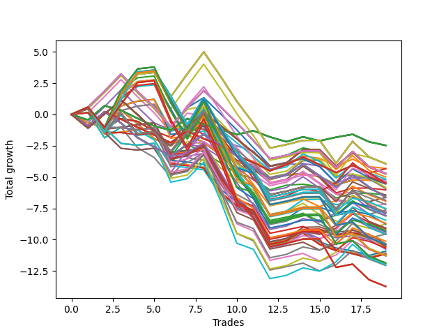

# Long HLT 217 
- Symbol: TSLA
- Date Range: 05/16/2022 - 05/17/2024
- Trading Period: 8:30-12:30
- Number of Trades: 19



| Id. | Name | Win Percent | Profit | Avg Profit / Trade | Avg Time / Trade | Std |      | Name | Win Percent | Profit | Avg Profit / Trade | Avg Time / Trade | Std |
| --- | ---- | ----------- | ------ | ------------------ | ---------------- | --- | ---- | ---- | ----------- | ------ | ------------------ | ---------------- | --- |
| | Sorted By <br> Profit | | | | | | | Sorted By <br> Win Percentage |||||
|0| TP-0.25 180m | 31.58 | -2.47 | -0.13 | 04:06 | 0.51 |     | TP-1.75 180m | 52.63 | -3.93 | -0.21 | 58:31 | 1.59 |
|1| TP-0.25 165m | 31.58 | -2.47 | -0.13 | 04:06 | 0.51 |     | TP-1.75 165m | 52.63 | -3.93 | -0.21 | 58:31 | 1.59 |
|2| TP-0.25 150m | 31.58 | -2.47 | -0.13 | 04:06 | 0.51 |     | TP-1.75 150m | 52.63 | -3.93 | -0.21 | 58:31 | 1.59 |
|3| TP-0.25 135m | 31.58 | -2.47 | -0.13 | 04:06 | 0.51 |     | TP-1.75 135m | 52.63 | -3.93 | -0.21 | 58:31 | 1.59 |
|4| TP-0.25 120m | 31.58 | -2.47 | -0.13 | 04:06 | 0.51 |     | TP-1.75 120m | 52.63 | -3.93 | -0.21 | 58:31 | 1.59 |
|5| TP-0.25 105m | 31.58 | -2.47 | -0.13 | 04:06 | 0.51 |     | TP-1.75 105m | 52.63 | -3.95 | -0.21 | 57:28 | 1.51 |
|6| TP-0.25 90m | 31.58 | -2.47 | -0.13 | 04:06 | 0.51 |     | TP-1.75 90m | 52.63 | -5.35 | -0.28 | 54:28 | 1.37 |
|7| TP-0.25 75m | 31.58 | -2.47 | -0.13 | 04:06 | 0.51 |     | TP-2 90m | 52.63 | -7.19 | -0.38 | 61:56 | 1.26 |
|8| TP-0.25 60m | 31.58 | -2.47 | -0.13 | 04:06 | 0.51 |     | TP-2.25 90m | 52.63 | -7.55 | -0.40 | 63:31 | 1.30 |
|9| TP-0.25 45m | 31.58 | -2.47 | -0.13 | 04:06 | 0.51 |     | TP-2.5 90m | 52.63 | -8.45 | -0.44 | 65:00 | 1.37 |
|10| TP-0.25 30m | 31.58 | -2.47 | -0.13 | 04:06 | 0.51 |     | TP-1.75 45m | 52.63 | -8.75 | -0.46 | 36:03 | 1.12 |
|11| TP-0.25 15m | 31.58 | -2.47 | -0.13 | 04:06 | 0.51 |     | TP-2.75 90m | 52.63 | -9.34 | -0.49 | 65:25 | 1.45 |
|12| TP-1.75 180m | 52.63 | -3.93 | -0.21 | 58:31 | 1.59 |     | TP-3 90m | 52.63 | -10.12 | -0.53 | 66:22 | 1.52 |
|13| TP-1.75 165m | 52.63 | -3.93 | -0.21 | 58:31 | 1.59 |     | TP-3 45m | 52.63 | -10.32 | -0.54 | 41:34 | 1.02 |
|14| TP-1.75 150m | 52.63 | -3.93 | -0.21 | 58:31 | 1.59 |     | TP-2.5 45m | 52.63 | -10.49 | -0.55 | 40:34 | 1.03 |
|15| TP-1.75 135m | 52.63 | -3.93 | -0.21 | 58:31 | 1.59 |     | TP-2.25 45m | 52.63 | -10.53 | -0.55 | 39:41 | 1.04 |
|16| TP-1.75 120m | 52.63 | -3.93 | -0.21 | 58:31 | 1.59 |     | TP-2 45m | 52.63 | -10.59 | -0.56 | 38:18 | 1.03 |
|17| TP-1.75 105m | 52.63 | -3.95 | -0.21 | 57:28 | 1.51 |     | TP-2.75 45m | 52.63 | -10.76 | -0.57 | 40:50 | 1.06 |
|18| TP-0.5 15m | 26.32 | -4.31 | -0.23 | 07:18 | 0.62 |     | TP-1.25 180m | 47.37 | -4.71 | -0.25 | 33:47 | 1.16 |
|19| TP-0.5 30m | 31.58 | -4.34 | -0.23 | 08:37 | 0.64 |     | TP-1.25 165m | 47.37 | -4.71 | -0.25 | 33:47 | 1.16 |
|20| TP-1.25 180m | 47.37 | -4.71 | -0.25 | 33:47 | 1.16 |     | TP-1.25 150m | 47.37 | -4.71 | -0.25 | 33:47 | 1.16 |
|21| TP-1.25 165m | 47.37 | -4.71 | -0.25 | 33:47 | 1.16 |     | TP-1.25 135m | 47.37 | -4.71 | -0.25 | 33:47 | 1.16 |
|22| TP-1.25 150m | 47.37 | -4.71 | -0.25 | 33:47 | 1.16 |     | TP-1.25 120m | 47.37 | -4.71 | -0.25 | 33:47 | 1.16 |
|23| TP-1.25 135m | 47.37 | -4.71 | -0.25 | 33:47 | 1.16 |     | TP-1.25 105m | 47.37 | -4.71 | -0.25 | 33:47 | 1.16 |
|24| TP-1.25 120m | 47.37 | -4.71 | -0.25 | 33:47 | 1.16 |     | TP-1.25 90m | 47.37 | -4.71 | -0.25 | 33:47 | 1.16 |
|25| TP-1.25 105m | 47.37 | -4.71 | -0.25 | 33:47 | 1.16 |     | TP-1.5 75m | 47.37 | -5.49 | -0.29 | 43:00 | 1.26 |
|26| TP-1.25 90m | 47.37 | -4.71 | -0.25 | 33:47 | 1.16 |     | TP-1.25 45m | 47.37 | -5.82 | -0.31 | 25:25 | 1.05 |
|27| TP-1 180m | 42.11 | -4.73 | -0.25 | 26:53 | 1.05 |     | TP-1.5 90m | 47.37 | -6.45 | -0.34 | 45:53 | 1.27 |
|28| TP-1 165m | 42.11 | -4.73 | -0.25 | 26:53 | 1.05 |     | TP-1.5 105m | 47.37 | -6.85 | -0.36 | 47:22 | 1.30 |
|29| TP-1 150m | 42.11 | -4.73 | -0.25 | 26:53 | 1.05 |     | TP-1.5 60m | 47.37 | -6.93 | -0.36 | 38:31 | 1.17 |
|30| TP-1 135m | 42.11 | -4.73 | -0.25 | 26:53 | 1.05 |     | TP-2 105m | 47.37 | -7.51 | -0.40 | 67:15 | 1.48 |
|31| TP-1 120m | 42.11 | -4.73 | -0.25 | 26:53 | 1.05 |     | TP-1.5 180m | 47.37 | -7.81 | -0.41 | 48:09 | 1.31 |
|32| TP-1 105m | 42.11 | -4.73 | -0.25 | 26:53 | 1.05 |     | TP-1.5 165m | 47.37 | -7.81 | -0.41 | 48:09 | 1.31 |
|33| TP-1 90m | 42.11 | -4.73 | -0.25 | 26:53 | 1.05 |     | TP-1.5 150m | 47.37 | -7.81 | -0.41 | 48:09 | 1.31 |
|34| TP-1.25 75m | 42.11 | -4.73 | -0.25 | 33:09 | 1.17 |     | TP-1.5 135m | 47.37 | -7.81 | -0.41 | 48:09 | 1.31 |
|35| TP-1 75m | 36.84 | -5.00 | -0.26 | 26:34 | 1.05 |     | TP-1.5 120m | 47.37 | -7.81 | -0.41 | 48:09 | 1.31 |
|36| TP-1 60m | 36.84 | -5.17 | -0.27 | 24:44 | 1.01 |     | TP-2.25 105m | 47.37 | -7.87 | -0.41 | 68:50 | 1.51 |
|37| TP-1.25 15m | 36.84 | -5.21 | -0.27 | 12:25 | 0.83 |     | TP-1.5 45m | 47.37 | -8.11 | -0.43 | 32:56 | 1.11 |
|38| TP-1.75 90m | 52.63 | -5.35 | -0.28 | 54:28 | 1.37 |     | TP-2.5 105m | 47.37 | -8.69 | -0.46 | 70:22 | 1.57 |
|39| TP-3 15m | 31.58 | -5.38 | -0.28 | 14:00 | 0.66 |     | TP-2.75 105m | 47.37 | -9.27 | -0.49 | 70:53 | 1.67 |
|40| TP-2.75 15m | 31.58 | -5.38 | -0.28 | 14:00 | 0.66 |     | TP-2 180m | 47.37 | -9.55 | -0.50 | 70:53 | 1.59 |
|41| TP-2.5 15m | 31.58 | -5.38 | -0.28 | 14:00 | 0.66 |     | TP-2 165m | 47.37 | -9.55 | -0.50 | 70:53 | 1.59 |
|42| TP-2.25 15m | 31.58 | -5.38 | -0.28 | 14:00 | 0.66 |     | TP-2 150m | 47.37 | -9.55 | -0.50 | 70:53 | 1.59 |
|43| TP-2 15m | 31.58 | -5.38 | -0.28 | 14:00 | 0.66 |     | TP-2 135m | 47.37 | -9.55 | -0.50 | 70:53 | 1.59 |
|44| TP-1.75 15m | 31.58 | -5.38 | -0.28 | 14:00 | 0.66 |     | TP-2 120m | 47.37 | -9.55 | -0.50 | 70:53 | 1.59 |
|45| TP-1.5 15m | 31.58 | -5.38 | -0.28 | 14:00 | 0.66 |     | TP-2.25 180m | 47.37 | -10.37 | -0.55 | 72:50 | 1.61 |
|46| TP-1.5 75m | 47.37 | -5.49 | -0.29 | 43:00 | 1.26 |     | TP-2.25 165m | 47.37 | -10.37 | -0.55 | 72:50 | 1.61 |
|47| TP-0.5 180m | 26.32 | -5.50 | -0.29 | 09:09 | 0.64 |     | TP-2.25 150m | 47.37 | -10.37 | -0.55 | 72:50 | 1.61 |
|48| TP-0.5 165m | 26.32 | -5.50 | -0.29 | 09:09 | 0.64 |     | TP-2.25 135m | 47.37 | -10.37 | -0.55 | 72:50 | 1.61 |
|49| TP-0.5 150m | 26.32 | -5.50 | -0.29 | 09:09 | 0.64 |     | TP-2.25 120m | 47.37 | -10.37 | -0.55 | 72:50 | 1.61 |
|50| TP-0.5 135m | 26.32 | -5.50 | -0.29 | 09:09 | 0.64 |     | TP-3 105m | 47.37 | -10.66 | -0.56 | 72:28 | 1.67 |
|51| TP-0.5 120m | 26.32 | -5.50 | -0.29 | 09:09 | 0.64 |     | TP-2.5 180m | 47.37 | -11.28 | -0.59 | 75:06 | 1.65 |
|52| TP-0.5 105m | 26.32 | -5.50 | -0.29 | 09:09 | 0.64 |     | TP-2.5 165m | 47.37 | -11.28 | -0.59 | 75:06 | 1.65 |
|53| TP-0.5 90m | 26.32 | -5.50 | -0.29 | 09:09 | 0.64 |     | TP-2.5 150m | 47.37 | -11.28 | -0.59 | 75:06 | 1.65 |
|54| TP-0.5 75m | 26.32 | -5.50 | -0.29 | 09:09 | 0.64 |     | TP-2.5 135m | 47.37 | -11.28 | -0.59 | 75:06 | 1.65 |
|55| TP-0.5 60m | 26.32 | -5.50 | -0.29 | 09:09 | 0.64 |     | TP-2.5 120m | 47.37 | -11.28 | -0.59 | 75:06 | 1.65 |
|56| TP-0.5 45m | 26.32 | -5.50 | -0.29 | 09:09 | 0.64 |     | TP-2.75 180m | 47.37 | -11.86 | -0.62 | 75:37 | 1.74 |
|57| TP-1.25 60m | 42.11 | -5.56 | -0.29 | 30:12 | 1.09 |     | TP-2.75 165m | 47.37 | -11.86 | -0.62 | 75:37 | 1.74 |
|58| TP-1.25 45m | 47.37 | -5.82 | -0.31 | 25:25 | 1.05 |     | TP-2.75 150m | 47.37 | -11.86 | -0.62 | 75:37 | 1.74 |
|59| TP-1 45m | 42.11 | -5.91 | -0.31 | 21:00 | 0.94 |     | TP-2.75 135m | 47.37 | -11.86 | -0.62 | 75:37 | 1.74 |
|60| TP-1 15m | 36.84 | -6.02 | -0.32 | 11:37 | 0.79 |     | TP-2.75 120m | 47.37 | -11.86 | -0.62 | 75:37 | 1.74 |
|61| TP-0.75 15m | 31.58 | -6.43 | -0.34 | 09:50 | 0.65 |     | TP-3 180m | 47.37 | -13.73 | -0.72 | 78:00 | 1.70 |
|62| TP-1.5 90m | 47.37 | -6.45 | -0.34 | 45:53 | 1.27 |     | TP-3 165m | 47.37 | -13.73 | -0.72 | 78:00 | 1.70 |
|63| TP-0.75 180m | 31.58 | -6.62 | -0.35 | 17:18 | 0.81 |     | TP-3 150m | 47.37 | -13.73 | -0.72 | 78:00 | 1.70 |
|64| TP-0.75 165m | 31.58 | -6.62 | -0.35 | 17:18 | 0.81 |     | TP-3 135m | 47.37 | -13.73 | -0.72 | 78:00 | 1.70 |
|65| TP-0.75 150m | 31.58 | -6.62 | -0.35 | 17:18 | 0.81 |     | TP-3 120m | 47.37 | -13.73 | -0.72 | 78:00 | 1.70 |
|66| TP-0.75 135m | 31.58 | -6.62 | -0.35 | 17:18 | 0.81 |     | TP-1 180m | 42.11 | -4.73 | -0.25 | 26:53 | 1.05 |
|67| TP-0.75 120m | 31.58 | -6.62 | -0.35 | 17:18 | 0.81 |     | TP-1 165m | 42.11 | -4.73 | -0.25 | 26:53 | 1.05 |
|68| TP-0.75 105m | 31.58 | -6.62 | -0.35 | 17:18 | 0.81 |     | TP-1 150m | 42.11 | -4.73 | -0.25 | 26:53 | 1.05 |
|69| TP-0.75 90m | 31.58 | -6.62 | -0.35 | 17:18 | 0.81 |     | TP-1 135m | 42.11 | -4.73 | -0.25 | 26:53 | 1.05 |
|70| TP-0.75 75m | 31.58 | -6.62 | -0.35 | 17:18 | 0.81 |     | TP-1 120m | 42.11 | -4.73 | -0.25 | 26:53 | 1.05 |
|71| TP-0.75 60m | 31.58 | -6.62 | -0.35 | 17:18 | 0.81 |     | TP-1 105m | 42.11 | -4.73 | -0.25 | 26:53 | 1.05 |
|72| TP-1 30m | 31.58 | -6.63 | -0.35 | 17:03 | 0.94 |     | TP-1 90m | 42.11 | -4.73 | -0.25 | 26:53 | 1.05 |
|73| TP-1.5 105m | 47.37 | -6.85 | -0.36 | 47:22 | 1.30 |     | TP-1.25 75m | 42.11 | -4.73 | -0.25 | 33:09 | 1.17 |
|74| TP-1.5 60m | 47.37 | -6.93 | -0.36 | 38:31 | 1.17 |     | TP-1.25 60m | 42.11 | -5.56 | -0.29 | 30:12 | 1.09 |
|75| TP-1.25 30m | 36.84 | -7.12 | -0.37 | 19:53 | 1.02 |     | TP-1 45m | 42.11 | -5.91 | -0.31 | 21:00 | 0.94 |
|76| TP-2 90m | 52.63 | -7.19 | -0.38 | 61:56 | 1.26 |     | TP-1.75 75m | 42.11 | -8.07 | -0.42 | 49:34 | 1.27 |
|77| TP-2 105m | 47.37 | -7.51 | -0.40 | 67:15 | 1.48 |     | TP-1.75 60m | 42.11 | -8.10 | -0.43 | 43:12 | 1.18 |
|78| TP-2.25 90m | 52.63 | -7.55 | -0.40 | 63:31 | 1.30 |     | TP-2 75m | 42.11 | -9.07 | -0.48 | 55:00 | 1.19 |
|79| TP-0.75 30m | 26.32 | -7.63 | -0.40 | 14:15 | 0.72 |     | TP-2 60m | 42.11 | -9.13 | -0.48 | 47:03 | 1.09 |
|80| TP-1.5 180m | 47.37 | -7.81 | -0.41 | 48:09 | 1.31 |     | TP-2.25 75m | 42.11 | -9.43 | -0.50 | 56:34 | 1.22 |
|81| TP-1.5 165m | 47.37 | -7.81 | -0.41 | 48:09 | 1.31 |     | TP-2.25 60m | 42.11 | -9.49 | -0.50 | 48:37 | 1.12 |
|82| TP-1.5 150m | 47.37 | -7.81 | -0.41 | 48:09 | 1.31 |     | TP-2.5 75m | 42.11 | -10.33 | -0.54 | 58:03 | 1.29 |
|83| TP-1.5 135m | 47.37 | -7.81 | -0.41 | 48:09 | 1.31 |     | TP-2.5 60m | 42.11 | -10.39 | -0.55 | 50:06 | 1.20 |
|84| TP-1.5 120m | 47.37 | -7.81 | -0.41 | 48:09 | 1.31 |     | TP-2.75 75m | 42.11 | -11.22 | -0.59 | 58:28 | 1.37 |
|85| TP-2.25 105m | 47.37 | -7.87 | -0.41 | 68:50 | 1.51 |     | TP-2.75 60m | 42.11 | -11.28 | -0.59 | 50:31 | 1.29 |
|86| TP-0.75 45m | 31.58 | -7.96 | -0.42 | 16:22 | 0.73 |     | TP-3 75m | 42.11 | -12.00 | -0.63 | 59:25 | 1.44 |
|87| TP-1.75 75m | 42.11 | -8.07 | -0.42 | 49:34 | 1.27 |     | TP-3 60m | 42.11 | -12.06 | -0.63 | 51:28 | 1.36 |
|88| TP-1.75 60m | 42.11 | -8.10 | -0.43 | 43:12 | 1.18 |     | TP-1 75m | 36.84 | -5.00 | -0.26 | 26:34 | 1.05 |
|89| TP-1.5 45m | 47.37 | -8.11 | -0.43 | 32:56 | 1.11 |     | TP-1 60m | 36.84 | -5.17 | -0.27 | 24:44 | 1.01 |
|90| TP-2.5 90m | 52.63 | -8.45 | -0.44 | 65:00 | 1.37 |     | TP-1.25 15m | 36.84 | -5.21 | -0.27 | 12:25 | 0.83 |
|91| TP-2.5 105m | 47.37 | -8.69 | -0.46 | 70:22 | 1.57 |     | TP-1 15m | 36.84 | -6.02 | -0.32 | 11:37 | 0.79 |
|92| TP-1.75 45m | 52.63 | -8.75 | -0.46 | 36:03 | 1.12 |     | TP-1.25 30m | 36.84 | -7.12 | -0.37 | 19:53 | 1.02 |
|93| TP-1.75 30m | 31.58 | -8.76 | -0.46 | 26:44 | 1.02 |     | TP-0.25 180m | 31.58 | -2.47 | -0.13 | 04:06 | 0.51 |
|94| TP-2 75m | 42.11 | -9.07 | -0.48 | 55:00 | 1.19 |     | TP-0.25 165m | 31.58 | -2.47 | -0.13 | 04:06 | 0.51 |
|95| TP-2 60m | 42.11 | -9.13 | -0.48 | 47:03 | 1.09 |     | TP-0.25 150m | 31.58 | -2.47 | -0.13 | 04:06 | 0.51 |
|96| TP-2.75 105m | 47.37 | -9.27 | -0.49 | 70:53 | 1.67 |     | TP-0.25 135m | 31.58 | -2.47 | -0.13 | 04:06 | 0.51 |
|97| TP-2.75 90m | 52.63 | -9.34 | -0.49 | 65:25 | 1.45 |     | TP-0.25 120m | 31.58 | -2.47 | -0.13 | 04:06 | 0.51 |
|98| TP-2.25 75m | 42.11 | -9.43 | -0.50 | 56:34 | 1.22 |     | TP-0.25 105m | 31.58 | -2.47 | -0.13 | 04:06 | 0.51 |
|99| TP-2.25 60m | 42.11 | -9.49 | -0.50 | 48:37 | 1.12 |     | TP-0.25 90m | 31.58 | -2.47 | -0.13 | 04:06 | 0.51 |
|100| TP-2 180m | 47.37 | -9.55 | -0.50 | 70:53 | 1.59 |     | TP-0.25 75m | 31.58 | -2.47 | -0.13 | 04:06 | 0.51 |
|101| TP-2 165m | 47.37 | -9.55 | -0.50 | 70:53 | 1.59 |     | TP-0.25 60m | 31.58 | -2.47 | -0.13 | 04:06 | 0.51 |
|102| TP-2 150m | 47.37 | -9.55 | -0.50 | 70:53 | 1.59 |     | TP-0.25 45m | 31.58 | -2.47 | -0.13 | 04:06 | 0.51 |
|103| TP-2 135m | 47.37 | -9.55 | -0.50 | 70:53 | 1.59 |     | TP-0.25 30m | 31.58 | -2.47 | -0.13 | 04:06 | 0.51 |
|104| TP-2 120m | 47.37 | -9.55 | -0.50 | 70:53 | 1.59 |     | TP-0.25 15m | 31.58 | -2.47 | -0.13 | 04:06 | 0.51 |
|105| TP-1.5 30m | 31.58 | -9.55 | -0.50 | 25:22 | 0.95 |     | TP-0.5 30m | 31.58 | -4.34 | -0.23 | 08:37 | 0.64 |
|106| TP-3 90m | 52.63 | -10.12 | -0.53 | 66:22 | 1.52 |     | TP-3 15m | 31.58 | -5.38 | -0.28 | 14:00 | 0.66 |
|107| TP-3 45m | 52.63 | -10.32 | -0.54 | 41:34 | 1.02 |     | TP-2.75 15m | 31.58 | -5.38 | -0.28 | 14:00 | 0.66 |
|108| TP-2.5 75m | 42.11 | -10.33 | -0.54 | 58:03 | 1.29 |     | TP-2.5 15m | 31.58 | -5.38 | -0.28 | 14:00 | 0.66 |
|109| TP-2.25 180m | 47.37 | -10.37 | -0.55 | 72:50 | 1.61 |     | TP-2.25 15m | 31.58 | -5.38 | -0.28 | 14:00 | 0.66 |
|110| TP-2.25 165m | 47.37 | -10.37 | -0.55 | 72:50 | 1.61 |     | TP-2 15m | 31.58 | -5.38 | -0.28 | 14:00 | 0.66 |
|111| TP-2.25 150m | 47.37 | -10.37 | -0.55 | 72:50 | 1.61 |     | TP-1.75 15m | 31.58 | -5.38 | -0.28 | 14:00 | 0.66 |
|112| TP-2.25 135m | 47.37 | -10.37 | -0.55 | 72:50 | 1.61 |     | TP-1.5 15m | 31.58 | -5.38 | -0.28 | 14:00 | 0.66 |
|113| TP-2.25 120m | 47.37 | -10.37 | -0.55 | 72:50 | 1.61 |     | TP-0.75 15m | 31.58 | -6.43 | -0.34 | 09:50 | 0.65 |
|114| TP-2.5 60m | 42.11 | -10.39 | -0.55 | 50:06 | 1.20 |     | TP-0.75 180m | 31.58 | -6.62 | -0.35 | 17:18 | 0.81 |
|115| TP-2.5 45m | 52.63 | -10.49 | -0.55 | 40:34 | 1.03 |     | TP-0.75 165m | 31.58 | -6.62 | -0.35 | 17:18 | 0.81 |
|116| TP-2.25 45m | 52.63 | -10.53 | -0.55 | 39:41 | 1.04 |     | TP-0.75 150m | 31.58 | -6.62 | -0.35 | 17:18 | 0.81 |
|117| TP-2 45m | 52.63 | -10.59 | -0.56 | 38:18 | 1.03 |     | TP-0.75 135m | 31.58 | -6.62 | -0.35 | 17:18 | 0.81 |
|118| TP-3 105m | 47.37 | -10.66 | -0.56 | 72:28 | 1.67 |     | TP-0.75 120m | 31.58 | -6.62 | -0.35 | 17:18 | 0.81 |
|119| TP-2.75 45m | 52.63 | -10.76 | -0.57 | 40:50 | 1.06 |     | TP-0.75 105m | 31.58 | -6.62 | -0.35 | 17:18 | 0.81 |
|120| TP-2.25 30m | 26.32 | -10.92 | -0.57 | 28:12 | 0.90 |     | TP-0.75 90m | 31.58 | -6.62 | -0.35 | 17:18 | 0.81 |
|121| TP-2.5 30m | 26.32 | -11.07 | -0.58 | 28:18 | 0.92 |     | TP-0.75 75m | 31.58 | -6.62 | -0.35 | 17:18 | 0.81 |
|122| TP-2 30m | 26.32 | -11.08 | -0.58 | 27:37 | 0.90 |     | TP-0.75 60m | 31.58 | -6.62 | -0.35 | 17:18 | 0.81 |
|123| TP-3 30m | 26.32 | -11.14 | -0.59 | 28:31 | 0.93 |     | TP-1 30m | 31.58 | -6.63 | -0.35 | 17:03 | 0.94 |
|124| TP-2.75 30m | 26.32 | -11.14 | -0.59 | 28:31 | 0.93 |     | TP-0.75 45m | 31.58 | -7.96 | -0.42 | 16:22 | 0.73 |
|125| TP-2.75 75m | 42.11 | -11.22 | -0.59 | 58:28 | 1.37 |     | TP-1.75 30m | 31.58 | -8.76 | -0.46 | 26:44 | 1.02 |
|126| TP-2.5 180m | 47.37 | -11.28 | -0.59 | 75:06 | 1.65 |     | TP-1.5 30m | 31.58 | -9.55 | -0.50 | 25:22 | 0.95 |
|127| TP-2.5 165m | 47.37 | -11.28 | -0.59 | 75:06 | 1.65 |     | TP-0.5 15m | 26.32 | -4.31 | -0.23 | 07:18 | 0.62 |
|128| TP-2.5 150m | 47.37 | -11.28 | -0.59 | 75:06 | 1.65 |     | TP-0.5 180m | 26.32 | -5.50 | -0.29 | 09:09 | 0.64 |
|129| TP-2.5 135m | 47.37 | -11.28 | -0.59 | 75:06 | 1.65 |     | TP-0.5 165m | 26.32 | -5.50 | -0.29 | 09:09 | 0.64 |
|130| TP-2.5 120m | 47.37 | -11.28 | -0.59 | 75:06 | 1.65 |     | TP-0.5 150m | 26.32 | -5.50 | -0.29 | 09:09 | 0.64 |
|131| TP-2.75 60m | 42.11 | -11.28 | -0.59 | 50:31 | 1.29 |     | TP-0.5 135m | 26.32 | -5.50 | -0.29 | 09:09 | 0.64 |
|132| TP-2.75 180m | 47.37 | -11.86 | -0.62 | 75:37 | 1.74 |     | TP-0.5 120m | 26.32 | -5.50 | -0.29 | 09:09 | 0.64 |
|133| TP-2.75 165m | 47.37 | -11.86 | -0.62 | 75:37 | 1.74 |     | TP-0.5 105m | 26.32 | -5.50 | -0.29 | 09:09 | 0.64 |
|134| TP-2.75 150m | 47.37 | -11.86 | -0.62 | 75:37 | 1.74 |     | TP-0.5 90m | 26.32 | -5.50 | -0.29 | 09:09 | 0.64 |
|135| TP-2.75 135m | 47.37 | -11.86 | -0.62 | 75:37 | 1.74 |     | TP-0.5 75m | 26.32 | -5.50 | -0.29 | 09:09 | 0.64 |
|136| TP-2.75 120m | 47.37 | -11.86 | -0.62 | 75:37 | 1.74 |     | TP-0.5 60m | 26.32 | -5.50 | -0.29 | 09:09 | 0.64 |
|137| TP-3 75m | 42.11 | -12.00 | -0.63 | 59:25 | 1.44 |     | TP-0.5 45m | 26.32 | -5.50 | -0.29 | 09:09 | 0.64 |
|138| TP-3 60m | 42.11 | -12.06 | -0.63 | 51:28 | 1.36 |     | TP-0.75 30m | 26.32 | -7.63 | -0.40 | 14:15 | 0.72 |
|139| TP-3 180m | 47.37 | -13.73 | -0.72 | 78:00 | 1.70 |     | TP-2.25 30m | 26.32 | -10.92 | -0.57 | 28:12 | 0.90 |
|140| TP-3 165m | 47.37 | -13.73 | -0.72 | 78:00 | 1.70 |     | TP-2.5 30m | 26.32 | -11.07 | -0.58 | 28:18 | 0.92 |
|141| TP-3 150m | 47.37 | -13.73 | -0.72 | 78:00 | 1.70 |     | TP-2 30m | 26.32 | -11.08 | -0.58 | 27:37 | 0.90 |
|142| TP-3 135m | 47.37 | -13.73 | -0.72 | 78:00 | 1.70 |     | TP-3 30m | 26.32 | -11.14 | -0.59 | 28:31 | 0.93 |
|143| TP-3 120m | 47.37 | -13.73 | -0.72 | 78:00 | 1.70 |     | TP-2.75 30m | 26.32 | -11.14 | -0.59 | 28:31 | 0.93 |

### Test TP-0.25 15m
* Take Profit of 0.25 Point
* 0.25 Stoploss
* Results:
```
Total Trades: 19
Percent Up: 31.58
Percent Down: 68.42
Total Points Moved Up: -2.47
Potential Profit: -1235.00
Total Points Ups: 3.28 Count Ups: 6
Total Points Downs: -5.75 Count Downs: 13
```

<details><summary>Trades</summary>

<code>In: 2022-06-16 12:05:00		Out: 2022-06-16 12:09:00		Total Position Time: 04:00		Total Move Up: -0.44		Total to Date: -0.44</code> <br />
<code>In: 2022-08-08 12:10:00		Out: 2022-08-08 12:13:00		Total Position Time: 03:00		Total Move Up: 1.13		Total to Date: 0.69</code> <br />
<code>In: 2022-08-30 10:40:00		Out: 2022-08-30 10:43:00		Total Position Time: 03:00		Total Move Up: -0.36		Total to Date: 0.33</code> <br />
<code>In: 2022-09-01 08:40:00		Out: 2022-09-01 08:42:00		Total Position Time: 02:00		Total Move Up: -0.65		Total to Date: -0.32</code> <br />
<code>In: 2022-09-23 12:10:00		Out: 2022-09-23 12:14:00		Total Position Time: 04:00		Total Move Up: -0.61		Total to Date: -0.93</code> <br />
<code>In: 2022-11-09 08:50:00		Out: 2022-11-09 08:52:00		Total Position Time: 02:00		Total Move Up: -0.33		Total to Date: -1.26</code> <br />
<code>In: 2022-11-09 11:10:00		Out: 2022-11-09 11:19:00		Total Position Time: 09:00		Total Move Up: 0.93		Total to Date: -0.33</code> <br />
<code>In: 2023-01-19 08:55:00		Out: 2023-01-19 08:58:00		Total Position Time: 03:00		Total Move Up: -0.46		Total to Date: -0.79</code> <br />
<code>In: 2023-03-09 10:10:00		Out: 2023-03-09 10:12:00		Total Position Time: 02:00		Total Move Up: -0.41		Total to Date: -1.20</code> <br />
<code>In: 2023-03-09 11:25:00		Out: 2023-03-09 11:27:00		Total Position Time: 02:00		Total Move Up: -0.41		Total to Date: -1.61</code> <br />
<code>In: 2023-07-11 08:55:00		Out: 2023-07-11 08:59:00		Total Position Time: 04:00		Total Move Up: 0.31		Total to Date: -1.30</code> <br />
<code>In: 2023-07-27 12:20:00		Out: 2023-07-27 12:22:00		Total Position Time: 02:00		Total Move Up: -0.50		Total to Date: -1.80</code> <br />
<code>In: 2023-09-21 12:30:00		Out: 2023-09-21 12:35:00		Total Position Time: 05:00		Total Move Up: -0.38		Total to Date: -2.18</code> <br />
<code>In: 2023-09-26 11:30:00		Out: 2023-09-26 11:32:00		Total Position Time: 02:00		Total Move Up: 0.39		Total to Date: -1.79</code> <br />
<code>In: 2023-10-12 11:30:00		Out: 2023-10-12 11:41:00		Total Position Time: 11:00		Total Move Up: -0.32		Total to Date: -2.11</code> <br />
<code>In: 2023-11-30 08:50:00		Out: 2023-11-30 08:52:00		Total Position Time: 02:00		Total Move Up: 0.29		Total to Date: -1.82</code> <br />
<code>In: 2024-01-05 09:45:00		Out: 2024-01-05 09:53:00		Total Position Time: 08:00		Total Move Up: 0.23		Total to Date: -1.59</code> <br />
<code>In: 2024-03-08 08:45:00		Out: 2024-03-08 08:47:00		Total Position Time: 02:00		Total Move Up: -0.60		Total to Date: -2.19</code> <br />
<code>In: 2024-03-13 11:50:00		Out: 2024-03-13 11:58:00		Total Position Time: 08:00		Total Move Up: -0.28		Total to Date: -2.47</code> <br />


</details>

### Test TP-0.5 15m
* Take Profit of 0.5 Point
* 0.5 Stoploss
* Results:
```
Total Trades: 19
Percent Up: 26.32
Percent Down: 73.68
Total Points Moved Up: -4.31
Potential Profit: -2155.00
Total Points Ups: 3.73 Count Ups: 5
Total Points Downs: -8.04 Count Downs: 14
```

<details><summary>Trades</summary>

<code>In: 2022-06-16 12:05:00		Out: 2022-06-16 12:14:00		Total Position Time: 09:00		Total Move Up: -0.92		Total to Date: -0.92</code> <br />
<code>In: 2022-08-08 12:10:00		Out: 2022-08-08 12:13:00		Total Position Time: 03:00		Total Move Up: 1.13		Total to Date: 0.21</code> <br />
<code>In: 2022-08-30 10:40:00		Out: 2022-08-30 10:44:00		Total Position Time: 04:00		Total Move Up: -0.59		Total to Date: -0.38</code> <br />
<code>In: 2022-09-01 08:40:00		Out: 2022-09-01 08:42:00		Total Position Time: 02:00		Total Move Up: -0.65		Total to Date: -1.03</code> <br />
<code>In: 2022-09-23 12:10:00		Out: 2022-09-23 12:14:00		Total Position Time: 04:00		Total Move Up: -0.61		Total to Date: -1.64</code> <br />
<code>In: 2022-11-09 08:50:00		Out: 2022-11-09 08:54:00		Total Position Time: 04:00		Total Move Up: -0.61		Total to Date: -2.25</code> <br />
<code>In: 2022-11-09 11:10:00		Out: 2022-11-09 11:19:00		Total Position Time: 09:00		Total Move Up: 0.93		Total to Date: -1.32</code> <br />
<code>In: 2023-01-19 08:55:00		Out: 2023-01-19 09:09:00		Total Position Time: 14:00		Total Move Up: -0.62		Total to Date: -1.94</code> <br />
<code>In: 2023-03-09 10:10:00		Out: 2023-03-09 10:14:00		Total Position Time: 04:00		Total Move Up: -0.51		Total to Date: -2.45</code> <br />
<code>In: 2023-03-09 11:25:00		Out: 2023-03-09 11:31:00		Total Position Time: 06:00		Total Move Up: -0.87		Total to Date: -3.32</code> <br />
<code>In: 2023-07-11 08:55:00		Out: 2023-07-11 09:09:00		Total Position Time: 14:00		Total Move Up: -0.42		Total to Date: -3.74</code> <br />
<code>In: 2023-07-27 12:20:00		Out: 2023-07-27 12:23:00		Total Position Time: 03:00		Total Move Up: -0.67		Total to Date: -4.41</code> <br />
<code>In: 2023-09-21 12:30:00		Out: 2023-09-21 12:37:00		Total Position Time: 07:00		Total Move Up: 0.49		Total to Date: -3.92</code> <br />
<code>In: 2023-09-26 11:30:00		Out: 2023-09-26 11:37:00		Total Position Time: 07:00		Total Move Up: 0.61		Total to Date: -3.31</code> <br />
<code>In: 2023-10-12 11:30:00		Out: 2023-10-12 11:44:00		Total Position Time: 14:00		Total Move Up: -0.20		Total to Date: -3.51</code> <br />
<code>In: 2023-11-30 08:50:00		Out: 2023-11-30 08:57:00		Total Position Time: 07:00		Total Move Up: -0.63		Total to Date: -4.14</code> <br />
<code>In: 2024-01-05 09:45:00		Out: 2024-01-05 09:57:00		Total Position Time: 12:00		Total Move Up: 0.57		Total to Date: -3.57</code> <br />
<code>In: 2024-03-08 08:45:00		Out: 2024-03-08 08:47:00		Total Position Time: 02:00		Total Move Up: -0.60		Total to Date: -4.17</code> <br />
<code>In: 2024-03-13 11:50:00		Out: 2024-03-13 12:04:00		Total Position Time: 14:00		Total Move Up: -0.14		Total to Date: -4.31</code> <br />


</details>

### Test TP-0.75 15m
* Take Profit of 0.75 Point
* 0.75 Stoploss
* Results:
```
Total Trades: 19
Percent Up: 31.58
Percent Down: 68.42
Total Points Moved Up: -6.43
Potential Profit: -3215.00
Total Points Ups: 2.89 Count Ups: 6
Total Points Downs: -9.32 Count Downs: 13
```

<details><summary>Trades</summary>

<code>In: 2022-06-16 12:05:00		Out: 2022-06-16 12:14:00		Total Position Time: 09:00		Total Move Up: -0.92		Total to Date: -0.92</code> <br />
<code>In: 2022-08-08 12:10:00		Out: 2022-08-08 12:13:00		Total Position Time: 03:00		Total Move Up: 1.13		Total to Date: 0.21</code> <br />
<code>In: 2022-08-30 10:40:00		Out: 2022-08-30 10:45:00		Total Position Time: 05:00		Total Move Up: -0.90		Total to Date: -0.69</code> <br />
<code>In: 2022-09-01 08:40:00		Out: 2022-09-01 08:44:00		Total Position Time: 04:00		Total Move Up: -1.17		Total to Date: -1.86</code> <br />
<code>In: 2022-09-23 12:10:00		Out: 2022-09-23 12:21:00		Total Position Time: 11:00		Total Move Up: -0.74		Total to Date: -2.60</code> <br />
<code>In: 2022-11-09 08:50:00		Out: 2022-11-09 08:58:00		Total Position Time: 08:00		Total Move Up: -0.73		Total to Date: -3.33</code> <br />
<code>In: 2022-11-09 11:10:00		Out: 2022-11-09 11:19:00		Total Position Time: 09:00		Total Move Up: 0.93		Total to Date: -2.40</code> <br />
<code>In: 2023-01-19 08:55:00		Out: 2023-01-19 09:09:00		Total Position Time: 14:00		Total Move Up: -0.62		Total to Date: -3.02</code> <br />
<code>In: 2023-03-09 10:10:00		Out: 2023-03-09 10:16:00		Total Position Time: 06:00		Total Move Up: -0.83		Total to Date: -3.85</code> <br />
<code>In: 2023-03-09 11:25:00		Out: 2023-03-09 11:31:00		Total Position Time: 06:00		Total Move Up: -0.87		Total to Date: -4.72</code> <br />
<code>In: 2023-07-11 08:55:00		Out: 2023-07-11 09:09:00		Total Position Time: 14:00		Total Move Up: -0.42		Total to Date: -5.14</code> <br />
<code>In: 2023-07-27 12:20:00		Out: 2023-07-27 12:24:00		Total Position Time: 04:00		Total Move Up: -0.88		Total to Date: -6.02</code> <br />
<code>In: 2023-09-21 12:30:00		Out: 2023-09-21 12:44:00		Total Position Time: 14:00		Total Move Up: 0.37		Total to Date: -5.65</code> <br />
<code>In: 2023-09-26 11:30:00		Out: 2023-09-26 11:44:00		Total Position Time: 14:00		Total Move Up: 0.08		Total to Date: -5.57</code> <br />
<code>In: 2023-10-12 11:30:00		Out: 2023-10-12 11:44:00		Total Position Time: 14:00		Total Move Up: -0.20		Total to Date: -5.77</code> <br />
<code>In: 2023-11-30 08:50:00		Out: 2023-11-30 09:00:00		Total Position Time: 10:00		Total Move Up: -0.90		Total to Date: -6.67</code> <br />
<code>In: 2024-01-05 09:45:00		Out: 2024-01-05 09:59:00		Total Position Time: 14:00		Total Move Up: 0.38		Total to Date: -6.29</code> <br />
<code>In: 2024-03-08 08:45:00		Out: 2024-03-08 08:59:00		Total Position Time: 14:00		Total Move Up: 0.00		Total to Date: -6.29</code> <br />
<code>In: 2024-03-13 11:50:00		Out: 2024-03-13 12:04:00		Total Position Time: 14:00		Total Move Up: -0.14		Total to Date: -6.43</code> <br />


</details>

### Test TP-1 15m
* Take Profit of 1 Point
* 1 Stoploss
* Results:
```
Total Trades: 19
Percent Up: 36.84
Percent Down: 63.16
Total Points Moved Up: -6.02
Potential Profit: -3010.00
Total Points Ups: 3.95 Count Ups: 7
Total Points Downs: -9.97 Count Downs: 12
```

<details><summary>Trades</summary>

<code>In: 2022-06-16 12:05:00		Out: 2022-06-16 12:16:00		Total Position Time: 11:00		Total Move Up: -1.09		Total to Date: -1.09</code> <br />
<code>In: 2022-08-08 12:10:00		Out: 2022-08-08 12:13:00		Total Position Time: 03:00		Total Move Up: 1.13		Total to Date: 0.04</code> <br />
<code>In: 2022-08-30 10:40:00		Out: 2022-08-30 10:53:00		Total Position Time: 13:00		Total Move Up: 1.11		Total to Date: 1.15</code> <br />
<code>In: 2022-09-01 08:40:00		Out: 2022-09-01 08:44:00		Total Position Time: 04:00		Total Move Up: -1.17		Total to Date: -0.02</code> <br />
<code>In: 2022-09-23 12:10:00		Out: 2022-09-23 12:22:00		Total Position Time: 12:00		Total Move Up: -1.27		Total to Date: -1.29</code> <br />
<code>In: 2022-11-09 08:50:00		Out: 2022-11-09 09:04:00		Total Position Time: 14:00		Total Move Up: -0.55		Total to Date: -1.84</code> <br />
<code>In: 2022-11-09 11:10:00		Out: 2022-11-09 11:24:00		Total Position Time: 14:00		Total Move Up: 0.88		Total to Date: -0.96</code> <br />
<code>In: 2023-01-19 08:55:00		Out: 2023-01-19 09:09:00		Total Position Time: 14:00		Total Move Up: -0.62		Total to Date: -1.58</code> <br />
<code>In: 2023-03-09 10:10:00		Out: 2023-03-09 10:24:00		Total Position Time: 14:00		Total Move Up: -1.01		Total to Date: -2.59</code> <br />
<code>In: 2023-03-09 11:25:00		Out: 2023-03-09 11:33:00		Total Position Time: 08:00		Total Move Up: -1.07		Total to Date: -3.66</code> <br />
<code>In: 2023-07-11 08:55:00		Out: 2023-07-11 09:09:00		Total Position Time: 14:00		Total Move Up: -0.42		Total to Date: -4.08</code> <br />
<code>In: 2023-07-27 12:20:00		Out: 2023-07-27 12:25:00		Total Position Time: 05:00		Total Move Up: -1.10		Total to Date: -5.18</code> <br />
<code>In: 2023-09-21 12:30:00		Out: 2023-09-21 12:44:00		Total Position Time: 14:00		Total Move Up: 0.37		Total to Date: -4.81</code> <br />
<code>In: 2023-09-26 11:30:00		Out: 2023-09-26 11:44:00		Total Position Time: 14:00		Total Move Up: 0.08		Total to Date: -4.73</code> <br />
<code>In: 2023-10-12 11:30:00		Out: 2023-10-12 11:44:00		Total Position Time: 14:00		Total Move Up: -0.20		Total to Date: -4.93</code> <br />
<code>In: 2023-11-30 08:50:00		Out: 2023-11-30 09:01:00		Total Position Time: 11:00		Total Move Up: -1.33		Total to Date: -6.26</code> <br />
<code>In: 2024-01-05 09:45:00		Out: 2024-01-05 09:59:00		Total Position Time: 14:00		Total Move Up: 0.38		Total to Date: -5.88</code> <br />
<code>In: 2024-03-08 08:45:00		Out: 2024-03-08 08:59:00		Total Position Time: 14:00		Total Move Up: 0.00		Total to Date: -5.88</code> <br />
<code>In: 2024-03-13 11:50:00		Out: 2024-03-13 12:04:00		Total Position Time: 14:00		Total Move Up: -0.14		Total to Date: -6.02</code> <br />


</details>

### Test TP-1.25 15m
* Take Profit of 1.25 Point
* 1.25 Stoploss
* Results:
```
Total Trades: 19
Percent Up: 36.84
Percent Down: 63.16
Total Points Moved Up: -5.21
Potential Profit: -2605.00
Total Points Ups: 4.35 Count Ups: 7
Total Points Downs: -9.56 Count Downs: 12
```

<details><summary>Trades</summary>

<code>In: 2022-06-16 12:05:00		Out: 2022-06-16 12:19:00		Total Position Time: 14:00		Total Move Up: -0.67		Total to Date: -0.67</code> <br />
<code>In: 2022-08-08 12:10:00		Out: 2022-08-08 12:15:00		Total Position Time: 05:00		Total Move Up: 1.29		Total to Date: 0.62</code> <br />
<code>In: 2022-08-30 10:40:00		Out: 2022-08-30 10:54:00		Total Position Time: 14:00		Total Move Up: 1.35		Total to Date: 1.97</code> <br />
<code>In: 2022-09-01 08:40:00		Out: 2022-09-01 08:45:00		Total Position Time: 05:00		Total Move Up: -1.38		Total to Date: 0.59</code> <br />
<code>In: 2022-09-23 12:10:00		Out: 2022-09-23 12:22:00		Total Position Time: 12:00		Total Move Up: -1.27		Total to Date: -0.68</code> <br />
<code>In: 2022-11-09 08:50:00		Out: 2022-11-09 09:04:00		Total Position Time: 14:00		Total Move Up: -0.55		Total to Date: -1.23</code> <br />
<code>In: 2022-11-09 11:10:00		Out: 2022-11-09 11:24:00		Total Position Time: 14:00		Total Move Up: 0.88		Total to Date: -0.35</code> <br />
<code>In: 2023-01-19 08:55:00		Out: 2023-01-19 09:09:00		Total Position Time: 14:00		Total Move Up: -0.62		Total to Date: -0.97</code> <br />
<code>In: 2023-03-09 10:10:00		Out: 2023-03-09 10:24:00		Total Position Time: 14:00		Total Move Up: -1.01		Total to Date: -1.98</code> <br />
<code>In: 2023-03-09 11:25:00		Out: 2023-03-09 11:39:00		Total Position Time: 14:00		Total Move Up: -0.53		Total to Date: -2.51</code> <br />
<code>In: 2023-07-11 08:55:00		Out: 2023-07-11 09:09:00		Total Position Time: 14:00		Total Move Up: -0.42		Total to Date: -2.93</code> <br />
<code>In: 2023-07-27 12:20:00		Out: 2023-07-27 12:27:00		Total Position Time: 07:00		Total Move Up: -1.44		Total to Date: -4.37</code> <br />
<code>In: 2023-09-21 12:30:00		Out: 2023-09-21 12:44:00		Total Position Time: 14:00		Total Move Up: 0.37		Total to Date: -4.00</code> <br />
<code>In: 2023-09-26 11:30:00		Out: 2023-09-26 11:44:00		Total Position Time: 14:00		Total Move Up: 0.08		Total to Date: -3.92</code> <br />
<code>In: 2023-10-12 11:30:00		Out: 2023-10-12 11:44:00		Total Position Time: 14:00		Total Move Up: -0.20		Total to Date: -4.12</code> <br />
<code>In: 2023-11-30 08:50:00		Out: 2023-11-30 09:01:00		Total Position Time: 11:00		Total Move Up: -1.33		Total to Date: -5.45</code> <br />
<code>In: 2024-01-05 09:45:00		Out: 2024-01-05 09:59:00		Total Position Time: 14:00		Total Move Up: 0.38		Total to Date: -5.07</code> <br />
<code>In: 2024-03-08 08:45:00		Out: 2024-03-08 08:59:00		Total Position Time: 14:00		Total Move Up: 0.00		Total to Date: -5.07</code> <br />
<code>In: 2024-03-13 11:50:00		Out: 2024-03-13 12:04:00		Total Position Time: 14:00		Total Move Up: -0.14		Total to Date: -5.21</code> <br />


</details>

### Test TP-1.5 15m
* Take Profit of 1.5 Point
* 1.5 Stoploss
* Results:
```
Total Trades: 19
Percent Up: 31.58
Percent Down: 68.42
Total Points Moved Up: -5.38
Potential Profit: -2690.00
Total Points Ups: 3.06 Count Ups: 6
Total Points Downs: -8.44 Count Downs: 13
```

<details><summary>Trades</summary>

<code>In: 2022-06-16 12:05:00		Out: 2022-06-16 12:19:00		Total Position Time: 14:00		Total Move Up: -0.67		Total to Date: -0.67</code> <br />
<code>In: 2022-08-08 12:10:00		Out: 2022-08-08 12:24:00		Total Position Time: 14:00		Total Move Up: -0.33		Total to Date: -1.00</code> <br />
<code>In: 2022-08-30 10:40:00		Out: 2022-08-30 10:54:00		Total Position Time: 14:00		Total Move Up: 1.35		Total to Date: 0.35</code> <br />
<code>In: 2022-09-01 08:40:00		Out: 2022-09-01 08:54:00		Total Position Time: 14:00		Total Move Up: -1.10		Total to Date: -0.75</code> <br />
<code>In: 2022-09-23 12:10:00		Out: 2022-09-23 12:24:00		Total Position Time: 14:00		Total Move Up: -1.19		Total to Date: -1.94</code> <br />
<code>In: 2022-11-09 08:50:00		Out: 2022-11-09 09:04:00		Total Position Time: 14:00		Total Move Up: -0.55		Total to Date: -2.49</code> <br />
<code>In: 2022-11-09 11:10:00		Out: 2022-11-09 11:24:00		Total Position Time: 14:00		Total Move Up: 0.88		Total to Date: -1.61</code> <br />
<code>In: 2023-01-19 08:55:00		Out: 2023-01-19 09:09:00		Total Position Time: 14:00		Total Move Up: -0.62		Total to Date: -2.23</code> <br />
<code>In: 2023-03-09 10:10:00		Out: 2023-03-09 10:24:00		Total Position Time: 14:00		Total Move Up: -1.01		Total to Date: -3.24</code> <br />
<code>In: 2023-03-09 11:25:00		Out: 2023-03-09 11:39:00		Total Position Time: 14:00		Total Move Up: -0.53		Total to Date: -3.77</code> <br />
<code>In: 2023-07-11 08:55:00		Out: 2023-07-11 09:09:00		Total Position Time: 14:00		Total Move Up: -0.42		Total to Date: -4.19</code> <br />
<code>In: 2023-07-27 12:20:00		Out: 2023-07-27 12:34:00		Total Position Time: 14:00		Total Move Up: -1.01		Total to Date: -5.20</code> <br />
<code>In: 2023-09-21 12:30:00		Out: 2023-09-21 12:44:00		Total Position Time: 14:00		Total Move Up: 0.37		Total to Date: -4.83</code> <br />
<code>In: 2023-09-26 11:30:00		Out: 2023-09-26 11:44:00		Total Position Time: 14:00		Total Move Up: 0.08		Total to Date: -4.75</code> <br />
<code>In: 2023-10-12 11:30:00		Out: 2023-10-12 11:44:00		Total Position Time: 14:00		Total Move Up: -0.20		Total to Date: -4.95</code> <br />
<code>In: 2023-11-30 08:50:00		Out: 2023-11-30 09:04:00		Total Position Time: 14:00		Total Move Up: -0.67		Total to Date: -5.62</code> <br />
<code>In: 2024-01-05 09:45:00		Out: 2024-01-05 09:59:00		Total Position Time: 14:00		Total Move Up: 0.38		Total to Date: -5.24</code> <br />
<code>In: 2024-03-08 08:45:00		Out: 2024-03-08 08:59:00		Total Position Time: 14:00		Total Move Up: 0.00		Total to Date: -5.24</code> <br />
<code>In: 2024-03-13 11:50:00		Out: 2024-03-13 12:04:00		Total Position Time: 14:00		Total Move Up: -0.14		Total to Date: -5.38</code> <br />


</details>

### Test TP-1.75 15m
* Take Profit of 1.75 Point
* 1.75 Stoploss
* Results:
```
Total Trades: 19
Percent Up: 31.58
Percent Down: 68.42
Total Points Moved Up: -5.38
Potential Profit: -2690.00
Total Points Ups: 3.06 Count Ups: 6
Total Points Downs: -8.44 Count Downs: 13
```

<details><summary>Trades</summary>

<code>In: 2022-06-16 12:05:00		Out: 2022-06-16 12:19:00		Total Position Time: 14:00		Total Move Up: -0.67		Total to Date: -0.67</code> <br />
<code>In: 2022-08-08 12:10:00		Out: 2022-08-08 12:24:00		Total Position Time: 14:00		Total Move Up: -0.33		Total to Date: -1.00</code> <br />
<code>In: 2022-08-30 10:40:00		Out: 2022-08-30 10:54:00		Total Position Time: 14:00		Total Move Up: 1.35		Total to Date: 0.35</code> <br />
<code>In: 2022-09-01 08:40:00		Out: 2022-09-01 08:54:00		Total Position Time: 14:00		Total Move Up: -1.10		Total to Date: -0.75</code> <br />
<code>In: 2022-09-23 12:10:00		Out: 2022-09-23 12:24:00		Total Position Time: 14:00		Total Move Up: -1.19		Total to Date: -1.94</code> <br />
<code>In: 2022-11-09 08:50:00		Out: 2022-11-09 09:04:00		Total Position Time: 14:00		Total Move Up: -0.55		Total to Date: -2.49</code> <br />
<code>In: 2022-11-09 11:10:00		Out: 2022-11-09 11:24:00		Total Position Time: 14:00		Total Move Up: 0.88		Total to Date: -1.61</code> <br />
<code>In: 2023-01-19 08:55:00		Out: 2023-01-19 09:09:00		Total Position Time: 14:00		Total Move Up: -0.62		Total to Date: -2.23</code> <br />
<code>In: 2023-03-09 10:10:00		Out: 2023-03-09 10:24:00		Total Position Time: 14:00		Total Move Up: -1.01		Total to Date: -3.24</code> <br />
<code>In: 2023-03-09 11:25:00		Out: 2023-03-09 11:39:00		Total Position Time: 14:00		Total Move Up: -0.53		Total to Date: -3.77</code> <br />
<code>In: 2023-07-11 08:55:00		Out: 2023-07-11 09:09:00		Total Position Time: 14:00		Total Move Up: -0.42		Total to Date: -4.19</code> <br />
<code>In: 2023-07-27 12:20:00		Out: 2023-07-27 12:34:00		Total Position Time: 14:00		Total Move Up: -1.01		Total to Date: -5.20</code> <br />
<code>In: 2023-09-21 12:30:00		Out: 2023-09-21 12:44:00		Total Position Time: 14:00		Total Move Up: 0.37		Total to Date: -4.83</code> <br />
<code>In: 2023-09-26 11:30:00		Out: 2023-09-26 11:44:00		Total Position Time: 14:00		Total Move Up: 0.08		Total to Date: -4.75</code> <br />
<code>In: 2023-10-12 11:30:00		Out: 2023-10-12 11:44:00		Total Position Time: 14:00		Total Move Up: -0.20		Total to Date: -4.95</code> <br />
<code>In: 2023-11-30 08:50:00		Out: 2023-11-30 09:04:00		Total Position Time: 14:00		Total Move Up: -0.67		Total to Date: -5.62</code> <br />
<code>In: 2024-01-05 09:45:00		Out: 2024-01-05 09:59:00		Total Position Time: 14:00		Total Move Up: 0.38		Total to Date: -5.24</code> <br />
<code>In: 2024-03-08 08:45:00		Out: 2024-03-08 08:59:00		Total Position Time: 14:00		Total Move Up: 0.00		Total to Date: -5.24</code> <br />
<code>In: 2024-03-13 11:50:00		Out: 2024-03-13 12:04:00		Total Position Time: 14:00		Total Move Up: -0.14		Total to Date: -5.38</code> <br />


</details>

### Test TP-2 15m
* Take Profit of 2 Point
* 2 Stoploss
* Results:
```
Total Trades: 19
Percent Up: 31.58
Percent Down: 68.42
Total Points Moved Up: -5.38
Potential Profit: -2690.00
Total Points Ups: 3.06 Count Ups: 6
Total Points Downs: -8.44 Count Downs: 13
```

<details><summary>Trades</summary>

<code>In: 2022-06-16 12:05:00		Out: 2022-06-16 12:19:00		Total Position Time: 14:00		Total Move Up: -0.67		Total to Date: -0.67</code> <br />
<code>In: 2022-08-08 12:10:00		Out: 2022-08-08 12:24:00		Total Position Time: 14:00		Total Move Up: -0.33		Total to Date: -1.00</code> <br />
<code>In: 2022-08-30 10:40:00		Out: 2022-08-30 10:54:00		Total Position Time: 14:00		Total Move Up: 1.35		Total to Date: 0.35</code> <br />
<code>In: 2022-09-01 08:40:00		Out: 2022-09-01 08:54:00		Total Position Time: 14:00		Total Move Up: -1.10		Total to Date: -0.75</code> <br />
<code>In: 2022-09-23 12:10:00		Out: 2022-09-23 12:24:00		Total Position Time: 14:00		Total Move Up: -1.19		Total to Date: -1.94</code> <br />
<code>In: 2022-11-09 08:50:00		Out: 2022-11-09 09:04:00		Total Position Time: 14:00		Total Move Up: -0.55		Total to Date: -2.49</code> <br />
<code>In: 2022-11-09 11:10:00		Out: 2022-11-09 11:24:00		Total Position Time: 14:00		Total Move Up: 0.88		Total to Date: -1.61</code> <br />
<code>In: 2023-01-19 08:55:00		Out: 2023-01-19 09:09:00		Total Position Time: 14:00		Total Move Up: -0.62		Total to Date: -2.23</code> <br />
<code>In: 2023-03-09 10:10:00		Out: 2023-03-09 10:24:00		Total Position Time: 14:00		Total Move Up: -1.01		Total to Date: -3.24</code> <br />
<code>In: 2023-03-09 11:25:00		Out: 2023-03-09 11:39:00		Total Position Time: 14:00		Total Move Up: -0.53		Total to Date: -3.77</code> <br />
<code>In: 2023-07-11 08:55:00		Out: 2023-07-11 09:09:00		Total Position Time: 14:00		Total Move Up: -0.42		Total to Date: -4.19</code> <br />
<code>In: 2023-07-27 12:20:00		Out: 2023-07-27 12:34:00		Total Position Time: 14:00		Total Move Up: -1.01		Total to Date: -5.20</code> <br />
<code>In: 2023-09-21 12:30:00		Out: 2023-09-21 12:44:00		Total Position Time: 14:00		Total Move Up: 0.37		Total to Date: -4.83</code> <br />
<code>In: 2023-09-26 11:30:00		Out: 2023-09-26 11:44:00		Total Position Time: 14:00		Total Move Up: 0.08		Total to Date: -4.75</code> <br />
<code>In: 2023-10-12 11:30:00		Out: 2023-10-12 11:44:00		Total Position Time: 14:00		Total Move Up: -0.20		Total to Date: -4.95</code> <br />
<code>In: 2023-11-30 08:50:00		Out: 2023-11-30 09:04:00		Total Position Time: 14:00		Total Move Up: -0.67		Total to Date: -5.62</code> <br />
<code>In: 2024-01-05 09:45:00		Out: 2024-01-05 09:59:00		Total Position Time: 14:00		Total Move Up: 0.38		Total to Date: -5.24</code> <br />
<code>In: 2024-03-08 08:45:00		Out: 2024-03-08 08:59:00		Total Position Time: 14:00		Total Move Up: 0.00		Total to Date: -5.24</code> <br />
<code>In: 2024-03-13 11:50:00		Out: 2024-03-13 12:04:00		Total Position Time: 14:00		Total Move Up: -0.14		Total to Date: -5.38</code> <br />


</details>

### Test TP-2.25 15m
* Take Profit of 2.25 Point
* 2.25 Stoploss
* Results:
```
Total Trades: 19
Percent Up: 31.58
Percent Down: 68.42
Total Points Moved Up: -5.38
Potential Profit: -2690.00
Total Points Ups: 3.06 Count Ups: 6
Total Points Downs: -8.44 Count Downs: 13
```

<details><summary>Trades</summary>

<code>In: 2022-06-16 12:05:00		Out: 2022-06-16 12:19:00		Total Position Time: 14:00		Total Move Up: -0.67		Total to Date: -0.67</code> <br />
<code>In: 2022-08-08 12:10:00		Out: 2022-08-08 12:24:00		Total Position Time: 14:00		Total Move Up: -0.33		Total to Date: -1.00</code> <br />
<code>In: 2022-08-30 10:40:00		Out: 2022-08-30 10:54:00		Total Position Time: 14:00		Total Move Up: 1.35		Total to Date: 0.35</code> <br />
<code>In: 2022-09-01 08:40:00		Out: 2022-09-01 08:54:00		Total Position Time: 14:00		Total Move Up: -1.10		Total to Date: -0.75</code> <br />
<code>In: 2022-09-23 12:10:00		Out: 2022-09-23 12:24:00		Total Position Time: 14:00		Total Move Up: -1.19		Total to Date: -1.94</code> <br />
<code>In: 2022-11-09 08:50:00		Out: 2022-11-09 09:04:00		Total Position Time: 14:00		Total Move Up: -0.55		Total to Date: -2.49</code> <br />
<code>In: 2022-11-09 11:10:00		Out: 2022-11-09 11:24:00		Total Position Time: 14:00		Total Move Up: 0.88		Total to Date: -1.61</code> <br />
<code>In: 2023-01-19 08:55:00		Out: 2023-01-19 09:09:00		Total Position Time: 14:00		Total Move Up: -0.62		Total to Date: -2.23</code> <br />
<code>In: 2023-03-09 10:10:00		Out: 2023-03-09 10:24:00		Total Position Time: 14:00		Total Move Up: -1.01		Total to Date: -3.24</code> <br />
<code>In: 2023-03-09 11:25:00		Out: 2023-03-09 11:39:00		Total Position Time: 14:00		Total Move Up: -0.53		Total to Date: -3.77</code> <br />
<code>In: 2023-07-11 08:55:00		Out: 2023-07-11 09:09:00		Total Position Time: 14:00		Total Move Up: -0.42		Total to Date: -4.19</code> <br />
<code>In: 2023-07-27 12:20:00		Out: 2023-07-27 12:34:00		Total Position Time: 14:00		Total Move Up: -1.01		Total to Date: -5.20</code> <br />
<code>In: 2023-09-21 12:30:00		Out: 2023-09-21 12:44:00		Total Position Time: 14:00		Total Move Up: 0.37		Total to Date: -4.83</code> <br />
<code>In: 2023-09-26 11:30:00		Out: 2023-09-26 11:44:00		Total Position Time: 14:00		Total Move Up: 0.08		Total to Date: -4.75</code> <br />
<code>In: 2023-10-12 11:30:00		Out: 2023-10-12 11:44:00		Total Position Time: 14:00		Total Move Up: -0.20		Total to Date: -4.95</code> <br />
<code>In: 2023-11-30 08:50:00		Out: 2023-11-30 09:04:00		Total Position Time: 14:00		Total Move Up: -0.67		Total to Date: -5.62</code> <br />
<code>In: 2024-01-05 09:45:00		Out: 2024-01-05 09:59:00		Total Position Time: 14:00		Total Move Up: 0.38		Total to Date: -5.24</code> <br />
<code>In: 2024-03-08 08:45:00		Out: 2024-03-08 08:59:00		Total Position Time: 14:00		Total Move Up: 0.00		Total to Date: -5.24</code> <br />
<code>In: 2024-03-13 11:50:00		Out: 2024-03-13 12:04:00		Total Position Time: 14:00		Total Move Up: -0.14		Total to Date: -5.38</code> <br />


</details>

### Test TP-2.5 15m
* Take Profit of 2.5 Point
* 2.5 Stoploss
* Results:
```
Total Trades: 19
Percent Up: 31.58
Percent Down: 68.42
Total Points Moved Up: -5.38
Potential Profit: -2690.00
Total Points Ups: 3.06 Count Ups: 6
Total Points Downs: -8.44 Count Downs: 13
```

<details><summary>Trades</summary>

<code>In: 2022-06-16 12:05:00		Out: 2022-06-16 12:19:00		Total Position Time: 14:00		Total Move Up: -0.67		Total to Date: -0.67</code> <br />
<code>In: 2022-08-08 12:10:00		Out: 2022-08-08 12:24:00		Total Position Time: 14:00		Total Move Up: -0.33		Total to Date: -1.00</code> <br />
<code>In: 2022-08-30 10:40:00		Out: 2022-08-30 10:54:00		Total Position Time: 14:00		Total Move Up: 1.35		Total to Date: 0.35</code> <br />
<code>In: 2022-09-01 08:40:00		Out: 2022-09-01 08:54:00		Total Position Time: 14:00		Total Move Up: -1.10		Total to Date: -0.75</code> <br />
<code>In: 2022-09-23 12:10:00		Out: 2022-09-23 12:24:00		Total Position Time: 14:00		Total Move Up: -1.19		Total to Date: -1.94</code> <br />
<code>In: 2022-11-09 08:50:00		Out: 2022-11-09 09:04:00		Total Position Time: 14:00		Total Move Up: -0.55		Total to Date: -2.49</code> <br />
<code>In: 2022-11-09 11:10:00		Out: 2022-11-09 11:24:00		Total Position Time: 14:00		Total Move Up: 0.88		Total to Date: -1.61</code> <br />
<code>In: 2023-01-19 08:55:00		Out: 2023-01-19 09:09:00		Total Position Time: 14:00		Total Move Up: -0.62		Total to Date: -2.23</code> <br />
<code>In: 2023-03-09 10:10:00		Out: 2023-03-09 10:24:00		Total Position Time: 14:00		Total Move Up: -1.01		Total to Date: -3.24</code> <br />
<code>In: 2023-03-09 11:25:00		Out: 2023-03-09 11:39:00		Total Position Time: 14:00		Total Move Up: -0.53		Total to Date: -3.77</code> <br />
<code>In: 2023-07-11 08:55:00		Out: 2023-07-11 09:09:00		Total Position Time: 14:00		Total Move Up: -0.42		Total to Date: -4.19</code> <br />
<code>In: 2023-07-27 12:20:00		Out: 2023-07-27 12:34:00		Total Position Time: 14:00		Total Move Up: -1.01		Total to Date: -5.20</code> <br />
<code>In: 2023-09-21 12:30:00		Out: 2023-09-21 12:44:00		Total Position Time: 14:00		Total Move Up: 0.37		Total to Date: -4.83</code> <br />
<code>In: 2023-09-26 11:30:00		Out: 2023-09-26 11:44:00		Total Position Time: 14:00		Total Move Up: 0.08		Total to Date: -4.75</code> <br />
<code>In: 2023-10-12 11:30:00		Out: 2023-10-12 11:44:00		Total Position Time: 14:00		Total Move Up: -0.20		Total to Date: -4.95</code> <br />
<code>In: 2023-11-30 08:50:00		Out: 2023-11-30 09:04:00		Total Position Time: 14:00		Total Move Up: -0.67		Total to Date: -5.62</code> <br />
<code>In: 2024-01-05 09:45:00		Out: 2024-01-05 09:59:00		Total Position Time: 14:00		Total Move Up: 0.38		Total to Date: -5.24</code> <br />
<code>In: 2024-03-08 08:45:00		Out: 2024-03-08 08:59:00		Total Position Time: 14:00		Total Move Up: 0.00		Total to Date: -5.24</code> <br />
<code>In: 2024-03-13 11:50:00		Out: 2024-03-13 12:04:00		Total Position Time: 14:00		Total Move Up: -0.14		Total to Date: -5.38</code> <br />


</details>

### Test TP-2.75 15m
* Take Profit of 2.75 Point
* 2.75 Stoploss
* Results:
```
Total Trades: 19
Percent Up: 31.58
Percent Down: 68.42
Total Points Moved Up: -5.38
Potential Profit: -2690.00
Total Points Ups: 3.06 Count Ups: 6
Total Points Downs: -8.44 Count Downs: 13
```

<details><summary>Trades</summary>

<code>In: 2022-06-16 12:05:00		Out: 2022-06-16 12:19:00		Total Position Time: 14:00		Total Move Up: -0.67		Total to Date: -0.67</code> <br />
<code>In: 2022-08-08 12:10:00		Out: 2022-08-08 12:24:00		Total Position Time: 14:00		Total Move Up: -0.33		Total to Date: -1.00</code> <br />
<code>In: 2022-08-30 10:40:00		Out: 2022-08-30 10:54:00		Total Position Time: 14:00		Total Move Up: 1.35		Total to Date: 0.35</code> <br />
<code>In: 2022-09-01 08:40:00		Out: 2022-09-01 08:54:00		Total Position Time: 14:00		Total Move Up: -1.10		Total to Date: -0.75</code> <br />
<code>In: 2022-09-23 12:10:00		Out: 2022-09-23 12:24:00		Total Position Time: 14:00		Total Move Up: -1.19		Total to Date: -1.94</code> <br />
<code>In: 2022-11-09 08:50:00		Out: 2022-11-09 09:04:00		Total Position Time: 14:00		Total Move Up: -0.55		Total to Date: -2.49</code> <br />
<code>In: 2022-11-09 11:10:00		Out: 2022-11-09 11:24:00		Total Position Time: 14:00		Total Move Up: 0.88		Total to Date: -1.61</code> <br />
<code>In: 2023-01-19 08:55:00		Out: 2023-01-19 09:09:00		Total Position Time: 14:00		Total Move Up: -0.62		Total to Date: -2.23</code> <br />
<code>In: 2023-03-09 10:10:00		Out: 2023-03-09 10:24:00		Total Position Time: 14:00		Total Move Up: -1.01		Total to Date: -3.24</code> <br />
<code>In: 2023-03-09 11:25:00		Out: 2023-03-09 11:39:00		Total Position Time: 14:00		Total Move Up: -0.53		Total to Date: -3.77</code> <br />
<code>In: 2023-07-11 08:55:00		Out: 2023-07-11 09:09:00		Total Position Time: 14:00		Total Move Up: -0.42		Total to Date: -4.19</code> <br />
<code>In: 2023-07-27 12:20:00		Out: 2023-07-27 12:34:00		Total Position Time: 14:00		Total Move Up: -1.01		Total to Date: -5.20</code> <br />
<code>In: 2023-09-21 12:30:00		Out: 2023-09-21 12:44:00		Total Position Time: 14:00		Total Move Up: 0.37		Total to Date: -4.83</code> <br />
<code>In: 2023-09-26 11:30:00		Out: 2023-09-26 11:44:00		Total Position Time: 14:00		Total Move Up: 0.08		Total to Date: -4.75</code> <br />
<code>In: 2023-10-12 11:30:00		Out: 2023-10-12 11:44:00		Total Position Time: 14:00		Total Move Up: -0.20		Total to Date: -4.95</code> <br />
<code>In: 2023-11-30 08:50:00		Out: 2023-11-30 09:04:00		Total Position Time: 14:00		Total Move Up: -0.67		Total to Date: -5.62</code> <br />
<code>In: 2024-01-05 09:45:00		Out: 2024-01-05 09:59:00		Total Position Time: 14:00		Total Move Up: 0.38		Total to Date: -5.24</code> <br />
<code>In: 2024-03-08 08:45:00		Out: 2024-03-08 08:59:00		Total Position Time: 14:00		Total Move Up: 0.00		Total to Date: -5.24</code> <br />
<code>In: 2024-03-13 11:50:00		Out: 2024-03-13 12:04:00		Total Position Time: 14:00		Total Move Up: -0.14		Total to Date: -5.38</code> <br />


</details>

### Test TP-3 15m
* Take Profit of 3 Point
* 3 Stoploss
* Results:
```
Total Trades: 19
Percent Up: 31.58
Percent Down: 68.42
Total Points Moved Up: -5.38
Potential Profit: -2690.00
Total Points Ups: 3.06 Count Ups: 6
Total Points Downs: -8.44 Count Downs: 13
```

<details><summary>Trades</summary>

<code>In: 2022-06-16 12:05:00		Out: 2022-06-16 12:19:00		Total Position Time: 14:00		Total Move Up: -0.67		Total to Date: -0.67</code> <br />
<code>In: 2022-08-08 12:10:00		Out: 2022-08-08 12:24:00		Total Position Time: 14:00		Total Move Up: -0.33		Total to Date: -1.00</code> <br />
<code>In: 2022-08-30 10:40:00		Out: 2022-08-30 10:54:00		Total Position Time: 14:00		Total Move Up: 1.35		Total to Date: 0.35</code> <br />
<code>In: 2022-09-01 08:40:00		Out: 2022-09-01 08:54:00		Total Position Time: 14:00		Total Move Up: -1.10		Total to Date: -0.75</code> <br />
<code>In: 2022-09-23 12:10:00		Out: 2022-09-23 12:24:00		Total Position Time: 14:00		Total Move Up: -1.19		Total to Date: -1.94</code> <br />
<code>In: 2022-11-09 08:50:00		Out: 2022-11-09 09:04:00		Total Position Time: 14:00		Total Move Up: -0.55		Total to Date: -2.49</code> <br />
<code>In: 2022-11-09 11:10:00		Out: 2022-11-09 11:24:00		Total Position Time: 14:00		Total Move Up: 0.88		Total to Date: -1.61</code> <br />
<code>In: 2023-01-19 08:55:00		Out: 2023-01-19 09:09:00		Total Position Time: 14:00		Total Move Up: -0.62		Total to Date: -2.23</code> <br />
<code>In: 2023-03-09 10:10:00		Out: 2023-03-09 10:24:00		Total Position Time: 14:00		Total Move Up: -1.01		Total to Date: -3.24</code> <br />
<code>In: 2023-03-09 11:25:00		Out: 2023-03-09 11:39:00		Total Position Time: 14:00		Total Move Up: -0.53		Total to Date: -3.77</code> <br />
<code>In: 2023-07-11 08:55:00		Out: 2023-07-11 09:09:00		Total Position Time: 14:00		Total Move Up: -0.42		Total to Date: -4.19</code> <br />
<code>In: 2023-07-27 12:20:00		Out: 2023-07-27 12:34:00		Total Position Time: 14:00		Total Move Up: -1.01		Total to Date: -5.20</code> <br />
<code>In: 2023-09-21 12:30:00		Out: 2023-09-21 12:44:00		Total Position Time: 14:00		Total Move Up: 0.37		Total to Date: -4.83</code> <br />
<code>In: 2023-09-26 11:30:00		Out: 2023-09-26 11:44:00		Total Position Time: 14:00		Total Move Up: 0.08		Total to Date: -4.75</code> <br />
<code>In: 2023-10-12 11:30:00		Out: 2023-10-12 11:44:00		Total Position Time: 14:00		Total Move Up: -0.20		Total to Date: -4.95</code> <br />
<code>In: 2023-11-30 08:50:00		Out: 2023-11-30 09:04:00		Total Position Time: 14:00		Total Move Up: -0.67		Total to Date: -5.62</code> <br />
<code>In: 2024-01-05 09:45:00		Out: 2024-01-05 09:59:00		Total Position Time: 14:00		Total Move Up: 0.38		Total to Date: -5.24</code> <br />
<code>In: 2024-03-08 08:45:00		Out: 2024-03-08 08:59:00		Total Position Time: 14:00		Total Move Up: 0.00		Total to Date: -5.24</code> <br />
<code>In: 2024-03-13 11:50:00		Out: 2024-03-13 12:04:00		Total Position Time: 14:00		Total Move Up: -0.14		Total to Date: -5.38</code> <br />


</details>

### Test TP-0.25 30m
* Take Profit of 0.25 Point
* 0.25 Stoploss
* Results:
```
Total Trades: 19
Percent Up: 31.58
Percent Down: 68.42
Total Points Moved Up: -2.47
Potential Profit: -1235.00
Total Points Ups: 3.28 Count Ups: 6
Total Points Downs: -5.75 Count Downs: 13
```

<details><summary>Trades</summary>

<code>In: 2022-06-16 12:05:00		Out: 2022-06-16 12:09:00		Total Position Time: 04:00		Total Move Up: -0.44		Total to Date: -0.44</code> <br />
<code>In: 2022-08-08 12:10:00		Out: 2022-08-08 12:13:00		Total Position Time: 03:00		Total Move Up: 1.13		Total to Date: 0.69</code> <br />
<code>In: 2022-08-30 10:40:00		Out: 2022-08-30 10:43:00		Total Position Time: 03:00		Total Move Up: -0.36		Total to Date: 0.33</code> <br />
<code>In: 2022-09-01 08:40:00		Out: 2022-09-01 08:42:00		Total Position Time: 02:00		Total Move Up: -0.65		Total to Date: -0.32</code> <br />
<code>In: 2022-09-23 12:10:00		Out: 2022-09-23 12:14:00		Total Position Time: 04:00		Total Move Up: -0.61		Total to Date: -0.93</code> <br />
<code>In: 2022-11-09 08:50:00		Out: 2022-11-09 08:52:00		Total Position Time: 02:00		Total Move Up: -0.33		Total to Date: -1.26</code> <br />
<code>In: 2022-11-09 11:10:00		Out: 2022-11-09 11:19:00		Total Position Time: 09:00		Total Move Up: 0.93		Total to Date: -0.33</code> <br />
<code>In: 2023-01-19 08:55:00		Out: 2023-01-19 08:58:00		Total Position Time: 03:00		Total Move Up: -0.46		Total to Date: -0.79</code> <br />
<code>In: 2023-03-09 10:10:00		Out: 2023-03-09 10:12:00		Total Position Time: 02:00		Total Move Up: -0.41		Total to Date: -1.20</code> <br />
<code>In: 2023-03-09 11:25:00		Out: 2023-03-09 11:27:00		Total Position Time: 02:00		Total Move Up: -0.41		Total to Date: -1.61</code> <br />
<code>In: 2023-07-11 08:55:00		Out: 2023-07-11 08:59:00		Total Position Time: 04:00		Total Move Up: 0.31		Total to Date: -1.30</code> <br />
<code>In: 2023-07-27 12:20:00		Out: 2023-07-27 12:22:00		Total Position Time: 02:00		Total Move Up: -0.50		Total to Date: -1.80</code> <br />
<code>In: 2023-09-21 12:30:00		Out: 2023-09-21 12:35:00		Total Position Time: 05:00		Total Move Up: -0.38		Total to Date: -2.18</code> <br />
<code>In: 2023-09-26 11:30:00		Out: 2023-09-26 11:32:00		Total Position Time: 02:00		Total Move Up: 0.39		Total to Date: -1.79</code> <br />
<code>In: 2023-10-12 11:30:00		Out: 2023-10-12 11:41:00		Total Position Time: 11:00		Total Move Up: -0.32		Total to Date: -2.11</code> <br />
<code>In: 2023-11-30 08:50:00		Out: 2023-11-30 08:52:00		Total Position Time: 02:00		Total Move Up: 0.29		Total to Date: -1.82</code> <br />
<code>In: 2024-01-05 09:45:00		Out: 2024-01-05 09:53:00		Total Position Time: 08:00		Total Move Up: 0.23		Total to Date: -1.59</code> <br />
<code>In: 2024-03-08 08:45:00		Out: 2024-03-08 08:47:00		Total Position Time: 02:00		Total Move Up: -0.60		Total to Date: -2.19</code> <br />
<code>In: 2024-03-13 11:50:00		Out: 2024-03-13 11:58:00		Total Position Time: 08:00		Total Move Up: -0.28		Total to Date: -2.47</code> <br />


</details>

### Test TP-0.5 30m
* Take Profit of 0.5 Point
* 0.5 Stoploss
* Results:
```
Total Trades: 19
Percent Up: 31.58
Percent Down: 68.42
Total Points Moved Up: -4.34
Potential Profit: -2170.00
Total Points Ups: 4.06 Count Ups: 6
Total Points Downs: -8.40 Count Downs: 13
```

<details><summary>Trades</summary>

<code>In: 2022-06-16 12:05:00		Out: 2022-06-16 12:14:00		Total Position Time: 09:00		Total Move Up: -0.92		Total to Date: -0.92</code> <br />
<code>In: 2022-08-08 12:10:00		Out: 2022-08-08 12:13:00		Total Position Time: 03:00		Total Move Up: 1.13		Total to Date: 0.21</code> <br />
<code>In: 2022-08-30 10:40:00		Out: 2022-08-30 10:44:00		Total Position Time: 04:00		Total Move Up: -0.59		Total to Date: -0.38</code> <br />
<code>In: 2022-09-01 08:40:00		Out: 2022-09-01 08:42:00		Total Position Time: 02:00		Total Move Up: -0.65		Total to Date: -1.03</code> <br />
<code>In: 2022-09-23 12:10:00		Out: 2022-09-23 12:14:00		Total Position Time: 04:00		Total Move Up: -0.61		Total to Date: -1.64</code> <br />
<code>In: 2022-11-09 08:50:00		Out: 2022-11-09 08:54:00		Total Position Time: 04:00		Total Move Up: -0.61		Total to Date: -2.25</code> <br />
<code>In: 2022-11-09 11:10:00		Out: 2022-11-09 11:19:00		Total Position Time: 09:00		Total Move Up: 0.93		Total to Date: -1.32</code> <br />
<code>In: 2023-01-19 08:55:00		Out: 2023-01-19 09:09:00		Total Position Time: 14:00		Total Move Up: -0.62		Total to Date: -1.94</code> <br />
<code>In: 2023-03-09 10:10:00		Out: 2023-03-09 10:14:00		Total Position Time: 04:00		Total Move Up: -0.51		Total to Date: -2.45</code> <br />
<code>In: 2023-03-09 11:25:00		Out: 2023-03-09 11:31:00		Total Position Time: 06:00		Total Move Up: -0.87		Total to Date: -3.32</code> <br />
<code>In: 2023-07-11 08:55:00		Out: 2023-07-11 09:10:00		Total Position Time: 15:00		Total Move Up: -0.51		Total to Date: -3.83</code> <br />
<code>In: 2023-07-27 12:20:00		Out: 2023-07-27 12:23:00		Total Position Time: 03:00		Total Move Up: -0.67		Total to Date: -4.50</code> <br />
<code>In: 2023-09-21 12:30:00		Out: 2023-09-21 12:37:00		Total Position Time: 07:00		Total Move Up: 0.49		Total to Date: -4.01</code> <br />
<code>In: 2023-09-26 11:30:00		Out: 2023-09-26 11:37:00		Total Position Time: 07:00		Total Move Up: 0.61		Total to Date: -3.40</code> <br />
<code>In: 2023-10-12 11:30:00		Out: 2023-10-12 11:53:00		Total Position Time: 23:00		Total Move Up: -0.61		Total to Date: -4.01</code> <br />
<code>In: 2023-11-30 08:50:00		Out: 2023-11-30 08:57:00		Total Position Time: 07:00		Total Move Up: -0.63		Total to Date: -4.64</code> <br />
<code>In: 2024-01-05 09:45:00		Out: 2024-01-05 09:57:00		Total Position Time: 12:00		Total Move Up: 0.57		Total to Date: -4.07</code> <br />
<code>In: 2024-03-08 08:45:00		Out: 2024-03-08 08:47:00		Total Position Time: 02:00		Total Move Up: -0.60		Total to Date: -4.67</code> <br />
<code>In: 2024-03-13 11:50:00		Out: 2024-03-13 12:19:00		Total Position Time: 29:00		Total Move Up: 0.33		Total to Date: -4.34</code> <br />


</details>

### Test TP-0.75 30m
* Take Profit of 0.75 Point
* 0.75 Stoploss
* Results:
```
Total Trades: 19
Percent Up: 26.32
Percent Down: 73.68
Total Points Moved Up: -7.63
Potential Profit: -3815.00
Total Points Ups: 3.53 Count Ups: 5
Total Points Downs: -11.16 Count Downs: 14
```

<details><summary>Trades</summary>

<code>In: 2022-06-16 12:05:00		Out: 2022-06-16 12:14:00		Total Position Time: 09:00		Total Move Up: -0.92		Total to Date: -0.92</code> <br />
<code>In: 2022-08-08 12:10:00		Out: 2022-08-08 12:13:00		Total Position Time: 03:00		Total Move Up: 1.13		Total to Date: 0.21</code> <br />
<code>In: 2022-08-30 10:40:00		Out: 2022-08-30 10:45:00		Total Position Time: 05:00		Total Move Up: -0.90		Total to Date: -0.69</code> <br />
<code>In: 2022-09-01 08:40:00		Out: 2022-09-01 08:44:00		Total Position Time: 04:00		Total Move Up: -1.17		Total to Date: -1.86</code> <br />
<code>In: 2022-09-23 12:10:00		Out: 2022-09-23 12:21:00		Total Position Time: 11:00		Total Move Up: -0.74		Total to Date: -2.60</code> <br />
<code>In: 2022-11-09 08:50:00		Out: 2022-11-09 08:58:00		Total Position Time: 08:00		Total Move Up: -0.73		Total to Date: -3.33</code> <br />
<code>In: 2022-11-09 11:10:00		Out: 2022-11-09 11:19:00		Total Position Time: 09:00		Total Move Up: 0.93		Total to Date: -2.40</code> <br />
<code>In: 2023-01-19 08:55:00		Out: 2023-01-19 09:24:00		Total Position Time: 29:00		Total Move Up: -0.19		Total to Date: -2.59</code> <br />
<code>In: 2023-03-09 10:10:00		Out: 2023-03-09 10:16:00		Total Position Time: 06:00		Total Move Up: -0.83		Total to Date: -3.42</code> <br />
<code>In: 2023-03-09 11:25:00		Out: 2023-03-09 11:31:00		Total Position Time: 06:00		Total Move Up: -0.87		Total to Date: -4.29</code> <br />
<code>In: 2023-07-11 08:55:00		Out: 2023-07-11 09:13:00		Total Position Time: 18:00		Total Move Up: -0.94		Total to Date: -5.23</code> <br />
<code>In: 2023-07-27 12:20:00		Out: 2023-07-27 12:24:00		Total Position Time: 04:00		Total Move Up: -0.88		Total to Date: -6.11</code> <br />
<code>In: 2023-09-21 12:30:00		Out: 2023-09-21 12:50:00		Total Position Time: 20:00		Total Move Up: 0.27		Total to Date: -5.84</code> <br />
<code>In: 2023-09-26 11:30:00		Out: 2023-09-26 11:51:00		Total Position Time: 21:00		Total Move Up: 0.87		Total to Date: -4.97</code> <br />
<code>In: 2023-10-12 11:30:00		Out: 2023-10-12 11:54:00		Total Position Time: 24:00		Total Move Up: -0.92		Total to Date: -5.89</code> <br />
<code>In: 2023-11-30 08:50:00		Out: 2023-11-30 09:00:00		Total Position Time: 10:00		Total Move Up: -0.90		Total to Date: -6.79</code> <br />
<code>In: 2024-01-05 09:45:00		Out: 2024-01-05 10:14:00		Total Position Time: 29:00		Total Move Up: -0.24		Total to Date: -7.03</code> <br />
<code>In: 2024-03-08 08:45:00		Out: 2024-03-08 09:11:00		Total Position Time: 26:00		Total Move Up: -0.93		Total to Date: -7.96</code> <br />
<code>In: 2024-03-13 11:50:00		Out: 2024-03-13 12:19:00		Total Position Time: 29:00		Total Move Up: 0.33		Total to Date: -7.63</code> <br />


</details>

### Test TP-1 30m
* Take Profit of 1 Point
* 1 Stoploss
* Results:
```
Total Trades: 19
Percent Up: 31.58
Percent Down: 68.42
Total Points Moved Up: -6.63
Potential Profit: -3315.00
Total Points Ups: 5.40 Count Ups: 6
Total Points Downs: -12.03 Count Downs: 13
```

<details><summary>Trades</summary>

<code>In: 2022-06-16 12:05:00		Out: 2022-06-16 12:16:00		Total Position Time: 11:00		Total Move Up: -1.09		Total to Date: -1.09</code> <br />
<code>In: 2022-08-08 12:10:00		Out: 2022-08-08 12:13:00		Total Position Time: 03:00		Total Move Up: 1.13		Total to Date: 0.04</code> <br />
<code>In: 2022-08-30 10:40:00		Out: 2022-08-30 10:53:00		Total Position Time: 13:00		Total Move Up: 1.11		Total to Date: 1.15</code> <br />
<code>In: 2022-09-01 08:40:00		Out: 2022-09-01 08:44:00		Total Position Time: 04:00		Total Move Up: -1.17		Total to Date: -0.02</code> <br />
<code>In: 2022-09-23 12:10:00		Out: 2022-09-23 12:22:00		Total Position Time: 12:00		Total Move Up: -1.27		Total to Date: -1.29</code> <br />
<code>In: 2022-11-09 08:50:00		Out: 2022-11-09 09:06:00		Total Position Time: 16:00		Total Move Up: -1.21		Total to Date: -2.50</code> <br />
<code>In: 2022-11-09 11:10:00		Out: 2022-11-09 11:26:00		Total Position Time: 16:00		Total Move Up: 1.51		Total to Date: -0.99</code> <br />
<code>In: 2023-01-19 08:55:00		Out: 2023-01-19 09:24:00		Total Position Time: 29:00		Total Move Up: -0.19		Total to Date: -1.18</code> <br />
<code>In: 2023-03-09 10:10:00		Out: 2023-03-09 10:24:00		Total Position Time: 14:00		Total Move Up: -1.01		Total to Date: -2.19</code> <br />
<code>In: 2023-03-09 11:25:00		Out: 2023-03-09 11:33:00		Total Position Time: 08:00		Total Move Up: -1.07		Total to Date: -3.26</code> <br />
<code>In: 2023-07-11 08:55:00		Out: 2023-07-11 09:18:00		Total Position Time: 23:00		Total Move Up: -1.09		Total to Date: -4.35</code> <br />
<code>In: 2023-07-27 12:20:00		Out: 2023-07-27 12:25:00		Total Position Time: 05:00		Total Move Up: -1.10		Total to Date: -5.45</code> <br />
<code>In: 2023-09-21 12:30:00		Out: 2023-09-21 12:50:00		Total Position Time: 20:00		Total Move Up: 0.27		Total to Date: -5.18</code> <br />
<code>In: 2023-09-26 11:30:00		Out: 2023-09-26 11:53:00		Total Position Time: 23:00		Total Move Up: 1.05		Total to Date: -4.13</code> <br />
<code>In: 2023-10-12 11:30:00		Out: 2023-10-12 11:59:00		Total Position Time: 29:00		Total Move Up: -0.91		Total to Date: -5.04</code> <br />
<code>In: 2023-11-30 08:50:00		Out: 2023-11-30 09:01:00		Total Position Time: 11:00		Total Move Up: -1.33		Total to Date: -6.37</code> <br />
<code>In: 2024-01-05 09:45:00		Out: 2024-01-05 10:14:00		Total Position Time: 29:00		Total Move Up: -0.24		Total to Date: -6.61</code> <br />
<code>In: 2024-03-08 08:45:00		Out: 2024-03-08 09:14:00		Total Position Time: 29:00		Total Move Up: -0.35		Total to Date: -6.96</code> <br />
<code>In: 2024-03-13 11:50:00		Out: 2024-03-13 12:19:00		Total Position Time: 29:00		Total Move Up: 0.33		Total to Date: -6.63</code> <br />


</details>

### Test TP-1.25 30m
* Take Profit of 1.25 Point
* 1.25 Stoploss
* Results:
```
Total Trades: 19
Percent Up: 36.84
Percent Down: 63.16
Total Points Moved Up: -7.12
Potential Profit: -3560.00
Total Points Ups: 5.53 Count Ups: 7
Total Points Downs: -12.65 Count Downs: 12
```

<details><summary>Trades</summary>

<code>In: 2022-06-16 12:05:00		Out: 2022-06-16 12:34:00		Total Position Time: 29:00		Total Move Up: 0.14		Total to Date: 0.14</code> <br />
<code>In: 2022-08-08 12:10:00		Out: 2022-08-08 12:15:00		Total Position Time: 05:00		Total Move Up: 1.29		Total to Date: 1.43</code> <br />
<code>In: 2022-08-30 10:40:00		Out: 2022-08-30 10:54:00		Total Position Time: 14:00		Total Move Up: 1.35		Total to Date: 2.78</code> <br />
<code>In: 2022-09-01 08:40:00		Out: 2022-09-01 08:45:00		Total Position Time: 05:00		Total Move Up: -1.38		Total to Date: 1.40</code> <br />
<code>In: 2022-09-23 12:10:00		Out: 2022-09-23 12:22:00		Total Position Time: 12:00		Total Move Up: -1.27		Total to Date: 0.13</code> <br />
<code>In: 2022-11-09 08:50:00		Out: 2022-11-09 09:08:00		Total Position Time: 18:00		Total Move Up: -1.54		Total to Date: -1.41</code> <br />
<code>In: 2022-11-09 11:10:00		Out: 2022-11-09 11:26:00		Total Position Time: 16:00		Total Move Up: 1.51		Total to Date: 0.10</code> <br />
<code>In: 2023-01-19 08:55:00		Out: 2023-01-19 09:24:00		Total Position Time: 29:00		Total Move Up: -0.19		Total to Date: -0.09</code> <br />
<code>In: 2023-03-09 10:10:00		Out: 2023-03-09 10:27:00		Total Position Time: 17:00		Total Move Up: -1.27		Total to Date: -1.36</code> <br />
<code>In: 2023-03-09 11:25:00		Out: 2023-03-09 11:51:00		Total Position Time: 26:00		Total Move Up: -1.31		Total to Date: -2.67</code> <br />
<code>In: 2023-07-11 08:55:00		Out: 2023-07-11 09:19:00		Total Position Time: 24:00		Total Move Up: -1.42		Total to Date: -4.09</code> <br />
<code>In: 2023-07-27 12:20:00		Out: 2023-07-27 12:27:00		Total Position Time: 07:00		Total Move Up: -1.44		Total to Date: -5.53</code> <br />
<code>In: 2023-09-21 12:30:00		Out: 2023-09-21 12:50:00		Total Position Time: 20:00		Total Move Up: 0.27		Total to Date: -5.26</code> <br />
<code>In: 2023-09-26 11:30:00		Out: 2023-09-26 11:59:00		Total Position Time: 29:00		Total Move Up: 0.64		Total to Date: -4.62</code> <br />
<code>In: 2023-10-12 11:30:00		Out: 2023-10-12 11:59:00		Total Position Time: 29:00		Total Move Up: -0.91		Total to Date: -5.53</code> <br />
<code>In: 2023-11-30 08:50:00		Out: 2023-11-30 09:01:00		Total Position Time: 11:00		Total Move Up: -1.33		Total to Date: -6.86</code> <br />
<code>In: 2024-01-05 09:45:00		Out: 2024-01-05 10:14:00		Total Position Time: 29:00		Total Move Up: -0.24		Total to Date: -7.10</code> <br />
<code>In: 2024-03-08 08:45:00		Out: 2024-03-08 09:14:00		Total Position Time: 29:00		Total Move Up: -0.35		Total to Date: -7.45</code> <br />
<code>In: 2024-03-13 11:50:00		Out: 2024-03-13 12:19:00		Total Position Time: 29:00		Total Move Up: 0.33		Total to Date: -7.12</code> <br />


</details>

### Test TP-1.5 30m
* Take Profit of 1.5 Point
* 1.5 Stoploss
* Results:
```
Total Trades: 19
Percent Up: 31.58
Percent Down: 68.42
Total Points Moved Up: -9.55
Potential Profit: -4775.00
Total Points Ups: 3.74 Count Ups: 6
Total Points Downs: -13.29 Count Downs: 13
```

<details><summary>Trades</summary>

<code>In: 2022-06-16 12:05:00		Out: 2022-06-16 12:34:00		Total Position Time: 29:00		Total Move Up: 0.14		Total to Date: 0.14</code> <br />
<code>In: 2022-08-08 12:10:00		Out: 2022-08-08 12:32:00		Total Position Time: 22:00		Total Move Up: -2.01		Total to Date: -1.87</code> <br />
<code>In: 2022-08-30 10:40:00		Out: 2022-08-30 11:09:00		Total Position Time: 29:00		Total Move Up: 0.85		Total to Date: -1.02</code> <br />
<code>In: 2022-09-01 08:40:00		Out: 2022-09-01 08:58:00		Total Position Time: 18:00		Total Move Up: -1.64		Total to Date: -2.66</code> <br />
<code>In: 2022-09-23 12:10:00		Out: 2022-09-23 12:39:00		Total Position Time: 29:00		Total Move Up: -0.78		Total to Date: -3.44</code> <br />
<code>In: 2022-11-09 08:50:00		Out: 2022-11-09 09:08:00		Total Position Time: 18:00		Total Move Up: -1.54		Total to Date: -4.98</code> <br />
<code>In: 2022-11-09 11:10:00		Out: 2022-11-09 11:26:00		Total Position Time: 16:00		Total Move Up: 1.51		Total to Date: -3.47</code> <br />
<code>In: 2023-01-19 08:55:00		Out: 2023-01-19 09:24:00		Total Position Time: 29:00		Total Move Up: -0.19		Total to Date: -3.66</code> <br />
<code>In: 2023-03-09 10:10:00		Out: 2023-03-09 10:34:00		Total Position Time: 24:00		Total Move Up: -1.67		Total to Date: -5.33</code> <br />
<code>In: 2023-03-09 11:25:00		Out: 2023-03-09 11:54:00		Total Position Time: 29:00		Total Move Up: -1.07		Total to Date: -6.40</code> <br />
<code>In: 2023-07-11 08:55:00		Out: 2023-07-11 09:24:00		Total Position Time: 29:00		Total Move Up: -0.70		Total to Date: -7.10</code> <br />
<code>In: 2023-07-27 12:20:00		Out: 2023-07-27 12:36:00		Total Position Time: 16:00		Total Move Up: -1.69		Total to Date: -8.79</code> <br />
<code>In: 2023-09-21 12:30:00		Out: 2023-09-21 12:50:00		Total Position Time: 20:00		Total Move Up: 0.27		Total to Date: -8.52</code> <br />
<code>In: 2023-09-26 11:30:00		Out: 2023-09-26 11:59:00		Total Position Time: 29:00		Total Move Up: 0.64		Total to Date: -7.88</code> <br />
<code>In: 2023-10-12 11:30:00		Out: 2023-10-12 11:59:00		Total Position Time: 29:00		Total Move Up: -0.91		Total to Date: -8.79</code> <br />
<code>In: 2023-11-30 08:50:00		Out: 2023-11-30 09:19:00		Total Position Time: 29:00		Total Move Up: -0.50		Total to Date: -9.29</code> <br />
<code>In: 2024-01-05 09:45:00		Out: 2024-01-05 10:14:00		Total Position Time: 29:00		Total Move Up: -0.24		Total to Date: -9.53</code> <br />
<code>In: 2024-03-08 08:45:00		Out: 2024-03-08 09:14:00		Total Position Time: 29:00		Total Move Up: -0.35		Total to Date: -9.88</code> <br />
<code>In: 2024-03-13 11:50:00		Out: 2024-03-13 12:19:00		Total Position Time: 29:00		Total Move Up: 0.33		Total to Date: -9.55</code> <br />


</details>

### Test TP-1.75 30m
* Take Profit of 1.75 Point
* 1.75 Stoploss
* Results:
```
Total Trades: 19
Percent Up: 31.58
Percent Down: 68.42
Total Points Moved Up: -8.76
Potential Profit: -4380.00
Total Points Ups: 4.06 Count Ups: 6
Total Points Downs: -12.82 Count Downs: 13
```

<details><summary>Trades</summary>

<code>In: 2022-06-16 12:05:00		Out: 2022-06-16 12:34:00		Total Position Time: 29:00		Total Move Up: 0.14		Total to Date: 0.14</code> <br />
<code>In: 2022-08-08 12:10:00		Out: 2022-08-08 12:32:00		Total Position Time: 22:00		Total Move Up: -2.01		Total to Date: -1.87</code> <br />
<code>In: 2022-08-30 10:40:00		Out: 2022-08-30 11:09:00		Total Position Time: 29:00		Total Move Up: 0.85		Total to Date: -1.02</code> <br />
<code>In: 2022-09-01 08:40:00		Out: 2022-09-01 09:09:00		Total Position Time: 29:00		Total Move Up: -0.23		Total to Date: -1.25</code> <br />
<code>In: 2022-09-23 12:10:00		Out: 2022-09-23 12:39:00		Total Position Time: 29:00		Total Move Up: -0.78		Total to Date: -2.03</code> <br />
<code>In: 2022-11-09 08:50:00		Out: 2022-11-09 09:09:00		Total Position Time: 19:00		Total Move Up: -1.95		Total to Date: -3.98</code> <br />
<code>In: 2022-11-09 11:10:00		Out: 2022-11-09 11:29:00		Total Position Time: 19:00		Total Move Up: 1.83		Total to Date: -2.15</code> <br />
<code>In: 2023-01-19 08:55:00		Out: 2023-01-19 09:24:00		Total Position Time: 29:00		Total Move Up: -0.19		Total to Date: -2.34</code> <br />
<code>In: 2023-03-09 10:10:00		Out: 2023-03-09 10:35:00		Total Position Time: 25:00		Total Move Up: -1.92		Total to Date: -4.26</code> <br />
<code>In: 2023-03-09 11:25:00		Out: 2023-03-09 11:54:00		Total Position Time: 29:00		Total Move Up: -1.07		Total to Date: -5.33</code> <br />
<code>In: 2023-07-11 08:55:00		Out: 2023-07-11 09:24:00		Total Position Time: 29:00		Total Move Up: -0.70		Total to Date: -6.03</code> <br />
<code>In: 2023-07-27 12:20:00		Out: 2023-07-27 12:46:00		Total Position Time: 26:00		Total Move Up: -1.97		Total to Date: -8.00</code> <br />
<code>In: 2023-09-21 12:30:00		Out: 2023-09-21 12:50:00		Total Position Time: 20:00		Total Move Up: 0.27		Total to Date: -7.73</code> <br />
<code>In: 2023-09-26 11:30:00		Out: 2023-09-26 11:59:00		Total Position Time: 29:00		Total Move Up: 0.64		Total to Date: -7.09</code> <br />
<code>In: 2023-10-12 11:30:00		Out: 2023-10-12 11:59:00		Total Position Time: 29:00		Total Move Up: -0.91		Total to Date: -8.00</code> <br />
<code>In: 2023-11-30 08:50:00		Out: 2023-11-30 09:19:00		Total Position Time: 29:00		Total Move Up: -0.50		Total to Date: -8.50</code> <br />
<code>In: 2024-01-05 09:45:00		Out: 2024-01-05 10:14:00		Total Position Time: 29:00		Total Move Up: -0.24		Total to Date: -8.74</code> <br />
<code>In: 2024-03-08 08:45:00		Out: 2024-03-08 09:14:00		Total Position Time: 29:00		Total Move Up: -0.35		Total to Date: -9.09</code> <br />
<code>In: 2024-03-13 11:50:00		Out: 2024-03-13 12:19:00		Total Position Time: 29:00		Total Move Up: 0.33		Total to Date: -8.76</code> <br />


</details>

### Test TP-2 30m
* Take Profit of 2 Point
* 2 Stoploss
* Results:
```
Total Trades: 19
Percent Up: 26.32
Percent Down: 73.68
Total Points Moved Up: -11.08
Potential Profit: -5540.00
Total Points Ups: 2.23 Count Ups: 5
Total Points Downs: -13.31 Count Downs: 14
```

<details><summary>Trades</summary>

<code>In: 2022-06-16 12:05:00		Out: 2022-06-16 12:34:00		Total Position Time: 29:00		Total Move Up: 0.14		Total to Date: 0.14</code> <br />
<code>In: 2022-08-08 12:10:00		Out: 2022-08-08 12:32:00		Total Position Time: 22:00		Total Move Up: -2.01		Total to Date: -1.87</code> <br />
<code>In: 2022-08-30 10:40:00		Out: 2022-08-30 11:09:00		Total Position Time: 29:00		Total Move Up: 0.85		Total to Date: -1.02</code> <br />
<code>In: 2022-09-01 08:40:00		Out: 2022-09-01 09:09:00		Total Position Time: 29:00		Total Move Up: -0.23		Total to Date: -1.25</code> <br />
<code>In: 2022-09-23 12:10:00		Out: 2022-09-23 12:39:00		Total Position Time: 29:00		Total Move Up: -0.78		Total to Date: -2.03</code> <br />
<code>In: 2022-11-09 08:50:00		Out: 2022-11-09 09:11:00		Total Position Time: 21:00		Total Move Up: -2.06		Total to Date: -4.09</code> <br />
<code>In: 2022-11-09 11:10:00		Out: 2022-11-09 11:39:00		Total Position Time: 29:00		Total Move Up: -0.15		Total to Date: -4.24</code> <br />
<code>In: 2023-01-19 08:55:00		Out: 2023-01-19 09:24:00		Total Position Time: 29:00		Total Move Up: -0.19		Total to Date: -4.43</code> <br />
<code>In: 2023-03-09 10:10:00		Out: 2023-03-09 10:39:00		Total Position Time: 29:00		Total Move Up: -1.95		Total to Date: -6.38</code> <br />
<code>In: 2023-03-09 11:25:00		Out: 2023-03-09 11:54:00		Total Position Time: 29:00		Total Move Up: -1.07		Total to Date: -7.45</code> <br />
<code>In: 2023-07-11 08:55:00		Out: 2023-07-11 09:24:00		Total Position Time: 29:00		Total Move Up: -0.70		Total to Date: -8.15</code> <br />
<code>In: 2023-07-27 12:20:00		Out: 2023-07-27 12:47:00		Total Position Time: 27:00		Total Move Up: -2.17		Total to Date: -10.32</code> <br />
<code>In: 2023-09-21 12:30:00		Out: 2023-09-21 12:50:00		Total Position Time: 20:00		Total Move Up: 0.27		Total to Date: -10.05</code> <br />
<code>In: 2023-09-26 11:30:00		Out: 2023-09-26 11:59:00		Total Position Time: 29:00		Total Move Up: 0.64		Total to Date: -9.41</code> <br />
<code>In: 2023-10-12 11:30:00		Out: 2023-10-12 11:59:00		Total Position Time: 29:00		Total Move Up: -0.91		Total to Date: -10.32</code> <br />
<code>In: 2023-11-30 08:50:00		Out: 2023-11-30 09:19:00		Total Position Time: 29:00		Total Move Up: -0.50		Total to Date: -10.82</code> <br />
<code>In: 2024-01-05 09:45:00		Out: 2024-01-05 10:14:00		Total Position Time: 29:00		Total Move Up: -0.24		Total to Date: -11.06</code> <br />
<code>In: 2024-03-08 08:45:00		Out: 2024-03-08 09:14:00		Total Position Time: 29:00		Total Move Up: -0.35		Total to Date: -11.41</code> <br />
<code>In: 2024-03-13 11:50:00		Out: 2024-03-13 12:19:00		Total Position Time: 29:00		Total Move Up: 0.33		Total to Date: -11.08</code> <br />


</details>

### Test TP-2.25 30m
* Take Profit of 2.25 Point
* 2.25 Stoploss
* Results:
```
Total Trades: 19
Percent Up: 26.32
Percent Down: 73.68
Total Points Moved Up: -10.92
Potential Profit: -5460.00
Total Points Ups: 2.23 Count Ups: 5
Total Points Downs: -13.15 Count Downs: 14
```

<details><summary>Trades</summary>

<code>In: 2022-06-16 12:05:00		Out: 2022-06-16 12:34:00		Total Position Time: 29:00		Total Move Up: 0.14		Total to Date: 0.14</code> <br />
<code>In: 2022-08-08 12:10:00		Out: 2022-08-08 12:39:00		Total Position Time: 29:00		Total Move Up: -1.32		Total to Date: -1.18</code> <br />
<code>In: 2022-08-30 10:40:00		Out: 2022-08-30 11:09:00		Total Position Time: 29:00		Total Move Up: 0.85		Total to Date: -0.33</code> <br />
<code>In: 2022-09-01 08:40:00		Out: 2022-09-01 09:09:00		Total Position Time: 29:00		Total Move Up: -0.23		Total to Date: -0.56</code> <br />
<code>In: 2022-09-23 12:10:00		Out: 2022-09-23 12:39:00		Total Position Time: 29:00		Total Move Up: -0.78		Total to Date: -1.34</code> <br />
<code>In: 2022-11-09 08:50:00		Out: 2022-11-09 09:14:00		Total Position Time: 24:00		Total Move Up: -2.31		Total to Date: -3.65</code> <br />
<code>In: 2022-11-09 11:10:00		Out: 2022-11-09 11:39:00		Total Position Time: 29:00		Total Move Up: -0.15		Total to Date: -3.80</code> <br />
<code>In: 2023-01-19 08:55:00		Out: 2023-01-19 09:24:00		Total Position Time: 29:00		Total Move Up: -0.19		Total to Date: -3.99</code> <br />
<code>In: 2023-03-09 10:10:00		Out: 2023-03-09 10:39:00		Total Position Time: 29:00		Total Move Up: -1.95		Total to Date: -5.94</code> <br />
<code>In: 2023-03-09 11:25:00		Out: 2023-03-09 11:54:00		Total Position Time: 29:00		Total Move Up: -1.07		Total to Date: -7.01</code> <br />
<code>In: 2023-07-11 08:55:00		Out: 2023-07-11 09:24:00		Total Position Time: 29:00		Total Move Up: -0.70		Total to Date: -7.71</code> <br />
<code>In: 2023-07-27 12:20:00		Out: 2023-07-27 12:48:00		Total Position Time: 28:00		Total Move Up: -2.45		Total to Date: -10.16</code> <br />
<code>In: 2023-09-21 12:30:00		Out: 2023-09-21 12:50:00		Total Position Time: 20:00		Total Move Up: 0.27		Total to Date: -9.89</code> <br />
<code>In: 2023-09-26 11:30:00		Out: 2023-09-26 11:59:00		Total Position Time: 29:00		Total Move Up: 0.64		Total to Date: -9.25</code> <br />
<code>In: 2023-10-12 11:30:00		Out: 2023-10-12 11:59:00		Total Position Time: 29:00		Total Move Up: -0.91		Total to Date: -10.16</code> <br />
<code>In: 2023-11-30 08:50:00		Out: 2023-11-30 09:19:00		Total Position Time: 29:00		Total Move Up: -0.50		Total to Date: -10.66</code> <br />
<code>In: 2024-01-05 09:45:00		Out: 2024-01-05 10:14:00		Total Position Time: 29:00		Total Move Up: -0.24		Total to Date: -10.90</code> <br />
<code>In: 2024-03-08 08:45:00		Out: 2024-03-08 09:14:00		Total Position Time: 29:00		Total Move Up: -0.35		Total to Date: -11.25</code> <br />
<code>In: 2024-03-13 11:50:00		Out: 2024-03-13 12:19:00		Total Position Time: 29:00		Total Move Up: 0.33		Total to Date: -10.92</code> <br />


</details>

### Test TP-2.5 30m
* Take Profit of 2.5 Point
* 2.5 Stoploss
* Results:
```
Total Trades: 19
Percent Up: 26.32
Percent Down: 73.68
Total Points Moved Up: -11.07
Potential Profit: -5535.00
Total Points Ups: 2.23 Count Ups: 5
Total Points Downs: -13.30 Count Downs: 14
```

<details><summary>Trades</summary>

<code>In: 2022-06-16 12:05:00		Out: 2022-06-16 12:34:00		Total Position Time: 29:00		Total Move Up: 0.14		Total to Date: 0.14</code> <br />
<code>In: 2022-08-08 12:10:00		Out: 2022-08-08 12:39:00		Total Position Time: 29:00		Total Move Up: -1.32		Total to Date: -1.18</code> <br />
<code>In: 2022-08-30 10:40:00		Out: 2022-08-30 11:09:00		Total Position Time: 29:00		Total Move Up: 0.85		Total to Date: -0.33</code> <br />
<code>In: 2022-09-01 08:40:00		Out: 2022-09-01 09:09:00		Total Position Time: 29:00		Total Move Up: -0.23		Total to Date: -0.56</code> <br />
<code>In: 2022-09-23 12:10:00		Out: 2022-09-23 12:39:00		Total Position Time: 29:00		Total Move Up: -0.78		Total to Date: -1.34</code> <br />
<code>In: 2022-11-09 08:50:00		Out: 2022-11-09 09:15:00		Total Position Time: 25:00		Total Move Up: -2.53		Total to Date: -3.87</code> <br />
<code>In: 2022-11-09 11:10:00		Out: 2022-11-09 11:39:00		Total Position Time: 29:00		Total Move Up: -0.15		Total to Date: -4.02</code> <br />
<code>In: 2023-01-19 08:55:00		Out: 2023-01-19 09:24:00		Total Position Time: 29:00		Total Move Up: -0.19		Total to Date: -4.21</code> <br />
<code>In: 2023-03-09 10:10:00		Out: 2023-03-09 10:39:00		Total Position Time: 29:00		Total Move Up: -1.95		Total to Date: -6.16</code> <br />
<code>In: 2023-03-09 11:25:00		Out: 2023-03-09 11:54:00		Total Position Time: 29:00		Total Move Up: -1.07		Total to Date: -7.23</code> <br />
<code>In: 2023-07-11 08:55:00		Out: 2023-07-11 09:24:00		Total Position Time: 29:00		Total Move Up: -0.70		Total to Date: -7.93</code> <br />
<code>In: 2023-07-27 12:20:00		Out: 2023-07-27 12:49:00		Total Position Time: 29:00		Total Move Up: -2.38		Total to Date: -10.31</code> <br />
<code>In: 2023-09-21 12:30:00		Out: 2023-09-21 12:50:00		Total Position Time: 20:00		Total Move Up: 0.27		Total to Date: -10.04</code> <br />
<code>In: 2023-09-26 11:30:00		Out: 2023-09-26 11:59:00		Total Position Time: 29:00		Total Move Up: 0.64		Total to Date: -9.40</code> <br />
<code>In: 2023-10-12 11:30:00		Out: 2023-10-12 11:59:00		Total Position Time: 29:00		Total Move Up: -0.91		Total to Date: -10.31</code> <br />
<code>In: 2023-11-30 08:50:00		Out: 2023-11-30 09:19:00		Total Position Time: 29:00		Total Move Up: -0.50		Total to Date: -10.81</code> <br />
<code>In: 2024-01-05 09:45:00		Out: 2024-01-05 10:14:00		Total Position Time: 29:00		Total Move Up: -0.24		Total to Date: -11.05</code> <br />
<code>In: 2024-03-08 08:45:00		Out: 2024-03-08 09:14:00		Total Position Time: 29:00		Total Move Up: -0.35		Total to Date: -11.40</code> <br />
<code>In: 2024-03-13 11:50:00		Out: 2024-03-13 12:19:00		Total Position Time: 29:00		Total Move Up: 0.33		Total to Date: -11.07</code> <br />


</details>

### Test TP-2.75 30m
* Take Profit of 2.75 Point
* 2.75 Stoploss
* Results:
```
Total Trades: 19
Percent Up: 26.32
Percent Down: 73.68
Total Points Moved Up: -11.14
Potential Profit: -5570.00
Total Points Ups: 2.23 Count Ups: 5
Total Points Downs: -13.37 Count Downs: 14
```

<details><summary>Trades</summary>

<code>In: 2022-06-16 12:05:00		Out: 2022-06-16 12:34:00		Total Position Time: 29:00		Total Move Up: 0.14		Total to Date: 0.14</code> <br />
<code>In: 2022-08-08 12:10:00		Out: 2022-08-08 12:39:00		Total Position Time: 29:00		Total Move Up: -1.32		Total to Date: -1.18</code> <br />
<code>In: 2022-08-30 10:40:00		Out: 2022-08-30 11:09:00		Total Position Time: 29:00		Total Move Up: 0.85		Total to Date: -0.33</code> <br />
<code>In: 2022-09-01 08:40:00		Out: 2022-09-01 09:09:00		Total Position Time: 29:00		Total Move Up: -0.23		Total to Date: -0.56</code> <br />
<code>In: 2022-09-23 12:10:00		Out: 2022-09-23 12:39:00		Total Position Time: 29:00		Total Move Up: -0.78		Total to Date: -1.34</code> <br />
<code>In: 2022-11-09 08:50:00		Out: 2022-11-09 09:19:00		Total Position Time: 29:00		Total Move Up: -2.60		Total to Date: -3.94</code> <br />
<code>In: 2022-11-09 11:10:00		Out: 2022-11-09 11:39:00		Total Position Time: 29:00		Total Move Up: -0.15		Total to Date: -4.09</code> <br />
<code>In: 2023-01-19 08:55:00		Out: 2023-01-19 09:24:00		Total Position Time: 29:00		Total Move Up: -0.19		Total to Date: -4.28</code> <br />
<code>In: 2023-03-09 10:10:00		Out: 2023-03-09 10:39:00		Total Position Time: 29:00		Total Move Up: -1.95		Total to Date: -6.23</code> <br />
<code>In: 2023-03-09 11:25:00		Out: 2023-03-09 11:54:00		Total Position Time: 29:00		Total Move Up: -1.07		Total to Date: -7.30</code> <br />
<code>In: 2023-07-11 08:55:00		Out: 2023-07-11 09:24:00		Total Position Time: 29:00		Total Move Up: -0.70		Total to Date: -8.00</code> <br />
<code>In: 2023-07-27 12:20:00		Out: 2023-07-27 12:49:00		Total Position Time: 29:00		Total Move Up: -2.38		Total to Date: -10.38</code> <br />
<code>In: 2023-09-21 12:30:00		Out: 2023-09-21 12:50:00		Total Position Time: 20:00		Total Move Up: 0.27		Total to Date: -10.11</code> <br />
<code>In: 2023-09-26 11:30:00		Out: 2023-09-26 11:59:00		Total Position Time: 29:00		Total Move Up: 0.64		Total to Date: -9.47</code> <br />
<code>In: 2023-10-12 11:30:00		Out: 2023-10-12 11:59:00		Total Position Time: 29:00		Total Move Up: -0.91		Total to Date: -10.38</code> <br />
<code>In: 2023-11-30 08:50:00		Out: 2023-11-30 09:19:00		Total Position Time: 29:00		Total Move Up: -0.50		Total to Date: -10.88</code> <br />
<code>In: 2024-01-05 09:45:00		Out: 2024-01-05 10:14:00		Total Position Time: 29:00		Total Move Up: -0.24		Total to Date: -11.12</code> <br />
<code>In: 2024-03-08 08:45:00		Out: 2024-03-08 09:14:00		Total Position Time: 29:00		Total Move Up: -0.35		Total to Date: -11.47</code> <br />
<code>In: 2024-03-13 11:50:00		Out: 2024-03-13 12:19:00		Total Position Time: 29:00		Total Move Up: 0.33		Total to Date: -11.14</code> <br />


</details>

### Test TP-3 30m
* Take Profit of 3 Point
* 3 Stoploss
* Results:
```
Total Trades: 19
Percent Up: 26.32
Percent Down: 73.68
Total Points Moved Up: -11.14
Potential Profit: -5570.00
Total Points Ups: 2.23 Count Ups: 5
Total Points Downs: -13.37 Count Downs: 14
```

<details><summary>Trades</summary>

<code>In: 2022-06-16 12:05:00		Out: 2022-06-16 12:34:00		Total Position Time: 29:00		Total Move Up: 0.14		Total to Date: 0.14</code> <br />
<code>In: 2022-08-08 12:10:00		Out: 2022-08-08 12:39:00		Total Position Time: 29:00		Total Move Up: -1.32		Total to Date: -1.18</code> <br />
<code>In: 2022-08-30 10:40:00		Out: 2022-08-30 11:09:00		Total Position Time: 29:00		Total Move Up: 0.85		Total to Date: -0.33</code> <br />
<code>In: 2022-09-01 08:40:00		Out: 2022-09-01 09:09:00		Total Position Time: 29:00		Total Move Up: -0.23		Total to Date: -0.56</code> <br />
<code>In: 2022-09-23 12:10:00		Out: 2022-09-23 12:39:00		Total Position Time: 29:00		Total Move Up: -0.78		Total to Date: -1.34</code> <br />
<code>In: 2022-11-09 08:50:00		Out: 2022-11-09 09:19:00		Total Position Time: 29:00		Total Move Up: -2.60		Total to Date: -3.94</code> <br />
<code>In: 2022-11-09 11:10:00		Out: 2022-11-09 11:39:00		Total Position Time: 29:00		Total Move Up: -0.15		Total to Date: -4.09</code> <br />
<code>In: 2023-01-19 08:55:00		Out: 2023-01-19 09:24:00		Total Position Time: 29:00		Total Move Up: -0.19		Total to Date: -4.28</code> <br />
<code>In: 2023-03-09 10:10:00		Out: 2023-03-09 10:39:00		Total Position Time: 29:00		Total Move Up: -1.95		Total to Date: -6.23</code> <br />
<code>In: 2023-03-09 11:25:00		Out: 2023-03-09 11:54:00		Total Position Time: 29:00		Total Move Up: -1.07		Total to Date: -7.30</code> <br />
<code>In: 2023-07-11 08:55:00		Out: 2023-07-11 09:24:00		Total Position Time: 29:00		Total Move Up: -0.70		Total to Date: -8.00</code> <br />
<code>In: 2023-07-27 12:20:00		Out: 2023-07-27 12:49:00		Total Position Time: 29:00		Total Move Up: -2.38		Total to Date: -10.38</code> <br />
<code>In: 2023-09-21 12:30:00		Out: 2023-09-21 12:50:00		Total Position Time: 20:00		Total Move Up: 0.27		Total to Date: -10.11</code> <br />
<code>In: 2023-09-26 11:30:00		Out: 2023-09-26 11:59:00		Total Position Time: 29:00		Total Move Up: 0.64		Total to Date: -9.47</code> <br />
<code>In: 2023-10-12 11:30:00		Out: 2023-10-12 11:59:00		Total Position Time: 29:00		Total Move Up: -0.91		Total to Date: -10.38</code> <br />
<code>In: 2023-11-30 08:50:00		Out: 2023-11-30 09:19:00		Total Position Time: 29:00		Total Move Up: -0.50		Total to Date: -10.88</code> <br />
<code>In: 2024-01-05 09:45:00		Out: 2024-01-05 10:14:00		Total Position Time: 29:00		Total Move Up: -0.24		Total to Date: -11.12</code> <br />
<code>In: 2024-03-08 08:45:00		Out: 2024-03-08 09:14:00		Total Position Time: 29:00		Total Move Up: -0.35		Total to Date: -11.47</code> <br />
<code>In: 2024-03-13 11:50:00		Out: 2024-03-13 12:19:00		Total Position Time: 29:00		Total Move Up: 0.33		Total to Date: -11.14</code> <br />


</details>

### Test TP-0.25 45m
* Take Profit of 0.25 Point
* 0.25 Stoploss
* Results:
```
Total Trades: 19
Percent Up: 31.58
Percent Down: 68.42
Total Points Moved Up: -2.47
Potential Profit: -1235.00
Total Points Ups: 3.28 Count Ups: 6
Total Points Downs: -5.75 Count Downs: 13
```

<details><summary>Trades</summary>

<code>In: 2022-06-16 12:05:00		Out: 2022-06-16 12:09:00		Total Position Time: 04:00		Total Move Up: -0.44		Total to Date: -0.44</code> <br />
<code>In: 2022-08-08 12:10:00		Out: 2022-08-08 12:13:00		Total Position Time: 03:00		Total Move Up: 1.13		Total to Date: 0.69</code> <br />
<code>In: 2022-08-30 10:40:00		Out: 2022-08-30 10:43:00		Total Position Time: 03:00		Total Move Up: -0.36		Total to Date: 0.33</code> <br />
<code>In: 2022-09-01 08:40:00		Out: 2022-09-01 08:42:00		Total Position Time: 02:00		Total Move Up: -0.65		Total to Date: -0.32</code> <br />
<code>In: 2022-09-23 12:10:00		Out: 2022-09-23 12:14:00		Total Position Time: 04:00		Total Move Up: -0.61		Total to Date: -0.93</code> <br />
<code>In: 2022-11-09 08:50:00		Out: 2022-11-09 08:52:00		Total Position Time: 02:00		Total Move Up: -0.33		Total to Date: -1.26</code> <br />
<code>In: 2022-11-09 11:10:00		Out: 2022-11-09 11:19:00		Total Position Time: 09:00		Total Move Up: 0.93		Total to Date: -0.33</code> <br />
<code>In: 2023-01-19 08:55:00		Out: 2023-01-19 08:58:00		Total Position Time: 03:00		Total Move Up: -0.46		Total to Date: -0.79</code> <br />
<code>In: 2023-03-09 10:10:00		Out: 2023-03-09 10:12:00		Total Position Time: 02:00		Total Move Up: -0.41		Total to Date: -1.20</code> <br />
<code>In: 2023-03-09 11:25:00		Out: 2023-03-09 11:27:00		Total Position Time: 02:00		Total Move Up: -0.41		Total to Date: -1.61</code> <br />
<code>In: 2023-07-11 08:55:00		Out: 2023-07-11 08:59:00		Total Position Time: 04:00		Total Move Up: 0.31		Total to Date: -1.30</code> <br />
<code>In: 2023-07-27 12:20:00		Out: 2023-07-27 12:22:00		Total Position Time: 02:00		Total Move Up: -0.50		Total to Date: -1.80</code> <br />
<code>In: 2023-09-21 12:30:00		Out: 2023-09-21 12:35:00		Total Position Time: 05:00		Total Move Up: -0.38		Total to Date: -2.18</code> <br />
<code>In: 2023-09-26 11:30:00		Out: 2023-09-26 11:32:00		Total Position Time: 02:00		Total Move Up: 0.39		Total to Date: -1.79</code> <br />
<code>In: 2023-10-12 11:30:00		Out: 2023-10-12 11:41:00		Total Position Time: 11:00		Total Move Up: -0.32		Total to Date: -2.11</code> <br />
<code>In: 2023-11-30 08:50:00		Out: 2023-11-30 08:52:00		Total Position Time: 02:00		Total Move Up: 0.29		Total to Date: -1.82</code> <br />
<code>In: 2024-01-05 09:45:00		Out: 2024-01-05 09:53:00		Total Position Time: 08:00		Total Move Up: 0.23		Total to Date: -1.59</code> <br />
<code>In: 2024-03-08 08:45:00		Out: 2024-03-08 08:47:00		Total Position Time: 02:00		Total Move Up: -0.60		Total to Date: -2.19</code> <br />
<code>In: 2024-03-13 11:50:00		Out: 2024-03-13 11:58:00		Total Position Time: 08:00		Total Move Up: -0.28		Total to Date: -2.47</code> <br />


</details>

### Test TP-0.5 45m
* Take Profit of 0.5 Point
* 0.5 Stoploss
* Results:
```
Total Trades: 19
Percent Up: 26.32
Percent Down: 73.68
Total Points Moved Up: -5.50
Potential Profit: -2750.00
Total Points Ups: 3.73 Count Ups: 5
Total Points Downs: -9.23 Count Downs: 14
```

<details><summary>Trades</summary>

<code>In: 2022-06-16 12:05:00		Out: 2022-06-16 12:14:00		Total Position Time: 09:00		Total Move Up: -0.92		Total to Date: -0.92</code> <br />
<code>In: 2022-08-08 12:10:00		Out: 2022-08-08 12:13:00		Total Position Time: 03:00		Total Move Up: 1.13		Total to Date: 0.21</code> <br />
<code>In: 2022-08-30 10:40:00		Out: 2022-08-30 10:44:00		Total Position Time: 04:00		Total Move Up: -0.59		Total to Date: -0.38</code> <br />
<code>In: 2022-09-01 08:40:00		Out: 2022-09-01 08:42:00		Total Position Time: 02:00		Total Move Up: -0.65		Total to Date: -1.03</code> <br />
<code>In: 2022-09-23 12:10:00		Out: 2022-09-23 12:14:00		Total Position Time: 04:00		Total Move Up: -0.61		Total to Date: -1.64</code> <br />
<code>In: 2022-11-09 08:50:00		Out: 2022-11-09 08:54:00		Total Position Time: 04:00		Total Move Up: -0.61		Total to Date: -2.25</code> <br />
<code>In: 2022-11-09 11:10:00		Out: 2022-11-09 11:19:00		Total Position Time: 09:00		Total Move Up: 0.93		Total to Date: -1.32</code> <br />
<code>In: 2023-01-19 08:55:00		Out: 2023-01-19 09:09:00		Total Position Time: 14:00		Total Move Up: -0.62		Total to Date: -1.94</code> <br />
<code>In: 2023-03-09 10:10:00		Out: 2023-03-09 10:14:00		Total Position Time: 04:00		Total Move Up: -0.51		Total to Date: -2.45</code> <br />
<code>In: 2023-03-09 11:25:00		Out: 2023-03-09 11:31:00		Total Position Time: 06:00		Total Move Up: -0.87		Total to Date: -3.32</code> <br />
<code>In: 2023-07-11 08:55:00		Out: 2023-07-11 09:10:00		Total Position Time: 15:00		Total Move Up: -0.51		Total to Date: -3.83</code> <br />
<code>In: 2023-07-27 12:20:00		Out: 2023-07-27 12:23:00		Total Position Time: 03:00		Total Move Up: -0.67		Total to Date: -4.50</code> <br />
<code>In: 2023-09-21 12:30:00		Out: 2023-09-21 12:37:00		Total Position Time: 07:00		Total Move Up: 0.49		Total to Date: -4.01</code> <br />
<code>In: 2023-09-26 11:30:00		Out: 2023-09-26 11:37:00		Total Position Time: 07:00		Total Move Up: 0.61		Total to Date: -3.40</code> <br />
<code>In: 2023-10-12 11:30:00		Out: 2023-10-12 11:53:00		Total Position Time: 23:00		Total Move Up: -0.61		Total to Date: -4.01</code> <br />
<code>In: 2023-11-30 08:50:00		Out: 2023-11-30 08:57:00		Total Position Time: 07:00		Total Move Up: -0.63		Total to Date: -4.64</code> <br />
<code>In: 2024-01-05 09:45:00		Out: 2024-01-05 09:57:00		Total Position Time: 12:00		Total Move Up: 0.57		Total to Date: -4.07</code> <br />
<code>In: 2024-03-08 08:45:00		Out: 2024-03-08 08:47:00		Total Position Time: 02:00		Total Move Up: -0.60		Total to Date: -4.67</code> <br />
<code>In: 2024-03-13 11:50:00		Out: 2024-03-13 12:29:00		Total Position Time: 39:00		Total Move Up: -0.83		Total to Date: -5.50</code> <br />


</details>

### Test TP-0.75 45m
* Take Profit of 0.75 Point
* 0.75 Stoploss
* Results:
```
Total Trades: 19
Percent Up: 31.58
Percent Down: 68.42
Total Points Moved Up: -7.96
Potential Profit: -3980.00
Total Points Ups: 3.60 Count Ups: 6
Total Points Downs: -11.56 Count Downs: 13
```

<details><summary>Trades</summary>

<code>In: 2022-06-16 12:05:00		Out: 2022-06-16 12:14:00		Total Position Time: 09:00		Total Move Up: -0.92		Total to Date: -0.92</code> <br />
<code>In: 2022-08-08 12:10:00		Out: 2022-08-08 12:13:00		Total Position Time: 03:00		Total Move Up: 1.13		Total to Date: 0.21</code> <br />
<code>In: 2022-08-30 10:40:00		Out: 2022-08-30 10:45:00		Total Position Time: 05:00		Total Move Up: -0.90		Total to Date: -0.69</code> <br />
<code>In: 2022-09-01 08:40:00		Out: 2022-09-01 08:44:00		Total Position Time: 04:00		Total Move Up: -1.17		Total to Date: -1.86</code> <br />
<code>In: 2022-09-23 12:10:00		Out: 2022-09-23 12:21:00		Total Position Time: 11:00		Total Move Up: -0.74		Total to Date: -2.60</code> <br />
<code>In: 2022-11-09 08:50:00		Out: 2022-11-09 08:58:00		Total Position Time: 08:00		Total Move Up: -0.73		Total to Date: -3.33</code> <br />
<code>In: 2022-11-09 11:10:00		Out: 2022-11-09 11:19:00		Total Position Time: 09:00		Total Move Up: 0.93		Total to Date: -2.40</code> <br />
<code>In: 2023-01-19 08:55:00		Out: 2023-01-19 09:39:00		Total Position Time: 44:00		Total Move Up: 0.24		Total to Date: -2.16</code> <br />
<code>In: 2023-03-09 10:10:00		Out: 2023-03-09 10:16:00		Total Position Time: 06:00		Total Move Up: -0.83		Total to Date: -2.99</code> <br />
<code>In: 2023-03-09 11:25:00		Out: 2023-03-09 11:31:00		Total Position Time: 06:00		Total Move Up: -0.87		Total to Date: -3.86</code> <br />
<code>In: 2023-07-11 08:55:00		Out: 2023-07-11 09:13:00		Total Position Time: 18:00		Total Move Up: -0.94		Total to Date: -4.80</code> <br />
<code>In: 2023-07-27 12:20:00		Out: 2023-07-27 12:24:00		Total Position Time: 04:00		Total Move Up: -0.88		Total to Date: -5.68</code> <br />
<code>In: 2023-09-21 12:30:00		Out: 2023-09-21 12:50:00		Total Position Time: 20:00		Total Move Up: 0.27		Total to Date: -5.41</code> <br />
<code>In: 2023-09-26 11:30:00		Out: 2023-09-26 11:51:00		Total Position Time: 21:00		Total Move Up: 0.87		Total to Date: -4.54</code> <br />
<code>In: 2023-10-12 11:30:00		Out: 2023-10-12 11:54:00		Total Position Time: 24:00		Total Move Up: -0.92		Total to Date: -5.46</code> <br />
<code>In: 2023-11-30 08:50:00		Out: 2023-11-30 09:00:00		Total Position Time: 10:00		Total Move Up: -0.90		Total to Date: -6.36</code> <br />
<code>In: 2024-01-05 09:45:00		Out: 2024-01-05 10:29:00		Total Position Time: 44:00		Total Move Up: 0.16		Total to Date: -6.20</code> <br />
<code>In: 2024-03-08 08:45:00		Out: 2024-03-08 09:11:00		Total Position Time: 26:00		Total Move Up: -0.93		Total to Date: -7.13</code> <br />
<code>In: 2024-03-13 11:50:00		Out: 2024-03-13 12:29:00		Total Position Time: 39:00		Total Move Up: -0.83		Total to Date: -7.96</code> <br />


</details>

### Test TP-1 45m
* Take Profit of 1 Point
* 1 Stoploss
* Results:
```
Total Trades: 19
Percent Up: 42.11
Percent Down: 57.89
Total Points Moved Up: -5.91
Potential Profit: -2955.00
Total Points Ups: 5.50 Count Ups: 8
Total Points Downs: -11.41 Count Downs: 11
```

<details><summary>Trades</summary>

<code>In: 2022-06-16 12:05:00		Out: 2022-06-16 12:16:00		Total Position Time: 11:00		Total Move Up: -1.09		Total to Date: -1.09</code> <br />
<code>In: 2022-08-08 12:10:00		Out: 2022-08-08 12:13:00		Total Position Time: 03:00		Total Move Up: 1.13		Total to Date: 0.04</code> <br />
<code>In: 2022-08-30 10:40:00		Out: 2022-08-30 10:53:00		Total Position Time: 13:00		Total Move Up: 1.11		Total to Date: 1.15</code> <br />
<code>In: 2022-09-01 08:40:00		Out: 2022-09-01 08:44:00		Total Position Time: 04:00		Total Move Up: -1.17		Total to Date: -0.02</code> <br />
<code>In: 2022-09-23 12:10:00		Out: 2022-09-23 12:22:00		Total Position Time: 12:00		Total Move Up: -1.27		Total to Date: -1.29</code> <br />
<code>In: 2022-11-09 08:50:00		Out: 2022-11-09 09:06:00		Total Position Time: 16:00		Total Move Up: -1.21		Total to Date: -2.50</code> <br />
<code>In: 2022-11-09 11:10:00		Out: 2022-11-09 11:26:00		Total Position Time: 16:00		Total Move Up: 1.51		Total to Date: -0.99</code> <br />
<code>In: 2023-01-19 08:55:00		Out: 2023-01-19 09:39:00		Total Position Time: 44:00		Total Move Up: 0.24		Total to Date: -0.75</code> <br />
<code>In: 2023-03-09 10:10:00		Out: 2023-03-09 10:24:00		Total Position Time: 14:00		Total Move Up: -1.01		Total to Date: -1.76</code> <br />
<code>In: 2023-03-09 11:25:00		Out: 2023-03-09 11:33:00		Total Position Time: 08:00		Total Move Up: -1.07		Total to Date: -2.83</code> <br />
<code>In: 2023-07-11 08:55:00		Out: 2023-07-11 09:18:00		Total Position Time: 23:00		Total Move Up: -1.09		Total to Date: -3.92</code> <br />
<code>In: 2023-07-27 12:20:00		Out: 2023-07-27 12:25:00		Total Position Time: 05:00		Total Move Up: -1.10		Total to Date: -5.02</code> <br />
<code>In: 2023-09-21 12:30:00		Out: 2023-09-21 12:50:00		Total Position Time: 20:00		Total Move Up: 0.27		Total to Date: -4.75</code> <br />
<code>In: 2023-09-26 11:30:00		Out: 2023-09-26 11:53:00		Total Position Time: 23:00		Total Move Up: 1.05		Total to Date: -3.70</code> <br />
<code>In: 2023-10-12 11:30:00		Out: 2023-10-12 12:14:00		Total Position Time: 44:00		Total Move Up: 0.03		Total to Date: -3.67</code> <br />
<code>In: 2023-11-30 08:50:00		Out: 2023-11-30 09:01:00		Total Position Time: 11:00		Total Move Up: -1.33		Total to Date: -5.00</code> <br />
<code>In: 2024-01-05 09:45:00		Out: 2024-01-05 10:29:00		Total Position Time: 44:00		Total Move Up: 0.16		Total to Date: -4.84</code> <br />
<code>In: 2024-03-08 08:45:00		Out: 2024-03-08 09:29:00		Total Position Time: 44:00		Total Move Up: -0.31		Total to Date: -5.15</code> <br />
<code>In: 2024-03-13 11:50:00		Out: 2024-03-13 12:34:00		Total Position Time: 44:00		Total Move Up: -0.76		Total to Date: -5.91</code> <br />


</details>

### Test TP-1.25 45m
* Take Profit of 1.25 Point
* 1.25 Stoploss
* Results:
```
Total Trades: 19
Percent Up: 47.37
Percent Down: 52.63
Total Points Moved Up: -5.82
Potential Profit: -2910.00
Total Points Ups: 6.21 Count Ups: 9
Total Points Downs: -12.03 Count Downs: 10
```

<details><summary>Trades</summary>

<code>In: 2022-06-16 12:05:00		Out: 2022-06-16 12:49:00		Total Position Time: 44:00		Total Move Up: 0.45		Total to Date: 0.45</code> <br />
<code>In: 2022-08-08 12:10:00		Out: 2022-08-08 12:15:00		Total Position Time: 05:00		Total Move Up: 1.29		Total to Date: 1.74</code> <br />
<code>In: 2022-08-30 10:40:00		Out: 2022-08-30 10:54:00		Total Position Time: 14:00		Total Move Up: 1.35		Total to Date: 3.09</code> <br />
<code>In: 2022-09-01 08:40:00		Out: 2022-09-01 08:45:00		Total Position Time: 05:00		Total Move Up: -1.38		Total to Date: 1.71</code> <br />
<code>In: 2022-09-23 12:10:00		Out: 2022-09-23 12:22:00		Total Position Time: 12:00		Total Move Up: -1.27		Total to Date: 0.44</code> <br />
<code>In: 2022-11-09 08:50:00		Out: 2022-11-09 09:08:00		Total Position Time: 18:00		Total Move Up: -1.54		Total to Date: -1.10</code> <br />
<code>In: 2022-11-09 11:10:00		Out: 2022-11-09 11:26:00		Total Position Time: 16:00		Total Move Up: 1.51		Total to Date: 0.41</code> <br />
<code>In: 2023-01-19 08:55:00		Out: 2023-01-19 09:39:00		Total Position Time: 44:00		Total Move Up: 0.24		Total to Date: 0.65</code> <br />
<code>In: 2023-03-09 10:10:00		Out: 2023-03-09 10:27:00		Total Position Time: 17:00		Total Move Up: -1.27		Total to Date: -0.62</code> <br />
<code>In: 2023-03-09 11:25:00		Out: 2023-03-09 11:51:00		Total Position Time: 26:00		Total Move Up: -1.31		Total to Date: -1.93</code> <br />
<code>In: 2023-07-11 08:55:00		Out: 2023-07-11 09:19:00		Total Position Time: 24:00		Total Move Up: -1.42		Total to Date: -3.35</code> <br />
<code>In: 2023-07-27 12:20:00		Out: 2023-07-27 12:27:00		Total Position Time: 07:00		Total Move Up: -1.44		Total to Date: -4.79</code> <br />
<code>In: 2023-09-21 12:30:00		Out: 2023-09-21 12:50:00		Total Position Time: 20:00		Total Move Up: 0.27		Total to Date: -4.52</code> <br />
<code>In: 2023-09-26 11:30:00		Out: 2023-09-26 12:14:00		Total Position Time: 44:00		Total Move Up: 0.91		Total to Date: -3.61</code> <br />
<code>In: 2023-10-12 11:30:00		Out: 2023-10-12 12:14:00		Total Position Time: 44:00		Total Move Up: 0.03		Total to Date: -3.58</code> <br />
<code>In: 2023-11-30 08:50:00		Out: 2023-11-30 09:01:00		Total Position Time: 11:00		Total Move Up: -1.33		Total to Date: -4.91</code> <br />
<code>In: 2024-01-05 09:45:00		Out: 2024-01-05 10:29:00		Total Position Time: 44:00		Total Move Up: 0.16		Total to Date: -4.75</code> <br />
<code>In: 2024-03-08 08:45:00		Out: 2024-03-08 09:29:00		Total Position Time: 44:00		Total Move Up: -0.31		Total to Date: -5.06</code> <br />
<code>In: 2024-03-13 11:50:00		Out: 2024-03-13 12:34:00		Total Position Time: 44:00		Total Move Up: -0.76		Total to Date: -5.82</code> <br />


</details>

### Test TP-1.5 45m
* Take Profit of 1.5 Point
* 1.5 Stoploss
* Results:
```
Total Trades: 19
Percent Up: 47.37
Percent Down: 52.63
Total Points Moved Up: -8.11
Potential Profit: -4055.00
Total Points Ups: 5.24 Count Ups: 9
Total Points Downs: -13.35 Count Downs: 10
```

<details><summary>Trades</summary>

<code>In: 2022-06-16 12:05:00		Out: 2022-06-16 12:49:00		Total Position Time: 44:00		Total Move Up: 0.45		Total to Date: 0.45</code> <br />
<code>In: 2022-08-08 12:10:00		Out: 2022-08-08 12:32:00		Total Position Time: 22:00		Total Move Up: -2.01		Total to Date: -1.56</code> <br />
<code>In: 2022-08-30 10:40:00		Out: 2022-08-30 11:14:00		Total Position Time: 34:00		Total Move Up: 1.53		Total to Date: -0.03</code> <br />
<code>In: 2022-09-01 08:40:00		Out: 2022-09-01 08:58:00		Total Position Time: 18:00		Total Move Up: -1.64		Total to Date: -1.67</code> <br />
<code>In: 2022-09-23 12:10:00		Out: 2022-09-23 12:50:00		Total Position Time: 40:00		Total Move Up: 0.14		Total to Date: -1.53</code> <br />
<code>In: 2022-11-09 08:50:00		Out: 2022-11-09 09:08:00		Total Position Time: 18:00		Total Move Up: -1.54		Total to Date: -3.07</code> <br />
<code>In: 2022-11-09 11:10:00		Out: 2022-11-09 11:26:00		Total Position Time: 16:00		Total Move Up: 1.51		Total to Date: -1.56</code> <br />
<code>In: 2023-01-19 08:55:00		Out: 2023-01-19 09:39:00		Total Position Time: 44:00		Total Move Up: 0.24		Total to Date: -1.32</code> <br />
<code>In: 2023-03-09 10:10:00		Out: 2023-03-09 10:34:00		Total Position Time: 24:00		Total Move Up: -1.67		Total to Date: -2.99</code> <br />
<code>In: 2023-03-09 11:25:00		Out: 2023-03-09 11:57:00		Total Position Time: 32:00		Total Move Up: -1.55		Total to Date: -4.54</code> <br />
<code>In: 2023-07-11 08:55:00		Out: 2023-07-11 09:29:00		Total Position Time: 34:00		Total Move Up: -1.75		Total to Date: -6.29</code> <br />
<code>In: 2023-07-27 12:20:00		Out: 2023-07-27 12:36:00		Total Position Time: 16:00		Total Move Up: -1.69		Total to Date: -7.98</code> <br />
<code>In: 2023-09-21 12:30:00		Out: 2023-09-21 12:50:00		Total Position Time: 20:00		Total Move Up: 0.27		Total to Date: -7.71</code> <br />
<code>In: 2023-09-26 11:30:00		Out: 2023-09-26 12:14:00		Total Position Time: 44:00		Total Move Up: 0.91		Total to Date: -6.80</code> <br />
<code>In: 2023-10-12 11:30:00		Out: 2023-10-12 12:14:00		Total Position Time: 44:00		Total Move Up: 0.03		Total to Date: -6.77</code> <br />
<code>In: 2023-11-30 08:50:00		Out: 2023-11-30 09:34:00		Total Position Time: 44:00		Total Move Up: -0.43		Total to Date: -7.20</code> <br />
<code>In: 2024-01-05 09:45:00		Out: 2024-01-05 10:29:00		Total Position Time: 44:00		Total Move Up: 0.16		Total to Date: -7.04</code> <br />
<code>In: 2024-03-08 08:45:00		Out: 2024-03-08 09:29:00		Total Position Time: 44:00		Total Move Up: -0.31		Total to Date: -7.35</code> <br />
<code>In: 2024-03-13 11:50:00		Out: 2024-03-13 12:34:00		Total Position Time: 44:00		Total Move Up: -0.76		Total to Date: -8.11</code> <br />


</details>

### Test TP-1.75 45m
* Take Profit of 1.75 Point
* 1.75 Stoploss
* Results:
```
Total Trades: 19
Percent Up: 52.63
Percent Down: 47.37
Total Points Moved Up: -8.75
Potential Profit: -4375.00
Total Points Ups: 4.38 Count Ups: 10
Total Points Downs: -13.13 Count Downs: 9
```

<details><summary>Trades</summary>

<code>In: 2022-06-16 12:05:00		Out: 2022-06-16 12:49:00		Total Position Time: 44:00		Total Move Up: 0.45		Total to Date: 0.45</code> <br />
<code>In: 2022-08-08 12:10:00		Out: 2022-08-08 12:32:00		Total Position Time: 22:00		Total Move Up: -2.01		Total to Date: -1.56</code> <br />
<code>In: 2022-08-30 10:40:00		Out: 2022-08-30 11:24:00		Total Position Time: 44:00		Total Move Up: 0.14		Total to Date: -1.42</code> <br />
<code>In: 2022-09-01 08:40:00		Out: 2022-09-01 09:24:00		Total Position Time: 44:00		Total Move Up: 0.21		Total to Date: -1.21</code> <br />
<code>In: 2022-09-23 12:10:00		Out: 2022-09-23 12:50:00		Total Position Time: 40:00		Total Move Up: 0.14		Total to Date: -1.07</code> <br />
<code>In: 2022-11-09 08:50:00		Out: 2022-11-09 09:09:00		Total Position Time: 19:00		Total Move Up: -1.95		Total to Date: -3.02</code> <br />
<code>In: 2022-11-09 11:10:00		Out: 2022-11-09 11:29:00		Total Position Time: 19:00		Total Move Up: 1.83		Total to Date: -1.19</code> <br />
<code>In: 2023-01-19 08:55:00		Out: 2023-01-19 09:39:00		Total Position Time: 44:00		Total Move Up: 0.24		Total to Date: -0.95</code> <br />
<code>In: 2023-03-09 10:10:00		Out: 2023-03-09 10:35:00		Total Position Time: 25:00		Total Move Up: -1.92		Total to Date: -2.87</code> <br />
<code>In: 2023-03-09 11:25:00		Out: 2023-03-09 12:05:00		Total Position Time: 40:00		Total Move Up: -2.03		Total to Date: -4.90</code> <br />
<code>In: 2023-07-11 08:55:00		Out: 2023-07-11 09:29:00		Total Position Time: 34:00		Total Move Up: -1.75		Total to Date: -6.65</code> <br />
<code>In: 2023-07-27 12:20:00		Out: 2023-07-27 12:46:00		Total Position Time: 26:00		Total Move Up: -1.97		Total to Date: -8.62</code> <br />
<code>In: 2023-09-21 12:30:00		Out: 2023-09-21 12:50:00		Total Position Time: 20:00		Total Move Up: 0.27		Total to Date: -8.35</code> <br />
<code>In: 2023-09-26 11:30:00		Out: 2023-09-26 12:14:00		Total Position Time: 44:00		Total Move Up: 0.91		Total to Date: -7.44</code> <br />
<code>In: 2023-10-12 11:30:00		Out: 2023-10-12 12:14:00		Total Position Time: 44:00		Total Move Up: 0.03		Total to Date: -7.41</code> <br />
<code>In: 2023-11-30 08:50:00		Out: 2023-11-30 09:34:00		Total Position Time: 44:00		Total Move Up: -0.43		Total to Date: -7.84</code> <br />
<code>In: 2024-01-05 09:45:00		Out: 2024-01-05 10:29:00		Total Position Time: 44:00		Total Move Up: 0.16		Total to Date: -7.68</code> <br />
<code>In: 2024-03-08 08:45:00		Out: 2024-03-08 09:29:00		Total Position Time: 44:00		Total Move Up: -0.31		Total to Date: -7.99</code> <br />
<code>In: 2024-03-13 11:50:00		Out: 2024-03-13 12:34:00		Total Position Time: 44:00		Total Move Up: -0.76		Total to Date: -8.75</code> <br />


</details>

### Test TP-2 45m
* Take Profit of 2 Point
* 2 Stoploss
* Results:
```
Total Trades: 19
Percent Up: 52.63
Percent Down: 47.37
Total Points Moved Up: -10.59
Potential Profit: -5295.00
Total Points Ups: 2.68 Count Ups: 10
Total Points Downs: -13.27 Count Downs: 9
```

<details><summary>Trades</summary>

<code>In: 2022-06-16 12:05:00		Out: 2022-06-16 12:49:00		Total Position Time: 44:00		Total Move Up: 0.45		Total to Date: 0.45</code> <br />
<code>In: 2022-08-08 12:10:00		Out: 2022-08-08 12:32:00		Total Position Time: 22:00		Total Move Up: -2.01		Total to Date: -1.56</code> <br />
<code>In: 2022-08-30 10:40:00		Out: 2022-08-30 11:24:00		Total Position Time: 44:00		Total Move Up: 0.14		Total to Date: -1.42</code> <br />
<code>In: 2022-09-01 08:40:00		Out: 2022-09-01 09:24:00		Total Position Time: 44:00		Total Move Up: 0.21		Total to Date: -1.21</code> <br />
<code>In: 2022-09-23 12:10:00		Out: 2022-09-23 12:50:00		Total Position Time: 40:00		Total Move Up: 0.14		Total to Date: -1.07</code> <br />
<code>In: 2022-11-09 08:50:00		Out: 2022-11-09 09:11:00		Total Position Time: 21:00		Total Move Up: -2.06		Total to Date: -3.13</code> <br />
<code>In: 2022-11-09 11:10:00		Out: 2022-11-09 11:54:00		Total Position Time: 44:00		Total Move Up: 0.13		Total to Date: -3.00</code> <br />
<code>In: 2023-01-19 08:55:00		Out: 2023-01-19 09:39:00		Total Position Time: 44:00		Total Move Up: 0.24		Total to Date: -2.76</code> <br />
<code>In: 2023-03-09 10:10:00		Out: 2023-03-09 10:40:00		Total Position Time: 30:00		Total Move Up: -2.32		Total to Date: -5.08</code> <br />
<code>In: 2023-03-09 11:25:00		Out: 2023-03-09 12:05:00		Total Position Time: 40:00		Total Move Up: -2.03		Total to Date: -7.11</code> <br />
<code>In: 2023-07-11 08:55:00		Out: 2023-07-11 09:39:00		Total Position Time: 44:00		Total Move Up: -1.18		Total to Date: -8.29</code> <br />
<code>In: 2023-07-27 12:20:00		Out: 2023-07-27 12:47:00		Total Position Time: 27:00		Total Move Up: -2.17		Total to Date: -10.46</code> <br />
<code>In: 2023-09-21 12:30:00		Out: 2023-09-21 12:50:00		Total Position Time: 20:00		Total Move Up: 0.27		Total to Date: -10.19</code> <br />
<code>In: 2023-09-26 11:30:00		Out: 2023-09-26 12:14:00		Total Position Time: 44:00		Total Move Up: 0.91		Total to Date: -9.28</code> <br />
<code>In: 2023-10-12 11:30:00		Out: 2023-10-12 12:14:00		Total Position Time: 44:00		Total Move Up: 0.03		Total to Date: -9.25</code> <br />
<code>In: 2023-11-30 08:50:00		Out: 2023-11-30 09:34:00		Total Position Time: 44:00		Total Move Up: -0.43		Total to Date: -9.68</code> <br />
<code>In: 2024-01-05 09:45:00		Out: 2024-01-05 10:29:00		Total Position Time: 44:00		Total Move Up: 0.16		Total to Date: -9.52</code> <br />
<code>In: 2024-03-08 08:45:00		Out: 2024-03-08 09:29:00		Total Position Time: 44:00		Total Move Up: -0.31		Total to Date: -9.83</code> <br />
<code>In: 2024-03-13 11:50:00		Out: 2024-03-13 12:34:00		Total Position Time: 44:00		Total Move Up: -0.76		Total to Date: -10.59</code> <br />


</details>

### Test TP-2.25 45m
* Take Profit of 2.25 Point
* 2.25 Stoploss
* Results:
```
Total Trades: 19
Percent Up: 52.63
Percent Down: 47.37
Total Points Moved Up: -10.53
Potential Profit: -5265.00
Total Points Ups: 2.68 Count Ups: 10
Total Points Downs: -13.21 Count Downs: 9
```

<details><summary>Trades</summary>

<code>In: 2022-06-16 12:05:00		Out: 2022-06-16 12:49:00		Total Position Time: 44:00		Total Move Up: 0.45		Total to Date: 0.45</code> <br />
<code>In: 2022-08-08 12:10:00		Out: 2022-08-08 12:50:00		Total Position Time: 40:00		Total Move Up: -1.62		Total to Date: -1.17</code> <br />
<code>In: 2022-08-30 10:40:00		Out: 2022-08-30 11:24:00		Total Position Time: 44:00		Total Move Up: 0.14		Total to Date: -1.03</code> <br />
<code>In: 2022-09-01 08:40:00		Out: 2022-09-01 09:24:00		Total Position Time: 44:00		Total Move Up: 0.21		Total to Date: -0.82</code> <br />
<code>In: 2022-09-23 12:10:00		Out: 2022-09-23 12:50:00		Total Position Time: 40:00		Total Move Up: 0.14		Total to Date: -0.68</code> <br />
<code>In: 2022-11-09 08:50:00		Out: 2022-11-09 09:14:00		Total Position Time: 24:00		Total Move Up: -2.31		Total to Date: -2.99</code> <br />
<code>In: 2022-11-09 11:10:00		Out: 2022-11-09 11:54:00		Total Position Time: 44:00		Total Move Up: 0.13		Total to Date: -2.86</code> <br />
<code>In: 2023-01-19 08:55:00		Out: 2023-01-19 09:39:00		Total Position Time: 44:00		Total Move Up: 0.24		Total to Date: -2.62</code> <br />
<code>In: 2023-03-09 10:10:00		Out: 2023-03-09 10:40:00		Total Position Time: 30:00		Total Move Up: -2.32		Total to Date: -4.94</code> <br />
<code>In: 2023-03-09 11:25:00		Out: 2023-03-09 12:09:00		Total Position Time: 44:00		Total Move Up: -1.83		Total to Date: -6.77</code> <br />
<code>In: 2023-07-11 08:55:00		Out: 2023-07-11 09:39:00		Total Position Time: 44:00		Total Move Up: -1.18		Total to Date: -7.95</code> <br />
<code>In: 2023-07-27 12:20:00		Out: 2023-07-27 12:48:00		Total Position Time: 28:00		Total Move Up: -2.45		Total to Date: -10.40</code> <br />
<code>In: 2023-09-21 12:30:00		Out: 2023-09-21 12:50:00		Total Position Time: 20:00		Total Move Up: 0.27		Total to Date: -10.13</code> <br />
<code>In: 2023-09-26 11:30:00		Out: 2023-09-26 12:14:00		Total Position Time: 44:00		Total Move Up: 0.91		Total to Date: -9.22</code> <br />
<code>In: 2023-10-12 11:30:00		Out: 2023-10-12 12:14:00		Total Position Time: 44:00		Total Move Up: 0.03		Total to Date: -9.19</code> <br />
<code>In: 2023-11-30 08:50:00		Out: 2023-11-30 09:34:00		Total Position Time: 44:00		Total Move Up: -0.43		Total to Date: -9.62</code> <br />
<code>In: 2024-01-05 09:45:00		Out: 2024-01-05 10:29:00		Total Position Time: 44:00		Total Move Up: 0.16		Total to Date: -9.46</code> <br />
<code>In: 2024-03-08 08:45:00		Out: 2024-03-08 09:29:00		Total Position Time: 44:00		Total Move Up: -0.31		Total to Date: -9.77</code> <br />
<code>In: 2024-03-13 11:50:00		Out: 2024-03-13 12:34:00		Total Position Time: 44:00		Total Move Up: -0.76		Total to Date: -10.53</code> <br />


</details>

### Test TP-2.5 45m
* Take Profit of 2.5 Point
* 2.5 Stoploss
* Results:
```
Total Trades: 19
Percent Up: 52.63
Percent Down: 47.37
Total Points Moved Up: -10.49
Potential Profit: -5245.00
Total Points Ups: 2.68 Count Ups: 10
Total Points Downs: -13.17 Count Downs: 9
```

<details><summary>Trades</summary>

<code>In: 2022-06-16 12:05:00		Out: 2022-06-16 12:49:00		Total Position Time: 44:00		Total Move Up: 0.45		Total to Date: 0.45</code> <br />
<code>In: 2022-08-08 12:10:00		Out: 2022-08-08 12:50:00		Total Position Time: 40:00		Total Move Up: -1.62		Total to Date: -1.17</code> <br />
<code>In: 2022-08-30 10:40:00		Out: 2022-08-30 11:24:00		Total Position Time: 44:00		Total Move Up: 0.14		Total to Date: -1.03</code> <br />
<code>In: 2022-09-01 08:40:00		Out: 2022-09-01 09:24:00		Total Position Time: 44:00		Total Move Up: 0.21		Total to Date: -0.82</code> <br />
<code>In: 2022-09-23 12:10:00		Out: 2022-09-23 12:50:00		Total Position Time: 40:00		Total Move Up: 0.14		Total to Date: -0.68</code> <br />
<code>In: 2022-11-09 08:50:00		Out: 2022-11-09 09:15:00		Total Position Time: 25:00		Total Move Up: -2.53		Total to Date: -3.21</code> <br />
<code>In: 2022-11-09 11:10:00		Out: 2022-11-09 11:54:00		Total Position Time: 44:00		Total Move Up: 0.13		Total to Date: -3.08</code> <br />
<code>In: 2023-01-19 08:55:00		Out: 2023-01-19 09:39:00		Total Position Time: 44:00		Total Move Up: 0.24		Total to Date: -2.84</code> <br />
<code>In: 2023-03-09 10:10:00		Out: 2023-03-09 10:54:00		Total Position Time: 44:00		Total Move Up: -2.17		Total to Date: -5.01</code> <br />
<code>In: 2023-03-09 11:25:00		Out: 2023-03-09 12:09:00		Total Position Time: 44:00		Total Move Up: -1.83		Total to Date: -6.84</code> <br />
<code>In: 2023-07-11 08:55:00		Out: 2023-07-11 09:39:00		Total Position Time: 44:00		Total Move Up: -1.18		Total to Date: -8.02</code> <br />
<code>In: 2023-07-27 12:20:00		Out: 2023-07-27 12:50:00		Total Position Time: 30:00		Total Move Up: -2.34		Total to Date: -10.36</code> <br />
<code>In: 2023-09-21 12:30:00		Out: 2023-09-21 12:50:00		Total Position Time: 20:00		Total Move Up: 0.27		Total to Date: -10.09</code> <br />
<code>In: 2023-09-26 11:30:00		Out: 2023-09-26 12:14:00		Total Position Time: 44:00		Total Move Up: 0.91		Total to Date: -9.18</code> <br />
<code>In: 2023-10-12 11:30:00		Out: 2023-10-12 12:14:00		Total Position Time: 44:00		Total Move Up: 0.03		Total to Date: -9.15</code> <br />
<code>In: 2023-11-30 08:50:00		Out: 2023-11-30 09:34:00		Total Position Time: 44:00		Total Move Up: -0.43		Total to Date: -9.58</code> <br />
<code>In: 2024-01-05 09:45:00		Out: 2024-01-05 10:29:00		Total Position Time: 44:00		Total Move Up: 0.16		Total to Date: -9.42</code> <br />
<code>In: 2024-03-08 08:45:00		Out: 2024-03-08 09:29:00		Total Position Time: 44:00		Total Move Up: -0.31		Total to Date: -9.73</code> <br />
<code>In: 2024-03-13 11:50:00		Out: 2024-03-13 12:34:00		Total Position Time: 44:00		Total Move Up: -0.76		Total to Date: -10.49</code> <br />


</details>

### Test TP-2.75 45m
* Take Profit of 2.75 Point
* 2.75 Stoploss
* Results:
```
Total Trades: 19
Percent Up: 52.63
Percent Down: 47.37
Total Points Moved Up: -10.76
Potential Profit: -5380.00
Total Points Ups: 2.68 Count Ups: 10
Total Points Downs: -13.44 Count Downs: 9
```

<details><summary>Trades</summary>

<code>In: 2022-06-16 12:05:00		Out: 2022-06-16 12:49:00		Total Position Time: 44:00		Total Move Up: 0.45		Total to Date: 0.45</code> <br />
<code>In: 2022-08-08 12:10:00		Out: 2022-08-08 12:50:00		Total Position Time: 40:00		Total Move Up: -1.62		Total to Date: -1.17</code> <br />
<code>In: 2022-08-30 10:40:00		Out: 2022-08-30 11:24:00		Total Position Time: 44:00		Total Move Up: 0.14		Total to Date: -1.03</code> <br />
<code>In: 2022-09-01 08:40:00		Out: 2022-09-01 09:24:00		Total Position Time: 44:00		Total Move Up: 0.21		Total to Date: -0.82</code> <br />
<code>In: 2022-09-23 12:10:00		Out: 2022-09-23 12:50:00		Total Position Time: 40:00		Total Move Up: 0.14		Total to Date: -0.68</code> <br />
<code>In: 2022-11-09 08:50:00		Out: 2022-11-09 09:20:00		Total Position Time: 30:00		Total Move Up: -2.80		Total to Date: -3.48</code> <br />
<code>In: 2022-11-09 11:10:00		Out: 2022-11-09 11:54:00		Total Position Time: 44:00		Total Move Up: 0.13		Total to Date: -3.35</code> <br />
<code>In: 2023-01-19 08:55:00		Out: 2023-01-19 09:39:00		Total Position Time: 44:00		Total Move Up: 0.24		Total to Date: -3.11</code> <br />
<code>In: 2023-03-09 10:10:00		Out: 2023-03-09 10:54:00		Total Position Time: 44:00		Total Move Up: -2.17		Total to Date: -5.28</code> <br />
<code>In: 2023-03-09 11:25:00		Out: 2023-03-09 12:09:00		Total Position Time: 44:00		Total Move Up: -1.83		Total to Date: -7.11</code> <br />
<code>In: 2023-07-11 08:55:00		Out: 2023-07-11 09:39:00		Total Position Time: 44:00		Total Move Up: -1.18		Total to Date: -8.29</code> <br />
<code>In: 2023-07-27 12:20:00		Out: 2023-07-27 12:50:00		Total Position Time: 30:00		Total Move Up: -2.34		Total to Date: -10.63</code> <br />
<code>In: 2023-09-21 12:30:00		Out: 2023-09-21 12:50:00		Total Position Time: 20:00		Total Move Up: 0.27		Total to Date: -10.36</code> <br />
<code>In: 2023-09-26 11:30:00		Out: 2023-09-26 12:14:00		Total Position Time: 44:00		Total Move Up: 0.91		Total to Date: -9.45</code> <br />
<code>In: 2023-10-12 11:30:00		Out: 2023-10-12 12:14:00		Total Position Time: 44:00		Total Move Up: 0.03		Total to Date: -9.42</code> <br />
<code>In: 2023-11-30 08:50:00		Out: 2023-11-30 09:34:00		Total Position Time: 44:00		Total Move Up: -0.43		Total to Date: -9.85</code> <br />
<code>In: 2024-01-05 09:45:00		Out: 2024-01-05 10:29:00		Total Position Time: 44:00		Total Move Up: 0.16		Total to Date: -9.69</code> <br />
<code>In: 2024-03-08 08:45:00		Out: 2024-03-08 09:29:00		Total Position Time: 44:00		Total Move Up: -0.31		Total to Date: -10.00</code> <br />
<code>In: 2024-03-13 11:50:00		Out: 2024-03-13 12:34:00		Total Position Time: 44:00		Total Move Up: -0.76		Total to Date: -10.76</code> <br />


</details>

### Test TP-3 45m
* Take Profit of 3 Point
* 3 Stoploss
* Results:
```
Total Trades: 19
Percent Up: 52.63
Percent Down: 47.37
Total Points Moved Up: -10.32
Potential Profit: -5160.00
Total Points Ups: 2.68 Count Ups: 10
Total Points Downs: -13.00 Count Downs: 9
```

<details><summary>Trades</summary>

<code>In: 2022-06-16 12:05:00		Out: 2022-06-16 12:49:00		Total Position Time: 44:00		Total Move Up: 0.45		Total to Date: 0.45</code> <br />
<code>In: 2022-08-08 12:10:00		Out: 2022-08-08 12:50:00		Total Position Time: 40:00		Total Move Up: -1.62		Total to Date: -1.17</code> <br />
<code>In: 2022-08-30 10:40:00		Out: 2022-08-30 11:24:00		Total Position Time: 44:00		Total Move Up: 0.14		Total to Date: -1.03</code> <br />
<code>In: 2022-09-01 08:40:00		Out: 2022-09-01 09:24:00		Total Position Time: 44:00		Total Move Up: 0.21		Total to Date: -0.82</code> <br />
<code>In: 2022-09-23 12:10:00		Out: 2022-09-23 12:50:00		Total Position Time: 40:00		Total Move Up: 0.14		Total to Date: -0.68</code> <br />
<code>In: 2022-11-09 08:50:00		Out: 2022-11-09 09:34:00		Total Position Time: 44:00		Total Move Up: -2.36		Total to Date: -3.04</code> <br />
<code>In: 2022-11-09 11:10:00		Out: 2022-11-09 11:54:00		Total Position Time: 44:00		Total Move Up: 0.13		Total to Date: -2.91</code> <br />
<code>In: 2023-01-19 08:55:00		Out: 2023-01-19 09:39:00		Total Position Time: 44:00		Total Move Up: 0.24		Total to Date: -2.67</code> <br />
<code>In: 2023-03-09 10:10:00		Out: 2023-03-09 10:54:00		Total Position Time: 44:00		Total Move Up: -2.17		Total to Date: -4.84</code> <br />
<code>In: 2023-03-09 11:25:00		Out: 2023-03-09 12:09:00		Total Position Time: 44:00		Total Move Up: -1.83		Total to Date: -6.67</code> <br />
<code>In: 2023-07-11 08:55:00		Out: 2023-07-11 09:39:00		Total Position Time: 44:00		Total Move Up: -1.18		Total to Date: -7.85</code> <br />
<code>In: 2023-07-27 12:20:00		Out: 2023-07-27 12:50:00		Total Position Time: 30:00		Total Move Up: -2.34		Total to Date: -10.19</code> <br />
<code>In: 2023-09-21 12:30:00		Out: 2023-09-21 12:50:00		Total Position Time: 20:00		Total Move Up: 0.27		Total to Date: -9.92</code> <br />
<code>In: 2023-09-26 11:30:00		Out: 2023-09-26 12:14:00		Total Position Time: 44:00		Total Move Up: 0.91		Total to Date: -9.01</code> <br />
<code>In: 2023-10-12 11:30:00		Out: 2023-10-12 12:14:00		Total Position Time: 44:00		Total Move Up: 0.03		Total to Date: -8.98</code> <br />
<code>In: 2023-11-30 08:50:00		Out: 2023-11-30 09:34:00		Total Position Time: 44:00		Total Move Up: -0.43		Total to Date: -9.41</code> <br />
<code>In: 2024-01-05 09:45:00		Out: 2024-01-05 10:29:00		Total Position Time: 44:00		Total Move Up: 0.16		Total to Date: -9.25</code> <br />
<code>In: 2024-03-08 08:45:00		Out: 2024-03-08 09:29:00		Total Position Time: 44:00		Total Move Up: -0.31		Total to Date: -9.56</code> <br />
<code>In: 2024-03-13 11:50:00		Out: 2024-03-13 12:34:00		Total Position Time: 44:00		Total Move Up: -0.76		Total to Date: -10.32</code> <br />


</details>

### Test TP-0.25 60m
* Take Profit of 0.25 Point
* 0.25 Stoploss
* Results:
```
Total Trades: 19
Percent Up: 31.58
Percent Down: 68.42
Total Points Moved Up: -2.47
Potential Profit: -1235.00
Total Points Ups: 3.28 Count Ups: 6
Total Points Downs: -5.75 Count Downs: 13
```

<details><summary>Trades</summary>

<code>In: 2022-06-16 12:05:00		Out: 2022-06-16 12:09:00		Total Position Time: 04:00		Total Move Up: -0.44		Total to Date: -0.44</code> <br />
<code>In: 2022-08-08 12:10:00		Out: 2022-08-08 12:13:00		Total Position Time: 03:00		Total Move Up: 1.13		Total to Date: 0.69</code> <br />
<code>In: 2022-08-30 10:40:00		Out: 2022-08-30 10:43:00		Total Position Time: 03:00		Total Move Up: -0.36		Total to Date: 0.33</code> <br />
<code>In: 2022-09-01 08:40:00		Out: 2022-09-01 08:42:00		Total Position Time: 02:00		Total Move Up: -0.65		Total to Date: -0.32</code> <br />
<code>In: 2022-09-23 12:10:00		Out: 2022-09-23 12:14:00		Total Position Time: 04:00		Total Move Up: -0.61		Total to Date: -0.93</code> <br />
<code>In: 2022-11-09 08:50:00		Out: 2022-11-09 08:52:00		Total Position Time: 02:00		Total Move Up: -0.33		Total to Date: -1.26</code> <br />
<code>In: 2022-11-09 11:10:00		Out: 2022-11-09 11:19:00		Total Position Time: 09:00		Total Move Up: 0.93		Total to Date: -0.33</code> <br />
<code>In: 2023-01-19 08:55:00		Out: 2023-01-19 08:58:00		Total Position Time: 03:00		Total Move Up: -0.46		Total to Date: -0.79</code> <br />
<code>In: 2023-03-09 10:10:00		Out: 2023-03-09 10:12:00		Total Position Time: 02:00		Total Move Up: -0.41		Total to Date: -1.20</code> <br />
<code>In: 2023-03-09 11:25:00		Out: 2023-03-09 11:27:00		Total Position Time: 02:00		Total Move Up: -0.41		Total to Date: -1.61</code> <br />
<code>In: 2023-07-11 08:55:00		Out: 2023-07-11 08:59:00		Total Position Time: 04:00		Total Move Up: 0.31		Total to Date: -1.30</code> <br />
<code>In: 2023-07-27 12:20:00		Out: 2023-07-27 12:22:00		Total Position Time: 02:00		Total Move Up: -0.50		Total to Date: -1.80</code> <br />
<code>In: 2023-09-21 12:30:00		Out: 2023-09-21 12:35:00		Total Position Time: 05:00		Total Move Up: -0.38		Total to Date: -2.18</code> <br />
<code>In: 2023-09-26 11:30:00		Out: 2023-09-26 11:32:00		Total Position Time: 02:00		Total Move Up: 0.39		Total to Date: -1.79</code> <br />
<code>In: 2023-10-12 11:30:00		Out: 2023-10-12 11:41:00		Total Position Time: 11:00		Total Move Up: -0.32		Total to Date: -2.11</code> <br />
<code>In: 2023-11-30 08:50:00		Out: 2023-11-30 08:52:00		Total Position Time: 02:00		Total Move Up: 0.29		Total to Date: -1.82</code> <br />
<code>In: 2024-01-05 09:45:00		Out: 2024-01-05 09:53:00		Total Position Time: 08:00		Total Move Up: 0.23		Total to Date: -1.59</code> <br />
<code>In: 2024-03-08 08:45:00		Out: 2024-03-08 08:47:00		Total Position Time: 02:00		Total Move Up: -0.60		Total to Date: -2.19</code> <br />
<code>In: 2024-03-13 11:50:00		Out: 2024-03-13 11:58:00		Total Position Time: 08:00		Total Move Up: -0.28		Total to Date: -2.47</code> <br />


</details>

### Test TP-0.5 60m
* Take Profit of 0.5 Point
* 0.5 Stoploss
* Results:
```
Total Trades: 19
Percent Up: 26.32
Percent Down: 73.68
Total Points Moved Up: -5.50
Potential Profit: -2750.00
Total Points Ups: 3.73 Count Ups: 5
Total Points Downs: -9.23 Count Downs: 14
```

<details><summary>Trades</summary>

<code>In: 2022-06-16 12:05:00		Out: 2022-06-16 12:14:00		Total Position Time: 09:00		Total Move Up: -0.92		Total to Date: -0.92</code> <br />
<code>In: 2022-08-08 12:10:00		Out: 2022-08-08 12:13:00		Total Position Time: 03:00		Total Move Up: 1.13		Total to Date: 0.21</code> <br />
<code>In: 2022-08-30 10:40:00		Out: 2022-08-30 10:44:00		Total Position Time: 04:00		Total Move Up: -0.59		Total to Date: -0.38</code> <br />
<code>In: 2022-09-01 08:40:00		Out: 2022-09-01 08:42:00		Total Position Time: 02:00		Total Move Up: -0.65		Total to Date: -1.03</code> <br />
<code>In: 2022-09-23 12:10:00		Out: 2022-09-23 12:14:00		Total Position Time: 04:00		Total Move Up: -0.61		Total to Date: -1.64</code> <br />
<code>In: 2022-11-09 08:50:00		Out: 2022-11-09 08:54:00		Total Position Time: 04:00		Total Move Up: -0.61		Total to Date: -2.25</code> <br />
<code>In: 2022-11-09 11:10:00		Out: 2022-11-09 11:19:00		Total Position Time: 09:00		Total Move Up: 0.93		Total to Date: -1.32</code> <br />
<code>In: 2023-01-19 08:55:00		Out: 2023-01-19 09:09:00		Total Position Time: 14:00		Total Move Up: -0.62		Total to Date: -1.94</code> <br />
<code>In: 2023-03-09 10:10:00		Out: 2023-03-09 10:14:00		Total Position Time: 04:00		Total Move Up: -0.51		Total to Date: -2.45</code> <br />
<code>In: 2023-03-09 11:25:00		Out: 2023-03-09 11:31:00		Total Position Time: 06:00		Total Move Up: -0.87		Total to Date: -3.32</code> <br />
<code>In: 2023-07-11 08:55:00		Out: 2023-07-11 09:10:00		Total Position Time: 15:00		Total Move Up: -0.51		Total to Date: -3.83</code> <br />
<code>In: 2023-07-27 12:20:00		Out: 2023-07-27 12:23:00		Total Position Time: 03:00		Total Move Up: -0.67		Total to Date: -4.50</code> <br />
<code>In: 2023-09-21 12:30:00		Out: 2023-09-21 12:37:00		Total Position Time: 07:00		Total Move Up: 0.49		Total to Date: -4.01</code> <br />
<code>In: 2023-09-26 11:30:00		Out: 2023-09-26 11:37:00		Total Position Time: 07:00		Total Move Up: 0.61		Total to Date: -3.40</code> <br />
<code>In: 2023-10-12 11:30:00		Out: 2023-10-12 11:53:00		Total Position Time: 23:00		Total Move Up: -0.61		Total to Date: -4.01</code> <br />
<code>In: 2023-11-30 08:50:00		Out: 2023-11-30 08:57:00		Total Position Time: 07:00		Total Move Up: -0.63		Total to Date: -4.64</code> <br />
<code>In: 2024-01-05 09:45:00		Out: 2024-01-05 09:57:00		Total Position Time: 12:00		Total Move Up: 0.57		Total to Date: -4.07</code> <br />
<code>In: 2024-03-08 08:45:00		Out: 2024-03-08 08:47:00		Total Position Time: 02:00		Total Move Up: -0.60		Total to Date: -4.67</code> <br />
<code>In: 2024-03-13 11:50:00		Out: 2024-03-13 12:29:00		Total Position Time: 39:00		Total Move Up: -0.83		Total to Date: -5.50</code> <br />


</details>

### Test TP-0.75 60m
* Take Profit of 0.75 Point
* 0.75 Stoploss
* Results:
```
Total Trades: 19
Percent Up: 31.58
Percent Down: 68.42
Total Points Moved Up: -6.62
Potential Profit: -3310.00
Total Points Ups: 4.94 Count Ups: 6
Total Points Downs: -11.56 Count Downs: 13
```

<details><summary>Trades</summary>

<code>In: 2022-06-16 12:05:00		Out: 2022-06-16 12:14:00		Total Position Time: 09:00		Total Move Up: -0.92		Total to Date: -0.92</code> <br />
<code>In: 2022-08-08 12:10:00		Out: 2022-08-08 12:13:00		Total Position Time: 03:00		Total Move Up: 1.13		Total to Date: 0.21</code> <br />
<code>In: 2022-08-30 10:40:00		Out: 2022-08-30 10:45:00		Total Position Time: 05:00		Total Move Up: -0.90		Total to Date: -0.69</code> <br />
<code>In: 2022-09-01 08:40:00		Out: 2022-09-01 08:44:00		Total Position Time: 04:00		Total Move Up: -1.17		Total to Date: -1.86</code> <br />
<code>In: 2022-09-23 12:10:00		Out: 2022-09-23 12:21:00		Total Position Time: 11:00		Total Move Up: -0.74		Total to Date: -2.60</code> <br />
<code>In: 2022-11-09 08:50:00		Out: 2022-11-09 08:58:00		Total Position Time: 08:00		Total Move Up: -0.73		Total to Date: -3.33</code> <br />
<code>In: 2022-11-09 11:10:00		Out: 2022-11-09 11:19:00		Total Position Time: 09:00		Total Move Up: 0.93		Total to Date: -2.40</code> <br />
<code>In: 2023-01-19 08:55:00		Out: 2023-01-19 09:54:00		Total Position Time: 59:00		Total Move Up: 0.80		Total to Date: -1.60</code> <br />
<code>In: 2023-03-09 10:10:00		Out: 2023-03-09 10:16:00		Total Position Time: 06:00		Total Move Up: -0.83		Total to Date: -2.43</code> <br />
<code>In: 2023-03-09 11:25:00		Out: 2023-03-09 11:31:00		Total Position Time: 06:00		Total Move Up: -0.87		Total to Date: -3.30</code> <br />
<code>In: 2023-07-11 08:55:00		Out: 2023-07-11 09:13:00		Total Position Time: 18:00		Total Move Up: -0.94		Total to Date: -4.24</code> <br />
<code>In: 2023-07-27 12:20:00		Out: 2023-07-27 12:24:00		Total Position Time: 04:00		Total Move Up: -0.88		Total to Date: -5.12</code> <br />
<code>In: 2023-09-21 12:30:00		Out: 2023-09-21 12:50:00		Total Position Time: 20:00		Total Move Up: 0.27		Total to Date: -4.85</code> <br />
<code>In: 2023-09-26 11:30:00		Out: 2023-09-26 11:51:00		Total Position Time: 21:00		Total Move Up: 0.87		Total to Date: -3.98</code> <br />
<code>In: 2023-10-12 11:30:00		Out: 2023-10-12 11:54:00		Total Position Time: 24:00		Total Move Up: -0.92		Total to Date: -4.90</code> <br />
<code>In: 2023-11-30 08:50:00		Out: 2023-11-30 09:00:00		Total Position Time: 10:00		Total Move Up: -0.90		Total to Date: -5.80</code> <br />
<code>In: 2024-01-05 09:45:00		Out: 2024-01-05 10:32:00		Total Position Time: 47:00		Total Move Up: 0.94		Total to Date: -4.86</code> <br />
<code>In: 2024-03-08 08:45:00		Out: 2024-03-08 09:11:00		Total Position Time: 26:00		Total Move Up: -0.93		Total to Date: -5.79</code> <br />
<code>In: 2024-03-13 11:50:00		Out: 2024-03-13 12:29:00		Total Position Time: 39:00		Total Move Up: -0.83		Total to Date: -6.62</code> <br />


</details>

### Test TP-1 60m
* Take Profit of 1 Point
* 1 Stoploss
* Results:
```
Total Trades: 19
Percent Up: 36.84
Percent Down: 63.16
Total Points Moved Up: -5.17
Potential Profit: -2585.00
Total Points Ups: 6.99 Count Ups: 7
Total Points Downs: -12.16 Count Downs: 12
```

<details><summary>Trades</summary>

<code>In: 2022-06-16 12:05:00		Out: 2022-06-16 12:16:00		Total Position Time: 11:00		Total Move Up: -1.09		Total to Date: -1.09</code> <br />
<code>In: 2022-08-08 12:10:00		Out: 2022-08-08 12:13:00		Total Position Time: 03:00		Total Move Up: 1.13		Total to Date: 0.04</code> <br />
<code>In: 2022-08-30 10:40:00		Out: 2022-08-30 10:53:00		Total Position Time: 13:00		Total Move Up: 1.11		Total to Date: 1.15</code> <br />
<code>In: 2022-09-01 08:40:00		Out: 2022-09-01 08:44:00		Total Position Time: 04:00		Total Move Up: -1.17		Total to Date: -0.02</code> <br />
<code>In: 2022-09-23 12:10:00		Out: 2022-09-23 12:22:00		Total Position Time: 12:00		Total Move Up: -1.27		Total to Date: -1.29</code> <br />
<code>In: 2022-11-09 08:50:00		Out: 2022-11-09 09:06:00		Total Position Time: 16:00		Total Move Up: -1.21		Total to Date: -2.50</code> <br />
<code>In: 2022-11-09 11:10:00		Out: 2022-11-09 11:26:00		Total Position Time: 16:00		Total Move Up: 1.51		Total to Date: -0.99</code> <br />
<code>In: 2023-01-19 08:55:00		Out: 2023-01-19 09:54:00		Total Position Time: 59:00		Total Move Up: 0.80		Total to Date: -0.19</code> <br />
<code>In: 2023-03-09 10:10:00		Out: 2023-03-09 10:24:00		Total Position Time: 14:00		Total Move Up: -1.01		Total to Date: -1.20</code> <br />
<code>In: 2023-03-09 11:25:00		Out: 2023-03-09 11:33:00		Total Position Time: 08:00		Total Move Up: -1.07		Total to Date: -2.27</code> <br />
<code>In: 2023-07-11 08:55:00		Out: 2023-07-11 09:18:00		Total Position Time: 23:00		Total Move Up: -1.09		Total to Date: -3.36</code> <br />
<code>In: 2023-07-27 12:20:00		Out: 2023-07-27 12:25:00		Total Position Time: 05:00		Total Move Up: -1.10		Total to Date: -4.46</code> <br />
<code>In: 2023-09-21 12:30:00		Out: 2023-09-21 12:50:00		Total Position Time: 20:00		Total Move Up: 0.27		Total to Date: -4.19</code> <br />
<code>In: 2023-09-26 11:30:00		Out: 2023-09-26 11:53:00		Total Position Time: 23:00		Total Move Up: 1.05		Total to Date: -3.14</code> <br />
<code>In: 2023-10-12 11:30:00		Out: 2023-10-12 12:29:00		Total Position Time: 59:00		Total Move Up: -0.62		Total to Date: -3.76</code> <br />
<code>In: 2023-11-30 08:50:00		Out: 2023-11-30 09:01:00		Total Position Time: 11:00		Total Move Up: -1.33		Total to Date: -5.09</code> <br />
<code>In: 2024-01-05 09:45:00		Out: 2024-01-05 10:40:00		Total Position Time: 55:00		Total Move Up: 1.12		Total to Date: -3.97</code> <br />
<code>In: 2024-03-08 08:45:00		Out: 2024-03-08 09:44:00		Total Position Time: 59:00		Total Move Up: -0.69		Total to Date: -4.66</code> <br />
<code>In: 2024-03-13 11:50:00		Out: 2024-03-13 12:49:00		Total Position Time: 59:00		Total Move Up: -0.51		Total to Date: -5.17</code> <br />


</details>

### Test TP-1.25 60m
* Take Profit of 1.25 Point
* 1.25 Stoploss
* Results:
```
Total Trades: 19
Percent Up: 42.11
Percent Down: 57.89
Total Points Moved Up: -5.56
Potential Profit: -2780.00
Total Points Ups: 7.22 Count Ups: 8
Total Points Downs: -12.78 Count Downs: 11
```

<details><summary>Trades</summary>

<code>In: 2022-06-16 12:05:00		Out: 2022-06-16 12:50:00		Total Position Time: 45:00		Total Move Up: 0.58		Total to Date: 0.58</code> <br />
<code>In: 2022-08-08 12:10:00		Out: 2022-08-08 12:15:00		Total Position Time: 05:00		Total Move Up: 1.29		Total to Date: 1.87</code> <br />
<code>In: 2022-08-30 10:40:00		Out: 2022-08-30 10:54:00		Total Position Time: 14:00		Total Move Up: 1.35		Total to Date: 3.22</code> <br />
<code>In: 2022-09-01 08:40:00		Out: 2022-09-01 08:45:00		Total Position Time: 05:00		Total Move Up: -1.38		Total to Date: 1.84</code> <br />
<code>In: 2022-09-23 12:10:00		Out: 2022-09-23 12:22:00		Total Position Time: 12:00		Total Move Up: -1.27		Total to Date: 0.57</code> <br />
<code>In: 2022-11-09 08:50:00		Out: 2022-11-09 09:08:00		Total Position Time: 18:00		Total Move Up: -1.54		Total to Date: -0.97</code> <br />
<code>In: 2022-11-09 11:10:00		Out: 2022-11-09 11:26:00		Total Position Time: 16:00		Total Move Up: 1.51		Total to Date: 0.54</code> <br />
<code>In: 2023-01-19 08:55:00		Out: 2023-01-19 09:54:00		Total Position Time: 59:00		Total Move Up: 0.80		Total to Date: 1.34</code> <br />
<code>In: 2023-03-09 10:10:00		Out: 2023-03-09 10:27:00		Total Position Time: 17:00		Total Move Up: -1.27		Total to Date: 0.07</code> <br />
<code>In: 2023-03-09 11:25:00		Out: 2023-03-09 11:51:00		Total Position Time: 26:00		Total Move Up: -1.31		Total to Date: -1.24</code> <br />
<code>In: 2023-07-11 08:55:00		Out: 2023-07-11 09:19:00		Total Position Time: 24:00		Total Move Up: -1.42		Total to Date: -2.66</code> <br />
<code>In: 2023-07-27 12:20:00		Out: 2023-07-27 12:27:00		Total Position Time: 07:00		Total Move Up: -1.44		Total to Date: -4.10</code> <br />
<code>In: 2023-09-21 12:30:00		Out: 2023-09-21 12:50:00		Total Position Time: 20:00		Total Move Up: 0.27		Total to Date: -3.83</code> <br />
<code>In: 2023-09-26 11:30:00		Out: 2023-09-26 12:29:00		Total Position Time: 59:00		Total Move Up: 0.28		Total to Date: -3.55</code> <br />
<code>In: 2023-10-12 11:30:00		Out: 2023-10-12 12:29:00		Total Position Time: 59:00		Total Move Up: -0.62		Total to Date: -4.17</code> <br />
<code>In: 2023-11-30 08:50:00		Out: 2023-11-30 09:01:00		Total Position Time: 11:00		Total Move Up: -1.33		Total to Date: -5.50</code> <br />
<code>In: 2024-01-05 09:45:00		Out: 2024-01-05 10:44:00		Total Position Time: 59:00		Total Move Up: 1.14		Total to Date: -4.36</code> <br />
<code>In: 2024-03-08 08:45:00		Out: 2024-03-08 09:44:00		Total Position Time: 59:00		Total Move Up: -0.69		Total to Date: -5.05</code> <br />
<code>In: 2024-03-13 11:50:00		Out: 2024-03-13 12:49:00		Total Position Time: 59:00		Total Move Up: -0.51		Total to Date: -5.56</code> <br />


</details>

### Test TP-1.5 60m
* Take Profit of 1.5 Point
* 1.5 Stoploss
* Results:
```
Total Trades: 19
Percent Up: 47.37
Percent Down: 52.63
Total Points Moved Up: -6.93
Potential Profit: -3465.00
Total Points Ups: 6.74 Count Ups: 9
Total Points Downs: -13.67 Count Downs: 10
```

<details><summary>Trades</summary>

<code>In: 2022-06-16 12:05:00		Out: 2022-06-16 12:50:00		Total Position Time: 45:00		Total Move Up: 0.58		Total to Date: 0.58</code> <br />
<code>In: 2022-08-08 12:10:00		Out: 2022-08-08 12:32:00		Total Position Time: 22:00		Total Move Up: -2.01		Total to Date: -1.43</code> <br />
<code>In: 2022-08-30 10:40:00		Out: 2022-08-30 11:14:00		Total Position Time: 34:00		Total Move Up: 1.53		Total to Date: 0.10</code> <br />
<code>In: 2022-09-01 08:40:00		Out: 2022-09-01 08:58:00		Total Position Time: 18:00		Total Move Up: -1.64		Total to Date: -1.54</code> <br />
<code>In: 2022-09-23 12:10:00		Out: 2022-09-23 12:50:00		Total Position Time: 40:00		Total Move Up: 0.14		Total to Date: -1.40</code> <br />
<code>In: 2022-11-09 08:50:00		Out: 2022-11-09 09:08:00		Total Position Time: 18:00		Total Move Up: -1.54		Total to Date: -2.94</code> <br />
<code>In: 2022-11-09 11:10:00		Out: 2022-11-09 11:26:00		Total Position Time: 16:00		Total Move Up: 1.51		Total to Date: -1.43</code> <br />
<code>In: 2023-01-19 08:55:00		Out: 2023-01-19 09:54:00		Total Position Time: 59:00		Total Move Up: 0.80		Total to Date: -0.63</code> <br />
<code>In: 2023-03-09 10:10:00		Out: 2023-03-09 10:34:00		Total Position Time: 24:00		Total Move Up: -1.67		Total to Date: -2.30</code> <br />
<code>In: 2023-03-09 11:25:00		Out: 2023-03-09 11:57:00		Total Position Time: 32:00		Total Move Up: -1.55		Total to Date: -3.85</code> <br />
<code>In: 2023-07-11 08:55:00		Out: 2023-07-11 09:29:00		Total Position Time: 34:00		Total Move Up: -1.75		Total to Date: -5.60</code> <br />
<code>In: 2023-07-27 12:20:00		Out: 2023-07-27 12:36:00		Total Position Time: 16:00		Total Move Up: -1.69		Total to Date: -7.29</code> <br />
<code>In: 2023-09-21 12:30:00		Out: 2023-09-21 12:50:00		Total Position Time: 20:00		Total Move Up: 0.27		Total to Date: -7.02</code> <br />
<code>In: 2023-09-26 11:30:00		Out: 2023-09-26 12:29:00		Total Position Time: 59:00		Total Move Up: 0.28		Total to Date: -6.74</code> <br />
<code>In: 2023-10-12 11:30:00		Out: 2023-10-12 12:29:00		Total Position Time: 59:00		Total Move Up: -0.62		Total to Date: -7.36</code> <br />
<code>In: 2023-11-30 08:50:00		Out: 2023-11-30 09:49:00		Total Position Time: 59:00		Total Move Up: 0.49		Total to Date: -6.87</code> <br />
<code>In: 2024-01-05 09:45:00		Out: 2024-01-05 10:44:00		Total Position Time: 59:00		Total Move Up: 1.14		Total to Date: -5.73</code> <br />
<code>In: 2024-03-08 08:45:00		Out: 2024-03-08 09:44:00		Total Position Time: 59:00		Total Move Up: -0.69		Total to Date: -6.42</code> <br />
<code>In: 2024-03-13 11:50:00		Out: 2024-03-13 12:49:00		Total Position Time: 59:00		Total Move Up: -0.51		Total to Date: -6.93</code> <br />


</details>

### Test TP-1.75 60m
* Take Profit of 1.75 Point
* 1.75 Stoploss
* Results:
```
Total Trades: 19
Percent Up: 42.11
Percent Down: 57.89
Total Points Moved Up: -8.10
Potential Profit: -4050.00
Total Points Ups: 5.53 Count Ups: 8
Total Points Downs: -13.63 Count Downs: 11
```

<details><summary>Trades</summary>

<code>In: 2022-06-16 12:05:00		Out: 2022-06-16 12:50:00		Total Position Time: 45:00		Total Move Up: 0.58		Total to Date: 0.58</code> <br />
<code>In: 2022-08-08 12:10:00		Out: 2022-08-08 12:32:00		Total Position Time: 22:00		Total Move Up: -2.01		Total to Date: -1.43</code> <br />
<code>In: 2022-08-30 10:40:00		Out: 2022-08-30 11:39:00		Total Position Time: 59:00		Total Move Up: -0.02		Total to Date: -1.45</code> <br />
<code>In: 2022-09-01 08:40:00		Out: 2022-09-01 09:39:00		Total Position Time: 59:00		Total Move Up: -0.16		Total to Date: -1.61</code> <br />
<code>In: 2022-09-23 12:10:00		Out: 2022-09-23 12:50:00		Total Position Time: 40:00		Total Move Up: 0.14		Total to Date: -1.47</code> <br />
<code>In: 2022-11-09 08:50:00		Out: 2022-11-09 09:09:00		Total Position Time: 19:00		Total Move Up: -1.95		Total to Date: -3.42</code> <br />
<code>In: 2022-11-09 11:10:00		Out: 2022-11-09 11:29:00		Total Position Time: 19:00		Total Move Up: 1.83		Total to Date: -1.59</code> <br />
<code>In: 2023-01-19 08:55:00		Out: 2023-01-19 09:54:00		Total Position Time: 59:00		Total Move Up: 0.80		Total to Date: -0.79</code> <br />
<code>In: 2023-03-09 10:10:00		Out: 2023-03-09 10:35:00		Total Position Time: 25:00		Total Move Up: -1.92		Total to Date: -2.71</code> <br />
<code>In: 2023-03-09 11:25:00		Out: 2023-03-09 12:05:00		Total Position Time: 40:00		Total Move Up: -2.03		Total to Date: -4.74</code> <br />
<code>In: 2023-07-11 08:55:00		Out: 2023-07-11 09:29:00		Total Position Time: 34:00		Total Move Up: -1.75		Total to Date: -6.49</code> <br />
<code>In: 2023-07-27 12:20:00		Out: 2023-07-27 12:46:00		Total Position Time: 26:00		Total Move Up: -1.97		Total to Date: -8.46</code> <br />
<code>In: 2023-09-21 12:30:00		Out: 2023-09-21 12:50:00		Total Position Time: 20:00		Total Move Up: 0.27		Total to Date: -8.19</code> <br />
<code>In: 2023-09-26 11:30:00		Out: 2023-09-26 12:29:00		Total Position Time: 59:00		Total Move Up: 0.28		Total to Date: -7.91</code> <br />
<code>In: 2023-10-12 11:30:00		Out: 2023-10-12 12:29:00		Total Position Time: 59:00		Total Move Up: -0.62		Total to Date: -8.53</code> <br />
<code>In: 2023-11-30 08:50:00		Out: 2023-11-30 09:49:00		Total Position Time: 59:00		Total Move Up: 0.49		Total to Date: -8.04</code> <br />
<code>In: 2024-01-05 09:45:00		Out: 2024-01-05 10:44:00		Total Position Time: 59:00		Total Move Up: 1.14		Total to Date: -6.90</code> <br />
<code>In: 2024-03-08 08:45:00		Out: 2024-03-08 09:44:00		Total Position Time: 59:00		Total Move Up: -0.69		Total to Date: -7.59</code> <br />
<code>In: 2024-03-13 11:50:00		Out: 2024-03-13 12:49:00		Total Position Time: 59:00		Total Move Up: -0.51		Total to Date: -8.10</code> <br />


</details>

### Test TP-2 60m
* Take Profit of 2 Point
* 2 Stoploss
* Results:
```
Total Trades: 19
Percent Up: 42.11
Percent Down: 57.89
Total Points Moved Up: -9.13
Potential Profit: -4565.00
Total Points Ups: 4.03 Count Ups: 8
Total Points Downs: -13.16 Count Downs: 11
```

<details><summary>Trades</summary>

<code>In: 2022-06-16 12:05:00		Out: 2022-06-16 12:50:00		Total Position Time: 45:00		Total Move Up: 0.58		Total to Date: 0.58</code> <br />
<code>In: 2022-08-08 12:10:00		Out: 2022-08-08 12:32:00		Total Position Time: 22:00		Total Move Up: -2.01		Total to Date: -1.43</code> <br />
<code>In: 2022-08-30 10:40:00		Out: 2022-08-30 11:39:00		Total Position Time: 59:00		Total Move Up: -0.02		Total to Date: -1.45</code> <br />
<code>In: 2022-09-01 08:40:00		Out: 2022-09-01 09:39:00		Total Position Time: 59:00		Total Move Up: -0.16		Total to Date: -1.61</code> <br />
<code>In: 2022-09-23 12:10:00		Out: 2022-09-23 12:50:00		Total Position Time: 40:00		Total Move Up: 0.14		Total to Date: -1.47</code> <br />
<code>In: 2022-11-09 08:50:00		Out: 2022-11-09 09:11:00		Total Position Time: 21:00		Total Move Up: -2.06		Total to Date: -3.53</code> <br />
<code>In: 2022-11-09 11:10:00		Out: 2022-11-09 12:09:00		Total Position Time: 59:00		Total Move Up: 0.33		Total to Date: -3.20</code> <br />
<code>In: 2023-01-19 08:55:00		Out: 2023-01-19 09:54:00		Total Position Time: 59:00		Total Move Up: 0.80		Total to Date: -2.40</code> <br />
<code>In: 2023-03-09 10:10:00		Out: 2023-03-09 10:40:00		Total Position Time: 30:00		Total Move Up: -2.32		Total to Date: -4.72</code> <br />
<code>In: 2023-03-09 11:25:00		Out: 2023-03-09 12:05:00		Total Position Time: 40:00		Total Move Up: -2.03		Total to Date: -6.75</code> <br />
<code>In: 2023-07-11 08:55:00		Out: 2023-07-11 09:54:00		Total Position Time: 59:00		Total Move Up: -0.57		Total to Date: -7.32</code> <br />
<code>In: 2023-07-27 12:20:00		Out: 2023-07-27 12:47:00		Total Position Time: 27:00		Total Move Up: -2.17		Total to Date: -9.49</code> <br />
<code>In: 2023-09-21 12:30:00		Out: 2023-09-21 12:50:00		Total Position Time: 20:00		Total Move Up: 0.27		Total to Date: -9.22</code> <br />
<code>In: 2023-09-26 11:30:00		Out: 2023-09-26 12:29:00		Total Position Time: 59:00		Total Move Up: 0.28		Total to Date: -8.94</code> <br />
<code>In: 2023-10-12 11:30:00		Out: 2023-10-12 12:29:00		Total Position Time: 59:00		Total Move Up: -0.62		Total to Date: -9.56</code> <br />
<code>In: 2023-11-30 08:50:00		Out: 2023-11-30 09:49:00		Total Position Time: 59:00		Total Move Up: 0.49		Total to Date: -9.07</code> <br />
<code>In: 2024-01-05 09:45:00		Out: 2024-01-05 10:44:00		Total Position Time: 59:00		Total Move Up: 1.14		Total to Date: -7.93</code> <br />
<code>In: 2024-03-08 08:45:00		Out: 2024-03-08 09:44:00		Total Position Time: 59:00		Total Move Up: -0.69		Total to Date: -8.62</code> <br />
<code>In: 2024-03-13 11:50:00		Out: 2024-03-13 12:49:00		Total Position Time: 59:00		Total Move Up: -0.51		Total to Date: -9.13</code> <br />


</details>

### Test TP-2.25 60m
* Take Profit of 2.25 Point
* 2.25 Stoploss
* Results:
```
Total Trades: 19
Percent Up: 42.11
Percent Down: 57.89
Total Points Moved Up: -9.49
Potential Profit: -4745.00
Total Points Ups: 4.03 Count Ups: 8
Total Points Downs: -13.52 Count Downs: 11
```

<details><summary>Trades</summary>

<code>In: 2022-06-16 12:05:00		Out: 2022-06-16 12:50:00		Total Position Time: 45:00		Total Move Up: 0.58		Total to Date: 0.58</code> <br />
<code>In: 2022-08-08 12:10:00		Out: 2022-08-08 12:50:00		Total Position Time: 40:00		Total Move Up: -1.62		Total to Date: -1.04</code> <br />
<code>In: 2022-08-30 10:40:00		Out: 2022-08-30 11:39:00		Total Position Time: 59:00		Total Move Up: -0.02		Total to Date: -1.06</code> <br />
<code>In: 2022-09-01 08:40:00		Out: 2022-09-01 09:39:00		Total Position Time: 59:00		Total Move Up: -0.16		Total to Date: -1.22</code> <br />
<code>In: 2022-09-23 12:10:00		Out: 2022-09-23 12:50:00		Total Position Time: 40:00		Total Move Up: 0.14		Total to Date: -1.08</code> <br />
<code>In: 2022-11-09 08:50:00		Out: 2022-11-09 09:14:00		Total Position Time: 24:00		Total Move Up: -2.31		Total to Date: -3.39</code> <br />
<code>In: 2022-11-09 11:10:00		Out: 2022-11-09 12:09:00		Total Position Time: 59:00		Total Move Up: 0.33		Total to Date: -3.06</code> <br />
<code>In: 2023-01-19 08:55:00		Out: 2023-01-19 09:54:00		Total Position Time: 59:00		Total Move Up: 0.80		Total to Date: -2.26</code> <br />
<code>In: 2023-03-09 10:10:00		Out: 2023-03-09 10:40:00		Total Position Time: 30:00		Total Move Up: -2.32		Total to Date: -4.58</code> <br />
<code>In: 2023-03-09 11:25:00		Out: 2023-03-09 12:13:00		Total Position Time: 48:00		Total Move Up: -2.25		Total to Date: -6.83</code> <br />
<code>In: 2023-07-11 08:55:00		Out: 2023-07-11 09:54:00		Total Position Time: 59:00		Total Move Up: -0.57		Total to Date: -7.40</code> <br />
<code>In: 2023-07-27 12:20:00		Out: 2023-07-27 12:48:00		Total Position Time: 28:00		Total Move Up: -2.45		Total to Date: -9.85</code> <br />
<code>In: 2023-09-21 12:30:00		Out: 2023-09-21 12:50:00		Total Position Time: 20:00		Total Move Up: 0.27		Total to Date: -9.58</code> <br />
<code>In: 2023-09-26 11:30:00		Out: 2023-09-26 12:29:00		Total Position Time: 59:00		Total Move Up: 0.28		Total to Date: -9.30</code> <br />
<code>In: 2023-10-12 11:30:00		Out: 2023-10-12 12:29:00		Total Position Time: 59:00		Total Move Up: -0.62		Total to Date: -9.92</code> <br />
<code>In: 2023-11-30 08:50:00		Out: 2023-11-30 09:49:00		Total Position Time: 59:00		Total Move Up: 0.49		Total to Date: -9.43</code> <br />
<code>In: 2024-01-05 09:45:00		Out: 2024-01-05 10:44:00		Total Position Time: 59:00		Total Move Up: 1.14		Total to Date: -8.29</code> <br />
<code>In: 2024-03-08 08:45:00		Out: 2024-03-08 09:44:00		Total Position Time: 59:00		Total Move Up: -0.69		Total to Date: -8.98</code> <br />
<code>In: 2024-03-13 11:50:00		Out: 2024-03-13 12:49:00		Total Position Time: 59:00		Total Move Up: -0.51		Total to Date: -9.49</code> <br />


</details>

### Test TP-2.5 60m
* Take Profit of 2.5 Point
* 2.5 Stoploss
* Results:
```
Total Trades: 19
Percent Up: 42.11
Percent Down: 57.89
Total Points Moved Up: -10.39
Potential Profit: -5195.00
Total Points Ups: 4.03 Count Ups: 8
Total Points Downs: -14.42 Count Downs: 11
```

<details><summary>Trades</summary>

<code>In: 2022-06-16 12:05:00		Out: 2022-06-16 12:50:00		Total Position Time: 45:00		Total Move Up: 0.58		Total to Date: 0.58</code> <br />
<code>In: 2022-08-08 12:10:00		Out: 2022-08-08 12:50:00		Total Position Time: 40:00		Total Move Up: -1.62		Total to Date: -1.04</code> <br />
<code>In: 2022-08-30 10:40:00		Out: 2022-08-30 11:39:00		Total Position Time: 59:00		Total Move Up: -0.02		Total to Date: -1.06</code> <br />
<code>In: 2022-09-01 08:40:00		Out: 2022-09-01 09:39:00		Total Position Time: 59:00		Total Move Up: -0.16		Total to Date: -1.22</code> <br />
<code>In: 2022-09-23 12:10:00		Out: 2022-09-23 12:50:00		Total Position Time: 40:00		Total Move Up: 0.14		Total to Date: -1.08</code> <br />
<code>In: 2022-11-09 08:50:00		Out: 2022-11-09 09:15:00		Total Position Time: 25:00		Total Move Up: -2.53		Total to Date: -3.61</code> <br />
<code>In: 2022-11-09 11:10:00		Out: 2022-11-09 12:09:00		Total Position Time: 59:00		Total Move Up: 0.33		Total to Date: -3.28</code> <br />
<code>In: 2023-01-19 08:55:00		Out: 2023-01-19 09:54:00		Total Position Time: 59:00		Total Move Up: 0.80		Total to Date: -2.48</code> <br />
<code>In: 2023-03-09 10:10:00		Out: 2023-03-09 11:02:00		Total Position Time: 52:00		Total Move Up: -2.70		Total to Date: -5.18</code> <br />
<code>In: 2023-03-09 11:25:00		Out: 2023-03-09 12:16:00		Total Position Time: 51:00		Total Move Up: -2.66		Total to Date: -7.84</code> <br />
<code>In: 2023-07-11 08:55:00		Out: 2023-07-11 09:54:00		Total Position Time: 59:00		Total Move Up: -0.57		Total to Date: -8.41</code> <br />
<code>In: 2023-07-27 12:20:00		Out: 2023-07-27 12:50:00		Total Position Time: 30:00		Total Move Up: -2.34		Total to Date: -10.75</code> <br />
<code>In: 2023-09-21 12:30:00		Out: 2023-09-21 12:50:00		Total Position Time: 20:00		Total Move Up: 0.27		Total to Date: -10.48</code> <br />
<code>In: 2023-09-26 11:30:00		Out: 2023-09-26 12:29:00		Total Position Time: 59:00		Total Move Up: 0.28		Total to Date: -10.20</code> <br />
<code>In: 2023-10-12 11:30:00		Out: 2023-10-12 12:29:00		Total Position Time: 59:00		Total Move Up: -0.62		Total to Date: -10.82</code> <br />
<code>In: 2023-11-30 08:50:00		Out: 2023-11-30 09:49:00		Total Position Time: 59:00		Total Move Up: 0.49		Total to Date: -10.33</code> <br />
<code>In: 2024-01-05 09:45:00		Out: 2024-01-05 10:44:00		Total Position Time: 59:00		Total Move Up: 1.14		Total to Date: -9.19</code> <br />
<code>In: 2024-03-08 08:45:00		Out: 2024-03-08 09:44:00		Total Position Time: 59:00		Total Move Up: -0.69		Total to Date: -9.88</code> <br />
<code>In: 2024-03-13 11:50:00		Out: 2024-03-13 12:49:00		Total Position Time: 59:00		Total Move Up: -0.51		Total to Date: -10.39</code> <br />


</details>

### Test TP-2.75 60m
* Take Profit of 2.75 Point
* 2.75 Stoploss
* Results:
```
Total Trades: 19
Percent Up: 42.11
Percent Down: 57.89
Total Points Moved Up: -11.28
Potential Profit: -5640.00
Total Points Ups: 4.03 Count Ups: 8
Total Points Downs: -15.31 Count Downs: 11
```

<details><summary>Trades</summary>

<code>In: 2022-06-16 12:05:00		Out: 2022-06-16 12:50:00		Total Position Time: 45:00		Total Move Up: 0.58		Total to Date: 0.58</code> <br />
<code>In: 2022-08-08 12:10:00		Out: 2022-08-08 12:50:00		Total Position Time: 40:00		Total Move Up: -1.62		Total to Date: -1.04</code> <br />
<code>In: 2022-08-30 10:40:00		Out: 2022-08-30 11:39:00		Total Position Time: 59:00		Total Move Up: -0.02		Total to Date: -1.06</code> <br />
<code>In: 2022-09-01 08:40:00		Out: 2022-09-01 09:39:00		Total Position Time: 59:00		Total Move Up: -0.16		Total to Date: -1.22</code> <br />
<code>In: 2022-09-23 12:10:00		Out: 2022-09-23 12:50:00		Total Position Time: 40:00		Total Move Up: 0.14		Total to Date: -1.08</code> <br />
<code>In: 2022-11-09 08:50:00		Out: 2022-11-09 09:20:00		Total Position Time: 30:00		Total Move Up: -2.80		Total to Date: -3.88</code> <br />
<code>In: 2022-11-09 11:10:00		Out: 2022-11-09 12:09:00		Total Position Time: 59:00		Total Move Up: 0.33		Total to Date: -3.55</code> <br />
<code>In: 2023-01-19 08:55:00		Out: 2023-01-19 09:54:00		Total Position Time: 59:00		Total Move Up: 0.80		Total to Date: -2.75</code> <br />
<code>In: 2023-03-09 10:10:00		Out: 2023-03-09 11:04:00		Total Position Time: 54:00		Total Move Up: -3.01		Total to Date: -5.76</code> <br />
<code>In: 2023-03-09 11:25:00		Out: 2023-03-09 12:17:00		Total Position Time: 52:00		Total Move Up: -2.97		Total to Date: -8.73</code> <br />
<code>In: 2023-07-11 08:55:00		Out: 2023-07-11 09:54:00		Total Position Time: 59:00		Total Move Up: -0.57		Total to Date: -9.30</code> <br />
<code>In: 2023-07-27 12:20:00		Out: 2023-07-27 12:50:00		Total Position Time: 30:00		Total Move Up: -2.34		Total to Date: -11.64</code> <br />
<code>In: 2023-09-21 12:30:00		Out: 2023-09-21 12:50:00		Total Position Time: 20:00		Total Move Up: 0.27		Total to Date: -11.37</code> <br />
<code>In: 2023-09-26 11:30:00		Out: 2023-09-26 12:29:00		Total Position Time: 59:00		Total Move Up: 0.28		Total to Date: -11.09</code> <br />
<code>In: 2023-10-12 11:30:00		Out: 2023-10-12 12:29:00		Total Position Time: 59:00		Total Move Up: -0.62		Total to Date: -11.71</code> <br />
<code>In: 2023-11-30 08:50:00		Out: 2023-11-30 09:49:00		Total Position Time: 59:00		Total Move Up: 0.49		Total to Date: -11.22</code> <br />
<code>In: 2024-01-05 09:45:00		Out: 2024-01-05 10:44:00		Total Position Time: 59:00		Total Move Up: 1.14		Total to Date: -10.08</code> <br />
<code>In: 2024-03-08 08:45:00		Out: 2024-03-08 09:44:00		Total Position Time: 59:00		Total Move Up: -0.69		Total to Date: -10.77</code> <br />
<code>In: 2024-03-13 11:50:00		Out: 2024-03-13 12:49:00		Total Position Time: 59:00		Total Move Up: -0.51		Total to Date: -11.28</code> <br />


</details>

### Test TP-3 60m
* Take Profit of 3 Point
* 3 Stoploss
* Results:
```
Total Trades: 19
Percent Up: 42.11
Percent Down: 57.89
Total Points Moved Up: -12.06
Potential Profit: -6030.00
Total Points Ups: 4.03 Count Ups: 8
Total Points Downs: -16.09 Count Downs: 11
```

<details><summary>Trades</summary>

<code>In: 2022-06-16 12:05:00		Out: 2022-06-16 12:50:00		Total Position Time: 45:00		Total Move Up: 0.58		Total to Date: 0.58</code> <br />
<code>In: 2022-08-08 12:10:00		Out: 2022-08-08 12:50:00		Total Position Time: 40:00		Total Move Up: -1.62		Total to Date: -1.04</code> <br />
<code>In: 2022-08-30 10:40:00		Out: 2022-08-30 11:39:00		Total Position Time: 59:00		Total Move Up: -0.02		Total to Date: -1.06</code> <br />
<code>In: 2022-09-01 08:40:00		Out: 2022-09-01 09:39:00		Total Position Time: 59:00		Total Move Up: -0.16		Total to Date: -1.22</code> <br />
<code>In: 2022-09-23 12:10:00		Out: 2022-09-23 12:50:00		Total Position Time: 40:00		Total Move Up: 0.14		Total to Date: -1.08</code> <br />
<code>In: 2022-11-09 08:50:00		Out: 2022-11-09 09:37:00		Total Position Time: 47:00		Total Move Up: -3.10		Total to Date: -4.18</code> <br />
<code>In: 2022-11-09 11:10:00		Out: 2022-11-09 12:09:00		Total Position Time: 59:00		Total Move Up: 0.33		Total to Date: -3.85</code> <br />
<code>In: 2023-01-19 08:55:00		Out: 2023-01-19 09:54:00		Total Position Time: 59:00		Total Move Up: 0.80		Total to Date: -3.05</code> <br />
<code>In: 2023-03-09 10:10:00		Out: 2023-03-09 11:04:00		Total Position Time: 54:00		Total Move Up: -3.01		Total to Date: -6.06</code> <br />
<code>In: 2023-03-09 11:25:00		Out: 2023-03-09 12:18:00		Total Position Time: 53:00		Total Move Up: -3.45		Total to Date: -9.51</code> <br />
<code>In: 2023-07-11 08:55:00		Out: 2023-07-11 09:54:00		Total Position Time: 59:00		Total Move Up: -0.57		Total to Date: -10.08</code> <br />
<code>In: 2023-07-27 12:20:00		Out: 2023-07-27 12:50:00		Total Position Time: 30:00		Total Move Up: -2.34		Total to Date: -12.42</code> <br />
<code>In: 2023-09-21 12:30:00		Out: 2023-09-21 12:50:00		Total Position Time: 20:00		Total Move Up: 0.27		Total to Date: -12.15</code> <br />
<code>In: 2023-09-26 11:30:00		Out: 2023-09-26 12:29:00		Total Position Time: 59:00		Total Move Up: 0.28		Total to Date: -11.87</code> <br />
<code>In: 2023-10-12 11:30:00		Out: 2023-10-12 12:29:00		Total Position Time: 59:00		Total Move Up: -0.62		Total to Date: -12.49</code> <br />
<code>In: 2023-11-30 08:50:00		Out: 2023-11-30 09:49:00		Total Position Time: 59:00		Total Move Up: 0.49		Total to Date: -12.00</code> <br />
<code>In: 2024-01-05 09:45:00		Out: 2024-01-05 10:44:00		Total Position Time: 59:00		Total Move Up: 1.14		Total to Date: -10.86</code> <br />
<code>In: 2024-03-08 08:45:00		Out: 2024-03-08 09:44:00		Total Position Time: 59:00		Total Move Up: -0.69		Total to Date: -11.55</code> <br />
<code>In: 2024-03-13 11:50:00		Out: 2024-03-13 12:49:00		Total Position Time: 59:00		Total Move Up: -0.51		Total to Date: -12.06</code> <br />


</details>

### Test TP-0.25 75m
* Take Profit of 0.25 Point
* 0.25 Stoploss
* Results:
```
Total Trades: 19
Percent Up: 31.58
Percent Down: 68.42
Total Points Moved Up: -2.47
Potential Profit: -1235.00
Total Points Ups: 3.28 Count Ups: 6
Total Points Downs: -5.75 Count Downs: 13
```

<details><summary>Trades</summary>

<code>In: 2022-06-16 12:05:00		Out: 2022-06-16 12:09:00		Total Position Time: 04:00		Total Move Up: -0.44		Total to Date: -0.44</code> <br />
<code>In: 2022-08-08 12:10:00		Out: 2022-08-08 12:13:00		Total Position Time: 03:00		Total Move Up: 1.13		Total to Date: 0.69</code> <br />
<code>In: 2022-08-30 10:40:00		Out: 2022-08-30 10:43:00		Total Position Time: 03:00		Total Move Up: -0.36		Total to Date: 0.33</code> <br />
<code>In: 2022-09-01 08:40:00		Out: 2022-09-01 08:42:00		Total Position Time: 02:00		Total Move Up: -0.65		Total to Date: -0.32</code> <br />
<code>In: 2022-09-23 12:10:00		Out: 2022-09-23 12:14:00		Total Position Time: 04:00		Total Move Up: -0.61		Total to Date: -0.93</code> <br />
<code>In: 2022-11-09 08:50:00		Out: 2022-11-09 08:52:00		Total Position Time: 02:00		Total Move Up: -0.33		Total to Date: -1.26</code> <br />
<code>In: 2022-11-09 11:10:00		Out: 2022-11-09 11:19:00		Total Position Time: 09:00		Total Move Up: 0.93		Total to Date: -0.33</code> <br />
<code>In: 2023-01-19 08:55:00		Out: 2023-01-19 08:58:00		Total Position Time: 03:00		Total Move Up: -0.46		Total to Date: -0.79</code> <br />
<code>In: 2023-03-09 10:10:00		Out: 2023-03-09 10:12:00		Total Position Time: 02:00		Total Move Up: -0.41		Total to Date: -1.20</code> <br />
<code>In: 2023-03-09 11:25:00		Out: 2023-03-09 11:27:00		Total Position Time: 02:00		Total Move Up: -0.41		Total to Date: -1.61</code> <br />
<code>In: 2023-07-11 08:55:00		Out: 2023-07-11 08:59:00		Total Position Time: 04:00		Total Move Up: 0.31		Total to Date: -1.30</code> <br />
<code>In: 2023-07-27 12:20:00		Out: 2023-07-27 12:22:00		Total Position Time: 02:00		Total Move Up: -0.50		Total to Date: -1.80</code> <br />
<code>In: 2023-09-21 12:30:00		Out: 2023-09-21 12:35:00		Total Position Time: 05:00		Total Move Up: -0.38		Total to Date: -2.18</code> <br />
<code>In: 2023-09-26 11:30:00		Out: 2023-09-26 11:32:00		Total Position Time: 02:00		Total Move Up: 0.39		Total to Date: -1.79</code> <br />
<code>In: 2023-10-12 11:30:00		Out: 2023-10-12 11:41:00		Total Position Time: 11:00		Total Move Up: -0.32		Total to Date: -2.11</code> <br />
<code>In: 2023-11-30 08:50:00		Out: 2023-11-30 08:52:00		Total Position Time: 02:00		Total Move Up: 0.29		Total to Date: -1.82</code> <br />
<code>In: 2024-01-05 09:45:00		Out: 2024-01-05 09:53:00		Total Position Time: 08:00		Total Move Up: 0.23		Total to Date: -1.59</code> <br />
<code>In: 2024-03-08 08:45:00		Out: 2024-03-08 08:47:00		Total Position Time: 02:00		Total Move Up: -0.60		Total to Date: -2.19</code> <br />
<code>In: 2024-03-13 11:50:00		Out: 2024-03-13 11:58:00		Total Position Time: 08:00		Total Move Up: -0.28		Total to Date: -2.47</code> <br />


</details>

### Test TP-0.5 75m
* Take Profit of 0.5 Point
* 0.5 Stoploss
* Results:
```
Total Trades: 19
Percent Up: 26.32
Percent Down: 73.68
Total Points Moved Up: -5.50
Potential Profit: -2750.00
Total Points Ups: 3.73 Count Ups: 5
Total Points Downs: -9.23 Count Downs: 14
```

<details><summary>Trades</summary>

<code>In: 2022-06-16 12:05:00		Out: 2022-06-16 12:14:00		Total Position Time: 09:00		Total Move Up: -0.92		Total to Date: -0.92</code> <br />
<code>In: 2022-08-08 12:10:00		Out: 2022-08-08 12:13:00		Total Position Time: 03:00		Total Move Up: 1.13		Total to Date: 0.21</code> <br />
<code>In: 2022-08-30 10:40:00		Out: 2022-08-30 10:44:00		Total Position Time: 04:00		Total Move Up: -0.59		Total to Date: -0.38</code> <br />
<code>In: 2022-09-01 08:40:00		Out: 2022-09-01 08:42:00		Total Position Time: 02:00		Total Move Up: -0.65		Total to Date: -1.03</code> <br />
<code>In: 2022-09-23 12:10:00		Out: 2022-09-23 12:14:00		Total Position Time: 04:00		Total Move Up: -0.61		Total to Date: -1.64</code> <br />
<code>In: 2022-11-09 08:50:00		Out: 2022-11-09 08:54:00		Total Position Time: 04:00		Total Move Up: -0.61		Total to Date: -2.25</code> <br />
<code>In: 2022-11-09 11:10:00		Out: 2022-11-09 11:19:00		Total Position Time: 09:00		Total Move Up: 0.93		Total to Date: -1.32</code> <br />
<code>In: 2023-01-19 08:55:00		Out: 2023-01-19 09:09:00		Total Position Time: 14:00		Total Move Up: -0.62		Total to Date: -1.94</code> <br />
<code>In: 2023-03-09 10:10:00		Out: 2023-03-09 10:14:00		Total Position Time: 04:00		Total Move Up: -0.51		Total to Date: -2.45</code> <br />
<code>In: 2023-03-09 11:25:00		Out: 2023-03-09 11:31:00		Total Position Time: 06:00		Total Move Up: -0.87		Total to Date: -3.32</code> <br />
<code>In: 2023-07-11 08:55:00		Out: 2023-07-11 09:10:00		Total Position Time: 15:00		Total Move Up: -0.51		Total to Date: -3.83</code> <br />
<code>In: 2023-07-27 12:20:00		Out: 2023-07-27 12:23:00		Total Position Time: 03:00		Total Move Up: -0.67		Total to Date: -4.50</code> <br />
<code>In: 2023-09-21 12:30:00		Out: 2023-09-21 12:37:00		Total Position Time: 07:00		Total Move Up: 0.49		Total to Date: -4.01</code> <br />
<code>In: 2023-09-26 11:30:00		Out: 2023-09-26 11:37:00		Total Position Time: 07:00		Total Move Up: 0.61		Total to Date: -3.40</code> <br />
<code>In: 2023-10-12 11:30:00		Out: 2023-10-12 11:53:00		Total Position Time: 23:00		Total Move Up: -0.61		Total to Date: -4.01</code> <br />
<code>In: 2023-11-30 08:50:00		Out: 2023-11-30 08:57:00		Total Position Time: 07:00		Total Move Up: -0.63		Total to Date: -4.64</code> <br />
<code>In: 2024-01-05 09:45:00		Out: 2024-01-05 09:57:00		Total Position Time: 12:00		Total Move Up: 0.57		Total to Date: -4.07</code> <br />
<code>In: 2024-03-08 08:45:00		Out: 2024-03-08 08:47:00		Total Position Time: 02:00		Total Move Up: -0.60		Total to Date: -4.67</code> <br />
<code>In: 2024-03-13 11:50:00		Out: 2024-03-13 12:29:00		Total Position Time: 39:00		Total Move Up: -0.83		Total to Date: -5.50</code> <br />


</details>

### Test TP-0.75 75m
* Take Profit of 0.75 Point
* 0.75 Stoploss
* Results:
```
Total Trades: 19
Percent Up: 31.58
Percent Down: 68.42
Total Points Moved Up: -6.62
Potential Profit: -3310.00
Total Points Ups: 4.94 Count Ups: 6
Total Points Downs: -11.56 Count Downs: 13
```

<details><summary>Trades</summary>

<code>In: 2022-06-16 12:05:00		Out: 2022-06-16 12:14:00		Total Position Time: 09:00		Total Move Up: -0.92		Total to Date: -0.92</code> <br />
<code>In: 2022-08-08 12:10:00		Out: 2022-08-08 12:13:00		Total Position Time: 03:00		Total Move Up: 1.13		Total to Date: 0.21</code> <br />
<code>In: 2022-08-30 10:40:00		Out: 2022-08-30 10:45:00		Total Position Time: 05:00		Total Move Up: -0.90		Total to Date: -0.69</code> <br />
<code>In: 2022-09-01 08:40:00		Out: 2022-09-01 08:44:00		Total Position Time: 04:00		Total Move Up: -1.17		Total to Date: -1.86</code> <br />
<code>In: 2022-09-23 12:10:00		Out: 2022-09-23 12:21:00		Total Position Time: 11:00		Total Move Up: -0.74		Total to Date: -2.60</code> <br />
<code>In: 2022-11-09 08:50:00		Out: 2022-11-09 08:58:00		Total Position Time: 08:00		Total Move Up: -0.73		Total to Date: -3.33</code> <br />
<code>In: 2022-11-09 11:10:00		Out: 2022-11-09 11:19:00		Total Position Time: 09:00		Total Move Up: 0.93		Total to Date: -2.40</code> <br />
<code>In: 2023-01-19 08:55:00		Out: 2023-01-19 09:54:00		Total Position Time: 59:00		Total Move Up: 0.80		Total to Date: -1.60</code> <br />
<code>In: 2023-03-09 10:10:00		Out: 2023-03-09 10:16:00		Total Position Time: 06:00		Total Move Up: -0.83		Total to Date: -2.43</code> <br />
<code>In: 2023-03-09 11:25:00		Out: 2023-03-09 11:31:00		Total Position Time: 06:00		Total Move Up: -0.87		Total to Date: -3.30</code> <br />
<code>In: 2023-07-11 08:55:00		Out: 2023-07-11 09:13:00		Total Position Time: 18:00		Total Move Up: -0.94		Total to Date: -4.24</code> <br />
<code>In: 2023-07-27 12:20:00		Out: 2023-07-27 12:24:00		Total Position Time: 04:00		Total Move Up: -0.88		Total to Date: -5.12</code> <br />
<code>In: 2023-09-21 12:30:00		Out: 2023-09-21 12:50:00		Total Position Time: 20:00		Total Move Up: 0.27		Total to Date: -4.85</code> <br />
<code>In: 2023-09-26 11:30:00		Out: 2023-09-26 11:51:00		Total Position Time: 21:00		Total Move Up: 0.87		Total to Date: -3.98</code> <br />
<code>In: 2023-10-12 11:30:00		Out: 2023-10-12 11:54:00		Total Position Time: 24:00		Total Move Up: -0.92		Total to Date: -4.90</code> <br />
<code>In: 2023-11-30 08:50:00		Out: 2023-11-30 09:00:00		Total Position Time: 10:00		Total Move Up: -0.90		Total to Date: -5.80</code> <br />
<code>In: 2024-01-05 09:45:00		Out: 2024-01-05 10:32:00		Total Position Time: 47:00		Total Move Up: 0.94		Total to Date: -4.86</code> <br />
<code>In: 2024-03-08 08:45:00		Out: 2024-03-08 09:11:00		Total Position Time: 26:00		Total Move Up: -0.93		Total to Date: -5.79</code> <br />
<code>In: 2024-03-13 11:50:00		Out: 2024-03-13 12:29:00		Total Position Time: 39:00		Total Move Up: -0.83		Total to Date: -6.62</code> <br />


</details>

### Test TP-1 75m
* Take Profit of 1 Point
* 1 Stoploss
* Results:
```
Total Trades: 19
Percent Up: 36.84
Percent Down: 63.16
Total Points Moved Up: -5.00
Potential Profit: -2500.00
Total Points Ups: 7.31 Count Ups: 7
Total Points Downs: -12.31 Count Downs: 12
```

<details><summary>Trades</summary>

<code>In: 2022-06-16 12:05:00		Out: 2022-06-16 12:16:00		Total Position Time: 11:00		Total Move Up: -1.09		Total to Date: -1.09</code> <br />
<code>In: 2022-08-08 12:10:00		Out: 2022-08-08 12:13:00		Total Position Time: 03:00		Total Move Up: 1.13		Total to Date: 0.04</code> <br />
<code>In: 2022-08-30 10:40:00		Out: 2022-08-30 10:53:00		Total Position Time: 13:00		Total Move Up: 1.11		Total to Date: 1.15</code> <br />
<code>In: 2022-09-01 08:40:00		Out: 2022-09-01 08:44:00		Total Position Time: 04:00		Total Move Up: -1.17		Total to Date: -0.02</code> <br />
<code>In: 2022-09-23 12:10:00		Out: 2022-09-23 12:22:00		Total Position Time: 12:00		Total Move Up: -1.27		Total to Date: -1.29</code> <br />
<code>In: 2022-11-09 08:50:00		Out: 2022-11-09 09:06:00		Total Position Time: 16:00		Total Move Up: -1.21		Total to Date: -2.50</code> <br />
<code>In: 2022-11-09 11:10:00		Out: 2022-11-09 11:26:00		Total Position Time: 16:00		Total Move Up: 1.51		Total to Date: -0.99</code> <br />
<code>In: 2023-01-19 08:55:00		Out: 2023-01-19 10:02:00		Total Position Time: 67:00		Total Move Up: 1.12		Total to Date: 0.13</code> <br />
<code>In: 2023-03-09 10:10:00		Out: 2023-03-09 10:24:00		Total Position Time: 14:00		Total Move Up: -1.01		Total to Date: -0.88</code> <br />
<code>In: 2023-03-09 11:25:00		Out: 2023-03-09 11:33:00		Total Position Time: 08:00		Total Move Up: -1.07		Total to Date: -1.95</code> <br />
<code>In: 2023-07-11 08:55:00		Out: 2023-07-11 09:18:00		Total Position Time: 23:00		Total Move Up: -1.09		Total to Date: -3.04</code> <br />
<code>In: 2023-07-27 12:20:00		Out: 2023-07-27 12:25:00		Total Position Time: 05:00		Total Move Up: -1.10		Total to Date: -4.14</code> <br />
<code>In: 2023-09-21 12:30:00		Out: 2023-09-21 12:50:00		Total Position Time: 20:00		Total Move Up: 0.27		Total to Date: -3.87</code> <br />
<code>In: 2023-09-26 11:30:00		Out: 2023-09-26 11:53:00		Total Position Time: 23:00		Total Move Up: 1.05		Total to Date: -2.82</code> <br />
<code>In: 2023-10-12 11:30:00		Out: 2023-10-12 12:44:00		Total Position Time: 74:00		Total Move Up: -0.26		Total to Date: -3.08</code> <br />
<code>In: 2023-11-30 08:50:00		Out: 2023-11-30 09:01:00		Total Position Time: 11:00		Total Move Up: -1.33		Total to Date: -4.41</code> <br />
<code>In: 2024-01-05 09:45:00		Out: 2024-01-05 10:40:00		Total Position Time: 55:00		Total Move Up: 1.12		Total to Date: -3.29</code> <br />
<code>In: 2024-03-08 08:45:00		Out: 2024-03-08 09:55:00		Total Position Time: 70:00		Total Move Up: -1.18		Total to Date: -4.47</code> <br />
<code>In: 2024-03-13 11:50:00		Out: 2024-03-13 12:50:00		Total Position Time: 60:00		Total Move Up: -0.53		Total to Date: -5.00</code> <br />


</details>

### Test TP-1.25 75m
* Take Profit of 1.25 Point
* 1.25 Stoploss
* Results:
```
Total Trades: 19
Percent Up: 42.11
Percent Down: 57.89
Total Points Moved Up: -4.73
Potential Profit: -2365.00
Total Points Ups: 8.25 Count Ups: 8
Total Points Downs: -12.98 Count Downs: 11
```

<details><summary>Trades</summary>

<code>In: 2022-06-16 12:05:00		Out: 2022-06-16 12:50:00		Total Position Time: 45:00		Total Move Up: 0.58		Total to Date: 0.58</code> <br />
<code>In: 2022-08-08 12:10:00		Out: 2022-08-08 12:15:00		Total Position Time: 05:00		Total Move Up: 1.29		Total to Date: 1.87</code> <br />
<code>In: 2022-08-30 10:40:00		Out: 2022-08-30 10:54:00		Total Position Time: 14:00		Total Move Up: 1.35		Total to Date: 3.22</code> <br />
<code>In: 2022-09-01 08:40:00		Out: 2022-09-01 08:45:00		Total Position Time: 05:00		Total Move Up: -1.38		Total to Date: 1.84</code> <br />
<code>In: 2022-09-23 12:10:00		Out: 2022-09-23 12:22:00		Total Position Time: 12:00		Total Move Up: -1.27		Total to Date: 0.57</code> <br />
<code>In: 2022-11-09 08:50:00		Out: 2022-11-09 09:08:00		Total Position Time: 18:00		Total Move Up: -1.54		Total to Date: -0.97</code> <br />
<code>In: 2022-11-09 11:10:00		Out: 2022-11-09 11:26:00		Total Position Time: 16:00		Total Move Up: 1.51		Total to Date: 0.54</code> <br />
<code>In: 2023-01-19 08:55:00		Out: 2023-01-19 10:04:00		Total Position Time: 69:00		Total Move Up: 1.37		Total to Date: 1.91</code> <br />
<code>In: 2023-03-09 10:10:00		Out: 2023-03-09 10:27:00		Total Position Time: 17:00		Total Move Up: -1.27		Total to Date: 0.64</code> <br />
<code>In: 2023-03-09 11:25:00		Out: 2023-03-09 11:51:00		Total Position Time: 26:00		Total Move Up: -1.31		Total to Date: -0.67</code> <br />
<code>In: 2023-07-11 08:55:00		Out: 2023-07-11 09:19:00		Total Position Time: 24:00		Total Move Up: -1.42		Total to Date: -2.09</code> <br />
<code>In: 2023-07-27 12:20:00		Out: 2023-07-27 12:27:00		Total Position Time: 07:00		Total Move Up: -1.44		Total to Date: -3.53</code> <br />
<code>In: 2023-09-21 12:30:00		Out: 2023-09-21 12:50:00		Total Position Time: 20:00		Total Move Up: 0.27		Total to Date: -3.26</code> <br />
<code>In: 2023-09-26 11:30:00		Out: 2023-09-26 12:44:00		Total Position Time: 74:00		Total Move Up: 0.59		Total to Date: -2.67</code> <br />
<code>In: 2023-10-12 11:30:00		Out: 2023-10-12 12:44:00		Total Position Time: 74:00		Total Move Up: -0.26		Total to Date: -2.93</code> <br />
<code>In: 2023-11-30 08:50:00		Out: 2023-11-30 09:01:00		Total Position Time: 11:00		Total Move Up: -1.33		Total to Date: -4.26</code> <br />
<code>In: 2024-01-05 09:45:00		Out: 2024-01-05 10:46:00		Total Position Time: 61:00		Total Move Up: 1.29		Total to Date: -2.97</code> <br />
<code>In: 2024-03-08 08:45:00		Out: 2024-03-08 09:57:00		Total Position Time: 72:00		Total Move Up: -1.23		Total to Date: -4.20</code> <br />
<code>In: 2024-03-13 11:50:00		Out: 2024-03-13 12:50:00		Total Position Time: 60:00		Total Move Up: -0.53		Total to Date: -4.73</code> <br />


</details>

### Test TP-1.5 75m
* Take Profit of 1.5 Point
* 1.5 Stoploss
* Results:
```
Total Trades: 19
Percent Up: 47.37
Percent Down: 52.63
Total Points Moved Up: -5.49
Potential Profit: -2745.00
Total Points Ups: 8.25 Count Ups: 9
Total Points Downs: -13.74 Count Downs: 10
```

<details><summary>Trades</summary>

<code>In: 2022-06-16 12:05:00		Out: 2022-06-16 12:50:00		Total Position Time: 45:00		Total Move Up: 0.58		Total to Date: 0.58</code> <br />
<code>In: 2022-08-08 12:10:00		Out: 2022-08-08 12:32:00		Total Position Time: 22:00		Total Move Up: -2.01		Total to Date: -1.43</code> <br />
<code>In: 2022-08-30 10:40:00		Out: 2022-08-30 11:14:00		Total Position Time: 34:00		Total Move Up: 1.53		Total to Date: 0.10</code> <br />
<code>In: 2022-09-01 08:40:00		Out: 2022-09-01 08:58:00		Total Position Time: 18:00		Total Move Up: -1.64		Total to Date: -1.54</code> <br />
<code>In: 2022-09-23 12:10:00		Out: 2022-09-23 12:50:00		Total Position Time: 40:00		Total Move Up: 0.14		Total to Date: -1.40</code> <br />
<code>In: 2022-11-09 08:50:00		Out: 2022-11-09 09:08:00		Total Position Time: 18:00		Total Move Up: -1.54		Total to Date: -2.94</code> <br />
<code>In: 2022-11-09 11:10:00		Out: 2022-11-09 11:26:00		Total Position Time: 16:00		Total Move Up: 1.51		Total to Date: -1.43</code> <br />
<code>In: 2023-01-19 08:55:00		Out: 2023-01-19 10:09:00		Total Position Time: 74:00		Total Move Up: 1.31		Total to Date: -0.12</code> <br />
<code>In: 2023-03-09 10:10:00		Out: 2023-03-09 10:34:00		Total Position Time: 24:00		Total Move Up: -1.67		Total to Date: -1.79</code> <br />
<code>In: 2023-03-09 11:25:00		Out: 2023-03-09 11:57:00		Total Position Time: 32:00		Total Move Up: -1.55		Total to Date: -3.34</code> <br />
<code>In: 2023-07-11 08:55:00		Out: 2023-07-11 09:29:00		Total Position Time: 34:00		Total Move Up: -1.75		Total to Date: -5.09</code> <br />
<code>In: 2023-07-27 12:20:00		Out: 2023-07-27 12:36:00		Total Position Time: 16:00		Total Move Up: -1.69		Total to Date: -6.78</code> <br />
<code>In: 2023-09-21 12:30:00		Out: 2023-09-21 12:50:00		Total Position Time: 20:00		Total Move Up: 0.27		Total to Date: -6.51</code> <br />
<code>In: 2023-09-26 11:30:00		Out: 2023-09-26 12:44:00		Total Position Time: 74:00		Total Move Up: 0.59		Total to Date: -5.92</code> <br />
<code>In: 2023-10-12 11:30:00		Out: 2023-10-12 12:44:00		Total Position Time: 74:00		Total Move Up: -0.26		Total to Date: -6.18</code> <br />
<code>In: 2023-11-30 08:50:00		Out: 2023-11-30 10:04:00		Total Position Time: 74:00		Total Move Up: 0.74		Total to Date: -5.44</code> <br />
<code>In: 2024-01-05 09:45:00		Out: 2024-01-05 10:53:00		Total Position Time: 68:00		Total Move Up: 1.58		Total to Date: -3.86</code> <br />
<code>In: 2024-03-08 08:45:00		Out: 2024-03-08 09:59:00		Total Position Time: 74:00		Total Move Up: -1.10		Total to Date: -4.96</code> <br />
<code>In: 2024-03-13 11:50:00		Out: 2024-03-13 12:50:00		Total Position Time: 60:00		Total Move Up: -0.53		Total to Date: -5.49</code> <br />


</details>

### Test TP-1.75 75m
* Take Profit of 1.75 Point
* 1.75 Stoploss
* Results:
```
Total Trades: 19
Percent Up: 42.11
Percent Down: 57.89
Total Points Moved Up: -8.07
Potential Profit: -4035.00
Total Points Ups: 6.86 Count Ups: 8
Total Points Downs: -14.93 Count Downs: 11
```

<details><summary>Trades</summary>

<code>In: 2022-06-16 12:05:00		Out: 2022-06-16 12:50:00		Total Position Time: 45:00		Total Move Up: 0.58		Total to Date: 0.58</code> <br />
<code>In: 2022-08-08 12:10:00		Out: 2022-08-08 12:32:00		Total Position Time: 22:00		Total Move Up: -2.01		Total to Date: -1.43</code> <br />
<code>In: 2022-08-30 10:40:00		Out: 2022-08-30 11:54:00		Total Position Time: 74:00		Total Move Up: -1.28		Total to Date: -2.71</code> <br />
<code>In: 2022-09-01 08:40:00		Out: 2022-09-01 09:54:00		Total Position Time: 74:00		Total Move Up: -0.13		Total to Date: -2.84</code> <br />
<code>In: 2022-09-23 12:10:00		Out: 2022-09-23 12:50:00		Total Position Time: 40:00		Total Move Up: 0.14		Total to Date: -2.70</code> <br />
<code>In: 2022-11-09 08:50:00		Out: 2022-11-09 09:09:00		Total Position Time: 19:00		Total Move Up: -1.95		Total to Date: -4.65</code> <br />
<code>In: 2022-11-09 11:10:00		Out: 2022-11-09 11:29:00		Total Position Time: 19:00		Total Move Up: 1.83		Total to Date: -2.82</code> <br />
<code>In: 2023-01-19 08:55:00		Out: 2023-01-19 10:09:00		Total Position Time: 74:00		Total Move Up: 1.31		Total to Date: -1.51</code> <br />
<code>In: 2023-03-09 10:10:00		Out: 2023-03-09 10:35:00		Total Position Time: 25:00		Total Move Up: -1.92		Total to Date: -3.43</code> <br />
<code>In: 2023-03-09 11:25:00		Out: 2023-03-09 12:05:00		Total Position Time: 40:00		Total Move Up: -2.03		Total to Date: -5.46</code> <br />
<code>In: 2023-07-11 08:55:00		Out: 2023-07-11 09:29:00		Total Position Time: 34:00		Total Move Up: -1.75		Total to Date: -7.21</code> <br />
<code>In: 2023-07-27 12:20:00		Out: 2023-07-27 12:46:00		Total Position Time: 26:00		Total Move Up: -1.97		Total to Date: -9.18</code> <br />
<code>In: 2023-09-21 12:30:00		Out: 2023-09-21 12:50:00		Total Position Time: 20:00		Total Move Up: 0.27		Total to Date: -8.91</code> <br />
<code>In: 2023-09-26 11:30:00		Out: 2023-09-26 12:44:00		Total Position Time: 74:00		Total Move Up: 0.59		Total to Date: -8.32</code> <br />
<code>In: 2023-10-12 11:30:00		Out: 2023-10-12 12:44:00		Total Position Time: 74:00		Total Move Up: -0.26		Total to Date: -8.58</code> <br />
<code>In: 2023-11-30 08:50:00		Out: 2023-11-30 10:04:00		Total Position Time: 74:00		Total Move Up: 0.74		Total to Date: -7.84</code> <br />
<code>In: 2024-01-05 09:45:00		Out: 2024-01-05 10:59:00		Total Position Time: 74:00		Total Move Up: 1.40		Total to Date: -6.44</code> <br />
<code>In: 2024-03-08 08:45:00		Out: 2024-03-08 09:59:00		Total Position Time: 74:00		Total Move Up: -1.10		Total to Date: -7.54</code> <br />
<code>In: 2024-03-13 11:50:00		Out: 2024-03-13 12:50:00		Total Position Time: 60:00		Total Move Up: -0.53		Total to Date: -8.07</code> <br />


</details>

### Test TP-2 75m
* Take Profit of 2 Point
* 2 Stoploss
* Results:
```
Total Trades: 19
Percent Up: 42.11
Percent Down: 57.89
Total Points Moved Up: -9.07
Potential Profit: -4535.00
Total Points Ups: 5.31 Count Ups: 8
Total Points Downs: -14.38 Count Downs: 11
```

<details><summary>Trades</summary>

<code>In: 2022-06-16 12:05:00		Out: 2022-06-16 12:50:00		Total Position Time: 45:00		Total Move Up: 0.58		Total to Date: 0.58</code> <br />
<code>In: 2022-08-08 12:10:00		Out: 2022-08-08 12:32:00		Total Position Time: 22:00		Total Move Up: -2.01		Total to Date: -1.43</code> <br />
<code>In: 2022-08-30 10:40:00		Out: 2022-08-30 11:54:00		Total Position Time: 74:00		Total Move Up: -1.28		Total to Date: -2.71</code> <br />
<code>In: 2022-09-01 08:40:00		Out: 2022-09-01 09:54:00		Total Position Time: 74:00		Total Move Up: -0.13		Total to Date: -2.84</code> <br />
<code>In: 2022-09-23 12:10:00		Out: 2022-09-23 12:50:00		Total Position Time: 40:00		Total Move Up: 0.14		Total to Date: -2.70</code> <br />
<code>In: 2022-11-09 08:50:00		Out: 2022-11-09 09:11:00		Total Position Time: 21:00		Total Move Up: -2.06		Total to Date: -4.76</code> <br />
<code>In: 2022-11-09 11:10:00		Out: 2022-11-09 12:24:00		Total Position Time: 74:00		Total Move Up: 0.28		Total to Date: -4.48</code> <br />
<code>In: 2023-01-19 08:55:00		Out: 2023-01-19 10:09:00		Total Position Time: 74:00		Total Move Up: 1.31		Total to Date: -3.17</code> <br />
<code>In: 2023-03-09 10:10:00		Out: 2023-03-09 10:40:00		Total Position Time: 30:00		Total Move Up: -2.32		Total to Date: -5.49</code> <br />
<code>In: 2023-03-09 11:25:00		Out: 2023-03-09 12:05:00		Total Position Time: 40:00		Total Move Up: -2.03		Total to Date: -7.52</code> <br />
<code>In: 2023-07-11 08:55:00		Out: 2023-07-11 10:09:00		Total Position Time: 74:00		Total Move Up: -0.49		Total to Date: -8.01</code> <br />
<code>In: 2023-07-27 12:20:00		Out: 2023-07-27 12:47:00		Total Position Time: 27:00		Total Move Up: -2.17		Total to Date: -10.18</code> <br />
<code>In: 2023-09-21 12:30:00		Out: 2023-09-21 12:50:00		Total Position Time: 20:00		Total Move Up: 0.27		Total to Date: -9.91</code> <br />
<code>In: 2023-09-26 11:30:00		Out: 2023-09-26 12:44:00		Total Position Time: 74:00		Total Move Up: 0.59		Total to Date: -9.32</code> <br />
<code>In: 2023-10-12 11:30:00		Out: 2023-10-12 12:44:00		Total Position Time: 74:00		Total Move Up: -0.26		Total to Date: -9.58</code> <br />
<code>In: 2023-11-30 08:50:00		Out: 2023-11-30 10:04:00		Total Position Time: 74:00		Total Move Up: 0.74		Total to Date: -8.84</code> <br />
<code>In: 2024-01-05 09:45:00		Out: 2024-01-05 10:59:00		Total Position Time: 74:00		Total Move Up: 1.40		Total to Date: -7.44</code> <br />
<code>In: 2024-03-08 08:45:00		Out: 2024-03-08 09:59:00		Total Position Time: 74:00		Total Move Up: -1.10		Total to Date: -8.54</code> <br />
<code>In: 2024-03-13 11:50:00		Out: 2024-03-13 12:50:00		Total Position Time: 60:00		Total Move Up: -0.53		Total to Date: -9.07</code> <br />


</details>

### Test TP-2.25 75m
* Take Profit of 2.25 Point
* 2.25 Stoploss
* Results:
```
Total Trades: 19
Percent Up: 42.11
Percent Down: 57.89
Total Points Moved Up: -9.43
Potential Profit: -4715.00
Total Points Ups: 5.31 Count Ups: 8
Total Points Downs: -14.74 Count Downs: 11
```

<details><summary>Trades</summary>

<code>In: 2022-06-16 12:05:00		Out: 2022-06-16 12:50:00		Total Position Time: 45:00		Total Move Up: 0.58		Total to Date: 0.58</code> <br />
<code>In: 2022-08-08 12:10:00		Out: 2022-08-08 12:50:00		Total Position Time: 40:00		Total Move Up: -1.62		Total to Date: -1.04</code> <br />
<code>In: 2022-08-30 10:40:00		Out: 2022-08-30 11:54:00		Total Position Time: 74:00		Total Move Up: -1.28		Total to Date: -2.32</code> <br />
<code>In: 2022-09-01 08:40:00		Out: 2022-09-01 09:54:00		Total Position Time: 74:00		Total Move Up: -0.13		Total to Date: -2.45</code> <br />
<code>In: 2022-09-23 12:10:00		Out: 2022-09-23 12:50:00		Total Position Time: 40:00		Total Move Up: 0.14		Total to Date: -2.31</code> <br />
<code>In: 2022-11-09 08:50:00		Out: 2022-11-09 09:14:00		Total Position Time: 24:00		Total Move Up: -2.31		Total to Date: -4.62</code> <br />
<code>In: 2022-11-09 11:10:00		Out: 2022-11-09 12:24:00		Total Position Time: 74:00		Total Move Up: 0.28		Total to Date: -4.34</code> <br />
<code>In: 2023-01-19 08:55:00		Out: 2023-01-19 10:09:00		Total Position Time: 74:00		Total Move Up: 1.31		Total to Date: -3.03</code> <br />
<code>In: 2023-03-09 10:10:00		Out: 2023-03-09 10:40:00		Total Position Time: 30:00		Total Move Up: -2.32		Total to Date: -5.35</code> <br />
<code>In: 2023-03-09 11:25:00		Out: 2023-03-09 12:13:00		Total Position Time: 48:00		Total Move Up: -2.25		Total to Date: -7.60</code> <br />
<code>In: 2023-07-11 08:55:00		Out: 2023-07-11 10:09:00		Total Position Time: 74:00		Total Move Up: -0.49		Total to Date: -8.09</code> <br />
<code>In: 2023-07-27 12:20:00		Out: 2023-07-27 12:48:00		Total Position Time: 28:00		Total Move Up: -2.45		Total to Date: -10.54</code> <br />
<code>In: 2023-09-21 12:30:00		Out: 2023-09-21 12:50:00		Total Position Time: 20:00		Total Move Up: 0.27		Total to Date: -10.27</code> <br />
<code>In: 2023-09-26 11:30:00		Out: 2023-09-26 12:44:00		Total Position Time: 74:00		Total Move Up: 0.59		Total to Date: -9.68</code> <br />
<code>In: 2023-10-12 11:30:00		Out: 2023-10-12 12:44:00		Total Position Time: 74:00		Total Move Up: -0.26		Total to Date: -9.94</code> <br />
<code>In: 2023-11-30 08:50:00		Out: 2023-11-30 10:04:00		Total Position Time: 74:00		Total Move Up: 0.74		Total to Date: -9.20</code> <br />
<code>In: 2024-01-05 09:45:00		Out: 2024-01-05 10:59:00		Total Position Time: 74:00		Total Move Up: 1.40		Total to Date: -7.80</code> <br />
<code>In: 2024-03-08 08:45:00		Out: 2024-03-08 09:59:00		Total Position Time: 74:00		Total Move Up: -1.10		Total to Date: -8.90</code> <br />
<code>In: 2024-03-13 11:50:00		Out: 2024-03-13 12:50:00		Total Position Time: 60:00		Total Move Up: -0.53		Total to Date: -9.43</code> <br />


</details>

### Test TP-2.5 75m
* Take Profit of 2.5 Point
* 2.5 Stoploss
* Results:
```
Total Trades: 19
Percent Up: 42.11
Percent Down: 57.89
Total Points Moved Up: -10.33
Potential Profit: -5165.00
Total Points Ups: 5.31 Count Ups: 8
Total Points Downs: -15.64 Count Downs: 11
```

<details><summary>Trades</summary>

<code>In: 2022-06-16 12:05:00		Out: 2022-06-16 12:50:00		Total Position Time: 45:00		Total Move Up: 0.58		Total to Date: 0.58</code> <br />
<code>In: 2022-08-08 12:10:00		Out: 2022-08-08 12:50:00		Total Position Time: 40:00		Total Move Up: -1.62		Total to Date: -1.04</code> <br />
<code>In: 2022-08-30 10:40:00		Out: 2022-08-30 11:54:00		Total Position Time: 74:00		Total Move Up: -1.28		Total to Date: -2.32</code> <br />
<code>In: 2022-09-01 08:40:00		Out: 2022-09-01 09:54:00		Total Position Time: 74:00		Total Move Up: -0.13		Total to Date: -2.45</code> <br />
<code>In: 2022-09-23 12:10:00		Out: 2022-09-23 12:50:00		Total Position Time: 40:00		Total Move Up: 0.14		Total to Date: -2.31</code> <br />
<code>In: 2022-11-09 08:50:00		Out: 2022-11-09 09:15:00		Total Position Time: 25:00		Total Move Up: -2.53		Total to Date: -4.84</code> <br />
<code>In: 2022-11-09 11:10:00		Out: 2022-11-09 12:24:00		Total Position Time: 74:00		Total Move Up: 0.28		Total to Date: -4.56</code> <br />
<code>In: 2023-01-19 08:55:00		Out: 2023-01-19 10:09:00		Total Position Time: 74:00		Total Move Up: 1.31		Total to Date: -3.25</code> <br />
<code>In: 2023-03-09 10:10:00		Out: 2023-03-09 11:02:00		Total Position Time: 52:00		Total Move Up: -2.70		Total to Date: -5.95</code> <br />
<code>In: 2023-03-09 11:25:00		Out: 2023-03-09 12:16:00		Total Position Time: 51:00		Total Move Up: -2.66		Total to Date: -8.61</code> <br />
<code>In: 2023-07-11 08:55:00		Out: 2023-07-11 10:09:00		Total Position Time: 74:00		Total Move Up: -0.49		Total to Date: -9.10</code> <br />
<code>In: 2023-07-27 12:20:00		Out: 2023-07-27 12:50:00		Total Position Time: 30:00		Total Move Up: -2.34		Total to Date: -11.44</code> <br />
<code>In: 2023-09-21 12:30:00		Out: 2023-09-21 12:50:00		Total Position Time: 20:00		Total Move Up: 0.27		Total to Date: -11.17</code> <br />
<code>In: 2023-09-26 11:30:00		Out: 2023-09-26 12:44:00		Total Position Time: 74:00		Total Move Up: 0.59		Total to Date: -10.58</code> <br />
<code>In: 2023-10-12 11:30:00		Out: 2023-10-12 12:44:00		Total Position Time: 74:00		Total Move Up: -0.26		Total to Date: -10.84</code> <br />
<code>In: 2023-11-30 08:50:00		Out: 2023-11-30 10:04:00		Total Position Time: 74:00		Total Move Up: 0.74		Total to Date: -10.10</code> <br />
<code>In: 2024-01-05 09:45:00		Out: 2024-01-05 10:59:00		Total Position Time: 74:00		Total Move Up: 1.40		Total to Date: -8.70</code> <br />
<code>In: 2024-03-08 08:45:00		Out: 2024-03-08 09:59:00		Total Position Time: 74:00		Total Move Up: -1.10		Total to Date: -9.80</code> <br />
<code>In: 2024-03-13 11:50:00		Out: 2024-03-13 12:50:00		Total Position Time: 60:00		Total Move Up: -0.53		Total to Date: -10.33</code> <br />


</details>

### Test TP-2.75 75m
* Take Profit of 2.75 Point
* 2.75 Stoploss
* Results:
```
Total Trades: 19
Percent Up: 42.11
Percent Down: 57.89
Total Points Moved Up: -11.22
Potential Profit: -5610.00
Total Points Ups: 5.31 Count Ups: 8
Total Points Downs: -16.53 Count Downs: 11
```

<details><summary>Trades</summary>

<code>In: 2022-06-16 12:05:00		Out: 2022-06-16 12:50:00		Total Position Time: 45:00		Total Move Up: 0.58		Total to Date: 0.58</code> <br />
<code>In: 2022-08-08 12:10:00		Out: 2022-08-08 12:50:00		Total Position Time: 40:00		Total Move Up: -1.62		Total to Date: -1.04</code> <br />
<code>In: 2022-08-30 10:40:00		Out: 2022-08-30 11:54:00		Total Position Time: 74:00		Total Move Up: -1.28		Total to Date: -2.32</code> <br />
<code>In: 2022-09-01 08:40:00		Out: 2022-09-01 09:54:00		Total Position Time: 74:00		Total Move Up: -0.13		Total to Date: -2.45</code> <br />
<code>In: 2022-09-23 12:10:00		Out: 2022-09-23 12:50:00		Total Position Time: 40:00		Total Move Up: 0.14		Total to Date: -2.31</code> <br />
<code>In: 2022-11-09 08:50:00		Out: 2022-11-09 09:20:00		Total Position Time: 30:00		Total Move Up: -2.80		Total to Date: -5.11</code> <br />
<code>In: 2022-11-09 11:10:00		Out: 2022-11-09 12:24:00		Total Position Time: 74:00		Total Move Up: 0.28		Total to Date: -4.83</code> <br />
<code>In: 2023-01-19 08:55:00		Out: 2023-01-19 10:09:00		Total Position Time: 74:00		Total Move Up: 1.31		Total to Date: -3.52</code> <br />
<code>In: 2023-03-09 10:10:00		Out: 2023-03-09 11:04:00		Total Position Time: 54:00		Total Move Up: -3.01		Total to Date: -6.53</code> <br />
<code>In: 2023-03-09 11:25:00		Out: 2023-03-09 12:17:00		Total Position Time: 52:00		Total Move Up: -2.97		Total to Date: -9.50</code> <br />
<code>In: 2023-07-11 08:55:00		Out: 2023-07-11 10:09:00		Total Position Time: 74:00		Total Move Up: -0.49		Total to Date: -9.99</code> <br />
<code>In: 2023-07-27 12:20:00		Out: 2023-07-27 12:50:00		Total Position Time: 30:00		Total Move Up: -2.34		Total to Date: -12.33</code> <br />
<code>In: 2023-09-21 12:30:00		Out: 2023-09-21 12:50:00		Total Position Time: 20:00		Total Move Up: 0.27		Total to Date: -12.06</code> <br />
<code>In: 2023-09-26 11:30:00		Out: 2023-09-26 12:44:00		Total Position Time: 74:00		Total Move Up: 0.59		Total to Date: -11.47</code> <br />
<code>In: 2023-10-12 11:30:00		Out: 2023-10-12 12:44:00		Total Position Time: 74:00		Total Move Up: -0.26		Total to Date: -11.73</code> <br />
<code>In: 2023-11-30 08:50:00		Out: 2023-11-30 10:04:00		Total Position Time: 74:00		Total Move Up: 0.74		Total to Date: -10.99</code> <br />
<code>In: 2024-01-05 09:45:00		Out: 2024-01-05 10:59:00		Total Position Time: 74:00		Total Move Up: 1.40		Total to Date: -9.59</code> <br />
<code>In: 2024-03-08 08:45:00		Out: 2024-03-08 09:59:00		Total Position Time: 74:00		Total Move Up: -1.10		Total to Date: -10.69</code> <br />
<code>In: 2024-03-13 11:50:00		Out: 2024-03-13 12:50:00		Total Position Time: 60:00		Total Move Up: -0.53		Total to Date: -11.22</code> <br />


</details>

### Test TP-3 75m
* Take Profit of 3 Point
* 3 Stoploss
* Results:
```
Total Trades: 19
Percent Up: 42.11
Percent Down: 57.89
Total Points Moved Up: -12.00
Potential Profit: -6000.00
Total Points Ups: 5.31 Count Ups: 8
Total Points Downs: -17.31 Count Downs: 11
```

<details><summary>Trades</summary>

<code>In: 2022-06-16 12:05:00		Out: 2022-06-16 12:50:00		Total Position Time: 45:00		Total Move Up: 0.58		Total to Date: 0.58</code> <br />
<code>In: 2022-08-08 12:10:00		Out: 2022-08-08 12:50:00		Total Position Time: 40:00		Total Move Up: -1.62		Total to Date: -1.04</code> <br />
<code>In: 2022-08-30 10:40:00		Out: 2022-08-30 11:54:00		Total Position Time: 74:00		Total Move Up: -1.28		Total to Date: -2.32</code> <br />
<code>In: 2022-09-01 08:40:00		Out: 2022-09-01 09:54:00		Total Position Time: 74:00		Total Move Up: -0.13		Total to Date: -2.45</code> <br />
<code>In: 2022-09-23 12:10:00		Out: 2022-09-23 12:50:00		Total Position Time: 40:00		Total Move Up: 0.14		Total to Date: -2.31</code> <br />
<code>In: 2022-11-09 08:50:00		Out: 2022-11-09 09:37:00		Total Position Time: 47:00		Total Move Up: -3.10		Total to Date: -5.41</code> <br />
<code>In: 2022-11-09 11:10:00		Out: 2022-11-09 12:24:00		Total Position Time: 74:00		Total Move Up: 0.28		Total to Date: -5.13</code> <br />
<code>In: 2023-01-19 08:55:00		Out: 2023-01-19 10:09:00		Total Position Time: 74:00		Total Move Up: 1.31		Total to Date: -3.82</code> <br />
<code>In: 2023-03-09 10:10:00		Out: 2023-03-09 11:04:00		Total Position Time: 54:00		Total Move Up: -3.01		Total to Date: -6.83</code> <br />
<code>In: 2023-03-09 11:25:00		Out: 2023-03-09 12:18:00		Total Position Time: 53:00		Total Move Up: -3.45		Total to Date: -10.28</code> <br />
<code>In: 2023-07-11 08:55:00		Out: 2023-07-11 10:09:00		Total Position Time: 74:00		Total Move Up: -0.49		Total to Date: -10.77</code> <br />
<code>In: 2023-07-27 12:20:00		Out: 2023-07-27 12:50:00		Total Position Time: 30:00		Total Move Up: -2.34		Total to Date: -13.11</code> <br />
<code>In: 2023-09-21 12:30:00		Out: 2023-09-21 12:50:00		Total Position Time: 20:00		Total Move Up: 0.27		Total to Date: -12.84</code> <br />
<code>In: 2023-09-26 11:30:00		Out: 2023-09-26 12:44:00		Total Position Time: 74:00		Total Move Up: 0.59		Total to Date: -12.25</code> <br />
<code>In: 2023-10-12 11:30:00		Out: 2023-10-12 12:44:00		Total Position Time: 74:00		Total Move Up: -0.26		Total to Date: -12.51</code> <br />
<code>In: 2023-11-30 08:50:00		Out: 2023-11-30 10:04:00		Total Position Time: 74:00		Total Move Up: 0.74		Total to Date: -11.77</code> <br />
<code>In: 2024-01-05 09:45:00		Out: 2024-01-05 10:59:00		Total Position Time: 74:00		Total Move Up: 1.40		Total to Date: -10.37</code> <br />
<code>In: 2024-03-08 08:45:00		Out: 2024-03-08 09:59:00		Total Position Time: 74:00		Total Move Up: -1.10		Total to Date: -11.47</code> <br />
<code>In: 2024-03-13 11:50:00		Out: 2024-03-13 12:50:00		Total Position Time: 60:00		Total Move Up: -0.53		Total to Date: -12.00</code> <br />


</details>

### Test TP-0.25 90m
* Take Profit of 0.25 Point
* 0.25 Stoploss
* Results:
```
Total Trades: 19
Percent Up: 31.58
Percent Down: 68.42
Total Points Moved Up: -2.47
Potential Profit: -1235.00
Total Points Ups: 3.28 Count Ups: 6
Total Points Downs: -5.75 Count Downs: 13
```

<details><summary>Trades</summary>

<code>In: 2022-06-16 12:05:00		Out: 2022-06-16 12:09:00		Total Position Time: 04:00		Total Move Up: -0.44		Total to Date: -0.44</code> <br />
<code>In: 2022-08-08 12:10:00		Out: 2022-08-08 12:13:00		Total Position Time: 03:00		Total Move Up: 1.13		Total to Date: 0.69</code> <br />
<code>In: 2022-08-30 10:40:00		Out: 2022-08-30 10:43:00		Total Position Time: 03:00		Total Move Up: -0.36		Total to Date: 0.33</code> <br />
<code>In: 2022-09-01 08:40:00		Out: 2022-09-01 08:42:00		Total Position Time: 02:00		Total Move Up: -0.65		Total to Date: -0.32</code> <br />
<code>In: 2022-09-23 12:10:00		Out: 2022-09-23 12:14:00		Total Position Time: 04:00		Total Move Up: -0.61		Total to Date: -0.93</code> <br />
<code>In: 2022-11-09 08:50:00		Out: 2022-11-09 08:52:00		Total Position Time: 02:00		Total Move Up: -0.33		Total to Date: -1.26</code> <br />
<code>In: 2022-11-09 11:10:00		Out: 2022-11-09 11:19:00		Total Position Time: 09:00		Total Move Up: 0.93		Total to Date: -0.33</code> <br />
<code>In: 2023-01-19 08:55:00		Out: 2023-01-19 08:58:00		Total Position Time: 03:00		Total Move Up: -0.46		Total to Date: -0.79</code> <br />
<code>In: 2023-03-09 10:10:00		Out: 2023-03-09 10:12:00		Total Position Time: 02:00		Total Move Up: -0.41		Total to Date: -1.20</code> <br />
<code>In: 2023-03-09 11:25:00		Out: 2023-03-09 11:27:00		Total Position Time: 02:00		Total Move Up: -0.41		Total to Date: -1.61</code> <br />
<code>In: 2023-07-11 08:55:00		Out: 2023-07-11 08:59:00		Total Position Time: 04:00		Total Move Up: 0.31		Total to Date: -1.30</code> <br />
<code>In: 2023-07-27 12:20:00		Out: 2023-07-27 12:22:00		Total Position Time: 02:00		Total Move Up: -0.50		Total to Date: -1.80</code> <br />
<code>In: 2023-09-21 12:30:00		Out: 2023-09-21 12:35:00		Total Position Time: 05:00		Total Move Up: -0.38		Total to Date: -2.18</code> <br />
<code>In: 2023-09-26 11:30:00		Out: 2023-09-26 11:32:00		Total Position Time: 02:00		Total Move Up: 0.39		Total to Date: -1.79</code> <br />
<code>In: 2023-10-12 11:30:00		Out: 2023-10-12 11:41:00		Total Position Time: 11:00		Total Move Up: -0.32		Total to Date: -2.11</code> <br />
<code>In: 2023-11-30 08:50:00		Out: 2023-11-30 08:52:00		Total Position Time: 02:00		Total Move Up: 0.29		Total to Date: -1.82</code> <br />
<code>In: 2024-01-05 09:45:00		Out: 2024-01-05 09:53:00		Total Position Time: 08:00		Total Move Up: 0.23		Total to Date: -1.59</code> <br />
<code>In: 2024-03-08 08:45:00		Out: 2024-03-08 08:47:00		Total Position Time: 02:00		Total Move Up: -0.60		Total to Date: -2.19</code> <br />
<code>In: 2024-03-13 11:50:00		Out: 2024-03-13 11:58:00		Total Position Time: 08:00		Total Move Up: -0.28		Total to Date: -2.47</code> <br />


</details>

### Test TP-0.5 90m
* Take Profit of 0.5 Point
* 0.5 Stoploss
* Results:
```
Total Trades: 19
Percent Up: 26.32
Percent Down: 73.68
Total Points Moved Up: -5.50
Potential Profit: -2750.00
Total Points Ups: 3.73 Count Ups: 5
Total Points Downs: -9.23 Count Downs: 14
```

<details><summary>Trades</summary>

<code>In: 2022-06-16 12:05:00		Out: 2022-06-16 12:14:00		Total Position Time: 09:00		Total Move Up: -0.92		Total to Date: -0.92</code> <br />
<code>In: 2022-08-08 12:10:00		Out: 2022-08-08 12:13:00		Total Position Time: 03:00		Total Move Up: 1.13		Total to Date: 0.21</code> <br />
<code>In: 2022-08-30 10:40:00		Out: 2022-08-30 10:44:00		Total Position Time: 04:00		Total Move Up: -0.59		Total to Date: -0.38</code> <br />
<code>In: 2022-09-01 08:40:00		Out: 2022-09-01 08:42:00		Total Position Time: 02:00		Total Move Up: -0.65		Total to Date: -1.03</code> <br />
<code>In: 2022-09-23 12:10:00		Out: 2022-09-23 12:14:00		Total Position Time: 04:00		Total Move Up: -0.61		Total to Date: -1.64</code> <br />
<code>In: 2022-11-09 08:50:00		Out: 2022-11-09 08:54:00		Total Position Time: 04:00		Total Move Up: -0.61		Total to Date: -2.25</code> <br />
<code>In: 2022-11-09 11:10:00		Out: 2022-11-09 11:19:00		Total Position Time: 09:00		Total Move Up: 0.93		Total to Date: -1.32</code> <br />
<code>In: 2023-01-19 08:55:00		Out: 2023-01-19 09:09:00		Total Position Time: 14:00		Total Move Up: -0.62		Total to Date: -1.94</code> <br />
<code>In: 2023-03-09 10:10:00		Out: 2023-03-09 10:14:00		Total Position Time: 04:00		Total Move Up: -0.51		Total to Date: -2.45</code> <br />
<code>In: 2023-03-09 11:25:00		Out: 2023-03-09 11:31:00		Total Position Time: 06:00		Total Move Up: -0.87		Total to Date: -3.32</code> <br />
<code>In: 2023-07-11 08:55:00		Out: 2023-07-11 09:10:00		Total Position Time: 15:00		Total Move Up: -0.51		Total to Date: -3.83</code> <br />
<code>In: 2023-07-27 12:20:00		Out: 2023-07-27 12:23:00		Total Position Time: 03:00		Total Move Up: -0.67		Total to Date: -4.50</code> <br />
<code>In: 2023-09-21 12:30:00		Out: 2023-09-21 12:37:00		Total Position Time: 07:00		Total Move Up: 0.49		Total to Date: -4.01</code> <br />
<code>In: 2023-09-26 11:30:00		Out: 2023-09-26 11:37:00		Total Position Time: 07:00		Total Move Up: 0.61		Total to Date: -3.40</code> <br />
<code>In: 2023-10-12 11:30:00		Out: 2023-10-12 11:53:00		Total Position Time: 23:00		Total Move Up: -0.61		Total to Date: -4.01</code> <br />
<code>In: 2023-11-30 08:50:00		Out: 2023-11-30 08:57:00		Total Position Time: 07:00		Total Move Up: -0.63		Total to Date: -4.64</code> <br />
<code>In: 2024-01-05 09:45:00		Out: 2024-01-05 09:57:00		Total Position Time: 12:00		Total Move Up: 0.57		Total to Date: -4.07</code> <br />
<code>In: 2024-03-08 08:45:00		Out: 2024-03-08 08:47:00		Total Position Time: 02:00		Total Move Up: -0.60		Total to Date: -4.67</code> <br />
<code>In: 2024-03-13 11:50:00		Out: 2024-03-13 12:29:00		Total Position Time: 39:00		Total Move Up: -0.83		Total to Date: -5.50</code> <br />


</details>

### Test TP-0.75 90m
* Take Profit of 0.75 Point
* 0.75 Stoploss
* Results:
```
Total Trades: 19
Percent Up: 31.58
Percent Down: 68.42
Total Points Moved Up: -6.62
Potential Profit: -3310.00
Total Points Ups: 4.94 Count Ups: 6
Total Points Downs: -11.56 Count Downs: 13
```

<details><summary>Trades</summary>

<code>In: 2022-06-16 12:05:00		Out: 2022-06-16 12:14:00		Total Position Time: 09:00		Total Move Up: -0.92		Total to Date: -0.92</code> <br />
<code>In: 2022-08-08 12:10:00		Out: 2022-08-08 12:13:00		Total Position Time: 03:00		Total Move Up: 1.13		Total to Date: 0.21</code> <br />
<code>In: 2022-08-30 10:40:00		Out: 2022-08-30 10:45:00		Total Position Time: 05:00		Total Move Up: -0.90		Total to Date: -0.69</code> <br />
<code>In: 2022-09-01 08:40:00		Out: 2022-09-01 08:44:00		Total Position Time: 04:00		Total Move Up: -1.17		Total to Date: -1.86</code> <br />
<code>In: 2022-09-23 12:10:00		Out: 2022-09-23 12:21:00		Total Position Time: 11:00		Total Move Up: -0.74		Total to Date: -2.60</code> <br />
<code>In: 2022-11-09 08:50:00		Out: 2022-11-09 08:58:00		Total Position Time: 08:00		Total Move Up: -0.73		Total to Date: -3.33</code> <br />
<code>In: 2022-11-09 11:10:00		Out: 2022-11-09 11:19:00		Total Position Time: 09:00		Total Move Up: 0.93		Total to Date: -2.40</code> <br />
<code>In: 2023-01-19 08:55:00		Out: 2023-01-19 09:54:00		Total Position Time: 59:00		Total Move Up: 0.80		Total to Date: -1.60</code> <br />
<code>In: 2023-03-09 10:10:00		Out: 2023-03-09 10:16:00		Total Position Time: 06:00		Total Move Up: -0.83		Total to Date: -2.43</code> <br />
<code>In: 2023-03-09 11:25:00		Out: 2023-03-09 11:31:00		Total Position Time: 06:00		Total Move Up: -0.87		Total to Date: -3.30</code> <br />
<code>In: 2023-07-11 08:55:00		Out: 2023-07-11 09:13:00		Total Position Time: 18:00		Total Move Up: -0.94		Total to Date: -4.24</code> <br />
<code>In: 2023-07-27 12:20:00		Out: 2023-07-27 12:24:00		Total Position Time: 04:00		Total Move Up: -0.88		Total to Date: -5.12</code> <br />
<code>In: 2023-09-21 12:30:00		Out: 2023-09-21 12:50:00		Total Position Time: 20:00		Total Move Up: 0.27		Total to Date: -4.85</code> <br />
<code>In: 2023-09-26 11:30:00		Out: 2023-09-26 11:51:00		Total Position Time: 21:00		Total Move Up: 0.87		Total to Date: -3.98</code> <br />
<code>In: 2023-10-12 11:30:00		Out: 2023-10-12 11:54:00		Total Position Time: 24:00		Total Move Up: -0.92		Total to Date: -4.90</code> <br />
<code>In: 2023-11-30 08:50:00		Out: 2023-11-30 09:00:00		Total Position Time: 10:00		Total Move Up: -0.90		Total to Date: -5.80</code> <br />
<code>In: 2024-01-05 09:45:00		Out: 2024-01-05 10:32:00		Total Position Time: 47:00		Total Move Up: 0.94		Total to Date: -4.86</code> <br />
<code>In: 2024-03-08 08:45:00		Out: 2024-03-08 09:11:00		Total Position Time: 26:00		Total Move Up: -0.93		Total to Date: -5.79</code> <br />
<code>In: 2024-03-13 11:50:00		Out: 2024-03-13 12:29:00		Total Position Time: 39:00		Total Move Up: -0.83		Total to Date: -6.62</code> <br />


</details>

### Test TP-1 90m
* Take Profit of 1 Point
* 1 Stoploss
* Results:
```
Total Trades: 19
Percent Up: 42.11
Percent Down: 57.89
Total Points Moved Up: -4.73
Potential Profit: -2365.00
Total Points Ups: 7.32 Count Ups: 8
Total Points Downs: -12.05 Count Downs: 11
```

<details><summary>Trades</summary>

<code>In: 2022-06-16 12:05:00		Out: 2022-06-16 12:16:00		Total Position Time: 11:00		Total Move Up: -1.09		Total to Date: -1.09</code> <br />
<code>In: 2022-08-08 12:10:00		Out: 2022-08-08 12:13:00		Total Position Time: 03:00		Total Move Up: 1.13		Total to Date: 0.04</code> <br />
<code>In: 2022-08-30 10:40:00		Out: 2022-08-30 10:53:00		Total Position Time: 13:00		Total Move Up: 1.11		Total to Date: 1.15</code> <br />
<code>In: 2022-09-01 08:40:00		Out: 2022-09-01 08:44:00		Total Position Time: 04:00		Total Move Up: -1.17		Total to Date: -0.02</code> <br />
<code>In: 2022-09-23 12:10:00		Out: 2022-09-23 12:22:00		Total Position Time: 12:00		Total Move Up: -1.27		Total to Date: -1.29</code> <br />
<code>In: 2022-11-09 08:50:00		Out: 2022-11-09 09:06:00		Total Position Time: 16:00		Total Move Up: -1.21		Total to Date: -2.50</code> <br />
<code>In: 2022-11-09 11:10:00		Out: 2022-11-09 11:26:00		Total Position Time: 16:00		Total Move Up: 1.51		Total to Date: -0.99</code> <br />
<code>In: 2023-01-19 08:55:00		Out: 2023-01-19 10:02:00		Total Position Time: 67:00		Total Move Up: 1.12		Total to Date: 0.13</code> <br />
<code>In: 2023-03-09 10:10:00		Out: 2023-03-09 10:24:00		Total Position Time: 14:00		Total Move Up: -1.01		Total to Date: -0.88</code> <br />
<code>In: 2023-03-09 11:25:00		Out: 2023-03-09 11:33:00		Total Position Time: 08:00		Total Move Up: -1.07		Total to Date: -1.95</code> <br />
<code>In: 2023-07-11 08:55:00		Out: 2023-07-11 09:18:00		Total Position Time: 23:00		Total Move Up: -1.09		Total to Date: -3.04</code> <br />
<code>In: 2023-07-27 12:20:00		Out: 2023-07-27 12:25:00		Total Position Time: 05:00		Total Move Up: -1.10		Total to Date: -4.14</code> <br />
<code>In: 2023-09-21 12:30:00		Out: 2023-09-21 12:50:00		Total Position Time: 20:00		Total Move Up: 0.27		Total to Date: -3.87</code> <br />
<code>In: 2023-09-26 11:30:00		Out: 2023-09-26 11:53:00		Total Position Time: 23:00		Total Move Up: 1.05		Total to Date: -2.82</code> <br />
<code>In: 2023-10-12 11:30:00		Out: 2023-10-12 12:50:00		Total Position Time: 80:00		Total Move Up: 0.01		Total to Date: -2.81</code> <br />
<code>In: 2023-11-30 08:50:00		Out: 2023-11-30 09:01:00		Total Position Time: 11:00		Total Move Up: -1.33		Total to Date: -4.14</code> <br />
<code>In: 2024-01-05 09:45:00		Out: 2024-01-05 10:40:00		Total Position Time: 55:00		Total Move Up: 1.12		Total to Date: -3.02</code> <br />
<code>In: 2024-03-08 08:45:00		Out: 2024-03-08 09:55:00		Total Position Time: 70:00		Total Move Up: -1.18		Total to Date: -4.20</code> <br />
<code>In: 2024-03-13 11:50:00		Out: 2024-03-13 12:50:00		Total Position Time: 60:00		Total Move Up: -0.53		Total to Date: -4.73</code> <br />


</details>

### Test TP-1.25 90m
* Take Profit of 1.25 Point
* 1.25 Stoploss
* Results:
```
Total Trades: 19
Percent Up: 47.37
Percent Down: 52.63
Total Points Moved Up: -4.71
Potential Profit: -2355.00
Total Points Ups: 8.01 Count Ups: 9
Total Points Downs: -12.72 Count Downs: 10
```

<details><summary>Trades</summary>

<code>In: 2022-06-16 12:05:00		Out: 2022-06-16 12:50:00		Total Position Time: 45:00		Total Move Up: 0.58		Total to Date: 0.58</code> <br />
<code>In: 2022-08-08 12:10:00		Out: 2022-08-08 12:15:00		Total Position Time: 05:00		Total Move Up: 1.29		Total to Date: 1.87</code> <br />
<code>In: 2022-08-30 10:40:00		Out: 2022-08-30 10:54:00		Total Position Time: 14:00		Total Move Up: 1.35		Total to Date: 3.22</code> <br />
<code>In: 2022-09-01 08:40:00		Out: 2022-09-01 08:45:00		Total Position Time: 05:00		Total Move Up: -1.38		Total to Date: 1.84</code> <br />
<code>In: 2022-09-23 12:10:00		Out: 2022-09-23 12:22:00		Total Position Time: 12:00		Total Move Up: -1.27		Total to Date: 0.57</code> <br />
<code>In: 2022-11-09 08:50:00		Out: 2022-11-09 09:08:00		Total Position Time: 18:00		Total Move Up: -1.54		Total to Date: -0.97</code> <br />
<code>In: 2022-11-09 11:10:00		Out: 2022-11-09 11:26:00		Total Position Time: 16:00		Total Move Up: 1.51		Total to Date: 0.54</code> <br />
<code>In: 2023-01-19 08:55:00		Out: 2023-01-19 10:04:00		Total Position Time: 69:00		Total Move Up: 1.37		Total to Date: 1.91</code> <br />
<code>In: 2023-03-09 10:10:00		Out: 2023-03-09 10:27:00		Total Position Time: 17:00		Total Move Up: -1.27		Total to Date: 0.64</code> <br />
<code>In: 2023-03-09 11:25:00		Out: 2023-03-09 11:51:00		Total Position Time: 26:00		Total Move Up: -1.31		Total to Date: -0.67</code> <br />
<code>In: 2023-07-11 08:55:00		Out: 2023-07-11 09:19:00		Total Position Time: 24:00		Total Move Up: -1.42		Total to Date: -2.09</code> <br />
<code>In: 2023-07-27 12:20:00		Out: 2023-07-27 12:27:00		Total Position Time: 07:00		Total Move Up: -1.44		Total to Date: -3.53</code> <br />
<code>In: 2023-09-21 12:30:00		Out: 2023-09-21 12:50:00		Total Position Time: 20:00		Total Move Up: 0.27		Total to Date: -3.26</code> <br />
<code>In: 2023-09-26 11:30:00		Out: 2023-09-26 12:50:00		Total Position Time: 80:00		Total Move Up: 0.34		Total to Date: -2.92</code> <br />
<code>In: 2023-10-12 11:30:00		Out: 2023-10-12 12:50:00		Total Position Time: 80:00		Total Move Up: 0.01		Total to Date: -2.91</code> <br />
<code>In: 2023-11-30 08:50:00		Out: 2023-11-30 09:01:00		Total Position Time: 11:00		Total Move Up: -1.33		Total to Date: -4.24</code> <br />
<code>In: 2024-01-05 09:45:00		Out: 2024-01-05 10:46:00		Total Position Time: 61:00		Total Move Up: 1.29		Total to Date: -2.95</code> <br />
<code>In: 2024-03-08 08:45:00		Out: 2024-03-08 09:57:00		Total Position Time: 72:00		Total Move Up: -1.23		Total to Date: -4.18</code> <br />
<code>In: 2024-03-13 11:50:00		Out: 2024-03-13 12:50:00		Total Position Time: 60:00		Total Move Up: -0.53		Total to Date: -4.71</code> <br />


</details>

### Test TP-1.5 90m
* Take Profit of 1.5 Point
* 1.5 Stoploss
* Results:
```
Total Trades: 19
Percent Up: 47.37
Percent Down: 52.63
Total Points Moved Up: -6.45
Potential Profit: -3225.00
Total Points Ups: 7.65 Count Ups: 9
Total Points Downs: -14.10 Count Downs: 10
```

<details><summary>Trades</summary>

<code>In: 2022-06-16 12:05:00		Out: 2022-06-16 12:50:00		Total Position Time: 45:00		Total Move Up: 0.58		Total to Date: 0.58</code> <br />
<code>In: 2022-08-08 12:10:00		Out: 2022-08-08 12:32:00		Total Position Time: 22:00		Total Move Up: -2.01		Total to Date: -1.43</code> <br />
<code>In: 2022-08-30 10:40:00		Out: 2022-08-30 11:14:00		Total Position Time: 34:00		Total Move Up: 1.53		Total to Date: 0.10</code> <br />
<code>In: 2022-09-01 08:40:00		Out: 2022-09-01 08:58:00		Total Position Time: 18:00		Total Move Up: -1.64		Total to Date: -1.54</code> <br />
<code>In: 2022-09-23 12:10:00		Out: 2022-09-23 12:50:00		Total Position Time: 40:00		Total Move Up: 0.14		Total to Date: -1.40</code> <br />
<code>In: 2022-11-09 08:50:00		Out: 2022-11-09 09:08:00		Total Position Time: 18:00		Total Move Up: -1.54		Total to Date: -2.94</code> <br />
<code>In: 2022-11-09 11:10:00		Out: 2022-11-09 11:26:00		Total Position Time: 16:00		Total Move Up: 1.51		Total to Date: -1.43</code> <br />
<code>In: 2023-01-19 08:55:00		Out: 2023-01-19 10:22:00		Total Position Time: 87:00		Total Move Up: 1.69		Total to Date: 0.26</code> <br />
<code>In: 2023-03-09 10:10:00		Out: 2023-03-09 10:34:00		Total Position Time: 24:00		Total Move Up: -1.67		Total to Date: -1.41</code> <br />
<code>In: 2023-03-09 11:25:00		Out: 2023-03-09 11:57:00		Total Position Time: 32:00		Total Move Up: -1.55		Total to Date: -2.96</code> <br />
<code>In: 2023-07-11 08:55:00		Out: 2023-07-11 09:29:00		Total Position Time: 34:00		Total Move Up: -1.75		Total to Date: -4.71</code> <br />
<code>In: 2023-07-27 12:20:00		Out: 2023-07-27 12:36:00		Total Position Time: 16:00		Total Move Up: -1.69		Total to Date: -6.40</code> <br />
<code>In: 2023-09-21 12:30:00		Out: 2023-09-21 12:50:00		Total Position Time: 20:00		Total Move Up: 0.27		Total to Date: -6.13</code> <br />
<code>In: 2023-09-26 11:30:00		Out: 2023-09-26 12:50:00		Total Position Time: 80:00		Total Move Up: 0.34		Total to Date: -5.79</code> <br />
<code>In: 2023-10-12 11:30:00		Out: 2023-10-12 12:50:00		Total Position Time: 80:00		Total Move Up: 0.01		Total to Date: -5.78</code> <br />
<code>In: 2023-11-30 08:50:00		Out: 2023-11-30 10:19:00		Total Position Time: 89:00		Total Move Up: -1.18		Total to Date: -6.96</code> <br />
<code>In: 2024-01-05 09:45:00		Out: 2024-01-05 10:53:00		Total Position Time: 68:00		Total Move Up: 1.58		Total to Date: -5.38</code> <br />
<code>In: 2024-03-08 08:45:00		Out: 2024-03-08 10:14:00		Total Position Time: 89:00		Total Move Up: -0.54		Total to Date: -5.92</code> <br />
<code>In: 2024-03-13 11:50:00		Out: 2024-03-13 12:50:00		Total Position Time: 60:00		Total Move Up: -0.53		Total to Date: -6.45</code> <br />


</details>

### Test TP-1.75 90m
* Take Profit of 1.75 Point
* 1.75 Stoploss
* Results:
```
Total Trades: 19
Percent Up: 52.63
Percent Down: 47.37
Total Points Moved Up: -5.35
Potential Profit: -2675.00
Total Points Ups: 8.53 Count Ups: 10
Total Points Downs: -13.88 Count Downs: 9
```

<details><summary>Trades</summary>

<code>In: 2022-06-16 12:05:00		Out: 2022-06-16 12:50:00		Total Position Time: 45:00		Total Move Up: 0.58		Total to Date: 0.58</code> <br />
<code>In: 2022-08-08 12:10:00		Out: 2022-08-08 12:32:00		Total Position Time: 22:00		Total Move Up: -2.01		Total to Date: -1.43</code> <br />
<code>In: 2022-08-30 10:40:00		Out: 2022-08-30 12:09:00		Total Position Time: 89:00		Total Move Up: 1.73		Total to Date: 0.30</code> <br />
<code>In: 2022-09-01 08:40:00		Out: 2022-09-01 10:09:00		Total Position Time: 89:00		Total Move Up: 0.37		Total to Date: 0.67</code> <br />
<code>In: 2022-09-23 12:10:00		Out: 2022-09-23 12:50:00		Total Position Time: 40:00		Total Move Up: 0.14		Total to Date: 0.81</code> <br />
<code>In: 2022-11-09 08:50:00		Out: 2022-11-09 09:09:00		Total Position Time: 19:00		Total Move Up: -1.95		Total to Date: -1.14</code> <br />
<code>In: 2022-11-09 11:10:00		Out: 2022-11-09 11:29:00		Total Position Time: 19:00		Total Move Up: 1.83		Total to Date: 0.69</code> <br />
<code>In: 2023-01-19 08:55:00		Out: 2023-01-19 10:24:00		Total Position Time: 89:00		Total Move Up: 1.52		Total to Date: 2.21</code> <br />
<code>In: 2023-03-09 10:10:00		Out: 2023-03-09 10:35:00		Total Position Time: 25:00		Total Move Up: -1.92		Total to Date: 0.29</code> <br />
<code>In: 2023-03-09 11:25:00		Out: 2023-03-09 12:05:00		Total Position Time: 40:00		Total Move Up: -2.03		Total to Date: -1.74</code> <br />
<code>In: 2023-07-11 08:55:00		Out: 2023-07-11 09:29:00		Total Position Time: 34:00		Total Move Up: -1.75		Total to Date: -3.49</code> <br />
<code>In: 2023-07-27 12:20:00		Out: 2023-07-27 12:46:00		Total Position Time: 26:00		Total Move Up: -1.97		Total to Date: -5.46</code> <br />
<code>In: 2023-09-21 12:30:00		Out: 2023-09-21 12:50:00		Total Position Time: 20:00		Total Move Up: 0.27		Total to Date: -5.19</code> <br />
<code>In: 2023-09-26 11:30:00		Out: 2023-09-26 12:50:00		Total Position Time: 80:00		Total Move Up: 0.34		Total to Date: -4.85</code> <br />
<code>In: 2023-10-12 11:30:00		Out: 2023-10-12 12:50:00		Total Position Time: 80:00		Total Move Up: 0.01		Total to Date: -4.84</code> <br />
<code>In: 2023-11-30 08:50:00		Out: 2023-11-30 10:19:00		Total Position Time: 89:00		Total Move Up: -1.18		Total to Date: -6.02</code> <br />
<code>In: 2024-01-05 09:45:00		Out: 2024-01-05 11:05:00		Total Position Time: 80:00		Total Move Up: 1.74		Total to Date: -4.28</code> <br />
<code>In: 2024-03-08 08:45:00		Out: 2024-03-08 10:14:00		Total Position Time: 89:00		Total Move Up: -0.54		Total to Date: -4.82</code> <br />
<code>In: 2024-03-13 11:50:00		Out: 2024-03-13 12:50:00		Total Position Time: 60:00		Total Move Up: -0.53		Total to Date: -5.35</code> <br />


</details>

### Test TP-2 90m
* Take Profit of 2 Point
* 2 Stoploss
* Results:
```
Total Trades: 19
Percent Up: 52.63
Percent Down: 47.37
Total Points Moved Up: -7.19
Potential Profit: -3595.00
Total Points Ups: 6.52 Count Ups: 10
Total Points Downs: -13.71 Count Downs: 9
```

<details><summary>Trades</summary>

<code>In: 2022-06-16 12:05:00		Out: 2022-06-16 12:50:00		Total Position Time: 45:00		Total Move Up: 0.58		Total to Date: 0.58</code> <br />
<code>In: 2022-08-08 12:10:00		Out: 2022-08-08 12:32:00		Total Position Time: 22:00		Total Move Up: -2.01		Total to Date: -1.43</code> <br />
<code>In: 2022-08-30 10:40:00		Out: 2022-08-30 12:09:00		Total Position Time: 89:00		Total Move Up: 1.73		Total to Date: 0.30</code> <br />
<code>In: 2022-09-01 08:40:00		Out: 2022-09-01 10:09:00		Total Position Time: 89:00		Total Move Up: 0.37		Total to Date: 0.67</code> <br />
<code>In: 2022-09-23 12:10:00		Out: 2022-09-23 12:50:00		Total Position Time: 40:00		Total Move Up: 0.14		Total to Date: 0.81</code> <br />
<code>In: 2022-11-09 08:50:00		Out: 2022-11-09 09:11:00		Total Position Time: 21:00		Total Move Up: -2.06		Total to Date: -1.25</code> <br />
<code>In: 2022-11-09 11:10:00		Out: 2022-11-09 12:39:00		Total Position Time: 89:00		Total Move Up: 0.21		Total to Date: -1.04</code> <br />
<code>In: 2023-01-19 08:55:00		Out: 2023-01-19 10:24:00		Total Position Time: 89:00		Total Move Up: 1.52		Total to Date: 0.48</code> <br />
<code>In: 2023-03-09 10:10:00		Out: 2023-03-09 10:40:00		Total Position Time: 30:00		Total Move Up: -2.32		Total to Date: -1.84</code> <br />
<code>In: 2023-03-09 11:25:00		Out: 2023-03-09 12:05:00		Total Position Time: 40:00		Total Move Up: -2.03		Total to Date: -3.87</code> <br />
<code>In: 2023-07-11 08:55:00		Out: 2023-07-11 10:24:00		Total Position Time: 89:00		Total Move Up: -0.87		Total to Date: -4.74</code> <br />
<code>In: 2023-07-27 12:20:00		Out: 2023-07-27 12:47:00		Total Position Time: 27:00		Total Move Up: -2.17		Total to Date: -6.91</code> <br />
<code>In: 2023-09-21 12:30:00		Out: 2023-09-21 12:50:00		Total Position Time: 20:00		Total Move Up: 0.27		Total to Date: -6.64</code> <br />
<code>In: 2023-09-26 11:30:00		Out: 2023-09-26 12:50:00		Total Position Time: 80:00		Total Move Up: 0.34		Total to Date: -6.30</code> <br />
<code>In: 2023-10-12 11:30:00		Out: 2023-10-12 12:50:00		Total Position Time: 80:00		Total Move Up: 0.01		Total to Date: -6.29</code> <br />
<code>In: 2023-11-30 08:50:00		Out: 2023-11-30 10:19:00		Total Position Time: 89:00		Total Move Up: -1.18		Total to Date: -7.47</code> <br />
<code>In: 2024-01-05 09:45:00		Out: 2024-01-05 11:14:00		Total Position Time: 89:00		Total Move Up: 1.35		Total to Date: -6.12</code> <br />
<code>In: 2024-03-08 08:45:00		Out: 2024-03-08 10:14:00		Total Position Time: 89:00		Total Move Up: -0.54		Total to Date: -6.66</code> <br />
<code>In: 2024-03-13 11:50:00		Out: 2024-03-13 12:50:00		Total Position Time: 60:00		Total Move Up: -0.53		Total to Date: -7.19</code> <br />


</details>

### Test TP-2.25 90m
* Take Profit of 2.25 Point
* 2.25 Stoploss
* Results:
```
Total Trades: 19
Percent Up: 52.63
Percent Down: 47.37
Total Points Moved Up: -7.55
Potential Profit: -3775.00
Total Points Ups: 6.52 Count Ups: 10
Total Points Downs: -14.07 Count Downs: 9
```

<details><summary>Trades</summary>

<code>In: 2022-06-16 12:05:00		Out: 2022-06-16 12:50:00		Total Position Time: 45:00		Total Move Up: 0.58		Total to Date: 0.58</code> <br />
<code>In: 2022-08-08 12:10:00		Out: 2022-08-08 12:50:00		Total Position Time: 40:00		Total Move Up: -1.62		Total to Date: -1.04</code> <br />
<code>In: 2022-08-30 10:40:00		Out: 2022-08-30 12:09:00		Total Position Time: 89:00		Total Move Up: 1.73		Total to Date: 0.69</code> <br />
<code>In: 2022-09-01 08:40:00		Out: 2022-09-01 10:09:00		Total Position Time: 89:00		Total Move Up: 0.37		Total to Date: 1.06</code> <br />
<code>In: 2022-09-23 12:10:00		Out: 2022-09-23 12:50:00		Total Position Time: 40:00		Total Move Up: 0.14		Total to Date: 1.20</code> <br />
<code>In: 2022-11-09 08:50:00		Out: 2022-11-09 09:14:00		Total Position Time: 24:00		Total Move Up: -2.31		Total to Date: -1.11</code> <br />
<code>In: 2022-11-09 11:10:00		Out: 2022-11-09 12:39:00		Total Position Time: 89:00		Total Move Up: 0.21		Total to Date: -0.90</code> <br />
<code>In: 2023-01-19 08:55:00		Out: 2023-01-19 10:24:00		Total Position Time: 89:00		Total Move Up: 1.52		Total to Date: 0.62</code> <br />
<code>In: 2023-03-09 10:10:00		Out: 2023-03-09 10:40:00		Total Position Time: 30:00		Total Move Up: -2.32		Total to Date: -1.70</code> <br />
<code>In: 2023-03-09 11:25:00		Out: 2023-03-09 12:13:00		Total Position Time: 48:00		Total Move Up: -2.25		Total to Date: -3.95</code> <br />
<code>In: 2023-07-11 08:55:00		Out: 2023-07-11 10:24:00		Total Position Time: 89:00		Total Move Up: -0.87		Total to Date: -4.82</code> <br />
<code>In: 2023-07-27 12:20:00		Out: 2023-07-27 12:48:00		Total Position Time: 28:00		Total Move Up: -2.45		Total to Date: -7.27</code> <br />
<code>In: 2023-09-21 12:30:00		Out: 2023-09-21 12:50:00		Total Position Time: 20:00		Total Move Up: 0.27		Total to Date: -7.00</code> <br />
<code>In: 2023-09-26 11:30:00		Out: 2023-09-26 12:50:00		Total Position Time: 80:00		Total Move Up: 0.34		Total to Date: -6.66</code> <br />
<code>In: 2023-10-12 11:30:00		Out: 2023-10-12 12:50:00		Total Position Time: 80:00		Total Move Up: 0.01		Total to Date: -6.65</code> <br />
<code>In: 2023-11-30 08:50:00		Out: 2023-11-30 10:19:00		Total Position Time: 89:00		Total Move Up: -1.18		Total to Date: -7.83</code> <br />
<code>In: 2024-01-05 09:45:00		Out: 2024-01-05 11:14:00		Total Position Time: 89:00		Total Move Up: 1.35		Total to Date: -6.48</code> <br />
<code>In: 2024-03-08 08:45:00		Out: 2024-03-08 10:14:00		Total Position Time: 89:00		Total Move Up: -0.54		Total to Date: -7.02</code> <br />
<code>In: 2024-03-13 11:50:00		Out: 2024-03-13 12:50:00		Total Position Time: 60:00		Total Move Up: -0.53		Total to Date: -7.55</code> <br />


</details>

### Test TP-2.5 90m
* Take Profit of 2.5 Point
* 2.5 Stoploss
* Results:
```
Total Trades: 19
Percent Up: 52.63
Percent Down: 47.37
Total Points Moved Up: -8.45
Potential Profit: -4225.00
Total Points Ups: 6.52 Count Ups: 10
Total Points Downs: -14.97 Count Downs: 9
```

<details><summary>Trades</summary>

<code>In: 2022-06-16 12:05:00		Out: 2022-06-16 12:50:00		Total Position Time: 45:00		Total Move Up: 0.58		Total to Date: 0.58</code> <br />
<code>In: 2022-08-08 12:10:00		Out: 2022-08-08 12:50:00		Total Position Time: 40:00		Total Move Up: -1.62		Total to Date: -1.04</code> <br />
<code>In: 2022-08-30 10:40:00		Out: 2022-08-30 12:09:00		Total Position Time: 89:00		Total Move Up: 1.73		Total to Date: 0.69</code> <br />
<code>In: 2022-09-01 08:40:00		Out: 2022-09-01 10:09:00		Total Position Time: 89:00		Total Move Up: 0.37		Total to Date: 1.06</code> <br />
<code>In: 2022-09-23 12:10:00		Out: 2022-09-23 12:50:00		Total Position Time: 40:00		Total Move Up: 0.14		Total to Date: 1.20</code> <br />
<code>In: 2022-11-09 08:50:00		Out: 2022-11-09 09:15:00		Total Position Time: 25:00		Total Move Up: -2.53		Total to Date: -1.33</code> <br />
<code>In: 2022-11-09 11:10:00		Out: 2022-11-09 12:39:00		Total Position Time: 89:00		Total Move Up: 0.21		Total to Date: -1.12</code> <br />
<code>In: 2023-01-19 08:55:00		Out: 2023-01-19 10:24:00		Total Position Time: 89:00		Total Move Up: 1.52		Total to Date: 0.40</code> <br />
<code>In: 2023-03-09 10:10:00		Out: 2023-03-09 11:02:00		Total Position Time: 52:00		Total Move Up: -2.70		Total to Date: -2.30</code> <br />
<code>In: 2023-03-09 11:25:00		Out: 2023-03-09 12:16:00		Total Position Time: 51:00		Total Move Up: -2.66		Total to Date: -4.96</code> <br />
<code>In: 2023-07-11 08:55:00		Out: 2023-07-11 10:24:00		Total Position Time: 89:00		Total Move Up: -0.87		Total to Date: -5.83</code> <br />
<code>In: 2023-07-27 12:20:00		Out: 2023-07-27 12:50:00		Total Position Time: 30:00		Total Move Up: -2.34		Total to Date: -8.17</code> <br />
<code>In: 2023-09-21 12:30:00		Out: 2023-09-21 12:50:00		Total Position Time: 20:00		Total Move Up: 0.27		Total to Date: -7.90</code> <br />
<code>In: 2023-09-26 11:30:00		Out: 2023-09-26 12:50:00		Total Position Time: 80:00		Total Move Up: 0.34		Total to Date: -7.56</code> <br />
<code>In: 2023-10-12 11:30:00		Out: 2023-10-12 12:50:00		Total Position Time: 80:00		Total Move Up: 0.01		Total to Date: -7.55</code> <br />
<code>In: 2023-11-30 08:50:00		Out: 2023-11-30 10:19:00		Total Position Time: 89:00		Total Move Up: -1.18		Total to Date: -8.73</code> <br />
<code>In: 2024-01-05 09:45:00		Out: 2024-01-05 11:14:00		Total Position Time: 89:00		Total Move Up: 1.35		Total to Date: -7.38</code> <br />
<code>In: 2024-03-08 08:45:00		Out: 2024-03-08 10:14:00		Total Position Time: 89:00		Total Move Up: -0.54		Total to Date: -7.92</code> <br />
<code>In: 2024-03-13 11:50:00		Out: 2024-03-13 12:50:00		Total Position Time: 60:00		Total Move Up: -0.53		Total to Date: -8.45</code> <br />


</details>

### Test TP-2.75 90m
* Take Profit of 2.75 Point
* 2.75 Stoploss
* Results:
```
Total Trades: 19
Percent Up: 52.63
Percent Down: 47.37
Total Points Moved Up: -9.34
Potential Profit: -4670.00
Total Points Ups: 6.52 Count Ups: 10
Total Points Downs: -15.86 Count Downs: 9
```

<details><summary>Trades</summary>

<code>In: 2022-06-16 12:05:00		Out: 2022-06-16 12:50:00		Total Position Time: 45:00		Total Move Up: 0.58		Total to Date: 0.58</code> <br />
<code>In: 2022-08-08 12:10:00		Out: 2022-08-08 12:50:00		Total Position Time: 40:00		Total Move Up: -1.62		Total to Date: -1.04</code> <br />
<code>In: 2022-08-30 10:40:00		Out: 2022-08-30 12:09:00		Total Position Time: 89:00		Total Move Up: 1.73		Total to Date: 0.69</code> <br />
<code>In: 2022-09-01 08:40:00		Out: 2022-09-01 10:09:00		Total Position Time: 89:00		Total Move Up: 0.37		Total to Date: 1.06</code> <br />
<code>In: 2022-09-23 12:10:00		Out: 2022-09-23 12:50:00		Total Position Time: 40:00		Total Move Up: 0.14		Total to Date: 1.20</code> <br />
<code>In: 2022-11-09 08:50:00		Out: 2022-11-09 09:20:00		Total Position Time: 30:00		Total Move Up: -2.80		Total to Date: -1.60</code> <br />
<code>In: 2022-11-09 11:10:00		Out: 2022-11-09 12:39:00		Total Position Time: 89:00		Total Move Up: 0.21		Total to Date: -1.39</code> <br />
<code>In: 2023-01-19 08:55:00		Out: 2023-01-19 10:24:00		Total Position Time: 89:00		Total Move Up: 1.52		Total to Date: 0.13</code> <br />
<code>In: 2023-03-09 10:10:00		Out: 2023-03-09 11:04:00		Total Position Time: 54:00		Total Move Up: -3.01		Total to Date: -2.88</code> <br />
<code>In: 2023-03-09 11:25:00		Out: 2023-03-09 12:17:00		Total Position Time: 52:00		Total Move Up: -2.97		Total to Date: -5.85</code> <br />
<code>In: 2023-07-11 08:55:00		Out: 2023-07-11 10:24:00		Total Position Time: 89:00		Total Move Up: -0.87		Total to Date: -6.72</code> <br />
<code>In: 2023-07-27 12:20:00		Out: 2023-07-27 12:50:00		Total Position Time: 30:00		Total Move Up: -2.34		Total to Date: -9.06</code> <br />
<code>In: 2023-09-21 12:30:00		Out: 2023-09-21 12:50:00		Total Position Time: 20:00		Total Move Up: 0.27		Total to Date: -8.79</code> <br />
<code>In: 2023-09-26 11:30:00		Out: 2023-09-26 12:50:00		Total Position Time: 80:00		Total Move Up: 0.34		Total to Date: -8.45</code> <br />
<code>In: 2023-10-12 11:30:00		Out: 2023-10-12 12:50:00		Total Position Time: 80:00		Total Move Up: 0.01		Total to Date: -8.44</code> <br />
<code>In: 2023-11-30 08:50:00		Out: 2023-11-30 10:19:00		Total Position Time: 89:00		Total Move Up: -1.18		Total to Date: -9.62</code> <br />
<code>In: 2024-01-05 09:45:00		Out: 2024-01-05 11:14:00		Total Position Time: 89:00		Total Move Up: 1.35		Total to Date: -8.27</code> <br />
<code>In: 2024-03-08 08:45:00		Out: 2024-03-08 10:14:00		Total Position Time: 89:00		Total Move Up: -0.54		Total to Date: -8.81</code> <br />
<code>In: 2024-03-13 11:50:00		Out: 2024-03-13 12:50:00		Total Position Time: 60:00		Total Move Up: -0.53		Total to Date: -9.34</code> <br />


</details>

### Test TP-3 90m
* Take Profit of 3 Point
* 3 Stoploss
* Results:
```
Total Trades: 19
Percent Up: 52.63
Percent Down: 47.37
Total Points Moved Up: -10.12
Potential Profit: -5060.00
Total Points Ups: 6.52 Count Ups: 10
Total Points Downs: -16.64 Count Downs: 9
```

<details><summary>Trades</summary>

<code>In: 2022-06-16 12:05:00		Out: 2022-06-16 12:50:00		Total Position Time: 45:00		Total Move Up: 0.58		Total to Date: 0.58</code> <br />
<code>In: 2022-08-08 12:10:00		Out: 2022-08-08 12:50:00		Total Position Time: 40:00		Total Move Up: -1.62		Total to Date: -1.04</code> <br />
<code>In: 2022-08-30 10:40:00		Out: 2022-08-30 12:09:00		Total Position Time: 89:00		Total Move Up: 1.73		Total to Date: 0.69</code> <br />
<code>In: 2022-09-01 08:40:00		Out: 2022-09-01 10:09:00		Total Position Time: 89:00		Total Move Up: 0.37		Total to Date: 1.06</code> <br />
<code>In: 2022-09-23 12:10:00		Out: 2022-09-23 12:50:00		Total Position Time: 40:00		Total Move Up: 0.14		Total to Date: 1.20</code> <br />
<code>In: 2022-11-09 08:50:00		Out: 2022-11-09 09:37:00		Total Position Time: 47:00		Total Move Up: -3.10		Total to Date: -1.90</code> <br />
<code>In: 2022-11-09 11:10:00		Out: 2022-11-09 12:39:00		Total Position Time: 89:00		Total Move Up: 0.21		Total to Date: -1.69</code> <br />
<code>In: 2023-01-19 08:55:00		Out: 2023-01-19 10:24:00		Total Position Time: 89:00		Total Move Up: 1.52		Total to Date: -0.17</code> <br />
<code>In: 2023-03-09 10:10:00		Out: 2023-03-09 11:04:00		Total Position Time: 54:00		Total Move Up: -3.01		Total to Date: -3.18</code> <br />
<code>In: 2023-03-09 11:25:00		Out: 2023-03-09 12:18:00		Total Position Time: 53:00		Total Move Up: -3.45		Total to Date: -6.63</code> <br />
<code>In: 2023-07-11 08:55:00		Out: 2023-07-11 10:24:00		Total Position Time: 89:00		Total Move Up: -0.87		Total to Date: -7.50</code> <br />
<code>In: 2023-07-27 12:20:00		Out: 2023-07-27 12:50:00		Total Position Time: 30:00		Total Move Up: -2.34		Total to Date: -9.84</code> <br />
<code>In: 2023-09-21 12:30:00		Out: 2023-09-21 12:50:00		Total Position Time: 20:00		Total Move Up: 0.27		Total to Date: -9.57</code> <br />
<code>In: 2023-09-26 11:30:00		Out: 2023-09-26 12:50:00		Total Position Time: 80:00		Total Move Up: 0.34		Total to Date: -9.23</code> <br />
<code>In: 2023-10-12 11:30:00		Out: 2023-10-12 12:50:00		Total Position Time: 80:00		Total Move Up: 0.01		Total to Date: -9.22</code> <br />
<code>In: 2023-11-30 08:50:00		Out: 2023-11-30 10:19:00		Total Position Time: 89:00		Total Move Up: -1.18		Total to Date: -10.40</code> <br />
<code>In: 2024-01-05 09:45:00		Out: 2024-01-05 11:14:00		Total Position Time: 89:00		Total Move Up: 1.35		Total to Date: -9.05</code> <br />
<code>In: 2024-03-08 08:45:00		Out: 2024-03-08 10:14:00		Total Position Time: 89:00		Total Move Up: -0.54		Total to Date: -9.59</code> <br />
<code>In: 2024-03-13 11:50:00		Out: 2024-03-13 12:50:00		Total Position Time: 60:00		Total Move Up: -0.53		Total to Date: -10.12</code> <br />


</details>

### Test TP-0.25 105m
* Take Profit of 0.25 Point
* 0.25 Stoploss
* Results:
```
Total Trades: 19
Percent Up: 31.58
Percent Down: 68.42
Total Points Moved Up: -2.47
Potential Profit: -1235.00
Total Points Ups: 3.28 Count Ups: 6
Total Points Downs: -5.75 Count Downs: 13
```

<details><summary>Trades</summary>

<code>In: 2022-06-16 12:05:00		Out: 2022-06-16 12:09:00		Total Position Time: 04:00		Total Move Up: -0.44		Total to Date: -0.44</code> <br />
<code>In: 2022-08-08 12:10:00		Out: 2022-08-08 12:13:00		Total Position Time: 03:00		Total Move Up: 1.13		Total to Date: 0.69</code> <br />
<code>In: 2022-08-30 10:40:00		Out: 2022-08-30 10:43:00		Total Position Time: 03:00		Total Move Up: -0.36		Total to Date: 0.33</code> <br />
<code>In: 2022-09-01 08:40:00		Out: 2022-09-01 08:42:00		Total Position Time: 02:00		Total Move Up: -0.65		Total to Date: -0.32</code> <br />
<code>In: 2022-09-23 12:10:00		Out: 2022-09-23 12:14:00		Total Position Time: 04:00		Total Move Up: -0.61		Total to Date: -0.93</code> <br />
<code>In: 2022-11-09 08:50:00		Out: 2022-11-09 08:52:00		Total Position Time: 02:00		Total Move Up: -0.33		Total to Date: -1.26</code> <br />
<code>In: 2022-11-09 11:10:00		Out: 2022-11-09 11:19:00		Total Position Time: 09:00		Total Move Up: 0.93		Total to Date: -0.33</code> <br />
<code>In: 2023-01-19 08:55:00		Out: 2023-01-19 08:58:00		Total Position Time: 03:00		Total Move Up: -0.46		Total to Date: -0.79</code> <br />
<code>In: 2023-03-09 10:10:00		Out: 2023-03-09 10:12:00		Total Position Time: 02:00		Total Move Up: -0.41		Total to Date: -1.20</code> <br />
<code>In: 2023-03-09 11:25:00		Out: 2023-03-09 11:27:00		Total Position Time: 02:00		Total Move Up: -0.41		Total to Date: -1.61</code> <br />
<code>In: 2023-07-11 08:55:00		Out: 2023-07-11 08:59:00		Total Position Time: 04:00		Total Move Up: 0.31		Total to Date: -1.30</code> <br />
<code>In: 2023-07-27 12:20:00		Out: 2023-07-27 12:22:00		Total Position Time: 02:00		Total Move Up: -0.50		Total to Date: -1.80</code> <br />
<code>In: 2023-09-21 12:30:00		Out: 2023-09-21 12:35:00		Total Position Time: 05:00		Total Move Up: -0.38		Total to Date: -2.18</code> <br />
<code>In: 2023-09-26 11:30:00		Out: 2023-09-26 11:32:00		Total Position Time: 02:00		Total Move Up: 0.39		Total to Date: -1.79</code> <br />
<code>In: 2023-10-12 11:30:00		Out: 2023-10-12 11:41:00		Total Position Time: 11:00		Total Move Up: -0.32		Total to Date: -2.11</code> <br />
<code>In: 2023-11-30 08:50:00		Out: 2023-11-30 08:52:00		Total Position Time: 02:00		Total Move Up: 0.29		Total to Date: -1.82</code> <br />
<code>In: 2024-01-05 09:45:00		Out: 2024-01-05 09:53:00		Total Position Time: 08:00		Total Move Up: 0.23		Total to Date: -1.59</code> <br />
<code>In: 2024-03-08 08:45:00		Out: 2024-03-08 08:47:00		Total Position Time: 02:00		Total Move Up: -0.60		Total to Date: -2.19</code> <br />
<code>In: 2024-03-13 11:50:00		Out: 2024-03-13 11:58:00		Total Position Time: 08:00		Total Move Up: -0.28		Total to Date: -2.47</code> <br />


</details>

### Test TP-0.5 105m
* Take Profit of 0.5 Point
* 0.5 Stoploss
* Results:
```
Total Trades: 19
Percent Up: 26.32
Percent Down: 73.68
Total Points Moved Up: -5.50
Potential Profit: -2750.00
Total Points Ups: 3.73 Count Ups: 5
Total Points Downs: -9.23 Count Downs: 14
```

<details><summary>Trades</summary>

<code>In: 2022-06-16 12:05:00		Out: 2022-06-16 12:14:00		Total Position Time: 09:00		Total Move Up: -0.92		Total to Date: -0.92</code> <br />
<code>In: 2022-08-08 12:10:00		Out: 2022-08-08 12:13:00		Total Position Time: 03:00		Total Move Up: 1.13		Total to Date: 0.21</code> <br />
<code>In: 2022-08-30 10:40:00		Out: 2022-08-30 10:44:00		Total Position Time: 04:00		Total Move Up: -0.59		Total to Date: -0.38</code> <br />
<code>In: 2022-09-01 08:40:00		Out: 2022-09-01 08:42:00		Total Position Time: 02:00		Total Move Up: -0.65		Total to Date: -1.03</code> <br />
<code>In: 2022-09-23 12:10:00		Out: 2022-09-23 12:14:00		Total Position Time: 04:00		Total Move Up: -0.61		Total to Date: -1.64</code> <br />
<code>In: 2022-11-09 08:50:00		Out: 2022-11-09 08:54:00		Total Position Time: 04:00		Total Move Up: -0.61		Total to Date: -2.25</code> <br />
<code>In: 2022-11-09 11:10:00		Out: 2022-11-09 11:19:00		Total Position Time: 09:00		Total Move Up: 0.93		Total to Date: -1.32</code> <br />
<code>In: 2023-01-19 08:55:00		Out: 2023-01-19 09:09:00		Total Position Time: 14:00		Total Move Up: -0.62		Total to Date: -1.94</code> <br />
<code>In: 2023-03-09 10:10:00		Out: 2023-03-09 10:14:00		Total Position Time: 04:00		Total Move Up: -0.51		Total to Date: -2.45</code> <br />
<code>In: 2023-03-09 11:25:00		Out: 2023-03-09 11:31:00		Total Position Time: 06:00		Total Move Up: -0.87		Total to Date: -3.32</code> <br />
<code>In: 2023-07-11 08:55:00		Out: 2023-07-11 09:10:00		Total Position Time: 15:00		Total Move Up: -0.51		Total to Date: -3.83</code> <br />
<code>In: 2023-07-27 12:20:00		Out: 2023-07-27 12:23:00		Total Position Time: 03:00		Total Move Up: -0.67		Total to Date: -4.50</code> <br />
<code>In: 2023-09-21 12:30:00		Out: 2023-09-21 12:37:00		Total Position Time: 07:00		Total Move Up: 0.49		Total to Date: -4.01</code> <br />
<code>In: 2023-09-26 11:30:00		Out: 2023-09-26 11:37:00		Total Position Time: 07:00		Total Move Up: 0.61		Total to Date: -3.40</code> <br />
<code>In: 2023-10-12 11:30:00		Out: 2023-10-12 11:53:00		Total Position Time: 23:00		Total Move Up: -0.61		Total to Date: -4.01</code> <br />
<code>In: 2023-11-30 08:50:00		Out: 2023-11-30 08:57:00		Total Position Time: 07:00		Total Move Up: -0.63		Total to Date: -4.64</code> <br />
<code>In: 2024-01-05 09:45:00		Out: 2024-01-05 09:57:00		Total Position Time: 12:00		Total Move Up: 0.57		Total to Date: -4.07</code> <br />
<code>In: 2024-03-08 08:45:00		Out: 2024-03-08 08:47:00		Total Position Time: 02:00		Total Move Up: -0.60		Total to Date: -4.67</code> <br />
<code>In: 2024-03-13 11:50:00		Out: 2024-03-13 12:29:00		Total Position Time: 39:00		Total Move Up: -0.83		Total to Date: -5.50</code> <br />


</details>

### Test TP-0.75 105m
* Take Profit of 0.75 Point
* 0.75 Stoploss
* Results:
```
Total Trades: 19
Percent Up: 31.58
Percent Down: 68.42
Total Points Moved Up: -6.62
Potential Profit: -3310.00
Total Points Ups: 4.94 Count Ups: 6
Total Points Downs: -11.56 Count Downs: 13
```

<details><summary>Trades</summary>

<code>In: 2022-06-16 12:05:00		Out: 2022-06-16 12:14:00		Total Position Time: 09:00		Total Move Up: -0.92		Total to Date: -0.92</code> <br />
<code>In: 2022-08-08 12:10:00		Out: 2022-08-08 12:13:00		Total Position Time: 03:00		Total Move Up: 1.13		Total to Date: 0.21</code> <br />
<code>In: 2022-08-30 10:40:00		Out: 2022-08-30 10:45:00		Total Position Time: 05:00		Total Move Up: -0.90		Total to Date: -0.69</code> <br />
<code>In: 2022-09-01 08:40:00		Out: 2022-09-01 08:44:00		Total Position Time: 04:00		Total Move Up: -1.17		Total to Date: -1.86</code> <br />
<code>In: 2022-09-23 12:10:00		Out: 2022-09-23 12:21:00		Total Position Time: 11:00		Total Move Up: -0.74		Total to Date: -2.60</code> <br />
<code>In: 2022-11-09 08:50:00		Out: 2022-11-09 08:58:00		Total Position Time: 08:00		Total Move Up: -0.73		Total to Date: -3.33</code> <br />
<code>In: 2022-11-09 11:10:00		Out: 2022-11-09 11:19:00		Total Position Time: 09:00		Total Move Up: 0.93		Total to Date: -2.40</code> <br />
<code>In: 2023-01-19 08:55:00		Out: 2023-01-19 09:54:00		Total Position Time: 59:00		Total Move Up: 0.80		Total to Date: -1.60</code> <br />
<code>In: 2023-03-09 10:10:00		Out: 2023-03-09 10:16:00		Total Position Time: 06:00		Total Move Up: -0.83		Total to Date: -2.43</code> <br />
<code>In: 2023-03-09 11:25:00		Out: 2023-03-09 11:31:00		Total Position Time: 06:00		Total Move Up: -0.87		Total to Date: -3.30</code> <br />
<code>In: 2023-07-11 08:55:00		Out: 2023-07-11 09:13:00		Total Position Time: 18:00		Total Move Up: -0.94		Total to Date: -4.24</code> <br />
<code>In: 2023-07-27 12:20:00		Out: 2023-07-27 12:24:00		Total Position Time: 04:00		Total Move Up: -0.88		Total to Date: -5.12</code> <br />
<code>In: 2023-09-21 12:30:00		Out: 2023-09-21 12:50:00		Total Position Time: 20:00		Total Move Up: 0.27		Total to Date: -4.85</code> <br />
<code>In: 2023-09-26 11:30:00		Out: 2023-09-26 11:51:00		Total Position Time: 21:00		Total Move Up: 0.87		Total to Date: -3.98</code> <br />
<code>In: 2023-10-12 11:30:00		Out: 2023-10-12 11:54:00		Total Position Time: 24:00		Total Move Up: -0.92		Total to Date: -4.90</code> <br />
<code>In: 2023-11-30 08:50:00		Out: 2023-11-30 09:00:00		Total Position Time: 10:00		Total Move Up: -0.90		Total to Date: -5.80</code> <br />
<code>In: 2024-01-05 09:45:00		Out: 2024-01-05 10:32:00		Total Position Time: 47:00		Total Move Up: 0.94		Total to Date: -4.86</code> <br />
<code>In: 2024-03-08 08:45:00		Out: 2024-03-08 09:11:00		Total Position Time: 26:00		Total Move Up: -0.93		Total to Date: -5.79</code> <br />
<code>In: 2024-03-13 11:50:00		Out: 2024-03-13 12:29:00		Total Position Time: 39:00		Total Move Up: -0.83		Total to Date: -6.62</code> <br />


</details>

### Test TP-1 105m
* Take Profit of 1 Point
* 1 Stoploss
* Results:
```
Total Trades: 19
Percent Up: 42.11
Percent Down: 57.89
Total Points Moved Up: -4.73
Potential Profit: -2365.00
Total Points Ups: 7.32 Count Ups: 8
Total Points Downs: -12.05 Count Downs: 11
```

<details><summary>Trades</summary>

<code>In: 2022-06-16 12:05:00		Out: 2022-06-16 12:16:00		Total Position Time: 11:00		Total Move Up: -1.09		Total to Date: -1.09</code> <br />
<code>In: 2022-08-08 12:10:00		Out: 2022-08-08 12:13:00		Total Position Time: 03:00		Total Move Up: 1.13		Total to Date: 0.04</code> <br />
<code>In: 2022-08-30 10:40:00		Out: 2022-08-30 10:53:00		Total Position Time: 13:00		Total Move Up: 1.11		Total to Date: 1.15</code> <br />
<code>In: 2022-09-01 08:40:00		Out: 2022-09-01 08:44:00		Total Position Time: 04:00		Total Move Up: -1.17		Total to Date: -0.02</code> <br />
<code>In: 2022-09-23 12:10:00		Out: 2022-09-23 12:22:00		Total Position Time: 12:00		Total Move Up: -1.27		Total to Date: -1.29</code> <br />
<code>In: 2022-11-09 08:50:00		Out: 2022-11-09 09:06:00		Total Position Time: 16:00		Total Move Up: -1.21		Total to Date: -2.50</code> <br />
<code>In: 2022-11-09 11:10:00		Out: 2022-11-09 11:26:00		Total Position Time: 16:00		Total Move Up: 1.51		Total to Date: -0.99</code> <br />
<code>In: 2023-01-19 08:55:00		Out: 2023-01-19 10:02:00		Total Position Time: 67:00		Total Move Up: 1.12		Total to Date: 0.13</code> <br />
<code>In: 2023-03-09 10:10:00		Out: 2023-03-09 10:24:00		Total Position Time: 14:00		Total Move Up: -1.01		Total to Date: -0.88</code> <br />
<code>In: 2023-03-09 11:25:00		Out: 2023-03-09 11:33:00		Total Position Time: 08:00		Total Move Up: -1.07		Total to Date: -1.95</code> <br />
<code>In: 2023-07-11 08:55:00		Out: 2023-07-11 09:18:00		Total Position Time: 23:00		Total Move Up: -1.09		Total to Date: -3.04</code> <br />
<code>In: 2023-07-27 12:20:00		Out: 2023-07-27 12:25:00		Total Position Time: 05:00		Total Move Up: -1.10		Total to Date: -4.14</code> <br />
<code>In: 2023-09-21 12:30:00		Out: 2023-09-21 12:50:00		Total Position Time: 20:00		Total Move Up: 0.27		Total to Date: -3.87</code> <br />
<code>In: 2023-09-26 11:30:00		Out: 2023-09-26 11:53:00		Total Position Time: 23:00		Total Move Up: 1.05		Total to Date: -2.82</code> <br />
<code>In: 2023-10-12 11:30:00		Out: 2023-10-12 12:50:00		Total Position Time: 80:00		Total Move Up: 0.01		Total to Date: -2.81</code> <br />
<code>In: 2023-11-30 08:50:00		Out: 2023-11-30 09:01:00		Total Position Time: 11:00		Total Move Up: -1.33		Total to Date: -4.14</code> <br />
<code>In: 2024-01-05 09:45:00		Out: 2024-01-05 10:40:00		Total Position Time: 55:00		Total Move Up: 1.12		Total to Date: -3.02</code> <br />
<code>In: 2024-03-08 08:45:00		Out: 2024-03-08 09:55:00		Total Position Time: 70:00		Total Move Up: -1.18		Total to Date: -4.20</code> <br />
<code>In: 2024-03-13 11:50:00		Out: 2024-03-13 12:50:00		Total Position Time: 60:00		Total Move Up: -0.53		Total to Date: -4.73</code> <br />


</details>

### Test TP-1.25 105m
* Take Profit of 1.25 Point
* 1.25 Stoploss
* Results:
```
Total Trades: 19
Percent Up: 47.37
Percent Down: 52.63
Total Points Moved Up: -4.71
Potential Profit: -2355.00
Total Points Ups: 8.01 Count Ups: 9
Total Points Downs: -12.72 Count Downs: 10
```

<details><summary>Trades</summary>

<code>In: 2022-06-16 12:05:00		Out: 2022-06-16 12:50:00		Total Position Time: 45:00		Total Move Up: 0.58		Total to Date: 0.58</code> <br />
<code>In: 2022-08-08 12:10:00		Out: 2022-08-08 12:15:00		Total Position Time: 05:00		Total Move Up: 1.29		Total to Date: 1.87</code> <br />
<code>In: 2022-08-30 10:40:00		Out: 2022-08-30 10:54:00		Total Position Time: 14:00		Total Move Up: 1.35		Total to Date: 3.22</code> <br />
<code>In: 2022-09-01 08:40:00		Out: 2022-09-01 08:45:00		Total Position Time: 05:00		Total Move Up: -1.38		Total to Date: 1.84</code> <br />
<code>In: 2022-09-23 12:10:00		Out: 2022-09-23 12:22:00		Total Position Time: 12:00		Total Move Up: -1.27		Total to Date: 0.57</code> <br />
<code>In: 2022-11-09 08:50:00		Out: 2022-11-09 09:08:00		Total Position Time: 18:00		Total Move Up: -1.54		Total to Date: -0.97</code> <br />
<code>In: 2022-11-09 11:10:00		Out: 2022-11-09 11:26:00		Total Position Time: 16:00		Total Move Up: 1.51		Total to Date: 0.54</code> <br />
<code>In: 2023-01-19 08:55:00		Out: 2023-01-19 10:04:00		Total Position Time: 69:00		Total Move Up: 1.37		Total to Date: 1.91</code> <br />
<code>In: 2023-03-09 10:10:00		Out: 2023-03-09 10:27:00		Total Position Time: 17:00		Total Move Up: -1.27		Total to Date: 0.64</code> <br />
<code>In: 2023-03-09 11:25:00		Out: 2023-03-09 11:51:00		Total Position Time: 26:00		Total Move Up: -1.31		Total to Date: -0.67</code> <br />
<code>In: 2023-07-11 08:55:00		Out: 2023-07-11 09:19:00		Total Position Time: 24:00		Total Move Up: -1.42		Total to Date: -2.09</code> <br />
<code>In: 2023-07-27 12:20:00		Out: 2023-07-27 12:27:00		Total Position Time: 07:00		Total Move Up: -1.44		Total to Date: -3.53</code> <br />
<code>In: 2023-09-21 12:30:00		Out: 2023-09-21 12:50:00		Total Position Time: 20:00		Total Move Up: 0.27		Total to Date: -3.26</code> <br />
<code>In: 2023-09-26 11:30:00		Out: 2023-09-26 12:50:00		Total Position Time: 80:00		Total Move Up: 0.34		Total to Date: -2.92</code> <br />
<code>In: 2023-10-12 11:30:00		Out: 2023-10-12 12:50:00		Total Position Time: 80:00		Total Move Up: 0.01		Total to Date: -2.91</code> <br />
<code>In: 2023-11-30 08:50:00		Out: 2023-11-30 09:01:00		Total Position Time: 11:00		Total Move Up: -1.33		Total to Date: -4.24</code> <br />
<code>In: 2024-01-05 09:45:00		Out: 2024-01-05 10:46:00		Total Position Time: 61:00		Total Move Up: 1.29		Total to Date: -2.95</code> <br />
<code>In: 2024-03-08 08:45:00		Out: 2024-03-08 09:57:00		Total Position Time: 72:00		Total Move Up: -1.23		Total to Date: -4.18</code> <br />
<code>In: 2024-03-13 11:50:00		Out: 2024-03-13 12:50:00		Total Position Time: 60:00		Total Move Up: -0.53		Total to Date: -4.71</code> <br />


</details>

### Test TP-1.5 105m
* Take Profit of 1.5 Point
* 1.5 Stoploss
* Results:
```
Total Trades: 19
Percent Up: 47.37
Percent Down: 52.63
Total Points Moved Up: -6.85
Potential Profit: -3425.00
Total Points Ups: 7.65 Count Ups: 9
Total Points Downs: -14.50 Count Downs: 10
```

<details><summary>Trades</summary>

<code>In: 2022-06-16 12:05:00		Out: 2022-06-16 12:50:00		Total Position Time: 45:00		Total Move Up: 0.58		Total to Date: 0.58</code> <br />
<code>In: 2022-08-08 12:10:00		Out: 2022-08-08 12:32:00		Total Position Time: 22:00		Total Move Up: -2.01		Total to Date: -1.43</code> <br />
<code>In: 2022-08-30 10:40:00		Out: 2022-08-30 11:14:00		Total Position Time: 34:00		Total Move Up: 1.53		Total to Date: 0.10</code> <br />
<code>In: 2022-09-01 08:40:00		Out: 2022-09-01 08:58:00		Total Position Time: 18:00		Total Move Up: -1.64		Total to Date: -1.54</code> <br />
<code>In: 2022-09-23 12:10:00		Out: 2022-09-23 12:50:00		Total Position Time: 40:00		Total Move Up: 0.14		Total to Date: -1.40</code> <br />
<code>In: 2022-11-09 08:50:00		Out: 2022-11-09 09:08:00		Total Position Time: 18:00		Total Move Up: -1.54		Total to Date: -2.94</code> <br />
<code>In: 2022-11-09 11:10:00		Out: 2022-11-09 11:26:00		Total Position Time: 16:00		Total Move Up: 1.51		Total to Date: -1.43</code> <br />
<code>In: 2023-01-19 08:55:00		Out: 2023-01-19 10:22:00		Total Position Time: 87:00		Total Move Up: 1.69		Total to Date: 0.26</code> <br />
<code>In: 2023-03-09 10:10:00		Out: 2023-03-09 10:34:00		Total Position Time: 24:00		Total Move Up: -1.67		Total to Date: -1.41</code> <br />
<code>In: 2023-03-09 11:25:00		Out: 2023-03-09 11:57:00		Total Position Time: 32:00		Total Move Up: -1.55		Total to Date: -2.96</code> <br />
<code>In: 2023-07-11 08:55:00		Out: 2023-07-11 09:29:00		Total Position Time: 34:00		Total Move Up: -1.75		Total to Date: -4.71</code> <br />
<code>In: 2023-07-27 12:20:00		Out: 2023-07-27 12:36:00		Total Position Time: 16:00		Total Move Up: -1.69		Total to Date: -6.40</code> <br />
<code>In: 2023-09-21 12:30:00		Out: 2023-09-21 12:50:00		Total Position Time: 20:00		Total Move Up: 0.27		Total to Date: -6.13</code> <br />
<code>In: 2023-09-26 11:30:00		Out: 2023-09-26 12:50:00		Total Position Time: 80:00		Total Move Up: 0.34		Total to Date: -5.79</code> <br />
<code>In: 2023-10-12 11:30:00		Out: 2023-10-12 12:50:00		Total Position Time: 80:00		Total Move Up: 0.01		Total to Date: -5.78</code> <br />
<code>In: 2023-11-30 08:50:00		Out: 2023-11-30 10:32:00		Total Position Time: 102:00		Total Move Up: -1.83		Total to Date: -7.61</code> <br />
<code>In: 2024-01-05 09:45:00		Out: 2024-01-05 10:53:00		Total Position Time: 68:00		Total Move Up: 1.58		Total to Date: -6.03</code> <br />
<code>In: 2024-03-08 08:45:00		Out: 2024-03-08 10:29:00		Total Position Time: 104:00		Total Move Up: -0.29		Total to Date: -6.32</code> <br />
<code>In: 2024-03-13 11:50:00		Out: 2024-03-13 12:50:00		Total Position Time: 60:00		Total Move Up: -0.53		Total to Date: -6.85</code> <br />


</details>

### Test TP-1.75 105m
* Take Profit of 1.75 Point
* 1.75 Stoploss
* Results:
```
Total Trades: 19
Percent Up: 52.63
Percent Down: 47.37
Total Points Moved Up: -3.95
Potential Profit: -1975.00
Total Points Ups: 10.33 Count Ups: 10
Total Points Downs: -14.28 Count Downs: 9
```

<details><summary>Trades</summary>

<code>In: 2022-06-16 12:05:00		Out: 2022-06-16 12:50:00		Total Position Time: 45:00		Total Move Up: 0.58		Total to Date: 0.58</code> <br />
<code>In: 2022-08-08 12:10:00		Out: 2022-08-08 12:32:00		Total Position Time: 22:00		Total Move Up: -2.01		Total to Date: -1.43</code> <br />
<code>In: 2022-08-30 10:40:00		Out: 2022-08-30 12:10:00		Total Position Time: 90:00		Total Move Up: 2.65		Total to Date: 1.22</code> <br />
<code>In: 2022-09-01 08:40:00		Out: 2022-09-01 10:24:00		Total Position Time: 104:00		Total Move Up: 1.01		Total to Date: 2.23</code> <br />
<code>In: 2022-09-23 12:10:00		Out: 2022-09-23 12:50:00		Total Position Time: 40:00		Total Move Up: 0.14		Total to Date: 2.37</code> <br />
<code>In: 2022-11-09 08:50:00		Out: 2022-11-09 09:09:00		Total Position Time: 19:00		Total Move Up: -1.95		Total to Date: 0.42</code> <br />
<code>In: 2022-11-09 11:10:00		Out: 2022-11-09 11:29:00		Total Position Time: 19:00		Total Move Up: 1.83		Total to Date: 2.25</code> <br />
<code>In: 2023-01-19 08:55:00		Out: 2023-01-19 10:37:00		Total Position Time: 102:00		Total Move Up: 1.76		Total to Date: 4.01</code> <br />
<code>In: 2023-03-09 10:10:00		Out: 2023-03-09 10:35:00		Total Position Time: 25:00		Total Move Up: -1.92		Total to Date: 2.09</code> <br />
<code>In: 2023-03-09 11:25:00		Out: 2023-03-09 12:05:00		Total Position Time: 40:00		Total Move Up: -2.03		Total to Date: 0.06</code> <br />
<code>In: 2023-07-11 08:55:00		Out: 2023-07-11 09:29:00		Total Position Time: 34:00		Total Move Up: -1.75		Total to Date: -1.69</code> <br />
<code>In: 2023-07-27 12:20:00		Out: 2023-07-27 12:46:00		Total Position Time: 26:00		Total Move Up: -1.97		Total to Date: -3.66</code> <br />
<code>In: 2023-09-21 12:30:00		Out: 2023-09-21 12:50:00		Total Position Time: 20:00		Total Move Up: 0.27		Total to Date: -3.39</code> <br />
<code>In: 2023-09-26 11:30:00		Out: 2023-09-26 12:50:00		Total Position Time: 80:00		Total Move Up: 0.34		Total to Date: -3.05</code> <br />
<code>In: 2023-10-12 11:30:00		Out: 2023-10-12 12:50:00		Total Position Time: 80:00		Total Move Up: 0.01		Total to Date: -3.04</code> <br />
<code>In: 2023-11-30 08:50:00		Out: 2023-11-30 10:32:00		Total Position Time: 102:00		Total Move Up: -1.83		Total to Date: -4.87</code> <br />
<code>In: 2024-01-05 09:45:00		Out: 2024-01-05 11:05:00		Total Position Time: 80:00		Total Move Up: 1.74		Total to Date: -3.13</code> <br />
<code>In: 2024-03-08 08:45:00		Out: 2024-03-08 10:29:00		Total Position Time: 104:00		Total Move Up: -0.29		Total to Date: -3.42</code> <br />
<code>In: 2024-03-13 11:50:00		Out: 2024-03-13 12:50:00		Total Position Time: 60:00		Total Move Up: -0.53		Total to Date: -3.95</code> <br />


</details>

### Test TP-2 105m
* Take Profit of 2 Point
* 2 Stoploss
* Results:
```
Total Trades: 19
Percent Up: 47.37
Percent Down: 52.63
Total Points Moved Up: -7.51
Potential Profit: -3755.00
Total Points Ups: 8.16 Count Ups: 9
Total Points Downs: -15.67 Count Downs: 10
```

<details><summary>Trades</summary>

<code>In: 2022-06-16 12:05:00		Out: 2022-06-16 12:50:00		Total Position Time: 45:00		Total Move Up: 0.58		Total to Date: 0.58</code> <br />
<code>In: 2022-08-08 12:10:00		Out: 2022-08-08 12:32:00		Total Position Time: 22:00		Total Move Up: -2.01		Total to Date: -1.43</code> <br />
<code>In: 2022-08-30 10:40:00		Out: 2022-08-30 12:10:00		Total Position Time: 90:00		Total Move Up: 2.65		Total to Date: 1.22</code> <br />
<code>In: 2022-09-01 08:40:00		Out: 2022-09-01 10:24:00		Total Position Time: 104:00		Total Move Up: 1.01		Total to Date: 2.23</code> <br />
<code>In: 2022-09-23 12:10:00		Out: 2022-09-23 12:50:00		Total Position Time: 40:00		Total Move Up: 0.14		Total to Date: 2.37</code> <br />
<code>In: 2022-11-09 08:50:00		Out: 2022-11-09 09:11:00		Total Position Time: 21:00		Total Move Up: -2.06		Total to Date: 0.31</code> <br />
<code>In: 2022-11-09 11:10:00		Out: 2022-11-09 12:49:00		Total Position Time: 99:00		Total Move Up: -2.29		Total to Date: -1.98</code> <br />
<code>In: 2023-01-19 08:55:00		Out: 2023-01-19 10:39:00		Total Position Time: 104:00		Total Move Up: 2.14		Total to Date: 0.16</code> <br />
<code>In: 2023-03-09 10:10:00		Out: 2023-03-09 10:40:00		Total Position Time: 30:00		Total Move Up: -2.32		Total to Date: -2.16</code> <br />
<code>In: 2023-03-09 11:25:00		Out: 2023-03-09 12:05:00		Total Position Time: 40:00		Total Move Up: -2.03		Total to Date: -4.19</code> <br />
<code>In: 2023-07-11 08:55:00		Out: 2023-07-11 10:39:00		Total Position Time: 104:00		Total Move Up: -0.46		Total to Date: -4.65</code> <br />
<code>In: 2023-07-27 12:20:00		Out: 2023-07-27 12:47:00		Total Position Time: 27:00		Total Move Up: -2.17		Total to Date: -6.82</code> <br />
<code>In: 2023-09-21 12:30:00		Out: 2023-09-21 12:50:00		Total Position Time: 20:00		Total Move Up: 0.27		Total to Date: -6.55</code> <br />
<code>In: 2023-09-26 11:30:00		Out: 2023-09-26 12:50:00		Total Position Time: 80:00		Total Move Up: 0.34		Total to Date: -6.21</code> <br />
<code>In: 2023-10-12 11:30:00		Out: 2023-10-12 12:50:00		Total Position Time: 80:00		Total Move Up: 0.01		Total to Date: -6.20</code> <br />
<code>In: 2023-11-30 08:50:00		Out: 2023-11-30 10:34:00		Total Position Time: 104:00		Total Move Up: -1.51		Total to Date: -7.71</code> <br />
<code>In: 2024-01-05 09:45:00		Out: 2024-01-05 11:29:00		Total Position Time: 104:00		Total Move Up: 1.02		Total to Date: -6.69</code> <br />
<code>In: 2024-03-08 08:45:00		Out: 2024-03-08 10:29:00		Total Position Time: 104:00		Total Move Up: -0.29		Total to Date: -6.98</code> <br />
<code>In: 2024-03-13 11:50:00		Out: 2024-03-13 12:50:00		Total Position Time: 60:00		Total Move Up: -0.53		Total to Date: -7.51</code> <br />


</details>

### Test TP-2.25 105m
* Take Profit of 2.25 Point
* 2.25 Stoploss
* Results:
```
Total Trades: 19
Percent Up: 47.37
Percent Down: 52.63
Total Points Moved Up: -7.87
Potential Profit: -3935.00
Total Points Ups: 8.16 Count Ups: 9
Total Points Downs: -16.03 Count Downs: 10
```

<details><summary>Trades</summary>

<code>In: 2022-06-16 12:05:00		Out: 2022-06-16 12:50:00		Total Position Time: 45:00		Total Move Up: 0.58		Total to Date: 0.58</code> <br />
<code>In: 2022-08-08 12:10:00		Out: 2022-08-08 12:50:00		Total Position Time: 40:00		Total Move Up: -1.62		Total to Date: -1.04</code> <br />
<code>In: 2022-08-30 10:40:00		Out: 2022-08-30 12:10:00		Total Position Time: 90:00		Total Move Up: 2.65		Total to Date: 1.61</code> <br />
<code>In: 2022-09-01 08:40:00		Out: 2022-09-01 10:24:00		Total Position Time: 104:00		Total Move Up: 1.01		Total to Date: 2.62</code> <br />
<code>In: 2022-09-23 12:10:00		Out: 2022-09-23 12:50:00		Total Position Time: 40:00		Total Move Up: 0.14		Total to Date: 2.76</code> <br />
<code>In: 2022-11-09 08:50:00		Out: 2022-11-09 09:14:00		Total Position Time: 24:00		Total Move Up: -2.31		Total to Date: 0.45</code> <br />
<code>In: 2022-11-09 11:10:00		Out: 2022-11-09 12:49:00		Total Position Time: 99:00		Total Move Up: -2.29		Total to Date: -1.84</code> <br />
<code>In: 2023-01-19 08:55:00		Out: 2023-01-19 10:39:00		Total Position Time: 104:00		Total Move Up: 2.14		Total to Date: 0.30</code> <br />
<code>In: 2023-03-09 10:10:00		Out: 2023-03-09 10:40:00		Total Position Time: 30:00		Total Move Up: -2.32		Total to Date: -2.02</code> <br />
<code>In: 2023-03-09 11:25:00		Out: 2023-03-09 12:13:00		Total Position Time: 48:00		Total Move Up: -2.25		Total to Date: -4.27</code> <br />
<code>In: 2023-07-11 08:55:00		Out: 2023-07-11 10:39:00		Total Position Time: 104:00		Total Move Up: -0.46		Total to Date: -4.73</code> <br />
<code>In: 2023-07-27 12:20:00		Out: 2023-07-27 12:48:00		Total Position Time: 28:00		Total Move Up: -2.45		Total to Date: -7.18</code> <br />
<code>In: 2023-09-21 12:30:00		Out: 2023-09-21 12:50:00		Total Position Time: 20:00		Total Move Up: 0.27		Total to Date: -6.91</code> <br />
<code>In: 2023-09-26 11:30:00		Out: 2023-09-26 12:50:00		Total Position Time: 80:00		Total Move Up: 0.34		Total to Date: -6.57</code> <br />
<code>In: 2023-10-12 11:30:00		Out: 2023-10-12 12:50:00		Total Position Time: 80:00		Total Move Up: 0.01		Total to Date: -6.56</code> <br />
<code>In: 2023-11-30 08:50:00		Out: 2023-11-30 10:34:00		Total Position Time: 104:00		Total Move Up: -1.51		Total to Date: -8.07</code> <br />
<code>In: 2024-01-05 09:45:00		Out: 2024-01-05 11:29:00		Total Position Time: 104:00		Total Move Up: 1.02		Total to Date: -7.05</code> <br />
<code>In: 2024-03-08 08:45:00		Out: 2024-03-08 10:29:00		Total Position Time: 104:00		Total Move Up: -0.29		Total to Date: -7.34</code> <br />
<code>In: 2024-03-13 11:50:00		Out: 2024-03-13 12:50:00		Total Position Time: 60:00		Total Move Up: -0.53		Total to Date: -7.87</code> <br />


</details>

### Test TP-2.5 105m
* Take Profit of 2.5 Point
* 2.5 Stoploss
* Results:
```
Total Trades: 19
Percent Up: 47.37
Percent Down: 52.63
Total Points Moved Up: -8.69
Potential Profit: -4345.00
Total Points Ups: 8.16 Count Ups: 9
Total Points Downs: -16.85 Count Downs: 10
```

<details><summary>Trades</summary>

<code>In: 2022-06-16 12:05:00		Out: 2022-06-16 12:50:00		Total Position Time: 45:00		Total Move Up: 0.58		Total to Date: 0.58</code> <br />
<code>In: 2022-08-08 12:10:00		Out: 2022-08-08 12:50:00		Total Position Time: 40:00		Total Move Up: -1.62		Total to Date: -1.04</code> <br />
<code>In: 2022-08-30 10:40:00		Out: 2022-08-30 12:10:00		Total Position Time: 90:00		Total Move Up: 2.65		Total to Date: 1.61</code> <br />
<code>In: 2022-09-01 08:40:00		Out: 2022-09-01 10:24:00		Total Position Time: 104:00		Total Move Up: 1.01		Total to Date: 2.62</code> <br />
<code>In: 2022-09-23 12:10:00		Out: 2022-09-23 12:50:00		Total Position Time: 40:00		Total Move Up: 0.14		Total to Date: 2.76</code> <br />
<code>In: 2022-11-09 08:50:00		Out: 2022-11-09 09:15:00		Total Position Time: 25:00		Total Move Up: -2.53		Total to Date: 0.23</code> <br />
<code>In: 2022-11-09 11:10:00		Out: 2022-11-09 12:50:00		Total Position Time: 100:00		Total Move Up: -2.21		Total to Date: -1.98</code> <br />
<code>In: 2023-01-19 08:55:00		Out: 2023-01-19 10:39:00		Total Position Time: 104:00		Total Move Up: 2.14		Total to Date: 0.16</code> <br />
<code>In: 2023-03-09 10:10:00		Out: 2023-03-09 11:02:00		Total Position Time: 52:00		Total Move Up: -2.70		Total to Date: -2.54</code> <br />
<code>In: 2023-03-09 11:25:00		Out: 2023-03-09 12:16:00		Total Position Time: 51:00		Total Move Up: -2.66		Total to Date: -5.20</code> <br />
<code>In: 2023-07-11 08:55:00		Out: 2023-07-11 10:39:00		Total Position Time: 104:00		Total Move Up: -0.46		Total to Date: -5.66</code> <br />
<code>In: 2023-07-27 12:20:00		Out: 2023-07-27 12:50:00		Total Position Time: 30:00		Total Move Up: -2.34		Total to Date: -8.00</code> <br />
<code>In: 2023-09-21 12:30:00		Out: 2023-09-21 12:50:00		Total Position Time: 20:00		Total Move Up: 0.27		Total to Date: -7.73</code> <br />
<code>In: 2023-09-26 11:30:00		Out: 2023-09-26 12:50:00		Total Position Time: 80:00		Total Move Up: 0.34		Total to Date: -7.39</code> <br />
<code>In: 2023-10-12 11:30:00		Out: 2023-10-12 12:50:00		Total Position Time: 80:00		Total Move Up: 0.01		Total to Date: -7.38</code> <br />
<code>In: 2023-11-30 08:50:00		Out: 2023-11-30 10:34:00		Total Position Time: 104:00		Total Move Up: -1.51		Total to Date: -8.89</code> <br />
<code>In: 2024-01-05 09:45:00		Out: 2024-01-05 11:29:00		Total Position Time: 104:00		Total Move Up: 1.02		Total to Date: -7.87</code> <br />
<code>In: 2024-03-08 08:45:00		Out: 2024-03-08 10:29:00		Total Position Time: 104:00		Total Move Up: -0.29		Total to Date: -8.16</code> <br />
<code>In: 2024-03-13 11:50:00		Out: 2024-03-13 12:50:00		Total Position Time: 60:00		Total Move Up: -0.53		Total to Date: -8.69</code> <br />


</details>

### Test TP-2.75 105m
* Take Profit of 2.75 Point
* 2.75 Stoploss
* Results:
```
Total Trades: 19
Percent Up: 47.37
Percent Down: 52.63
Total Points Moved Up: -9.27
Potential Profit: -4635.00
Total Points Ups: 8.47 Count Ups: 9
Total Points Downs: -17.74 Count Downs: 10
```

<details><summary>Trades</summary>

<code>In: 2022-06-16 12:05:00		Out: 2022-06-16 12:50:00		Total Position Time: 45:00		Total Move Up: 0.58		Total to Date: 0.58</code> <br />
<code>In: 2022-08-08 12:10:00		Out: 2022-08-08 12:50:00		Total Position Time: 40:00		Total Move Up: -1.62		Total to Date: -1.04</code> <br />
<code>In: 2022-08-30 10:40:00		Out: 2022-08-30 12:12:00		Total Position Time: 92:00		Total Move Up: 2.96		Total to Date: 1.92</code> <br />
<code>In: 2022-09-01 08:40:00		Out: 2022-09-01 10:24:00		Total Position Time: 104:00		Total Move Up: 1.01		Total to Date: 2.93</code> <br />
<code>In: 2022-09-23 12:10:00		Out: 2022-09-23 12:50:00		Total Position Time: 40:00		Total Move Up: 0.14		Total to Date: 3.07</code> <br />
<code>In: 2022-11-09 08:50:00		Out: 2022-11-09 09:20:00		Total Position Time: 30:00		Total Move Up: -2.80		Total to Date: 0.27</code> <br />
<code>In: 2022-11-09 11:10:00		Out: 2022-11-09 12:50:00		Total Position Time: 100:00		Total Move Up: -2.21		Total to Date: -1.94</code> <br />
<code>In: 2023-01-19 08:55:00		Out: 2023-01-19 10:39:00		Total Position Time: 104:00		Total Move Up: 2.14		Total to Date: 0.20</code> <br />
<code>In: 2023-03-09 10:10:00		Out: 2023-03-09 11:04:00		Total Position Time: 54:00		Total Move Up: -3.01		Total to Date: -2.81</code> <br />
<code>In: 2023-03-09 11:25:00		Out: 2023-03-09 12:17:00		Total Position Time: 52:00		Total Move Up: -2.97		Total to Date: -5.78</code> <br />
<code>In: 2023-07-11 08:55:00		Out: 2023-07-11 10:39:00		Total Position Time: 104:00		Total Move Up: -0.46		Total to Date: -6.24</code> <br />
<code>In: 2023-07-27 12:20:00		Out: 2023-07-27 12:50:00		Total Position Time: 30:00		Total Move Up: -2.34		Total to Date: -8.58</code> <br />
<code>In: 2023-09-21 12:30:00		Out: 2023-09-21 12:50:00		Total Position Time: 20:00		Total Move Up: 0.27		Total to Date: -8.31</code> <br />
<code>In: 2023-09-26 11:30:00		Out: 2023-09-26 12:50:00		Total Position Time: 80:00		Total Move Up: 0.34		Total to Date: -7.97</code> <br />
<code>In: 2023-10-12 11:30:00		Out: 2023-10-12 12:50:00		Total Position Time: 80:00		Total Move Up: 0.01		Total to Date: -7.96</code> <br />
<code>In: 2023-11-30 08:50:00		Out: 2023-11-30 10:34:00		Total Position Time: 104:00		Total Move Up: -1.51		Total to Date: -9.47</code> <br />
<code>In: 2024-01-05 09:45:00		Out: 2024-01-05 11:29:00		Total Position Time: 104:00		Total Move Up: 1.02		Total to Date: -8.45</code> <br />
<code>In: 2024-03-08 08:45:00		Out: 2024-03-08 10:29:00		Total Position Time: 104:00		Total Move Up: -0.29		Total to Date: -8.74</code> <br />
<code>In: 2024-03-13 11:50:00		Out: 2024-03-13 12:50:00		Total Position Time: 60:00		Total Move Up: -0.53		Total to Date: -9.27</code> <br />


</details>

### Test TP-3 105m
* Take Profit of 3 Point
* 3 Stoploss
* Results:
```
Total Trades: 19
Percent Up: 47.37
Percent Down: 52.63
Total Points Moved Up: -10.66
Potential Profit: -5330.00
Total Points Ups: 7.86 Count Ups: 9
Total Points Downs: -18.52 Count Downs: 10
```

<details><summary>Trades</summary>

<code>In: 2022-06-16 12:05:00		Out: 2022-06-16 12:50:00		Total Position Time: 45:00		Total Move Up: 0.58		Total to Date: 0.58</code> <br />
<code>In: 2022-08-08 12:10:00		Out: 2022-08-08 12:50:00		Total Position Time: 40:00		Total Move Up: -1.62		Total to Date: -1.04</code> <br />
<code>In: 2022-08-30 10:40:00		Out: 2022-08-30 12:24:00		Total Position Time: 104:00		Total Move Up: 2.35		Total to Date: 1.31</code> <br />
<code>In: 2022-09-01 08:40:00		Out: 2022-09-01 10:24:00		Total Position Time: 104:00		Total Move Up: 1.01		Total to Date: 2.32</code> <br />
<code>In: 2022-09-23 12:10:00		Out: 2022-09-23 12:50:00		Total Position Time: 40:00		Total Move Up: 0.14		Total to Date: 2.46</code> <br />
<code>In: 2022-11-09 08:50:00		Out: 2022-11-09 09:37:00		Total Position Time: 47:00		Total Move Up: -3.10		Total to Date: -0.64</code> <br />
<code>In: 2022-11-09 11:10:00		Out: 2022-11-09 12:50:00		Total Position Time: 100:00		Total Move Up: -2.21		Total to Date: -2.85</code> <br />
<code>In: 2023-01-19 08:55:00		Out: 2023-01-19 10:39:00		Total Position Time: 104:00		Total Move Up: 2.14		Total to Date: -0.71</code> <br />
<code>In: 2023-03-09 10:10:00		Out: 2023-03-09 11:04:00		Total Position Time: 54:00		Total Move Up: -3.01		Total to Date: -3.72</code> <br />
<code>In: 2023-03-09 11:25:00		Out: 2023-03-09 12:18:00		Total Position Time: 53:00		Total Move Up: -3.45		Total to Date: -7.17</code> <br />
<code>In: 2023-07-11 08:55:00		Out: 2023-07-11 10:39:00		Total Position Time: 104:00		Total Move Up: -0.46		Total to Date: -7.63</code> <br />
<code>In: 2023-07-27 12:20:00		Out: 2023-07-27 12:50:00		Total Position Time: 30:00		Total Move Up: -2.34		Total to Date: -9.97</code> <br />
<code>In: 2023-09-21 12:30:00		Out: 2023-09-21 12:50:00		Total Position Time: 20:00		Total Move Up: 0.27		Total to Date: -9.70</code> <br />
<code>In: 2023-09-26 11:30:00		Out: 2023-09-26 12:50:00		Total Position Time: 80:00		Total Move Up: 0.34		Total to Date: -9.36</code> <br />
<code>In: 2023-10-12 11:30:00		Out: 2023-10-12 12:50:00		Total Position Time: 80:00		Total Move Up: 0.01		Total to Date: -9.35</code> <br />
<code>In: 2023-11-30 08:50:00		Out: 2023-11-30 10:34:00		Total Position Time: 104:00		Total Move Up: -1.51		Total to Date: -10.86</code> <br />
<code>In: 2024-01-05 09:45:00		Out: 2024-01-05 11:29:00		Total Position Time: 104:00		Total Move Up: 1.02		Total to Date: -9.84</code> <br />
<code>In: 2024-03-08 08:45:00		Out: 2024-03-08 10:29:00		Total Position Time: 104:00		Total Move Up: -0.29		Total to Date: -10.13</code> <br />
<code>In: 2024-03-13 11:50:00		Out: 2024-03-13 12:50:00		Total Position Time: 60:00		Total Move Up: -0.53		Total to Date: -10.66</code> <br />


</details>

### Test TP-0.25 120m
* Take Profit of 0.25 Point
* 0.25 Stoploss
* Results:
```
Total Trades: 19
Percent Up: 31.58
Percent Down: 68.42
Total Points Moved Up: -2.47
Potential Profit: -1235.00
Total Points Ups: 3.28 Count Ups: 6
Total Points Downs: -5.75 Count Downs: 13
```

<details><summary>Trades</summary>

<code>In: 2022-06-16 12:05:00		Out: 2022-06-16 12:09:00		Total Position Time: 04:00		Total Move Up: -0.44		Total to Date: -0.44</code> <br />
<code>In: 2022-08-08 12:10:00		Out: 2022-08-08 12:13:00		Total Position Time: 03:00		Total Move Up: 1.13		Total to Date: 0.69</code> <br />
<code>In: 2022-08-30 10:40:00		Out: 2022-08-30 10:43:00		Total Position Time: 03:00		Total Move Up: -0.36		Total to Date: 0.33</code> <br />
<code>In: 2022-09-01 08:40:00		Out: 2022-09-01 08:42:00		Total Position Time: 02:00		Total Move Up: -0.65		Total to Date: -0.32</code> <br />
<code>In: 2022-09-23 12:10:00		Out: 2022-09-23 12:14:00		Total Position Time: 04:00		Total Move Up: -0.61		Total to Date: -0.93</code> <br />
<code>In: 2022-11-09 08:50:00		Out: 2022-11-09 08:52:00		Total Position Time: 02:00		Total Move Up: -0.33		Total to Date: -1.26</code> <br />
<code>In: 2022-11-09 11:10:00		Out: 2022-11-09 11:19:00		Total Position Time: 09:00		Total Move Up: 0.93		Total to Date: -0.33</code> <br />
<code>In: 2023-01-19 08:55:00		Out: 2023-01-19 08:58:00		Total Position Time: 03:00		Total Move Up: -0.46		Total to Date: -0.79</code> <br />
<code>In: 2023-03-09 10:10:00		Out: 2023-03-09 10:12:00		Total Position Time: 02:00		Total Move Up: -0.41		Total to Date: -1.20</code> <br />
<code>In: 2023-03-09 11:25:00		Out: 2023-03-09 11:27:00		Total Position Time: 02:00		Total Move Up: -0.41		Total to Date: -1.61</code> <br />
<code>In: 2023-07-11 08:55:00		Out: 2023-07-11 08:59:00		Total Position Time: 04:00		Total Move Up: 0.31		Total to Date: -1.30</code> <br />
<code>In: 2023-07-27 12:20:00		Out: 2023-07-27 12:22:00		Total Position Time: 02:00		Total Move Up: -0.50		Total to Date: -1.80</code> <br />
<code>In: 2023-09-21 12:30:00		Out: 2023-09-21 12:35:00		Total Position Time: 05:00		Total Move Up: -0.38		Total to Date: -2.18</code> <br />
<code>In: 2023-09-26 11:30:00		Out: 2023-09-26 11:32:00		Total Position Time: 02:00		Total Move Up: 0.39		Total to Date: -1.79</code> <br />
<code>In: 2023-10-12 11:30:00		Out: 2023-10-12 11:41:00		Total Position Time: 11:00		Total Move Up: -0.32		Total to Date: -2.11</code> <br />
<code>In: 2023-11-30 08:50:00		Out: 2023-11-30 08:52:00		Total Position Time: 02:00		Total Move Up: 0.29		Total to Date: -1.82</code> <br />
<code>In: 2024-01-05 09:45:00		Out: 2024-01-05 09:53:00		Total Position Time: 08:00		Total Move Up: 0.23		Total to Date: -1.59</code> <br />
<code>In: 2024-03-08 08:45:00		Out: 2024-03-08 08:47:00		Total Position Time: 02:00		Total Move Up: -0.60		Total to Date: -2.19</code> <br />
<code>In: 2024-03-13 11:50:00		Out: 2024-03-13 11:58:00		Total Position Time: 08:00		Total Move Up: -0.28		Total to Date: -2.47</code> <br />


</details>

### Test TP-0.5 120m
* Take Profit of 0.5 Point
* 0.5 Stoploss
* Results:
```
Total Trades: 19
Percent Up: 26.32
Percent Down: 73.68
Total Points Moved Up: -5.50
Potential Profit: -2750.00
Total Points Ups: 3.73 Count Ups: 5
Total Points Downs: -9.23 Count Downs: 14
```

<details><summary>Trades</summary>

<code>In: 2022-06-16 12:05:00		Out: 2022-06-16 12:14:00		Total Position Time: 09:00		Total Move Up: -0.92		Total to Date: -0.92</code> <br />
<code>In: 2022-08-08 12:10:00		Out: 2022-08-08 12:13:00		Total Position Time: 03:00		Total Move Up: 1.13		Total to Date: 0.21</code> <br />
<code>In: 2022-08-30 10:40:00		Out: 2022-08-30 10:44:00		Total Position Time: 04:00		Total Move Up: -0.59		Total to Date: -0.38</code> <br />
<code>In: 2022-09-01 08:40:00		Out: 2022-09-01 08:42:00		Total Position Time: 02:00		Total Move Up: -0.65		Total to Date: -1.03</code> <br />
<code>In: 2022-09-23 12:10:00		Out: 2022-09-23 12:14:00		Total Position Time: 04:00		Total Move Up: -0.61		Total to Date: -1.64</code> <br />
<code>In: 2022-11-09 08:50:00		Out: 2022-11-09 08:54:00		Total Position Time: 04:00		Total Move Up: -0.61		Total to Date: -2.25</code> <br />
<code>In: 2022-11-09 11:10:00		Out: 2022-11-09 11:19:00		Total Position Time: 09:00		Total Move Up: 0.93		Total to Date: -1.32</code> <br />
<code>In: 2023-01-19 08:55:00		Out: 2023-01-19 09:09:00		Total Position Time: 14:00		Total Move Up: -0.62		Total to Date: -1.94</code> <br />
<code>In: 2023-03-09 10:10:00		Out: 2023-03-09 10:14:00		Total Position Time: 04:00		Total Move Up: -0.51		Total to Date: -2.45</code> <br />
<code>In: 2023-03-09 11:25:00		Out: 2023-03-09 11:31:00		Total Position Time: 06:00		Total Move Up: -0.87		Total to Date: -3.32</code> <br />
<code>In: 2023-07-11 08:55:00		Out: 2023-07-11 09:10:00		Total Position Time: 15:00		Total Move Up: -0.51		Total to Date: -3.83</code> <br />
<code>In: 2023-07-27 12:20:00		Out: 2023-07-27 12:23:00		Total Position Time: 03:00		Total Move Up: -0.67		Total to Date: -4.50</code> <br />
<code>In: 2023-09-21 12:30:00		Out: 2023-09-21 12:37:00		Total Position Time: 07:00		Total Move Up: 0.49		Total to Date: -4.01</code> <br />
<code>In: 2023-09-26 11:30:00		Out: 2023-09-26 11:37:00		Total Position Time: 07:00		Total Move Up: 0.61		Total to Date: -3.40</code> <br />
<code>In: 2023-10-12 11:30:00		Out: 2023-10-12 11:53:00		Total Position Time: 23:00		Total Move Up: -0.61		Total to Date: -4.01</code> <br />
<code>In: 2023-11-30 08:50:00		Out: 2023-11-30 08:57:00		Total Position Time: 07:00		Total Move Up: -0.63		Total to Date: -4.64</code> <br />
<code>In: 2024-01-05 09:45:00		Out: 2024-01-05 09:57:00		Total Position Time: 12:00		Total Move Up: 0.57		Total to Date: -4.07</code> <br />
<code>In: 2024-03-08 08:45:00		Out: 2024-03-08 08:47:00		Total Position Time: 02:00		Total Move Up: -0.60		Total to Date: -4.67</code> <br />
<code>In: 2024-03-13 11:50:00		Out: 2024-03-13 12:29:00		Total Position Time: 39:00		Total Move Up: -0.83		Total to Date: -5.50</code> <br />


</details>

### Test TP-0.75 120m
* Take Profit of 0.75 Point
* 0.75 Stoploss
* Results:
```
Total Trades: 19
Percent Up: 31.58
Percent Down: 68.42
Total Points Moved Up: -6.62
Potential Profit: -3310.00
Total Points Ups: 4.94 Count Ups: 6
Total Points Downs: -11.56 Count Downs: 13
```

<details><summary>Trades</summary>

<code>In: 2022-06-16 12:05:00		Out: 2022-06-16 12:14:00		Total Position Time: 09:00		Total Move Up: -0.92		Total to Date: -0.92</code> <br />
<code>In: 2022-08-08 12:10:00		Out: 2022-08-08 12:13:00		Total Position Time: 03:00		Total Move Up: 1.13		Total to Date: 0.21</code> <br />
<code>In: 2022-08-30 10:40:00		Out: 2022-08-30 10:45:00		Total Position Time: 05:00		Total Move Up: -0.90		Total to Date: -0.69</code> <br />
<code>In: 2022-09-01 08:40:00		Out: 2022-09-01 08:44:00		Total Position Time: 04:00		Total Move Up: -1.17		Total to Date: -1.86</code> <br />
<code>In: 2022-09-23 12:10:00		Out: 2022-09-23 12:21:00		Total Position Time: 11:00		Total Move Up: -0.74		Total to Date: -2.60</code> <br />
<code>In: 2022-11-09 08:50:00		Out: 2022-11-09 08:58:00		Total Position Time: 08:00		Total Move Up: -0.73		Total to Date: -3.33</code> <br />
<code>In: 2022-11-09 11:10:00		Out: 2022-11-09 11:19:00		Total Position Time: 09:00		Total Move Up: 0.93		Total to Date: -2.40</code> <br />
<code>In: 2023-01-19 08:55:00		Out: 2023-01-19 09:54:00		Total Position Time: 59:00		Total Move Up: 0.80		Total to Date: -1.60</code> <br />
<code>In: 2023-03-09 10:10:00		Out: 2023-03-09 10:16:00		Total Position Time: 06:00		Total Move Up: -0.83		Total to Date: -2.43</code> <br />
<code>In: 2023-03-09 11:25:00		Out: 2023-03-09 11:31:00		Total Position Time: 06:00		Total Move Up: -0.87		Total to Date: -3.30</code> <br />
<code>In: 2023-07-11 08:55:00		Out: 2023-07-11 09:13:00		Total Position Time: 18:00		Total Move Up: -0.94		Total to Date: -4.24</code> <br />
<code>In: 2023-07-27 12:20:00		Out: 2023-07-27 12:24:00		Total Position Time: 04:00		Total Move Up: -0.88		Total to Date: -5.12</code> <br />
<code>In: 2023-09-21 12:30:00		Out: 2023-09-21 12:50:00		Total Position Time: 20:00		Total Move Up: 0.27		Total to Date: -4.85</code> <br />
<code>In: 2023-09-26 11:30:00		Out: 2023-09-26 11:51:00		Total Position Time: 21:00		Total Move Up: 0.87		Total to Date: -3.98</code> <br />
<code>In: 2023-10-12 11:30:00		Out: 2023-10-12 11:54:00		Total Position Time: 24:00		Total Move Up: -0.92		Total to Date: -4.90</code> <br />
<code>In: 2023-11-30 08:50:00		Out: 2023-11-30 09:00:00		Total Position Time: 10:00		Total Move Up: -0.90		Total to Date: -5.80</code> <br />
<code>In: 2024-01-05 09:45:00		Out: 2024-01-05 10:32:00		Total Position Time: 47:00		Total Move Up: 0.94		Total to Date: -4.86</code> <br />
<code>In: 2024-03-08 08:45:00		Out: 2024-03-08 09:11:00		Total Position Time: 26:00		Total Move Up: -0.93		Total to Date: -5.79</code> <br />
<code>In: 2024-03-13 11:50:00		Out: 2024-03-13 12:29:00		Total Position Time: 39:00		Total Move Up: -0.83		Total to Date: -6.62</code> <br />


</details>

### Test TP-1 120m
* Take Profit of 1 Point
* 1 Stoploss
* Results:
```
Total Trades: 19
Percent Up: 42.11
Percent Down: 57.89
Total Points Moved Up: -4.73
Potential Profit: -2365.00
Total Points Ups: 7.32 Count Ups: 8
Total Points Downs: -12.05 Count Downs: 11
```

<details><summary>Trades</summary>

<code>In: 2022-06-16 12:05:00		Out: 2022-06-16 12:16:00		Total Position Time: 11:00		Total Move Up: -1.09		Total to Date: -1.09</code> <br />
<code>In: 2022-08-08 12:10:00		Out: 2022-08-08 12:13:00		Total Position Time: 03:00		Total Move Up: 1.13		Total to Date: 0.04</code> <br />
<code>In: 2022-08-30 10:40:00		Out: 2022-08-30 10:53:00		Total Position Time: 13:00		Total Move Up: 1.11		Total to Date: 1.15</code> <br />
<code>In: 2022-09-01 08:40:00		Out: 2022-09-01 08:44:00		Total Position Time: 04:00		Total Move Up: -1.17		Total to Date: -0.02</code> <br />
<code>In: 2022-09-23 12:10:00		Out: 2022-09-23 12:22:00		Total Position Time: 12:00		Total Move Up: -1.27		Total to Date: -1.29</code> <br />
<code>In: 2022-11-09 08:50:00		Out: 2022-11-09 09:06:00		Total Position Time: 16:00		Total Move Up: -1.21		Total to Date: -2.50</code> <br />
<code>In: 2022-11-09 11:10:00		Out: 2022-11-09 11:26:00		Total Position Time: 16:00		Total Move Up: 1.51		Total to Date: -0.99</code> <br />
<code>In: 2023-01-19 08:55:00		Out: 2023-01-19 10:02:00		Total Position Time: 67:00		Total Move Up: 1.12		Total to Date: 0.13</code> <br />
<code>In: 2023-03-09 10:10:00		Out: 2023-03-09 10:24:00		Total Position Time: 14:00		Total Move Up: -1.01		Total to Date: -0.88</code> <br />
<code>In: 2023-03-09 11:25:00		Out: 2023-03-09 11:33:00		Total Position Time: 08:00		Total Move Up: -1.07		Total to Date: -1.95</code> <br />
<code>In: 2023-07-11 08:55:00		Out: 2023-07-11 09:18:00		Total Position Time: 23:00		Total Move Up: -1.09		Total to Date: -3.04</code> <br />
<code>In: 2023-07-27 12:20:00		Out: 2023-07-27 12:25:00		Total Position Time: 05:00		Total Move Up: -1.10		Total to Date: -4.14</code> <br />
<code>In: 2023-09-21 12:30:00		Out: 2023-09-21 12:50:00		Total Position Time: 20:00		Total Move Up: 0.27		Total to Date: -3.87</code> <br />
<code>In: 2023-09-26 11:30:00		Out: 2023-09-26 11:53:00		Total Position Time: 23:00		Total Move Up: 1.05		Total to Date: -2.82</code> <br />
<code>In: 2023-10-12 11:30:00		Out: 2023-10-12 12:50:00		Total Position Time: 80:00		Total Move Up: 0.01		Total to Date: -2.81</code> <br />
<code>In: 2023-11-30 08:50:00		Out: 2023-11-30 09:01:00		Total Position Time: 11:00		Total Move Up: -1.33		Total to Date: -4.14</code> <br />
<code>In: 2024-01-05 09:45:00		Out: 2024-01-05 10:40:00		Total Position Time: 55:00		Total Move Up: 1.12		Total to Date: -3.02</code> <br />
<code>In: 2024-03-08 08:45:00		Out: 2024-03-08 09:55:00		Total Position Time: 70:00		Total Move Up: -1.18		Total to Date: -4.20</code> <br />
<code>In: 2024-03-13 11:50:00		Out: 2024-03-13 12:50:00		Total Position Time: 60:00		Total Move Up: -0.53		Total to Date: -4.73</code> <br />


</details>

### Test TP-1.25 120m
* Take Profit of 1.25 Point
* 1.25 Stoploss
* Results:
```
Total Trades: 19
Percent Up: 47.37
Percent Down: 52.63
Total Points Moved Up: -4.71
Potential Profit: -2355.00
Total Points Ups: 8.01 Count Ups: 9
Total Points Downs: -12.72 Count Downs: 10
```

<details><summary>Trades</summary>

<code>In: 2022-06-16 12:05:00		Out: 2022-06-16 12:50:00		Total Position Time: 45:00		Total Move Up: 0.58		Total to Date: 0.58</code> <br />
<code>In: 2022-08-08 12:10:00		Out: 2022-08-08 12:15:00		Total Position Time: 05:00		Total Move Up: 1.29		Total to Date: 1.87</code> <br />
<code>In: 2022-08-30 10:40:00		Out: 2022-08-30 10:54:00		Total Position Time: 14:00		Total Move Up: 1.35		Total to Date: 3.22</code> <br />
<code>In: 2022-09-01 08:40:00		Out: 2022-09-01 08:45:00		Total Position Time: 05:00		Total Move Up: -1.38		Total to Date: 1.84</code> <br />
<code>In: 2022-09-23 12:10:00		Out: 2022-09-23 12:22:00		Total Position Time: 12:00		Total Move Up: -1.27		Total to Date: 0.57</code> <br />
<code>In: 2022-11-09 08:50:00		Out: 2022-11-09 09:08:00		Total Position Time: 18:00		Total Move Up: -1.54		Total to Date: -0.97</code> <br />
<code>In: 2022-11-09 11:10:00		Out: 2022-11-09 11:26:00		Total Position Time: 16:00		Total Move Up: 1.51		Total to Date: 0.54</code> <br />
<code>In: 2023-01-19 08:55:00		Out: 2023-01-19 10:04:00		Total Position Time: 69:00		Total Move Up: 1.37		Total to Date: 1.91</code> <br />
<code>In: 2023-03-09 10:10:00		Out: 2023-03-09 10:27:00		Total Position Time: 17:00		Total Move Up: -1.27		Total to Date: 0.64</code> <br />
<code>In: 2023-03-09 11:25:00		Out: 2023-03-09 11:51:00		Total Position Time: 26:00		Total Move Up: -1.31		Total to Date: -0.67</code> <br />
<code>In: 2023-07-11 08:55:00		Out: 2023-07-11 09:19:00		Total Position Time: 24:00		Total Move Up: -1.42		Total to Date: -2.09</code> <br />
<code>In: 2023-07-27 12:20:00		Out: 2023-07-27 12:27:00		Total Position Time: 07:00		Total Move Up: -1.44		Total to Date: -3.53</code> <br />
<code>In: 2023-09-21 12:30:00		Out: 2023-09-21 12:50:00		Total Position Time: 20:00		Total Move Up: 0.27		Total to Date: -3.26</code> <br />
<code>In: 2023-09-26 11:30:00		Out: 2023-09-26 12:50:00		Total Position Time: 80:00		Total Move Up: 0.34		Total to Date: -2.92</code> <br />
<code>In: 2023-10-12 11:30:00		Out: 2023-10-12 12:50:00		Total Position Time: 80:00		Total Move Up: 0.01		Total to Date: -2.91</code> <br />
<code>In: 2023-11-30 08:50:00		Out: 2023-11-30 09:01:00		Total Position Time: 11:00		Total Move Up: -1.33		Total to Date: -4.24</code> <br />
<code>In: 2024-01-05 09:45:00		Out: 2024-01-05 10:46:00		Total Position Time: 61:00		Total Move Up: 1.29		Total to Date: -2.95</code> <br />
<code>In: 2024-03-08 08:45:00		Out: 2024-03-08 09:57:00		Total Position Time: 72:00		Total Move Up: -1.23		Total to Date: -4.18</code> <br />
<code>In: 2024-03-13 11:50:00		Out: 2024-03-13 12:50:00		Total Position Time: 60:00		Total Move Up: -0.53		Total to Date: -4.71</code> <br />


</details>

### Test TP-1.5 120m
* Take Profit of 1.5 Point
* 1.5 Stoploss
* Results:
```
Total Trades: 19
Percent Up: 47.37
Percent Down: 52.63
Total Points Moved Up: -7.81
Potential Profit: -3905.00
Total Points Ups: 7.65 Count Ups: 9
Total Points Downs: -15.46 Count Downs: 10
```

<details><summary>Trades</summary>

<code>In: 2022-06-16 12:05:00		Out: 2022-06-16 12:50:00		Total Position Time: 45:00		Total Move Up: 0.58		Total to Date: 0.58</code> <br />
<code>In: 2022-08-08 12:10:00		Out: 2022-08-08 12:32:00		Total Position Time: 22:00		Total Move Up: -2.01		Total to Date: -1.43</code> <br />
<code>In: 2022-08-30 10:40:00		Out: 2022-08-30 11:14:00		Total Position Time: 34:00		Total Move Up: 1.53		Total to Date: 0.10</code> <br />
<code>In: 2022-09-01 08:40:00		Out: 2022-09-01 08:58:00		Total Position Time: 18:00		Total Move Up: -1.64		Total to Date: -1.54</code> <br />
<code>In: 2022-09-23 12:10:00		Out: 2022-09-23 12:50:00		Total Position Time: 40:00		Total Move Up: 0.14		Total to Date: -1.40</code> <br />
<code>In: 2022-11-09 08:50:00		Out: 2022-11-09 09:08:00		Total Position Time: 18:00		Total Move Up: -1.54		Total to Date: -2.94</code> <br />
<code>In: 2022-11-09 11:10:00		Out: 2022-11-09 11:26:00		Total Position Time: 16:00		Total Move Up: 1.51		Total to Date: -1.43</code> <br />
<code>In: 2023-01-19 08:55:00		Out: 2023-01-19 10:22:00		Total Position Time: 87:00		Total Move Up: 1.69		Total to Date: 0.26</code> <br />
<code>In: 2023-03-09 10:10:00		Out: 2023-03-09 10:34:00		Total Position Time: 24:00		Total Move Up: -1.67		Total to Date: -1.41</code> <br />
<code>In: 2023-03-09 11:25:00		Out: 2023-03-09 11:57:00		Total Position Time: 32:00		Total Move Up: -1.55		Total to Date: -2.96</code> <br />
<code>In: 2023-07-11 08:55:00		Out: 2023-07-11 09:29:00		Total Position Time: 34:00		Total Move Up: -1.75		Total to Date: -4.71</code> <br />
<code>In: 2023-07-27 12:20:00		Out: 2023-07-27 12:36:00		Total Position Time: 16:00		Total Move Up: -1.69		Total to Date: -6.40</code> <br />
<code>In: 2023-09-21 12:30:00		Out: 2023-09-21 12:50:00		Total Position Time: 20:00		Total Move Up: 0.27		Total to Date: -6.13</code> <br />
<code>In: 2023-09-26 11:30:00		Out: 2023-09-26 12:50:00		Total Position Time: 80:00		Total Move Up: 0.34		Total to Date: -5.79</code> <br />
<code>In: 2023-10-12 11:30:00		Out: 2023-10-12 12:50:00		Total Position Time: 80:00		Total Move Up: 0.01		Total to Date: -5.78</code> <br />
<code>In: 2023-11-30 08:50:00		Out: 2023-11-30 10:32:00		Total Position Time: 102:00		Total Move Up: -1.83		Total to Date: -7.61</code> <br />
<code>In: 2024-01-05 09:45:00		Out: 2024-01-05 10:53:00		Total Position Time: 68:00		Total Move Up: 1.58		Total to Date: -6.03</code> <br />
<code>In: 2024-03-08 08:45:00		Out: 2024-03-08 10:44:00		Total Position Time: 119:00		Total Move Up: -1.25		Total to Date: -7.28</code> <br />
<code>In: 2024-03-13 11:50:00		Out: 2024-03-13 12:50:00		Total Position Time: 60:00		Total Move Up: -0.53		Total to Date: -7.81</code> <br />


</details>

### Test TP-1.75 120m
* Take Profit of 1.75 Point
* 1.75 Stoploss
* Results:
```
Total Trades: 19
Percent Up: 52.63
Percent Down: 47.37
Total Points Moved Up: -3.93
Potential Profit: -1965.00
Total Points Ups: 11.31 Count Ups: 10
Total Points Downs: -15.24 Count Downs: 9
```

<details><summary>Trades</summary>

<code>In: 2022-06-16 12:05:00		Out: 2022-06-16 12:50:00		Total Position Time: 45:00		Total Move Up: 0.58		Total to Date: 0.58</code> <br />
<code>In: 2022-08-08 12:10:00		Out: 2022-08-08 12:32:00		Total Position Time: 22:00		Total Move Up: -2.01		Total to Date: -1.43</code> <br />
<code>In: 2022-08-30 10:40:00		Out: 2022-08-30 12:10:00		Total Position Time: 90:00		Total Move Up: 2.65		Total to Date: 1.22</code> <br />
<code>In: 2022-09-01 08:40:00		Out: 2022-09-01 10:29:00		Total Position Time: 109:00		Total Move Up: 1.99		Total to Date: 3.21</code> <br />
<code>In: 2022-09-23 12:10:00		Out: 2022-09-23 12:50:00		Total Position Time: 40:00		Total Move Up: 0.14		Total to Date: 3.35</code> <br />
<code>In: 2022-11-09 08:50:00		Out: 2022-11-09 09:09:00		Total Position Time: 19:00		Total Move Up: -1.95		Total to Date: 1.40</code> <br />
<code>In: 2022-11-09 11:10:00		Out: 2022-11-09 11:29:00		Total Position Time: 19:00		Total Move Up: 1.83		Total to Date: 3.23</code> <br />
<code>In: 2023-01-19 08:55:00		Out: 2023-01-19 10:37:00		Total Position Time: 102:00		Total Move Up: 1.76		Total to Date: 4.99</code> <br />
<code>In: 2023-03-09 10:10:00		Out: 2023-03-09 10:35:00		Total Position Time: 25:00		Total Move Up: -1.92		Total to Date: 3.07</code> <br />
<code>In: 2023-03-09 11:25:00		Out: 2023-03-09 12:05:00		Total Position Time: 40:00		Total Move Up: -2.03		Total to Date: 1.04</code> <br />
<code>In: 2023-07-11 08:55:00		Out: 2023-07-11 09:29:00		Total Position Time: 34:00		Total Move Up: -1.75		Total to Date: -0.71</code> <br />
<code>In: 2023-07-27 12:20:00		Out: 2023-07-27 12:46:00		Total Position Time: 26:00		Total Move Up: -1.97		Total to Date: -2.68</code> <br />
<code>In: 2023-09-21 12:30:00		Out: 2023-09-21 12:50:00		Total Position Time: 20:00		Total Move Up: 0.27		Total to Date: -2.41</code> <br />
<code>In: 2023-09-26 11:30:00		Out: 2023-09-26 12:50:00		Total Position Time: 80:00		Total Move Up: 0.34		Total to Date: -2.07</code> <br />
<code>In: 2023-10-12 11:30:00		Out: 2023-10-12 12:50:00		Total Position Time: 80:00		Total Move Up: 0.01		Total to Date: -2.06</code> <br />
<code>In: 2023-11-30 08:50:00		Out: 2023-11-30 10:32:00		Total Position Time: 102:00		Total Move Up: -1.83		Total to Date: -3.89</code> <br />
<code>In: 2024-01-05 09:45:00		Out: 2024-01-05 11:05:00		Total Position Time: 80:00		Total Move Up: 1.74		Total to Date: -2.15</code> <br />
<code>In: 2024-03-08 08:45:00		Out: 2024-03-08 10:44:00		Total Position Time: 119:00		Total Move Up: -1.25		Total to Date: -3.40</code> <br />
<code>In: 2024-03-13 11:50:00		Out: 2024-03-13 12:50:00		Total Position Time: 60:00		Total Move Up: -0.53		Total to Date: -3.93</code> <br />


</details>

### Test TP-2 120m
* Take Profit of 2 Point
* 2 Stoploss
* Results:
```
Total Trades: 19
Percent Up: 47.37
Percent Down: 52.63
Total Points Moved Up: -9.55
Potential Profit: -4775.00
Total Points Ups: 8.57 Count Ups: 9
Total Points Downs: -18.12 Count Downs: 10
```

<details><summary>Trades</summary>

<code>In: 2022-06-16 12:05:00		Out: 2022-06-16 12:50:00		Total Position Time: 45:00		Total Move Up: 0.58		Total to Date: 0.58</code> <br />
<code>In: 2022-08-08 12:10:00		Out: 2022-08-08 12:32:00		Total Position Time: 22:00		Total Move Up: -2.01		Total to Date: -1.43</code> <br />
<code>In: 2022-08-30 10:40:00		Out: 2022-08-30 12:10:00		Total Position Time: 90:00		Total Move Up: 2.65		Total to Date: 1.22</code> <br />
<code>In: 2022-09-01 08:40:00		Out: 2022-09-01 10:34:00		Total Position Time: 114:00		Total Move Up: 2.18		Total to Date: 3.40</code> <br />
<code>In: 2022-09-23 12:10:00		Out: 2022-09-23 12:50:00		Total Position Time: 40:00		Total Move Up: 0.14		Total to Date: 3.54</code> <br />
<code>In: 2022-11-09 08:50:00		Out: 2022-11-09 09:11:00		Total Position Time: 21:00		Total Move Up: -2.06		Total to Date: 1.48</code> <br />
<code>In: 2022-11-09 11:10:00		Out: 2022-11-09 12:49:00		Total Position Time: 99:00		Total Move Up: -2.29		Total to Date: -0.81</code> <br />
<code>In: 2023-01-19 08:55:00		Out: 2023-01-19 10:39:00		Total Position Time: 104:00		Total Move Up: 2.14		Total to Date: 1.33</code> <br />
<code>In: 2023-03-09 10:10:00		Out: 2023-03-09 10:40:00		Total Position Time: 30:00		Total Move Up: -2.32		Total to Date: -0.99</code> <br />
<code>In: 2023-03-09 11:25:00		Out: 2023-03-09 12:05:00		Total Position Time: 40:00		Total Move Up: -2.03		Total to Date: -3.02</code> <br />
<code>In: 2023-07-11 08:55:00		Out: 2023-07-11 10:54:00		Total Position Time: 119:00		Total Move Up: -1.40		Total to Date: -4.42</code> <br />
<code>In: 2023-07-27 12:20:00		Out: 2023-07-27 12:47:00		Total Position Time: 27:00		Total Move Up: -2.17		Total to Date: -6.59</code> <br />
<code>In: 2023-09-21 12:30:00		Out: 2023-09-21 12:50:00		Total Position Time: 20:00		Total Move Up: 0.27		Total to Date: -6.32</code> <br />
<code>In: 2023-09-26 11:30:00		Out: 2023-09-26 12:50:00		Total Position Time: 80:00		Total Move Up: 0.34		Total to Date: -5.98</code> <br />
<code>In: 2023-10-12 11:30:00		Out: 2023-10-12 12:50:00		Total Position Time: 80:00		Total Move Up: 0.01		Total to Date: -5.97</code> <br />
<code>In: 2023-11-30 08:50:00		Out: 2023-11-30 10:48:00		Total Position Time: 118:00		Total Move Up: -2.06		Total to Date: -8.03</code> <br />
<code>In: 2024-01-05 09:45:00		Out: 2024-01-05 11:44:00		Total Position Time: 119:00		Total Move Up: 0.26		Total to Date: -7.77</code> <br />
<code>In: 2024-03-08 08:45:00		Out: 2024-03-08 10:44:00		Total Position Time: 119:00		Total Move Up: -1.25		Total to Date: -9.02</code> <br />
<code>In: 2024-03-13 11:50:00		Out: 2024-03-13 12:50:00		Total Position Time: 60:00		Total Move Up: -0.53		Total to Date: -9.55</code> <br />


</details>

### Test TP-2.25 120m
* Take Profit of 2.25 Point
* 2.25 Stoploss
* Results:
```
Total Trades: 19
Percent Up: 47.37
Percent Down: 52.63
Total Points Moved Up: -10.37
Potential Profit: -5185.00
Total Points Ups: 8.32 Count Ups: 9
Total Points Downs: -18.69 Count Downs: 10
```

<details><summary>Trades</summary>

<code>In: 2022-06-16 12:05:00		Out: 2022-06-16 12:50:00		Total Position Time: 45:00		Total Move Up: 0.58		Total to Date: 0.58</code> <br />
<code>In: 2022-08-08 12:10:00		Out: 2022-08-08 12:50:00		Total Position Time: 40:00		Total Move Up: -1.62		Total to Date: -1.04</code> <br />
<code>In: 2022-08-30 10:40:00		Out: 2022-08-30 12:10:00		Total Position Time: 90:00		Total Move Up: 2.65		Total to Date: 1.61</code> <br />
<code>In: 2022-09-01 08:40:00		Out: 2022-09-01 10:39:00		Total Position Time: 119:00		Total Move Up: 1.72		Total to Date: 3.33</code> <br />
<code>In: 2022-09-23 12:10:00		Out: 2022-09-23 12:50:00		Total Position Time: 40:00		Total Move Up: 0.14		Total to Date: 3.47</code> <br />
<code>In: 2022-11-09 08:50:00		Out: 2022-11-09 09:14:00		Total Position Time: 24:00		Total Move Up: -2.31		Total to Date: 1.16</code> <br />
<code>In: 2022-11-09 11:10:00		Out: 2022-11-09 12:49:00		Total Position Time: 99:00		Total Move Up: -2.29		Total to Date: -1.13</code> <br />
<code>In: 2023-01-19 08:55:00		Out: 2023-01-19 10:40:00		Total Position Time: 105:00		Total Move Up: 2.35		Total to Date: 1.22</code> <br />
<code>In: 2023-03-09 10:10:00		Out: 2023-03-09 10:40:00		Total Position Time: 30:00		Total Move Up: -2.32		Total to Date: -1.10</code> <br />
<code>In: 2023-03-09 11:25:00		Out: 2023-03-09 12:13:00		Total Position Time: 48:00		Total Move Up: -2.25		Total to Date: -3.35</code> <br />
<code>In: 2023-07-11 08:55:00		Out: 2023-07-11 10:54:00		Total Position Time: 119:00		Total Move Up: -1.40		Total to Date: -4.75</code> <br />
<code>In: 2023-07-27 12:20:00		Out: 2023-07-27 12:48:00		Total Position Time: 28:00		Total Move Up: -2.45		Total to Date: -7.20</code> <br />
<code>In: 2023-09-21 12:30:00		Out: 2023-09-21 12:50:00		Total Position Time: 20:00		Total Move Up: 0.27		Total to Date: -6.93</code> <br />
<code>In: 2023-09-26 11:30:00		Out: 2023-09-26 12:50:00		Total Position Time: 80:00		Total Move Up: 0.34		Total to Date: -6.59</code> <br />
<code>In: 2023-10-12 11:30:00		Out: 2023-10-12 12:50:00		Total Position Time: 80:00		Total Move Up: 0.01		Total to Date: -6.58</code> <br />
<code>In: 2023-11-30 08:50:00		Out: 2023-11-30 10:49:00		Total Position Time: 119:00		Total Move Up: -2.27		Total to Date: -8.85</code> <br />
<code>In: 2024-01-05 09:45:00		Out: 2024-01-05 11:44:00		Total Position Time: 119:00		Total Move Up: 0.26		Total to Date: -8.59</code> <br />
<code>In: 2024-03-08 08:45:00		Out: 2024-03-08 10:44:00		Total Position Time: 119:00		Total Move Up: -1.25		Total to Date: -9.84</code> <br />
<code>In: 2024-03-13 11:50:00		Out: 2024-03-13 12:50:00		Total Position Time: 60:00		Total Move Up: -0.53		Total to Date: -10.37</code> <br />


</details>

### Test TP-2.5 120m
* Take Profit of 2.5 Point
* 2.5 Stoploss
* Results:
```
Total Trades: 19
Percent Up: 47.37
Percent Down: 52.63
Total Points Moved Up: -11.28
Potential Profit: -5640.00
Total Points Ups: 8.23 Count Ups: 9
Total Points Downs: -19.51 Count Downs: 10
```

<details><summary>Trades</summary>

<code>In: 2022-06-16 12:05:00		Out: 2022-06-16 12:50:00		Total Position Time: 45:00		Total Move Up: 0.58		Total to Date: 0.58</code> <br />
<code>In: 2022-08-08 12:10:00		Out: 2022-08-08 12:50:00		Total Position Time: 40:00		Total Move Up: -1.62		Total to Date: -1.04</code> <br />
<code>In: 2022-08-30 10:40:00		Out: 2022-08-30 12:10:00		Total Position Time: 90:00		Total Move Up: 2.65		Total to Date: 1.61</code> <br />
<code>In: 2022-09-01 08:40:00		Out: 2022-09-01 10:39:00		Total Position Time: 119:00		Total Move Up: 1.72		Total to Date: 3.33</code> <br />
<code>In: 2022-09-23 12:10:00		Out: 2022-09-23 12:50:00		Total Position Time: 40:00		Total Move Up: 0.14		Total to Date: 3.47</code> <br />
<code>In: 2022-11-09 08:50:00		Out: 2022-11-09 09:15:00		Total Position Time: 25:00		Total Move Up: -2.53		Total to Date: 0.94</code> <br />
<code>In: 2022-11-09 11:10:00		Out: 2022-11-09 12:50:00		Total Position Time: 100:00		Total Move Up: -2.21		Total to Date: -1.27</code> <br />
<code>In: 2023-01-19 08:55:00		Out: 2023-01-19 10:54:00		Total Position Time: 119:00		Total Move Up: 2.26		Total to Date: 0.99</code> <br />
<code>In: 2023-03-09 10:10:00		Out: 2023-03-09 11:02:00		Total Position Time: 52:00		Total Move Up: -2.70		Total to Date: -1.71</code> <br />
<code>In: 2023-03-09 11:25:00		Out: 2023-03-09 12:16:00		Total Position Time: 51:00		Total Move Up: -2.66		Total to Date: -4.37</code> <br />
<code>In: 2023-07-11 08:55:00		Out: 2023-07-11 10:54:00		Total Position Time: 119:00		Total Move Up: -1.40		Total to Date: -5.77</code> <br />
<code>In: 2023-07-27 12:20:00		Out: 2023-07-27 12:50:00		Total Position Time: 30:00		Total Move Up: -2.34		Total to Date: -8.11</code> <br />
<code>In: 2023-09-21 12:30:00		Out: 2023-09-21 12:50:00		Total Position Time: 20:00		Total Move Up: 0.27		Total to Date: -7.84</code> <br />
<code>In: 2023-09-26 11:30:00		Out: 2023-09-26 12:50:00		Total Position Time: 80:00		Total Move Up: 0.34		Total to Date: -7.50</code> <br />
<code>In: 2023-10-12 11:30:00		Out: 2023-10-12 12:50:00		Total Position Time: 80:00		Total Move Up: 0.01		Total to Date: -7.49</code> <br />
<code>In: 2023-11-30 08:50:00		Out: 2023-11-30 10:49:00		Total Position Time: 119:00		Total Move Up: -2.27		Total to Date: -9.76</code> <br />
<code>In: 2024-01-05 09:45:00		Out: 2024-01-05 11:44:00		Total Position Time: 119:00		Total Move Up: 0.26		Total to Date: -9.50</code> <br />
<code>In: 2024-03-08 08:45:00		Out: 2024-03-08 10:44:00		Total Position Time: 119:00		Total Move Up: -1.25		Total to Date: -10.75</code> <br />
<code>In: 2024-03-13 11:50:00		Out: 2024-03-13 12:50:00		Total Position Time: 60:00		Total Move Up: -0.53		Total to Date: -11.28</code> <br />


</details>

### Test TP-2.75 120m
* Take Profit of 2.75 Point
* 2.75 Stoploss
* Results:
```
Total Trades: 19
Percent Up: 47.37
Percent Down: 52.63
Total Points Moved Up: -11.86
Potential Profit: -5930.00
Total Points Ups: 8.54 Count Ups: 9
Total Points Downs: -20.40 Count Downs: 10
```

<details><summary>Trades</summary>

<code>In: 2022-06-16 12:05:00		Out: 2022-06-16 12:50:00		Total Position Time: 45:00		Total Move Up: 0.58		Total to Date: 0.58</code> <br />
<code>In: 2022-08-08 12:10:00		Out: 2022-08-08 12:50:00		Total Position Time: 40:00		Total Move Up: -1.62		Total to Date: -1.04</code> <br />
<code>In: 2022-08-30 10:40:00		Out: 2022-08-30 12:12:00		Total Position Time: 92:00		Total Move Up: 2.96		Total to Date: 1.92</code> <br />
<code>In: 2022-09-01 08:40:00		Out: 2022-09-01 10:39:00		Total Position Time: 119:00		Total Move Up: 1.72		Total to Date: 3.64</code> <br />
<code>In: 2022-09-23 12:10:00		Out: 2022-09-23 12:50:00		Total Position Time: 40:00		Total Move Up: 0.14		Total to Date: 3.78</code> <br />
<code>In: 2022-11-09 08:50:00		Out: 2022-11-09 09:20:00		Total Position Time: 30:00		Total Move Up: -2.80		Total to Date: 0.98</code> <br />
<code>In: 2022-11-09 11:10:00		Out: 2022-11-09 12:50:00		Total Position Time: 100:00		Total Move Up: -2.21		Total to Date: -1.23</code> <br />
<code>In: 2023-01-19 08:55:00		Out: 2023-01-19 10:54:00		Total Position Time: 119:00		Total Move Up: 2.26		Total to Date: 1.03</code> <br />
<code>In: 2023-03-09 10:10:00		Out: 2023-03-09 11:04:00		Total Position Time: 54:00		Total Move Up: -3.01		Total to Date: -1.98</code> <br />
<code>In: 2023-03-09 11:25:00		Out: 2023-03-09 12:17:00		Total Position Time: 52:00		Total Move Up: -2.97		Total to Date: -4.95</code> <br />
<code>In: 2023-07-11 08:55:00		Out: 2023-07-11 10:54:00		Total Position Time: 119:00		Total Move Up: -1.40		Total to Date: -6.35</code> <br />
<code>In: 2023-07-27 12:20:00		Out: 2023-07-27 12:50:00		Total Position Time: 30:00		Total Move Up: -2.34		Total to Date: -8.69</code> <br />
<code>In: 2023-09-21 12:30:00		Out: 2023-09-21 12:50:00		Total Position Time: 20:00		Total Move Up: 0.27		Total to Date: -8.42</code> <br />
<code>In: 2023-09-26 11:30:00		Out: 2023-09-26 12:50:00		Total Position Time: 80:00		Total Move Up: 0.34		Total to Date: -8.08</code> <br />
<code>In: 2023-10-12 11:30:00		Out: 2023-10-12 12:50:00		Total Position Time: 80:00		Total Move Up: 0.01		Total to Date: -8.07</code> <br />
<code>In: 2023-11-30 08:50:00		Out: 2023-11-30 10:49:00		Total Position Time: 119:00		Total Move Up: -2.27		Total to Date: -10.34</code> <br />
<code>In: 2024-01-05 09:45:00		Out: 2024-01-05 11:44:00		Total Position Time: 119:00		Total Move Up: 0.26		Total to Date: -10.08</code> <br />
<code>In: 2024-03-08 08:45:00		Out: 2024-03-08 10:44:00		Total Position Time: 119:00		Total Move Up: -1.25		Total to Date: -11.33</code> <br />
<code>In: 2024-03-13 11:50:00		Out: 2024-03-13 12:50:00		Total Position Time: 60:00		Total Move Up: -0.53		Total to Date: -11.86</code> <br />


</details>

### Test TP-3 120m
* Take Profit of 3 Point
* 3 Stoploss
* Results:
```
Total Trades: 19
Percent Up: 47.37
Percent Down: 52.63
Total Points Moved Up: -13.73
Potential Profit: -6865.00
Total Points Ups: 7.45 Count Ups: 9
Total Points Downs: -21.18 Count Downs: 10
```

<details><summary>Trades</summary>

<code>In: 2022-06-16 12:05:00		Out: 2022-06-16 12:50:00		Total Position Time: 45:00		Total Move Up: 0.58		Total to Date: 0.58</code> <br />
<code>In: 2022-08-08 12:10:00		Out: 2022-08-08 12:50:00		Total Position Time: 40:00		Total Move Up: -1.62		Total to Date: -1.04</code> <br />
<code>In: 2022-08-30 10:40:00		Out: 2022-08-30 12:39:00		Total Position Time: 119:00		Total Move Up: 1.87		Total to Date: 0.83</code> <br />
<code>In: 2022-09-01 08:40:00		Out: 2022-09-01 10:39:00		Total Position Time: 119:00		Total Move Up: 1.72		Total to Date: 2.55</code> <br />
<code>In: 2022-09-23 12:10:00		Out: 2022-09-23 12:50:00		Total Position Time: 40:00		Total Move Up: 0.14		Total to Date: 2.69</code> <br />
<code>In: 2022-11-09 08:50:00		Out: 2022-11-09 09:37:00		Total Position Time: 47:00		Total Move Up: -3.10		Total to Date: -0.41</code> <br />
<code>In: 2022-11-09 11:10:00		Out: 2022-11-09 12:50:00		Total Position Time: 100:00		Total Move Up: -2.21		Total to Date: -2.62</code> <br />
<code>In: 2023-01-19 08:55:00		Out: 2023-01-19 10:54:00		Total Position Time: 119:00		Total Move Up: 2.26		Total to Date: -0.36</code> <br />
<code>In: 2023-03-09 10:10:00		Out: 2023-03-09 11:04:00		Total Position Time: 54:00		Total Move Up: -3.01		Total to Date: -3.37</code> <br />
<code>In: 2023-03-09 11:25:00		Out: 2023-03-09 12:18:00		Total Position Time: 53:00		Total Move Up: -3.45		Total to Date: -6.82</code> <br />
<code>In: 2023-07-11 08:55:00		Out: 2023-07-11 10:54:00		Total Position Time: 119:00		Total Move Up: -1.40		Total to Date: -8.22</code> <br />
<code>In: 2023-07-27 12:20:00		Out: 2023-07-27 12:50:00		Total Position Time: 30:00		Total Move Up: -2.34		Total to Date: -10.56</code> <br />
<code>In: 2023-09-21 12:30:00		Out: 2023-09-21 12:50:00		Total Position Time: 20:00		Total Move Up: 0.27		Total to Date: -10.29</code> <br />
<code>In: 2023-09-26 11:30:00		Out: 2023-09-26 12:50:00		Total Position Time: 80:00		Total Move Up: 0.34		Total to Date: -9.95</code> <br />
<code>In: 2023-10-12 11:30:00		Out: 2023-10-12 12:50:00		Total Position Time: 80:00		Total Move Up: 0.01		Total to Date: -9.94</code> <br />
<code>In: 2023-11-30 08:50:00		Out: 2023-11-30 10:49:00		Total Position Time: 119:00		Total Move Up: -2.27		Total to Date: -12.21</code> <br />
<code>In: 2024-01-05 09:45:00		Out: 2024-01-05 11:44:00		Total Position Time: 119:00		Total Move Up: 0.26		Total to Date: -11.95</code> <br />
<code>In: 2024-03-08 08:45:00		Out: 2024-03-08 10:44:00		Total Position Time: 119:00		Total Move Up: -1.25		Total to Date: -13.20</code> <br />
<code>In: 2024-03-13 11:50:00		Out: 2024-03-13 12:50:00		Total Position Time: 60:00		Total Move Up: -0.53		Total to Date: -13.73</code> <br />


</details>

### Test TP-0.25 135m
* Take Profit of 0.25 Point
* 0.25 Stoploss
* Results:
```
Total Trades: 19
Percent Up: 31.58
Percent Down: 68.42
Total Points Moved Up: -2.47
Potential Profit: -1235.00
Total Points Ups: 3.28 Count Ups: 6
Total Points Downs: -5.75 Count Downs: 13
```

<details><summary>Trades</summary>

<code>In: 2022-06-16 12:05:00		Out: 2022-06-16 12:09:00		Total Position Time: 04:00		Total Move Up: -0.44		Total to Date: -0.44</code> <br />
<code>In: 2022-08-08 12:10:00		Out: 2022-08-08 12:13:00		Total Position Time: 03:00		Total Move Up: 1.13		Total to Date: 0.69</code> <br />
<code>In: 2022-08-30 10:40:00		Out: 2022-08-30 10:43:00		Total Position Time: 03:00		Total Move Up: -0.36		Total to Date: 0.33</code> <br />
<code>In: 2022-09-01 08:40:00		Out: 2022-09-01 08:42:00		Total Position Time: 02:00		Total Move Up: -0.65		Total to Date: -0.32</code> <br />
<code>In: 2022-09-23 12:10:00		Out: 2022-09-23 12:14:00		Total Position Time: 04:00		Total Move Up: -0.61		Total to Date: -0.93</code> <br />
<code>In: 2022-11-09 08:50:00		Out: 2022-11-09 08:52:00		Total Position Time: 02:00		Total Move Up: -0.33		Total to Date: -1.26</code> <br />
<code>In: 2022-11-09 11:10:00		Out: 2022-11-09 11:19:00		Total Position Time: 09:00		Total Move Up: 0.93		Total to Date: -0.33</code> <br />
<code>In: 2023-01-19 08:55:00		Out: 2023-01-19 08:58:00		Total Position Time: 03:00		Total Move Up: -0.46		Total to Date: -0.79</code> <br />
<code>In: 2023-03-09 10:10:00		Out: 2023-03-09 10:12:00		Total Position Time: 02:00		Total Move Up: -0.41		Total to Date: -1.20</code> <br />
<code>In: 2023-03-09 11:25:00		Out: 2023-03-09 11:27:00		Total Position Time: 02:00		Total Move Up: -0.41		Total to Date: -1.61</code> <br />
<code>In: 2023-07-11 08:55:00		Out: 2023-07-11 08:59:00		Total Position Time: 04:00		Total Move Up: 0.31		Total to Date: -1.30</code> <br />
<code>In: 2023-07-27 12:20:00		Out: 2023-07-27 12:22:00		Total Position Time: 02:00		Total Move Up: -0.50		Total to Date: -1.80</code> <br />
<code>In: 2023-09-21 12:30:00		Out: 2023-09-21 12:35:00		Total Position Time: 05:00		Total Move Up: -0.38		Total to Date: -2.18</code> <br />
<code>In: 2023-09-26 11:30:00		Out: 2023-09-26 11:32:00		Total Position Time: 02:00		Total Move Up: 0.39		Total to Date: -1.79</code> <br />
<code>In: 2023-10-12 11:30:00		Out: 2023-10-12 11:41:00		Total Position Time: 11:00		Total Move Up: -0.32		Total to Date: -2.11</code> <br />
<code>In: 2023-11-30 08:50:00		Out: 2023-11-30 08:52:00		Total Position Time: 02:00		Total Move Up: 0.29		Total to Date: -1.82</code> <br />
<code>In: 2024-01-05 09:45:00		Out: 2024-01-05 09:53:00		Total Position Time: 08:00		Total Move Up: 0.23		Total to Date: -1.59</code> <br />
<code>In: 2024-03-08 08:45:00		Out: 2024-03-08 08:47:00		Total Position Time: 02:00		Total Move Up: -0.60		Total to Date: -2.19</code> <br />
<code>In: 2024-03-13 11:50:00		Out: 2024-03-13 11:58:00		Total Position Time: 08:00		Total Move Up: -0.28		Total to Date: -2.47</code> <br />


</details>

### Test TP-0.5 135m
* Take Profit of 0.5 Point
* 0.5 Stoploss
* Results:
```
Total Trades: 19
Percent Up: 26.32
Percent Down: 73.68
Total Points Moved Up: -5.50
Potential Profit: -2750.00
Total Points Ups: 3.73 Count Ups: 5
Total Points Downs: -9.23 Count Downs: 14
```

<details><summary>Trades</summary>

<code>In: 2022-06-16 12:05:00		Out: 2022-06-16 12:14:00		Total Position Time: 09:00		Total Move Up: -0.92		Total to Date: -0.92</code> <br />
<code>In: 2022-08-08 12:10:00		Out: 2022-08-08 12:13:00		Total Position Time: 03:00		Total Move Up: 1.13		Total to Date: 0.21</code> <br />
<code>In: 2022-08-30 10:40:00		Out: 2022-08-30 10:44:00		Total Position Time: 04:00		Total Move Up: -0.59		Total to Date: -0.38</code> <br />
<code>In: 2022-09-01 08:40:00		Out: 2022-09-01 08:42:00		Total Position Time: 02:00		Total Move Up: -0.65		Total to Date: -1.03</code> <br />
<code>In: 2022-09-23 12:10:00		Out: 2022-09-23 12:14:00		Total Position Time: 04:00		Total Move Up: -0.61		Total to Date: -1.64</code> <br />
<code>In: 2022-11-09 08:50:00		Out: 2022-11-09 08:54:00		Total Position Time: 04:00		Total Move Up: -0.61		Total to Date: -2.25</code> <br />
<code>In: 2022-11-09 11:10:00		Out: 2022-11-09 11:19:00		Total Position Time: 09:00		Total Move Up: 0.93		Total to Date: -1.32</code> <br />
<code>In: 2023-01-19 08:55:00		Out: 2023-01-19 09:09:00		Total Position Time: 14:00		Total Move Up: -0.62		Total to Date: -1.94</code> <br />
<code>In: 2023-03-09 10:10:00		Out: 2023-03-09 10:14:00		Total Position Time: 04:00		Total Move Up: -0.51		Total to Date: -2.45</code> <br />
<code>In: 2023-03-09 11:25:00		Out: 2023-03-09 11:31:00		Total Position Time: 06:00		Total Move Up: -0.87		Total to Date: -3.32</code> <br />
<code>In: 2023-07-11 08:55:00		Out: 2023-07-11 09:10:00		Total Position Time: 15:00		Total Move Up: -0.51		Total to Date: -3.83</code> <br />
<code>In: 2023-07-27 12:20:00		Out: 2023-07-27 12:23:00		Total Position Time: 03:00		Total Move Up: -0.67		Total to Date: -4.50</code> <br />
<code>In: 2023-09-21 12:30:00		Out: 2023-09-21 12:37:00		Total Position Time: 07:00		Total Move Up: 0.49		Total to Date: -4.01</code> <br />
<code>In: 2023-09-26 11:30:00		Out: 2023-09-26 11:37:00		Total Position Time: 07:00		Total Move Up: 0.61		Total to Date: -3.40</code> <br />
<code>In: 2023-10-12 11:30:00		Out: 2023-10-12 11:53:00		Total Position Time: 23:00		Total Move Up: -0.61		Total to Date: -4.01</code> <br />
<code>In: 2023-11-30 08:50:00		Out: 2023-11-30 08:57:00		Total Position Time: 07:00		Total Move Up: -0.63		Total to Date: -4.64</code> <br />
<code>In: 2024-01-05 09:45:00		Out: 2024-01-05 09:57:00		Total Position Time: 12:00		Total Move Up: 0.57		Total to Date: -4.07</code> <br />
<code>In: 2024-03-08 08:45:00		Out: 2024-03-08 08:47:00		Total Position Time: 02:00		Total Move Up: -0.60		Total to Date: -4.67</code> <br />
<code>In: 2024-03-13 11:50:00		Out: 2024-03-13 12:29:00		Total Position Time: 39:00		Total Move Up: -0.83		Total to Date: -5.50</code> <br />


</details>

### Test TP-0.75 135m
* Take Profit of 0.75 Point
* 0.75 Stoploss
* Results:
```
Total Trades: 19
Percent Up: 31.58
Percent Down: 68.42
Total Points Moved Up: -6.62
Potential Profit: -3310.00
Total Points Ups: 4.94 Count Ups: 6
Total Points Downs: -11.56 Count Downs: 13
```

<details><summary>Trades</summary>

<code>In: 2022-06-16 12:05:00		Out: 2022-06-16 12:14:00		Total Position Time: 09:00		Total Move Up: -0.92		Total to Date: -0.92</code> <br />
<code>In: 2022-08-08 12:10:00		Out: 2022-08-08 12:13:00		Total Position Time: 03:00		Total Move Up: 1.13		Total to Date: 0.21</code> <br />
<code>In: 2022-08-30 10:40:00		Out: 2022-08-30 10:45:00		Total Position Time: 05:00		Total Move Up: -0.90		Total to Date: -0.69</code> <br />
<code>In: 2022-09-01 08:40:00		Out: 2022-09-01 08:44:00		Total Position Time: 04:00		Total Move Up: -1.17		Total to Date: -1.86</code> <br />
<code>In: 2022-09-23 12:10:00		Out: 2022-09-23 12:21:00		Total Position Time: 11:00		Total Move Up: -0.74		Total to Date: -2.60</code> <br />
<code>In: 2022-11-09 08:50:00		Out: 2022-11-09 08:58:00		Total Position Time: 08:00		Total Move Up: -0.73		Total to Date: -3.33</code> <br />
<code>In: 2022-11-09 11:10:00		Out: 2022-11-09 11:19:00		Total Position Time: 09:00		Total Move Up: 0.93		Total to Date: -2.40</code> <br />
<code>In: 2023-01-19 08:55:00		Out: 2023-01-19 09:54:00		Total Position Time: 59:00		Total Move Up: 0.80		Total to Date: -1.60</code> <br />
<code>In: 2023-03-09 10:10:00		Out: 2023-03-09 10:16:00		Total Position Time: 06:00		Total Move Up: -0.83		Total to Date: -2.43</code> <br />
<code>In: 2023-03-09 11:25:00		Out: 2023-03-09 11:31:00		Total Position Time: 06:00		Total Move Up: -0.87		Total to Date: -3.30</code> <br />
<code>In: 2023-07-11 08:55:00		Out: 2023-07-11 09:13:00		Total Position Time: 18:00		Total Move Up: -0.94		Total to Date: -4.24</code> <br />
<code>In: 2023-07-27 12:20:00		Out: 2023-07-27 12:24:00		Total Position Time: 04:00		Total Move Up: -0.88		Total to Date: -5.12</code> <br />
<code>In: 2023-09-21 12:30:00		Out: 2023-09-21 12:50:00		Total Position Time: 20:00		Total Move Up: 0.27		Total to Date: -4.85</code> <br />
<code>In: 2023-09-26 11:30:00		Out: 2023-09-26 11:51:00		Total Position Time: 21:00		Total Move Up: 0.87		Total to Date: -3.98</code> <br />
<code>In: 2023-10-12 11:30:00		Out: 2023-10-12 11:54:00		Total Position Time: 24:00		Total Move Up: -0.92		Total to Date: -4.90</code> <br />
<code>In: 2023-11-30 08:50:00		Out: 2023-11-30 09:00:00		Total Position Time: 10:00		Total Move Up: -0.90		Total to Date: -5.80</code> <br />
<code>In: 2024-01-05 09:45:00		Out: 2024-01-05 10:32:00		Total Position Time: 47:00		Total Move Up: 0.94		Total to Date: -4.86</code> <br />
<code>In: 2024-03-08 08:45:00		Out: 2024-03-08 09:11:00		Total Position Time: 26:00		Total Move Up: -0.93		Total to Date: -5.79</code> <br />
<code>In: 2024-03-13 11:50:00		Out: 2024-03-13 12:29:00		Total Position Time: 39:00		Total Move Up: -0.83		Total to Date: -6.62</code> <br />


</details>

### Test TP-1 135m
* Take Profit of 1 Point
* 1 Stoploss
* Results:
```
Total Trades: 19
Percent Up: 42.11
Percent Down: 57.89
Total Points Moved Up: -4.73
Potential Profit: -2365.00
Total Points Ups: 7.32 Count Ups: 8
Total Points Downs: -12.05 Count Downs: 11
```

<details><summary>Trades</summary>

<code>In: 2022-06-16 12:05:00		Out: 2022-06-16 12:16:00		Total Position Time: 11:00		Total Move Up: -1.09		Total to Date: -1.09</code> <br />
<code>In: 2022-08-08 12:10:00		Out: 2022-08-08 12:13:00		Total Position Time: 03:00		Total Move Up: 1.13		Total to Date: 0.04</code> <br />
<code>In: 2022-08-30 10:40:00		Out: 2022-08-30 10:53:00		Total Position Time: 13:00		Total Move Up: 1.11		Total to Date: 1.15</code> <br />
<code>In: 2022-09-01 08:40:00		Out: 2022-09-01 08:44:00		Total Position Time: 04:00		Total Move Up: -1.17		Total to Date: -0.02</code> <br />
<code>In: 2022-09-23 12:10:00		Out: 2022-09-23 12:22:00		Total Position Time: 12:00		Total Move Up: -1.27		Total to Date: -1.29</code> <br />
<code>In: 2022-11-09 08:50:00		Out: 2022-11-09 09:06:00		Total Position Time: 16:00		Total Move Up: -1.21		Total to Date: -2.50</code> <br />
<code>In: 2022-11-09 11:10:00		Out: 2022-11-09 11:26:00		Total Position Time: 16:00		Total Move Up: 1.51		Total to Date: -0.99</code> <br />
<code>In: 2023-01-19 08:55:00		Out: 2023-01-19 10:02:00		Total Position Time: 67:00		Total Move Up: 1.12		Total to Date: 0.13</code> <br />
<code>In: 2023-03-09 10:10:00		Out: 2023-03-09 10:24:00		Total Position Time: 14:00		Total Move Up: -1.01		Total to Date: -0.88</code> <br />
<code>In: 2023-03-09 11:25:00		Out: 2023-03-09 11:33:00		Total Position Time: 08:00		Total Move Up: -1.07		Total to Date: -1.95</code> <br />
<code>In: 2023-07-11 08:55:00		Out: 2023-07-11 09:18:00		Total Position Time: 23:00		Total Move Up: -1.09		Total to Date: -3.04</code> <br />
<code>In: 2023-07-27 12:20:00		Out: 2023-07-27 12:25:00		Total Position Time: 05:00		Total Move Up: -1.10		Total to Date: -4.14</code> <br />
<code>In: 2023-09-21 12:30:00		Out: 2023-09-21 12:50:00		Total Position Time: 20:00		Total Move Up: 0.27		Total to Date: -3.87</code> <br />
<code>In: 2023-09-26 11:30:00		Out: 2023-09-26 11:53:00		Total Position Time: 23:00		Total Move Up: 1.05		Total to Date: -2.82</code> <br />
<code>In: 2023-10-12 11:30:00		Out: 2023-10-12 12:50:00		Total Position Time: 80:00		Total Move Up: 0.01		Total to Date: -2.81</code> <br />
<code>In: 2023-11-30 08:50:00		Out: 2023-11-30 09:01:00		Total Position Time: 11:00		Total Move Up: -1.33		Total to Date: -4.14</code> <br />
<code>In: 2024-01-05 09:45:00		Out: 2024-01-05 10:40:00		Total Position Time: 55:00		Total Move Up: 1.12		Total to Date: -3.02</code> <br />
<code>In: 2024-03-08 08:45:00		Out: 2024-03-08 09:55:00		Total Position Time: 70:00		Total Move Up: -1.18		Total to Date: -4.20</code> <br />
<code>In: 2024-03-13 11:50:00		Out: 2024-03-13 12:50:00		Total Position Time: 60:00		Total Move Up: -0.53		Total to Date: -4.73</code> <br />


</details>

### Test TP-1.25 135m
* Take Profit of 1.25 Point
* 1.25 Stoploss
* Results:
```
Total Trades: 19
Percent Up: 47.37
Percent Down: 52.63
Total Points Moved Up: -4.71
Potential Profit: -2355.00
Total Points Ups: 8.01 Count Ups: 9
Total Points Downs: -12.72 Count Downs: 10
```

<details><summary>Trades</summary>

<code>In: 2022-06-16 12:05:00		Out: 2022-06-16 12:50:00		Total Position Time: 45:00		Total Move Up: 0.58		Total to Date: 0.58</code> <br />
<code>In: 2022-08-08 12:10:00		Out: 2022-08-08 12:15:00		Total Position Time: 05:00		Total Move Up: 1.29		Total to Date: 1.87</code> <br />
<code>In: 2022-08-30 10:40:00		Out: 2022-08-30 10:54:00		Total Position Time: 14:00		Total Move Up: 1.35		Total to Date: 3.22</code> <br />
<code>In: 2022-09-01 08:40:00		Out: 2022-09-01 08:45:00		Total Position Time: 05:00		Total Move Up: -1.38		Total to Date: 1.84</code> <br />
<code>In: 2022-09-23 12:10:00		Out: 2022-09-23 12:22:00		Total Position Time: 12:00		Total Move Up: -1.27		Total to Date: 0.57</code> <br />
<code>In: 2022-11-09 08:50:00		Out: 2022-11-09 09:08:00		Total Position Time: 18:00		Total Move Up: -1.54		Total to Date: -0.97</code> <br />
<code>In: 2022-11-09 11:10:00		Out: 2022-11-09 11:26:00		Total Position Time: 16:00		Total Move Up: 1.51		Total to Date: 0.54</code> <br />
<code>In: 2023-01-19 08:55:00		Out: 2023-01-19 10:04:00		Total Position Time: 69:00		Total Move Up: 1.37		Total to Date: 1.91</code> <br />
<code>In: 2023-03-09 10:10:00		Out: 2023-03-09 10:27:00		Total Position Time: 17:00		Total Move Up: -1.27		Total to Date: 0.64</code> <br />
<code>In: 2023-03-09 11:25:00		Out: 2023-03-09 11:51:00		Total Position Time: 26:00		Total Move Up: -1.31		Total to Date: -0.67</code> <br />
<code>In: 2023-07-11 08:55:00		Out: 2023-07-11 09:19:00		Total Position Time: 24:00		Total Move Up: -1.42		Total to Date: -2.09</code> <br />
<code>In: 2023-07-27 12:20:00		Out: 2023-07-27 12:27:00		Total Position Time: 07:00		Total Move Up: -1.44		Total to Date: -3.53</code> <br />
<code>In: 2023-09-21 12:30:00		Out: 2023-09-21 12:50:00		Total Position Time: 20:00		Total Move Up: 0.27		Total to Date: -3.26</code> <br />
<code>In: 2023-09-26 11:30:00		Out: 2023-09-26 12:50:00		Total Position Time: 80:00		Total Move Up: 0.34		Total to Date: -2.92</code> <br />
<code>In: 2023-10-12 11:30:00		Out: 2023-10-12 12:50:00		Total Position Time: 80:00		Total Move Up: 0.01		Total to Date: -2.91</code> <br />
<code>In: 2023-11-30 08:50:00		Out: 2023-11-30 09:01:00		Total Position Time: 11:00		Total Move Up: -1.33		Total to Date: -4.24</code> <br />
<code>In: 2024-01-05 09:45:00		Out: 2024-01-05 10:46:00		Total Position Time: 61:00		Total Move Up: 1.29		Total to Date: -2.95</code> <br />
<code>In: 2024-03-08 08:45:00		Out: 2024-03-08 09:57:00		Total Position Time: 72:00		Total Move Up: -1.23		Total to Date: -4.18</code> <br />
<code>In: 2024-03-13 11:50:00		Out: 2024-03-13 12:50:00		Total Position Time: 60:00		Total Move Up: -0.53		Total to Date: -4.71</code> <br />


</details>

### Test TP-1.5 135m
* Take Profit of 1.5 Point
* 1.5 Stoploss
* Results:
```
Total Trades: 19
Percent Up: 47.37
Percent Down: 52.63
Total Points Moved Up: -7.81
Potential Profit: -3905.00
Total Points Ups: 7.65 Count Ups: 9
Total Points Downs: -15.46 Count Downs: 10
```

<details><summary>Trades</summary>

<code>In: 2022-06-16 12:05:00		Out: 2022-06-16 12:50:00		Total Position Time: 45:00		Total Move Up: 0.58		Total to Date: 0.58</code> <br />
<code>In: 2022-08-08 12:10:00		Out: 2022-08-08 12:32:00		Total Position Time: 22:00		Total Move Up: -2.01		Total to Date: -1.43</code> <br />
<code>In: 2022-08-30 10:40:00		Out: 2022-08-30 11:14:00		Total Position Time: 34:00		Total Move Up: 1.53		Total to Date: 0.10</code> <br />
<code>In: 2022-09-01 08:40:00		Out: 2022-09-01 08:58:00		Total Position Time: 18:00		Total Move Up: -1.64		Total to Date: -1.54</code> <br />
<code>In: 2022-09-23 12:10:00		Out: 2022-09-23 12:50:00		Total Position Time: 40:00		Total Move Up: 0.14		Total to Date: -1.40</code> <br />
<code>In: 2022-11-09 08:50:00		Out: 2022-11-09 09:08:00		Total Position Time: 18:00		Total Move Up: -1.54		Total to Date: -2.94</code> <br />
<code>In: 2022-11-09 11:10:00		Out: 2022-11-09 11:26:00		Total Position Time: 16:00		Total Move Up: 1.51		Total to Date: -1.43</code> <br />
<code>In: 2023-01-19 08:55:00		Out: 2023-01-19 10:22:00		Total Position Time: 87:00		Total Move Up: 1.69		Total to Date: 0.26</code> <br />
<code>In: 2023-03-09 10:10:00		Out: 2023-03-09 10:34:00		Total Position Time: 24:00		Total Move Up: -1.67		Total to Date: -1.41</code> <br />
<code>In: 2023-03-09 11:25:00		Out: 2023-03-09 11:57:00		Total Position Time: 32:00		Total Move Up: -1.55		Total to Date: -2.96</code> <br />
<code>In: 2023-07-11 08:55:00		Out: 2023-07-11 09:29:00		Total Position Time: 34:00		Total Move Up: -1.75		Total to Date: -4.71</code> <br />
<code>In: 2023-07-27 12:20:00		Out: 2023-07-27 12:36:00		Total Position Time: 16:00		Total Move Up: -1.69		Total to Date: -6.40</code> <br />
<code>In: 2023-09-21 12:30:00		Out: 2023-09-21 12:50:00		Total Position Time: 20:00		Total Move Up: 0.27		Total to Date: -6.13</code> <br />
<code>In: 2023-09-26 11:30:00		Out: 2023-09-26 12:50:00		Total Position Time: 80:00		Total Move Up: 0.34		Total to Date: -5.79</code> <br />
<code>In: 2023-10-12 11:30:00		Out: 2023-10-12 12:50:00		Total Position Time: 80:00		Total Move Up: 0.01		Total to Date: -5.78</code> <br />
<code>In: 2023-11-30 08:50:00		Out: 2023-11-30 10:32:00		Total Position Time: 102:00		Total Move Up: -1.83		Total to Date: -7.61</code> <br />
<code>In: 2024-01-05 09:45:00		Out: 2024-01-05 10:53:00		Total Position Time: 68:00		Total Move Up: 1.58		Total to Date: -6.03</code> <br />
<code>In: 2024-03-08 08:45:00		Out: 2024-03-08 10:44:00		Total Position Time: 119:00		Total Move Up: -1.25		Total to Date: -7.28</code> <br />
<code>In: 2024-03-13 11:50:00		Out: 2024-03-13 12:50:00		Total Position Time: 60:00		Total Move Up: -0.53		Total to Date: -7.81</code> <br />


</details>

### Test TP-1.75 135m
* Take Profit of 1.75 Point
* 1.75 Stoploss
* Results:
```
Total Trades: 19
Percent Up: 52.63
Percent Down: 47.37
Total Points Moved Up: -3.93
Potential Profit: -1965.00
Total Points Ups: 11.31 Count Ups: 10
Total Points Downs: -15.24 Count Downs: 9
```

<details><summary>Trades</summary>

<code>In: 2022-06-16 12:05:00		Out: 2022-06-16 12:50:00		Total Position Time: 45:00		Total Move Up: 0.58		Total to Date: 0.58</code> <br />
<code>In: 2022-08-08 12:10:00		Out: 2022-08-08 12:32:00		Total Position Time: 22:00		Total Move Up: -2.01		Total to Date: -1.43</code> <br />
<code>In: 2022-08-30 10:40:00		Out: 2022-08-30 12:10:00		Total Position Time: 90:00		Total Move Up: 2.65		Total to Date: 1.22</code> <br />
<code>In: 2022-09-01 08:40:00		Out: 2022-09-01 10:29:00		Total Position Time: 109:00		Total Move Up: 1.99		Total to Date: 3.21</code> <br />
<code>In: 2022-09-23 12:10:00		Out: 2022-09-23 12:50:00		Total Position Time: 40:00		Total Move Up: 0.14		Total to Date: 3.35</code> <br />
<code>In: 2022-11-09 08:50:00		Out: 2022-11-09 09:09:00		Total Position Time: 19:00		Total Move Up: -1.95		Total to Date: 1.40</code> <br />
<code>In: 2022-11-09 11:10:00		Out: 2022-11-09 11:29:00		Total Position Time: 19:00		Total Move Up: 1.83		Total to Date: 3.23</code> <br />
<code>In: 2023-01-19 08:55:00		Out: 2023-01-19 10:37:00		Total Position Time: 102:00		Total Move Up: 1.76		Total to Date: 4.99</code> <br />
<code>In: 2023-03-09 10:10:00		Out: 2023-03-09 10:35:00		Total Position Time: 25:00		Total Move Up: -1.92		Total to Date: 3.07</code> <br />
<code>In: 2023-03-09 11:25:00		Out: 2023-03-09 12:05:00		Total Position Time: 40:00		Total Move Up: -2.03		Total to Date: 1.04</code> <br />
<code>In: 2023-07-11 08:55:00		Out: 2023-07-11 09:29:00		Total Position Time: 34:00		Total Move Up: -1.75		Total to Date: -0.71</code> <br />
<code>In: 2023-07-27 12:20:00		Out: 2023-07-27 12:46:00		Total Position Time: 26:00		Total Move Up: -1.97		Total to Date: -2.68</code> <br />
<code>In: 2023-09-21 12:30:00		Out: 2023-09-21 12:50:00		Total Position Time: 20:00		Total Move Up: 0.27		Total to Date: -2.41</code> <br />
<code>In: 2023-09-26 11:30:00		Out: 2023-09-26 12:50:00		Total Position Time: 80:00		Total Move Up: 0.34		Total to Date: -2.07</code> <br />
<code>In: 2023-10-12 11:30:00		Out: 2023-10-12 12:50:00		Total Position Time: 80:00		Total Move Up: 0.01		Total to Date: -2.06</code> <br />
<code>In: 2023-11-30 08:50:00		Out: 2023-11-30 10:32:00		Total Position Time: 102:00		Total Move Up: -1.83		Total to Date: -3.89</code> <br />
<code>In: 2024-01-05 09:45:00		Out: 2024-01-05 11:05:00		Total Position Time: 80:00		Total Move Up: 1.74		Total to Date: -2.15</code> <br />
<code>In: 2024-03-08 08:45:00		Out: 2024-03-08 10:44:00		Total Position Time: 119:00		Total Move Up: -1.25		Total to Date: -3.40</code> <br />
<code>In: 2024-03-13 11:50:00		Out: 2024-03-13 12:50:00		Total Position Time: 60:00		Total Move Up: -0.53		Total to Date: -3.93</code> <br />


</details>

### Test TP-2 135m
* Take Profit of 2 Point
* 2 Stoploss
* Results:
```
Total Trades: 19
Percent Up: 47.37
Percent Down: 52.63
Total Points Moved Up: -9.55
Potential Profit: -4775.00
Total Points Ups: 8.57 Count Ups: 9
Total Points Downs: -18.12 Count Downs: 10
```

<details><summary>Trades</summary>

<code>In: 2022-06-16 12:05:00		Out: 2022-06-16 12:50:00		Total Position Time: 45:00		Total Move Up: 0.58		Total to Date: 0.58</code> <br />
<code>In: 2022-08-08 12:10:00		Out: 2022-08-08 12:32:00		Total Position Time: 22:00		Total Move Up: -2.01		Total to Date: -1.43</code> <br />
<code>In: 2022-08-30 10:40:00		Out: 2022-08-30 12:10:00		Total Position Time: 90:00		Total Move Up: 2.65		Total to Date: 1.22</code> <br />
<code>In: 2022-09-01 08:40:00		Out: 2022-09-01 10:34:00		Total Position Time: 114:00		Total Move Up: 2.18		Total to Date: 3.40</code> <br />
<code>In: 2022-09-23 12:10:00		Out: 2022-09-23 12:50:00		Total Position Time: 40:00		Total Move Up: 0.14		Total to Date: 3.54</code> <br />
<code>In: 2022-11-09 08:50:00		Out: 2022-11-09 09:11:00		Total Position Time: 21:00		Total Move Up: -2.06		Total to Date: 1.48</code> <br />
<code>In: 2022-11-09 11:10:00		Out: 2022-11-09 12:49:00		Total Position Time: 99:00		Total Move Up: -2.29		Total to Date: -0.81</code> <br />
<code>In: 2023-01-19 08:55:00		Out: 2023-01-19 10:39:00		Total Position Time: 104:00		Total Move Up: 2.14		Total to Date: 1.33</code> <br />
<code>In: 2023-03-09 10:10:00		Out: 2023-03-09 10:40:00		Total Position Time: 30:00		Total Move Up: -2.32		Total to Date: -0.99</code> <br />
<code>In: 2023-03-09 11:25:00		Out: 2023-03-09 12:05:00		Total Position Time: 40:00		Total Move Up: -2.03		Total to Date: -3.02</code> <br />
<code>In: 2023-07-11 08:55:00		Out: 2023-07-11 10:54:00		Total Position Time: 119:00		Total Move Up: -1.40		Total to Date: -4.42</code> <br />
<code>In: 2023-07-27 12:20:00		Out: 2023-07-27 12:47:00		Total Position Time: 27:00		Total Move Up: -2.17		Total to Date: -6.59</code> <br />
<code>In: 2023-09-21 12:30:00		Out: 2023-09-21 12:50:00		Total Position Time: 20:00		Total Move Up: 0.27		Total to Date: -6.32</code> <br />
<code>In: 2023-09-26 11:30:00		Out: 2023-09-26 12:50:00		Total Position Time: 80:00		Total Move Up: 0.34		Total to Date: -5.98</code> <br />
<code>In: 2023-10-12 11:30:00		Out: 2023-10-12 12:50:00		Total Position Time: 80:00		Total Move Up: 0.01		Total to Date: -5.97</code> <br />
<code>In: 2023-11-30 08:50:00		Out: 2023-11-30 10:48:00		Total Position Time: 118:00		Total Move Up: -2.06		Total to Date: -8.03</code> <br />
<code>In: 2024-01-05 09:45:00		Out: 2024-01-05 11:44:00		Total Position Time: 119:00		Total Move Up: 0.26		Total to Date: -7.77</code> <br />
<code>In: 2024-03-08 08:45:00		Out: 2024-03-08 10:44:00		Total Position Time: 119:00		Total Move Up: -1.25		Total to Date: -9.02</code> <br />
<code>In: 2024-03-13 11:50:00		Out: 2024-03-13 12:50:00		Total Position Time: 60:00		Total Move Up: -0.53		Total to Date: -9.55</code> <br />


</details>

### Test TP-2.25 135m
* Take Profit of 2.25 Point
* 2.25 Stoploss
* Results:
```
Total Trades: 19
Percent Up: 47.37
Percent Down: 52.63
Total Points Moved Up: -10.37
Potential Profit: -5185.00
Total Points Ups: 8.32 Count Ups: 9
Total Points Downs: -18.69 Count Downs: 10
```

<details><summary>Trades</summary>

<code>In: 2022-06-16 12:05:00		Out: 2022-06-16 12:50:00		Total Position Time: 45:00		Total Move Up: 0.58		Total to Date: 0.58</code> <br />
<code>In: 2022-08-08 12:10:00		Out: 2022-08-08 12:50:00		Total Position Time: 40:00		Total Move Up: -1.62		Total to Date: -1.04</code> <br />
<code>In: 2022-08-30 10:40:00		Out: 2022-08-30 12:10:00		Total Position Time: 90:00		Total Move Up: 2.65		Total to Date: 1.61</code> <br />
<code>In: 2022-09-01 08:40:00		Out: 2022-09-01 10:39:00		Total Position Time: 119:00		Total Move Up: 1.72		Total to Date: 3.33</code> <br />
<code>In: 2022-09-23 12:10:00		Out: 2022-09-23 12:50:00		Total Position Time: 40:00		Total Move Up: 0.14		Total to Date: 3.47</code> <br />
<code>In: 2022-11-09 08:50:00		Out: 2022-11-09 09:14:00		Total Position Time: 24:00		Total Move Up: -2.31		Total to Date: 1.16</code> <br />
<code>In: 2022-11-09 11:10:00		Out: 2022-11-09 12:49:00		Total Position Time: 99:00		Total Move Up: -2.29		Total to Date: -1.13</code> <br />
<code>In: 2023-01-19 08:55:00		Out: 2023-01-19 10:40:00		Total Position Time: 105:00		Total Move Up: 2.35		Total to Date: 1.22</code> <br />
<code>In: 2023-03-09 10:10:00		Out: 2023-03-09 10:40:00		Total Position Time: 30:00		Total Move Up: -2.32		Total to Date: -1.10</code> <br />
<code>In: 2023-03-09 11:25:00		Out: 2023-03-09 12:13:00		Total Position Time: 48:00		Total Move Up: -2.25		Total to Date: -3.35</code> <br />
<code>In: 2023-07-11 08:55:00		Out: 2023-07-11 10:54:00		Total Position Time: 119:00		Total Move Up: -1.40		Total to Date: -4.75</code> <br />
<code>In: 2023-07-27 12:20:00		Out: 2023-07-27 12:48:00		Total Position Time: 28:00		Total Move Up: -2.45		Total to Date: -7.20</code> <br />
<code>In: 2023-09-21 12:30:00		Out: 2023-09-21 12:50:00		Total Position Time: 20:00		Total Move Up: 0.27		Total to Date: -6.93</code> <br />
<code>In: 2023-09-26 11:30:00		Out: 2023-09-26 12:50:00		Total Position Time: 80:00		Total Move Up: 0.34		Total to Date: -6.59</code> <br />
<code>In: 2023-10-12 11:30:00		Out: 2023-10-12 12:50:00		Total Position Time: 80:00		Total Move Up: 0.01		Total to Date: -6.58</code> <br />
<code>In: 2023-11-30 08:50:00		Out: 2023-11-30 10:49:00		Total Position Time: 119:00		Total Move Up: -2.27		Total to Date: -8.85</code> <br />
<code>In: 2024-01-05 09:45:00		Out: 2024-01-05 11:44:00		Total Position Time: 119:00		Total Move Up: 0.26		Total to Date: -8.59</code> <br />
<code>In: 2024-03-08 08:45:00		Out: 2024-03-08 10:44:00		Total Position Time: 119:00		Total Move Up: -1.25		Total to Date: -9.84</code> <br />
<code>In: 2024-03-13 11:50:00		Out: 2024-03-13 12:50:00		Total Position Time: 60:00		Total Move Up: -0.53		Total to Date: -10.37</code> <br />


</details>

### Test TP-2.5 135m
* Take Profit of 2.5 Point
* 2.5 Stoploss
* Results:
```
Total Trades: 19
Percent Up: 47.37
Percent Down: 52.63
Total Points Moved Up: -11.28
Potential Profit: -5640.00
Total Points Ups: 8.23 Count Ups: 9
Total Points Downs: -19.51 Count Downs: 10
```

<details><summary>Trades</summary>

<code>In: 2022-06-16 12:05:00		Out: 2022-06-16 12:50:00		Total Position Time: 45:00		Total Move Up: 0.58		Total to Date: 0.58</code> <br />
<code>In: 2022-08-08 12:10:00		Out: 2022-08-08 12:50:00		Total Position Time: 40:00		Total Move Up: -1.62		Total to Date: -1.04</code> <br />
<code>In: 2022-08-30 10:40:00		Out: 2022-08-30 12:10:00		Total Position Time: 90:00		Total Move Up: 2.65		Total to Date: 1.61</code> <br />
<code>In: 2022-09-01 08:40:00		Out: 2022-09-01 10:39:00		Total Position Time: 119:00		Total Move Up: 1.72		Total to Date: 3.33</code> <br />
<code>In: 2022-09-23 12:10:00		Out: 2022-09-23 12:50:00		Total Position Time: 40:00		Total Move Up: 0.14		Total to Date: 3.47</code> <br />
<code>In: 2022-11-09 08:50:00		Out: 2022-11-09 09:15:00		Total Position Time: 25:00		Total Move Up: -2.53		Total to Date: 0.94</code> <br />
<code>In: 2022-11-09 11:10:00		Out: 2022-11-09 12:50:00		Total Position Time: 100:00		Total Move Up: -2.21		Total to Date: -1.27</code> <br />
<code>In: 2023-01-19 08:55:00		Out: 2023-01-19 10:54:00		Total Position Time: 119:00		Total Move Up: 2.26		Total to Date: 0.99</code> <br />
<code>In: 2023-03-09 10:10:00		Out: 2023-03-09 11:02:00		Total Position Time: 52:00		Total Move Up: -2.70		Total to Date: -1.71</code> <br />
<code>In: 2023-03-09 11:25:00		Out: 2023-03-09 12:16:00		Total Position Time: 51:00		Total Move Up: -2.66		Total to Date: -4.37</code> <br />
<code>In: 2023-07-11 08:55:00		Out: 2023-07-11 10:54:00		Total Position Time: 119:00		Total Move Up: -1.40		Total to Date: -5.77</code> <br />
<code>In: 2023-07-27 12:20:00		Out: 2023-07-27 12:50:00		Total Position Time: 30:00		Total Move Up: -2.34		Total to Date: -8.11</code> <br />
<code>In: 2023-09-21 12:30:00		Out: 2023-09-21 12:50:00		Total Position Time: 20:00		Total Move Up: 0.27		Total to Date: -7.84</code> <br />
<code>In: 2023-09-26 11:30:00		Out: 2023-09-26 12:50:00		Total Position Time: 80:00		Total Move Up: 0.34		Total to Date: -7.50</code> <br />
<code>In: 2023-10-12 11:30:00		Out: 2023-10-12 12:50:00		Total Position Time: 80:00		Total Move Up: 0.01		Total to Date: -7.49</code> <br />
<code>In: 2023-11-30 08:50:00		Out: 2023-11-30 10:49:00		Total Position Time: 119:00		Total Move Up: -2.27		Total to Date: -9.76</code> <br />
<code>In: 2024-01-05 09:45:00		Out: 2024-01-05 11:44:00		Total Position Time: 119:00		Total Move Up: 0.26		Total to Date: -9.50</code> <br />
<code>In: 2024-03-08 08:45:00		Out: 2024-03-08 10:44:00		Total Position Time: 119:00		Total Move Up: -1.25		Total to Date: -10.75</code> <br />
<code>In: 2024-03-13 11:50:00		Out: 2024-03-13 12:50:00		Total Position Time: 60:00		Total Move Up: -0.53		Total to Date: -11.28</code> <br />


</details>

### Test TP-2.75 135m
* Take Profit of 2.75 Point
* 2.75 Stoploss
* Results:
```
Total Trades: 19
Percent Up: 47.37
Percent Down: 52.63
Total Points Moved Up: -11.86
Potential Profit: -5930.00
Total Points Ups: 8.54 Count Ups: 9
Total Points Downs: -20.40 Count Downs: 10
```

<details><summary>Trades</summary>

<code>In: 2022-06-16 12:05:00		Out: 2022-06-16 12:50:00		Total Position Time: 45:00		Total Move Up: 0.58		Total to Date: 0.58</code> <br />
<code>In: 2022-08-08 12:10:00		Out: 2022-08-08 12:50:00		Total Position Time: 40:00		Total Move Up: -1.62		Total to Date: -1.04</code> <br />
<code>In: 2022-08-30 10:40:00		Out: 2022-08-30 12:12:00		Total Position Time: 92:00		Total Move Up: 2.96		Total to Date: 1.92</code> <br />
<code>In: 2022-09-01 08:40:00		Out: 2022-09-01 10:39:00		Total Position Time: 119:00		Total Move Up: 1.72		Total to Date: 3.64</code> <br />
<code>In: 2022-09-23 12:10:00		Out: 2022-09-23 12:50:00		Total Position Time: 40:00		Total Move Up: 0.14		Total to Date: 3.78</code> <br />
<code>In: 2022-11-09 08:50:00		Out: 2022-11-09 09:20:00		Total Position Time: 30:00		Total Move Up: -2.80		Total to Date: 0.98</code> <br />
<code>In: 2022-11-09 11:10:00		Out: 2022-11-09 12:50:00		Total Position Time: 100:00		Total Move Up: -2.21		Total to Date: -1.23</code> <br />
<code>In: 2023-01-19 08:55:00		Out: 2023-01-19 10:54:00		Total Position Time: 119:00		Total Move Up: 2.26		Total to Date: 1.03</code> <br />
<code>In: 2023-03-09 10:10:00		Out: 2023-03-09 11:04:00		Total Position Time: 54:00		Total Move Up: -3.01		Total to Date: -1.98</code> <br />
<code>In: 2023-03-09 11:25:00		Out: 2023-03-09 12:17:00		Total Position Time: 52:00		Total Move Up: -2.97		Total to Date: -4.95</code> <br />
<code>In: 2023-07-11 08:55:00		Out: 2023-07-11 10:54:00		Total Position Time: 119:00		Total Move Up: -1.40		Total to Date: -6.35</code> <br />
<code>In: 2023-07-27 12:20:00		Out: 2023-07-27 12:50:00		Total Position Time: 30:00		Total Move Up: -2.34		Total to Date: -8.69</code> <br />
<code>In: 2023-09-21 12:30:00		Out: 2023-09-21 12:50:00		Total Position Time: 20:00		Total Move Up: 0.27		Total to Date: -8.42</code> <br />
<code>In: 2023-09-26 11:30:00		Out: 2023-09-26 12:50:00		Total Position Time: 80:00		Total Move Up: 0.34		Total to Date: -8.08</code> <br />
<code>In: 2023-10-12 11:30:00		Out: 2023-10-12 12:50:00		Total Position Time: 80:00		Total Move Up: 0.01		Total to Date: -8.07</code> <br />
<code>In: 2023-11-30 08:50:00		Out: 2023-11-30 10:49:00		Total Position Time: 119:00		Total Move Up: -2.27		Total to Date: -10.34</code> <br />
<code>In: 2024-01-05 09:45:00		Out: 2024-01-05 11:44:00		Total Position Time: 119:00		Total Move Up: 0.26		Total to Date: -10.08</code> <br />
<code>In: 2024-03-08 08:45:00		Out: 2024-03-08 10:44:00		Total Position Time: 119:00		Total Move Up: -1.25		Total to Date: -11.33</code> <br />
<code>In: 2024-03-13 11:50:00		Out: 2024-03-13 12:50:00		Total Position Time: 60:00		Total Move Up: -0.53		Total to Date: -11.86</code> <br />


</details>

### Test TP-3 135m
* Take Profit of 3 Point
* 3 Stoploss
* Results:
```
Total Trades: 19
Percent Up: 47.37
Percent Down: 52.63
Total Points Moved Up: -13.73
Potential Profit: -6865.00
Total Points Ups: 7.45 Count Ups: 9
Total Points Downs: -21.18 Count Downs: 10
```

<details><summary>Trades</summary>

<code>In: 2022-06-16 12:05:00		Out: 2022-06-16 12:50:00		Total Position Time: 45:00		Total Move Up: 0.58		Total to Date: 0.58</code> <br />
<code>In: 2022-08-08 12:10:00		Out: 2022-08-08 12:50:00		Total Position Time: 40:00		Total Move Up: -1.62		Total to Date: -1.04</code> <br />
<code>In: 2022-08-30 10:40:00		Out: 2022-08-30 12:39:00		Total Position Time: 119:00		Total Move Up: 1.87		Total to Date: 0.83</code> <br />
<code>In: 2022-09-01 08:40:00		Out: 2022-09-01 10:39:00		Total Position Time: 119:00		Total Move Up: 1.72		Total to Date: 2.55</code> <br />
<code>In: 2022-09-23 12:10:00		Out: 2022-09-23 12:50:00		Total Position Time: 40:00		Total Move Up: 0.14		Total to Date: 2.69</code> <br />
<code>In: 2022-11-09 08:50:00		Out: 2022-11-09 09:37:00		Total Position Time: 47:00		Total Move Up: -3.10		Total to Date: -0.41</code> <br />
<code>In: 2022-11-09 11:10:00		Out: 2022-11-09 12:50:00		Total Position Time: 100:00		Total Move Up: -2.21		Total to Date: -2.62</code> <br />
<code>In: 2023-01-19 08:55:00		Out: 2023-01-19 10:54:00		Total Position Time: 119:00		Total Move Up: 2.26		Total to Date: -0.36</code> <br />
<code>In: 2023-03-09 10:10:00		Out: 2023-03-09 11:04:00		Total Position Time: 54:00		Total Move Up: -3.01		Total to Date: -3.37</code> <br />
<code>In: 2023-03-09 11:25:00		Out: 2023-03-09 12:18:00		Total Position Time: 53:00		Total Move Up: -3.45		Total to Date: -6.82</code> <br />
<code>In: 2023-07-11 08:55:00		Out: 2023-07-11 10:54:00		Total Position Time: 119:00		Total Move Up: -1.40		Total to Date: -8.22</code> <br />
<code>In: 2023-07-27 12:20:00		Out: 2023-07-27 12:50:00		Total Position Time: 30:00		Total Move Up: -2.34		Total to Date: -10.56</code> <br />
<code>In: 2023-09-21 12:30:00		Out: 2023-09-21 12:50:00		Total Position Time: 20:00		Total Move Up: 0.27		Total to Date: -10.29</code> <br />
<code>In: 2023-09-26 11:30:00		Out: 2023-09-26 12:50:00		Total Position Time: 80:00		Total Move Up: 0.34		Total to Date: -9.95</code> <br />
<code>In: 2023-10-12 11:30:00		Out: 2023-10-12 12:50:00		Total Position Time: 80:00		Total Move Up: 0.01		Total to Date: -9.94</code> <br />
<code>In: 2023-11-30 08:50:00		Out: 2023-11-30 10:49:00		Total Position Time: 119:00		Total Move Up: -2.27		Total to Date: -12.21</code> <br />
<code>In: 2024-01-05 09:45:00		Out: 2024-01-05 11:44:00		Total Position Time: 119:00		Total Move Up: 0.26		Total to Date: -11.95</code> <br />
<code>In: 2024-03-08 08:45:00		Out: 2024-03-08 10:44:00		Total Position Time: 119:00		Total Move Up: -1.25		Total to Date: -13.20</code> <br />
<code>In: 2024-03-13 11:50:00		Out: 2024-03-13 12:50:00		Total Position Time: 60:00		Total Move Up: -0.53		Total to Date: -13.73</code> <br />


</details>

### Test TP-0.25 150m
* Take Profit of 0.25 Point
* 0.25 Stoploss
* Results:
```
Total Trades: 19
Percent Up: 31.58
Percent Down: 68.42
Total Points Moved Up: -2.47
Potential Profit: -1235.00
Total Points Ups: 3.28 Count Ups: 6
Total Points Downs: -5.75 Count Downs: 13
```

<details><summary>Trades</summary>

<code>In: 2022-06-16 12:05:00		Out: 2022-06-16 12:09:00		Total Position Time: 04:00		Total Move Up: -0.44		Total to Date: -0.44</code> <br />
<code>In: 2022-08-08 12:10:00		Out: 2022-08-08 12:13:00		Total Position Time: 03:00		Total Move Up: 1.13		Total to Date: 0.69</code> <br />
<code>In: 2022-08-30 10:40:00		Out: 2022-08-30 10:43:00		Total Position Time: 03:00		Total Move Up: -0.36		Total to Date: 0.33</code> <br />
<code>In: 2022-09-01 08:40:00		Out: 2022-09-01 08:42:00		Total Position Time: 02:00		Total Move Up: -0.65		Total to Date: -0.32</code> <br />
<code>In: 2022-09-23 12:10:00		Out: 2022-09-23 12:14:00		Total Position Time: 04:00		Total Move Up: -0.61		Total to Date: -0.93</code> <br />
<code>In: 2022-11-09 08:50:00		Out: 2022-11-09 08:52:00		Total Position Time: 02:00		Total Move Up: -0.33		Total to Date: -1.26</code> <br />
<code>In: 2022-11-09 11:10:00		Out: 2022-11-09 11:19:00		Total Position Time: 09:00		Total Move Up: 0.93		Total to Date: -0.33</code> <br />
<code>In: 2023-01-19 08:55:00		Out: 2023-01-19 08:58:00		Total Position Time: 03:00		Total Move Up: -0.46		Total to Date: -0.79</code> <br />
<code>In: 2023-03-09 10:10:00		Out: 2023-03-09 10:12:00		Total Position Time: 02:00		Total Move Up: -0.41		Total to Date: -1.20</code> <br />
<code>In: 2023-03-09 11:25:00		Out: 2023-03-09 11:27:00		Total Position Time: 02:00		Total Move Up: -0.41		Total to Date: -1.61</code> <br />
<code>In: 2023-07-11 08:55:00		Out: 2023-07-11 08:59:00		Total Position Time: 04:00		Total Move Up: 0.31		Total to Date: -1.30</code> <br />
<code>In: 2023-07-27 12:20:00		Out: 2023-07-27 12:22:00		Total Position Time: 02:00		Total Move Up: -0.50		Total to Date: -1.80</code> <br />
<code>In: 2023-09-21 12:30:00		Out: 2023-09-21 12:35:00		Total Position Time: 05:00		Total Move Up: -0.38		Total to Date: -2.18</code> <br />
<code>In: 2023-09-26 11:30:00		Out: 2023-09-26 11:32:00		Total Position Time: 02:00		Total Move Up: 0.39		Total to Date: -1.79</code> <br />
<code>In: 2023-10-12 11:30:00		Out: 2023-10-12 11:41:00		Total Position Time: 11:00		Total Move Up: -0.32		Total to Date: -2.11</code> <br />
<code>In: 2023-11-30 08:50:00		Out: 2023-11-30 08:52:00		Total Position Time: 02:00		Total Move Up: 0.29		Total to Date: -1.82</code> <br />
<code>In: 2024-01-05 09:45:00		Out: 2024-01-05 09:53:00		Total Position Time: 08:00		Total Move Up: 0.23		Total to Date: -1.59</code> <br />
<code>In: 2024-03-08 08:45:00		Out: 2024-03-08 08:47:00		Total Position Time: 02:00		Total Move Up: -0.60		Total to Date: -2.19</code> <br />
<code>In: 2024-03-13 11:50:00		Out: 2024-03-13 11:58:00		Total Position Time: 08:00		Total Move Up: -0.28		Total to Date: -2.47</code> <br />


</details>

### Test TP-0.5 150m
* Take Profit of 0.5 Point
* 0.5 Stoploss
* Results:
```
Total Trades: 19
Percent Up: 26.32
Percent Down: 73.68
Total Points Moved Up: -5.50
Potential Profit: -2750.00
Total Points Ups: 3.73 Count Ups: 5
Total Points Downs: -9.23 Count Downs: 14
```

<details><summary>Trades</summary>

<code>In: 2022-06-16 12:05:00		Out: 2022-06-16 12:14:00		Total Position Time: 09:00		Total Move Up: -0.92		Total to Date: -0.92</code> <br />
<code>In: 2022-08-08 12:10:00		Out: 2022-08-08 12:13:00		Total Position Time: 03:00		Total Move Up: 1.13		Total to Date: 0.21</code> <br />
<code>In: 2022-08-30 10:40:00		Out: 2022-08-30 10:44:00		Total Position Time: 04:00		Total Move Up: -0.59		Total to Date: -0.38</code> <br />
<code>In: 2022-09-01 08:40:00		Out: 2022-09-01 08:42:00		Total Position Time: 02:00		Total Move Up: -0.65		Total to Date: -1.03</code> <br />
<code>In: 2022-09-23 12:10:00		Out: 2022-09-23 12:14:00		Total Position Time: 04:00		Total Move Up: -0.61		Total to Date: -1.64</code> <br />
<code>In: 2022-11-09 08:50:00		Out: 2022-11-09 08:54:00		Total Position Time: 04:00		Total Move Up: -0.61		Total to Date: -2.25</code> <br />
<code>In: 2022-11-09 11:10:00		Out: 2022-11-09 11:19:00		Total Position Time: 09:00		Total Move Up: 0.93		Total to Date: -1.32</code> <br />
<code>In: 2023-01-19 08:55:00		Out: 2023-01-19 09:09:00		Total Position Time: 14:00		Total Move Up: -0.62		Total to Date: -1.94</code> <br />
<code>In: 2023-03-09 10:10:00		Out: 2023-03-09 10:14:00		Total Position Time: 04:00		Total Move Up: -0.51		Total to Date: -2.45</code> <br />
<code>In: 2023-03-09 11:25:00		Out: 2023-03-09 11:31:00		Total Position Time: 06:00		Total Move Up: -0.87		Total to Date: -3.32</code> <br />
<code>In: 2023-07-11 08:55:00		Out: 2023-07-11 09:10:00		Total Position Time: 15:00		Total Move Up: -0.51		Total to Date: -3.83</code> <br />
<code>In: 2023-07-27 12:20:00		Out: 2023-07-27 12:23:00		Total Position Time: 03:00		Total Move Up: -0.67		Total to Date: -4.50</code> <br />
<code>In: 2023-09-21 12:30:00		Out: 2023-09-21 12:37:00		Total Position Time: 07:00		Total Move Up: 0.49		Total to Date: -4.01</code> <br />
<code>In: 2023-09-26 11:30:00		Out: 2023-09-26 11:37:00		Total Position Time: 07:00		Total Move Up: 0.61		Total to Date: -3.40</code> <br />
<code>In: 2023-10-12 11:30:00		Out: 2023-10-12 11:53:00		Total Position Time: 23:00		Total Move Up: -0.61		Total to Date: -4.01</code> <br />
<code>In: 2023-11-30 08:50:00		Out: 2023-11-30 08:57:00		Total Position Time: 07:00		Total Move Up: -0.63		Total to Date: -4.64</code> <br />
<code>In: 2024-01-05 09:45:00		Out: 2024-01-05 09:57:00		Total Position Time: 12:00		Total Move Up: 0.57		Total to Date: -4.07</code> <br />
<code>In: 2024-03-08 08:45:00		Out: 2024-03-08 08:47:00		Total Position Time: 02:00		Total Move Up: -0.60		Total to Date: -4.67</code> <br />
<code>In: 2024-03-13 11:50:00		Out: 2024-03-13 12:29:00		Total Position Time: 39:00		Total Move Up: -0.83		Total to Date: -5.50</code> <br />


</details>

### Test TP-0.75 150m
* Take Profit of 0.75 Point
* 0.75 Stoploss
* Results:
```
Total Trades: 19
Percent Up: 31.58
Percent Down: 68.42
Total Points Moved Up: -6.62
Potential Profit: -3310.00
Total Points Ups: 4.94 Count Ups: 6
Total Points Downs: -11.56 Count Downs: 13
```

<details><summary>Trades</summary>

<code>In: 2022-06-16 12:05:00		Out: 2022-06-16 12:14:00		Total Position Time: 09:00		Total Move Up: -0.92		Total to Date: -0.92</code> <br />
<code>In: 2022-08-08 12:10:00		Out: 2022-08-08 12:13:00		Total Position Time: 03:00		Total Move Up: 1.13		Total to Date: 0.21</code> <br />
<code>In: 2022-08-30 10:40:00		Out: 2022-08-30 10:45:00		Total Position Time: 05:00		Total Move Up: -0.90		Total to Date: -0.69</code> <br />
<code>In: 2022-09-01 08:40:00		Out: 2022-09-01 08:44:00		Total Position Time: 04:00		Total Move Up: -1.17		Total to Date: -1.86</code> <br />
<code>In: 2022-09-23 12:10:00		Out: 2022-09-23 12:21:00		Total Position Time: 11:00		Total Move Up: -0.74		Total to Date: -2.60</code> <br />
<code>In: 2022-11-09 08:50:00		Out: 2022-11-09 08:58:00		Total Position Time: 08:00		Total Move Up: -0.73		Total to Date: -3.33</code> <br />
<code>In: 2022-11-09 11:10:00		Out: 2022-11-09 11:19:00		Total Position Time: 09:00		Total Move Up: 0.93		Total to Date: -2.40</code> <br />
<code>In: 2023-01-19 08:55:00		Out: 2023-01-19 09:54:00		Total Position Time: 59:00		Total Move Up: 0.80		Total to Date: -1.60</code> <br />
<code>In: 2023-03-09 10:10:00		Out: 2023-03-09 10:16:00		Total Position Time: 06:00		Total Move Up: -0.83		Total to Date: -2.43</code> <br />
<code>In: 2023-03-09 11:25:00		Out: 2023-03-09 11:31:00		Total Position Time: 06:00		Total Move Up: -0.87		Total to Date: -3.30</code> <br />
<code>In: 2023-07-11 08:55:00		Out: 2023-07-11 09:13:00		Total Position Time: 18:00		Total Move Up: -0.94		Total to Date: -4.24</code> <br />
<code>In: 2023-07-27 12:20:00		Out: 2023-07-27 12:24:00		Total Position Time: 04:00		Total Move Up: -0.88		Total to Date: -5.12</code> <br />
<code>In: 2023-09-21 12:30:00		Out: 2023-09-21 12:50:00		Total Position Time: 20:00		Total Move Up: 0.27		Total to Date: -4.85</code> <br />
<code>In: 2023-09-26 11:30:00		Out: 2023-09-26 11:51:00		Total Position Time: 21:00		Total Move Up: 0.87		Total to Date: -3.98</code> <br />
<code>In: 2023-10-12 11:30:00		Out: 2023-10-12 11:54:00		Total Position Time: 24:00		Total Move Up: -0.92		Total to Date: -4.90</code> <br />
<code>In: 2023-11-30 08:50:00		Out: 2023-11-30 09:00:00		Total Position Time: 10:00		Total Move Up: -0.90		Total to Date: -5.80</code> <br />
<code>In: 2024-01-05 09:45:00		Out: 2024-01-05 10:32:00		Total Position Time: 47:00		Total Move Up: 0.94		Total to Date: -4.86</code> <br />
<code>In: 2024-03-08 08:45:00		Out: 2024-03-08 09:11:00		Total Position Time: 26:00		Total Move Up: -0.93		Total to Date: -5.79</code> <br />
<code>In: 2024-03-13 11:50:00		Out: 2024-03-13 12:29:00		Total Position Time: 39:00		Total Move Up: -0.83		Total to Date: -6.62</code> <br />


</details>

### Test TP-1 150m
* Take Profit of 1 Point
* 1 Stoploss
* Results:
```
Total Trades: 19
Percent Up: 42.11
Percent Down: 57.89
Total Points Moved Up: -4.73
Potential Profit: -2365.00
Total Points Ups: 7.32 Count Ups: 8
Total Points Downs: -12.05 Count Downs: 11
```

<details><summary>Trades</summary>

<code>In: 2022-06-16 12:05:00		Out: 2022-06-16 12:16:00		Total Position Time: 11:00		Total Move Up: -1.09		Total to Date: -1.09</code> <br />
<code>In: 2022-08-08 12:10:00		Out: 2022-08-08 12:13:00		Total Position Time: 03:00		Total Move Up: 1.13		Total to Date: 0.04</code> <br />
<code>In: 2022-08-30 10:40:00		Out: 2022-08-30 10:53:00		Total Position Time: 13:00		Total Move Up: 1.11		Total to Date: 1.15</code> <br />
<code>In: 2022-09-01 08:40:00		Out: 2022-09-01 08:44:00		Total Position Time: 04:00		Total Move Up: -1.17		Total to Date: -0.02</code> <br />
<code>In: 2022-09-23 12:10:00		Out: 2022-09-23 12:22:00		Total Position Time: 12:00		Total Move Up: -1.27		Total to Date: -1.29</code> <br />
<code>In: 2022-11-09 08:50:00		Out: 2022-11-09 09:06:00		Total Position Time: 16:00		Total Move Up: -1.21		Total to Date: -2.50</code> <br />
<code>In: 2022-11-09 11:10:00		Out: 2022-11-09 11:26:00		Total Position Time: 16:00		Total Move Up: 1.51		Total to Date: -0.99</code> <br />
<code>In: 2023-01-19 08:55:00		Out: 2023-01-19 10:02:00		Total Position Time: 67:00		Total Move Up: 1.12		Total to Date: 0.13</code> <br />
<code>In: 2023-03-09 10:10:00		Out: 2023-03-09 10:24:00		Total Position Time: 14:00		Total Move Up: -1.01		Total to Date: -0.88</code> <br />
<code>In: 2023-03-09 11:25:00		Out: 2023-03-09 11:33:00		Total Position Time: 08:00		Total Move Up: -1.07		Total to Date: -1.95</code> <br />
<code>In: 2023-07-11 08:55:00		Out: 2023-07-11 09:18:00		Total Position Time: 23:00		Total Move Up: -1.09		Total to Date: -3.04</code> <br />
<code>In: 2023-07-27 12:20:00		Out: 2023-07-27 12:25:00		Total Position Time: 05:00		Total Move Up: -1.10		Total to Date: -4.14</code> <br />
<code>In: 2023-09-21 12:30:00		Out: 2023-09-21 12:50:00		Total Position Time: 20:00		Total Move Up: 0.27		Total to Date: -3.87</code> <br />
<code>In: 2023-09-26 11:30:00		Out: 2023-09-26 11:53:00		Total Position Time: 23:00		Total Move Up: 1.05		Total to Date: -2.82</code> <br />
<code>In: 2023-10-12 11:30:00		Out: 2023-10-12 12:50:00		Total Position Time: 80:00		Total Move Up: 0.01		Total to Date: -2.81</code> <br />
<code>In: 2023-11-30 08:50:00		Out: 2023-11-30 09:01:00		Total Position Time: 11:00		Total Move Up: -1.33		Total to Date: -4.14</code> <br />
<code>In: 2024-01-05 09:45:00		Out: 2024-01-05 10:40:00		Total Position Time: 55:00		Total Move Up: 1.12		Total to Date: -3.02</code> <br />
<code>In: 2024-03-08 08:45:00		Out: 2024-03-08 09:55:00		Total Position Time: 70:00		Total Move Up: -1.18		Total to Date: -4.20</code> <br />
<code>In: 2024-03-13 11:50:00		Out: 2024-03-13 12:50:00		Total Position Time: 60:00		Total Move Up: -0.53		Total to Date: -4.73</code> <br />


</details>

### Test TP-1.25 150m
* Take Profit of 1.25 Point
* 1.25 Stoploss
* Results:
```
Total Trades: 19
Percent Up: 47.37
Percent Down: 52.63
Total Points Moved Up: -4.71
Potential Profit: -2355.00
Total Points Ups: 8.01 Count Ups: 9
Total Points Downs: -12.72 Count Downs: 10
```

<details><summary>Trades</summary>

<code>In: 2022-06-16 12:05:00		Out: 2022-06-16 12:50:00		Total Position Time: 45:00		Total Move Up: 0.58		Total to Date: 0.58</code> <br />
<code>In: 2022-08-08 12:10:00		Out: 2022-08-08 12:15:00		Total Position Time: 05:00		Total Move Up: 1.29		Total to Date: 1.87</code> <br />
<code>In: 2022-08-30 10:40:00		Out: 2022-08-30 10:54:00		Total Position Time: 14:00		Total Move Up: 1.35		Total to Date: 3.22</code> <br />
<code>In: 2022-09-01 08:40:00		Out: 2022-09-01 08:45:00		Total Position Time: 05:00		Total Move Up: -1.38		Total to Date: 1.84</code> <br />
<code>In: 2022-09-23 12:10:00		Out: 2022-09-23 12:22:00		Total Position Time: 12:00		Total Move Up: -1.27		Total to Date: 0.57</code> <br />
<code>In: 2022-11-09 08:50:00		Out: 2022-11-09 09:08:00		Total Position Time: 18:00		Total Move Up: -1.54		Total to Date: -0.97</code> <br />
<code>In: 2022-11-09 11:10:00		Out: 2022-11-09 11:26:00		Total Position Time: 16:00		Total Move Up: 1.51		Total to Date: 0.54</code> <br />
<code>In: 2023-01-19 08:55:00		Out: 2023-01-19 10:04:00		Total Position Time: 69:00		Total Move Up: 1.37		Total to Date: 1.91</code> <br />
<code>In: 2023-03-09 10:10:00		Out: 2023-03-09 10:27:00		Total Position Time: 17:00		Total Move Up: -1.27		Total to Date: 0.64</code> <br />
<code>In: 2023-03-09 11:25:00		Out: 2023-03-09 11:51:00		Total Position Time: 26:00		Total Move Up: -1.31		Total to Date: -0.67</code> <br />
<code>In: 2023-07-11 08:55:00		Out: 2023-07-11 09:19:00		Total Position Time: 24:00		Total Move Up: -1.42		Total to Date: -2.09</code> <br />
<code>In: 2023-07-27 12:20:00		Out: 2023-07-27 12:27:00		Total Position Time: 07:00		Total Move Up: -1.44		Total to Date: -3.53</code> <br />
<code>In: 2023-09-21 12:30:00		Out: 2023-09-21 12:50:00		Total Position Time: 20:00		Total Move Up: 0.27		Total to Date: -3.26</code> <br />
<code>In: 2023-09-26 11:30:00		Out: 2023-09-26 12:50:00		Total Position Time: 80:00		Total Move Up: 0.34		Total to Date: -2.92</code> <br />
<code>In: 2023-10-12 11:30:00		Out: 2023-10-12 12:50:00		Total Position Time: 80:00		Total Move Up: 0.01		Total to Date: -2.91</code> <br />
<code>In: 2023-11-30 08:50:00		Out: 2023-11-30 09:01:00		Total Position Time: 11:00		Total Move Up: -1.33		Total to Date: -4.24</code> <br />
<code>In: 2024-01-05 09:45:00		Out: 2024-01-05 10:46:00		Total Position Time: 61:00		Total Move Up: 1.29		Total to Date: -2.95</code> <br />
<code>In: 2024-03-08 08:45:00		Out: 2024-03-08 09:57:00		Total Position Time: 72:00		Total Move Up: -1.23		Total to Date: -4.18</code> <br />
<code>In: 2024-03-13 11:50:00		Out: 2024-03-13 12:50:00		Total Position Time: 60:00		Total Move Up: -0.53		Total to Date: -4.71</code> <br />


</details>

### Test TP-1.5 150m
* Take Profit of 1.5 Point
* 1.5 Stoploss
* Results:
```
Total Trades: 19
Percent Up: 47.37
Percent Down: 52.63
Total Points Moved Up: -7.81
Potential Profit: -3905.00
Total Points Ups: 7.65 Count Ups: 9
Total Points Downs: -15.46 Count Downs: 10
```

<details><summary>Trades</summary>

<code>In: 2022-06-16 12:05:00		Out: 2022-06-16 12:50:00		Total Position Time: 45:00		Total Move Up: 0.58		Total to Date: 0.58</code> <br />
<code>In: 2022-08-08 12:10:00		Out: 2022-08-08 12:32:00		Total Position Time: 22:00		Total Move Up: -2.01		Total to Date: -1.43</code> <br />
<code>In: 2022-08-30 10:40:00		Out: 2022-08-30 11:14:00		Total Position Time: 34:00		Total Move Up: 1.53		Total to Date: 0.10</code> <br />
<code>In: 2022-09-01 08:40:00		Out: 2022-09-01 08:58:00		Total Position Time: 18:00		Total Move Up: -1.64		Total to Date: -1.54</code> <br />
<code>In: 2022-09-23 12:10:00		Out: 2022-09-23 12:50:00		Total Position Time: 40:00		Total Move Up: 0.14		Total to Date: -1.40</code> <br />
<code>In: 2022-11-09 08:50:00		Out: 2022-11-09 09:08:00		Total Position Time: 18:00		Total Move Up: -1.54		Total to Date: -2.94</code> <br />
<code>In: 2022-11-09 11:10:00		Out: 2022-11-09 11:26:00		Total Position Time: 16:00		Total Move Up: 1.51		Total to Date: -1.43</code> <br />
<code>In: 2023-01-19 08:55:00		Out: 2023-01-19 10:22:00		Total Position Time: 87:00		Total Move Up: 1.69		Total to Date: 0.26</code> <br />
<code>In: 2023-03-09 10:10:00		Out: 2023-03-09 10:34:00		Total Position Time: 24:00		Total Move Up: -1.67		Total to Date: -1.41</code> <br />
<code>In: 2023-03-09 11:25:00		Out: 2023-03-09 11:57:00		Total Position Time: 32:00		Total Move Up: -1.55		Total to Date: -2.96</code> <br />
<code>In: 2023-07-11 08:55:00		Out: 2023-07-11 09:29:00		Total Position Time: 34:00		Total Move Up: -1.75		Total to Date: -4.71</code> <br />
<code>In: 2023-07-27 12:20:00		Out: 2023-07-27 12:36:00		Total Position Time: 16:00		Total Move Up: -1.69		Total to Date: -6.40</code> <br />
<code>In: 2023-09-21 12:30:00		Out: 2023-09-21 12:50:00		Total Position Time: 20:00		Total Move Up: 0.27		Total to Date: -6.13</code> <br />
<code>In: 2023-09-26 11:30:00		Out: 2023-09-26 12:50:00		Total Position Time: 80:00		Total Move Up: 0.34		Total to Date: -5.79</code> <br />
<code>In: 2023-10-12 11:30:00		Out: 2023-10-12 12:50:00		Total Position Time: 80:00		Total Move Up: 0.01		Total to Date: -5.78</code> <br />
<code>In: 2023-11-30 08:50:00		Out: 2023-11-30 10:32:00		Total Position Time: 102:00		Total Move Up: -1.83		Total to Date: -7.61</code> <br />
<code>In: 2024-01-05 09:45:00		Out: 2024-01-05 10:53:00		Total Position Time: 68:00		Total Move Up: 1.58		Total to Date: -6.03</code> <br />
<code>In: 2024-03-08 08:45:00		Out: 2024-03-08 10:44:00		Total Position Time: 119:00		Total Move Up: -1.25		Total to Date: -7.28</code> <br />
<code>In: 2024-03-13 11:50:00		Out: 2024-03-13 12:50:00		Total Position Time: 60:00		Total Move Up: -0.53		Total to Date: -7.81</code> <br />


</details>

### Test TP-1.75 150m
* Take Profit of 1.75 Point
* 1.75 Stoploss
* Results:
```
Total Trades: 19
Percent Up: 52.63
Percent Down: 47.37
Total Points Moved Up: -3.93
Potential Profit: -1965.00
Total Points Ups: 11.31 Count Ups: 10
Total Points Downs: -15.24 Count Downs: 9
```

<details><summary>Trades</summary>

<code>In: 2022-06-16 12:05:00		Out: 2022-06-16 12:50:00		Total Position Time: 45:00		Total Move Up: 0.58		Total to Date: 0.58</code> <br />
<code>In: 2022-08-08 12:10:00		Out: 2022-08-08 12:32:00		Total Position Time: 22:00		Total Move Up: -2.01		Total to Date: -1.43</code> <br />
<code>In: 2022-08-30 10:40:00		Out: 2022-08-30 12:10:00		Total Position Time: 90:00		Total Move Up: 2.65		Total to Date: 1.22</code> <br />
<code>In: 2022-09-01 08:40:00		Out: 2022-09-01 10:29:00		Total Position Time: 109:00		Total Move Up: 1.99		Total to Date: 3.21</code> <br />
<code>In: 2022-09-23 12:10:00		Out: 2022-09-23 12:50:00		Total Position Time: 40:00		Total Move Up: 0.14		Total to Date: 3.35</code> <br />
<code>In: 2022-11-09 08:50:00		Out: 2022-11-09 09:09:00		Total Position Time: 19:00		Total Move Up: -1.95		Total to Date: 1.40</code> <br />
<code>In: 2022-11-09 11:10:00		Out: 2022-11-09 11:29:00		Total Position Time: 19:00		Total Move Up: 1.83		Total to Date: 3.23</code> <br />
<code>In: 2023-01-19 08:55:00		Out: 2023-01-19 10:37:00		Total Position Time: 102:00		Total Move Up: 1.76		Total to Date: 4.99</code> <br />
<code>In: 2023-03-09 10:10:00		Out: 2023-03-09 10:35:00		Total Position Time: 25:00		Total Move Up: -1.92		Total to Date: 3.07</code> <br />
<code>In: 2023-03-09 11:25:00		Out: 2023-03-09 12:05:00		Total Position Time: 40:00		Total Move Up: -2.03		Total to Date: 1.04</code> <br />
<code>In: 2023-07-11 08:55:00		Out: 2023-07-11 09:29:00		Total Position Time: 34:00		Total Move Up: -1.75		Total to Date: -0.71</code> <br />
<code>In: 2023-07-27 12:20:00		Out: 2023-07-27 12:46:00		Total Position Time: 26:00		Total Move Up: -1.97		Total to Date: -2.68</code> <br />
<code>In: 2023-09-21 12:30:00		Out: 2023-09-21 12:50:00		Total Position Time: 20:00		Total Move Up: 0.27		Total to Date: -2.41</code> <br />
<code>In: 2023-09-26 11:30:00		Out: 2023-09-26 12:50:00		Total Position Time: 80:00		Total Move Up: 0.34		Total to Date: -2.07</code> <br />
<code>In: 2023-10-12 11:30:00		Out: 2023-10-12 12:50:00		Total Position Time: 80:00		Total Move Up: 0.01		Total to Date: -2.06</code> <br />
<code>In: 2023-11-30 08:50:00		Out: 2023-11-30 10:32:00		Total Position Time: 102:00		Total Move Up: -1.83		Total to Date: -3.89</code> <br />
<code>In: 2024-01-05 09:45:00		Out: 2024-01-05 11:05:00		Total Position Time: 80:00		Total Move Up: 1.74		Total to Date: -2.15</code> <br />
<code>In: 2024-03-08 08:45:00		Out: 2024-03-08 10:44:00		Total Position Time: 119:00		Total Move Up: -1.25		Total to Date: -3.40</code> <br />
<code>In: 2024-03-13 11:50:00		Out: 2024-03-13 12:50:00		Total Position Time: 60:00		Total Move Up: -0.53		Total to Date: -3.93</code> <br />


</details>

### Test TP-2 150m
* Take Profit of 2 Point
* 2 Stoploss
* Results:
```
Total Trades: 19
Percent Up: 47.37
Percent Down: 52.63
Total Points Moved Up: -9.55
Potential Profit: -4775.00
Total Points Ups: 8.57 Count Ups: 9
Total Points Downs: -18.12 Count Downs: 10
```

<details><summary>Trades</summary>

<code>In: 2022-06-16 12:05:00		Out: 2022-06-16 12:50:00		Total Position Time: 45:00		Total Move Up: 0.58		Total to Date: 0.58</code> <br />
<code>In: 2022-08-08 12:10:00		Out: 2022-08-08 12:32:00		Total Position Time: 22:00		Total Move Up: -2.01		Total to Date: -1.43</code> <br />
<code>In: 2022-08-30 10:40:00		Out: 2022-08-30 12:10:00		Total Position Time: 90:00		Total Move Up: 2.65		Total to Date: 1.22</code> <br />
<code>In: 2022-09-01 08:40:00		Out: 2022-09-01 10:34:00		Total Position Time: 114:00		Total Move Up: 2.18		Total to Date: 3.40</code> <br />
<code>In: 2022-09-23 12:10:00		Out: 2022-09-23 12:50:00		Total Position Time: 40:00		Total Move Up: 0.14		Total to Date: 3.54</code> <br />
<code>In: 2022-11-09 08:50:00		Out: 2022-11-09 09:11:00		Total Position Time: 21:00		Total Move Up: -2.06		Total to Date: 1.48</code> <br />
<code>In: 2022-11-09 11:10:00		Out: 2022-11-09 12:49:00		Total Position Time: 99:00		Total Move Up: -2.29		Total to Date: -0.81</code> <br />
<code>In: 2023-01-19 08:55:00		Out: 2023-01-19 10:39:00		Total Position Time: 104:00		Total Move Up: 2.14		Total to Date: 1.33</code> <br />
<code>In: 2023-03-09 10:10:00		Out: 2023-03-09 10:40:00		Total Position Time: 30:00		Total Move Up: -2.32		Total to Date: -0.99</code> <br />
<code>In: 2023-03-09 11:25:00		Out: 2023-03-09 12:05:00		Total Position Time: 40:00		Total Move Up: -2.03		Total to Date: -3.02</code> <br />
<code>In: 2023-07-11 08:55:00		Out: 2023-07-11 10:54:00		Total Position Time: 119:00		Total Move Up: -1.40		Total to Date: -4.42</code> <br />
<code>In: 2023-07-27 12:20:00		Out: 2023-07-27 12:47:00		Total Position Time: 27:00		Total Move Up: -2.17		Total to Date: -6.59</code> <br />
<code>In: 2023-09-21 12:30:00		Out: 2023-09-21 12:50:00		Total Position Time: 20:00		Total Move Up: 0.27		Total to Date: -6.32</code> <br />
<code>In: 2023-09-26 11:30:00		Out: 2023-09-26 12:50:00		Total Position Time: 80:00		Total Move Up: 0.34		Total to Date: -5.98</code> <br />
<code>In: 2023-10-12 11:30:00		Out: 2023-10-12 12:50:00		Total Position Time: 80:00		Total Move Up: 0.01		Total to Date: -5.97</code> <br />
<code>In: 2023-11-30 08:50:00		Out: 2023-11-30 10:48:00		Total Position Time: 118:00		Total Move Up: -2.06		Total to Date: -8.03</code> <br />
<code>In: 2024-01-05 09:45:00		Out: 2024-01-05 11:44:00		Total Position Time: 119:00		Total Move Up: 0.26		Total to Date: -7.77</code> <br />
<code>In: 2024-03-08 08:45:00		Out: 2024-03-08 10:44:00		Total Position Time: 119:00		Total Move Up: -1.25		Total to Date: -9.02</code> <br />
<code>In: 2024-03-13 11:50:00		Out: 2024-03-13 12:50:00		Total Position Time: 60:00		Total Move Up: -0.53		Total to Date: -9.55</code> <br />


</details>

### Test TP-2.25 150m
* Take Profit of 2.25 Point
* 2.25 Stoploss
* Results:
```
Total Trades: 19
Percent Up: 47.37
Percent Down: 52.63
Total Points Moved Up: -10.37
Potential Profit: -5185.00
Total Points Ups: 8.32 Count Ups: 9
Total Points Downs: -18.69 Count Downs: 10
```

<details><summary>Trades</summary>

<code>In: 2022-06-16 12:05:00		Out: 2022-06-16 12:50:00		Total Position Time: 45:00		Total Move Up: 0.58		Total to Date: 0.58</code> <br />
<code>In: 2022-08-08 12:10:00		Out: 2022-08-08 12:50:00		Total Position Time: 40:00		Total Move Up: -1.62		Total to Date: -1.04</code> <br />
<code>In: 2022-08-30 10:40:00		Out: 2022-08-30 12:10:00		Total Position Time: 90:00		Total Move Up: 2.65		Total to Date: 1.61</code> <br />
<code>In: 2022-09-01 08:40:00		Out: 2022-09-01 10:39:00		Total Position Time: 119:00		Total Move Up: 1.72		Total to Date: 3.33</code> <br />
<code>In: 2022-09-23 12:10:00		Out: 2022-09-23 12:50:00		Total Position Time: 40:00		Total Move Up: 0.14		Total to Date: 3.47</code> <br />
<code>In: 2022-11-09 08:50:00		Out: 2022-11-09 09:14:00		Total Position Time: 24:00		Total Move Up: -2.31		Total to Date: 1.16</code> <br />
<code>In: 2022-11-09 11:10:00		Out: 2022-11-09 12:49:00		Total Position Time: 99:00		Total Move Up: -2.29		Total to Date: -1.13</code> <br />
<code>In: 2023-01-19 08:55:00		Out: 2023-01-19 10:40:00		Total Position Time: 105:00		Total Move Up: 2.35		Total to Date: 1.22</code> <br />
<code>In: 2023-03-09 10:10:00		Out: 2023-03-09 10:40:00		Total Position Time: 30:00		Total Move Up: -2.32		Total to Date: -1.10</code> <br />
<code>In: 2023-03-09 11:25:00		Out: 2023-03-09 12:13:00		Total Position Time: 48:00		Total Move Up: -2.25		Total to Date: -3.35</code> <br />
<code>In: 2023-07-11 08:55:00		Out: 2023-07-11 10:54:00		Total Position Time: 119:00		Total Move Up: -1.40		Total to Date: -4.75</code> <br />
<code>In: 2023-07-27 12:20:00		Out: 2023-07-27 12:48:00		Total Position Time: 28:00		Total Move Up: -2.45		Total to Date: -7.20</code> <br />
<code>In: 2023-09-21 12:30:00		Out: 2023-09-21 12:50:00		Total Position Time: 20:00		Total Move Up: 0.27		Total to Date: -6.93</code> <br />
<code>In: 2023-09-26 11:30:00		Out: 2023-09-26 12:50:00		Total Position Time: 80:00		Total Move Up: 0.34		Total to Date: -6.59</code> <br />
<code>In: 2023-10-12 11:30:00		Out: 2023-10-12 12:50:00		Total Position Time: 80:00		Total Move Up: 0.01		Total to Date: -6.58</code> <br />
<code>In: 2023-11-30 08:50:00		Out: 2023-11-30 10:49:00		Total Position Time: 119:00		Total Move Up: -2.27		Total to Date: -8.85</code> <br />
<code>In: 2024-01-05 09:45:00		Out: 2024-01-05 11:44:00		Total Position Time: 119:00		Total Move Up: 0.26		Total to Date: -8.59</code> <br />
<code>In: 2024-03-08 08:45:00		Out: 2024-03-08 10:44:00		Total Position Time: 119:00		Total Move Up: -1.25		Total to Date: -9.84</code> <br />
<code>In: 2024-03-13 11:50:00		Out: 2024-03-13 12:50:00		Total Position Time: 60:00		Total Move Up: -0.53		Total to Date: -10.37</code> <br />


</details>

### Test TP-2.5 150m
* Take Profit of 2.5 Point
* 2.5 Stoploss
* Results:
```
Total Trades: 19
Percent Up: 47.37
Percent Down: 52.63
Total Points Moved Up: -11.28
Potential Profit: -5640.00
Total Points Ups: 8.23 Count Ups: 9
Total Points Downs: -19.51 Count Downs: 10
```

<details><summary>Trades</summary>

<code>In: 2022-06-16 12:05:00		Out: 2022-06-16 12:50:00		Total Position Time: 45:00		Total Move Up: 0.58		Total to Date: 0.58</code> <br />
<code>In: 2022-08-08 12:10:00		Out: 2022-08-08 12:50:00		Total Position Time: 40:00		Total Move Up: -1.62		Total to Date: -1.04</code> <br />
<code>In: 2022-08-30 10:40:00		Out: 2022-08-30 12:10:00		Total Position Time: 90:00		Total Move Up: 2.65		Total to Date: 1.61</code> <br />
<code>In: 2022-09-01 08:40:00		Out: 2022-09-01 10:39:00		Total Position Time: 119:00		Total Move Up: 1.72		Total to Date: 3.33</code> <br />
<code>In: 2022-09-23 12:10:00		Out: 2022-09-23 12:50:00		Total Position Time: 40:00		Total Move Up: 0.14		Total to Date: 3.47</code> <br />
<code>In: 2022-11-09 08:50:00		Out: 2022-11-09 09:15:00		Total Position Time: 25:00		Total Move Up: -2.53		Total to Date: 0.94</code> <br />
<code>In: 2022-11-09 11:10:00		Out: 2022-11-09 12:50:00		Total Position Time: 100:00		Total Move Up: -2.21		Total to Date: -1.27</code> <br />
<code>In: 2023-01-19 08:55:00		Out: 2023-01-19 10:54:00		Total Position Time: 119:00		Total Move Up: 2.26		Total to Date: 0.99</code> <br />
<code>In: 2023-03-09 10:10:00		Out: 2023-03-09 11:02:00		Total Position Time: 52:00		Total Move Up: -2.70		Total to Date: -1.71</code> <br />
<code>In: 2023-03-09 11:25:00		Out: 2023-03-09 12:16:00		Total Position Time: 51:00		Total Move Up: -2.66		Total to Date: -4.37</code> <br />
<code>In: 2023-07-11 08:55:00		Out: 2023-07-11 10:54:00		Total Position Time: 119:00		Total Move Up: -1.40		Total to Date: -5.77</code> <br />
<code>In: 2023-07-27 12:20:00		Out: 2023-07-27 12:50:00		Total Position Time: 30:00		Total Move Up: -2.34		Total to Date: -8.11</code> <br />
<code>In: 2023-09-21 12:30:00		Out: 2023-09-21 12:50:00		Total Position Time: 20:00		Total Move Up: 0.27		Total to Date: -7.84</code> <br />
<code>In: 2023-09-26 11:30:00		Out: 2023-09-26 12:50:00		Total Position Time: 80:00		Total Move Up: 0.34		Total to Date: -7.50</code> <br />
<code>In: 2023-10-12 11:30:00		Out: 2023-10-12 12:50:00		Total Position Time: 80:00		Total Move Up: 0.01		Total to Date: -7.49</code> <br />
<code>In: 2023-11-30 08:50:00		Out: 2023-11-30 10:49:00		Total Position Time: 119:00		Total Move Up: -2.27		Total to Date: -9.76</code> <br />
<code>In: 2024-01-05 09:45:00		Out: 2024-01-05 11:44:00		Total Position Time: 119:00		Total Move Up: 0.26		Total to Date: -9.50</code> <br />
<code>In: 2024-03-08 08:45:00		Out: 2024-03-08 10:44:00		Total Position Time: 119:00		Total Move Up: -1.25		Total to Date: -10.75</code> <br />
<code>In: 2024-03-13 11:50:00		Out: 2024-03-13 12:50:00		Total Position Time: 60:00		Total Move Up: -0.53		Total to Date: -11.28</code> <br />


</details>

### Test TP-2.75 150m
* Take Profit of 2.75 Point
* 2.75 Stoploss
* Results:
```
Total Trades: 19
Percent Up: 47.37
Percent Down: 52.63
Total Points Moved Up: -11.86
Potential Profit: -5930.00
Total Points Ups: 8.54 Count Ups: 9
Total Points Downs: -20.40 Count Downs: 10
```

<details><summary>Trades</summary>

<code>In: 2022-06-16 12:05:00		Out: 2022-06-16 12:50:00		Total Position Time: 45:00		Total Move Up: 0.58		Total to Date: 0.58</code> <br />
<code>In: 2022-08-08 12:10:00		Out: 2022-08-08 12:50:00		Total Position Time: 40:00		Total Move Up: -1.62		Total to Date: -1.04</code> <br />
<code>In: 2022-08-30 10:40:00		Out: 2022-08-30 12:12:00		Total Position Time: 92:00		Total Move Up: 2.96		Total to Date: 1.92</code> <br />
<code>In: 2022-09-01 08:40:00		Out: 2022-09-01 10:39:00		Total Position Time: 119:00		Total Move Up: 1.72		Total to Date: 3.64</code> <br />
<code>In: 2022-09-23 12:10:00		Out: 2022-09-23 12:50:00		Total Position Time: 40:00		Total Move Up: 0.14		Total to Date: 3.78</code> <br />
<code>In: 2022-11-09 08:50:00		Out: 2022-11-09 09:20:00		Total Position Time: 30:00		Total Move Up: -2.80		Total to Date: 0.98</code> <br />
<code>In: 2022-11-09 11:10:00		Out: 2022-11-09 12:50:00		Total Position Time: 100:00		Total Move Up: -2.21		Total to Date: -1.23</code> <br />
<code>In: 2023-01-19 08:55:00		Out: 2023-01-19 10:54:00		Total Position Time: 119:00		Total Move Up: 2.26		Total to Date: 1.03</code> <br />
<code>In: 2023-03-09 10:10:00		Out: 2023-03-09 11:04:00		Total Position Time: 54:00		Total Move Up: -3.01		Total to Date: -1.98</code> <br />
<code>In: 2023-03-09 11:25:00		Out: 2023-03-09 12:17:00		Total Position Time: 52:00		Total Move Up: -2.97		Total to Date: -4.95</code> <br />
<code>In: 2023-07-11 08:55:00		Out: 2023-07-11 10:54:00		Total Position Time: 119:00		Total Move Up: -1.40		Total to Date: -6.35</code> <br />
<code>In: 2023-07-27 12:20:00		Out: 2023-07-27 12:50:00		Total Position Time: 30:00		Total Move Up: -2.34		Total to Date: -8.69</code> <br />
<code>In: 2023-09-21 12:30:00		Out: 2023-09-21 12:50:00		Total Position Time: 20:00		Total Move Up: 0.27		Total to Date: -8.42</code> <br />
<code>In: 2023-09-26 11:30:00		Out: 2023-09-26 12:50:00		Total Position Time: 80:00		Total Move Up: 0.34		Total to Date: -8.08</code> <br />
<code>In: 2023-10-12 11:30:00		Out: 2023-10-12 12:50:00		Total Position Time: 80:00		Total Move Up: 0.01		Total to Date: -8.07</code> <br />
<code>In: 2023-11-30 08:50:00		Out: 2023-11-30 10:49:00		Total Position Time: 119:00		Total Move Up: -2.27		Total to Date: -10.34</code> <br />
<code>In: 2024-01-05 09:45:00		Out: 2024-01-05 11:44:00		Total Position Time: 119:00		Total Move Up: 0.26		Total to Date: -10.08</code> <br />
<code>In: 2024-03-08 08:45:00		Out: 2024-03-08 10:44:00		Total Position Time: 119:00		Total Move Up: -1.25		Total to Date: -11.33</code> <br />
<code>In: 2024-03-13 11:50:00		Out: 2024-03-13 12:50:00		Total Position Time: 60:00		Total Move Up: -0.53		Total to Date: -11.86</code> <br />


</details>

### Test TP-3 150m
* Take Profit of 3 Point
* 3 Stoploss
* Results:
```
Total Trades: 19
Percent Up: 47.37
Percent Down: 52.63
Total Points Moved Up: -13.73
Potential Profit: -6865.00
Total Points Ups: 7.45 Count Ups: 9
Total Points Downs: -21.18 Count Downs: 10
```

<details><summary>Trades</summary>

<code>In: 2022-06-16 12:05:00		Out: 2022-06-16 12:50:00		Total Position Time: 45:00		Total Move Up: 0.58		Total to Date: 0.58</code> <br />
<code>In: 2022-08-08 12:10:00		Out: 2022-08-08 12:50:00		Total Position Time: 40:00		Total Move Up: -1.62		Total to Date: -1.04</code> <br />
<code>In: 2022-08-30 10:40:00		Out: 2022-08-30 12:39:00		Total Position Time: 119:00		Total Move Up: 1.87		Total to Date: 0.83</code> <br />
<code>In: 2022-09-01 08:40:00		Out: 2022-09-01 10:39:00		Total Position Time: 119:00		Total Move Up: 1.72		Total to Date: 2.55</code> <br />
<code>In: 2022-09-23 12:10:00		Out: 2022-09-23 12:50:00		Total Position Time: 40:00		Total Move Up: 0.14		Total to Date: 2.69</code> <br />
<code>In: 2022-11-09 08:50:00		Out: 2022-11-09 09:37:00		Total Position Time: 47:00		Total Move Up: -3.10		Total to Date: -0.41</code> <br />
<code>In: 2022-11-09 11:10:00		Out: 2022-11-09 12:50:00		Total Position Time: 100:00		Total Move Up: -2.21		Total to Date: -2.62</code> <br />
<code>In: 2023-01-19 08:55:00		Out: 2023-01-19 10:54:00		Total Position Time: 119:00		Total Move Up: 2.26		Total to Date: -0.36</code> <br />
<code>In: 2023-03-09 10:10:00		Out: 2023-03-09 11:04:00		Total Position Time: 54:00		Total Move Up: -3.01		Total to Date: -3.37</code> <br />
<code>In: 2023-03-09 11:25:00		Out: 2023-03-09 12:18:00		Total Position Time: 53:00		Total Move Up: -3.45		Total to Date: -6.82</code> <br />
<code>In: 2023-07-11 08:55:00		Out: 2023-07-11 10:54:00		Total Position Time: 119:00		Total Move Up: -1.40		Total to Date: -8.22</code> <br />
<code>In: 2023-07-27 12:20:00		Out: 2023-07-27 12:50:00		Total Position Time: 30:00		Total Move Up: -2.34		Total to Date: -10.56</code> <br />
<code>In: 2023-09-21 12:30:00		Out: 2023-09-21 12:50:00		Total Position Time: 20:00		Total Move Up: 0.27		Total to Date: -10.29</code> <br />
<code>In: 2023-09-26 11:30:00		Out: 2023-09-26 12:50:00		Total Position Time: 80:00		Total Move Up: 0.34		Total to Date: -9.95</code> <br />
<code>In: 2023-10-12 11:30:00		Out: 2023-10-12 12:50:00		Total Position Time: 80:00		Total Move Up: 0.01		Total to Date: -9.94</code> <br />
<code>In: 2023-11-30 08:50:00		Out: 2023-11-30 10:49:00		Total Position Time: 119:00		Total Move Up: -2.27		Total to Date: -12.21</code> <br />
<code>In: 2024-01-05 09:45:00		Out: 2024-01-05 11:44:00		Total Position Time: 119:00		Total Move Up: 0.26		Total to Date: -11.95</code> <br />
<code>In: 2024-03-08 08:45:00		Out: 2024-03-08 10:44:00		Total Position Time: 119:00		Total Move Up: -1.25		Total to Date: -13.20</code> <br />
<code>In: 2024-03-13 11:50:00		Out: 2024-03-13 12:50:00		Total Position Time: 60:00		Total Move Up: -0.53		Total to Date: -13.73</code> <br />


</details>

### Test TP-0.25 165m
* Take Profit of 0.25 Point
* 0.25 Stoploss
* Results:
```
Total Trades: 19
Percent Up: 31.58
Percent Down: 68.42
Total Points Moved Up: -2.47
Potential Profit: -1235.00
Total Points Ups: 3.28 Count Ups: 6
Total Points Downs: -5.75 Count Downs: 13
```

<details><summary>Trades</summary>

<code>In: 2022-06-16 12:05:00		Out: 2022-06-16 12:09:00		Total Position Time: 04:00		Total Move Up: -0.44		Total to Date: -0.44</code> <br />
<code>In: 2022-08-08 12:10:00		Out: 2022-08-08 12:13:00		Total Position Time: 03:00		Total Move Up: 1.13		Total to Date: 0.69</code> <br />
<code>In: 2022-08-30 10:40:00		Out: 2022-08-30 10:43:00		Total Position Time: 03:00		Total Move Up: -0.36		Total to Date: 0.33</code> <br />
<code>In: 2022-09-01 08:40:00		Out: 2022-09-01 08:42:00		Total Position Time: 02:00		Total Move Up: -0.65		Total to Date: -0.32</code> <br />
<code>In: 2022-09-23 12:10:00		Out: 2022-09-23 12:14:00		Total Position Time: 04:00		Total Move Up: -0.61		Total to Date: -0.93</code> <br />
<code>In: 2022-11-09 08:50:00		Out: 2022-11-09 08:52:00		Total Position Time: 02:00		Total Move Up: -0.33		Total to Date: -1.26</code> <br />
<code>In: 2022-11-09 11:10:00		Out: 2022-11-09 11:19:00		Total Position Time: 09:00		Total Move Up: 0.93		Total to Date: -0.33</code> <br />
<code>In: 2023-01-19 08:55:00		Out: 2023-01-19 08:58:00		Total Position Time: 03:00		Total Move Up: -0.46		Total to Date: -0.79</code> <br />
<code>In: 2023-03-09 10:10:00		Out: 2023-03-09 10:12:00		Total Position Time: 02:00		Total Move Up: -0.41		Total to Date: -1.20</code> <br />
<code>In: 2023-03-09 11:25:00		Out: 2023-03-09 11:27:00		Total Position Time: 02:00		Total Move Up: -0.41		Total to Date: -1.61</code> <br />
<code>In: 2023-07-11 08:55:00		Out: 2023-07-11 08:59:00		Total Position Time: 04:00		Total Move Up: 0.31		Total to Date: -1.30</code> <br />
<code>In: 2023-07-27 12:20:00		Out: 2023-07-27 12:22:00		Total Position Time: 02:00		Total Move Up: -0.50		Total to Date: -1.80</code> <br />
<code>In: 2023-09-21 12:30:00		Out: 2023-09-21 12:35:00		Total Position Time: 05:00		Total Move Up: -0.38		Total to Date: -2.18</code> <br />
<code>In: 2023-09-26 11:30:00		Out: 2023-09-26 11:32:00		Total Position Time: 02:00		Total Move Up: 0.39		Total to Date: -1.79</code> <br />
<code>In: 2023-10-12 11:30:00		Out: 2023-10-12 11:41:00		Total Position Time: 11:00		Total Move Up: -0.32		Total to Date: -2.11</code> <br />
<code>In: 2023-11-30 08:50:00		Out: 2023-11-30 08:52:00		Total Position Time: 02:00		Total Move Up: 0.29		Total to Date: -1.82</code> <br />
<code>In: 2024-01-05 09:45:00		Out: 2024-01-05 09:53:00		Total Position Time: 08:00		Total Move Up: 0.23		Total to Date: -1.59</code> <br />
<code>In: 2024-03-08 08:45:00		Out: 2024-03-08 08:47:00		Total Position Time: 02:00		Total Move Up: -0.60		Total to Date: -2.19</code> <br />
<code>In: 2024-03-13 11:50:00		Out: 2024-03-13 11:58:00		Total Position Time: 08:00		Total Move Up: -0.28		Total to Date: -2.47</code> <br />


</details>

### Test TP-0.5 165m
* Take Profit of 0.5 Point
* 0.5 Stoploss
* Results:
```
Total Trades: 19
Percent Up: 26.32
Percent Down: 73.68
Total Points Moved Up: -5.50
Potential Profit: -2750.00
Total Points Ups: 3.73 Count Ups: 5
Total Points Downs: -9.23 Count Downs: 14
```

<details><summary>Trades</summary>

<code>In: 2022-06-16 12:05:00		Out: 2022-06-16 12:14:00		Total Position Time: 09:00		Total Move Up: -0.92		Total to Date: -0.92</code> <br />
<code>In: 2022-08-08 12:10:00		Out: 2022-08-08 12:13:00		Total Position Time: 03:00		Total Move Up: 1.13		Total to Date: 0.21</code> <br />
<code>In: 2022-08-30 10:40:00		Out: 2022-08-30 10:44:00		Total Position Time: 04:00		Total Move Up: -0.59		Total to Date: -0.38</code> <br />
<code>In: 2022-09-01 08:40:00		Out: 2022-09-01 08:42:00		Total Position Time: 02:00		Total Move Up: -0.65		Total to Date: -1.03</code> <br />
<code>In: 2022-09-23 12:10:00		Out: 2022-09-23 12:14:00		Total Position Time: 04:00		Total Move Up: -0.61		Total to Date: -1.64</code> <br />
<code>In: 2022-11-09 08:50:00		Out: 2022-11-09 08:54:00		Total Position Time: 04:00		Total Move Up: -0.61		Total to Date: -2.25</code> <br />
<code>In: 2022-11-09 11:10:00		Out: 2022-11-09 11:19:00		Total Position Time: 09:00		Total Move Up: 0.93		Total to Date: -1.32</code> <br />
<code>In: 2023-01-19 08:55:00		Out: 2023-01-19 09:09:00		Total Position Time: 14:00		Total Move Up: -0.62		Total to Date: -1.94</code> <br />
<code>In: 2023-03-09 10:10:00		Out: 2023-03-09 10:14:00		Total Position Time: 04:00		Total Move Up: -0.51		Total to Date: -2.45</code> <br />
<code>In: 2023-03-09 11:25:00		Out: 2023-03-09 11:31:00		Total Position Time: 06:00		Total Move Up: -0.87		Total to Date: -3.32</code> <br />
<code>In: 2023-07-11 08:55:00		Out: 2023-07-11 09:10:00		Total Position Time: 15:00		Total Move Up: -0.51		Total to Date: -3.83</code> <br />
<code>In: 2023-07-27 12:20:00		Out: 2023-07-27 12:23:00		Total Position Time: 03:00		Total Move Up: -0.67		Total to Date: -4.50</code> <br />
<code>In: 2023-09-21 12:30:00		Out: 2023-09-21 12:37:00		Total Position Time: 07:00		Total Move Up: 0.49		Total to Date: -4.01</code> <br />
<code>In: 2023-09-26 11:30:00		Out: 2023-09-26 11:37:00		Total Position Time: 07:00		Total Move Up: 0.61		Total to Date: -3.40</code> <br />
<code>In: 2023-10-12 11:30:00		Out: 2023-10-12 11:53:00		Total Position Time: 23:00		Total Move Up: -0.61		Total to Date: -4.01</code> <br />
<code>In: 2023-11-30 08:50:00		Out: 2023-11-30 08:57:00		Total Position Time: 07:00		Total Move Up: -0.63		Total to Date: -4.64</code> <br />
<code>In: 2024-01-05 09:45:00		Out: 2024-01-05 09:57:00		Total Position Time: 12:00		Total Move Up: 0.57		Total to Date: -4.07</code> <br />
<code>In: 2024-03-08 08:45:00		Out: 2024-03-08 08:47:00		Total Position Time: 02:00		Total Move Up: -0.60		Total to Date: -4.67</code> <br />
<code>In: 2024-03-13 11:50:00		Out: 2024-03-13 12:29:00		Total Position Time: 39:00		Total Move Up: -0.83		Total to Date: -5.50</code> <br />


</details>

### Test TP-0.75 165m
* Take Profit of 0.75 Point
* 0.75 Stoploss
* Results:
```
Total Trades: 19
Percent Up: 31.58
Percent Down: 68.42
Total Points Moved Up: -6.62
Potential Profit: -3310.00
Total Points Ups: 4.94 Count Ups: 6
Total Points Downs: -11.56 Count Downs: 13
```

<details><summary>Trades</summary>

<code>In: 2022-06-16 12:05:00		Out: 2022-06-16 12:14:00		Total Position Time: 09:00		Total Move Up: -0.92		Total to Date: -0.92</code> <br />
<code>In: 2022-08-08 12:10:00		Out: 2022-08-08 12:13:00		Total Position Time: 03:00		Total Move Up: 1.13		Total to Date: 0.21</code> <br />
<code>In: 2022-08-30 10:40:00		Out: 2022-08-30 10:45:00		Total Position Time: 05:00		Total Move Up: -0.90		Total to Date: -0.69</code> <br />
<code>In: 2022-09-01 08:40:00		Out: 2022-09-01 08:44:00		Total Position Time: 04:00		Total Move Up: -1.17		Total to Date: -1.86</code> <br />
<code>In: 2022-09-23 12:10:00		Out: 2022-09-23 12:21:00		Total Position Time: 11:00		Total Move Up: -0.74		Total to Date: -2.60</code> <br />
<code>In: 2022-11-09 08:50:00		Out: 2022-11-09 08:58:00		Total Position Time: 08:00		Total Move Up: -0.73		Total to Date: -3.33</code> <br />
<code>In: 2022-11-09 11:10:00		Out: 2022-11-09 11:19:00		Total Position Time: 09:00		Total Move Up: 0.93		Total to Date: -2.40</code> <br />
<code>In: 2023-01-19 08:55:00		Out: 2023-01-19 09:54:00		Total Position Time: 59:00		Total Move Up: 0.80		Total to Date: -1.60</code> <br />
<code>In: 2023-03-09 10:10:00		Out: 2023-03-09 10:16:00		Total Position Time: 06:00		Total Move Up: -0.83		Total to Date: -2.43</code> <br />
<code>In: 2023-03-09 11:25:00		Out: 2023-03-09 11:31:00		Total Position Time: 06:00		Total Move Up: -0.87		Total to Date: -3.30</code> <br />
<code>In: 2023-07-11 08:55:00		Out: 2023-07-11 09:13:00		Total Position Time: 18:00		Total Move Up: -0.94		Total to Date: -4.24</code> <br />
<code>In: 2023-07-27 12:20:00		Out: 2023-07-27 12:24:00		Total Position Time: 04:00		Total Move Up: -0.88		Total to Date: -5.12</code> <br />
<code>In: 2023-09-21 12:30:00		Out: 2023-09-21 12:50:00		Total Position Time: 20:00		Total Move Up: 0.27		Total to Date: -4.85</code> <br />
<code>In: 2023-09-26 11:30:00		Out: 2023-09-26 11:51:00		Total Position Time: 21:00		Total Move Up: 0.87		Total to Date: -3.98</code> <br />
<code>In: 2023-10-12 11:30:00		Out: 2023-10-12 11:54:00		Total Position Time: 24:00		Total Move Up: -0.92		Total to Date: -4.90</code> <br />
<code>In: 2023-11-30 08:50:00		Out: 2023-11-30 09:00:00		Total Position Time: 10:00		Total Move Up: -0.90		Total to Date: -5.80</code> <br />
<code>In: 2024-01-05 09:45:00		Out: 2024-01-05 10:32:00		Total Position Time: 47:00		Total Move Up: 0.94		Total to Date: -4.86</code> <br />
<code>In: 2024-03-08 08:45:00		Out: 2024-03-08 09:11:00		Total Position Time: 26:00		Total Move Up: -0.93		Total to Date: -5.79</code> <br />
<code>In: 2024-03-13 11:50:00		Out: 2024-03-13 12:29:00		Total Position Time: 39:00		Total Move Up: -0.83		Total to Date: -6.62</code> <br />


</details>

### Test TP-1 165m
* Take Profit of 1 Point
* 1 Stoploss
* Results:
```
Total Trades: 19
Percent Up: 42.11
Percent Down: 57.89
Total Points Moved Up: -4.73
Potential Profit: -2365.00
Total Points Ups: 7.32 Count Ups: 8
Total Points Downs: -12.05 Count Downs: 11
```

<details><summary>Trades</summary>

<code>In: 2022-06-16 12:05:00		Out: 2022-06-16 12:16:00		Total Position Time: 11:00		Total Move Up: -1.09		Total to Date: -1.09</code> <br />
<code>In: 2022-08-08 12:10:00		Out: 2022-08-08 12:13:00		Total Position Time: 03:00		Total Move Up: 1.13		Total to Date: 0.04</code> <br />
<code>In: 2022-08-30 10:40:00		Out: 2022-08-30 10:53:00		Total Position Time: 13:00		Total Move Up: 1.11		Total to Date: 1.15</code> <br />
<code>In: 2022-09-01 08:40:00		Out: 2022-09-01 08:44:00		Total Position Time: 04:00		Total Move Up: -1.17		Total to Date: -0.02</code> <br />
<code>In: 2022-09-23 12:10:00		Out: 2022-09-23 12:22:00		Total Position Time: 12:00		Total Move Up: -1.27		Total to Date: -1.29</code> <br />
<code>In: 2022-11-09 08:50:00		Out: 2022-11-09 09:06:00		Total Position Time: 16:00		Total Move Up: -1.21		Total to Date: -2.50</code> <br />
<code>In: 2022-11-09 11:10:00		Out: 2022-11-09 11:26:00		Total Position Time: 16:00		Total Move Up: 1.51		Total to Date: -0.99</code> <br />
<code>In: 2023-01-19 08:55:00		Out: 2023-01-19 10:02:00		Total Position Time: 67:00		Total Move Up: 1.12		Total to Date: 0.13</code> <br />
<code>In: 2023-03-09 10:10:00		Out: 2023-03-09 10:24:00		Total Position Time: 14:00		Total Move Up: -1.01		Total to Date: -0.88</code> <br />
<code>In: 2023-03-09 11:25:00		Out: 2023-03-09 11:33:00		Total Position Time: 08:00		Total Move Up: -1.07		Total to Date: -1.95</code> <br />
<code>In: 2023-07-11 08:55:00		Out: 2023-07-11 09:18:00		Total Position Time: 23:00		Total Move Up: -1.09		Total to Date: -3.04</code> <br />
<code>In: 2023-07-27 12:20:00		Out: 2023-07-27 12:25:00		Total Position Time: 05:00		Total Move Up: -1.10		Total to Date: -4.14</code> <br />
<code>In: 2023-09-21 12:30:00		Out: 2023-09-21 12:50:00		Total Position Time: 20:00		Total Move Up: 0.27		Total to Date: -3.87</code> <br />
<code>In: 2023-09-26 11:30:00		Out: 2023-09-26 11:53:00		Total Position Time: 23:00		Total Move Up: 1.05		Total to Date: -2.82</code> <br />
<code>In: 2023-10-12 11:30:00		Out: 2023-10-12 12:50:00		Total Position Time: 80:00		Total Move Up: 0.01		Total to Date: -2.81</code> <br />
<code>In: 2023-11-30 08:50:00		Out: 2023-11-30 09:01:00		Total Position Time: 11:00		Total Move Up: -1.33		Total to Date: -4.14</code> <br />
<code>In: 2024-01-05 09:45:00		Out: 2024-01-05 10:40:00		Total Position Time: 55:00		Total Move Up: 1.12		Total to Date: -3.02</code> <br />
<code>In: 2024-03-08 08:45:00		Out: 2024-03-08 09:55:00		Total Position Time: 70:00		Total Move Up: -1.18		Total to Date: -4.20</code> <br />
<code>In: 2024-03-13 11:50:00		Out: 2024-03-13 12:50:00		Total Position Time: 60:00		Total Move Up: -0.53		Total to Date: -4.73</code> <br />


</details>

### Test TP-1.25 165m
* Take Profit of 1.25 Point
* 1.25 Stoploss
* Results:
```
Total Trades: 19
Percent Up: 47.37
Percent Down: 52.63
Total Points Moved Up: -4.71
Potential Profit: -2355.00
Total Points Ups: 8.01 Count Ups: 9
Total Points Downs: -12.72 Count Downs: 10
```

<details><summary>Trades</summary>

<code>In: 2022-06-16 12:05:00		Out: 2022-06-16 12:50:00		Total Position Time: 45:00		Total Move Up: 0.58		Total to Date: 0.58</code> <br />
<code>In: 2022-08-08 12:10:00		Out: 2022-08-08 12:15:00		Total Position Time: 05:00		Total Move Up: 1.29		Total to Date: 1.87</code> <br />
<code>In: 2022-08-30 10:40:00		Out: 2022-08-30 10:54:00		Total Position Time: 14:00		Total Move Up: 1.35		Total to Date: 3.22</code> <br />
<code>In: 2022-09-01 08:40:00		Out: 2022-09-01 08:45:00		Total Position Time: 05:00		Total Move Up: -1.38		Total to Date: 1.84</code> <br />
<code>In: 2022-09-23 12:10:00		Out: 2022-09-23 12:22:00		Total Position Time: 12:00		Total Move Up: -1.27		Total to Date: 0.57</code> <br />
<code>In: 2022-11-09 08:50:00		Out: 2022-11-09 09:08:00		Total Position Time: 18:00		Total Move Up: -1.54		Total to Date: -0.97</code> <br />
<code>In: 2022-11-09 11:10:00		Out: 2022-11-09 11:26:00		Total Position Time: 16:00		Total Move Up: 1.51		Total to Date: 0.54</code> <br />
<code>In: 2023-01-19 08:55:00		Out: 2023-01-19 10:04:00		Total Position Time: 69:00		Total Move Up: 1.37		Total to Date: 1.91</code> <br />
<code>In: 2023-03-09 10:10:00		Out: 2023-03-09 10:27:00		Total Position Time: 17:00		Total Move Up: -1.27		Total to Date: 0.64</code> <br />
<code>In: 2023-03-09 11:25:00		Out: 2023-03-09 11:51:00		Total Position Time: 26:00		Total Move Up: -1.31		Total to Date: -0.67</code> <br />
<code>In: 2023-07-11 08:55:00		Out: 2023-07-11 09:19:00		Total Position Time: 24:00		Total Move Up: -1.42		Total to Date: -2.09</code> <br />
<code>In: 2023-07-27 12:20:00		Out: 2023-07-27 12:27:00		Total Position Time: 07:00		Total Move Up: -1.44		Total to Date: -3.53</code> <br />
<code>In: 2023-09-21 12:30:00		Out: 2023-09-21 12:50:00		Total Position Time: 20:00		Total Move Up: 0.27		Total to Date: -3.26</code> <br />
<code>In: 2023-09-26 11:30:00		Out: 2023-09-26 12:50:00		Total Position Time: 80:00		Total Move Up: 0.34		Total to Date: -2.92</code> <br />
<code>In: 2023-10-12 11:30:00		Out: 2023-10-12 12:50:00		Total Position Time: 80:00		Total Move Up: 0.01		Total to Date: -2.91</code> <br />
<code>In: 2023-11-30 08:50:00		Out: 2023-11-30 09:01:00		Total Position Time: 11:00		Total Move Up: -1.33		Total to Date: -4.24</code> <br />
<code>In: 2024-01-05 09:45:00		Out: 2024-01-05 10:46:00		Total Position Time: 61:00		Total Move Up: 1.29		Total to Date: -2.95</code> <br />
<code>In: 2024-03-08 08:45:00		Out: 2024-03-08 09:57:00		Total Position Time: 72:00		Total Move Up: -1.23		Total to Date: -4.18</code> <br />
<code>In: 2024-03-13 11:50:00		Out: 2024-03-13 12:50:00		Total Position Time: 60:00		Total Move Up: -0.53		Total to Date: -4.71</code> <br />


</details>

### Test TP-1.5 165m
* Take Profit of 1.5 Point
* 1.5 Stoploss
* Results:
```
Total Trades: 19
Percent Up: 47.37
Percent Down: 52.63
Total Points Moved Up: -7.81
Potential Profit: -3905.00
Total Points Ups: 7.65 Count Ups: 9
Total Points Downs: -15.46 Count Downs: 10
```

<details><summary>Trades</summary>

<code>In: 2022-06-16 12:05:00		Out: 2022-06-16 12:50:00		Total Position Time: 45:00		Total Move Up: 0.58		Total to Date: 0.58</code> <br />
<code>In: 2022-08-08 12:10:00		Out: 2022-08-08 12:32:00		Total Position Time: 22:00		Total Move Up: -2.01		Total to Date: -1.43</code> <br />
<code>In: 2022-08-30 10:40:00		Out: 2022-08-30 11:14:00		Total Position Time: 34:00		Total Move Up: 1.53		Total to Date: 0.10</code> <br />
<code>In: 2022-09-01 08:40:00		Out: 2022-09-01 08:58:00		Total Position Time: 18:00		Total Move Up: -1.64		Total to Date: -1.54</code> <br />
<code>In: 2022-09-23 12:10:00		Out: 2022-09-23 12:50:00		Total Position Time: 40:00		Total Move Up: 0.14		Total to Date: -1.40</code> <br />
<code>In: 2022-11-09 08:50:00		Out: 2022-11-09 09:08:00		Total Position Time: 18:00		Total Move Up: -1.54		Total to Date: -2.94</code> <br />
<code>In: 2022-11-09 11:10:00		Out: 2022-11-09 11:26:00		Total Position Time: 16:00		Total Move Up: 1.51		Total to Date: -1.43</code> <br />
<code>In: 2023-01-19 08:55:00		Out: 2023-01-19 10:22:00		Total Position Time: 87:00		Total Move Up: 1.69		Total to Date: 0.26</code> <br />
<code>In: 2023-03-09 10:10:00		Out: 2023-03-09 10:34:00		Total Position Time: 24:00		Total Move Up: -1.67		Total to Date: -1.41</code> <br />
<code>In: 2023-03-09 11:25:00		Out: 2023-03-09 11:57:00		Total Position Time: 32:00		Total Move Up: -1.55		Total to Date: -2.96</code> <br />
<code>In: 2023-07-11 08:55:00		Out: 2023-07-11 09:29:00		Total Position Time: 34:00		Total Move Up: -1.75		Total to Date: -4.71</code> <br />
<code>In: 2023-07-27 12:20:00		Out: 2023-07-27 12:36:00		Total Position Time: 16:00		Total Move Up: -1.69		Total to Date: -6.40</code> <br />
<code>In: 2023-09-21 12:30:00		Out: 2023-09-21 12:50:00		Total Position Time: 20:00		Total Move Up: 0.27		Total to Date: -6.13</code> <br />
<code>In: 2023-09-26 11:30:00		Out: 2023-09-26 12:50:00		Total Position Time: 80:00		Total Move Up: 0.34		Total to Date: -5.79</code> <br />
<code>In: 2023-10-12 11:30:00		Out: 2023-10-12 12:50:00		Total Position Time: 80:00		Total Move Up: 0.01		Total to Date: -5.78</code> <br />
<code>In: 2023-11-30 08:50:00		Out: 2023-11-30 10:32:00		Total Position Time: 102:00		Total Move Up: -1.83		Total to Date: -7.61</code> <br />
<code>In: 2024-01-05 09:45:00		Out: 2024-01-05 10:53:00		Total Position Time: 68:00		Total Move Up: 1.58		Total to Date: -6.03</code> <br />
<code>In: 2024-03-08 08:45:00		Out: 2024-03-08 10:44:00		Total Position Time: 119:00		Total Move Up: -1.25		Total to Date: -7.28</code> <br />
<code>In: 2024-03-13 11:50:00		Out: 2024-03-13 12:50:00		Total Position Time: 60:00		Total Move Up: -0.53		Total to Date: -7.81</code> <br />


</details>

### Test TP-1.75 165m
* Take Profit of 1.75 Point
* 1.75 Stoploss
* Results:
```
Total Trades: 19
Percent Up: 52.63
Percent Down: 47.37
Total Points Moved Up: -3.93
Potential Profit: -1965.00
Total Points Ups: 11.31 Count Ups: 10
Total Points Downs: -15.24 Count Downs: 9
```

<details><summary>Trades</summary>

<code>In: 2022-06-16 12:05:00		Out: 2022-06-16 12:50:00		Total Position Time: 45:00		Total Move Up: 0.58		Total to Date: 0.58</code> <br />
<code>In: 2022-08-08 12:10:00		Out: 2022-08-08 12:32:00		Total Position Time: 22:00		Total Move Up: -2.01		Total to Date: -1.43</code> <br />
<code>In: 2022-08-30 10:40:00		Out: 2022-08-30 12:10:00		Total Position Time: 90:00		Total Move Up: 2.65		Total to Date: 1.22</code> <br />
<code>In: 2022-09-01 08:40:00		Out: 2022-09-01 10:29:00		Total Position Time: 109:00		Total Move Up: 1.99		Total to Date: 3.21</code> <br />
<code>In: 2022-09-23 12:10:00		Out: 2022-09-23 12:50:00		Total Position Time: 40:00		Total Move Up: 0.14		Total to Date: 3.35</code> <br />
<code>In: 2022-11-09 08:50:00		Out: 2022-11-09 09:09:00		Total Position Time: 19:00		Total Move Up: -1.95		Total to Date: 1.40</code> <br />
<code>In: 2022-11-09 11:10:00		Out: 2022-11-09 11:29:00		Total Position Time: 19:00		Total Move Up: 1.83		Total to Date: 3.23</code> <br />
<code>In: 2023-01-19 08:55:00		Out: 2023-01-19 10:37:00		Total Position Time: 102:00		Total Move Up: 1.76		Total to Date: 4.99</code> <br />
<code>In: 2023-03-09 10:10:00		Out: 2023-03-09 10:35:00		Total Position Time: 25:00		Total Move Up: -1.92		Total to Date: 3.07</code> <br />
<code>In: 2023-03-09 11:25:00		Out: 2023-03-09 12:05:00		Total Position Time: 40:00		Total Move Up: -2.03		Total to Date: 1.04</code> <br />
<code>In: 2023-07-11 08:55:00		Out: 2023-07-11 09:29:00		Total Position Time: 34:00		Total Move Up: -1.75		Total to Date: -0.71</code> <br />
<code>In: 2023-07-27 12:20:00		Out: 2023-07-27 12:46:00		Total Position Time: 26:00		Total Move Up: -1.97		Total to Date: -2.68</code> <br />
<code>In: 2023-09-21 12:30:00		Out: 2023-09-21 12:50:00		Total Position Time: 20:00		Total Move Up: 0.27		Total to Date: -2.41</code> <br />
<code>In: 2023-09-26 11:30:00		Out: 2023-09-26 12:50:00		Total Position Time: 80:00		Total Move Up: 0.34		Total to Date: -2.07</code> <br />
<code>In: 2023-10-12 11:30:00		Out: 2023-10-12 12:50:00		Total Position Time: 80:00		Total Move Up: 0.01		Total to Date: -2.06</code> <br />
<code>In: 2023-11-30 08:50:00		Out: 2023-11-30 10:32:00		Total Position Time: 102:00		Total Move Up: -1.83		Total to Date: -3.89</code> <br />
<code>In: 2024-01-05 09:45:00		Out: 2024-01-05 11:05:00		Total Position Time: 80:00		Total Move Up: 1.74		Total to Date: -2.15</code> <br />
<code>In: 2024-03-08 08:45:00		Out: 2024-03-08 10:44:00		Total Position Time: 119:00		Total Move Up: -1.25		Total to Date: -3.40</code> <br />
<code>In: 2024-03-13 11:50:00		Out: 2024-03-13 12:50:00		Total Position Time: 60:00		Total Move Up: -0.53		Total to Date: -3.93</code> <br />


</details>

### Test TP-2 165m
* Take Profit of 2 Point
* 2 Stoploss
* Results:
```
Total Trades: 19
Percent Up: 47.37
Percent Down: 52.63
Total Points Moved Up: -9.55
Potential Profit: -4775.00
Total Points Ups: 8.57 Count Ups: 9
Total Points Downs: -18.12 Count Downs: 10
```

<details><summary>Trades</summary>

<code>In: 2022-06-16 12:05:00		Out: 2022-06-16 12:50:00		Total Position Time: 45:00		Total Move Up: 0.58		Total to Date: 0.58</code> <br />
<code>In: 2022-08-08 12:10:00		Out: 2022-08-08 12:32:00		Total Position Time: 22:00		Total Move Up: -2.01		Total to Date: -1.43</code> <br />
<code>In: 2022-08-30 10:40:00		Out: 2022-08-30 12:10:00		Total Position Time: 90:00		Total Move Up: 2.65		Total to Date: 1.22</code> <br />
<code>In: 2022-09-01 08:40:00		Out: 2022-09-01 10:34:00		Total Position Time: 114:00		Total Move Up: 2.18		Total to Date: 3.40</code> <br />
<code>In: 2022-09-23 12:10:00		Out: 2022-09-23 12:50:00		Total Position Time: 40:00		Total Move Up: 0.14		Total to Date: 3.54</code> <br />
<code>In: 2022-11-09 08:50:00		Out: 2022-11-09 09:11:00		Total Position Time: 21:00		Total Move Up: -2.06		Total to Date: 1.48</code> <br />
<code>In: 2022-11-09 11:10:00		Out: 2022-11-09 12:49:00		Total Position Time: 99:00		Total Move Up: -2.29		Total to Date: -0.81</code> <br />
<code>In: 2023-01-19 08:55:00		Out: 2023-01-19 10:39:00		Total Position Time: 104:00		Total Move Up: 2.14		Total to Date: 1.33</code> <br />
<code>In: 2023-03-09 10:10:00		Out: 2023-03-09 10:40:00		Total Position Time: 30:00		Total Move Up: -2.32		Total to Date: -0.99</code> <br />
<code>In: 2023-03-09 11:25:00		Out: 2023-03-09 12:05:00		Total Position Time: 40:00		Total Move Up: -2.03		Total to Date: -3.02</code> <br />
<code>In: 2023-07-11 08:55:00		Out: 2023-07-11 10:54:00		Total Position Time: 119:00		Total Move Up: -1.40		Total to Date: -4.42</code> <br />
<code>In: 2023-07-27 12:20:00		Out: 2023-07-27 12:47:00		Total Position Time: 27:00		Total Move Up: -2.17		Total to Date: -6.59</code> <br />
<code>In: 2023-09-21 12:30:00		Out: 2023-09-21 12:50:00		Total Position Time: 20:00		Total Move Up: 0.27		Total to Date: -6.32</code> <br />
<code>In: 2023-09-26 11:30:00		Out: 2023-09-26 12:50:00		Total Position Time: 80:00		Total Move Up: 0.34		Total to Date: -5.98</code> <br />
<code>In: 2023-10-12 11:30:00		Out: 2023-10-12 12:50:00		Total Position Time: 80:00		Total Move Up: 0.01		Total to Date: -5.97</code> <br />
<code>In: 2023-11-30 08:50:00		Out: 2023-11-30 10:48:00		Total Position Time: 118:00		Total Move Up: -2.06		Total to Date: -8.03</code> <br />
<code>In: 2024-01-05 09:45:00		Out: 2024-01-05 11:44:00		Total Position Time: 119:00		Total Move Up: 0.26		Total to Date: -7.77</code> <br />
<code>In: 2024-03-08 08:45:00		Out: 2024-03-08 10:44:00		Total Position Time: 119:00		Total Move Up: -1.25		Total to Date: -9.02</code> <br />
<code>In: 2024-03-13 11:50:00		Out: 2024-03-13 12:50:00		Total Position Time: 60:00		Total Move Up: -0.53		Total to Date: -9.55</code> <br />


</details>

### Test TP-2.25 165m
* Take Profit of 2.25 Point
* 2.25 Stoploss
* Results:
```
Total Trades: 19
Percent Up: 47.37
Percent Down: 52.63
Total Points Moved Up: -10.37
Potential Profit: -5185.00
Total Points Ups: 8.32 Count Ups: 9
Total Points Downs: -18.69 Count Downs: 10
```

<details><summary>Trades</summary>

<code>In: 2022-06-16 12:05:00		Out: 2022-06-16 12:50:00		Total Position Time: 45:00		Total Move Up: 0.58		Total to Date: 0.58</code> <br />
<code>In: 2022-08-08 12:10:00		Out: 2022-08-08 12:50:00		Total Position Time: 40:00		Total Move Up: -1.62		Total to Date: -1.04</code> <br />
<code>In: 2022-08-30 10:40:00		Out: 2022-08-30 12:10:00		Total Position Time: 90:00		Total Move Up: 2.65		Total to Date: 1.61</code> <br />
<code>In: 2022-09-01 08:40:00		Out: 2022-09-01 10:39:00		Total Position Time: 119:00		Total Move Up: 1.72		Total to Date: 3.33</code> <br />
<code>In: 2022-09-23 12:10:00		Out: 2022-09-23 12:50:00		Total Position Time: 40:00		Total Move Up: 0.14		Total to Date: 3.47</code> <br />
<code>In: 2022-11-09 08:50:00		Out: 2022-11-09 09:14:00		Total Position Time: 24:00		Total Move Up: -2.31		Total to Date: 1.16</code> <br />
<code>In: 2022-11-09 11:10:00		Out: 2022-11-09 12:49:00		Total Position Time: 99:00		Total Move Up: -2.29		Total to Date: -1.13</code> <br />
<code>In: 2023-01-19 08:55:00		Out: 2023-01-19 10:40:00		Total Position Time: 105:00		Total Move Up: 2.35		Total to Date: 1.22</code> <br />
<code>In: 2023-03-09 10:10:00		Out: 2023-03-09 10:40:00		Total Position Time: 30:00		Total Move Up: -2.32		Total to Date: -1.10</code> <br />
<code>In: 2023-03-09 11:25:00		Out: 2023-03-09 12:13:00		Total Position Time: 48:00		Total Move Up: -2.25		Total to Date: -3.35</code> <br />
<code>In: 2023-07-11 08:55:00		Out: 2023-07-11 10:54:00		Total Position Time: 119:00		Total Move Up: -1.40		Total to Date: -4.75</code> <br />
<code>In: 2023-07-27 12:20:00		Out: 2023-07-27 12:48:00		Total Position Time: 28:00		Total Move Up: -2.45		Total to Date: -7.20</code> <br />
<code>In: 2023-09-21 12:30:00		Out: 2023-09-21 12:50:00		Total Position Time: 20:00		Total Move Up: 0.27		Total to Date: -6.93</code> <br />
<code>In: 2023-09-26 11:30:00		Out: 2023-09-26 12:50:00		Total Position Time: 80:00		Total Move Up: 0.34		Total to Date: -6.59</code> <br />
<code>In: 2023-10-12 11:30:00		Out: 2023-10-12 12:50:00		Total Position Time: 80:00		Total Move Up: 0.01		Total to Date: -6.58</code> <br />
<code>In: 2023-11-30 08:50:00		Out: 2023-11-30 10:49:00		Total Position Time: 119:00		Total Move Up: -2.27		Total to Date: -8.85</code> <br />
<code>In: 2024-01-05 09:45:00		Out: 2024-01-05 11:44:00		Total Position Time: 119:00		Total Move Up: 0.26		Total to Date: -8.59</code> <br />
<code>In: 2024-03-08 08:45:00		Out: 2024-03-08 10:44:00		Total Position Time: 119:00		Total Move Up: -1.25		Total to Date: -9.84</code> <br />
<code>In: 2024-03-13 11:50:00		Out: 2024-03-13 12:50:00		Total Position Time: 60:00		Total Move Up: -0.53		Total to Date: -10.37</code> <br />


</details>

### Test TP-2.5 165m
* Take Profit of 2.5 Point
* 2.5 Stoploss
* Results:
```
Total Trades: 19
Percent Up: 47.37
Percent Down: 52.63
Total Points Moved Up: -11.28
Potential Profit: -5640.00
Total Points Ups: 8.23 Count Ups: 9
Total Points Downs: -19.51 Count Downs: 10
```

<details><summary>Trades</summary>

<code>In: 2022-06-16 12:05:00		Out: 2022-06-16 12:50:00		Total Position Time: 45:00		Total Move Up: 0.58		Total to Date: 0.58</code> <br />
<code>In: 2022-08-08 12:10:00		Out: 2022-08-08 12:50:00		Total Position Time: 40:00		Total Move Up: -1.62		Total to Date: -1.04</code> <br />
<code>In: 2022-08-30 10:40:00		Out: 2022-08-30 12:10:00		Total Position Time: 90:00		Total Move Up: 2.65		Total to Date: 1.61</code> <br />
<code>In: 2022-09-01 08:40:00		Out: 2022-09-01 10:39:00		Total Position Time: 119:00		Total Move Up: 1.72		Total to Date: 3.33</code> <br />
<code>In: 2022-09-23 12:10:00		Out: 2022-09-23 12:50:00		Total Position Time: 40:00		Total Move Up: 0.14		Total to Date: 3.47</code> <br />
<code>In: 2022-11-09 08:50:00		Out: 2022-11-09 09:15:00		Total Position Time: 25:00		Total Move Up: -2.53		Total to Date: 0.94</code> <br />
<code>In: 2022-11-09 11:10:00		Out: 2022-11-09 12:50:00		Total Position Time: 100:00		Total Move Up: -2.21		Total to Date: -1.27</code> <br />
<code>In: 2023-01-19 08:55:00		Out: 2023-01-19 10:54:00		Total Position Time: 119:00		Total Move Up: 2.26		Total to Date: 0.99</code> <br />
<code>In: 2023-03-09 10:10:00		Out: 2023-03-09 11:02:00		Total Position Time: 52:00		Total Move Up: -2.70		Total to Date: -1.71</code> <br />
<code>In: 2023-03-09 11:25:00		Out: 2023-03-09 12:16:00		Total Position Time: 51:00		Total Move Up: -2.66		Total to Date: -4.37</code> <br />
<code>In: 2023-07-11 08:55:00		Out: 2023-07-11 10:54:00		Total Position Time: 119:00		Total Move Up: -1.40		Total to Date: -5.77</code> <br />
<code>In: 2023-07-27 12:20:00		Out: 2023-07-27 12:50:00		Total Position Time: 30:00		Total Move Up: -2.34		Total to Date: -8.11</code> <br />
<code>In: 2023-09-21 12:30:00		Out: 2023-09-21 12:50:00		Total Position Time: 20:00		Total Move Up: 0.27		Total to Date: -7.84</code> <br />
<code>In: 2023-09-26 11:30:00		Out: 2023-09-26 12:50:00		Total Position Time: 80:00		Total Move Up: 0.34		Total to Date: -7.50</code> <br />
<code>In: 2023-10-12 11:30:00		Out: 2023-10-12 12:50:00		Total Position Time: 80:00		Total Move Up: 0.01		Total to Date: -7.49</code> <br />
<code>In: 2023-11-30 08:50:00		Out: 2023-11-30 10:49:00		Total Position Time: 119:00		Total Move Up: -2.27		Total to Date: -9.76</code> <br />
<code>In: 2024-01-05 09:45:00		Out: 2024-01-05 11:44:00		Total Position Time: 119:00		Total Move Up: 0.26		Total to Date: -9.50</code> <br />
<code>In: 2024-03-08 08:45:00		Out: 2024-03-08 10:44:00		Total Position Time: 119:00		Total Move Up: -1.25		Total to Date: -10.75</code> <br />
<code>In: 2024-03-13 11:50:00		Out: 2024-03-13 12:50:00		Total Position Time: 60:00		Total Move Up: -0.53		Total to Date: -11.28</code> <br />


</details>

### Test TP-2.75 165m
* Take Profit of 2.75 Point
* 2.75 Stoploss
* Results:
```
Total Trades: 19
Percent Up: 47.37
Percent Down: 52.63
Total Points Moved Up: -11.86
Potential Profit: -5930.00
Total Points Ups: 8.54 Count Ups: 9
Total Points Downs: -20.40 Count Downs: 10
```

<details><summary>Trades</summary>

<code>In: 2022-06-16 12:05:00		Out: 2022-06-16 12:50:00		Total Position Time: 45:00		Total Move Up: 0.58		Total to Date: 0.58</code> <br />
<code>In: 2022-08-08 12:10:00		Out: 2022-08-08 12:50:00		Total Position Time: 40:00		Total Move Up: -1.62		Total to Date: -1.04</code> <br />
<code>In: 2022-08-30 10:40:00		Out: 2022-08-30 12:12:00		Total Position Time: 92:00		Total Move Up: 2.96		Total to Date: 1.92</code> <br />
<code>In: 2022-09-01 08:40:00		Out: 2022-09-01 10:39:00		Total Position Time: 119:00		Total Move Up: 1.72		Total to Date: 3.64</code> <br />
<code>In: 2022-09-23 12:10:00		Out: 2022-09-23 12:50:00		Total Position Time: 40:00		Total Move Up: 0.14		Total to Date: 3.78</code> <br />
<code>In: 2022-11-09 08:50:00		Out: 2022-11-09 09:20:00		Total Position Time: 30:00		Total Move Up: -2.80		Total to Date: 0.98</code> <br />
<code>In: 2022-11-09 11:10:00		Out: 2022-11-09 12:50:00		Total Position Time: 100:00		Total Move Up: -2.21		Total to Date: -1.23</code> <br />
<code>In: 2023-01-19 08:55:00		Out: 2023-01-19 10:54:00		Total Position Time: 119:00		Total Move Up: 2.26		Total to Date: 1.03</code> <br />
<code>In: 2023-03-09 10:10:00		Out: 2023-03-09 11:04:00		Total Position Time: 54:00		Total Move Up: -3.01		Total to Date: -1.98</code> <br />
<code>In: 2023-03-09 11:25:00		Out: 2023-03-09 12:17:00		Total Position Time: 52:00		Total Move Up: -2.97		Total to Date: -4.95</code> <br />
<code>In: 2023-07-11 08:55:00		Out: 2023-07-11 10:54:00		Total Position Time: 119:00		Total Move Up: -1.40		Total to Date: -6.35</code> <br />
<code>In: 2023-07-27 12:20:00		Out: 2023-07-27 12:50:00		Total Position Time: 30:00		Total Move Up: -2.34		Total to Date: -8.69</code> <br />
<code>In: 2023-09-21 12:30:00		Out: 2023-09-21 12:50:00		Total Position Time: 20:00		Total Move Up: 0.27		Total to Date: -8.42</code> <br />
<code>In: 2023-09-26 11:30:00		Out: 2023-09-26 12:50:00		Total Position Time: 80:00		Total Move Up: 0.34		Total to Date: -8.08</code> <br />
<code>In: 2023-10-12 11:30:00		Out: 2023-10-12 12:50:00		Total Position Time: 80:00		Total Move Up: 0.01		Total to Date: -8.07</code> <br />
<code>In: 2023-11-30 08:50:00		Out: 2023-11-30 10:49:00		Total Position Time: 119:00		Total Move Up: -2.27		Total to Date: -10.34</code> <br />
<code>In: 2024-01-05 09:45:00		Out: 2024-01-05 11:44:00		Total Position Time: 119:00		Total Move Up: 0.26		Total to Date: -10.08</code> <br />
<code>In: 2024-03-08 08:45:00		Out: 2024-03-08 10:44:00		Total Position Time: 119:00		Total Move Up: -1.25		Total to Date: -11.33</code> <br />
<code>In: 2024-03-13 11:50:00		Out: 2024-03-13 12:50:00		Total Position Time: 60:00		Total Move Up: -0.53		Total to Date: -11.86</code> <br />


</details>

### Test TP-3 165m
* Take Profit of 3 Point
* 3 Stoploss
* Results:
```
Total Trades: 19
Percent Up: 47.37
Percent Down: 52.63
Total Points Moved Up: -13.73
Potential Profit: -6865.00
Total Points Ups: 7.45 Count Ups: 9
Total Points Downs: -21.18 Count Downs: 10
```

<details><summary>Trades</summary>

<code>In: 2022-06-16 12:05:00		Out: 2022-06-16 12:50:00		Total Position Time: 45:00		Total Move Up: 0.58		Total to Date: 0.58</code> <br />
<code>In: 2022-08-08 12:10:00		Out: 2022-08-08 12:50:00		Total Position Time: 40:00		Total Move Up: -1.62		Total to Date: -1.04</code> <br />
<code>In: 2022-08-30 10:40:00		Out: 2022-08-30 12:39:00		Total Position Time: 119:00		Total Move Up: 1.87		Total to Date: 0.83</code> <br />
<code>In: 2022-09-01 08:40:00		Out: 2022-09-01 10:39:00		Total Position Time: 119:00		Total Move Up: 1.72		Total to Date: 2.55</code> <br />
<code>In: 2022-09-23 12:10:00		Out: 2022-09-23 12:50:00		Total Position Time: 40:00		Total Move Up: 0.14		Total to Date: 2.69</code> <br />
<code>In: 2022-11-09 08:50:00		Out: 2022-11-09 09:37:00		Total Position Time: 47:00		Total Move Up: -3.10		Total to Date: -0.41</code> <br />
<code>In: 2022-11-09 11:10:00		Out: 2022-11-09 12:50:00		Total Position Time: 100:00		Total Move Up: -2.21		Total to Date: -2.62</code> <br />
<code>In: 2023-01-19 08:55:00		Out: 2023-01-19 10:54:00		Total Position Time: 119:00		Total Move Up: 2.26		Total to Date: -0.36</code> <br />
<code>In: 2023-03-09 10:10:00		Out: 2023-03-09 11:04:00		Total Position Time: 54:00		Total Move Up: -3.01		Total to Date: -3.37</code> <br />
<code>In: 2023-03-09 11:25:00		Out: 2023-03-09 12:18:00		Total Position Time: 53:00		Total Move Up: -3.45		Total to Date: -6.82</code> <br />
<code>In: 2023-07-11 08:55:00		Out: 2023-07-11 10:54:00		Total Position Time: 119:00		Total Move Up: -1.40		Total to Date: -8.22</code> <br />
<code>In: 2023-07-27 12:20:00		Out: 2023-07-27 12:50:00		Total Position Time: 30:00		Total Move Up: -2.34		Total to Date: -10.56</code> <br />
<code>In: 2023-09-21 12:30:00		Out: 2023-09-21 12:50:00		Total Position Time: 20:00		Total Move Up: 0.27		Total to Date: -10.29</code> <br />
<code>In: 2023-09-26 11:30:00		Out: 2023-09-26 12:50:00		Total Position Time: 80:00		Total Move Up: 0.34		Total to Date: -9.95</code> <br />
<code>In: 2023-10-12 11:30:00		Out: 2023-10-12 12:50:00		Total Position Time: 80:00		Total Move Up: 0.01		Total to Date: -9.94</code> <br />
<code>In: 2023-11-30 08:50:00		Out: 2023-11-30 10:49:00		Total Position Time: 119:00		Total Move Up: -2.27		Total to Date: -12.21</code> <br />
<code>In: 2024-01-05 09:45:00		Out: 2024-01-05 11:44:00		Total Position Time: 119:00		Total Move Up: 0.26		Total to Date: -11.95</code> <br />
<code>In: 2024-03-08 08:45:00		Out: 2024-03-08 10:44:00		Total Position Time: 119:00		Total Move Up: -1.25		Total to Date: -13.20</code> <br />
<code>In: 2024-03-13 11:50:00		Out: 2024-03-13 12:50:00		Total Position Time: 60:00		Total Move Up: -0.53		Total to Date: -13.73</code> <br />


</details>

### Test TP-0.25 180m
* Take Profit of 0.25 Point
* 0.25 Stoploss
* Results:
```
Total Trades: 19
Percent Up: 31.58
Percent Down: 68.42
Total Points Moved Up: -2.47
Potential Profit: -1235.00
Total Points Ups: 3.28 Count Ups: 6
Total Points Downs: -5.75 Count Downs: 13
```

<details><summary>Trades</summary>

<code>In: 2022-06-16 12:05:00		Out: 2022-06-16 12:09:00		Total Position Time: 04:00		Total Move Up: -0.44		Total to Date: -0.44</code> <br />
<code>In: 2022-08-08 12:10:00		Out: 2022-08-08 12:13:00		Total Position Time: 03:00		Total Move Up: 1.13		Total to Date: 0.69</code> <br />
<code>In: 2022-08-30 10:40:00		Out: 2022-08-30 10:43:00		Total Position Time: 03:00		Total Move Up: -0.36		Total to Date: 0.33</code> <br />
<code>In: 2022-09-01 08:40:00		Out: 2022-09-01 08:42:00		Total Position Time: 02:00		Total Move Up: -0.65		Total to Date: -0.32</code> <br />
<code>In: 2022-09-23 12:10:00		Out: 2022-09-23 12:14:00		Total Position Time: 04:00		Total Move Up: -0.61		Total to Date: -0.93</code> <br />
<code>In: 2022-11-09 08:50:00		Out: 2022-11-09 08:52:00		Total Position Time: 02:00		Total Move Up: -0.33		Total to Date: -1.26</code> <br />
<code>In: 2022-11-09 11:10:00		Out: 2022-11-09 11:19:00		Total Position Time: 09:00		Total Move Up: 0.93		Total to Date: -0.33</code> <br />
<code>In: 2023-01-19 08:55:00		Out: 2023-01-19 08:58:00		Total Position Time: 03:00		Total Move Up: -0.46		Total to Date: -0.79</code> <br />
<code>In: 2023-03-09 10:10:00		Out: 2023-03-09 10:12:00		Total Position Time: 02:00		Total Move Up: -0.41		Total to Date: -1.20</code> <br />
<code>In: 2023-03-09 11:25:00		Out: 2023-03-09 11:27:00		Total Position Time: 02:00		Total Move Up: -0.41		Total to Date: -1.61</code> <br />
<code>In: 2023-07-11 08:55:00		Out: 2023-07-11 08:59:00		Total Position Time: 04:00		Total Move Up: 0.31		Total to Date: -1.30</code> <br />
<code>In: 2023-07-27 12:20:00		Out: 2023-07-27 12:22:00		Total Position Time: 02:00		Total Move Up: -0.50		Total to Date: -1.80</code> <br />
<code>In: 2023-09-21 12:30:00		Out: 2023-09-21 12:35:00		Total Position Time: 05:00		Total Move Up: -0.38		Total to Date: -2.18</code> <br />
<code>In: 2023-09-26 11:30:00		Out: 2023-09-26 11:32:00		Total Position Time: 02:00		Total Move Up: 0.39		Total to Date: -1.79</code> <br />
<code>In: 2023-10-12 11:30:00		Out: 2023-10-12 11:41:00		Total Position Time: 11:00		Total Move Up: -0.32		Total to Date: -2.11</code> <br />
<code>In: 2023-11-30 08:50:00		Out: 2023-11-30 08:52:00		Total Position Time: 02:00		Total Move Up: 0.29		Total to Date: -1.82</code> <br />
<code>In: 2024-01-05 09:45:00		Out: 2024-01-05 09:53:00		Total Position Time: 08:00		Total Move Up: 0.23		Total to Date: -1.59</code> <br />
<code>In: 2024-03-08 08:45:00		Out: 2024-03-08 08:47:00		Total Position Time: 02:00		Total Move Up: -0.60		Total to Date: -2.19</code> <br />
<code>In: 2024-03-13 11:50:00		Out: 2024-03-13 11:58:00		Total Position Time: 08:00		Total Move Up: -0.28		Total to Date: -2.47</code> <br />


</details>

### Test TP-0.5 180m
* Take Profit of 0.5 Point
* 0.5 Stoploss
* Results:
```
Total Trades: 19
Percent Up: 26.32
Percent Down: 73.68
Total Points Moved Up: -5.50
Potential Profit: -2750.00
Total Points Ups: 3.73 Count Ups: 5
Total Points Downs: -9.23 Count Downs: 14
```

<details><summary>Trades</summary>

<code>In: 2022-06-16 12:05:00		Out: 2022-06-16 12:14:00		Total Position Time: 09:00		Total Move Up: -0.92		Total to Date: -0.92</code> <br />
<code>In: 2022-08-08 12:10:00		Out: 2022-08-08 12:13:00		Total Position Time: 03:00		Total Move Up: 1.13		Total to Date: 0.21</code> <br />
<code>In: 2022-08-30 10:40:00		Out: 2022-08-30 10:44:00		Total Position Time: 04:00		Total Move Up: -0.59		Total to Date: -0.38</code> <br />
<code>In: 2022-09-01 08:40:00		Out: 2022-09-01 08:42:00		Total Position Time: 02:00		Total Move Up: -0.65		Total to Date: -1.03</code> <br />
<code>In: 2022-09-23 12:10:00		Out: 2022-09-23 12:14:00		Total Position Time: 04:00		Total Move Up: -0.61		Total to Date: -1.64</code> <br />
<code>In: 2022-11-09 08:50:00		Out: 2022-11-09 08:54:00		Total Position Time: 04:00		Total Move Up: -0.61		Total to Date: -2.25</code> <br />
<code>In: 2022-11-09 11:10:00		Out: 2022-11-09 11:19:00		Total Position Time: 09:00		Total Move Up: 0.93		Total to Date: -1.32</code> <br />
<code>In: 2023-01-19 08:55:00		Out: 2023-01-19 09:09:00		Total Position Time: 14:00		Total Move Up: -0.62		Total to Date: -1.94</code> <br />
<code>In: 2023-03-09 10:10:00		Out: 2023-03-09 10:14:00		Total Position Time: 04:00		Total Move Up: -0.51		Total to Date: -2.45</code> <br />
<code>In: 2023-03-09 11:25:00		Out: 2023-03-09 11:31:00		Total Position Time: 06:00		Total Move Up: -0.87		Total to Date: -3.32</code> <br />
<code>In: 2023-07-11 08:55:00		Out: 2023-07-11 09:10:00		Total Position Time: 15:00		Total Move Up: -0.51		Total to Date: -3.83</code> <br />
<code>In: 2023-07-27 12:20:00		Out: 2023-07-27 12:23:00		Total Position Time: 03:00		Total Move Up: -0.67		Total to Date: -4.50</code> <br />
<code>In: 2023-09-21 12:30:00		Out: 2023-09-21 12:37:00		Total Position Time: 07:00		Total Move Up: 0.49		Total to Date: -4.01</code> <br />
<code>In: 2023-09-26 11:30:00		Out: 2023-09-26 11:37:00		Total Position Time: 07:00		Total Move Up: 0.61		Total to Date: -3.40</code> <br />
<code>In: 2023-10-12 11:30:00		Out: 2023-10-12 11:53:00		Total Position Time: 23:00		Total Move Up: -0.61		Total to Date: -4.01</code> <br />
<code>In: 2023-11-30 08:50:00		Out: 2023-11-30 08:57:00		Total Position Time: 07:00		Total Move Up: -0.63		Total to Date: -4.64</code> <br />
<code>In: 2024-01-05 09:45:00		Out: 2024-01-05 09:57:00		Total Position Time: 12:00		Total Move Up: 0.57		Total to Date: -4.07</code> <br />
<code>In: 2024-03-08 08:45:00		Out: 2024-03-08 08:47:00		Total Position Time: 02:00		Total Move Up: -0.60		Total to Date: -4.67</code> <br />
<code>In: 2024-03-13 11:50:00		Out: 2024-03-13 12:29:00		Total Position Time: 39:00		Total Move Up: -0.83		Total to Date: -5.50</code> <br />


</details>

### Test TP-0.75 180m
* Take Profit of 0.75 Point
* 0.75 Stoploss
* Results:
```
Total Trades: 19
Percent Up: 31.58
Percent Down: 68.42
Total Points Moved Up: -6.62
Potential Profit: -3310.00
Total Points Ups: 4.94 Count Ups: 6
Total Points Downs: -11.56 Count Downs: 13
```

<details><summary>Trades</summary>

<code>In: 2022-06-16 12:05:00		Out: 2022-06-16 12:14:00		Total Position Time: 09:00		Total Move Up: -0.92		Total to Date: -0.92</code> <br />
<code>In: 2022-08-08 12:10:00		Out: 2022-08-08 12:13:00		Total Position Time: 03:00		Total Move Up: 1.13		Total to Date: 0.21</code> <br />
<code>In: 2022-08-30 10:40:00		Out: 2022-08-30 10:45:00		Total Position Time: 05:00		Total Move Up: -0.90		Total to Date: -0.69</code> <br />
<code>In: 2022-09-01 08:40:00		Out: 2022-09-01 08:44:00		Total Position Time: 04:00		Total Move Up: -1.17		Total to Date: -1.86</code> <br />
<code>In: 2022-09-23 12:10:00		Out: 2022-09-23 12:21:00		Total Position Time: 11:00		Total Move Up: -0.74		Total to Date: -2.60</code> <br />
<code>In: 2022-11-09 08:50:00		Out: 2022-11-09 08:58:00		Total Position Time: 08:00		Total Move Up: -0.73		Total to Date: -3.33</code> <br />
<code>In: 2022-11-09 11:10:00		Out: 2022-11-09 11:19:00		Total Position Time: 09:00		Total Move Up: 0.93		Total to Date: -2.40</code> <br />
<code>In: 2023-01-19 08:55:00		Out: 2023-01-19 09:54:00		Total Position Time: 59:00		Total Move Up: 0.80		Total to Date: -1.60</code> <br />
<code>In: 2023-03-09 10:10:00		Out: 2023-03-09 10:16:00		Total Position Time: 06:00		Total Move Up: -0.83		Total to Date: -2.43</code> <br />
<code>In: 2023-03-09 11:25:00		Out: 2023-03-09 11:31:00		Total Position Time: 06:00		Total Move Up: -0.87		Total to Date: -3.30</code> <br />
<code>In: 2023-07-11 08:55:00		Out: 2023-07-11 09:13:00		Total Position Time: 18:00		Total Move Up: -0.94		Total to Date: -4.24</code> <br />
<code>In: 2023-07-27 12:20:00		Out: 2023-07-27 12:24:00		Total Position Time: 04:00		Total Move Up: -0.88		Total to Date: -5.12</code> <br />
<code>In: 2023-09-21 12:30:00		Out: 2023-09-21 12:50:00		Total Position Time: 20:00		Total Move Up: 0.27		Total to Date: -4.85</code> <br />
<code>In: 2023-09-26 11:30:00		Out: 2023-09-26 11:51:00		Total Position Time: 21:00		Total Move Up: 0.87		Total to Date: -3.98</code> <br />
<code>In: 2023-10-12 11:30:00		Out: 2023-10-12 11:54:00		Total Position Time: 24:00		Total Move Up: -0.92		Total to Date: -4.90</code> <br />
<code>In: 2023-11-30 08:50:00		Out: 2023-11-30 09:00:00		Total Position Time: 10:00		Total Move Up: -0.90		Total to Date: -5.80</code> <br />
<code>In: 2024-01-05 09:45:00		Out: 2024-01-05 10:32:00		Total Position Time: 47:00		Total Move Up: 0.94		Total to Date: -4.86</code> <br />
<code>In: 2024-03-08 08:45:00		Out: 2024-03-08 09:11:00		Total Position Time: 26:00		Total Move Up: -0.93		Total to Date: -5.79</code> <br />
<code>In: 2024-03-13 11:50:00		Out: 2024-03-13 12:29:00		Total Position Time: 39:00		Total Move Up: -0.83		Total to Date: -6.62</code> <br />


</details>

### Test TP-1 180m
* Take Profit of 1 Point
* 1 Stoploss
* Results:
```
Total Trades: 19
Percent Up: 42.11
Percent Down: 57.89
Total Points Moved Up: -4.73
Potential Profit: -2365.00
Total Points Ups: 7.32 Count Ups: 8
Total Points Downs: -12.05 Count Downs: 11
```

<details><summary>Trades</summary>

<code>In: 2022-06-16 12:05:00		Out: 2022-06-16 12:16:00		Total Position Time: 11:00		Total Move Up: -1.09		Total to Date: -1.09</code> <br />
<code>In: 2022-08-08 12:10:00		Out: 2022-08-08 12:13:00		Total Position Time: 03:00		Total Move Up: 1.13		Total to Date: 0.04</code> <br />
<code>In: 2022-08-30 10:40:00		Out: 2022-08-30 10:53:00		Total Position Time: 13:00		Total Move Up: 1.11		Total to Date: 1.15</code> <br />
<code>In: 2022-09-01 08:40:00		Out: 2022-09-01 08:44:00		Total Position Time: 04:00		Total Move Up: -1.17		Total to Date: -0.02</code> <br />
<code>In: 2022-09-23 12:10:00		Out: 2022-09-23 12:22:00		Total Position Time: 12:00		Total Move Up: -1.27		Total to Date: -1.29</code> <br />
<code>In: 2022-11-09 08:50:00		Out: 2022-11-09 09:06:00		Total Position Time: 16:00		Total Move Up: -1.21		Total to Date: -2.50</code> <br />
<code>In: 2022-11-09 11:10:00		Out: 2022-11-09 11:26:00		Total Position Time: 16:00		Total Move Up: 1.51		Total to Date: -0.99</code> <br />
<code>In: 2023-01-19 08:55:00		Out: 2023-01-19 10:02:00		Total Position Time: 67:00		Total Move Up: 1.12		Total to Date: 0.13</code> <br />
<code>In: 2023-03-09 10:10:00		Out: 2023-03-09 10:24:00		Total Position Time: 14:00		Total Move Up: -1.01		Total to Date: -0.88</code> <br />
<code>In: 2023-03-09 11:25:00		Out: 2023-03-09 11:33:00		Total Position Time: 08:00		Total Move Up: -1.07		Total to Date: -1.95</code> <br />
<code>In: 2023-07-11 08:55:00		Out: 2023-07-11 09:18:00		Total Position Time: 23:00		Total Move Up: -1.09		Total to Date: -3.04</code> <br />
<code>In: 2023-07-27 12:20:00		Out: 2023-07-27 12:25:00		Total Position Time: 05:00		Total Move Up: -1.10		Total to Date: -4.14</code> <br />
<code>In: 2023-09-21 12:30:00		Out: 2023-09-21 12:50:00		Total Position Time: 20:00		Total Move Up: 0.27		Total to Date: -3.87</code> <br />
<code>In: 2023-09-26 11:30:00		Out: 2023-09-26 11:53:00		Total Position Time: 23:00		Total Move Up: 1.05		Total to Date: -2.82</code> <br />
<code>In: 2023-10-12 11:30:00		Out: 2023-10-12 12:50:00		Total Position Time: 80:00		Total Move Up: 0.01		Total to Date: -2.81</code> <br />
<code>In: 2023-11-30 08:50:00		Out: 2023-11-30 09:01:00		Total Position Time: 11:00		Total Move Up: -1.33		Total to Date: -4.14</code> <br />
<code>In: 2024-01-05 09:45:00		Out: 2024-01-05 10:40:00		Total Position Time: 55:00		Total Move Up: 1.12		Total to Date: -3.02</code> <br />
<code>In: 2024-03-08 08:45:00		Out: 2024-03-08 09:55:00		Total Position Time: 70:00		Total Move Up: -1.18		Total to Date: -4.20</code> <br />
<code>In: 2024-03-13 11:50:00		Out: 2024-03-13 12:50:00		Total Position Time: 60:00		Total Move Up: -0.53		Total to Date: -4.73</code> <br />


</details>

### Test TP-1.25 180m
* Take Profit of 1.25 Point
* 1.25 Stoploss
* Results:
```
Total Trades: 19
Percent Up: 47.37
Percent Down: 52.63
Total Points Moved Up: -4.71
Potential Profit: -2355.00
Total Points Ups: 8.01 Count Ups: 9
Total Points Downs: -12.72 Count Downs: 10
```

<details><summary>Trades</summary>

<code>In: 2022-06-16 12:05:00		Out: 2022-06-16 12:50:00		Total Position Time: 45:00		Total Move Up: 0.58		Total to Date: 0.58</code> <br />
<code>In: 2022-08-08 12:10:00		Out: 2022-08-08 12:15:00		Total Position Time: 05:00		Total Move Up: 1.29		Total to Date: 1.87</code> <br />
<code>In: 2022-08-30 10:40:00		Out: 2022-08-30 10:54:00		Total Position Time: 14:00		Total Move Up: 1.35		Total to Date: 3.22</code> <br />
<code>In: 2022-09-01 08:40:00		Out: 2022-09-01 08:45:00		Total Position Time: 05:00		Total Move Up: -1.38		Total to Date: 1.84</code> <br />
<code>In: 2022-09-23 12:10:00		Out: 2022-09-23 12:22:00		Total Position Time: 12:00		Total Move Up: -1.27		Total to Date: 0.57</code> <br />
<code>In: 2022-11-09 08:50:00		Out: 2022-11-09 09:08:00		Total Position Time: 18:00		Total Move Up: -1.54		Total to Date: -0.97</code> <br />
<code>In: 2022-11-09 11:10:00		Out: 2022-11-09 11:26:00		Total Position Time: 16:00		Total Move Up: 1.51		Total to Date: 0.54</code> <br />
<code>In: 2023-01-19 08:55:00		Out: 2023-01-19 10:04:00		Total Position Time: 69:00		Total Move Up: 1.37		Total to Date: 1.91</code> <br />
<code>In: 2023-03-09 10:10:00		Out: 2023-03-09 10:27:00		Total Position Time: 17:00		Total Move Up: -1.27		Total to Date: 0.64</code> <br />
<code>In: 2023-03-09 11:25:00		Out: 2023-03-09 11:51:00		Total Position Time: 26:00		Total Move Up: -1.31		Total to Date: -0.67</code> <br />
<code>In: 2023-07-11 08:55:00		Out: 2023-07-11 09:19:00		Total Position Time: 24:00		Total Move Up: -1.42		Total to Date: -2.09</code> <br />
<code>In: 2023-07-27 12:20:00		Out: 2023-07-27 12:27:00		Total Position Time: 07:00		Total Move Up: -1.44		Total to Date: -3.53</code> <br />
<code>In: 2023-09-21 12:30:00		Out: 2023-09-21 12:50:00		Total Position Time: 20:00		Total Move Up: 0.27		Total to Date: -3.26</code> <br />
<code>In: 2023-09-26 11:30:00		Out: 2023-09-26 12:50:00		Total Position Time: 80:00		Total Move Up: 0.34		Total to Date: -2.92</code> <br />
<code>In: 2023-10-12 11:30:00		Out: 2023-10-12 12:50:00		Total Position Time: 80:00		Total Move Up: 0.01		Total to Date: -2.91</code> <br />
<code>In: 2023-11-30 08:50:00		Out: 2023-11-30 09:01:00		Total Position Time: 11:00		Total Move Up: -1.33		Total to Date: -4.24</code> <br />
<code>In: 2024-01-05 09:45:00		Out: 2024-01-05 10:46:00		Total Position Time: 61:00		Total Move Up: 1.29		Total to Date: -2.95</code> <br />
<code>In: 2024-03-08 08:45:00		Out: 2024-03-08 09:57:00		Total Position Time: 72:00		Total Move Up: -1.23		Total to Date: -4.18</code> <br />
<code>In: 2024-03-13 11:50:00		Out: 2024-03-13 12:50:00		Total Position Time: 60:00		Total Move Up: -0.53		Total to Date: -4.71</code> <br />


</details>

### Test TP-1.5 180m
* Take Profit of 1.5 Point
* 1.5 Stoploss
* Results:
```
Total Trades: 19
Percent Up: 47.37
Percent Down: 52.63
Total Points Moved Up: -7.81
Potential Profit: -3905.00
Total Points Ups: 7.65 Count Ups: 9
Total Points Downs: -15.46 Count Downs: 10
```

<details><summary>Trades</summary>

<code>In: 2022-06-16 12:05:00		Out: 2022-06-16 12:50:00		Total Position Time: 45:00		Total Move Up: 0.58		Total to Date: 0.58</code> <br />
<code>In: 2022-08-08 12:10:00		Out: 2022-08-08 12:32:00		Total Position Time: 22:00		Total Move Up: -2.01		Total to Date: -1.43</code> <br />
<code>In: 2022-08-30 10:40:00		Out: 2022-08-30 11:14:00		Total Position Time: 34:00		Total Move Up: 1.53		Total to Date: 0.10</code> <br />
<code>In: 2022-09-01 08:40:00		Out: 2022-09-01 08:58:00		Total Position Time: 18:00		Total Move Up: -1.64		Total to Date: -1.54</code> <br />
<code>In: 2022-09-23 12:10:00		Out: 2022-09-23 12:50:00		Total Position Time: 40:00		Total Move Up: 0.14		Total to Date: -1.40</code> <br />
<code>In: 2022-11-09 08:50:00		Out: 2022-11-09 09:08:00		Total Position Time: 18:00		Total Move Up: -1.54		Total to Date: -2.94</code> <br />
<code>In: 2022-11-09 11:10:00		Out: 2022-11-09 11:26:00		Total Position Time: 16:00		Total Move Up: 1.51		Total to Date: -1.43</code> <br />
<code>In: 2023-01-19 08:55:00		Out: 2023-01-19 10:22:00		Total Position Time: 87:00		Total Move Up: 1.69		Total to Date: 0.26</code> <br />
<code>In: 2023-03-09 10:10:00		Out: 2023-03-09 10:34:00		Total Position Time: 24:00		Total Move Up: -1.67		Total to Date: -1.41</code> <br />
<code>In: 2023-03-09 11:25:00		Out: 2023-03-09 11:57:00		Total Position Time: 32:00		Total Move Up: -1.55		Total to Date: -2.96</code> <br />
<code>In: 2023-07-11 08:55:00		Out: 2023-07-11 09:29:00		Total Position Time: 34:00		Total Move Up: -1.75		Total to Date: -4.71</code> <br />
<code>In: 2023-07-27 12:20:00		Out: 2023-07-27 12:36:00		Total Position Time: 16:00		Total Move Up: -1.69		Total to Date: -6.40</code> <br />
<code>In: 2023-09-21 12:30:00		Out: 2023-09-21 12:50:00		Total Position Time: 20:00		Total Move Up: 0.27		Total to Date: -6.13</code> <br />
<code>In: 2023-09-26 11:30:00		Out: 2023-09-26 12:50:00		Total Position Time: 80:00		Total Move Up: 0.34		Total to Date: -5.79</code> <br />
<code>In: 2023-10-12 11:30:00		Out: 2023-10-12 12:50:00		Total Position Time: 80:00		Total Move Up: 0.01		Total to Date: -5.78</code> <br />
<code>In: 2023-11-30 08:50:00		Out: 2023-11-30 10:32:00		Total Position Time: 102:00		Total Move Up: -1.83		Total to Date: -7.61</code> <br />
<code>In: 2024-01-05 09:45:00		Out: 2024-01-05 10:53:00		Total Position Time: 68:00		Total Move Up: 1.58		Total to Date: -6.03</code> <br />
<code>In: 2024-03-08 08:45:00		Out: 2024-03-08 10:44:00		Total Position Time: 119:00		Total Move Up: -1.25		Total to Date: -7.28</code> <br />
<code>In: 2024-03-13 11:50:00		Out: 2024-03-13 12:50:00		Total Position Time: 60:00		Total Move Up: -0.53		Total to Date: -7.81</code> <br />


</details>

### Test TP-1.75 180m
* Take Profit of 1.75 Point
* 1.75 Stoploss
* Results:
```
Total Trades: 19
Percent Up: 52.63
Percent Down: 47.37
Total Points Moved Up: -3.93
Potential Profit: -1965.00
Total Points Ups: 11.31 Count Ups: 10
Total Points Downs: -15.24 Count Downs: 9
```

<details><summary>Trades</summary>

<code>In: 2022-06-16 12:05:00		Out: 2022-06-16 12:50:00		Total Position Time: 45:00		Total Move Up: 0.58		Total to Date: 0.58</code> <br />
<code>In: 2022-08-08 12:10:00		Out: 2022-08-08 12:32:00		Total Position Time: 22:00		Total Move Up: -2.01		Total to Date: -1.43</code> <br />
<code>In: 2022-08-30 10:40:00		Out: 2022-08-30 12:10:00		Total Position Time: 90:00		Total Move Up: 2.65		Total to Date: 1.22</code> <br />
<code>In: 2022-09-01 08:40:00		Out: 2022-09-01 10:29:00		Total Position Time: 109:00		Total Move Up: 1.99		Total to Date: 3.21</code> <br />
<code>In: 2022-09-23 12:10:00		Out: 2022-09-23 12:50:00		Total Position Time: 40:00		Total Move Up: 0.14		Total to Date: 3.35</code> <br />
<code>In: 2022-11-09 08:50:00		Out: 2022-11-09 09:09:00		Total Position Time: 19:00		Total Move Up: -1.95		Total to Date: 1.40</code> <br />
<code>In: 2022-11-09 11:10:00		Out: 2022-11-09 11:29:00		Total Position Time: 19:00		Total Move Up: 1.83		Total to Date: 3.23</code> <br />
<code>In: 2023-01-19 08:55:00		Out: 2023-01-19 10:37:00		Total Position Time: 102:00		Total Move Up: 1.76		Total to Date: 4.99</code> <br />
<code>In: 2023-03-09 10:10:00		Out: 2023-03-09 10:35:00		Total Position Time: 25:00		Total Move Up: -1.92		Total to Date: 3.07</code> <br />
<code>In: 2023-03-09 11:25:00		Out: 2023-03-09 12:05:00		Total Position Time: 40:00		Total Move Up: -2.03		Total to Date: 1.04</code> <br />
<code>In: 2023-07-11 08:55:00		Out: 2023-07-11 09:29:00		Total Position Time: 34:00		Total Move Up: -1.75		Total to Date: -0.71</code> <br />
<code>In: 2023-07-27 12:20:00		Out: 2023-07-27 12:46:00		Total Position Time: 26:00		Total Move Up: -1.97		Total to Date: -2.68</code> <br />
<code>In: 2023-09-21 12:30:00		Out: 2023-09-21 12:50:00		Total Position Time: 20:00		Total Move Up: 0.27		Total to Date: -2.41</code> <br />
<code>In: 2023-09-26 11:30:00		Out: 2023-09-26 12:50:00		Total Position Time: 80:00		Total Move Up: 0.34		Total to Date: -2.07</code> <br />
<code>In: 2023-10-12 11:30:00		Out: 2023-10-12 12:50:00		Total Position Time: 80:00		Total Move Up: 0.01		Total to Date: -2.06</code> <br />
<code>In: 2023-11-30 08:50:00		Out: 2023-11-30 10:32:00		Total Position Time: 102:00		Total Move Up: -1.83		Total to Date: -3.89</code> <br />
<code>In: 2024-01-05 09:45:00		Out: 2024-01-05 11:05:00		Total Position Time: 80:00		Total Move Up: 1.74		Total to Date: -2.15</code> <br />
<code>In: 2024-03-08 08:45:00		Out: 2024-03-08 10:44:00		Total Position Time: 119:00		Total Move Up: -1.25		Total to Date: -3.40</code> <br />
<code>In: 2024-03-13 11:50:00		Out: 2024-03-13 12:50:00		Total Position Time: 60:00		Total Move Up: -0.53		Total to Date: -3.93</code> <br />


</details>

### Test TP-2 180m
* Take Profit of 2 Point
* 2 Stoploss
* Results:
```
Total Trades: 19
Percent Up: 47.37
Percent Down: 52.63
Total Points Moved Up: -9.55
Potential Profit: -4775.00
Total Points Ups: 8.57 Count Ups: 9
Total Points Downs: -18.12 Count Downs: 10
```

<details><summary>Trades</summary>

<code>In: 2022-06-16 12:05:00		Out: 2022-06-16 12:50:00		Total Position Time: 45:00		Total Move Up: 0.58		Total to Date: 0.58</code> <br />
<code>In: 2022-08-08 12:10:00		Out: 2022-08-08 12:32:00		Total Position Time: 22:00		Total Move Up: -2.01		Total to Date: -1.43</code> <br />
<code>In: 2022-08-30 10:40:00		Out: 2022-08-30 12:10:00		Total Position Time: 90:00		Total Move Up: 2.65		Total to Date: 1.22</code> <br />
<code>In: 2022-09-01 08:40:00		Out: 2022-09-01 10:34:00		Total Position Time: 114:00		Total Move Up: 2.18		Total to Date: 3.40</code> <br />
<code>In: 2022-09-23 12:10:00		Out: 2022-09-23 12:50:00		Total Position Time: 40:00		Total Move Up: 0.14		Total to Date: 3.54</code> <br />
<code>In: 2022-11-09 08:50:00		Out: 2022-11-09 09:11:00		Total Position Time: 21:00		Total Move Up: -2.06		Total to Date: 1.48</code> <br />
<code>In: 2022-11-09 11:10:00		Out: 2022-11-09 12:49:00		Total Position Time: 99:00		Total Move Up: -2.29		Total to Date: -0.81</code> <br />
<code>In: 2023-01-19 08:55:00		Out: 2023-01-19 10:39:00		Total Position Time: 104:00		Total Move Up: 2.14		Total to Date: 1.33</code> <br />
<code>In: 2023-03-09 10:10:00		Out: 2023-03-09 10:40:00		Total Position Time: 30:00		Total Move Up: -2.32		Total to Date: -0.99</code> <br />
<code>In: 2023-03-09 11:25:00		Out: 2023-03-09 12:05:00		Total Position Time: 40:00		Total Move Up: -2.03		Total to Date: -3.02</code> <br />
<code>In: 2023-07-11 08:55:00		Out: 2023-07-11 10:54:00		Total Position Time: 119:00		Total Move Up: -1.40		Total to Date: -4.42</code> <br />
<code>In: 2023-07-27 12:20:00		Out: 2023-07-27 12:47:00		Total Position Time: 27:00		Total Move Up: -2.17		Total to Date: -6.59</code> <br />
<code>In: 2023-09-21 12:30:00		Out: 2023-09-21 12:50:00		Total Position Time: 20:00		Total Move Up: 0.27		Total to Date: -6.32</code> <br />
<code>In: 2023-09-26 11:30:00		Out: 2023-09-26 12:50:00		Total Position Time: 80:00		Total Move Up: 0.34		Total to Date: -5.98</code> <br />
<code>In: 2023-10-12 11:30:00		Out: 2023-10-12 12:50:00		Total Position Time: 80:00		Total Move Up: 0.01		Total to Date: -5.97</code> <br />
<code>In: 2023-11-30 08:50:00		Out: 2023-11-30 10:48:00		Total Position Time: 118:00		Total Move Up: -2.06		Total to Date: -8.03</code> <br />
<code>In: 2024-01-05 09:45:00		Out: 2024-01-05 11:44:00		Total Position Time: 119:00		Total Move Up: 0.26		Total to Date: -7.77</code> <br />
<code>In: 2024-03-08 08:45:00		Out: 2024-03-08 10:44:00		Total Position Time: 119:00		Total Move Up: -1.25		Total to Date: -9.02</code> <br />
<code>In: 2024-03-13 11:50:00		Out: 2024-03-13 12:50:00		Total Position Time: 60:00		Total Move Up: -0.53		Total to Date: -9.55</code> <br />


</details>

### Test TP-2.25 180m
* Take Profit of 2.25 Point
* 2.25 Stoploss
* Results:
```
Total Trades: 19
Percent Up: 47.37
Percent Down: 52.63
Total Points Moved Up: -10.37
Potential Profit: -5185.00
Total Points Ups: 8.32 Count Ups: 9
Total Points Downs: -18.69 Count Downs: 10
```

<details><summary>Trades</summary>

<code>In: 2022-06-16 12:05:00		Out: 2022-06-16 12:50:00		Total Position Time: 45:00		Total Move Up: 0.58		Total to Date: 0.58</code> <br />
<code>In: 2022-08-08 12:10:00		Out: 2022-08-08 12:50:00		Total Position Time: 40:00		Total Move Up: -1.62		Total to Date: -1.04</code> <br />
<code>In: 2022-08-30 10:40:00		Out: 2022-08-30 12:10:00		Total Position Time: 90:00		Total Move Up: 2.65		Total to Date: 1.61</code> <br />
<code>In: 2022-09-01 08:40:00		Out: 2022-09-01 10:39:00		Total Position Time: 119:00		Total Move Up: 1.72		Total to Date: 3.33</code> <br />
<code>In: 2022-09-23 12:10:00		Out: 2022-09-23 12:50:00		Total Position Time: 40:00		Total Move Up: 0.14		Total to Date: 3.47</code> <br />
<code>In: 2022-11-09 08:50:00		Out: 2022-11-09 09:14:00		Total Position Time: 24:00		Total Move Up: -2.31		Total to Date: 1.16</code> <br />
<code>In: 2022-11-09 11:10:00		Out: 2022-11-09 12:49:00		Total Position Time: 99:00		Total Move Up: -2.29		Total to Date: -1.13</code> <br />
<code>In: 2023-01-19 08:55:00		Out: 2023-01-19 10:40:00		Total Position Time: 105:00		Total Move Up: 2.35		Total to Date: 1.22</code> <br />
<code>In: 2023-03-09 10:10:00		Out: 2023-03-09 10:40:00		Total Position Time: 30:00		Total Move Up: -2.32		Total to Date: -1.10</code> <br />
<code>In: 2023-03-09 11:25:00		Out: 2023-03-09 12:13:00		Total Position Time: 48:00		Total Move Up: -2.25		Total to Date: -3.35</code> <br />
<code>In: 2023-07-11 08:55:00		Out: 2023-07-11 10:54:00		Total Position Time: 119:00		Total Move Up: -1.40		Total to Date: -4.75</code> <br />
<code>In: 2023-07-27 12:20:00		Out: 2023-07-27 12:48:00		Total Position Time: 28:00		Total Move Up: -2.45		Total to Date: -7.20</code> <br />
<code>In: 2023-09-21 12:30:00		Out: 2023-09-21 12:50:00		Total Position Time: 20:00		Total Move Up: 0.27		Total to Date: -6.93</code> <br />
<code>In: 2023-09-26 11:30:00		Out: 2023-09-26 12:50:00		Total Position Time: 80:00		Total Move Up: 0.34		Total to Date: -6.59</code> <br />
<code>In: 2023-10-12 11:30:00		Out: 2023-10-12 12:50:00		Total Position Time: 80:00		Total Move Up: 0.01		Total to Date: -6.58</code> <br />
<code>In: 2023-11-30 08:50:00		Out: 2023-11-30 10:49:00		Total Position Time: 119:00		Total Move Up: -2.27		Total to Date: -8.85</code> <br />
<code>In: 2024-01-05 09:45:00		Out: 2024-01-05 11:44:00		Total Position Time: 119:00		Total Move Up: 0.26		Total to Date: -8.59</code> <br />
<code>In: 2024-03-08 08:45:00		Out: 2024-03-08 10:44:00		Total Position Time: 119:00		Total Move Up: -1.25		Total to Date: -9.84</code> <br />
<code>In: 2024-03-13 11:50:00		Out: 2024-03-13 12:50:00		Total Position Time: 60:00		Total Move Up: -0.53		Total to Date: -10.37</code> <br />


</details>

### Test TP-2.5 180m
* Take Profit of 2.5 Point
* 2.5 Stoploss
* Results:
```
Total Trades: 19
Percent Up: 47.37
Percent Down: 52.63
Total Points Moved Up: -11.28
Potential Profit: -5640.00
Total Points Ups: 8.23 Count Ups: 9
Total Points Downs: -19.51 Count Downs: 10
```

<details><summary>Trades</summary>

<code>In: 2022-06-16 12:05:00		Out: 2022-06-16 12:50:00		Total Position Time: 45:00		Total Move Up: 0.58		Total to Date: 0.58</code> <br />
<code>In: 2022-08-08 12:10:00		Out: 2022-08-08 12:50:00		Total Position Time: 40:00		Total Move Up: -1.62		Total to Date: -1.04</code> <br />
<code>In: 2022-08-30 10:40:00		Out: 2022-08-30 12:10:00		Total Position Time: 90:00		Total Move Up: 2.65		Total to Date: 1.61</code> <br />
<code>In: 2022-09-01 08:40:00		Out: 2022-09-01 10:39:00		Total Position Time: 119:00		Total Move Up: 1.72		Total to Date: 3.33</code> <br />
<code>In: 2022-09-23 12:10:00		Out: 2022-09-23 12:50:00		Total Position Time: 40:00		Total Move Up: 0.14		Total to Date: 3.47</code> <br />
<code>In: 2022-11-09 08:50:00		Out: 2022-11-09 09:15:00		Total Position Time: 25:00		Total Move Up: -2.53		Total to Date: 0.94</code> <br />
<code>In: 2022-11-09 11:10:00		Out: 2022-11-09 12:50:00		Total Position Time: 100:00		Total Move Up: -2.21		Total to Date: -1.27</code> <br />
<code>In: 2023-01-19 08:55:00		Out: 2023-01-19 10:54:00		Total Position Time: 119:00		Total Move Up: 2.26		Total to Date: 0.99</code> <br />
<code>In: 2023-03-09 10:10:00		Out: 2023-03-09 11:02:00		Total Position Time: 52:00		Total Move Up: -2.70		Total to Date: -1.71</code> <br />
<code>In: 2023-03-09 11:25:00		Out: 2023-03-09 12:16:00		Total Position Time: 51:00		Total Move Up: -2.66		Total to Date: -4.37</code> <br />
<code>In: 2023-07-11 08:55:00		Out: 2023-07-11 10:54:00		Total Position Time: 119:00		Total Move Up: -1.40		Total to Date: -5.77</code> <br />
<code>In: 2023-07-27 12:20:00		Out: 2023-07-27 12:50:00		Total Position Time: 30:00		Total Move Up: -2.34		Total to Date: -8.11</code> <br />
<code>In: 2023-09-21 12:30:00		Out: 2023-09-21 12:50:00		Total Position Time: 20:00		Total Move Up: 0.27		Total to Date: -7.84</code> <br />
<code>In: 2023-09-26 11:30:00		Out: 2023-09-26 12:50:00		Total Position Time: 80:00		Total Move Up: 0.34		Total to Date: -7.50</code> <br />
<code>In: 2023-10-12 11:30:00		Out: 2023-10-12 12:50:00		Total Position Time: 80:00		Total Move Up: 0.01		Total to Date: -7.49</code> <br />
<code>In: 2023-11-30 08:50:00		Out: 2023-11-30 10:49:00		Total Position Time: 119:00		Total Move Up: -2.27		Total to Date: -9.76</code> <br />
<code>In: 2024-01-05 09:45:00		Out: 2024-01-05 11:44:00		Total Position Time: 119:00		Total Move Up: 0.26		Total to Date: -9.50</code> <br />
<code>In: 2024-03-08 08:45:00		Out: 2024-03-08 10:44:00		Total Position Time: 119:00		Total Move Up: -1.25		Total to Date: -10.75</code> <br />
<code>In: 2024-03-13 11:50:00		Out: 2024-03-13 12:50:00		Total Position Time: 60:00		Total Move Up: -0.53		Total to Date: -11.28</code> <br />


</details>

### Test TP-2.75 180m
* Take Profit of 2.75 Point
* 2.75 Stoploss
* Results:
```
Total Trades: 19
Percent Up: 47.37
Percent Down: 52.63
Total Points Moved Up: -11.86
Potential Profit: -5930.00
Total Points Ups: 8.54 Count Ups: 9
Total Points Downs: -20.40 Count Downs: 10
```

<details><summary>Trades</summary>

<code>In: 2022-06-16 12:05:00		Out: 2022-06-16 12:50:00		Total Position Time: 45:00		Total Move Up: 0.58		Total to Date: 0.58</code> <br />
<code>In: 2022-08-08 12:10:00		Out: 2022-08-08 12:50:00		Total Position Time: 40:00		Total Move Up: -1.62		Total to Date: -1.04</code> <br />
<code>In: 2022-08-30 10:40:00		Out: 2022-08-30 12:12:00		Total Position Time: 92:00		Total Move Up: 2.96		Total to Date: 1.92</code> <br />
<code>In: 2022-09-01 08:40:00		Out: 2022-09-01 10:39:00		Total Position Time: 119:00		Total Move Up: 1.72		Total to Date: 3.64</code> <br />
<code>In: 2022-09-23 12:10:00		Out: 2022-09-23 12:50:00		Total Position Time: 40:00		Total Move Up: 0.14		Total to Date: 3.78</code> <br />
<code>In: 2022-11-09 08:50:00		Out: 2022-11-09 09:20:00		Total Position Time: 30:00		Total Move Up: -2.80		Total to Date: 0.98</code> <br />
<code>In: 2022-11-09 11:10:00		Out: 2022-11-09 12:50:00		Total Position Time: 100:00		Total Move Up: -2.21		Total to Date: -1.23</code> <br />
<code>In: 2023-01-19 08:55:00		Out: 2023-01-19 10:54:00		Total Position Time: 119:00		Total Move Up: 2.26		Total to Date: 1.03</code> <br />
<code>In: 2023-03-09 10:10:00		Out: 2023-03-09 11:04:00		Total Position Time: 54:00		Total Move Up: -3.01		Total to Date: -1.98</code> <br />
<code>In: 2023-03-09 11:25:00		Out: 2023-03-09 12:17:00		Total Position Time: 52:00		Total Move Up: -2.97		Total to Date: -4.95</code> <br />
<code>In: 2023-07-11 08:55:00		Out: 2023-07-11 10:54:00		Total Position Time: 119:00		Total Move Up: -1.40		Total to Date: -6.35</code> <br />
<code>In: 2023-07-27 12:20:00		Out: 2023-07-27 12:50:00		Total Position Time: 30:00		Total Move Up: -2.34		Total to Date: -8.69</code> <br />
<code>In: 2023-09-21 12:30:00		Out: 2023-09-21 12:50:00		Total Position Time: 20:00		Total Move Up: 0.27		Total to Date: -8.42</code> <br />
<code>In: 2023-09-26 11:30:00		Out: 2023-09-26 12:50:00		Total Position Time: 80:00		Total Move Up: 0.34		Total to Date: -8.08</code> <br />
<code>In: 2023-10-12 11:30:00		Out: 2023-10-12 12:50:00		Total Position Time: 80:00		Total Move Up: 0.01		Total to Date: -8.07</code> <br />
<code>In: 2023-11-30 08:50:00		Out: 2023-11-30 10:49:00		Total Position Time: 119:00		Total Move Up: -2.27		Total to Date: -10.34</code> <br />
<code>In: 2024-01-05 09:45:00		Out: 2024-01-05 11:44:00		Total Position Time: 119:00		Total Move Up: 0.26		Total to Date: -10.08</code> <br />
<code>In: 2024-03-08 08:45:00		Out: 2024-03-08 10:44:00		Total Position Time: 119:00		Total Move Up: -1.25		Total to Date: -11.33</code> <br />
<code>In: 2024-03-13 11:50:00		Out: 2024-03-13 12:50:00		Total Position Time: 60:00		Total Move Up: -0.53		Total to Date: -11.86</code> <br />


</details>

### Test TP-3 180m
* Take Profit of 3 Point
* 3 Stoploss
* Results:
```
Total Trades: 19
Percent Up: 47.37
Percent Down: 52.63
Total Points Moved Up: -13.73
Potential Profit: -6865.00
Total Points Ups: 7.45 Count Ups: 9
Total Points Downs: -21.18 Count Downs: 10
```

<details><summary>Trades</summary>

<code>In: 2022-06-16 12:05:00		Out: 2022-06-16 12:50:00		Total Position Time: 45:00		Total Move Up: 0.58		Total to Date: 0.58</code> <br />
<code>In: 2022-08-08 12:10:00		Out: 2022-08-08 12:50:00		Total Position Time: 40:00		Total Move Up: -1.62		Total to Date: -1.04</code> <br />
<code>In: 2022-08-30 10:40:00		Out: 2022-08-30 12:39:00		Total Position Time: 119:00		Total Move Up: 1.87		Total to Date: 0.83</code> <br />
<code>In: 2022-09-01 08:40:00		Out: 2022-09-01 10:39:00		Total Position Time: 119:00		Total Move Up: 1.72		Total to Date: 2.55</code> <br />
<code>In: 2022-09-23 12:10:00		Out: 2022-09-23 12:50:00		Total Position Time: 40:00		Total Move Up: 0.14		Total to Date: 2.69</code> <br />
<code>In: 2022-11-09 08:50:00		Out: 2022-11-09 09:37:00		Total Position Time: 47:00		Total Move Up: -3.10		Total to Date: -0.41</code> <br />
<code>In: 2022-11-09 11:10:00		Out: 2022-11-09 12:50:00		Total Position Time: 100:00		Total Move Up: -2.21		Total to Date: -2.62</code> <br />
<code>In: 2023-01-19 08:55:00		Out: 2023-01-19 10:54:00		Total Position Time: 119:00		Total Move Up: 2.26		Total to Date: -0.36</code> <br />
<code>In: 2023-03-09 10:10:00		Out: 2023-03-09 11:04:00		Total Position Time: 54:00		Total Move Up: -3.01		Total to Date: -3.37</code> <br />
<code>In: 2023-03-09 11:25:00		Out: 2023-03-09 12:18:00		Total Position Time: 53:00		Total Move Up: -3.45		Total to Date: -6.82</code> <br />
<code>In: 2023-07-11 08:55:00		Out: 2023-07-11 10:54:00		Total Position Time: 119:00		Total Move Up: -1.40		Total to Date: -8.22</code> <br />
<code>In: 2023-07-27 12:20:00		Out: 2023-07-27 12:50:00		Total Position Time: 30:00		Total Move Up: -2.34		Total to Date: -10.56</code> <br />
<code>In: 2023-09-21 12:30:00		Out: 2023-09-21 12:50:00		Total Position Time: 20:00		Total Move Up: 0.27		Total to Date: -10.29</code> <br />
<code>In: 2023-09-26 11:30:00		Out: 2023-09-26 12:50:00		Total Position Time: 80:00		Total Move Up: 0.34		Total to Date: -9.95</code> <br />
<code>In: 2023-10-12 11:30:00		Out: 2023-10-12 12:50:00		Total Position Time: 80:00		Total Move Up: 0.01		Total to Date: -9.94</code> <br />
<code>In: 2023-11-30 08:50:00		Out: 2023-11-30 10:49:00		Total Position Time: 119:00		Total Move Up: -2.27		Total to Date: -12.21</code> <br />
<code>In: 2024-01-05 09:45:00		Out: 2024-01-05 11:44:00		Total Position Time: 119:00		Total Move Up: 0.26		Total to Date: -11.95</code> <br />
<code>In: 2024-03-08 08:45:00		Out: 2024-03-08 10:44:00		Total Position Time: 119:00		Total Move Up: -1.25		Total to Date: -13.20</code> <br />
<code>In: 2024-03-13 11:50:00		Out: 2024-03-13 12:50:00		Total Position Time: 60:00		Total Move Up: -0.53		Total to Date: -13.73</code> <br />


</details>