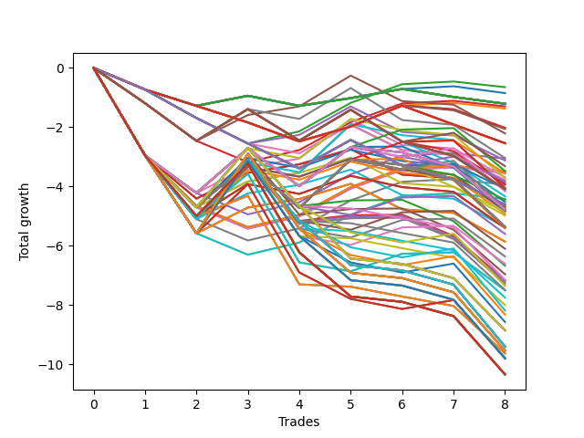

# Long HLT 218 
- Symbol: TSLA
- Date Range: 05/16/2022 - 05/17/2024
- Trading Period: 8:30-12:30
- Number of Trades: 8



| Id. | Name | Win Percent | Profit | Avg Profit / Trade | Avg Time / Trade | Std |      | Name | Win Percent | Profit | Avg Profit / Trade | Avg Time / Trade | Std |
| --- | ---- | ----------- | ------ | ------------------ | ---------------- | --- | ---- | ---- | ----------- | ------ | ------------------ | ---------------- | --- |
| | Sorted By <br> Profit | | | | | | | Sorted By <br> Win Percentage |||||
|0| TP-0.75 15m | 50.00 | -0.65 | -0.08 | 10:00 | 0.68 |     | TP-0.75 15m | 50.00 | -0.65 | -0.08 | 10:00 | 0.68 |
|1| TP-0.25 15m | 50.00 | -0.85 | -0.11 | 05:22 | 0.39 |     | TP-0.25 15m | 50.00 | -0.85 | -0.11 | 05:22 | 0.39 |
|2| TP-0.25 180m | 37.50 | -1.21 | -0.15 | 06:37 | 0.38 |     | TP-1 15m | 50.00 | -1.30 | -0.16 | 12:37 | 0.78 |
|3| TP-0.25 165m | 37.50 | -1.21 | -0.15 | 06:37 | 0.38 |     | TP-1.25 15m | 50.00 | -3.06 | -0.38 | 12:45 | 1.18 |
|4| TP-0.25 150m | 37.50 | -1.21 | -0.15 | 06:37 | 0.38 |     | TP-1.25 75m | 50.00 | -3.48 | -0.44 | 38:37 | 1.45 |
|5| TP-0.25 135m | 37.50 | -1.21 | -0.15 | 06:37 | 0.38 |     | TP-3 15m | 50.00 | -3.49 | -0.44 | 13:37 | 1.23 |
|6| TP-0.25 120m | 37.50 | -1.21 | -0.15 | 06:37 | 0.38 |     | TP-2.75 15m | 50.00 | -3.49 | -0.44 | 13:37 | 1.23 |
|7| TP-0.25 105m | 37.50 | -1.21 | -0.15 | 06:37 | 0.38 |     | TP-1.75 15m | 50.00 | -3.54 | -0.44 | 12:52 | 1.24 |
|8| TP-0.25 90m | 37.50 | -1.21 | -0.15 | 06:37 | 0.38 |     | TP-1.5 15m | 50.00 | -3.54 | -0.44 | 12:52 | 1.24 |
|9| TP-0.25 75m | 37.50 | -1.21 | -0.15 | 06:37 | 0.38 |     | TP-2 15m | 50.00 | -3.94 | -0.49 | 13:00 | 1.29 |
|10| TP-0.25 60m | 37.50 | -1.21 | -0.15 | 06:37 | 0.38 |     | TP-1.5 75m | 50.00 | -4.06 | -0.51 | 39:30 | 1.58 |
|11| TP-0.25 45m | 37.50 | -1.21 | -0.15 | 06:37 | 0.38 |     | TP-2.5 15m | 50.00 | -4.42 | -0.55 | 13:07 | 1.38 |
|12| TP-0.25 30m | 37.50 | -1.21 | -0.15 | 06:37 | 0.38 |     | TP-2.25 15m | 50.00 | -4.42 | -0.55 | 13:07 | 1.38 |
|13| TP-1 15m | 50.00 | -1.30 | -0.16 | 12:37 | 0.78 |     | TP-0.25 180m | 37.50 | -1.21 | -0.15 | 06:37 | 0.38 |
|14| TP-0.5 15m | 37.50 | -1.37 | -0.17 | 07:37 | 0.52 |     | TP-0.25 165m | 37.50 | -1.21 | -0.15 | 06:37 | 0.38 |
|15| TP-0.5 30m | 25.00 | -2.02 | -0.25 | 10:07 | 0.53 |     | TP-0.25 150m | 37.50 | -1.21 | -0.15 | 06:37 | 0.38 |
|16| TP-0.5 45m | 25.00 | -2.06 | -0.26 | 12:00 | 0.52 |     | TP-0.25 135m | 37.50 | -1.21 | -0.15 | 06:37 | 0.38 |
|17| TP-1 30m | 37.50 | -2.21 | -0.28 | 22:22 | 0.87 |     | TP-0.25 120m | 37.50 | -1.21 | -0.15 | 06:37 | 0.38 |
|18| TP-0.5 180m | 25.00 | -2.54 | -0.32 | 12:07 | 0.54 |     | TP-0.25 105m | 37.50 | -1.21 | -0.15 | 06:37 | 0.38 |
|19| TP-0.5 165m | 25.00 | -2.54 | -0.32 | 12:07 | 0.54 |     | TP-0.25 90m | 37.50 | -1.21 | -0.15 | 06:37 | 0.38 |
|20| TP-0.5 150m | 25.00 | -2.54 | -0.32 | 12:07 | 0.54 |     | TP-0.25 75m | 37.50 | -1.21 | -0.15 | 06:37 | 0.38 |
|21| TP-0.5 135m | 25.00 | -2.54 | -0.32 | 12:07 | 0.54 |     | TP-0.25 60m | 37.50 | -1.21 | -0.15 | 06:37 | 0.38 |
|22| TP-0.5 120m | 25.00 | -2.54 | -0.32 | 12:07 | 0.54 |     | TP-0.25 45m | 37.50 | -1.21 | -0.15 | 06:37 | 0.38 |
|23| TP-0.5 105m | 25.00 | -2.54 | -0.32 | 12:07 | 0.54 |     | TP-0.25 30m | 37.50 | -1.21 | -0.15 | 06:37 | 0.38 |
|24| TP-0.5 90m | 25.00 | -2.54 | -0.32 | 12:07 | 0.54 |     | TP-0.5 15m | 37.50 | -1.37 | -0.17 | 07:37 | 0.52 |
|25| TP-0.5 75m | 25.00 | -2.54 | -0.32 | 12:07 | 0.54 |     | TP-1 30m | 37.50 | -2.21 | -0.28 | 22:22 | 0.87 |
|26| TP-0.5 60m | 25.00 | -2.54 | -0.32 | 12:07 | 0.54 |     | TP-1 105m | 37.50 | -3.31 | -0.41 | 35:37 | 0.97 |
|27| TP-1 45m | 25.00 | -3.04 | -0.38 | 27:22 | 0.91 |     | TP-1 75m | 37.50 | -3.56 | -0.45 | 31:52 | 0.95 |
|28| TP-1.25 15m | 50.00 | -3.06 | -0.38 | 12:45 | 1.18 |     | TP-1.25 30m | 37.50 | -3.69 | -0.46 | 22:37 | 1.27 |
|29| TP-0.75 30m | 25.00 | -3.12 | -0.39 | 17:22 | 0.66 |     | TP-1.5 30m | 37.50 | -3.86 | -0.48 | 22:52 | 1.37 |
|30| TP-1 105m | 37.50 | -3.31 | -0.41 | 35:37 | 0.97 |     | TP-1.25 105m | 37.50 | -4.16 | -0.52 | 46:07 | 1.42 |
|31| TP-1.25 75m | 50.00 | -3.48 | -0.44 | 38:37 | 1.45 |     | TP-3 30m | 37.50 | -4.69 | -0.59 | 26:45 | 1.17 |
|32| TP-3 15m | 50.00 | -3.49 | -0.44 | 13:37 | 1.23 |     | TP-2.75 30m | 37.50 | -4.69 | -0.59 | 26:45 | 1.17 |
|33| TP-2.75 15m | 50.00 | -3.49 | -0.44 | 13:37 | 1.23 |     | TP-1.5 105m | 37.50 | -4.74 | -0.59 | 47:00 | 1.54 |
|34| TP-1.75 15m | 50.00 | -3.54 | -0.44 | 12:52 | 1.24 |     | TP-1.25 60m | 37.50 | -4.82 | -0.60 | 34:52 | 1.40 |
|35| TP-1.5 15m | 50.00 | -3.54 | -0.44 | 12:52 | 1.24 |     | TP-1.75 30m | 37.50 | -4.98 | -0.62 | 24:07 | 1.20 |
|36| TP-1 75m | 37.50 | -3.56 | -0.45 | 31:52 | 0.95 |     | TP-2 30m | 37.50 | -5.38 | -0.67 | 24:15 | 1.25 |
|37| TP-1.25 30m | 37.50 | -3.69 | -0.46 | 22:37 | 1.27 |     | TP-1.5 60m | 37.50 | -5.40 | -0.68 | 35:45 | 1.52 |
|38| TP-1.25 45m | 25.00 | -3.71 | -0.46 | 30:07 | 1.37 |     | TP-1.75 75m | 37.50 | -5.60 | -0.70 | 52:52 | 1.49 |
|39| TP-0.75 45m | 12.50 | -3.78 | -0.47 | 21:07 | 0.60 |     | TP-2.5 30m | 37.50 | -5.86 | -0.73 | 24:22 | 1.33 |
|40| TP-0.75 105m | 25.00 | -3.83 | -0.48 | 29:15 | 0.66 |     | TP-2.25 30m | 37.50 | -5.86 | -0.73 | 24:22 | 1.33 |
|41| TP-1.5 30m | 37.50 | -3.86 | -0.48 | 22:52 | 1.37 |     | TP-2 75m | 37.50 | -6.10 | -0.76 | 53:07 | 1.54 |
|42| TP-1 90m | 25.00 | -3.93 | -0.49 | 33:45 | 0.93 |     | TP-2.5 75m | 37.50 | -6.36 | -0.80 | 53:45 | 1.81 |
|43| TP-2 15m | 50.00 | -3.94 | -0.49 | 13:00 | 1.29 |     | TP-2.25 75m | 37.50 | -6.61 | -0.83 | 53:30 | 1.75 |
|44| TP-1.5 45m | 25.00 | -4.04 | -0.51 | 30:30 | 1.48 |     | TP-1.75 60m | 37.50 | -6.67 | -0.83 | 45:22 | 1.45 |
|45| TP-1.5 75m | 50.00 | -4.06 | -0.51 | 39:30 | 1.58 |     | TP-2.5 60m | 37.50 | -6.96 | -0.87 | 46:07 | 1.73 |
|46| TP-0.75 75m | 25.00 | -4.08 | -0.51 | 25:30 | 0.63 |     | TP-2 60m | 37.50 | -7.17 | -0.90 | 45:37 | 1.50 |
|47| TP-1 180m | 25.00 | -4.09 | -0.51 | 37:30 | 0.93 |     | TP-2.25 60m | 37.50 | -7.21 | -0.90 | 45:52 | 1.66 |
|48| TP-1 165m | 25.00 | -4.09 | -0.51 | 37:30 | 0.93 |     | TP-3 60m | 37.50 | -7.27 | -0.91 | 50:37 | 1.44 |
|49| TP-1 150m | 25.00 | -4.09 | -0.51 | 37:30 | 0.93 |     | TP-2.75 60m | 37.50 | -7.27 | -0.91 | 50:37 | 1.44 |
|50| TP-1 135m | 25.00 | -4.09 | -0.51 | 37:30 | 0.93 |     | TP-3 75m | 37.50 | -7.50 | -0.94 | 60:15 | 1.54 |
|51| TP-1 120m | 25.00 | -4.09 | -0.51 | 37:30 | 0.93 |     | TP-2.75 75m | 37.50 | -7.50 | -0.94 | 60:15 | 1.54 |
|52| TP-1.25 105m | 37.50 | -4.16 | -0.52 | 46:07 | 1.42 |     | TP-0.5 30m | 25.00 | -2.02 | -0.25 | 10:07 | 0.53 |
|53| TP-1 60m | 25.00 | -4.33 | -0.54 | 30:00 | 0.93 |     | TP-0.5 45m | 25.00 | -2.06 | -0.26 | 12:00 | 0.52 |
|54| TP-2.5 15m | 50.00 | -4.42 | -0.55 | 13:07 | 1.38 |     | TP-0.5 180m | 25.00 | -2.54 | -0.32 | 12:07 | 0.54 |
|55| TP-2.25 15m | 50.00 | -4.42 | -0.55 | 13:07 | 1.38 |     | TP-0.5 165m | 25.00 | -2.54 | -0.32 | 12:07 | 0.54 |
|56| TP-0.75 90m | 12.50 | -4.45 | -0.56 | 27:22 | 0.60 |     | TP-0.5 150m | 25.00 | -2.54 | -0.32 | 12:07 | 0.54 |
|57| TP-1.75 45m | 25.00 | -4.52 | -0.57 | 35:22 | 1.33 |     | TP-0.5 135m | 25.00 | -2.54 | -0.32 | 12:07 | 0.54 |
|58| TP-0.75 180m | 12.50 | -4.61 | -0.58 | 31:07 | 0.60 |     | TP-0.5 120m | 25.00 | -2.54 | -0.32 | 12:07 | 0.54 |
|59| TP-0.75 165m | 12.50 | -4.61 | -0.58 | 31:07 | 0.60 |     | TP-0.5 105m | 25.00 | -2.54 | -0.32 | 12:07 | 0.54 |
|60| TP-0.75 150m | 12.50 | -4.61 | -0.58 | 31:07 | 0.60 |     | TP-0.5 90m | 25.00 | -2.54 | -0.32 | 12:07 | 0.54 |
|61| TP-0.75 135m | 12.50 | -4.61 | -0.58 | 31:07 | 0.60 |     | TP-0.5 75m | 25.00 | -2.54 | -0.32 | 12:07 | 0.54 |
|62| TP-0.75 120m | 12.50 | -4.61 | -0.58 | 31:07 | 0.60 |     | TP-0.5 60m | 25.00 | -2.54 | -0.32 | 12:07 | 0.54 |
|63| TP-3 30m | 37.50 | -4.69 | -0.59 | 26:45 | 1.17 |     | TP-1 45m | 25.00 | -3.04 | -0.38 | 27:22 | 0.91 |
|64| TP-2.75 30m | 37.50 | -4.69 | -0.59 | 26:45 | 1.17 |     | TP-0.75 30m | 25.00 | -3.12 | -0.39 | 17:22 | 0.66 |
|65| TP-1.5 105m | 37.50 | -4.74 | -0.59 | 47:00 | 1.54 |     | TP-1.25 45m | 25.00 | -3.71 | -0.46 | 30:07 | 1.37 |
|66| TP-1.25 90m | 25.00 | -4.77 | -0.60 | 42:22 | 1.39 |     | TP-0.75 105m | 25.00 | -3.83 | -0.48 | 29:15 | 0.66 |
|67| TP-1.25 180m | 25.00 | -4.78 | -0.60 | 49:52 | 1.39 |     | TP-1 90m | 25.00 | -3.93 | -0.49 | 33:45 | 0.93 |
|68| TP-1.25 165m | 25.00 | -4.78 | -0.60 | 49:52 | 1.39 |     | TP-1.5 45m | 25.00 | -4.04 | -0.51 | 30:30 | 1.48 |
|69| TP-1.25 150m | 25.00 | -4.78 | -0.60 | 49:52 | 1.39 |     | TP-0.75 75m | 25.00 | -4.08 | -0.51 | 25:30 | 0.63 |
|70| TP-1.25 135m | 25.00 | -4.78 | -0.60 | 49:52 | 1.39 |     | TP-1 180m | 25.00 | -4.09 | -0.51 | 37:30 | 0.93 |
|71| TP-1.25 120m | 25.00 | -4.78 | -0.60 | 49:52 | 1.39 |     | TP-1 165m | 25.00 | -4.09 | -0.51 | 37:30 | 0.93 |
|72| TP-1.25 60m | 37.50 | -4.82 | -0.60 | 34:52 | 1.40 |     | TP-1 150m | 25.00 | -4.09 | -0.51 | 37:30 | 0.93 |
|73| TP-3 45m | 25.00 | -4.82 | -0.60 | 39:22 | 1.36 |     | TP-1 135m | 25.00 | -4.09 | -0.51 | 37:30 | 0.93 |
|74| TP-2.75 45m | 25.00 | -4.82 | -0.60 | 39:22 | 1.36 |     | TP-1 120m | 25.00 | -4.09 | -0.51 | 37:30 | 0.93 |
|75| TP-0.75 60m | 12.50 | -4.85 | -0.61 | 23:37 | 0.60 |     | TP-1 60m | 25.00 | -4.33 | -0.54 | 30:00 | 0.93 |
|76| TP-2 45m | 25.00 | -4.92 | -0.62 | 35:30 | 1.38 |     | TP-1.75 45m | 25.00 | -4.52 | -0.57 | 35:22 | 1.33 |
|77| TP-1.75 30m | 37.50 | -4.98 | -0.62 | 24:07 | 1.20 |     | TP-1.25 90m | 25.00 | -4.77 | -0.60 | 42:22 | 1.39 |
|78| TP-1.5 90m | 25.00 | -5.35 | -0.67 | 43:15 | 1.51 |     | TP-1.25 180m | 25.00 | -4.78 | -0.60 | 49:52 | 1.39 |
|79| TP-1.5 180m | 25.00 | -5.36 | -0.67 | 50:45 | 1.51 |     | TP-1.25 165m | 25.00 | -4.78 | -0.60 | 49:52 | 1.39 |
|80| TP-1.5 165m | 25.00 | -5.36 | -0.67 | 50:45 | 1.51 |     | TP-1.25 150m | 25.00 | -4.78 | -0.60 | 49:52 | 1.39 |
|81| TP-1.5 150m | 25.00 | -5.36 | -0.67 | 50:45 | 1.51 |     | TP-1.25 135m | 25.00 | -4.78 | -0.60 | 49:52 | 1.39 |
|82| TP-1.5 135m | 25.00 | -5.36 | -0.67 | 50:45 | 1.51 |     | TP-1.25 120m | 25.00 | -4.78 | -0.60 | 49:52 | 1.39 |
|83| TP-1.5 120m | 25.00 | -5.36 | -0.67 | 50:45 | 1.51 |     | TP-3 45m | 25.00 | -4.82 | -0.60 | 39:22 | 1.36 |
|84| TP-2 30m | 37.50 | -5.38 | -0.67 | 24:15 | 1.25 |     | TP-2.75 45m | 25.00 | -4.82 | -0.60 | 39:22 | 1.36 |
|85| TP-1.5 60m | 37.50 | -5.40 | -0.68 | 35:45 | 1.52 |     | TP-2 45m | 25.00 | -4.92 | -0.62 | 35:30 | 1.38 |
|86| TP-2.5 45m | 25.00 | -5.40 | -0.68 | 35:37 | 1.45 |     | TP-1.5 90m | 25.00 | -5.35 | -0.67 | 43:15 | 1.51 |
|87| TP-2.25 45m | 25.00 | -5.40 | -0.68 | 35:37 | 1.45 |     | TP-1.5 180m | 25.00 | -5.36 | -0.67 | 50:45 | 1.51 |
|88| TP-1.75 75m | 37.50 | -5.60 | -0.70 | 52:52 | 1.49 |     | TP-1.5 165m | 25.00 | -5.36 | -0.67 | 50:45 | 1.51 |
|89| TP-2.5 30m | 37.50 | -5.86 | -0.73 | 24:22 | 1.33 |     | TP-1.5 150m | 25.00 | -5.36 | -0.67 | 50:45 | 1.51 |
|90| TP-2.25 30m | 37.50 | -5.86 | -0.73 | 24:22 | 1.33 |     | TP-1.5 135m | 25.00 | -5.36 | -0.67 | 50:45 | 1.51 |
|91| TP-2 75m | 37.50 | -6.10 | -0.76 | 53:07 | 1.54 |     | TP-1.5 120m | 25.00 | -5.36 | -0.67 | 50:45 | 1.51 |
|92| TP-2.5 75m | 37.50 | -6.36 | -0.80 | 53:45 | 1.81 |     | TP-2.5 45m | 25.00 | -5.40 | -0.68 | 35:37 | 1.45 |
|93| TP-2.25 75m | 37.50 | -6.61 | -0.83 | 53:30 | 1.75 |     | TP-2.25 45m | 25.00 | -5.40 | -0.68 | 35:37 | 1.45 |
|94| TP-1.75 60m | 37.50 | -6.67 | -0.83 | 45:22 | 1.45 |     | TP-1.75 105m | 25.00 | -7.35 | -0.92 | 65:45 | 1.46 |
|95| TP-2.5 60m | 37.50 | -6.96 | -0.87 | 46:07 | 1.73 |     | TP-2 105m | 25.00 | -8.18 | -1.02 | 67:15 | 1.52 |
|96| TP-1.75 90m | 12.50 | -7.15 | -0.89 | 60:07 | 1.44 |     | TP-2.5 105m | 25.00 | -8.32 | -1.04 | 68:15 | 1.78 |
|97| TP-2 60m | 37.50 | -7.17 | -0.90 | 45:37 | 1.50 |     | TP-2.25 105m | 25.00 | -8.57 | -1.07 | 68:00 | 1.72 |
|98| TP-2.25 60m | 37.50 | -7.21 | -0.90 | 45:52 | 1.66 |     | TP-3 105m | 25.00 | -9.80 | -1.23 | 78:30 | 1.41 |
|99| TP-3 60m | 37.50 | -7.27 | -0.91 | 50:37 | 1.44 |     | TP-2.75 105m | 25.00 | -9.80 | -1.23 | 78:30 | 1.41 |
|100| TP-2.75 60m | 37.50 | -7.27 | -0.91 | 50:37 | 1.44 |     | TP-0.75 45m | 12.50 | -3.78 | -0.47 | 21:07 | 0.60 |
|101| TP-1.75 105m | 25.00 | -7.35 | -0.92 | 65:45 | 1.46 |     | TP-0.75 90m | 12.50 | -4.45 | -0.56 | 27:22 | 0.60 |
|102| TP-2 90m | 12.50 | -7.49 | -0.94 | 60:37 | 1.47 |     | TP-0.75 180m | 12.50 | -4.61 | -0.58 | 31:07 | 0.60 |
|103| TP-3 75m | 37.50 | -7.50 | -0.94 | 60:15 | 1.54 |     | TP-0.75 165m | 12.50 | -4.61 | -0.58 | 31:07 | 0.60 |
|104| TP-2.75 75m | 37.50 | -7.50 | -0.94 | 60:15 | 1.54 |     | TP-0.75 150m | 12.50 | -4.61 | -0.58 | 31:07 | 0.60 |
|105| TP-2.5 90m | 12.50 | -7.75 | -0.97 | 61:15 | 1.75 |     | TP-0.75 135m | 12.50 | -4.61 | -0.58 | 31:07 | 0.60 |
|106| TP-2.25 90m | 12.50 | -8.00 | -1.00 | 61:00 | 1.69 |     | TP-0.75 120m | 12.50 | -4.61 | -0.58 | 31:07 | 0.60 |
|107| TP-2 105m | 25.00 | -8.18 | -1.02 | 67:15 | 1.52 |     | TP-0.75 60m | 12.50 | -4.85 | -0.61 | 23:37 | 0.60 |
|108| TP-2.5 105m | 25.00 | -8.32 | -1.04 | 68:15 | 1.78 |     | TP-1.75 90m | 12.50 | -7.15 | -0.89 | 60:07 | 1.44 |
|109| TP-2.25 105m | 25.00 | -8.57 | -1.07 | 68:00 | 1.72 |     | TP-2 90m | 12.50 | -7.49 | -0.94 | 60:37 | 1.47 |
|110| TP-1.75 180m | 12.50 | -8.85 | -1.11 | 70:45 | 1.43 |     | TP-2.5 90m | 12.50 | -7.75 | -0.97 | 61:15 | 1.75 |
|111| TP-1.75 165m | 12.50 | -8.85 | -1.11 | 70:45 | 1.43 |     | TP-2.25 90m | 12.50 | -8.00 | -1.00 | 61:00 | 1.69 |
|112| TP-1.75 150m | 12.50 | -8.85 | -1.11 | 70:45 | 1.43 |     | TP-1.75 180m | 12.50 | -8.85 | -1.11 | 70:45 | 1.43 |
|113| TP-1.75 135m | 12.50 | -8.85 | -1.11 | 70:45 | 1.43 |     | TP-1.75 165m | 12.50 | -8.85 | -1.11 | 70:45 | 1.43 |
|114| TP-1.75 120m | 12.50 | -8.85 | -1.11 | 70:45 | 1.43 |     | TP-1.75 150m | 12.50 | -8.85 | -1.11 | 70:45 | 1.43 |
|115| TP-2 180m | 12.50 | -9.40 | -1.18 | 72:52 | 1.47 |     | TP-1.75 135m | 12.50 | -8.85 | -1.11 | 70:45 | 1.43 |
|116| TP-2 165m | 12.50 | -9.40 | -1.18 | 72:52 | 1.47 |     | TP-1.75 120m | 12.50 | -8.85 | -1.11 | 70:45 | 1.43 |
|117| TP-2 150m | 12.50 | -9.40 | -1.18 | 72:52 | 1.47 |     | TP-2 180m | 12.50 | -9.40 | -1.18 | 72:52 | 1.47 |
|118| TP-2 135m | 12.50 | -9.40 | -1.18 | 72:52 | 1.47 |     | TP-2 165m | 12.50 | -9.40 | -1.18 | 72:52 | 1.47 |
|119| TP-2 120m | 12.50 | -9.40 | -1.18 | 72:52 | 1.47 |     | TP-2 150m | 12.50 | -9.40 | -1.18 | 72:52 | 1.47 |
|120| TP-2.5 180m | 12.50 | -9.54 | -1.19 | 73:52 | 1.74 |     | TP-2 135m | 12.50 | -9.40 | -1.18 | 72:52 | 1.47 |
|121| TP-2.5 165m | 12.50 | -9.54 | -1.19 | 73:52 | 1.74 |     | TP-2 120m | 12.50 | -9.40 | -1.18 | 72:52 | 1.47 |
|122| TP-2.5 150m | 12.50 | -9.54 | -1.19 | 73:52 | 1.74 |     | TP-2.5 180m | 12.50 | -9.54 | -1.19 | 73:52 | 1.74 |
|123| TP-2.5 135m | 12.50 | -9.54 | -1.19 | 73:52 | 1.74 |     | TP-2.5 165m | 12.50 | -9.54 | -1.19 | 73:52 | 1.74 |
|124| TP-2.5 120m | 12.50 | -9.54 | -1.19 | 73:52 | 1.74 |     | TP-2.5 150m | 12.50 | -9.54 | -1.19 | 73:52 | 1.74 |
|125| TP-3 90m | 12.50 | -9.63 | -1.20 | 69:37 | 1.30 |     | TP-2.5 135m | 12.50 | -9.54 | -1.19 | 73:52 | 1.74 |
|126| TP-2.75 90m | 12.50 | -9.63 | -1.20 | 69:37 | 1.30 |     | TP-2.5 120m | 12.50 | -9.54 | -1.19 | 73:52 | 1.74 |
|127| TP-2.25 180m | 12.50 | -9.79 | -1.22 | 73:37 | 1.67 |     | TP-3 90m | 12.50 | -9.63 | -1.20 | 69:37 | 1.30 |
|128| TP-2.25 165m | 12.50 | -9.79 | -1.22 | 73:37 | 1.67 |     | TP-2.75 90m | 12.50 | -9.63 | -1.20 | 69:37 | 1.30 |
|129| TP-2.25 150m | 12.50 | -9.79 | -1.22 | 73:37 | 1.67 |     | TP-2.25 180m | 12.50 | -9.79 | -1.22 | 73:37 | 1.67 |
|130| TP-2.25 135m | 12.50 | -9.79 | -1.22 | 73:37 | 1.67 |     | TP-2.25 165m | 12.50 | -9.79 | -1.22 | 73:37 | 1.67 |
|131| TP-2.25 120m | 12.50 | -9.79 | -1.22 | 73:37 | 1.67 |     | TP-2.25 150m | 12.50 | -9.79 | -1.22 | 73:37 | 1.67 |
|132| TP-3 105m | 25.00 | -9.80 | -1.23 | 78:30 | 1.41 |     | TP-2.25 135m | 12.50 | -9.79 | -1.22 | 73:37 | 1.67 |
|133| TP-2.75 105m | 25.00 | -9.80 | -1.23 | 78:30 | 1.41 |     | TP-2.25 120m | 12.50 | -9.79 | -1.22 | 73:37 | 1.67 |
|134| TP-3 180m | 12.50 | -10.34 | -1.29 | 86:00 | 1.50 |     | TP-3 180m | 12.50 | -10.34 | -1.29 | 86:00 | 1.50 |
|135| TP-2.75 180m | 12.50 | -10.34 | -1.29 | 86:00 | 1.50 |     | TP-2.75 180m | 12.50 | -10.34 | -1.29 | 86:00 | 1.50 |
|136| TP-3 165m | 12.50 | -10.34 | -1.29 | 86:00 | 1.50 |     | TP-3 165m | 12.50 | -10.34 | -1.29 | 86:00 | 1.50 |
|137| TP-2.75 165m | 12.50 | -10.34 | -1.29 | 86:00 | 1.50 |     | TP-2.75 165m | 12.50 | -10.34 | -1.29 | 86:00 | 1.50 |
|138| TP-3 150m | 12.50 | -10.34 | -1.29 | 86:00 | 1.50 |     | TP-3 150m | 12.50 | -10.34 | -1.29 | 86:00 | 1.50 |
|139| TP-2.75 150m | 12.50 | -10.34 | -1.29 | 86:00 | 1.50 |     | TP-2.75 150m | 12.50 | -10.34 | -1.29 | 86:00 | 1.50 |
|140| TP-3 135m | 12.50 | -10.34 | -1.29 | 86:00 | 1.50 |     | TP-3 135m | 12.50 | -10.34 | -1.29 | 86:00 | 1.50 |
|141| TP-2.75 135m | 12.50 | -10.34 | -1.29 | 86:00 | 1.50 |     | TP-2.75 135m | 12.50 | -10.34 | -1.29 | 86:00 | 1.50 |
|142| TP-3 120m | 12.50 | -10.34 | -1.29 | 86:00 | 1.50 |     | TP-3 120m | 12.50 | -10.34 | -1.29 | 86:00 | 1.50 |
|143| TP-2.75 120m | 12.50 | -10.34 | -1.29 | 86:00 | 1.50 |     | TP-2.75 120m | 12.50 | -10.34 | -1.29 | 86:00 | 1.50 |

### Test TP-0.25 15m
* Take Profit of 0.25 Point
* 0.25 Stoploss
* Results:
```
Total Trades: 8
Percent Up: 50.00
Percent Down: 50.00
Total Points Moved Up: -0.85
Potential Profit: -425.00
Total Points Ups: 1.00 Count Ups: 4
Total Points Downs: -1.85 Count Downs: 4
```

<details><summary>Trades</summary>

<code>In: 2022-05-20 09:25:00		Out: 2022-05-20 09:27:00		Total Position Time: 02:00		Total Move Up: -0.73		Total to Date: -0.73</code> <br />
<code>In: 2023-03-09 12:10:00		Out: 2023-03-09 12:13:00		Total Position Time: 03:00		Total Move Up: -0.55		Total to Date: -1.28</code> <br />
<code>In: 2023-08-11 08:40:00		Out: 2023-08-11 08:42:00		Total Position Time: 02:00		Total Move Up: 0.34		Total to Date: -0.94</code> <br />
<code>In: 2023-09-22 09:10:00		Out: 2023-09-22 09:14:00		Total Position Time: 04:00		Total Move Up: -0.34		Total to Date: -1.28</code> <br />
<code>In: 2023-10-23 10:30:00		Out: 2023-10-23 10:32:00		Total Position Time: 02:00		Total Move Up: 0.26		Total to Date: -1.02</code> <br />
<code>In: 2024-01-02 09:30:00		Out: 2024-01-02 09:34:00		Total Position Time: 04:00		Total Move Up: 0.31		Total to Date: -0.71</code> <br />
<code>In: 2024-04-18 08:50:00		Out: 2024-04-18 09:04:00		Total Position Time: 14:00		Total Move Up: 0.09		Total to Date: -0.62</code> <br />
<code>In: 2024-04-19 11:10:00		Out: 2024-04-19 11:22:00		Total Position Time: 12:00		Total Move Up: -0.23		Total to Date: -0.85</code> <br />


</details>

### Test TP-0.5 15m
* Take Profit of 0.5 Point
* 0.5 Stoploss
* Results:
```
Total Trades: 8
Percent Up: 37.50
Percent Down: 62.50
Total Points Moved Up: -1.37
Potential Profit: -685.00
Total Points Ups: 1.30 Count Ups: 3
Total Points Downs: -2.67 Count Downs: 5
```

<details><summary>Trades</summary>

<code>In: 2022-05-20 09:25:00		Out: 2022-05-20 09:27:00		Total Position Time: 02:00		Total Move Up: -0.73		Total to Date: -0.73</code> <br />
<code>In: 2023-03-09 12:10:00		Out: 2023-03-09 12:13:00		Total Position Time: 03:00		Total Move Up: -0.55		Total to Date: -1.28</code> <br />
<code>In: 2023-08-11 08:40:00		Out: 2023-08-11 08:47:00		Total Position Time: 07:00		Total Move Up: -0.56		Total to Date: -1.84</code> <br />
<code>In: 2023-09-22 09:10:00		Out: 2023-09-22 09:16:00		Total Position Time: 06:00		Total Move Up: -0.64		Total to Date: -2.48</code> <br />
<code>In: 2023-10-23 10:30:00		Out: 2023-10-23 10:34:00		Total Position Time: 04:00		Total Move Up: 0.50		Total to Date: -1.98</code> <br />
<code>In: 2024-01-02 09:30:00		Out: 2024-01-02 09:41:00		Total Position Time: 11:00		Total Move Up: 0.71		Total to Date: -1.27</code> <br />
<code>In: 2024-04-18 08:50:00		Out: 2024-04-18 09:04:00		Total Position Time: 14:00		Total Move Up: 0.09		Total to Date: -1.18</code> <br />
<code>In: 2024-04-19 11:10:00		Out: 2024-04-19 11:24:00		Total Position Time: 14:00		Total Move Up: -0.19		Total to Date: -1.37</code> <br />


</details>

### Test TP-0.75 15m
* Take Profit of 0.75 Point
* 0.75 Stoploss
* Results:
```
Total Trades: 8
Percent Up: 50.00
Percent Down: 50.00
Total Points Moved Up: -0.65
Potential Profit: -325.00
Total Points Ups: 2.09 Count Ups: 4
Total Points Downs: -2.74 Count Downs: 4
```

<details><summary>Trades</summary>

<code>In: 2022-05-20 09:25:00		Out: 2022-05-20 09:27:00		Total Position Time: 02:00		Total Move Up: -0.73		Total to Date: -0.73</code> <br />
<code>In: 2023-03-09 12:10:00		Out: 2023-03-09 12:16:00		Total Position Time: 06:00		Total Move Up: -0.96		Total to Date: -1.69</code> <br />
<code>In: 2023-08-11 08:40:00		Out: 2023-08-11 08:49:00		Total Position Time: 09:00		Total Move Up: -0.86		Total to Date: -2.55</code> <br />
<code>In: 2023-09-22 09:10:00		Out: 2023-09-22 09:24:00		Total Position Time: 14:00		Total Move Up: 0.41		Total to Date: -2.14</code> <br />
<code>In: 2023-10-23 10:30:00		Out: 2023-10-23 10:37:00		Total Position Time: 07:00		Total Move Up: 0.96		Total to Date: -1.18</code> <br />
<code>In: 2024-01-02 09:30:00		Out: 2024-01-02 09:44:00		Total Position Time: 14:00		Total Move Up: 0.63		Total to Date: -0.55</code> <br />
<code>In: 2024-04-18 08:50:00		Out: 2024-04-18 09:04:00		Total Position Time: 14:00		Total Move Up: 0.09		Total to Date: -0.46</code> <br />
<code>In: 2024-04-19 11:10:00		Out: 2024-04-19 11:24:00		Total Position Time: 14:00		Total Move Up: -0.19		Total to Date: -0.65</code> <br />


</details>

### Test TP-1 15m
* Take Profit of 1 Point
* 1 Stoploss
* Results:
```
Total Trades: 8
Percent Up: 50.00
Percent Down: 50.00
Total Points Moved Up: -1.30
Potential Profit: -650.00
Total Points Ups: 2.07 Count Ups: 4
Total Points Downs: -3.37 Count Downs: 4
```

<details><summary>Trades</summary>

<code>In: 2022-05-20 09:25:00		Out: 2022-05-20 09:35:00		Total Position Time: 10:00		Total Move Up: -1.19		Total to Date: -1.19</code> <br />
<code>In: 2023-03-09 12:10:00		Out: 2023-03-09 12:17:00		Total Position Time: 07:00		Total Move Up: -1.27		Total to Date: -2.46</code> <br />
<code>In: 2023-08-11 08:40:00		Out: 2023-08-11 08:54:00		Total Position Time: 14:00		Total Move Up: -0.72		Total to Date: -3.18</code> <br />
<code>In: 2023-09-22 09:10:00		Out: 2023-09-22 09:24:00		Total Position Time: 14:00		Total Move Up: 0.41		Total to Date: -2.77</code> <br />
<code>In: 2023-10-23 10:30:00		Out: 2023-10-23 10:44:00		Total Position Time: 14:00		Total Move Up: 0.94		Total to Date: -1.83</code> <br />
<code>In: 2024-01-02 09:30:00		Out: 2024-01-02 09:44:00		Total Position Time: 14:00		Total Move Up: 0.63		Total to Date: -1.20</code> <br />
<code>In: 2024-04-18 08:50:00		Out: 2024-04-18 09:04:00		Total Position Time: 14:00		Total Move Up: 0.09		Total to Date: -1.11</code> <br />
<code>In: 2024-04-19 11:10:00		Out: 2024-04-19 11:24:00		Total Position Time: 14:00		Total Move Up: -0.19		Total to Date: -1.30</code> <br />


</details>

### Test TP-1.25 15m
* Take Profit of 1.25 Point
* 1.25 Stoploss
* Results:
```
Total Trades: 8
Percent Up: 50.00
Percent Down: 50.00
Total Points Moved Up: -3.06
Potential Profit: -1530.00
Total Points Ups: 2.07 Count Ups: 4
Total Points Downs: -5.13 Count Downs: 4
```

<details><summary>Trades</summary>

<code>In: 2022-05-20 09:25:00		Out: 2022-05-20 09:36:00		Total Position Time: 11:00		Total Move Up: -2.95		Total to Date: -2.95</code> <br />
<code>In: 2023-03-09 12:10:00		Out: 2023-03-09 12:17:00		Total Position Time: 07:00		Total Move Up: -1.27		Total to Date: -4.22</code> <br />
<code>In: 2023-08-11 08:40:00		Out: 2023-08-11 08:54:00		Total Position Time: 14:00		Total Move Up: -0.72		Total to Date: -4.94</code> <br />
<code>In: 2023-09-22 09:10:00		Out: 2023-09-22 09:24:00		Total Position Time: 14:00		Total Move Up: 0.41		Total to Date: -4.53</code> <br />
<code>In: 2023-10-23 10:30:00		Out: 2023-10-23 10:44:00		Total Position Time: 14:00		Total Move Up: 0.94		Total to Date: -3.59</code> <br />
<code>In: 2024-01-02 09:30:00		Out: 2024-01-02 09:44:00		Total Position Time: 14:00		Total Move Up: 0.63		Total to Date: -2.96</code> <br />
<code>In: 2024-04-18 08:50:00		Out: 2024-04-18 09:04:00		Total Position Time: 14:00		Total Move Up: 0.09		Total to Date: -2.87</code> <br />
<code>In: 2024-04-19 11:10:00		Out: 2024-04-19 11:24:00		Total Position Time: 14:00		Total Move Up: -0.19		Total to Date: -3.06</code> <br />


</details>

### Test TP-1.5 15m
* Take Profit of 1.5 Point
* 1.5 Stoploss
* Results:
```
Total Trades: 8
Percent Up: 50.00
Percent Down: 50.00
Total Points Moved Up: -3.54
Potential Profit: -1770.00
Total Points Ups: 2.07 Count Ups: 4
Total Points Downs: -5.61 Count Downs: 4
```

<details><summary>Trades</summary>

<code>In: 2022-05-20 09:25:00		Out: 2022-05-20 09:36:00		Total Position Time: 11:00		Total Move Up: -2.95		Total to Date: -2.95</code> <br />
<code>In: 2023-03-09 12:10:00		Out: 2023-03-09 12:18:00		Total Position Time: 08:00		Total Move Up: -1.75		Total to Date: -4.70</code> <br />
<code>In: 2023-08-11 08:40:00		Out: 2023-08-11 08:54:00		Total Position Time: 14:00		Total Move Up: -0.72		Total to Date: -5.42</code> <br />
<code>In: 2023-09-22 09:10:00		Out: 2023-09-22 09:24:00		Total Position Time: 14:00		Total Move Up: 0.41		Total to Date: -5.01</code> <br />
<code>In: 2023-10-23 10:30:00		Out: 2023-10-23 10:44:00		Total Position Time: 14:00		Total Move Up: 0.94		Total to Date: -4.07</code> <br />
<code>In: 2024-01-02 09:30:00		Out: 2024-01-02 09:44:00		Total Position Time: 14:00		Total Move Up: 0.63		Total to Date: -3.44</code> <br />
<code>In: 2024-04-18 08:50:00		Out: 2024-04-18 09:04:00		Total Position Time: 14:00		Total Move Up: 0.09		Total to Date: -3.35</code> <br />
<code>In: 2024-04-19 11:10:00		Out: 2024-04-19 11:24:00		Total Position Time: 14:00		Total Move Up: -0.19		Total to Date: -3.54</code> <br />


</details>

### Test TP-1.75 15m
* Take Profit of 1.75 Point
* 1.75 Stoploss
* Results:
```
Total Trades: 8
Percent Up: 50.00
Percent Down: 50.00
Total Points Moved Up: -3.54
Potential Profit: -1770.00
Total Points Ups: 2.07 Count Ups: 4
Total Points Downs: -5.61 Count Downs: 4
```

<details><summary>Trades</summary>

<code>In: 2022-05-20 09:25:00		Out: 2022-05-20 09:36:00		Total Position Time: 11:00		Total Move Up: -2.95		Total to Date: -2.95</code> <br />
<code>In: 2023-03-09 12:10:00		Out: 2023-03-09 12:18:00		Total Position Time: 08:00		Total Move Up: -1.75		Total to Date: -4.70</code> <br />
<code>In: 2023-08-11 08:40:00		Out: 2023-08-11 08:54:00		Total Position Time: 14:00		Total Move Up: -0.72		Total to Date: -5.42</code> <br />
<code>In: 2023-09-22 09:10:00		Out: 2023-09-22 09:24:00		Total Position Time: 14:00		Total Move Up: 0.41		Total to Date: -5.01</code> <br />
<code>In: 2023-10-23 10:30:00		Out: 2023-10-23 10:44:00		Total Position Time: 14:00		Total Move Up: 0.94		Total to Date: -4.07</code> <br />
<code>In: 2024-01-02 09:30:00		Out: 2024-01-02 09:44:00		Total Position Time: 14:00		Total Move Up: 0.63		Total to Date: -3.44</code> <br />
<code>In: 2024-04-18 08:50:00		Out: 2024-04-18 09:04:00		Total Position Time: 14:00		Total Move Up: 0.09		Total to Date: -3.35</code> <br />
<code>In: 2024-04-19 11:10:00		Out: 2024-04-19 11:24:00		Total Position Time: 14:00		Total Move Up: -0.19		Total to Date: -3.54</code> <br />


</details>

### Test TP-2 15m
* Take Profit of 2 Point
* 2 Stoploss
* Results:
```
Total Trades: 8
Percent Up: 50.00
Percent Down: 50.00
Total Points Moved Up: -3.94
Potential Profit: -1970.00
Total Points Ups: 2.07 Count Ups: 4
Total Points Downs: -6.01 Count Downs: 4
```

<details><summary>Trades</summary>

<code>In: 2022-05-20 09:25:00		Out: 2022-05-20 09:36:00		Total Position Time: 11:00		Total Move Up: -2.95		Total to Date: -2.95</code> <br />
<code>In: 2023-03-09 12:10:00		Out: 2023-03-09 12:19:00		Total Position Time: 09:00		Total Move Up: -2.15		Total to Date: -5.10</code> <br />
<code>In: 2023-08-11 08:40:00		Out: 2023-08-11 08:54:00		Total Position Time: 14:00		Total Move Up: -0.72		Total to Date: -5.82</code> <br />
<code>In: 2023-09-22 09:10:00		Out: 2023-09-22 09:24:00		Total Position Time: 14:00		Total Move Up: 0.41		Total to Date: -5.41</code> <br />
<code>In: 2023-10-23 10:30:00		Out: 2023-10-23 10:44:00		Total Position Time: 14:00		Total Move Up: 0.94		Total to Date: -4.47</code> <br />
<code>In: 2024-01-02 09:30:00		Out: 2024-01-02 09:44:00		Total Position Time: 14:00		Total Move Up: 0.63		Total to Date: -3.84</code> <br />
<code>In: 2024-04-18 08:50:00		Out: 2024-04-18 09:04:00		Total Position Time: 14:00		Total Move Up: 0.09		Total to Date: -3.75</code> <br />
<code>In: 2024-04-19 11:10:00		Out: 2024-04-19 11:24:00		Total Position Time: 14:00		Total Move Up: -0.19		Total to Date: -3.94</code> <br />


</details>

### Test TP-2.25 15m
* Take Profit of 2.25 Point
* 2.25 Stoploss
* Results:
```
Total Trades: 8
Percent Up: 50.00
Percent Down: 50.00
Total Points Moved Up: -4.42
Potential Profit: -2210.00
Total Points Ups: 2.07 Count Ups: 4
Total Points Downs: -6.49 Count Downs: 4
```

<details><summary>Trades</summary>

<code>In: 2022-05-20 09:25:00		Out: 2022-05-20 09:36:00		Total Position Time: 11:00		Total Move Up: -2.95		Total to Date: -2.95</code> <br />
<code>In: 2023-03-09 12:10:00		Out: 2023-03-09 12:20:00		Total Position Time: 10:00		Total Move Up: -2.63		Total to Date: -5.58</code> <br />
<code>In: 2023-08-11 08:40:00		Out: 2023-08-11 08:54:00		Total Position Time: 14:00		Total Move Up: -0.72		Total to Date: -6.30</code> <br />
<code>In: 2023-09-22 09:10:00		Out: 2023-09-22 09:24:00		Total Position Time: 14:00		Total Move Up: 0.41		Total to Date: -5.89</code> <br />
<code>In: 2023-10-23 10:30:00		Out: 2023-10-23 10:44:00		Total Position Time: 14:00		Total Move Up: 0.94		Total to Date: -4.95</code> <br />
<code>In: 2024-01-02 09:30:00		Out: 2024-01-02 09:44:00		Total Position Time: 14:00		Total Move Up: 0.63		Total to Date: -4.32</code> <br />
<code>In: 2024-04-18 08:50:00		Out: 2024-04-18 09:04:00		Total Position Time: 14:00		Total Move Up: 0.09		Total to Date: -4.23</code> <br />
<code>In: 2024-04-19 11:10:00		Out: 2024-04-19 11:24:00		Total Position Time: 14:00		Total Move Up: -0.19		Total to Date: -4.42</code> <br />


</details>

### Test TP-2.5 15m
* Take Profit of 2.5 Point
* 2.5 Stoploss
* Results:
```
Total Trades: 8
Percent Up: 50.00
Percent Down: 50.00
Total Points Moved Up: -4.42
Potential Profit: -2210.00
Total Points Ups: 2.07 Count Ups: 4
Total Points Downs: -6.49 Count Downs: 4
```

<details><summary>Trades</summary>

<code>In: 2022-05-20 09:25:00		Out: 2022-05-20 09:36:00		Total Position Time: 11:00		Total Move Up: -2.95		Total to Date: -2.95</code> <br />
<code>In: 2023-03-09 12:10:00		Out: 2023-03-09 12:20:00		Total Position Time: 10:00		Total Move Up: -2.63		Total to Date: -5.58</code> <br />
<code>In: 2023-08-11 08:40:00		Out: 2023-08-11 08:54:00		Total Position Time: 14:00		Total Move Up: -0.72		Total to Date: -6.30</code> <br />
<code>In: 2023-09-22 09:10:00		Out: 2023-09-22 09:24:00		Total Position Time: 14:00		Total Move Up: 0.41		Total to Date: -5.89</code> <br />
<code>In: 2023-10-23 10:30:00		Out: 2023-10-23 10:44:00		Total Position Time: 14:00		Total Move Up: 0.94		Total to Date: -4.95</code> <br />
<code>In: 2024-01-02 09:30:00		Out: 2024-01-02 09:44:00		Total Position Time: 14:00		Total Move Up: 0.63		Total to Date: -4.32</code> <br />
<code>In: 2024-04-18 08:50:00		Out: 2024-04-18 09:04:00		Total Position Time: 14:00		Total Move Up: 0.09		Total to Date: -4.23</code> <br />
<code>In: 2024-04-19 11:10:00		Out: 2024-04-19 11:24:00		Total Position Time: 14:00		Total Move Up: -0.19		Total to Date: -4.42</code> <br />


</details>

### Test TP-2.75 15m
* Take Profit of 2.75 Point
* 2.75 Stoploss
* Results:
```
Total Trades: 8
Percent Up: 50.00
Percent Down: 50.00
Total Points Moved Up: -3.49
Potential Profit: -1745.00
Total Points Ups: 2.07 Count Ups: 4
Total Points Downs: -5.56 Count Downs: 4
```

<details><summary>Trades</summary>

<code>In: 2022-05-20 09:25:00		Out: 2022-05-20 09:36:00		Total Position Time: 11:00		Total Move Up: -2.95		Total to Date: -2.95</code> <br />
<code>In: 2023-03-09 12:10:00		Out: 2023-03-09 12:24:00		Total Position Time: 14:00		Total Move Up: -1.70		Total to Date: -4.65</code> <br />
<code>In: 2023-08-11 08:40:00		Out: 2023-08-11 08:54:00		Total Position Time: 14:00		Total Move Up: -0.72		Total to Date: -5.37</code> <br />
<code>In: 2023-09-22 09:10:00		Out: 2023-09-22 09:24:00		Total Position Time: 14:00		Total Move Up: 0.41		Total to Date: -4.96</code> <br />
<code>In: 2023-10-23 10:30:00		Out: 2023-10-23 10:44:00		Total Position Time: 14:00		Total Move Up: 0.94		Total to Date: -4.02</code> <br />
<code>In: 2024-01-02 09:30:00		Out: 2024-01-02 09:44:00		Total Position Time: 14:00		Total Move Up: 0.63		Total to Date: -3.39</code> <br />
<code>In: 2024-04-18 08:50:00		Out: 2024-04-18 09:04:00		Total Position Time: 14:00		Total Move Up: 0.09		Total to Date: -3.30</code> <br />
<code>In: 2024-04-19 11:10:00		Out: 2024-04-19 11:24:00		Total Position Time: 14:00		Total Move Up: -0.19		Total to Date: -3.49</code> <br />


</details>

### Test TP-3 15m
* Take Profit of 3 Point
* 3 Stoploss
* Results:
```
Total Trades: 8
Percent Up: 50.00
Percent Down: 50.00
Total Points Moved Up: -3.49
Potential Profit: -1745.00
Total Points Ups: 2.07 Count Ups: 4
Total Points Downs: -5.56 Count Downs: 4
```

<details><summary>Trades</summary>

<code>In: 2022-05-20 09:25:00		Out: 2022-05-20 09:36:00		Total Position Time: 11:00		Total Move Up: -2.95		Total to Date: -2.95</code> <br />
<code>In: 2023-03-09 12:10:00		Out: 2023-03-09 12:24:00		Total Position Time: 14:00		Total Move Up: -1.70		Total to Date: -4.65</code> <br />
<code>In: 2023-08-11 08:40:00		Out: 2023-08-11 08:54:00		Total Position Time: 14:00		Total Move Up: -0.72		Total to Date: -5.37</code> <br />
<code>In: 2023-09-22 09:10:00		Out: 2023-09-22 09:24:00		Total Position Time: 14:00		Total Move Up: 0.41		Total to Date: -4.96</code> <br />
<code>In: 2023-10-23 10:30:00		Out: 2023-10-23 10:44:00		Total Position Time: 14:00		Total Move Up: 0.94		Total to Date: -4.02</code> <br />
<code>In: 2024-01-02 09:30:00		Out: 2024-01-02 09:44:00		Total Position Time: 14:00		Total Move Up: 0.63		Total to Date: -3.39</code> <br />
<code>In: 2024-04-18 08:50:00		Out: 2024-04-18 09:04:00		Total Position Time: 14:00		Total Move Up: 0.09		Total to Date: -3.30</code> <br />
<code>In: 2024-04-19 11:10:00		Out: 2024-04-19 11:24:00		Total Position Time: 14:00		Total Move Up: -0.19		Total to Date: -3.49</code> <br />


</details>

### Test TP-0.25 30m
* Take Profit of 0.25 Point
* 0.25 Stoploss
* Results:
```
Total Trades: 8
Percent Up: 37.50
Percent Down: 62.50
Total Points Moved Up: -1.21
Potential Profit: -605.00
Total Points Ups: 0.91 Count Ups: 3
Total Points Downs: -2.12 Count Downs: 5
```

<details><summary>Trades</summary>

<code>In: 2022-05-20 09:25:00		Out: 2022-05-20 09:27:00		Total Position Time: 02:00		Total Move Up: -0.73		Total to Date: -0.73</code> <br />
<code>In: 2023-03-09 12:10:00		Out: 2023-03-09 12:13:00		Total Position Time: 03:00		Total Move Up: -0.55		Total to Date: -1.28</code> <br />
<code>In: 2023-08-11 08:40:00		Out: 2023-08-11 08:42:00		Total Position Time: 02:00		Total Move Up: 0.34		Total to Date: -0.94</code> <br />
<code>In: 2023-09-22 09:10:00		Out: 2023-09-22 09:14:00		Total Position Time: 04:00		Total Move Up: -0.34		Total to Date: -1.28</code> <br />
<code>In: 2023-10-23 10:30:00		Out: 2023-10-23 10:32:00		Total Position Time: 02:00		Total Move Up: 0.26		Total to Date: -1.02</code> <br />
<code>In: 2024-01-02 09:30:00		Out: 2024-01-02 09:34:00		Total Position Time: 04:00		Total Move Up: 0.31		Total to Date: -0.71</code> <br />
<code>In: 2024-04-18 08:50:00		Out: 2024-04-18 09:14:00		Total Position Time: 24:00		Total Move Up: -0.27		Total to Date: -0.98</code> <br />
<code>In: 2024-04-19 11:10:00		Out: 2024-04-19 11:22:00		Total Position Time: 12:00		Total Move Up: -0.23		Total to Date: -1.21</code> <br />


</details>

### Test TP-0.5 30m
* Take Profit of 0.5 Point
* 0.5 Stoploss
* Results:
```
Total Trades: 8
Percent Up: 25.00
Percent Down: 75.00
Total Points Moved Up: -2.02
Potential Profit: -1010.00
Total Points Ups: 1.21 Count Ups: 2
Total Points Downs: -3.23 Count Downs: 6
```

<details><summary>Trades</summary>

<code>In: 2022-05-20 09:25:00		Out: 2022-05-20 09:27:00		Total Position Time: 02:00		Total Move Up: -0.73		Total to Date: -0.73</code> <br />
<code>In: 2023-03-09 12:10:00		Out: 2023-03-09 12:13:00		Total Position Time: 03:00		Total Move Up: -0.55		Total to Date: -1.28</code> <br />
<code>In: 2023-08-11 08:40:00		Out: 2023-08-11 08:47:00		Total Position Time: 07:00		Total Move Up: -0.56		Total to Date: -1.84</code> <br />
<code>In: 2023-09-22 09:10:00		Out: 2023-09-22 09:16:00		Total Position Time: 06:00		Total Move Up: -0.64		Total to Date: -2.48</code> <br />
<code>In: 2023-10-23 10:30:00		Out: 2023-10-23 10:34:00		Total Position Time: 04:00		Total Move Up: 0.50		Total to Date: -1.98</code> <br />
<code>In: 2024-01-02 09:30:00		Out: 2024-01-02 09:41:00		Total Position Time: 11:00		Total Move Up: 0.71		Total to Date: -1.27</code> <br />
<code>In: 2024-04-18 08:50:00		Out: 2024-04-18 09:19:00		Total Position Time: 29:00		Total Move Up: -0.12		Total to Date: -1.39</code> <br />
<code>In: 2024-04-19 11:10:00		Out: 2024-04-19 11:29:00		Total Position Time: 19:00		Total Move Up: -0.63		Total to Date: -2.02</code> <br />


</details>

### Test TP-0.75 30m
* Take Profit of 0.75 Point
* 0.75 Stoploss
* Results:
```
Total Trades: 8
Percent Up: 25.00
Percent Down: 75.00
Total Points Moved Up: -3.12
Potential Profit: -1560.00
Total Points Ups: 1.25 Count Ups: 2
Total Points Downs: -4.37 Count Downs: 6
```

<details><summary>Trades</summary>

<code>In: 2022-05-20 09:25:00		Out: 2022-05-20 09:27:00		Total Position Time: 02:00		Total Move Up: -0.73		Total to Date: -0.73</code> <br />
<code>In: 2023-03-09 12:10:00		Out: 2023-03-09 12:16:00		Total Position Time: 06:00		Total Move Up: -0.96		Total to Date: -1.69</code> <br />
<code>In: 2023-08-11 08:40:00		Out: 2023-08-11 08:49:00		Total Position Time: 09:00		Total Move Up: -0.86		Total to Date: -2.55</code> <br />
<code>In: 2023-09-22 09:10:00		Out: 2023-09-22 09:39:00		Total Position Time: 29:00		Total Move Up: 0.29		Total to Date: -2.26</code> <br />
<code>In: 2023-10-23 10:30:00		Out: 2023-10-23 10:37:00		Total Position Time: 07:00		Total Move Up: 0.96		Total to Date: -1.30</code> <br />
<code>In: 2024-01-02 09:30:00		Out: 2024-01-02 09:59:00		Total Position Time: 29:00		Total Move Up: -0.86		Total to Date: -2.16</code> <br />
<code>In: 2024-04-18 08:50:00		Out: 2024-04-18 09:19:00		Total Position Time: 29:00		Total Move Up: -0.12		Total to Date: -2.28</code> <br />
<code>In: 2024-04-19 11:10:00		Out: 2024-04-19 11:38:00		Total Position Time: 28:00		Total Move Up: -0.84		Total to Date: -3.12</code> <br />


</details>

### Test TP-1 30m
* Take Profit of 1 Point
* 1 Stoploss
* Results:
```
Total Trades: 8
Percent Up: 37.50
Percent Down: 62.50
Total Points Moved Up: -2.21
Potential Profit: -1105.00
Total Points Ups: 2.20 Count Ups: 3
Total Points Downs: -4.41 Count Downs: 5
```

<details><summary>Trades</summary>

<code>In: 2022-05-20 09:25:00		Out: 2022-05-20 09:35:00		Total Position Time: 10:00		Total Move Up: -1.19		Total to Date: -1.19</code> <br />
<code>In: 2023-03-09 12:10:00		Out: 2023-03-09 12:17:00		Total Position Time: 07:00		Total Move Up: -1.27		Total to Date: -2.46</code> <br />
<code>In: 2023-08-11 08:40:00		Out: 2023-08-11 09:09:00		Total Position Time: 29:00		Total Move Up: 0.87		Total to Date: -1.59</code> <br />
<code>In: 2023-09-22 09:10:00		Out: 2023-09-22 09:39:00		Total Position Time: 29:00		Total Move Up: 0.29		Total to Date: -1.30</code> <br />
<code>In: 2023-10-23 10:30:00		Out: 2023-10-23 10:47:00		Total Position Time: 17:00		Total Move Up: 1.04		Total to Date: -0.26</code> <br />
<code>In: 2024-01-02 09:30:00		Out: 2024-01-02 09:59:00		Total Position Time: 29:00		Total Move Up: -0.86		Total to Date: -1.12</code> <br />
<code>In: 2024-04-18 08:50:00		Out: 2024-04-18 09:19:00		Total Position Time: 29:00		Total Move Up: -0.12		Total to Date: -1.24</code> <br />
<code>In: 2024-04-19 11:10:00		Out: 2024-04-19 11:39:00		Total Position Time: 29:00		Total Move Up: -0.97		Total to Date: -2.21</code> <br />


</details>

### Test TP-1.25 30m
* Take Profit of 1.25 Point
* 1.25 Stoploss
* Results:
```
Total Trades: 8
Percent Up: 37.50
Percent Down: 62.50
Total Points Moved Up: -3.69
Potential Profit: -1845.00
Total Points Ups: 2.48 Count Ups: 3
Total Points Downs: -6.17 Count Downs: 5
```

<details><summary>Trades</summary>

<code>In: 2022-05-20 09:25:00		Out: 2022-05-20 09:36:00		Total Position Time: 11:00		Total Move Up: -2.95		Total to Date: -2.95</code> <br />
<code>In: 2023-03-09 12:10:00		Out: 2023-03-09 12:17:00		Total Position Time: 07:00		Total Move Up: -1.27		Total to Date: -4.22</code> <br />
<code>In: 2023-08-11 08:40:00		Out: 2023-08-11 09:09:00		Total Position Time: 29:00		Total Move Up: 0.87		Total to Date: -3.35</code> <br />
<code>In: 2023-09-22 09:10:00		Out: 2023-09-22 09:39:00		Total Position Time: 29:00		Total Move Up: 0.29		Total to Date: -3.06</code> <br />
<code>In: 2023-10-23 10:30:00		Out: 2023-10-23 10:48:00		Total Position Time: 18:00		Total Move Up: 1.32		Total to Date: -1.74</code> <br />
<code>In: 2024-01-02 09:30:00		Out: 2024-01-02 09:59:00		Total Position Time: 29:00		Total Move Up: -0.86		Total to Date: -2.60</code> <br />
<code>In: 2024-04-18 08:50:00		Out: 2024-04-18 09:19:00		Total Position Time: 29:00		Total Move Up: -0.12		Total to Date: -2.72</code> <br />
<code>In: 2024-04-19 11:10:00		Out: 2024-04-19 11:39:00		Total Position Time: 29:00		Total Move Up: -0.97		Total to Date: -3.69</code> <br />


</details>

### Test TP-1.5 30m
* Take Profit of 1.5 Point
* 1.5 Stoploss
* Results:
```
Total Trades: 8
Percent Up: 37.50
Percent Down: 62.50
Total Points Moved Up: -3.86
Potential Profit: -1930.00
Total Points Ups: 2.79 Count Ups: 3
Total Points Downs: -6.65 Count Downs: 5
```

<details><summary>Trades</summary>

<code>In: 2022-05-20 09:25:00		Out: 2022-05-20 09:36:00		Total Position Time: 11:00		Total Move Up: -2.95		Total to Date: -2.95</code> <br />
<code>In: 2023-03-09 12:10:00		Out: 2023-03-09 12:18:00		Total Position Time: 08:00		Total Move Up: -1.75		Total to Date: -4.70</code> <br />
<code>In: 2023-08-11 08:40:00		Out: 2023-08-11 09:09:00		Total Position Time: 29:00		Total Move Up: 0.87		Total to Date: -3.83</code> <br />
<code>In: 2023-09-22 09:10:00		Out: 2023-09-22 09:39:00		Total Position Time: 29:00		Total Move Up: 0.29		Total to Date: -3.54</code> <br />
<code>In: 2023-10-23 10:30:00		Out: 2023-10-23 10:49:00		Total Position Time: 19:00		Total Move Up: 1.63		Total to Date: -1.91</code> <br />
<code>In: 2024-01-02 09:30:00		Out: 2024-01-02 09:59:00		Total Position Time: 29:00		Total Move Up: -0.86		Total to Date: -2.77</code> <br />
<code>In: 2024-04-18 08:50:00		Out: 2024-04-18 09:19:00		Total Position Time: 29:00		Total Move Up: -0.12		Total to Date: -2.89</code> <br />
<code>In: 2024-04-19 11:10:00		Out: 2024-04-19 11:39:00		Total Position Time: 29:00		Total Move Up: -0.97		Total to Date: -3.86</code> <br />


</details>

### Test TP-1.75 30m
* Take Profit of 1.75 Point
* 1.75 Stoploss
* Results:
```
Total Trades: 8
Percent Up: 37.50
Percent Down: 62.50
Total Points Moved Up: -4.98
Potential Profit: -2490.00
Total Points Ups: 1.67 Count Ups: 3
Total Points Downs: -6.65 Count Downs: 5
```

<details><summary>Trades</summary>

<code>In: 2022-05-20 09:25:00		Out: 2022-05-20 09:36:00		Total Position Time: 11:00		Total Move Up: -2.95		Total to Date: -2.95</code> <br />
<code>In: 2023-03-09 12:10:00		Out: 2023-03-09 12:18:00		Total Position Time: 08:00		Total Move Up: -1.75		Total to Date: -4.70</code> <br />
<code>In: 2023-08-11 08:40:00		Out: 2023-08-11 09:09:00		Total Position Time: 29:00		Total Move Up: 0.87		Total to Date: -3.83</code> <br />
<code>In: 2023-09-22 09:10:00		Out: 2023-09-22 09:39:00		Total Position Time: 29:00		Total Move Up: 0.29		Total to Date: -3.54</code> <br />
<code>In: 2023-10-23 10:30:00		Out: 2023-10-23 10:59:00		Total Position Time: 29:00		Total Move Up: 0.51		Total to Date: -3.03</code> <br />
<code>In: 2024-01-02 09:30:00		Out: 2024-01-02 09:59:00		Total Position Time: 29:00		Total Move Up: -0.86		Total to Date: -3.89</code> <br />
<code>In: 2024-04-18 08:50:00		Out: 2024-04-18 09:19:00		Total Position Time: 29:00		Total Move Up: -0.12		Total to Date: -4.01</code> <br />
<code>In: 2024-04-19 11:10:00		Out: 2024-04-19 11:39:00		Total Position Time: 29:00		Total Move Up: -0.97		Total to Date: -4.98</code> <br />


</details>

### Test TP-2 30m
* Take Profit of 2 Point
* 2 Stoploss
* Results:
```
Total Trades: 8
Percent Up: 37.50
Percent Down: 62.50
Total Points Moved Up: -5.38
Potential Profit: -2690.00
Total Points Ups: 1.67 Count Ups: 3
Total Points Downs: -7.05 Count Downs: 5
```

<details><summary>Trades</summary>

<code>In: 2022-05-20 09:25:00		Out: 2022-05-20 09:36:00		Total Position Time: 11:00		Total Move Up: -2.95		Total to Date: -2.95</code> <br />
<code>In: 2023-03-09 12:10:00		Out: 2023-03-09 12:19:00		Total Position Time: 09:00		Total Move Up: -2.15		Total to Date: -5.10</code> <br />
<code>In: 2023-08-11 08:40:00		Out: 2023-08-11 09:09:00		Total Position Time: 29:00		Total Move Up: 0.87		Total to Date: -4.23</code> <br />
<code>In: 2023-09-22 09:10:00		Out: 2023-09-22 09:39:00		Total Position Time: 29:00		Total Move Up: 0.29		Total to Date: -3.94</code> <br />
<code>In: 2023-10-23 10:30:00		Out: 2023-10-23 10:59:00		Total Position Time: 29:00		Total Move Up: 0.51		Total to Date: -3.43</code> <br />
<code>In: 2024-01-02 09:30:00		Out: 2024-01-02 09:59:00		Total Position Time: 29:00		Total Move Up: -0.86		Total to Date: -4.29</code> <br />
<code>In: 2024-04-18 08:50:00		Out: 2024-04-18 09:19:00		Total Position Time: 29:00		Total Move Up: -0.12		Total to Date: -4.41</code> <br />
<code>In: 2024-04-19 11:10:00		Out: 2024-04-19 11:39:00		Total Position Time: 29:00		Total Move Up: -0.97		Total to Date: -5.38</code> <br />


</details>

### Test TP-2.25 30m
* Take Profit of 2.25 Point
* 2.25 Stoploss
* Results:
```
Total Trades: 8
Percent Up: 37.50
Percent Down: 62.50
Total Points Moved Up: -5.86
Potential Profit: -2930.00
Total Points Ups: 1.67 Count Ups: 3
Total Points Downs: -7.53 Count Downs: 5
```

<details><summary>Trades</summary>

<code>In: 2022-05-20 09:25:00		Out: 2022-05-20 09:36:00		Total Position Time: 11:00		Total Move Up: -2.95		Total to Date: -2.95</code> <br />
<code>In: 2023-03-09 12:10:00		Out: 2023-03-09 12:20:00		Total Position Time: 10:00		Total Move Up: -2.63		Total to Date: -5.58</code> <br />
<code>In: 2023-08-11 08:40:00		Out: 2023-08-11 09:09:00		Total Position Time: 29:00		Total Move Up: 0.87		Total to Date: -4.71</code> <br />
<code>In: 2023-09-22 09:10:00		Out: 2023-09-22 09:39:00		Total Position Time: 29:00		Total Move Up: 0.29		Total to Date: -4.42</code> <br />
<code>In: 2023-10-23 10:30:00		Out: 2023-10-23 10:59:00		Total Position Time: 29:00		Total Move Up: 0.51		Total to Date: -3.91</code> <br />
<code>In: 2024-01-02 09:30:00		Out: 2024-01-02 09:59:00		Total Position Time: 29:00		Total Move Up: -0.86		Total to Date: -4.77</code> <br />
<code>In: 2024-04-18 08:50:00		Out: 2024-04-18 09:19:00		Total Position Time: 29:00		Total Move Up: -0.12		Total to Date: -4.89</code> <br />
<code>In: 2024-04-19 11:10:00		Out: 2024-04-19 11:39:00		Total Position Time: 29:00		Total Move Up: -0.97		Total to Date: -5.86</code> <br />


</details>

### Test TP-2.5 30m
* Take Profit of 2.5 Point
* 2.5 Stoploss
* Results:
```
Total Trades: 8
Percent Up: 37.50
Percent Down: 62.50
Total Points Moved Up: -5.86
Potential Profit: -2930.00
Total Points Ups: 1.67 Count Ups: 3
Total Points Downs: -7.53 Count Downs: 5
```

<details><summary>Trades</summary>

<code>In: 2022-05-20 09:25:00		Out: 2022-05-20 09:36:00		Total Position Time: 11:00		Total Move Up: -2.95		Total to Date: -2.95</code> <br />
<code>In: 2023-03-09 12:10:00		Out: 2023-03-09 12:20:00		Total Position Time: 10:00		Total Move Up: -2.63		Total to Date: -5.58</code> <br />
<code>In: 2023-08-11 08:40:00		Out: 2023-08-11 09:09:00		Total Position Time: 29:00		Total Move Up: 0.87		Total to Date: -4.71</code> <br />
<code>In: 2023-09-22 09:10:00		Out: 2023-09-22 09:39:00		Total Position Time: 29:00		Total Move Up: 0.29		Total to Date: -4.42</code> <br />
<code>In: 2023-10-23 10:30:00		Out: 2023-10-23 10:59:00		Total Position Time: 29:00		Total Move Up: 0.51		Total to Date: -3.91</code> <br />
<code>In: 2024-01-02 09:30:00		Out: 2024-01-02 09:59:00		Total Position Time: 29:00		Total Move Up: -0.86		Total to Date: -4.77</code> <br />
<code>In: 2024-04-18 08:50:00		Out: 2024-04-18 09:19:00		Total Position Time: 29:00		Total Move Up: -0.12		Total to Date: -4.89</code> <br />
<code>In: 2024-04-19 11:10:00		Out: 2024-04-19 11:39:00		Total Position Time: 29:00		Total Move Up: -0.97		Total to Date: -5.86</code> <br />


</details>

### Test TP-2.75 30m
* Take Profit of 2.75 Point
* 2.75 Stoploss
* Results:
```
Total Trades: 8
Percent Up: 37.50
Percent Down: 62.50
Total Points Moved Up: -4.69
Potential Profit: -2345.00
Total Points Ups: 1.67 Count Ups: 3
Total Points Downs: -6.36 Count Downs: 5
```

<details><summary>Trades</summary>

<code>In: 2022-05-20 09:25:00		Out: 2022-05-20 09:36:00		Total Position Time: 11:00		Total Move Up: -2.95		Total to Date: -2.95</code> <br />
<code>In: 2023-03-09 12:10:00		Out: 2023-03-09 12:39:00		Total Position Time: 29:00		Total Move Up: -1.46		Total to Date: -4.41</code> <br />
<code>In: 2023-08-11 08:40:00		Out: 2023-08-11 09:09:00		Total Position Time: 29:00		Total Move Up: 0.87		Total to Date: -3.54</code> <br />
<code>In: 2023-09-22 09:10:00		Out: 2023-09-22 09:39:00		Total Position Time: 29:00		Total Move Up: 0.29		Total to Date: -3.25</code> <br />
<code>In: 2023-10-23 10:30:00		Out: 2023-10-23 10:59:00		Total Position Time: 29:00		Total Move Up: 0.51		Total to Date: -2.74</code> <br />
<code>In: 2024-01-02 09:30:00		Out: 2024-01-02 09:59:00		Total Position Time: 29:00		Total Move Up: -0.86		Total to Date: -3.60</code> <br />
<code>In: 2024-04-18 08:50:00		Out: 2024-04-18 09:19:00		Total Position Time: 29:00		Total Move Up: -0.12		Total to Date: -3.72</code> <br />
<code>In: 2024-04-19 11:10:00		Out: 2024-04-19 11:39:00		Total Position Time: 29:00		Total Move Up: -0.97		Total to Date: -4.69</code> <br />


</details>

### Test TP-3 30m
* Take Profit of 3 Point
* 3 Stoploss
* Results:
```
Total Trades: 8
Percent Up: 37.50
Percent Down: 62.50
Total Points Moved Up: -4.69
Potential Profit: -2345.00
Total Points Ups: 1.67 Count Ups: 3
Total Points Downs: -6.36 Count Downs: 5
```

<details><summary>Trades</summary>

<code>In: 2022-05-20 09:25:00		Out: 2022-05-20 09:36:00		Total Position Time: 11:00		Total Move Up: -2.95		Total to Date: -2.95</code> <br />
<code>In: 2023-03-09 12:10:00		Out: 2023-03-09 12:39:00		Total Position Time: 29:00		Total Move Up: -1.46		Total to Date: -4.41</code> <br />
<code>In: 2023-08-11 08:40:00		Out: 2023-08-11 09:09:00		Total Position Time: 29:00		Total Move Up: 0.87		Total to Date: -3.54</code> <br />
<code>In: 2023-09-22 09:10:00		Out: 2023-09-22 09:39:00		Total Position Time: 29:00		Total Move Up: 0.29		Total to Date: -3.25</code> <br />
<code>In: 2023-10-23 10:30:00		Out: 2023-10-23 10:59:00		Total Position Time: 29:00		Total Move Up: 0.51		Total to Date: -2.74</code> <br />
<code>In: 2024-01-02 09:30:00		Out: 2024-01-02 09:59:00		Total Position Time: 29:00		Total Move Up: -0.86		Total to Date: -3.60</code> <br />
<code>In: 2024-04-18 08:50:00		Out: 2024-04-18 09:19:00		Total Position Time: 29:00		Total Move Up: -0.12		Total to Date: -3.72</code> <br />
<code>In: 2024-04-19 11:10:00		Out: 2024-04-19 11:39:00		Total Position Time: 29:00		Total Move Up: -0.97		Total to Date: -4.69</code> <br />


</details>

### Test TP-0.25 45m
* Take Profit of 0.25 Point
* 0.25 Stoploss
* Results:
```
Total Trades: 8
Percent Up: 37.50
Percent Down: 62.50
Total Points Moved Up: -1.21
Potential Profit: -605.00
Total Points Ups: 0.91 Count Ups: 3
Total Points Downs: -2.12 Count Downs: 5
```

<details><summary>Trades</summary>

<code>In: 2022-05-20 09:25:00		Out: 2022-05-20 09:27:00		Total Position Time: 02:00		Total Move Up: -0.73		Total to Date: -0.73</code> <br />
<code>In: 2023-03-09 12:10:00		Out: 2023-03-09 12:13:00		Total Position Time: 03:00		Total Move Up: -0.55		Total to Date: -1.28</code> <br />
<code>In: 2023-08-11 08:40:00		Out: 2023-08-11 08:42:00		Total Position Time: 02:00		Total Move Up: 0.34		Total to Date: -0.94</code> <br />
<code>In: 2023-09-22 09:10:00		Out: 2023-09-22 09:14:00		Total Position Time: 04:00		Total Move Up: -0.34		Total to Date: -1.28</code> <br />
<code>In: 2023-10-23 10:30:00		Out: 2023-10-23 10:32:00		Total Position Time: 02:00		Total Move Up: 0.26		Total to Date: -1.02</code> <br />
<code>In: 2024-01-02 09:30:00		Out: 2024-01-02 09:34:00		Total Position Time: 04:00		Total Move Up: 0.31		Total to Date: -0.71</code> <br />
<code>In: 2024-04-18 08:50:00		Out: 2024-04-18 09:14:00		Total Position Time: 24:00		Total Move Up: -0.27		Total to Date: -0.98</code> <br />
<code>In: 2024-04-19 11:10:00		Out: 2024-04-19 11:22:00		Total Position Time: 12:00		Total Move Up: -0.23		Total to Date: -1.21</code> <br />


</details>

### Test TP-0.5 45m
* Take Profit of 0.5 Point
* 0.5 Stoploss
* Results:
```
Total Trades: 8
Percent Up: 25.00
Percent Down: 75.00
Total Points Moved Up: -2.06
Potential Profit: -1030.00
Total Points Ups: 1.21 Count Ups: 2
Total Points Downs: -3.27 Count Downs: 6
```

<details><summary>Trades</summary>

<code>In: 2022-05-20 09:25:00		Out: 2022-05-20 09:27:00		Total Position Time: 02:00		Total Move Up: -0.73		Total to Date: -0.73</code> <br />
<code>In: 2023-03-09 12:10:00		Out: 2023-03-09 12:13:00		Total Position Time: 03:00		Total Move Up: -0.55		Total to Date: -1.28</code> <br />
<code>In: 2023-08-11 08:40:00		Out: 2023-08-11 08:47:00		Total Position Time: 07:00		Total Move Up: -0.56		Total to Date: -1.84</code> <br />
<code>In: 2023-09-22 09:10:00		Out: 2023-09-22 09:16:00		Total Position Time: 06:00		Total Move Up: -0.64		Total to Date: -2.48</code> <br />
<code>In: 2023-10-23 10:30:00		Out: 2023-10-23 10:34:00		Total Position Time: 04:00		Total Move Up: 0.50		Total to Date: -1.98</code> <br />
<code>In: 2024-01-02 09:30:00		Out: 2024-01-02 09:41:00		Total Position Time: 11:00		Total Move Up: 0.71		Total to Date: -1.27</code> <br />
<code>In: 2024-04-18 08:50:00		Out: 2024-04-18 09:34:00		Total Position Time: 44:00		Total Move Up: -0.16		Total to Date: -1.43</code> <br />
<code>In: 2024-04-19 11:10:00		Out: 2024-04-19 11:29:00		Total Position Time: 19:00		Total Move Up: -0.63		Total to Date: -2.06</code> <br />


</details>

### Test TP-0.75 45m
* Take Profit of 0.75 Point
* 0.75 Stoploss
* Results:
```
Total Trades: 8
Percent Up: 12.50
Percent Down: 87.50
Total Points Moved Up: -3.78
Potential Profit: -1890.00
Total Points Ups: 0.96 Count Ups: 1
Total Points Downs: -4.74 Count Downs: 7
```

<details><summary>Trades</summary>

<code>In: 2022-05-20 09:25:00		Out: 2022-05-20 09:27:00		Total Position Time: 02:00		Total Move Up: -0.73		Total to Date: -0.73</code> <br />
<code>In: 2023-03-09 12:10:00		Out: 2023-03-09 12:16:00		Total Position Time: 06:00		Total Move Up: -0.96		Total to Date: -1.69</code> <br />
<code>In: 2023-08-11 08:40:00		Out: 2023-08-11 08:49:00		Total Position Time: 09:00		Total Move Up: -0.86		Total to Date: -2.55</code> <br />
<code>In: 2023-09-22 09:10:00		Out: 2023-09-22 09:54:00		Total Position Time: 44:00		Total Move Up: -0.33		Total to Date: -2.88</code> <br />
<code>In: 2023-10-23 10:30:00		Out: 2023-10-23 10:37:00		Total Position Time: 07:00		Total Move Up: 0.96		Total to Date: -1.92</code> <br />
<code>In: 2024-01-02 09:30:00		Out: 2024-01-02 09:59:00		Total Position Time: 29:00		Total Move Up: -0.86		Total to Date: -2.78</code> <br />
<code>In: 2024-04-18 08:50:00		Out: 2024-04-18 09:34:00		Total Position Time: 44:00		Total Move Up: -0.16		Total to Date: -2.94</code> <br />
<code>In: 2024-04-19 11:10:00		Out: 2024-04-19 11:38:00		Total Position Time: 28:00		Total Move Up: -0.84		Total to Date: -3.78</code> <br />


</details>

### Test TP-1 45m
* Take Profit of 1 Point
* 1 Stoploss
* Results:
```
Total Trades: 8
Percent Up: 25.00
Percent Down: 75.00
Total Points Moved Up: -3.04
Potential Profit: -1520.00
Total Points Ups: 2.11 Count Ups: 2
Total Points Downs: -5.15 Count Downs: 6
```

<details><summary>Trades</summary>

<code>In: 2022-05-20 09:25:00		Out: 2022-05-20 09:35:00		Total Position Time: 10:00		Total Move Up: -1.19		Total to Date: -1.19</code> <br />
<code>In: 2023-03-09 12:10:00		Out: 2023-03-09 12:17:00		Total Position Time: 07:00		Total Move Up: -1.27		Total to Date: -2.46</code> <br />
<code>In: 2023-08-11 08:40:00		Out: 2023-08-11 09:13:00		Total Position Time: 33:00		Total Move Up: 1.07		Total to Date: -1.39</code> <br />
<code>In: 2023-09-22 09:10:00		Out: 2023-09-22 09:54:00		Total Position Time: 44:00		Total Move Up: -0.33		Total to Date: -1.72</code> <br />
<code>In: 2023-10-23 10:30:00		Out: 2023-10-23 10:47:00		Total Position Time: 17:00		Total Move Up: 1.04		Total to Date: -0.68</code> <br />
<code>In: 2024-01-02 09:30:00		Out: 2024-01-02 10:03:00		Total Position Time: 33:00		Total Move Up: -1.08		Total to Date: -1.76</code> <br />
<code>In: 2024-04-18 08:50:00		Out: 2024-04-18 09:34:00		Total Position Time: 44:00		Total Move Up: -0.16		Total to Date: -1.92</code> <br />
<code>In: 2024-04-19 11:10:00		Out: 2024-04-19 11:41:00		Total Position Time: 31:00		Total Move Up: -1.12		Total to Date: -3.04</code> <br />


</details>

### Test TP-1.25 45m
* Take Profit of 1.25 Point
* 1.25 Stoploss
* Results:
```
Total Trades: 8
Percent Up: 25.00
Percent Down: 75.00
Total Points Moved Up: -3.71
Potential Profit: -1855.00
Total Points Ups: 2.83 Count Ups: 2
Total Points Downs: -6.54 Count Downs: 6
```

<details><summary>Trades</summary>

<code>In: 2022-05-20 09:25:00		Out: 2022-05-20 09:36:00		Total Position Time: 11:00		Total Move Up: -2.95		Total to Date: -2.95</code> <br />
<code>In: 2023-03-09 12:10:00		Out: 2023-03-09 12:17:00		Total Position Time: 07:00		Total Move Up: -1.27		Total to Date: -4.22</code> <br />
<code>In: 2023-08-11 08:40:00		Out: 2023-08-11 09:15:00		Total Position Time: 35:00		Total Move Up: 1.51		Total to Date: -2.71</code> <br />
<code>In: 2023-09-22 09:10:00		Out: 2023-09-22 09:54:00		Total Position Time: 44:00		Total Move Up: -0.33		Total to Date: -3.04</code> <br />
<code>In: 2023-10-23 10:30:00		Out: 2023-10-23 10:48:00		Total Position Time: 18:00		Total Move Up: 1.32		Total to Date: -1.72</code> <br />
<code>In: 2024-01-02 09:30:00		Out: 2024-01-02 10:14:00		Total Position Time: 44:00		Total Move Up: -0.38		Total to Date: -2.10</code> <br />
<code>In: 2024-04-18 08:50:00		Out: 2024-04-18 09:34:00		Total Position Time: 44:00		Total Move Up: -0.16		Total to Date: -2.26</code> <br />
<code>In: 2024-04-19 11:10:00		Out: 2024-04-19 11:48:00		Total Position Time: 38:00		Total Move Up: -1.45		Total to Date: -3.71</code> <br />


</details>

### Test TP-1.5 45m
* Take Profit of 1.5 Point
* 1.5 Stoploss
* Results:
```
Total Trades: 8
Percent Up: 25.00
Percent Down: 75.00
Total Points Moved Up: -4.04
Potential Profit: -2020.00
Total Points Ups: 3.14 Count Ups: 2
Total Points Downs: -7.18 Count Downs: 6
```

<details><summary>Trades</summary>

<code>In: 2022-05-20 09:25:00		Out: 2022-05-20 09:36:00		Total Position Time: 11:00		Total Move Up: -2.95		Total to Date: -2.95</code> <br />
<code>In: 2023-03-09 12:10:00		Out: 2023-03-09 12:18:00		Total Position Time: 08:00		Total Move Up: -1.75		Total to Date: -4.70</code> <br />
<code>In: 2023-08-11 08:40:00		Out: 2023-08-11 09:15:00		Total Position Time: 35:00		Total Move Up: 1.51		Total to Date: -3.19</code> <br />
<code>In: 2023-09-22 09:10:00		Out: 2023-09-22 09:54:00		Total Position Time: 44:00		Total Move Up: -0.33		Total to Date: -3.52</code> <br />
<code>In: 2023-10-23 10:30:00		Out: 2023-10-23 10:49:00		Total Position Time: 19:00		Total Move Up: 1.63		Total to Date: -1.89</code> <br />
<code>In: 2024-01-02 09:30:00		Out: 2024-01-02 10:14:00		Total Position Time: 44:00		Total Move Up: -0.38		Total to Date: -2.27</code> <br />
<code>In: 2024-04-18 08:50:00		Out: 2024-04-18 09:34:00		Total Position Time: 44:00		Total Move Up: -0.16		Total to Date: -2.43</code> <br />
<code>In: 2024-04-19 11:10:00		Out: 2024-04-19 11:49:00		Total Position Time: 39:00		Total Move Up: -1.61		Total to Date: -4.04</code> <br />


</details>

### Test TP-1.75 45m
* Take Profit of 1.75 Point
* 1.75 Stoploss
* Results:
```
Total Trades: 8
Percent Up: 25.00
Percent Down: 75.00
Total Points Moved Up: -4.52
Potential Profit: -2260.00
Total Points Ups: 2.27 Count Ups: 2
Total Points Downs: -6.79 Count Downs: 6
```

<details><summary>Trades</summary>

<code>In: 2022-05-20 09:25:00		Out: 2022-05-20 09:36:00		Total Position Time: 11:00		Total Move Up: -2.95		Total to Date: -2.95</code> <br />
<code>In: 2023-03-09 12:10:00		Out: 2023-03-09 12:18:00		Total Position Time: 08:00		Total Move Up: -1.75		Total to Date: -4.70</code> <br />
<code>In: 2023-08-11 08:40:00		Out: 2023-08-11 09:24:00		Total Position Time: 44:00		Total Move Up: 1.66		Total to Date: -3.04</code> <br />
<code>In: 2023-09-22 09:10:00		Out: 2023-09-22 09:54:00		Total Position Time: 44:00		Total Move Up: -0.33		Total to Date: -3.37</code> <br />
<code>In: 2023-10-23 10:30:00		Out: 2023-10-23 11:14:00		Total Position Time: 44:00		Total Move Up: 0.61		Total to Date: -2.76</code> <br />
<code>In: 2024-01-02 09:30:00		Out: 2024-01-02 10:14:00		Total Position Time: 44:00		Total Move Up: -0.38		Total to Date: -3.14</code> <br />
<code>In: 2024-04-18 08:50:00		Out: 2024-04-18 09:34:00		Total Position Time: 44:00		Total Move Up: -0.16		Total to Date: -3.30</code> <br />
<code>In: 2024-04-19 11:10:00		Out: 2024-04-19 11:54:00		Total Position Time: 44:00		Total Move Up: -1.22		Total to Date: -4.52</code> <br />


</details>

### Test TP-2 45m
* Take Profit of 2 Point
* 2 Stoploss
* Results:
```
Total Trades: 8
Percent Up: 25.00
Percent Down: 75.00
Total Points Moved Up: -4.92
Potential Profit: -2460.00
Total Points Ups: 2.27 Count Ups: 2
Total Points Downs: -7.19 Count Downs: 6
```

<details><summary>Trades</summary>

<code>In: 2022-05-20 09:25:00		Out: 2022-05-20 09:36:00		Total Position Time: 11:00		Total Move Up: -2.95		Total to Date: -2.95</code> <br />
<code>In: 2023-03-09 12:10:00		Out: 2023-03-09 12:19:00		Total Position Time: 09:00		Total Move Up: -2.15		Total to Date: -5.10</code> <br />
<code>In: 2023-08-11 08:40:00		Out: 2023-08-11 09:24:00		Total Position Time: 44:00		Total Move Up: 1.66		Total to Date: -3.44</code> <br />
<code>In: 2023-09-22 09:10:00		Out: 2023-09-22 09:54:00		Total Position Time: 44:00		Total Move Up: -0.33		Total to Date: -3.77</code> <br />
<code>In: 2023-10-23 10:30:00		Out: 2023-10-23 11:14:00		Total Position Time: 44:00		Total Move Up: 0.61		Total to Date: -3.16</code> <br />
<code>In: 2024-01-02 09:30:00		Out: 2024-01-02 10:14:00		Total Position Time: 44:00		Total Move Up: -0.38		Total to Date: -3.54</code> <br />
<code>In: 2024-04-18 08:50:00		Out: 2024-04-18 09:34:00		Total Position Time: 44:00		Total Move Up: -0.16		Total to Date: -3.70</code> <br />
<code>In: 2024-04-19 11:10:00		Out: 2024-04-19 11:54:00		Total Position Time: 44:00		Total Move Up: -1.22		Total to Date: -4.92</code> <br />


</details>

### Test TP-2.25 45m
* Take Profit of 2.25 Point
* 2.25 Stoploss
* Results:
```
Total Trades: 8
Percent Up: 25.00
Percent Down: 75.00
Total Points Moved Up: -5.40
Potential Profit: -2700.00
Total Points Ups: 2.27 Count Ups: 2
Total Points Downs: -7.67 Count Downs: 6
```

<details><summary>Trades</summary>

<code>In: 2022-05-20 09:25:00		Out: 2022-05-20 09:36:00		Total Position Time: 11:00		Total Move Up: -2.95		Total to Date: -2.95</code> <br />
<code>In: 2023-03-09 12:10:00		Out: 2023-03-09 12:20:00		Total Position Time: 10:00		Total Move Up: -2.63		Total to Date: -5.58</code> <br />
<code>In: 2023-08-11 08:40:00		Out: 2023-08-11 09:24:00		Total Position Time: 44:00		Total Move Up: 1.66		Total to Date: -3.92</code> <br />
<code>In: 2023-09-22 09:10:00		Out: 2023-09-22 09:54:00		Total Position Time: 44:00		Total Move Up: -0.33		Total to Date: -4.25</code> <br />
<code>In: 2023-10-23 10:30:00		Out: 2023-10-23 11:14:00		Total Position Time: 44:00		Total Move Up: 0.61		Total to Date: -3.64</code> <br />
<code>In: 2024-01-02 09:30:00		Out: 2024-01-02 10:14:00		Total Position Time: 44:00		Total Move Up: -0.38		Total to Date: -4.02</code> <br />
<code>In: 2024-04-18 08:50:00		Out: 2024-04-18 09:34:00		Total Position Time: 44:00		Total Move Up: -0.16		Total to Date: -4.18</code> <br />
<code>In: 2024-04-19 11:10:00		Out: 2024-04-19 11:54:00		Total Position Time: 44:00		Total Move Up: -1.22		Total to Date: -5.40</code> <br />


</details>

### Test TP-2.5 45m
* Take Profit of 2.5 Point
* 2.5 Stoploss
* Results:
```
Total Trades: 8
Percent Up: 25.00
Percent Down: 75.00
Total Points Moved Up: -5.40
Potential Profit: -2700.00
Total Points Ups: 2.27 Count Ups: 2
Total Points Downs: -7.67 Count Downs: 6
```

<details><summary>Trades</summary>

<code>In: 2022-05-20 09:25:00		Out: 2022-05-20 09:36:00		Total Position Time: 11:00		Total Move Up: -2.95		Total to Date: -2.95</code> <br />
<code>In: 2023-03-09 12:10:00		Out: 2023-03-09 12:20:00		Total Position Time: 10:00		Total Move Up: -2.63		Total to Date: -5.58</code> <br />
<code>In: 2023-08-11 08:40:00		Out: 2023-08-11 09:24:00		Total Position Time: 44:00		Total Move Up: 1.66		Total to Date: -3.92</code> <br />
<code>In: 2023-09-22 09:10:00		Out: 2023-09-22 09:54:00		Total Position Time: 44:00		Total Move Up: -0.33		Total to Date: -4.25</code> <br />
<code>In: 2023-10-23 10:30:00		Out: 2023-10-23 11:14:00		Total Position Time: 44:00		Total Move Up: 0.61		Total to Date: -3.64</code> <br />
<code>In: 2024-01-02 09:30:00		Out: 2024-01-02 10:14:00		Total Position Time: 44:00		Total Move Up: -0.38		Total to Date: -4.02</code> <br />
<code>In: 2024-04-18 08:50:00		Out: 2024-04-18 09:34:00		Total Position Time: 44:00		Total Move Up: -0.16		Total to Date: -4.18</code> <br />
<code>In: 2024-04-19 11:10:00		Out: 2024-04-19 11:54:00		Total Position Time: 44:00		Total Move Up: -1.22		Total to Date: -5.40</code> <br />


</details>

### Test TP-2.75 45m
* Take Profit of 2.75 Point
* 2.75 Stoploss
* Results:
```
Total Trades: 8
Percent Up: 25.00
Percent Down: 75.00
Total Points Moved Up: -4.82
Potential Profit: -2410.00
Total Points Ups: 2.27 Count Ups: 2
Total Points Downs: -7.09 Count Downs: 6
```

<details><summary>Trades</summary>

<code>In: 2022-05-20 09:25:00		Out: 2022-05-20 09:36:00		Total Position Time: 11:00		Total Move Up: -2.95		Total to Date: -2.95</code> <br />
<code>In: 2023-03-09 12:10:00		Out: 2023-03-09 12:50:00		Total Position Time: 40:00		Total Move Up: -2.05		Total to Date: -5.00</code> <br />
<code>In: 2023-08-11 08:40:00		Out: 2023-08-11 09:24:00		Total Position Time: 44:00		Total Move Up: 1.66		Total to Date: -3.34</code> <br />
<code>In: 2023-09-22 09:10:00		Out: 2023-09-22 09:54:00		Total Position Time: 44:00		Total Move Up: -0.33		Total to Date: -3.67</code> <br />
<code>In: 2023-10-23 10:30:00		Out: 2023-10-23 11:14:00		Total Position Time: 44:00		Total Move Up: 0.61		Total to Date: -3.06</code> <br />
<code>In: 2024-01-02 09:30:00		Out: 2024-01-02 10:14:00		Total Position Time: 44:00		Total Move Up: -0.38		Total to Date: -3.44</code> <br />
<code>In: 2024-04-18 08:50:00		Out: 2024-04-18 09:34:00		Total Position Time: 44:00		Total Move Up: -0.16		Total to Date: -3.60</code> <br />
<code>In: 2024-04-19 11:10:00		Out: 2024-04-19 11:54:00		Total Position Time: 44:00		Total Move Up: -1.22		Total to Date: -4.82</code> <br />


</details>

### Test TP-3 45m
* Take Profit of 3 Point
* 3 Stoploss
* Results:
```
Total Trades: 8
Percent Up: 25.00
Percent Down: 75.00
Total Points Moved Up: -4.82
Potential Profit: -2410.00
Total Points Ups: 2.27 Count Ups: 2
Total Points Downs: -7.09 Count Downs: 6
```

<details><summary>Trades</summary>

<code>In: 2022-05-20 09:25:00		Out: 2022-05-20 09:36:00		Total Position Time: 11:00		Total Move Up: -2.95		Total to Date: -2.95</code> <br />
<code>In: 2023-03-09 12:10:00		Out: 2023-03-09 12:50:00		Total Position Time: 40:00		Total Move Up: -2.05		Total to Date: -5.00</code> <br />
<code>In: 2023-08-11 08:40:00		Out: 2023-08-11 09:24:00		Total Position Time: 44:00		Total Move Up: 1.66		Total to Date: -3.34</code> <br />
<code>In: 2023-09-22 09:10:00		Out: 2023-09-22 09:54:00		Total Position Time: 44:00		Total Move Up: -0.33		Total to Date: -3.67</code> <br />
<code>In: 2023-10-23 10:30:00		Out: 2023-10-23 11:14:00		Total Position Time: 44:00		Total Move Up: 0.61		Total to Date: -3.06</code> <br />
<code>In: 2024-01-02 09:30:00		Out: 2024-01-02 10:14:00		Total Position Time: 44:00		Total Move Up: -0.38		Total to Date: -3.44</code> <br />
<code>In: 2024-04-18 08:50:00		Out: 2024-04-18 09:34:00		Total Position Time: 44:00		Total Move Up: -0.16		Total to Date: -3.60</code> <br />
<code>In: 2024-04-19 11:10:00		Out: 2024-04-19 11:54:00		Total Position Time: 44:00		Total Move Up: -1.22		Total to Date: -4.82</code> <br />


</details>

### Test TP-0.25 60m
* Take Profit of 0.25 Point
* 0.25 Stoploss
* Results:
```
Total Trades: 8
Percent Up: 37.50
Percent Down: 62.50
Total Points Moved Up: -1.21
Potential Profit: -605.00
Total Points Ups: 0.91 Count Ups: 3
Total Points Downs: -2.12 Count Downs: 5
```

<details><summary>Trades</summary>

<code>In: 2022-05-20 09:25:00		Out: 2022-05-20 09:27:00		Total Position Time: 02:00		Total Move Up: -0.73		Total to Date: -0.73</code> <br />
<code>In: 2023-03-09 12:10:00		Out: 2023-03-09 12:13:00		Total Position Time: 03:00		Total Move Up: -0.55		Total to Date: -1.28</code> <br />
<code>In: 2023-08-11 08:40:00		Out: 2023-08-11 08:42:00		Total Position Time: 02:00		Total Move Up: 0.34		Total to Date: -0.94</code> <br />
<code>In: 2023-09-22 09:10:00		Out: 2023-09-22 09:14:00		Total Position Time: 04:00		Total Move Up: -0.34		Total to Date: -1.28</code> <br />
<code>In: 2023-10-23 10:30:00		Out: 2023-10-23 10:32:00		Total Position Time: 02:00		Total Move Up: 0.26		Total to Date: -1.02</code> <br />
<code>In: 2024-01-02 09:30:00		Out: 2024-01-02 09:34:00		Total Position Time: 04:00		Total Move Up: 0.31		Total to Date: -0.71</code> <br />
<code>In: 2024-04-18 08:50:00		Out: 2024-04-18 09:14:00		Total Position Time: 24:00		Total Move Up: -0.27		Total to Date: -0.98</code> <br />
<code>In: 2024-04-19 11:10:00		Out: 2024-04-19 11:22:00		Total Position Time: 12:00		Total Move Up: -0.23		Total to Date: -1.21</code> <br />


</details>

### Test TP-0.5 60m
* Take Profit of 0.5 Point
* 0.5 Stoploss
* Results:
```
Total Trades: 8
Percent Up: 25.00
Percent Down: 75.00
Total Points Moved Up: -2.54
Potential Profit: -1270.00
Total Points Ups: 1.21 Count Ups: 2
Total Points Downs: -3.75 Count Downs: 6
```

<details><summary>Trades</summary>

<code>In: 2022-05-20 09:25:00		Out: 2022-05-20 09:27:00		Total Position Time: 02:00		Total Move Up: -0.73		Total to Date: -0.73</code> <br />
<code>In: 2023-03-09 12:10:00		Out: 2023-03-09 12:13:00		Total Position Time: 03:00		Total Move Up: -0.55		Total to Date: -1.28</code> <br />
<code>In: 2023-08-11 08:40:00		Out: 2023-08-11 08:47:00		Total Position Time: 07:00		Total Move Up: -0.56		Total to Date: -1.84</code> <br />
<code>In: 2023-09-22 09:10:00		Out: 2023-09-22 09:16:00		Total Position Time: 06:00		Total Move Up: -0.64		Total to Date: -2.48</code> <br />
<code>In: 2023-10-23 10:30:00		Out: 2023-10-23 10:34:00		Total Position Time: 04:00		Total Move Up: 0.50		Total to Date: -1.98</code> <br />
<code>In: 2024-01-02 09:30:00		Out: 2024-01-02 09:41:00		Total Position Time: 11:00		Total Move Up: 0.71		Total to Date: -1.27</code> <br />
<code>In: 2024-04-18 08:50:00		Out: 2024-04-18 09:35:00		Total Position Time: 45:00		Total Move Up: -0.64		Total to Date: -1.91</code> <br />
<code>In: 2024-04-19 11:10:00		Out: 2024-04-19 11:29:00		Total Position Time: 19:00		Total Move Up: -0.63		Total to Date: -2.54</code> <br />


</details>

### Test TP-0.75 60m
* Take Profit of 0.75 Point
* 0.75 Stoploss
* Results:
```
Total Trades: 8
Percent Up: 12.50
Percent Down: 87.50
Total Points Moved Up: -4.85
Potential Profit: -2425.00
Total Points Ups: 0.96 Count Ups: 1
Total Points Downs: -5.81 Count Downs: 7
```

<details><summary>Trades</summary>

<code>In: 2022-05-20 09:25:00		Out: 2022-05-20 09:27:00		Total Position Time: 02:00		Total Move Up: -0.73		Total to Date: -0.73</code> <br />
<code>In: 2023-03-09 12:10:00		Out: 2023-03-09 12:16:00		Total Position Time: 06:00		Total Move Up: -0.96		Total to Date: -1.69</code> <br />
<code>In: 2023-08-11 08:40:00		Out: 2023-08-11 08:49:00		Total Position Time: 09:00		Total Move Up: -0.86		Total to Date: -2.55</code> <br />
<code>In: 2023-09-22 09:10:00		Out: 2023-09-22 09:59:00		Total Position Time: 49:00		Total Move Up: -0.84		Total to Date: -3.39</code> <br />
<code>In: 2023-10-23 10:30:00		Out: 2023-10-23 10:37:00		Total Position Time: 07:00		Total Move Up: 0.96		Total to Date: -2.43</code> <br />
<code>In: 2024-01-02 09:30:00		Out: 2024-01-02 09:59:00		Total Position Time: 29:00		Total Move Up: -0.86		Total to Date: -3.29</code> <br />
<code>In: 2024-04-18 08:50:00		Out: 2024-04-18 09:49:00		Total Position Time: 59:00		Total Move Up: -0.72		Total to Date: -4.01</code> <br />
<code>In: 2024-04-19 11:10:00		Out: 2024-04-19 11:38:00		Total Position Time: 28:00		Total Move Up: -0.84		Total to Date: -4.85</code> <br />


</details>

### Test TP-1 60m
* Take Profit of 1 Point
* 1 Stoploss
* Results:
```
Total Trades: 8
Percent Up: 25.00
Percent Down: 75.00
Total Points Moved Up: -4.33
Potential Profit: -2165.00
Total Points Ups: 2.11 Count Ups: 2
Total Points Downs: -6.44 Count Downs: 6
```

<details><summary>Trades</summary>

<code>In: 2022-05-20 09:25:00		Out: 2022-05-20 09:35:00		Total Position Time: 10:00		Total Move Up: -1.19		Total to Date: -1.19</code> <br />
<code>In: 2023-03-09 12:10:00		Out: 2023-03-09 12:17:00		Total Position Time: 07:00		Total Move Up: -1.27		Total to Date: -2.46</code> <br />
<code>In: 2023-08-11 08:40:00		Out: 2023-08-11 09:13:00		Total Position Time: 33:00		Total Move Up: 1.07		Total to Date: -1.39</code> <br />
<code>In: 2023-09-22 09:10:00		Out: 2023-09-22 10:00:00		Total Position Time: 50:00		Total Move Up: -1.06		Total to Date: -2.45</code> <br />
<code>In: 2023-10-23 10:30:00		Out: 2023-10-23 10:47:00		Total Position Time: 17:00		Total Move Up: 1.04		Total to Date: -1.41</code> <br />
<code>In: 2024-01-02 09:30:00		Out: 2024-01-02 10:03:00		Total Position Time: 33:00		Total Move Up: -1.08		Total to Date: -2.49</code> <br />
<code>In: 2024-04-18 08:50:00		Out: 2024-04-18 09:49:00		Total Position Time: 59:00		Total Move Up: -0.72		Total to Date: -3.21</code> <br />
<code>In: 2024-04-19 11:10:00		Out: 2024-04-19 11:41:00		Total Position Time: 31:00		Total Move Up: -1.12		Total to Date: -4.33</code> <br />


</details>

### Test TP-1.25 60m
* Take Profit of 1.25 Point
* 1.25 Stoploss
* Results:
```
Total Trades: 8
Percent Up: 37.50
Percent Down: 62.50
Total Points Moved Up: -4.82
Potential Profit: -2410.00
Total Points Ups: 2.85 Count Ups: 3
Total Points Downs: -7.67 Count Downs: 5
```

<details><summary>Trades</summary>

<code>In: 2022-05-20 09:25:00		Out: 2022-05-20 09:36:00		Total Position Time: 11:00		Total Move Up: -2.95		Total to Date: -2.95</code> <br />
<code>In: 2023-03-09 12:10:00		Out: 2023-03-09 12:17:00		Total Position Time: 07:00		Total Move Up: -1.27		Total to Date: -4.22</code> <br />
<code>In: 2023-08-11 08:40:00		Out: 2023-08-11 09:15:00		Total Position Time: 35:00		Total Move Up: 1.51		Total to Date: -2.71</code> <br />
<code>In: 2023-09-22 09:10:00		Out: 2023-09-22 10:02:00		Total Position Time: 52:00		Total Move Up: -1.28		Total to Date: -3.99</code> <br />
<code>In: 2023-10-23 10:30:00		Out: 2023-10-23 10:48:00		Total Position Time: 18:00		Total Move Up: 1.32		Total to Date: -2.67</code> <br />
<code>In: 2024-01-02 09:30:00		Out: 2024-01-02 10:29:00		Total Position Time: 59:00		Total Move Up: 0.02		Total to Date: -2.65</code> <br />
<code>In: 2024-04-18 08:50:00		Out: 2024-04-18 09:49:00		Total Position Time: 59:00		Total Move Up: -0.72		Total to Date: -3.37</code> <br />
<code>In: 2024-04-19 11:10:00		Out: 2024-04-19 11:48:00		Total Position Time: 38:00		Total Move Up: -1.45		Total to Date: -4.82</code> <br />


</details>

### Test TP-1.5 60m
* Take Profit of 1.5 Point
* 1.5 Stoploss
* Results:
```
Total Trades: 8
Percent Up: 37.50
Percent Down: 62.50
Total Points Moved Up: -5.40
Potential Profit: -2700.00
Total Points Ups: 3.16 Count Ups: 3
Total Points Downs: -8.56 Count Downs: 5
```

<details><summary>Trades</summary>

<code>In: 2022-05-20 09:25:00		Out: 2022-05-20 09:36:00		Total Position Time: 11:00		Total Move Up: -2.95		Total to Date: -2.95</code> <br />
<code>In: 2023-03-09 12:10:00		Out: 2023-03-09 12:18:00		Total Position Time: 08:00		Total Move Up: -1.75		Total to Date: -4.70</code> <br />
<code>In: 2023-08-11 08:40:00		Out: 2023-08-11 09:15:00		Total Position Time: 35:00		Total Move Up: 1.51		Total to Date: -3.19</code> <br />
<code>In: 2023-09-22 09:10:00		Out: 2023-09-22 10:06:00		Total Position Time: 56:00		Total Move Up: -1.53		Total to Date: -4.72</code> <br />
<code>In: 2023-10-23 10:30:00		Out: 2023-10-23 10:49:00		Total Position Time: 19:00		Total Move Up: 1.63		Total to Date: -3.09</code> <br />
<code>In: 2024-01-02 09:30:00		Out: 2024-01-02 10:29:00		Total Position Time: 59:00		Total Move Up: 0.02		Total to Date: -3.07</code> <br />
<code>In: 2024-04-18 08:50:00		Out: 2024-04-18 09:49:00		Total Position Time: 59:00		Total Move Up: -0.72		Total to Date: -3.79</code> <br />
<code>In: 2024-04-19 11:10:00		Out: 2024-04-19 11:49:00		Total Position Time: 39:00		Total Move Up: -1.61		Total to Date: -5.40</code> <br />


</details>

### Test TP-1.75 60m
* Take Profit of 1.75 Point
* 1.75 Stoploss
* Results:
```
Total Trades: 8
Percent Up: 37.50
Percent Down: 62.50
Total Points Moved Up: -6.67
Potential Profit: -3335.00
Total Points Ups: 2.21 Count Ups: 3
Total Points Downs: -8.88 Count Downs: 5
```

<details><summary>Trades</summary>

<code>In: 2022-05-20 09:25:00		Out: 2022-05-20 09:36:00		Total Position Time: 11:00		Total Move Up: -2.95		Total to Date: -2.95</code> <br />
<code>In: 2023-03-09 12:10:00		Out: 2023-03-09 12:18:00		Total Position Time: 08:00		Total Move Up: -1.75		Total to Date: -4.70</code> <br />
<code>In: 2023-08-11 08:40:00		Out: 2023-08-11 09:30:00		Total Position Time: 50:00		Total Move Up: 2.00		Total to Date: -2.70</code> <br />
<code>In: 2023-09-22 09:10:00		Out: 2023-09-22 10:08:00		Total Position Time: 58:00		Total Move Up: -1.96		Total to Date: -4.66</code> <br />
<code>In: 2023-10-23 10:30:00		Out: 2023-10-23 11:29:00		Total Position Time: 59:00		Total Move Up: 0.19		Total to Date: -4.47</code> <br />
<code>In: 2024-01-02 09:30:00		Out: 2024-01-02 10:29:00		Total Position Time: 59:00		Total Move Up: 0.02		Total to Date: -4.45</code> <br />
<code>In: 2024-04-18 08:50:00		Out: 2024-04-18 09:49:00		Total Position Time: 59:00		Total Move Up: -0.72		Total to Date: -5.17</code> <br />
<code>In: 2024-04-19 11:10:00		Out: 2024-04-19 12:09:00		Total Position Time: 59:00		Total Move Up: -1.50		Total to Date: -6.67</code> <br />


</details>

### Test TP-2 60m
* Take Profit of 2 Point
* 2 Stoploss
* Results:
```
Total Trades: 8
Percent Up: 37.50
Percent Down: 62.50
Total Points Moved Up: -7.17
Potential Profit: -3585.00
Total Points Ups: 2.21 Count Ups: 3
Total Points Downs: -9.38 Count Downs: 5
```

<details><summary>Trades</summary>

<code>In: 2022-05-20 09:25:00		Out: 2022-05-20 09:36:00		Total Position Time: 11:00		Total Move Up: -2.95		Total to Date: -2.95</code> <br />
<code>In: 2023-03-09 12:10:00		Out: 2023-03-09 12:19:00		Total Position Time: 09:00		Total Move Up: -2.15		Total to Date: -5.10</code> <br />
<code>In: 2023-08-11 08:40:00		Out: 2023-08-11 09:30:00		Total Position Time: 50:00		Total Move Up: 2.00		Total to Date: -3.10</code> <br />
<code>In: 2023-09-22 09:10:00		Out: 2023-09-22 10:09:00		Total Position Time: 59:00		Total Move Up: -2.06		Total to Date: -5.16</code> <br />
<code>In: 2023-10-23 10:30:00		Out: 2023-10-23 11:29:00		Total Position Time: 59:00		Total Move Up: 0.19		Total to Date: -4.97</code> <br />
<code>In: 2024-01-02 09:30:00		Out: 2024-01-02 10:29:00		Total Position Time: 59:00		Total Move Up: 0.02		Total to Date: -4.95</code> <br />
<code>In: 2024-04-18 08:50:00		Out: 2024-04-18 09:49:00		Total Position Time: 59:00		Total Move Up: -0.72		Total to Date: -5.67</code> <br />
<code>In: 2024-04-19 11:10:00		Out: 2024-04-19 12:09:00		Total Position Time: 59:00		Total Move Up: -1.50		Total to Date: -7.17</code> <br />


</details>

### Test TP-2.25 60m
* Take Profit of 2.25 Point
* 2.25 Stoploss
* Results:
```
Total Trades: 8
Percent Up: 37.50
Percent Down: 62.50
Total Points Moved Up: -7.21
Potential Profit: -3605.00
Total Points Ups: 2.65 Count Ups: 3
Total Points Downs: -9.86 Count Downs: 5
```

<details><summary>Trades</summary>

<code>In: 2022-05-20 09:25:00		Out: 2022-05-20 09:36:00		Total Position Time: 11:00		Total Move Up: -2.95		Total to Date: -2.95</code> <br />
<code>In: 2023-03-09 12:10:00		Out: 2023-03-09 12:20:00		Total Position Time: 10:00		Total Move Up: -2.63		Total to Date: -5.58</code> <br />
<code>In: 2023-08-11 08:40:00		Out: 2023-08-11 09:31:00		Total Position Time: 51:00		Total Move Up: 2.44		Total to Date: -3.14</code> <br />
<code>In: 2023-09-22 09:10:00		Out: 2023-09-22 10:09:00		Total Position Time: 59:00		Total Move Up: -2.06		Total to Date: -5.20</code> <br />
<code>In: 2023-10-23 10:30:00		Out: 2023-10-23 11:29:00		Total Position Time: 59:00		Total Move Up: 0.19		Total to Date: -5.01</code> <br />
<code>In: 2024-01-02 09:30:00		Out: 2024-01-02 10:29:00		Total Position Time: 59:00		Total Move Up: 0.02		Total to Date: -4.99</code> <br />
<code>In: 2024-04-18 08:50:00		Out: 2024-04-18 09:49:00		Total Position Time: 59:00		Total Move Up: -0.72		Total to Date: -5.71</code> <br />
<code>In: 2024-04-19 11:10:00		Out: 2024-04-19 12:09:00		Total Position Time: 59:00		Total Move Up: -1.50		Total to Date: -7.21</code> <br />


</details>

### Test TP-2.5 60m
* Take Profit of 2.5 Point
* 2.5 Stoploss
* Results:
```
Total Trades: 8
Percent Up: 37.50
Percent Down: 62.50
Total Points Moved Up: -6.96
Potential Profit: -3480.00
Total Points Ups: 2.90 Count Ups: 3
Total Points Downs: -9.86 Count Downs: 5
```

<details><summary>Trades</summary>

<code>In: 2022-05-20 09:25:00		Out: 2022-05-20 09:36:00		Total Position Time: 11:00		Total Move Up: -2.95		Total to Date: -2.95</code> <br />
<code>In: 2023-03-09 12:10:00		Out: 2023-03-09 12:20:00		Total Position Time: 10:00		Total Move Up: -2.63		Total to Date: -5.58</code> <br />
<code>In: 2023-08-11 08:40:00		Out: 2023-08-11 09:33:00		Total Position Time: 53:00		Total Move Up: 2.69		Total to Date: -2.89</code> <br />
<code>In: 2023-09-22 09:10:00		Out: 2023-09-22 10:09:00		Total Position Time: 59:00		Total Move Up: -2.06		Total to Date: -4.95</code> <br />
<code>In: 2023-10-23 10:30:00		Out: 2023-10-23 11:29:00		Total Position Time: 59:00		Total Move Up: 0.19		Total to Date: -4.76</code> <br />
<code>In: 2024-01-02 09:30:00		Out: 2024-01-02 10:29:00		Total Position Time: 59:00		Total Move Up: 0.02		Total to Date: -4.74</code> <br />
<code>In: 2024-04-18 08:50:00		Out: 2024-04-18 09:49:00		Total Position Time: 59:00		Total Move Up: -0.72		Total to Date: -5.46</code> <br />
<code>In: 2024-04-19 11:10:00		Out: 2024-04-19 12:09:00		Total Position Time: 59:00		Total Move Up: -1.50		Total to Date: -6.96</code> <br />


</details>

### Test TP-2.75 60m
* Take Profit of 2.75 Point
* 2.75 Stoploss
* Results:
```
Total Trades: 8
Percent Up: 37.50
Percent Down: 62.50
Total Points Moved Up: -7.27
Potential Profit: -3635.00
Total Points Ups: 2.01 Count Ups: 3
Total Points Downs: -9.28 Count Downs: 5
```

<details><summary>Trades</summary>

<code>In: 2022-05-20 09:25:00		Out: 2022-05-20 09:36:00		Total Position Time: 11:00		Total Move Up: -2.95		Total to Date: -2.95</code> <br />
<code>In: 2023-03-09 12:10:00		Out: 2023-03-09 12:50:00		Total Position Time: 40:00		Total Move Up: -2.05		Total to Date: -5.00</code> <br />
<code>In: 2023-08-11 08:40:00		Out: 2023-08-11 09:39:00		Total Position Time: 59:00		Total Move Up: 1.80		Total to Date: -3.20</code> <br />
<code>In: 2023-09-22 09:10:00		Out: 2023-09-22 10:09:00		Total Position Time: 59:00		Total Move Up: -2.06		Total to Date: -5.26</code> <br />
<code>In: 2023-10-23 10:30:00		Out: 2023-10-23 11:29:00		Total Position Time: 59:00		Total Move Up: 0.19		Total to Date: -5.07</code> <br />
<code>In: 2024-01-02 09:30:00		Out: 2024-01-02 10:29:00		Total Position Time: 59:00		Total Move Up: 0.02		Total to Date: -5.05</code> <br />
<code>In: 2024-04-18 08:50:00		Out: 2024-04-18 09:49:00		Total Position Time: 59:00		Total Move Up: -0.72		Total to Date: -5.77</code> <br />
<code>In: 2024-04-19 11:10:00		Out: 2024-04-19 12:09:00		Total Position Time: 59:00		Total Move Up: -1.50		Total to Date: -7.27</code> <br />


</details>

### Test TP-3 60m
* Take Profit of 3 Point
* 3 Stoploss
* Results:
```
Total Trades: 8
Percent Up: 37.50
Percent Down: 62.50
Total Points Moved Up: -7.27
Potential Profit: -3635.00
Total Points Ups: 2.01 Count Ups: 3
Total Points Downs: -9.28 Count Downs: 5
```

<details><summary>Trades</summary>

<code>In: 2022-05-20 09:25:00		Out: 2022-05-20 09:36:00		Total Position Time: 11:00		Total Move Up: -2.95		Total to Date: -2.95</code> <br />
<code>In: 2023-03-09 12:10:00		Out: 2023-03-09 12:50:00		Total Position Time: 40:00		Total Move Up: -2.05		Total to Date: -5.00</code> <br />
<code>In: 2023-08-11 08:40:00		Out: 2023-08-11 09:39:00		Total Position Time: 59:00		Total Move Up: 1.80		Total to Date: -3.20</code> <br />
<code>In: 2023-09-22 09:10:00		Out: 2023-09-22 10:09:00		Total Position Time: 59:00		Total Move Up: -2.06		Total to Date: -5.26</code> <br />
<code>In: 2023-10-23 10:30:00		Out: 2023-10-23 11:29:00		Total Position Time: 59:00		Total Move Up: 0.19		Total to Date: -5.07</code> <br />
<code>In: 2024-01-02 09:30:00		Out: 2024-01-02 10:29:00		Total Position Time: 59:00		Total Move Up: 0.02		Total to Date: -5.05</code> <br />
<code>In: 2024-04-18 08:50:00		Out: 2024-04-18 09:49:00		Total Position Time: 59:00		Total Move Up: -0.72		Total to Date: -5.77</code> <br />
<code>In: 2024-04-19 11:10:00		Out: 2024-04-19 12:09:00		Total Position Time: 59:00		Total Move Up: -1.50		Total to Date: -7.27</code> <br />


</details>

### Test TP-0.25 75m
* Take Profit of 0.25 Point
* 0.25 Stoploss
* Results:
```
Total Trades: 8
Percent Up: 37.50
Percent Down: 62.50
Total Points Moved Up: -1.21
Potential Profit: -605.00
Total Points Ups: 0.91 Count Ups: 3
Total Points Downs: -2.12 Count Downs: 5
```

<details><summary>Trades</summary>

<code>In: 2022-05-20 09:25:00		Out: 2022-05-20 09:27:00		Total Position Time: 02:00		Total Move Up: -0.73		Total to Date: -0.73</code> <br />
<code>In: 2023-03-09 12:10:00		Out: 2023-03-09 12:13:00		Total Position Time: 03:00		Total Move Up: -0.55		Total to Date: -1.28</code> <br />
<code>In: 2023-08-11 08:40:00		Out: 2023-08-11 08:42:00		Total Position Time: 02:00		Total Move Up: 0.34		Total to Date: -0.94</code> <br />
<code>In: 2023-09-22 09:10:00		Out: 2023-09-22 09:14:00		Total Position Time: 04:00		Total Move Up: -0.34		Total to Date: -1.28</code> <br />
<code>In: 2023-10-23 10:30:00		Out: 2023-10-23 10:32:00		Total Position Time: 02:00		Total Move Up: 0.26		Total to Date: -1.02</code> <br />
<code>In: 2024-01-02 09:30:00		Out: 2024-01-02 09:34:00		Total Position Time: 04:00		Total Move Up: 0.31		Total to Date: -0.71</code> <br />
<code>In: 2024-04-18 08:50:00		Out: 2024-04-18 09:14:00		Total Position Time: 24:00		Total Move Up: -0.27		Total to Date: -0.98</code> <br />
<code>In: 2024-04-19 11:10:00		Out: 2024-04-19 11:22:00		Total Position Time: 12:00		Total Move Up: -0.23		Total to Date: -1.21</code> <br />


</details>

### Test TP-0.5 75m
* Take Profit of 0.5 Point
* 0.5 Stoploss
* Results:
```
Total Trades: 8
Percent Up: 25.00
Percent Down: 75.00
Total Points Moved Up: -2.54
Potential Profit: -1270.00
Total Points Ups: 1.21 Count Ups: 2
Total Points Downs: -3.75 Count Downs: 6
```

<details><summary>Trades</summary>

<code>In: 2022-05-20 09:25:00		Out: 2022-05-20 09:27:00		Total Position Time: 02:00		Total Move Up: -0.73		Total to Date: -0.73</code> <br />
<code>In: 2023-03-09 12:10:00		Out: 2023-03-09 12:13:00		Total Position Time: 03:00		Total Move Up: -0.55		Total to Date: -1.28</code> <br />
<code>In: 2023-08-11 08:40:00		Out: 2023-08-11 08:47:00		Total Position Time: 07:00		Total Move Up: -0.56		Total to Date: -1.84</code> <br />
<code>In: 2023-09-22 09:10:00		Out: 2023-09-22 09:16:00		Total Position Time: 06:00		Total Move Up: -0.64		Total to Date: -2.48</code> <br />
<code>In: 2023-10-23 10:30:00		Out: 2023-10-23 10:34:00		Total Position Time: 04:00		Total Move Up: 0.50		Total to Date: -1.98</code> <br />
<code>In: 2024-01-02 09:30:00		Out: 2024-01-02 09:41:00		Total Position Time: 11:00		Total Move Up: 0.71		Total to Date: -1.27</code> <br />
<code>In: 2024-04-18 08:50:00		Out: 2024-04-18 09:35:00		Total Position Time: 45:00		Total Move Up: -0.64		Total to Date: -1.91</code> <br />
<code>In: 2024-04-19 11:10:00		Out: 2024-04-19 11:29:00		Total Position Time: 19:00		Total Move Up: -0.63		Total to Date: -2.54</code> <br />


</details>

### Test TP-0.75 75m
* Take Profit of 0.75 Point
* 0.75 Stoploss
* Results:
```
Total Trades: 8
Percent Up: 25.00
Percent Down: 75.00
Total Points Moved Up: -4.08
Potential Profit: -2040.00
Total Points Ups: 1.01 Count Ups: 2
Total Points Downs: -5.09 Count Downs: 6
```

<details><summary>Trades</summary>

<code>In: 2022-05-20 09:25:00		Out: 2022-05-20 09:27:00		Total Position Time: 02:00		Total Move Up: -0.73		Total to Date: -0.73</code> <br />
<code>In: 2023-03-09 12:10:00		Out: 2023-03-09 12:16:00		Total Position Time: 06:00		Total Move Up: -0.96		Total to Date: -1.69</code> <br />
<code>In: 2023-08-11 08:40:00		Out: 2023-08-11 08:49:00		Total Position Time: 09:00		Total Move Up: -0.86		Total to Date: -2.55</code> <br />
<code>In: 2023-09-22 09:10:00		Out: 2023-09-22 09:59:00		Total Position Time: 49:00		Total Move Up: -0.84		Total to Date: -3.39</code> <br />
<code>In: 2023-10-23 10:30:00		Out: 2023-10-23 10:37:00		Total Position Time: 07:00		Total Move Up: 0.96		Total to Date: -2.43</code> <br />
<code>In: 2024-01-02 09:30:00		Out: 2024-01-02 09:59:00		Total Position Time: 29:00		Total Move Up: -0.86		Total to Date: -3.29</code> <br />
<code>In: 2024-04-18 08:50:00		Out: 2024-04-18 10:04:00		Total Position Time: 74:00		Total Move Up: 0.05		Total to Date: -3.24</code> <br />
<code>In: 2024-04-19 11:10:00		Out: 2024-04-19 11:38:00		Total Position Time: 28:00		Total Move Up: -0.84		Total to Date: -4.08</code> <br />


</details>

### Test TP-1 75m
* Take Profit of 1 Point
* 1 Stoploss
* Results:
```
Total Trades: 8
Percent Up: 37.50
Percent Down: 62.50
Total Points Moved Up: -3.56
Potential Profit: -1780.00
Total Points Ups: 2.16 Count Ups: 3
Total Points Downs: -5.72 Count Downs: 5
```

<details><summary>Trades</summary>

<code>In: 2022-05-20 09:25:00		Out: 2022-05-20 09:35:00		Total Position Time: 10:00		Total Move Up: -1.19		Total to Date: -1.19</code> <br />
<code>In: 2023-03-09 12:10:00		Out: 2023-03-09 12:17:00		Total Position Time: 07:00		Total Move Up: -1.27		Total to Date: -2.46</code> <br />
<code>In: 2023-08-11 08:40:00		Out: 2023-08-11 09:13:00		Total Position Time: 33:00		Total Move Up: 1.07		Total to Date: -1.39</code> <br />
<code>In: 2023-09-22 09:10:00		Out: 2023-09-22 10:00:00		Total Position Time: 50:00		Total Move Up: -1.06		Total to Date: -2.45</code> <br />
<code>In: 2023-10-23 10:30:00		Out: 2023-10-23 10:47:00		Total Position Time: 17:00		Total Move Up: 1.04		Total to Date: -1.41</code> <br />
<code>In: 2024-01-02 09:30:00		Out: 2024-01-02 10:03:00		Total Position Time: 33:00		Total Move Up: -1.08		Total to Date: -2.49</code> <br />
<code>In: 2024-04-18 08:50:00		Out: 2024-04-18 10:04:00		Total Position Time: 74:00		Total Move Up: 0.05		Total to Date: -2.44</code> <br />
<code>In: 2024-04-19 11:10:00		Out: 2024-04-19 11:41:00		Total Position Time: 31:00		Total Move Up: -1.12		Total to Date: -3.56</code> <br />


</details>

### Test TP-1.25 75m
* Take Profit of 1.25 Point
* 1.25 Stoploss
* Results:
```
Total Trades: 8
Percent Up: 50.00
Percent Down: 50.00
Total Points Moved Up: -3.48
Potential Profit: -1740.00
Total Points Ups: 3.47 Count Ups: 4
Total Points Downs: -6.95 Count Downs: 4
```

<details><summary>Trades</summary>

<code>In: 2022-05-20 09:25:00		Out: 2022-05-20 09:36:00		Total Position Time: 11:00		Total Move Up: -2.95		Total to Date: -2.95</code> <br />
<code>In: 2023-03-09 12:10:00		Out: 2023-03-09 12:17:00		Total Position Time: 07:00		Total Move Up: -1.27		Total to Date: -4.22</code> <br />
<code>In: 2023-08-11 08:40:00		Out: 2023-08-11 09:15:00		Total Position Time: 35:00		Total Move Up: 1.51		Total to Date: -2.71</code> <br />
<code>In: 2023-09-22 09:10:00		Out: 2023-09-22 10:02:00		Total Position Time: 52:00		Total Move Up: -1.28		Total to Date: -3.99</code> <br />
<code>In: 2023-10-23 10:30:00		Out: 2023-10-23 10:48:00		Total Position Time: 18:00		Total Move Up: 1.32		Total to Date: -2.67</code> <br />
<code>In: 2024-01-02 09:30:00		Out: 2024-01-02 10:44:00		Total Position Time: 74:00		Total Move Up: 0.59		Total to Date: -2.08</code> <br />
<code>In: 2024-04-18 08:50:00		Out: 2024-04-18 10:04:00		Total Position Time: 74:00		Total Move Up: 0.05		Total to Date: -2.03</code> <br />
<code>In: 2024-04-19 11:10:00		Out: 2024-04-19 11:48:00		Total Position Time: 38:00		Total Move Up: -1.45		Total to Date: -3.48</code> <br />


</details>

### Test TP-1.5 75m
* Take Profit of 1.5 Point
* 1.5 Stoploss
* Results:
```
Total Trades: 8
Percent Up: 50.00
Percent Down: 50.00
Total Points Moved Up: -4.06
Potential Profit: -2030.00
Total Points Ups: 3.78 Count Ups: 4
Total Points Downs: -7.84 Count Downs: 4
```

<details><summary>Trades</summary>

<code>In: 2022-05-20 09:25:00		Out: 2022-05-20 09:36:00		Total Position Time: 11:00		Total Move Up: -2.95		Total to Date: -2.95</code> <br />
<code>In: 2023-03-09 12:10:00		Out: 2023-03-09 12:18:00		Total Position Time: 08:00		Total Move Up: -1.75		Total to Date: -4.70</code> <br />
<code>In: 2023-08-11 08:40:00		Out: 2023-08-11 09:15:00		Total Position Time: 35:00		Total Move Up: 1.51		Total to Date: -3.19</code> <br />
<code>In: 2023-09-22 09:10:00		Out: 2023-09-22 10:06:00		Total Position Time: 56:00		Total Move Up: -1.53		Total to Date: -4.72</code> <br />
<code>In: 2023-10-23 10:30:00		Out: 2023-10-23 10:49:00		Total Position Time: 19:00		Total Move Up: 1.63		Total to Date: -3.09</code> <br />
<code>In: 2024-01-02 09:30:00		Out: 2024-01-02 10:44:00		Total Position Time: 74:00		Total Move Up: 0.59		Total to Date: -2.50</code> <br />
<code>In: 2024-04-18 08:50:00		Out: 2024-04-18 10:04:00		Total Position Time: 74:00		Total Move Up: 0.05		Total to Date: -2.45</code> <br />
<code>In: 2024-04-19 11:10:00		Out: 2024-04-19 11:49:00		Total Position Time: 39:00		Total Move Up: -1.61		Total to Date: -4.06</code> <br />


</details>

### Test TP-1.75 75m
* Take Profit of 1.75 Point
* 1.75 Stoploss
* Results:
```
Total Trades: 8
Percent Up: 37.50
Percent Down: 62.50
Total Points Moved Up: -5.60
Potential Profit: -2800.00
Total Points Ups: 2.64 Count Ups: 3
Total Points Downs: -8.24 Count Downs: 5
```

<details><summary>Trades</summary>

<code>In: 2022-05-20 09:25:00		Out: 2022-05-20 09:36:00		Total Position Time: 11:00		Total Move Up: -2.95		Total to Date: -2.95</code> <br />
<code>In: 2023-03-09 12:10:00		Out: 2023-03-09 12:18:00		Total Position Time: 08:00		Total Move Up: -1.75		Total to Date: -4.70</code> <br />
<code>In: 2023-08-11 08:40:00		Out: 2023-08-11 09:30:00		Total Position Time: 50:00		Total Move Up: 2.00		Total to Date: -2.70</code> <br />
<code>In: 2023-09-22 09:10:00		Out: 2023-09-22 10:08:00		Total Position Time: 58:00		Total Move Up: -1.96		Total to Date: -4.66</code> <br />
<code>In: 2023-10-23 10:30:00		Out: 2023-10-23 11:44:00		Total Position Time: 74:00		Total Move Up: -0.30		Total to Date: -4.96</code> <br />
<code>In: 2024-01-02 09:30:00		Out: 2024-01-02 10:44:00		Total Position Time: 74:00		Total Move Up: 0.59		Total to Date: -4.37</code> <br />
<code>In: 2024-04-18 08:50:00		Out: 2024-04-18 10:04:00		Total Position Time: 74:00		Total Move Up: 0.05		Total to Date: -4.32</code> <br />
<code>In: 2024-04-19 11:10:00		Out: 2024-04-19 12:24:00		Total Position Time: 74:00		Total Move Up: -1.28		Total to Date: -5.60</code> <br />


</details>

### Test TP-2 75m
* Take Profit of 2 Point
* 2 Stoploss
* Results:
```
Total Trades: 8
Percent Up: 37.50
Percent Down: 62.50
Total Points Moved Up: -6.10
Potential Profit: -3050.00
Total Points Ups: 2.64 Count Ups: 3
Total Points Downs: -8.74 Count Downs: 5
```

<details><summary>Trades</summary>

<code>In: 2022-05-20 09:25:00		Out: 2022-05-20 09:36:00		Total Position Time: 11:00		Total Move Up: -2.95		Total to Date: -2.95</code> <br />
<code>In: 2023-03-09 12:10:00		Out: 2023-03-09 12:19:00		Total Position Time: 09:00		Total Move Up: -2.15		Total to Date: -5.10</code> <br />
<code>In: 2023-08-11 08:40:00		Out: 2023-08-11 09:30:00		Total Position Time: 50:00		Total Move Up: 2.00		Total to Date: -3.10</code> <br />
<code>In: 2023-09-22 09:10:00		Out: 2023-09-22 10:09:00		Total Position Time: 59:00		Total Move Up: -2.06		Total to Date: -5.16</code> <br />
<code>In: 2023-10-23 10:30:00		Out: 2023-10-23 11:44:00		Total Position Time: 74:00		Total Move Up: -0.30		Total to Date: -5.46</code> <br />
<code>In: 2024-01-02 09:30:00		Out: 2024-01-02 10:44:00		Total Position Time: 74:00		Total Move Up: 0.59		Total to Date: -4.87</code> <br />
<code>In: 2024-04-18 08:50:00		Out: 2024-04-18 10:04:00		Total Position Time: 74:00		Total Move Up: 0.05		Total to Date: -4.82</code> <br />
<code>In: 2024-04-19 11:10:00		Out: 2024-04-19 12:24:00		Total Position Time: 74:00		Total Move Up: -1.28		Total to Date: -6.10</code> <br />


</details>

### Test TP-2.25 75m
* Take Profit of 2.25 Point
* 2.25 Stoploss
* Results:
```
Total Trades: 8
Percent Up: 37.50
Percent Down: 62.50
Total Points Moved Up: -6.61
Potential Profit: -3305.00
Total Points Ups: 3.08 Count Ups: 3
Total Points Downs: -9.69 Count Downs: 5
```

<details><summary>Trades</summary>

<code>In: 2022-05-20 09:25:00		Out: 2022-05-20 09:36:00		Total Position Time: 11:00		Total Move Up: -2.95		Total to Date: -2.95</code> <br />
<code>In: 2023-03-09 12:10:00		Out: 2023-03-09 12:20:00		Total Position Time: 10:00		Total Move Up: -2.63		Total to Date: -5.58</code> <br />
<code>In: 2023-08-11 08:40:00		Out: 2023-08-11 09:31:00		Total Position Time: 51:00		Total Move Up: 2.44		Total to Date: -3.14</code> <br />
<code>In: 2023-09-22 09:10:00		Out: 2023-09-22 10:10:00		Total Position Time: 60:00		Total Move Up: -2.53		Total to Date: -5.67</code> <br />
<code>In: 2023-10-23 10:30:00		Out: 2023-10-23 11:44:00		Total Position Time: 74:00		Total Move Up: -0.30		Total to Date: -5.97</code> <br />
<code>In: 2024-01-02 09:30:00		Out: 2024-01-02 10:44:00		Total Position Time: 74:00		Total Move Up: 0.59		Total to Date: -5.38</code> <br />
<code>In: 2024-04-18 08:50:00		Out: 2024-04-18 10:04:00		Total Position Time: 74:00		Total Move Up: 0.05		Total to Date: -5.33</code> <br />
<code>In: 2024-04-19 11:10:00		Out: 2024-04-19 12:24:00		Total Position Time: 74:00		Total Move Up: -1.28		Total to Date: -6.61</code> <br />


</details>

### Test TP-2.5 75m
* Take Profit of 2.5 Point
* 2.5 Stoploss
* Results:
```
Total Trades: 8
Percent Up: 37.50
Percent Down: 62.50
Total Points Moved Up: -6.36
Potential Profit: -3180.00
Total Points Ups: 3.33 Count Ups: 3
Total Points Downs: -9.69 Count Downs: 5
```

<details><summary>Trades</summary>

<code>In: 2022-05-20 09:25:00		Out: 2022-05-20 09:36:00		Total Position Time: 11:00		Total Move Up: -2.95		Total to Date: -2.95</code> <br />
<code>In: 2023-03-09 12:10:00		Out: 2023-03-09 12:20:00		Total Position Time: 10:00		Total Move Up: -2.63		Total to Date: -5.58</code> <br />
<code>In: 2023-08-11 08:40:00		Out: 2023-08-11 09:33:00		Total Position Time: 53:00		Total Move Up: 2.69		Total to Date: -2.89</code> <br />
<code>In: 2023-09-22 09:10:00		Out: 2023-09-22 10:10:00		Total Position Time: 60:00		Total Move Up: -2.53		Total to Date: -5.42</code> <br />
<code>In: 2023-10-23 10:30:00		Out: 2023-10-23 11:44:00		Total Position Time: 74:00		Total Move Up: -0.30		Total to Date: -5.72</code> <br />
<code>In: 2024-01-02 09:30:00		Out: 2024-01-02 10:44:00		Total Position Time: 74:00		Total Move Up: 0.59		Total to Date: -5.13</code> <br />
<code>In: 2024-04-18 08:50:00		Out: 2024-04-18 10:04:00		Total Position Time: 74:00		Total Move Up: 0.05		Total to Date: -5.08</code> <br />
<code>In: 2024-04-19 11:10:00		Out: 2024-04-19 12:24:00		Total Position Time: 74:00		Total Move Up: -1.28		Total to Date: -6.36</code> <br />


</details>

### Test TP-2.75 75m
* Take Profit of 2.75 Point
* 2.75 Stoploss
* Results:
```
Total Trades: 8
Percent Up: 37.50
Percent Down: 62.50
Total Points Moved Up: -7.50
Potential Profit: -3750.00
Total Points Ups: 2.07 Count Ups: 3
Total Points Downs: -9.57 Count Downs: 5
```

<details><summary>Trades</summary>

<code>In: 2022-05-20 09:25:00		Out: 2022-05-20 09:36:00		Total Position Time: 11:00		Total Move Up: -2.95		Total to Date: -2.95</code> <br />
<code>In: 2023-03-09 12:10:00		Out: 2023-03-09 12:50:00		Total Position Time: 40:00		Total Move Up: -2.05		Total to Date: -5.00</code> <br />
<code>In: 2023-08-11 08:40:00		Out: 2023-08-11 09:54:00		Total Position Time: 74:00		Total Move Up: 1.43		Total to Date: -3.57</code> <br />
<code>In: 2023-09-22 09:10:00		Out: 2023-09-22 10:11:00		Total Position Time: 61:00		Total Move Up: -2.99		Total to Date: -6.56</code> <br />
<code>In: 2023-10-23 10:30:00		Out: 2023-10-23 11:44:00		Total Position Time: 74:00		Total Move Up: -0.30		Total to Date: -6.86</code> <br />
<code>In: 2024-01-02 09:30:00		Out: 2024-01-02 10:44:00		Total Position Time: 74:00		Total Move Up: 0.59		Total to Date: -6.27</code> <br />
<code>In: 2024-04-18 08:50:00		Out: 2024-04-18 10:04:00		Total Position Time: 74:00		Total Move Up: 0.05		Total to Date: -6.22</code> <br />
<code>In: 2024-04-19 11:10:00		Out: 2024-04-19 12:24:00		Total Position Time: 74:00		Total Move Up: -1.28		Total to Date: -7.50</code> <br />


</details>

### Test TP-3 75m
* Take Profit of 3 Point
* 3 Stoploss
* Results:
```
Total Trades: 8
Percent Up: 37.50
Percent Down: 62.50
Total Points Moved Up: -7.50
Potential Profit: -3750.00
Total Points Ups: 2.07 Count Ups: 3
Total Points Downs: -9.57 Count Downs: 5
```

<details><summary>Trades</summary>

<code>In: 2022-05-20 09:25:00		Out: 2022-05-20 09:36:00		Total Position Time: 11:00		Total Move Up: -2.95		Total to Date: -2.95</code> <br />
<code>In: 2023-03-09 12:10:00		Out: 2023-03-09 12:50:00		Total Position Time: 40:00		Total Move Up: -2.05		Total to Date: -5.00</code> <br />
<code>In: 2023-08-11 08:40:00		Out: 2023-08-11 09:54:00		Total Position Time: 74:00		Total Move Up: 1.43		Total to Date: -3.57</code> <br />
<code>In: 2023-09-22 09:10:00		Out: 2023-09-22 10:11:00		Total Position Time: 61:00		Total Move Up: -2.99		Total to Date: -6.56</code> <br />
<code>In: 2023-10-23 10:30:00		Out: 2023-10-23 11:44:00		Total Position Time: 74:00		Total Move Up: -0.30		Total to Date: -6.86</code> <br />
<code>In: 2024-01-02 09:30:00		Out: 2024-01-02 10:44:00		Total Position Time: 74:00		Total Move Up: 0.59		Total to Date: -6.27</code> <br />
<code>In: 2024-04-18 08:50:00		Out: 2024-04-18 10:04:00		Total Position Time: 74:00		Total Move Up: 0.05		Total to Date: -6.22</code> <br />
<code>In: 2024-04-19 11:10:00		Out: 2024-04-19 12:24:00		Total Position Time: 74:00		Total Move Up: -1.28		Total to Date: -7.50</code> <br />


</details>

### Test TP-0.25 90m
* Take Profit of 0.25 Point
* 0.25 Stoploss
* Results:
```
Total Trades: 8
Percent Up: 37.50
Percent Down: 62.50
Total Points Moved Up: -1.21
Potential Profit: -605.00
Total Points Ups: 0.91 Count Ups: 3
Total Points Downs: -2.12 Count Downs: 5
```

<details><summary>Trades</summary>

<code>In: 2022-05-20 09:25:00		Out: 2022-05-20 09:27:00		Total Position Time: 02:00		Total Move Up: -0.73		Total to Date: -0.73</code> <br />
<code>In: 2023-03-09 12:10:00		Out: 2023-03-09 12:13:00		Total Position Time: 03:00		Total Move Up: -0.55		Total to Date: -1.28</code> <br />
<code>In: 2023-08-11 08:40:00		Out: 2023-08-11 08:42:00		Total Position Time: 02:00		Total Move Up: 0.34		Total to Date: -0.94</code> <br />
<code>In: 2023-09-22 09:10:00		Out: 2023-09-22 09:14:00		Total Position Time: 04:00		Total Move Up: -0.34		Total to Date: -1.28</code> <br />
<code>In: 2023-10-23 10:30:00		Out: 2023-10-23 10:32:00		Total Position Time: 02:00		Total Move Up: 0.26		Total to Date: -1.02</code> <br />
<code>In: 2024-01-02 09:30:00		Out: 2024-01-02 09:34:00		Total Position Time: 04:00		Total Move Up: 0.31		Total to Date: -0.71</code> <br />
<code>In: 2024-04-18 08:50:00		Out: 2024-04-18 09:14:00		Total Position Time: 24:00		Total Move Up: -0.27		Total to Date: -0.98</code> <br />
<code>In: 2024-04-19 11:10:00		Out: 2024-04-19 11:22:00		Total Position Time: 12:00		Total Move Up: -0.23		Total to Date: -1.21</code> <br />


</details>

### Test TP-0.5 90m
* Take Profit of 0.5 Point
* 0.5 Stoploss
* Results:
```
Total Trades: 8
Percent Up: 25.00
Percent Down: 75.00
Total Points Moved Up: -2.54
Potential Profit: -1270.00
Total Points Ups: 1.21 Count Ups: 2
Total Points Downs: -3.75 Count Downs: 6
```

<details><summary>Trades</summary>

<code>In: 2022-05-20 09:25:00		Out: 2022-05-20 09:27:00		Total Position Time: 02:00		Total Move Up: -0.73		Total to Date: -0.73</code> <br />
<code>In: 2023-03-09 12:10:00		Out: 2023-03-09 12:13:00		Total Position Time: 03:00		Total Move Up: -0.55		Total to Date: -1.28</code> <br />
<code>In: 2023-08-11 08:40:00		Out: 2023-08-11 08:47:00		Total Position Time: 07:00		Total Move Up: -0.56		Total to Date: -1.84</code> <br />
<code>In: 2023-09-22 09:10:00		Out: 2023-09-22 09:16:00		Total Position Time: 06:00		Total Move Up: -0.64		Total to Date: -2.48</code> <br />
<code>In: 2023-10-23 10:30:00		Out: 2023-10-23 10:34:00		Total Position Time: 04:00		Total Move Up: 0.50		Total to Date: -1.98</code> <br />
<code>In: 2024-01-02 09:30:00		Out: 2024-01-02 09:41:00		Total Position Time: 11:00		Total Move Up: 0.71		Total to Date: -1.27</code> <br />
<code>In: 2024-04-18 08:50:00		Out: 2024-04-18 09:35:00		Total Position Time: 45:00		Total Move Up: -0.64		Total to Date: -1.91</code> <br />
<code>In: 2024-04-19 11:10:00		Out: 2024-04-19 11:29:00		Total Position Time: 19:00		Total Move Up: -0.63		Total to Date: -2.54</code> <br />


</details>

### Test TP-0.75 90m
* Take Profit of 0.75 Point
* 0.75 Stoploss
* Results:
```
Total Trades: 8
Percent Up: 12.50
Percent Down: 87.50
Total Points Moved Up: -4.45
Potential Profit: -2225.00
Total Points Ups: 0.96 Count Ups: 1
Total Points Downs: -5.41 Count Downs: 7
```

<details><summary>Trades</summary>

<code>In: 2022-05-20 09:25:00		Out: 2022-05-20 09:27:00		Total Position Time: 02:00		Total Move Up: -0.73		Total to Date: -0.73</code> <br />
<code>In: 2023-03-09 12:10:00		Out: 2023-03-09 12:16:00		Total Position Time: 06:00		Total Move Up: -0.96		Total to Date: -1.69</code> <br />
<code>In: 2023-08-11 08:40:00		Out: 2023-08-11 08:49:00		Total Position Time: 09:00		Total Move Up: -0.86		Total to Date: -2.55</code> <br />
<code>In: 2023-09-22 09:10:00		Out: 2023-09-22 09:59:00		Total Position Time: 49:00		Total Move Up: -0.84		Total to Date: -3.39</code> <br />
<code>In: 2023-10-23 10:30:00		Out: 2023-10-23 10:37:00		Total Position Time: 07:00		Total Move Up: 0.96		Total to Date: -2.43</code> <br />
<code>In: 2024-01-02 09:30:00		Out: 2024-01-02 09:59:00		Total Position Time: 29:00		Total Move Up: -0.86		Total to Date: -3.29</code> <br />
<code>In: 2024-04-18 08:50:00		Out: 2024-04-18 10:19:00		Total Position Time: 89:00		Total Move Up: -0.32		Total to Date: -3.61</code> <br />
<code>In: 2024-04-19 11:10:00		Out: 2024-04-19 11:38:00		Total Position Time: 28:00		Total Move Up: -0.84		Total to Date: -4.45</code> <br />


</details>

### Test TP-1 90m
* Take Profit of 1 Point
* 1 Stoploss
* Results:
```
Total Trades: 8
Percent Up: 25.00
Percent Down: 75.00
Total Points Moved Up: -3.93
Potential Profit: -1965.00
Total Points Ups: 2.11 Count Ups: 2
Total Points Downs: -6.04 Count Downs: 6
```

<details><summary>Trades</summary>

<code>In: 2022-05-20 09:25:00		Out: 2022-05-20 09:35:00		Total Position Time: 10:00		Total Move Up: -1.19		Total to Date: -1.19</code> <br />
<code>In: 2023-03-09 12:10:00		Out: 2023-03-09 12:17:00		Total Position Time: 07:00		Total Move Up: -1.27		Total to Date: -2.46</code> <br />
<code>In: 2023-08-11 08:40:00		Out: 2023-08-11 09:13:00		Total Position Time: 33:00		Total Move Up: 1.07		Total to Date: -1.39</code> <br />
<code>In: 2023-09-22 09:10:00		Out: 2023-09-22 10:00:00		Total Position Time: 50:00		Total Move Up: -1.06		Total to Date: -2.45</code> <br />
<code>In: 2023-10-23 10:30:00		Out: 2023-10-23 10:47:00		Total Position Time: 17:00		Total Move Up: 1.04		Total to Date: -1.41</code> <br />
<code>In: 2024-01-02 09:30:00		Out: 2024-01-02 10:03:00		Total Position Time: 33:00		Total Move Up: -1.08		Total to Date: -2.49</code> <br />
<code>In: 2024-04-18 08:50:00		Out: 2024-04-18 10:19:00		Total Position Time: 89:00		Total Move Up: -0.32		Total to Date: -2.81</code> <br />
<code>In: 2024-04-19 11:10:00		Out: 2024-04-19 11:41:00		Total Position Time: 31:00		Total Move Up: -1.12		Total to Date: -3.93</code> <br />


</details>

### Test TP-1.25 90m
* Take Profit of 1.25 Point
* 1.25 Stoploss
* Results:
```
Total Trades: 8
Percent Up: 25.00
Percent Down: 75.00
Total Points Moved Up: -4.77
Potential Profit: -2385.00
Total Points Ups: 2.83 Count Ups: 2
Total Points Downs: -7.60 Count Downs: 6
```

<details><summary>Trades</summary>

<code>In: 2022-05-20 09:25:00		Out: 2022-05-20 09:36:00		Total Position Time: 11:00		Total Move Up: -2.95		Total to Date: -2.95</code> <br />
<code>In: 2023-03-09 12:10:00		Out: 2023-03-09 12:17:00		Total Position Time: 07:00		Total Move Up: -1.27		Total to Date: -4.22</code> <br />
<code>In: 2023-08-11 08:40:00		Out: 2023-08-11 09:15:00		Total Position Time: 35:00		Total Move Up: 1.51		Total to Date: -2.71</code> <br />
<code>In: 2023-09-22 09:10:00		Out: 2023-09-22 10:02:00		Total Position Time: 52:00		Total Move Up: -1.28		Total to Date: -3.99</code> <br />
<code>In: 2023-10-23 10:30:00		Out: 2023-10-23 10:48:00		Total Position Time: 18:00		Total Move Up: 1.32		Total to Date: -2.67</code> <br />
<code>In: 2024-01-02 09:30:00		Out: 2024-01-02 10:59:00		Total Position Time: 89:00		Total Move Up: -0.33		Total to Date: -3.00</code> <br />
<code>In: 2024-04-18 08:50:00		Out: 2024-04-18 10:19:00		Total Position Time: 89:00		Total Move Up: -0.32		Total to Date: -3.32</code> <br />
<code>In: 2024-04-19 11:10:00		Out: 2024-04-19 11:48:00		Total Position Time: 38:00		Total Move Up: -1.45		Total to Date: -4.77</code> <br />


</details>

### Test TP-1.5 90m
* Take Profit of 1.5 Point
* 1.5 Stoploss
* Results:
```
Total Trades: 8
Percent Up: 25.00
Percent Down: 75.00
Total Points Moved Up: -5.35
Potential Profit: -2675.00
Total Points Ups: 3.14 Count Ups: 2
Total Points Downs: -8.49 Count Downs: 6
```

<details><summary>Trades</summary>

<code>In: 2022-05-20 09:25:00		Out: 2022-05-20 09:36:00		Total Position Time: 11:00		Total Move Up: -2.95		Total to Date: -2.95</code> <br />
<code>In: 2023-03-09 12:10:00		Out: 2023-03-09 12:18:00		Total Position Time: 08:00		Total Move Up: -1.75		Total to Date: -4.70</code> <br />
<code>In: 2023-08-11 08:40:00		Out: 2023-08-11 09:15:00		Total Position Time: 35:00		Total Move Up: 1.51		Total to Date: -3.19</code> <br />
<code>In: 2023-09-22 09:10:00		Out: 2023-09-22 10:06:00		Total Position Time: 56:00		Total Move Up: -1.53		Total to Date: -4.72</code> <br />
<code>In: 2023-10-23 10:30:00		Out: 2023-10-23 10:49:00		Total Position Time: 19:00		Total Move Up: 1.63		Total to Date: -3.09</code> <br />
<code>In: 2024-01-02 09:30:00		Out: 2024-01-02 10:59:00		Total Position Time: 89:00		Total Move Up: -0.33		Total to Date: -3.42</code> <br />
<code>In: 2024-04-18 08:50:00		Out: 2024-04-18 10:19:00		Total Position Time: 89:00		Total Move Up: -0.32		Total to Date: -3.74</code> <br />
<code>In: 2024-04-19 11:10:00		Out: 2024-04-19 11:49:00		Total Position Time: 39:00		Total Move Up: -1.61		Total to Date: -5.35</code> <br />


</details>

### Test TP-1.75 90m
* Take Profit of 1.75 Point
* 1.75 Stoploss
* Results:
```
Total Trades: 8
Percent Up: 12.50
Percent Down: 87.50
Total Points Moved Up: -7.15
Potential Profit: -3575.00
Total Points Ups: 2.00 Count Ups: 1
Total Points Downs: -9.15 Count Downs: 7
```

<details><summary>Trades</summary>

<code>In: 2022-05-20 09:25:00		Out: 2022-05-20 09:36:00		Total Position Time: 11:00		Total Move Up: -2.95		Total to Date: -2.95</code> <br />
<code>In: 2023-03-09 12:10:00		Out: 2023-03-09 12:18:00		Total Position Time: 08:00		Total Move Up: -1.75		Total to Date: -4.70</code> <br />
<code>In: 2023-08-11 08:40:00		Out: 2023-08-11 09:30:00		Total Position Time: 50:00		Total Move Up: 2.00		Total to Date: -2.70</code> <br />
<code>In: 2023-09-22 09:10:00		Out: 2023-09-22 10:08:00		Total Position Time: 58:00		Total Move Up: -1.96		Total to Date: -4.66</code> <br />
<code>In: 2023-10-23 10:30:00		Out: 2023-10-23 11:59:00		Total Position Time: 89:00		Total Move Up: -0.08		Total to Date: -4.74</code> <br />
<code>In: 2024-01-02 09:30:00		Out: 2024-01-02 10:59:00		Total Position Time: 89:00		Total Move Up: -0.33		Total to Date: -5.07</code> <br />
<code>In: 2024-04-18 08:50:00		Out: 2024-04-18 10:19:00		Total Position Time: 89:00		Total Move Up: -0.32		Total to Date: -5.39</code> <br />
<code>In: 2024-04-19 11:10:00		Out: 2024-04-19 12:37:00		Total Position Time: 87:00		Total Move Up: -1.76		Total to Date: -7.15</code> <br />


</details>

### Test TP-2 90m
* Take Profit of 2 Point
* 2 Stoploss
* Results:
```
Total Trades: 8
Percent Up: 12.50
Percent Down: 87.50
Total Points Moved Up: -7.49
Potential Profit: -3745.00
Total Points Ups: 2.00 Count Ups: 1
Total Points Downs: -9.49 Count Downs: 7
```

<details><summary>Trades</summary>

<code>In: 2022-05-20 09:25:00		Out: 2022-05-20 09:36:00		Total Position Time: 11:00		Total Move Up: -2.95		Total to Date: -2.95</code> <br />
<code>In: 2023-03-09 12:10:00		Out: 2023-03-09 12:19:00		Total Position Time: 09:00		Total Move Up: -2.15		Total to Date: -5.10</code> <br />
<code>In: 2023-08-11 08:40:00		Out: 2023-08-11 09:30:00		Total Position Time: 50:00		Total Move Up: 2.00		Total to Date: -3.10</code> <br />
<code>In: 2023-09-22 09:10:00		Out: 2023-09-22 10:09:00		Total Position Time: 59:00		Total Move Up: -2.06		Total to Date: -5.16</code> <br />
<code>In: 2023-10-23 10:30:00		Out: 2023-10-23 11:59:00		Total Position Time: 89:00		Total Move Up: -0.08		Total to Date: -5.24</code> <br />
<code>In: 2024-01-02 09:30:00		Out: 2024-01-02 10:59:00		Total Position Time: 89:00		Total Move Up: -0.33		Total to Date: -5.57</code> <br />
<code>In: 2024-04-18 08:50:00		Out: 2024-04-18 10:19:00		Total Position Time: 89:00		Total Move Up: -0.32		Total to Date: -5.89</code> <br />
<code>In: 2024-04-19 11:10:00		Out: 2024-04-19 12:39:00		Total Position Time: 89:00		Total Move Up: -1.60		Total to Date: -7.49</code> <br />


</details>

### Test TP-2.25 90m
* Take Profit of 2.25 Point
* 2.25 Stoploss
* Results:
```
Total Trades: 8
Percent Up: 12.50
Percent Down: 87.50
Total Points Moved Up: -8.00
Potential Profit: -4000.00
Total Points Ups: 2.44 Count Ups: 1
Total Points Downs: -10.44 Count Downs: 7
```

<details><summary>Trades</summary>

<code>In: 2022-05-20 09:25:00		Out: 2022-05-20 09:36:00		Total Position Time: 11:00		Total Move Up: -2.95		Total to Date: -2.95</code> <br />
<code>In: 2023-03-09 12:10:00		Out: 2023-03-09 12:20:00		Total Position Time: 10:00		Total Move Up: -2.63		Total to Date: -5.58</code> <br />
<code>In: 2023-08-11 08:40:00		Out: 2023-08-11 09:31:00		Total Position Time: 51:00		Total Move Up: 2.44		Total to Date: -3.14</code> <br />
<code>In: 2023-09-22 09:10:00		Out: 2023-09-22 10:10:00		Total Position Time: 60:00		Total Move Up: -2.53		Total to Date: -5.67</code> <br />
<code>In: 2023-10-23 10:30:00		Out: 2023-10-23 11:59:00		Total Position Time: 89:00		Total Move Up: -0.08		Total to Date: -5.75</code> <br />
<code>In: 2024-01-02 09:30:00		Out: 2024-01-02 10:59:00		Total Position Time: 89:00		Total Move Up: -0.33		Total to Date: -6.08</code> <br />
<code>In: 2024-04-18 08:50:00		Out: 2024-04-18 10:19:00		Total Position Time: 89:00		Total Move Up: -0.32		Total to Date: -6.40</code> <br />
<code>In: 2024-04-19 11:10:00		Out: 2024-04-19 12:39:00		Total Position Time: 89:00		Total Move Up: -1.60		Total to Date: -8.00</code> <br />


</details>

### Test TP-2.5 90m
* Take Profit of 2.5 Point
* 2.5 Stoploss
* Results:
```
Total Trades: 8
Percent Up: 12.50
Percent Down: 87.50
Total Points Moved Up: -7.75
Potential Profit: -3875.00
Total Points Ups: 2.69 Count Ups: 1
Total Points Downs: -10.44 Count Downs: 7
```

<details><summary>Trades</summary>

<code>In: 2022-05-20 09:25:00		Out: 2022-05-20 09:36:00		Total Position Time: 11:00		Total Move Up: -2.95		Total to Date: -2.95</code> <br />
<code>In: 2023-03-09 12:10:00		Out: 2023-03-09 12:20:00		Total Position Time: 10:00		Total Move Up: -2.63		Total to Date: -5.58</code> <br />
<code>In: 2023-08-11 08:40:00		Out: 2023-08-11 09:33:00		Total Position Time: 53:00		Total Move Up: 2.69		Total to Date: -2.89</code> <br />
<code>In: 2023-09-22 09:10:00		Out: 2023-09-22 10:10:00		Total Position Time: 60:00		Total Move Up: -2.53		Total to Date: -5.42</code> <br />
<code>In: 2023-10-23 10:30:00		Out: 2023-10-23 11:59:00		Total Position Time: 89:00		Total Move Up: -0.08		Total to Date: -5.50</code> <br />
<code>In: 2024-01-02 09:30:00		Out: 2024-01-02 10:59:00		Total Position Time: 89:00		Total Move Up: -0.33		Total to Date: -5.83</code> <br />
<code>In: 2024-04-18 08:50:00		Out: 2024-04-18 10:19:00		Total Position Time: 89:00		Total Move Up: -0.32		Total to Date: -6.15</code> <br />
<code>In: 2024-04-19 11:10:00		Out: 2024-04-19 12:39:00		Total Position Time: 89:00		Total Move Up: -1.60		Total to Date: -7.75</code> <br />


</details>

### Test TP-2.75 90m
* Take Profit of 2.75 Point
* 2.75 Stoploss
* Results:
```
Total Trades: 8
Percent Up: 12.50
Percent Down: 87.50
Total Points Moved Up: -9.63
Potential Profit: -4815.00
Total Points Ups: 0.69 Count Ups: 1
Total Points Downs: -10.32 Count Downs: 7
```

<details><summary>Trades</summary>

<code>In: 2022-05-20 09:25:00		Out: 2022-05-20 09:36:00		Total Position Time: 11:00		Total Move Up: -2.95		Total to Date: -2.95</code> <br />
<code>In: 2023-03-09 12:10:00		Out: 2023-03-09 12:50:00		Total Position Time: 40:00		Total Move Up: -2.05		Total to Date: -5.00</code> <br />
<code>In: 2023-08-11 08:40:00		Out: 2023-08-11 10:09:00		Total Position Time: 89:00		Total Move Up: 0.69		Total to Date: -4.31</code> <br />
<code>In: 2023-09-22 09:10:00		Out: 2023-09-22 10:11:00		Total Position Time: 61:00		Total Move Up: -2.99		Total to Date: -7.30</code> <br />
<code>In: 2023-10-23 10:30:00		Out: 2023-10-23 11:59:00		Total Position Time: 89:00		Total Move Up: -0.08		Total to Date: -7.38</code> <br />
<code>In: 2024-01-02 09:30:00		Out: 2024-01-02 10:59:00		Total Position Time: 89:00		Total Move Up: -0.33		Total to Date: -7.71</code> <br />
<code>In: 2024-04-18 08:50:00		Out: 2024-04-18 10:19:00		Total Position Time: 89:00		Total Move Up: -0.32		Total to Date: -8.03</code> <br />
<code>In: 2024-04-19 11:10:00		Out: 2024-04-19 12:39:00		Total Position Time: 89:00		Total Move Up: -1.60		Total to Date: -9.63</code> <br />


</details>

### Test TP-3 90m
* Take Profit of 3 Point
* 3 Stoploss
* Results:
```
Total Trades: 8
Percent Up: 12.50
Percent Down: 87.50
Total Points Moved Up: -9.63
Potential Profit: -4815.00
Total Points Ups: 0.69 Count Ups: 1
Total Points Downs: -10.32 Count Downs: 7
```

<details><summary>Trades</summary>

<code>In: 2022-05-20 09:25:00		Out: 2022-05-20 09:36:00		Total Position Time: 11:00		Total Move Up: -2.95		Total to Date: -2.95</code> <br />
<code>In: 2023-03-09 12:10:00		Out: 2023-03-09 12:50:00		Total Position Time: 40:00		Total Move Up: -2.05		Total to Date: -5.00</code> <br />
<code>In: 2023-08-11 08:40:00		Out: 2023-08-11 10:09:00		Total Position Time: 89:00		Total Move Up: 0.69		Total to Date: -4.31</code> <br />
<code>In: 2023-09-22 09:10:00		Out: 2023-09-22 10:11:00		Total Position Time: 61:00		Total Move Up: -2.99		Total to Date: -7.30</code> <br />
<code>In: 2023-10-23 10:30:00		Out: 2023-10-23 11:59:00		Total Position Time: 89:00		Total Move Up: -0.08		Total to Date: -7.38</code> <br />
<code>In: 2024-01-02 09:30:00		Out: 2024-01-02 10:59:00		Total Position Time: 89:00		Total Move Up: -0.33		Total to Date: -7.71</code> <br />
<code>In: 2024-04-18 08:50:00		Out: 2024-04-18 10:19:00		Total Position Time: 89:00		Total Move Up: -0.32		Total to Date: -8.03</code> <br />
<code>In: 2024-04-19 11:10:00		Out: 2024-04-19 12:39:00		Total Position Time: 89:00		Total Move Up: -1.60		Total to Date: -9.63</code> <br />


</details>

### Test TP-0.25 105m
* Take Profit of 0.25 Point
* 0.25 Stoploss
* Results:
```
Total Trades: 8
Percent Up: 37.50
Percent Down: 62.50
Total Points Moved Up: -1.21
Potential Profit: -605.00
Total Points Ups: 0.91 Count Ups: 3
Total Points Downs: -2.12 Count Downs: 5
```

<details><summary>Trades</summary>

<code>In: 2022-05-20 09:25:00		Out: 2022-05-20 09:27:00		Total Position Time: 02:00		Total Move Up: -0.73		Total to Date: -0.73</code> <br />
<code>In: 2023-03-09 12:10:00		Out: 2023-03-09 12:13:00		Total Position Time: 03:00		Total Move Up: -0.55		Total to Date: -1.28</code> <br />
<code>In: 2023-08-11 08:40:00		Out: 2023-08-11 08:42:00		Total Position Time: 02:00		Total Move Up: 0.34		Total to Date: -0.94</code> <br />
<code>In: 2023-09-22 09:10:00		Out: 2023-09-22 09:14:00		Total Position Time: 04:00		Total Move Up: -0.34		Total to Date: -1.28</code> <br />
<code>In: 2023-10-23 10:30:00		Out: 2023-10-23 10:32:00		Total Position Time: 02:00		Total Move Up: 0.26		Total to Date: -1.02</code> <br />
<code>In: 2024-01-02 09:30:00		Out: 2024-01-02 09:34:00		Total Position Time: 04:00		Total Move Up: 0.31		Total to Date: -0.71</code> <br />
<code>In: 2024-04-18 08:50:00		Out: 2024-04-18 09:14:00		Total Position Time: 24:00		Total Move Up: -0.27		Total to Date: -0.98</code> <br />
<code>In: 2024-04-19 11:10:00		Out: 2024-04-19 11:22:00		Total Position Time: 12:00		Total Move Up: -0.23		Total to Date: -1.21</code> <br />


</details>

### Test TP-0.5 105m
* Take Profit of 0.5 Point
* 0.5 Stoploss
* Results:
```
Total Trades: 8
Percent Up: 25.00
Percent Down: 75.00
Total Points Moved Up: -2.54
Potential Profit: -1270.00
Total Points Ups: 1.21 Count Ups: 2
Total Points Downs: -3.75 Count Downs: 6
```

<details><summary>Trades</summary>

<code>In: 2022-05-20 09:25:00		Out: 2022-05-20 09:27:00		Total Position Time: 02:00		Total Move Up: -0.73		Total to Date: -0.73</code> <br />
<code>In: 2023-03-09 12:10:00		Out: 2023-03-09 12:13:00		Total Position Time: 03:00		Total Move Up: -0.55		Total to Date: -1.28</code> <br />
<code>In: 2023-08-11 08:40:00		Out: 2023-08-11 08:47:00		Total Position Time: 07:00		Total Move Up: -0.56		Total to Date: -1.84</code> <br />
<code>In: 2023-09-22 09:10:00		Out: 2023-09-22 09:16:00		Total Position Time: 06:00		Total Move Up: -0.64		Total to Date: -2.48</code> <br />
<code>In: 2023-10-23 10:30:00		Out: 2023-10-23 10:34:00		Total Position Time: 04:00		Total Move Up: 0.50		Total to Date: -1.98</code> <br />
<code>In: 2024-01-02 09:30:00		Out: 2024-01-02 09:41:00		Total Position Time: 11:00		Total Move Up: 0.71		Total to Date: -1.27</code> <br />
<code>In: 2024-04-18 08:50:00		Out: 2024-04-18 09:35:00		Total Position Time: 45:00		Total Move Up: -0.64		Total to Date: -1.91</code> <br />
<code>In: 2024-04-19 11:10:00		Out: 2024-04-19 11:29:00		Total Position Time: 19:00		Total Move Up: -0.63		Total to Date: -2.54</code> <br />


</details>

### Test TP-0.75 105m
* Take Profit of 0.75 Point
* 0.75 Stoploss
* Results:
```
Total Trades: 8
Percent Up: 25.00
Percent Down: 75.00
Total Points Moved Up: -3.83
Potential Profit: -1915.00
Total Points Ups: 1.26 Count Ups: 2
Total Points Downs: -5.09 Count Downs: 6
```

<details><summary>Trades</summary>

<code>In: 2022-05-20 09:25:00		Out: 2022-05-20 09:27:00		Total Position Time: 02:00		Total Move Up: -0.73		Total to Date: -0.73</code> <br />
<code>In: 2023-03-09 12:10:00		Out: 2023-03-09 12:16:00		Total Position Time: 06:00		Total Move Up: -0.96		Total to Date: -1.69</code> <br />
<code>In: 2023-08-11 08:40:00		Out: 2023-08-11 08:49:00		Total Position Time: 09:00		Total Move Up: -0.86		Total to Date: -2.55</code> <br />
<code>In: 2023-09-22 09:10:00		Out: 2023-09-22 09:59:00		Total Position Time: 49:00		Total Move Up: -0.84		Total to Date: -3.39</code> <br />
<code>In: 2023-10-23 10:30:00		Out: 2023-10-23 10:37:00		Total Position Time: 07:00		Total Move Up: 0.96		Total to Date: -2.43</code> <br />
<code>In: 2024-01-02 09:30:00		Out: 2024-01-02 09:59:00		Total Position Time: 29:00		Total Move Up: -0.86		Total to Date: -3.29</code> <br />
<code>In: 2024-04-18 08:50:00		Out: 2024-04-18 10:34:00		Total Position Time: 104:00		Total Move Up: 0.30		Total to Date: -2.99</code> <br />
<code>In: 2024-04-19 11:10:00		Out: 2024-04-19 11:38:00		Total Position Time: 28:00		Total Move Up: -0.84		Total to Date: -3.83</code> <br />


</details>

### Test TP-1 105m
* Take Profit of 1 Point
* 1 Stoploss
* Results:
```
Total Trades: 8
Percent Up: 37.50
Percent Down: 62.50
Total Points Moved Up: -3.31
Potential Profit: -1655.00
Total Points Ups: 2.41 Count Ups: 3
Total Points Downs: -5.72 Count Downs: 5
```

<details><summary>Trades</summary>

<code>In: 2022-05-20 09:25:00		Out: 2022-05-20 09:35:00		Total Position Time: 10:00		Total Move Up: -1.19		Total to Date: -1.19</code> <br />
<code>In: 2023-03-09 12:10:00		Out: 2023-03-09 12:17:00		Total Position Time: 07:00		Total Move Up: -1.27		Total to Date: -2.46</code> <br />
<code>In: 2023-08-11 08:40:00		Out: 2023-08-11 09:13:00		Total Position Time: 33:00		Total Move Up: 1.07		Total to Date: -1.39</code> <br />
<code>In: 2023-09-22 09:10:00		Out: 2023-09-22 10:00:00		Total Position Time: 50:00		Total Move Up: -1.06		Total to Date: -2.45</code> <br />
<code>In: 2023-10-23 10:30:00		Out: 2023-10-23 10:47:00		Total Position Time: 17:00		Total Move Up: 1.04		Total to Date: -1.41</code> <br />
<code>In: 2024-01-02 09:30:00		Out: 2024-01-02 10:03:00		Total Position Time: 33:00		Total Move Up: -1.08		Total to Date: -2.49</code> <br />
<code>In: 2024-04-18 08:50:00		Out: 2024-04-18 10:34:00		Total Position Time: 104:00		Total Move Up: 0.30		Total to Date: -2.19</code> <br />
<code>In: 2024-04-19 11:10:00		Out: 2024-04-19 11:41:00		Total Position Time: 31:00		Total Move Up: -1.12		Total to Date: -3.31</code> <br />


</details>

### Test TP-1.25 105m
* Take Profit of 1.25 Point
* 1.25 Stoploss
* Results:
```
Total Trades: 8
Percent Up: 37.50
Percent Down: 62.50
Total Points Moved Up: -4.16
Potential Profit: -2080.00
Total Points Ups: 3.13 Count Ups: 3
Total Points Downs: -7.29 Count Downs: 5
```

<details><summary>Trades</summary>

<code>In: 2022-05-20 09:25:00		Out: 2022-05-20 09:36:00		Total Position Time: 11:00		Total Move Up: -2.95		Total to Date: -2.95</code> <br />
<code>In: 2023-03-09 12:10:00		Out: 2023-03-09 12:17:00		Total Position Time: 07:00		Total Move Up: -1.27		Total to Date: -4.22</code> <br />
<code>In: 2023-08-11 08:40:00		Out: 2023-08-11 09:15:00		Total Position Time: 35:00		Total Move Up: 1.51		Total to Date: -2.71</code> <br />
<code>In: 2023-09-22 09:10:00		Out: 2023-09-22 10:02:00		Total Position Time: 52:00		Total Move Up: -1.28		Total to Date: -3.99</code> <br />
<code>In: 2023-10-23 10:30:00		Out: 2023-10-23 10:48:00		Total Position Time: 18:00		Total Move Up: 1.32		Total to Date: -2.67</code> <br />
<code>In: 2024-01-02 09:30:00		Out: 2024-01-02 11:14:00		Total Position Time: 104:00		Total Move Up: -0.34		Total to Date: -3.01</code> <br />
<code>In: 2024-04-18 08:50:00		Out: 2024-04-18 10:34:00		Total Position Time: 104:00		Total Move Up: 0.30		Total to Date: -2.71</code> <br />
<code>In: 2024-04-19 11:10:00		Out: 2024-04-19 11:48:00		Total Position Time: 38:00		Total Move Up: -1.45		Total to Date: -4.16</code> <br />


</details>

### Test TP-1.5 105m
* Take Profit of 1.5 Point
* 1.5 Stoploss
* Results:
```
Total Trades: 8
Percent Up: 37.50
Percent Down: 62.50
Total Points Moved Up: -4.74
Potential Profit: -2370.00
Total Points Ups: 3.44 Count Ups: 3
Total Points Downs: -8.18 Count Downs: 5
```

<details><summary>Trades</summary>

<code>In: 2022-05-20 09:25:00		Out: 2022-05-20 09:36:00		Total Position Time: 11:00		Total Move Up: -2.95		Total to Date: -2.95</code> <br />
<code>In: 2023-03-09 12:10:00		Out: 2023-03-09 12:18:00		Total Position Time: 08:00		Total Move Up: -1.75		Total to Date: -4.70</code> <br />
<code>In: 2023-08-11 08:40:00		Out: 2023-08-11 09:15:00		Total Position Time: 35:00		Total Move Up: 1.51		Total to Date: -3.19</code> <br />
<code>In: 2023-09-22 09:10:00		Out: 2023-09-22 10:06:00		Total Position Time: 56:00		Total Move Up: -1.53		Total to Date: -4.72</code> <br />
<code>In: 2023-10-23 10:30:00		Out: 2023-10-23 10:49:00		Total Position Time: 19:00		Total Move Up: 1.63		Total to Date: -3.09</code> <br />
<code>In: 2024-01-02 09:30:00		Out: 2024-01-02 11:14:00		Total Position Time: 104:00		Total Move Up: -0.34		Total to Date: -3.43</code> <br />
<code>In: 2024-04-18 08:50:00		Out: 2024-04-18 10:34:00		Total Position Time: 104:00		Total Move Up: 0.30		Total to Date: -3.13</code> <br />
<code>In: 2024-04-19 11:10:00		Out: 2024-04-19 11:49:00		Total Position Time: 39:00		Total Move Up: -1.61		Total to Date: -4.74</code> <br />


</details>

### Test TP-1.75 105m
* Take Profit of 1.75 Point
* 1.75 Stoploss
* Results:
```
Total Trades: 8
Percent Up: 25.00
Percent Down: 75.00
Total Points Moved Up: -7.35
Potential Profit: -3675.00
Total Points Ups: 2.30 Count Ups: 2
Total Points Downs: -9.65 Count Downs: 6
```

<details><summary>Trades</summary>

<code>In: 2022-05-20 09:25:00		Out: 2022-05-20 09:36:00		Total Position Time: 11:00		Total Move Up: -2.95		Total to Date: -2.95</code> <br />
<code>In: 2023-03-09 12:10:00		Out: 2023-03-09 12:18:00		Total Position Time: 08:00		Total Move Up: -1.75		Total to Date: -4.70</code> <br />
<code>In: 2023-08-11 08:40:00		Out: 2023-08-11 09:30:00		Total Position Time: 50:00		Total Move Up: 2.00		Total to Date: -2.70</code> <br />
<code>In: 2023-09-22 09:10:00		Out: 2023-09-22 10:08:00		Total Position Time: 58:00		Total Move Up: -1.96		Total to Date: -4.66</code> <br />
<code>In: 2023-10-23 10:30:00		Out: 2023-10-23 12:14:00		Total Position Time: 104:00		Total Move Up: -0.89		Total to Date: -5.55</code> <br />
<code>In: 2024-01-02 09:30:00		Out: 2024-01-02 11:14:00		Total Position Time: 104:00		Total Move Up: -0.34		Total to Date: -5.89</code> <br />
<code>In: 2024-04-18 08:50:00		Out: 2024-04-18 10:34:00		Total Position Time: 104:00		Total Move Up: 0.30		Total to Date: -5.59</code> <br />
<code>In: 2024-04-19 11:10:00		Out: 2024-04-19 12:37:00		Total Position Time: 87:00		Total Move Up: -1.76		Total to Date: -7.35</code> <br />


</details>

### Test TP-2 105m
* Take Profit of 2 Point
* 2 Stoploss
* Results:
```
Total Trades: 8
Percent Up: 25.00
Percent Down: 75.00
Total Points Moved Up: -8.18
Potential Profit: -4090.00
Total Points Ups: 2.30 Count Ups: 2
Total Points Downs: -10.48 Count Downs: 6
```

<details><summary>Trades</summary>

<code>In: 2022-05-20 09:25:00		Out: 2022-05-20 09:36:00		Total Position Time: 11:00		Total Move Up: -2.95		Total to Date: -2.95</code> <br />
<code>In: 2023-03-09 12:10:00		Out: 2023-03-09 12:19:00		Total Position Time: 09:00		Total Move Up: -2.15		Total to Date: -5.10</code> <br />
<code>In: 2023-08-11 08:40:00		Out: 2023-08-11 09:30:00		Total Position Time: 50:00		Total Move Up: 2.00		Total to Date: -3.10</code> <br />
<code>In: 2023-09-22 09:10:00		Out: 2023-09-22 10:09:00		Total Position Time: 59:00		Total Move Up: -2.06		Total to Date: -5.16</code> <br />
<code>In: 2023-10-23 10:30:00		Out: 2023-10-23 12:14:00		Total Position Time: 104:00		Total Move Up: -0.89		Total to Date: -6.05</code> <br />
<code>In: 2024-01-02 09:30:00		Out: 2024-01-02 11:14:00		Total Position Time: 104:00		Total Move Up: -0.34		Total to Date: -6.39</code> <br />
<code>In: 2024-04-18 08:50:00		Out: 2024-04-18 10:34:00		Total Position Time: 104:00		Total Move Up: 0.30		Total to Date: -6.09</code> <br />
<code>In: 2024-04-19 11:10:00		Out: 2024-04-19 12:47:00		Total Position Time: 97:00		Total Move Up: -2.09		Total to Date: -8.18</code> <br />


</details>

### Test TP-2.25 105m
* Take Profit of 2.25 Point
* 2.25 Stoploss
* Results:
```
Total Trades: 8
Percent Up: 25.00
Percent Down: 75.00
Total Points Moved Up: -8.57
Potential Profit: -4285.00
Total Points Ups: 2.74 Count Ups: 2
Total Points Downs: -11.31 Count Downs: 6
```

<details><summary>Trades</summary>

<code>In: 2022-05-20 09:25:00		Out: 2022-05-20 09:36:00		Total Position Time: 11:00		Total Move Up: -2.95		Total to Date: -2.95</code> <br />
<code>In: 2023-03-09 12:10:00		Out: 2023-03-09 12:20:00		Total Position Time: 10:00		Total Move Up: -2.63		Total to Date: -5.58</code> <br />
<code>In: 2023-08-11 08:40:00		Out: 2023-08-11 09:31:00		Total Position Time: 51:00		Total Move Up: 2.44		Total to Date: -3.14</code> <br />
<code>In: 2023-09-22 09:10:00		Out: 2023-09-22 10:10:00		Total Position Time: 60:00		Total Move Up: -2.53		Total to Date: -5.67</code> <br />
<code>In: 2023-10-23 10:30:00		Out: 2023-10-23 12:14:00		Total Position Time: 104:00		Total Move Up: -0.89		Total to Date: -6.56</code> <br />
<code>In: 2024-01-02 09:30:00		Out: 2024-01-02 11:14:00		Total Position Time: 104:00		Total Move Up: -0.34		Total to Date: -6.90</code> <br />
<code>In: 2024-04-18 08:50:00		Out: 2024-04-18 10:34:00		Total Position Time: 104:00		Total Move Up: 0.30		Total to Date: -6.60</code> <br />
<code>In: 2024-04-19 11:10:00		Out: 2024-04-19 12:50:00		Total Position Time: 100:00		Total Move Up: -1.97		Total to Date: -8.57</code> <br />


</details>

### Test TP-2.5 105m
* Take Profit of 2.5 Point
* 2.5 Stoploss
* Results:
```
Total Trades: 8
Percent Up: 25.00
Percent Down: 75.00
Total Points Moved Up: -8.32
Potential Profit: -4160.00
Total Points Ups: 2.99 Count Ups: 2
Total Points Downs: -11.31 Count Downs: 6
```

<details><summary>Trades</summary>

<code>In: 2022-05-20 09:25:00		Out: 2022-05-20 09:36:00		Total Position Time: 11:00		Total Move Up: -2.95		Total to Date: -2.95</code> <br />
<code>In: 2023-03-09 12:10:00		Out: 2023-03-09 12:20:00		Total Position Time: 10:00		Total Move Up: -2.63		Total to Date: -5.58</code> <br />
<code>In: 2023-08-11 08:40:00		Out: 2023-08-11 09:33:00		Total Position Time: 53:00		Total Move Up: 2.69		Total to Date: -2.89</code> <br />
<code>In: 2023-09-22 09:10:00		Out: 2023-09-22 10:10:00		Total Position Time: 60:00		Total Move Up: -2.53		Total to Date: -5.42</code> <br />
<code>In: 2023-10-23 10:30:00		Out: 2023-10-23 12:14:00		Total Position Time: 104:00		Total Move Up: -0.89		Total to Date: -6.31</code> <br />
<code>In: 2024-01-02 09:30:00		Out: 2024-01-02 11:14:00		Total Position Time: 104:00		Total Move Up: -0.34		Total to Date: -6.65</code> <br />
<code>In: 2024-04-18 08:50:00		Out: 2024-04-18 10:34:00		Total Position Time: 104:00		Total Move Up: 0.30		Total to Date: -6.35</code> <br />
<code>In: 2024-04-19 11:10:00		Out: 2024-04-19 12:50:00		Total Position Time: 100:00		Total Move Up: -1.97		Total to Date: -8.32</code> <br />


</details>

### Test TP-2.75 105m
* Take Profit of 2.75 Point
* 2.75 Stoploss
* Results:
```
Total Trades: 8
Percent Up: 25.00
Percent Down: 75.00
Total Points Moved Up: -9.80
Potential Profit: -4900.00
Total Points Ups: 1.39 Count Ups: 2
Total Points Downs: -11.19 Count Downs: 6
```

<details><summary>Trades</summary>

<code>In: 2022-05-20 09:25:00		Out: 2022-05-20 09:36:00		Total Position Time: 11:00		Total Move Up: -2.95		Total to Date: -2.95</code> <br />
<code>In: 2023-03-09 12:10:00		Out: 2023-03-09 12:50:00		Total Position Time: 40:00		Total Move Up: -2.05		Total to Date: -5.00</code> <br />
<code>In: 2023-08-11 08:40:00		Out: 2023-08-11 10:24:00		Total Position Time: 104:00		Total Move Up: 1.09		Total to Date: -3.91</code> <br />
<code>In: 2023-09-22 09:10:00		Out: 2023-09-22 10:11:00		Total Position Time: 61:00		Total Move Up: -2.99		Total to Date: -6.90</code> <br />
<code>In: 2023-10-23 10:30:00		Out: 2023-10-23 12:14:00		Total Position Time: 104:00		Total Move Up: -0.89		Total to Date: -7.79</code> <br />
<code>In: 2024-01-02 09:30:00		Out: 2024-01-02 11:14:00		Total Position Time: 104:00		Total Move Up: -0.34		Total to Date: -8.13</code> <br />
<code>In: 2024-04-18 08:50:00		Out: 2024-04-18 10:34:00		Total Position Time: 104:00		Total Move Up: 0.30		Total to Date: -7.83</code> <br />
<code>In: 2024-04-19 11:10:00		Out: 2024-04-19 12:50:00		Total Position Time: 100:00		Total Move Up: -1.97		Total to Date: -9.80</code> <br />


</details>

### Test TP-3 105m
* Take Profit of 3 Point
* 3 Stoploss
* Results:
```
Total Trades: 8
Percent Up: 25.00
Percent Down: 75.00
Total Points Moved Up: -9.80
Potential Profit: -4900.00
Total Points Ups: 1.39 Count Ups: 2
Total Points Downs: -11.19 Count Downs: 6
```

<details><summary>Trades</summary>

<code>In: 2022-05-20 09:25:00		Out: 2022-05-20 09:36:00		Total Position Time: 11:00		Total Move Up: -2.95		Total to Date: -2.95</code> <br />
<code>In: 2023-03-09 12:10:00		Out: 2023-03-09 12:50:00		Total Position Time: 40:00		Total Move Up: -2.05		Total to Date: -5.00</code> <br />
<code>In: 2023-08-11 08:40:00		Out: 2023-08-11 10:24:00		Total Position Time: 104:00		Total Move Up: 1.09		Total to Date: -3.91</code> <br />
<code>In: 2023-09-22 09:10:00		Out: 2023-09-22 10:11:00		Total Position Time: 61:00		Total Move Up: -2.99		Total to Date: -6.90</code> <br />
<code>In: 2023-10-23 10:30:00		Out: 2023-10-23 12:14:00		Total Position Time: 104:00		Total Move Up: -0.89		Total to Date: -7.79</code> <br />
<code>In: 2024-01-02 09:30:00		Out: 2024-01-02 11:14:00		Total Position Time: 104:00		Total Move Up: -0.34		Total to Date: -8.13</code> <br />
<code>In: 2024-04-18 08:50:00		Out: 2024-04-18 10:34:00		Total Position Time: 104:00		Total Move Up: 0.30		Total to Date: -7.83</code> <br />
<code>In: 2024-04-19 11:10:00		Out: 2024-04-19 12:50:00		Total Position Time: 100:00		Total Move Up: -1.97		Total to Date: -9.80</code> <br />


</details>

### Test TP-0.25 120m
* Take Profit of 0.25 Point
* 0.25 Stoploss
* Results:
```
Total Trades: 8
Percent Up: 37.50
Percent Down: 62.50
Total Points Moved Up: -1.21
Potential Profit: -605.00
Total Points Ups: 0.91 Count Ups: 3
Total Points Downs: -2.12 Count Downs: 5
```

<details><summary>Trades</summary>

<code>In: 2022-05-20 09:25:00		Out: 2022-05-20 09:27:00		Total Position Time: 02:00		Total Move Up: -0.73		Total to Date: -0.73</code> <br />
<code>In: 2023-03-09 12:10:00		Out: 2023-03-09 12:13:00		Total Position Time: 03:00		Total Move Up: -0.55		Total to Date: -1.28</code> <br />
<code>In: 2023-08-11 08:40:00		Out: 2023-08-11 08:42:00		Total Position Time: 02:00		Total Move Up: 0.34		Total to Date: -0.94</code> <br />
<code>In: 2023-09-22 09:10:00		Out: 2023-09-22 09:14:00		Total Position Time: 04:00		Total Move Up: -0.34		Total to Date: -1.28</code> <br />
<code>In: 2023-10-23 10:30:00		Out: 2023-10-23 10:32:00		Total Position Time: 02:00		Total Move Up: 0.26		Total to Date: -1.02</code> <br />
<code>In: 2024-01-02 09:30:00		Out: 2024-01-02 09:34:00		Total Position Time: 04:00		Total Move Up: 0.31		Total to Date: -0.71</code> <br />
<code>In: 2024-04-18 08:50:00		Out: 2024-04-18 09:14:00		Total Position Time: 24:00		Total Move Up: -0.27		Total to Date: -0.98</code> <br />
<code>In: 2024-04-19 11:10:00		Out: 2024-04-19 11:22:00		Total Position Time: 12:00		Total Move Up: -0.23		Total to Date: -1.21</code> <br />


</details>

### Test TP-0.5 120m
* Take Profit of 0.5 Point
* 0.5 Stoploss
* Results:
```
Total Trades: 8
Percent Up: 25.00
Percent Down: 75.00
Total Points Moved Up: -2.54
Potential Profit: -1270.00
Total Points Ups: 1.21 Count Ups: 2
Total Points Downs: -3.75 Count Downs: 6
```

<details><summary>Trades</summary>

<code>In: 2022-05-20 09:25:00		Out: 2022-05-20 09:27:00		Total Position Time: 02:00		Total Move Up: -0.73		Total to Date: -0.73</code> <br />
<code>In: 2023-03-09 12:10:00		Out: 2023-03-09 12:13:00		Total Position Time: 03:00		Total Move Up: -0.55		Total to Date: -1.28</code> <br />
<code>In: 2023-08-11 08:40:00		Out: 2023-08-11 08:47:00		Total Position Time: 07:00		Total Move Up: -0.56		Total to Date: -1.84</code> <br />
<code>In: 2023-09-22 09:10:00		Out: 2023-09-22 09:16:00		Total Position Time: 06:00		Total Move Up: -0.64		Total to Date: -2.48</code> <br />
<code>In: 2023-10-23 10:30:00		Out: 2023-10-23 10:34:00		Total Position Time: 04:00		Total Move Up: 0.50		Total to Date: -1.98</code> <br />
<code>In: 2024-01-02 09:30:00		Out: 2024-01-02 09:41:00		Total Position Time: 11:00		Total Move Up: 0.71		Total to Date: -1.27</code> <br />
<code>In: 2024-04-18 08:50:00		Out: 2024-04-18 09:35:00		Total Position Time: 45:00		Total Move Up: -0.64		Total to Date: -1.91</code> <br />
<code>In: 2024-04-19 11:10:00		Out: 2024-04-19 11:29:00		Total Position Time: 19:00		Total Move Up: -0.63		Total to Date: -2.54</code> <br />


</details>

### Test TP-0.75 120m
* Take Profit of 0.75 Point
* 0.75 Stoploss
* Results:
```
Total Trades: 8
Percent Up: 12.50
Percent Down: 87.50
Total Points Moved Up: -4.61
Potential Profit: -2305.00
Total Points Ups: 0.96 Count Ups: 1
Total Points Downs: -5.57 Count Downs: 7
```

<details><summary>Trades</summary>

<code>In: 2022-05-20 09:25:00		Out: 2022-05-20 09:27:00		Total Position Time: 02:00		Total Move Up: -0.73		Total to Date: -0.73</code> <br />
<code>In: 2023-03-09 12:10:00		Out: 2023-03-09 12:16:00		Total Position Time: 06:00		Total Move Up: -0.96		Total to Date: -1.69</code> <br />
<code>In: 2023-08-11 08:40:00		Out: 2023-08-11 08:49:00		Total Position Time: 09:00		Total Move Up: -0.86		Total to Date: -2.55</code> <br />
<code>In: 2023-09-22 09:10:00		Out: 2023-09-22 09:59:00		Total Position Time: 49:00		Total Move Up: -0.84		Total to Date: -3.39</code> <br />
<code>In: 2023-10-23 10:30:00		Out: 2023-10-23 10:37:00		Total Position Time: 07:00		Total Move Up: 0.96		Total to Date: -2.43</code> <br />
<code>In: 2024-01-02 09:30:00		Out: 2024-01-02 09:59:00		Total Position Time: 29:00		Total Move Up: -0.86		Total to Date: -3.29</code> <br />
<code>In: 2024-04-18 08:50:00		Out: 2024-04-18 10:49:00		Total Position Time: 119:00		Total Move Up: -0.48		Total to Date: -3.77</code> <br />
<code>In: 2024-04-19 11:10:00		Out: 2024-04-19 11:38:00		Total Position Time: 28:00		Total Move Up: -0.84		Total to Date: -4.61</code> <br />


</details>

### Test TP-1 120m
* Take Profit of 1 Point
* 1 Stoploss
* Results:
```
Total Trades: 8
Percent Up: 25.00
Percent Down: 75.00
Total Points Moved Up: -4.09
Potential Profit: -2045.00
Total Points Ups: 2.11 Count Ups: 2
Total Points Downs: -6.20 Count Downs: 6
```

<details><summary>Trades</summary>

<code>In: 2022-05-20 09:25:00		Out: 2022-05-20 09:35:00		Total Position Time: 10:00		Total Move Up: -1.19		Total to Date: -1.19</code> <br />
<code>In: 2023-03-09 12:10:00		Out: 2023-03-09 12:17:00		Total Position Time: 07:00		Total Move Up: -1.27		Total to Date: -2.46</code> <br />
<code>In: 2023-08-11 08:40:00		Out: 2023-08-11 09:13:00		Total Position Time: 33:00		Total Move Up: 1.07		Total to Date: -1.39</code> <br />
<code>In: 2023-09-22 09:10:00		Out: 2023-09-22 10:00:00		Total Position Time: 50:00		Total Move Up: -1.06		Total to Date: -2.45</code> <br />
<code>In: 2023-10-23 10:30:00		Out: 2023-10-23 10:47:00		Total Position Time: 17:00		Total Move Up: 1.04		Total to Date: -1.41</code> <br />
<code>In: 2024-01-02 09:30:00		Out: 2024-01-02 10:03:00		Total Position Time: 33:00		Total Move Up: -1.08		Total to Date: -2.49</code> <br />
<code>In: 2024-04-18 08:50:00		Out: 2024-04-18 10:49:00		Total Position Time: 119:00		Total Move Up: -0.48		Total to Date: -2.97</code> <br />
<code>In: 2024-04-19 11:10:00		Out: 2024-04-19 11:41:00		Total Position Time: 31:00		Total Move Up: -1.12		Total to Date: -4.09</code> <br />


</details>

### Test TP-1.25 120m
* Take Profit of 1.25 Point
* 1.25 Stoploss
* Results:
```
Total Trades: 8
Percent Up: 25.00
Percent Down: 75.00
Total Points Moved Up: -4.78
Potential Profit: -2390.00
Total Points Ups: 2.83 Count Ups: 2
Total Points Downs: -7.61 Count Downs: 6
```

<details><summary>Trades</summary>

<code>In: 2022-05-20 09:25:00		Out: 2022-05-20 09:36:00		Total Position Time: 11:00		Total Move Up: -2.95		Total to Date: -2.95</code> <br />
<code>In: 2023-03-09 12:10:00		Out: 2023-03-09 12:17:00		Total Position Time: 07:00		Total Move Up: -1.27		Total to Date: -4.22</code> <br />
<code>In: 2023-08-11 08:40:00		Out: 2023-08-11 09:15:00		Total Position Time: 35:00		Total Move Up: 1.51		Total to Date: -2.71</code> <br />
<code>In: 2023-09-22 09:10:00		Out: 2023-09-22 10:02:00		Total Position Time: 52:00		Total Move Up: -1.28		Total to Date: -3.99</code> <br />
<code>In: 2023-10-23 10:30:00		Out: 2023-10-23 10:48:00		Total Position Time: 18:00		Total Move Up: 1.32		Total to Date: -2.67</code> <br />
<code>In: 2024-01-02 09:30:00		Out: 2024-01-02 11:29:00		Total Position Time: 119:00		Total Move Up: -0.18		Total to Date: -2.85</code> <br />
<code>In: 2024-04-18 08:50:00		Out: 2024-04-18 10:49:00		Total Position Time: 119:00		Total Move Up: -0.48		Total to Date: -3.33</code> <br />
<code>In: 2024-04-19 11:10:00		Out: 2024-04-19 11:48:00		Total Position Time: 38:00		Total Move Up: -1.45		Total to Date: -4.78</code> <br />


</details>

### Test TP-1.5 120m
* Take Profit of 1.5 Point
* 1.5 Stoploss
* Results:
```
Total Trades: 8
Percent Up: 25.00
Percent Down: 75.00
Total Points Moved Up: -5.36
Potential Profit: -2680.00
Total Points Ups: 3.14 Count Ups: 2
Total Points Downs: -8.50 Count Downs: 6
```

<details><summary>Trades</summary>

<code>In: 2022-05-20 09:25:00		Out: 2022-05-20 09:36:00		Total Position Time: 11:00		Total Move Up: -2.95		Total to Date: -2.95</code> <br />
<code>In: 2023-03-09 12:10:00		Out: 2023-03-09 12:18:00		Total Position Time: 08:00		Total Move Up: -1.75		Total to Date: -4.70</code> <br />
<code>In: 2023-08-11 08:40:00		Out: 2023-08-11 09:15:00		Total Position Time: 35:00		Total Move Up: 1.51		Total to Date: -3.19</code> <br />
<code>In: 2023-09-22 09:10:00		Out: 2023-09-22 10:06:00		Total Position Time: 56:00		Total Move Up: -1.53		Total to Date: -4.72</code> <br />
<code>In: 2023-10-23 10:30:00		Out: 2023-10-23 10:49:00		Total Position Time: 19:00		Total Move Up: 1.63		Total to Date: -3.09</code> <br />
<code>In: 2024-01-02 09:30:00		Out: 2024-01-02 11:29:00		Total Position Time: 119:00		Total Move Up: -0.18		Total to Date: -3.27</code> <br />
<code>In: 2024-04-18 08:50:00		Out: 2024-04-18 10:49:00		Total Position Time: 119:00		Total Move Up: -0.48		Total to Date: -3.75</code> <br />
<code>In: 2024-04-19 11:10:00		Out: 2024-04-19 11:49:00		Total Position Time: 39:00		Total Move Up: -1.61		Total to Date: -5.36</code> <br />


</details>

### Test TP-1.75 120m
* Take Profit of 1.75 Point
* 1.75 Stoploss
* Results:
```
Total Trades: 8
Percent Up: 12.50
Percent Down: 87.50
Total Points Moved Up: -8.85
Potential Profit: -4425.00
Total Points Ups: 2.00 Count Ups: 1
Total Points Downs: -10.85 Count Downs: 7
```

<details><summary>Trades</summary>

<code>In: 2022-05-20 09:25:00		Out: 2022-05-20 09:36:00		Total Position Time: 11:00		Total Move Up: -2.95		Total to Date: -2.95</code> <br />
<code>In: 2023-03-09 12:10:00		Out: 2023-03-09 12:18:00		Total Position Time: 08:00		Total Move Up: -1.75		Total to Date: -4.70</code> <br />
<code>In: 2023-08-11 08:40:00		Out: 2023-08-11 09:30:00		Total Position Time: 50:00		Total Move Up: 2.00		Total to Date: -2.70</code> <br />
<code>In: 2023-09-22 09:10:00		Out: 2023-09-22 10:08:00		Total Position Time: 58:00		Total Move Up: -1.96		Total to Date: -4.66</code> <br />
<code>In: 2023-10-23 10:30:00		Out: 2023-10-23 12:24:00		Total Position Time: 114:00		Total Move Up: -1.77		Total to Date: -6.43</code> <br />
<code>In: 2024-01-02 09:30:00		Out: 2024-01-02 11:29:00		Total Position Time: 119:00		Total Move Up: -0.18		Total to Date: -6.61</code> <br />
<code>In: 2024-04-18 08:50:00		Out: 2024-04-18 10:49:00		Total Position Time: 119:00		Total Move Up: -0.48		Total to Date: -7.09</code> <br />
<code>In: 2024-04-19 11:10:00		Out: 2024-04-19 12:37:00		Total Position Time: 87:00		Total Move Up: -1.76		Total to Date: -8.85</code> <br />


</details>

### Test TP-2 120m
* Take Profit of 2 Point
* 2 Stoploss
* Results:
```
Total Trades: 8
Percent Up: 12.50
Percent Down: 87.50
Total Points Moved Up: -9.40
Potential Profit: -4700.00
Total Points Ups: 2.00 Count Ups: 1
Total Points Downs: -11.40 Count Downs: 7
```

<details><summary>Trades</summary>

<code>In: 2022-05-20 09:25:00		Out: 2022-05-20 09:36:00		Total Position Time: 11:00		Total Move Up: -2.95		Total to Date: -2.95</code> <br />
<code>In: 2023-03-09 12:10:00		Out: 2023-03-09 12:19:00		Total Position Time: 09:00		Total Move Up: -2.15		Total to Date: -5.10</code> <br />
<code>In: 2023-08-11 08:40:00		Out: 2023-08-11 09:30:00		Total Position Time: 50:00		Total Move Up: 2.00		Total to Date: -3.10</code> <br />
<code>In: 2023-09-22 09:10:00		Out: 2023-09-22 10:09:00		Total Position Time: 59:00		Total Move Up: -2.06		Total to Date: -5.16</code> <br />
<code>In: 2023-10-23 10:30:00		Out: 2023-10-23 12:29:00		Total Position Time: 119:00		Total Move Up: -1.49		Total to Date: -6.65</code> <br />
<code>In: 2024-01-02 09:30:00		Out: 2024-01-02 11:29:00		Total Position Time: 119:00		Total Move Up: -0.18		Total to Date: -6.83</code> <br />
<code>In: 2024-04-18 08:50:00		Out: 2024-04-18 10:49:00		Total Position Time: 119:00		Total Move Up: -0.48		Total to Date: -7.31</code> <br />
<code>In: 2024-04-19 11:10:00		Out: 2024-04-19 12:47:00		Total Position Time: 97:00		Total Move Up: -2.09		Total to Date: -9.40</code> <br />


</details>

### Test TP-2.25 120m
* Take Profit of 2.25 Point
* 2.25 Stoploss
* Results:
```
Total Trades: 8
Percent Up: 12.50
Percent Down: 87.50
Total Points Moved Up: -9.79
Potential Profit: -4895.00
Total Points Ups: 2.44 Count Ups: 1
Total Points Downs: -12.23 Count Downs: 7
```

<details><summary>Trades</summary>

<code>In: 2022-05-20 09:25:00		Out: 2022-05-20 09:36:00		Total Position Time: 11:00		Total Move Up: -2.95		Total to Date: -2.95</code> <br />
<code>In: 2023-03-09 12:10:00		Out: 2023-03-09 12:20:00		Total Position Time: 10:00		Total Move Up: -2.63		Total to Date: -5.58</code> <br />
<code>In: 2023-08-11 08:40:00		Out: 2023-08-11 09:31:00		Total Position Time: 51:00		Total Move Up: 2.44		Total to Date: -3.14</code> <br />
<code>In: 2023-09-22 09:10:00		Out: 2023-09-22 10:10:00		Total Position Time: 60:00		Total Move Up: -2.53		Total to Date: -5.67</code> <br />
<code>In: 2023-10-23 10:30:00		Out: 2023-10-23 12:29:00		Total Position Time: 119:00		Total Move Up: -1.49		Total to Date: -7.16</code> <br />
<code>In: 2024-01-02 09:30:00		Out: 2024-01-02 11:29:00		Total Position Time: 119:00		Total Move Up: -0.18		Total to Date: -7.34</code> <br />
<code>In: 2024-04-18 08:50:00		Out: 2024-04-18 10:49:00		Total Position Time: 119:00		Total Move Up: -0.48		Total to Date: -7.82</code> <br />
<code>In: 2024-04-19 11:10:00		Out: 2024-04-19 12:50:00		Total Position Time: 100:00		Total Move Up: -1.97		Total to Date: -9.79</code> <br />


</details>

### Test TP-2.5 120m
* Take Profit of 2.5 Point
* 2.5 Stoploss
* Results:
```
Total Trades: 8
Percent Up: 12.50
Percent Down: 87.50
Total Points Moved Up: -9.54
Potential Profit: -4770.00
Total Points Ups: 2.69 Count Ups: 1
Total Points Downs: -12.23 Count Downs: 7
```

<details><summary>Trades</summary>

<code>In: 2022-05-20 09:25:00		Out: 2022-05-20 09:36:00		Total Position Time: 11:00		Total Move Up: -2.95		Total to Date: -2.95</code> <br />
<code>In: 2023-03-09 12:10:00		Out: 2023-03-09 12:20:00		Total Position Time: 10:00		Total Move Up: -2.63		Total to Date: -5.58</code> <br />
<code>In: 2023-08-11 08:40:00		Out: 2023-08-11 09:33:00		Total Position Time: 53:00		Total Move Up: 2.69		Total to Date: -2.89</code> <br />
<code>In: 2023-09-22 09:10:00		Out: 2023-09-22 10:10:00		Total Position Time: 60:00		Total Move Up: -2.53		Total to Date: -5.42</code> <br />
<code>In: 2023-10-23 10:30:00		Out: 2023-10-23 12:29:00		Total Position Time: 119:00		Total Move Up: -1.49		Total to Date: -6.91</code> <br />
<code>In: 2024-01-02 09:30:00		Out: 2024-01-02 11:29:00		Total Position Time: 119:00		Total Move Up: -0.18		Total to Date: -7.09</code> <br />
<code>In: 2024-04-18 08:50:00		Out: 2024-04-18 10:49:00		Total Position Time: 119:00		Total Move Up: -0.48		Total to Date: -7.57</code> <br />
<code>In: 2024-04-19 11:10:00		Out: 2024-04-19 12:50:00		Total Position Time: 100:00		Total Move Up: -1.97		Total to Date: -9.54</code> <br />


</details>

### Test TP-2.75 120m
* Take Profit of 2.75 Point
* 2.75 Stoploss
* Results:
```
Total Trades: 8
Percent Up: 12.50
Percent Down: 87.50
Total Points Moved Up: -10.34
Potential Profit: -5170.00
Total Points Ups: 1.77 Count Ups: 1
Total Points Downs: -12.11 Count Downs: 7
```

<details><summary>Trades</summary>

<code>In: 2022-05-20 09:25:00		Out: 2022-05-20 09:36:00		Total Position Time: 11:00		Total Move Up: -2.95		Total to Date: -2.95</code> <br />
<code>In: 2023-03-09 12:10:00		Out: 2023-03-09 12:50:00		Total Position Time: 40:00		Total Move Up: -2.05		Total to Date: -5.00</code> <br />
<code>In: 2023-08-11 08:40:00		Out: 2023-08-11 10:39:00		Total Position Time: 119:00		Total Move Up: 1.77		Total to Date: -3.23</code> <br />
<code>In: 2023-09-22 09:10:00		Out: 2023-09-22 10:11:00		Total Position Time: 61:00		Total Move Up: -2.99		Total to Date: -6.22</code> <br />
<code>In: 2023-10-23 10:30:00		Out: 2023-10-23 12:29:00		Total Position Time: 119:00		Total Move Up: -1.49		Total to Date: -7.71</code> <br />
<code>In: 2024-01-02 09:30:00		Out: 2024-01-02 11:29:00		Total Position Time: 119:00		Total Move Up: -0.18		Total to Date: -7.89</code> <br />
<code>In: 2024-04-18 08:50:00		Out: 2024-04-18 10:49:00		Total Position Time: 119:00		Total Move Up: -0.48		Total to Date: -8.37</code> <br />
<code>In: 2024-04-19 11:10:00		Out: 2024-04-19 12:50:00		Total Position Time: 100:00		Total Move Up: -1.97		Total to Date: -10.34</code> <br />


</details>

### Test TP-3 120m
* Take Profit of 3 Point
* 3 Stoploss
* Results:
```
Total Trades: 8
Percent Up: 12.50
Percent Down: 87.50
Total Points Moved Up: -10.34
Potential Profit: -5170.00
Total Points Ups: 1.77 Count Ups: 1
Total Points Downs: -12.11 Count Downs: 7
```

<details><summary>Trades</summary>

<code>In: 2022-05-20 09:25:00		Out: 2022-05-20 09:36:00		Total Position Time: 11:00		Total Move Up: -2.95		Total to Date: -2.95</code> <br />
<code>In: 2023-03-09 12:10:00		Out: 2023-03-09 12:50:00		Total Position Time: 40:00		Total Move Up: -2.05		Total to Date: -5.00</code> <br />
<code>In: 2023-08-11 08:40:00		Out: 2023-08-11 10:39:00		Total Position Time: 119:00		Total Move Up: 1.77		Total to Date: -3.23</code> <br />
<code>In: 2023-09-22 09:10:00		Out: 2023-09-22 10:11:00		Total Position Time: 61:00		Total Move Up: -2.99		Total to Date: -6.22</code> <br />
<code>In: 2023-10-23 10:30:00		Out: 2023-10-23 12:29:00		Total Position Time: 119:00		Total Move Up: -1.49		Total to Date: -7.71</code> <br />
<code>In: 2024-01-02 09:30:00		Out: 2024-01-02 11:29:00		Total Position Time: 119:00		Total Move Up: -0.18		Total to Date: -7.89</code> <br />
<code>In: 2024-04-18 08:50:00		Out: 2024-04-18 10:49:00		Total Position Time: 119:00		Total Move Up: -0.48		Total to Date: -8.37</code> <br />
<code>In: 2024-04-19 11:10:00		Out: 2024-04-19 12:50:00		Total Position Time: 100:00		Total Move Up: -1.97		Total to Date: -10.34</code> <br />


</details>

### Test TP-0.25 135m
* Take Profit of 0.25 Point
* 0.25 Stoploss
* Results:
```
Total Trades: 8
Percent Up: 37.50
Percent Down: 62.50
Total Points Moved Up: -1.21
Potential Profit: -605.00
Total Points Ups: 0.91 Count Ups: 3
Total Points Downs: -2.12 Count Downs: 5
```

<details><summary>Trades</summary>

<code>In: 2022-05-20 09:25:00		Out: 2022-05-20 09:27:00		Total Position Time: 02:00		Total Move Up: -0.73		Total to Date: -0.73</code> <br />
<code>In: 2023-03-09 12:10:00		Out: 2023-03-09 12:13:00		Total Position Time: 03:00		Total Move Up: -0.55		Total to Date: -1.28</code> <br />
<code>In: 2023-08-11 08:40:00		Out: 2023-08-11 08:42:00		Total Position Time: 02:00		Total Move Up: 0.34		Total to Date: -0.94</code> <br />
<code>In: 2023-09-22 09:10:00		Out: 2023-09-22 09:14:00		Total Position Time: 04:00		Total Move Up: -0.34		Total to Date: -1.28</code> <br />
<code>In: 2023-10-23 10:30:00		Out: 2023-10-23 10:32:00		Total Position Time: 02:00		Total Move Up: 0.26		Total to Date: -1.02</code> <br />
<code>In: 2024-01-02 09:30:00		Out: 2024-01-02 09:34:00		Total Position Time: 04:00		Total Move Up: 0.31		Total to Date: -0.71</code> <br />
<code>In: 2024-04-18 08:50:00		Out: 2024-04-18 09:14:00		Total Position Time: 24:00		Total Move Up: -0.27		Total to Date: -0.98</code> <br />
<code>In: 2024-04-19 11:10:00		Out: 2024-04-19 11:22:00		Total Position Time: 12:00		Total Move Up: -0.23		Total to Date: -1.21</code> <br />


</details>

### Test TP-0.5 135m
* Take Profit of 0.5 Point
* 0.5 Stoploss
* Results:
```
Total Trades: 8
Percent Up: 25.00
Percent Down: 75.00
Total Points Moved Up: -2.54
Potential Profit: -1270.00
Total Points Ups: 1.21 Count Ups: 2
Total Points Downs: -3.75 Count Downs: 6
```

<details><summary>Trades</summary>

<code>In: 2022-05-20 09:25:00		Out: 2022-05-20 09:27:00		Total Position Time: 02:00		Total Move Up: -0.73		Total to Date: -0.73</code> <br />
<code>In: 2023-03-09 12:10:00		Out: 2023-03-09 12:13:00		Total Position Time: 03:00		Total Move Up: -0.55		Total to Date: -1.28</code> <br />
<code>In: 2023-08-11 08:40:00		Out: 2023-08-11 08:47:00		Total Position Time: 07:00		Total Move Up: -0.56		Total to Date: -1.84</code> <br />
<code>In: 2023-09-22 09:10:00		Out: 2023-09-22 09:16:00		Total Position Time: 06:00		Total Move Up: -0.64		Total to Date: -2.48</code> <br />
<code>In: 2023-10-23 10:30:00		Out: 2023-10-23 10:34:00		Total Position Time: 04:00		Total Move Up: 0.50		Total to Date: -1.98</code> <br />
<code>In: 2024-01-02 09:30:00		Out: 2024-01-02 09:41:00		Total Position Time: 11:00		Total Move Up: 0.71		Total to Date: -1.27</code> <br />
<code>In: 2024-04-18 08:50:00		Out: 2024-04-18 09:35:00		Total Position Time: 45:00		Total Move Up: -0.64		Total to Date: -1.91</code> <br />
<code>In: 2024-04-19 11:10:00		Out: 2024-04-19 11:29:00		Total Position Time: 19:00		Total Move Up: -0.63		Total to Date: -2.54</code> <br />


</details>

### Test TP-0.75 135m
* Take Profit of 0.75 Point
* 0.75 Stoploss
* Results:
```
Total Trades: 8
Percent Up: 12.50
Percent Down: 87.50
Total Points Moved Up: -4.61
Potential Profit: -2305.00
Total Points Ups: 0.96 Count Ups: 1
Total Points Downs: -5.57 Count Downs: 7
```

<details><summary>Trades</summary>

<code>In: 2022-05-20 09:25:00		Out: 2022-05-20 09:27:00		Total Position Time: 02:00		Total Move Up: -0.73		Total to Date: -0.73</code> <br />
<code>In: 2023-03-09 12:10:00		Out: 2023-03-09 12:16:00		Total Position Time: 06:00		Total Move Up: -0.96		Total to Date: -1.69</code> <br />
<code>In: 2023-08-11 08:40:00		Out: 2023-08-11 08:49:00		Total Position Time: 09:00		Total Move Up: -0.86		Total to Date: -2.55</code> <br />
<code>In: 2023-09-22 09:10:00		Out: 2023-09-22 09:59:00		Total Position Time: 49:00		Total Move Up: -0.84		Total to Date: -3.39</code> <br />
<code>In: 2023-10-23 10:30:00		Out: 2023-10-23 10:37:00		Total Position Time: 07:00		Total Move Up: 0.96		Total to Date: -2.43</code> <br />
<code>In: 2024-01-02 09:30:00		Out: 2024-01-02 09:59:00		Total Position Time: 29:00		Total Move Up: -0.86		Total to Date: -3.29</code> <br />
<code>In: 2024-04-18 08:50:00		Out: 2024-04-18 10:49:00		Total Position Time: 119:00		Total Move Up: -0.48		Total to Date: -3.77</code> <br />
<code>In: 2024-04-19 11:10:00		Out: 2024-04-19 11:38:00		Total Position Time: 28:00		Total Move Up: -0.84		Total to Date: -4.61</code> <br />


</details>

### Test TP-1 135m
* Take Profit of 1 Point
* 1 Stoploss
* Results:
```
Total Trades: 8
Percent Up: 25.00
Percent Down: 75.00
Total Points Moved Up: -4.09
Potential Profit: -2045.00
Total Points Ups: 2.11 Count Ups: 2
Total Points Downs: -6.20 Count Downs: 6
```

<details><summary>Trades</summary>

<code>In: 2022-05-20 09:25:00		Out: 2022-05-20 09:35:00		Total Position Time: 10:00		Total Move Up: -1.19		Total to Date: -1.19</code> <br />
<code>In: 2023-03-09 12:10:00		Out: 2023-03-09 12:17:00		Total Position Time: 07:00		Total Move Up: -1.27		Total to Date: -2.46</code> <br />
<code>In: 2023-08-11 08:40:00		Out: 2023-08-11 09:13:00		Total Position Time: 33:00		Total Move Up: 1.07		Total to Date: -1.39</code> <br />
<code>In: 2023-09-22 09:10:00		Out: 2023-09-22 10:00:00		Total Position Time: 50:00		Total Move Up: -1.06		Total to Date: -2.45</code> <br />
<code>In: 2023-10-23 10:30:00		Out: 2023-10-23 10:47:00		Total Position Time: 17:00		Total Move Up: 1.04		Total to Date: -1.41</code> <br />
<code>In: 2024-01-02 09:30:00		Out: 2024-01-02 10:03:00		Total Position Time: 33:00		Total Move Up: -1.08		Total to Date: -2.49</code> <br />
<code>In: 2024-04-18 08:50:00		Out: 2024-04-18 10:49:00		Total Position Time: 119:00		Total Move Up: -0.48		Total to Date: -2.97</code> <br />
<code>In: 2024-04-19 11:10:00		Out: 2024-04-19 11:41:00		Total Position Time: 31:00		Total Move Up: -1.12		Total to Date: -4.09</code> <br />


</details>

### Test TP-1.25 135m
* Take Profit of 1.25 Point
* 1.25 Stoploss
* Results:
```
Total Trades: 8
Percent Up: 25.00
Percent Down: 75.00
Total Points Moved Up: -4.78
Potential Profit: -2390.00
Total Points Ups: 2.83 Count Ups: 2
Total Points Downs: -7.61 Count Downs: 6
```

<details><summary>Trades</summary>

<code>In: 2022-05-20 09:25:00		Out: 2022-05-20 09:36:00		Total Position Time: 11:00		Total Move Up: -2.95		Total to Date: -2.95</code> <br />
<code>In: 2023-03-09 12:10:00		Out: 2023-03-09 12:17:00		Total Position Time: 07:00		Total Move Up: -1.27		Total to Date: -4.22</code> <br />
<code>In: 2023-08-11 08:40:00		Out: 2023-08-11 09:15:00		Total Position Time: 35:00		Total Move Up: 1.51		Total to Date: -2.71</code> <br />
<code>In: 2023-09-22 09:10:00		Out: 2023-09-22 10:02:00		Total Position Time: 52:00		Total Move Up: -1.28		Total to Date: -3.99</code> <br />
<code>In: 2023-10-23 10:30:00		Out: 2023-10-23 10:48:00		Total Position Time: 18:00		Total Move Up: 1.32		Total to Date: -2.67</code> <br />
<code>In: 2024-01-02 09:30:00		Out: 2024-01-02 11:29:00		Total Position Time: 119:00		Total Move Up: -0.18		Total to Date: -2.85</code> <br />
<code>In: 2024-04-18 08:50:00		Out: 2024-04-18 10:49:00		Total Position Time: 119:00		Total Move Up: -0.48		Total to Date: -3.33</code> <br />
<code>In: 2024-04-19 11:10:00		Out: 2024-04-19 11:48:00		Total Position Time: 38:00		Total Move Up: -1.45		Total to Date: -4.78</code> <br />


</details>

### Test TP-1.5 135m
* Take Profit of 1.5 Point
* 1.5 Stoploss
* Results:
```
Total Trades: 8
Percent Up: 25.00
Percent Down: 75.00
Total Points Moved Up: -5.36
Potential Profit: -2680.00
Total Points Ups: 3.14 Count Ups: 2
Total Points Downs: -8.50 Count Downs: 6
```

<details><summary>Trades</summary>

<code>In: 2022-05-20 09:25:00		Out: 2022-05-20 09:36:00		Total Position Time: 11:00		Total Move Up: -2.95		Total to Date: -2.95</code> <br />
<code>In: 2023-03-09 12:10:00		Out: 2023-03-09 12:18:00		Total Position Time: 08:00		Total Move Up: -1.75		Total to Date: -4.70</code> <br />
<code>In: 2023-08-11 08:40:00		Out: 2023-08-11 09:15:00		Total Position Time: 35:00		Total Move Up: 1.51		Total to Date: -3.19</code> <br />
<code>In: 2023-09-22 09:10:00		Out: 2023-09-22 10:06:00		Total Position Time: 56:00		Total Move Up: -1.53		Total to Date: -4.72</code> <br />
<code>In: 2023-10-23 10:30:00		Out: 2023-10-23 10:49:00		Total Position Time: 19:00		Total Move Up: 1.63		Total to Date: -3.09</code> <br />
<code>In: 2024-01-02 09:30:00		Out: 2024-01-02 11:29:00		Total Position Time: 119:00		Total Move Up: -0.18		Total to Date: -3.27</code> <br />
<code>In: 2024-04-18 08:50:00		Out: 2024-04-18 10:49:00		Total Position Time: 119:00		Total Move Up: -0.48		Total to Date: -3.75</code> <br />
<code>In: 2024-04-19 11:10:00		Out: 2024-04-19 11:49:00		Total Position Time: 39:00		Total Move Up: -1.61		Total to Date: -5.36</code> <br />


</details>

### Test TP-1.75 135m
* Take Profit of 1.75 Point
* 1.75 Stoploss
* Results:
```
Total Trades: 8
Percent Up: 12.50
Percent Down: 87.50
Total Points Moved Up: -8.85
Potential Profit: -4425.00
Total Points Ups: 2.00 Count Ups: 1
Total Points Downs: -10.85 Count Downs: 7
```

<details><summary>Trades</summary>

<code>In: 2022-05-20 09:25:00		Out: 2022-05-20 09:36:00		Total Position Time: 11:00		Total Move Up: -2.95		Total to Date: -2.95</code> <br />
<code>In: 2023-03-09 12:10:00		Out: 2023-03-09 12:18:00		Total Position Time: 08:00		Total Move Up: -1.75		Total to Date: -4.70</code> <br />
<code>In: 2023-08-11 08:40:00		Out: 2023-08-11 09:30:00		Total Position Time: 50:00		Total Move Up: 2.00		Total to Date: -2.70</code> <br />
<code>In: 2023-09-22 09:10:00		Out: 2023-09-22 10:08:00		Total Position Time: 58:00		Total Move Up: -1.96		Total to Date: -4.66</code> <br />
<code>In: 2023-10-23 10:30:00		Out: 2023-10-23 12:24:00		Total Position Time: 114:00		Total Move Up: -1.77		Total to Date: -6.43</code> <br />
<code>In: 2024-01-02 09:30:00		Out: 2024-01-02 11:29:00		Total Position Time: 119:00		Total Move Up: -0.18		Total to Date: -6.61</code> <br />
<code>In: 2024-04-18 08:50:00		Out: 2024-04-18 10:49:00		Total Position Time: 119:00		Total Move Up: -0.48		Total to Date: -7.09</code> <br />
<code>In: 2024-04-19 11:10:00		Out: 2024-04-19 12:37:00		Total Position Time: 87:00		Total Move Up: -1.76		Total to Date: -8.85</code> <br />


</details>

### Test TP-2 135m
* Take Profit of 2 Point
* 2 Stoploss
* Results:
```
Total Trades: 8
Percent Up: 12.50
Percent Down: 87.50
Total Points Moved Up: -9.40
Potential Profit: -4700.00
Total Points Ups: 2.00 Count Ups: 1
Total Points Downs: -11.40 Count Downs: 7
```

<details><summary>Trades</summary>

<code>In: 2022-05-20 09:25:00		Out: 2022-05-20 09:36:00		Total Position Time: 11:00		Total Move Up: -2.95		Total to Date: -2.95</code> <br />
<code>In: 2023-03-09 12:10:00		Out: 2023-03-09 12:19:00		Total Position Time: 09:00		Total Move Up: -2.15		Total to Date: -5.10</code> <br />
<code>In: 2023-08-11 08:40:00		Out: 2023-08-11 09:30:00		Total Position Time: 50:00		Total Move Up: 2.00		Total to Date: -3.10</code> <br />
<code>In: 2023-09-22 09:10:00		Out: 2023-09-22 10:09:00		Total Position Time: 59:00		Total Move Up: -2.06		Total to Date: -5.16</code> <br />
<code>In: 2023-10-23 10:30:00		Out: 2023-10-23 12:29:00		Total Position Time: 119:00		Total Move Up: -1.49		Total to Date: -6.65</code> <br />
<code>In: 2024-01-02 09:30:00		Out: 2024-01-02 11:29:00		Total Position Time: 119:00		Total Move Up: -0.18		Total to Date: -6.83</code> <br />
<code>In: 2024-04-18 08:50:00		Out: 2024-04-18 10:49:00		Total Position Time: 119:00		Total Move Up: -0.48		Total to Date: -7.31</code> <br />
<code>In: 2024-04-19 11:10:00		Out: 2024-04-19 12:47:00		Total Position Time: 97:00		Total Move Up: -2.09		Total to Date: -9.40</code> <br />


</details>

### Test TP-2.25 135m
* Take Profit of 2.25 Point
* 2.25 Stoploss
* Results:
```
Total Trades: 8
Percent Up: 12.50
Percent Down: 87.50
Total Points Moved Up: -9.79
Potential Profit: -4895.00
Total Points Ups: 2.44 Count Ups: 1
Total Points Downs: -12.23 Count Downs: 7
```

<details><summary>Trades</summary>

<code>In: 2022-05-20 09:25:00		Out: 2022-05-20 09:36:00		Total Position Time: 11:00		Total Move Up: -2.95		Total to Date: -2.95</code> <br />
<code>In: 2023-03-09 12:10:00		Out: 2023-03-09 12:20:00		Total Position Time: 10:00		Total Move Up: -2.63		Total to Date: -5.58</code> <br />
<code>In: 2023-08-11 08:40:00		Out: 2023-08-11 09:31:00		Total Position Time: 51:00		Total Move Up: 2.44		Total to Date: -3.14</code> <br />
<code>In: 2023-09-22 09:10:00		Out: 2023-09-22 10:10:00		Total Position Time: 60:00		Total Move Up: -2.53		Total to Date: -5.67</code> <br />
<code>In: 2023-10-23 10:30:00		Out: 2023-10-23 12:29:00		Total Position Time: 119:00		Total Move Up: -1.49		Total to Date: -7.16</code> <br />
<code>In: 2024-01-02 09:30:00		Out: 2024-01-02 11:29:00		Total Position Time: 119:00		Total Move Up: -0.18		Total to Date: -7.34</code> <br />
<code>In: 2024-04-18 08:50:00		Out: 2024-04-18 10:49:00		Total Position Time: 119:00		Total Move Up: -0.48		Total to Date: -7.82</code> <br />
<code>In: 2024-04-19 11:10:00		Out: 2024-04-19 12:50:00		Total Position Time: 100:00		Total Move Up: -1.97		Total to Date: -9.79</code> <br />


</details>

### Test TP-2.5 135m
* Take Profit of 2.5 Point
* 2.5 Stoploss
* Results:
```
Total Trades: 8
Percent Up: 12.50
Percent Down: 87.50
Total Points Moved Up: -9.54
Potential Profit: -4770.00
Total Points Ups: 2.69 Count Ups: 1
Total Points Downs: -12.23 Count Downs: 7
```

<details><summary>Trades</summary>

<code>In: 2022-05-20 09:25:00		Out: 2022-05-20 09:36:00		Total Position Time: 11:00		Total Move Up: -2.95		Total to Date: -2.95</code> <br />
<code>In: 2023-03-09 12:10:00		Out: 2023-03-09 12:20:00		Total Position Time: 10:00		Total Move Up: -2.63		Total to Date: -5.58</code> <br />
<code>In: 2023-08-11 08:40:00		Out: 2023-08-11 09:33:00		Total Position Time: 53:00		Total Move Up: 2.69		Total to Date: -2.89</code> <br />
<code>In: 2023-09-22 09:10:00		Out: 2023-09-22 10:10:00		Total Position Time: 60:00		Total Move Up: -2.53		Total to Date: -5.42</code> <br />
<code>In: 2023-10-23 10:30:00		Out: 2023-10-23 12:29:00		Total Position Time: 119:00		Total Move Up: -1.49		Total to Date: -6.91</code> <br />
<code>In: 2024-01-02 09:30:00		Out: 2024-01-02 11:29:00		Total Position Time: 119:00		Total Move Up: -0.18		Total to Date: -7.09</code> <br />
<code>In: 2024-04-18 08:50:00		Out: 2024-04-18 10:49:00		Total Position Time: 119:00		Total Move Up: -0.48		Total to Date: -7.57</code> <br />
<code>In: 2024-04-19 11:10:00		Out: 2024-04-19 12:50:00		Total Position Time: 100:00		Total Move Up: -1.97		Total to Date: -9.54</code> <br />


</details>

### Test TP-2.75 135m
* Take Profit of 2.75 Point
* 2.75 Stoploss
* Results:
```
Total Trades: 8
Percent Up: 12.50
Percent Down: 87.50
Total Points Moved Up: -10.34
Potential Profit: -5170.00
Total Points Ups: 1.77 Count Ups: 1
Total Points Downs: -12.11 Count Downs: 7
```

<details><summary>Trades</summary>

<code>In: 2022-05-20 09:25:00		Out: 2022-05-20 09:36:00		Total Position Time: 11:00		Total Move Up: -2.95		Total to Date: -2.95</code> <br />
<code>In: 2023-03-09 12:10:00		Out: 2023-03-09 12:50:00		Total Position Time: 40:00		Total Move Up: -2.05		Total to Date: -5.00</code> <br />
<code>In: 2023-08-11 08:40:00		Out: 2023-08-11 10:39:00		Total Position Time: 119:00		Total Move Up: 1.77		Total to Date: -3.23</code> <br />
<code>In: 2023-09-22 09:10:00		Out: 2023-09-22 10:11:00		Total Position Time: 61:00		Total Move Up: -2.99		Total to Date: -6.22</code> <br />
<code>In: 2023-10-23 10:30:00		Out: 2023-10-23 12:29:00		Total Position Time: 119:00		Total Move Up: -1.49		Total to Date: -7.71</code> <br />
<code>In: 2024-01-02 09:30:00		Out: 2024-01-02 11:29:00		Total Position Time: 119:00		Total Move Up: -0.18		Total to Date: -7.89</code> <br />
<code>In: 2024-04-18 08:50:00		Out: 2024-04-18 10:49:00		Total Position Time: 119:00		Total Move Up: -0.48		Total to Date: -8.37</code> <br />
<code>In: 2024-04-19 11:10:00		Out: 2024-04-19 12:50:00		Total Position Time: 100:00		Total Move Up: -1.97		Total to Date: -10.34</code> <br />


</details>

### Test TP-3 135m
* Take Profit of 3 Point
* 3 Stoploss
* Results:
```
Total Trades: 8
Percent Up: 12.50
Percent Down: 87.50
Total Points Moved Up: -10.34
Potential Profit: -5170.00
Total Points Ups: 1.77 Count Ups: 1
Total Points Downs: -12.11 Count Downs: 7
```

<details><summary>Trades</summary>

<code>In: 2022-05-20 09:25:00		Out: 2022-05-20 09:36:00		Total Position Time: 11:00		Total Move Up: -2.95		Total to Date: -2.95</code> <br />
<code>In: 2023-03-09 12:10:00		Out: 2023-03-09 12:50:00		Total Position Time: 40:00		Total Move Up: -2.05		Total to Date: -5.00</code> <br />
<code>In: 2023-08-11 08:40:00		Out: 2023-08-11 10:39:00		Total Position Time: 119:00		Total Move Up: 1.77		Total to Date: -3.23</code> <br />
<code>In: 2023-09-22 09:10:00		Out: 2023-09-22 10:11:00		Total Position Time: 61:00		Total Move Up: -2.99		Total to Date: -6.22</code> <br />
<code>In: 2023-10-23 10:30:00		Out: 2023-10-23 12:29:00		Total Position Time: 119:00		Total Move Up: -1.49		Total to Date: -7.71</code> <br />
<code>In: 2024-01-02 09:30:00		Out: 2024-01-02 11:29:00		Total Position Time: 119:00		Total Move Up: -0.18		Total to Date: -7.89</code> <br />
<code>In: 2024-04-18 08:50:00		Out: 2024-04-18 10:49:00		Total Position Time: 119:00		Total Move Up: -0.48		Total to Date: -8.37</code> <br />
<code>In: 2024-04-19 11:10:00		Out: 2024-04-19 12:50:00		Total Position Time: 100:00		Total Move Up: -1.97		Total to Date: -10.34</code> <br />


</details>

### Test TP-0.25 150m
* Take Profit of 0.25 Point
* 0.25 Stoploss
* Results:
```
Total Trades: 8
Percent Up: 37.50
Percent Down: 62.50
Total Points Moved Up: -1.21
Potential Profit: -605.00
Total Points Ups: 0.91 Count Ups: 3
Total Points Downs: -2.12 Count Downs: 5
```

<details><summary>Trades</summary>

<code>In: 2022-05-20 09:25:00		Out: 2022-05-20 09:27:00		Total Position Time: 02:00		Total Move Up: -0.73		Total to Date: -0.73</code> <br />
<code>In: 2023-03-09 12:10:00		Out: 2023-03-09 12:13:00		Total Position Time: 03:00		Total Move Up: -0.55		Total to Date: -1.28</code> <br />
<code>In: 2023-08-11 08:40:00		Out: 2023-08-11 08:42:00		Total Position Time: 02:00		Total Move Up: 0.34		Total to Date: -0.94</code> <br />
<code>In: 2023-09-22 09:10:00		Out: 2023-09-22 09:14:00		Total Position Time: 04:00		Total Move Up: -0.34		Total to Date: -1.28</code> <br />
<code>In: 2023-10-23 10:30:00		Out: 2023-10-23 10:32:00		Total Position Time: 02:00		Total Move Up: 0.26		Total to Date: -1.02</code> <br />
<code>In: 2024-01-02 09:30:00		Out: 2024-01-02 09:34:00		Total Position Time: 04:00		Total Move Up: 0.31		Total to Date: -0.71</code> <br />
<code>In: 2024-04-18 08:50:00		Out: 2024-04-18 09:14:00		Total Position Time: 24:00		Total Move Up: -0.27		Total to Date: -0.98</code> <br />
<code>In: 2024-04-19 11:10:00		Out: 2024-04-19 11:22:00		Total Position Time: 12:00		Total Move Up: -0.23		Total to Date: -1.21</code> <br />


</details>

### Test TP-0.5 150m
* Take Profit of 0.5 Point
* 0.5 Stoploss
* Results:
```
Total Trades: 8
Percent Up: 25.00
Percent Down: 75.00
Total Points Moved Up: -2.54
Potential Profit: -1270.00
Total Points Ups: 1.21 Count Ups: 2
Total Points Downs: -3.75 Count Downs: 6
```

<details><summary>Trades</summary>

<code>In: 2022-05-20 09:25:00		Out: 2022-05-20 09:27:00		Total Position Time: 02:00		Total Move Up: -0.73		Total to Date: -0.73</code> <br />
<code>In: 2023-03-09 12:10:00		Out: 2023-03-09 12:13:00		Total Position Time: 03:00		Total Move Up: -0.55		Total to Date: -1.28</code> <br />
<code>In: 2023-08-11 08:40:00		Out: 2023-08-11 08:47:00		Total Position Time: 07:00		Total Move Up: -0.56		Total to Date: -1.84</code> <br />
<code>In: 2023-09-22 09:10:00		Out: 2023-09-22 09:16:00		Total Position Time: 06:00		Total Move Up: -0.64		Total to Date: -2.48</code> <br />
<code>In: 2023-10-23 10:30:00		Out: 2023-10-23 10:34:00		Total Position Time: 04:00		Total Move Up: 0.50		Total to Date: -1.98</code> <br />
<code>In: 2024-01-02 09:30:00		Out: 2024-01-02 09:41:00		Total Position Time: 11:00		Total Move Up: 0.71		Total to Date: -1.27</code> <br />
<code>In: 2024-04-18 08:50:00		Out: 2024-04-18 09:35:00		Total Position Time: 45:00		Total Move Up: -0.64		Total to Date: -1.91</code> <br />
<code>In: 2024-04-19 11:10:00		Out: 2024-04-19 11:29:00		Total Position Time: 19:00		Total Move Up: -0.63		Total to Date: -2.54</code> <br />


</details>

### Test TP-0.75 150m
* Take Profit of 0.75 Point
* 0.75 Stoploss
* Results:
```
Total Trades: 8
Percent Up: 12.50
Percent Down: 87.50
Total Points Moved Up: -4.61
Potential Profit: -2305.00
Total Points Ups: 0.96 Count Ups: 1
Total Points Downs: -5.57 Count Downs: 7
```

<details><summary>Trades</summary>

<code>In: 2022-05-20 09:25:00		Out: 2022-05-20 09:27:00		Total Position Time: 02:00		Total Move Up: -0.73		Total to Date: -0.73</code> <br />
<code>In: 2023-03-09 12:10:00		Out: 2023-03-09 12:16:00		Total Position Time: 06:00		Total Move Up: -0.96		Total to Date: -1.69</code> <br />
<code>In: 2023-08-11 08:40:00		Out: 2023-08-11 08:49:00		Total Position Time: 09:00		Total Move Up: -0.86		Total to Date: -2.55</code> <br />
<code>In: 2023-09-22 09:10:00		Out: 2023-09-22 09:59:00		Total Position Time: 49:00		Total Move Up: -0.84		Total to Date: -3.39</code> <br />
<code>In: 2023-10-23 10:30:00		Out: 2023-10-23 10:37:00		Total Position Time: 07:00		Total Move Up: 0.96		Total to Date: -2.43</code> <br />
<code>In: 2024-01-02 09:30:00		Out: 2024-01-02 09:59:00		Total Position Time: 29:00		Total Move Up: -0.86		Total to Date: -3.29</code> <br />
<code>In: 2024-04-18 08:50:00		Out: 2024-04-18 10:49:00		Total Position Time: 119:00		Total Move Up: -0.48		Total to Date: -3.77</code> <br />
<code>In: 2024-04-19 11:10:00		Out: 2024-04-19 11:38:00		Total Position Time: 28:00		Total Move Up: -0.84		Total to Date: -4.61</code> <br />


</details>

### Test TP-1 150m
* Take Profit of 1 Point
* 1 Stoploss
* Results:
```
Total Trades: 8
Percent Up: 25.00
Percent Down: 75.00
Total Points Moved Up: -4.09
Potential Profit: -2045.00
Total Points Ups: 2.11 Count Ups: 2
Total Points Downs: -6.20 Count Downs: 6
```

<details><summary>Trades</summary>

<code>In: 2022-05-20 09:25:00		Out: 2022-05-20 09:35:00		Total Position Time: 10:00		Total Move Up: -1.19		Total to Date: -1.19</code> <br />
<code>In: 2023-03-09 12:10:00		Out: 2023-03-09 12:17:00		Total Position Time: 07:00		Total Move Up: -1.27		Total to Date: -2.46</code> <br />
<code>In: 2023-08-11 08:40:00		Out: 2023-08-11 09:13:00		Total Position Time: 33:00		Total Move Up: 1.07		Total to Date: -1.39</code> <br />
<code>In: 2023-09-22 09:10:00		Out: 2023-09-22 10:00:00		Total Position Time: 50:00		Total Move Up: -1.06		Total to Date: -2.45</code> <br />
<code>In: 2023-10-23 10:30:00		Out: 2023-10-23 10:47:00		Total Position Time: 17:00		Total Move Up: 1.04		Total to Date: -1.41</code> <br />
<code>In: 2024-01-02 09:30:00		Out: 2024-01-02 10:03:00		Total Position Time: 33:00		Total Move Up: -1.08		Total to Date: -2.49</code> <br />
<code>In: 2024-04-18 08:50:00		Out: 2024-04-18 10:49:00		Total Position Time: 119:00		Total Move Up: -0.48		Total to Date: -2.97</code> <br />
<code>In: 2024-04-19 11:10:00		Out: 2024-04-19 11:41:00		Total Position Time: 31:00		Total Move Up: -1.12		Total to Date: -4.09</code> <br />


</details>

### Test TP-1.25 150m
* Take Profit of 1.25 Point
* 1.25 Stoploss
* Results:
```
Total Trades: 8
Percent Up: 25.00
Percent Down: 75.00
Total Points Moved Up: -4.78
Potential Profit: -2390.00
Total Points Ups: 2.83 Count Ups: 2
Total Points Downs: -7.61 Count Downs: 6
```

<details><summary>Trades</summary>

<code>In: 2022-05-20 09:25:00		Out: 2022-05-20 09:36:00		Total Position Time: 11:00		Total Move Up: -2.95		Total to Date: -2.95</code> <br />
<code>In: 2023-03-09 12:10:00		Out: 2023-03-09 12:17:00		Total Position Time: 07:00		Total Move Up: -1.27		Total to Date: -4.22</code> <br />
<code>In: 2023-08-11 08:40:00		Out: 2023-08-11 09:15:00		Total Position Time: 35:00		Total Move Up: 1.51		Total to Date: -2.71</code> <br />
<code>In: 2023-09-22 09:10:00		Out: 2023-09-22 10:02:00		Total Position Time: 52:00		Total Move Up: -1.28		Total to Date: -3.99</code> <br />
<code>In: 2023-10-23 10:30:00		Out: 2023-10-23 10:48:00		Total Position Time: 18:00		Total Move Up: 1.32		Total to Date: -2.67</code> <br />
<code>In: 2024-01-02 09:30:00		Out: 2024-01-02 11:29:00		Total Position Time: 119:00		Total Move Up: -0.18		Total to Date: -2.85</code> <br />
<code>In: 2024-04-18 08:50:00		Out: 2024-04-18 10:49:00		Total Position Time: 119:00		Total Move Up: -0.48		Total to Date: -3.33</code> <br />
<code>In: 2024-04-19 11:10:00		Out: 2024-04-19 11:48:00		Total Position Time: 38:00		Total Move Up: -1.45		Total to Date: -4.78</code> <br />


</details>

### Test TP-1.5 150m
* Take Profit of 1.5 Point
* 1.5 Stoploss
* Results:
```
Total Trades: 8
Percent Up: 25.00
Percent Down: 75.00
Total Points Moved Up: -5.36
Potential Profit: -2680.00
Total Points Ups: 3.14 Count Ups: 2
Total Points Downs: -8.50 Count Downs: 6
```

<details><summary>Trades</summary>

<code>In: 2022-05-20 09:25:00		Out: 2022-05-20 09:36:00		Total Position Time: 11:00		Total Move Up: -2.95		Total to Date: -2.95</code> <br />
<code>In: 2023-03-09 12:10:00		Out: 2023-03-09 12:18:00		Total Position Time: 08:00		Total Move Up: -1.75		Total to Date: -4.70</code> <br />
<code>In: 2023-08-11 08:40:00		Out: 2023-08-11 09:15:00		Total Position Time: 35:00		Total Move Up: 1.51		Total to Date: -3.19</code> <br />
<code>In: 2023-09-22 09:10:00		Out: 2023-09-22 10:06:00		Total Position Time: 56:00		Total Move Up: -1.53		Total to Date: -4.72</code> <br />
<code>In: 2023-10-23 10:30:00		Out: 2023-10-23 10:49:00		Total Position Time: 19:00		Total Move Up: 1.63		Total to Date: -3.09</code> <br />
<code>In: 2024-01-02 09:30:00		Out: 2024-01-02 11:29:00		Total Position Time: 119:00		Total Move Up: -0.18		Total to Date: -3.27</code> <br />
<code>In: 2024-04-18 08:50:00		Out: 2024-04-18 10:49:00		Total Position Time: 119:00		Total Move Up: -0.48		Total to Date: -3.75</code> <br />
<code>In: 2024-04-19 11:10:00		Out: 2024-04-19 11:49:00		Total Position Time: 39:00		Total Move Up: -1.61		Total to Date: -5.36</code> <br />


</details>

### Test TP-1.75 150m
* Take Profit of 1.75 Point
* 1.75 Stoploss
* Results:
```
Total Trades: 8
Percent Up: 12.50
Percent Down: 87.50
Total Points Moved Up: -8.85
Potential Profit: -4425.00
Total Points Ups: 2.00 Count Ups: 1
Total Points Downs: -10.85 Count Downs: 7
```

<details><summary>Trades</summary>

<code>In: 2022-05-20 09:25:00		Out: 2022-05-20 09:36:00		Total Position Time: 11:00		Total Move Up: -2.95		Total to Date: -2.95</code> <br />
<code>In: 2023-03-09 12:10:00		Out: 2023-03-09 12:18:00		Total Position Time: 08:00		Total Move Up: -1.75		Total to Date: -4.70</code> <br />
<code>In: 2023-08-11 08:40:00		Out: 2023-08-11 09:30:00		Total Position Time: 50:00		Total Move Up: 2.00		Total to Date: -2.70</code> <br />
<code>In: 2023-09-22 09:10:00		Out: 2023-09-22 10:08:00		Total Position Time: 58:00		Total Move Up: -1.96		Total to Date: -4.66</code> <br />
<code>In: 2023-10-23 10:30:00		Out: 2023-10-23 12:24:00		Total Position Time: 114:00		Total Move Up: -1.77		Total to Date: -6.43</code> <br />
<code>In: 2024-01-02 09:30:00		Out: 2024-01-02 11:29:00		Total Position Time: 119:00		Total Move Up: -0.18		Total to Date: -6.61</code> <br />
<code>In: 2024-04-18 08:50:00		Out: 2024-04-18 10:49:00		Total Position Time: 119:00		Total Move Up: -0.48		Total to Date: -7.09</code> <br />
<code>In: 2024-04-19 11:10:00		Out: 2024-04-19 12:37:00		Total Position Time: 87:00		Total Move Up: -1.76		Total to Date: -8.85</code> <br />


</details>

### Test TP-2 150m
* Take Profit of 2 Point
* 2 Stoploss
* Results:
```
Total Trades: 8
Percent Up: 12.50
Percent Down: 87.50
Total Points Moved Up: -9.40
Potential Profit: -4700.00
Total Points Ups: 2.00 Count Ups: 1
Total Points Downs: -11.40 Count Downs: 7
```

<details><summary>Trades</summary>

<code>In: 2022-05-20 09:25:00		Out: 2022-05-20 09:36:00		Total Position Time: 11:00		Total Move Up: -2.95		Total to Date: -2.95</code> <br />
<code>In: 2023-03-09 12:10:00		Out: 2023-03-09 12:19:00		Total Position Time: 09:00		Total Move Up: -2.15		Total to Date: -5.10</code> <br />
<code>In: 2023-08-11 08:40:00		Out: 2023-08-11 09:30:00		Total Position Time: 50:00		Total Move Up: 2.00		Total to Date: -3.10</code> <br />
<code>In: 2023-09-22 09:10:00		Out: 2023-09-22 10:09:00		Total Position Time: 59:00		Total Move Up: -2.06		Total to Date: -5.16</code> <br />
<code>In: 2023-10-23 10:30:00		Out: 2023-10-23 12:29:00		Total Position Time: 119:00		Total Move Up: -1.49		Total to Date: -6.65</code> <br />
<code>In: 2024-01-02 09:30:00		Out: 2024-01-02 11:29:00		Total Position Time: 119:00		Total Move Up: -0.18		Total to Date: -6.83</code> <br />
<code>In: 2024-04-18 08:50:00		Out: 2024-04-18 10:49:00		Total Position Time: 119:00		Total Move Up: -0.48		Total to Date: -7.31</code> <br />
<code>In: 2024-04-19 11:10:00		Out: 2024-04-19 12:47:00		Total Position Time: 97:00		Total Move Up: -2.09		Total to Date: -9.40</code> <br />


</details>

### Test TP-2.25 150m
* Take Profit of 2.25 Point
* 2.25 Stoploss
* Results:
```
Total Trades: 8
Percent Up: 12.50
Percent Down: 87.50
Total Points Moved Up: -9.79
Potential Profit: -4895.00
Total Points Ups: 2.44 Count Ups: 1
Total Points Downs: -12.23 Count Downs: 7
```

<details><summary>Trades</summary>

<code>In: 2022-05-20 09:25:00		Out: 2022-05-20 09:36:00		Total Position Time: 11:00		Total Move Up: -2.95		Total to Date: -2.95</code> <br />
<code>In: 2023-03-09 12:10:00		Out: 2023-03-09 12:20:00		Total Position Time: 10:00		Total Move Up: -2.63		Total to Date: -5.58</code> <br />
<code>In: 2023-08-11 08:40:00		Out: 2023-08-11 09:31:00		Total Position Time: 51:00		Total Move Up: 2.44		Total to Date: -3.14</code> <br />
<code>In: 2023-09-22 09:10:00		Out: 2023-09-22 10:10:00		Total Position Time: 60:00		Total Move Up: -2.53		Total to Date: -5.67</code> <br />
<code>In: 2023-10-23 10:30:00		Out: 2023-10-23 12:29:00		Total Position Time: 119:00		Total Move Up: -1.49		Total to Date: -7.16</code> <br />
<code>In: 2024-01-02 09:30:00		Out: 2024-01-02 11:29:00		Total Position Time: 119:00		Total Move Up: -0.18		Total to Date: -7.34</code> <br />
<code>In: 2024-04-18 08:50:00		Out: 2024-04-18 10:49:00		Total Position Time: 119:00		Total Move Up: -0.48		Total to Date: -7.82</code> <br />
<code>In: 2024-04-19 11:10:00		Out: 2024-04-19 12:50:00		Total Position Time: 100:00		Total Move Up: -1.97		Total to Date: -9.79</code> <br />


</details>

### Test TP-2.5 150m
* Take Profit of 2.5 Point
* 2.5 Stoploss
* Results:
```
Total Trades: 8
Percent Up: 12.50
Percent Down: 87.50
Total Points Moved Up: -9.54
Potential Profit: -4770.00
Total Points Ups: 2.69 Count Ups: 1
Total Points Downs: -12.23 Count Downs: 7
```

<details><summary>Trades</summary>

<code>In: 2022-05-20 09:25:00		Out: 2022-05-20 09:36:00		Total Position Time: 11:00		Total Move Up: -2.95		Total to Date: -2.95</code> <br />
<code>In: 2023-03-09 12:10:00		Out: 2023-03-09 12:20:00		Total Position Time: 10:00		Total Move Up: -2.63		Total to Date: -5.58</code> <br />
<code>In: 2023-08-11 08:40:00		Out: 2023-08-11 09:33:00		Total Position Time: 53:00		Total Move Up: 2.69		Total to Date: -2.89</code> <br />
<code>In: 2023-09-22 09:10:00		Out: 2023-09-22 10:10:00		Total Position Time: 60:00		Total Move Up: -2.53		Total to Date: -5.42</code> <br />
<code>In: 2023-10-23 10:30:00		Out: 2023-10-23 12:29:00		Total Position Time: 119:00		Total Move Up: -1.49		Total to Date: -6.91</code> <br />
<code>In: 2024-01-02 09:30:00		Out: 2024-01-02 11:29:00		Total Position Time: 119:00		Total Move Up: -0.18		Total to Date: -7.09</code> <br />
<code>In: 2024-04-18 08:50:00		Out: 2024-04-18 10:49:00		Total Position Time: 119:00		Total Move Up: -0.48		Total to Date: -7.57</code> <br />
<code>In: 2024-04-19 11:10:00		Out: 2024-04-19 12:50:00		Total Position Time: 100:00		Total Move Up: -1.97		Total to Date: -9.54</code> <br />


</details>

### Test TP-2.75 150m
* Take Profit of 2.75 Point
* 2.75 Stoploss
* Results:
```
Total Trades: 8
Percent Up: 12.50
Percent Down: 87.50
Total Points Moved Up: -10.34
Potential Profit: -5170.00
Total Points Ups: 1.77 Count Ups: 1
Total Points Downs: -12.11 Count Downs: 7
```

<details><summary>Trades</summary>

<code>In: 2022-05-20 09:25:00		Out: 2022-05-20 09:36:00		Total Position Time: 11:00		Total Move Up: -2.95		Total to Date: -2.95</code> <br />
<code>In: 2023-03-09 12:10:00		Out: 2023-03-09 12:50:00		Total Position Time: 40:00		Total Move Up: -2.05		Total to Date: -5.00</code> <br />
<code>In: 2023-08-11 08:40:00		Out: 2023-08-11 10:39:00		Total Position Time: 119:00		Total Move Up: 1.77		Total to Date: -3.23</code> <br />
<code>In: 2023-09-22 09:10:00		Out: 2023-09-22 10:11:00		Total Position Time: 61:00		Total Move Up: -2.99		Total to Date: -6.22</code> <br />
<code>In: 2023-10-23 10:30:00		Out: 2023-10-23 12:29:00		Total Position Time: 119:00		Total Move Up: -1.49		Total to Date: -7.71</code> <br />
<code>In: 2024-01-02 09:30:00		Out: 2024-01-02 11:29:00		Total Position Time: 119:00		Total Move Up: -0.18		Total to Date: -7.89</code> <br />
<code>In: 2024-04-18 08:50:00		Out: 2024-04-18 10:49:00		Total Position Time: 119:00		Total Move Up: -0.48		Total to Date: -8.37</code> <br />
<code>In: 2024-04-19 11:10:00		Out: 2024-04-19 12:50:00		Total Position Time: 100:00		Total Move Up: -1.97		Total to Date: -10.34</code> <br />


</details>

### Test TP-3 150m
* Take Profit of 3 Point
* 3 Stoploss
* Results:
```
Total Trades: 8
Percent Up: 12.50
Percent Down: 87.50
Total Points Moved Up: -10.34
Potential Profit: -5170.00
Total Points Ups: 1.77 Count Ups: 1
Total Points Downs: -12.11 Count Downs: 7
```

<details><summary>Trades</summary>

<code>In: 2022-05-20 09:25:00		Out: 2022-05-20 09:36:00		Total Position Time: 11:00		Total Move Up: -2.95		Total to Date: -2.95</code> <br />
<code>In: 2023-03-09 12:10:00		Out: 2023-03-09 12:50:00		Total Position Time: 40:00		Total Move Up: -2.05		Total to Date: -5.00</code> <br />
<code>In: 2023-08-11 08:40:00		Out: 2023-08-11 10:39:00		Total Position Time: 119:00		Total Move Up: 1.77		Total to Date: -3.23</code> <br />
<code>In: 2023-09-22 09:10:00		Out: 2023-09-22 10:11:00		Total Position Time: 61:00		Total Move Up: -2.99		Total to Date: -6.22</code> <br />
<code>In: 2023-10-23 10:30:00		Out: 2023-10-23 12:29:00		Total Position Time: 119:00		Total Move Up: -1.49		Total to Date: -7.71</code> <br />
<code>In: 2024-01-02 09:30:00		Out: 2024-01-02 11:29:00		Total Position Time: 119:00		Total Move Up: -0.18		Total to Date: -7.89</code> <br />
<code>In: 2024-04-18 08:50:00		Out: 2024-04-18 10:49:00		Total Position Time: 119:00		Total Move Up: -0.48		Total to Date: -8.37</code> <br />
<code>In: 2024-04-19 11:10:00		Out: 2024-04-19 12:50:00		Total Position Time: 100:00		Total Move Up: -1.97		Total to Date: -10.34</code> <br />


</details>

### Test TP-0.25 165m
* Take Profit of 0.25 Point
* 0.25 Stoploss
* Results:
```
Total Trades: 8
Percent Up: 37.50
Percent Down: 62.50
Total Points Moved Up: -1.21
Potential Profit: -605.00
Total Points Ups: 0.91 Count Ups: 3
Total Points Downs: -2.12 Count Downs: 5
```

<details><summary>Trades</summary>

<code>In: 2022-05-20 09:25:00		Out: 2022-05-20 09:27:00		Total Position Time: 02:00		Total Move Up: -0.73		Total to Date: -0.73</code> <br />
<code>In: 2023-03-09 12:10:00		Out: 2023-03-09 12:13:00		Total Position Time: 03:00		Total Move Up: -0.55		Total to Date: -1.28</code> <br />
<code>In: 2023-08-11 08:40:00		Out: 2023-08-11 08:42:00		Total Position Time: 02:00		Total Move Up: 0.34		Total to Date: -0.94</code> <br />
<code>In: 2023-09-22 09:10:00		Out: 2023-09-22 09:14:00		Total Position Time: 04:00		Total Move Up: -0.34		Total to Date: -1.28</code> <br />
<code>In: 2023-10-23 10:30:00		Out: 2023-10-23 10:32:00		Total Position Time: 02:00		Total Move Up: 0.26		Total to Date: -1.02</code> <br />
<code>In: 2024-01-02 09:30:00		Out: 2024-01-02 09:34:00		Total Position Time: 04:00		Total Move Up: 0.31		Total to Date: -0.71</code> <br />
<code>In: 2024-04-18 08:50:00		Out: 2024-04-18 09:14:00		Total Position Time: 24:00		Total Move Up: -0.27		Total to Date: -0.98</code> <br />
<code>In: 2024-04-19 11:10:00		Out: 2024-04-19 11:22:00		Total Position Time: 12:00		Total Move Up: -0.23		Total to Date: -1.21</code> <br />


</details>

### Test TP-0.5 165m
* Take Profit of 0.5 Point
* 0.5 Stoploss
* Results:
```
Total Trades: 8
Percent Up: 25.00
Percent Down: 75.00
Total Points Moved Up: -2.54
Potential Profit: -1270.00
Total Points Ups: 1.21 Count Ups: 2
Total Points Downs: -3.75 Count Downs: 6
```

<details><summary>Trades</summary>

<code>In: 2022-05-20 09:25:00		Out: 2022-05-20 09:27:00		Total Position Time: 02:00		Total Move Up: -0.73		Total to Date: -0.73</code> <br />
<code>In: 2023-03-09 12:10:00		Out: 2023-03-09 12:13:00		Total Position Time: 03:00		Total Move Up: -0.55		Total to Date: -1.28</code> <br />
<code>In: 2023-08-11 08:40:00		Out: 2023-08-11 08:47:00		Total Position Time: 07:00		Total Move Up: -0.56		Total to Date: -1.84</code> <br />
<code>In: 2023-09-22 09:10:00		Out: 2023-09-22 09:16:00		Total Position Time: 06:00		Total Move Up: -0.64		Total to Date: -2.48</code> <br />
<code>In: 2023-10-23 10:30:00		Out: 2023-10-23 10:34:00		Total Position Time: 04:00		Total Move Up: 0.50		Total to Date: -1.98</code> <br />
<code>In: 2024-01-02 09:30:00		Out: 2024-01-02 09:41:00		Total Position Time: 11:00		Total Move Up: 0.71		Total to Date: -1.27</code> <br />
<code>In: 2024-04-18 08:50:00		Out: 2024-04-18 09:35:00		Total Position Time: 45:00		Total Move Up: -0.64		Total to Date: -1.91</code> <br />
<code>In: 2024-04-19 11:10:00		Out: 2024-04-19 11:29:00		Total Position Time: 19:00		Total Move Up: -0.63		Total to Date: -2.54</code> <br />


</details>

### Test TP-0.75 165m
* Take Profit of 0.75 Point
* 0.75 Stoploss
* Results:
```
Total Trades: 8
Percent Up: 12.50
Percent Down: 87.50
Total Points Moved Up: -4.61
Potential Profit: -2305.00
Total Points Ups: 0.96 Count Ups: 1
Total Points Downs: -5.57 Count Downs: 7
```

<details><summary>Trades</summary>

<code>In: 2022-05-20 09:25:00		Out: 2022-05-20 09:27:00		Total Position Time: 02:00		Total Move Up: -0.73		Total to Date: -0.73</code> <br />
<code>In: 2023-03-09 12:10:00		Out: 2023-03-09 12:16:00		Total Position Time: 06:00		Total Move Up: -0.96		Total to Date: -1.69</code> <br />
<code>In: 2023-08-11 08:40:00		Out: 2023-08-11 08:49:00		Total Position Time: 09:00		Total Move Up: -0.86		Total to Date: -2.55</code> <br />
<code>In: 2023-09-22 09:10:00		Out: 2023-09-22 09:59:00		Total Position Time: 49:00		Total Move Up: -0.84		Total to Date: -3.39</code> <br />
<code>In: 2023-10-23 10:30:00		Out: 2023-10-23 10:37:00		Total Position Time: 07:00		Total Move Up: 0.96		Total to Date: -2.43</code> <br />
<code>In: 2024-01-02 09:30:00		Out: 2024-01-02 09:59:00		Total Position Time: 29:00		Total Move Up: -0.86		Total to Date: -3.29</code> <br />
<code>In: 2024-04-18 08:50:00		Out: 2024-04-18 10:49:00		Total Position Time: 119:00		Total Move Up: -0.48		Total to Date: -3.77</code> <br />
<code>In: 2024-04-19 11:10:00		Out: 2024-04-19 11:38:00		Total Position Time: 28:00		Total Move Up: -0.84		Total to Date: -4.61</code> <br />


</details>

### Test TP-1 165m
* Take Profit of 1 Point
* 1 Stoploss
* Results:
```
Total Trades: 8
Percent Up: 25.00
Percent Down: 75.00
Total Points Moved Up: -4.09
Potential Profit: -2045.00
Total Points Ups: 2.11 Count Ups: 2
Total Points Downs: -6.20 Count Downs: 6
```

<details><summary>Trades</summary>

<code>In: 2022-05-20 09:25:00		Out: 2022-05-20 09:35:00		Total Position Time: 10:00		Total Move Up: -1.19		Total to Date: -1.19</code> <br />
<code>In: 2023-03-09 12:10:00		Out: 2023-03-09 12:17:00		Total Position Time: 07:00		Total Move Up: -1.27		Total to Date: -2.46</code> <br />
<code>In: 2023-08-11 08:40:00		Out: 2023-08-11 09:13:00		Total Position Time: 33:00		Total Move Up: 1.07		Total to Date: -1.39</code> <br />
<code>In: 2023-09-22 09:10:00		Out: 2023-09-22 10:00:00		Total Position Time: 50:00		Total Move Up: -1.06		Total to Date: -2.45</code> <br />
<code>In: 2023-10-23 10:30:00		Out: 2023-10-23 10:47:00		Total Position Time: 17:00		Total Move Up: 1.04		Total to Date: -1.41</code> <br />
<code>In: 2024-01-02 09:30:00		Out: 2024-01-02 10:03:00		Total Position Time: 33:00		Total Move Up: -1.08		Total to Date: -2.49</code> <br />
<code>In: 2024-04-18 08:50:00		Out: 2024-04-18 10:49:00		Total Position Time: 119:00		Total Move Up: -0.48		Total to Date: -2.97</code> <br />
<code>In: 2024-04-19 11:10:00		Out: 2024-04-19 11:41:00		Total Position Time: 31:00		Total Move Up: -1.12		Total to Date: -4.09</code> <br />


</details>

### Test TP-1.25 165m
* Take Profit of 1.25 Point
* 1.25 Stoploss
* Results:
```
Total Trades: 8
Percent Up: 25.00
Percent Down: 75.00
Total Points Moved Up: -4.78
Potential Profit: -2390.00
Total Points Ups: 2.83 Count Ups: 2
Total Points Downs: -7.61 Count Downs: 6
```

<details><summary>Trades</summary>

<code>In: 2022-05-20 09:25:00		Out: 2022-05-20 09:36:00		Total Position Time: 11:00		Total Move Up: -2.95		Total to Date: -2.95</code> <br />
<code>In: 2023-03-09 12:10:00		Out: 2023-03-09 12:17:00		Total Position Time: 07:00		Total Move Up: -1.27		Total to Date: -4.22</code> <br />
<code>In: 2023-08-11 08:40:00		Out: 2023-08-11 09:15:00		Total Position Time: 35:00		Total Move Up: 1.51		Total to Date: -2.71</code> <br />
<code>In: 2023-09-22 09:10:00		Out: 2023-09-22 10:02:00		Total Position Time: 52:00		Total Move Up: -1.28		Total to Date: -3.99</code> <br />
<code>In: 2023-10-23 10:30:00		Out: 2023-10-23 10:48:00		Total Position Time: 18:00		Total Move Up: 1.32		Total to Date: -2.67</code> <br />
<code>In: 2024-01-02 09:30:00		Out: 2024-01-02 11:29:00		Total Position Time: 119:00		Total Move Up: -0.18		Total to Date: -2.85</code> <br />
<code>In: 2024-04-18 08:50:00		Out: 2024-04-18 10:49:00		Total Position Time: 119:00		Total Move Up: -0.48		Total to Date: -3.33</code> <br />
<code>In: 2024-04-19 11:10:00		Out: 2024-04-19 11:48:00		Total Position Time: 38:00		Total Move Up: -1.45		Total to Date: -4.78</code> <br />


</details>

### Test TP-1.5 165m
* Take Profit of 1.5 Point
* 1.5 Stoploss
* Results:
```
Total Trades: 8
Percent Up: 25.00
Percent Down: 75.00
Total Points Moved Up: -5.36
Potential Profit: -2680.00
Total Points Ups: 3.14 Count Ups: 2
Total Points Downs: -8.50 Count Downs: 6
```

<details><summary>Trades</summary>

<code>In: 2022-05-20 09:25:00		Out: 2022-05-20 09:36:00		Total Position Time: 11:00		Total Move Up: -2.95		Total to Date: -2.95</code> <br />
<code>In: 2023-03-09 12:10:00		Out: 2023-03-09 12:18:00		Total Position Time: 08:00		Total Move Up: -1.75		Total to Date: -4.70</code> <br />
<code>In: 2023-08-11 08:40:00		Out: 2023-08-11 09:15:00		Total Position Time: 35:00		Total Move Up: 1.51		Total to Date: -3.19</code> <br />
<code>In: 2023-09-22 09:10:00		Out: 2023-09-22 10:06:00		Total Position Time: 56:00		Total Move Up: -1.53		Total to Date: -4.72</code> <br />
<code>In: 2023-10-23 10:30:00		Out: 2023-10-23 10:49:00		Total Position Time: 19:00		Total Move Up: 1.63		Total to Date: -3.09</code> <br />
<code>In: 2024-01-02 09:30:00		Out: 2024-01-02 11:29:00		Total Position Time: 119:00		Total Move Up: -0.18		Total to Date: -3.27</code> <br />
<code>In: 2024-04-18 08:50:00		Out: 2024-04-18 10:49:00		Total Position Time: 119:00		Total Move Up: -0.48		Total to Date: -3.75</code> <br />
<code>In: 2024-04-19 11:10:00		Out: 2024-04-19 11:49:00		Total Position Time: 39:00		Total Move Up: -1.61		Total to Date: -5.36</code> <br />


</details>

### Test TP-1.75 165m
* Take Profit of 1.75 Point
* 1.75 Stoploss
* Results:
```
Total Trades: 8
Percent Up: 12.50
Percent Down: 87.50
Total Points Moved Up: -8.85
Potential Profit: -4425.00
Total Points Ups: 2.00 Count Ups: 1
Total Points Downs: -10.85 Count Downs: 7
```

<details><summary>Trades</summary>

<code>In: 2022-05-20 09:25:00		Out: 2022-05-20 09:36:00		Total Position Time: 11:00		Total Move Up: -2.95		Total to Date: -2.95</code> <br />
<code>In: 2023-03-09 12:10:00		Out: 2023-03-09 12:18:00		Total Position Time: 08:00		Total Move Up: -1.75		Total to Date: -4.70</code> <br />
<code>In: 2023-08-11 08:40:00		Out: 2023-08-11 09:30:00		Total Position Time: 50:00		Total Move Up: 2.00		Total to Date: -2.70</code> <br />
<code>In: 2023-09-22 09:10:00		Out: 2023-09-22 10:08:00		Total Position Time: 58:00		Total Move Up: -1.96		Total to Date: -4.66</code> <br />
<code>In: 2023-10-23 10:30:00		Out: 2023-10-23 12:24:00		Total Position Time: 114:00		Total Move Up: -1.77		Total to Date: -6.43</code> <br />
<code>In: 2024-01-02 09:30:00		Out: 2024-01-02 11:29:00		Total Position Time: 119:00		Total Move Up: -0.18		Total to Date: -6.61</code> <br />
<code>In: 2024-04-18 08:50:00		Out: 2024-04-18 10:49:00		Total Position Time: 119:00		Total Move Up: -0.48		Total to Date: -7.09</code> <br />
<code>In: 2024-04-19 11:10:00		Out: 2024-04-19 12:37:00		Total Position Time: 87:00		Total Move Up: -1.76		Total to Date: -8.85</code> <br />


</details>

### Test TP-2 165m
* Take Profit of 2 Point
* 2 Stoploss
* Results:
```
Total Trades: 8
Percent Up: 12.50
Percent Down: 87.50
Total Points Moved Up: -9.40
Potential Profit: -4700.00
Total Points Ups: 2.00 Count Ups: 1
Total Points Downs: -11.40 Count Downs: 7
```

<details><summary>Trades</summary>

<code>In: 2022-05-20 09:25:00		Out: 2022-05-20 09:36:00		Total Position Time: 11:00		Total Move Up: -2.95		Total to Date: -2.95</code> <br />
<code>In: 2023-03-09 12:10:00		Out: 2023-03-09 12:19:00		Total Position Time: 09:00		Total Move Up: -2.15		Total to Date: -5.10</code> <br />
<code>In: 2023-08-11 08:40:00		Out: 2023-08-11 09:30:00		Total Position Time: 50:00		Total Move Up: 2.00		Total to Date: -3.10</code> <br />
<code>In: 2023-09-22 09:10:00		Out: 2023-09-22 10:09:00		Total Position Time: 59:00		Total Move Up: -2.06		Total to Date: -5.16</code> <br />
<code>In: 2023-10-23 10:30:00		Out: 2023-10-23 12:29:00		Total Position Time: 119:00		Total Move Up: -1.49		Total to Date: -6.65</code> <br />
<code>In: 2024-01-02 09:30:00		Out: 2024-01-02 11:29:00		Total Position Time: 119:00		Total Move Up: -0.18		Total to Date: -6.83</code> <br />
<code>In: 2024-04-18 08:50:00		Out: 2024-04-18 10:49:00		Total Position Time: 119:00		Total Move Up: -0.48		Total to Date: -7.31</code> <br />
<code>In: 2024-04-19 11:10:00		Out: 2024-04-19 12:47:00		Total Position Time: 97:00		Total Move Up: -2.09		Total to Date: -9.40</code> <br />


</details>

### Test TP-2.25 165m
* Take Profit of 2.25 Point
* 2.25 Stoploss
* Results:
```
Total Trades: 8
Percent Up: 12.50
Percent Down: 87.50
Total Points Moved Up: -9.79
Potential Profit: -4895.00
Total Points Ups: 2.44 Count Ups: 1
Total Points Downs: -12.23 Count Downs: 7
```

<details><summary>Trades</summary>

<code>In: 2022-05-20 09:25:00		Out: 2022-05-20 09:36:00		Total Position Time: 11:00		Total Move Up: -2.95		Total to Date: -2.95</code> <br />
<code>In: 2023-03-09 12:10:00		Out: 2023-03-09 12:20:00		Total Position Time: 10:00		Total Move Up: -2.63		Total to Date: -5.58</code> <br />
<code>In: 2023-08-11 08:40:00		Out: 2023-08-11 09:31:00		Total Position Time: 51:00		Total Move Up: 2.44		Total to Date: -3.14</code> <br />
<code>In: 2023-09-22 09:10:00		Out: 2023-09-22 10:10:00		Total Position Time: 60:00		Total Move Up: -2.53		Total to Date: -5.67</code> <br />
<code>In: 2023-10-23 10:30:00		Out: 2023-10-23 12:29:00		Total Position Time: 119:00		Total Move Up: -1.49		Total to Date: -7.16</code> <br />
<code>In: 2024-01-02 09:30:00		Out: 2024-01-02 11:29:00		Total Position Time: 119:00		Total Move Up: -0.18		Total to Date: -7.34</code> <br />
<code>In: 2024-04-18 08:50:00		Out: 2024-04-18 10:49:00		Total Position Time: 119:00		Total Move Up: -0.48		Total to Date: -7.82</code> <br />
<code>In: 2024-04-19 11:10:00		Out: 2024-04-19 12:50:00		Total Position Time: 100:00		Total Move Up: -1.97		Total to Date: -9.79</code> <br />


</details>

### Test TP-2.5 165m
* Take Profit of 2.5 Point
* 2.5 Stoploss
* Results:
```
Total Trades: 8
Percent Up: 12.50
Percent Down: 87.50
Total Points Moved Up: -9.54
Potential Profit: -4770.00
Total Points Ups: 2.69 Count Ups: 1
Total Points Downs: -12.23 Count Downs: 7
```

<details><summary>Trades</summary>

<code>In: 2022-05-20 09:25:00		Out: 2022-05-20 09:36:00		Total Position Time: 11:00		Total Move Up: -2.95		Total to Date: -2.95</code> <br />
<code>In: 2023-03-09 12:10:00		Out: 2023-03-09 12:20:00		Total Position Time: 10:00		Total Move Up: -2.63		Total to Date: -5.58</code> <br />
<code>In: 2023-08-11 08:40:00		Out: 2023-08-11 09:33:00		Total Position Time: 53:00		Total Move Up: 2.69		Total to Date: -2.89</code> <br />
<code>In: 2023-09-22 09:10:00		Out: 2023-09-22 10:10:00		Total Position Time: 60:00		Total Move Up: -2.53		Total to Date: -5.42</code> <br />
<code>In: 2023-10-23 10:30:00		Out: 2023-10-23 12:29:00		Total Position Time: 119:00		Total Move Up: -1.49		Total to Date: -6.91</code> <br />
<code>In: 2024-01-02 09:30:00		Out: 2024-01-02 11:29:00		Total Position Time: 119:00		Total Move Up: -0.18		Total to Date: -7.09</code> <br />
<code>In: 2024-04-18 08:50:00		Out: 2024-04-18 10:49:00		Total Position Time: 119:00		Total Move Up: -0.48		Total to Date: -7.57</code> <br />
<code>In: 2024-04-19 11:10:00		Out: 2024-04-19 12:50:00		Total Position Time: 100:00		Total Move Up: -1.97		Total to Date: -9.54</code> <br />


</details>

### Test TP-2.75 165m
* Take Profit of 2.75 Point
* 2.75 Stoploss
* Results:
```
Total Trades: 8
Percent Up: 12.50
Percent Down: 87.50
Total Points Moved Up: -10.34
Potential Profit: -5170.00
Total Points Ups: 1.77 Count Ups: 1
Total Points Downs: -12.11 Count Downs: 7
```

<details><summary>Trades</summary>

<code>In: 2022-05-20 09:25:00		Out: 2022-05-20 09:36:00		Total Position Time: 11:00		Total Move Up: -2.95		Total to Date: -2.95</code> <br />
<code>In: 2023-03-09 12:10:00		Out: 2023-03-09 12:50:00		Total Position Time: 40:00		Total Move Up: -2.05		Total to Date: -5.00</code> <br />
<code>In: 2023-08-11 08:40:00		Out: 2023-08-11 10:39:00		Total Position Time: 119:00		Total Move Up: 1.77		Total to Date: -3.23</code> <br />
<code>In: 2023-09-22 09:10:00		Out: 2023-09-22 10:11:00		Total Position Time: 61:00		Total Move Up: -2.99		Total to Date: -6.22</code> <br />
<code>In: 2023-10-23 10:30:00		Out: 2023-10-23 12:29:00		Total Position Time: 119:00		Total Move Up: -1.49		Total to Date: -7.71</code> <br />
<code>In: 2024-01-02 09:30:00		Out: 2024-01-02 11:29:00		Total Position Time: 119:00		Total Move Up: -0.18		Total to Date: -7.89</code> <br />
<code>In: 2024-04-18 08:50:00		Out: 2024-04-18 10:49:00		Total Position Time: 119:00		Total Move Up: -0.48		Total to Date: -8.37</code> <br />
<code>In: 2024-04-19 11:10:00		Out: 2024-04-19 12:50:00		Total Position Time: 100:00		Total Move Up: -1.97		Total to Date: -10.34</code> <br />


</details>

### Test TP-3 165m
* Take Profit of 3 Point
* 3 Stoploss
* Results:
```
Total Trades: 8
Percent Up: 12.50
Percent Down: 87.50
Total Points Moved Up: -10.34
Potential Profit: -5170.00
Total Points Ups: 1.77 Count Ups: 1
Total Points Downs: -12.11 Count Downs: 7
```

<details><summary>Trades</summary>

<code>In: 2022-05-20 09:25:00		Out: 2022-05-20 09:36:00		Total Position Time: 11:00		Total Move Up: -2.95		Total to Date: -2.95</code> <br />
<code>In: 2023-03-09 12:10:00		Out: 2023-03-09 12:50:00		Total Position Time: 40:00		Total Move Up: -2.05		Total to Date: -5.00</code> <br />
<code>In: 2023-08-11 08:40:00		Out: 2023-08-11 10:39:00		Total Position Time: 119:00		Total Move Up: 1.77		Total to Date: -3.23</code> <br />
<code>In: 2023-09-22 09:10:00		Out: 2023-09-22 10:11:00		Total Position Time: 61:00		Total Move Up: -2.99		Total to Date: -6.22</code> <br />
<code>In: 2023-10-23 10:30:00		Out: 2023-10-23 12:29:00		Total Position Time: 119:00		Total Move Up: -1.49		Total to Date: -7.71</code> <br />
<code>In: 2024-01-02 09:30:00		Out: 2024-01-02 11:29:00		Total Position Time: 119:00		Total Move Up: -0.18		Total to Date: -7.89</code> <br />
<code>In: 2024-04-18 08:50:00		Out: 2024-04-18 10:49:00		Total Position Time: 119:00		Total Move Up: -0.48		Total to Date: -8.37</code> <br />
<code>In: 2024-04-19 11:10:00		Out: 2024-04-19 12:50:00		Total Position Time: 100:00		Total Move Up: -1.97		Total to Date: -10.34</code> <br />


</details>

### Test TP-0.25 180m
* Take Profit of 0.25 Point
* 0.25 Stoploss
* Results:
```
Total Trades: 8
Percent Up: 37.50
Percent Down: 62.50
Total Points Moved Up: -1.21
Potential Profit: -605.00
Total Points Ups: 0.91 Count Ups: 3
Total Points Downs: -2.12 Count Downs: 5
```

<details><summary>Trades</summary>

<code>In: 2022-05-20 09:25:00		Out: 2022-05-20 09:27:00		Total Position Time: 02:00		Total Move Up: -0.73		Total to Date: -0.73</code> <br />
<code>In: 2023-03-09 12:10:00		Out: 2023-03-09 12:13:00		Total Position Time: 03:00		Total Move Up: -0.55		Total to Date: -1.28</code> <br />
<code>In: 2023-08-11 08:40:00		Out: 2023-08-11 08:42:00		Total Position Time: 02:00		Total Move Up: 0.34		Total to Date: -0.94</code> <br />
<code>In: 2023-09-22 09:10:00		Out: 2023-09-22 09:14:00		Total Position Time: 04:00		Total Move Up: -0.34		Total to Date: -1.28</code> <br />
<code>In: 2023-10-23 10:30:00		Out: 2023-10-23 10:32:00		Total Position Time: 02:00		Total Move Up: 0.26		Total to Date: -1.02</code> <br />
<code>In: 2024-01-02 09:30:00		Out: 2024-01-02 09:34:00		Total Position Time: 04:00		Total Move Up: 0.31		Total to Date: -0.71</code> <br />
<code>In: 2024-04-18 08:50:00		Out: 2024-04-18 09:14:00		Total Position Time: 24:00		Total Move Up: -0.27		Total to Date: -0.98</code> <br />
<code>In: 2024-04-19 11:10:00		Out: 2024-04-19 11:22:00		Total Position Time: 12:00		Total Move Up: -0.23		Total to Date: -1.21</code> <br />


</details>

### Test TP-0.5 180m
* Take Profit of 0.5 Point
* 0.5 Stoploss
* Results:
```
Total Trades: 8
Percent Up: 25.00
Percent Down: 75.00
Total Points Moved Up: -2.54
Potential Profit: -1270.00
Total Points Ups: 1.21 Count Ups: 2
Total Points Downs: -3.75 Count Downs: 6
```

<details><summary>Trades</summary>

<code>In: 2022-05-20 09:25:00		Out: 2022-05-20 09:27:00		Total Position Time: 02:00		Total Move Up: -0.73		Total to Date: -0.73</code> <br />
<code>In: 2023-03-09 12:10:00		Out: 2023-03-09 12:13:00		Total Position Time: 03:00		Total Move Up: -0.55		Total to Date: -1.28</code> <br />
<code>In: 2023-08-11 08:40:00		Out: 2023-08-11 08:47:00		Total Position Time: 07:00		Total Move Up: -0.56		Total to Date: -1.84</code> <br />
<code>In: 2023-09-22 09:10:00		Out: 2023-09-22 09:16:00		Total Position Time: 06:00		Total Move Up: -0.64		Total to Date: -2.48</code> <br />
<code>In: 2023-10-23 10:30:00		Out: 2023-10-23 10:34:00		Total Position Time: 04:00		Total Move Up: 0.50		Total to Date: -1.98</code> <br />
<code>In: 2024-01-02 09:30:00		Out: 2024-01-02 09:41:00		Total Position Time: 11:00		Total Move Up: 0.71		Total to Date: -1.27</code> <br />
<code>In: 2024-04-18 08:50:00		Out: 2024-04-18 09:35:00		Total Position Time: 45:00		Total Move Up: -0.64		Total to Date: -1.91</code> <br />
<code>In: 2024-04-19 11:10:00		Out: 2024-04-19 11:29:00		Total Position Time: 19:00		Total Move Up: -0.63		Total to Date: -2.54</code> <br />


</details>

### Test TP-0.75 180m
* Take Profit of 0.75 Point
* 0.75 Stoploss
* Results:
```
Total Trades: 8
Percent Up: 12.50
Percent Down: 87.50
Total Points Moved Up: -4.61
Potential Profit: -2305.00
Total Points Ups: 0.96 Count Ups: 1
Total Points Downs: -5.57 Count Downs: 7
```

<details><summary>Trades</summary>

<code>In: 2022-05-20 09:25:00		Out: 2022-05-20 09:27:00		Total Position Time: 02:00		Total Move Up: -0.73		Total to Date: -0.73</code> <br />
<code>In: 2023-03-09 12:10:00		Out: 2023-03-09 12:16:00		Total Position Time: 06:00		Total Move Up: -0.96		Total to Date: -1.69</code> <br />
<code>In: 2023-08-11 08:40:00		Out: 2023-08-11 08:49:00		Total Position Time: 09:00		Total Move Up: -0.86		Total to Date: -2.55</code> <br />
<code>In: 2023-09-22 09:10:00		Out: 2023-09-22 09:59:00		Total Position Time: 49:00		Total Move Up: -0.84		Total to Date: -3.39</code> <br />
<code>In: 2023-10-23 10:30:00		Out: 2023-10-23 10:37:00		Total Position Time: 07:00		Total Move Up: 0.96		Total to Date: -2.43</code> <br />
<code>In: 2024-01-02 09:30:00		Out: 2024-01-02 09:59:00		Total Position Time: 29:00		Total Move Up: -0.86		Total to Date: -3.29</code> <br />
<code>In: 2024-04-18 08:50:00		Out: 2024-04-18 10:49:00		Total Position Time: 119:00		Total Move Up: -0.48		Total to Date: -3.77</code> <br />
<code>In: 2024-04-19 11:10:00		Out: 2024-04-19 11:38:00		Total Position Time: 28:00		Total Move Up: -0.84		Total to Date: -4.61</code> <br />


</details>

### Test TP-1 180m
* Take Profit of 1 Point
* 1 Stoploss
* Results:
```
Total Trades: 8
Percent Up: 25.00
Percent Down: 75.00
Total Points Moved Up: -4.09
Potential Profit: -2045.00
Total Points Ups: 2.11 Count Ups: 2
Total Points Downs: -6.20 Count Downs: 6
```

<details><summary>Trades</summary>

<code>In: 2022-05-20 09:25:00		Out: 2022-05-20 09:35:00		Total Position Time: 10:00		Total Move Up: -1.19		Total to Date: -1.19</code> <br />
<code>In: 2023-03-09 12:10:00		Out: 2023-03-09 12:17:00		Total Position Time: 07:00		Total Move Up: -1.27		Total to Date: -2.46</code> <br />
<code>In: 2023-08-11 08:40:00		Out: 2023-08-11 09:13:00		Total Position Time: 33:00		Total Move Up: 1.07		Total to Date: -1.39</code> <br />
<code>In: 2023-09-22 09:10:00		Out: 2023-09-22 10:00:00		Total Position Time: 50:00		Total Move Up: -1.06		Total to Date: -2.45</code> <br />
<code>In: 2023-10-23 10:30:00		Out: 2023-10-23 10:47:00		Total Position Time: 17:00		Total Move Up: 1.04		Total to Date: -1.41</code> <br />
<code>In: 2024-01-02 09:30:00		Out: 2024-01-02 10:03:00		Total Position Time: 33:00		Total Move Up: -1.08		Total to Date: -2.49</code> <br />
<code>In: 2024-04-18 08:50:00		Out: 2024-04-18 10:49:00		Total Position Time: 119:00		Total Move Up: -0.48		Total to Date: -2.97</code> <br />
<code>In: 2024-04-19 11:10:00		Out: 2024-04-19 11:41:00		Total Position Time: 31:00		Total Move Up: -1.12		Total to Date: -4.09</code> <br />


</details>

### Test TP-1.25 180m
* Take Profit of 1.25 Point
* 1.25 Stoploss
* Results:
```
Total Trades: 8
Percent Up: 25.00
Percent Down: 75.00
Total Points Moved Up: -4.78
Potential Profit: -2390.00
Total Points Ups: 2.83 Count Ups: 2
Total Points Downs: -7.61 Count Downs: 6
```

<details><summary>Trades</summary>

<code>In: 2022-05-20 09:25:00		Out: 2022-05-20 09:36:00		Total Position Time: 11:00		Total Move Up: -2.95		Total to Date: -2.95</code> <br />
<code>In: 2023-03-09 12:10:00		Out: 2023-03-09 12:17:00		Total Position Time: 07:00		Total Move Up: -1.27		Total to Date: -4.22</code> <br />
<code>In: 2023-08-11 08:40:00		Out: 2023-08-11 09:15:00		Total Position Time: 35:00		Total Move Up: 1.51		Total to Date: -2.71</code> <br />
<code>In: 2023-09-22 09:10:00		Out: 2023-09-22 10:02:00		Total Position Time: 52:00		Total Move Up: -1.28		Total to Date: -3.99</code> <br />
<code>In: 2023-10-23 10:30:00		Out: 2023-10-23 10:48:00		Total Position Time: 18:00		Total Move Up: 1.32		Total to Date: -2.67</code> <br />
<code>In: 2024-01-02 09:30:00		Out: 2024-01-02 11:29:00		Total Position Time: 119:00		Total Move Up: -0.18		Total to Date: -2.85</code> <br />
<code>In: 2024-04-18 08:50:00		Out: 2024-04-18 10:49:00		Total Position Time: 119:00		Total Move Up: -0.48		Total to Date: -3.33</code> <br />
<code>In: 2024-04-19 11:10:00		Out: 2024-04-19 11:48:00		Total Position Time: 38:00		Total Move Up: -1.45		Total to Date: -4.78</code> <br />


</details>

### Test TP-1.5 180m
* Take Profit of 1.5 Point
* 1.5 Stoploss
* Results:
```
Total Trades: 8
Percent Up: 25.00
Percent Down: 75.00
Total Points Moved Up: -5.36
Potential Profit: -2680.00
Total Points Ups: 3.14 Count Ups: 2
Total Points Downs: -8.50 Count Downs: 6
```

<details><summary>Trades</summary>

<code>In: 2022-05-20 09:25:00		Out: 2022-05-20 09:36:00		Total Position Time: 11:00		Total Move Up: -2.95		Total to Date: -2.95</code> <br />
<code>In: 2023-03-09 12:10:00		Out: 2023-03-09 12:18:00		Total Position Time: 08:00		Total Move Up: -1.75		Total to Date: -4.70</code> <br />
<code>In: 2023-08-11 08:40:00		Out: 2023-08-11 09:15:00		Total Position Time: 35:00		Total Move Up: 1.51		Total to Date: -3.19</code> <br />
<code>In: 2023-09-22 09:10:00		Out: 2023-09-22 10:06:00		Total Position Time: 56:00		Total Move Up: -1.53		Total to Date: -4.72</code> <br />
<code>In: 2023-10-23 10:30:00		Out: 2023-10-23 10:49:00		Total Position Time: 19:00		Total Move Up: 1.63		Total to Date: -3.09</code> <br />
<code>In: 2024-01-02 09:30:00		Out: 2024-01-02 11:29:00		Total Position Time: 119:00		Total Move Up: -0.18		Total to Date: -3.27</code> <br />
<code>In: 2024-04-18 08:50:00		Out: 2024-04-18 10:49:00		Total Position Time: 119:00		Total Move Up: -0.48		Total to Date: -3.75</code> <br />
<code>In: 2024-04-19 11:10:00		Out: 2024-04-19 11:49:00		Total Position Time: 39:00		Total Move Up: -1.61		Total to Date: -5.36</code> <br />


</details>

### Test TP-1.75 180m
* Take Profit of 1.75 Point
* 1.75 Stoploss
* Results:
```
Total Trades: 8
Percent Up: 12.50
Percent Down: 87.50
Total Points Moved Up: -8.85
Potential Profit: -4425.00
Total Points Ups: 2.00 Count Ups: 1
Total Points Downs: -10.85 Count Downs: 7
```

<details><summary>Trades</summary>

<code>In: 2022-05-20 09:25:00		Out: 2022-05-20 09:36:00		Total Position Time: 11:00		Total Move Up: -2.95		Total to Date: -2.95</code> <br />
<code>In: 2023-03-09 12:10:00		Out: 2023-03-09 12:18:00		Total Position Time: 08:00		Total Move Up: -1.75		Total to Date: -4.70</code> <br />
<code>In: 2023-08-11 08:40:00		Out: 2023-08-11 09:30:00		Total Position Time: 50:00		Total Move Up: 2.00		Total to Date: -2.70</code> <br />
<code>In: 2023-09-22 09:10:00		Out: 2023-09-22 10:08:00		Total Position Time: 58:00		Total Move Up: -1.96		Total to Date: -4.66</code> <br />
<code>In: 2023-10-23 10:30:00		Out: 2023-10-23 12:24:00		Total Position Time: 114:00		Total Move Up: -1.77		Total to Date: -6.43</code> <br />
<code>In: 2024-01-02 09:30:00		Out: 2024-01-02 11:29:00		Total Position Time: 119:00		Total Move Up: -0.18		Total to Date: -6.61</code> <br />
<code>In: 2024-04-18 08:50:00		Out: 2024-04-18 10:49:00		Total Position Time: 119:00		Total Move Up: -0.48		Total to Date: -7.09</code> <br />
<code>In: 2024-04-19 11:10:00		Out: 2024-04-19 12:37:00		Total Position Time: 87:00		Total Move Up: -1.76		Total to Date: -8.85</code> <br />


</details>

### Test TP-2 180m
* Take Profit of 2 Point
* 2 Stoploss
* Results:
```
Total Trades: 8
Percent Up: 12.50
Percent Down: 87.50
Total Points Moved Up: -9.40
Potential Profit: -4700.00
Total Points Ups: 2.00 Count Ups: 1
Total Points Downs: -11.40 Count Downs: 7
```

<details><summary>Trades</summary>

<code>In: 2022-05-20 09:25:00		Out: 2022-05-20 09:36:00		Total Position Time: 11:00		Total Move Up: -2.95		Total to Date: -2.95</code> <br />
<code>In: 2023-03-09 12:10:00		Out: 2023-03-09 12:19:00		Total Position Time: 09:00		Total Move Up: -2.15		Total to Date: -5.10</code> <br />
<code>In: 2023-08-11 08:40:00		Out: 2023-08-11 09:30:00		Total Position Time: 50:00		Total Move Up: 2.00		Total to Date: -3.10</code> <br />
<code>In: 2023-09-22 09:10:00		Out: 2023-09-22 10:09:00		Total Position Time: 59:00		Total Move Up: -2.06		Total to Date: -5.16</code> <br />
<code>In: 2023-10-23 10:30:00		Out: 2023-10-23 12:29:00		Total Position Time: 119:00		Total Move Up: -1.49		Total to Date: -6.65</code> <br />
<code>In: 2024-01-02 09:30:00		Out: 2024-01-02 11:29:00		Total Position Time: 119:00		Total Move Up: -0.18		Total to Date: -6.83</code> <br />
<code>In: 2024-04-18 08:50:00		Out: 2024-04-18 10:49:00		Total Position Time: 119:00		Total Move Up: -0.48		Total to Date: -7.31</code> <br />
<code>In: 2024-04-19 11:10:00		Out: 2024-04-19 12:47:00		Total Position Time: 97:00		Total Move Up: -2.09		Total to Date: -9.40</code> <br />


</details>

### Test TP-2.25 180m
* Take Profit of 2.25 Point
* 2.25 Stoploss
* Results:
```
Total Trades: 8
Percent Up: 12.50
Percent Down: 87.50
Total Points Moved Up: -9.79
Potential Profit: -4895.00
Total Points Ups: 2.44 Count Ups: 1
Total Points Downs: -12.23 Count Downs: 7
```

<details><summary>Trades</summary>

<code>In: 2022-05-20 09:25:00		Out: 2022-05-20 09:36:00		Total Position Time: 11:00		Total Move Up: -2.95		Total to Date: -2.95</code> <br />
<code>In: 2023-03-09 12:10:00		Out: 2023-03-09 12:20:00		Total Position Time: 10:00		Total Move Up: -2.63		Total to Date: -5.58</code> <br />
<code>In: 2023-08-11 08:40:00		Out: 2023-08-11 09:31:00		Total Position Time: 51:00		Total Move Up: 2.44		Total to Date: -3.14</code> <br />
<code>In: 2023-09-22 09:10:00		Out: 2023-09-22 10:10:00		Total Position Time: 60:00		Total Move Up: -2.53		Total to Date: -5.67</code> <br />
<code>In: 2023-10-23 10:30:00		Out: 2023-10-23 12:29:00		Total Position Time: 119:00		Total Move Up: -1.49		Total to Date: -7.16</code> <br />
<code>In: 2024-01-02 09:30:00		Out: 2024-01-02 11:29:00		Total Position Time: 119:00		Total Move Up: -0.18		Total to Date: -7.34</code> <br />
<code>In: 2024-04-18 08:50:00		Out: 2024-04-18 10:49:00		Total Position Time: 119:00		Total Move Up: -0.48		Total to Date: -7.82</code> <br />
<code>In: 2024-04-19 11:10:00		Out: 2024-04-19 12:50:00		Total Position Time: 100:00		Total Move Up: -1.97		Total to Date: -9.79</code> <br />


</details>

### Test TP-2.5 180m
* Take Profit of 2.5 Point
* 2.5 Stoploss
* Results:
```
Total Trades: 8
Percent Up: 12.50
Percent Down: 87.50
Total Points Moved Up: -9.54
Potential Profit: -4770.00
Total Points Ups: 2.69 Count Ups: 1
Total Points Downs: -12.23 Count Downs: 7
```

<details><summary>Trades</summary>

<code>In: 2022-05-20 09:25:00		Out: 2022-05-20 09:36:00		Total Position Time: 11:00		Total Move Up: -2.95		Total to Date: -2.95</code> <br />
<code>In: 2023-03-09 12:10:00		Out: 2023-03-09 12:20:00		Total Position Time: 10:00		Total Move Up: -2.63		Total to Date: -5.58</code> <br />
<code>In: 2023-08-11 08:40:00		Out: 2023-08-11 09:33:00		Total Position Time: 53:00		Total Move Up: 2.69		Total to Date: -2.89</code> <br />
<code>In: 2023-09-22 09:10:00		Out: 2023-09-22 10:10:00		Total Position Time: 60:00		Total Move Up: -2.53		Total to Date: -5.42</code> <br />
<code>In: 2023-10-23 10:30:00		Out: 2023-10-23 12:29:00		Total Position Time: 119:00		Total Move Up: -1.49		Total to Date: -6.91</code> <br />
<code>In: 2024-01-02 09:30:00		Out: 2024-01-02 11:29:00		Total Position Time: 119:00		Total Move Up: -0.18		Total to Date: -7.09</code> <br />
<code>In: 2024-04-18 08:50:00		Out: 2024-04-18 10:49:00		Total Position Time: 119:00		Total Move Up: -0.48		Total to Date: -7.57</code> <br />
<code>In: 2024-04-19 11:10:00		Out: 2024-04-19 12:50:00		Total Position Time: 100:00		Total Move Up: -1.97		Total to Date: -9.54</code> <br />


</details>

### Test TP-2.75 180m
* Take Profit of 2.75 Point
* 2.75 Stoploss
* Results:
```
Total Trades: 8
Percent Up: 12.50
Percent Down: 87.50
Total Points Moved Up: -10.34
Potential Profit: -5170.00
Total Points Ups: 1.77 Count Ups: 1
Total Points Downs: -12.11 Count Downs: 7
```

<details><summary>Trades</summary>

<code>In: 2022-05-20 09:25:00		Out: 2022-05-20 09:36:00		Total Position Time: 11:00		Total Move Up: -2.95		Total to Date: -2.95</code> <br />
<code>In: 2023-03-09 12:10:00		Out: 2023-03-09 12:50:00		Total Position Time: 40:00		Total Move Up: -2.05		Total to Date: -5.00</code> <br />
<code>In: 2023-08-11 08:40:00		Out: 2023-08-11 10:39:00		Total Position Time: 119:00		Total Move Up: 1.77		Total to Date: -3.23</code> <br />
<code>In: 2023-09-22 09:10:00		Out: 2023-09-22 10:11:00		Total Position Time: 61:00		Total Move Up: -2.99		Total to Date: -6.22</code> <br />
<code>In: 2023-10-23 10:30:00		Out: 2023-10-23 12:29:00		Total Position Time: 119:00		Total Move Up: -1.49		Total to Date: -7.71</code> <br />
<code>In: 2024-01-02 09:30:00		Out: 2024-01-02 11:29:00		Total Position Time: 119:00		Total Move Up: -0.18		Total to Date: -7.89</code> <br />
<code>In: 2024-04-18 08:50:00		Out: 2024-04-18 10:49:00		Total Position Time: 119:00		Total Move Up: -0.48		Total to Date: -8.37</code> <br />
<code>In: 2024-04-19 11:10:00		Out: 2024-04-19 12:50:00		Total Position Time: 100:00		Total Move Up: -1.97		Total to Date: -10.34</code> <br />


</details>

### Test TP-3 180m
* Take Profit of 3 Point
* 3 Stoploss
* Results:
```
Total Trades: 8
Percent Up: 12.50
Percent Down: 87.50
Total Points Moved Up: -10.34
Potential Profit: -5170.00
Total Points Ups: 1.77 Count Ups: 1
Total Points Downs: -12.11 Count Downs: 7
```

<details><summary>Trades</summary>

<code>In: 2022-05-20 09:25:00		Out: 2022-05-20 09:36:00		Total Position Time: 11:00		Total Move Up: -2.95		Total to Date: -2.95</code> <br />
<code>In: 2023-03-09 12:10:00		Out: 2023-03-09 12:50:00		Total Position Time: 40:00		Total Move Up: -2.05		Total to Date: -5.00</code> <br />
<code>In: 2023-08-11 08:40:00		Out: 2023-08-11 10:39:00		Total Position Time: 119:00		Total Move Up: 1.77		Total to Date: -3.23</code> <br />
<code>In: 2023-09-22 09:10:00		Out: 2023-09-22 10:11:00		Total Position Time: 61:00		Total Move Up: -2.99		Total to Date: -6.22</code> <br />
<code>In: 2023-10-23 10:30:00		Out: 2023-10-23 12:29:00		Total Position Time: 119:00		Total Move Up: -1.49		Total to Date: -7.71</code> <br />
<code>In: 2024-01-02 09:30:00		Out: 2024-01-02 11:29:00		Total Position Time: 119:00		Total Move Up: -0.18		Total to Date: -7.89</code> <br />
<code>In: 2024-04-18 08:50:00		Out: 2024-04-18 10:49:00		Total Position Time: 119:00		Total Move Up: -0.48		Total to Date: -8.37</code> <br />
<code>In: 2024-04-19 11:10:00		Out: 2024-04-19 12:50:00		Total Position Time: 100:00		Total Move Up: -1.97		Total to Date: -10.34</code> <br />


</details>