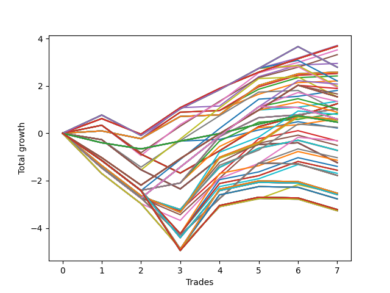

# Long HLT 236 
- Symbol: TSLA
- Date Range: 05/16/2022 - 05/17/2024
- Trading Period: 8:30-12:30
- Number of Trades: 7



| Id. | Name | Win Percent | Profit | Avg Profit / Trade | Avg Time / Trade | Std |      | Name | Win Percent | Profit | Avg Profit / Trade | Avg Time / Trade | Std |
| --- | ---- | ----------- | ------ | ------------------ | ---------------- | --- | ---- | ---- | ----------- | ------ | ------------------ | ---------------- | --- |
| | Sorted By <br> Profit | | | | | | | Sorted By <br> Win Percentage |||||
|0| TP-0.75 30m | 85.71 | 3.71 | 0.53 | 19:34 | 0.60 |     | TP-0.75 30m | 85.71 | 3.71 | 0.53 | 19:34 | 0.60 |
|1| TP-0.5 180m | 85.71 | 3.68 | 0.53 | 16:34 | 0.52 |     | TP-0.5 180m | 85.71 | 3.68 | 0.53 | 16:34 | 0.52 |
|2| TP-0.5 165m | 85.71 | 3.68 | 0.53 | 16:34 | 0.52 |     | TP-0.5 165m | 85.71 | 3.68 | 0.53 | 16:34 | 0.52 |
|3| TP-0.5 150m | 85.71 | 3.68 | 0.53 | 16:34 | 0.52 |     | TP-0.5 150m | 85.71 | 3.68 | 0.53 | 16:34 | 0.52 |
|4| TP-0.5 135m | 85.71 | 3.68 | 0.53 | 16:34 | 0.52 |     | TP-0.5 135m | 85.71 | 3.68 | 0.53 | 16:34 | 0.52 |
|5| TP-0.5 120m | 85.71 | 3.68 | 0.53 | 16:34 | 0.52 |     | TP-0.5 120m | 85.71 | 3.68 | 0.53 | 16:34 | 0.52 |
|6| TP-0.5 105m | 85.71 | 3.68 | 0.53 | 16:34 | 0.52 |     | TP-0.5 105m | 85.71 | 3.68 | 0.53 | 16:34 | 0.52 |
|7| TP-0.5 90m | 85.71 | 3.68 | 0.53 | 16:34 | 0.52 |     | TP-0.5 90m | 85.71 | 3.68 | 0.53 | 16:34 | 0.52 |
|8| TP-0.5 75m | 85.71 | 3.68 | 0.53 | 16:34 | 0.52 |     | TP-0.5 75m | 85.71 | 3.68 | 0.53 | 16:34 | 0.52 |
|9| TP-0.5 60m | 85.71 | 3.68 | 0.53 | 16:34 | 0.52 |     | TP-0.5 60m | 85.71 | 3.68 | 0.53 | 16:34 | 0.52 |
|10| TP-0.5 45m | 85.71 | 3.68 | 0.53 | 16:34 | 0.52 |     | TP-0.5 45m | 85.71 | 3.68 | 0.53 | 16:34 | 0.52 |
|11| TP-0.5 30m | 85.71 | 3.68 | 0.53 | 16:34 | 0.52 |     | TP-0.5 30m | 85.71 | 3.68 | 0.53 | 16:34 | 0.52 |
|12| TP-1.25 30m | 85.71 | 3.52 | 0.50 | 23:34 | 0.81 |     | TP-1.25 30m | 85.71 | 3.52 | 0.50 | 23:34 | 0.81 |
|13| TP-1 30m | 85.71 | 3.32 | 0.47 | 22:08 | 0.73 |     | TP-1 30m | 85.71 | 3.32 | 0.47 | 22:08 | 0.73 |
|14| TP-1.25 15m | 85.71 | 2.95 | 0.42 | 13:00 | 0.58 |     | TP-1.25 15m | 85.71 | 2.95 | 0.42 | 13:00 | 0.58 |
|15| TP-0.75 180m | 71.43 | 2.79 | 0.40 | 28:34 | 0.81 |     | TP-3 15m | 85.71 | 2.58 | 0.37 | 14:00 | 0.51 |
|16| TP-0.75 165m | 71.43 | 2.79 | 0.40 | 28:34 | 0.81 |     | TP-2.75 15m | 85.71 | 2.58 | 0.37 | 14:00 | 0.51 |
|17| TP-0.75 150m | 71.43 | 2.79 | 0.40 | 28:34 | 0.81 |     | TP-2.5 15m | 85.71 | 2.58 | 0.37 | 14:00 | 0.51 |
|18| TP-0.75 135m | 71.43 | 2.79 | 0.40 | 28:34 | 0.81 |     | TP-2.25 15m | 85.71 | 2.58 | 0.37 | 14:00 | 0.51 |
|19| TP-0.75 120m | 71.43 | 2.79 | 0.40 | 28:34 | 0.81 |     | TP-2 15m | 85.71 | 2.58 | 0.37 | 14:00 | 0.51 |
|20| TP-0.75 105m | 71.43 | 2.79 | 0.40 | 28:34 | 0.81 |     | TP-1.75 15m | 85.71 | 2.58 | 0.37 | 14:00 | 0.51 |
|21| TP-0.75 90m | 71.43 | 2.79 | 0.40 | 28:34 | 0.81 |     | TP-1.5 15m | 85.71 | 2.58 | 0.37 | 14:00 | 0.51 |
|22| TP-3 15m | 85.71 | 2.58 | 0.37 | 14:00 | 0.51 |     | TP-1 15m | 85.71 | 2.52 | 0.36 | 12:17 | 0.50 |
|23| TP-2.75 15m | 85.71 | 2.58 | 0.37 | 14:00 | 0.51 |     | TP-0.75 15m | 85.71 | 2.42 | 0.35 | 12:00 | 0.48 |
|24| TP-2.5 15m | 85.71 | 2.58 | 0.37 | 14:00 | 0.51 |     | TP-0.5 15m | 85.71 | 2.21 | 0.32 | 11:08 | 0.45 |
|25| TP-2.25 15m | 85.71 | 2.58 | 0.37 | 14:00 | 0.51 |     | TP-0.75 180m | 71.43 | 2.79 | 0.40 | 28:34 | 0.81 |
|26| TP-2 15m | 85.71 | 2.58 | 0.37 | 14:00 | 0.51 |     | TP-0.75 165m | 71.43 | 2.79 | 0.40 | 28:34 | 0.81 |
|27| TP-1.75 15m | 85.71 | 2.58 | 0.37 | 14:00 | 0.51 |     | TP-0.75 150m | 71.43 | 2.79 | 0.40 | 28:34 | 0.81 |
|28| TP-1.5 15m | 85.71 | 2.58 | 0.37 | 14:00 | 0.51 |     | TP-0.75 135m | 71.43 | 2.79 | 0.40 | 28:34 | 0.81 |
|29| TP-1 15m | 85.71 | 2.52 | 0.36 | 12:17 | 0.50 |     | TP-0.75 120m | 71.43 | 2.79 | 0.40 | 28:34 | 0.81 |
|30| TP-0.75 15m | 85.71 | 2.42 | 0.35 | 12:00 | 0.48 |     | TP-0.75 105m | 71.43 | 2.79 | 0.40 | 28:34 | 0.81 |
|31| TP-0.5 15m | 85.71 | 2.21 | 0.32 | 11:08 | 0.45 |     | TP-0.75 90m | 71.43 | 2.79 | 0.40 | 28:34 | 0.81 |
|32| TP-0.75 75m | 71.43 | 2.21 | 0.32 | 28:00 | 0.78 |     | TP-0.75 75m | 71.43 | 2.21 | 0.32 | 28:00 | 0.78 |
|33| TP-1.25 90m | 57.14 | 2.08 | 0.30 | 47:42 | 1.16 |     | TP-0.75 60m | 71.43 | 1.99 | 0.28 | 25:51 | 0.78 |
|34| TP-0.75 60m | 71.43 | 1.99 | 0.28 | 25:51 | 0.78 |     | TP-0.75 45m | 71.43 | 1.94 | 0.28 | 23:42 | 0.78 |
|35| TP-0.75 45m | 71.43 | 1.94 | 0.28 | 23:42 | 0.78 |     | TP-1.25 60m | 71.43 | 1.81 | 0.26 | 38:34 | 1.04 |
|36| TP-1 90m | 57.14 | 1.89 | 0.27 | 41:34 | 0.95 |     | TP-1 60m | 71.43 | 1.35 | 0.19 | 33:51 | 0.89 |
|37| TP-1.25 60m | 71.43 | 1.81 | 0.26 | 38:34 | 1.04 |     | TP-3 30m | 71.43 | 1.25 | 0.18 | 29:00 | 0.79 |
|38| TP-1 105m | 57.14 | 1.66 | 0.24 | 43:42 | 0.97 |     | TP-2.75 30m | 71.43 | 1.25 | 0.18 | 29:00 | 0.79 |
|39| TP-1 180m | 57.14 | 1.54 | 0.22 | 45:51 | 0.98 |     | TP-2.5 30m | 71.43 | 1.25 | 0.18 | 29:00 | 0.79 |
|40| TP-1 165m | 57.14 | 1.54 | 0.22 | 45:51 | 0.98 |     | TP-2.25 30m | 71.43 | 1.25 | 0.18 | 29:00 | 0.79 |
|41| TP-1 150m | 57.14 | 1.54 | 0.22 | 45:51 | 0.98 |     | TP-2 30m | 71.43 | 1.25 | 0.18 | 29:00 | 0.79 |
|42| TP-1 135m | 57.14 | 1.54 | 0.22 | 45:51 | 0.98 |     | TP-1.75 30m | 71.43 | 1.25 | 0.18 | 29:00 | 0.79 |
|43| TP-1 120m | 57.14 | 1.54 | 0.22 | 45:51 | 0.98 |     | TP-1.5 30m | 71.43 | 1.25 | 0.18 | 29:00 | 0.79 |
|44| TP-1.25 45m | 57.14 | 1.54 | 0.22 | 32:08 | 1.00 |     | TP-3 60m | 71.43 | 1.03 | 0.15 | 54:51 | 1.03 |
|45| TP-1 60m | 71.43 | 1.35 | 0.19 | 33:51 | 0.89 |     | TP-2.75 60m | 71.43 | 1.03 | 0.15 | 54:51 | 1.03 |
|46| TP-1.25 105m | 57.14 | 1.35 | 0.19 | 52:00 | 1.13 |     | TP-2.5 60m | 71.43 | 1.03 | 0.15 | 54:51 | 1.03 |
|47| TP-3 30m | 71.43 | 1.25 | 0.18 | 29:00 | 0.79 |     | TP-2.25 60m | 71.43 | 1.03 | 0.15 | 54:51 | 1.03 |
|48| TP-2.75 30m | 71.43 | 1.25 | 0.18 | 29:00 | 0.79 |     | TP-2 60m | 71.43 | 1.03 | 0.15 | 54:51 | 1.03 |
|49| TP-2.5 30m | 71.43 | 1.25 | 0.18 | 29:00 | 0.79 |     | TP-1.75 60m | 71.43 | 0.84 | 0.12 | 53:51 | 0.98 |
|50| TP-2.25 30m | 71.43 | 1.25 | 0.18 | 29:00 | 0.79 |     | TP-1.5 60m | 71.43 | 0.61 | 0.09 | 53:42 | 0.93 |
|51| TP-2 30m | 71.43 | 1.25 | 0.18 | 29:00 | 0.79 |     | TP-1.25 90m | 57.14 | 2.08 | 0.30 | 47:42 | 1.16 |
|52| TP-1.75 30m | 71.43 | 1.25 | 0.18 | 29:00 | 0.79 |     | TP-1 90m | 57.14 | 1.89 | 0.27 | 41:34 | 0.95 |
|53| TP-1.5 30m | 71.43 | 1.25 | 0.18 | 29:00 | 0.79 |     | TP-1 105m | 57.14 | 1.66 | 0.24 | 43:42 | 0.97 |
|54| TP-3 60m | 71.43 | 1.03 | 0.15 | 54:51 | 1.03 |     | TP-1 180m | 57.14 | 1.54 | 0.22 | 45:51 | 0.98 |
|55| TP-2.75 60m | 71.43 | 1.03 | 0.15 | 54:51 | 1.03 |     | TP-1 165m | 57.14 | 1.54 | 0.22 | 45:51 | 0.98 |
|56| TP-2.5 60m | 71.43 | 1.03 | 0.15 | 54:51 | 1.03 |     | TP-1 150m | 57.14 | 1.54 | 0.22 | 45:51 | 0.98 |
|57| TP-2.25 60m | 71.43 | 1.03 | 0.15 | 54:51 | 1.03 |     | TP-1 135m | 57.14 | 1.54 | 0.22 | 45:51 | 0.98 |
|58| TP-2 60m | 71.43 | 1.03 | 0.15 | 54:51 | 1.03 |     | TP-1 120m | 57.14 | 1.54 | 0.22 | 45:51 | 0.98 |
|59| TP-1.25 75m | 57.14 | 1.03 | 0.15 | 43:25 | 1.13 |     | TP-1.25 45m | 57.14 | 1.54 | 0.22 | 32:08 | 1.00 |
|60| TP-1 45m | 57.14 | 0.97 | 0.14 | 28:34 | 0.87 |     | TP-1.25 105m | 57.14 | 1.35 | 0.19 | 52:00 | 1.13 |
|61| TP-1 75m | 57.14 | 0.89 | 0.13 | 38:08 | 0.92 |     | TP-1.25 75m | 57.14 | 1.03 | 0.15 | 43:25 | 1.13 |
|62| TP-1.75 60m | 71.43 | 0.84 | 0.12 | 53:51 | 0.98 |     | TP-1 45m | 57.14 | 0.97 | 0.14 | 28:34 | 0.87 |
|63| TP-2.5 90m | 42.86 | 0.80 | 0.11 | 79:42 | 1.31 |     | TP-1 75m | 57.14 | 0.89 | 0.13 | 38:08 | 0.92 |
|64| TP-1.5 60m | 71.43 | 0.61 | 0.09 | 53:42 | 0.93 |     | TP-0.25 180m | 57.14 | 0.47 | 0.07 | 07:25 | 0.33 |
|65| TP-1.25 180m | 42.86 | 0.60 | 0.09 | 56:17 | 1.13 |     | TP-0.25 165m | 57.14 | 0.47 | 0.07 | 07:25 | 0.33 |
|66| TP-1.25 165m | 42.86 | 0.60 | 0.09 | 56:17 | 1.13 |     | TP-0.25 150m | 57.14 | 0.47 | 0.07 | 07:25 | 0.33 |
|67| TP-1.25 150m | 42.86 | 0.60 | 0.09 | 56:17 | 1.13 |     | TP-0.25 135m | 57.14 | 0.47 | 0.07 | 07:25 | 0.33 |
|68| TP-1.25 135m | 42.86 | 0.60 | 0.09 | 56:17 | 1.13 |     | TP-0.25 120m | 57.14 | 0.47 | 0.07 | 07:25 | 0.33 |
|69| TP-1.25 120m | 42.86 | 0.60 | 0.09 | 56:17 | 1.13 |     | TP-0.25 105m | 57.14 | 0.47 | 0.07 | 07:25 | 0.33 |
|70| TP-3 90m | 42.86 | 0.59 | 0.08 | 80:34 | 1.25 |     | TP-0.25 90m | 57.14 | 0.47 | 0.07 | 07:25 | 0.33 |
|71| TP-2.75 90m | 42.86 | 0.59 | 0.08 | 80:34 | 1.25 |     | TP-0.25 75m | 57.14 | 0.47 | 0.07 | 07:25 | 0.33 |
|72| TP-1.5 90m | 42.86 | 0.56 | 0.08 | 68:34 | 1.20 |     | TP-0.25 60m | 57.14 | 0.47 | 0.07 | 07:25 | 0.33 |
|73| TP-2.25 90m | 42.86 | 0.54 | 0.08 | 79:17 | 1.24 |     | TP-0.25 45m | 57.14 | 0.47 | 0.07 | 07:25 | 0.33 |
|74| TP-0.25 180m | 57.14 | 0.47 | 0.07 | 07:25 | 0.33 |     | TP-0.25 30m | 57.14 | 0.47 | 0.07 | 07:25 | 0.33 |
|75| TP-0.25 165m | 57.14 | 0.47 | 0.07 | 07:25 | 0.33 |     | TP-0.25 15m | 57.14 | 0.22 | 0.03 | 06:51 | 0.31 |
|76| TP-0.25 150m | 57.14 | 0.47 | 0.07 | 07:25 | 0.33 |     | TP-2.5 90m | 42.86 | 0.80 | 0.11 | 79:42 | 1.31 |
|77| TP-0.25 135m | 57.14 | 0.47 | 0.07 | 07:25 | 0.33 |     | TP-1.25 180m | 42.86 | 0.60 | 0.09 | 56:17 | 1.13 |
|78| TP-0.25 120m | 57.14 | 0.47 | 0.07 | 07:25 | 0.33 |     | TP-1.25 165m | 42.86 | 0.60 | 0.09 | 56:17 | 1.13 |
|79| TP-0.25 105m | 57.14 | 0.47 | 0.07 | 07:25 | 0.33 |     | TP-1.25 150m | 42.86 | 0.60 | 0.09 | 56:17 | 1.13 |
|80| TP-0.25 90m | 57.14 | 0.47 | 0.07 | 07:25 | 0.33 |     | TP-1.25 135m | 42.86 | 0.60 | 0.09 | 56:17 | 1.13 |
|81| TP-0.25 75m | 57.14 | 0.47 | 0.07 | 07:25 | 0.33 |     | TP-1.25 120m | 42.86 | 0.60 | 0.09 | 56:17 | 1.13 |
|82| TP-0.25 60m | 57.14 | 0.47 | 0.07 | 07:25 | 0.33 |     | TP-3 90m | 42.86 | 0.59 | 0.08 | 80:34 | 1.25 |
|83| TP-0.25 45m | 57.14 | 0.47 | 0.07 | 07:25 | 0.33 |     | TP-2.75 90m | 42.86 | 0.59 | 0.08 | 80:34 | 1.25 |
|84| TP-0.25 30m | 57.14 | 0.47 | 0.07 | 07:25 | 0.33 |     | TP-1.5 90m | 42.86 | 0.56 | 0.08 | 68:34 | 1.20 |
|85| TP-2 90m | 42.86 | 0.25 | 0.04 | 76:25 | 1.17 |     | TP-2.25 90m | 42.86 | 0.54 | 0.08 | 79:17 | 1.24 |
|86| TP-0.25 15m | 57.14 | 0.22 | 0.03 | 06:51 | 0.31 |     | TP-2 90m | 42.86 | 0.25 | 0.04 | 76:25 | 1.17 |
|87| TP-1.75 90m | 42.86 | -0.31 | -0.04 | 73:42 | 1.18 |     | TP-1.75 90m | 42.86 | -0.31 | -0.04 | 73:42 | 1.18 |
|88| TP-1.5 75m | 42.86 | -0.32 | -0.05 | 62:08 | 1.13 |     | TP-1.5 75m | 42.86 | -0.32 | -0.05 | 62:08 | 1.13 |
|89| TP-2 75m | 42.86 | -0.51 | -0.07 | 65:42 | 1.12 |     | TP-2 75m | 42.86 | -0.51 | -0.07 | 65:42 | 1.12 |
|90| TP-3 75m | 42.86 | -0.72 | -0.10 | 67:42 | 1.07 |     | TP-3 75m | 42.86 | -0.72 | -0.10 | 67:42 | 1.07 |
|91| TP-2.75 75m | 42.86 | -0.72 | -0.10 | 67:42 | 1.07 |     | TP-2.75 75m | 42.86 | -0.72 | -0.10 | 67:42 | 1.07 |
|92| TP-2.5 75m | 42.86 | -0.72 | -0.10 | 67:42 | 1.07 |     | TP-2.5 75m | 42.86 | -0.72 | -0.10 | 67:42 | 1.07 |
|93| TP-2.25 75m | 42.86 | -0.72 | -0.10 | 67:42 | 1.07 |     | TP-2.25 75m | 42.86 | -0.72 | -0.10 | 67:42 | 1.07 |
|94| TP-1.75 75m | 42.86 | -0.73 | -0.10 | 64:34 | 1.06 |     | TP-1.75 75m | 42.86 | -0.73 | -0.10 | 64:34 | 1.06 |
|95| TP-1.5 105m | 42.86 | -1.03 | -0.15 | 74:00 | 1.26 |     | TP-1.5 105m | 42.86 | -1.03 | -0.15 | 74:00 | 1.26 |
|96| TP-2.5 105m | 42.86 | -1.14 | -0.16 | 89:08 | 1.37 |     | TP-2.5 105m | 42.86 | -1.14 | -0.16 | 89:08 | 1.37 |
|97| TP-3 45m | 42.86 | -1.24 | -0.18 | 42:00 | 0.83 |     | TP-3 45m | 42.86 | -1.24 | -0.18 | 42:00 | 0.83 |
|98| TP-2.75 45m | 42.86 | -1.24 | -0.18 | 42:00 | 0.83 |     | TP-2.75 45m | 42.86 | -1.24 | -0.18 | 42:00 | 0.83 |
|99| TP-2.5 45m | 42.86 | -1.24 | -0.18 | 42:00 | 0.83 |     | TP-2.5 45m | 42.86 | -1.24 | -0.18 | 42:00 | 0.83 |
|100| TP-2.25 45m | 42.86 | -1.24 | -0.18 | 42:00 | 0.83 |     | TP-2.25 45m | 42.86 | -1.24 | -0.18 | 42:00 | 0.83 |
|101| TP-2 45m | 42.86 | -1.24 | -0.18 | 42:00 | 0.83 |     | TP-2 45m | 42.86 | -1.24 | -0.18 | 42:00 | 0.83 |
|102| TP-1.75 45m | 42.86 | -1.24 | -0.18 | 42:00 | 0.83 |     | TP-1.75 45m | 42.86 | -1.24 | -0.18 | 42:00 | 0.83 |
|103| TP-1.5 45m | 42.86 | -1.24 | -0.18 | 42:00 | 0.83 |     | TP-1.5 45m | 42.86 | -1.24 | -0.18 | 42:00 | 0.83 |
|104| TP-2.25 105m | 42.86 | -1.40 | -0.20 | 88:42 | 1.30 |     | TP-2.25 105m | 42.86 | -1.40 | -0.20 | 88:42 | 1.30 |
|105| TP-3 105m | 42.86 | -1.56 | -0.22 | 92:08 | 1.25 |     | TP-3 105m | 42.86 | -1.56 | -0.22 | 92:08 | 1.25 |
|106| TP-2.75 105m | 42.86 | -1.56 | -0.22 | 92:08 | 1.25 |     | TP-2.75 105m | 42.86 | -1.56 | -0.22 | 92:08 | 1.25 |
|107| TP-2 105m | 42.86 | -1.69 | -0.24 | 85:51 | 1.22 |     | TP-2 105m | 42.86 | -1.69 | -0.24 | 85:51 | 1.22 |
|108| TP-1.5 180m | 28.57 | -1.78 | -0.25 | 78:17 | 1.23 |     | TP-1.75 105m | 42.86 | -2.54 | -0.36 | 82:00 | 1.25 |
|109| TP-1.5 165m | 28.57 | -1.78 | -0.25 | 78:17 | 1.23 |     | TP-1.5 180m | 28.57 | -1.78 | -0.25 | 78:17 | 1.23 |
|110| TP-1.5 150m | 28.57 | -1.78 | -0.25 | 78:17 | 1.23 |     | TP-1.5 165m | 28.57 | -1.78 | -0.25 | 78:17 | 1.23 |
|111| TP-1.5 135m | 28.57 | -1.78 | -0.25 | 78:17 | 1.23 |     | TP-1.5 150m | 28.57 | -1.78 | -0.25 | 78:17 | 1.23 |
|112| TP-1.5 120m | 28.57 | -1.78 | -0.25 | 78:17 | 1.23 |     | TP-1.5 135m | 28.57 | -1.78 | -0.25 | 78:17 | 1.23 |
|113| TP-2.5 180m | 28.57 | -2.53 | -0.36 | 96:08 | 1.46 |     | TP-1.5 120m | 28.57 | -1.78 | -0.25 | 78:17 | 1.23 |
|114| TP-2.5 165m | 28.57 | -2.53 | -0.36 | 96:08 | 1.46 |     | TP-2.5 180m | 28.57 | -2.53 | -0.36 | 96:08 | 1.46 |
|115| TP-2.5 150m | 28.57 | -2.53 | -0.36 | 96:08 | 1.46 |     | TP-2.5 165m | 28.57 | -2.53 | -0.36 | 96:08 | 1.46 |
|116| TP-2.5 135m | 28.57 | -2.53 | -0.36 | 96:08 | 1.46 |     | TP-2.5 150m | 28.57 | -2.53 | -0.36 | 96:08 | 1.46 |
|117| TP-2.5 120m | 28.57 | -2.53 | -0.36 | 96:08 | 1.46 |     | TP-2.5 135m | 28.57 | -2.53 | -0.36 | 96:08 | 1.46 |
|118| TP-1.75 105m | 42.86 | -2.54 | -0.36 | 82:00 | 1.25 |     | TP-2.5 120m | 28.57 | -2.53 | -0.36 | 96:08 | 1.46 |
|119| TP-2 180m | 28.57 | -2.59 | -0.37 | 91:17 | 1.21 |     | TP-2 180m | 28.57 | -2.59 | -0.37 | 91:17 | 1.21 |
|120| TP-2 165m | 28.57 | -2.59 | -0.37 | 91:17 | 1.21 |     | TP-2 165m | 28.57 | -2.59 | -0.37 | 91:17 | 1.21 |
|121| TP-2 150m | 28.57 | -2.59 | -0.37 | 91:17 | 1.21 |     | TP-2 150m | 28.57 | -2.59 | -0.37 | 91:17 | 1.21 |
|122| TP-2 135m | 28.57 | -2.59 | -0.37 | 91:17 | 1.21 |     | TP-2 135m | 28.57 | -2.59 | -0.37 | 91:17 | 1.21 |
|123| TP-2 120m | 28.57 | -2.59 | -0.37 | 91:17 | 1.21 |     | TP-2 120m | 28.57 | -2.59 | -0.37 | 91:17 | 1.21 |
|124| TP-2.25 180m | 28.57 | -2.77 | -0.40 | 95:00 | 1.39 |     | TP-2.25 180m | 28.57 | -2.77 | -0.40 | 95:00 | 1.39 |
|125| TP-2.25 165m | 28.57 | -2.77 | -0.40 | 95:00 | 1.39 |     | TP-2.25 165m | 28.57 | -2.77 | -0.40 | 95:00 | 1.39 |
|126| TP-2.25 150m | 28.57 | -2.77 | -0.40 | 95:00 | 1.39 |     | TP-2.25 150m | 28.57 | -2.77 | -0.40 | 95:00 | 1.39 |
|127| TP-2.25 135m | 28.57 | -2.77 | -0.40 | 95:00 | 1.39 |     | TP-2.25 135m | 28.57 | -2.77 | -0.40 | 95:00 | 1.39 |
|128| TP-2.25 120m | 28.57 | -2.77 | -0.40 | 95:00 | 1.39 |     | TP-2.25 120m | 28.57 | -2.77 | -0.40 | 95:00 | 1.39 |
|129| TP-3 180m | 28.57 | -3.22 | -0.46 | 101:34 | 1.30 |     | TP-3 180m | 28.57 | -3.22 | -0.46 | 101:34 | 1.30 |
|130| TP-2.75 180m | 28.57 | -3.22 | -0.46 | 101:34 | 1.30 |     | TP-2.75 180m | 28.57 | -3.22 | -0.46 | 101:34 | 1.30 |
|131| TP-3 165m | 28.57 | -3.22 | -0.46 | 101:34 | 1.30 |     | TP-3 165m | 28.57 | -3.22 | -0.46 | 101:34 | 1.30 |
|132| TP-2.75 165m | 28.57 | -3.22 | -0.46 | 101:34 | 1.30 |     | TP-2.75 165m | 28.57 | -3.22 | -0.46 | 101:34 | 1.30 |
|133| TP-3 150m | 28.57 | -3.22 | -0.46 | 101:34 | 1.30 |     | TP-3 150m | 28.57 | -3.22 | -0.46 | 101:34 | 1.30 |
|134| TP-2.75 150m | 28.57 | -3.22 | -0.46 | 101:34 | 1.30 |     | TP-2.75 150m | 28.57 | -3.22 | -0.46 | 101:34 | 1.30 |
|135| TP-3 135m | 28.57 | -3.22 | -0.46 | 101:34 | 1.30 |     | TP-3 135m | 28.57 | -3.22 | -0.46 | 101:34 | 1.30 |
|136| TP-2.75 135m | 28.57 | -3.22 | -0.46 | 101:34 | 1.30 |     | TP-2.75 135m | 28.57 | -3.22 | -0.46 | 101:34 | 1.30 |
|137| TP-3 120m | 28.57 | -3.22 | -0.46 | 101:34 | 1.30 |     | TP-3 120m | 28.57 | -3.22 | -0.46 | 101:34 | 1.30 |
|138| TP-2.75 120m | 28.57 | -3.22 | -0.46 | 101:34 | 1.30 |     | TP-2.75 120m | 28.57 | -3.22 | -0.46 | 101:34 | 1.30 |
|139| TP-1.75 180m | 28.57 | -3.27 | -0.47 | 87:08 | 1.20 |     | TP-1.75 180m | 28.57 | -3.27 | -0.47 | 87:08 | 1.20 |
|140| TP-1.75 165m | 28.57 | -3.27 | -0.47 | 87:08 | 1.20 |     | TP-1.75 165m | 28.57 | -3.27 | -0.47 | 87:08 | 1.20 |
|141| TP-1.75 150m | 28.57 | -3.27 | -0.47 | 87:08 | 1.20 |     | TP-1.75 150m | 28.57 | -3.27 | -0.47 | 87:08 | 1.20 |
|142| TP-1.75 135m | 28.57 | -3.27 | -0.47 | 87:08 | 1.20 |     | TP-1.75 135m | 28.57 | -3.27 | -0.47 | 87:08 | 1.20 |
|143| TP-1.75 120m | 28.57 | -3.27 | -0.47 | 87:08 | 1.20 |     | TP-1.75 120m | 28.57 | -3.27 | -0.47 | 87:08 | 1.20 |

### Test TP-0.25 15m
* Take Profit of 0.25 Point
* 0.25 Stoploss
* Results:
```
Total Trades: 7
Percent Up: 57.14
Percent Down: 42.86
Total Points Moved Up: 0.22
Potential Profit: 110.00
Total Points Ups: 1.15 Count Ups: 4
Total Points Downs: -0.93 Count Downs: 3
```

<details><summary>Trades</summary>

<code>In: 2022-07-25 11:15:00		Out: 2022-07-25 11:17:00		Total Position Time: 02:00		Total Move Up: -0.40		Total to Date: -0.40</code> <br />
<code>In: 2023-04-26 12:20:00		Out: 2023-04-26 12:33:00		Total Position Time: 13:00		Total Move Up: -0.26		Total to Date: -0.66</code> <br />
<code>In: 2023-10-18 10:10:00		Out: 2023-10-18 10:12:00		Total Position Time: 02:00		Total Move Up: 0.33		Total to Date: -0.33</code> <br />
<code>In: 2023-11-08 09:45:00		Out: 2023-11-08 09:59:00		Total Position Time: 14:00		Total Move Up: 0.07		Total to Date: -0.26</code> <br />
<code>In: 2023-12-11 11:00:00		Out: 2023-12-11 11:02:00		Total Position Time: 02:00		Total Move Up: 0.40		Total to Date: 0.14</code> <br />
<code>In: 2024-01-23 10:50:00		Out: 2024-01-23 11:03:00		Total Position Time: 13:00		Total Move Up: 0.35		Total to Date: 0.49</code> <br />
<code>In: 2024-04-10 09:30:00		Out: 2024-04-10 09:32:00		Total Position Time: 02:00		Total Move Up: -0.27		Total to Date: 0.22</code> <br />


</details>

### Test TP-0.5 15m
* Take Profit of 0.5 Point
* 0.5 Stoploss
* Results:
```
Total Trades: 7
Percent Up: 85.71
Percent Down: 14.29
Total Points Moved Up: 2.21
Potential Profit: 1105.00
Total Points Ups: 2.54 Count Ups: 6
Total Points Downs: -0.33 Count Downs: 1
```

<details><summary>Trades</summary>

<code>In: 2022-07-25 11:15:00		Out: 2022-07-25 11:29:00		Total Position Time: 14:00		Total Move Up: 0.10		Total to Date: 0.10</code> <br />
<code>In: 2023-04-26 12:20:00		Out: 2023-04-26 12:34:00		Total Position Time: 14:00		Total Move Up: -0.33		Total to Date: -0.23</code> <br />
<code>In: 2023-10-18 10:10:00		Out: 2023-10-18 10:14:00		Total Position Time: 04:00		Total Move Up: 1.12		Total to Date: 0.89</code> <br />
<code>In: 2023-11-08 09:45:00		Out: 2023-11-08 09:59:00		Total Position Time: 14:00		Total Move Up: 0.07		Total to Date: 0.96</code> <br />
<code>In: 2023-12-11 11:00:00		Out: 2023-12-11 11:04:00		Total Position Time: 04:00		Total Move Up: 0.69		Total to Date: 1.65</code> <br />
<code>In: 2024-01-23 10:50:00		Out: 2024-01-23 11:04:00		Total Position Time: 14:00		Total Move Up: 0.49		Total to Date: 2.14</code> <br />
<code>In: 2024-04-10 09:30:00		Out: 2024-04-10 09:44:00		Total Position Time: 14:00		Total Move Up: 0.07		Total to Date: 2.21</code> <br />


</details>

### Test TP-0.75 15m
* Take Profit of 0.75 Point
* 0.75 Stoploss
* Results:
```
Total Trades: 7
Percent Up: 85.71
Percent Down: 14.29
Total Points Moved Up: 2.42
Potential Profit: 1210.00
Total Points Ups: 2.75 Count Ups: 6
Total Points Downs: -0.33 Count Downs: 1
```

<details><summary>Trades</summary>

<code>In: 2022-07-25 11:15:00		Out: 2022-07-25 11:29:00		Total Position Time: 14:00		Total Move Up: 0.10		Total to Date: 0.10</code> <br />
<code>In: 2023-04-26 12:20:00		Out: 2023-04-26 12:34:00		Total Position Time: 14:00		Total Move Up: -0.33		Total to Date: -0.23</code> <br />
<code>In: 2023-10-18 10:10:00		Out: 2023-10-18 10:14:00		Total Position Time: 04:00		Total Move Up: 1.12		Total to Date: 0.89</code> <br />
<code>In: 2023-11-08 09:45:00		Out: 2023-11-08 09:59:00		Total Position Time: 14:00		Total Move Up: 0.07		Total to Date: 0.96</code> <br />
<code>In: 2023-12-11 11:00:00		Out: 2023-12-11 11:10:00		Total Position Time: 10:00		Total Move Up: 0.90		Total to Date: 1.86</code> <br />
<code>In: 2024-01-23 10:50:00		Out: 2024-01-23 11:04:00		Total Position Time: 14:00		Total Move Up: 0.49		Total to Date: 2.35</code> <br />
<code>In: 2024-04-10 09:30:00		Out: 2024-04-10 09:44:00		Total Position Time: 14:00		Total Move Up: 0.07		Total to Date: 2.42</code> <br />


</details>

### Test TP-1 15m
* Take Profit of 1 Point
* 1 Stoploss
* Results:
```
Total Trades: 7
Percent Up: 85.71
Percent Down: 14.29
Total Points Moved Up: 2.52
Potential Profit: 1260.00
Total Points Ups: 2.85 Count Ups: 6
Total Points Downs: -0.33 Count Downs: 1
```

<details><summary>Trades</summary>

<code>In: 2022-07-25 11:15:00		Out: 2022-07-25 11:29:00		Total Position Time: 14:00		Total Move Up: 0.10		Total to Date: 0.10</code> <br />
<code>In: 2023-04-26 12:20:00		Out: 2023-04-26 12:34:00		Total Position Time: 14:00		Total Move Up: -0.33		Total to Date: -0.23</code> <br />
<code>In: 2023-10-18 10:10:00		Out: 2023-10-18 10:14:00		Total Position Time: 04:00		Total Move Up: 1.12		Total to Date: 0.89</code> <br />
<code>In: 2023-11-08 09:45:00		Out: 2023-11-08 09:59:00		Total Position Time: 14:00		Total Move Up: 0.07		Total to Date: 0.96</code> <br />
<code>In: 2023-12-11 11:00:00		Out: 2023-12-11 11:12:00		Total Position Time: 12:00		Total Move Up: 1.00		Total to Date: 1.96</code> <br />
<code>In: 2024-01-23 10:50:00		Out: 2024-01-23 11:04:00		Total Position Time: 14:00		Total Move Up: 0.49		Total to Date: 2.45</code> <br />
<code>In: 2024-04-10 09:30:00		Out: 2024-04-10 09:44:00		Total Position Time: 14:00		Total Move Up: 0.07		Total to Date: 2.52</code> <br />


</details>

### Test TP-1.25 15m
* Take Profit of 1.25 Point
* 1.25 Stoploss
* Results:
```
Total Trades: 7
Percent Up: 85.71
Percent Down: 14.29
Total Points Moved Up: 2.95
Potential Profit: 1475.00
Total Points Ups: 3.28 Count Ups: 6
Total Points Downs: -0.33 Count Downs: 1
```

<details><summary>Trades</summary>

<code>In: 2022-07-25 11:15:00		Out: 2022-07-25 11:29:00		Total Position Time: 14:00		Total Move Up: 0.10		Total to Date: 0.10</code> <br />
<code>In: 2023-04-26 12:20:00		Out: 2023-04-26 12:34:00		Total Position Time: 14:00		Total Move Up: -0.33		Total to Date: -0.23</code> <br />
<code>In: 2023-10-18 10:10:00		Out: 2023-10-18 10:17:00		Total Position Time: 07:00		Total Move Up: 1.31		Total to Date: 1.08</code> <br />
<code>In: 2023-11-08 09:45:00		Out: 2023-11-08 09:59:00		Total Position Time: 14:00		Total Move Up: 0.07		Total to Date: 1.15</code> <br />
<code>In: 2023-12-11 11:00:00		Out: 2023-12-11 11:14:00		Total Position Time: 14:00		Total Move Up: 1.24		Total to Date: 2.39</code> <br />
<code>In: 2024-01-23 10:50:00		Out: 2024-01-23 11:04:00		Total Position Time: 14:00		Total Move Up: 0.49		Total to Date: 2.88</code> <br />
<code>In: 2024-04-10 09:30:00		Out: 2024-04-10 09:44:00		Total Position Time: 14:00		Total Move Up: 0.07		Total to Date: 2.95</code> <br />


</details>

### Test TP-1.5 15m
* Take Profit of 1.5 Point
* 1.5 Stoploss
* Results:
```
Total Trades: 7
Percent Up: 85.71
Percent Down: 14.29
Total Points Moved Up: 2.58
Potential Profit: 1290.00
Total Points Ups: 2.91 Count Ups: 6
Total Points Downs: -0.33 Count Downs: 1
```

<details><summary>Trades</summary>

<code>In: 2022-07-25 11:15:00		Out: 2022-07-25 11:29:00		Total Position Time: 14:00		Total Move Up: 0.10		Total to Date: 0.10</code> <br />
<code>In: 2023-04-26 12:20:00		Out: 2023-04-26 12:34:00		Total Position Time: 14:00		Total Move Up: -0.33		Total to Date: -0.23</code> <br />
<code>In: 2023-10-18 10:10:00		Out: 2023-10-18 10:24:00		Total Position Time: 14:00		Total Move Up: 0.94		Total to Date: 0.71</code> <br />
<code>In: 2023-11-08 09:45:00		Out: 2023-11-08 09:59:00		Total Position Time: 14:00		Total Move Up: 0.07		Total to Date: 0.78</code> <br />
<code>In: 2023-12-11 11:00:00		Out: 2023-12-11 11:14:00		Total Position Time: 14:00		Total Move Up: 1.24		Total to Date: 2.02</code> <br />
<code>In: 2024-01-23 10:50:00		Out: 2024-01-23 11:04:00		Total Position Time: 14:00		Total Move Up: 0.49		Total to Date: 2.51</code> <br />
<code>In: 2024-04-10 09:30:00		Out: 2024-04-10 09:44:00		Total Position Time: 14:00		Total Move Up: 0.07		Total to Date: 2.58</code> <br />


</details>

### Test TP-1.75 15m
* Take Profit of 1.75 Point
* 1.75 Stoploss
* Results:
```
Total Trades: 7
Percent Up: 85.71
Percent Down: 14.29
Total Points Moved Up: 2.58
Potential Profit: 1290.00
Total Points Ups: 2.91 Count Ups: 6
Total Points Downs: -0.33 Count Downs: 1
```

<details><summary>Trades</summary>

<code>In: 2022-07-25 11:15:00		Out: 2022-07-25 11:29:00		Total Position Time: 14:00		Total Move Up: 0.10		Total to Date: 0.10</code> <br />
<code>In: 2023-04-26 12:20:00		Out: 2023-04-26 12:34:00		Total Position Time: 14:00		Total Move Up: -0.33		Total to Date: -0.23</code> <br />
<code>In: 2023-10-18 10:10:00		Out: 2023-10-18 10:24:00		Total Position Time: 14:00		Total Move Up: 0.94		Total to Date: 0.71</code> <br />
<code>In: 2023-11-08 09:45:00		Out: 2023-11-08 09:59:00		Total Position Time: 14:00		Total Move Up: 0.07		Total to Date: 0.78</code> <br />
<code>In: 2023-12-11 11:00:00		Out: 2023-12-11 11:14:00		Total Position Time: 14:00		Total Move Up: 1.24		Total to Date: 2.02</code> <br />
<code>In: 2024-01-23 10:50:00		Out: 2024-01-23 11:04:00		Total Position Time: 14:00		Total Move Up: 0.49		Total to Date: 2.51</code> <br />
<code>In: 2024-04-10 09:30:00		Out: 2024-04-10 09:44:00		Total Position Time: 14:00		Total Move Up: 0.07		Total to Date: 2.58</code> <br />


</details>

### Test TP-2 15m
* Take Profit of 2 Point
* 2 Stoploss
* Results:
```
Total Trades: 7
Percent Up: 85.71
Percent Down: 14.29
Total Points Moved Up: 2.58
Potential Profit: 1290.00
Total Points Ups: 2.91 Count Ups: 6
Total Points Downs: -0.33 Count Downs: 1
```

<details><summary>Trades</summary>

<code>In: 2022-07-25 11:15:00		Out: 2022-07-25 11:29:00		Total Position Time: 14:00		Total Move Up: 0.10		Total to Date: 0.10</code> <br />
<code>In: 2023-04-26 12:20:00		Out: 2023-04-26 12:34:00		Total Position Time: 14:00		Total Move Up: -0.33		Total to Date: -0.23</code> <br />
<code>In: 2023-10-18 10:10:00		Out: 2023-10-18 10:24:00		Total Position Time: 14:00		Total Move Up: 0.94		Total to Date: 0.71</code> <br />
<code>In: 2023-11-08 09:45:00		Out: 2023-11-08 09:59:00		Total Position Time: 14:00		Total Move Up: 0.07		Total to Date: 0.78</code> <br />
<code>In: 2023-12-11 11:00:00		Out: 2023-12-11 11:14:00		Total Position Time: 14:00		Total Move Up: 1.24		Total to Date: 2.02</code> <br />
<code>In: 2024-01-23 10:50:00		Out: 2024-01-23 11:04:00		Total Position Time: 14:00		Total Move Up: 0.49		Total to Date: 2.51</code> <br />
<code>In: 2024-04-10 09:30:00		Out: 2024-04-10 09:44:00		Total Position Time: 14:00		Total Move Up: 0.07		Total to Date: 2.58</code> <br />


</details>

### Test TP-2.25 15m
* Take Profit of 2.25 Point
* 2.25 Stoploss
* Results:
```
Total Trades: 7
Percent Up: 85.71
Percent Down: 14.29
Total Points Moved Up: 2.58
Potential Profit: 1290.00
Total Points Ups: 2.91 Count Ups: 6
Total Points Downs: -0.33 Count Downs: 1
```

<details><summary>Trades</summary>

<code>In: 2022-07-25 11:15:00		Out: 2022-07-25 11:29:00		Total Position Time: 14:00		Total Move Up: 0.10		Total to Date: 0.10</code> <br />
<code>In: 2023-04-26 12:20:00		Out: 2023-04-26 12:34:00		Total Position Time: 14:00		Total Move Up: -0.33		Total to Date: -0.23</code> <br />
<code>In: 2023-10-18 10:10:00		Out: 2023-10-18 10:24:00		Total Position Time: 14:00		Total Move Up: 0.94		Total to Date: 0.71</code> <br />
<code>In: 2023-11-08 09:45:00		Out: 2023-11-08 09:59:00		Total Position Time: 14:00		Total Move Up: 0.07		Total to Date: 0.78</code> <br />
<code>In: 2023-12-11 11:00:00		Out: 2023-12-11 11:14:00		Total Position Time: 14:00		Total Move Up: 1.24		Total to Date: 2.02</code> <br />
<code>In: 2024-01-23 10:50:00		Out: 2024-01-23 11:04:00		Total Position Time: 14:00		Total Move Up: 0.49		Total to Date: 2.51</code> <br />
<code>In: 2024-04-10 09:30:00		Out: 2024-04-10 09:44:00		Total Position Time: 14:00		Total Move Up: 0.07		Total to Date: 2.58</code> <br />


</details>

### Test TP-2.5 15m
* Take Profit of 2.5 Point
* 2.5 Stoploss
* Results:
```
Total Trades: 7
Percent Up: 85.71
Percent Down: 14.29
Total Points Moved Up: 2.58
Potential Profit: 1290.00
Total Points Ups: 2.91 Count Ups: 6
Total Points Downs: -0.33 Count Downs: 1
```

<details><summary>Trades</summary>

<code>In: 2022-07-25 11:15:00		Out: 2022-07-25 11:29:00		Total Position Time: 14:00		Total Move Up: 0.10		Total to Date: 0.10</code> <br />
<code>In: 2023-04-26 12:20:00		Out: 2023-04-26 12:34:00		Total Position Time: 14:00		Total Move Up: -0.33		Total to Date: -0.23</code> <br />
<code>In: 2023-10-18 10:10:00		Out: 2023-10-18 10:24:00		Total Position Time: 14:00		Total Move Up: 0.94		Total to Date: 0.71</code> <br />
<code>In: 2023-11-08 09:45:00		Out: 2023-11-08 09:59:00		Total Position Time: 14:00		Total Move Up: 0.07		Total to Date: 0.78</code> <br />
<code>In: 2023-12-11 11:00:00		Out: 2023-12-11 11:14:00		Total Position Time: 14:00		Total Move Up: 1.24		Total to Date: 2.02</code> <br />
<code>In: 2024-01-23 10:50:00		Out: 2024-01-23 11:04:00		Total Position Time: 14:00		Total Move Up: 0.49		Total to Date: 2.51</code> <br />
<code>In: 2024-04-10 09:30:00		Out: 2024-04-10 09:44:00		Total Position Time: 14:00		Total Move Up: 0.07		Total to Date: 2.58</code> <br />


</details>

### Test TP-2.75 15m
* Take Profit of 2.75 Point
* 2.75 Stoploss
* Results:
```
Total Trades: 7
Percent Up: 85.71
Percent Down: 14.29
Total Points Moved Up: 2.58
Potential Profit: 1290.00
Total Points Ups: 2.91 Count Ups: 6
Total Points Downs: -0.33 Count Downs: 1
```

<details><summary>Trades</summary>

<code>In: 2022-07-25 11:15:00		Out: 2022-07-25 11:29:00		Total Position Time: 14:00		Total Move Up: 0.10		Total to Date: 0.10</code> <br />
<code>In: 2023-04-26 12:20:00		Out: 2023-04-26 12:34:00		Total Position Time: 14:00		Total Move Up: -0.33		Total to Date: -0.23</code> <br />
<code>In: 2023-10-18 10:10:00		Out: 2023-10-18 10:24:00		Total Position Time: 14:00		Total Move Up: 0.94		Total to Date: 0.71</code> <br />
<code>In: 2023-11-08 09:45:00		Out: 2023-11-08 09:59:00		Total Position Time: 14:00		Total Move Up: 0.07		Total to Date: 0.78</code> <br />
<code>In: 2023-12-11 11:00:00		Out: 2023-12-11 11:14:00		Total Position Time: 14:00		Total Move Up: 1.24		Total to Date: 2.02</code> <br />
<code>In: 2024-01-23 10:50:00		Out: 2024-01-23 11:04:00		Total Position Time: 14:00		Total Move Up: 0.49		Total to Date: 2.51</code> <br />
<code>In: 2024-04-10 09:30:00		Out: 2024-04-10 09:44:00		Total Position Time: 14:00		Total Move Up: 0.07		Total to Date: 2.58</code> <br />


</details>

### Test TP-3 15m
* Take Profit of 3 Point
* 3 Stoploss
* Results:
```
Total Trades: 7
Percent Up: 85.71
Percent Down: 14.29
Total Points Moved Up: 2.58
Potential Profit: 1290.00
Total Points Ups: 2.91 Count Ups: 6
Total Points Downs: -0.33 Count Downs: 1
```

<details><summary>Trades</summary>

<code>In: 2022-07-25 11:15:00		Out: 2022-07-25 11:29:00		Total Position Time: 14:00		Total Move Up: 0.10		Total to Date: 0.10</code> <br />
<code>In: 2023-04-26 12:20:00		Out: 2023-04-26 12:34:00		Total Position Time: 14:00		Total Move Up: -0.33		Total to Date: -0.23</code> <br />
<code>In: 2023-10-18 10:10:00		Out: 2023-10-18 10:24:00		Total Position Time: 14:00		Total Move Up: 0.94		Total to Date: 0.71</code> <br />
<code>In: 2023-11-08 09:45:00		Out: 2023-11-08 09:59:00		Total Position Time: 14:00		Total Move Up: 0.07		Total to Date: 0.78</code> <br />
<code>In: 2023-12-11 11:00:00		Out: 2023-12-11 11:14:00		Total Position Time: 14:00		Total Move Up: 1.24		Total to Date: 2.02</code> <br />
<code>In: 2024-01-23 10:50:00		Out: 2024-01-23 11:04:00		Total Position Time: 14:00		Total Move Up: 0.49		Total to Date: 2.51</code> <br />
<code>In: 2024-04-10 09:30:00		Out: 2024-04-10 09:44:00		Total Position Time: 14:00		Total Move Up: 0.07		Total to Date: 2.58</code> <br />


</details>

### Test TP-0.25 30m
* Take Profit of 0.25 Point
* 0.25 Stoploss
* Results:
```
Total Trades: 7
Percent Up: 57.14
Percent Down: 42.86
Total Points Moved Up: 0.47
Potential Profit: 235.00
Total Points Ups: 1.40 Count Ups: 4
Total Points Downs: -0.93 Count Downs: 3
```

<details><summary>Trades</summary>

<code>In: 2022-07-25 11:15:00		Out: 2022-07-25 11:17:00		Total Position Time: 02:00		Total Move Up: -0.40		Total to Date: -0.40</code> <br />
<code>In: 2023-04-26 12:20:00		Out: 2023-04-26 12:33:00		Total Position Time: 13:00		Total Move Up: -0.26		Total to Date: -0.66</code> <br />
<code>In: 2023-10-18 10:10:00		Out: 2023-10-18 10:12:00		Total Position Time: 02:00		Total Move Up: 0.33		Total to Date: -0.33</code> <br />
<code>In: 2023-11-08 09:45:00		Out: 2023-11-08 10:03:00		Total Position Time: 18:00		Total Move Up: 0.32		Total to Date: -0.01</code> <br />
<code>In: 2023-12-11 11:00:00		Out: 2023-12-11 11:02:00		Total Position Time: 02:00		Total Move Up: 0.40		Total to Date: 0.39</code> <br />
<code>In: 2024-01-23 10:50:00		Out: 2024-01-23 11:03:00		Total Position Time: 13:00		Total Move Up: 0.35		Total to Date: 0.74</code> <br />
<code>In: 2024-04-10 09:30:00		Out: 2024-04-10 09:32:00		Total Position Time: 02:00		Total Move Up: -0.27		Total to Date: 0.47</code> <br />


</details>

### Test TP-0.5 30m
* Take Profit of 0.5 Point
* 0.5 Stoploss
* Results:
```
Total Trades: 7
Percent Up: 85.71
Percent Down: 14.29
Total Points Moved Up: 3.68
Potential Profit: 1840.00
Total Points Ups: 4.34 Count Ups: 6
Total Points Downs: -0.66 Count Downs: 1
```

<details><summary>Trades</summary>

<code>In: 2022-07-25 11:15:00		Out: 2022-07-25 11:36:00		Total Position Time: 21:00		Total Move Up: 0.62		Total to Date: 0.62</code> <br />
<code>In: 2023-04-26 12:20:00		Out: 2023-04-26 12:43:00		Total Position Time: 23:00		Total Move Up: -0.66		Total to Date: -0.04</code> <br />
<code>In: 2023-10-18 10:10:00		Out: 2023-10-18 10:14:00		Total Position Time: 04:00		Total Move Up: 1.12		Total to Date: 1.08</code> <br />
<code>In: 2023-11-08 09:45:00		Out: 2023-11-08 10:04:00		Total Position Time: 19:00		Total Move Up: 0.81		Total to Date: 1.89</code> <br />
<code>In: 2023-12-11 11:00:00		Out: 2023-12-11 11:04:00		Total Position Time: 04:00		Total Move Up: 0.69		Total to Date: 2.58</code> <br />
<code>In: 2024-01-23 10:50:00		Out: 2024-01-23 11:06:00		Total Position Time: 16:00		Total Move Up: 0.57		Total to Date: 3.15</code> <br />
<code>In: 2024-04-10 09:30:00		Out: 2024-04-10 09:59:00		Total Position Time: 29:00		Total Move Up: 0.53		Total to Date: 3.68</code> <br />


</details>

### Test TP-0.75 30m
* Take Profit of 0.75 Point
* 0.75 Stoploss
* Results:
```
Total Trades: 7
Percent Up: 85.71
Percent Down: 14.29
Total Points Moved Up: 3.71
Potential Profit: 1855.00
Total Points Ups: 4.57 Count Ups: 6
Total Points Downs: -0.86 Count Downs: 1
```

<details><summary>Trades</summary>

<code>In: 2022-07-25 11:15:00		Out: 2022-07-25 11:37:00		Total Position Time: 22:00		Total Move Up: 0.77		Total to Date: 0.77</code> <br />
<code>In: 2023-04-26 12:20:00		Out: 2023-04-26 12:44:00		Total Position Time: 24:00		Total Move Up: -0.86		Total to Date: -0.09</code> <br />
<code>In: 2023-10-18 10:10:00		Out: 2023-10-18 10:14:00		Total Position Time: 04:00		Total Move Up: 1.12		Total to Date: 1.03</code> <br />
<code>In: 2023-11-08 09:45:00		Out: 2023-11-08 10:04:00		Total Position Time: 19:00		Total Move Up: 0.81		Total to Date: 1.84</code> <br />
<code>In: 2023-12-11 11:00:00		Out: 2023-12-11 11:10:00		Total Position Time: 10:00		Total Move Up: 0.90		Total to Date: 2.74</code> <br />
<code>In: 2024-01-23 10:50:00		Out: 2024-01-23 11:19:00		Total Position Time: 29:00		Total Move Up: 0.44		Total to Date: 3.18</code> <br />
<code>In: 2024-04-10 09:30:00		Out: 2024-04-10 09:59:00		Total Position Time: 29:00		Total Move Up: 0.53		Total to Date: 3.71</code> <br />


</details>

### Test TP-1 30m
* Take Profit of 1 Point
* 1 Stoploss
* Results:
```
Total Trades: 7
Percent Up: 85.71
Percent Down: 14.29
Total Points Moved Up: 3.32
Potential Profit: 1660.00
Total Points Ups: 4.48 Count Ups: 6
Total Points Downs: -1.16 Count Downs: 1
```

<details><summary>Trades</summary>

<code>In: 2022-07-25 11:15:00		Out: 2022-07-25 11:44:00		Total Position Time: 29:00		Total Move Up: 0.34		Total to Date: 0.34</code> <br />
<code>In: 2023-04-26 12:20:00		Out: 2023-04-26 12:47:00		Total Position Time: 27:00		Total Move Up: -1.16		Total to Date: -0.82</code> <br />
<code>In: 2023-10-18 10:10:00		Out: 2023-10-18 10:14:00		Total Position Time: 04:00		Total Move Up: 1.12		Total to Date: 0.30</code> <br />
<code>In: 2023-11-08 09:45:00		Out: 2023-11-08 10:10:00		Total Position Time: 25:00		Total Move Up: 1.05		Total to Date: 1.35</code> <br />
<code>In: 2023-12-11 11:00:00		Out: 2023-12-11 11:12:00		Total Position Time: 12:00		Total Move Up: 1.00		Total to Date: 2.35</code> <br />
<code>In: 2024-01-23 10:50:00		Out: 2024-01-23 11:19:00		Total Position Time: 29:00		Total Move Up: 0.44		Total to Date: 2.79</code> <br />
<code>In: 2024-04-10 09:30:00		Out: 2024-04-10 09:59:00		Total Position Time: 29:00		Total Move Up: 0.53		Total to Date: 3.32</code> <br />


</details>

### Test TP-1.25 30m
* Take Profit of 1.25 Point
* 1.25 Stoploss
* Results:
```
Total Trades: 7
Percent Up: 85.71
Percent Down: 14.29
Total Points Moved Up: 3.52
Potential Profit: 1760.00
Total Points Ups: 4.80 Count Ups: 6
Total Points Downs: -1.28 Count Downs: 1
```

<details><summary>Trades</summary>

<code>In: 2022-07-25 11:15:00		Out: 2022-07-25 11:44:00		Total Position Time: 29:00		Total Move Up: 0.34		Total to Date: 0.34</code> <br />
<code>In: 2023-04-26 12:20:00		Out: 2023-04-26 12:48:00		Total Position Time: 28:00		Total Move Up: -1.28		Total to Date: -0.94</code> <br />
<code>In: 2023-10-18 10:10:00		Out: 2023-10-18 10:17:00		Total Position Time: 07:00		Total Move Up: 1.31		Total to Date: 0.37</code> <br />
<code>In: 2023-11-08 09:45:00		Out: 2023-11-08 10:14:00		Total Position Time: 29:00		Total Move Up: 0.94		Total to Date: 1.31</code> <br />
<code>In: 2023-12-11 11:00:00		Out: 2023-12-11 11:14:00		Total Position Time: 14:00		Total Move Up: 1.24		Total to Date: 2.55</code> <br />
<code>In: 2024-01-23 10:50:00		Out: 2024-01-23 11:19:00		Total Position Time: 29:00		Total Move Up: 0.44		Total to Date: 2.99</code> <br />
<code>In: 2024-04-10 09:30:00		Out: 2024-04-10 09:59:00		Total Position Time: 29:00		Total Move Up: 0.53		Total to Date: 3.52</code> <br />


</details>

### Test TP-1.5 30m
* Take Profit of 1.5 Point
* 1.5 Stoploss
* Results:
```
Total Trades: 7
Percent Up: 71.43
Percent Down: 28.57
Total Points Moved Up: 1.25
Potential Profit: 625.00
Total Points Ups: 3.27 Count Ups: 5
Total Points Downs: -2.02 Count Downs: 2
```

<details><summary>Trades</summary>

<code>In: 2022-07-25 11:15:00		Out: 2022-07-25 11:44:00		Total Position Time: 29:00		Total Move Up: 0.34		Total to Date: 0.34</code> <br />
<code>In: 2023-04-26 12:20:00		Out: 2023-04-26 12:49:00		Total Position Time: 29:00		Total Move Up: -1.22		Total to Date: -0.88</code> <br />
<code>In: 2023-10-18 10:10:00		Out: 2023-10-18 10:39:00		Total Position Time: 29:00		Total Move Up: -0.80		Total to Date: -1.68</code> <br />
<code>In: 2023-11-08 09:45:00		Out: 2023-11-08 10:14:00		Total Position Time: 29:00		Total Move Up: 0.94		Total to Date: -0.74</code> <br />
<code>In: 2023-12-11 11:00:00		Out: 2023-12-11 11:29:00		Total Position Time: 29:00		Total Move Up: 1.02		Total to Date: 0.28</code> <br />
<code>In: 2024-01-23 10:50:00		Out: 2024-01-23 11:19:00		Total Position Time: 29:00		Total Move Up: 0.44		Total to Date: 0.72</code> <br />
<code>In: 2024-04-10 09:30:00		Out: 2024-04-10 09:59:00		Total Position Time: 29:00		Total Move Up: 0.53		Total to Date: 1.25</code> <br />


</details>

### Test TP-1.75 30m
* Take Profit of 1.75 Point
* 1.75 Stoploss
* Results:
```
Total Trades: 7
Percent Up: 71.43
Percent Down: 28.57
Total Points Moved Up: 1.25
Potential Profit: 625.00
Total Points Ups: 3.27 Count Ups: 5
Total Points Downs: -2.02 Count Downs: 2
```

<details><summary>Trades</summary>

<code>In: 2022-07-25 11:15:00		Out: 2022-07-25 11:44:00		Total Position Time: 29:00		Total Move Up: 0.34		Total to Date: 0.34</code> <br />
<code>In: 2023-04-26 12:20:00		Out: 2023-04-26 12:49:00		Total Position Time: 29:00		Total Move Up: -1.22		Total to Date: -0.88</code> <br />
<code>In: 2023-10-18 10:10:00		Out: 2023-10-18 10:39:00		Total Position Time: 29:00		Total Move Up: -0.80		Total to Date: -1.68</code> <br />
<code>In: 2023-11-08 09:45:00		Out: 2023-11-08 10:14:00		Total Position Time: 29:00		Total Move Up: 0.94		Total to Date: -0.74</code> <br />
<code>In: 2023-12-11 11:00:00		Out: 2023-12-11 11:29:00		Total Position Time: 29:00		Total Move Up: 1.02		Total to Date: 0.28</code> <br />
<code>In: 2024-01-23 10:50:00		Out: 2024-01-23 11:19:00		Total Position Time: 29:00		Total Move Up: 0.44		Total to Date: 0.72</code> <br />
<code>In: 2024-04-10 09:30:00		Out: 2024-04-10 09:59:00		Total Position Time: 29:00		Total Move Up: 0.53		Total to Date: 1.25</code> <br />


</details>

### Test TP-2 30m
* Take Profit of 2 Point
* 2 Stoploss
* Results:
```
Total Trades: 7
Percent Up: 71.43
Percent Down: 28.57
Total Points Moved Up: 1.25
Potential Profit: 625.00
Total Points Ups: 3.27 Count Ups: 5
Total Points Downs: -2.02 Count Downs: 2
```

<details><summary>Trades</summary>

<code>In: 2022-07-25 11:15:00		Out: 2022-07-25 11:44:00		Total Position Time: 29:00		Total Move Up: 0.34		Total to Date: 0.34</code> <br />
<code>In: 2023-04-26 12:20:00		Out: 2023-04-26 12:49:00		Total Position Time: 29:00		Total Move Up: -1.22		Total to Date: -0.88</code> <br />
<code>In: 2023-10-18 10:10:00		Out: 2023-10-18 10:39:00		Total Position Time: 29:00		Total Move Up: -0.80		Total to Date: -1.68</code> <br />
<code>In: 2023-11-08 09:45:00		Out: 2023-11-08 10:14:00		Total Position Time: 29:00		Total Move Up: 0.94		Total to Date: -0.74</code> <br />
<code>In: 2023-12-11 11:00:00		Out: 2023-12-11 11:29:00		Total Position Time: 29:00		Total Move Up: 1.02		Total to Date: 0.28</code> <br />
<code>In: 2024-01-23 10:50:00		Out: 2024-01-23 11:19:00		Total Position Time: 29:00		Total Move Up: 0.44		Total to Date: 0.72</code> <br />
<code>In: 2024-04-10 09:30:00		Out: 2024-04-10 09:59:00		Total Position Time: 29:00		Total Move Up: 0.53		Total to Date: 1.25</code> <br />


</details>

### Test TP-2.25 30m
* Take Profit of 2.25 Point
* 2.25 Stoploss
* Results:
```
Total Trades: 7
Percent Up: 71.43
Percent Down: 28.57
Total Points Moved Up: 1.25
Potential Profit: 625.00
Total Points Ups: 3.27 Count Ups: 5
Total Points Downs: -2.02 Count Downs: 2
```

<details><summary>Trades</summary>

<code>In: 2022-07-25 11:15:00		Out: 2022-07-25 11:44:00		Total Position Time: 29:00		Total Move Up: 0.34		Total to Date: 0.34</code> <br />
<code>In: 2023-04-26 12:20:00		Out: 2023-04-26 12:49:00		Total Position Time: 29:00		Total Move Up: -1.22		Total to Date: -0.88</code> <br />
<code>In: 2023-10-18 10:10:00		Out: 2023-10-18 10:39:00		Total Position Time: 29:00		Total Move Up: -0.80		Total to Date: -1.68</code> <br />
<code>In: 2023-11-08 09:45:00		Out: 2023-11-08 10:14:00		Total Position Time: 29:00		Total Move Up: 0.94		Total to Date: -0.74</code> <br />
<code>In: 2023-12-11 11:00:00		Out: 2023-12-11 11:29:00		Total Position Time: 29:00		Total Move Up: 1.02		Total to Date: 0.28</code> <br />
<code>In: 2024-01-23 10:50:00		Out: 2024-01-23 11:19:00		Total Position Time: 29:00		Total Move Up: 0.44		Total to Date: 0.72</code> <br />
<code>In: 2024-04-10 09:30:00		Out: 2024-04-10 09:59:00		Total Position Time: 29:00		Total Move Up: 0.53		Total to Date: 1.25</code> <br />


</details>

### Test TP-2.5 30m
* Take Profit of 2.5 Point
* 2.5 Stoploss
* Results:
```
Total Trades: 7
Percent Up: 71.43
Percent Down: 28.57
Total Points Moved Up: 1.25
Potential Profit: 625.00
Total Points Ups: 3.27 Count Ups: 5
Total Points Downs: -2.02 Count Downs: 2
```

<details><summary>Trades</summary>

<code>In: 2022-07-25 11:15:00		Out: 2022-07-25 11:44:00		Total Position Time: 29:00		Total Move Up: 0.34		Total to Date: 0.34</code> <br />
<code>In: 2023-04-26 12:20:00		Out: 2023-04-26 12:49:00		Total Position Time: 29:00		Total Move Up: -1.22		Total to Date: -0.88</code> <br />
<code>In: 2023-10-18 10:10:00		Out: 2023-10-18 10:39:00		Total Position Time: 29:00		Total Move Up: -0.80		Total to Date: -1.68</code> <br />
<code>In: 2023-11-08 09:45:00		Out: 2023-11-08 10:14:00		Total Position Time: 29:00		Total Move Up: 0.94		Total to Date: -0.74</code> <br />
<code>In: 2023-12-11 11:00:00		Out: 2023-12-11 11:29:00		Total Position Time: 29:00		Total Move Up: 1.02		Total to Date: 0.28</code> <br />
<code>In: 2024-01-23 10:50:00		Out: 2024-01-23 11:19:00		Total Position Time: 29:00		Total Move Up: 0.44		Total to Date: 0.72</code> <br />
<code>In: 2024-04-10 09:30:00		Out: 2024-04-10 09:59:00		Total Position Time: 29:00		Total Move Up: 0.53		Total to Date: 1.25</code> <br />


</details>

### Test TP-2.75 30m
* Take Profit of 2.75 Point
* 2.75 Stoploss
* Results:
```
Total Trades: 7
Percent Up: 71.43
Percent Down: 28.57
Total Points Moved Up: 1.25
Potential Profit: 625.00
Total Points Ups: 3.27 Count Ups: 5
Total Points Downs: -2.02 Count Downs: 2
```

<details><summary>Trades</summary>

<code>In: 2022-07-25 11:15:00		Out: 2022-07-25 11:44:00		Total Position Time: 29:00		Total Move Up: 0.34		Total to Date: 0.34</code> <br />
<code>In: 2023-04-26 12:20:00		Out: 2023-04-26 12:49:00		Total Position Time: 29:00		Total Move Up: -1.22		Total to Date: -0.88</code> <br />
<code>In: 2023-10-18 10:10:00		Out: 2023-10-18 10:39:00		Total Position Time: 29:00		Total Move Up: -0.80		Total to Date: -1.68</code> <br />
<code>In: 2023-11-08 09:45:00		Out: 2023-11-08 10:14:00		Total Position Time: 29:00		Total Move Up: 0.94		Total to Date: -0.74</code> <br />
<code>In: 2023-12-11 11:00:00		Out: 2023-12-11 11:29:00		Total Position Time: 29:00		Total Move Up: 1.02		Total to Date: 0.28</code> <br />
<code>In: 2024-01-23 10:50:00		Out: 2024-01-23 11:19:00		Total Position Time: 29:00		Total Move Up: 0.44		Total to Date: 0.72</code> <br />
<code>In: 2024-04-10 09:30:00		Out: 2024-04-10 09:59:00		Total Position Time: 29:00		Total Move Up: 0.53		Total to Date: 1.25</code> <br />


</details>

### Test TP-3 30m
* Take Profit of 3 Point
* 3 Stoploss
* Results:
```
Total Trades: 7
Percent Up: 71.43
Percent Down: 28.57
Total Points Moved Up: 1.25
Potential Profit: 625.00
Total Points Ups: 3.27 Count Ups: 5
Total Points Downs: -2.02 Count Downs: 2
```

<details><summary>Trades</summary>

<code>In: 2022-07-25 11:15:00		Out: 2022-07-25 11:44:00		Total Position Time: 29:00		Total Move Up: 0.34		Total to Date: 0.34</code> <br />
<code>In: 2023-04-26 12:20:00		Out: 2023-04-26 12:49:00		Total Position Time: 29:00		Total Move Up: -1.22		Total to Date: -0.88</code> <br />
<code>In: 2023-10-18 10:10:00		Out: 2023-10-18 10:39:00		Total Position Time: 29:00		Total Move Up: -0.80		Total to Date: -1.68</code> <br />
<code>In: 2023-11-08 09:45:00		Out: 2023-11-08 10:14:00		Total Position Time: 29:00		Total Move Up: 0.94		Total to Date: -0.74</code> <br />
<code>In: 2023-12-11 11:00:00		Out: 2023-12-11 11:29:00		Total Position Time: 29:00		Total Move Up: 1.02		Total to Date: 0.28</code> <br />
<code>In: 2024-01-23 10:50:00		Out: 2024-01-23 11:19:00		Total Position Time: 29:00		Total Move Up: 0.44		Total to Date: 0.72</code> <br />
<code>In: 2024-04-10 09:30:00		Out: 2024-04-10 09:59:00		Total Position Time: 29:00		Total Move Up: 0.53		Total to Date: 1.25</code> <br />


</details>

### Test TP-0.25 45m
* Take Profit of 0.25 Point
* 0.25 Stoploss
* Results:
```
Total Trades: 7
Percent Up: 57.14
Percent Down: 42.86
Total Points Moved Up: 0.47
Potential Profit: 235.00
Total Points Ups: 1.40 Count Ups: 4
Total Points Downs: -0.93 Count Downs: 3
```

<details><summary>Trades</summary>

<code>In: 2022-07-25 11:15:00		Out: 2022-07-25 11:17:00		Total Position Time: 02:00		Total Move Up: -0.40		Total to Date: -0.40</code> <br />
<code>In: 2023-04-26 12:20:00		Out: 2023-04-26 12:33:00		Total Position Time: 13:00		Total Move Up: -0.26		Total to Date: -0.66</code> <br />
<code>In: 2023-10-18 10:10:00		Out: 2023-10-18 10:12:00		Total Position Time: 02:00		Total Move Up: 0.33		Total to Date: -0.33</code> <br />
<code>In: 2023-11-08 09:45:00		Out: 2023-11-08 10:03:00		Total Position Time: 18:00		Total Move Up: 0.32		Total to Date: -0.01</code> <br />
<code>In: 2023-12-11 11:00:00		Out: 2023-12-11 11:02:00		Total Position Time: 02:00		Total Move Up: 0.40		Total to Date: 0.39</code> <br />
<code>In: 2024-01-23 10:50:00		Out: 2024-01-23 11:03:00		Total Position Time: 13:00		Total Move Up: 0.35		Total to Date: 0.74</code> <br />
<code>In: 2024-04-10 09:30:00		Out: 2024-04-10 09:32:00		Total Position Time: 02:00		Total Move Up: -0.27		Total to Date: 0.47</code> <br />


</details>

### Test TP-0.5 45m
* Take Profit of 0.5 Point
* 0.5 Stoploss
* Results:
```
Total Trades: 7
Percent Up: 85.71
Percent Down: 14.29
Total Points Moved Up: 3.68
Potential Profit: 1840.00
Total Points Ups: 4.34 Count Ups: 6
Total Points Downs: -0.66 Count Downs: 1
```

<details><summary>Trades</summary>

<code>In: 2022-07-25 11:15:00		Out: 2022-07-25 11:36:00		Total Position Time: 21:00		Total Move Up: 0.62		Total to Date: 0.62</code> <br />
<code>In: 2023-04-26 12:20:00		Out: 2023-04-26 12:43:00		Total Position Time: 23:00		Total Move Up: -0.66		Total to Date: -0.04</code> <br />
<code>In: 2023-10-18 10:10:00		Out: 2023-10-18 10:14:00		Total Position Time: 04:00		Total Move Up: 1.12		Total to Date: 1.08</code> <br />
<code>In: 2023-11-08 09:45:00		Out: 2023-11-08 10:04:00		Total Position Time: 19:00		Total Move Up: 0.81		Total to Date: 1.89</code> <br />
<code>In: 2023-12-11 11:00:00		Out: 2023-12-11 11:04:00		Total Position Time: 04:00		Total Move Up: 0.69		Total to Date: 2.58</code> <br />
<code>In: 2024-01-23 10:50:00		Out: 2024-01-23 11:06:00		Total Position Time: 16:00		Total Move Up: 0.57		Total to Date: 3.15</code> <br />
<code>In: 2024-04-10 09:30:00		Out: 2024-04-10 09:59:00		Total Position Time: 29:00		Total Move Up: 0.53		Total to Date: 3.68</code> <br />


</details>

### Test TP-0.75 45m
* Take Profit of 0.75 Point
* 0.75 Stoploss
* Results:
```
Total Trades: 7
Percent Up: 71.43
Percent Down: 28.57
Total Points Moved Up: 1.94
Potential Profit: 970.00
Total Points Ups: 3.67 Count Ups: 5
Total Points Downs: -1.73 Count Downs: 2
```

<details><summary>Trades</summary>

<code>In: 2022-07-25 11:15:00		Out: 2022-07-25 11:37:00		Total Position Time: 22:00		Total Move Up: 0.77		Total to Date: 0.77</code> <br />
<code>In: 2023-04-26 12:20:00		Out: 2023-04-26 12:44:00		Total Position Time: 24:00		Total Move Up: -0.86		Total to Date: -0.09</code> <br />
<code>In: 2023-10-18 10:10:00		Out: 2023-10-18 10:14:00		Total Position Time: 04:00		Total Move Up: 1.12		Total to Date: 1.03</code> <br />
<code>In: 2023-11-08 09:45:00		Out: 2023-11-08 10:04:00		Total Position Time: 19:00		Total Move Up: 0.81		Total to Date: 1.84</code> <br />
<code>In: 2023-12-11 11:00:00		Out: 2023-12-11 11:10:00		Total Position Time: 10:00		Total Move Up: 0.90		Total to Date: 2.74</code> <br />
<code>In: 2024-01-23 10:50:00		Out: 2024-01-23 11:34:00		Total Position Time: 44:00		Total Move Up: 0.07		Total to Date: 2.81</code> <br />
<code>In: 2024-04-10 09:30:00		Out: 2024-04-10 10:13:00		Total Position Time: 43:00		Total Move Up: -0.87		Total to Date: 1.94</code> <br />


</details>

### Test TP-1 45m
* Take Profit of 1 Point
* 1 Stoploss
* Results:
```
Total Trades: 7
Percent Up: 57.14
Percent Down: 42.86
Total Points Moved Up: 0.97
Potential Profit: 485.00
Total Points Ups: 3.24 Count Ups: 4
Total Points Downs: -2.27 Count Downs: 3
```

<details><summary>Trades</summary>

<code>In: 2022-07-25 11:15:00		Out: 2022-07-25 11:59:00		Total Position Time: 44:00		Total Move Up: -0.27		Total to Date: -0.27</code> <br />
<code>In: 2023-04-26 12:20:00		Out: 2023-04-26 12:47:00		Total Position Time: 27:00		Total Move Up: -1.16		Total to Date: -1.43</code> <br />
<code>In: 2023-10-18 10:10:00		Out: 2023-10-18 10:14:00		Total Position Time: 04:00		Total Move Up: 1.12		Total to Date: -0.31</code> <br />
<code>In: 2023-11-08 09:45:00		Out: 2023-11-08 10:10:00		Total Position Time: 25:00		Total Move Up: 1.05		Total to Date: 0.74</code> <br />
<code>In: 2023-12-11 11:00:00		Out: 2023-12-11 11:12:00		Total Position Time: 12:00		Total Move Up: 1.00		Total to Date: 1.74</code> <br />
<code>In: 2024-01-23 10:50:00		Out: 2024-01-23 11:34:00		Total Position Time: 44:00		Total Move Up: 0.07		Total to Date: 1.81</code> <br />
<code>In: 2024-04-10 09:30:00		Out: 2024-04-10 10:14:00		Total Position Time: 44:00		Total Move Up: -0.84		Total to Date: 0.97</code> <br />


</details>

### Test TP-1.25 45m
* Take Profit of 1.25 Point
* 1.25 Stoploss
* Results:
```
Total Trades: 7
Percent Up: 57.14
Percent Down: 42.86
Total Points Moved Up: 1.54
Potential Profit: 770.00
Total Points Ups: 3.93 Count Ups: 4
Total Points Downs: -2.39 Count Downs: 3
```

<details><summary>Trades</summary>

<code>In: 2022-07-25 11:15:00		Out: 2022-07-25 11:59:00		Total Position Time: 44:00		Total Move Up: -0.27		Total to Date: -0.27</code> <br />
<code>In: 2023-04-26 12:20:00		Out: 2023-04-26 12:48:00		Total Position Time: 28:00		Total Move Up: -1.28		Total to Date: -1.55</code> <br />
<code>In: 2023-10-18 10:10:00		Out: 2023-10-18 10:17:00		Total Position Time: 07:00		Total Move Up: 1.31		Total to Date: -0.24</code> <br />
<code>In: 2023-11-08 09:45:00		Out: 2023-11-08 10:29:00		Total Position Time: 44:00		Total Move Up: 1.31		Total to Date: 1.07</code> <br />
<code>In: 2023-12-11 11:00:00		Out: 2023-12-11 11:14:00		Total Position Time: 14:00		Total Move Up: 1.24		Total to Date: 2.31</code> <br />
<code>In: 2024-01-23 10:50:00		Out: 2024-01-23 11:34:00		Total Position Time: 44:00		Total Move Up: 0.07		Total to Date: 2.38</code> <br />
<code>In: 2024-04-10 09:30:00		Out: 2024-04-10 10:14:00		Total Position Time: 44:00		Total Move Up: -0.84		Total to Date: 1.54</code> <br />


</details>

### Test TP-1.5 45m
* Take Profit of 1.5 Point
* 1.5 Stoploss
* Results:
```
Total Trades: 7
Percent Up: 42.86
Percent Down: 57.14
Total Points Moved Up: -1.24
Potential Profit: -620.00
Total Points Ups: 1.95 Count Ups: 3
Total Points Downs: -3.19 Count Downs: 4
```

<details><summary>Trades</summary>

<code>In: 2022-07-25 11:15:00		Out: 2022-07-25 11:59:00		Total Position Time: 44:00		Total Move Up: -0.27		Total to Date: -0.27</code> <br />
<code>In: 2023-04-26 12:20:00		Out: 2023-04-26 12:50:00		Total Position Time: 30:00		Total Move Up: -1.27		Total to Date: -1.54</code> <br />
<code>In: 2023-10-18 10:10:00		Out: 2023-10-18 10:54:00		Total Position Time: 44:00		Total Move Up: -0.81		Total to Date: -2.35</code> <br />
<code>In: 2023-11-08 09:45:00		Out: 2023-11-08 10:29:00		Total Position Time: 44:00		Total Move Up: 1.31		Total to Date: -1.04</code> <br />
<code>In: 2023-12-11 11:00:00		Out: 2023-12-11 11:44:00		Total Position Time: 44:00		Total Move Up: 0.57		Total to Date: -0.47</code> <br />
<code>In: 2024-01-23 10:50:00		Out: 2024-01-23 11:34:00		Total Position Time: 44:00		Total Move Up: 0.07		Total to Date: -0.40</code> <br />
<code>In: 2024-04-10 09:30:00		Out: 2024-04-10 10:14:00		Total Position Time: 44:00		Total Move Up: -0.84		Total to Date: -1.24</code> <br />


</details>

### Test TP-1.75 45m
* Take Profit of 1.75 Point
* 1.75 Stoploss
* Results:
```
Total Trades: 7
Percent Up: 42.86
Percent Down: 57.14
Total Points Moved Up: -1.24
Potential Profit: -620.00
Total Points Ups: 1.95 Count Ups: 3
Total Points Downs: -3.19 Count Downs: 4
```

<details><summary>Trades</summary>

<code>In: 2022-07-25 11:15:00		Out: 2022-07-25 11:59:00		Total Position Time: 44:00		Total Move Up: -0.27		Total to Date: -0.27</code> <br />
<code>In: 2023-04-26 12:20:00		Out: 2023-04-26 12:50:00		Total Position Time: 30:00		Total Move Up: -1.27		Total to Date: -1.54</code> <br />
<code>In: 2023-10-18 10:10:00		Out: 2023-10-18 10:54:00		Total Position Time: 44:00		Total Move Up: -0.81		Total to Date: -2.35</code> <br />
<code>In: 2023-11-08 09:45:00		Out: 2023-11-08 10:29:00		Total Position Time: 44:00		Total Move Up: 1.31		Total to Date: -1.04</code> <br />
<code>In: 2023-12-11 11:00:00		Out: 2023-12-11 11:44:00		Total Position Time: 44:00		Total Move Up: 0.57		Total to Date: -0.47</code> <br />
<code>In: 2024-01-23 10:50:00		Out: 2024-01-23 11:34:00		Total Position Time: 44:00		Total Move Up: 0.07		Total to Date: -0.40</code> <br />
<code>In: 2024-04-10 09:30:00		Out: 2024-04-10 10:14:00		Total Position Time: 44:00		Total Move Up: -0.84		Total to Date: -1.24</code> <br />


</details>

### Test TP-2 45m
* Take Profit of 2 Point
* 2 Stoploss
* Results:
```
Total Trades: 7
Percent Up: 42.86
Percent Down: 57.14
Total Points Moved Up: -1.24
Potential Profit: -620.00
Total Points Ups: 1.95 Count Ups: 3
Total Points Downs: -3.19 Count Downs: 4
```

<details><summary>Trades</summary>

<code>In: 2022-07-25 11:15:00		Out: 2022-07-25 11:59:00		Total Position Time: 44:00		Total Move Up: -0.27		Total to Date: -0.27</code> <br />
<code>In: 2023-04-26 12:20:00		Out: 2023-04-26 12:50:00		Total Position Time: 30:00		Total Move Up: -1.27		Total to Date: -1.54</code> <br />
<code>In: 2023-10-18 10:10:00		Out: 2023-10-18 10:54:00		Total Position Time: 44:00		Total Move Up: -0.81		Total to Date: -2.35</code> <br />
<code>In: 2023-11-08 09:45:00		Out: 2023-11-08 10:29:00		Total Position Time: 44:00		Total Move Up: 1.31		Total to Date: -1.04</code> <br />
<code>In: 2023-12-11 11:00:00		Out: 2023-12-11 11:44:00		Total Position Time: 44:00		Total Move Up: 0.57		Total to Date: -0.47</code> <br />
<code>In: 2024-01-23 10:50:00		Out: 2024-01-23 11:34:00		Total Position Time: 44:00		Total Move Up: 0.07		Total to Date: -0.40</code> <br />
<code>In: 2024-04-10 09:30:00		Out: 2024-04-10 10:14:00		Total Position Time: 44:00		Total Move Up: -0.84		Total to Date: -1.24</code> <br />


</details>

### Test TP-2.25 45m
* Take Profit of 2.25 Point
* 2.25 Stoploss
* Results:
```
Total Trades: 7
Percent Up: 42.86
Percent Down: 57.14
Total Points Moved Up: -1.24
Potential Profit: -620.00
Total Points Ups: 1.95 Count Ups: 3
Total Points Downs: -3.19 Count Downs: 4
```

<details><summary>Trades</summary>

<code>In: 2022-07-25 11:15:00		Out: 2022-07-25 11:59:00		Total Position Time: 44:00		Total Move Up: -0.27		Total to Date: -0.27</code> <br />
<code>In: 2023-04-26 12:20:00		Out: 2023-04-26 12:50:00		Total Position Time: 30:00		Total Move Up: -1.27		Total to Date: -1.54</code> <br />
<code>In: 2023-10-18 10:10:00		Out: 2023-10-18 10:54:00		Total Position Time: 44:00		Total Move Up: -0.81		Total to Date: -2.35</code> <br />
<code>In: 2023-11-08 09:45:00		Out: 2023-11-08 10:29:00		Total Position Time: 44:00		Total Move Up: 1.31		Total to Date: -1.04</code> <br />
<code>In: 2023-12-11 11:00:00		Out: 2023-12-11 11:44:00		Total Position Time: 44:00		Total Move Up: 0.57		Total to Date: -0.47</code> <br />
<code>In: 2024-01-23 10:50:00		Out: 2024-01-23 11:34:00		Total Position Time: 44:00		Total Move Up: 0.07		Total to Date: -0.40</code> <br />
<code>In: 2024-04-10 09:30:00		Out: 2024-04-10 10:14:00		Total Position Time: 44:00		Total Move Up: -0.84		Total to Date: -1.24</code> <br />


</details>

### Test TP-2.5 45m
* Take Profit of 2.5 Point
* 2.5 Stoploss
* Results:
```
Total Trades: 7
Percent Up: 42.86
Percent Down: 57.14
Total Points Moved Up: -1.24
Potential Profit: -620.00
Total Points Ups: 1.95 Count Ups: 3
Total Points Downs: -3.19 Count Downs: 4
```

<details><summary>Trades</summary>

<code>In: 2022-07-25 11:15:00		Out: 2022-07-25 11:59:00		Total Position Time: 44:00		Total Move Up: -0.27		Total to Date: -0.27</code> <br />
<code>In: 2023-04-26 12:20:00		Out: 2023-04-26 12:50:00		Total Position Time: 30:00		Total Move Up: -1.27		Total to Date: -1.54</code> <br />
<code>In: 2023-10-18 10:10:00		Out: 2023-10-18 10:54:00		Total Position Time: 44:00		Total Move Up: -0.81		Total to Date: -2.35</code> <br />
<code>In: 2023-11-08 09:45:00		Out: 2023-11-08 10:29:00		Total Position Time: 44:00		Total Move Up: 1.31		Total to Date: -1.04</code> <br />
<code>In: 2023-12-11 11:00:00		Out: 2023-12-11 11:44:00		Total Position Time: 44:00		Total Move Up: 0.57		Total to Date: -0.47</code> <br />
<code>In: 2024-01-23 10:50:00		Out: 2024-01-23 11:34:00		Total Position Time: 44:00		Total Move Up: 0.07		Total to Date: -0.40</code> <br />
<code>In: 2024-04-10 09:30:00		Out: 2024-04-10 10:14:00		Total Position Time: 44:00		Total Move Up: -0.84		Total to Date: -1.24</code> <br />


</details>

### Test TP-2.75 45m
* Take Profit of 2.75 Point
* 2.75 Stoploss
* Results:
```
Total Trades: 7
Percent Up: 42.86
Percent Down: 57.14
Total Points Moved Up: -1.24
Potential Profit: -620.00
Total Points Ups: 1.95 Count Ups: 3
Total Points Downs: -3.19 Count Downs: 4
```

<details><summary>Trades</summary>

<code>In: 2022-07-25 11:15:00		Out: 2022-07-25 11:59:00		Total Position Time: 44:00		Total Move Up: -0.27		Total to Date: -0.27</code> <br />
<code>In: 2023-04-26 12:20:00		Out: 2023-04-26 12:50:00		Total Position Time: 30:00		Total Move Up: -1.27		Total to Date: -1.54</code> <br />
<code>In: 2023-10-18 10:10:00		Out: 2023-10-18 10:54:00		Total Position Time: 44:00		Total Move Up: -0.81		Total to Date: -2.35</code> <br />
<code>In: 2023-11-08 09:45:00		Out: 2023-11-08 10:29:00		Total Position Time: 44:00		Total Move Up: 1.31		Total to Date: -1.04</code> <br />
<code>In: 2023-12-11 11:00:00		Out: 2023-12-11 11:44:00		Total Position Time: 44:00		Total Move Up: 0.57		Total to Date: -0.47</code> <br />
<code>In: 2024-01-23 10:50:00		Out: 2024-01-23 11:34:00		Total Position Time: 44:00		Total Move Up: 0.07		Total to Date: -0.40</code> <br />
<code>In: 2024-04-10 09:30:00		Out: 2024-04-10 10:14:00		Total Position Time: 44:00		Total Move Up: -0.84		Total to Date: -1.24</code> <br />


</details>

### Test TP-3 45m
* Take Profit of 3 Point
* 3 Stoploss
* Results:
```
Total Trades: 7
Percent Up: 42.86
Percent Down: 57.14
Total Points Moved Up: -1.24
Potential Profit: -620.00
Total Points Ups: 1.95 Count Ups: 3
Total Points Downs: -3.19 Count Downs: 4
```

<details><summary>Trades</summary>

<code>In: 2022-07-25 11:15:00		Out: 2022-07-25 11:59:00		Total Position Time: 44:00		Total Move Up: -0.27		Total to Date: -0.27</code> <br />
<code>In: 2023-04-26 12:20:00		Out: 2023-04-26 12:50:00		Total Position Time: 30:00		Total Move Up: -1.27		Total to Date: -1.54</code> <br />
<code>In: 2023-10-18 10:10:00		Out: 2023-10-18 10:54:00		Total Position Time: 44:00		Total Move Up: -0.81		Total to Date: -2.35</code> <br />
<code>In: 2023-11-08 09:45:00		Out: 2023-11-08 10:29:00		Total Position Time: 44:00		Total Move Up: 1.31		Total to Date: -1.04</code> <br />
<code>In: 2023-12-11 11:00:00		Out: 2023-12-11 11:44:00		Total Position Time: 44:00		Total Move Up: 0.57		Total to Date: -0.47</code> <br />
<code>In: 2024-01-23 10:50:00		Out: 2024-01-23 11:34:00		Total Position Time: 44:00		Total Move Up: 0.07		Total to Date: -0.40</code> <br />
<code>In: 2024-04-10 09:30:00		Out: 2024-04-10 10:14:00		Total Position Time: 44:00		Total Move Up: -0.84		Total to Date: -1.24</code> <br />


</details>

### Test TP-0.25 60m
* Take Profit of 0.25 Point
* 0.25 Stoploss
* Results:
```
Total Trades: 7
Percent Up: 57.14
Percent Down: 42.86
Total Points Moved Up: 0.47
Potential Profit: 235.00
Total Points Ups: 1.40 Count Ups: 4
Total Points Downs: -0.93 Count Downs: 3
```

<details><summary>Trades</summary>

<code>In: 2022-07-25 11:15:00		Out: 2022-07-25 11:17:00		Total Position Time: 02:00		Total Move Up: -0.40		Total to Date: -0.40</code> <br />
<code>In: 2023-04-26 12:20:00		Out: 2023-04-26 12:33:00		Total Position Time: 13:00		Total Move Up: -0.26		Total to Date: -0.66</code> <br />
<code>In: 2023-10-18 10:10:00		Out: 2023-10-18 10:12:00		Total Position Time: 02:00		Total Move Up: 0.33		Total to Date: -0.33</code> <br />
<code>In: 2023-11-08 09:45:00		Out: 2023-11-08 10:03:00		Total Position Time: 18:00		Total Move Up: 0.32		Total to Date: -0.01</code> <br />
<code>In: 2023-12-11 11:00:00		Out: 2023-12-11 11:02:00		Total Position Time: 02:00		Total Move Up: 0.40		Total to Date: 0.39</code> <br />
<code>In: 2024-01-23 10:50:00		Out: 2024-01-23 11:03:00		Total Position Time: 13:00		Total Move Up: 0.35		Total to Date: 0.74</code> <br />
<code>In: 2024-04-10 09:30:00		Out: 2024-04-10 09:32:00		Total Position Time: 02:00		Total Move Up: -0.27		Total to Date: 0.47</code> <br />


</details>

### Test TP-0.5 60m
* Take Profit of 0.5 Point
* 0.5 Stoploss
* Results:
```
Total Trades: 7
Percent Up: 85.71
Percent Down: 14.29
Total Points Moved Up: 3.68
Potential Profit: 1840.00
Total Points Ups: 4.34 Count Ups: 6
Total Points Downs: -0.66 Count Downs: 1
```

<details><summary>Trades</summary>

<code>In: 2022-07-25 11:15:00		Out: 2022-07-25 11:36:00		Total Position Time: 21:00		Total Move Up: 0.62		Total to Date: 0.62</code> <br />
<code>In: 2023-04-26 12:20:00		Out: 2023-04-26 12:43:00		Total Position Time: 23:00		Total Move Up: -0.66		Total to Date: -0.04</code> <br />
<code>In: 2023-10-18 10:10:00		Out: 2023-10-18 10:14:00		Total Position Time: 04:00		Total Move Up: 1.12		Total to Date: 1.08</code> <br />
<code>In: 2023-11-08 09:45:00		Out: 2023-11-08 10:04:00		Total Position Time: 19:00		Total Move Up: 0.81		Total to Date: 1.89</code> <br />
<code>In: 2023-12-11 11:00:00		Out: 2023-12-11 11:04:00		Total Position Time: 04:00		Total Move Up: 0.69		Total to Date: 2.58</code> <br />
<code>In: 2024-01-23 10:50:00		Out: 2024-01-23 11:06:00		Total Position Time: 16:00		Total Move Up: 0.57		Total to Date: 3.15</code> <br />
<code>In: 2024-04-10 09:30:00		Out: 2024-04-10 09:59:00		Total Position Time: 29:00		Total Move Up: 0.53		Total to Date: 3.68</code> <br />


</details>

### Test TP-0.75 60m
* Take Profit of 0.75 Point
* 0.75 Stoploss
* Results:
```
Total Trades: 7
Percent Up: 71.43
Percent Down: 28.57
Total Points Moved Up: 1.99
Potential Profit: 995.00
Total Points Ups: 3.72 Count Ups: 5
Total Points Downs: -1.73 Count Downs: 2
```

<details><summary>Trades</summary>

<code>In: 2022-07-25 11:15:00		Out: 2022-07-25 11:37:00		Total Position Time: 22:00		Total Move Up: 0.77		Total to Date: 0.77</code> <br />
<code>In: 2023-04-26 12:20:00		Out: 2023-04-26 12:44:00		Total Position Time: 24:00		Total Move Up: -0.86		Total to Date: -0.09</code> <br />
<code>In: 2023-10-18 10:10:00		Out: 2023-10-18 10:14:00		Total Position Time: 04:00		Total Move Up: 1.12		Total to Date: 1.03</code> <br />
<code>In: 2023-11-08 09:45:00		Out: 2023-11-08 10:04:00		Total Position Time: 19:00		Total Move Up: 0.81		Total to Date: 1.84</code> <br />
<code>In: 2023-12-11 11:00:00		Out: 2023-12-11 11:10:00		Total Position Time: 10:00		Total Move Up: 0.90		Total to Date: 2.74</code> <br />
<code>In: 2024-01-23 10:50:00		Out: 2024-01-23 11:49:00		Total Position Time: 59:00		Total Move Up: 0.12		Total to Date: 2.86</code> <br />
<code>In: 2024-04-10 09:30:00		Out: 2024-04-10 10:13:00		Total Position Time: 43:00		Total Move Up: -0.87		Total to Date: 1.99</code> <br />


</details>

### Test TP-1 60m
* Take Profit of 1 Point
* 1 Stoploss
* Results:
```
Total Trades: 7
Percent Up: 71.43
Percent Down: 28.57
Total Points Moved Up: 1.35
Potential Profit: 675.00
Total Points Ups: 3.54 Count Ups: 5
Total Points Downs: -2.19 Count Downs: 2
```

<details><summary>Trades</summary>

<code>In: 2022-07-25 11:15:00		Out: 2022-07-25 12:06:00		Total Position Time: 51:00		Total Move Up: -1.03		Total to Date: -1.03</code> <br />
<code>In: 2023-04-26 12:20:00		Out: 2023-04-26 12:47:00		Total Position Time: 27:00		Total Move Up: -1.16		Total to Date: -2.19</code> <br />
<code>In: 2023-10-18 10:10:00		Out: 2023-10-18 10:14:00		Total Position Time: 04:00		Total Move Up: 1.12		Total to Date: -1.07</code> <br />
<code>In: 2023-11-08 09:45:00		Out: 2023-11-08 10:10:00		Total Position Time: 25:00		Total Move Up: 1.05		Total to Date: -0.02</code> <br />
<code>In: 2023-12-11 11:00:00		Out: 2023-12-11 11:12:00		Total Position Time: 12:00		Total Move Up: 1.00		Total to Date: 0.98</code> <br />
<code>In: 2024-01-23 10:50:00		Out: 2024-01-23 11:49:00		Total Position Time: 59:00		Total Move Up: 0.12		Total to Date: 1.10</code> <br />
<code>In: 2024-04-10 09:30:00		Out: 2024-04-10 10:29:00		Total Position Time: 59:00		Total Move Up: 0.25		Total to Date: 1.35</code> <br />


</details>

### Test TP-1.25 60m
* Take Profit of 1.25 Point
* 1.25 Stoploss
* Results:
```
Total Trades: 7
Percent Up: 71.43
Percent Down: 28.57
Total Points Moved Up: 1.81
Potential Profit: 905.00
Total Points Ups: 4.23 Count Ups: 5
Total Points Downs: -2.42 Count Downs: 2
```

<details><summary>Trades</summary>

<code>In: 2022-07-25 11:15:00		Out: 2022-07-25 12:14:00		Total Position Time: 59:00		Total Move Up: -1.14		Total to Date: -1.14</code> <br />
<code>In: 2023-04-26 12:20:00		Out: 2023-04-26 12:48:00		Total Position Time: 28:00		Total Move Up: -1.28		Total to Date: -2.42</code> <br />
<code>In: 2023-10-18 10:10:00		Out: 2023-10-18 10:17:00		Total Position Time: 07:00		Total Move Up: 1.31		Total to Date: -1.11</code> <br />
<code>In: 2023-11-08 09:45:00		Out: 2023-11-08 10:29:00		Total Position Time: 44:00		Total Move Up: 1.31		Total to Date: 0.20</code> <br />
<code>In: 2023-12-11 11:00:00		Out: 2023-12-11 11:14:00		Total Position Time: 14:00		Total Move Up: 1.24		Total to Date: 1.44</code> <br />
<code>In: 2024-01-23 10:50:00		Out: 2024-01-23 11:49:00		Total Position Time: 59:00		Total Move Up: 0.12		Total to Date: 1.56</code> <br />
<code>In: 2024-04-10 09:30:00		Out: 2024-04-10 10:29:00		Total Position Time: 59:00		Total Move Up: 0.25		Total to Date: 1.81</code> <br />


</details>

### Test TP-1.5 60m
* Take Profit of 1.5 Point
* 1.5 Stoploss
* Results:
```
Total Trades: 7
Percent Up: 71.43
Percent Down: 28.57
Total Points Moved Up: 0.61
Potential Profit: 305.00
Total Points Ups: 3.02 Count Ups: 5
Total Points Downs: -2.41 Count Downs: 2
```

<details><summary>Trades</summary>

<code>In: 2022-07-25 11:15:00		Out: 2022-07-25 12:14:00		Total Position Time: 59:00		Total Move Up: -1.14		Total to Date: -1.14</code> <br />
<code>In: 2023-04-26 12:20:00		Out: 2023-04-26 12:50:00		Total Position Time: 30:00		Total Move Up: -1.27		Total to Date: -2.41</code> <br />
<code>In: 2023-10-18 10:10:00		Out: 2023-10-18 11:09:00		Total Position Time: 59:00		Total Move Up: 0.31		Total to Date: -2.10</code> <br />
<code>In: 2023-11-08 09:45:00		Out: 2023-11-08 10:36:00		Total Position Time: 51:00		Total Move Up: 1.54		Total to Date: -0.56</code> <br />
<code>In: 2023-12-11 11:00:00		Out: 2023-12-11 11:59:00		Total Position Time: 59:00		Total Move Up: 0.80		Total to Date: 0.24</code> <br />
<code>In: 2024-01-23 10:50:00		Out: 2024-01-23 11:49:00		Total Position Time: 59:00		Total Move Up: 0.12		Total to Date: 0.36</code> <br />
<code>In: 2024-04-10 09:30:00		Out: 2024-04-10 10:29:00		Total Position Time: 59:00		Total Move Up: 0.25		Total to Date: 0.61</code> <br />


</details>

### Test TP-1.75 60m
* Take Profit of 1.75 Point
* 1.75 Stoploss
* Results:
```
Total Trades: 7
Percent Up: 71.43
Percent Down: 28.57
Total Points Moved Up: 0.84
Potential Profit: 420.00
Total Points Ups: 3.25 Count Ups: 5
Total Points Downs: -2.41 Count Downs: 2
```

<details><summary>Trades</summary>

<code>In: 2022-07-25 11:15:00		Out: 2022-07-25 12:14:00		Total Position Time: 59:00		Total Move Up: -1.14		Total to Date: -1.14</code> <br />
<code>In: 2023-04-26 12:20:00		Out: 2023-04-26 12:50:00		Total Position Time: 30:00		Total Move Up: -1.27		Total to Date: -2.41</code> <br />
<code>In: 2023-10-18 10:10:00		Out: 2023-10-18 11:09:00		Total Position Time: 59:00		Total Move Up: 0.31		Total to Date: -2.10</code> <br />
<code>In: 2023-11-08 09:45:00		Out: 2023-11-08 10:37:00		Total Position Time: 52:00		Total Move Up: 1.77		Total to Date: -0.33</code> <br />
<code>In: 2023-12-11 11:00:00		Out: 2023-12-11 11:59:00		Total Position Time: 59:00		Total Move Up: 0.80		Total to Date: 0.47</code> <br />
<code>In: 2024-01-23 10:50:00		Out: 2024-01-23 11:49:00		Total Position Time: 59:00		Total Move Up: 0.12		Total to Date: 0.59</code> <br />
<code>In: 2024-04-10 09:30:00		Out: 2024-04-10 10:29:00		Total Position Time: 59:00		Total Move Up: 0.25		Total to Date: 0.84</code> <br />


</details>

### Test TP-2 60m
* Take Profit of 2 Point
* 2 Stoploss
* Results:
```
Total Trades: 7
Percent Up: 71.43
Percent Down: 28.57
Total Points Moved Up: 1.03
Potential Profit: 515.00
Total Points Ups: 3.44 Count Ups: 5
Total Points Downs: -2.41 Count Downs: 2
```

<details><summary>Trades</summary>

<code>In: 2022-07-25 11:15:00		Out: 2022-07-25 12:14:00		Total Position Time: 59:00		Total Move Up: -1.14		Total to Date: -1.14</code> <br />
<code>In: 2023-04-26 12:20:00		Out: 2023-04-26 12:50:00		Total Position Time: 30:00		Total Move Up: -1.27		Total to Date: -2.41</code> <br />
<code>In: 2023-10-18 10:10:00		Out: 2023-10-18 11:09:00		Total Position Time: 59:00		Total Move Up: 0.31		Total to Date: -2.10</code> <br />
<code>In: 2023-11-08 09:45:00		Out: 2023-11-08 10:44:00		Total Position Time: 59:00		Total Move Up: 1.96		Total to Date: -0.14</code> <br />
<code>In: 2023-12-11 11:00:00		Out: 2023-12-11 11:59:00		Total Position Time: 59:00		Total Move Up: 0.80		Total to Date: 0.66</code> <br />
<code>In: 2024-01-23 10:50:00		Out: 2024-01-23 11:49:00		Total Position Time: 59:00		Total Move Up: 0.12		Total to Date: 0.78</code> <br />
<code>In: 2024-04-10 09:30:00		Out: 2024-04-10 10:29:00		Total Position Time: 59:00		Total Move Up: 0.25		Total to Date: 1.03</code> <br />


</details>

### Test TP-2.25 60m
* Take Profit of 2.25 Point
* 2.25 Stoploss
* Results:
```
Total Trades: 7
Percent Up: 71.43
Percent Down: 28.57
Total Points Moved Up: 1.03
Potential Profit: 515.00
Total Points Ups: 3.44 Count Ups: 5
Total Points Downs: -2.41 Count Downs: 2
```

<details><summary>Trades</summary>

<code>In: 2022-07-25 11:15:00		Out: 2022-07-25 12:14:00		Total Position Time: 59:00		Total Move Up: -1.14		Total to Date: -1.14</code> <br />
<code>In: 2023-04-26 12:20:00		Out: 2023-04-26 12:50:00		Total Position Time: 30:00		Total Move Up: -1.27		Total to Date: -2.41</code> <br />
<code>In: 2023-10-18 10:10:00		Out: 2023-10-18 11:09:00		Total Position Time: 59:00		Total Move Up: 0.31		Total to Date: -2.10</code> <br />
<code>In: 2023-11-08 09:45:00		Out: 2023-11-08 10:44:00		Total Position Time: 59:00		Total Move Up: 1.96		Total to Date: -0.14</code> <br />
<code>In: 2023-12-11 11:00:00		Out: 2023-12-11 11:59:00		Total Position Time: 59:00		Total Move Up: 0.80		Total to Date: 0.66</code> <br />
<code>In: 2024-01-23 10:50:00		Out: 2024-01-23 11:49:00		Total Position Time: 59:00		Total Move Up: 0.12		Total to Date: 0.78</code> <br />
<code>In: 2024-04-10 09:30:00		Out: 2024-04-10 10:29:00		Total Position Time: 59:00		Total Move Up: 0.25		Total to Date: 1.03</code> <br />


</details>

### Test TP-2.5 60m
* Take Profit of 2.5 Point
* 2.5 Stoploss
* Results:
```
Total Trades: 7
Percent Up: 71.43
Percent Down: 28.57
Total Points Moved Up: 1.03
Potential Profit: 515.00
Total Points Ups: 3.44 Count Ups: 5
Total Points Downs: -2.41 Count Downs: 2
```

<details><summary>Trades</summary>

<code>In: 2022-07-25 11:15:00		Out: 2022-07-25 12:14:00		Total Position Time: 59:00		Total Move Up: -1.14		Total to Date: -1.14</code> <br />
<code>In: 2023-04-26 12:20:00		Out: 2023-04-26 12:50:00		Total Position Time: 30:00		Total Move Up: -1.27		Total to Date: -2.41</code> <br />
<code>In: 2023-10-18 10:10:00		Out: 2023-10-18 11:09:00		Total Position Time: 59:00		Total Move Up: 0.31		Total to Date: -2.10</code> <br />
<code>In: 2023-11-08 09:45:00		Out: 2023-11-08 10:44:00		Total Position Time: 59:00		Total Move Up: 1.96		Total to Date: -0.14</code> <br />
<code>In: 2023-12-11 11:00:00		Out: 2023-12-11 11:59:00		Total Position Time: 59:00		Total Move Up: 0.80		Total to Date: 0.66</code> <br />
<code>In: 2024-01-23 10:50:00		Out: 2024-01-23 11:49:00		Total Position Time: 59:00		Total Move Up: 0.12		Total to Date: 0.78</code> <br />
<code>In: 2024-04-10 09:30:00		Out: 2024-04-10 10:29:00		Total Position Time: 59:00		Total Move Up: 0.25		Total to Date: 1.03</code> <br />


</details>

### Test TP-2.75 60m
* Take Profit of 2.75 Point
* 2.75 Stoploss
* Results:
```
Total Trades: 7
Percent Up: 71.43
Percent Down: 28.57
Total Points Moved Up: 1.03
Potential Profit: 515.00
Total Points Ups: 3.44 Count Ups: 5
Total Points Downs: -2.41 Count Downs: 2
```

<details><summary>Trades</summary>

<code>In: 2022-07-25 11:15:00		Out: 2022-07-25 12:14:00		Total Position Time: 59:00		Total Move Up: -1.14		Total to Date: -1.14</code> <br />
<code>In: 2023-04-26 12:20:00		Out: 2023-04-26 12:50:00		Total Position Time: 30:00		Total Move Up: -1.27		Total to Date: -2.41</code> <br />
<code>In: 2023-10-18 10:10:00		Out: 2023-10-18 11:09:00		Total Position Time: 59:00		Total Move Up: 0.31		Total to Date: -2.10</code> <br />
<code>In: 2023-11-08 09:45:00		Out: 2023-11-08 10:44:00		Total Position Time: 59:00		Total Move Up: 1.96		Total to Date: -0.14</code> <br />
<code>In: 2023-12-11 11:00:00		Out: 2023-12-11 11:59:00		Total Position Time: 59:00		Total Move Up: 0.80		Total to Date: 0.66</code> <br />
<code>In: 2024-01-23 10:50:00		Out: 2024-01-23 11:49:00		Total Position Time: 59:00		Total Move Up: 0.12		Total to Date: 0.78</code> <br />
<code>In: 2024-04-10 09:30:00		Out: 2024-04-10 10:29:00		Total Position Time: 59:00		Total Move Up: 0.25		Total to Date: 1.03</code> <br />


</details>

### Test TP-3 60m
* Take Profit of 3 Point
* 3 Stoploss
* Results:
```
Total Trades: 7
Percent Up: 71.43
Percent Down: 28.57
Total Points Moved Up: 1.03
Potential Profit: 515.00
Total Points Ups: 3.44 Count Ups: 5
Total Points Downs: -2.41 Count Downs: 2
```

<details><summary>Trades</summary>

<code>In: 2022-07-25 11:15:00		Out: 2022-07-25 12:14:00		Total Position Time: 59:00		Total Move Up: -1.14		Total to Date: -1.14</code> <br />
<code>In: 2023-04-26 12:20:00		Out: 2023-04-26 12:50:00		Total Position Time: 30:00		Total Move Up: -1.27		Total to Date: -2.41</code> <br />
<code>In: 2023-10-18 10:10:00		Out: 2023-10-18 11:09:00		Total Position Time: 59:00		Total Move Up: 0.31		Total to Date: -2.10</code> <br />
<code>In: 2023-11-08 09:45:00		Out: 2023-11-08 10:44:00		Total Position Time: 59:00		Total Move Up: 1.96		Total to Date: -0.14</code> <br />
<code>In: 2023-12-11 11:00:00		Out: 2023-12-11 11:59:00		Total Position Time: 59:00		Total Move Up: 0.80		Total to Date: 0.66</code> <br />
<code>In: 2024-01-23 10:50:00		Out: 2024-01-23 11:49:00		Total Position Time: 59:00		Total Move Up: 0.12		Total to Date: 0.78</code> <br />
<code>In: 2024-04-10 09:30:00		Out: 2024-04-10 10:29:00		Total Position Time: 59:00		Total Move Up: 0.25		Total to Date: 1.03</code> <br />


</details>

### Test TP-0.25 75m
* Take Profit of 0.25 Point
* 0.25 Stoploss
* Results:
```
Total Trades: 7
Percent Up: 57.14
Percent Down: 42.86
Total Points Moved Up: 0.47
Potential Profit: 235.00
Total Points Ups: 1.40 Count Ups: 4
Total Points Downs: -0.93 Count Downs: 3
```

<details><summary>Trades</summary>

<code>In: 2022-07-25 11:15:00		Out: 2022-07-25 11:17:00		Total Position Time: 02:00		Total Move Up: -0.40		Total to Date: -0.40</code> <br />
<code>In: 2023-04-26 12:20:00		Out: 2023-04-26 12:33:00		Total Position Time: 13:00		Total Move Up: -0.26		Total to Date: -0.66</code> <br />
<code>In: 2023-10-18 10:10:00		Out: 2023-10-18 10:12:00		Total Position Time: 02:00		Total Move Up: 0.33		Total to Date: -0.33</code> <br />
<code>In: 2023-11-08 09:45:00		Out: 2023-11-08 10:03:00		Total Position Time: 18:00		Total Move Up: 0.32		Total to Date: -0.01</code> <br />
<code>In: 2023-12-11 11:00:00		Out: 2023-12-11 11:02:00		Total Position Time: 02:00		Total Move Up: 0.40		Total to Date: 0.39</code> <br />
<code>In: 2024-01-23 10:50:00		Out: 2024-01-23 11:03:00		Total Position Time: 13:00		Total Move Up: 0.35		Total to Date: 0.74</code> <br />
<code>In: 2024-04-10 09:30:00		Out: 2024-04-10 09:32:00		Total Position Time: 02:00		Total Move Up: -0.27		Total to Date: 0.47</code> <br />


</details>

### Test TP-0.5 75m
* Take Profit of 0.5 Point
* 0.5 Stoploss
* Results:
```
Total Trades: 7
Percent Up: 85.71
Percent Down: 14.29
Total Points Moved Up: 3.68
Potential Profit: 1840.00
Total Points Ups: 4.34 Count Ups: 6
Total Points Downs: -0.66 Count Downs: 1
```

<details><summary>Trades</summary>

<code>In: 2022-07-25 11:15:00		Out: 2022-07-25 11:36:00		Total Position Time: 21:00		Total Move Up: 0.62		Total to Date: 0.62</code> <br />
<code>In: 2023-04-26 12:20:00		Out: 2023-04-26 12:43:00		Total Position Time: 23:00		Total Move Up: -0.66		Total to Date: -0.04</code> <br />
<code>In: 2023-10-18 10:10:00		Out: 2023-10-18 10:14:00		Total Position Time: 04:00		Total Move Up: 1.12		Total to Date: 1.08</code> <br />
<code>In: 2023-11-08 09:45:00		Out: 2023-11-08 10:04:00		Total Position Time: 19:00		Total Move Up: 0.81		Total to Date: 1.89</code> <br />
<code>In: 2023-12-11 11:00:00		Out: 2023-12-11 11:04:00		Total Position Time: 04:00		Total Move Up: 0.69		Total to Date: 2.58</code> <br />
<code>In: 2024-01-23 10:50:00		Out: 2024-01-23 11:06:00		Total Position Time: 16:00		Total Move Up: 0.57		Total to Date: 3.15</code> <br />
<code>In: 2024-04-10 09:30:00		Out: 2024-04-10 09:59:00		Total Position Time: 29:00		Total Move Up: 0.53		Total to Date: 3.68</code> <br />


</details>

### Test TP-0.75 75m
* Take Profit of 0.75 Point
* 0.75 Stoploss
* Results:
```
Total Trades: 7
Percent Up: 71.43
Percent Down: 28.57
Total Points Moved Up: 2.21
Potential Profit: 1105.00
Total Points Ups: 3.94 Count Ups: 5
Total Points Downs: -1.73 Count Downs: 2
```

<details><summary>Trades</summary>

<code>In: 2022-07-25 11:15:00		Out: 2022-07-25 11:37:00		Total Position Time: 22:00		Total Move Up: 0.77		Total to Date: 0.77</code> <br />
<code>In: 2023-04-26 12:20:00		Out: 2023-04-26 12:44:00		Total Position Time: 24:00		Total Move Up: -0.86		Total to Date: -0.09</code> <br />
<code>In: 2023-10-18 10:10:00		Out: 2023-10-18 10:14:00		Total Position Time: 04:00		Total Move Up: 1.12		Total to Date: 1.03</code> <br />
<code>In: 2023-11-08 09:45:00		Out: 2023-11-08 10:04:00		Total Position Time: 19:00		Total Move Up: 0.81		Total to Date: 1.84</code> <br />
<code>In: 2023-12-11 11:00:00		Out: 2023-12-11 11:10:00		Total Position Time: 10:00		Total Move Up: 0.90		Total to Date: 2.74</code> <br />
<code>In: 2024-01-23 10:50:00		Out: 2024-01-23 12:04:00		Total Position Time: 74:00		Total Move Up: 0.34		Total to Date: 3.08</code> <br />
<code>In: 2024-04-10 09:30:00		Out: 2024-04-10 10:13:00		Total Position Time: 43:00		Total Move Up: -0.87		Total to Date: 2.21</code> <br />


</details>

### Test TP-1 75m
* Take Profit of 1 Point
* 1 Stoploss
* Results:
```
Total Trades: 7
Percent Up: 57.14
Percent Down: 42.86
Total Points Moved Up: 0.89
Potential Profit: 445.00
Total Points Ups: 3.51 Count Ups: 4
Total Points Downs: -2.62 Count Downs: 3
```

<details><summary>Trades</summary>

<code>In: 2022-07-25 11:15:00		Out: 2022-07-25 12:06:00		Total Position Time: 51:00		Total Move Up: -1.03		Total to Date: -1.03</code> <br />
<code>In: 2023-04-26 12:20:00		Out: 2023-04-26 12:47:00		Total Position Time: 27:00		Total Move Up: -1.16		Total to Date: -2.19</code> <br />
<code>In: 2023-10-18 10:10:00		Out: 2023-10-18 10:14:00		Total Position Time: 04:00		Total Move Up: 1.12		Total to Date: -1.07</code> <br />
<code>In: 2023-11-08 09:45:00		Out: 2023-11-08 10:10:00		Total Position Time: 25:00		Total Move Up: 1.05		Total to Date: -0.02</code> <br />
<code>In: 2023-12-11 11:00:00		Out: 2023-12-11 11:12:00		Total Position Time: 12:00		Total Move Up: 1.00		Total to Date: 0.98</code> <br />
<code>In: 2024-01-23 10:50:00		Out: 2024-01-23 12:04:00		Total Position Time: 74:00		Total Move Up: 0.34		Total to Date: 1.32</code> <br />
<code>In: 2024-04-10 09:30:00		Out: 2024-04-10 10:44:00		Total Position Time: 74:00		Total Move Up: -0.43		Total to Date: 0.89</code> <br />


</details>

### Test TP-1.25 75m
* Take Profit of 1.25 Point
* 1.25 Stoploss
* Results:
```
Total Trades: 7
Percent Up: 57.14
Percent Down: 42.86
Total Points Moved Up: 1.03
Potential Profit: 515.00
Total Points Ups: 4.20 Count Ups: 4
Total Points Downs: -3.17 Count Downs: 3
```

<details><summary>Trades</summary>

<code>In: 2022-07-25 11:15:00		Out: 2022-07-25 12:18:00		Total Position Time: 63:00		Total Move Up: -1.46		Total to Date: -1.46</code> <br />
<code>In: 2023-04-26 12:20:00		Out: 2023-04-26 12:48:00		Total Position Time: 28:00		Total Move Up: -1.28		Total to Date: -2.74</code> <br />
<code>In: 2023-10-18 10:10:00		Out: 2023-10-18 10:17:00		Total Position Time: 07:00		Total Move Up: 1.31		Total to Date: -1.43</code> <br />
<code>In: 2023-11-08 09:45:00		Out: 2023-11-08 10:29:00		Total Position Time: 44:00		Total Move Up: 1.31		Total to Date: -0.12</code> <br />
<code>In: 2023-12-11 11:00:00		Out: 2023-12-11 11:14:00		Total Position Time: 14:00		Total Move Up: 1.24		Total to Date: 1.12</code> <br />
<code>In: 2024-01-23 10:50:00		Out: 2024-01-23 12:04:00		Total Position Time: 74:00		Total Move Up: 0.34		Total to Date: 1.46</code> <br />
<code>In: 2024-04-10 09:30:00		Out: 2024-04-10 10:44:00		Total Position Time: 74:00		Total Move Up: -0.43		Total to Date: 1.03</code> <br />


</details>

### Test TP-1.5 75m
* Take Profit of 1.5 Point
* 1.5 Stoploss
* Results:
```
Total Trades: 7
Percent Up: 42.86
Percent Down: 57.14
Total Points Moved Up: -0.32
Potential Profit: -160.00
Total Points Ups: 3.38 Count Ups: 3
Total Points Downs: -3.70 Count Downs: 4
```

<details><summary>Trades</summary>

<code>In: 2022-07-25 11:15:00		Out: 2022-07-25 12:18:00		Total Position Time: 63:00		Total Move Up: -1.46		Total to Date: -1.46</code> <br />
<code>In: 2023-04-26 12:20:00		Out: 2023-04-26 12:50:00		Total Position Time: 30:00		Total Move Up: -1.27		Total to Date: -2.73</code> <br />
<code>In: 2023-10-18 10:10:00		Out: 2023-10-18 11:24:00		Total Position Time: 74:00		Total Move Up: -0.54		Total to Date: -3.27</code> <br />
<code>In: 2023-11-08 09:45:00		Out: 2023-11-08 10:36:00		Total Position Time: 51:00		Total Move Up: 1.54		Total to Date: -1.73</code> <br />
<code>In: 2023-12-11 11:00:00		Out: 2023-12-11 12:09:00		Total Position Time: 69:00		Total Move Up: 1.50		Total to Date: -0.23</code> <br />
<code>In: 2024-01-23 10:50:00		Out: 2024-01-23 12:04:00		Total Position Time: 74:00		Total Move Up: 0.34		Total to Date: 0.11</code> <br />
<code>In: 2024-04-10 09:30:00		Out: 2024-04-10 10:44:00		Total Position Time: 74:00		Total Move Up: -0.43		Total to Date: -0.32</code> <br />


</details>

### Test TP-1.75 75m
* Take Profit of 1.75 Point
* 1.75 Stoploss
* Results:
```
Total Trades: 7
Percent Up: 42.86
Percent Down: 57.14
Total Points Moved Up: -0.73
Potential Profit: -365.00
Total Points Ups: 2.92 Count Ups: 3
Total Points Downs: -3.65 Count Downs: 4
```

<details><summary>Trades</summary>

<code>In: 2022-07-25 11:15:00		Out: 2022-07-25 12:29:00		Total Position Time: 74:00		Total Move Up: -1.41		Total to Date: -1.41</code> <br />
<code>In: 2023-04-26 12:20:00		Out: 2023-04-26 12:50:00		Total Position Time: 30:00		Total Move Up: -1.27		Total to Date: -2.68</code> <br />
<code>In: 2023-10-18 10:10:00		Out: 2023-10-18 11:24:00		Total Position Time: 74:00		Total Move Up: -0.54		Total to Date: -3.22</code> <br />
<code>In: 2023-11-08 09:45:00		Out: 2023-11-08 10:37:00		Total Position Time: 52:00		Total Move Up: 1.77		Total to Date: -1.45</code> <br />
<code>In: 2023-12-11 11:00:00		Out: 2023-12-11 12:14:00		Total Position Time: 74:00		Total Move Up: 0.81		Total to Date: -0.64</code> <br />
<code>In: 2024-01-23 10:50:00		Out: 2024-01-23 12:04:00		Total Position Time: 74:00		Total Move Up: 0.34		Total to Date: -0.30</code> <br />
<code>In: 2024-04-10 09:30:00		Out: 2024-04-10 10:44:00		Total Position Time: 74:00		Total Move Up: -0.43		Total to Date: -0.73</code> <br />


</details>

### Test TP-2 75m
* Take Profit of 2 Point
* 2 Stoploss
* Results:
```
Total Trades: 7
Percent Up: 42.86
Percent Down: 57.14
Total Points Moved Up: -0.51
Potential Profit: -255.00
Total Points Ups: 3.14 Count Ups: 3
Total Points Downs: -3.65 Count Downs: 4
```

<details><summary>Trades</summary>

<code>In: 2022-07-25 11:15:00		Out: 2022-07-25 12:29:00		Total Position Time: 74:00		Total Move Up: -1.41		Total to Date: -1.41</code> <br />
<code>In: 2023-04-26 12:20:00		Out: 2023-04-26 12:50:00		Total Position Time: 30:00		Total Move Up: -1.27		Total to Date: -2.68</code> <br />
<code>In: 2023-10-18 10:10:00		Out: 2023-10-18 11:24:00		Total Position Time: 74:00		Total Move Up: -0.54		Total to Date: -3.22</code> <br />
<code>In: 2023-11-08 09:45:00		Out: 2023-11-08 10:45:00		Total Position Time: 60:00		Total Move Up: 1.99		Total to Date: -1.23</code> <br />
<code>In: 2023-12-11 11:00:00		Out: 2023-12-11 12:14:00		Total Position Time: 74:00		Total Move Up: 0.81		Total to Date: -0.42</code> <br />
<code>In: 2024-01-23 10:50:00		Out: 2024-01-23 12:04:00		Total Position Time: 74:00		Total Move Up: 0.34		Total to Date: -0.08</code> <br />
<code>In: 2024-04-10 09:30:00		Out: 2024-04-10 10:44:00		Total Position Time: 74:00		Total Move Up: -0.43		Total to Date: -0.51</code> <br />


</details>

### Test TP-2.25 75m
* Take Profit of 2.25 Point
* 2.25 Stoploss
* Results:
```
Total Trades: 7
Percent Up: 42.86
Percent Down: 57.14
Total Points Moved Up: -0.72
Potential Profit: -360.00
Total Points Ups: 2.93 Count Ups: 3
Total Points Downs: -3.65 Count Downs: 4
```

<details><summary>Trades</summary>

<code>In: 2022-07-25 11:15:00		Out: 2022-07-25 12:29:00		Total Position Time: 74:00		Total Move Up: -1.41		Total to Date: -1.41</code> <br />
<code>In: 2023-04-26 12:20:00		Out: 2023-04-26 12:50:00		Total Position Time: 30:00		Total Move Up: -1.27		Total to Date: -2.68</code> <br />
<code>In: 2023-10-18 10:10:00		Out: 2023-10-18 11:24:00		Total Position Time: 74:00		Total Move Up: -0.54		Total to Date: -3.22</code> <br />
<code>In: 2023-11-08 09:45:00		Out: 2023-11-08 10:59:00		Total Position Time: 74:00		Total Move Up: 1.78		Total to Date: -1.44</code> <br />
<code>In: 2023-12-11 11:00:00		Out: 2023-12-11 12:14:00		Total Position Time: 74:00		Total Move Up: 0.81		Total to Date: -0.63</code> <br />
<code>In: 2024-01-23 10:50:00		Out: 2024-01-23 12:04:00		Total Position Time: 74:00		Total Move Up: 0.34		Total to Date: -0.29</code> <br />
<code>In: 2024-04-10 09:30:00		Out: 2024-04-10 10:44:00		Total Position Time: 74:00		Total Move Up: -0.43		Total to Date: -0.72</code> <br />


</details>

### Test TP-2.5 75m
* Take Profit of 2.5 Point
* 2.5 Stoploss
* Results:
```
Total Trades: 7
Percent Up: 42.86
Percent Down: 57.14
Total Points Moved Up: -0.72
Potential Profit: -360.00
Total Points Ups: 2.93 Count Ups: 3
Total Points Downs: -3.65 Count Downs: 4
```

<details><summary>Trades</summary>

<code>In: 2022-07-25 11:15:00		Out: 2022-07-25 12:29:00		Total Position Time: 74:00		Total Move Up: -1.41		Total to Date: -1.41</code> <br />
<code>In: 2023-04-26 12:20:00		Out: 2023-04-26 12:50:00		Total Position Time: 30:00		Total Move Up: -1.27		Total to Date: -2.68</code> <br />
<code>In: 2023-10-18 10:10:00		Out: 2023-10-18 11:24:00		Total Position Time: 74:00		Total Move Up: -0.54		Total to Date: -3.22</code> <br />
<code>In: 2023-11-08 09:45:00		Out: 2023-11-08 10:59:00		Total Position Time: 74:00		Total Move Up: 1.78		Total to Date: -1.44</code> <br />
<code>In: 2023-12-11 11:00:00		Out: 2023-12-11 12:14:00		Total Position Time: 74:00		Total Move Up: 0.81		Total to Date: -0.63</code> <br />
<code>In: 2024-01-23 10:50:00		Out: 2024-01-23 12:04:00		Total Position Time: 74:00		Total Move Up: 0.34		Total to Date: -0.29</code> <br />
<code>In: 2024-04-10 09:30:00		Out: 2024-04-10 10:44:00		Total Position Time: 74:00		Total Move Up: -0.43		Total to Date: -0.72</code> <br />


</details>

### Test TP-2.75 75m
* Take Profit of 2.75 Point
* 2.75 Stoploss
* Results:
```
Total Trades: 7
Percent Up: 42.86
Percent Down: 57.14
Total Points Moved Up: -0.72
Potential Profit: -360.00
Total Points Ups: 2.93 Count Ups: 3
Total Points Downs: -3.65 Count Downs: 4
```

<details><summary>Trades</summary>

<code>In: 2022-07-25 11:15:00		Out: 2022-07-25 12:29:00		Total Position Time: 74:00		Total Move Up: -1.41		Total to Date: -1.41</code> <br />
<code>In: 2023-04-26 12:20:00		Out: 2023-04-26 12:50:00		Total Position Time: 30:00		Total Move Up: -1.27		Total to Date: -2.68</code> <br />
<code>In: 2023-10-18 10:10:00		Out: 2023-10-18 11:24:00		Total Position Time: 74:00		Total Move Up: -0.54		Total to Date: -3.22</code> <br />
<code>In: 2023-11-08 09:45:00		Out: 2023-11-08 10:59:00		Total Position Time: 74:00		Total Move Up: 1.78		Total to Date: -1.44</code> <br />
<code>In: 2023-12-11 11:00:00		Out: 2023-12-11 12:14:00		Total Position Time: 74:00		Total Move Up: 0.81		Total to Date: -0.63</code> <br />
<code>In: 2024-01-23 10:50:00		Out: 2024-01-23 12:04:00		Total Position Time: 74:00		Total Move Up: 0.34		Total to Date: -0.29</code> <br />
<code>In: 2024-04-10 09:30:00		Out: 2024-04-10 10:44:00		Total Position Time: 74:00		Total Move Up: -0.43		Total to Date: -0.72</code> <br />


</details>

### Test TP-3 75m
* Take Profit of 3 Point
* 3 Stoploss
* Results:
```
Total Trades: 7
Percent Up: 42.86
Percent Down: 57.14
Total Points Moved Up: -0.72
Potential Profit: -360.00
Total Points Ups: 2.93 Count Ups: 3
Total Points Downs: -3.65 Count Downs: 4
```

<details><summary>Trades</summary>

<code>In: 2022-07-25 11:15:00		Out: 2022-07-25 12:29:00		Total Position Time: 74:00		Total Move Up: -1.41		Total to Date: -1.41</code> <br />
<code>In: 2023-04-26 12:20:00		Out: 2023-04-26 12:50:00		Total Position Time: 30:00		Total Move Up: -1.27		Total to Date: -2.68</code> <br />
<code>In: 2023-10-18 10:10:00		Out: 2023-10-18 11:24:00		Total Position Time: 74:00		Total Move Up: -0.54		Total to Date: -3.22</code> <br />
<code>In: 2023-11-08 09:45:00		Out: 2023-11-08 10:59:00		Total Position Time: 74:00		Total Move Up: 1.78		Total to Date: -1.44</code> <br />
<code>In: 2023-12-11 11:00:00		Out: 2023-12-11 12:14:00		Total Position Time: 74:00		Total Move Up: 0.81		Total to Date: -0.63</code> <br />
<code>In: 2024-01-23 10:50:00		Out: 2024-01-23 12:04:00		Total Position Time: 74:00		Total Move Up: 0.34		Total to Date: -0.29</code> <br />
<code>In: 2024-04-10 09:30:00		Out: 2024-04-10 10:44:00		Total Position Time: 74:00		Total Move Up: -0.43		Total to Date: -0.72</code> <br />


</details>

### Test TP-0.25 90m
* Take Profit of 0.25 Point
* 0.25 Stoploss
* Results:
```
Total Trades: 7
Percent Up: 57.14
Percent Down: 42.86
Total Points Moved Up: 0.47
Potential Profit: 235.00
Total Points Ups: 1.40 Count Ups: 4
Total Points Downs: -0.93 Count Downs: 3
```

<details><summary>Trades</summary>

<code>In: 2022-07-25 11:15:00		Out: 2022-07-25 11:17:00		Total Position Time: 02:00		Total Move Up: -0.40		Total to Date: -0.40</code> <br />
<code>In: 2023-04-26 12:20:00		Out: 2023-04-26 12:33:00		Total Position Time: 13:00		Total Move Up: -0.26		Total to Date: -0.66</code> <br />
<code>In: 2023-10-18 10:10:00		Out: 2023-10-18 10:12:00		Total Position Time: 02:00		Total Move Up: 0.33		Total to Date: -0.33</code> <br />
<code>In: 2023-11-08 09:45:00		Out: 2023-11-08 10:03:00		Total Position Time: 18:00		Total Move Up: 0.32		Total to Date: -0.01</code> <br />
<code>In: 2023-12-11 11:00:00		Out: 2023-12-11 11:02:00		Total Position Time: 02:00		Total Move Up: 0.40		Total to Date: 0.39</code> <br />
<code>In: 2024-01-23 10:50:00		Out: 2024-01-23 11:03:00		Total Position Time: 13:00		Total Move Up: 0.35		Total to Date: 0.74</code> <br />
<code>In: 2024-04-10 09:30:00		Out: 2024-04-10 09:32:00		Total Position Time: 02:00		Total Move Up: -0.27		Total to Date: 0.47</code> <br />


</details>

### Test TP-0.5 90m
* Take Profit of 0.5 Point
* 0.5 Stoploss
* Results:
```
Total Trades: 7
Percent Up: 85.71
Percent Down: 14.29
Total Points Moved Up: 3.68
Potential Profit: 1840.00
Total Points Ups: 4.34 Count Ups: 6
Total Points Downs: -0.66 Count Downs: 1
```

<details><summary>Trades</summary>

<code>In: 2022-07-25 11:15:00		Out: 2022-07-25 11:36:00		Total Position Time: 21:00		Total Move Up: 0.62		Total to Date: 0.62</code> <br />
<code>In: 2023-04-26 12:20:00		Out: 2023-04-26 12:43:00		Total Position Time: 23:00		Total Move Up: -0.66		Total to Date: -0.04</code> <br />
<code>In: 2023-10-18 10:10:00		Out: 2023-10-18 10:14:00		Total Position Time: 04:00		Total Move Up: 1.12		Total to Date: 1.08</code> <br />
<code>In: 2023-11-08 09:45:00		Out: 2023-11-08 10:04:00		Total Position Time: 19:00		Total Move Up: 0.81		Total to Date: 1.89</code> <br />
<code>In: 2023-12-11 11:00:00		Out: 2023-12-11 11:04:00		Total Position Time: 04:00		Total Move Up: 0.69		Total to Date: 2.58</code> <br />
<code>In: 2024-01-23 10:50:00		Out: 2024-01-23 11:06:00		Total Position Time: 16:00		Total Move Up: 0.57		Total to Date: 3.15</code> <br />
<code>In: 2024-04-10 09:30:00		Out: 2024-04-10 09:59:00		Total Position Time: 29:00		Total Move Up: 0.53		Total to Date: 3.68</code> <br />


</details>

### Test TP-0.75 90m
* Take Profit of 0.75 Point
* 0.75 Stoploss
* Results:
```
Total Trades: 7
Percent Up: 71.43
Percent Down: 28.57
Total Points Moved Up: 2.79
Potential Profit: 1395.00
Total Points Ups: 4.52 Count Ups: 5
Total Points Downs: -1.73 Count Downs: 2
```

<details><summary>Trades</summary>

<code>In: 2022-07-25 11:15:00		Out: 2022-07-25 11:37:00		Total Position Time: 22:00		Total Move Up: 0.77		Total to Date: 0.77</code> <br />
<code>In: 2023-04-26 12:20:00		Out: 2023-04-26 12:44:00		Total Position Time: 24:00		Total Move Up: -0.86		Total to Date: -0.09</code> <br />
<code>In: 2023-10-18 10:10:00		Out: 2023-10-18 10:14:00		Total Position Time: 04:00		Total Move Up: 1.12		Total to Date: 1.03</code> <br />
<code>In: 2023-11-08 09:45:00		Out: 2023-11-08 10:04:00		Total Position Time: 19:00		Total Move Up: 0.81		Total to Date: 1.84</code> <br />
<code>In: 2023-12-11 11:00:00		Out: 2023-12-11 11:10:00		Total Position Time: 10:00		Total Move Up: 0.90		Total to Date: 2.74</code> <br />
<code>In: 2024-01-23 10:50:00		Out: 2024-01-23 12:08:00		Total Position Time: 78:00		Total Move Up: 0.92		Total to Date: 3.66</code> <br />
<code>In: 2024-04-10 09:30:00		Out: 2024-04-10 10:13:00		Total Position Time: 43:00		Total Move Up: -0.87		Total to Date: 2.79</code> <br />


</details>

### Test TP-1 90m
* Take Profit of 1 Point
* 1 Stoploss
* Results:
```
Total Trades: 7
Percent Up: 57.14
Percent Down: 42.86
Total Points Moved Up: 1.89
Potential Profit: 945.00
Total Points Ups: 4.22 Count Ups: 4
Total Points Downs: -2.33 Count Downs: 3
```

<details><summary>Trades</summary>

<code>In: 2022-07-25 11:15:00		Out: 2022-07-25 12:06:00		Total Position Time: 51:00		Total Move Up: -1.03		Total to Date: -1.03</code> <br />
<code>In: 2023-04-26 12:20:00		Out: 2023-04-26 12:47:00		Total Position Time: 27:00		Total Move Up: -1.16		Total to Date: -2.19</code> <br />
<code>In: 2023-10-18 10:10:00		Out: 2023-10-18 10:14:00		Total Position Time: 04:00		Total Move Up: 1.12		Total to Date: -1.07</code> <br />
<code>In: 2023-11-08 09:45:00		Out: 2023-11-08 10:10:00		Total Position Time: 25:00		Total Move Up: 1.05		Total to Date: -0.02</code> <br />
<code>In: 2023-12-11 11:00:00		Out: 2023-12-11 11:12:00		Total Position Time: 12:00		Total Move Up: 1.00		Total to Date: 0.98</code> <br />
<code>In: 2024-01-23 10:50:00		Out: 2024-01-23 12:13:00		Total Position Time: 83:00		Total Move Up: 1.05		Total to Date: 2.03</code> <br />
<code>In: 2024-04-10 09:30:00		Out: 2024-04-10 10:59:00		Total Position Time: 89:00		Total Move Up: -0.14		Total to Date: 1.89</code> <br />


</details>

### Test TP-1.25 90m
* Take Profit of 1.25 Point
* 1.25 Stoploss
* Results:
```
Total Trades: 7
Percent Up: 57.14
Percent Down: 42.86
Total Points Moved Up: 2.08
Potential Profit: 1040.00
Total Points Ups: 4.96 Count Ups: 4
Total Points Downs: -2.88 Count Downs: 3
```

<details><summary>Trades</summary>

<code>In: 2022-07-25 11:15:00		Out: 2022-07-25 12:18:00		Total Position Time: 63:00		Total Move Up: -1.46		Total to Date: -1.46</code> <br />
<code>In: 2023-04-26 12:20:00		Out: 2023-04-26 12:48:00		Total Position Time: 28:00		Total Move Up: -1.28		Total to Date: -2.74</code> <br />
<code>In: 2023-10-18 10:10:00		Out: 2023-10-18 10:17:00		Total Position Time: 07:00		Total Move Up: 1.31		Total to Date: -1.43</code> <br />
<code>In: 2023-11-08 09:45:00		Out: 2023-11-08 10:29:00		Total Position Time: 44:00		Total Move Up: 1.31		Total to Date: -0.12</code> <br />
<code>In: 2023-12-11 11:00:00		Out: 2023-12-11 11:14:00		Total Position Time: 14:00		Total Move Up: 1.24		Total to Date: 1.12</code> <br />
<code>In: 2024-01-23 10:50:00		Out: 2024-01-23 12:19:00		Total Position Time: 89:00		Total Move Up: 1.10		Total to Date: 2.22</code> <br />
<code>In: 2024-04-10 09:30:00		Out: 2024-04-10 10:59:00		Total Position Time: 89:00		Total Move Up: -0.14		Total to Date: 2.08</code> <br />


</details>

### Test TP-1.5 90m
* Take Profit of 1.5 Point
* 1.5 Stoploss
* Results:
```
Total Trades: 7
Percent Up: 42.86
Percent Down: 57.14
Total Points Moved Up: 0.56
Potential Profit: 280.00
Total Points Ups: 4.14 Count Ups: 3
Total Points Downs: -3.58 Count Downs: 4
```

<details><summary>Trades</summary>

<code>In: 2022-07-25 11:15:00		Out: 2022-07-25 12:18:00		Total Position Time: 63:00		Total Move Up: -1.46		Total to Date: -1.46</code> <br />
<code>In: 2023-04-26 12:20:00		Out: 2023-04-26 12:50:00		Total Position Time: 30:00		Total Move Up: -1.27		Total to Date: -2.73</code> <br />
<code>In: 2023-10-18 10:10:00		Out: 2023-10-18 11:39:00		Total Position Time: 89:00		Total Move Up: -0.71		Total to Date: -3.44</code> <br />
<code>In: 2023-11-08 09:45:00		Out: 2023-11-08 10:36:00		Total Position Time: 51:00		Total Move Up: 1.54		Total to Date: -1.90</code> <br />
<code>In: 2023-12-11 11:00:00		Out: 2023-12-11 12:09:00		Total Position Time: 69:00		Total Move Up: 1.50		Total to Date: -0.40</code> <br />
<code>In: 2024-01-23 10:50:00		Out: 2024-01-23 12:19:00		Total Position Time: 89:00		Total Move Up: 1.10		Total to Date: 0.70</code> <br />
<code>In: 2024-04-10 09:30:00		Out: 2024-04-10 10:59:00		Total Position Time: 89:00		Total Move Up: -0.14		Total to Date: 0.56</code> <br />


</details>

### Test TP-1.75 90m
* Take Profit of 1.75 Point
* 1.75 Stoploss
* Results:
```
Total Trades: 7
Percent Up: 42.86
Percent Down: 57.14
Total Points Moved Up: -0.31
Potential Profit: -155.00
Total Points Ups: 3.51 Count Ups: 3
Total Points Downs: -3.82 Count Downs: 4
```

<details><summary>Trades</summary>

<code>In: 2022-07-25 11:15:00		Out: 2022-07-25 12:33:00		Total Position Time: 78:00		Total Move Up: -1.70		Total to Date: -1.70</code> <br />
<code>In: 2023-04-26 12:20:00		Out: 2023-04-26 12:50:00		Total Position Time: 30:00		Total Move Up: -1.27		Total to Date: -2.97</code> <br />
<code>In: 2023-10-18 10:10:00		Out: 2023-10-18 11:39:00		Total Position Time: 89:00		Total Move Up: -0.71		Total to Date: -3.68</code> <br />
<code>In: 2023-11-08 09:45:00		Out: 2023-11-08 10:37:00		Total Position Time: 52:00		Total Move Up: 1.77		Total to Date: -1.91</code> <br />
<code>In: 2023-12-11 11:00:00		Out: 2023-12-11 12:29:00		Total Position Time: 89:00		Total Move Up: 0.64		Total to Date: -1.27</code> <br />
<code>In: 2024-01-23 10:50:00		Out: 2024-01-23 12:19:00		Total Position Time: 89:00		Total Move Up: 1.10		Total to Date: -0.17</code> <br />
<code>In: 2024-04-10 09:30:00		Out: 2024-04-10 10:59:00		Total Position Time: 89:00		Total Move Up: -0.14		Total to Date: -0.31</code> <br />


</details>

### Test TP-2 90m
* Take Profit of 2 Point
* 2 Stoploss
* Results:
```
Total Trades: 7
Percent Up: 42.86
Percent Down: 57.14
Total Points Moved Up: 0.25
Potential Profit: 125.00
Total Points Ups: 3.73 Count Ups: 3
Total Points Downs: -3.48 Count Downs: 4
```

<details><summary>Trades</summary>

<code>In: 2022-07-25 11:15:00		Out: 2022-07-25 12:44:00		Total Position Time: 89:00		Total Move Up: -1.36		Total to Date: -1.36</code> <br />
<code>In: 2023-04-26 12:20:00		Out: 2023-04-26 12:50:00		Total Position Time: 30:00		Total Move Up: -1.27		Total to Date: -2.63</code> <br />
<code>In: 2023-10-18 10:10:00		Out: 2023-10-18 11:39:00		Total Position Time: 89:00		Total Move Up: -0.71		Total to Date: -3.34</code> <br />
<code>In: 2023-11-08 09:45:00		Out: 2023-11-08 10:45:00		Total Position Time: 60:00		Total Move Up: 1.99		Total to Date: -1.35</code> <br />
<code>In: 2023-12-11 11:00:00		Out: 2023-12-11 12:29:00		Total Position Time: 89:00		Total Move Up: 0.64		Total to Date: -0.71</code> <br />
<code>In: 2024-01-23 10:50:00		Out: 2024-01-23 12:19:00		Total Position Time: 89:00		Total Move Up: 1.10		Total to Date: 0.39</code> <br />
<code>In: 2024-04-10 09:30:00		Out: 2024-04-10 10:59:00		Total Position Time: 89:00		Total Move Up: -0.14		Total to Date: 0.25</code> <br />


</details>

### Test TP-2.25 90m
* Take Profit of 2.25 Point
* 2.25 Stoploss
* Results:
```
Total Trades: 7
Percent Up: 42.86
Percent Down: 57.14
Total Points Moved Up: 0.54
Potential Profit: 270.00
Total Points Ups: 4.02 Count Ups: 3
Total Points Downs: -3.48 Count Downs: 4
```

<details><summary>Trades</summary>

<code>In: 2022-07-25 11:15:00		Out: 2022-07-25 12:44:00		Total Position Time: 89:00		Total Move Up: -1.36		Total to Date: -1.36</code> <br />
<code>In: 2023-04-26 12:20:00		Out: 2023-04-26 12:50:00		Total Position Time: 30:00		Total Move Up: -1.27		Total to Date: -2.63</code> <br />
<code>In: 2023-10-18 10:10:00		Out: 2023-10-18 11:39:00		Total Position Time: 89:00		Total Move Up: -0.71		Total to Date: -3.34</code> <br />
<code>In: 2023-11-08 09:45:00		Out: 2023-11-08 11:05:00		Total Position Time: 80:00		Total Move Up: 2.28		Total to Date: -1.06</code> <br />
<code>In: 2023-12-11 11:00:00		Out: 2023-12-11 12:29:00		Total Position Time: 89:00		Total Move Up: 0.64		Total to Date: -0.42</code> <br />
<code>In: 2024-01-23 10:50:00		Out: 2024-01-23 12:19:00		Total Position Time: 89:00		Total Move Up: 1.10		Total to Date: 0.68</code> <br />
<code>In: 2024-04-10 09:30:00		Out: 2024-04-10 10:59:00		Total Position Time: 89:00		Total Move Up: -0.14		Total to Date: 0.54</code> <br />


</details>

### Test TP-2.5 90m
* Take Profit of 2.5 Point
* 2.5 Stoploss
* Results:
```
Total Trades: 7
Percent Up: 42.86
Percent Down: 57.14
Total Points Moved Up: 0.80
Potential Profit: 400.00
Total Points Ups: 4.28 Count Ups: 3
Total Points Downs: -3.48 Count Downs: 4
```

<details><summary>Trades</summary>

<code>In: 2022-07-25 11:15:00		Out: 2022-07-25 12:44:00		Total Position Time: 89:00		Total Move Up: -1.36		Total to Date: -1.36</code> <br />
<code>In: 2023-04-26 12:20:00		Out: 2023-04-26 12:50:00		Total Position Time: 30:00		Total Move Up: -1.27		Total to Date: -2.63</code> <br />
<code>In: 2023-10-18 10:10:00		Out: 2023-10-18 11:39:00		Total Position Time: 89:00		Total Move Up: -0.71		Total to Date: -3.34</code> <br />
<code>In: 2023-11-08 09:45:00		Out: 2023-11-08 11:08:00		Total Position Time: 83:00		Total Move Up: 2.54		Total to Date: -0.80</code> <br />
<code>In: 2023-12-11 11:00:00		Out: 2023-12-11 12:29:00		Total Position Time: 89:00		Total Move Up: 0.64		Total to Date: -0.16</code> <br />
<code>In: 2024-01-23 10:50:00		Out: 2024-01-23 12:19:00		Total Position Time: 89:00		Total Move Up: 1.10		Total to Date: 0.94</code> <br />
<code>In: 2024-04-10 09:30:00		Out: 2024-04-10 10:59:00		Total Position Time: 89:00		Total Move Up: -0.14		Total to Date: 0.80</code> <br />


</details>

### Test TP-2.75 90m
* Take Profit of 2.75 Point
* 2.75 Stoploss
* Results:
```
Total Trades: 7
Percent Up: 42.86
Percent Down: 57.14
Total Points Moved Up: 0.59
Potential Profit: 295.00
Total Points Ups: 4.07 Count Ups: 3
Total Points Downs: -3.48 Count Downs: 4
```

<details><summary>Trades</summary>

<code>In: 2022-07-25 11:15:00		Out: 2022-07-25 12:44:00		Total Position Time: 89:00		Total Move Up: -1.36		Total to Date: -1.36</code> <br />
<code>In: 2023-04-26 12:20:00		Out: 2023-04-26 12:50:00		Total Position Time: 30:00		Total Move Up: -1.27		Total to Date: -2.63</code> <br />
<code>In: 2023-10-18 10:10:00		Out: 2023-10-18 11:39:00		Total Position Time: 89:00		Total Move Up: -0.71		Total to Date: -3.34</code> <br />
<code>In: 2023-11-08 09:45:00		Out: 2023-11-08 11:14:00		Total Position Time: 89:00		Total Move Up: 2.33		Total to Date: -1.01</code> <br />
<code>In: 2023-12-11 11:00:00		Out: 2023-12-11 12:29:00		Total Position Time: 89:00		Total Move Up: 0.64		Total to Date: -0.37</code> <br />
<code>In: 2024-01-23 10:50:00		Out: 2024-01-23 12:19:00		Total Position Time: 89:00		Total Move Up: 1.10		Total to Date: 0.73</code> <br />
<code>In: 2024-04-10 09:30:00		Out: 2024-04-10 10:59:00		Total Position Time: 89:00		Total Move Up: -0.14		Total to Date: 0.59</code> <br />


</details>

### Test TP-3 90m
* Take Profit of 3 Point
* 3 Stoploss
* Results:
```
Total Trades: 7
Percent Up: 42.86
Percent Down: 57.14
Total Points Moved Up: 0.59
Potential Profit: 295.00
Total Points Ups: 4.07 Count Ups: 3
Total Points Downs: -3.48 Count Downs: 4
```

<details><summary>Trades</summary>

<code>In: 2022-07-25 11:15:00		Out: 2022-07-25 12:44:00		Total Position Time: 89:00		Total Move Up: -1.36		Total to Date: -1.36</code> <br />
<code>In: 2023-04-26 12:20:00		Out: 2023-04-26 12:50:00		Total Position Time: 30:00		Total Move Up: -1.27		Total to Date: -2.63</code> <br />
<code>In: 2023-10-18 10:10:00		Out: 2023-10-18 11:39:00		Total Position Time: 89:00		Total Move Up: -0.71		Total to Date: -3.34</code> <br />
<code>In: 2023-11-08 09:45:00		Out: 2023-11-08 11:14:00		Total Position Time: 89:00		Total Move Up: 2.33		Total to Date: -1.01</code> <br />
<code>In: 2023-12-11 11:00:00		Out: 2023-12-11 12:29:00		Total Position Time: 89:00		Total Move Up: 0.64		Total to Date: -0.37</code> <br />
<code>In: 2024-01-23 10:50:00		Out: 2024-01-23 12:19:00		Total Position Time: 89:00		Total Move Up: 1.10		Total to Date: 0.73</code> <br />
<code>In: 2024-04-10 09:30:00		Out: 2024-04-10 10:59:00		Total Position Time: 89:00		Total Move Up: -0.14		Total to Date: 0.59</code> <br />


</details>

### Test TP-0.25 105m
* Take Profit of 0.25 Point
* 0.25 Stoploss
* Results:
```
Total Trades: 7
Percent Up: 57.14
Percent Down: 42.86
Total Points Moved Up: 0.47
Potential Profit: 235.00
Total Points Ups: 1.40 Count Ups: 4
Total Points Downs: -0.93 Count Downs: 3
```

<details><summary>Trades</summary>

<code>In: 2022-07-25 11:15:00		Out: 2022-07-25 11:17:00		Total Position Time: 02:00		Total Move Up: -0.40		Total to Date: -0.40</code> <br />
<code>In: 2023-04-26 12:20:00		Out: 2023-04-26 12:33:00		Total Position Time: 13:00		Total Move Up: -0.26		Total to Date: -0.66</code> <br />
<code>In: 2023-10-18 10:10:00		Out: 2023-10-18 10:12:00		Total Position Time: 02:00		Total Move Up: 0.33		Total to Date: -0.33</code> <br />
<code>In: 2023-11-08 09:45:00		Out: 2023-11-08 10:03:00		Total Position Time: 18:00		Total Move Up: 0.32		Total to Date: -0.01</code> <br />
<code>In: 2023-12-11 11:00:00		Out: 2023-12-11 11:02:00		Total Position Time: 02:00		Total Move Up: 0.40		Total to Date: 0.39</code> <br />
<code>In: 2024-01-23 10:50:00		Out: 2024-01-23 11:03:00		Total Position Time: 13:00		Total Move Up: 0.35		Total to Date: 0.74</code> <br />
<code>In: 2024-04-10 09:30:00		Out: 2024-04-10 09:32:00		Total Position Time: 02:00		Total Move Up: -0.27		Total to Date: 0.47</code> <br />


</details>

### Test TP-0.5 105m
* Take Profit of 0.5 Point
* 0.5 Stoploss
* Results:
```
Total Trades: 7
Percent Up: 85.71
Percent Down: 14.29
Total Points Moved Up: 3.68
Potential Profit: 1840.00
Total Points Ups: 4.34 Count Ups: 6
Total Points Downs: -0.66 Count Downs: 1
```

<details><summary>Trades</summary>

<code>In: 2022-07-25 11:15:00		Out: 2022-07-25 11:36:00		Total Position Time: 21:00		Total Move Up: 0.62		Total to Date: 0.62</code> <br />
<code>In: 2023-04-26 12:20:00		Out: 2023-04-26 12:43:00		Total Position Time: 23:00		Total Move Up: -0.66		Total to Date: -0.04</code> <br />
<code>In: 2023-10-18 10:10:00		Out: 2023-10-18 10:14:00		Total Position Time: 04:00		Total Move Up: 1.12		Total to Date: 1.08</code> <br />
<code>In: 2023-11-08 09:45:00		Out: 2023-11-08 10:04:00		Total Position Time: 19:00		Total Move Up: 0.81		Total to Date: 1.89</code> <br />
<code>In: 2023-12-11 11:00:00		Out: 2023-12-11 11:04:00		Total Position Time: 04:00		Total Move Up: 0.69		Total to Date: 2.58</code> <br />
<code>In: 2024-01-23 10:50:00		Out: 2024-01-23 11:06:00		Total Position Time: 16:00		Total Move Up: 0.57		Total to Date: 3.15</code> <br />
<code>In: 2024-04-10 09:30:00		Out: 2024-04-10 09:59:00		Total Position Time: 29:00		Total Move Up: 0.53		Total to Date: 3.68</code> <br />


</details>

### Test TP-0.75 105m
* Take Profit of 0.75 Point
* 0.75 Stoploss
* Results:
```
Total Trades: 7
Percent Up: 71.43
Percent Down: 28.57
Total Points Moved Up: 2.79
Potential Profit: 1395.00
Total Points Ups: 4.52 Count Ups: 5
Total Points Downs: -1.73 Count Downs: 2
```

<details><summary>Trades</summary>

<code>In: 2022-07-25 11:15:00		Out: 2022-07-25 11:37:00		Total Position Time: 22:00		Total Move Up: 0.77		Total to Date: 0.77</code> <br />
<code>In: 2023-04-26 12:20:00		Out: 2023-04-26 12:44:00		Total Position Time: 24:00		Total Move Up: -0.86		Total to Date: -0.09</code> <br />
<code>In: 2023-10-18 10:10:00		Out: 2023-10-18 10:14:00		Total Position Time: 04:00		Total Move Up: 1.12		Total to Date: 1.03</code> <br />
<code>In: 2023-11-08 09:45:00		Out: 2023-11-08 10:04:00		Total Position Time: 19:00		Total Move Up: 0.81		Total to Date: 1.84</code> <br />
<code>In: 2023-12-11 11:00:00		Out: 2023-12-11 11:10:00		Total Position Time: 10:00		Total Move Up: 0.90		Total to Date: 2.74</code> <br />
<code>In: 2024-01-23 10:50:00		Out: 2024-01-23 12:08:00		Total Position Time: 78:00		Total Move Up: 0.92		Total to Date: 3.66</code> <br />
<code>In: 2024-04-10 09:30:00		Out: 2024-04-10 10:13:00		Total Position Time: 43:00		Total Move Up: -0.87		Total to Date: 2.79</code> <br />


</details>

### Test TP-1 105m
* Take Profit of 1 Point
* 1 Stoploss
* Results:
```
Total Trades: 7
Percent Up: 57.14
Percent Down: 42.86
Total Points Moved Up: 1.66
Potential Profit: 830.00
Total Points Ups: 4.22 Count Ups: 4
Total Points Downs: -2.56 Count Downs: 3
```

<details><summary>Trades</summary>

<code>In: 2022-07-25 11:15:00		Out: 2022-07-25 12:06:00		Total Position Time: 51:00		Total Move Up: -1.03		Total to Date: -1.03</code> <br />
<code>In: 2023-04-26 12:20:00		Out: 2023-04-26 12:47:00		Total Position Time: 27:00		Total Move Up: -1.16		Total to Date: -2.19</code> <br />
<code>In: 2023-10-18 10:10:00		Out: 2023-10-18 10:14:00		Total Position Time: 04:00		Total Move Up: 1.12		Total to Date: -1.07</code> <br />
<code>In: 2023-11-08 09:45:00		Out: 2023-11-08 10:10:00		Total Position Time: 25:00		Total Move Up: 1.05		Total to Date: -0.02</code> <br />
<code>In: 2023-12-11 11:00:00		Out: 2023-12-11 11:12:00		Total Position Time: 12:00		Total Move Up: 1.00		Total to Date: 0.98</code> <br />
<code>In: 2024-01-23 10:50:00		Out: 2024-01-23 12:13:00		Total Position Time: 83:00		Total Move Up: 1.05		Total to Date: 2.03</code> <br />
<code>In: 2024-04-10 09:30:00		Out: 2024-04-10 11:14:00		Total Position Time: 104:00		Total Move Up: -0.37		Total to Date: 1.66</code> <br />


</details>

### Test TP-1.25 105m
* Take Profit of 1.25 Point
* 1.25 Stoploss
* Results:
```
Total Trades: 7
Percent Up: 57.14
Percent Down: 42.86
Total Points Moved Up: 1.35
Potential Profit: 675.00
Total Points Ups: 4.46 Count Ups: 4
Total Points Downs: -3.11 Count Downs: 3
```

<details><summary>Trades</summary>

<code>In: 2022-07-25 11:15:00		Out: 2022-07-25 12:18:00		Total Position Time: 63:00		Total Move Up: -1.46		Total to Date: -1.46</code> <br />
<code>In: 2023-04-26 12:20:00		Out: 2023-04-26 12:48:00		Total Position Time: 28:00		Total Move Up: -1.28		Total to Date: -2.74</code> <br />
<code>In: 2023-10-18 10:10:00		Out: 2023-10-18 10:17:00		Total Position Time: 07:00		Total Move Up: 1.31		Total to Date: -1.43</code> <br />
<code>In: 2023-11-08 09:45:00		Out: 2023-11-08 10:29:00		Total Position Time: 44:00		Total Move Up: 1.31		Total to Date: -0.12</code> <br />
<code>In: 2023-12-11 11:00:00		Out: 2023-12-11 11:14:00		Total Position Time: 14:00		Total Move Up: 1.24		Total to Date: 1.12</code> <br />
<code>In: 2024-01-23 10:50:00		Out: 2024-01-23 12:34:00		Total Position Time: 104:00		Total Move Up: 0.60		Total to Date: 1.72</code> <br />
<code>In: 2024-04-10 09:30:00		Out: 2024-04-10 11:14:00		Total Position Time: 104:00		Total Move Up: -0.37		Total to Date: 1.35</code> <br />


</details>

### Test TP-1.5 105m
* Take Profit of 1.5 Point
* 1.5 Stoploss
* Results:
```
Total Trades: 7
Percent Up: 42.86
Percent Down: 57.14
Total Points Moved Up: -1.03
Potential Profit: -515.00
Total Points Ups: 3.64 Count Ups: 3
Total Points Downs: -4.67 Count Downs: 4
```

<details><summary>Trades</summary>

<code>In: 2022-07-25 11:15:00		Out: 2022-07-25 12:18:00		Total Position Time: 63:00		Total Move Up: -1.46		Total to Date: -1.46</code> <br />
<code>In: 2023-04-26 12:20:00		Out: 2023-04-26 12:50:00		Total Position Time: 30:00		Total Move Up: -1.27		Total to Date: -2.73</code> <br />
<code>In: 2023-10-18 10:10:00		Out: 2023-10-18 11:47:00		Total Position Time: 97:00		Total Move Up: -1.57		Total to Date: -4.30</code> <br />
<code>In: 2023-11-08 09:45:00		Out: 2023-11-08 10:36:00		Total Position Time: 51:00		Total Move Up: 1.54		Total to Date: -2.76</code> <br />
<code>In: 2023-12-11 11:00:00		Out: 2023-12-11 12:09:00		Total Position Time: 69:00		Total Move Up: 1.50		Total to Date: -1.26</code> <br />
<code>In: 2024-01-23 10:50:00		Out: 2024-01-23 12:34:00		Total Position Time: 104:00		Total Move Up: 0.60		Total to Date: -0.66</code> <br />
<code>In: 2024-04-10 09:30:00		Out: 2024-04-10 11:14:00		Total Position Time: 104:00		Total Move Up: -0.37		Total to Date: -1.03</code> <br />


</details>

### Test TP-1.75 105m
* Take Profit of 1.75 Point
* 1.75 Stoploss
* Results:
```
Total Trades: 7
Percent Up: 42.86
Percent Down: 57.14
Total Points Moved Up: -2.54
Potential Profit: -1270.00
Total Points Ups: 2.70 Count Ups: 3
Total Points Downs: -5.24 Count Downs: 4
```

<details><summary>Trades</summary>

<code>In: 2022-07-25 11:15:00		Out: 2022-07-25 12:33:00		Total Position Time: 78:00		Total Move Up: -1.70		Total to Date: -1.70</code> <br />
<code>In: 2023-04-26 12:20:00		Out: 2023-04-26 12:50:00		Total Position Time: 30:00		Total Move Up: -1.27		Total to Date: -2.97</code> <br />
<code>In: 2023-10-18 10:10:00		Out: 2023-10-18 11:52:00		Total Position Time: 102:00		Total Move Up: -1.90		Total to Date: -4.87</code> <br />
<code>In: 2023-11-08 09:45:00		Out: 2023-11-08 10:37:00		Total Position Time: 52:00		Total Move Up: 1.77		Total to Date: -3.10</code> <br />
<code>In: 2023-12-11 11:00:00		Out: 2023-12-11 12:44:00		Total Position Time: 104:00		Total Move Up: 0.33		Total to Date: -2.77</code> <br />
<code>In: 2024-01-23 10:50:00		Out: 2024-01-23 12:34:00		Total Position Time: 104:00		Total Move Up: 0.60		Total to Date: -2.17</code> <br />
<code>In: 2024-04-10 09:30:00		Out: 2024-04-10 11:14:00		Total Position Time: 104:00		Total Move Up: -0.37		Total to Date: -2.54</code> <br />


</details>

### Test TP-2 105m
* Take Profit of 2 Point
* 2 Stoploss
* Results:
```
Total Trades: 7
Percent Up: 42.86
Percent Down: 57.14
Total Points Moved Up: -1.69
Potential Profit: -845.00
Total Points Ups: 2.92 Count Ups: 3
Total Points Downs: -4.61 Count Downs: 4
```

<details><summary>Trades</summary>

<code>In: 2022-07-25 11:15:00		Out: 2022-07-25 12:50:00		Total Position Time: 95:00		Total Move Up: -1.15		Total to Date: -1.15</code> <br />
<code>In: 2023-04-26 12:20:00		Out: 2023-04-26 12:50:00		Total Position Time: 30:00		Total Move Up: -1.27		Total to Date: -2.42</code> <br />
<code>In: 2023-10-18 10:10:00		Out: 2023-10-18 11:54:00		Total Position Time: 104:00		Total Move Up: -1.82		Total to Date: -4.24</code> <br />
<code>In: 2023-11-08 09:45:00		Out: 2023-11-08 10:45:00		Total Position Time: 60:00		Total Move Up: 1.99		Total to Date: -2.25</code> <br />
<code>In: 2023-12-11 11:00:00		Out: 2023-12-11 12:44:00		Total Position Time: 104:00		Total Move Up: 0.33		Total to Date: -1.92</code> <br />
<code>In: 2024-01-23 10:50:00		Out: 2024-01-23 12:34:00		Total Position Time: 104:00		Total Move Up: 0.60		Total to Date: -1.32</code> <br />
<code>In: 2024-04-10 09:30:00		Out: 2024-04-10 11:14:00		Total Position Time: 104:00		Total Move Up: -0.37		Total to Date: -1.69</code> <br />


</details>

### Test TP-2.25 105m
* Take Profit of 2.25 Point
* 2.25 Stoploss
* Results:
```
Total Trades: 7
Percent Up: 42.86
Percent Down: 57.14
Total Points Moved Up: -1.40
Potential Profit: -700.00
Total Points Ups: 3.21 Count Ups: 3
Total Points Downs: -4.61 Count Downs: 4
```

<details><summary>Trades</summary>

<code>In: 2022-07-25 11:15:00		Out: 2022-07-25 12:50:00		Total Position Time: 95:00		Total Move Up: -1.15		Total to Date: -1.15</code> <br />
<code>In: 2023-04-26 12:20:00		Out: 2023-04-26 12:50:00		Total Position Time: 30:00		Total Move Up: -1.27		Total to Date: -2.42</code> <br />
<code>In: 2023-10-18 10:10:00		Out: 2023-10-18 11:54:00		Total Position Time: 104:00		Total Move Up: -1.82		Total to Date: -4.24</code> <br />
<code>In: 2023-11-08 09:45:00		Out: 2023-11-08 11:05:00		Total Position Time: 80:00		Total Move Up: 2.28		Total to Date: -1.96</code> <br />
<code>In: 2023-12-11 11:00:00		Out: 2023-12-11 12:44:00		Total Position Time: 104:00		Total Move Up: 0.33		Total to Date: -1.63</code> <br />
<code>In: 2024-01-23 10:50:00		Out: 2024-01-23 12:34:00		Total Position Time: 104:00		Total Move Up: 0.60		Total to Date: -1.03</code> <br />
<code>In: 2024-04-10 09:30:00		Out: 2024-04-10 11:14:00		Total Position Time: 104:00		Total Move Up: -0.37		Total to Date: -1.40</code> <br />


</details>

### Test TP-2.5 105m
* Take Profit of 2.5 Point
* 2.5 Stoploss
* Results:
```
Total Trades: 7
Percent Up: 42.86
Percent Down: 57.14
Total Points Moved Up: -1.14
Potential Profit: -570.00
Total Points Ups: 3.47 Count Ups: 3
Total Points Downs: -4.61 Count Downs: 4
```

<details><summary>Trades</summary>

<code>In: 2022-07-25 11:15:00		Out: 2022-07-25 12:50:00		Total Position Time: 95:00		Total Move Up: -1.15		Total to Date: -1.15</code> <br />
<code>In: 2023-04-26 12:20:00		Out: 2023-04-26 12:50:00		Total Position Time: 30:00		Total Move Up: -1.27		Total to Date: -2.42</code> <br />
<code>In: 2023-10-18 10:10:00		Out: 2023-10-18 11:54:00		Total Position Time: 104:00		Total Move Up: -1.82		Total to Date: -4.24</code> <br />
<code>In: 2023-11-08 09:45:00		Out: 2023-11-08 11:08:00		Total Position Time: 83:00		Total Move Up: 2.54		Total to Date: -1.70</code> <br />
<code>In: 2023-12-11 11:00:00		Out: 2023-12-11 12:44:00		Total Position Time: 104:00		Total Move Up: 0.33		Total to Date: -1.37</code> <br />
<code>In: 2024-01-23 10:50:00		Out: 2024-01-23 12:34:00		Total Position Time: 104:00		Total Move Up: 0.60		Total to Date: -0.77</code> <br />
<code>In: 2024-04-10 09:30:00		Out: 2024-04-10 11:14:00		Total Position Time: 104:00		Total Move Up: -0.37		Total to Date: -1.14</code> <br />


</details>

### Test TP-2.75 105m
* Take Profit of 2.75 Point
* 2.75 Stoploss
* Results:
```
Total Trades: 7
Percent Up: 42.86
Percent Down: 57.14
Total Points Moved Up: -1.56
Potential Profit: -780.00
Total Points Ups: 3.05 Count Ups: 3
Total Points Downs: -4.61 Count Downs: 4
```

<details><summary>Trades</summary>

<code>In: 2022-07-25 11:15:00		Out: 2022-07-25 12:50:00		Total Position Time: 95:00		Total Move Up: -1.15		Total to Date: -1.15</code> <br />
<code>In: 2023-04-26 12:20:00		Out: 2023-04-26 12:50:00		Total Position Time: 30:00		Total Move Up: -1.27		Total to Date: -2.42</code> <br />
<code>In: 2023-10-18 10:10:00		Out: 2023-10-18 11:54:00		Total Position Time: 104:00		Total Move Up: -1.82		Total to Date: -4.24</code> <br />
<code>In: 2023-11-08 09:45:00		Out: 2023-11-08 11:29:00		Total Position Time: 104:00		Total Move Up: 2.12		Total to Date: -2.12</code> <br />
<code>In: 2023-12-11 11:00:00		Out: 2023-12-11 12:44:00		Total Position Time: 104:00		Total Move Up: 0.33		Total to Date: -1.79</code> <br />
<code>In: 2024-01-23 10:50:00		Out: 2024-01-23 12:34:00		Total Position Time: 104:00		Total Move Up: 0.60		Total to Date: -1.19</code> <br />
<code>In: 2024-04-10 09:30:00		Out: 2024-04-10 11:14:00		Total Position Time: 104:00		Total Move Up: -0.37		Total to Date: -1.56</code> <br />


</details>

### Test TP-3 105m
* Take Profit of 3 Point
* 3 Stoploss
* Results:
```
Total Trades: 7
Percent Up: 42.86
Percent Down: 57.14
Total Points Moved Up: -1.56
Potential Profit: -780.00
Total Points Ups: 3.05 Count Ups: 3
Total Points Downs: -4.61 Count Downs: 4
```

<details><summary>Trades</summary>

<code>In: 2022-07-25 11:15:00		Out: 2022-07-25 12:50:00		Total Position Time: 95:00		Total Move Up: -1.15		Total to Date: -1.15</code> <br />
<code>In: 2023-04-26 12:20:00		Out: 2023-04-26 12:50:00		Total Position Time: 30:00		Total Move Up: -1.27		Total to Date: -2.42</code> <br />
<code>In: 2023-10-18 10:10:00		Out: 2023-10-18 11:54:00		Total Position Time: 104:00		Total Move Up: -1.82		Total to Date: -4.24</code> <br />
<code>In: 2023-11-08 09:45:00		Out: 2023-11-08 11:29:00		Total Position Time: 104:00		Total Move Up: 2.12		Total to Date: -2.12</code> <br />
<code>In: 2023-12-11 11:00:00		Out: 2023-12-11 12:44:00		Total Position Time: 104:00		Total Move Up: 0.33		Total to Date: -1.79</code> <br />
<code>In: 2024-01-23 10:50:00		Out: 2024-01-23 12:34:00		Total Position Time: 104:00		Total Move Up: 0.60		Total to Date: -1.19</code> <br />
<code>In: 2024-04-10 09:30:00		Out: 2024-04-10 11:14:00		Total Position Time: 104:00		Total Move Up: -0.37		Total to Date: -1.56</code> <br />


</details>

### Test TP-0.25 120m
* Take Profit of 0.25 Point
* 0.25 Stoploss
* Results:
```
Total Trades: 7
Percent Up: 57.14
Percent Down: 42.86
Total Points Moved Up: 0.47
Potential Profit: 235.00
Total Points Ups: 1.40 Count Ups: 4
Total Points Downs: -0.93 Count Downs: 3
```

<details><summary>Trades</summary>

<code>In: 2022-07-25 11:15:00		Out: 2022-07-25 11:17:00		Total Position Time: 02:00		Total Move Up: -0.40		Total to Date: -0.40</code> <br />
<code>In: 2023-04-26 12:20:00		Out: 2023-04-26 12:33:00		Total Position Time: 13:00		Total Move Up: -0.26		Total to Date: -0.66</code> <br />
<code>In: 2023-10-18 10:10:00		Out: 2023-10-18 10:12:00		Total Position Time: 02:00		Total Move Up: 0.33		Total to Date: -0.33</code> <br />
<code>In: 2023-11-08 09:45:00		Out: 2023-11-08 10:03:00		Total Position Time: 18:00		Total Move Up: 0.32		Total to Date: -0.01</code> <br />
<code>In: 2023-12-11 11:00:00		Out: 2023-12-11 11:02:00		Total Position Time: 02:00		Total Move Up: 0.40		Total to Date: 0.39</code> <br />
<code>In: 2024-01-23 10:50:00		Out: 2024-01-23 11:03:00		Total Position Time: 13:00		Total Move Up: 0.35		Total to Date: 0.74</code> <br />
<code>In: 2024-04-10 09:30:00		Out: 2024-04-10 09:32:00		Total Position Time: 02:00		Total Move Up: -0.27		Total to Date: 0.47</code> <br />


</details>

### Test TP-0.5 120m
* Take Profit of 0.5 Point
* 0.5 Stoploss
* Results:
```
Total Trades: 7
Percent Up: 85.71
Percent Down: 14.29
Total Points Moved Up: 3.68
Potential Profit: 1840.00
Total Points Ups: 4.34 Count Ups: 6
Total Points Downs: -0.66 Count Downs: 1
```

<details><summary>Trades</summary>

<code>In: 2022-07-25 11:15:00		Out: 2022-07-25 11:36:00		Total Position Time: 21:00		Total Move Up: 0.62		Total to Date: 0.62</code> <br />
<code>In: 2023-04-26 12:20:00		Out: 2023-04-26 12:43:00		Total Position Time: 23:00		Total Move Up: -0.66		Total to Date: -0.04</code> <br />
<code>In: 2023-10-18 10:10:00		Out: 2023-10-18 10:14:00		Total Position Time: 04:00		Total Move Up: 1.12		Total to Date: 1.08</code> <br />
<code>In: 2023-11-08 09:45:00		Out: 2023-11-08 10:04:00		Total Position Time: 19:00		Total Move Up: 0.81		Total to Date: 1.89</code> <br />
<code>In: 2023-12-11 11:00:00		Out: 2023-12-11 11:04:00		Total Position Time: 04:00		Total Move Up: 0.69		Total to Date: 2.58</code> <br />
<code>In: 2024-01-23 10:50:00		Out: 2024-01-23 11:06:00		Total Position Time: 16:00		Total Move Up: 0.57		Total to Date: 3.15</code> <br />
<code>In: 2024-04-10 09:30:00		Out: 2024-04-10 09:59:00		Total Position Time: 29:00		Total Move Up: 0.53		Total to Date: 3.68</code> <br />


</details>

### Test TP-0.75 120m
* Take Profit of 0.75 Point
* 0.75 Stoploss
* Results:
```
Total Trades: 7
Percent Up: 71.43
Percent Down: 28.57
Total Points Moved Up: 2.79
Potential Profit: 1395.00
Total Points Ups: 4.52 Count Ups: 5
Total Points Downs: -1.73 Count Downs: 2
```

<details><summary>Trades</summary>

<code>In: 2022-07-25 11:15:00		Out: 2022-07-25 11:37:00		Total Position Time: 22:00		Total Move Up: 0.77		Total to Date: 0.77</code> <br />
<code>In: 2023-04-26 12:20:00		Out: 2023-04-26 12:44:00		Total Position Time: 24:00		Total Move Up: -0.86		Total to Date: -0.09</code> <br />
<code>In: 2023-10-18 10:10:00		Out: 2023-10-18 10:14:00		Total Position Time: 04:00		Total Move Up: 1.12		Total to Date: 1.03</code> <br />
<code>In: 2023-11-08 09:45:00		Out: 2023-11-08 10:04:00		Total Position Time: 19:00		Total Move Up: 0.81		Total to Date: 1.84</code> <br />
<code>In: 2023-12-11 11:00:00		Out: 2023-12-11 11:10:00		Total Position Time: 10:00		Total Move Up: 0.90		Total to Date: 2.74</code> <br />
<code>In: 2024-01-23 10:50:00		Out: 2024-01-23 12:08:00		Total Position Time: 78:00		Total Move Up: 0.92		Total to Date: 3.66</code> <br />
<code>In: 2024-04-10 09:30:00		Out: 2024-04-10 10:13:00		Total Position Time: 43:00		Total Move Up: -0.87		Total to Date: 2.79</code> <br />


</details>

### Test TP-1 120m
* Take Profit of 1 Point
* 1 Stoploss
* Results:
```
Total Trades: 7
Percent Up: 57.14
Percent Down: 42.86
Total Points Moved Up: 1.54
Potential Profit: 770.00
Total Points Ups: 4.22 Count Ups: 4
Total Points Downs: -2.68 Count Downs: 3
```

<details><summary>Trades</summary>

<code>In: 2022-07-25 11:15:00		Out: 2022-07-25 12:06:00		Total Position Time: 51:00		Total Move Up: -1.03		Total to Date: -1.03</code> <br />
<code>In: 2023-04-26 12:20:00		Out: 2023-04-26 12:47:00		Total Position Time: 27:00		Total Move Up: -1.16		Total to Date: -2.19</code> <br />
<code>In: 2023-10-18 10:10:00		Out: 2023-10-18 10:14:00		Total Position Time: 04:00		Total Move Up: 1.12		Total to Date: -1.07</code> <br />
<code>In: 2023-11-08 09:45:00		Out: 2023-11-08 10:10:00		Total Position Time: 25:00		Total Move Up: 1.05		Total to Date: -0.02</code> <br />
<code>In: 2023-12-11 11:00:00		Out: 2023-12-11 11:12:00		Total Position Time: 12:00		Total Move Up: 1.00		Total to Date: 0.98</code> <br />
<code>In: 2024-01-23 10:50:00		Out: 2024-01-23 12:13:00		Total Position Time: 83:00		Total Move Up: 1.05		Total to Date: 2.03</code> <br />
<code>In: 2024-04-10 09:30:00		Out: 2024-04-10 11:29:00		Total Position Time: 119:00		Total Move Up: -0.49		Total to Date: 1.54</code> <br />


</details>

### Test TP-1.25 120m
* Take Profit of 1.25 Point
* 1.25 Stoploss
* Results:
```
Total Trades: 7
Percent Up: 42.86
Percent Down: 57.14
Total Points Moved Up: 0.60
Potential Profit: 300.00
Total Points Ups: 3.86 Count Ups: 3
Total Points Downs: -3.26 Count Downs: 4
```

<details><summary>Trades</summary>

<code>In: 2022-07-25 11:15:00		Out: 2022-07-25 12:18:00		Total Position Time: 63:00		Total Move Up: -1.46		Total to Date: -1.46</code> <br />
<code>In: 2023-04-26 12:20:00		Out: 2023-04-26 12:48:00		Total Position Time: 28:00		Total Move Up: -1.28		Total to Date: -2.74</code> <br />
<code>In: 2023-10-18 10:10:00		Out: 2023-10-18 10:17:00		Total Position Time: 07:00		Total Move Up: 1.31		Total to Date: -1.43</code> <br />
<code>In: 2023-11-08 09:45:00		Out: 2023-11-08 10:29:00		Total Position Time: 44:00		Total Move Up: 1.31		Total to Date: -0.12</code> <br />
<code>In: 2023-12-11 11:00:00		Out: 2023-12-11 11:14:00		Total Position Time: 14:00		Total Move Up: 1.24		Total to Date: 1.12</code> <br />
<code>In: 2024-01-23 10:50:00		Out: 2024-01-23 12:49:00		Total Position Time: 119:00		Total Move Up: -0.03		Total to Date: 1.09</code> <br />
<code>In: 2024-04-10 09:30:00		Out: 2024-04-10 11:29:00		Total Position Time: 119:00		Total Move Up: -0.49		Total to Date: 0.60</code> <br />


</details>

### Test TP-1.5 120m
* Take Profit of 1.5 Point
* 1.5 Stoploss
* Results:
```
Total Trades: 7
Percent Up: 28.57
Percent Down: 71.43
Total Points Moved Up: -1.78
Potential Profit: -890.00
Total Points Ups: 3.04 Count Ups: 2
Total Points Downs: -4.82 Count Downs: 5
```

<details><summary>Trades</summary>

<code>In: 2022-07-25 11:15:00		Out: 2022-07-25 12:18:00		Total Position Time: 63:00		Total Move Up: -1.46		Total to Date: -1.46</code> <br />
<code>In: 2023-04-26 12:20:00		Out: 2023-04-26 12:50:00		Total Position Time: 30:00		Total Move Up: -1.27		Total to Date: -2.73</code> <br />
<code>In: 2023-10-18 10:10:00		Out: 2023-10-18 11:47:00		Total Position Time: 97:00		Total Move Up: -1.57		Total to Date: -4.30</code> <br />
<code>In: 2023-11-08 09:45:00		Out: 2023-11-08 10:36:00		Total Position Time: 51:00		Total Move Up: 1.54		Total to Date: -2.76</code> <br />
<code>In: 2023-12-11 11:00:00		Out: 2023-12-11 12:09:00		Total Position Time: 69:00		Total Move Up: 1.50		Total to Date: -1.26</code> <br />
<code>In: 2024-01-23 10:50:00		Out: 2024-01-23 12:49:00		Total Position Time: 119:00		Total Move Up: -0.03		Total to Date: -1.29</code> <br />
<code>In: 2024-04-10 09:30:00		Out: 2024-04-10 11:29:00		Total Position Time: 119:00		Total Move Up: -0.49		Total to Date: -1.78</code> <br />


</details>

### Test TP-1.75 120m
* Take Profit of 1.75 Point
* 1.75 Stoploss
* Results:
```
Total Trades: 7
Percent Up: 28.57
Percent Down: 71.43
Total Points Moved Up: -3.27
Potential Profit: -1635.00
Total Points Ups: 2.12 Count Ups: 2
Total Points Downs: -5.39 Count Downs: 5
```

<details><summary>Trades</summary>

<code>In: 2022-07-25 11:15:00		Out: 2022-07-25 12:33:00		Total Position Time: 78:00		Total Move Up: -1.70		Total to Date: -1.70</code> <br />
<code>In: 2023-04-26 12:20:00		Out: 2023-04-26 12:50:00		Total Position Time: 30:00		Total Move Up: -1.27		Total to Date: -2.97</code> <br />
<code>In: 2023-10-18 10:10:00		Out: 2023-10-18 11:52:00		Total Position Time: 102:00		Total Move Up: -1.90		Total to Date: -4.87</code> <br />
<code>In: 2023-11-08 09:45:00		Out: 2023-11-08 10:37:00		Total Position Time: 52:00		Total Move Up: 1.77		Total to Date: -3.10</code> <br />
<code>In: 2023-12-11 11:00:00		Out: 2023-12-11 12:50:00		Total Position Time: 110:00		Total Move Up: 0.35		Total to Date: -2.75</code> <br />
<code>In: 2024-01-23 10:50:00		Out: 2024-01-23 12:49:00		Total Position Time: 119:00		Total Move Up: -0.03		Total to Date: -2.78</code> <br />
<code>In: 2024-04-10 09:30:00		Out: 2024-04-10 11:29:00		Total Position Time: 119:00		Total Move Up: -0.49		Total to Date: -3.27</code> <br />


</details>

### Test TP-2 120m
* Take Profit of 2 Point
* 2 Stoploss
* Results:
```
Total Trades: 7
Percent Up: 28.57
Percent Down: 71.43
Total Points Moved Up: -2.59
Potential Profit: -1295.00
Total Points Ups: 2.34 Count Ups: 2
Total Points Downs: -4.93 Count Downs: 5
```

<details><summary>Trades</summary>

<code>In: 2022-07-25 11:15:00		Out: 2022-07-25 12:50:00		Total Position Time: 95:00		Total Move Up: -1.15		Total to Date: -1.15</code> <br />
<code>In: 2023-04-26 12:20:00		Out: 2023-04-26 12:50:00		Total Position Time: 30:00		Total Move Up: -1.27		Total to Date: -2.42</code> <br />
<code>In: 2023-10-18 10:10:00		Out: 2023-10-18 11:56:00		Total Position Time: 106:00		Total Move Up: -1.99		Total to Date: -4.41</code> <br />
<code>In: 2023-11-08 09:45:00		Out: 2023-11-08 10:45:00		Total Position Time: 60:00		Total Move Up: 1.99		Total to Date: -2.42</code> <br />
<code>In: 2023-12-11 11:00:00		Out: 2023-12-11 12:50:00		Total Position Time: 110:00		Total Move Up: 0.35		Total to Date: -2.07</code> <br />
<code>In: 2024-01-23 10:50:00		Out: 2024-01-23 12:49:00		Total Position Time: 119:00		Total Move Up: -0.03		Total to Date: -2.10</code> <br />
<code>In: 2024-04-10 09:30:00		Out: 2024-04-10 11:29:00		Total Position Time: 119:00		Total Move Up: -0.49		Total to Date: -2.59</code> <br />


</details>

### Test TP-2.25 120m
* Take Profit of 2.25 Point
* 2.25 Stoploss
* Results:
```
Total Trades: 7
Percent Up: 28.57
Percent Down: 71.43
Total Points Moved Up: -2.77
Potential Profit: -1385.00
Total Points Ups: 2.63 Count Ups: 2
Total Points Downs: -5.40 Count Downs: 5
```

<details><summary>Trades</summary>

<code>In: 2022-07-25 11:15:00		Out: 2022-07-25 12:50:00		Total Position Time: 95:00		Total Move Up: -1.15		Total to Date: -1.15</code> <br />
<code>In: 2023-04-26 12:20:00		Out: 2023-04-26 12:50:00		Total Position Time: 30:00		Total Move Up: -1.27		Total to Date: -2.42</code> <br />
<code>In: 2023-10-18 10:10:00		Out: 2023-10-18 12:02:00		Total Position Time: 112:00		Total Move Up: -2.46		Total to Date: -4.88</code> <br />
<code>In: 2023-11-08 09:45:00		Out: 2023-11-08 11:05:00		Total Position Time: 80:00		Total Move Up: 2.28		Total to Date: -2.60</code> <br />
<code>In: 2023-12-11 11:00:00		Out: 2023-12-11 12:50:00		Total Position Time: 110:00		Total Move Up: 0.35		Total to Date: -2.25</code> <br />
<code>In: 2024-01-23 10:50:00		Out: 2024-01-23 12:49:00		Total Position Time: 119:00		Total Move Up: -0.03		Total to Date: -2.28</code> <br />
<code>In: 2024-04-10 09:30:00		Out: 2024-04-10 11:29:00		Total Position Time: 119:00		Total Move Up: -0.49		Total to Date: -2.77</code> <br />


</details>

### Test TP-2.5 120m
* Take Profit of 2.5 Point
* 2.5 Stoploss
* Results:
```
Total Trades: 7
Percent Up: 28.57
Percent Down: 71.43
Total Points Moved Up: -2.53
Potential Profit: -1265.00
Total Points Ups: 2.89 Count Ups: 2
Total Points Downs: -5.42 Count Downs: 5
```

<details><summary>Trades</summary>

<code>In: 2022-07-25 11:15:00		Out: 2022-07-25 12:50:00		Total Position Time: 95:00		Total Move Up: -1.15		Total to Date: -1.15</code> <br />
<code>In: 2023-04-26 12:20:00		Out: 2023-04-26 12:50:00		Total Position Time: 30:00		Total Move Up: -1.27		Total to Date: -2.42</code> <br />
<code>In: 2023-10-18 10:10:00		Out: 2023-10-18 12:07:00		Total Position Time: 117:00		Total Move Up: -2.48		Total to Date: -4.90</code> <br />
<code>In: 2023-11-08 09:45:00		Out: 2023-11-08 11:08:00		Total Position Time: 83:00		Total Move Up: 2.54		Total to Date: -2.36</code> <br />
<code>In: 2023-12-11 11:00:00		Out: 2023-12-11 12:50:00		Total Position Time: 110:00		Total Move Up: 0.35		Total to Date: -2.01</code> <br />
<code>In: 2024-01-23 10:50:00		Out: 2024-01-23 12:49:00		Total Position Time: 119:00		Total Move Up: -0.03		Total to Date: -2.04</code> <br />
<code>In: 2024-04-10 09:30:00		Out: 2024-04-10 11:29:00		Total Position Time: 119:00		Total Move Up: -0.49		Total to Date: -2.53</code> <br />


</details>

### Test TP-2.75 120m
* Take Profit of 2.75 Point
* 2.75 Stoploss
* Results:
```
Total Trades: 7
Percent Up: 28.57
Percent Down: 71.43
Total Points Moved Up: -3.22
Potential Profit: -1610.00
Total Points Ups: 2.25 Count Ups: 2
Total Points Downs: -5.47 Count Downs: 5
```

<details><summary>Trades</summary>

<code>In: 2022-07-25 11:15:00		Out: 2022-07-25 12:50:00		Total Position Time: 95:00		Total Move Up: -1.15		Total to Date: -1.15</code> <br />
<code>In: 2023-04-26 12:20:00		Out: 2023-04-26 12:50:00		Total Position Time: 30:00		Total Move Up: -1.27		Total to Date: -2.42</code> <br />
<code>In: 2023-10-18 10:10:00		Out: 2023-10-18 12:09:00		Total Position Time: 119:00		Total Move Up: -2.53		Total to Date: -4.95</code> <br />
<code>In: 2023-11-08 09:45:00		Out: 2023-11-08 11:44:00		Total Position Time: 119:00		Total Move Up: 1.90		Total to Date: -3.05</code> <br />
<code>In: 2023-12-11 11:00:00		Out: 2023-12-11 12:50:00		Total Position Time: 110:00		Total Move Up: 0.35		Total to Date: -2.70</code> <br />
<code>In: 2024-01-23 10:50:00		Out: 2024-01-23 12:49:00		Total Position Time: 119:00		Total Move Up: -0.03		Total to Date: -2.73</code> <br />
<code>In: 2024-04-10 09:30:00		Out: 2024-04-10 11:29:00		Total Position Time: 119:00		Total Move Up: -0.49		Total to Date: -3.22</code> <br />


</details>

### Test TP-3 120m
* Take Profit of 3 Point
* 3 Stoploss
* Results:
```
Total Trades: 7
Percent Up: 28.57
Percent Down: 71.43
Total Points Moved Up: -3.22
Potential Profit: -1610.00
Total Points Ups: 2.25 Count Ups: 2
Total Points Downs: -5.47 Count Downs: 5
```

<details><summary>Trades</summary>

<code>In: 2022-07-25 11:15:00		Out: 2022-07-25 12:50:00		Total Position Time: 95:00		Total Move Up: -1.15		Total to Date: -1.15</code> <br />
<code>In: 2023-04-26 12:20:00		Out: 2023-04-26 12:50:00		Total Position Time: 30:00		Total Move Up: -1.27		Total to Date: -2.42</code> <br />
<code>In: 2023-10-18 10:10:00		Out: 2023-10-18 12:09:00		Total Position Time: 119:00		Total Move Up: -2.53		Total to Date: -4.95</code> <br />
<code>In: 2023-11-08 09:45:00		Out: 2023-11-08 11:44:00		Total Position Time: 119:00		Total Move Up: 1.90		Total to Date: -3.05</code> <br />
<code>In: 2023-12-11 11:00:00		Out: 2023-12-11 12:50:00		Total Position Time: 110:00		Total Move Up: 0.35		Total to Date: -2.70</code> <br />
<code>In: 2024-01-23 10:50:00		Out: 2024-01-23 12:49:00		Total Position Time: 119:00		Total Move Up: -0.03		Total to Date: -2.73</code> <br />
<code>In: 2024-04-10 09:30:00		Out: 2024-04-10 11:29:00		Total Position Time: 119:00		Total Move Up: -0.49		Total to Date: -3.22</code> <br />


</details>

### Test TP-0.25 135m
* Take Profit of 0.25 Point
* 0.25 Stoploss
* Results:
```
Total Trades: 7
Percent Up: 57.14
Percent Down: 42.86
Total Points Moved Up: 0.47
Potential Profit: 235.00
Total Points Ups: 1.40 Count Ups: 4
Total Points Downs: -0.93 Count Downs: 3
```

<details><summary>Trades</summary>

<code>In: 2022-07-25 11:15:00		Out: 2022-07-25 11:17:00		Total Position Time: 02:00		Total Move Up: -0.40		Total to Date: -0.40</code> <br />
<code>In: 2023-04-26 12:20:00		Out: 2023-04-26 12:33:00		Total Position Time: 13:00		Total Move Up: -0.26		Total to Date: -0.66</code> <br />
<code>In: 2023-10-18 10:10:00		Out: 2023-10-18 10:12:00		Total Position Time: 02:00		Total Move Up: 0.33		Total to Date: -0.33</code> <br />
<code>In: 2023-11-08 09:45:00		Out: 2023-11-08 10:03:00		Total Position Time: 18:00		Total Move Up: 0.32		Total to Date: -0.01</code> <br />
<code>In: 2023-12-11 11:00:00		Out: 2023-12-11 11:02:00		Total Position Time: 02:00		Total Move Up: 0.40		Total to Date: 0.39</code> <br />
<code>In: 2024-01-23 10:50:00		Out: 2024-01-23 11:03:00		Total Position Time: 13:00		Total Move Up: 0.35		Total to Date: 0.74</code> <br />
<code>In: 2024-04-10 09:30:00		Out: 2024-04-10 09:32:00		Total Position Time: 02:00		Total Move Up: -0.27		Total to Date: 0.47</code> <br />


</details>

### Test TP-0.5 135m
* Take Profit of 0.5 Point
* 0.5 Stoploss
* Results:
```
Total Trades: 7
Percent Up: 85.71
Percent Down: 14.29
Total Points Moved Up: 3.68
Potential Profit: 1840.00
Total Points Ups: 4.34 Count Ups: 6
Total Points Downs: -0.66 Count Downs: 1
```

<details><summary>Trades</summary>

<code>In: 2022-07-25 11:15:00		Out: 2022-07-25 11:36:00		Total Position Time: 21:00		Total Move Up: 0.62		Total to Date: 0.62</code> <br />
<code>In: 2023-04-26 12:20:00		Out: 2023-04-26 12:43:00		Total Position Time: 23:00		Total Move Up: -0.66		Total to Date: -0.04</code> <br />
<code>In: 2023-10-18 10:10:00		Out: 2023-10-18 10:14:00		Total Position Time: 04:00		Total Move Up: 1.12		Total to Date: 1.08</code> <br />
<code>In: 2023-11-08 09:45:00		Out: 2023-11-08 10:04:00		Total Position Time: 19:00		Total Move Up: 0.81		Total to Date: 1.89</code> <br />
<code>In: 2023-12-11 11:00:00		Out: 2023-12-11 11:04:00		Total Position Time: 04:00		Total Move Up: 0.69		Total to Date: 2.58</code> <br />
<code>In: 2024-01-23 10:50:00		Out: 2024-01-23 11:06:00		Total Position Time: 16:00		Total Move Up: 0.57		Total to Date: 3.15</code> <br />
<code>In: 2024-04-10 09:30:00		Out: 2024-04-10 09:59:00		Total Position Time: 29:00		Total Move Up: 0.53		Total to Date: 3.68</code> <br />


</details>

### Test TP-0.75 135m
* Take Profit of 0.75 Point
* 0.75 Stoploss
* Results:
```
Total Trades: 7
Percent Up: 71.43
Percent Down: 28.57
Total Points Moved Up: 2.79
Potential Profit: 1395.00
Total Points Ups: 4.52 Count Ups: 5
Total Points Downs: -1.73 Count Downs: 2
```

<details><summary>Trades</summary>

<code>In: 2022-07-25 11:15:00		Out: 2022-07-25 11:37:00		Total Position Time: 22:00		Total Move Up: 0.77		Total to Date: 0.77</code> <br />
<code>In: 2023-04-26 12:20:00		Out: 2023-04-26 12:44:00		Total Position Time: 24:00		Total Move Up: -0.86		Total to Date: -0.09</code> <br />
<code>In: 2023-10-18 10:10:00		Out: 2023-10-18 10:14:00		Total Position Time: 04:00		Total Move Up: 1.12		Total to Date: 1.03</code> <br />
<code>In: 2023-11-08 09:45:00		Out: 2023-11-08 10:04:00		Total Position Time: 19:00		Total Move Up: 0.81		Total to Date: 1.84</code> <br />
<code>In: 2023-12-11 11:00:00		Out: 2023-12-11 11:10:00		Total Position Time: 10:00		Total Move Up: 0.90		Total to Date: 2.74</code> <br />
<code>In: 2024-01-23 10:50:00		Out: 2024-01-23 12:08:00		Total Position Time: 78:00		Total Move Up: 0.92		Total to Date: 3.66</code> <br />
<code>In: 2024-04-10 09:30:00		Out: 2024-04-10 10:13:00		Total Position Time: 43:00		Total Move Up: -0.87		Total to Date: 2.79</code> <br />


</details>

### Test TP-1 135m
* Take Profit of 1 Point
* 1 Stoploss
* Results:
```
Total Trades: 7
Percent Up: 57.14
Percent Down: 42.86
Total Points Moved Up: 1.54
Potential Profit: 770.00
Total Points Ups: 4.22 Count Ups: 4
Total Points Downs: -2.68 Count Downs: 3
```

<details><summary>Trades</summary>

<code>In: 2022-07-25 11:15:00		Out: 2022-07-25 12:06:00		Total Position Time: 51:00		Total Move Up: -1.03		Total to Date: -1.03</code> <br />
<code>In: 2023-04-26 12:20:00		Out: 2023-04-26 12:47:00		Total Position Time: 27:00		Total Move Up: -1.16		Total to Date: -2.19</code> <br />
<code>In: 2023-10-18 10:10:00		Out: 2023-10-18 10:14:00		Total Position Time: 04:00		Total Move Up: 1.12		Total to Date: -1.07</code> <br />
<code>In: 2023-11-08 09:45:00		Out: 2023-11-08 10:10:00		Total Position Time: 25:00		Total Move Up: 1.05		Total to Date: -0.02</code> <br />
<code>In: 2023-12-11 11:00:00		Out: 2023-12-11 11:12:00		Total Position Time: 12:00		Total Move Up: 1.00		Total to Date: 0.98</code> <br />
<code>In: 2024-01-23 10:50:00		Out: 2024-01-23 12:13:00		Total Position Time: 83:00		Total Move Up: 1.05		Total to Date: 2.03</code> <br />
<code>In: 2024-04-10 09:30:00		Out: 2024-04-10 11:29:00		Total Position Time: 119:00		Total Move Up: -0.49		Total to Date: 1.54</code> <br />


</details>

### Test TP-1.25 135m
* Take Profit of 1.25 Point
* 1.25 Stoploss
* Results:
```
Total Trades: 7
Percent Up: 42.86
Percent Down: 57.14
Total Points Moved Up: 0.60
Potential Profit: 300.00
Total Points Ups: 3.86 Count Ups: 3
Total Points Downs: -3.26 Count Downs: 4
```

<details><summary>Trades</summary>

<code>In: 2022-07-25 11:15:00		Out: 2022-07-25 12:18:00		Total Position Time: 63:00		Total Move Up: -1.46		Total to Date: -1.46</code> <br />
<code>In: 2023-04-26 12:20:00		Out: 2023-04-26 12:48:00		Total Position Time: 28:00		Total Move Up: -1.28		Total to Date: -2.74</code> <br />
<code>In: 2023-10-18 10:10:00		Out: 2023-10-18 10:17:00		Total Position Time: 07:00		Total Move Up: 1.31		Total to Date: -1.43</code> <br />
<code>In: 2023-11-08 09:45:00		Out: 2023-11-08 10:29:00		Total Position Time: 44:00		Total Move Up: 1.31		Total to Date: -0.12</code> <br />
<code>In: 2023-12-11 11:00:00		Out: 2023-12-11 11:14:00		Total Position Time: 14:00		Total Move Up: 1.24		Total to Date: 1.12</code> <br />
<code>In: 2024-01-23 10:50:00		Out: 2024-01-23 12:49:00		Total Position Time: 119:00		Total Move Up: -0.03		Total to Date: 1.09</code> <br />
<code>In: 2024-04-10 09:30:00		Out: 2024-04-10 11:29:00		Total Position Time: 119:00		Total Move Up: -0.49		Total to Date: 0.60</code> <br />


</details>

### Test TP-1.5 135m
* Take Profit of 1.5 Point
* 1.5 Stoploss
* Results:
```
Total Trades: 7
Percent Up: 28.57
Percent Down: 71.43
Total Points Moved Up: -1.78
Potential Profit: -890.00
Total Points Ups: 3.04 Count Ups: 2
Total Points Downs: -4.82 Count Downs: 5
```

<details><summary>Trades</summary>

<code>In: 2022-07-25 11:15:00		Out: 2022-07-25 12:18:00		Total Position Time: 63:00		Total Move Up: -1.46		Total to Date: -1.46</code> <br />
<code>In: 2023-04-26 12:20:00		Out: 2023-04-26 12:50:00		Total Position Time: 30:00		Total Move Up: -1.27		Total to Date: -2.73</code> <br />
<code>In: 2023-10-18 10:10:00		Out: 2023-10-18 11:47:00		Total Position Time: 97:00		Total Move Up: -1.57		Total to Date: -4.30</code> <br />
<code>In: 2023-11-08 09:45:00		Out: 2023-11-08 10:36:00		Total Position Time: 51:00		Total Move Up: 1.54		Total to Date: -2.76</code> <br />
<code>In: 2023-12-11 11:00:00		Out: 2023-12-11 12:09:00		Total Position Time: 69:00		Total Move Up: 1.50		Total to Date: -1.26</code> <br />
<code>In: 2024-01-23 10:50:00		Out: 2024-01-23 12:49:00		Total Position Time: 119:00		Total Move Up: -0.03		Total to Date: -1.29</code> <br />
<code>In: 2024-04-10 09:30:00		Out: 2024-04-10 11:29:00		Total Position Time: 119:00		Total Move Up: -0.49		Total to Date: -1.78</code> <br />


</details>

### Test TP-1.75 135m
* Take Profit of 1.75 Point
* 1.75 Stoploss
* Results:
```
Total Trades: 7
Percent Up: 28.57
Percent Down: 71.43
Total Points Moved Up: -3.27
Potential Profit: -1635.00
Total Points Ups: 2.12 Count Ups: 2
Total Points Downs: -5.39 Count Downs: 5
```

<details><summary>Trades</summary>

<code>In: 2022-07-25 11:15:00		Out: 2022-07-25 12:33:00		Total Position Time: 78:00		Total Move Up: -1.70		Total to Date: -1.70</code> <br />
<code>In: 2023-04-26 12:20:00		Out: 2023-04-26 12:50:00		Total Position Time: 30:00		Total Move Up: -1.27		Total to Date: -2.97</code> <br />
<code>In: 2023-10-18 10:10:00		Out: 2023-10-18 11:52:00		Total Position Time: 102:00		Total Move Up: -1.90		Total to Date: -4.87</code> <br />
<code>In: 2023-11-08 09:45:00		Out: 2023-11-08 10:37:00		Total Position Time: 52:00		Total Move Up: 1.77		Total to Date: -3.10</code> <br />
<code>In: 2023-12-11 11:00:00		Out: 2023-12-11 12:50:00		Total Position Time: 110:00		Total Move Up: 0.35		Total to Date: -2.75</code> <br />
<code>In: 2024-01-23 10:50:00		Out: 2024-01-23 12:49:00		Total Position Time: 119:00		Total Move Up: -0.03		Total to Date: -2.78</code> <br />
<code>In: 2024-04-10 09:30:00		Out: 2024-04-10 11:29:00		Total Position Time: 119:00		Total Move Up: -0.49		Total to Date: -3.27</code> <br />


</details>

### Test TP-2 135m
* Take Profit of 2 Point
* 2 Stoploss
* Results:
```
Total Trades: 7
Percent Up: 28.57
Percent Down: 71.43
Total Points Moved Up: -2.59
Potential Profit: -1295.00
Total Points Ups: 2.34 Count Ups: 2
Total Points Downs: -4.93 Count Downs: 5
```

<details><summary>Trades</summary>

<code>In: 2022-07-25 11:15:00		Out: 2022-07-25 12:50:00		Total Position Time: 95:00		Total Move Up: -1.15		Total to Date: -1.15</code> <br />
<code>In: 2023-04-26 12:20:00		Out: 2023-04-26 12:50:00		Total Position Time: 30:00		Total Move Up: -1.27		Total to Date: -2.42</code> <br />
<code>In: 2023-10-18 10:10:00		Out: 2023-10-18 11:56:00		Total Position Time: 106:00		Total Move Up: -1.99		Total to Date: -4.41</code> <br />
<code>In: 2023-11-08 09:45:00		Out: 2023-11-08 10:45:00		Total Position Time: 60:00		Total Move Up: 1.99		Total to Date: -2.42</code> <br />
<code>In: 2023-12-11 11:00:00		Out: 2023-12-11 12:50:00		Total Position Time: 110:00		Total Move Up: 0.35		Total to Date: -2.07</code> <br />
<code>In: 2024-01-23 10:50:00		Out: 2024-01-23 12:49:00		Total Position Time: 119:00		Total Move Up: -0.03		Total to Date: -2.10</code> <br />
<code>In: 2024-04-10 09:30:00		Out: 2024-04-10 11:29:00		Total Position Time: 119:00		Total Move Up: -0.49		Total to Date: -2.59</code> <br />


</details>

### Test TP-2.25 135m
* Take Profit of 2.25 Point
* 2.25 Stoploss
* Results:
```
Total Trades: 7
Percent Up: 28.57
Percent Down: 71.43
Total Points Moved Up: -2.77
Potential Profit: -1385.00
Total Points Ups: 2.63 Count Ups: 2
Total Points Downs: -5.40 Count Downs: 5
```

<details><summary>Trades</summary>

<code>In: 2022-07-25 11:15:00		Out: 2022-07-25 12:50:00		Total Position Time: 95:00		Total Move Up: -1.15		Total to Date: -1.15</code> <br />
<code>In: 2023-04-26 12:20:00		Out: 2023-04-26 12:50:00		Total Position Time: 30:00		Total Move Up: -1.27		Total to Date: -2.42</code> <br />
<code>In: 2023-10-18 10:10:00		Out: 2023-10-18 12:02:00		Total Position Time: 112:00		Total Move Up: -2.46		Total to Date: -4.88</code> <br />
<code>In: 2023-11-08 09:45:00		Out: 2023-11-08 11:05:00		Total Position Time: 80:00		Total Move Up: 2.28		Total to Date: -2.60</code> <br />
<code>In: 2023-12-11 11:00:00		Out: 2023-12-11 12:50:00		Total Position Time: 110:00		Total Move Up: 0.35		Total to Date: -2.25</code> <br />
<code>In: 2024-01-23 10:50:00		Out: 2024-01-23 12:49:00		Total Position Time: 119:00		Total Move Up: -0.03		Total to Date: -2.28</code> <br />
<code>In: 2024-04-10 09:30:00		Out: 2024-04-10 11:29:00		Total Position Time: 119:00		Total Move Up: -0.49		Total to Date: -2.77</code> <br />


</details>

### Test TP-2.5 135m
* Take Profit of 2.5 Point
* 2.5 Stoploss
* Results:
```
Total Trades: 7
Percent Up: 28.57
Percent Down: 71.43
Total Points Moved Up: -2.53
Potential Profit: -1265.00
Total Points Ups: 2.89 Count Ups: 2
Total Points Downs: -5.42 Count Downs: 5
```

<details><summary>Trades</summary>

<code>In: 2022-07-25 11:15:00		Out: 2022-07-25 12:50:00		Total Position Time: 95:00		Total Move Up: -1.15		Total to Date: -1.15</code> <br />
<code>In: 2023-04-26 12:20:00		Out: 2023-04-26 12:50:00		Total Position Time: 30:00		Total Move Up: -1.27		Total to Date: -2.42</code> <br />
<code>In: 2023-10-18 10:10:00		Out: 2023-10-18 12:07:00		Total Position Time: 117:00		Total Move Up: -2.48		Total to Date: -4.90</code> <br />
<code>In: 2023-11-08 09:45:00		Out: 2023-11-08 11:08:00		Total Position Time: 83:00		Total Move Up: 2.54		Total to Date: -2.36</code> <br />
<code>In: 2023-12-11 11:00:00		Out: 2023-12-11 12:50:00		Total Position Time: 110:00		Total Move Up: 0.35		Total to Date: -2.01</code> <br />
<code>In: 2024-01-23 10:50:00		Out: 2024-01-23 12:49:00		Total Position Time: 119:00		Total Move Up: -0.03		Total to Date: -2.04</code> <br />
<code>In: 2024-04-10 09:30:00		Out: 2024-04-10 11:29:00		Total Position Time: 119:00		Total Move Up: -0.49		Total to Date: -2.53</code> <br />


</details>

### Test TP-2.75 135m
* Take Profit of 2.75 Point
* 2.75 Stoploss
* Results:
```
Total Trades: 7
Percent Up: 28.57
Percent Down: 71.43
Total Points Moved Up: -3.22
Potential Profit: -1610.00
Total Points Ups: 2.25 Count Ups: 2
Total Points Downs: -5.47 Count Downs: 5
```

<details><summary>Trades</summary>

<code>In: 2022-07-25 11:15:00		Out: 2022-07-25 12:50:00		Total Position Time: 95:00		Total Move Up: -1.15		Total to Date: -1.15</code> <br />
<code>In: 2023-04-26 12:20:00		Out: 2023-04-26 12:50:00		Total Position Time: 30:00		Total Move Up: -1.27		Total to Date: -2.42</code> <br />
<code>In: 2023-10-18 10:10:00		Out: 2023-10-18 12:09:00		Total Position Time: 119:00		Total Move Up: -2.53		Total to Date: -4.95</code> <br />
<code>In: 2023-11-08 09:45:00		Out: 2023-11-08 11:44:00		Total Position Time: 119:00		Total Move Up: 1.90		Total to Date: -3.05</code> <br />
<code>In: 2023-12-11 11:00:00		Out: 2023-12-11 12:50:00		Total Position Time: 110:00		Total Move Up: 0.35		Total to Date: -2.70</code> <br />
<code>In: 2024-01-23 10:50:00		Out: 2024-01-23 12:49:00		Total Position Time: 119:00		Total Move Up: -0.03		Total to Date: -2.73</code> <br />
<code>In: 2024-04-10 09:30:00		Out: 2024-04-10 11:29:00		Total Position Time: 119:00		Total Move Up: -0.49		Total to Date: -3.22</code> <br />


</details>

### Test TP-3 135m
* Take Profit of 3 Point
* 3 Stoploss
* Results:
```
Total Trades: 7
Percent Up: 28.57
Percent Down: 71.43
Total Points Moved Up: -3.22
Potential Profit: -1610.00
Total Points Ups: 2.25 Count Ups: 2
Total Points Downs: -5.47 Count Downs: 5
```

<details><summary>Trades</summary>

<code>In: 2022-07-25 11:15:00		Out: 2022-07-25 12:50:00		Total Position Time: 95:00		Total Move Up: -1.15		Total to Date: -1.15</code> <br />
<code>In: 2023-04-26 12:20:00		Out: 2023-04-26 12:50:00		Total Position Time: 30:00		Total Move Up: -1.27		Total to Date: -2.42</code> <br />
<code>In: 2023-10-18 10:10:00		Out: 2023-10-18 12:09:00		Total Position Time: 119:00		Total Move Up: -2.53		Total to Date: -4.95</code> <br />
<code>In: 2023-11-08 09:45:00		Out: 2023-11-08 11:44:00		Total Position Time: 119:00		Total Move Up: 1.90		Total to Date: -3.05</code> <br />
<code>In: 2023-12-11 11:00:00		Out: 2023-12-11 12:50:00		Total Position Time: 110:00		Total Move Up: 0.35		Total to Date: -2.70</code> <br />
<code>In: 2024-01-23 10:50:00		Out: 2024-01-23 12:49:00		Total Position Time: 119:00		Total Move Up: -0.03		Total to Date: -2.73</code> <br />
<code>In: 2024-04-10 09:30:00		Out: 2024-04-10 11:29:00		Total Position Time: 119:00		Total Move Up: -0.49		Total to Date: -3.22</code> <br />


</details>

### Test TP-0.25 150m
* Take Profit of 0.25 Point
* 0.25 Stoploss
* Results:
```
Total Trades: 7
Percent Up: 57.14
Percent Down: 42.86
Total Points Moved Up: 0.47
Potential Profit: 235.00
Total Points Ups: 1.40 Count Ups: 4
Total Points Downs: -0.93 Count Downs: 3
```

<details><summary>Trades</summary>

<code>In: 2022-07-25 11:15:00		Out: 2022-07-25 11:17:00		Total Position Time: 02:00		Total Move Up: -0.40		Total to Date: -0.40</code> <br />
<code>In: 2023-04-26 12:20:00		Out: 2023-04-26 12:33:00		Total Position Time: 13:00		Total Move Up: -0.26		Total to Date: -0.66</code> <br />
<code>In: 2023-10-18 10:10:00		Out: 2023-10-18 10:12:00		Total Position Time: 02:00		Total Move Up: 0.33		Total to Date: -0.33</code> <br />
<code>In: 2023-11-08 09:45:00		Out: 2023-11-08 10:03:00		Total Position Time: 18:00		Total Move Up: 0.32		Total to Date: -0.01</code> <br />
<code>In: 2023-12-11 11:00:00		Out: 2023-12-11 11:02:00		Total Position Time: 02:00		Total Move Up: 0.40		Total to Date: 0.39</code> <br />
<code>In: 2024-01-23 10:50:00		Out: 2024-01-23 11:03:00		Total Position Time: 13:00		Total Move Up: 0.35		Total to Date: 0.74</code> <br />
<code>In: 2024-04-10 09:30:00		Out: 2024-04-10 09:32:00		Total Position Time: 02:00		Total Move Up: -0.27		Total to Date: 0.47</code> <br />


</details>

### Test TP-0.5 150m
* Take Profit of 0.5 Point
* 0.5 Stoploss
* Results:
```
Total Trades: 7
Percent Up: 85.71
Percent Down: 14.29
Total Points Moved Up: 3.68
Potential Profit: 1840.00
Total Points Ups: 4.34 Count Ups: 6
Total Points Downs: -0.66 Count Downs: 1
```

<details><summary>Trades</summary>

<code>In: 2022-07-25 11:15:00		Out: 2022-07-25 11:36:00		Total Position Time: 21:00		Total Move Up: 0.62		Total to Date: 0.62</code> <br />
<code>In: 2023-04-26 12:20:00		Out: 2023-04-26 12:43:00		Total Position Time: 23:00		Total Move Up: -0.66		Total to Date: -0.04</code> <br />
<code>In: 2023-10-18 10:10:00		Out: 2023-10-18 10:14:00		Total Position Time: 04:00		Total Move Up: 1.12		Total to Date: 1.08</code> <br />
<code>In: 2023-11-08 09:45:00		Out: 2023-11-08 10:04:00		Total Position Time: 19:00		Total Move Up: 0.81		Total to Date: 1.89</code> <br />
<code>In: 2023-12-11 11:00:00		Out: 2023-12-11 11:04:00		Total Position Time: 04:00		Total Move Up: 0.69		Total to Date: 2.58</code> <br />
<code>In: 2024-01-23 10:50:00		Out: 2024-01-23 11:06:00		Total Position Time: 16:00		Total Move Up: 0.57		Total to Date: 3.15</code> <br />
<code>In: 2024-04-10 09:30:00		Out: 2024-04-10 09:59:00		Total Position Time: 29:00		Total Move Up: 0.53		Total to Date: 3.68</code> <br />


</details>

### Test TP-0.75 150m
* Take Profit of 0.75 Point
* 0.75 Stoploss
* Results:
```
Total Trades: 7
Percent Up: 71.43
Percent Down: 28.57
Total Points Moved Up: 2.79
Potential Profit: 1395.00
Total Points Ups: 4.52 Count Ups: 5
Total Points Downs: -1.73 Count Downs: 2
```

<details><summary>Trades</summary>

<code>In: 2022-07-25 11:15:00		Out: 2022-07-25 11:37:00		Total Position Time: 22:00		Total Move Up: 0.77		Total to Date: 0.77</code> <br />
<code>In: 2023-04-26 12:20:00		Out: 2023-04-26 12:44:00		Total Position Time: 24:00		Total Move Up: -0.86		Total to Date: -0.09</code> <br />
<code>In: 2023-10-18 10:10:00		Out: 2023-10-18 10:14:00		Total Position Time: 04:00		Total Move Up: 1.12		Total to Date: 1.03</code> <br />
<code>In: 2023-11-08 09:45:00		Out: 2023-11-08 10:04:00		Total Position Time: 19:00		Total Move Up: 0.81		Total to Date: 1.84</code> <br />
<code>In: 2023-12-11 11:00:00		Out: 2023-12-11 11:10:00		Total Position Time: 10:00		Total Move Up: 0.90		Total to Date: 2.74</code> <br />
<code>In: 2024-01-23 10:50:00		Out: 2024-01-23 12:08:00		Total Position Time: 78:00		Total Move Up: 0.92		Total to Date: 3.66</code> <br />
<code>In: 2024-04-10 09:30:00		Out: 2024-04-10 10:13:00		Total Position Time: 43:00		Total Move Up: -0.87		Total to Date: 2.79</code> <br />


</details>

### Test TP-1 150m
* Take Profit of 1 Point
* 1 Stoploss
* Results:
```
Total Trades: 7
Percent Up: 57.14
Percent Down: 42.86
Total Points Moved Up: 1.54
Potential Profit: 770.00
Total Points Ups: 4.22 Count Ups: 4
Total Points Downs: -2.68 Count Downs: 3
```

<details><summary>Trades</summary>

<code>In: 2022-07-25 11:15:00		Out: 2022-07-25 12:06:00		Total Position Time: 51:00		Total Move Up: -1.03		Total to Date: -1.03</code> <br />
<code>In: 2023-04-26 12:20:00		Out: 2023-04-26 12:47:00		Total Position Time: 27:00		Total Move Up: -1.16		Total to Date: -2.19</code> <br />
<code>In: 2023-10-18 10:10:00		Out: 2023-10-18 10:14:00		Total Position Time: 04:00		Total Move Up: 1.12		Total to Date: -1.07</code> <br />
<code>In: 2023-11-08 09:45:00		Out: 2023-11-08 10:10:00		Total Position Time: 25:00		Total Move Up: 1.05		Total to Date: -0.02</code> <br />
<code>In: 2023-12-11 11:00:00		Out: 2023-12-11 11:12:00		Total Position Time: 12:00		Total Move Up: 1.00		Total to Date: 0.98</code> <br />
<code>In: 2024-01-23 10:50:00		Out: 2024-01-23 12:13:00		Total Position Time: 83:00		Total Move Up: 1.05		Total to Date: 2.03</code> <br />
<code>In: 2024-04-10 09:30:00		Out: 2024-04-10 11:29:00		Total Position Time: 119:00		Total Move Up: -0.49		Total to Date: 1.54</code> <br />


</details>

### Test TP-1.25 150m
* Take Profit of 1.25 Point
* 1.25 Stoploss
* Results:
```
Total Trades: 7
Percent Up: 42.86
Percent Down: 57.14
Total Points Moved Up: 0.60
Potential Profit: 300.00
Total Points Ups: 3.86 Count Ups: 3
Total Points Downs: -3.26 Count Downs: 4
```

<details><summary>Trades</summary>

<code>In: 2022-07-25 11:15:00		Out: 2022-07-25 12:18:00		Total Position Time: 63:00		Total Move Up: -1.46		Total to Date: -1.46</code> <br />
<code>In: 2023-04-26 12:20:00		Out: 2023-04-26 12:48:00		Total Position Time: 28:00		Total Move Up: -1.28		Total to Date: -2.74</code> <br />
<code>In: 2023-10-18 10:10:00		Out: 2023-10-18 10:17:00		Total Position Time: 07:00		Total Move Up: 1.31		Total to Date: -1.43</code> <br />
<code>In: 2023-11-08 09:45:00		Out: 2023-11-08 10:29:00		Total Position Time: 44:00		Total Move Up: 1.31		Total to Date: -0.12</code> <br />
<code>In: 2023-12-11 11:00:00		Out: 2023-12-11 11:14:00		Total Position Time: 14:00		Total Move Up: 1.24		Total to Date: 1.12</code> <br />
<code>In: 2024-01-23 10:50:00		Out: 2024-01-23 12:49:00		Total Position Time: 119:00		Total Move Up: -0.03		Total to Date: 1.09</code> <br />
<code>In: 2024-04-10 09:30:00		Out: 2024-04-10 11:29:00		Total Position Time: 119:00		Total Move Up: -0.49		Total to Date: 0.60</code> <br />


</details>

### Test TP-1.5 150m
* Take Profit of 1.5 Point
* 1.5 Stoploss
* Results:
```
Total Trades: 7
Percent Up: 28.57
Percent Down: 71.43
Total Points Moved Up: -1.78
Potential Profit: -890.00
Total Points Ups: 3.04 Count Ups: 2
Total Points Downs: -4.82 Count Downs: 5
```

<details><summary>Trades</summary>

<code>In: 2022-07-25 11:15:00		Out: 2022-07-25 12:18:00		Total Position Time: 63:00		Total Move Up: -1.46		Total to Date: -1.46</code> <br />
<code>In: 2023-04-26 12:20:00		Out: 2023-04-26 12:50:00		Total Position Time: 30:00		Total Move Up: -1.27		Total to Date: -2.73</code> <br />
<code>In: 2023-10-18 10:10:00		Out: 2023-10-18 11:47:00		Total Position Time: 97:00		Total Move Up: -1.57		Total to Date: -4.30</code> <br />
<code>In: 2023-11-08 09:45:00		Out: 2023-11-08 10:36:00		Total Position Time: 51:00		Total Move Up: 1.54		Total to Date: -2.76</code> <br />
<code>In: 2023-12-11 11:00:00		Out: 2023-12-11 12:09:00		Total Position Time: 69:00		Total Move Up: 1.50		Total to Date: -1.26</code> <br />
<code>In: 2024-01-23 10:50:00		Out: 2024-01-23 12:49:00		Total Position Time: 119:00		Total Move Up: -0.03		Total to Date: -1.29</code> <br />
<code>In: 2024-04-10 09:30:00		Out: 2024-04-10 11:29:00		Total Position Time: 119:00		Total Move Up: -0.49		Total to Date: -1.78</code> <br />


</details>

### Test TP-1.75 150m
* Take Profit of 1.75 Point
* 1.75 Stoploss
* Results:
```
Total Trades: 7
Percent Up: 28.57
Percent Down: 71.43
Total Points Moved Up: -3.27
Potential Profit: -1635.00
Total Points Ups: 2.12 Count Ups: 2
Total Points Downs: -5.39 Count Downs: 5
```

<details><summary>Trades</summary>

<code>In: 2022-07-25 11:15:00		Out: 2022-07-25 12:33:00		Total Position Time: 78:00		Total Move Up: -1.70		Total to Date: -1.70</code> <br />
<code>In: 2023-04-26 12:20:00		Out: 2023-04-26 12:50:00		Total Position Time: 30:00		Total Move Up: -1.27		Total to Date: -2.97</code> <br />
<code>In: 2023-10-18 10:10:00		Out: 2023-10-18 11:52:00		Total Position Time: 102:00		Total Move Up: -1.90		Total to Date: -4.87</code> <br />
<code>In: 2023-11-08 09:45:00		Out: 2023-11-08 10:37:00		Total Position Time: 52:00		Total Move Up: 1.77		Total to Date: -3.10</code> <br />
<code>In: 2023-12-11 11:00:00		Out: 2023-12-11 12:50:00		Total Position Time: 110:00		Total Move Up: 0.35		Total to Date: -2.75</code> <br />
<code>In: 2024-01-23 10:50:00		Out: 2024-01-23 12:49:00		Total Position Time: 119:00		Total Move Up: -0.03		Total to Date: -2.78</code> <br />
<code>In: 2024-04-10 09:30:00		Out: 2024-04-10 11:29:00		Total Position Time: 119:00		Total Move Up: -0.49		Total to Date: -3.27</code> <br />


</details>

### Test TP-2 150m
* Take Profit of 2 Point
* 2 Stoploss
* Results:
```
Total Trades: 7
Percent Up: 28.57
Percent Down: 71.43
Total Points Moved Up: -2.59
Potential Profit: -1295.00
Total Points Ups: 2.34 Count Ups: 2
Total Points Downs: -4.93 Count Downs: 5
```

<details><summary>Trades</summary>

<code>In: 2022-07-25 11:15:00		Out: 2022-07-25 12:50:00		Total Position Time: 95:00		Total Move Up: -1.15		Total to Date: -1.15</code> <br />
<code>In: 2023-04-26 12:20:00		Out: 2023-04-26 12:50:00		Total Position Time: 30:00		Total Move Up: -1.27		Total to Date: -2.42</code> <br />
<code>In: 2023-10-18 10:10:00		Out: 2023-10-18 11:56:00		Total Position Time: 106:00		Total Move Up: -1.99		Total to Date: -4.41</code> <br />
<code>In: 2023-11-08 09:45:00		Out: 2023-11-08 10:45:00		Total Position Time: 60:00		Total Move Up: 1.99		Total to Date: -2.42</code> <br />
<code>In: 2023-12-11 11:00:00		Out: 2023-12-11 12:50:00		Total Position Time: 110:00		Total Move Up: 0.35		Total to Date: -2.07</code> <br />
<code>In: 2024-01-23 10:50:00		Out: 2024-01-23 12:49:00		Total Position Time: 119:00		Total Move Up: -0.03		Total to Date: -2.10</code> <br />
<code>In: 2024-04-10 09:30:00		Out: 2024-04-10 11:29:00		Total Position Time: 119:00		Total Move Up: -0.49		Total to Date: -2.59</code> <br />


</details>

### Test TP-2.25 150m
* Take Profit of 2.25 Point
* 2.25 Stoploss
* Results:
```
Total Trades: 7
Percent Up: 28.57
Percent Down: 71.43
Total Points Moved Up: -2.77
Potential Profit: -1385.00
Total Points Ups: 2.63 Count Ups: 2
Total Points Downs: -5.40 Count Downs: 5
```

<details><summary>Trades</summary>

<code>In: 2022-07-25 11:15:00		Out: 2022-07-25 12:50:00		Total Position Time: 95:00		Total Move Up: -1.15		Total to Date: -1.15</code> <br />
<code>In: 2023-04-26 12:20:00		Out: 2023-04-26 12:50:00		Total Position Time: 30:00		Total Move Up: -1.27		Total to Date: -2.42</code> <br />
<code>In: 2023-10-18 10:10:00		Out: 2023-10-18 12:02:00		Total Position Time: 112:00		Total Move Up: -2.46		Total to Date: -4.88</code> <br />
<code>In: 2023-11-08 09:45:00		Out: 2023-11-08 11:05:00		Total Position Time: 80:00		Total Move Up: 2.28		Total to Date: -2.60</code> <br />
<code>In: 2023-12-11 11:00:00		Out: 2023-12-11 12:50:00		Total Position Time: 110:00		Total Move Up: 0.35		Total to Date: -2.25</code> <br />
<code>In: 2024-01-23 10:50:00		Out: 2024-01-23 12:49:00		Total Position Time: 119:00		Total Move Up: -0.03		Total to Date: -2.28</code> <br />
<code>In: 2024-04-10 09:30:00		Out: 2024-04-10 11:29:00		Total Position Time: 119:00		Total Move Up: -0.49		Total to Date: -2.77</code> <br />


</details>

### Test TP-2.5 150m
* Take Profit of 2.5 Point
* 2.5 Stoploss
* Results:
```
Total Trades: 7
Percent Up: 28.57
Percent Down: 71.43
Total Points Moved Up: -2.53
Potential Profit: -1265.00
Total Points Ups: 2.89 Count Ups: 2
Total Points Downs: -5.42 Count Downs: 5
```

<details><summary>Trades</summary>

<code>In: 2022-07-25 11:15:00		Out: 2022-07-25 12:50:00		Total Position Time: 95:00		Total Move Up: -1.15		Total to Date: -1.15</code> <br />
<code>In: 2023-04-26 12:20:00		Out: 2023-04-26 12:50:00		Total Position Time: 30:00		Total Move Up: -1.27		Total to Date: -2.42</code> <br />
<code>In: 2023-10-18 10:10:00		Out: 2023-10-18 12:07:00		Total Position Time: 117:00		Total Move Up: -2.48		Total to Date: -4.90</code> <br />
<code>In: 2023-11-08 09:45:00		Out: 2023-11-08 11:08:00		Total Position Time: 83:00		Total Move Up: 2.54		Total to Date: -2.36</code> <br />
<code>In: 2023-12-11 11:00:00		Out: 2023-12-11 12:50:00		Total Position Time: 110:00		Total Move Up: 0.35		Total to Date: -2.01</code> <br />
<code>In: 2024-01-23 10:50:00		Out: 2024-01-23 12:49:00		Total Position Time: 119:00		Total Move Up: -0.03		Total to Date: -2.04</code> <br />
<code>In: 2024-04-10 09:30:00		Out: 2024-04-10 11:29:00		Total Position Time: 119:00		Total Move Up: -0.49		Total to Date: -2.53</code> <br />


</details>

### Test TP-2.75 150m
* Take Profit of 2.75 Point
* 2.75 Stoploss
* Results:
```
Total Trades: 7
Percent Up: 28.57
Percent Down: 71.43
Total Points Moved Up: -3.22
Potential Profit: -1610.00
Total Points Ups: 2.25 Count Ups: 2
Total Points Downs: -5.47 Count Downs: 5
```

<details><summary>Trades</summary>

<code>In: 2022-07-25 11:15:00		Out: 2022-07-25 12:50:00		Total Position Time: 95:00		Total Move Up: -1.15		Total to Date: -1.15</code> <br />
<code>In: 2023-04-26 12:20:00		Out: 2023-04-26 12:50:00		Total Position Time: 30:00		Total Move Up: -1.27		Total to Date: -2.42</code> <br />
<code>In: 2023-10-18 10:10:00		Out: 2023-10-18 12:09:00		Total Position Time: 119:00		Total Move Up: -2.53		Total to Date: -4.95</code> <br />
<code>In: 2023-11-08 09:45:00		Out: 2023-11-08 11:44:00		Total Position Time: 119:00		Total Move Up: 1.90		Total to Date: -3.05</code> <br />
<code>In: 2023-12-11 11:00:00		Out: 2023-12-11 12:50:00		Total Position Time: 110:00		Total Move Up: 0.35		Total to Date: -2.70</code> <br />
<code>In: 2024-01-23 10:50:00		Out: 2024-01-23 12:49:00		Total Position Time: 119:00		Total Move Up: -0.03		Total to Date: -2.73</code> <br />
<code>In: 2024-04-10 09:30:00		Out: 2024-04-10 11:29:00		Total Position Time: 119:00		Total Move Up: -0.49		Total to Date: -3.22</code> <br />


</details>

### Test TP-3 150m
* Take Profit of 3 Point
* 3 Stoploss
* Results:
```
Total Trades: 7
Percent Up: 28.57
Percent Down: 71.43
Total Points Moved Up: -3.22
Potential Profit: -1610.00
Total Points Ups: 2.25 Count Ups: 2
Total Points Downs: -5.47 Count Downs: 5
```

<details><summary>Trades</summary>

<code>In: 2022-07-25 11:15:00		Out: 2022-07-25 12:50:00		Total Position Time: 95:00		Total Move Up: -1.15		Total to Date: -1.15</code> <br />
<code>In: 2023-04-26 12:20:00		Out: 2023-04-26 12:50:00		Total Position Time: 30:00		Total Move Up: -1.27		Total to Date: -2.42</code> <br />
<code>In: 2023-10-18 10:10:00		Out: 2023-10-18 12:09:00		Total Position Time: 119:00		Total Move Up: -2.53		Total to Date: -4.95</code> <br />
<code>In: 2023-11-08 09:45:00		Out: 2023-11-08 11:44:00		Total Position Time: 119:00		Total Move Up: 1.90		Total to Date: -3.05</code> <br />
<code>In: 2023-12-11 11:00:00		Out: 2023-12-11 12:50:00		Total Position Time: 110:00		Total Move Up: 0.35		Total to Date: -2.70</code> <br />
<code>In: 2024-01-23 10:50:00		Out: 2024-01-23 12:49:00		Total Position Time: 119:00		Total Move Up: -0.03		Total to Date: -2.73</code> <br />
<code>In: 2024-04-10 09:30:00		Out: 2024-04-10 11:29:00		Total Position Time: 119:00		Total Move Up: -0.49		Total to Date: -3.22</code> <br />


</details>

### Test TP-0.25 165m
* Take Profit of 0.25 Point
* 0.25 Stoploss
* Results:
```
Total Trades: 7
Percent Up: 57.14
Percent Down: 42.86
Total Points Moved Up: 0.47
Potential Profit: 235.00
Total Points Ups: 1.40 Count Ups: 4
Total Points Downs: -0.93 Count Downs: 3
```

<details><summary>Trades</summary>

<code>In: 2022-07-25 11:15:00		Out: 2022-07-25 11:17:00		Total Position Time: 02:00		Total Move Up: -0.40		Total to Date: -0.40</code> <br />
<code>In: 2023-04-26 12:20:00		Out: 2023-04-26 12:33:00		Total Position Time: 13:00		Total Move Up: -0.26		Total to Date: -0.66</code> <br />
<code>In: 2023-10-18 10:10:00		Out: 2023-10-18 10:12:00		Total Position Time: 02:00		Total Move Up: 0.33		Total to Date: -0.33</code> <br />
<code>In: 2023-11-08 09:45:00		Out: 2023-11-08 10:03:00		Total Position Time: 18:00		Total Move Up: 0.32		Total to Date: -0.01</code> <br />
<code>In: 2023-12-11 11:00:00		Out: 2023-12-11 11:02:00		Total Position Time: 02:00		Total Move Up: 0.40		Total to Date: 0.39</code> <br />
<code>In: 2024-01-23 10:50:00		Out: 2024-01-23 11:03:00		Total Position Time: 13:00		Total Move Up: 0.35		Total to Date: 0.74</code> <br />
<code>In: 2024-04-10 09:30:00		Out: 2024-04-10 09:32:00		Total Position Time: 02:00		Total Move Up: -0.27		Total to Date: 0.47</code> <br />


</details>

### Test TP-0.5 165m
* Take Profit of 0.5 Point
* 0.5 Stoploss
* Results:
```
Total Trades: 7
Percent Up: 85.71
Percent Down: 14.29
Total Points Moved Up: 3.68
Potential Profit: 1840.00
Total Points Ups: 4.34 Count Ups: 6
Total Points Downs: -0.66 Count Downs: 1
```

<details><summary>Trades</summary>

<code>In: 2022-07-25 11:15:00		Out: 2022-07-25 11:36:00		Total Position Time: 21:00		Total Move Up: 0.62		Total to Date: 0.62</code> <br />
<code>In: 2023-04-26 12:20:00		Out: 2023-04-26 12:43:00		Total Position Time: 23:00		Total Move Up: -0.66		Total to Date: -0.04</code> <br />
<code>In: 2023-10-18 10:10:00		Out: 2023-10-18 10:14:00		Total Position Time: 04:00		Total Move Up: 1.12		Total to Date: 1.08</code> <br />
<code>In: 2023-11-08 09:45:00		Out: 2023-11-08 10:04:00		Total Position Time: 19:00		Total Move Up: 0.81		Total to Date: 1.89</code> <br />
<code>In: 2023-12-11 11:00:00		Out: 2023-12-11 11:04:00		Total Position Time: 04:00		Total Move Up: 0.69		Total to Date: 2.58</code> <br />
<code>In: 2024-01-23 10:50:00		Out: 2024-01-23 11:06:00		Total Position Time: 16:00		Total Move Up: 0.57		Total to Date: 3.15</code> <br />
<code>In: 2024-04-10 09:30:00		Out: 2024-04-10 09:59:00		Total Position Time: 29:00		Total Move Up: 0.53		Total to Date: 3.68</code> <br />


</details>

### Test TP-0.75 165m
* Take Profit of 0.75 Point
* 0.75 Stoploss
* Results:
```
Total Trades: 7
Percent Up: 71.43
Percent Down: 28.57
Total Points Moved Up: 2.79
Potential Profit: 1395.00
Total Points Ups: 4.52 Count Ups: 5
Total Points Downs: -1.73 Count Downs: 2
```

<details><summary>Trades</summary>

<code>In: 2022-07-25 11:15:00		Out: 2022-07-25 11:37:00		Total Position Time: 22:00		Total Move Up: 0.77		Total to Date: 0.77</code> <br />
<code>In: 2023-04-26 12:20:00		Out: 2023-04-26 12:44:00		Total Position Time: 24:00		Total Move Up: -0.86		Total to Date: -0.09</code> <br />
<code>In: 2023-10-18 10:10:00		Out: 2023-10-18 10:14:00		Total Position Time: 04:00		Total Move Up: 1.12		Total to Date: 1.03</code> <br />
<code>In: 2023-11-08 09:45:00		Out: 2023-11-08 10:04:00		Total Position Time: 19:00		Total Move Up: 0.81		Total to Date: 1.84</code> <br />
<code>In: 2023-12-11 11:00:00		Out: 2023-12-11 11:10:00		Total Position Time: 10:00		Total Move Up: 0.90		Total to Date: 2.74</code> <br />
<code>In: 2024-01-23 10:50:00		Out: 2024-01-23 12:08:00		Total Position Time: 78:00		Total Move Up: 0.92		Total to Date: 3.66</code> <br />
<code>In: 2024-04-10 09:30:00		Out: 2024-04-10 10:13:00		Total Position Time: 43:00		Total Move Up: -0.87		Total to Date: 2.79</code> <br />


</details>

### Test TP-1 165m
* Take Profit of 1 Point
* 1 Stoploss
* Results:
```
Total Trades: 7
Percent Up: 57.14
Percent Down: 42.86
Total Points Moved Up: 1.54
Potential Profit: 770.00
Total Points Ups: 4.22 Count Ups: 4
Total Points Downs: -2.68 Count Downs: 3
```

<details><summary>Trades</summary>

<code>In: 2022-07-25 11:15:00		Out: 2022-07-25 12:06:00		Total Position Time: 51:00		Total Move Up: -1.03		Total to Date: -1.03</code> <br />
<code>In: 2023-04-26 12:20:00		Out: 2023-04-26 12:47:00		Total Position Time: 27:00		Total Move Up: -1.16		Total to Date: -2.19</code> <br />
<code>In: 2023-10-18 10:10:00		Out: 2023-10-18 10:14:00		Total Position Time: 04:00		Total Move Up: 1.12		Total to Date: -1.07</code> <br />
<code>In: 2023-11-08 09:45:00		Out: 2023-11-08 10:10:00		Total Position Time: 25:00		Total Move Up: 1.05		Total to Date: -0.02</code> <br />
<code>In: 2023-12-11 11:00:00		Out: 2023-12-11 11:12:00		Total Position Time: 12:00		Total Move Up: 1.00		Total to Date: 0.98</code> <br />
<code>In: 2024-01-23 10:50:00		Out: 2024-01-23 12:13:00		Total Position Time: 83:00		Total Move Up: 1.05		Total to Date: 2.03</code> <br />
<code>In: 2024-04-10 09:30:00		Out: 2024-04-10 11:29:00		Total Position Time: 119:00		Total Move Up: -0.49		Total to Date: 1.54</code> <br />


</details>

### Test TP-1.25 165m
* Take Profit of 1.25 Point
* 1.25 Stoploss
* Results:
```
Total Trades: 7
Percent Up: 42.86
Percent Down: 57.14
Total Points Moved Up: 0.60
Potential Profit: 300.00
Total Points Ups: 3.86 Count Ups: 3
Total Points Downs: -3.26 Count Downs: 4
```

<details><summary>Trades</summary>

<code>In: 2022-07-25 11:15:00		Out: 2022-07-25 12:18:00		Total Position Time: 63:00		Total Move Up: -1.46		Total to Date: -1.46</code> <br />
<code>In: 2023-04-26 12:20:00		Out: 2023-04-26 12:48:00		Total Position Time: 28:00		Total Move Up: -1.28		Total to Date: -2.74</code> <br />
<code>In: 2023-10-18 10:10:00		Out: 2023-10-18 10:17:00		Total Position Time: 07:00		Total Move Up: 1.31		Total to Date: -1.43</code> <br />
<code>In: 2023-11-08 09:45:00		Out: 2023-11-08 10:29:00		Total Position Time: 44:00		Total Move Up: 1.31		Total to Date: -0.12</code> <br />
<code>In: 2023-12-11 11:00:00		Out: 2023-12-11 11:14:00		Total Position Time: 14:00		Total Move Up: 1.24		Total to Date: 1.12</code> <br />
<code>In: 2024-01-23 10:50:00		Out: 2024-01-23 12:49:00		Total Position Time: 119:00		Total Move Up: -0.03		Total to Date: 1.09</code> <br />
<code>In: 2024-04-10 09:30:00		Out: 2024-04-10 11:29:00		Total Position Time: 119:00		Total Move Up: -0.49		Total to Date: 0.60</code> <br />


</details>

### Test TP-1.5 165m
* Take Profit of 1.5 Point
* 1.5 Stoploss
* Results:
```
Total Trades: 7
Percent Up: 28.57
Percent Down: 71.43
Total Points Moved Up: -1.78
Potential Profit: -890.00
Total Points Ups: 3.04 Count Ups: 2
Total Points Downs: -4.82 Count Downs: 5
```

<details><summary>Trades</summary>

<code>In: 2022-07-25 11:15:00		Out: 2022-07-25 12:18:00		Total Position Time: 63:00		Total Move Up: -1.46		Total to Date: -1.46</code> <br />
<code>In: 2023-04-26 12:20:00		Out: 2023-04-26 12:50:00		Total Position Time: 30:00		Total Move Up: -1.27		Total to Date: -2.73</code> <br />
<code>In: 2023-10-18 10:10:00		Out: 2023-10-18 11:47:00		Total Position Time: 97:00		Total Move Up: -1.57		Total to Date: -4.30</code> <br />
<code>In: 2023-11-08 09:45:00		Out: 2023-11-08 10:36:00		Total Position Time: 51:00		Total Move Up: 1.54		Total to Date: -2.76</code> <br />
<code>In: 2023-12-11 11:00:00		Out: 2023-12-11 12:09:00		Total Position Time: 69:00		Total Move Up: 1.50		Total to Date: -1.26</code> <br />
<code>In: 2024-01-23 10:50:00		Out: 2024-01-23 12:49:00		Total Position Time: 119:00		Total Move Up: -0.03		Total to Date: -1.29</code> <br />
<code>In: 2024-04-10 09:30:00		Out: 2024-04-10 11:29:00		Total Position Time: 119:00		Total Move Up: -0.49		Total to Date: -1.78</code> <br />


</details>

### Test TP-1.75 165m
* Take Profit of 1.75 Point
* 1.75 Stoploss
* Results:
```
Total Trades: 7
Percent Up: 28.57
Percent Down: 71.43
Total Points Moved Up: -3.27
Potential Profit: -1635.00
Total Points Ups: 2.12 Count Ups: 2
Total Points Downs: -5.39 Count Downs: 5
```

<details><summary>Trades</summary>

<code>In: 2022-07-25 11:15:00		Out: 2022-07-25 12:33:00		Total Position Time: 78:00		Total Move Up: -1.70		Total to Date: -1.70</code> <br />
<code>In: 2023-04-26 12:20:00		Out: 2023-04-26 12:50:00		Total Position Time: 30:00		Total Move Up: -1.27		Total to Date: -2.97</code> <br />
<code>In: 2023-10-18 10:10:00		Out: 2023-10-18 11:52:00		Total Position Time: 102:00		Total Move Up: -1.90		Total to Date: -4.87</code> <br />
<code>In: 2023-11-08 09:45:00		Out: 2023-11-08 10:37:00		Total Position Time: 52:00		Total Move Up: 1.77		Total to Date: -3.10</code> <br />
<code>In: 2023-12-11 11:00:00		Out: 2023-12-11 12:50:00		Total Position Time: 110:00		Total Move Up: 0.35		Total to Date: -2.75</code> <br />
<code>In: 2024-01-23 10:50:00		Out: 2024-01-23 12:49:00		Total Position Time: 119:00		Total Move Up: -0.03		Total to Date: -2.78</code> <br />
<code>In: 2024-04-10 09:30:00		Out: 2024-04-10 11:29:00		Total Position Time: 119:00		Total Move Up: -0.49		Total to Date: -3.27</code> <br />


</details>

### Test TP-2 165m
* Take Profit of 2 Point
* 2 Stoploss
* Results:
```
Total Trades: 7
Percent Up: 28.57
Percent Down: 71.43
Total Points Moved Up: -2.59
Potential Profit: -1295.00
Total Points Ups: 2.34 Count Ups: 2
Total Points Downs: -4.93 Count Downs: 5
```

<details><summary>Trades</summary>

<code>In: 2022-07-25 11:15:00		Out: 2022-07-25 12:50:00		Total Position Time: 95:00		Total Move Up: -1.15		Total to Date: -1.15</code> <br />
<code>In: 2023-04-26 12:20:00		Out: 2023-04-26 12:50:00		Total Position Time: 30:00		Total Move Up: -1.27		Total to Date: -2.42</code> <br />
<code>In: 2023-10-18 10:10:00		Out: 2023-10-18 11:56:00		Total Position Time: 106:00		Total Move Up: -1.99		Total to Date: -4.41</code> <br />
<code>In: 2023-11-08 09:45:00		Out: 2023-11-08 10:45:00		Total Position Time: 60:00		Total Move Up: 1.99		Total to Date: -2.42</code> <br />
<code>In: 2023-12-11 11:00:00		Out: 2023-12-11 12:50:00		Total Position Time: 110:00		Total Move Up: 0.35		Total to Date: -2.07</code> <br />
<code>In: 2024-01-23 10:50:00		Out: 2024-01-23 12:49:00		Total Position Time: 119:00		Total Move Up: -0.03		Total to Date: -2.10</code> <br />
<code>In: 2024-04-10 09:30:00		Out: 2024-04-10 11:29:00		Total Position Time: 119:00		Total Move Up: -0.49		Total to Date: -2.59</code> <br />


</details>

### Test TP-2.25 165m
* Take Profit of 2.25 Point
* 2.25 Stoploss
* Results:
```
Total Trades: 7
Percent Up: 28.57
Percent Down: 71.43
Total Points Moved Up: -2.77
Potential Profit: -1385.00
Total Points Ups: 2.63 Count Ups: 2
Total Points Downs: -5.40 Count Downs: 5
```

<details><summary>Trades</summary>

<code>In: 2022-07-25 11:15:00		Out: 2022-07-25 12:50:00		Total Position Time: 95:00		Total Move Up: -1.15		Total to Date: -1.15</code> <br />
<code>In: 2023-04-26 12:20:00		Out: 2023-04-26 12:50:00		Total Position Time: 30:00		Total Move Up: -1.27		Total to Date: -2.42</code> <br />
<code>In: 2023-10-18 10:10:00		Out: 2023-10-18 12:02:00		Total Position Time: 112:00		Total Move Up: -2.46		Total to Date: -4.88</code> <br />
<code>In: 2023-11-08 09:45:00		Out: 2023-11-08 11:05:00		Total Position Time: 80:00		Total Move Up: 2.28		Total to Date: -2.60</code> <br />
<code>In: 2023-12-11 11:00:00		Out: 2023-12-11 12:50:00		Total Position Time: 110:00		Total Move Up: 0.35		Total to Date: -2.25</code> <br />
<code>In: 2024-01-23 10:50:00		Out: 2024-01-23 12:49:00		Total Position Time: 119:00		Total Move Up: -0.03		Total to Date: -2.28</code> <br />
<code>In: 2024-04-10 09:30:00		Out: 2024-04-10 11:29:00		Total Position Time: 119:00		Total Move Up: -0.49		Total to Date: -2.77</code> <br />


</details>

### Test TP-2.5 165m
* Take Profit of 2.5 Point
* 2.5 Stoploss
* Results:
```
Total Trades: 7
Percent Up: 28.57
Percent Down: 71.43
Total Points Moved Up: -2.53
Potential Profit: -1265.00
Total Points Ups: 2.89 Count Ups: 2
Total Points Downs: -5.42 Count Downs: 5
```

<details><summary>Trades</summary>

<code>In: 2022-07-25 11:15:00		Out: 2022-07-25 12:50:00		Total Position Time: 95:00		Total Move Up: -1.15		Total to Date: -1.15</code> <br />
<code>In: 2023-04-26 12:20:00		Out: 2023-04-26 12:50:00		Total Position Time: 30:00		Total Move Up: -1.27		Total to Date: -2.42</code> <br />
<code>In: 2023-10-18 10:10:00		Out: 2023-10-18 12:07:00		Total Position Time: 117:00		Total Move Up: -2.48		Total to Date: -4.90</code> <br />
<code>In: 2023-11-08 09:45:00		Out: 2023-11-08 11:08:00		Total Position Time: 83:00		Total Move Up: 2.54		Total to Date: -2.36</code> <br />
<code>In: 2023-12-11 11:00:00		Out: 2023-12-11 12:50:00		Total Position Time: 110:00		Total Move Up: 0.35		Total to Date: -2.01</code> <br />
<code>In: 2024-01-23 10:50:00		Out: 2024-01-23 12:49:00		Total Position Time: 119:00		Total Move Up: -0.03		Total to Date: -2.04</code> <br />
<code>In: 2024-04-10 09:30:00		Out: 2024-04-10 11:29:00		Total Position Time: 119:00		Total Move Up: -0.49		Total to Date: -2.53</code> <br />


</details>

### Test TP-2.75 165m
* Take Profit of 2.75 Point
* 2.75 Stoploss
* Results:
```
Total Trades: 7
Percent Up: 28.57
Percent Down: 71.43
Total Points Moved Up: -3.22
Potential Profit: -1610.00
Total Points Ups: 2.25 Count Ups: 2
Total Points Downs: -5.47 Count Downs: 5
```

<details><summary>Trades</summary>

<code>In: 2022-07-25 11:15:00		Out: 2022-07-25 12:50:00		Total Position Time: 95:00		Total Move Up: -1.15		Total to Date: -1.15</code> <br />
<code>In: 2023-04-26 12:20:00		Out: 2023-04-26 12:50:00		Total Position Time: 30:00		Total Move Up: -1.27		Total to Date: -2.42</code> <br />
<code>In: 2023-10-18 10:10:00		Out: 2023-10-18 12:09:00		Total Position Time: 119:00		Total Move Up: -2.53		Total to Date: -4.95</code> <br />
<code>In: 2023-11-08 09:45:00		Out: 2023-11-08 11:44:00		Total Position Time: 119:00		Total Move Up: 1.90		Total to Date: -3.05</code> <br />
<code>In: 2023-12-11 11:00:00		Out: 2023-12-11 12:50:00		Total Position Time: 110:00		Total Move Up: 0.35		Total to Date: -2.70</code> <br />
<code>In: 2024-01-23 10:50:00		Out: 2024-01-23 12:49:00		Total Position Time: 119:00		Total Move Up: -0.03		Total to Date: -2.73</code> <br />
<code>In: 2024-04-10 09:30:00		Out: 2024-04-10 11:29:00		Total Position Time: 119:00		Total Move Up: -0.49		Total to Date: -3.22</code> <br />


</details>

### Test TP-3 165m
* Take Profit of 3 Point
* 3 Stoploss
* Results:
```
Total Trades: 7
Percent Up: 28.57
Percent Down: 71.43
Total Points Moved Up: -3.22
Potential Profit: -1610.00
Total Points Ups: 2.25 Count Ups: 2
Total Points Downs: -5.47 Count Downs: 5
```

<details><summary>Trades</summary>

<code>In: 2022-07-25 11:15:00		Out: 2022-07-25 12:50:00		Total Position Time: 95:00		Total Move Up: -1.15		Total to Date: -1.15</code> <br />
<code>In: 2023-04-26 12:20:00		Out: 2023-04-26 12:50:00		Total Position Time: 30:00		Total Move Up: -1.27		Total to Date: -2.42</code> <br />
<code>In: 2023-10-18 10:10:00		Out: 2023-10-18 12:09:00		Total Position Time: 119:00		Total Move Up: -2.53		Total to Date: -4.95</code> <br />
<code>In: 2023-11-08 09:45:00		Out: 2023-11-08 11:44:00		Total Position Time: 119:00		Total Move Up: 1.90		Total to Date: -3.05</code> <br />
<code>In: 2023-12-11 11:00:00		Out: 2023-12-11 12:50:00		Total Position Time: 110:00		Total Move Up: 0.35		Total to Date: -2.70</code> <br />
<code>In: 2024-01-23 10:50:00		Out: 2024-01-23 12:49:00		Total Position Time: 119:00		Total Move Up: -0.03		Total to Date: -2.73</code> <br />
<code>In: 2024-04-10 09:30:00		Out: 2024-04-10 11:29:00		Total Position Time: 119:00		Total Move Up: -0.49		Total to Date: -3.22</code> <br />


</details>

### Test TP-0.25 180m
* Take Profit of 0.25 Point
* 0.25 Stoploss
* Results:
```
Total Trades: 7
Percent Up: 57.14
Percent Down: 42.86
Total Points Moved Up: 0.47
Potential Profit: 235.00
Total Points Ups: 1.40 Count Ups: 4
Total Points Downs: -0.93 Count Downs: 3
```

<details><summary>Trades</summary>

<code>In: 2022-07-25 11:15:00		Out: 2022-07-25 11:17:00		Total Position Time: 02:00		Total Move Up: -0.40		Total to Date: -0.40</code> <br />
<code>In: 2023-04-26 12:20:00		Out: 2023-04-26 12:33:00		Total Position Time: 13:00		Total Move Up: -0.26		Total to Date: -0.66</code> <br />
<code>In: 2023-10-18 10:10:00		Out: 2023-10-18 10:12:00		Total Position Time: 02:00		Total Move Up: 0.33		Total to Date: -0.33</code> <br />
<code>In: 2023-11-08 09:45:00		Out: 2023-11-08 10:03:00		Total Position Time: 18:00		Total Move Up: 0.32		Total to Date: -0.01</code> <br />
<code>In: 2023-12-11 11:00:00		Out: 2023-12-11 11:02:00		Total Position Time: 02:00		Total Move Up: 0.40		Total to Date: 0.39</code> <br />
<code>In: 2024-01-23 10:50:00		Out: 2024-01-23 11:03:00		Total Position Time: 13:00		Total Move Up: 0.35		Total to Date: 0.74</code> <br />
<code>In: 2024-04-10 09:30:00		Out: 2024-04-10 09:32:00		Total Position Time: 02:00		Total Move Up: -0.27		Total to Date: 0.47</code> <br />


</details>

### Test TP-0.5 180m
* Take Profit of 0.5 Point
* 0.5 Stoploss
* Results:
```
Total Trades: 7
Percent Up: 85.71
Percent Down: 14.29
Total Points Moved Up: 3.68
Potential Profit: 1840.00
Total Points Ups: 4.34 Count Ups: 6
Total Points Downs: -0.66 Count Downs: 1
```

<details><summary>Trades</summary>

<code>In: 2022-07-25 11:15:00		Out: 2022-07-25 11:36:00		Total Position Time: 21:00		Total Move Up: 0.62		Total to Date: 0.62</code> <br />
<code>In: 2023-04-26 12:20:00		Out: 2023-04-26 12:43:00		Total Position Time: 23:00		Total Move Up: -0.66		Total to Date: -0.04</code> <br />
<code>In: 2023-10-18 10:10:00		Out: 2023-10-18 10:14:00		Total Position Time: 04:00		Total Move Up: 1.12		Total to Date: 1.08</code> <br />
<code>In: 2023-11-08 09:45:00		Out: 2023-11-08 10:04:00		Total Position Time: 19:00		Total Move Up: 0.81		Total to Date: 1.89</code> <br />
<code>In: 2023-12-11 11:00:00		Out: 2023-12-11 11:04:00		Total Position Time: 04:00		Total Move Up: 0.69		Total to Date: 2.58</code> <br />
<code>In: 2024-01-23 10:50:00		Out: 2024-01-23 11:06:00		Total Position Time: 16:00		Total Move Up: 0.57		Total to Date: 3.15</code> <br />
<code>In: 2024-04-10 09:30:00		Out: 2024-04-10 09:59:00		Total Position Time: 29:00		Total Move Up: 0.53		Total to Date: 3.68</code> <br />


</details>

### Test TP-0.75 180m
* Take Profit of 0.75 Point
* 0.75 Stoploss
* Results:
```
Total Trades: 7
Percent Up: 71.43
Percent Down: 28.57
Total Points Moved Up: 2.79
Potential Profit: 1395.00
Total Points Ups: 4.52 Count Ups: 5
Total Points Downs: -1.73 Count Downs: 2
```

<details><summary>Trades</summary>

<code>In: 2022-07-25 11:15:00		Out: 2022-07-25 11:37:00		Total Position Time: 22:00		Total Move Up: 0.77		Total to Date: 0.77</code> <br />
<code>In: 2023-04-26 12:20:00		Out: 2023-04-26 12:44:00		Total Position Time: 24:00		Total Move Up: -0.86		Total to Date: -0.09</code> <br />
<code>In: 2023-10-18 10:10:00		Out: 2023-10-18 10:14:00		Total Position Time: 04:00		Total Move Up: 1.12		Total to Date: 1.03</code> <br />
<code>In: 2023-11-08 09:45:00		Out: 2023-11-08 10:04:00		Total Position Time: 19:00		Total Move Up: 0.81		Total to Date: 1.84</code> <br />
<code>In: 2023-12-11 11:00:00		Out: 2023-12-11 11:10:00		Total Position Time: 10:00		Total Move Up: 0.90		Total to Date: 2.74</code> <br />
<code>In: 2024-01-23 10:50:00		Out: 2024-01-23 12:08:00		Total Position Time: 78:00		Total Move Up: 0.92		Total to Date: 3.66</code> <br />
<code>In: 2024-04-10 09:30:00		Out: 2024-04-10 10:13:00		Total Position Time: 43:00		Total Move Up: -0.87		Total to Date: 2.79</code> <br />


</details>

### Test TP-1 180m
* Take Profit of 1 Point
* 1 Stoploss
* Results:
```
Total Trades: 7
Percent Up: 57.14
Percent Down: 42.86
Total Points Moved Up: 1.54
Potential Profit: 770.00
Total Points Ups: 4.22 Count Ups: 4
Total Points Downs: -2.68 Count Downs: 3
```

<details><summary>Trades</summary>

<code>In: 2022-07-25 11:15:00		Out: 2022-07-25 12:06:00		Total Position Time: 51:00		Total Move Up: -1.03		Total to Date: -1.03</code> <br />
<code>In: 2023-04-26 12:20:00		Out: 2023-04-26 12:47:00		Total Position Time: 27:00		Total Move Up: -1.16		Total to Date: -2.19</code> <br />
<code>In: 2023-10-18 10:10:00		Out: 2023-10-18 10:14:00		Total Position Time: 04:00		Total Move Up: 1.12		Total to Date: -1.07</code> <br />
<code>In: 2023-11-08 09:45:00		Out: 2023-11-08 10:10:00		Total Position Time: 25:00		Total Move Up: 1.05		Total to Date: -0.02</code> <br />
<code>In: 2023-12-11 11:00:00		Out: 2023-12-11 11:12:00		Total Position Time: 12:00		Total Move Up: 1.00		Total to Date: 0.98</code> <br />
<code>In: 2024-01-23 10:50:00		Out: 2024-01-23 12:13:00		Total Position Time: 83:00		Total Move Up: 1.05		Total to Date: 2.03</code> <br />
<code>In: 2024-04-10 09:30:00		Out: 2024-04-10 11:29:00		Total Position Time: 119:00		Total Move Up: -0.49		Total to Date: 1.54</code> <br />


</details>

### Test TP-1.25 180m
* Take Profit of 1.25 Point
* 1.25 Stoploss
* Results:
```
Total Trades: 7
Percent Up: 42.86
Percent Down: 57.14
Total Points Moved Up: 0.60
Potential Profit: 300.00
Total Points Ups: 3.86 Count Ups: 3
Total Points Downs: -3.26 Count Downs: 4
```

<details><summary>Trades</summary>

<code>In: 2022-07-25 11:15:00		Out: 2022-07-25 12:18:00		Total Position Time: 63:00		Total Move Up: -1.46		Total to Date: -1.46</code> <br />
<code>In: 2023-04-26 12:20:00		Out: 2023-04-26 12:48:00		Total Position Time: 28:00		Total Move Up: -1.28		Total to Date: -2.74</code> <br />
<code>In: 2023-10-18 10:10:00		Out: 2023-10-18 10:17:00		Total Position Time: 07:00		Total Move Up: 1.31		Total to Date: -1.43</code> <br />
<code>In: 2023-11-08 09:45:00		Out: 2023-11-08 10:29:00		Total Position Time: 44:00		Total Move Up: 1.31		Total to Date: -0.12</code> <br />
<code>In: 2023-12-11 11:00:00		Out: 2023-12-11 11:14:00		Total Position Time: 14:00		Total Move Up: 1.24		Total to Date: 1.12</code> <br />
<code>In: 2024-01-23 10:50:00		Out: 2024-01-23 12:49:00		Total Position Time: 119:00		Total Move Up: -0.03		Total to Date: 1.09</code> <br />
<code>In: 2024-04-10 09:30:00		Out: 2024-04-10 11:29:00		Total Position Time: 119:00		Total Move Up: -0.49		Total to Date: 0.60</code> <br />


</details>

### Test TP-1.5 180m
* Take Profit of 1.5 Point
* 1.5 Stoploss
* Results:
```
Total Trades: 7
Percent Up: 28.57
Percent Down: 71.43
Total Points Moved Up: -1.78
Potential Profit: -890.00
Total Points Ups: 3.04 Count Ups: 2
Total Points Downs: -4.82 Count Downs: 5
```

<details><summary>Trades</summary>

<code>In: 2022-07-25 11:15:00		Out: 2022-07-25 12:18:00		Total Position Time: 63:00		Total Move Up: -1.46		Total to Date: -1.46</code> <br />
<code>In: 2023-04-26 12:20:00		Out: 2023-04-26 12:50:00		Total Position Time: 30:00		Total Move Up: -1.27		Total to Date: -2.73</code> <br />
<code>In: 2023-10-18 10:10:00		Out: 2023-10-18 11:47:00		Total Position Time: 97:00		Total Move Up: -1.57		Total to Date: -4.30</code> <br />
<code>In: 2023-11-08 09:45:00		Out: 2023-11-08 10:36:00		Total Position Time: 51:00		Total Move Up: 1.54		Total to Date: -2.76</code> <br />
<code>In: 2023-12-11 11:00:00		Out: 2023-12-11 12:09:00		Total Position Time: 69:00		Total Move Up: 1.50		Total to Date: -1.26</code> <br />
<code>In: 2024-01-23 10:50:00		Out: 2024-01-23 12:49:00		Total Position Time: 119:00		Total Move Up: -0.03		Total to Date: -1.29</code> <br />
<code>In: 2024-04-10 09:30:00		Out: 2024-04-10 11:29:00		Total Position Time: 119:00		Total Move Up: -0.49		Total to Date: -1.78</code> <br />


</details>

### Test TP-1.75 180m
* Take Profit of 1.75 Point
* 1.75 Stoploss
* Results:
```
Total Trades: 7
Percent Up: 28.57
Percent Down: 71.43
Total Points Moved Up: -3.27
Potential Profit: -1635.00
Total Points Ups: 2.12 Count Ups: 2
Total Points Downs: -5.39 Count Downs: 5
```

<details><summary>Trades</summary>

<code>In: 2022-07-25 11:15:00		Out: 2022-07-25 12:33:00		Total Position Time: 78:00		Total Move Up: -1.70		Total to Date: -1.70</code> <br />
<code>In: 2023-04-26 12:20:00		Out: 2023-04-26 12:50:00		Total Position Time: 30:00		Total Move Up: -1.27		Total to Date: -2.97</code> <br />
<code>In: 2023-10-18 10:10:00		Out: 2023-10-18 11:52:00		Total Position Time: 102:00		Total Move Up: -1.90		Total to Date: -4.87</code> <br />
<code>In: 2023-11-08 09:45:00		Out: 2023-11-08 10:37:00		Total Position Time: 52:00		Total Move Up: 1.77		Total to Date: -3.10</code> <br />
<code>In: 2023-12-11 11:00:00		Out: 2023-12-11 12:50:00		Total Position Time: 110:00		Total Move Up: 0.35		Total to Date: -2.75</code> <br />
<code>In: 2024-01-23 10:50:00		Out: 2024-01-23 12:49:00		Total Position Time: 119:00		Total Move Up: -0.03		Total to Date: -2.78</code> <br />
<code>In: 2024-04-10 09:30:00		Out: 2024-04-10 11:29:00		Total Position Time: 119:00		Total Move Up: -0.49		Total to Date: -3.27</code> <br />


</details>

### Test TP-2 180m
* Take Profit of 2 Point
* 2 Stoploss
* Results:
```
Total Trades: 7
Percent Up: 28.57
Percent Down: 71.43
Total Points Moved Up: -2.59
Potential Profit: -1295.00
Total Points Ups: 2.34 Count Ups: 2
Total Points Downs: -4.93 Count Downs: 5
```

<details><summary>Trades</summary>

<code>In: 2022-07-25 11:15:00		Out: 2022-07-25 12:50:00		Total Position Time: 95:00		Total Move Up: -1.15		Total to Date: -1.15</code> <br />
<code>In: 2023-04-26 12:20:00		Out: 2023-04-26 12:50:00		Total Position Time: 30:00		Total Move Up: -1.27		Total to Date: -2.42</code> <br />
<code>In: 2023-10-18 10:10:00		Out: 2023-10-18 11:56:00		Total Position Time: 106:00		Total Move Up: -1.99		Total to Date: -4.41</code> <br />
<code>In: 2023-11-08 09:45:00		Out: 2023-11-08 10:45:00		Total Position Time: 60:00		Total Move Up: 1.99		Total to Date: -2.42</code> <br />
<code>In: 2023-12-11 11:00:00		Out: 2023-12-11 12:50:00		Total Position Time: 110:00		Total Move Up: 0.35		Total to Date: -2.07</code> <br />
<code>In: 2024-01-23 10:50:00		Out: 2024-01-23 12:49:00		Total Position Time: 119:00		Total Move Up: -0.03		Total to Date: -2.10</code> <br />
<code>In: 2024-04-10 09:30:00		Out: 2024-04-10 11:29:00		Total Position Time: 119:00		Total Move Up: -0.49		Total to Date: -2.59</code> <br />


</details>

### Test TP-2.25 180m
* Take Profit of 2.25 Point
* 2.25 Stoploss
* Results:
```
Total Trades: 7
Percent Up: 28.57
Percent Down: 71.43
Total Points Moved Up: -2.77
Potential Profit: -1385.00
Total Points Ups: 2.63 Count Ups: 2
Total Points Downs: -5.40 Count Downs: 5
```

<details><summary>Trades</summary>

<code>In: 2022-07-25 11:15:00		Out: 2022-07-25 12:50:00		Total Position Time: 95:00		Total Move Up: -1.15		Total to Date: -1.15</code> <br />
<code>In: 2023-04-26 12:20:00		Out: 2023-04-26 12:50:00		Total Position Time: 30:00		Total Move Up: -1.27		Total to Date: -2.42</code> <br />
<code>In: 2023-10-18 10:10:00		Out: 2023-10-18 12:02:00		Total Position Time: 112:00		Total Move Up: -2.46		Total to Date: -4.88</code> <br />
<code>In: 2023-11-08 09:45:00		Out: 2023-11-08 11:05:00		Total Position Time: 80:00		Total Move Up: 2.28		Total to Date: -2.60</code> <br />
<code>In: 2023-12-11 11:00:00		Out: 2023-12-11 12:50:00		Total Position Time: 110:00		Total Move Up: 0.35		Total to Date: -2.25</code> <br />
<code>In: 2024-01-23 10:50:00		Out: 2024-01-23 12:49:00		Total Position Time: 119:00		Total Move Up: -0.03		Total to Date: -2.28</code> <br />
<code>In: 2024-04-10 09:30:00		Out: 2024-04-10 11:29:00		Total Position Time: 119:00		Total Move Up: -0.49		Total to Date: -2.77</code> <br />


</details>

### Test TP-2.5 180m
* Take Profit of 2.5 Point
* 2.5 Stoploss
* Results:
```
Total Trades: 7
Percent Up: 28.57
Percent Down: 71.43
Total Points Moved Up: -2.53
Potential Profit: -1265.00
Total Points Ups: 2.89 Count Ups: 2
Total Points Downs: -5.42 Count Downs: 5
```

<details><summary>Trades</summary>

<code>In: 2022-07-25 11:15:00		Out: 2022-07-25 12:50:00		Total Position Time: 95:00		Total Move Up: -1.15		Total to Date: -1.15</code> <br />
<code>In: 2023-04-26 12:20:00		Out: 2023-04-26 12:50:00		Total Position Time: 30:00		Total Move Up: -1.27		Total to Date: -2.42</code> <br />
<code>In: 2023-10-18 10:10:00		Out: 2023-10-18 12:07:00		Total Position Time: 117:00		Total Move Up: -2.48		Total to Date: -4.90</code> <br />
<code>In: 2023-11-08 09:45:00		Out: 2023-11-08 11:08:00		Total Position Time: 83:00		Total Move Up: 2.54		Total to Date: -2.36</code> <br />
<code>In: 2023-12-11 11:00:00		Out: 2023-12-11 12:50:00		Total Position Time: 110:00		Total Move Up: 0.35		Total to Date: -2.01</code> <br />
<code>In: 2024-01-23 10:50:00		Out: 2024-01-23 12:49:00		Total Position Time: 119:00		Total Move Up: -0.03		Total to Date: -2.04</code> <br />
<code>In: 2024-04-10 09:30:00		Out: 2024-04-10 11:29:00		Total Position Time: 119:00		Total Move Up: -0.49		Total to Date: -2.53</code> <br />


</details>

### Test TP-2.75 180m
* Take Profit of 2.75 Point
* 2.75 Stoploss
* Results:
```
Total Trades: 7
Percent Up: 28.57
Percent Down: 71.43
Total Points Moved Up: -3.22
Potential Profit: -1610.00
Total Points Ups: 2.25 Count Ups: 2
Total Points Downs: -5.47 Count Downs: 5
```

<details><summary>Trades</summary>

<code>In: 2022-07-25 11:15:00		Out: 2022-07-25 12:50:00		Total Position Time: 95:00		Total Move Up: -1.15		Total to Date: -1.15</code> <br />
<code>In: 2023-04-26 12:20:00		Out: 2023-04-26 12:50:00		Total Position Time: 30:00		Total Move Up: -1.27		Total to Date: -2.42</code> <br />
<code>In: 2023-10-18 10:10:00		Out: 2023-10-18 12:09:00		Total Position Time: 119:00		Total Move Up: -2.53		Total to Date: -4.95</code> <br />
<code>In: 2023-11-08 09:45:00		Out: 2023-11-08 11:44:00		Total Position Time: 119:00		Total Move Up: 1.90		Total to Date: -3.05</code> <br />
<code>In: 2023-12-11 11:00:00		Out: 2023-12-11 12:50:00		Total Position Time: 110:00		Total Move Up: 0.35		Total to Date: -2.70</code> <br />
<code>In: 2024-01-23 10:50:00		Out: 2024-01-23 12:49:00		Total Position Time: 119:00		Total Move Up: -0.03		Total to Date: -2.73</code> <br />
<code>In: 2024-04-10 09:30:00		Out: 2024-04-10 11:29:00		Total Position Time: 119:00		Total Move Up: -0.49		Total to Date: -3.22</code> <br />


</details>

### Test TP-3 180m
* Take Profit of 3 Point
* 3 Stoploss
* Results:
```
Total Trades: 7
Percent Up: 28.57
Percent Down: 71.43
Total Points Moved Up: -3.22
Potential Profit: -1610.00
Total Points Ups: 2.25 Count Ups: 2
Total Points Downs: -5.47 Count Downs: 5
```

<details><summary>Trades</summary>

<code>In: 2022-07-25 11:15:00		Out: 2022-07-25 12:50:00		Total Position Time: 95:00		Total Move Up: -1.15		Total to Date: -1.15</code> <br />
<code>In: 2023-04-26 12:20:00		Out: 2023-04-26 12:50:00		Total Position Time: 30:00		Total Move Up: -1.27		Total to Date: -2.42</code> <br />
<code>In: 2023-10-18 10:10:00		Out: 2023-10-18 12:09:00		Total Position Time: 119:00		Total Move Up: -2.53		Total to Date: -4.95</code> <br />
<code>In: 2023-11-08 09:45:00		Out: 2023-11-08 11:44:00		Total Position Time: 119:00		Total Move Up: 1.90		Total to Date: -3.05</code> <br />
<code>In: 2023-12-11 11:00:00		Out: 2023-12-11 12:50:00		Total Position Time: 110:00		Total Move Up: 0.35		Total to Date: -2.70</code> <br />
<code>In: 2024-01-23 10:50:00		Out: 2024-01-23 12:49:00		Total Position Time: 119:00		Total Move Up: -0.03		Total to Date: -2.73</code> <br />
<code>In: 2024-04-10 09:30:00		Out: 2024-04-10 11:29:00		Total Position Time: 119:00		Total Move Up: -0.49		Total to Date: -3.22</code> <br />


</details>