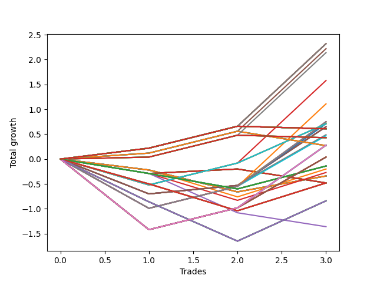

# Long HLT 237 
- Symbol: TSLA
- Date Range: 05/16/2022 - 05/17/2024
- Trading Period: 8:30-12:30
- Number of Trades: 3



| Id. | Name | Win Percent | Profit | Avg Profit / Trade | Avg Time / Trade | Std |      | Name | Win Percent | Profit | Avg Profit / Trade | Avg Time / Trade | Std |
| --- | ---- | ----------- | ------ | ------------------ | ---------------- | --- | ---- | ---- | ----------- | ------ | ------------------ | ---------------- | --- |
| | Sorted By <br> Profit | | | | | | | Sorted By <br> Win Percentage |||||
|0| TP-1.5 180m | 100.00 | 2.32 | 0.77 | 66:00 | 0.63 |     | TP-1.5 180m | 100.00 | 2.32 | 0.77 | 66:00 | 0.63 |
|1| TP-1.5 165m | 100.00 | 2.32 | 0.77 | 66:00 | 0.63 |     | TP-1.5 165m | 100.00 | 2.32 | 0.77 | 66:00 | 0.63 |
|2| TP-1.5 150m | 100.00 | 2.32 | 0.77 | 66:00 | 0.63 |     | TP-1.5 150m | 100.00 | 2.32 | 0.77 | 66:00 | 0.63 |
|3| TP-1.5 135m | 100.00 | 2.32 | 0.77 | 66:00 | 0.63 |     | TP-1.5 135m | 100.00 | 2.32 | 0.77 | 66:00 | 0.63 |
|4| TP-1.5 120m | 100.00 | 2.32 | 0.77 | 66:00 | 0.63 |     | TP-1.5 120m | 100.00 | 2.32 | 0.77 | 66:00 | 0.63 |
|5| TP-1.5 90m | 100.00 | 2.22 | 0.74 | 60:40 | 0.66 |     | TP-1.5 90m | 100.00 | 2.22 | 0.74 | 60:40 | 0.66 |
|6| TP-1.5 105m | 100.00 | 2.14 | 0.71 | 65:40 | 0.69 |     | TP-1.5 105m | 100.00 | 2.14 | 0.71 | 65:40 | 0.69 |
|7| TP-1.5 75m | 66.67 | 1.58 | 0.53 | 55:40 | 0.89 |     | TP-1.5 75m | 66.67 | 1.58 | 0.53 | 55:40 | 0.89 |
|8| TP-1.5 60m | 66.67 | 1.11 | 0.37 | 50:40 | 1.08 |     | TP-1.5 60m | 66.67 | 1.11 | 0.37 | 50:40 | 1.08 |
|9| TP-3 60m | 66.67 | 0.75 | 0.25 | 54:20 | 0.94 |     | TP-3 60m | 66.67 | 0.75 | 0.25 | 54:20 | 0.94 |
|10| TP-2.75 60m | 66.67 | 0.75 | 0.25 | 54:20 | 0.94 |     | TP-2.75 60m | 66.67 | 0.75 | 0.25 | 54:20 | 0.94 |
|11| TP-2.5 60m | 66.67 | 0.75 | 0.25 | 54:20 | 0.94 |     | TP-2.5 60m | 66.67 | 0.75 | 0.25 | 54:20 | 0.94 |
|12| TP-2.25 60m | 66.67 | 0.75 | 0.25 | 54:20 | 0.94 |     | TP-2.25 60m | 66.67 | 0.75 | 0.25 | 54:20 | 0.94 |
|13| TP-2 60m | 66.67 | 0.75 | 0.25 | 54:20 | 0.94 |     | TP-2 60m | 66.67 | 0.75 | 0.25 | 54:20 | 0.94 |
|14| TP-1.75 60m | 66.67 | 0.75 | 0.25 | 54:20 | 0.94 |     | TP-1.75 60m | 66.67 | 0.75 | 0.25 | 54:20 | 0.94 |
|15| TP-1.25 45m | 66.67 | 0.73 | 0.24 | 43:40 | 0.80 |     | TP-1.25 45m | 66.67 | 0.73 | 0.24 | 43:40 | 0.80 |
|16| TP-3 75m | 66.67 | 0.71 | 0.24 | 64:20 | 0.55 |     | TP-3 75m | 66.67 | 0.71 | 0.24 | 64:20 | 0.55 |
|17| TP-2.75 75m | 66.67 | 0.71 | 0.24 | 64:20 | 0.55 |     | TP-2.75 75m | 66.67 | 0.71 | 0.24 | 64:20 | 0.55 |
|18| TP-2.5 75m | 66.67 | 0.71 | 0.24 | 64:20 | 0.55 |     | TP-2.5 75m | 66.67 | 0.71 | 0.24 | 64:20 | 0.55 |
|19| TP-2.25 75m | 66.67 | 0.71 | 0.24 | 64:20 | 0.55 |     | TP-2.25 75m | 66.67 | 0.71 | 0.24 | 64:20 | 0.55 |
|20| TP-2 75m | 66.67 | 0.71 | 0.24 | 64:20 | 0.55 |     | TP-2 75m | 66.67 | 0.71 | 0.24 | 64:20 | 0.55 |
|21| TP-1.75 75m | 66.67 | 0.71 | 0.24 | 64:20 | 0.55 |     | TP-1.75 75m | 66.67 | 0.71 | 0.24 | 64:20 | 0.55 |
|22| TP-1.25 60m | 66.67 | 0.71 | 0.24 | 49:00 | 0.93 |     | TP-1.25 60m | 66.67 | 0.71 | 0.24 | 49:00 | 0.93 |
|23| TP-3 45m | 66.67 | 0.65 | 0.22 | 44:00 | 0.77 |     | TP-3 45m | 66.67 | 0.65 | 0.22 | 44:00 | 0.77 |
|24| TP-2.75 45m | 66.67 | 0.65 | 0.22 | 44:00 | 0.77 |     | TP-2.75 45m | 66.67 | 0.65 | 0.22 | 44:00 | 0.77 |
|25| TP-2.5 45m | 66.67 | 0.65 | 0.22 | 44:00 | 0.77 |     | TP-2.5 45m | 66.67 | 0.65 | 0.22 | 44:00 | 0.77 |
|26| TP-2.25 45m | 66.67 | 0.65 | 0.22 | 44:00 | 0.77 |     | TP-2.25 45m | 66.67 | 0.65 | 0.22 | 44:00 | 0.77 |
|27| TP-2 45m | 66.67 | 0.65 | 0.22 | 44:00 | 0.77 |     | TP-2 45m | 66.67 | 0.65 | 0.22 | 44:00 | 0.77 |
|28| TP-1.75 45m | 66.67 | 0.65 | 0.22 | 44:00 | 0.77 |     | TP-1.75 45m | 66.67 | 0.65 | 0.22 | 44:00 | 0.77 |
|29| TP-1.5 45m | 66.67 | 0.65 | 0.22 | 44:00 | 0.77 |     | TP-1.5 45m | 66.67 | 0.65 | 0.22 | 44:00 | 0.77 |
|30| TP-3 180m | 66.67 | 0.61 | 0.20 | 81:40 | 0.20 |     | TP-3 180m | 66.67 | 0.61 | 0.20 | 81:40 | 0.20 |
|31| TP-2.75 180m | 66.67 | 0.61 | 0.20 | 81:40 | 0.20 |     | TP-2.75 180m | 66.67 | 0.61 | 0.20 | 81:40 | 0.20 |
|32| TP-2.5 180m | 66.67 | 0.61 | 0.20 | 81:40 | 0.20 |     | TP-2.5 180m | 66.67 | 0.61 | 0.20 | 81:40 | 0.20 |
|33| TP-2.25 180m | 66.67 | 0.61 | 0.20 | 81:40 | 0.20 |     | TP-2.25 180m | 66.67 | 0.61 | 0.20 | 81:40 | 0.20 |
|34| TP-2 180m | 66.67 | 0.61 | 0.20 | 81:40 | 0.20 |     | TP-2 180m | 66.67 | 0.61 | 0.20 | 81:40 | 0.20 |
|35| TP-1.75 180m | 66.67 | 0.61 | 0.20 | 81:40 | 0.20 |     | TP-1.75 180m | 66.67 | 0.61 | 0.20 | 81:40 | 0.20 |
|36| TP-3 165m | 66.67 | 0.61 | 0.20 | 81:40 | 0.20 |     | TP-3 165m | 66.67 | 0.61 | 0.20 | 81:40 | 0.20 |
|37| TP-2.75 165m | 66.67 | 0.61 | 0.20 | 81:40 | 0.20 |     | TP-2.75 165m | 66.67 | 0.61 | 0.20 | 81:40 | 0.20 |
|38| TP-2.5 165m | 66.67 | 0.61 | 0.20 | 81:40 | 0.20 |     | TP-2.5 165m | 66.67 | 0.61 | 0.20 | 81:40 | 0.20 |
|39| TP-2.25 165m | 66.67 | 0.61 | 0.20 | 81:40 | 0.20 |     | TP-2.25 165m | 66.67 | 0.61 | 0.20 | 81:40 | 0.20 |
|40| TP-2 165m | 66.67 | 0.61 | 0.20 | 81:40 | 0.20 |     | TP-2 165m | 66.67 | 0.61 | 0.20 | 81:40 | 0.20 |
|41| TP-1.75 165m | 66.67 | 0.61 | 0.20 | 81:40 | 0.20 |     | TP-1.75 165m | 66.67 | 0.61 | 0.20 | 81:40 | 0.20 |
|42| TP-3 150m | 66.67 | 0.61 | 0.20 | 81:40 | 0.20 |     | TP-3 150m | 66.67 | 0.61 | 0.20 | 81:40 | 0.20 |
|43| TP-2.75 150m | 66.67 | 0.61 | 0.20 | 81:40 | 0.20 |     | TP-2.75 150m | 66.67 | 0.61 | 0.20 | 81:40 | 0.20 |
|44| TP-2.5 150m | 66.67 | 0.61 | 0.20 | 81:40 | 0.20 |     | TP-2.5 150m | 66.67 | 0.61 | 0.20 | 81:40 | 0.20 |
|45| TP-2.25 150m | 66.67 | 0.61 | 0.20 | 81:40 | 0.20 |     | TP-2.25 150m | 66.67 | 0.61 | 0.20 | 81:40 | 0.20 |
|46| TP-2 150m | 66.67 | 0.61 | 0.20 | 81:40 | 0.20 |     | TP-2 150m | 66.67 | 0.61 | 0.20 | 81:40 | 0.20 |
|47| TP-1.75 150m | 66.67 | 0.61 | 0.20 | 81:40 | 0.20 |     | TP-1.75 150m | 66.67 | 0.61 | 0.20 | 81:40 | 0.20 |
|48| TP-3 135m | 66.67 | 0.61 | 0.20 | 81:40 | 0.20 |     | TP-3 135m | 66.67 | 0.61 | 0.20 | 81:40 | 0.20 |
|49| TP-2.75 135m | 66.67 | 0.61 | 0.20 | 81:40 | 0.20 |     | TP-2.75 135m | 66.67 | 0.61 | 0.20 | 81:40 | 0.20 |
|50| TP-2.5 135m | 66.67 | 0.61 | 0.20 | 81:40 | 0.20 |     | TP-2.5 135m | 66.67 | 0.61 | 0.20 | 81:40 | 0.20 |
|51| TP-2.25 135m | 66.67 | 0.61 | 0.20 | 81:40 | 0.20 |     | TP-2.25 135m | 66.67 | 0.61 | 0.20 | 81:40 | 0.20 |
|52| TP-2 135m | 66.67 | 0.61 | 0.20 | 81:40 | 0.20 |     | TP-2 135m | 66.67 | 0.61 | 0.20 | 81:40 | 0.20 |
|53| TP-1.75 135m | 66.67 | 0.61 | 0.20 | 81:40 | 0.20 |     | TP-1.75 135m | 66.67 | 0.61 | 0.20 | 81:40 | 0.20 |
|54| TP-3 120m | 66.67 | 0.61 | 0.20 | 81:40 | 0.20 |     | TP-3 120m | 66.67 | 0.61 | 0.20 | 81:40 | 0.20 |
|55| TP-2.75 120m | 66.67 | 0.61 | 0.20 | 81:40 | 0.20 |     | TP-2.75 120m | 66.67 | 0.61 | 0.20 | 81:40 | 0.20 |
|56| TP-2.5 120m | 66.67 | 0.61 | 0.20 | 81:40 | 0.20 |     | TP-2.5 120m | 66.67 | 0.61 | 0.20 | 81:40 | 0.20 |
|57| TP-2.25 120m | 66.67 | 0.61 | 0.20 | 81:40 | 0.20 |     | TP-2.25 120m | 66.67 | 0.61 | 0.20 | 81:40 | 0.20 |
|58| TP-2 120m | 66.67 | 0.61 | 0.20 | 81:40 | 0.20 |     | TP-2 120m | 66.67 | 0.61 | 0.20 | 81:40 | 0.20 |
|59| TP-1.75 120m | 66.67 | 0.61 | 0.20 | 81:40 | 0.20 |     | TP-1.75 120m | 66.67 | 0.61 | 0.20 | 81:40 | 0.20 |
|60| TP-1 45m | 66.67 | 0.49 | 0.16 | 43:20 | 0.70 |     | TP-1 45m | 66.67 | 0.49 | 0.16 | 43:20 | 0.70 |
|61| TP-1 60m | 66.67 | 0.47 | 0.16 | 48:40 | 0.84 |     | TP-1 60m | 66.67 | 0.47 | 0.16 | 48:40 | 0.84 |
|62| TP-3 105m | 66.67 | 0.43 | 0.14 | 81:20 | 0.21 |     | TP-3 105m | 66.67 | 0.43 | 0.14 | 81:20 | 0.21 |
|63| TP-2.75 105m | 66.67 | 0.43 | 0.14 | 81:20 | 0.21 |     | TP-2.75 105m | 66.67 | 0.43 | 0.14 | 81:20 | 0.21 |
|64| TP-2.5 105m | 66.67 | 0.43 | 0.14 | 81:20 | 0.21 |     | TP-2.5 105m | 66.67 | 0.43 | 0.14 | 81:20 | 0.21 |
|65| TP-2.25 105m | 66.67 | 0.43 | 0.14 | 81:20 | 0.21 |     | TP-2.25 105m | 66.67 | 0.43 | 0.14 | 81:20 | 0.21 |
|66| TP-2 105m | 66.67 | 0.43 | 0.14 | 81:20 | 0.21 |     | TP-2 105m | 66.67 | 0.43 | 0.14 | 81:20 | 0.21 |
|67| TP-1.75 105m | 66.67 | 0.43 | 0.14 | 81:20 | 0.21 |     | TP-1.75 105m | 66.67 | 0.43 | 0.14 | 81:20 | 0.21 |
|68| TP-1.25 180m | 66.67 | 0.28 | 0.09 | 49:20 | 1.12 |     | TP-1.25 180m | 66.67 | 0.28 | 0.09 | 49:20 | 1.12 |
|69| TP-1.25 165m | 66.67 | 0.28 | 0.09 | 49:20 | 1.12 |     | TP-1.25 165m | 66.67 | 0.28 | 0.09 | 49:20 | 1.12 |
|70| TP-1.25 150m | 66.67 | 0.28 | 0.09 | 49:20 | 1.12 |     | TP-1.25 150m | 66.67 | 0.28 | 0.09 | 49:20 | 1.12 |
|71| TP-1.25 135m | 66.67 | 0.28 | 0.09 | 49:20 | 1.12 |     | TP-1.25 135m | 66.67 | 0.28 | 0.09 | 49:20 | 1.12 |
|72| TP-1.25 120m | 66.67 | 0.28 | 0.09 | 49:20 | 1.12 |     | TP-1.25 120m | 66.67 | 0.28 | 0.09 | 49:20 | 1.12 |
|73| TP-1.25 105m | 66.67 | 0.28 | 0.09 | 49:20 | 1.12 |     | TP-1.25 105m | 66.67 | 0.28 | 0.09 | 49:20 | 1.12 |
|74| TP-1.25 90m | 66.67 | 0.28 | 0.09 | 49:20 | 1.12 |     | TP-1.25 90m | 66.67 | 0.28 | 0.09 | 49:20 | 1.12 |
|75| TP-1.25 75m | 66.67 | 0.28 | 0.09 | 49:20 | 1.12 |     | TP-1.25 75m | 66.67 | 0.28 | 0.09 | 49:20 | 1.12 |
|76| TP-3 90m | 66.67 | 0.27 | 0.09 | 74:20 | 0.30 |     | TP-3 90m | 66.67 | 0.27 | 0.09 | 74:20 | 0.30 |
|77| TP-2.75 90m | 66.67 | 0.27 | 0.09 | 74:20 | 0.30 |     | TP-2.75 90m | 66.67 | 0.27 | 0.09 | 74:20 | 0.30 |
|78| TP-2.5 90m | 66.67 | 0.27 | 0.09 | 74:20 | 0.30 |     | TP-2.5 90m | 66.67 | 0.27 | 0.09 | 74:20 | 0.30 |
|79| TP-2.25 90m | 66.67 | 0.27 | 0.09 | 74:20 | 0.30 |     | TP-2.25 90m | 66.67 | 0.27 | 0.09 | 74:20 | 0.30 |
|80| TP-2 90m | 66.67 | 0.27 | 0.09 | 74:20 | 0.30 |     | TP-2 90m | 66.67 | 0.27 | 0.09 | 74:20 | 0.30 |
|81| TP-1.75 90m | 66.67 | 0.27 | 0.09 | 74:20 | 0.30 |     | TP-1.75 90m | 66.67 | 0.27 | 0.09 | 74:20 | 0.30 |
|82| TP-1 180m | 66.67 | 0.04 | 0.01 | 49:00 | 1.04 |     | TP-1 180m | 66.67 | 0.04 | 0.01 | 49:00 | 1.04 |
|83| TP-1 165m | 66.67 | 0.04 | 0.01 | 49:00 | 1.04 |     | TP-1 165m | 66.67 | 0.04 | 0.01 | 49:00 | 1.04 |
|84| TP-1 150m | 66.67 | 0.04 | 0.01 | 49:00 | 1.04 |     | TP-1 150m | 66.67 | 0.04 | 0.01 | 49:00 | 1.04 |
|85| TP-1 135m | 66.67 | 0.04 | 0.01 | 49:00 | 1.04 |     | TP-1 135m | 66.67 | 0.04 | 0.01 | 49:00 | 1.04 |
|86| TP-1 120m | 66.67 | 0.04 | 0.01 | 49:00 | 1.04 |     | TP-1 120m | 66.67 | 0.04 | 0.01 | 49:00 | 1.04 |
|87| TP-1 105m | 66.67 | 0.04 | 0.01 | 49:00 | 1.04 |     | TP-1 105m | 66.67 | 0.04 | 0.01 | 49:00 | 1.04 |
|88| TP-1 90m | 66.67 | 0.04 | 0.01 | 49:00 | 1.04 |     | TP-1 90m | 66.67 | 0.04 | 0.01 | 49:00 | 1.04 |
|89| TP-1 75m | 66.67 | 0.04 | 0.01 | 49:00 | 1.04 |     | TP-1 75m | 66.67 | 0.04 | 0.01 | 49:00 | 1.04 |
|90| TP-0.25 180m | 33.33 | -0.14 | -0.05 | 04:00 | 0.36 |     | TP-0.25 180m | 33.33 | -0.14 | -0.05 | 04:00 | 0.36 |
|91| TP-0.25 165m | 33.33 | -0.14 | -0.05 | 04:00 | 0.36 |     | TP-0.25 165m | 33.33 | -0.14 | -0.05 | 04:00 | 0.36 |
|92| TP-0.25 150m | 33.33 | -0.14 | -0.05 | 04:00 | 0.36 |     | TP-0.25 150m | 33.33 | -0.14 | -0.05 | 04:00 | 0.36 |
|93| TP-0.25 135m | 33.33 | -0.14 | -0.05 | 04:00 | 0.36 |     | TP-0.25 135m | 33.33 | -0.14 | -0.05 | 04:00 | 0.36 |
|94| TP-0.25 120m | 33.33 | -0.14 | -0.05 | 04:00 | 0.36 |     | TP-0.25 120m | 33.33 | -0.14 | -0.05 | 04:00 | 0.36 |
|95| TP-0.25 105m | 33.33 | -0.14 | -0.05 | 04:00 | 0.36 |     | TP-0.25 105m | 33.33 | -0.14 | -0.05 | 04:00 | 0.36 |
|96| TP-0.25 90m | 33.33 | -0.14 | -0.05 | 04:00 | 0.36 |     | TP-0.25 90m | 33.33 | -0.14 | -0.05 | 04:00 | 0.36 |
|97| TP-0.25 75m | 33.33 | -0.14 | -0.05 | 04:00 | 0.36 |     | TP-0.25 75m | 33.33 | -0.14 | -0.05 | 04:00 | 0.36 |
|98| TP-0.25 60m | 33.33 | -0.14 | -0.05 | 04:00 | 0.36 |     | TP-0.25 60m | 33.33 | -0.14 | -0.05 | 04:00 | 0.36 |
|99| TP-0.25 45m | 33.33 | -0.14 | -0.05 | 04:00 | 0.36 |     | TP-0.25 45m | 33.33 | -0.14 | -0.05 | 04:00 | 0.36 |
|100| TP-0.25 30m | 33.33 | -0.14 | -0.05 | 04:00 | 0.36 |     | TP-0.25 30m | 33.33 | -0.14 | -0.05 | 04:00 | 0.36 |
|101| TP-0.25 15m | 33.33 | -0.14 | -0.05 | 04:00 | 0.36 |     | TP-0.25 15m | 33.33 | -0.14 | -0.05 | 04:00 | 0.36 |
|102| TP-0.5 15m | 33.33 | -0.20 | -0.07 | 08:40 | 0.46 |     | TP-0.5 15m | 33.33 | -0.20 | -0.07 | 08:40 | 0.46 |
|103| TP-0.5 30m | 33.33 | -0.27 | -0.09 | 13:40 | 0.47 |     | TP-0.5 30m | 33.33 | -0.27 | -0.09 | 13:40 | 0.47 |
|104| TP-3 15m | 33.33 | -0.34 | -0.11 | 14:00 | 0.32 |     | TP-3 15m | 33.33 | -0.34 | -0.11 | 14:00 | 0.32 |
|105| TP-2.75 15m | 33.33 | -0.34 | -0.11 | 14:00 | 0.32 |     | TP-2.75 15m | 33.33 | -0.34 | -0.11 | 14:00 | 0.32 |
|106| TP-2.5 15m | 33.33 | -0.34 | -0.11 | 14:00 | 0.32 |     | TP-2.5 15m | 33.33 | -0.34 | -0.11 | 14:00 | 0.32 |
|107| TP-2.25 15m | 33.33 | -0.34 | -0.11 | 14:00 | 0.32 |     | TP-2.25 15m | 33.33 | -0.34 | -0.11 | 14:00 | 0.32 |
|108| TP-2 15m | 33.33 | -0.34 | -0.11 | 14:00 | 0.32 |     | TP-2 15m | 33.33 | -0.34 | -0.11 | 14:00 | 0.32 |
|109| TP-1.75 15m | 33.33 | -0.34 | -0.11 | 14:00 | 0.32 |     | TP-1.75 15m | 33.33 | -0.34 | -0.11 | 14:00 | 0.32 |
|110| TP-1.5 15m | 33.33 | -0.34 | -0.11 | 14:00 | 0.32 |     | TP-1.5 15m | 33.33 | -0.34 | -0.11 | 14:00 | 0.32 |
|111| TP-1.25 15m | 33.33 | -0.34 | -0.11 | 14:00 | 0.32 |     | TP-1.25 15m | 33.33 | -0.34 | -0.11 | 14:00 | 0.32 |
|112| TP-1 15m | 33.33 | -0.34 | -0.11 | 14:00 | 0.32 |     | TP-1 15m | 33.33 | -0.34 | -0.11 | 14:00 | 0.32 |
|113| TP-0.75 15m | 33.33 | -0.34 | -0.11 | 14:00 | 0.32 |     | TP-0.75 15m | 33.33 | -0.34 | -0.11 | 14:00 | 0.32 |
|114| TP-0.5 180m | 33.33 | -0.48 | -0.16 | 14:20 | 0.51 |     | TP-0.5 180m | 33.33 | -0.48 | -0.16 | 14:20 | 0.51 |
|115| TP-0.5 165m | 33.33 | -0.48 | -0.16 | 14:20 | 0.51 |     | TP-0.5 165m | 33.33 | -0.48 | -0.16 | 14:20 | 0.51 |
|116| TP-0.5 150m | 33.33 | -0.48 | -0.16 | 14:20 | 0.51 |     | TP-0.5 150m | 33.33 | -0.48 | -0.16 | 14:20 | 0.51 |
|117| TP-0.5 135m | 33.33 | -0.48 | -0.16 | 14:20 | 0.51 |     | TP-0.5 135m | 33.33 | -0.48 | -0.16 | 14:20 | 0.51 |
|118| TP-0.5 120m | 33.33 | -0.48 | -0.16 | 14:20 | 0.51 |     | TP-0.5 120m | 33.33 | -0.48 | -0.16 | 14:20 | 0.51 |
|119| TP-0.5 105m | 33.33 | -0.48 | -0.16 | 14:20 | 0.51 |     | TP-0.5 105m | 33.33 | -0.48 | -0.16 | 14:20 | 0.51 |
|120| TP-0.5 90m | 33.33 | -0.48 | -0.16 | 14:20 | 0.51 |     | TP-0.5 90m | 33.33 | -0.48 | -0.16 | 14:20 | 0.51 |
|121| TP-0.5 75m | 33.33 | -0.48 | -0.16 | 14:20 | 0.51 |     | TP-0.5 75m | 33.33 | -0.48 | -0.16 | 14:20 | 0.51 |
|122| TP-0.5 60m | 33.33 | -0.48 | -0.16 | 14:20 | 0.51 |     | TP-0.5 60m | 33.33 | -0.48 | -0.16 | 14:20 | 0.51 |
|123| TP-0.5 45m | 33.33 | -0.48 | -0.16 | 14:20 | 0.51 |     | TP-0.5 45m | 33.33 | -0.48 | -0.16 | 14:20 | 0.51 |
|124| TP-3 30m | 33.33 | -0.48 | -0.16 | 29:00 | 0.18 |     | TP-3 30m | 33.33 | -0.48 | -0.16 | 29:00 | 0.18 |
|125| TP-2.75 30m | 33.33 | -0.48 | -0.16 | 29:00 | 0.18 |     | TP-2.75 30m | 33.33 | -0.48 | -0.16 | 29:00 | 0.18 |
|126| TP-2.5 30m | 33.33 | -0.48 | -0.16 | 29:00 | 0.18 |     | TP-2.5 30m | 33.33 | -0.48 | -0.16 | 29:00 | 0.18 |
|127| TP-2.25 30m | 33.33 | -0.48 | -0.16 | 29:00 | 0.18 |     | TP-2.25 30m | 33.33 | -0.48 | -0.16 | 29:00 | 0.18 |
|128| TP-2 30m | 33.33 | -0.48 | -0.16 | 29:00 | 0.18 |     | TP-2 30m | 33.33 | -0.48 | -0.16 | 29:00 | 0.18 |
|129| TP-1.75 30m | 33.33 | -0.48 | -0.16 | 29:00 | 0.18 |     | TP-1.75 30m | 33.33 | -0.48 | -0.16 | 29:00 | 0.18 |
|130| TP-1.5 30m | 33.33 | -0.48 | -0.16 | 29:00 | 0.18 |     | TP-1.5 30m | 33.33 | -0.48 | -0.16 | 29:00 | 0.18 |
|131| TP-1.25 30m | 33.33 | -0.48 | -0.16 | 29:00 | 0.18 |     | TP-1.25 30m | 33.33 | -0.48 | -0.16 | 29:00 | 0.18 |
|132| TP-1 30m | 33.33 | -0.48 | -0.16 | 29:00 | 0.18 |     | TP-1 30m | 33.33 | -0.48 | -0.16 | 29:00 | 0.18 |
|133| TP-0.75 180m | 33.33 | -0.84 | -0.28 | 33:00 | 0.77 |     | TP-0.75 180m | 33.33 | -0.84 | -0.28 | 33:00 | 0.77 |
|134| TP-0.75 165m | 33.33 | -0.84 | -0.28 | 33:00 | 0.77 |     | TP-0.75 165m | 33.33 | -0.84 | -0.28 | 33:00 | 0.77 |
|135| TP-0.75 150m | 33.33 | -0.84 | -0.28 | 33:00 | 0.77 |     | TP-0.75 150m | 33.33 | -0.84 | -0.28 | 33:00 | 0.77 |
|136| TP-0.75 135m | 33.33 | -0.84 | -0.28 | 33:00 | 0.77 |     | TP-0.75 135m | 33.33 | -0.84 | -0.28 | 33:00 | 0.77 |
|137| TP-0.75 120m | 33.33 | -0.84 | -0.28 | 33:00 | 0.77 |     | TP-0.75 120m | 33.33 | -0.84 | -0.28 | 33:00 | 0.77 |
|138| TP-0.75 105m | 33.33 | -0.84 | -0.28 | 33:00 | 0.77 |     | TP-0.75 105m | 33.33 | -0.84 | -0.28 | 33:00 | 0.77 |
|139| TP-0.75 90m | 33.33 | -0.84 | -0.28 | 33:00 | 0.77 |     | TP-0.75 90m | 33.33 | -0.84 | -0.28 | 33:00 | 0.77 |
|140| TP-0.75 75m | 33.33 | -0.84 | -0.28 | 33:00 | 0.77 |     | TP-0.75 75m | 33.33 | -0.84 | -0.28 | 33:00 | 0.77 |
|141| TP-0.75 60m | 33.33 | -0.84 | -0.28 | 33:00 | 0.77 |     | TP-0.75 60m | 33.33 | -0.84 | -0.28 | 33:00 | 0.77 |
|142| TP-0.75 45m | 33.33 | -0.84 | -0.28 | 33:00 | 0.77 |     | TP-0.75 45m | 33.33 | -0.84 | -0.28 | 33:00 | 0.77 |
|143| TP-0.75 30m | 0.00 | -1.36 | -0.45 | 25:40 | 0.24 |     | TP-0.75 30m | 0.00 | -1.36 | -0.45 | 25:40 | 0.24 |

### Test TP-0.25 15m
* Take Profit of 0.25 Point
* 0.25 Stoploss
* Results:
```
Total Trades: 3
Percent Up: 33.33
Percent Down: 66.67
Total Points Moved Up: -0.14
Potential Profit: -70.00
Total Points Ups: 0.46 Count Ups: 1
Total Points Downs: -0.60 Count Downs: 2
```

<details><summary>Trades</summary>

<code>In: 2022-11-29 11:05:00		Out: 2022-11-29 11:07:00		Total Position Time: 02:00		Total Move Up: -0.29		Total to Date: -0.29</code> <br />
<code>In: 2023-10-19 12:05:00		Out: 2023-10-19 12:13:00		Total Position Time: 08:00		Total Move Up: -0.31		Total to Date: -0.60</code> <br />
<code>In: 2023-12-05 11:15:00		Out: 2023-12-05 11:17:00		Total Position Time: 02:00		Total Move Up: 0.46		Total to Date: -0.14</code> <br />


</details>

### Test TP-0.5 15m
* Take Profit of 0.5 Point
* 0.5 Stoploss
* Results:
```
Total Trades: 3
Percent Up: 33.33
Percent Down: 66.67
Total Points Moved Up: -0.20
Potential Profit: -100.00
Total Points Ups: 0.56 Count Ups: 1
Total Points Downs: -0.76 Count Downs: 2
```

<details><summary>Trades</summary>

<code>In: 2022-11-29 11:05:00		Out: 2022-11-29 11:19:00		Total Position Time: 14:00		Total Move Up: -0.22		Total to Date: -0.22</code> <br />
<code>In: 2023-10-19 12:05:00		Out: 2023-10-19 12:14:00		Total Position Time: 09:00		Total Move Up: -0.54		Total to Date: -0.76</code> <br />
<code>In: 2023-12-05 11:15:00		Out: 2023-12-05 11:18:00		Total Position Time: 03:00		Total Move Up: 0.56		Total to Date: -0.20</code> <br />


</details>

### Test TP-0.75 15m
* Take Profit of 0.75 Point
* 0.75 Stoploss
* Results:
```
Total Trades: 3
Percent Up: 33.33
Percent Down: 66.67
Total Points Moved Up: -0.34
Potential Profit: -170.00
Total Points Ups: 0.32 Count Ups: 1
Total Points Downs: -0.66 Count Downs: 2
```

<details><summary>Trades</summary>

<code>In: 2022-11-29 11:05:00		Out: 2022-11-29 11:19:00		Total Position Time: 14:00		Total Move Up: -0.22		Total to Date: -0.22</code> <br />
<code>In: 2023-10-19 12:05:00		Out: 2023-10-19 12:19:00		Total Position Time: 14:00		Total Move Up: -0.44		Total to Date: -0.66</code> <br />
<code>In: 2023-12-05 11:15:00		Out: 2023-12-05 11:29:00		Total Position Time: 14:00		Total Move Up: 0.32		Total to Date: -0.34</code> <br />


</details>

### Test TP-1 15m
* Take Profit of 1 Point
* 1 Stoploss
* Results:
```
Total Trades: 3
Percent Up: 33.33
Percent Down: 66.67
Total Points Moved Up: -0.34
Potential Profit: -170.00
Total Points Ups: 0.32 Count Ups: 1
Total Points Downs: -0.66 Count Downs: 2
```

<details><summary>Trades</summary>

<code>In: 2022-11-29 11:05:00		Out: 2022-11-29 11:19:00		Total Position Time: 14:00		Total Move Up: -0.22		Total to Date: -0.22</code> <br />
<code>In: 2023-10-19 12:05:00		Out: 2023-10-19 12:19:00		Total Position Time: 14:00		Total Move Up: -0.44		Total to Date: -0.66</code> <br />
<code>In: 2023-12-05 11:15:00		Out: 2023-12-05 11:29:00		Total Position Time: 14:00		Total Move Up: 0.32		Total to Date: -0.34</code> <br />


</details>

### Test TP-1.25 15m
* Take Profit of 1.25 Point
* 1.25 Stoploss
* Results:
```
Total Trades: 3
Percent Up: 33.33
Percent Down: 66.67
Total Points Moved Up: -0.34
Potential Profit: -170.00
Total Points Ups: 0.32 Count Ups: 1
Total Points Downs: -0.66 Count Downs: 2
```

<details><summary>Trades</summary>

<code>In: 2022-11-29 11:05:00		Out: 2022-11-29 11:19:00		Total Position Time: 14:00		Total Move Up: -0.22		Total to Date: -0.22</code> <br />
<code>In: 2023-10-19 12:05:00		Out: 2023-10-19 12:19:00		Total Position Time: 14:00		Total Move Up: -0.44		Total to Date: -0.66</code> <br />
<code>In: 2023-12-05 11:15:00		Out: 2023-12-05 11:29:00		Total Position Time: 14:00		Total Move Up: 0.32		Total to Date: -0.34</code> <br />


</details>

### Test TP-1.5 15m
* Take Profit of 1.5 Point
* 1.5 Stoploss
* Results:
```
Total Trades: 3
Percent Up: 33.33
Percent Down: 66.67
Total Points Moved Up: -0.34
Potential Profit: -170.00
Total Points Ups: 0.32 Count Ups: 1
Total Points Downs: -0.66 Count Downs: 2
```

<details><summary>Trades</summary>

<code>In: 2022-11-29 11:05:00		Out: 2022-11-29 11:19:00		Total Position Time: 14:00		Total Move Up: -0.22		Total to Date: -0.22</code> <br />
<code>In: 2023-10-19 12:05:00		Out: 2023-10-19 12:19:00		Total Position Time: 14:00		Total Move Up: -0.44		Total to Date: -0.66</code> <br />
<code>In: 2023-12-05 11:15:00		Out: 2023-12-05 11:29:00		Total Position Time: 14:00		Total Move Up: 0.32		Total to Date: -0.34</code> <br />


</details>

### Test TP-1.75 15m
* Take Profit of 1.75 Point
* 1.75 Stoploss
* Results:
```
Total Trades: 3
Percent Up: 33.33
Percent Down: 66.67
Total Points Moved Up: -0.34
Potential Profit: -170.00
Total Points Ups: 0.32 Count Ups: 1
Total Points Downs: -0.66 Count Downs: 2
```

<details><summary>Trades</summary>

<code>In: 2022-11-29 11:05:00		Out: 2022-11-29 11:19:00		Total Position Time: 14:00		Total Move Up: -0.22		Total to Date: -0.22</code> <br />
<code>In: 2023-10-19 12:05:00		Out: 2023-10-19 12:19:00		Total Position Time: 14:00		Total Move Up: -0.44		Total to Date: -0.66</code> <br />
<code>In: 2023-12-05 11:15:00		Out: 2023-12-05 11:29:00		Total Position Time: 14:00		Total Move Up: 0.32		Total to Date: -0.34</code> <br />


</details>

### Test TP-2 15m
* Take Profit of 2 Point
* 2 Stoploss
* Results:
```
Total Trades: 3
Percent Up: 33.33
Percent Down: 66.67
Total Points Moved Up: -0.34
Potential Profit: -170.00
Total Points Ups: 0.32 Count Ups: 1
Total Points Downs: -0.66 Count Downs: 2
```

<details><summary>Trades</summary>

<code>In: 2022-11-29 11:05:00		Out: 2022-11-29 11:19:00		Total Position Time: 14:00		Total Move Up: -0.22		Total to Date: -0.22</code> <br />
<code>In: 2023-10-19 12:05:00		Out: 2023-10-19 12:19:00		Total Position Time: 14:00		Total Move Up: -0.44		Total to Date: -0.66</code> <br />
<code>In: 2023-12-05 11:15:00		Out: 2023-12-05 11:29:00		Total Position Time: 14:00		Total Move Up: 0.32		Total to Date: -0.34</code> <br />


</details>

### Test TP-2.25 15m
* Take Profit of 2.25 Point
* 2.25 Stoploss
* Results:
```
Total Trades: 3
Percent Up: 33.33
Percent Down: 66.67
Total Points Moved Up: -0.34
Potential Profit: -170.00
Total Points Ups: 0.32 Count Ups: 1
Total Points Downs: -0.66 Count Downs: 2
```

<details><summary>Trades</summary>

<code>In: 2022-11-29 11:05:00		Out: 2022-11-29 11:19:00		Total Position Time: 14:00		Total Move Up: -0.22		Total to Date: -0.22</code> <br />
<code>In: 2023-10-19 12:05:00		Out: 2023-10-19 12:19:00		Total Position Time: 14:00		Total Move Up: -0.44		Total to Date: -0.66</code> <br />
<code>In: 2023-12-05 11:15:00		Out: 2023-12-05 11:29:00		Total Position Time: 14:00		Total Move Up: 0.32		Total to Date: -0.34</code> <br />


</details>

### Test TP-2.5 15m
* Take Profit of 2.5 Point
* 2.5 Stoploss
* Results:
```
Total Trades: 3
Percent Up: 33.33
Percent Down: 66.67
Total Points Moved Up: -0.34
Potential Profit: -170.00
Total Points Ups: 0.32 Count Ups: 1
Total Points Downs: -0.66 Count Downs: 2
```

<details><summary>Trades</summary>

<code>In: 2022-11-29 11:05:00		Out: 2022-11-29 11:19:00		Total Position Time: 14:00		Total Move Up: -0.22		Total to Date: -0.22</code> <br />
<code>In: 2023-10-19 12:05:00		Out: 2023-10-19 12:19:00		Total Position Time: 14:00		Total Move Up: -0.44		Total to Date: -0.66</code> <br />
<code>In: 2023-12-05 11:15:00		Out: 2023-12-05 11:29:00		Total Position Time: 14:00		Total Move Up: 0.32		Total to Date: -0.34</code> <br />


</details>

### Test TP-2.75 15m
* Take Profit of 2.75 Point
* 2.75 Stoploss
* Results:
```
Total Trades: 3
Percent Up: 33.33
Percent Down: 66.67
Total Points Moved Up: -0.34
Potential Profit: -170.00
Total Points Ups: 0.32 Count Ups: 1
Total Points Downs: -0.66 Count Downs: 2
```

<details><summary>Trades</summary>

<code>In: 2022-11-29 11:05:00		Out: 2022-11-29 11:19:00		Total Position Time: 14:00		Total Move Up: -0.22		Total to Date: -0.22</code> <br />
<code>In: 2023-10-19 12:05:00		Out: 2023-10-19 12:19:00		Total Position Time: 14:00		Total Move Up: -0.44		Total to Date: -0.66</code> <br />
<code>In: 2023-12-05 11:15:00		Out: 2023-12-05 11:29:00		Total Position Time: 14:00		Total Move Up: 0.32		Total to Date: -0.34</code> <br />


</details>

### Test TP-3 15m
* Take Profit of 3 Point
* 3 Stoploss
* Results:
```
Total Trades: 3
Percent Up: 33.33
Percent Down: 66.67
Total Points Moved Up: -0.34
Potential Profit: -170.00
Total Points Ups: 0.32 Count Ups: 1
Total Points Downs: -0.66 Count Downs: 2
```

<details><summary>Trades</summary>

<code>In: 2022-11-29 11:05:00		Out: 2022-11-29 11:19:00		Total Position Time: 14:00		Total Move Up: -0.22		Total to Date: -0.22</code> <br />
<code>In: 2023-10-19 12:05:00		Out: 2023-10-19 12:19:00		Total Position Time: 14:00		Total Move Up: -0.44		Total to Date: -0.66</code> <br />
<code>In: 2023-12-05 11:15:00		Out: 2023-12-05 11:29:00		Total Position Time: 14:00		Total Move Up: 0.32		Total to Date: -0.34</code> <br />


</details>

### Test TP-0.25 30m
* Take Profit of 0.25 Point
* 0.25 Stoploss
* Results:
```
Total Trades: 3
Percent Up: 33.33
Percent Down: 66.67
Total Points Moved Up: -0.14
Potential Profit: -70.00
Total Points Ups: 0.46 Count Ups: 1
Total Points Downs: -0.60 Count Downs: 2
```

<details><summary>Trades</summary>

<code>In: 2022-11-29 11:05:00		Out: 2022-11-29 11:07:00		Total Position Time: 02:00		Total Move Up: -0.29		Total to Date: -0.29</code> <br />
<code>In: 2023-10-19 12:05:00		Out: 2023-10-19 12:13:00		Total Position Time: 08:00		Total Move Up: -0.31		Total to Date: -0.60</code> <br />
<code>In: 2023-12-05 11:15:00		Out: 2023-12-05 11:17:00		Total Position Time: 02:00		Total Move Up: 0.46		Total to Date: -0.14</code> <br />


</details>

### Test TP-0.5 30m
* Take Profit of 0.5 Point
* 0.5 Stoploss
* Results:
```
Total Trades: 3
Percent Up: 33.33
Percent Down: 66.67
Total Points Moved Up: -0.27
Potential Profit: -135.00
Total Points Ups: 0.56 Count Ups: 1
Total Points Downs: -0.83 Count Downs: 2
```

<details><summary>Trades</summary>

<code>In: 2022-11-29 11:05:00		Out: 2022-11-29 11:34:00		Total Position Time: 29:00		Total Move Up: -0.29		Total to Date: -0.29</code> <br />
<code>In: 2023-10-19 12:05:00		Out: 2023-10-19 12:14:00		Total Position Time: 09:00		Total Move Up: -0.54		Total to Date: -0.83</code> <br />
<code>In: 2023-12-05 11:15:00		Out: 2023-12-05 11:18:00		Total Position Time: 03:00		Total Move Up: 0.56		Total to Date: -0.27</code> <br />


</details>

### Test TP-0.75 30m
* Take Profit of 0.75 Point
* 0.75 Stoploss
* Results:
```
Total Trades: 3
Percent Up: 0.00
Percent Down: 100.00
Total Points Moved Up: -1.36
Potential Profit: -680.00
Total Points Ups: 0.00 Count Ups: 0
Total Points Downs: -1.36 Count Downs: 3
```

<details><summary>Trades</summary>

<code>In: 2022-11-29 11:05:00		Out: 2022-11-29 11:34:00		Total Position Time: 29:00		Total Move Up: -0.29		Total to Date: -0.29</code> <br />
<code>In: 2023-10-19 12:05:00		Out: 2023-10-19 12:24:00		Total Position Time: 19:00		Total Move Up: -0.79		Total to Date: -1.08</code> <br />
<code>In: 2023-12-05 11:15:00		Out: 2023-12-05 11:44:00		Total Position Time: 29:00		Total Move Up: -0.28		Total to Date: -1.36</code> <br />


</details>

### Test TP-1 30m
* Take Profit of 1 Point
* 1 Stoploss
* Results:
```
Total Trades: 3
Percent Up: 33.33
Percent Down: 66.67
Total Points Moved Up: -0.48
Potential Profit: -240.00
Total Points Ups: 0.09 Count Ups: 1
Total Points Downs: -0.57 Count Downs: 2
```

<details><summary>Trades</summary>

<code>In: 2022-11-29 11:05:00		Out: 2022-11-29 11:34:00		Total Position Time: 29:00		Total Move Up: -0.29		Total to Date: -0.29</code> <br />
<code>In: 2023-10-19 12:05:00		Out: 2023-10-19 12:34:00		Total Position Time: 29:00		Total Move Up: 0.09		Total to Date: -0.20</code> <br />
<code>In: 2023-12-05 11:15:00		Out: 2023-12-05 11:44:00		Total Position Time: 29:00		Total Move Up: -0.28		Total to Date: -0.48</code> <br />


</details>

### Test TP-1.25 30m
* Take Profit of 1.25 Point
* 1.25 Stoploss
* Results:
```
Total Trades: 3
Percent Up: 33.33
Percent Down: 66.67
Total Points Moved Up: -0.48
Potential Profit: -240.00
Total Points Ups: 0.09 Count Ups: 1
Total Points Downs: -0.57 Count Downs: 2
```

<details><summary>Trades</summary>

<code>In: 2022-11-29 11:05:00		Out: 2022-11-29 11:34:00		Total Position Time: 29:00		Total Move Up: -0.29		Total to Date: -0.29</code> <br />
<code>In: 2023-10-19 12:05:00		Out: 2023-10-19 12:34:00		Total Position Time: 29:00		Total Move Up: 0.09		Total to Date: -0.20</code> <br />
<code>In: 2023-12-05 11:15:00		Out: 2023-12-05 11:44:00		Total Position Time: 29:00		Total Move Up: -0.28		Total to Date: -0.48</code> <br />


</details>

### Test TP-1.5 30m
* Take Profit of 1.5 Point
* 1.5 Stoploss
* Results:
```
Total Trades: 3
Percent Up: 33.33
Percent Down: 66.67
Total Points Moved Up: -0.48
Potential Profit: -240.00
Total Points Ups: 0.09 Count Ups: 1
Total Points Downs: -0.57 Count Downs: 2
```

<details><summary>Trades</summary>

<code>In: 2022-11-29 11:05:00		Out: 2022-11-29 11:34:00		Total Position Time: 29:00		Total Move Up: -0.29		Total to Date: -0.29</code> <br />
<code>In: 2023-10-19 12:05:00		Out: 2023-10-19 12:34:00		Total Position Time: 29:00		Total Move Up: 0.09		Total to Date: -0.20</code> <br />
<code>In: 2023-12-05 11:15:00		Out: 2023-12-05 11:44:00		Total Position Time: 29:00		Total Move Up: -0.28		Total to Date: -0.48</code> <br />


</details>

### Test TP-1.75 30m
* Take Profit of 1.75 Point
* 1.75 Stoploss
* Results:
```
Total Trades: 3
Percent Up: 33.33
Percent Down: 66.67
Total Points Moved Up: -0.48
Potential Profit: -240.00
Total Points Ups: 0.09 Count Ups: 1
Total Points Downs: -0.57 Count Downs: 2
```

<details><summary>Trades</summary>

<code>In: 2022-11-29 11:05:00		Out: 2022-11-29 11:34:00		Total Position Time: 29:00		Total Move Up: -0.29		Total to Date: -0.29</code> <br />
<code>In: 2023-10-19 12:05:00		Out: 2023-10-19 12:34:00		Total Position Time: 29:00		Total Move Up: 0.09		Total to Date: -0.20</code> <br />
<code>In: 2023-12-05 11:15:00		Out: 2023-12-05 11:44:00		Total Position Time: 29:00		Total Move Up: -0.28		Total to Date: -0.48</code> <br />


</details>

### Test TP-2 30m
* Take Profit of 2 Point
* 2 Stoploss
* Results:
```
Total Trades: 3
Percent Up: 33.33
Percent Down: 66.67
Total Points Moved Up: -0.48
Potential Profit: -240.00
Total Points Ups: 0.09 Count Ups: 1
Total Points Downs: -0.57 Count Downs: 2
```

<details><summary>Trades</summary>

<code>In: 2022-11-29 11:05:00		Out: 2022-11-29 11:34:00		Total Position Time: 29:00		Total Move Up: -0.29		Total to Date: -0.29</code> <br />
<code>In: 2023-10-19 12:05:00		Out: 2023-10-19 12:34:00		Total Position Time: 29:00		Total Move Up: 0.09		Total to Date: -0.20</code> <br />
<code>In: 2023-12-05 11:15:00		Out: 2023-12-05 11:44:00		Total Position Time: 29:00		Total Move Up: -0.28		Total to Date: -0.48</code> <br />


</details>

### Test TP-2.25 30m
* Take Profit of 2.25 Point
* 2.25 Stoploss
* Results:
```
Total Trades: 3
Percent Up: 33.33
Percent Down: 66.67
Total Points Moved Up: -0.48
Potential Profit: -240.00
Total Points Ups: 0.09 Count Ups: 1
Total Points Downs: -0.57 Count Downs: 2
```

<details><summary>Trades</summary>

<code>In: 2022-11-29 11:05:00		Out: 2022-11-29 11:34:00		Total Position Time: 29:00		Total Move Up: -0.29		Total to Date: -0.29</code> <br />
<code>In: 2023-10-19 12:05:00		Out: 2023-10-19 12:34:00		Total Position Time: 29:00		Total Move Up: 0.09		Total to Date: -0.20</code> <br />
<code>In: 2023-12-05 11:15:00		Out: 2023-12-05 11:44:00		Total Position Time: 29:00		Total Move Up: -0.28		Total to Date: -0.48</code> <br />


</details>

### Test TP-2.5 30m
* Take Profit of 2.5 Point
* 2.5 Stoploss
* Results:
```
Total Trades: 3
Percent Up: 33.33
Percent Down: 66.67
Total Points Moved Up: -0.48
Potential Profit: -240.00
Total Points Ups: 0.09 Count Ups: 1
Total Points Downs: -0.57 Count Downs: 2
```

<details><summary>Trades</summary>

<code>In: 2022-11-29 11:05:00		Out: 2022-11-29 11:34:00		Total Position Time: 29:00		Total Move Up: -0.29		Total to Date: -0.29</code> <br />
<code>In: 2023-10-19 12:05:00		Out: 2023-10-19 12:34:00		Total Position Time: 29:00		Total Move Up: 0.09		Total to Date: -0.20</code> <br />
<code>In: 2023-12-05 11:15:00		Out: 2023-12-05 11:44:00		Total Position Time: 29:00		Total Move Up: -0.28		Total to Date: -0.48</code> <br />


</details>

### Test TP-2.75 30m
* Take Profit of 2.75 Point
* 2.75 Stoploss
* Results:
```
Total Trades: 3
Percent Up: 33.33
Percent Down: 66.67
Total Points Moved Up: -0.48
Potential Profit: -240.00
Total Points Ups: 0.09 Count Ups: 1
Total Points Downs: -0.57 Count Downs: 2
```

<details><summary>Trades</summary>

<code>In: 2022-11-29 11:05:00		Out: 2022-11-29 11:34:00		Total Position Time: 29:00		Total Move Up: -0.29		Total to Date: -0.29</code> <br />
<code>In: 2023-10-19 12:05:00		Out: 2023-10-19 12:34:00		Total Position Time: 29:00		Total Move Up: 0.09		Total to Date: -0.20</code> <br />
<code>In: 2023-12-05 11:15:00		Out: 2023-12-05 11:44:00		Total Position Time: 29:00		Total Move Up: -0.28		Total to Date: -0.48</code> <br />


</details>

### Test TP-3 30m
* Take Profit of 3 Point
* 3 Stoploss
* Results:
```
Total Trades: 3
Percent Up: 33.33
Percent Down: 66.67
Total Points Moved Up: -0.48
Potential Profit: -240.00
Total Points Ups: 0.09 Count Ups: 1
Total Points Downs: -0.57 Count Downs: 2
```

<details><summary>Trades</summary>

<code>In: 2022-11-29 11:05:00		Out: 2022-11-29 11:34:00		Total Position Time: 29:00		Total Move Up: -0.29		Total to Date: -0.29</code> <br />
<code>In: 2023-10-19 12:05:00		Out: 2023-10-19 12:34:00		Total Position Time: 29:00		Total Move Up: 0.09		Total to Date: -0.20</code> <br />
<code>In: 2023-12-05 11:15:00		Out: 2023-12-05 11:44:00		Total Position Time: 29:00		Total Move Up: -0.28		Total to Date: -0.48</code> <br />


</details>

### Test TP-0.25 45m
* Take Profit of 0.25 Point
* 0.25 Stoploss
* Results:
```
Total Trades: 3
Percent Up: 33.33
Percent Down: 66.67
Total Points Moved Up: -0.14
Potential Profit: -70.00
Total Points Ups: 0.46 Count Ups: 1
Total Points Downs: -0.60 Count Downs: 2
```

<details><summary>Trades</summary>

<code>In: 2022-11-29 11:05:00		Out: 2022-11-29 11:07:00		Total Position Time: 02:00		Total Move Up: -0.29		Total to Date: -0.29</code> <br />
<code>In: 2023-10-19 12:05:00		Out: 2023-10-19 12:13:00		Total Position Time: 08:00		Total Move Up: -0.31		Total to Date: -0.60</code> <br />
<code>In: 2023-12-05 11:15:00		Out: 2023-12-05 11:17:00		Total Position Time: 02:00		Total Move Up: 0.46		Total to Date: -0.14</code> <br />


</details>

### Test TP-0.5 45m
* Take Profit of 0.5 Point
* 0.5 Stoploss
* Results:
```
Total Trades: 3
Percent Up: 33.33
Percent Down: 66.67
Total Points Moved Up: -0.48
Potential Profit: -240.00
Total Points Ups: 0.56 Count Ups: 1
Total Points Downs: -1.04 Count Downs: 2
```

<details><summary>Trades</summary>

<code>In: 2022-11-29 11:05:00		Out: 2022-11-29 11:36:00		Total Position Time: 31:00		Total Move Up: -0.50		Total to Date: -0.50</code> <br />
<code>In: 2023-10-19 12:05:00		Out: 2023-10-19 12:14:00		Total Position Time: 09:00		Total Move Up: -0.54		Total to Date: -1.04</code> <br />
<code>In: 2023-12-05 11:15:00		Out: 2023-12-05 11:18:00		Total Position Time: 03:00		Total Move Up: 0.56		Total to Date: -0.48</code> <br />


</details>

### Test TP-0.75 45m
* Take Profit of 0.75 Point
* 0.75 Stoploss
* Results:
```
Total Trades: 3
Percent Up: 33.33
Percent Down: 66.67
Total Points Moved Up: -0.84
Potential Profit: -420.00
Total Points Ups: 0.81 Count Ups: 1
Total Points Downs: -1.65 Count Downs: 2
```

<details><summary>Trades</summary>

<code>In: 2022-11-29 11:05:00		Out: 2022-11-29 11:47:00		Total Position Time: 42:00		Total Move Up: -0.86		Total to Date: -0.86</code> <br />
<code>In: 2023-10-19 12:05:00		Out: 2023-10-19 12:24:00		Total Position Time: 19:00		Total Move Up: -0.79		Total to Date: -1.65</code> <br />
<code>In: 2023-12-05 11:15:00		Out: 2023-12-05 11:53:00		Total Position Time: 38:00		Total Move Up: 0.81		Total to Date: -0.84</code> <br />


</details>

### Test TP-1 45m
* Take Profit of 1 Point
* 1 Stoploss
* Results:
```
Total Trades: 3
Percent Up: 66.67
Percent Down: 33.33
Total Points Moved Up: 0.49
Potential Profit: 245.00
Total Points Ups: 1.19 Count Ups: 2
Total Points Downs: -0.70 Count Downs: 1
```

<details><summary>Trades</summary>

<code>In: 2022-11-29 11:05:00		Out: 2022-11-29 11:49:00		Total Position Time: 44:00		Total Move Up: -0.70		Total to Date: -0.70</code> <br />
<code>In: 2023-10-19 12:05:00		Out: 2023-10-19 12:49:00		Total Position Time: 44:00		Total Move Up: 0.17		Total to Date: -0.53</code> <br />
<code>In: 2023-12-05 11:15:00		Out: 2023-12-05 11:57:00		Total Position Time: 42:00		Total Move Up: 1.02		Total to Date: 0.49</code> <br />


</details>

### Test TP-1.25 45m
* Take Profit of 1.25 Point
* 1.25 Stoploss
* Results:
```
Total Trades: 3
Percent Up: 66.67
Percent Down: 33.33
Total Points Moved Up: 0.73
Potential Profit: 365.00
Total Points Ups: 1.43 Count Ups: 2
Total Points Downs: -0.70 Count Downs: 1
```

<details><summary>Trades</summary>

<code>In: 2022-11-29 11:05:00		Out: 2022-11-29 11:49:00		Total Position Time: 44:00		Total Move Up: -0.70		Total to Date: -0.70</code> <br />
<code>In: 2023-10-19 12:05:00		Out: 2023-10-19 12:49:00		Total Position Time: 44:00		Total Move Up: 0.17		Total to Date: -0.53</code> <br />
<code>In: 2023-12-05 11:15:00		Out: 2023-12-05 11:58:00		Total Position Time: 43:00		Total Move Up: 1.26		Total to Date: 0.73</code> <br />


</details>

### Test TP-1.5 45m
* Take Profit of 1.5 Point
* 1.5 Stoploss
* Results:
```
Total Trades: 3
Percent Up: 66.67
Percent Down: 33.33
Total Points Moved Up: 0.65
Potential Profit: 325.00
Total Points Ups: 1.35 Count Ups: 2
Total Points Downs: -0.70 Count Downs: 1
```

<details><summary>Trades</summary>

<code>In: 2022-11-29 11:05:00		Out: 2022-11-29 11:49:00		Total Position Time: 44:00		Total Move Up: -0.70		Total to Date: -0.70</code> <br />
<code>In: 2023-10-19 12:05:00		Out: 2023-10-19 12:49:00		Total Position Time: 44:00		Total Move Up: 0.17		Total to Date: -0.53</code> <br />
<code>In: 2023-12-05 11:15:00		Out: 2023-12-05 11:59:00		Total Position Time: 44:00		Total Move Up: 1.18		Total to Date: 0.65</code> <br />


</details>

### Test TP-1.75 45m
* Take Profit of 1.75 Point
* 1.75 Stoploss
* Results:
```
Total Trades: 3
Percent Up: 66.67
Percent Down: 33.33
Total Points Moved Up: 0.65
Potential Profit: 325.00
Total Points Ups: 1.35 Count Ups: 2
Total Points Downs: -0.70 Count Downs: 1
```

<details><summary>Trades</summary>

<code>In: 2022-11-29 11:05:00		Out: 2022-11-29 11:49:00		Total Position Time: 44:00		Total Move Up: -0.70		Total to Date: -0.70</code> <br />
<code>In: 2023-10-19 12:05:00		Out: 2023-10-19 12:49:00		Total Position Time: 44:00		Total Move Up: 0.17		Total to Date: -0.53</code> <br />
<code>In: 2023-12-05 11:15:00		Out: 2023-12-05 11:59:00		Total Position Time: 44:00		Total Move Up: 1.18		Total to Date: 0.65</code> <br />


</details>

### Test TP-2 45m
* Take Profit of 2 Point
* 2 Stoploss
* Results:
```
Total Trades: 3
Percent Up: 66.67
Percent Down: 33.33
Total Points Moved Up: 0.65
Potential Profit: 325.00
Total Points Ups: 1.35 Count Ups: 2
Total Points Downs: -0.70 Count Downs: 1
```

<details><summary>Trades</summary>

<code>In: 2022-11-29 11:05:00		Out: 2022-11-29 11:49:00		Total Position Time: 44:00		Total Move Up: -0.70		Total to Date: -0.70</code> <br />
<code>In: 2023-10-19 12:05:00		Out: 2023-10-19 12:49:00		Total Position Time: 44:00		Total Move Up: 0.17		Total to Date: -0.53</code> <br />
<code>In: 2023-12-05 11:15:00		Out: 2023-12-05 11:59:00		Total Position Time: 44:00		Total Move Up: 1.18		Total to Date: 0.65</code> <br />


</details>

### Test TP-2.25 45m
* Take Profit of 2.25 Point
* 2.25 Stoploss
* Results:
```
Total Trades: 3
Percent Up: 66.67
Percent Down: 33.33
Total Points Moved Up: 0.65
Potential Profit: 325.00
Total Points Ups: 1.35 Count Ups: 2
Total Points Downs: -0.70 Count Downs: 1
```

<details><summary>Trades</summary>

<code>In: 2022-11-29 11:05:00		Out: 2022-11-29 11:49:00		Total Position Time: 44:00		Total Move Up: -0.70		Total to Date: -0.70</code> <br />
<code>In: 2023-10-19 12:05:00		Out: 2023-10-19 12:49:00		Total Position Time: 44:00		Total Move Up: 0.17		Total to Date: -0.53</code> <br />
<code>In: 2023-12-05 11:15:00		Out: 2023-12-05 11:59:00		Total Position Time: 44:00		Total Move Up: 1.18		Total to Date: 0.65</code> <br />


</details>

### Test TP-2.5 45m
* Take Profit of 2.5 Point
* 2.5 Stoploss
* Results:
```
Total Trades: 3
Percent Up: 66.67
Percent Down: 33.33
Total Points Moved Up: 0.65
Potential Profit: 325.00
Total Points Ups: 1.35 Count Ups: 2
Total Points Downs: -0.70 Count Downs: 1
```

<details><summary>Trades</summary>

<code>In: 2022-11-29 11:05:00		Out: 2022-11-29 11:49:00		Total Position Time: 44:00		Total Move Up: -0.70		Total to Date: -0.70</code> <br />
<code>In: 2023-10-19 12:05:00		Out: 2023-10-19 12:49:00		Total Position Time: 44:00		Total Move Up: 0.17		Total to Date: -0.53</code> <br />
<code>In: 2023-12-05 11:15:00		Out: 2023-12-05 11:59:00		Total Position Time: 44:00		Total Move Up: 1.18		Total to Date: 0.65</code> <br />


</details>

### Test TP-2.75 45m
* Take Profit of 2.75 Point
* 2.75 Stoploss
* Results:
```
Total Trades: 3
Percent Up: 66.67
Percent Down: 33.33
Total Points Moved Up: 0.65
Potential Profit: 325.00
Total Points Ups: 1.35 Count Ups: 2
Total Points Downs: -0.70 Count Downs: 1
```

<details><summary>Trades</summary>

<code>In: 2022-11-29 11:05:00		Out: 2022-11-29 11:49:00		Total Position Time: 44:00		Total Move Up: -0.70		Total to Date: -0.70</code> <br />
<code>In: 2023-10-19 12:05:00		Out: 2023-10-19 12:49:00		Total Position Time: 44:00		Total Move Up: 0.17		Total to Date: -0.53</code> <br />
<code>In: 2023-12-05 11:15:00		Out: 2023-12-05 11:59:00		Total Position Time: 44:00		Total Move Up: 1.18		Total to Date: 0.65</code> <br />


</details>

### Test TP-3 45m
* Take Profit of 3 Point
* 3 Stoploss
* Results:
```
Total Trades: 3
Percent Up: 66.67
Percent Down: 33.33
Total Points Moved Up: 0.65
Potential Profit: 325.00
Total Points Ups: 1.35 Count Ups: 2
Total Points Downs: -0.70 Count Downs: 1
```

<details><summary>Trades</summary>

<code>In: 2022-11-29 11:05:00		Out: 2022-11-29 11:49:00		Total Position Time: 44:00		Total Move Up: -0.70		Total to Date: -0.70</code> <br />
<code>In: 2023-10-19 12:05:00		Out: 2023-10-19 12:49:00		Total Position Time: 44:00		Total Move Up: 0.17		Total to Date: -0.53</code> <br />
<code>In: 2023-12-05 11:15:00		Out: 2023-12-05 11:59:00		Total Position Time: 44:00		Total Move Up: 1.18		Total to Date: 0.65</code> <br />


</details>

### Test TP-0.25 60m
* Take Profit of 0.25 Point
* 0.25 Stoploss
* Results:
```
Total Trades: 3
Percent Up: 33.33
Percent Down: 66.67
Total Points Moved Up: -0.14
Potential Profit: -70.00
Total Points Ups: 0.46 Count Ups: 1
Total Points Downs: -0.60 Count Downs: 2
```

<details><summary>Trades</summary>

<code>In: 2022-11-29 11:05:00		Out: 2022-11-29 11:07:00		Total Position Time: 02:00		Total Move Up: -0.29		Total to Date: -0.29</code> <br />
<code>In: 2023-10-19 12:05:00		Out: 2023-10-19 12:13:00		Total Position Time: 08:00		Total Move Up: -0.31		Total to Date: -0.60</code> <br />
<code>In: 2023-12-05 11:15:00		Out: 2023-12-05 11:17:00		Total Position Time: 02:00		Total Move Up: 0.46		Total to Date: -0.14</code> <br />


</details>

### Test TP-0.5 60m
* Take Profit of 0.5 Point
* 0.5 Stoploss
* Results:
```
Total Trades: 3
Percent Up: 33.33
Percent Down: 66.67
Total Points Moved Up: -0.48
Potential Profit: -240.00
Total Points Ups: 0.56 Count Ups: 1
Total Points Downs: -1.04 Count Downs: 2
```

<details><summary>Trades</summary>

<code>In: 2022-11-29 11:05:00		Out: 2022-11-29 11:36:00		Total Position Time: 31:00		Total Move Up: -0.50		Total to Date: -0.50</code> <br />
<code>In: 2023-10-19 12:05:00		Out: 2023-10-19 12:14:00		Total Position Time: 09:00		Total Move Up: -0.54		Total to Date: -1.04</code> <br />
<code>In: 2023-12-05 11:15:00		Out: 2023-12-05 11:18:00		Total Position Time: 03:00		Total Move Up: 0.56		Total to Date: -0.48</code> <br />


</details>

### Test TP-0.75 60m
* Take Profit of 0.75 Point
* 0.75 Stoploss
* Results:
```
Total Trades: 3
Percent Up: 33.33
Percent Down: 66.67
Total Points Moved Up: -0.84
Potential Profit: -420.00
Total Points Ups: 0.81 Count Ups: 1
Total Points Downs: -1.65 Count Downs: 2
```

<details><summary>Trades</summary>

<code>In: 2022-11-29 11:05:00		Out: 2022-11-29 11:47:00		Total Position Time: 42:00		Total Move Up: -0.86		Total to Date: -0.86</code> <br />
<code>In: 2023-10-19 12:05:00		Out: 2023-10-19 12:24:00		Total Position Time: 19:00		Total Move Up: -0.79		Total to Date: -1.65</code> <br />
<code>In: 2023-12-05 11:15:00		Out: 2023-12-05 11:53:00		Total Position Time: 38:00		Total Move Up: 0.81		Total to Date: -0.84</code> <br />


</details>

### Test TP-1 60m
* Take Profit of 1 Point
* 1 Stoploss
* Results:
```
Total Trades: 3
Percent Up: 66.67
Percent Down: 33.33
Total Points Moved Up: 0.47
Potential Profit: 235.00
Total Points Ups: 1.46 Count Ups: 2
Total Points Downs: -0.99 Count Downs: 1
```

<details><summary>Trades</summary>

<code>In: 2022-11-29 11:05:00		Out: 2022-11-29 12:04:00		Total Position Time: 59:00		Total Move Up: -0.99		Total to Date: -0.99</code> <br />
<code>In: 2023-10-19 12:05:00		Out: 2023-10-19 12:50:00		Total Position Time: 45:00		Total Move Up: 0.44		Total to Date: -0.55</code> <br />
<code>In: 2023-12-05 11:15:00		Out: 2023-12-05 11:57:00		Total Position Time: 42:00		Total Move Up: 1.02		Total to Date: 0.47</code> <br />


</details>

### Test TP-1.25 60m
* Take Profit of 1.25 Point
* 1.25 Stoploss
* Results:
```
Total Trades: 3
Percent Up: 66.67
Percent Down: 33.33
Total Points Moved Up: 0.71
Potential Profit: 355.00
Total Points Ups: 1.70 Count Ups: 2
Total Points Downs: -0.99 Count Downs: 1
```

<details><summary>Trades</summary>

<code>In: 2022-11-29 11:05:00		Out: 2022-11-29 12:04:00		Total Position Time: 59:00		Total Move Up: -0.99		Total to Date: -0.99</code> <br />
<code>In: 2023-10-19 12:05:00		Out: 2023-10-19 12:50:00		Total Position Time: 45:00		Total Move Up: 0.44		Total to Date: -0.55</code> <br />
<code>In: 2023-12-05 11:15:00		Out: 2023-12-05 11:58:00		Total Position Time: 43:00		Total Move Up: 1.26		Total to Date: 0.71</code> <br />


</details>

### Test TP-1.5 60m
* Take Profit of 1.5 Point
* 1.5 Stoploss
* Results:
```
Total Trades: 3
Percent Up: 66.67
Percent Down: 33.33
Total Points Moved Up: 1.11
Potential Profit: 555.00
Total Points Ups: 2.10 Count Ups: 2
Total Points Downs: -0.99 Count Downs: 1
```

<details><summary>Trades</summary>

<code>In: 2022-11-29 11:05:00		Out: 2022-11-29 12:04:00		Total Position Time: 59:00		Total Move Up: -0.99		Total to Date: -0.99</code> <br />
<code>In: 2023-10-19 12:05:00		Out: 2023-10-19 12:50:00		Total Position Time: 45:00		Total Move Up: 0.44		Total to Date: -0.55</code> <br />
<code>In: 2023-12-05 11:15:00		Out: 2023-12-05 12:03:00		Total Position Time: 48:00		Total Move Up: 1.66		Total to Date: 1.11</code> <br />


</details>

### Test TP-1.75 60m
* Take Profit of 1.75 Point
* 1.75 Stoploss
* Results:
```
Total Trades: 3
Percent Up: 66.67
Percent Down: 33.33
Total Points Moved Up: 0.75
Potential Profit: 375.00
Total Points Ups: 1.74 Count Ups: 2
Total Points Downs: -0.99 Count Downs: 1
```

<details><summary>Trades</summary>

<code>In: 2022-11-29 11:05:00		Out: 2022-11-29 12:04:00		Total Position Time: 59:00		Total Move Up: -0.99		Total to Date: -0.99</code> <br />
<code>In: 2023-10-19 12:05:00		Out: 2023-10-19 12:50:00		Total Position Time: 45:00		Total Move Up: 0.44		Total to Date: -0.55</code> <br />
<code>In: 2023-12-05 11:15:00		Out: 2023-12-05 12:14:00		Total Position Time: 59:00		Total Move Up: 1.30		Total to Date: 0.75</code> <br />


</details>

### Test TP-2 60m
* Take Profit of 2 Point
* 2 Stoploss
* Results:
```
Total Trades: 3
Percent Up: 66.67
Percent Down: 33.33
Total Points Moved Up: 0.75
Potential Profit: 375.00
Total Points Ups: 1.74 Count Ups: 2
Total Points Downs: -0.99 Count Downs: 1
```

<details><summary>Trades</summary>

<code>In: 2022-11-29 11:05:00		Out: 2022-11-29 12:04:00		Total Position Time: 59:00		Total Move Up: -0.99		Total to Date: -0.99</code> <br />
<code>In: 2023-10-19 12:05:00		Out: 2023-10-19 12:50:00		Total Position Time: 45:00		Total Move Up: 0.44		Total to Date: -0.55</code> <br />
<code>In: 2023-12-05 11:15:00		Out: 2023-12-05 12:14:00		Total Position Time: 59:00		Total Move Up: 1.30		Total to Date: 0.75</code> <br />


</details>

### Test TP-2.25 60m
* Take Profit of 2.25 Point
* 2.25 Stoploss
* Results:
```
Total Trades: 3
Percent Up: 66.67
Percent Down: 33.33
Total Points Moved Up: 0.75
Potential Profit: 375.00
Total Points Ups: 1.74 Count Ups: 2
Total Points Downs: -0.99 Count Downs: 1
```

<details><summary>Trades</summary>

<code>In: 2022-11-29 11:05:00		Out: 2022-11-29 12:04:00		Total Position Time: 59:00		Total Move Up: -0.99		Total to Date: -0.99</code> <br />
<code>In: 2023-10-19 12:05:00		Out: 2023-10-19 12:50:00		Total Position Time: 45:00		Total Move Up: 0.44		Total to Date: -0.55</code> <br />
<code>In: 2023-12-05 11:15:00		Out: 2023-12-05 12:14:00		Total Position Time: 59:00		Total Move Up: 1.30		Total to Date: 0.75</code> <br />


</details>

### Test TP-2.5 60m
* Take Profit of 2.5 Point
* 2.5 Stoploss
* Results:
```
Total Trades: 3
Percent Up: 66.67
Percent Down: 33.33
Total Points Moved Up: 0.75
Potential Profit: 375.00
Total Points Ups: 1.74 Count Ups: 2
Total Points Downs: -0.99 Count Downs: 1
```

<details><summary>Trades</summary>

<code>In: 2022-11-29 11:05:00		Out: 2022-11-29 12:04:00		Total Position Time: 59:00		Total Move Up: -0.99		Total to Date: -0.99</code> <br />
<code>In: 2023-10-19 12:05:00		Out: 2023-10-19 12:50:00		Total Position Time: 45:00		Total Move Up: 0.44		Total to Date: -0.55</code> <br />
<code>In: 2023-12-05 11:15:00		Out: 2023-12-05 12:14:00		Total Position Time: 59:00		Total Move Up: 1.30		Total to Date: 0.75</code> <br />


</details>

### Test TP-2.75 60m
* Take Profit of 2.75 Point
* 2.75 Stoploss
* Results:
```
Total Trades: 3
Percent Up: 66.67
Percent Down: 33.33
Total Points Moved Up: 0.75
Potential Profit: 375.00
Total Points Ups: 1.74 Count Ups: 2
Total Points Downs: -0.99 Count Downs: 1
```

<details><summary>Trades</summary>

<code>In: 2022-11-29 11:05:00		Out: 2022-11-29 12:04:00		Total Position Time: 59:00		Total Move Up: -0.99		Total to Date: -0.99</code> <br />
<code>In: 2023-10-19 12:05:00		Out: 2023-10-19 12:50:00		Total Position Time: 45:00		Total Move Up: 0.44		Total to Date: -0.55</code> <br />
<code>In: 2023-12-05 11:15:00		Out: 2023-12-05 12:14:00		Total Position Time: 59:00		Total Move Up: 1.30		Total to Date: 0.75</code> <br />


</details>

### Test TP-3 60m
* Take Profit of 3 Point
* 3 Stoploss
* Results:
```
Total Trades: 3
Percent Up: 66.67
Percent Down: 33.33
Total Points Moved Up: 0.75
Potential Profit: 375.00
Total Points Ups: 1.74 Count Ups: 2
Total Points Downs: -0.99 Count Downs: 1
```

<details><summary>Trades</summary>

<code>In: 2022-11-29 11:05:00		Out: 2022-11-29 12:04:00		Total Position Time: 59:00		Total Move Up: -0.99		Total to Date: -0.99</code> <br />
<code>In: 2023-10-19 12:05:00		Out: 2023-10-19 12:50:00		Total Position Time: 45:00		Total Move Up: 0.44		Total to Date: -0.55</code> <br />
<code>In: 2023-12-05 11:15:00		Out: 2023-12-05 12:14:00		Total Position Time: 59:00		Total Move Up: 1.30		Total to Date: 0.75</code> <br />


</details>

### Test TP-0.25 75m
* Take Profit of 0.25 Point
* 0.25 Stoploss
* Results:
```
Total Trades: 3
Percent Up: 33.33
Percent Down: 66.67
Total Points Moved Up: -0.14
Potential Profit: -70.00
Total Points Ups: 0.46 Count Ups: 1
Total Points Downs: -0.60 Count Downs: 2
```

<details><summary>Trades</summary>

<code>In: 2022-11-29 11:05:00		Out: 2022-11-29 11:07:00		Total Position Time: 02:00		Total Move Up: -0.29		Total to Date: -0.29</code> <br />
<code>In: 2023-10-19 12:05:00		Out: 2023-10-19 12:13:00		Total Position Time: 08:00		Total Move Up: -0.31		Total to Date: -0.60</code> <br />
<code>In: 2023-12-05 11:15:00		Out: 2023-12-05 11:17:00		Total Position Time: 02:00		Total Move Up: 0.46		Total to Date: -0.14</code> <br />


</details>

### Test TP-0.5 75m
* Take Profit of 0.5 Point
* 0.5 Stoploss
* Results:
```
Total Trades: 3
Percent Up: 33.33
Percent Down: 66.67
Total Points Moved Up: -0.48
Potential Profit: -240.00
Total Points Ups: 0.56 Count Ups: 1
Total Points Downs: -1.04 Count Downs: 2
```

<details><summary>Trades</summary>

<code>In: 2022-11-29 11:05:00		Out: 2022-11-29 11:36:00		Total Position Time: 31:00		Total Move Up: -0.50		Total to Date: -0.50</code> <br />
<code>In: 2023-10-19 12:05:00		Out: 2023-10-19 12:14:00		Total Position Time: 09:00		Total Move Up: -0.54		Total to Date: -1.04</code> <br />
<code>In: 2023-12-05 11:15:00		Out: 2023-12-05 11:18:00		Total Position Time: 03:00		Total Move Up: 0.56		Total to Date: -0.48</code> <br />


</details>

### Test TP-0.75 75m
* Take Profit of 0.75 Point
* 0.75 Stoploss
* Results:
```
Total Trades: 3
Percent Up: 33.33
Percent Down: 66.67
Total Points Moved Up: -0.84
Potential Profit: -420.00
Total Points Ups: 0.81 Count Ups: 1
Total Points Downs: -1.65 Count Downs: 2
```

<details><summary>Trades</summary>

<code>In: 2022-11-29 11:05:00		Out: 2022-11-29 11:47:00		Total Position Time: 42:00		Total Move Up: -0.86		Total to Date: -0.86</code> <br />
<code>In: 2023-10-19 12:05:00		Out: 2023-10-19 12:24:00		Total Position Time: 19:00		Total Move Up: -0.79		Total to Date: -1.65</code> <br />
<code>In: 2023-12-05 11:15:00		Out: 2023-12-05 11:53:00		Total Position Time: 38:00		Total Move Up: 0.81		Total to Date: -0.84</code> <br />


</details>

### Test TP-1 75m
* Take Profit of 1 Point
* 1 Stoploss
* Results:
```
Total Trades: 3
Percent Up: 66.67
Percent Down: 33.33
Total Points Moved Up: 0.04
Potential Profit: 20.00
Total Points Ups: 1.46 Count Ups: 2
Total Points Downs: -1.42 Count Downs: 1
```

<details><summary>Trades</summary>

<code>In: 2022-11-29 11:05:00		Out: 2022-11-29 12:05:00		Total Position Time: 60:00		Total Move Up: -1.42		Total to Date: -1.42</code> <br />
<code>In: 2023-10-19 12:05:00		Out: 2023-10-19 12:50:00		Total Position Time: 45:00		Total Move Up: 0.44		Total to Date: -0.98</code> <br />
<code>In: 2023-12-05 11:15:00		Out: 2023-12-05 11:57:00		Total Position Time: 42:00		Total Move Up: 1.02		Total to Date: 0.04</code> <br />


</details>

### Test TP-1.25 75m
* Take Profit of 1.25 Point
* 1.25 Stoploss
* Results:
```
Total Trades: 3
Percent Up: 66.67
Percent Down: 33.33
Total Points Moved Up: 0.28
Potential Profit: 140.00
Total Points Ups: 1.70 Count Ups: 2
Total Points Downs: -1.42 Count Downs: 1
```

<details><summary>Trades</summary>

<code>In: 2022-11-29 11:05:00		Out: 2022-11-29 12:05:00		Total Position Time: 60:00		Total Move Up: -1.42		Total to Date: -1.42</code> <br />
<code>In: 2023-10-19 12:05:00		Out: 2023-10-19 12:50:00		Total Position Time: 45:00		Total Move Up: 0.44		Total to Date: -0.98</code> <br />
<code>In: 2023-12-05 11:15:00		Out: 2023-12-05 11:58:00		Total Position Time: 43:00		Total Move Up: 1.26		Total to Date: 0.28</code> <br />


</details>

### Test TP-1.5 75m
* Take Profit of 1.5 Point
* 1.5 Stoploss
* Results:
```
Total Trades: 3
Percent Up: 66.67
Percent Down: 33.33
Total Points Moved Up: 1.58
Potential Profit: 790.00
Total Points Ups: 2.10 Count Ups: 2
Total Points Downs: -0.52 Count Downs: 1
```

<details><summary>Trades</summary>

<code>In: 2022-11-29 11:05:00		Out: 2022-11-29 12:19:00		Total Position Time: 74:00		Total Move Up: -0.52		Total to Date: -0.52</code> <br />
<code>In: 2023-10-19 12:05:00		Out: 2023-10-19 12:50:00		Total Position Time: 45:00		Total Move Up: 0.44		Total to Date: -0.08</code> <br />
<code>In: 2023-12-05 11:15:00		Out: 2023-12-05 12:03:00		Total Position Time: 48:00		Total Move Up: 1.66		Total to Date: 1.58</code> <br />


</details>

### Test TP-1.75 75m
* Take Profit of 1.75 Point
* 1.75 Stoploss
* Results:
```
Total Trades: 3
Percent Up: 66.67
Percent Down: 33.33
Total Points Moved Up: 0.71
Potential Profit: 355.00
Total Points Ups: 1.23 Count Ups: 2
Total Points Downs: -0.52 Count Downs: 1
```

<details><summary>Trades</summary>

<code>In: 2022-11-29 11:05:00		Out: 2022-11-29 12:19:00		Total Position Time: 74:00		Total Move Up: -0.52		Total to Date: -0.52</code> <br />
<code>In: 2023-10-19 12:05:00		Out: 2023-10-19 12:50:00		Total Position Time: 45:00		Total Move Up: 0.44		Total to Date: -0.08</code> <br />
<code>In: 2023-12-05 11:15:00		Out: 2023-12-05 12:29:00		Total Position Time: 74:00		Total Move Up: 0.79		Total to Date: 0.71</code> <br />


</details>

### Test TP-2 75m
* Take Profit of 2 Point
* 2 Stoploss
* Results:
```
Total Trades: 3
Percent Up: 66.67
Percent Down: 33.33
Total Points Moved Up: 0.71
Potential Profit: 355.00
Total Points Ups: 1.23 Count Ups: 2
Total Points Downs: -0.52 Count Downs: 1
```

<details><summary>Trades</summary>

<code>In: 2022-11-29 11:05:00		Out: 2022-11-29 12:19:00		Total Position Time: 74:00		Total Move Up: -0.52		Total to Date: -0.52</code> <br />
<code>In: 2023-10-19 12:05:00		Out: 2023-10-19 12:50:00		Total Position Time: 45:00		Total Move Up: 0.44		Total to Date: -0.08</code> <br />
<code>In: 2023-12-05 11:15:00		Out: 2023-12-05 12:29:00		Total Position Time: 74:00		Total Move Up: 0.79		Total to Date: 0.71</code> <br />


</details>

### Test TP-2.25 75m
* Take Profit of 2.25 Point
* 2.25 Stoploss
* Results:
```
Total Trades: 3
Percent Up: 66.67
Percent Down: 33.33
Total Points Moved Up: 0.71
Potential Profit: 355.00
Total Points Ups: 1.23 Count Ups: 2
Total Points Downs: -0.52 Count Downs: 1
```

<details><summary>Trades</summary>

<code>In: 2022-11-29 11:05:00		Out: 2022-11-29 12:19:00		Total Position Time: 74:00		Total Move Up: -0.52		Total to Date: -0.52</code> <br />
<code>In: 2023-10-19 12:05:00		Out: 2023-10-19 12:50:00		Total Position Time: 45:00		Total Move Up: 0.44		Total to Date: -0.08</code> <br />
<code>In: 2023-12-05 11:15:00		Out: 2023-12-05 12:29:00		Total Position Time: 74:00		Total Move Up: 0.79		Total to Date: 0.71</code> <br />


</details>

### Test TP-2.5 75m
* Take Profit of 2.5 Point
* 2.5 Stoploss
* Results:
```
Total Trades: 3
Percent Up: 66.67
Percent Down: 33.33
Total Points Moved Up: 0.71
Potential Profit: 355.00
Total Points Ups: 1.23 Count Ups: 2
Total Points Downs: -0.52 Count Downs: 1
```

<details><summary>Trades</summary>

<code>In: 2022-11-29 11:05:00		Out: 2022-11-29 12:19:00		Total Position Time: 74:00		Total Move Up: -0.52		Total to Date: -0.52</code> <br />
<code>In: 2023-10-19 12:05:00		Out: 2023-10-19 12:50:00		Total Position Time: 45:00		Total Move Up: 0.44		Total to Date: -0.08</code> <br />
<code>In: 2023-12-05 11:15:00		Out: 2023-12-05 12:29:00		Total Position Time: 74:00		Total Move Up: 0.79		Total to Date: 0.71</code> <br />


</details>

### Test TP-2.75 75m
* Take Profit of 2.75 Point
* 2.75 Stoploss
* Results:
```
Total Trades: 3
Percent Up: 66.67
Percent Down: 33.33
Total Points Moved Up: 0.71
Potential Profit: 355.00
Total Points Ups: 1.23 Count Ups: 2
Total Points Downs: -0.52 Count Downs: 1
```

<details><summary>Trades</summary>

<code>In: 2022-11-29 11:05:00		Out: 2022-11-29 12:19:00		Total Position Time: 74:00		Total Move Up: -0.52		Total to Date: -0.52</code> <br />
<code>In: 2023-10-19 12:05:00		Out: 2023-10-19 12:50:00		Total Position Time: 45:00		Total Move Up: 0.44		Total to Date: -0.08</code> <br />
<code>In: 2023-12-05 11:15:00		Out: 2023-12-05 12:29:00		Total Position Time: 74:00		Total Move Up: 0.79		Total to Date: 0.71</code> <br />


</details>

### Test TP-3 75m
* Take Profit of 3 Point
* 3 Stoploss
* Results:
```
Total Trades: 3
Percent Up: 66.67
Percent Down: 33.33
Total Points Moved Up: 0.71
Potential Profit: 355.00
Total Points Ups: 1.23 Count Ups: 2
Total Points Downs: -0.52 Count Downs: 1
```

<details><summary>Trades</summary>

<code>In: 2022-11-29 11:05:00		Out: 2022-11-29 12:19:00		Total Position Time: 74:00		Total Move Up: -0.52		Total to Date: -0.52</code> <br />
<code>In: 2023-10-19 12:05:00		Out: 2023-10-19 12:50:00		Total Position Time: 45:00		Total Move Up: 0.44		Total to Date: -0.08</code> <br />
<code>In: 2023-12-05 11:15:00		Out: 2023-12-05 12:29:00		Total Position Time: 74:00		Total Move Up: 0.79		Total to Date: 0.71</code> <br />


</details>

### Test TP-0.25 90m
* Take Profit of 0.25 Point
* 0.25 Stoploss
* Results:
```
Total Trades: 3
Percent Up: 33.33
Percent Down: 66.67
Total Points Moved Up: -0.14
Potential Profit: -70.00
Total Points Ups: 0.46 Count Ups: 1
Total Points Downs: -0.60 Count Downs: 2
```

<details><summary>Trades</summary>

<code>In: 2022-11-29 11:05:00		Out: 2022-11-29 11:07:00		Total Position Time: 02:00		Total Move Up: -0.29		Total to Date: -0.29</code> <br />
<code>In: 2023-10-19 12:05:00		Out: 2023-10-19 12:13:00		Total Position Time: 08:00		Total Move Up: -0.31		Total to Date: -0.60</code> <br />
<code>In: 2023-12-05 11:15:00		Out: 2023-12-05 11:17:00		Total Position Time: 02:00		Total Move Up: 0.46		Total to Date: -0.14</code> <br />


</details>

### Test TP-0.5 90m
* Take Profit of 0.5 Point
* 0.5 Stoploss
* Results:
```
Total Trades: 3
Percent Up: 33.33
Percent Down: 66.67
Total Points Moved Up: -0.48
Potential Profit: -240.00
Total Points Ups: 0.56 Count Ups: 1
Total Points Downs: -1.04 Count Downs: 2
```

<details><summary>Trades</summary>

<code>In: 2022-11-29 11:05:00		Out: 2022-11-29 11:36:00		Total Position Time: 31:00		Total Move Up: -0.50		Total to Date: -0.50</code> <br />
<code>In: 2023-10-19 12:05:00		Out: 2023-10-19 12:14:00		Total Position Time: 09:00		Total Move Up: -0.54		Total to Date: -1.04</code> <br />
<code>In: 2023-12-05 11:15:00		Out: 2023-12-05 11:18:00		Total Position Time: 03:00		Total Move Up: 0.56		Total to Date: -0.48</code> <br />


</details>

### Test TP-0.75 90m
* Take Profit of 0.75 Point
* 0.75 Stoploss
* Results:
```
Total Trades: 3
Percent Up: 33.33
Percent Down: 66.67
Total Points Moved Up: -0.84
Potential Profit: -420.00
Total Points Ups: 0.81 Count Ups: 1
Total Points Downs: -1.65 Count Downs: 2
```

<details><summary>Trades</summary>

<code>In: 2022-11-29 11:05:00		Out: 2022-11-29 11:47:00		Total Position Time: 42:00		Total Move Up: -0.86		Total to Date: -0.86</code> <br />
<code>In: 2023-10-19 12:05:00		Out: 2023-10-19 12:24:00		Total Position Time: 19:00		Total Move Up: -0.79		Total to Date: -1.65</code> <br />
<code>In: 2023-12-05 11:15:00		Out: 2023-12-05 11:53:00		Total Position Time: 38:00		Total Move Up: 0.81		Total to Date: -0.84</code> <br />


</details>

### Test TP-1 90m
* Take Profit of 1 Point
* 1 Stoploss
* Results:
```
Total Trades: 3
Percent Up: 66.67
Percent Down: 33.33
Total Points Moved Up: 0.04
Potential Profit: 20.00
Total Points Ups: 1.46 Count Ups: 2
Total Points Downs: -1.42 Count Downs: 1
```

<details><summary>Trades</summary>

<code>In: 2022-11-29 11:05:00		Out: 2022-11-29 12:05:00		Total Position Time: 60:00		Total Move Up: -1.42		Total to Date: -1.42</code> <br />
<code>In: 2023-10-19 12:05:00		Out: 2023-10-19 12:50:00		Total Position Time: 45:00		Total Move Up: 0.44		Total to Date: -0.98</code> <br />
<code>In: 2023-12-05 11:15:00		Out: 2023-12-05 11:57:00		Total Position Time: 42:00		Total Move Up: 1.02		Total to Date: 0.04</code> <br />


</details>

### Test TP-1.25 90m
* Take Profit of 1.25 Point
* 1.25 Stoploss
* Results:
```
Total Trades: 3
Percent Up: 66.67
Percent Down: 33.33
Total Points Moved Up: 0.28
Potential Profit: 140.00
Total Points Ups: 1.70 Count Ups: 2
Total Points Downs: -1.42 Count Downs: 1
```

<details><summary>Trades</summary>

<code>In: 2022-11-29 11:05:00		Out: 2022-11-29 12:05:00		Total Position Time: 60:00		Total Move Up: -1.42		Total to Date: -1.42</code> <br />
<code>In: 2023-10-19 12:05:00		Out: 2023-10-19 12:50:00		Total Position Time: 45:00		Total Move Up: 0.44		Total to Date: -0.98</code> <br />
<code>In: 2023-12-05 11:15:00		Out: 2023-12-05 11:58:00		Total Position Time: 43:00		Total Move Up: 1.26		Total to Date: 0.28</code> <br />


</details>

### Test TP-1.5 90m
* Take Profit of 1.5 Point
* 1.5 Stoploss
* Results:
```
Total Trades: 3
Percent Up: 100.00
Percent Down: 0.00
Total Points Moved Up: 2.22
Potential Profit: 1110.00
Total Points Ups: 2.22 Count Ups: 3
Total Points Downs: 0.00 Count Downs: 0
```

<details><summary>Trades</summary>

<code>In: 2022-11-29 11:05:00		Out: 2022-11-29 12:34:00		Total Position Time: 89:00		Total Move Up: 0.12		Total to Date: 0.12</code> <br />
<code>In: 2023-10-19 12:05:00		Out: 2023-10-19 12:50:00		Total Position Time: 45:00		Total Move Up: 0.44		Total to Date: 0.56</code> <br />
<code>In: 2023-12-05 11:15:00		Out: 2023-12-05 12:03:00		Total Position Time: 48:00		Total Move Up: 1.66		Total to Date: 2.22</code> <br />


</details>

### Test TP-1.75 90m
* Take Profit of 1.75 Point
* 1.75 Stoploss
* Results:
```
Total Trades: 3
Percent Up: 66.67
Percent Down: 33.33
Total Points Moved Up: 0.27
Potential Profit: 135.00
Total Points Ups: 0.56 Count Ups: 2
Total Points Downs: -0.29 Count Downs: 1
```

<details><summary>Trades</summary>

<code>In: 2022-11-29 11:05:00		Out: 2022-11-29 12:34:00		Total Position Time: 89:00		Total Move Up: 0.12		Total to Date: 0.12</code> <br />
<code>In: 2023-10-19 12:05:00		Out: 2023-10-19 12:50:00		Total Position Time: 45:00		Total Move Up: 0.44		Total to Date: 0.56</code> <br />
<code>In: 2023-12-05 11:15:00		Out: 2023-12-05 12:44:00		Total Position Time: 89:00		Total Move Up: -0.29		Total to Date: 0.27</code> <br />


</details>

### Test TP-2 90m
* Take Profit of 2 Point
* 2 Stoploss
* Results:
```
Total Trades: 3
Percent Up: 66.67
Percent Down: 33.33
Total Points Moved Up: 0.27
Potential Profit: 135.00
Total Points Ups: 0.56 Count Ups: 2
Total Points Downs: -0.29 Count Downs: 1
```

<details><summary>Trades</summary>

<code>In: 2022-11-29 11:05:00		Out: 2022-11-29 12:34:00		Total Position Time: 89:00		Total Move Up: 0.12		Total to Date: 0.12</code> <br />
<code>In: 2023-10-19 12:05:00		Out: 2023-10-19 12:50:00		Total Position Time: 45:00		Total Move Up: 0.44		Total to Date: 0.56</code> <br />
<code>In: 2023-12-05 11:15:00		Out: 2023-12-05 12:44:00		Total Position Time: 89:00		Total Move Up: -0.29		Total to Date: 0.27</code> <br />


</details>

### Test TP-2.25 90m
* Take Profit of 2.25 Point
* 2.25 Stoploss
* Results:
```
Total Trades: 3
Percent Up: 66.67
Percent Down: 33.33
Total Points Moved Up: 0.27
Potential Profit: 135.00
Total Points Ups: 0.56 Count Ups: 2
Total Points Downs: -0.29 Count Downs: 1
```

<details><summary>Trades</summary>

<code>In: 2022-11-29 11:05:00		Out: 2022-11-29 12:34:00		Total Position Time: 89:00		Total Move Up: 0.12		Total to Date: 0.12</code> <br />
<code>In: 2023-10-19 12:05:00		Out: 2023-10-19 12:50:00		Total Position Time: 45:00		Total Move Up: 0.44		Total to Date: 0.56</code> <br />
<code>In: 2023-12-05 11:15:00		Out: 2023-12-05 12:44:00		Total Position Time: 89:00		Total Move Up: -0.29		Total to Date: 0.27</code> <br />


</details>

### Test TP-2.5 90m
* Take Profit of 2.5 Point
* 2.5 Stoploss
* Results:
```
Total Trades: 3
Percent Up: 66.67
Percent Down: 33.33
Total Points Moved Up: 0.27
Potential Profit: 135.00
Total Points Ups: 0.56 Count Ups: 2
Total Points Downs: -0.29 Count Downs: 1
```

<details><summary>Trades</summary>

<code>In: 2022-11-29 11:05:00		Out: 2022-11-29 12:34:00		Total Position Time: 89:00		Total Move Up: 0.12		Total to Date: 0.12</code> <br />
<code>In: 2023-10-19 12:05:00		Out: 2023-10-19 12:50:00		Total Position Time: 45:00		Total Move Up: 0.44		Total to Date: 0.56</code> <br />
<code>In: 2023-12-05 11:15:00		Out: 2023-12-05 12:44:00		Total Position Time: 89:00		Total Move Up: -0.29		Total to Date: 0.27</code> <br />


</details>

### Test TP-2.75 90m
* Take Profit of 2.75 Point
* 2.75 Stoploss
* Results:
```
Total Trades: 3
Percent Up: 66.67
Percent Down: 33.33
Total Points Moved Up: 0.27
Potential Profit: 135.00
Total Points Ups: 0.56 Count Ups: 2
Total Points Downs: -0.29 Count Downs: 1
```

<details><summary>Trades</summary>

<code>In: 2022-11-29 11:05:00		Out: 2022-11-29 12:34:00		Total Position Time: 89:00		Total Move Up: 0.12		Total to Date: 0.12</code> <br />
<code>In: 2023-10-19 12:05:00		Out: 2023-10-19 12:50:00		Total Position Time: 45:00		Total Move Up: 0.44		Total to Date: 0.56</code> <br />
<code>In: 2023-12-05 11:15:00		Out: 2023-12-05 12:44:00		Total Position Time: 89:00		Total Move Up: -0.29		Total to Date: 0.27</code> <br />


</details>

### Test TP-3 90m
* Take Profit of 3 Point
* 3 Stoploss
* Results:
```
Total Trades: 3
Percent Up: 66.67
Percent Down: 33.33
Total Points Moved Up: 0.27
Potential Profit: 135.00
Total Points Ups: 0.56 Count Ups: 2
Total Points Downs: -0.29 Count Downs: 1
```

<details><summary>Trades</summary>

<code>In: 2022-11-29 11:05:00		Out: 2022-11-29 12:34:00		Total Position Time: 89:00		Total Move Up: 0.12		Total to Date: 0.12</code> <br />
<code>In: 2023-10-19 12:05:00		Out: 2023-10-19 12:50:00		Total Position Time: 45:00		Total Move Up: 0.44		Total to Date: 0.56</code> <br />
<code>In: 2023-12-05 11:15:00		Out: 2023-12-05 12:44:00		Total Position Time: 89:00		Total Move Up: -0.29		Total to Date: 0.27</code> <br />


</details>

### Test TP-0.25 105m
* Take Profit of 0.25 Point
* 0.25 Stoploss
* Results:
```
Total Trades: 3
Percent Up: 33.33
Percent Down: 66.67
Total Points Moved Up: -0.14
Potential Profit: -70.00
Total Points Ups: 0.46 Count Ups: 1
Total Points Downs: -0.60 Count Downs: 2
```

<details><summary>Trades</summary>

<code>In: 2022-11-29 11:05:00		Out: 2022-11-29 11:07:00		Total Position Time: 02:00		Total Move Up: -0.29		Total to Date: -0.29</code> <br />
<code>In: 2023-10-19 12:05:00		Out: 2023-10-19 12:13:00		Total Position Time: 08:00		Total Move Up: -0.31		Total to Date: -0.60</code> <br />
<code>In: 2023-12-05 11:15:00		Out: 2023-12-05 11:17:00		Total Position Time: 02:00		Total Move Up: 0.46		Total to Date: -0.14</code> <br />


</details>

### Test TP-0.5 105m
* Take Profit of 0.5 Point
* 0.5 Stoploss
* Results:
```
Total Trades: 3
Percent Up: 33.33
Percent Down: 66.67
Total Points Moved Up: -0.48
Potential Profit: -240.00
Total Points Ups: 0.56 Count Ups: 1
Total Points Downs: -1.04 Count Downs: 2
```

<details><summary>Trades</summary>

<code>In: 2022-11-29 11:05:00		Out: 2022-11-29 11:36:00		Total Position Time: 31:00		Total Move Up: -0.50		Total to Date: -0.50</code> <br />
<code>In: 2023-10-19 12:05:00		Out: 2023-10-19 12:14:00		Total Position Time: 09:00		Total Move Up: -0.54		Total to Date: -1.04</code> <br />
<code>In: 2023-12-05 11:15:00		Out: 2023-12-05 11:18:00		Total Position Time: 03:00		Total Move Up: 0.56		Total to Date: -0.48</code> <br />


</details>

### Test TP-0.75 105m
* Take Profit of 0.75 Point
* 0.75 Stoploss
* Results:
```
Total Trades: 3
Percent Up: 33.33
Percent Down: 66.67
Total Points Moved Up: -0.84
Potential Profit: -420.00
Total Points Ups: 0.81 Count Ups: 1
Total Points Downs: -1.65 Count Downs: 2
```

<details><summary>Trades</summary>

<code>In: 2022-11-29 11:05:00		Out: 2022-11-29 11:47:00		Total Position Time: 42:00		Total Move Up: -0.86		Total to Date: -0.86</code> <br />
<code>In: 2023-10-19 12:05:00		Out: 2023-10-19 12:24:00		Total Position Time: 19:00		Total Move Up: -0.79		Total to Date: -1.65</code> <br />
<code>In: 2023-12-05 11:15:00		Out: 2023-12-05 11:53:00		Total Position Time: 38:00		Total Move Up: 0.81		Total to Date: -0.84</code> <br />


</details>

### Test TP-1 105m
* Take Profit of 1 Point
* 1 Stoploss
* Results:
```
Total Trades: 3
Percent Up: 66.67
Percent Down: 33.33
Total Points Moved Up: 0.04
Potential Profit: 20.00
Total Points Ups: 1.46 Count Ups: 2
Total Points Downs: -1.42 Count Downs: 1
```

<details><summary>Trades</summary>

<code>In: 2022-11-29 11:05:00		Out: 2022-11-29 12:05:00		Total Position Time: 60:00		Total Move Up: -1.42		Total to Date: -1.42</code> <br />
<code>In: 2023-10-19 12:05:00		Out: 2023-10-19 12:50:00		Total Position Time: 45:00		Total Move Up: 0.44		Total to Date: -0.98</code> <br />
<code>In: 2023-12-05 11:15:00		Out: 2023-12-05 11:57:00		Total Position Time: 42:00		Total Move Up: 1.02		Total to Date: 0.04</code> <br />


</details>

### Test TP-1.25 105m
* Take Profit of 1.25 Point
* 1.25 Stoploss
* Results:
```
Total Trades: 3
Percent Up: 66.67
Percent Down: 33.33
Total Points Moved Up: 0.28
Potential Profit: 140.00
Total Points Ups: 1.70 Count Ups: 2
Total Points Downs: -1.42 Count Downs: 1
```

<details><summary>Trades</summary>

<code>In: 2022-11-29 11:05:00		Out: 2022-11-29 12:05:00		Total Position Time: 60:00		Total Move Up: -1.42		Total to Date: -1.42</code> <br />
<code>In: 2023-10-19 12:05:00		Out: 2023-10-19 12:50:00		Total Position Time: 45:00		Total Move Up: 0.44		Total to Date: -0.98</code> <br />
<code>In: 2023-12-05 11:15:00		Out: 2023-12-05 11:58:00		Total Position Time: 43:00		Total Move Up: 1.26		Total to Date: 0.28</code> <br />


</details>

### Test TP-1.5 105m
* Take Profit of 1.5 Point
* 1.5 Stoploss
* Results:
```
Total Trades: 3
Percent Up: 100.00
Percent Down: 0.00
Total Points Moved Up: 2.14
Potential Profit: 1070.00
Total Points Ups: 2.14 Count Ups: 3
Total Points Downs: 0.00 Count Downs: 0
```

<details><summary>Trades</summary>

<code>In: 2022-11-29 11:05:00		Out: 2022-11-29 12:49:00		Total Position Time: 104:00		Total Move Up: 0.04		Total to Date: 0.04</code> <br />
<code>In: 2023-10-19 12:05:00		Out: 2023-10-19 12:50:00		Total Position Time: 45:00		Total Move Up: 0.44		Total to Date: 0.48</code> <br />
<code>In: 2023-12-05 11:15:00		Out: 2023-12-05 12:03:00		Total Position Time: 48:00		Total Move Up: 1.66		Total to Date: 2.14</code> <br />


</details>

### Test TP-1.75 105m
* Take Profit of 1.75 Point
* 1.75 Stoploss
* Results:
```
Total Trades: 3
Percent Up: 66.67
Percent Down: 33.33
Total Points Moved Up: 0.43
Potential Profit: 215.00
Total Points Ups: 0.48 Count Ups: 2
Total Points Downs: -0.05 Count Downs: 1
```

<details><summary>Trades</summary>

<code>In: 2022-11-29 11:05:00		Out: 2022-11-29 12:49:00		Total Position Time: 104:00		Total Move Up: 0.04		Total to Date: 0.04</code> <br />
<code>In: 2023-10-19 12:05:00		Out: 2023-10-19 12:50:00		Total Position Time: 45:00		Total Move Up: 0.44		Total to Date: 0.48</code> <br />
<code>In: 2023-12-05 11:15:00		Out: 2023-12-05 12:50:00		Total Position Time: 95:00		Total Move Up: -0.05		Total to Date: 0.43</code> <br />


</details>

### Test TP-2 105m
* Take Profit of 2 Point
* 2 Stoploss
* Results:
```
Total Trades: 3
Percent Up: 66.67
Percent Down: 33.33
Total Points Moved Up: 0.43
Potential Profit: 215.00
Total Points Ups: 0.48 Count Ups: 2
Total Points Downs: -0.05 Count Downs: 1
```

<details><summary>Trades</summary>

<code>In: 2022-11-29 11:05:00		Out: 2022-11-29 12:49:00		Total Position Time: 104:00		Total Move Up: 0.04		Total to Date: 0.04</code> <br />
<code>In: 2023-10-19 12:05:00		Out: 2023-10-19 12:50:00		Total Position Time: 45:00		Total Move Up: 0.44		Total to Date: 0.48</code> <br />
<code>In: 2023-12-05 11:15:00		Out: 2023-12-05 12:50:00		Total Position Time: 95:00		Total Move Up: -0.05		Total to Date: 0.43</code> <br />


</details>

### Test TP-2.25 105m
* Take Profit of 2.25 Point
* 2.25 Stoploss
* Results:
```
Total Trades: 3
Percent Up: 66.67
Percent Down: 33.33
Total Points Moved Up: 0.43
Potential Profit: 215.00
Total Points Ups: 0.48 Count Ups: 2
Total Points Downs: -0.05 Count Downs: 1
```

<details><summary>Trades</summary>

<code>In: 2022-11-29 11:05:00		Out: 2022-11-29 12:49:00		Total Position Time: 104:00		Total Move Up: 0.04		Total to Date: 0.04</code> <br />
<code>In: 2023-10-19 12:05:00		Out: 2023-10-19 12:50:00		Total Position Time: 45:00		Total Move Up: 0.44		Total to Date: 0.48</code> <br />
<code>In: 2023-12-05 11:15:00		Out: 2023-12-05 12:50:00		Total Position Time: 95:00		Total Move Up: -0.05		Total to Date: 0.43</code> <br />


</details>

### Test TP-2.5 105m
* Take Profit of 2.5 Point
* 2.5 Stoploss
* Results:
```
Total Trades: 3
Percent Up: 66.67
Percent Down: 33.33
Total Points Moved Up: 0.43
Potential Profit: 215.00
Total Points Ups: 0.48 Count Ups: 2
Total Points Downs: -0.05 Count Downs: 1
```

<details><summary>Trades</summary>

<code>In: 2022-11-29 11:05:00		Out: 2022-11-29 12:49:00		Total Position Time: 104:00		Total Move Up: 0.04		Total to Date: 0.04</code> <br />
<code>In: 2023-10-19 12:05:00		Out: 2023-10-19 12:50:00		Total Position Time: 45:00		Total Move Up: 0.44		Total to Date: 0.48</code> <br />
<code>In: 2023-12-05 11:15:00		Out: 2023-12-05 12:50:00		Total Position Time: 95:00		Total Move Up: -0.05		Total to Date: 0.43</code> <br />


</details>

### Test TP-2.75 105m
* Take Profit of 2.75 Point
* 2.75 Stoploss
* Results:
```
Total Trades: 3
Percent Up: 66.67
Percent Down: 33.33
Total Points Moved Up: 0.43
Potential Profit: 215.00
Total Points Ups: 0.48 Count Ups: 2
Total Points Downs: -0.05 Count Downs: 1
```

<details><summary>Trades</summary>

<code>In: 2022-11-29 11:05:00		Out: 2022-11-29 12:49:00		Total Position Time: 104:00		Total Move Up: 0.04		Total to Date: 0.04</code> <br />
<code>In: 2023-10-19 12:05:00		Out: 2023-10-19 12:50:00		Total Position Time: 45:00		Total Move Up: 0.44		Total to Date: 0.48</code> <br />
<code>In: 2023-12-05 11:15:00		Out: 2023-12-05 12:50:00		Total Position Time: 95:00		Total Move Up: -0.05		Total to Date: 0.43</code> <br />


</details>

### Test TP-3 105m
* Take Profit of 3 Point
* 3 Stoploss
* Results:
```
Total Trades: 3
Percent Up: 66.67
Percent Down: 33.33
Total Points Moved Up: 0.43
Potential Profit: 215.00
Total Points Ups: 0.48 Count Ups: 2
Total Points Downs: -0.05 Count Downs: 1
```

<details><summary>Trades</summary>

<code>In: 2022-11-29 11:05:00		Out: 2022-11-29 12:49:00		Total Position Time: 104:00		Total Move Up: 0.04		Total to Date: 0.04</code> <br />
<code>In: 2023-10-19 12:05:00		Out: 2023-10-19 12:50:00		Total Position Time: 45:00		Total Move Up: 0.44		Total to Date: 0.48</code> <br />
<code>In: 2023-12-05 11:15:00		Out: 2023-12-05 12:50:00		Total Position Time: 95:00		Total Move Up: -0.05		Total to Date: 0.43</code> <br />


</details>

### Test TP-0.25 120m
* Take Profit of 0.25 Point
* 0.25 Stoploss
* Results:
```
Total Trades: 3
Percent Up: 33.33
Percent Down: 66.67
Total Points Moved Up: -0.14
Potential Profit: -70.00
Total Points Ups: 0.46 Count Ups: 1
Total Points Downs: -0.60 Count Downs: 2
```

<details><summary>Trades</summary>

<code>In: 2022-11-29 11:05:00		Out: 2022-11-29 11:07:00		Total Position Time: 02:00		Total Move Up: -0.29		Total to Date: -0.29</code> <br />
<code>In: 2023-10-19 12:05:00		Out: 2023-10-19 12:13:00		Total Position Time: 08:00		Total Move Up: -0.31		Total to Date: -0.60</code> <br />
<code>In: 2023-12-05 11:15:00		Out: 2023-12-05 11:17:00		Total Position Time: 02:00		Total Move Up: 0.46		Total to Date: -0.14</code> <br />


</details>

### Test TP-0.5 120m
* Take Profit of 0.5 Point
* 0.5 Stoploss
* Results:
```
Total Trades: 3
Percent Up: 33.33
Percent Down: 66.67
Total Points Moved Up: -0.48
Potential Profit: -240.00
Total Points Ups: 0.56 Count Ups: 1
Total Points Downs: -1.04 Count Downs: 2
```

<details><summary>Trades</summary>

<code>In: 2022-11-29 11:05:00		Out: 2022-11-29 11:36:00		Total Position Time: 31:00		Total Move Up: -0.50		Total to Date: -0.50</code> <br />
<code>In: 2023-10-19 12:05:00		Out: 2023-10-19 12:14:00		Total Position Time: 09:00		Total Move Up: -0.54		Total to Date: -1.04</code> <br />
<code>In: 2023-12-05 11:15:00		Out: 2023-12-05 11:18:00		Total Position Time: 03:00		Total Move Up: 0.56		Total to Date: -0.48</code> <br />


</details>

### Test TP-0.75 120m
* Take Profit of 0.75 Point
* 0.75 Stoploss
* Results:
```
Total Trades: 3
Percent Up: 33.33
Percent Down: 66.67
Total Points Moved Up: -0.84
Potential Profit: -420.00
Total Points Ups: 0.81 Count Ups: 1
Total Points Downs: -1.65 Count Downs: 2
```

<details><summary>Trades</summary>

<code>In: 2022-11-29 11:05:00		Out: 2022-11-29 11:47:00		Total Position Time: 42:00		Total Move Up: -0.86		Total to Date: -0.86</code> <br />
<code>In: 2023-10-19 12:05:00		Out: 2023-10-19 12:24:00		Total Position Time: 19:00		Total Move Up: -0.79		Total to Date: -1.65</code> <br />
<code>In: 2023-12-05 11:15:00		Out: 2023-12-05 11:53:00		Total Position Time: 38:00		Total Move Up: 0.81		Total to Date: -0.84</code> <br />


</details>

### Test TP-1 120m
* Take Profit of 1 Point
* 1 Stoploss
* Results:
```
Total Trades: 3
Percent Up: 66.67
Percent Down: 33.33
Total Points Moved Up: 0.04
Potential Profit: 20.00
Total Points Ups: 1.46 Count Ups: 2
Total Points Downs: -1.42 Count Downs: 1
```

<details><summary>Trades</summary>

<code>In: 2022-11-29 11:05:00		Out: 2022-11-29 12:05:00		Total Position Time: 60:00		Total Move Up: -1.42		Total to Date: -1.42</code> <br />
<code>In: 2023-10-19 12:05:00		Out: 2023-10-19 12:50:00		Total Position Time: 45:00		Total Move Up: 0.44		Total to Date: -0.98</code> <br />
<code>In: 2023-12-05 11:15:00		Out: 2023-12-05 11:57:00		Total Position Time: 42:00		Total Move Up: 1.02		Total to Date: 0.04</code> <br />


</details>

### Test TP-1.25 120m
* Take Profit of 1.25 Point
* 1.25 Stoploss
* Results:
```
Total Trades: 3
Percent Up: 66.67
Percent Down: 33.33
Total Points Moved Up: 0.28
Potential Profit: 140.00
Total Points Ups: 1.70 Count Ups: 2
Total Points Downs: -1.42 Count Downs: 1
```

<details><summary>Trades</summary>

<code>In: 2022-11-29 11:05:00		Out: 2022-11-29 12:05:00		Total Position Time: 60:00		Total Move Up: -1.42		Total to Date: -1.42</code> <br />
<code>In: 2023-10-19 12:05:00		Out: 2023-10-19 12:50:00		Total Position Time: 45:00		Total Move Up: 0.44		Total to Date: -0.98</code> <br />
<code>In: 2023-12-05 11:15:00		Out: 2023-12-05 11:58:00		Total Position Time: 43:00		Total Move Up: 1.26		Total to Date: 0.28</code> <br />


</details>

### Test TP-1.5 120m
* Take Profit of 1.5 Point
* 1.5 Stoploss
* Results:
```
Total Trades: 3
Percent Up: 100.00
Percent Down: 0.00
Total Points Moved Up: 2.32
Potential Profit: 1160.00
Total Points Ups: 2.32 Count Ups: 3
Total Points Downs: 0.00 Count Downs: 0
```

<details><summary>Trades</summary>

<code>In: 2022-11-29 11:05:00		Out: 2022-11-29 12:50:00		Total Position Time: 105:00		Total Move Up: 0.22		Total to Date: 0.22</code> <br />
<code>In: 2023-10-19 12:05:00		Out: 2023-10-19 12:50:00		Total Position Time: 45:00		Total Move Up: 0.44		Total to Date: 0.66</code> <br />
<code>In: 2023-12-05 11:15:00		Out: 2023-12-05 12:03:00		Total Position Time: 48:00		Total Move Up: 1.66		Total to Date: 2.32</code> <br />


</details>

### Test TP-1.75 120m
* Take Profit of 1.75 Point
* 1.75 Stoploss
* Results:
```
Total Trades: 3
Percent Up: 66.67
Percent Down: 33.33
Total Points Moved Up: 0.61
Potential Profit: 305.00
Total Points Ups: 0.66 Count Ups: 2
Total Points Downs: -0.05 Count Downs: 1
```

<details><summary>Trades</summary>

<code>In: 2022-11-29 11:05:00		Out: 2022-11-29 12:50:00		Total Position Time: 105:00		Total Move Up: 0.22		Total to Date: 0.22</code> <br />
<code>In: 2023-10-19 12:05:00		Out: 2023-10-19 12:50:00		Total Position Time: 45:00		Total Move Up: 0.44		Total to Date: 0.66</code> <br />
<code>In: 2023-12-05 11:15:00		Out: 2023-12-05 12:50:00		Total Position Time: 95:00		Total Move Up: -0.05		Total to Date: 0.61</code> <br />


</details>

### Test TP-2 120m
* Take Profit of 2 Point
* 2 Stoploss
* Results:
```
Total Trades: 3
Percent Up: 66.67
Percent Down: 33.33
Total Points Moved Up: 0.61
Potential Profit: 305.00
Total Points Ups: 0.66 Count Ups: 2
Total Points Downs: -0.05 Count Downs: 1
```

<details><summary>Trades</summary>

<code>In: 2022-11-29 11:05:00		Out: 2022-11-29 12:50:00		Total Position Time: 105:00		Total Move Up: 0.22		Total to Date: 0.22</code> <br />
<code>In: 2023-10-19 12:05:00		Out: 2023-10-19 12:50:00		Total Position Time: 45:00		Total Move Up: 0.44		Total to Date: 0.66</code> <br />
<code>In: 2023-12-05 11:15:00		Out: 2023-12-05 12:50:00		Total Position Time: 95:00		Total Move Up: -0.05		Total to Date: 0.61</code> <br />


</details>

### Test TP-2.25 120m
* Take Profit of 2.25 Point
* 2.25 Stoploss
* Results:
```
Total Trades: 3
Percent Up: 66.67
Percent Down: 33.33
Total Points Moved Up: 0.61
Potential Profit: 305.00
Total Points Ups: 0.66 Count Ups: 2
Total Points Downs: -0.05 Count Downs: 1
```

<details><summary>Trades</summary>

<code>In: 2022-11-29 11:05:00		Out: 2022-11-29 12:50:00		Total Position Time: 105:00		Total Move Up: 0.22		Total to Date: 0.22</code> <br />
<code>In: 2023-10-19 12:05:00		Out: 2023-10-19 12:50:00		Total Position Time: 45:00		Total Move Up: 0.44		Total to Date: 0.66</code> <br />
<code>In: 2023-12-05 11:15:00		Out: 2023-12-05 12:50:00		Total Position Time: 95:00		Total Move Up: -0.05		Total to Date: 0.61</code> <br />


</details>

### Test TP-2.5 120m
* Take Profit of 2.5 Point
* 2.5 Stoploss
* Results:
```
Total Trades: 3
Percent Up: 66.67
Percent Down: 33.33
Total Points Moved Up: 0.61
Potential Profit: 305.00
Total Points Ups: 0.66 Count Ups: 2
Total Points Downs: -0.05 Count Downs: 1
```

<details><summary>Trades</summary>

<code>In: 2022-11-29 11:05:00		Out: 2022-11-29 12:50:00		Total Position Time: 105:00		Total Move Up: 0.22		Total to Date: 0.22</code> <br />
<code>In: 2023-10-19 12:05:00		Out: 2023-10-19 12:50:00		Total Position Time: 45:00		Total Move Up: 0.44		Total to Date: 0.66</code> <br />
<code>In: 2023-12-05 11:15:00		Out: 2023-12-05 12:50:00		Total Position Time: 95:00		Total Move Up: -0.05		Total to Date: 0.61</code> <br />


</details>

### Test TP-2.75 120m
* Take Profit of 2.75 Point
* 2.75 Stoploss
* Results:
```
Total Trades: 3
Percent Up: 66.67
Percent Down: 33.33
Total Points Moved Up: 0.61
Potential Profit: 305.00
Total Points Ups: 0.66 Count Ups: 2
Total Points Downs: -0.05 Count Downs: 1
```

<details><summary>Trades</summary>

<code>In: 2022-11-29 11:05:00		Out: 2022-11-29 12:50:00		Total Position Time: 105:00		Total Move Up: 0.22		Total to Date: 0.22</code> <br />
<code>In: 2023-10-19 12:05:00		Out: 2023-10-19 12:50:00		Total Position Time: 45:00		Total Move Up: 0.44		Total to Date: 0.66</code> <br />
<code>In: 2023-12-05 11:15:00		Out: 2023-12-05 12:50:00		Total Position Time: 95:00		Total Move Up: -0.05		Total to Date: 0.61</code> <br />


</details>

### Test TP-3 120m
* Take Profit of 3 Point
* 3 Stoploss
* Results:
```
Total Trades: 3
Percent Up: 66.67
Percent Down: 33.33
Total Points Moved Up: 0.61
Potential Profit: 305.00
Total Points Ups: 0.66 Count Ups: 2
Total Points Downs: -0.05 Count Downs: 1
```

<details><summary>Trades</summary>

<code>In: 2022-11-29 11:05:00		Out: 2022-11-29 12:50:00		Total Position Time: 105:00		Total Move Up: 0.22		Total to Date: 0.22</code> <br />
<code>In: 2023-10-19 12:05:00		Out: 2023-10-19 12:50:00		Total Position Time: 45:00		Total Move Up: 0.44		Total to Date: 0.66</code> <br />
<code>In: 2023-12-05 11:15:00		Out: 2023-12-05 12:50:00		Total Position Time: 95:00		Total Move Up: -0.05		Total to Date: 0.61</code> <br />


</details>

### Test TP-0.25 135m
* Take Profit of 0.25 Point
* 0.25 Stoploss
* Results:
```
Total Trades: 3
Percent Up: 33.33
Percent Down: 66.67
Total Points Moved Up: -0.14
Potential Profit: -70.00
Total Points Ups: 0.46 Count Ups: 1
Total Points Downs: -0.60 Count Downs: 2
```

<details><summary>Trades</summary>

<code>In: 2022-11-29 11:05:00		Out: 2022-11-29 11:07:00		Total Position Time: 02:00		Total Move Up: -0.29		Total to Date: -0.29</code> <br />
<code>In: 2023-10-19 12:05:00		Out: 2023-10-19 12:13:00		Total Position Time: 08:00		Total Move Up: -0.31		Total to Date: -0.60</code> <br />
<code>In: 2023-12-05 11:15:00		Out: 2023-12-05 11:17:00		Total Position Time: 02:00		Total Move Up: 0.46		Total to Date: -0.14</code> <br />


</details>

### Test TP-0.5 135m
* Take Profit of 0.5 Point
* 0.5 Stoploss
* Results:
```
Total Trades: 3
Percent Up: 33.33
Percent Down: 66.67
Total Points Moved Up: -0.48
Potential Profit: -240.00
Total Points Ups: 0.56 Count Ups: 1
Total Points Downs: -1.04 Count Downs: 2
```

<details><summary>Trades</summary>

<code>In: 2022-11-29 11:05:00		Out: 2022-11-29 11:36:00		Total Position Time: 31:00		Total Move Up: -0.50		Total to Date: -0.50</code> <br />
<code>In: 2023-10-19 12:05:00		Out: 2023-10-19 12:14:00		Total Position Time: 09:00		Total Move Up: -0.54		Total to Date: -1.04</code> <br />
<code>In: 2023-12-05 11:15:00		Out: 2023-12-05 11:18:00		Total Position Time: 03:00		Total Move Up: 0.56		Total to Date: -0.48</code> <br />


</details>

### Test TP-0.75 135m
* Take Profit of 0.75 Point
* 0.75 Stoploss
* Results:
```
Total Trades: 3
Percent Up: 33.33
Percent Down: 66.67
Total Points Moved Up: -0.84
Potential Profit: -420.00
Total Points Ups: 0.81 Count Ups: 1
Total Points Downs: -1.65 Count Downs: 2
```

<details><summary>Trades</summary>

<code>In: 2022-11-29 11:05:00		Out: 2022-11-29 11:47:00		Total Position Time: 42:00		Total Move Up: -0.86		Total to Date: -0.86</code> <br />
<code>In: 2023-10-19 12:05:00		Out: 2023-10-19 12:24:00		Total Position Time: 19:00		Total Move Up: -0.79		Total to Date: -1.65</code> <br />
<code>In: 2023-12-05 11:15:00		Out: 2023-12-05 11:53:00		Total Position Time: 38:00		Total Move Up: 0.81		Total to Date: -0.84</code> <br />


</details>

### Test TP-1 135m
* Take Profit of 1 Point
* 1 Stoploss
* Results:
```
Total Trades: 3
Percent Up: 66.67
Percent Down: 33.33
Total Points Moved Up: 0.04
Potential Profit: 20.00
Total Points Ups: 1.46 Count Ups: 2
Total Points Downs: -1.42 Count Downs: 1
```

<details><summary>Trades</summary>

<code>In: 2022-11-29 11:05:00		Out: 2022-11-29 12:05:00		Total Position Time: 60:00		Total Move Up: -1.42		Total to Date: -1.42</code> <br />
<code>In: 2023-10-19 12:05:00		Out: 2023-10-19 12:50:00		Total Position Time: 45:00		Total Move Up: 0.44		Total to Date: -0.98</code> <br />
<code>In: 2023-12-05 11:15:00		Out: 2023-12-05 11:57:00		Total Position Time: 42:00		Total Move Up: 1.02		Total to Date: 0.04</code> <br />


</details>

### Test TP-1.25 135m
* Take Profit of 1.25 Point
* 1.25 Stoploss
* Results:
```
Total Trades: 3
Percent Up: 66.67
Percent Down: 33.33
Total Points Moved Up: 0.28
Potential Profit: 140.00
Total Points Ups: 1.70 Count Ups: 2
Total Points Downs: -1.42 Count Downs: 1
```

<details><summary>Trades</summary>

<code>In: 2022-11-29 11:05:00		Out: 2022-11-29 12:05:00		Total Position Time: 60:00		Total Move Up: -1.42		Total to Date: -1.42</code> <br />
<code>In: 2023-10-19 12:05:00		Out: 2023-10-19 12:50:00		Total Position Time: 45:00		Total Move Up: 0.44		Total to Date: -0.98</code> <br />
<code>In: 2023-12-05 11:15:00		Out: 2023-12-05 11:58:00		Total Position Time: 43:00		Total Move Up: 1.26		Total to Date: 0.28</code> <br />


</details>

### Test TP-1.5 135m
* Take Profit of 1.5 Point
* 1.5 Stoploss
* Results:
```
Total Trades: 3
Percent Up: 100.00
Percent Down: 0.00
Total Points Moved Up: 2.32
Potential Profit: 1160.00
Total Points Ups: 2.32 Count Ups: 3
Total Points Downs: 0.00 Count Downs: 0
```

<details><summary>Trades</summary>

<code>In: 2022-11-29 11:05:00		Out: 2022-11-29 12:50:00		Total Position Time: 105:00		Total Move Up: 0.22		Total to Date: 0.22</code> <br />
<code>In: 2023-10-19 12:05:00		Out: 2023-10-19 12:50:00		Total Position Time: 45:00		Total Move Up: 0.44		Total to Date: 0.66</code> <br />
<code>In: 2023-12-05 11:15:00		Out: 2023-12-05 12:03:00		Total Position Time: 48:00		Total Move Up: 1.66		Total to Date: 2.32</code> <br />


</details>

### Test TP-1.75 135m
* Take Profit of 1.75 Point
* 1.75 Stoploss
* Results:
```
Total Trades: 3
Percent Up: 66.67
Percent Down: 33.33
Total Points Moved Up: 0.61
Potential Profit: 305.00
Total Points Ups: 0.66 Count Ups: 2
Total Points Downs: -0.05 Count Downs: 1
```

<details><summary>Trades</summary>

<code>In: 2022-11-29 11:05:00		Out: 2022-11-29 12:50:00		Total Position Time: 105:00		Total Move Up: 0.22		Total to Date: 0.22</code> <br />
<code>In: 2023-10-19 12:05:00		Out: 2023-10-19 12:50:00		Total Position Time: 45:00		Total Move Up: 0.44		Total to Date: 0.66</code> <br />
<code>In: 2023-12-05 11:15:00		Out: 2023-12-05 12:50:00		Total Position Time: 95:00		Total Move Up: -0.05		Total to Date: 0.61</code> <br />


</details>

### Test TP-2 135m
* Take Profit of 2 Point
* 2 Stoploss
* Results:
```
Total Trades: 3
Percent Up: 66.67
Percent Down: 33.33
Total Points Moved Up: 0.61
Potential Profit: 305.00
Total Points Ups: 0.66 Count Ups: 2
Total Points Downs: -0.05 Count Downs: 1
```

<details><summary>Trades</summary>

<code>In: 2022-11-29 11:05:00		Out: 2022-11-29 12:50:00		Total Position Time: 105:00		Total Move Up: 0.22		Total to Date: 0.22</code> <br />
<code>In: 2023-10-19 12:05:00		Out: 2023-10-19 12:50:00		Total Position Time: 45:00		Total Move Up: 0.44		Total to Date: 0.66</code> <br />
<code>In: 2023-12-05 11:15:00		Out: 2023-12-05 12:50:00		Total Position Time: 95:00		Total Move Up: -0.05		Total to Date: 0.61</code> <br />


</details>

### Test TP-2.25 135m
* Take Profit of 2.25 Point
* 2.25 Stoploss
* Results:
```
Total Trades: 3
Percent Up: 66.67
Percent Down: 33.33
Total Points Moved Up: 0.61
Potential Profit: 305.00
Total Points Ups: 0.66 Count Ups: 2
Total Points Downs: -0.05 Count Downs: 1
```

<details><summary>Trades</summary>

<code>In: 2022-11-29 11:05:00		Out: 2022-11-29 12:50:00		Total Position Time: 105:00		Total Move Up: 0.22		Total to Date: 0.22</code> <br />
<code>In: 2023-10-19 12:05:00		Out: 2023-10-19 12:50:00		Total Position Time: 45:00		Total Move Up: 0.44		Total to Date: 0.66</code> <br />
<code>In: 2023-12-05 11:15:00		Out: 2023-12-05 12:50:00		Total Position Time: 95:00		Total Move Up: -0.05		Total to Date: 0.61</code> <br />


</details>

### Test TP-2.5 135m
* Take Profit of 2.5 Point
* 2.5 Stoploss
* Results:
```
Total Trades: 3
Percent Up: 66.67
Percent Down: 33.33
Total Points Moved Up: 0.61
Potential Profit: 305.00
Total Points Ups: 0.66 Count Ups: 2
Total Points Downs: -0.05 Count Downs: 1
```

<details><summary>Trades</summary>

<code>In: 2022-11-29 11:05:00		Out: 2022-11-29 12:50:00		Total Position Time: 105:00		Total Move Up: 0.22		Total to Date: 0.22</code> <br />
<code>In: 2023-10-19 12:05:00		Out: 2023-10-19 12:50:00		Total Position Time: 45:00		Total Move Up: 0.44		Total to Date: 0.66</code> <br />
<code>In: 2023-12-05 11:15:00		Out: 2023-12-05 12:50:00		Total Position Time: 95:00		Total Move Up: -0.05		Total to Date: 0.61</code> <br />


</details>

### Test TP-2.75 135m
* Take Profit of 2.75 Point
* 2.75 Stoploss
* Results:
```
Total Trades: 3
Percent Up: 66.67
Percent Down: 33.33
Total Points Moved Up: 0.61
Potential Profit: 305.00
Total Points Ups: 0.66 Count Ups: 2
Total Points Downs: -0.05 Count Downs: 1
```

<details><summary>Trades</summary>

<code>In: 2022-11-29 11:05:00		Out: 2022-11-29 12:50:00		Total Position Time: 105:00		Total Move Up: 0.22		Total to Date: 0.22</code> <br />
<code>In: 2023-10-19 12:05:00		Out: 2023-10-19 12:50:00		Total Position Time: 45:00		Total Move Up: 0.44		Total to Date: 0.66</code> <br />
<code>In: 2023-12-05 11:15:00		Out: 2023-12-05 12:50:00		Total Position Time: 95:00		Total Move Up: -0.05		Total to Date: 0.61</code> <br />


</details>

### Test TP-3 135m
* Take Profit of 3 Point
* 3 Stoploss
* Results:
```
Total Trades: 3
Percent Up: 66.67
Percent Down: 33.33
Total Points Moved Up: 0.61
Potential Profit: 305.00
Total Points Ups: 0.66 Count Ups: 2
Total Points Downs: -0.05 Count Downs: 1
```

<details><summary>Trades</summary>

<code>In: 2022-11-29 11:05:00		Out: 2022-11-29 12:50:00		Total Position Time: 105:00		Total Move Up: 0.22		Total to Date: 0.22</code> <br />
<code>In: 2023-10-19 12:05:00		Out: 2023-10-19 12:50:00		Total Position Time: 45:00		Total Move Up: 0.44		Total to Date: 0.66</code> <br />
<code>In: 2023-12-05 11:15:00		Out: 2023-12-05 12:50:00		Total Position Time: 95:00		Total Move Up: -0.05		Total to Date: 0.61</code> <br />


</details>

### Test TP-0.25 150m
* Take Profit of 0.25 Point
* 0.25 Stoploss
* Results:
```
Total Trades: 3
Percent Up: 33.33
Percent Down: 66.67
Total Points Moved Up: -0.14
Potential Profit: -70.00
Total Points Ups: 0.46 Count Ups: 1
Total Points Downs: -0.60 Count Downs: 2
```

<details><summary>Trades</summary>

<code>In: 2022-11-29 11:05:00		Out: 2022-11-29 11:07:00		Total Position Time: 02:00		Total Move Up: -0.29		Total to Date: -0.29</code> <br />
<code>In: 2023-10-19 12:05:00		Out: 2023-10-19 12:13:00		Total Position Time: 08:00		Total Move Up: -0.31		Total to Date: -0.60</code> <br />
<code>In: 2023-12-05 11:15:00		Out: 2023-12-05 11:17:00		Total Position Time: 02:00		Total Move Up: 0.46		Total to Date: -0.14</code> <br />


</details>

### Test TP-0.5 150m
* Take Profit of 0.5 Point
* 0.5 Stoploss
* Results:
```
Total Trades: 3
Percent Up: 33.33
Percent Down: 66.67
Total Points Moved Up: -0.48
Potential Profit: -240.00
Total Points Ups: 0.56 Count Ups: 1
Total Points Downs: -1.04 Count Downs: 2
```

<details><summary>Trades</summary>

<code>In: 2022-11-29 11:05:00		Out: 2022-11-29 11:36:00		Total Position Time: 31:00		Total Move Up: -0.50		Total to Date: -0.50</code> <br />
<code>In: 2023-10-19 12:05:00		Out: 2023-10-19 12:14:00		Total Position Time: 09:00		Total Move Up: -0.54		Total to Date: -1.04</code> <br />
<code>In: 2023-12-05 11:15:00		Out: 2023-12-05 11:18:00		Total Position Time: 03:00		Total Move Up: 0.56		Total to Date: -0.48</code> <br />


</details>

### Test TP-0.75 150m
* Take Profit of 0.75 Point
* 0.75 Stoploss
* Results:
```
Total Trades: 3
Percent Up: 33.33
Percent Down: 66.67
Total Points Moved Up: -0.84
Potential Profit: -420.00
Total Points Ups: 0.81 Count Ups: 1
Total Points Downs: -1.65 Count Downs: 2
```

<details><summary>Trades</summary>

<code>In: 2022-11-29 11:05:00		Out: 2022-11-29 11:47:00		Total Position Time: 42:00		Total Move Up: -0.86		Total to Date: -0.86</code> <br />
<code>In: 2023-10-19 12:05:00		Out: 2023-10-19 12:24:00		Total Position Time: 19:00		Total Move Up: -0.79		Total to Date: -1.65</code> <br />
<code>In: 2023-12-05 11:15:00		Out: 2023-12-05 11:53:00		Total Position Time: 38:00		Total Move Up: 0.81		Total to Date: -0.84</code> <br />


</details>

### Test TP-1 150m
* Take Profit of 1 Point
* 1 Stoploss
* Results:
```
Total Trades: 3
Percent Up: 66.67
Percent Down: 33.33
Total Points Moved Up: 0.04
Potential Profit: 20.00
Total Points Ups: 1.46 Count Ups: 2
Total Points Downs: -1.42 Count Downs: 1
```

<details><summary>Trades</summary>

<code>In: 2022-11-29 11:05:00		Out: 2022-11-29 12:05:00		Total Position Time: 60:00		Total Move Up: -1.42		Total to Date: -1.42</code> <br />
<code>In: 2023-10-19 12:05:00		Out: 2023-10-19 12:50:00		Total Position Time: 45:00		Total Move Up: 0.44		Total to Date: -0.98</code> <br />
<code>In: 2023-12-05 11:15:00		Out: 2023-12-05 11:57:00		Total Position Time: 42:00		Total Move Up: 1.02		Total to Date: 0.04</code> <br />


</details>

### Test TP-1.25 150m
* Take Profit of 1.25 Point
* 1.25 Stoploss
* Results:
```
Total Trades: 3
Percent Up: 66.67
Percent Down: 33.33
Total Points Moved Up: 0.28
Potential Profit: 140.00
Total Points Ups: 1.70 Count Ups: 2
Total Points Downs: -1.42 Count Downs: 1
```

<details><summary>Trades</summary>

<code>In: 2022-11-29 11:05:00		Out: 2022-11-29 12:05:00		Total Position Time: 60:00		Total Move Up: -1.42		Total to Date: -1.42</code> <br />
<code>In: 2023-10-19 12:05:00		Out: 2023-10-19 12:50:00		Total Position Time: 45:00		Total Move Up: 0.44		Total to Date: -0.98</code> <br />
<code>In: 2023-12-05 11:15:00		Out: 2023-12-05 11:58:00		Total Position Time: 43:00		Total Move Up: 1.26		Total to Date: 0.28</code> <br />


</details>

### Test TP-1.5 150m
* Take Profit of 1.5 Point
* 1.5 Stoploss
* Results:
```
Total Trades: 3
Percent Up: 100.00
Percent Down: 0.00
Total Points Moved Up: 2.32
Potential Profit: 1160.00
Total Points Ups: 2.32 Count Ups: 3
Total Points Downs: 0.00 Count Downs: 0
```

<details><summary>Trades</summary>

<code>In: 2022-11-29 11:05:00		Out: 2022-11-29 12:50:00		Total Position Time: 105:00		Total Move Up: 0.22		Total to Date: 0.22</code> <br />
<code>In: 2023-10-19 12:05:00		Out: 2023-10-19 12:50:00		Total Position Time: 45:00		Total Move Up: 0.44		Total to Date: 0.66</code> <br />
<code>In: 2023-12-05 11:15:00		Out: 2023-12-05 12:03:00		Total Position Time: 48:00		Total Move Up: 1.66		Total to Date: 2.32</code> <br />


</details>

### Test TP-1.75 150m
* Take Profit of 1.75 Point
* 1.75 Stoploss
* Results:
```
Total Trades: 3
Percent Up: 66.67
Percent Down: 33.33
Total Points Moved Up: 0.61
Potential Profit: 305.00
Total Points Ups: 0.66 Count Ups: 2
Total Points Downs: -0.05 Count Downs: 1
```

<details><summary>Trades</summary>

<code>In: 2022-11-29 11:05:00		Out: 2022-11-29 12:50:00		Total Position Time: 105:00		Total Move Up: 0.22		Total to Date: 0.22</code> <br />
<code>In: 2023-10-19 12:05:00		Out: 2023-10-19 12:50:00		Total Position Time: 45:00		Total Move Up: 0.44		Total to Date: 0.66</code> <br />
<code>In: 2023-12-05 11:15:00		Out: 2023-12-05 12:50:00		Total Position Time: 95:00		Total Move Up: -0.05		Total to Date: 0.61</code> <br />


</details>

### Test TP-2 150m
* Take Profit of 2 Point
* 2 Stoploss
* Results:
```
Total Trades: 3
Percent Up: 66.67
Percent Down: 33.33
Total Points Moved Up: 0.61
Potential Profit: 305.00
Total Points Ups: 0.66 Count Ups: 2
Total Points Downs: -0.05 Count Downs: 1
```

<details><summary>Trades</summary>

<code>In: 2022-11-29 11:05:00		Out: 2022-11-29 12:50:00		Total Position Time: 105:00		Total Move Up: 0.22		Total to Date: 0.22</code> <br />
<code>In: 2023-10-19 12:05:00		Out: 2023-10-19 12:50:00		Total Position Time: 45:00		Total Move Up: 0.44		Total to Date: 0.66</code> <br />
<code>In: 2023-12-05 11:15:00		Out: 2023-12-05 12:50:00		Total Position Time: 95:00		Total Move Up: -0.05		Total to Date: 0.61</code> <br />


</details>

### Test TP-2.25 150m
* Take Profit of 2.25 Point
* 2.25 Stoploss
* Results:
```
Total Trades: 3
Percent Up: 66.67
Percent Down: 33.33
Total Points Moved Up: 0.61
Potential Profit: 305.00
Total Points Ups: 0.66 Count Ups: 2
Total Points Downs: -0.05 Count Downs: 1
```

<details><summary>Trades</summary>

<code>In: 2022-11-29 11:05:00		Out: 2022-11-29 12:50:00		Total Position Time: 105:00		Total Move Up: 0.22		Total to Date: 0.22</code> <br />
<code>In: 2023-10-19 12:05:00		Out: 2023-10-19 12:50:00		Total Position Time: 45:00		Total Move Up: 0.44		Total to Date: 0.66</code> <br />
<code>In: 2023-12-05 11:15:00		Out: 2023-12-05 12:50:00		Total Position Time: 95:00		Total Move Up: -0.05		Total to Date: 0.61</code> <br />


</details>

### Test TP-2.5 150m
* Take Profit of 2.5 Point
* 2.5 Stoploss
* Results:
```
Total Trades: 3
Percent Up: 66.67
Percent Down: 33.33
Total Points Moved Up: 0.61
Potential Profit: 305.00
Total Points Ups: 0.66 Count Ups: 2
Total Points Downs: -0.05 Count Downs: 1
```

<details><summary>Trades</summary>

<code>In: 2022-11-29 11:05:00		Out: 2022-11-29 12:50:00		Total Position Time: 105:00		Total Move Up: 0.22		Total to Date: 0.22</code> <br />
<code>In: 2023-10-19 12:05:00		Out: 2023-10-19 12:50:00		Total Position Time: 45:00		Total Move Up: 0.44		Total to Date: 0.66</code> <br />
<code>In: 2023-12-05 11:15:00		Out: 2023-12-05 12:50:00		Total Position Time: 95:00		Total Move Up: -0.05		Total to Date: 0.61</code> <br />


</details>

### Test TP-2.75 150m
* Take Profit of 2.75 Point
* 2.75 Stoploss
* Results:
```
Total Trades: 3
Percent Up: 66.67
Percent Down: 33.33
Total Points Moved Up: 0.61
Potential Profit: 305.00
Total Points Ups: 0.66 Count Ups: 2
Total Points Downs: -0.05 Count Downs: 1
```

<details><summary>Trades</summary>

<code>In: 2022-11-29 11:05:00		Out: 2022-11-29 12:50:00		Total Position Time: 105:00		Total Move Up: 0.22		Total to Date: 0.22</code> <br />
<code>In: 2023-10-19 12:05:00		Out: 2023-10-19 12:50:00		Total Position Time: 45:00		Total Move Up: 0.44		Total to Date: 0.66</code> <br />
<code>In: 2023-12-05 11:15:00		Out: 2023-12-05 12:50:00		Total Position Time: 95:00		Total Move Up: -0.05		Total to Date: 0.61</code> <br />


</details>

### Test TP-3 150m
* Take Profit of 3 Point
* 3 Stoploss
* Results:
```
Total Trades: 3
Percent Up: 66.67
Percent Down: 33.33
Total Points Moved Up: 0.61
Potential Profit: 305.00
Total Points Ups: 0.66 Count Ups: 2
Total Points Downs: -0.05 Count Downs: 1
```

<details><summary>Trades</summary>

<code>In: 2022-11-29 11:05:00		Out: 2022-11-29 12:50:00		Total Position Time: 105:00		Total Move Up: 0.22		Total to Date: 0.22</code> <br />
<code>In: 2023-10-19 12:05:00		Out: 2023-10-19 12:50:00		Total Position Time: 45:00		Total Move Up: 0.44		Total to Date: 0.66</code> <br />
<code>In: 2023-12-05 11:15:00		Out: 2023-12-05 12:50:00		Total Position Time: 95:00		Total Move Up: -0.05		Total to Date: 0.61</code> <br />


</details>

### Test TP-0.25 165m
* Take Profit of 0.25 Point
* 0.25 Stoploss
* Results:
```
Total Trades: 3
Percent Up: 33.33
Percent Down: 66.67
Total Points Moved Up: -0.14
Potential Profit: -70.00
Total Points Ups: 0.46 Count Ups: 1
Total Points Downs: -0.60 Count Downs: 2
```

<details><summary>Trades</summary>

<code>In: 2022-11-29 11:05:00		Out: 2022-11-29 11:07:00		Total Position Time: 02:00		Total Move Up: -0.29		Total to Date: -0.29</code> <br />
<code>In: 2023-10-19 12:05:00		Out: 2023-10-19 12:13:00		Total Position Time: 08:00		Total Move Up: -0.31		Total to Date: -0.60</code> <br />
<code>In: 2023-12-05 11:15:00		Out: 2023-12-05 11:17:00		Total Position Time: 02:00		Total Move Up: 0.46		Total to Date: -0.14</code> <br />


</details>

### Test TP-0.5 165m
* Take Profit of 0.5 Point
* 0.5 Stoploss
* Results:
```
Total Trades: 3
Percent Up: 33.33
Percent Down: 66.67
Total Points Moved Up: -0.48
Potential Profit: -240.00
Total Points Ups: 0.56 Count Ups: 1
Total Points Downs: -1.04 Count Downs: 2
```

<details><summary>Trades</summary>

<code>In: 2022-11-29 11:05:00		Out: 2022-11-29 11:36:00		Total Position Time: 31:00		Total Move Up: -0.50		Total to Date: -0.50</code> <br />
<code>In: 2023-10-19 12:05:00		Out: 2023-10-19 12:14:00		Total Position Time: 09:00		Total Move Up: -0.54		Total to Date: -1.04</code> <br />
<code>In: 2023-12-05 11:15:00		Out: 2023-12-05 11:18:00		Total Position Time: 03:00		Total Move Up: 0.56		Total to Date: -0.48</code> <br />


</details>

### Test TP-0.75 165m
* Take Profit of 0.75 Point
* 0.75 Stoploss
* Results:
```
Total Trades: 3
Percent Up: 33.33
Percent Down: 66.67
Total Points Moved Up: -0.84
Potential Profit: -420.00
Total Points Ups: 0.81 Count Ups: 1
Total Points Downs: -1.65 Count Downs: 2
```

<details><summary>Trades</summary>

<code>In: 2022-11-29 11:05:00		Out: 2022-11-29 11:47:00		Total Position Time: 42:00		Total Move Up: -0.86		Total to Date: -0.86</code> <br />
<code>In: 2023-10-19 12:05:00		Out: 2023-10-19 12:24:00		Total Position Time: 19:00		Total Move Up: -0.79		Total to Date: -1.65</code> <br />
<code>In: 2023-12-05 11:15:00		Out: 2023-12-05 11:53:00		Total Position Time: 38:00		Total Move Up: 0.81		Total to Date: -0.84</code> <br />


</details>

### Test TP-1 165m
* Take Profit of 1 Point
* 1 Stoploss
* Results:
```
Total Trades: 3
Percent Up: 66.67
Percent Down: 33.33
Total Points Moved Up: 0.04
Potential Profit: 20.00
Total Points Ups: 1.46 Count Ups: 2
Total Points Downs: -1.42 Count Downs: 1
```

<details><summary>Trades</summary>

<code>In: 2022-11-29 11:05:00		Out: 2022-11-29 12:05:00		Total Position Time: 60:00		Total Move Up: -1.42		Total to Date: -1.42</code> <br />
<code>In: 2023-10-19 12:05:00		Out: 2023-10-19 12:50:00		Total Position Time: 45:00		Total Move Up: 0.44		Total to Date: -0.98</code> <br />
<code>In: 2023-12-05 11:15:00		Out: 2023-12-05 11:57:00		Total Position Time: 42:00		Total Move Up: 1.02		Total to Date: 0.04</code> <br />


</details>

### Test TP-1.25 165m
* Take Profit of 1.25 Point
* 1.25 Stoploss
* Results:
```
Total Trades: 3
Percent Up: 66.67
Percent Down: 33.33
Total Points Moved Up: 0.28
Potential Profit: 140.00
Total Points Ups: 1.70 Count Ups: 2
Total Points Downs: -1.42 Count Downs: 1
```

<details><summary>Trades</summary>

<code>In: 2022-11-29 11:05:00		Out: 2022-11-29 12:05:00		Total Position Time: 60:00		Total Move Up: -1.42		Total to Date: -1.42</code> <br />
<code>In: 2023-10-19 12:05:00		Out: 2023-10-19 12:50:00		Total Position Time: 45:00		Total Move Up: 0.44		Total to Date: -0.98</code> <br />
<code>In: 2023-12-05 11:15:00		Out: 2023-12-05 11:58:00		Total Position Time: 43:00		Total Move Up: 1.26		Total to Date: 0.28</code> <br />


</details>

### Test TP-1.5 165m
* Take Profit of 1.5 Point
* 1.5 Stoploss
* Results:
```
Total Trades: 3
Percent Up: 100.00
Percent Down: 0.00
Total Points Moved Up: 2.32
Potential Profit: 1160.00
Total Points Ups: 2.32 Count Ups: 3
Total Points Downs: 0.00 Count Downs: 0
```

<details><summary>Trades</summary>

<code>In: 2022-11-29 11:05:00		Out: 2022-11-29 12:50:00		Total Position Time: 105:00		Total Move Up: 0.22		Total to Date: 0.22</code> <br />
<code>In: 2023-10-19 12:05:00		Out: 2023-10-19 12:50:00		Total Position Time: 45:00		Total Move Up: 0.44		Total to Date: 0.66</code> <br />
<code>In: 2023-12-05 11:15:00		Out: 2023-12-05 12:03:00		Total Position Time: 48:00		Total Move Up: 1.66		Total to Date: 2.32</code> <br />


</details>

### Test TP-1.75 165m
* Take Profit of 1.75 Point
* 1.75 Stoploss
* Results:
```
Total Trades: 3
Percent Up: 66.67
Percent Down: 33.33
Total Points Moved Up: 0.61
Potential Profit: 305.00
Total Points Ups: 0.66 Count Ups: 2
Total Points Downs: -0.05 Count Downs: 1
```

<details><summary>Trades</summary>

<code>In: 2022-11-29 11:05:00		Out: 2022-11-29 12:50:00		Total Position Time: 105:00		Total Move Up: 0.22		Total to Date: 0.22</code> <br />
<code>In: 2023-10-19 12:05:00		Out: 2023-10-19 12:50:00		Total Position Time: 45:00		Total Move Up: 0.44		Total to Date: 0.66</code> <br />
<code>In: 2023-12-05 11:15:00		Out: 2023-12-05 12:50:00		Total Position Time: 95:00		Total Move Up: -0.05		Total to Date: 0.61</code> <br />


</details>

### Test TP-2 165m
* Take Profit of 2 Point
* 2 Stoploss
* Results:
```
Total Trades: 3
Percent Up: 66.67
Percent Down: 33.33
Total Points Moved Up: 0.61
Potential Profit: 305.00
Total Points Ups: 0.66 Count Ups: 2
Total Points Downs: -0.05 Count Downs: 1
```

<details><summary>Trades</summary>

<code>In: 2022-11-29 11:05:00		Out: 2022-11-29 12:50:00		Total Position Time: 105:00		Total Move Up: 0.22		Total to Date: 0.22</code> <br />
<code>In: 2023-10-19 12:05:00		Out: 2023-10-19 12:50:00		Total Position Time: 45:00		Total Move Up: 0.44		Total to Date: 0.66</code> <br />
<code>In: 2023-12-05 11:15:00		Out: 2023-12-05 12:50:00		Total Position Time: 95:00		Total Move Up: -0.05		Total to Date: 0.61</code> <br />


</details>

### Test TP-2.25 165m
* Take Profit of 2.25 Point
* 2.25 Stoploss
* Results:
```
Total Trades: 3
Percent Up: 66.67
Percent Down: 33.33
Total Points Moved Up: 0.61
Potential Profit: 305.00
Total Points Ups: 0.66 Count Ups: 2
Total Points Downs: -0.05 Count Downs: 1
```

<details><summary>Trades</summary>

<code>In: 2022-11-29 11:05:00		Out: 2022-11-29 12:50:00		Total Position Time: 105:00		Total Move Up: 0.22		Total to Date: 0.22</code> <br />
<code>In: 2023-10-19 12:05:00		Out: 2023-10-19 12:50:00		Total Position Time: 45:00		Total Move Up: 0.44		Total to Date: 0.66</code> <br />
<code>In: 2023-12-05 11:15:00		Out: 2023-12-05 12:50:00		Total Position Time: 95:00		Total Move Up: -0.05		Total to Date: 0.61</code> <br />


</details>

### Test TP-2.5 165m
* Take Profit of 2.5 Point
* 2.5 Stoploss
* Results:
```
Total Trades: 3
Percent Up: 66.67
Percent Down: 33.33
Total Points Moved Up: 0.61
Potential Profit: 305.00
Total Points Ups: 0.66 Count Ups: 2
Total Points Downs: -0.05 Count Downs: 1
```

<details><summary>Trades</summary>

<code>In: 2022-11-29 11:05:00		Out: 2022-11-29 12:50:00		Total Position Time: 105:00		Total Move Up: 0.22		Total to Date: 0.22</code> <br />
<code>In: 2023-10-19 12:05:00		Out: 2023-10-19 12:50:00		Total Position Time: 45:00		Total Move Up: 0.44		Total to Date: 0.66</code> <br />
<code>In: 2023-12-05 11:15:00		Out: 2023-12-05 12:50:00		Total Position Time: 95:00		Total Move Up: -0.05		Total to Date: 0.61</code> <br />


</details>

### Test TP-2.75 165m
* Take Profit of 2.75 Point
* 2.75 Stoploss
* Results:
```
Total Trades: 3
Percent Up: 66.67
Percent Down: 33.33
Total Points Moved Up: 0.61
Potential Profit: 305.00
Total Points Ups: 0.66 Count Ups: 2
Total Points Downs: -0.05 Count Downs: 1
```

<details><summary>Trades</summary>

<code>In: 2022-11-29 11:05:00		Out: 2022-11-29 12:50:00		Total Position Time: 105:00		Total Move Up: 0.22		Total to Date: 0.22</code> <br />
<code>In: 2023-10-19 12:05:00		Out: 2023-10-19 12:50:00		Total Position Time: 45:00		Total Move Up: 0.44		Total to Date: 0.66</code> <br />
<code>In: 2023-12-05 11:15:00		Out: 2023-12-05 12:50:00		Total Position Time: 95:00		Total Move Up: -0.05		Total to Date: 0.61</code> <br />


</details>

### Test TP-3 165m
* Take Profit of 3 Point
* 3 Stoploss
* Results:
```
Total Trades: 3
Percent Up: 66.67
Percent Down: 33.33
Total Points Moved Up: 0.61
Potential Profit: 305.00
Total Points Ups: 0.66 Count Ups: 2
Total Points Downs: -0.05 Count Downs: 1
```

<details><summary>Trades</summary>

<code>In: 2022-11-29 11:05:00		Out: 2022-11-29 12:50:00		Total Position Time: 105:00		Total Move Up: 0.22		Total to Date: 0.22</code> <br />
<code>In: 2023-10-19 12:05:00		Out: 2023-10-19 12:50:00		Total Position Time: 45:00		Total Move Up: 0.44		Total to Date: 0.66</code> <br />
<code>In: 2023-12-05 11:15:00		Out: 2023-12-05 12:50:00		Total Position Time: 95:00		Total Move Up: -0.05		Total to Date: 0.61</code> <br />


</details>

### Test TP-0.25 180m
* Take Profit of 0.25 Point
* 0.25 Stoploss
* Results:
```
Total Trades: 3
Percent Up: 33.33
Percent Down: 66.67
Total Points Moved Up: -0.14
Potential Profit: -70.00
Total Points Ups: 0.46 Count Ups: 1
Total Points Downs: -0.60 Count Downs: 2
```

<details><summary>Trades</summary>

<code>In: 2022-11-29 11:05:00		Out: 2022-11-29 11:07:00		Total Position Time: 02:00		Total Move Up: -0.29		Total to Date: -0.29</code> <br />
<code>In: 2023-10-19 12:05:00		Out: 2023-10-19 12:13:00		Total Position Time: 08:00		Total Move Up: -0.31		Total to Date: -0.60</code> <br />
<code>In: 2023-12-05 11:15:00		Out: 2023-12-05 11:17:00		Total Position Time: 02:00		Total Move Up: 0.46		Total to Date: -0.14</code> <br />


</details>

### Test TP-0.5 180m
* Take Profit of 0.5 Point
* 0.5 Stoploss
* Results:
```
Total Trades: 3
Percent Up: 33.33
Percent Down: 66.67
Total Points Moved Up: -0.48
Potential Profit: -240.00
Total Points Ups: 0.56 Count Ups: 1
Total Points Downs: -1.04 Count Downs: 2
```

<details><summary>Trades</summary>

<code>In: 2022-11-29 11:05:00		Out: 2022-11-29 11:36:00		Total Position Time: 31:00		Total Move Up: -0.50		Total to Date: -0.50</code> <br />
<code>In: 2023-10-19 12:05:00		Out: 2023-10-19 12:14:00		Total Position Time: 09:00		Total Move Up: -0.54		Total to Date: -1.04</code> <br />
<code>In: 2023-12-05 11:15:00		Out: 2023-12-05 11:18:00		Total Position Time: 03:00		Total Move Up: 0.56		Total to Date: -0.48</code> <br />


</details>

### Test TP-0.75 180m
* Take Profit of 0.75 Point
* 0.75 Stoploss
* Results:
```
Total Trades: 3
Percent Up: 33.33
Percent Down: 66.67
Total Points Moved Up: -0.84
Potential Profit: -420.00
Total Points Ups: 0.81 Count Ups: 1
Total Points Downs: -1.65 Count Downs: 2
```

<details><summary>Trades</summary>

<code>In: 2022-11-29 11:05:00		Out: 2022-11-29 11:47:00		Total Position Time: 42:00		Total Move Up: -0.86		Total to Date: -0.86</code> <br />
<code>In: 2023-10-19 12:05:00		Out: 2023-10-19 12:24:00		Total Position Time: 19:00		Total Move Up: -0.79		Total to Date: -1.65</code> <br />
<code>In: 2023-12-05 11:15:00		Out: 2023-12-05 11:53:00		Total Position Time: 38:00		Total Move Up: 0.81		Total to Date: -0.84</code> <br />


</details>

### Test TP-1 180m
* Take Profit of 1 Point
* 1 Stoploss
* Results:
```
Total Trades: 3
Percent Up: 66.67
Percent Down: 33.33
Total Points Moved Up: 0.04
Potential Profit: 20.00
Total Points Ups: 1.46 Count Ups: 2
Total Points Downs: -1.42 Count Downs: 1
```

<details><summary>Trades</summary>

<code>In: 2022-11-29 11:05:00		Out: 2022-11-29 12:05:00		Total Position Time: 60:00		Total Move Up: -1.42		Total to Date: -1.42</code> <br />
<code>In: 2023-10-19 12:05:00		Out: 2023-10-19 12:50:00		Total Position Time: 45:00		Total Move Up: 0.44		Total to Date: -0.98</code> <br />
<code>In: 2023-12-05 11:15:00		Out: 2023-12-05 11:57:00		Total Position Time: 42:00		Total Move Up: 1.02		Total to Date: 0.04</code> <br />


</details>

### Test TP-1.25 180m
* Take Profit of 1.25 Point
* 1.25 Stoploss
* Results:
```
Total Trades: 3
Percent Up: 66.67
Percent Down: 33.33
Total Points Moved Up: 0.28
Potential Profit: 140.00
Total Points Ups: 1.70 Count Ups: 2
Total Points Downs: -1.42 Count Downs: 1
```

<details><summary>Trades</summary>

<code>In: 2022-11-29 11:05:00		Out: 2022-11-29 12:05:00		Total Position Time: 60:00		Total Move Up: -1.42		Total to Date: -1.42</code> <br />
<code>In: 2023-10-19 12:05:00		Out: 2023-10-19 12:50:00		Total Position Time: 45:00		Total Move Up: 0.44		Total to Date: -0.98</code> <br />
<code>In: 2023-12-05 11:15:00		Out: 2023-12-05 11:58:00		Total Position Time: 43:00		Total Move Up: 1.26		Total to Date: 0.28</code> <br />


</details>

### Test TP-1.5 180m
* Take Profit of 1.5 Point
* 1.5 Stoploss
* Results:
```
Total Trades: 3
Percent Up: 100.00
Percent Down: 0.00
Total Points Moved Up: 2.32
Potential Profit: 1160.00
Total Points Ups: 2.32 Count Ups: 3
Total Points Downs: 0.00 Count Downs: 0
```

<details><summary>Trades</summary>

<code>In: 2022-11-29 11:05:00		Out: 2022-11-29 12:50:00		Total Position Time: 105:00		Total Move Up: 0.22		Total to Date: 0.22</code> <br />
<code>In: 2023-10-19 12:05:00		Out: 2023-10-19 12:50:00		Total Position Time: 45:00		Total Move Up: 0.44		Total to Date: 0.66</code> <br />
<code>In: 2023-12-05 11:15:00		Out: 2023-12-05 12:03:00		Total Position Time: 48:00		Total Move Up: 1.66		Total to Date: 2.32</code> <br />


</details>

### Test TP-1.75 180m
* Take Profit of 1.75 Point
* 1.75 Stoploss
* Results:
```
Total Trades: 3
Percent Up: 66.67
Percent Down: 33.33
Total Points Moved Up: 0.61
Potential Profit: 305.00
Total Points Ups: 0.66 Count Ups: 2
Total Points Downs: -0.05 Count Downs: 1
```

<details><summary>Trades</summary>

<code>In: 2022-11-29 11:05:00		Out: 2022-11-29 12:50:00		Total Position Time: 105:00		Total Move Up: 0.22		Total to Date: 0.22</code> <br />
<code>In: 2023-10-19 12:05:00		Out: 2023-10-19 12:50:00		Total Position Time: 45:00		Total Move Up: 0.44		Total to Date: 0.66</code> <br />
<code>In: 2023-12-05 11:15:00		Out: 2023-12-05 12:50:00		Total Position Time: 95:00		Total Move Up: -0.05		Total to Date: 0.61</code> <br />


</details>

### Test TP-2 180m
* Take Profit of 2 Point
* 2 Stoploss
* Results:
```
Total Trades: 3
Percent Up: 66.67
Percent Down: 33.33
Total Points Moved Up: 0.61
Potential Profit: 305.00
Total Points Ups: 0.66 Count Ups: 2
Total Points Downs: -0.05 Count Downs: 1
```

<details><summary>Trades</summary>

<code>In: 2022-11-29 11:05:00		Out: 2022-11-29 12:50:00		Total Position Time: 105:00		Total Move Up: 0.22		Total to Date: 0.22</code> <br />
<code>In: 2023-10-19 12:05:00		Out: 2023-10-19 12:50:00		Total Position Time: 45:00		Total Move Up: 0.44		Total to Date: 0.66</code> <br />
<code>In: 2023-12-05 11:15:00		Out: 2023-12-05 12:50:00		Total Position Time: 95:00		Total Move Up: -0.05		Total to Date: 0.61</code> <br />


</details>

### Test TP-2.25 180m
* Take Profit of 2.25 Point
* 2.25 Stoploss
* Results:
```
Total Trades: 3
Percent Up: 66.67
Percent Down: 33.33
Total Points Moved Up: 0.61
Potential Profit: 305.00
Total Points Ups: 0.66 Count Ups: 2
Total Points Downs: -0.05 Count Downs: 1
```

<details><summary>Trades</summary>

<code>In: 2022-11-29 11:05:00		Out: 2022-11-29 12:50:00		Total Position Time: 105:00		Total Move Up: 0.22		Total to Date: 0.22</code> <br />
<code>In: 2023-10-19 12:05:00		Out: 2023-10-19 12:50:00		Total Position Time: 45:00		Total Move Up: 0.44		Total to Date: 0.66</code> <br />
<code>In: 2023-12-05 11:15:00		Out: 2023-12-05 12:50:00		Total Position Time: 95:00		Total Move Up: -0.05		Total to Date: 0.61</code> <br />


</details>

### Test TP-2.5 180m
* Take Profit of 2.5 Point
* 2.5 Stoploss
* Results:
```
Total Trades: 3
Percent Up: 66.67
Percent Down: 33.33
Total Points Moved Up: 0.61
Potential Profit: 305.00
Total Points Ups: 0.66 Count Ups: 2
Total Points Downs: -0.05 Count Downs: 1
```

<details><summary>Trades</summary>

<code>In: 2022-11-29 11:05:00		Out: 2022-11-29 12:50:00		Total Position Time: 105:00		Total Move Up: 0.22		Total to Date: 0.22</code> <br />
<code>In: 2023-10-19 12:05:00		Out: 2023-10-19 12:50:00		Total Position Time: 45:00		Total Move Up: 0.44		Total to Date: 0.66</code> <br />
<code>In: 2023-12-05 11:15:00		Out: 2023-12-05 12:50:00		Total Position Time: 95:00		Total Move Up: -0.05		Total to Date: 0.61</code> <br />


</details>

### Test TP-2.75 180m
* Take Profit of 2.75 Point
* 2.75 Stoploss
* Results:
```
Total Trades: 3
Percent Up: 66.67
Percent Down: 33.33
Total Points Moved Up: 0.61
Potential Profit: 305.00
Total Points Ups: 0.66 Count Ups: 2
Total Points Downs: -0.05 Count Downs: 1
```

<details><summary>Trades</summary>

<code>In: 2022-11-29 11:05:00		Out: 2022-11-29 12:50:00		Total Position Time: 105:00		Total Move Up: 0.22		Total to Date: 0.22</code> <br />
<code>In: 2023-10-19 12:05:00		Out: 2023-10-19 12:50:00		Total Position Time: 45:00		Total Move Up: 0.44		Total to Date: 0.66</code> <br />
<code>In: 2023-12-05 11:15:00		Out: 2023-12-05 12:50:00		Total Position Time: 95:00		Total Move Up: -0.05		Total to Date: 0.61</code> <br />


</details>

### Test TP-3 180m
* Take Profit of 3 Point
* 3 Stoploss
* Results:
```
Total Trades: 3
Percent Up: 66.67
Percent Down: 33.33
Total Points Moved Up: 0.61
Potential Profit: 305.00
Total Points Ups: 0.66 Count Ups: 2
Total Points Downs: -0.05 Count Downs: 1
```

<details><summary>Trades</summary>

<code>In: 2022-11-29 11:05:00		Out: 2022-11-29 12:50:00		Total Position Time: 105:00		Total Move Up: 0.22		Total to Date: 0.22</code> <br />
<code>In: 2023-10-19 12:05:00		Out: 2023-10-19 12:50:00		Total Position Time: 45:00		Total Move Up: 0.44		Total to Date: 0.66</code> <br />
<code>In: 2023-12-05 11:15:00		Out: 2023-12-05 12:50:00		Total Position Time: 95:00		Total Move Up: -0.05		Total to Date: 0.61</code> <br />


</details>