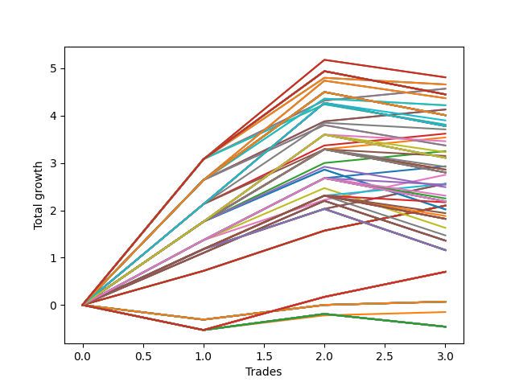

# Long HLT 238 
- Symbol: TSLA
- Date Range: 05/16/2022 - 05/17/2024
- Trading Period: 8:30-12:30
- Number of Trades: 3



| Id. | Name | Win Percent | Profit | Avg Profit / Trade | Avg Time / Trade | Std |      | Name | Win Percent | Profit | Avg Profit / Trade | Avg Time / Trade | Std |
| --- | ---- | ----------- | ------ | ------------------ | ---------------- | --- | ---- | ---- | ----------- | ------ | ------------------ | ---------------- | --- |
| | Sorted By <br> Profit | | | | | | | Sorted By <br> Win Percentage |||||
|0| TP-3 105m | 66.67 | 4.81 | 1.60 | 87:00 | 1.45 |     | TP-3 60m | 100.00 | 4.57 | 1.52 | 57:00 | 1.17 |
|1| TP-2.75 105m | 66.67 | 4.81 | 1.60 | 87:00 | 1.45 |     | TP-2.75 60m | 100.00 | 4.57 | 1.52 | 57:00 | 1.17 |
|2| TP-3 90m | 66.67 | 4.66 | 1.55 | 77:00 | 1.32 |     | TP-2.5 60m | 100.00 | 4.13 | 1.38 | 56:20 | 0.98 |
|3| TP-2.75 90m | 66.67 | 4.66 | 1.55 | 77:00 | 1.32 |     | TP-2.25 60m | 100.00 | 4.13 | 1.38 | 56:20 | 0.98 |
|4| TP-3 60m | 100.00 | 4.57 | 1.52 | 57:00 | 1.17 |     | TP-2 60m | 100.00 | 3.62 | 1.21 | 56:00 | 0.77 |
|5| TP-2.75 60m | 100.00 | 4.57 | 1.52 | 57:00 | 1.17 |     | TP-1.5 60m | 100.00 | 3.54 | 1.18 | 47:20 | 0.66 |
|6| TP-3 180m | 66.67 | 4.45 | 1.48 | 97:00 | 1.48 |     | TP-1.75 60m | 100.00 | 3.25 | 1.08 | 51:40 | 0.63 |
|7| TP-2.75 180m | 66.67 | 4.45 | 1.48 | 97:00 | 1.48 |     | TP-1.25 60m | 100.00 | 2.93 | 0.98 | 43:00 | 0.51 |
|8| TP-3 165m | 66.67 | 4.45 | 1.48 | 97:00 | 1.48 |     | TP-1.25 30m | 100.00 | 2.75 | 0.92 | 27:40 | 0.35 |
|9| TP-2.75 165m | 66.67 | 4.45 | 1.48 | 97:00 | 1.48 |     | TP-1 60m | 100.00 | 2.56 | 0.85 | 38:40 | 0.43 |
|10| TP-3 150m | 66.67 | 4.45 | 1.48 | 97:00 | 1.48 |     | TP-1 30m | 100.00 | 2.56 | 0.85 | 27:20 | 0.27 |
|11| TP-2.75 150m | 66.67 | 4.45 | 1.48 | 97:00 | 1.48 |     | TP-0.75 30m | 100.00 | 2.56 | 0.85 | 26:40 | 0.27 |
|12| TP-3 135m | 66.67 | 4.45 | 1.48 | 97:00 | 1.48 |     | TP-3 30m | 100.00 | 2.10 | 0.70 | 29:00 | 0.13 |
|13| TP-2.75 135m | 66.67 | 4.45 | 1.48 | 97:00 | 1.48 |     | TP-2.75 30m | 100.00 | 2.10 | 0.70 | 29:00 | 0.13 |
|14| TP-3 120m | 66.67 | 4.45 | 1.48 | 97:00 | 1.48 |     | TP-2.5 30m | 100.00 | 2.10 | 0.70 | 29:00 | 0.13 |
|15| TP-2.75 120m | 66.67 | 4.45 | 1.48 | 97:00 | 1.48 |     | TP-2.25 30m | 100.00 | 2.10 | 0.70 | 29:00 | 0.13 |
|16| TP-2.5 105m | 66.67 | 4.37 | 1.46 | 86:20 | 1.31 |     | TP-2 30m | 100.00 | 2.10 | 0.70 | 29:00 | 0.13 |
|17| TP-2.25 105m | 66.67 | 4.37 | 1.46 | 86:20 | 1.31 |     | TP-1.75 30m | 100.00 | 2.10 | 0.70 | 29:00 | 0.13 |
|18| TP-2.5 90m | 66.67 | 4.22 | 1.41 | 76:20 | 1.16 |     | TP-1.5 30m | 100.00 | 2.10 | 0.70 | 29:00 | 0.13 |
|19| TP-2.25 90m | 66.67 | 4.22 | 1.41 | 76:20 | 1.16 |     | TP-3 105m | 66.67 | 4.81 | 1.60 | 87:00 | 1.45 |
|20| TP-2.5 60m | 100.00 | 4.13 | 1.38 | 56:20 | 0.98 |     | TP-2.75 105m | 66.67 | 4.81 | 1.60 | 87:00 | 1.45 |
|21| TP-2.25 60m | 100.00 | 4.13 | 1.38 | 56:20 | 0.98 |     | TP-3 90m | 66.67 | 4.66 | 1.55 | 77:00 | 1.32 |
|22| TP-2.5 180m | 66.67 | 4.01 | 1.34 | 96:20 | 1.33 |     | TP-2.75 90m | 66.67 | 4.66 | 1.55 | 77:00 | 1.32 |
|23| TP-2.25 180m | 66.67 | 4.01 | 1.34 | 96:20 | 1.33 |     | TP-3 180m | 66.67 | 4.45 | 1.48 | 97:00 | 1.48 |
|24| TP-2.5 165m | 66.67 | 4.01 | 1.34 | 96:20 | 1.33 |     | TP-2.75 180m | 66.67 | 4.45 | 1.48 | 97:00 | 1.48 |
|25| TP-2.25 165m | 66.67 | 4.01 | 1.34 | 96:20 | 1.33 |     | TP-3 165m | 66.67 | 4.45 | 1.48 | 97:00 | 1.48 |
|26| TP-2.5 150m | 66.67 | 4.01 | 1.34 | 96:20 | 1.33 |     | TP-2.75 165m | 66.67 | 4.45 | 1.48 | 97:00 | 1.48 |
|27| TP-2.25 150m | 66.67 | 4.01 | 1.34 | 96:20 | 1.33 |     | TP-3 150m | 66.67 | 4.45 | 1.48 | 97:00 | 1.48 |
|28| TP-2.5 135m | 66.67 | 4.01 | 1.34 | 96:20 | 1.33 |     | TP-2.75 150m | 66.67 | 4.45 | 1.48 | 97:00 | 1.48 |
|29| TP-2.25 135m | 66.67 | 4.01 | 1.34 | 96:20 | 1.33 |     | TP-3 135m | 66.67 | 4.45 | 1.48 | 97:00 | 1.48 |
|30| TP-2.5 120m | 66.67 | 4.01 | 1.34 | 96:20 | 1.33 |     | TP-2.75 135m | 66.67 | 4.45 | 1.48 | 97:00 | 1.48 |
|31| TP-2.25 120m | 66.67 | 4.01 | 1.34 | 96:20 | 1.33 |     | TP-3 120m | 66.67 | 4.45 | 1.48 | 97:00 | 1.48 |
|32| TP-2 105m | 66.67 | 3.90 | 1.30 | 82:20 | 1.18 |     | TP-2.75 120m | 66.67 | 4.45 | 1.48 | 97:00 | 1.48 |
|33| TP-3 75m | 66.67 | 3.81 | 1.27 | 67:00 | 1.44 |     | TP-2.5 105m | 66.67 | 4.37 | 1.46 | 86:20 | 1.31 |
|34| TP-2.75 75m | 66.67 | 3.81 | 1.27 | 67:00 | 1.44 |     | TP-2.25 105m | 66.67 | 4.37 | 1.46 | 86:20 | 1.31 |
|35| TP-2 180m | 66.67 | 3.78 | 1.26 | 87:20 | 1.24 |     | TP-2.5 90m | 66.67 | 4.22 | 1.41 | 76:20 | 1.16 |
|36| TP-2 165m | 66.67 | 3.78 | 1.26 | 87:20 | 1.24 |     | TP-2.25 90m | 66.67 | 4.22 | 1.41 | 76:20 | 1.16 |
|37| TP-2 150m | 66.67 | 3.78 | 1.26 | 87:20 | 1.24 |     | TP-2.5 180m | 66.67 | 4.01 | 1.34 | 96:20 | 1.33 |
|38| TP-2 135m | 66.67 | 3.78 | 1.26 | 87:20 | 1.24 |     | TP-2.25 180m | 66.67 | 4.01 | 1.34 | 96:20 | 1.33 |
|39| TP-2 120m | 66.67 | 3.78 | 1.26 | 87:20 | 1.24 |     | TP-2.5 165m | 66.67 | 4.01 | 1.34 | 96:20 | 1.33 |
|40| TP-2 90m | 66.67 | 3.71 | 1.24 | 76:00 | 0.99 |     | TP-2.25 165m | 66.67 | 4.01 | 1.34 | 96:20 | 1.33 |
|41| TP-2 60m | 100.00 | 3.62 | 1.21 | 56:00 | 0.77 |     | TP-2.5 150m | 66.67 | 4.01 | 1.34 | 96:20 | 1.33 |
|42| TP-1.5 60m | 100.00 | 3.54 | 1.18 | 47:20 | 0.66 |     | TP-2.25 150m | 66.67 | 4.01 | 1.34 | 96:20 | 1.33 |
|43| TP-1.75 90m | 66.67 | 3.46 | 1.15 | 71:20 | 0.92 |     | TP-2.5 135m | 66.67 | 4.01 | 1.34 | 96:20 | 1.33 |
|44| TP-2.5 75m | 66.67 | 3.37 | 1.12 | 66:20 | 1.25 |     | TP-2.25 135m | 66.67 | 4.01 | 1.34 | 96:20 | 1.33 |
|45| TP-2.25 75m | 66.67 | 3.37 | 1.12 | 66:20 | 1.25 |     | TP-2.5 120m | 66.67 | 4.01 | 1.34 | 96:20 | 1.33 |
|46| TP-1.75 60m | 100.00 | 3.25 | 1.08 | 51:40 | 0.63 |     | TP-2.25 120m | 66.67 | 4.01 | 1.34 | 96:20 | 1.33 |
|47| TP-1.75 105m | 66.67 | 3.23 | 1.08 | 76:20 | 1.02 |     | TP-2 105m | 66.67 | 3.90 | 1.30 | 82:20 | 1.18 |
|48| TP-1.5 90m | 66.67 | 3.15 | 1.05 | 57:20 | 0.85 |     | TP-3 75m | 66.67 | 3.81 | 1.27 | 67:00 | 1.44 |
|49| TP-1.75 180m | 66.67 | 3.11 | 1.04 | 81:20 | 1.08 |     | TP-2.75 75m | 66.67 | 3.81 | 1.27 | 67:00 | 1.44 |
|50| TP-1.75 165m | 66.67 | 3.11 | 1.04 | 81:20 | 1.08 |     | TP-2 180m | 66.67 | 3.78 | 1.26 | 87:20 | 1.24 |
|51| TP-1.75 150m | 66.67 | 3.11 | 1.04 | 81:20 | 1.08 |     | TP-2 165m | 66.67 | 3.78 | 1.26 | 87:20 | 1.24 |
|52| TP-1.75 135m | 66.67 | 3.11 | 1.04 | 81:20 | 1.08 |     | TP-2 150m | 66.67 | 3.78 | 1.26 | 87:20 | 1.24 |
|53| TP-1.75 120m | 66.67 | 3.11 | 1.04 | 81:20 | 1.08 |     | TP-2 135m | 66.67 | 3.78 | 1.26 | 87:20 | 1.24 |
|54| TP-1.25 60m | 100.00 | 2.93 | 0.98 | 43:00 | 0.51 |     | TP-2 120m | 66.67 | 3.78 | 1.26 | 87:20 | 1.24 |
|55| TP-1.5 105m | 66.67 | 2.92 | 0.97 | 62:20 | 0.95 |     | TP-2 90m | 66.67 | 3.71 | 1.24 | 76:00 | 0.99 |
|56| TP-2 75m | 66.67 | 2.86 | 0.95 | 66:00 | 1.06 |     | TP-1.75 90m | 66.67 | 3.46 | 1.15 | 71:20 | 0.92 |
|57| TP-1.5 75m | 66.67 | 2.86 | 0.95 | 52:20 | 0.98 |     | TP-2.5 75m | 66.67 | 3.37 | 1.12 | 66:20 | 1.25 |
|58| TP-1.5 180m | 66.67 | 2.80 | 0.93 | 67:20 | 1.01 |     | TP-2.25 75m | 66.67 | 3.37 | 1.12 | 66:20 | 1.25 |
|59| TP-1.5 165m | 66.67 | 2.80 | 0.93 | 67:20 | 1.01 |     | TP-1.75 105m | 66.67 | 3.23 | 1.08 | 76:20 | 1.02 |
|60| TP-1.5 150m | 66.67 | 2.80 | 0.93 | 67:20 | 1.01 |     | TP-1.5 90m | 66.67 | 3.15 | 1.05 | 57:20 | 0.85 |
|61| TP-1.5 135m | 66.67 | 2.80 | 0.93 | 67:20 | 1.01 |     | TP-1.75 180m | 66.67 | 3.11 | 1.04 | 81:20 | 1.08 |
|62| TP-1.5 120m | 66.67 | 2.80 | 0.93 | 67:20 | 1.01 |     | TP-1.75 165m | 66.67 | 3.11 | 1.04 | 81:20 | 1.08 |
|63| TP-1.25 30m | 100.00 | 2.75 | 0.92 | 27:40 | 0.35 |     | TP-1.75 150m | 66.67 | 3.11 | 1.04 | 81:20 | 1.08 |
|64| TP-1 60m | 100.00 | 2.56 | 0.85 | 38:40 | 0.43 |     | TP-1.75 135m | 66.67 | 3.11 | 1.04 | 81:20 | 1.08 |
|65| TP-1 30m | 100.00 | 2.56 | 0.85 | 27:20 | 0.27 |     | TP-1.75 120m | 66.67 | 3.11 | 1.04 | 81:20 | 1.08 |
|66| TP-0.75 30m | 100.00 | 2.56 | 0.85 | 26:40 | 0.27 |     | TP-1.5 105m | 66.67 | 2.92 | 0.97 | 62:20 | 0.95 |
|67| TP-1.25 90m | 66.67 | 2.54 | 0.85 | 53:00 | 0.70 |     | TP-2 75m | 66.67 | 2.86 | 0.95 | 66:00 | 1.06 |
|68| TP-1.75 75m | 66.67 | 2.49 | 0.83 | 61:40 | 0.92 |     | TP-1.5 75m | 66.67 | 2.86 | 0.95 | 52:20 | 0.98 |
|69| TP-1.25 105m | 66.67 | 2.31 | 0.77 | 58:00 | 0.81 |     | TP-1.5 180m | 66.67 | 2.80 | 0.93 | 67:20 | 1.01 |
|70| TP-1.25 75m | 66.67 | 2.25 | 0.75 | 48:00 | 0.83 |     | TP-1.5 165m | 66.67 | 2.80 | 0.93 | 67:20 | 1.01 |
|71| TP-1.25 180m | 66.67 | 2.19 | 0.73 | 63:00 | 0.86 |     | TP-1.5 150m | 66.67 | 2.80 | 0.93 | 67:20 | 1.01 |
|72| TP-1.25 165m | 66.67 | 2.19 | 0.73 | 63:00 | 0.86 |     | TP-1.5 135m | 66.67 | 2.80 | 0.93 | 67:20 | 1.01 |
|73| TP-1.25 150m | 66.67 | 2.19 | 0.73 | 63:00 | 0.86 |     | TP-1.5 120m | 66.67 | 2.80 | 0.93 | 67:20 | 1.01 |
|74| TP-1.25 135m | 66.67 | 2.19 | 0.73 | 63:00 | 0.86 |     | TP-1.25 90m | 66.67 | 2.54 | 0.85 | 53:00 | 0.70 |
|75| TP-1.25 120m | 66.67 | 2.19 | 0.73 | 63:00 | 0.86 |     | TP-1.75 75m | 66.67 | 2.49 | 0.83 | 61:40 | 0.92 |
|76| TP-1 90m | 66.67 | 2.17 | 0.72 | 48:40 | 0.61 |     | TP-1.25 105m | 66.67 | 2.31 | 0.77 | 58:00 | 0.81 |
|77| TP-3 30m | 100.00 | 2.10 | 0.70 | 29:00 | 0.13 |     | TP-1.25 75m | 66.67 | 2.25 | 0.75 | 48:00 | 0.83 |
|78| TP-2.75 30m | 100.00 | 2.10 | 0.70 | 29:00 | 0.13 |     | TP-1.25 180m | 66.67 | 2.19 | 0.73 | 63:00 | 0.86 |
|79| TP-2.5 30m | 100.00 | 2.10 | 0.70 | 29:00 | 0.13 |     | TP-1.25 165m | 66.67 | 2.19 | 0.73 | 63:00 | 0.86 |
|80| TP-2.25 30m | 100.00 | 2.10 | 0.70 | 29:00 | 0.13 |     | TP-1.25 150m | 66.67 | 2.19 | 0.73 | 63:00 | 0.86 |
|81| TP-2 30m | 100.00 | 2.10 | 0.70 | 29:00 | 0.13 |     | TP-1.25 135m | 66.67 | 2.19 | 0.73 | 63:00 | 0.86 |
|82| TP-1.75 30m | 100.00 | 2.10 | 0.70 | 29:00 | 0.13 |     | TP-1.25 120m | 66.67 | 2.19 | 0.73 | 63:00 | 0.86 |
|83| TP-1.5 30m | 100.00 | 2.10 | 0.70 | 29:00 | 0.13 |     | TP-1 90m | 66.67 | 2.17 | 0.72 | 48:40 | 0.61 |
|84| TP-1.75 45m | 66.67 | 2.02 | 0.67 | 41:40 | 1.10 |     | TP-1.75 45m | 66.67 | 2.02 | 0.67 | 41:40 | 1.10 |
|85| TP-1.5 45m | 66.67 | 2.02 | 0.67 | 41:40 | 1.10 |     | TP-1.5 45m | 66.67 | 2.02 | 0.67 | 41:40 | 1.10 |
|86| TP-1 105m | 66.67 | 1.94 | 0.65 | 53:40 | 0.72 |     | TP-1 105m | 66.67 | 1.94 | 0.65 | 53:40 | 0.72 |
|87| TP-1 75m | 66.67 | 1.88 | 0.63 | 43:40 | 0.75 |     | TP-1 75m | 66.67 | 1.88 | 0.63 | 43:40 | 0.75 |
|88| TP-1 180m | 66.67 | 1.82 | 0.61 | 58:40 | 0.78 |     | TP-1 180m | 66.67 | 1.82 | 0.61 | 58:40 | 0.78 |
|89| TP-1 165m | 66.67 | 1.82 | 0.61 | 58:40 | 0.78 |     | TP-1 165m | 66.67 | 1.82 | 0.61 | 58:40 | 0.78 |
|90| TP-1 150m | 66.67 | 1.82 | 0.61 | 58:40 | 0.78 |     | TP-1 150m | 66.67 | 1.82 | 0.61 | 58:40 | 0.78 |
|91| TP-1 135m | 66.67 | 1.82 | 0.61 | 58:40 | 0.78 |     | TP-1 135m | 66.67 | 1.82 | 0.61 | 58:40 | 0.78 |
|92| TP-1 120m | 66.67 | 1.82 | 0.61 | 58:40 | 0.78 |     | TP-1 120m | 66.67 | 1.82 | 0.61 | 58:40 | 0.78 |
|93| TP-1.25 45m | 66.67 | 1.63 | 0.54 | 37:40 | 0.98 |     | TP-1.25 45m | 66.67 | 1.63 | 0.54 | 37:40 | 0.98 |
|94| TP-1 45m | 66.67 | 1.47 | 0.49 | 33:40 | 0.94 |     | TP-1 45m | 66.67 | 1.47 | 0.49 | 33:40 | 0.94 |
|95| TP-3 45m | 66.67 | 1.36 | 0.45 | 44:00 | 0.91 |     | TP-3 45m | 66.67 | 1.36 | 0.45 | 44:00 | 0.91 |
|96| TP-2.75 45m | 66.67 | 1.36 | 0.45 | 44:00 | 0.91 |     | TP-2.75 45m | 66.67 | 1.36 | 0.45 | 44:00 | 0.91 |
|97| TP-2.5 45m | 66.67 | 1.36 | 0.45 | 44:00 | 0.91 |     | TP-2.5 45m | 66.67 | 1.36 | 0.45 | 44:00 | 0.91 |
|98| TP-2.25 45m | 66.67 | 1.36 | 0.45 | 44:00 | 0.91 |     | TP-2.25 45m | 66.67 | 1.36 | 0.45 | 44:00 | 0.91 |
|99| TP-2 45m | 66.67 | 1.36 | 0.45 | 44:00 | 0.91 |     | TP-2 45m | 66.67 | 1.36 | 0.45 | 44:00 | 0.91 |
|100| TP-0.75 180m | 66.67 | 1.16 | 0.39 | 31:20 | 0.90 |     | TP-0.75 180m | 66.67 | 1.16 | 0.39 | 31:20 | 0.90 |
|101| TP-0.75 165m | 66.67 | 1.16 | 0.39 | 31:20 | 0.90 |     | TP-0.75 165m | 66.67 | 1.16 | 0.39 | 31:20 | 0.90 |
|102| TP-0.75 150m | 66.67 | 1.16 | 0.39 | 31:20 | 0.90 |     | TP-0.75 150m | 66.67 | 1.16 | 0.39 | 31:20 | 0.90 |
|103| TP-0.75 135m | 66.67 | 1.16 | 0.39 | 31:20 | 0.90 |     | TP-0.75 135m | 66.67 | 1.16 | 0.39 | 31:20 | 0.90 |
|104| TP-0.75 120m | 66.67 | 1.16 | 0.39 | 31:20 | 0.90 |     | TP-0.75 120m | 66.67 | 1.16 | 0.39 | 31:20 | 0.90 |
|105| TP-0.75 105m | 66.67 | 1.16 | 0.39 | 31:20 | 0.90 |     | TP-0.75 105m | 66.67 | 1.16 | 0.39 | 31:20 | 0.90 |
|106| TP-0.75 90m | 66.67 | 1.16 | 0.39 | 31:20 | 0.90 |     | TP-0.75 90m | 66.67 | 1.16 | 0.39 | 31:20 | 0.90 |
|107| TP-0.75 75m | 66.67 | 1.16 | 0.39 | 31:20 | 0.90 |     | TP-0.75 75m | 66.67 | 1.16 | 0.39 | 31:20 | 0.90 |
|108| TP-0.75 60m | 66.67 | 1.16 | 0.39 | 31:20 | 0.90 |     | TP-0.75 60m | 66.67 | 1.16 | 0.39 | 31:20 | 0.90 |
|109| TP-0.75 45m | 66.67 | 1.16 | 0.39 | 31:20 | 0.90 |     | TP-0.75 45m | 66.67 | 1.16 | 0.39 | 31:20 | 0.90 |
|110| TP-0.5 180m | 66.67 | 0.70 | 0.23 | 19:00 | 0.54 |     | TP-0.5 180m | 66.67 | 0.70 | 0.23 | 19:00 | 0.54 |
|111| TP-0.5 165m | 66.67 | 0.70 | 0.23 | 19:00 | 0.54 |     | TP-0.5 165m | 66.67 | 0.70 | 0.23 | 19:00 | 0.54 |
|112| TP-0.5 150m | 66.67 | 0.70 | 0.23 | 19:00 | 0.54 |     | TP-0.5 150m | 66.67 | 0.70 | 0.23 | 19:00 | 0.54 |
|113| TP-0.5 135m | 66.67 | 0.70 | 0.23 | 19:00 | 0.54 |     | TP-0.5 135m | 66.67 | 0.70 | 0.23 | 19:00 | 0.54 |
|114| TP-0.5 120m | 66.67 | 0.70 | 0.23 | 19:00 | 0.54 |     | TP-0.5 120m | 66.67 | 0.70 | 0.23 | 19:00 | 0.54 |
|115| TP-0.5 105m | 66.67 | 0.70 | 0.23 | 19:00 | 0.54 |     | TP-0.5 105m | 66.67 | 0.70 | 0.23 | 19:00 | 0.54 |
|116| TP-0.5 90m | 66.67 | 0.70 | 0.23 | 19:00 | 0.54 |     | TP-0.5 90m | 66.67 | 0.70 | 0.23 | 19:00 | 0.54 |
|117| TP-0.5 75m | 66.67 | 0.70 | 0.23 | 19:00 | 0.54 |     | TP-0.5 75m | 66.67 | 0.70 | 0.23 | 19:00 | 0.54 |
|118| TP-0.5 60m | 66.67 | 0.70 | 0.23 | 19:00 | 0.54 |     | TP-0.5 60m | 66.67 | 0.70 | 0.23 | 19:00 | 0.54 |
|119| TP-0.5 45m | 66.67 | 0.70 | 0.23 | 19:00 | 0.54 |     | TP-0.5 45m | 66.67 | 0.70 | 0.23 | 19:00 | 0.54 |
|120| TP-0.5 30m | 66.67 | 0.70 | 0.23 | 19:00 | 0.54 |     | TP-0.5 30m | 66.67 | 0.70 | 0.23 | 19:00 | 0.54 |
|121| TP-3 15m | 66.67 | 0.07 | 0.02 | 14:00 | 0.26 |     | TP-3 15m | 66.67 | 0.07 | 0.02 | 14:00 | 0.26 |
|122| TP-2.75 15m | 66.67 | 0.07 | 0.02 | 14:00 | 0.26 |     | TP-2.75 15m | 66.67 | 0.07 | 0.02 | 14:00 | 0.26 |
|123| TP-2.5 15m | 66.67 | 0.07 | 0.02 | 14:00 | 0.26 |     | TP-2.5 15m | 66.67 | 0.07 | 0.02 | 14:00 | 0.26 |
|124| TP-2.25 15m | 66.67 | 0.07 | 0.02 | 14:00 | 0.26 |     | TP-2.25 15m | 66.67 | 0.07 | 0.02 | 14:00 | 0.26 |
|125| TP-2 15m | 66.67 | 0.07 | 0.02 | 14:00 | 0.26 |     | TP-2 15m | 66.67 | 0.07 | 0.02 | 14:00 | 0.26 |
|126| TP-1.75 15m | 66.67 | 0.07 | 0.02 | 14:00 | 0.26 |     | TP-1.75 15m | 66.67 | 0.07 | 0.02 | 14:00 | 0.26 |
|127| TP-1.5 15m | 66.67 | 0.07 | 0.02 | 14:00 | 0.26 |     | TP-1.5 15m | 66.67 | 0.07 | 0.02 | 14:00 | 0.26 |
|128| TP-1.25 15m | 66.67 | 0.07 | 0.02 | 14:00 | 0.26 |     | TP-1.25 15m | 66.67 | 0.07 | 0.02 | 14:00 | 0.26 |
|129| TP-1 15m | 66.67 | 0.07 | 0.02 | 14:00 | 0.26 |     | TP-1 15m | 66.67 | 0.07 | 0.02 | 14:00 | 0.26 |
|130| TP-0.75 15m | 66.67 | 0.07 | 0.02 | 14:00 | 0.26 |     | TP-0.75 15m | 66.67 | 0.07 | 0.02 | 14:00 | 0.26 |
|131| TP-0.5 15m | 66.67 | -0.15 | -0.05 | 10:00 | 0.35 |     | TP-0.5 15m | 66.67 | -0.15 | -0.05 | 10:00 | 0.35 |
|132| TP-0.25 180m | 33.33 | -0.46 | -0.15 | 05:00 | 0.36 |     | TP-0.25 180m | 33.33 | -0.46 | -0.15 | 05:00 | 0.36 |
|133| TP-0.25 165m | 33.33 | -0.46 | -0.15 | 05:00 | 0.36 |     | TP-0.25 165m | 33.33 | -0.46 | -0.15 | 05:00 | 0.36 |
|134| TP-0.25 150m | 33.33 | -0.46 | -0.15 | 05:00 | 0.36 |     | TP-0.25 150m | 33.33 | -0.46 | -0.15 | 05:00 | 0.36 |
|135| TP-0.25 135m | 33.33 | -0.46 | -0.15 | 05:00 | 0.36 |     | TP-0.25 135m | 33.33 | -0.46 | -0.15 | 05:00 | 0.36 |
|136| TP-0.25 120m | 33.33 | -0.46 | -0.15 | 05:00 | 0.36 |     | TP-0.25 120m | 33.33 | -0.46 | -0.15 | 05:00 | 0.36 |
|137| TP-0.25 105m | 33.33 | -0.46 | -0.15 | 05:00 | 0.36 |     | TP-0.25 105m | 33.33 | -0.46 | -0.15 | 05:00 | 0.36 |
|138| TP-0.25 90m | 33.33 | -0.46 | -0.15 | 05:00 | 0.36 |     | TP-0.25 90m | 33.33 | -0.46 | -0.15 | 05:00 | 0.36 |
|139| TP-0.25 75m | 33.33 | -0.46 | -0.15 | 05:00 | 0.36 |     | TP-0.25 75m | 33.33 | -0.46 | -0.15 | 05:00 | 0.36 |
|140| TP-0.25 60m | 33.33 | -0.46 | -0.15 | 05:00 | 0.36 |     | TP-0.25 60m | 33.33 | -0.46 | -0.15 | 05:00 | 0.36 |
|141| TP-0.25 45m | 33.33 | -0.46 | -0.15 | 05:00 | 0.36 |     | TP-0.25 45m | 33.33 | -0.46 | -0.15 | 05:00 | 0.36 |
|142| TP-0.25 30m | 33.33 | -0.46 | -0.15 | 05:00 | 0.36 |     | TP-0.25 30m | 33.33 | -0.46 | -0.15 | 05:00 | 0.36 |
|143| TP-0.25 15m | 33.33 | -0.46 | -0.15 | 05:00 | 0.36 |     | TP-0.25 15m | 33.33 | -0.46 | -0.15 | 05:00 | 0.36 |

### Test TP-0.25 15m
* Take Profit of 0.25 Point
* 0.25 Stoploss
* Results:
```
Total Trades: 3
Percent Up: 33.33
Percent Down: 66.67
Total Points Moved Up: -0.46
Potential Profit: -230.00
Total Points Ups: 0.34 Count Ups: 1
Total Points Downs: -0.80 Count Downs: 2
```

<details><summary>Trades</summary>

<code>In: 2022-11-04 11:20:00		Out: 2022-11-04 11:22:00		Total Position Time: 02:00		Total Move Up: -0.53		Total to Date: -0.53</code> <br />
<code>In: 2024-03-15 10:10:00		Out: 2024-03-15 10:21:00		Total Position Time: 11:00		Total Move Up: 0.34		Total to Date: -0.19</code> <br />
<code>In: 2024-04-10 09:30:00		Out: 2024-04-10 09:32:00		Total Position Time: 02:00		Total Move Up: -0.27		Total to Date: -0.46</code> <br />


</details>

### Test TP-0.5 15m
* Take Profit of 0.5 Point
* 0.5 Stoploss
* Results:
```
Total Trades: 3
Percent Up: 66.67
Percent Down: 33.33
Total Points Moved Up: -0.15
Potential Profit: -75.00
Total Points Ups: 0.38 Count Ups: 2
Total Points Downs: -0.53 Count Downs: 1
```

<details><summary>Trades</summary>

<code>In: 2022-11-04 11:20:00		Out: 2022-11-04 11:22:00		Total Position Time: 02:00		Total Move Up: -0.53		Total to Date: -0.53</code> <br />
<code>In: 2024-03-15 10:10:00		Out: 2024-03-15 10:24:00		Total Position Time: 14:00		Total Move Up: 0.31		Total to Date: -0.22</code> <br />
<code>In: 2024-04-10 09:30:00		Out: 2024-04-10 09:44:00		Total Position Time: 14:00		Total Move Up: 0.07		Total to Date: -0.15</code> <br />


</details>

### Test TP-0.75 15m
* Take Profit of 0.75 Point
* 0.75 Stoploss
* Results:
```
Total Trades: 3
Percent Up: 66.67
Percent Down: 33.33
Total Points Moved Up: 0.07
Potential Profit: 35.00
Total Points Ups: 0.38 Count Ups: 2
Total Points Downs: -0.31 Count Downs: 1
```

<details><summary>Trades</summary>

<code>In: 2022-11-04 11:20:00		Out: 2022-11-04 11:34:00		Total Position Time: 14:00		Total Move Up: -0.31		Total to Date: -0.31</code> <br />
<code>In: 2024-03-15 10:10:00		Out: 2024-03-15 10:24:00		Total Position Time: 14:00		Total Move Up: 0.31		Total to Date: 0.00</code> <br />
<code>In: 2024-04-10 09:30:00		Out: 2024-04-10 09:44:00		Total Position Time: 14:00		Total Move Up: 0.07		Total to Date: 0.07</code> <br />


</details>

### Test TP-1 15m
* Take Profit of 1 Point
* 1 Stoploss
* Results:
```
Total Trades: 3
Percent Up: 66.67
Percent Down: 33.33
Total Points Moved Up: 0.07
Potential Profit: 35.00
Total Points Ups: 0.38 Count Ups: 2
Total Points Downs: -0.31 Count Downs: 1
```

<details><summary>Trades</summary>

<code>In: 2022-11-04 11:20:00		Out: 2022-11-04 11:34:00		Total Position Time: 14:00		Total Move Up: -0.31		Total to Date: -0.31</code> <br />
<code>In: 2024-03-15 10:10:00		Out: 2024-03-15 10:24:00		Total Position Time: 14:00		Total Move Up: 0.31		Total to Date: 0.00</code> <br />
<code>In: 2024-04-10 09:30:00		Out: 2024-04-10 09:44:00		Total Position Time: 14:00		Total Move Up: 0.07		Total to Date: 0.07</code> <br />


</details>

### Test TP-1.25 15m
* Take Profit of 1.25 Point
* 1.25 Stoploss
* Results:
```
Total Trades: 3
Percent Up: 66.67
Percent Down: 33.33
Total Points Moved Up: 0.07
Potential Profit: 35.00
Total Points Ups: 0.38 Count Ups: 2
Total Points Downs: -0.31 Count Downs: 1
```

<details><summary>Trades</summary>

<code>In: 2022-11-04 11:20:00		Out: 2022-11-04 11:34:00		Total Position Time: 14:00		Total Move Up: -0.31		Total to Date: -0.31</code> <br />
<code>In: 2024-03-15 10:10:00		Out: 2024-03-15 10:24:00		Total Position Time: 14:00		Total Move Up: 0.31		Total to Date: 0.00</code> <br />
<code>In: 2024-04-10 09:30:00		Out: 2024-04-10 09:44:00		Total Position Time: 14:00		Total Move Up: 0.07		Total to Date: 0.07</code> <br />


</details>

### Test TP-1.5 15m
* Take Profit of 1.5 Point
* 1.5 Stoploss
* Results:
```
Total Trades: 3
Percent Up: 66.67
Percent Down: 33.33
Total Points Moved Up: 0.07
Potential Profit: 35.00
Total Points Ups: 0.38 Count Ups: 2
Total Points Downs: -0.31 Count Downs: 1
```

<details><summary>Trades</summary>

<code>In: 2022-11-04 11:20:00		Out: 2022-11-04 11:34:00		Total Position Time: 14:00		Total Move Up: -0.31		Total to Date: -0.31</code> <br />
<code>In: 2024-03-15 10:10:00		Out: 2024-03-15 10:24:00		Total Position Time: 14:00		Total Move Up: 0.31		Total to Date: 0.00</code> <br />
<code>In: 2024-04-10 09:30:00		Out: 2024-04-10 09:44:00		Total Position Time: 14:00		Total Move Up: 0.07		Total to Date: 0.07</code> <br />


</details>

### Test TP-1.75 15m
* Take Profit of 1.75 Point
* 1.75 Stoploss
* Results:
```
Total Trades: 3
Percent Up: 66.67
Percent Down: 33.33
Total Points Moved Up: 0.07
Potential Profit: 35.00
Total Points Ups: 0.38 Count Ups: 2
Total Points Downs: -0.31 Count Downs: 1
```

<details><summary>Trades</summary>

<code>In: 2022-11-04 11:20:00		Out: 2022-11-04 11:34:00		Total Position Time: 14:00		Total Move Up: -0.31		Total to Date: -0.31</code> <br />
<code>In: 2024-03-15 10:10:00		Out: 2024-03-15 10:24:00		Total Position Time: 14:00		Total Move Up: 0.31		Total to Date: 0.00</code> <br />
<code>In: 2024-04-10 09:30:00		Out: 2024-04-10 09:44:00		Total Position Time: 14:00		Total Move Up: 0.07		Total to Date: 0.07</code> <br />


</details>

### Test TP-2 15m
* Take Profit of 2 Point
* 2 Stoploss
* Results:
```
Total Trades: 3
Percent Up: 66.67
Percent Down: 33.33
Total Points Moved Up: 0.07
Potential Profit: 35.00
Total Points Ups: 0.38 Count Ups: 2
Total Points Downs: -0.31 Count Downs: 1
```

<details><summary>Trades</summary>

<code>In: 2022-11-04 11:20:00		Out: 2022-11-04 11:34:00		Total Position Time: 14:00		Total Move Up: -0.31		Total to Date: -0.31</code> <br />
<code>In: 2024-03-15 10:10:00		Out: 2024-03-15 10:24:00		Total Position Time: 14:00		Total Move Up: 0.31		Total to Date: 0.00</code> <br />
<code>In: 2024-04-10 09:30:00		Out: 2024-04-10 09:44:00		Total Position Time: 14:00		Total Move Up: 0.07		Total to Date: 0.07</code> <br />


</details>

### Test TP-2.25 15m
* Take Profit of 2.25 Point
* 2.25 Stoploss
* Results:
```
Total Trades: 3
Percent Up: 66.67
Percent Down: 33.33
Total Points Moved Up: 0.07
Potential Profit: 35.00
Total Points Ups: 0.38 Count Ups: 2
Total Points Downs: -0.31 Count Downs: 1
```

<details><summary>Trades</summary>

<code>In: 2022-11-04 11:20:00		Out: 2022-11-04 11:34:00		Total Position Time: 14:00		Total Move Up: -0.31		Total to Date: -0.31</code> <br />
<code>In: 2024-03-15 10:10:00		Out: 2024-03-15 10:24:00		Total Position Time: 14:00		Total Move Up: 0.31		Total to Date: 0.00</code> <br />
<code>In: 2024-04-10 09:30:00		Out: 2024-04-10 09:44:00		Total Position Time: 14:00		Total Move Up: 0.07		Total to Date: 0.07</code> <br />


</details>

### Test TP-2.5 15m
* Take Profit of 2.5 Point
* 2.5 Stoploss
* Results:
```
Total Trades: 3
Percent Up: 66.67
Percent Down: 33.33
Total Points Moved Up: 0.07
Potential Profit: 35.00
Total Points Ups: 0.38 Count Ups: 2
Total Points Downs: -0.31 Count Downs: 1
```

<details><summary>Trades</summary>

<code>In: 2022-11-04 11:20:00		Out: 2022-11-04 11:34:00		Total Position Time: 14:00		Total Move Up: -0.31		Total to Date: -0.31</code> <br />
<code>In: 2024-03-15 10:10:00		Out: 2024-03-15 10:24:00		Total Position Time: 14:00		Total Move Up: 0.31		Total to Date: 0.00</code> <br />
<code>In: 2024-04-10 09:30:00		Out: 2024-04-10 09:44:00		Total Position Time: 14:00		Total Move Up: 0.07		Total to Date: 0.07</code> <br />


</details>

### Test TP-2.75 15m
* Take Profit of 2.75 Point
* 2.75 Stoploss
* Results:
```
Total Trades: 3
Percent Up: 66.67
Percent Down: 33.33
Total Points Moved Up: 0.07
Potential Profit: 35.00
Total Points Ups: 0.38 Count Ups: 2
Total Points Downs: -0.31 Count Downs: 1
```

<details><summary>Trades</summary>

<code>In: 2022-11-04 11:20:00		Out: 2022-11-04 11:34:00		Total Position Time: 14:00		Total Move Up: -0.31		Total to Date: -0.31</code> <br />
<code>In: 2024-03-15 10:10:00		Out: 2024-03-15 10:24:00		Total Position Time: 14:00		Total Move Up: 0.31		Total to Date: 0.00</code> <br />
<code>In: 2024-04-10 09:30:00		Out: 2024-04-10 09:44:00		Total Position Time: 14:00		Total Move Up: 0.07		Total to Date: 0.07</code> <br />


</details>

### Test TP-3 15m
* Take Profit of 3 Point
* 3 Stoploss
* Results:
```
Total Trades: 3
Percent Up: 66.67
Percent Down: 33.33
Total Points Moved Up: 0.07
Potential Profit: 35.00
Total Points Ups: 0.38 Count Ups: 2
Total Points Downs: -0.31 Count Downs: 1
```

<details><summary>Trades</summary>

<code>In: 2022-11-04 11:20:00		Out: 2022-11-04 11:34:00		Total Position Time: 14:00		Total Move Up: -0.31		Total to Date: -0.31</code> <br />
<code>In: 2024-03-15 10:10:00		Out: 2024-03-15 10:24:00		Total Position Time: 14:00		Total Move Up: 0.31		Total to Date: 0.00</code> <br />
<code>In: 2024-04-10 09:30:00		Out: 2024-04-10 09:44:00		Total Position Time: 14:00		Total Move Up: 0.07		Total to Date: 0.07</code> <br />


</details>

### Test TP-0.25 30m
* Take Profit of 0.25 Point
* 0.25 Stoploss
* Results:
```
Total Trades: 3
Percent Up: 33.33
Percent Down: 66.67
Total Points Moved Up: -0.46
Potential Profit: -230.00
Total Points Ups: 0.34 Count Ups: 1
Total Points Downs: -0.80 Count Downs: 2
```

<details><summary>Trades</summary>

<code>In: 2022-11-04 11:20:00		Out: 2022-11-04 11:22:00		Total Position Time: 02:00		Total Move Up: -0.53		Total to Date: -0.53</code> <br />
<code>In: 2024-03-15 10:10:00		Out: 2024-03-15 10:21:00		Total Position Time: 11:00		Total Move Up: 0.34		Total to Date: -0.19</code> <br />
<code>In: 2024-04-10 09:30:00		Out: 2024-04-10 09:32:00		Total Position Time: 02:00		Total Move Up: -0.27		Total to Date: -0.46</code> <br />


</details>

### Test TP-0.5 30m
* Take Profit of 0.5 Point
* 0.5 Stoploss
* Results:
```
Total Trades: 3
Percent Up: 66.67
Percent Down: 33.33
Total Points Moved Up: 0.70
Potential Profit: 350.00
Total Points Ups: 1.23 Count Ups: 2
Total Points Downs: -0.53 Count Downs: 1
```

<details><summary>Trades</summary>

<code>In: 2022-11-04 11:20:00		Out: 2022-11-04 11:22:00		Total Position Time: 02:00		Total Move Up: -0.53		Total to Date: -0.53</code> <br />
<code>In: 2024-03-15 10:10:00		Out: 2024-03-15 10:36:00		Total Position Time: 26:00		Total Move Up: 0.70		Total to Date: 0.17</code> <br />
<code>In: 2024-04-10 09:30:00		Out: 2024-04-10 09:59:00		Total Position Time: 29:00		Total Move Up: 0.53		Total to Date: 0.70</code> <br />


</details>

### Test TP-0.75 30m
* Take Profit of 0.75 Point
* 0.75 Stoploss
* Results:
```
Total Trades: 3
Percent Up: 100.00
Percent Down: 0.00
Total Points Moved Up: 2.56
Potential Profit: 1280.00
Total Points Ups: 2.56 Count Ups: 3
Total Points Downs: 0.00 Count Downs: 0
```

<details><summary>Trades</summary>

<code>In: 2022-11-04 11:20:00		Out: 2022-11-04 11:44:00		Total Position Time: 24:00		Total Move Up: 1.18		Total to Date: 1.18</code> <br />
<code>In: 2024-03-15 10:10:00		Out: 2024-03-15 10:37:00		Total Position Time: 27:00		Total Move Up: 0.85		Total to Date: 2.03</code> <br />
<code>In: 2024-04-10 09:30:00		Out: 2024-04-10 09:59:00		Total Position Time: 29:00		Total Move Up: 0.53		Total to Date: 2.56</code> <br />


</details>

### Test TP-1 30m
* Take Profit of 1 Point
* 1 Stoploss
* Results:
```
Total Trades: 3
Percent Up: 100.00
Percent Down: 0.00
Total Points Moved Up: 2.56
Potential Profit: 1280.00
Total Points Ups: 2.56 Count Ups: 3
Total Points Downs: 0.00 Count Downs: 0
```

<details><summary>Trades</summary>

<code>In: 2022-11-04 11:20:00		Out: 2022-11-04 11:44:00		Total Position Time: 24:00		Total Move Up: 1.18		Total to Date: 1.18</code> <br />
<code>In: 2024-03-15 10:10:00		Out: 2024-03-15 10:39:00		Total Position Time: 29:00		Total Move Up: 0.85		Total to Date: 2.03</code> <br />
<code>In: 2024-04-10 09:30:00		Out: 2024-04-10 09:59:00		Total Position Time: 29:00		Total Move Up: 0.53		Total to Date: 2.56</code> <br />


</details>

### Test TP-1.25 30m
* Take Profit of 1.25 Point
* 1.25 Stoploss
* Results:
```
Total Trades: 3
Percent Up: 100.00
Percent Down: 0.00
Total Points Moved Up: 2.75
Potential Profit: 1375.00
Total Points Ups: 2.75 Count Ups: 3
Total Points Downs: 0.00 Count Downs: 0
```

<details><summary>Trades</summary>

<code>In: 2022-11-04 11:20:00		Out: 2022-11-04 11:45:00		Total Position Time: 25:00		Total Move Up: 1.37		Total to Date: 1.37</code> <br />
<code>In: 2024-03-15 10:10:00		Out: 2024-03-15 10:39:00		Total Position Time: 29:00		Total Move Up: 0.85		Total to Date: 2.22</code> <br />
<code>In: 2024-04-10 09:30:00		Out: 2024-04-10 09:59:00		Total Position Time: 29:00		Total Move Up: 0.53		Total to Date: 2.75</code> <br />


</details>

### Test TP-1.5 30m
* Take Profit of 1.5 Point
* 1.5 Stoploss
* Results:
```
Total Trades: 3
Percent Up: 100.00
Percent Down: 0.00
Total Points Moved Up: 2.10
Potential Profit: 1050.00
Total Points Ups: 2.10 Count Ups: 3
Total Points Downs: 0.00 Count Downs: 0
```

<details><summary>Trades</summary>

<code>In: 2022-11-04 11:20:00		Out: 2022-11-04 11:49:00		Total Position Time: 29:00		Total Move Up: 0.72		Total to Date: 0.72</code> <br />
<code>In: 2024-03-15 10:10:00		Out: 2024-03-15 10:39:00		Total Position Time: 29:00		Total Move Up: 0.85		Total to Date: 1.57</code> <br />
<code>In: 2024-04-10 09:30:00		Out: 2024-04-10 09:59:00		Total Position Time: 29:00		Total Move Up: 0.53		Total to Date: 2.10</code> <br />


</details>

### Test TP-1.75 30m
* Take Profit of 1.75 Point
* 1.75 Stoploss
* Results:
```
Total Trades: 3
Percent Up: 100.00
Percent Down: 0.00
Total Points Moved Up: 2.10
Potential Profit: 1050.00
Total Points Ups: 2.10 Count Ups: 3
Total Points Downs: 0.00 Count Downs: 0
```

<details><summary>Trades</summary>

<code>In: 2022-11-04 11:20:00		Out: 2022-11-04 11:49:00		Total Position Time: 29:00		Total Move Up: 0.72		Total to Date: 0.72</code> <br />
<code>In: 2024-03-15 10:10:00		Out: 2024-03-15 10:39:00		Total Position Time: 29:00		Total Move Up: 0.85		Total to Date: 1.57</code> <br />
<code>In: 2024-04-10 09:30:00		Out: 2024-04-10 09:59:00		Total Position Time: 29:00		Total Move Up: 0.53		Total to Date: 2.10</code> <br />


</details>

### Test TP-2 30m
* Take Profit of 2 Point
* 2 Stoploss
* Results:
```
Total Trades: 3
Percent Up: 100.00
Percent Down: 0.00
Total Points Moved Up: 2.10
Potential Profit: 1050.00
Total Points Ups: 2.10 Count Ups: 3
Total Points Downs: 0.00 Count Downs: 0
```

<details><summary>Trades</summary>

<code>In: 2022-11-04 11:20:00		Out: 2022-11-04 11:49:00		Total Position Time: 29:00		Total Move Up: 0.72		Total to Date: 0.72</code> <br />
<code>In: 2024-03-15 10:10:00		Out: 2024-03-15 10:39:00		Total Position Time: 29:00		Total Move Up: 0.85		Total to Date: 1.57</code> <br />
<code>In: 2024-04-10 09:30:00		Out: 2024-04-10 09:59:00		Total Position Time: 29:00		Total Move Up: 0.53		Total to Date: 2.10</code> <br />


</details>

### Test TP-2.25 30m
* Take Profit of 2.25 Point
* 2.25 Stoploss
* Results:
```
Total Trades: 3
Percent Up: 100.00
Percent Down: 0.00
Total Points Moved Up: 2.10
Potential Profit: 1050.00
Total Points Ups: 2.10 Count Ups: 3
Total Points Downs: 0.00 Count Downs: 0
```

<details><summary>Trades</summary>

<code>In: 2022-11-04 11:20:00		Out: 2022-11-04 11:49:00		Total Position Time: 29:00		Total Move Up: 0.72		Total to Date: 0.72</code> <br />
<code>In: 2024-03-15 10:10:00		Out: 2024-03-15 10:39:00		Total Position Time: 29:00		Total Move Up: 0.85		Total to Date: 1.57</code> <br />
<code>In: 2024-04-10 09:30:00		Out: 2024-04-10 09:59:00		Total Position Time: 29:00		Total Move Up: 0.53		Total to Date: 2.10</code> <br />


</details>

### Test TP-2.5 30m
* Take Profit of 2.5 Point
* 2.5 Stoploss
* Results:
```
Total Trades: 3
Percent Up: 100.00
Percent Down: 0.00
Total Points Moved Up: 2.10
Potential Profit: 1050.00
Total Points Ups: 2.10 Count Ups: 3
Total Points Downs: 0.00 Count Downs: 0
```

<details><summary>Trades</summary>

<code>In: 2022-11-04 11:20:00		Out: 2022-11-04 11:49:00		Total Position Time: 29:00		Total Move Up: 0.72		Total to Date: 0.72</code> <br />
<code>In: 2024-03-15 10:10:00		Out: 2024-03-15 10:39:00		Total Position Time: 29:00		Total Move Up: 0.85		Total to Date: 1.57</code> <br />
<code>In: 2024-04-10 09:30:00		Out: 2024-04-10 09:59:00		Total Position Time: 29:00		Total Move Up: 0.53		Total to Date: 2.10</code> <br />


</details>

### Test TP-2.75 30m
* Take Profit of 2.75 Point
* 2.75 Stoploss
* Results:
```
Total Trades: 3
Percent Up: 100.00
Percent Down: 0.00
Total Points Moved Up: 2.10
Potential Profit: 1050.00
Total Points Ups: 2.10 Count Ups: 3
Total Points Downs: 0.00 Count Downs: 0
```

<details><summary>Trades</summary>

<code>In: 2022-11-04 11:20:00		Out: 2022-11-04 11:49:00		Total Position Time: 29:00		Total Move Up: 0.72		Total to Date: 0.72</code> <br />
<code>In: 2024-03-15 10:10:00		Out: 2024-03-15 10:39:00		Total Position Time: 29:00		Total Move Up: 0.85		Total to Date: 1.57</code> <br />
<code>In: 2024-04-10 09:30:00		Out: 2024-04-10 09:59:00		Total Position Time: 29:00		Total Move Up: 0.53		Total to Date: 2.10</code> <br />


</details>

### Test TP-3 30m
* Take Profit of 3 Point
* 3 Stoploss
* Results:
```
Total Trades: 3
Percent Up: 100.00
Percent Down: 0.00
Total Points Moved Up: 2.10
Potential Profit: 1050.00
Total Points Ups: 2.10 Count Ups: 3
Total Points Downs: 0.00 Count Downs: 0
```

<details><summary>Trades</summary>

<code>In: 2022-11-04 11:20:00		Out: 2022-11-04 11:49:00		Total Position Time: 29:00		Total Move Up: 0.72		Total to Date: 0.72</code> <br />
<code>In: 2024-03-15 10:10:00		Out: 2024-03-15 10:39:00		Total Position Time: 29:00		Total Move Up: 0.85		Total to Date: 1.57</code> <br />
<code>In: 2024-04-10 09:30:00		Out: 2024-04-10 09:59:00		Total Position Time: 29:00		Total Move Up: 0.53		Total to Date: 2.10</code> <br />


</details>

### Test TP-0.25 45m
* Take Profit of 0.25 Point
* 0.25 Stoploss
* Results:
```
Total Trades: 3
Percent Up: 33.33
Percent Down: 66.67
Total Points Moved Up: -0.46
Potential Profit: -230.00
Total Points Ups: 0.34 Count Ups: 1
Total Points Downs: -0.80 Count Downs: 2
```

<details><summary>Trades</summary>

<code>In: 2022-11-04 11:20:00		Out: 2022-11-04 11:22:00		Total Position Time: 02:00		Total Move Up: -0.53		Total to Date: -0.53</code> <br />
<code>In: 2024-03-15 10:10:00		Out: 2024-03-15 10:21:00		Total Position Time: 11:00		Total Move Up: 0.34		Total to Date: -0.19</code> <br />
<code>In: 2024-04-10 09:30:00		Out: 2024-04-10 09:32:00		Total Position Time: 02:00		Total Move Up: -0.27		Total to Date: -0.46</code> <br />


</details>

### Test TP-0.5 45m
* Take Profit of 0.5 Point
* 0.5 Stoploss
* Results:
```
Total Trades: 3
Percent Up: 66.67
Percent Down: 33.33
Total Points Moved Up: 0.70
Potential Profit: 350.00
Total Points Ups: 1.23 Count Ups: 2
Total Points Downs: -0.53 Count Downs: 1
```

<details><summary>Trades</summary>

<code>In: 2022-11-04 11:20:00		Out: 2022-11-04 11:22:00		Total Position Time: 02:00		Total Move Up: -0.53		Total to Date: -0.53</code> <br />
<code>In: 2024-03-15 10:10:00		Out: 2024-03-15 10:36:00		Total Position Time: 26:00		Total Move Up: 0.70		Total to Date: 0.17</code> <br />
<code>In: 2024-04-10 09:30:00		Out: 2024-04-10 09:59:00		Total Position Time: 29:00		Total Move Up: 0.53		Total to Date: 0.70</code> <br />


</details>

### Test TP-0.75 45m
* Take Profit of 0.75 Point
* 0.75 Stoploss
* Results:
```
Total Trades: 3
Percent Up: 66.67
Percent Down: 33.33
Total Points Moved Up: 1.16
Potential Profit: 580.00
Total Points Ups: 2.03 Count Ups: 2
Total Points Downs: -0.87 Count Downs: 1
```

<details><summary>Trades</summary>

<code>In: 2022-11-04 11:20:00		Out: 2022-11-04 11:44:00		Total Position Time: 24:00		Total Move Up: 1.18		Total to Date: 1.18</code> <br />
<code>In: 2024-03-15 10:10:00		Out: 2024-03-15 10:37:00		Total Position Time: 27:00		Total Move Up: 0.85		Total to Date: 2.03</code> <br />
<code>In: 2024-04-10 09:30:00		Out: 2024-04-10 10:13:00		Total Position Time: 43:00		Total Move Up: -0.87		Total to Date: 1.16</code> <br />


</details>

### Test TP-1 45m
* Take Profit of 1 Point
* 1 Stoploss
* Results:
```
Total Trades: 3
Percent Up: 66.67
Percent Down: 33.33
Total Points Moved Up: 1.47
Potential Profit: 735.00
Total Points Ups: 2.31 Count Ups: 2
Total Points Downs: -0.84 Count Downs: 1
```

<details><summary>Trades</summary>

<code>In: 2022-11-04 11:20:00		Out: 2022-11-04 11:44:00		Total Position Time: 24:00		Total Move Up: 1.18		Total to Date: 1.18</code> <br />
<code>In: 2024-03-15 10:10:00		Out: 2024-03-15 10:43:00		Total Position Time: 33:00		Total Move Up: 1.13		Total to Date: 2.31</code> <br />
<code>In: 2024-04-10 09:30:00		Out: 2024-04-10 10:14:00		Total Position Time: 44:00		Total Move Up: -0.84		Total to Date: 1.47</code> <br />


</details>

### Test TP-1.25 45m
* Take Profit of 1.25 Point
* 1.25 Stoploss
* Results:
```
Total Trades: 3
Percent Up: 66.67
Percent Down: 33.33
Total Points Moved Up: 1.63
Potential Profit: 815.00
Total Points Ups: 2.47 Count Ups: 2
Total Points Downs: -0.84 Count Downs: 1
```

<details><summary>Trades</summary>

<code>In: 2022-11-04 11:20:00		Out: 2022-11-04 11:45:00		Total Position Time: 25:00		Total Move Up: 1.37		Total to Date: 1.37</code> <br />
<code>In: 2024-03-15 10:10:00		Out: 2024-03-15 10:54:00		Total Position Time: 44:00		Total Move Up: 1.10		Total to Date: 2.47</code> <br />
<code>In: 2024-04-10 09:30:00		Out: 2024-04-10 10:14:00		Total Position Time: 44:00		Total Move Up: -0.84		Total to Date: 1.63</code> <br />


</details>

### Test TP-1.5 45m
* Take Profit of 1.5 Point
* 1.5 Stoploss
* Results:
```
Total Trades: 3
Percent Up: 66.67
Percent Down: 33.33
Total Points Moved Up: 2.02
Potential Profit: 1010.00
Total Points Ups: 2.86 Count Ups: 2
Total Points Downs: -0.84 Count Downs: 1
```

<details><summary>Trades</summary>

<code>In: 2022-11-04 11:20:00		Out: 2022-11-04 11:57:00		Total Position Time: 37:00		Total Move Up: 1.76		Total to Date: 1.76</code> <br />
<code>In: 2024-03-15 10:10:00		Out: 2024-03-15 10:54:00		Total Position Time: 44:00		Total Move Up: 1.10		Total to Date: 2.86</code> <br />
<code>In: 2024-04-10 09:30:00		Out: 2024-04-10 10:14:00		Total Position Time: 44:00		Total Move Up: -0.84		Total to Date: 2.02</code> <br />


</details>

### Test TP-1.75 45m
* Take Profit of 1.75 Point
* 1.75 Stoploss
* Results:
```
Total Trades: 3
Percent Up: 66.67
Percent Down: 33.33
Total Points Moved Up: 2.02
Potential Profit: 1010.00
Total Points Ups: 2.86 Count Ups: 2
Total Points Downs: -0.84 Count Downs: 1
```

<details><summary>Trades</summary>

<code>In: 2022-11-04 11:20:00		Out: 2022-11-04 11:57:00		Total Position Time: 37:00		Total Move Up: 1.76		Total to Date: 1.76</code> <br />
<code>In: 2024-03-15 10:10:00		Out: 2024-03-15 10:54:00		Total Position Time: 44:00		Total Move Up: 1.10		Total to Date: 2.86</code> <br />
<code>In: 2024-04-10 09:30:00		Out: 2024-04-10 10:14:00		Total Position Time: 44:00		Total Move Up: -0.84		Total to Date: 2.02</code> <br />


</details>

### Test TP-2 45m
* Take Profit of 2 Point
* 2 Stoploss
* Results:
```
Total Trades: 3
Percent Up: 66.67
Percent Down: 33.33
Total Points Moved Up: 1.36
Potential Profit: 680.00
Total Points Ups: 2.20 Count Ups: 2
Total Points Downs: -0.84 Count Downs: 1
```

<details><summary>Trades</summary>

<code>In: 2022-11-04 11:20:00		Out: 2022-11-04 12:04:00		Total Position Time: 44:00		Total Move Up: 1.10		Total to Date: 1.10</code> <br />
<code>In: 2024-03-15 10:10:00		Out: 2024-03-15 10:54:00		Total Position Time: 44:00		Total Move Up: 1.10		Total to Date: 2.20</code> <br />
<code>In: 2024-04-10 09:30:00		Out: 2024-04-10 10:14:00		Total Position Time: 44:00		Total Move Up: -0.84		Total to Date: 1.36</code> <br />


</details>

### Test TP-2.25 45m
* Take Profit of 2.25 Point
* 2.25 Stoploss
* Results:
```
Total Trades: 3
Percent Up: 66.67
Percent Down: 33.33
Total Points Moved Up: 1.36
Potential Profit: 680.00
Total Points Ups: 2.20 Count Ups: 2
Total Points Downs: -0.84 Count Downs: 1
```

<details><summary>Trades</summary>

<code>In: 2022-11-04 11:20:00		Out: 2022-11-04 12:04:00		Total Position Time: 44:00		Total Move Up: 1.10		Total to Date: 1.10</code> <br />
<code>In: 2024-03-15 10:10:00		Out: 2024-03-15 10:54:00		Total Position Time: 44:00		Total Move Up: 1.10		Total to Date: 2.20</code> <br />
<code>In: 2024-04-10 09:30:00		Out: 2024-04-10 10:14:00		Total Position Time: 44:00		Total Move Up: -0.84		Total to Date: 1.36</code> <br />


</details>

### Test TP-2.5 45m
* Take Profit of 2.5 Point
* 2.5 Stoploss
* Results:
```
Total Trades: 3
Percent Up: 66.67
Percent Down: 33.33
Total Points Moved Up: 1.36
Potential Profit: 680.00
Total Points Ups: 2.20 Count Ups: 2
Total Points Downs: -0.84 Count Downs: 1
```

<details><summary>Trades</summary>

<code>In: 2022-11-04 11:20:00		Out: 2022-11-04 12:04:00		Total Position Time: 44:00		Total Move Up: 1.10		Total to Date: 1.10</code> <br />
<code>In: 2024-03-15 10:10:00		Out: 2024-03-15 10:54:00		Total Position Time: 44:00		Total Move Up: 1.10		Total to Date: 2.20</code> <br />
<code>In: 2024-04-10 09:30:00		Out: 2024-04-10 10:14:00		Total Position Time: 44:00		Total Move Up: -0.84		Total to Date: 1.36</code> <br />


</details>

### Test TP-2.75 45m
* Take Profit of 2.75 Point
* 2.75 Stoploss
* Results:
```
Total Trades: 3
Percent Up: 66.67
Percent Down: 33.33
Total Points Moved Up: 1.36
Potential Profit: 680.00
Total Points Ups: 2.20 Count Ups: 2
Total Points Downs: -0.84 Count Downs: 1
```

<details><summary>Trades</summary>

<code>In: 2022-11-04 11:20:00		Out: 2022-11-04 12:04:00		Total Position Time: 44:00		Total Move Up: 1.10		Total to Date: 1.10</code> <br />
<code>In: 2024-03-15 10:10:00		Out: 2024-03-15 10:54:00		Total Position Time: 44:00		Total Move Up: 1.10		Total to Date: 2.20</code> <br />
<code>In: 2024-04-10 09:30:00		Out: 2024-04-10 10:14:00		Total Position Time: 44:00		Total Move Up: -0.84		Total to Date: 1.36</code> <br />


</details>

### Test TP-3 45m
* Take Profit of 3 Point
* 3 Stoploss
* Results:
```
Total Trades: 3
Percent Up: 66.67
Percent Down: 33.33
Total Points Moved Up: 1.36
Potential Profit: 680.00
Total Points Ups: 2.20 Count Ups: 2
Total Points Downs: -0.84 Count Downs: 1
```

<details><summary>Trades</summary>

<code>In: 2022-11-04 11:20:00		Out: 2022-11-04 12:04:00		Total Position Time: 44:00		Total Move Up: 1.10		Total to Date: 1.10</code> <br />
<code>In: 2024-03-15 10:10:00		Out: 2024-03-15 10:54:00		Total Position Time: 44:00		Total Move Up: 1.10		Total to Date: 2.20</code> <br />
<code>In: 2024-04-10 09:30:00		Out: 2024-04-10 10:14:00		Total Position Time: 44:00		Total Move Up: -0.84		Total to Date: 1.36</code> <br />


</details>

### Test TP-0.25 60m
* Take Profit of 0.25 Point
* 0.25 Stoploss
* Results:
```
Total Trades: 3
Percent Up: 33.33
Percent Down: 66.67
Total Points Moved Up: -0.46
Potential Profit: -230.00
Total Points Ups: 0.34 Count Ups: 1
Total Points Downs: -0.80 Count Downs: 2
```

<details><summary>Trades</summary>

<code>In: 2022-11-04 11:20:00		Out: 2022-11-04 11:22:00		Total Position Time: 02:00		Total Move Up: -0.53		Total to Date: -0.53</code> <br />
<code>In: 2024-03-15 10:10:00		Out: 2024-03-15 10:21:00		Total Position Time: 11:00		Total Move Up: 0.34		Total to Date: -0.19</code> <br />
<code>In: 2024-04-10 09:30:00		Out: 2024-04-10 09:32:00		Total Position Time: 02:00		Total Move Up: -0.27		Total to Date: -0.46</code> <br />


</details>

### Test TP-0.5 60m
* Take Profit of 0.5 Point
* 0.5 Stoploss
* Results:
```
Total Trades: 3
Percent Up: 66.67
Percent Down: 33.33
Total Points Moved Up: 0.70
Potential Profit: 350.00
Total Points Ups: 1.23 Count Ups: 2
Total Points Downs: -0.53 Count Downs: 1
```

<details><summary>Trades</summary>

<code>In: 2022-11-04 11:20:00		Out: 2022-11-04 11:22:00		Total Position Time: 02:00		Total Move Up: -0.53		Total to Date: -0.53</code> <br />
<code>In: 2024-03-15 10:10:00		Out: 2024-03-15 10:36:00		Total Position Time: 26:00		Total Move Up: 0.70		Total to Date: 0.17</code> <br />
<code>In: 2024-04-10 09:30:00		Out: 2024-04-10 09:59:00		Total Position Time: 29:00		Total Move Up: 0.53		Total to Date: 0.70</code> <br />


</details>

### Test TP-0.75 60m
* Take Profit of 0.75 Point
* 0.75 Stoploss
* Results:
```
Total Trades: 3
Percent Up: 66.67
Percent Down: 33.33
Total Points Moved Up: 1.16
Potential Profit: 580.00
Total Points Ups: 2.03 Count Ups: 2
Total Points Downs: -0.87 Count Downs: 1
```

<details><summary>Trades</summary>

<code>In: 2022-11-04 11:20:00		Out: 2022-11-04 11:44:00		Total Position Time: 24:00		Total Move Up: 1.18		Total to Date: 1.18</code> <br />
<code>In: 2024-03-15 10:10:00		Out: 2024-03-15 10:37:00		Total Position Time: 27:00		Total Move Up: 0.85		Total to Date: 2.03</code> <br />
<code>In: 2024-04-10 09:30:00		Out: 2024-04-10 10:13:00		Total Position Time: 43:00		Total Move Up: -0.87		Total to Date: 1.16</code> <br />


</details>

### Test TP-1 60m
* Take Profit of 1 Point
* 1 Stoploss
* Results:
```
Total Trades: 3
Percent Up: 100.00
Percent Down: 0.00
Total Points Moved Up: 2.56
Potential Profit: 1280.00
Total Points Ups: 2.56 Count Ups: 3
Total Points Downs: 0.00 Count Downs: 0
```

<details><summary>Trades</summary>

<code>In: 2022-11-04 11:20:00		Out: 2022-11-04 11:44:00		Total Position Time: 24:00		Total Move Up: 1.18		Total to Date: 1.18</code> <br />
<code>In: 2024-03-15 10:10:00		Out: 2024-03-15 10:43:00		Total Position Time: 33:00		Total Move Up: 1.13		Total to Date: 2.31</code> <br />
<code>In: 2024-04-10 09:30:00		Out: 2024-04-10 10:29:00		Total Position Time: 59:00		Total Move Up: 0.25		Total to Date: 2.56</code> <br />


</details>

### Test TP-1.25 60m
* Take Profit of 1.25 Point
* 1.25 Stoploss
* Results:
```
Total Trades: 3
Percent Up: 100.00
Percent Down: 0.00
Total Points Moved Up: 2.93
Potential Profit: 1465.00
Total Points Ups: 2.93 Count Ups: 3
Total Points Downs: 0.00 Count Downs: 0
```

<details><summary>Trades</summary>

<code>In: 2022-11-04 11:20:00		Out: 2022-11-04 11:45:00		Total Position Time: 25:00		Total Move Up: 1.37		Total to Date: 1.37</code> <br />
<code>In: 2024-03-15 10:10:00		Out: 2024-03-15 10:55:00		Total Position Time: 45:00		Total Move Up: 1.31		Total to Date: 2.68</code> <br />
<code>In: 2024-04-10 09:30:00		Out: 2024-04-10 10:29:00		Total Position Time: 59:00		Total Move Up: 0.25		Total to Date: 2.93</code> <br />


</details>

### Test TP-1.5 60m
* Take Profit of 1.5 Point
* 1.5 Stoploss
* Results:
```
Total Trades: 3
Percent Up: 100.00
Percent Down: 0.00
Total Points Moved Up: 3.54
Potential Profit: 1770.00
Total Points Ups: 3.54 Count Ups: 3
Total Points Downs: 0.00 Count Downs: 0
```

<details><summary>Trades</summary>

<code>In: 2022-11-04 11:20:00		Out: 2022-11-04 11:57:00		Total Position Time: 37:00		Total Move Up: 1.76		Total to Date: 1.76</code> <br />
<code>In: 2024-03-15 10:10:00		Out: 2024-03-15 10:56:00		Total Position Time: 46:00		Total Move Up: 1.53		Total to Date: 3.29</code> <br />
<code>In: 2024-04-10 09:30:00		Out: 2024-04-10 10:29:00		Total Position Time: 59:00		Total Move Up: 0.25		Total to Date: 3.54</code> <br />


</details>

### Test TP-1.75 60m
* Take Profit of 1.75 Point
* 1.75 Stoploss
* Results:
```
Total Trades: 3
Percent Up: 100.00
Percent Down: 0.00
Total Points Moved Up: 3.25
Potential Profit: 1625.00
Total Points Ups: 3.25 Count Ups: 3
Total Points Downs: 0.00 Count Downs: 0
```

<details><summary>Trades</summary>

<code>In: 2022-11-04 11:20:00		Out: 2022-11-04 11:57:00		Total Position Time: 37:00		Total Move Up: 1.76		Total to Date: 1.76</code> <br />
<code>In: 2024-03-15 10:10:00		Out: 2024-03-15 11:09:00		Total Position Time: 59:00		Total Move Up: 1.24		Total to Date: 3.00</code> <br />
<code>In: 2024-04-10 09:30:00		Out: 2024-04-10 10:29:00		Total Position Time: 59:00		Total Move Up: 0.25		Total to Date: 3.25</code> <br />


</details>

### Test TP-2 60m
* Take Profit of 2 Point
* 2 Stoploss
* Results:
```
Total Trades: 3
Percent Up: 100.00
Percent Down: 0.00
Total Points Moved Up: 3.62
Potential Profit: 1810.00
Total Points Ups: 3.62 Count Ups: 3
Total Points Downs: 0.00 Count Downs: 0
```

<details><summary>Trades</summary>

<code>In: 2022-11-04 11:20:00		Out: 2022-11-04 12:10:00		Total Position Time: 50:00		Total Move Up: 2.13		Total to Date: 2.13</code> <br />
<code>In: 2024-03-15 10:10:00		Out: 2024-03-15 11:09:00		Total Position Time: 59:00		Total Move Up: 1.24		Total to Date: 3.37</code> <br />
<code>In: 2024-04-10 09:30:00		Out: 2024-04-10 10:29:00		Total Position Time: 59:00		Total Move Up: 0.25		Total to Date: 3.62</code> <br />


</details>

### Test TP-2.25 60m
* Take Profit of 2.25 Point
* 2.25 Stoploss
* Results:
```
Total Trades: 3
Percent Up: 100.00
Percent Down: 0.00
Total Points Moved Up: 4.13
Potential Profit: 2065.00
Total Points Ups: 4.13 Count Ups: 3
Total Points Downs: 0.00 Count Downs: 0
```

<details><summary>Trades</summary>

<code>In: 2022-11-04 11:20:00		Out: 2022-11-04 12:11:00		Total Position Time: 51:00		Total Move Up: 2.64		Total to Date: 2.64</code> <br />
<code>In: 2024-03-15 10:10:00		Out: 2024-03-15 11:09:00		Total Position Time: 59:00		Total Move Up: 1.24		Total to Date: 3.88</code> <br />
<code>In: 2024-04-10 09:30:00		Out: 2024-04-10 10:29:00		Total Position Time: 59:00		Total Move Up: 0.25		Total to Date: 4.13</code> <br />


</details>

### Test TP-2.5 60m
* Take Profit of 2.5 Point
* 2.5 Stoploss
* Results:
```
Total Trades: 3
Percent Up: 100.00
Percent Down: 0.00
Total Points Moved Up: 4.13
Potential Profit: 2065.00
Total Points Ups: 4.13 Count Ups: 3
Total Points Downs: 0.00 Count Downs: 0
```

<details><summary>Trades</summary>

<code>In: 2022-11-04 11:20:00		Out: 2022-11-04 12:11:00		Total Position Time: 51:00		Total Move Up: 2.64		Total to Date: 2.64</code> <br />
<code>In: 2024-03-15 10:10:00		Out: 2024-03-15 11:09:00		Total Position Time: 59:00		Total Move Up: 1.24		Total to Date: 3.88</code> <br />
<code>In: 2024-04-10 09:30:00		Out: 2024-04-10 10:29:00		Total Position Time: 59:00		Total Move Up: 0.25		Total to Date: 4.13</code> <br />


</details>

### Test TP-2.75 60m
* Take Profit of 2.75 Point
* 2.75 Stoploss
* Results:
```
Total Trades: 3
Percent Up: 100.00
Percent Down: 0.00
Total Points Moved Up: 4.57
Potential Profit: 2285.00
Total Points Ups: 4.57 Count Ups: 3
Total Points Downs: 0.00 Count Downs: 0
```

<details><summary>Trades</summary>

<code>In: 2022-11-04 11:20:00		Out: 2022-11-04 12:13:00		Total Position Time: 53:00		Total Move Up: 3.08		Total to Date: 3.08</code> <br />
<code>In: 2024-03-15 10:10:00		Out: 2024-03-15 11:09:00		Total Position Time: 59:00		Total Move Up: 1.24		Total to Date: 4.32</code> <br />
<code>In: 2024-04-10 09:30:00		Out: 2024-04-10 10:29:00		Total Position Time: 59:00		Total Move Up: 0.25		Total to Date: 4.57</code> <br />


</details>

### Test TP-3 60m
* Take Profit of 3 Point
* 3 Stoploss
* Results:
```
Total Trades: 3
Percent Up: 100.00
Percent Down: 0.00
Total Points Moved Up: 4.57
Potential Profit: 2285.00
Total Points Ups: 4.57 Count Ups: 3
Total Points Downs: 0.00 Count Downs: 0
```

<details><summary>Trades</summary>

<code>In: 2022-11-04 11:20:00		Out: 2022-11-04 12:13:00		Total Position Time: 53:00		Total Move Up: 3.08		Total to Date: 3.08</code> <br />
<code>In: 2024-03-15 10:10:00		Out: 2024-03-15 11:09:00		Total Position Time: 59:00		Total Move Up: 1.24		Total to Date: 4.32</code> <br />
<code>In: 2024-04-10 09:30:00		Out: 2024-04-10 10:29:00		Total Position Time: 59:00		Total Move Up: 0.25		Total to Date: 4.57</code> <br />


</details>

### Test TP-0.25 75m
* Take Profit of 0.25 Point
* 0.25 Stoploss
* Results:
```
Total Trades: 3
Percent Up: 33.33
Percent Down: 66.67
Total Points Moved Up: -0.46
Potential Profit: -230.00
Total Points Ups: 0.34 Count Ups: 1
Total Points Downs: -0.80 Count Downs: 2
```

<details><summary>Trades</summary>

<code>In: 2022-11-04 11:20:00		Out: 2022-11-04 11:22:00		Total Position Time: 02:00		Total Move Up: -0.53		Total to Date: -0.53</code> <br />
<code>In: 2024-03-15 10:10:00		Out: 2024-03-15 10:21:00		Total Position Time: 11:00		Total Move Up: 0.34		Total to Date: -0.19</code> <br />
<code>In: 2024-04-10 09:30:00		Out: 2024-04-10 09:32:00		Total Position Time: 02:00		Total Move Up: -0.27		Total to Date: -0.46</code> <br />


</details>

### Test TP-0.5 75m
* Take Profit of 0.5 Point
* 0.5 Stoploss
* Results:
```
Total Trades: 3
Percent Up: 66.67
Percent Down: 33.33
Total Points Moved Up: 0.70
Potential Profit: 350.00
Total Points Ups: 1.23 Count Ups: 2
Total Points Downs: -0.53 Count Downs: 1
```

<details><summary>Trades</summary>

<code>In: 2022-11-04 11:20:00		Out: 2022-11-04 11:22:00		Total Position Time: 02:00		Total Move Up: -0.53		Total to Date: -0.53</code> <br />
<code>In: 2024-03-15 10:10:00		Out: 2024-03-15 10:36:00		Total Position Time: 26:00		Total Move Up: 0.70		Total to Date: 0.17</code> <br />
<code>In: 2024-04-10 09:30:00		Out: 2024-04-10 09:59:00		Total Position Time: 29:00		Total Move Up: 0.53		Total to Date: 0.70</code> <br />


</details>

### Test TP-0.75 75m
* Take Profit of 0.75 Point
* 0.75 Stoploss
* Results:
```
Total Trades: 3
Percent Up: 66.67
Percent Down: 33.33
Total Points Moved Up: 1.16
Potential Profit: 580.00
Total Points Ups: 2.03 Count Ups: 2
Total Points Downs: -0.87 Count Downs: 1
```

<details><summary>Trades</summary>

<code>In: 2022-11-04 11:20:00		Out: 2022-11-04 11:44:00		Total Position Time: 24:00		Total Move Up: 1.18		Total to Date: 1.18</code> <br />
<code>In: 2024-03-15 10:10:00		Out: 2024-03-15 10:37:00		Total Position Time: 27:00		Total Move Up: 0.85		Total to Date: 2.03</code> <br />
<code>In: 2024-04-10 09:30:00		Out: 2024-04-10 10:13:00		Total Position Time: 43:00		Total Move Up: -0.87		Total to Date: 1.16</code> <br />


</details>

### Test TP-1 75m
* Take Profit of 1 Point
* 1 Stoploss
* Results:
```
Total Trades: 3
Percent Up: 66.67
Percent Down: 33.33
Total Points Moved Up: 1.88
Potential Profit: 940.00
Total Points Ups: 2.31 Count Ups: 2
Total Points Downs: -0.43 Count Downs: 1
```

<details><summary>Trades</summary>

<code>In: 2022-11-04 11:20:00		Out: 2022-11-04 11:44:00		Total Position Time: 24:00		Total Move Up: 1.18		Total to Date: 1.18</code> <br />
<code>In: 2024-03-15 10:10:00		Out: 2024-03-15 10:43:00		Total Position Time: 33:00		Total Move Up: 1.13		Total to Date: 2.31</code> <br />
<code>In: 2024-04-10 09:30:00		Out: 2024-04-10 10:44:00		Total Position Time: 74:00		Total Move Up: -0.43		Total to Date: 1.88</code> <br />


</details>

### Test TP-1.25 75m
* Take Profit of 1.25 Point
* 1.25 Stoploss
* Results:
```
Total Trades: 3
Percent Up: 66.67
Percent Down: 33.33
Total Points Moved Up: 2.25
Potential Profit: 1125.00
Total Points Ups: 2.68 Count Ups: 2
Total Points Downs: -0.43 Count Downs: 1
```

<details><summary>Trades</summary>

<code>In: 2022-11-04 11:20:00		Out: 2022-11-04 11:45:00		Total Position Time: 25:00		Total Move Up: 1.37		Total to Date: 1.37</code> <br />
<code>In: 2024-03-15 10:10:00		Out: 2024-03-15 10:55:00		Total Position Time: 45:00		Total Move Up: 1.31		Total to Date: 2.68</code> <br />
<code>In: 2024-04-10 09:30:00		Out: 2024-04-10 10:44:00		Total Position Time: 74:00		Total Move Up: -0.43		Total to Date: 2.25</code> <br />


</details>

### Test TP-1.5 75m
* Take Profit of 1.5 Point
* 1.5 Stoploss
* Results:
```
Total Trades: 3
Percent Up: 66.67
Percent Down: 33.33
Total Points Moved Up: 2.86
Potential Profit: 1430.00
Total Points Ups: 3.29 Count Ups: 2
Total Points Downs: -0.43 Count Downs: 1
```

<details><summary>Trades</summary>

<code>In: 2022-11-04 11:20:00		Out: 2022-11-04 11:57:00		Total Position Time: 37:00		Total Move Up: 1.76		Total to Date: 1.76</code> <br />
<code>In: 2024-03-15 10:10:00		Out: 2024-03-15 10:56:00		Total Position Time: 46:00		Total Move Up: 1.53		Total to Date: 3.29</code> <br />
<code>In: 2024-04-10 09:30:00		Out: 2024-04-10 10:44:00		Total Position Time: 74:00		Total Move Up: -0.43		Total to Date: 2.86</code> <br />


</details>

### Test TP-1.75 75m
* Take Profit of 1.75 Point
* 1.75 Stoploss
* Results:
```
Total Trades: 3
Percent Up: 66.67
Percent Down: 33.33
Total Points Moved Up: 2.49
Potential Profit: 1245.00
Total Points Ups: 2.92 Count Ups: 2
Total Points Downs: -0.43 Count Downs: 1
```

<details><summary>Trades</summary>

<code>In: 2022-11-04 11:20:00		Out: 2022-11-04 11:57:00		Total Position Time: 37:00		Total Move Up: 1.76		Total to Date: 1.76</code> <br />
<code>In: 2024-03-15 10:10:00		Out: 2024-03-15 11:24:00		Total Position Time: 74:00		Total Move Up: 1.16		Total to Date: 2.92</code> <br />
<code>In: 2024-04-10 09:30:00		Out: 2024-04-10 10:44:00		Total Position Time: 74:00		Total Move Up: -0.43		Total to Date: 2.49</code> <br />


</details>

### Test TP-2 75m
* Take Profit of 2 Point
* 2 Stoploss
* Results:
```
Total Trades: 3
Percent Up: 66.67
Percent Down: 33.33
Total Points Moved Up: 2.86
Potential Profit: 1430.00
Total Points Ups: 3.29 Count Ups: 2
Total Points Downs: -0.43 Count Downs: 1
```

<details><summary>Trades</summary>

<code>In: 2022-11-04 11:20:00		Out: 2022-11-04 12:10:00		Total Position Time: 50:00		Total Move Up: 2.13		Total to Date: 2.13</code> <br />
<code>In: 2024-03-15 10:10:00		Out: 2024-03-15 11:24:00		Total Position Time: 74:00		Total Move Up: 1.16		Total to Date: 3.29</code> <br />
<code>In: 2024-04-10 09:30:00		Out: 2024-04-10 10:44:00		Total Position Time: 74:00		Total Move Up: -0.43		Total to Date: 2.86</code> <br />


</details>

### Test TP-2.25 75m
* Take Profit of 2.25 Point
* 2.25 Stoploss
* Results:
```
Total Trades: 3
Percent Up: 66.67
Percent Down: 33.33
Total Points Moved Up: 3.37
Potential Profit: 1685.00
Total Points Ups: 3.80 Count Ups: 2
Total Points Downs: -0.43 Count Downs: 1
```

<details><summary>Trades</summary>

<code>In: 2022-11-04 11:20:00		Out: 2022-11-04 12:11:00		Total Position Time: 51:00		Total Move Up: 2.64		Total to Date: 2.64</code> <br />
<code>In: 2024-03-15 10:10:00		Out: 2024-03-15 11:24:00		Total Position Time: 74:00		Total Move Up: 1.16		Total to Date: 3.80</code> <br />
<code>In: 2024-04-10 09:30:00		Out: 2024-04-10 10:44:00		Total Position Time: 74:00		Total Move Up: -0.43		Total to Date: 3.37</code> <br />


</details>

### Test TP-2.5 75m
* Take Profit of 2.5 Point
* 2.5 Stoploss
* Results:
```
Total Trades: 3
Percent Up: 66.67
Percent Down: 33.33
Total Points Moved Up: 3.37
Potential Profit: 1685.00
Total Points Ups: 3.80 Count Ups: 2
Total Points Downs: -0.43 Count Downs: 1
```

<details><summary>Trades</summary>

<code>In: 2022-11-04 11:20:00		Out: 2022-11-04 12:11:00		Total Position Time: 51:00		Total Move Up: 2.64		Total to Date: 2.64</code> <br />
<code>In: 2024-03-15 10:10:00		Out: 2024-03-15 11:24:00		Total Position Time: 74:00		Total Move Up: 1.16		Total to Date: 3.80</code> <br />
<code>In: 2024-04-10 09:30:00		Out: 2024-04-10 10:44:00		Total Position Time: 74:00		Total Move Up: -0.43		Total to Date: 3.37</code> <br />


</details>

### Test TP-2.75 75m
* Take Profit of 2.75 Point
* 2.75 Stoploss
* Results:
```
Total Trades: 3
Percent Up: 66.67
Percent Down: 33.33
Total Points Moved Up: 3.81
Potential Profit: 1905.00
Total Points Ups: 4.24 Count Ups: 2
Total Points Downs: -0.43 Count Downs: 1
```

<details><summary>Trades</summary>

<code>In: 2022-11-04 11:20:00		Out: 2022-11-04 12:13:00		Total Position Time: 53:00		Total Move Up: 3.08		Total to Date: 3.08</code> <br />
<code>In: 2024-03-15 10:10:00		Out: 2024-03-15 11:24:00		Total Position Time: 74:00		Total Move Up: 1.16		Total to Date: 4.24</code> <br />
<code>In: 2024-04-10 09:30:00		Out: 2024-04-10 10:44:00		Total Position Time: 74:00		Total Move Up: -0.43		Total to Date: 3.81</code> <br />


</details>

### Test TP-3 75m
* Take Profit of 3 Point
* 3 Stoploss
* Results:
```
Total Trades: 3
Percent Up: 66.67
Percent Down: 33.33
Total Points Moved Up: 3.81
Potential Profit: 1905.00
Total Points Ups: 4.24 Count Ups: 2
Total Points Downs: -0.43 Count Downs: 1
```

<details><summary>Trades</summary>

<code>In: 2022-11-04 11:20:00		Out: 2022-11-04 12:13:00		Total Position Time: 53:00		Total Move Up: 3.08		Total to Date: 3.08</code> <br />
<code>In: 2024-03-15 10:10:00		Out: 2024-03-15 11:24:00		Total Position Time: 74:00		Total Move Up: 1.16		Total to Date: 4.24</code> <br />
<code>In: 2024-04-10 09:30:00		Out: 2024-04-10 10:44:00		Total Position Time: 74:00		Total Move Up: -0.43		Total to Date: 3.81</code> <br />


</details>

### Test TP-0.25 90m
* Take Profit of 0.25 Point
* 0.25 Stoploss
* Results:
```
Total Trades: 3
Percent Up: 33.33
Percent Down: 66.67
Total Points Moved Up: -0.46
Potential Profit: -230.00
Total Points Ups: 0.34 Count Ups: 1
Total Points Downs: -0.80 Count Downs: 2
```

<details><summary>Trades</summary>

<code>In: 2022-11-04 11:20:00		Out: 2022-11-04 11:22:00		Total Position Time: 02:00		Total Move Up: -0.53		Total to Date: -0.53</code> <br />
<code>In: 2024-03-15 10:10:00		Out: 2024-03-15 10:21:00		Total Position Time: 11:00		Total Move Up: 0.34		Total to Date: -0.19</code> <br />
<code>In: 2024-04-10 09:30:00		Out: 2024-04-10 09:32:00		Total Position Time: 02:00		Total Move Up: -0.27		Total to Date: -0.46</code> <br />


</details>

### Test TP-0.5 90m
* Take Profit of 0.5 Point
* 0.5 Stoploss
* Results:
```
Total Trades: 3
Percent Up: 66.67
Percent Down: 33.33
Total Points Moved Up: 0.70
Potential Profit: 350.00
Total Points Ups: 1.23 Count Ups: 2
Total Points Downs: -0.53 Count Downs: 1
```

<details><summary>Trades</summary>

<code>In: 2022-11-04 11:20:00		Out: 2022-11-04 11:22:00		Total Position Time: 02:00		Total Move Up: -0.53		Total to Date: -0.53</code> <br />
<code>In: 2024-03-15 10:10:00		Out: 2024-03-15 10:36:00		Total Position Time: 26:00		Total Move Up: 0.70		Total to Date: 0.17</code> <br />
<code>In: 2024-04-10 09:30:00		Out: 2024-04-10 09:59:00		Total Position Time: 29:00		Total Move Up: 0.53		Total to Date: 0.70</code> <br />


</details>

### Test TP-0.75 90m
* Take Profit of 0.75 Point
* 0.75 Stoploss
* Results:
```
Total Trades: 3
Percent Up: 66.67
Percent Down: 33.33
Total Points Moved Up: 1.16
Potential Profit: 580.00
Total Points Ups: 2.03 Count Ups: 2
Total Points Downs: -0.87 Count Downs: 1
```

<details><summary>Trades</summary>

<code>In: 2022-11-04 11:20:00		Out: 2022-11-04 11:44:00		Total Position Time: 24:00		Total Move Up: 1.18		Total to Date: 1.18</code> <br />
<code>In: 2024-03-15 10:10:00		Out: 2024-03-15 10:37:00		Total Position Time: 27:00		Total Move Up: 0.85		Total to Date: 2.03</code> <br />
<code>In: 2024-04-10 09:30:00		Out: 2024-04-10 10:13:00		Total Position Time: 43:00		Total Move Up: -0.87		Total to Date: 1.16</code> <br />


</details>

### Test TP-1 90m
* Take Profit of 1 Point
* 1 Stoploss
* Results:
```
Total Trades: 3
Percent Up: 66.67
Percent Down: 33.33
Total Points Moved Up: 2.17
Potential Profit: 1085.00
Total Points Ups: 2.31 Count Ups: 2
Total Points Downs: -0.14 Count Downs: 1
```

<details><summary>Trades</summary>

<code>In: 2022-11-04 11:20:00		Out: 2022-11-04 11:44:00		Total Position Time: 24:00		Total Move Up: 1.18		Total to Date: 1.18</code> <br />
<code>In: 2024-03-15 10:10:00		Out: 2024-03-15 10:43:00		Total Position Time: 33:00		Total Move Up: 1.13		Total to Date: 2.31</code> <br />
<code>In: 2024-04-10 09:30:00		Out: 2024-04-10 10:59:00		Total Position Time: 89:00		Total Move Up: -0.14		Total to Date: 2.17</code> <br />


</details>

### Test TP-1.25 90m
* Take Profit of 1.25 Point
* 1.25 Stoploss
* Results:
```
Total Trades: 3
Percent Up: 66.67
Percent Down: 33.33
Total Points Moved Up: 2.54
Potential Profit: 1270.00
Total Points Ups: 2.68 Count Ups: 2
Total Points Downs: -0.14 Count Downs: 1
```

<details><summary>Trades</summary>

<code>In: 2022-11-04 11:20:00		Out: 2022-11-04 11:45:00		Total Position Time: 25:00		Total Move Up: 1.37		Total to Date: 1.37</code> <br />
<code>In: 2024-03-15 10:10:00		Out: 2024-03-15 10:55:00		Total Position Time: 45:00		Total Move Up: 1.31		Total to Date: 2.68</code> <br />
<code>In: 2024-04-10 09:30:00		Out: 2024-04-10 10:59:00		Total Position Time: 89:00		Total Move Up: -0.14		Total to Date: 2.54</code> <br />


</details>

### Test TP-1.5 90m
* Take Profit of 1.5 Point
* 1.5 Stoploss
* Results:
```
Total Trades: 3
Percent Up: 66.67
Percent Down: 33.33
Total Points Moved Up: 3.15
Potential Profit: 1575.00
Total Points Ups: 3.29 Count Ups: 2
Total Points Downs: -0.14 Count Downs: 1
```

<details><summary>Trades</summary>

<code>In: 2022-11-04 11:20:00		Out: 2022-11-04 11:57:00		Total Position Time: 37:00		Total Move Up: 1.76		Total to Date: 1.76</code> <br />
<code>In: 2024-03-15 10:10:00		Out: 2024-03-15 10:56:00		Total Position Time: 46:00		Total Move Up: 1.53		Total to Date: 3.29</code> <br />
<code>In: 2024-04-10 09:30:00		Out: 2024-04-10 10:59:00		Total Position Time: 89:00		Total Move Up: -0.14		Total to Date: 3.15</code> <br />


</details>

### Test TP-1.75 90m
* Take Profit of 1.75 Point
* 1.75 Stoploss
* Results:
```
Total Trades: 3
Percent Up: 66.67
Percent Down: 33.33
Total Points Moved Up: 3.46
Potential Profit: 1730.00
Total Points Ups: 3.60 Count Ups: 2
Total Points Downs: -0.14 Count Downs: 1
```

<details><summary>Trades</summary>

<code>In: 2022-11-04 11:20:00		Out: 2022-11-04 11:57:00		Total Position Time: 37:00		Total Move Up: 1.76		Total to Date: 1.76</code> <br />
<code>In: 2024-03-15 10:10:00		Out: 2024-03-15 11:38:00		Total Position Time: 88:00		Total Move Up: 1.84		Total to Date: 3.60</code> <br />
<code>In: 2024-04-10 09:30:00		Out: 2024-04-10 10:59:00		Total Position Time: 89:00		Total Move Up: -0.14		Total to Date: 3.46</code> <br />


</details>

### Test TP-2 90m
* Take Profit of 2 Point
* 2 Stoploss
* Results:
```
Total Trades: 3
Percent Up: 66.67
Percent Down: 33.33
Total Points Moved Up: 3.71
Potential Profit: 1855.00
Total Points Ups: 3.85 Count Ups: 2
Total Points Downs: -0.14 Count Downs: 1
```

<details><summary>Trades</summary>

<code>In: 2022-11-04 11:20:00		Out: 2022-11-04 12:10:00		Total Position Time: 50:00		Total Move Up: 2.13		Total to Date: 2.13</code> <br />
<code>In: 2024-03-15 10:10:00		Out: 2024-03-15 11:39:00		Total Position Time: 89:00		Total Move Up: 1.72		Total to Date: 3.85</code> <br />
<code>In: 2024-04-10 09:30:00		Out: 2024-04-10 10:59:00		Total Position Time: 89:00		Total Move Up: -0.14		Total to Date: 3.71</code> <br />


</details>

### Test TP-2.25 90m
* Take Profit of 2.25 Point
* 2.25 Stoploss
* Results:
```
Total Trades: 3
Percent Up: 66.67
Percent Down: 33.33
Total Points Moved Up: 4.22
Potential Profit: 2110.00
Total Points Ups: 4.36 Count Ups: 2
Total Points Downs: -0.14 Count Downs: 1
```

<details><summary>Trades</summary>

<code>In: 2022-11-04 11:20:00		Out: 2022-11-04 12:11:00		Total Position Time: 51:00		Total Move Up: 2.64		Total to Date: 2.64</code> <br />
<code>In: 2024-03-15 10:10:00		Out: 2024-03-15 11:39:00		Total Position Time: 89:00		Total Move Up: 1.72		Total to Date: 4.36</code> <br />
<code>In: 2024-04-10 09:30:00		Out: 2024-04-10 10:59:00		Total Position Time: 89:00		Total Move Up: -0.14		Total to Date: 4.22</code> <br />


</details>

### Test TP-2.5 90m
* Take Profit of 2.5 Point
* 2.5 Stoploss
* Results:
```
Total Trades: 3
Percent Up: 66.67
Percent Down: 33.33
Total Points Moved Up: 4.22
Potential Profit: 2110.00
Total Points Ups: 4.36 Count Ups: 2
Total Points Downs: -0.14 Count Downs: 1
```

<details><summary>Trades</summary>

<code>In: 2022-11-04 11:20:00		Out: 2022-11-04 12:11:00		Total Position Time: 51:00		Total Move Up: 2.64		Total to Date: 2.64</code> <br />
<code>In: 2024-03-15 10:10:00		Out: 2024-03-15 11:39:00		Total Position Time: 89:00		Total Move Up: 1.72		Total to Date: 4.36</code> <br />
<code>In: 2024-04-10 09:30:00		Out: 2024-04-10 10:59:00		Total Position Time: 89:00		Total Move Up: -0.14		Total to Date: 4.22</code> <br />


</details>

### Test TP-2.75 90m
* Take Profit of 2.75 Point
* 2.75 Stoploss
* Results:
```
Total Trades: 3
Percent Up: 66.67
Percent Down: 33.33
Total Points Moved Up: 4.66
Potential Profit: 2330.00
Total Points Ups: 4.80 Count Ups: 2
Total Points Downs: -0.14 Count Downs: 1
```

<details><summary>Trades</summary>

<code>In: 2022-11-04 11:20:00		Out: 2022-11-04 12:13:00		Total Position Time: 53:00		Total Move Up: 3.08		Total to Date: 3.08</code> <br />
<code>In: 2024-03-15 10:10:00		Out: 2024-03-15 11:39:00		Total Position Time: 89:00		Total Move Up: 1.72		Total to Date: 4.80</code> <br />
<code>In: 2024-04-10 09:30:00		Out: 2024-04-10 10:59:00		Total Position Time: 89:00		Total Move Up: -0.14		Total to Date: 4.66</code> <br />


</details>

### Test TP-3 90m
* Take Profit of 3 Point
* 3 Stoploss
* Results:
```
Total Trades: 3
Percent Up: 66.67
Percent Down: 33.33
Total Points Moved Up: 4.66
Potential Profit: 2330.00
Total Points Ups: 4.80 Count Ups: 2
Total Points Downs: -0.14 Count Downs: 1
```

<details><summary>Trades</summary>

<code>In: 2022-11-04 11:20:00		Out: 2022-11-04 12:13:00		Total Position Time: 53:00		Total Move Up: 3.08		Total to Date: 3.08</code> <br />
<code>In: 2024-03-15 10:10:00		Out: 2024-03-15 11:39:00		Total Position Time: 89:00		Total Move Up: 1.72		Total to Date: 4.80</code> <br />
<code>In: 2024-04-10 09:30:00		Out: 2024-04-10 10:59:00		Total Position Time: 89:00		Total Move Up: -0.14		Total to Date: 4.66</code> <br />


</details>

### Test TP-0.25 105m
* Take Profit of 0.25 Point
* 0.25 Stoploss
* Results:
```
Total Trades: 3
Percent Up: 33.33
Percent Down: 66.67
Total Points Moved Up: -0.46
Potential Profit: -230.00
Total Points Ups: 0.34 Count Ups: 1
Total Points Downs: -0.80 Count Downs: 2
```

<details><summary>Trades</summary>

<code>In: 2022-11-04 11:20:00		Out: 2022-11-04 11:22:00		Total Position Time: 02:00		Total Move Up: -0.53		Total to Date: -0.53</code> <br />
<code>In: 2024-03-15 10:10:00		Out: 2024-03-15 10:21:00		Total Position Time: 11:00		Total Move Up: 0.34		Total to Date: -0.19</code> <br />
<code>In: 2024-04-10 09:30:00		Out: 2024-04-10 09:32:00		Total Position Time: 02:00		Total Move Up: -0.27		Total to Date: -0.46</code> <br />


</details>

### Test TP-0.5 105m
* Take Profit of 0.5 Point
* 0.5 Stoploss
* Results:
```
Total Trades: 3
Percent Up: 66.67
Percent Down: 33.33
Total Points Moved Up: 0.70
Potential Profit: 350.00
Total Points Ups: 1.23 Count Ups: 2
Total Points Downs: -0.53 Count Downs: 1
```

<details><summary>Trades</summary>

<code>In: 2022-11-04 11:20:00		Out: 2022-11-04 11:22:00		Total Position Time: 02:00		Total Move Up: -0.53		Total to Date: -0.53</code> <br />
<code>In: 2024-03-15 10:10:00		Out: 2024-03-15 10:36:00		Total Position Time: 26:00		Total Move Up: 0.70		Total to Date: 0.17</code> <br />
<code>In: 2024-04-10 09:30:00		Out: 2024-04-10 09:59:00		Total Position Time: 29:00		Total Move Up: 0.53		Total to Date: 0.70</code> <br />


</details>

### Test TP-0.75 105m
* Take Profit of 0.75 Point
* 0.75 Stoploss
* Results:
```
Total Trades: 3
Percent Up: 66.67
Percent Down: 33.33
Total Points Moved Up: 1.16
Potential Profit: 580.00
Total Points Ups: 2.03 Count Ups: 2
Total Points Downs: -0.87 Count Downs: 1
```

<details><summary>Trades</summary>

<code>In: 2022-11-04 11:20:00		Out: 2022-11-04 11:44:00		Total Position Time: 24:00		Total Move Up: 1.18		Total to Date: 1.18</code> <br />
<code>In: 2024-03-15 10:10:00		Out: 2024-03-15 10:37:00		Total Position Time: 27:00		Total Move Up: 0.85		Total to Date: 2.03</code> <br />
<code>In: 2024-04-10 09:30:00		Out: 2024-04-10 10:13:00		Total Position Time: 43:00		Total Move Up: -0.87		Total to Date: 1.16</code> <br />


</details>

### Test TP-1 105m
* Take Profit of 1 Point
* 1 Stoploss
* Results:
```
Total Trades: 3
Percent Up: 66.67
Percent Down: 33.33
Total Points Moved Up: 1.94
Potential Profit: 970.00
Total Points Ups: 2.31 Count Ups: 2
Total Points Downs: -0.37 Count Downs: 1
```

<details><summary>Trades</summary>

<code>In: 2022-11-04 11:20:00		Out: 2022-11-04 11:44:00		Total Position Time: 24:00		Total Move Up: 1.18		Total to Date: 1.18</code> <br />
<code>In: 2024-03-15 10:10:00		Out: 2024-03-15 10:43:00		Total Position Time: 33:00		Total Move Up: 1.13		Total to Date: 2.31</code> <br />
<code>In: 2024-04-10 09:30:00		Out: 2024-04-10 11:14:00		Total Position Time: 104:00		Total Move Up: -0.37		Total to Date: 1.94</code> <br />


</details>

### Test TP-1.25 105m
* Take Profit of 1.25 Point
* 1.25 Stoploss
* Results:
```
Total Trades: 3
Percent Up: 66.67
Percent Down: 33.33
Total Points Moved Up: 2.31
Potential Profit: 1155.00
Total Points Ups: 2.68 Count Ups: 2
Total Points Downs: -0.37 Count Downs: 1
```

<details><summary>Trades</summary>

<code>In: 2022-11-04 11:20:00		Out: 2022-11-04 11:45:00		Total Position Time: 25:00		Total Move Up: 1.37		Total to Date: 1.37</code> <br />
<code>In: 2024-03-15 10:10:00		Out: 2024-03-15 10:55:00		Total Position Time: 45:00		Total Move Up: 1.31		Total to Date: 2.68</code> <br />
<code>In: 2024-04-10 09:30:00		Out: 2024-04-10 11:14:00		Total Position Time: 104:00		Total Move Up: -0.37		Total to Date: 2.31</code> <br />


</details>

### Test TP-1.5 105m
* Take Profit of 1.5 Point
* 1.5 Stoploss
* Results:
```
Total Trades: 3
Percent Up: 66.67
Percent Down: 33.33
Total Points Moved Up: 2.92
Potential Profit: 1460.00
Total Points Ups: 3.29 Count Ups: 2
Total Points Downs: -0.37 Count Downs: 1
```

<details><summary>Trades</summary>

<code>In: 2022-11-04 11:20:00		Out: 2022-11-04 11:57:00		Total Position Time: 37:00		Total Move Up: 1.76		Total to Date: 1.76</code> <br />
<code>In: 2024-03-15 10:10:00		Out: 2024-03-15 10:56:00		Total Position Time: 46:00		Total Move Up: 1.53		Total to Date: 3.29</code> <br />
<code>In: 2024-04-10 09:30:00		Out: 2024-04-10 11:14:00		Total Position Time: 104:00		Total Move Up: -0.37		Total to Date: 2.92</code> <br />


</details>

### Test TP-1.75 105m
* Take Profit of 1.75 Point
* 1.75 Stoploss
* Results:
```
Total Trades: 3
Percent Up: 66.67
Percent Down: 33.33
Total Points Moved Up: 3.23
Potential Profit: 1615.00
Total Points Ups: 3.60 Count Ups: 2
Total Points Downs: -0.37 Count Downs: 1
```

<details><summary>Trades</summary>

<code>In: 2022-11-04 11:20:00		Out: 2022-11-04 11:57:00		Total Position Time: 37:00		Total Move Up: 1.76		Total to Date: 1.76</code> <br />
<code>In: 2024-03-15 10:10:00		Out: 2024-03-15 11:38:00		Total Position Time: 88:00		Total Move Up: 1.84		Total to Date: 3.60</code> <br />
<code>In: 2024-04-10 09:30:00		Out: 2024-04-10 11:14:00		Total Position Time: 104:00		Total Move Up: -0.37		Total to Date: 3.23</code> <br />


</details>

### Test TP-2 105m
* Take Profit of 2 Point
* 2 Stoploss
* Results:
```
Total Trades: 3
Percent Up: 66.67
Percent Down: 33.33
Total Points Moved Up: 3.90
Potential Profit: 1950.00
Total Points Ups: 4.27 Count Ups: 2
Total Points Downs: -0.37 Count Downs: 1
```

<details><summary>Trades</summary>

<code>In: 2022-11-04 11:20:00		Out: 2022-11-04 12:10:00		Total Position Time: 50:00		Total Move Up: 2.13		Total to Date: 2.13</code> <br />
<code>In: 2024-03-15 10:10:00		Out: 2024-03-15 11:43:00		Total Position Time: 93:00		Total Move Up: 2.14		Total to Date: 4.27</code> <br />
<code>In: 2024-04-10 09:30:00		Out: 2024-04-10 11:14:00		Total Position Time: 104:00		Total Move Up: -0.37		Total to Date: 3.90</code> <br />


</details>

### Test TP-2.25 105m
* Take Profit of 2.25 Point
* 2.25 Stoploss
* Results:
```
Total Trades: 3
Percent Up: 66.67
Percent Down: 33.33
Total Points Moved Up: 4.37
Potential Profit: 2185.00
Total Points Ups: 4.74 Count Ups: 2
Total Points Downs: -0.37 Count Downs: 1
```

<details><summary>Trades</summary>

<code>In: 2022-11-04 11:20:00		Out: 2022-11-04 12:11:00		Total Position Time: 51:00		Total Move Up: 2.64		Total to Date: 2.64</code> <br />
<code>In: 2024-03-15 10:10:00		Out: 2024-03-15 11:54:00		Total Position Time: 104:00		Total Move Up: 2.10		Total to Date: 4.74</code> <br />
<code>In: 2024-04-10 09:30:00		Out: 2024-04-10 11:14:00		Total Position Time: 104:00		Total Move Up: -0.37		Total to Date: 4.37</code> <br />


</details>

### Test TP-2.5 105m
* Take Profit of 2.5 Point
* 2.5 Stoploss
* Results:
```
Total Trades: 3
Percent Up: 66.67
Percent Down: 33.33
Total Points Moved Up: 4.37
Potential Profit: 2185.00
Total Points Ups: 4.74 Count Ups: 2
Total Points Downs: -0.37 Count Downs: 1
```

<details><summary>Trades</summary>

<code>In: 2022-11-04 11:20:00		Out: 2022-11-04 12:11:00		Total Position Time: 51:00		Total Move Up: 2.64		Total to Date: 2.64</code> <br />
<code>In: 2024-03-15 10:10:00		Out: 2024-03-15 11:54:00		Total Position Time: 104:00		Total Move Up: 2.10		Total to Date: 4.74</code> <br />
<code>In: 2024-04-10 09:30:00		Out: 2024-04-10 11:14:00		Total Position Time: 104:00		Total Move Up: -0.37		Total to Date: 4.37</code> <br />


</details>

### Test TP-2.75 105m
* Take Profit of 2.75 Point
* 2.75 Stoploss
* Results:
```
Total Trades: 3
Percent Up: 66.67
Percent Down: 33.33
Total Points Moved Up: 4.81
Potential Profit: 2405.00
Total Points Ups: 5.18 Count Ups: 2
Total Points Downs: -0.37 Count Downs: 1
```

<details><summary>Trades</summary>

<code>In: 2022-11-04 11:20:00		Out: 2022-11-04 12:13:00		Total Position Time: 53:00		Total Move Up: 3.08		Total to Date: 3.08</code> <br />
<code>In: 2024-03-15 10:10:00		Out: 2024-03-15 11:54:00		Total Position Time: 104:00		Total Move Up: 2.10		Total to Date: 5.18</code> <br />
<code>In: 2024-04-10 09:30:00		Out: 2024-04-10 11:14:00		Total Position Time: 104:00		Total Move Up: -0.37		Total to Date: 4.81</code> <br />


</details>

### Test TP-3 105m
* Take Profit of 3 Point
* 3 Stoploss
* Results:
```
Total Trades: 3
Percent Up: 66.67
Percent Down: 33.33
Total Points Moved Up: 4.81
Potential Profit: 2405.00
Total Points Ups: 5.18 Count Ups: 2
Total Points Downs: -0.37 Count Downs: 1
```

<details><summary>Trades</summary>

<code>In: 2022-11-04 11:20:00		Out: 2022-11-04 12:13:00		Total Position Time: 53:00		Total Move Up: 3.08		Total to Date: 3.08</code> <br />
<code>In: 2024-03-15 10:10:00		Out: 2024-03-15 11:54:00		Total Position Time: 104:00		Total Move Up: 2.10		Total to Date: 5.18</code> <br />
<code>In: 2024-04-10 09:30:00		Out: 2024-04-10 11:14:00		Total Position Time: 104:00		Total Move Up: -0.37		Total to Date: 4.81</code> <br />


</details>

### Test TP-0.25 120m
* Take Profit of 0.25 Point
* 0.25 Stoploss
* Results:
```
Total Trades: 3
Percent Up: 33.33
Percent Down: 66.67
Total Points Moved Up: -0.46
Potential Profit: -230.00
Total Points Ups: 0.34 Count Ups: 1
Total Points Downs: -0.80 Count Downs: 2
```

<details><summary>Trades</summary>

<code>In: 2022-11-04 11:20:00		Out: 2022-11-04 11:22:00		Total Position Time: 02:00		Total Move Up: -0.53		Total to Date: -0.53</code> <br />
<code>In: 2024-03-15 10:10:00		Out: 2024-03-15 10:21:00		Total Position Time: 11:00		Total Move Up: 0.34		Total to Date: -0.19</code> <br />
<code>In: 2024-04-10 09:30:00		Out: 2024-04-10 09:32:00		Total Position Time: 02:00		Total Move Up: -0.27		Total to Date: -0.46</code> <br />


</details>

### Test TP-0.5 120m
* Take Profit of 0.5 Point
* 0.5 Stoploss
* Results:
```
Total Trades: 3
Percent Up: 66.67
Percent Down: 33.33
Total Points Moved Up: 0.70
Potential Profit: 350.00
Total Points Ups: 1.23 Count Ups: 2
Total Points Downs: -0.53 Count Downs: 1
```

<details><summary>Trades</summary>

<code>In: 2022-11-04 11:20:00		Out: 2022-11-04 11:22:00		Total Position Time: 02:00		Total Move Up: -0.53		Total to Date: -0.53</code> <br />
<code>In: 2024-03-15 10:10:00		Out: 2024-03-15 10:36:00		Total Position Time: 26:00		Total Move Up: 0.70		Total to Date: 0.17</code> <br />
<code>In: 2024-04-10 09:30:00		Out: 2024-04-10 09:59:00		Total Position Time: 29:00		Total Move Up: 0.53		Total to Date: 0.70</code> <br />


</details>

### Test TP-0.75 120m
* Take Profit of 0.75 Point
* 0.75 Stoploss
* Results:
```
Total Trades: 3
Percent Up: 66.67
Percent Down: 33.33
Total Points Moved Up: 1.16
Potential Profit: 580.00
Total Points Ups: 2.03 Count Ups: 2
Total Points Downs: -0.87 Count Downs: 1
```

<details><summary>Trades</summary>

<code>In: 2022-11-04 11:20:00		Out: 2022-11-04 11:44:00		Total Position Time: 24:00		Total Move Up: 1.18		Total to Date: 1.18</code> <br />
<code>In: 2024-03-15 10:10:00		Out: 2024-03-15 10:37:00		Total Position Time: 27:00		Total Move Up: 0.85		Total to Date: 2.03</code> <br />
<code>In: 2024-04-10 09:30:00		Out: 2024-04-10 10:13:00		Total Position Time: 43:00		Total Move Up: -0.87		Total to Date: 1.16</code> <br />


</details>

### Test TP-1 120m
* Take Profit of 1 Point
* 1 Stoploss
* Results:
```
Total Trades: 3
Percent Up: 66.67
Percent Down: 33.33
Total Points Moved Up: 1.82
Potential Profit: 910.00
Total Points Ups: 2.31 Count Ups: 2
Total Points Downs: -0.49 Count Downs: 1
```

<details><summary>Trades</summary>

<code>In: 2022-11-04 11:20:00		Out: 2022-11-04 11:44:00		Total Position Time: 24:00		Total Move Up: 1.18		Total to Date: 1.18</code> <br />
<code>In: 2024-03-15 10:10:00		Out: 2024-03-15 10:43:00		Total Position Time: 33:00		Total Move Up: 1.13		Total to Date: 2.31</code> <br />
<code>In: 2024-04-10 09:30:00		Out: 2024-04-10 11:29:00		Total Position Time: 119:00		Total Move Up: -0.49		Total to Date: 1.82</code> <br />


</details>

### Test TP-1.25 120m
* Take Profit of 1.25 Point
* 1.25 Stoploss
* Results:
```
Total Trades: 3
Percent Up: 66.67
Percent Down: 33.33
Total Points Moved Up: 2.19
Potential Profit: 1095.00
Total Points Ups: 2.68 Count Ups: 2
Total Points Downs: -0.49 Count Downs: 1
```

<details><summary>Trades</summary>

<code>In: 2022-11-04 11:20:00		Out: 2022-11-04 11:45:00		Total Position Time: 25:00		Total Move Up: 1.37		Total to Date: 1.37</code> <br />
<code>In: 2024-03-15 10:10:00		Out: 2024-03-15 10:55:00		Total Position Time: 45:00		Total Move Up: 1.31		Total to Date: 2.68</code> <br />
<code>In: 2024-04-10 09:30:00		Out: 2024-04-10 11:29:00		Total Position Time: 119:00		Total Move Up: -0.49		Total to Date: 2.19</code> <br />


</details>

### Test TP-1.5 120m
* Take Profit of 1.5 Point
* 1.5 Stoploss
* Results:
```
Total Trades: 3
Percent Up: 66.67
Percent Down: 33.33
Total Points Moved Up: 2.80
Potential Profit: 1400.00
Total Points Ups: 3.29 Count Ups: 2
Total Points Downs: -0.49 Count Downs: 1
```

<details><summary>Trades</summary>

<code>In: 2022-11-04 11:20:00		Out: 2022-11-04 11:57:00		Total Position Time: 37:00		Total Move Up: 1.76		Total to Date: 1.76</code> <br />
<code>In: 2024-03-15 10:10:00		Out: 2024-03-15 10:56:00		Total Position Time: 46:00		Total Move Up: 1.53		Total to Date: 3.29</code> <br />
<code>In: 2024-04-10 09:30:00		Out: 2024-04-10 11:29:00		Total Position Time: 119:00		Total Move Up: -0.49		Total to Date: 2.80</code> <br />


</details>

### Test TP-1.75 120m
* Take Profit of 1.75 Point
* 1.75 Stoploss
* Results:
```
Total Trades: 3
Percent Up: 66.67
Percent Down: 33.33
Total Points Moved Up: 3.11
Potential Profit: 1555.00
Total Points Ups: 3.60 Count Ups: 2
Total Points Downs: -0.49 Count Downs: 1
```

<details><summary>Trades</summary>

<code>In: 2022-11-04 11:20:00		Out: 2022-11-04 11:57:00		Total Position Time: 37:00		Total Move Up: 1.76		Total to Date: 1.76</code> <br />
<code>In: 2024-03-15 10:10:00		Out: 2024-03-15 11:38:00		Total Position Time: 88:00		Total Move Up: 1.84		Total to Date: 3.60</code> <br />
<code>In: 2024-04-10 09:30:00		Out: 2024-04-10 11:29:00		Total Position Time: 119:00		Total Move Up: -0.49		Total to Date: 3.11</code> <br />


</details>

### Test TP-2 120m
* Take Profit of 2 Point
* 2 Stoploss
* Results:
```
Total Trades: 3
Percent Up: 66.67
Percent Down: 33.33
Total Points Moved Up: 3.78
Potential Profit: 1890.00
Total Points Ups: 4.27 Count Ups: 2
Total Points Downs: -0.49 Count Downs: 1
```

<details><summary>Trades</summary>

<code>In: 2022-11-04 11:20:00		Out: 2022-11-04 12:10:00		Total Position Time: 50:00		Total Move Up: 2.13		Total to Date: 2.13</code> <br />
<code>In: 2024-03-15 10:10:00		Out: 2024-03-15 11:43:00		Total Position Time: 93:00		Total Move Up: 2.14		Total to Date: 4.27</code> <br />
<code>In: 2024-04-10 09:30:00		Out: 2024-04-10 11:29:00		Total Position Time: 119:00		Total Move Up: -0.49		Total to Date: 3.78</code> <br />


</details>

### Test TP-2.25 120m
* Take Profit of 2.25 Point
* 2.25 Stoploss
* Results:
```
Total Trades: 3
Percent Up: 66.67
Percent Down: 33.33
Total Points Moved Up: 4.01
Potential Profit: 2005.00
Total Points Ups: 4.50 Count Ups: 2
Total Points Downs: -0.49 Count Downs: 1
```

<details><summary>Trades</summary>

<code>In: 2022-11-04 11:20:00		Out: 2022-11-04 12:11:00		Total Position Time: 51:00		Total Move Up: 2.64		Total to Date: 2.64</code> <br />
<code>In: 2024-03-15 10:10:00		Out: 2024-03-15 12:09:00		Total Position Time: 119:00		Total Move Up: 1.86		Total to Date: 4.50</code> <br />
<code>In: 2024-04-10 09:30:00		Out: 2024-04-10 11:29:00		Total Position Time: 119:00		Total Move Up: -0.49		Total to Date: 4.01</code> <br />


</details>

### Test TP-2.5 120m
* Take Profit of 2.5 Point
* 2.5 Stoploss
* Results:
```
Total Trades: 3
Percent Up: 66.67
Percent Down: 33.33
Total Points Moved Up: 4.01
Potential Profit: 2005.00
Total Points Ups: 4.50 Count Ups: 2
Total Points Downs: -0.49 Count Downs: 1
```

<details><summary>Trades</summary>

<code>In: 2022-11-04 11:20:00		Out: 2022-11-04 12:11:00		Total Position Time: 51:00		Total Move Up: 2.64		Total to Date: 2.64</code> <br />
<code>In: 2024-03-15 10:10:00		Out: 2024-03-15 12:09:00		Total Position Time: 119:00		Total Move Up: 1.86		Total to Date: 4.50</code> <br />
<code>In: 2024-04-10 09:30:00		Out: 2024-04-10 11:29:00		Total Position Time: 119:00		Total Move Up: -0.49		Total to Date: 4.01</code> <br />


</details>

### Test TP-2.75 120m
* Take Profit of 2.75 Point
* 2.75 Stoploss
* Results:
```
Total Trades: 3
Percent Up: 66.67
Percent Down: 33.33
Total Points Moved Up: 4.45
Potential Profit: 2225.00
Total Points Ups: 4.94 Count Ups: 2
Total Points Downs: -0.49 Count Downs: 1
```

<details><summary>Trades</summary>

<code>In: 2022-11-04 11:20:00		Out: 2022-11-04 12:13:00		Total Position Time: 53:00		Total Move Up: 3.08		Total to Date: 3.08</code> <br />
<code>In: 2024-03-15 10:10:00		Out: 2024-03-15 12:09:00		Total Position Time: 119:00		Total Move Up: 1.86		Total to Date: 4.94</code> <br />
<code>In: 2024-04-10 09:30:00		Out: 2024-04-10 11:29:00		Total Position Time: 119:00		Total Move Up: -0.49		Total to Date: 4.45</code> <br />


</details>

### Test TP-3 120m
* Take Profit of 3 Point
* 3 Stoploss
* Results:
```
Total Trades: 3
Percent Up: 66.67
Percent Down: 33.33
Total Points Moved Up: 4.45
Potential Profit: 2225.00
Total Points Ups: 4.94 Count Ups: 2
Total Points Downs: -0.49 Count Downs: 1
```

<details><summary>Trades</summary>

<code>In: 2022-11-04 11:20:00		Out: 2022-11-04 12:13:00		Total Position Time: 53:00		Total Move Up: 3.08		Total to Date: 3.08</code> <br />
<code>In: 2024-03-15 10:10:00		Out: 2024-03-15 12:09:00		Total Position Time: 119:00		Total Move Up: 1.86		Total to Date: 4.94</code> <br />
<code>In: 2024-04-10 09:30:00		Out: 2024-04-10 11:29:00		Total Position Time: 119:00		Total Move Up: -0.49		Total to Date: 4.45</code> <br />


</details>

### Test TP-0.25 135m
* Take Profit of 0.25 Point
* 0.25 Stoploss
* Results:
```
Total Trades: 3
Percent Up: 33.33
Percent Down: 66.67
Total Points Moved Up: -0.46
Potential Profit: -230.00
Total Points Ups: 0.34 Count Ups: 1
Total Points Downs: -0.80 Count Downs: 2
```

<details><summary>Trades</summary>

<code>In: 2022-11-04 11:20:00		Out: 2022-11-04 11:22:00		Total Position Time: 02:00		Total Move Up: -0.53		Total to Date: -0.53</code> <br />
<code>In: 2024-03-15 10:10:00		Out: 2024-03-15 10:21:00		Total Position Time: 11:00		Total Move Up: 0.34		Total to Date: -0.19</code> <br />
<code>In: 2024-04-10 09:30:00		Out: 2024-04-10 09:32:00		Total Position Time: 02:00		Total Move Up: -0.27		Total to Date: -0.46</code> <br />


</details>

### Test TP-0.5 135m
* Take Profit of 0.5 Point
* 0.5 Stoploss
* Results:
```
Total Trades: 3
Percent Up: 66.67
Percent Down: 33.33
Total Points Moved Up: 0.70
Potential Profit: 350.00
Total Points Ups: 1.23 Count Ups: 2
Total Points Downs: -0.53 Count Downs: 1
```

<details><summary>Trades</summary>

<code>In: 2022-11-04 11:20:00		Out: 2022-11-04 11:22:00		Total Position Time: 02:00		Total Move Up: -0.53		Total to Date: -0.53</code> <br />
<code>In: 2024-03-15 10:10:00		Out: 2024-03-15 10:36:00		Total Position Time: 26:00		Total Move Up: 0.70		Total to Date: 0.17</code> <br />
<code>In: 2024-04-10 09:30:00		Out: 2024-04-10 09:59:00		Total Position Time: 29:00		Total Move Up: 0.53		Total to Date: 0.70</code> <br />


</details>

### Test TP-0.75 135m
* Take Profit of 0.75 Point
* 0.75 Stoploss
* Results:
```
Total Trades: 3
Percent Up: 66.67
Percent Down: 33.33
Total Points Moved Up: 1.16
Potential Profit: 580.00
Total Points Ups: 2.03 Count Ups: 2
Total Points Downs: -0.87 Count Downs: 1
```

<details><summary>Trades</summary>

<code>In: 2022-11-04 11:20:00		Out: 2022-11-04 11:44:00		Total Position Time: 24:00		Total Move Up: 1.18		Total to Date: 1.18</code> <br />
<code>In: 2024-03-15 10:10:00		Out: 2024-03-15 10:37:00		Total Position Time: 27:00		Total Move Up: 0.85		Total to Date: 2.03</code> <br />
<code>In: 2024-04-10 09:30:00		Out: 2024-04-10 10:13:00		Total Position Time: 43:00		Total Move Up: -0.87		Total to Date: 1.16</code> <br />


</details>

### Test TP-1 135m
* Take Profit of 1 Point
* 1 Stoploss
* Results:
```
Total Trades: 3
Percent Up: 66.67
Percent Down: 33.33
Total Points Moved Up: 1.82
Potential Profit: 910.00
Total Points Ups: 2.31 Count Ups: 2
Total Points Downs: -0.49 Count Downs: 1
```

<details><summary>Trades</summary>

<code>In: 2022-11-04 11:20:00		Out: 2022-11-04 11:44:00		Total Position Time: 24:00		Total Move Up: 1.18		Total to Date: 1.18</code> <br />
<code>In: 2024-03-15 10:10:00		Out: 2024-03-15 10:43:00		Total Position Time: 33:00		Total Move Up: 1.13		Total to Date: 2.31</code> <br />
<code>In: 2024-04-10 09:30:00		Out: 2024-04-10 11:29:00		Total Position Time: 119:00		Total Move Up: -0.49		Total to Date: 1.82</code> <br />


</details>

### Test TP-1.25 135m
* Take Profit of 1.25 Point
* 1.25 Stoploss
* Results:
```
Total Trades: 3
Percent Up: 66.67
Percent Down: 33.33
Total Points Moved Up: 2.19
Potential Profit: 1095.00
Total Points Ups: 2.68 Count Ups: 2
Total Points Downs: -0.49 Count Downs: 1
```

<details><summary>Trades</summary>

<code>In: 2022-11-04 11:20:00		Out: 2022-11-04 11:45:00		Total Position Time: 25:00		Total Move Up: 1.37		Total to Date: 1.37</code> <br />
<code>In: 2024-03-15 10:10:00		Out: 2024-03-15 10:55:00		Total Position Time: 45:00		Total Move Up: 1.31		Total to Date: 2.68</code> <br />
<code>In: 2024-04-10 09:30:00		Out: 2024-04-10 11:29:00		Total Position Time: 119:00		Total Move Up: -0.49		Total to Date: 2.19</code> <br />


</details>

### Test TP-1.5 135m
* Take Profit of 1.5 Point
* 1.5 Stoploss
* Results:
```
Total Trades: 3
Percent Up: 66.67
Percent Down: 33.33
Total Points Moved Up: 2.80
Potential Profit: 1400.00
Total Points Ups: 3.29 Count Ups: 2
Total Points Downs: -0.49 Count Downs: 1
```

<details><summary>Trades</summary>

<code>In: 2022-11-04 11:20:00		Out: 2022-11-04 11:57:00		Total Position Time: 37:00		Total Move Up: 1.76		Total to Date: 1.76</code> <br />
<code>In: 2024-03-15 10:10:00		Out: 2024-03-15 10:56:00		Total Position Time: 46:00		Total Move Up: 1.53		Total to Date: 3.29</code> <br />
<code>In: 2024-04-10 09:30:00		Out: 2024-04-10 11:29:00		Total Position Time: 119:00		Total Move Up: -0.49		Total to Date: 2.80</code> <br />


</details>

### Test TP-1.75 135m
* Take Profit of 1.75 Point
* 1.75 Stoploss
* Results:
```
Total Trades: 3
Percent Up: 66.67
Percent Down: 33.33
Total Points Moved Up: 3.11
Potential Profit: 1555.00
Total Points Ups: 3.60 Count Ups: 2
Total Points Downs: -0.49 Count Downs: 1
```

<details><summary>Trades</summary>

<code>In: 2022-11-04 11:20:00		Out: 2022-11-04 11:57:00		Total Position Time: 37:00		Total Move Up: 1.76		Total to Date: 1.76</code> <br />
<code>In: 2024-03-15 10:10:00		Out: 2024-03-15 11:38:00		Total Position Time: 88:00		Total Move Up: 1.84		Total to Date: 3.60</code> <br />
<code>In: 2024-04-10 09:30:00		Out: 2024-04-10 11:29:00		Total Position Time: 119:00		Total Move Up: -0.49		Total to Date: 3.11</code> <br />


</details>

### Test TP-2 135m
* Take Profit of 2 Point
* 2 Stoploss
* Results:
```
Total Trades: 3
Percent Up: 66.67
Percent Down: 33.33
Total Points Moved Up: 3.78
Potential Profit: 1890.00
Total Points Ups: 4.27 Count Ups: 2
Total Points Downs: -0.49 Count Downs: 1
```

<details><summary>Trades</summary>

<code>In: 2022-11-04 11:20:00		Out: 2022-11-04 12:10:00		Total Position Time: 50:00		Total Move Up: 2.13		Total to Date: 2.13</code> <br />
<code>In: 2024-03-15 10:10:00		Out: 2024-03-15 11:43:00		Total Position Time: 93:00		Total Move Up: 2.14		Total to Date: 4.27</code> <br />
<code>In: 2024-04-10 09:30:00		Out: 2024-04-10 11:29:00		Total Position Time: 119:00		Total Move Up: -0.49		Total to Date: 3.78</code> <br />


</details>

### Test TP-2.25 135m
* Take Profit of 2.25 Point
* 2.25 Stoploss
* Results:
```
Total Trades: 3
Percent Up: 66.67
Percent Down: 33.33
Total Points Moved Up: 4.01
Potential Profit: 2005.00
Total Points Ups: 4.50 Count Ups: 2
Total Points Downs: -0.49 Count Downs: 1
```

<details><summary>Trades</summary>

<code>In: 2022-11-04 11:20:00		Out: 2022-11-04 12:11:00		Total Position Time: 51:00		Total Move Up: 2.64		Total to Date: 2.64</code> <br />
<code>In: 2024-03-15 10:10:00		Out: 2024-03-15 12:09:00		Total Position Time: 119:00		Total Move Up: 1.86		Total to Date: 4.50</code> <br />
<code>In: 2024-04-10 09:30:00		Out: 2024-04-10 11:29:00		Total Position Time: 119:00		Total Move Up: -0.49		Total to Date: 4.01</code> <br />


</details>

### Test TP-2.5 135m
* Take Profit of 2.5 Point
* 2.5 Stoploss
* Results:
```
Total Trades: 3
Percent Up: 66.67
Percent Down: 33.33
Total Points Moved Up: 4.01
Potential Profit: 2005.00
Total Points Ups: 4.50 Count Ups: 2
Total Points Downs: -0.49 Count Downs: 1
```

<details><summary>Trades</summary>

<code>In: 2022-11-04 11:20:00		Out: 2022-11-04 12:11:00		Total Position Time: 51:00		Total Move Up: 2.64		Total to Date: 2.64</code> <br />
<code>In: 2024-03-15 10:10:00		Out: 2024-03-15 12:09:00		Total Position Time: 119:00		Total Move Up: 1.86		Total to Date: 4.50</code> <br />
<code>In: 2024-04-10 09:30:00		Out: 2024-04-10 11:29:00		Total Position Time: 119:00		Total Move Up: -0.49		Total to Date: 4.01</code> <br />


</details>

### Test TP-2.75 135m
* Take Profit of 2.75 Point
* 2.75 Stoploss
* Results:
```
Total Trades: 3
Percent Up: 66.67
Percent Down: 33.33
Total Points Moved Up: 4.45
Potential Profit: 2225.00
Total Points Ups: 4.94 Count Ups: 2
Total Points Downs: -0.49 Count Downs: 1
```

<details><summary>Trades</summary>

<code>In: 2022-11-04 11:20:00		Out: 2022-11-04 12:13:00		Total Position Time: 53:00		Total Move Up: 3.08		Total to Date: 3.08</code> <br />
<code>In: 2024-03-15 10:10:00		Out: 2024-03-15 12:09:00		Total Position Time: 119:00		Total Move Up: 1.86		Total to Date: 4.94</code> <br />
<code>In: 2024-04-10 09:30:00		Out: 2024-04-10 11:29:00		Total Position Time: 119:00		Total Move Up: -0.49		Total to Date: 4.45</code> <br />


</details>

### Test TP-3 135m
* Take Profit of 3 Point
* 3 Stoploss
* Results:
```
Total Trades: 3
Percent Up: 66.67
Percent Down: 33.33
Total Points Moved Up: 4.45
Potential Profit: 2225.00
Total Points Ups: 4.94 Count Ups: 2
Total Points Downs: -0.49 Count Downs: 1
```

<details><summary>Trades</summary>

<code>In: 2022-11-04 11:20:00		Out: 2022-11-04 12:13:00		Total Position Time: 53:00		Total Move Up: 3.08		Total to Date: 3.08</code> <br />
<code>In: 2024-03-15 10:10:00		Out: 2024-03-15 12:09:00		Total Position Time: 119:00		Total Move Up: 1.86		Total to Date: 4.94</code> <br />
<code>In: 2024-04-10 09:30:00		Out: 2024-04-10 11:29:00		Total Position Time: 119:00		Total Move Up: -0.49		Total to Date: 4.45</code> <br />


</details>

### Test TP-0.25 150m
* Take Profit of 0.25 Point
* 0.25 Stoploss
* Results:
```
Total Trades: 3
Percent Up: 33.33
Percent Down: 66.67
Total Points Moved Up: -0.46
Potential Profit: -230.00
Total Points Ups: 0.34 Count Ups: 1
Total Points Downs: -0.80 Count Downs: 2
```

<details><summary>Trades</summary>

<code>In: 2022-11-04 11:20:00		Out: 2022-11-04 11:22:00		Total Position Time: 02:00		Total Move Up: -0.53		Total to Date: -0.53</code> <br />
<code>In: 2024-03-15 10:10:00		Out: 2024-03-15 10:21:00		Total Position Time: 11:00		Total Move Up: 0.34		Total to Date: -0.19</code> <br />
<code>In: 2024-04-10 09:30:00		Out: 2024-04-10 09:32:00		Total Position Time: 02:00		Total Move Up: -0.27		Total to Date: -0.46</code> <br />


</details>

### Test TP-0.5 150m
* Take Profit of 0.5 Point
* 0.5 Stoploss
* Results:
```
Total Trades: 3
Percent Up: 66.67
Percent Down: 33.33
Total Points Moved Up: 0.70
Potential Profit: 350.00
Total Points Ups: 1.23 Count Ups: 2
Total Points Downs: -0.53 Count Downs: 1
```

<details><summary>Trades</summary>

<code>In: 2022-11-04 11:20:00		Out: 2022-11-04 11:22:00		Total Position Time: 02:00		Total Move Up: -0.53		Total to Date: -0.53</code> <br />
<code>In: 2024-03-15 10:10:00		Out: 2024-03-15 10:36:00		Total Position Time: 26:00		Total Move Up: 0.70		Total to Date: 0.17</code> <br />
<code>In: 2024-04-10 09:30:00		Out: 2024-04-10 09:59:00		Total Position Time: 29:00		Total Move Up: 0.53		Total to Date: 0.70</code> <br />


</details>

### Test TP-0.75 150m
* Take Profit of 0.75 Point
* 0.75 Stoploss
* Results:
```
Total Trades: 3
Percent Up: 66.67
Percent Down: 33.33
Total Points Moved Up: 1.16
Potential Profit: 580.00
Total Points Ups: 2.03 Count Ups: 2
Total Points Downs: -0.87 Count Downs: 1
```

<details><summary>Trades</summary>

<code>In: 2022-11-04 11:20:00		Out: 2022-11-04 11:44:00		Total Position Time: 24:00		Total Move Up: 1.18		Total to Date: 1.18</code> <br />
<code>In: 2024-03-15 10:10:00		Out: 2024-03-15 10:37:00		Total Position Time: 27:00		Total Move Up: 0.85		Total to Date: 2.03</code> <br />
<code>In: 2024-04-10 09:30:00		Out: 2024-04-10 10:13:00		Total Position Time: 43:00		Total Move Up: -0.87		Total to Date: 1.16</code> <br />


</details>

### Test TP-1 150m
* Take Profit of 1 Point
* 1 Stoploss
* Results:
```
Total Trades: 3
Percent Up: 66.67
Percent Down: 33.33
Total Points Moved Up: 1.82
Potential Profit: 910.00
Total Points Ups: 2.31 Count Ups: 2
Total Points Downs: -0.49 Count Downs: 1
```

<details><summary>Trades</summary>

<code>In: 2022-11-04 11:20:00		Out: 2022-11-04 11:44:00		Total Position Time: 24:00		Total Move Up: 1.18		Total to Date: 1.18</code> <br />
<code>In: 2024-03-15 10:10:00		Out: 2024-03-15 10:43:00		Total Position Time: 33:00		Total Move Up: 1.13		Total to Date: 2.31</code> <br />
<code>In: 2024-04-10 09:30:00		Out: 2024-04-10 11:29:00		Total Position Time: 119:00		Total Move Up: -0.49		Total to Date: 1.82</code> <br />


</details>

### Test TP-1.25 150m
* Take Profit of 1.25 Point
* 1.25 Stoploss
* Results:
```
Total Trades: 3
Percent Up: 66.67
Percent Down: 33.33
Total Points Moved Up: 2.19
Potential Profit: 1095.00
Total Points Ups: 2.68 Count Ups: 2
Total Points Downs: -0.49 Count Downs: 1
```

<details><summary>Trades</summary>

<code>In: 2022-11-04 11:20:00		Out: 2022-11-04 11:45:00		Total Position Time: 25:00		Total Move Up: 1.37		Total to Date: 1.37</code> <br />
<code>In: 2024-03-15 10:10:00		Out: 2024-03-15 10:55:00		Total Position Time: 45:00		Total Move Up: 1.31		Total to Date: 2.68</code> <br />
<code>In: 2024-04-10 09:30:00		Out: 2024-04-10 11:29:00		Total Position Time: 119:00		Total Move Up: -0.49		Total to Date: 2.19</code> <br />


</details>

### Test TP-1.5 150m
* Take Profit of 1.5 Point
* 1.5 Stoploss
* Results:
```
Total Trades: 3
Percent Up: 66.67
Percent Down: 33.33
Total Points Moved Up: 2.80
Potential Profit: 1400.00
Total Points Ups: 3.29 Count Ups: 2
Total Points Downs: -0.49 Count Downs: 1
```

<details><summary>Trades</summary>

<code>In: 2022-11-04 11:20:00		Out: 2022-11-04 11:57:00		Total Position Time: 37:00		Total Move Up: 1.76		Total to Date: 1.76</code> <br />
<code>In: 2024-03-15 10:10:00		Out: 2024-03-15 10:56:00		Total Position Time: 46:00		Total Move Up: 1.53		Total to Date: 3.29</code> <br />
<code>In: 2024-04-10 09:30:00		Out: 2024-04-10 11:29:00		Total Position Time: 119:00		Total Move Up: -0.49		Total to Date: 2.80</code> <br />


</details>

### Test TP-1.75 150m
* Take Profit of 1.75 Point
* 1.75 Stoploss
* Results:
```
Total Trades: 3
Percent Up: 66.67
Percent Down: 33.33
Total Points Moved Up: 3.11
Potential Profit: 1555.00
Total Points Ups: 3.60 Count Ups: 2
Total Points Downs: -0.49 Count Downs: 1
```

<details><summary>Trades</summary>

<code>In: 2022-11-04 11:20:00		Out: 2022-11-04 11:57:00		Total Position Time: 37:00		Total Move Up: 1.76		Total to Date: 1.76</code> <br />
<code>In: 2024-03-15 10:10:00		Out: 2024-03-15 11:38:00		Total Position Time: 88:00		Total Move Up: 1.84		Total to Date: 3.60</code> <br />
<code>In: 2024-04-10 09:30:00		Out: 2024-04-10 11:29:00		Total Position Time: 119:00		Total Move Up: -0.49		Total to Date: 3.11</code> <br />


</details>

### Test TP-2 150m
* Take Profit of 2 Point
* 2 Stoploss
* Results:
```
Total Trades: 3
Percent Up: 66.67
Percent Down: 33.33
Total Points Moved Up: 3.78
Potential Profit: 1890.00
Total Points Ups: 4.27 Count Ups: 2
Total Points Downs: -0.49 Count Downs: 1
```

<details><summary>Trades</summary>

<code>In: 2022-11-04 11:20:00		Out: 2022-11-04 12:10:00		Total Position Time: 50:00		Total Move Up: 2.13		Total to Date: 2.13</code> <br />
<code>In: 2024-03-15 10:10:00		Out: 2024-03-15 11:43:00		Total Position Time: 93:00		Total Move Up: 2.14		Total to Date: 4.27</code> <br />
<code>In: 2024-04-10 09:30:00		Out: 2024-04-10 11:29:00		Total Position Time: 119:00		Total Move Up: -0.49		Total to Date: 3.78</code> <br />


</details>

### Test TP-2.25 150m
* Take Profit of 2.25 Point
* 2.25 Stoploss
* Results:
```
Total Trades: 3
Percent Up: 66.67
Percent Down: 33.33
Total Points Moved Up: 4.01
Potential Profit: 2005.00
Total Points Ups: 4.50 Count Ups: 2
Total Points Downs: -0.49 Count Downs: 1
```

<details><summary>Trades</summary>

<code>In: 2022-11-04 11:20:00		Out: 2022-11-04 12:11:00		Total Position Time: 51:00		Total Move Up: 2.64		Total to Date: 2.64</code> <br />
<code>In: 2024-03-15 10:10:00		Out: 2024-03-15 12:09:00		Total Position Time: 119:00		Total Move Up: 1.86		Total to Date: 4.50</code> <br />
<code>In: 2024-04-10 09:30:00		Out: 2024-04-10 11:29:00		Total Position Time: 119:00		Total Move Up: -0.49		Total to Date: 4.01</code> <br />


</details>

### Test TP-2.5 150m
* Take Profit of 2.5 Point
* 2.5 Stoploss
* Results:
```
Total Trades: 3
Percent Up: 66.67
Percent Down: 33.33
Total Points Moved Up: 4.01
Potential Profit: 2005.00
Total Points Ups: 4.50 Count Ups: 2
Total Points Downs: -0.49 Count Downs: 1
```

<details><summary>Trades</summary>

<code>In: 2022-11-04 11:20:00		Out: 2022-11-04 12:11:00		Total Position Time: 51:00		Total Move Up: 2.64		Total to Date: 2.64</code> <br />
<code>In: 2024-03-15 10:10:00		Out: 2024-03-15 12:09:00		Total Position Time: 119:00		Total Move Up: 1.86		Total to Date: 4.50</code> <br />
<code>In: 2024-04-10 09:30:00		Out: 2024-04-10 11:29:00		Total Position Time: 119:00		Total Move Up: -0.49		Total to Date: 4.01</code> <br />


</details>

### Test TP-2.75 150m
* Take Profit of 2.75 Point
* 2.75 Stoploss
* Results:
```
Total Trades: 3
Percent Up: 66.67
Percent Down: 33.33
Total Points Moved Up: 4.45
Potential Profit: 2225.00
Total Points Ups: 4.94 Count Ups: 2
Total Points Downs: -0.49 Count Downs: 1
```

<details><summary>Trades</summary>

<code>In: 2022-11-04 11:20:00		Out: 2022-11-04 12:13:00		Total Position Time: 53:00		Total Move Up: 3.08		Total to Date: 3.08</code> <br />
<code>In: 2024-03-15 10:10:00		Out: 2024-03-15 12:09:00		Total Position Time: 119:00		Total Move Up: 1.86		Total to Date: 4.94</code> <br />
<code>In: 2024-04-10 09:30:00		Out: 2024-04-10 11:29:00		Total Position Time: 119:00		Total Move Up: -0.49		Total to Date: 4.45</code> <br />


</details>

### Test TP-3 150m
* Take Profit of 3 Point
* 3 Stoploss
* Results:
```
Total Trades: 3
Percent Up: 66.67
Percent Down: 33.33
Total Points Moved Up: 4.45
Potential Profit: 2225.00
Total Points Ups: 4.94 Count Ups: 2
Total Points Downs: -0.49 Count Downs: 1
```

<details><summary>Trades</summary>

<code>In: 2022-11-04 11:20:00		Out: 2022-11-04 12:13:00		Total Position Time: 53:00		Total Move Up: 3.08		Total to Date: 3.08</code> <br />
<code>In: 2024-03-15 10:10:00		Out: 2024-03-15 12:09:00		Total Position Time: 119:00		Total Move Up: 1.86		Total to Date: 4.94</code> <br />
<code>In: 2024-04-10 09:30:00		Out: 2024-04-10 11:29:00		Total Position Time: 119:00		Total Move Up: -0.49		Total to Date: 4.45</code> <br />


</details>

### Test TP-0.25 165m
* Take Profit of 0.25 Point
* 0.25 Stoploss
* Results:
```
Total Trades: 3
Percent Up: 33.33
Percent Down: 66.67
Total Points Moved Up: -0.46
Potential Profit: -230.00
Total Points Ups: 0.34 Count Ups: 1
Total Points Downs: -0.80 Count Downs: 2
```

<details><summary>Trades</summary>

<code>In: 2022-11-04 11:20:00		Out: 2022-11-04 11:22:00		Total Position Time: 02:00		Total Move Up: -0.53		Total to Date: -0.53</code> <br />
<code>In: 2024-03-15 10:10:00		Out: 2024-03-15 10:21:00		Total Position Time: 11:00		Total Move Up: 0.34		Total to Date: -0.19</code> <br />
<code>In: 2024-04-10 09:30:00		Out: 2024-04-10 09:32:00		Total Position Time: 02:00		Total Move Up: -0.27		Total to Date: -0.46</code> <br />


</details>

### Test TP-0.5 165m
* Take Profit of 0.5 Point
* 0.5 Stoploss
* Results:
```
Total Trades: 3
Percent Up: 66.67
Percent Down: 33.33
Total Points Moved Up: 0.70
Potential Profit: 350.00
Total Points Ups: 1.23 Count Ups: 2
Total Points Downs: -0.53 Count Downs: 1
```

<details><summary>Trades</summary>

<code>In: 2022-11-04 11:20:00		Out: 2022-11-04 11:22:00		Total Position Time: 02:00		Total Move Up: -0.53		Total to Date: -0.53</code> <br />
<code>In: 2024-03-15 10:10:00		Out: 2024-03-15 10:36:00		Total Position Time: 26:00		Total Move Up: 0.70		Total to Date: 0.17</code> <br />
<code>In: 2024-04-10 09:30:00		Out: 2024-04-10 09:59:00		Total Position Time: 29:00		Total Move Up: 0.53		Total to Date: 0.70</code> <br />


</details>

### Test TP-0.75 165m
* Take Profit of 0.75 Point
* 0.75 Stoploss
* Results:
```
Total Trades: 3
Percent Up: 66.67
Percent Down: 33.33
Total Points Moved Up: 1.16
Potential Profit: 580.00
Total Points Ups: 2.03 Count Ups: 2
Total Points Downs: -0.87 Count Downs: 1
```

<details><summary>Trades</summary>

<code>In: 2022-11-04 11:20:00		Out: 2022-11-04 11:44:00		Total Position Time: 24:00		Total Move Up: 1.18		Total to Date: 1.18</code> <br />
<code>In: 2024-03-15 10:10:00		Out: 2024-03-15 10:37:00		Total Position Time: 27:00		Total Move Up: 0.85		Total to Date: 2.03</code> <br />
<code>In: 2024-04-10 09:30:00		Out: 2024-04-10 10:13:00		Total Position Time: 43:00		Total Move Up: -0.87		Total to Date: 1.16</code> <br />


</details>

### Test TP-1 165m
* Take Profit of 1 Point
* 1 Stoploss
* Results:
```
Total Trades: 3
Percent Up: 66.67
Percent Down: 33.33
Total Points Moved Up: 1.82
Potential Profit: 910.00
Total Points Ups: 2.31 Count Ups: 2
Total Points Downs: -0.49 Count Downs: 1
```

<details><summary>Trades</summary>

<code>In: 2022-11-04 11:20:00		Out: 2022-11-04 11:44:00		Total Position Time: 24:00		Total Move Up: 1.18		Total to Date: 1.18</code> <br />
<code>In: 2024-03-15 10:10:00		Out: 2024-03-15 10:43:00		Total Position Time: 33:00		Total Move Up: 1.13		Total to Date: 2.31</code> <br />
<code>In: 2024-04-10 09:30:00		Out: 2024-04-10 11:29:00		Total Position Time: 119:00		Total Move Up: -0.49		Total to Date: 1.82</code> <br />


</details>

### Test TP-1.25 165m
* Take Profit of 1.25 Point
* 1.25 Stoploss
* Results:
```
Total Trades: 3
Percent Up: 66.67
Percent Down: 33.33
Total Points Moved Up: 2.19
Potential Profit: 1095.00
Total Points Ups: 2.68 Count Ups: 2
Total Points Downs: -0.49 Count Downs: 1
```

<details><summary>Trades</summary>

<code>In: 2022-11-04 11:20:00		Out: 2022-11-04 11:45:00		Total Position Time: 25:00		Total Move Up: 1.37		Total to Date: 1.37</code> <br />
<code>In: 2024-03-15 10:10:00		Out: 2024-03-15 10:55:00		Total Position Time: 45:00		Total Move Up: 1.31		Total to Date: 2.68</code> <br />
<code>In: 2024-04-10 09:30:00		Out: 2024-04-10 11:29:00		Total Position Time: 119:00		Total Move Up: -0.49		Total to Date: 2.19</code> <br />


</details>

### Test TP-1.5 165m
* Take Profit of 1.5 Point
* 1.5 Stoploss
* Results:
```
Total Trades: 3
Percent Up: 66.67
Percent Down: 33.33
Total Points Moved Up: 2.80
Potential Profit: 1400.00
Total Points Ups: 3.29 Count Ups: 2
Total Points Downs: -0.49 Count Downs: 1
```

<details><summary>Trades</summary>

<code>In: 2022-11-04 11:20:00		Out: 2022-11-04 11:57:00		Total Position Time: 37:00		Total Move Up: 1.76		Total to Date: 1.76</code> <br />
<code>In: 2024-03-15 10:10:00		Out: 2024-03-15 10:56:00		Total Position Time: 46:00		Total Move Up: 1.53		Total to Date: 3.29</code> <br />
<code>In: 2024-04-10 09:30:00		Out: 2024-04-10 11:29:00		Total Position Time: 119:00		Total Move Up: -0.49		Total to Date: 2.80</code> <br />


</details>

### Test TP-1.75 165m
* Take Profit of 1.75 Point
* 1.75 Stoploss
* Results:
```
Total Trades: 3
Percent Up: 66.67
Percent Down: 33.33
Total Points Moved Up: 3.11
Potential Profit: 1555.00
Total Points Ups: 3.60 Count Ups: 2
Total Points Downs: -0.49 Count Downs: 1
```

<details><summary>Trades</summary>

<code>In: 2022-11-04 11:20:00		Out: 2022-11-04 11:57:00		Total Position Time: 37:00		Total Move Up: 1.76		Total to Date: 1.76</code> <br />
<code>In: 2024-03-15 10:10:00		Out: 2024-03-15 11:38:00		Total Position Time: 88:00		Total Move Up: 1.84		Total to Date: 3.60</code> <br />
<code>In: 2024-04-10 09:30:00		Out: 2024-04-10 11:29:00		Total Position Time: 119:00		Total Move Up: -0.49		Total to Date: 3.11</code> <br />


</details>

### Test TP-2 165m
* Take Profit of 2 Point
* 2 Stoploss
* Results:
```
Total Trades: 3
Percent Up: 66.67
Percent Down: 33.33
Total Points Moved Up: 3.78
Potential Profit: 1890.00
Total Points Ups: 4.27 Count Ups: 2
Total Points Downs: -0.49 Count Downs: 1
```

<details><summary>Trades</summary>

<code>In: 2022-11-04 11:20:00		Out: 2022-11-04 12:10:00		Total Position Time: 50:00		Total Move Up: 2.13		Total to Date: 2.13</code> <br />
<code>In: 2024-03-15 10:10:00		Out: 2024-03-15 11:43:00		Total Position Time: 93:00		Total Move Up: 2.14		Total to Date: 4.27</code> <br />
<code>In: 2024-04-10 09:30:00		Out: 2024-04-10 11:29:00		Total Position Time: 119:00		Total Move Up: -0.49		Total to Date: 3.78</code> <br />


</details>

### Test TP-2.25 165m
* Take Profit of 2.25 Point
* 2.25 Stoploss
* Results:
```
Total Trades: 3
Percent Up: 66.67
Percent Down: 33.33
Total Points Moved Up: 4.01
Potential Profit: 2005.00
Total Points Ups: 4.50 Count Ups: 2
Total Points Downs: -0.49 Count Downs: 1
```

<details><summary>Trades</summary>

<code>In: 2022-11-04 11:20:00		Out: 2022-11-04 12:11:00		Total Position Time: 51:00		Total Move Up: 2.64		Total to Date: 2.64</code> <br />
<code>In: 2024-03-15 10:10:00		Out: 2024-03-15 12:09:00		Total Position Time: 119:00		Total Move Up: 1.86		Total to Date: 4.50</code> <br />
<code>In: 2024-04-10 09:30:00		Out: 2024-04-10 11:29:00		Total Position Time: 119:00		Total Move Up: -0.49		Total to Date: 4.01</code> <br />


</details>

### Test TP-2.5 165m
* Take Profit of 2.5 Point
* 2.5 Stoploss
* Results:
```
Total Trades: 3
Percent Up: 66.67
Percent Down: 33.33
Total Points Moved Up: 4.01
Potential Profit: 2005.00
Total Points Ups: 4.50 Count Ups: 2
Total Points Downs: -0.49 Count Downs: 1
```

<details><summary>Trades</summary>

<code>In: 2022-11-04 11:20:00		Out: 2022-11-04 12:11:00		Total Position Time: 51:00		Total Move Up: 2.64		Total to Date: 2.64</code> <br />
<code>In: 2024-03-15 10:10:00		Out: 2024-03-15 12:09:00		Total Position Time: 119:00		Total Move Up: 1.86		Total to Date: 4.50</code> <br />
<code>In: 2024-04-10 09:30:00		Out: 2024-04-10 11:29:00		Total Position Time: 119:00		Total Move Up: -0.49		Total to Date: 4.01</code> <br />


</details>

### Test TP-2.75 165m
* Take Profit of 2.75 Point
* 2.75 Stoploss
* Results:
```
Total Trades: 3
Percent Up: 66.67
Percent Down: 33.33
Total Points Moved Up: 4.45
Potential Profit: 2225.00
Total Points Ups: 4.94 Count Ups: 2
Total Points Downs: -0.49 Count Downs: 1
```

<details><summary>Trades</summary>

<code>In: 2022-11-04 11:20:00		Out: 2022-11-04 12:13:00		Total Position Time: 53:00		Total Move Up: 3.08		Total to Date: 3.08</code> <br />
<code>In: 2024-03-15 10:10:00		Out: 2024-03-15 12:09:00		Total Position Time: 119:00		Total Move Up: 1.86		Total to Date: 4.94</code> <br />
<code>In: 2024-04-10 09:30:00		Out: 2024-04-10 11:29:00		Total Position Time: 119:00		Total Move Up: -0.49		Total to Date: 4.45</code> <br />


</details>

### Test TP-3 165m
* Take Profit of 3 Point
* 3 Stoploss
* Results:
```
Total Trades: 3
Percent Up: 66.67
Percent Down: 33.33
Total Points Moved Up: 4.45
Potential Profit: 2225.00
Total Points Ups: 4.94 Count Ups: 2
Total Points Downs: -0.49 Count Downs: 1
```

<details><summary>Trades</summary>

<code>In: 2022-11-04 11:20:00		Out: 2022-11-04 12:13:00		Total Position Time: 53:00		Total Move Up: 3.08		Total to Date: 3.08</code> <br />
<code>In: 2024-03-15 10:10:00		Out: 2024-03-15 12:09:00		Total Position Time: 119:00		Total Move Up: 1.86		Total to Date: 4.94</code> <br />
<code>In: 2024-04-10 09:30:00		Out: 2024-04-10 11:29:00		Total Position Time: 119:00		Total Move Up: -0.49		Total to Date: 4.45</code> <br />


</details>

### Test TP-0.25 180m
* Take Profit of 0.25 Point
* 0.25 Stoploss
* Results:
```
Total Trades: 3
Percent Up: 33.33
Percent Down: 66.67
Total Points Moved Up: -0.46
Potential Profit: -230.00
Total Points Ups: 0.34 Count Ups: 1
Total Points Downs: -0.80 Count Downs: 2
```

<details><summary>Trades</summary>

<code>In: 2022-11-04 11:20:00		Out: 2022-11-04 11:22:00		Total Position Time: 02:00		Total Move Up: -0.53		Total to Date: -0.53</code> <br />
<code>In: 2024-03-15 10:10:00		Out: 2024-03-15 10:21:00		Total Position Time: 11:00		Total Move Up: 0.34		Total to Date: -0.19</code> <br />
<code>In: 2024-04-10 09:30:00		Out: 2024-04-10 09:32:00		Total Position Time: 02:00		Total Move Up: -0.27		Total to Date: -0.46</code> <br />


</details>

### Test TP-0.5 180m
* Take Profit of 0.5 Point
* 0.5 Stoploss
* Results:
```
Total Trades: 3
Percent Up: 66.67
Percent Down: 33.33
Total Points Moved Up: 0.70
Potential Profit: 350.00
Total Points Ups: 1.23 Count Ups: 2
Total Points Downs: -0.53 Count Downs: 1
```

<details><summary>Trades</summary>

<code>In: 2022-11-04 11:20:00		Out: 2022-11-04 11:22:00		Total Position Time: 02:00		Total Move Up: -0.53		Total to Date: -0.53</code> <br />
<code>In: 2024-03-15 10:10:00		Out: 2024-03-15 10:36:00		Total Position Time: 26:00		Total Move Up: 0.70		Total to Date: 0.17</code> <br />
<code>In: 2024-04-10 09:30:00		Out: 2024-04-10 09:59:00		Total Position Time: 29:00		Total Move Up: 0.53		Total to Date: 0.70</code> <br />


</details>

### Test TP-0.75 180m
* Take Profit of 0.75 Point
* 0.75 Stoploss
* Results:
```
Total Trades: 3
Percent Up: 66.67
Percent Down: 33.33
Total Points Moved Up: 1.16
Potential Profit: 580.00
Total Points Ups: 2.03 Count Ups: 2
Total Points Downs: -0.87 Count Downs: 1
```

<details><summary>Trades</summary>

<code>In: 2022-11-04 11:20:00		Out: 2022-11-04 11:44:00		Total Position Time: 24:00		Total Move Up: 1.18		Total to Date: 1.18</code> <br />
<code>In: 2024-03-15 10:10:00		Out: 2024-03-15 10:37:00		Total Position Time: 27:00		Total Move Up: 0.85		Total to Date: 2.03</code> <br />
<code>In: 2024-04-10 09:30:00		Out: 2024-04-10 10:13:00		Total Position Time: 43:00		Total Move Up: -0.87		Total to Date: 1.16</code> <br />


</details>

### Test TP-1 180m
* Take Profit of 1 Point
* 1 Stoploss
* Results:
```
Total Trades: 3
Percent Up: 66.67
Percent Down: 33.33
Total Points Moved Up: 1.82
Potential Profit: 910.00
Total Points Ups: 2.31 Count Ups: 2
Total Points Downs: -0.49 Count Downs: 1
```

<details><summary>Trades</summary>

<code>In: 2022-11-04 11:20:00		Out: 2022-11-04 11:44:00		Total Position Time: 24:00		Total Move Up: 1.18		Total to Date: 1.18</code> <br />
<code>In: 2024-03-15 10:10:00		Out: 2024-03-15 10:43:00		Total Position Time: 33:00		Total Move Up: 1.13		Total to Date: 2.31</code> <br />
<code>In: 2024-04-10 09:30:00		Out: 2024-04-10 11:29:00		Total Position Time: 119:00		Total Move Up: -0.49		Total to Date: 1.82</code> <br />


</details>

### Test TP-1.25 180m
* Take Profit of 1.25 Point
* 1.25 Stoploss
* Results:
```
Total Trades: 3
Percent Up: 66.67
Percent Down: 33.33
Total Points Moved Up: 2.19
Potential Profit: 1095.00
Total Points Ups: 2.68 Count Ups: 2
Total Points Downs: -0.49 Count Downs: 1
```

<details><summary>Trades</summary>

<code>In: 2022-11-04 11:20:00		Out: 2022-11-04 11:45:00		Total Position Time: 25:00		Total Move Up: 1.37		Total to Date: 1.37</code> <br />
<code>In: 2024-03-15 10:10:00		Out: 2024-03-15 10:55:00		Total Position Time: 45:00		Total Move Up: 1.31		Total to Date: 2.68</code> <br />
<code>In: 2024-04-10 09:30:00		Out: 2024-04-10 11:29:00		Total Position Time: 119:00		Total Move Up: -0.49		Total to Date: 2.19</code> <br />


</details>

### Test TP-1.5 180m
* Take Profit of 1.5 Point
* 1.5 Stoploss
* Results:
```
Total Trades: 3
Percent Up: 66.67
Percent Down: 33.33
Total Points Moved Up: 2.80
Potential Profit: 1400.00
Total Points Ups: 3.29 Count Ups: 2
Total Points Downs: -0.49 Count Downs: 1
```

<details><summary>Trades</summary>

<code>In: 2022-11-04 11:20:00		Out: 2022-11-04 11:57:00		Total Position Time: 37:00		Total Move Up: 1.76		Total to Date: 1.76</code> <br />
<code>In: 2024-03-15 10:10:00		Out: 2024-03-15 10:56:00		Total Position Time: 46:00		Total Move Up: 1.53		Total to Date: 3.29</code> <br />
<code>In: 2024-04-10 09:30:00		Out: 2024-04-10 11:29:00		Total Position Time: 119:00		Total Move Up: -0.49		Total to Date: 2.80</code> <br />


</details>

### Test TP-1.75 180m
* Take Profit of 1.75 Point
* 1.75 Stoploss
* Results:
```
Total Trades: 3
Percent Up: 66.67
Percent Down: 33.33
Total Points Moved Up: 3.11
Potential Profit: 1555.00
Total Points Ups: 3.60 Count Ups: 2
Total Points Downs: -0.49 Count Downs: 1
```

<details><summary>Trades</summary>

<code>In: 2022-11-04 11:20:00		Out: 2022-11-04 11:57:00		Total Position Time: 37:00		Total Move Up: 1.76		Total to Date: 1.76</code> <br />
<code>In: 2024-03-15 10:10:00		Out: 2024-03-15 11:38:00		Total Position Time: 88:00		Total Move Up: 1.84		Total to Date: 3.60</code> <br />
<code>In: 2024-04-10 09:30:00		Out: 2024-04-10 11:29:00		Total Position Time: 119:00		Total Move Up: -0.49		Total to Date: 3.11</code> <br />


</details>

### Test TP-2 180m
* Take Profit of 2 Point
* 2 Stoploss
* Results:
```
Total Trades: 3
Percent Up: 66.67
Percent Down: 33.33
Total Points Moved Up: 3.78
Potential Profit: 1890.00
Total Points Ups: 4.27 Count Ups: 2
Total Points Downs: -0.49 Count Downs: 1
```

<details><summary>Trades</summary>

<code>In: 2022-11-04 11:20:00		Out: 2022-11-04 12:10:00		Total Position Time: 50:00		Total Move Up: 2.13		Total to Date: 2.13</code> <br />
<code>In: 2024-03-15 10:10:00		Out: 2024-03-15 11:43:00		Total Position Time: 93:00		Total Move Up: 2.14		Total to Date: 4.27</code> <br />
<code>In: 2024-04-10 09:30:00		Out: 2024-04-10 11:29:00		Total Position Time: 119:00		Total Move Up: -0.49		Total to Date: 3.78</code> <br />


</details>

### Test TP-2.25 180m
* Take Profit of 2.25 Point
* 2.25 Stoploss
* Results:
```
Total Trades: 3
Percent Up: 66.67
Percent Down: 33.33
Total Points Moved Up: 4.01
Potential Profit: 2005.00
Total Points Ups: 4.50 Count Ups: 2
Total Points Downs: -0.49 Count Downs: 1
```

<details><summary>Trades</summary>

<code>In: 2022-11-04 11:20:00		Out: 2022-11-04 12:11:00		Total Position Time: 51:00		Total Move Up: 2.64		Total to Date: 2.64</code> <br />
<code>In: 2024-03-15 10:10:00		Out: 2024-03-15 12:09:00		Total Position Time: 119:00		Total Move Up: 1.86		Total to Date: 4.50</code> <br />
<code>In: 2024-04-10 09:30:00		Out: 2024-04-10 11:29:00		Total Position Time: 119:00		Total Move Up: -0.49		Total to Date: 4.01</code> <br />


</details>

### Test TP-2.5 180m
* Take Profit of 2.5 Point
* 2.5 Stoploss
* Results:
```
Total Trades: 3
Percent Up: 66.67
Percent Down: 33.33
Total Points Moved Up: 4.01
Potential Profit: 2005.00
Total Points Ups: 4.50 Count Ups: 2
Total Points Downs: -0.49 Count Downs: 1
```

<details><summary>Trades</summary>

<code>In: 2022-11-04 11:20:00		Out: 2022-11-04 12:11:00		Total Position Time: 51:00		Total Move Up: 2.64		Total to Date: 2.64</code> <br />
<code>In: 2024-03-15 10:10:00		Out: 2024-03-15 12:09:00		Total Position Time: 119:00		Total Move Up: 1.86		Total to Date: 4.50</code> <br />
<code>In: 2024-04-10 09:30:00		Out: 2024-04-10 11:29:00		Total Position Time: 119:00		Total Move Up: -0.49		Total to Date: 4.01</code> <br />


</details>

### Test TP-2.75 180m
* Take Profit of 2.75 Point
* 2.75 Stoploss
* Results:
```
Total Trades: 3
Percent Up: 66.67
Percent Down: 33.33
Total Points Moved Up: 4.45
Potential Profit: 2225.00
Total Points Ups: 4.94 Count Ups: 2
Total Points Downs: -0.49 Count Downs: 1
```

<details><summary>Trades</summary>

<code>In: 2022-11-04 11:20:00		Out: 2022-11-04 12:13:00		Total Position Time: 53:00		Total Move Up: 3.08		Total to Date: 3.08</code> <br />
<code>In: 2024-03-15 10:10:00		Out: 2024-03-15 12:09:00		Total Position Time: 119:00		Total Move Up: 1.86		Total to Date: 4.94</code> <br />
<code>In: 2024-04-10 09:30:00		Out: 2024-04-10 11:29:00		Total Position Time: 119:00		Total Move Up: -0.49		Total to Date: 4.45</code> <br />


</details>

### Test TP-3 180m
* Take Profit of 3 Point
* 3 Stoploss
* Results:
```
Total Trades: 3
Percent Up: 66.67
Percent Down: 33.33
Total Points Moved Up: 4.45
Potential Profit: 2225.00
Total Points Ups: 4.94 Count Ups: 2
Total Points Downs: -0.49 Count Downs: 1
```

<details><summary>Trades</summary>

<code>In: 2022-11-04 11:20:00		Out: 2022-11-04 12:13:00		Total Position Time: 53:00		Total Move Up: 3.08		Total to Date: 3.08</code> <br />
<code>In: 2024-03-15 10:10:00		Out: 2024-03-15 12:09:00		Total Position Time: 119:00		Total Move Up: 1.86		Total to Date: 4.94</code> <br />
<code>In: 2024-04-10 09:30:00		Out: 2024-04-10 11:29:00		Total Position Time: 119:00		Total Move Up: -0.49		Total to Date: 4.45</code> <br />


</details>