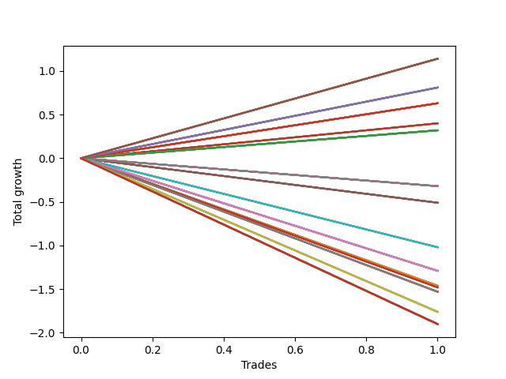

# Long HLT 239 
- Symbol: TSLA
- Date Range: 05/16/2022 - 05/17/2024
- Trading Period: 8:30-12:30
- Number of Trades: 1



| Id. | Name | Win Percent | Profit | Avg Profit / Trade | Avg Time / Trade | Std |      | Name | Win Percent | Profit | Avg Profit / Trade | Avg Time / Trade | Std |
| --- | ---- | ----------- | ------ | ------------------ | ---------------- | --- | ---- | ---- | ----------- | ------ | ------------------ | ---------------- | --- |
| | Sorted By <br> Profit | | | | | | | Sorted By <br> Win Percentage |||||
|0| TP-1 180m | 100.00 | 1.14 | 1.14 | 18:00 | 0.00 |     | TP-1 180m | 100.00 | 1.14 | 1.14 | 18:00 | 0.00 |
|1| TP-1 165m | 100.00 | 1.14 | 1.14 | 18:00 | 0.00 |     | TP-1 165m | 100.00 | 1.14 | 1.14 | 18:00 | 0.00 |
|2| TP-1 150m | 100.00 | 1.14 | 1.14 | 18:00 | 0.00 |     | TP-1 150m | 100.00 | 1.14 | 1.14 | 18:00 | 0.00 |
|3| TP-1 135m | 100.00 | 1.14 | 1.14 | 18:00 | 0.00 |     | TP-1 135m | 100.00 | 1.14 | 1.14 | 18:00 | 0.00 |
|4| TP-1 120m | 100.00 | 1.14 | 1.14 | 18:00 | 0.00 |     | TP-1 120m | 100.00 | 1.14 | 1.14 | 18:00 | 0.00 |
|5| TP-1 105m | 100.00 | 1.14 | 1.14 | 18:00 | 0.00 |     | TP-1 105m | 100.00 | 1.14 | 1.14 | 18:00 | 0.00 |
|6| TP-1 90m | 100.00 | 1.14 | 1.14 | 18:00 | 0.00 |     | TP-1 90m | 100.00 | 1.14 | 1.14 | 18:00 | 0.00 |
|7| TP-1 75m | 100.00 | 1.14 | 1.14 | 18:00 | 0.00 |     | TP-1 75m | 100.00 | 1.14 | 1.14 | 18:00 | 0.00 |
|8| TP-1 60m | 100.00 | 1.14 | 1.14 | 18:00 | 0.00 |     | TP-1 60m | 100.00 | 1.14 | 1.14 | 18:00 | 0.00 |
|9| TP-1 45m | 100.00 | 1.14 | 1.14 | 18:00 | 0.00 |     | TP-1 45m | 100.00 | 1.14 | 1.14 | 18:00 | 0.00 |
|10| TP-1 30m | 100.00 | 1.14 | 1.14 | 18:00 | 0.00 |     | TP-1 30m | 100.00 | 1.14 | 1.14 | 18:00 | 0.00 |
|11| TP-0.75 180m | 100.00 | 0.81 | 0.81 | 16:00 | 0.00 |     | TP-0.75 180m | 100.00 | 0.81 | 0.81 | 16:00 | 0.00 |
|12| TP-0.75 165m | 100.00 | 0.81 | 0.81 | 16:00 | 0.00 |     | TP-0.75 165m | 100.00 | 0.81 | 0.81 | 16:00 | 0.00 |
|13| TP-0.75 150m | 100.00 | 0.81 | 0.81 | 16:00 | 0.00 |     | TP-0.75 150m | 100.00 | 0.81 | 0.81 | 16:00 | 0.00 |
|14| TP-0.75 135m | 100.00 | 0.81 | 0.81 | 16:00 | 0.00 |     | TP-0.75 135m | 100.00 | 0.81 | 0.81 | 16:00 | 0.00 |
|15| TP-0.75 120m | 100.00 | 0.81 | 0.81 | 16:00 | 0.00 |     | TP-0.75 120m | 100.00 | 0.81 | 0.81 | 16:00 | 0.00 |
|16| TP-0.75 105m | 100.00 | 0.81 | 0.81 | 16:00 | 0.00 |     | TP-0.75 105m | 100.00 | 0.81 | 0.81 | 16:00 | 0.00 |
|17| TP-0.75 90m | 100.00 | 0.81 | 0.81 | 16:00 | 0.00 |     | TP-0.75 90m | 100.00 | 0.81 | 0.81 | 16:00 | 0.00 |
|18| TP-0.75 75m | 100.00 | 0.81 | 0.81 | 16:00 | 0.00 |     | TP-0.75 75m | 100.00 | 0.81 | 0.81 | 16:00 | 0.00 |
|19| TP-0.75 60m | 100.00 | 0.81 | 0.81 | 16:00 | 0.00 |     | TP-0.75 60m | 100.00 | 0.81 | 0.81 | 16:00 | 0.00 |
|20| TP-0.75 45m | 100.00 | 0.81 | 0.81 | 16:00 | 0.00 |     | TP-0.75 45m | 100.00 | 0.81 | 0.81 | 16:00 | 0.00 |
|21| TP-0.75 30m | 100.00 | 0.81 | 0.81 | 16:00 | 0.00 |     | TP-0.75 30m | 100.00 | 0.81 | 0.81 | 16:00 | 0.00 |
|22| TP-0.5 180m | 100.00 | 0.63 | 0.63 | 14:00 | 0.00 |     | TP-0.5 180m | 100.00 | 0.63 | 0.63 | 14:00 | 0.00 |
|23| TP-0.5 165m | 100.00 | 0.63 | 0.63 | 14:00 | 0.00 |     | TP-0.5 165m | 100.00 | 0.63 | 0.63 | 14:00 | 0.00 |
|24| TP-0.5 150m | 100.00 | 0.63 | 0.63 | 14:00 | 0.00 |     | TP-0.5 150m | 100.00 | 0.63 | 0.63 | 14:00 | 0.00 |
|25| TP-0.5 135m | 100.00 | 0.63 | 0.63 | 14:00 | 0.00 |     | TP-0.5 135m | 100.00 | 0.63 | 0.63 | 14:00 | 0.00 |
|26| TP-0.5 120m | 100.00 | 0.63 | 0.63 | 14:00 | 0.00 |     | TP-0.5 120m | 100.00 | 0.63 | 0.63 | 14:00 | 0.00 |
|27| TP-0.5 105m | 100.00 | 0.63 | 0.63 | 14:00 | 0.00 |     | TP-0.5 105m | 100.00 | 0.63 | 0.63 | 14:00 | 0.00 |
|28| TP-0.5 90m | 100.00 | 0.63 | 0.63 | 14:00 | 0.00 |     | TP-0.5 90m | 100.00 | 0.63 | 0.63 | 14:00 | 0.00 |
|29| TP-0.5 75m | 100.00 | 0.63 | 0.63 | 14:00 | 0.00 |     | TP-0.5 75m | 100.00 | 0.63 | 0.63 | 14:00 | 0.00 |
|30| TP-0.5 60m | 100.00 | 0.63 | 0.63 | 14:00 | 0.00 |     | TP-0.5 60m | 100.00 | 0.63 | 0.63 | 14:00 | 0.00 |
|31| TP-0.5 45m | 100.00 | 0.63 | 0.63 | 14:00 | 0.00 |     | TP-0.5 45m | 100.00 | 0.63 | 0.63 | 14:00 | 0.00 |
|32| TP-0.5 30m | 100.00 | 0.63 | 0.63 | 14:00 | 0.00 |     | TP-0.5 30m | 100.00 | 0.63 | 0.63 | 14:00 | 0.00 |
|33| TP-3 15m | 100.00 | 0.63 | 0.63 | 14:00 | 0.00 |     | TP-3 15m | 100.00 | 0.63 | 0.63 | 14:00 | 0.00 |
|34| TP-2.75 15m | 100.00 | 0.63 | 0.63 | 14:00 | 0.00 |     | TP-2.75 15m | 100.00 | 0.63 | 0.63 | 14:00 | 0.00 |
|35| TP-2.5 15m | 100.00 | 0.63 | 0.63 | 14:00 | 0.00 |     | TP-2.5 15m | 100.00 | 0.63 | 0.63 | 14:00 | 0.00 |
|36| TP-2.25 15m | 100.00 | 0.63 | 0.63 | 14:00 | 0.00 |     | TP-2.25 15m | 100.00 | 0.63 | 0.63 | 14:00 | 0.00 |
|37| TP-2 15m | 100.00 | 0.63 | 0.63 | 14:00 | 0.00 |     | TP-2 15m | 100.00 | 0.63 | 0.63 | 14:00 | 0.00 |
|38| TP-1.75 15m | 100.00 | 0.63 | 0.63 | 14:00 | 0.00 |     | TP-1.75 15m | 100.00 | 0.63 | 0.63 | 14:00 | 0.00 |
|39| TP-1.5 15m | 100.00 | 0.63 | 0.63 | 14:00 | 0.00 |     | TP-1.5 15m | 100.00 | 0.63 | 0.63 | 14:00 | 0.00 |
|40| TP-1.25 15m | 100.00 | 0.63 | 0.63 | 14:00 | 0.00 |     | TP-1.25 15m | 100.00 | 0.63 | 0.63 | 14:00 | 0.00 |
|41| TP-1 15m | 100.00 | 0.63 | 0.63 | 14:00 | 0.00 |     | TP-1 15m | 100.00 | 0.63 | 0.63 | 14:00 | 0.00 |
|42| TP-0.75 15m | 100.00 | 0.63 | 0.63 | 14:00 | 0.00 |     | TP-0.75 15m | 100.00 | 0.63 | 0.63 | 14:00 | 0.00 |
|43| TP-0.5 15m | 100.00 | 0.63 | 0.63 | 14:00 | 0.00 |     | TP-0.5 15m | 100.00 | 0.63 | 0.63 | 14:00 | 0.00 |
|44| TP-3 30m | 100.00 | 0.40 | 0.40 | 29:00 | 0.00 |     | TP-3 30m | 100.00 | 0.40 | 0.40 | 29:00 | 0.00 |
|45| TP-2.75 30m | 100.00 | 0.40 | 0.40 | 29:00 | 0.00 |     | TP-2.75 30m | 100.00 | 0.40 | 0.40 | 29:00 | 0.00 |
|46| TP-2.5 30m | 100.00 | 0.40 | 0.40 | 29:00 | 0.00 |     | TP-2.5 30m | 100.00 | 0.40 | 0.40 | 29:00 | 0.00 |
|47| TP-2.25 30m | 100.00 | 0.40 | 0.40 | 29:00 | 0.00 |     | TP-2.25 30m | 100.00 | 0.40 | 0.40 | 29:00 | 0.00 |
|48| TP-2 30m | 100.00 | 0.40 | 0.40 | 29:00 | 0.00 |     | TP-2 30m | 100.00 | 0.40 | 0.40 | 29:00 | 0.00 |
|49| TP-1.75 30m | 100.00 | 0.40 | 0.40 | 29:00 | 0.00 |     | TP-1.75 30m | 100.00 | 0.40 | 0.40 | 29:00 | 0.00 |
|50| TP-1.5 30m | 100.00 | 0.40 | 0.40 | 29:00 | 0.00 |     | TP-1.5 30m | 100.00 | 0.40 | 0.40 | 29:00 | 0.00 |
|51| TP-1.25 30m | 100.00 | 0.40 | 0.40 | 29:00 | 0.00 |     | TP-1.25 30m | 100.00 | 0.40 | 0.40 | 29:00 | 0.00 |
|52| TP-0.25 180m | 100.00 | 0.32 | 0.32 | 03:00 | 0.00 |     | TP-0.25 180m | 100.00 | 0.32 | 0.32 | 03:00 | 0.00 |
|53| TP-0.25 165m | 100.00 | 0.32 | 0.32 | 03:00 | 0.00 |     | TP-0.25 165m | 100.00 | 0.32 | 0.32 | 03:00 | 0.00 |
|54| TP-0.25 150m | 100.00 | 0.32 | 0.32 | 03:00 | 0.00 |     | TP-0.25 150m | 100.00 | 0.32 | 0.32 | 03:00 | 0.00 |
|55| TP-0.25 135m | 100.00 | 0.32 | 0.32 | 03:00 | 0.00 |     | TP-0.25 135m | 100.00 | 0.32 | 0.32 | 03:00 | 0.00 |
|56| TP-0.25 120m | 100.00 | 0.32 | 0.32 | 03:00 | 0.00 |     | TP-0.25 120m | 100.00 | 0.32 | 0.32 | 03:00 | 0.00 |
|57| TP-0.25 105m | 100.00 | 0.32 | 0.32 | 03:00 | 0.00 |     | TP-0.25 105m | 100.00 | 0.32 | 0.32 | 03:00 | 0.00 |
|58| TP-0.25 90m | 100.00 | 0.32 | 0.32 | 03:00 | 0.00 |     | TP-0.25 90m | 100.00 | 0.32 | 0.32 | 03:00 | 0.00 |
|59| TP-0.25 75m | 100.00 | 0.32 | 0.32 | 03:00 | 0.00 |     | TP-0.25 75m | 100.00 | 0.32 | 0.32 | 03:00 | 0.00 |
|60| TP-0.25 60m | 100.00 | 0.32 | 0.32 | 03:00 | 0.00 |     | TP-0.25 60m | 100.00 | 0.32 | 0.32 | 03:00 | 0.00 |
|61| TP-0.25 45m | 100.00 | 0.32 | 0.32 | 03:00 | 0.00 |     | TP-0.25 45m | 100.00 | 0.32 | 0.32 | 03:00 | 0.00 |
|62| TP-0.25 30m | 100.00 | 0.32 | 0.32 | 03:00 | 0.00 |     | TP-0.25 30m | 100.00 | 0.32 | 0.32 | 03:00 | 0.00 |
|63| TP-0.25 15m | 100.00 | 0.32 | 0.32 | 03:00 | 0.00 |     | TP-0.25 15m | 100.00 | 0.32 | 0.32 | 03:00 | 0.00 |
|64| TP-3 60m | 0.00 | -0.32 | -0.32 | 59:00 | 0.00 |     | TP-3 60m | 0.00 | -0.32 | -0.32 | 59:00 | 0.00 |
|65| TP-2.75 60m | 0.00 | -0.32 | -0.32 | 59:00 | 0.00 |     | TP-2.75 60m | 0.00 | -0.32 | -0.32 | 59:00 | 0.00 |
|66| TP-2.5 60m | 0.00 | -0.32 | -0.32 | 59:00 | 0.00 |     | TP-2.5 60m | 0.00 | -0.32 | -0.32 | 59:00 | 0.00 |
|67| TP-2.25 60m | 0.00 | -0.32 | -0.32 | 59:00 | 0.00 |     | TP-2.25 60m | 0.00 | -0.32 | -0.32 | 59:00 | 0.00 |
|68| TP-2 60m | 0.00 | -0.32 | -0.32 | 59:00 | 0.00 |     | TP-2 60m | 0.00 | -0.32 | -0.32 | 59:00 | 0.00 |
|69| TP-1.75 60m | 0.00 | -0.32 | -0.32 | 59:00 | 0.00 |     | TP-1.75 60m | 0.00 | -0.32 | -0.32 | 59:00 | 0.00 |
|70| TP-1.5 60m | 0.00 | -0.32 | -0.32 | 59:00 | 0.00 |     | TP-1.5 60m | 0.00 | -0.32 | -0.32 | 59:00 | 0.00 |
|71| TP-1.25 60m | 0.00 | -0.32 | -0.32 | 59:00 | 0.00 |     | TP-1.25 60m | 0.00 | -0.32 | -0.32 | 59:00 | 0.00 |
|72| TP-3 45m | 0.00 | -0.51 | -0.51 | 44:00 | 0.00 |     | TP-3 45m | 0.00 | -0.51 | -0.51 | 44:00 | 0.00 |
|73| TP-2.75 45m | 0.00 | -0.51 | -0.51 | 44:00 | 0.00 |     | TP-2.75 45m | 0.00 | -0.51 | -0.51 | 44:00 | 0.00 |
|74| TP-2.5 45m | 0.00 | -0.51 | -0.51 | 44:00 | 0.00 |     | TP-2.5 45m | 0.00 | -0.51 | -0.51 | 44:00 | 0.00 |
|75| TP-2.25 45m | 0.00 | -0.51 | -0.51 | 44:00 | 0.00 |     | TP-2.25 45m | 0.00 | -0.51 | -0.51 | 44:00 | 0.00 |
|76| TP-2 45m | 0.00 | -0.51 | -0.51 | 44:00 | 0.00 |     | TP-2 45m | 0.00 | -0.51 | -0.51 | 44:00 | 0.00 |
|77| TP-1.75 45m | 0.00 | -0.51 | -0.51 | 44:00 | 0.00 |     | TP-1.75 45m | 0.00 | -0.51 | -0.51 | 44:00 | 0.00 |
|78| TP-1.5 45m | 0.00 | -0.51 | -0.51 | 44:00 | 0.00 |     | TP-1.5 45m | 0.00 | -0.51 | -0.51 | 44:00 | 0.00 |
|79| TP-1.25 45m | 0.00 | -0.51 | -0.51 | 44:00 | 0.00 |     | TP-1.25 45m | 0.00 | -0.51 | -0.51 | 44:00 | 0.00 |
|80| TP-3 75m | 0.00 | -1.02 | -1.02 | 74:00 | 0.00 |     | TP-3 75m | 0.00 | -1.02 | -1.02 | 74:00 | 0.00 |
|81| TP-2.75 75m | 0.00 | -1.02 | -1.02 | 74:00 | 0.00 |     | TP-2.75 75m | 0.00 | -1.02 | -1.02 | 74:00 | 0.00 |
|82| TP-2.5 75m | 0.00 | -1.02 | -1.02 | 74:00 | 0.00 |     | TP-2.5 75m | 0.00 | -1.02 | -1.02 | 74:00 | 0.00 |
|83| TP-2.25 75m | 0.00 | -1.02 | -1.02 | 74:00 | 0.00 |     | TP-2.25 75m | 0.00 | -1.02 | -1.02 | 74:00 | 0.00 |
|84| TP-2 75m | 0.00 | -1.02 | -1.02 | 74:00 | 0.00 |     | TP-2 75m | 0.00 | -1.02 | -1.02 | 74:00 | 0.00 |
|85| TP-1.75 75m | 0.00 | -1.02 | -1.02 | 74:00 | 0.00 |     | TP-1.75 75m | 0.00 | -1.02 | -1.02 | 74:00 | 0.00 |
|86| TP-1.5 75m | 0.00 | -1.02 | -1.02 | 74:00 | 0.00 |     | TP-1.5 75m | 0.00 | -1.02 | -1.02 | 74:00 | 0.00 |
|87| TP-1.25 75m | 0.00 | -1.02 | -1.02 | 74:00 | 0.00 |     | TP-1.25 75m | 0.00 | -1.02 | -1.02 | 74:00 | 0.00 |
|88| TP-1.25 180m | 0.00 | -1.29 | -1.29 | 75:00 | 0.00 |     | TP-1.25 180m | 0.00 | -1.29 | -1.29 | 75:00 | 0.00 |
|89| TP-1.25 165m | 0.00 | -1.29 | -1.29 | 75:00 | 0.00 |     | TP-1.25 165m | 0.00 | -1.29 | -1.29 | 75:00 | 0.00 |
|90| TP-1.25 150m | 0.00 | -1.29 | -1.29 | 75:00 | 0.00 |     | TP-1.25 150m | 0.00 | -1.29 | -1.29 | 75:00 | 0.00 |
|91| TP-1.25 135m | 0.00 | -1.29 | -1.29 | 75:00 | 0.00 |     | TP-1.25 135m | 0.00 | -1.29 | -1.29 | 75:00 | 0.00 |
|92| TP-1.25 120m | 0.00 | -1.29 | -1.29 | 75:00 | 0.00 |     | TP-1.25 120m | 0.00 | -1.29 | -1.29 | 75:00 | 0.00 |
|93| TP-1.25 105m | 0.00 | -1.29 | -1.29 | 75:00 | 0.00 |     | TP-1.25 105m | 0.00 | -1.29 | -1.29 | 75:00 | 0.00 |
|94| TP-1.25 90m | 0.00 | -1.29 | -1.29 | 75:00 | 0.00 |     | TP-1.25 90m | 0.00 | -1.29 | -1.29 | 75:00 | 0.00 |
|95| TP-3 90m | 0.00 | -1.46 | -1.46 | 89:00 | 0.00 |     | TP-3 90m | 0.00 | -1.46 | -1.46 | 89:00 | 0.00 |
|96| TP-2.75 90m | 0.00 | -1.46 | -1.46 | 89:00 | 0.00 |     | TP-2.75 90m | 0.00 | -1.46 | -1.46 | 89:00 | 0.00 |
|97| TP-2.5 90m | 0.00 | -1.46 | -1.46 | 89:00 | 0.00 |     | TP-2.5 90m | 0.00 | -1.46 | -1.46 | 89:00 | 0.00 |
|98| TP-2.25 90m | 0.00 | -1.46 | -1.46 | 89:00 | 0.00 |     | TP-2.25 90m | 0.00 | -1.46 | -1.46 | 89:00 | 0.00 |
|99| TP-2 90m | 0.00 | -1.46 | -1.46 | 89:00 | 0.00 |     | TP-2 90m | 0.00 | -1.46 | -1.46 | 89:00 | 0.00 |
|100| TP-1.75 90m | 0.00 | -1.46 | -1.46 | 89:00 | 0.00 |     | TP-1.75 90m | 0.00 | -1.46 | -1.46 | 89:00 | 0.00 |
|101| TP-3 105m | 0.00 | -1.48 | -1.48 | 104:00 | 0.00 |     | TP-3 105m | 0.00 | -1.48 | -1.48 | 104:00 | 0.00 |
|102| TP-2.75 105m | 0.00 | -1.48 | -1.48 | 104:00 | 0.00 |     | TP-2.75 105m | 0.00 | -1.48 | -1.48 | 104:00 | 0.00 |
|103| TP-2.5 105m | 0.00 | -1.48 | -1.48 | 104:00 | 0.00 |     | TP-2.5 105m | 0.00 | -1.48 | -1.48 | 104:00 | 0.00 |
|104| TP-2.25 105m | 0.00 | -1.48 | -1.48 | 104:00 | 0.00 |     | TP-2.25 105m | 0.00 | -1.48 | -1.48 | 104:00 | 0.00 |
|105| TP-2 105m | 0.00 | -1.48 | -1.48 | 104:00 | 0.00 |     | TP-2 105m | 0.00 | -1.48 | -1.48 | 104:00 | 0.00 |
|106| TP-1.75 105m | 0.00 | -1.48 | -1.48 | 104:00 | 0.00 |     | TP-1.75 105m | 0.00 | -1.48 | -1.48 | 104:00 | 0.00 |
|107| TP-1.5 180m | 0.00 | -1.53 | -1.53 | 88:00 | 0.00 |     | TP-1.5 180m | 0.00 | -1.53 | -1.53 | 88:00 | 0.00 |
|108| TP-1.5 165m | 0.00 | -1.53 | -1.53 | 88:00 | 0.00 |     | TP-1.5 165m | 0.00 | -1.53 | -1.53 | 88:00 | 0.00 |
|109| TP-1.5 150m | 0.00 | -1.53 | -1.53 | 88:00 | 0.00 |     | TP-1.5 150m | 0.00 | -1.53 | -1.53 | 88:00 | 0.00 |
|110| TP-1.5 135m | 0.00 | -1.53 | -1.53 | 88:00 | 0.00 |     | TP-1.5 135m | 0.00 | -1.53 | -1.53 | 88:00 | 0.00 |
|111| TP-1.5 120m | 0.00 | -1.53 | -1.53 | 88:00 | 0.00 |     | TP-1.5 120m | 0.00 | -1.53 | -1.53 | 88:00 | 0.00 |
|112| TP-1.5 105m | 0.00 | -1.53 | -1.53 | 88:00 | 0.00 |     | TP-1.5 105m | 0.00 | -1.53 | -1.53 | 88:00 | 0.00 |
|113| TP-1.5 90m | 0.00 | -1.53 | -1.53 | 88:00 | 0.00 |     | TP-1.5 90m | 0.00 | -1.53 | -1.53 | 88:00 | 0.00 |
|114| TP-1.75 180m | 0.00 | -1.76 | -1.76 | 106:00 | 0.00 |     | TP-1.75 180m | 0.00 | -1.76 | -1.76 | 106:00 | 0.00 |
|115| TP-1.75 165m | 0.00 | -1.76 | -1.76 | 106:00 | 0.00 |     | TP-1.75 165m | 0.00 | -1.76 | -1.76 | 106:00 | 0.00 |
|116| TP-1.75 150m | 0.00 | -1.76 | -1.76 | 106:00 | 0.00 |     | TP-1.75 150m | 0.00 | -1.76 | -1.76 | 106:00 | 0.00 |
|117| TP-1.75 135m | 0.00 | -1.76 | -1.76 | 106:00 | 0.00 |     | TP-1.75 135m | 0.00 | -1.76 | -1.76 | 106:00 | 0.00 |
|118| TP-1.75 120m | 0.00 | -1.76 | -1.76 | 106:00 | 0.00 |     | TP-1.75 120m | 0.00 | -1.76 | -1.76 | 106:00 | 0.00 |
|119| TP-3 180m | 0.00 | -1.90 | -1.90 | 110:00 | 0.00 |     | TP-3 180m | 0.00 | -1.90 | -1.90 | 110:00 | 0.00 |
|120| TP-2.75 180m | 0.00 | -1.90 | -1.90 | 110:00 | 0.00 |     | TP-2.75 180m | 0.00 | -1.90 | -1.90 | 110:00 | 0.00 |
|121| TP-2.5 180m | 0.00 | -1.90 | -1.90 | 110:00 | 0.00 |     | TP-2.5 180m | 0.00 | -1.90 | -1.90 | 110:00 | 0.00 |
|122| TP-2.25 180m | 0.00 | -1.90 | -1.90 | 110:00 | 0.00 |     | TP-2.25 180m | 0.00 | -1.90 | -1.90 | 110:00 | 0.00 |
|123| TP-2 180m | 0.00 | -1.90 | -1.90 | 110:00 | 0.00 |     | TP-2 180m | 0.00 | -1.90 | -1.90 | 110:00 | 0.00 |
|124| TP-3 165m | 0.00 | -1.90 | -1.90 | 110:00 | 0.00 |     | TP-3 165m | 0.00 | -1.90 | -1.90 | 110:00 | 0.00 |
|125| TP-2.75 165m | 0.00 | -1.90 | -1.90 | 110:00 | 0.00 |     | TP-2.75 165m | 0.00 | -1.90 | -1.90 | 110:00 | 0.00 |
|126| TP-2.5 165m | 0.00 | -1.90 | -1.90 | 110:00 | 0.00 |     | TP-2.5 165m | 0.00 | -1.90 | -1.90 | 110:00 | 0.00 |
|127| TP-2.25 165m | 0.00 | -1.90 | -1.90 | 110:00 | 0.00 |     | TP-2.25 165m | 0.00 | -1.90 | -1.90 | 110:00 | 0.00 |
|128| TP-2 165m | 0.00 | -1.90 | -1.90 | 110:00 | 0.00 |     | TP-2 165m | 0.00 | -1.90 | -1.90 | 110:00 | 0.00 |
|129| TP-3 150m | 0.00 | -1.90 | -1.90 | 110:00 | 0.00 |     | TP-3 150m | 0.00 | -1.90 | -1.90 | 110:00 | 0.00 |
|130| TP-2.75 150m | 0.00 | -1.90 | -1.90 | 110:00 | 0.00 |     | TP-2.75 150m | 0.00 | -1.90 | -1.90 | 110:00 | 0.00 |
|131| TP-2.5 150m | 0.00 | -1.90 | -1.90 | 110:00 | 0.00 |     | TP-2.5 150m | 0.00 | -1.90 | -1.90 | 110:00 | 0.00 |
|132| TP-2.25 150m | 0.00 | -1.90 | -1.90 | 110:00 | 0.00 |     | TP-2.25 150m | 0.00 | -1.90 | -1.90 | 110:00 | 0.00 |
|133| TP-2 150m | 0.00 | -1.90 | -1.90 | 110:00 | 0.00 |     | TP-2 150m | 0.00 | -1.90 | -1.90 | 110:00 | 0.00 |
|134| TP-3 135m | 0.00 | -1.90 | -1.90 | 110:00 | 0.00 |     | TP-3 135m | 0.00 | -1.90 | -1.90 | 110:00 | 0.00 |
|135| TP-2.75 135m | 0.00 | -1.90 | -1.90 | 110:00 | 0.00 |     | TP-2.75 135m | 0.00 | -1.90 | -1.90 | 110:00 | 0.00 |
|136| TP-2.5 135m | 0.00 | -1.90 | -1.90 | 110:00 | 0.00 |     | TP-2.5 135m | 0.00 | -1.90 | -1.90 | 110:00 | 0.00 |
|137| TP-2.25 135m | 0.00 | -1.90 | -1.90 | 110:00 | 0.00 |     | TP-2.25 135m | 0.00 | -1.90 | -1.90 | 110:00 | 0.00 |
|138| TP-2 135m | 0.00 | -1.90 | -1.90 | 110:00 | 0.00 |     | TP-2 135m | 0.00 | -1.90 | -1.90 | 110:00 | 0.00 |
|139| TP-3 120m | 0.00 | -1.90 | -1.90 | 110:00 | 0.00 |     | TP-3 120m | 0.00 | -1.90 | -1.90 | 110:00 | 0.00 |
|140| TP-2.75 120m | 0.00 | -1.90 | -1.90 | 110:00 | 0.00 |     | TP-2.75 120m | 0.00 | -1.90 | -1.90 | 110:00 | 0.00 |
|141| TP-2.5 120m | 0.00 | -1.90 | -1.90 | 110:00 | 0.00 |     | TP-2.5 120m | 0.00 | -1.90 | -1.90 | 110:00 | 0.00 |
|142| TP-2.25 120m | 0.00 | -1.90 | -1.90 | 110:00 | 0.00 |     | TP-2.25 120m | 0.00 | -1.90 | -1.90 | 110:00 | 0.00 |
|143| TP-2 120m | 0.00 | -1.90 | -1.90 | 110:00 | 0.00 |     | TP-2 120m | 0.00 | -1.90 | -1.90 | 110:00 | 0.00 |

### Test TP-0.25 15m
* Take Profit of 0.25 Point
* 0.25 Stoploss
* Results:
```
Total Trades: 1
Percent Up: 100.00
Percent Down: 0.00
Total Points Moved Up: 0.32
Potential Profit: 160.00
Total Points Ups: 0.32 Count Ups: 1
Total Points Downs: 0.00 Count Downs: 0
```

<details><summary>Trades</summary>

<code>In: 2023-10-25 11:00:00		Out: 2023-10-25 11:03:00		Total Position Time: 03:00		Total Move Up: 0.32		Total to Date: 0.32</code> <br />


</details>

### Test TP-0.5 15m
* Take Profit of 0.5 Point
* 0.5 Stoploss
* Results:
```
Total Trades: 1
Percent Up: 100.00
Percent Down: 0.00
Total Points Moved Up: 0.63
Potential Profit: 315.00
Total Points Ups: 0.63 Count Ups: 1
Total Points Downs: 0.00 Count Downs: 0
```

<details><summary>Trades</summary>

<code>In: 2023-10-25 11:00:00		Out: 2023-10-25 11:14:00		Total Position Time: 14:00		Total Move Up: 0.63		Total to Date: 0.63</code> <br />


</details>

### Test TP-0.75 15m
* Take Profit of 0.75 Point
* 0.75 Stoploss
* Results:
```
Total Trades: 1
Percent Up: 100.00
Percent Down: 0.00
Total Points Moved Up: 0.63
Potential Profit: 315.00
Total Points Ups: 0.63 Count Ups: 1
Total Points Downs: 0.00 Count Downs: 0
```

<details><summary>Trades</summary>

<code>In: 2023-10-25 11:00:00		Out: 2023-10-25 11:14:00		Total Position Time: 14:00		Total Move Up: 0.63		Total to Date: 0.63</code> <br />


</details>

### Test TP-1 15m
* Take Profit of 1 Point
* 1 Stoploss
* Results:
```
Total Trades: 1
Percent Up: 100.00
Percent Down: 0.00
Total Points Moved Up: 0.63
Potential Profit: 315.00
Total Points Ups: 0.63 Count Ups: 1
Total Points Downs: 0.00 Count Downs: 0
```

<details><summary>Trades</summary>

<code>In: 2023-10-25 11:00:00		Out: 2023-10-25 11:14:00		Total Position Time: 14:00		Total Move Up: 0.63		Total to Date: 0.63</code> <br />


</details>

### Test TP-1.25 15m
* Take Profit of 1.25 Point
* 1.25 Stoploss
* Results:
```
Total Trades: 1
Percent Up: 100.00
Percent Down: 0.00
Total Points Moved Up: 0.63
Potential Profit: 315.00
Total Points Ups: 0.63 Count Ups: 1
Total Points Downs: 0.00 Count Downs: 0
```

<details><summary>Trades</summary>

<code>In: 2023-10-25 11:00:00		Out: 2023-10-25 11:14:00		Total Position Time: 14:00		Total Move Up: 0.63		Total to Date: 0.63</code> <br />


</details>

### Test TP-1.5 15m
* Take Profit of 1.5 Point
* 1.5 Stoploss
* Results:
```
Total Trades: 1
Percent Up: 100.00
Percent Down: 0.00
Total Points Moved Up: 0.63
Potential Profit: 315.00
Total Points Ups: 0.63 Count Ups: 1
Total Points Downs: 0.00 Count Downs: 0
```

<details><summary>Trades</summary>

<code>In: 2023-10-25 11:00:00		Out: 2023-10-25 11:14:00		Total Position Time: 14:00		Total Move Up: 0.63		Total to Date: 0.63</code> <br />


</details>

### Test TP-1.75 15m
* Take Profit of 1.75 Point
* 1.75 Stoploss
* Results:
```
Total Trades: 1
Percent Up: 100.00
Percent Down: 0.00
Total Points Moved Up: 0.63
Potential Profit: 315.00
Total Points Ups: 0.63 Count Ups: 1
Total Points Downs: 0.00 Count Downs: 0
```

<details><summary>Trades</summary>

<code>In: 2023-10-25 11:00:00		Out: 2023-10-25 11:14:00		Total Position Time: 14:00		Total Move Up: 0.63		Total to Date: 0.63</code> <br />


</details>

### Test TP-2 15m
* Take Profit of 2 Point
* 2 Stoploss
* Results:
```
Total Trades: 1
Percent Up: 100.00
Percent Down: 0.00
Total Points Moved Up: 0.63
Potential Profit: 315.00
Total Points Ups: 0.63 Count Ups: 1
Total Points Downs: 0.00 Count Downs: 0
```

<details><summary>Trades</summary>

<code>In: 2023-10-25 11:00:00		Out: 2023-10-25 11:14:00		Total Position Time: 14:00		Total Move Up: 0.63		Total to Date: 0.63</code> <br />


</details>

### Test TP-2.25 15m
* Take Profit of 2.25 Point
* 2.25 Stoploss
* Results:
```
Total Trades: 1
Percent Up: 100.00
Percent Down: 0.00
Total Points Moved Up: 0.63
Potential Profit: 315.00
Total Points Ups: 0.63 Count Ups: 1
Total Points Downs: 0.00 Count Downs: 0
```

<details><summary>Trades</summary>

<code>In: 2023-10-25 11:00:00		Out: 2023-10-25 11:14:00		Total Position Time: 14:00		Total Move Up: 0.63		Total to Date: 0.63</code> <br />


</details>

### Test TP-2.5 15m
* Take Profit of 2.5 Point
* 2.5 Stoploss
* Results:
```
Total Trades: 1
Percent Up: 100.00
Percent Down: 0.00
Total Points Moved Up: 0.63
Potential Profit: 315.00
Total Points Ups: 0.63 Count Ups: 1
Total Points Downs: 0.00 Count Downs: 0
```

<details><summary>Trades</summary>

<code>In: 2023-10-25 11:00:00		Out: 2023-10-25 11:14:00		Total Position Time: 14:00		Total Move Up: 0.63		Total to Date: 0.63</code> <br />


</details>

### Test TP-2.75 15m
* Take Profit of 2.75 Point
* 2.75 Stoploss
* Results:
```
Total Trades: 1
Percent Up: 100.00
Percent Down: 0.00
Total Points Moved Up: 0.63
Potential Profit: 315.00
Total Points Ups: 0.63 Count Ups: 1
Total Points Downs: 0.00 Count Downs: 0
```

<details><summary>Trades</summary>

<code>In: 2023-10-25 11:00:00		Out: 2023-10-25 11:14:00		Total Position Time: 14:00		Total Move Up: 0.63		Total to Date: 0.63</code> <br />


</details>

### Test TP-3 15m
* Take Profit of 3 Point
* 3 Stoploss
* Results:
```
Total Trades: 1
Percent Up: 100.00
Percent Down: 0.00
Total Points Moved Up: 0.63
Potential Profit: 315.00
Total Points Ups: 0.63 Count Ups: 1
Total Points Downs: 0.00 Count Downs: 0
```

<details><summary>Trades</summary>

<code>In: 2023-10-25 11:00:00		Out: 2023-10-25 11:14:00		Total Position Time: 14:00		Total Move Up: 0.63		Total to Date: 0.63</code> <br />


</details>

### Test TP-0.25 30m
* Take Profit of 0.25 Point
* 0.25 Stoploss
* Results:
```
Total Trades: 1
Percent Up: 100.00
Percent Down: 0.00
Total Points Moved Up: 0.32
Potential Profit: 160.00
Total Points Ups: 0.32 Count Ups: 1
Total Points Downs: 0.00 Count Downs: 0
```

<details><summary>Trades</summary>

<code>In: 2023-10-25 11:00:00		Out: 2023-10-25 11:03:00		Total Position Time: 03:00		Total Move Up: 0.32		Total to Date: 0.32</code> <br />


</details>

### Test TP-0.5 30m
* Take Profit of 0.5 Point
* 0.5 Stoploss
* Results:
```
Total Trades: 1
Percent Up: 100.00
Percent Down: 0.00
Total Points Moved Up: 0.63
Potential Profit: 315.00
Total Points Ups: 0.63 Count Ups: 1
Total Points Downs: 0.00 Count Downs: 0
```

<details><summary>Trades</summary>

<code>In: 2023-10-25 11:00:00		Out: 2023-10-25 11:14:00		Total Position Time: 14:00		Total Move Up: 0.63		Total to Date: 0.63</code> <br />


</details>

### Test TP-0.75 30m
* Take Profit of 0.75 Point
* 0.75 Stoploss
* Results:
```
Total Trades: 1
Percent Up: 100.00
Percent Down: 0.00
Total Points Moved Up: 0.81
Potential Profit: 405.00
Total Points Ups: 0.81 Count Ups: 1
Total Points Downs: 0.00 Count Downs: 0
```

<details><summary>Trades</summary>

<code>In: 2023-10-25 11:00:00		Out: 2023-10-25 11:16:00		Total Position Time: 16:00		Total Move Up: 0.81		Total to Date: 0.81</code> <br />


</details>

### Test TP-1 30m
* Take Profit of 1 Point
* 1 Stoploss
* Results:
```
Total Trades: 1
Percent Up: 100.00
Percent Down: 0.00
Total Points Moved Up: 1.14
Potential Profit: 570.00
Total Points Ups: 1.14 Count Ups: 1
Total Points Downs: 0.00 Count Downs: 0
```

<details><summary>Trades</summary>

<code>In: 2023-10-25 11:00:00		Out: 2023-10-25 11:18:00		Total Position Time: 18:00		Total Move Up: 1.14		Total to Date: 1.14</code> <br />


</details>

### Test TP-1.25 30m
* Take Profit of 1.25 Point
* 1.25 Stoploss
* Results:
```
Total Trades: 1
Percent Up: 100.00
Percent Down: 0.00
Total Points Moved Up: 0.40
Potential Profit: 200.00
Total Points Ups: 0.40 Count Ups: 1
Total Points Downs: 0.00 Count Downs: 0
```

<details><summary>Trades</summary>

<code>In: 2023-10-25 11:00:00		Out: 2023-10-25 11:29:00		Total Position Time: 29:00		Total Move Up: 0.40		Total to Date: 0.40</code> <br />


</details>

### Test TP-1.5 30m
* Take Profit of 1.5 Point
* 1.5 Stoploss
* Results:
```
Total Trades: 1
Percent Up: 100.00
Percent Down: 0.00
Total Points Moved Up: 0.40
Potential Profit: 200.00
Total Points Ups: 0.40 Count Ups: 1
Total Points Downs: 0.00 Count Downs: 0
```

<details><summary>Trades</summary>

<code>In: 2023-10-25 11:00:00		Out: 2023-10-25 11:29:00		Total Position Time: 29:00		Total Move Up: 0.40		Total to Date: 0.40</code> <br />


</details>

### Test TP-1.75 30m
* Take Profit of 1.75 Point
* 1.75 Stoploss
* Results:
```
Total Trades: 1
Percent Up: 100.00
Percent Down: 0.00
Total Points Moved Up: 0.40
Potential Profit: 200.00
Total Points Ups: 0.40 Count Ups: 1
Total Points Downs: 0.00 Count Downs: 0
```

<details><summary>Trades</summary>

<code>In: 2023-10-25 11:00:00		Out: 2023-10-25 11:29:00		Total Position Time: 29:00		Total Move Up: 0.40		Total to Date: 0.40</code> <br />


</details>

### Test TP-2 30m
* Take Profit of 2 Point
* 2 Stoploss
* Results:
```
Total Trades: 1
Percent Up: 100.00
Percent Down: 0.00
Total Points Moved Up: 0.40
Potential Profit: 200.00
Total Points Ups: 0.40 Count Ups: 1
Total Points Downs: 0.00 Count Downs: 0
```

<details><summary>Trades</summary>

<code>In: 2023-10-25 11:00:00		Out: 2023-10-25 11:29:00		Total Position Time: 29:00		Total Move Up: 0.40		Total to Date: 0.40</code> <br />


</details>

### Test TP-2.25 30m
* Take Profit of 2.25 Point
* 2.25 Stoploss
* Results:
```
Total Trades: 1
Percent Up: 100.00
Percent Down: 0.00
Total Points Moved Up: 0.40
Potential Profit: 200.00
Total Points Ups: 0.40 Count Ups: 1
Total Points Downs: 0.00 Count Downs: 0
```

<details><summary>Trades</summary>

<code>In: 2023-10-25 11:00:00		Out: 2023-10-25 11:29:00		Total Position Time: 29:00		Total Move Up: 0.40		Total to Date: 0.40</code> <br />


</details>

### Test TP-2.5 30m
* Take Profit of 2.5 Point
* 2.5 Stoploss
* Results:
```
Total Trades: 1
Percent Up: 100.00
Percent Down: 0.00
Total Points Moved Up: 0.40
Potential Profit: 200.00
Total Points Ups: 0.40 Count Ups: 1
Total Points Downs: 0.00 Count Downs: 0
```

<details><summary>Trades</summary>

<code>In: 2023-10-25 11:00:00		Out: 2023-10-25 11:29:00		Total Position Time: 29:00		Total Move Up: 0.40		Total to Date: 0.40</code> <br />


</details>

### Test TP-2.75 30m
* Take Profit of 2.75 Point
* 2.75 Stoploss
* Results:
```
Total Trades: 1
Percent Up: 100.00
Percent Down: 0.00
Total Points Moved Up: 0.40
Potential Profit: 200.00
Total Points Ups: 0.40 Count Ups: 1
Total Points Downs: 0.00 Count Downs: 0
```

<details><summary>Trades</summary>

<code>In: 2023-10-25 11:00:00		Out: 2023-10-25 11:29:00		Total Position Time: 29:00		Total Move Up: 0.40		Total to Date: 0.40</code> <br />


</details>

### Test TP-3 30m
* Take Profit of 3 Point
* 3 Stoploss
* Results:
```
Total Trades: 1
Percent Up: 100.00
Percent Down: 0.00
Total Points Moved Up: 0.40
Potential Profit: 200.00
Total Points Ups: 0.40 Count Ups: 1
Total Points Downs: 0.00 Count Downs: 0
```

<details><summary>Trades</summary>

<code>In: 2023-10-25 11:00:00		Out: 2023-10-25 11:29:00		Total Position Time: 29:00		Total Move Up: 0.40		Total to Date: 0.40</code> <br />


</details>

### Test TP-0.25 45m
* Take Profit of 0.25 Point
* 0.25 Stoploss
* Results:
```
Total Trades: 1
Percent Up: 100.00
Percent Down: 0.00
Total Points Moved Up: 0.32
Potential Profit: 160.00
Total Points Ups: 0.32 Count Ups: 1
Total Points Downs: 0.00 Count Downs: 0
```

<details><summary>Trades</summary>

<code>In: 2023-10-25 11:00:00		Out: 2023-10-25 11:03:00		Total Position Time: 03:00		Total Move Up: 0.32		Total to Date: 0.32</code> <br />


</details>

### Test TP-0.5 45m
* Take Profit of 0.5 Point
* 0.5 Stoploss
* Results:
```
Total Trades: 1
Percent Up: 100.00
Percent Down: 0.00
Total Points Moved Up: 0.63
Potential Profit: 315.00
Total Points Ups: 0.63 Count Ups: 1
Total Points Downs: 0.00 Count Downs: 0
```

<details><summary>Trades</summary>

<code>In: 2023-10-25 11:00:00		Out: 2023-10-25 11:14:00		Total Position Time: 14:00		Total Move Up: 0.63		Total to Date: 0.63</code> <br />


</details>

### Test TP-0.75 45m
* Take Profit of 0.75 Point
* 0.75 Stoploss
* Results:
```
Total Trades: 1
Percent Up: 100.00
Percent Down: 0.00
Total Points Moved Up: 0.81
Potential Profit: 405.00
Total Points Ups: 0.81 Count Ups: 1
Total Points Downs: 0.00 Count Downs: 0
```

<details><summary>Trades</summary>

<code>In: 2023-10-25 11:00:00		Out: 2023-10-25 11:16:00		Total Position Time: 16:00		Total Move Up: 0.81		Total to Date: 0.81</code> <br />


</details>

### Test TP-1 45m
* Take Profit of 1 Point
* 1 Stoploss
* Results:
```
Total Trades: 1
Percent Up: 100.00
Percent Down: 0.00
Total Points Moved Up: 1.14
Potential Profit: 570.00
Total Points Ups: 1.14 Count Ups: 1
Total Points Downs: 0.00 Count Downs: 0
```

<details><summary>Trades</summary>

<code>In: 2023-10-25 11:00:00		Out: 2023-10-25 11:18:00		Total Position Time: 18:00		Total Move Up: 1.14		Total to Date: 1.14</code> <br />


</details>

### Test TP-1.25 45m
* Take Profit of 1.25 Point
* 1.25 Stoploss
* Results:
```
Total Trades: 1
Percent Up: 0.00
Percent Down: 100.00
Total Points Moved Up: -0.51
Potential Profit: -255.00
Total Points Ups: 0.00 Count Ups: 0
Total Points Downs: -0.51 Count Downs: 1
```

<details><summary>Trades</summary>

<code>In: 2023-10-25 11:00:00		Out: 2023-10-25 11:44:00		Total Position Time: 44:00		Total Move Up: -0.51		Total to Date: -0.51</code> <br />


</details>

### Test TP-1.5 45m
* Take Profit of 1.5 Point
* 1.5 Stoploss
* Results:
```
Total Trades: 1
Percent Up: 0.00
Percent Down: 100.00
Total Points Moved Up: -0.51
Potential Profit: -255.00
Total Points Ups: 0.00 Count Ups: 0
Total Points Downs: -0.51 Count Downs: 1
```

<details><summary>Trades</summary>

<code>In: 2023-10-25 11:00:00		Out: 2023-10-25 11:44:00		Total Position Time: 44:00		Total Move Up: -0.51		Total to Date: -0.51</code> <br />


</details>

### Test TP-1.75 45m
* Take Profit of 1.75 Point
* 1.75 Stoploss
* Results:
```
Total Trades: 1
Percent Up: 0.00
Percent Down: 100.00
Total Points Moved Up: -0.51
Potential Profit: -255.00
Total Points Ups: 0.00 Count Ups: 0
Total Points Downs: -0.51 Count Downs: 1
```

<details><summary>Trades</summary>

<code>In: 2023-10-25 11:00:00		Out: 2023-10-25 11:44:00		Total Position Time: 44:00		Total Move Up: -0.51		Total to Date: -0.51</code> <br />


</details>

### Test TP-2 45m
* Take Profit of 2 Point
* 2 Stoploss
* Results:
```
Total Trades: 1
Percent Up: 0.00
Percent Down: 100.00
Total Points Moved Up: -0.51
Potential Profit: -255.00
Total Points Ups: 0.00 Count Ups: 0
Total Points Downs: -0.51 Count Downs: 1
```

<details><summary>Trades</summary>

<code>In: 2023-10-25 11:00:00		Out: 2023-10-25 11:44:00		Total Position Time: 44:00		Total Move Up: -0.51		Total to Date: -0.51</code> <br />


</details>

### Test TP-2.25 45m
* Take Profit of 2.25 Point
* 2.25 Stoploss
* Results:
```
Total Trades: 1
Percent Up: 0.00
Percent Down: 100.00
Total Points Moved Up: -0.51
Potential Profit: -255.00
Total Points Ups: 0.00 Count Ups: 0
Total Points Downs: -0.51 Count Downs: 1
```

<details><summary>Trades</summary>

<code>In: 2023-10-25 11:00:00		Out: 2023-10-25 11:44:00		Total Position Time: 44:00		Total Move Up: -0.51		Total to Date: -0.51</code> <br />


</details>

### Test TP-2.5 45m
* Take Profit of 2.5 Point
* 2.5 Stoploss
* Results:
```
Total Trades: 1
Percent Up: 0.00
Percent Down: 100.00
Total Points Moved Up: -0.51
Potential Profit: -255.00
Total Points Ups: 0.00 Count Ups: 0
Total Points Downs: -0.51 Count Downs: 1
```

<details><summary>Trades</summary>

<code>In: 2023-10-25 11:00:00		Out: 2023-10-25 11:44:00		Total Position Time: 44:00		Total Move Up: -0.51		Total to Date: -0.51</code> <br />


</details>

### Test TP-2.75 45m
* Take Profit of 2.75 Point
* 2.75 Stoploss
* Results:
```
Total Trades: 1
Percent Up: 0.00
Percent Down: 100.00
Total Points Moved Up: -0.51
Potential Profit: -255.00
Total Points Ups: 0.00 Count Ups: 0
Total Points Downs: -0.51 Count Downs: 1
```

<details><summary>Trades</summary>

<code>In: 2023-10-25 11:00:00		Out: 2023-10-25 11:44:00		Total Position Time: 44:00		Total Move Up: -0.51		Total to Date: -0.51</code> <br />


</details>

### Test TP-3 45m
* Take Profit of 3 Point
* 3 Stoploss
* Results:
```
Total Trades: 1
Percent Up: 0.00
Percent Down: 100.00
Total Points Moved Up: -0.51
Potential Profit: -255.00
Total Points Ups: 0.00 Count Ups: 0
Total Points Downs: -0.51 Count Downs: 1
```

<details><summary>Trades</summary>

<code>In: 2023-10-25 11:00:00		Out: 2023-10-25 11:44:00		Total Position Time: 44:00		Total Move Up: -0.51		Total to Date: -0.51</code> <br />


</details>

### Test TP-0.25 60m
* Take Profit of 0.25 Point
* 0.25 Stoploss
* Results:
```
Total Trades: 1
Percent Up: 100.00
Percent Down: 0.00
Total Points Moved Up: 0.32
Potential Profit: 160.00
Total Points Ups: 0.32 Count Ups: 1
Total Points Downs: 0.00 Count Downs: 0
```

<details><summary>Trades</summary>

<code>In: 2023-10-25 11:00:00		Out: 2023-10-25 11:03:00		Total Position Time: 03:00		Total Move Up: 0.32		Total to Date: 0.32</code> <br />


</details>

### Test TP-0.5 60m
* Take Profit of 0.5 Point
* 0.5 Stoploss
* Results:
```
Total Trades: 1
Percent Up: 100.00
Percent Down: 0.00
Total Points Moved Up: 0.63
Potential Profit: 315.00
Total Points Ups: 0.63 Count Ups: 1
Total Points Downs: 0.00 Count Downs: 0
```

<details><summary>Trades</summary>

<code>In: 2023-10-25 11:00:00		Out: 2023-10-25 11:14:00		Total Position Time: 14:00		Total Move Up: 0.63		Total to Date: 0.63</code> <br />


</details>

### Test TP-0.75 60m
* Take Profit of 0.75 Point
* 0.75 Stoploss
* Results:
```
Total Trades: 1
Percent Up: 100.00
Percent Down: 0.00
Total Points Moved Up: 0.81
Potential Profit: 405.00
Total Points Ups: 0.81 Count Ups: 1
Total Points Downs: 0.00 Count Downs: 0
```

<details><summary>Trades</summary>

<code>In: 2023-10-25 11:00:00		Out: 2023-10-25 11:16:00		Total Position Time: 16:00		Total Move Up: 0.81		Total to Date: 0.81</code> <br />


</details>

### Test TP-1 60m
* Take Profit of 1 Point
* 1 Stoploss
* Results:
```
Total Trades: 1
Percent Up: 100.00
Percent Down: 0.00
Total Points Moved Up: 1.14
Potential Profit: 570.00
Total Points Ups: 1.14 Count Ups: 1
Total Points Downs: 0.00 Count Downs: 0
```

<details><summary>Trades</summary>

<code>In: 2023-10-25 11:00:00		Out: 2023-10-25 11:18:00		Total Position Time: 18:00		Total Move Up: 1.14		Total to Date: 1.14</code> <br />


</details>

### Test TP-1.25 60m
* Take Profit of 1.25 Point
* 1.25 Stoploss
* Results:
```
Total Trades: 1
Percent Up: 0.00
Percent Down: 100.00
Total Points Moved Up: -0.32
Potential Profit: -160.00
Total Points Ups: 0.00 Count Ups: 0
Total Points Downs: -0.32 Count Downs: 1
```

<details><summary>Trades</summary>

<code>In: 2023-10-25 11:00:00		Out: 2023-10-25 11:59:00		Total Position Time: 59:00		Total Move Up: -0.32		Total to Date: -0.32</code> <br />


</details>

### Test TP-1.5 60m
* Take Profit of 1.5 Point
* 1.5 Stoploss
* Results:
```
Total Trades: 1
Percent Up: 0.00
Percent Down: 100.00
Total Points Moved Up: -0.32
Potential Profit: -160.00
Total Points Ups: 0.00 Count Ups: 0
Total Points Downs: -0.32 Count Downs: 1
```

<details><summary>Trades</summary>

<code>In: 2023-10-25 11:00:00		Out: 2023-10-25 11:59:00		Total Position Time: 59:00		Total Move Up: -0.32		Total to Date: -0.32</code> <br />


</details>

### Test TP-1.75 60m
* Take Profit of 1.75 Point
* 1.75 Stoploss
* Results:
```
Total Trades: 1
Percent Up: 0.00
Percent Down: 100.00
Total Points Moved Up: -0.32
Potential Profit: -160.00
Total Points Ups: 0.00 Count Ups: 0
Total Points Downs: -0.32 Count Downs: 1
```

<details><summary>Trades</summary>

<code>In: 2023-10-25 11:00:00		Out: 2023-10-25 11:59:00		Total Position Time: 59:00		Total Move Up: -0.32		Total to Date: -0.32</code> <br />


</details>

### Test TP-2 60m
* Take Profit of 2 Point
* 2 Stoploss
* Results:
```
Total Trades: 1
Percent Up: 0.00
Percent Down: 100.00
Total Points Moved Up: -0.32
Potential Profit: -160.00
Total Points Ups: 0.00 Count Ups: 0
Total Points Downs: -0.32 Count Downs: 1
```

<details><summary>Trades</summary>

<code>In: 2023-10-25 11:00:00		Out: 2023-10-25 11:59:00		Total Position Time: 59:00		Total Move Up: -0.32		Total to Date: -0.32</code> <br />


</details>

### Test TP-2.25 60m
* Take Profit of 2.25 Point
* 2.25 Stoploss
* Results:
```
Total Trades: 1
Percent Up: 0.00
Percent Down: 100.00
Total Points Moved Up: -0.32
Potential Profit: -160.00
Total Points Ups: 0.00 Count Ups: 0
Total Points Downs: -0.32 Count Downs: 1
```

<details><summary>Trades</summary>

<code>In: 2023-10-25 11:00:00		Out: 2023-10-25 11:59:00		Total Position Time: 59:00		Total Move Up: -0.32		Total to Date: -0.32</code> <br />


</details>

### Test TP-2.5 60m
* Take Profit of 2.5 Point
* 2.5 Stoploss
* Results:
```
Total Trades: 1
Percent Up: 0.00
Percent Down: 100.00
Total Points Moved Up: -0.32
Potential Profit: -160.00
Total Points Ups: 0.00 Count Ups: 0
Total Points Downs: -0.32 Count Downs: 1
```

<details><summary>Trades</summary>

<code>In: 2023-10-25 11:00:00		Out: 2023-10-25 11:59:00		Total Position Time: 59:00		Total Move Up: -0.32		Total to Date: -0.32</code> <br />


</details>

### Test TP-2.75 60m
* Take Profit of 2.75 Point
* 2.75 Stoploss
* Results:
```
Total Trades: 1
Percent Up: 0.00
Percent Down: 100.00
Total Points Moved Up: -0.32
Potential Profit: -160.00
Total Points Ups: 0.00 Count Ups: 0
Total Points Downs: -0.32 Count Downs: 1
```

<details><summary>Trades</summary>

<code>In: 2023-10-25 11:00:00		Out: 2023-10-25 11:59:00		Total Position Time: 59:00		Total Move Up: -0.32		Total to Date: -0.32</code> <br />


</details>

### Test TP-3 60m
* Take Profit of 3 Point
* 3 Stoploss
* Results:
```
Total Trades: 1
Percent Up: 0.00
Percent Down: 100.00
Total Points Moved Up: -0.32
Potential Profit: -160.00
Total Points Ups: 0.00 Count Ups: 0
Total Points Downs: -0.32 Count Downs: 1
```

<details><summary>Trades</summary>

<code>In: 2023-10-25 11:00:00		Out: 2023-10-25 11:59:00		Total Position Time: 59:00		Total Move Up: -0.32		Total to Date: -0.32</code> <br />


</details>

### Test TP-0.25 75m
* Take Profit of 0.25 Point
* 0.25 Stoploss
* Results:
```
Total Trades: 1
Percent Up: 100.00
Percent Down: 0.00
Total Points Moved Up: 0.32
Potential Profit: 160.00
Total Points Ups: 0.32 Count Ups: 1
Total Points Downs: 0.00 Count Downs: 0
```

<details><summary>Trades</summary>

<code>In: 2023-10-25 11:00:00		Out: 2023-10-25 11:03:00		Total Position Time: 03:00		Total Move Up: 0.32		Total to Date: 0.32</code> <br />


</details>

### Test TP-0.5 75m
* Take Profit of 0.5 Point
* 0.5 Stoploss
* Results:
```
Total Trades: 1
Percent Up: 100.00
Percent Down: 0.00
Total Points Moved Up: 0.63
Potential Profit: 315.00
Total Points Ups: 0.63 Count Ups: 1
Total Points Downs: 0.00 Count Downs: 0
```

<details><summary>Trades</summary>

<code>In: 2023-10-25 11:00:00		Out: 2023-10-25 11:14:00		Total Position Time: 14:00		Total Move Up: 0.63		Total to Date: 0.63</code> <br />


</details>

### Test TP-0.75 75m
* Take Profit of 0.75 Point
* 0.75 Stoploss
* Results:
```
Total Trades: 1
Percent Up: 100.00
Percent Down: 0.00
Total Points Moved Up: 0.81
Potential Profit: 405.00
Total Points Ups: 0.81 Count Ups: 1
Total Points Downs: 0.00 Count Downs: 0
```

<details><summary>Trades</summary>

<code>In: 2023-10-25 11:00:00		Out: 2023-10-25 11:16:00		Total Position Time: 16:00		Total Move Up: 0.81		Total to Date: 0.81</code> <br />


</details>

### Test TP-1 75m
* Take Profit of 1 Point
* 1 Stoploss
* Results:
```
Total Trades: 1
Percent Up: 100.00
Percent Down: 0.00
Total Points Moved Up: 1.14
Potential Profit: 570.00
Total Points Ups: 1.14 Count Ups: 1
Total Points Downs: 0.00 Count Downs: 0
```

<details><summary>Trades</summary>

<code>In: 2023-10-25 11:00:00		Out: 2023-10-25 11:18:00		Total Position Time: 18:00		Total Move Up: 1.14		Total to Date: 1.14</code> <br />


</details>

### Test TP-1.25 75m
* Take Profit of 1.25 Point
* 1.25 Stoploss
* Results:
```
Total Trades: 1
Percent Up: 0.00
Percent Down: 100.00
Total Points Moved Up: -1.02
Potential Profit: -510.00
Total Points Ups: 0.00 Count Ups: 0
Total Points Downs: -1.02 Count Downs: 1
```

<details><summary>Trades</summary>

<code>In: 2023-10-25 11:00:00		Out: 2023-10-25 12:14:00		Total Position Time: 74:00		Total Move Up: -1.02		Total to Date: -1.02</code> <br />


</details>

### Test TP-1.5 75m
* Take Profit of 1.5 Point
* 1.5 Stoploss
* Results:
```
Total Trades: 1
Percent Up: 0.00
Percent Down: 100.00
Total Points Moved Up: -1.02
Potential Profit: -510.00
Total Points Ups: 0.00 Count Ups: 0
Total Points Downs: -1.02 Count Downs: 1
```

<details><summary>Trades</summary>

<code>In: 2023-10-25 11:00:00		Out: 2023-10-25 12:14:00		Total Position Time: 74:00		Total Move Up: -1.02		Total to Date: -1.02</code> <br />


</details>

### Test TP-1.75 75m
* Take Profit of 1.75 Point
* 1.75 Stoploss
* Results:
```
Total Trades: 1
Percent Up: 0.00
Percent Down: 100.00
Total Points Moved Up: -1.02
Potential Profit: -510.00
Total Points Ups: 0.00 Count Ups: 0
Total Points Downs: -1.02 Count Downs: 1
```

<details><summary>Trades</summary>

<code>In: 2023-10-25 11:00:00		Out: 2023-10-25 12:14:00		Total Position Time: 74:00		Total Move Up: -1.02		Total to Date: -1.02</code> <br />


</details>

### Test TP-2 75m
* Take Profit of 2 Point
* 2 Stoploss
* Results:
```
Total Trades: 1
Percent Up: 0.00
Percent Down: 100.00
Total Points Moved Up: -1.02
Potential Profit: -510.00
Total Points Ups: 0.00 Count Ups: 0
Total Points Downs: -1.02 Count Downs: 1
```

<details><summary>Trades</summary>

<code>In: 2023-10-25 11:00:00		Out: 2023-10-25 12:14:00		Total Position Time: 74:00		Total Move Up: -1.02		Total to Date: -1.02</code> <br />


</details>

### Test TP-2.25 75m
* Take Profit of 2.25 Point
* 2.25 Stoploss
* Results:
```
Total Trades: 1
Percent Up: 0.00
Percent Down: 100.00
Total Points Moved Up: -1.02
Potential Profit: -510.00
Total Points Ups: 0.00 Count Ups: 0
Total Points Downs: -1.02 Count Downs: 1
```

<details><summary>Trades</summary>

<code>In: 2023-10-25 11:00:00		Out: 2023-10-25 12:14:00		Total Position Time: 74:00		Total Move Up: -1.02		Total to Date: -1.02</code> <br />


</details>

### Test TP-2.5 75m
* Take Profit of 2.5 Point
* 2.5 Stoploss
* Results:
```
Total Trades: 1
Percent Up: 0.00
Percent Down: 100.00
Total Points Moved Up: -1.02
Potential Profit: -510.00
Total Points Ups: 0.00 Count Ups: 0
Total Points Downs: -1.02 Count Downs: 1
```

<details><summary>Trades</summary>

<code>In: 2023-10-25 11:00:00		Out: 2023-10-25 12:14:00		Total Position Time: 74:00		Total Move Up: -1.02		Total to Date: -1.02</code> <br />


</details>

### Test TP-2.75 75m
* Take Profit of 2.75 Point
* 2.75 Stoploss
* Results:
```
Total Trades: 1
Percent Up: 0.00
Percent Down: 100.00
Total Points Moved Up: -1.02
Potential Profit: -510.00
Total Points Ups: 0.00 Count Ups: 0
Total Points Downs: -1.02 Count Downs: 1
```

<details><summary>Trades</summary>

<code>In: 2023-10-25 11:00:00		Out: 2023-10-25 12:14:00		Total Position Time: 74:00		Total Move Up: -1.02		Total to Date: -1.02</code> <br />


</details>

### Test TP-3 75m
* Take Profit of 3 Point
* 3 Stoploss
* Results:
```
Total Trades: 1
Percent Up: 0.00
Percent Down: 100.00
Total Points Moved Up: -1.02
Potential Profit: -510.00
Total Points Ups: 0.00 Count Ups: 0
Total Points Downs: -1.02 Count Downs: 1
```

<details><summary>Trades</summary>

<code>In: 2023-10-25 11:00:00		Out: 2023-10-25 12:14:00		Total Position Time: 74:00		Total Move Up: -1.02		Total to Date: -1.02</code> <br />


</details>

### Test TP-0.25 90m
* Take Profit of 0.25 Point
* 0.25 Stoploss
* Results:
```
Total Trades: 1
Percent Up: 100.00
Percent Down: 0.00
Total Points Moved Up: 0.32
Potential Profit: 160.00
Total Points Ups: 0.32 Count Ups: 1
Total Points Downs: 0.00 Count Downs: 0
```

<details><summary>Trades</summary>

<code>In: 2023-10-25 11:00:00		Out: 2023-10-25 11:03:00		Total Position Time: 03:00		Total Move Up: 0.32		Total to Date: 0.32</code> <br />


</details>

### Test TP-0.5 90m
* Take Profit of 0.5 Point
* 0.5 Stoploss
* Results:
```
Total Trades: 1
Percent Up: 100.00
Percent Down: 0.00
Total Points Moved Up: 0.63
Potential Profit: 315.00
Total Points Ups: 0.63 Count Ups: 1
Total Points Downs: 0.00 Count Downs: 0
```

<details><summary>Trades</summary>

<code>In: 2023-10-25 11:00:00		Out: 2023-10-25 11:14:00		Total Position Time: 14:00		Total Move Up: 0.63		Total to Date: 0.63</code> <br />


</details>

### Test TP-0.75 90m
* Take Profit of 0.75 Point
* 0.75 Stoploss
* Results:
```
Total Trades: 1
Percent Up: 100.00
Percent Down: 0.00
Total Points Moved Up: 0.81
Potential Profit: 405.00
Total Points Ups: 0.81 Count Ups: 1
Total Points Downs: 0.00 Count Downs: 0
```

<details><summary>Trades</summary>

<code>In: 2023-10-25 11:00:00		Out: 2023-10-25 11:16:00		Total Position Time: 16:00		Total Move Up: 0.81		Total to Date: 0.81</code> <br />


</details>

### Test TP-1 90m
* Take Profit of 1 Point
* 1 Stoploss
* Results:
```
Total Trades: 1
Percent Up: 100.00
Percent Down: 0.00
Total Points Moved Up: 1.14
Potential Profit: 570.00
Total Points Ups: 1.14 Count Ups: 1
Total Points Downs: 0.00 Count Downs: 0
```

<details><summary>Trades</summary>

<code>In: 2023-10-25 11:00:00		Out: 2023-10-25 11:18:00		Total Position Time: 18:00		Total Move Up: 1.14		Total to Date: 1.14</code> <br />


</details>

### Test TP-1.25 90m
* Take Profit of 1.25 Point
* 1.25 Stoploss
* Results:
```
Total Trades: 1
Percent Up: 0.00
Percent Down: 100.00
Total Points Moved Up: -1.29
Potential Profit: -645.00
Total Points Ups: 0.00 Count Ups: 0
Total Points Downs: -1.29 Count Downs: 1
```

<details><summary>Trades</summary>

<code>In: 2023-10-25 11:00:00		Out: 2023-10-25 12:15:00		Total Position Time: 75:00		Total Move Up: -1.29		Total to Date: -1.29</code> <br />


</details>

### Test TP-1.5 90m
* Take Profit of 1.5 Point
* 1.5 Stoploss
* Results:
```
Total Trades: 1
Percent Up: 0.00
Percent Down: 100.00
Total Points Moved Up: -1.53
Potential Profit: -765.00
Total Points Ups: 0.00 Count Ups: 0
Total Points Downs: -1.53 Count Downs: 1
```

<details><summary>Trades</summary>

<code>In: 2023-10-25 11:00:00		Out: 2023-10-25 12:28:00		Total Position Time: 88:00		Total Move Up: -1.53		Total to Date: -1.53</code> <br />


</details>

### Test TP-1.75 90m
* Take Profit of 1.75 Point
* 1.75 Stoploss
* Results:
```
Total Trades: 1
Percent Up: 0.00
Percent Down: 100.00
Total Points Moved Up: -1.46
Potential Profit: -730.00
Total Points Ups: 0.00 Count Ups: 0
Total Points Downs: -1.46 Count Downs: 1
```

<details><summary>Trades</summary>

<code>In: 2023-10-25 11:00:00		Out: 2023-10-25 12:29:00		Total Position Time: 89:00		Total Move Up: -1.46		Total to Date: -1.46</code> <br />


</details>

### Test TP-2 90m
* Take Profit of 2 Point
* 2 Stoploss
* Results:
```
Total Trades: 1
Percent Up: 0.00
Percent Down: 100.00
Total Points Moved Up: -1.46
Potential Profit: -730.00
Total Points Ups: 0.00 Count Ups: 0
Total Points Downs: -1.46 Count Downs: 1
```

<details><summary>Trades</summary>

<code>In: 2023-10-25 11:00:00		Out: 2023-10-25 12:29:00		Total Position Time: 89:00		Total Move Up: -1.46		Total to Date: -1.46</code> <br />


</details>

### Test TP-2.25 90m
* Take Profit of 2.25 Point
* 2.25 Stoploss
* Results:
```
Total Trades: 1
Percent Up: 0.00
Percent Down: 100.00
Total Points Moved Up: -1.46
Potential Profit: -730.00
Total Points Ups: 0.00 Count Ups: 0
Total Points Downs: -1.46 Count Downs: 1
```

<details><summary>Trades</summary>

<code>In: 2023-10-25 11:00:00		Out: 2023-10-25 12:29:00		Total Position Time: 89:00		Total Move Up: -1.46		Total to Date: -1.46</code> <br />


</details>

### Test TP-2.5 90m
* Take Profit of 2.5 Point
* 2.5 Stoploss
* Results:
```
Total Trades: 1
Percent Up: 0.00
Percent Down: 100.00
Total Points Moved Up: -1.46
Potential Profit: -730.00
Total Points Ups: 0.00 Count Ups: 0
Total Points Downs: -1.46 Count Downs: 1
```

<details><summary>Trades</summary>

<code>In: 2023-10-25 11:00:00		Out: 2023-10-25 12:29:00		Total Position Time: 89:00		Total Move Up: -1.46		Total to Date: -1.46</code> <br />


</details>

### Test TP-2.75 90m
* Take Profit of 2.75 Point
* 2.75 Stoploss
* Results:
```
Total Trades: 1
Percent Up: 0.00
Percent Down: 100.00
Total Points Moved Up: -1.46
Potential Profit: -730.00
Total Points Ups: 0.00 Count Ups: 0
Total Points Downs: -1.46 Count Downs: 1
```

<details><summary>Trades</summary>

<code>In: 2023-10-25 11:00:00		Out: 2023-10-25 12:29:00		Total Position Time: 89:00		Total Move Up: -1.46		Total to Date: -1.46</code> <br />


</details>

### Test TP-3 90m
* Take Profit of 3 Point
* 3 Stoploss
* Results:
```
Total Trades: 1
Percent Up: 0.00
Percent Down: 100.00
Total Points Moved Up: -1.46
Potential Profit: -730.00
Total Points Ups: 0.00 Count Ups: 0
Total Points Downs: -1.46 Count Downs: 1
```

<details><summary>Trades</summary>

<code>In: 2023-10-25 11:00:00		Out: 2023-10-25 12:29:00		Total Position Time: 89:00		Total Move Up: -1.46		Total to Date: -1.46</code> <br />


</details>

### Test TP-0.25 105m
* Take Profit of 0.25 Point
* 0.25 Stoploss
* Results:
```
Total Trades: 1
Percent Up: 100.00
Percent Down: 0.00
Total Points Moved Up: 0.32
Potential Profit: 160.00
Total Points Ups: 0.32 Count Ups: 1
Total Points Downs: 0.00 Count Downs: 0
```

<details><summary>Trades</summary>

<code>In: 2023-10-25 11:00:00		Out: 2023-10-25 11:03:00		Total Position Time: 03:00		Total Move Up: 0.32		Total to Date: 0.32</code> <br />


</details>

### Test TP-0.5 105m
* Take Profit of 0.5 Point
* 0.5 Stoploss
* Results:
```
Total Trades: 1
Percent Up: 100.00
Percent Down: 0.00
Total Points Moved Up: 0.63
Potential Profit: 315.00
Total Points Ups: 0.63 Count Ups: 1
Total Points Downs: 0.00 Count Downs: 0
```

<details><summary>Trades</summary>

<code>In: 2023-10-25 11:00:00		Out: 2023-10-25 11:14:00		Total Position Time: 14:00		Total Move Up: 0.63		Total to Date: 0.63</code> <br />


</details>

### Test TP-0.75 105m
* Take Profit of 0.75 Point
* 0.75 Stoploss
* Results:
```
Total Trades: 1
Percent Up: 100.00
Percent Down: 0.00
Total Points Moved Up: 0.81
Potential Profit: 405.00
Total Points Ups: 0.81 Count Ups: 1
Total Points Downs: 0.00 Count Downs: 0
```

<details><summary>Trades</summary>

<code>In: 2023-10-25 11:00:00		Out: 2023-10-25 11:16:00		Total Position Time: 16:00		Total Move Up: 0.81		Total to Date: 0.81</code> <br />


</details>

### Test TP-1 105m
* Take Profit of 1 Point
* 1 Stoploss
* Results:
```
Total Trades: 1
Percent Up: 100.00
Percent Down: 0.00
Total Points Moved Up: 1.14
Potential Profit: 570.00
Total Points Ups: 1.14 Count Ups: 1
Total Points Downs: 0.00 Count Downs: 0
```

<details><summary>Trades</summary>

<code>In: 2023-10-25 11:00:00		Out: 2023-10-25 11:18:00		Total Position Time: 18:00		Total Move Up: 1.14		Total to Date: 1.14</code> <br />


</details>

### Test TP-1.25 105m
* Take Profit of 1.25 Point
* 1.25 Stoploss
* Results:
```
Total Trades: 1
Percent Up: 0.00
Percent Down: 100.00
Total Points Moved Up: -1.29
Potential Profit: -645.00
Total Points Ups: 0.00 Count Ups: 0
Total Points Downs: -1.29 Count Downs: 1
```

<details><summary>Trades</summary>

<code>In: 2023-10-25 11:00:00		Out: 2023-10-25 12:15:00		Total Position Time: 75:00		Total Move Up: -1.29		Total to Date: -1.29</code> <br />


</details>

### Test TP-1.5 105m
* Take Profit of 1.5 Point
* 1.5 Stoploss
* Results:
```
Total Trades: 1
Percent Up: 0.00
Percent Down: 100.00
Total Points Moved Up: -1.53
Potential Profit: -765.00
Total Points Ups: 0.00 Count Ups: 0
Total Points Downs: -1.53 Count Downs: 1
```

<details><summary>Trades</summary>

<code>In: 2023-10-25 11:00:00		Out: 2023-10-25 12:28:00		Total Position Time: 88:00		Total Move Up: -1.53		Total to Date: -1.53</code> <br />


</details>

### Test TP-1.75 105m
* Take Profit of 1.75 Point
* 1.75 Stoploss
* Results:
```
Total Trades: 1
Percent Up: 0.00
Percent Down: 100.00
Total Points Moved Up: -1.48
Potential Profit: -740.00
Total Points Ups: 0.00 Count Ups: 0
Total Points Downs: -1.48 Count Downs: 1
```

<details><summary>Trades</summary>

<code>In: 2023-10-25 11:00:00		Out: 2023-10-25 12:44:00		Total Position Time: 104:00		Total Move Up: -1.48		Total to Date: -1.48</code> <br />


</details>

### Test TP-2 105m
* Take Profit of 2 Point
* 2 Stoploss
* Results:
```
Total Trades: 1
Percent Up: 0.00
Percent Down: 100.00
Total Points Moved Up: -1.48
Potential Profit: -740.00
Total Points Ups: 0.00 Count Ups: 0
Total Points Downs: -1.48 Count Downs: 1
```

<details><summary>Trades</summary>

<code>In: 2023-10-25 11:00:00		Out: 2023-10-25 12:44:00		Total Position Time: 104:00		Total Move Up: -1.48		Total to Date: -1.48</code> <br />


</details>

### Test TP-2.25 105m
* Take Profit of 2.25 Point
* 2.25 Stoploss
* Results:
```
Total Trades: 1
Percent Up: 0.00
Percent Down: 100.00
Total Points Moved Up: -1.48
Potential Profit: -740.00
Total Points Ups: 0.00 Count Ups: 0
Total Points Downs: -1.48 Count Downs: 1
```

<details><summary>Trades</summary>

<code>In: 2023-10-25 11:00:00		Out: 2023-10-25 12:44:00		Total Position Time: 104:00		Total Move Up: -1.48		Total to Date: -1.48</code> <br />


</details>

### Test TP-2.5 105m
* Take Profit of 2.5 Point
* 2.5 Stoploss
* Results:
```
Total Trades: 1
Percent Up: 0.00
Percent Down: 100.00
Total Points Moved Up: -1.48
Potential Profit: -740.00
Total Points Ups: 0.00 Count Ups: 0
Total Points Downs: -1.48 Count Downs: 1
```

<details><summary>Trades</summary>

<code>In: 2023-10-25 11:00:00		Out: 2023-10-25 12:44:00		Total Position Time: 104:00		Total Move Up: -1.48		Total to Date: -1.48</code> <br />


</details>

### Test TP-2.75 105m
* Take Profit of 2.75 Point
* 2.75 Stoploss
* Results:
```
Total Trades: 1
Percent Up: 0.00
Percent Down: 100.00
Total Points Moved Up: -1.48
Potential Profit: -740.00
Total Points Ups: 0.00 Count Ups: 0
Total Points Downs: -1.48 Count Downs: 1
```

<details><summary>Trades</summary>

<code>In: 2023-10-25 11:00:00		Out: 2023-10-25 12:44:00		Total Position Time: 104:00		Total Move Up: -1.48		Total to Date: -1.48</code> <br />


</details>

### Test TP-3 105m
* Take Profit of 3 Point
* 3 Stoploss
* Results:
```
Total Trades: 1
Percent Up: 0.00
Percent Down: 100.00
Total Points Moved Up: -1.48
Potential Profit: -740.00
Total Points Ups: 0.00 Count Ups: 0
Total Points Downs: -1.48 Count Downs: 1
```

<details><summary>Trades</summary>

<code>In: 2023-10-25 11:00:00		Out: 2023-10-25 12:44:00		Total Position Time: 104:00		Total Move Up: -1.48		Total to Date: -1.48</code> <br />


</details>

### Test TP-0.25 120m
* Take Profit of 0.25 Point
* 0.25 Stoploss
* Results:
```
Total Trades: 1
Percent Up: 100.00
Percent Down: 0.00
Total Points Moved Up: 0.32
Potential Profit: 160.00
Total Points Ups: 0.32 Count Ups: 1
Total Points Downs: 0.00 Count Downs: 0
```

<details><summary>Trades</summary>

<code>In: 2023-10-25 11:00:00		Out: 2023-10-25 11:03:00		Total Position Time: 03:00		Total Move Up: 0.32		Total to Date: 0.32</code> <br />


</details>

### Test TP-0.5 120m
* Take Profit of 0.5 Point
* 0.5 Stoploss
* Results:
```
Total Trades: 1
Percent Up: 100.00
Percent Down: 0.00
Total Points Moved Up: 0.63
Potential Profit: 315.00
Total Points Ups: 0.63 Count Ups: 1
Total Points Downs: 0.00 Count Downs: 0
```

<details><summary>Trades</summary>

<code>In: 2023-10-25 11:00:00		Out: 2023-10-25 11:14:00		Total Position Time: 14:00		Total Move Up: 0.63		Total to Date: 0.63</code> <br />


</details>

### Test TP-0.75 120m
* Take Profit of 0.75 Point
* 0.75 Stoploss
* Results:
```
Total Trades: 1
Percent Up: 100.00
Percent Down: 0.00
Total Points Moved Up: 0.81
Potential Profit: 405.00
Total Points Ups: 0.81 Count Ups: 1
Total Points Downs: 0.00 Count Downs: 0
```

<details><summary>Trades</summary>

<code>In: 2023-10-25 11:00:00		Out: 2023-10-25 11:16:00		Total Position Time: 16:00		Total Move Up: 0.81		Total to Date: 0.81</code> <br />


</details>

### Test TP-1 120m
* Take Profit of 1 Point
* 1 Stoploss
* Results:
```
Total Trades: 1
Percent Up: 100.00
Percent Down: 0.00
Total Points Moved Up: 1.14
Potential Profit: 570.00
Total Points Ups: 1.14 Count Ups: 1
Total Points Downs: 0.00 Count Downs: 0
```

<details><summary>Trades</summary>

<code>In: 2023-10-25 11:00:00		Out: 2023-10-25 11:18:00		Total Position Time: 18:00		Total Move Up: 1.14		Total to Date: 1.14</code> <br />


</details>

### Test TP-1.25 120m
* Take Profit of 1.25 Point
* 1.25 Stoploss
* Results:
```
Total Trades: 1
Percent Up: 0.00
Percent Down: 100.00
Total Points Moved Up: -1.29
Potential Profit: -645.00
Total Points Ups: 0.00 Count Ups: 0
Total Points Downs: -1.29 Count Downs: 1
```

<details><summary>Trades</summary>

<code>In: 2023-10-25 11:00:00		Out: 2023-10-25 12:15:00		Total Position Time: 75:00		Total Move Up: -1.29		Total to Date: -1.29</code> <br />


</details>

### Test TP-1.5 120m
* Take Profit of 1.5 Point
* 1.5 Stoploss
* Results:
```
Total Trades: 1
Percent Up: 0.00
Percent Down: 100.00
Total Points Moved Up: -1.53
Potential Profit: -765.00
Total Points Ups: 0.00 Count Ups: 0
Total Points Downs: -1.53 Count Downs: 1
```

<details><summary>Trades</summary>

<code>In: 2023-10-25 11:00:00		Out: 2023-10-25 12:28:00		Total Position Time: 88:00		Total Move Up: -1.53		Total to Date: -1.53</code> <br />


</details>

### Test TP-1.75 120m
* Take Profit of 1.75 Point
* 1.75 Stoploss
* Results:
```
Total Trades: 1
Percent Up: 0.00
Percent Down: 100.00
Total Points Moved Up: -1.76
Potential Profit: -880.00
Total Points Ups: 0.00 Count Ups: 0
Total Points Downs: -1.76 Count Downs: 1
```

<details><summary>Trades</summary>

<code>In: 2023-10-25 11:00:00		Out: 2023-10-25 12:46:00		Total Position Time: 106:00		Total Move Up: -1.76		Total to Date: -1.76</code> <br />


</details>

### Test TP-2 120m
* Take Profit of 2 Point
* 2 Stoploss
* Results:
```
Total Trades: 1
Percent Up: 0.00
Percent Down: 100.00
Total Points Moved Up: -1.90
Potential Profit: -950.00
Total Points Ups: 0.00 Count Ups: 0
Total Points Downs: -1.90 Count Downs: 1
```

<details><summary>Trades</summary>

<code>In: 2023-10-25 11:00:00		Out: 2023-10-25 12:50:00		Total Position Time: 110:00		Total Move Up: -1.90		Total to Date: -1.90</code> <br />


</details>

### Test TP-2.25 120m
* Take Profit of 2.25 Point
* 2.25 Stoploss
* Results:
```
Total Trades: 1
Percent Up: 0.00
Percent Down: 100.00
Total Points Moved Up: -1.90
Potential Profit: -950.00
Total Points Ups: 0.00 Count Ups: 0
Total Points Downs: -1.90 Count Downs: 1
```

<details><summary>Trades</summary>

<code>In: 2023-10-25 11:00:00		Out: 2023-10-25 12:50:00		Total Position Time: 110:00		Total Move Up: -1.90		Total to Date: -1.90</code> <br />


</details>

### Test TP-2.5 120m
* Take Profit of 2.5 Point
* 2.5 Stoploss
* Results:
```
Total Trades: 1
Percent Up: 0.00
Percent Down: 100.00
Total Points Moved Up: -1.90
Potential Profit: -950.00
Total Points Ups: 0.00 Count Ups: 0
Total Points Downs: -1.90 Count Downs: 1
```

<details><summary>Trades</summary>

<code>In: 2023-10-25 11:00:00		Out: 2023-10-25 12:50:00		Total Position Time: 110:00		Total Move Up: -1.90		Total to Date: -1.90</code> <br />


</details>

### Test TP-2.75 120m
* Take Profit of 2.75 Point
* 2.75 Stoploss
* Results:
```
Total Trades: 1
Percent Up: 0.00
Percent Down: 100.00
Total Points Moved Up: -1.90
Potential Profit: -950.00
Total Points Ups: 0.00 Count Ups: 0
Total Points Downs: -1.90 Count Downs: 1
```

<details><summary>Trades</summary>

<code>In: 2023-10-25 11:00:00		Out: 2023-10-25 12:50:00		Total Position Time: 110:00		Total Move Up: -1.90		Total to Date: -1.90</code> <br />


</details>

### Test TP-3 120m
* Take Profit of 3 Point
* 3 Stoploss
* Results:
```
Total Trades: 1
Percent Up: 0.00
Percent Down: 100.00
Total Points Moved Up: -1.90
Potential Profit: -950.00
Total Points Ups: 0.00 Count Ups: 0
Total Points Downs: -1.90 Count Downs: 1
```

<details><summary>Trades</summary>

<code>In: 2023-10-25 11:00:00		Out: 2023-10-25 12:50:00		Total Position Time: 110:00		Total Move Up: -1.90		Total to Date: -1.90</code> <br />


</details>

### Test TP-0.25 135m
* Take Profit of 0.25 Point
* 0.25 Stoploss
* Results:
```
Total Trades: 1
Percent Up: 100.00
Percent Down: 0.00
Total Points Moved Up: 0.32
Potential Profit: 160.00
Total Points Ups: 0.32 Count Ups: 1
Total Points Downs: 0.00 Count Downs: 0
```

<details><summary>Trades</summary>

<code>In: 2023-10-25 11:00:00		Out: 2023-10-25 11:03:00		Total Position Time: 03:00		Total Move Up: 0.32		Total to Date: 0.32</code> <br />


</details>

### Test TP-0.5 135m
* Take Profit of 0.5 Point
* 0.5 Stoploss
* Results:
```
Total Trades: 1
Percent Up: 100.00
Percent Down: 0.00
Total Points Moved Up: 0.63
Potential Profit: 315.00
Total Points Ups: 0.63 Count Ups: 1
Total Points Downs: 0.00 Count Downs: 0
```

<details><summary>Trades</summary>

<code>In: 2023-10-25 11:00:00		Out: 2023-10-25 11:14:00		Total Position Time: 14:00		Total Move Up: 0.63		Total to Date: 0.63</code> <br />


</details>

### Test TP-0.75 135m
* Take Profit of 0.75 Point
* 0.75 Stoploss
* Results:
```
Total Trades: 1
Percent Up: 100.00
Percent Down: 0.00
Total Points Moved Up: 0.81
Potential Profit: 405.00
Total Points Ups: 0.81 Count Ups: 1
Total Points Downs: 0.00 Count Downs: 0
```

<details><summary>Trades</summary>

<code>In: 2023-10-25 11:00:00		Out: 2023-10-25 11:16:00		Total Position Time: 16:00		Total Move Up: 0.81		Total to Date: 0.81</code> <br />


</details>

### Test TP-1 135m
* Take Profit of 1 Point
* 1 Stoploss
* Results:
```
Total Trades: 1
Percent Up: 100.00
Percent Down: 0.00
Total Points Moved Up: 1.14
Potential Profit: 570.00
Total Points Ups: 1.14 Count Ups: 1
Total Points Downs: 0.00 Count Downs: 0
```

<details><summary>Trades</summary>

<code>In: 2023-10-25 11:00:00		Out: 2023-10-25 11:18:00		Total Position Time: 18:00		Total Move Up: 1.14		Total to Date: 1.14</code> <br />


</details>

### Test TP-1.25 135m
* Take Profit of 1.25 Point
* 1.25 Stoploss
* Results:
```
Total Trades: 1
Percent Up: 0.00
Percent Down: 100.00
Total Points Moved Up: -1.29
Potential Profit: -645.00
Total Points Ups: 0.00 Count Ups: 0
Total Points Downs: -1.29 Count Downs: 1
```

<details><summary>Trades</summary>

<code>In: 2023-10-25 11:00:00		Out: 2023-10-25 12:15:00		Total Position Time: 75:00		Total Move Up: -1.29		Total to Date: -1.29</code> <br />


</details>

### Test TP-1.5 135m
* Take Profit of 1.5 Point
* 1.5 Stoploss
* Results:
```
Total Trades: 1
Percent Up: 0.00
Percent Down: 100.00
Total Points Moved Up: -1.53
Potential Profit: -765.00
Total Points Ups: 0.00 Count Ups: 0
Total Points Downs: -1.53 Count Downs: 1
```

<details><summary>Trades</summary>

<code>In: 2023-10-25 11:00:00		Out: 2023-10-25 12:28:00		Total Position Time: 88:00		Total Move Up: -1.53		Total to Date: -1.53</code> <br />


</details>

### Test TP-1.75 135m
* Take Profit of 1.75 Point
* 1.75 Stoploss
* Results:
```
Total Trades: 1
Percent Up: 0.00
Percent Down: 100.00
Total Points Moved Up: -1.76
Potential Profit: -880.00
Total Points Ups: 0.00 Count Ups: 0
Total Points Downs: -1.76 Count Downs: 1
```

<details><summary>Trades</summary>

<code>In: 2023-10-25 11:00:00		Out: 2023-10-25 12:46:00		Total Position Time: 106:00		Total Move Up: -1.76		Total to Date: -1.76</code> <br />


</details>

### Test TP-2 135m
* Take Profit of 2 Point
* 2 Stoploss
* Results:
```
Total Trades: 1
Percent Up: 0.00
Percent Down: 100.00
Total Points Moved Up: -1.90
Potential Profit: -950.00
Total Points Ups: 0.00 Count Ups: 0
Total Points Downs: -1.90 Count Downs: 1
```

<details><summary>Trades</summary>

<code>In: 2023-10-25 11:00:00		Out: 2023-10-25 12:50:00		Total Position Time: 110:00		Total Move Up: -1.90		Total to Date: -1.90</code> <br />


</details>

### Test TP-2.25 135m
* Take Profit of 2.25 Point
* 2.25 Stoploss
* Results:
```
Total Trades: 1
Percent Up: 0.00
Percent Down: 100.00
Total Points Moved Up: -1.90
Potential Profit: -950.00
Total Points Ups: 0.00 Count Ups: 0
Total Points Downs: -1.90 Count Downs: 1
```

<details><summary>Trades</summary>

<code>In: 2023-10-25 11:00:00		Out: 2023-10-25 12:50:00		Total Position Time: 110:00		Total Move Up: -1.90		Total to Date: -1.90</code> <br />


</details>

### Test TP-2.5 135m
* Take Profit of 2.5 Point
* 2.5 Stoploss
* Results:
```
Total Trades: 1
Percent Up: 0.00
Percent Down: 100.00
Total Points Moved Up: -1.90
Potential Profit: -950.00
Total Points Ups: 0.00 Count Ups: 0
Total Points Downs: -1.90 Count Downs: 1
```

<details><summary>Trades</summary>

<code>In: 2023-10-25 11:00:00		Out: 2023-10-25 12:50:00		Total Position Time: 110:00		Total Move Up: -1.90		Total to Date: -1.90</code> <br />


</details>

### Test TP-2.75 135m
* Take Profit of 2.75 Point
* 2.75 Stoploss
* Results:
```
Total Trades: 1
Percent Up: 0.00
Percent Down: 100.00
Total Points Moved Up: -1.90
Potential Profit: -950.00
Total Points Ups: 0.00 Count Ups: 0
Total Points Downs: -1.90 Count Downs: 1
```

<details><summary>Trades</summary>

<code>In: 2023-10-25 11:00:00		Out: 2023-10-25 12:50:00		Total Position Time: 110:00		Total Move Up: -1.90		Total to Date: -1.90</code> <br />


</details>

### Test TP-3 135m
* Take Profit of 3 Point
* 3 Stoploss
* Results:
```
Total Trades: 1
Percent Up: 0.00
Percent Down: 100.00
Total Points Moved Up: -1.90
Potential Profit: -950.00
Total Points Ups: 0.00 Count Ups: 0
Total Points Downs: -1.90 Count Downs: 1
```

<details><summary>Trades</summary>

<code>In: 2023-10-25 11:00:00		Out: 2023-10-25 12:50:00		Total Position Time: 110:00		Total Move Up: -1.90		Total to Date: -1.90</code> <br />


</details>

### Test TP-0.25 150m
* Take Profit of 0.25 Point
* 0.25 Stoploss
* Results:
```
Total Trades: 1
Percent Up: 100.00
Percent Down: 0.00
Total Points Moved Up: 0.32
Potential Profit: 160.00
Total Points Ups: 0.32 Count Ups: 1
Total Points Downs: 0.00 Count Downs: 0
```

<details><summary>Trades</summary>

<code>In: 2023-10-25 11:00:00		Out: 2023-10-25 11:03:00		Total Position Time: 03:00		Total Move Up: 0.32		Total to Date: 0.32</code> <br />


</details>

### Test TP-0.5 150m
* Take Profit of 0.5 Point
* 0.5 Stoploss
* Results:
```
Total Trades: 1
Percent Up: 100.00
Percent Down: 0.00
Total Points Moved Up: 0.63
Potential Profit: 315.00
Total Points Ups: 0.63 Count Ups: 1
Total Points Downs: 0.00 Count Downs: 0
```

<details><summary>Trades</summary>

<code>In: 2023-10-25 11:00:00		Out: 2023-10-25 11:14:00		Total Position Time: 14:00		Total Move Up: 0.63		Total to Date: 0.63</code> <br />


</details>

### Test TP-0.75 150m
* Take Profit of 0.75 Point
* 0.75 Stoploss
* Results:
```
Total Trades: 1
Percent Up: 100.00
Percent Down: 0.00
Total Points Moved Up: 0.81
Potential Profit: 405.00
Total Points Ups: 0.81 Count Ups: 1
Total Points Downs: 0.00 Count Downs: 0
```

<details><summary>Trades</summary>

<code>In: 2023-10-25 11:00:00		Out: 2023-10-25 11:16:00		Total Position Time: 16:00		Total Move Up: 0.81		Total to Date: 0.81</code> <br />


</details>

### Test TP-1 150m
* Take Profit of 1 Point
* 1 Stoploss
* Results:
```
Total Trades: 1
Percent Up: 100.00
Percent Down: 0.00
Total Points Moved Up: 1.14
Potential Profit: 570.00
Total Points Ups: 1.14 Count Ups: 1
Total Points Downs: 0.00 Count Downs: 0
```

<details><summary>Trades</summary>

<code>In: 2023-10-25 11:00:00		Out: 2023-10-25 11:18:00		Total Position Time: 18:00		Total Move Up: 1.14		Total to Date: 1.14</code> <br />


</details>

### Test TP-1.25 150m
* Take Profit of 1.25 Point
* 1.25 Stoploss
* Results:
```
Total Trades: 1
Percent Up: 0.00
Percent Down: 100.00
Total Points Moved Up: -1.29
Potential Profit: -645.00
Total Points Ups: 0.00 Count Ups: 0
Total Points Downs: -1.29 Count Downs: 1
```

<details><summary>Trades</summary>

<code>In: 2023-10-25 11:00:00		Out: 2023-10-25 12:15:00		Total Position Time: 75:00		Total Move Up: -1.29		Total to Date: -1.29</code> <br />


</details>

### Test TP-1.5 150m
* Take Profit of 1.5 Point
* 1.5 Stoploss
* Results:
```
Total Trades: 1
Percent Up: 0.00
Percent Down: 100.00
Total Points Moved Up: -1.53
Potential Profit: -765.00
Total Points Ups: 0.00 Count Ups: 0
Total Points Downs: -1.53 Count Downs: 1
```

<details><summary>Trades</summary>

<code>In: 2023-10-25 11:00:00		Out: 2023-10-25 12:28:00		Total Position Time: 88:00		Total Move Up: -1.53		Total to Date: -1.53</code> <br />


</details>

### Test TP-1.75 150m
* Take Profit of 1.75 Point
* 1.75 Stoploss
* Results:
```
Total Trades: 1
Percent Up: 0.00
Percent Down: 100.00
Total Points Moved Up: -1.76
Potential Profit: -880.00
Total Points Ups: 0.00 Count Ups: 0
Total Points Downs: -1.76 Count Downs: 1
```

<details><summary>Trades</summary>

<code>In: 2023-10-25 11:00:00		Out: 2023-10-25 12:46:00		Total Position Time: 106:00		Total Move Up: -1.76		Total to Date: -1.76</code> <br />


</details>

### Test TP-2 150m
* Take Profit of 2 Point
* 2 Stoploss
* Results:
```
Total Trades: 1
Percent Up: 0.00
Percent Down: 100.00
Total Points Moved Up: -1.90
Potential Profit: -950.00
Total Points Ups: 0.00 Count Ups: 0
Total Points Downs: -1.90 Count Downs: 1
```

<details><summary>Trades</summary>

<code>In: 2023-10-25 11:00:00		Out: 2023-10-25 12:50:00		Total Position Time: 110:00		Total Move Up: -1.90		Total to Date: -1.90</code> <br />


</details>

### Test TP-2.25 150m
* Take Profit of 2.25 Point
* 2.25 Stoploss
* Results:
```
Total Trades: 1
Percent Up: 0.00
Percent Down: 100.00
Total Points Moved Up: -1.90
Potential Profit: -950.00
Total Points Ups: 0.00 Count Ups: 0
Total Points Downs: -1.90 Count Downs: 1
```

<details><summary>Trades</summary>

<code>In: 2023-10-25 11:00:00		Out: 2023-10-25 12:50:00		Total Position Time: 110:00		Total Move Up: -1.90		Total to Date: -1.90</code> <br />


</details>

### Test TP-2.5 150m
* Take Profit of 2.5 Point
* 2.5 Stoploss
* Results:
```
Total Trades: 1
Percent Up: 0.00
Percent Down: 100.00
Total Points Moved Up: -1.90
Potential Profit: -950.00
Total Points Ups: 0.00 Count Ups: 0
Total Points Downs: -1.90 Count Downs: 1
```

<details><summary>Trades</summary>

<code>In: 2023-10-25 11:00:00		Out: 2023-10-25 12:50:00		Total Position Time: 110:00		Total Move Up: -1.90		Total to Date: -1.90</code> <br />


</details>

### Test TP-2.75 150m
* Take Profit of 2.75 Point
* 2.75 Stoploss
* Results:
```
Total Trades: 1
Percent Up: 0.00
Percent Down: 100.00
Total Points Moved Up: -1.90
Potential Profit: -950.00
Total Points Ups: 0.00 Count Ups: 0
Total Points Downs: -1.90 Count Downs: 1
```

<details><summary>Trades</summary>

<code>In: 2023-10-25 11:00:00		Out: 2023-10-25 12:50:00		Total Position Time: 110:00		Total Move Up: -1.90		Total to Date: -1.90</code> <br />


</details>

### Test TP-3 150m
* Take Profit of 3 Point
* 3 Stoploss
* Results:
```
Total Trades: 1
Percent Up: 0.00
Percent Down: 100.00
Total Points Moved Up: -1.90
Potential Profit: -950.00
Total Points Ups: 0.00 Count Ups: 0
Total Points Downs: -1.90 Count Downs: 1
```

<details><summary>Trades</summary>

<code>In: 2023-10-25 11:00:00		Out: 2023-10-25 12:50:00		Total Position Time: 110:00		Total Move Up: -1.90		Total to Date: -1.90</code> <br />


</details>

### Test TP-0.25 165m
* Take Profit of 0.25 Point
* 0.25 Stoploss
* Results:
```
Total Trades: 1
Percent Up: 100.00
Percent Down: 0.00
Total Points Moved Up: 0.32
Potential Profit: 160.00
Total Points Ups: 0.32 Count Ups: 1
Total Points Downs: 0.00 Count Downs: 0
```

<details><summary>Trades</summary>

<code>In: 2023-10-25 11:00:00		Out: 2023-10-25 11:03:00		Total Position Time: 03:00		Total Move Up: 0.32		Total to Date: 0.32</code> <br />


</details>

### Test TP-0.5 165m
* Take Profit of 0.5 Point
* 0.5 Stoploss
* Results:
```
Total Trades: 1
Percent Up: 100.00
Percent Down: 0.00
Total Points Moved Up: 0.63
Potential Profit: 315.00
Total Points Ups: 0.63 Count Ups: 1
Total Points Downs: 0.00 Count Downs: 0
```

<details><summary>Trades</summary>

<code>In: 2023-10-25 11:00:00		Out: 2023-10-25 11:14:00		Total Position Time: 14:00		Total Move Up: 0.63		Total to Date: 0.63</code> <br />


</details>

### Test TP-0.75 165m
* Take Profit of 0.75 Point
* 0.75 Stoploss
* Results:
```
Total Trades: 1
Percent Up: 100.00
Percent Down: 0.00
Total Points Moved Up: 0.81
Potential Profit: 405.00
Total Points Ups: 0.81 Count Ups: 1
Total Points Downs: 0.00 Count Downs: 0
```

<details><summary>Trades</summary>

<code>In: 2023-10-25 11:00:00		Out: 2023-10-25 11:16:00		Total Position Time: 16:00		Total Move Up: 0.81		Total to Date: 0.81</code> <br />


</details>

### Test TP-1 165m
* Take Profit of 1 Point
* 1 Stoploss
* Results:
```
Total Trades: 1
Percent Up: 100.00
Percent Down: 0.00
Total Points Moved Up: 1.14
Potential Profit: 570.00
Total Points Ups: 1.14 Count Ups: 1
Total Points Downs: 0.00 Count Downs: 0
```

<details><summary>Trades</summary>

<code>In: 2023-10-25 11:00:00		Out: 2023-10-25 11:18:00		Total Position Time: 18:00		Total Move Up: 1.14		Total to Date: 1.14</code> <br />


</details>

### Test TP-1.25 165m
* Take Profit of 1.25 Point
* 1.25 Stoploss
* Results:
```
Total Trades: 1
Percent Up: 0.00
Percent Down: 100.00
Total Points Moved Up: -1.29
Potential Profit: -645.00
Total Points Ups: 0.00 Count Ups: 0
Total Points Downs: -1.29 Count Downs: 1
```

<details><summary>Trades</summary>

<code>In: 2023-10-25 11:00:00		Out: 2023-10-25 12:15:00		Total Position Time: 75:00		Total Move Up: -1.29		Total to Date: -1.29</code> <br />


</details>

### Test TP-1.5 165m
* Take Profit of 1.5 Point
* 1.5 Stoploss
* Results:
```
Total Trades: 1
Percent Up: 0.00
Percent Down: 100.00
Total Points Moved Up: -1.53
Potential Profit: -765.00
Total Points Ups: 0.00 Count Ups: 0
Total Points Downs: -1.53 Count Downs: 1
```

<details><summary>Trades</summary>

<code>In: 2023-10-25 11:00:00		Out: 2023-10-25 12:28:00		Total Position Time: 88:00		Total Move Up: -1.53		Total to Date: -1.53</code> <br />


</details>

### Test TP-1.75 165m
* Take Profit of 1.75 Point
* 1.75 Stoploss
* Results:
```
Total Trades: 1
Percent Up: 0.00
Percent Down: 100.00
Total Points Moved Up: -1.76
Potential Profit: -880.00
Total Points Ups: 0.00 Count Ups: 0
Total Points Downs: -1.76 Count Downs: 1
```

<details><summary>Trades</summary>

<code>In: 2023-10-25 11:00:00		Out: 2023-10-25 12:46:00		Total Position Time: 106:00		Total Move Up: -1.76		Total to Date: -1.76</code> <br />


</details>

### Test TP-2 165m
* Take Profit of 2 Point
* 2 Stoploss
* Results:
```
Total Trades: 1
Percent Up: 0.00
Percent Down: 100.00
Total Points Moved Up: -1.90
Potential Profit: -950.00
Total Points Ups: 0.00 Count Ups: 0
Total Points Downs: -1.90 Count Downs: 1
```

<details><summary>Trades</summary>

<code>In: 2023-10-25 11:00:00		Out: 2023-10-25 12:50:00		Total Position Time: 110:00		Total Move Up: -1.90		Total to Date: -1.90</code> <br />


</details>

### Test TP-2.25 165m
* Take Profit of 2.25 Point
* 2.25 Stoploss
* Results:
```
Total Trades: 1
Percent Up: 0.00
Percent Down: 100.00
Total Points Moved Up: -1.90
Potential Profit: -950.00
Total Points Ups: 0.00 Count Ups: 0
Total Points Downs: -1.90 Count Downs: 1
```

<details><summary>Trades</summary>

<code>In: 2023-10-25 11:00:00		Out: 2023-10-25 12:50:00		Total Position Time: 110:00		Total Move Up: -1.90		Total to Date: -1.90</code> <br />


</details>

### Test TP-2.5 165m
* Take Profit of 2.5 Point
* 2.5 Stoploss
* Results:
```
Total Trades: 1
Percent Up: 0.00
Percent Down: 100.00
Total Points Moved Up: -1.90
Potential Profit: -950.00
Total Points Ups: 0.00 Count Ups: 0
Total Points Downs: -1.90 Count Downs: 1
```

<details><summary>Trades</summary>

<code>In: 2023-10-25 11:00:00		Out: 2023-10-25 12:50:00		Total Position Time: 110:00		Total Move Up: -1.90		Total to Date: -1.90</code> <br />


</details>

### Test TP-2.75 165m
* Take Profit of 2.75 Point
* 2.75 Stoploss
* Results:
```
Total Trades: 1
Percent Up: 0.00
Percent Down: 100.00
Total Points Moved Up: -1.90
Potential Profit: -950.00
Total Points Ups: 0.00 Count Ups: 0
Total Points Downs: -1.90 Count Downs: 1
```

<details><summary>Trades</summary>

<code>In: 2023-10-25 11:00:00		Out: 2023-10-25 12:50:00		Total Position Time: 110:00		Total Move Up: -1.90		Total to Date: -1.90</code> <br />


</details>

### Test TP-3 165m
* Take Profit of 3 Point
* 3 Stoploss
* Results:
```
Total Trades: 1
Percent Up: 0.00
Percent Down: 100.00
Total Points Moved Up: -1.90
Potential Profit: -950.00
Total Points Ups: 0.00 Count Ups: 0
Total Points Downs: -1.90 Count Downs: 1
```

<details><summary>Trades</summary>

<code>In: 2023-10-25 11:00:00		Out: 2023-10-25 12:50:00		Total Position Time: 110:00		Total Move Up: -1.90		Total to Date: -1.90</code> <br />


</details>

### Test TP-0.25 180m
* Take Profit of 0.25 Point
* 0.25 Stoploss
* Results:
```
Total Trades: 1
Percent Up: 100.00
Percent Down: 0.00
Total Points Moved Up: 0.32
Potential Profit: 160.00
Total Points Ups: 0.32 Count Ups: 1
Total Points Downs: 0.00 Count Downs: 0
```

<details><summary>Trades</summary>

<code>In: 2023-10-25 11:00:00		Out: 2023-10-25 11:03:00		Total Position Time: 03:00		Total Move Up: 0.32		Total to Date: 0.32</code> <br />


</details>

### Test TP-0.5 180m
* Take Profit of 0.5 Point
* 0.5 Stoploss
* Results:
```
Total Trades: 1
Percent Up: 100.00
Percent Down: 0.00
Total Points Moved Up: 0.63
Potential Profit: 315.00
Total Points Ups: 0.63 Count Ups: 1
Total Points Downs: 0.00 Count Downs: 0
```

<details><summary>Trades</summary>

<code>In: 2023-10-25 11:00:00		Out: 2023-10-25 11:14:00		Total Position Time: 14:00		Total Move Up: 0.63		Total to Date: 0.63</code> <br />


</details>

### Test TP-0.75 180m
* Take Profit of 0.75 Point
* 0.75 Stoploss
* Results:
```
Total Trades: 1
Percent Up: 100.00
Percent Down: 0.00
Total Points Moved Up: 0.81
Potential Profit: 405.00
Total Points Ups: 0.81 Count Ups: 1
Total Points Downs: 0.00 Count Downs: 0
```

<details><summary>Trades</summary>

<code>In: 2023-10-25 11:00:00		Out: 2023-10-25 11:16:00		Total Position Time: 16:00		Total Move Up: 0.81		Total to Date: 0.81</code> <br />


</details>

### Test TP-1 180m
* Take Profit of 1 Point
* 1 Stoploss
* Results:
```
Total Trades: 1
Percent Up: 100.00
Percent Down: 0.00
Total Points Moved Up: 1.14
Potential Profit: 570.00
Total Points Ups: 1.14 Count Ups: 1
Total Points Downs: 0.00 Count Downs: 0
```

<details><summary>Trades</summary>

<code>In: 2023-10-25 11:00:00		Out: 2023-10-25 11:18:00		Total Position Time: 18:00		Total Move Up: 1.14		Total to Date: 1.14</code> <br />


</details>

### Test TP-1.25 180m
* Take Profit of 1.25 Point
* 1.25 Stoploss
* Results:
```
Total Trades: 1
Percent Up: 0.00
Percent Down: 100.00
Total Points Moved Up: -1.29
Potential Profit: -645.00
Total Points Ups: 0.00 Count Ups: 0
Total Points Downs: -1.29 Count Downs: 1
```

<details><summary>Trades</summary>

<code>In: 2023-10-25 11:00:00		Out: 2023-10-25 12:15:00		Total Position Time: 75:00		Total Move Up: -1.29		Total to Date: -1.29</code> <br />


</details>

### Test TP-1.5 180m
* Take Profit of 1.5 Point
* 1.5 Stoploss
* Results:
```
Total Trades: 1
Percent Up: 0.00
Percent Down: 100.00
Total Points Moved Up: -1.53
Potential Profit: -765.00
Total Points Ups: 0.00 Count Ups: 0
Total Points Downs: -1.53 Count Downs: 1
```

<details><summary>Trades</summary>

<code>In: 2023-10-25 11:00:00		Out: 2023-10-25 12:28:00		Total Position Time: 88:00		Total Move Up: -1.53		Total to Date: -1.53</code> <br />


</details>

### Test TP-1.75 180m
* Take Profit of 1.75 Point
* 1.75 Stoploss
* Results:
```
Total Trades: 1
Percent Up: 0.00
Percent Down: 100.00
Total Points Moved Up: -1.76
Potential Profit: -880.00
Total Points Ups: 0.00 Count Ups: 0
Total Points Downs: -1.76 Count Downs: 1
```

<details><summary>Trades</summary>

<code>In: 2023-10-25 11:00:00		Out: 2023-10-25 12:46:00		Total Position Time: 106:00		Total Move Up: -1.76		Total to Date: -1.76</code> <br />


</details>

### Test TP-2 180m
* Take Profit of 2 Point
* 2 Stoploss
* Results:
```
Total Trades: 1
Percent Up: 0.00
Percent Down: 100.00
Total Points Moved Up: -1.90
Potential Profit: -950.00
Total Points Ups: 0.00 Count Ups: 0
Total Points Downs: -1.90 Count Downs: 1
```

<details><summary>Trades</summary>

<code>In: 2023-10-25 11:00:00		Out: 2023-10-25 12:50:00		Total Position Time: 110:00		Total Move Up: -1.90		Total to Date: -1.90</code> <br />


</details>

### Test TP-2.25 180m
* Take Profit of 2.25 Point
* 2.25 Stoploss
* Results:
```
Total Trades: 1
Percent Up: 0.00
Percent Down: 100.00
Total Points Moved Up: -1.90
Potential Profit: -950.00
Total Points Ups: 0.00 Count Ups: 0
Total Points Downs: -1.90 Count Downs: 1
```

<details><summary>Trades</summary>

<code>In: 2023-10-25 11:00:00		Out: 2023-10-25 12:50:00		Total Position Time: 110:00		Total Move Up: -1.90		Total to Date: -1.90</code> <br />


</details>

### Test TP-2.5 180m
* Take Profit of 2.5 Point
* 2.5 Stoploss
* Results:
```
Total Trades: 1
Percent Up: 0.00
Percent Down: 100.00
Total Points Moved Up: -1.90
Potential Profit: -950.00
Total Points Ups: 0.00 Count Ups: 0
Total Points Downs: -1.90 Count Downs: 1
```

<details><summary>Trades</summary>

<code>In: 2023-10-25 11:00:00		Out: 2023-10-25 12:50:00		Total Position Time: 110:00		Total Move Up: -1.90		Total to Date: -1.90</code> <br />


</details>

### Test TP-2.75 180m
* Take Profit of 2.75 Point
* 2.75 Stoploss
* Results:
```
Total Trades: 1
Percent Up: 0.00
Percent Down: 100.00
Total Points Moved Up: -1.90
Potential Profit: -950.00
Total Points Ups: 0.00 Count Ups: 0
Total Points Downs: -1.90 Count Downs: 1
```

<details><summary>Trades</summary>

<code>In: 2023-10-25 11:00:00		Out: 2023-10-25 12:50:00		Total Position Time: 110:00		Total Move Up: -1.90		Total to Date: -1.90</code> <br />


</details>

### Test TP-3 180m
* Take Profit of 3 Point
* 3 Stoploss
* Results:
```
Total Trades: 1
Percent Up: 0.00
Percent Down: 100.00
Total Points Moved Up: -1.90
Potential Profit: -950.00
Total Points Ups: 0.00 Count Ups: 0
Total Points Downs: -1.90 Count Downs: 1
```

<details><summary>Trades</summary>

<code>In: 2023-10-25 11:00:00		Out: 2023-10-25 12:50:00		Total Position Time: 110:00		Total Move Up: -1.90		Total to Date: -1.90</code> <br />


</details>